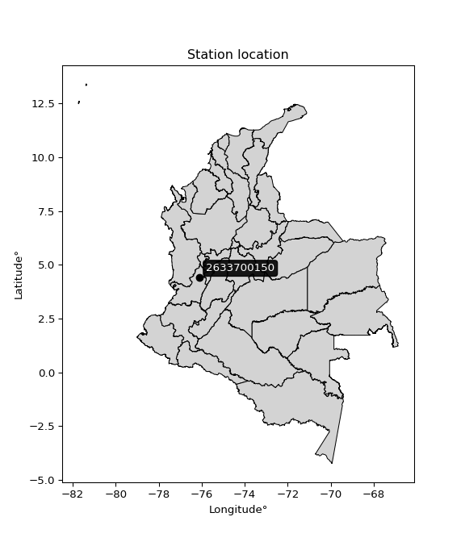

<div align="center">


</div>

# PMax24h Station (Rain, Pmax24h): 2633700150

Maximum Precipitation in 24 hours (PMax24h) is the greatest amount of rainfall for a specific duration that is meteorologically possible for a given location, acting as a "worst-case" scenario for extreme storms, crucial for designing safety-critical infrastructure like bridges, river deviations, dams, spillways, and nuclear plants to prevent catastrophic failure. The PMax24h is related with the Probable Maximum Precipitation (PMP) and it is calculated by hydrologists using meteorological data to determine the upper limit of extreme rainfall, often leading to the Probable Maximum Flood (PMF) for flood control design, and is increasingly being studied for climate change impacts. Probable Maximum Precipitation (PMP) is the theoretical upper limit of rainfall, a deterministic estimate for extreme events, while probability distributions (like GEV, Gumbel) describe the likelihood and frequency of various precipitation amounts, including rare ones, showing how often events occur, with PMP representing the extreme end of these distributions, used for critical infrastructure design to ensure safety against the worst conceivable weather, unlike standard statistical forecasts which cover typical probabilities.

The most common probability distributions in hydrology, used for analyzing floods, rainfall, and streamflow, include the Normal, Log-Normal, Gumbel, Gamma (including Log-Pearson Type III), and Generalized Extreme Value (GEV) distributions, often chosen based on the data´s skewness and whether modeling extremes or general conditions, with Gumbel and GEV popular for extreme events like floods, while the Normal distribution serves as a baseline, though often requiring transformations for skewed hydrological data. These distributions help in designing water infrastructure, managing water resources, and forecasting hydrologic events.

> Hydrological data often isn´t perfectly normal (it´s skewed), so different distributions are needed for different applications, such as: **Flood Frequency Analysis**: Using Gumbel, GEV, or Log-Pearson Type III for predicting extreme flood magnitudes and their return periods, **Rainfall Analysis**: Normal for annual totals, but Log-Normal, Weibull, or GEV for intensity or extreme daily rainfall, **Streamflow Modeling**: Gamma and Log-Normal for maximum flows, GEV for minimum flows, and Kappa for daily flows.

<div align="center">

</img>

</div>


## A. General information


### 1. General running parameters

• app_version: _v20260225_. • runtime: _2026-02-27 14:50:08.749431_. • Python version: _3.14.0_. • SciPy version: _1.16.3_. • Pandas version: _2.3.3_. • NumPy version: _2.3.5_. • Stations dataset (station_dataset_file): _dataset/pmax24h_in/automatic_colombia_2003_2025.csv_. • Stations catalog (station_catalog_file): _dataset/CNE.xls_. • Minimum year to eval til year_max (date_min): _1900_. • Maximum year to eval since year_min (date_max): _2025_. • Creates, save and include plots into reports (create_plot): _False_. • Plot only fit distributions with Δo > Δ (plot_only_fit): _True_. • Plot only simple graphs avoiding multiple CDFs and multiple Extreme values plots (plot_only_simple): _False_. • Eval low extreme values, if False, evaluates high extreme values (low_extreme): _False_. • Eval every SciPy distribution as logarithmic (pdist_logarithmic_on): _True_. • Standard deviation normalized (ddof): _1.0_. • Return periods to eval in years (Tr): _[2, 2.33, 5, 10, 15, 20, 25, 50, 75, 100, 200, 250, 500, 750, 1000]_. • Minimum data sample per station, 0 means any (minimum_sample): _5_. • Z-Score maximum threshold to adjust a value, 0 means disable (zscore_max): _3.5_. • Z-Score minimum threshold to adjust a value, 0 means disable (zscore_min): _-2.5_. • Avoid zeros, e.g. rain = 0 (avoid_zeros): _True_. • Avoid null values (avoid_nans): _True_. 

:file_folder:Table: [dataset.csv](../../dataset/pmax24h_in/automatic_colombia_2003_2025.csv)

> Delta Degrees of Freedom (DDOF): is a parameter used in the formulas for calculating variance and standard deviation. When ddof=0, the divisor is $N$ (the total number of observations) and this is used when your data set is the entire population. When ddof=1, the divisor is $N-1$ and this is used when your data set is a sample drawn from a larger population. Using $N-1$ provides an unbiased estimate of the population variance (known as Bessel´s correction).


### 2. Station info and location

|   id |     CODIGO | NOMBRE                        | CATEGORIA    | TECNOLOGIA                | ESTADO           | FECHA_INSTALACION   |   FECHA_SUSPENSION |   ALTITUD |   LATITUD |   LONGITUD | DEPARTAMENTO    | MUNICIPIO   | AREA_OPERATIVA                         | ENTIDAD                                                     | AREA_HIDROGRAFICA   | ZONA_HIDROGRAFICA   | SUBZONA_HIDROGRAFICA                | CORRIENTE   | Catalogo   |   Version |
|-----:|-----------:|:------------------------------|:-------------|:--------------------------|:-----------------|:--------------------|-------------------:|----------:|----------:|-----------:|:----------------|:------------|:---------------------------------------|:------------------------------------------------------------|:--------------------|:--------------------|:------------------------------------|:------------|:-----------|----------:|
|    0 | 2633700150 | GUAYABAL - AUT   [2633700150] | Limnigráfica | Automática con Telemetría | En Mantenimiento | 07/07/2017          |                nan |       931 |   4.40528 |   -76.1008 | Valle Del Cauca | Zarzal      | Area Operativa 09 - Cauca-Valle-Caldas | INSTITUTO DE HIDROLOGIA METEOROLOGIA Y ESTUDIOS AMBIENTALES | Magdalena Cauca     | Cauca               | Rios Las Cañas - Los Micos y Obando | Cauca       | CNE_IDEAM  |  20251226 |

<div align="center">

Dynamic map: [:earth_americas:Google](http://maps.google.com/maps?q=4.405278889,-76.100752778) [:earth_americas:OSM](https://www.openstreetmap.org/#map=18/4.405278889/-76.100752778&layers=P) [:earth_americas:Bing](https://www.bing.com/maps?cp=4.405278889~-76.100752778&lvl=18) [:earth_americas:Apple](https://maps.apple.com/frame?center=4.405278889%2C-76.100752778&span=0.003%2C0.006)

</div>


<div align="center">

```geojson
{
  "type": "Feature",
  "geometry": {
    "type": "Point", 
    "coordinates": [-76.100752778, 4.405278889]
  }, 
  "properties": {
    "Name": "2633700150"
  }
}
```

</div>


### 3. Discrete values table and plot

<div align="center">

|               |           0 |           1 |          2 |          3 |           4 |           5 |          6 |
|:--------------|------------:|------------:|-----------:|-----------:|------------:|------------:|-----------:|
| Date          | 2019        | 2020        | 2021       | 2022       | 2023        | 2024        | 2025       |
| Value         |   47.8      |   43.2      |   72.8     |    6.1     |   24.7      |   48.8      |   36.6     |
| Value_initial |   47.8      |   43.2      |   72.8     |    6.1     |   24.7      |   48.8      |   36.6     |
| count         |    7        |    7        |    7       |    7       |    7        |    7        |    7       |
| mean          |   40        |   40        |   40       |   40       |   40        |   40        |   40       |
| std           |   20.8935   |   20.8935   |   20.8935  |   20.8935  |   20.8935   |   20.8935   |   20.8935  |
| zscore        |    0.373323 |    0.153158 |    1.56987 |   -1.62252 |   -0.732287 |    0.421184 |   -0.16273 |


</div>


> The initial value (value_initial) correspond to the initial obtained or null completed value, and value (value) is adjusted only when the initial value is outside the valid range (outlier) definite through the Z-Score value. If Z-Score is active, values out of range or outliers are replaced with the station mean value. A Z-Score (or standard score) measures how many standard deviations a data point is from the mean of a dataset, indicating its relative position; positive scores mean above the mean, negative mean below, and a score of zero is exactly at the mean, allowing for comparison of values from different distributions. It´s calculated using the formula $z=(x–μ)/σ$, where $x$ is the data point, $μ$ is the mean, and $σ$ is the standard deviation, helping identify outliers and understand probability.
>
> <sub>**Note**: In this study, "completing" (filling gaps in) and "extending" (forecasting or lengthening the historical record) rainfall data series are avoided for certain critical analyses because they introduce artificial bias and uncertainty, which can distort the statistics of rare events (extremes), alter day-to-day variability, and compromise the integrity and homogeneity of the original data. Some reasons against Completing/Extending rainfall data are: **Distortion of Extremes and Variability**: The primary issue is that most gap-filling or extension methods rely on averaging or regression with nearby stations, which inherently smooths the data. Rainfall is highly variable in space and time, with a large percentage of zero values and occasional large storms. Infilling methods often underestimate the highest values and overestimate the lowest (zero) values, which severely distorts analyses focused on flood frequency, drought severity, and intensity-duration-frequency (IDF) curves, **Loss of Data Homogeneity**: Infilled or extended data are synthetic estimates, not actual measurements. Combining these estimates with observed data can violate the assumption of data homogeneity, which requires that the data properties do not change over time. Inhomogeneity can lead to incorrect conclusions about long-term trends or changes in climate patterns, **Propagation of Errors**: Errors and biases from the original data (e.g., wind-induced undercatch, instrument errors, site changes) or the data used for imputation can propagate through the analysis, leading to unreliable hydrological models and inaccurate predictions, **Compromised Statistical Integrity**: For statistical analyses, especially those involving the frequency of events, using artificial data can introduce time bias or autocorrelation that doesn´t exist in reality, making it difficult to assess the true probability of events, **Difficulty in Validation**: It is difficult to accurately validate the quality of filled or extended data, especially for past periods where ground-truth measurements are unavailable. The reliability of imputation techniques heavily depends on the density of the surrounding station network and the complexity of the local topography.</sub>


### 4. Active continuous probability distributions from SciPy (80 of 104 available)

A Probability Density Function (PDF) describes the relative likelihood of a continuous random variable falling within a specific range, where the total area under its curve equals 1, and the area over any interval gives the actual probability for that range. Unlike discrete probabilities (like rolling a die), a PDF shows density, not direct probability for a single point (which is zero), with higher points indicating higher likelihood, often visualized as a bell curve for normal distributions.

A log of a probability density function (log-PDF) is simply the logarithm of the PDF´s value, denoted as $log(f(x))$, useful for converting multiplication of probabilities into addition, improving numerical stability with tiny numbers, and connecting to information theory concepts like entropy. Instead of dealing with very small probabilities (e.g., 0.000001), log-PDFs use negative numbers (e.g., $log(0.00001) ≈ -11.51$ that are easier for computers to handle, preventing underflow errors and simplifying complex calculations. In this study, each active probability distribution from SciPy is also evaluated in the $log$ form.

[scipy.stats](https://docs.scipy.org/doc/scipy/reference/stats.html) is a Python´s powerful submodule within the SciPy library for comprehensive statistical analysis, offering over 130 probability distributions (like Normal, Poisson, etc.), functions for descriptive stats (mean, variance), hypothesis testing (t-tests, chi-square), random variable generation, and statistical tests, making it essential for data science, modeling, and research. It provides tools to explore, model, and draw conclusions from data efficiently, working seamlessly with [NumPy](https://numpy.org/).

<div align="center">

|   id | p_dist           |   n_parameter | fit_method   | label                                                                       | active   | ref                                                                                                      |
|-----:|:-----------------|--------------:|:-------------|:----------------------------------------------------------------------------|:---------|:---------------------------------------------------------------------------------------------------------|
|    0 | alpha            |             3 | MLE          | Alpha                                                                       | True     | [:mortar_board:](https://docs.scipy.org/doc/scipy/reference/generated/scipy.stats.alpha.html)            |
|    1 | anglit           |             2 | MM           | Anglit                                                                      | True     | [:mortar_board:](https://docs.scipy.org/doc/scipy/reference/generated/scipy.stats.anglit.html)           |
|    2 | arcsine          |             2 | MM           | Arcsine                                                                     | True     | [:mortar_board:](https://docs.scipy.org/doc/scipy/reference/generated/scipy.stats.arcsine.html)          |
|    3 | argus            |             3 | MLE          | Argus                                                                       | True     | [:mortar_board:](https://docs.scipy.org/doc/scipy/reference/generated/scipy.stats.argus.html)            |
|    4 | beta             |             4 | MLE          | Beta                                                                        | True     | [:mortar_board:](https://docs.scipy.org/doc/scipy/reference/generated/scipy.stats.beta.html)             |
|    5 | betaprime        |             4 | MLE          | Beta prime                                                                  | True     | [:mortar_board:](https://docs.scipy.org/doc/scipy/reference/generated/scipy.stats.betaprime.html)        |
|    6 | bradford         |             3 | MLE          | Bradford                                                                    | True     | [:mortar_board:](https://docs.scipy.org/doc/scipy/reference/generated/scipy.stats.bradford.html)         |
|    7 | burr             |             4 | MLE          | Burr (Type III)                                                             | True     | [:mortar_board:](https://docs.scipy.org/doc/scipy/reference/generated/scipy.stats.burr.html)             |
|    8 | burr12           |             4 | MLE          | Burr (Type III) 12                                                          | True     | [:mortar_board:](https://docs.scipy.org/doc/scipy/reference/generated/scipy.stats.burr12.html)           |
|    9 | cosine           |             2 | MLE          | Cosine                                                                      | True     | [:mortar_board:](https://docs.scipy.org/doc/scipy/reference/generated/scipy.stats.cosine.html)           |
|   10 | crystalball      |             4 | MLE          | Crystalball                                                                 | True     | [:mortar_board:](https://docs.scipy.org/doc/scipy/reference/generated/scipy.stats.crystalball.html)      |
|   11 | dgamma           |             3 | MLE          | Double gamma                                                                | True     | [:mortar_board:](https://docs.scipy.org/doc/scipy/reference/generated/scipy.stats.dgamma.html)           |
|   12 | dweibull         |             3 | MLE          | Double Weibull                                                              | True     | [:mortar_board:](https://docs.scipy.org/doc/scipy/reference/generated/scipy.stats.dweibull.html)         |
|   13 | erlang           |             3 | MLE          | Erlang                                                                      | True     | [:mortar_board:](https://docs.scipy.org/doc/scipy/reference/generated/scipy.stats.erlang.html)           |
|   14 | exponnorm        |             3 | MLE          | Exponentially modified Normal                                               | True     | [:mortar_board:](https://docs.scipy.org/doc/scipy/reference/generated/scipy.stats.exponnorm.html)        |
|   15 | exponpow         |             3 | MLE          | Exponential power                                                           | True     | [:mortar_board:](https://docs.scipy.org/doc/scipy/reference/generated/scipy.stats.exponpow.html)         |
|   16 | exponweib        |             4 | MLE          | Exponentiated Weibull                                                       | True     | [:mortar_board:](https://docs.scipy.org/doc/scipy/reference/generated/scipy.stats.exponweib.html)        |
|   17 | f                |             4 | MLE          | F                                                                           | True     | [:mortar_board:](https://docs.scipy.org/doc/scipy/reference/generated/scipy.stats.f.html)                |
|   18 | fatiguelife      |             3 | MLE          | Fatigue-life (Birnbaum-Saunders)                                            | True     | [:mortar_board:](https://docs.scipy.org/doc/scipy/reference/generated/scipy.stats.fatiguelife.html)      |
|   19 | foldnorm         |             3 | MM           | Fold Normal                                                                 | True     | [:mortar_board:](https://docs.scipy.org/doc/scipy/reference/generated/scipy.stats.foldnorm.html)         |
|   20 | gamma            |             3 | MLE          | Gamma                                                                       | True     | [:mortar_board:](https://docs.scipy.org/doc/scipy/reference/generated/scipy.stats.gamma.html)            |
|   21 | gausshyper       |             6 | MLE          | Gauss hypergeometric                                                        | True     | [:mortar_board:](https://docs.scipy.org/doc/scipy/reference/generated/scipy.stats.gausshyper.html)       |
|   22 | genexpon         |             5 | MLE          | Generalized exponential                                                     | True     | [:mortar_board:](https://docs.scipy.org/doc/scipy/reference/generated/scipy.stats.genexpon.html)         |
|   23 | genextreme       |             3 | MLE          | Generalized exponential                                                     | True     | [:mortar_board:](https://docs.scipy.org/doc/scipy/reference/generated/scipy.stats.genextreme.html)       |
|   24 | gengamma         |             4 | MLE          | Generalized gamma                                                           | True     | [:mortar_board:](https://docs.scipy.org/doc/scipy/reference/generated/scipy.stats.gengamma.html)         |
|   25 | genhalflogistic  |             3 | MLE          | Generalized half-logistic                                                   | True     | [:mortar_board:](https://docs.scipy.org/doc/scipy/reference/generated/scipy.stats.genhalflogistic.html)  |
|   26 | genlogistic      |             3 | MLE          | Generalized logistic                                                        | True     | [:mortar_board:](https://docs.scipy.org/doc/scipy/reference/generated/scipy.stats.genlogistic.html)      |
|   27 | gennorm          |             3 | MLE          | Generalized Normal                                                          | True     | [:mortar_board:](https://docs.scipy.org/doc/scipy/reference/generated/scipy.stats.gennorm.html)          |
|   28 | genpareto        |             3 | MLE          | Generalized Pareto                                                          | True     | [:mortar_board:](https://docs.scipy.org/doc/scipy/reference/generated/scipy.stats.genpareto.html)        |
|   29 | gompertz         |             3 | MLE          | Gompertz (or truncated Gumbel)                                              | True     | [:mortar_board:](https://docs.scipy.org/doc/scipy/reference/generated/scipy.stats.gompertz.html)         |
|   30 | gumbel_l         |             2 | MM           | Gumbel Left Skew                                                            | True     | [:mortar_board:](https://docs.scipy.org/doc/scipy/reference/generated/scipy.stats.gumbel_l.html)         |
|   31 | gumbel_r         |             2 | MM           | Gumbel Right Skew                                                           | True     | [:mortar_board:](https://docs.scipy.org/doc/scipy/reference/generated/scipy.stats.gumbel_r.html)         |
|   32 | halfgennorm      |             3 | MLE          | Upper half of a generalized normal                                          | True     | [:mortar_board:](https://docs.scipy.org/doc/scipy/reference/generated/scipy.stats.halfgennorm.html)      |
|   33 | halflogistic     |             2 | MM           | Half-logistic                                                               | True     | [:mortar_board:](https://docs.scipy.org/doc/scipy/reference/generated/scipy.stats.halflogistic.html)     |
|   34 | halfnorm         |             2 | MM           | Half Normal                                                                 | True     | [:mortar_board:](https://docs.scipy.org/doc/scipy/reference/generated/scipy.stats.halfnorm.html)         |
|   35 | hypsecant        |             2 | MM           | hyperbolic secant                                                           | True     | [:mortar_board:](https://docs.scipy.org/doc/scipy/reference/generated/scipy.stats.hypsecant.html)        |
|   36 | invgamma         |             3 | MLE          | Inverted gamma                                                              | True     | [:mortar_board:](https://docs.scipy.org/doc/scipy/reference/generated/scipy.stats.invgamma.html)         |
|   37 | invgauss         |             3 | MLE          | Inverse Gaussian                                                            | True     | [:mortar_board:](https://docs.scipy.org/doc/scipy/reference/generated/scipy.stats.invgauss.html)         |
|   38 | invweibull       |             3 | MLE          | Inverted Weibull                                                            | True     | [:mortar_board:](https://docs.scipy.org/doc/scipy/reference/generated/scipy.stats.invweibull.html)       |
|   39 | johnsonsb        |             4 | MLE          | Johnson SB                                                                  | True     | [:mortar_board:](https://docs.scipy.org/doc/scipy/reference/generated/scipy.stats.johnsonsb.html)        |
|   40 | johnsonsu        |             4 | MLE          | Johnson Su                                                                  | True     | [:mortar_board:](https://docs.scipy.org/doc/scipy/reference/generated/scipy.stats.johnsonsu.html)        |
|   41 | kappa3           |             3 | MLE          | Kappa 3                                                                     | True     | [:mortar_board:](https://docs.scipy.org/doc/scipy/reference/generated/scipy.stats.kappa3.html)           |
|   42 | kappa4           |             4 | MLE          | Kappa 4                                                                     | True     | [:mortar_board:](https://docs.scipy.org/doc/scipy/reference/generated/scipy.stats.kappa4.html)           |
|   43 | ksone            |             3 | MLE          | Kolmogorov-Smirnov one-sided test statistic distribution                    | True     | [:mortar_board:](https://docs.scipy.org/doc/scipy/reference/generated/scipy.stats.ksone.html)            |
|   44 | kstwobign        |             2 | MLE          | Limiting distribution of scaled Kolmogorov-Smirnov two-sided test statistic | True     | [:mortar_board:](https://docs.scipy.org/doc/scipy/reference/generated/scipy.stats.kstwobign.html)        |
|   45 | laplace          |             2 | MM           | Laplace                                                                     | True     | [:mortar_board:](https://docs.scipy.org/doc/scipy/reference/generated/scipy.stats.laplace.html)          |
|   46 | levy_l           |             2 | MLE          | Left-skewed Levy                                                            | True     | [:mortar_board:](https://docs.scipy.org/doc/scipy/reference/generated/scipy.stats.levy_l.html)           |
|   47 | loggamma         |             3 | MLE          | Log gamma                                                                   | True     | [:mortar_board:](https://docs.scipy.org/doc/scipy/reference/generated/scipy.stats.loggamma.html)         |
|   48 | logistic         |             2 | MM           | Logistic (or Sech-squared)                                                  | True     | [:mortar_board:](https://docs.scipy.org/doc/scipy/reference/generated/scipy.stats.logistic.html)         |
|   49 | loglaplace       |             3 | MLE          | Log-Laplace                                                                 | True     | [:mortar_board:](https://docs.scipy.org/doc/scipy/reference/generated/scipy.stats.loglaplace.html)       |
|   50 | lomax            |             3 | MLE          | Lomax (Pareto of the second kind)                                           | True     | [:mortar_board:](https://docs.scipy.org/doc/scipy/reference/generated/scipy.stats.lomax.html)            |
|   51 | maxwell          |             2 | MM           | Maxwell                                                                     | True     | [:mortar_board:](https://docs.scipy.org/doc/scipy/reference/generated/scipy.stats.maxwell.html)          |
|   52 | mielke           |             4 | MLE          | Mielke Beta-Kappa / Dagum                                                   | True     | [:mortar_board:](https://docs.scipy.org/doc/scipy/reference/generated/scipy.stats.mielke.html)           |
|   53 | moyal            |             2 | MM           | Moyal                                                                       | True     | [:mortar_board:](https://docs.scipy.org/doc/scipy/reference/generated/scipy.stats.moyal.html)            |
|   54 | nakagami         |             3 | MLE          | Nakagami                                                                    | True     | [:mortar_board:](https://docs.scipy.org/doc/scipy/reference/generated/scipy.stats.nakagami.html)         |
|   55 | ncf              |             5 | MLE          | Non-central F distribution                                                  | True     | [:mortar_board:](https://docs.scipy.org/doc/scipy/reference/generated/scipy.stats.ncf.html)              |
|   56 | nct              |             4 | MLE          | Non-central Student’s t                                                     | True     | [:mortar_board:](https://docs.scipy.org/doc/scipy/reference/generated/scipy.stats.nct.html)              |
|   57 | norm             |             2 | MM           | Normal                                                                      | True     | [:mortar_board:](https://docs.scipy.org/doc/scipy/reference/generated/scipy.stats.norm.html)             |
|   58 | pearson3         |             3 | MM           | Pearson type III                                                            | True     | [:mortar_board:](https://docs.scipy.org/doc/scipy/reference/generated/scipy.stats.pearson3.html)         |
|   59 | powerlaw         |             3 | MLE          | Power-function                                                              | True     | [:mortar_board:](https://docs.scipy.org/doc/scipy/reference/generated/scipy.stats.powerlaw.html)         |
|   60 | rayleigh         |             2 | MM           | Rayleigh                                                                    | True     | [:mortar_board:](https://docs.scipy.org/doc/scipy/reference/generated/scipy.stats.rayleigh.html)         |
|   61 | rdist            |             3 | MLE          | R-distributed (symmetric beta)                                              | True     | [:mortar_board:](https://docs.scipy.org/doc/scipy/reference/generated/scipy.stats.rdist.html)            |
|   62 | rice             |             3 | MLE          | Rice                                                                        | True     | [:mortar_board:](https://docs.scipy.org/doc/scipy/reference/generated/scipy.stats.rice.html)             |
|   63 | semicircular     |             2 | MM           | Semicircular                                                                | True     | [:mortar_board:](https://docs.scipy.org/doc/scipy/reference/generated/scipy.stats.semicircular.html)     |
|   64 | skewnorm         |             3 | MLE          | Skew normal                                                                 | True     | [:mortar_board:](https://docs.scipy.org/doc/scipy/reference/generated/scipy.stats.skewnorm.html)         |
|   65 | t                |             3 | MLE          | Student’s t                                                                 | True     | [:mortar_board:](https://docs.scipy.org/doc/scipy/reference/generated/scipy.stats.t.html)                |
|   66 | trapezoid        |             4 | MLE          | Trapezoid                                                                   | True     | [:mortar_board:](https://docs.scipy.org/doc/scipy/reference/generated/scipy.stats.trapezoid.html)        |
|   67 | triang           |             3 | MLE          | Triangular                                                                  | True     | [:mortar_board:](https://docs.scipy.org/doc/scipy/reference/generated/scipy.stats.triang.html)           |
|   68 | truncexpon       |             3 | MLE          | Truncated exponential                                                       | True     | [:mortar_board:](https://docs.scipy.org/doc/scipy/reference/generated/scipy.stats.truncexpon.html)       |
|   69 | truncnorm        |             4 | MLE          | Truncated normal                                                            | True     | [:mortar_board:](https://docs.scipy.org/doc/scipy/reference/generated/scipy.stats.truncnorm.html)        |
|   70 | truncpareto      |             4 | MLE          | Upper truncated Pareto                                                      | True     | [:mortar_board:](https://docs.scipy.org/doc/scipy/reference/generated/scipy.stats.truncpareto.html)      |
|   71 | truncweibull_min |             5 | MLE          | Doubly truncated Weibull minimum                                            | True     | [:mortar_board:](https://docs.scipy.org/doc/scipy/reference/generated/scipy.stats.truncweibull_min.html) |
|   72 | tukeylambda      |             3 | MLE          | Tukey-Lamdba                                                                | True     | [:mortar_board:](https://docs.scipy.org/doc/scipy/reference/generated/scipy.stats.tukeylambda.html)      |
|   73 | uniform          |             2 | MLE          | Uniform                                                                     | True     | [:mortar_board:](https://docs.scipy.org/doc/scipy/reference/generated/scipy.stats.uniform.html)          |
|   74 | vonmises         |             3 | MLE          | Von Mises                                                                   | True     | [:mortar_board:](https://docs.scipy.org/doc/scipy/reference/generated/scipy.stats.vonmises.html)         |
|   75 | vonmises_line    |             3 | MLE          | Von Mises line                                                              | True     | [:mortar_board:](https://docs.scipy.org/doc/scipy/reference/generated/scipy.stats.vonmises_line.html)    |
|   76 | wald             |             2 | MM           | Wald                                                                        | True     | [:mortar_board:](https://docs.scipy.org/doc/scipy/reference/generated/scipy.stats.wald.html)             |
|   77 | weibull_max      |             3 | MLE          | Weibull maximum                                                             | True     | [:mortar_board:](https://docs.scipy.org/doc/scipy/reference/generated/scipy.stats.weibull_max.html)      |
|   78 | weibull_min      |             3 | MLE          | Weibull minimum                                                             | True     | [:mortar_board:](https://docs.scipy.org/doc/scipy/reference/generated/scipy.stats.weibull_min.html)      |
|   79 | wrapcauchy       |             3 | MLE          | Wrapped  Cauchy                                                             | True     | [:mortar_board:](https://docs.scipy.org/doc/scipy/reference/generated/scipy.stats.wrapcauchy.html)       |

</div>

> **n_parameter:** # arguments & localization & scale.
>
> **Fit methods:** (MLE) maximum likelihood, (MM) L-moments.
>
>**Inactive** (With the only purpose of prevent loops, zero divisions, infinite values, over high estimated values or horizontal trending for recurrence intervals estimations, the follow distributions were disabled.)**:** lognorm, norminvgauss, powernorm, powerlognorm, cauchy, halfcauchy, foldcauchy, skewcauchy, chi2, expon, fisk, genhyperbolic, geninvgauss, gibrat, kstwo, laplace_asymmetric, levy, levy_stable, ncx2, pareto, rel_breitwigner, recipinvgauss, studentized_range, loguniform, 


## B. Probability (PDF) vs. Empirical (EDF) distributions functions

A continuous probability distribution (CPD) describes probabilities for variables that can take any value within a range (like rain any time), unlike discrete variables with specific outcomes (like temperature). It uses a Probability Density Function (PDF), a curve where the total area under it equals 1, and the probability of the variable falling within an interval (a to b) is found by calculating the area under the curve between those points. A key feature is that the probability of hitting any single exact value is zero, so probabilities are always expressed for ranges, e.g., $P(a ≤ X ≤ b)$.

<div align="center">

Distributions parameters from station values
|     |    station | p_dist              |   n |               loc |            scale | shape                  | shape1                 | shape2                | shape3             |
|----:|-----------:|:--------------------|----:|------------------:|-----------------:|:-----------------------|:-----------------------|:----------------------|:-------------------|
|   0 | 2633700150 | alpha               |   7 |      -0.0341622   |     15.158       | 6.984062476891389e-11  |                        |                       |                    |
|   1 | 2633700150 | anglit              |   7 |      40           |     56.5877      |                        |                        |                       |                    |
|   2 | 2633700150 | arcsine             |   7 |      12.644       |     54.7119      |                        |                        |                       |                    |
|   3 | 2633700150 | argus               |   7 |      -7.36919     |     83.6555      | 1.781406568478462e-05  |                        |                       |                    |
|   4 | 2633700150 | beta                |   7 |      -7.57579     |     80.3758      | 1.622349834871252      | 0.871309926629068      |                       |                    |
|   5 | 2633700150 | betaprime           |   7 |    -473.593       |  40315.1         | 706.3632603364713      | 55459.71819637962      |                       |                    |
|   6 | 2633700150 | bradford            |   7 |      -0.756411    |     73.5564      | 2.0289091676285942e-05 |                        |                       |                    |
|   7 | 2633700150 | burr                |   7 |      -0.70096     |     61.7016      | 7.839276399166579      | 0.19948077778288067    |                       |                    |
|   8 | 2633700150 | burr12              |   7 |     -16.4799      |     19.8308      | 15.366386585454471     | 0.06643198970147735    |                       |                    |
|   9 | 2633700150 | cosine              |   7 |      39.7146      |     16.6584      |                        |                        |                       |                    |
|  10 | 2633700150 | crystalball         |   7 |      40           |     19.3436      | 4215.020335584804      | 86.62189380531429      |                       |                    |
|  11 | 2633700150 | dgamma              |   7 |      43.2         |     15.0435      | 0.859331029660356      |                        |                       |                    |
|  12 | 2633700150 | dweibull            |   7 |      43.2         |     18.794       | 0.3638989930815263     |                        |                       |                    |
|  13 | 2633700150 | erlang              |   7 |    -452.855       |      0.765486    | 643.8629023847475      |                        |                       |                    |
|  14 | 2633700150 | exponnorm           |   7 |      39.9817      |     19.3436      | 0.0009496097670028549  |                        |                       |                    |
|  15 | 2633700150 | exponpow            |   7 |       6.1         |     17.1126      | 0.4261438435202866     |                        |                       |                    |
|  16 | 2633700150 | exponweib           |   7 |       6.09997     |     59.8555      | 0.14698556944276991    | 3.770102808837942      |                       |                    |
|  17 | 2633700150 | f                   |   7 |   -2400.35        |   2440.39        | 33193.035795673946     | 742750.7012364566      |                       |                    |
|  18 | 2633700150 | fatiguelife         |   7 |       6.1         |      8.7839e-05  | 576.5089706743938      |                        |                       |                    |
|  19 | 2633700150 | foldnorm            |   7 |     -89.2839      |     19.1054      | 6.7699101561898924     |                        |                       |                    |
|  20 | 2633700150 | gamma               |   7 |    -427.079       |      0.805333    | 579.9222202021806      |                        |                       |                    |
|  21 | 2633700150 | gausshyper          |   7 |      -0.617162    |     73.4172      | 1.1142252459363768     | 0.9320349700899953     | 1.0209528901254772    | 0.9238670203406248 |
|  22 | 2633700150 | genexpon            |   7 |      -1.46321     |      1.32156     | 3.1860344901770935e-06 | 1.2969152886646307     | 0.0013050379467849948 |                    |
|  23 | 2633700150 | genextreme          |   7 |      33.9575      |     19.9957      | 0.36473013349479283    |                        |                       |                    |
|  24 | 2633700150 | gengamma            |   7 |       6.1         |     63.4608      | 0.114835792634451      | 4.138073791992219      |                       |                    |
|  25 | 2633700150 | genhalflogistic     |   7 |      -0.589059    |     76.6806      | 1.044850707834069      |                        |                       |                    |
|  26 | 2633700150 | genlogistic         |   7 |      44.9244      |      9.7275      | 0.7504847176137219     |                        |                       |                    |
|  27 | 2633700150 | gennorm             |   7 |      43.2         |     11.082       | 0.8443192928704484     |                        |                       |                    |
|  28 | 2633700150 | genpareto           |   7 |      -0.308585    |    107.38        | -1.4687779347199204    |                        |                       |                    |
|  29 | 2633700150 | gompertz            |   7 |       6.09984     |     21.8393      | 0.16909132316492326    |                        |                       |                    |
|  30 | 2633700150 | gumbel_l            |   7 |      48.7056      |     15.0821      |                        |                        |                       |                    |
|  31 | 2633700150 | gumbel_r            |   7 |      31.2944      |     15.0821      |                        |                        |                       |                    |
|  32 | 2633700150 | halfgennorm         |   7 |       6.09446     |     67.5913      | 259.6661338551049      |                        |                       |                    |
|  33 | 2633700150 | halflogistic        |   7 |      17.0733      |     16.5381      |                        |                        |                       |                    |
|  34 | 2633700150 | halfnorm            |   7 |      14.3967      |     32.089       |                        |                        |                       |                    |
|  35 | 2633700150 | hypsecant           |   7 |      40           |     12.3145      |                        |                        |                       |                    |
|  36 | 2633700150 | invgamma            |   7 |    -173.82        |  24433.3         | 115.21407669899298     |                        |                       |                    |
|  37 | 2633700150 | invgauss            |   7 |    -102.499       |   6968.76        | 0.020413675877494153   |                        |                       |                    |
|  38 | 2633700150 | invweibull          |   7 |      -2.10382e+09 |      2.10382e+09 | 111082265.50729616     |                        |                       |                    |
|  39 | 2633700150 | johnsonsb           |   7 |       6.1         |     66.7         | 0.47094337986631873    | 0.21080282071729245    |                       |                    |
|  40 | 2633700150 | johnsonsu           |   7 |     270.977       |    192.983       | 15.754883999318675     | 15.564075565462268     |                       |                    |
|  41 | 2633700150 | kappa3              |   7 |       6.09999     |     66.6998      | 403596.6560540636      |                        |                       |                    |
|  42 | 2633700150 | kappa4              |   7 |      -0.576622    |     74.2024      | 1.0989271526897069     | 1.010301535699138      |                       |                    |
|  43 | 2633700150 | ksone               |   7 |      -0.57        |     80.04        | 1.0                    |                        |                       |                    |
|  44 | 2633700150 | kstwobign           |   7 |     -37.0462      |     88.1973      |                        |                        |                       |                    |
|  45 | 2633700150 | laplace             |   7 |      40           |     13.678       |                        |                        |                       |                    |
|  46 | 2633700150 | levy_l              |   7 |      76.374       |     15.9117      |                        |                        |                       |                    |
|  47 | 2633700150 | loggamma            |   7 |    -440.123       |    127.389       | 43.83416780936271      |                        |                       |                    |
|  48 | 2633700150 | logistic            |   7 |      40           |     10.6647      |                        |                        |                       |                    |
|  49 | 2633700150 | loglaplace          |   7 |      -0.111115    |     43.3111      | 2.054006444631095      |                        |                       |                    |
|  50 | 2633700150 | lomax               |   7 |       6.1         |      2.87074e+09 | 77422153.49656157      |                        |                       |                    |
|  51 | 2633700150 | maxwell             |   7 |      -5.83617     |     28.7236      |                        |                        |                       |                    |
|  52 | 2633700150 | mielke              |   7 |       6.1         |     56.391       | 0.9072980751046684     | 7.142469835219768      |                       |                    |
|  53 | 2633700150 | moyal               |   7 |      28.9381      |      8.70767     |                        |                        |                       |                    |
|  54 | 2633700150 | nakagami            |   7 |      24.7         |     21.7981      | 0.4080520458966935     |                        |                       |                    |
|  55 | 2633700150 | ncf                 |   7 |       3.43976     |     21.9565      | 2.7321016170264674     | 2115.4278515299893     | 2.039376158655722     |                    |
|  56 | 2633700150 | nct                 |   7 |   -1224.21        |     19.2724      | 283885.3057529677      | 65.59687977389015      |                       |                    |
|  57 | 2633700150 | norm                |   7 |      40           |     19.3436      |                        |                        |                       |                    |
|  58 | 2633700150 | pearson3            |   7 |      40           |     19.3436      | -0.12044874854583604   |                        |                       |                    |
|  59 | 2633700150 | powerlaw            |   7 |       6.1         |     66.7         | 0.16501890005500344    |                        |                       |                    |
|  60 | 2633700150 | rayleigh            |   7 |       2.99459     |     29.526       |                        |                        |                       |                    |
|  61 | 2633700150 | rdist               |   7 |       0.425894    |     36.1741      | 1.126424909079196      |                        |                       |                    |
|  62 | 2633700150 | rice                |   7 |      -4.85204     |     21.4703      | 1.7820596055245548     |                        |                       |                    |
|  63 | 2633700150 | semicircular        |   7 |      40           |     38.6872      |                        |                        |                       |                    |
|  64 | 2633700150 | skewnorm            |   7 |      54.422       |     24.1282      | -1.1273747821265068    |                        |                       |                    |
|  65 | 2633700150 | t                   |   7 |      40.0003      |     19.3424      | 12827.220391152667     |                        |                       |                    |
|  66 | 2633700150 | trapezoid           |   7 |      -0.5985      |     80.04        | 1.0                    | 1.0                    |                       |                    |
|  67 | 2633700150 | triang              |   7 |      -0.614609    |     73.4146      | 0.9999999941003177     |                        |                       |                    |
|  68 | 2633700150 | truncexpon          |   7 |      -0.585237    |     92.7775      | 0.790980769661499      |                        |                       |                    |
|  69 | 2633700150 | truncnorm           |   7 |      45.8735      |     24.0188      | -157.18298355623466    | 1.12105961944641       |                       |                    |
|  70 | 2633700150 | truncpareto         |   7 |       6.06463     |      0.0353674   | 0.16787609417008034    | 1886.9187217397514     |                       |                    |
|  71 | 2633700150 | truncweibull_min    |   7 |      -0.372203    |     92.9377      | 1.502139332677543      | 0.002693265760854587   | 0.787325385261946     |                    |
|  72 | 2633700150 | tukeylambda         |   7 |      -0.669882    |     86.494       | 1.1772714042766728     |                        |                       |                    |
|  73 | 2633700150 | uniform             |   7 |       6.1         |     66.7         |                        |                        |                       |                    |
|  74 | 2633700150 | vonmises            |   7 |      -1.23272     |      1           | 1.7710908011866207     |                        |                       |                    |
|  75 | 2633700150 | vonmises_line       |   7 |      39.45        |     10.6156      | 0.41241908892149665    |                        |                       |                    |
|  76 | 2633700150 | wald                |   7 |      20.6564      |     19.3436      |                        |                        |                       |                    |
|  77 | 2633700150 | weibull_max         |   7 |      72.8         |      1.57171     | 0.2700407999326653     |                        |                       |                    |
|  78 | 2633700150 | weibull_min         |   7 |     -20.8328      |     67.6281      | 3.5447466623978574     |                        |                       |                    |
|  79 | 2633700150 | wrapcauchy          |   7 |       5.8734      |     10.6536      | 4.098181120913556e-06  |                        |                       |                    |
|  80 | 2633700150 | logalpha            |   7 |     -19.0407      |    633.661       | 28.16435491312341      |                        |                       |                    |
|  81 | 2633700150 | loganglit           |   7 |       3.48906     |      2.19286     |                        |                        |                       |                    |
|  82 | 2633700150 | logarcsine          |   7 |       2.42897     |      2.12019     |                        |                        |                       |                    |
|  83 | 2633700150 | logargus            |   7 |       0.828619    |      3.51593     | 2.5040705426575265     |                        |                       |                    |
|  84 | 2633700150 | logbeta             |   7 |       1.58055     |      2.70717     | 1.015553247472028      | 0.2574553678973823     |                       |                    |
|  85 | 2633700150 | logbetaprime        |   7 |     -19.0626      |     16.6426      | 1896.4271085843866     | 1400.3804752530573     |                       |                    |
|  86 | 2633700150 | logbradford         |   7 |       1.80829     |      2.47943     | 1.003171628284257      |                        |                       |                    |
|  87 | 2633700150 | logburr             |   7 | -854144           | 854149           | 78506861.42139459      | 0.013207867987384318   |                       |                    |
|  88 | 2633700150 | logburr12           |   7 |   -2308.49        |   2318.7         | 5166.002201878549      | 1590764.49315836       |                       |                    |
|  89 | 2633700150 | logcosine           |   7 |       3.33632     |      0.67517     |                        |                        |                       |                    |
|  90 | 2633700150 | logcrystalball      |   7 |       3.48907     |      0.749594    | 75.9713388755988       | 232.80538458682705     |                       |                    |
|  91 | 2633700150 | logdgamma           |   7 |       3.76584     |      0.589214    | 0.5624297397769529     |                        |                       |                    |
|  92 | 2633700150 | logdweibull         |   7 |       3.76584     |      0.559835    | 0.8947023736320214     |                        |                       |                    |
|  93 | 2633700150 | logerlang           |   7 |     -11.4185      |      0.04057     | 367.4176134382526      |                        |                       |                    |
|  94 | 2633700150 | logexponnorm        |   7 |       3.48883     |      0.749595    | 0.0003418849895642903  |                        |                       |                    |
|  95 | 2633700150 | logexponpow         |   7 |      -3.2415e+07  |      3.2415e+07  | 51882102.482253194     |                        |                       |                    |
|  96 | 2633700150 | logexponweib        |   7 |       1.80829     |      1.15448     | 1.0774202060522917     | 0.8743502692919096     |                       |                    |
|  97 | 2633700150 | logf                |   7 |   -1056.59        |   1060.08        | 10822271.988749422     | 6296532.888120992      |                       |                    |
|  98 | 2633700150 | logfatiguelife      |   7 |    -586.352       |    589.841       | 0.0012724103118989206  |                        |                       |                    |
|  99 | 2633700150 | logfoldnorm         |   7 |      -0.639174    |      0.695109    | 5.949317944793931      |                        |                       |                    |
| 100 | 2633700150 | loggamma            |   7 |     -10.3489      |      0.0452811   | 305.31504715811116     |                        |                       |                    |
| 101 | 2633700150 | loggausshyper       |   7 |       1.71781     |      2.5699      | 1.142239024598438      | 0.6787563743312726     | 1.0773131633126085    | 0.9916489976504086 |
| 102 | 2633700150 | loggenexpon         |   7 |       1.79026     |      0.00476837  | 0.0008053470949071972  | 1.7590453874670233     | 5.332118502348434e-06 |                    |
| 103 | 2633700150 | loggenextreme       |   7 |       3.47412     |      0.942086    | 1.1579293540257884     |                        |                       |                    |
| 104 | 2633700150 | loggengamma         |   7 |       1.80829     |      1.14572     | 1.1879113578475469     | 0.7566872494810145     |                       |                    |
| 105 | 2633700150 | loggenhalflogistic  |   7 |       1.66894     |      2.83703     | 1.0833411836256204     |                        |                       |                    |
| 106 | 2633700150 | loggenlogistic      |   7 |       4.11962     |      0.12762     | 0.19180275101952188    |                        |                       |                    |
| 107 | 2633700150 | loggennorm          |   7 |       3.76584     |      0.0255423   | 0.39980454728922465    |                        |                       |                    |
| 108 | 2633700150 | loggenpareto        |   7 |      -0.00344816  |     10.0993      | -2.3535038062308073    |                        |                       |                    |
| 109 | 2633700150 | loggompertz         |   7 |       1.80829     |      0.509601    | 0.020863923665905962   |                        |                       |                    |
| 110 | 2633700150 | loggumbel_l         |   7 |       3.82642     |      0.584456    |                        |                        |                       |                    |
| 111 | 2633700150 | loggumbel_r         |   7 |       3.15171     |      0.584456    |                        |                        |                       |                    |
| 112 | 2633700150 | loghalfgennorm      |   7 |       1.80829     |      2.48105     | 10545.250024041597     |                        |                       |                    |
| 113 | 2633700150 | loghalflogistic     |   7 |       2.60063     |      0.640863    |                        |                        |                       |                    |
| 114 | 2633700150 | loghalfnorm         |   7 |       2.49677     |      1.24363     |                        |                        |                       |                    |
| 115 | 2633700150 | loghypsecant        |   7 |       3.48906     |      0.477206    |                        |                        |                       |                    |
| 116 | 2633700150 | loginvgamma         |   7 |     -16.7377      |  12984.1         | 643.1361667144715      |                        |                       |                    |
| 117 | 2633700150 | loginvgauss         |   7 |      -5.29586     |    986.141       | 0.008885948890454104   |                        |                       |                    |
| 118 | 2633700150 | loginvweibull       |   7 |      -7.35197e+07 |      7.35197e+07 | 81373805.67194848      |                        |                       |                    |
| 119 | 2633700150 | logjohnsonsb        |   7 |       1.80829     |      2.47945     | 0.10417342339776217    | 0.15545789503100022    |                       |                    |
| 120 | 2633700150 | logjohnsonsu        |   7 |       3.87841     |      0.0316376   | 0.5750129761788914     | 0.39145733705510233    |                       |                    |
| 121 | 2633700150 | logkappa3           |   7 |       1.80829     |      2.47938     | 53455.362703086575     |                        |                       |                    |
| 122 | 2633700150 | logkappa4           |   7 |       1.72465     |      2.76133     | 1.0312725686545101     | 1.0749041983513248     |                       |                    |
| 123 | 2633700150 | logksone            |   7 |       1.56035     |      2.97531     | 1.0                    |                        |                       |                    |
| 124 | 2633700150 | logkstwobign        |   7 |      -0.179884    |      4.19711     |                        |                        |                       |                    |
| 125 | 2633700150 | loglaplace          |   7 |       3.48906     |      0.530043    |                        |                        |                       |                    |
| 126 | 2633700150 | loglevy_l           |   7 |       4.35598     |      0.302875    |                        |                        |                       |                    |
| 127 | 2633700150 | logloggamma         |   7 |       4.2296      |      0.176867    | 0.2523604290836894     |                        |                       |                    |
| 128 | 2633700150 | loglogistic         |   7 |       3.48906     |      0.413273    |                        |                        |                       |                    |
| 129 | 2633700150 | logloglaplace       |   7 |      -0.00807888  |      3.77392     | 6.235056314660723      |                        |                       |                    |
| 130 | 2633700150 | loglomax            |   7 |       1.80829     |      2.38464e+06 | 1406218.7540449412     |                        |                       |                    |
| 131 | 2633700150 | logmaxwell          |   7 |       1.71284     |      1.11308     |                        |                        |                       |                    |
| 132 | 2633700150 | logmielke           |   7 |      -1.62734e+07 |      1.62734e+07 | 19882104.277038343     | 2247457592.086261      |                       |                    |
| 133 | 2633700150 | logmoyal            |   7 |       3.0604      |      0.337436    |                        |                        |                       |                    |
| 134 | 2633700150 | lognakagami         |   7 |       3.2068      |      0.76113     | 0.20441456395333696    |                        |                       |                    |
| 135 | 2633700150 | logncf              |   7 |     -19.643       |     19.9276      | 2496.7108672537015     | 4929.191678856081      | 400.4462066850384     |                    |
| 136 | 2633700150 | lognct              |   7 |    -101.872       |      0.748941    | 3993643.9464047095     | 140.6796420983313      |                       |                    |
| 137 | 2633700150 | lognorm             |   7 |       3.48906     |      0.749594    |                        |                        |                       |                    |
| 138 | 2633700150 | logpearson3         |   7 |       3.48906     |      0.749594    | -1.3978307234245242    |                        |                       |                    |
| 139 | 2633700150 | logpowerlaw         |   7 |       1.80829     |      2.47943     | 0.18206728998297084    |                        |                       |                    |
| 140 | 2633700150 | lograyleigh         |   7 |       2.055       |      1.14421     |                        |                        |                       |                    |
| 141 | 2633700150 | logrdist            |   7 |       2.848       |      1.03973     | 1.157548182364571      |                        |                       |                    |
| 142 | 2633700150 | logrice             |   7 |    -293.327       |      0.749263    | 396.1434350851014      |                        |                       |                    |
| 143 | 2633700150 | logsemicircular     |   7 |       3.48907     |      1.4992      |                        |                        |                       |                    |
| 144 | 2633700150 | logskewnorm         |   7 |       4.28772     |      1.09544     | -8946144.80142563      |                        |                       |                    |
| 145 | 2633700150 | logt                |   7 |       3.79172     |      0.212365    | 1.0383178668592339     |                        |                       |                    |
| 146 | 2633700150 | logtrapezoid        |   7 |       1.36889     |      3.18026     | 1.0                    | 1.0                    |                       |                    |
| 147 | 2633700150 | logtriang           |   7 |       1.36211     |      2.92561     | 0.9999998707155318     |                        |                       |                    |
| 148 | 2633700150 | logtruncexpon       |   7 |       1.80345     |      3.51199     | 0.7073651326343282     |                        |                       |                    |
| 149 | 2633700150 | logtruncnorm        |   7 |      -0.215381    |      1.52938     | 2.237628496876601      | 2.944410283641238      |                       |                    |
| 150 | 2633700150 | logtruncpareto      |   7 |       1.80644     |      0.00184927  | 0.16780072567890397    | 1341.7622748924202     |                       |                    |
| 151 | 2633700150 | logtruncweibull_min |   7 |       1.78527     |      3.65834     | 1.086445096033029      | 0.00011780341180212477 | 0.6840403517422982    |                    |
| 152 | 2633700150 | logtukeylambda      |   7 |       2.84812     |      1.19        | 1.144408482054928      |                        |                       |                    |
| 153 | 2633700150 | loguniform          |   7 |       1.80829     |      2.47943     |                        |                        |                       |                    |
| 154 | 2633700150 | logvonmises         |   7 |      -2.68528     |      1           | 2.542789712007597      |                        |                       |                    |
| 155 | 2633700150 | logvonmises_line    |   7 |       3.65839     |      0.588906    | 1.4273402666486241     |                        |                       |                    |
| 156 | 2633700150 | logwald             |   7 |       2.73944     |      0.749622    |                        |                        |                       |                    |
| 157 | 2633700150 | logweibull_max      |   7 |       4.28772     |      0.967686    | 0.19908256540791774    |                        |                       |                    |
| 158 | 2633700150 | logweibull_min      |   7 |      -1.10271e+08 |      1.10271e+08 | 228621734.74835902     |                        |                       |                    |
| 159 | 2633700150 | logwrapcauchy       |   7 |       1.80778     |      0.394693    | 0.28748977784716134    |                        |                       |                    |

</div>

> **loc** (Location parameter): This shifts the distribution along the x-axis. For many common distributions, like the normal (Gaussian) distribution, loc represents the mean $μ$. For others, like the uniform distribution, it might represent the minimum value, or for the beta distribution, the left end of the support interval.
>
> **scale** (Scale parameter): This determines the width or spread of the distribution. For the normal distribution, scale represents the standard deviation $σ$. For a uniform distribution, it defines the length of the interval (from $loc$ to $loc + scale$).
>
> **shape** (Shape parameters): Refers to parameters that define the specific form of a probability distribution, distinct from its location (loc) and scale (scale). These parameters are required arguments for most distribution functions. For example, a normal (Gaussian) distribution is fully defined by its location (mean) and scale (standard deviation), so it has no specific shape parameters beyond loc and scale. However, other distributions have intrinsic properties that need specification, as Gamma distribution that takes a shape parameter, often named $a$ or $alpha$.


### 0. Cumulative distribution values - CDF (160 evaluated)

Cumulative Distribution Function (CDF), denoted as $F$<sub>$X$</sub>$(x)$, is a function that gives the probability that a random variable $X$ will take a value less than or equal to a specific value, $x$ (i.e., $(P(X≥x)$. It essentially "accumulates" probabilities from a given point up to the far right (positive infinity), providing a complete picture of the distribution´s probabilities for both discrete (like rain) and continuous (like temperature) variables, helping to find probabilities over ranges or above certain values. Each station is evaluated separately ordering the $x$ values ascending, calculating the CDF and PDF values for the activated distributions and their logarithmic forms.

<div align="center">

CDF ordered by x ascending and calculating $log(f(x))$ separately
|   id |    Station |   date |    x |   count |   mean |     std |    zscore |   Value_initial |    station |   m |     alpha |   alpha_pdf |    anglit |   anglit_pdf |   arcsine |   arcsine_pdf |     argus |   argus_pdf |      beta |   beta_pdf |   betaprime |   betaprime_pdf |   bradford |   bradford_pdf |      burr |   burr_pdf |   burr12 |   burr12_pdf |    cosine |   cosine_pdf |   crystalball |   crystalball_pdf |    dgamma |   dgamma_pdf |   dweibull |   dweibull_pdf |    erlang |   erlang_pdf |   exponnorm |   exponnorm_pdf |    exponpow |   exponpow_pdf |   exponweib |   exponweib_pdf |         f |      f_pdf |   fatiguelife |   fatiguelife_pdf |   foldnorm |   foldnorm_pdf |     gamma |   gamma_pdf |   gausshyper |   gausshyper_pdf |   genexpon |   genexpon_pdf |   genextreme |   genextreme_pdf |    gengamma |   gengamma_pdf |   genhalflogistic |   genhalflogistic_pdf |   genlogistic |   genlogistic_pdf |   gennorm |   gennorm_pdf |   genpareto |   genpareto_pdf |    gompertz |   gompertz_pdf |   gumbel_l |   gumbel_l_pdf |   gumbel_r |   gumbel_r_pdf |   halfgennorm |   halfgennorm_pdf |   halflogistic |   halflogistic_pdf |   halfnorm |   halfnorm_pdf |   hypsecant |   hypsecant_pdf |   invgamma |   invgamma_pdf |   invgauss |   invgauss_pdf |   invweibull |   invweibull_pdf |   johnsonsb |   johnsonsb_pdf |   johnsonsu |   johnsonsu_pdf |      kappa3 |   kappa3_pdf |      kappa4 |   kappa4_pdf |     ksone |   ksone_pdf |   kstwobign |   kstwobign_pdf |   laplace |   laplace_pdf |   levy_l |   levy_l_pdf |   loggamma |   loggamma_pdf |   logistic |   logistic_pdf |   loglaplace |   loglaplace_pdf |       lomax |   lomax_pdf |   maxwell |   maxwell_pdf |      mielke |   mielke_pdf |       moyal |   moyal_pdf |    nakagami |   nakagami_pdf |       ncf |    ncf_pdf |       nct |    nct_pdf |      norm |   norm_pdf |   pearson3 |   pearson3_pdf |   powerlaw |   powerlaw_pdf |   rayleigh |   rayleigh_pdf |    rdist |      rdist_pdf |      rice |   rice_pdf |   semicircular |   semicircular_pdf |   skewnorm |   skewnorm_pdf |         t |      t_pdf |   trapezoid |   trapezoid_pdf |     triang |   triang_pdf |   truncexpon |   truncexpon_pdf |   truncnorm |   truncnorm_pdf |   truncpareto |   truncpareto_pdf |   truncweibull_min |   truncweibull_min_pdf |   tukeylambda |   tukeylambda_pdf |   uniform |   uniform_pdf |   vonmises |   vonmises_pdf |   vonmises_line |   vonmises_line_pdf |      wald |   wald_pdf |   weibull_max |   weibull_max_pdf |   weibull_min |   weibull_min_pdf |   wrapcauchy |   wrapcauchy_pdf |   logalpha |   logalpha_pdf |   loganglit |   loganglit_pdf |   logarcsine |   logarcsine_pdf |   logargus |   logargus_pdf |   logbeta |   logbeta_pdf |   logbetaprime |   logbetaprime_pdf |   logbradford |   logbradford_pdf |   logburr |   logburr_pdf |   logburr12 |   logburr12_pdf |   logcosine |   logcosine_pdf |   logcrystalball |   logcrystalball_pdf |   logdgamma |   logdgamma_pdf |   logdweibull |   logdweibull_pdf |   logerlang |   logerlang_pdf |   logexponnorm |   logexponnorm_pdf |   logexponpow |   logexponpow_pdf |   logexponweib |   logexponweib_pdf |      logf |   logf_pdf |   logfatiguelife |   logfatiguelife_pdf |   logfoldnorm |   logfoldnorm_pdf |   loggausshyper |   loggausshyper_pdf |   loggenexpon |   loggenexpon_pdf |   loggenextreme |   loggenextreme_pdf |   loggengamma |   loggengamma_pdf |   loggenhalflogistic |   loggenhalflogistic_pdf |   loggenlogistic |   loggenlogistic_pdf |   loggennorm |   loggennorm_pdf |   loggenpareto |   loggenpareto_pdf |   loggompertz |   loggompertz_pdf |   loggumbel_l |   loggumbel_l_pdf |   loggumbel_r |   loggumbel_r_pdf |   loghalfgennorm |   loghalfgennorm_pdf |   loghalflogistic |   loghalflogistic_pdf |   loghalfnorm |   loghalfnorm_pdf |   loghypsecant |   loghypsecant_pdf |   loginvgamma |   loginvgamma_pdf |   loginvgauss |   loginvgauss_pdf |   loginvweibull |   loginvweibull_pdf |   logjohnsonsb |   logjohnsonsb_pdf |   logjohnsonsu |   logjohnsonsu_pdf |   logkappa3 |   logkappa3_pdf |   logkappa4 |   logkappa4_pdf |   logksone |   logksone_pdf |   logkstwobign |   logkstwobign_pdf |   loglevy_l |   loglevy_l_pdf |   logloggamma |   logloggamma_pdf |   loglogistic |   loglogistic_pdf |   logloglaplace |   logloglaplace_pdf |    loglomax |   loglomax_pdf |   logmaxwell |   logmaxwell_pdf |   logmielke |   logmielke_pdf |    logmoyal |   logmoyal_pdf |   lognakagami |   lognakagami_pdf |    logncf |   logncf_pdf |    lognct |   lognct_pdf |   lognorm |   lognorm_pdf |   logpearson3 |   logpearson3_pdf |   logpowerlaw |   logpowerlaw_pdf |   lograyleigh |   lograyleigh_pdf |    logrdist |   logrdist_pdf |   logrice |   logrice_pdf |   logsemicircular |   logsemicircular_pdf |   logskewnorm |   logskewnorm_pdf |     logt |   logt_pdf |   logtrapezoid |   logtrapezoid_pdf |   logtriang |   logtriang_pdf |   logtruncexpon |   logtruncexpon_pdf |   logtruncnorm |   logtruncnorm_pdf |   logtruncpareto |   logtruncpareto_pdf |   logtruncweibull_min |   logtruncweibull_min_pdf |   logtukeylambda |   logtukeylambda_pdf |   loguniform |   loguniform_pdf |   logvonmises |   logvonmises_pdf |   logvonmises_line |   logvonmises_line_pdf |   logwald |   logwald_pdf |   logweibull_max |   logweibull_max_pdf |   logweibull_min |   logweibull_min_pdf |   logwrapcauchy |   logwrapcauchy_pdf |
|-----:|-----------:|-------:|-----:|--------:|-------:|--------:|----------:|----------------:|-----------:|----:|----------:|------------:|----------:|-------------:|----------:|--------------:|----------:|------------:|----------:|-----------:|------------:|----------------:|-----------:|---------------:|----------:|-----------:|---------:|-------------:|----------:|-------------:|--------------:|------------------:|----------:|-------------:|-----------:|---------------:|----------:|-------------:|------------:|----------------:|------------:|---------------:|------------:|----------------:|----------:|-----------:|--------------:|------------------:|-----------:|---------------:|----------:|------------:|-------------:|-----------------:|-----------:|---------------:|-------------:|-----------------:|------------:|---------------:|------------------:|----------------------:|--------------:|------------------:|----------:|--------------:|------------:|----------------:|------------:|---------------:|-----------:|---------------:|-----------:|---------------:|--------------:|------------------:|---------------:|-------------------:|-----------:|---------------:|------------:|----------------:|-----------:|---------------:|-----------:|---------------:|-------------:|-----------------:|------------:|----------------:|------------:|----------------:|------------:|-------------:|------------:|-------------:|----------:|------------:|------------:|----------------:|----------:|--------------:|---------:|-------------:|-----------:|---------------:|-----------:|---------------:|-------------:|-----------------:|------------:|------------:|----------:|--------------:|------------:|-------------:|------------:|------------:|------------:|---------------:|----------:|-----------:|----------:|-----------:|----------:|-----------:|-----------:|---------------:|-----------:|---------------:|-----------:|---------------:|---------:|---------------:|----------:|-----------:|---------------:|-------------------:|-----------:|---------------:|----------:|-----------:|------------:|----------------:|-----------:|-------------:|-------------:|-----------------:|------------:|----------------:|--------------:|------------------:|-------------------:|-----------------------:|--------------:|------------------:|----------:|--------------:|-----------:|---------------:|----------------:|--------------------:|----------:|-----------:|--------------:|------------------:|--------------:|------------------:|-------------:|-----------------:|-----------:|---------------:|------------:|----------------:|-------------:|-----------------:|-----------:|---------------:|----------:|--------------:|---------------:|-------------------:|--------------:|------------------:|----------:|--------------:|------------:|----------------:|------------:|----------------:|-----------------:|---------------------:|------------:|----------------:|--------------:|------------------:|------------:|----------------:|---------------:|-------------------:|--------------:|------------------:|---------------:|-------------------:|----------:|-----------:|-----------------:|---------------------:|--------------:|------------------:|----------------:|--------------------:|--------------:|------------------:|----------------:|--------------------:|--------------:|------------------:|---------------------:|-------------------------:|-----------------:|---------------------:|-------------:|-----------------:|---------------:|-------------------:|--------------:|------------------:|--------------:|------------------:|--------------:|------------------:|-----------------:|---------------------:|------------------:|----------------------:|--------------:|------------------:|---------------:|-------------------:|--------------:|------------------:|--------------:|------------------:|----------------:|--------------------:|---------------:|-------------------:|---------------:|-------------------:|------------:|----------------:|------------:|----------------:|-----------:|---------------:|---------------:|-------------------:|------------:|----------------:|--------------:|------------------:|--------------:|------------------:|----------------:|--------------------:|------------:|---------------:|-------------:|-----------------:|------------:|----------------:|------------:|---------------:|--------------:|------------------:|----------:|-------------:|----------:|-------------:|----------:|--------------:|--------------:|------------------:|--------------:|------------------:|--------------:|------------------:|------------:|---------------:|----------:|--------------:|------------------:|----------------------:|--------------:|------------------:|---------:|-----------:|---------------:|-------------------:|------------:|----------------:|----------------:|--------------------:|---------------:|-------------------:|-----------------:|---------------------:|----------------------:|--------------------------:|-----------------:|---------------------:|-------------:|-----------------:|--------------:|------------------:|-------------------:|-----------------------:|----------:|--------------:|-----------------:|---------------------:|-----------------:|---------------------:|----------------:|--------------------:|
|    0 | 2633700150 |   2022 |  6.1 |       7 |     40 | 20.8935 | -1.62252  |             6.1 | 2633700150 |   1 | 0.0134705 |  0.0151746  | 0.0343182 |   0.00643409 |  0        |     0         | 0.0386322 |  0.00569863 | 0.0477509 | 0.00571884 |   0.0387633 |      0.00452383 |  0.0932138 |      0.0135951 | 0.0317923 | 0.00731019 | 0.131509 |   0.0345624  | 0.0353334 |   0.00542353 |     0.0398423 |        0.00444062 | 0.0324654 |   0.00225194 |   0.138908 |    0.00174508  | 0.0379906 |   0.00446169 |   0.0398424 |      0.00444062 | 1.14902e-07 |    5.51293e+07 | 0.000351087 |      5.57129    | 0.0392781 | 0.0044282  |     0.0371838 |       8.72712e+08 |   0.037752 |     0.0043029  | 0.0378974 |  0.00447148 |    0.0908403 |        0.0145397 |  0.0272868 |     0.00710513 |    0.0457355 |       0.0046786  | 6.50971e-06 |  4501.52       |         0.0457019 |            0.00715949 |     0.0493372 |        0.00373734 | 0.0430391 |    0.0025781  |    0.06055  |      0.00958941 | 1.26366e-06 |     0.00774256 |  0.0575893 |     0.00370625 | 0.00491874 |     0.00173328 |      0        |         0.0148276 |       0        |         0          |   0        |      0         |   0.0405271 |      0.00328212 |  0.0325267 |     0.00458683 |  0.0336878 |      0.0048831 |    0.0281391 |       0.00530501 | 1.09657e-06 |    906.604      |   0.0439382 |      0.0044158  | 1.82134e-07 |    0.0149921 | 3.03157e-15 |    0.368351  | 0.0833333 |   0.0124938 |   0.0295654 |      0.00637965 | 0.0419371 |    0.00306603 | 0.365811 |   0.00241217 |  0.0146322 |      0.0510646 |  0.0399745 |     0.00359847 |    0.0209804 |        0.0395825 | 5.54061e-10 |  0.0269694  | 0.0181264 |    0.00440005 | 9.12578e-08 |   0.0842975  | 0.000206211 | 0.000173631 | 0           |      0         | 0.0247967 | 0.0124855  | 0.0398421 | 0.00444198 | 0.0398423 | 0.00444062 |  0.0432364 |     0.00443852 | 0.00164136 |    3.04955e+11 | 0.00551564 |     0.00354247 | 0.55437  |     0.00965208 | 0.0275374 | 0.00519019 |      0.0256355 |         0.00792895 |  0.0449653 |     0.00439772 | 0.0398435 | 0.00444012 |  0.00700392 |      0.00209119 | 0.00836519 |   0.00249164 |     0.12719  |       0.0183482  |   0.0562432 |      0.00485248 |      0        |       6.6099      |          0.0357665 |             0.00828863 |      0.54426  |        0.00654029 |  0        |     0.0149925 |    1.88254 |       0.196957 |     3.58552e-08 |          0.00951674 | 0         | 0          |     0.0638361 |       0.000711098 |     0.0375292 |        0.00484552 |   0.00338524 |        0.0149392 |  0.0129215 |      0.0485442 | 0.000357989 |       0.0172535 |     0        |         0        |  0.0260398 |      0.0587228 | 0.0213181 |   0.0982207   |       0.014394 |          0.0498749 |   1.13253e-06 |          0.582379 | 0.0478198 |     0.0580518 |   0.0112574 |       0.0250303 |   0.0172975 |       0.0852434 |        0.0124726 |            0.0430861 |  0.00608878 |     0.01144     |     0.0233307 |         0.0326814 |   0.0129121 |       0.0463596 |       0.012472 |          0.0430841 |     0.0269224 |         0.0430805 |    1.56642e-15 |           6.64568  | 0.0125709 |  0.0433494 |        0.0124933 |            0.0432178 |    0.00758404 |         0.0300867 |       0.0229656 |            0.286549 |    0.00310744 |          0.175783 |       0.0729625 |            0.066528 |   6.87071e-15 |         27.8139   |            0.0252314 |                 0.186027 |        0.0310006 |            0.0465915 |    0.0225926 |        0.0203265 |       0.207902 |        0.135742    |   2.58683e-08 |         0.0409417 |     0.0311545 |         0.0524661 |   4.72509e-05 |       0.000805228 |         0        |             0.403077 |          0        |              0        |      0        |          0        |      0.0187983 |          0.0393694 |     0.0140358 |         0.0503177 |     0.0144222 |         0.0550369 |       0.0175583 |           0.0785569 |    8.48974e-09 |        3.45209e+07 |      0.0912599 |          0.0310228 | 3.93404e-08 |        0.403244 | 3.38237e-16 |        1.10585  |  0.0833333 |       0.336099 |      0.0216694 |           0.108947 |    0.26975  |       0.0508753 |     0.0348739 |         0.0497594 |     0.0168404 |         0.0400627 |      0.00523342 |           0.0179648 | 3.07431e-08 |       0.5897   |  0.000167323 |       0.00525145 |    0.047199 |       0.0576657 | 1.61794e-10 |      1.003e-08 |   0           |       0           | 0.0153065 |    0.0515915 | 0.0124965 |    0.0431449 | 0.0124726 |     0.0430861 |     0.0348916 |         0.0554625 |    0.00119729 |        9.8173e+11 |      0        |          0        | 0.000654858 |      29.5198   | 0.0124406 |     0.0430092 |          0        |              0        |     0.0236101 |         0.0562208 | 0.031403 |  0.0163094 |      0.0190891 |          0.0868882 |   0.0232591 |        0.104258 |      0.00271295 |            0.560777 |    0           |           0        |         0        |          129.379     |            0.00825928 |                  0.394227 |      7.10543e-15 |             0.832799 |     0        |         0.403319 |       1.01229 |         0.0269566 |        9.94956e-09 |              0.0410951 |  0        |      0        |         0.299391 |          0.0289914   |        0.0159709 |             0.032846 |     0.000367543 |            0.728639 |
|    1 | 2633700150 |   2023 | 24.7 |       7 |     40 | 20.8935 | -0.732287 |            24.7 | 2633700150 |   2 | 0.539984  |  0.0163845  | 0.242609  |   0.0151503  |  0.311073 |     0.0140365 | 0.212125  |  0.0126971  | 0.196899  | 0.0101782  |   0.218757  |      0.01549    |  0.346082  |      0.013595  | 0.249553  | 0.0153489  | 0.525706 |   0.0117573  | 0.23175   |   0.015483   |     0.214484  |        0.0150842  | 0.119785  |   0.0085514  |   0.184995 |    0.00361807  | 0.216658  |   0.0154311  |   0.214483  |      0.0150842  | 0.837709    |    0.0108583   | 0.522793    |      0.0154807  | 0.214279  | 0.0151278  |     0.787619  |       0.00622488  |   0.210744 |     0.0151162  | 0.217321  |  0.0154993  |    0.361179  |        0.0141703 |  0.280284  |     0.0180158  |    0.215698  |       0.0141559  | 0.589883    |     0.0149865  |         0.199468  |            0.00955296 |     0.192289  |        0.0131864  | 0.136544  |    0.00884099 |    0.248017 |      0.010644   | 0.203229    |     0.0144576  |  0.184201  |     0.0110121  | 0.212585   |     0.0218251  |      0.275875 |         0.0148276 |       0.226578 |         0.0286811  |   0.251855 |      0.0236155 |   0.178915  |      0.0137758  |  0.227418  |     0.0166751  |  0.237493  |      0.0170787 |    0.262555  |       0.0185389  | 0.606672    |      0.00604432 |   0.21109   |      0.01438    | 0.278853    |    0.0149921 | 0.310082    |    0.015197  | 0.315717  |   0.0124938 |   0.288918  |      0.0188765  | 0.163371  |    0.0119441  | 0.421043 |   0.00367278 |  0.373173  |      0.484797  |  0.192376  |     0.0145684  |    0.29356   |        0.553842  | 0.394458    |  0.0163311  | 0.230209  |    0.0178417  | 0.365542    |   0.0178245  | 0.202125    | 0.0259064   | 1.02038e-13 |     23.4395    | 0.338812  | 0.0171854  | 0.21454   | 0.0150879  | 0.214484  | 0.0150842  |  0.212222  |     0.0145327  | 0.809988   |    0.0071862   | 0.236778   |     0.0190024  | 0.751023 |     0.0123994  | 0.225154  | 0.0161244  |      0.254956  |         0.015114   |  0.209916  |     0.0142082  | 0.214472  | 0.0150838  |  0.0999023  |      0.00789788 | 0.118899   |   0.00939368 |     0.436433 |       0.015015   |   0.21754   |      0.0129616  |      0.906255 |       0.00438072  |          0.259287  |             0.0144898  |      0.666292 |        0.00659243 |  0.278861 |     0.0149925 |    4.8233  |       0.280054 |     0.214598    |          0.0154846  | 0.0720524 | 0.0483223  |     0.0805444 |       0.00113904  |     0.218108  |        0.0149765  |   0.281253   |        0.014939  |  0.375238  |      0.485562  | 0.372699    |       0.440997  |     0.414212 |         0.31151  |  0.260411  |      0.359714  | 0.207284  |   0.187592    |       0.36623  |          0.479836  |   0.645458    |          0.371929 | 0.261176  |     0.317059  |   0.227398  |       0.445436  |   0.439124  |       0.467127  |        0.353253  |            0.495786  |  0.0971955  |     0.212517    |     0.184174  |         0.294383  |   0.364667  |       0.489335  |       0.353244 |          0.495781  |     0.249687  |         0.39037   |    0.674126    |           0.237324 | 0.353396  |  0.494799  |        0.35379   |            0.49568   |    0.338557   |         0.526266  |       0.491383  |            0.354564 |    0.479466   |          0.391844 |       0.278575  |            0.284461 |   0.61286     |          0.219577 |            0.387125  |                 0.362996 |        0.253589  |            0.380825  |    0.115434  |        0.189735  |       0.443356 |        0.218812    |   0.261887    |         0.470043  |     0.29277   |         0.419166  |   0.402509    |       0.626734    |         0        |             0.403077 |          0.440565 |              0.628763 |      0.431955 |          0.545088 |      0.32183   |          0.565236  |     0.373563  |         0.483512  |     0.39242   |         0.480122  |       0.42327   |           0.40278   |    0.557335    |        0.100669    |      0.186044  |          0.155956  | 0.563943    |        0.403244 | 0.546999    |        0.391842 |  0.553373  |       0.336099 |      0.467056  |           0.38471  |    0.392314 |       0.156218  |     0.256358  |         0.364884  |     0.335594  |         0.539524  |      0.184009   |           0.356873  | 0.561635    |       0.258504 |  0.385382    |       0.524633   |    0.260608 |       0.318399  | 0.420831    |      0.688327  |   6.18951e-07 |       2.84904e+08 | 0.366365  |    0.476485  | 0.353305  |    0.495638  | 0.353253  |     0.495786  |     0.281497  |         0.380893  |    0.900996   |        0.117297   |      0.397492 |          0.530062 | 0.623544    |       0.356923 | 0.353191  |     0.495975  |          0.380852 |              0.417046 |     0.323769  |         0.447636  | 0.107112 |  0.174527  |      0.333983  |          0.363438  |   0.397573  |        0.431045 |      0.649636   |            0.376573 |    9.02942e-07 |           1.93892  |         0.957098 |            0.0561674 |            0.621631   |                  0.395171 |      0.666967    |             0.467797 |     0.564047 |         0.403319 |       1.28134 |         0.491269  |        0.216625    |              0.478703  |  0.463685 |      0.964863 |         0.359776 |          0.0677395   |        0.253568  |             0.452582 |     0.53583     |            0.229533 |
|    2 | 2633700150 |   2025 | 36.6 |       7 |     40 | 20.8935 | -0.16273  |            36.6 | 2633700150 |   3 | 0.679045  |  0.00827244 | 0.440061  |   0.0175442  |  0.460336 |     0.0117268 | 0.384285  |  0.0160352  | 0.333791  | 0.0128347  |   0.437702  |      0.0203554  |  0.507863  |      0.013595  | 0.453454  | 0.0186496  | 0.633977 |   0.00703926 | 0.44066   |   0.0189415  |     0.430238  |        0.0203079  | 0.286196  |   0.0218047  |   0.252472 |    0.00951188  | 0.43526   |   0.0203611  |   0.430237  |      0.0203078  | 0.925275    |    0.00480006  | 0.6843      |      0.01195    | 0.430383  | 0.0203101  |     0.846636  |       0.00396483  |   0.428192 |     0.020542   | 0.436681  |  0.0204079  |    0.525941  |        0.0135266 |  0.500117  |     0.0180977  |    0.417559  |       0.0191608  | 0.742977    |     0.0110852  |         0.32586   |            0.0118156  |     0.403323  |        0.0218369  | 0.304781  |    0.0216534  |    0.38032  |      0.0116547  | 0.402057    |     0.0187096  |  0.361185  |     0.0189813  | 0.494884   |     0.0230814  |      0.452323 |         0.0148276 |       0.53015  |         0.0217359  |   0.511018 |      0.0195714 |   0.413211  |      0.0248935  |  0.454269  |     0.0202644  |  0.465566  |      0.020051  |    0.489962  |       0.0184564  | 0.668156    |      0.00462218 |   0.420074  |      0.0200397  | 0.457258    |    0.0149921 | 0.486869    |    0.0145757 | 0.464393  |   0.0124938 |   0.511642  |      0.0176376  | 0.389956  |    0.0285097  | 0.472937 |   0.00519396 |  0.56957   |      0.493542  |  0.420966  |     0.0228562  |    0.594459  |        0.76511   | 0.560698    |  0.0118477  | 0.464638  |    0.0203577  | 0.57168     |   0.0167977  | 0.519531    | 0.0239807   | 0.461036    |      0.0289836 | 0.526394  | 0.014136   | 0.430319  | 0.0203077  | 0.430238  | 0.0203079  |  0.422614  |     0.0200912  | 0.878865   |    0.00475506  | 0.476755   |     0.0201699  | 1        | 48494.1        | 0.445555  | 0.0200049  |      0.444123  |         0.0163919  |  0.417847  |     0.0200758  | 0.430229  | 0.0203086  |  0.215992   |      0.0116129  | 0.256958   |   0.0138095  |     0.604127 |       0.0132075  |   0.402494  |      0.0177433  |      0.944943 |       0.0024608   |          0.440656  |             0.015765   |      0.745148 |        0.00666763 |  0.457271 |     0.0149925 |    6.56369 |       0.471694 |     0.438423    |          0.0213941  | 0.587649  | 0.0270496  |     0.0970193 |       0.00168836  |     0.428976  |        0.0197478  |   0.459027   |        0.0149389 |  0.570126  |      0.48552   | 0.550525    |       0.453691  |     0.533386 |         0.301925 |  0.443207  |      0.585332  | 0.29401   |   0.263343    |       0.561589 |          0.493484  |   0.784754    |          0.337623 | 0.420978  |     0.511054  |   0.462698  |       0.745756  |   0.622764  |       0.453697  |        0.558851  |            0.52641   |  0.250278   |     0.705061    |     0.357086  |         0.648696  |   0.564175  |       0.50379   |       0.558842 |          0.526411  |     0.454566  |         0.664433  |    0.754318    |           0.174216 | 0.558521  |  0.525138  |        0.559196  |            0.525593  |    0.559352   |         0.567564  |       0.6357    |            0.383903 |    0.624976   |          0.343034 |       0.421123  |            0.457382 |   0.688588    |          0.168483 |            0.549137  |                 0.468771 |        0.456521  |            0.674609  |    0.258939  |        0.711496  |       0.540673 |        0.283811    |   0.493991    |         0.697116  |     0.492811  |         0.589123  |   0.628541    |       0.49938     |         0        |             0.403077 |          0.652557 |              0.447965 |      0.624997 |          0.432863 |      0.573371  |          0.649387  |     0.568715  |         0.488842  |     0.582055  |         0.466166  |       0.573304  |           0.353025  |    0.599882    |        0.120865    |      0.29156   |          0.479505  | 0.722517    |        0.403244 | 0.702706    |        0.401146 |  0.685542  |       0.336099 |      0.608101  |           0.328545 |    0.473254 |       0.27341   |     0.447013  |         0.623471  |     0.566736  |         0.594151  |      0.37785    |           0.652947  | 0.652364    |       0.205001 |  0.588641    |       0.489526   |    0.421351 |       0.514788  | 0.653075    |      0.480363  |   0.596284    |       0.592401    | 0.560651  |    0.49173   | 0.558832  |    0.526218  | 0.558852  |     0.52641   |     0.466734  |         0.563458  |    0.942574   |        0.0957784  |      0.598149 |          0.474235 | 0.7793      |       0.462235 | 0.558877  |     0.526638  |          0.547084 |              0.423475 |     0.530163  |         0.598108  | 0.264028 |  0.836628  |      0.492193  |          0.4412    |   0.585147  |        0.522933 |      0.789732   |            0.336683 |    0.574337    |           1.05519  |         0.976166 |            0.0420689 |            0.770503   |                  0.361991 |      0.853468    |             0.484296 |     0.722651 |         0.403319 |       1.50128 |         0.595256  |        0.458452    |              0.708798  |  0.721161 |      0.428523 |         0.392879 |          0.106262    |        0.483611  |             0.707561 |     0.638757    |            0.313278 |
|    3 | 2633700150 |   2020 | 43.2 |       7 |     40 | 20.8935 |  0.153158 |            43.2 | 2633700150 |   4 | 0.725886  |  0.00608466 | 0.556429  |   0.0175588  |  0.53732  |     0.0117163 | 0.494481  |  0.0172689  | 0.423502  | 0.0143638  |   0.572461  |      0.0200913  |  0.59759   |      0.013595  | 0.579464  | 0.019302   | 0.675249 |   0.00555484 | 0.566357  |   0.0188997  |     0.565697  |        0.0203437  | 0.5       |   4.31135    |   0.499999 |    6.25393e+07 | 0.57018   |   0.0201327  |   0.565696  |      0.0203437  | 0.951069    |    0.00313987  | 0.758054    |      0.0104157  | 0.565722  | 0.0203062  |     0.87019   |       0.00321068  |   0.56532  |     0.0206006  | 0.571793  |  0.0201425  |    0.614139  |        0.0132078 |  0.614268  |     0.0163334  |    0.547289  |       0.0198437  | 0.810579    |     0.00941747 |         0.409085  |            0.0134613  |     0.554515  |        0.0232817  | 0.5       |    0.0412961  |    0.45968  |      0.012428   | 0.530165    |     0.0198882  |  0.500509  |     0.0229894  | 0.635005   |     0.01912    |      0.550184 |         0.0148276 |       0.658349 |         0.0171294  |   0.630605 |      0.0166199 |   0.581799  |      0.0249996  |  0.585388  |     0.0191258  |  0.594393  |      0.0186734 |    0.604407  |       0.0160684  | 0.697963    |      0.00446536 |   0.555473  |      0.0205972  | 0.556206    |    0.0149921 | 0.582288    |    0.0143493 | 0.546852  |   0.0124938 |   0.620724  |      0.0153215  | 0.6043    |    0.0289297  | 0.511416 |   0.00655266 |  0.649045  |      0.462135  |  0.574456  |     0.0229221  |    0.703386  |        0.559604  | 0.632329    |  0.00991589 | 0.594996  |    0.0188536  | 0.679697    |   0.0158268  | 0.659282    | 0.018329    | 0.630561    |      0.0224948 | 0.613235  | 0.0121786  | 0.565767  | 0.0203406  | 0.565697  | 0.0203437  |  0.557996  |     0.0205403  | 0.907739   |    0.00403758  | 0.604302   |     0.0182489  | 1        |     0          | 0.57696   | 0.019478   |      0.552598  |         0.0163992  |  0.553984  |     0.0207744  | 0.565694  | 0.0203446  |  0.299436   |      0.0136734  | 0.356182   |   0.0162586  |     0.688269 |       0.0123006  |   0.524459  |      0.0189983  |      0.959408 |       0.00195806  |          0.545522  |             0.0159617  |      0.789353 |        0.00673095 |  0.556222 |     0.0149925 |    7.7037  |       0.401606 |     0.580733    |          0.0211666  | 0.726672  | 0.0162011  |     0.109763  |       0.00221246  |     0.561306  |        0.02001    |   0.557624   |        0.0149389 |  0.648084  |      0.452135  | 0.624881    |       0.441573  |     0.584081 |         0.311054 |  0.550009  |      0.704419  | 0.342267  |   0.323609    |       0.641236 |          0.46424   |   0.839668    |          0.324985 | 0.514835  |     0.624993  |   0.593311  |       0.81749   |   0.695804  |       0.42534   |        0.644023  |            0.497141  |  0.5        |     2.22199e+06 |     0.5       |        28.9033    |   0.64539   |       0.472658  |       0.644014 |          0.497145  |     0.574697  |         0.780177  |    0.781442    |           0.15348  | 0.643493  |  0.496054  |        0.64422   |            0.496198  |    0.650932   |         0.532346  |       0.701208  |            0.408226 |    0.679564   |          0.314971 |       0.505862  |            0.570484 |   0.715084    |          0.151524 |            0.631839  |                 0.531316 |        0.580807  |            0.821537  |    0.5       |        5.88047   |       0.591479 |        0.332608    |   0.613701    |         0.736823  |     0.594055  |         0.62618   |   0.704924    |       0.421739    |         0        |             0.403077 |          0.720695 |              0.374961 |      0.692487 |          0.381178 |      0.67506   |          0.568669  |     0.647363  |         0.456998  |     0.656625  |         0.431093  |       0.629349  |           0.322566  |    0.621599    |        0.143467    |      0.420477  |          1.30897   | 0.789372    |        0.403244 | 0.769724    |        0.407694 |  0.741265  |       0.336099 |      0.660213  |           0.299867 |    0.526255 |       0.374683  |     0.561381  |         0.755714  |     0.66144   |         0.541863  |      0.5        |           0.826071  | 0.684743    |       0.185907 |  0.666291    |       0.445062   |    0.515958 |       0.630374  | 0.725148    |      0.39076   |   0.682232    |       0.455097    | 0.640095  |    0.463548  | 0.643974  |    0.496977  | 0.644024  |     0.497141  |     0.56621   |         0.634202  |    0.957884   |        0.0890905  |      0.67301  |          0.427297 | 0.867507    |       0.639394 | 0.644084  |     0.497331  |          0.616858 |              0.417341 |     0.633783  |         0.650231  | 0.461117 |  1.48797   |      0.568058  |          0.473984  |   0.675056  |        0.561673 |      0.844254   |            0.321158 |    0.727339    |           0.800435 |         0.982788 |            0.0379422 |            0.829369   |                  0.348158 |      0.935206    |             0.505032 |     0.789518 |         0.403319 |       1.59879 |         0.574341  |        0.576092    |              0.697064  |  0.782299 |      0.316034 |         0.412992 |          0.139322    |        0.606232  |             0.760865 |     0.696827    |            0.39302  |
|    4 | 2633700150 |   2019 | 47.8 |       7 |     40 | 20.8935 |  0.373323 |            47.8 | 2633700150 |   5 | 0.75133   |  0.00502691 | 0.6361    |   0.0170044  |  0.592037 |     0.0121398 | 0.575213  |  0.0177781  | 0.492147  | 0.0154935  |   0.661843  |      0.0186125  |  0.660127  |      0.013595  | 0.667253  | 0.0186832  | 0.698954 |   0.00478086 | 0.651499  |   0.0180046  |     0.656612  |        0.0190136  | 0.666005  |   0.0262025  |   0.725371 |    0.0130176   | 0.659795  |   0.0186715  |   0.656611  |      0.0190136  | 0.963595    |    0.00234536  | 0.803563    |      0.00937    | 0.656418  | 0.018958   |     0.883983  |       0.00279899  |   0.657351 |     0.0192351  | 0.66139   |  0.0186544  |    0.674445  |        0.0130175 |  0.685631  |     0.0146495  |    0.637449  |       0.0192034  | 0.851284    |     0.0082793  |         0.474093  |            0.0148392  |     0.658732  |        0.0216821  | 0.64806   |    0.0256563  |    0.518374 |      0.0131164  | 0.621719    |     0.019767   |  0.610043  |     0.0243487  | 0.71552    |     0.0158809  |      0.618391 |         0.0148276 |       0.730112 |         0.014117   |   0.702105 |      0.0144639 |   0.689348  |      0.0214084  |  0.66941   |     0.0172934  |  0.676167  |      0.0167835 |    0.673724  |       0.0140489  | 0.718636    |      0.00455083 |   0.648301  |      0.0195736  | 0.62517     |    0.0149921 | 0.647995    |    0.0142227 | 0.604323  |   0.0124938 |   0.687029  |      0.0134954  | 0.717311  |    0.0206675  | 0.544471 |   0.00788662 |  0.694471  |      0.434864  |  0.675109  |     0.0205666  |    0.754933  |        0.462353  | 0.675226    |  0.00875897 | 0.677534  |    0.0169422  | 0.749947    |   0.0146234  | 0.734943    | 0.0146471   | 0.724325    |      0.0183222 | 0.66617   | 0.0108455  | 0.656664  | 0.0190091  | 0.656612  | 0.0190136  |  0.65041   |     0.0194549  | 0.925418   |    0.00366214  | 0.683801   |     0.016251   | 1        |     0          | 0.66347   | 0.0180006  |      0.627479  |         0.0161177  |  0.647746  |     0.0197923  | 0.656612  | 0.0190143  |  0.365637   |      0.0151094  | 0.434898   |   0.0179656  |     0.743472 |       0.0117056  |   0.612249  |      0.0190549  |      0.967817 |       0.00170842  |          0.618928  |             0.0159337  |      0.820443 |        0.0067886  |  0.625187 |     0.0149925 |    8.08614 |       0.146697 |     0.674091    |          0.0192354  | 0.790176  | 0.0117089  |     0.121126  |       0.00276185  |     0.651343  |        0.0189738  |   0.626343   |        0.014939  |  0.692475  |      0.424513  | 0.668966    |       0.429198  |     0.616043 |         0.321386 |  0.625021  |      0.777652  | 0.377689  |   0.380042    |       0.686936 |          0.438129  |   0.872182    |          0.317726 | 0.582123  |     0.706679  |   0.676294  |       0.815697  |   0.73771   |       0.402304  |        0.692947  |            0.468681  |  0.696352   |     0.976524    |     0.597299  |         0.770603  |   0.691862  |       0.444928  |       0.692938 |          0.468685  |     0.656233  |         0.826546  |    0.796392    |           0.142183 | 0.692316  |  0.467785  |        0.693047  |            0.467735  |    0.703124   |         0.497822  |       0.743572  |            0.430383 |    0.710511   |          0.296608 |       0.567936  |            0.659594 |   0.729939    |          0.142216 |            0.687894  |                 0.577949 |        0.667341  |            0.881205  |    0.685704  |        1.03878   |       0.627229 |        0.3765      |   0.687965    |         0.725899  |     0.657657  |         0.627886  |   0.745217    |       0.37497     |         0        |             0.403077 |          0.756523 |              0.333669 |      0.729459 |          0.349649 |      0.729256  |          0.501375  |     0.692274  |         0.429872  |     0.698894  |         0.403752  |       0.660997  |           0.302891  |    0.637215    |        0.166929    |      0.668966  |          4.22166   | 0.830174    |        0.403244 | 0.811239    |        0.413107 |  0.775273  |       0.336099 |      0.689649  |           0.281946 |    0.568743 |       0.471119  |     0.641538  |         0.825469  |     0.713932  |         0.494185  |      0.576041   |           0.682152  | 0.703004    |       0.175138 |  0.709712    |       0.412664   |    0.583852 |       0.713325  | 0.762169    |      0.341782  |   0.725131    |       0.394899    | 0.685756  |    0.438056  | 0.692882  |    0.468544  | 0.692947  |     0.468681  |     0.632143  |         0.667199  |    0.966714   |        0.0854927  |      0.714628 |          0.394968 | 0.952875    |       1.32084  | 0.693025  |     0.468835  |          0.65878  |              0.410924 |     0.700949  |         0.676591  | 0.609324 |  1.34365   |      0.61703   |          0.493993  |   0.733086  |        0.585317 |      0.876287   |            0.312037 |    0.801689    |           0.672324 |         0.986516 |            0.0357755 |            0.864175   |                  0.339816 |      0.987957    |             0.5505   |     0.830328 |         0.403319 |       1.65543 |         0.543195  |        0.644614    |              0.65323   |  0.811607 |      0.265097 |         0.42862  |          0.171839    |        0.683215  |             0.754988 |     0.739854    |            0.459797 |
|    5 | 2633700150 |   2024 | 48.8 |       7 |     40 | 20.8935 |  0.421184 |            48.8 | 2633700150 |   6 | 0.756258  |  0.00483296 | 0.653016  |   0.0168238  |  0.604249 |     0.0122891 | 0.593026  |  0.0178437  | 0.507768  | 0.0157495  |   0.680239  |      0.0181743  |  0.673722  |      0.013595  | 0.685797  | 0.0183946  | 0.703661 |   0.00463402 | 0.669365  |   0.017722   |     0.675421  |        0.0185965  | 0.691     |   0.0238482  |   0.737314 |    0.010987    | 0.678252  |   0.0182361  |   0.675419  |      0.0185965  | 0.965868    |    0.00220166  | 0.812819    |      0.00914103 | 0.67517   | 0.0185387  |     0.886742  |       0.00271905  |   0.676374 |     0.0188056  | 0.679828  |  0.0182137  |    0.687444  |        0.0129805 |  0.700083  |     0.0142527  |    0.656526  |       0.0189452  | 0.859439    |     0.00803008 |         0.489096  |            0.0151693  |     0.680118  |        0.0210776  | 0.672639  |    0.0235421  |    0.531575 |      0.0132884  | 0.641415    |     0.0196157  |  0.634422  |     0.0243913  | 0.731052   |     0.0151847  |      0.633219 |         0.0148276 |       0.74392  |         0.0135017  |   0.716335 |      0.0139954 |   0.710261  |      0.0204112  |  0.686467  |     0.0168164  |  0.692713  |      0.0163054 |    0.687549  |       0.0135998  | 0.723207    |      0.00459271 |   0.667695  |      0.0192063  | 0.640162    |    0.0149921 | 0.662206    |    0.0141981 | 0.616817  |   0.0124938 |   0.700323  |      0.0130936  | 0.737241  |    0.0192104  | 0.55253  |   0.00823592 |  0.703411  |      0.428666  |  0.695329  |     0.0198643  |    0.764321  |        0.444641  | 0.683868    |  0.00852591 | 0.694239  |    0.0164634  | 0.764403    |   0.0142828  | 0.749223    | 0.013916    | 0.742213    |      0.0174578 | 0.676874  | 0.0105636  | 0.675468  | 0.0185918  | 0.675421  | 0.0185965  |  0.66968   |     0.0190777  | 0.929044   |    0.00359039  | 0.699814   |     0.0157724  | 1        |     0          | 0.681263  | 0.0175801  |      0.64355   |         0.0160242  |  0.667359  |     0.0194258  | 0.675421  | 0.0185971  |  0.380902   |      0.0154216  | 0.453049   |   0.0183366  |     0.755115 |       0.0115801  |   0.631267  |      0.018975   |      0.969502 |       0.00166182  |          0.634851  |             0.015912   |      0.827238 |        0.00680304 |  0.64018  |     0.0149925 |    8.39021 |       0.456848 |     0.693056    |          0.0186902  | 0.801498  | 0.0109451  |     0.123962  |       0.002912    |     0.670145  |        0.0186237  |   0.641282   |        0.014939  |  0.7012    |      0.418326  | 0.677822    |       0.426211  |     0.622724 |         0.324053 |  0.641271  |      0.791954  | 0.385706  |   0.394609    |       0.695945 |          0.432148  |   0.878745    |          0.316281 | 0.59694   |     0.724666  |   0.693126  |       0.809884  |   0.745986  |       0.397112  |        0.702582  |            0.462022  |  0.715412   |     0.869048    |     0.612789  |         0.72658   |   0.701008  |       0.438586  |       0.702574 |          0.462027  |     0.673405  |         0.831834  |    0.799313    |           0.139986 | 0.701933  |  0.461171  |        0.702663  |            0.461083  |    0.713348   |         0.489758  |       0.75254   |            0.435963 |    0.716613   |          0.292771 |       0.581806  |            0.68037  |   0.732865    |          0.140399 |            0.699969  |                 0.588528 |        0.685646  |            0.886422  |    0.705808  |        0.908522  |       0.635138 |        0.387588    |   0.702933    |         0.719734  |     0.670638  |         0.625862  |   0.752884    |       0.365642    |         0        |             0.403077 |          0.763348 |              0.325577 |      0.736632 |          0.343246 |      0.739488  |          0.486977  |     0.701111  |         0.423742  |     0.707191  |         0.397734  |       0.667226  |           0.298819  |    0.640735    |        0.173241    |      0.754513  |          3.73505   | 0.838523    |        0.403244 | 0.819805    |        0.414406 |  0.782232  |       0.336099 |      0.695449  |           0.278271 |    0.57875  |       0.495872  |     0.658748  |         0.836734  |     0.724053  |         0.483459  |      0.589896   |           0.656352  | 0.706608    |       0.173013 |  0.718184    |       0.405691   |    0.59881  |       0.7316    | 0.769147    |      0.33236   |   0.733194    |       0.383975    | 0.694766  |    0.432194  | 0.702515  |    0.461892  | 0.702582  |     0.462022  |     0.646013  |         0.672443  |    0.968477   |        0.0847958  |      0.722735 |          0.388132 | 1           |  991430        | 0.702664  |     0.462169  |          0.667272 |              0.409351 |     0.715008  |         0.681399  | 0.636264 |  1.25703   |      0.627301  |          0.498088  |   0.745254  |        0.590155 |      0.882728   |            0.310203 |    0.81536     |           0.648402 |         0.987252 |            0.0353602 |            0.871193   |                  0.33812  |      0.999846    |             0.655758 |     0.838678 |         0.403319 |       1.6666  |         0.535363  |        0.658019    |              0.641428  |  0.817    |      0.255951 |         0.432266 |          0.180449    |        0.698791  |             0.749352 |     0.749532    |            0.475155 |
|    6 | 2633700150 |   2021 | 72.8 |       7 |     40 | 20.8935 |  1.56987  |            72.8 | 2633700150 |   7 | 0.835138  |  0.00223104 | 0.958254  |   0.00706895 |  1        |     0         | 0.976685  |  0.00981789 | 1         | 1.73795    |   0.952546  |      0.00487884 |  1         |      0.0135949 | 0.955906  | 0.00411495 | 0.78473  |   0.00246138 | 0.961724  |   0.00569923 |     0.955024  |        0.00489805 | 0.945271  |   0.00382714 |   0.846321 |    0.0022289   | 0.952042  |   0.0049203  |   0.955024  |      0.00489809 | 0.993007    |    0.000475693 | 0.963735    |      0.00344077 | 0.954152  | 0.00492377 |     0.934671  |       0.0014423   |   0.956715 |     0.00480825 | 0.952478  |  0.00488046 |    1         |        0.122491  |  0.926339  |     0.00511162 |    0.96652   |       0.00564672 | 0.980286    |     0.00225788 |         1         |            0.126242   |     0.959287  |        0.00398752 | 0.932158  |    0.00417279 |    1        |   1151.26       | 0.96716     |     0.00539112 |  0.992852  |     0.00234177 | 0.938191   |     0.00396882 |      0.988958 |         0.0143528 |       0.933481 |         0.00388838 |   0.931247 |      0.0047454 |   0.955698  |      0.00358595 |  0.939307  |     0.00497671 |  0.938114  |      0.0049106 |    0.899874  |       0.00501269 | 0.999999    |     10.3983     |   0.959326  |      0.00491494 | 0.999972    |    0.0149919 | 0.998989    |    0.0144704 | 0.916667  |   0.0124938 |   0.910121  |      0.00507547 | 0.954551  |    0.00332279 | 0.96514  |   0.0254264  |  0.847411  |      0.286937  |  0.955874  |     0.00395502 |    0.889187  |        0.209063  | 0.834513    |  0.0044631  | 0.942311  |    0.00490868 | 0.967085    |   0.00304695 | 0.935781    | 0.00367954  | 0.965649    |      0.0034716 | 0.859738  | 0.00512913 | 0.954997  | 0.00489806 | 0.955024  | 0.00489805 |  0.958791  |     0.00490481 | 1          |    0.00247405  | 0.938868   |     0.00489496 | 1        |     0          | 0.949169  | 0.00502435 |      0.965195  |         0.00872597 |  0.96048   |     0.00483093 | 0.955021  | 0.00489775 |  0.840931   |      0.0229141  | 0.999999   |   0.0272425  |     1        |       0.00894065 |   1         |      0.0101976  |      1        |       0.000987463 |          1         |             0.014193   |      1        |        0.0115257  |  1        |     0.0149925 |   12.0687  |       0.116987 |     1           |          0.00951674 | 0.939258  | 0.00273378 |     0.999839  |       3.06445e+09 |     0.95794   |        0.00504545 |   0.99982    |        0.0149392 |  0.841758  |      0.28126   | 0.832842    |       0.340301  |     0.771577 |         0.456617 |  0.974928  |      0.630222  | 0.999922  |   6.72327e+10 |       0.841936 |          0.292828  |   0.999999    |          0.290729 | 0.968863  |     1.06892   |   0.944246  |       0.359514  |   0.881347  |       0.273673  |        0.856663  |            0.301706  |  0.894529   |     0.233268    |     0.804513  |         0.314737  |   0.848095  |       0.291996  |       0.856657 |          0.301714  |     0.957389  |         0.403724  |    0.847744    |           0.104116 | 0.855871  |  0.301848  |        0.856444  |            0.301236  |    0.872569   |         0.300148  |       1         |        24057.1      |    0.818607   |          0.217253 |       1         |          159.201    |   0.782707    |          0.110295 |            1         |                11.9001   |        0.955495  |            0.303423  |    0.877179  |        0.208259  |       1        |        1.48327e+08 |   0.931829    |         0.362069  |     0.889395  |         0.416676  |   0.866604    |       0.21229     |         0.999401 |             0.402669 |          0.86585  |              0.195286 |      0.850159 |          0.227465 |      0.88196   |          0.241726  |     0.843676  |         0.285146  |     0.840913  |         0.268879  |       0.771138  |           0.221819  |    0.970447    |      403.97        |      0.967779  |          0.0688297 | 0.999815    |        0.403224 | 0.996525    |        0.553508 |  0.916667  |       0.336099 |      0.792798  |           0.209493 |    0.964828 |       1.3391    |     0.960641  |         0.426636  |     0.873526  |         0.267325  |      0.777032   |           0.323623  | 0.768255    |       0.13666  |  0.85219     |       0.264153   |    0.975616 |       1.11879   | 0.871106    |      0.18932   |   0.852716    |       0.227861    | 0.841117  |    0.294276  | 0.856571  |    0.301715  | 0.856663  |     0.301706  |     0.910063  |         0.562025  |    1          |        0.0734312  |      0.850999 |          0.254102 | 1           |       0        | 0.85677   |     0.301688  |          0.822335 |              0.35937  |     1         |         0.728371  | 0.874942 |  0.233076  |      0.842347  |          0.577183  |   1         |        0.683618 |      1          |            0.276811 |    0.999992    |           0.310645 |         1        |            0.028798  |            1          |                  0.306232 |      1           |             0        |     1        |         0.403319 |       1.84219 |         0.332828  |        0.855949    |              0.340441  |  0.892404 |      0.136213 |         0.998986 |          2.27217e+11 |        0.936064  |             0.364512 |     1           |            0.72864  |


</div>

An Empirical Distribution Function (EDF) is a step-function estimate of a true cumulative distribution function (CDF) based on observed sample data, representing the proportion of data points less than or equal to a given value. It is calculated by ordering your data and jumping up by $1/n$ (where $n$ is sample size) at each unique data point, allowing analysis without assuming an underlying population distribution, and it gets closer to the true CDF as the sample size grows. For the empirical probability calculations, the parameter $m$ correspond to the order number which means the position of the $x$ values in an ascending order list.

The Kolmogorov-Smirnov (K-S) test is a non-parametric statistical test used to determine if a sample data set comes from a specific theoretical distribution (one-sample) or if two different samples come from the same underlying distribution (two-sample), by comparing their cumulative distribution functions (CDFs). It calculates the maximum vertical difference (D statistic) between these functions, with a small p-value indicating a significant difference and rejection of the null hypothesis (that the data/samples match).


### 1. EDF California (1923)

California´s estimates the true probability distribution of water-related data (like rainfall, streamflow) using observed samples, crucial for risk assessment.

<div align="center">


$P=m/n$


</div>


**1.1. Empirical values**

<div align="center">

|                | 0                   | 1                  | 2                   | 3                  | 4                  | 5                  | 6              |
|:---------------|:--------------------|:-------------------|:--------------------|:-------------------|:-------------------|:-------------------|:---------------|
| date           | 2022                | 2023               | 2025                | 2020               | 2019               | 2024               | 2021           |
| x              | 6.1                 | 24.7               | 36.6                | 43.2               | 47.8               | 48.8               | 72.8           |
| m              | 1                   | 2                  | 3                   | 4                  | 5                  | 6                  | 7              |
| empirical_dist | edf_california      | edf_california     | edf_california      | edf_california     | edf_california     | edf_california     | edf_california |
| empirical      | 0.14285714285714285 | 0.2857142857142857 | 0.42857142857142855 | 0.5714285714285714 | 0.7142857142857143 | 0.8571428571428571 | 1.0            |
| empirical_tr   | 1.1666666666666665  | 1.4                | 1.75                | 2.333333333333333  | 3.5                | 6.999999999999997  | inf            |

</div>


**1.2. Kolmogorov-Smirnov fit test (sorted by Δ)**


<div align="center">

|                | 0                   | 1                   | 2                   | 3                   | 4                   | 5                   | 6                   | 7                   | 8                   | 9                   | 10                  | 11                  | 12                  | 13                  | 14                  | 15                  | 16                  | 17                  | 18                  | 19                  | 20                  | 21                  | 22                  | 23                  | 24                  | 25                  | 26                  | 27                  | 28                  | 29                  | 30                  | 31                  | 32                  | 33                  | 34                  | 35                  | 36                  | 37                  | 38                  | 39                  | 40                  | 41                  | 42                  | 43                  | 44                  | 45                  | 46                  | 47                  | 48                  | 49                  | 50                  | 51                  | 52                  | 53                  | 54                  | 55                  | 56                  | 57                  | 58                  | 59                  | 60                  | 61                  | 62                  | 63                  | 64                  | 65                  | 66                  | 67                  | 68                  | 69                  | 70                  | 71                  | 72                  | 73                  | 74                  | 75                  | 76                  | 77                  | 78                  | 79                  | 80                  | 81                  | 82                  | 83                  | 84                  | 85                  | 86                  | 87                  | 88                  | 89                  | 90                  | 91                  | 92                  | 93                  | 94                  | 95                  | 96                  | 97                  | 98                  | 99                  | 100                 | 101                 | 102                 | 103                 | 104                 | 105                 | 106                 | 107                 | 108                 | 109                 | 110                 | 111                 | 112                 | 113                 | 114                 | 115                 | 116                 | 117                 | 118                 | 119                 | 120                 | 121                 | 122                 | 123                 | 124                 | 125                 | 126                 | 127                 | 128                 | 129                 | 130                 | 131                 | 132                 | 133                 | 134                 | 135                 | 136                 | 137                 | 138                 | 139                 | 140                 | 141                 | 142                 | 143                 | 144                 | 145                 | 146                 | 147                 | 148                 | 149                 | 150                 | 151                 | 152                 | 153                 | 154                 | 155                 | 156                 | 157                 | 158                 | 159                 |
|:---------------|:--------------------|:--------------------|:--------------------|:--------------------|:--------------------|:--------------------|:--------------------|:--------------------|:--------------------|:--------------------|:--------------------|:--------------------|:--------------------|:--------------------|:--------------------|:--------------------|:--------------------|:--------------------|:--------------------|:--------------------|:--------------------|:--------------------|:--------------------|:--------------------|:--------------------|:--------------------|:--------------------|:--------------------|:--------------------|:--------------------|:--------------------|:--------------------|:--------------------|:--------------------|:--------------------|:--------------------|:--------------------|:--------------------|:--------------------|:--------------------|:--------------------|:--------------------|:--------------------|:--------------------|:--------------------|:--------------------|:--------------------|:--------------------|:--------------------|:--------------------|:--------------------|:--------------------|:--------------------|:--------------------|:--------------------|:--------------------|:--------------------|:--------------------|:--------------------|:--------------------|:--------------------|:--------------------|:--------------------|:--------------------|:--------------------|:--------------------|:--------------------|:--------------------|:--------------------|:--------------------|:--------------------|:--------------------|:--------------------|:--------------------|:--------------------|:--------------------|:--------------------|:--------------------|:--------------------|:--------------------|:--------------------|:--------------------|:--------------------|:--------------------|:--------------------|:--------------------|:--------------------|:--------------------|:--------------------|:--------------------|:--------------------|:--------------------|:--------------------|:--------------------|:--------------------|:--------------------|:--------------------|:--------------------|:--------------------|:--------------------|:--------------------|:--------------------|:--------------------|:--------------------|:--------------------|:--------------------|:--------------------|:--------------------|:--------------------|:--------------------|:--------------------|:--------------------|:--------------------|:--------------------|:--------------------|:--------------------|:--------------------|:--------------------|:--------------------|:--------------------|:--------------------|:--------------------|:--------------------|:--------------------|:--------------------|:--------------------|:--------------------|:--------------------|:--------------------|:--------------------|:--------------------|:--------------------|:--------------------|:--------------------|:--------------------|:--------------------|:--------------------|:--------------------|:--------------------|:--------------------|:--------------------|:--------------------|:--------------------|:--------------------|:--------------------|:--------------------|:--------------------|:--------------------|:--------------------|:--------------------|:--------------------|:--------------------|:--------------------|:--------------------|:--------------------|:--------------------|:--------------------|:--------------------|:--------------------|:--------------------|
| station        | 2633700150          | 2633700150          | 2633700150          | 2633700150          | 2633700150          | 2633700150          | 2633700150          | 2633700150          | 2633700150          | 2633700150          | 2633700150          | 2633700150          | 2633700150          | 2633700150          | 2633700150          | 2633700150          | 2633700150          | 2633700150          | 2633700150          | 2633700150          | 2633700150          | 2633700150          | 2633700150          | 2633700150          | 2633700150          | 2633700150          | 2633700150          | 2633700150          | 2633700150          | 2633700150          | 2633700150          | 2633700150          | 2633700150          | 2633700150          | 2633700150          | 2633700150          | 2633700150          | 2633700150          | 2633700150          | 2633700150          | 2633700150          | 2633700150          | 2633700150          | 2633700150          | 2633700150          | 2633700150          | 2633700150          | 2633700150          | 2633700150          | 2633700150          | 2633700150          | 2633700150          | 2633700150          | 2633700150          | 2633700150          | 2633700150          | 2633700150          | 2633700150          | 2633700150          | 2633700150          | 2633700150          | 2633700150          | 2633700150          | 2633700150          | 2633700150          | 2633700150          | 2633700150          | 2633700150          | 2633700150          | 2633700150          | 2633700150          | 2633700150          | 2633700150          | 2633700150          | 2633700150          | 2633700150          | 2633700150          | 2633700150          | 2633700150          | 2633700150          | 2633700150          | 2633700150          | 2633700150          | 2633700150          | 2633700150          | 2633700150          | 2633700150          | 2633700150          | 2633700150          | 2633700150          | 2633700150          | 2633700150          | 2633700150          | 2633700150          | 2633700150          | 2633700150          | 2633700150          | 2633700150          | 2633700150          | 2633700150          | 2633700150          | 2633700150          | 2633700150          | 2633700150          | 2633700150          | 2633700150          | 2633700150          | 2633700150          | 2633700150          | 2633700150          | 2633700150          | 2633700150          | 2633700150          | 2633700150          | 2633700150          | 2633700150          | 2633700150          | 2633700150          | 2633700150          | 2633700150          | 2633700150          | 2633700150          | 2633700150          | 2633700150          | 2633700150          | 2633700150          | 2633700150          | 2633700150          | 2633700150          | 2633700150          | 2633700150          | 2633700150          | 2633700150          | 2633700150          | 2633700150          | 2633700150          | 2633700150          | 2633700150          | 2633700150          | 2633700150          | 2633700150          | 2633700150          | 2633700150          | 2633700150          | 2633700150          | 2633700150          | 2633700150          | 2633700150          | 2633700150          | 2633700150          | 2633700150          | 2633700150          | 2633700150          | 2633700150          | 2633700150          | 2633700150          | 2633700150          | 2633700150          | 2633700150          | 2633700150          |
| empirical_dist | edf_california      | edf_california      | edf_california      | edf_california      | edf_california      | edf_california      | edf_california      | edf_california      | edf_california      | edf_california      | edf_california      | edf_california      | edf_california      | edf_california      | edf_california      | edf_california      | edf_california      | edf_california      | edf_california      | edf_california      | edf_california      | edf_california      | edf_california      | edf_california      | edf_california      | edf_california      | edf_california      | edf_california      | edf_california      | edf_california      | edf_california      | edf_california      | edf_california      | edf_california      | edf_california      | edf_california      | edf_california      | edf_california      | edf_california      | edf_california      | edf_california      | edf_california      | edf_california      | edf_california      | edf_california      | edf_california      | edf_california      | edf_california      | edf_california      | edf_california      | edf_california      | edf_california      | edf_california      | edf_california      | edf_california      | edf_california      | edf_california      | edf_california      | edf_california      | edf_california      | edf_california      | edf_california      | edf_california      | edf_california      | edf_california      | edf_california      | edf_california      | edf_california      | edf_california      | edf_california      | edf_california      | edf_california      | edf_california      | edf_california      | edf_california      | edf_california      | edf_california      | edf_california      | edf_california      | edf_california      | edf_california      | edf_california      | edf_california      | edf_california      | edf_california      | edf_california      | edf_california      | edf_california      | edf_california      | edf_california      | edf_california      | edf_california      | edf_california      | edf_california      | edf_california      | edf_california      | edf_california      | edf_california      | edf_california      | edf_california      | edf_california      | edf_california      | edf_california      | edf_california      | edf_california      | edf_california      | edf_california      | edf_california      | edf_california      | edf_california      | edf_california      | edf_california      | edf_california      | edf_california      | edf_california      | edf_california      | edf_california      | edf_california      | edf_california      | edf_california      | edf_california      | edf_california      | edf_california      | edf_california      | edf_california      | edf_california      | edf_california      | edf_california      | edf_california      | edf_california      | edf_california      | edf_california      | edf_california      | edf_california      | edf_california      | edf_california      | edf_california      | edf_california      | edf_california      | edf_california      | edf_california      | edf_california      | edf_california      | edf_california      | edf_california      | edf_california      | edf_california      | edf_california      | edf_california      | edf_california      | edf_california      | edf_california      | edf_california      | edf_california      | edf_california      | edf_california      | edf_california      | edf_california      | edf_california      | edf_california      |
| p_dist         | laplace             | gumbel_r            | loglogistic         | logskewnorm         | moyal               | halfnorm            | halflogistic        | mielke              | logfoldnorm         | loghypsecant        | hypsecant           | logjohnsonsu        | loggamma            | loggamma            | loggompertz         | logrice             | logfatiguelife      | lognorm             | logcrystalball      | logexponnorm        | lognct              | logf                | logerlang           | loginvgamma         | logtriang           | kstwobign           | genexpon            | loggenhalflogistic  | rayleigh            | logalpha            | logweibull_min      | loginvgauss         | logmaxwell          | logbetaprime        | logistic            | logncf              | maxwell             | logburr12           | vonmises_line       | invgauss            | loglaplace          | loglaplace          | dgamma              | lograyleigh         | invweibull          | gausshyper          | loggennorm          | invgamma            | burr                | loggenlogistic      | lomax               | truncexpon          | rice                | dweibull            | betaprime           | genlogistic         | gamma               | erlang              | loganglit           | ncf                 | foldnorm            | nct                 | t                   | norm                | crystalball         | exponnorm           | f                   | bradford            | logexponpow         | gennorm             | loggumbel_l         | weibull_min         | pearson3            | cosine              | logdgamma           | johnsonsu           | skewnorm            | logsemicircular     | logcosine           | kappa4              | loggenexpon         | loghalfnorm         | logloggamma         | logvonmises_line    | loggumbel_r         | genextreme          | anglit              | loggausshyper       | logkstwobign        | logpearson3         | semicircular        | wald                | gompertz            | wrapcauchy          | logargus            | uniform             | kappa3              | logt                | loggenpareto        | truncweibull_min    | gumbel_l            | halfgennorm         | loghalflogistic     | logmoyal            | truncnorm           | loginvweibull       | logtrapezoid        | logarcsine          | burr12              | ksone               | logdweibull         | logwrapcauchy       | arcsine             | alpha               | exponweib           | logmielke           | logburr             | argus               | logloglaplace       | logksone            | logjohnsonsb        | logkappa4           | loggenextreme       | loglomax            | loglevy_l           | logtruncnorm        | lognakagami         | nakagami            | logwald             | logkappa3           | loguniform          | levy_l              | gengamma            | johnsonsb           | genpareto           | loggengamma         | logtruncweibull_min | beta                | logrdist            | logbradford         | logtruncexpon       | genhalflogistic     | logexponweib        | tukeylambda         | triang              | logweibull_max      | logtukeylambda      | logbeta             | trapezoid           | fatiguelife         | powerlaw            | exponpow            | rdist               | logpowerlaw         | truncpareto         | logtruncpareto      | weibull_max         | loghalfgennorm      | logvonmises         | vonmises            |
| delta          | 0.12234357909471963 | 0.13793840656656928 | 0.1381650021700656  | 0.14213492358383484 | 0.1426509317642439  | 0.14285714285714285 | 0.14285714285714285 | 0.14310832976581073 | 0.14379496940829595 | 0.14479926435191176 | 0.14688138667077588 | 0.15095172725468103 | 0.1537321659933265  | 0.1537321659933265  | 0.15421027670207088 | 0.15447892539095875 | 0.154479971227114   | 0.15456044074380904 | 0.15456076898104543 | 0.15456915660497017 | 0.15462787217967977 | 0.1552094889560809  | 0.1561344853936123  | 0.15632403760753988 | 0.15657539689557515 | 0.15681968035785887 | 0.15705957850609287 | 0.1571735641639853  | 0.1573288926700095  | 0.15824247579323303 | 0.1583520860869908  | 0.15908654496320618 | 0.16006941700789262 | 0.16119749415780826 | 0.1618135869878391  | 0.16237723431497808 | 0.16290421701617885 | 0.16401647528829644 | 0.1640864719993843  | 0.1644301421996377  | 0.16588756071630933 | 0.16588756071630933 | 0.16614273866365326 | 0.1695773458597965  | 0.16959405132153282 | 0.1696985673798006  | 0.17028067927856644 | 0.1706762469641474  | 0.17134583814682158 | 0.17149728194519764 | 0.173274859049246   | 0.17555585622224562 | 0.17587951514127265 | 0.1760994948613393  | 0.1769034083647011  | 0.17702462318844114 | 0.17731527157247018 | 0.17889064788399078 | 0.17932073270901827 | 0.18026868650911465 | 0.18076845228683314 | 0.18167505174233833 | 0.1817213620003365  | 0.18172223250892627 | 0.18172223296206913 | 0.18172335745603185 | 0.18197331347644063 | 0.18342115792472424 | 0.18373828184256902 | 0.18450423169662344 | 0.18650477124034726 | 0.18699779344305523 | 0.18746237749126815 | 0.187778264337379   | 0.18851880411301192 | 0.18944815670301696 | 0.1897838293437908  | 0.1898709041359431  | 0.1941928657540682  | 0.19493711904450084 | 0.19640461305237616 | 0.1964256421129728  | 0.19839466571806452 | 0.19912431897400962 | 0.19996951300723526 | 0.200616605169888   | 0.20412716081397286 | 0.20712853383854662 | 0.2072022877197689  | 0.21113003210136105 | 0.21359239198634483 | 0.2136618795270926  | 0.2157283270789534  | 0.21586093660101235 | 0.21587233841609355 | 0.21696294709787967 | 0.21698111499257478 | 0.22087932475108152 | 0.22200528692046395 | 0.22229145641548365 | 0.22272077048729333 | 0.2239240521903666  | 0.22398590109741962 | 0.2245039401864924  | 0.22587579336335795 | 0.22886165521232305 | 0.22984223777936252 | 0.2344188988151793  | 0.23999128946820958 | 0.24032626543870927 | 0.24435431146703623 | 0.25011544300580335 | 0.2528936226329066  | 0.2542697127267939  | 0.2557282836380205  | 0.2583329543394428  | 0.2602026034419197  | 0.26411719730025973 | 0.2672472489827037  | 0.2676585529351142  | 0.27162092008324923 | 0.2741347410584019  | 0.27533695283481496 | 0.27592070292536686 | 0.2783932801736745  | 0.2857133827719777  | 0.2857136667630887  | 0.28571428571418367 | 0.2925898392775658  | 0.29394551710507516 | 0.29407914200131197 | 0.30461277134393894 | 0.314405484596377   | 0.3209576260281297  | 0.3255674645711538  | 0.3271459695769705  | 0.3419316348683861  | 0.34937471773330153 | 0.3507283907722398  | 0.35974338749889256 | 0.3639214738344172  | 0.36804703318908966 | 0.38841195194225653 | 0.4014029271853476  | 0.40409373146512495 | 0.4248768936867928  | 0.42489622034835356 | 0.47143706816549097 | 0.4762407603635982  | 0.5019047424993234  | 0.524273352736985   | 0.5519949050716967  | 0.5714285707369715  | 0.6152813896271118  | 0.6205404080443245  | 0.6713839376389014  | 0.7331806722713129  | 0.8571428571428571  | 1.0727055673979569  | 11.068702858925736  |
| deltao         | 0.48442053926100004 | 0.48442053926100004 | 0.48442053926100004 | 0.48442053926100004 | 0.48442053926100004 | 0.48442053926100004 | 0.48442053926100004 | 0.48442053926100004 | 0.48442053926100004 | 0.48442053926100004 | 0.48442053926100004 | 0.48442053926100004 | 0.48442053926100004 | 0.48442053926100004 | 0.48442053926100004 | 0.48442053926100004 | 0.48442053926100004 | 0.48442053926100004 | 0.48442053926100004 | 0.48442053926100004 | 0.48442053926100004 | 0.48442053926100004 | 0.48442053926100004 | 0.48442053926100004 | 0.48442053926100004 | 0.48442053926100004 | 0.48442053926100004 | 0.48442053926100004 | 0.48442053926100004 | 0.48442053926100004 | 0.48442053926100004 | 0.48442053926100004 | 0.48442053926100004 | 0.48442053926100004 | 0.48442053926100004 | 0.48442053926100004 | 0.48442053926100004 | 0.48442053926100004 | 0.48442053926100004 | 0.48442053926100004 | 0.48442053926100004 | 0.48442053926100004 | 0.48442053926100004 | 0.48442053926100004 | 0.48442053926100004 | 0.48442053926100004 | 0.48442053926100004 | 0.48442053926100004 | 0.48442053926100004 | 0.48442053926100004 | 0.48442053926100004 | 0.48442053926100004 | 0.48442053926100004 | 0.48442053926100004 | 0.48442053926100004 | 0.48442053926100004 | 0.48442053926100004 | 0.48442053926100004 | 0.48442053926100004 | 0.48442053926100004 | 0.48442053926100004 | 0.48442053926100004 | 0.48442053926100004 | 0.48442053926100004 | 0.48442053926100004 | 0.48442053926100004 | 0.48442053926100004 | 0.48442053926100004 | 0.48442053926100004 | 0.48442053926100004 | 0.48442053926100004 | 0.48442053926100004 | 0.48442053926100004 | 0.48442053926100004 | 0.48442053926100004 | 0.48442053926100004 | 0.48442053926100004 | 0.48442053926100004 | 0.48442053926100004 | 0.48442053926100004 | 0.48442053926100004 | 0.48442053926100004 | 0.48442053926100004 | 0.48442053926100004 | 0.48442053926100004 | 0.48442053926100004 | 0.48442053926100004 | 0.48442053926100004 | 0.48442053926100004 | 0.48442053926100004 | 0.48442053926100004 | 0.48442053926100004 | 0.48442053926100004 | 0.48442053926100004 | 0.48442053926100004 | 0.48442053926100004 | 0.48442053926100004 | 0.48442053926100004 | 0.48442053926100004 | 0.48442053926100004 | 0.48442053926100004 | 0.48442053926100004 | 0.48442053926100004 | 0.48442053926100004 | 0.48442053926100004 | 0.48442053926100004 | 0.48442053926100004 | 0.48442053926100004 | 0.48442053926100004 | 0.48442053926100004 | 0.48442053926100004 | 0.48442053926100004 | 0.48442053926100004 | 0.48442053926100004 | 0.48442053926100004 | 0.48442053926100004 | 0.48442053926100004 | 0.48442053926100004 | 0.48442053926100004 | 0.48442053926100004 | 0.48442053926100004 | 0.48442053926100004 | 0.48442053926100004 | 0.48442053926100004 | 0.48442053926100004 | 0.48442053926100004 | 0.48442053926100004 | 0.48442053926100004 | 0.48442053926100004 | 0.48442053926100004 | 0.48442053926100004 | 0.48442053926100004 | 0.48442053926100004 | 0.48442053926100004 | 0.48442053926100004 | 0.48442053926100004 | 0.48442053926100004 | 0.48442053926100004 | 0.48442053926100004 | 0.48442053926100004 | 0.48442053926100004 | 0.48442053926100004 | 0.48442053926100004 | 0.48442053926100004 | 0.48442053926100004 | 0.48442053926100004 | 0.48442053926100004 | 0.48442053926100004 | 0.48442053926100004 | 0.48442053926100004 | 0.48442053926100004 | 0.48442053926100004 | 0.48442053926100004 | 0.48442053926100004 | 0.48442053926100004 | 0.48442053926100004 | 0.48442053926100004 | 0.48442053926100004 | 0.48442053926100004 | 0.48442053926100004 |
| eval           | Δo > Δ              | Δo > Δ              | Δo > Δ              | Δo > Δ              | Δo > Δ              | Δo > Δ              | Δo > Δ              | Δo > Δ              | Δo > Δ              | Δo > Δ              | Δo > Δ              | Δo > Δ              | Δo > Δ              | Δo > Δ              | Δo > Δ              | Δo > Δ              | Δo > Δ              | Δo > Δ              | Δo > Δ              | Δo > Δ              | Δo > Δ              | Δo > Δ              | Δo > Δ              | Δo > Δ              | Δo > Δ              | Δo > Δ              | Δo > Δ              | Δo > Δ              | Δo > Δ              | Δo > Δ              | Δo > Δ              | Δo > Δ              | Δo > Δ              | Δo > Δ              | Δo > Δ              | Δo > Δ              | Δo > Δ              | Δo > Δ              | Δo > Δ              | Δo > Δ              | Δo > Δ              | Δo > Δ              | Δo > Δ              | Δo > Δ              | Δo > Δ              | Δo > Δ              | Δo > Δ              | Δo > Δ              | Δo > Δ              | Δo > Δ              | Δo > Δ              | Δo > Δ              | Δo > Δ              | Δo > Δ              | Δo > Δ              | Δo > Δ              | Δo > Δ              | Δo > Δ              | Δo > Δ              | Δo > Δ              | Δo > Δ              | Δo > Δ              | Δo > Δ              | Δo > Δ              | Δo > Δ              | Δo > Δ              | Δo > Δ              | Δo > Δ              | Δo > Δ              | Δo > Δ              | Δo > Δ              | Δo > Δ              | Δo > Δ              | Δo > Δ              | Δo > Δ              | Δo > Δ              | Δo > Δ              | Δo > Δ              | Δo > Δ              | Δo > Δ              | Δo > Δ              | Δo > Δ              | Δo > Δ              | Δo > Δ              | Δo > Δ              | Δo > Δ              | Δo > Δ              | Δo > Δ              | Δo > Δ              | Δo > Δ              | Δo > Δ              | Δo > Δ              | Δo > Δ              | Δo > Δ              | Δo > Δ              | Δo > Δ              | Δo > Δ              | Δo > Δ              | Δo > Δ              | Δo > Δ              | Δo > Δ              | Δo > Δ              | Δo > Δ              | Δo > Δ              | Δo > Δ              | Δo > Δ              | Δo > Δ              | Δo > Δ              | Δo > Δ              | Δo > Δ              | Δo > Δ              | Δo > Δ              | Δo > Δ              | Δo > Δ              | Δo > Δ              | Δo > Δ              | Δo > Δ              | Δo > Δ              | Δo > Δ              | Δo > Δ              | Δo > Δ              | Δo > Δ              | Δo > Δ              | Δo > Δ              | Δo > Δ              | Δo > Δ              | Δo > Δ              | Δo > Δ              | Δo > Δ              | Δo > Δ              | Δo > Δ              | Δo > Δ              | Δo > Δ              | Δo > Δ              | Δo > Δ              | Δo > Δ              | Δo > Δ              | Δo > Δ              | Δo > Δ              | Δo > Δ              | Δo > Δ              | Δo > Δ              | Δo > Δ              | Δo > Δ              | Δo > Δ              | Δo > Δ              | Δo > Δ              | Δo > Δ              | Δo > Δ              | Δo <= Δ             | Δo <= Δ             | Δo <= Δ             | Δo <= Δ             | Δo <= Δ             | Δo <= Δ             | Δo <= Δ             | Δo <= Δ             | Δo <= Δ             | Δo <= Δ             | Δo <= Δ             |
| fit            | 1                   | 1                   | 1                   | 1                   | 1                   | 1                   | 1                   | 1                   | 1                   | 1                   | 1                   | 1                   | 1                   | 1                   | 1                   | 1                   | 1                   | 1                   | 1                   | 1                   | 1                   | 1                   | 1                   | 1                   | 1                   | 1                   | 1                   | 1                   | 1                   | 1                   | 1                   | 1                   | 1                   | 1                   | 1                   | 1                   | 1                   | 1                   | 1                   | 1                   | 1                   | 1                   | 1                   | 1                   | 1                   | 1                   | 1                   | 1                   | 1                   | 1                   | 1                   | 1                   | 1                   | 1                   | 1                   | 1                   | 1                   | 1                   | 1                   | 1                   | 1                   | 1                   | 1                   | 1                   | 1                   | 1                   | 1                   | 1                   | 1                   | 1                   | 1                   | 1                   | 1                   | 1                   | 1                   | 1                   | 1                   | 1                   | 1                   | 1                   | 1                   | 1                   | 1                   | 1                   | 1                   | 1                   | 1                   | 1                   | 1                   | 1                   | 1                   | 1                   | 1                   | 1                   | 1                   | 1                   | 1                   | 1                   | 1                   | 1                   | 1                   | 1                   | 1                   | 1                   | 1                   | 1                   | 1                   | 1                   | 1                   | 1                   | 1                   | 1                   | 1                   | 1                   | 1                   | 1                   | 1                   | 1                   | 1                   | 1                   | 1                   | 1                   | 1                   | 1                   | 1                   | 1                   | 1                   | 1                   | 1                   | 1                   | 1                   | 1                   | 1                   | 1                   | 1                   | 1                   | 1                   | 1                   | 1                   | 1                   | 1                   | 1                   | 1                   | 1                   | 1                   | 1                   | 1                   | 1                   | 1                   | 0                   | 0                   | 0                   | 0                   | 0                   | 0                   | 0                   | 0                   | 0                   | 0                   | 0                   |
| n              | 7                   | 7                   | 7                   | 7                   | 7                   | 7                   | 7                   | 7                   | 7                   | 7                   | 7                   | 7                   | 7                   | 7                   | 7                   | 7                   | 7                   | 7                   | 7                   | 7                   | 7                   | 7                   | 7                   | 7                   | 7                   | 7                   | 7                   | 7                   | 7                   | 7                   | 7                   | 7                   | 7                   | 7                   | 7                   | 7                   | 7                   | 7                   | 7                   | 7                   | 7                   | 7                   | 7                   | 7                   | 7                   | 7                   | 7                   | 7                   | 7                   | 7                   | 7                   | 7                   | 7                   | 7                   | 7                   | 7                   | 7                   | 7                   | 7                   | 7                   | 7                   | 7                   | 7                   | 7                   | 7                   | 7                   | 7                   | 7                   | 7                   | 7                   | 7                   | 7                   | 7                   | 7                   | 7                   | 7                   | 7                   | 7                   | 7                   | 7                   | 7                   | 7                   | 7                   | 7                   | 7                   | 7                   | 7                   | 7                   | 7                   | 7                   | 7                   | 7                   | 7                   | 7                   | 7                   | 7                   | 7                   | 7                   | 7                   | 7                   | 7                   | 7                   | 7                   | 7                   | 7                   | 7                   | 7                   | 7                   | 7                   | 7                   | 7                   | 7                   | 7                   | 7                   | 7                   | 7                   | 7                   | 7                   | 7                   | 7                   | 7                   | 7                   | 7                   | 7                   | 7                   | 7                   | 7                   | 7                   | 7                   | 7                   | 7                   | 7                   | 7                   | 7                   | 7                   | 7                   | 7                   | 7                   | 7                   | 7                   | 7                   | 7                   | 7                   | 7                   | 7                   | 7                   | 7                   | 7                   | 7                   | 7                   | 7                   | 7                   | 7                   | 7                   | 7                   | 7                   | 7                   | 7                   | 7                   | 7                   |
| best_fit       | 1                   | 0                   | 0                   | 0                   | 0                   | 0                   | 0                   | 0                   | 0                   | 0                   | 0                   | 0                   | 0                   | 0                   | 0                   | 0                   | 0                   | 0                   | 0                   | 0                   | 0                   | 0                   | 0                   | 0                   | 0                   | 0                   | 0                   | 0                   | 0                   | 0                   | 0                   | 0                   | 0                   | 0                   | 0                   | 0                   | 0                   | 0                   | 0                   | 0                   | 0                   | 0                   | 0                   | 0                   | 0                   | 0                   | 0                   | 0                   | 0                   | 0                   | 0                   | 0                   | 0                   | 0                   | 0                   | 0                   | 0                   | 0                   | 0                   | 0                   | 0                   | 0                   | 0                   | 0                   | 0                   | 0                   | 0                   | 0                   | 0                   | 0                   | 0                   | 0                   | 0                   | 0                   | 0                   | 0                   | 0                   | 0                   | 0                   | 0                   | 0                   | 0                   | 0                   | 0                   | 0                   | 0                   | 0                   | 0                   | 0                   | 0                   | 0                   | 0                   | 0                   | 0                   | 0                   | 0                   | 0                   | 0                   | 0                   | 0                   | 0                   | 0                   | 0                   | 0                   | 0                   | 0                   | 0                   | 0                   | 0                   | 0                   | 0                   | 0                   | 0                   | 0                   | 0                   | 0                   | 0                   | 0                   | 0                   | 0                   | 0                   | 0                   | 0                   | 0                   | 0                   | 0                   | 0                   | 0                   | 0                   | 0                   | 0                   | 0                   | 0                   | 0                   | 0                   | 0                   | 0                   | 0                   | 0                   | 0                   | 0                   | 0                   | 0                   | 0                   | 0                   | 0                   | 0                   | 0                   | 0                   | 0                   | 0                   | 0                   | 0                   | 0                   | 0                   | 0                   | 0                   | 0                   | 0                   | 0                   |
| best_fit_sort  | 1                   | 2                   | 3                   | 4                   | 5                   | 6                   | 7                   | 8                   | 9                   | 10                  | 11                  | 12                  | 13                  | 14                  | 15                  | 16                  | 17                  | 18                  | 19                  | 20                  | 21                  | 22                  | 23                  | 24                  | 25                  | 26                  | 27                  | 28                  | 29                  | 30                  | 31                  | 32                  | 33                  | 34                  | 35                  | 36                  | 37                  | 38                  | 39                  | 40                  | 41                  | 42                  | 43                  | 44                  | 45                  | 46                  | 47                  | 48                  | 49                  | 50                  | 51                  | 52                  | 53                  | 54                  | 55                  | 56                  | 57                  | 58                  | 59                  | 60                  | 61                  | 62                  | 63                  | 64                  | 65                  | 66                  | 67                  | 68                  | 69                  | 70                  | 71                  | 72                  | 73                  | 74                  | 75                  | 76                  | 77                  | 78                  | 79                  | 80                  | 81                  | 82                  | 83                  | 84                  | 85                  | 86                  | 87                  | 88                  | 89                  | 90                  | 91                  | 92                  | 93                  | 94                  | 95                  | 96                  | 97                  | 98                  | 99                  | 100                 | 101                 | 102                 | 103                 | 104                 | 105                 | 106                 | 107                 | 108                 | 109                 | 110                 | 111                 | 112                 | 113                 | 114                 | 115                 | 116                 | 117                 | 118                 | 119                 | 120                 | 121                 | 122                 | 123                 | 124                 | 125                 | 126                 | 127                 | 128                 | 129                 | 130                 | 131                 | 132                 | 133                 | 134                 | 135                 | 136                 | 137                 | 138                 | 139                 | 140                 | 141                 | 142                 | 143                 | 144                 | 145                 | 146                 | 147                 | 148                 | 149                 | 150                 | 151                 | 152                 | 153                 | 154                 | 155                 | 156                 | 157                 | 158                 | 159                 | 160                 |

</div>


**1.3. Best fit**

<div align="center">

|   id |    station | empirical_dist   | p_dist   |    delta |   deltao | eval   |   fit |   n |   best_fit |   best_fit_sort |
|-----:|-----------:|:-----------------|:---------|---------:|---------:|:-------|------:|----:|-----------:|----------------:|
|    0 | 2633700150 | edf_california   | laplace  | 0.122344 | 0.484421 | Δo > Δ |     1 |   7 |          1 |               1 |

</div>


### 2. EDF Hazen (1930)

Hazen method for plotting positions is a formula used to estimate the empirical cumulative probability distribution of flood events or other hydrological data. This formula often results in biased estimations, particularly when extrapolating to extreme events (high return periods).

<div align="center">


$P=(m-0.5)/n$


</div>


**2.1. Empirical values**

<div align="center">

|                | 0                   | 1                   | 2                   | 3         | 4                  | 5                  | 6                  |
|:---------------|:--------------------|:--------------------|:--------------------|:----------|:-------------------|:-------------------|:-------------------|
| date           | 2022                | 2023                | 2025                | 2020      | 2019               | 2024               | 2021               |
| x              | 6.1                 | 24.7                | 36.6                | 43.2      | 47.8               | 48.8               | 72.8               |
| m              | 1                   | 2                   | 3                   | 4         | 5                  | 6                  | 7                  |
| empirical_dist | edf_hazen           | edf_hazen           | edf_hazen           | edf_hazen | edf_hazen          | edf_hazen          | edf_hazen          |
| empirical      | 0.07142857142857142 | 0.21428571428571427 | 0.35714285714285715 | 0.5       | 0.6428571428571429 | 0.7857142857142857 | 0.9285714285714286 |
| empirical_tr   | 1.0769230769230769  | 1.2727272727272727  | 1.5555555555555558  | 2.0       | 2.8000000000000003 | 4.666666666666666  | 14.000000000000007 |

</div>


**2.2. Kolmogorov-Smirnov fit test (sorted by Δ)**


<div align="center">

|                | 0                   | 1                   | 2                   | 3                   | 4                   | 5                   | 6                   | 7                   | 8                   | 9                   | 10                  | 11                  | 12                  | 13                  | 14                  | 15                  | 16                  | 17                  | 18                  | 19                  | 20                  | 21                  | 22                  | 23                  | 24                  | 25                  | 26                  | 27                  | 28                  | 29                  | 30                  | 31                  | 32                  | 33                  | 34                  | 35                  | 36                  | 37                  | 38                  | 39                  | 40                  | 41                  | 42                  | 43                  | 44                  | 45                  | 46                  | 47                  | 48                  | 49                  | 50                  | 51                  | 52                  | 53                  | 54                  | 55                  | 56                  | 57                  | 58                  | 59                  | 60                  | 61                  | 62                  | 63                  | 64                  | 65                  | 66                  | 67                  | 68                  | 69                  | 70                  | 71                  | 72                  | 73                  | 74                  | 75                  | 76                  | 77                  | 78                  | 79                  | 80                  | 81                  | 82                  | 83                  | 84                  | 85                  | 86                  | 87                  | 88                  | 89                  | 90                  | 91                  | 92                  | 93                  | 94                  | 95                  | 96                  | 97                  | 98                  | 99                  | 100                 | 101                 | 102                 | 103                 | 104                 | 105                 | 106                 | 107                 | 108                 | 109                 | 110                 | 111                 | 112                 | 113                 | 114                 | 115                 | 116                 | 117                 | 118                 | 119                 | 120                 | 121                 | 122                 | 123                 | 124                 | 125                 | 126                 | 127                 | 128                 | 129                 | 130                 | 131                 | 132                 | 133                 | 134                 | 135                 | 136                 | 137                 | 138                 | 139                 | 140                 | 141                 | 142                 | 143                 | 144                 | 145                 | 146                 | 147                 | 148                 | 149                 | 150                 | 151                 | 152                 | 153                 | 154                 | 155                 | 156                 | 157                 | 158                 | 159                 |
|:---------------|:--------------------|:--------------------|:--------------------|:--------------------|:--------------------|:--------------------|:--------------------|:--------------------|:--------------------|:--------------------|:--------------------|:--------------------|:--------------------|:--------------------|:--------------------|:--------------------|:--------------------|:--------------------|:--------------------|:--------------------|:--------------------|:--------------------|:--------------------|:--------------------|:--------------------|:--------------------|:--------------------|:--------------------|:--------------------|:--------------------|:--------------------|:--------------------|:--------------------|:--------------------|:--------------------|:--------------------|:--------------------|:--------------------|:--------------------|:--------------------|:--------------------|:--------------------|:--------------------|:--------------------|:--------------------|:--------------------|:--------------------|:--------------------|:--------------------|:--------------------|:--------------------|:--------------------|:--------------------|:--------------------|:--------------------|:--------------------|:--------------------|:--------------------|:--------------------|:--------------------|:--------------------|:--------------------|:--------------------|:--------------------|:--------------------|:--------------------|:--------------------|:--------------------|:--------------------|:--------------------|:--------------------|:--------------------|:--------------------|:--------------------|:--------------------|:--------------------|:--------------------|:--------------------|:--------------------|:--------------------|:--------------------|:--------------------|:--------------------|:--------------------|:--------------------|:--------------------|:--------------------|:--------------------|:--------------------|:--------------------|:--------------------|:--------------------|:--------------------|:--------------------|:--------------------|:--------------------|:--------------------|:--------------------|:--------------------|:--------------------|:--------------------|:--------------------|:--------------------|:--------------------|:--------------------|:--------------------|:--------------------|:--------------------|:--------------------|:--------------------|:--------------------|:--------------------|:--------------------|:--------------------|:--------------------|:--------------------|:--------------------|:--------------------|:--------------------|:--------------------|:--------------------|:--------------------|:--------------------|:--------------------|:--------------------|:--------------------|:--------------------|:--------------------|:--------------------|:--------------------|:--------------------|:--------------------|:--------------------|:--------------------|:--------------------|:--------------------|:--------------------|:--------------------|:--------------------|:--------------------|:--------------------|:--------------------|:--------------------|:--------------------|:--------------------|:--------------------|:--------------------|:--------------------|:--------------------|:--------------------|:--------------------|:--------------------|:--------------------|:--------------------|:--------------------|:--------------------|:--------------------|:--------------------|:--------------------|:--------------------|
| station        | 2633700150          | 2633700150          | 2633700150          | 2633700150          | 2633700150          | 2633700150          | 2633700150          | 2633700150          | 2633700150          | 2633700150          | 2633700150          | 2633700150          | 2633700150          | 2633700150          | 2633700150          | 2633700150          | 2633700150          | 2633700150          | 2633700150          | 2633700150          | 2633700150          | 2633700150          | 2633700150          | 2633700150          | 2633700150          | 2633700150          | 2633700150          | 2633700150          | 2633700150          | 2633700150          | 2633700150          | 2633700150          | 2633700150          | 2633700150          | 2633700150          | 2633700150          | 2633700150          | 2633700150          | 2633700150          | 2633700150          | 2633700150          | 2633700150          | 2633700150          | 2633700150          | 2633700150          | 2633700150          | 2633700150          | 2633700150          | 2633700150          | 2633700150          | 2633700150          | 2633700150          | 2633700150          | 2633700150          | 2633700150          | 2633700150          | 2633700150          | 2633700150          | 2633700150          | 2633700150          | 2633700150          | 2633700150          | 2633700150          | 2633700150          | 2633700150          | 2633700150          | 2633700150          | 2633700150          | 2633700150          | 2633700150          | 2633700150          | 2633700150          | 2633700150          | 2633700150          | 2633700150          | 2633700150          | 2633700150          | 2633700150          | 2633700150          | 2633700150          | 2633700150          | 2633700150          | 2633700150          | 2633700150          | 2633700150          | 2633700150          | 2633700150          | 2633700150          | 2633700150          | 2633700150          | 2633700150          | 2633700150          | 2633700150          | 2633700150          | 2633700150          | 2633700150          | 2633700150          | 2633700150          | 2633700150          | 2633700150          | 2633700150          | 2633700150          | 2633700150          | 2633700150          | 2633700150          | 2633700150          | 2633700150          | 2633700150          | 2633700150          | 2633700150          | 2633700150          | 2633700150          | 2633700150          | 2633700150          | 2633700150          | 2633700150          | 2633700150          | 2633700150          | 2633700150          | 2633700150          | 2633700150          | 2633700150          | 2633700150          | 2633700150          | 2633700150          | 2633700150          | 2633700150          | 2633700150          | 2633700150          | 2633700150          | 2633700150          | 2633700150          | 2633700150          | 2633700150          | 2633700150          | 2633700150          | 2633700150          | 2633700150          | 2633700150          | 2633700150          | 2633700150          | 2633700150          | 2633700150          | 2633700150          | 2633700150          | 2633700150          | 2633700150          | 2633700150          | 2633700150          | 2633700150          | 2633700150          | 2633700150          | 2633700150          | 2633700150          | 2633700150          | 2633700150          | 2633700150          | 2633700150          | 2633700150          | 2633700150          |
| empirical_dist | edf_hazen           | edf_hazen           | edf_hazen           | edf_hazen           | edf_hazen           | edf_hazen           | edf_hazen           | edf_hazen           | edf_hazen           | edf_hazen           | edf_hazen           | edf_hazen           | edf_hazen           | edf_hazen           | edf_hazen           | edf_hazen           | edf_hazen           | edf_hazen           | edf_hazen           | edf_hazen           | edf_hazen           | edf_hazen           | edf_hazen           | edf_hazen           | edf_hazen           | edf_hazen           | edf_hazen           | edf_hazen           | edf_hazen           | edf_hazen           | edf_hazen           | edf_hazen           | edf_hazen           | edf_hazen           | edf_hazen           | edf_hazen           | edf_hazen           | edf_hazen           | edf_hazen           | edf_hazen           | edf_hazen           | edf_hazen           | edf_hazen           | edf_hazen           | edf_hazen           | edf_hazen           | edf_hazen           | edf_hazen           | edf_hazen           | edf_hazen           | edf_hazen           | edf_hazen           | edf_hazen           | edf_hazen           | edf_hazen           | edf_hazen           | edf_hazen           | edf_hazen           | edf_hazen           | edf_hazen           | edf_hazen           | edf_hazen           | edf_hazen           | edf_hazen           | edf_hazen           | edf_hazen           | edf_hazen           | edf_hazen           | edf_hazen           | edf_hazen           | edf_hazen           | edf_hazen           | edf_hazen           | edf_hazen           | edf_hazen           | edf_hazen           | edf_hazen           | edf_hazen           | edf_hazen           | edf_hazen           | edf_hazen           | edf_hazen           | edf_hazen           | edf_hazen           | edf_hazen           | edf_hazen           | edf_hazen           | edf_hazen           | edf_hazen           | edf_hazen           | edf_hazen           | edf_hazen           | edf_hazen           | edf_hazen           | edf_hazen           | edf_hazen           | edf_hazen           | edf_hazen           | edf_hazen           | edf_hazen           | edf_hazen           | edf_hazen           | edf_hazen           | edf_hazen           | edf_hazen           | edf_hazen           | edf_hazen           | edf_hazen           | edf_hazen           | edf_hazen           | edf_hazen           | edf_hazen           | edf_hazen           | edf_hazen           | edf_hazen           | edf_hazen           | edf_hazen           | edf_hazen           | edf_hazen           | edf_hazen           | edf_hazen           | edf_hazen           | edf_hazen           | edf_hazen           | edf_hazen           | edf_hazen           | edf_hazen           | edf_hazen           | edf_hazen           | edf_hazen           | edf_hazen           | edf_hazen           | edf_hazen           | edf_hazen           | edf_hazen           | edf_hazen           | edf_hazen           | edf_hazen           | edf_hazen           | edf_hazen           | edf_hazen           | edf_hazen           | edf_hazen           | edf_hazen           | edf_hazen           | edf_hazen           | edf_hazen           | edf_hazen           | edf_hazen           | edf_hazen           | edf_hazen           | edf_hazen           | edf_hazen           | edf_hazen           | edf_hazen           | edf_hazen           | edf_hazen           | edf_hazen           | edf_hazen           | edf_hazen           |
| p_dist         | logjohnsonsu        | hypsecant           | logistic            | vonmises_line       | dgamma              | loggennorm          | invgamma            | burr                | loggenlogistic      | laplace             | rice                | dweibull            | betaprime           | logburr12           | genlogistic         | gamma               | erlang              | maxwell             | invgauss            | foldnorm            | nct                 | t                   | norm                | crystalball         | exponnorm           | f                   | logexponpow         | gennorm             | weibull_min         | pearson3            | cosine              | logdgamma           | johnsonsu           | skewnorm            | rayleigh            | logweibull_min      | logloggamma         | logvonmises_line    | genextreme          | kappa4              | anglit              | invweibull          | loggumbel_l         | loggompertz         | gumbel_r            | logpearson3         | semicircular        | genexpon            | gompertz            | wrapcauchy          | logargus            | uniform             | kappa3              | logt                | bradford            | truncweibull_min    | gumbel_l            | halfgennorm         | halfnorm            | truncnorm           | kstwobign           | logtrapezoid        | moyal               | gausshyper          | ksone               | ncf                 | logdweibull         | halflogistic        | logskewnorm         | arcsine             | logmielke           | logburr             | logsemicircular     | loggenhalflogistic  | argus               | loganglit           | logloglaplace       | logarcsine          | logf                | lognct              | logexponnorm        | logcrystalball      | lognorm             | logrice             | logfatiguelife      | logfoldnorm         | logncf              | lomax               | loggenextreme       | logbetaprime        | loglevy_l           | logerlang           | loglogistic         | loginvgamma         | loggamma            | loggamma            | logalpha            | nakagami            | mielke              | loginvweibull       | loghypsecant        | loginvgauss         | logtruncnorm        | logtriang           | loggenpareto        | wald                | logmaxwell          | loglaplace          | loglaplace          | lognakagami         | lograyleigh         | truncexpon          | logkstwobign        | genpareto           | logcosine           | loggenexpon         | loghalfnorm         | loggumbel_r         | beta                | loggausshyper       | levy_l              | loghalflogistic     | logmoyal            | genhalflogistic     | burr12              | logwrapcauchy       | alpha               | exponweib           | triang              | logksone            | logjohnsonsb        | logkappa4           | loglomax            | logweibull_max      | logwald             | logkappa3           | loguniform          | gengamma            | johnsonsb           | loggengamma         | logbeta             | trapezoid           | logtruncweibull_min | logrdist            | logbradford         | logtruncexpon       | logexponweib        | tukeylambda         | logtukeylambda      | fatiguelife         | powerlaw            | exponpow            | rdist               | weibull_max         | logpowerlaw         | truncpareto         | logtruncpareto      | loghalfgennorm      | logvonmises         | vonmises            |
| delta          | 0.07952315582610964 | 0.08179928447908369 | 0.0903850155592677  | 0.09265790057081291 | 0.09471416723508186 | 0.098852107849995   | 0.09924767553557601 | 0.09991726671825019 | 0.10006871051662625 | 0.10430036425379996 | 0.10445094371270125 | 0.1046709234327679  | 0.10547483693612969 | 0.10555548186414238 | 0.10559605175986975 | 0.10588670014389878 | 0.10746207645541939 | 0.10749495916939267 | 0.10842280067767107 | 0.10933988085826174 | 0.11024648031376694 | 0.11029279057176511 | 0.11029366108035488 | 0.11029366153349773 | 0.11029478602746046 | 0.11054474204786924 | 0.11230971041399762 | 0.11307566026805205 | 0.11556922201448383 | 0.11603380606269675 | 0.11634969290880759 | 0.11709023268444048 | 0.11801958527444556 | 0.11835525791521939 | 0.11961234947957439 | 0.12646811727644408 | 0.12696609428949313 | 0.12769574754543822 | 0.1291880337413166  | 0.12972570283462326 | 0.13269858938540147 | 0.13281893094276193 | 0.1356680882098003  | 0.13684859465284155 | 0.13774083314431046 | 0.13970146067278966 | 0.14216382055777343 | 0.14297438722062822 | 0.144299755650382   | 0.14443236517244096 | 0.14444376698752215 | 0.14553437566930827 | 0.14555254356400338 | 0.14945075332251012 | 0.15072013162915682 | 0.15086288498691225 | 0.15129219905872193 | 0.1524954807617952  | 0.15387546179413597 | 0.15444722193478655 | 0.1544992952470457  | 0.15841366635079113 | 0.16238862125783698 | 0.16879769286400254 | 0.16889769401013788 | 0.16925133732253278 | 0.17292574003846484 | 0.17300754680853586 | 0.1730201309302653  | 0.1814650512043352  | 0.1869043829108714  | 0.1887740320133483  | 0.18994147247557797 | 0.19199423573473245 | 0.19268862587168833 | 0.1933820845828051  | 0.1958186775541323  | 0.19992675418539854 | 0.20137844049221593 | 0.201689159380059   | 0.20169915672682742 | 0.20170846353676625 | 0.20170877422230632 | 0.20173458776695957 | 0.20205274727681638 | 0.20220886822110845 | 0.203508049427711   | 0.20355513730224867 | 0.20390838140624357 | 0.20444621638689903 | 0.2069647087451031  | 0.20703249572799937 | 0.209593573598637   | 0.21157258805916895 | 0.21242732536634906 | 0.21242732536634906 | 0.21298316849741344 | 0.21428571428561224 | 0.21453690119438212 | 0.21616069925931275 | 0.21622783578048316 | 0.22491191800616367 | 0.22733909890170367 | 0.22800396832414654 | 0.2290704237915613  | 0.2305065806753988  | 0.23149798843646402 | 0.23731613214488073 | 0.23731613214488073 | 0.23914159182279343 | 0.2410059172883679  | 0.24698442765081702 | 0.25277052755211205 | 0.2541388931425824  | 0.2656214371826396  | 0.26783318448094756 | 0.2678542135415442  | 0.27139808443580665 | 0.27794614630473014 | 0.278557105267118   | 0.29438259037423253 | 0.295414472525991   | 0.2959325116150638  | 0.29661846176051826 | 0.311419860896781   | 0.32154401443437475 | 0.3256982841553653  | 0.3271568550665919  | 0.33266516003655355 | 0.3390871243636856  | 0.3430494915118206  | 0.3455633124869733  | 0.34734927435393825 | 0.3534483222582214  | 0.3640184107061372  | 0.36537408853364656 | 0.36550771342988336 | 0.3858340560249484  | 0.3923861974567011  | 0.3985745410055419  | 0.40000849673691957 | 0.4048121889350268  | 0.4133602062969575  | 0.42215696220081117 | 0.43117195892746396 | 0.4353500452629886  | 0.4598405233708279  | 0.47283149861391904 | 0.49632479177692496 | 0.5733333139278948  | 0.5957019241655565  | 0.6234234765002681  | 0.6428571421655429  | 0.6617521008427415  | 0.6867099610556832  | 0.6919689794728959  | 0.7428125090674728  | 0.7857142857142857  | 1.1441341388265283  | 11.140131430354307  |
| deltao         | 0.48442053926100004 | 0.48442053926100004 | 0.48442053926100004 | 0.48442053926100004 | 0.48442053926100004 | 0.48442053926100004 | 0.48442053926100004 | 0.48442053926100004 | 0.48442053926100004 | 0.48442053926100004 | 0.48442053926100004 | 0.48442053926100004 | 0.48442053926100004 | 0.48442053926100004 | 0.48442053926100004 | 0.48442053926100004 | 0.48442053926100004 | 0.48442053926100004 | 0.48442053926100004 | 0.48442053926100004 | 0.48442053926100004 | 0.48442053926100004 | 0.48442053926100004 | 0.48442053926100004 | 0.48442053926100004 | 0.48442053926100004 | 0.48442053926100004 | 0.48442053926100004 | 0.48442053926100004 | 0.48442053926100004 | 0.48442053926100004 | 0.48442053926100004 | 0.48442053926100004 | 0.48442053926100004 | 0.48442053926100004 | 0.48442053926100004 | 0.48442053926100004 | 0.48442053926100004 | 0.48442053926100004 | 0.48442053926100004 | 0.48442053926100004 | 0.48442053926100004 | 0.48442053926100004 | 0.48442053926100004 | 0.48442053926100004 | 0.48442053926100004 | 0.48442053926100004 | 0.48442053926100004 | 0.48442053926100004 | 0.48442053926100004 | 0.48442053926100004 | 0.48442053926100004 | 0.48442053926100004 | 0.48442053926100004 | 0.48442053926100004 | 0.48442053926100004 | 0.48442053926100004 | 0.48442053926100004 | 0.48442053926100004 | 0.48442053926100004 | 0.48442053926100004 | 0.48442053926100004 | 0.48442053926100004 | 0.48442053926100004 | 0.48442053926100004 | 0.48442053926100004 | 0.48442053926100004 | 0.48442053926100004 | 0.48442053926100004 | 0.48442053926100004 | 0.48442053926100004 | 0.48442053926100004 | 0.48442053926100004 | 0.48442053926100004 | 0.48442053926100004 | 0.48442053926100004 | 0.48442053926100004 | 0.48442053926100004 | 0.48442053926100004 | 0.48442053926100004 | 0.48442053926100004 | 0.48442053926100004 | 0.48442053926100004 | 0.48442053926100004 | 0.48442053926100004 | 0.48442053926100004 | 0.48442053926100004 | 0.48442053926100004 | 0.48442053926100004 | 0.48442053926100004 | 0.48442053926100004 | 0.48442053926100004 | 0.48442053926100004 | 0.48442053926100004 | 0.48442053926100004 | 0.48442053926100004 | 0.48442053926100004 | 0.48442053926100004 | 0.48442053926100004 | 0.48442053926100004 | 0.48442053926100004 | 0.48442053926100004 | 0.48442053926100004 | 0.48442053926100004 | 0.48442053926100004 | 0.48442053926100004 | 0.48442053926100004 | 0.48442053926100004 | 0.48442053926100004 | 0.48442053926100004 | 0.48442053926100004 | 0.48442053926100004 | 0.48442053926100004 | 0.48442053926100004 | 0.48442053926100004 | 0.48442053926100004 | 0.48442053926100004 | 0.48442053926100004 | 0.48442053926100004 | 0.48442053926100004 | 0.48442053926100004 | 0.48442053926100004 | 0.48442053926100004 | 0.48442053926100004 | 0.48442053926100004 | 0.48442053926100004 | 0.48442053926100004 | 0.48442053926100004 | 0.48442053926100004 | 0.48442053926100004 | 0.48442053926100004 | 0.48442053926100004 | 0.48442053926100004 | 0.48442053926100004 | 0.48442053926100004 | 0.48442053926100004 | 0.48442053926100004 | 0.48442053926100004 | 0.48442053926100004 | 0.48442053926100004 | 0.48442053926100004 | 0.48442053926100004 | 0.48442053926100004 | 0.48442053926100004 | 0.48442053926100004 | 0.48442053926100004 | 0.48442053926100004 | 0.48442053926100004 | 0.48442053926100004 | 0.48442053926100004 | 0.48442053926100004 | 0.48442053926100004 | 0.48442053926100004 | 0.48442053926100004 | 0.48442053926100004 | 0.48442053926100004 | 0.48442053926100004 | 0.48442053926100004 | 0.48442053926100004 | 0.48442053926100004 |
| eval           | Δo > Δ              | Δo > Δ              | Δo > Δ              | Δo > Δ              | Δo > Δ              | Δo > Δ              | Δo > Δ              | Δo > Δ              | Δo > Δ              | Δo > Δ              | Δo > Δ              | Δo > Δ              | Δo > Δ              | Δo > Δ              | Δo > Δ              | Δo > Δ              | Δo > Δ              | Δo > Δ              | Δo > Δ              | Δo > Δ              | Δo > Δ              | Δo > Δ              | Δo > Δ              | Δo > Δ              | Δo > Δ              | Δo > Δ              | Δo > Δ              | Δo > Δ              | Δo > Δ              | Δo > Δ              | Δo > Δ              | Δo > Δ              | Δo > Δ              | Δo > Δ              | Δo > Δ              | Δo > Δ              | Δo > Δ              | Δo > Δ              | Δo > Δ              | Δo > Δ              | Δo > Δ              | Δo > Δ              | Δo > Δ              | Δo > Δ              | Δo > Δ              | Δo > Δ              | Δo > Δ              | Δo > Δ              | Δo > Δ              | Δo > Δ              | Δo > Δ              | Δo > Δ              | Δo > Δ              | Δo > Δ              | Δo > Δ              | Δo > Δ              | Δo > Δ              | Δo > Δ              | Δo > Δ              | Δo > Δ              | Δo > Δ              | Δo > Δ              | Δo > Δ              | Δo > Δ              | Δo > Δ              | Δo > Δ              | Δo > Δ              | Δo > Δ              | Δo > Δ              | Δo > Δ              | Δo > Δ              | Δo > Δ              | Δo > Δ              | Δo > Δ              | Δo > Δ              | Δo > Δ              | Δo > Δ              | Δo > Δ              | Δo > Δ              | Δo > Δ              | Δo > Δ              | Δo > Δ              | Δo > Δ              | Δo > Δ              | Δo > Δ              | Δo > Δ              | Δo > Δ              | Δo > Δ              | Δo > Δ              | Δo > Δ              | Δo > Δ              | Δo > Δ              | Δo > Δ              | Δo > Δ              | Δo > Δ              | Δo > Δ              | Δo > Δ              | Δo > Δ              | Δo > Δ              | Δo > Δ              | Δo > Δ              | Δo > Δ              | Δo > Δ              | Δo > Δ              | Δo > Δ              | Δo > Δ              | Δo > Δ              | Δo > Δ              | Δo > Δ              | Δo > Δ              | Δo > Δ              | Δo > Δ              | Δo > Δ              | Δo > Δ              | Δo > Δ              | Δo > Δ              | Δo > Δ              | Δo > Δ              | Δo > Δ              | Δo > Δ              | Δo > Δ              | Δo > Δ              | Δo > Δ              | Δo > Δ              | Δo > Δ              | Δo > Δ              | Δo > Δ              | Δo > Δ              | Δo > Δ              | Δo > Δ              | Δo > Δ              | Δo > Δ              | Δo > Δ              | Δo > Δ              | Δo > Δ              | Δo > Δ              | Δo > Δ              | Δo > Δ              | Δo > Δ              | Δo > Δ              | Δo > Δ              | Δo > Δ              | Δo > Δ              | Δo > Δ              | Δo > Δ              | Δo > Δ              | Δo > Δ              | Δo > Δ              | Δo <= Δ             | Δo <= Δ             | Δo <= Δ             | Δo <= Δ             | Δo <= Δ             | Δo <= Δ             | Δo <= Δ             | Δo <= Δ             | Δo <= Δ             | Δo <= Δ             | Δo <= Δ             | Δo <= Δ             |
| fit            | 1                   | 1                   | 1                   | 1                   | 1                   | 1                   | 1                   | 1                   | 1                   | 1                   | 1                   | 1                   | 1                   | 1                   | 1                   | 1                   | 1                   | 1                   | 1                   | 1                   | 1                   | 1                   | 1                   | 1                   | 1                   | 1                   | 1                   | 1                   | 1                   | 1                   | 1                   | 1                   | 1                   | 1                   | 1                   | 1                   | 1                   | 1                   | 1                   | 1                   | 1                   | 1                   | 1                   | 1                   | 1                   | 1                   | 1                   | 1                   | 1                   | 1                   | 1                   | 1                   | 1                   | 1                   | 1                   | 1                   | 1                   | 1                   | 1                   | 1                   | 1                   | 1                   | 1                   | 1                   | 1                   | 1                   | 1                   | 1                   | 1                   | 1                   | 1                   | 1                   | 1                   | 1                   | 1                   | 1                   | 1                   | 1                   | 1                   | 1                   | 1                   | 1                   | 1                   | 1                   | 1                   | 1                   | 1                   | 1                   | 1                   | 1                   | 1                   | 1                   | 1                   | 1                   | 1                   | 1                   | 1                   | 1                   | 1                   | 1                   | 1                   | 1                   | 1                   | 1                   | 1                   | 1                   | 1                   | 1                   | 1                   | 1                   | 1                   | 1                   | 1                   | 1                   | 1                   | 1                   | 1                   | 1                   | 1                   | 1                   | 1                   | 1                   | 1                   | 1                   | 1                   | 1                   | 1                   | 1                   | 1                   | 1                   | 1                   | 1                   | 1                   | 1                   | 1                   | 1                   | 1                   | 1                   | 1                   | 1                   | 1                   | 1                   | 1                   | 1                   | 1                   | 1                   | 1                   | 1                   | 0                   | 0                   | 0                   | 0                   | 0                   | 0                   | 0                   | 0                   | 0                   | 0                   | 0                   | 0                   |
| n              | 7                   | 7                   | 7                   | 7                   | 7                   | 7                   | 7                   | 7                   | 7                   | 7                   | 7                   | 7                   | 7                   | 7                   | 7                   | 7                   | 7                   | 7                   | 7                   | 7                   | 7                   | 7                   | 7                   | 7                   | 7                   | 7                   | 7                   | 7                   | 7                   | 7                   | 7                   | 7                   | 7                   | 7                   | 7                   | 7                   | 7                   | 7                   | 7                   | 7                   | 7                   | 7                   | 7                   | 7                   | 7                   | 7                   | 7                   | 7                   | 7                   | 7                   | 7                   | 7                   | 7                   | 7                   | 7                   | 7                   | 7                   | 7                   | 7                   | 7                   | 7                   | 7                   | 7                   | 7                   | 7                   | 7                   | 7                   | 7                   | 7                   | 7                   | 7                   | 7                   | 7                   | 7                   | 7                   | 7                   | 7                   | 7                   | 7                   | 7                   | 7                   | 7                   | 7                   | 7                   | 7                   | 7                   | 7                   | 7                   | 7                   | 7                   | 7                   | 7                   | 7                   | 7                   | 7                   | 7                   | 7                   | 7                   | 7                   | 7                   | 7                   | 7                   | 7                   | 7                   | 7                   | 7                   | 7                   | 7                   | 7                   | 7                   | 7                   | 7                   | 7                   | 7                   | 7                   | 7                   | 7                   | 7                   | 7                   | 7                   | 7                   | 7                   | 7                   | 7                   | 7                   | 7                   | 7                   | 7                   | 7                   | 7                   | 7                   | 7                   | 7                   | 7                   | 7                   | 7                   | 7                   | 7                   | 7                   | 7                   | 7                   | 7                   | 7                   | 7                   | 7                   | 7                   | 7                   | 7                   | 7                   | 7                   | 7                   | 7                   | 7                   | 7                   | 7                   | 7                   | 7                   | 7                   | 7                   | 7                   |
| best_fit       | 1                   | 0                   | 0                   | 0                   | 0                   | 0                   | 0                   | 0                   | 0                   | 0                   | 0                   | 0                   | 0                   | 0                   | 0                   | 0                   | 0                   | 0                   | 0                   | 0                   | 0                   | 0                   | 0                   | 0                   | 0                   | 0                   | 0                   | 0                   | 0                   | 0                   | 0                   | 0                   | 0                   | 0                   | 0                   | 0                   | 0                   | 0                   | 0                   | 0                   | 0                   | 0                   | 0                   | 0                   | 0                   | 0                   | 0                   | 0                   | 0                   | 0                   | 0                   | 0                   | 0                   | 0                   | 0                   | 0                   | 0                   | 0                   | 0                   | 0                   | 0                   | 0                   | 0                   | 0                   | 0                   | 0                   | 0                   | 0                   | 0                   | 0                   | 0                   | 0                   | 0                   | 0                   | 0                   | 0                   | 0                   | 0                   | 0                   | 0                   | 0                   | 0                   | 0                   | 0                   | 0                   | 0                   | 0                   | 0                   | 0                   | 0                   | 0                   | 0                   | 0                   | 0                   | 0                   | 0                   | 0                   | 0                   | 0                   | 0                   | 0                   | 0                   | 0                   | 0                   | 0                   | 0                   | 0                   | 0                   | 0                   | 0                   | 0                   | 0                   | 0                   | 0                   | 0                   | 0                   | 0                   | 0                   | 0                   | 0                   | 0                   | 0                   | 0                   | 0                   | 0                   | 0                   | 0                   | 0                   | 0                   | 0                   | 0                   | 0                   | 0                   | 0                   | 0                   | 0                   | 0                   | 0                   | 0                   | 0                   | 0                   | 0                   | 0                   | 0                   | 0                   | 0                   | 0                   | 0                   | 0                   | 0                   | 0                   | 0                   | 0                   | 0                   | 0                   | 0                   | 0                   | 0                   | 0                   | 0                   |
| best_fit_sort  | 1                   | 2                   | 3                   | 4                   | 5                   | 6                   | 7                   | 8                   | 9                   | 10                  | 11                  | 12                  | 13                  | 14                  | 15                  | 16                  | 17                  | 18                  | 19                  | 20                  | 21                  | 22                  | 23                  | 24                  | 25                  | 26                  | 27                  | 28                  | 29                  | 30                  | 31                  | 32                  | 33                  | 34                  | 35                  | 36                  | 37                  | 38                  | 39                  | 40                  | 41                  | 42                  | 43                  | 44                  | 45                  | 46                  | 47                  | 48                  | 49                  | 50                  | 51                  | 52                  | 53                  | 54                  | 55                  | 56                  | 57                  | 58                  | 59                  | 60                  | 61                  | 62                  | 63                  | 64                  | 65                  | 66                  | 67                  | 68                  | 69                  | 70                  | 71                  | 72                  | 73                  | 74                  | 75                  | 76                  | 77                  | 78                  | 79                  | 80                  | 81                  | 82                  | 83                  | 84                  | 85                  | 86                  | 87                  | 88                  | 89                  | 90                  | 91                  | 92                  | 93                  | 94                  | 95                  | 96                  | 97                  | 98                  | 99                  | 100                 | 101                 | 102                 | 103                 | 104                 | 105                 | 106                 | 107                 | 108                 | 109                 | 110                 | 111                 | 112                 | 113                 | 114                 | 115                 | 116                 | 117                 | 118                 | 119                 | 120                 | 121                 | 122                 | 123                 | 124                 | 125                 | 126                 | 127                 | 128                 | 129                 | 130                 | 131                 | 132                 | 133                 | 134                 | 135                 | 136                 | 137                 | 138                 | 139                 | 140                 | 141                 | 142                 | 143                 | 144                 | 145                 | 146                 | 147                 | 148                 | 149                 | 150                 | 151                 | 152                 | 153                 | 154                 | 155                 | 156                 | 157                 | 158                 | 159                 | 160                 |

</div>


**2.3. Best fit**

<div align="center">

|   id |    station | empirical_dist   | p_dist       |     delta |   deltao | eval   |   fit |   n |   best_fit |   best_fit_sort |
|-----:|-----------:|:-----------------|:-------------|----------:|---------:|:-------|------:|----:|-----------:|----------------:|
|    0 | 2633700150 | edf_hazen        | logjohnsonsu | 0.0795232 | 0.484421 | Δo > Δ |     1 |   7 |          1 |               1 |

</div>


### 3. EDF Weibull (1939)

Weibull plotting position formula is an empirical method used to estimate the non-exceedance probability or plotting position for a set of observed data, is often recommended or widely used in practice, particularly in flood frequency analysis.

<div align="center">


$P=m/(n+1)$


</div>


**3.1. Empirical values**

<div align="center">

|                | 0                  | 1                  | 2           | 3           | 4                  | 5           | 6           |
|:---------------|:-------------------|:-------------------|:------------|:------------|:-------------------|:------------|:------------|
| date           | 2022               | 2023               | 2025        | 2020        | 2019               | 2024        | 2021        |
| x              | 6.1                | 24.7               | 36.6        | 43.2        | 47.8               | 48.8        | 72.8        |
| m              | 1                  | 2                  | 3           | 4           | 5                  | 6           | 7           |
| empirical_dist | edf_weibull        | edf_weibull        | edf_weibull | edf_weibull | edf_weibull        | edf_weibull | edf_weibull |
| empirical      | 0.125              | 0.25               | 0.375       | 0.5         | 0.625              | 0.75        | 0.875       |
| empirical_tr   | 1.1428571428571428 | 1.3333333333333333 | 1.6         | 2.0         | 2.6666666666666665 | 4.0         | 8.0         |

</div>


**3.2. Kolmogorov-Smirnov fit test (sorted by Δ)**


<div align="center">

|                | 0                   | 1                   | 2                   | 3                   | 4                   | 5                   | 6                   | 7                   | 8                   | 9                   | 10                  | 11                  | 12                  | 13                  | 14                  | 15                  | 16                  | 17                  | 18                  | 19                  | 20                  | 21                  | 22                  | 23                  | 24                  | 25                  | 26                  | 27                  | 28                  | 29                  | 30                  | 31                  | 32                  | 33                  | 34                  | 35                  | 36                  | 37                  | 38                  | 39                  | 40                  | 41                  | 42                  | 43                  | 44                  | 45                  | 46                  | 47                  | 48                  | 49                  | 50                  | 51                  | 52                  | 53                  | 54                  | 55                  | 56                  | 57                  | 58                  | 59                  | 60                  | 61                  | 62                  | 63                  | 64                  | 65                  | 66                  | 67                  | 68                  | 69                  | 70                  | 71                  | 72                  | 73                  | 74                  | 75                  | 76                  | 77                  | 78                  | 79                  | 80                  | 81                  | 82                  | 83                  | 84                  | 85                  | 86                  | 87                  | 88                  | 89                  | 90                  | 91                  | 92                  | 93                  | 94                  | 95                  | 96                  | 97                  | 98                  | 99                  | 100                 | 101                 | 102                 | 103                 | 104                 | 105                 | 106                 | 107                 | 108                 | 109                 | 110                 | 111                 | 112                 | 113                 | 114                 | 115                 | 116                 | 117                 | 118                 | 119                 | 120                 | 121                 | 122                 | 123                 | 124                 | 125                 | 126                 | 127                 | 128                 | 129                 | 130                 | 131                 | 132                 | 133                 | 134                 | 135                 | 136                 | 137                 | 138                 | 139                 | 140                 | 141                 | 142                 | 143                 | 144                 | 145                 | 146                 | 147                 | 148                 | 149                 | 150                 | 151                 | 152                 | 153                 | 154                 | 155                 | 156                 | 157                 | 158                 | 159                 |
|:---------------|:--------------------|:--------------------|:--------------------|:--------------------|:--------------------|:--------------------|:--------------------|:--------------------|:--------------------|:--------------------|:--------------------|:--------------------|:--------------------|:--------------------|:--------------------|:--------------------|:--------------------|:--------------------|:--------------------|:--------------------|:--------------------|:--------------------|:--------------------|:--------------------|:--------------------|:--------------------|:--------------------|:--------------------|:--------------------|:--------------------|:--------------------|:--------------------|:--------------------|:--------------------|:--------------------|:--------------------|:--------------------|:--------------------|:--------------------|:--------------------|:--------------------|:--------------------|:--------------------|:--------------------|:--------------------|:--------------------|:--------------------|:--------------------|:--------------------|:--------------------|:--------------------|:--------------------|:--------------------|:--------------------|:--------------------|:--------------------|:--------------------|:--------------------|:--------------------|:--------------------|:--------------------|:--------------------|:--------------------|:--------------------|:--------------------|:--------------------|:--------------------|:--------------------|:--------------------|:--------------------|:--------------------|:--------------------|:--------------------|:--------------------|:--------------------|:--------------------|:--------------------|:--------------------|:--------------------|:--------------------|:--------------------|:--------------------|:--------------------|:--------------------|:--------------------|:--------------------|:--------------------|:--------------------|:--------------------|:--------------------|:--------------------|:--------------------|:--------------------|:--------------------|:--------------------|:--------------------|:--------------------|:--------------------|:--------------------|:--------------------|:--------------------|:--------------------|:--------------------|:--------------------|:--------------------|:--------------------|:--------------------|:--------------------|:--------------------|:--------------------|:--------------------|:--------------------|:--------------------|:--------------------|:--------------------|:--------------------|:--------------------|:--------------------|:--------------------|:--------------------|:--------------------|:--------------------|:--------------------|:--------------------|:--------------------|:--------------------|:--------------------|:--------------------|:--------------------|:--------------------|:--------------------|:--------------------|:--------------------|:--------------------|:--------------------|:--------------------|:--------------------|:--------------------|:--------------------|:--------------------|:--------------------|:--------------------|:--------------------|:--------------------|:--------------------|:--------------------|:--------------------|:--------------------|:--------------------|:--------------------|:--------------------|:--------------------|:--------------------|:--------------------|:--------------------|:--------------------|:--------------------|:--------------------|:--------------------|:--------------------|
| station        | 2633700150          | 2633700150          | 2633700150          | 2633700150          | 2633700150          | 2633700150          | 2633700150          | 2633700150          | 2633700150          | 2633700150          | 2633700150          | 2633700150          | 2633700150          | 2633700150          | 2633700150          | 2633700150          | 2633700150          | 2633700150          | 2633700150          | 2633700150          | 2633700150          | 2633700150          | 2633700150          | 2633700150          | 2633700150          | 2633700150          | 2633700150          | 2633700150          | 2633700150          | 2633700150          | 2633700150          | 2633700150          | 2633700150          | 2633700150          | 2633700150          | 2633700150          | 2633700150          | 2633700150          | 2633700150          | 2633700150          | 2633700150          | 2633700150          | 2633700150          | 2633700150          | 2633700150          | 2633700150          | 2633700150          | 2633700150          | 2633700150          | 2633700150          | 2633700150          | 2633700150          | 2633700150          | 2633700150          | 2633700150          | 2633700150          | 2633700150          | 2633700150          | 2633700150          | 2633700150          | 2633700150          | 2633700150          | 2633700150          | 2633700150          | 2633700150          | 2633700150          | 2633700150          | 2633700150          | 2633700150          | 2633700150          | 2633700150          | 2633700150          | 2633700150          | 2633700150          | 2633700150          | 2633700150          | 2633700150          | 2633700150          | 2633700150          | 2633700150          | 2633700150          | 2633700150          | 2633700150          | 2633700150          | 2633700150          | 2633700150          | 2633700150          | 2633700150          | 2633700150          | 2633700150          | 2633700150          | 2633700150          | 2633700150          | 2633700150          | 2633700150          | 2633700150          | 2633700150          | 2633700150          | 2633700150          | 2633700150          | 2633700150          | 2633700150          | 2633700150          | 2633700150          | 2633700150          | 2633700150          | 2633700150          | 2633700150          | 2633700150          | 2633700150          | 2633700150          | 2633700150          | 2633700150          | 2633700150          | 2633700150          | 2633700150          | 2633700150          | 2633700150          | 2633700150          | 2633700150          | 2633700150          | 2633700150          | 2633700150          | 2633700150          | 2633700150          | 2633700150          | 2633700150          | 2633700150          | 2633700150          | 2633700150          | 2633700150          | 2633700150          | 2633700150          | 2633700150          | 2633700150          | 2633700150          | 2633700150          | 2633700150          | 2633700150          | 2633700150          | 2633700150          | 2633700150          | 2633700150          | 2633700150          | 2633700150          | 2633700150          | 2633700150          | 2633700150          | 2633700150          | 2633700150          | 2633700150          | 2633700150          | 2633700150          | 2633700150          | 2633700150          | 2633700150          | 2633700150          | 2633700150          | 2633700150          | 2633700150          |
| empirical_dist | edf_weibull         | edf_weibull         | edf_weibull         | edf_weibull         | edf_weibull         | edf_weibull         | edf_weibull         | edf_weibull         | edf_weibull         | edf_weibull         | edf_weibull         | edf_weibull         | edf_weibull         | edf_weibull         | edf_weibull         | edf_weibull         | edf_weibull         | edf_weibull         | edf_weibull         | edf_weibull         | edf_weibull         | edf_weibull         | edf_weibull         | edf_weibull         | edf_weibull         | edf_weibull         | edf_weibull         | edf_weibull         | edf_weibull         | edf_weibull         | edf_weibull         | edf_weibull         | edf_weibull         | edf_weibull         | edf_weibull         | edf_weibull         | edf_weibull         | edf_weibull         | edf_weibull         | edf_weibull         | edf_weibull         | edf_weibull         | edf_weibull         | edf_weibull         | edf_weibull         | edf_weibull         | edf_weibull         | edf_weibull         | edf_weibull         | edf_weibull         | edf_weibull         | edf_weibull         | edf_weibull         | edf_weibull         | edf_weibull         | edf_weibull         | edf_weibull         | edf_weibull         | edf_weibull         | edf_weibull         | edf_weibull         | edf_weibull         | edf_weibull         | edf_weibull         | edf_weibull         | edf_weibull         | edf_weibull         | edf_weibull         | edf_weibull         | edf_weibull         | edf_weibull         | edf_weibull         | edf_weibull         | edf_weibull         | edf_weibull         | edf_weibull         | edf_weibull         | edf_weibull         | edf_weibull         | edf_weibull         | edf_weibull         | edf_weibull         | edf_weibull         | edf_weibull         | edf_weibull         | edf_weibull         | edf_weibull         | edf_weibull         | edf_weibull         | edf_weibull         | edf_weibull         | edf_weibull         | edf_weibull         | edf_weibull         | edf_weibull         | edf_weibull         | edf_weibull         | edf_weibull         | edf_weibull         | edf_weibull         | edf_weibull         | edf_weibull         | edf_weibull         | edf_weibull         | edf_weibull         | edf_weibull         | edf_weibull         | edf_weibull         | edf_weibull         | edf_weibull         | edf_weibull         | edf_weibull         | edf_weibull         | edf_weibull         | edf_weibull         | edf_weibull         | edf_weibull         | edf_weibull         | edf_weibull         | edf_weibull         | edf_weibull         | edf_weibull         | edf_weibull         | edf_weibull         | edf_weibull         | edf_weibull         | edf_weibull         | edf_weibull         | edf_weibull         | edf_weibull         | edf_weibull         | edf_weibull         | edf_weibull         | edf_weibull         | edf_weibull         | edf_weibull         | edf_weibull         | edf_weibull         | edf_weibull         | edf_weibull         | edf_weibull         | edf_weibull         | edf_weibull         | edf_weibull         | edf_weibull         | edf_weibull         | edf_weibull         | edf_weibull         | edf_weibull         | edf_weibull         | edf_weibull         | edf_weibull         | edf_weibull         | edf_weibull         | edf_weibull         | edf_weibull         | edf_weibull         | edf_weibull         | edf_weibull         | edf_weibull         |
| p_dist         | pearson3            | genlogistic         | johnsonsu           | hypsecant           | logistic            | t                   | exponnorm           | crystalball         | norm                | nct                 | skewnorm            | f                   | betaprime           | erlang              | gamma               | foldnorm            | weibull_min         | cosine              | logloggamma         | invgamma            | logjohnsonsu        | burr                | genextreme          | loggenlogistic      | invgauss            | anglit              | rice                | logexponpow         | logpearson3         | laplace             | semicircular        | maxwell             | logargus            | logweibull_min      | gennorm             | logburr12           | invweibull          | loggumbel_l         | gumbel_l            | rayleigh            | dweibull            | logtrapezoid        | wrapcauchy          | gompertz            | kappa3              | vonmises_line       | loggompertz         | logvonmises_line    | truncnorm           | truncweibull_min    | kappa4              | halfgennorm         | uniform             | genexpon            | dgamma              | bradford            | ksone               | loggennorm          | gumbel_r            | halfnorm            | kstwobign           | logdweibull         | logt                | arcsine             | gausshyper          | logmielke           | ncf                 | logdgamma           | logburr             | logskewnorm         | argus               | halflogistic        | moyal               | logloglaplace       | logarcsine          | loggenextreme       | loglevy_l           | logsemicircular     | loggenhalflogistic  | loganglit           | logf                | lognct              | logexponnorm        | logcrystalball      | lognorm             | logrice             | logfatiguelife      | logfoldnorm         | logncf              | lomax               | logbetaprime        | logerlang           | loglogistic         | loggenpareto        | loginvgamma         | loggamma            | loggamma            | logalpha            | mielke              | loginvweibull       | loghypsecant        | loginvgauss         | logtriang           | logmaxwell          | genpareto           | loglaplace          | loglaplace          | lograyleigh         | wald                | truncexpon          | logkstwobign        | levy_l              | beta                | logcosine           | loggenexpon         | loghalfnorm         | logtruncnorm        | lognakagami         | nakagami            | loggumbel_r         | loggausshyper       | genhalflogistic     | burr12              | loghalflogistic     | logmoyal            | logwrapcauchy       | triang              | alpha               | logjohnsonsb        | exponweib           | logksone            | loglomax            | logweibull_max      | logkappa4           | logwald             | logkappa3           | loguniform          | johnsonsb           | loggengamma         | logbeta             | gengamma            | trapezoid           | logtruncweibull_min | logrdist            | logbradford         | logtruncexpon       | tukeylambda         | logexponweib        | logtukeylambda      | fatiguelife         | powerlaw            | exponpow            | rdist               | weibull_max         | logpowerlaw         | truncpareto         | logtruncpareto      | loghalfgennorm      | logvonmises         | vonmises            |
| delta          | 0.08379064877579512 | 0.08428706746660153 | 0.08432553985657554 | 0.08447293308229029 | 0.08502548880018918 | 0.08515653943182845 | 0.08515761196947239 | 0.08515769476235387 | 0.08515769506143832 | 0.08515786114245233 | 0.08548044648219333 | 0.08572194594985755 | 0.08623666743223433 | 0.08700935174937335 | 0.08710261481946387 | 0.0872480192151373  | 0.08747080913589614 | 0.08966660566879042 | 0.09125180857520743 | 0.09247329468894575 | 0.09277926421856997 | 0.09320769319029659 | 0.0934737480270309  | 0.09399937256149987 | 0.09439344525791948 | 0.09698430367111577 | 0.09746260390453615 | 0.09807755535953727 | 0.10398717495850396 | 0.10430036425379996 | 0.10644953484348774 | 0.10687358629775033 | 0.10872948127323645 | 0.10902911305469166 | 0.11345589353243496 | 0.11374257196090483 | 0.11496178808561908 | 0.11781094535265746 | 0.11785168813692948 | 0.11948435556780716 | 0.12252806628991075 | 0.12269938063650543 | 0.12482028838593506 | 0.12499873634434845 | 0.12499981786645566 | 0.12499996414479195 | 0.1249999741316719  | 0.12499999005043916 | 0.12499999996997424 | 0.12499999999775413 | 0.12499999999999697 | 0.125               | 0.125               | 0.12511724436348537 | 0.13021454807769617 | 0.13286298877201397 | 0.13318340829585218 | 0.13456639356428074 | 0.13500464448406235 | 0.13601831893699312 | 0.13664215238990285 | 0.13721145432417914 | 0.14288750303526904 | 0.1457507654900495  | 0.1509405500068597  | 0.15119009719658572 | 0.15139419446538993 | 0.15280451839872622 | 0.1530597462990626  | 0.15516298807312245 | 0.15697434015740264 | 0.15834879200023433 | 0.15928227627628477 | 0.1601043918398466  | 0.16421246847111282 | 0.16819409569195787 | 0.1712504230308174  | 0.17208432961843512 | 0.1741370928775896  | 0.17552494172566224 | 0.18352129763507308 | 0.18383201652291614 | 0.18384201386968457 | 0.1838513206796234  | 0.18385163136516347 | 0.18387744490981672 | 0.18419560441967353 | 0.1843517253639656  | 0.18565090657056815 | 0.18569799444510582 | 0.18658907352975618 | 0.18917535287085652 | 0.19173643074149416 | 0.19335613807727559 | 0.1937154452020261  | 0.1945701825092062  | 0.1945701825092062  | 0.1951260256402706  | 0.19667975833723927 | 0.1983035564021699  | 0.1983706929233403  | 0.20705477514902082 | 0.2101468254670037  | 0.21364084557932117 | 0.21842460742829672 | 0.21945898928773788 | 0.21945898928773788 | 0.22314877443122505 | 0.22667228231583159 | 0.22912728479367417 | 0.23310128348918369 | 0.24081116180280393 | 0.24223186059044444 | 0.24776429432549674 | 0.2499760416238047  | 0.24999707068440136 | 0.24999909705769202 | 0.24999938104880298 | 0.24999999999989797 | 0.2535409415786638  | 0.26069996240997517 | 0.26090417604623256 | 0.2757055751824953  | 0.27755732966884816 | 0.27807536875792094 | 0.28582972872008905 | 0.29695087432226785 | 0.3040446130722716  | 0.3073352057975349  | 0.3092997122094491  | 0.3105421421439504  | 0.31163498863965255 | 0.3177340365439357  | 0.32770616962983046 | 0.34616126784899437 | 0.3475169456765037  | 0.3476505705727405  | 0.3566719117424154  | 0.3628602552912562  | 0.3642942110226339  | 0.36797691316780556 | 0.3690979032207411  | 0.3955030634398147  | 0.4042998193436683  | 0.40975388188037865 | 0.4147315374214845  | 0.41926007004249044 | 0.4241262376565422  | 0.4784676489197821  | 0.5376190282136091  | 0.5599876384512708  | 0.5877091907859824  | 0.6249999993084     | 0.6260378151284558  | 0.6509956753413975  | 0.6562546937586102  | 0.7070982233531871  | 0.75                | 1.1262769959693855  | 11.193702858925736  |
| deltao         | 0.48442053926100004 | 0.48442053926100004 | 0.48442053926100004 | 0.48442053926100004 | 0.48442053926100004 | 0.48442053926100004 | 0.48442053926100004 | 0.48442053926100004 | 0.48442053926100004 | 0.48442053926100004 | 0.48442053926100004 | 0.48442053926100004 | 0.48442053926100004 | 0.48442053926100004 | 0.48442053926100004 | 0.48442053926100004 | 0.48442053926100004 | 0.48442053926100004 | 0.48442053926100004 | 0.48442053926100004 | 0.48442053926100004 | 0.48442053926100004 | 0.48442053926100004 | 0.48442053926100004 | 0.48442053926100004 | 0.48442053926100004 | 0.48442053926100004 | 0.48442053926100004 | 0.48442053926100004 | 0.48442053926100004 | 0.48442053926100004 | 0.48442053926100004 | 0.48442053926100004 | 0.48442053926100004 | 0.48442053926100004 | 0.48442053926100004 | 0.48442053926100004 | 0.48442053926100004 | 0.48442053926100004 | 0.48442053926100004 | 0.48442053926100004 | 0.48442053926100004 | 0.48442053926100004 | 0.48442053926100004 | 0.48442053926100004 | 0.48442053926100004 | 0.48442053926100004 | 0.48442053926100004 | 0.48442053926100004 | 0.48442053926100004 | 0.48442053926100004 | 0.48442053926100004 | 0.48442053926100004 | 0.48442053926100004 | 0.48442053926100004 | 0.48442053926100004 | 0.48442053926100004 | 0.48442053926100004 | 0.48442053926100004 | 0.48442053926100004 | 0.48442053926100004 | 0.48442053926100004 | 0.48442053926100004 | 0.48442053926100004 | 0.48442053926100004 | 0.48442053926100004 | 0.48442053926100004 | 0.48442053926100004 | 0.48442053926100004 | 0.48442053926100004 | 0.48442053926100004 | 0.48442053926100004 | 0.48442053926100004 | 0.48442053926100004 | 0.48442053926100004 | 0.48442053926100004 | 0.48442053926100004 | 0.48442053926100004 | 0.48442053926100004 | 0.48442053926100004 | 0.48442053926100004 | 0.48442053926100004 | 0.48442053926100004 | 0.48442053926100004 | 0.48442053926100004 | 0.48442053926100004 | 0.48442053926100004 | 0.48442053926100004 | 0.48442053926100004 | 0.48442053926100004 | 0.48442053926100004 | 0.48442053926100004 | 0.48442053926100004 | 0.48442053926100004 | 0.48442053926100004 | 0.48442053926100004 | 0.48442053926100004 | 0.48442053926100004 | 0.48442053926100004 | 0.48442053926100004 | 0.48442053926100004 | 0.48442053926100004 | 0.48442053926100004 | 0.48442053926100004 | 0.48442053926100004 | 0.48442053926100004 | 0.48442053926100004 | 0.48442053926100004 | 0.48442053926100004 | 0.48442053926100004 | 0.48442053926100004 | 0.48442053926100004 | 0.48442053926100004 | 0.48442053926100004 | 0.48442053926100004 | 0.48442053926100004 | 0.48442053926100004 | 0.48442053926100004 | 0.48442053926100004 | 0.48442053926100004 | 0.48442053926100004 | 0.48442053926100004 | 0.48442053926100004 | 0.48442053926100004 | 0.48442053926100004 | 0.48442053926100004 | 0.48442053926100004 | 0.48442053926100004 | 0.48442053926100004 | 0.48442053926100004 | 0.48442053926100004 | 0.48442053926100004 | 0.48442053926100004 | 0.48442053926100004 | 0.48442053926100004 | 0.48442053926100004 | 0.48442053926100004 | 0.48442053926100004 | 0.48442053926100004 | 0.48442053926100004 | 0.48442053926100004 | 0.48442053926100004 | 0.48442053926100004 | 0.48442053926100004 | 0.48442053926100004 | 0.48442053926100004 | 0.48442053926100004 | 0.48442053926100004 | 0.48442053926100004 | 0.48442053926100004 | 0.48442053926100004 | 0.48442053926100004 | 0.48442053926100004 | 0.48442053926100004 | 0.48442053926100004 | 0.48442053926100004 | 0.48442053926100004 | 0.48442053926100004 | 0.48442053926100004 | 0.48442053926100004 |
| eval           | Δo > Δ              | Δo > Δ              | Δo > Δ              | Δo > Δ              | Δo > Δ              | Δo > Δ              | Δo > Δ              | Δo > Δ              | Δo > Δ              | Δo > Δ              | Δo > Δ              | Δo > Δ              | Δo > Δ              | Δo > Δ              | Δo > Δ              | Δo > Δ              | Δo > Δ              | Δo > Δ              | Δo > Δ              | Δo > Δ              | Δo > Δ              | Δo > Δ              | Δo > Δ              | Δo > Δ              | Δo > Δ              | Δo > Δ              | Δo > Δ              | Δo > Δ              | Δo > Δ              | Δo > Δ              | Δo > Δ              | Δo > Δ              | Δo > Δ              | Δo > Δ              | Δo > Δ              | Δo > Δ              | Δo > Δ              | Δo > Δ              | Δo > Δ              | Δo > Δ              | Δo > Δ              | Δo > Δ              | Δo > Δ              | Δo > Δ              | Δo > Δ              | Δo > Δ              | Δo > Δ              | Δo > Δ              | Δo > Δ              | Δo > Δ              | Δo > Δ              | Δo > Δ              | Δo > Δ              | Δo > Δ              | Δo > Δ              | Δo > Δ              | Δo > Δ              | Δo > Δ              | Δo > Δ              | Δo > Δ              | Δo > Δ              | Δo > Δ              | Δo > Δ              | Δo > Δ              | Δo > Δ              | Δo > Δ              | Δo > Δ              | Δo > Δ              | Δo > Δ              | Δo > Δ              | Δo > Δ              | Δo > Δ              | Δo > Δ              | Δo > Δ              | Δo > Δ              | Δo > Δ              | Δo > Δ              | Δo > Δ              | Δo > Δ              | Δo > Δ              | Δo > Δ              | Δo > Δ              | Δo > Δ              | Δo > Δ              | Δo > Δ              | Δo > Δ              | Δo > Δ              | Δo > Δ              | Δo > Δ              | Δo > Δ              | Δo > Δ              | Δo > Δ              | Δo > Δ              | Δo > Δ              | Δo > Δ              | Δo > Δ              | Δo > Δ              | Δo > Δ              | Δo > Δ              | Δo > Δ              | Δo > Δ              | Δo > Δ              | Δo > Δ              | Δo > Δ              | Δo > Δ              | Δo > Δ              | Δo > Δ              | Δo > Δ              | Δo > Δ              | Δo > Δ              | Δo > Δ              | Δo > Δ              | Δo > Δ              | Δo > Δ              | Δo > Δ              | Δo > Δ              | Δo > Δ              | Δo > Δ              | Δo > Δ              | Δo > Δ              | Δo > Δ              | Δo > Δ              | Δo > Δ              | Δo > Δ              | Δo > Δ              | Δo > Δ              | Δo > Δ              | Δo > Δ              | Δo > Δ              | Δo > Δ              | Δo > Δ              | Δo > Δ              | Δo > Δ              | Δo > Δ              | Δo > Δ              | Δo > Δ              | Δo > Δ              | Δo > Δ              | Δo > Δ              | Δo > Δ              | Δo > Δ              | Δo > Δ              | Δo > Δ              | Δo > Δ              | Δo > Δ              | Δo > Δ              | Δo > Δ              | Δo > Δ              | Δo > Δ              | Δo <= Δ             | Δo <= Δ             | Δo <= Δ             | Δo <= Δ             | Δo <= Δ             | Δo <= Δ             | Δo <= Δ             | Δo <= Δ             | Δo <= Δ             | Δo <= Δ             | Δo <= Δ             |
| fit            | 1                   | 1                   | 1                   | 1                   | 1                   | 1                   | 1                   | 1                   | 1                   | 1                   | 1                   | 1                   | 1                   | 1                   | 1                   | 1                   | 1                   | 1                   | 1                   | 1                   | 1                   | 1                   | 1                   | 1                   | 1                   | 1                   | 1                   | 1                   | 1                   | 1                   | 1                   | 1                   | 1                   | 1                   | 1                   | 1                   | 1                   | 1                   | 1                   | 1                   | 1                   | 1                   | 1                   | 1                   | 1                   | 1                   | 1                   | 1                   | 1                   | 1                   | 1                   | 1                   | 1                   | 1                   | 1                   | 1                   | 1                   | 1                   | 1                   | 1                   | 1                   | 1                   | 1                   | 1                   | 1                   | 1                   | 1                   | 1                   | 1                   | 1                   | 1                   | 1                   | 1                   | 1                   | 1                   | 1                   | 1                   | 1                   | 1                   | 1                   | 1                   | 1                   | 1                   | 1                   | 1                   | 1                   | 1                   | 1                   | 1                   | 1                   | 1                   | 1                   | 1                   | 1                   | 1                   | 1                   | 1                   | 1                   | 1                   | 1                   | 1                   | 1                   | 1                   | 1                   | 1                   | 1                   | 1                   | 1                   | 1                   | 1                   | 1                   | 1                   | 1                   | 1                   | 1                   | 1                   | 1                   | 1                   | 1                   | 1                   | 1                   | 1                   | 1                   | 1                   | 1                   | 1                   | 1                   | 1                   | 1                   | 1                   | 1                   | 1                   | 1                   | 1                   | 1                   | 1                   | 1                   | 1                   | 1                   | 1                   | 1                   | 1                   | 1                   | 1                   | 1                   | 1                   | 1                   | 1                   | 1                   | 0                   | 0                   | 0                   | 0                   | 0                   | 0                   | 0                   | 0                   | 0                   | 0                   | 0                   |
| n              | 7                   | 7                   | 7                   | 7                   | 7                   | 7                   | 7                   | 7                   | 7                   | 7                   | 7                   | 7                   | 7                   | 7                   | 7                   | 7                   | 7                   | 7                   | 7                   | 7                   | 7                   | 7                   | 7                   | 7                   | 7                   | 7                   | 7                   | 7                   | 7                   | 7                   | 7                   | 7                   | 7                   | 7                   | 7                   | 7                   | 7                   | 7                   | 7                   | 7                   | 7                   | 7                   | 7                   | 7                   | 7                   | 7                   | 7                   | 7                   | 7                   | 7                   | 7                   | 7                   | 7                   | 7                   | 7                   | 7                   | 7                   | 7                   | 7                   | 7                   | 7                   | 7                   | 7                   | 7                   | 7                   | 7                   | 7                   | 7                   | 7                   | 7                   | 7                   | 7                   | 7                   | 7                   | 7                   | 7                   | 7                   | 7                   | 7                   | 7                   | 7                   | 7                   | 7                   | 7                   | 7                   | 7                   | 7                   | 7                   | 7                   | 7                   | 7                   | 7                   | 7                   | 7                   | 7                   | 7                   | 7                   | 7                   | 7                   | 7                   | 7                   | 7                   | 7                   | 7                   | 7                   | 7                   | 7                   | 7                   | 7                   | 7                   | 7                   | 7                   | 7                   | 7                   | 7                   | 7                   | 7                   | 7                   | 7                   | 7                   | 7                   | 7                   | 7                   | 7                   | 7                   | 7                   | 7                   | 7                   | 7                   | 7                   | 7                   | 7                   | 7                   | 7                   | 7                   | 7                   | 7                   | 7                   | 7                   | 7                   | 7                   | 7                   | 7                   | 7                   | 7                   | 7                   | 7                   | 7                   | 7                   | 7                   | 7                   | 7                   | 7                   | 7                   | 7                   | 7                   | 7                   | 7                   | 7                   | 7                   |
| best_fit       | 1                   | 0                   | 0                   | 0                   | 0                   | 0                   | 0                   | 0                   | 0                   | 0                   | 0                   | 0                   | 0                   | 0                   | 0                   | 0                   | 0                   | 0                   | 0                   | 0                   | 0                   | 0                   | 0                   | 0                   | 0                   | 0                   | 0                   | 0                   | 0                   | 0                   | 0                   | 0                   | 0                   | 0                   | 0                   | 0                   | 0                   | 0                   | 0                   | 0                   | 0                   | 0                   | 0                   | 0                   | 0                   | 0                   | 0                   | 0                   | 0                   | 0                   | 0                   | 0                   | 0                   | 0                   | 0                   | 0                   | 0                   | 0                   | 0                   | 0                   | 0                   | 0                   | 0                   | 0                   | 0                   | 0                   | 0                   | 0                   | 0                   | 0                   | 0                   | 0                   | 0                   | 0                   | 0                   | 0                   | 0                   | 0                   | 0                   | 0                   | 0                   | 0                   | 0                   | 0                   | 0                   | 0                   | 0                   | 0                   | 0                   | 0                   | 0                   | 0                   | 0                   | 0                   | 0                   | 0                   | 0                   | 0                   | 0                   | 0                   | 0                   | 0                   | 0                   | 0                   | 0                   | 0                   | 0                   | 0                   | 0                   | 0                   | 0                   | 0                   | 0                   | 0                   | 0                   | 0                   | 0                   | 0                   | 0                   | 0                   | 0                   | 0                   | 0                   | 0                   | 0                   | 0                   | 0                   | 0                   | 0                   | 0                   | 0                   | 0                   | 0                   | 0                   | 0                   | 0                   | 0                   | 0                   | 0                   | 0                   | 0                   | 0                   | 0                   | 0                   | 0                   | 0                   | 0                   | 0                   | 0                   | 0                   | 0                   | 0                   | 0                   | 0                   | 0                   | 0                   | 0                   | 0                   | 0                   | 0                   |
| best_fit_sort  | 1                   | 2                   | 3                   | 4                   | 5                   | 6                   | 7                   | 8                   | 9                   | 10                  | 11                  | 12                  | 13                  | 14                  | 15                  | 16                  | 17                  | 18                  | 19                  | 20                  | 21                  | 22                  | 23                  | 24                  | 25                  | 26                  | 27                  | 28                  | 29                  | 30                  | 31                  | 32                  | 33                  | 34                  | 35                  | 36                  | 37                  | 38                  | 39                  | 40                  | 41                  | 42                  | 43                  | 44                  | 45                  | 46                  | 47                  | 48                  | 49                  | 50                  | 51                  | 52                  | 53                  | 54                  | 55                  | 56                  | 57                  | 58                  | 59                  | 60                  | 61                  | 62                  | 63                  | 64                  | 65                  | 66                  | 67                  | 68                  | 69                  | 70                  | 71                  | 72                  | 73                  | 74                  | 75                  | 76                  | 77                  | 78                  | 79                  | 80                  | 81                  | 82                  | 83                  | 84                  | 85                  | 86                  | 87                  | 88                  | 89                  | 90                  | 91                  | 92                  | 93                  | 94                  | 95                  | 96                  | 97                  | 98                  | 99                  | 100                 | 101                 | 102                 | 103                 | 104                 | 105                 | 106                 | 107                 | 108                 | 109                 | 110                 | 111                 | 112                 | 113                 | 114                 | 115                 | 116                 | 117                 | 118                 | 119                 | 120                 | 121                 | 122                 | 123                 | 124                 | 125                 | 126                 | 127                 | 128                 | 129                 | 130                 | 131                 | 132                 | 133                 | 134                 | 135                 | 136                 | 137                 | 138                 | 139                 | 140                 | 141                 | 142                 | 143                 | 144                 | 145                 | 146                 | 147                 | 148                 | 149                 | 150                 | 151                 | 152                 | 153                 | 154                 | 155                 | 156                 | 157                 | 158                 | 159                 | 160                 |

</div>


**3.3. Best fit**

<div align="center">

|   id |    station | empirical_dist   | p_dist   |     delta |   deltao | eval   |   fit |   n |   best_fit |   best_fit_sort |
|-----:|-----------:|:-----------------|:---------|----------:|---------:|:-------|------:|----:|-----------:|----------------:|
|    0 | 2633700150 | edf_weibull      | pearson3 | 0.0837906 | 0.484421 | Δo > Δ |     1 |   7 |          1 |               1 |

</div>


### 4. EDF Beard (1943)

The Beard formula (or Beard´s plotting position formula) in hydrology is used to estimate the empirical non-exceedance probability _(P)_ of a flood event (or other extreme hydrological data point) within a given dataset.

<div align="center">


$P=(m-0.31)/(n+0.38)$


</div>


**4.1. Empirical values**

<div align="center">

|                | 0                   | 1                   | 2                   | 3         | 4                  | 5                  | 6                  |
|:---------------|:--------------------|:--------------------|:--------------------|:----------|:-------------------|:-------------------|:-------------------|
| date           | 2022                | 2023                | 2025                | 2020      | 2019               | 2024               | 2021               |
| x              | 6.1                 | 24.7                | 36.6                | 43.2      | 47.8               | 48.8               | 72.8               |
| m              | 1                   | 2                   | 3                   | 4         | 5                  | 6                  | 7                  |
| empirical_dist | edf_beard           | edf_beard           | edf_beard           | edf_beard | edf_beard          | edf_beard          | edf_beard          |
| empirical      | 0.09349593495934959 | 0.22899728997289973 | 0.36449864498644985 | 0.5       | 0.6355013550135502 | 0.7710027100271003 | 0.9065040650406505 |
| empirical_tr   | 1.1031390134529149  | 1.29701230228471    | 1.5735607675906182  | 2.0       | 2.743494423791822  | 4.366863905325444  | 10.695652173913055 |

</div>


**4.2. Kolmogorov-Smirnov fit test (sorted by Δ)**


<div align="center">

|                | 0                   | 1                   | 2                   | 3                   | 4                   | 5                   | 6                   | 7                   | 8                   | 9                   | 10                  | 11                  | 12                  | 13                  | 14                  | 15                  | 16                  | 17                  | 18                  | 19                  | 20                  | 21                  | 22                  | 23                  | 24                  | 25                  | 26                  | 27                  | 28                  | 29                  | 30                  | 31                  | 32                  | 33                  | 34                  | 35                  | 36                  | 37                  | 38                  | 39                  | 40                  | 41                  | 42                  | 43                  | 44                  | 45                  | 46                  | 47                  | 48                  | 49                  | 50                  | 51                  | 52                  | 53                  | 54                  | 55                  | 56                  | 57                  | 58                  | 59                  | 60                  | 61                  | 62                  | 63                  | 64                  | 65                  | 66                  | 67                  | 68                  | 69                  | 70                  | 71                  | 72                  | 73                  | 74                  | 75                  | 76                  | 77                  | 78                  | 79                  | 80                  | 81                  | 82                  | 83                  | 84                  | 85                  | 86                  | 87                  | 88                  | 89                  | 90                  | 91                  | 92                  | 93                  | 94                  | 95                  | 96                  | 97                  | 98                  | 99                  | 100                 | 101                 | 102                 | 103                 | 104                 | 105                 | 106                 | 107                 | 108                 | 109                 | 110                 | 111                 | 112                 | 113                 | 114                 | 115                 | 116                 | 117                 | 118                 | 119                 | 120                 | 121                 | 122                 | 123                 | 124                 | 125                 | 126                 | 127                 | 128                 | 129                 | 130                 | 131                 | 132                 | 133                 | 134                 | 135                 | 136                 | 137                 | 138                 | 139                 | 140                 | 141                 | 142                 | 143                 | 144                 | 145                 | 146                 | 147                 | 148                 | 149                 | 150                 | 151                 | 152                 | 153                 | 154                 | 155                 | 156                 | 157                 | 158                 | 159                 |
|:---------------|:--------------------|:--------------------|:--------------------|:--------------------|:--------------------|:--------------------|:--------------------|:--------------------|:--------------------|:--------------------|:--------------------|:--------------------|:--------------------|:--------------------|:--------------------|:--------------------|:--------------------|:--------------------|:--------------------|:--------------------|:--------------------|:--------------------|:--------------------|:--------------------|:--------------------|:--------------------|:--------------------|:--------------------|:--------------------|:--------------------|:--------------------|:--------------------|:--------------------|:--------------------|:--------------------|:--------------------|:--------------------|:--------------------|:--------------------|:--------------------|:--------------------|:--------------------|:--------------------|:--------------------|:--------------------|:--------------------|:--------------------|:--------------------|:--------------------|:--------------------|:--------------------|:--------------------|:--------------------|:--------------------|:--------------------|:--------------------|:--------------------|:--------------------|:--------------------|:--------------------|:--------------------|:--------------------|:--------------------|:--------------------|:--------------------|:--------------------|:--------------------|:--------------------|:--------------------|:--------------------|:--------------------|:--------------------|:--------------------|:--------------------|:--------------------|:--------------------|:--------------------|:--------------------|:--------------------|:--------------------|:--------------------|:--------------------|:--------------------|:--------------------|:--------------------|:--------------------|:--------------------|:--------------------|:--------------------|:--------------------|:--------------------|:--------------------|:--------------------|:--------------------|:--------------------|:--------------------|:--------------------|:--------------------|:--------------------|:--------------------|:--------------------|:--------------------|:--------------------|:--------------------|:--------------------|:--------------------|:--------------------|:--------------------|:--------------------|:--------------------|:--------------------|:--------------------|:--------------------|:--------------------|:--------------------|:--------------------|:--------------------|:--------------------|:--------------------|:--------------------|:--------------------|:--------------------|:--------------------|:--------------------|:--------------------|:--------------------|:--------------------|:--------------------|:--------------------|:--------------------|:--------------------|:--------------------|:--------------------|:--------------------|:--------------------|:--------------------|:--------------------|:--------------------|:--------------------|:--------------------|:--------------------|:--------------------|:--------------------|:--------------------|:--------------------|:--------------------|:--------------------|:--------------------|:--------------------|:--------------------|:--------------------|:--------------------|:--------------------|:--------------------|:--------------------|:--------------------|:--------------------|:--------------------|:--------------------|:--------------------|
| station        | 2633700150          | 2633700150          | 2633700150          | 2633700150          | 2633700150          | 2633700150          | 2633700150          | 2633700150          | 2633700150          | 2633700150          | 2633700150          | 2633700150          | 2633700150          | 2633700150          | 2633700150          | 2633700150          | 2633700150          | 2633700150          | 2633700150          | 2633700150          | 2633700150          | 2633700150          | 2633700150          | 2633700150          | 2633700150          | 2633700150          | 2633700150          | 2633700150          | 2633700150          | 2633700150          | 2633700150          | 2633700150          | 2633700150          | 2633700150          | 2633700150          | 2633700150          | 2633700150          | 2633700150          | 2633700150          | 2633700150          | 2633700150          | 2633700150          | 2633700150          | 2633700150          | 2633700150          | 2633700150          | 2633700150          | 2633700150          | 2633700150          | 2633700150          | 2633700150          | 2633700150          | 2633700150          | 2633700150          | 2633700150          | 2633700150          | 2633700150          | 2633700150          | 2633700150          | 2633700150          | 2633700150          | 2633700150          | 2633700150          | 2633700150          | 2633700150          | 2633700150          | 2633700150          | 2633700150          | 2633700150          | 2633700150          | 2633700150          | 2633700150          | 2633700150          | 2633700150          | 2633700150          | 2633700150          | 2633700150          | 2633700150          | 2633700150          | 2633700150          | 2633700150          | 2633700150          | 2633700150          | 2633700150          | 2633700150          | 2633700150          | 2633700150          | 2633700150          | 2633700150          | 2633700150          | 2633700150          | 2633700150          | 2633700150          | 2633700150          | 2633700150          | 2633700150          | 2633700150          | 2633700150          | 2633700150          | 2633700150          | 2633700150          | 2633700150          | 2633700150          | 2633700150          | 2633700150          | 2633700150          | 2633700150          | 2633700150          | 2633700150          | 2633700150          | 2633700150          | 2633700150          | 2633700150          | 2633700150          | 2633700150          | 2633700150          | 2633700150          | 2633700150          | 2633700150          | 2633700150          | 2633700150          | 2633700150          | 2633700150          | 2633700150          | 2633700150          | 2633700150          | 2633700150          | 2633700150          | 2633700150          | 2633700150          | 2633700150          | 2633700150          | 2633700150          | 2633700150          | 2633700150          | 2633700150          | 2633700150          | 2633700150          | 2633700150          | 2633700150          | 2633700150          | 2633700150          | 2633700150          | 2633700150          | 2633700150          | 2633700150          | 2633700150          | 2633700150          | 2633700150          | 2633700150          | 2633700150          | 2633700150          | 2633700150          | 2633700150          | 2633700150          | 2633700150          | 2633700150          | 2633700150          | 2633700150          | 2633700150          |
| empirical_dist | edf_beard           | edf_beard           | edf_beard           | edf_beard           | edf_beard           | edf_beard           | edf_beard           | edf_beard           | edf_beard           | edf_beard           | edf_beard           | edf_beard           | edf_beard           | edf_beard           | edf_beard           | edf_beard           | edf_beard           | edf_beard           | edf_beard           | edf_beard           | edf_beard           | edf_beard           | edf_beard           | edf_beard           | edf_beard           | edf_beard           | edf_beard           | edf_beard           | edf_beard           | edf_beard           | edf_beard           | edf_beard           | edf_beard           | edf_beard           | edf_beard           | edf_beard           | edf_beard           | edf_beard           | edf_beard           | edf_beard           | edf_beard           | edf_beard           | edf_beard           | edf_beard           | edf_beard           | edf_beard           | edf_beard           | edf_beard           | edf_beard           | edf_beard           | edf_beard           | edf_beard           | edf_beard           | edf_beard           | edf_beard           | edf_beard           | edf_beard           | edf_beard           | edf_beard           | edf_beard           | edf_beard           | edf_beard           | edf_beard           | edf_beard           | edf_beard           | edf_beard           | edf_beard           | edf_beard           | edf_beard           | edf_beard           | edf_beard           | edf_beard           | edf_beard           | edf_beard           | edf_beard           | edf_beard           | edf_beard           | edf_beard           | edf_beard           | edf_beard           | edf_beard           | edf_beard           | edf_beard           | edf_beard           | edf_beard           | edf_beard           | edf_beard           | edf_beard           | edf_beard           | edf_beard           | edf_beard           | edf_beard           | edf_beard           | edf_beard           | edf_beard           | edf_beard           | edf_beard           | edf_beard           | edf_beard           | edf_beard           | edf_beard           | edf_beard           | edf_beard           | edf_beard           | edf_beard           | edf_beard           | edf_beard           | edf_beard           | edf_beard           | edf_beard           | edf_beard           | edf_beard           | edf_beard           | edf_beard           | edf_beard           | edf_beard           | edf_beard           | edf_beard           | edf_beard           | edf_beard           | edf_beard           | edf_beard           | edf_beard           | edf_beard           | edf_beard           | edf_beard           | edf_beard           | edf_beard           | edf_beard           | edf_beard           | edf_beard           | edf_beard           | edf_beard           | edf_beard           | edf_beard           | edf_beard           | edf_beard           | edf_beard           | edf_beard           | edf_beard           | edf_beard           | edf_beard           | edf_beard           | edf_beard           | edf_beard           | edf_beard           | edf_beard           | edf_beard           | edf_beard           | edf_beard           | edf_beard           | edf_beard           | edf_beard           | edf_beard           | edf_beard           | edf_beard           | edf_beard           | edf_beard           | edf_beard           | edf_beard           |
| p_dist         | logistic            | logjohnsonsu        | hypsecant           | burr                | rice                | invgamma            | betaprime           | genlogistic         | gamma               | loggenlogistic      | erlang              | vonmises_line       | foldnorm            | nct                 | t                   | norm                | crystalball         | exponnorm           | f                   | logexponpow         | logburr12           | gennorm             | maxwell             | weibull_min         | invgauss            | pearson3            | cosine              | johnsonsu           | skewnorm            | laplace             | dgamma              | dweibull            | logloggamma         | rayleigh            | logvonmises_line    | loggennorm          | genextreme          | anglit              | logweibull_min      | kappa4              | logpearson3         | invweibull          | semicircular        | loggumbel_l         | loggompertz         | gompertz            | wrapcauchy          | logargus            | uniform             | kappa3              | logdgamma           | logt                | gumbel_r            | genexpon            | truncweibull_min    | gumbel_l            | halfgennorm         | truncnorm           | bradford            | logtrapezoid        | halfnorm            | kstwobign           | ksone               | logdweibull         | moyal               | gausshyper          | ncf                 | halflogistic        | logskewnorm         | arcsine             | logmielke           | logburr             | argus               | logloglaplace       | logsemicircular     | loggenhalflogistic  | logarcsine          | loganglit           | loggenextreme       | loglevy_l           | logf                | lognct              | logexponnorm        | logcrystalball      | lognorm             | logrice             | logfatiguelife      | logfoldnorm         | logncf              | lomax               | logbetaprime        | logerlang           | loglogistic         | loginvgamma         | loggamma            | loggamma            | logalpha            | mielke              | loginvweibull       | loghypsecant        | loggenpareto        | loginvgauss         | logtriang           | logmaxwell          | wald                | logtruncnorm        | nakagami            | loglaplace          | loglaplace          | lognakagami         | lograyleigh         | genpareto           | truncexpon          | logkstwobign        | logcosine           | loggenexpon         | loghalfnorm         | beta                | loggumbel_r         | loggausshyper       | levy_l              | genhalflogistic     | loghalflogistic     | logmoyal            | burr12              | logwrapcauchy       | alpha               | triang              | exponweib           | logksone            | logjohnsonsb        | loglomax            | logkappa4           | logweibull_max      | logwald             | logkappa3           | loguniform          | johnsonsb           | gengamma            | loggengamma         | logbeta             | trapezoid           | logtruncweibull_min | logrdist            | logbradford         | logtruncexpon       | logexponweib        | tukeylambda         | logtukeylambda      | fatiguelife         | powerlaw            | exponpow            | rdist               | weibull_max         | logpowerlaw         | truncpareto         | logtruncpareto      | loghalfgennorm      | logvonmises         | vonmises            |
| delta          | 0.0756734398720823  | 0.07952315582610964 | 0.08179928447908369 | 0.08895572904921051 | 0.08973936802551585 | 0.08977027587188235 | 0.0907632612489443  | 0.09088447607268435 | 0.09117512445671339 | 0.09202254885720884 | 0.09275050076823399 | 0.09349589910414154 | 0.09462830517107634 | 0.09553490462658154 | 0.09558121488457971 | 0.09558208539316948 | 0.09558208584631234 | 0.09558321034027506 | 0.09583316636068384 | 0.09759813472681222 | 0.09819969402054968 | 0.09836408458086665 | 0.10013917132579997 | 0.10085764632729843 | 0.10106701283407837 | 0.10132223037551136 | 0.10163811722162219 | 0.10330800958726016 | 0.103643682228034   | 0.10430036425379996 | 0.10921183805059588 | 0.1120267112763606  | 0.11225451860230773 | 0.11225656163598169 | 0.11298417185825282 | 0.11356368353718045 | 0.1144764580541312  | 0.11798701369821607 | 0.11911232943285138 | 0.12236991499103056 | 0.12498988498560426 | 0.12546314309916923 | 0.12745224487058804 | 0.1283123003662076  | 0.12949280680924885 | 0.1295881799631966  | 0.12972078948525556 | 0.12973219130033675 | 0.13082279998212287 | 0.13084096787681798 | 0.13180180837162592 | 0.13473917763532473 | 0.13500464448406235 | 0.13561859937703552 | 0.13615130929972685 | 0.13658062337153654 | 0.1377839050746098  | 0.13973564624760115 | 0.14336434378556412 | 0.14370209066360573 | 0.14651967395054327 | 0.147143507403453   | 0.15418611832295248 | 0.15821416435127944 | 0.15928227627628477 | 0.16144190502040984 | 0.16189554947894008 | 0.16565175896494316 | 0.1656643430866726  | 0.1667534755171498  | 0.17219280722368602 | 0.1740624563261629  | 0.17797705018450294 | 0.1811071018669469  | 0.18258568463198527 | 0.18463844789113976 | 0.1852151784982131  | 0.1860262967392124  | 0.18919680571905817 | 0.1922531330579177  | 0.19402265264862323 | 0.1943333715364663  | 0.19434336888323472 | 0.19435267569317355 | 0.19435298637871362 | 0.19437879992336687 | 0.19469695943322368 | 0.19485308037751575 | 0.1961522615841183  | 0.19619934945865597 | 0.19709042854330633 | 0.19967670788440667 | 0.2022377857550443  | 0.20421680021557626 | 0.20507153752275636 | 0.20507153752275636 | 0.20562738065382075 | 0.20718111335078943 | 0.20880491141572005 | 0.20887204793689046 | 0.21435884810437586 | 0.21755613016257097 | 0.22064818048055385 | 0.22414220059287132 | 0.22667228231583159 | 0.22899638703059175 | 0.2289972899727977  | 0.22996034430128803 | 0.22996034430128803 | 0.23178580397920073 | 0.2336501294447752  | 0.23942731745539703 | 0.23962863980722432 | 0.24360263850273384 | 0.2582656493390469  | 0.26047739663735486 | 0.2604984256979515  | 0.26323457061754474 | 0.26404229659221395 | 0.2712013174235253  | 0.2723152268434543  | 0.28190688607333286 | 0.2880586846823983  | 0.2885767237714711  | 0.2967082852095956  | 0.30683243874718935 | 0.31454596808582175 | 0.31795358434936816 | 0.3198010672229992  | 0.3243755486765002  | 0.32833791582463523 | 0.33263769866675286 | 0.3382075246433806  | 0.33873674657103603 | 0.3566626228625445  | 0.35801830069005386 | 0.35815192558629066 | 0.3776746217695157  | 0.3784782681813557  | 0.3838629653183565  | 0.3852969210497342  | 0.3901006132478414  | 0.4060044184533648  | 0.41480117435721847 | 0.4202552368939288  | 0.42523289243503465 | 0.44512894768364253 | 0.45076413508314084 | 0.48896900393333226 | 0.5586217382407094  | 0.580990348478371   | 0.6087119008130827  | 0.6355013543219501  | 0.6470405251555561  | 0.6719983853684978  | 0.6772574037857105  | 0.7281009333802874  | 0.7710027100271003  | 1.1367783509829357  | 11.162198793885086  |
| deltao         | 0.48442053926100004 | 0.48442053926100004 | 0.48442053926100004 | 0.48442053926100004 | 0.48442053926100004 | 0.48442053926100004 | 0.48442053926100004 | 0.48442053926100004 | 0.48442053926100004 | 0.48442053926100004 | 0.48442053926100004 | 0.48442053926100004 | 0.48442053926100004 | 0.48442053926100004 | 0.48442053926100004 | 0.48442053926100004 | 0.48442053926100004 | 0.48442053926100004 | 0.48442053926100004 | 0.48442053926100004 | 0.48442053926100004 | 0.48442053926100004 | 0.48442053926100004 | 0.48442053926100004 | 0.48442053926100004 | 0.48442053926100004 | 0.48442053926100004 | 0.48442053926100004 | 0.48442053926100004 | 0.48442053926100004 | 0.48442053926100004 | 0.48442053926100004 | 0.48442053926100004 | 0.48442053926100004 | 0.48442053926100004 | 0.48442053926100004 | 0.48442053926100004 | 0.48442053926100004 | 0.48442053926100004 | 0.48442053926100004 | 0.48442053926100004 | 0.48442053926100004 | 0.48442053926100004 | 0.48442053926100004 | 0.48442053926100004 | 0.48442053926100004 | 0.48442053926100004 | 0.48442053926100004 | 0.48442053926100004 | 0.48442053926100004 | 0.48442053926100004 | 0.48442053926100004 | 0.48442053926100004 | 0.48442053926100004 | 0.48442053926100004 | 0.48442053926100004 | 0.48442053926100004 | 0.48442053926100004 | 0.48442053926100004 | 0.48442053926100004 | 0.48442053926100004 | 0.48442053926100004 | 0.48442053926100004 | 0.48442053926100004 | 0.48442053926100004 | 0.48442053926100004 | 0.48442053926100004 | 0.48442053926100004 | 0.48442053926100004 | 0.48442053926100004 | 0.48442053926100004 | 0.48442053926100004 | 0.48442053926100004 | 0.48442053926100004 | 0.48442053926100004 | 0.48442053926100004 | 0.48442053926100004 | 0.48442053926100004 | 0.48442053926100004 | 0.48442053926100004 | 0.48442053926100004 | 0.48442053926100004 | 0.48442053926100004 | 0.48442053926100004 | 0.48442053926100004 | 0.48442053926100004 | 0.48442053926100004 | 0.48442053926100004 | 0.48442053926100004 | 0.48442053926100004 | 0.48442053926100004 | 0.48442053926100004 | 0.48442053926100004 | 0.48442053926100004 | 0.48442053926100004 | 0.48442053926100004 | 0.48442053926100004 | 0.48442053926100004 | 0.48442053926100004 | 0.48442053926100004 | 0.48442053926100004 | 0.48442053926100004 | 0.48442053926100004 | 0.48442053926100004 | 0.48442053926100004 | 0.48442053926100004 | 0.48442053926100004 | 0.48442053926100004 | 0.48442053926100004 | 0.48442053926100004 | 0.48442053926100004 | 0.48442053926100004 | 0.48442053926100004 | 0.48442053926100004 | 0.48442053926100004 | 0.48442053926100004 | 0.48442053926100004 | 0.48442053926100004 | 0.48442053926100004 | 0.48442053926100004 | 0.48442053926100004 | 0.48442053926100004 | 0.48442053926100004 | 0.48442053926100004 | 0.48442053926100004 | 0.48442053926100004 | 0.48442053926100004 | 0.48442053926100004 | 0.48442053926100004 | 0.48442053926100004 | 0.48442053926100004 | 0.48442053926100004 | 0.48442053926100004 | 0.48442053926100004 | 0.48442053926100004 | 0.48442053926100004 | 0.48442053926100004 | 0.48442053926100004 | 0.48442053926100004 | 0.48442053926100004 | 0.48442053926100004 | 0.48442053926100004 | 0.48442053926100004 | 0.48442053926100004 | 0.48442053926100004 | 0.48442053926100004 | 0.48442053926100004 | 0.48442053926100004 | 0.48442053926100004 | 0.48442053926100004 | 0.48442053926100004 | 0.48442053926100004 | 0.48442053926100004 | 0.48442053926100004 | 0.48442053926100004 | 0.48442053926100004 | 0.48442053926100004 | 0.48442053926100004 | 0.48442053926100004 | 0.48442053926100004 |
| eval           | Δo > Δ              | Δo > Δ              | Δo > Δ              | Δo > Δ              | Δo > Δ              | Δo > Δ              | Δo > Δ              | Δo > Δ              | Δo > Δ              | Δo > Δ              | Δo > Δ              | Δo > Δ              | Δo > Δ              | Δo > Δ              | Δo > Δ              | Δo > Δ              | Δo > Δ              | Δo > Δ              | Δo > Δ              | Δo > Δ              | Δo > Δ              | Δo > Δ              | Δo > Δ              | Δo > Δ              | Δo > Δ              | Δo > Δ              | Δo > Δ              | Δo > Δ              | Δo > Δ              | Δo > Δ              | Δo > Δ              | Δo > Δ              | Δo > Δ              | Δo > Δ              | Δo > Δ              | Δo > Δ              | Δo > Δ              | Δo > Δ              | Δo > Δ              | Δo > Δ              | Δo > Δ              | Δo > Δ              | Δo > Δ              | Δo > Δ              | Δo > Δ              | Δo > Δ              | Δo > Δ              | Δo > Δ              | Δo > Δ              | Δo > Δ              | Δo > Δ              | Δo > Δ              | Δo > Δ              | Δo > Δ              | Δo > Δ              | Δo > Δ              | Δo > Δ              | Δo > Δ              | Δo > Δ              | Δo > Δ              | Δo > Δ              | Δo > Δ              | Δo > Δ              | Δo > Δ              | Δo > Δ              | Δo > Δ              | Δo > Δ              | Δo > Δ              | Δo > Δ              | Δo > Δ              | Δo > Δ              | Δo > Δ              | Δo > Δ              | Δo > Δ              | Δo > Δ              | Δo > Δ              | Δo > Δ              | Δo > Δ              | Δo > Δ              | Δo > Δ              | Δo > Δ              | Δo > Δ              | Δo > Δ              | Δo > Δ              | Δo > Δ              | Δo > Δ              | Δo > Δ              | Δo > Δ              | Δo > Δ              | Δo > Δ              | Δo > Δ              | Δo > Δ              | Δo > Δ              | Δo > Δ              | Δo > Δ              | Δo > Δ              | Δo > Δ              | Δo > Δ              | Δo > Δ              | Δo > Δ              | Δo > Δ              | Δo > Δ              | Δo > Δ              | Δo > Δ              | Δo > Δ              | Δo > Δ              | Δo > Δ              | Δo > Δ              | Δo > Δ              | Δo > Δ              | Δo > Δ              | Δo > Δ              | Δo > Δ              | Δo > Δ              | Δo > Δ              | Δo > Δ              | Δo > Δ              | Δo > Δ              | Δo > Δ              | Δo > Δ              | Δo > Δ              | Δo > Δ              | Δo > Δ              | Δo > Δ              | Δo > Δ              | Δo > Δ              | Δo > Δ              | Δo > Δ              | Δo > Δ              | Δo > Δ              | Δo > Δ              | Δo > Δ              | Δo > Δ              | Δo > Δ              | Δo > Δ              | Δo > Δ              | Δo > Δ              | Δo > Δ              | Δo > Δ              | Δo > Δ              | Δo > Δ              | Δo > Δ              | Δo > Δ              | Δo > Δ              | Δo > Δ              | Δo > Δ              | Δo > Δ              | Δo > Δ              | Δo <= Δ             | Δo <= Δ             | Δo <= Δ             | Δo <= Δ             | Δo <= Δ             | Δo <= Δ             | Δo <= Δ             | Δo <= Δ             | Δo <= Δ             | Δo <= Δ             | Δo <= Δ             | Δo <= Δ             |
| fit            | 1                   | 1                   | 1                   | 1                   | 1                   | 1                   | 1                   | 1                   | 1                   | 1                   | 1                   | 1                   | 1                   | 1                   | 1                   | 1                   | 1                   | 1                   | 1                   | 1                   | 1                   | 1                   | 1                   | 1                   | 1                   | 1                   | 1                   | 1                   | 1                   | 1                   | 1                   | 1                   | 1                   | 1                   | 1                   | 1                   | 1                   | 1                   | 1                   | 1                   | 1                   | 1                   | 1                   | 1                   | 1                   | 1                   | 1                   | 1                   | 1                   | 1                   | 1                   | 1                   | 1                   | 1                   | 1                   | 1                   | 1                   | 1                   | 1                   | 1                   | 1                   | 1                   | 1                   | 1                   | 1                   | 1                   | 1                   | 1                   | 1                   | 1                   | 1                   | 1                   | 1                   | 1                   | 1                   | 1                   | 1                   | 1                   | 1                   | 1                   | 1                   | 1                   | 1                   | 1                   | 1                   | 1                   | 1                   | 1                   | 1                   | 1                   | 1                   | 1                   | 1                   | 1                   | 1                   | 1                   | 1                   | 1                   | 1                   | 1                   | 1                   | 1                   | 1                   | 1                   | 1                   | 1                   | 1                   | 1                   | 1                   | 1                   | 1                   | 1                   | 1                   | 1                   | 1                   | 1                   | 1                   | 1                   | 1                   | 1                   | 1                   | 1                   | 1                   | 1                   | 1                   | 1                   | 1                   | 1                   | 1                   | 1                   | 1                   | 1                   | 1                   | 1                   | 1                   | 1                   | 1                   | 1                   | 1                   | 1                   | 1                   | 1                   | 1                   | 1                   | 1                   | 1                   | 1                   | 1                   | 0                   | 0                   | 0                   | 0                   | 0                   | 0                   | 0                   | 0                   | 0                   | 0                   | 0                   | 0                   |
| n              | 7                   | 7                   | 7                   | 7                   | 7                   | 7                   | 7                   | 7                   | 7                   | 7                   | 7                   | 7                   | 7                   | 7                   | 7                   | 7                   | 7                   | 7                   | 7                   | 7                   | 7                   | 7                   | 7                   | 7                   | 7                   | 7                   | 7                   | 7                   | 7                   | 7                   | 7                   | 7                   | 7                   | 7                   | 7                   | 7                   | 7                   | 7                   | 7                   | 7                   | 7                   | 7                   | 7                   | 7                   | 7                   | 7                   | 7                   | 7                   | 7                   | 7                   | 7                   | 7                   | 7                   | 7                   | 7                   | 7                   | 7                   | 7                   | 7                   | 7                   | 7                   | 7                   | 7                   | 7                   | 7                   | 7                   | 7                   | 7                   | 7                   | 7                   | 7                   | 7                   | 7                   | 7                   | 7                   | 7                   | 7                   | 7                   | 7                   | 7                   | 7                   | 7                   | 7                   | 7                   | 7                   | 7                   | 7                   | 7                   | 7                   | 7                   | 7                   | 7                   | 7                   | 7                   | 7                   | 7                   | 7                   | 7                   | 7                   | 7                   | 7                   | 7                   | 7                   | 7                   | 7                   | 7                   | 7                   | 7                   | 7                   | 7                   | 7                   | 7                   | 7                   | 7                   | 7                   | 7                   | 7                   | 7                   | 7                   | 7                   | 7                   | 7                   | 7                   | 7                   | 7                   | 7                   | 7                   | 7                   | 7                   | 7                   | 7                   | 7                   | 7                   | 7                   | 7                   | 7                   | 7                   | 7                   | 7                   | 7                   | 7                   | 7                   | 7                   | 7                   | 7                   | 7                   | 7                   | 7                   | 7                   | 7                   | 7                   | 7                   | 7                   | 7                   | 7                   | 7                   | 7                   | 7                   | 7                   | 7                   |
| best_fit       | 1                   | 0                   | 0                   | 0                   | 0                   | 0                   | 0                   | 0                   | 0                   | 0                   | 0                   | 0                   | 0                   | 0                   | 0                   | 0                   | 0                   | 0                   | 0                   | 0                   | 0                   | 0                   | 0                   | 0                   | 0                   | 0                   | 0                   | 0                   | 0                   | 0                   | 0                   | 0                   | 0                   | 0                   | 0                   | 0                   | 0                   | 0                   | 0                   | 0                   | 0                   | 0                   | 0                   | 0                   | 0                   | 0                   | 0                   | 0                   | 0                   | 0                   | 0                   | 0                   | 0                   | 0                   | 0                   | 0                   | 0                   | 0                   | 0                   | 0                   | 0                   | 0                   | 0                   | 0                   | 0                   | 0                   | 0                   | 0                   | 0                   | 0                   | 0                   | 0                   | 0                   | 0                   | 0                   | 0                   | 0                   | 0                   | 0                   | 0                   | 0                   | 0                   | 0                   | 0                   | 0                   | 0                   | 0                   | 0                   | 0                   | 0                   | 0                   | 0                   | 0                   | 0                   | 0                   | 0                   | 0                   | 0                   | 0                   | 0                   | 0                   | 0                   | 0                   | 0                   | 0                   | 0                   | 0                   | 0                   | 0                   | 0                   | 0                   | 0                   | 0                   | 0                   | 0                   | 0                   | 0                   | 0                   | 0                   | 0                   | 0                   | 0                   | 0                   | 0                   | 0                   | 0                   | 0                   | 0                   | 0                   | 0                   | 0                   | 0                   | 0                   | 0                   | 0                   | 0                   | 0                   | 0                   | 0                   | 0                   | 0                   | 0                   | 0                   | 0                   | 0                   | 0                   | 0                   | 0                   | 0                   | 0                   | 0                   | 0                   | 0                   | 0                   | 0                   | 0                   | 0                   | 0                   | 0                   | 0                   |
| best_fit_sort  | 1                   | 2                   | 3                   | 4                   | 5                   | 6                   | 7                   | 8                   | 9                   | 10                  | 11                  | 12                  | 13                  | 14                  | 15                  | 16                  | 17                  | 18                  | 19                  | 20                  | 21                  | 22                  | 23                  | 24                  | 25                  | 26                  | 27                  | 28                  | 29                  | 30                  | 31                  | 32                  | 33                  | 34                  | 35                  | 36                  | 37                  | 38                  | 39                  | 40                  | 41                  | 42                  | 43                  | 44                  | 45                  | 46                  | 47                  | 48                  | 49                  | 50                  | 51                  | 52                  | 53                  | 54                  | 55                  | 56                  | 57                  | 58                  | 59                  | 60                  | 61                  | 62                  | 63                  | 64                  | 65                  | 66                  | 67                  | 68                  | 69                  | 70                  | 71                  | 72                  | 73                  | 74                  | 75                  | 76                  | 77                  | 78                  | 79                  | 80                  | 81                  | 82                  | 83                  | 84                  | 85                  | 86                  | 87                  | 88                  | 89                  | 90                  | 91                  | 92                  | 93                  | 94                  | 95                  | 96                  | 97                  | 98                  | 99                  | 100                 | 101                 | 102                 | 103                 | 104                 | 105                 | 106                 | 107                 | 108                 | 109                 | 110                 | 111                 | 112                 | 113                 | 114                 | 115                 | 116                 | 117                 | 118                 | 119                 | 120                 | 121                 | 122                 | 123                 | 124                 | 125                 | 126                 | 127                 | 128                 | 129                 | 130                 | 131                 | 132                 | 133                 | 134                 | 135                 | 136                 | 137                 | 138                 | 139                 | 140                 | 141                 | 142                 | 143                 | 144                 | 145                 | 146                 | 147                 | 148                 | 149                 | 150                 | 151                 | 152                 | 153                 | 154                 | 155                 | 156                 | 157                 | 158                 | 159                 | 160                 |

</div>


**4.3. Best fit**

<div align="center">

|   id |    station | empirical_dist   | p_dist   |     delta |   deltao | eval   |   fit |   n |   best_fit |   best_fit_sort |
|-----:|-----------:|:-----------------|:---------|----------:|---------:|:-------|------:|----:|-----------:|----------------:|
|    0 | 2633700150 | edf_beard        | logistic | 0.0756734 | 0.484421 | Δo > Δ |     1 |   7 |          1 |               1 |

</div>


### 5. EDF Chegodayev (1955)

The Chegodayev formula is an empirical plotting position formula used in hydrological frequency analysis to estimate the exceedance probability or return period of a specific event from a set of observed data. It is primarily used for plotting observed data points on probability paper to fit a theoretical distribution, particularly for analyzing extreme events like maximum flood flows or rainfall intensities. The constant _b_ value in the generalized plotting position formula is 0.3.

<div align="center">


$P=(m-b)/(n+1-2b)$


</div>


**5.1. Empirical values**

<div align="center">

|                | 0                   | 1                   | 2                   | 3              | 4                  | 5                  | 6                  |
|:---------------|:--------------------|:--------------------|:--------------------|:---------------|:-------------------|:-------------------|:-------------------|
| date           | 2022                | 2023                | 2025                | 2020           | 2019               | 2024               | 2021               |
| x              | 6.1                 | 24.7                | 36.6                | 43.2           | 47.8               | 48.8               | 72.8               |
| m              | 1                   | 2                   | 3                   | 4              | 5                  | 6                  | 7                  |
| empirical_dist | edf_chegodayev      | edf_chegodayev      | edf_chegodayev      | edf_chegodayev | edf_chegodayev     | edf_chegodayev     | edf_chegodayev     |
| empirical      | 0.09459459459459459 | 0.22972972972972971 | 0.36486486486486486 | 0.5            | 0.6351351351351351 | 0.7702702702702703 | 0.9054054054054054 |
| empirical_tr   | 1.1044776119402986  | 1.2982456140350878  | 1.574468085106383   | 2.0            | 2.7407407407407405 | 4.352941176470589  | 10.571428571428568 |

</div>


**5.2. Kolmogorov-Smirnov fit test (sorted by Δ)**


<div align="center">

|                | 0                   | 1                   | 2                   | 3                   | 4                   | 5                   | 6                   | 7                   | 8                   | 9                   | 10                  | 11                  | 12                  | 13                  | 14                  | 15                  | 16                  | 17                  | 18                  | 19                  | 20                  | 21                  | 22                  | 23                  | 24                  | 25                  | 26                  | 27                  | 28                  | 29                  | 30                  | 31                  | 32                  | 33                  | 34                  | 35                  | 36                  | 37                  | 38                  | 39                  | 40                  | 41                  | 42                  | 43                  | 44                  | 45                  | 46                  | 47                  | 48                  | 49                  | 50                  | 51                  | 52                  | 53                  | 54                  | 55                  | 56                  | 57                  | 58                  | 59                  | 60                  | 61                  | 62                  | 63                  | 64                  | 65                  | 66                  | 67                  | 68                  | 69                  | 70                  | 71                  | 72                  | 73                  | 74                  | 75                  | 76                  | 77                  | 78                  | 79                  | 80                  | 81                  | 82                  | 83                  | 84                  | 85                  | 86                  | 87                  | 88                  | 89                  | 90                  | 91                  | 92                  | 93                  | 94                  | 95                  | 96                  | 97                  | 98                  | 99                  | 100                 | 101                 | 102                 | 103                 | 104                 | 105                 | 106                 | 107                 | 108                 | 109                 | 110                 | 111                 | 112                 | 113                 | 114                 | 115                 | 116                 | 117                 | 118                 | 119                 | 120                 | 121                 | 122                 | 123                 | 124                 | 125                 | 126                 | 127                 | 128                 | 129                 | 130                 | 131                 | 132                 | 133                 | 134                 | 135                 | 136                 | 137                 | 138                 | 139                 | 140                 | 141                 | 142                 | 143                 | 144                 | 145                 | 146                 | 147                 | 148                 | 149                 | 150                 | 151                 | 152                 | 153                 | 154                 | 155                 | 156                 | 157                 | 158                 | 159                 |
|:---------------|:--------------------|:--------------------|:--------------------|:--------------------|:--------------------|:--------------------|:--------------------|:--------------------|:--------------------|:--------------------|:--------------------|:--------------------|:--------------------|:--------------------|:--------------------|:--------------------|:--------------------|:--------------------|:--------------------|:--------------------|:--------------------|:--------------------|:--------------------|:--------------------|:--------------------|:--------------------|:--------------------|:--------------------|:--------------------|:--------------------|:--------------------|:--------------------|:--------------------|:--------------------|:--------------------|:--------------------|:--------------------|:--------------------|:--------------------|:--------------------|:--------------------|:--------------------|:--------------------|:--------------------|:--------------------|:--------------------|:--------------------|:--------------------|:--------------------|:--------------------|:--------------------|:--------------------|:--------------------|:--------------------|:--------------------|:--------------------|:--------------------|:--------------------|:--------------------|:--------------------|:--------------------|:--------------------|:--------------------|:--------------------|:--------------------|:--------------------|:--------------------|:--------------------|:--------------------|:--------------------|:--------------------|:--------------------|:--------------------|:--------------------|:--------------------|:--------------------|:--------------------|:--------------------|:--------------------|:--------------------|:--------------------|:--------------------|:--------------------|:--------------------|:--------------------|:--------------------|:--------------------|:--------------------|:--------------------|:--------------------|:--------------------|:--------------------|:--------------------|:--------------------|:--------------------|:--------------------|:--------------------|:--------------------|:--------------------|:--------------------|:--------------------|:--------------------|:--------------------|:--------------------|:--------------------|:--------------------|:--------------------|:--------------------|:--------------------|:--------------------|:--------------------|:--------------------|:--------------------|:--------------------|:--------------------|:--------------------|:--------------------|:--------------------|:--------------------|:--------------------|:--------------------|:--------------------|:--------------------|:--------------------|:--------------------|:--------------------|:--------------------|:--------------------|:--------------------|:--------------------|:--------------------|:--------------------|:--------------------|:--------------------|:--------------------|:--------------------|:--------------------|:--------------------|:--------------------|:--------------------|:--------------------|:--------------------|:--------------------|:--------------------|:--------------------|:--------------------|:--------------------|:--------------------|:--------------------|:--------------------|:--------------------|:--------------------|:--------------------|:--------------------|:--------------------|:--------------------|:--------------------|:--------------------|:--------------------|:--------------------|
| station        | 2633700150          | 2633700150          | 2633700150          | 2633700150          | 2633700150          | 2633700150          | 2633700150          | 2633700150          | 2633700150          | 2633700150          | 2633700150          | 2633700150          | 2633700150          | 2633700150          | 2633700150          | 2633700150          | 2633700150          | 2633700150          | 2633700150          | 2633700150          | 2633700150          | 2633700150          | 2633700150          | 2633700150          | 2633700150          | 2633700150          | 2633700150          | 2633700150          | 2633700150          | 2633700150          | 2633700150          | 2633700150          | 2633700150          | 2633700150          | 2633700150          | 2633700150          | 2633700150          | 2633700150          | 2633700150          | 2633700150          | 2633700150          | 2633700150          | 2633700150          | 2633700150          | 2633700150          | 2633700150          | 2633700150          | 2633700150          | 2633700150          | 2633700150          | 2633700150          | 2633700150          | 2633700150          | 2633700150          | 2633700150          | 2633700150          | 2633700150          | 2633700150          | 2633700150          | 2633700150          | 2633700150          | 2633700150          | 2633700150          | 2633700150          | 2633700150          | 2633700150          | 2633700150          | 2633700150          | 2633700150          | 2633700150          | 2633700150          | 2633700150          | 2633700150          | 2633700150          | 2633700150          | 2633700150          | 2633700150          | 2633700150          | 2633700150          | 2633700150          | 2633700150          | 2633700150          | 2633700150          | 2633700150          | 2633700150          | 2633700150          | 2633700150          | 2633700150          | 2633700150          | 2633700150          | 2633700150          | 2633700150          | 2633700150          | 2633700150          | 2633700150          | 2633700150          | 2633700150          | 2633700150          | 2633700150          | 2633700150          | 2633700150          | 2633700150          | 2633700150          | 2633700150          | 2633700150          | 2633700150          | 2633700150          | 2633700150          | 2633700150          | 2633700150          | 2633700150          | 2633700150          | 2633700150          | 2633700150          | 2633700150          | 2633700150          | 2633700150          | 2633700150          | 2633700150          | 2633700150          | 2633700150          | 2633700150          | 2633700150          | 2633700150          | 2633700150          | 2633700150          | 2633700150          | 2633700150          | 2633700150          | 2633700150          | 2633700150          | 2633700150          | 2633700150          | 2633700150          | 2633700150          | 2633700150          | 2633700150          | 2633700150          | 2633700150          | 2633700150          | 2633700150          | 2633700150          | 2633700150          | 2633700150          | 2633700150          | 2633700150          | 2633700150          | 2633700150          | 2633700150          | 2633700150          | 2633700150          | 2633700150          | 2633700150          | 2633700150          | 2633700150          | 2633700150          | 2633700150          | 2633700150          | 2633700150          | 2633700150          |
| empirical_dist | edf_chegodayev      | edf_chegodayev      | edf_chegodayev      | edf_chegodayev      | edf_chegodayev      | edf_chegodayev      | edf_chegodayev      | edf_chegodayev      | edf_chegodayev      | edf_chegodayev      | edf_chegodayev      | edf_chegodayev      | edf_chegodayev      | edf_chegodayev      | edf_chegodayev      | edf_chegodayev      | edf_chegodayev      | edf_chegodayev      | edf_chegodayev      | edf_chegodayev      | edf_chegodayev      | edf_chegodayev      | edf_chegodayev      | edf_chegodayev      | edf_chegodayev      | edf_chegodayev      | edf_chegodayev      | edf_chegodayev      | edf_chegodayev      | edf_chegodayev      | edf_chegodayev      | edf_chegodayev      | edf_chegodayev      | edf_chegodayev      | edf_chegodayev      | edf_chegodayev      | edf_chegodayev      | edf_chegodayev      | edf_chegodayev      | edf_chegodayev      | edf_chegodayev      | edf_chegodayev      | edf_chegodayev      | edf_chegodayev      | edf_chegodayev      | edf_chegodayev      | edf_chegodayev      | edf_chegodayev      | edf_chegodayev      | edf_chegodayev      | edf_chegodayev      | edf_chegodayev      | edf_chegodayev      | edf_chegodayev      | edf_chegodayev      | edf_chegodayev      | edf_chegodayev      | edf_chegodayev      | edf_chegodayev      | edf_chegodayev      | edf_chegodayev      | edf_chegodayev      | edf_chegodayev      | edf_chegodayev      | edf_chegodayev      | edf_chegodayev      | edf_chegodayev      | edf_chegodayev      | edf_chegodayev      | edf_chegodayev      | edf_chegodayev      | edf_chegodayev      | edf_chegodayev      | edf_chegodayev      | edf_chegodayev      | edf_chegodayev      | edf_chegodayev      | edf_chegodayev      | edf_chegodayev      | edf_chegodayev      | edf_chegodayev      | edf_chegodayev      | edf_chegodayev      | edf_chegodayev      | edf_chegodayev      | edf_chegodayev      | edf_chegodayev      | edf_chegodayev      | edf_chegodayev      | edf_chegodayev      | edf_chegodayev      | edf_chegodayev      | edf_chegodayev      | edf_chegodayev      | edf_chegodayev      | edf_chegodayev      | edf_chegodayev      | edf_chegodayev      | edf_chegodayev      | edf_chegodayev      | edf_chegodayev      | edf_chegodayev      | edf_chegodayev      | edf_chegodayev      | edf_chegodayev      | edf_chegodayev      | edf_chegodayev      | edf_chegodayev      | edf_chegodayev      | edf_chegodayev      | edf_chegodayev      | edf_chegodayev      | edf_chegodayev      | edf_chegodayev      | edf_chegodayev      | edf_chegodayev      | edf_chegodayev      | edf_chegodayev      | edf_chegodayev      | edf_chegodayev      | edf_chegodayev      | edf_chegodayev      | edf_chegodayev      | edf_chegodayev      | edf_chegodayev      | edf_chegodayev      | edf_chegodayev      | edf_chegodayev      | edf_chegodayev      | edf_chegodayev      | edf_chegodayev      | edf_chegodayev      | edf_chegodayev      | edf_chegodayev      | edf_chegodayev      | edf_chegodayev      | edf_chegodayev      | edf_chegodayev      | edf_chegodayev      | edf_chegodayev      | edf_chegodayev      | edf_chegodayev      | edf_chegodayev      | edf_chegodayev      | edf_chegodayev      | edf_chegodayev      | edf_chegodayev      | edf_chegodayev      | edf_chegodayev      | edf_chegodayev      | edf_chegodayev      | edf_chegodayev      | edf_chegodayev      | edf_chegodayev      | edf_chegodayev      | edf_chegodayev      | edf_chegodayev      | edf_chegodayev      | edf_chegodayev      | edf_chegodayev      |
| p_dist         | logistic            | logjohnsonsu        | hypsecant           | burr                | rice                | invgamma            | betaprime           | genlogistic         | gamma               | loggenlogistic      | erlang              | foldnorm            | vonmises_line       | nct                 | t                   | norm                | crystalball         | exponnorm           | f                   | logexponpow         | gennorm             | logburr12           | maxwell             | weibull_min         | pearson3            | invgauss            | cosine              | johnsonsu           | skewnorm            | laplace             | dgamma              | logloggamma         | rayleigh            | logvonmises_line    | dweibull            | genextreme          | loggennorm          | anglit              | logweibull_min      | kappa4              | logpearson3         | invweibull          | semicircular        | loggumbel_l         | gompertz            | wrapcauchy          | logargus            | loggompertz         | uniform             | kappa3              | logdgamma           | logt                | gumbel_r            | genexpon            | truncweibull_min    | gumbel_l            | halfgennorm         | truncnorm           | logtrapezoid        | bradford            | halfnorm            | kstwobign           | ksone               | logdweibull         | moyal               | gausshyper          | ncf                 | halflogistic        | logskewnorm         | arcsine             | logmielke           | logburr             | argus               | logloglaplace       | logsemicircular     | loggenhalflogistic  | logarcsine          | loganglit           | loggenextreme       | loglevy_l           | logf                | lognct              | logexponnorm        | logcrystalball      | lognorm             | logrice             | logfatiguelife      | logfoldnorm         | logncf              | lomax               | logbetaprime        | logerlang           | loglogistic         | loginvgamma         | loggamma            | loggamma            | logalpha            | mielke              | loginvweibull       | loghypsecant        | loggenpareto        | loginvgauss         | logtriang           | logmaxwell          | wald                | loglaplace          | loglaplace          | logtruncnorm        | nakagami            | lognakagami         | lograyleigh         | genpareto           | truncexpon          | logkstwobign        | logcosine           | loggenexpon         | loghalfnorm         | beta                | loggumbel_r         | loggausshyper       | levy_l              | genhalflogistic     | loghalflogistic     | logmoyal            | burr12              | logwrapcauchy       | alpha               | triang              | exponweib           | logksone            | logjohnsonsb        | loglomax            | logkappa4           | logweibull_max      | logwald             | logkappa3           | loguniform          | johnsonsb           | gengamma            | loggengamma         | logbeta             | trapezoid           | logtruncweibull_min | logrdist            | logbradford         | logtruncexpon       | logexponweib        | tukeylambda         | logtukeylambda      | fatiguelife         | powerlaw            | exponpow            | rdist               | weibull_max         | logpowerlaw         | truncpareto         | logtruncpareto      | loghalfgennorm      | logvonmises         | vonmises            |
| delta          | 0.07494100011525229 | 0.07952315582610964 | 0.08179928447908369 | 0.0885895091707955  | 0.08900692826868584 | 0.08940405599346735 | 0.09003082149211428 | 0.09015203631585433 | 0.09044268469988337 | 0.09165632897879383 | 0.09201806101140397 | 0.09389586541424633 | 0.09459455873938653 | 0.09480246486975152 | 0.0948487751277497  | 0.09484964563633946 | 0.09484964608948232 | 0.09485077058344504 | 0.09510072660385382 | 0.09686569496998221 | 0.09763164482403663 | 0.09783347414213467 | 0.09977295144738496 | 0.10012520657046842 | 0.10058979061868134 | 0.10070079295566337 | 0.10090567746479218 | 0.10257556983043015 | 0.10291124247120398 | 0.10430036425379996 | 0.10994427780742587 | 0.11152207884547771 | 0.11189034175756668 | 0.11225173210142281 | 0.11239293115477561 | 0.11374401829730119 | 0.11429612329401044 | 0.11725457394138605 | 0.11874610955443637 | 0.12200369511261555 | 0.12425744522877424 | 0.12509692322075422 | 0.12671980511375802 | 0.1279460804877926  | 0.1288557402063666  | 0.12898834972842554 | 0.12899975154350674 | 0.12912658693083384 | 0.13009036022529286 | 0.13010852811998797 | 0.13253424812845593 | 0.1340067378784947  | 0.13500464448406235 | 0.1352523794986205  | 0.13541886954289684 | 0.13584818361470652 | 0.13705146531777979 | 0.13900320649077114 | 0.1429696509067757  | 0.1429981239071491  | 0.14615345407212826 | 0.146777287525038   | 0.15345367856612246 | 0.15748172459444942 | 0.15928227627628477 | 0.16107568514199483 | 0.16152932960052507 | 0.16528553908652815 | 0.1652981232082576  | 0.1660210357603198  | 0.171460367466856   | 0.1733300165693329  | 0.17724461042767292 | 0.18037466211011688 | 0.18221946475357026 | 0.18427222801272475 | 0.1844827387413831  | 0.18566007686079739 | 0.18846436596222815 | 0.19152069330108767 | 0.19365643277020822 | 0.19396715165805128 | 0.19397714900481972 | 0.19398645581475854 | 0.1939867665002986  | 0.19401258004495187 | 0.19433073955480867 | 0.19448686049910074 | 0.1957860417057033  | 0.19583312958024096 | 0.19672420866489132 | 0.19931048800599166 | 0.2018715658766293  | 0.20385058033716125 | 0.20470531764434136 | 0.20470531764434136 | 0.20526116077540574 | 0.20681489347237442 | 0.20843869153730504 | 0.20850582805847545 | 0.21362640834754587 | 0.21718991028415596 | 0.22028196060213884 | 0.2237759807144563  | 0.22667228231583159 | 0.22959412442287302 | 0.22959412442287302 | 0.22972882678742174 | 0.22972972972962769 | 0.23141958410078572 | 0.2332839095663602  | 0.238694877698567   | 0.2392624199288093  | 0.24323641862431883 | 0.2578994294606319  | 0.26011117675893985 | 0.2601322058195365  | 0.2625021308607147  | 0.26367607671379895 | 0.2708350975451103  | 0.27121656720820936 | 0.28117444631650285 | 0.2876924648039833  | 0.2882105038930561  | 0.29597584545276556 | 0.30609999899035933 | 0.31417974820740674 | 0.31722114459253814 | 0.3194348473445842  | 0.3236431089196702  | 0.3276054760678052  | 0.33190525890992284 | 0.3378413047649656  | 0.338004306814206   | 0.3562964029841295  | 0.35765208081163885 | 0.35778570570787566 | 0.3769421820126857  | 0.3781120483029407  | 0.3831305255615265  | 0.38456448129290416 | 0.3893681734910114  | 0.4056381985749498  | 0.41443495447880346 | 0.4198890170155138  | 0.42486667255661964 | 0.4443965079268125  | 0.44966547544789587 | 0.48860278405491725 | 0.5578892984838794  | 0.580257908721541   | 0.6079794610562527  | 0.6351351344435352  | 0.6463080853987261  | 0.6712659456116677  | 0.6765249640288805  | 0.7273684936234573  | 0.7702702702702703  | 1.1364121311045206  | 11.16329745352033   |
| deltao         | 0.48442053926100004 | 0.48442053926100004 | 0.48442053926100004 | 0.48442053926100004 | 0.48442053926100004 | 0.48442053926100004 | 0.48442053926100004 | 0.48442053926100004 | 0.48442053926100004 | 0.48442053926100004 | 0.48442053926100004 | 0.48442053926100004 | 0.48442053926100004 | 0.48442053926100004 | 0.48442053926100004 | 0.48442053926100004 | 0.48442053926100004 | 0.48442053926100004 | 0.48442053926100004 | 0.48442053926100004 | 0.48442053926100004 | 0.48442053926100004 | 0.48442053926100004 | 0.48442053926100004 | 0.48442053926100004 | 0.48442053926100004 | 0.48442053926100004 | 0.48442053926100004 | 0.48442053926100004 | 0.48442053926100004 | 0.48442053926100004 | 0.48442053926100004 | 0.48442053926100004 | 0.48442053926100004 | 0.48442053926100004 | 0.48442053926100004 | 0.48442053926100004 | 0.48442053926100004 | 0.48442053926100004 | 0.48442053926100004 | 0.48442053926100004 | 0.48442053926100004 | 0.48442053926100004 | 0.48442053926100004 | 0.48442053926100004 | 0.48442053926100004 | 0.48442053926100004 | 0.48442053926100004 | 0.48442053926100004 | 0.48442053926100004 | 0.48442053926100004 | 0.48442053926100004 | 0.48442053926100004 | 0.48442053926100004 | 0.48442053926100004 | 0.48442053926100004 | 0.48442053926100004 | 0.48442053926100004 | 0.48442053926100004 | 0.48442053926100004 | 0.48442053926100004 | 0.48442053926100004 | 0.48442053926100004 | 0.48442053926100004 | 0.48442053926100004 | 0.48442053926100004 | 0.48442053926100004 | 0.48442053926100004 | 0.48442053926100004 | 0.48442053926100004 | 0.48442053926100004 | 0.48442053926100004 | 0.48442053926100004 | 0.48442053926100004 | 0.48442053926100004 | 0.48442053926100004 | 0.48442053926100004 | 0.48442053926100004 | 0.48442053926100004 | 0.48442053926100004 | 0.48442053926100004 | 0.48442053926100004 | 0.48442053926100004 | 0.48442053926100004 | 0.48442053926100004 | 0.48442053926100004 | 0.48442053926100004 | 0.48442053926100004 | 0.48442053926100004 | 0.48442053926100004 | 0.48442053926100004 | 0.48442053926100004 | 0.48442053926100004 | 0.48442053926100004 | 0.48442053926100004 | 0.48442053926100004 | 0.48442053926100004 | 0.48442053926100004 | 0.48442053926100004 | 0.48442053926100004 | 0.48442053926100004 | 0.48442053926100004 | 0.48442053926100004 | 0.48442053926100004 | 0.48442053926100004 | 0.48442053926100004 | 0.48442053926100004 | 0.48442053926100004 | 0.48442053926100004 | 0.48442053926100004 | 0.48442053926100004 | 0.48442053926100004 | 0.48442053926100004 | 0.48442053926100004 | 0.48442053926100004 | 0.48442053926100004 | 0.48442053926100004 | 0.48442053926100004 | 0.48442053926100004 | 0.48442053926100004 | 0.48442053926100004 | 0.48442053926100004 | 0.48442053926100004 | 0.48442053926100004 | 0.48442053926100004 | 0.48442053926100004 | 0.48442053926100004 | 0.48442053926100004 | 0.48442053926100004 | 0.48442053926100004 | 0.48442053926100004 | 0.48442053926100004 | 0.48442053926100004 | 0.48442053926100004 | 0.48442053926100004 | 0.48442053926100004 | 0.48442053926100004 | 0.48442053926100004 | 0.48442053926100004 | 0.48442053926100004 | 0.48442053926100004 | 0.48442053926100004 | 0.48442053926100004 | 0.48442053926100004 | 0.48442053926100004 | 0.48442053926100004 | 0.48442053926100004 | 0.48442053926100004 | 0.48442053926100004 | 0.48442053926100004 | 0.48442053926100004 | 0.48442053926100004 | 0.48442053926100004 | 0.48442053926100004 | 0.48442053926100004 | 0.48442053926100004 | 0.48442053926100004 | 0.48442053926100004 | 0.48442053926100004 | 0.48442053926100004 |
| eval           | Δo > Δ              | Δo > Δ              | Δo > Δ              | Δo > Δ              | Δo > Δ              | Δo > Δ              | Δo > Δ              | Δo > Δ              | Δo > Δ              | Δo > Δ              | Δo > Δ              | Δo > Δ              | Δo > Δ              | Δo > Δ              | Δo > Δ              | Δo > Δ              | Δo > Δ              | Δo > Δ              | Δo > Δ              | Δo > Δ              | Δo > Δ              | Δo > Δ              | Δo > Δ              | Δo > Δ              | Δo > Δ              | Δo > Δ              | Δo > Δ              | Δo > Δ              | Δo > Δ              | Δo > Δ              | Δo > Δ              | Δo > Δ              | Δo > Δ              | Δo > Δ              | Δo > Δ              | Δo > Δ              | Δo > Δ              | Δo > Δ              | Δo > Δ              | Δo > Δ              | Δo > Δ              | Δo > Δ              | Δo > Δ              | Δo > Δ              | Δo > Δ              | Δo > Δ              | Δo > Δ              | Δo > Δ              | Δo > Δ              | Δo > Δ              | Δo > Δ              | Δo > Δ              | Δo > Δ              | Δo > Δ              | Δo > Δ              | Δo > Δ              | Δo > Δ              | Δo > Δ              | Δo > Δ              | Δo > Δ              | Δo > Δ              | Δo > Δ              | Δo > Δ              | Δo > Δ              | Δo > Δ              | Δo > Δ              | Δo > Δ              | Δo > Δ              | Δo > Δ              | Δo > Δ              | Δo > Δ              | Δo > Δ              | Δo > Δ              | Δo > Δ              | Δo > Δ              | Δo > Δ              | Δo > Δ              | Δo > Δ              | Δo > Δ              | Δo > Δ              | Δo > Δ              | Δo > Δ              | Δo > Δ              | Δo > Δ              | Δo > Δ              | Δo > Δ              | Δo > Δ              | Δo > Δ              | Δo > Δ              | Δo > Δ              | Δo > Δ              | Δo > Δ              | Δo > Δ              | Δo > Δ              | Δo > Δ              | Δo > Δ              | Δo > Δ              | Δo > Δ              | Δo > Δ              | Δo > Δ              | Δo > Δ              | Δo > Δ              | Δo > Δ              | Δo > Δ              | Δo > Δ              | Δo > Δ              | Δo > Δ              | Δo > Δ              | Δo > Δ              | Δo > Δ              | Δo > Δ              | Δo > Δ              | Δo > Δ              | Δo > Δ              | Δo > Δ              | Δo > Δ              | Δo > Δ              | Δo > Δ              | Δo > Δ              | Δo > Δ              | Δo > Δ              | Δo > Δ              | Δo > Δ              | Δo > Δ              | Δo > Δ              | Δo > Δ              | Δo > Δ              | Δo > Δ              | Δo > Δ              | Δo > Δ              | Δo > Δ              | Δo > Δ              | Δo > Δ              | Δo > Δ              | Δo > Δ              | Δo > Δ              | Δo > Δ              | Δo > Δ              | Δo > Δ              | Δo > Δ              | Δo > Δ              | Δo > Δ              | Δo > Δ              | Δo > Δ              | Δo > Δ              | Δo > Δ              | Δo > Δ              | Δo > Δ              | Δo <= Δ             | Δo <= Δ             | Δo <= Δ             | Δo <= Δ             | Δo <= Δ             | Δo <= Δ             | Δo <= Δ             | Δo <= Δ             | Δo <= Δ             | Δo <= Δ             | Δo <= Δ             | Δo <= Δ             |
| fit            | 1                   | 1                   | 1                   | 1                   | 1                   | 1                   | 1                   | 1                   | 1                   | 1                   | 1                   | 1                   | 1                   | 1                   | 1                   | 1                   | 1                   | 1                   | 1                   | 1                   | 1                   | 1                   | 1                   | 1                   | 1                   | 1                   | 1                   | 1                   | 1                   | 1                   | 1                   | 1                   | 1                   | 1                   | 1                   | 1                   | 1                   | 1                   | 1                   | 1                   | 1                   | 1                   | 1                   | 1                   | 1                   | 1                   | 1                   | 1                   | 1                   | 1                   | 1                   | 1                   | 1                   | 1                   | 1                   | 1                   | 1                   | 1                   | 1                   | 1                   | 1                   | 1                   | 1                   | 1                   | 1                   | 1                   | 1                   | 1                   | 1                   | 1                   | 1                   | 1                   | 1                   | 1                   | 1                   | 1                   | 1                   | 1                   | 1                   | 1                   | 1                   | 1                   | 1                   | 1                   | 1                   | 1                   | 1                   | 1                   | 1                   | 1                   | 1                   | 1                   | 1                   | 1                   | 1                   | 1                   | 1                   | 1                   | 1                   | 1                   | 1                   | 1                   | 1                   | 1                   | 1                   | 1                   | 1                   | 1                   | 1                   | 1                   | 1                   | 1                   | 1                   | 1                   | 1                   | 1                   | 1                   | 1                   | 1                   | 1                   | 1                   | 1                   | 1                   | 1                   | 1                   | 1                   | 1                   | 1                   | 1                   | 1                   | 1                   | 1                   | 1                   | 1                   | 1                   | 1                   | 1                   | 1                   | 1                   | 1                   | 1                   | 1                   | 1                   | 1                   | 1                   | 1                   | 1                   | 1                   | 0                   | 0                   | 0                   | 0                   | 0                   | 0                   | 0                   | 0                   | 0                   | 0                   | 0                   | 0                   |
| n              | 7                   | 7                   | 7                   | 7                   | 7                   | 7                   | 7                   | 7                   | 7                   | 7                   | 7                   | 7                   | 7                   | 7                   | 7                   | 7                   | 7                   | 7                   | 7                   | 7                   | 7                   | 7                   | 7                   | 7                   | 7                   | 7                   | 7                   | 7                   | 7                   | 7                   | 7                   | 7                   | 7                   | 7                   | 7                   | 7                   | 7                   | 7                   | 7                   | 7                   | 7                   | 7                   | 7                   | 7                   | 7                   | 7                   | 7                   | 7                   | 7                   | 7                   | 7                   | 7                   | 7                   | 7                   | 7                   | 7                   | 7                   | 7                   | 7                   | 7                   | 7                   | 7                   | 7                   | 7                   | 7                   | 7                   | 7                   | 7                   | 7                   | 7                   | 7                   | 7                   | 7                   | 7                   | 7                   | 7                   | 7                   | 7                   | 7                   | 7                   | 7                   | 7                   | 7                   | 7                   | 7                   | 7                   | 7                   | 7                   | 7                   | 7                   | 7                   | 7                   | 7                   | 7                   | 7                   | 7                   | 7                   | 7                   | 7                   | 7                   | 7                   | 7                   | 7                   | 7                   | 7                   | 7                   | 7                   | 7                   | 7                   | 7                   | 7                   | 7                   | 7                   | 7                   | 7                   | 7                   | 7                   | 7                   | 7                   | 7                   | 7                   | 7                   | 7                   | 7                   | 7                   | 7                   | 7                   | 7                   | 7                   | 7                   | 7                   | 7                   | 7                   | 7                   | 7                   | 7                   | 7                   | 7                   | 7                   | 7                   | 7                   | 7                   | 7                   | 7                   | 7                   | 7                   | 7                   | 7                   | 7                   | 7                   | 7                   | 7                   | 7                   | 7                   | 7                   | 7                   | 7                   | 7                   | 7                   | 7                   |
| best_fit       | 1                   | 0                   | 0                   | 0                   | 0                   | 0                   | 0                   | 0                   | 0                   | 0                   | 0                   | 0                   | 0                   | 0                   | 0                   | 0                   | 0                   | 0                   | 0                   | 0                   | 0                   | 0                   | 0                   | 0                   | 0                   | 0                   | 0                   | 0                   | 0                   | 0                   | 0                   | 0                   | 0                   | 0                   | 0                   | 0                   | 0                   | 0                   | 0                   | 0                   | 0                   | 0                   | 0                   | 0                   | 0                   | 0                   | 0                   | 0                   | 0                   | 0                   | 0                   | 0                   | 0                   | 0                   | 0                   | 0                   | 0                   | 0                   | 0                   | 0                   | 0                   | 0                   | 0                   | 0                   | 0                   | 0                   | 0                   | 0                   | 0                   | 0                   | 0                   | 0                   | 0                   | 0                   | 0                   | 0                   | 0                   | 0                   | 0                   | 0                   | 0                   | 0                   | 0                   | 0                   | 0                   | 0                   | 0                   | 0                   | 0                   | 0                   | 0                   | 0                   | 0                   | 0                   | 0                   | 0                   | 0                   | 0                   | 0                   | 0                   | 0                   | 0                   | 0                   | 0                   | 0                   | 0                   | 0                   | 0                   | 0                   | 0                   | 0                   | 0                   | 0                   | 0                   | 0                   | 0                   | 0                   | 0                   | 0                   | 0                   | 0                   | 0                   | 0                   | 0                   | 0                   | 0                   | 0                   | 0                   | 0                   | 0                   | 0                   | 0                   | 0                   | 0                   | 0                   | 0                   | 0                   | 0                   | 0                   | 0                   | 0                   | 0                   | 0                   | 0                   | 0                   | 0                   | 0                   | 0                   | 0                   | 0                   | 0                   | 0                   | 0                   | 0                   | 0                   | 0                   | 0                   | 0                   | 0                   | 0                   |
| best_fit_sort  | 1                   | 2                   | 3                   | 4                   | 5                   | 6                   | 7                   | 8                   | 9                   | 10                  | 11                  | 12                  | 13                  | 14                  | 15                  | 16                  | 17                  | 18                  | 19                  | 20                  | 21                  | 22                  | 23                  | 24                  | 25                  | 26                  | 27                  | 28                  | 29                  | 30                  | 31                  | 32                  | 33                  | 34                  | 35                  | 36                  | 37                  | 38                  | 39                  | 40                  | 41                  | 42                  | 43                  | 44                  | 45                  | 46                  | 47                  | 48                  | 49                  | 50                  | 51                  | 52                  | 53                  | 54                  | 55                  | 56                  | 57                  | 58                  | 59                  | 60                  | 61                  | 62                  | 63                  | 64                  | 65                  | 66                  | 67                  | 68                  | 69                  | 70                  | 71                  | 72                  | 73                  | 74                  | 75                  | 76                  | 77                  | 78                  | 79                  | 80                  | 81                  | 82                  | 83                  | 84                  | 85                  | 86                  | 87                  | 88                  | 89                  | 90                  | 91                  | 92                  | 93                  | 94                  | 95                  | 96                  | 97                  | 98                  | 99                  | 100                 | 101                 | 102                 | 103                 | 104                 | 105                 | 106                 | 107                 | 108                 | 109                 | 110                 | 111                 | 112                 | 113                 | 114                 | 115                 | 116                 | 117                 | 118                 | 119                 | 120                 | 121                 | 122                 | 123                 | 124                 | 125                 | 126                 | 127                 | 128                 | 129                 | 130                 | 131                 | 132                 | 133                 | 134                 | 135                 | 136                 | 137                 | 138                 | 139                 | 140                 | 141                 | 142                 | 143                 | 144                 | 145                 | 146                 | 147                 | 148                 | 149                 | 150                 | 151                 | 152                 | 153                 | 154                 | 155                 | 156                 | 157                 | 158                 | 159                 | 160                 |

</div>


**5.3. Best fit**

<div align="center">

|   id |    station | empirical_dist   | p_dist   |    delta |   deltao | eval   |   fit |   n |   best_fit |   best_fit_sort |
|-----:|-----------:|:-----------------|:---------|---------:|---------:|:-------|------:|----:|-----------:|----------------:|
|    0 | 2633700150 | edf_chegodayev   | logistic | 0.074941 | 0.484421 | Δo > Δ |     1 |   7 |          1 |               1 |

</div>


### 6. EDF Blom (1958)

The Blom formula is a specific "plotting position" formula used in hydrology and statistical analysis to estimate the empirical cumulative probability (or non-exceedance probability) of a data series. It is particularly recommended for data that are approximately normally distributed. The constant _a_ is set to 0.375 (or 3/8).

<div align="center">


$P=(m-a)/(n+1-2a)$


</div>


**6.1. Empirical values**

<div align="center">

|                | 0                   | 1                   | 2                  | 3        | 4                  | 5                  | 6                  |
|:---------------|:--------------------|:--------------------|:-------------------|:---------|:-------------------|:-------------------|:-------------------|
| date           | 2022                | 2023                | 2025               | 2020     | 2019               | 2024               | 2021               |
| x              | 6.1                 | 24.7                | 36.6               | 43.2     | 47.8               | 48.8               | 72.8               |
| m              | 1                   | 2                   | 3                  | 4        | 5                  | 6                  | 7                  |
| empirical_dist | edf_blom            | edf_blom            | edf_blom           | edf_blom | edf_blom           | edf_blom           | edf_blom           |
| empirical      | 0.08620689655172414 | 0.22413793103448276 | 0.3620689655172414 | 0.5      | 0.6379310344827587 | 0.7758620689655172 | 0.9137931034482759 |
| empirical_tr   | 1.0943396226415094  | 1.288888888888889   | 1.5675675675675675 | 2.0      | 2.7619047619047623 | 4.461538461538462  | 11.600000000000007 |

</div>


**6.2. Kolmogorov-Smirnov fit test (sorted by Δ)**


<div align="center">

|                | 0                   | 1                   | 2                   | 3                   | 4                   | 5                   | 6                   | 7                   | 8                   | 9                   | 10                  | 11                  | 12                  | 13                  | 14                  | 15                  | 16                  | 17                  | 18                  | 19                  | 20                  | 21                  | 22                  | 23                  | 24                  | 25                  | 26                  | 27                  | 28                  | 29                  | 30                  | 31                  | 32                  | 33                  | 34                  | 35                  | 36                  | 37                  | 38                  | 39                  | 40                  | 41                  | 42                  | 43                  | 44                  | 45                  | 46                  | 47                  | 48                  | 49                  | 50                  | 51                  | 52                  | 53                  | 54                  | 55                  | 56                  | 57                  | 58                  | 59                  | 60                  | 61                  | 62                  | 63                  | 64                  | 65                  | 66                  | 67                  | 68                  | 69                  | 70                  | 71                  | 72                  | 73                  | 74                  | 75                  | 76                  | 77                  | 78                  | 79                  | 80                  | 81                  | 82                  | 83                  | 84                  | 85                  | 86                  | 87                  | 88                  | 89                  | 90                  | 91                  | 92                  | 93                  | 94                  | 95                  | 96                  | 97                  | 98                  | 99                  | 100                 | 101                 | 102                 | 103                 | 104                 | 105                 | 106                 | 107                 | 108                 | 109                 | 110                 | 111                 | 112                 | 113                 | 114                 | 115                 | 116                 | 117                 | 118                 | 119                 | 120                 | 121                 | 122                 | 123                 | 124                 | 125                 | 126                 | 127                 | 128                 | 129                 | 130                 | 131                 | 132                 | 133                 | 134                 | 135                 | 136                 | 137                 | 138                 | 139                 | 140                 | 141                 | 142                 | 143                 | 144                 | 145                 | 146                 | 147                 | 148                 | 149                 | 150                 | 151                 | 152                 | 153                 | 154                 | 155                 | 156                 | 157                 | 158                 | 159                 |
|:---------------|:--------------------|:--------------------|:--------------------|:--------------------|:--------------------|:--------------------|:--------------------|:--------------------|:--------------------|:--------------------|:--------------------|:--------------------|:--------------------|:--------------------|:--------------------|:--------------------|:--------------------|:--------------------|:--------------------|:--------------------|:--------------------|:--------------------|:--------------------|:--------------------|:--------------------|:--------------------|:--------------------|:--------------------|:--------------------|:--------------------|:--------------------|:--------------------|:--------------------|:--------------------|:--------------------|:--------------------|:--------------------|:--------------------|:--------------------|:--------------------|:--------------------|:--------------------|:--------------------|:--------------------|:--------------------|:--------------------|:--------------------|:--------------------|:--------------------|:--------------------|:--------------------|:--------------------|:--------------------|:--------------------|:--------------------|:--------------------|:--------------------|:--------------------|:--------------------|:--------------------|:--------------------|:--------------------|:--------------------|:--------------------|:--------------------|:--------------------|:--------------------|:--------------------|:--------------------|:--------------------|:--------------------|:--------------------|:--------------------|:--------------------|:--------------------|:--------------------|:--------------------|:--------------------|:--------------------|:--------------------|:--------------------|:--------------------|:--------------------|:--------------------|:--------------------|:--------------------|:--------------------|:--------------------|:--------------------|:--------------------|:--------------------|:--------------------|:--------------------|:--------------------|:--------------------|:--------------------|:--------------------|:--------------------|:--------------------|:--------------------|:--------------------|:--------------------|:--------------------|:--------------------|:--------------------|:--------------------|:--------------------|:--------------------|:--------------------|:--------------------|:--------------------|:--------------------|:--------------------|:--------------------|:--------------------|:--------------------|:--------------------|:--------------------|:--------------------|:--------------------|:--------------------|:--------------------|:--------------------|:--------------------|:--------------------|:--------------------|:--------------------|:--------------------|:--------------------|:--------------------|:--------------------|:--------------------|:--------------------|:--------------------|:--------------------|:--------------------|:--------------------|:--------------------|:--------------------|:--------------------|:--------------------|:--------------------|:--------------------|:--------------------|:--------------------|:--------------------|:--------------------|:--------------------|:--------------------|:--------------------|:--------------------|:--------------------|:--------------------|:--------------------|:--------------------|:--------------------|:--------------------|:--------------------|:--------------------|:--------------------|
| station        | 2633700150          | 2633700150          | 2633700150          | 2633700150          | 2633700150          | 2633700150          | 2633700150          | 2633700150          | 2633700150          | 2633700150          | 2633700150          | 2633700150          | 2633700150          | 2633700150          | 2633700150          | 2633700150          | 2633700150          | 2633700150          | 2633700150          | 2633700150          | 2633700150          | 2633700150          | 2633700150          | 2633700150          | 2633700150          | 2633700150          | 2633700150          | 2633700150          | 2633700150          | 2633700150          | 2633700150          | 2633700150          | 2633700150          | 2633700150          | 2633700150          | 2633700150          | 2633700150          | 2633700150          | 2633700150          | 2633700150          | 2633700150          | 2633700150          | 2633700150          | 2633700150          | 2633700150          | 2633700150          | 2633700150          | 2633700150          | 2633700150          | 2633700150          | 2633700150          | 2633700150          | 2633700150          | 2633700150          | 2633700150          | 2633700150          | 2633700150          | 2633700150          | 2633700150          | 2633700150          | 2633700150          | 2633700150          | 2633700150          | 2633700150          | 2633700150          | 2633700150          | 2633700150          | 2633700150          | 2633700150          | 2633700150          | 2633700150          | 2633700150          | 2633700150          | 2633700150          | 2633700150          | 2633700150          | 2633700150          | 2633700150          | 2633700150          | 2633700150          | 2633700150          | 2633700150          | 2633700150          | 2633700150          | 2633700150          | 2633700150          | 2633700150          | 2633700150          | 2633700150          | 2633700150          | 2633700150          | 2633700150          | 2633700150          | 2633700150          | 2633700150          | 2633700150          | 2633700150          | 2633700150          | 2633700150          | 2633700150          | 2633700150          | 2633700150          | 2633700150          | 2633700150          | 2633700150          | 2633700150          | 2633700150          | 2633700150          | 2633700150          | 2633700150          | 2633700150          | 2633700150          | 2633700150          | 2633700150          | 2633700150          | 2633700150          | 2633700150          | 2633700150          | 2633700150          | 2633700150          | 2633700150          | 2633700150          | 2633700150          | 2633700150          | 2633700150          | 2633700150          | 2633700150          | 2633700150          | 2633700150          | 2633700150          | 2633700150          | 2633700150          | 2633700150          | 2633700150          | 2633700150          | 2633700150          | 2633700150          | 2633700150          | 2633700150          | 2633700150          | 2633700150          | 2633700150          | 2633700150          | 2633700150          | 2633700150          | 2633700150          | 2633700150          | 2633700150          | 2633700150          | 2633700150          | 2633700150          | 2633700150          | 2633700150          | 2633700150          | 2633700150          | 2633700150          | 2633700150          | 2633700150          | 2633700150          | 2633700150          |
| empirical_dist | edf_blom            | edf_blom            | edf_blom            | edf_blom            | edf_blom            | edf_blom            | edf_blom            | edf_blom            | edf_blom            | edf_blom            | edf_blom            | edf_blom            | edf_blom            | edf_blom            | edf_blom            | edf_blom            | edf_blom            | edf_blom            | edf_blom            | edf_blom            | edf_blom            | edf_blom            | edf_blom            | edf_blom            | edf_blom            | edf_blom            | edf_blom            | edf_blom            | edf_blom            | edf_blom            | edf_blom            | edf_blom            | edf_blom            | edf_blom            | edf_blom            | edf_blom            | edf_blom            | edf_blom            | edf_blom            | edf_blom            | edf_blom            | edf_blom            | edf_blom            | edf_blom            | edf_blom            | edf_blom            | edf_blom            | edf_blom            | edf_blom            | edf_blom            | edf_blom            | edf_blom            | edf_blom            | edf_blom            | edf_blom            | edf_blom            | edf_blom            | edf_blom            | edf_blom            | edf_blom            | edf_blom            | edf_blom            | edf_blom            | edf_blom            | edf_blom            | edf_blom            | edf_blom            | edf_blom            | edf_blom            | edf_blom            | edf_blom            | edf_blom            | edf_blom            | edf_blom            | edf_blom            | edf_blom            | edf_blom            | edf_blom            | edf_blom            | edf_blom            | edf_blom            | edf_blom            | edf_blom            | edf_blom            | edf_blom            | edf_blom            | edf_blom            | edf_blom            | edf_blom            | edf_blom            | edf_blom            | edf_blom            | edf_blom            | edf_blom            | edf_blom            | edf_blom            | edf_blom            | edf_blom            | edf_blom            | edf_blom            | edf_blom            | edf_blom            | edf_blom            | edf_blom            | edf_blom            | edf_blom            | edf_blom            | edf_blom            | edf_blom            | edf_blom            | edf_blom            | edf_blom            | edf_blom            | edf_blom            | edf_blom            | edf_blom            | edf_blom            | edf_blom            | edf_blom            | edf_blom            | edf_blom            | edf_blom            | edf_blom            | edf_blom            | edf_blom            | edf_blom            | edf_blom            | edf_blom            | edf_blom            | edf_blom            | edf_blom            | edf_blom            | edf_blom            | edf_blom            | edf_blom            | edf_blom            | edf_blom            | edf_blom            | edf_blom            | edf_blom            | edf_blom            | edf_blom            | edf_blom            | edf_blom            | edf_blom            | edf_blom            | edf_blom            | edf_blom            | edf_blom            | edf_blom            | edf_blom            | edf_blom            | edf_blom            | edf_blom            | edf_blom            | edf_blom            | edf_blom            | edf_blom            | edf_blom            | edf_blom            |
| p_dist         | logjohnsonsu        | logistic            | hypsecant           | vonmises_line       | burr                | invgamma            | loggenlogistic      | rice                | betaprime           | genlogistic         | gamma               | erlang              | foldnorm            | nct                 | t                   | norm                | crystalball         | exponnorm           | logburr12           | f                   | logexponpow         | maxwell             | gennorm             | invgauss            | laplace             | dgamma              | weibull_min         | pearson3            | cosine              | johnsonsu           | skewnorm            | loggennorm          | dweibull            | rayleigh            | logloggamma         | logvonmises_line    | genextreme          | logweibull_min      | anglit              | kappa4              | logdgamma           | invweibull          | logpearson3         | loggumbel_l         | loggompertz         | semicircular        | gompertz            | wrapcauchy          | logargus            | gumbel_r            | uniform             | kappa3              | genexpon            | logt                | truncweibull_min    | gumbel_l            | halfgennorm         | truncnorm           | bradford            | logtrapezoid        | halfnorm            | kstwobign           | ksone               | moyal               | logdweibull         | gausshyper          | ncf                 | halflogistic        | logskewnorm         | arcsine             | logmielke           | logburr             | argus               | logsemicircular     | logloglaplace       | loggenhalflogistic  | loganglit           | logarcsine          | loggenextreme       | logf                | lognct              | logexponnorm        | logcrystalball      | lognorm             | logrice             | loglevy_l           | logfatiguelife      | logfoldnorm         | logncf              | lomax               | logbetaprime        | logerlang           | loglogistic         | loginvgamma         | loggamma            | loggamma            | logalpha            | mielke              | loginvweibull       | loghypsecant        | loggenpareto        | loginvgauss         | logtriang           | nakagami            | logmaxwell          | wald                | logtruncnorm        | loglaplace          | loglaplace          | lognakagami         | lograyleigh         | truncexpon          | genpareto           | logkstwobign        | logcosine           | loggenexpon         | loghalfnorm         | loggumbel_r         | beta                | loggausshyper       | levy_l              | genhalflogistic     | loghalflogistic     | logmoyal            | burr12              | logwrapcauchy       | alpha               | exponweib           | triang              | logksone            | logjohnsonsb        | loglomax            | logkappa4           | logweibull_max      | logwald             | logkappa3           | loguniform          | gengamma            | johnsonsb           | loggengamma         | logbeta             | trapezoid           | logtruncweibull_min | logrdist            | logbradford         | logtruncexpon       | logexponweib        | tukeylambda         | logtukeylambda      | fatiguelife         | powerlaw            | exponpow            | rdist               | weibull_max         | logpowerlaw         | truncpareto         | logtruncpareto      | loghalfgennorm      | logvonmises         | vonmises            |
| delta          | 0.07952315582610964 | 0.08053279881049924 | 0.08179928447908369 | 0.08620686069651609 | 0.09138540851841898 | 0.09219995534109082 | 0.09445222832641731 | 0.09459872696393279 | 0.09562262018736123 | 0.09574383501110129 | 0.09603448339513032 | 0.09760985970665093 | 0.09948766410949328 | 0.10039426356499848 | 0.10044057382299665 | 0.10044144433158642 | 0.10044144478472927 | 0.100442569278692   | 0.10062937348975814 | 0.10069252529910078 | 0.10245749366522916 | 0.10256885079500844 | 0.10322344351928359 | 0.10349669230328684 | 0.10430036425379996 | 0.10435247911217892 | 0.10571700526571537 | 0.10618158931392829 | 0.10649747616003913 | 0.1081673685256771  | 0.10850304116645093 | 0.10870432459876349 | 0.10959703180715213 | 0.11468624110519016 | 0.11711387754072466 | 0.11784353079666976 | 0.11933581699254814 | 0.12154200890205985 | 0.122846372636633   | 0.12479959446023903 | 0.12694244943320898 | 0.1278928225683777  | 0.1298492439240212  | 0.13074197983541608 | 0.13192248627845732 | 0.13231160380900497 | 0.13444753890161354 | 0.1345801484236725  | 0.1345915502387537  | 0.13500464448406235 | 0.1356821589205398  | 0.13570032681523492 | 0.138048278846244   | 0.13959853657374166 | 0.1410106682381438  | 0.14143998230995347 | 0.14264326401302674 | 0.1445950051860181  | 0.1457940232547726  | 0.14856144960202267 | 0.14894935341975174 | 0.14957318687266147 | 0.15904547726136942 | 0.15928227627628477 | 0.16307352328969638 | 0.1638715844896183  | 0.16432522894814855 | 0.16808143843415163 | 0.16809402255588107 | 0.17161283445556674 | 0.17705216616210295 | 0.17892181526457984 | 0.18283640912291987 | 0.18501536410119374 | 0.18596646080536383 | 0.18706812736034822 | 0.18845597620842086 | 0.19007453743663005 | 0.1940561646574751  | 0.1964523321178317  | 0.19676305100567476 | 0.1967730483524432  | 0.19678235516238202 | 0.1967826658479221  | 0.19680847939257534 | 0.19711249199633463 | 0.19712663890243215 | 0.19728275984672422 | 0.19858194105332677 | 0.19862902892786444 | 0.1995201080125148  | 0.20210638735361514 | 0.20466746522425278 | 0.20664647968478472 | 0.20750121699196483 | 0.20750121699196483 | 0.2080570601230292  | 0.2096107928199979  | 0.21123459088492852 | 0.21130172740609893 | 0.21921820704279282 | 0.21998580963177944 | 0.2230778599497623  | 0.22413793103438073 | 0.2265718800620798  | 0.22667228231583159 | 0.22733909890170367 | 0.2323900237704965  | 0.2323900237704965  | 0.2342154834484092  | 0.23607980891398367 | 0.2420583192764328  | 0.24428667639381396 | 0.2460323179719423  | 0.26069532880825536 | 0.26290707610656333 | 0.26292810516716    | 0.2664719760614224  | 0.2680939295559617  | 0.2736309968927338  | 0.2796042652510798  | 0.2867662450117498  | 0.2904883641516068  | 0.29100640324067956 | 0.3015676441480125  | 0.3116917976856063  | 0.3169756475550302  | 0.3222307466922077  | 0.3228129432877851  | 0.32923490761491714 | 0.33319727476305216 | 0.3374970576051698  | 0.3406372041125891  | 0.34359610550945296 | 0.359092302331753   | 0.3604479801592623  | 0.36058160505549913 | 0.3809079476505642  | 0.38253398070793265 | 0.38872232425677344 | 0.3901562799881511  | 0.39495997218625833 | 0.4084340979225733  | 0.41723085382642694 | 0.42268491636313726 | 0.4276625719042431  | 0.44998830662205946 | 0.4580531734907663  | 0.4913986834025407  | 0.5634810971791263  | 0.585849707416788   | 0.6135712597514996  | 0.6379310337911586  | 0.651899884093973   | 0.6768577443069147  | 0.6821167627241275  | 0.7329602923187043  | 0.7758620689655172  | 1.1392080304521441  | 11.15490975547746   |
| deltao         | 0.48442053926100004 | 0.48442053926100004 | 0.48442053926100004 | 0.48442053926100004 | 0.48442053926100004 | 0.48442053926100004 | 0.48442053926100004 | 0.48442053926100004 | 0.48442053926100004 | 0.48442053926100004 | 0.48442053926100004 | 0.48442053926100004 | 0.48442053926100004 | 0.48442053926100004 | 0.48442053926100004 | 0.48442053926100004 | 0.48442053926100004 | 0.48442053926100004 | 0.48442053926100004 | 0.48442053926100004 | 0.48442053926100004 | 0.48442053926100004 | 0.48442053926100004 | 0.48442053926100004 | 0.48442053926100004 | 0.48442053926100004 | 0.48442053926100004 | 0.48442053926100004 | 0.48442053926100004 | 0.48442053926100004 | 0.48442053926100004 | 0.48442053926100004 | 0.48442053926100004 | 0.48442053926100004 | 0.48442053926100004 | 0.48442053926100004 | 0.48442053926100004 | 0.48442053926100004 | 0.48442053926100004 | 0.48442053926100004 | 0.48442053926100004 | 0.48442053926100004 | 0.48442053926100004 | 0.48442053926100004 | 0.48442053926100004 | 0.48442053926100004 | 0.48442053926100004 | 0.48442053926100004 | 0.48442053926100004 | 0.48442053926100004 | 0.48442053926100004 | 0.48442053926100004 | 0.48442053926100004 | 0.48442053926100004 | 0.48442053926100004 | 0.48442053926100004 | 0.48442053926100004 | 0.48442053926100004 | 0.48442053926100004 | 0.48442053926100004 | 0.48442053926100004 | 0.48442053926100004 | 0.48442053926100004 | 0.48442053926100004 | 0.48442053926100004 | 0.48442053926100004 | 0.48442053926100004 | 0.48442053926100004 | 0.48442053926100004 | 0.48442053926100004 | 0.48442053926100004 | 0.48442053926100004 | 0.48442053926100004 | 0.48442053926100004 | 0.48442053926100004 | 0.48442053926100004 | 0.48442053926100004 | 0.48442053926100004 | 0.48442053926100004 | 0.48442053926100004 | 0.48442053926100004 | 0.48442053926100004 | 0.48442053926100004 | 0.48442053926100004 | 0.48442053926100004 | 0.48442053926100004 | 0.48442053926100004 | 0.48442053926100004 | 0.48442053926100004 | 0.48442053926100004 | 0.48442053926100004 | 0.48442053926100004 | 0.48442053926100004 | 0.48442053926100004 | 0.48442053926100004 | 0.48442053926100004 | 0.48442053926100004 | 0.48442053926100004 | 0.48442053926100004 | 0.48442053926100004 | 0.48442053926100004 | 0.48442053926100004 | 0.48442053926100004 | 0.48442053926100004 | 0.48442053926100004 | 0.48442053926100004 | 0.48442053926100004 | 0.48442053926100004 | 0.48442053926100004 | 0.48442053926100004 | 0.48442053926100004 | 0.48442053926100004 | 0.48442053926100004 | 0.48442053926100004 | 0.48442053926100004 | 0.48442053926100004 | 0.48442053926100004 | 0.48442053926100004 | 0.48442053926100004 | 0.48442053926100004 | 0.48442053926100004 | 0.48442053926100004 | 0.48442053926100004 | 0.48442053926100004 | 0.48442053926100004 | 0.48442053926100004 | 0.48442053926100004 | 0.48442053926100004 | 0.48442053926100004 | 0.48442053926100004 | 0.48442053926100004 | 0.48442053926100004 | 0.48442053926100004 | 0.48442053926100004 | 0.48442053926100004 | 0.48442053926100004 | 0.48442053926100004 | 0.48442053926100004 | 0.48442053926100004 | 0.48442053926100004 | 0.48442053926100004 | 0.48442053926100004 | 0.48442053926100004 | 0.48442053926100004 | 0.48442053926100004 | 0.48442053926100004 | 0.48442053926100004 | 0.48442053926100004 | 0.48442053926100004 | 0.48442053926100004 | 0.48442053926100004 | 0.48442053926100004 | 0.48442053926100004 | 0.48442053926100004 | 0.48442053926100004 | 0.48442053926100004 | 0.48442053926100004 | 0.48442053926100004 | 0.48442053926100004 | 0.48442053926100004 |
| eval           | Δo > Δ              | Δo > Δ              | Δo > Δ              | Δo > Δ              | Δo > Δ              | Δo > Δ              | Δo > Δ              | Δo > Δ              | Δo > Δ              | Δo > Δ              | Δo > Δ              | Δo > Δ              | Δo > Δ              | Δo > Δ              | Δo > Δ              | Δo > Δ              | Δo > Δ              | Δo > Δ              | Δo > Δ              | Δo > Δ              | Δo > Δ              | Δo > Δ              | Δo > Δ              | Δo > Δ              | Δo > Δ              | Δo > Δ              | Δo > Δ              | Δo > Δ              | Δo > Δ              | Δo > Δ              | Δo > Δ              | Δo > Δ              | Δo > Δ              | Δo > Δ              | Δo > Δ              | Δo > Δ              | Δo > Δ              | Δo > Δ              | Δo > Δ              | Δo > Δ              | Δo > Δ              | Δo > Δ              | Δo > Δ              | Δo > Δ              | Δo > Δ              | Δo > Δ              | Δo > Δ              | Δo > Δ              | Δo > Δ              | Δo > Δ              | Δo > Δ              | Δo > Δ              | Δo > Δ              | Δo > Δ              | Δo > Δ              | Δo > Δ              | Δo > Δ              | Δo > Δ              | Δo > Δ              | Δo > Δ              | Δo > Δ              | Δo > Δ              | Δo > Δ              | Δo > Δ              | Δo > Δ              | Δo > Δ              | Δo > Δ              | Δo > Δ              | Δo > Δ              | Δo > Δ              | Δo > Δ              | Δo > Δ              | Δo > Δ              | Δo > Δ              | Δo > Δ              | Δo > Δ              | Δo > Δ              | Δo > Δ              | Δo > Δ              | Δo > Δ              | Δo > Δ              | Δo > Δ              | Δo > Δ              | Δo > Δ              | Δo > Δ              | Δo > Δ              | Δo > Δ              | Δo > Δ              | Δo > Δ              | Δo > Δ              | Δo > Δ              | Δo > Δ              | Δo > Δ              | Δo > Δ              | Δo > Δ              | Δo > Δ              | Δo > Δ              | Δo > Δ              | Δo > Δ              | Δo > Δ              | Δo > Δ              | Δo > Δ              | Δo > Δ              | Δo > Δ              | Δo > Δ              | Δo > Δ              | Δo > Δ              | Δo > Δ              | Δo > Δ              | Δo > Δ              | Δo > Δ              | Δo > Δ              | Δo > Δ              | Δo > Δ              | Δo > Δ              | Δo > Δ              | Δo > Δ              | Δo > Δ              | Δo > Δ              | Δo > Δ              | Δo > Δ              | Δo > Δ              | Δo > Δ              | Δo > Δ              | Δo > Δ              | Δo > Δ              | Δo > Δ              | Δo > Δ              | Δo > Δ              | Δo > Δ              | Δo > Δ              | Δo > Δ              | Δo > Δ              | Δo > Δ              | Δo > Δ              | Δo > Δ              | Δo > Δ              | Δo > Δ              | Δo > Δ              | Δo > Δ              | Δo > Δ              | Δo > Δ              | Δo > Δ              | Δo > Δ              | Δo > Δ              | Δo > Δ              | Δo > Δ              | Δo > Δ              | Δo <= Δ             | Δo <= Δ             | Δo <= Δ             | Δo <= Δ             | Δo <= Δ             | Δo <= Δ             | Δo <= Δ             | Δo <= Δ             | Δo <= Δ             | Δo <= Δ             | Δo <= Δ             | Δo <= Δ             |
| fit            | 1                   | 1                   | 1                   | 1                   | 1                   | 1                   | 1                   | 1                   | 1                   | 1                   | 1                   | 1                   | 1                   | 1                   | 1                   | 1                   | 1                   | 1                   | 1                   | 1                   | 1                   | 1                   | 1                   | 1                   | 1                   | 1                   | 1                   | 1                   | 1                   | 1                   | 1                   | 1                   | 1                   | 1                   | 1                   | 1                   | 1                   | 1                   | 1                   | 1                   | 1                   | 1                   | 1                   | 1                   | 1                   | 1                   | 1                   | 1                   | 1                   | 1                   | 1                   | 1                   | 1                   | 1                   | 1                   | 1                   | 1                   | 1                   | 1                   | 1                   | 1                   | 1                   | 1                   | 1                   | 1                   | 1                   | 1                   | 1                   | 1                   | 1                   | 1                   | 1                   | 1                   | 1                   | 1                   | 1                   | 1                   | 1                   | 1                   | 1                   | 1                   | 1                   | 1                   | 1                   | 1                   | 1                   | 1                   | 1                   | 1                   | 1                   | 1                   | 1                   | 1                   | 1                   | 1                   | 1                   | 1                   | 1                   | 1                   | 1                   | 1                   | 1                   | 1                   | 1                   | 1                   | 1                   | 1                   | 1                   | 1                   | 1                   | 1                   | 1                   | 1                   | 1                   | 1                   | 1                   | 1                   | 1                   | 1                   | 1                   | 1                   | 1                   | 1                   | 1                   | 1                   | 1                   | 1                   | 1                   | 1                   | 1                   | 1                   | 1                   | 1                   | 1                   | 1                   | 1                   | 1                   | 1                   | 1                   | 1                   | 1                   | 1                   | 1                   | 1                   | 1                   | 1                   | 1                   | 1                   | 0                   | 0                   | 0                   | 0                   | 0                   | 0                   | 0                   | 0                   | 0                   | 0                   | 0                   | 0                   |
| n              | 7                   | 7                   | 7                   | 7                   | 7                   | 7                   | 7                   | 7                   | 7                   | 7                   | 7                   | 7                   | 7                   | 7                   | 7                   | 7                   | 7                   | 7                   | 7                   | 7                   | 7                   | 7                   | 7                   | 7                   | 7                   | 7                   | 7                   | 7                   | 7                   | 7                   | 7                   | 7                   | 7                   | 7                   | 7                   | 7                   | 7                   | 7                   | 7                   | 7                   | 7                   | 7                   | 7                   | 7                   | 7                   | 7                   | 7                   | 7                   | 7                   | 7                   | 7                   | 7                   | 7                   | 7                   | 7                   | 7                   | 7                   | 7                   | 7                   | 7                   | 7                   | 7                   | 7                   | 7                   | 7                   | 7                   | 7                   | 7                   | 7                   | 7                   | 7                   | 7                   | 7                   | 7                   | 7                   | 7                   | 7                   | 7                   | 7                   | 7                   | 7                   | 7                   | 7                   | 7                   | 7                   | 7                   | 7                   | 7                   | 7                   | 7                   | 7                   | 7                   | 7                   | 7                   | 7                   | 7                   | 7                   | 7                   | 7                   | 7                   | 7                   | 7                   | 7                   | 7                   | 7                   | 7                   | 7                   | 7                   | 7                   | 7                   | 7                   | 7                   | 7                   | 7                   | 7                   | 7                   | 7                   | 7                   | 7                   | 7                   | 7                   | 7                   | 7                   | 7                   | 7                   | 7                   | 7                   | 7                   | 7                   | 7                   | 7                   | 7                   | 7                   | 7                   | 7                   | 7                   | 7                   | 7                   | 7                   | 7                   | 7                   | 7                   | 7                   | 7                   | 7                   | 7                   | 7                   | 7                   | 7                   | 7                   | 7                   | 7                   | 7                   | 7                   | 7                   | 7                   | 7                   | 7                   | 7                   | 7                   |
| best_fit       | 1                   | 0                   | 0                   | 0                   | 0                   | 0                   | 0                   | 0                   | 0                   | 0                   | 0                   | 0                   | 0                   | 0                   | 0                   | 0                   | 0                   | 0                   | 0                   | 0                   | 0                   | 0                   | 0                   | 0                   | 0                   | 0                   | 0                   | 0                   | 0                   | 0                   | 0                   | 0                   | 0                   | 0                   | 0                   | 0                   | 0                   | 0                   | 0                   | 0                   | 0                   | 0                   | 0                   | 0                   | 0                   | 0                   | 0                   | 0                   | 0                   | 0                   | 0                   | 0                   | 0                   | 0                   | 0                   | 0                   | 0                   | 0                   | 0                   | 0                   | 0                   | 0                   | 0                   | 0                   | 0                   | 0                   | 0                   | 0                   | 0                   | 0                   | 0                   | 0                   | 0                   | 0                   | 0                   | 0                   | 0                   | 0                   | 0                   | 0                   | 0                   | 0                   | 0                   | 0                   | 0                   | 0                   | 0                   | 0                   | 0                   | 0                   | 0                   | 0                   | 0                   | 0                   | 0                   | 0                   | 0                   | 0                   | 0                   | 0                   | 0                   | 0                   | 0                   | 0                   | 0                   | 0                   | 0                   | 0                   | 0                   | 0                   | 0                   | 0                   | 0                   | 0                   | 0                   | 0                   | 0                   | 0                   | 0                   | 0                   | 0                   | 0                   | 0                   | 0                   | 0                   | 0                   | 0                   | 0                   | 0                   | 0                   | 0                   | 0                   | 0                   | 0                   | 0                   | 0                   | 0                   | 0                   | 0                   | 0                   | 0                   | 0                   | 0                   | 0                   | 0                   | 0                   | 0                   | 0                   | 0                   | 0                   | 0                   | 0                   | 0                   | 0                   | 0                   | 0                   | 0                   | 0                   | 0                   | 0                   |
| best_fit_sort  | 1                   | 2                   | 3                   | 4                   | 5                   | 6                   | 7                   | 8                   | 9                   | 10                  | 11                  | 12                  | 13                  | 14                  | 15                  | 16                  | 17                  | 18                  | 19                  | 20                  | 21                  | 22                  | 23                  | 24                  | 25                  | 26                  | 27                  | 28                  | 29                  | 30                  | 31                  | 32                  | 33                  | 34                  | 35                  | 36                  | 37                  | 38                  | 39                  | 40                  | 41                  | 42                  | 43                  | 44                  | 45                  | 46                  | 47                  | 48                  | 49                  | 50                  | 51                  | 52                  | 53                  | 54                  | 55                  | 56                  | 57                  | 58                  | 59                  | 60                  | 61                  | 62                  | 63                  | 64                  | 65                  | 66                  | 67                  | 68                  | 69                  | 70                  | 71                  | 72                  | 73                  | 74                  | 75                  | 76                  | 77                  | 78                  | 79                  | 80                  | 81                  | 82                  | 83                  | 84                  | 85                  | 86                  | 87                  | 88                  | 89                  | 90                  | 91                  | 92                  | 93                  | 94                  | 95                  | 96                  | 97                  | 98                  | 99                  | 100                 | 101                 | 102                 | 103                 | 104                 | 105                 | 106                 | 107                 | 108                 | 109                 | 110                 | 111                 | 112                 | 113                 | 114                 | 115                 | 116                 | 117                 | 118                 | 119                 | 120                 | 121                 | 122                 | 123                 | 124                 | 125                 | 126                 | 127                 | 128                 | 129                 | 130                 | 131                 | 132                 | 133                 | 134                 | 135                 | 136                 | 137                 | 138                 | 139                 | 140                 | 141                 | 142                 | 143                 | 144                 | 145                 | 146                 | 147                 | 148                 | 149                 | 150                 | 151                 | 152                 | 153                 | 154                 | 155                 | 156                 | 157                 | 158                 | 159                 | 160                 |

</div>


**6.3. Best fit**

<div align="center">

|   id |    station | empirical_dist   | p_dist       |     delta |   deltao | eval   |   fit |   n |   best_fit |   best_fit_sort |
|-----:|-----------:|:-----------------|:-------------|----------:|---------:|:-------|------:|----:|-----------:|----------------:|
|    0 | 2633700150 | edf_blom         | logjohnsonsu | 0.0795232 | 0.484421 | Δo > Δ |     1 |   7 |          1 |               1 |

</div>


### 7. EDF Tukey (1962)

In hydrology, the Tukey formula is used as a plotting position formula to estimate the empirical probability or frequency of a flood event (or other hydrological data). The formula parameter is given as _c=0.333_ (or 1/3).

<div align="center">


$P=(m-c)/(n+1-2c)$


</div>


**7.1. Empirical values**

<div align="center">

|                | 0                   | 1                   | 2                   | 3         | 4                  | 5                  | 6                  |
|:---------------|:--------------------|:--------------------|:--------------------|:----------|:-------------------|:-------------------|:-------------------|
| date           | 2022                | 2023                | 2025                | 2020      | 2019               | 2024               | 2021               |
| x              | 6.1                 | 24.7                | 36.6                | 43.2      | 47.8               | 48.8               | 72.8               |
| m              | 1                   | 2                   | 3                   | 4         | 5                  | 6                  | 7                  |
| empirical_dist | edf_tukey           | edf_tukey           | edf_tukey           | edf_tukey | edf_tukey          | edf_tukey          | edf_tukey          |
| empirical      | 0.09090909090909091 | 0.22727272727272727 | 0.36363636363636365 | 0.5       | 0.6363636363636364 | 0.7727272727272727 | 0.9090909090909091 |
| empirical_tr   | 1.1                 | 1.2941176470588236  | 1.5714285714285714  | 2.0       | 2.75               | 4.3999999999999995 | 10.999999999999996 |

</div>


**7.2. Kolmogorov-Smirnov fit test (sorted by Δ)**


<div align="center">

|                | 0                   | 1                   | 2                   | 3                   | 4                   | 5                   | 6                   | 7                   | 8                   | 9                   | 10                  | 11                  | 12                  | 13                  | 14                  | 15                  | 16                  | 17                  | 18                  | 19                  | 20                  | 21                  | 22                  | 23                  | 24                  | 25                  | 26                  | 27                  | 28                  | 29                  | 30                  | 31                  | 32                  | 33                  | 34                  | 35                  | 36                  | 37                  | 38                  | 39                  | 40                  | 41                  | 42                  | 43                  | 44                  | 45                  | 46                  | 47                  | 48                  | 49                  | 50                  | 51                  | 52                  | 53                  | 54                  | 55                  | 56                  | 57                  | 58                  | 59                  | 60                  | 61                  | 62                  | 63                  | 64                  | 65                  | 66                  | 67                  | 68                  | 69                  | 70                  | 71                  | 72                  | 73                  | 74                  | 75                  | 76                  | 77                  | 78                  | 79                  | 80                  | 81                  | 82                  | 83                  | 84                  | 85                  | 86                  | 87                  | 88                  | 89                  | 90                  | 91                  | 92                  | 93                  | 94                  | 95                  | 96                  | 97                  | 98                  | 99                  | 100                 | 101                 | 102                 | 103                 | 104                 | 105                 | 106                 | 107                 | 108                 | 109                 | 110                 | 111                 | 112                 | 113                 | 114                 | 115                 | 116                 | 117                 | 118                 | 119                 | 120                 | 121                 | 122                 | 123                 | 124                 | 125                 | 126                 | 127                 | 128                 | 129                 | 130                 | 131                 | 132                 | 133                 | 134                 | 135                 | 136                 | 137                 | 138                 | 139                 | 140                 | 141                 | 142                 | 143                 | 144                 | 145                 | 146                 | 147                 | 148                 | 149                 | 150                 | 151                 | 152                 | 153                 | 154                 | 155                 | 156                 | 157                 | 158                 | 159                 |
|:---------------|:--------------------|:--------------------|:--------------------|:--------------------|:--------------------|:--------------------|:--------------------|:--------------------|:--------------------|:--------------------|:--------------------|:--------------------|:--------------------|:--------------------|:--------------------|:--------------------|:--------------------|:--------------------|:--------------------|:--------------------|:--------------------|:--------------------|:--------------------|:--------------------|:--------------------|:--------------------|:--------------------|:--------------------|:--------------------|:--------------------|:--------------------|:--------------------|:--------------------|:--------------------|:--------------------|:--------------------|:--------------------|:--------------------|:--------------------|:--------------------|:--------------------|:--------------------|:--------------------|:--------------------|:--------------------|:--------------------|:--------------------|:--------------------|:--------------------|:--------------------|:--------------------|:--------------------|:--------------------|:--------------------|:--------------------|:--------------------|:--------------------|:--------------------|:--------------------|:--------------------|:--------------------|:--------------------|:--------------------|:--------------------|:--------------------|:--------------------|:--------------------|:--------------------|:--------------------|:--------------------|:--------------------|:--------------------|:--------------------|:--------------------|:--------------------|:--------------------|:--------------------|:--------------------|:--------------------|:--------------------|:--------------------|:--------------------|:--------------------|:--------------------|:--------------------|:--------------------|:--------------------|:--------------------|:--------------------|:--------------------|:--------------------|:--------------------|:--------------------|:--------------------|:--------------------|:--------------------|:--------------------|:--------------------|:--------------------|:--------------------|:--------------------|:--------------------|:--------------------|:--------------------|:--------------------|:--------------------|:--------------------|:--------------------|:--------------------|:--------------------|:--------------------|:--------------------|:--------------------|:--------------------|:--------------------|:--------------------|:--------------------|:--------------------|:--------------------|:--------------------|:--------------------|:--------------------|:--------------------|:--------------------|:--------------------|:--------------------|:--------------------|:--------------------|:--------------------|:--------------------|:--------------------|:--------------------|:--------------------|:--------------------|:--------------------|:--------------------|:--------------------|:--------------------|:--------------------|:--------------------|:--------------------|:--------------------|:--------------------|:--------------------|:--------------------|:--------------------|:--------------------|:--------------------|:--------------------|:--------------------|:--------------------|:--------------------|:--------------------|:--------------------|:--------------------|:--------------------|:--------------------|:--------------------|:--------------------|:--------------------|
| station        | 2633700150          | 2633700150          | 2633700150          | 2633700150          | 2633700150          | 2633700150          | 2633700150          | 2633700150          | 2633700150          | 2633700150          | 2633700150          | 2633700150          | 2633700150          | 2633700150          | 2633700150          | 2633700150          | 2633700150          | 2633700150          | 2633700150          | 2633700150          | 2633700150          | 2633700150          | 2633700150          | 2633700150          | 2633700150          | 2633700150          | 2633700150          | 2633700150          | 2633700150          | 2633700150          | 2633700150          | 2633700150          | 2633700150          | 2633700150          | 2633700150          | 2633700150          | 2633700150          | 2633700150          | 2633700150          | 2633700150          | 2633700150          | 2633700150          | 2633700150          | 2633700150          | 2633700150          | 2633700150          | 2633700150          | 2633700150          | 2633700150          | 2633700150          | 2633700150          | 2633700150          | 2633700150          | 2633700150          | 2633700150          | 2633700150          | 2633700150          | 2633700150          | 2633700150          | 2633700150          | 2633700150          | 2633700150          | 2633700150          | 2633700150          | 2633700150          | 2633700150          | 2633700150          | 2633700150          | 2633700150          | 2633700150          | 2633700150          | 2633700150          | 2633700150          | 2633700150          | 2633700150          | 2633700150          | 2633700150          | 2633700150          | 2633700150          | 2633700150          | 2633700150          | 2633700150          | 2633700150          | 2633700150          | 2633700150          | 2633700150          | 2633700150          | 2633700150          | 2633700150          | 2633700150          | 2633700150          | 2633700150          | 2633700150          | 2633700150          | 2633700150          | 2633700150          | 2633700150          | 2633700150          | 2633700150          | 2633700150          | 2633700150          | 2633700150          | 2633700150          | 2633700150          | 2633700150          | 2633700150          | 2633700150          | 2633700150          | 2633700150          | 2633700150          | 2633700150          | 2633700150          | 2633700150          | 2633700150          | 2633700150          | 2633700150          | 2633700150          | 2633700150          | 2633700150          | 2633700150          | 2633700150          | 2633700150          | 2633700150          | 2633700150          | 2633700150          | 2633700150          | 2633700150          | 2633700150          | 2633700150          | 2633700150          | 2633700150          | 2633700150          | 2633700150          | 2633700150          | 2633700150          | 2633700150          | 2633700150          | 2633700150          | 2633700150          | 2633700150          | 2633700150          | 2633700150          | 2633700150          | 2633700150          | 2633700150          | 2633700150          | 2633700150          | 2633700150          | 2633700150          | 2633700150          | 2633700150          | 2633700150          | 2633700150          | 2633700150          | 2633700150          | 2633700150          | 2633700150          | 2633700150          | 2633700150          | 2633700150          |
| empirical_dist | edf_tukey           | edf_tukey           | edf_tukey           | edf_tukey           | edf_tukey           | edf_tukey           | edf_tukey           | edf_tukey           | edf_tukey           | edf_tukey           | edf_tukey           | edf_tukey           | edf_tukey           | edf_tukey           | edf_tukey           | edf_tukey           | edf_tukey           | edf_tukey           | edf_tukey           | edf_tukey           | edf_tukey           | edf_tukey           | edf_tukey           | edf_tukey           | edf_tukey           | edf_tukey           | edf_tukey           | edf_tukey           | edf_tukey           | edf_tukey           | edf_tukey           | edf_tukey           | edf_tukey           | edf_tukey           | edf_tukey           | edf_tukey           | edf_tukey           | edf_tukey           | edf_tukey           | edf_tukey           | edf_tukey           | edf_tukey           | edf_tukey           | edf_tukey           | edf_tukey           | edf_tukey           | edf_tukey           | edf_tukey           | edf_tukey           | edf_tukey           | edf_tukey           | edf_tukey           | edf_tukey           | edf_tukey           | edf_tukey           | edf_tukey           | edf_tukey           | edf_tukey           | edf_tukey           | edf_tukey           | edf_tukey           | edf_tukey           | edf_tukey           | edf_tukey           | edf_tukey           | edf_tukey           | edf_tukey           | edf_tukey           | edf_tukey           | edf_tukey           | edf_tukey           | edf_tukey           | edf_tukey           | edf_tukey           | edf_tukey           | edf_tukey           | edf_tukey           | edf_tukey           | edf_tukey           | edf_tukey           | edf_tukey           | edf_tukey           | edf_tukey           | edf_tukey           | edf_tukey           | edf_tukey           | edf_tukey           | edf_tukey           | edf_tukey           | edf_tukey           | edf_tukey           | edf_tukey           | edf_tukey           | edf_tukey           | edf_tukey           | edf_tukey           | edf_tukey           | edf_tukey           | edf_tukey           | edf_tukey           | edf_tukey           | edf_tukey           | edf_tukey           | edf_tukey           | edf_tukey           | edf_tukey           | edf_tukey           | edf_tukey           | edf_tukey           | edf_tukey           | edf_tukey           | edf_tukey           | edf_tukey           | edf_tukey           | edf_tukey           | edf_tukey           | edf_tukey           | edf_tukey           | edf_tukey           | edf_tukey           | edf_tukey           | edf_tukey           | edf_tukey           | edf_tukey           | edf_tukey           | edf_tukey           | edf_tukey           | edf_tukey           | edf_tukey           | edf_tukey           | edf_tukey           | edf_tukey           | edf_tukey           | edf_tukey           | edf_tukey           | edf_tukey           | edf_tukey           | edf_tukey           | edf_tukey           | edf_tukey           | edf_tukey           | edf_tukey           | edf_tukey           | edf_tukey           | edf_tukey           | edf_tukey           | edf_tukey           | edf_tukey           | edf_tukey           | edf_tukey           | edf_tukey           | edf_tukey           | edf_tukey           | edf_tukey           | edf_tukey           | edf_tukey           | edf_tukey           | edf_tukey           | edf_tukey           | edf_tukey           |
| p_dist         | logistic            | logjohnsonsu        | hypsecant           | burr                | invgamma            | vonmises_line       | rice                | betaprime           | genlogistic         | loggenlogistic      | gamma               | erlang              | foldnorm            | nct                 | t                   | norm                | crystalball         | exponnorm           | f                   | logburr12           | logexponpow         | gennorm             | maxwell             | invgauss            | weibull_min         | pearson3            | cosine              | laplace             | johnsonsu           | skewnorm            | dgamma              | dweibull            | loggennorm          | rayleigh            | logloggamma         | logvonmises_line    | genextreme          | anglit              | logweibull_min      | kappa4              | invweibull          | logpearson3         | loggumbel_l         | semicircular        | logdgamma           | loggompertz         | gompertz            | wrapcauchy          | logargus            | uniform             | kappa3              | gumbel_r            | logt                | genexpon            | truncweibull_min    | gumbel_l            | halfgennorm         | truncnorm           | bradford            | logtrapezoid        | halfnorm            | kstwobign           | ksone               | moyal               | logdweibull         | gausshyper          | ncf                 | halflogistic        | logskewnorm         | arcsine             | logmielke           | logburr             | argus               | logloglaplace       | logsemicircular     | loggenhalflogistic  | loganglit           | logarcsine          | loggenextreme       | loglevy_l           | logf                | lognct              | logexponnorm        | logcrystalball      | lognorm             | logrice             | logfatiguelife      | logfoldnorm         | logncf              | lomax               | logbetaprime        | logerlang           | loglogistic         | loginvgamma         | loggamma            | loggamma            | logalpha            | mielke              | loginvweibull       | loghypsecant        | loggenpareto        | loginvgauss         | logtriang           | logmaxwell          | wald                | nakagami            | logtruncnorm        | loglaplace          | loglaplace          | lognakagami         | lograyleigh         | truncexpon          | genpareto           | logkstwobign        | logcosine           | loggenexpon         | loghalfnorm         | loggumbel_r         | beta                | loggausshyper       | levy_l              | genhalflogistic     | loghalflogistic     | logmoyal            | burr12              | logwrapcauchy       | alpha               | triang              | exponweib           | logksone            | logjohnsonsb        | loglomax            | logkappa4           | logweibull_max      | logwald             | logkappa3           | loguniform          | gengamma            | johnsonsb           | loggengamma         | logbeta             | trapezoid           | logtruncweibull_min | logrdist            | logbradford         | logtruncexpon       | logexponweib        | tukeylambda         | logtukeylambda      | fatiguelife         | powerlaw            | exponpow            | rdist               | weibull_max         | logpowerlaw         | truncpareto         | logtruncpareto      | loghalfgennorm      | logvonmises         | vonmises            |
| delta          | 0.07739800257225471 | 0.07952315582610964 | 0.08179928447908369 | 0.08981801039929671 | 0.09063255722196856 | 0.09090905505388286 | 0.09146393072568826 | 0.0924878239491167  | 0.09260903877285676 | 0.09288483020729504 | 0.09289968715688579 | 0.0944750634684064  | 0.09635286787124875 | 0.09725946732675395 | 0.09730577758475212 | 0.09730664809334189 | 0.09730664854648474 | 0.09730777304044747 | 0.09755772906085625 | 0.09906197537063588 | 0.09932269742698463 | 0.10008864728103906 | 0.10100145267588617 | 0.10192929418416458 | 0.10258220902747084 | 0.10304679307568376 | 0.1033626799217946  | 0.10430036425379996 | 0.10503257228743257 | 0.1053682449282064  | 0.10748727535042342 | 0.1111644299262744  | 0.11183912083700799 | 0.11311884298606789 | 0.11397908130248013 | 0.11470873455842523 | 0.11620102075430361 | 0.11971157639838848 | 0.11997461078293759 | 0.12323219634111676 | 0.12632542444925543 | 0.12671444768577667 | 0.1291745817162938  | 0.12917680757076044 | 0.13007724567145346 | 0.13035508815933505 | 0.131312742663369   | 0.13144535218542797 | 0.13145675400050916 | 0.13254736268229528 | 0.1325655305769904  | 0.13500464448406235 | 0.13646374033549713 | 0.13648088072712172 | 0.13787587199989926 | 0.13830518607170894 | 0.1395084677747822  | 0.14146020894777356 | 0.14422662513565032 | 0.14542665336377814 | 0.14738195530062947 | 0.1480057887535392  | 0.1559106810231249  | 0.15928227627628477 | 0.15993872705145185 | 0.16230418637049604 | 0.16275783082902628 | 0.16651404031502937 | 0.1665266244367588  | 0.1684780382173222  | 0.17391736992385842 | 0.1757870190263353  | 0.17970161288467534 | 0.1828316645671193  | 0.18344796598207147 | 0.18550072924122596 | 0.1868885780892986  | 0.18693974119838555 | 0.19092136841923057 | 0.1939776957580901  | 0.19488493399870943 | 0.1951956528865525  | 0.19520565023332093 | 0.19521495704325975 | 0.19521526772879982 | 0.19524108127345308 | 0.19555924078330988 | 0.19571536172760196 | 0.1970145429342045  | 0.19706163080874217 | 0.19795270989339253 | 0.20053898923449287 | 0.2031000671051305  | 0.20507908156566246 | 0.20593381887284257 | 0.20593381887284257 | 0.20648966200390695 | 0.20804339470087563 | 0.20966719276580625 | 0.20973432928697666 | 0.21608341080454832 | 0.21841841151265717 | 0.22151046183064005 | 0.22500448194295752 | 0.22667228231583159 | 0.22727272727262524 | 0.22733909890170367 | 0.23082262565137424 | 0.23082262565137424 | 0.23264808532928694 | 0.2345124107948614  | 0.24049092115731052 | 0.24115188015556943 | 0.24446491985282004 | 0.2591279306891331  | 0.26133967798744107 | 0.2613607070480377  | 0.26490457794230016 | 0.26495913331771714 | 0.2720635987736115  | 0.274902070893713   | 0.28363144877350527 | 0.2889209660324845  | 0.2894390051215573  | 0.298432847909768   | 0.30855700144736176 | 0.31540824943590795 | 0.31967814704954056 | 0.3206633485730854  | 0.3261001113766726  | 0.33006247852480763 | 0.33436226136692526 | 0.3390698059934668  | 0.34046130927120843 | 0.3575249042126307  | 0.35888058204014006 | 0.35901420693637687 | 0.3793405495314419  | 0.3793991844696881  | 0.3855875280185289  | 0.3870214837499066  | 0.3918251759480138  | 0.406866699803451   | 0.4156634557073047  | 0.421117518244015   | 0.42609517378512085 | 0.44685351038381493 | 0.4533509791333995  | 0.48983128528341846 | 0.5603463009408818  | 0.5827149111785435  | 0.6104364635132551  | 0.6363636356720364  | 0.6487650878557285  | 0.6737229480686702  | 0.6789819664858829  | 0.7298254960804598  | 0.7727272727272727  | 1.1376406323330217  | 11.159611949834828  |
| deltao         | 0.48442053926100004 | 0.48442053926100004 | 0.48442053926100004 | 0.48442053926100004 | 0.48442053926100004 | 0.48442053926100004 | 0.48442053926100004 | 0.48442053926100004 | 0.48442053926100004 | 0.48442053926100004 | 0.48442053926100004 | 0.48442053926100004 | 0.48442053926100004 | 0.48442053926100004 | 0.48442053926100004 | 0.48442053926100004 | 0.48442053926100004 | 0.48442053926100004 | 0.48442053926100004 | 0.48442053926100004 | 0.48442053926100004 | 0.48442053926100004 | 0.48442053926100004 | 0.48442053926100004 | 0.48442053926100004 | 0.48442053926100004 | 0.48442053926100004 | 0.48442053926100004 | 0.48442053926100004 | 0.48442053926100004 | 0.48442053926100004 | 0.48442053926100004 | 0.48442053926100004 | 0.48442053926100004 | 0.48442053926100004 | 0.48442053926100004 | 0.48442053926100004 | 0.48442053926100004 | 0.48442053926100004 | 0.48442053926100004 | 0.48442053926100004 | 0.48442053926100004 | 0.48442053926100004 | 0.48442053926100004 | 0.48442053926100004 | 0.48442053926100004 | 0.48442053926100004 | 0.48442053926100004 | 0.48442053926100004 | 0.48442053926100004 | 0.48442053926100004 | 0.48442053926100004 | 0.48442053926100004 | 0.48442053926100004 | 0.48442053926100004 | 0.48442053926100004 | 0.48442053926100004 | 0.48442053926100004 | 0.48442053926100004 | 0.48442053926100004 | 0.48442053926100004 | 0.48442053926100004 | 0.48442053926100004 | 0.48442053926100004 | 0.48442053926100004 | 0.48442053926100004 | 0.48442053926100004 | 0.48442053926100004 | 0.48442053926100004 | 0.48442053926100004 | 0.48442053926100004 | 0.48442053926100004 | 0.48442053926100004 | 0.48442053926100004 | 0.48442053926100004 | 0.48442053926100004 | 0.48442053926100004 | 0.48442053926100004 | 0.48442053926100004 | 0.48442053926100004 | 0.48442053926100004 | 0.48442053926100004 | 0.48442053926100004 | 0.48442053926100004 | 0.48442053926100004 | 0.48442053926100004 | 0.48442053926100004 | 0.48442053926100004 | 0.48442053926100004 | 0.48442053926100004 | 0.48442053926100004 | 0.48442053926100004 | 0.48442053926100004 | 0.48442053926100004 | 0.48442053926100004 | 0.48442053926100004 | 0.48442053926100004 | 0.48442053926100004 | 0.48442053926100004 | 0.48442053926100004 | 0.48442053926100004 | 0.48442053926100004 | 0.48442053926100004 | 0.48442053926100004 | 0.48442053926100004 | 0.48442053926100004 | 0.48442053926100004 | 0.48442053926100004 | 0.48442053926100004 | 0.48442053926100004 | 0.48442053926100004 | 0.48442053926100004 | 0.48442053926100004 | 0.48442053926100004 | 0.48442053926100004 | 0.48442053926100004 | 0.48442053926100004 | 0.48442053926100004 | 0.48442053926100004 | 0.48442053926100004 | 0.48442053926100004 | 0.48442053926100004 | 0.48442053926100004 | 0.48442053926100004 | 0.48442053926100004 | 0.48442053926100004 | 0.48442053926100004 | 0.48442053926100004 | 0.48442053926100004 | 0.48442053926100004 | 0.48442053926100004 | 0.48442053926100004 | 0.48442053926100004 | 0.48442053926100004 | 0.48442053926100004 | 0.48442053926100004 | 0.48442053926100004 | 0.48442053926100004 | 0.48442053926100004 | 0.48442053926100004 | 0.48442053926100004 | 0.48442053926100004 | 0.48442053926100004 | 0.48442053926100004 | 0.48442053926100004 | 0.48442053926100004 | 0.48442053926100004 | 0.48442053926100004 | 0.48442053926100004 | 0.48442053926100004 | 0.48442053926100004 | 0.48442053926100004 | 0.48442053926100004 | 0.48442053926100004 | 0.48442053926100004 | 0.48442053926100004 | 0.48442053926100004 | 0.48442053926100004 | 0.48442053926100004 | 0.48442053926100004 |
| eval           | Δo > Δ              | Δo > Δ              | Δo > Δ              | Δo > Δ              | Δo > Δ              | Δo > Δ              | Δo > Δ              | Δo > Δ              | Δo > Δ              | Δo > Δ              | Δo > Δ              | Δo > Δ              | Δo > Δ              | Δo > Δ              | Δo > Δ              | Δo > Δ              | Δo > Δ              | Δo > Δ              | Δo > Δ              | Δo > Δ              | Δo > Δ              | Δo > Δ              | Δo > Δ              | Δo > Δ              | Δo > Δ              | Δo > Δ              | Δo > Δ              | Δo > Δ              | Δo > Δ              | Δo > Δ              | Δo > Δ              | Δo > Δ              | Δo > Δ              | Δo > Δ              | Δo > Δ              | Δo > Δ              | Δo > Δ              | Δo > Δ              | Δo > Δ              | Δo > Δ              | Δo > Δ              | Δo > Δ              | Δo > Δ              | Δo > Δ              | Δo > Δ              | Δo > Δ              | Δo > Δ              | Δo > Δ              | Δo > Δ              | Δo > Δ              | Δo > Δ              | Δo > Δ              | Δo > Δ              | Δo > Δ              | Δo > Δ              | Δo > Δ              | Δo > Δ              | Δo > Δ              | Δo > Δ              | Δo > Δ              | Δo > Δ              | Δo > Δ              | Δo > Δ              | Δo > Δ              | Δo > Δ              | Δo > Δ              | Δo > Δ              | Δo > Δ              | Δo > Δ              | Δo > Δ              | Δo > Δ              | Δo > Δ              | Δo > Δ              | Δo > Δ              | Δo > Δ              | Δo > Δ              | Δo > Δ              | Δo > Δ              | Δo > Δ              | Δo > Δ              | Δo > Δ              | Δo > Δ              | Δo > Δ              | Δo > Δ              | Δo > Δ              | Δo > Δ              | Δo > Δ              | Δo > Δ              | Δo > Δ              | Δo > Δ              | Δo > Δ              | Δo > Δ              | Δo > Δ              | Δo > Δ              | Δo > Δ              | Δo > Δ              | Δo > Δ              | Δo > Δ              | Δo > Δ              | Δo > Δ              | Δo > Δ              | Δo > Δ              | Δo > Δ              | Δo > Δ              | Δo > Δ              | Δo > Δ              | Δo > Δ              | Δo > Δ              | Δo > Δ              | Δo > Δ              | Δo > Δ              | Δo > Δ              | Δo > Δ              | Δo > Δ              | Δo > Δ              | Δo > Δ              | Δo > Δ              | Δo > Δ              | Δo > Δ              | Δo > Δ              | Δo > Δ              | Δo > Δ              | Δo > Δ              | Δo > Δ              | Δo > Δ              | Δo > Δ              | Δo > Δ              | Δo > Δ              | Δo > Δ              | Δo > Δ              | Δo > Δ              | Δo > Δ              | Δo > Δ              | Δo > Δ              | Δo > Δ              | Δo > Δ              | Δo > Δ              | Δo > Δ              | Δo > Δ              | Δo > Δ              | Δo > Δ              | Δo > Δ              | Δo > Δ              | Δo > Δ              | Δo > Δ              | Δo > Δ              | Δo > Δ              | Δo > Δ              | Δo <= Δ             | Δo <= Δ             | Δo <= Δ             | Δo <= Δ             | Δo <= Δ             | Δo <= Δ             | Δo <= Δ             | Δo <= Δ             | Δo <= Δ             | Δo <= Δ             | Δo <= Δ             | Δo <= Δ             |
| fit            | 1                   | 1                   | 1                   | 1                   | 1                   | 1                   | 1                   | 1                   | 1                   | 1                   | 1                   | 1                   | 1                   | 1                   | 1                   | 1                   | 1                   | 1                   | 1                   | 1                   | 1                   | 1                   | 1                   | 1                   | 1                   | 1                   | 1                   | 1                   | 1                   | 1                   | 1                   | 1                   | 1                   | 1                   | 1                   | 1                   | 1                   | 1                   | 1                   | 1                   | 1                   | 1                   | 1                   | 1                   | 1                   | 1                   | 1                   | 1                   | 1                   | 1                   | 1                   | 1                   | 1                   | 1                   | 1                   | 1                   | 1                   | 1                   | 1                   | 1                   | 1                   | 1                   | 1                   | 1                   | 1                   | 1                   | 1                   | 1                   | 1                   | 1                   | 1                   | 1                   | 1                   | 1                   | 1                   | 1                   | 1                   | 1                   | 1                   | 1                   | 1                   | 1                   | 1                   | 1                   | 1                   | 1                   | 1                   | 1                   | 1                   | 1                   | 1                   | 1                   | 1                   | 1                   | 1                   | 1                   | 1                   | 1                   | 1                   | 1                   | 1                   | 1                   | 1                   | 1                   | 1                   | 1                   | 1                   | 1                   | 1                   | 1                   | 1                   | 1                   | 1                   | 1                   | 1                   | 1                   | 1                   | 1                   | 1                   | 1                   | 1                   | 1                   | 1                   | 1                   | 1                   | 1                   | 1                   | 1                   | 1                   | 1                   | 1                   | 1                   | 1                   | 1                   | 1                   | 1                   | 1                   | 1                   | 1                   | 1                   | 1                   | 1                   | 1                   | 1                   | 1                   | 1                   | 1                   | 1                   | 0                   | 0                   | 0                   | 0                   | 0                   | 0                   | 0                   | 0                   | 0                   | 0                   | 0                   | 0                   |
| n              | 7                   | 7                   | 7                   | 7                   | 7                   | 7                   | 7                   | 7                   | 7                   | 7                   | 7                   | 7                   | 7                   | 7                   | 7                   | 7                   | 7                   | 7                   | 7                   | 7                   | 7                   | 7                   | 7                   | 7                   | 7                   | 7                   | 7                   | 7                   | 7                   | 7                   | 7                   | 7                   | 7                   | 7                   | 7                   | 7                   | 7                   | 7                   | 7                   | 7                   | 7                   | 7                   | 7                   | 7                   | 7                   | 7                   | 7                   | 7                   | 7                   | 7                   | 7                   | 7                   | 7                   | 7                   | 7                   | 7                   | 7                   | 7                   | 7                   | 7                   | 7                   | 7                   | 7                   | 7                   | 7                   | 7                   | 7                   | 7                   | 7                   | 7                   | 7                   | 7                   | 7                   | 7                   | 7                   | 7                   | 7                   | 7                   | 7                   | 7                   | 7                   | 7                   | 7                   | 7                   | 7                   | 7                   | 7                   | 7                   | 7                   | 7                   | 7                   | 7                   | 7                   | 7                   | 7                   | 7                   | 7                   | 7                   | 7                   | 7                   | 7                   | 7                   | 7                   | 7                   | 7                   | 7                   | 7                   | 7                   | 7                   | 7                   | 7                   | 7                   | 7                   | 7                   | 7                   | 7                   | 7                   | 7                   | 7                   | 7                   | 7                   | 7                   | 7                   | 7                   | 7                   | 7                   | 7                   | 7                   | 7                   | 7                   | 7                   | 7                   | 7                   | 7                   | 7                   | 7                   | 7                   | 7                   | 7                   | 7                   | 7                   | 7                   | 7                   | 7                   | 7                   | 7                   | 7                   | 7                   | 7                   | 7                   | 7                   | 7                   | 7                   | 7                   | 7                   | 7                   | 7                   | 7                   | 7                   | 7                   |
| best_fit       | 1                   | 0                   | 0                   | 0                   | 0                   | 0                   | 0                   | 0                   | 0                   | 0                   | 0                   | 0                   | 0                   | 0                   | 0                   | 0                   | 0                   | 0                   | 0                   | 0                   | 0                   | 0                   | 0                   | 0                   | 0                   | 0                   | 0                   | 0                   | 0                   | 0                   | 0                   | 0                   | 0                   | 0                   | 0                   | 0                   | 0                   | 0                   | 0                   | 0                   | 0                   | 0                   | 0                   | 0                   | 0                   | 0                   | 0                   | 0                   | 0                   | 0                   | 0                   | 0                   | 0                   | 0                   | 0                   | 0                   | 0                   | 0                   | 0                   | 0                   | 0                   | 0                   | 0                   | 0                   | 0                   | 0                   | 0                   | 0                   | 0                   | 0                   | 0                   | 0                   | 0                   | 0                   | 0                   | 0                   | 0                   | 0                   | 0                   | 0                   | 0                   | 0                   | 0                   | 0                   | 0                   | 0                   | 0                   | 0                   | 0                   | 0                   | 0                   | 0                   | 0                   | 0                   | 0                   | 0                   | 0                   | 0                   | 0                   | 0                   | 0                   | 0                   | 0                   | 0                   | 0                   | 0                   | 0                   | 0                   | 0                   | 0                   | 0                   | 0                   | 0                   | 0                   | 0                   | 0                   | 0                   | 0                   | 0                   | 0                   | 0                   | 0                   | 0                   | 0                   | 0                   | 0                   | 0                   | 0                   | 0                   | 0                   | 0                   | 0                   | 0                   | 0                   | 0                   | 0                   | 0                   | 0                   | 0                   | 0                   | 0                   | 0                   | 0                   | 0                   | 0                   | 0                   | 0                   | 0                   | 0                   | 0                   | 0                   | 0                   | 0                   | 0                   | 0                   | 0                   | 0                   | 0                   | 0                   | 0                   |
| best_fit_sort  | 1                   | 2                   | 3                   | 4                   | 5                   | 6                   | 7                   | 8                   | 9                   | 10                  | 11                  | 12                  | 13                  | 14                  | 15                  | 16                  | 17                  | 18                  | 19                  | 20                  | 21                  | 22                  | 23                  | 24                  | 25                  | 26                  | 27                  | 28                  | 29                  | 30                  | 31                  | 32                  | 33                  | 34                  | 35                  | 36                  | 37                  | 38                  | 39                  | 40                  | 41                  | 42                  | 43                  | 44                  | 45                  | 46                  | 47                  | 48                  | 49                  | 50                  | 51                  | 52                  | 53                  | 54                  | 55                  | 56                  | 57                  | 58                  | 59                  | 60                  | 61                  | 62                  | 63                  | 64                  | 65                  | 66                  | 67                  | 68                  | 69                  | 70                  | 71                  | 72                  | 73                  | 74                  | 75                  | 76                  | 77                  | 78                  | 79                  | 80                  | 81                  | 82                  | 83                  | 84                  | 85                  | 86                  | 87                  | 88                  | 89                  | 90                  | 91                  | 92                  | 93                  | 94                  | 95                  | 96                  | 97                  | 98                  | 99                  | 100                 | 101                 | 102                 | 103                 | 104                 | 105                 | 106                 | 107                 | 108                 | 109                 | 110                 | 111                 | 112                 | 113                 | 114                 | 115                 | 116                 | 117                 | 118                 | 119                 | 120                 | 121                 | 122                 | 123                 | 124                 | 125                 | 126                 | 127                 | 128                 | 129                 | 130                 | 131                 | 132                 | 133                 | 134                 | 135                 | 136                 | 137                 | 138                 | 139                 | 140                 | 141                 | 142                 | 143                 | 144                 | 145                 | 146                 | 147                 | 148                 | 149                 | 150                 | 151                 | 152                 | 153                 | 154                 | 155                 | 156                 | 157                 | 158                 | 159                 | 160                 |

</div>


**7.3. Best fit**

<div align="center">

|   id |    station | empirical_dist   | p_dist   |    delta |   deltao | eval   |   fit |   n |   best_fit |   best_fit_sort |
|-----:|-----------:|:-----------------|:---------|---------:|---------:|:-------|------:|----:|-----------:|----------------:|
|    0 | 2633700150 | edf_tukey        | logistic | 0.077398 | 0.484421 | Δo > Δ |     1 |   7 |          1 |               1 |

</div>


### 8. EDF Gringorten (1963)

Gringorten plotting position formula is essential for estimating the probability and return periods of extreme events like floods and heavy rainfall. The constant _a=0.44_.

<div align="center">


$P=(m-a)/(n+1-2a)$


</div>


**8.1. Empirical values**

<div align="center">

|                | 0                   | 1                   | 2                  | 3              | 4                  | 5                  | 6                  |
|:---------------|:--------------------|:--------------------|:-------------------|:---------------|:-------------------|:-------------------|:-------------------|
| date           | 2022                | 2023                | 2025               | 2020           | 2019               | 2024               | 2021               |
| x              | 6.1                 | 24.7                | 36.6               | 43.2           | 47.8               | 48.8               | 72.8               |
| m              | 1                   | 2                   | 3                  | 4              | 5                  | 6                  | 7                  |
| empirical_dist | edf_gringorten      | edf_gringorten      | edf_gringorten     | edf_gringorten | edf_gringorten     | edf_gringorten     | edf_gringorten     |
| empirical      | 0.07865168539325844 | 0.21910112359550563 | 0.3595505617977528 | 0.5            | 0.6404494382022471 | 0.7808988764044943 | 0.9213483146067415 |
| empirical_tr   | 1.0853658536585364  | 1.2805755395683454  | 1.5614035087719298 | 2.0            | 2.781249999999999  | 4.564102564102562  | 12.714285714285701 |

</div>


**8.2. Kolmogorov-Smirnov fit test (sorted by Δ)**


<div align="center">

|                | 0                   | 1                   | 2                   | 3                   | 4                   | 5                   | 6                   | 7                   | 8                   | 9                   | 10                  | 11                  | 12                  | 13                  | 14                  | 15                  | 16                  | 17                  | 18                  | 19                  | 20                  | 21                  | 22                  | 23                  | 24                  | 25                  | 26                  | 27                  | 28                  | 29                  | 30                  | 31                  | 32                  | 33                  | 34                  | 35                  | 36                  | 37                  | 38                  | 39                  | 40                  | 41                  | 42                  | 43                  | 44                  | 45                  | 46                  | 47                  | 48                  | 49                  | 50                  | 51                  | 52                  | 53                  | 54                  | 55                  | 56                  | 57                  | 58                  | 59                  | 60                  | 61                  | 62                  | 63                  | 64                  | 65                  | 66                  | 67                  | 68                  | 69                  | 70                  | 71                  | 72                  | 73                  | 74                  | 75                  | 76                  | 77                  | 78                  | 79                  | 80                  | 81                  | 82                  | 83                  | 84                  | 85                  | 86                  | 87                  | 88                  | 89                  | 90                  | 91                  | 92                  | 93                  | 94                  | 95                  | 96                  | 97                  | 98                  | 99                  | 100                 | 101                 | 102                 | 103                 | 104                 | 105                 | 106                 | 107                 | 108                 | 109                 | 110                 | 111                 | 112                 | 113                 | 114                 | 115                 | 116                 | 117                 | 118                 | 119                 | 120                 | 121                 | 122                 | 123                 | 124                 | 125                 | 126                 | 127                 | 128                 | 129                 | 130                 | 131                 | 132                 | 133                 | 134                 | 135                 | 136                 | 137                 | 138                 | 139                 | 140                 | 141                 | 142                 | 143                 | 144                 | 145                 | 146                 | 147                 | 148                 | 149                 | 150                 | 151                 | 152                 | 153                 | 154                 | 155                 | 156                 | 157                 | 158                 | 159                 |
|:---------------|:--------------------|:--------------------|:--------------------|:--------------------|:--------------------|:--------------------|:--------------------|:--------------------|:--------------------|:--------------------|:--------------------|:--------------------|:--------------------|:--------------------|:--------------------|:--------------------|:--------------------|:--------------------|:--------------------|:--------------------|:--------------------|:--------------------|:--------------------|:--------------------|:--------------------|:--------------------|:--------------------|:--------------------|:--------------------|:--------------------|:--------------------|:--------------------|:--------------------|:--------------------|:--------------------|:--------------------|:--------------------|:--------------------|:--------------------|:--------------------|:--------------------|:--------------------|:--------------------|:--------------------|:--------------------|:--------------------|:--------------------|:--------------------|:--------------------|:--------------------|:--------------------|:--------------------|:--------------------|:--------------------|:--------------------|:--------------------|:--------------------|:--------------------|:--------------------|:--------------------|:--------------------|:--------------------|:--------------------|:--------------------|:--------------------|:--------------------|:--------------------|:--------------------|:--------------------|:--------------------|:--------------------|:--------------------|:--------------------|:--------------------|:--------------------|:--------------------|:--------------------|:--------------------|:--------------------|:--------------------|:--------------------|:--------------------|:--------------------|:--------------------|:--------------------|:--------------------|:--------------------|:--------------------|:--------------------|:--------------------|:--------------------|:--------------------|:--------------------|:--------------------|:--------------------|:--------------------|:--------------------|:--------------------|:--------------------|:--------------------|:--------------------|:--------------------|:--------------------|:--------------------|:--------------------|:--------------------|:--------------------|:--------------------|:--------------------|:--------------------|:--------------------|:--------------------|:--------------------|:--------------------|:--------------------|:--------------------|:--------------------|:--------------------|:--------------------|:--------------------|:--------------------|:--------------------|:--------------------|:--------------------|:--------------------|:--------------------|:--------------------|:--------------------|:--------------------|:--------------------|:--------------------|:--------------------|:--------------------|:--------------------|:--------------------|:--------------------|:--------------------|:--------------------|:--------------------|:--------------------|:--------------------|:--------------------|:--------------------|:--------------------|:--------------------|:--------------------|:--------------------|:--------------------|:--------------------|:--------------------|:--------------------|:--------------------|:--------------------|:--------------------|:--------------------|:--------------------|:--------------------|:--------------------|:--------------------|:--------------------|
| station        | 2633700150          | 2633700150          | 2633700150          | 2633700150          | 2633700150          | 2633700150          | 2633700150          | 2633700150          | 2633700150          | 2633700150          | 2633700150          | 2633700150          | 2633700150          | 2633700150          | 2633700150          | 2633700150          | 2633700150          | 2633700150          | 2633700150          | 2633700150          | 2633700150          | 2633700150          | 2633700150          | 2633700150          | 2633700150          | 2633700150          | 2633700150          | 2633700150          | 2633700150          | 2633700150          | 2633700150          | 2633700150          | 2633700150          | 2633700150          | 2633700150          | 2633700150          | 2633700150          | 2633700150          | 2633700150          | 2633700150          | 2633700150          | 2633700150          | 2633700150          | 2633700150          | 2633700150          | 2633700150          | 2633700150          | 2633700150          | 2633700150          | 2633700150          | 2633700150          | 2633700150          | 2633700150          | 2633700150          | 2633700150          | 2633700150          | 2633700150          | 2633700150          | 2633700150          | 2633700150          | 2633700150          | 2633700150          | 2633700150          | 2633700150          | 2633700150          | 2633700150          | 2633700150          | 2633700150          | 2633700150          | 2633700150          | 2633700150          | 2633700150          | 2633700150          | 2633700150          | 2633700150          | 2633700150          | 2633700150          | 2633700150          | 2633700150          | 2633700150          | 2633700150          | 2633700150          | 2633700150          | 2633700150          | 2633700150          | 2633700150          | 2633700150          | 2633700150          | 2633700150          | 2633700150          | 2633700150          | 2633700150          | 2633700150          | 2633700150          | 2633700150          | 2633700150          | 2633700150          | 2633700150          | 2633700150          | 2633700150          | 2633700150          | 2633700150          | 2633700150          | 2633700150          | 2633700150          | 2633700150          | 2633700150          | 2633700150          | 2633700150          | 2633700150          | 2633700150          | 2633700150          | 2633700150          | 2633700150          | 2633700150          | 2633700150          | 2633700150          | 2633700150          | 2633700150          | 2633700150          | 2633700150          | 2633700150          | 2633700150          | 2633700150          | 2633700150          | 2633700150          | 2633700150          | 2633700150          | 2633700150          | 2633700150          | 2633700150          | 2633700150          | 2633700150          | 2633700150          | 2633700150          | 2633700150          | 2633700150          | 2633700150          | 2633700150          | 2633700150          | 2633700150          | 2633700150          | 2633700150          | 2633700150          | 2633700150          | 2633700150          | 2633700150          | 2633700150          | 2633700150          | 2633700150          | 2633700150          | 2633700150          | 2633700150          | 2633700150          | 2633700150          | 2633700150          | 2633700150          | 2633700150          | 2633700150          | 2633700150          |
| empirical_dist | edf_gringorten      | edf_gringorten      | edf_gringorten      | edf_gringorten      | edf_gringorten      | edf_gringorten      | edf_gringorten      | edf_gringorten      | edf_gringorten      | edf_gringorten      | edf_gringorten      | edf_gringorten      | edf_gringorten      | edf_gringorten      | edf_gringorten      | edf_gringorten      | edf_gringorten      | edf_gringorten      | edf_gringorten      | edf_gringorten      | edf_gringorten      | edf_gringorten      | edf_gringorten      | edf_gringorten      | edf_gringorten      | edf_gringorten      | edf_gringorten      | edf_gringorten      | edf_gringorten      | edf_gringorten      | edf_gringorten      | edf_gringorten      | edf_gringorten      | edf_gringorten      | edf_gringorten      | edf_gringorten      | edf_gringorten      | edf_gringorten      | edf_gringorten      | edf_gringorten      | edf_gringorten      | edf_gringorten      | edf_gringorten      | edf_gringorten      | edf_gringorten      | edf_gringorten      | edf_gringorten      | edf_gringorten      | edf_gringorten      | edf_gringorten      | edf_gringorten      | edf_gringorten      | edf_gringorten      | edf_gringorten      | edf_gringorten      | edf_gringorten      | edf_gringorten      | edf_gringorten      | edf_gringorten      | edf_gringorten      | edf_gringorten      | edf_gringorten      | edf_gringorten      | edf_gringorten      | edf_gringorten      | edf_gringorten      | edf_gringorten      | edf_gringorten      | edf_gringorten      | edf_gringorten      | edf_gringorten      | edf_gringorten      | edf_gringorten      | edf_gringorten      | edf_gringorten      | edf_gringorten      | edf_gringorten      | edf_gringorten      | edf_gringorten      | edf_gringorten      | edf_gringorten      | edf_gringorten      | edf_gringorten      | edf_gringorten      | edf_gringorten      | edf_gringorten      | edf_gringorten      | edf_gringorten      | edf_gringorten      | edf_gringorten      | edf_gringorten      | edf_gringorten      | edf_gringorten      | edf_gringorten      | edf_gringorten      | edf_gringorten      | edf_gringorten      | edf_gringorten      | edf_gringorten      | edf_gringorten      | edf_gringorten      | edf_gringorten      | edf_gringorten      | edf_gringorten      | edf_gringorten      | edf_gringorten      | edf_gringorten      | edf_gringorten      | edf_gringorten      | edf_gringorten      | edf_gringorten      | edf_gringorten      | edf_gringorten      | edf_gringorten      | edf_gringorten      | edf_gringorten      | edf_gringorten      | edf_gringorten      | edf_gringorten      | edf_gringorten      | edf_gringorten      | edf_gringorten      | edf_gringorten      | edf_gringorten      | edf_gringorten      | edf_gringorten      | edf_gringorten      | edf_gringorten      | edf_gringorten      | edf_gringorten      | edf_gringorten      | edf_gringorten      | edf_gringorten      | edf_gringorten      | edf_gringorten      | edf_gringorten      | edf_gringorten      | edf_gringorten      | edf_gringorten      | edf_gringorten      | edf_gringorten      | edf_gringorten      | edf_gringorten      | edf_gringorten      | edf_gringorten      | edf_gringorten      | edf_gringorten      | edf_gringorten      | edf_gringorten      | edf_gringorten      | edf_gringorten      | edf_gringorten      | edf_gringorten      | edf_gringorten      | edf_gringorten      | edf_gringorten      | edf_gringorten      | edf_gringorten      | edf_gringorten      | edf_gringorten      |
| p_dist         | logjohnsonsu        | hypsecant           | logistic            | vonmises_line       | invgamma            | burr                | loggenlogistic      | dgamma              | rice                | betaprime           | genlogistic         | gamma               | erlang              | logburr12           | loggennorm          | laplace             | foldnorm            | maxwell             | nct                 | t                   | norm                | crystalball         | exponnorm           | f                   | invgauss            | dweibull            | logexponpow         | gennorm             | weibull_min         | pearson3            | cosine              | johnsonsu           | skewnorm            | rayleigh            | logdgamma           | logloggamma         | logvonmises_line    | logweibull_min      | genextreme          | kappa4              | anglit              | invweibull          | loggumbel_l         | loggompertz         | logpearson3         | gumbel_r            | semicircular        | gompertz            | wrapcauchy          | logargus            | genexpon            | uniform             | kappa3              | logt                | truncweibull_min    | gumbel_l            | halfgennorm         | bradford            | truncnorm           | halfnorm            | kstwobign           | logtrapezoid        | moyal               | ksone               | gausshyper          | ncf                 | logdweibull         | halflogistic        | logskewnorm         | arcsine             | logmielke           | logburr             | logsemicircular     | argus               | loggenhalflogistic  | loganglit           | logloglaplace       | logarcsine          | logf                | loggenextreme       | lognct              | logexponnorm        | logcrystalball      | lognorm             | logrice             | logfatiguelife      | logfoldnorm         | logncf              | lomax               | logbetaprime        | loglevy_l           | logerlang           | loglogistic         | loginvgamma         | loggamma            | loggamma            | logalpha            | mielke              | loginvweibull       | loghypsecant        | nakagami            | loginvgauss         | loggenpareto        | logtriang           | logtruncnorm        | wald                | logmaxwell          | loglaplace          | loglaplace          | lognakagami         | lograyleigh         | truncexpon          | logkstwobign        | genpareto           | logcosine           | loggenexpon         | loghalfnorm         | loggumbel_r         | beta                | loggausshyper       | levy_l              | genhalflogistic     | loghalflogistic     | logmoyal            | burr12              | logwrapcauchy       | alpha               | exponweib           | triang              | logksone            | logjohnsonsb        | loglomax            | logkappa4           | logweibull_max      | logwald             | logkappa3           | loguniform          | gengamma            | johnsonsb           | loggengamma         | logbeta             | trapezoid           | logtruncweibull_min | logrdist            | logbradford         | logtruncexpon       | logexponweib        | tukeylambda         | logtukeylambda      | fatiguelife         | powerlaw            | exponpow            | rdist               | weibull_max         | logpowerlaw         | truncpareto         | logtruncpareto      | loghalfgennorm      | logvonmises         | vonmises            |
| delta          | 0.07952315582610964 | 0.08179928447908369 | 0.0855696062494763  | 0.0878424912610215  | 0.0947183590605794  | 0.09510185740845878 | 0.09697063204590589 | 0.09931567167320178 | 0.09963553440290984 | 0.10065942762633828 | 0.10078064245007834 | 0.10107129083410737 | 0.10264666714562798 | 0.10314777720924673 | 0.10366751715978635 | 0.10430036425379996 | 0.10452447154847033 | 0.10508725451449702 | 0.10543107100397553 | 0.1054773812619737  | 0.10547825177056347 | 0.10547825222370633 | 0.10547937671766905 | 0.10572933273807783 | 0.10601509602277542 | 0.10707862808766355 | 0.10749430110420621 | 0.10826025095826064 | 0.11075381270469242 | 0.11121839675290535 | 0.11153428359901618 | 0.11320417596465415 | 0.11353984860542798 | 0.11720464482467874 | 0.12190564199423183 | 0.12215068497970172 | 0.12288033823564681 | 0.12406041262154843 | 0.12437262443152519 | 0.1273179981797276  | 0.12788318007561006 | 0.13041122628786628 | 0.13326038355490466 | 0.1344408899979459  | 0.13488605136299825 | 0.1353331284894148  | 0.13734841124798203 | 0.1394843463405906  | 0.13961695586264955 | 0.13962835767773074 | 0.14056668256573257 | 0.14071896635951686 | 0.14073713425421197 | 0.14463534401271871 | 0.14604747567712084 | 0.14647678974893052 | 0.1476800714520038  | 0.14831242697426117 | 0.14963181262499514 | 0.15146775713924032 | 0.15209159059215005 | 0.15359825704099972 | 0.15998091660294134 | 0.16408228470034647 | 0.1663899882091069  | 0.16684363266763713 | 0.16811033072867343 | 0.1705998421536402  | 0.17061242627536966 | 0.1766496418945438  | 0.18208897360108    | 0.1839586227035569  | 0.18753376782068232 | 0.18787321656189693 | 0.1895865310798368  | 0.19097437992790944 | 0.19100326824434088 | 0.1951113448756072  | 0.19897073583732028 | 0.19909297209645216 | 0.19928145472516334 | 0.19929145207193177 | 0.1993007588818706  | 0.19930106956741067 | 0.19932688311206392 | 0.19964504262192073 | 0.1998011635662128  | 0.20110034477281535 | 0.20114743264735302 | 0.20203851173200338 | 0.20214929943531168 | 0.20462479107310372 | 0.20718586894374136 | 0.2091648834042733  | 0.21001962071145341 | 0.21001962071145341 | 0.2105754638425178  | 0.21212919653948648 | 0.2137529946044171  | 0.2138201311255875  | 0.2191011235954036  | 0.22250421335126802 | 0.22425501448176996 | 0.2255962636692509  | 0.22733909890170367 | 0.22809887602050316 | 0.22909028378156837 | 0.23490842748998508 | 0.23490842748998508 | 0.23673388716789778 | 0.23859821263347225 | 0.24457672299592137 | 0.2485507216914309  | 0.24932348383279102 | 0.26321373252774394 | 0.2654254798260519  | 0.26544650888664856 | 0.268990379780911   | 0.2731307369949387  | 0.2761494006122224  | 0.2871594764095455  | 0.29180305245072685 | 0.29300676787109536 | 0.29352480696016814 | 0.3066044515869897  | 0.31672860512458345 | 0.320882874845574   | 0.3247491504116963  | 0.32784975072676215 | 0.3342717150538943  | 0.33823408220202933 | 0.34253386504414696 | 0.34315560783207766 | 0.34863291294843    | 0.36161070605124157 | 0.3629663838787509  | 0.3631000087749877  | 0.38342635137005276 | 0.3875707881469098  | 0.3937591316957506  | 0.39519308742712816 | 0.3999967796252354  | 0.4109525016420619  | 0.4197492575459155  | 0.42635654961767266 | 0.4305346359531973  | 0.45502511406103663 | 0.465608384649232   | 0.4939170871220293  | 0.5685179046181035  | 0.5908865148557652  | 0.6186080671904768  | 0.6404494375106472  | 0.6569366915329501  | 0.6818945517458919  | 0.6871535701631046  | 0.7379970997576815  | 0.7808988764044943  | 1.1417264341716327  | 11.147354544318995  |
| deltao         | 0.48442053926100004 | 0.48442053926100004 | 0.48442053926100004 | 0.48442053926100004 | 0.48442053926100004 | 0.48442053926100004 | 0.48442053926100004 | 0.48442053926100004 | 0.48442053926100004 | 0.48442053926100004 | 0.48442053926100004 | 0.48442053926100004 | 0.48442053926100004 | 0.48442053926100004 | 0.48442053926100004 | 0.48442053926100004 | 0.48442053926100004 | 0.48442053926100004 | 0.48442053926100004 | 0.48442053926100004 | 0.48442053926100004 | 0.48442053926100004 | 0.48442053926100004 | 0.48442053926100004 | 0.48442053926100004 | 0.48442053926100004 | 0.48442053926100004 | 0.48442053926100004 | 0.48442053926100004 | 0.48442053926100004 | 0.48442053926100004 | 0.48442053926100004 | 0.48442053926100004 | 0.48442053926100004 | 0.48442053926100004 | 0.48442053926100004 | 0.48442053926100004 | 0.48442053926100004 | 0.48442053926100004 | 0.48442053926100004 | 0.48442053926100004 | 0.48442053926100004 | 0.48442053926100004 | 0.48442053926100004 | 0.48442053926100004 | 0.48442053926100004 | 0.48442053926100004 | 0.48442053926100004 | 0.48442053926100004 | 0.48442053926100004 | 0.48442053926100004 | 0.48442053926100004 | 0.48442053926100004 | 0.48442053926100004 | 0.48442053926100004 | 0.48442053926100004 | 0.48442053926100004 | 0.48442053926100004 | 0.48442053926100004 | 0.48442053926100004 | 0.48442053926100004 | 0.48442053926100004 | 0.48442053926100004 | 0.48442053926100004 | 0.48442053926100004 | 0.48442053926100004 | 0.48442053926100004 | 0.48442053926100004 | 0.48442053926100004 | 0.48442053926100004 | 0.48442053926100004 | 0.48442053926100004 | 0.48442053926100004 | 0.48442053926100004 | 0.48442053926100004 | 0.48442053926100004 | 0.48442053926100004 | 0.48442053926100004 | 0.48442053926100004 | 0.48442053926100004 | 0.48442053926100004 | 0.48442053926100004 | 0.48442053926100004 | 0.48442053926100004 | 0.48442053926100004 | 0.48442053926100004 | 0.48442053926100004 | 0.48442053926100004 | 0.48442053926100004 | 0.48442053926100004 | 0.48442053926100004 | 0.48442053926100004 | 0.48442053926100004 | 0.48442053926100004 | 0.48442053926100004 | 0.48442053926100004 | 0.48442053926100004 | 0.48442053926100004 | 0.48442053926100004 | 0.48442053926100004 | 0.48442053926100004 | 0.48442053926100004 | 0.48442053926100004 | 0.48442053926100004 | 0.48442053926100004 | 0.48442053926100004 | 0.48442053926100004 | 0.48442053926100004 | 0.48442053926100004 | 0.48442053926100004 | 0.48442053926100004 | 0.48442053926100004 | 0.48442053926100004 | 0.48442053926100004 | 0.48442053926100004 | 0.48442053926100004 | 0.48442053926100004 | 0.48442053926100004 | 0.48442053926100004 | 0.48442053926100004 | 0.48442053926100004 | 0.48442053926100004 | 0.48442053926100004 | 0.48442053926100004 | 0.48442053926100004 | 0.48442053926100004 | 0.48442053926100004 | 0.48442053926100004 | 0.48442053926100004 | 0.48442053926100004 | 0.48442053926100004 | 0.48442053926100004 | 0.48442053926100004 | 0.48442053926100004 | 0.48442053926100004 | 0.48442053926100004 | 0.48442053926100004 | 0.48442053926100004 | 0.48442053926100004 | 0.48442053926100004 | 0.48442053926100004 | 0.48442053926100004 | 0.48442053926100004 | 0.48442053926100004 | 0.48442053926100004 | 0.48442053926100004 | 0.48442053926100004 | 0.48442053926100004 | 0.48442053926100004 | 0.48442053926100004 | 0.48442053926100004 | 0.48442053926100004 | 0.48442053926100004 | 0.48442053926100004 | 0.48442053926100004 | 0.48442053926100004 | 0.48442053926100004 | 0.48442053926100004 | 0.48442053926100004 | 0.48442053926100004 |
| eval           | Δo > Δ              | Δo > Δ              | Δo > Δ              | Δo > Δ              | Δo > Δ              | Δo > Δ              | Δo > Δ              | Δo > Δ              | Δo > Δ              | Δo > Δ              | Δo > Δ              | Δo > Δ              | Δo > Δ              | Δo > Δ              | Δo > Δ              | Δo > Δ              | Δo > Δ              | Δo > Δ              | Δo > Δ              | Δo > Δ              | Δo > Δ              | Δo > Δ              | Δo > Δ              | Δo > Δ              | Δo > Δ              | Δo > Δ              | Δo > Δ              | Δo > Δ              | Δo > Δ              | Δo > Δ              | Δo > Δ              | Δo > Δ              | Δo > Δ              | Δo > Δ              | Δo > Δ              | Δo > Δ              | Δo > Δ              | Δo > Δ              | Δo > Δ              | Δo > Δ              | Δo > Δ              | Δo > Δ              | Δo > Δ              | Δo > Δ              | Δo > Δ              | Δo > Δ              | Δo > Δ              | Δo > Δ              | Δo > Δ              | Δo > Δ              | Δo > Δ              | Δo > Δ              | Δo > Δ              | Δo > Δ              | Δo > Δ              | Δo > Δ              | Δo > Δ              | Δo > Δ              | Δo > Δ              | Δo > Δ              | Δo > Δ              | Δo > Δ              | Δo > Δ              | Δo > Δ              | Δo > Δ              | Δo > Δ              | Δo > Δ              | Δo > Δ              | Δo > Δ              | Δo > Δ              | Δo > Δ              | Δo > Δ              | Δo > Δ              | Δo > Δ              | Δo > Δ              | Δo > Δ              | Δo > Δ              | Δo > Δ              | Δo > Δ              | Δo > Δ              | Δo > Δ              | Δo > Δ              | Δo > Δ              | Δo > Δ              | Δo > Δ              | Δo > Δ              | Δo > Δ              | Δo > Δ              | Δo > Δ              | Δo > Δ              | Δo > Δ              | Δo > Δ              | Δo > Δ              | Δo > Δ              | Δo > Δ              | Δo > Δ              | Δo > Δ              | Δo > Δ              | Δo > Δ              | Δo > Δ              | Δo > Δ              | Δo > Δ              | Δo > Δ              | Δo > Δ              | Δo > Δ              | Δo > Δ              | Δo > Δ              | Δo > Δ              | Δo > Δ              | Δo > Δ              | Δo > Δ              | Δo > Δ              | Δo > Δ              | Δo > Δ              | Δo > Δ              | Δo > Δ              | Δo > Δ              | Δo > Δ              | Δo > Δ              | Δo > Δ              | Δo > Δ              | Δo > Δ              | Δo > Δ              | Δo > Δ              | Δo > Δ              | Δo > Δ              | Δo > Δ              | Δo > Δ              | Δo > Δ              | Δo > Δ              | Δo > Δ              | Δo > Δ              | Δo > Δ              | Δo > Δ              | Δo > Δ              | Δo > Δ              | Δo > Δ              | Δo > Δ              | Δo > Δ              | Δo > Δ              | Δo > Δ              | Δo > Δ              | Δo > Δ              | Δo > Δ              | Δo > Δ              | Δo > Δ              | Δo > Δ              | Δo > Δ              | Δo <= Δ             | Δo <= Δ             | Δo <= Δ             | Δo <= Δ             | Δo <= Δ             | Δo <= Δ             | Δo <= Δ             | Δo <= Δ             | Δo <= Δ             | Δo <= Δ             | Δo <= Δ             | Δo <= Δ             |
| fit            | 1                   | 1                   | 1                   | 1                   | 1                   | 1                   | 1                   | 1                   | 1                   | 1                   | 1                   | 1                   | 1                   | 1                   | 1                   | 1                   | 1                   | 1                   | 1                   | 1                   | 1                   | 1                   | 1                   | 1                   | 1                   | 1                   | 1                   | 1                   | 1                   | 1                   | 1                   | 1                   | 1                   | 1                   | 1                   | 1                   | 1                   | 1                   | 1                   | 1                   | 1                   | 1                   | 1                   | 1                   | 1                   | 1                   | 1                   | 1                   | 1                   | 1                   | 1                   | 1                   | 1                   | 1                   | 1                   | 1                   | 1                   | 1                   | 1                   | 1                   | 1                   | 1                   | 1                   | 1                   | 1                   | 1                   | 1                   | 1                   | 1                   | 1                   | 1                   | 1                   | 1                   | 1                   | 1                   | 1                   | 1                   | 1                   | 1                   | 1                   | 1                   | 1                   | 1                   | 1                   | 1                   | 1                   | 1                   | 1                   | 1                   | 1                   | 1                   | 1                   | 1                   | 1                   | 1                   | 1                   | 1                   | 1                   | 1                   | 1                   | 1                   | 1                   | 1                   | 1                   | 1                   | 1                   | 1                   | 1                   | 1                   | 1                   | 1                   | 1                   | 1                   | 1                   | 1                   | 1                   | 1                   | 1                   | 1                   | 1                   | 1                   | 1                   | 1                   | 1                   | 1                   | 1                   | 1                   | 1                   | 1                   | 1                   | 1                   | 1                   | 1                   | 1                   | 1                   | 1                   | 1                   | 1                   | 1                   | 1                   | 1                   | 1                   | 1                   | 1                   | 1                   | 1                   | 1                   | 1                   | 0                   | 0                   | 0                   | 0                   | 0                   | 0                   | 0                   | 0                   | 0                   | 0                   | 0                   | 0                   |
| n              | 7                   | 7                   | 7                   | 7                   | 7                   | 7                   | 7                   | 7                   | 7                   | 7                   | 7                   | 7                   | 7                   | 7                   | 7                   | 7                   | 7                   | 7                   | 7                   | 7                   | 7                   | 7                   | 7                   | 7                   | 7                   | 7                   | 7                   | 7                   | 7                   | 7                   | 7                   | 7                   | 7                   | 7                   | 7                   | 7                   | 7                   | 7                   | 7                   | 7                   | 7                   | 7                   | 7                   | 7                   | 7                   | 7                   | 7                   | 7                   | 7                   | 7                   | 7                   | 7                   | 7                   | 7                   | 7                   | 7                   | 7                   | 7                   | 7                   | 7                   | 7                   | 7                   | 7                   | 7                   | 7                   | 7                   | 7                   | 7                   | 7                   | 7                   | 7                   | 7                   | 7                   | 7                   | 7                   | 7                   | 7                   | 7                   | 7                   | 7                   | 7                   | 7                   | 7                   | 7                   | 7                   | 7                   | 7                   | 7                   | 7                   | 7                   | 7                   | 7                   | 7                   | 7                   | 7                   | 7                   | 7                   | 7                   | 7                   | 7                   | 7                   | 7                   | 7                   | 7                   | 7                   | 7                   | 7                   | 7                   | 7                   | 7                   | 7                   | 7                   | 7                   | 7                   | 7                   | 7                   | 7                   | 7                   | 7                   | 7                   | 7                   | 7                   | 7                   | 7                   | 7                   | 7                   | 7                   | 7                   | 7                   | 7                   | 7                   | 7                   | 7                   | 7                   | 7                   | 7                   | 7                   | 7                   | 7                   | 7                   | 7                   | 7                   | 7                   | 7                   | 7                   | 7                   | 7                   | 7                   | 7                   | 7                   | 7                   | 7                   | 7                   | 7                   | 7                   | 7                   | 7                   | 7                   | 7                   | 7                   |
| best_fit       | 1                   | 0                   | 0                   | 0                   | 0                   | 0                   | 0                   | 0                   | 0                   | 0                   | 0                   | 0                   | 0                   | 0                   | 0                   | 0                   | 0                   | 0                   | 0                   | 0                   | 0                   | 0                   | 0                   | 0                   | 0                   | 0                   | 0                   | 0                   | 0                   | 0                   | 0                   | 0                   | 0                   | 0                   | 0                   | 0                   | 0                   | 0                   | 0                   | 0                   | 0                   | 0                   | 0                   | 0                   | 0                   | 0                   | 0                   | 0                   | 0                   | 0                   | 0                   | 0                   | 0                   | 0                   | 0                   | 0                   | 0                   | 0                   | 0                   | 0                   | 0                   | 0                   | 0                   | 0                   | 0                   | 0                   | 0                   | 0                   | 0                   | 0                   | 0                   | 0                   | 0                   | 0                   | 0                   | 0                   | 0                   | 0                   | 0                   | 0                   | 0                   | 0                   | 0                   | 0                   | 0                   | 0                   | 0                   | 0                   | 0                   | 0                   | 0                   | 0                   | 0                   | 0                   | 0                   | 0                   | 0                   | 0                   | 0                   | 0                   | 0                   | 0                   | 0                   | 0                   | 0                   | 0                   | 0                   | 0                   | 0                   | 0                   | 0                   | 0                   | 0                   | 0                   | 0                   | 0                   | 0                   | 0                   | 0                   | 0                   | 0                   | 0                   | 0                   | 0                   | 0                   | 0                   | 0                   | 0                   | 0                   | 0                   | 0                   | 0                   | 0                   | 0                   | 0                   | 0                   | 0                   | 0                   | 0                   | 0                   | 0                   | 0                   | 0                   | 0                   | 0                   | 0                   | 0                   | 0                   | 0                   | 0                   | 0                   | 0                   | 0                   | 0                   | 0                   | 0                   | 0                   | 0                   | 0                   | 0                   |
| best_fit_sort  | 1                   | 2                   | 3                   | 4                   | 5                   | 6                   | 7                   | 8                   | 9                   | 10                  | 11                  | 12                  | 13                  | 14                  | 15                  | 16                  | 17                  | 18                  | 19                  | 20                  | 21                  | 22                  | 23                  | 24                  | 25                  | 26                  | 27                  | 28                  | 29                  | 30                  | 31                  | 32                  | 33                  | 34                  | 35                  | 36                  | 37                  | 38                  | 39                  | 40                  | 41                  | 42                  | 43                  | 44                  | 45                  | 46                  | 47                  | 48                  | 49                  | 50                  | 51                  | 52                  | 53                  | 54                  | 55                  | 56                  | 57                  | 58                  | 59                  | 60                  | 61                  | 62                  | 63                  | 64                  | 65                  | 66                  | 67                  | 68                  | 69                  | 70                  | 71                  | 72                  | 73                  | 74                  | 75                  | 76                  | 77                  | 78                  | 79                  | 80                  | 81                  | 82                  | 83                  | 84                  | 85                  | 86                  | 87                  | 88                  | 89                  | 90                  | 91                  | 92                  | 93                  | 94                  | 95                  | 96                  | 97                  | 98                  | 99                  | 100                 | 101                 | 102                 | 103                 | 104                 | 105                 | 106                 | 107                 | 108                 | 109                 | 110                 | 111                 | 112                 | 113                 | 114                 | 115                 | 116                 | 117                 | 118                 | 119                 | 120                 | 121                 | 122                 | 123                 | 124                 | 125                 | 126                 | 127                 | 128                 | 129                 | 130                 | 131                 | 132                 | 133                 | 134                 | 135                 | 136                 | 137                 | 138                 | 139                 | 140                 | 141                 | 142                 | 143                 | 144                 | 145                 | 146                 | 147                 | 148                 | 149                 | 150                 | 151                 | 152                 | 153                 | 154                 | 155                 | 156                 | 157                 | 158                 | 159                 | 160                 |

</div>


**8.3. Best fit**

<div align="center">

|   id |    station | empirical_dist   | p_dist       |     delta |   deltao | eval   |   fit |   n |   best_fit |   best_fit_sort |
|-----:|-----------:|:-----------------|:-------------|----------:|---------:|:-------|------:|----:|-----------:|----------------:|
|    0 | 2633700150 | edf_gringorten   | logjohnsonsu | 0.0795232 | 0.484421 | Δo > Δ |     1 |   7 |          1 |               1 |

</div>


### 9. EDF Filliben (1975)

The specific values of the constants (0.3175) (often denoted as $alpha$) and (0.365) are derived from a method proposed by James J. Filliben in a 1975 paper. This particular formula is the mean value of the $i$-th order statistic of the normal distribution and is considered a robust and effective plotting position formula for the normal probability plot correlation coefficient test for normality.

<div align="center">


$P=(m-0.3175)/(n+0.365)$


</div>


**9.1. Empirical values**

<div align="center">

|                | 0                   | 1                   | 2                   | 3            | 4                  | 5                  | 6                  |
|:---------------|:--------------------|:--------------------|:--------------------|:-------------|:-------------------|:-------------------|:-------------------|
| date           | 2022                | 2023                | 2025                | 2020         | 2019               | 2024               | 2021               |
| x              | 6.1                 | 24.7                | 36.6                | 43.2         | 47.8               | 48.8               | 72.8               |
| m              | 1                   | 2                   | 3                   | 4            | 5                  | 6                  | 7                  |
| empirical_dist | edf_filliben        | edf_filliben        | edf_filliben        | edf_filliben | edf_filliben       | edf_filliben       | edf_filliben       |
| empirical      | 0.09266802443991853 | 0.22844534962661237 | 0.36422267481330617 | 0.5          | 0.6357773251866938 | 0.7715546503733877 | 0.9073319755600815 |
| empirical_tr   | 1.1021324354657687  | 1.2960844698636163  | 1.5728777362520021  | 2.0          | 2.7455731593662627 | 4.377414561664191  | 10.791208791208794 |

</div>


**9.2. Kolmogorov-Smirnov fit test (sorted by Δ)**


<div align="center">

|                | 0                   | 1                   | 2                   | 3                   | 4                   | 5                   | 6                   | 7                   | 8                   | 9                   | 10                  | 11                  | 12                  | 13                  | 14                  | 15                  | 16                  | 17                  | 18                  | 19                  | 20                  | 21                  | 22                  | 23                  | 24                  | 25                  | 26                  | 27                  | 28                  | 29                  | 30                  | 31                  | 32                  | 33                  | 34                  | 35                  | 36                  | 37                  | 38                  | 39                  | 40                  | 41                  | 42                  | 43                  | 44                  | 45                  | 46                  | 47                  | 48                  | 49                  | 50                  | 51                  | 52                  | 53                  | 54                  | 55                  | 56                  | 57                  | 58                  | 59                  | 60                  | 61                  | 62                  | 63                  | 64                  | 65                  | 66                  | 67                  | 68                  | 69                  | 70                  | 71                  | 72                  | 73                  | 74                  | 75                  | 76                  | 77                  | 78                  | 79                  | 80                  | 81                  | 82                  | 83                  | 84                  | 85                  | 86                  | 87                  | 88                  | 89                  | 90                  | 91                  | 92                  | 93                  | 94                  | 95                  | 96                  | 97                  | 98                  | 99                  | 100                 | 101                 | 102                 | 103                 | 104                 | 105                 | 106                 | 107                 | 108                 | 109                 | 110                 | 111                 | 112                 | 113                 | 114                 | 115                 | 116                 | 117                 | 118                 | 119                 | 120                 | 121                 | 122                 | 123                 | 124                 | 125                 | 126                 | 127                 | 128                 | 129                 | 130                 | 131                 | 132                 | 133                 | 134                 | 135                 | 136                 | 137                 | 138                 | 139                 | 140                 | 141                 | 142                 | 143                 | 144                 | 145                 | 146                 | 147                 | 148                 | 149                 | 150                 | 151                 | 152                 | 153                 | 154                 | 155                 | 156                 | 157                 | 158                 | 159                 |
|:---------------|:--------------------|:--------------------|:--------------------|:--------------------|:--------------------|:--------------------|:--------------------|:--------------------|:--------------------|:--------------------|:--------------------|:--------------------|:--------------------|:--------------------|:--------------------|:--------------------|:--------------------|:--------------------|:--------------------|:--------------------|:--------------------|:--------------------|:--------------------|:--------------------|:--------------------|:--------------------|:--------------------|:--------------------|:--------------------|:--------------------|:--------------------|:--------------------|:--------------------|:--------------------|:--------------------|:--------------------|:--------------------|:--------------------|:--------------------|:--------------------|:--------------------|:--------------------|:--------------------|:--------------------|:--------------------|:--------------------|:--------------------|:--------------------|:--------------------|:--------------------|:--------------------|:--------------------|:--------------------|:--------------------|:--------------------|:--------------------|:--------------------|:--------------------|:--------------------|:--------------------|:--------------------|:--------------------|:--------------------|:--------------------|:--------------------|:--------------------|:--------------------|:--------------------|:--------------------|:--------------------|:--------------------|:--------------------|:--------------------|:--------------------|:--------------------|:--------------------|:--------------------|:--------------------|:--------------------|:--------------------|:--------------------|:--------------------|:--------------------|:--------------------|:--------------------|:--------------------|:--------------------|:--------------------|:--------------------|:--------------------|:--------------------|:--------------------|:--------------------|:--------------------|:--------------------|:--------------------|:--------------------|:--------------------|:--------------------|:--------------------|:--------------------|:--------------------|:--------------------|:--------------------|:--------------------|:--------------------|:--------------------|:--------------------|:--------------------|:--------------------|:--------------------|:--------------------|:--------------------|:--------------------|:--------------------|:--------------------|:--------------------|:--------------------|:--------------------|:--------------------|:--------------------|:--------------------|:--------------------|:--------------------|:--------------------|:--------------------|:--------------------|:--------------------|:--------------------|:--------------------|:--------------------|:--------------------|:--------------------|:--------------------|:--------------------|:--------------------|:--------------------|:--------------------|:--------------------|:--------------------|:--------------------|:--------------------|:--------------------|:--------------------|:--------------------|:--------------------|:--------------------|:--------------------|:--------------------|:--------------------|:--------------------|:--------------------|:--------------------|:--------------------|:--------------------|:--------------------|:--------------------|:--------------------|:--------------------|:--------------------|
| station        | 2633700150          | 2633700150          | 2633700150          | 2633700150          | 2633700150          | 2633700150          | 2633700150          | 2633700150          | 2633700150          | 2633700150          | 2633700150          | 2633700150          | 2633700150          | 2633700150          | 2633700150          | 2633700150          | 2633700150          | 2633700150          | 2633700150          | 2633700150          | 2633700150          | 2633700150          | 2633700150          | 2633700150          | 2633700150          | 2633700150          | 2633700150          | 2633700150          | 2633700150          | 2633700150          | 2633700150          | 2633700150          | 2633700150          | 2633700150          | 2633700150          | 2633700150          | 2633700150          | 2633700150          | 2633700150          | 2633700150          | 2633700150          | 2633700150          | 2633700150          | 2633700150          | 2633700150          | 2633700150          | 2633700150          | 2633700150          | 2633700150          | 2633700150          | 2633700150          | 2633700150          | 2633700150          | 2633700150          | 2633700150          | 2633700150          | 2633700150          | 2633700150          | 2633700150          | 2633700150          | 2633700150          | 2633700150          | 2633700150          | 2633700150          | 2633700150          | 2633700150          | 2633700150          | 2633700150          | 2633700150          | 2633700150          | 2633700150          | 2633700150          | 2633700150          | 2633700150          | 2633700150          | 2633700150          | 2633700150          | 2633700150          | 2633700150          | 2633700150          | 2633700150          | 2633700150          | 2633700150          | 2633700150          | 2633700150          | 2633700150          | 2633700150          | 2633700150          | 2633700150          | 2633700150          | 2633700150          | 2633700150          | 2633700150          | 2633700150          | 2633700150          | 2633700150          | 2633700150          | 2633700150          | 2633700150          | 2633700150          | 2633700150          | 2633700150          | 2633700150          | 2633700150          | 2633700150          | 2633700150          | 2633700150          | 2633700150          | 2633700150          | 2633700150          | 2633700150          | 2633700150          | 2633700150          | 2633700150          | 2633700150          | 2633700150          | 2633700150          | 2633700150          | 2633700150          | 2633700150          | 2633700150          | 2633700150          | 2633700150          | 2633700150          | 2633700150          | 2633700150          | 2633700150          | 2633700150          | 2633700150          | 2633700150          | 2633700150          | 2633700150          | 2633700150          | 2633700150          | 2633700150          | 2633700150          | 2633700150          | 2633700150          | 2633700150          | 2633700150          | 2633700150          | 2633700150          | 2633700150          | 2633700150          | 2633700150          | 2633700150          | 2633700150          | 2633700150          | 2633700150          | 2633700150          | 2633700150          | 2633700150          | 2633700150          | 2633700150          | 2633700150          | 2633700150          | 2633700150          | 2633700150          | 2633700150          | 2633700150          |
| empirical_dist | edf_filliben        | edf_filliben        | edf_filliben        | edf_filliben        | edf_filliben        | edf_filliben        | edf_filliben        | edf_filliben        | edf_filliben        | edf_filliben        | edf_filliben        | edf_filliben        | edf_filliben        | edf_filliben        | edf_filliben        | edf_filliben        | edf_filliben        | edf_filliben        | edf_filliben        | edf_filliben        | edf_filliben        | edf_filliben        | edf_filliben        | edf_filliben        | edf_filliben        | edf_filliben        | edf_filliben        | edf_filliben        | edf_filliben        | edf_filliben        | edf_filliben        | edf_filliben        | edf_filliben        | edf_filliben        | edf_filliben        | edf_filliben        | edf_filliben        | edf_filliben        | edf_filliben        | edf_filliben        | edf_filliben        | edf_filliben        | edf_filliben        | edf_filliben        | edf_filliben        | edf_filliben        | edf_filliben        | edf_filliben        | edf_filliben        | edf_filliben        | edf_filliben        | edf_filliben        | edf_filliben        | edf_filliben        | edf_filliben        | edf_filliben        | edf_filliben        | edf_filliben        | edf_filliben        | edf_filliben        | edf_filliben        | edf_filliben        | edf_filliben        | edf_filliben        | edf_filliben        | edf_filliben        | edf_filliben        | edf_filliben        | edf_filliben        | edf_filliben        | edf_filliben        | edf_filliben        | edf_filliben        | edf_filliben        | edf_filliben        | edf_filliben        | edf_filliben        | edf_filliben        | edf_filliben        | edf_filliben        | edf_filliben        | edf_filliben        | edf_filliben        | edf_filliben        | edf_filliben        | edf_filliben        | edf_filliben        | edf_filliben        | edf_filliben        | edf_filliben        | edf_filliben        | edf_filliben        | edf_filliben        | edf_filliben        | edf_filliben        | edf_filliben        | edf_filliben        | edf_filliben        | edf_filliben        | edf_filliben        | edf_filliben        | edf_filliben        | edf_filliben        | edf_filliben        | edf_filliben        | edf_filliben        | edf_filliben        | edf_filliben        | edf_filliben        | edf_filliben        | edf_filliben        | edf_filliben        | edf_filliben        | edf_filliben        | edf_filliben        | edf_filliben        | edf_filliben        | edf_filliben        | edf_filliben        | edf_filliben        | edf_filliben        | edf_filliben        | edf_filliben        | edf_filliben        | edf_filliben        | edf_filliben        | edf_filliben        | edf_filliben        | edf_filliben        | edf_filliben        | edf_filliben        | edf_filliben        | edf_filliben        | edf_filliben        | edf_filliben        | edf_filliben        | edf_filliben        | edf_filliben        | edf_filliben        | edf_filliben        | edf_filliben        | edf_filliben        | edf_filliben        | edf_filliben        | edf_filliben        | edf_filliben        | edf_filliben        | edf_filliben        | edf_filliben        | edf_filliben        | edf_filliben        | edf_filliben        | edf_filliben        | edf_filliben        | edf_filliben        | edf_filliben        | edf_filliben        | edf_filliben        | edf_filliben        | edf_filliben        |
| p_dist         | logistic            | logjohnsonsu        | hypsecant           | burr                | invgamma            | rice                | betaprime           | genlogistic         | gamma               | loggenlogistic      | vonmises_line       | erlang              | foldnorm            | nct                 | t                   | norm                | crystalball         | exponnorm           | f                   | logexponpow         | logburr12           | gennorm             | maxwell             | invgauss            | weibull_min         | pearson3            | cosine              | johnsonsu           | skewnorm            | laplace             | dgamma              | dweibull            | rayleigh            | logloggamma         | loggennorm          | logvonmises_line    | genextreme          | anglit              | logweibull_min      | kappa4              | logpearson3         | invweibull          | semicircular        | loggumbel_l         | loggompertz         | gompertz            | wrapcauchy          | logargus            | logdgamma           | uniform             | kappa3              | gumbel_r            | logt                | genexpon            | truncweibull_min    | gumbel_l            | halfgennorm         | truncnorm           | bradford            | logtrapezoid        | halfnorm            | kstwobign           | ksone               | logdweibull         | moyal               | gausshyper          | ncf                 | halflogistic        | logskewnorm         | arcsine             | logmielke           | logburr             | argus               | logloglaplace       | logsemicircular     | loggenhalflogistic  | logarcsine          | loganglit           | loggenextreme       | loglevy_l           | logf                | lognct              | logexponnorm        | logcrystalball      | lognorm             | logrice             | logfatiguelife      | logfoldnorm         | logncf              | lomax               | logbetaprime        | logerlang           | loglogistic         | loginvgamma         | loggamma            | loggamma            | logalpha            | mielke              | loginvweibull       | loghypsecant        | loggenpareto        | loginvgauss         | logtriang           | logmaxwell          | wald                | logtruncnorm        | nakagami            | loglaplace          | loglaplace          | lognakagami         | lograyleigh         | truncexpon          | genpareto           | logkstwobign        | logcosine           | loggenexpon         | loghalfnorm         | beta                | loggumbel_r         | loggausshyper       | levy_l              | genhalflogistic     | loghalflogistic     | logmoyal            | burr12              | logwrapcauchy       | alpha               | triang              | exponweib           | logksone            | logjohnsonsb        | loglomax            | logkappa4           | logweibull_max      | logwald             | logkappa3           | loguniform          | johnsonsb           | gengamma            | loggengamma         | logbeta             | trapezoid           | logtruncweibull_min | logrdist            | logbradford         | logtruncexpon       | logexponweib        | tukeylambda         | logtukeylambda      | fatiguelife         | powerlaw            | exponpow            | rdist               | weibull_max         | logpowerlaw         | truncpareto         | logtruncpareto      | loghalfgennorm      | logvonmises         | vonmises            |
| delta          | 0.07622538021836966 | 0.07952315582610964 | 0.08179928447908369 | 0.08923169922235419 | 0.09004624604502603 | 0.09029130837180321 | 0.09131520159523165 | 0.09143641641897171 | 0.09172706480300075 | 0.09229851903035252 | 0.09266798858471048 | 0.09330244111452135 | 0.0951802455173637  | 0.0960868449728689  | 0.09613315523086707 | 0.09613402573945684 | 0.0961340261925997  | 0.09613515068656242 | 0.0963851067069712  | 0.09815007507309959 | 0.09847566419369336 | 0.09891602492715401 | 0.10041514149894365 | 0.10134298300722205 | 0.1014095866735858  | 0.10187417072179872 | 0.10219005756790955 | 0.10385994993354752 | 0.10419562257432136 | 0.10430036425379996 | 0.10865989770430852 | 0.11175074110321692 | 0.11253253180912537 | 0.11280645894859509 | 0.11301174319089309 | 0.11353611220454018 | 0.11502839840041856 | 0.11853895404450343 | 0.11938829960599506 | 0.12264588516417424 | 0.12554182533189162 | 0.1257391132723129  | 0.1280041852168754  | 0.1285882705393513  | 0.12976877698239253 | 0.13014012030948396 | 0.13027272983154292 | 0.1302841316466241  | 0.13124986802533856 | 0.13137474032841023 | 0.13139290822310534 | 0.13500464448406235 | 0.13529111798161209 | 0.1358945695501792  | 0.1367032496460142  | 0.1371325637178239  | 0.13833584542089716 | 0.1402875865938885  | 0.1436403139587078  | 0.1442540310098931  | 0.14679564412368695 | 0.14741947757659668 | 0.15473805866923984 | 0.1587661046975668  | 0.15928227627628477 | 0.16171787519355352 | 0.16217151965208376 | 0.16592772913808684 | 0.16594031325981629 | 0.16730541586343717 | 0.17274474756997338 | 0.17461439667245027 | 0.1785289905307903  | 0.18165904221323426 | 0.18286165480512895 | 0.18491441806428344 | 0.18576711884450045 | 0.18630226691235607 | 0.18974874606534553 | 0.19280507340420505 | 0.1942986228217669  | 0.19460934170960997 | 0.1946193390563784  | 0.19462864586631723 | 0.1946289565518573  | 0.19465477009651055 | 0.19497292960636736 | 0.19512905055065943 | 0.19642823175726198 | 0.19647531963179965 | 0.19736639871645    | 0.19995267805755035 | 0.202513755928188   | 0.20449277038871994 | 0.20534750769590004 | 0.20534750769590004 | 0.20590335082696443 | 0.2074570835239331  | 0.20908088158886373 | 0.20914801811003414 | 0.21491078845066322 | 0.21783210033571465 | 0.22092415065369753 | 0.224418170766015   | 0.22667228231583159 | 0.2284444466843044  | 0.22844534962651034 | 0.2302363144744317  | 0.2302363144744317  | 0.2320617741523444  | 0.23392609961791888 | 0.239904609980368   | 0.2399792578016844  | 0.24387860867587752 | 0.25854161951219057 | 0.26075336681049854 | 0.2607743958710952  | 0.2637865109638321  | 0.26431826676535763 | 0.271477287596669   | 0.2731431373628854  | 0.2824588264196202  | 0.288334654855542   | 0.28885269394461477 | 0.29726022555588294 | 0.3073843790934767  | 0.31482193825896543 | 0.3185055246956555  | 0.3200770373961429  | 0.32492748902278756 | 0.3288898561709226  | 0.3331896390130402  | 0.3384834948165243  | 0.3392886869173234  | 0.3569385930356882  | 0.35829427086319754 | 0.35842789575943435 | 0.3782265621158031  | 0.3787542383544994  | 0.38441490566464387 | 0.38584886139602154 | 0.39065255359412876 | 0.4062803886265085  | 0.41507714453036215 | 0.4205312070670725  | 0.42550886260817833 | 0.4456808880299299  | 0.45159204560257193 | 0.48924497410647594 | 0.5591736785869967  | 0.5815422888246584  | 0.60926384115937    | 0.6357773244950938  | 0.6475924655018435  | 0.6725503257147851  | 0.6778093441319979  | 0.7286528737265747  | 0.7715546503733877  | 1.1370543211560793  | 11.161370883365654  |
| deltao         | 0.48442053926100004 | 0.48442053926100004 | 0.48442053926100004 | 0.48442053926100004 | 0.48442053926100004 | 0.48442053926100004 | 0.48442053926100004 | 0.48442053926100004 | 0.48442053926100004 | 0.48442053926100004 | 0.48442053926100004 | 0.48442053926100004 | 0.48442053926100004 | 0.48442053926100004 | 0.48442053926100004 | 0.48442053926100004 | 0.48442053926100004 | 0.48442053926100004 | 0.48442053926100004 | 0.48442053926100004 | 0.48442053926100004 | 0.48442053926100004 | 0.48442053926100004 | 0.48442053926100004 | 0.48442053926100004 | 0.48442053926100004 | 0.48442053926100004 | 0.48442053926100004 | 0.48442053926100004 | 0.48442053926100004 | 0.48442053926100004 | 0.48442053926100004 | 0.48442053926100004 | 0.48442053926100004 | 0.48442053926100004 | 0.48442053926100004 | 0.48442053926100004 | 0.48442053926100004 | 0.48442053926100004 | 0.48442053926100004 | 0.48442053926100004 | 0.48442053926100004 | 0.48442053926100004 | 0.48442053926100004 | 0.48442053926100004 | 0.48442053926100004 | 0.48442053926100004 | 0.48442053926100004 | 0.48442053926100004 | 0.48442053926100004 | 0.48442053926100004 | 0.48442053926100004 | 0.48442053926100004 | 0.48442053926100004 | 0.48442053926100004 | 0.48442053926100004 | 0.48442053926100004 | 0.48442053926100004 | 0.48442053926100004 | 0.48442053926100004 | 0.48442053926100004 | 0.48442053926100004 | 0.48442053926100004 | 0.48442053926100004 | 0.48442053926100004 | 0.48442053926100004 | 0.48442053926100004 | 0.48442053926100004 | 0.48442053926100004 | 0.48442053926100004 | 0.48442053926100004 | 0.48442053926100004 | 0.48442053926100004 | 0.48442053926100004 | 0.48442053926100004 | 0.48442053926100004 | 0.48442053926100004 | 0.48442053926100004 | 0.48442053926100004 | 0.48442053926100004 | 0.48442053926100004 | 0.48442053926100004 | 0.48442053926100004 | 0.48442053926100004 | 0.48442053926100004 | 0.48442053926100004 | 0.48442053926100004 | 0.48442053926100004 | 0.48442053926100004 | 0.48442053926100004 | 0.48442053926100004 | 0.48442053926100004 | 0.48442053926100004 | 0.48442053926100004 | 0.48442053926100004 | 0.48442053926100004 | 0.48442053926100004 | 0.48442053926100004 | 0.48442053926100004 | 0.48442053926100004 | 0.48442053926100004 | 0.48442053926100004 | 0.48442053926100004 | 0.48442053926100004 | 0.48442053926100004 | 0.48442053926100004 | 0.48442053926100004 | 0.48442053926100004 | 0.48442053926100004 | 0.48442053926100004 | 0.48442053926100004 | 0.48442053926100004 | 0.48442053926100004 | 0.48442053926100004 | 0.48442053926100004 | 0.48442053926100004 | 0.48442053926100004 | 0.48442053926100004 | 0.48442053926100004 | 0.48442053926100004 | 0.48442053926100004 | 0.48442053926100004 | 0.48442053926100004 | 0.48442053926100004 | 0.48442053926100004 | 0.48442053926100004 | 0.48442053926100004 | 0.48442053926100004 | 0.48442053926100004 | 0.48442053926100004 | 0.48442053926100004 | 0.48442053926100004 | 0.48442053926100004 | 0.48442053926100004 | 0.48442053926100004 | 0.48442053926100004 | 0.48442053926100004 | 0.48442053926100004 | 0.48442053926100004 | 0.48442053926100004 | 0.48442053926100004 | 0.48442053926100004 | 0.48442053926100004 | 0.48442053926100004 | 0.48442053926100004 | 0.48442053926100004 | 0.48442053926100004 | 0.48442053926100004 | 0.48442053926100004 | 0.48442053926100004 | 0.48442053926100004 | 0.48442053926100004 | 0.48442053926100004 | 0.48442053926100004 | 0.48442053926100004 | 0.48442053926100004 | 0.48442053926100004 | 0.48442053926100004 | 0.48442053926100004 | 0.48442053926100004 |
| eval           | Δo > Δ              | Δo > Δ              | Δo > Δ              | Δo > Δ              | Δo > Δ              | Δo > Δ              | Δo > Δ              | Δo > Δ              | Δo > Δ              | Δo > Δ              | Δo > Δ              | Δo > Δ              | Δo > Δ              | Δo > Δ              | Δo > Δ              | Δo > Δ              | Δo > Δ              | Δo > Δ              | Δo > Δ              | Δo > Δ              | Δo > Δ              | Δo > Δ              | Δo > Δ              | Δo > Δ              | Δo > Δ              | Δo > Δ              | Δo > Δ              | Δo > Δ              | Δo > Δ              | Δo > Δ              | Δo > Δ              | Δo > Δ              | Δo > Δ              | Δo > Δ              | Δo > Δ              | Δo > Δ              | Δo > Δ              | Δo > Δ              | Δo > Δ              | Δo > Δ              | Δo > Δ              | Δo > Δ              | Δo > Δ              | Δo > Δ              | Δo > Δ              | Δo > Δ              | Δo > Δ              | Δo > Δ              | Δo > Δ              | Δo > Δ              | Δo > Δ              | Δo > Δ              | Δo > Δ              | Δo > Δ              | Δo > Δ              | Δo > Δ              | Δo > Δ              | Δo > Δ              | Δo > Δ              | Δo > Δ              | Δo > Δ              | Δo > Δ              | Δo > Δ              | Δo > Δ              | Δo > Δ              | Δo > Δ              | Δo > Δ              | Δo > Δ              | Δo > Δ              | Δo > Δ              | Δo > Δ              | Δo > Δ              | Δo > Δ              | Δo > Δ              | Δo > Δ              | Δo > Δ              | Δo > Δ              | Δo > Δ              | Δo > Δ              | Δo > Δ              | Δo > Δ              | Δo > Δ              | Δo > Δ              | Δo > Δ              | Δo > Δ              | Δo > Δ              | Δo > Δ              | Δo > Δ              | Δo > Δ              | Δo > Δ              | Δo > Δ              | Δo > Δ              | Δo > Δ              | Δo > Δ              | Δo > Δ              | Δo > Δ              | Δo > Δ              | Δo > Δ              | Δo > Δ              | Δo > Δ              | Δo > Δ              | Δo > Δ              | Δo > Δ              | Δo > Δ              | Δo > Δ              | Δo > Δ              | Δo > Δ              | Δo > Δ              | Δo > Δ              | Δo > Δ              | Δo > Δ              | Δo > Δ              | Δo > Δ              | Δo > Δ              | Δo > Δ              | Δo > Δ              | Δo > Δ              | Δo > Δ              | Δo > Δ              | Δo > Δ              | Δo > Δ              | Δo > Δ              | Δo > Δ              | Δo > Δ              | Δo > Δ              | Δo > Δ              | Δo > Δ              | Δo > Δ              | Δo > Δ              | Δo > Δ              | Δo > Δ              | Δo > Δ              | Δo > Δ              | Δo > Δ              | Δo > Δ              | Δo > Δ              | Δo > Δ              | Δo > Δ              | Δo > Δ              | Δo > Δ              | Δo > Δ              | Δo > Δ              | Δo > Δ              | Δo > Δ              | Δo > Δ              | Δo > Δ              | Δo > Δ              | Δo > Δ              | Δo <= Δ             | Δo <= Δ             | Δo <= Δ             | Δo <= Δ             | Δo <= Δ             | Δo <= Δ             | Δo <= Δ             | Δo <= Δ             | Δo <= Δ             | Δo <= Δ             | Δo <= Δ             | Δo <= Δ             |
| fit            | 1                   | 1                   | 1                   | 1                   | 1                   | 1                   | 1                   | 1                   | 1                   | 1                   | 1                   | 1                   | 1                   | 1                   | 1                   | 1                   | 1                   | 1                   | 1                   | 1                   | 1                   | 1                   | 1                   | 1                   | 1                   | 1                   | 1                   | 1                   | 1                   | 1                   | 1                   | 1                   | 1                   | 1                   | 1                   | 1                   | 1                   | 1                   | 1                   | 1                   | 1                   | 1                   | 1                   | 1                   | 1                   | 1                   | 1                   | 1                   | 1                   | 1                   | 1                   | 1                   | 1                   | 1                   | 1                   | 1                   | 1                   | 1                   | 1                   | 1                   | 1                   | 1                   | 1                   | 1                   | 1                   | 1                   | 1                   | 1                   | 1                   | 1                   | 1                   | 1                   | 1                   | 1                   | 1                   | 1                   | 1                   | 1                   | 1                   | 1                   | 1                   | 1                   | 1                   | 1                   | 1                   | 1                   | 1                   | 1                   | 1                   | 1                   | 1                   | 1                   | 1                   | 1                   | 1                   | 1                   | 1                   | 1                   | 1                   | 1                   | 1                   | 1                   | 1                   | 1                   | 1                   | 1                   | 1                   | 1                   | 1                   | 1                   | 1                   | 1                   | 1                   | 1                   | 1                   | 1                   | 1                   | 1                   | 1                   | 1                   | 1                   | 1                   | 1                   | 1                   | 1                   | 1                   | 1                   | 1                   | 1                   | 1                   | 1                   | 1                   | 1                   | 1                   | 1                   | 1                   | 1                   | 1                   | 1                   | 1                   | 1                   | 1                   | 1                   | 1                   | 1                   | 1                   | 1                   | 1                   | 0                   | 0                   | 0                   | 0                   | 0                   | 0                   | 0                   | 0                   | 0                   | 0                   | 0                   | 0                   |
| n              | 7                   | 7                   | 7                   | 7                   | 7                   | 7                   | 7                   | 7                   | 7                   | 7                   | 7                   | 7                   | 7                   | 7                   | 7                   | 7                   | 7                   | 7                   | 7                   | 7                   | 7                   | 7                   | 7                   | 7                   | 7                   | 7                   | 7                   | 7                   | 7                   | 7                   | 7                   | 7                   | 7                   | 7                   | 7                   | 7                   | 7                   | 7                   | 7                   | 7                   | 7                   | 7                   | 7                   | 7                   | 7                   | 7                   | 7                   | 7                   | 7                   | 7                   | 7                   | 7                   | 7                   | 7                   | 7                   | 7                   | 7                   | 7                   | 7                   | 7                   | 7                   | 7                   | 7                   | 7                   | 7                   | 7                   | 7                   | 7                   | 7                   | 7                   | 7                   | 7                   | 7                   | 7                   | 7                   | 7                   | 7                   | 7                   | 7                   | 7                   | 7                   | 7                   | 7                   | 7                   | 7                   | 7                   | 7                   | 7                   | 7                   | 7                   | 7                   | 7                   | 7                   | 7                   | 7                   | 7                   | 7                   | 7                   | 7                   | 7                   | 7                   | 7                   | 7                   | 7                   | 7                   | 7                   | 7                   | 7                   | 7                   | 7                   | 7                   | 7                   | 7                   | 7                   | 7                   | 7                   | 7                   | 7                   | 7                   | 7                   | 7                   | 7                   | 7                   | 7                   | 7                   | 7                   | 7                   | 7                   | 7                   | 7                   | 7                   | 7                   | 7                   | 7                   | 7                   | 7                   | 7                   | 7                   | 7                   | 7                   | 7                   | 7                   | 7                   | 7                   | 7                   | 7                   | 7                   | 7                   | 7                   | 7                   | 7                   | 7                   | 7                   | 7                   | 7                   | 7                   | 7                   | 7                   | 7                   | 7                   |
| best_fit       | 1                   | 0                   | 0                   | 0                   | 0                   | 0                   | 0                   | 0                   | 0                   | 0                   | 0                   | 0                   | 0                   | 0                   | 0                   | 0                   | 0                   | 0                   | 0                   | 0                   | 0                   | 0                   | 0                   | 0                   | 0                   | 0                   | 0                   | 0                   | 0                   | 0                   | 0                   | 0                   | 0                   | 0                   | 0                   | 0                   | 0                   | 0                   | 0                   | 0                   | 0                   | 0                   | 0                   | 0                   | 0                   | 0                   | 0                   | 0                   | 0                   | 0                   | 0                   | 0                   | 0                   | 0                   | 0                   | 0                   | 0                   | 0                   | 0                   | 0                   | 0                   | 0                   | 0                   | 0                   | 0                   | 0                   | 0                   | 0                   | 0                   | 0                   | 0                   | 0                   | 0                   | 0                   | 0                   | 0                   | 0                   | 0                   | 0                   | 0                   | 0                   | 0                   | 0                   | 0                   | 0                   | 0                   | 0                   | 0                   | 0                   | 0                   | 0                   | 0                   | 0                   | 0                   | 0                   | 0                   | 0                   | 0                   | 0                   | 0                   | 0                   | 0                   | 0                   | 0                   | 0                   | 0                   | 0                   | 0                   | 0                   | 0                   | 0                   | 0                   | 0                   | 0                   | 0                   | 0                   | 0                   | 0                   | 0                   | 0                   | 0                   | 0                   | 0                   | 0                   | 0                   | 0                   | 0                   | 0                   | 0                   | 0                   | 0                   | 0                   | 0                   | 0                   | 0                   | 0                   | 0                   | 0                   | 0                   | 0                   | 0                   | 0                   | 0                   | 0                   | 0                   | 0                   | 0                   | 0                   | 0                   | 0                   | 0                   | 0                   | 0                   | 0                   | 0                   | 0                   | 0                   | 0                   | 0                   | 0                   |
| best_fit_sort  | 1                   | 2                   | 3                   | 4                   | 5                   | 6                   | 7                   | 8                   | 9                   | 10                  | 11                  | 12                  | 13                  | 14                  | 15                  | 16                  | 17                  | 18                  | 19                  | 20                  | 21                  | 22                  | 23                  | 24                  | 25                  | 26                  | 27                  | 28                  | 29                  | 30                  | 31                  | 32                  | 33                  | 34                  | 35                  | 36                  | 37                  | 38                  | 39                  | 40                  | 41                  | 42                  | 43                  | 44                  | 45                  | 46                  | 47                  | 48                  | 49                  | 50                  | 51                  | 52                  | 53                  | 54                  | 55                  | 56                  | 57                  | 58                  | 59                  | 60                  | 61                  | 62                  | 63                  | 64                  | 65                  | 66                  | 67                  | 68                  | 69                  | 70                  | 71                  | 72                  | 73                  | 74                  | 75                  | 76                  | 77                  | 78                  | 79                  | 80                  | 81                  | 82                  | 83                  | 84                  | 85                  | 86                  | 87                  | 88                  | 89                  | 90                  | 91                  | 92                  | 93                  | 94                  | 95                  | 96                  | 97                  | 98                  | 99                  | 100                 | 101                 | 102                 | 103                 | 104                 | 105                 | 106                 | 107                 | 108                 | 109                 | 110                 | 111                 | 112                 | 113                 | 114                 | 115                 | 116                 | 117                 | 118                 | 119                 | 120                 | 121                 | 122                 | 123                 | 124                 | 125                 | 126                 | 127                 | 128                 | 129                 | 130                 | 131                 | 132                 | 133                 | 134                 | 135                 | 136                 | 137                 | 138                 | 139                 | 140                 | 141                 | 142                 | 143                 | 144                 | 145                 | 146                 | 147                 | 148                 | 149                 | 150                 | 151                 | 152                 | 153                 | 154                 | 155                 | 156                 | 157                 | 158                 | 159                 | 160                 |

</div>


**9.3. Best fit**

<div align="center">

|   id |    station | empirical_dist   | p_dist   |     delta |   deltao | eval   |   fit |   n |   best_fit |   best_fit_sort |
|-----:|-----------:|:-----------------|:---------|----------:|---------:|:-------|------:|----:|-----------:|----------------:|
|    0 | 2633700150 | edf_filliben     | logistic | 0.0762254 | 0.484421 | Δo > Δ |     1 |   7 |          1 |               1 |

</div>


### 10. EDF Jenkinson (1977)

The Jenkinson formula in hydrology is an empirical plotting position formula used to estimate the non-exceedance probability _(P)_ or return period _(T)_ of a given ordered observation within a sample. It is a widely used method in the frequency analysis of extreme events such as floods and rainfall, as it provides a distribution-free way to plot data. _a≈0.31_ and _b≈0.38_ are constants derived to approximate the median of the probability distribution for the given rank.

<div align="center">


$P=(m-a)/(n+b)$


</div>


**10.1. Empirical values**

<div align="center">

|                | 0                   | 1                   | 2                   | 3             | 4                  | 5                  | 6                  |
|:---------------|:--------------------|:--------------------|:--------------------|:--------------|:-------------------|:-------------------|:-------------------|
| date           | 2022                | 2023                | 2025                | 2020          | 2019               | 2024               | 2021               |
| x              | 6.1                 | 24.7                | 36.6                | 43.2          | 47.8               | 48.8               | 72.8               |
| m              | 1                   | 2                   | 3                   | 4             | 5                  | 6                  | 7                  |
| empirical_dist | edf_jenkinson       | edf_jenkinson       | edf_jenkinson       | edf_jenkinson | edf_jenkinson      | edf_jenkinson      | edf_jenkinson      |
| empirical      | 0.09349593495934959 | 0.22899728997289973 | 0.36449864498644985 | 0.5           | 0.6355013550135502 | 0.7710027100271003 | 0.9065040650406505 |
| empirical_tr   | 1.1031390134529149  | 1.29701230228471    | 1.5735607675906182  | 2.0           | 2.743494423791822  | 4.366863905325444  | 10.695652173913055 |

</div>


**10.2. Kolmogorov-Smirnov fit test (sorted by Δ)**


<div align="center">

|                | 0                   | 1                   | 2                   | 3                   | 4                   | 5                   | 6                   | 7                   | 8                   | 9                   | 10                  | 11                  | 12                  | 13                  | 14                  | 15                  | 16                  | 17                  | 18                  | 19                  | 20                  | 21                  | 22                  | 23                  | 24                  | 25                  | 26                  | 27                  | 28                  | 29                  | 30                  | 31                  | 32                  | 33                  | 34                  | 35                  | 36                  | 37                  | 38                  | 39                  | 40                  | 41                  | 42                  | 43                  | 44                  | 45                  | 46                  | 47                  | 48                  | 49                  | 50                  | 51                  | 52                  | 53                  | 54                  | 55                  | 56                  | 57                  | 58                  | 59                  | 60                  | 61                  | 62                  | 63                  | 64                  | 65                  | 66                  | 67                  | 68                  | 69                  | 70                  | 71                  | 72                  | 73                  | 74                  | 75                  | 76                  | 77                  | 78                  | 79                  | 80                  | 81                  | 82                  | 83                  | 84                  | 85                  | 86                  | 87                  | 88                  | 89                  | 90                  | 91                  | 92                  | 93                  | 94                  | 95                  | 96                  | 97                  | 98                  | 99                  | 100                 | 101                 | 102                 | 103                 | 104                 | 105                 | 106                 | 107                 | 108                 | 109                 | 110                 | 111                 | 112                 | 113                 | 114                 | 115                 | 116                 | 117                 | 118                 | 119                 | 120                 | 121                 | 122                 | 123                 | 124                 | 125                 | 126                 | 127                 | 128                 | 129                 | 130                 | 131                 | 132                 | 133                 | 134                 | 135                 | 136                 | 137                 | 138                 | 139                 | 140                 | 141                 | 142                 | 143                 | 144                 | 145                 | 146                 | 147                 | 148                 | 149                 | 150                 | 151                 | 152                 | 153                 | 154                 | 155                 | 156                 | 157                 | 158                 | 159                 |
|:---------------|:--------------------|:--------------------|:--------------------|:--------------------|:--------------------|:--------------------|:--------------------|:--------------------|:--------------------|:--------------------|:--------------------|:--------------------|:--------------------|:--------------------|:--------------------|:--------------------|:--------------------|:--------------------|:--------------------|:--------------------|:--------------------|:--------------------|:--------------------|:--------------------|:--------------------|:--------------------|:--------------------|:--------------------|:--------------------|:--------------------|:--------------------|:--------------------|:--------------------|:--------------------|:--------------------|:--------------------|:--------------------|:--------------------|:--------------------|:--------------------|:--------------------|:--------------------|:--------------------|:--------------------|:--------------------|:--------------------|:--------------------|:--------------------|:--------------------|:--------------------|:--------------------|:--------------------|:--------------------|:--------------------|:--------------------|:--------------------|:--------------------|:--------------------|:--------------------|:--------------------|:--------------------|:--------------------|:--------------------|:--------------------|:--------------------|:--------------------|:--------------------|:--------------------|:--------------------|:--------------------|:--------------------|:--------------------|:--------------------|:--------------------|:--------------------|:--------------------|:--------------------|:--------------------|:--------------------|:--------------------|:--------------------|:--------------------|:--------------------|:--------------------|:--------------------|:--------------------|:--------------------|:--------------------|:--------------------|:--------------------|:--------------------|:--------------------|:--------------------|:--------------------|:--------------------|:--------------------|:--------------------|:--------------------|:--------------------|:--------------------|:--------------------|:--------------------|:--------------------|:--------------------|:--------------------|:--------------------|:--------------------|:--------------------|:--------------------|:--------------------|:--------------------|:--------------------|:--------------------|:--------------------|:--------------------|:--------------------|:--------------------|:--------------------|:--------------------|:--------------------|:--------------------|:--------------------|:--------------------|:--------------------|:--------------------|:--------------------|:--------------------|:--------------------|:--------------------|:--------------------|:--------------------|:--------------------|:--------------------|:--------------------|:--------------------|:--------------------|:--------------------|:--------------------|:--------------------|:--------------------|:--------------------|:--------------------|:--------------------|:--------------------|:--------------------|:--------------------|:--------------------|:--------------------|:--------------------|:--------------------|:--------------------|:--------------------|:--------------------|:--------------------|:--------------------|:--------------------|:--------------------|:--------------------|:--------------------|:--------------------|
| station        | 2633700150          | 2633700150          | 2633700150          | 2633700150          | 2633700150          | 2633700150          | 2633700150          | 2633700150          | 2633700150          | 2633700150          | 2633700150          | 2633700150          | 2633700150          | 2633700150          | 2633700150          | 2633700150          | 2633700150          | 2633700150          | 2633700150          | 2633700150          | 2633700150          | 2633700150          | 2633700150          | 2633700150          | 2633700150          | 2633700150          | 2633700150          | 2633700150          | 2633700150          | 2633700150          | 2633700150          | 2633700150          | 2633700150          | 2633700150          | 2633700150          | 2633700150          | 2633700150          | 2633700150          | 2633700150          | 2633700150          | 2633700150          | 2633700150          | 2633700150          | 2633700150          | 2633700150          | 2633700150          | 2633700150          | 2633700150          | 2633700150          | 2633700150          | 2633700150          | 2633700150          | 2633700150          | 2633700150          | 2633700150          | 2633700150          | 2633700150          | 2633700150          | 2633700150          | 2633700150          | 2633700150          | 2633700150          | 2633700150          | 2633700150          | 2633700150          | 2633700150          | 2633700150          | 2633700150          | 2633700150          | 2633700150          | 2633700150          | 2633700150          | 2633700150          | 2633700150          | 2633700150          | 2633700150          | 2633700150          | 2633700150          | 2633700150          | 2633700150          | 2633700150          | 2633700150          | 2633700150          | 2633700150          | 2633700150          | 2633700150          | 2633700150          | 2633700150          | 2633700150          | 2633700150          | 2633700150          | 2633700150          | 2633700150          | 2633700150          | 2633700150          | 2633700150          | 2633700150          | 2633700150          | 2633700150          | 2633700150          | 2633700150          | 2633700150          | 2633700150          | 2633700150          | 2633700150          | 2633700150          | 2633700150          | 2633700150          | 2633700150          | 2633700150          | 2633700150          | 2633700150          | 2633700150          | 2633700150          | 2633700150          | 2633700150          | 2633700150          | 2633700150          | 2633700150          | 2633700150          | 2633700150          | 2633700150          | 2633700150          | 2633700150          | 2633700150          | 2633700150          | 2633700150          | 2633700150          | 2633700150          | 2633700150          | 2633700150          | 2633700150          | 2633700150          | 2633700150          | 2633700150          | 2633700150          | 2633700150          | 2633700150          | 2633700150          | 2633700150          | 2633700150          | 2633700150          | 2633700150          | 2633700150          | 2633700150          | 2633700150          | 2633700150          | 2633700150          | 2633700150          | 2633700150          | 2633700150          | 2633700150          | 2633700150          | 2633700150          | 2633700150          | 2633700150          | 2633700150          | 2633700150          | 2633700150          | 2633700150          |
| empirical_dist | edf_jenkinson       | edf_jenkinson       | edf_jenkinson       | edf_jenkinson       | edf_jenkinson       | edf_jenkinson       | edf_jenkinson       | edf_jenkinson       | edf_jenkinson       | edf_jenkinson       | edf_jenkinson       | edf_jenkinson       | edf_jenkinson       | edf_jenkinson       | edf_jenkinson       | edf_jenkinson       | edf_jenkinson       | edf_jenkinson       | edf_jenkinson       | edf_jenkinson       | edf_jenkinson       | edf_jenkinson       | edf_jenkinson       | edf_jenkinson       | edf_jenkinson       | edf_jenkinson       | edf_jenkinson       | edf_jenkinson       | edf_jenkinson       | edf_jenkinson       | edf_jenkinson       | edf_jenkinson       | edf_jenkinson       | edf_jenkinson       | edf_jenkinson       | edf_jenkinson       | edf_jenkinson       | edf_jenkinson       | edf_jenkinson       | edf_jenkinson       | edf_jenkinson       | edf_jenkinson       | edf_jenkinson       | edf_jenkinson       | edf_jenkinson       | edf_jenkinson       | edf_jenkinson       | edf_jenkinson       | edf_jenkinson       | edf_jenkinson       | edf_jenkinson       | edf_jenkinson       | edf_jenkinson       | edf_jenkinson       | edf_jenkinson       | edf_jenkinson       | edf_jenkinson       | edf_jenkinson       | edf_jenkinson       | edf_jenkinson       | edf_jenkinson       | edf_jenkinson       | edf_jenkinson       | edf_jenkinson       | edf_jenkinson       | edf_jenkinson       | edf_jenkinson       | edf_jenkinson       | edf_jenkinson       | edf_jenkinson       | edf_jenkinson       | edf_jenkinson       | edf_jenkinson       | edf_jenkinson       | edf_jenkinson       | edf_jenkinson       | edf_jenkinson       | edf_jenkinson       | edf_jenkinson       | edf_jenkinson       | edf_jenkinson       | edf_jenkinson       | edf_jenkinson       | edf_jenkinson       | edf_jenkinson       | edf_jenkinson       | edf_jenkinson       | edf_jenkinson       | edf_jenkinson       | edf_jenkinson       | edf_jenkinson       | edf_jenkinson       | edf_jenkinson       | edf_jenkinson       | edf_jenkinson       | edf_jenkinson       | edf_jenkinson       | edf_jenkinson       | edf_jenkinson       | edf_jenkinson       | edf_jenkinson       | edf_jenkinson       | edf_jenkinson       | edf_jenkinson       | edf_jenkinson       | edf_jenkinson       | edf_jenkinson       | edf_jenkinson       | edf_jenkinson       | edf_jenkinson       | edf_jenkinson       | edf_jenkinson       | edf_jenkinson       | edf_jenkinson       | edf_jenkinson       | edf_jenkinson       | edf_jenkinson       | edf_jenkinson       | edf_jenkinson       | edf_jenkinson       | edf_jenkinson       | edf_jenkinson       | edf_jenkinson       | edf_jenkinson       | edf_jenkinson       | edf_jenkinson       | edf_jenkinson       | edf_jenkinson       | edf_jenkinson       | edf_jenkinson       | edf_jenkinson       | edf_jenkinson       | edf_jenkinson       | edf_jenkinson       | edf_jenkinson       | edf_jenkinson       | edf_jenkinson       | edf_jenkinson       | edf_jenkinson       | edf_jenkinson       | edf_jenkinson       | edf_jenkinson       | edf_jenkinson       | edf_jenkinson       | edf_jenkinson       | edf_jenkinson       | edf_jenkinson       | edf_jenkinson       | edf_jenkinson       | edf_jenkinson       | edf_jenkinson       | edf_jenkinson       | edf_jenkinson       | edf_jenkinson       | edf_jenkinson       | edf_jenkinson       | edf_jenkinson       | edf_jenkinson       | edf_jenkinson       | edf_jenkinson       |
| p_dist         | logistic            | logjohnsonsu        | hypsecant           | burr                | rice                | invgamma            | betaprime           | genlogistic         | gamma               | loggenlogistic      | erlang              | vonmises_line       | foldnorm            | nct                 | t                   | norm                | crystalball         | exponnorm           | f                   | logexponpow         | logburr12           | gennorm             | maxwell             | weibull_min         | invgauss            | pearson3            | cosine              | johnsonsu           | skewnorm            | laplace             | dgamma              | dweibull            | logloggamma         | rayleigh            | logvonmises_line    | loggennorm          | genextreme          | anglit              | logweibull_min      | kappa4              | logpearson3         | invweibull          | semicircular        | loggumbel_l         | loggompertz         | gompertz            | wrapcauchy          | logargus            | uniform             | kappa3              | logdgamma           | logt                | gumbel_r            | genexpon            | truncweibull_min    | gumbel_l            | halfgennorm         | truncnorm           | bradford            | logtrapezoid        | halfnorm            | kstwobign           | ksone               | logdweibull         | moyal               | gausshyper          | ncf                 | halflogistic        | logskewnorm         | arcsine             | logmielke           | logburr             | argus               | logloglaplace       | logsemicircular     | loggenhalflogistic  | logarcsine          | loganglit           | loggenextreme       | loglevy_l           | logf                | lognct              | logexponnorm        | logcrystalball      | lognorm             | logrice             | logfatiguelife      | logfoldnorm         | logncf              | lomax               | logbetaprime        | logerlang           | loglogistic         | loginvgamma         | loggamma            | loggamma            | logalpha            | mielke              | loginvweibull       | loghypsecant        | loggenpareto        | loginvgauss         | logtriang           | logmaxwell          | wald                | logtruncnorm        | nakagami            | loglaplace          | loglaplace          | lognakagami         | lograyleigh         | genpareto           | truncexpon          | logkstwobign        | logcosine           | loggenexpon         | loghalfnorm         | beta                | loggumbel_r         | loggausshyper       | levy_l              | genhalflogistic     | loghalflogistic     | logmoyal            | burr12              | logwrapcauchy       | alpha               | triang              | exponweib           | logksone            | logjohnsonsb        | loglomax            | logkappa4           | logweibull_max      | logwald             | logkappa3           | loguniform          | johnsonsb           | gengamma            | loggengamma         | logbeta             | trapezoid           | logtruncweibull_min | logrdist            | logbradford         | logtruncexpon       | logexponweib        | tukeylambda         | logtukeylambda      | fatiguelife         | powerlaw            | exponpow            | rdist               | weibull_max         | logpowerlaw         | truncpareto         | logtruncpareto      | loghalfgennorm      | logvonmises         | vonmises            |
| delta          | 0.0756734398720823  | 0.07952315582610964 | 0.08179928447908369 | 0.08895572904921051 | 0.08973936802551585 | 0.08977027587188235 | 0.0907632612489443  | 0.09088447607268435 | 0.09117512445671339 | 0.09202254885720884 | 0.09275050076823399 | 0.09349589910414154 | 0.09462830517107634 | 0.09553490462658154 | 0.09558121488457971 | 0.09558208539316948 | 0.09558208584631234 | 0.09558321034027506 | 0.09583316636068384 | 0.09759813472681222 | 0.09819969402054968 | 0.09836408458086665 | 0.10013917132579997 | 0.10085764632729843 | 0.10106701283407837 | 0.10132223037551136 | 0.10163811722162219 | 0.10330800958726016 | 0.103643682228034   | 0.10430036425379996 | 0.10921183805059588 | 0.1120267112763606  | 0.11225451860230773 | 0.11225656163598169 | 0.11298417185825282 | 0.11356368353718045 | 0.1144764580541312  | 0.11798701369821607 | 0.11911232943285138 | 0.12236991499103056 | 0.12498988498560426 | 0.12546314309916923 | 0.12745224487058804 | 0.1283123003662076  | 0.12949280680924885 | 0.1295881799631966  | 0.12972078948525556 | 0.12973219130033675 | 0.13082279998212287 | 0.13084096787681798 | 0.13180180837162592 | 0.13473917763532473 | 0.13500464448406235 | 0.13561859937703552 | 0.13615130929972685 | 0.13658062337153654 | 0.1377839050746098  | 0.13973564624760115 | 0.14336434378556412 | 0.14370209066360573 | 0.14651967395054327 | 0.147143507403453   | 0.15418611832295248 | 0.15821416435127944 | 0.15928227627628477 | 0.16144190502040984 | 0.16189554947894008 | 0.16565175896494316 | 0.1656643430866726  | 0.1667534755171498  | 0.17219280722368602 | 0.1740624563261629  | 0.17797705018450294 | 0.1811071018669469  | 0.18258568463198527 | 0.18463844789113976 | 0.1852151784982131  | 0.1860262967392124  | 0.18919680571905817 | 0.1922531330579177  | 0.19402265264862323 | 0.1943333715364663  | 0.19434336888323472 | 0.19435267569317355 | 0.19435298637871362 | 0.19437879992336687 | 0.19469695943322368 | 0.19485308037751575 | 0.1961522615841183  | 0.19619934945865597 | 0.19709042854330633 | 0.19967670788440667 | 0.2022377857550443  | 0.20421680021557626 | 0.20507153752275636 | 0.20507153752275636 | 0.20562738065382075 | 0.20718111335078943 | 0.20880491141572005 | 0.20887204793689046 | 0.21435884810437586 | 0.21755613016257097 | 0.22064818048055385 | 0.22414220059287132 | 0.22667228231583159 | 0.22899638703059175 | 0.2289972899727977  | 0.22996034430128803 | 0.22996034430128803 | 0.23178580397920073 | 0.2336501294447752  | 0.23942731745539703 | 0.23962863980722432 | 0.24360263850273384 | 0.2582656493390469  | 0.26047739663735486 | 0.2604984256979515  | 0.26323457061754474 | 0.26404229659221395 | 0.2712013174235253  | 0.2723152268434543  | 0.28190688607333286 | 0.2880586846823983  | 0.2885767237714711  | 0.2967082852095956  | 0.30683243874718935 | 0.31454596808582175 | 0.31795358434936816 | 0.3198010672229992  | 0.3243755486765002  | 0.32833791582463523 | 0.33263769866675286 | 0.3382075246433806  | 0.33873674657103603 | 0.3566626228625445  | 0.35801830069005386 | 0.35815192558629066 | 0.3776746217695157  | 0.3784782681813557  | 0.3838629653183565  | 0.3852969210497342  | 0.3901006132478414  | 0.4060044184533648  | 0.41480117435721847 | 0.4202552368939288  | 0.42523289243503465 | 0.44512894768364253 | 0.45076413508314084 | 0.48896900393333226 | 0.5586217382407094  | 0.580990348478371   | 0.6087119008130827  | 0.6355013543219501  | 0.6470405251555561  | 0.6719983853684978  | 0.6772574037857105  | 0.7281009333802874  | 0.7710027100271003  | 1.1367783509829357  | 11.162198793885086  |
| deltao         | 0.48442053926100004 | 0.48442053926100004 | 0.48442053926100004 | 0.48442053926100004 | 0.48442053926100004 | 0.48442053926100004 | 0.48442053926100004 | 0.48442053926100004 | 0.48442053926100004 | 0.48442053926100004 | 0.48442053926100004 | 0.48442053926100004 | 0.48442053926100004 | 0.48442053926100004 | 0.48442053926100004 | 0.48442053926100004 | 0.48442053926100004 | 0.48442053926100004 | 0.48442053926100004 | 0.48442053926100004 | 0.48442053926100004 | 0.48442053926100004 | 0.48442053926100004 | 0.48442053926100004 | 0.48442053926100004 | 0.48442053926100004 | 0.48442053926100004 | 0.48442053926100004 | 0.48442053926100004 | 0.48442053926100004 | 0.48442053926100004 | 0.48442053926100004 | 0.48442053926100004 | 0.48442053926100004 | 0.48442053926100004 | 0.48442053926100004 | 0.48442053926100004 | 0.48442053926100004 | 0.48442053926100004 | 0.48442053926100004 | 0.48442053926100004 | 0.48442053926100004 | 0.48442053926100004 | 0.48442053926100004 | 0.48442053926100004 | 0.48442053926100004 | 0.48442053926100004 | 0.48442053926100004 | 0.48442053926100004 | 0.48442053926100004 | 0.48442053926100004 | 0.48442053926100004 | 0.48442053926100004 | 0.48442053926100004 | 0.48442053926100004 | 0.48442053926100004 | 0.48442053926100004 | 0.48442053926100004 | 0.48442053926100004 | 0.48442053926100004 | 0.48442053926100004 | 0.48442053926100004 | 0.48442053926100004 | 0.48442053926100004 | 0.48442053926100004 | 0.48442053926100004 | 0.48442053926100004 | 0.48442053926100004 | 0.48442053926100004 | 0.48442053926100004 | 0.48442053926100004 | 0.48442053926100004 | 0.48442053926100004 | 0.48442053926100004 | 0.48442053926100004 | 0.48442053926100004 | 0.48442053926100004 | 0.48442053926100004 | 0.48442053926100004 | 0.48442053926100004 | 0.48442053926100004 | 0.48442053926100004 | 0.48442053926100004 | 0.48442053926100004 | 0.48442053926100004 | 0.48442053926100004 | 0.48442053926100004 | 0.48442053926100004 | 0.48442053926100004 | 0.48442053926100004 | 0.48442053926100004 | 0.48442053926100004 | 0.48442053926100004 | 0.48442053926100004 | 0.48442053926100004 | 0.48442053926100004 | 0.48442053926100004 | 0.48442053926100004 | 0.48442053926100004 | 0.48442053926100004 | 0.48442053926100004 | 0.48442053926100004 | 0.48442053926100004 | 0.48442053926100004 | 0.48442053926100004 | 0.48442053926100004 | 0.48442053926100004 | 0.48442053926100004 | 0.48442053926100004 | 0.48442053926100004 | 0.48442053926100004 | 0.48442053926100004 | 0.48442053926100004 | 0.48442053926100004 | 0.48442053926100004 | 0.48442053926100004 | 0.48442053926100004 | 0.48442053926100004 | 0.48442053926100004 | 0.48442053926100004 | 0.48442053926100004 | 0.48442053926100004 | 0.48442053926100004 | 0.48442053926100004 | 0.48442053926100004 | 0.48442053926100004 | 0.48442053926100004 | 0.48442053926100004 | 0.48442053926100004 | 0.48442053926100004 | 0.48442053926100004 | 0.48442053926100004 | 0.48442053926100004 | 0.48442053926100004 | 0.48442053926100004 | 0.48442053926100004 | 0.48442053926100004 | 0.48442053926100004 | 0.48442053926100004 | 0.48442053926100004 | 0.48442053926100004 | 0.48442053926100004 | 0.48442053926100004 | 0.48442053926100004 | 0.48442053926100004 | 0.48442053926100004 | 0.48442053926100004 | 0.48442053926100004 | 0.48442053926100004 | 0.48442053926100004 | 0.48442053926100004 | 0.48442053926100004 | 0.48442053926100004 | 0.48442053926100004 | 0.48442053926100004 | 0.48442053926100004 | 0.48442053926100004 | 0.48442053926100004 | 0.48442053926100004 | 0.48442053926100004 |
| eval           | Δo > Δ              | Δo > Δ              | Δo > Δ              | Δo > Δ              | Δo > Δ              | Δo > Δ              | Δo > Δ              | Δo > Δ              | Δo > Δ              | Δo > Δ              | Δo > Δ              | Δo > Δ              | Δo > Δ              | Δo > Δ              | Δo > Δ              | Δo > Δ              | Δo > Δ              | Δo > Δ              | Δo > Δ              | Δo > Δ              | Δo > Δ              | Δo > Δ              | Δo > Δ              | Δo > Δ              | Δo > Δ              | Δo > Δ              | Δo > Δ              | Δo > Δ              | Δo > Δ              | Δo > Δ              | Δo > Δ              | Δo > Δ              | Δo > Δ              | Δo > Δ              | Δo > Δ              | Δo > Δ              | Δo > Δ              | Δo > Δ              | Δo > Δ              | Δo > Δ              | Δo > Δ              | Δo > Δ              | Δo > Δ              | Δo > Δ              | Δo > Δ              | Δo > Δ              | Δo > Δ              | Δo > Δ              | Δo > Δ              | Δo > Δ              | Δo > Δ              | Δo > Δ              | Δo > Δ              | Δo > Δ              | Δo > Δ              | Δo > Δ              | Δo > Δ              | Δo > Δ              | Δo > Δ              | Δo > Δ              | Δo > Δ              | Δo > Δ              | Δo > Δ              | Δo > Δ              | Δo > Δ              | Δo > Δ              | Δo > Δ              | Δo > Δ              | Δo > Δ              | Δo > Δ              | Δo > Δ              | Δo > Δ              | Δo > Δ              | Δo > Δ              | Δo > Δ              | Δo > Δ              | Δo > Δ              | Δo > Δ              | Δo > Δ              | Δo > Δ              | Δo > Δ              | Δo > Δ              | Δo > Δ              | Δo > Δ              | Δo > Δ              | Δo > Δ              | Δo > Δ              | Δo > Δ              | Δo > Δ              | Δo > Δ              | Δo > Δ              | Δo > Δ              | Δo > Δ              | Δo > Δ              | Δo > Δ              | Δo > Δ              | Δo > Δ              | Δo > Δ              | Δo > Δ              | Δo > Δ              | Δo > Δ              | Δo > Δ              | Δo > Δ              | Δo > Δ              | Δo > Δ              | Δo > Δ              | Δo > Δ              | Δo > Δ              | Δo > Δ              | Δo > Δ              | Δo > Δ              | Δo > Δ              | Δo > Δ              | Δo > Δ              | Δo > Δ              | Δo > Δ              | Δo > Δ              | Δo > Δ              | Δo > Δ              | Δo > Δ              | Δo > Δ              | Δo > Δ              | Δo > Δ              | Δo > Δ              | Δo > Δ              | Δo > Δ              | Δo > Δ              | Δo > Δ              | Δo > Δ              | Δo > Δ              | Δo > Δ              | Δo > Δ              | Δo > Δ              | Δo > Δ              | Δo > Δ              | Δo > Δ              | Δo > Δ              | Δo > Δ              | Δo > Δ              | Δo > Δ              | Δo > Δ              | Δo > Δ              | Δo > Δ              | Δo > Δ              | Δo > Δ              | Δo > Δ              | Δo > Δ              | Δo > Δ              | Δo <= Δ             | Δo <= Δ             | Δo <= Δ             | Δo <= Δ             | Δo <= Δ             | Δo <= Δ             | Δo <= Δ             | Δo <= Δ             | Δo <= Δ             | Δo <= Δ             | Δo <= Δ             | Δo <= Δ             |
| fit            | 1                   | 1                   | 1                   | 1                   | 1                   | 1                   | 1                   | 1                   | 1                   | 1                   | 1                   | 1                   | 1                   | 1                   | 1                   | 1                   | 1                   | 1                   | 1                   | 1                   | 1                   | 1                   | 1                   | 1                   | 1                   | 1                   | 1                   | 1                   | 1                   | 1                   | 1                   | 1                   | 1                   | 1                   | 1                   | 1                   | 1                   | 1                   | 1                   | 1                   | 1                   | 1                   | 1                   | 1                   | 1                   | 1                   | 1                   | 1                   | 1                   | 1                   | 1                   | 1                   | 1                   | 1                   | 1                   | 1                   | 1                   | 1                   | 1                   | 1                   | 1                   | 1                   | 1                   | 1                   | 1                   | 1                   | 1                   | 1                   | 1                   | 1                   | 1                   | 1                   | 1                   | 1                   | 1                   | 1                   | 1                   | 1                   | 1                   | 1                   | 1                   | 1                   | 1                   | 1                   | 1                   | 1                   | 1                   | 1                   | 1                   | 1                   | 1                   | 1                   | 1                   | 1                   | 1                   | 1                   | 1                   | 1                   | 1                   | 1                   | 1                   | 1                   | 1                   | 1                   | 1                   | 1                   | 1                   | 1                   | 1                   | 1                   | 1                   | 1                   | 1                   | 1                   | 1                   | 1                   | 1                   | 1                   | 1                   | 1                   | 1                   | 1                   | 1                   | 1                   | 1                   | 1                   | 1                   | 1                   | 1                   | 1                   | 1                   | 1                   | 1                   | 1                   | 1                   | 1                   | 1                   | 1                   | 1                   | 1                   | 1                   | 1                   | 1                   | 1                   | 1                   | 1                   | 1                   | 1                   | 0                   | 0                   | 0                   | 0                   | 0                   | 0                   | 0                   | 0                   | 0                   | 0                   | 0                   | 0                   |
| n              | 7                   | 7                   | 7                   | 7                   | 7                   | 7                   | 7                   | 7                   | 7                   | 7                   | 7                   | 7                   | 7                   | 7                   | 7                   | 7                   | 7                   | 7                   | 7                   | 7                   | 7                   | 7                   | 7                   | 7                   | 7                   | 7                   | 7                   | 7                   | 7                   | 7                   | 7                   | 7                   | 7                   | 7                   | 7                   | 7                   | 7                   | 7                   | 7                   | 7                   | 7                   | 7                   | 7                   | 7                   | 7                   | 7                   | 7                   | 7                   | 7                   | 7                   | 7                   | 7                   | 7                   | 7                   | 7                   | 7                   | 7                   | 7                   | 7                   | 7                   | 7                   | 7                   | 7                   | 7                   | 7                   | 7                   | 7                   | 7                   | 7                   | 7                   | 7                   | 7                   | 7                   | 7                   | 7                   | 7                   | 7                   | 7                   | 7                   | 7                   | 7                   | 7                   | 7                   | 7                   | 7                   | 7                   | 7                   | 7                   | 7                   | 7                   | 7                   | 7                   | 7                   | 7                   | 7                   | 7                   | 7                   | 7                   | 7                   | 7                   | 7                   | 7                   | 7                   | 7                   | 7                   | 7                   | 7                   | 7                   | 7                   | 7                   | 7                   | 7                   | 7                   | 7                   | 7                   | 7                   | 7                   | 7                   | 7                   | 7                   | 7                   | 7                   | 7                   | 7                   | 7                   | 7                   | 7                   | 7                   | 7                   | 7                   | 7                   | 7                   | 7                   | 7                   | 7                   | 7                   | 7                   | 7                   | 7                   | 7                   | 7                   | 7                   | 7                   | 7                   | 7                   | 7                   | 7                   | 7                   | 7                   | 7                   | 7                   | 7                   | 7                   | 7                   | 7                   | 7                   | 7                   | 7                   | 7                   | 7                   |
| best_fit       | 1                   | 0                   | 0                   | 0                   | 0                   | 0                   | 0                   | 0                   | 0                   | 0                   | 0                   | 0                   | 0                   | 0                   | 0                   | 0                   | 0                   | 0                   | 0                   | 0                   | 0                   | 0                   | 0                   | 0                   | 0                   | 0                   | 0                   | 0                   | 0                   | 0                   | 0                   | 0                   | 0                   | 0                   | 0                   | 0                   | 0                   | 0                   | 0                   | 0                   | 0                   | 0                   | 0                   | 0                   | 0                   | 0                   | 0                   | 0                   | 0                   | 0                   | 0                   | 0                   | 0                   | 0                   | 0                   | 0                   | 0                   | 0                   | 0                   | 0                   | 0                   | 0                   | 0                   | 0                   | 0                   | 0                   | 0                   | 0                   | 0                   | 0                   | 0                   | 0                   | 0                   | 0                   | 0                   | 0                   | 0                   | 0                   | 0                   | 0                   | 0                   | 0                   | 0                   | 0                   | 0                   | 0                   | 0                   | 0                   | 0                   | 0                   | 0                   | 0                   | 0                   | 0                   | 0                   | 0                   | 0                   | 0                   | 0                   | 0                   | 0                   | 0                   | 0                   | 0                   | 0                   | 0                   | 0                   | 0                   | 0                   | 0                   | 0                   | 0                   | 0                   | 0                   | 0                   | 0                   | 0                   | 0                   | 0                   | 0                   | 0                   | 0                   | 0                   | 0                   | 0                   | 0                   | 0                   | 0                   | 0                   | 0                   | 0                   | 0                   | 0                   | 0                   | 0                   | 0                   | 0                   | 0                   | 0                   | 0                   | 0                   | 0                   | 0                   | 0                   | 0                   | 0                   | 0                   | 0                   | 0                   | 0                   | 0                   | 0                   | 0                   | 0                   | 0                   | 0                   | 0                   | 0                   | 0                   | 0                   |
| best_fit_sort  | 1                   | 2                   | 3                   | 4                   | 5                   | 6                   | 7                   | 8                   | 9                   | 10                  | 11                  | 12                  | 13                  | 14                  | 15                  | 16                  | 17                  | 18                  | 19                  | 20                  | 21                  | 22                  | 23                  | 24                  | 25                  | 26                  | 27                  | 28                  | 29                  | 30                  | 31                  | 32                  | 33                  | 34                  | 35                  | 36                  | 37                  | 38                  | 39                  | 40                  | 41                  | 42                  | 43                  | 44                  | 45                  | 46                  | 47                  | 48                  | 49                  | 50                  | 51                  | 52                  | 53                  | 54                  | 55                  | 56                  | 57                  | 58                  | 59                  | 60                  | 61                  | 62                  | 63                  | 64                  | 65                  | 66                  | 67                  | 68                  | 69                  | 70                  | 71                  | 72                  | 73                  | 74                  | 75                  | 76                  | 77                  | 78                  | 79                  | 80                  | 81                  | 82                  | 83                  | 84                  | 85                  | 86                  | 87                  | 88                  | 89                  | 90                  | 91                  | 92                  | 93                  | 94                  | 95                  | 96                  | 97                  | 98                  | 99                  | 100                 | 101                 | 102                 | 103                 | 104                 | 105                 | 106                 | 107                 | 108                 | 109                 | 110                 | 111                 | 112                 | 113                 | 114                 | 115                 | 116                 | 117                 | 118                 | 119                 | 120                 | 121                 | 122                 | 123                 | 124                 | 125                 | 126                 | 127                 | 128                 | 129                 | 130                 | 131                 | 132                 | 133                 | 134                 | 135                 | 136                 | 137                 | 138                 | 139                 | 140                 | 141                 | 142                 | 143                 | 144                 | 145                 | 146                 | 147                 | 148                 | 149                 | 150                 | 151                 | 152                 | 153                 | 154                 | 155                 | 156                 | 157                 | 158                 | 159                 | 160                 |

</div>


**10.3. Best fit**

<div align="center">

|   id |    station | empirical_dist   | p_dist   |     delta |   deltao | eval   |   fit |   n |   best_fit |   best_fit_sort |
|-----:|-----------:|:-----------------|:---------|----------:|---------:|:-------|------:|----:|-----------:|----------------:|
|    0 | 2633700150 | edf_jenkinson    | logistic | 0.0756734 | 0.484421 | Δo > Δ |     1 |   7 |          1 |               1 |

</div>


### 11. EDF Cunnane (1978)

Cunnane´s work in statistical hydrology has focused on the performance and evaluation of different probability distributions (such as GEV, Gumbel, Lognormal) for flood frequency estimation. _b_ is a constant, typically set to 0.4.

<div align="center">


$P=(m-b)/(n+1-2b)$


</div>


**11.1. Empirical values**

<div align="center">

|                | 0                   | 1                   | 2                  | 3           | 4                  | 5                  | 6                  |
|:---------------|:--------------------|:--------------------|:-------------------|:------------|:-------------------|:-------------------|:-------------------|
| date           | 2022                | 2023                | 2025               | 2020        | 2019               | 2024               | 2021               |
| x              | 6.1                 | 24.7                | 36.6               | 43.2        | 47.8               | 48.8               | 72.8               |
| m              | 1                   | 2                   | 3                  | 4           | 5                  | 6                  | 7                  |
| empirical_dist | edf_cunnane         | edf_cunnane         | edf_cunnane        | edf_cunnane | edf_cunnane        | edf_cunnane        | edf_cunnane        |
| empirical      | 0.08333333333333333 | 0.22222222222222224 | 0.3611111111111111 | 0.5         | 0.6388888888888888 | 0.7777777777777777 | 0.9166666666666666 |
| empirical_tr   | 1.090909090909091   | 1.2857142857142856  | 1.565217391304348  | 2.0         | 2.7692307692307687 | 4.499999999999998  | 11.999999999999995 |

</div>


**11.2. Kolmogorov-Smirnov fit test (sorted by Δ)**


<div align="center">

|                | 0                   | 1                   | 2                   | 3                   | 4                   | 5                   | 6                   | 7                   | 8                   | 9                   | 10                  | 11                  | 12                  | 13                  | 14                  | 15                  | 16                  | 17                  | 18                  | 19                  | 20                  | 21                  | 22                  | 23                  | 24                  | 25                  | 26                  | 27                  | 28                  | 29                  | 30                  | 31                  | 32                  | 33                  | 34                  | 35                  | 36                  | 37                  | 38                  | 39                  | 40                  | 41                  | 42                  | 43                  | 44                  | 45                  | 46                  | 47                  | 48                  | 49                  | 50                  | 51                  | 52                  | 53                  | 54                  | 55                  | 56                  | 57                  | 58                  | 59                  | 60                  | 61                  | 62                  | 63                  | 64                  | 65                  | 66                  | 67                  | 68                  | 69                  | 70                  | 71                  | 72                  | 73                  | 74                  | 75                  | 76                  | 77                  | 78                  | 79                  | 80                  | 81                  | 82                  | 83                  | 84                  | 85                  | 86                  | 87                  | 88                  | 89                  | 90                  | 91                  | 92                  | 93                  | 94                  | 95                  | 96                  | 97                  | 98                  | 99                  | 100                 | 101                 | 102                 | 103                 | 104                 | 105                 | 106                 | 107                 | 108                 | 109                 | 110                 | 111                 | 112                 | 113                 | 114                 | 115                 | 116                 | 117                 | 118                 | 119                 | 120                 | 121                 | 122                 | 123                 | 124                 | 125                 | 126                 | 127                 | 128                 | 129                 | 130                 | 131                 | 132                 | 133                 | 134                 | 135                 | 136                 | 137                 | 138                 | 139                 | 140                 | 141                 | 142                 | 143                 | 144                 | 145                 | 146                 | 147                 | 148                 | 149                 | 150                 | 151                 | 152                 | 153                 | 154                 | 155                 | 156                 | 157                 | 158                 | 159                 |
|:---------------|:--------------------|:--------------------|:--------------------|:--------------------|:--------------------|:--------------------|:--------------------|:--------------------|:--------------------|:--------------------|:--------------------|:--------------------|:--------------------|:--------------------|:--------------------|:--------------------|:--------------------|:--------------------|:--------------------|:--------------------|:--------------------|:--------------------|:--------------------|:--------------------|:--------------------|:--------------------|:--------------------|:--------------------|:--------------------|:--------------------|:--------------------|:--------------------|:--------------------|:--------------------|:--------------------|:--------------------|:--------------------|:--------------------|:--------------------|:--------------------|:--------------------|:--------------------|:--------------------|:--------------------|:--------------------|:--------------------|:--------------------|:--------------------|:--------------------|:--------------------|:--------------------|:--------------------|:--------------------|:--------------------|:--------------------|:--------------------|:--------------------|:--------------------|:--------------------|:--------------------|:--------------------|:--------------------|:--------------------|:--------------------|:--------------------|:--------------------|:--------------------|:--------------------|:--------------------|:--------------------|:--------------------|:--------------------|:--------------------|:--------------------|:--------------------|:--------------------|:--------------------|:--------------------|:--------------------|:--------------------|:--------------------|:--------------------|:--------------------|:--------------------|:--------------------|:--------------------|:--------------------|:--------------------|:--------------------|:--------------------|:--------------------|:--------------------|:--------------------|:--------------------|:--------------------|:--------------------|:--------------------|:--------------------|:--------------------|:--------------------|:--------------------|:--------------------|:--------------------|:--------------------|:--------------------|:--------------------|:--------------------|:--------------------|:--------------------|:--------------------|:--------------------|:--------------------|:--------------------|:--------------------|:--------------------|:--------------------|:--------------------|:--------------------|:--------------------|:--------------------|:--------------------|:--------------------|:--------------------|:--------------------|:--------------------|:--------------------|:--------------------|:--------------------|:--------------------|:--------------------|:--------------------|:--------------------|:--------------------|:--------------------|:--------------------|:--------------------|:--------------------|:--------------------|:--------------------|:--------------------|:--------------------|:--------------------|:--------------------|:--------------------|:--------------------|:--------------------|:--------------------|:--------------------|:--------------------|:--------------------|:--------------------|:--------------------|:--------------------|:--------------------|:--------------------|:--------------------|:--------------------|:--------------------|:--------------------|:--------------------|
| station        | 2633700150          | 2633700150          | 2633700150          | 2633700150          | 2633700150          | 2633700150          | 2633700150          | 2633700150          | 2633700150          | 2633700150          | 2633700150          | 2633700150          | 2633700150          | 2633700150          | 2633700150          | 2633700150          | 2633700150          | 2633700150          | 2633700150          | 2633700150          | 2633700150          | 2633700150          | 2633700150          | 2633700150          | 2633700150          | 2633700150          | 2633700150          | 2633700150          | 2633700150          | 2633700150          | 2633700150          | 2633700150          | 2633700150          | 2633700150          | 2633700150          | 2633700150          | 2633700150          | 2633700150          | 2633700150          | 2633700150          | 2633700150          | 2633700150          | 2633700150          | 2633700150          | 2633700150          | 2633700150          | 2633700150          | 2633700150          | 2633700150          | 2633700150          | 2633700150          | 2633700150          | 2633700150          | 2633700150          | 2633700150          | 2633700150          | 2633700150          | 2633700150          | 2633700150          | 2633700150          | 2633700150          | 2633700150          | 2633700150          | 2633700150          | 2633700150          | 2633700150          | 2633700150          | 2633700150          | 2633700150          | 2633700150          | 2633700150          | 2633700150          | 2633700150          | 2633700150          | 2633700150          | 2633700150          | 2633700150          | 2633700150          | 2633700150          | 2633700150          | 2633700150          | 2633700150          | 2633700150          | 2633700150          | 2633700150          | 2633700150          | 2633700150          | 2633700150          | 2633700150          | 2633700150          | 2633700150          | 2633700150          | 2633700150          | 2633700150          | 2633700150          | 2633700150          | 2633700150          | 2633700150          | 2633700150          | 2633700150          | 2633700150          | 2633700150          | 2633700150          | 2633700150          | 2633700150          | 2633700150          | 2633700150          | 2633700150          | 2633700150          | 2633700150          | 2633700150          | 2633700150          | 2633700150          | 2633700150          | 2633700150          | 2633700150          | 2633700150          | 2633700150          | 2633700150          | 2633700150          | 2633700150          | 2633700150          | 2633700150          | 2633700150          | 2633700150          | 2633700150          | 2633700150          | 2633700150          | 2633700150          | 2633700150          | 2633700150          | 2633700150          | 2633700150          | 2633700150          | 2633700150          | 2633700150          | 2633700150          | 2633700150          | 2633700150          | 2633700150          | 2633700150          | 2633700150          | 2633700150          | 2633700150          | 2633700150          | 2633700150          | 2633700150          | 2633700150          | 2633700150          | 2633700150          | 2633700150          | 2633700150          | 2633700150          | 2633700150          | 2633700150          | 2633700150          | 2633700150          | 2633700150          | 2633700150          | 2633700150          |
| empirical_dist | edf_cunnane         | edf_cunnane         | edf_cunnane         | edf_cunnane         | edf_cunnane         | edf_cunnane         | edf_cunnane         | edf_cunnane         | edf_cunnane         | edf_cunnane         | edf_cunnane         | edf_cunnane         | edf_cunnane         | edf_cunnane         | edf_cunnane         | edf_cunnane         | edf_cunnane         | edf_cunnane         | edf_cunnane         | edf_cunnane         | edf_cunnane         | edf_cunnane         | edf_cunnane         | edf_cunnane         | edf_cunnane         | edf_cunnane         | edf_cunnane         | edf_cunnane         | edf_cunnane         | edf_cunnane         | edf_cunnane         | edf_cunnane         | edf_cunnane         | edf_cunnane         | edf_cunnane         | edf_cunnane         | edf_cunnane         | edf_cunnane         | edf_cunnane         | edf_cunnane         | edf_cunnane         | edf_cunnane         | edf_cunnane         | edf_cunnane         | edf_cunnane         | edf_cunnane         | edf_cunnane         | edf_cunnane         | edf_cunnane         | edf_cunnane         | edf_cunnane         | edf_cunnane         | edf_cunnane         | edf_cunnane         | edf_cunnane         | edf_cunnane         | edf_cunnane         | edf_cunnane         | edf_cunnane         | edf_cunnane         | edf_cunnane         | edf_cunnane         | edf_cunnane         | edf_cunnane         | edf_cunnane         | edf_cunnane         | edf_cunnane         | edf_cunnane         | edf_cunnane         | edf_cunnane         | edf_cunnane         | edf_cunnane         | edf_cunnane         | edf_cunnane         | edf_cunnane         | edf_cunnane         | edf_cunnane         | edf_cunnane         | edf_cunnane         | edf_cunnane         | edf_cunnane         | edf_cunnane         | edf_cunnane         | edf_cunnane         | edf_cunnane         | edf_cunnane         | edf_cunnane         | edf_cunnane         | edf_cunnane         | edf_cunnane         | edf_cunnane         | edf_cunnane         | edf_cunnane         | edf_cunnane         | edf_cunnane         | edf_cunnane         | edf_cunnane         | edf_cunnane         | edf_cunnane         | edf_cunnane         | edf_cunnane         | edf_cunnane         | edf_cunnane         | edf_cunnane         | edf_cunnane         | edf_cunnane         | edf_cunnane         | edf_cunnane         | edf_cunnane         | edf_cunnane         | edf_cunnane         | edf_cunnane         | edf_cunnane         | edf_cunnane         | edf_cunnane         | edf_cunnane         | edf_cunnane         | edf_cunnane         | edf_cunnane         | edf_cunnane         | edf_cunnane         | edf_cunnane         | edf_cunnane         | edf_cunnane         | edf_cunnane         | edf_cunnane         | edf_cunnane         | edf_cunnane         | edf_cunnane         | edf_cunnane         | edf_cunnane         | edf_cunnane         | edf_cunnane         | edf_cunnane         | edf_cunnane         | edf_cunnane         | edf_cunnane         | edf_cunnane         | edf_cunnane         | edf_cunnane         | edf_cunnane         | edf_cunnane         | edf_cunnane         | edf_cunnane         | edf_cunnane         | edf_cunnane         | edf_cunnane         | edf_cunnane         | edf_cunnane         | edf_cunnane         | edf_cunnane         | edf_cunnane         | edf_cunnane         | edf_cunnane         | edf_cunnane         | edf_cunnane         | edf_cunnane         | edf_cunnane         | edf_cunnane         | edf_cunnane         |
| p_dist         | logjohnsonsu        | hypsecant           | logistic            | vonmises_line       | burr                | invgamma            | loggenlogistic      | rice                | betaprime           | genlogistic         | gamma               | erlang              | foldnorm            | logburr12           | nct                 | t                   | norm                | crystalball         | exponnorm           | dgamma              | f                   | maxwell             | laplace             | logexponpow         | invgauss            | gennorm             | loggennorm          | weibull_min         | pearson3            | cosine              | dweibull            | johnsonsu           | skewnorm            | rayleigh            | logloggamma         | logvonmises_line    | genextreme          | logweibull_min      | anglit              | logdgamma           | kappa4              | invweibull          | loggumbel_l         | logpearson3         | loggompertz         | semicircular        | gumbel_r            | gompertz            | wrapcauchy          | logargus            | uniform             | kappa3              | genexpon            | logt                | truncweibull_min    | gumbel_l            | halfgennorm         | truncnorm           | bradford            | halfnorm            | logtrapezoid        | kstwobign           | moyal               | ksone               | gausshyper          | logdweibull         | ncf                 | halflogistic        | logskewnorm         | arcsine             | logmielke           | logburr             | argus               | logsemicircular     | logloglaplace       | loggenhalflogistic  | loganglit           | logarcsine          | loggenextreme       | logf                | lognct              | logexponnorm        | logcrystalball      | lognorm             | logrice             | logfatiguelife      | logfoldnorm         | loglevy_l           | logncf              | lomax               | logbetaprime        | logerlang           | loglogistic         | loginvgamma         | loggamma            | loggamma            | logalpha            | mielke              | loginvweibull       | loghypsecant        | loginvgauss         | loggenpareto        | nakagami            | logtriang           | wald                | logtruncnorm        | logmaxwell          | loglaplace          | loglaplace          | lognakagami         | lograyleigh         | truncexpon          | genpareto           | logkstwobign        | logcosine           | loggenexpon         | loghalfnorm         | loggumbel_r         | beta                | loggausshyper       | levy_l              | genhalflogistic     | loghalflogistic     | logmoyal            | burr12              | logwrapcauchy       | alpha               | exponweib           | triang              | logksone            | logjohnsonsb        | loglomax            | logkappa4           | logweibull_max      | logwald             | logkappa3           | loguniform          | gengamma            | johnsonsb           | loggengamma         | logbeta             | trapezoid           | logtruncweibull_min | logrdist            | logbradford         | logtruncexpon       | logexponweib        | tukeylambda         | logtukeylambda      | fatiguelife         | powerlaw            | exponpow            | rdist               | weibull_max         | logpowerlaw         | truncpareto         | logtruncpareto      | loghalfgennorm      | logvonmises         | vonmises            |
| delta          | 0.07952315582610964 | 0.08179928447908369 | 0.08244850762275968 | 0.08472139263430489 | 0.09234326292454925 | 0.0931578097472211  | 0.09541008273254759 | 0.09651443577619323 | 0.09753832899962167 | 0.09765954382336173 | 0.09795019220739076 | 0.09952556851891137 | 0.10140337292175372 | 0.10158722789588842 | 0.10230997237725892 | 0.10235628263525709 | 0.10235715314384686 | 0.10235715359698971 | 0.10235827809095244 | 0.10243677029991839 | 0.10260823411136122 | 0.10352670520113871 | 0.10430036425379996 | 0.1043732024774896  | 0.10445454670941712 | 0.10513915233154403 | 0.10678861578650296 | 0.10763271407797581 | 0.10809729812618873 | 0.10841318497229957 | 0.10863917740102186 | 0.11008307733793754 | 0.11041874997871137 | 0.11564409551132043 | 0.1190295863529851  | 0.1197592396089302  | 0.12125152580480858 | 0.12249986330819013 | 0.12476208144889345 | 0.12502674062094843 | 0.1257574488663693  | 0.12885067697450797 | 0.13169983424154635 | 0.13176495273628164 | 0.1328803406845876  | 0.13422731262126542 | 0.13500464448406235 | 0.13636324771387398 | 0.13649585723593294 | 0.13650725905101413 | 0.13759786773280025 | 0.13761603562749536 | 0.13900613325237426 | 0.1415142453860021  | 0.14292637705040423 | 0.1433556911222139  | 0.14455897282528718 | 0.14651071399827853 | 0.14675187766090286 | 0.14990720782588202 | 0.1504771584142831  | 0.15053104127879174 | 0.15928227627628477 | 0.16096118607362986 | 0.16482943889574858 | 0.16498923210195682 | 0.16528308335427883 | 0.1690392928402819  | 0.16905187696201135 | 0.17352854326782718 | 0.1789678749743634  | 0.18083752407684028 | 0.18475211793518032 | 0.185973218507324   | 0.18788216961762427 | 0.1880259817664785  | 0.18941383061455114 | 0.19199024624889058 | 0.19597187346973555 | 0.19741018652396197 | 0.19772090541180504 | 0.19773090275857347 | 0.1977402095685123  | 0.19774052025405237 | 0.19776633379870562 | 0.19808449330856243 | 0.1982406142528545  | 0.19902820080859507 | 0.19953979545945705 | 0.1995868833339947  | 0.20047796241864507 | 0.2030642417597454  | 0.20562531963038305 | 0.207604334090915   | 0.2084590713980951  | 0.2084590713980951  | 0.2090149145291595  | 0.21056864722612817 | 0.2121924452910588  | 0.2122595818122292  | 0.22094366403790971 | 0.22113391585505335 | 0.2222222222221202  | 0.2240357143558926  | 0.22667228231583159 | 0.22733909890170367 | 0.22752973446821007 | 0.23334787817662678 | 0.23334787817662678 | 0.23517333785453948 | 0.23703766332011394 | 0.24301617368256306 | 0.2462023852060744  | 0.24699017237807258 | 0.26165318321438563 | 0.2638649305126936  | 0.26388595957329025 | 0.2674298304675527  | 0.2700096383682221  | 0.27458885129886407 | 0.2824778284694706  | 0.28868195382401024 | 0.29144621855773706 | 0.29196425764680983 | 0.30348335296027307 | 0.31360750649786684 | 0.3179335019611605  | 0.32318860109833797 | 0.32472865210004553 | 0.3311506164271777  | 0.3351129835753127  | 0.33941276641743034 | 0.34159505851871935 | 0.3455118143217134  | 0.36005015673788326 | 0.3614058345653926  | 0.3615394594616294  | 0.38186580205669446 | 0.3844496895201932  | 0.390638033069034   | 0.39207198880041155 | 0.3968756809985188  | 0.40939195232870357 | 0.4181887082325572  | 0.42364277076926754 | 0.4286204263103734  | 0.45190401543432    | 0.4609267367091571  | 0.492356537808671   | 0.5653968059913869  | 0.5877654162290485  | 0.6154869685637602  | 0.638888888197289   | 0.6538155929062335  | 0.6787734531191753  | 0.684032471536388   | 0.7348760011309649  | 0.7777777777777777  | 1.1401658848582743  | 11.15203619225907   |
| deltao         | 0.48442053926100004 | 0.48442053926100004 | 0.48442053926100004 | 0.48442053926100004 | 0.48442053926100004 | 0.48442053926100004 | 0.48442053926100004 | 0.48442053926100004 | 0.48442053926100004 | 0.48442053926100004 | 0.48442053926100004 | 0.48442053926100004 | 0.48442053926100004 | 0.48442053926100004 | 0.48442053926100004 | 0.48442053926100004 | 0.48442053926100004 | 0.48442053926100004 | 0.48442053926100004 | 0.48442053926100004 | 0.48442053926100004 | 0.48442053926100004 | 0.48442053926100004 | 0.48442053926100004 | 0.48442053926100004 | 0.48442053926100004 | 0.48442053926100004 | 0.48442053926100004 | 0.48442053926100004 | 0.48442053926100004 | 0.48442053926100004 | 0.48442053926100004 | 0.48442053926100004 | 0.48442053926100004 | 0.48442053926100004 | 0.48442053926100004 | 0.48442053926100004 | 0.48442053926100004 | 0.48442053926100004 | 0.48442053926100004 | 0.48442053926100004 | 0.48442053926100004 | 0.48442053926100004 | 0.48442053926100004 | 0.48442053926100004 | 0.48442053926100004 | 0.48442053926100004 | 0.48442053926100004 | 0.48442053926100004 | 0.48442053926100004 | 0.48442053926100004 | 0.48442053926100004 | 0.48442053926100004 | 0.48442053926100004 | 0.48442053926100004 | 0.48442053926100004 | 0.48442053926100004 | 0.48442053926100004 | 0.48442053926100004 | 0.48442053926100004 | 0.48442053926100004 | 0.48442053926100004 | 0.48442053926100004 | 0.48442053926100004 | 0.48442053926100004 | 0.48442053926100004 | 0.48442053926100004 | 0.48442053926100004 | 0.48442053926100004 | 0.48442053926100004 | 0.48442053926100004 | 0.48442053926100004 | 0.48442053926100004 | 0.48442053926100004 | 0.48442053926100004 | 0.48442053926100004 | 0.48442053926100004 | 0.48442053926100004 | 0.48442053926100004 | 0.48442053926100004 | 0.48442053926100004 | 0.48442053926100004 | 0.48442053926100004 | 0.48442053926100004 | 0.48442053926100004 | 0.48442053926100004 | 0.48442053926100004 | 0.48442053926100004 | 0.48442053926100004 | 0.48442053926100004 | 0.48442053926100004 | 0.48442053926100004 | 0.48442053926100004 | 0.48442053926100004 | 0.48442053926100004 | 0.48442053926100004 | 0.48442053926100004 | 0.48442053926100004 | 0.48442053926100004 | 0.48442053926100004 | 0.48442053926100004 | 0.48442053926100004 | 0.48442053926100004 | 0.48442053926100004 | 0.48442053926100004 | 0.48442053926100004 | 0.48442053926100004 | 0.48442053926100004 | 0.48442053926100004 | 0.48442053926100004 | 0.48442053926100004 | 0.48442053926100004 | 0.48442053926100004 | 0.48442053926100004 | 0.48442053926100004 | 0.48442053926100004 | 0.48442053926100004 | 0.48442053926100004 | 0.48442053926100004 | 0.48442053926100004 | 0.48442053926100004 | 0.48442053926100004 | 0.48442053926100004 | 0.48442053926100004 | 0.48442053926100004 | 0.48442053926100004 | 0.48442053926100004 | 0.48442053926100004 | 0.48442053926100004 | 0.48442053926100004 | 0.48442053926100004 | 0.48442053926100004 | 0.48442053926100004 | 0.48442053926100004 | 0.48442053926100004 | 0.48442053926100004 | 0.48442053926100004 | 0.48442053926100004 | 0.48442053926100004 | 0.48442053926100004 | 0.48442053926100004 | 0.48442053926100004 | 0.48442053926100004 | 0.48442053926100004 | 0.48442053926100004 | 0.48442053926100004 | 0.48442053926100004 | 0.48442053926100004 | 0.48442053926100004 | 0.48442053926100004 | 0.48442053926100004 | 0.48442053926100004 | 0.48442053926100004 | 0.48442053926100004 | 0.48442053926100004 | 0.48442053926100004 | 0.48442053926100004 | 0.48442053926100004 | 0.48442053926100004 | 0.48442053926100004 |
| eval           | Δo > Δ              | Δo > Δ              | Δo > Δ              | Δo > Δ              | Δo > Δ              | Δo > Δ              | Δo > Δ              | Δo > Δ              | Δo > Δ              | Δo > Δ              | Δo > Δ              | Δo > Δ              | Δo > Δ              | Δo > Δ              | Δo > Δ              | Δo > Δ              | Δo > Δ              | Δo > Δ              | Δo > Δ              | Δo > Δ              | Δo > Δ              | Δo > Δ              | Δo > Δ              | Δo > Δ              | Δo > Δ              | Δo > Δ              | Δo > Δ              | Δo > Δ              | Δo > Δ              | Δo > Δ              | Δo > Δ              | Δo > Δ              | Δo > Δ              | Δo > Δ              | Δo > Δ              | Δo > Δ              | Δo > Δ              | Δo > Δ              | Δo > Δ              | Δo > Δ              | Δo > Δ              | Δo > Δ              | Δo > Δ              | Δo > Δ              | Δo > Δ              | Δo > Δ              | Δo > Δ              | Δo > Δ              | Δo > Δ              | Δo > Δ              | Δo > Δ              | Δo > Δ              | Δo > Δ              | Δo > Δ              | Δo > Δ              | Δo > Δ              | Δo > Δ              | Δo > Δ              | Δo > Δ              | Δo > Δ              | Δo > Δ              | Δo > Δ              | Δo > Δ              | Δo > Δ              | Δo > Δ              | Δo > Δ              | Δo > Δ              | Δo > Δ              | Δo > Δ              | Δo > Δ              | Δo > Δ              | Δo > Δ              | Δo > Δ              | Δo > Δ              | Δo > Δ              | Δo > Δ              | Δo > Δ              | Δo > Δ              | Δo > Δ              | Δo > Δ              | Δo > Δ              | Δo > Δ              | Δo > Δ              | Δo > Δ              | Δo > Δ              | Δo > Δ              | Δo > Δ              | Δo > Δ              | Δo > Δ              | Δo > Δ              | Δo > Δ              | Δo > Δ              | Δo > Δ              | Δo > Δ              | Δo > Δ              | Δo > Δ              | Δo > Δ              | Δo > Δ              | Δo > Δ              | Δo > Δ              | Δo > Δ              | Δo > Δ              | Δo > Δ              | Δo > Δ              | Δo > Δ              | Δo > Δ              | Δo > Δ              | Δo > Δ              | Δo > Δ              | Δo > Δ              | Δo > Δ              | Δo > Δ              | Δo > Δ              | Δo > Δ              | Δo > Δ              | Δo > Δ              | Δo > Δ              | Δo > Δ              | Δo > Δ              | Δo > Δ              | Δo > Δ              | Δo > Δ              | Δo > Δ              | Δo > Δ              | Δo > Δ              | Δo > Δ              | Δo > Δ              | Δo > Δ              | Δo > Δ              | Δo > Δ              | Δo > Δ              | Δo > Δ              | Δo > Δ              | Δo > Δ              | Δo > Δ              | Δo > Δ              | Δo > Δ              | Δo > Δ              | Δo > Δ              | Δo > Δ              | Δo > Δ              | Δo > Δ              | Δo > Δ              | Δo > Δ              | Δo > Δ              | Δo > Δ              | Δo > Δ              | Δo > Δ              | Δo <= Δ             | Δo <= Δ             | Δo <= Δ             | Δo <= Δ             | Δo <= Δ             | Δo <= Δ             | Δo <= Δ             | Δo <= Δ             | Δo <= Δ             | Δo <= Δ             | Δo <= Δ             | Δo <= Δ             |
| fit            | 1                   | 1                   | 1                   | 1                   | 1                   | 1                   | 1                   | 1                   | 1                   | 1                   | 1                   | 1                   | 1                   | 1                   | 1                   | 1                   | 1                   | 1                   | 1                   | 1                   | 1                   | 1                   | 1                   | 1                   | 1                   | 1                   | 1                   | 1                   | 1                   | 1                   | 1                   | 1                   | 1                   | 1                   | 1                   | 1                   | 1                   | 1                   | 1                   | 1                   | 1                   | 1                   | 1                   | 1                   | 1                   | 1                   | 1                   | 1                   | 1                   | 1                   | 1                   | 1                   | 1                   | 1                   | 1                   | 1                   | 1                   | 1                   | 1                   | 1                   | 1                   | 1                   | 1                   | 1                   | 1                   | 1                   | 1                   | 1                   | 1                   | 1                   | 1                   | 1                   | 1                   | 1                   | 1                   | 1                   | 1                   | 1                   | 1                   | 1                   | 1                   | 1                   | 1                   | 1                   | 1                   | 1                   | 1                   | 1                   | 1                   | 1                   | 1                   | 1                   | 1                   | 1                   | 1                   | 1                   | 1                   | 1                   | 1                   | 1                   | 1                   | 1                   | 1                   | 1                   | 1                   | 1                   | 1                   | 1                   | 1                   | 1                   | 1                   | 1                   | 1                   | 1                   | 1                   | 1                   | 1                   | 1                   | 1                   | 1                   | 1                   | 1                   | 1                   | 1                   | 1                   | 1                   | 1                   | 1                   | 1                   | 1                   | 1                   | 1                   | 1                   | 1                   | 1                   | 1                   | 1                   | 1                   | 1                   | 1                   | 1                   | 1                   | 1                   | 1                   | 1                   | 1                   | 1                   | 1                   | 0                   | 0                   | 0                   | 0                   | 0                   | 0                   | 0                   | 0                   | 0                   | 0                   | 0                   | 0                   |
| n              | 7                   | 7                   | 7                   | 7                   | 7                   | 7                   | 7                   | 7                   | 7                   | 7                   | 7                   | 7                   | 7                   | 7                   | 7                   | 7                   | 7                   | 7                   | 7                   | 7                   | 7                   | 7                   | 7                   | 7                   | 7                   | 7                   | 7                   | 7                   | 7                   | 7                   | 7                   | 7                   | 7                   | 7                   | 7                   | 7                   | 7                   | 7                   | 7                   | 7                   | 7                   | 7                   | 7                   | 7                   | 7                   | 7                   | 7                   | 7                   | 7                   | 7                   | 7                   | 7                   | 7                   | 7                   | 7                   | 7                   | 7                   | 7                   | 7                   | 7                   | 7                   | 7                   | 7                   | 7                   | 7                   | 7                   | 7                   | 7                   | 7                   | 7                   | 7                   | 7                   | 7                   | 7                   | 7                   | 7                   | 7                   | 7                   | 7                   | 7                   | 7                   | 7                   | 7                   | 7                   | 7                   | 7                   | 7                   | 7                   | 7                   | 7                   | 7                   | 7                   | 7                   | 7                   | 7                   | 7                   | 7                   | 7                   | 7                   | 7                   | 7                   | 7                   | 7                   | 7                   | 7                   | 7                   | 7                   | 7                   | 7                   | 7                   | 7                   | 7                   | 7                   | 7                   | 7                   | 7                   | 7                   | 7                   | 7                   | 7                   | 7                   | 7                   | 7                   | 7                   | 7                   | 7                   | 7                   | 7                   | 7                   | 7                   | 7                   | 7                   | 7                   | 7                   | 7                   | 7                   | 7                   | 7                   | 7                   | 7                   | 7                   | 7                   | 7                   | 7                   | 7                   | 7                   | 7                   | 7                   | 7                   | 7                   | 7                   | 7                   | 7                   | 7                   | 7                   | 7                   | 7                   | 7                   | 7                   | 7                   |
| best_fit       | 1                   | 0                   | 0                   | 0                   | 0                   | 0                   | 0                   | 0                   | 0                   | 0                   | 0                   | 0                   | 0                   | 0                   | 0                   | 0                   | 0                   | 0                   | 0                   | 0                   | 0                   | 0                   | 0                   | 0                   | 0                   | 0                   | 0                   | 0                   | 0                   | 0                   | 0                   | 0                   | 0                   | 0                   | 0                   | 0                   | 0                   | 0                   | 0                   | 0                   | 0                   | 0                   | 0                   | 0                   | 0                   | 0                   | 0                   | 0                   | 0                   | 0                   | 0                   | 0                   | 0                   | 0                   | 0                   | 0                   | 0                   | 0                   | 0                   | 0                   | 0                   | 0                   | 0                   | 0                   | 0                   | 0                   | 0                   | 0                   | 0                   | 0                   | 0                   | 0                   | 0                   | 0                   | 0                   | 0                   | 0                   | 0                   | 0                   | 0                   | 0                   | 0                   | 0                   | 0                   | 0                   | 0                   | 0                   | 0                   | 0                   | 0                   | 0                   | 0                   | 0                   | 0                   | 0                   | 0                   | 0                   | 0                   | 0                   | 0                   | 0                   | 0                   | 0                   | 0                   | 0                   | 0                   | 0                   | 0                   | 0                   | 0                   | 0                   | 0                   | 0                   | 0                   | 0                   | 0                   | 0                   | 0                   | 0                   | 0                   | 0                   | 0                   | 0                   | 0                   | 0                   | 0                   | 0                   | 0                   | 0                   | 0                   | 0                   | 0                   | 0                   | 0                   | 0                   | 0                   | 0                   | 0                   | 0                   | 0                   | 0                   | 0                   | 0                   | 0                   | 0                   | 0                   | 0                   | 0                   | 0                   | 0                   | 0                   | 0                   | 0                   | 0                   | 0                   | 0                   | 0                   | 0                   | 0                   | 0                   |
| best_fit_sort  | 1                   | 2                   | 3                   | 4                   | 5                   | 6                   | 7                   | 8                   | 9                   | 10                  | 11                  | 12                  | 13                  | 14                  | 15                  | 16                  | 17                  | 18                  | 19                  | 20                  | 21                  | 22                  | 23                  | 24                  | 25                  | 26                  | 27                  | 28                  | 29                  | 30                  | 31                  | 32                  | 33                  | 34                  | 35                  | 36                  | 37                  | 38                  | 39                  | 40                  | 41                  | 42                  | 43                  | 44                  | 45                  | 46                  | 47                  | 48                  | 49                  | 50                  | 51                  | 52                  | 53                  | 54                  | 55                  | 56                  | 57                  | 58                  | 59                  | 60                  | 61                  | 62                  | 63                  | 64                  | 65                  | 66                  | 67                  | 68                  | 69                  | 70                  | 71                  | 72                  | 73                  | 74                  | 75                  | 76                  | 77                  | 78                  | 79                  | 80                  | 81                  | 82                  | 83                  | 84                  | 85                  | 86                  | 87                  | 88                  | 89                  | 90                  | 91                  | 92                  | 93                  | 94                  | 95                  | 96                  | 97                  | 98                  | 99                  | 100                 | 101                 | 102                 | 103                 | 104                 | 105                 | 106                 | 107                 | 108                 | 109                 | 110                 | 111                 | 112                 | 113                 | 114                 | 115                 | 116                 | 117                 | 118                 | 119                 | 120                 | 121                 | 122                 | 123                 | 124                 | 125                 | 126                 | 127                 | 128                 | 129                 | 130                 | 131                 | 132                 | 133                 | 134                 | 135                 | 136                 | 137                 | 138                 | 139                 | 140                 | 141                 | 142                 | 143                 | 144                 | 145                 | 146                 | 147                 | 148                 | 149                 | 150                 | 151                 | 152                 | 153                 | 154                 | 155                 | 156                 | 157                 | 158                 | 159                 | 160                 |

</div>


**11.3. Best fit**

<div align="center">

|   id |    station | empirical_dist   | p_dist       |     delta |   deltao | eval   |   fit |   n |   best_fit |   best_fit_sort |
|-----:|-----------:|:-----------------|:-------------|----------:|---------:|:-------|------:|----:|-----------:|----------------:|
|    0 | 2633700150 | edf_cunnane      | logjohnsonsu | 0.0795232 | 0.484421 | Δo > Δ |     1 |   7 |          1 |               1 |

</div>


### 12. EDF Adamowski (1981)

The Adamowski formula in hydrology refers to a specific plotting position formula used for estimating the non-parametric empirical distribution of hydrological events (like flood peaks) to calculate their return periods. This formula provides an alternative to traditional parametric methods (like the Gumbel or Log Pearson Type III distributions). 

<div align="center">


$P=(m-0.25)/(n+0.5)$


</div>


**12.1. Empirical values**

<div align="center">

|                | 0                  | 1                   | 2                   | 3             | 4                  | 5                  | 6                  |
|:---------------|:-------------------|:--------------------|:--------------------|:--------------|:-------------------|:-------------------|:-------------------|
| date           | 2022               | 2023                | 2025                | 2020          | 2019               | 2024               | 2021               |
| x              | 6.1                | 24.7                | 36.6                | 43.2          | 47.8               | 48.8               | 72.8               |
| m              | 1                  | 2                   | 3                   | 4             | 5                  | 6                  | 7                  |
| empirical_dist | edf_adamowski      | edf_adamowski       | edf_adamowski       | edf_adamowski | edf_adamowski      | edf_adamowski      | edf_adamowski      |
| empirical      | 0.1                | 0.23333333333333334 | 0.36666666666666664 | 0.5           | 0.6333333333333333 | 0.7666666666666667 | 0.9                |
| empirical_tr   | 1.1111111111111112 | 1.3043478260869565  | 1.5789473684210527  | 2.0           | 2.727272727272727  | 4.2857142857142865 | 10.000000000000002 |

</div>


**12.2. Kolmogorov-Smirnov fit test (sorted by Δ)**


<div align="center">

|                | 0                   | 1                   | 2                   | 3                   | 4                   | 5                   | 6                   | 7                   | 8                   | 9                   | 10                  | 11                  | 12                  | 13                  | 14                  | 15                  | 16                  | 17                  | 18                  | 19                  | 20                  | 21                  | 22                  | 23                  | 24                  | 25                  | 26                  | 27                  | 28                  | 29                  | 30                  | 31                  | 32                  | 33                  | 34                  | 35                  | 36                  | 37                  | 38                  | 39                  | 40                  | 41                  | 42                  | 43                  | 44                  | 45                  | 46                  | 47                  | 48                  | 49                  | 50                  | 51                  | 52                  | 53                  | 54                  | 55                  | 56                  | 57                  | 58                  | 59                  | 60                  | 61                  | 62                  | 63                  | 64                  | 65                  | 66                  | 67                  | 68                  | 69                  | 70                  | 71                  | 72                  | 73                  | 74                  | 75                  | 76                  | 77                  | 78                  | 79                  | 80                  | 81                  | 82                  | 83                  | 84                  | 85                  | 86                  | 87                  | 88                  | 89                  | 90                  | 91                  | 92                  | 93                  | 94                  | 95                  | 96                  | 97                  | 98                  | 99                  | 100                 | 101                 | 102                 | 103                 | 104                 | 105                 | 106                 | 107                 | 108                 | 109                 | 110                 | 111                 | 112                 | 113                 | 114                 | 115                 | 116                 | 117                 | 118                 | 119                 | 120                 | 121                 | 122                 | 123                 | 124                 | 125                 | 126                 | 127                 | 128                 | 129                 | 130                 | 131                 | 132                 | 133                 | 134                 | 135                 | 136                 | 137                 | 138                 | 139                 | 140                 | 141                 | 142                 | 143                 | 144                 | 145                 | 146                 | 147                 | 148                 | 149                 | 150                 | 151                 | 152                 | 153                 | 154                 | 155                 | 156                 | 157                 | 158                 | 159                 |
|:---------------|:--------------------|:--------------------|:--------------------|:--------------------|:--------------------|:--------------------|:--------------------|:--------------------|:--------------------|:--------------------|:--------------------|:--------------------|:--------------------|:--------------------|:--------------------|:--------------------|:--------------------|:--------------------|:--------------------|:--------------------|:--------------------|:--------------------|:--------------------|:--------------------|:--------------------|:--------------------|:--------------------|:--------------------|:--------------------|:--------------------|:--------------------|:--------------------|:--------------------|:--------------------|:--------------------|:--------------------|:--------------------|:--------------------|:--------------------|:--------------------|:--------------------|:--------------------|:--------------------|:--------------------|:--------------------|:--------------------|:--------------------|:--------------------|:--------------------|:--------------------|:--------------------|:--------------------|:--------------------|:--------------------|:--------------------|:--------------------|:--------------------|:--------------------|:--------------------|:--------------------|:--------------------|:--------------------|:--------------------|:--------------------|:--------------------|:--------------------|:--------------------|:--------------------|:--------------------|:--------------------|:--------------------|:--------------------|:--------------------|:--------------------|:--------------------|:--------------------|:--------------------|:--------------------|:--------------------|:--------------------|:--------------------|:--------------------|:--------------------|:--------------------|:--------------------|:--------------------|:--------------------|:--------------------|:--------------------|:--------------------|:--------------------|:--------------------|:--------------------|:--------------------|:--------------------|:--------------------|:--------------------|:--------------------|:--------------------|:--------------------|:--------------------|:--------------------|:--------------------|:--------------------|:--------------------|:--------------------|:--------------------|:--------------------|:--------------------|:--------------------|:--------------------|:--------------------|:--------------------|:--------------------|:--------------------|:--------------------|:--------------------|:--------------------|:--------------------|:--------------------|:--------------------|:--------------------|:--------------------|:--------------------|:--------------------|:--------------------|:--------------------|:--------------------|:--------------------|:--------------------|:--------------------|:--------------------|:--------------------|:--------------------|:--------------------|:--------------------|:--------------------|:--------------------|:--------------------|:--------------------|:--------------------|:--------------------|:--------------------|:--------------------|:--------------------|:--------------------|:--------------------|:--------------------|:--------------------|:--------------------|:--------------------|:--------------------|:--------------------|:--------------------|:--------------------|:--------------------|:--------------------|:--------------------|:--------------------|:--------------------|
| station        | 2633700150          | 2633700150          | 2633700150          | 2633700150          | 2633700150          | 2633700150          | 2633700150          | 2633700150          | 2633700150          | 2633700150          | 2633700150          | 2633700150          | 2633700150          | 2633700150          | 2633700150          | 2633700150          | 2633700150          | 2633700150          | 2633700150          | 2633700150          | 2633700150          | 2633700150          | 2633700150          | 2633700150          | 2633700150          | 2633700150          | 2633700150          | 2633700150          | 2633700150          | 2633700150          | 2633700150          | 2633700150          | 2633700150          | 2633700150          | 2633700150          | 2633700150          | 2633700150          | 2633700150          | 2633700150          | 2633700150          | 2633700150          | 2633700150          | 2633700150          | 2633700150          | 2633700150          | 2633700150          | 2633700150          | 2633700150          | 2633700150          | 2633700150          | 2633700150          | 2633700150          | 2633700150          | 2633700150          | 2633700150          | 2633700150          | 2633700150          | 2633700150          | 2633700150          | 2633700150          | 2633700150          | 2633700150          | 2633700150          | 2633700150          | 2633700150          | 2633700150          | 2633700150          | 2633700150          | 2633700150          | 2633700150          | 2633700150          | 2633700150          | 2633700150          | 2633700150          | 2633700150          | 2633700150          | 2633700150          | 2633700150          | 2633700150          | 2633700150          | 2633700150          | 2633700150          | 2633700150          | 2633700150          | 2633700150          | 2633700150          | 2633700150          | 2633700150          | 2633700150          | 2633700150          | 2633700150          | 2633700150          | 2633700150          | 2633700150          | 2633700150          | 2633700150          | 2633700150          | 2633700150          | 2633700150          | 2633700150          | 2633700150          | 2633700150          | 2633700150          | 2633700150          | 2633700150          | 2633700150          | 2633700150          | 2633700150          | 2633700150          | 2633700150          | 2633700150          | 2633700150          | 2633700150          | 2633700150          | 2633700150          | 2633700150          | 2633700150          | 2633700150          | 2633700150          | 2633700150          | 2633700150          | 2633700150          | 2633700150          | 2633700150          | 2633700150          | 2633700150          | 2633700150          | 2633700150          | 2633700150          | 2633700150          | 2633700150          | 2633700150          | 2633700150          | 2633700150          | 2633700150          | 2633700150          | 2633700150          | 2633700150          | 2633700150          | 2633700150          | 2633700150          | 2633700150          | 2633700150          | 2633700150          | 2633700150          | 2633700150          | 2633700150          | 2633700150          | 2633700150          | 2633700150          | 2633700150          | 2633700150          | 2633700150          | 2633700150          | 2633700150          | 2633700150          | 2633700150          | 2633700150          | 2633700150          | 2633700150          |
| empirical_dist | edf_adamowski       | edf_adamowski       | edf_adamowski       | edf_adamowski       | edf_adamowski       | edf_adamowski       | edf_adamowski       | edf_adamowski       | edf_adamowski       | edf_adamowski       | edf_adamowski       | edf_adamowski       | edf_adamowski       | edf_adamowski       | edf_adamowski       | edf_adamowski       | edf_adamowski       | edf_adamowski       | edf_adamowski       | edf_adamowski       | edf_adamowski       | edf_adamowski       | edf_adamowski       | edf_adamowski       | edf_adamowski       | edf_adamowski       | edf_adamowski       | edf_adamowski       | edf_adamowski       | edf_adamowski       | edf_adamowski       | edf_adamowski       | edf_adamowski       | edf_adamowski       | edf_adamowski       | edf_adamowski       | edf_adamowski       | edf_adamowski       | edf_adamowski       | edf_adamowski       | edf_adamowski       | edf_adamowski       | edf_adamowski       | edf_adamowski       | edf_adamowski       | edf_adamowski       | edf_adamowski       | edf_adamowski       | edf_adamowski       | edf_adamowski       | edf_adamowski       | edf_adamowski       | edf_adamowski       | edf_adamowski       | edf_adamowski       | edf_adamowski       | edf_adamowski       | edf_adamowski       | edf_adamowski       | edf_adamowski       | edf_adamowski       | edf_adamowski       | edf_adamowski       | edf_adamowski       | edf_adamowski       | edf_adamowski       | edf_adamowski       | edf_adamowski       | edf_adamowski       | edf_adamowski       | edf_adamowski       | edf_adamowski       | edf_adamowski       | edf_adamowski       | edf_adamowski       | edf_adamowski       | edf_adamowski       | edf_adamowski       | edf_adamowski       | edf_adamowski       | edf_adamowski       | edf_adamowski       | edf_adamowski       | edf_adamowski       | edf_adamowski       | edf_adamowski       | edf_adamowski       | edf_adamowski       | edf_adamowski       | edf_adamowski       | edf_adamowski       | edf_adamowski       | edf_adamowski       | edf_adamowski       | edf_adamowski       | edf_adamowski       | edf_adamowski       | edf_adamowski       | edf_adamowski       | edf_adamowski       | edf_adamowski       | edf_adamowski       | edf_adamowski       | edf_adamowski       | edf_adamowski       | edf_adamowski       | edf_adamowski       | edf_adamowski       | edf_adamowski       | edf_adamowski       | edf_adamowski       | edf_adamowski       | edf_adamowski       | edf_adamowski       | edf_adamowski       | edf_adamowski       | edf_adamowski       | edf_adamowski       | edf_adamowski       | edf_adamowski       | edf_adamowski       | edf_adamowski       | edf_adamowski       | edf_adamowski       | edf_adamowski       | edf_adamowski       | edf_adamowski       | edf_adamowski       | edf_adamowski       | edf_adamowski       | edf_adamowski       | edf_adamowski       | edf_adamowski       | edf_adamowski       | edf_adamowski       | edf_adamowski       | edf_adamowski       | edf_adamowski       | edf_adamowski       | edf_adamowski       | edf_adamowski       | edf_adamowski       | edf_adamowski       | edf_adamowski       | edf_adamowski       | edf_adamowski       | edf_adamowski       | edf_adamowski       | edf_adamowski       | edf_adamowski       | edf_adamowski       | edf_adamowski       | edf_adamowski       | edf_adamowski       | edf_adamowski       | edf_adamowski       | edf_adamowski       | edf_adamowski       | edf_adamowski       | edf_adamowski       |
| p_dist         | logistic            | logjohnsonsu        | hypsecant           | rice                | betaprime           | genlogistic         | burr                | gamma               | invgamma            | erlang              | loggenlogistic      | foldnorm            | nct                 | t                   | norm                | crystalball         | exponnorm           | f                   | logexponpow         | logburr12           | weibull_min         | gennorm             | pearson3            | cosine              | maxwell             | invgauss            | johnsonsu           | skewnorm            | vonmises_line       | laplace             | logloggamma         | logvonmises_line    | rayleigh            | genextreme          | dgamma              | anglit              | dweibull            | logweibull_min      | loggennorm          | kappa4              | logpearson3         | semicircular        | invweibull          | gompertz            | wrapcauchy          | logargus            | loggumbel_l         | uniform             | kappa3              | loggompertz         | logt                | truncweibull_min    | gumbel_l            | halfgennorm         | genexpon            | gumbel_r            | truncnorm           | logdgamma           | logtrapezoid        | bradford            | halfnorm            | kstwobign           | ksone               | logdweibull         | gausshyper          | moyal               | ncf                 | arcsine             | halflogistic        | logskewnorm         | logmielke           | logburr             | argus               | logloglaplace       | logsemicircular     | logarcsine          | loggenhalflogistic  | loganglit           | loggenextreme       | loglevy_l           | logf                | lognct              | logexponnorm        | logcrystalball      | lognorm             | logrice             | logfatiguelife      | logfoldnorm         | logncf              | lomax               | logbetaprime        | logerlang           | loglogistic         | loginvgamma         | loggamma            | loggamma            | logalpha            | mielke              | loginvweibull       | loghypsecant        | loggenpareto        | loginvgauss         | logtriang           | logmaxwell          | wald                | loglaplace          | loglaplace          | lograyleigh         | logtruncnorm        | lognakagami         | nakagami            | genpareto           | truncexpon          | logkstwobign        | logcosine           | loggenexpon         | loghalfnorm         | beta                | loggumbel_r         | levy_l              | loggausshyper       | genhalflogistic     | loghalflogistic     | logmoyal            | burr12              | logwrapcauchy       | alpha               | triang              | exponweib           | logksone            | logjohnsonsb        | loglomax            | logweibull_max      | logkappa4           | logwald             | logkappa3           | loguniform          | johnsonsb           | gengamma            | loggengamma         | logbeta             | trapezoid           | logtruncweibull_min | logrdist            | logbradford         | logtruncexpon       | logexponweib        | tukeylambda         | logtukeylambda      | fatiguelife         | powerlaw            | exponpow            | rdist               | weibull_max         | logpowerlaw         | truncpareto         | logtruncpareto      | loghalfgennorm      | logvonmises         | vonmises            |
| delta          | 0.07445619612708376 | 0.07952315582610964 | 0.08179928447908369 | 0.08540332466508227 | 0.08642721788851071 | 0.08654843271225077 | 0.08678770736899372 | 0.0868390810962798  | 0.08760225419166556 | 0.0884144574078004  | 0.08985452717699205 | 0.09029226181064276 | 0.09119886126614796 | 0.09124517152414613 | 0.0912460420327359  | 0.09124604248587875 | 0.09124716697984148 | 0.09149712300025026 | 0.09326209136637864 | 0.09603167234033289 | 0.09652160296686485 | 0.0967892268657683  | 0.09698618701507777 | 0.09730207386118861 | 0.09797114964558318 | 0.09889899115386158 | 0.09897196622682658 | 0.09930763886760041 | 0.09999996414479195 | 0.10430036425379996 | 0.10791847524187415 | 0.10864812849781924 | 0.1100885399557649  | 0.11014041469369762 | 0.11354788141102949 | 0.11365097033778249 | 0.1141947329565774  | 0.11694430775263459 | 0.11789972689761406 | 0.12020189331081377 | 0.12065384162517068 | 0.12311620151015445 | 0.12329512141895244 | 0.12525213660276302 | 0.12538474612482198 | 0.12539614793990317 | 0.12614427868599082 | 0.1264867566216893  | 0.1265049245163844  | 0.12732478512903206 | 0.13040313427489114 | 0.13181526593929327 | 0.13224458001110295 | 0.13344786171417622 | 0.13345057769681873 | 0.13500464448406235 | 0.13539960288716757 | 0.13613785173205956 | 0.13936604730317215 | 0.14119632210534733 | 0.14435165227032648 | 0.1449754857232362  | 0.1498500749625189  | 0.15387812099084586 | 0.15927388334019305 | 0.15928227627628477 | 0.1597275277987233  | 0.16241743215671622 | 0.16348373728472637 | 0.1634963214064558  | 0.16785676386325243 | 0.16972641296572932 | 0.17364100682406935 | 0.1767710585065133  | 0.18041766295176848 | 0.18087913513777948 | 0.18247042621092296 | 0.1838582750589956  | 0.1848607623586246  | 0.1879170896974841  | 0.19185463096840644 | 0.1921653498562495  | 0.19217534720301793 | 0.19218465401295676 | 0.19218496469849683 | 0.19221077824315008 | 0.1925289377530069  | 0.19268505869729896 | 0.1939842399039015  | 0.19403132777843918 | 0.19492240686308954 | 0.19750868620418988 | 0.20006976407482752 | 0.20204877853535946 | 0.20290351584253957 | 0.20290351584253957 | 0.20345935897360395 | 0.20501309167057263 | 0.20663688973550326 | 0.20670402625667367 | 0.21002280474394225 | 0.21538810848235418 | 0.21848015880033705 | 0.22197417891265453 | 0.22667228231583159 | 0.22779232262107124 | 0.22779232262107124 | 0.2314821077645584  | 0.23333243039102536 | 0.23333271438213632 | 0.2333333333332313  | 0.23509127409496344 | 0.23746061812700753 | 0.24143461682251705 | 0.2560976276588301  | 0.25830937495713807 | 0.2583304040177347  | 0.25889852725711116 | 0.26187427491199716 | 0.26581116180280395 | 0.26903329574330853 | 0.2775708427128993  | 0.2858906630021815  | 0.2864087020912543  | 0.29237224184916194 | 0.3024963953867557  | 0.31237794640560496 | 0.3136175409889346  | 0.31763304554278243 | 0.32003950531606656 | 0.3240018724642016  | 0.3283016553063192  | 0.33440070321060245 | 0.3360395029631638  | 0.35449460118232773 | 0.35585027900983707 | 0.3559839039060739  | 0.3733385784090821  | 0.3763102465011389  | 0.37952692195792287 | 0.3809608776893006  | 0.3857645698874078  | 0.40383639677314803 | 0.4126331526770017  | 0.418087215213712   | 0.42306487075481786 | 0.4407929043232089  | 0.44426007004249046 | 0.48680098225311547 | 0.5542856948802757  | 0.5766543051179374  | 0.604375857452649   | 0.6333333326417334  | 0.6427044817951225  | 0.6676623420080641  | 0.6729213604252768  | 0.7237648900198537  | 0.7666666666666667  | 1.1346103293027188  | 11.168702858925736  |
| deltao         | 0.48442053926100004 | 0.48442053926100004 | 0.48442053926100004 | 0.48442053926100004 | 0.48442053926100004 | 0.48442053926100004 | 0.48442053926100004 | 0.48442053926100004 | 0.48442053926100004 | 0.48442053926100004 | 0.48442053926100004 | 0.48442053926100004 | 0.48442053926100004 | 0.48442053926100004 | 0.48442053926100004 | 0.48442053926100004 | 0.48442053926100004 | 0.48442053926100004 | 0.48442053926100004 | 0.48442053926100004 | 0.48442053926100004 | 0.48442053926100004 | 0.48442053926100004 | 0.48442053926100004 | 0.48442053926100004 | 0.48442053926100004 | 0.48442053926100004 | 0.48442053926100004 | 0.48442053926100004 | 0.48442053926100004 | 0.48442053926100004 | 0.48442053926100004 | 0.48442053926100004 | 0.48442053926100004 | 0.48442053926100004 | 0.48442053926100004 | 0.48442053926100004 | 0.48442053926100004 | 0.48442053926100004 | 0.48442053926100004 | 0.48442053926100004 | 0.48442053926100004 | 0.48442053926100004 | 0.48442053926100004 | 0.48442053926100004 | 0.48442053926100004 | 0.48442053926100004 | 0.48442053926100004 | 0.48442053926100004 | 0.48442053926100004 | 0.48442053926100004 | 0.48442053926100004 | 0.48442053926100004 | 0.48442053926100004 | 0.48442053926100004 | 0.48442053926100004 | 0.48442053926100004 | 0.48442053926100004 | 0.48442053926100004 | 0.48442053926100004 | 0.48442053926100004 | 0.48442053926100004 | 0.48442053926100004 | 0.48442053926100004 | 0.48442053926100004 | 0.48442053926100004 | 0.48442053926100004 | 0.48442053926100004 | 0.48442053926100004 | 0.48442053926100004 | 0.48442053926100004 | 0.48442053926100004 | 0.48442053926100004 | 0.48442053926100004 | 0.48442053926100004 | 0.48442053926100004 | 0.48442053926100004 | 0.48442053926100004 | 0.48442053926100004 | 0.48442053926100004 | 0.48442053926100004 | 0.48442053926100004 | 0.48442053926100004 | 0.48442053926100004 | 0.48442053926100004 | 0.48442053926100004 | 0.48442053926100004 | 0.48442053926100004 | 0.48442053926100004 | 0.48442053926100004 | 0.48442053926100004 | 0.48442053926100004 | 0.48442053926100004 | 0.48442053926100004 | 0.48442053926100004 | 0.48442053926100004 | 0.48442053926100004 | 0.48442053926100004 | 0.48442053926100004 | 0.48442053926100004 | 0.48442053926100004 | 0.48442053926100004 | 0.48442053926100004 | 0.48442053926100004 | 0.48442053926100004 | 0.48442053926100004 | 0.48442053926100004 | 0.48442053926100004 | 0.48442053926100004 | 0.48442053926100004 | 0.48442053926100004 | 0.48442053926100004 | 0.48442053926100004 | 0.48442053926100004 | 0.48442053926100004 | 0.48442053926100004 | 0.48442053926100004 | 0.48442053926100004 | 0.48442053926100004 | 0.48442053926100004 | 0.48442053926100004 | 0.48442053926100004 | 0.48442053926100004 | 0.48442053926100004 | 0.48442053926100004 | 0.48442053926100004 | 0.48442053926100004 | 0.48442053926100004 | 0.48442053926100004 | 0.48442053926100004 | 0.48442053926100004 | 0.48442053926100004 | 0.48442053926100004 | 0.48442053926100004 | 0.48442053926100004 | 0.48442053926100004 | 0.48442053926100004 | 0.48442053926100004 | 0.48442053926100004 | 0.48442053926100004 | 0.48442053926100004 | 0.48442053926100004 | 0.48442053926100004 | 0.48442053926100004 | 0.48442053926100004 | 0.48442053926100004 | 0.48442053926100004 | 0.48442053926100004 | 0.48442053926100004 | 0.48442053926100004 | 0.48442053926100004 | 0.48442053926100004 | 0.48442053926100004 | 0.48442053926100004 | 0.48442053926100004 | 0.48442053926100004 | 0.48442053926100004 | 0.48442053926100004 | 0.48442053926100004 | 0.48442053926100004 |
| eval           | Δo > Δ              | Δo > Δ              | Δo > Δ              | Δo > Δ              | Δo > Δ              | Δo > Δ              | Δo > Δ              | Δo > Δ              | Δo > Δ              | Δo > Δ              | Δo > Δ              | Δo > Δ              | Δo > Δ              | Δo > Δ              | Δo > Δ              | Δo > Δ              | Δo > Δ              | Δo > Δ              | Δo > Δ              | Δo > Δ              | Δo > Δ              | Δo > Δ              | Δo > Δ              | Δo > Δ              | Δo > Δ              | Δo > Δ              | Δo > Δ              | Δo > Δ              | Δo > Δ              | Δo > Δ              | Δo > Δ              | Δo > Δ              | Δo > Δ              | Δo > Δ              | Δo > Δ              | Δo > Δ              | Δo > Δ              | Δo > Δ              | Δo > Δ              | Δo > Δ              | Δo > Δ              | Δo > Δ              | Δo > Δ              | Δo > Δ              | Δo > Δ              | Δo > Δ              | Δo > Δ              | Δo > Δ              | Δo > Δ              | Δo > Δ              | Δo > Δ              | Δo > Δ              | Δo > Δ              | Δo > Δ              | Δo > Δ              | Δo > Δ              | Δo > Δ              | Δo > Δ              | Δo > Δ              | Δo > Δ              | Δo > Δ              | Δo > Δ              | Δo > Δ              | Δo > Δ              | Δo > Δ              | Δo > Δ              | Δo > Δ              | Δo > Δ              | Δo > Δ              | Δo > Δ              | Δo > Δ              | Δo > Δ              | Δo > Δ              | Δo > Δ              | Δo > Δ              | Δo > Δ              | Δo > Δ              | Δo > Δ              | Δo > Δ              | Δo > Δ              | Δo > Δ              | Δo > Δ              | Δo > Δ              | Δo > Δ              | Δo > Δ              | Δo > Δ              | Δo > Δ              | Δo > Δ              | Δo > Δ              | Δo > Δ              | Δo > Δ              | Δo > Δ              | Δo > Δ              | Δo > Δ              | Δo > Δ              | Δo > Δ              | Δo > Δ              | Δo > Δ              | Δo > Δ              | Δo > Δ              | Δo > Δ              | Δo > Δ              | Δo > Δ              | Δo > Δ              | Δo > Δ              | Δo > Δ              | Δo > Δ              | Δo > Δ              | Δo > Δ              | Δo > Δ              | Δo > Δ              | Δo > Δ              | Δo > Δ              | Δo > Δ              | Δo > Δ              | Δo > Δ              | Δo > Δ              | Δo > Δ              | Δo > Δ              | Δo > Δ              | Δo > Δ              | Δo > Δ              | Δo > Δ              | Δo > Δ              | Δo > Δ              | Δo > Δ              | Δo > Δ              | Δo > Δ              | Δo > Δ              | Δo > Δ              | Δo > Δ              | Δo > Δ              | Δo > Δ              | Δo > Δ              | Δo > Δ              | Δo > Δ              | Δo > Δ              | Δo > Δ              | Δo > Δ              | Δo > Δ              | Δo > Δ              | Δo > Δ              | Δo > Δ              | Δo > Δ              | Δo > Δ              | Δo > Δ              | Δo > Δ              | Δo > Δ              | Δo <= Δ             | Δo <= Δ             | Δo <= Δ             | Δo <= Δ             | Δo <= Δ             | Δo <= Δ             | Δo <= Δ             | Δo <= Δ             | Δo <= Δ             | Δo <= Δ             | Δo <= Δ             | Δo <= Δ             |
| fit            | 1                   | 1                   | 1                   | 1                   | 1                   | 1                   | 1                   | 1                   | 1                   | 1                   | 1                   | 1                   | 1                   | 1                   | 1                   | 1                   | 1                   | 1                   | 1                   | 1                   | 1                   | 1                   | 1                   | 1                   | 1                   | 1                   | 1                   | 1                   | 1                   | 1                   | 1                   | 1                   | 1                   | 1                   | 1                   | 1                   | 1                   | 1                   | 1                   | 1                   | 1                   | 1                   | 1                   | 1                   | 1                   | 1                   | 1                   | 1                   | 1                   | 1                   | 1                   | 1                   | 1                   | 1                   | 1                   | 1                   | 1                   | 1                   | 1                   | 1                   | 1                   | 1                   | 1                   | 1                   | 1                   | 1                   | 1                   | 1                   | 1                   | 1                   | 1                   | 1                   | 1                   | 1                   | 1                   | 1                   | 1                   | 1                   | 1                   | 1                   | 1                   | 1                   | 1                   | 1                   | 1                   | 1                   | 1                   | 1                   | 1                   | 1                   | 1                   | 1                   | 1                   | 1                   | 1                   | 1                   | 1                   | 1                   | 1                   | 1                   | 1                   | 1                   | 1                   | 1                   | 1                   | 1                   | 1                   | 1                   | 1                   | 1                   | 1                   | 1                   | 1                   | 1                   | 1                   | 1                   | 1                   | 1                   | 1                   | 1                   | 1                   | 1                   | 1                   | 1                   | 1                   | 1                   | 1                   | 1                   | 1                   | 1                   | 1                   | 1                   | 1                   | 1                   | 1                   | 1                   | 1                   | 1                   | 1                   | 1                   | 1                   | 1                   | 1                   | 1                   | 1                   | 1                   | 1                   | 1                   | 0                   | 0                   | 0                   | 0                   | 0                   | 0                   | 0                   | 0                   | 0                   | 0                   | 0                   | 0                   |
| n              | 7                   | 7                   | 7                   | 7                   | 7                   | 7                   | 7                   | 7                   | 7                   | 7                   | 7                   | 7                   | 7                   | 7                   | 7                   | 7                   | 7                   | 7                   | 7                   | 7                   | 7                   | 7                   | 7                   | 7                   | 7                   | 7                   | 7                   | 7                   | 7                   | 7                   | 7                   | 7                   | 7                   | 7                   | 7                   | 7                   | 7                   | 7                   | 7                   | 7                   | 7                   | 7                   | 7                   | 7                   | 7                   | 7                   | 7                   | 7                   | 7                   | 7                   | 7                   | 7                   | 7                   | 7                   | 7                   | 7                   | 7                   | 7                   | 7                   | 7                   | 7                   | 7                   | 7                   | 7                   | 7                   | 7                   | 7                   | 7                   | 7                   | 7                   | 7                   | 7                   | 7                   | 7                   | 7                   | 7                   | 7                   | 7                   | 7                   | 7                   | 7                   | 7                   | 7                   | 7                   | 7                   | 7                   | 7                   | 7                   | 7                   | 7                   | 7                   | 7                   | 7                   | 7                   | 7                   | 7                   | 7                   | 7                   | 7                   | 7                   | 7                   | 7                   | 7                   | 7                   | 7                   | 7                   | 7                   | 7                   | 7                   | 7                   | 7                   | 7                   | 7                   | 7                   | 7                   | 7                   | 7                   | 7                   | 7                   | 7                   | 7                   | 7                   | 7                   | 7                   | 7                   | 7                   | 7                   | 7                   | 7                   | 7                   | 7                   | 7                   | 7                   | 7                   | 7                   | 7                   | 7                   | 7                   | 7                   | 7                   | 7                   | 7                   | 7                   | 7                   | 7                   | 7                   | 7                   | 7                   | 7                   | 7                   | 7                   | 7                   | 7                   | 7                   | 7                   | 7                   | 7                   | 7                   | 7                   | 7                   |
| best_fit       | 1                   | 0                   | 0                   | 0                   | 0                   | 0                   | 0                   | 0                   | 0                   | 0                   | 0                   | 0                   | 0                   | 0                   | 0                   | 0                   | 0                   | 0                   | 0                   | 0                   | 0                   | 0                   | 0                   | 0                   | 0                   | 0                   | 0                   | 0                   | 0                   | 0                   | 0                   | 0                   | 0                   | 0                   | 0                   | 0                   | 0                   | 0                   | 0                   | 0                   | 0                   | 0                   | 0                   | 0                   | 0                   | 0                   | 0                   | 0                   | 0                   | 0                   | 0                   | 0                   | 0                   | 0                   | 0                   | 0                   | 0                   | 0                   | 0                   | 0                   | 0                   | 0                   | 0                   | 0                   | 0                   | 0                   | 0                   | 0                   | 0                   | 0                   | 0                   | 0                   | 0                   | 0                   | 0                   | 0                   | 0                   | 0                   | 0                   | 0                   | 0                   | 0                   | 0                   | 0                   | 0                   | 0                   | 0                   | 0                   | 0                   | 0                   | 0                   | 0                   | 0                   | 0                   | 0                   | 0                   | 0                   | 0                   | 0                   | 0                   | 0                   | 0                   | 0                   | 0                   | 0                   | 0                   | 0                   | 0                   | 0                   | 0                   | 0                   | 0                   | 0                   | 0                   | 0                   | 0                   | 0                   | 0                   | 0                   | 0                   | 0                   | 0                   | 0                   | 0                   | 0                   | 0                   | 0                   | 0                   | 0                   | 0                   | 0                   | 0                   | 0                   | 0                   | 0                   | 0                   | 0                   | 0                   | 0                   | 0                   | 0                   | 0                   | 0                   | 0                   | 0                   | 0                   | 0                   | 0                   | 0                   | 0                   | 0                   | 0                   | 0                   | 0                   | 0                   | 0                   | 0                   | 0                   | 0                   | 0                   |
| best_fit_sort  | 1                   | 2                   | 3                   | 4                   | 5                   | 6                   | 7                   | 8                   | 9                   | 10                  | 11                  | 12                  | 13                  | 14                  | 15                  | 16                  | 17                  | 18                  | 19                  | 20                  | 21                  | 22                  | 23                  | 24                  | 25                  | 26                  | 27                  | 28                  | 29                  | 30                  | 31                  | 32                  | 33                  | 34                  | 35                  | 36                  | 37                  | 38                  | 39                  | 40                  | 41                  | 42                  | 43                  | 44                  | 45                  | 46                  | 47                  | 48                  | 49                  | 50                  | 51                  | 52                  | 53                  | 54                  | 55                  | 56                  | 57                  | 58                  | 59                  | 60                  | 61                  | 62                  | 63                  | 64                  | 65                  | 66                  | 67                  | 68                  | 69                  | 70                  | 71                  | 72                  | 73                  | 74                  | 75                  | 76                  | 77                  | 78                  | 79                  | 80                  | 81                  | 82                  | 83                  | 84                  | 85                  | 86                  | 87                  | 88                  | 89                  | 90                  | 91                  | 92                  | 93                  | 94                  | 95                  | 96                  | 97                  | 98                  | 99                  | 100                 | 101                 | 102                 | 103                 | 104                 | 105                 | 106                 | 107                 | 108                 | 109                 | 110                 | 111                 | 112                 | 113                 | 114                 | 115                 | 116                 | 117                 | 118                 | 119                 | 120                 | 121                 | 122                 | 123                 | 124                 | 125                 | 126                 | 127                 | 128                 | 129                 | 130                 | 131                 | 132                 | 133                 | 134                 | 135                 | 136                 | 137                 | 138                 | 139                 | 140                 | 141                 | 142                 | 143                 | 144                 | 145                 | 146                 | 147                 | 148                 | 149                 | 150                 | 151                 | 152                 | 153                 | 154                 | 155                 | 156                 | 157                 | 158                 | 159                 | 160                 |

</div>


**12.3. Best fit**

<div align="center">

|   id |    station | empirical_dist   | p_dist   |     delta |   deltao | eval   |   fit |   n |   best_fit |   best_fit_sort |
|-----:|-----------:|:-----------------|:---------|----------:|---------:|:-------|------:|----:|-----------:|----------------:|
|    0 | 2633700150 | edf_adamowski    | logistic | 0.0744562 | 0.484421 | Δo > Δ |     1 |   7 |          1 |               1 |

</div>


## C. Best fit & Estimate extreme values for specific return periods - Tr

Best fit in probability distribution analysis means finding the theoretical distribution (like Normal, Poisson, Exponential, etc.) that most accurately mirrors your real-world data´s patterns (shape, center, spread) for better predictions, using methods like visual checks (Q-Q plots), goodness-of-fit tests (Kolmogorov-Smirnov, Chi-Squared), and information criteria (AIC) to score and select the simplest, most representative model.


### 1. Best fit (ordered by delta Δ)

:file_folder:Table: [bestfit_2633700150.csv](table/bestfit_2633700150.csv)

<div align="center">

|   id |    station | empirical_dist   | p_dist       |     delta |   deltao | eval   |   fit |   n |   best_fit |   best_fit_sort |
|-----:|-----------:|:-----------------|:-------------|----------:|---------:|:-------|------:|----:|-----------:|----------------:|
|    0 | 2633700150 | edf_adamowski    | logistic     | 0.0744562 | 0.484421 | Δo > Δ |     1 |   7 |          1 |               1 |
|    1 | 2633700150 | edf_chegodayev   | logistic     | 0.074941  | 0.484421 | Δo > Δ |     1 |   7 |          1 |               2 |
|    2 | 2633700150 | edf_jenkinson    | logistic     | 0.0756734 | 0.484421 | Δo > Δ |     1 |   7 |          1 |               3 |
|    3 | 2633700150 | edf_beard        | logistic     | 0.0756734 | 0.484421 | Δo > Δ |     1 |   7 |          1 |               4 |
|    4 | 2633700150 | edf_filliben     | logistic     | 0.0762254 | 0.484421 | Δo > Δ |     1 |   7 |          1 |               5 |
|    5 | 2633700150 | edf_tukey        | logistic     | 0.077398  | 0.484421 | Δo > Δ |     1 |   7 |          1 |               6 |
|    6 | 2633700150 | edf_gringorten   | logjohnsonsu | 0.0795232 | 0.484421 | Δo > Δ |     1 |   7 |          1 |               7 |
|    7 | 2633700150 | edf_cunnane      | logjohnsonsu | 0.0795232 | 0.484421 | Δo > Δ |     1 |   7 |          1 |               8 |
|    8 | 2633700150 | edf_blom         | logjohnsonsu | 0.0795232 | 0.484421 | Δo > Δ |     1 |   7 |          1 |               9 |
|    9 | 2633700150 | edf_hazen        | logjohnsonsu | 0.0795232 | 0.484421 | Δo > Δ |     1 |   7 |          1 |              10 |
|   10 | 2633700150 | edf_weibull      | pearson3     | 0.0837906 | 0.484421 | Δo > Δ |     1 |   7 |          1 |              11 |
|   11 | 2633700150 | edf_california   | laplace      | 0.122344  | 0.484421 | Δo > Δ |     1 |   7 |          1 |              12 |

</div>


### 2. Extreme values and % difference analysis

In hydrology, a return period (or recurrence interval $Tr$) is the statistical average time between extreme events like floods or droughts of a specific magnitude, indicating how rare an event is, with a 100-year flood, for example, having a 1% chance of occurring in any given year, not that it happens exactly every century. It is a key tool for infrastructure design (like bridges or dams) and risk assessment, calculated from historical data to determine the probability of future events, although it is important to remember it is statistical average, and events can cluster or be missed.

The extreme value porcentage difference is evaluated as $pdiff = 1 - (ETrBf / ETr) * 100$, where _ETrBf_ correspond to the bestfit extreme value for a specific recurrence interval and _ETr_ correspond to the extreme value for one of the most used PDFsused in hydrology.

> risk_rate: assuming the return period as the project useful life.

:file_folder:Table: [extreme_2633700150.csv](table/extreme_2633700150.csv), all PDFs.  
:file_folder:Table: [extremepdiff_2633700150.csv](table/extremepdiff_2633700150.csv), % difference between bestfit and most used PDFs in Hydrology.

<div align="center">

Extreme values table for only best fit PDFs
|   id |      tr |   prob_l |     prob_g |      alpha |   anglit |   arcsine |   argus |    beta |   betaprime |   bradford |     burr |     burr12 |   cosine |   crystalball |   dgamma |   dweibull |   erlang |   exponnorm |   exponpow |   exponweib |        f |   fatiguelife |   foldnorm |    gamma |   gausshyper |   genexpon |   genextreme |   gengamma |   genhalflogistic |   genlogistic |   gennorm |   genpareto |   gompertz |   gumbel_l |   gumbel_r |   halfgennorm |   halflogistic |   halfnorm |   hypsecant |   invgamma |   invgauss |   invweibull |   johnsonsb |   johnsonsu |   kappa3 |   kappa4 |   ksone |   kstwobign |   laplace |   levy_l |   loggamma |   logistic |   loglaplace |    lomax |   maxwell |   mielke |    moyal |   nakagami |      ncf |     nct |    norm |   pearson3 |   powerlaw |   rayleigh |     rdist |     rice |   semicircular |   skewnorm |       t |   trapezoid |   triang |   truncexpon |   truncnorm |   truncpareto |   truncweibull_min |   tukeylambda |   uniform |   vonmises |   vonmises_line |     wald |   weibull_max |   weibull_min |   wrapcauchy |   logalpha |   loganglit |   logarcsine |   logargus |   logbeta |   logbetaprime |   logbradford |   logburr |   logburr12 |   logcosine |   logcrystalball |   logdgamma |   logdweibull |   logerlang |   logexponnorm |   logexponpow |   logexponweib |     logf |   logfatiguelife |   logfoldnorm |   loggausshyper |   loggenexpon |   loggenextreme |      loggengamma |   loggenhalflogistic |   loggenlogistic |   loggennorm |   loggenpareto |   loggompertz |   loggumbel_l |   loggumbel_r |   loghalfgennorm |   loghalflogistic |   loghalfnorm |   loghypsecant |   loginvgamma |   loginvgauss |   loginvweibull |   logjohnsonsb |   logjohnsonsu |   logkappa3 |   logkappa4 |   logksone |   logkstwobign |   loglevy_l |   logloggamma |   loglogistic |   logloglaplace |    loglomax |   logmaxwell |   logmielke |   logmoyal |   lognakagami |   logncf |   lognct |   lognorm |   logpearson3 |   logpowerlaw |   lograyleigh |   logrdist |   logrice |   logsemicircular |   logskewnorm |            logt |   logtrapezoid |   logtriang |   logtruncexpon |   logtruncnorm |   logtruncpareto |   logtruncweibull_min |   logtukeylambda |   loguniform |   logvonmises |   logvonmises_line |   logwald |   logweibull_max |   logweibull_min |   logwrapcauchy |    station |   n |   risk_rate |
|-----:|--------:|---------:|-----------:|-----------:|---------:|----------:|--------:|--------:|------------:|-----------:|---------:|-----------:|---------:|--------------:|---------:|-----------:|---------:|------------:|-----------:|------------:|---------:|--------------:|-----------:|---------:|-------------:|-----------:|-------------:|-----------:|------------------:|--------------:|----------:|------------:|-----------:|-----------:|-----------:|--------------:|---------------:|-----------:|------------:|-----------:|-----------:|-------------:|------------:|------------:|---------:|---------:|--------:|------------:|----------:|---------:|-----------:|-----------:|-------------:|---------:|----------:|---------:|---------:|-----------:|---------:|--------:|--------:|-----------:|-----------:|-----------:|----------:|---------:|---------------:|-----------:|--------:|------------:|---------:|-------------:|------------:|--------------:|-------------------:|--------------:|----------:|-----------:|----------------:|---------:|--------------:|--------------:|-------------:|-----------:|------------:|-------------:|-----------:|----------:|---------------:|--------------:|----------:|------------:|------------:|-----------------:|------------:|--------------:|------------:|---------------:|--------------:|---------------:|---------:|-----------------:|--------------:|----------------:|--------------:|----------------:|-----------------:|---------------------:|-----------------:|-------------:|---------------:|--------------:|--------------:|--------------:|-----------------:|------------------:|--------------:|---------------:|--------------:|--------------:|----------------:|---------------:|---------------:|------------:|------------:|-----------:|---------------:|------------:|--------------:|--------------:|----------------:|------------:|-------------:|------------:|-----------:|--------------:|---------:|---------:|----------:|--------------:|--------------:|--------------:|-----------:|----------:|------------------:|--------------:|----------------:|---------------:|------------:|----------------:|---------------:|-----------------:|----------------------:|-----------------:|-------------:|--------------:|-------------------:|----------:|-----------------:|-----------------:|----------------:|-----------:|----:|------------:|
|    0 |    2    | 0.5      | 0.5        |    22.4391 |  40      |   40      | 43.5192 | 48.3048 |     39.6416 |    36.0216 |  39.0675 |    22.6249 |  39.7146 |       40      |  43.2    |    43.2    |  39.7583 |     40      |    9.89939 |     23.2551 |  39.9943 |       6.10009 |    40.0577 |  39.6833 |      34.6893 |    36.5935 |      40.8175 |    19.2214 |           49.5131 |       40.8621 |   43.2    |     46.3867 |    41.6782 |    43.1778 |    36.8222 |       39.8155 |        35.2423 |    36.0404 |     40      |    38.8629 |    38.3237 |      37.1462 |     12.5522 |     40.515  |  6.09999 |  37.502  | 39.45   |     35.9435 |   40      |  41.3984 |    31.8485 |    40      |      32.7553 |  31.8012 |   38.3456 |  32.3835 |  35.7962 |    37.9781 |  34.7676 | 39.9962 | 40      |    40.3882 |    7.09979 |    37.7589 |  0.425894 |  39.3157 |        40      |    40.6065 | 40.0003 |     55.9983 |  51.2974 |      29.0332 |     41.9081 |       6.56505 |            40.3446 |     -0.669882 |   39.45   | -1.23272   |         39.45   |  33.7296 |       72.3955 |       40.1522 |      39.3427 |    31.7536 |     32.7553 |      32.7552 |    40.1254 |   60.8319 |        32.3494 |       17.0274 |   42.1719 |     38.44   |     28.1156 |          32.7553 |     43.2    |       43.2    |     32.2695 |        32.7559 |       39.0943 |        13.922  |  32.7656 |          32.729  |       32.9915 |         25.3067 |       26.0367 |         42.7552 |     15.9628      |              32.8242 |          38.9355 |      43.2    |        31.4394 |       36.916  |       37.0479 |       28.9601 |           6.1    |           27.2402 |       28.0949 |        32.7553 |       31.8651 |       30.8214 |         30.0063 |        14.1189 |        45.3008 |      6.1    |     21.902  |    21.0732 |        26.9379 |     40.0539 |       39.6803 |       32.7553 |         43.2    |     19.7611 |      30.7213 |     42.1033 |    27.8313 |       31.7877 |  32.3932 |  32.7552 |   32.7553 |       38.7736 |       6.44538 |       30.0304 |    17.2533 |   32.7553 |           32.7553 |       34.7735 |    44.3326      |        37.2508 |     30.9021 |         16.9515 |        34.2382 |          6.23815 |               18.3272 |          17.2554 |      21.0732 |     0.0682019 |            38.7989 |   25.689  |          62.4387 |          37.4509 |         21.0679 | 2633700150 |   7 |    0.75     |
|    1 |    2.33 | 0.570815 | 0.429185   |    26.7066 |  44.0208 |   46.0359 | 47.5525 | 52.6767 |     43.1181 |    41.2306 |  42.752  |    28.9356 |  43.4361 |       43.4519 |  44.7362 |    43.3075 |  43.2316 |     43.4519 |   11.526   |     27.9256 |  43.4511 |       7.02986 |    43.4671 |  43.1515 |      39.9383 |    40.6054 |      44.3876 |    23.4515 |           53.8819 |       43.9016 |   45.138  |     51.6941 |    45.2395 |    46.181  |    40.0207 |       44.5914 |        38.5309 |    39.7659 |     42.7625 |    42.4427 |    41.951  |      41.1628 |     19.4269 |     43.9464 |  6.09999 |  42.4011 | 45.1181 |     40.0641 |   42.0889 |  50.9165 |    36.6925 |    43.0413 |      35.5171 |  37.4639 |   41.9319 |  36.5486 |  38.8241 |    40.6782 |  39.8531 | 43.4485 | 43.4519 |    43.8253 |    8.33106 |    41.3982 |  7.79758  |  42.8851 |        44.3124 |    44.0117 | 43.452  |     59.8736 |  54.8519 |      34.1115 |     45.6305 |       6.88344 |            44.7843 |     10.1586   |   44.1734 | -1.08397   |         42.7328 |  35.993  |       72.6156 |       43.6759 |      44.083  |    36.652  |     38.2781 |      41.3869 |    44.4754 |   65.9247 |        37.2924 |       20.3123 |   47.0338 |     42.0232 |     32.6929 |          37.4434 |     43.8558 |       46.2645 |     37.0864 |        37.4441 |       42.9852 |        17.0208 |  37.4692 |          37.4201 |       37.3485 |         30.7876 |       31.4161 |         48.0085 |     20.6413      |              38.3033 |          42.6747 |      44.227  |        40.5111 |       40.7487 |       41.6203 |       32.7816 |           6.1    |           30.9425 |       32.4588 |        36.4564 |       36.7577 |       35.7317 |         36.3434 |        28.1818 |        46.5528 |      6.1    |     26.2458 |    26.0157 |        32.7736 |     48.0097 |       43.7393 |       36.8524 |         47.4378 |     25.6026 |      35.3016 |     46.9246 |    31.2962 |       35.1161 |  37.3663 |  37.4451 |   37.4434 |       43.5142 |       6.8366  |       34.5789 |    21.2446 |   37.4412 |           38.7131 |       39.1252 |    46.4972      |        43.4518 |     35.6045 |         20.1558 |        36.4784 |          6.33059 |               21.7567 |          20.0965 |      25.118  |     0.0768735 |            42.8748 |   28.0441 |          69.0481 |          41.2261 |         28.6189 | 2633700150 |   7 |    0.729209 |
|    2 |    5    | 0.8      | 0.2        |    59.7969 |  58.2071 |   62.1314 | 60.4901 | 64.8773 |     56.1769 |    58.0886 |  55.5645 |    79.4723 |  56.847  |       56.28   |  54.6049 |    57.9804 |  56.2821 |     56.28   |   21.6165  |     47.4215 |  56.3272 |      26.7793  |    56.1372 |  56.1906 |      57.559  |    56.7194 |      57.0578 |    42.0928 |           65.4109 |       55.241  |   55.909  |     65.924  |    57.4901 |    55.883  |    53.9166 |       60.0481 |        53.4112 |    55.5204 |     53.8437 |    56.4715 |    56.2614 |      58.6125 |     62.9958 |     56.4403 |  6.09999 |  58.5755 | 63.462  |     57.5673 |   52.533  |  66.6858 |    62.627  |    54.7844 |      53.2362 |  65.7763 |   56.0471 |  51.3815 |  52.8493 |    52.4235 |  62.914  | 56.2792 | 56.28   |    56.3829 |   23.3528  |    55.9679 | 28.4049   |  56.3623 |        59.0287 |    56.3672 | 56.2798 |     70.9915 |  65.0494 |      52.7594 |     58.1314 |      11.807   |            59.3212 |     44.7797   |   59.46   | -0.511915  |         55.1602 |  48.6638 |       72.7939 |       56.512  |      59.4244 |    63.4996 |     66.3284 |      77.223  |    58.8759 |   72.4291 |        63.7865 |       38.2998 |   62.1107 |     56.0453 |     56.3006 |          61.5555 |     55.4528 |       71.7768 |     62.6695 |        61.5567 |       56.8605 |        49.0404 |  61.6846 |          61.5749 |       59.2206 |         54.1908 |       67.0212 |         63.0835 |     85.812       |              57.1357 |          55.6427 |      56.5929 |        66.0586 |       56.2263 |       60.6158 |       56.1685 |           6.1    |           55.0783 |       59.7727 |        56.0099 |       63.2511 |       63.2789 |         83.5493 |        71.2604 |        49.4845 |      6.1    |     46.5146 |    51.4493 |        75.3818 |     64.817  |       57.5502 |       58.0893 |         78.5135 |     93.4606 |      61.0025 |     61.8568 |    53.8926 |       59.4684 |  63.9724 |  61.57   |   61.5555 |       61.1304 |      12.6315  |       60.8164 |    38.2279 |   61.5383 |           68.4747 |       55.1574 |    59.0379      |        67.586  |     53.4556 |         37.7385 |        47.6804 |          7.81903 |               39.7384 |          32.7458 |      44.3375 |     0.121084  |            63.1674 |   45.8239 |          72.7624 |          56.2241 |         53.8357 | 2633700150 |   7 |    0.67232  |
|    3 |   10    | 0.9      | 0.1        |   120.592  |  66.2368 |   66.0171 | 66.7288 | 69.2914 |     64.9613 |    65.4443 |  63.922  |   172.731  |  64.9494 |       64.7898 |  64.2369 |   112.697  |  65.0642 |     64.7899 |   32.0787  |     59.9241 |  64.8949 |      54.0483  |    64.5422 |  64.9718 |      65.3963 |    68.2609 |      64.6536 |    54.3304 |           69.4153 |       63.3319 |   66.5725 |     70.3158 |    64.6776 |    61.2846 |    65.2347 |       66.7923 |        65.7687 |    67.1784 |     62.6923 |    66.4515 |    66.5086 |      72.8251 |     71.4039 |     64.5121 |  6.09999 |  65.7337 | 71.466  |     70.8938 |   62.0139 |  70.4929 |    89.9501 |    63.4327 |      76.8715 |  91.4775 |   65.9807 |  60.5042 |  65.0604 |    61.27   |  81.9115 | 64.7919 | 64.7898 |    64.527  |   41.3241  |    66.3565 | 34.1495   |  65.4285 |        66.58   |    64.3451 | 64.7898 |     75.3341 |  69.0326 |      62.2396 |     64.5818 |      23.334   |            65.9229 |     59.3448   |   66.13   | -0.0877353 |         62.8905 |  62.1104 |       72.7996 |       64.7351 |      66.1182 |    92.8105 |     90.5389 |      89.772  |    65.9972 |   72.7748 |        91.7421 |       52.2182 |   68.4392 |     65.7913 |     78.1866 |          85.602  |     74.5815 |      112.03   |     89.3468 |        85.6036 |       65.2234 |       135.742  |  85.8736 |          85.702  |       80.4044 |         65.3345 |      115.408  |         68.5549 |    366.017       |              65.3579 |          64.0346 |      82.7064 |        71.4289 |       67.3518 |       74.7296 |       87.0905 |           6.1    |           88.9094 |       93.9123 |        78.9194 |       91.6384 |       94.3016 |        164.586  |        72.7092 |        53.0892 |      6.1    |     59.0119 |    69.278  |       142.13   |     69.6884 |       65.3888 |       81.2164 |        131.272  |    302.768  |      89.645  |     68.117  |    86.5042 |       92.8066 |  91.9483 |  85.6336 |   85.6019 |       71.5288 |      24.4917  |       90.9622 |    45.2546 |   85.5655 |           91.7519 |       63.438  |    83.1059      |        80.3145 |     62.6512 |         51.6172 |        56.6122 |         12.3338  |               53.1874 |          40.2567 |      56.8135 |     0.167198  |            84.786  |   77.1617 |          72.7991 |          66.8259 |         63.2613 | 2633700150 |   7 |    0.651322 |
|    4 |   15    | 0.933333 | 0.0666667  |   181.17   |  69.6656 |   66.7582 | 69.1006 | 70.6091 |     69.3814 |    67.8962 |  68.3642 |   264.999  |  68.6402 |       69.0364 |  69.9838 |   172.059  |  69.484  |     69.0365 |   38.3775  |     65.6656 |  69.1781 |      71.8827  |    68.7365 |  69.3931 |      67.9744 |    74.2246 |      68.1059 |    59.9669 |           70.6241 |       67.6907 |   73.0843 |     71.4305 |    67.995  |    63.7309 |    71.6202 |       69.0403 |        72.762  |    73.2452 |     67.7422 |    71.6467 |    71.8569 |      80.8437 |     72.3005 |     68.478  |  6.09999 |  68.1237 | 74.134  |     77.9686 |   67.5598 |  71.643  |   108.002  |    68.1447 |      95.3019 | 106.512  |   71.0775 |  65.1293 |  72.1472 |    65.8932 |  92.5137 | 69.0402 | 69.0364 |    68.5359 |   50.0088  |    71.7091 | 35.4012   |  69.9788 |        69.5247 |    68.2729 | 69.0367 |     76.7275 |  70.3107 |      65.6279 |     67.0432 |      32.2802  |            68.1802 |     64.0378   |   68.3533 |  0.150463  |         65.9884 |  70.7452 |       72.7999 |       68.7414 |      68.3495 |   112.689  |    103.405  |      92.3876 |    68.7269 |   72.7948 |       110.232  |       58.1857 |   70.5244 |     70.7463 |     90.8023 |         100.914  |     90.1277 |      147.054  |    106.857  |       100.916  |       69.1044 |       251.132  | 101.293  |         101.082  |       93.6598 |         68.574  |      152.795  |         70.1698 |    904.235       |              68.0002 |          68.4749 |     110.427  |        72.2689 |       73.1052 |       82.1604 |      111.542  |          61.7941 |          116.584  |      118.805  |        95.9777 |      110.624  |      115.777  |        241.279  |        72.7793 |        57.135  |      6.1    |     63.6818 |    76.5011 |       199.022  |     71.2308 |       68.9301 |       97.4866 |        182.276  |    602.174  |     109.22   |     70.1753 |   113.843  |      117.823  | 110.399  | 100.958  |  100.914  |       76.0252 |      33.3037  |      111.93   |    46.9982 |  100.864  |          102.843  |       66.4255 |   114.412       |        84.8863 |     65.9247 |         57.6723 |        60.8079 |         17.2763  |               58.8951 |          43.04   |      61.7084 |     0.198835  |           100.24   |  107.827  |          72.7999 |          72.2638 |         66.3726 | 2633700150 |   7 |    0.644736 |
|    5 |   20    | 0.95     | 0.05       |   241.694  |  71.6826 |   67.0192 | 70.4025 | 71.2293 |     72.2892 |    69.1222 |  71.4535 |   356.629  |  70.9099 |       71.8174 |  74.0934 |   229.149  |  72.392  |     71.8175 |   42.863   |     69.2273 |  71.9858 |      85.0869  |    71.4832 |  72.3027 |      69.2438 |    78.1949 |      70.2247 |    63.4713 |           71.2034 |       70.6906 |   77.8075 |     71.9025 |    70.0763 |    65.2536 |    76.0912 |       70.1644 |        77.6617 |    77.29   |     71.3046 |    75.1299 |    75.4463 |      86.4582 |     72.5465 |     71.0533 |  6.09999 |  69.3175 | 75.468  |     82.7344 |   71.4947 |  72.2319 |   121.843  |    71.4015 |     111      | 117.179  |   74.4601 |  68.2816 |  77.1662 |    68.9792 |  99.8648 | 71.8225 | 71.8174 |    71.1415 |   54.9802  |    75.2669 | 35.8794   |  72.9664 |        71.158  |    70.8281 | 71.818  |     77.4148 |  70.9411 |      67.3696 |     68.3609 |      38.7383  |            69.3213 |     66.3348   |   69.465  |  0.320347  |         67.6306 |  77.1798 |       72.8    |       71.3293 |      69.4651 |   128.185  |    111.811  |      93.3267 |    70.2297 |   72.7983 |       124.417  |       61.4786 |   71.5721 |     74.0173 |     99.5517 |         112.397  |    103.565  |      179.085  |    120.23   |       112.399  |       71.5405 |       391.545  | 112.863  |         112.623  |      103.503  |         70.0003 |      184.158  |         70.924  |   1756.3         |              69.2855 |          71.5571 |     139.745  |        72.5297 |       76.936  |       87.1543 |      132.642  |          64.4027 |          140.96   |      138.968  |       110.186  |      125.291  |      132.723  |        315.382  |        72.7929 |        61.5991 |      6.1    |     66.0899 |    80.3903 |       249.687  |     72.0339 |       71.129  |      110.6    |        233.157  |    980.823  |     124.517  |     71.2006 |   138.284  |      138.321  | 124.528  | 112.451  |  112.397  |       78.6812 |      39.6054  |      128.476  |    47.6938 |  112.336  |          109.563  |       67.9672 |   156.284       |        87.2366 |     67.602  |         61.043  |        63.2656 |         21.9075  |               62.0354 |          44.4757 |      64.3119 |     0.224187  |           112.862  |  138.364  |          72.8    |          75.8699 |         67.9452 | 2633700150 |   7 |    0.641514 |
|    6 |   25    | 0.96     | 0.04       |   302.198  |  73.0495 |   67.1402 | 71.242  | 71.586  |     74.4363 |    69.8578 |  73.8448 |   447.789  |  72.5016 |       73.8645 |  77.2954 |   282.965  |  74.5395 |     73.8647 |   46.3371  |     71.75   |  74.0542 |      95.5781  |    73.5052 |  74.4518 |      69.9953 |    81.1481 |      71.7075 |    65.9586 |           71.5422 |       72.9803 |   81.5249 |     72.1533 |    71.5643 |    66.3371 |    79.5351 |       70.8388 |        81.4366 |    80.2994 |     74.0616 |    77.736  |    78.133  |      90.7827 |     72.6463 |     72.9381 |  6.09999 |  70.0329 | 76.2684 |     86.3042 |   74.5469 |  72.6016 |   133.207  |    73.8929 |     124.937  | 125.453  |   76.9713 |  70.6956 |  81.0564 |    71.2765 | 105.483  | 73.8706 | 73.8645 |    73.0495 |   58.1824  |    77.9102 | 36.1147   |  75.1693 |        72.2176 |    72.701  | 73.8654 |     77.8244 |  71.3168 |      68.4306 |     69.185  |      43.5038  |            70.0103 |     67.6917   |   70.132  |  0.453788  |         68.6408 |  82.3338 |       72.8    |       73.2162 |      70.1345 |   141.063  |    117.894  |      93.7657 |    71.2005 |   72.7993 |       136.07   |       63.5627 |   72.2124 |     76.4367 |    106.186  |         121.677  |    115.595  |      209.085  |    131.181  |       121.679  |       73.2812 |       554.795  | 122.218  |         121.955  |      111.405  |         70.7717 |      211.576  |         71.3555 |   2974.28        |              70.0406 |          73.9404 |     170.717  |        72.64   |       79.7854 |       90.8917 |      151.579  |          66.0205 |          163.165  |      156.159  |       122.61   |      137.402  |      146.93   |        387.643  |        72.7973 |        66.4473 |      6.1    |     67.5502 |    82.8181 |       295.919  |     72.5425 |       72.6911 |      121.811  |        284.476  |   1431.95   |     137.244  |     71.8171 |   160.784  |      155.914  | 136.118  | 121.74   |  121.677  |       80.485  |      44.2435  |      142.335  |    48.0442 |  121.606  |          114.155  |       68.9083 |   212.536       |        88.6677 |     68.6216 |         63.1875 |        64.884  |         26.0391  |               64.0202 |          45.3481 |      65.9264 |     0.245921  |           123.645  |  168.953  |          72.8    |          78.545  |         68.8974 | 2633700150 |   7 |    0.639603 |
|    7 |   50    | 0.98     | 0.02       |   604.62   |  76.4143 |   67.302  | 73.1455 | 72.2536 |     80.6164 |    71.3289 |  81.3961 |   899.024  |  76.6696 |       79.7269 |  87.304  |   510.074  |  80.7213 |     79.727  |   57.0329  |     78.5324 |  79.9836 |     129.239   |    79.2953 |  80.6399 |      71.4615 |    89.7367 |      75.5709 |    72.6739 |           72.1968 |       79.9572 |   93.3418 |     72.5664 |    75.6295 |    69.2785 |    90.1439 |       72.1884 |        93.0679 |    89.0469 |     82.6096 |    85.4012 |    86.0393 |     104.105  |     72.7634 |     78.2853 |  6.09999 |  71.4597 | 77.8692 |     96.7867 |   84.0277 |  73.4339 |   172.288  |    81.505  |     180.405  | 151.154  |   84.2543 |  78.2283 |  93.1333 |    77.9563 | 122.549  | 79.7361 | 79.7269 |    78.4666 |   65.1142  |    85.5834 | 36.4581   |  81.492  |        74.6382 |    78.03   | 79.7287 |     78.6371 |  72.0622 |      70.5896 |     70.9215 |      55.7007  |            71.3981 |     70.3388   |   71.466  |  0.876372  |         70.7041 |  99.1617 |       72.8    |       78.5355 |      71.4733 |   186.356  |    134.313  |      94.3552 |    73.4059 |   72.8    |       176.182  |       67.9928 |   73.6075 |     83.4106 |    125.727  |         152.71   |    164.096  |      341.613  |    168.665  |       152.713  |       78.0277 |      1671.47   | 153.525  |         153.187  |      137.528  |         72.0617 |      316.645  |         72.1567 |  16240.6         |              71.4987 |          81.4565 |     351.161  |        72.7687 |       88.071  |      101.865  |      228.656  |          69.3789 |          256.077  |      219.179  |       170.759  |      179.477  |      197.667  |        731.867  |        72.8012 |        96.4902 |      6.1    |     70.4738 |    87.8958 |       487.323  |     73.7009 |       76.9216 |      163.604  |        553.369  |   4638.85   |     181.996  |     73.091  |   256.739  |      220.995  | 175.91   | 152.804  |  152.71   |       84.9373 |      56.1096  |      191.624  |    48.5703 |  152.606  |          125.381  |       70.8281 |   954.955       |        91.5776 |     70.6906 |         67.7753 |        68.5133 |         40.203   |               68.2337 |          47.1047 |      69.278  |     0.329172  |           160.847  |  324.328  |          72.8    |          86.2921 |         70.8272 | 2633700150 |   7 |    0.63583  |
|    8 |   75    | 0.986667 | 0.0133333  |   907      |  77.8951 |   67.332  | 73.9004 | 72.4572 |     83.9516 |    71.8193 |  85.9817 |  1345.47   |  78.66   |       82.8724 |  93.1925 |   690.03   |  84.0579 |     82.8725 |   63.1897  |     81.9219 |  83.1693 |     149.511   |    82.4021 |  83.9809 |      71.9326 |    94.4193 |      77.4009 |    76.0482 |           72.4065 |       83.9783 |  100.425  |     72.6712 |    77.6981 |    70.7659 |    96.3102 |       72.6417 |        99.8291 |    93.8086 |     87.6049 |    89.6417 |    90.4135 |     111.848  |     72.7831 |     81.1241 |  6.09999 |  71.9331 | 78.4028 |    102.554  |   89.5737 |  73.7759 |   198.024  |    85.9015 |     223.658  | 166.188  |   88.2139 |  82.7697 | 100.196  |    81.5928 | 132.305  | 82.8835 | 82.8724 |    81.3447 |   67.5893  |    89.7578 | 36.5309   |  84.8927 |        75.6052 |    80.8701 | 82.8749 |     78.9061 |  72.309  |      71.3205 |     71.5303 |      60.7592  |            71.8638 |     71.1924   |   71.9107 |  1.1162    |         71.4006 | 109.517  |       72.8    |       81.3389 |      71.9195 |   216.967  |    142.246  |      94.4649 |    74.2821 |   72.8    |       202.624  |       69.5516 |   74.1851 |     87.1761 |    136.29   |         172.507  |    202.41   |      458.009  |    193.219  |       172.51   |       80.4348 |      3227.79   | 173.514  |         173.128  |      153.986  |         72.3926 |      394.378  |         72.3987 |  45615.3         |              71.9617 |          86.0161 |     574.892  |        72.7879 |       92.5867 |      107.909  |      290.374  |          70.536  |          332.78   |      263.6    |       207.23   |      207.513  |      232.547  |       1058.9    |        72.8017 |       137.775  |      6.1    |     71.4341 |    89.6567 |       641.23   |     74.1823 |       79.0565 |      193.992  |        846.363  |   9226.2    |     212.178  |     73.5723 |   337.558  |      267.228  | 202.06   | 172.622  |  172.507  |       86.9026 |      61.0379  |      225.272  |    48.6858 |  172.38   |          130.169  |       71.4795 |  4156.12        |        92.5619 |     71.3892 |         69.3992 |        69.86   |         48.0024  |               69.7149 |          47.6878 |      70.4326 |     0.393526  |           182.041  |  484.465  |          72.8    |          90.4959 |         71.4794 | 2633700150 |   7 |    0.634587 |
|    9 |  100    | 0.99     | 0.01       |  1209.37   |  78.7756 |   67.3425 | 74.3218 | 72.5537 |     86.2151 |    72.0645 |  89.3391 |  1788.82   |  79.9075 |       84.9999 |  97.3822 |   841.1    |  86.3225 |     85      |   67.5038  |     84.1247 |  85.3255 |     164.097   |    84.5034 |  86.2489 |      72.1626 |    97.6135 |      78.5407 |    78.2482 |           72.5091 |       86.8151 |  105.521  |     72.7156 |    79.0554 |    71.7388 |   100.674  |       72.873  |       104.614  |    97.0525 |     91.1484 |    92.5619 |    93.4251 |     117.328  |     72.79   |     83.0324 |  6.09999 |  72.1691 | 78.6696 |    106.506  |   93.5086 |  73.9758 |   217.677  |    89.0055 |     260.5    | 176.855  |   90.9109 |  86.0904 | 105.206  |    84.0698 | 139.142  | 85.0123 | 84.9999 |    83.2801 |   68.8589  |    92.6018 | 36.5585   |  87.1955 |        76.1467 |    82.784  | 85.003  |     79.0403 |  72.432  |      71.6882 |     71.8409 |      63.5131  |            72.0973 |     71.6111   |   72.133  |  1.2715    |         71.7499 | 117.067  |       72.8    |       83.2152 |      72.1426 |   240.735  |    147.183  |      94.5033 |    74.7717 |   72.8    |       222.832  |       70.3471 |   74.5376 |     89.7305 |    143.359  |         187.332  |    235.308  |      565.274  |    211.91   |       187.336  |       82.0101 |      5175.95   | 188.49   |         188.071  |      166.221  |         72.533  |      458.027  |         72.5127 |  96498.3         |              72.1863 |          89.3532 |     842.501  |        72.7939 |       95.6661 |      112.055  |      343.879  |          71.1217 |          400.583  |      298.912  |       237.732  |      229.084  |      259.913  |       1375.29   |        72.8018 |       193.54   |     71.0494 |     71.9064 |    90.5503 |       773.895  |     74.4652 |       80.4519 |      218.788  |       1164.03   |  15027.7    |     235.554  |     73.8504 |   409.894  |      304.118  | 222.004  | 187.464  |  187.332  |       88.0732 |      63.7238  |      251.52   |    48.7305 |  187.187  |          132.929  |       71.8074 | 17745.4         |        93.0567 |     71.7402 |         70.2299 |        70.5629 |         52.8346  |               70.4705 |          47.9769 |      71.0172 |     0.449177  |           195.236  |  649.125  |          72.8    |          93.3558 |         71.8075 | 2633700150 |   7 |    0.633968 |
|   10 |  200    | 0.995    | 0.005      |  2418.82   |  80.4392 |   67.3526 | 75.0542 | 72.6889 |     91.3721 |    72.4323 |  97.8542 |  3543.45   |  82.4441 |       89.8258 | 107.51   |  1292.39   |  91.4826 |     89.8259 |   77.6978  |     88.8789 |  90.2214 |     199.802   |    89.2698 |  91.418  |      72.4967 |   104.935  |      80.8355 |    83.0141 |           72.6594 |       93.6148 |  118.017  |     72.7695 |    82.016  |    73.8534 |   111.166  |       73.2442 |       116.119  |   104.472  |     99.6849 |    99.346  |   100.418  |     130.504  |     72.7969 |     87.3264 |  6.09999 |  72.5215 | 79.0698 |    115.607  |  102.989  |  74.3546 |   270.17   |    96.4514 |     376.155  | 202.556  |   97.0814 |  94.5209 | 117.278  |    89.7334 | 155.365  | 89.8414 | 89.8258 |    87.6367 |   70.8044  |    99.1092 | 36.5879   |  92.4269 |        77.0907 |    87.1059 | 89.8304 |     79.2411 |  72.6163 |      72.2424 |     72.3152 |      67.9535  |            72.4482 |     72.2241   |   72.4665 |  1.56119   |         72.2747 | 135.873  |       72.8    |       87.4132 |      72.4773 |   305.76   |    156.984  |      94.5404 |    75.6232 |   72.8    |       276.859  |       71.561  |   75.2747 |     95.5441 |    158.882  |         225.855  |    339.839  |      945.401  |    261.613  |       225.859  |       85.4333 |     16419.2    | 227.435  |         226.93   |      197.696  |         72.7037 |      645.114  |         72.6715 | 618818           |              72.5105 |          97.8136 |    2368.72   |        72.7988 |      102.721  |      121.624  |      516.397  |          72.0094 |          625.619  |      398.49   |       330.943  |      287.322  |      335.883  |       2578.44   |        72.8019 |       666.58   |     71.9359 |     72.5968 |    91.9075 |      1193.39   |     75.004  |       83.4838 |      291.968  |       2672.29   |  48682.6    |     299.184  |     74.398  |   654.386  |      408.574  | 275.173  | 226.033  |  225.854  |       90.2906 |      68.0597  |      323.661  |    48.779  |  225.661  |          137.882  |       72.302  |     5.26789e+06 |        93.8023 |     72.2688 |         71.5001 |        71.6568 |         61.6191  |               71.6234 |          48.4045 |      71.9031 |     0.629692  |           218.773  | 1345.35   |          72.8    |          99.8876 |         72.3021 | 2633700150 |   7 |    0.633042 |
|   11 |  250    | 0.996    | 0.004      |  3023.54   |  80.8626 |   67.3538 | 75.2256 | 72.714  |     92.9544 |    72.5058 | 100.739  |  4413.22   |  83.1395 |       91.3005 | 110.779  |  1465.86   |  93.066  |     91.3007 |   80.917   |     90.2705 |  91.7189 |     211.438   |    90.7264 |  93.0045 |      72.5613 |   107.192  |      81.4579 |    84.4131 |           72.6887 |       95.7969 |  122.101  |     72.778  |    82.8897 |    74.4756 |   114.54   |       73.3278 |       119.818  |   106.754  |    102.433  |   101.465  |   102.599  |     134.739  |     72.7979 |     88.6292 |  6.09999 |  72.5917 | 79.1498 |    118.424  |  106.042  |  74.4532 |   288.721  |    98.8419 |     423.383  | 210.83   |   98.9809 |  97.3842 | 121.164  |    91.4752 | 160.521  | 91.3172 | 91.3005 |    88.9588 |   71.1995  |   101.112  | 36.5918   |  94.0276 |        77.3122 |    88.4217 | 91.3056 |     79.2813 |  72.6531 |      72.3537 |     72.4113 |      68.889   |            72.5185 |     72.3437   |   72.5332 |  1.62725   |         72.3797 | 142.094  |       72.8    |       88.6803 |      72.5443 |   329.246  |    159.581  |      94.5449 |    75.8225 |   72.8    |       295.97   |       71.8068 |   75.4911 |     97.3253 |    163.423  |         239.138  |    382.988  |     1117.89   |    279.109  |       239.143  |       86.4396 |     23921.6    | 240.873  |         240.34   |      208.456  |         72.7307 |      716.872  |         72.7008 |      1.14273e+06 |              72.5727 |         100.679  |    3420.1    |        72.7993 |      104.895  |      124.592  |      588.506  |          72.1883 |          722.03   |      435.345  |       368.13   |      308.104  |      363.673  |       3155.8    |        72.8019 |      1171.87   |     72.1145 |     72.7306 |    92.1813 |      1364.57   |     75.1449 |       84.376  |      320.306  |       3563.49   |  71074.3    |     322.036  |     74.5518 |   760.74   |      447.348  | 293.929  | 239.333  |  239.138  |       90.8566 |      68.9741  |      349.786  |    48.7857 |  238.927  |          139.071  |       72.4013 |     8.68148e+07 |        93.9519 |     72.3749 |         71.7577 |        71.8816 |         63.6403  |               71.8568 |          48.4885 |      72.0816 |     0.703774  |           224.031  | 1712.16   |          72.8    |         101.895  |         72.4014 | 2633700150 |   7 |    0.632858 |
|   12 |  500    | 0.998    | 0.002      |  6047.13   |  81.9124 |   67.3554 | 75.6197 | 72.7612 |     97.6642 |    72.6529 | 110.202  |  8718.56   |  84.99   |       95.674  | 120.954  |  2100.02   |  97.7796 |     95.6741 |   90.7197  |     94.2472 |  96.1633 |     247.941   |    95.046  |  97.7282 |      72.6865 |   113.936  |      83.0958 |    88.4188 |           72.7461 |      102.562  |  134.965  |     72.7921 |    85.3999 |    76.2592 |   125.009  |       73.5236 |       131.298  |   113.559  |    110.969  |   107.876  |   109.196  |     147.886  |     72.7993 |     92.467  |  6.09999 |  72.7314 | 79.3099 |    126.865  |  115.522  |  74.7078 |   351.943  |   106.255  |     611.353  | 236.531  |  104.649  | 106.813  | 133.235  |    96.6666 | 176.361  | 95.6939 | 95.674  |    92.8541 |   71.9957  |   107.089  | 36.5976   |  98.7793 |        77.8222 |    92.3107 | 95.6808 |     79.3614 |  72.7266 |      72.5766 |     72.6048 |      70.81    |            72.6592 |     72.5782   |   72.6666 |  1.76558   |         72.5899 | 161.876  |       72.8    |       92.3955 |      72.6782 |   411.12   |    166.207  |      94.5508 |    76.2811 |   72.8    |       361.165  |       72.3014 |   76.1286 |    102.618  |    176.152  |         283.303  |    556.866  |     1892.11   |    338.503  |       283.309  |       89.3201 |     78037      | 285.58   |         284.957  |      243.931  |         72.775  |      982.097  |         72.7556 |      8.0273e+06  |              72.6928 |         110.079  |   11945.4    |        72.7999 |      111.387  |      133.509  |      882.965  |          72.5474 |         1126.56   |      566.726  |       512.456  |      379.646  |      461.802  |       5908.51   |        72.8019 |     14164      |     72.4731 |     72.9907 |    92.7315 |      2039.15   |     75.5099 |       86.9351 |      426.906  |       9331.1    | 230247      |     401.138  |     74.9924 |  1214.49   |      585.876  | 357.738  | 283.557  |  283.303  |       92.2643 |      70.8526  |      440.951  |    48.7957 |  283.032  |          141.846  |       72.6004 |     8.19093e+13 |        94.2516 |     72.5872 |         72.2764 |        72.3374 |         67.9918  |               72.3265 |          48.6539 |      72.4399 |     0.96747   |           235.076  | 3685.42   |          72.8    |         107.876  |         72.6004 | 2633700150 |   7 |    0.632489 |
|   13 |  750    | 0.998667 | 0.00133333 |  9070.72   |  82.3771 |   67.3557 | 75.7781 | 72.7756 |    100.292  |    72.702  | 116.119  | 12978.2    |  85.8867 |       98.1035 | 126.918  |  2542.21   | 100.41   |     98.1036 |   96.3168  |     96.3681 |  98.6347 |     269.509   |    97.4456 | 100.364  |      72.7265 |   117.714  |      83.8779 |    90.5584 |           72.7647 |      106.514  |  142.607  |     72.7956 |    86.7448 |    77.2125 |   131.129  |       73.6082 |       138.009  |   117.361  |    115.962  |   111.523  |   112.943  |     155.572  |     72.7996 |     94.5826 | 72.713   |  72.7777 | 79.3633 |    131.607  |  121.068  |  74.8286 |   393.136  |   110.587  |     757.928  | 251.566  |  107.819  | 112.74   | 140.297  |    99.5656 | 185.516  | 98.1253 | 98.1035 |    95.0016 |   72.2629  |   110.431  | 36.5988   | 101.422  |        78.0274 |    94.4634 | 98.1115 |     79.3881 |  72.7511 |      72.651  |     72.6696 |      71.4655  |            72.7061 |     72.6544   |   72.7111 |  1.81302   |         72.6599 | 173.737  |       72.8    |       94.4325 |      72.7228 |   465.903  |    169.227  |      94.5519 |    76.4655 |   72.8    |       403.694  |       72.4672 |   76.4869 |    105.563  |    182.672  |         311.271  |    694.44   |     2583.7    |    377.032  |       311.278  |       90.8563 |    157227      | 313.912  |         313.235  |      266.185  |         72.7863 |     1171.2    |         72.7722 |      2.58609e+07 |              72.7309 |         115.956  |   26849.6    |        72.7999 |      115.021  |      138.533  |     1119.3    |          72.6674 |         1461.16   |      656.692  |       621.854  |      426.813  |      528.42   |       8525.2    |        72.8019 |    121443      |     72.593  |     73.0739 |    92.9156 |      2555.35   |     75.6837 |       88.3044 |      504.924  |      17254.9    | 457939      |     453.572  |     75.2343 |  1596.74   |      680.92   | 399.227  | 311.564  |  311.271  |       92.8902 |      71.4939  |      501.925  |    48.7979 |  310.961  |          142.979  |       72.6669 |     5.9369e+19  |        94.3517 |     72.6581 |         72.4504 |        72.4912 |         69.541   |               72.4839 |          48.7078 |      72.5597 |     1.11868   |           238.907  | 5835.94   |          72.8    |         111.215  |         72.6669 | 2633700150 |   7 |    0.632366 |
|   14 | 1000    | 0.999    | 0.001      | 12094.3    |  82.6541 |   67.3558 | 75.867  | 72.7825 |    102.106  |    72.7265 | 120.502  | 17208.4    |  86.4524 |       99.7762 | 131.155  |  2889.85   | 102.225  |     99.7763 |  100.228   |     97.7951 | 100.337  |     284.893   |    99.0977 | 102.185  |      72.746  |   120.327  |      84.3665 |    91.9986 |           72.7739 |      109.316  |  148.079  |     72.7971 |    87.6511 |    77.854  |   135.47   |       73.6592 |       142.769  |   119.986  |    119.505  |   114.07   |   115.557  |     161.023  |     72.7997 |     96.0325 | 72.7352  |  72.8008 | 79.39   |    134.892  |  125.003  |  74.9045 |   424.39   |   113.658  |     882.777  | 262.233  |  110.01   | 117.146  | 145.307  |   101.567  | 191.967  | 99.7993 | 99.7762 |    96.4734 |   72.3968  |   112.741  | 36.5993   | 103.242  |        78.1427 |    95.9425 | 99.785  |     79.4015 |  72.7633 |      72.6882 |     72.7022 |      71.7962  |            72.7296 |     72.6919   |   72.7333 |  1.8369    |         72.6949 | 182.269  |       72.8    |       95.8241 |      72.7451 |   508.178  |    171.054  |      94.5523 |    76.569  |   72.8    |       435.986  |       72.5503 |   76.7375 |    107.593  |    186.908  |         332.116  |    812.771  |     3227.78   |    406.183  |       332.123  |       91.8886 |    259417      | 335.038  |         334.322  |      282.675  |         72.791  |     1322.78   |         72.7801 |      6.00636e+07 |              72.7494 |         120.308  |   49431.2    |        72.8    |      117.533  |      142.02   |     1324.37   |          72.7276 |         1757.16   |      727.03   |       713.362  |      462.867  |      580.29   |      11057.3    |        72.8019 |    841125      |     72.653  |     73.1144 |    93.0078 |      2987.76   |     75.7931 |       89.2269 |      568.748  |      27361.9    | 745895      |     493.766  |     75.4018 |  1938.88   |      755.297  | 430.663  | 332.438  |  332.116  |       93.2643 |      71.8175  |      548.919  |    48.7987 |  331.775  |          143.619  |       72.7002 |     3.63659e+25 |        94.4017 |     72.6936 |         72.5376 |        72.5685 |         70.3353  |               72.5628 |          48.7344 |      72.6197 |     1.21247   |           240.849  | 8122.8    |          72.8    |         113.521  |         72.7002 | 2633700150 |   7 |    0.632305 |


</div>


<sub>**APP DISCLAIMER**: NO WARRANTY - This software is provided by [github.com/rcfdtools](https://github.com/rcfdtools) "as is", without any express or implied warranty, including warranties of merchantability, fitness for a particular purpose, or non-infringement. There is no guarantee that the software will be error-free or operate without interruption. LIMITATION OF LIABILITY - Neither the authors nor copyright holders will be liable for claims or damages arising from the software or its use. You are responsible for determining if the software is appropriate for your use and assume all associated risks, including errors, legal compliance, and data loss. NO PROFESSIONAL ADVICE - The software provides general information and does not offer professional advice. It should not replace consultation with professional advisors.</sub>