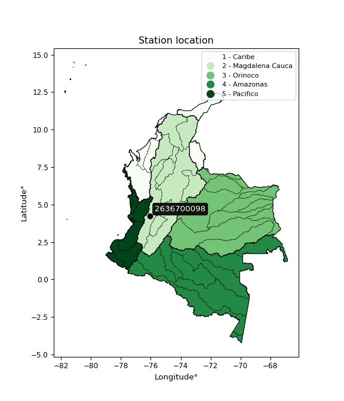

<div align="center">


</div>

# PMP Station (Rain, Pmax24h): 2636700098

Probable Maximum Precipitation (PMP) is the greatest amount of rainfall for a specific duration that is meteorologically possible for a given location, acting as a "worst-case" scenario for extreme storms, crucial for designing safety-critical infrastructure like bridges, river deviations, dams, spillways, and nuclear plants to prevent catastrophic failure. PMP is calculated by hydrologists using meteorological data to determine the upper limit of extreme rainfall, often leading to the Probable Maximum Flood (PMF) for flood control design, and is increasingly being studied for climate change impacts. Probable Maximum Precipitation (PMP) is the theoretical upper limit of rainfall, a deterministic estimate for extreme events, while probability distributions (like GEV, Gumbel) describe the likelihood and frequency of various precipitation amounts, including rare ones, showing how often events occur, with PMP representing the extreme end of these distributions, used for critical infrastructure design to ensure safety against the worst conceivable weather, unlike standard statistical forecasts which cover typical probabilities.

The most common probability distributions in hydrology, used for analyzing floods, rainfall, and streamflow, include the Normal, Log-Normal, Gumbel, Gamma (including Log-Pearson Type III), and Generalized Extreme Value (GEV) distributions, often chosen based on the data´s skewness and whether modeling extremes or general conditions, with Gumbel and GEV popular for extreme events like floods, while the Normal distribution serves as a baseline, though often requiring transformations for skewed hydrological data. These distributions help in designing water infrastructure, managing water resources, and forecasting hydrologic events.

> Hydrological data often isn´t perfectly normal (it´s skewed), so different distributions are needed for different applications, such as: **Flood Frequency Analysis**: Using Gumbel, GEV, or Log-Pearson Type III for predicting extreme flood magnitudes and their return periods, **Rainfall Analysis**: Normal for annual totals, but Log-Normal, Weibull, or GEV for intensity or extreme daily rainfall, **Streamflow Modeling**: Gamma and Log-Normal for maximum flows, GEV for minimum flows, and Kappa for daily flows.

<div align="center">

</img>

</div>


## A. General information


### 1. General running parameters

• app_version: _v20260108_. • runtime: _2026-01-08 13:24:42.400241_. • Python version: _3.14.0_. • SciPy version: _1.16.3_. • Pandas version: _2.3.3_. • NumPy version: _2.3.5_. • Stations dataset (station_dataset_file): _dataset/pmax24h_in/automatic_colombia_2003_2024.csv_. • Stations catalog (station_catalog_file): _dataset/CNE.xls_. • Minimum year to eval til year_max (date_min): _1900_. • Maximum year to eval since year_min (date_max): _2024_. • Creates, save and include plots into reports (create_plot): _False_. • Plot only fit distributions with Δo > Δ (plot_only_fit): _True_. • Plot only simple graphs avoiding multiple CDFs and multiple Extreme values plots (plot_only_simple): _True_. • Eval low extreme values, if False, evaluates high extreme values (low_extreme): _False_. • Eval every SciPy distribution as logarithmic (pdist_logarithmic_on): _True_. • Standard deviation normalized (ddof): _1.0_. • Return periods to eval in years (Tr): _[2, 2.33, 5, 10, 15, 20, 25, 50, 75, 100, 200, 250, 500, 750, 1000]_. • Minimum data sample per station, 0 means any (minimum_sample): _5_. • Z-Score maximum threshold to adjust a value, 0 means disable (zscore_max): _3.5_. • Z-Score minimum threshold to adjust a value, 0 means disable (zscore_min): _-2.5_. • Avoid zeros, e.g. rain = 0 (avoid_zeros): _True_. • Avoid null values (avoid_nans): _True_. 

:file_folder:Table: [dataset.csv](../../dataset/pmax24h_in/automatic_colombia_2003_2024.csv)

> Delta Degrees of Freedom (DDOF): is a parameter used in the formulas for calculating variance and standard deviation. When ddof=0, the divisor is $N$ (the total number of observations) and this is used when your data set is the entire population. When ddof=1, the divisor is $N-1$ and this is used when your data set is a sample drawn from a larger population. Using $N-1$ provides an unbiased estimate of the population variance (known as Bessel´s correction).


### 2. Station info and location

|   id |     CODIGO | NOMBRE                                    | CATEGORIA    | TECNOLOGIA                | ESTADO           | FECHA_INSTALACION   |   FECHA_SUSPENSION |   ALTITUD |   LATITUD |   LONGITUD | DEPARTAMENTO    | MUNICIPIO    | AREA_OPERATIVA                         | ENTIDAD                                                     | AREA_HIDROGRAFICA   | ZONA_HIDROGRAFICA   | SUBZONA_HIDROGRAFICA   | CORRIENTE   | Catalogo   |   Version |
|-----:|-----------:|:------------------------------------------|:-------------|:--------------------------|:-----------------|:--------------------|-------------------:|----------:|----------:|-----------:|:----------------|:-------------|:---------------------------------------|:------------------------------------------------------------|:--------------------|:--------------------|:-----------------------|:------------|:-----------|----------:|
|    0 | 2636700098 | HACIENDA LA GRACIOSA - AUT   [2636700098] | Limnigráfica | Automática con Telemetría | En Mantenimiento | 28/11/2017          |                nan |      1005 |    4.2398 |   -76.0492 | Valle Del Cauca | Bugalagrande | Area Operativa 09 - Cauca-Valle-Caldas | INSTITUTO DE HIDROLOGIA METEOROLOGIA Y ESTUDIOS AMBIENTALES | Magdalena Cauca     | Cauca               | Río Paila              | San Marcos  | CNE_IDEAM  |  20251226 |

<div align="center">

Dynamic map: [:earth_americas:Google](http://maps.google.com/maps?q=4.2398,-76.049247222) [:earth_americas:OSM](https://www.openstreetmap.org/#map=18/4.2398/-76.049247222&layers=P) [:earth_americas:Bing](https://www.bing.com/maps?cp=4.2398~-76.049247222&lvl=18) [:earth_americas:Apple](https://maps.apple.com/frame?center=4.2398%2C-76.049247222&span=0.003%2C0.006)

</div>


<div align="center">

```geojson
{
  "type": "Feature",
  "geometry": {
    "type": "Point", 
    "coordinates": [-76.049247222, 4.2398]
  }, 
  "properties": {
    "Name": "2636700098"
  }
}
```

</div>


### 3. Discrete values table and plot

<div align="center">

|               |           0 |           1 |          2 |           3 |          4 |          5 |
|:--------------|------------:|------------:|-----------:|------------:|-----------:|-----------:|
| Date          | 2019        | 2020        | 2021       | 2022        | 2023       | 2024       |
| Value         |   58.8      |  103.3      |  146.4     |   45.4      |   17.7     |  138.8     |
| Value_initial |   58.8      |  103.3      |  146.4     |   45.4      |   17.7     |  138.8     |
| count         |    6        |    6        |    6       |    6        |    6       |    6       |
| mean          |   85.0667   |   85.0667   |   85.0667  |   85.0667   |   85.0667  |   85.0667  |
| std           |   52.5036   |   52.5036   |   52.5036  |   52.5036   |   52.5036  |   52.5036  |
| zscore        |   -0.500283 |    0.347278 |    1.16817 |   -0.755503 |   -1.28309 |    1.02342 |


</div>


> The initial value (value_initial) correspond to the initial obtained or null completed value, and value (value) is adjusted only when the initial value is outside the valid range (outlier) definite through the Z-Score value. If Z-Score is active, values out of range or outliers are replaced with the station mean value. A Z-Score (or standard score) measures how many standard deviations a data point is from the mean of a dataset, indicating its relative position; positive scores mean above the mean, negative mean below, and a score of zero is exactly at the mean, allowing for comparison of values from different distributions. It´s calculated using the formula $z=(x–μ)/σ$, where $x$ is the data point, $μ$ is the mean, and $σ$ is the standard deviation, helping identify outliers and understand probability.
>
> <sub>**Note**: In this study, "completing" (filling gaps in) and "extending" (forecasting or lengthening the historical record) rainfall data series are avoided for certain critical analyses because they introduce artificial bias and uncertainty, which can distort the statistics of rare events (extremes), alter day-to-day variability, and compromise the integrity and homogeneity of the original data. Some reasons against Completing/Extending rainfall data are: **Distortion of Extremes and Variability**: The primary issue is that most gap-filling or extension methods rely on averaging or regression with nearby stations, which inherently smooths the data. Rainfall is highly variable in space and time, with a large percentage of zero values and occasional large storms. Infilling methods often underestimate the highest values and overestimate the lowest (zero) values, which severely distorts analyses focused on flood frequency, drought severity, and intensity-duration-frequency (IDF) curves, **Loss of Data Homogeneity**: Infilled or extended data are synthetic estimates, not actual measurements. Combining these estimates with observed data can violate the assumption of data homogeneity, which requires that the data properties do not change over time. Inhomogeneity can lead to incorrect conclusions about long-term trends or changes in climate patterns, **Propagation of Errors**: Errors and biases from the original data (e.g., wind-induced undercatch, instrument errors, site changes) or the data used for imputation can propagate through the analysis, leading to unreliable hydrological models and inaccurate predictions, **Compromised Statistical Integrity**: For statistical analyses, especially those involving the frequency of events, using artificial data can introduce time bias or autocorrelation that doesn´t exist in reality, making it difficult to assess the true probability of events, **Difficulty in Validation**: It is difficult to accurately validate the quality of filled or extended data, especially for past periods where ground-truth measurements are unavailable. The reliability of imputation techniques heavily depends on the density of the surrounding station network and the complexity of the local topography.</sub>


### 4. Active continuous probability distributions from SciPy (43 of 104 available)

A Probability Density Function (PDF) describes the relative likelihood of a continuous random variable falling within a specific range, where the total area under its curve equals 1, and the area over any interval gives the actual probability for that range. Unlike discrete probabilities (like rolling a die), a PDF shows density, not direct probability for a single point (which is zero), with higher points indicating higher likelihood, often visualized as a bell curve for normal distributions.

A log of a probability density function (log-PDF) is simply the logarithm of the PDF´s value, denoted as $log(f(x))$, useful for converting multiplication of probabilities into addition, improving numerical stability with tiny numbers, and connecting to information theory concepts like entropy. Instead of dealing with very small probabilities (e.g., 0.000001), log-PDFs use negative numbers (e.g., $log(0.00001) ≈ -11.51$ that are easier for computers to handle, preventing underflow errors and simplifying complex calculations. In this study, each active probability distribution from SciPy is also evaluated in the $log$ form.

[scipy.stats](https://docs.scipy.org/doc/scipy/reference/stats.html) is a Python´s powerful submodule within the SciPy library for comprehensive statistical analysis, offering over 130 probability distributions (like Normal, Poisson), functions for descriptive stats (mean, variance), hypothesis testing (t-tests, chi-square), random variable generation, and statistical tests, making it essential for data science, modeling, and research. It provides tools to explore, model, and draw conclusions from data efficiently, working seamlessly with NumPy.

<div align="center">

|   id | p_dist             |   n_parameter | fit_method   | label                                                                       | active   | ref                                                                                                        |
|-----:|:-------------------|--------------:|:-------------|:----------------------------------------------------------------------------|:---------|:-----------------------------------------------------------------------------------------------------------|
|    0 | alpha              |             3 | MLE          | Alpha                                                                       | True     | [:mortar_board:](https://docs.scipy.org/doc/scipy/reference/generated/scipy.stats.alpha.html)              |
|    1 | betaprime          |             4 | MLE          | Beta prime                                                                  | True     | [:mortar_board:](https://docs.scipy.org/doc/scipy/reference/generated/scipy.stats.betaprime.html)          |
|    2 | chi2               |             3 | MLE          | Chi²                                                                        | True     | [:mortar_board:](https://docs.scipy.org/doc/scipy/reference/generated/scipy.stats.chi2.html)               |
|    3 | crystalball        |             4 | MLE          | Crystalball                                                                 | True     | [:mortar_board:](https://docs.scipy.org/doc/scipy/reference/generated/scipy.stats.crystalball.html)        |
|    4 | erlang             |             3 | MLE          | Erlang                                                                      | True     | [:mortar_board:](https://docs.scipy.org/doc/scipy/reference/generated/scipy.stats.erlang.html)             |
|    5 | expon              |             2 | MLE          | Exponential                                                                 | True     | [:mortar_board:](https://docs.scipy.org/doc/scipy/reference/generated/scipy.stats.expon.html)              |
|    6 | exponnorm          |             3 | MLE          | Exponentially modified Normal                                               | True     | [:mortar_board:](https://docs.scipy.org/doc/scipy/reference/generated/scipy.stats.exponnorm.html)          |
|    7 | f                  |             4 | MLE          | F                                                                           | True     | [:mortar_board:](https://docs.scipy.org/doc/scipy/reference/generated/scipy.stats.f.html)                  |
|    8 | fatiguelife        |             3 | MLE          | Fatigue-life (Birnbaum-Saunders)                                            | True     | [:mortar_board:](https://docs.scipy.org/doc/scipy/reference/generated/scipy.stats.fatiguelife.html)        |
|    9 | fisk               |             3 | MLE          | Fisk                                                                        | True     | [:mortar_board:](https://docs.scipy.org/doc/scipy/reference/generated/scipy.stats.fisk.html)               |
|   10 | gamma              |             3 | MLE          | Gamma                                                                       | True     | [:mortar_board:](https://docs.scipy.org/doc/scipy/reference/generated/scipy.stats.gamma.html)              |
|   11 | genexpon           |             5 | MLE          | Generalized exponential                                                     | True     | [:mortar_board:](https://docs.scipy.org/doc/scipy/reference/generated/scipy.stats.genexpon.html)           |
|   12 | genlogistic        |             3 | MLE          | Generalized logistic                                                        | True     | [:mortar_board:](https://docs.scipy.org/doc/scipy/reference/generated/scipy.stats.genlogistic.html)        |
|   13 | gibrat             |             2 | MM           | Gibrat                                                                      | True     | [:mortar_board:](https://docs.scipy.org/doc/scipy/reference/generated/scipy.stats.gibrat.html)             |
|   14 | gompertz           |             3 | MLE          | Gompertz (or truncated Gumbel)                                              | True     | [:mortar_board:](https://docs.scipy.org/doc/scipy/reference/generated/scipy.stats.gompertz.html)           |
|   15 | gumbel_l           |             2 | MM           | Gumbel Left Skew                                                            | True     | [:mortar_board:](https://docs.scipy.org/doc/scipy/reference/generated/scipy.stats.gumbel_l.html)           |
|   16 | gumbel_r           |             2 | MM           | Gumbel Right Skew                                                           | True     | [:mortar_board:](https://docs.scipy.org/doc/scipy/reference/generated/scipy.stats.gumbel_r.html)           |
|   17 | halflogistic       |             2 | MM           | Half-logistic                                                               | True     | [:mortar_board:](https://docs.scipy.org/doc/scipy/reference/generated/scipy.stats.halflogistic.html)       |
|   18 | halfnorm           |             2 | MM           | Half Normal                                                                 | True     | [:mortar_board:](https://docs.scipy.org/doc/scipy/reference/generated/scipy.stats.halfnorm.html)           |
|   19 | hypsecant          |             2 | MM           | hyperbolic secant                                                           | True     | [:mortar_board:](https://docs.scipy.org/doc/scipy/reference/generated/scipy.stats.hypsecant.html)          |
|   20 | invgamma           |             3 | MLE          | Inverted gamma                                                              | True     | [:mortar_board:](https://docs.scipy.org/doc/scipy/reference/generated/scipy.stats.invgamma.html)           |
|   21 | invgauss           |             3 | MLE          | Inverse Gaussian                                                            | True     | [:mortar_board:](https://docs.scipy.org/doc/scipy/reference/generated/scipy.stats.invgauss.html)           |
|   22 | invweibull         |             3 | MLE          | Inverted Weibull                                                            | True     | [:mortar_board:](https://docs.scipy.org/doc/scipy/reference/generated/scipy.stats.invweibull.html)         |
|   23 | kstwobign          |             2 | MLE          | Limiting distribution of scaled Kolmogorov-Smirnov two-sided test statistic | True     | [:mortar_board:](https://docs.scipy.org/doc/scipy/reference/generated/scipy.stats.kstwobign.html)          |
|   24 | laplace            |             2 | MM           | Laplace                                                                     | True     | [:mortar_board:](https://docs.scipy.org/doc/scipy/reference/generated/scipy.stats.laplace.html)            |
|   25 | laplace_asymmetric |             3 | MLE          | Asymmetric Laplace                                                          | True     | [:mortar_board:](https://docs.scipy.org/doc/scipy/reference/generated/scipy.stats.laplace_asymmetric.html) |
|   26 | loggamma           |             3 | MLE          | Log gamma                                                                   | True     | [:mortar_board:](https://docs.scipy.org/doc/scipy/reference/generated/scipy.stats.loggamma.html)           |
|   27 | logistic           |             2 | MM           | Logistic (or Sech-squared)                                                  | True     | [:mortar_board:](https://docs.scipy.org/doc/scipy/reference/generated/scipy.stats.logistic.html)           |
|   28 | lognorm            |             3 | MLE          | Log Normal                                                                  | True     | [:mortar_board:](https://docs.scipy.org/doc/scipy/reference/generated/scipy.stats.lognorm.html)            |
|   29 | maxwell            |             2 | MM           | Maxwell                                                                     | True     | [:mortar_board:](https://docs.scipy.org/doc/scipy/reference/generated/scipy.stats.maxwell.html)            |
|   30 | mielke             |             4 | MLE          | Mielke Beta-Kappa / Dagum                                                   | True     | [:mortar_board:](https://docs.scipy.org/doc/scipy/reference/generated/scipy.stats.mielke.html)             |
|   31 | moyal              |             2 | MM           | Moyal                                                                       | True     | [:mortar_board:](https://docs.scipy.org/doc/scipy/reference/generated/scipy.stats.moyal.html)              |
|   32 | nakagami           |             3 | MLE          | Nakagami                                                                    | True     | [:mortar_board:](https://docs.scipy.org/doc/scipy/reference/generated/scipy.stats.nakagami.html)           |
|   33 | ncf                |             5 | MLE          | Non-central F distribution                                                  | True     | [:mortar_board:](https://docs.scipy.org/doc/scipy/reference/generated/scipy.stats.ncf.html)                |
|   34 | nct                |             4 | MLE          | Non-central Student’s t                                                     | True     | [:mortar_board:](https://docs.scipy.org/doc/scipy/reference/generated/scipy.stats.nct.html)                |
|   35 | norm               |             2 | MM           | Normal                                                                      | True     | [:mortar_board:](https://docs.scipy.org/doc/scipy/reference/generated/scipy.stats.norm.html)               |
|   36 | pearson3           |             3 | MM           | Pearson type III                                                            | True     | [:mortar_board:](https://docs.scipy.org/doc/scipy/reference/generated/scipy.stats.pearson3.html)           |
|   37 | rayleigh           |             2 | MM           | Rayleigh                                                                    | True     | [:mortar_board:](https://docs.scipy.org/doc/scipy/reference/generated/scipy.stats.rayleigh.html)           |
|   38 | rice               |             3 | MLE          | Rice                                                                        | True     | [:mortar_board:](https://docs.scipy.org/doc/scipy/reference/generated/scipy.stats.rice.html)               |
|   39 | t                  |             3 | MLE          | Student’s t                                                                 | True     | [:mortar_board:](https://docs.scipy.org/doc/scipy/reference/generated/scipy.stats.t.html)                  |
|   40 | truncnorm          |             4 | MLE          | Truncated normal                                                            | True     | [:mortar_board:](https://docs.scipy.org/doc/scipy/reference/generated/scipy.stats.truncnorm.html)          |
|   41 | wald               |             2 | MM           | Wald                                                                        | True     | [:mortar_board:](https://docs.scipy.org/doc/scipy/reference/generated/scipy.stats.wald.html)               |
|   42 | weibull_min        |             3 | MLE          | Weibull minimum                                                             | True     | [:mortar_board:](https://docs.scipy.org/doc/scipy/reference/generated/scipy.stats.weibull_min.html)        |

</div>

> **n_parameter:** # arguments & localization & scale.
>
> **Fit methods:** (MLE) maximum likelihood, (MM) L-moments.
>
>**Inactive** (With the only purpose of prevent loops, zero divisions, infinite values, over high estimated values or horizontal trending for recurrence intervals estimations, the follow distributions were disabled.)**:** foldnorm, gennorm, norminvgauss, powernorm, powerlognorm, skewnorm, genextreme, anglit, arcsine, argus, beta, bradford, burr, burr12, cauchy, cosine, halfcauchy, foldcauchy, skewcauchy, wrapcauchy, dgamma, gengamma, exponweib, exponpow, truncexpon, gausshyper, genhalflogistic, genhyperbolic, geninvgauss, halfgennorm, johnsonsb, johnsonsu, kappa4, kappa3, ksone, kstwo, loglaplace, levy, levy_l, levy_stable, ncx2, pareto, genpareto, truncpareto, lomax, powerlaw, rdist, rel_breitwigner, recipinvgauss, semicircular, studentized_range, trapezoid, triang, truncweibull_min, tukeylambda, uniform, loguniform, vonmises, vonmises_line, weibull_max, dweibull, 


## B. Probability (PDF) vs. Empirical (EDF) distributions functions

A continuous probability distribution (CPD) describes probabilities for variables that can take any value within a range (like rain any time), unlike discrete variables with specific outcomes (like temperature). It uses a Probability Density Function (PDF), a curve where the total area under it equals 1, and the probability of the variable falling within an interval (a to b) is found by calculating the area under the curve between those points. A key feature is that the probability of hitting any single exact value is zero, so probabilities are always expressed for ranges, e.g., $P(a ≤ X ≤ b)$.

<div align="center">

Distributions parameters from station values
|    |    station | p_dist                |   n |              loc |           scale | shape                 | shape1                | shape2                | shape3   |
|---:|-----------:|:----------------------|----:|-----------------:|----------------:|:----------------------|:----------------------|:----------------------|:---------|
|  0 | 2636700098 | alpha                 |   6 |     -0.0839341   |    38.1491      | 9.80005770269014e-11  |                       |                       |          |
|  1 | 2636700098 | betaprime             |   6 |    -14.6771      |  2383.33        | 3.7626460702191062    | 90.91730315824933     |                       |          |
|  2 | 2636700098 | chi2                  |   6 |     17.7         |    39.712       | 0.9795014953780339    |                       |                       |          |
|  3 | 2636700098 | crystalball           |   6 |     85.0667      |    47.929       | 5567.167628837087     | 7505.11724723963      |                       |          |
|  4 | 2636700098 | erlang                |   6 | -10952.5         |     0.2081      | 53039.95145986843     |                       |                       |          |
|  5 | 2636700098 | expon                 |   6 |     17.7         |    67.3667      |                       |                       |                       |          |
|  6 | 2636700098 | exponnorm             |   6 |     84.8062      |    47.9283      | 0.005433520541800614  |                       |                       |          |
|  7 | 2636700098 | f                     |   6 |     17.7         |    43.9006      | 0.684561450120929     | 11776.284498613595    |                       |          |
|  8 | 2636700098 | fatiguelife           |   6 |   -138.457       |   218.209       | 0.22068704984698978   |                       |                       |          |
|  9 | 2636700098 | fisk                  |   6 |   -115.964       |   196.303       | 6.560141469888009     |                       |                       |          |
| 10 | 2636700098 | gamma                 |   6 | -10954.3         |     0.208082    | 53052.94121463031     |                       |                       |          |
| 11 | 2636700098 | genexpon              |   6 |     17.7         |     2.27367     | 0.03359707039095455   | 8.154745568535056e-05 | 0.5354114446944356    |          |
| 12 | 2636700098 | genlogistic           |   6 |   -195.565       |    41.9818      | 454.1351056972828     |                       |                       |          |
| 13 | 2636700098 | gibrat                |   6 |     48.5028      |    22.1771      |                       |                       |                       |          |
| 14 | 2636700098 | gompertz              |   6 |     17.7         |    78.9252      | 0.5556718678945338    |                       |                       |          |
| 15 | 2636700098 | gumbel_l              |   6 |    106.637       |    37.3701      |                       |                       |                       |          |
| 16 | 2636700098 | gumbel_r              |   6 |     63.4961      |    37.3701      |                       |                       |                       |          |
| 17 | 2636700098 | halflogistic          |   6 |     28.2597      |    40.9776      |                       |                       |                       |          |
| 18 | 2636700098 | halfnorm              |   6 |     21.6274      |    79.5093      |                       |                       |                       |          |
| 19 | 2636700098 | hypsecant             |   6 |     85.0667      |    30.5126      |                       |                       |                       |          |
| 20 | 2636700098 | invgamma              |   6 |   -303.923       | 25051.6         | 65.41973765834207     |                       |                       |          |
| 21 | 2636700098 | invgauss              |   6 |    -81.3431      |  1745.93        | 0.0953383849696054    |                       |                       |          |
| 22 | 2636700098 | invweibull            |   6 |     -1.86492e+09 |     1.86492e+09 | 44334100.48322573     |                       |                       |          |
| 23 | 2636700098 | kstwobign             |   6 |    -83.1633      |   191.87        |                       |                       |                       |          |
| 24 | 2636700098 | laplace               |   6 |     85.0667      |    33.8909      |                       |                       |                       |          |
| 25 | 2636700098 | laplace_asymmetric    |   6 |     45.4         |    33.2877      | 0.5682262772718101    |                       |                       |          |
| 26 | 2636700098 | loggamma              |   6 |  -6498.74        |  1062.8         | 490.6576331546669     |                       |                       |          |
| 27 | 2636700098 | logistic              |   6 |     85.0667      |    26.4247      |                       |                       |                       |          |
| 28 | 2636700098 | lognorm               |   6 |     17.7         |     0.132438    | 13.986211031148663    |                       |                       |          |
| 29 | 2636700098 | maxwell               |   6 |    -28.505       |    71.1705      |                       |                       |                       |          |
| 30 | 2636700098 | mielke                |   6 |     -4.23204     |   151.561       | 1.3753190583153057    | 696.7415100081816     |                       |          |
| 31 | 2636700098 | moyal                 |   6 |     57.6578      |    21.5756      |                       |                       |                       |          |
| 32 | 2636700098 | nakagami              |   6 |     45.4         |    62.8017      | 0.3634643959656821    |                       |                       |          |
| 33 | 2636700098 | ncf                   |   6 |     17           |    28.0011      | 1.6312118226544499    | 21117.16493571487     | 2.5316940371542147    |          |
| 34 | 2636700098 | nct                   |   6 |  -2104.2         |    47.8958      | 607827.7985285982     | 45.70900622224458     |                       |          |
| 35 | 2636700098 | norm                  |   6 |     85.0667      |    47.929       |                       |                       |                       |          |
| 36 | 2636700098 | pearson3              |   6 |     85.0667      |    47.929       | 0.008577943380862053  |                       |                       |          |
| 37 | 2636700098 | rayleigh              |   6 |     -6.62437     |    73.1589      |                       |                       |                       |          |
| 38 | 2636700098 | rice                  |   6 |     -5.97947     |    59.3599      | 1.0022392518025425    |                       |                       |          |
| 39 | 2636700098 | t                     |   6 |     85.0683      |    47.9331      | 4359547.441888033     |                       |                       |          |
| 40 | 2636700098 | truncnorm             |   6 |    115.674       |    42.6018      | -365.1310250956177    | 0.7212416365714047    |                       |          |
| 41 | 2636700098 | wald                  |   6 |     37.1377      |    47.929       |                       |                       |                       |          |
| 42 | 2636700098 | weibull_min           |   6 |     17.7         |    20.5151      | 0.7301546073723408    |                       |                       |          |
| 43 | 2636700098 | logalpha              |   6 |    -12.7492      |   375.312       | 22.181870798124265    |                       |                       |          |
| 44 | 2636700098 | logbetaprime          |   6 |    -16.6489      |   145.882       | 883.5402446796256     | 6180.379401573329     |                       |          |
| 45 | 2636700098 | logchi2               |   6 |      2.87356     |     0.962785    | 1.0958012227781797    |                       |                       |          |
| 46 | 2636700098 | logcrystalball        |   6 |      4.22004     |     0.738004    | 11.334126341627679    | 28.401067427130847    |                       |          |
| 47 | 2636700098 | logerlang             |   6 |     -7.74677     |     0.0487828   | 245.25162985070253    |                       |                       |          |
| 48 | 2636700098 | logexpon              |   6 |      2.87356     |     1.34647     |                       |                       |                       |          |
| 49 | 2636700098 | logexponnorm          |   6 |      4.21942     |     0.738006    | 0.0008403850829227849 |                       |                       |          |
| 50 | 2636700098 | logf                  |   6 |   -570.667       |   574.888       | 4241298.582263391     | 1676508.7124181893    |                       |          |
| 51 | 2636700098 | logfatiguelife        |   6 |   -382.796       |   387.014       | 0.0019085569880403848 |                       |                       |          |
| 52 | 2636700098 | logfisk               |   6 | -24174.4         | 24178.6         | 55739.897413195926    |                       |                       |          |
| 53 | 2636700098 | loggamma              |   6 |     -8.88767     |     0.0442936   | 295.6169222752482     |                       |                       |          |
| 54 | 2636700098 | loggenexpon           |   6 |      2.83898     |     0.010486    | 0.002728711149968555  | 2.928197021758084     | 1.955895720902645e-05 |          |
| 55 | 2636700098 | loggenlogistic        |   6 |      4.98636     |     7.60466e-07 | 9.88691590754734e-07  |                       |                       |          |
| 56 | 2636700098 | loggibrat             |   6 |      3.65708     |     0.341455    |                       |                       |                       |          |
| 57 | 2636700098 | loggompertz           |   6 |      2.87356     |     0.65809     | 0.08968771692521837   |                       |                       |          |
| 58 | 2636700098 | loggumbel_l           |   6 |      4.55218     |     0.575419    |                       |                       |                       |          |
| 59 | 2636700098 | loggumbel_r           |   6 |      3.8879      |     0.575419    |                       |                       |                       |          |
| 60 | 2636700098 | loghalflogistic       |   6 |      3.34535     |     0.630951    |                       |                       |                       |          |
| 61 | 2636700098 | loghalfnorm           |   6 |      3.24321     |     1.22427     |                       |                       |                       |          |
| 62 | 2636700098 | loghypsecant          |   6 |      4.22004     |     0.469827    |                       |                       |                       |          |
| 63 | 2636700098 | loginvgamma           |   6 |    -11.3106      |  6558.42        | 423.24201976985523    |                       |                       |          |
| 64 | 2636700098 | loginvgauss           |   6 |     -2.6402      |   508.309       | 0.013449739122957032  |                       |                       |          |
| 65 | 2636700098 | loginvweibull         |   6 |     -3.73963e+08 |     3.73963e+08 | 491331729.5175047     |                       |                       |          |
| 66 | 2636700098 | logkstwobign          |   6 |      1.10569     |     3.55438     |                       |                       |                       |          |
| 67 | 2636700098 | loglaplace            |   6 |      4.22004     |     0.521847    |                       |                       |                       |          |
| 68 | 2636700098 | loglaplace_asymmetric |   6 |      4.98648     |     0.010654    | 71.92121872645845     |                       |                       |          |
| 69 | 2636700098 | logloggamma           |   6 |      4.98639     |     5.11346e-06 | 6.677944365020281e-06 |                       |                       |          |
| 70 | 2636700098 | loglogistic           |   6 |      4.22004     |     0.406883    |                       |                       |                       |          |
| 71 | 2636700098 | loglognorm            |   6 |      2.87356     |     0.00395976  | 13.338598039824355    |                       |                       |          |
| 72 | 2636700098 | logmaxwell            |   6 |      2.47128     |     1.09587     |                       |                       |                       |          |
| 73 | 2636700098 | logmielke             |   6 |     -2.81108e+07 |     2.81108e+07 | 35938139.76459108     | 7403634675.600154     |                       |          |
| 74 | 2636700098 | logmoyal              |   6 |      3.798       |     0.332218    |                       |                       |                       |          |
| 75 | 2636700098 | lognakagami           |   6 |      3.81551     |     0.689927    | 0.25265926651486353   |                       |                       |          |
| 76 | 2636700098 | logncf                |   6 |    -13.7961      |     2.12581     | 342.28858789796186    | 4155.274801856804     | 2555.3905136767307    |          |
| 77 | 2636700098 | lognct                |   6 |    -39.171       |     0.679438    | 10771.041391956645    | 63.85710154245815     |                       |          |
| 78 | 2636700098 | lognorm               |   6 |      4.22004     |     0.738003    |                       |                       |                       |          |
| 79 | 2636700098 | logpearson3           |   6 |      4.22004     |     0.738002    | -0.6738551692076442   |                       |                       |          |
| 80 | 2636700098 | lograyleigh           |   6 |      2.8082      |     1.12649     |                       |                       |                       |          |
| 81 | 2636700098 | logrice               |   6 |      2.38992     |     0.805224    | 2.001427284299945     |                       |                       |          |
| 82 | 2636700098 | logt                  |   6 |      4.22002     |     0.738001    | 352919537.62533987    |                       |                       |          |
| 83 | 2636700098 | logtruncnorm          |   6 |     -0.173158    |     1.757       | 2.270155183065599     | 5.294020331232131     |                       |          |
| 84 | 2636700098 | logwald               |   6 |      3.48206     |     0.737983    |                       |                       |                       |          |
| 85 | 2636700098 | logweibull_min        |   6 |     -9.67044e+07 |     9.67044e+07 | 175821346.43272263    |                       |                       |          |

</div>

> **loc** (Location parameter): This shifts the distribution along the x-axis. For many common distributions, like the normal (Gaussian) distribution, loc represents the mean $μ$. For others, like the uniform distribution, it might represent the minimum value, or for the beta distribution, the left end of the support interval.
>
> **scale** (Scale parameter): This determines the width or spread of the distribution. For the normal distribution, scale represents the standard deviation $σ$. For a uniform distribution, it defines the length of the interval (from $loc$ to $loc + scale$).
>
> **shape** (Shape parameters): Refers to parameters that define the specific form of a probability distribution, distinct from its location (loc) and scale (scale). These parameters are required arguments for most distribution functions. For example, a normal (Gaussian) distribution is fully defined by its location (mean) and scale (standard deviation), so it has no specific shape parameters beyond loc and scale. However, other distributions have intrinsic properties that need specification, as Gamma distribution that takes a shape parameter, often named $a$ or $alpha$.


### 0. Cumulative distribution values - CDF (86 evaluated)

Cumulative Distribution Function (CDF), denoted as $F$<sub>$X$</sub>$(x)$, is a function that gives the probability that a random variable $X$ will take a value less than or equal to a specific value, $x$ (i.e., $(P(X≥x)$. It essentially "accumulates" probabilities from a given point up to the far right (positive infinity), providing a complete picture of the distribution´s probabilities for both discrete (like rain) and continuous (like temperature) variables, helping to find probabilities over ranges or above certain values. Each station is evaluated separately ordering the $x$ values ascending, calculating the CDF and PDF values for the activated distributions and their logarithmic forms.

<div align="center">

CDF ordered by x ascending and calculating $log(f(x))$ separately
|   id |    Station |   date |     x |   count |    mean |     std |    zscore |   Value_initial |    station |   m |     alpha |   alpha_pdf |   betaprime |   betaprime_pdf |        chi2 |    chi2_pdf |   crystalball |   crystalball_pdf |    erlang |   erlang_pdf |    expon |   expon_pdf |   exponnorm |   exponnorm_pdf |          f |        f_pdf |   fatiguelife |   fatiguelife_pdf |      fisk |   fisk_pdf |     gamma |   gamma_pdf |    genexpon |   genexpon_pdf |   genlogistic |   genlogistic_pdf |   gibrat |   gibrat_pdf |    gompertz |   gompertz_pdf |   gumbel_l |   gumbel_l_pdf |   gumbel_r |   gumbel_r_pdf |   halflogistic |   halflogistic_pdf |   halfnorm |   halfnorm_pdf |   hypsecant |   hypsecant_pdf |   invgamma |   invgamma_pdf |   invgauss |   invgauss_pdf |   invweibull |   invweibull_pdf |   kstwobign |   kstwobign_pdf |   laplace |   laplace_pdf |   laplace_asymmetric |   laplace_asymmetric_pdf |   loggamma |   loggamma_pdf |   logistic |   logistic_pdf |   lognorm |   lognorm_pdf |   maxwell |   maxwell_pdf |   mielke |   mielke_pdf |     moyal |   moyal_pdf |    nakagami |   nakagami_pdf |       ncf |    ncf_pdf |       nct |    nct_pdf |      norm |   norm_pdf |   pearson3 |   pearson3_pdf |   rayleigh |   rayleigh_pdf |     rice |   rice_pdf |         t |      t_pdf |   truncnorm |   truncnorm_pdf |      wald |   wald_pdf |   weibull_min |   weibull_min_pdf |   logalpha |   logalpha_pdf |   logbetaprime |   logbetaprime_pdf |     logchi2 |   logchi2_pdf |   logcrystalball |   logcrystalball_pdf |   logerlang |   logerlang_pdf |   logexpon |   logexpon_pdf |   logexponnorm |   logexponnorm_pdf |      logf |   logf_pdf |   logfatiguelife |   logfatiguelife_pdf |   logfisk |   logfisk_pdf |   loggenexpon |   loggenexpon_pdf |   loggenlogistic |   loggenlogistic_pdf |   loggibrat |   loggibrat_pdf |   loggompertz |   loggompertz_pdf |   loggumbel_l |   loggumbel_l_pdf |   loggumbel_r |   loggumbel_r_pdf |   loghalflogistic |   loghalflogistic_pdf |   loghalfnorm |   loghalfnorm_pdf |   loghypsecant |   loghypsecant_pdf |   loginvgamma |   loginvgamma_pdf |   loginvgauss |   loginvgauss_pdf |   loginvweibull |   loginvweibull_pdf |   logkstwobign |   logkstwobign_pdf |   loglaplace |   loglaplace_pdf |   loglaplace_asymmetric |   loglaplace_asymmetric_pdf |   logloggamma |   logloggamma_pdf |   loglogistic |   loglogistic_pdf |   loglognorm |   loglognorm_pdf |   logmaxwell |   logmaxwell_pdf |   logmielke |   logmielke_pdf |    logmoyal |   logmoyal_pdf |   lognakagami |   lognakagami_pdf |    logncf |   logncf_pdf |    lognct |   lognct_pdf |   logpearson3 |   logpearson3_pdf |   lograyleigh |   lograyleigh_pdf |   logrice |   logrice_pdf |      logt |   logt_pdf |   logtruncnorm |   logtruncnorm_pdf |   logwald |   logwald_pdf |   logweibull_min |   logweibull_min_pdf |
|-----:|-----------:|-------:|------:|--------:|--------:|--------:|----------:|----------------:|-----------:|----:|----------:|------------:|------------:|----------------:|------------:|------------:|--------------:|------------------:|----------:|-------------:|---------:|------------:|------------:|----------------:|-----------:|-------------:|--------------:|------------------:|----------:|-----------:|----------:|------------:|------------:|---------------:|--------------:|------------------:|---------:|-------------:|------------:|---------------:|-----------:|---------------:|-----------:|---------------:|---------------:|-------------------:|-----------:|---------------:|------------:|----------------:|-----------:|---------------:|-----------:|---------------:|-------------:|-----------------:|------------:|----------------:|----------:|--------------:|---------------------:|-------------------------:|-----------:|---------------:|-----------:|---------------:|----------:|--------------:|----------:|--------------:|---------:|-------------:|----------:|------------:|------------:|---------------:|----------:|-----------:|----------:|-----------:|----------:|-----------:|-----------:|---------------:|-----------:|---------------:|---------:|-----------:|----------:|-----------:|------------:|----------------:|----------:|-----------:|--------------:|------------------:|-----------:|---------------:|---------------:|-------------------:|------------:|--------------:|-----------------:|---------------------:|------------:|----------------:|-----------:|---------------:|---------------:|-------------------:|----------:|-----------:|-----------------:|---------------------:|----------:|--------------:|--------------:|------------------:|-----------------:|---------------------:|------------:|----------------:|--------------:|------------------:|--------------:|------------------:|--------------:|------------------:|------------------:|----------------------:|--------------:|------------------:|---------------:|-------------------:|--------------:|------------------:|--------------:|------------------:|----------------:|--------------------:|---------------:|-------------------:|-------------:|-----------------:|------------------------:|----------------------------:|--------------:|------------------:|--------------:|------------------:|-------------:|-----------------:|-------------:|-----------------:|------------:|----------------:|------------:|---------------:|--------------:|------------------:|----------:|-------------:|----------:|-------------:|--------------:|------------------:|--------------:|------------------:|----------:|--------------:|----------:|-----------:|---------------:|-------------------:|----------:|--------------:|-----------------:|---------------------:|
|    0 | 2636700098 |   2023 |  17.7 |       6 | 85.0667 | 52.5036 | -1.28309  |            17.7 | 2636700098 |   1 | 0.0319414 |  0.00964128 |   0.0517507 |      0.00449033 | 1.11037e-08 | 1.53068e+06 |     0.0799288 |        0.00309971 | 0.0797109 |   0.00310615 | 0        |  0.0148441  |   0.0799289 |      0.00309971 | 0.00344737 | 201.022      |     0.0638524 |        0.00367959 | 0.0743817 | 0.00337907 | 0.0797175 |  0.00310624 | 3.87642e-08 |     0.0147766  |     0.0598377 |        0.00400146 | 0        |   0          | 5.27045e-13 |     0.00704048 |   0.088405 |     0.00225787 |  0.0331811 |     0.003024   |       0        |         0          |   0        |     0          |   0.0697091 |      0.00226639 |  0.0675645 |     0.00348387 |  0.0582742 |     0.00398451 |    0.0596165 |       0.00399637 |   0.0548935 |      0.00431509 | 0.0685018 |    0.00202124 |            0.0564311 |               0.00298342 |  0.0364409 |       0.112679 |  0.0724677 |     0.00254369 | 0.0340396 |      0.102335 | 0.0642299 |    0.00382732 | 0.07005  |   0.00439271 | 0.0115905 |  0.00192903 | 0           |     0          | 0.0126606 | 0.0148402  | 0.0799488 | 0.00310011 | 0.0799289 | 0.00309971 |  0.0797201 |     0.00310609 |   0.053774 |     0.00430034 | 0.047204 | 0.00390746 | 0.0799415 | 0.00309982 |   0.0140343 |     0.000870098 | 0         | 0          |   3.10212e-12 |     637.549       |  0.0327661 |       0.112546 |      0.0350115 |           0.108262 | 3.04555e-09 |   3.75749e+06 |        0.0340397 |             0.102336 |   0.0353099 |        0.110331 |   0        |       0.74268  |      0.0340404 |           0.102337 | 0.0344519 |   0.103115 |        0.0341579 |             0.102897 | 0.0365361 |     0.0811554 |    0.00926703 |          0.275657 |          0       |             0.083374 |    0        |        0        |   3.01395e-09 |          0.136285 |     0.0526481 |         0.0890433 |    0.00294224 |         0.0298028 |          0        |              0        |      0        |          0        |      0.0362052 |          0.0768946 |     0.0312529 |          0.10516  |     0.0356773 |          0.123681 |       0.0308123 |            0.140873 |      0.0344036 |           0.174635 |    0.0378791 |        0.0725866 |               0.0634386 |                   0.0827913 |     0.0633395 |         0.0827184 |     0.0352554 |         0.0835928 |     0.012691 |      5.53489e+12 |    0.0126371 |        0.0917201 |   0.0659988 |       0.0843759 | 5.81709e-05 |     0.00149398 |   0           |       0           | 0.0364429 |     0.111493 | 0.0342532 |     0.103423 |     0.0491485 |          0.100472 |    0.00168228 |         0.0514267 | 0.0264137 |      0.117267 | 0.0340406 |   0.102338 |    0           |           0        |  0        |      0        |        0.0454477 |            0.0807231 |
|    1 | 2636700098 |   2022 |  45.4 |       6 | 85.0667 | 52.5036 | -0.755503 |            45.4 | 2636700098 |   2 | 0.401616  |  0.0103502  |   0.240309  |      0.00841696 | 0.604006    | 0.0084058   |     0.203945  |        0.00590987 | 0.20407   |   0.00592658 | 0.337134 |  0.00983967 |   0.203945  |      0.00590987 | 0.629079   |   0.00660578 |     0.218539  |        0.00729625 | 0.216572  | 0.00689776 | 0.204077  |  0.00592649 | 0.336451    |     0.00982875 |     0.232708  |        0.00806867 | 0        |   0          | 0.208342    |     0.00791703 |   0.176538 |     0.0042801  |  0.197318  |     0.00856928 |       0.206146 |         0.0116833  |   0.235053 |     0.00959644 |   0.169384  |      0.00529297 |  0.21315   |     0.00693946 |  0.228284  |     0.00789379 |    0.232326  |       0.00806144 |   0.239668  |      0.00838085 | 0.155118  |    0.00457698 |            0.244074  |               0.0129038  |  0.308939  |       0.471962 |  0.182258  |     0.00564019 | 0.291799  |      0.465167 | 0.21769   |    0.00705072 | 0.215382 |   0.00596831 | 0.184007  |  0.0101638  | 1.99082e-12 |   203.673      | 0.289265  | 0.008765   | 0.20397   | 0.00590969 | 0.203945  | 0.00590987 |  0.204072  |     0.0059261  |   0.22341  |     0.00754857 | 0.206268 | 0.00726365 | 0.203955  | 0.00590955 |   0.0647607 |     0.00314177  | 0.0406527 | 0.0159502  |   0.712099    |       0.00944922  |  0.317209  |       0.487345 |      0.303083  |           0.472294 | 0.646291    |   0.271221    |        0.291799  |             0.465167 |   0.30483   |        0.468909 |   0.503199 |       0.368964 |      0.291801  |           0.465166 | 0.292244  |   0.463553 |        0.292951  |             0.466105 | 0.249619  |     0.43182   |    0.394872   |          0.46498  |          0       |             0.283716 |    0.221273 |        1.87511  |   0.24843     |          0.428586 |     0.242683  |         0.365845  |    0.321727   |         0.634069  |          0.356245 |              0.691884 |      0.359831 |          0.584269 |      0.254616  |          0.485964  |     0.303344  |          0.479073 |     0.330914  |          0.48527  |       0.364418  |            0.483317 |      0.393646  |           0.471401 |    0.23031   |        0.441336  |               0.216886  |                   0.28305   |     0.216729  |         0.283038  |     0.270081  |         0.484507  |     0.659178 |      0.0291898   |    0.318797  |        0.516278  |   0.220052  |       0.281325  | 0.330062    |     0.727852   |   2.33152e-08 |       1.32649e+07 | 0.306448  |     0.469938 | 0.293711  |     0.466034 |     0.264805  |          0.395333 |    0.32955    |         0.532206  | 0.304306  |      0.47372  | 0.291805  |   0.465174 |    4.01603e-08 |           1.48808  |  0.321133 |      1.27637  |        0.227276  |            0.362234  |
|    2 | 2636700098 |   2019 |  58.8 |       6 | 85.0667 | 52.5036 | -0.500283 |            58.8 | 2636700098 |   3 | 0.517069  |  0.00711683 |   0.356342  |      0.00874668 | 0.697532    | 0.0058059   |     0.291835  |        0.00716298 | 0.292184  |   0.00717877 | 0.4567   |  0.00806482 |   0.291835  |      0.00716298 | 0.702645   |   0.00459031 |     0.323617  |        0.00826384 | 0.318119  | 0.00814254 | 0.292189  |  0.00717858 | 0.455909    |     0.00805931 |     0.346445  |        0.00873746 | 0.221485 |   0.0288658  | 0.31592     |     0.00810711 |   0.242712 |     0.00563377 |  0.321776  |     0.00976346 |       0.356304 |         0.0106527  |   0.359875 |     0.00899618 |   0.254654  |      0.00748365 |  0.314315  |     0.00805555 |  0.339805  |     0.00859951 |    0.34596   |       0.00872961 |   0.355799  |      0.0087899  | 0.230344  |    0.00679662 |            0.398635  |               0.0102654  |  0.438537  |       0.521082 |  0.270119  |     0.00746101 | 0.421643  |      0.530109 | 0.318837  |    0.00794979 | 0.299204 |   0.00652844 | 0.330118  |  0.0112073  | 0.251961    |     0.0135034  | 0.400832  | 0.00787548 | 0.291854  | 0.00716231 | 0.291835  | 0.00716298 |  0.292178  |     0.00717815 |   0.329591 |     0.00819494 | 0.309909 | 0.00810988 | 0.291839  | 0.00716242 |   0.11893   |     0.00502372  | 0.321247  | 0.0196496  |   0.810028    |       0.00560532  |  0.449391  |       0.524768 |      0.43349   |           0.526924 | 0.708397    |   0.212499    |        0.421643  |             0.530109 |   0.43376   |        0.519078 |   0.590019 |       0.304485 |      0.421645  |           0.530107 | 0.421542  |   0.527596 |        0.422935  |             0.530193 | 0.376506  |     0.54118   |    0.512484   |          0.440146 |          0       |             0.397114 |    0.579265 |        0.937614 |   0.372654    |          0.529973 |     0.353199  |         0.489768  |    0.485056   |         0.609875  |          0.520869 |              0.577458 |      0.502681 |          0.517647 |      0.402706  |          0.646101  |     0.434781  |          0.52756  |     0.460947  |          0.510752 |       0.487414  |            0.46021  |      0.511855  |           0.437563 |    0.378051  |        0.724449  |               0.303961  |                   0.396688  |     0.303811  |         0.396763  |     0.411305  |         0.595094  |     0.665823 |      0.0227277   |    0.455998  |        0.534452  |   0.306283  |       0.391567  | 0.50929     |     0.637412   |   0.471591    |       0.895619    | 0.435803  |     0.521317 | 0.423534  |     0.529017 |     0.380007  |          0.492735 |    0.468187   |         0.530544  | 0.434245  |      0.522415 | 0.421651  |   0.530113 |    0.326079    |           1.05389  |  0.575973 |      0.734141 |        0.338089  |            0.496569  |
|    3 | 2636700098 |   2020 | 103.3 |       6 | 85.0667 | 52.5036 |  0.347278 |           103.3 | 2636700098 |   4 | 0.712125  |  0.00266042 |   0.694712  |      0.00591356 | 0.861613    | 0.00228013  |     0.648184  |        0.00774257 | 0.648665  |   0.00773069 | 0.719353 |  0.00416596 |   0.648184  |      0.00774257 | 0.837443   |   0.00200261 |     0.678881  |        0.00672137 | 0.673855  | 0.00657541 | 0.648659  |  0.00773048 | 0.718548    |     0.00416899 |     0.692435  |        0.00605965 | 0.817156 |   0.0048358  | 0.663144    |     0.00701568 |   0.59931  |     0.00980618 |  0.708444  |     0.00653435 |       0.723822 |         0.00580905 |   0.695677 |     0.00592104 |   0.679808  |      0.00881148 |  0.673964  |     0.00701046 |  0.688409  |     0.00627923 |    0.691758  |       0.00606026 |   0.698561  |      0.00604355 | 0.708043  |    0.00861461 |            0.718656  |               0.0048026  |  0.718926  |       0.433341 |  0.66597   |     0.00841843 | 0.714252  |      0.460601 | 0.670013  |    0.00692055 | 0.623748 |   0.00797764 | 0.728408  |  0.00604503 | 0.67789     |     0.00675931 | 0.682679  | 0.0048496  | 0.64815   | 0.00774135 | 0.648184  | 0.00774257 |  0.648638  |     0.00773057 |   0.676585 |     0.00664233 | 0.667178 | 0.00706792 | 0.64816   | 0.00774212 |   0.504479  |     0.0117413   | 0.784931  | 0.00486998 |   0.941448    |       0.00141732  |  0.724354  |       0.414739 |      0.718943  |           0.442715 | 0.803552    |   0.133263    |        0.714252  |             0.4606   |   0.714011  |        0.434962 |   0.730218 |       0.200362 |      0.714252  |           0.460598 | 0.712801  |   0.459029 |        0.715058  |             0.459088 | 0.688826  |     0.49413   |    0.730086   |          0.322685 |          0       |             0.826194 |    0.854265 |        0.233234 |   0.704532    |          0.58766  |     0.686548  |         0.631955  |    0.76206    |         0.359868  |          0.771521 |              0.32075  |      0.745291 |          0.340691 |      0.751675  |          0.47654   |     0.716724  |          0.432491 |     0.725107  |          0.396095 |       0.709812  |            0.319649 |      0.723174  |           0.307077 |    0.775388  |        0.430418  |               0.634157  |                   0.827613  |     0.634163  |         0.828187  |     0.736205  |         0.477305  |     0.676258 |      0.0152715   |    0.728415  |        0.403215  |   0.629489  |       0.804769  | 0.777475    |     0.326087   |   0.796054    |       0.365828    | 0.71753   |     0.43698  | 0.714594  |     0.457107 |     0.688625  |          0.550493 |    0.732524   |         0.385612  | 0.716581  |      0.439084 | 0.714259  |   0.460596 |    0.733598    |           0.461062 |  0.823392 |      0.249075 |        0.683192  |            0.662087  |
|    4 | 2636700098 |   2024 | 138.8 |       6 | 85.0667 | 52.5036 |  1.02342  |           138.8 | 2636700098 |   5 | 0.78356   |  0.00151962 |   0.854316  |      0.00322098 | 0.921522    | 0.0012217   |     0.868878  |        0.00444003 | 0.868821  |   0.00442726 | 0.834308 |  0.00245955 |   0.868878  |      0.00444003 | 0.892896   |   0.00120865 |     0.86166   |        0.00363414 | 0.846849  | 0.00333965 | 0.868812  |  0.00442732 | 0.833646    |     0.00246412 |     0.854003  |        0.00320987 | 0.919847 |   0.00164878 | 0.867575    |     0.00432451 |   0.906023 |     0.00594667 |  0.875195  |     0.00312205 |       0.873767 |         0.0028861  |   0.859437 |     0.00338786 |   0.891643  |      0.00348302 |  0.865204  |     0.00377607 |  0.857643  |     0.00337831 |    0.853448  |       0.00321515 |   0.862446  |      0.00331416 | 0.897575  |    0.00302219 |            0.846517  |               0.00261998 |  0.83059   |       0.31981  |  0.884265  |     0.00387291 | 0.833006  |      0.338978 | 0.862914  |    0.00390915 | 0.923432 |   0.00887922 | 0.878771  |  0.00278767 | 0.858796    |     0.00361599 | 0.819664  | 0.00297508 | 0.868823  | 0.00444019 | 0.868878  | 0.00444003 |  0.868801  |     0.00442765 |   0.861329 |     0.00376781 | 0.864825 | 0.00400534 | 0.868851  | 0.00444029 |   0.923834  |     0.0105693   | 0.897919  | 0.00200354 |   0.974163    |       0.00056952  |  0.830575  |       0.303103 |      0.83285   |           0.325227 | 0.838799    |   0.106582    |        0.833006  |             0.338978 |   0.826396  |        0.322944 |   0.783362 |       0.160893 |      0.833006  |           0.338977 | 0.831324  |   0.338994 |        0.833367  |             0.337591 | 0.813909  |     0.34916   |    0.814638   |          0.250019 |          0       |             1.21303  |    0.906287 |        0.131139 |   0.859244    |          0.438554 |     0.856069  |         0.484862  |    0.849909   |         0.240202  |          0.850557 |              0.219155 |      0.832497 |          0.251401 |      0.862599  |          0.283453  |     0.827913  |          0.317972 |     0.826904  |          0.292314 |       0.792547  |            0.242104 |      0.80344   |           0.23751  |    0.872474  |        0.244373  |               0.932442  |                   1.21689   |     0.932696  |         1.21806   |     0.852247  |         0.30948   |     0.680417 |      0.0130109   |    0.831559  |        0.294692  |   0.918331  |       1.17404   | 0.856226    |     0.214027   |   0.883166    |       0.23187     | 0.830215  |     0.322839 | 0.832449  |     0.336604 |     0.836681  |          0.435029 |    0.831188   |         0.282667  | 0.83004   |      0.325738 | 0.833012  |   0.338972 |    0.842296    |           0.286879 |  0.881684 |      0.154651 |        0.860083  |            0.500305  |
|    5 | 2636700098 |   2021 | 146.4 |       6 | 85.0667 | 52.5036 |  1.16817  |           146.4 | 2636700098 |   6 | 0.794531  |  0.00137125 |   0.877062  |      0.00277315 | 0.930241    | 0.00107626  |     0.899669  |        0.00367046 | 0.899527  |   0.00366092 | 0.851985 |  0.00219716 |   0.899669  |      0.00367046 | 0.901638   |   0.00109442 |     0.887115  |        0.00307417 | 0.870223  | 0.00282382 | 0.899519  |  0.00366102 | 0.851357    |     0.00220176 |     0.876612  |        0.00274941 | 0.931209 |   0.00135323 | 0.897948    |     0.00366952 |   0.944867 |     0.00427549 |  0.89693   |     0.00261079 |       0.894004 |         0.00244959 |   0.883418 |     0.00292931 |   0.915214  |      0.00274599 |  0.891553  |     0.00316813 |  0.881407  |     0.00288447 |    0.876099  |       0.00275494 |   0.885826  |      0.00284625 | 0.918151  |    0.00241508 |            0.865192  |               0.0023012  |  0.847067  |       0.298389 |  0.910607  |     0.00308054 | 0.850446  |      0.315305 | 0.890298  |    0.00330501 | 0.991553 |   0.00893006 | 0.898231  |  0.00234559 | 0.884242    |     0.00308901 | 0.841049  | 0.00265735 | 0.899617  | 0.00367089 | 0.899669  | 0.00367046 |  0.89951   |     0.00366133 |   0.887808 |     0.00320765 | 0.892845 | 0.00337569 | 0.899645  | 0.00367082 |   1         |     0.00944233  | 0.911909  | 0.00168857 |   0.978118    |       0.000474482 |  0.846192  |       0.282873 |      0.849592  |           0.30292  | 0.84437     |   0.102481    |        0.850446  |             0.315305 |   0.843045  |        0.301701 |   0.791771 |       0.154647 |      0.850445  |           0.315304 | 0.848771  |   0.31559  |        0.850735  |             0.314004 | 0.831809  |     0.322514  |    0.827626   |          0.237268 |          0.99998 |             1.30009  |    0.912952 |        0.119168 |   0.881606    |          0.400007 |     0.880756  |         0.440692  |    0.862227   |         0.222122  |          0.861828 |              0.20386  |      0.8455   |          0.236512 |      0.876952  |          0.255427  |     0.844295  |          0.296685 |     0.841989  |          0.273693 |       0.80511   |            0.229305 |      0.815788  |           0.225804 |    0.884858  |        0.220642  |               0.999622  |                   1.30457   |     0.999943  |         1.30574   |     0.867996  |         0.281602  |     0.681102 |      0.0126712   |    0.846754  |        0.275426  |   0.982959  |       1.22023   | 0.867204    |     0.198007   |   0.895001    |       0.212379    | 0.846847  |     0.301179 | 0.84977   |     0.313244 |     0.85907   |          0.404568 |    0.845777   |         0.264719  | 0.846826  |      0.30405  | 0.850451  |   0.315298 |    0.856932    |           0.262545 |  0.889601 |      0.142586 |        0.885464  |            0.451231  |


</div>

An Empirical Distribution Function (EDF) is a step-function estimate of a true cumulative distribution function (CDF) based on observed sample data, representing the proportion of data points less than or equal to a given value. It is calculated by ordering your data and jumping up by $1/n$ (where $n$ is sample size) at each unique data point, allowing analysis without assuming an underlying population distribution, and it gets closer to the true CDF as the sample size grows. For the empirical probability calculations, the parameter $m$ correspond to the order number which means the position of the $x$ values in an ascending order list.

The Kolmogorov-Smirnov (K-S) test is a non-parametric statistical test used to determine if a sample data set comes from a specific theoretical distribution (one-sample) or if two different samples come from the same underlying distribution (two-sample), by comparing their cumulative distribution functions (CDFs). It calculates the maximum vertical difference (D statistic) between these functions, with a small p-value indicating a significant difference and rejection of the null hypothesis (that the data/samples match).


### 1. EDF California (1923)

California´s estimates the true probability distribution of water-related data (like rainfall, streamflow) using observed samples, crucial for risk assessment.

<div align="center">


$P=m/n$


</div>


**1.1. Empirical values**

<div align="center">

|                | 0                   | 1                  | 2              | 3                  | 4                  | 5              |
|:---------------|:--------------------|:-------------------|:---------------|:-------------------|:-------------------|:---------------|
| date           | 2023                | 2022               | 2019           | 2020               | 2024               | 2021           |
| x              | 17.7                | 45.4               | 58.8           | 103.3              | 138.8              | 146.4          |
| m              | 1                   | 2                  | 3              | 4                  | 5                  | 6              |
| empirical_dist | edf_california      | edf_california     | edf_california | edf_california     | edf_california     | edf_california |
| empirical      | 0.16666666666666666 | 0.3333333333333333 | 0.5            | 0.6666666666666666 | 0.8333333333333334 | 1.0            |
| empirical_tr   | 1.2                 | 1.4999999999999998 | 2.0            | 2.9999999999999996 | 6.000000000000002  | inf            |

</div>


**1.2. Kolmogorov-Smirnov fit test (sorted by Δ)**


<div align="center">

|                | 0                   | 1                  | 2                   | 3                  | 4                   | 5                   | 6                   | 7                  | 8                   | 9                   | 10                  | 11                  | 12                 | 13                  | 14                 | 15                  | 16                  | 17                  | 18                  | 19                 | 20                  | 21                  | 22                  | 23                 | 24                 | 25                  | 26                 | 27                  | 28                  | 29                  | 30                  | 31                 | 32                  | 33                  | 34                  | 35                  | 36                  | 37                  | 38                  | 39                  | 40                  | 41                  | 42                  | 43                  | 44                  | 45                  | 46                  | 47                  | 48                  | 49                  | 50                  | 51                  | 52                  | 53                  | 54                  | 55                  | 56                  | 57                    | 58                  | 59                  | 60                 | 61                 | 62                  | 63                 | 64                  | 65                  | 66                  | 67                 | 68                  | 69                  | 70                  | 71                  | 72                 | 73                 | 74                  | 75                 | 76                 | 77                 | 78                 | 79                  | 80                  | 81                 | 82                 | 83                | 84                 | 85                 |
|:---------------|:--------------------|:-------------------|:--------------------|:-------------------|:--------------------|:--------------------|:--------------------|:-------------------|:--------------------|:--------------------|:--------------------|:--------------------|:-------------------|:--------------------|:-------------------|:--------------------|:--------------------|:--------------------|:--------------------|:-------------------|:--------------------|:--------------------|:--------------------|:-------------------|:-------------------|:--------------------|:-------------------|:--------------------|:--------------------|:--------------------|:--------------------|:-------------------|:--------------------|:--------------------|:--------------------|:--------------------|:--------------------|:--------------------|:--------------------|:--------------------|:--------------------|:--------------------|:--------------------|:--------------------|:--------------------|:--------------------|:--------------------|:--------------------|:--------------------|:--------------------|:--------------------|:--------------------|:--------------------|:--------------------|:--------------------|:--------------------|:--------------------|:----------------------|:--------------------|:--------------------|:-------------------|:-------------------|:--------------------|:-------------------|:--------------------|:--------------------|:--------------------|:-------------------|:--------------------|:--------------------|:--------------------|:--------------------|:-------------------|:-------------------|:--------------------|:-------------------|:-------------------|:-------------------|:-------------------|:--------------------|:--------------------|:-------------------|:-------------------|:------------------|:-------------------|:-------------------|
| station        | 2636700098          | 2636700098         | 2636700098          | 2636700098         | 2636700098          | 2636700098          | 2636700098          | 2636700098         | 2636700098          | 2636700098          | 2636700098          | 2636700098          | 2636700098         | 2636700098          | 2636700098         | 2636700098          | 2636700098          | 2636700098          | 2636700098          | 2636700098         | 2636700098          | 2636700098          | 2636700098          | 2636700098         | 2636700098         | 2636700098          | 2636700098         | 2636700098          | 2636700098          | 2636700098          | 2636700098          | 2636700098         | 2636700098          | 2636700098          | 2636700098          | 2636700098          | 2636700098          | 2636700098          | 2636700098          | 2636700098          | 2636700098          | 2636700098          | 2636700098          | 2636700098          | 2636700098          | 2636700098          | 2636700098          | 2636700098          | 2636700098          | 2636700098          | 2636700098          | 2636700098          | 2636700098          | 2636700098          | 2636700098          | 2636700098          | 2636700098          | 2636700098            | 2636700098          | 2636700098          | 2636700098         | 2636700098         | 2636700098          | 2636700098         | 2636700098          | 2636700098          | 2636700098          | 2636700098         | 2636700098          | 2636700098          | 2636700098          | 2636700098          | 2636700098         | 2636700098         | 2636700098          | 2636700098         | 2636700098         | 2636700098         | 2636700098         | 2636700098          | 2636700098          | 2636700098         | 2636700098         | 2636700098        | 2636700098         | 2636700098         |
| empirical_dist | edf_california      | edf_california     | edf_california      | edf_california     | edf_california      | edf_california      | edf_california      | edf_california     | edf_california      | edf_california      | edf_california      | edf_california      | edf_california     | edf_california      | edf_california     | edf_california      | edf_california      | edf_california      | edf_california      | edf_california     | edf_california      | edf_california      | edf_california      | edf_california     | edf_california     | edf_california      | edf_california     | edf_california      | edf_california      | edf_california      | edf_california      | edf_california     | edf_california      | edf_california      | edf_california      | edf_california      | edf_california      | edf_california      | edf_california      | edf_california      | edf_california      | edf_california      | edf_california      | edf_california      | edf_california      | edf_california      | edf_california      | edf_california      | edf_california      | edf_california      | edf_california      | edf_california      | edf_california      | edf_california      | edf_california      | edf_california      | edf_california      | edf_california        | edf_california      | edf_california      | edf_california     | edf_california     | edf_california      | edf_california     | edf_california      | edf_california      | edf_california      | edf_california     | edf_california      | edf_california      | edf_california      | edf_california      | edf_california     | edf_california     | edf_california      | edf_california     | edf_california     | edf_california     | edf_california     | edf_california      | edf_california      | edf_california     | edf_california     | edf_california    | edf_california     | edf_california     |
| p_dist         | loglaplace          | loghypsecant       | loglogistic         | laplace_asymmetric | logpearson3         | betaprime           | kstwobign           | loggumbel_l        | logfatiguelife      | logt                | lognorm             | lognorm             | logcrystalball     | logexponnorm        | lognct             | logbetaprime        | logf                | loggamma            | loggamma            | logncf             | logrice             | genlogistic         | logalpha            | logmaxwell         | invweibull         | loginvgamma         | logerlang          | loginvgauss         | ncf                 | invgauss            | logweibull_min      | loggumbel_r        | lograyleigh         | logmoyal            | genexpon            | loggompertz         | loghalflogistic     | halfnorm            | logwald             | loghalfnorm         | halflogistic        | expon               | logfisk             | moyal               | rayleigh            | loggenexpon         | fatiguelife         | gumbel_r            | maxwell             | fisk                | gompertz            | logkstwobign        | invgamma            | loggibrat           | rice                | logmielke           | loginvweibull       | loglaplace_asymmetric | logloggamma         | mielke              | alpha              | gamma              | erlang              | pearson3           | nct                 | t                   | exponnorm           | norm               | crystalball         | logexpon            | logistic            | hypsecant           | gumbel_l           | laplace            | chi2                | wald               | f                  | logchi2            | loglognorm         | logtruncnorm        | lognakagami         | nakagami           | gibrat             | weibull_min       | truncnorm          | loggenlogistic     |
| delta          | 0.12878754947276028 | 0.1304614585276819 | 0.13200409527195778 | 0.1348084495541506 | 0.14092999144017537 | 0.14365788988720574 | 0.14420083207491668 | 0.1468014334984783 | 0.14926519907534308 | 0.14954855126522792 | 0.14955414916498921 | 0.14955414916498921 | 0.1495543223731236 | 0.14955463906166166 | 0.1502299728866593 | 0.15040759685090777 | 0.15122876909864857 | 0.15293296753070507 | 0.15293296753070507 | 0.1531531905437754 | 0.15317395480409346 | 0.15355533237014046 | 0.15380813094446355 | 0.1540295513676975 | 0.1540402685670721 | 0.15570496556729752 | 0.1569548413976285 | 0.15801071715142867 | 0.15895080012536955 | 0.16019462184716693 | 0.16191116155928775 | 0.1637244295772131 | 0.16498439098393802 | 0.16660849573527642 | 0.16666662790250245 | 0.16666666365271507 | 0.16666666666666666 | 0.16666666666666666 | 0.16666666666666666 | 0.16666666666666666 | 0.16666666666666666 | 0.16666666666666666 | 0.16819111661393304 | 0.16988232543814175 | 0.17040941619761718 | 0.17237446328690742 | 0.17638311698417353 | 0.17822421993099913 | 0.18116324984101012 | 0.18188090573565652 | 0.18407955106495616 | 0.18421199749092332 | 0.18568502463107428 | 0.18759837223424725 | 0.19009078219886877 | 0.19371679888308796 | 0.19489037709300439 | 0.1960389041101317    | 0.19618873398191722 | 0.20079600542678155 | 0.2054693829746499 | 0.2078114462093021 | 0.20781642615788837 | 0.2078222798088089 | 0.20814622899420115 | 0.20816082504489497 | 0.20816511432687462 | 0.2081651977125315 | 0.20816521022480117 | 0.20822857883514434 | 0.22988140409813118 | 0.24534645876670513 | 0.2572884964540664 | 0.2696561620752349 | 0.27067278204238315 | 0.2926806556186122 | 0.2957452240404668 | 0.3129574639501939 | 0.3258445623638117 | 0.33333329317301613 | 0.33333331001814753 | 0.3333333333313425 | 0.3333333333333333 | 0.378765418969158 | 0.3810697852994101 | 0.8333333333333334 |
| deltao         | 0.530385761606      | 0.530385761606     | 0.530385761606      | 0.530385761606     | 0.530385761606      | 0.530385761606      | 0.530385761606      | 0.530385761606     | 0.530385761606      | 0.530385761606      | 0.530385761606      | 0.530385761606      | 0.530385761606     | 0.530385761606      | 0.530385761606     | 0.530385761606      | 0.530385761606      | 0.530385761606      | 0.530385761606      | 0.530385761606     | 0.530385761606      | 0.530385761606      | 0.530385761606      | 0.530385761606     | 0.530385761606     | 0.530385761606      | 0.530385761606     | 0.530385761606      | 0.530385761606      | 0.530385761606      | 0.530385761606      | 0.530385761606     | 0.530385761606      | 0.530385761606      | 0.530385761606      | 0.530385761606      | 0.530385761606      | 0.530385761606      | 0.530385761606      | 0.530385761606      | 0.530385761606      | 0.530385761606      | 0.530385761606      | 0.530385761606      | 0.530385761606      | 0.530385761606      | 0.530385761606      | 0.530385761606      | 0.530385761606      | 0.530385761606      | 0.530385761606      | 0.530385761606      | 0.530385761606      | 0.530385761606      | 0.530385761606      | 0.530385761606      | 0.530385761606      | 0.530385761606        | 0.530385761606      | 0.530385761606      | 0.530385761606     | 0.530385761606     | 0.530385761606      | 0.530385761606     | 0.530385761606      | 0.530385761606      | 0.530385761606      | 0.530385761606     | 0.530385761606      | 0.530385761606      | 0.530385761606      | 0.530385761606      | 0.530385761606     | 0.530385761606     | 0.530385761606      | 0.530385761606     | 0.530385761606     | 0.530385761606     | 0.530385761606     | 0.530385761606      | 0.530385761606      | 0.530385761606     | 0.530385761606     | 0.530385761606    | 0.530385761606     | 0.530385761606     |
| eval           | Δo > Δ              | Δo > Δ             | Δo > Δ              | Δo > Δ             | Δo > Δ              | Δo > Δ              | Δo > Δ              | Δo > Δ             | Δo > Δ              | Δo > Δ              | Δo > Δ              | Δo > Δ              | Δo > Δ             | Δo > Δ              | Δo > Δ             | Δo > Δ              | Δo > Δ              | Δo > Δ              | Δo > Δ              | Δo > Δ             | Δo > Δ              | Δo > Δ              | Δo > Δ              | Δo > Δ             | Δo > Δ             | Δo > Δ              | Δo > Δ             | Δo > Δ              | Δo > Δ              | Δo > Δ              | Δo > Δ              | Δo > Δ             | Δo > Δ              | Δo > Δ              | Δo > Δ              | Δo > Δ              | Δo > Δ              | Δo > Δ              | Δo > Δ              | Δo > Δ              | Δo > Δ              | Δo > Δ              | Δo > Δ              | Δo > Δ              | Δo > Δ              | Δo > Δ              | Δo > Δ              | Δo > Δ              | Δo > Δ              | Δo > Δ              | Δo > Δ              | Δo > Δ              | Δo > Δ              | Δo > Δ              | Δo > Δ              | Δo > Δ              | Δo > Δ              | Δo > Δ                | Δo > Δ              | Δo > Δ              | Δo > Δ             | Δo > Δ             | Δo > Δ              | Δo > Δ             | Δo > Δ              | Δo > Δ              | Δo > Δ              | Δo > Δ             | Δo > Δ              | Δo > Δ              | Δo > Δ              | Δo > Δ              | Δo > Δ             | Δo > Δ             | Δo > Δ              | Δo > Δ             | Δo > Δ             | Δo > Δ             | Δo > Δ             | Δo > Δ              | Δo > Δ              | Δo > Δ             | Δo > Δ             | Δo > Δ            | Δo > Δ             | Δo <= Δ            |
| fit            | 1                   | 1                  | 1                   | 1                  | 1                   | 1                   | 1                   | 1                  | 1                   | 1                   | 1                   | 1                   | 1                  | 1                   | 1                  | 1                   | 1                   | 1                   | 1                   | 1                  | 1                   | 1                   | 1                   | 1                  | 1                  | 1                   | 1                  | 1                   | 1                   | 1                   | 1                   | 1                  | 1                   | 1                   | 1                   | 1                   | 1                   | 1                   | 1                   | 1                   | 1                   | 1                   | 1                   | 1                   | 1                   | 1                   | 1                   | 1                   | 1                   | 1                   | 1                   | 1                   | 1                   | 1                   | 1                   | 1                   | 1                   | 1                     | 1                   | 1                   | 1                  | 1                  | 1                   | 1                  | 1                   | 1                   | 1                   | 1                  | 1                   | 1                   | 1                   | 1                   | 1                  | 1                  | 1                   | 1                  | 1                  | 1                  | 1                  | 1                   | 1                   | 1                  | 1                  | 1                 | 1                  | 0                  |
| n              | 6                   | 6                  | 6                   | 6                  | 6                   | 6                   | 6                   | 6                  | 6                   | 6                   | 6                   | 6                   | 6                  | 6                   | 6                  | 6                   | 6                   | 6                   | 6                   | 6                  | 6                   | 6                   | 6                   | 6                  | 6                  | 6                   | 6                  | 6                   | 6                   | 6                   | 6                   | 6                  | 6                   | 6                   | 6                   | 6                   | 6                   | 6                   | 6                   | 6                   | 6                   | 6                   | 6                   | 6                   | 6                   | 6                   | 6                   | 6                   | 6                   | 6                   | 6                   | 6                   | 6                   | 6                   | 6                   | 6                   | 6                   | 6                     | 6                   | 6                   | 6                  | 6                  | 6                   | 6                  | 6                   | 6                   | 6                   | 6                  | 6                   | 6                   | 6                   | 6                   | 6                  | 6                  | 6                   | 6                  | 6                  | 6                  | 6                  | 6                   | 6                   | 6                  | 6                  | 6                 | 6                  | 6                  |
| best_fit       | 1                   | 0                  | 0                   | 0                  | 0                   | 0                   | 0                   | 0                  | 0                   | 0                   | 0                   | 0                   | 0                  | 0                   | 0                  | 0                   | 0                   | 0                   | 0                   | 0                  | 0                   | 0                   | 0                   | 0                  | 0                  | 0                   | 0                  | 0                   | 0                   | 0                   | 0                   | 0                  | 0                   | 0                   | 0                   | 0                   | 0                   | 0                   | 0                   | 0                   | 0                   | 0                   | 0                   | 0                   | 0                   | 0                   | 0                   | 0                   | 0                   | 0                   | 0                   | 0                   | 0                   | 0                   | 0                   | 0                   | 0                   | 0                     | 0                   | 0                   | 0                  | 0                  | 0                   | 0                  | 0                   | 0                   | 0                   | 0                  | 0                   | 0                   | 0                   | 0                   | 0                  | 0                  | 0                   | 0                  | 0                  | 0                  | 0                  | 0                   | 0                   | 0                  | 0                  | 0                 | 0                  | 0                  |
| best_fit_sort  | 1                   | 2                  | 3                   | 4                  | 5                   | 6                   | 7                   | 8                  | 9                   | 10                  | 11                  | 12                  | 13                 | 14                  | 15                 | 16                  | 17                  | 18                  | 19                  | 20                 | 21                  | 22                  | 23                  | 24                 | 25                 | 26                  | 27                 | 28                  | 29                  | 30                  | 31                  | 32                 | 33                  | 34                  | 35                  | 36                  | 37                  | 38                  | 39                  | 40                  | 41                  | 42                  | 43                  | 44                  | 45                  | 46                  | 47                  | 48                  | 49                  | 50                  | 51                  | 52                  | 53                  | 54                  | 55                  | 56                  | 57                  | 58                    | 59                  | 60                  | 61                 | 62                 | 63                  | 64                 | 65                  | 66                  | 67                  | 68                 | 69                  | 70                  | 71                  | 72                  | 73                 | 74                 | 75                  | 76                 | 77                 | 78                 | 79                 | 80                  | 81                  | 82                 | 83                 | 84                | 85                 | 86                 |

</div>


<div align="center">

</img>

</div>


**1.3. Best fit**

<div align="center">

|   id |    station | empirical_dist   | p_dist     |    delta |   deltao | eval   |   fit |   n |   best_fit |   best_fit_sort |
|-----:|-----------:|:-----------------|:-----------|---------:|---------:|:-------|------:|----:|-----------:|----------------:|
|    0 | 2636700098 | edf_california   | loglaplace | 0.128788 | 0.530386 | Δo > Δ |     1 |   6 |          1 |               1 |

</div>


### 2. EDF Hazen (1930)

Hazen method for plotting positions is a formula used to estimate the empirical cumulative probability distribution of flood events or other hydrological data. This formula often results in biased estimations, particularly when extrapolating to extreme events (high return periods).

<div align="center">


$P=(m-0.5)/n$


</div>


**2.1. Empirical values**

<div align="center">

|                | 0                   | 1                  | 2                  | 3                  | 4         | 5                  |
|:---------------|:--------------------|:-------------------|:-------------------|:-------------------|:----------|:-------------------|
| date           | 2023                | 2022               | 2019               | 2020               | 2024      | 2021               |
| x              | 17.7                | 45.4               | 58.8               | 103.3              | 138.8     | 146.4              |
| m              | 1                   | 2                  | 3                  | 4                  | 5         | 6                  |
| empirical_dist | edf_hazen           | edf_hazen          | edf_hazen          | edf_hazen          | edf_hazen | edf_hazen          |
| empirical      | 0.08333333333333333 | 0.25               | 0.4166666666666667 | 0.5833333333333334 | 0.75      | 0.9166666666666666 |
| empirical_tr   | 1.090909090909091   | 1.3333333333333333 | 1.7142857142857144 | 2.4000000000000004 | 4.0       | 11.999999999999995 |

</div>


**2.2. Kolmogorov-Smirnov fit test (sorted by Δ)**


<div align="center">

|                | 0                  | 1                   | 2                  | 3                   | 4                   | 5                   | 6                   | 7                   | 8                   | 9                   | 10                  | 11                | 12                  | 13                | 14                  | 15                  | 16                 | 17                  | 18                  | 19                  | 20                  | 21                  | 22                  | 23                  | 24                  | 25                  | 26                  | 27                 | 28                 | 29                  | 30                  | 31                  | 32                 | 33                 | 34                  | 35                 | 36                  | 37                 | 38                  | 39                  | 40                  | 41                  | 42                  | 43                 | 44                 | 45                  | 46                  | 47                  | 48                  | 49                  | 50                  | 51                  | 52                  | 53                  | 54                 | 55                 | 56                  | 57                  | 58                  | 59                  | 60                  | 61                 | 62                  | 63                  | 64                  | 65                    | 66                 | 67                  | 68                  | 69                  | 70                  | 71                  | 72                  | 73                  | 74                  | 75                  | 76             | 77                  | 78                 | 79                 | 80                  | 81                  | 82                  | 83                | 84                 | 85             |
|:---------------|:-------------------|:--------------------|:-------------------|:--------------------|:--------------------|:--------------------|:--------------------|:--------------------|:--------------------|:--------------------|:--------------------|:------------------|:--------------------|:------------------|:--------------------|:--------------------|:-------------------|:--------------------|:--------------------|:--------------------|:--------------------|:--------------------|:--------------------|:--------------------|:--------------------|:--------------------|:--------------------|:-------------------|:-------------------|:--------------------|:--------------------|:--------------------|:-------------------|:-------------------|:--------------------|:-------------------|:--------------------|:-------------------|:--------------------|:--------------------|:--------------------|:--------------------|:--------------------|:-------------------|:-------------------|:--------------------|:--------------------|:--------------------|:--------------------|:--------------------|:--------------------|:--------------------|:--------------------|:--------------------|:-------------------|:-------------------|:--------------------|:--------------------|:--------------------|:--------------------|:--------------------|:-------------------|:--------------------|:--------------------|:--------------------|:----------------------|:-------------------|:--------------------|:--------------------|:--------------------|:--------------------|:--------------------|:--------------------|:--------------------|:--------------------|:--------------------|:---------------|:--------------------|:-------------------|:-------------------|:--------------------|:--------------------|:--------------------|:------------------|:-------------------|:---------------|
| station        | 2636700098         | 2636700098          | 2636700098         | 2636700098          | 2636700098          | 2636700098          | 2636700098          | 2636700098          | 2636700098          | 2636700098          | 2636700098          | 2636700098        | 2636700098          | 2636700098        | 2636700098          | 2636700098          | 2636700098         | 2636700098          | 2636700098          | 2636700098          | 2636700098          | 2636700098          | 2636700098          | 2636700098          | 2636700098          | 2636700098          | 2636700098          | 2636700098         | 2636700098         | 2636700098          | 2636700098          | 2636700098          | 2636700098         | 2636700098         | 2636700098          | 2636700098         | 2636700098          | 2636700098         | 2636700098          | 2636700098          | 2636700098          | 2636700098          | 2636700098          | 2636700098         | 2636700098         | 2636700098          | 2636700098          | 2636700098          | 2636700098          | 2636700098          | 2636700098          | 2636700098          | 2636700098          | 2636700098          | 2636700098         | 2636700098         | 2636700098          | 2636700098          | 2636700098          | 2636700098          | 2636700098          | 2636700098         | 2636700098          | 2636700098          | 2636700098          | 2636700098            | 2636700098         | 2636700098          | 2636700098          | 2636700098          | 2636700098          | 2636700098          | 2636700098          | 2636700098          | 2636700098          | 2636700098          | 2636700098     | 2636700098          | 2636700098         | 2636700098         | 2636700098          | 2636700098          | 2636700098          | 2636700098        | 2636700098         | 2636700098     |
| empirical_dist | edf_hazen          | edf_hazen           | edf_hazen          | edf_hazen           | edf_hazen           | edf_hazen           | edf_hazen           | edf_hazen           | edf_hazen           | edf_hazen           | edf_hazen           | edf_hazen         | edf_hazen           | edf_hazen         | edf_hazen           | edf_hazen           | edf_hazen          | edf_hazen           | edf_hazen           | edf_hazen           | edf_hazen           | edf_hazen           | edf_hazen           | edf_hazen           | edf_hazen           | edf_hazen           | edf_hazen           | edf_hazen          | edf_hazen          | edf_hazen           | edf_hazen           | edf_hazen           | edf_hazen          | edf_hazen          | edf_hazen           | edf_hazen          | edf_hazen           | edf_hazen          | edf_hazen           | edf_hazen           | edf_hazen           | edf_hazen           | edf_hazen           | edf_hazen          | edf_hazen          | edf_hazen           | edf_hazen           | edf_hazen           | edf_hazen           | edf_hazen           | edf_hazen           | edf_hazen           | edf_hazen           | edf_hazen           | edf_hazen          | edf_hazen          | edf_hazen           | edf_hazen           | edf_hazen           | edf_hazen           | edf_hazen           | edf_hazen          | edf_hazen           | edf_hazen           | edf_hazen           | edf_hazen             | edf_hazen          | edf_hazen           | edf_hazen           | edf_hazen           | edf_hazen           | edf_hazen           | edf_hazen           | edf_hazen           | edf_hazen           | edf_hazen           | edf_hazen      | edf_hazen           | edf_hazen          | edf_hazen          | edf_hazen           | edf_hazen           | edf_hazen           | edf_hazen         | edf_hazen          | edf_hazen      |
| p_dist         | fisk               | ncf                 | logpearson3        | logfisk             | loggumbel_l         | invgauss            | invweibull          | genlogistic         | logweibull_min      | rayleigh            | betaprime           | fatiguelife       | halfnorm            | maxwell           | rice                | invgamma            | kstwobign          | gompertz            | loggompertz         | gamma               | erlang              | pearson3            | nct                 | t                   | exponnorm           | norm                | crystalball         | gumbel_r           | loginvweibull      | logf                | logerlang           | logcrystalball      | lognorm            | lognorm            | logexponnorm        | logt               | lognct              | logfatiguelife     | logrice             | loginvgamma         | logncf              | genexpon            | laplace_asymmetric  | loggamma           | loggamma           | logbetaprime        | expon               | halflogistic        | logalpha            | loginvgauss         | logkstwobign        | moyal               | logmaxwell          | logistic            | loggenexpon        | lograyleigh        | alpha               | loglogistic         | loghalfnorm         | hypsecant           | logmielke           | loghypsecant       | mielke              | gumbel_l            | loggumbel_r         | loglaplace_asymmetric | logloggamma        | laplace             | loghalflogistic     | loglaplace          | logmoyal            | wald                | logwald             | logtruncnorm        | lognakagami         | nakagami            | gibrat         | logexpon            | loggibrat          | truncnorm          | chi2                | f                   | logchi2             | loglognorm        | weibull_min        | loggenlogistic |
| delta          | 0.0985475724023232 | 0.09934589443122832 | 0.1052920349452694 | 0.10549267205303225 | 0.10606895536594019 | 0.10764344562154204 | 0.10842425551191259 | 0.10910172488153058 | 0.11008322817043725 | 0.11132915738820004 | 0.11137891935670508 | 0.111659859943673 | 0.11234404082897909 | 0.112913521517925 | 0.11482521756104669 | 0.11520360441280719 | 0.1152274589213812 | 0.11757528067584377 | 0.12119832515791418 | 0.12447811287596877 | 0.12448309282455505 | 0.12448894647547559 | 0.12481289566086784 | 0.12482749171156166 | 0.12483178099354131 | 0.12483186437919819 | 0.12483187689146785 | 0.1251945292889688 | 0.1264790106435696 | 0.12946726759957328 | 0.13067749294816156 | 0.13091844791491325 | 0.1309185452494529 | 0.1309185452494529 | 0.13091857430245435 | 0.1309261636477187 | 0.13126054918376906 | 0.1317243038189776 | 0.13324770654094942 | 0.13339041429902332 | 0.13419701785191185 | 0.13521445368827478 | 0.13532221483283824 | 0.1355929170916258 | 0.1355929170916258 | 0.13561001077716206 | 0.13601979658725283 | 0.14048838465323132 | 0.14102031540127424 | 0.14177382436186026 | 0.14364647073625297 | 0.14507420969720286 | 0.14508126220227036 | 0.14654807076479787 | 0.1467524224224791 | 0.1491904639449665 | 0.15161647853734245 | 0.15287181012018647 | 0.16195771061207942 | 0.16201312543337182 | 0.16833113640286557 | 0.1683414139980981 | 0.17343192507174587 | 0.17395516312073303 | 0.17872649269494945 | 0.18244168557725382   | 0.1826964011812059 | 0.18632282874190156 | 0.18818811643329403 | 0.19205423928254894 | 0.19414129476388686 | 0.20934732228527886 | 0.24005821440707698 | 0.24999995983968284 | 0.24999997668481422 | 0.24999999999800918 | 0.25           | 0.25319911050447286 | 0.2709317055675805 | 0.2977364519660768 | 0.35400611537571647 | 0.37907855737380014 | 0.39629079728352723 | 0.409177895697145 | 0.4620987523024913 | 0.75           |
| deltao         | 0.530385761606     | 0.530385761606      | 0.530385761606     | 0.530385761606      | 0.530385761606      | 0.530385761606      | 0.530385761606      | 0.530385761606      | 0.530385761606      | 0.530385761606      | 0.530385761606      | 0.530385761606    | 0.530385761606      | 0.530385761606    | 0.530385761606      | 0.530385761606      | 0.530385761606     | 0.530385761606      | 0.530385761606      | 0.530385761606      | 0.530385761606      | 0.530385761606      | 0.530385761606      | 0.530385761606      | 0.530385761606      | 0.530385761606      | 0.530385761606      | 0.530385761606     | 0.530385761606     | 0.530385761606      | 0.530385761606      | 0.530385761606      | 0.530385761606     | 0.530385761606     | 0.530385761606      | 0.530385761606     | 0.530385761606      | 0.530385761606     | 0.530385761606      | 0.530385761606      | 0.530385761606      | 0.530385761606      | 0.530385761606      | 0.530385761606     | 0.530385761606     | 0.530385761606      | 0.530385761606      | 0.530385761606      | 0.530385761606      | 0.530385761606      | 0.530385761606      | 0.530385761606      | 0.530385761606      | 0.530385761606      | 0.530385761606     | 0.530385761606     | 0.530385761606      | 0.530385761606      | 0.530385761606      | 0.530385761606      | 0.530385761606      | 0.530385761606     | 0.530385761606      | 0.530385761606      | 0.530385761606      | 0.530385761606        | 0.530385761606     | 0.530385761606      | 0.530385761606      | 0.530385761606      | 0.530385761606      | 0.530385761606      | 0.530385761606      | 0.530385761606      | 0.530385761606      | 0.530385761606      | 0.530385761606 | 0.530385761606      | 0.530385761606     | 0.530385761606     | 0.530385761606      | 0.530385761606      | 0.530385761606      | 0.530385761606    | 0.530385761606     | 0.530385761606 |
| eval           | Δo > Δ             | Δo > Δ              | Δo > Δ             | Δo > Δ              | Δo > Δ              | Δo > Δ              | Δo > Δ              | Δo > Δ              | Δo > Δ              | Δo > Δ              | Δo > Δ              | Δo > Δ            | Δo > Δ              | Δo > Δ            | Δo > Δ              | Δo > Δ              | Δo > Δ             | Δo > Δ              | Δo > Δ              | Δo > Δ              | Δo > Δ              | Δo > Δ              | Δo > Δ              | Δo > Δ              | Δo > Δ              | Δo > Δ              | Δo > Δ              | Δo > Δ             | Δo > Δ             | Δo > Δ              | Δo > Δ              | Δo > Δ              | Δo > Δ             | Δo > Δ             | Δo > Δ              | Δo > Δ             | Δo > Δ              | Δo > Δ             | Δo > Δ              | Δo > Δ              | Δo > Δ              | Δo > Δ              | Δo > Δ              | Δo > Δ             | Δo > Δ             | Δo > Δ              | Δo > Δ              | Δo > Δ              | Δo > Δ              | Δo > Δ              | Δo > Δ              | Δo > Δ              | Δo > Δ              | Δo > Δ              | Δo > Δ             | Δo > Δ             | Δo > Δ              | Δo > Δ              | Δo > Δ              | Δo > Δ              | Δo > Δ              | Δo > Δ             | Δo > Δ              | Δo > Δ              | Δo > Δ              | Δo > Δ                | Δo > Δ             | Δo > Δ              | Δo > Δ              | Δo > Δ              | Δo > Δ              | Δo > Δ              | Δo > Δ              | Δo > Δ              | Δo > Δ              | Δo > Δ              | Δo > Δ         | Δo > Δ              | Δo > Δ             | Δo > Δ             | Δo > Δ              | Δo > Δ              | Δo > Δ              | Δo > Δ            | Δo > Δ             | Δo <= Δ        |
| fit            | 1                  | 1                   | 1                  | 1                   | 1                   | 1                   | 1                   | 1                   | 1                   | 1                   | 1                   | 1                 | 1                   | 1                 | 1                   | 1                   | 1                  | 1                   | 1                   | 1                   | 1                   | 1                   | 1                   | 1                   | 1                   | 1                   | 1                   | 1                  | 1                  | 1                   | 1                   | 1                   | 1                  | 1                  | 1                   | 1                  | 1                   | 1                  | 1                   | 1                   | 1                   | 1                   | 1                   | 1                  | 1                  | 1                   | 1                   | 1                   | 1                   | 1                   | 1                   | 1                   | 1                   | 1                   | 1                  | 1                  | 1                   | 1                   | 1                   | 1                   | 1                   | 1                  | 1                   | 1                   | 1                   | 1                     | 1                  | 1                   | 1                   | 1                   | 1                   | 1                   | 1                   | 1                   | 1                   | 1                   | 1              | 1                   | 1                  | 1                  | 1                   | 1                   | 1                   | 1                 | 1                  | 0              |
| n              | 6                  | 6                   | 6                  | 6                   | 6                   | 6                   | 6                   | 6                   | 6                   | 6                   | 6                   | 6                 | 6                   | 6                 | 6                   | 6                   | 6                  | 6                   | 6                   | 6                   | 6                   | 6                   | 6                   | 6                   | 6                   | 6                   | 6                   | 6                  | 6                  | 6                   | 6                   | 6                   | 6                  | 6                  | 6                   | 6                  | 6                   | 6                  | 6                   | 6                   | 6                   | 6                   | 6                   | 6                  | 6                  | 6                   | 6                   | 6                   | 6                   | 6                   | 6                   | 6                   | 6                   | 6                   | 6                  | 6                  | 6                   | 6                   | 6                   | 6                   | 6                   | 6                  | 6                   | 6                   | 6                   | 6                     | 6                  | 6                   | 6                   | 6                   | 6                   | 6                   | 6                   | 6                   | 6                   | 6                   | 6              | 6                   | 6                  | 6                  | 6                   | 6                   | 6                   | 6                 | 6                  | 6              |
| best_fit       | 1                  | 0                   | 0                  | 0                   | 0                   | 0                   | 0                   | 0                   | 0                   | 0                   | 0                   | 0                 | 0                   | 0                 | 0                   | 0                   | 0                  | 0                   | 0                   | 0                   | 0                   | 0                   | 0                   | 0                   | 0                   | 0                   | 0                   | 0                  | 0                  | 0                   | 0                   | 0                   | 0                  | 0                  | 0                   | 0                  | 0                   | 0                  | 0                   | 0                   | 0                   | 0                   | 0                   | 0                  | 0                  | 0                   | 0                   | 0                   | 0                   | 0                   | 0                   | 0                   | 0                   | 0                   | 0                  | 0                  | 0                   | 0                   | 0                   | 0                   | 0                   | 0                  | 0                   | 0                   | 0                   | 0                     | 0                  | 0                   | 0                   | 0                   | 0                   | 0                   | 0                   | 0                   | 0                   | 0                   | 0              | 0                   | 0                  | 0                  | 0                   | 0                   | 0                   | 0                 | 0                  | 0              |
| best_fit_sort  | 1                  | 2                   | 3                  | 4                   | 5                   | 6                   | 7                   | 8                   | 9                   | 10                  | 11                  | 12                | 13                  | 14                | 15                  | 16                  | 17                 | 18                  | 19                  | 20                  | 21                  | 22                  | 23                  | 24                  | 25                  | 26                  | 27                  | 28                 | 29                 | 30                  | 31                  | 32                  | 33                 | 34                 | 35                  | 36                 | 37                  | 38                 | 39                  | 40                  | 41                  | 42                  | 43                  | 44                 | 45                 | 46                  | 47                  | 48                  | 49                  | 50                  | 51                  | 52                  | 53                  | 54                  | 55                 | 56                 | 57                  | 58                  | 59                  | 60                  | 61                  | 62                 | 63                  | 64                  | 65                  | 66                    | 67                 | 68                  | 69                  | 70                  | 71                  | 72                  | 73                  | 74                  | 75                  | 76                  | 77             | 78                  | 79                 | 80                 | 81                  | 82                  | 83                  | 84                | 85                 | 86             |

</div>


<div align="center">

</img>

</div>


**2.3. Best fit**

<div align="center">

|   id |    station | empirical_dist   | p_dist   |     delta |   deltao | eval   |   fit |   n |   best_fit |   best_fit_sort |
|-----:|-----------:|:-----------------|:---------|----------:|---------:|:-------|------:|----:|-----------:|----------------:|
|    0 | 2636700098 | edf_hazen        | fisk     | 0.0985476 | 0.530386 | Δo > Δ |     1 |   6 |          1 |               1 |

</div>


### 3. EDF Weibull (1939)

Weibull plotting position formula is an empirical method used to estimate the non-exceedance probability or plotting position for a set of observed data, is often recommended or widely used in practice, particularly in flood frequency analysis.

<div align="center">


$P=m/(n+1)$


</div>


**3.1. Empirical values**

<div align="center">

|                | 0                   | 1                  | 2                   | 3                  | 4                  | 5                  |
|:---------------|:--------------------|:-------------------|:--------------------|:-------------------|:-------------------|:-------------------|
| date           | 2023                | 2022               | 2019                | 2020               | 2024               | 2021               |
| x              | 17.7                | 45.4               | 58.8                | 103.3              | 138.8              | 146.4              |
| m              | 1                   | 2                  | 3                   | 4                  | 5                  | 6                  |
| empirical_dist | edf_weibull         | edf_weibull        | edf_weibull         | edf_weibull        | edf_weibull        | edf_weibull        |
| empirical      | 0.14285714285714285 | 0.2857142857142857 | 0.42857142857142855 | 0.5714285714285714 | 0.7142857142857143 | 0.8571428571428571 |
| empirical_tr   | 1.1666666666666665  | 1.4                | 1.75                | 2.333333333333333  | 3.5                | 6.999999999999997  |

</div>


**3.2. Kolmogorov-Smirnov fit test (sorted by Δ)**


<div align="center">

|                | 0                   | 1                   | 2                  | 3                   | 4                   | 5                   | 6                   | 7                  | 8                   | 9                   | 10                  | 11                  | 12                  | 13                  | 14                  | 15                  | 16                  | 17                  | 18                  | 19                  | 20                  | 21                  | 22                 | 23                 | 24                  | 25                  | 26                  | 27                  | 28                 | 29                 | 30                  | 31                  | 32                  | 33                 | 34                  | 35                 | 36                 | 37                 | 38                  | 39                  | 40                  | 41                  | 42                  | 43                  | 44                  | 45                  | 46                  | 47                  | 48                  | 49                  | 50                  | 51                  | 52                  | 53                 | 54                  | 55                 | 56                  | 57                  | 58                 | 59                  | 60                  | 61                  | 62                  | 63                  | 64                | 65                  | 66                  | 67                  | 68                  | 69                  | 70                    | 71                 | 72                  | 73                  | 74                 | 75                 | 76                 | 77                 | 78                 | 79                  | 80                  | 81                  | 82                  | 83                 | 84                 | 85                 |
|:---------------|:--------------------|:--------------------|:-------------------|:--------------------|:--------------------|:--------------------|:--------------------|:-------------------|:--------------------|:--------------------|:--------------------|:--------------------|:--------------------|:--------------------|:--------------------|:--------------------|:--------------------|:--------------------|:--------------------|:--------------------|:--------------------|:--------------------|:-------------------|:-------------------|:--------------------|:--------------------|:--------------------|:--------------------|:-------------------|:-------------------|:--------------------|:--------------------|:--------------------|:-------------------|:--------------------|:-------------------|:-------------------|:-------------------|:--------------------|:--------------------|:--------------------|:--------------------|:--------------------|:--------------------|:--------------------|:--------------------|:--------------------|:--------------------|:--------------------|:--------------------|:--------------------|:--------------------|:--------------------|:-------------------|:--------------------|:-------------------|:--------------------|:--------------------|:-------------------|:--------------------|:--------------------|:--------------------|:--------------------|:--------------------|:------------------|:--------------------|:--------------------|:--------------------|:--------------------|:--------------------|:----------------------|:-------------------|:--------------------|:--------------------|:-------------------|:-------------------|:-------------------|:-------------------|:-------------------|:--------------------|:--------------------|:--------------------|:--------------------|:-------------------|:-------------------|:-------------------|
| station        | 2636700098          | 2636700098          | 2636700098         | 2636700098          | 2636700098          | 2636700098          | 2636700098          | 2636700098         | 2636700098          | 2636700098          | 2636700098          | 2636700098          | 2636700098          | 2636700098          | 2636700098          | 2636700098          | 2636700098          | 2636700098          | 2636700098          | 2636700098          | 2636700098          | 2636700098          | 2636700098         | 2636700098         | 2636700098          | 2636700098          | 2636700098          | 2636700098          | 2636700098         | 2636700098         | 2636700098          | 2636700098          | 2636700098          | 2636700098         | 2636700098          | 2636700098         | 2636700098         | 2636700098         | 2636700098          | 2636700098          | 2636700098          | 2636700098          | 2636700098          | 2636700098          | 2636700098          | 2636700098          | 2636700098          | 2636700098          | 2636700098          | 2636700098          | 2636700098          | 2636700098          | 2636700098          | 2636700098         | 2636700098          | 2636700098         | 2636700098          | 2636700098          | 2636700098         | 2636700098          | 2636700098          | 2636700098          | 2636700098          | 2636700098          | 2636700098        | 2636700098          | 2636700098          | 2636700098          | 2636700098          | 2636700098          | 2636700098            | 2636700098         | 2636700098          | 2636700098          | 2636700098         | 2636700098         | 2636700098         | 2636700098         | 2636700098         | 2636700098          | 2636700098          | 2636700098          | 2636700098          | 2636700098         | 2636700098         | 2636700098         |
| empirical_dist | edf_weibull         | edf_weibull         | edf_weibull        | edf_weibull         | edf_weibull         | edf_weibull         | edf_weibull         | edf_weibull        | edf_weibull         | edf_weibull         | edf_weibull         | edf_weibull         | edf_weibull         | edf_weibull         | edf_weibull         | edf_weibull         | edf_weibull         | edf_weibull         | edf_weibull         | edf_weibull         | edf_weibull         | edf_weibull         | edf_weibull        | edf_weibull        | edf_weibull         | edf_weibull         | edf_weibull         | edf_weibull         | edf_weibull        | edf_weibull        | edf_weibull         | edf_weibull         | edf_weibull         | edf_weibull        | edf_weibull         | edf_weibull        | edf_weibull        | edf_weibull        | edf_weibull         | edf_weibull         | edf_weibull         | edf_weibull         | edf_weibull         | edf_weibull         | edf_weibull         | edf_weibull         | edf_weibull         | edf_weibull         | edf_weibull         | edf_weibull         | edf_weibull         | edf_weibull         | edf_weibull         | edf_weibull        | edf_weibull         | edf_weibull        | edf_weibull         | edf_weibull         | edf_weibull        | edf_weibull         | edf_weibull         | edf_weibull         | edf_weibull         | edf_weibull         | edf_weibull       | edf_weibull         | edf_weibull         | edf_weibull         | edf_weibull         | edf_weibull         | edf_weibull           | edf_weibull        | edf_weibull         | edf_weibull         | edf_weibull        | edf_weibull        | edf_weibull        | edf_weibull        | edf_weibull        | edf_weibull         | edf_weibull         | edf_weibull         | edf_weibull         | edf_weibull        | edf_weibull        | edf_weibull        |
| p_dist         | logfisk             | logpearson3         | ncf                | fisk                | loginvweibull       | invweibull          | genlogistic         | betaprime          | alpha               | logf                | loggumbel_l         | logerlang           | logcrystalball      | lognorm             | lognorm             | logexponnorm        | logt                | lognct              | invgauss            | logfatiguelife      | loggompertz         | halfnorm            | logrice            | loginvgamma        | logweibull_min      | logncf              | rayleigh            | genexpon            | laplace_asymmetric | fatiguelife        | loggamma            | loggamma            | logbetaprime        | expon              | kstwobign           | maxwell            | rice               | invgamma           | logkstwobign        | logalpha            | gompertz            | loginvgauss         | pearson3            | gamma               | erlang              | nct                 | t                   | exponnorm           | crystalball         | norm                | logmaxwell          | loggenexpon         | halflogistic        | gumbel_r           | lograyleigh         | moyal              | loglogistic         | logistic            | loghalfnorm        | hypsecant           | loghypsecant        | loggumbel_r         | gumbel_l            | laplace             | loghalflogistic   | loglaplace          | logmielke           | logmoyal            | mielke              | logexpon            | loglaplace_asymmetric | logloggamma        | wald                | logwald             | loggibrat          | logtruncnorm       | lognakagami        | nakagami           | gibrat             | truncnorm           | chi2                | f                   | logchi2             | loglognorm         | weibull_min        | loggenlogistic     |
| delta          | 0.11739743395779423 | 0.12239559267791744 | 0.1301965687159181 | 0.13256313596877733 | 0.13838377254833156 | 0.13916266505520614 | 0.13971697191693377 | 0.1400306848063353 | 0.14069611249535008 | 0.14137202950433525 | 0.14178324108022589 | 0.14258225485292353 | 0.14282320981967522 | 0.14282330715421487 | 0.14282330715421487 | 0.14282333620721632 | 0.14283092555248067 | 0.14316531108853103 | 0.14335773133582774 | 0.14362906572373957 | 0.14495832489896865 | 0.14515097125493548 | 0.1451524684457114 | 0.1452951762037853 | 0.14579751388472295 | 0.14610177975667382 | 0.14704344310248574 | 0.14711921559303676 | 0.1472269767376002 | 0.1473741456579587 | 0.14749767899638777 | 0.14749767899638777 | 0.14751477268192403 | 0.1479245584920148 | 0.14816063202655283 | 0.1486278072322107 | 0.1505395032753324 | 0.1509178901270929 | 0.15174518228762857 | 0.15292507730603622 | 0.15328956639012947 | 0.15367858626662223 | 0.15451507331582526 | 0.15452620182654908 | 0.15453527664315647 | 0.15453759363981612 | 0.15456492036266278 | 0.15459199652085753 | 0.15459205067118098 | 0.15459205474297788 | 0.15698602410703233 | 0.15865718432724107 | 0.15948162884468653 | 0.1609088150032545 | 0.16109522584972846 | 0.1644854587595156 | 0.16477657202494844 | 0.16997932016260153 | 0.1738624725168414 | 0.17735773250802256 | 0.18024617590286007 | 0.19063125459971142 | 0.19173730904337927 | 0.19822759064666343 | 0.200092878338056 | 0.20395900118731092 | 0.20404542211715126 | 0.20604605666864884 | 0.20914621078603157 | 0.21748482479018716 | 0.21815597129153952   | 0.2184106868954916 | 0.24506160799956456 | 0.25196297631183895 | 0.2828364674723425 | 0.2857142455539685 | 0.2857142623990999 | 0.2857142857122949 | 0.2857142857142857 | 0.30964121387083865 | 0.31829182966143077 | 0.34336427165951444 | 0.36057651156924153 | 0.3734636099828593 | 0.4263844665882056 | 0.7142857142857143 |
| deltao         | 0.530385761606      | 0.530385761606      | 0.530385761606     | 0.530385761606      | 0.530385761606      | 0.530385761606      | 0.530385761606      | 0.530385761606     | 0.530385761606      | 0.530385761606      | 0.530385761606      | 0.530385761606      | 0.530385761606      | 0.530385761606      | 0.530385761606      | 0.530385761606      | 0.530385761606      | 0.530385761606      | 0.530385761606      | 0.530385761606      | 0.530385761606      | 0.530385761606      | 0.530385761606     | 0.530385761606     | 0.530385761606      | 0.530385761606      | 0.530385761606      | 0.530385761606      | 0.530385761606     | 0.530385761606     | 0.530385761606      | 0.530385761606      | 0.530385761606      | 0.530385761606     | 0.530385761606      | 0.530385761606     | 0.530385761606     | 0.530385761606     | 0.530385761606      | 0.530385761606      | 0.530385761606      | 0.530385761606      | 0.530385761606      | 0.530385761606      | 0.530385761606      | 0.530385761606      | 0.530385761606      | 0.530385761606      | 0.530385761606      | 0.530385761606      | 0.530385761606      | 0.530385761606      | 0.530385761606      | 0.530385761606     | 0.530385761606      | 0.530385761606     | 0.530385761606      | 0.530385761606      | 0.530385761606     | 0.530385761606      | 0.530385761606      | 0.530385761606      | 0.530385761606      | 0.530385761606      | 0.530385761606    | 0.530385761606      | 0.530385761606      | 0.530385761606      | 0.530385761606      | 0.530385761606      | 0.530385761606        | 0.530385761606     | 0.530385761606      | 0.530385761606      | 0.530385761606     | 0.530385761606     | 0.530385761606     | 0.530385761606     | 0.530385761606     | 0.530385761606      | 0.530385761606      | 0.530385761606      | 0.530385761606      | 0.530385761606     | 0.530385761606     | 0.530385761606     |
| eval           | Δo > Δ              | Δo > Δ              | Δo > Δ             | Δo > Δ              | Δo > Δ              | Δo > Δ              | Δo > Δ              | Δo > Δ             | Δo > Δ              | Δo > Δ              | Δo > Δ              | Δo > Δ              | Δo > Δ              | Δo > Δ              | Δo > Δ              | Δo > Δ              | Δo > Δ              | Δo > Δ              | Δo > Δ              | Δo > Δ              | Δo > Δ              | Δo > Δ              | Δo > Δ             | Δo > Δ             | Δo > Δ              | Δo > Δ              | Δo > Δ              | Δo > Δ              | Δo > Δ             | Δo > Δ             | Δo > Δ              | Δo > Δ              | Δo > Δ              | Δo > Δ             | Δo > Δ              | Δo > Δ             | Δo > Δ             | Δo > Δ             | Δo > Δ              | Δo > Δ              | Δo > Δ              | Δo > Δ              | Δo > Δ              | Δo > Δ              | Δo > Δ              | Δo > Δ              | Δo > Δ              | Δo > Δ              | Δo > Δ              | Δo > Δ              | Δo > Δ              | Δo > Δ              | Δo > Δ              | Δo > Δ             | Δo > Δ              | Δo > Δ             | Δo > Δ              | Δo > Δ              | Δo > Δ             | Δo > Δ              | Δo > Δ              | Δo > Δ              | Δo > Δ              | Δo > Δ              | Δo > Δ            | Δo > Δ              | Δo > Δ              | Δo > Δ              | Δo > Δ              | Δo > Δ              | Δo > Δ                | Δo > Δ             | Δo > Δ              | Δo > Δ              | Δo > Δ             | Δo > Δ             | Δo > Δ             | Δo > Δ             | Δo > Δ             | Δo > Δ              | Δo > Δ              | Δo > Δ              | Δo > Δ              | Δo > Δ             | Δo > Δ             | Δo <= Δ            |
| fit            | 1                   | 1                   | 1                  | 1                   | 1                   | 1                   | 1                   | 1                  | 1                   | 1                   | 1                   | 1                   | 1                   | 1                   | 1                   | 1                   | 1                   | 1                   | 1                   | 1                   | 1                   | 1                   | 1                  | 1                  | 1                   | 1                   | 1                   | 1                   | 1                  | 1                  | 1                   | 1                   | 1                   | 1                  | 1                   | 1                  | 1                  | 1                  | 1                   | 1                   | 1                   | 1                   | 1                   | 1                   | 1                   | 1                   | 1                   | 1                   | 1                   | 1                   | 1                   | 1                   | 1                   | 1                  | 1                   | 1                  | 1                   | 1                   | 1                  | 1                   | 1                   | 1                   | 1                   | 1                   | 1                 | 1                   | 1                   | 1                   | 1                   | 1                   | 1                     | 1                  | 1                   | 1                   | 1                  | 1                  | 1                  | 1                  | 1                  | 1                   | 1                   | 1                   | 1                   | 1                  | 1                  | 0                  |
| n              | 6                   | 6                   | 6                  | 6                   | 6                   | 6                   | 6                   | 6                  | 6                   | 6                   | 6                   | 6                   | 6                   | 6                   | 6                   | 6                   | 6                   | 6                   | 6                   | 6                   | 6                   | 6                   | 6                  | 6                  | 6                   | 6                   | 6                   | 6                   | 6                  | 6                  | 6                   | 6                   | 6                   | 6                  | 6                   | 6                  | 6                  | 6                  | 6                   | 6                   | 6                   | 6                   | 6                   | 6                   | 6                   | 6                   | 6                   | 6                   | 6                   | 6                   | 6                   | 6                   | 6                   | 6                  | 6                   | 6                  | 6                   | 6                   | 6                  | 6                   | 6                   | 6                   | 6                   | 6                   | 6                 | 6                   | 6                   | 6                   | 6                   | 6                   | 6                     | 6                  | 6                   | 6                   | 6                  | 6                  | 6                  | 6                  | 6                  | 6                   | 6                   | 6                   | 6                   | 6                  | 6                  | 6                  |
| best_fit       | 1                   | 0                   | 0                  | 0                   | 0                   | 0                   | 0                   | 0                  | 0                   | 0                   | 0                   | 0                   | 0                   | 0                   | 0                   | 0                   | 0                   | 0                   | 0                   | 0                   | 0                   | 0                   | 0                  | 0                  | 0                   | 0                   | 0                   | 0                   | 0                  | 0                  | 0                   | 0                   | 0                   | 0                  | 0                   | 0                  | 0                  | 0                  | 0                   | 0                   | 0                   | 0                   | 0                   | 0                   | 0                   | 0                   | 0                   | 0                   | 0                   | 0                   | 0                   | 0                   | 0                   | 0                  | 0                   | 0                  | 0                   | 0                   | 0                  | 0                   | 0                   | 0                   | 0                   | 0                   | 0                 | 0                   | 0                   | 0                   | 0                   | 0                   | 0                     | 0                  | 0                   | 0                   | 0                  | 0                  | 0                  | 0                  | 0                  | 0                   | 0                   | 0                   | 0                   | 0                  | 0                  | 0                  |
| best_fit_sort  | 1                   | 2                   | 3                  | 4                   | 5                   | 6                   | 7                   | 8                  | 9                   | 10                  | 11                  | 12                  | 13                  | 14                  | 15                  | 16                  | 17                  | 18                  | 19                  | 20                  | 21                  | 22                  | 23                 | 24                 | 25                  | 26                  | 27                  | 28                  | 29                 | 30                 | 31                  | 32                  | 33                  | 34                 | 35                  | 36                 | 37                 | 38                 | 39                  | 40                  | 41                  | 42                  | 43                  | 44                  | 45                  | 46                  | 47                  | 48                  | 49                  | 50                  | 51                  | 52                  | 53                  | 54                 | 55                  | 56                 | 57                  | 58                  | 59                 | 60                  | 61                  | 62                  | 63                  | 64                  | 65                | 66                  | 67                  | 68                  | 69                  | 70                  | 71                    | 72                 | 73                  | 74                  | 75                 | 76                 | 77                 | 78                 | 79                 | 80                  | 81                  | 82                  | 83                  | 84                 | 85                 | 86                 |

</div>


<div align="center">

</img>

</div>


**3.3. Best fit**

<div align="center">

|   id |    station | empirical_dist   | p_dist   |    delta |   deltao | eval   |   fit |   n |   best_fit |   best_fit_sort |
|-----:|-----------:|:-----------------|:---------|---------:|---------:|:-------|------:|----:|-----------:|----------------:|
|    0 | 2636700098 | edf_weibull      | logfisk  | 0.117397 | 0.530386 | Δo > Δ |     1 |   6 |          1 |               1 |

</div>


### 4. EDF Beard (1943)

The Beard formula (or Beard´s plotting position formula) in hydrology is used to estimate the empirical non-exceedance probability _(P)_ of a flood event (or other extreme hydrological data point) within a given dataset.

<div align="center">


$P=(m-0.31)/(n+0.38)$


</div>


**4.1. Empirical values**

<div align="center">

|                | 0                   | 1                   | 2                  | 3                  | 4                  | 5                  |
|:---------------|:--------------------|:--------------------|:-------------------|:-------------------|:-------------------|:-------------------|
| date           | 2023                | 2022                | 2019               | 2020               | 2024               | 2021               |
| x              | 17.7                | 45.4                | 58.8               | 103.3              | 138.8              | 146.4              |
| m              | 1                   | 2                   | 3                  | 4                  | 5                  | 6                  |
| empirical_dist | edf_beard           | edf_beard           | edf_beard          | edf_beard          | edf_beard          | edf_beard          |
| empirical      | 0.10815047021943573 | 0.26489028213166144 | 0.4216300940438871 | 0.5783699059561128 | 0.7351097178683387 | 0.8918495297805643 |
| empirical_tr   | 1.1212653778558874  | 1.3603411513859276  | 1.7289972899728996 | 2.3717472118959106 | 3.7751479289940844 | 9.246376811594207  |

</div>


**4.2. Kolmogorov-Smirnov fit test (sorted by Δ)**


<div align="center">

|                | 0                   | 1                   | 2                   | 3                   | 4                   | 5                  | 6                   | 7                   | 8                   | 9                  | 10                  | 11                  | 12                  | 13                  | 14                  | 15                  | 16                  | 17                  | 18                  | 19                 | 20                  | 21                 | 22                 | 23                  | 24                 | 25                  | 26                 | 27                 | 28                  | 29                 | 30                 | 31                  | 32                  | 33                 | 34                  | 35                 | 36                  | 37                | 38                  | 39                  | 40                 | 41                  | 42                  | 43                 | 44                  | 45                  | 46                 | 47                  | 48                  | 49                  | 50                 | 51                 | 52                 | 53                 | 54                 | 55                  | 56                  | 57                  | 58                  | 59                  | 60                  | 61                  | 62                 | 63               | 64                 | 65                | 66                  | 67                 | 68                    | 69                  | 70                  | 71                 | 72                  | 73                  | 74                  | 75                  | 76                  | 77                  | 78                  | 79                  | 80                  | 81                 | 82                 | 83                 | 84                 | 85                 |
|:---------------|:--------------------|:--------------------|:--------------------|:--------------------|:--------------------|:-------------------|:--------------------|:--------------------|:--------------------|:-------------------|:--------------------|:--------------------|:--------------------|:--------------------|:--------------------|:--------------------|:--------------------|:--------------------|:--------------------|:-------------------|:--------------------|:-------------------|:-------------------|:--------------------|:-------------------|:--------------------|:-------------------|:-------------------|:--------------------|:-------------------|:-------------------|:--------------------|:--------------------|:-------------------|:--------------------|:-------------------|:--------------------|:------------------|:--------------------|:--------------------|:-------------------|:--------------------|:--------------------|:-------------------|:--------------------|:--------------------|:-------------------|:--------------------|:--------------------|:--------------------|:-------------------|:-------------------|:-------------------|:-------------------|:-------------------|:--------------------|:--------------------|:--------------------|:--------------------|:--------------------|:--------------------|:--------------------|:-------------------|:-----------------|:-------------------|:------------------|:--------------------|:-------------------|:----------------------|:--------------------|:--------------------|:-------------------|:--------------------|:--------------------|:--------------------|:--------------------|:--------------------|:--------------------|:--------------------|:--------------------|:--------------------|:-------------------|:-------------------|:-------------------|:-------------------|:-------------------|
| station        | 2636700098          | 2636700098          | 2636700098          | 2636700098          | 2636700098          | 2636700098         | 2636700098          | 2636700098          | 2636700098          | 2636700098         | 2636700098          | 2636700098          | 2636700098          | 2636700098          | 2636700098          | 2636700098          | 2636700098          | 2636700098          | 2636700098          | 2636700098         | 2636700098          | 2636700098         | 2636700098         | 2636700098          | 2636700098         | 2636700098          | 2636700098         | 2636700098         | 2636700098          | 2636700098         | 2636700098         | 2636700098          | 2636700098          | 2636700098         | 2636700098          | 2636700098         | 2636700098          | 2636700098        | 2636700098          | 2636700098          | 2636700098         | 2636700098          | 2636700098          | 2636700098         | 2636700098          | 2636700098          | 2636700098         | 2636700098          | 2636700098          | 2636700098          | 2636700098         | 2636700098         | 2636700098         | 2636700098         | 2636700098         | 2636700098          | 2636700098          | 2636700098          | 2636700098          | 2636700098          | 2636700098          | 2636700098          | 2636700098         | 2636700098       | 2636700098         | 2636700098        | 2636700098          | 2636700098         | 2636700098            | 2636700098          | 2636700098          | 2636700098         | 2636700098          | 2636700098          | 2636700098          | 2636700098          | 2636700098          | 2636700098          | 2636700098          | 2636700098          | 2636700098          | 2636700098         | 2636700098         | 2636700098         | 2636700098         | 2636700098         |
| empirical_dist | edf_beard           | edf_beard           | edf_beard           | edf_beard           | edf_beard           | edf_beard          | edf_beard           | edf_beard           | edf_beard           | edf_beard          | edf_beard           | edf_beard           | edf_beard           | edf_beard           | edf_beard           | edf_beard           | edf_beard           | edf_beard           | edf_beard           | edf_beard          | edf_beard           | edf_beard          | edf_beard          | edf_beard           | edf_beard          | edf_beard           | edf_beard          | edf_beard          | edf_beard           | edf_beard          | edf_beard          | edf_beard           | edf_beard           | edf_beard          | edf_beard           | edf_beard          | edf_beard           | edf_beard         | edf_beard           | edf_beard           | edf_beard          | edf_beard           | edf_beard           | edf_beard          | edf_beard           | edf_beard           | edf_beard          | edf_beard           | edf_beard           | edf_beard           | edf_beard          | edf_beard          | edf_beard          | edf_beard          | edf_beard          | edf_beard           | edf_beard           | edf_beard           | edf_beard           | edf_beard           | edf_beard           | edf_beard           | edf_beard          | edf_beard        | edf_beard          | edf_beard         | edf_beard           | edf_beard          | edf_beard             | edf_beard           | edf_beard           | edf_beard          | edf_beard           | edf_beard           | edf_beard           | edf_beard           | edf_beard           | edf_beard           | edf_beard           | edf_beard           | edf_beard           | edf_beard          | edf_beard          | edf_beard          | edf_beard          | edf_beard          |
| p_dist         | ncf                 | logpearson3         | logfisk             | fisk                | invweibull          | genlogistic        | betaprime           | loggumbel_l         | invgauss            | halfnorm           | logweibull_min      | loggompertz         | rayleigh            | fatiguelife         | kstwobign           | maxwell             | rice                | invgamma            | loginvweibull       | gompertz           | pearson3            | gamma              | erlang             | nct                 | t                  | exponnorm           | crystalball        | norm               | logf                | logerlang          | logcrystalball     | lognorm             | lognorm             | logexponnorm       | logt                | lognct             | logfatiguelife      | alpha             | logrice             | loginvgamma         | logncf             | gumbel_r            | genexpon            | laplace_asymmetric | loggamma            | loggamma            | logbetaprime       | expon               | logkstwobign        | halflogistic        | logalpha           | loginvgauss        | moyal              | logmaxwell         | logistic           | loggenexpon         | lograyleigh         | loglogistic         | loghalfnorm         | hypsecant           | loghypsecant        | gumbel_l            | logmielke          | loggumbel_r      | mielke             | laplace           | loghalflogistic     | loglaplace         | loglaplace_asymmetric | logloggamma         | logmoyal            | wald               | logexpon            | logwald             | logtruncnorm        | lognakagami         | nakagami            | gibrat              | loggibrat           | truncnorm           | chi2                | f                  | logchi2            | loglognorm         | weibull_min        | loggenlogistic     |
| delta          | 0.10430932180844887 | 0.11025546232248995 | 0.11045609943025281 | 0.11173913238615296 | 0.11833866147258176 | 0.1188929683343094 | 0.11920668122371092 | 0.12095923749760151 | 0.12253372775320337 | 0.1243269676723111 | 0.12497351030209858 | 0.12616175253513473 | 0.12621943951986137 | 0.12655014207533433 | 0.12733662844392846 | 0.12780380364958632 | 0.12971549969270801 | 0.13009388654446852 | 0.13144243802079014 | 0.1324655628075051 | 0.13369106973320088 | 0.1337021982439247 | 0.1337112730605321 | 0.13371359005719174 | 0.1337409167800384 | 0.13376799293823316 | 0.1337680470885566 | 0.1337680511603535 | 0.13443069497679383 | 0.1356409203253821 | 0.1358818752921338 | 0.13588197262667345 | 0.13588197262667345 | 0.1358820016796749 | 0.13588959102493925 | 0.1362239765609896 | 0.13668773119619815 | 0.136726196405681 | 0.13821113391816997 | 0.13835384167624387 | 0.1391604452291324 | 0.14008481142063012 | 0.14017788106549534 | 0.1402856422100588 | 0.14055634446884635 | 0.14055634446884635 | 0.1405734381543826 | 0.14098322396447338 | 0.14480384776008715 | 0.14545181203045188 | 0.1459837427784948 | 0.1467372517390808 | 0.1500376370744234 | 0.1500446895794909 | 0.1515114981420183 | 0.15171584979969965 | 0.15415389132218704 | 0.15783523749740702 | 0.16692113798929997 | 0.16697655281059226 | 0.17330484137531865 | 0.17891859049795347 | 0.1832214185345269 | 0.18368992007217 | 0.1883222072034072 | 0.191286256119122 | 0.19315154381051458 | 0.1970176666597695 | 0.19733196770891515   | 0.19758668331286722 | 0.19910472214110742 | 0.2242376044169403 | 0.23830882837281142 | 0.24502164178429753 | 0.26489024197134425 | 0.26489025881647565 | 0.26489028212967064 | 0.26489028213166144 | 0.27589513294480106 | 0.30269987934329723 | 0.33911583324405503 | 0.3641882752421387 | 0.3814005151518658 | 0.3942876135654836 | 0.4472084701708299 | 0.7351097178683387 |
| deltao         | 0.530385761606      | 0.530385761606      | 0.530385761606      | 0.530385761606      | 0.530385761606      | 0.530385761606     | 0.530385761606      | 0.530385761606      | 0.530385761606      | 0.530385761606     | 0.530385761606      | 0.530385761606      | 0.530385761606      | 0.530385761606      | 0.530385761606      | 0.530385761606      | 0.530385761606      | 0.530385761606      | 0.530385761606      | 0.530385761606     | 0.530385761606      | 0.530385761606     | 0.530385761606     | 0.530385761606      | 0.530385761606     | 0.530385761606      | 0.530385761606     | 0.530385761606     | 0.530385761606      | 0.530385761606     | 0.530385761606     | 0.530385761606      | 0.530385761606      | 0.530385761606     | 0.530385761606      | 0.530385761606     | 0.530385761606      | 0.530385761606    | 0.530385761606      | 0.530385761606      | 0.530385761606     | 0.530385761606      | 0.530385761606      | 0.530385761606     | 0.530385761606      | 0.530385761606      | 0.530385761606     | 0.530385761606      | 0.530385761606      | 0.530385761606      | 0.530385761606     | 0.530385761606     | 0.530385761606     | 0.530385761606     | 0.530385761606     | 0.530385761606      | 0.530385761606      | 0.530385761606      | 0.530385761606      | 0.530385761606      | 0.530385761606      | 0.530385761606      | 0.530385761606     | 0.530385761606   | 0.530385761606     | 0.530385761606    | 0.530385761606      | 0.530385761606     | 0.530385761606        | 0.530385761606      | 0.530385761606      | 0.530385761606     | 0.530385761606      | 0.530385761606      | 0.530385761606      | 0.530385761606      | 0.530385761606      | 0.530385761606      | 0.530385761606      | 0.530385761606      | 0.530385761606      | 0.530385761606     | 0.530385761606     | 0.530385761606     | 0.530385761606     | 0.530385761606     |
| eval           | Δo > Δ              | Δo > Δ              | Δo > Δ              | Δo > Δ              | Δo > Δ              | Δo > Δ             | Δo > Δ              | Δo > Δ              | Δo > Δ              | Δo > Δ             | Δo > Δ              | Δo > Δ              | Δo > Δ              | Δo > Δ              | Δo > Δ              | Δo > Δ              | Δo > Δ              | Δo > Δ              | Δo > Δ              | Δo > Δ             | Δo > Δ              | Δo > Δ             | Δo > Δ             | Δo > Δ              | Δo > Δ             | Δo > Δ              | Δo > Δ             | Δo > Δ             | Δo > Δ              | Δo > Δ             | Δo > Δ             | Δo > Δ              | Δo > Δ              | Δo > Δ             | Δo > Δ              | Δo > Δ             | Δo > Δ              | Δo > Δ            | Δo > Δ              | Δo > Δ              | Δo > Δ             | Δo > Δ              | Δo > Δ              | Δo > Δ             | Δo > Δ              | Δo > Δ              | Δo > Δ             | Δo > Δ              | Δo > Δ              | Δo > Δ              | Δo > Δ             | Δo > Δ             | Δo > Δ             | Δo > Δ             | Δo > Δ             | Δo > Δ              | Δo > Δ              | Δo > Δ              | Δo > Δ              | Δo > Δ              | Δo > Δ              | Δo > Δ              | Δo > Δ             | Δo > Δ           | Δo > Δ             | Δo > Δ            | Δo > Δ              | Δo > Δ             | Δo > Δ                | Δo > Δ              | Δo > Δ              | Δo > Δ             | Δo > Δ              | Δo > Δ              | Δo > Δ              | Δo > Δ              | Δo > Δ              | Δo > Δ              | Δo > Δ              | Δo > Δ              | Δo > Δ              | Δo > Δ             | Δo > Δ             | Δo > Δ             | Δo > Δ             | Δo <= Δ            |
| fit            | 1                   | 1                   | 1                   | 1                   | 1                   | 1                  | 1                   | 1                   | 1                   | 1                  | 1                   | 1                   | 1                   | 1                   | 1                   | 1                   | 1                   | 1                   | 1                   | 1                  | 1                   | 1                  | 1                  | 1                   | 1                  | 1                   | 1                  | 1                  | 1                   | 1                  | 1                  | 1                   | 1                   | 1                  | 1                   | 1                  | 1                   | 1                 | 1                   | 1                   | 1                  | 1                   | 1                   | 1                  | 1                   | 1                   | 1                  | 1                   | 1                   | 1                   | 1                  | 1                  | 1                  | 1                  | 1                  | 1                   | 1                   | 1                   | 1                   | 1                   | 1                   | 1                   | 1                  | 1                | 1                  | 1                 | 1                   | 1                  | 1                     | 1                   | 1                   | 1                  | 1                   | 1                   | 1                   | 1                   | 1                   | 1                   | 1                   | 1                   | 1                   | 1                  | 1                  | 1                  | 1                  | 0                  |
| n              | 6                   | 6                   | 6                   | 6                   | 6                   | 6                  | 6                   | 6                   | 6                   | 6                  | 6                   | 6                   | 6                   | 6                   | 6                   | 6                   | 6                   | 6                   | 6                   | 6                  | 6                   | 6                  | 6                  | 6                   | 6                  | 6                   | 6                  | 6                  | 6                   | 6                  | 6                  | 6                   | 6                   | 6                  | 6                   | 6                  | 6                   | 6                 | 6                   | 6                   | 6                  | 6                   | 6                   | 6                  | 6                   | 6                   | 6                  | 6                   | 6                   | 6                   | 6                  | 6                  | 6                  | 6                  | 6                  | 6                   | 6                   | 6                   | 6                   | 6                   | 6                   | 6                   | 6                  | 6                | 6                  | 6                 | 6                   | 6                  | 6                     | 6                   | 6                   | 6                  | 6                   | 6                   | 6                   | 6                   | 6                   | 6                   | 6                   | 6                   | 6                   | 6                  | 6                  | 6                  | 6                  | 6                  |
| best_fit       | 1                   | 0                   | 0                   | 0                   | 0                   | 0                  | 0                   | 0                   | 0                   | 0                  | 0                   | 0                   | 0                   | 0                   | 0                   | 0                   | 0                   | 0                   | 0                   | 0                  | 0                   | 0                  | 0                  | 0                   | 0                  | 0                   | 0                  | 0                  | 0                   | 0                  | 0                  | 0                   | 0                   | 0                  | 0                   | 0                  | 0                   | 0                 | 0                   | 0                   | 0                  | 0                   | 0                   | 0                  | 0                   | 0                   | 0                  | 0                   | 0                   | 0                   | 0                  | 0                  | 0                  | 0                  | 0                  | 0                   | 0                   | 0                   | 0                   | 0                   | 0                   | 0                   | 0                  | 0                | 0                  | 0                 | 0                   | 0                  | 0                     | 0                   | 0                   | 0                  | 0                   | 0                   | 0                   | 0                   | 0                   | 0                   | 0                   | 0                   | 0                   | 0                  | 0                  | 0                  | 0                  | 0                  |
| best_fit_sort  | 1                   | 2                   | 3                   | 4                   | 5                   | 6                  | 7                   | 8                   | 9                   | 10                 | 11                  | 12                  | 13                  | 14                  | 15                  | 16                  | 17                  | 18                  | 19                  | 20                 | 21                  | 22                 | 23                 | 24                  | 25                 | 26                  | 27                 | 28                 | 29                  | 30                 | 31                 | 32                  | 33                  | 34                 | 35                  | 36                 | 37                  | 38                | 39                  | 40                  | 41                 | 42                  | 43                  | 44                 | 45                  | 46                  | 47                 | 48                  | 49                  | 50                  | 51                 | 52                 | 53                 | 54                 | 55                 | 56                  | 57                  | 58                  | 59                  | 60                  | 61                  | 62                  | 63                 | 64               | 65                 | 66                | 67                  | 68                 | 69                    | 70                  | 71                  | 72                 | 73                  | 74                  | 75                  | 76                  | 77                  | 78                  | 79                  | 80                  | 81                  | 82                 | 83                 | 84                 | 85                 | 86                 |

</div>


<div align="center">

</img>

</div>


**4.3. Best fit**

<div align="center">

|   id |    station | empirical_dist   | p_dist   |    delta |   deltao | eval   |   fit |   n |   best_fit |   best_fit_sort |
|-----:|-----------:|:-----------------|:---------|---------:|---------:|:-------|------:|----:|-----------:|----------------:|
|    0 | 2636700098 | edf_beard        | ncf      | 0.104309 | 0.530386 | Δo > Δ |     1 |   6 |          1 |               1 |

</div>


### 5. EDF Chegodayev (1955)

The Chegodayev formula is an empirical plotting position formula used in hydrological frequency analysis to estimate the exceedance probability or return period of a specific event from a set of observed data. It is primarily used for plotting observed data points on probability paper to fit a theoretical distribution, particularly for analyzing extreme events like maximum flood flows or rainfall intensities. The constant _b_ value in the generalized plotting position formula is 0.3.

<div align="center">


$P=(m-b)/(n+1-2b)$


</div>


**5.1. Empirical values**

<div align="center">

|                | 0                   | 1                  | 2                  | 3                  | 4                 | 5                 |
|:---------------|:--------------------|:-------------------|:-------------------|:-------------------|:------------------|:------------------|
| date           | 2023                | 2022               | 2019               | 2020               | 2024              | 2021              |
| x              | 17.7                | 45.4               | 58.8               | 103.3              | 138.8             | 146.4             |
| m              | 1                   | 2                  | 3                  | 4                  | 5                 | 6                 |
| empirical_dist | edf_chegodayev      | edf_chegodayev     | edf_chegodayev     | edf_chegodayev     | edf_chegodayev    | edf_chegodayev    |
| empirical      | 0.10937499999999999 | 0.265625           | 0.421875           | 0.578125           | 0.734375          | 0.890625          |
| empirical_tr   | 1.1228070175438596  | 1.3617021276595744 | 1.7297297297297298 | 2.3703703703703702 | 3.764705882352941 | 9.142857142857142 |

</div>


**5.2. Kolmogorov-Smirnov fit test (sorted by Δ)**


<div align="center">

|                | 0                   | 1                   | 2                   | 3                   | 4                   | 5                   | 6                  | 7                   | 8                   | 9                   | 10                  | 11                  | 12                  | 13                | 14                  | 15                | 16                 | 17                 | 18                  | 19                  | 20                  | 21                  | 22                  | 23                  | 24                  | 25                  | 26                  | 27                  | 28                  | 29                  | 30                  | 31                  | 32                  | 33                  | 34                  | 35                  | 36                  | 37                  | 38                 | 39                 | 40                  | 41                  | 42                 | 43                  | 44                  | 45                  | 46                 | 47                 | 48                  | 49                 | 50                 | 51                  | 52                  | 53                  | 54                  | 55                  | 56                  | 57                  | 58                 | 59                  | 60                  | 61                  | 62                  | 63                  | 64                  | 65                  | 66                 | 67                  | 68                    | 69                 | 70                  | 71                  | 72                  | 73                  | 74                 | 75                 | 76                 | 77             | 78                 | 79                 | 80                  | 81                  | 82                  | 83                | 84                 | 85             |
|:---------------|:--------------------|:--------------------|:--------------------|:--------------------|:--------------------|:--------------------|:-------------------|:--------------------|:--------------------|:--------------------|:--------------------|:--------------------|:--------------------|:------------------|:--------------------|:------------------|:-------------------|:-------------------|:--------------------|:--------------------|:--------------------|:--------------------|:--------------------|:--------------------|:--------------------|:--------------------|:--------------------|:--------------------|:--------------------|:--------------------|:--------------------|:--------------------|:--------------------|:--------------------|:--------------------|:--------------------|:--------------------|:--------------------|:-------------------|:-------------------|:--------------------|:--------------------|:-------------------|:--------------------|:--------------------|:--------------------|:-------------------|:-------------------|:--------------------|:-------------------|:-------------------|:--------------------|:--------------------|:--------------------|:--------------------|:--------------------|:--------------------|:--------------------|:-------------------|:--------------------|:--------------------|:--------------------|:--------------------|:--------------------|:--------------------|:--------------------|:-------------------|:--------------------|:----------------------|:-------------------|:--------------------|:--------------------|:--------------------|:--------------------|:-------------------|:-------------------|:-------------------|:---------------|:-------------------|:-------------------|:--------------------|:--------------------|:--------------------|:------------------|:-------------------|:---------------|
| station        | 2636700098          | 2636700098          | 2636700098          | 2636700098          | 2636700098          | 2636700098          | 2636700098         | 2636700098          | 2636700098          | 2636700098          | 2636700098          | 2636700098          | 2636700098          | 2636700098        | 2636700098          | 2636700098        | 2636700098         | 2636700098         | 2636700098          | 2636700098          | 2636700098          | 2636700098          | 2636700098          | 2636700098          | 2636700098          | 2636700098          | 2636700098          | 2636700098          | 2636700098          | 2636700098          | 2636700098          | 2636700098          | 2636700098          | 2636700098          | 2636700098          | 2636700098          | 2636700098          | 2636700098          | 2636700098         | 2636700098         | 2636700098          | 2636700098          | 2636700098         | 2636700098          | 2636700098          | 2636700098          | 2636700098         | 2636700098         | 2636700098          | 2636700098         | 2636700098         | 2636700098          | 2636700098          | 2636700098          | 2636700098          | 2636700098          | 2636700098          | 2636700098          | 2636700098         | 2636700098          | 2636700098          | 2636700098          | 2636700098          | 2636700098          | 2636700098          | 2636700098          | 2636700098         | 2636700098          | 2636700098            | 2636700098         | 2636700098          | 2636700098          | 2636700098          | 2636700098          | 2636700098         | 2636700098         | 2636700098         | 2636700098     | 2636700098         | 2636700098         | 2636700098          | 2636700098          | 2636700098          | 2636700098        | 2636700098         | 2636700098     |
| empirical_dist | edf_chegodayev      | edf_chegodayev      | edf_chegodayev      | edf_chegodayev      | edf_chegodayev      | edf_chegodayev      | edf_chegodayev     | edf_chegodayev      | edf_chegodayev      | edf_chegodayev      | edf_chegodayev      | edf_chegodayev      | edf_chegodayev      | edf_chegodayev    | edf_chegodayev      | edf_chegodayev    | edf_chegodayev     | edf_chegodayev     | edf_chegodayev      | edf_chegodayev      | edf_chegodayev      | edf_chegodayev      | edf_chegodayev      | edf_chegodayev      | edf_chegodayev      | edf_chegodayev      | edf_chegodayev      | edf_chegodayev      | edf_chegodayev      | edf_chegodayev      | edf_chegodayev      | edf_chegodayev      | edf_chegodayev      | edf_chegodayev      | edf_chegodayev      | edf_chegodayev      | edf_chegodayev      | edf_chegodayev      | edf_chegodayev     | edf_chegodayev     | edf_chegodayev      | edf_chegodayev      | edf_chegodayev     | edf_chegodayev      | edf_chegodayev      | edf_chegodayev      | edf_chegodayev     | edf_chegodayev     | edf_chegodayev      | edf_chegodayev     | edf_chegodayev     | edf_chegodayev      | edf_chegodayev      | edf_chegodayev      | edf_chegodayev      | edf_chegodayev      | edf_chegodayev      | edf_chegodayev      | edf_chegodayev     | edf_chegodayev      | edf_chegodayev      | edf_chegodayev      | edf_chegodayev      | edf_chegodayev      | edf_chegodayev      | edf_chegodayev      | edf_chegodayev     | edf_chegodayev      | edf_chegodayev        | edf_chegodayev     | edf_chegodayev      | edf_chegodayev      | edf_chegodayev      | edf_chegodayev      | edf_chegodayev     | edf_chegodayev     | edf_chegodayev     | edf_chegodayev | edf_chegodayev     | edf_chegodayev     | edf_chegodayev      | edf_chegodayev      | edf_chegodayev      | edf_chegodayev    | edf_chegodayev     | edf_chegodayev |
| p_dist         | ncf                 | logpearson3         | logfisk             | fisk                | invweibull          | genlogistic         | betaprime          | loggumbel_l         | invgauss            | halfnorm            | logweibull_min      | loggompertz         | rayleigh            | fatiguelife       | kstwobign           | maxwell           | rice               | invgamma           | loginvweibull       | gompertz            | pearson3            | gamma               | erlang              | nct                 | t                   | exponnorm           | crystalball         | norm                | logf                | logerlang           | alpha               | logcrystalball      | lognorm             | lognorm             | logexponnorm        | logt                | lognct              | logfatiguelife      | logrice            | loginvgamma        | logncf              | genexpon            | laplace_asymmetric | loggamma            | loggamma            | logbetaprime        | gumbel_r           | expon              | logkstwobign        | halflogistic       | logalpha           | loginvgauss         | moyal               | logmaxwell          | logistic            | loggenexpon         | lograyleigh         | loglogistic         | loghalfnorm        | hypsecant           | loghypsecant        | gumbel_l            | loggumbel_r         | logmielke           | mielke              | laplace             | loghalflogistic    | loglaplace          | loglaplace_asymmetric | logloggamma        | logmoyal            | wald                | logexpon            | logwald             | logtruncnorm       | lognakagami        | nakagami           | gibrat         | loggibrat          | truncnorm          | chi2                | f                   | logchi2             | loglognorm        | weibull_min        | loggenlogistic |
| delta          | 0.10455422776456169 | 0.11050036827860277 | 0.11070100538636563 | 0.11247385025449164 | 0.11907337934092044 | 0.11962768620264808 | 0.1199413990920496 | 0.12169395536594019 | 0.12326844562154204 | 0.12506168554064978 | 0.12570822817043725 | 0.12640665849124755 | 0.12695415738820004 | 0.127284859943673 | 0.12807134631226713 | 0.128538521517925 | 0.1304502175610467 | 0.1308286044128072 | 0.13168734397690296 | 0.13320028067584377 | 0.13442578760153956 | 0.13443691611226338 | 0.13444599092887077 | 0.13444830792553042 | 0.13447563464837708 | 0.13450271080657183 | 0.13450276495689528 | 0.13450276902869218 | 0.13467560093290665 | 0.13588582628149493 | 0.13599147853734245 | 0.13612678124824662 | 0.13612687858278627 | 0.13612687858278627 | 0.13612690763578772 | 0.13613449698105207 | 0.13646888251710243 | 0.13693263715231097 | 0.1384560398742828 | 0.1385987476323567 | 0.13940535118524522 | 0.14042278702160815 | 0.1405305481661716 | 0.14080125042495917 | 0.14080125042495917 | 0.14081834411049543 | 0.1408195292889688 | 0.1412281299205862 | 0.14504875371619996 | 0.1456967179865647 | 0.1462286487346076 | 0.14698215769519363 | 0.15028254303053623 | 0.15028959553560373 | 0.15175640409813118 | 0.15196075575581247 | 0.15439879727829986 | 0.15808014345351984 | 0.1671660439454128 | 0.16722145876670513 | 0.17354974733143147 | 0.17916349645406635 | 0.18393482602828282 | 0.18395613640286557 | 0.18905692507174587 | 0.19153116207523488 | 0.1933964497666274 | 0.19726257261588231 | 0.19806668557725382   | 0.1983214011812059 | 0.19934962809722023 | 0.22497232228527886 | 0.23757411050447286 | 0.24526654774041035 | 0.2656249598396828 | 0.2656249766848142 | 0.2656249999980092 | 0.265625       | 0.2761400389009139 | 0.3029447852994101 | 0.33838111537571647 | 0.36345355737380014 | 0.38066579728352723 | 0.393552895697145 | 0.4464737523024913 | 0.734375       |
| deltao         | 0.530385761606      | 0.530385761606      | 0.530385761606      | 0.530385761606      | 0.530385761606      | 0.530385761606      | 0.530385761606     | 0.530385761606      | 0.530385761606      | 0.530385761606      | 0.530385761606      | 0.530385761606      | 0.530385761606      | 0.530385761606    | 0.530385761606      | 0.530385761606    | 0.530385761606     | 0.530385761606     | 0.530385761606      | 0.530385761606      | 0.530385761606      | 0.530385761606      | 0.530385761606      | 0.530385761606      | 0.530385761606      | 0.530385761606      | 0.530385761606      | 0.530385761606      | 0.530385761606      | 0.530385761606      | 0.530385761606      | 0.530385761606      | 0.530385761606      | 0.530385761606      | 0.530385761606      | 0.530385761606      | 0.530385761606      | 0.530385761606      | 0.530385761606     | 0.530385761606     | 0.530385761606      | 0.530385761606      | 0.530385761606     | 0.530385761606      | 0.530385761606      | 0.530385761606      | 0.530385761606     | 0.530385761606     | 0.530385761606      | 0.530385761606     | 0.530385761606     | 0.530385761606      | 0.530385761606      | 0.530385761606      | 0.530385761606      | 0.530385761606      | 0.530385761606      | 0.530385761606      | 0.530385761606     | 0.530385761606      | 0.530385761606      | 0.530385761606      | 0.530385761606      | 0.530385761606      | 0.530385761606      | 0.530385761606      | 0.530385761606     | 0.530385761606      | 0.530385761606        | 0.530385761606     | 0.530385761606      | 0.530385761606      | 0.530385761606      | 0.530385761606      | 0.530385761606     | 0.530385761606     | 0.530385761606     | 0.530385761606 | 0.530385761606     | 0.530385761606     | 0.530385761606      | 0.530385761606      | 0.530385761606      | 0.530385761606    | 0.530385761606     | 0.530385761606 |
| eval           | Δo > Δ              | Δo > Δ              | Δo > Δ              | Δo > Δ              | Δo > Δ              | Δo > Δ              | Δo > Δ             | Δo > Δ              | Δo > Δ              | Δo > Δ              | Δo > Δ              | Δo > Δ              | Δo > Δ              | Δo > Δ            | Δo > Δ              | Δo > Δ            | Δo > Δ             | Δo > Δ             | Δo > Δ              | Δo > Δ              | Δo > Δ              | Δo > Δ              | Δo > Δ              | Δo > Δ              | Δo > Δ              | Δo > Δ              | Δo > Δ              | Δo > Δ              | Δo > Δ              | Δo > Δ              | Δo > Δ              | Δo > Δ              | Δo > Δ              | Δo > Δ              | Δo > Δ              | Δo > Δ              | Δo > Δ              | Δo > Δ              | Δo > Δ             | Δo > Δ             | Δo > Δ              | Δo > Δ              | Δo > Δ             | Δo > Δ              | Δo > Δ              | Δo > Δ              | Δo > Δ             | Δo > Δ             | Δo > Δ              | Δo > Δ             | Δo > Δ             | Δo > Δ              | Δo > Δ              | Δo > Δ              | Δo > Δ              | Δo > Δ              | Δo > Δ              | Δo > Δ              | Δo > Δ             | Δo > Δ              | Δo > Δ              | Δo > Δ              | Δo > Δ              | Δo > Δ              | Δo > Δ              | Δo > Δ              | Δo > Δ             | Δo > Δ              | Δo > Δ                | Δo > Δ             | Δo > Δ              | Δo > Δ              | Δo > Δ              | Δo > Δ              | Δo > Δ             | Δo > Δ             | Δo > Δ             | Δo > Δ         | Δo > Δ             | Δo > Δ             | Δo > Δ              | Δo > Δ              | Δo > Δ              | Δo > Δ            | Δo > Δ             | Δo <= Δ        |
| fit            | 1                   | 1                   | 1                   | 1                   | 1                   | 1                   | 1                  | 1                   | 1                   | 1                   | 1                   | 1                   | 1                   | 1                 | 1                   | 1                 | 1                  | 1                  | 1                   | 1                   | 1                   | 1                   | 1                   | 1                   | 1                   | 1                   | 1                   | 1                   | 1                   | 1                   | 1                   | 1                   | 1                   | 1                   | 1                   | 1                   | 1                   | 1                   | 1                  | 1                  | 1                   | 1                   | 1                  | 1                   | 1                   | 1                   | 1                  | 1                  | 1                   | 1                  | 1                  | 1                   | 1                   | 1                   | 1                   | 1                   | 1                   | 1                   | 1                  | 1                   | 1                   | 1                   | 1                   | 1                   | 1                   | 1                   | 1                  | 1                   | 1                     | 1                  | 1                   | 1                   | 1                   | 1                   | 1                  | 1                  | 1                  | 1              | 1                  | 1                  | 1                   | 1                   | 1                   | 1                 | 1                  | 0              |
| n              | 6                   | 6                   | 6                   | 6                   | 6                   | 6                   | 6                  | 6                   | 6                   | 6                   | 6                   | 6                   | 6                   | 6                 | 6                   | 6                 | 6                  | 6                  | 6                   | 6                   | 6                   | 6                   | 6                   | 6                   | 6                   | 6                   | 6                   | 6                   | 6                   | 6                   | 6                   | 6                   | 6                   | 6                   | 6                   | 6                   | 6                   | 6                   | 6                  | 6                  | 6                   | 6                   | 6                  | 6                   | 6                   | 6                   | 6                  | 6                  | 6                   | 6                  | 6                  | 6                   | 6                   | 6                   | 6                   | 6                   | 6                   | 6                   | 6                  | 6                   | 6                   | 6                   | 6                   | 6                   | 6                   | 6                   | 6                  | 6                   | 6                     | 6                  | 6                   | 6                   | 6                   | 6                   | 6                  | 6                  | 6                  | 6              | 6                  | 6                  | 6                   | 6                   | 6                   | 6                 | 6                  | 6              |
| best_fit       | 1                   | 0                   | 0                   | 0                   | 0                   | 0                   | 0                  | 0                   | 0                   | 0                   | 0                   | 0                   | 0                   | 0                 | 0                   | 0                 | 0                  | 0                  | 0                   | 0                   | 0                   | 0                   | 0                   | 0                   | 0                   | 0                   | 0                   | 0                   | 0                   | 0                   | 0                   | 0                   | 0                   | 0                   | 0                   | 0                   | 0                   | 0                   | 0                  | 0                  | 0                   | 0                   | 0                  | 0                   | 0                   | 0                   | 0                  | 0                  | 0                   | 0                  | 0                  | 0                   | 0                   | 0                   | 0                   | 0                   | 0                   | 0                   | 0                  | 0                   | 0                   | 0                   | 0                   | 0                   | 0                   | 0                   | 0                  | 0                   | 0                     | 0                  | 0                   | 0                   | 0                   | 0                   | 0                  | 0                  | 0                  | 0              | 0                  | 0                  | 0                   | 0                   | 0                   | 0                 | 0                  | 0              |
| best_fit_sort  | 1                   | 2                   | 3                   | 4                   | 5                   | 6                   | 7                  | 8                   | 9                   | 10                  | 11                  | 12                  | 13                  | 14                | 15                  | 16                | 17                 | 18                 | 19                  | 20                  | 21                  | 22                  | 23                  | 24                  | 25                  | 26                  | 27                  | 28                  | 29                  | 30                  | 31                  | 32                  | 33                  | 34                  | 35                  | 36                  | 37                  | 38                  | 39                 | 40                 | 41                  | 42                  | 43                 | 44                  | 45                  | 46                  | 47                 | 48                 | 49                  | 50                 | 51                 | 52                  | 53                  | 54                  | 55                  | 56                  | 57                  | 58                  | 59                 | 60                  | 61                  | 62                  | 63                  | 64                  | 65                  | 66                  | 67                 | 68                  | 69                    | 70                 | 71                  | 72                  | 73                  | 74                  | 75                 | 76                 | 77                 | 78             | 79                 | 80                 | 81                  | 82                  | 83                  | 84                | 85                 | 86             |

</div>


<div align="center">

</img>

</div>


**5.3. Best fit**

<div align="center">

|   id |    station | empirical_dist   | p_dist   |    delta |   deltao | eval   |   fit |   n |   best_fit |   best_fit_sort |
|-----:|-----------:|:-----------------|:---------|---------:|---------:|:-------|------:|----:|-----------:|----------------:|
|    0 | 2636700098 | edf_chegodayev   | ncf      | 0.104554 | 0.530386 | Δo > Δ |     1 |   6 |          1 |               1 |

</div>


### 6. EDF Blom (1958)

The Blom formula is a specific "plotting position" formula used in hydrology and statistical analysis to estimate the empirical cumulative probability (or non-exceedance probability) of a data series. It is particularly recommended for data that are approximately normally distributed. The constant _a_ is set to 0.375 (or 3/8).

<div align="center">


$P=(m-a)/(n+1-2a)$


</div>


**6.1. Empirical values**

<div align="center">

|                | 0                  | 1                  | 2                  | 3                 | 4                 | 5                  |
|:---------------|:-------------------|:-------------------|:-------------------|:------------------|:------------------|:-------------------|
| date           | 2023               | 2022               | 2019               | 2020              | 2024              | 2021               |
| x              | 17.7               | 45.4               | 58.8               | 103.3             | 138.8             | 146.4              |
| m              | 1                  | 2                  | 3                  | 4                 | 5                 | 6                  |
| empirical_dist | edf_blom           | edf_blom           | edf_blom           | edf_blom          | edf_blom          | edf_blom           |
| empirical      | 0.1                | 0.26               | 0.42               | 0.58              | 0.74              | 0.9                |
| empirical_tr   | 1.1111111111111112 | 1.3513513513513513 | 1.7241379310344827 | 2.380952380952381 | 3.846153846153846 | 10.000000000000002 |

</div>


**6.2. Kolmogorov-Smirnov fit test (sorted by Δ)**


<div align="center">

|                | 0                   | 1                   | 2                   | 3                   | 4                   | 5                   | 6                   | 7                  | 8                   | 9                   | 10                  | 11                  | 12                  | 13                  | 14                | 15                  | 16                 | 17                 | 18                  | 19                  | 20                 | 21                  | 22                  | 23                 | 24                  | 25                 | 26                 | 27                | 28                 | 29                  | 30                  | 31                 | 32                 | 33                  | 34                 | 35                  | 36                | 37                 | 38                  | 39                  | 40                  | 41                 | 42                  | 43                 | 44                 | 45                  | 46                  | 47                  | 48              | 49                  | 50                  | 51                  | 52                  | 53                  | 54                  | 55                 | 56                 | 57                  | 58                  | 59                  | 60                 | 61                  | 62                  | 63                  | 64                  | 65                  | 66                  | 67                    | 68                 | 69                  | 70                  | 71                  | 72                  | 73                  | 74                 | 75                 | 76                 | 77             | 78                 | 79                 | 80                  | 81                  | 82                 | 83                | 84                 | 85             |
|:---------------|:--------------------|:--------------------|:--------------------|:--------------------|:--------------------|:--------------------|:--------------------|:-------------------|:--------------------|:--------------------|:--------------------|:--------------------|:--------------------|:--------------------|:------------------|:--------------------|:-------------------|:-------------------|:--------------------|:--------------------|:-------------------|:--------------------|:--------------------|:-------------------|:--------------------|:-------------------|:-------------------|:------------------|:-------------------|:--------------------|:--------------------|:-------------------|:-------------------|:--------------------|:-------------------|:--------------------|:------------------|:-------------------|:--------------------|:--------------------|:--------------------|:-------------------|:--------------------|:-------------------|:-------------------|:--------------------|:--------------------|:--------------------|:----------------|:--------------------|:--------------------|:--------------------|:--------------------|:--------------------|:--------------------|:-------------------|:-------------------|:--------------------|:--------------------|:--------------------|:-------------------|:--------------------|:--------------------|:--------------------|:--------------------|:--------------------|:--------------------|:----------------------|:-------------------|:--------------------|:--------------------|:--------------------|:--------------------|:--------------------|:-------------------|:-------------------|:-------------------|:---------------|:-------------------|:-------------------|:--------------------|:--------------------|:-------------------|:------------------|:-------------------|:---------------|
| station        | 2636700098          | 2636700098          | 2636700098          | 2636700098          | 2636700098          | 2636700098          | 2636700098          | 2636700098         | 2636700098          | 2636700098          | 2636700098          | 2636700098          | 2636700098          | 2636700098          | 2636700098        | 2636700098          | 2636700098         | 2636700098         | 2636700098          | 2636700098          | 2636700098         | 2636700098          | 2636700098          | 2636700098         | 2636700098          | 2636700098         | 2636700098         | 2636700098        | 2636700098         | 2636700098          | 2636700098          | 2636700098         | 2636700098         | 2636700098          | 2636700098         | 2636700098          | 2636700098        | 2636700098         | 2636700098          | 2636700098          | 2636700098          | 2636700098         | 2636700098          | 2636700098         | 2636700098         | 2636700098          | 2636700098          | 2636700098          | 2636700098      | 2636700098          | 2636700098          | 2636700098          | 2636700098          | 2636700098          | 2636700098          | 2636700098         | 2636700098         | 2636700098          | 2636700098          | 2636700098          | 2636700098         | 2636700098          | 2636700098          | 2636700098          | 2636700098          | 2636700098          | 2636700098          | 2636700098            | 2636700098         | 2636700098          | 2636700098          | 2636700098          | 2636700098          | 2636700098          | 2636700098         | 2636700098         | 2636700098         | 2636700098     | 2636700098         | 2636700098         | 2636700098          | 2636700098          | 2636700098         | 2636700098        | 2636700098         | 2636700098     |
| empirical_dist | edf_blom            | edf_blom            | edf_blom            | edf_blom            | edf_blom            | edf_blom            | edf_blom            | edf_blom           | edf_blom            | edf_blom            | edf_blom            | edf_blom            | edf_blom            | edf_blom            | edf_blom          | edf_blom            | edf_blom           | edf_blom           | edf_blom            | edf_blom            | edf_blom           | edf_blom            | edf_blom            | edf_blom           | edf_blom            | edf_blom           | edf_blom           | edf_blom          | edf_blom           | edf_blom            | edf_blom            | edf_blom           | edf_blom           | edf_blom            | edf_blom           | edf_blom            | edf_blom          | edf_blom           | edf_blom            | edf_blom            | edf_blom            | edf_blom           | edf_blom            | edf_blom           | edf_blom           | edf_blom            | edf_blom            | edf_blom            | edf_blom        | edf_blom            | edf_blom            | edf_blom            | edf_blom            | edf_blom            | edf_blom            | edf_blom           | edf_blom           | edf_blom            | edf_blom            | edf_blom            | edf_blom           | edf_blom            | edf_blom            | edf_blom            | edf_blom            | edf_blom            | edf_blom            | edf_blom              | edf_blom           | edf_blom            | edf_blom            | edf_blom            | edf_blom            | edf_blom            | edf_blom           | edf_blom           | edf_blom           | edf_blom       | edf_blom           | edf_blom           | edf_blom            | edf_blom            | edf_blom           | edf_blom          | edf_blom           | edf_blom       |
| p_dist         | ncf                 | fisk                | logpearson3         | logfisk             | invweibull          | genlogistic         | betaprime           | loggumbel_l        | invgauss            | halfnorm            | logweibull_min      | rayleigh            | fatiguelife         | kstwobign           | maxwell           | loggompertz         | rice               | invgamma           | gompertz            | pearson3            | gamma              | erlang              | nct                 | t                  | exponnorm           | crystalball        | norm               | loginvweibull     | logf               | logerlang           | logcrystalball      | lognorm            | lognorm            | logexponnorm        | logt               | lognct              | logfatiguelife    | gumbel_r           | logrice             | loginvgamma         | logncf              | genexpon           | laplace_asymmetric  | loggamma           | loggamma           | logbetaprime        | expon               | alpha               | logkstwobign    | halflogistic        | logalpha            | loginvgauss         | moyal               | logmaxwell          | logistic            | loggenexpon        | lograyleigh        | loglogistic         | loghalfnorm         | hypsecant           | loghypsecant       | gumbel_l            | logmielke           | loggumbel_r         | mielke              | laplace             | loghalflogistic     | loglaplace_asymmetric | logloggamma        | loglaplace          | logmoyal            | wald                | logexpon            | logwald             | logtruncnorm       | lognakagami        | nakagami           | gibrat         | loggibrat          | truncnorm          | chi2                | f                   | logchi2            | loglognorm        | weibull_min        | loggenlogistic |
| delta          | 0.10267922776456173 | 0.10684885025449165 | 0.10862536827860281 | 0.10882600538636567 | 0.11344837934092045 | 0.11400268620264808 | 0.11471225269003849 | 0.1160689553659402 | 0.11764344562154205 | 0.11943668554064979 | 0.12008322817043726 | 0.12132915738820005 | 0.12165985994367301 | 0.12244634631226714 | 0.122913521517925 | 0.12453165849124759 | 0.1248252175610467 | 0.1252036044128072 | 0.12757528067584378 | 0.12880078760153957 | 0.1288119161122634 | 0.12882099092887078 | 0.12882330792553043 | 0.1288506346483771 | 0.12887771080657184 | 0.1288777649568953 | 0.1288777690286922 | 0.129812343976903 | 0.1328006009329067 | 0.13401082628149497 | 0.13425178124824666 | 0.1342518785827863 | 0.1342518785827863 | 0.13425190763578776 | 0.1342594969810521 | 0.13459388251710247 | 0.135057637152311 | 0.1351945292889688 | 0.13658103987428283 | 0.13672374763235673 | 0.13753035118524526 | 0.1385477870216082 | 0.13865554816617165 | 0.1389262504249592 | 0.1389262504249592 | 0.13894334411049547 | 0.13935312992058624 | 0.14161647853734244 | 0.1431737537162 | 0.14382171798656473 | 0.14435364873460765 | 0.14510715769519367 | 0.14840754303053627 | 0.14841459553560377 | 0.14988140409813117 | 0.1500857557558125 | 0.1525237972782999 | 0.15620514345351988 | 0.16529104394541283 | 0.16534645876670512 | 0.1716747473314315 | 0.17728849645406633 | 0.17833113640286558 | 0.18205982602828286 | 0.18343192507174588 | 0.18965616207523486 | 0.19152144976662744 | 0.19244168557725383   | 0.1926964011812059 | 0.19538757261588235 | 0.19747462809722027 | 0.21934732228527887 | 0.24319911050447285 | 0.24339154774041039 | 0.2599999598396828 | 0.2599999766848142 | 0.2599999999980092 | 0.26           | 0.2742650389009139 | 0.3010697852994101 | 0.34400611537571646 | 0.36907855737380013 | 0.3862907972835272 | 0.399177895697145 | 0.4520987523024913 | 0.74           |
| deltao         | 0.530385761606      | 0.530385761606      | 0.530385761606      | 0.530385761606      | 0.530385761606      | 0.530385761606      | 0.530385761606      | 0.530385761606     | 0.530385761606      | 0.530385761606      | 0.530385761606      | 0.530385761606      | 0.530385761606      | 0.530385761606      | 0.530385761606    | 0.530385761606      | 0.530385761606     | 0.530385761606     | 0.530385761606      | 0.530385761606      | 0.530385761606     | 0.530385761606      | 0.530385761606      | 0.530385761606     | 0.530385761606      | 0.530385761606     | 0.530385761606     | 0.530385761606    | 0.530385761606     | 0.530385761606      | 0.530385761606      | 0.530385761606     | 0.530385761606     | 0.530385761606      | 0.530385761606     | 0.530385761606      | 0.530385761606    | 0.530385761606     | 0.530385761606      | 0.530385761606      | 0.530385761606      | 0.530385761606     | 0.530385761606      | 0.530385761606     | 0.530385761606     | 0.530385761606      | 0.530385761606      | 0.530385761606      | 0.530385761606  | 0.530385761606      | 0.530385761606      | 0.530385761606      | 0.530385761606      | 0.530385761606      | 0.530385761606      | 0.530385761606     | 0.530385761606     | 0.530385761606      | 0.530385761606      | 0.530385761606      | 0.530385761606     | 0.530385761606      | 0.530385761606      | 0.530385761606      | 0.530385761606      | 0.530385761606      | 0.530385761606      | 0.530385761606        | 0.530385761606     | 0.530385761606      | 0.530385761606      | 0.530385761606      | 0.530385761606      | 0.530385761606      | 0.530385761606     | 0.530385761606     | 0.530385761606     | 0.530385761606 | 0.530385761606     | 0.530385761606     | 0.530385761606      | 0.530385761606      | 0.530385761606     | 0.530385761606    | 0.530385761606     | 0.530385761606 |
| eval           | Δo > Δ              | Δo > Δ              | Δo > Δ              | Δo > Δ              | Δo > Δ              | Δo > Δ              | Δo > Δ              | Δo > Δ             | Δo > Δ              | Δo > Δ              | Δo > Δ              | Δo > Δ              | Δo > Δ              | Δo > Δ              | Δo > Δ            | Δo > Δ              | Δo > Δ             | Δo > Δ             | Δo > Δ              | Δo > Δ              | Δo > Δ             | Δo > Δ              | Δo > Δ              | Δo > Δ             | Δo > Δ              | Δo > Δ             | Δo > Δ             | Δo > Δ            | Δo > Δ             | Δo > Δ              | Δo > Δ              | Δo > Δ             | Δo > Δ             | Δo > Δ              | Δo > Δ             | Δo > Δ              | Δo > Δ            | Δo > Δ             | Δo > Δ              | Δo > Δ              | Δo > Δ              | Δo > Δ             | Δo > Δ              | Δo > Δ             | Δo > Δ             | Δo > Δ              | Δo > Δ              | Δo > Δ              | Δo > Δ          | Δo > Δ              | Δo > Δ              | Δo > Δ              | Δo > Δ              | Δo > Δ              | Δo > Δ              | Δo > Δ             | Δo > Δ             | Δo > Δ              | Δo > Δ              | Δo > Δ              | Δo > Δ             | Δo > Δ              | Δo > Δ              | Δo > Δ              | Δo > Δ              | Δo > Δ              | Δo > Δ              | Δo > Δ                | Δo > Δ             | Δo > Δ              | Δo > Δ              | Δo > Δ              | Δo > Δ              | Δo > Δ              | Δo > Δ             | Δo > Δ             | Δo > Δ             | Δo > Δ         | Δo > Δ             | Δo > Δ             | Δo > Δ              | Δo > Δ              | Δo > Δ             | Δo > Δ            | Δo > Δ             | Δo <= Δ        |
| fit            | 1                   | 1                   | 1                   | 1                   | 1                   | 1                   | 1                   | 1                  | 1                   | 1                   | 1                   | 1                   | 1                   | 1                   | 1                 | 1                   | 1                  | 1                  | 1                   | 1                   | 1                  | 1                   | 1                   | 1                  | 1                   | 1                  | 1                  | 1                 | 1                  | 1                   | 1                   | 1                  | 1                  | 1                   | 1                  | 1                   | 1                 | 1                  | 1                   | 1                   | 1                   | 1                  | 1                   | 1                  | 1                  | 1                   | 1                   | 1                   | 1               | 1                   | 1                   | 1                   | 1                   | 1                   | 1                   | 1                  | 1                  | 1                   | 1                   | 1                   | 1                  | 1                   | 1                   | 1                   | 1                   | 1                   | 1                   | 1                     | 1                  | 1                   | 1                   | 1                   | 1                   | 1                   | 1                  | 1                  | 1                  | 1              | 1                  | 1                  | 1                   | 1                   | 1                  | 1                 | 1                  | 0              |
| n              | 6                   | 6                   | 6                   | 6                   | 6                   | 6                   | 6                   | 6                  | 6                   | 6                   | 6                   | 6                   | 6                   | 6                   | 6                 | 6                   | 6                  | 6                  | 6                   | 6                   | 6                  | 6                   | 6                   | 6                  | 6                   | 6                  | 6                  | 6                 | 6                  | 6                   | 6                   | 6                  | 6                  | 6                   | 6                  | 6                   | 6                 | 6                  | 6                   | 6                   | 6                   | 6                  | 6                   | 6                  | 6                  | 6                   | 6                   | 6                   | 6               | 6                   | 6                   | 6                   | 6                   | 6                   | 6                   | 6                  | 6                  | 6                   | 6                   | 6                   | 6                  | 6                   | 6                   | 6                   | 6                   | 6                   | 6                   | 6                     | 6                  | 6                   | 6                   | 6                   | 6                   | 6                   | 6                  | 6                  | 6                  | 6              | 6                  | 6                  | 6                   | 6                   | 6                  | 6                 | 6                  | 6              |
| best_fit       | 1                   | 0                   | 0                   | 0                   | 0                   | 0                   | 0                   | 0                  | 0                   | 0                   | 0                   | 0                   | 0                   | 0                   | 0                 | 0                   | 0                  | 0                  | 0                   | 0                   | 0                  | 0                   | 0                   | 0                  | 0                   | 0                  | 0                  | 0                 | 0                  | 0                   | 0                   | 0                  | 0                  | 0                   | 0                  | 0                   | 0                 | 0                  | 0                   | 0                   | 0                   | 0                  | 0                   | 0                  | 0                  | 0                   | 0                   | 0                   | 0               | 0                   | 0                   | 0                   | 0                   | 0                   | 0                   | 0                  | 0                  | 0                   | 0                   | 0                   | 0                  | 0                   | 0                   | 0                   | 0                   | 0                   | 0                   | 0                     | 0                  | 0                   | 0                   | 0                   | 0                   | 0                   | 0                  | 0                  | 0                  | 0              | 0                  | 0                  | 0                   | 0                   | 0                  | 0                 | 0                  | 0              |
| best_fit_sort  | 1                   | 2                   | 3                   | 4                   | 5                   | 6                   | 7                   | 8                  | 9                   | 10                  | 11                  | 12                  | 13                  | 14                  | 15                | 16                  | 17                 | 18                 | 19                  | 20                  | 21                 | 22                  | 23                  | 24                 | 25                  | 26                 | 27                 | 28                | 29                 | 30                  | 31                  | 32                 | 33                 | 34                  | 35                 | 36                  | 37                | 38                 | 39                  | 40                  | 41                  | 42                 | 43                  | 44                 | 45                 | 46                  | 47                  | 48                  | 49              | 50                  | 51                  | 52                  | 53                  | 54                  | 55                  | 56                 | 57                 | 58                  | 59                  | 60                  | 61                 | 62                  | 63                  | 64                  | 65                  | 66                  | 67                  | 68                    | 69                 | 70                  | 71                  | 72                  | 73                  | 74                  | 75                 | 76                 | 77                 | 78             | 79                 | 80                 | 81                  | 82                  | 83                 | 84                | 85                 | 86             |

</div>


<div align="center">

</img>

</div>


**6.3. Best fit**

<div align="center">

|   id |    station | empirical_dist   | p_dist   |    delta |   deltao | eval   |   fit |   n |   best_fit |   best_fit_sort |
|-----:|-----------:|:-----------------|:---------|---------:|---------:|:-------|------:|----:|-----------:|----------------:|
|    0 | 2636700098 | edf_blom         | ncf      | 0.102679 | 0.530386 | Δo > Δ |     1 |   6 |          1 |               1 |

</div>


### 7. EDF Tukey (1962)

In hydrology, the Tukey formula is used as a plotting position formula to estimate the empirical probability or frequency of a flood event (or other hydrological data). The formula parameter is given as _c=0.333_ (or 1/3).

<div align="center">


$P=(m-c)/(n+1-2c)$


</div>


**7.1. Empirical values**

<div align="center">

|                | 0                   | 1                  | 2                   | 3                  | 4                  | 5                  |
|:---------------|:--------------------|:-------------------|:--------------------|:-------------------|:-------------------|:-------------------|
| date           | 2023                | 2022               | 2019                | 2020               | 2024               | 2021               |
| x              | 17.7                | 45.4               | 58.8                | 103.3              | 138.8              | 146.4              |
| m              | 1                   | 2                  | 3                   | 4                  | 5                  | 6                  |
| empirical_dist | edf_tukey           | edf_tukey          | edf_tukey           | edf_tukey          | edf_tukey          | edf_tukey          |
| empirical      | 0.10526315789473684 | 0.2631578947368421 | 0.42105263157894735 | 0.5789473684210527 | 0.7368421052631579 | 0.8947368421052632 |
| empirical_tr   | 1.1176470588235294  | 1.357142857142857  | 1.7272727272727273  | 2.375              | 3.7999999999999994 | 9.5                |

</div>


**7.2. Kolmogorov-Smirnov fit test (sorted by Δ)**


<div align="center">

|                | 0                   | 1                   | 2                   | 3                   | 4                   | 5                   | 6                   | 7                   | 8                   | 9                   | 10                 | 11                  | 12                  | 13                 | 14                  | 15                  | 16                  | 17                  | 18                  | 19                 | 20                 | 21                  | 22                  | 23                  | 24                  | 25                  | 26                  | 27                  | 28                | 29                  | 30                  | 31                  | 32                  | 33                  | 34                 | 35                  | 36                 | 37                  | 38                  | 39                  | 40                  | 41                  | 42                 | 43                  | 44                 | 45                 | 46                  | 47                  | 48                 | 49                  | 50                  | 51                  | 52                  | 53                  | 54                  | 55                  | 56                 | 57                  | 58                  | 59                  | 60                  | 61                 | 62                 | 63                  | 64                  | 65                  | 66                  | 67                    | 68                  | 69                  | 70                  | 71                  | 72                  | 73                 | 74                 | 75                 | 76                 | 77                 | 78                 | 79                  | 80                 | 81                  | 82                  | 83                  | 84                 | 85                 |
|:---------------|:--------------------|:--------------------|:--------------------|:--------------------|:--------------------|:--------------------|:--------------------|:--------------------|:--------------------|:--------------------|:-------------------|:--------------------|:--------------------|:-------------------|:--------------------|:--------------------|:--------------------|:--------------------|:--------------------|:-------------------|:-------------------|:--------------------|:--------------------|:--------------------|:--------------------|:--------------------|:--------------------|:--------------------|:------------------|:--------------------|:--------------------|:--------------------|:--------------------|:--------------------|:-------------------|:--------------------|:-------------------|:--------------------|:--------------------|:--------------------|:--------------------|:--------------------|:-------------------|:--------------------|:-------------------|:-------------------|:--------------------|:--------------------|:-------------------|:--------------------|:--------------------|:--------------------|:--------------------|:--------------------|:--------------------|:--------------------|:-------------------|:--------------------|:--------------------|:--------------------|:--------------------|:-------------------|:-------------------|:--------------------|:--------------------|:--------------------|:--------------------|:----------------------|:--------------------|:--------------------|:--------------------|:--------------------|:--------------------|:-------------------|:-------------------|:-------------------|:-------------------|:-------------------|:-------------------|:--------------------|:-------------------|:--------------------|:--------------------|:--------------------|:-------------------|:-------------------|
| station        | 2636700098          | 2636700098          | 2636700098          | 2636700098          | 2636700098          | 2636700098          | 2636700098          | 2636700098          | 2636700098          | 2636700098          | 2636700098         | 2636700098          | 2636700098          | 2636700098         | 2636700098          | 2636700098          | 2636700098          | 2636700098          | 2636700098          | 2636700098         | 2636700098         | 2636700098          | 2636700098          | 2636700098          | 2636700098          | 2636700098          | 2636700098          | 2636700098          | 2636700098        | 2636700098          | 2636700098          | 2636700098          | 2636700098          | 2636700098          | 2636700098         | 2636700098          | 2636700098         | 2636700098          | 2636700098          | 2636700098          | 2636700098          | 2636700098          | 2636700098         | 2636700098          | 2636700098         | 2636700098         | 2636700098          | 2636700098          | 2636700098         | 2636700098          | 2636700098          | 2636700098          | 2636700098          | 2636700098          | 2636700098          | 2636700098          | 2636700098         | 2636700098          | 2636700098          | 2636700098          | 2636700098          | 2636700098         | 2636700098         | 2636700098          | 2636700098          | 2636700098          | 2636700098          | 2636700098            | 2636700098          | 2636700098          | 2636700098          | 2636700098          | 2636700098          | 2636700098         | 2636700098         | 2636700098         | 2636700098         | 2636700098         | 2636700098         | 2636700098          | 2636700098         | 2636700098          | 2636700098          | 2636700098          | 2636700098         | 2636700098         |
| empirical_dist | edf_tukey           | edf_tukey           | edf_tukey           | edf_tukey           | edf_tukey           | edf_tukey           | edf_tukey           | edf_tukey           | edf_tukey           | edf_tukey           | edf_tukey          | edf_tukey           | edf_tukey           | edf_tukey          | edf_tukey           | edf_tukey           | edf_tukey           | edf_tukey           | edf_tukey           | edf_tukey          | edf_tukey          | edf_tukey           | edf_tukey           | edf_tukey           | edf_tukey           | edf_tukey           | edf_tukey           | edf_tukey           | edf_tukey         | edf_tukey           | edf_tukey           | edf_tukey           | edf_tukey           | edf_tukey           | edf_tukey          | edf_tukey           | edf_tukey          | edf_tukey           | edf_tukey           | edf_tukey           | edf_tukey           | edf_tukey           | edf_tukey          | edf_tukey           | edf_tukey          | edf_tukey          | edf_tukey           | edf_tukey           | edf_tukey          | edf_tukey           | edf_tukey           | edf_tukey           | edf_tukey           | edf_tukey           | edf_tukey           | edf_tukey           | edf_tukey          | edf_tukey           | edf_tukey           | edf_tukey           | edf_tukey           | edf_tukey          | edf_tukey          | edf_tukey           | edf_tukey           | edf_tukey           | edf_tukey           | edf_tukey             | edf_tukey           | edf_tukey           | edf_tukey           | edf_tukey           | edf_tukey           | edf_tukey          | edf_tukey          | edf_tukey          | edf_tukey          | edf_tukey          | edf_tukey          | edf_tukey           | edf_tukey          | edf_tukey           | edf_tukey           | edf_tukey           | edf_tukey          | edf_tukey          |
| p_dist         | ncf                 | logpearson3         | logfisk             | fisk                | invweibull          | genlogistic         | betaprime           | loggumbel_l         | invgauss            | halfnorm            | logweibull_min     | rayleigh            | fatiguelife         | loggompertz        | kstwobign           | maxwell             | rice                | invgamma            | gompertz            | loginvweibull      | pearson3           | gamma               | erlang              | nct                 | t                   | exponnorm           | crystalball         | norm                | logf              | logerlang           | logcrystalball      | lognorm             | lognorm             | logexponnorm        | logt               | lognct              | logfatiguelife     | logrice             | loginvgamma         | gumbel_r            | alpha               | logncf              | genexpon           | laplace_asymmetric  | loggamma           | loggamma           | logbetaprime        | expon               | logkstwobign       | halflogistic        | logalpha            | loginvgauss         | moyal               | logmaxwell          | logistic            | loggenexpon         | lograyleigh        | loglogistic         | loghalfnorm         | hypsecant           | loghypsecant        | gumbel_l           | logmielke          | loggumbel_r         | mielke              | laplace             | loghalflogistic     | loglaplace_asymmetric | logloggamma         | loglaplace          | logmoyal            | wald                | logexpon            | logwald            | logtruncnorm       | lognakagami        | nakagami           | gibrat             | loggibrat          | truncnorm           | chi2               | f                   | logchi2             | loglognorm          | weibull_min        | loggenlogistic     |
| delta          | 0.10373185934350904 | 0.10967799985755011 | 0.10987863696531297 | 0.11000674499133378 | 0.11660627407776258 | 0.11716058093949022 | 0.11747429382889174 | 0.11922685010278233 | 0.12080134035838419 | 0.12259458027749193 | 0.1232411229072794 | 0.12448705212504219 | 0.12481775468051515 | 0.1255842900701949 | 0.12560424104910928 | 0.12607141625476714 | 0.12798311229788883 | 0.12836149914964934 | 0.13073317541268592 | 0.1308649755558503 | 0.1319586823383817 | 0.13196981084910553 | 0.13197888566571292 | 0.13198120266237257 | 0.13200852938521923 | 0.13203560554341398 | 0.13203565969373743 | 0.13203566376553433 | 0.133853232511854 | 0.13506345786044227 | 0.13530441282719397 | 0.13530451016173362 | 0.13530451016173362 | 0.13530453921473506 | 0.1353121285599994 | 0.13564651409604978 | 0.1361102687312583 | 0.13763367145323013 | 0.13777637921130403 | 0.13835242402581094 | 0.13845858380050036 | 0.13858298276419256 | 0.1396004186005555 | 0.13970817974511895 | 0.1399788820039065 | 0.1399788820039065 | 0.13999597568944278 | 0.14040576149953354 | 0.1442263852951473 | 0.14487434956551204 | 0.14540628031355496 | 0.14615978927414097 | 0.14946017460948358 | 0.14946722711455107 | 0.15093403567707853 | 0.15113838733475982 | 0.1535764288572472 | 0.15725777503246718 | 0.16634367552436014 | 0.16639909034565248 | 0.17272737891037881 | 0.1783411280330137 | 0.1814890311397077 | 0.18311245760723016 | 0.18658981980858802 | 0.19070879365418222 | 0.19257408134557474 | 0.19559958031409597   | 0.19585429591804804 | 0.19644020419482966 | 0.19852725967616758 | 0.22250521702212095 | 0.24004121576763077 | 0.2444441793193577 | 0.2631578545765249 | 0.2631578714216563 | 0.2631578947348513 | 0.2631578947368421 | 0.2753176704798612 | 0.30212241687835745 | 0.3408482206388744 | 0.36592066263695805 | 0.38313290254668514 | 0.39602000096030293 | 0.4489408575656492 | 0.7368421052631579 |
| deltao         | 0.530385761606      | 0.530385761606      | 0.530385761606      | 0.530385761606      | 0.530385761606      | 0.530385761606      | 0.530385761606      | 0.530385761606      | 0.530385761606      | 0.530385761606      | 0.530385761606     | 0.530385761606      | 0.530385761606      | 0.530385761606     | 0.530385761606      | 0.530385761606      | 0.530385761606      | 0.530385761606      | 0.530385761606      | 0.530385761606     | 0.530385761606     | 0.530385761606      | 0.530385761606      | 0.530385761606      | 0.530385761606      | 0.530385761606      | 0.530385761606      | 0.530385761606      | 0.530385761606    | 0.530385761606      | 0.530385761606      | 0.530385761606      | 0.530385761606      | 0.530385761606      | 0.530385761606     | 0.530385761606      | 0.530385761606     | 0.530385761606      | 0.530385761606      | 0.530385761606      | 0.530385761606      | 0.530385761606      | 0.530385761606     | 0.530385761606      | 0.530385761606     | 0.530385761606     | 0.530385761606      | 0.530385761606      | 0.530385761606     | 0.530385761606      | 0.530385761606      | 0.530385761606      | 0.530385761606      | 0.530385761606      | 0.530385761606      | 0.530385761606      | 0.530385761606     | 0.530385761606      | 0.530385761606      | 0.530385761606      | 0.530385761606      | 0.530385761606     | 0.530385761606     | 0.530385761606      | 0.530385761606      | 0.530385761606      | 0.530385761606      | 0.530385761606        | 0.530385761606      | 0.530385761606      | 0.530385761606      | 0.530385761606      | 0.530385761606      | 0.530385761606     | 0.530385761606     | 0.530385761606     | 0.530385761606     | 0.530385761606     | 0.530385761606     | 0.530385761606      | 0.530385761606     | 0.530385761606      | 0.530385761606      | 0.530385761606      | 0.530385761606     | 0.530385761606     |
| eval           | Δo > Δ              | Δo > Δ              | Δo > Δ              | Δo > Δ              | Δo > Δ              | Δo > Δ              | Δo > Δ              | Δo > Δ              | Δo > Δ              | Δo > Δ              | Δo > Δ             | Δo > Δ              | Δo > Δ              | Δo > Δ             | Δo > Δ              | Δo > Δ              | Δo > Δ              | Δo > Δ              | Δo > Δ              | Δo > Δ             | Δo > Δ             | Δo > Δ              | Δo > Δ              | Δo > Δ              | Δo > Δ              | Δo > Δ              | Δo > Δ              | Δo > Δ              | Δo > Δ            | Δo > Δ              | Δo > Δ              | Δo > Δ              | Δo > Δ              | Δo > Δ              | Δo > Δ             | Δo > Δ              | Δo > Δ             | Δo > Δ              | Δo > Δ              | Δo > Δ              | Δo > Δ              | Δo > Δ              | Δo > Δ             | Δo > Δ              | Δo > Δ             | Δo > Δ             | Δo > Δ              | Δo > Δ              | Δo > Δ             | Δo > Δ              | Δo > Δ              | Δo > Δ              | Δo > Δ              | Δo > Δ              | Δo > Δ              | Δo > Δ              | Δo > Δ             | Δo > Δ              | Δo > Δ              | Δo > Δ              | Δo > Δ              | Δo > Δ             | Δo > Δ             | Δo > Δ              | Δo > Δ              | Δo > Δ              | Δo > Δ              | Δo > Δ                | Δo > Δ              | Δo > Δ              | Δo > Δ              | Δo > Δ              | Δo > Δ              | Δo > Δ             | Δo > Δ             | Δo > Δ             | Δo > Δ             | Δo > Δ             | Δo > Δ             | Δo > Δ              | Δo > Δ             | Δo > Δ              | Δo > Δ              | Δo > Δ              | Δo > Δ             | Δo <= Δ            |
| fit            | 1                   | 1                   | 1                   | 1                   | 1                   | 1                   | 1                   | 1                   | 1                   | 1                   | 1                  | 1                   | 1                   | 1                  | 1                   | 1                   | 1                   | 1                   | 1                   | 1                  | 1                  | 1                   | 1                   | 1                   | 1                   | 1                   | 1                   | 1                   | 1                 | 1                   | 1                   | 1                   | 1                   | 1                   | 1                  | 1                   | 1                  | 1                   | 1                   | 1                   | 1                   | 1                   | 1                  | 1                   | 1                  | 1                  | 1                   | 1                   | 1                  | 1                   | 1                   | 1                   | 1                   | 1                   | 1                   | 1                   | 1                  | 1                   | 1                   | 1                   | 1                   | 1                  | 1                  | 1                   | 1                   | 1                   | 1                   | 1                     | 1                   | 1                   | 1                   | 1                   | 1                   | 1                  | 1                  | 1                  | 1                  | 1                  | 1                  | 1                   | 1                  | 1                   | 1                   | 1                   | 1                  | 0                  |
| n              | 6                   | 6                   | 6                   | 6                   | 6                   | 6                   | 6                   | 6                   | 6                   | 6                   | 6                  | 6                   | 6                   | 6                  | 6                   | 6                   | 6                   | 6                   | 6                   | 6                  | 6                  | 6                   | 6                   | 6                   | 6                   | 6                   | 6                   | 6                   | 6                 | 6                   | 6                   | 6                   | 6                   | 6                   | 6                  | 6                   | 6                  | 6                   | 6                   | 6                   | 6                   | 6                   | 6                  | 6                   | 6                  | 6                  | 6                   | 6                   | 6                  | 6                   | 6                   | 6                   | 6                   | 6                   | 6                   | 6                   | 6                  | 6                   | 6                   | 6                   | 6                   | 6                  | 6                  | 6                   | 6                   | 6                   | 6                   | 6                     | 6                   | 6                   | 6                   | 6                   | 6                   | 6                  | 6                  | 6                  | 6                  | 6                  | 6                  | 6                   | 6                  | 6                   | 6                   | 6                   | 6                  | 6                  |
| best_fit       | 1                   | 0                   | 0                   | 0                   | 0                   | 0                   | 0                   | 0                   | 0                   | 0                   | 0                  | 0                   | 0                   | 0                  | 0                   | 0                   | 0                   | 0                   | 0                   | 0                  | 0                  | 0                   | 0                   | 0                   | 0                   | 0                   | 0                   | 0                   | 0                 | 0                   | 0                   | 0                   | 0                   | 0                   | 0                  | 0                   | 0                  | 0                   | 0                   | 0                   | 0                   | 0                   | 0                  | 0                   | 0                  | 0                  | 0                   | 0                   | 0                  | 0                   | 0                   | 0                   | 0                   | 0                   | 0                   | 0                   | 0                  | 0                   | 0                   | 0                   | 0                   | 0                  | 0                  | 0                   | 0                   | 0                   | 0                   | 0                     | 0                   | 0                   | 0                   | 0                   | 0                   | 0                  | 0                  | 0                  | 0                  | 0                  | 0                  | 0                   | 0                  | 0                   | 0                   | 0                   | 0                  | 0                  |
| best_fit_sort  | 1                   | 2                   | 3                   | 4                   | 5                   | 6                   | 7                   | 8                   | 9                   | 10                  | 11                 | 12                  | 13                  | 14                 | 15                  | 16                  | 17                  | 18                  | 19                  | 20                 | 21                 | 22                  | 23                  | 24                  | 25                  | 26                  | 27                  | 28                  | 29                | 30                  | 31                  | 32                  | 33                  | 34                  | 35                 | 36                  | 37                 | 38                  | 39                  | 40                  | 41                  | 42                  | 43                 | 44                  | 45                 | 46                 | 47                  | 48                  | 49                 | 50                  | 51                  | 52                  | 53                  | 54                  | 55                  | 56                  | 57                 | 58                  | 59                  | 60                  | 61                  | 62                 | 63                 | 64                  | 65                  | 66                  | 67                  | 68                    | 69                  | 70                  | 71                  | 72                  | 73                  | 74                 | 75                 | 76                 | 77                 | 78                 | 79                 | 80                  | 81                 | 82                  | 83                  | 84                  | 85                 | 86                 |

</div>


<div align="center">

</img>

</div>


**7.3. Best fit**

<div align="center">

|   id |    station | empirical_dist   | p_dist   |    delta |   deltao | eval   |   fit |   n |   best_fit |   best_fit_sort |
|-----:|-----------:|:-----------------|:---------|---------:|---------:|:-------|------:|----:|-----------:|----------------:|
|    0 | 2636700098 | edf_tukey        | ncf      | 0.103732 | 0.530386 | Δo > Δ |     1 |   6 |          1 |               1 |

</div>


### 8. EDF Gringorten (1963)

Gringorten plotting position formula is essential for estimating the probability and return periods of extreme events like floods and heavy rainfall. The constant _a=0.44_.

<div align="center">


$P=(m-a)/(n+1-2a)$


</div>


**8.1. Empirical values**

<div align="center">

|                | 0                   | 1                  | 2                   | 3                  | 4                  | 5                  |
|:---------------|:--------------------|:-------------------|:--------------------|:-------------------|:-------------------|:-------------------|
| date           | 2023                | 2022               | 2019                | 2020               | 2024               | 2021               |
| x              | 17.7                | 45.4               | 58.8                | 103.3              | 138.8              | 146.4              |
| m              | 1                   | 2                  | 3                   | 4                  | 5                  | 6                  |
| empirical_dist | edf_gringorten      | edf_gringorten     | edf_gringorten      | edf_gringorten     | edf_gringorten     | edf_gringorten     |
| empirical      | 0.09150326797385622 | 0.2549019607843137 | 0.41830065359477125 | 0.5816993464052288 | 0.7450980392156862 | 0.9084967320261437 |
| empirical_tr   | 1.1007194244604317  | 1.3421052631578947 | 1.7191011235955058  | 2.3906250000000004 | 3.9230769230769216 | 10.928571428571415 |

</div>


**8.2. Kolmogorov-Smirnov fit test (sorted by Δ)**


<div align="center">

|                | 0                   | 1                   | 2                   | 3                   | 4                   | 5                   | 6                 | 7                   | 8                   | 9                  | 10                  | 11                  | 12                  | 13                  | 14                  | 15                  | 16                  | 17                 | 18                  | 19                  | 20                  | 21                  | 22                 | 23                  | 24                  | 25                  | 26                  | 27                  | 28                 | 29                  | 30                  | 31                  | 32                  | 33                  | 34                  | 35                  | 36                  | 37                  | 38                | 39                 | 40                  | 41                  | 42                 | 43                  | 44                  | 45                  | 46                 | 47                  | 48                 | 49                 | 50                  | 51                  | 52                  | 53                  | 54                  | 55                  | 56                  | 57                  | 58                | 59                 | 60                  | 61                  | 62                 | 63                 | 64                  | 65                    | 66                 | 67                  | 68                 | 69                 | 70                  | 71                  | 72                  | 73                  | 74                 | 75                 | 76                 | 77                 | 78                 | 79                  | 80                  | 81                  | 82                 | 83                 | 84                 | 85                 |
|:---------------|:--------------------|:--------------------|:--------------------|:--------------------|:--------------------|:--------------------|:------------------|:--------------------|:--------------------|:-------------------|:--------------------|:--------------------|:--------------------|:--------------------|:--------------------|:--------------------|:--------------------|:-------------------|:--------------------|:--------------------|:--------------------|:--------------------|:-------------------|:--------------------|:--------------------|:--------------------|:--------------------|:--------------------|:-------------------|:--------------------|:--------------------|:--------------------|:--------------------|:--------------------|:--------------------|:--------------------|:--------------------|:--------------------|:------------------|:-------------------|:--------------------|:--------------------|:-------------------|:--------------------|:--------------------|:--------------------|:-------------------|:--------------------|:-------------------|:-------------------|:--------------------|:--------------------|:--------------------|:--------------------|:--------------------|:--------------------|:--------------------|:--------------------|:------------------|:-------------------|:--------------------|:--------------------|:-------------------|:-------------------|:--------------------|:----------------------|:-------------------|:--------------------|:-------------------|:-------------------|:--------------------|:--------------------|:--------------------|:--------------------|:-------------------|:-------------------|:-------------------|:-------------------|:-------------------|:--------------------|:--------------------|:--------------------|:-------------------|:-------------------|:-------------------|:-------------------|
| station        | 2636700098          | 2636700098          | 2636700098          | 2636700098          | 2636700098          | 2636700098          | 2636700098        | 2636700098          | 2636700098          | 2636700098         | 2636700098          | 2636700098          | 2636700098          | 2636700098          | 2636700098          | 2636700098          | 2636700098          | 2636700098         | 2636700098          | 2636700098          | 2636700098          | 2636700098          | 2636700098         | 2636700098          | 2636700098          | 2636700098          | 2636700098          | 2636700098          | 2636700098         | 2636700098          | 2636700098          | 2636700098          | 2636700098          | 2636700098          | 2636700098          | 2636700098          | 2636700098          | 2636700098          | 2636700098        | 2636700098         | 2636700098          | 2636700098          | 2636700098         | 2636700098          | 2636700098          | 2636700098          | 2636700098         | 2636700098          | 2636700098         | 2636700098         | 2636700098          | 2636700098          | 2636700098          | 2636700098          | 2636700098          | 2636700098          | 2636700098          | 2636700098          | 2636700098        | 2636700098         | 2636700098          | 2636700098          | 2636700098         | 2636700098         | 2636700098          | 2636700098            | 2636700098         | 2636700098          | 2636700098         | 2636700098         | 2636700098          | 2636700098          | 2636700098          | 2636700098          | 2636700098         | 2636700098         | 2636700098         | 2636700098         | 2636700098         | 2636700098          | 2636700098          | 2636700098          | 2636700098         | 2636700098         | 2636700098         | 2636700098         |
| empirical_dist | edf_gringorten      | edf_gringorten      | edf_gringorten      | edf_gringorten      | edf_gringorten      | edf_gringorten      | edf_gringorten    | edf_gringorten      | edf_gringorten      | edf_gringorten     | edf_gringorten      | edf_gringorten      | edf_gringorten      | edf_gringorten      | edf_gringorten      | edf_gringorten      | edf_gringorten      | edf_gringorten     | edf_gringorten      | edf_gringorten      | edf_gringorten      | edf_gringorten      | edf_gringorten     | edf_gringorten      | edf_gringorten      | edf_gringorten      | edf_gringorten      | edf_gringorten      | edf_gringorten     | edf_gringorten      | edf_gringorten      | edf_gringorten      | edf_gringorten      | edf_gringorten      | edf_gringorten      | edf_gringorten      | edf_gringorten      | edf_gringorten      | edf_gringorten    | edf_gringorten     | edf_gringorten      | edf_gringorten      | edf_gringorten     | edf_gringorten      | edf_gringorten      | edf_gringorten      | edf_gringorten     | edf_gringorten      | edf_gringorten     | edf_gringorten     | edf_gringorten      | edf_gringorten      | edf_gringorten      | edf_gringorten      | edf_gringorten      | edf_gringorten      | edf_gringorten      | edf_gringorten      | edf_gringorten    | edf_gringorten     | edf_gringorten      | edf_gringorten      | edf_gringorten     | edf_gringorten     | edf_gringorten      | edf_gringorten        | edf_gringorten     | edf_gringorten      | edf_gringorten     | edf_gringorten     | edf_gringorten      | edf_gringorten      | edf_gringorten      | edf_gringorten      | edf_gringorten     | edf_gringorten     | edf_gringorten     | edf_gringorten     | edf_gringorten     | edf_gringorten      | edf_gringorten      | edf_gringorten      | edf_gringorten     | edf_gringorten     | edf_gringorten     | edf_gringorten     |
| p_dist         | ncf                 | fisk                | logpearson3         | logfisk             | invweibull          | genlogistic         | loggumbel_l       | invgauss            | betaprime           | halfnorm           | logweibull_min      | rayleigh            | fatiguelife         | kstwobign           | maxwell             | rice                | invgamma            | gompertz           | loggompertz         | gamma               | erlang              | pearson3            | nct                | t                   | exponnorm           | norm                | crystalball         | loginvweibull       | gumbel_r           | logf                | logerlang           | logcrystalball      | lognorm             | lognorm             | logexponnorm        | logt                | lognct              | logfatiguelife      | logrice           | loginvgamma        | logncf              | genexpon            | laplace_asymmetric | loggamma            | loggamma            | logbetaprime        | expon              | logkstwobign        | halflogistic       | logalpha           | loginvgauss         | moyal               | alpha               | logmaxwell          | logistic            | loggenexpon         | lograyleigh         | loglogistic         | loghalfnorm       | hypsecant          | loghypsecant        | logmielke           | gumbel_l           | mielke             | loggumbel_r         | loglaplace_asymmetric | logloggamma        | laplace             | loghalflogistic    | loglaplace         | logmoyal            | wald                | logwald             | logexpon            | logtruncnorm       | lognakagami        | nakagami           | gibrat             | loggibrat          | truncnorm           | chi2                | f                   | logchi2            | loglognorm         | weibull_min        | loggenlogistic     |
| delta          | 0.10097988135933289 | 0.10175081103880546 | 0.10692602187337397 | 0.10712665898113682 | 0.11005824244001716 | 0.11073571180963515 | 0.110970916150254 | 0.11254540640585586 | 0.11301290628480964 | 0.1143386463249636 | 0.11498518895475107 | 0.11623111817251386 | 0.11656182072798682 | 0.11734830709658095 | 0.11781548230223882 | 0.11972717834536051 | 0.12010556519712101 | 0.1224772414601576 | 0.12283231208601875 | 0.12611209980407334 | 0.12611707975265962 | 0.12612293340358016 | 0.1264468825889724 | 0.12646147863966622 | 0.12646576792164588 | 0.12646585130730276 | 0.12646586381957242 | 0.12811299757167416 | 0.1300964900732826 | 0.13110125452767785 | 0.13231147987626612 | 0.13255243484301782 | 0.13255253217755747 | 0.13255253217755747 | 0.13255256123055892 | 0.13256015057582327 | 0.13289453611187363 | 0.13335829074708216 | 0.134881693469054 | 0.1350244012271279 | 0.13583100478001642 | 0.13684844061637935 | 0.1369562017609428 | 0.13722690401973037 | 0.13722690401973037 | 0.13724399770526663 | 0.1376537835153574 | 0.14147440731097116 | 0.1421223715813359 | 0.1426543023293788 | 0.14340781128996483 | 0.14670819662530743 | 0.14671451775302874 | 0.14671524913037493 | 0.14818205769290244 | 0.14838640935058367 | 0.15082445087307106 | 0.15450579704829104 | 0.163591697540184 | 0.1636471123614764 | 0.16997540092620267 | 0.17323309718717939 | 0.1755891500488376 | 0.1783338858560597 | 0.18036047962305402 | 0.18734364636156764   | 0.1875983619655197 | 0.18795681567000613 | 0.1898221033613986 | 0.1936882262106535 | 0.19577528169199143 | 0.21424928306959257 | 0.24169220133518154 | 0.24829714972015915 | 0.2549019206239965 | 0.2549019374691279 | 0.2549019607823229 | 0.2549019607843137 | 0.2725656924956851 | 0.29937043889418136 | 0.34910415459140276 | 0.37417659658948643 | 0.3913888364992135 | 0.4042759349128313 | 0.4571967915181776 | 0.7450980392156862 |
| deltao         | 0.530385761606      | 0.530385761606      | 0.530385761606      | 0.530385761606      | 0.530385761606      | 0.530385761606      | 0.530385761606    | 0.530385761606      | 0.530385761606      | 0.530385761606     | 0.530385761606      | 0.530385761606      | 0.530385761606      | 0.530385761606      | 0.530385761606      | 0.530385761606      | 0.530385761606      | 0.530385761606     | 0.530385761606      | 0.530385761606      | 0.530385761606      | 0.530385761606      | 0.530385761606     | 0.530385761606      | 0.530385761606      | 0.530385761606      | 0.530385761606      | 0.530385761606      | 0.530385761606     | 0.530385761606      | 0.530385761606      | 0.530385761606      | 0.530385761606      | 0.530385761606      | 0.530385761606      | 0.530385761606      | 0.530385761606      | 0.530385761606      | 0.530385761606    | 0.530385761606     | 0.530385761606      | 0.530385761606      | 0.530385761606     | 0.530385761606      | 0.530385761606      | 0.530385761606      | 0.530385761606     | 0.530385761606      | 0.530385761606     | 0.530385761606     | 0.530385761606      | 0.530385761606      | 0.530385761606      | 0.530385761606      | 0.530385761606      | 0.530385761606      | 0.530385761606      | 0.530385761606      | 0.530385761606    | 0.530385761606     | 0.530385761606      | 0.530385761606      | 0.530385761606     | 0.530385761606     | 0.530385761606      | 0.530385761606        | 0.530385761606     | 0.530385761606      | 0.530385761606     | 0.530385761606     | 0.530385761606      | 0.530385761606      | 0.530385761606      | 0.530385761606      | 0.530385761606     | 0.530385761606     | 0.530385761606     | 0.530385761606     | 0.530385761606     | 0.530385761606      | 0.530385761606      | 0.530385761606      | 0.530385761606     | 0.530385761606     | 0.530385761606     | 0.530385761606     |
| eval           | Δo > Δ              | Δo > Δ              | Δo > Δ              | Δo > Δ              | Δo > Δ              | Δo > Δ              | Δo > Δ            | Δo > Δ              | Δo > Δ              | Δo > Δ             | Δo > Δ              | Δo > Δ              | Δo > Δ              | Δo > Δ              | Δo > Δ              | Δo > Δ              | Δo > Δ              | Δo > Δ             | Δo > Δ              | Δo > Δ              | Δo > Δ              | Δo > Δ              | Δo > Δ             | Δo > Δ              | Δo > Δ              | Δo > Δ              | Δo > Δ              | Δo > Δ              | Δo > Δ             | Δo > Δ              | Δo > Δ              | Δo > Δ              | Δo > Δ              | Δo > Δ              | Δo > Δ              | Δo > Δ              | Δo > Δ              | Δo > Δ              | Δo > Δ            | Δo > Δ             | Δo > Δ              | Δo > Δ              | Δo > Δ             | Δo > Δ              | Δo > Δ              | Δo > Δ              | Δo > Δ             | Δo > Δ              | Δo > Δ             | Δo > Δ             | Δo > Δ              | Δo > Δ              | Δo > Δ              | Δo > Δ              | Δo > Δ              | Δo > Δ              | Δo > Δ              | Δo > Δ              | Δo > Δ            | Δo > Δ             | Δo > Δ              | Δo > Δ              | Δo > Δ             | Δo > Δ             | Δo > Δ              | Δo > Δ                | Δo > Δ             | Δo > Δ              | Δo > Δ             | Δo > Δ             | Δo > Δ              | Δo > Δ              | Δo > Δ              | Δo > Δ              | Δo > Δ             | Δo > Δ             | Δo > Δ             | Δo > Δ             | Δo > Δ             | Δo > Δ              | Δo > Δ              | Δo > Δ              | Δo > Δ             | Δo > Δ             | Δo > Δ             | Δo <= Δ            |
| fit            | 1                   | 1                   | 1                   | 1                   | 1                   | 1                   | 1                 | 1                   | 1                   | 1                  | 1                   | 1                   | 1                   | 1                   | 1                   | 1                   | 1                   | 1                  | 1                   | 1                   | 1                   | 1                   | 1                  | 1                   | 1                   | 1                   | 1                   | 1                   | 1                  | 1                   | 1                   | 1                   | 1                   | 1                   | 1                   | 1                   | 1                   | 1                   | 1                 | 1                  | 1                   | 1                   | 1                  | 1                   | 1                   | 1                   | 1                  | 1                   | 1                  | 1                  | 1                   | 1                   | 1                   | 1                   | 1                   | 1                   | 1                   | 1                   | 1                 | 1                  | 1                   | 1                   | 1                  | 1                  | 1                   | 1                     | 1                  | 1                   | 1                  | 1                  | 1                   | 1                   | 1                   | 1                   | 1                  | 1                  | 1                  | 1                  | 1                  | 1                   | 1                   | 1                   | 1                  | 1                  | 1                  | 0                  |
| n              | 6                   | 6                   | 6                   | 6                   | 6                   | 6                   | 6                 | 6                   | 6                   | 6                  | 6                   | 6                   | 6                   | 6                   | 6                   | 6                   | 6                   | 6                  | 6                   | 6                   | 6                   | 6                   | 6                  | 6                   | 6                   | 6                   | 6                   | 6                   | 6                  | 6                   | 6                   | 6                   | 6                   | 6                   | 6                   | 6                   | 6                   | 6                   | 6                 | 6                  | 6                   | 6                   | 6                  | 6                   | 6                   | 6                   | 6                  | 6                   | 6                  | 6                  | 6                   | 6                   | 6                   | 6                   | 6                   | 6                   | 6                   | 6                   | 6                 | 6                  | 6                   | 6                   | 6                  | 6                  | 6                   | 6                     | 6                  | 6                   | 6                  | 6                  | 6                   | 6                   | 6                   | 6                   | 6                  | 6                  | 6                  | 6                  | 6                  | 6                   | 6                   | 6                   | 6                  | 6                  | 6                  | 6                  |
| best_fit       | 1                   | 0                   | 0                   | 0                   | 0                   | 0                   | 0                 | 0                   | 0                   | 0                  | 0                   | 0                   | 0                   | 0                   | 0                   | 0                   | 0                   | 0                  | 0                   | 0                   | 0                   | 0                   | 0                  | 0                   | 0                   | 0                   | 0                   | 0                   | 0                  | 0                   | 0                   | 0                   | 0                   | 0                   | 0                   | 0                   | 0                   | 0                   | 0                 | 0                  | 0                   | 0                   | 0                  | 0                   | 0                   | 0                   | 0                  | 0                   | 0                  | 0                  | 0                   | 0                   | 0                   | 0                   | 0                   | 0                   | 0                   | 0                   | 0                 | 0                  | 0                   | 0                   | 0                  | 0                  | 0                   | 0                     | 0                  | 0                   | 0                  | 0                  | 0                   | 0                   | 0                   | 0                   | 0                  | 0                  | 0                  | 0                  | 0                  | 0                   | 0                   | 0                   | 0                  | 0                  | 0                  | 0                  |
| best_fit_sort  | 1                   | 2                   | 3                   | 4                   | 5                   | 6                   | 7                 | 8                   | 9                   | 10                 | 11                  | 12                  | 13                  | 14                  | 15                  | 16                  | 17                  | 18                 | 19                  | 20                  | 21                  | 22                  | 23                 | 24                  | 25                  | 26                  | 27                  | 28                  | 29                 | 30                  | 31                  | 32                  | 33                  | 34                  | 35                  | 36                  | 37                  | 38                  | 39                | 40                 | 41                  | 42                  | 43                 | 44                  | 45                  | 46                  | 47                 | 48                  | 49                 | 50                 | 51                  | 52                  | 53                  | 54                  | 55                  | 56                  | 57                  | 58                  | 59                | 60                 | 61                  | 62                  | 63                 | 64                 | 65                  | 66                    | 67                 | 68                  | 69                 | 70                 | 71                  | 72                  | 73                  | 74                  | 75                 | 76                 | 77                 | 78                 | 79                 | 80                  | 81                  | 82                  | 83                 | 84                 | 85                 | 86                 |

</div>


<div align="center">

</img>

</div>


**8.3. Best fit**

<div align="center">

|   id |    station | empirical_dist   | p_dist   |   delta |   deltao | eval   |   fit |   n |   best_fit |   best_fit_sort |
|-----:|-----------:|:-----------------|:---------|--------:|---------:|:-------|------:|----:|-----------:|----------------:|
|    0 | 2636700098 | edf_gringorten   | ncf      | 0.10098 | 0.530386 | Δo > Δ |     1 |   6 |          1 |               1 |

</div>


### 9. EDF Filliben (1975)

The specific values of the constants (0.3175) (often denoted as $alpha$) and (0.365) are derived from a method proposed by James J. Filliben in a 1975 paper. This particular formula is the mean value of the $i$-th order statistic of the normal distribution and is considered a robust and effective plotting position formula for the normal probability plot correlation coefficient test for normality.

<div align="center">


$P=(m-0.3175)/(n+0.365)$


</div>


**9.1. Empirical values**

<div align="center">

|                | 0                   | 1                   | 2                  | 3                  | 4                  | 5                  |
|:---------------|:--------------------|:--------------------|:-------------------|:-------------------|:-------------------|:-------------------|
| date           | 2023                | 2022                | 2019               | 2020               | 2024               | 2021               |
| x              | 17.7                | 45.4                | 58.8               | 103.3              | 138.8              | 146.4              |
| m              | 1                   | 2                   | 3                  | 4                  | 5                  | 6                  |
| empirical_dist | edf_filliben        | edf_filliben        | edf_filliben       | edf_filliben       | edf_filliben       | edf_filliben       |
| empirical      | 0.10722702278083267 | 0.26433621366849963 | 0.4214454045561665 | 0.5785545954438335 | 0.7356637863315004 | 0.8927729772191673 |
| empirical_tr   | 1.1201055873295205  | 1.3593166043780034  | 1.7284453496266123 | 2.3727865796831313 | 3.783060921248143  | 9.326007326007321  |

</div>


**9.2. Kolmogorov-Smirnov fit test (sorted by Δ)**


<div align="center">

|                | 0                   | 1                   | 2                   | 3                   | 4                   | 5                   | 6                   | 7                   | 8                   | 9                   | 10                  | 11                  | 12                  | 13                  | 14                 | 15                  | 16                  | 17                  | 18                  | 19                  | 20                  | 21                  | 22                  | 23               | 24                  | 25                 | 26                  | 27                  | 28                  | 29                  | 30                  | 31                 | 32                 | 33                  | 34                 | 35                  | 36                 | 37                  | 38                 | 39                  | 40                  | 41                  | 42                  | 43                  | 44                 | 45                 | 46                  | 47                  | 48                 | 49                  | 50                  | 51                  | 52                  | 53                  | 54                 | 55                | 56                  | 57                  | 58                  | 59                  | 60                | 61                  | 62                  | 63                  | 64                  | 65                 | 66                  | 67                    | 68                  | 69                  | 70                  | 71                 | 72                  | 73                  | 74                  | 75                  | 76                  | 77                  | 78                 | 79                 | 80                  | 81                 | 82                 | 83                 | 84                 | 85                 |
|:---------------|:--------------------|:--------------------|:--------------------|:--------------------|:--------------------|:--------------------|:--------------------|:--------------------|:--------------------|:--------------------|:--------------------|:--------------------|:--------------------|:--------------------|:-------------------|:--------------------|:--------------------|:--------------------|:--------------------|:--------------------|:--------------------|:--------------------|:--------------------|:-----------------|:--------------------|:-------------------|:--------------------|:--------------------|:--------------------|:--------------------|:--------------------|:-------------------|:-------------------|:--------------------|:-------------------|:--------------------|:-------------------|:--------------------|:-------------------|:--------------------|:--------------------|:--------------------|:--------------------|:--------------------|:-------------------|:-------------------|:--------------------|:--------------------|:-------------------|:--------------------|:--------------------|:--------------------|:--------------------|:--------------------|:-------------------|:------------------|:--------------------|:--------------------|:--------------------|:--------------------|:------------------|:--------------------|:--------------------|:--------------------|:--------------------|:-------------------|:--------------------|:----------------------|:--------------------|:--------------------|:--------------------|:-------------------|:--------------------|:--------------------|:--------------------|:--------------------|:--------------------|:--------------------|:-------------------|:-------------------|:--------------------|:-------------------|:-------------------|:-------------------|:-------------------|:-------------------|
| station        | 2636700098          | 2636700098          | 2636700098          | 2636700098          | 2636700098          | 2636700098          | 2636700098          | 2636700098          | 2636700098          | 2636700098          | 2636700098          | 2636700098          | 2636700098          | 2636700098          | 2636700098         | 2636700098          | 2636700098          | 2636700098          | 2636700098          | 2636700098          | 2636700098          | 2636700098          | 2636700098          | 2636700098       | 2636700098          | 2636700098         | 2636700098          | 2636700098          | 2636700098          | 2636700098          | 2636700098          | 2636700098         | 2636700098         | 2636700098          | 2636700098         | 2636700098          | 2636700098         | 2636700098          | 2636700098         | 2636700098          | 2636700098          | 2636700098          | 2636700098          | 2636700098          | 2636700098         | 2636700098         | 2636700098          | 2636700098          | 2636700098         | 2636700098          | 2636700098          | 2636700098          | 2636700098          | 2636700098          | 2636700098         | 2636700098        | 2636700098          | 2636700098          | 2636700098          | 2636700098          | 2636700098        | 2636700098          | 2636700098          | 2636700098          | 2636700098          | 2636700098         | 2636700098          | 2636700098            | 2636700098          | 2636700098          | 2636700098          | 2636700098         | 2636700098          | 2636700098          | 2636700098          | 2636700098          | 2636700098          | 2636700098          | 2636700098         | 2636700098         | 2636700098          | 2636700098         | 2636700098         | 2636700098         | 2636700098         | 2636700098         |
| empirical_dist | edf_filliben        | edf_filliben        | edf_filliben        | edf_filliben        | edf_filliben        | edf_filliben        | edf_filliben        | edf_filliben        | edf_filliben        | edf_filliben        | edf_filliben        | edf_filliben        | edf_filliben        | edf_filliben        | edf_filliben       | edf_filliben        | edf_filliben        | edf_filliben        | edf_filliben        | edf_filliben        | edf_filliben        | edf_filliben        | edf_filliben        | edf_filliben     | edf_filliben        | edf_filliben       | edf_filliben        | edf_filliben        | edf_filliben        | edf_filliben        | edf_filliben        | edf_filliben       | edf_filliben       | edf_filliben        | edf_filliben       | edf_filliben        | edf_filliben       | edf_filliben        | edf_filliben       | edf_filliben        | edf_filliben        | edf_filliben        | edf_filliben        | edf_filliben        | edf_filliben       | edf_filliben       | edf_filliben        | edf_filliben        | edf_filliben       | edf_filliben        | edf_filliben        | edf_filliben        | edf_filliben        | edf_filliben        | edf_filliben       | edf_filliben      | edf_filliben        | edf_filliben        | edf_filliben        | edf_filliben        | edf_filliben      | edf_filliben        | edf_filliben        | edf_filliben        | edf_filliben        | edf_filliben       | edf_filliben        | edf_filliben          | edf_filliben        | edf_filliben        | edf_filliben        | edf_filliben       | edf_filliben        | edf_filliben        | edf_filliben        | edf_filliben        | edf_filliben        | edf_filliben        | edf_filliben       | edf_filliben       | edf_filliben        | edf_filliben       | edf_filliben       | edf_filliben       | edf_filliben       | edf_filliben       |
| p_dist         | ncf                 | logpearson3         | logfisk             | fisk                | invweibull          | genlogistic         | betaprime           | loggumbel_l         | invgauss            | halfnorm            | logweibull_min      | rayleigh            | loggompertz         | fatiguelife         | kstwobign          | maxwell             | rice                | invgamma            | loginvweibull       | gompertz            | pearson3            | gamma               | erlang              | nct              | t                   | exponnorm          | crystalball         | norm                | logf                | logerlang           | logcrystalball      | lognorm            | lognorm            | logexponnorm        | logt               | lognct              | logfatiguelife     | alpha               | logrice            | loginvgamma         | logncf              | gumbel_r            | genexpon            | laplace_asymmetric  | loggamma           | loggamma           | logbetaprime        | expon               | logkstwobign       | halflogistic        | logalpha            | loginvgauss         | moyal               | logmaxwell          | logistic           | loggenexpon       | lograyleigh         | loglogistic         | loghalfnorm         | hypsecant           | loghypsecant      | gumbel_l            | logmielke           | loggumbel_r         | mielke              | laplace            | loghalflogistic     | loglaplace_asymmetric | loglaplace          | logloggamma         | logmoyal            | wald               | logexpon            | logwald             | logtruncnorm        | lognakagami         | nakagami            | gibrat              | loggibrat          | truncnorm          | chi2                | f                  | logchi2            | loglognorm         | weibull_min        | loggenlogistic     |
| delta          | 0.10412463232072822 | 0.11007077283476929 | 0.11027140994253215 | 0.11118506392299121 | 0.11778459300942001 | 0.11833889987114765 | 0.11865261276054917 | 0.12040516903443976 | 0.12197965929004162 | 0.12377289920914936 | 0.12441944183893683 | 0.12566537105669962 | 0.12597706304741407 | 0.12599607361217258 | 0.1267825599807667 | 0.12724973518642457 | 0.12916143122954626 | 0.12953981808130677 | 0.13125774853306948 | 0.13191149434434335 | 0.13313700127003913 | 0.13314812978076296 | 0.13315720459737035 | 0.13315952159403 | 0.13318684831687666 | 0.1332139244750714 | 0.13321397862539486 | 0.13321398269719176 | 0.13424600548907317 | 0.13545623083766145 | 0.13569718580441315 | 0.1356972831389528 | 0.1356972831389528 | 0.13569731219195424 | 0.1357049015372186 | 0.13603928707326896 | 0.1365030417084775 | 0.13728026486884282 | 0.1380264444304493 | 0.13816915218852321 | 0.13897575574141174 | 0.13953074295746837 | 0.13999319157777468 | 0.14010095272233813 | 0.1403716549811257 | 0.1403716549811257 | 0.14038874866666196 | 0.14079853447675272 | 0.1446191582723665 | 0.14526712254273122 | 0.14579905329077414 | 0.14655256225136015 | 0.14985294758670276 | 0.14986000009177025 | 0.1513268086542977 | 0.151531160311979 | 0.15396920183446638 | 0.15765054800968636 | 0.16673644850157932 | 0.16679186332287166 | 0.173120151887598 | 0.17873390101023287 | 0.18266735007136514 | 0.18350523058444934 | 0.18776813874024545 | 0.1911015666314014 | 0.19296685432279392 | 0.1967778992457534    | 0.19683297717204884 | 0.19703261484970547 | 0.19892003265338676 | 0.2236835359537785 | 0.23886289683597323 | 0.24483695229657687 | 0.26433617350818245 | 0.26433619035331385 | 0.26433621366650883 | 0.26433621366849963 | 0.2757104434570804 | 0.3025151898555766 | 0.33966990170721684 | 0.3647423437053005 | 0.3819545836150276 | 0.3948416820286454 | 0.4477625386339917 | 0.7356637863315004 |
| deltao         | 0.530385761606      | 0.530385761606      | 0.530385761606      | 0.530385761606      | 0.530385761606      | 0.530385761606      | 0.530385761606      | 0.530385761606      | 0.530385761606      | 0.530385761606      | 0.530385761606      | 0.530385761606      | 0.530385761606      | 0.530385761606      | 0.530385761606     | 0.530385761606      | 0.530385761606      | 0.530385761606      | 0.530385761606      | 0.530385761606      | 0.530385761606      | 0.530385761606      | 0.530385761606      | 0.530385761606   | 0.530385761606      | 0.530385761606     | 0.530385761606      | 0.530385761606      | 0.530385761606      | 0.530385761606      | 0.530385761606      | 0.530385761606     | 0.530385761606     | 0.530385761606      | 0.530385761606     | 0.530385761606      | 0.530385761606     | 0.530385761606      | 0.530385761606     | 0.530385761606      | 0.530385761606      | 0.530385761606      | 0.530385761606      | 0.530385761606      | 0.530385761606     | 0.530385761606     | 0.530385761606      | 0.530385761606      | 0.530385761606     | 0.530385761606      | 0.530385761606      | 0.530385761606      | 0.530385761606      | 0.530385761606      | 0.530385761606     | 0.530385761606    | 0.530385761606      | 0.530385761606      | 0.530385761606      | 0.530385761606      | 0.530385761606    | 0.530385761606      | 0.530385761606      | 0.530385761606      | 0.530385761606      | 0.530385761606     | 0.530385761606      | 0.530385761606        | 0.530385761606      | 0.530385761606      | 0.530385761606      | 0.530385761606     | 0.530385761606      | 0.530385761606      | 0.530385761606      | 0.530385761606      | 0.530385761606      | 0.530385761606      | 0.530385761606     | 0.530385761606     | 0.530385761606      | 0.530385761606     | 0.530385761606     | 0.530385761606     | 0.530385761606     | 0.530385761606     |
| eval           | Δo > Δ              | Δo > Δ              | Δo > Δ              | Δo > Δ              | Δo > Δ              | Δo > Δ              | Δo > Δ              | Δo > Δ              | Δo > Δ              | Δo > Δ              | Δo > Δ              | Δo > Δ              | Δo > Δ              | Δo > Δ              | Δo > Δ             | Δo > Δ              | Δo > Δ              | Δo > Δ              | Δo > Δ              | Δo > Δ              | Δo > Δ              | Δo > Δ              | Δo > Δ              | Δo > Δ           | Δo > Δ              | Δo > Δ             | Δo > Δ              | Δo > Δ              | Δo > Δ              | Δo > Δ              | Δo > Δ              | Δo > Δ             | Δo > Δ             | Δo > Δ              | Δo > Δ             | Δo > Δ              | Δo > Δ             | Δo > Δ              | Δo > Δ             | Δo > Δ              | Δo > Δ              | Δo > Δ              | Δo > Δ              | Δo > Δ              | Δo > Δ             | Δo > Δ             | Δo > Δ              | Δo > Δ              | Δo > Δ             | Δo > Δ              | Δo > Δ              | Δo > Δ              | Δo > Δ              | Δo > Δ              | Δo > Δ             | Δo > Δ            | Δo > Δ              | Δo > Δ              | Δo > Δ              | Δo > Δ              | Δo > Δ            | Δo > Δ              | Δo > Δ              | Δo > Δ              | Δo > Δ              | Δo > Δ             | Δo > Δ              | Δo > Δ                | Δo > Δ              | Δo > Δ              | Δo > Δ              | Δo > Δ             | Δo > Δ              | Δo > Δ              | Δo > Δ              | Δo > Δ              | Δo > Δ              | Δo > Δ              | Δo > Δ             | Δo > Δ             | Δo > Δ              | Δo > Δ             | Δo > Δ             | Δo > Δ             | Δo > Δ             | Δo <= Δ            |
| fit            | 1                   | 1                   | 1                   | 1                   | 1                   | 1                   | 1                   | 1                   | 1                   | 1                   | 1                   | 1                   | 1                   | 1                   | 1                  | 1                   | 1                   | 1                   | 1                   | 1                   | 1                   | 1                   | 1                   | 1                | 1                   | 1                  | 1                   | 1                   | 1                   | 1                   | 1                   | 1                  | 1                  | 1                   | 1                  | 1                   | 1                  | 1                   | 1                  | 1                   | 1                   | 1                   | 1                   | 1                   | 1                  | 1                  | 1                   | 1                   | 1                  | 1                   | 1                   | 1                   | 1                   | 1                   | 1                  | 1                 | 1                   | 1                   | 1                   | 1                   | 1                 | 1                   | 1                   | 1                   | 1                   | 1                  | 1                   | 1                     | 1                   | 1                   | 1                   | 1                  | 1                   | 1                   | 1                   | 1                   | 1                   | 1                   | 1                  | 1                  | 1                   | 1                  | 1                  | 1                  | 1                  | 0                  |
| n              | 6                   | 6                   | 6                   | 6                   | 6                   | 6                   | 6                   | 6                   | 6                   | 6                   | 6                   | 6                   | 6                   | 6                   | 6                  | 6                   | 6                   | 6                   | 6                   | 6                   | 6                   | 6                   | 6                   | 6                | 6                   | 6                  | 6                   | 6                   | 6                   | 6                   | 6                   | 6                  | 6                  | 6                   | 6                  | 6                   | 6                  | 6                   | 6                  | 6                   | 6                   | 6                   | 6                   | 6                   | 6                  | 6                  | 6                   | 6                   | 6                  | 6                   | 6                   | 6                   | 6                   | 6                   | 6                  | 6                 | 6                   | 6                   | 6                   | 6                   | 6                 | 6                   | 6                   | 6                   | 6                   | 6                  | 6                   | 6                     | 6                   | 6                   | 6                   | 6                  | 6                   | 6                   | 6                   | 6                   | 6                   | 6                   | 6                  | 6                  | 6                   | 6                  | 6                  | 6                  | 6                  | 6                  |
| best_fit       | 1                   | 0                   | 0                   | 0                   | 0                   | 0                   | 0                   | 0                   | 0                   | 0                   | 0                   | 0                   | 0                   | 0                   | 0                  | 0                   | 0                   | 0                   | 0                   | 0                   | 0                   | 0                   | 0                   | 0                | 0                   | 0                  | 0                   | 0                   | 0                   | 0                   | 0                   | 0                  | 0                  | 0                   | 0                  | 0                   | 0                  | 0                   | 0                  | 0                   | 0                   | 0                   | 0                   | 0                   | 0                  | 0                  | 0                   | 0                   | 0                  | 0                   | 0                   | 0                   | 0                   | 0                   | 0                  | 0                 | 0                   | 0                   | 0                   | 0                   | 0                 | 0                   | 0                   | 0                   | 0                   | 0                  | 0                   | 0                     | 0                   | 0                   | 0                   | 0                  | 0                   | 0                   | 0                   | 0                   | 0                   | 0                   | 0                  | 0                  | 0                   | 0                  | 0                  | 0                  | 0                  | 0                  |
| best_fit_sort  | 1                   | 2                   | 3                   | 4                   | 5                   | 6                   | 7                   | 8                   | 9                   | 10                  | 11                  | 12                  | 13                  | 14                  | 15                 | 16                  | 17                  | 18                  | 19                  | 20                  | 21                  | 22                  | 23                  | 24               | 25                  | 26                 | 27                  | 28                  | 29                  | 30                  | 31                  | 32                 | 33                 | 34                  | 35                 | 36                  | 37                 | 38                  | 39                 | 40                  | 41                  | 42                  | 43                  | 44                  | 45                 | 46                 | 47                  | 48                  | 49                 | 50                  | 51                  | 52                  | 53                  | 54                  | 55                 | 56                | 57                  | 58                  | 59                  | 60                  | 61                | 62                  | 63                  | 64                  | 65                  | 66                 | 67                  | 68                    | 69                  | 70                  | 71                  | 72                 | 73                  | 74                  | 75                  | 76                  | 77                  | 78                  | 79                 | 80                 | 81                  | 82                 | 83                 | 84                 | 85                 | 86                 |

</div>


<div align="center">

</img>

</div>


**9.3. Best fit**

<div align="center">

|   id |    station | empirical_dist   | p_dist   |    delta |   deltao | eval   |   fit |   n |   best_fit |   best_fit_sort |
|-----:|-----------:|:-----------------|:---------|---------:|---------:|:-------|------:|----:|-----------:|----------------:|
|    0 | 2636700098 | edf_filliben     | ncf      | 0.104125 | 0.530386 | Δo > Δ |     1 |   6 |          1 |               1 |

</div>


### 10. EDF Jenkinson (1977)

The Jenkinson formula in hydrology is an empirical plotting position formula used to estimate the non-exceedance probability _(P)_ or return period _(T)_ of a given ordered observation within a sample. It is a widely used method in the frequency analysis of extreme events such as floods and rainfall, as it provides a distribution-free way to plot data. _a≈0.31_ and _b≈0.38_ are constants derived to approximate the median of the probability distribution for the given rank.

<div align="center">


$P=(m-a)/(n+b)$


</div>


**10.1. Empirical values**

<div align="center">

|                | 0                   | 1                   | 2                  | 3                  | 4                  | 5                  |
|:---------------|:--------------------|:--------------------|:-------------------|:-------------------|:-------------------|:-------------------|
| date           | 2023                | 2022                | 2019               | 2020               | 2024               | 2021               |
| x              | 17.7                | 45.4                | 58.8               | 103.3              | 138.8              | 146.4              |
| m              | 1                   | 2                   | 3                  | 4                  | 5                  | 6                  |
| empirical_dist | edf_jenkinson       | edf_jenkinson       | edf_jenkinson      | edf_jenkinson      | edf_jenkinson      | edf_jenkinson      |
| empirical      | 0.10815047021943573 | 0.26489028213166144 | 0.4216300940438871 | 0.5783699059561128 | 0.7351097178683387 | 0.8918495297805643 |
| empirical_tr   | 1.1212653778558874  | 1.3603411513859276  | 1.7289972899728996 | 2.3717472118959106 | 3.7751479289940844 | 9.246376811594207  |

</div>


**10.2. Kolmogorov-Smirnov fit test (sorted by Δ)**


<div align="center">

|                | 0                   | 1                   | 2                   | 3                   | 4                   | 5                  | 6                   | 7                   | 8                   | 9                  | 10                  | 11                  | 12                  | 13                  | 14                  | 15                  | 16                  | 17                  | 18                  | 19                 | 20                  | 21                 | 22                 | 23                  | 24                 | 25                  | 26                 | 27                 | 28                  | 29                 | 30                 | 31                  | 32                  | 33                 | 34                  | 35                 | 36                  | 37                | 38                  | 39                  | 40                 | 41                  | 42                  | 43                 | 44                  | 45                  | 46                 | 47                  | 48                  | 49                  | 50                 | 51                 | 52                 | 53                 | 54                 | 55                  | 56                  | 57                  | 58                  | 59                  | 60                  | 61                  | 62                 | 63               | 64                 | 65                | 66                  | 67                 | 68                    | 69                  | 70                  | 71                 | 72                  | 73                  | 74                  | 75                  | 76                  | 77                  | 78                  | 79                  | 80                  | 81                 | 82                 | 83                 | 84                 | 85                 |
|:---------------|:--------------------|:--------------------|:--------------------|:--------------------|:--------------------|:-------------------|:--------------------|:--------------------|:--------------------|:-------------------|:--------------------|:--------------------|:--------------------|:--------------------|:--------------------|:--------------------|:--------------------|:--------------------|:--------------------|:-------------------|:--------------------|:-------------------|:-------------------|:--------------------|:-------------------|:--------------------|:-------------------|:-------------------|:--------------------|:-------------------|:-------------------|:--------------------|:--------------------|:-------------------|:--------------------|:-------------------|:--------------------|:------------------|:--------------------|:--------------------|:-------------------|:--------------------|:--------------------|:-------------------|:--------------------|:--------------------|:-------------------|:--------------------|:--------------------|:--------------------|:-------------------|:-------------------|:-------------------|:-------------------|:-------------------|:--------------------|:--------------------|:--------------------|:--------------------|:--------------------|:--------------------|:--------------------|:-------------------|:-----------------|:-------------------|:------------------|:--------------------|:-------------------|:----------------------|:--------------------|:--------------------|:-------------------|:--------------------|:--------------------|:--------------------|:--------------------|:--------------------|:--------------------|:--------------------|:--------------------|:--------------------|:-------------------|:-------------------|:-------------------|:-------------------|:-------------------|
| station        | 2636700098          | 2636700098          | 2636700098          | 2636700098          | 2636700098          | 2636700098         | 2636700098          | 2636700098          | 2636700098          | 2636700098         | 2636700098          | 2636700098          | 2636700098          | 2636700098          | 2636700098          | 2636700098          | 2636700098          | 2636700098          | 2636700098          | 2636700098         | 2636700098          | 2636700098         | 2636700098         | 2636700098          | 2636700098         | 2636700098          | 2636700098         | 2636700098         | 2636700098          | 2636700098         | 2636700098         | 2636700098          | 2636700098          | 2636700098         | 2636700098          | 2636700098         | 2636700098          | 2636700098        | 2636700098          | 2636700098          | 2636700098         | 2636700098          | 2636700098          | 2636700098         | 2636700098          | 2636700098          | 2636700098         | 2636700098          | 2636700098          | 2636700098          | 2636700098         | 2636700098         | 2636700098         | 2636700098         | 2636700098         | 2636700098          | 2636700098          | 2636700098          | 2636700098          | 2636700098          | 2636700098          | 2636700098          | 2636700098         | 2636700098       | 2636700098         | 2636700098        | 2636700098          | 2636700098         | 2636700098            | 2636700098          | 2636700098          | 2636700098         | 2636700098          | 2636700098          | 2636700098          | 2636700098          | 2636700098          | 2636700098          | 2636700098          | 2636700098          | 2636700098          | 2636700098         | 2636700098         | 2636700098         | 2636700098         | 2636700098         |
| empirical_dist | edf_jenkinson       | edf_jenkinson       | edf_jenkinson       | edf_jenkinson       | edf_jenkinson       | edf_jenkinson      | edf_jenkinson       | edf_jenkinson       | edf_jenkinson       | edf_jenkinson      | edf_jenkinson       | edf_jenkinson       | edf_jenkinson       | edf_jenkinson       | edf_jenkinson       | edf_jenkinson       | edf_jenkinson       | edf_jenkinson       | edf_jenkinson       | edf_jenkinson      | edf_jenkinson       | edf_jenkinson      | edf_jenkinson      | edf_jenkinson       | edf_jenkinson      | edf_jenkinson       | edf_jenkinson      | edf_jenkinson      | edf_jenkinson       | edf_jenkinson      | edf_jenkinson      | edf_jenkinson       | edf_jenkinson       | edf_jenkinson      | edf_jenkinson       | edf_jenkinson      | edf_jenkinson       | edf_jenkinson     | edf_jenkinson       | edf_jenkinson       | edf_jenkinson      | edf_jenkinson       | edf_jenkinson       | edf_jenkinson      | edf_jenkinson       | edf_jenkinson       | edf_jenkinson      | edf_jenkinson       | edf_jenkinson       | edf_jenkinson       | edf_jenkinson      | edf_jenkinson      | edf_jenkinson      | edf_jenkinson      | edf_jenkinson      | edf_jenkinson       | edf_jenkinson       | edf_jenkinson       | edf_jenkinson       | edf_jenkinson       | edf_jenkinson       | edf_jenkinson       | edf_jenkinson      | edf_jenkinson    | edf_jenkinson      | edf_jenkinson     | edf_jenkinson       | edf_jenkinson      | edf_jenkinson         | edf_jenkinson       | edf_jenkinson       | edf_jenkinson      | edf_jenkinson       | edf_jenkinson       | edf_jenkinson       | edf_jenkinson       | edf_jenkinson       | edf_jenkinson       | edf_jenkinson       | edf_jenkinson       | edf_jenkinson       | edf_jenkinson      | edf_jenkinson      | edf_jenkinson      | edf_jenkinson      | edf_jenkinson      |
| p_dist         | ncf                 | logpearson3         | logfisk             | fisk                | invweibull          | genlogistic        | betaprime           | loggumbel_l         | invgauss            | halfnorm           | logweibull_min      | loggompertz         | rayleigh            | fatiguelife         | kstwobign           | maxwell             | rice                | invgamma            | loginvweibull       | gompertz           | pearson3            | gamma              | erlang             | nct                 | t                  | exponnorm           | crystalball        | norm               | logf                | logerlang          | logcrystalball     | lognorm             | lognorm             | logexponnorm       | logt                | lognct             | logfatiguelife      | alpha             | logrice             | loginvgamma         | logncf             | gumbel_r            | genexpon            | laplace_asymmetric | loggamma            | loggamma            | logbetaprime       | expon               | logkstwobign        | halflogistic        | logalpha           | loginvgauss        | moyal              | logmaxwell         | logistic           | loggenexpon         | lograyleigh         | loglogistic         | loghalfnorm         | hypsecant           | loghypsecant        | gumbel_l            | logmielke          | loggumbel_r      | mielke             | laplace           | loghalflogistic     | loglaplace         | loglaplace_asymmetric | logloggamma         | logmoyal            | wald               | logexpon            | logwald             | logtruncnorm        | lognakagami         | nakagami            | gibrat              | loggibrat           | truncnorm           | chi2                | f                  | logchi2            | loglognorm         | weibull_min        | loggenlogistic     |
| delta          | 0.10430932180844887 | 0.11025546232248995 | 0.11045609943025281 | 0.11173913238615296 | 0.11833866147258176 | 0.1188929683343094 | 0.11920668122371092 | 0.12095923749760151 | 0.12253372775320337 | 0.1243269676723111 | 0.12497351030209858 | 0.12616175253513473 | 0.12621943951986137 | 0.12655014207533433 | 0.12733662844392846 | 0.12780380364958632 | 0.12971549969270801 | 0.13009388654446852 | 0.13144243802079014 | 0.1324655628075051 | 0.13369106973320088 | 0.1337021982439247 | 0.1337112730605321 | 0.13371359005719174 | 0.1337409167800384 | 0.13376799293823316 | 0.1337680470885566 | 0.1337680511603535 | 0.13443069497679383 | 0.1356409203253821 | 0.1358818752921338 | 0.13588197262667345 | 0.13588197262667345 | 0.1358820016796749 | 0.13588959102493925 | 0.1362239765609896 | 0.13668773119619815 | 0.136726196405681 | 0.13821113391816997 | 0.13835384167624387 | 0.1391604452291324 | 0.14008481142063012 | 0.14017788106549534 | 0.1402856422100588 | 0.14055634446884635 | 0.14055634446884635 | 0.1405734381543826 | 0.14098322396447338 | 0.14480384776008715 | 0.14545181203045188 | 0.1459837427784948 | 0.1467372517390808 | 0.1500376370744234 | 0.1500446895794909 | 0.1515114981420183 | 0.15171584979969965 | 0.15415389132218704 | 0.15783523749740702 | 0.16692113798929997 | 0.16697655281059226 | 0.17330484137531865 | 0.17891859049795347 | 0.1832214185345269 | 0.18368992007217 | 0.1883222072034072 | 0.191286256119122 | 0.19315154381051458 | 0.1970176666597695 | 0.19733196770891515   | 0.19758668331286722 | 0.19910472214110742 | 0.2242376044169403 | 0.23830882837281142 | 0.24502164178429753 | 0.26489024197134425 | 0.26489025881647565 | 0.26489028212967064 | 0.26489028213166144 | 0.27589513294480106 | 0.30269987934329723 | 0.33911583324405503 | 0.3641882752421387 | 0.3814005151518658 | 0.3942876135654836 | 0.4472084701708299 | 0.7351097178683387 |
| deltao         | 0.530385761606      | 0.530385761606      | 0.530385761606      | 0.530385761606      | 0.530385761606      | 0.530385761606     | 0.530385761606      | 0.530385761606      | 0.530385761606      | 0.530385761606     | 0.530385761606      | 0.530385761606      | 0.530385761606      | 0.530385761606      | 0.530385761606      | 0.530385761606      | 0.530385761606      | 0.530385761606      | 0.530385761606      | 0.530385761606     | 0.530385761606      | 0.530385761606     | 0.530385761606     | 0.530385761606      | 0.530385761606     | 0.530385761606      | 0.530385761606     | 0.530385761606     | 0.530385761606      | 0.530385761606     | 0.530385761606     | 0.530385761606      | 0.530385761606      | 0.530385761606     | 0.530385761606      | 0.530385761606     | 0.530385761606      | 0.530385761606    | 0.530385761606      | 0.530385761606      | 0.530385761606     | 0.530385761606      | 0.530385761606      | 0.530385761606     | 0.530385761606      | 0.530385761606      | 0.530385761606     | 0.530385761606      | 0.530385761606      | 0.530385761606      | 0.530385761606     | 0.530385761606     | 0.530385761606     | 0.530385761606     | 0.530385761606     | 0.530385761606      | 0.530385761606      | 0.530385761606      | 0.530385761606      | 0.530385761606      | 0.530385761606      | 0.530385761606      | 0.530385761606     | 0.530385761606   | 0.530385761606     | 0.530385761606    | 0.530385761606      | 0.530385761606     | 0.530385761606        | 0.530385761606      | 0.530385761606      | 0.530385761606     | 0.530385761606      | 0.530385761606      | 0.530385761606      | 0.530385761606      | 0.530385761606      | 0.530385761606      | 0.530385761606      | 0.530385761606      | 0.530385761606      | 0.530385761606     | 0.530385761606     | 0.530385761606     | 0.530385761606     | 0.530385761606     |
| eval           | Δo > Δ              | Δo > Δ              | Δo > Δ              | Δo > Δ              | Δo > Δ              | Δo > Δ             | Δo > Δ              | Δo > Δ              | Δo > Δ              | Δo > Δ             | Δo > Δ              | Δo > Δ              | Δo > Δ              | Δo > Δ              | Δo > Δ              | Δo > Δ              | Δo > Δ              | Δo > Δ              | Δo > Δ              | Δo > Δ             | Δo > Δ              | Δo > Δ             | Δo > Δ             | Δo > Δ              | Δo > Δ             | Δo > Δ              | Δo > Δ             | Δo > Δ             | Δo > Δ              | Δo > Δ             | Δo > Δ             | Δo > Δ              | Δo > Δ              | Δo > Δ             | Δo > Δ              | Δo > Δ             | Δo > Δ              | Δo > Δ            | Δo > Δ              | Δo > Δ              | Δo > Δ             | Δo > Δ              | Δo > Δ              | Δo > Δ             | Δo > Δ              | Δo > Δ              | Δo > Δ             | Δo > Δ              | Δo > Δ              | Δo > Δ              | Δo > Δ             | Δo > Δ             | Δo > Δ             | Δo > Δ             | Δo > Δ             | Δo > Δ              | Δo > Δ              | Δo > Δ              | Δo > Δ              | Δo > Δ              | Δo > Δ              | Δo > Δ              | Δo > Δ             | Δo > Δ           | Δo > Δ             | Δo > Δ            | Δo > Δ              | Δo > Δ             | Δo > Δ                | Δo > Δ              | Δo > Δ              | Δo > Δ             | Δo > Δ              | Δo > Δ              | Δo > Δ              | Δo > Δ              | Δo > Δ              | Δo > Δ              | Δo > Δ              | Δo > Δ              | Δo > Δ              | Δo > Δ             | Δo > Δ             | Δo > Δ             | Δo > Δ             | Δo <= Δ            |
| fit            | 1                   | 1                   | 1                   | 1                   | 1                   | 1                  | 1                   | 1                   | 1                   | 1                  | 1                   | 1                   | 1                   | 1                   | 1                   | 1                   | 1                   | 1                   | 1                   | 1                  | 1                   | 1                  | 1                  | 1                   | 1                  | 1                   | 1                  | 1                  | 1                   | 1                  | 1                  | 1                   | 1                   | 1                  | 1                   | 1                  | 1                   | 1                 | 1                   | 1                   | 1                  | 1                   | 1                   | 1                  | 1                   | 1                   | 1                  | 1                   | 1                   | 1                   | 1                  | 1                  | 1                  | 1                  | 1                  | 1                   | 1                   | 1                   | 1                   | 1                   | 1                   | 1                   | 1                  | 1                | 1                  | 1                 | 1                   | 1                  | 1                     | 1                   | 1                   | 1                  | 1                   | 1                   | 1                   | 1                   | 1                   | 1                   | 1                   | 1                   | 1                   | 1                  | 1                  | 1                  | 1                  | 0                  |
| n              | 6                   | 6                   | 6                   | 6                   | 6                   | 6                  | 6                   | 6                   | 6                   | 6                  | 6                   | 6                   | 6                   | 6                   | 6                   | 6                   | 6                   | 6                   | 6                   | 6                  | 6                   | 6                  | 6                  | 6                   | 6                  | 6                   | 6                  | 6                  | 6                   | 6                  | 6                  | 6                   | 6                   | 6                  | 6                   | 6                  | 6                   | 6                 | 6                   | 6                   | 6                  | 6                   | 6                   | 6                  | 6                   | 6                   | 6                  | 6                   | 6                   | 6                   | 6                  | 6                  | 6                  | 6                  | 6                  | 6                   | 6                   | 6                   | 6                   | 6                   | 6                   | 6                   | 6                  | 6                | 6                  | 6                 | 6                   | 6                  | 6                     | 6                   | 6                   | 6                  | 6                   | 6                   | 6                   | 6                   | 6                   | 6                   | 6                   | 6                   | 6                   | 6                  | 6                  | 6                  | 6                  | 6                  |
| best_fit       | 1                   | 0                   | 0                   | 0                   | 0                   | 0                  | 0                   | 0                   | 0                   | 0                  | 0                   | 0                   | 0                   | 0                   | 0                   | 0                   | 0                   | 0                   | 0                   | 0                  | 0                   | 0                  | 0                  | 0                   | 0                  | 0                   | 0                  | 0                  | 0                   | 0                  | 0                  | 0                   | 0                   | 0                  | 0                   | 0                  | 0                   | 0                 | 0                   | 0                   | 0                  | 0                   | 0                   | 0                  | 0                   | 0                   | 0                  | 0                   | 0                   | 0                   | 0                  | 0                  | 0                  | 0                  | 0                  | 0                   | 0                   | 0                   | 0                   | 0                   | 0                   | 0                   | 0                  | 0                | 0                  | 0                 | 0                   | 0                  | 0                     | 0                   | 0                   | 0                  | 0                   | 0                   | 0                   | 0                   | 0                   | 0                   | 0                   | 0                   | 0                   | 0                  | 0                  | 0                  | 0                  | 0                  |
| best_fit_sort  | 1                   | 2                   | 3                   | 4                   | 5                   | 6                  | 7                   | 8                   | 9                   | 10                 | 11                  | 12                  | 13                  | 14                  | 15                  | 16                  | 17                  | 18                  | 19                  | 20                 | 21                  | 22                 | 23                 | 24                  | 25                 | 26                  | 27                 | 28                 | 29                  | 30                 | 31                 | 32                  | 33                  | 34                 | 35                  | 36                 | 37                  | 38                | 39                  | 40                  | 41                 | 42                  | 43                  | 44                 | 45                  | 46                  | 47                 | 48                  | 49                  | 50                  | 51                 | 52                 | 53                 | 54                 | 55                 | 56                  | 57                  | 58                  | 59                  | 60                  | 61                  | 62                  | 63                 | 64               | 65                 | 66                | 67                  | 68                 | 69                    | 70                  | 71                  | 72                 | 73                  | 74                  | 75                  | 76                  | 77                  | 78                  | 79                  | 80                  | 81                  | 82                 | 83                 | 84                 | 85                 | 86                 |

</div>


<div align="center">

</img>

</div>


**10.3. Best fit**

<div align="center">

|   id |    station | empirical_dist   | p_dist   |    delta |   deltao | eval   |   fit |   n |   best_fit |   best_fit_sort |
|-----:|-----------:|:-----------------|:---------|---------:|---------:|:-------|------:|----:|-----------:|----------------:|
|    0 | 2636700098 | edf_jenkinson    | ncf      | 0.104309 | 0.530386 | Δo > Δ |     1 |   6 |          1 |               1 |

</div>


### 11. EDF Cunnane (1978)

Cunnane´s work in statistical hydrology has focused on the performance and evaluation of different probability distributions (such as GEV, Gumbel, Lognormal) for flood frequency estimation. _b_ is a constant, typically set to 0.4.

<div align="center">


$P=(m-b)/(n+1-2b)$


</div>


**11.1. Empirical values**

<div align="center">

|                | 0                  | 1                   | 2                   | 3                  | 4                  | 5                  |
|:---------------|:-------------------|:--------------------|:--------------------|:-------------------|:-------------------|:-------------------|
| date           | 2023               | 2022                | 2019                | 2020               | 2024               | 2021               |
| x              | 17.7               | 45.4                | 58.8                | 103.3              | 138.8              | 146.4              |
| m              | 1                  | 2                   | 3                   | 4                  | 5                  | 6                  |
| empirical_dist | edf_cunnane        | edf_cunnane         | edf_cunnane         | edf_cunnane        | edf_cunnane        | edf_cunnane        |
| empirical      | 0.0967741935483871 | 0.25806451612903225 | 0.41935483870967744 | 0.5806451612903226 | 0.7419354838709676 | 0.9032258064516128 |
| empirical_tr   | 1.1071428571428572 | 1.3478260869565217  | 1.7222222222222225  | 2.384615384615385  | 3.8749999999999982 | 10.333333333333318 |

</div>


**11.2. Kolmogorov-Smirnov fit test (sorted by Δ)**


<div align="center">

|                | 0                   | 1                 | 2                   | 3                 | 4                  | 5                   | 6                   | 7                   | 8                  | 9                   | 10                  | 11                 | 12                  | 13                 | 14                  | 15                  | 16                  | 17                  | 18                  | 19                  | 20                 | 21                  | 22                 | 23                 | 24                  | 25                  | 26                 | 27                  | 28                  | 29                  | 30                 | 31                | 32                  | 33                  | 34                 | 35                  | 36                 | 37                  | 38                  | 39                  | 40                 | 41                  | 42                 | 43                  | 44                  | 45                 | 46                  | 47                  | 48                  | 49                 | 50                | 51                | 52                 | 53                 | 54                  | 55                  | 56                  | 57                  | 58                  | 59                  | 60                  | 61                  | 62                  | 63                 | 64                  | 65                  | 66                    | 67                  | 68                  | 69                 | 70                 | 71                 | 72                  | 73                 | 74                  | 75                  | 76                  | 77                  | 78                  | 79                  | 80                 | 81                 | 82                | 83                  | 84                  | 85                 |
|:---------------|:--------------------|:------------------|:--------------------|:------------------|:-------------------|:--------------------|:--------------------|:--------------------|:-------------------|:--------------------|:--------------------|:-------------------|:--------------------|:-------------------|:--------------------|:--------------------|:--------------------|:--------------------|:--------------------|:--------------------|:-------------------|:--------------------|:-------------------|:-------------------|:--------------------|:--------------------|:-------------------|:--------------------|:--------------------|:--------------------|:-------------------|:------------------|:--------------------|:--------------------|:-------------------|:--------------------|:-------------------|:--------------------|:--------------------|:--------------------|:-------------------|:--------------------|:-------------------|:--------------------|:--------------------|:-------------------|:--------------------|:--------------------|:--------------------|:-------------------|:------------------|:------------------|:-------------------|:-------------------|:--------------------|:--------------------|:--------------------|:--------------------|:--------------------|:--------------------|:--------------------|:--------------------|:--------------------|:-------------------|:--------------------|:--------------------|:----------------------|:--------------------|:--------------------|:-------------------|:-------------------|:-------------------|:--------------------|:-------------------|:--------------------|:--------------------|:--------------------|:--------------------|:--------------------|:--------------------|:-------------------|:-------------------|:------------------|:--------------------|:--------------------|:-------------------|
| station        | 2636700098          | 2636700098        | 2636700098          | 2636700098        | 2636700098         | 2636700098          | 2636700098          | 2636700098          | 2636700098         | 2636700098          | 2636700098          | 2636700098         | 2636700098          | 2636700098         | 2636700098          | 2636700098          | 2636700098          | 2636700098          | 2636700098          | 2636700098          | 2636700098         | 2636700098          | 2636700098         | 2636700098         | 2636700098          | 2636700098          | 2636700098         | 2636700098          | 2636700098          | 2636700098          | 2636700098         | 2636700098        | 2636700098          | 2636700098          | 2636700098         | 2636700098          | 2636700098         | 2636700098          | 2636700098          | 2636700098          | 2636700098         | 2636700098          | 2636700098         | 2636700098          | 2636700098          | 2636700098         | 2636700098          | 2636700098          | 2636700098          | 2636700098         | 2636700098        | 2636700098        | 2636700098         | 2636700098         | 2636700098          | 2636700098          | 2636700098          | 2636700098          | 2636700098          | 2636700098          | 2636700098          | 2636700098          | 2636700098          | 2636700098         | 2636700098          | 2636700098          | 2636700098            | 2636700098          | 2636700098          | 2636700098         | 2636700098         | 2636700098         | 2636700098          | 2636700098         | 2636700098          | 2636700098          | 2636700098          | 2636700098          | 2636700098          | 2636700098          | 2636700098         | 2636700098         | 2636700098        | 2636700098          | 2636700098          | 2636700098         |
| empirical_dist | edf_cunnane         | edf_cunnane       | edf_cunnane         | edf_cunnane       | edf_cunnane        | edf_cunnane         | edf_cunnane         | edf_cunnane         | edf_cunnane        | edf_cunnane         | edf_cunnane         | edf_cunnane        | edf_cunnane         | edf_cunnane        | edf_cunnane         | edf_cunnane         | edf_cunnane         | edf_cunnane         | edf_cunnane         | edf_cunnane         | edf_cunnane        | edf_cunnane         | edf_cunnane        | edf_cunnane        | edf_cunnane         | edf_cunnane         | edf_cunnane        | edf_cunnane         | edf_cunnane         | edf_cunnane         | edf_cunnane        | edf_cunnane       | edf_cunnane         | edf_cunnane         | edf_cunnane        | edf_cunnane         | edf_cunnane        | edf_cunnane         | edf_cunnane         | edf_cunnane         | edf_cunnane        | edf_cunnane         | edf_cunnane        | edf_cunnane         | edf_cunnane         | edf_cunnane        | edf_cunnane         | edf_cunnane         | edf_cunnane         | edf_cunnane        | edf_cunnane       | edf_cunnane       | edf_cunnane        | edf_cunnane        | edf_cunnane         | edf_cunnane         | edf_cunnane         | edf_cunnane         | edf_cunnane         | edf_cunnane         | edf_cunnane         | edf_cunnane         | edf_cunnane         | edf_cunnane        | edf_cunnane         | edf_cunnane         | edf_cunnane           | edf_cunnane         | edf_cunnane         | edf_cunnane        | edf_cunnane        | edf_cunnane        | edf_cunnane         | edf_cunnane        | edf_cunnane         | edf_cunnane         | edf_cunnane         | edf_cunnane         | edf_cunnane         | edf_cunnane         | edf_cunnane        | edf_cunnane        | edf_cunnane       | edf_cunnane         | edf_cunnane         | edf_cunnane        |
| p_dist         | ncf                 | fisk              | logpearson3         | logfisk           | invweibull         | genlogistic         | betaprime           | loggumbel_l         | invgauss           | halfnorm            | logweibull_min      | rayleigh           | fatiguelife         | kstwobign          | maxwell             | rice                | invgamma            | loggompertz         | gompertz            | gamma               | erlang             | pearson3            | nct                | t                  | exponnorm           | norm                | crystalball        | loginvweibull       | logf                | gumbel_r            | logerlang          | logcrystalball    | lognorm             | lognorm             | logexponnorm       | logt                | lognct             | logfatiguelife      | logrice             | loginvgamma         | logncf             | genexpon            | laplace_asymmetric | loggamma            | loggamma            | logbetaprime       | expon               | logkstwobign        | halflogistic        | alpha              | logalpha          | loginvgauss       | moyal              | logmaxwell         | logistic            | loggenexpon         | lograyleigh         | loglogistic         | loghalfnorm         | hypsecant           | loghypsecant        | logmielke           | gumbel_l            | loggumbel_r        | mielke              | laplace             | loglaplace_asymmetric | logloggamma         | loghalflogistic     | loglaplace         | logmoyal           | wald               | logwald             | logexpon           | logtruncnorm        | lognakagami         | nakagami            | gibrat              | loggibrat           | truncnorm           | chi2               | f                  | logchi2           | loglognorm          | weibull_min         | loggenlogistic     |
| delta          | 0.10203406647423907 | 0.104913366383524 | 0.10798020698828015 | 0.108180844096043 | 0.1115128954699528 | 0.11206720233168044 | 0.11406709139971583 | 0.11413347149497255 | 0.1157079617505744 | 0.11750120166968214 | 0.11814774429946961 | 0.1193936735172324 | 0.11972437607270536 | 0.1205108624412995 | 0.12097803764695736 | 0.12288973369007905 | 0.12326812054183955 | 0.12388649720092493 | 0.12563979680487614 | 0.12716628491897952 | 0.1271712648675658 | 0.12717711851848634 | 0.1275010677038786 | 0.1275156637545724 | 0.12751995303655206 | 0.12752003642220894 | 0.1275200489344786 | 0.12916718268658034 | 0.13215543964258403 | 0.13325904541800115 | 0.1333656649911723 | 0.133606619957924 | 0.13360671729246365 | 0.13360671729246365 | 0.1336067463454651 | 0.13361433569072945 | 0.1339487212267798 | 0.13441247586198835 | 0.13593587858396017 | 0.13607858634203407 | 0.1368851898949226 | 0.13790262573128553 | 0.138010386875849  | 0.13828108913463655 | 0.13828108913463655 | 0.1382981828201728 | 0.13870796863026358 | 0.14252859242587734 | 0.14317655669624207 | 0.1435519624083102 | 0.143708487444285 | 0.144461996404871 | 0.1477623817402136 | 0.1477694342452811 | 0.14923624280780862 | 0.14944059446548985 | 0.15187863598797724 | 0.15555998216319722 | 0.16464588265509017 | 0.16470129747638257 | 0.17102958604110885 | 0.17639565253189793 | 0.17664333516374378 | 0.1814146647379602 | 0.18149644120077824 | 0.18901100078491231 | 0.19050620170628618   | 0.19076091731023825 | 0.19087628847630478 | 0.1947424113255597 | 0.1968294668068976 | 0.2174118384143111 | 0.24274638645008773 | 0.2451345943754406 | 0.25806447596871507 | 0.25806449281384647 | 0.25806451612704145 | 0.25806451612903225 | 0.27361987761059126 | 0.30042462400908754 | 0.3459415992466842 | 0.3710140412447679 | 0.388226281154495 | 0.40111337956811277 | 0.45403423617345906 | 0.7419354838709676 |
| deltao         | 0.530385761606      | 0.530385761606    | 0.530385761606      | 0.530385761606    | 0.530385761606     | 0.530385761606      | 0.530385761606      | 0.530385761606      | 0.530385761606     | 0.530385761606      | 0.530385761606      | 0.530385761606     | 0.530385761606      | 0.530385761606     | 0.530385761606      | 0.530385761606      | 0.530385761606      | 0.530385761606      | 0.530385761606      | 0.530385761606      | 0.530385761606     | 0.530385761606      | 0.530385761606     | 0.530385761606     | 0.530385761606      | 0.530385761606      | 0.530385761606     | 0.530385761606      | 0.530385761606      | 0.530385761606      | 0.530385761606     | 0.530385761606    | 0.530385761606      | 0.530385761606      | 0.530385761606     | 0.530385761606      | 0.530385761606     | 0.530385761606      | 0.530385761606      | 0.530385761606      | 0.530385761606     | 0.530385761606      | 0.530385761606     | 0.530385761606      | 0.530385761606      | 0.530385761606     | 0.530385761606      | 0.530385761606      | 0.530385761606      | 0.530385761606     | 0.530385761606    | 0.530385761606    | 0.530385761606     | 0.530385761606     | 0.530385761606      | 0.530385761606      | 0.530385761606      | 0.530385761606      | 0.530385761606      | 0.530385761606      | 0.530385761606      | 0.530385761606      | 0.530385761606      | 0.530385761606     | 0.530385761606      | 0.530385761606      | 0.530385761606        | 0.530385761606      | 0.530385761606      | 0.530385761606     | 0.530385761606     | 0.530385761606     | 0.530385761606      | 0.530385761606     | 0.530385761606      | 0.530385761606      | 0.530385761606      | 0.530385761606      | 0.530385761606      | 0.530385761606      | 0.530385761606     | 0.530385761606     | 0.530385761606    | 0.530385761606      | 0.530385761606      | 0.530385761606     |
| eval           | Δo > Δ              | Δo > Δ            | Δo > Δ              | Δo > Δ            | Δo > Δ             | Δo > Δ              | Δo > Δ              | Δo > Δ              | Δo > Δ             | Δo > Δ              | Δo > Δ              | Δo > Δ             | Δo > Δ              | Δo > Δ             | Δo > Δ              | Δo > Δ              | Δo > Δ              | Δo > Δ              | Δo > Δ              | Δo > Δ              | Δo > Δ             | Δo > Δ              | Δo > Δ             | Δo > Δ             | Δo > Δ              | Δo > Δ              | Δo > Δ             | Δo > Δ              | Δo > Δ              | Δo > Δ              | Δo > Δ             | Δo > Δ            | Δo > Δ              | Δo > Δ              | Δo > Δ             | Δo > Δ              | Δo > Δ             | Δo > Δ              | Δo > Δ              | Δo > Δ              | Δo > Δ             | Δo > Δ              | Δo > Δ             | Δo > Δ              | Δo > Δ              | Δo > Δ             | Δo > Δ              | Δo > Δ              | Δo > Δ              | Δo > Δ             | Δo > Δ            | Δo > Δ            | Δo > Δ             | Δo > Δ             | Δo > Δ              | Δo > Δ              | Δo > Δ              | Δo > Δ              | Δo > Δ              | Δo > Δ              | Δo > Δ              | Δo > Δ              | Δo > Δ              | Δo > Δ             | Δo > Δ              | Δo > Δ              | Δo > Δ                | Δo > Δ              | Δo > Δ              | Δo > Δ             | Δo > Δ             | Δo > Δ             | Δo > Δ              | Δo > Δ             | Δo > Δ              | Δo > Δ              | Δo > Δ              | Δo > Δ              | Δo > Δ              | Δo > Δ              | Δo > Δ             | Δo > Δ             | Δo > Δ            | Δo > Δ              | Δo > Δ              | Δo <= Δ            |
| fit            | 1                   | 1                 | 1                   | 1                 | 1                  | 1                   | 1                   | 1                   | 1                  | 1                   | 1                   | 1                  | 1                   | 1                  | 1                   | 1                   | 1                   | 1                   | 1                   | 1                   | 1                  | 1                   | 1                  | 1                  | 1                   | 1                   | 1                  | 1                   | 1                   | 1                   | 1                  | 1                 | 1                   | 1                   | 1                  | 1                   | 1                  | 1                   | 1                   | 1                   | 1                  | 1                   | 1                  | 1                   | 1                   | 1                  | 1                   | 1                   | 1                   | 1                  | 1                 | 1                 | 1                  | 1                  | 1                   | 1                   | 1                   | 1                   | 1                   | 1                   | 1                   | 1                   | 1                   | 1                  | 1                   | 1                   | 1                     | 1                   | 1                   | 1                  | 1                  | 1                  | 1                   | 1                  | 1                   | 1                   | 1                   | 1                   | 1                   | 1                   | 1                  | 1                  | 1                 | 1                   | 1                   | 0                  |
| n              | 6                   | 6                 | 6                   | 6                 | 6                  | 6                   | 6                   | 6                   | 6                  | 6                   | 6                   | 6                  | 6                   | 6                  | 6                   | 6                   | 6                   | 6                   | 6                   | 6                   | 6                  | 6                   | 6                  | 6                  | 6                   | 6                   | 6                  | 6                   | 6                   | 6                   | 6                  | 6                 | 6                   | 6                   | 6                  | 6                   | 6                  | 6                   | 6                   | 6                   | 6                  | 6                   | 6                  | 6                   | 6                   | 6                  | 6                   | 6                   | 6                   | 6                  | 6                 | 6                 | 6                  | 6                  | 6                   | 6                   | 6                   | 6                   | 6                   | 6                   | 6                   | 6                   | 6                   | 6                  | 6                   | 6                   | 6                     | 6                   | 6                   | 6                  | 6                  | 6                  | 6                   | 6                  | 6                   | 6                   | 6                   | 6                   | 6                   | 6                   | 6                  | 6                  | 6                 | 6                   | 6                   | 6                  |
| best_fit       | 1                   | 0                 | 0                   | 0                 | 0                  | 0                   | 0                   | 0                   | 0                  | 0                   | 0                   | 0                  | 0                   | 0                  | 0                   | 0                   | 0                   | 0                   | 0                   | 0                   | 0                  | 0                   | 0                  | 0                  | 0                   | 0                   | 0                  | 0                   | 0                   | 0                   | 0                  | 0                 | 0                   | 0                   | 0                  | 0                   | 0                  | 0                   | 0                   | 0                   | 0                  | 0                   | 0                  | 0                   | 0                   | 0                  | 0                   | 0                   | 0                   | 0                  | 0                 | 0                 | 0                  | 0                  | 0                   | 0                   | 0                   | 0                   | 0                   | 0                   | 0                   | 0                   | 0                   | 0                  | 0                   | 0                   | 0                     | 0                   | 0                   | 0                  | 0                  | 0                  | 0                   | 0                  | 0                   | 0                   | 0                   | 0                   | 0                   | 0                   | 0                  | 0                  | 0                 | 0                   | 0                   | 0                  |
| best_fit_sort  | 1                   | 2                 | 3                   | 4                 | 5                  | 6                   | 7                   | 8                   | 9                  | 10                  | 11                  | 12                 | 13                  | 14                 | 15                  | 16                  | 17                  | 18                  | 19                  | 20                  | 21                 | 22                  | 23                 | 24                 | 25                  | 26                  | 27                 | 28                  | 29                  | 30                  | 31                 | 32                | 33                  | 34                  | 35                 | 36                  | 37                 | 38                  | 39                  | 40                  | 41                 | 42                  | 43                 | 44                  | 45                  | 46                 | 47                  | 48                  | 49                  | 50                 | 51                | 52                | 53                 | 54                 | 55                  | 56                  | 57                  | 58                  | 59                  | 60                  | 61                  | 62                  | 63                  | 64                 | 65                  | 66                  | 67                    | 68                  | 69                  | 70                 | 71                 | 72                 | 73                  | 74                 | 75                  | 76                  | 77                  | 78                  | 79                  | 80                  | 81                 | 82                 | 83                | 84                  | 85                  | 86                 |

</div>


<div align="center">

</img>

</div>


**11.3. Best fit**

<div align="center">

|   id |    station | empirical_dist   | p_dist   |    delta |   deltao | eval   |   fit |   n |   best_fit |   best_fit_sort |
|-----:|-----------:|:-----------------|:---------|---------:|---------:|:-------|------:|----:|-----------:|----------------:|
|    0 | 2636700098 | edf_cunnane      | ncf      | 0.102034 | 0.530386 | Δo > Δ |     1 |   6 |          1 |               1 |

</div>


### 12. EDF Adamowski (1981)

The Adamowski formula in hydrology refers to a specific plotting position formula used for estimating the non-parametric empirical distribution of hydrological events (like flood peaks) to calculate their return periods. This formula provides an alternative to traditional parametric methods (like the Gumbel or Log Pearson Type III distributions). 

<div align="center">


$P=(m-0.25)/(n+0.5)$


</div>


**12.1. Empirical values**

<div align="center">

|                | 0                   | 1                  | 2                  | 3                  | 4                  | 5                  |
|:---------------|:--------------------|:-------------------|:-------------------|:-------------------|:-------------------|:-------------------|
| date           | 2023                | 2022               | 2019               | 2020               | 2024               | 2021               |
| x              | 17.7                | 45.4               | 58.8               | 103.3              | 138.8              | 146.4              |
| m              | 1                   | 2                  | 3                  | 4                  | 5                  | 6                  |
| empirical_dist | edf_adamowski       | edf_adamowski      | edf_adamowski      | edf_adamowski      | edf_adamowski      | edf_adamowski      |
| empirical      | 0.11538461538461539 | 0.2692307692307692 | 0.4230769230769231 | 0.5769230769230769 | 0.7307692307692307 | 0.8846153846153846 |
| empirical_tr   | 1.1304347826086958  | 1.3684210526315788 | 1.7333333333333334 | 2.3636363636363633 | 3.7142857142857135 | 8.666666666666664  |

</div>


**12.2. Kolmogorov-Smirnov fit test (sorted by Δ)**


<div align="center">

|                | 0                   | 1                  | 2                   | 3                   | 4                   | 5                   | 6                   | 7                   | 8                   | 9                   | 10                  | 11                  | 12                 | 13                  | 14                 | 15                  | 16                 | 17                  | 18                  | 19                 | 20                  | 21                  | 22                  | 23                  | 24                 | 25                 | 26                  | 27                 | 28                  | 29                  | 30                  | 31                  | 32                 | 33                  | 34                 | 35                  | 36                  | 37                 | 38                  | 39                  | 40                  | 41                  | 42                  | 43                 | 44                 | 45                  | 46                  | 47                  | 48                 | 49                  | 50                  | 51                  | 52                  | 53                  | 54                 | 55                 | 56                | 57                  | 58                  | 59                 | 60                 | 61                  | 62                  | 63                  | 64                  | 65                  | 66                  | 67                  | 68                  | 69                    | 70                  | 71                  | 72                  | 73                  | 74                  | 75                  | 76                 | 77                 | 78                | 79                 | 80                  | 81                 | 82                | 83                 | 84                 | 85                 |
|:---------------|:--------------------|:-------------------|:--------------------|:--------------------|:--------------------|:--------------------|:--------------------|:--------------------|:--------------------|:--------------------|:--------------------|:--------------------|:-------------------|:--------------------|:-------------------|:--------------------|:-------------------|:--------------------|:--------------------|:-------------------|:--------------------|:--------------------|:--------------------|:--------------------|:-------------------|:-------------------|:--------------------|:-------------------|:--------------------|:--------------------|:--------------------|:--------------------|:-------------------|:--------------------|:-------------------|:--------------------|:--------------------|:-------------------|:--------------------|:--------------------|:--------------------|:--------------------|:--------------------|:-------------------|:-------------------|:--------------------|:--------------------|:--------------------|:-------------------|:--------------------|:--------------------|:--------------------|:--------------------|:--------------------|:-------------------|:-------------------|:------------------|:--------------------|:--------------------|:-------------------|:-------------------|:--------------------|:--------------------|:--------------------|:--------------------|:--------------------|:--------------------|:--------------------|:--------------------|:----------------------|:--------------------|:--------------------|:--------------------|:--------------------|:--------------------|:--------------------|:-------------------|:-------------------|:------------------|:-------------------|:--------------------|:-------------------|:------------------|:-------------------|:-------------------|:-------------------|
| station        | 2636700098          | 2636700098         | 2636700098          | 2636700098          | 2636700098          | 2636700098          | 2636700098          | 2636700098          | 2636700098          | 2636700098          | 2636700098          | 2636700098          | 2636700098         | 2636700098          | 2636700098         | 2636700098          | 2636700098         | 2636700098          | 2636700098          | 2636700098         | 2636700098          | 2636700098          | 2636700098          | 2636700098          | 2636700098         | 2636700098         | 2636700098          | 2636700098         | 2636700098          | 2636700098          | 2636700098          | 2636700098          | 2636700098         | 2636700098          | 2636700098         | 2636700098          | 2636700098          | 2636700098         | 2636700098          | 2636700098          | 2636700098          | 2636700098          | 2636700098          | 2636700098         | 2636700098         | 2636700098          | 2636700098          | 2636700098          | 2636700098         | 2636700098          | 2636700098          | 2636700098          | 2636700098          | 2636700098          | 2636700098         | 2636700098         | 2636700098        | 2636700098          | 2636700098          | 2636700098         | 2636700098         | 2636700098          | 2636700098          | 2636700098          | 2636700098          | 2636700098          | 2636700098          | 2636700098          | 2636700098          | 2636700098            | 2636700098          | 2636700098          | 2636700098          | 2636700098          | 2636700098          | 2636700098          | 2636700098         | 2636700098         | 2636700098        | 2636700098         | 2636700098          | 2636700098         | 2636700098        | 2636700098         | 2636700098         | 2636700098         |
| empirical_dist | edf_adamowski       | edf_adamowski      | edf_adamowski       | edf_adamowski       | edf_adamowski       | edf_adamowski       | edf_adamowski       | edf_adamowski       | edf_adamowski       | edf_adamowski       | edf_adamowski       | edf_adamowski       | edf_adamowski      | edf_adamowski       | edf_adamowski      | edf_adamowski       | edf_adamowski      | edf_adamowski       | edf_adamowski       | edf_adamowski      | edf_adamowski       | edf_adamowski       | edf_adamowski       | edf_adamowski       | edf_adamowski      | edf_adamowski      | edf_adamowski       | edf_adamowski      | edf_adamowski       | edf_adamowski       | edf_adamowski       | edf_adamowski       | edf_adamowski      | edf_adamowski       | edf_adamowski      | edf_adamowski       | edf_adamowski       | edf_adamowski      | edf_adamowski       | edf_adamowski       | edf_adamowski       | edf_adamowski       | edf_adamowski       | edf_adamowski      | edf_adamowski      | edf_adamowski       | edf_adamowski       | edf_adamowski       | edf_adamowski      | edf_adamowski       | edf_adamowski       | edf_adamowski       | edf_adamowski       | edf_adamowski       | edf_adamowski      | edf_adamowski      | edf_adamowski     | edf_adamowski       | edf_adamowski       | edf_adamowski      | edf_adamowski      | edf_adamowski       | edf_adamowski       | edf_adamowski       | edf_adamowski       | edf_adamowski       | edf_adamowski       | edf_adamowski       | edf_adamowski       | edf_adamowski         | edf_adamowski       | edf_adamowski       | edf_adamowski       | edf_adamowski       | edf_adamowski       | edf_adamowski       | edf_adamowski      | edf_adamowski      | edf_adamowski     | edf_adamowski      | edf_adamowski       | edf_adamowski      | edf_adamowski     | edf_adamowski      | edf_adamowski      | edf_adamowski      |
| p_dist         | ncf                 | logpearson3        | logfisk             | fisk                | invweibull          | genlogistic         | betaprime           | loggumbel_l         | invgauss            | loggompertz         | halfnorm            | logweibull_min      | rayleigh           | fatiguelife         | kstwobign          | maxwell             | loginvweibull      | rice                | invgamma            | alpha              | logf                | gompertz            | logerlang           | logcrystalball      | lognorm            | lognorm            | logexponnorm        | logt               | lognct              | pearson3            | gamma               | erlang              | nct                | t                   | exponnorm          | crystalball         | norm                | logfatiguelife     | logrice             | loginvgamma         | logncf              | genexpon            | laplace_asymmetric  | loggamma           | loggamma           | logbetaprime        | expon               | gumbel_r            | logkstwobign       | halflogistic        | logalpha            | loginvgauss         | moyal               | logmaxwell          | loggenexpon        | logistic           | lograyleigh       | loglogistic         | loghalfnorm         | hypsecant          | loghypsecant       | gumbel_l            | loggumbel_r         | logmielke           | mielke              | laplace             | loghalflogistic     | loglaplace          | logmoyal            | loglaplace_asymmetric | logloggamma         | wald                | logexpon            | logwald             | logtruncnorm        | lognakagami         | nakagami           | gibrat             | loggibrat         | truncnorm          | chi2                | f                  | logchi2           | loglognorm         | weibull_min        | loggenlogistic     |
| delta          | 0.10575615084148482 | 0.1117022913555259 | 0.11190292846328875 | 0.11607961948526091 | 0.12267914857168971 | 0.12323345543341735 | 0.12354716832281887 | 0.12529972459670946 | 0.12687421485231132 | 0.12847480841545222 | 0.12866745477141905 | 0.12931399740120653 | 0.1305599266189693 | 0.13089062917444227 | 0.1316771155430364 | 0.13214429074869427 | 0.1328892670538261 | 0.13405598679181596 | 0.13443437364357647 | 0.1352016070008446 | 0.13587752400982978 | 0.13680604990661305 | 0.13708774935841805 | 0.13732870432516975 | 0.1373288016597094 | 0.1373288016597094 | 0.13732883071271085 | 0.1373364200579752 | 0.13767080559402556 | 0.13803155683230883 | 0.13804268534303266 | 0.13805176015964005 | 0.1380540771562997 | 0.13808140387914636 | 0.1381084800373411 | 0.13810853418766456 | 0.13810853825946146 | 0.1381345602292341 | 0.13965796295120592 | 0.13980067070927982 | 0.14060727426216835 | 0.14162471009853128 | 0.14173247124309474 | 0.1420031735018823 | 0.1420031735018823 | 0.14202026718741856 | 0.14243005299750933 | 0.14442529851973807 | 0.1462506767931231 | 0.14689864106348782 | 0.14743057181153074 | 0.14818408077211676 | 0.15148446610745936 | 0.15149151861252685 | 0.1531626788327356 | 0.1534958036790851 | 0.155600720355223 | 0.15928206653044297 | 0.16836796702233592 | 0.1684233818436282 | 0.1747516704083546 | 0.18036541953098942 | 0.18513674910520594 | 0.18756190563363484 | 0.19266269430251515 | 0.19273308515215795 | 0.19459837284355053 | 0.19846449569280544 | 0.20055155117414336 | 0.2016724548080231    | 0.20192717041197517 | 0.22857809151604808 | 0.23396834127370364 | 0.24646847081733347 | 0.26923072907045204 | 0.26923074591558344 | 0.2692307692287784 | 0.2692307692307692 | 0.277341961977837 | 0.3041467083763332 | 0.33477534614494725 | 0.3598477881430309 | 0.377060028052758 | 0.3899471264663758 | 0.4428679830717221 | 0.7307692307692307 |
| deltao         | 0.530385761606      | 0.530385761606     | 0.530385761606      | 0.530385761606      | 0.530385761606      | 0.530385761606      | 0.530385761606      | 0.530385761606      | 0.530385761606      | 0.530385761606      | 0.530385761606      | 0.530385761606      | 0.530385761606     | 0.530385761606      | 0.530385761606     | 0.530385761606      | 0.530385761606     | 0.530385761606      | 0.530385761606      | 0.530385761606     | 0.530385761606      | 0.530385761606      | 0.530385761606      | 0.530385761606      | 0.530385761606     | 0.530385761606     | 0.530385761606      | 0.530385761606     | 0.530385761606      | 0.530385761606      | 0.530385761606      | 0.530385761606      | 0.530385761606     | 0.530385761606      | 0.530385761606     | 0.530385761606      | 0.530385761606      | 0.530385761606     | 0.530385761606      | 0.530385761606      | 0.530385761606      | 0.530385761606      | 0.530385761606      | 0.530385761606     | 0.530385761606     | 0.530385761606      | 0.530385761606      | 0.530385761606      | 0.530385761606     | 0.530385761606      | 0.530385761606      | 0.530385761606      | 0.530385761606      | 0.530385761606      | 0.530385761606     | 0.530385761606     | 0.530385761606    | 0.530385761606      | 0.530385761606      | 0.530385761606     | 0.530385761606     | 0.530385761606      | 0.530385761606      | 0.530385761606      | 0.530385761606      | 0.530385761606      | 0.530385761606      | 0.530385761606      | 0.530385761606      | 0.530385761606        | 0.530385761606      | 0.530385761606      | 0.530385761606      | 0.530385761606      | 0.530385761606      | 0.530385761606      | 0.530385761606     | 0.530385761606     | 0.530385761606    | 0.530385761606     | 0.530385761606      | 0.530385761606     | 0.530385761606    | 0.530385761606     | 0.530385761606     | 0.530385761606     |
| eval           | Δo > Δ              | Δo > Δ             | Δo > Δ              | Δo > Δ              | Δo > Δ              | Δo > Δ              | Δo > Δ              | Δo > Δ              | Δo > Δ              | Δo > Δ              | Δo > Δ              | Δo > Δ              | Δo > Δ             | Δo > Δ              | Δo > Δ             | Δo > Δ              | Δo > Δ             | Δo > Δ              | Δo > Δ              | Δo > Δ             | Δo > Δ              | Δo > Δ              | Δo > Δ              | Δo > Δ              | Δo > Δ             | Δo > Δ             | Δo > Δ              | Δo > Δ             | Δo > Δ              | Δo > Δ              | Δo > Δ              | Δo > Δ              | Δo > Δ             | Δo > Δ              | Δo > Δ             | Δo > Δ              | Δo > Δ              | Δo > Δ             | Δo > Δ              | Δo > Δ              | Δo > Δ              | Δo > Δ              | Δo > Δ              | Δo > Δ             | Δo > Δ             | Δo > Δ              | Δo > Δ              | Δo > Δ              | Δo > Δ             | Δo > Δ              | Δo > Δ              | Δo > Δ              | Δo > Δ              | Δo > Δ              | Δo > Δ             | Δo > Δ             | Δo > Δ            | Δo > Δ              | Δo > Δ              | Δo > Δ             | Δo > Δ             | Δo > Δ              | Δo > Δ              | Δo > Δ              | Δo > Δ              | Δo > Δ              | Δo > Δ              | Δo > Δ              | Δo > Δ              | Δo > Δ                | Δo > Δ              | Δo > Δ              | Δo > Δ              | Δo > Δ              | Δo > Δ              | Δo > Δ              | Δo > Δ             | Δo > Δ             | Δo > Δ            | Δo > Δ             | Δo > Δ              | Δo > Δ             | Δo > Δ            | Δo > Δ             | Δo > Δ             | Δo <= Δ            |
| fit            | 1                   | 1                  | 1                   | 1                   | 1                   | 1                   | 1                   | 1                   | 1                   | 1                   | 1                   | 1                   | 1                  | 1                   | 1                  | 1                   | 1                  | 1                   | 1                   | 1                  | 1                   | 1                   | 1                   | 1                   | 1                  | 1                  | 1                   | 1                  | 1                   | 1                   | 1                   | 1                   | 1                  | 1                   | 1                  | 1                   | 1                   | 1                  | 1                   | 1                   | 1                   | 1                   | 1                   | 1                  | 1                  | 1                   | 1                   | 1                   | 1                  | 1                   | 1                   | 1                   | 1                   | 1                   | 1                  | 1                  | 1                 | 1                   | 1                   | 1                  | 1                  | 1                   | 1                   | 1                   | 1                   | 1                   | 1                   | 1                   | 1                   | 1                     | 1                   | 1                   | 1                   | 1                   | 1                   | 1                   | 1                  | 1                  | 1                 | 1                  | 1                   | 1                  | 1                 | 1                  | 1                  | 0                  |
| n              | 6                   | 6                  | 6                   | 6                   | 6                   | 6                   | 6                   | 6                   | 6                   | 6                   | 6                   | 6                   | 6                  | 6                   | 6                  | 6                   | 6                  | 6                   | 6                   | 6                  | 6                   | 6                   | 6                   | 6                   | 6                  | 6                  | 6                   | 6                  | 6                   | 6                   | 6                   | 6                   | 6                  | 6                   | 6                  | 6                   | 6                   | 6                  | 6                   | 6                   | 6                   | 6                   | 6                   | 6                  | 6                  | 6                   | 6                   | 6                   | 6                  | 6                   | 6                   | 6                   | 6                   | 6                   | 6                  | 6                  | 6                 | 6                   | 6                   | 6                  | 6                  | 6                   | 6                   | 6                   | 6                   | 6                   | 6                   | 6                   | 6                   | 6                     | 6                   | 6                   | 6                   | 6                   | 6                   | 6                   | 6                  | 6                  | 6                 | 6                  | 6                   | 6                  | 6                 | 6                  | 6                  | 6                  |
| best_fit       | 1                   | 0                  | 0                   | 0                   | 0                   | 0                   | 0                   | 0                   | 0                   | 0                   | 0                   | 0                   | 0                  | 0                   | 0                  | 0                   | 0                  | 0                   | 0                   | 0                  | 0                   | 0                   | 0                   | 0                   | 0                  | 0                  | 0                   | 0                  | 0                   | 0                   | 0                   | 0                   | 0                  | 0                   | 0                  | 0                   | 0                   | 0                  | 0                   | 0                   | 0                   | 0                   | 0                   | 0                  | 0                  | 0                   | 0                   | 0                   | 0                  | 0                   | 0                   | 0                   | 0                   | 0                   | 0                  | 0                  | 0                 | 0                   | 0                   | 0                  | 0                  | 0                   | 0                   | 0                   | 0                   | 0                   | 0                   | 0                   | 0                   | 0                     | 0                   | 0                   | 0                   | 0                   | 0                   | 0                   | 0                  | 0                  | 0                 | 0                  | 0                   | 0                  | 0                 | 0                  | 0                  | 0                  |
| best_fit_sort  | 1                   | 2                  | 3                   | 4                   | 5                   | 6                   | 7                   | 8                   | 9                   | 10                  | 11                  | 12                  | 13                 | 14                  | 15                 | 16                  | 17                 | 18                  | 19                  | 20                 | 21                  | 22                  | 23                  | 24                  | 25                 | 26                 | 27                  | 28                 | 29                  | 30                  | 31                  | 32                  | 33                 | 34                  | 35                 | 36                  | 37                  | 38                 | 39                  | 40                  | 41                  | 42                  | 43                  | 44                 | 45                 | 46                  | 47                  | 48                  | 49                 | 50                  | 51                  | 52                  | 53                  | 54                  | 55                 | 56                 | 57                | 58                  | 59                  | 60                 | 61                 | 62                  | 63                  | 64                  | 65                  | 66                  | 67                  | 68                  | 69                  | 70                    | 71                  | 72                  | 73                  | 74                  | 75                  | 76                  | 77                 | 78                 | 79                | 80                 | 81                  | 82                 | 83                | 84                 | 85                 | 86                 |

</div>


<div align="center">

</img>

</div>


**12.3. Best fit**

<div align="center">

|   id |    station | empirical_dist   | p_dist   |    delta |   deltao | eval   |   fit |   n |   best_fit |   best_fit_sort |
|-----:|-----------:|:-----------------|:---------|---------:|---------:|:-------|------:|----:|-----------:|----------------:|
|    0 | 2636700098 | edf_adamowski    | ncf      | 0.105756 | 0.530386 | Δo > Δ |     1 |   6 |          1 |               1 |

</div>


## C. Best fit & Estimate extreme values for specific return periods - Tr

Best fit in probability distribution analysis means finding the theoretical distribution (like Normal, Poisson, Exponential) that most accurately mirrors your real-world data´s patterns (shape, center, spread) for better predictions, using methods like visual checks (Q-Q plots), goodness-of-fit tests (Kolmogorov-Smirnov, Chi-Squared), and information criteria (AIC) to score and select the simplest, most representative model.


### 1. Best fit (ordered by delta Δ)

:file_folder:Table: [bestfit_2636700098.csv](table/bestfit_2636700098.csv)

<div align="center">

|   id |    station | empirical_dist   | p_dist     |     delta |   deltao | eval   |   fit |   n |   best_fit |   best_fit_sort |
|-----:|-----------:|:-----------------|:-----------|----------:|---------:|:-------|------:|----:|-----------:|----------------:|
|    0 | 2636700098 | edf_hazen        | fisk       | 0.0985476 | 0.530386 | Δo > Δ |     1 |   6 |          1 |               1 |
|    1 | 2636700098 | edf_gringorten   | ncf        | 0.10098   | 0.530386 | Δo > Δ |     1 |   6 |          1 |               2 |
|    2 | 2636700098 | edf_cunnane      | ncf        | 0.102034  | 0.530386 | Δo > Δ |     1 |   6 |          1 |               3 |
|    3 | 2636700098 | edf_blom         | ncf        | 0.102679  | 0.530386 | Δo > Δ |     1 |   6 |          1 |               4 |
|    4 | 2636700098 | edf_tukey        | ncf        | 0.103732  | 0.530386 | Δo > Δ |     1 |   6 |          1 |               5 |
|    5 | 2636700098 | edf_filliben     | ncf        | 0.104125  | 0.530386 | Δo > Δ |     1 |   6 |          1 |               6 |
|    6 | 2636700098 | edf_beard        | ncf        | 0.104309  | 0.530386 | Δo > Δ |     1 |   6 |          1 |               7 |
|    7 | 2636700098 | edf_jenkinson    | ncf        | 0.104309  | 0.530386 | Δo > Δ |     1 |   6 |          1 |               8 |
|    8 | 2636700098 | edf_chegodayev   | ncf        | 0.104554  | 0.530386 | Δo > Δ |     1 |   6 |          1 |               9 |
|    9 | 2636700098 | edf_adamowski    | ncf        | 0.105756  | 0.530386 | Δo > Δ |     1 |   6 |          1 |              10 |
|   10 | 2636700098 | edf_weibull      | logfisk    | 0.117397  | 0.530386 | Δo > Δ |     1 |   6 |          1 |              11 |
|   11 | 2636700098 | edf_california   | loglaplace | 0.128788  | 0.530386 | Δo > Δ |     1 |   6 |          1 |              12 |

</div>


### 2. Extreme values and % difference analysis

In hydrology, a return period (or recurrence interval $Tr$) is the statistical average time between extreme events like floods or droughts of a specific magnitude, indicating how rare an event is, with a 100-year flood, for example, having a 1% chance of occurring in any given year, not that it happens exactly every century. It is a key tool for infrastructure design (like bridges or dams) and risk assessment, calculated from historical data to determine the probability of future events, although it is important to remember it is statistical average, and events can cluster or be missed.

> risk_rate: assuming the return period as the project useful life.

:file_folder:Table: [extreme_2636700098.csv](table/extreme_2636700098.csv), all PDFs.  
:file_folder:Table: [extremepdiff_2636700098.csv](table/extremepdiff_2636700098.csv), % difference between bestfit and most used PDFs in Hydrology.

<div align="center">

Extreme values table for only best fit PDFs
|   id |      tr |   prob_l |     prob_g |      alpha |   betaprime |     chi2 |   crystalball |   erlang |    expon |   exponnorm |        f |   fatiguelife |     fisk |    gamma |   genexpon |   genlogistic |   gibrat |   gompertz |   gumbel_l |   gumbel_r |   halflogistic |   halfnorm |   hypsecant |   invgamma |   invgauss |   invweibull |   kstwobign |   laplace |   laplace_asymmetric |   loggamma |   logistic |   lognorm |   maxwell |   mielke |    moyal |   nakagami |      ncf |      nct |     norm |   pearson3 |   rayleigh |     rice |        t |   truncnorm |     wald |   weibull_min |   logalpha |   logbetaprime |     logchi2 |   logcrystalball |   logerlang |    logexpon |   logexponnorm |     logf |   logfatiguelife |   logfisk |   loggenexpon |   loggenlogistic |   loggibrat |   loggompertz |   loggumbel_l |   loggumbel_r |   loghalflogistic |   loghalfnorm |   loghypsecant |   loginvgamma |   loginvgauss |   loginvweibull |   logkstwobign |   loglaplace |   loglaplace_asymmetric |   logloggamma |   loglogistic |     loglognorm |   logmaxwell |   logmielke |   logmoyal |   lognakagami |   logncf |   lognct |   logpearson3 |   lograyleigh |   logrice |     logt |   logtruncnorm |    logwald |   logweibull_min |    station |   n |   risk_rate |
|-----:|--------:|---------:|-----------:|-----------:|------------:|---------:|--------------:|---------:|---------:|------------:|---------:|--------------:|---------:|---------:|-----------:|--------------:|---------:|-----------:|-----------:|-----------:|---------------:|-----------:|------------:|-----------:|-----------:|-------------:|------------:|----------:|---------------------:|-----------:|-----------:|----------:|----------:|---------:|---------:|-----------:|---------:|---------:|---------:|-----------:|-----------:|---------:|---------:|------------:|---------:|--------------:|-----------:|---------------:|------------:|-----------------:|------------:|------------:|---------------:|---------:|-----------------:|----------:|--------------:|-----------------:|------------:|--------------:|--------------:|--------------:|------------------:|--------------:|---------------:|--------------:|--------------:|----------------:|---------------:|-------------:|------------------------:|--------------:|--------------:|---------------:|-------------:|------------:|-----------:|--------------:|---------:|---------:|--------------:|--------------:|----------:|---------:|---------------:|-----------:|-----------------:|-----------:|----:|------------:|
|    0 |    2    | 0.5      | 0.5        |    56.476  |     75.7048 |  35.0701 |       85.0667 |  84.9956 |  64.395  |     85.0667 |  30.7614 |       79.7519 |  80.3387 |  84.9958 |    64.5052 |       76.6513 |  70.6799 |    81.6117 |    92.9407 |    77.1927 |        73.2782 |    75.2556 |     85.0667 |    80.9725 |    77.5891 |      76.7254 |     75.6234 |   85.0667 |              69.6139 |    66.1226 |    85.0667 |   68.0361 |   80.9675 |  87.3283 |  74.6507 |    81.066  |  72.1843 |  85.0678 |  85.0667 |    84.9982 |    79.5136 |  81.6833 |  85.0683 |     102.918 |  69.5301 |       30.1186 |    64.7551 |        66.6512 |     29.7222 |          68.0361 |     66.7547 |     45.0093 |         68.036 |  68.0974 |          67.8772 |   73.1813 |       57.1629 |              inf |     54.5183 |       73.6537 |       76.8059 |       60.2677 |           56.7426 |       58.4967 |        68.0361 |       66.5073 |       63.4844 |         60.439  |        57.2369 |      68.0361 |                 86.1    |       86.1101 |       68.0361 |  17.7702       |      63.8745 |     86.2712 |    57.9543 |       60.763  |  66.4559 |  67.828  |       73.8726 |       62.4605 |   66.6401 |  68.0351 |        70.9313 |    53.5608 |          78.2132 | 2636700098 |   6 |    0.75     |
|    1 |    2.33 | 0.570815 | 0.429185   |    67.2161 |     84.7984 |  41.6811 |       93.6196 |  93.5503 |  74.6833 |     93.6196 |  37.6909 |       88.5162 |  89.0605 |  93.5508 |    74.8155 |       85.5608 |  75.0125 |    90.7176 |   100.382  |    85.118  |        81.4266 |    84.4865 |     91.9116 |    89.6094 |    86.4851 |      85.6464 |     84.5875 |   90.2425 |              78.5605 |    75.7768 |    92.6024 |   77.6131 |   89.8534 |  96.5852 |  82.153  |    89.0828 |  82.9782 |  93.6222 |  93.6196 |    93.5533 |    88.531  |  90.4535 |  93.6219 |     108.859 |  75.1383 |       34.012  |    74.2795 |        76.2201 |     35.5639 |          77.6131 |     76.5363 |     55.2852 |         77.613 |  77.7355 |          77.4423 |   82.8179 |       67.3553 |              inf |     58.2792 |       82.8191 |       86.1301 |       68.0899 |           64.3277 |       67.431  |        75.5985 |       76.1462 |       73.1536 |         71.0263 |        67.5765 |      73.6803 |                 95.2977 |       95.3022 |       76.4069 |  18.4739       |      73.2402 |     95.6891 |    65.0512 |       66.6367 |  76.129  |  77.4217 |       83.8053 |       71.7639 |   76.3315 |  77.6119 |        77.8854 |    58.3915 |          87.2657 | 2636700098 |   6 |    0.729209 |
|    2 |    5    | 0.8      | 0.2        |   150.496  |    124.15   |  81.5235 |      125.405  | 125.38   | 126.122  |    125.405  |  86.947  |      124.219  | 126.53   | 125.382  |   126.365  |      124.256  |  99.9564 |   125.042  |   124.421  |   119.549  |       118.297  |   123.523  |    119.368  |   124.063  |   124.081  |     124.403  |    122.665  |  116.121  |             123.292  |   126.79   |   121.699  |  126.616  |  124.828  | 124.63   | 116.904  |   124.669  | 132.49   | 125.414  | 125.405  |   125.385  |   124.632  | 124.773  | 125.41   |     127.762 | 106.534  |       57.0666 |   126.204  |       126.198  |    100.61   |         126.616  |    128.387  |    154.568  |        126.616 | 127.174  |         126.451  |  133.525  |      131.113  |              inf |     85.5671 |      122.653  |      124.713  |      115.699  |          113.488  |      122.999  |       115.377  |      127.695  |      127.183  |        143.21   |       136.817  |     109.75   |                123.427  |      123.411  |      119.593  |   2.13464e+130 |     125.496  |    124.603  |   111.082  |      104.429  | 127.026  | 126.722  |      128.075  |      125.117  |  127.177  | 126.614  |       121.63   |    94.6868 |         124.309  | 2636700098 |   6 |    0.67232  |
|    3 |   10    | 0.9      | 0.1        |   303.503  |    155.456  | 123.39   |      146.49   | 146.529  | 172.817  |    146.49   | 144.917  |      150.807  | 158.438  | 146.532  |   173.16   |      155.766  | 128.39   |   146.963  |   137.805  |   147.593  |       148.916  |   152.409  |    141.293  |   149.156  |   153.339  |     155.97   |    151.657  |  139.612  |             163.897  |   179.692  |   143.128  |  175.182  |  149.441  | 136.152  | 147.161  |   151.805  | 173.534  | 146.504  | 146.49   |   146.534  |   150.372  | 148.575  | 146.497  |     136.576 | 139.851  |       81.9915 |   182.744  |       177.209  |    290.937  |         175.183  |    182.398  |    393.05   |        175.183 | 176.331  |         175.118  |  189.818  |      211.908  |              inf |    132.566  |      153.625  |      153.254  |      178.181  |          181.844  |      191.896  |       161.71   |      182.218  |      187.942  |        253.529  |       234.091  |     157.578  |                135.084  |      135.059  |      166.343  | inf            |     183.326  |    136.628  |   177      |      149.958  | 179.494  | 175.886  |      163.49   |      185.973  |  179.08   | 175.179  |       177.413  |   158.156  |         151.374  | 2636700098 |   6 |    0.651322 |
|    4 |   15    | 0.933333 | 0.0666667  |   455.963  |    172.745  | 149.343  |      157.012  | 157.093  | 200.132  |    157.012  | 182.356  |      164.996  | 177.556  | 157.096  |   200.533  |      173.542  | 148.002  |   157.433  |   143.866  |   163.414  |       166.243  |   167.441  |    153.805  |   162.409  |   169.342  |     173.78   |    167.047  |  153.354  |             187.65   |   214.312  |   154.803  |  205.994  |  162.07   | 139.913  | 164.72   |   166.028  | 196.469  | 157.029  | 157.012  |   157.098  |   163.635  | 160.659  | 157.02   |     139.704 | 161.246  |       97.9837 |   221.121  |       210.237  |    557.942  |         205.994  |    217.852  |    678.5    |        205.994 | 207.582  |         206.035  |  229.919  |      271.647  |              inf |    179.297  |      170.298  |      168.246  |      227.335  |          237.449  |      241.874  |       196.069  |      218.445  |      230.052  |        349.927  |       311.321  |     194.71   |                138.902  |      138.873  |      199.104  | inf            |     222.676  |    140.57   |   231.952  |      181.699  | 213.692  | 207.209  |      182.731  |      228.107  |  212.597  | 205.99   |       219.014  |   219.864  |         165.499  | 2636700098 |   6 |    0.644736 |
|    5 |   20    | 0.95     | 0.05       |   608.289  |    184.694  | 168.23   |      163.903  | 164.015  | 219.512  |    163.903  | 210.066  |      174.632  | 191.542  | 164.018  |   219.955  |      185.988  | 163.386  |   164.1    |   147.639  |   174.493  |       178.384  |   177.463  |    162.632  |   171.367  |   180.351  |     186.25   |    177.415  |  163.103  |             204.503  |   240.712  |   162.872  |  229.051  |  170.451  | 141.781  | 177.156  |   175.529  | 212.375  | 163.922  | 163.903  |   164.02   |   172.45   | 168.632  | 163.911  |     141.317 | 177.19   |      109.889  |   251.076  |       235.262  |    894.216  |         229.052  |    244.938  |    999.486  |        229.052 | 230.997  |         229.192  |  262.487  |      320.492  |              inf |    227.217  |      181.628  |      178.31   |      269.617  |          286.255  |      282.233  |       224.614  |      246.342  |      263.326  |        438.497  |       377.242  |     226.249  |                140.798  |      140.768  |      225.446  | inf            |     253.35   |    142.53   |   280.905  |      206.65   | 239.707  | 230.71   |      195.82   |      261.27   |  237.932  | 229.047  |       253.287  |   281.041  |         174.949  | 2636700098 |   6 |    0.641514 |
|    6 |   25    | 0.96     | 0.04       |   760.561  |    193.815  | 183.105  |      168.975  | 169.112  | 234.545  |    168.975  | 232.104  |      181.902  | 202.69   | 169.115  |   235.019  |      195.575  | 176.211  |   168.91   |   150.324  |   183.026  |       187.737  |   184.92   |    169.464  |   178.107  |   188.731  |     195.855  |    185.181  |  170.666  |             217.575  |   262.307  |   169.046  |  247.658  |  176.673  | 142.896  | 186.795  |   182.604  | 224.532  | 168.996  | 168.975  |   169.117  |   179      | 174.527  | 168.984  |     142.303 | 189.96   |      119.421  |   276.004  |       255.638  |   1295.2    |         247.659  |    267.124  |   1349.78   |        247.659 | 249.909  |         247.89   |  290.483  |      362.431  |              inf |    276.821  |      190.169  |      185.836  |      307.475  |          330.598  |      316.572  |       249.528  |      269.328  |      291.259  |        521.729  |       435.612  |     254.19   |                141.933  |      141.901  |      247.927  | inf            |     278.824  |    143.702  |   325.85   |      227.459  | 260.95   | 249.71   |      205.674  |      288.993  |  258.518  | 247.654  |       282.908  |   342.11   |         182.001  | 2636700098 |   6 |    0.639603 |
|    7 |   50    | 0.98     | 0.02       |  1521.69   |    221.504  | 230.32   |      183.501  | 183.716  | 281.24   |    183.501  | 303.005  |      203.572  | 239.317  | 183.72   |   281.814  |      225.106  | 221.419  |   182.216  |   157.612  |   209.312  |       216.557  |   206.594  |    190.644  |   198.119  |   214.053  |     225.444  |    207.986  |  194.157  |             258.181  |   336.104  |   187.907  |  309.733  |  194.719  | 145.119  | 216.719  |   203.181  | 261.454  | 183.526  | 183.501  |   183.721  |   198.012  | 191.514  | 183.511  |     144.318 | 231.656  |      150.565  |   363.945  |       324.708  |   4179.57   |         309.734  |    343.122  |   3432.36   |        309.735 | 313.096  |         310.335  |  395.907  |      518.184  |              inf |    555.259  |      215.527  |      207.905  |      460.884  |          515.248  |      441.989  |       345.742  |      348.936  |      391.295  |        891.16   |       664.611  |     364.964  |                144.193  |      144.159  |      331.475  | inf            |     368.132  |    146.048  |   516.563  |      300.75   | 333.32   | 313.307  |      234.756  |      387.281  |  328.011  | 309.727  |       394.469  |   650.108  |         202.609  | 2636700098 |   6 |    0.63583  |
|    8 |   75    | 0.986667 | 0.0133333  |  2282.7    |    237.348  | 258.51   |      191.295  | 191.558  | 308.555  |    191.295  | 345.858  |      215.73   | 262.36   | 191.562  |   309.187  |      242.27   | 251.953  |   189.072  |   161.298  |   224.591  |       233.309  |   218.392  |    203.021  |   209.309  |   228.473  |     242.642  |    220.533  |  207.899  |             281.934  |   384.363  |   198.8    |  349.227  |  204.53   | 145.857  | 234.218  |   214.383  | 282.554  | 191.322  | 191.295  |   191.563  |   208.355  | 200.686  | 191.305  |     145.004 | 257.314  |      169.779  |   423.634  |       369.462  |   8391.84   |         349.227  |    392.955  |   5925.09   |        349.229 | 353.365  |         350.113  |  473.435  |      629.606  |              inf |    888.523  |      229.66   |      220.044  |      583.126  |          666.872  |      530.043  |       418.333  |      401.823  |      460.328  |       1216.47   |       838.514  |     450.965  |                144.944  |      144.909  |      392.01   | inf            |     428.166  |    146.852  |   676.304  |      350.149  | 380.482  | 353.922  |      250.773  |      454.145  |  372.799  | 349.22   |       475.725  |   965.069  |         213.902  | 2636700098 |   6 |    0.634587 |
|    9 |  100    | 0.99     | 0.01       |  3043.69   |    248.467  | 278.719  |      196.566  | 196.864  | 327.935  |    196.566  | 376.761  |      224.168  | 279.523  | 196.868  |   328.609  |      254.419  | 275.607  |   193.599  |   163.708  |   235.404  |       245.167  |   226.43   |    211.801  |   217.065  |   238.565  |     254.814  |    229.129  |  217.649  |             298.787  |   421.065  |   206.491  |  378.756  |  211.212  | 146.227  | 246.632  |   222.013  | 297.336  | 196.596  | 196.566  |   196.868  |   215.402  | 206.908  | 196.577  |     145.35  | 276.02   |      183.825  |   470.124  |       403.307  |  13819.6    |         378.756  |    430.92   |   8728.14   |        378.758 | 383.504  |         379.877  |  537.15   |      719.011  |              inf |   1278.89   |      239.418  |      228.365  |      688.772  |          800.447  |      599.873  |       478.889  |      442.453  |      514.636  |       1516.18   |       983.269  |     524.013  |                145.319  |      145.284  |      441.295  | inf            |     474.571  |    147.279  |   818.769  |      388.349  | 416.274  | 384.361  |      261.722  |      506.195  |  406.545  | 378.748  |       541.746  |  1287.21   |         221.627  | 2636700098 |   6 |    0.633968 |
|   10 |  200    | 0.995    | 0.005      |  6087.59   |    274.924  | 327.998  |      208.524  | 208.906  | 374.63   |    208.524  | 452.623  |      243.962  | 323.936  | 208.91   |   375.404  |      283.624  | 339.959  |   203.545  |   168.948  |   261.401  |       273.673  |   244.813  |    232.952  |   235.238  |   262.494  |     284.077  |    248.929  |  241.14   |             339.392  |   518.545  |   224.94   |  455.324  |  226.502  | 146.795  | 276.544  |   239.455  | 332.395  | 208.557  | 208.524  |   208.91   |   231.526  | 221.074  | 208.536  |     145.873 | 322.617  |      218.995  |   597.959  |       492.486  |  46529.4    |         455.325  |    531.992  |  22194.8    |        455.327 | 461.768  |         457.139  |  727.17   |      974.525  |              inf |   3444.59   |      262.129  |      247.553  |     1027.83   |         1241.52   |      796.139  |       663.254  |      551.961  |      666.044  |       2574.55   |      1418.96   |     752.374  |                145.881  |      145.846  |      586.277  | inf            |     600.54   |    148.032  |  1297.72   |      491.982  | 511.052  | 463.553  |      286.769  |      648.844  |  494.968  | 455.314  |       734.125  |  2637.81   |         239.395  | 2636700098 |   6 |    0.633042 |
|   11 |  250    | 0.996    | 0.004      |  7609.53   |    283.359  | 344.014  |      212.178  | 212.587  | 389.662  |    212.178  | 477.408  |      250.194  | 339.226  | 212.592  |   390.469  |      293.013  | 363.049  |   206.498  |   170.489  |   269.759  |       282.837  |   250.468  |    239.761  |   240.957  |   270.099  |     293.485  |    255.057  |  248.703  |             352.465  |   552.827  |   230.863  |  481.678  |  231.208  | 146.918  | 286.173  |   244.818  | 343.532  | 212.213  | 212.178  |   212.591  |   236.489  | 225.416  | 212.19   |     145.978 | 338.033  |      230.695  |   644.356  |       523.626  |  68995.4    |         481.678  |    567.613  |  29973.5    |        481.681 | 488.739  |         483.757  |  801.431  |     1070.22   |              inf |   4915.1    |      269.224  |      253.5    |     1168.99   |         1429.68   |      868.575  |       736.567  |      590.992  |      721.654  |       3052.31   |      1589.52   |     845.29   |                145.993  |      145.958  |      642.26   | inf            |     645.676  |    148.224  |  1505.13   |      529.067  | 544.294  | 490.891  |      294.45   |      700.375  |  525.682  | 481.667  |       807.467  |  3344.47   |         244.889  | 2636700098 |   6 |    0.632858 |
|   12 |  500    | 0.998    | 0.002      | 15219.2    |    309.365  | 394.158  |      223.014  | 223.51   | 436.357  |    223.014  | 555.328  |      269.192  | 390.109  | 223.515  |   437.264  |      322.155  | 442.846  |   215.023  |   174.909  |   295.699  |       311.282  |   267.33   |    260.911  |   258.393  |   293.472  |     322.685  |    273.42   |  272.194  |             393.07   |   669.101  |   249.233  |  569.143  |  245.252  | 147.206  | 316.083  |   260.799  | 377.727  | 223.053  | 223.014  |   223.513  |   251.298  | 238.323  | 223.027  |     146.189 | 387.049  |      268.144  |   807.007  |       628.494  | 236484      |         569.144  |    688.692  |  76219.6    |        569.147 | 578.366  |         572.187  | 1083.52   |     1415.51   |              inf |  16792.5    |      290.671  |      271.351  |     1742.93   |         2215.38   |     1126.07   |      1020.11   |      725.232  |      918.916  |       5177.02   |      2233.59   |    1213.66   |                146.218  |      146.182  |      852.216  | inf            |     801.547  |    148.744  |  2385.56   |      656.867  | 656.743  | 581.897  |      317.191  |      879.751  |  628.529  | 569.13   |      1077.28   |  7113.77   |         261.347  | 2636700098 |   6 |    0.632489 |
|   13 |  750    | 0.998667 | 0.00133333 | 22828.8    |    324.466  | 423.73   |      229.034  | 229.58   | 463.672  |    229.034  | 601.474  |      280.082  | 422.43   | 229.586  |   464.637  |      339.191  | 495.619  |   219.613  |   177.271  |   310.864  |       327.911  |   276.749  |    273.283  |   268.396  |   306.996  |     339.755  |    283.736  |  285.936  |             416.823  |   744.457  |   259.965  |  624.42   |  253.107  | 147.337  | 333.579  |   269.72   | 397.477  | 229.076  | 229.034  |   229.584  |   259.579  | 245.511  | 229.048  |     146.259 | 416.438  |      290.789  |   916.59   |       695.9    | 488534      |         624.421  |    767.358  | 131574      |        624.425 | 635.09   |         628.137  | 1292.28   |     1655.25   |              inf |  37843.9    |      302.843  |      281.401  |     2201.36   |         2861.83   |     1301.83   |      1234.18   |      813.672  |     1053.57   |       7050.45   |      2703.95   |    1499.65   |                146.293  |      146.257  |     1005.35   | inf            |     904.599  |    149.015  |  3123.14   |      741.106  | 729.397  | 639.613  |      329.746  |      999.393  |  694.184  | 624.405  |      1268.84   | 11184.7    |         270.592  | 2636700098 |   6 |    0.632366 |
|   14 | 1000    | 0.999    | 0.001      | 30438.5    |    335.141  | 444.805  |      233.179  | 233.761  | 483.052  |    233.179  | 634.435  |      287.721  | 446.594  | 233.767  |   484.059  |      351.276  | 536.004  |   222.716  |   178.86   |   321.621  |       339.706  |   283.255  |    282.061  |   275.42   |   316.534  |     351.863  |    290.883  |  295.686  |             433.676  |   801.443  |   267.575  |  665.568  |  258.536  | 147.419  | 345.993  |   275.879  | 411.388  | 233.222  | 233.179  |   233.764  |   265.301  | 250.468  | 233.193  |     146.294 | 437.578  |      307.171  |  1001.55   |       746.613  | 819020      |         665.569  |    826.941  | 193819      |        665.573 | 677.353  |         669.816  | 1464.27   |     1844.32   |              inf |  70475.3    |      311.326  |      288.374  |     2597.91   |         3431.78   |     1438.99   |      1412.8    |      881.258  |     1158.8    |       8777.4    |      3086.72   |    1742.57   |                146.33   |      146.294  |     1130.34   | inf            |     983.469  |    149.198  |  3780.99   |      805.435  | 784.235  | 682.672  |      338.335  |     1091.45   |  743.359  | 665.552  |      1422.02   | 15487.8    |         276.998  | 2636700098 |   6 |    0.632305 |


</div>


<div align="center">

</img>

</div>


<sub>**APP DISCLAIMER**: NO WARRANTY - This software is provided by [github.com/rcfdtools](https://github.com/rcfdtools) "as is", without any express or implied warranty, including warranties of merchantability, fitness for a particular purpose, or non-infringement. There is no guarantee that the software will be error-free or operate without interruption. LIMITATION OF LIABILITY - Neither the authors nor copyright holders will be liable for claims or damages arising from the software or its use. You are responsible for determining if the software is appropriate for your use and assume all associated risks, including errors, legal compliance, and data loss. NO PROFESSIONAL ADVICE - The software provides general information and does not offer professional advice. It should not replace consultation with professional advisors.</sub>