<div align="center">


</div>

# PMax24h Station (Rain): 2636700098

Maximum Precipitation in 24 hours (PMax24h) is the greatest amount of rainfall for a specific duration that is meteorologically possible for a given location, acting as a "worst-case" scenario for extreme storms, crucial for designing safety-critical infrastructure like bridges, river deviations, dams, spillways, and nuclear plants to prevent catastrophic failure. The PMax24h is related with the Probable Maximum Precipitation (PMP) and it is calculated by hydrologists using meteorological data to determine the upper limit of extreme rainfall, often leading to the Probable Maximum Flood (PMF) for flood control design, and is increasingly being studied for climate change impacts. Probable Maximum Precipitation (PMP) is the theoretical upper limit of rainfall, a deterministic estimate for extreme events, while probability distributions (like GEV, Gumbel) describe the likelihood and frequency of various precipitation amounts, including rare ones, showing how often events occur, with PMP representing the extreme end of these distributions, used for critical infrastructure design to ensure safety against the worst conceivable weather, unlike standard statistical forecasts which cover typical probabilities.

The most common probability distributions in hydrology, used for analyzing floods, rainfall, and streamflow, include the Normal, Log-Normal, Gumbel, Gamma (including Log-Pearson Type III), and Generalized Extreme Value (GEV) distributions, often chosen based on the data´s skewness and whether modeling extremes or general conditions, with Gumbel and GEV popular for extreme events like floods, while the Normal distribution serves as a baseline, though often requiring transformations for skewed hydrological data. These distributions help in designing water infrastructure, managing water resources, and forecasting hydrologic events.

> Hydrological data often isn´t perfectly normal (it´s skewed), so different distributions are needed for different applications, such as: **Flood Frequency Analysis**: Using Gumbel, GEV, or Log-Pearson Type III for predicting extreme flood magnitudes and their return periods, **Rainfall Analysis**: Normal for annual totals, but Log-Normal, Weibull, or GEV for intensity or extreme daily rainfall, **Streamflow Modeling**: Gamma and Log-Normal for maximum flows, GEV for minimum flows, and Kappa for daily flows.

<div align="center">

</img>

</div>


## A. General information


### 1. General running parameters

• app_version: _v20260312_. • runtime: _2026-03-12 07:15:23.203550_. • Python version: _3.14.0_. • SciPy version: _1.16.3_. • Pandas version: _2.3.3_. • NumPy version: _2.3.5_. • Stations dataset (station_dataset_file): _dataset/pmax24h_in/automatic_colombia_2003_2025.csv_. • Stations catalog (station_catalog_file): _dataset/CNE.xls_. • Minimum year to eval til year_max (date_min): _1900_. • Maximum year to eval since year_min (date_max): _2025_. • Creates, save and include plots into reports (create_plot): _True_. • Plot only fit distributions with Δo > Δ (plot_only_fit): _True_. • Plot only simple graphs avoiding multiple CDFs and multiple Extreme values plots (plot_only_simple): _True_. • Eval low extreme values, if False, evaluates high extreme values (low_extreme): _False_. • Eval every SciPy distribution as logarithmic (pdist_logarithmic_on): _True_. • Standard deviation normalized (ddof): _1.0_. • Return periods to eval in years (Tr): _[2, 2.33, 5, 10, 15, 20, 25, 50, 75, 100, 200, 250, 500, 750, 1000]_. • Minimum data sample per station, 0 means any (minimum_sample): _5_. • Z-Score maximum threshold to adjust a value, 0 means disable (zscore_max): _3.5_. • Z-Score minimum threshold to adjust a value, 0 means disable (zscore_min): _-2.5_. • Avoid zeros, e.g. rain = 0 (avoid_zeros): _True_. • Avoid null values (avoid_nans): _True_. 

:file_folder:Table: [dataset.csv](../../dataset/pmax24h_in/automatic_colombia_2003_2025.csv)

> Delta Degrees of Freedom (DDOF): is a parameter used in the formulas for calculating variance and standard deviation. When ddof=0, the divisor is $N$ (the total number of observations) and this is used when your data set is the entire population. When ddof=1, the divisor is $N-1$ and this is used when your data set is a sample drawn from a larger population. Using $N-1$ provides an unbiased estimate of the population variance (known as Bessel´s correction).


### 2. Station info and location

|   id |     CODIGO | NOMBRE                                    | CATEGORIA    | TECNOLOGIA                | ESTADO           | FECHA_INSTALACION   |   FECHA_SUSPENSION |   ALTITUD |   LATITUD |   LONGITUD | DEPARTAMENTO    | MUNICIPIO    | AREA_OPERATIVA                         | ENTIDAD                                                     | AREA_HIDROGRAFICA   | ZONA_HIDROGRAFICA   | SUBZONA_HIDROGRAFICA   | CORRIENTE   | Catalogo   |   Version |
|-----:|-----------:|:------------------------------------------|:-------------|:--------------------------|:-----------------|:--------------------|-------------------:|----------:|----------:|-----------:|:----------------|:-------------|:---------------------------------------|:------------------------------------------------------------|:--------------------|:--------------------|:-----------------------|:------------|:-----------|----------:|
|    0 | 2636700098 | HACIENDA LA GRACIOSA - AUT   [2636700098] | Limnigráfica | Automática con Telemetría | En Mantenimiento | 28/11/2017          |                nan |      1005 |    4.2398 |   -76.0492 | Valle Del Cauca | Bugalagrande | Area Operativa 09 - Cauca-Valle-Caldas | INSTITUTO DE HIDROLOGIA METEOROLOGIA Y ESTUDIOS AMBIENTALES | Magdalena Cauca     | Cauca               | Río Paila              | San Marcos  | CNE_IDEAM  |  20251226 |

<div align="center">

Dynamic map: [:earth_americas:Google](http://maps.google.com/maps?q=4.2398,-76.049247222) [:earth_americas:OSM](https://www.openstreetmap.org/#map=18/4.2398/-76.049247222&layers=P) [:earth_americas:Bing](https://www.bing.com/maps?cp=4.2398~-76.049247222&lvl=18) [:earth_americas:Apple](https://maps.apple.com/frame?center=4.2398%2C-76.049247222&span=0.003%2C0.006)

</div>


<div align="center">

```geojson
{
  "type": "Feature",
  "geometry": {
    "type": "Point", 
    "coordinates": [-76.049247222, 4.2398]
  }, 
  "properties": {
    "Name": "2636700098"
  }
}
```

</div>


### 3. Discrete values table and plot

<div align="center">

|               |           0 |           1 |          2 |           3 |          4 |         5 |           6 |
|:--------------|------------:|------------:|-----------:|------------:|-----------:|----------:|------------:|
| Date          | 2019        | 2020        | 2021       | 2022        | 2023       | 2024      | 2025        |
| Value         |   58.8      |  103.3      |  146.4     |   45.4      |   17.7     |  138.8    |   64.6      |
| Value_initial |   58.8      |  103.3      |  146.4     |   45.4      |   17.7     |  138.8    |   64.6      |
| count         |    7        |    7        |    7       |    7        |    7       |    7      |    7        |
| mean          |   82.1429   |   82.1429   |   82.1429  |   82.1429   |   82.1429  |   82.1429 |   82.1429   |
| std           |   48.5493   |   48.5493   |   48.5493  |   48.5493   |   48.5493  |   48.5493 |   48.5493   |
| zscore        |   -0.480807 |    0.435787 |    1.32354 |   -0.756816 |   -1.32737 |    1.167  |   -0.361341 |


</div>


<div align="center">

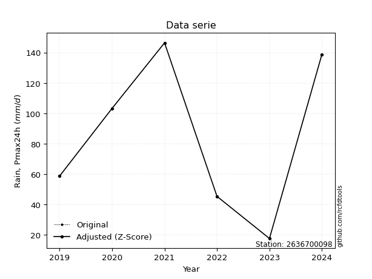</img>

</div>


> The initial value (value_initial) correspond to the initial obtained or null completed value, and value (value) is adjusted only when the initial value is outside the valid range (outlier) definite through the Z-Score value. If Z-Score is active, values out of range or outliers are replaced with the station mean value. A Z-Score (or standard score) measures how many standard deviations a data point is from the mean of a dataset, indicating its relative position; positive scores mean above the mean, negative mean below, and a score of zero is exactly at the mean, allowing for comparison of values from different distributions. It´s calculated using the formula $z=(x–μ)/σ$, where $x$ is the data point, $μ$ is the mean, and $σ$ is the standard deviation, helping identify outliers and understand probability.
>
> <sub>**Note**: In this study, "completing" (filling gaps in) and "extending" (forecasting or lengthening the historical record) rainfall data series are avoided for certain critical analyses because they introduce artificial bias and uncertainty, which can distort the statistics of rare events (extremes), alter day-to-day variability, and compromise the integrity and homogeneity of the original data. Some reasons against Completing/Extending rainfall data are: **Distortion of Extremes and Variability**: The primary issue is that most gap-filling or extension methods rely on averaging or regression with nearby stations, which inherently smooths the data. Rainfall is highly variable in space and time, with a large percentage of zero values and occasional large storms. Infilling methods often underestimate the highest values and overestimate the lowest (zero) values, which severely distorts analyses focused on flood frequency, drought severity, and intensity-duration-frequency (IDF) curves, **Loss of Data Homogeneity**: Infilled or extended data are synthetic estimates, not actual measurements. Combining these estimates with observed data can violate the assumption of data homogeneity, which requires that the data properties do not change over time. Inhomogeneity can lead to incorrect conclusions about long-term trends or changes in climate patterns, **Propagation of Errors**: Errors and biases from the original data (e.g., wind-induced undercatch, instrument errors, site changes) or the data used for imputation can propagate through the analysis, leading to unreliable hydrological models and inaccurate predictions, **Compromised Statistical Integrity**: For statistical analyses, especially those involving the frequency of events, using artificial data can introduce time bias or autocorrelation that doesn´t exist in reality, making it difficult to assess the true probability of events, **Difficulty in Validation**: It is difficult to accurately validate the quality of filled or extended data, especially for past periods where ground-truth measurements are unavailable. The reliability of imputation techniques heavily depends on the density of the surrounding station network and the complexity of the local topography.</sub>


### 4. Active continuous probability distributions from SciPy (80 of 104 available)

A Probability Density Function (PDF) describes the relative likelihood of a continuous random variable falling within a specific range, where the total area under its curve equals 1, and the area over any interval gives the actual probability for that range. Unlike discrete probabilities (like rolling a die), a PDF shows density, not direct probability for a single point (which is zero), with higher points indicating higher likelihood, often visualized as a bell curve for normal distributions.

A log of a probability density function (log-PDF) is simply the logarithm of the PDF´s value, denoted as $log(f(x))$, useful for converting multiplication of probabilities into addition, improving numerical stability with tiny numbers, and connecting to information theory concepts like entropy. Instead of dealing with very small probabilities (e.g., 0.000001), log-PDFs use negative numbers (e.g., $log(0.00001) ≈ -11.51$ that are easier for computers to handle, preventing underflow errors and simplifying complex calculations. In this study, each active probability distribution from SciPy is also evaluated in the $log$ form.

[scipy.stats](https://docs.scipy.org/doc/scipy/reference/stats.html) is a Python´s powerful submodule within the SciPy library for comprehensive statistical analysis, offering over 130 probability distributions (like Normal, Poisson, etc.), functions for descriptive stats (mean, variance), hypothesis testing (t-tests, chi-square), random variable generation, and statistical tests, making it essential for data science, modeling, and research. It provides tools to explore, model, and draw conclusions from data efficiently, working seamlessly with [NumPy](https://numpy.org/).

<div align="center">

|   id | p_dist           |   n_parameter | fit_method   | label                                                                       | active   | ref                                                                                                      |
|-----:|:-----------------|--------------:|:-------------|:----------------------------------------------------------------------------|:---------|:---------------------------------------------------------------------------------------------------------|
|    0 | alpha            |             3 | MLE          | Alpha                                                                       | True     | [:mortar_board:](https://docs.scipy.org/doc/scipy/reference/generated/scipy.stats.alpha.html)            |
|    1 | anglit           |             2 | MM           | Anglit                                                                      | True     | [:mortar_board:](https://docs.scipy.org/doc/scipy/reference/generated/scipy.stats.anglit.html)           |
|    2 | arcsine          |             2 | MM           | Arcsine                                                                     | True     | [:mortar_board:](https://docs.scipy.org/doc/scipy/reference/generated/scipy.stats.arcsine.html)          |
|    3 | argus            |             3 | MLE          | Argus                                                                       | True     | [:mortar_board:](https://docs.scipy.org/doc/scipy/reference/generated/scipy.stats.argus.html)            |
|    4 | beta             |             4 | MLE          | Beta                                                                        | True     | [:mortar_board:](https://docs.scipy.org/doc/scipy/reference/generated/scipy.stats.beta.html)             |
|    5 | betaprime        |             4 | MLE          | Beta prime                                                                  | True     | [:mortar_board:](https://docs.scipy.org/doc/scipy/reference/generated/scipy.stats.betaprime.html)        |
|    6 | bradford         |             3 | MLE          | Bradford                                                                    | True     | [:mortar_board:](https://docs.scipy.org/doc/scipy/reference/generated/scipy.stats.bradford.html)         |
|    7 | burr             |             4 | MLE          | Burr (Type III)                                                             | True     | [:mortar_board:](https://docs.scipy.org/doc/scipy/reference/generated/scipy.stats.burr.html)             |
|    8 | burr12           |             4 | MLE          | Burr (Type III) 12                                                          | True     | [:mortar_board:](https://docs.scipy.org/doc/scipy/reference/generated/scipy.stats.burr12.html)           |
|    9 | cosine           |             2 | MLE          | Cosine                                                                      | True     | [:mortar_board:](https://docs.scipy.org/doc/scipy/reference/generated/scipy.stats.cosine.html)           |
|   10 | crystalball      |             4 | MLE          | Crystalball                                                                 | True     | [:mortar_board:](https://docs.scipy.org/doc/scipy/reference/generated/scipy.stats.crystalball.html)      |
|   11 | dgamma           |             3 | MLE          | Double gamma                                                                | True     | [:mortar_board:](https://docs.scipy.org/doc/scipy/reference/generated/scipy.stats.dgamma.html)           |
|   12 | dweibull         |             3 | MLE          | Double Weibull                                                              | True     | [:mortar_board:](https://docs.scipy.org/doc/scipy/reference/generated/scipy.stats.dweibull.html)         |
|   13 | erlang           |             3 | MLE          | Erlang                                                                      | True     | [:mortar_board:](https://docs.scipy.org/doc/scipy/reference/generated/scipy.stats.erlang.html)           |
|   14 | exponnorm        |             3 | MLE          | Exponentially modified Normal                                               | True     | [:mortar_board:](https://docs.scipy.org/doc/scipy/reference/generated/scipy.stats.exponnorm.html)        |
|   15 | exponpow         |             3 | MLE          | Exponential power                                                           | True     | [:mortar_board:](https://docs.scipy.org/doc/scipy/reference/generated/scipy.stats.exponpow.html)         |
|   16 | exponweib        |             4 | MLE          | Exponentiated Weibull                                                       | True     | [:mortar_board:](https://docs.scipy.org/doc/scipy/reference/generated/scipy.stats.exponweib.html)        |
|   17 | f                |             4 | MLE          | F                                                                           | True     | [:mortar_board:](https://docs.scipy.org/doc/scipy/reference/generated/scipy.stats.f.html)                |
|   18 | fatiguelife      |             3 | MLE          | Fatigue-life (Birnbaum-Saunders)                                            | True     | [:mortar_board:](https://docs.scipy.org/doc/scipy/reference/generated/scipy.stats.fatiguelife.html)      |
|   19 | foldnorm         |             3 | MM           | Fold Normal                                                                 | True     | [:mortar_board:](https://docs.scipy.org/doc/scipy/reference/generated/scipy.stats.foldnorm.html)         |
|   20 | gamma            |             3 | MLE          | Gamma                                                                       | True     | [:mortar_board:](https://docs.scipy.org/doc/scipy/reference/generated/scipy.stats.gamma.html)            |
|   21 | gausshyper       |             6 | MLE          | Gauss hypergeometric                                                        | True     | [:mortar_board:](https://docs.scipy.org/doc/scipy/reference/generated/scipy.stats.gausshyper.html)       |
|   22 | genexpon         |             5 | MLE          | Generalized exponential                                                     | True     | [:mortar_board:](https://docs.scipy.org/doc/scipy/reference/generated/scipy.stats.genexpon.html)         |
|   23 | genextreme       |             3 | MLE          | Generalized exponential                                                     | True     | [:mortar_board:](https://docs.scipy.org/doc/scipy/reference/generated/scipy.stats.genextreme.html)       |
|   24 | gengamma         |             4 | MLE          | Generalized gamma                                                           | True     | [:mortar_board:](https://docs.scipy.org/doc/scipy/reference/generated/scipy.stats.gengamma.html)         |
|   25 | genhalflogistic  |             3 | MLE          | Generalized half-logistic                                                   | True     | [:mortar_board:](https://docs.scipy.org/doc/scipy/reference/generated/scipy.stats.genhalflogistic.html)  |
|   26 | genlogistic      |             3 | MLE          | Generalized logistic                                                        | True     | [:mortar_board:](https://docs.scipy.org/doc/scipy/reference/generated/scipy.stats.genlogistic.html)      |
|   27 | gennorm          |             3 | MLE          | Generalized Normal                                                          | True     | [:mortar_board:](https://docs.scipy.org/doc/scipy/reference/generated/scipy.stats.gennorm.html)          |
|   28 | genpareto        |             3 | MLE          | Generalized Pareto                                                          | True     | [:mortar_board:](https://docs.scipy.org/doc/scipy/reference/generated/scipy.stats.genpareto.html)        |
|   29 | gompertz         |             3 | MLE          | Gompertz (or truncated Gumbel)                                              | True     | [:mortar_board:](https://docs.scipy.org/doc/scipy/reference/generated/scipy.stats.gompertz.html)         |
|   30 | gumbel_l         |             2 | MM           | Gumbel Left Skew                                                            | True     | [:mortar_board:](https://docs.scipy.org/doc/scipy/reference/generated/scipy.stats.gumbel_l.html)         |
|   31 | gumbel_r         |             2 | MM           | Gumbel Right Skew                                                           | True     | [:mortar_board:](https://docs.scipy.org/doc/scipy/reference/generated/scipy.stats.gumbel_r.html)         |
|   32 | halfgennorm      |             3 | MLE          | Upper half of a generalized normal                                          | True     | [:mortar_board:](https://docs.scipy.org/doc/scipy/reference/generated/scipy.stats.halfgennorm.html)      |
|   33 | halflogistic     |             2 | MM           | Half-logistic                                                               | True     | [:mortar_board:](https://docs.scipy.org/doc/scipy/reference/generated/scipy.stats.halflogistic.html)     |
|   34 | halfnorm         |             2 | MM           | Half Normal                                                                 | True     | [:mortar_board:](https://docs.scipy.org/doc/scipy/reference/generated/scipy.stats.halfnorm.html)         |
|   35 | hypsecant        |             2 | MM           | hyperbolic secant                                                           | True     | [:mortar_board:](https://docs.scipy.org/doc/scipy/reference/generated/scipy.stats.hypsecant.html)        |
|   36 | invgamma         |             3 | MLE          | Inverted gamma                                                              | True     | [:mortar_board:](https://docs.scipy.org/doc/scipy/reference/generated/scipy.stats.invgamma.html)         |
|   37 | invgauss         |             3 | MLE          | Inverse Gaussian                                                            | True     | [:mortar_board:](https://docs.scipy.org/doc/scipy/reference/generated/scipy.stats.invgauss.html)         |
|   38 | invweibull       |             3 | MLE          | Inverted Weibull                                                            | True     | [:mortar_board:](https://docs.scipy.org/doc/scipy/reference/generated/scipy.stats.invweibull.html)       |
|   39 | johnsonsb        |             4 | MLE          | Johnson SB                                                                  | True     | [:mortar_board:](https://docs.scipy.org/doc/scipy/reference/generated/scipy.stats.johnsonsb.html)        |
|   40 | johnsonsu        |             4 | MLE          | Johnson Su                                                                  | True     | [:mortar_board:](https://docs.scipy.org/doc/scipy/reference/generated/scipy.stats.johnsonsu.html)        |
|   41 | kappa3           |             3 | MLE          | Kappa 3                                                                     | True     | [:mortar_board:](https://docs.scipy.org/doc/scipy/reference/generated/scipy.stats.kappa3.html)           |
|   42 | kappa4           |             4 | MLE          | Kappa 4                                                                     | True     | [:mortar_board:](https://docs.scipy.org/doc/scipy/reference/generated/scipy.stats.kappa4.html)           |
|   43 | ksone            |             3 | MLE          | Kolmogorov-Smirnov one-sided test statistic distribution                    | True     | [:mortar_board:](https://docs.scipy.org/doc/scipy/reference/generated/scipy.stats.ksone.html)            |
|   44 | kstwobign        |             2 | MLE          | Limiting distribution of scaled Kolmogorov-Smirnov two-sided test statistic | True     | [:mortar_board:](https://docs.scipy.org/doc/scipy/reference/generated/scipy.stats.kstwobign.html)        |
|   45 | laplace          |             2 | MM           | Laplace                                                                     | True     | [:mortar_board:](https://docs.scipy.org/doc/scipy/reference/generated/scipy.stats.laplace.html)          |
|   46 | levy_l           |             2 | MLE          | Left-skewed Levy                                                            | True     | [:mortar_board:](https://docs.scipy.org/doc/scipy/reference/generated/scipy.stats.levy_l.html)           |
|   47 | loggamma         |             3 | MLE          | Log gamma                                                                   | True     | [:mortar_board:](https://docs.scipy.org/doc/scipy/reference/generated/scipy.stats.loggamma.html)         |
|   48 | logistic         |             2 | MM           | Logistic (or Sech-squared)                                                  | True     | [:mortar_board:](https://docs.scipy.org/doc/scipy/reference/generated/scipy.stats.logistic.html)         |
|   49 | loglaplace       |             3 | MLE          | Log-Laplace                                                                 | True     | [:mortar_board:](https://docs.scipy.org/doc/scipy/reference/generated/scipy.stats.loglaplace.html)       |
|   50 | lomax            |             3 | MLE          | Lomax (Pareto of the second kind)                                           | True     | [:mortar_board:](https://docs.scipy.org/doc/scipy/reference/generated/scipy.stats.lomax.html)            |
|   51 | maxwell          |             2 | MM           | Maxwell                                                                     | True     | [:mortar_board:](https://docs.scipy.org/doc/scipy/reference/generated/scipy.stats.maxwell.html)          |
|   52 | mielke           |             4 | MLE          | Mielke Beta-Kappa / Dagum                                                   | True     | [:mortar_board:](https://docs.scipy.org/doc/scipy/reference/generated/scipy.stats.mielke.html)           |
|   53 | moyal            |             2 | MM           | Moyal                                                                       | True     | [:mortar_board:](https://docs.scipy.org/doc/scipy/reference/generated/scipy.stats.moyal.html)            |
|   54 | nakagami         |             3 | MLE          | Nakagami                                                                    | True     | [:mortar_board:](https://docs.scipy.org/doc/scipy/reference/generated/scipy.stats.nakagami.html)         |
|   55 | ncf              |             5 | MLE          | Non-central F distribution                                                  | True     | [:mortar_board:](https://docs.scipy.org/doc/scipy/reference/generated/scipy.stats.ncf.html)              |
|   56 | nct              |             4 | MLE          | Non-central Student’s t                                                     | True     | [:mortar_board:](https://docs.scipy.org/doc/scipy/reference/generated/scipy.stats.nct.html)              |
|   57 | norm             |             2 | MM           | Normal                                                                      | True     | [:mortar_board:](https://docs.scipy.org/doc/scipy/reference/generated/scipy.stats.norm.html)             |
|   58 | pearson3         |             3 | MM           | Pearson type III                                                            | True     | [:mortar_board:](https://docs.scipy.org/doc/scipy/reference/generated/scipy.stats.pearson3.html)         |
|   59 | powerlaw         |             3 | MLE          | Power-function                                                              | True     | [:mortar_board:](https://docs.scipy.org/doc/scipy/reference/generated/scipy.stats.powerlaw.html)         |
|   60 | rayleigh         |             2 | MM           | Rayleigh                                                                    | True     | [:mortar_board:](https://docs.scipy.org/doc/scipy/reference/generated/scipy.stats.rayleigh.html)         |
|   61 | rdist            |             3 | MLE          | R-distributed (symmetric beta)                                              | True     | [:mortar_board:](https://docs.scipy.org/doc/scipy/reference/generated/scipy.stats.rdist.html)            |
|   62 | rice             |             3 | MLE          | Rice                                                                        | True     | [:mortar_board:](https://docs.scipy.org/doc/scipy/reference/generated/scipy.stats.rice.html)             |
|   63 | semicircular     |             2 | MM           | Semicircular                                                                | True     | [:mortar_board:](https://docs.scipy.org/doc/scipy/reference/generated/scipy.stats.semicircular.html)     |
|   64 | skewnorm         |             3 | MLE          | Skew normal                                                                 | True     | [:mortar_board:](https://docs.scipy.org/doc/scipy/reference/generated/scipy.stats.skewnorm.html)         |
|   65 | t                |             3 | MLE          | Student’s t                                                                 | True     | [:mortar_board:](https://docs.scipy.org/doc/scipy/reference/generated/scipy.stats.t.html)                |
|   66 | trapezoid        |             4 | MLE          | Trapezoid                                                                   | True     | [:mortar_board:](https://docs.scipy.org/doc/scipy/reference/generated/scipy.stats.trapezoid.html)        |
|   67 | triang           |             3 | MLE          | Triangular                                                                  | True     | [:mortar_board:](https://docs.scipy.org/doc/scipy/reference/generated/scipy.stats.triang.html)           |
|   68 | truncexpon       |             3 | MLE          | Truncated exponential                                                       | True     | [:mortar_board:](https://docs.scipy.org/doc/scipy/reference/generated/scipy.stats.truncexpon.html)       |
|   69 | truncnorm        |             4 | MLE          | Truncated normal                                                            | True     | [:mortar_board:](https://docs.scipy.org/doc/scipy/reference/generated/scipy.stats.truncnorm.html)        |
|   70 | truncpareto      |             4 | MLE          | Upper truncated Pareto                                                      | True     | [:mortar_board:](https://docs.scipy.org/doc/scipy/reference/generated/scipy.stats.truncpareto.html)      |
|   71 | truncweibull_min |             5 | MLE          | Doubly truncated Weibull minimum                                            | True     | [:mortar_board:](https://docs.scipy.org/doc/scipy/reference/generated/scipy.stats.truncweibull_min.html) |
|   72 | tukeylambda      |             3 | MLE          | Tukey-Lamdba                                                                | True     | [:mortar_board:](https://docs.scipy.org/doc/scipy/reference/generated/scipy.stats.tukeylambda.html)      |
|   73 | uniform          |             2 | MLE          | Uniform                                                                     | True     | [:mortar_board:](https://docs.scipy.org/doc/scipy/reference/generated/scipy.stats.uniform.html)          |
|   74 | vonmises         |             3 | MLE          | Von Mises                                                                   | True     | [:mortar_board:](https://docs.scipy.org/doc/scipy/reference/generated/scipy.stats.vonmises.html)         |
|   75 | vonmises_line    |             3 | MLE          | Von Mises line                                                              | True     | [:mortar_board:](https://docs.scipy.org/doc/scipy/reference/generated/scipy.stats.vonmises_line.html)    |
|   76 | wald             |             2 | MM           | Wald                                                                        | True     | [:mortar_board:](https://docs.scipy.org/doc/scipy/reference/generated/scipy.stats.wald.html)             |
|   77 | weibull_max      |             3 | MLE          | Weibull maximum                                                             | True     | [:mortar_board:](https://docs.scipy.org/doc/scipy/reference/generated/scipy.stats.weibull_max.html)      |
|   78 | weibull_min      |             3 | MLE          | Weibull minimum                                                             | True     | [:mortar_board:](https://docs.scipy.org/doc/scipy/reference/generated/scipy.stats.weibull_min.html)      |
|   79 | wrapcauchy       |             3 | MLE          | Wrapped  Cauchy                                                             | True     | [:mortar_board:](https://docs.scipy.org/doc/scipy/reference/generated/scipy.stats.wrapcauchy.html)       |

</div>

> **n_parameter:** # arguments & localization & scale.
>
> **Fit methods:** (MLE) maximum likelihood, (MM) L-moments.
>
>**Inactive** (With the only purpose of prevent loops, zero divisions, infinite values, over high estimated values or horizontal trending for recurrence intervals estimations, the follow distributions were disabled.)**:** lognorm, norminvgauss, powernorm, powerlognorm, cauchy, halfcauchy, foldcauchy, skewcauchy, chi2, expon, fisk, genhyperbolic, geninvgauss, gibrat, kstwo, laplace_asymmetric, levy, levy_stable, ncx2, pareto, rel_breitwigner, recipinvgauss, studentized_range, loguniform, 


## B. Probability (PDF) vs. Empirical (EDF) distributions functions

A continuous probability distribution (CPD) describes probabilities for variables that can take any value within a range (like rain any time), unlike discrete variables with specific outcomes (like temperature). It uses a Probability Density Function (PDF), a curve where the total area under it equals 1, and the probability of the variable falling within an interval (a to b) is found by calculating the area under the curve between those points. A key feature is that the probability of hitting any single exact value is zero, so probabilities are always expressed for ranges, e.g., $P(a ≤ X ≤ b)$.

<div align="center">

Distributions parameters from station values
|     |    station | p_dist              |   n |               loc |            scale | shape                  | shape1                | shape2                | shape3             |
|----:|-----------:|:--------------------|----:|------------------:|-----------------:|:-----------------------|:----------------------|:----------------------|:-------------------|
|   0 | 2636700098 | alpha               |   7 |      -0.103387    |     40.0981      | 1.9137487200119673e-10 |                       |                       |                    |
|   1 | 2636700098 | anglit              |   7 |      82.1429      |    131.491       |                        |                       |                       |                    |
|   2 | 2636700098 | arcsine             |   7 |      18.5769      |    127.132       |                        |                       |                       |                    |
|   3 | 2636700098 | argus               |   7 |     -13.693       |    169.577       | 8.389843044596474e-06  |                       |                       |                    |
|   4 | 2636700098 | beta                |   7 |       5.15683     |    141.243       | 0.6292100454205427     | 0.7297366921164405    |                       |                    |
|   5 | 2636700098 | betaprime           |   7 |     -11.6992      |  23900.5         | 3.9098070440580877     | 1001.7270674235913    |                       |                    |
|   6 | 2636700098 | bradford            |   7 |      17.6977      |    128.702       | 1.237267087771232      |                       |                       |                    |
|   7 | 2636700098 | burr                |   7 |      -0.302126    |    148.623       | 240.5251390059135      | 0.005172656597357536  |                       |                    |
|   8 | 2636700098 | burr12              |   7 |      -1.11459     |     18.5889      | 342.6644003708691      | 0.002225765728900213  |                       |                    |
|   9 | 2636700098 | cosine              |   7 |      83.0892      |     36.1961      |                        |                       |                       |                    |
|  10 | 2636700098 | crystalball         |   7 |      56.394       |     93.0859      | 4846.20884582569       | 94.66604168453819     |                       |                    |
|  11 | 2636700098 | dgamma              |   7 |      85.7806      |      9.155       | 4.49060590744884       |                       |                       |                    |
|  12 | 2636700098 | dweibull            |   7 |      86.8614      |     46.7368      | 2.4595069057243792     |                       |                       |                    |
|  13 | 2636700098 | erlang              |   7 |      -3.08327     |     27.7307      | 3.0443025604755913     |                       |                       |                    |
|  14 | 2636700098 | exponnorm           |   7 |      75.7747      |     44.495       | 0.14312117581694006    |                       |                       |                    |
|  15 | 2636700098 | exponpow            |   7 |      17.7         |    140.116       | 0.18327462225026475    |                       |                       |                    |
|  16 | 2636700098 | exponweib           |   7 |    -139.449       |     35.2737      | 211.64005076362798     | 0.9681022524066121    |                       |                    |
|  17 | 2636700098 | f                   |   7 |       4.35514     |     77.8117      | 4.617096454501361      | 40936.408818670614    |                       |                    |
|  18 | 2636700098 | fatiguelife         |   7 |      17.7         |      9.78622e-05 | 637.5604645836254      |                       |                       |                    |
|  19 | 2636700098 | foldnorm            |   7 |     -11.2289      |     46.6205      | 1.9851357634141484     |                       |                       |                    |
|  20 | 2636700098 | gamma               |   7 |     -16.4238      |     21.8672      | 4.515818550627974      |                       |                       |                    |
|  21 | 2636700098 | gausshyper          |   7 |      14.8159      |    131.584       | 1.0429227269639467     | 0.8868685041117876    | 1.0404780238454991    | 1.0414180304190692 |
|  22 | 2636700098 | genexpon            |   7 |      17.7         |      2.20038     | 0.03266556801561418    | 5.489454887729343e-08 | 0.9566615539369366    |                    |
|  23 | 2636700098 | genextreme          |   7 |      62.0232      |    100.445       | 1.1904334419284681     |                       |                       |                    |
|  24 | 2636700098 | gengamma            |   7 |     -39.3392      |      9.0856      | 9.27488786418397       | 0.8632098934523567    |                       |                    |
|  25 | 2636700098 | genhalflogistic     |   7 |       4.54426     |    153.975       | 1.085432336434876      |                       |                       |                    |
|  26 | 2636700098 | genlogistic         |   7 |    -176.557       |     38.3182      | 483.11588864335783     |                       |                       |                    |
|  27 | 2636700098 | gennorm             |   7 |      82.05        |     64.3505      | 1515550.296586682      |                       |                       |                    |
|  28 | 2636700098 | genpareto           |   7 |      -1.54298     |    263.66        | -1.7821756764949246    |                       |                       |                    |
|  29 | 2636700098 | gompertz            |   7 |     -51.2376      |     43.7055      | 0.02960619456426197    |                       |                       |                    |
|  30 | 2636700098 | gumbel_l            |   7 |     102.372       |     35.0457      |                        |                       |                       |                    |
|  31 | 2636700098 | gumbel_r            |   7 |      61.9139      |     35.0457      |                        |                       |                       |                    |
|  32 | 2636700098 | halfgennorm         |   7 |      17.7         |      4.10059     | 0.3924771494966739     |                       |                       |                    |
|  33 | 2636700098 | halflogistic        |   7 |      28.8691      |     38.4289      |                        |                       |                       |                    |
|  34 | 2636700098 | halfnorm            |   7 |      22.6494      |     74.5639      |                        |                       |                       |                    |
|  35 | 2636700098 | hypsecant           |   7 |      82.1429      |     28.6147      |                        |                       |                       |                    |
|  36 | 2636700098 | invgamma            |   7 |    -172.943       |   7988.99        | 32.30955141507877      |                       |                       |                    |
|  37 | 2636700098 | invgauss            |   7 |     -67.4673      |   1494.23        | 0.10012502301000933    |                       |                       |                    |
|  38 | 2636700098 | invweibull          |   7 | -233421           | 233481           | 6099.9103433247        |                       |                       |                    |
|  39 | 2636700098 | johnsonsb           |   7 |      13.7796      |    132.62        | -0.6358746911577413    | 0.09611011957174595   |                       |                    |
|  40 | 2636700098 | johnsonsu           |   7 |       9.43488e+08 |      1.91384e+08 | 49834710.490414344     | 21680633.403372444    |                       |                    |
|  41 | 2636700098 | kappa3              |   7 |      17.6998      |    132.028       | 409.0995410441933      |                       |                       |                    |
|  42 | 2636700098 | kappa4              |   7 |       4.1733      |    147.414       | 1.1012109049857042     | 1.034120990294785     |                       |                    |
|  43 | 2636700098 | ksone               |   7 |       4.29081     |    155.704       | 1.0                    |                       |                       |                    |
|  44 | 2636700098 | kstwobign           |   7 |     -73.2607      |    177.683       |                        |                       |                       |                    |
|  45 | 2636700098 | laplace             |   7 |      82.1429      |     31.783       |                        |                       |                       |                    |
|  46 | 2636700098 | levy_l              |   7 |     150.874       |     19.083       |                        |                       |                       |                    |
|  47 | 2636700098 | loggamma            |   7 |  -14051.1         |   1893.31        | 1745.946638070097      |                       |                       |                    |
|  48 | 2636700098 | logistic            |   7 |      82.1429      |     24.7811      |                        |                       |                       |                    |
|  49 | 2636700098 | loglaplace          |   7 |      -0.179799    |     64.7798      | 1.8443047121732645     |                       |                       |                    |
|  50 | 2636700098 | lomax               |   7 |      17.6957      |  60068.5         | 914.9072600615034      |                       |                       |                    |
|  51 | 2636700098 | maxwell             |   7 |     -24.3648      |     66.7438      |                        |                       |                       |                    |
|  52 | 2636700098 | mielke              |   7 |      17.7         |    129.114       | 0.7871581000721153     | 22737.878866563908    |                       |                    |
|  53 | 2636700098 | moyal               |   7 |      56.4388      |     20.2337      |                        |                       |                       |                    |
|  54 | 2636700098 | nakagami            |   7 |      45.4         |     80.8343      | 0.21865736675103978    |                       |                       |                    |
|  55 | 2636700098 | ncf                 |   7 |      -0.0334077   |      3.34023e-05 | 2.554227498068496e-06  | 9.19728156929974      | 5.071592635400843     |                    |
|  56 | 2636700098 | nct                 |   7 |   -1850.38        |     44.9314      | 1298872.8989114217     | 43.01044515429277     |                       |                    |
|  57 | 2636700098 | norm                |   7 |      82.1429      |     44.9479      |                        |                       |                       |                    |
|  58 | 2636700098 | pearson3            |   7 |      82.1429      |     44.9478      | 0.19085773577401854    |                       |                       |                    |
|  59 | 2636700098 | powerlaw            |   7 |      17.7         |    128.7         | 0.1655464328333554     |                       |                       |                    |
|  60 | 2636700098 | rayleigh            |   7 |      -3.8451      |     68.6085      |                        |                       |                       |                    |
|  61 | 2636700098 | rdist               |   7 |       5.95281     |     58.6472      | 1.190727837529396      |                       |                       |                    |
|  62 | 2636700098 | rice                |   7 |      -1.91539     |     57.9559      | 0.8396988228432594     |                       |                       |                    |
|  63 | 2636700098 | semicircular        |   7 |      82.1429      |     89.8958      |                        |                       |                       |                    |
|  64 | 2636700098 | skewnorm            |   7 |      21.6021      |     75.4022      | 5.0413508038475765     |                       |                       |                    |
|  65 | 2636700098 | t                   |   7 |      82.1391      |     44.9494      | 21529303.647249117     |                       |                       |                    |
|  66 | 2636700098 | trapezoid           |   7 |       4.83        |    154.44        | 1.0                    | 1.0                   |                       |                    |
|  67 | 2636700098 | triang              |   7 |     -17.0839      |    165.038       | 0.9999999999999262     |                       |                       |                    |
|  68 | 2636700098 | truncexpon          |   7 |      17.7         |    134.994       | 0.953375241251204      |                       |                       |                    |
|  69 | 2636700098 | truncnorm           |   7 |     114.1         |     44.1719      | -383.82705100453995    | 0.7312417524441202    |                       |                    |
|  70 | 2636700098 | truncpareto         |   7 |      17.6379      |      0.0621049   | 0.16798808347628846    | 2073.3011427902065    |                       |                    |
|  71 | 2636700098 | truncweibull_min    |   7 |      17.6214      |    134.647       | 0.9486059560887916     | 0.0005781719419337829 | 0.9564165371155531    |                    |
|  72 | 2636700098 | tukeylambda         |   7 |      81.3812      |     71.17        | 1.0946066747222174     |                       |                       |                    |
|  73 | 2636700098 | uniform             |   7 |      17.7         |    128.7         |                        |                       |                       |                    |
|  74 | 2636700098 | vonmises            |   7 |       1.74897     |      1           | 1.2745814074387263     |                       |                       |                    |
|  75 | 2636700098 | vonmises_line       |   7 |      82.05        |     20.4833      | 0.0011421735181065462  |                       |                       |                    |
|  76 | 2636700098 | wald                |   7 |      37.195       |     44.9479      |                        |                       |                       |                    |
|  77 | 2636700098 | weibull_max         |   7 |     146.4         |      1.72588     | 0.23320034806387513    |                       |                       |                    |
|  78 | 2636700098 | weibull_min         |   7 |       9.95199     |     79.7746      | 1.5433659711097367     |                       |                       |                    |
|  79 | 2636700098 | wrapcauchy          |   7 |      17.6999      |     20.4833      | 0.2793688236493025     |                       |                       |                    |
|  80 | 2636700098 | logalpha            |   7 |     -10.4795      |    301.606       | 20.599935532666635     |                       |                       |                    |
|  81 | 2636700098 | loganglit           |   7 |       4.21264     |      1.99951     |                        |                       |                       |                    |
|  82 | 2636700098 | logarcsine          |   7 |       3.24602     |      1.93324     |                        |                       |                       |                    |
|  83 | 2636700098 | logargus            |   7 |       2.21744     |      2.85677     | 2.018482224300422      |                       |                       |                    |
|  84 | 2636700098 | logbeta             |   7 |       2.22782     |      2.75852     | 1.9843736181613787     | 0.8544137261670393    |                       |                    |
|  85 | 2636700098 | logbetaprime        |   7 |    -133.939       |     82.4801      | 108952.53064871246     | 65049.16165588088     |                       |                    |
|  86 | 2636700098 | logbradford         |   7 |       2.86728     |      2.11908     | 1.8588493332680783e-05 |                       |                       |                    |
|  87 | 2636700098 | logburr             |   7 |     -99.5321      |    104.533       | 21895.664816221935     | 0.006013149568692554  |                       |                    |
|  88 | 2636700098 | logburr12           |   7 |    -709.662       |    720.589       | 1356.4041262048718     | 179510.8026844        |                       |                    |
|  89 | 2636700098 | logcosine           |   7 |       4.13414     |      0.584218    |                        |                       |                       |                    |
|  90 | 2636700098 | logcrystalball      |   7 |       4.21264     |      0.683499    | 388.4468634432087      | 6.167492574840341     |                       |                    |
|  91 | 2636700098 | logdgamma           |   7 |       4.3843      |      0.220864    | 2.5936440836053993     |                       |                       |                    |
|  92 | 2636700098 | logdweibull         |   7 |       4.35367     |      0.638276    | 1.5462524975413023     |                       |                       |                    |
|  93 | 2636700098 | logerlang           |   7 |      -6.45763     |      0.0457364   | 233.0940674021038      |                       |                       |                    |
|  94 | 2636700098 | logexponnorm        |   7 |       4.21232     |      0.683498    | 0.0004698673639716886  |                       |                       |                    |
|  95 | 2636700098 | logexponpow         |   7 |       2.87356     |      1.43514     | 0.5910746896088359     |                       |                       |                    |
|  96 | 2636700098 | logexponweib        |   7 |       2.87356     |      1.88231     | 0.16926573082817473    | 1.0202676385311369    |                       |                    |
|  97 | 2636700098 | logf                |   7 |    -660.78        |    664.994       | 3378714.3347403463     | 4246603.620176624     |                       |                    |
|  98 | 2636700098 | logfatiguelife      |   7 |    -231.486       |    235.701       | 0.0028953221512307073  |                       |                       |                    |
|  99 | 2636700098 | logfoldnorm         |   7 |      -1.80435     |      0.666485    | 9.030309267538296      |                       |                       |                    |
| 100 | 2636700098 | loggamma            |   7 |      -7.55672     |      0.0413888   | 284.2274992167271      |                       |                       |                    |
| 101 | 2636700098 | loggausshyper       |   7 |       2.61115     |      2.37519     | 1.1906589279259854     | 0.48883429156473424   | 1.237402104993239     | 1.0456045554251208 |
| 102 | 2636700098 | loggenexpon         |   7 |       2.85403     |      0.01281     | 0.0029855709618022246  | 3.0199974598135038    | 3.200602851296654e-05 |                    |
| 103 | 2636700098 | loggenextreme       |   7 |       4.37845     |      0.74321     | 1.2226017628705441     |                       |                       |                    |
| 104 | 2636700098 | loggengamma         |   7 |       2.87356     |      1.03723     | 1.0262917085321897     | 0.9519026123162917    |                       |                    |
| 105 | 2636700098 | loggenhalflogistic  |   7 |       2.87127     |      2.27828     | 1.0771678995976428     |                       |                       |                    |
| 106 | 2636700098 | loggenlogistic      |   7 |       4.98636     |      9.55013e-07 | 1.234632001536124e-06  |                       |                       |                    |
| 107 | 2636700098 | loggennorm          |   7 |       3.92995     |      1.05641     | 502373.52634102106     |                       |                       |                    |
| 108 | 2636700098 | loggenpareto        |   7 |      -0.0104536   |     12.1419      | -2.429942041256149     |                       |                       |                    |
| 109 | 2636700098 | loggompertz         |   7 |       2.87356     |      0.628536    | 0.08239700666866479    |                       |                       |                    |
| 110 | 2636700098 | loggumbel_l         |   7 |       4.52025     |      0.532922    |                        |                       |                       |                    |
| 111 | 2636700098 | loggumbel_r         |   7 |       3.90502     |      0.532922    |                        |                       |                       |                    |
| 112 | 2636700098 | loghalfgennorm      |   7 |       2.87356     |      2.11283     | 616544.5042592813      |                       |                       |                    |
| 113 | 2636700098 | loghalflogistic     |   7 |       3.40251     |      0.584384    |                        |                       |                       |                    |
| 114 | 2636700098 | loghalfnorm         |   7 |       3.30788     |      1.13393     |                        |                       |                       |                    |
| 115 | 2636700098 | loghypsecant        |   7 |       4.21264     |      0.435129    |                        |                       |                       |                    |
| 116 | 2636700098 | loginvgamma         |   7 |     -12.2089      |   9045.34        | 552.0369870331162      |                       |                       |                    |
| 117 | 2636700098 | loginvgauss         |   7 |      -2.53692     |    558.757       | 0.012061083466032275   |                       |                       |                    |
| 118 | 2636700098 | loginvweibull       |   7 |      -9.50202e+07 |      9.50202e+07 | 129464253.18890896     |                       |                       |                    |
| 119 | 2636700098 | logjohnsonsb        |   7 |       2.23929     |      2.74705     | -0.15506468704834592   | 0.08312896006369194   |                       |                    |
| 120 | 2636700098 | logjohnsonsu        |   7 |       4.98634     |      4.36874e-11 | 2.1839410997846276     | 0.1368106869516203    |                       |                    |
| 121 | 2636700098 | logkappa3           |   7 |       2.87356     |      2.1109      | 2199.186761241428      |                       |                       |                    |
| 122 | 2636700098 | logkappa4           |   7 |       2.81009     |      2.31416     | 1.0282238946595794     | 1.0633717405516205    |                       |                    |
| 123 | 2636700098 | logksone            |   7 |       2.66229     |      2.53533     | 1.0                    |                       |                       |                    |
| 124 | 2636700098 | logkstwobign        |   7 |       1.23535     |      3.40418     |                        |                       |                       |                    |
| 125 | 2636700098 | loglaplace          |   7 |       4.21264     |      0.483307    |                        |                       |                       |                    |
| 126 | 2636700098 | loglevy_l           |   7 |       5.0265      |      0.167971    |                        |                       |                       |                    |
| 127 | 2636700098 | logloggamma         |   7 |       4.98655     |      2.41632e-05 | 3.1044676467416205e-05 |                       |                       |                    |
| 128 | 2636700098 | loglogistic         |   7 |       4.21264     |      0.376833    |                        |                       |                       |                    |
| 129 | 2636700098 | logloglaplace       |   7 |      -0.00741838  |      4.17563     | 7.5006855717228635     |                       |                       |                    |
| 130 | 2636700098 | loglomax            |   7 |       2.87356     |      2.66093e+11 | 89918926292.60077      |                       |                       |                    |
| 131 | 2636700098 | logmaxwell          |   7 |       2.59303     |      1.01494     |                        |                       |                       |                    |
| 132 | 2636700098 | logmielke           |   7 |       1.98675     |      3.01367     | 2.669438095109065      | 976.4762116543227     |                       |                    |
| 133 | 2636700098 | logmoyal            |   7 |       3.82177     |      0.307683    |                        |                       |                       |                    |
| 134 | 2636700098 | lognakagami         |   7 |       3.81551     |      0.677264    | 0.2694030823978574     |                       |                       |                    |
| 135 | 2636700098 | logncf              |   7 |     -55.9272      |     30.1767      | 21701.36409288118      | 32368.797251612697    | 21543.200278656353    |                    |
| 136 | 2636700098 | lognct              |   7 |     -40.5388      |      0.632828    | 14113.886898596065     | 70.71298776582302     |                       |                    |
| 137 | 2636700098 | lognorm             |   7 |       4.21264     |      0.683499    |                        |                       |                       |                    |
| 138 | 2636700098 | logpearson3         |   7 |       4.21264     |      0.6835      | -0.694729147252926     |                       |                       |                    |
| 139 | 2636700098 | logpowerlaw         |   7 |       2.87356     |      2.11278     | 0.18340346586129053    |                       |                       |                    |
| 140 | 2636700098 | lograyleigh         |   7 |       2.90505     |      1.0433      |                        |                       |                       |                    |
| 141 | 2636700098 | logrdist            |   7 |       3.70391     |      1.28243     | 1.0329678647467428     |                       |                       |                    |
| 142 | 2636700098 | logrice             |   7 |       2.40635     |      0.735131    | 2.213999563935888      |                       |                       |                    |
| 143 | 2636700098 | logsemicircular     |   7 |       4.21264     |      1.367       |                        |                       |                       |                    |
| 144 | 2636700098 | logskewnorm         |   7 |       4.98634     |      1.0324      | -18554909.760954626    |                       |                       |                    |
| 145 | 2636700098 | logt                |   7 |       4.21263     |      0.683496    | 574164117.0903528      |                       |                       |                    |
| 146 | 2636700098 | logtrapezoid        |   7 |       2.27941     |      2.89984     | 1.0                    | 1.0                   |                       |                    |
| 147 | 2636700098 | logtriang           |   7 |       2.44632     |      2.54009     | 0.999973598128856      |                       |                       |                    |
| 148 | 2636700098 | logtruncexpon       |   7 |       2.87356     |      2.46489     | 0.857215279213249      |                       |                       |                    |
| 149 | 2636700098 | logtruncnorm        |   7 |      -0.197124    |      1.51864     | 2.6422503118715177     | 3.413222683170731     |                       |                    |
| 150 | 2636700098 | logtruncpareto      |   7 |       2.87213     |      0.0014344   | 0.16783595088492806    | 1473.9390654905026    |                       |                    |
| 151 | 2636700098 | logtruncweibull_min |   7 |       2.83798     |      2.46921     | 1.1427409508241175     | 4.865892629376096e-08 | 0.8700628003999828    |                    |
| 152 | 2636700098 | logtukeylambda      |   7 |       3.92996     |      1.18327     | 1.120100171105809      |                       |                       |                    |
| 153 | 2636700098 | loguniform          |   7 |       2.87356     |      2.11278     |                        |                       |                       |                    |
| 154 | 2636700098 | logvonmises         |   7 |      -2.02921     |      1           | 2.7440675876291376     |                       |                       |                    |
| 155 | 2636700098 | logvonmises_line    |   7 |       4.38856     |      0.482236    | 0.8360970201942199     |                       |                       |                    |
| 156 | 2636700098 | logwald             |   7 |       3.52919     |      0.683452    |                        |                       |                       |                    |
| 157 | 2636700098 | logweibull_max      |   7 |       4.98634     |      0.933167    | 0.19383613827217816    |                       |                       |                    |
| 158 | 2636700098 | logweibull_min      |   7 |      -3.00307e+07 |      3.00307e+07 | 56717566.91414898      |                       |                       |                    |
| 159 | 2636700098 | logwrapcauchy       |   7 |       2.87356     |      0.336259    | 0.3072471921662261     |                       |                       |                    |

</div>

> **loc** (Location parameter): This shifts the distribution along the x-axis. For many common distributions, like the normal (Gaussian) distribution, loc represents the mean $μ$. For others, like the uniform distribution, it might represent the minimum value, or for the beta distribution, the left end of the support interval.
>
> **scale** (Scale parameter): This determines the width or spread of the distribution. For the normal distribution, scale represents the standard deviation $σ$. For a uniform distribution, it defines the length of the interval (from $loc$ to $loc + scale$).
>
> **shape** (Shape parameters): Refers to parameters that define the specific form of a probability distribution, distinct from its location (loc) and scale (scale). These parameters are required arguments for most distribution functions. For example, a normal (Gaussian) distribution is fully defined by its location (mean) and scale (standard deviation), so it has no specific shape parameters beyond loc and scale. However, other distributions have intrinsic properties that need specification, as Gamma distribution that takes a shape parameter, often named $a$ or $alpha$.


### 0. Cumulative distribution values - CDF (160 evaluated)

Cumulative Distribution Function (CDF), denoted as $F$<sub>$X$</sub>$(x)$, is a function that gives the probability that a random variable $X$ will take a value less than or equal to a specific value, $x$ (i.e., $(P(X≥x)$. It essentially "accumulates" probabilities from a given point up to the far right (positive infinity), providing a complete picture of the distribution´s probabilities for both discrete (like rain) and continuous (like temperature) variables, helping to find probabilities over ranges or above certain values. Each station is evaluated separately ordering the $x$ values ascending, calculating the CDF and PDF values for the activated distributions and their logarithmic forms.

<div align="center">

CDF ordered by x ascending and calculating $log(f(x))$ separately
|   id |    Station |   date |     x |   count |    mean |     std |    zscore |   Value_initial |    station |   m |     alpha |   alpha_pdf |    anglit |   anglit_pdf |   arcsine |   arcsine_pdf |     argus |   argus_pdf |     beta |    beta_pdf |   betaprime |   betaprime_pdf |    bradford |   bradford_pdf |      burr |   burr_pdf |     burr12 |   burr12_pdf |    cosine |   cosine_pdf |   crystalball |   crystalball_pdf |    dgamma |   dgamma_pdf |   dweibull |   dweibull_pdf |    erlang |   erlang_pdf |   exponnorm |   exponnorm_pdf |    exponpow |   exponpow_pdf |   exponweib |   exponweib_pdf |         f |      f_pdf |   fatiguelife |   fatiguelife_pdf |   foldnorm |   foldnorm_pdf |     gamma |   gamma_pdf |   gausshyper |   gausshyper_pdf |    genexpon |   genexpon_pdf |   genextreme |   genextreme_pdf |   gengamma |   gengamma_pdf |   genhalflogistic |   genhalflogistic_pdf |   genlogistic |   genlogistic_pdf |     gennorm |   gennorm_pdf |   genpareto |   genpareto_pdf |   gompertz |   gompertz_pdf |   gumbel_l |   gumbel_l_pdf |   gumbel_r |   gumbel_r_pdf |   halfgennorm |   halfgennorm_pdf |   halflogistic |   halflogistic_pdf |   halfnorm |   halfnorm_pdf |   hypsecant |   hypsecant_pdf |   invgamma |   invgamma_pdf |   invgauss |   invgauss_pdf |   invweibull |   invweibull_pdf |   johnsonsb |   johnsonsb_pdf |   johnsonsu |   johnsonsu_pdf |      kappa3 |   kappa3_pdf |     kappa4 |   kappa4_pdf |     ksone |   ksone_pdf |   kstwobign |   kstwobign_pdf |   laplace |   laplace_pdf |   levy_l |   levy_l_pdf |   loggamma |   loggamma_pdf |   logistic |   logistic_pdf |   loglaplace |   loglaplace_pdf |       lomax |   lomax_pdf |   maxwell |   maxwell_pdf |      mielke |   mielke_pdf |      moyal |   moyal_pdf |   nakagami |   nakagami_pdf |      ncf |    ncf_pdf |       nct |    nct_pdf |      norm |   norm_pdf |   pearson3 |   pearson3_pdf |   powerlaw |   powerlaw_pdf |   rayleigh |   rayleigh_pdf |    rdist |     rdist_pdf |     rice |   rice_pdf |   semicircular |   semicircular_pdf |   skewnorm |   skewnorm_pdf |         t |      t_pdf |   trapezoid |   trapezoid_pdf |    triang |   triang_pdf |   truncexpon |   truncexpon_pdf |   truncnorm |   truncnorm_pdf |   truncpareto |   truncpareto_pdf |   truncweibull_min |   truncweibull_min_pdf |   tukeylambda |   tukeylambda_pdf |   uniform |   uniform_pdf |   vonmises |   vonmises_pdf |   vonmises_line |   vonmises_line_pdf |      wald |   wald_pdf |   weibull_max |   weibull_max_pdf |   weibull_min |   weibull_min_pdf |   wrapcauchy |   wrapcauchy_pdf |   logalpha |   logalpha_pdf |   loganglit |   loganglit_pdf |   logarcsine |   logarcsine_pdf |   logargus |   logargus_pdf |   logbeta |   logbeta_pdf |   logbetaprime |   logbetaprime_pdf |   logbradford |   logbradford_pdf |   logburr |   logburr_pdf |   logburr12 |   logburr12_pdf |   logcosine |   logcosine_pdf |   logcrystalball |   logcrystalball_pdf |   logdgamma |   logdgamma_pdf |   logdweibull |   logdweibull_pdf |   logerlang |   logerlang_pdf |   logexponnorm |   logexponnorm_pdf |   logexponpow |   logexponpow_pdf |   logexponweib |   logexponweib_pdf |      logf |   logf_pdf |   logfatiguelife |   logfatiguelife_pdf |   logfoldnorm |   logfoldnorm_pdf |   loggausshyper |   loggausshyper_pdf |   loggenexpon |   loggenexpon_pdf |   loggenextreme |   loggenextreme_pdf |   loggengamma |   loggengamma_pdf |   loggenhalflogistic |   loggenhalflogistic_pdf |   loggenlogistic |   loggenlogistic_pdf |   loggennorm |   loggennorm_pdf |   loggenpareto |   loggenpareto_pdf |   loggompertz |   loggompertz_pdf |   loggumbel_l |   loggumbel_l_pdf |   loggumbel_r |   loggumbel_r_pdf |   loghalfgennorm |   loghalfgennorm_pdf |   loghalflogistic |   loghalflogistic_pdf |   loghalfnorm |   loghalfnorm_pdf |   loghypsecant |   loghypsecant_pdf |   loginvgamma |   loginvgamma_pdf |   loginvgauss |   loginvgauss_pdf |   loginvweibull |   loginvweibull_pdf |   logjohnsonsb |   logjohnsonsb_pdf |   logjohnsonsu |   logjohnsonsu_pdf |   logkappa3 |   logkappa3_pdf |   logkappa4 |   logkappa4_pdf |   logksone |   logksone_pdf |   logkstwobign |   logkstwobign_pdf |   loglevy_l |   loglevy_l_pdf |   logloggamma |   logloggamma_pdf |   loglogistic |   loglogistic_pdf |   logloglaplace |   logloglaplace_pdf |    loglomax |   loglomax_pdf |   logmaxwell |   logmaxwell_pdf |   logmielke |   logmielke_pdf |    logmoyal |   logmoyal_pdf |   lognakagami |   lognakagami_pdf |    logncf |   logncf_pdf |    lognct |   lognct_pdf |   lognorm |   lognorm_pdf |   logpearson3 |   logpearson3_pdf |   logpowerlaw |   logpowerlaw_pdf |   lograyleigh |   lograyleigh_pdf |   logrdist |   logrdist_pdf |   logrice |   logrice_pdf |   logsemicircular |   logsemicircular_pdf |   logskewnorm |   logskewnorm_pdf |      logt |   logt_pdf |   logtrapezoid |   logtrapezoid_pdf |   logtriang |   logtriang_pdf |   logtruncexpon |   logtruncexpon_pdf |   logtruncnorm |   logtruncnorm_pdf |   logtruncpareto |   logtruncpareto_pdf |   logtruncweibull_min |   logtruncweibull_min_pdf |   logtukeylambda |   logtukeylambda_pdf |   loguniform |   loguniform_pdf |   logvonmises |   logvonmises_pdf |   logvonmises_line |   logvonmises_line_pdf |   logwald |   logwald_pdf |   logweibull_max |   logweibull_max_pdf |   logweibull_min |   logweibull_min_pdf |   logwrapcauchy |   logwrapcauchy_pdf |
|-----:|-----------:|-------:|------:|--------:|--------:|--------:|----------:|----------------:|-----------:|----:|----------:|------------:|----------:|-------------:|----------:|--------------:|----------:|------------:|---------:|------------:|------------:|----------------:|------------:|---------------:|----------:|-----------:|-----------:|-------------:|----------:|-------------:|--------------:|------------------:|----------:|-------------:|-----------:|---------------:|----------:|-------------:|------------:|----------------:|------------:|---------------:|------------:|----------------:|----------:|-----------:|--------------:|------------------:|-----------:|---------------:|----------:|------------:|-------------:|-----------------:|------------:|---------------:|-------------:|-----------------:|-----------:|---------------:|------------------:|----------------------:|--------------:|------------------:|------------:|--------------:|------------:|----------------:|-----------:|---------------:|-----------:|---------------:|-----------:|---------------:|--------------:|------------------:|---------------:|-------------------:|-----------:|---------------:|------------:|----------------:|-----------:|---------------:|-----------:|---------------:|-------------:|-----------------:|------------:|----------------:|------------:|----------------:|------------:|-------------:|-----------:|-------------:|----------:|------------:|------------:|----------------:|----------:|--------------:|---------:|-------------:|-----------:|---------------:|-----------:|---------------:|-------------:|-----------------:|------------:|------------:|----------:|--------------:|------------:|-------------:|-----------:|------------:|-----------:|---------------:|---------:|-----------:|----------:|-----------:|----------:|-----------:|-----------:|---------------:|-----------:|---------------:|-----------:|---------------:|---------:|--------------:|---------:|-----------:|---------------:|-------------------:|-----------:|---------------:|----------:|-----------:|------------:|----------------:|----------:|-------------:|-------------:|-----------------:|------------:|----------------:|--------------:|------------------:|-------------------:|-----------------------:|--------------:|------------------:|----------:|--------------:|-----------:|---------------:|----------------:|--------------------:|----------:|-----------:|--------------:|------------------:|--------------:|------------------:|-------------:|-----------------:|-----------:|---------------:|------------:|----------------:|-------------:|-----------------:|-----------:|---------------:|----------:|--------------:|---------------:|-------------------:|--------------:|------------------:|----------:|--------------:|------------:|----------------:|------------:|----------------:|-----------------:|---------------------:|------------:|----------------:|--------------:|------------------:|------------:|----------------:|---------------:|-------------------:|--------------:|------------------:|---------------:|-------------------:|----------:|-----------:|-----------------:|---------------------:|--------------:|------------------:|----------------:|--------------------:|--------------:|------------------:|----------------:|--------------------:|--------------:|------------------:|---------------------:|-------------------------:|-----------------:|---------------------:|-------------:|-----------------:|---------------:|-------------------:|--------------:|------------------:|--------------:|------------------:|--------------:|------------------:|-----------------:|---------------------:|------------------:|----------------------:|--------------:|------------------:|---------------:|-------------------:|--------------:|------------------:|--------------:|------------------:|----------------:|--------------------:|---------------:|-------------------:|---------------:|-------------------:|------------:|----------------:|------------:|----------------:|-----------:|---------------:|---------------:|-------------------:|------------:|----------------:|--------------:|------------------:|--------------:|------------------:|----------------:|--------------------:|------------:|---------------:|-------------:|-----------------:|------------:|----------------:|------------:|---------------:|--------------:|------------------:|----------:|-------------:|----------:|-------------:|----------:|--------------:|--------------:|------------------:|--------------:|------------------:|--------------:|------------------:|-----------:|---------------:|----------:|--------------:|------------------:|----------------------:|--------------:|------------------:|----------:|-----------:|---------------:|-------------------:|------------:|----------------:|----------------:|--------------------:|---------------:|-------------------:|-----------------:|---------------------:|----------------------:|--------------------------:|-----------------:|---------------------:|-------------:|-----------------:|--------------:|------------------:|-------------------:|-----------------------:|----------:|--------------:|-----------------:|---------------------:|-----------------:|---------------------:|----------------:|--------------------:|
|    0 | 2636700098 |   2023 |  17.7 |       7 | 82.1429 | 48.5493 | -1.32737  |            17.7 | 2636700098 |   1 | 0.0243049 |  0.00798962 | 0.0846984 |   0.00423502 |  0        |    0          | 0.0509641 |  0.00321845 | 0.174221 |  0.00887669 |   0.0414538 |      0.00419096 | 2.73685e-05 |     0.0119381  | 0.0723445 | 0.00499984 | 0.00919818 |   0.0395322  | 0.0577293 |   0.00337009 |      0.338822 |        0.00393102 | 0.0468923 |   0.00308544 |  0.0363313 |     0.00338755 | 0.0376663 |   0.00453478 |   0.0756727 |      0.00317835 | 0.000908631 |    4.68737e+10 |   0.0474818 |      0.00381383 | 0.0331331 | 0.00506539 |     0.0972025 |       7.80069e+08 |  0.0816019 |     0.00365971 | 0.0399139 |  0.00386168 |    0.0247925 |       0.00887384 | 4.81644e-07 |     0.0148454  |     0.240343 |       0.00223652 |  0.0494011 |     0.0038352  |         0.0448031 |            0.00357204 |     0.0484672 |        0.0038166  | 3.79052e-06 |    0.0077699  |   0.0752085 |      0.00403195 |   0.107515 |     0.00292731 |  0.0854057 |     0.00232982 |  0.0292731 |     0.00294945 |   4.27621e-14 |        0.0695748  |       0        |         0          |   0        |     0          |    0.066714 |      0.00231443 |   0.054524 |     0.00359593 |   0.047261 |     0.00385353 |    0.0487266 |       0.0038472  |    0.165669 |     0.00628739  |   0.0733515 |      0.00313425 | 1.83863e-06 |   0.00746364 | 3.2492e-15 |   0.199185   | 0.0861197 |  0.00642244 |   0.0442011 |      0.00408917 | 0.0658261 |    0.00207111 | 0.294972 |   0.00105558 |  0.0245004 |      0.0892576 |  0.0691071 |     0.00259599 |    0.0313108 |        0.0647846 | 6.59388e-05 |  0.0152301  |  0.059181 |    0.00389308 | 2.18729e-13 |  16.1543     | 0.00919776 |  0.00172762 | 0          |     0          | 0.223278 | 0.00823743 | 0.0758221 | 0.00317578 | 0.0758256 | 0.00317571 |  0.0704173 |     0.00331132 | 0.00181432 |    8.45421e+10 |  0.0481115 |     0.00435692 | 0.572215 |    0.00621591 | 0.03952  | 0.00395497 |      0.0864844 |         0.00493751 |  0.0438296 |     0.00419624 | 0.0758446 | 0.00317621 |  0.00694444 |      0.00107917 | 0.0444209 |   0.00255411 |  2.19299e-07 |       0.0120537  |   0.0189413 |      0.00108733 |      0        |       3.74242     |        1.22671e-05 |             0.0167622  |     0.0117506 |        0.00848659 |  0        |    0.00777001 |    3.00756 |      0.0318709 |     2.42339e-07 |          0.00776113 | 0         | 0          |     0.065006  |       0.000321949 |     0.0269865 |        0.00530238 |  1.02709e-06 |       0.0137944  |  0.0234538 |      0.0937003 |   0.0133263 |        0.114696 |     0        |         0        |  0.0314857 |      0.0998706 | 0.0455744 |      0.142002 |      0.0249058 |          0.0860124 |    0.00296509 |          0.471907 | 0.0666991 |     0.0857544 |   0.0420677 |       0.0783727 |   0.0240691 |        0.121558 |        0.0250482 |            0.0856468 |   0.0100846 |       0.0364638 |     0.0127217 |         0.0487926 |   0.0245541 |       0.0901361 |      0.0250471 |          0.0856439 |   6.80412e-10 |    905616         |     0.00200095 |        7.78124e+11 | 0.0251543 |   0.085855 |        0.0243203 |             0.084164 |     0.0221354 |         0.0791585 |       0.0600151 |         0.263525    |    0.00465375 |          0.243432 |       0.0626454 |           0.0671849 |   9.57689e-16 |          2.10677  |          0.000503051 |                 0.219701 |         0        |            0.0841966 |  1.18155e-05 |         0.473298 |       0.298297 |        0.13668     |   2.15393e-08 |          0.131093 |     0.0444861 |         0.0815909 |   0.000980576 |         0.0127464 |          0       |             0.4733   |          0        |              0        |      0        |          0        |      0.0293137 |          0.0672726 |     0.0233955 |          0.088536 |     0.0254711 |          0.100673 |       0.0227535 |            0.11728  |       0.399326 |          0.0658065 |       0.100854 |         0.0114349  | 3.66668e-13 |        0.472078 | 3.73262e-06 |        0.615986 |  0.0833333 |       0.394425 |       0.025304 |           0.14912  |    0.220001 |       0.0497782 |     0.0662237 |         0.0850835 |      0.027828 |         0.0717922 |       0.0309028 |            0.080456 | 3.66902e-12 |       0.337923 |   0.00548945 |        0.0578104 |   0.0381795 |        0.114925 | 3.03136e-06 |    0.000111925 |   0           |       0           | 0.0252062 |    0.0873345 | 0.0251942 |     0.086419 | 0.0250481 |     0.0856467 |     0.0403705 |         0.0902311 |    0.00133264 |       5.50365e+11 |      0        |          0        |   0.271401 |    0.330107    | 0.0198563 |      0.094997 |        0.00174725 |             0.0936541 |     0.0407095 |         0.0952064 | 0.0250479 |  0.0856464 |       0.041981 |           0.141313 |   0.0282922 |        0.13244  |     1.42353e-08 |            0.704755 |    0           |           0        |         0        |          165.713     |             0.0136589 |                  0.436874 |      7.10543e-15 |             0.828556 |     0        |         0.473311 |       1.02597 |         0.0672599 |        6.46813e-09 |               0.120956 |  0        |      0        |         0.309861 |          0.0333072   |        0.0430528 |            0.0795359 |      1.1551e-06 |            0.893152 |
|    1 | 2636700098 |   2022 |  45.4 |       7 | 82.1429 | 48.5493 | -0.756816 |            45.4 | 2636700098 |   2 | 0.378203  |  0.0104798  | 0.234887  |   0.00644804 |  0.303823 |    0.00613658 | 0.176503  |  0.00577843 | 0.371456 |  0.00615138 |   0.235341  |      0.0090352  | 0.293211    |     0.00942763 | 0.230572  | 0.00627688 | 0.503187   |   0.00814614 | 0.196924  |   0.00661814 |      0.452992 |        0.00425596 | 0.226046  |   0.0102684  |  0.237402  |     0.0104896  | 0.246327  |   0.00943617 |   0.206877  |      0.00636543 | 0.667853    |    0.00343238  |   0.22912   |      0.00881967 | 0.258595  | 0.00968671 |     0.797991  |       0.00424234  |  0.219827  |     0.00641083 | 0.22358   |  0.00879152 |    0.265293  |       0.00824675 | 0.337158    |     0.00984017 |     0.312526 |       0.00302318 |  0.224374  |     0.00840281 |         0.155212  |            0.00445098 |     0.229594  |        0.00880315 | 0.5         |    0.00776995 |   0.192797  |      0.00448447 |   0.213824 |     0.00486003 |  0.178633  |     0.00461206 |  0.201507  |     0.00921083 |   0.470544    |        0.00838078 |       0.211827 |         0.0124272  |   0.239721 |     0.010214   |    0.171979 |      0.00572198 |   0.217672 |     0.00798208 |   0.226734 |     0.0086273  |    0.231034  |       0.00884443 |    0.227384 |     0.00120413  |   0.203989  |      0.00637989 | 0.206745    |   0.00746364 | 0.240715   |   0.00792415 | 0.264021  |  0.00642244 |   0.23609   |      0.0090178  | 0.157363  |    0.00495116 | 0.329422 |   0.0014697  |  0.291934  |      0.503291  |  0.18502   |     0.00608479 |    0.219846  |        0.454879  | 0.34418     |  0.00998423 |  0.221133 |    0.00756364 | 0.297708    |   0.00846005 | 0.188976   |  0.0109294  | 7.4719e-08 |     4.5987e+06 | 0.434864 | 0.00681543 | 0.206836  | 0.00635498 | 0.206834  | 0.00635471 |  0.20963   |     0.00676118 | 0.775469   |    0.00463451  |  0.227093  |     0.00808602 | 0.759747 |    0.00780083 | 0.210477 | 0.00795364 |      0.247234  |         0.00646321 |  0.251177  |     0.0095059  | 0.206866  | 0.00635508 |  0.0690066  |      0.00340185 | 0.14334   |   0.00458806 |  0.301859    |       0.00981758 |   0.0780788 |      0.00351015 |      0.887229 |       0.00300333  |        0.324217    |             0.00992116 |     0.228838  |        0.00761362 |  0.215229 |    0.00777001 |    7.37282 |      0.366535  |     0.215052    |          0.00776807 | 0.0487075 | 0.0182493  |     0.0755412 |       0.000450535 |     0.248712  |        0.00935402 |  0.305165    |       0.00748585 |  0.308964  |      0.519947  |   0.306571  |        0.461183 |     0.365237 |         0.361193 |  0.227822  |      0.351966  | 0.28535   |      0.375161 |      0.282274  |          0.495223  |    0.447475   |          0.471903 | 0.222674  |     0.28368   |   0.227338  |       0.378854  |   0.330638  |        0.505327 |        0.280615  |            0.493024  |   0.210913  |       0.546975  |     0.231946  |         0.511894  |   0.29451   |       0.506051  |      0.28061   |          0.49302   |   0.692953    |         0.327596  |     0.852479   |        0.12089     | 0.280391  |   0.491613 |        0.27883   |             0.493106 |     0.27485   |         0.500509  |       0.337774  |         0.322243    |    0.39112    |          0.486331 |       0.180979  |           0.216116  |   0.58663     |          0.374799 |          0.267811    |                 0.368019 |         0        |            0.284546  |  0.5         |         0.4733   |       0.449632 |        0.193448    |   0.249021    |          0.440614 |     0.233941  |         0.38308   |   0.30639     |         0.680077  |          0       |             0.4733   |          0.33936  |              0.757066 |      0.345611 |          0.636553 |      0.243037  |          0.505831  |     0.294744  |          0.50945  |     0.314084  |          0.509562 |       0.350547  |            0.500668 |       0.448145 |          0.0489473 |       0.11586  |         0.0228011  | 0.444672    |        0.472078 | 0.436089    |        0.45901  |  0.454861  |       0.394425 |       0.386181 |           0.493185 |    0.290429 |       0.114472  |     0.222125  |         0.285384  |      0.258487 |         0.508639  |       0.257929  |            0.506063 | 0.27262     |       0.245801 |   0.306328   |        0.552168  |   0.263572  |        0.384734 | 0.312392    |    0.786348    |   7.45409e-09 |       4.52196e+06 | 0.284622  |    0.495908  | 0.28196   |     0.493197 | 0.280615  |     0.493024  |     0.254543  |         0.414227  |    0.862297   |       0.167895    |      0.316673 |          0.571571 |   0.528364 |    0.254769    | 0.290811  |      0.500093 |        0.317692   |             0.445622  |     0.256757  |         0.406263  | 0.280616  |  0.493026  |       0.280603 |           0.365344 |   0.290564  |        0.424432 |     0.551724    |            0.480922 |    2.20418e-06 |           2.10872  |         0.939628 |            0.0847955 |             0.510738  |                  0.499486 |      0.447431    |             0.459511 |     0.445834 |         0.473311 |       1.24917 |         0.479997  |        0.189018    |               0.3813   |  0.289451 |      1.4387   |         0.351706 |          0.0608443   |        0.229487  |            0.379377  |      0.471095   |            0.256105 |
|    2 | 2636700098 |   2019 |  58.8 |       7 | 82.1429 | 48.5493 | -0.480807 |            58.8 | 2636700098 |   3 | 0.496033  |  0.007314   | 0.326181  |   0.00713077 |  0.380309 |    0.0053837  | 0.261191  |  0.00683692 | 0.450901 |  0.00574641 |   0.360903  |      0.00950893 | 0.413521    |     0.00855713 | 0.317495  | 0.00668356 | 0.590419   |   0.00521382 | 0.294237  |   0.00784064 |      0.51031  |        0.00428431 | 0.374453  |   0.0108615  |  0.375945  |     0.00939638 | 0.375065  |   0.00958505 |   0.301956  |      0.0077669  | 0.705546    |    0.00233091  |   0.35384   |      0.00957207 | 0.387723  | 0.00942039 |     0.845295  |       0.0029429   |  0.314293  |     0.00763456 | 0.347425  |  0.00949463 |    0.37286   |       0.00781673 | 0.456729    |     0.00806509 |     0.356296 |       0.00352597 |  0.344115  |     0.00928764 |         0.218466  |            0.00500754 |     0.354275  |        0.00958371 | 0.5         |    0.00776995 |   0.25476   |      0.00477355 |   0.286458 |     0.00599366 |  0.250565  |     0.00616804 |  0.335236  |     0.0104545  |   0.564433    |        0.00587931 |       0.37087  |         0.0112215  |   0.3722   |     0.00951414 |    0.26511  |      0.00823023 |   0.333277 |     0.00910575 |   0.348918 |     0.00941081 |    0.356152  |       0.00960633 |    0.24201  |     0.0010093   |   0.299555  |      0.00782499 | 0.306758    |   0.00746364 | 0.345099   |   0.0076763  | 0.350082  |  0.00642244 |   0.361443  |      0.00948804 | 0.239886  |    0.00754762 | 0.351075 |   0.00177838 |  0.431914  |      0.56762   |  0.280504  |     0.00814418 |    0.375423  |        0.776781  | 0.465192    |  0.00814011 |  0.329814 |    0.00853976 | 0.406144    |   0.00777857 | 0.345517   |  0.0119197  | 0.357414   |     0.011607   | 0.520004 | 0.00589241 | 0.30177   | 0.00775622 | 0.301765  | 0.00775595 |  0.30987   |     0.00811654 | 0.827814   |    0.00333435  |  0.340886  |     0.00877187 | 0.88438  |    0.0120226  | 0.323767 | 0.00882976 |      0.336569  |         0.00683884 |  0.378501  |     0.00930899 | 0.3018    | 0.00775609 |  0.12212    |      0.00452546 | 0.211412  |   0.00557199 |  0.427096    |       0.00888986 |   0.137165  |      0.00537336 |      0.919005 |       0.00189594  |        0.449297    |             0.00878593 |     0.330317  |        0.0075409  |  0.319347 |    0.00777001 |    9.68738 |      0.335596  |     0.319182    |          0.00777374 | 0.347741  | 0.0201182  |     0.0821882 |       0.000546709 |     0.374415  |        0.00927138 |  0.390264    |       0.00545227 |  0.450718  |      0.563739  |   0.430958  |        0.495332 |     0.454237 |         0.332735 |  0.333367  |      0.468615  | 0.392045  |      0.451354 |      0.421724  |          0.572161  |    0.569522   |          0.471902 | 0.309446  |     0.393241  |   0.344049  |       0.525647  |   0.467341  |        0.543413 |        0.419714  |            0.571817  |   0.37576   |       0.671136  |     0.378288  |         0.583732  |   0.434948  |       0.568244  |      0.419709  |          0.571816  |   0.767608    |         0.253209  |     0.879551   |        0.0907204   | 0.419061  |   0.569993 |        0.418043  |             0.572554 |     0.416771  |         0.585503  |       0.424135  |         0.347645    |    0.514395   |          0.461645 |       0.248154  |           0.310111  |   0.672672    |          0.294059 |          0.371677    |                 0.438562 |         0        |            0.397522  |  0.5         |         0.4733   |       0.50336  |        0.224055    |   0.377556    |          0.551105 |     0.351419  |         0.526935  |   0.482834    |         0.659652  |          0       |             0.4733   |          0.518769 |              0.625342 |      0.500805 |          0.560007 |      0.400356  |          0.695979  |     0.435804  |          0.569343 |     0.45212   |          0.546359 |       0.478577  |            0.480526 |       0.461375 |          0.0541747 |       0.12266  |         0.0304679  | 0.566766    |        0.472078 | 0.55523     |        0.462724 |  0.556872  |       0.394425 |       0.509924 |           0.457714 |    0.325492 |       0.161075  |     0.309676  |         0.397869  |      0.40914  |         0.641517  |       0.421447  |            0.774493 | 0.333492    |       0.225227 |   0.454052   |        0.577248  |   0.375188  |        0.479805 | 0.506966    |    0.690364    |   0.459396    |       0.927845    | 0.423899  |    0.570094  | 0.420859  |     0.570074 | 0.419714  |     0.571817  |     0.376948  |         0.529358  |    0.901532   |       0.13772     |      0.466256 |          0.573272 |   0.59529  |    0.264743    | 0.429835  |      0.564206 |        0.435613   |             0.46331   |     0.376926  |         0.523076  | 0.419715  |  0.571819  |       0.383047 |           0.426856 |   0.410702  |        0.504603 |     0.669802    |            0.433018 |    0.437301    |           1.32524  |         0.95862  |            0.0638987 |             0.635423  |                  0.464227 |      0.566236    |             0.459671 |     0.568246 |         0.473311 |       1.38973 |         0.595323  |        0.308691    |               0.542464 |  0.573284 |      0.798986 |         0.3695   |          0.078171    |        0.346157  |            0.524688  |      0.536569   |            0.259263 |
|    3 | 2636700098 |   2025 |  64.6 |       7 | 82.1429 | 48.5493 | -0.361341 |            64.6 | 2636700098 |   4 | 0.535441  |  0.00630687 | 0.368162  |   0.00733597 |  0.410998 |    0.00520989 | 0.302045  |  0.00724523 | 0.483892 |  0.00563514 |   0.415774  |      0.00938385 | 0.462186    |     0.00822828 | 0.356713  | 0.00683807 | 0.61829    |   0.00443017 | 0.340895  |   0.00823276 |      0.535123 |        0.00426912 | 0.432213  |   0.00879269 |  0.425496  |     0.00758523 | 0.430017  |   0.00933898 |   0.348412  |      0.00823455 | 0.718193    |    0.00204235  |   0.409275  |      0.00950862 | 0.441353  | 0.00905446 |     0.86122   |       0.00256123  |  0.359787  |     0.00803687 | 0.40247   |  0.00945578 |    0.417703  |       0.00764838 | 0.501549    |     0.00739971 |     0.377463 |       0.0037766  |  0.398233  |     0.0093428  |         0.248301  |            0.00528418 |     0.409811  |        0.00953173 | 0.5         |    0.00776995 |   0.282862  |      0.00491925 |   0.322682 |     0.00649679 |  0.288477  |     0.00690998 |  0.396049  |     0.0104671  |   0.59636     |        0.00515538 |       0.434066 |         0.0105596  |   0.426301 |     0.00913434 |    0.316041 |      0.00931744 |   0.386672 |     0.00927416 |   0.403563 |     0.0094004  |    0.411792  |       0.00954513 |    0.247739 |     0.000969639 |   0.346399  |      0.00830996 | 0.350047    |   0.00746364 | 0.389394   |   0.00760014 | 0.387332  |  0.00642244 |   0.416168  |      0.00935429 | 0.287911  |    0.00905865 | 0.361867 |   0.00194709 |  0.485627  |      0.57257   |  0.33006   |     0.00892295 |    0.456093  |        0.943694  | 0.510379    |  0.00745163 |  0.379982 |    0.00873651 | 0.450618    |   0.00756305 | 0.413722   |  0.0115393  | 0.417818   |     0.00942066 | 0.553043 | 0.00550247 | 0.348167  | 0.00822501 | 0.34816   | 0.00822475 |  0.358179  |     0.00851987 | 0.846104   |    0.00298655  |  0.392025  |     0.00884041 | 1        | 7528.16       | 0.375473 | 0.0089767  |      0.376559  |         0.0069456  |  0.431567  |     0.00897563 | 0.348196  | 0.00822478 |  0.149778   |      0.0050118  | 0.244965  |   0.00599787 |  0.477565    |       0.008516   |   0.170938  |      0.00627904 |      0.929179 |       0.00162539  |        0.498996    |             0.00835702 |     0.373998  |        0.00752266 |  0.364413 |    0.00777001 |   10.5075  |      0.392743  |     0.364276    |          0.00777584 | 0.453619  | 0.0164538  |     0.0855082 |       0.00059947  |     0.427505  |        0.00901793 |  0.420352    |       0.00495406 |  0.503689  |      0.560781  |   0.477791  |        0.49963  |     0.485367 |         0.329651 |  0.379726  |      0.517546  | 0.435913  |      0.481553 |      0.476094  |          0.58195   |    0.613915   |          0.471901 | 0.348722  |     0.442751  |   0.396016  |       0.578666  |   0.518563  |        0.544384 |        0.474091  |            0.582445  |   0.435411  |       0.577639  |     0.431253  |         0.531849  |   0.488676  |       0.572281  |      0.474085  |          0.582446  |   0.790356    |         0.230762  |     0.887692   |        0.0825599   | 0.473264  |   0.580627 |        0.472496  |             0.583317 |     0.47249   |         0.597153  |       0.457431  |         0.360653    |    0.55709    |          0.445521 |       0.279432  |           0.356188  |   0.699161    |          0.269473 |          0.414381    |                 0.469945 |         0        |            0.44893   |  0.5         |         0.4733   |       0.525115 |        0.238875    |   0.431042    |          0.585079 |     0.403429  |         0.578252  |   0.543207    |         0.622043  |          0       |             0.4733   |          0.575121 |              0.572599 |      0.551979 |          0.527657 |      0.467561  |          0.727735  |     0.489581  |          0.572218 |     0.503409  |          0.542559 |       0.522941  |            0.461906 |       0.466622 |          0.0575267 |       0.125711 |         0.0345602  | 0.611175    |        0.472078 | 0.598852    |        0.464742 |  0.593976  |       0.394425 |       0.552053 |           0.437483 |    0.34179  |       0.186458  |     0.34946   |         0.448983  |      0.470564 |         0.661125  |       0.500001  |            0.898149 | 0.354347    |       0.218181 |   0.507985   |        0.567859  |   0.422039  |        0.516446 | 0.569016    |    0.627876    |   0.539171    |       0.777445    | 0.478029  |    0.578939  | 0.475041  |     0.580059 | 0.474091  |     0.582445  |     0.42842   |         0.563907  |    0.914092   |       0.129493    |      0.519507 |          0.557604 |   0.620504 |    0.271678    | 0.48327   |      0.570168 |        0.479317   |             0.465461  |     0.428096  |         0.564583  | 0.474092  |  0.582447  |       0.424255 |           0.44923  |   0.459543  |        0.533765 |     0.70977     |            0.416803 |    0.551644    |           1.11121  |         0.964371 |            0.0585161 |             0.678468  |                  0.450876 |      0.609511    |             0.460434 |     0.612771 |         0.473311 |       1.44681 |         0.616015  |        0.362093    |               0.591023 |  0.640855 |      0.644173 |         0.37726  |          0.0871322   |        0.398002  |            0.577011  |      0.561613   |            0.274589 |
|    4 | 2636700098 |   2020 | 103.3 |       7 | 82.1429 | 48.5493 |  0.435787 |           103.3 | 2636700098 |   5 | 0.698176  |  0.0027755  | 0.65814   |   0.00721471 |  0.608006 |    0.00531033 | 0.620662  |  0.00883531 | 0.696959 |  0.00556378 |   0.723491  |      0.00611611 | 0.745658    |     0.00654898 | 0.638291  | 0.00766521 | 0.731863   |   0.00195859 | 0.673188  |   0.00812621 |      0.692834 |        0.00377476 | 0.539177  |   0.00676256 |  0.536842  |     0.005304   | 0.728486  |   0.00583038 |   0.681373  |      0.00793678 | 0.77539     |    0.00109553  |   0.720552  |      0.00609927 | 0.724761  | 0.00549767 |     0.928802  |       0.00116558  |  0.681349  |     0.0076575  | 0.718351  |  0.00635715 |    0.696371  |       0.00685521 | 0.719384    |     0.00416586 |     0.56623  |       0.00627676 |  0.717604  |     0.00653284 |         0.499592  |            0.00802024 |     0.72245   |        0.0061275  | 0.5         |    0.00776995 |   0.499437  |      0.00651675 |   0.627172 |     0.00866903 |  0.641863  |     0.0104934  |  0.735653  |     0.00644425 |   0.737289    |        0.00257769 |       0.748011 |         0.00573111 |   0.720583 |     0.00596164 |    0.716441 |      0.00864992 |   0.712023 |     0.00676225 |   0.718503 |     0.00633162 |    0.724094  |       0.00610614 |    0.285825 |     0.0011231   |   0.683136  |      0.00802027 | 0.63889     |   0.00746364 | 0.677324   |   0.00733874 | 0.63588   |  0.00642244 |   0.723171  |      0.00614286 | 0.743037  |    0.00808493 | 0.473491 |   0.00434591 |  0.735434  |      0.457886  |  0.701356  |     0.00845225 |    0.792476  |        0.429383  | 0.728262    |  0.00413297 |  0.699239 |    0.00702077 | 0.723591    |   0.00665398 | 0.753435   |  0.00589517 | 0.665306   |     0.0045812  | 0.721546 | 0.00335012 | 0.681083  | 0.00794478 | 0.681074  | 0.00794491 |  0.689889  |     0.00762204 | 0.934719   |    0.0018077   |  0.704603  |     0.00672392 | 1        |    0          | 0.699605 | 0.00708063 |      0.648435  |         0.00688283 |  0.721411  |     0.00588347 | 0.681098  | 0.00794439 |  0.406526   |      0.00825685 | 0.532068  |   0.00883953 |  0.764102    |       0.00639341 |   0.525509  |      0.0114183  |      0.972819 |       0.000805496 |        0.775949    |             0.00610584 |     0.664689  |        0.00753849 |  0.665113 |    0.00777001 |   16.8302  |      0.213963  |     0.665269    |          0.00777451 | 0.804803  | 0.0046153  |     0.120293  |       0.00137842  |     0.720413  |        0.00589116 |  0.599029    |       0.00525911 |  0.741714  |      0.42663   |   0.706209  |        0.45561  |     0.644908 |         0.366644 |  0.685166  |      0.779327  | 0.703453  |      0.674819 |      0.73394   |          0.477867  |    0.835436   |          0.471899 | 0.632025  |     0.798827  |   0.707675  |       0.682714  |   0.757971  |        0.449783 |        0.732964  |            0.481077  |   0.587119  |       0.628755  |     0.62431   |         0.584743  |   0.737479  |       0.454532  |      0.73296   |          0.481082  |   0.876906    |         0.144201  |     0.919172   |        0.0543483   | 0.73153   |   0.480611 |        0.731819  |             0.482007 |     0.737388  |         0.489186  |       0.653224  |         0.508245    |    0.741081   |          0.331762 |       0.530087  |           0.789191  |   0.801898    |          0.175284 |          0.684078    |                 0.708224 |         0        |            0.823639  |  0.5         |         0.4733   |       0.665672 |        0.394565    |   0.722411    |          0.602406 |     0.712469  |         0.672492  |   0.776535    |         0.368527  |          0       |             0.4733   |          0.784429 |              0.329126 |      0.759082 |          0.353777 |      0.77074   |          0.482493  |     0.737232  |          0.450651 |     0.734245  |          0.417116 |       0.710364  |            0.330989 |       0.502088 |          0.108931  |       0.151451 |         0.0920654  | 0.832779    |        0.472078 | 0.820811    |        0.48464  |  0.779128  |       0.394425 |       0.729403 |           0.315396 |    0.488968 |       0.543291  |     0.638742  |         0.820648  |      0.755438 |         0.490275  |       0.775134  |            0.363106 | 0.449056    |       0.186176 |   0.74476    |        0.419372  |   0.710072  |        0.715041 | 0.790561    |    0.332422    |   0.798399    |       0.380623    | 0.733885  |    0.47351   | 0.732443  |     0.478025 | 0.732965  |     0.481077  |     0.710524  |         0.587581  |    0.967459   |       0.100583    |      0.74815  |          0.400881 |   0.764436 |    0.365719    | 0.733736  |      0.46282  |        0.69469    |             0.442627  |     0.735542  |         0.729995  | 0.732966  |  0.481077  |       0.661338 |           0.560877 |   0.744259  |        0.67928  |     0.887924    |            0.344526 |    0.892999    |           0.435679 |         0.987215 |            0.0407858 |             0.87438   |                  0.384088 |      0.827842    |             0.472899 |     0.834954 |         0.473311 |       1.7237  |         0.509722  |        0.654701    |               0.577409 |  0.83333  |      0.250851 |         0.437668 |          0.201028    |        0.708177  |            0.678804  |      0.738248   |            0.548295 |
|    5 | 2636700098 |   2024 | 138.8 |       7 | 82.1429 | 48.5493 |  1.167    |           138.8 | 2636700098 |   6 | 0.772829  |  0.00159053 | 0.879497  |   0.00495166 |  0.850215 |    0.0110447  | 0.916302  |  0.0069589  | 0.918378 |  0.00793121 |   0.882185  |      0.00302924 | 0.958768    |     0.00551627 | 0.92093   | 0.00823696 | 0.785505   |   0.00116924 | 0.904037  |   0.0045362  |      0.811994 |        0.00289633 | 0.881739  |   0.00667957 |  0.863236  |     0.0083956  | 0.880021  |   0.00291999 |   0.896193  |      0.00400222 | 0.807473    |    0.000751069 |   0.87694   |      0.00295995 | 0.869619  | 0.00286436 |     0.959489  |       0.000627221 |  0.891203  |     0.00400159 | 0.883123  |  0.00312405 |    0.939069  |       0.00721884 | 0.834334    |     0.00245938 |     0.876007 |       0.0128178  |  0.886702  |     0.00317663 |         0.873617  |            0.0143523  |     0.87919   |        0.0029538  | 0.5         |    0.00776995 |   0.810953  |      0.0139574  |   0.895647 |     0.00546671 |  0.940849  |     0.00477262 |  0.894506  |     0.0028455  |   0.809331    |        0.0015939  |       0.891731 |         0.00266486 |   0.880703 |     0.00318052 |    0.912655 |      0.0030143  |   0.886557 |     0.00324657 |   0.882183 |     0.00309656 |    0.880092  |       0.00293591 |    0.356908 |     0.00500368  |   0.899017  |      0.00398065 | 0.903849    |   0.00746364 | 0.938665   |   0.00751028 | 0.863877  |  0.00642244 |   0.884194  |      0.00310963 | 0.915902  |    0.00264601 | 0.791319 |   0.0188479  |  0.850677  |      0.320102  |  0.907737  |     0.00337963 |    0.887377  |        0.233026  | 0.841609    |  0.0024076  |  0.88723  |    0.00359937 | 0.950812    |   0.00618034 | 0.896054   |  0.00255405 | 0.795856   |     0.00292461 | 0.816445 | 0.00209638 | 0.896259  | 0.00401014 | 0.896257  | 0.00401033 |  0.893388  |     0.00379237 | 0.989974   |    0.00135332  |  0.884832  |     0.00349005 | 1        |    0          | 0.889003 | 0.00361908 |      0.872805  |         0.0054982  |  0.879888  |     0.00316198 | 0.896264  | 0.00400999 |  0.752481   |      0.0112336  | 0.89214   |   0.0114462  |  0.963677    |       0.00491501 |   0.927442  |      0.0100619  |      0.99606  |       0.000537267 |        0.965614    |             0.00465455 |     0.937188  |        0.00796751 |  0.940948 |    0.00777001 |   22.1387  |      0.178655  |     0.941013    |          0.00776173 | 0.910342  | 0.00183765 |     0.243418  |       0.0105536   |     0.877028  |        0.00308708 |  0.897625    |       0.0128534  |  0.848736  |      0.297696  |   0.829909  |        0.375805 |     0.767684 |         0.49389  |  0.921951  |      0.746232  | 0.937336  |      0.993961 |      0.854144  |          0.332402  |    0.974834   |          0.471898 | 0.917596  |     1.15649   |   0.884085  |       0.474126  |   0.873515  |        0.327435 |        0.854055  |            0.334924  |   0.777927  |       0.565667  |     0.788618  |         0.4857    |   0.851733  |       0.317018  |      0.854053  |          0.334929  |   0.913592    |         0.105879  |     0.933473   |        0.043061    | 0.85267   |   0.335676 |        0.853173  |             0.335786 |     0.859601  |         0.334602  |       0.864078  |         1.25475     |    0.827148   |          0.251412 |       0.872326  |           1.8282    |   0.847335    |          0.134234 |          0.936467    |                 1.07127  |         0        |            1.20667   |  0.5         |         0.4733   |       0.845652 |        1.19154     |   0.877539    |          0.425201 |     0.885785  |         0.465002  |   0.864769    |         0.235765  |          0       |             0.4733   |          0.864155 |              0.21667  |      0.8482   |          0.251952 |      0.879866  |          0.26958   |     0.850438  |          0.314195 |     0.839876  |          0.297559 |       0.795593  |            0.247874 |       0.567894 |          0.625209  |       0.219677 |         0.759253   | 0.97223     |        0.472078 | 0.969431    |        0.539497 |  0.89564   |       0.394425 |       0.81127  |           0.240274 |    0.819937 |       2.32969   |     0.933576  |         1.19945   |      0.871212 |         0.297749  |       0.858392  |            0.214991 | 0.501396    |       0.168491 |   0.849909   |        0.292942  |   0.941424  |        0.852963 | 0.86947     |    0.210216    |   0.888211    |       0.235971    | 0.853081  |    0.330162  | 0.852869  |     0.333629 | 0.854056  |     0.334924  |     0.864288  |         0.43319   |    0.995324   |       0.0886373   |      0.848808 |          0.281691 |   0.912484 |    0.853607    | 0.850657  |      0.325772 |        0.819244   |             0.39579   |     0.958819  |         0.771816  | 0.854057  |  0.334922  |       0.837397 |           0.631134 |   0.95844   |        0.770849 |     0.983834    |            0.305616 |    0.988433    |           0.230151 |         0.998212 |            0.0340443 |             0.981852  |                  0.343927 |      0.971492    |             0.512558 |     0.974769 |         0.473311 |       1.8494  |         0.338535  |        0.799839    |               0.398998 |  0.891237 |      0.151297 |         0.56318  |          1.17575     |        0.883705  |            0.472586  |      0.95264    |            0.879037 |
|    6 | 2636700098 |   2021 | 146.4 |       7 | 82.1429 | 48.5493 |  1.32354  |           146.4 | 2636700098 |   7 | 0.784314  |  0.00143583 | 0.914513  |   0.00425284 |  1        |    0          | 0.964148  |  0.00550719 | 1        | 59.9805     |   0.903324  |      0.00254451 | 1           |     0.00533612 | 0.983725  | 0.00799314 | 0.793986   |   0.00106515 | 0.93501   |   0.00361714 |      0.833206 |        0.00268541 | 0.924542  |   0.00464828 |  0.918484  |     0.00610777 | 0.900465  |   0.00246992 |   0.923466  |      0.00318889 | 0.81299     |    0.000701789 |   0.897606  |      0.00249003 | 0.889806  | 0.00245675 |     0.963967  |       0.000552989 |  0.918639  |     0.00322976 | 0.904871  |  0.00261075 |    1         |       0.299828   | 0.852009    |     0.00219698 |     1        |       3.55079    |  0.908744  |     0.00263611 |         1         |            0.234065   |     0.899791  |        0.00247926 | 0.999996    |    0.00776993 |   1         |  38127.2        |   0.932446 |     0.00421107 |  0.970176  |     0.00298913 |  0.914161  |     0.00234108 |   0.820905    |        0.00145483 |       0.910288 |         0.00222979 |   0.903017 |     0.00269953 |    0.932855 |      0.00232916 |   0.909021 |     0.00267827 |   0.903741 |     0.00258844 |    0.900564  |       0.00246328 |    0.99766  |     2.38575e+10 |   0.926069  |      0.00315317 | 0.960573    |   0.00746364 | 0.99723    |   0.00829563 | 0.912688  |  0.00642244 |   0.905919  |      0.0026175  | 0.933788  |    0.00208325 | 0.96111  |   0.0218256  |  0.86707   |      0.29499   |  0.930409  |     0.0026128  |    0.899139  |        0.20869   | 0.858889    |  0.00214468 |  0.912134 |    0.00296525 | 0.997477    |   0.00610079 | 0.913776   |  0.0021224  | 0.817077   |     0.00266366 | 0.831613 | 0.0018987  | 0.923584  | 0.0031944  | 0.923583  | 0.00319455 |  0.91936   |     0.00305617 | 1          |    0.0012863   |  0.909083  |     0.00290194 | 1        |    0          | 0.914019 | 0.00297515 |      0.912597  |         0.0049525  |  0.902095  |     0.00268977 | 0.923588  | 0.00319428 |  0.840278   |      0.0118708  | 0.981252  |   0.0120043  |  0.999999    |       0.00464594 |   1         |      0.0090047  |      1        |       0.000500415 |        1           |             0.00439721 |     1         |        0.0134347  |  1        |    0.00777001 |   23.5539  |      0.388119  |     0.999999    |          0.00776113 | 0.923134  | 0.00153901 |     0.99939   |       5.00644e+09 |     0.898695  |        0.00262359 |  1           |       0.0137944  |  0.864002  |      0.275159  |   0.849464  |        0.357684 |     0.795395 |         0.549361 |  0.959418  |      0.648798  | 1         |    119.94     |      0.871139  |          0.305301  |    0.99999    |          0.471898 | 0.981096  |     1.18418   |   0.907851  |       0.417018  |   0.890318  |        0.302894 |        0.871178  |            0.307556  |   0.806747  |       0.515118  |     0.813554  |         0.449505  |   0.867966  |       0.292092  |      0.871176  |          0.307561  |   0.919078    |         0.0999927 |     0.935723   |        0.0413621   | 0.869838  |   0.30848  |        0.870342  |             0.308414 |     0.876673  |         0.305967  |       1         |         1.79035e+07 |    0.840177   |          0.237454 |       1         |        1080.87      |   0.854322    |          0.127956 |          1           |                12.2012   |         0.999977 |            1.29276   |  0.999989    |         0.473297 |       1        |        2.01591e+08 |   0.89905     |          0.381536 |     0.909094  |         0.40904   |   0.876813    |         0.216294  |          0.99998 |             0.473299 |          0.87526  |              0.200143 |      0.861184 |          0.235275 |      0.893445  |          0.240334  |     0.866531  |          0.289664 |     0.855174  |          0.276452 |       0.808441  |            0.234231 |       0.998127 |          1.628e+12 |       0.985931 |         1.1184e+08 | 0.997394    |        0.470558 | 1           |        3.85853  |  0.916667  |       0.394425 |       0.823742 |           0.227737 |    0.95916  |       2.50959   |     0.999757  |         1.28419   |      0.886269 |         0.267483  |       0.869345  |            0.196245 | 0.510297    |       0.165481 |   0.864941   |        0.271116  |   0.987556  |        0.869852 | 0.880216    |    0.193186    |   0.900225    |       0.214985    | 0.86997   |    0.303536  | 0.869933  |     0.306636 | 0.871179  |     0.307556  |     0.886357  |         0.394406  |    1          |       0.0868068   |      0.863281 |          0.261421 |   1        |    4.81052e+06 | 0.867344  |      0.300342 |        0.840032   |             0.383934  |     1         |         0.772846  | 0.87118   |  0.307555  |       0.871379 |           0.643813 |   0.999974  |        0.787374 |     0.999951    |            0.299077 |    1           |           0.204289 |         1        |            0.0330439 |             1         |                  0.336929 |      0.999993    |             0.681674 |     1        |         0.473311 |       1.86663 |         0.307896  |        0.820231    |               0.366278 |  0.898964 |      0.138829 |         0.998775 |          2.67117e+11 |        0.907406  |            0.416127  |      1          |            0.893152 |


</div>

An Empirical Distribution Function (EDF) is a step-function estimate of a true cumulative distribution function (CDF) based on observed sample data, representing the proportion of data points less than or equal to a given value. It is calculated by ordering your data and jumping up by $1/n$ (where $n$ is sample size) at each unique data point, allowing analysis without assuming an underlying population distribution, and it gets closer to the true CDF as the sample size grows. For the empirical probability calculations, the parameter $m$ correspond to the order number which means the position of the $x$ values in an ascending order list.

The Kolmogorov-Smirnov (K-S) test is a non-parametric statistical test used to determine if a sample data set comes from a specific theoretical distribution (one-sample) or if two different samples come from the same underlying distribution (two-sample), by comparing their cumulative distribution functions (CDFs). It calculates the maximum vertical difference (D statistic) between these functions, with a small p-value indicating a significant difference and rejection of the null hypothesis (that the data/samples match).


### 1. EDF California (1923)

California´s estimates the true probability distribution of water-related data (like rainfall, streamflow) using observed samples, crucial for risk assessment.

<div align="center">


$P=m/n$


</div>


**1.1. Empirical values**

<div align="center">

|                | 0                   | 1                  | 2                   | 3                  | 4                  | 5                  | 6              |
|:---------------|:--------------------|:-------------------|:--------------------|:-------------------|:-------------------|:-------------------|:---------------|
| date           | 2023                | 2022               | 2019                | 2025               | 2020               | 2024               | 2021           |
| x              | 17.7                | 45.4               | 58.8                | 64.6               | 103.3              | 138.8              | 146.4          |
| m              | 1                   | 2                  | 3                   | 4                  | 5                  | 6                  | 7              |
| empirical_dist | edf_california      | edf_california     | edf_california      | edf_california     | edf_california     | edf_california     | edf_california |
| empirical      | 0.14285714285714285 | 0.2857142857142857 | 0.42857142857142855 | 0.5714285714285714 | 0.7142857142857143 | 0.8571428571428571 | 1.0            |
| empirical_tr   | 1.1666666666666665  | 1.4                | 1.75                | 2.333333333333333  | 3.5                | 6.999999999999997  | inf            |

</div>


**1.2. Kolmogorov-Smirnov fit test (sorted by Δ)**


<div align="center">

|                | 0                   | 1                   | 2                   | 3                   | 4                   | 5                   | 6                   | 7                   | 8                   | 9                   | 10                  | 11                  | 12                  | 13                  | 14                  | 15                  | 16                  | 17                  | 18                  | 19                  | 20                  | 21                  | 22                  | 23                  | 24                  | 25                  | 26                  | 27                  | 28                  | 29                  | 30                  | 31                  | 32                  | 33                  | 34                  | 35                  | 36                  | 37                  | 38                  | 39                  | 40                  | 41                  | 42                  | 43                  | 44                  | 45                  | 46                  | 47                  | 48                  | 49                  | 50                  | 51                  | 52                  | 53                  | 54                  | 55                  | 56                  | 57                  | 58                  | 59                  | 60                  | 61                  | 62                  | 63                  | 64                  | 65                  | 66                  | 67                  | 68                  | 69                  | 70                  | 71                  | 72                  | 73                  | 74                  | 75                  | 76                  | 77                  | 78                  | 79                  | 80                  | 81                  | 82                  | 83                  | 84                  | 85                  | 86                  | 87                  | 88                  | 89                  | 90                  | 91                  | 92                  | 93                  | 94                  | 95                  | 96                  | 97                  | 98                  | 99                  | 100                 | 101                 | 102                 | 103                 | 104                 | 105                 | 106                 | 107                 | 108                 | 109                 | 110                 | 111                 | 112                 | 113                 | 114                 | 115                 | 116                 | 117                 | 118                 | 119                 | 120                 | 121                 | 122                 | 123                 | 124                 | 125                 | 126                 | 127                 | 128                 | 129                 | 130                 | 131                 | 132                 | 133                 | 134                 | 135                 | 136                 | 137                 | 138                 | 139                 | 140                 | 141                 | 142                 | 143                 | 144                 | 145                 | 146                 | 147                 | 148                 | 149                 | 150                 | 151                 | 152                 | 153                 | 154                 | 155                 | 156                 | 157                 | 158                 | 159                 |
|:---------------|:--------------------|:--------------------|:--------------------|:--------------------|:--------------------|:--------------------|:--------------------|:--------------------|:--------------------|:--------------------|:--------------------|:--------------------|:--------------------|:--------------------|:--------------------|:--------------------|:--------------------|:--------------------|:--------------------|:--------------------|:--------------------|:--------------------|:--------------------|:--------------------|:--------------------|:--------------------|:--------------------|:--------------------|:--------------------|:--------------------|:--------------------|:--------------------|:--------------------|:--------------------|:--------------------|:--------------------|:--------------------|:--------------------|:--------------------|:--------------------|:--------------------|:--------------------|:--------------------|:--------------------|:--------------------|:--------------------|:--------------------|:--------------------|:--------------------|:--------------------|:--------------------|:--------------------|:--------------------|:--------------------|:--------------------|:--------------------|:--------------------|:--------------------|:--------------------|:--------------------|:--------------------|:--------------------|:--------------------|:--------------------|:--------------------|:--------------------|:--------------------|:--------------------|:--------------------|:--------------------|:--------------------|:--------------------|:--------------------|:--------------------|:--------------------|:--------------------|:--------------------|:--------------------|:--------------------|:--------------------|:--------------------|:--------------------|:--------------------|:--------------------|:--------------------|:--------------------|:--------------------|:--------------------|:--------------------|:--------------------|:--------------------|:--------------------|:--------------------|:--------------------|:--------------------|:--------------------|:--------------------|:--------------------|:--------------------|:--------------------|:--------------------|:--------------------|:--------------------|:--------------------|:--------------------|:--------------------|:--------------------|:--------------------|:--------------------|:--------------------|:--------------------|:--------------------|:--------------------|:--------------------|:--------------------|:--------------------|:--------------------|:--------------------|:--------------------|:--------------------|:--------------------|:--------------------|:--------------------|:--------------------|:--------------------|:--------------------|:--------------------|:--------------------|:--------------------|:--------------------|:--------------------|:--------------------|:--------------------|:--------------------|:--------------------|:--------------------|:--------------------|:--------------------|:--------------------|:--------------------|:--------------------|:--------------------|:--------------------|:--------------------|:--------------------|:--------------------|:--------------------|:--------------------|:--------------------|:--------------------|:--------------------|:--------------------|:--------------------|:--------------------|:--------------------|:--------------------|:--------------------|:--------------------|:--------------------|:--------------------|
| station        | 2636700098          | 2636700098          | 2636700098          | 2636700098          | 2636700098          | 2636700098          | 2636700098          | 2636700098          | 2636700098          | 2636700098          | 2636700098          | 2636700098          | 2636700098          | 2636700098          | 2636700098          | 2636700098          | 2636700098          | 2636700098          | 2636700098          | 2636700098          | 2636700098          | 2636700098          | 2636700098          | 2636700098          | 2636700098          | 2636700098          | 2636700098          | 2636700098          | 2636700098          | 2636700098          | 2636700098          | 2636700098          | 2636700098          | 2636700098          | 2636700098          | 2636700098          | 2636700098          | 2636700098          | 2636700098          | 2636700098          | 2636700098          | 2636700098          | 2636700098          | 2636700098          | 2636700098          | 2636700098          | 2636700098          | 2636700098          | 2636700098          | 2636700098          | 2636700098          | 2636700098          | 2636700098          | 2636700098          | 2636700098          | 2636700098          | 2636700098          | 2636700098          | 2636700098          | 2636700098          | 2636700098          | 2636700098          | 2636700098          | 2636700098          | 2636700098          | 2636700098          | 2636700098          | 2636700098          | 2636700098          | 2636700098          | 2636700098          | 2636700098          | 2636700098          | 2636700098          | 2636700098          | 2636700098          | 2636700098          | 2636700098          | 2636700098          | 2636700098          | 2636700098          | 2636700098          | 2636700098          | 2636700098          | 2636700098          | 2636700098          | 2636700098          | 2636700098          | 2636700098          | 2636700098          | 2636700098          | 2636700098          | 2636700098          | 2636700098          | 2636700098          | 2636700098          | 2636700098          | 2636700098          | 2636700098          | 2636700098          | 2636700098          | 2636700098          | 2636700098          | 2636700098          | 2636700098          | 2636700098          | 2636700098          | 2636700098          | 2636700098          | 2636700098          | 2636700098          | 2636700098          | 2636700098          | 2636700098          | 2636700098          | 2636700098          | 2636700098          | 2636700098          | 2636700098          | 2636700098          | 2636700098          | 2636700098          | 2636700098          | 2636700098          | 2636700098          | 2636700098          | 2636700098          | 2636700098          | 2636700098          | 2636700098          | 2636700098          | 2636700098          | 2636700098          | 2636700098          | 2636700098          | 2636700098          | 2636700098          | 2636700098          | 2636700098          | 2636700098          | 2636700098          | 2636700098          | 2636700098          | 2636700098          | 2636700098          | 2636700098          | 2636700098          | 2636700098          | 2636700098          | 2636700098          | 2636700098          | 2636700098          | 2636700098          | 2636700098          | 2636700098          | 2636700098          | 2636700098          | 2636700098          | 2636700098          | 2636700098          |
| empirical_dist | edf_california      | edf_california      | edf_california      | edf_california      | edf_california      | edf_california      | edf_california      | edf_california      | edf_california      | edf_california      | edf_california      | edf_california      | edf_california      | edf_california      | edf_california      | edf_california      | edf_california      | edf_california      | edf_california      | edf_california      | edf_california      | edf_california      | edf_california      | edf_california      | edf_california      | edf_california      | edf_california      | edf_california      | edf_california      | edf_california      | edf_california      | edf_california      | edf_california      | edf_california      | edf_california      | edf_california      | edf_california      | edf_california      | edf_california      | edf_california      | edf_california      | edf_california      | edf_california      | edf_california      | edf_california      | edf_california      | edf_california      | edf_california      | edf_california      | edf_california      | edf_california      | edf_california      | edf_california      | edf_california      | edf_california      | edf_california      | edf_california      | edf_california      | edf_california      | edf_california      | edf_california      | edf_california      | edf_california      | edf_california      | edf_california      | edf_california      | edf_california      | edf_california      | edf_california      | edf_california      | edf_california      | edf_california      | edf_california      | edf_california      | edf_california      | edf_california      | edf_california      | edf_california      | edf_california      | edf_california      | edf_california      | edf_california      | edf_california      | edf_california      | edf_california      | edf_california      | edf_california      | edf_california      | edf_california      | edf_california      | edf_california      | edf_california      | edf_california      | edf_california      | edf_california      | edf_california      | edf_california      | edf_california      | edf_california      | edf_california      | edf_california      | edf_california      | edf_california      | edf_california      | edf_california      | edf_california      | edf_california      | edf_california      | edf_california      | edf_california      | edf_california      | edf_california      | edf_california      | edf_california      | edf_california      | edf_california      | edf_california      | edf_california      | edf_california      | edf_california      | edf_california      | edf_california      | edf_california      | edf_california      | edf_california      | edf_california      | edf_california      | edf_california      | edf_california      | edf_california      | edf_california      | edf_california      | edf_california      | edf_california      | edf_california      | edf_california      | edf_california      | edf_california      | edf_california      | edf_california      | edf_california      | edf_california      | edf_california      | edf_california      | edf_california      | edf_california      | edf_california      | edf_california      | edf_california      | edf_california      | edf_california      | edf_california      | edf_california      | edf_california      | edf_california      | edf_california      | edf_california      | edf_california      | edf_california      | edf_california      |
| p_dist         | beta                | loghypsecant        | loggausshyper       | logtriang           | loglogistic         | loglaplace          | loglaplace          | logcosine           | logfoldnorm         | logt                | lognorm             | logcrystalball      | logexponnorm        | logbetaprime        | logfatiguelife      | logncf              | lognct              | f                   | logf                | logloglaplace       | logerlang           | logrice             | loggamma            | loggamma            | loginvgamma         | logbeta             | logalpha            | logmaxwell          | skewnorm            | erlang              | loggumbel_r         | lomax               | bradford            | truncweibull_min    | logmoyal            | truncexpon          | loggompertz         | mielke              | halflogistic        | lograyleigh         | loghalfnorm         | loghalflogistic     | logpearson3         | logskewnorm         | weibull_min         | logwald             | loginvgauss         | halfnorm            | logtrapezoid        | genexpon            | logmielke           | logkappa4           | loganglit           | wrapcauchy          | gausshyper          | kstwobign           | betaprime           | loggenhalflogistic  | moyal               | logkappa3           | invweibull          | loggenexpon         | logsemicircular     | loguniform          | arcsine             | genlogistic         | logtukeylambda      | logbradford         | exponweib           | loggenpareto        | invgauss            | loggumbel_l         | ncf                 | gamma               | logksone            | gengamma            | logweibull_min      | dgamma              | gumbel_r            | logburr12           | logkstwobign        | dweibull            | rayleigh            | kappa4              | ksone               | invgamma            | halfgennorm         | logwrapcauchy       | logdweibull         | maxwell             | loginvweibull       | logargus            | logdgamma           | genextreme          | semicircular        | rice                | crystalball         | tukeylambda         | anglit              | logarcsine          | uniform             | vonmises_line       | logvonmises_line    | foldnorm            | pearson3            | burr                | alpha               | burr12              | kappa3              | logloggamma         | logburr             | exponnorm           | t                   | nct                 | norm                | logtruncweibull_min | johnsonsu           | loglevy_l           | cosine              | wald                | levy_l              | logistic            | logrdist            | gompertz            | hypsecant           | logtruncexpon       | argus               | gumbel_l            | laplace             | logtruncnorm        | nakagami            | lognakagami         | genpareto           | logjohnsonsb        | loggenextreme       | logweibull_max      | loggengamma         | genhalflogistic     | triang              | gennorm             | loggennorm          | exponpow            | truncnorm           | logexponpow         | trapezoid           | rdist               | loglomax            | powerlaw            | johnsonsb           | fatiguelife         | logexponweib        | logpowerlaw         | truncpareto         | weibull_max         | logjohnsonsu        | logtruncpareto      | loggenlogistic      | loghalfgennorm      | logvonmises         | vonmises            |
| delta          | 0.08753632601254824 | 0.1135434727127746  | 0.1139980598757116  | 0.11456494762676359 | 0.11502910778381692 | 0.11533510421665799 | 0.11533510421665799 | 0.11878804022301534 | 0.12332717456155917 | 0.12881978064081068 | 0.1288213374542515  | 0.12882150318064745 | 0.12882395629482235 | 0.12886070078902934 | 0.12965764493912624 | 0.13003040992374126 | 0.13006717645048793 | 0.13007585524622944 | 0.13016191911944264 | 0.13065480042521327 | 0.13203355739804334 | 0.13265585094868138 | 0.13293012130866833 | 0.13293012130866833 | 0.133469000665432   | 0.13551578726952884 | 0.13599783752082917 | 0.13736769487335002 | 0.13986197340342266 | 0.14141150218305748 | 0.14187656705585974 | 0.14279120406062723 | 0.14282977432763752 | 0.14284487572400908 | 0.14285411149799235 | 0.14285692355845592 | 0.14285712131783623 | 0.1428571428569241  | 0.14285714285714285 | 0.14285714285714285 | 0.14285714285714285 | 0.14285714285714285 | 0.14300896272635089 | 0.14333284610483998 | 0.14392376397579842 | 0.14471267812549832 | 0.14482612397654837 | 0.14512772725790318 | 0.1471739934680923  | 0.14799054554534918 | 0.14938912429852985 | 0.1503751289150163  | 0.15053579013444174 | 0.1510761462675585  | 0.15372518343305985 | 0.15526084096749726 | 0.15565491949982058 | 0.1570472491838228  | 0.1577062596697384  | 0.15895808180160476 | 0.15963612975802577 | 0.15982285754251402 | 0.15996770751607614 | 0.1601193430117968  | 0.16043059399735954 | 0.16161720975464777 | 0.16171690919415382 | 0.161760228110349   | 0.16215402802202672 | 0.16391763818922245 | 0.16786586509162743 | 0.16799942212248364 | 0.16838665897133664 | 0.1689584447321409  | 0.16914707155744985 | 0.1731957133854119  | 0.17342705402366343 | 0.1751091562763475  | 0.17537996914463466 | 0.17541290040025936 | 0.17625751165501324 | 0.17744338085135436 | 0.17940343126777825 | 0.18203444176263722 | 0.18409649234199504 | 0.18475640062342713 | 0.18483010080741052 | 0.18538077361759442 | 0.18644622739887462 | 0.19144624733624482 | 0.19155945780627337 | 0.1917024524391564  | 0.19325315168489998 | 0.19396560216444436 | 0.1948696475377364  | 0.195955942656726   | 0.19596490457573906 | 0.19743029250195776 | 0.20326637496824845 | 0.2046052423988668  | 0.2070152070152071  | 0.2071522477329809  | 0.2093354908142836  | 0.2116413556031317  | 0.2132498126919387  | 0.21471582302303677 | 0.2156856454669085  | 0.21747301257174656 | 0.22138179857177714 | 0.22196814035109624 | 0.22270612625577407 | 0.22301647847453265 | 0.2232327429377715  | 0.22326203196788447 | 0.2232686688651941  | 0.22502349925442988 | 0.22502929587499643 | 0.22963846076321537 | 0.23053346447612155 | 0.23700678595715952 | 0.2407942605566794  | 0.24136851067639242 | 0.24264926147126553 | 0.2487467361656795  | 0.2553871094861194  | 0.2660101461787159  | 0.2693833214131599  | 0.2829510942177069  | 0.28351789947801526 | 0.28571208153560984 | 0.2857142109952514  | 0.28571427826019236 | 0.2885667838257059  | 0.28924839110690403 | 0.2919960963902166  | 0.29396309985090274 | 0.30091588207737363 | 0.32312793089687397 | 0.3264638362270875  | 0.3571428571428571  | 0.3571428571428571  | 0.38213827884621043 | 0.40049082369099454 | 0.4072390126160018  | 0.4216509512579184  | 0.4740325550476361  | 0.4897025595636155  | 0.4897542424586382  | 0.5002344323706498  | 0.5122769297748369  | 0.5667645669558325  | 0.5765831209067359  | 0.6015148152608374  | 0.6137252712982495  | 0.6374655193258958  | 0.6539133926808078  | 0.8571428571428571  | 0.8571428571428571  | 1.0094098212077767  | 22.55390454037288   |
| deltao         | 0.48442053926100004 | 0.48442053926100004 | 0.48442053926100004 | 0.48442053926100004 | 0.48442053926100004 | 0.48442053926100004 | 0.48442053926100004 | 0.48442053926100004 | 0.48442053926100004 | 0.48442053926100004 | 0.48442053926100004 | 0.48442053926100004 | 0.48442053926100004 | 0.48442053926100004 | 0.48442053926100004 | 0.48442053926100004 | 0.48442053926100004 | 0.48442053926100004 | 0.48442053926100004 | 0.48442053926100004 | 0.48442053926100004 | 0.48442053926100004 | 0.48442053926100004 | 0.48442053926100004 | 0.48442053926100004 | 0.48442053926100004 | 0.48442053926100004 | 0.48442053926100004 | 0.48442053926100004 | 0.48442053926100004 | 0.48442053926100004 | 0.48442053926100004 | 0.48442053926100004 | 0.48442053926100004 | 0.48442053926100004 | 0.48442053926100004 | 0.48442053926100004 | 0.48442053926100004 | 0.48442053926100004 | 0.48442053926100004 | 0.48442053926100004 | 0.48442053926100004 | 0.48442053926100004 | 0.48442053926100004 | 0.48442053926100004 | 0.48442053926100004 | 0.48442053926100004 | 0.48442053926100004 | 0.48442053926100004 | 0.48442053926100004 | 0.48442053926100004 | 0.48442053926100004 | 0.48442053926100004 | 0.48442053926100004 | 0.48442053926100004 | 0.48442053926100004 | 0.48442053926100004 | 0.48442053926100004 | 0.48442053926100004 | 0.48442053926100004 | 0.48442053926100004 | 0.48442053926100004 | 0.48442053926100004 | 0.48442053926100004 | 0.48442053926100004 | 0.48442053926100004 | 0.48442053926100004 | 0.48442053926100004 | 0.48442053926100004 | 0.48442053926100004 | 0.48442053926100004 | 0.48442053926100004 | 0.48442053926100004 | 0.48442053926100004 | 0.48442053926100004 | 0.48442053926100004 | 0.48442053926100004 | 0.48442053926100004 | 0.48442053926100004 | 0.48442053926100004 | 0.48442053926100004 | 0.48442053926100004 | 0.48442053926100004 | 0.48442053926100004 | 0.48442053926100004 | 0.48442053926100004 | 0.48442053926100004 | 0.48442053926100004 | 0.48442053926100004 | 0.48442053926100004 | 0.48442053926100004 | 0.48442053926100004 | 0.48442053926100004 | 0.48442053926100004 | 0.48442053926100004 | 0.48442053926100004 | 0.48442053926100004 | 0.48442053926100004 | 0.48442053926100004 | 0.48442053926100004 | 0.48442053926100004 | 0.48442053926100004 | 0.48442053926100004 | 0.48442053926100004 | 0.48442053926100004 | 0.48442053926100004 | 0.48442053926100004 | 0.48442053926100004 | 0.48442053926100004 | 0.48442053926100004 | 0.48442053926100004 | 0.48442053926100004 | 0.48442053926100004 | 0.48442053926100004 | 0.48442053926100004 | 0.48442053926100004 | 0.48442053926100004 | 0.48442053926100004 | 0.48442053926100004 | 0.48442053926100004 | 0.48442053926100004 | 0.48442053926100004 | 0.48442053926100004 | 0.48442053926100004 | 0.48442053926100004 | 0.48442053926100004 | 0.48442053926100004 | 0.48442053926100004 | 0.48442053926100004 | 0.48442053926100004 | 0.48442053926100004 | 0.48442053926100004 | 0.48442053926100004 | 0.48442053926100004 | 0.48442053926100004 | 0.48442053926100004 | 0.48442053926100004 | 0.48442053926100004 | 0.48442053926100004 | 0.48442053926100004 | 0.48442053926100004 | 0.48442053926100004 | 0.48442053926100004 | 0.48442053926100004 | 0.48442053926100004 | 0.48442053926100004 | 0.48442053926100004 | 0.48442053926100004 | 0.48442053926100004 | 0.48442053926100004 | 0.48442053926100004 | 0.48442053926100004 | 0.48442053926100004 | 0.48442053926100004 | 0.48442053926100004 | 0.48442053926100004 | 0.48442053926100004 | 0.48442053926100004 | 0.48442053926100004 | 0.48442053926100004 |
| eval           | Δo > Δ              | Δo > Δ              | Δo > Δ              | Δo > Δ              | Δo > Δ              | Δo > Δ              | Δo > Δ              | Δo > Δ              | Δo > Δ              | Δo > Δ              | Δo > Δ              | Δo > Δ              | Δo > Δ              | Δo > Δ              | Δo > Δ              | Δo > Δ              | Δo > Δ              | Δo > Δ              | Δo > Δ              | Δo > Δ              | Δo > Δ              | Δo > Δ              | Δo > Δ              | Δo > Δ              | Δo > Δ              | Δo > Δ              | Δo > Δ              | Δo > Δ              | Δo > Δ              | Δo > Δ              | Δo > Δ              | Δo > Δ              | Δo > Δ              | Δo > Δ              | Δo > Δ              | Δo > Δ              | Δo > Δ              | Δo > Δ              | Δo > Δ              | Δo > Δ              | Δo > Δ              | Δo > Δ              | Δo > Δ              | Δo > Δ              | Δo > Δ              | Δo > Δ              | Δo > Δ              | Δo > Δ              | Δo > Δ              | Δo > Δ              | Δo > Δ              | Δo > Δ              | Δo > Δ              | Δo > Δ              | Δo > Δ              | Δo > Δ              | Δo > Δ              | Δo > Δ              | Δo > Δ              | Δo > Δ              | Δo > Δ              | Δo > Δ              | Δo > Δ              | Δo > Δ              | Δo > Δ              | Δo > Δ              | Δo > Δ              | Δo > Δ              | Δo > Δ              | Δo > Δ              | Δo > Δ              | Δo > Δ              | Δo > Δ              | Δo > Δ              | Δo > Δ              | Δo > Δ              | Δo > Δ              | Δo > Δ              | Δo > Δ              | Δo > Δ              | Δo > Δ              | Δo > Δ              | Δo > Δ              | Δo > Δ              | Δo > Δ              | Δo > Δ              | Δo > Δ              | Δo > Δ              | Δo > Δ              | Δo > Δ              | Δo > Δ              | Δo > Δ              | Δo > Δ              | Δo > Δ              | Δo > Δ              | Δo > Δ              | Δo > Δ              | Δo > Δ              | Δo > Δ              | Δo > Δ              | Δo > Δ              | Δo > Δ              | Δo > Δ              | Δo > Δ              | Δo > Δ              | Δo > Δ              | Δo > Δ              | Δo > Δ              | Δo > Δ              | Δo > Δ              | Δo > Δ              | Δo > Δ              | Δo > Δ              | Δo > Δ              | Δo > Δ              | Δo > Δ              | Δo > Δ              | Δo > Δ              | Δo > Δ              | Δo > Δ              | Δo > Δ              | Δo > Δ              | Δo > Δ              | Δo > Δ              | Δo > Δ              | Δo > Δ              | Δo > Δ              | Δo > Δ              | Δo > Δ              | Δo > Δ              | Δo > Δ              | Δo > Δ              | Δo > Δ              | Δo > Δ              | Δo > Δ              | Δo > Δ              | Δo > Δ              | Δo > Δ              | Δo > Δ              | Δo > Δ              | Δo > Δ              | Δo > Δ              | Δo > Δ              | Δo > Δ              | Δo > Δ              | Δo > Δ              | Δo <= Δ             | Δo <= Δ             | Δo <= Δ             | Δo <= Δ             | Δo <= Δ             | Δo <= Δ             | Δo <= Δ             | Δo <= Δ             | Δo <= Δ             | Δo <= Δ             | Δo <= Δ             | Δo <= Δ             | Δo <= Δ             | Δo <= Δ             |
| fit            | 1                   | 1                   | 1                   | 1                   | 1                   | 1                   | 1                   | 1                   | 1                   | 1                   | 1                   | 1                   | 1                   | 1                   | 1                   | 1                   | 1                   | 1                   | 1                   | 1                   | 1                   | 1                   | 1                   | 1                   | 1                   | 1                   | 1                   | 1                   | 1                   | 1                   | 1                   | 1                   | 1                   | 1                   | 1                   | 1                   | 1                   | 1                   | 1                   | 1                   | 1                   | 1                   | 1                   | 1                   | 1                   | 1                   | 1                   | 1                   | 1                   | 1                   | 1                   | 1                   | 1                   | 1                   | 1                   | 1                   | 1                   | 1                   | 1                   | 1                   | 1                   | 1                   | 1                   | 1                   | 1                   | 1                   | 1                   | 1                   | 1                   | 1                   | 1                   | 1                   | 1                   | 1                   | 1                   | 1                   | 1                   | 1                   | 1                   | 1                   | 1                   | 1                   | 1                   | 1                   | 1                   | 1                   | 1                   | 1                   | 1                   | 1                   | 1                   | 1                   | 1                   | 1                   | 1                   | 1                   | 1                   | 1                   | 1                   | 1                   | 1                   | 1                   | 1                   | 1                   | 1                   | 1                   | 1                   | 1                   | 1                   | 1                   | 1                   | 1                   | 1                   | 1                   | 1                   | 1                   | 1                   | 1                   | 1                   | 1                   | 1                   | 1                   | 1                   | 1                   | 1                   | 1                   | 1                   | 1                   | 1                   | 1                   | 1                   | 1                   | 1                   | 1                   | 1                   | 1                   | 1                   | 1                   | 1                   | 1                   | 1                   | 1                   | 1                   | 1                   | 1                   | 1                   | 0                   | 0                   | 0                   | 0                   | 0                   | 0                   | 0                   | 0                   | 0                   | 0                   | 0                   | 0                   | 0                   | 0                   |
| n              | 7                   | 7                   | 7                   | 7                   | 7                   | 7                   | 7                   | 7                   | 7                   | 7                   | 7                   | 7                   | 7                   | 7                   | 7                   | 7                   | 7                   | 7                   | 7                   | 7                   | 7                   | 7                   | 7                   | 7                   | 7                   | 7                   | 7                   | 7                   | 7                   | 7                   | 7                   | 7                   | 7                   | 7                   | 7                   | 7                   | 7                   | 7                   | 7                   | 7                   | 7                   | 7                   | 7                   | 7                   | 7                   | 7                   | 7                   | 7                   | 7                   | 7                   | 7                   | 7                   | 7                   | 7                   | 7                   | 7                   | 7                   | 7                   | 7                   | 7                   | 7                   | 7                   | 7                   | 7                   | 7                   | 7                   | 7                   | 7                   | 7                   | 7                   | 7                   | 7                   | 7                   | 7                   | 7                   | 7                   | 7                   | 7                   | 7                   | 7                   | 7                   | 7                   | 7                   | 7                   | 7                   | 7                   | 7                   | 7                   | 7                   | 7                   | 7                   | 7                   | 7                   | 7                   | 7                   | 7                   | 7                   | 7                   | 7                   | 7                   | 7                   | 7                   | 7                   | 7                   | 7                   | 7                   | 7                   | 7                   | 7                   | 7                   | 7                   | 7                   | 7                   | 7                   | 7                   | 7                   | 7                   | 7                   | 7                   | 7                   | 7                   | 7                   | 7                   | 7                   | 7                   | 7                   | 7                   | 7                   | 7                   | 7                   | 7                   | 7                   | 7                   | 7                   | 7                   | 7                   | 7                   | 7                   | 7                   | 7                   | 7                   | 7                   | 7                   | 7                   | 7                   | 7                   | 7                   | 7                   | 7                   | 7                   | 7                   | 7                   | 7                   | 7                   | 7                   | 7                   | 7                   | 7                   | 7                   | 7                   |
| best_fit       | 1                   | 0                   | 0                   | 0                   | 0                   | 0                   | 0                   | 0                   | 0                   | 0                   | 0                   | 0                   | 0                   | 0                   | 0                   | 0                   | 0                   | 0                   | 0                   | 0                   | 0                   | 0                   | 0                   | 0                   | 0                   | 0                   | 0                   | 0                   | 0                   | 0                   | 0                   | 0                   | 0                   | 0                   | 0                   | 0                   | 0                   | 0                   | 0                   | 0                   | 0                   | 0                   | 0                   | 0                   | 0                   | 0                   | 0                   | 0                   | 0                   | 0                   | 0                   | 0                   | 0                   | 0                   | 0                   | 0                   | 0                   | 0                   | 0                   | 0                   | 0                   | 0                   | 0                   | 0                   | 0                   | 0                   | 0                   | 0                   | 0                   | 0                   | 0                   | 0                   | 0                   | 0                   | 0                   | 0                   | 0                   | 0                   | 0                   | 0                   | 0                   | 0                   | 0                   | 0                   | 0                   | 0                   | 0                   | 0                   | 0                   | 0                   | 0                   | 0                   | 0                   | 0                   | 0                   | 0                   | 0                   | 0                   | 0                   | 0                   | 0                   | 0                   | 0                   | 0                   | 0                   | 0                   | 0                   | 0                   | 0                   | 0                   | 0                   | 0                   | 0                   | 0                   | 0                   | 0                   | 0                   | 0                   | 0                   | 0                   | 0                   | 0                   | 0                   | 0                   | 0                   | 0                   | 0                   | 0                   | 0                   | 0                   | 0                   | 0                   | 0                   | 0                   | 0                   | 0                   | 0                   | 0                   | 0                   | 0                   | 0                   | 0                   | 0                   | 0                   | 0                   | 0                   | 0                   | 0                   | 0                   | 0                   | 0                   | 0                   | 0                   | 0                   | 0                   | 0                   | 0                   | 0                   | 0                   | 0                   |
| best_fit_sort  | 1                   | 2                   | 3                   | 4                   | 5                   | 6                   | 7                   | 8                   | 9                   | 10                  | 11                  | 12                  | 13                  | 14                  | 15                  | 16                  | 17                  | 18                  | 19                  | 20                  | 21                  | 22                  | 23                  | 24                  | 25                  | 26                  | 27                  | 28                  | 29                  | 30                  | 31                  | 32                  | 33                  | 34                  | 35                  | 36                  | 37                  | 38                  | 39                  | 40                  | 41                  | 42                  | 43                  | 44                  | 45                  | 46                  | 47                  | 48                  | 49                  | 50                  | 51                  | 52                  | 53                  | 54                  | 55                  | 56                  | 57                  | 58                  | 59                  | 60                  | 61                  | 62                  | 63                  | 64                  | 65                  | 66                  | 67                  | 68                  | 69                  | 70                  | 71                  | 72                  | 73                  | 74                  | 75                  | 76                  | 77                  | 78                  | 79                  | 80                  | 81                  | 82                  | 83                  | 84                  | 85                  | 86                  | 87                  | 88                  | 89                  | 90                  | 91                  | 92                  | 93                  | 94                  | 95                  | 96                  | 97                  | 98                  | 99                  | 100                 | 101                 | 102                 | 103                 | 104                 | 105                 | 106                 | 107                 | 108                 | 109                 | 110                 | 111                 | 112                 | 113                 | 114                 | 115                 | 116                 | 117                 | 118                 | 119                 | 120                 | 121                 | 122                 | 123                 | 124                 | 125                 | 126                 | 127                 | 128                 | 129                 | 130                 | 131                 | 132                 | 133                 | 134                 | 135                 | 136                 | 137                 | 138                 | 139                 | 140                 | 141                 | 142                 | 143                 | 144                 | 145                 | 146                 | 147                 | 148                 | 149                 | 150                 | 151                 | 152                 | 153                 | 154                 | 155                 | 156                 | 157                 | 158                 | 159                 | 160                 |

</div>


**1.3. Best fit**

<div align="center">

|   id |    station | empirical_dist   | p_dist   |     delta |   deltao | eval   |   fit |   n |   best_fit |   best_fit_sort |
|-----:|-----------:|:-----------------|:---------|----------:|---------:|:-------|------:|----:|-----------:|----------------:|
|    0 | 2636700098 | edf_california   | beta     | 0.0875363 | 0.484421 | Δo > Δ |     1 |   7 |          1 |               1 |

</div>


<div align="center">

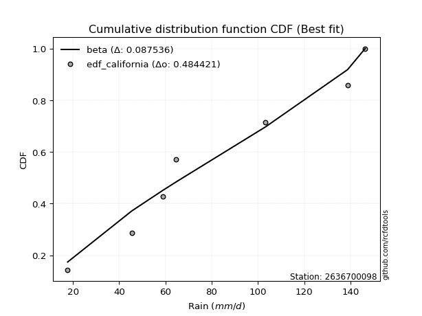</img>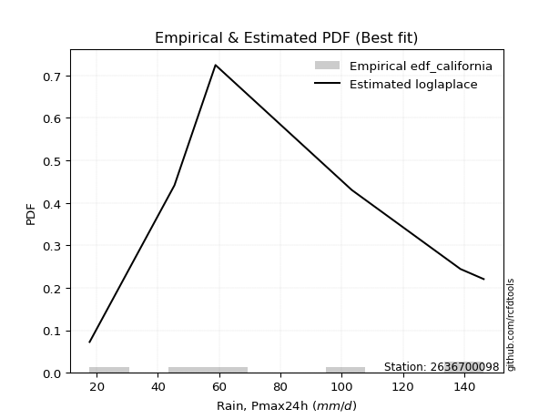</img>

</div>


### 2. EDF Hazen (1930)

Hazen method for plotting positions is a formula used to estimate the empirical cumulative probability distribution of flood events or other hydrological data. This formula often results in biased estimations, particularly when extrapolating to extreme events (high return periods).

<div align="center">


$P=(m-0.5)/n$


</div>


**2.1. Empirical values**

<div align="center">

|                | 0                   | 1                   | 2                   | 3         | 4                  | 5                  | 6                  |
|:---------------|:--------------------|:--------------------|:--------------------|:----------|:-------------------|:-------------------|:-------------------|
| date           | 2023                | 2022                | 2019                | 2025      | 2020               | 2024               | 2021               |
| x              | 17.7                | 45.4                | 58.8                | 64.6      | 103.3              | 138.8              | 146.4              |
| m              | 1                   | 2                   | 3                   | 4         | 5                  | 6                  | 7                  |
| empirical_dist | edf_hazen           | edf_hazen           | edf_hazen           | edf_hazen | edf_hazen          | edf_hazen          | edf_hazen          |
| empirical      | 0.07142857142857142 | 0.21428571428571427 | 0.35714285714285715 | 0.5       | 0.6428571428571429 | 0.7857142857142857 | 0.9285714285714286 |
| empirical_tr   | 1.0769230769230769  | 1.2727272727272727  | 1.5555555555555558  | 2.0       | 2.8000000000000003 | 4.666666666666666  | 14.000000000000007 |

</div>


**2.2. Kolmogorov-Smirnov fit test (sorted by Δ)**


<div align="center">

|                | 0                   | 1                   | 2                   | 3                   | 4                   | 5                   | 6                   | 7                   | 8                   | 9                   | 10                  | 11                  | 12                  | 13                  | 14                  | 15                  | 16                  | 17                  | 18                  | 19                  | 20                  | 21                  | 22                  | 23                  | 24                  | 25                  | 26                  | 27                  | 28                  | 29                  | 30                  | 31                  | 32                  | 33                  | 34                  | 35                  | 36                  | 37                  | 38                  | 39                  | 40                  | 41                  | 42                  | 43                  | 44                  | 45                  | 46                  | 47                  | 48                  | 49                  | 50                  | 51                  | 52                  | 53                  | 54                  | 55                  | 56                  | 57                  | 58                  | 59                  | 60                  | 61                  | 62                  | 63                  | 64                  | 65                  | 66                  | 67                  | 68                  | 69                  | 70                  | 71                  | 72                  | 73                  | 74                  | 75                  | 76                  | 77                  | 78                  | 79                  | 80                  | 81                  | 82                  | 83                  | 84                  | 85                  | 86                  | 87                  | 88                  | 89                  | 90                  | 91                  | 92                  | 93                  | 94                  | 95                  | 96                  | 97                  | 98                  | 99                  | 100                 | 101                 | 102                 | 103                 | 104                 | 105                 | 106                 | 107                 | 108                 | 109                 | 110                 | 111                 | 112                 | 113                 | 114                 | 115                 | 116                 | 117                 | 118                 | 119                 | 120                 | 121                 | 122                 | 123                 | 124                 | 125                 | 126                 | 127                 | 128                 | 129                 | 130                 | 131                 | 132                 | 133                 | 134                 | 135                 | 136                 | 137                 | 138                 | 139                 | 140                 | 141                 | 142                 | 143                 | 144                 | 145                 | 146                 | 147                 | 148                 | 149                 | 150                 | 151                 | 152                 | 153                 | 154                 | 155                 | 156                 | 157                 | 158                 | 159                 |
|:---------------|:--------------------|:--------------------|:--------------------|:--------------------|:--------------------|:--------------------|:--------------------|:--------------------|:--------------------|:--------------------|:--------------------|:--------------------|:--------------------|:--------------------|:--------------------|:--------------------|:--------------------|:--------------------|:--------------------|:--------------------|:--------------------|:--------------------|:--------------------|:--------------------|:--------------------|:--------------------|:--------------------|:--------------------|:--------------------|:--------------------|:--------------------|:--------------------|:--------------------|:--------------------|:--------------------|:--------------------|:--------------------|:--------------------|:--------------------|:--------------------|:--------------------|:--------------------|:--------------------|:--------------------|:--------------------|:--------------------|:--------------------|:--------------------|:--------------------|:--------------------|:--------------------|:--------------------|:--------------------|:--------------------|:--------------------|:--------------------|:--------------------|:--------------------|:--------------------|:--------------------|:--------------------|:--------------------|:--------------------|:--------------------|:--------------------|:--------------------|:--------------------|:--------------------|:--------------------|:--------------------|:--------------------|:--------------------|:--------------------|:--------------------|:--------------------|:--------------------|:--------------------|:--------------------|:--------------------|:--------------------|:--------------------|:--------------------|:--------------------|:--------------------|:--------------------|:--------------------|:--------------------|:--------------------|:--------------------|:--------------------|:--------------------|:--------------------|:--------------------|:--------------------|:--------------------|:--------------------|:--------------------|:--------------------|:--------------------|:--------------------|:--------------------|:--------------------|:--------------------|:--------------------|:--------------------|:--------------------|:--------------------|:--------------------|:--------------------|:--------------------|:--------------------|:--------------------|:--------------------|:--------------------|:--------------------|:--------------------|:--------------------|:--------------------|:--------------------|:--------------------|:--------------------|:--------------------|:--------------------|:--------------------|:--------------------|:--------------------|:--------------------|:--------------------|:--------------------|:--------------------|:--------------------|:--------------------|:--------------------|:--------------------|:--------------------|:--------------------|:--------------------|:--------------------|:--------------------|:--------------------|:--------------------|:--------------------|:--------------------|:--------------------|:--------------------|:--------------------|:--------------------|:--------------------|:--------------------|:--------------------|:--------------------|:--------------------|:--------------------|:--------------------|:--------------------|:--------------------|:--------------------|:--------------------|:--------------------|:--------------------|
| station        | 2636700098          | 2636700098          | 2636700098          | 2636700098          | 2636700098          | 2636700098          | 2636700098          | 2636700098          | 2636700098          | 2636700098          | 2636700098          | 2636700098          | 2636700098          | 2636700098          | 2636700098          | 2636700098          | 2636700098          | 2636700098          | 2636700098          | 2636700098          | 2636700098          | 2636700098          | 2636700098          | 2636700098          | 2636700098          | 2636700098          | 2636700098          | 2636700098          | 2636700098          | 2636700098          | 2636700098          | 2636700098          | 2636700098          | 2636700098          | 2636700098          | 2636700098          | 2636700098          | 2636700098          | 2636700098          | 2636700098          | 2636700098          | 2636700098          | 2636700098          | 2636700098          | 2636700098          | 2636700098          | 2636700098          | 2636700098          | 2636700098          | 2636700098          | 2636700098          | 2636700098          | 2636700098          | 2636700098          | 2636700098          | 2636700098          | 2636700098          | 2636700098          | 2636700098          | 2636700098          | 2636700098          | 2636700098          | 2636700098          | 2636700098          | 2636700098          | 2636700098          | 2636700098          | 2636700098          | 2636700098          | 2636700098          | 2636700098          | 2636700098          | 2636700098          | 2636700098          | 2636700098          | 2636700098          | 2636700098          | 2636700098          | 2636700098          | 2636700098          | 2636700098          | 2636700098          | 2636700098          | 2636700098          | 2636700098          | 2636700098          | 2636700098          | 2636700098          | 2636700098          | 2636700098          | 2636700098          | 2636700098          | 2636700098          | 2636700098          | 2636700098          | 2636700098          | 2636700098          | 2636700098          | 2636700098          | 2636700098          | 2636700098          | 2636700098          | 2636700098          | 2636700098          | 2636700098          | 2636700098          | 2636700098          | 2636700098          | 2636700098          | 2636700098          | 2636700098          | 2636700098          | 2636700098          | 2636700098          | 2636700098          | 2636700098          | 2636700098          | 2636700098          | 2636700098          | 2636700098          | 2636700098          | 2636700098          | 2636700098          | 2636700098          | 2636700098          | 2636700098          | 2636700098          | 2636700098          | 2636700098          | 2636700098          | 2636700098          | 2636700098          | 2636700098          | 2636700098          | 2636700098          | 2636700098          | 2636700098          | 2636700098          | 2636700098          | 2636700098          | 2636700098          | 2636700098          | 2636700098          | 2636700098          | 2636700098          | 2636700098          | 2636700098          | 2636700098          | 2636700098          | 2636700098          | 2636700098          | 2636700098          | 2636700098          | 2636700098          | 2636700098          | 2636700098          | 2636700098          | 2636700098          | 2636700098          | 2636700098          |
| empirical_dist | edf_hazen           | edf_hazen           | edf_hazen           | edf_hazen           | edf_hazen           | edf_hazen           | edf_hazen           | edf_hazen           | edf_hazen           | edf_hazen           | edf_hazen           | edf_hazen           | edf_hazen           | edf_hazen           | edf_hazen           | edf_hazen           | edf_hazen           | edf_hazen           | edf_hazen           | edf_hazen           | edf_hazen           | edf_hazen           | edf_hazen           | edf_hazen           | edf_hazen           | edf_hazen           | edf_hazen           | edf_hazen           | edf_hazen           | edf_hazen           | edf_hazen           | edf_hazen           | edf_hazen           | edf_hazen           | edf_hazen           | edf_hazen           | edf_hazen           | edf_hazen           | edf_hazen           | edf_hazen           | edf_hazen           | edf_hazen           | edf_hazen           | edf_hazen           | edf_hazen           | edf_hazen           | edf_hazen           | edf_hazen           | edf_hazen           | edf_hazen           | edf_hazen           | edf_hazen           | edf_hazen           | edf_hazen           | edf_hazen           | edf_hazen           | edf_hazen           | edf_hazen           | edf_hazen           | edf_hazen           | edf_hazen           | edf_hazen           | edf_hazen           | edf_hazen           | edf_hazen           | edf_hazen           | edf_hazen           | edf_hazen           | edf_hazen           | edf_hazen           | edf_hazen           | edf_hazen           | edf_hazen           | edf_hazen           | edf_hazen           | edf_hazen           | edf_hazen           | edf_hazen           | edf_hazen           | edf_hazen           | edf_hazen           | edf_hazen           | edf_hazen           | edf_hazen           | edf_hazen           | edf_hazen           | edf_hazen           | edf_hazen           | edf_hazen           | edf_hazen           | edf_hazen           | edf_hazen           | edf_hazen           | edf_hazen           | edf_hazen           | edf_hazen           | edf_hazen           | edf_hazen           | edf_hazen           | edf_hazen           | edf_hazen           | edf_hazen           | edf_hazen           | edf_hazen           | edf_hazen           | edf_hazen           | edf_hazen           | edf_hazen           | edf_hazen           | edf_hazen           | edf_hazen           | edf_hazen           | edf_hazen           | edf_hazen           | edf_hazen           | edf_hazen           | edf_hazen           | edf_hazen           | edf_hazen           | edf_hazen           | edf_hazen           | edf_hazen           | edf_hazen           | edf_hazen           | edf_hazen           | edf_hazen           | edf_hazen           | edf_hazen           | edf_hazen           | edf_hazen           | edf_hazen           | edf_hazen           | edf_hazen           | edf_hazen           | edf_hazen           | edf_hazen           | edf_hazen           | edf_hazen           | edf_hazen           | edf_hazen           | edf_hazen           | edf_hazen           | edf_hazen           | edf_hazen           | edf_hazen           | edf_hazen           | edf_hazen           | edf_hazen           | edf_hazen           | edf_hazen           | edf_hazen           | edf_hazen           | edf_hazen           | edf_hazen           | edf_hazen           | edf_hazen           | edf_hazen           | edf_hazen           | edf_hazen           | edf_hazen           |
| p_dist         | logtrapezoid        | logpearson3         | f                   | logf                | logfatiguelife      | arcsine             | lognct              | logexponnorm        | logcrystalball      | lognorm             | logt                | logrice             | logncf              | logbetaprime        | exponweib           | weibull_min         | loggompertz         | loganglit           | loggamma            | loggamma            | genlogistic         | skewnorm            | erlang              | loginvgamma         | invweibull          | logfoldnorm         | logerlang           | halfnorm            | invgauss            | betaprime           | gamma               | kstwobign           | logalpha            | loginvgauss         | loggumbel_l         | gengamma            | logmaxwell          | logweibull_min      | logsemicircular     | dgamma              | logburr12           | dweibull            | halflogistic        | rayleigh            | gumbel_r            | lograyleigh         | moyal               | wrapcauchy          | loglogistic         | ksone               | invgamma            | logdweibull         | logcosine           | maxwell             | logdgamma           | genexpon            | semicircular        | loggausshyper       | rice                | loghypsecant        | lomax               | anglit              | logloglaplace       | loggumbel_r         | logargus            | loginvweibull       | logvonmises_line    | foldnorm            | pearson3            | burr                | loghalfnorm         | loglaplace          | loglaplace          | logmoyal            | kappa3              | logloggamma         | loggenhalflogistic  | logarcsine          | logburr             | tukeylambda         | exponnorm           | logbeta             | t                   | nct                 | norm                | kappa4              | gausshyper          | johnsonsu           | uniform             | vonmises_line       | logmielke           | beta                | loglevy_l           | cosine              | loghalflogistic     | alpha               | mielke              | wald                | genextreme          | logistic            | logkstwobign        | logtriang           | bradford            | logskewnorm         | loggenexpon         | gompertz            | truncexpon          | truncweibull_min    | hypsecant           | argus               | gumbel_l            | laplace             | nakagami            | lognakagami         | logwald             | genpareto           | loggenextreme       | ncf                 | logkappa4           | levy_l              | logkappa3           | loguniform          | logtukeylambda      | logbradford         | loggenpareto        | logweibull_max      | logksone            | logtruncnorm        | genhalflogistic     | triang              | halfgennorm         | logwrapcauchy       | crystalball         | gennorm             | loggennorm          | burr12              | logtruncweibull_min | logrdist            | logjohnsonsb        | truncnorm           | logtruncexpon       | trapezoid           | loggengamma         | loglomax            | johnsonsb           | exponpow            | logexponpow         | weibull_max         | rdist               | powerlaw            | logjohnsonsu        | fatiguelife         | logexponweib        | logpowerlaw         | truncpareto         | logtruncpareto      | loggenlogistic      | loghalfgennorm      | logvonmises         | vonmises            |
| delta          | 0.0757454220395209  | 0.0785740780850156  | 0.08390478763244646 | 0.08867253879525328 | 0.08896224998043811 | 0.08953686996054541 | 0.08958558855787402 | 0.09010299012604461 | 0.09010719404020584 | 0.09010736435744315 | 0.09010920467410355 | 0.09087919299610614 | 0.09102786077632707 | 0.09108293314464277 | 0.09122530888622271 | 0.09131359108912107 | 0.09182437033651791 | 0.09228563043764729 | 0.09257692941498041 | 0.09257692941498041 | 0.09347603713001829 | 0.09417356201923466 | 0.09430681353695303 | 0.09437514775275202 | 0.09437784202532862 | 0.09453082283900271 | 0.09462188382476033 | 0.0949887306503816  | 0.09646856606361909 | 0.09647111904213213 | 0.09752987330356949 | 0.09847981675990514 | 0.09885708819113026 | 0.0997984568231681  | 0.10007036592668284 | 0.1017671419568405  | 0.1019031172941246  | 0.10199848259509203 | 0.10340675339729302 | 0.10368058484777609 | 0.10398432897168797 | 0.10601480942278296 | 0.10601714225014613 | 0.10797485983920685 | 0.1087918614341904  | 0.10911292737410333 | 0.11057790080933927 | 0.11191079604962095 | 0.11258052610412217 | 0.11266792091342365 | 0.11332782919485573 | 0.11501765597030322 | 0.11635263891531625 | 0.12001767590767343 | 0.12182458025632859 | 0.12287236943972255 | 0.123441076109165   | 0.12348792552832824 | 0.1245273712281546  | 0.1278824043888782  | 0.12989433225474958 | 0.13183780353967706 | 0.1322772294047031  | 0.13367831591858748 | 0.13623652975190437 | 0.13626177759646882 | 0.1379069193857122  | 0.1402127841745603  | 0.14182124126336731 | 0.14328725159446537 | 0.14366169327946837 | 0.14961928320097573 | 0.14961928320097573 | 0.14982336467716056 | 0.14995322714320575 | 0.15053956892252485 | 0.15075256880991839 | 0.15095109224864725 | 0.15127755482720268 | 0.15147341606765863 | 0.15158790704596126 | 0.151621871876368   | 0.15180417150920011 | 0.15183346053931307 | 0.1518400974366227  | 0.15295049046374865 | 0.15335518665473558 | 0.15360072444642503 | 0.15523365523365518 | 0.1552986090066183  | 0.1557096644458329  | 0.15717000351418778 | 0.15820988933464397 | 0.15910489304755016 | 0.1616257133600862  | 0.16391732891559188 | 0.16509775742582888 | 0.16557821452858806 | 0.16891472565544322 | 0.16993993924782103 | 0.17189565217806077 | 0.1727259476914922  | 0.17305406521428235 | 0.17310449924854754 | 0.17683459802424248 | 0.1773181647371081  | 0.17796313917193585 | 0.1798993144957175  | 0.18395853805754803 | 0.1979547499845885  | 0.21152252278913553 | 0.21208932804944386 | 0.21428563956667995 | 0.2142857068316209  | 0.21614124955406971 | 0.2171382123971345  | 0.22056752496164522 | 0.22057789293112243 | 0.22180370034358773 | 0.2235435282661977  | 0.23038665323017618 | 0.23154791444036824 | 0.23314548062272525 | 0.23318879953892044 | 0.23534620961779387 | 0.23843210672223716 | 0.24057564298602127 | 0.25014220384595576 | 0.2516993594683026  | 0.2550352647985161  | 0.256258672235982   | 0.2568093450461658  | 0.2673934760043105  | 0.2857142857142857  | 0.2857142857142857  | 0.28890158400031796 | 0.2964520706830013  | 0.31407783289983693 | 0.3278974492265523  | 0.32906225226242314 | 0.3374387176072873  | 0.350222379829347   | 0.37234445350594503 | 0.41827398813504413 | 0.4288058609420784  | 0.45356685027478183 | 0.4786675840445732  | 0.5422966998696781  | 0.5454611264762075  | 0.5611828138872096  | 0.5660369478973244  | 0.5837055012034083  | 0.638193138384404   | 0.6480116923353073  | 0.6729433866894088  | 0.7253419641093792  | 0.7857142857142857  | 0.7857142857142857  | 1.0808383926363483  | 22.625333111801453  |
| deltao         | 0.48442053926100004 | 0.48442053926100004 | 0.48442053926100004 | 0.48442053926100004 | 0.48442053926100004 | 0.48442053926100004 | 0.48442053926100004 | 0.48442053926100004 | 0.48442053926100004 | 0.48442053926100004 | 0.48442053926100004 | 0.48442053926100004 | 0.48442053926100004 | 0.48442053926100004 | 0.48442053926100004 | 0.48442053926100004 | 0.48442053926100004 | 0.48442053926100004 | 0.48442053926100004 | 0.48442053926100004 | 0.48442053926100004 | 0.48442053926100004 | 0.48442053926100004 | 0.48442053926100004 | 0.48442053926100004 | 0.48442053926100004 | 0.48442053926100004 | 0.48442053926100004 | 0.48442053926100004 | 0.48442053926100004 | 0.48442053926100004 | 0.48442053926100004 | 0.48442053926100004 | 0.48442053926100004 | 0.48442053926100004 | 0.48442053926100004 | 0.48442053926100004 | 0.48442053926100004 | 0.48442053926100004 | 0.48442053926100004 | 0.48442053926100004 | 0.48442053926100004 | 0.48442053926100004 | 0.48442053926100004 | 0.48442053926100004 | 0.48442053926100004 | 0.48442053926100004 | 0.48442053926100004 | 0.48442053926100004 | 0.48442053926100004 | 0.48442053926100004 | 0.48442053926100004 | 0.48442053926100004 | 0.48442053926100004 | 0.48442053926100004 | 0.48442053926100004 | 0.48442053926100004 | 0.48442053926100004 | 0.48442053926100004 | 0.48442053926100004 | 0.48442053926100004 | 0.48442053926100004 | 0.48442053926100004 | 0.48442053926100004 | 0.48442053926100004 | 0.48442053926100004 | 0.48442053926100004 | 0.48442053926100004 | 0.48442053926100004 | 0.48442053926100004 | 0.48442053926100004 | 0.48442053926100004 | 0.48442053926100004 | 0.48442053926100004 | 0.48442053926100004 | 0.48442053926100004 | 0.48442053926100004 | 0.48442053926100004 | 0.48442053926100004 | 0.48442053926100004 | 0.48442053926100004 | 0.48442053926100004 | 0.48442053926100004 | 0.48442053926100004 | 0.48442053926100004 | 0.48442053926100004 | 0.48442053926100004 | 0.48442053926100004 | 0.48442053926100004 | 0.48442053926100004 | 0.48442053926100004 | 0.48442053926100004 | 0.48442053926100004 | 0.48442053926100004 | 0.48442053926100004 | 0.48442053926100004 | 0.48442053926100004 | 0.48442053926100004 | 0.48442053926100004 | 0.48442053926100004 | 0.48442053926100004 | 0.48442053926100004 | 0.48442053926100004 | 0.48442053926100004 | 0.48442053926100004 | 0.48442053926100004 | 0.48442053926100004 | 0.48442053926100004 | 0.48442053926100004 | 0.48442053926100004 | 0.48442053926100004 | 0.48442053926100004 | 0.48442053926100004 | 0.48442053926100004 | 0.48442053926100004 | 0.48442053926100004 | 0.48442053926100004 | 0.48442053926100004 | 0.48442053926100004 | 0.48442053926100004 | 0.48442053926100004 | 0.48442053926100004 | 0.48442053926100004 | 0.48442053926100004 | 0.48442053926100004 | 0.48442053926100004 | 0.48442053926100004 | 0.48442053926100004 | 0.48442053926100004 | 0.48442053926100004 | 0.48442053926100004 | 0.48442053926100004 | 0.48442053926100004 | 0.48442053926100004 | 0.48442053926100004 | 0.48442053926100004 | 0.48442053926100004 | 0.48442053926100004 | 0.48442053926100004 | 0.48442053926100004 | 0.48442053926100004 | 0.48442053926100004 | 0.48442053926100004 | 0.48442053926100004 | 0.48442053926100004 | 0.48442053926100004 | 0.48442053926100004 | 0.48442053926100004 | 0.48442053926100004 | 0.48442053926100004 | 0.48442053926100004 | 0.48442053926100004 | 0.48442053926100004 | 0.48442053926100004 | 0.48442053926100004 | 0.48442053926100004 | 0.48442053926100004 | 0.48442053926100004 | 0.48442053926100004 | 0.48442053926100004 |
| eval           | Δo > Δ              | Δo > Δ              | Δo > Δ              | Δo > Δ              | Δo > Δ              | Δo > Δ              | Δo > Δ              | Δo > Δ              | Δo > Δ              | Δo > Δ              | Δo > Δ              | Δo > Δ              | Δo > Δ              | Δo > Δ              | Δo > Δ              | Δo > Δ              | Δo > Δ              | Δo > Δ              | Δo > Δ              | Δo > Δ              | Δo > Δ              | Δo > Δ              | Δo > Δ              | Δo > Δ              | Δo > Δ              | Δo > Δ              | Δo > Δ              | Δo > Δ              | Δo > Δ              | Δo > Δ              | Δo > Δ              | Δo > Δ              | Δo > Δ              | Δo > Δ              | Δo > Δ              | Δo > Δ              | Δo > Δ              | Δo > Δ              | Δo > Δ              | Δo > Δ              | Δo > Δ              | Δo > Δ              | Δo > Δ              | Δo > Δ              | Δo > Δ              | Δo > Δ              | Δo > Δ              | Δo > Δ              | Δo > Δ              | Δo > Δ              | Δo > Δ              | Δo > Δ              | Δo > Δ              | Δo > Δ              | Δo > Δ              | Δo > Δ              | Δo > Δ              | Δo > Δ              | Δo > Δ              | Δo > Δ              | Δo > Δ              | Δo > Δ              | Δo > Δ              | Δo > Δ              | Δo > Δ              | Δo > Δ              | Δo > Δ              | Δo > Δ              | Δo > Δ              | Δo > Δ              | Δo > Δ              | Δo > Δ              | Δo > Δ              | Δo > Δ              | Δo > Δ              | Δo > Δ              | Δo > Δ              | Δo > Δ              | Δo > Δ              | Δo > Δ              | Δo > Δ              | Δo > Δ              | Δo > Δ              | Δo > Δ              | Δo > Δ              | Δo > Δ              | Δo > Δ              | Δo > Δ              | Δo > Δ              | Δo > Δ              | Δo > Δ              | Δo > Δ              | Δo > Δ              | Δo > Δ              | Δo > Δ              | Δo > Δ              | Δo > Δ              | Δo > Δ              | Δo > Δ              | Δo > Δ              | Δo > Δ              | Δo > Δ              | Δo > Δ              | Δo > Δ              | Δo > Δ              | Δo > Δ              | Δo > Δ              | Δo > Δ              | Δo > Δ              | Δo > Δ              | Δo > Δ              | Δo > Δ              | Δo > Δ              | Δo > Δ              | Δo > Δ              | Δo > Δ              | Δo > Δ              | Δo > Δ              | Δo > Δ              | Δo > Δ              | Δo > Δ              | Δo > Δ              | Δo > Δ              | Δo > Δ              | Δo > Δ              | Δo > Δ              | Δo > Δ              | Δo > Δ              | Δo > Δ              | Δo > Δ              | Δo > Δ              | Δo > Δ              | Δo > Δ              | Δo > Δ              | Δo > Δ              | Δo > Δ              | Δo > Δ              | Δo > Δ              | Δo > Δ              | Δo > Δ              | Δo > Δ              | Δo > Δ              | Δo > Δ              | Δo > Δ              | Δo > Δ              | Δo > Δ              | Δo > Δ              | Δo <= Δ             | Δo <= Δ             | Δo <= Δ             | Δo <= Δ             | Δo <= Δ             | Δo <= Δ             | Δo <= Δ             | Δo <= Δ             | Δo <= Δ             | Δo <= Δ             | Δo <= Δ             | Δo <= Δ             | Δo <= Δ             |
| fit            | 1                   | 1                   | 1                   | 1                   | 1                   | 1                   | 1                   | 1                   | 1                   | 1                   | 1                   | 1                   | 1                   | 1                   | 1                   | 1                   | 1                   | 1                   | 1                   | 1                   | 1                   | 1                   | 1                   | 1                   | 1                   | 1                   | 1                   | 1                   | 1                   | 1                   | 1                   | 1                   | 1                   | 1                   | 1                   | 1                   | 1                   | 1                   | 1                   | 1                   | 1                   | 1                   | 1                   | 1                   | 1                   | 1                   | 1                   | 1                   | 1                   | 1                   | 1                   | 1                   | 1                   | 1                   | 1                   | 1                   | 1                   | 1                   | 1                   | 1                   | 1                   | 1                   | 1                   | 1                   | 1                   | 1                   | 1                   | 1                   | 1                   | 1                   | 1                   | 1                   | 1                   | 1                   | 1                   | 1                   | 1                   | 1                   | 1                   | 1                   | 1                   | 1                   | 1                   | 1                   | 1                   | 1                   | 1                   | 1                   | 1                   | 1                   | 1                   | 1                   | 1                   | 1                   | 1                   | 1                   | 1                   | 1                   | 1                   | 1                   | 1                   | 1                   | 1                   | 1                   | 1                   | 1                   | 1                   | 1                   | 1                   | 1                   | 1                   | 1                   | 1                   | 1                   | 1                   | 1                   | 1                   | 1                   | 1                   | 1                   | 1                   | 1                   | 1                   | 1                   | 1                   | 1                   | 1                   | 1                   | 1                   | 1                   | 1                   | 1                   | 1                   | 1                   | 1                   | 1                   | 1                   | 1                   | 1                   | 1                   | 1                   | 1                   | 1                   | 1                   | 1                   | 1                   | 1                   | 0                   | 0                   | 0                   | 0                   | 0                   | 0                   | 0                   | 0                   | 0                   | 0                   | 0                   | 0                   | 0                   |
| n              | 7                   | 7                   | 7                   | 7                   | 7                   | 7                   | 7                   | 7                   | 7                   | 7                   | 7                   | 7                   | 7                   | 7                   | 7                   | 7                   | 7                   | 7                   | 7                   | 7                   | 7                   | 7                   | 7                   | 7                   | 7                   | 7                   | 7                   | 7                   | 7                   | 7                   | 7                   | 7                   | 7                   | 7                   | 7                   | 7                   | 7                   | 7                   | 7                   | 7                   | 7                   | 7                   | 7                   | 7                   | 7                   | 7                   | 7                   | 7                   | 7                   | 7                   | 7                   | 7                   | 7                   | 7                   | 7                   | 7                   | 7                   | 7                   | 7                   | 7                   | 7                   | 7                   | 7                   | 7                   | 7                   | 7                   | 7                   | 7                   | 7                   | 7                   | 7                   | 7                   | 7                   | 7                   | 7                   | 7                   | 7                   | 7                   | 7                   | 7                   | 7                   | 7                   | 7                   | 7                   | 7                   | 7                   | 7                   | 7                   | 7                   | 7                   | 7                   | 7                   | 7                   | 7                   | 7                   | 7                   | 7                   | 7                   | 7                   | 7                   | 7                   | 7                   | 7                   | 7                   | 7                   | 7                   | 7                   | 7                   | 7                   | 7                   | 7                   | 7                   | 7                   | 7                   | 7                   | 7                   | 7                   | 7                   | 7                   | 7                   | 7                   | 7                   | 7                   | 7                   | 7                   | 7                   | 7                   | 7                   | 7                   | 7                   | 7                   | 7                   | 7                   | 7                   | 7                   | 7                   | 7                   | 7                   | 7                   | 7                   | 7                   | 7                   | 7                   | 7                   | 7                   | 7                   | 7                   | 7                   | 7                   | 7                   | 7                   | 7                   | 7                   | 7                   | 7                   | 7                   | 7                   | 7                   | 7                   | 7                   |
| best_fit       | 1                   | 0                   | 0                   | 0                   | 0                   | 0                   | 0                   | 0                   | 0                   | 0                   | 0                   | 0                   | 0                   | 0                   | 0                   | 0                   | 0                   | 0                   | 0                   | 0                   | 0                   | 0                   | 0                   | 0                   | 0                   | 0                   | 0                   | 0                   | 0                   | 0                   | 0                   | 0                   | 0                   | 0                   | 0                   | 0                   | 0                   | 0                   | 0                   | 0                   | 0                   | 0                   | 0                   | 0                   | 0                   | 0                   | 0                   | 0                   | 0                   | 0                   | 0                   | 0                   | 0                   | 0                   | 0                   | 0                   | 0                   | 0                   | 0                   | 0                   | 0                   | 0                   | 0                   | 0                   | 0                   | 0                   | 0                   | 0                   | 0                   | 0                   | 0                   | 0                   | 0                   | 0                   | 0                   | 0                   | 0                   | 0                   | 0                   | 0                   | 0                   | 0                   | 0                   | 0                   | 0                   | 0                   | 0                   | 0                   | 0                   | 0                   | 0                   | 0                   | 0                   | 0                   | 0                   | 0                   | 0                   | 0                   | 0                   | 0                   | 0                   | 0                   | 0                   | 0                   | 0                   | 0                   | 0                   | 0                   | 0                   | 0                   | 0                   | 0                   | 0                   | 0                   | 0                   | 0                   | 0                   | 0                   | 0                   | 0                   | 0                   | 0                   | 0                   | 0                   | 0                   | 0                   | 0                   | 0                   | 0                   | 0                   | 0                   | 0                   | 0                   | 0                   | 0                   | 0                   | 0                   | 0                   | 0                   | 0                   | 0                   | 0                   | 0                   | 0                   | 0                   | 0                   | 0                   | 0                   | 0                   | 0                   | 0                   | 0                   | 0                   | 0                   | 0                   | 0                   | 0                   | 0                   | 0                   | 0                   |
| best_fit_sort  | 1                   | 2                   | 3                   | 4                   | 5                   | 6                   | 7                   | 8                   | 9                   | 10                  | 11                  | 12                  | 13                  | 14                  | 15                  | 16                  | 17                  | 18                  | 19                  | 20                  | 21                  | 22                  | 23                  | 24                  | 25                  | 26                  | 27                  | 28                  | 29                  | 30                  | 31                  | 32                  | 33                  | 34                  | 35                  | 36                  | 37                  | 38                  | 39                  | 40                  | 41                  | 42                  | 43                  | 44                  | 45                  | 46                  | 47                  | 48                  | 49                  | 50                  | 51                  | 52                  | 53                  | 54                  | 55                  | 56                  | 57                  | 58                  | 59                  | 60                  | 61                  | 62                  | 63                  | 64                  | 65                  | 66                  | 67                  | 68                  | 69                  | 70                  | 71                  | 72                  | 73                  | 74                  | 75                  | 76                  | 77                  | 78                  | 79                  | 80                  | 81                  | 82                  | 83                  | 84                  | 85                  | 86                  | 87                  | 88                  | 89                  | 90                  | 91                  | 92                  | 93                  | 94                  | 95                  | 96                  | 97                  | 98                  | 99                  | 100                 | 101                 | 102                 | 103                 | 104                 | 105                 | 106                 | 107                 | 108                 | 109                 | 110                 | 111                 | 112                 | 113                 | 114                 | 115                 | 116                 | 117                 | 118                 | 119                 | 120                 | 121                 | 122                 | 123                 | 124                 | 125                 | 126                 | 127                 | 128                 | 129                 | 130                 | 131                 | 132                 | 133                 | 134                 | 135                 | 136                 | 137                 | 138                 | 139                 | 140                 | 141                 | 142                 | 143                 | 144                 | 145                 | 146                 | 147                 | 148                 | 149                 | 150                 | 151                 | 152                 | 153                 | 154                 | 155                 | 156                 | 157                 | 158                 | 159                 | 160                 |

</div>


**2.3. Best fit**

<div align="center">

|   id |    station | empirical_dist   | p_dist       |     delta |   deltao | eval   |   fit |   n |   best_fit |   best_fit_sort |
|-----:|-----------:|:-----------------|:-------------|----------:|---------:|:-------|------:|----:|-----------:|----------------:|
|    0 | 2636700098 | edf_hazen        | logtrapezoid | 0.0757454 | 0.484421 | Δo > Δ |     1 |   7 |          1 |               1 |

</div>


<div align="center">

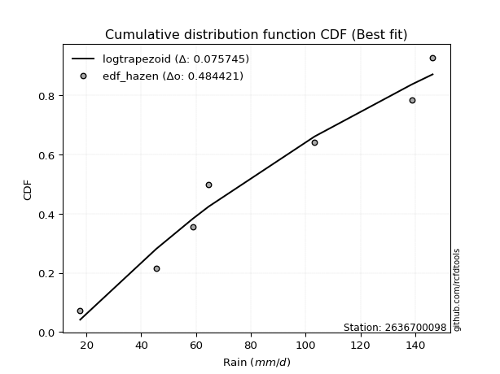</img>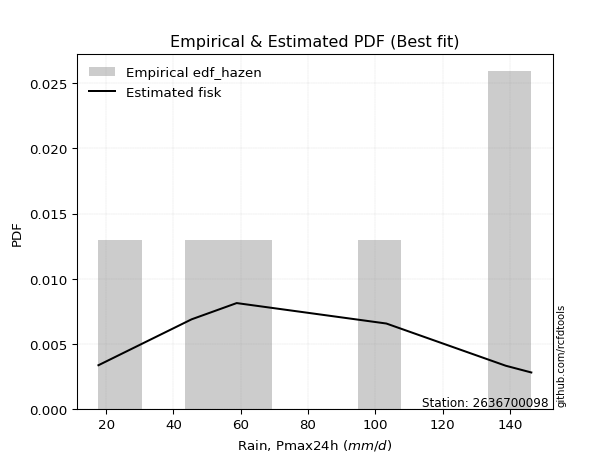</img>

</div>


### 3. EDF Weibull (1939)

Weibull plotting position formula is an empirical method used to estimate the non-exceedance probability or plotting position for a set of observed data, is often recommended or widely used in practice, particularly in flood frequency analysis.

<div align="center">


$P=m/(n+1)$


</div>


**3.1. Empirical values**

<div align="center">

|                | 0                  | 1                  | 2           | 3           | 4                  | 5           | 6           |
|:---------------|:-------------------|:-------------------|:------------|:------------|:-------------------|:------------|:------------|
| date           | 2023               | 2022               | 2019        | 2025        | 2020               | 2024        | 2021        |
| x              | 17.7               | 45.4               | 58.8        | 64.6        | 103.3              | 138.8       | 146.4       |
| m              | 1                  | 2                  | 3           | 4           | 5                  | 6           | 7           |
| empirical_dist | edf_weibull        | edf_weibull        | edf_weibull | edf_weibull | edf_weibull        | edf_weibull | edf_weibull |
| empirical      | 0.125              | 0.25               | 0.375       | 0.5         | 0.625              | 0.75        | 0.875       |
| empirical_tr   | 1.1428571428571428 | 1.3333333333333333 | 1.6         | 2.0         | 2.6666666666666665 | 4.0         | 8.0         |

</div>


**3.2. Kolmogorov-Smirnov fit test (sorted by Δ)**


<div align="center">

|                | 0                   | 1                   | 2                   | 3                   | 4                   | 5                   | 6                   | 7                   | 8                   | 9                   | 10                  | 11                  | 12                  | 13                  | 14                  | 15                  | 16                  | 17                  | 18                  | 19                  | 20                  | 21                  | 22                  | 23                  | 24                  | 25                  | 26                  | 27                  | 28                  | 29                  | 30                  | 31                  | 32                  | 33                  | 34                  | 35                  | 36                  | 37                  | 38                  | 39                  | 40                  | 41                  | 42                  | 43                  | 44                  | 45                  | 46                  | 47                  | 48                  | 49                  | 50                  | 51                  | 52                  | 53                  | 54                  | 55                  | 56                  | 57                  | 58                  | 59                  | 60                  | 61                  | 62                  | 63                  | 64                  | 65                  | 66                  | 67                  | 68                  | 69                  | 70                  | 71                  | 72                  | 73                  | 74                  | 75                  | 76                  | 77                  | 78                  | 79                  | 80                  | 81                  | 82                  | 83                  | 84                  | 85                  | 86                  | 87                  | 88                  | 89                  | 90                  | 91                  | 92                  | 93                  | 94                  | 95                  | 96                  | 97                  | 98                  | 99                  | 100                 | 101                 | 102                 | 103                 | 104                 | 105                 | 106                 | 107                 | 108                 | 109                 | 110                 | 111                 | 112                 | 113                 | 114                 | 115                 | 116                 | 117                 | 118                 | 119                 | 120                 | 121                 | 122                 | 123                 | 124                 | 125                 | 126                 | 127                 | 128                 | 129                 | 130                 | 131                 | 132                 | 133                 | 134                 | 135                 | 136                 | 137                 | 138                 | 139                 | 140                 | 141                 | 142                 | 143                 | 144                 | 145                 | 146                 | 147                 | 148                 | 149                 | 150                 | 151                 | 152                 | 153                 | 154                 | 155                 | 156                 | 157                 | 158                 | 159                 |
|:---------------|:--------------------|:--------------------|:--------------------|:--------------------|:--------------------|:--------------------|:--------------------|:--------------------|:--------------------|:--------------------|:--------------------|:--------------------|:--------------------|:--------------------|:--------------------|:--------------------|:--------------------|:--------------------|:--------------------|:--------------------|:--------------------|:--------------------|:--------------------|:--------------------|:--------------------|:--------------------|:--------------------|:--------------------|:--------------------|:--------------------|:--------------------|:--------------------|:--------------------|:--------------------|:--------------------|:--------------------|:--------------------|:--------------------|:--------------------|:--------------------|:--------------------|:--------------------|:--------------------|:--------------------|:--------------------|:--------------------|:--------------------|:--------------------|:--------------------|:--------------------|:--------------------|:--------------------|:--------------------|:--------------------|:--------------------|:--------------------|:--------------------|:--------------------|:--------------------|:--------------------|:--------------------|:--------------------|:--------------------|:--------------------|:--------------------|:--------------------|:--------------------|:--------------------|:--------------------|:--------------------|:--------------------|:--------------------|:--------------------|:--------------------|:--------------------|:--------------------|:--------------------|:--------------------|:--------------------|:--------------------|:--------------------|:--------------------|:--------------------|:--------------------|:--------------------|:--------------------|:--------------------|:--------------------|:--------------------|:--------------------|:--------------------|:--------------------|:--------------------|:--------------------|:--------------------|:--------------------|:--------------------|:--------------------|:--------------------|:--------------------|:--------------------|:--------------------|:--------------------|:--------------------|:--------------------|:--------------------|:--------------------|:--------------------|:--------------------|:--------------------|:--------------------|:--------------------|:--------------------|:--------------------|:--------------------|:--------------------|:--------------------|:--------------------|:--------------------|:--------------------|:--------------------|:--------------------|:--------------------|:--------------------|:--------------------|:--------------------|:--------------------|:--------------------|:--------------------|:--------------------|:--------------------|:--------------------|:--------------------|:--------------------|:--------------------|:--------------------|:--------------------|:--------------------|:--------------------|:--------------------|:--------------------|:--------------------|:--------------------|:--------------------|:--------------------|:--------------------|:--------------------|:--------------------|:--------------------|:--------------------|:--------------------|:--------------------|:--------------------|:--------------------|:--------------------|:--------------------|:--------------------|:--------------------|:--------------------|:--------------------|
| station        | 2636700098          | 2636700098          | 2636700098          | 2636700098          | 2636700098          | 2636700098          | 2636700098          | 2636700098          | 2636700098          | 2636700098          | 2636700098          | 2636700098          | 2636700098          | 2636700098          | 2636700098          | 2636700098          | 2636700098          | 2636700098          | 2636700098          | 2636700098          | 2636700098          | 2636700098          | 2636700098          | 2636700098          | 2636700098          | 2636700098          | 2636700098          | 2636700098          | 2636700098          | 2636700098          | 2636700098          | 2636700098          | 2636700098          | 2636700098          | 2636700098          | 2636700098          | 2636700098          | 2636700098          | 2636700098          | 2636700098          | 2636700098          | 2636700098          | 2636700098          | 2636700098          | 2636700098          | 2636700098          | 2636700098          | 2636700098          | 2636700098          | 2636700098          | 2636700098          | 2636700098          | 2636700098          | 2636700098          | 2636700098          | 2636700098          | 2636700098          | 2636700098          | 2636700098          | 2636700098          | 2636700098          | 2636700098          | 2636700098          | 2636700098          | 2636700098          | 2636700098          | 2636700098          | 2636700098          | 2636700098          | 2636700098          | 2636700098          | 2636700098          | 2636700098          | 2636700098          | 2636700098          | 2636700098          | 2636700098          | 2636700098          | 2636700098          | 2636700098          | 2636700098          | 2636700098          | 2636700098          | 2636700098          | 2636700098          | 2636700098          | 2636700098          | 2636700098          | 2636700098          | 2636700098          | 2636700098          | 2636700098          | 2636700098          | 2636700098          | 2636700098          | 2636700098          | 2636700098          | 2636700098          | 2636700098          | 2636700098          | 2636700098          | 2636700098          | 2636700098          | 2636700098          | 2636700098          | 2636700098          | 2636700098          | 2636700098          | 2636700098          | 2636700098          | 2636700098          | 2636700098          | 2636700098          | 2636700098          | 2636700098          | 2636700098          | 2636700098          | 2636700098          | 2636700098          | 2636700098          | 2636700098          | 2636700098          | 2636700098          | 2636700098          | 2636700098          | 2636700098          | 2636700098          | 2636700098          | 2636700098          | 2636700098          | 2636700098          | 2636700098          | 2636700098          | 2636700098          | 2636700098          | 2636700098          | 2636700098          | 2636700098          | 2636700098          | 2636700098          | 2636700098          | 2636700098          | 2636700098          | 2636700098          | 2636700098          | 2636700098          | 2636700098          | 2636700098          | 2636700098          | 2636700098          | 2636700098          | 2636700098          | 2636700098          | 2636700098          | 2636700098          | 2636700098          | 2636700098          | 2636700098          | 2636700098          | 2636700098          |
| empirical_dist | edf_weibull         | edf_weibull         | edf_weibull         | edf_weibull         | edf_weibull         | edf_weibull         | edf_weibull         | edf_weibull         | edf_weibull         | edf_weibull         | edf_weibull         | edf_weibull         | edf_weibull         | edf_weibull         | edf_weibull         | edf_weibull         | edf_weibull         | edf_weibull         | edf_weibull         | edf_weibull         | edf_weibull         | edf_weibull         | edf_weibull         | edf_weibull         | edf_weibull         | edf_weibull         | edf_weibull         | edf_weibull         | edf_weibull         | edf_weibull         | edf_weibull         | edf_weibull         | edf_weibull         | edf_weibull         | edf_weibull         | edf_weibull         | edf_weibull         | edf_weibull         | edf_weibull         | edf_weibull         | edf_weibull         | edf_weibull         | edf_weibull         | edf_weibull         | edf_weibull         | edf_weibull         | edf_weibull         | edf_weibull         | edf_weibull         | edf_weibull         | edf_weibull         | edf_weibull         | edf_weibull         | edf_weibull         | edf_weibull         | edf_weibull         | edf_weibull         | edf_weibull         | edf_weibull         | edf_weibull         | edf_weibull         | edf_weibull         | edf_weibull         | edf_weibull         | edf_weibull         | edf_weibull         | edf_weibull         | edf_weibull         | edf_weibull         | edf_weibull         | edf_weibull         | edf_weibull         | edf_weibull         | edf_weibull         | edf_weibull         | edf_weibull         | edf_weibull         | edf_weibull         | edf_weibull         | edf_weibull         | edf_weibull         | edf_weibull         | edf_weibull         | edf_weibull         | edf_weibull         | edf_weibull         | edf_weibull         | edf_weibull         | edf_weibull         | edf_weibull         | edf_weibull         | edf_weibull         | edf_weibull         | edf_weibull         | edf_weibull         | edf_weibull         | edf_weibull         | edf_weibull         | edf_weibull         | edf_weibull         | edf_weibull         | edf_weibull         | edf_weibull         | edf_weibull         | edf_weibull         | edf_weibull         | edf_weibull         | edf_weibull         | edf_weibull         | edf_weibull         | edf_weibull         | edf_weibull         | edf_weibull         | edf_weibull         | edf_weibull         | edf_weibull         | edf_weibull         | edf_weibull         | edf_weibull         | edf_weibull         | edf_weibull         | edf_weibull         | edf_weibull         | edf_weibull         | edf_weibull         | edf_weibull         | edf_weibull         | edf_weibull         | edf_weibull         | edf_weibull         | edf_weibull         | edf_weibull         | edf_weibull         | edf_weibull         | edf_weibull         | edf_weibull         | edf_weibull         | edf_weibull         | edf_weibull         | edf_weibull         | edf_weibull         | edf_weibull         | edf_weibull         | edf_weibull         | edf_weibull         | edf_weibull         | edf_weibull         | edf_weibull         | edf_weibull         | edf_weibull         | edf_weibull         | edf_weibull         | edf_weibull         | edf_weibull         | edf_weibull         | edf_weibull         | edf_weibull         | edf_weibull         | edf_weibull         | edf_weibull         |
| p_dist         | logtrapezoid        | loginvweibull       | logf                | logfatiguelife      | lognct              | logexponnorm        | logcrystalball      | lognorm             | logt                | logrice             | logncf              | logbetaprime        | loginvgauss         | loggamma            | loggamma            | loganglit           | loginvgamma         | logdweibull         | logfoldnorm         | logerlang           | dweibull            | ksone               | logpearson3         | logdgamma           | logalpha            | f                   | logmaxwell          | logsemicircular     | semicircular        | lomax               | genexpon            | loggausshyper       | logarcsine          | arcsine             | lograyleigh         | genextreme          | exponweib           | weibull_min         | loggompertz         | alpha               | genlogistic         | skewnorm            | erlang              | invweibull          | loglogistic         | halfnorm            | dgamma              | anglit              | invgauss            | betaprime           | logcosine           | gamma               | logweibull_min      | loghalfnorm         | logburr12           | kstwobign           | rayleigh            | loggumbel_l         | logkstwobign        | invgamma            | gengamma            | maxwell             | logvonmises_line    | rice                | loggenexpon         | foldnorm            | halflogistic        | pearson3            | gumbel_r            | loghypsecant        | moyal               | wrapcauchy          | logloglaplace       | loggumbel_r         | exponnorm           | t                   | nct                 | norm                | johnsonsu           | kappa3              | loglevy_l           | cosine              | loghalflogistic     | logmoyal            | loglaplace          | loglaplace          | logburr             | beta                | logistic            | levy_l              | burr                | logargus            | gompertz            | logloggamma         | hypsecant           | ncf                 | loggenhalflogistic  | tukeylambda         | logweibull_max      | logbeta             | kappa4              | gausshyper          | uniform             | vonmises_line       | logmielke           | argus               | loggenpareto        | mielke              | wald                | logksone            | logwald             | logtriang           | bradford            | logskewnorm         | gumbel_l            | laplace             | truncexpon          | crystalball         | truncweibull_min    | genpareto           | logkappa4           | halfgennorm         | loggenextreme       | logwrapcauchy       | logtukeylambda      | logkappa3           | loguniform          | logbradford         | nakagami            | lognakagami         | gennorm             | loggennorm          | genhalflogistic     | burr12              | triang              | logtruncweibull_min | logtruncnorm        | logjohnsonsb        | logrdist            | logtruncexpon       | truncnorm           | loggengamma         | trapezoid           | loglomax            | johnsonsb           | exponpow            | logexponpow         | weibull_max         | rdist               | powerlaw            | logjohnsonsu        | fatiguelife         | logexponweib        | logpowerlaw         | truncpareto         | logtruncpareto      | loggenlogistic      | loghalfgennorm      | logvonmises         | vonmises            |
| delta          | 0.08739653819776472 | 0.10357660555016701 | 0.10652968165239618 | 0.10681939283758102 | 0.10744273141501692 | 0.10796013298318752 | 0.10796433689734874 | 0.10796450721458606 | 0.10796634753124645 | 0.10873633585324904 | 0.10888500363346998 | 0.10894007600178568 | 0.10924539130733346 | 0.11043407227212332 | 0.11043407227212332 | 0.11167365244554438 | 0.11223229060989492 | 0.11227827686616978 | 0.11238796569614562 | 0.11247902668190324 | 0.1132363549547879  | 0.11387701493700197 | 0.1142883637993013  | 0.11491541933602176 | 0.11671423104827316 | 0.11961907334673216 | 0.1197602601512675  | 0.12325275109508976 | 0.123441076109165   | 0.12493406120348438 | 0.12499951835577454 | 0.12499999999673905 | 0.125               | 0.125               | 0.125               | 0.126007467268608   | 0.1269395946005084  | 0.12702787680340677 | 0.1275386560508036  | 0.12820304320130615 | 0.12919032284430398 | 0.12988784773352036 | 0.13002109925123873 | 0.13009212773961432 | 0.13043766896126507 | 0.1307030163646673  | 0.13173874727950452 | 0.13183780353967706 | 0.1321828517779048  | 0.13218540475641782 | 0.1329711652731942  | 0.13312263427045945 | 0.13370483927122867 | 0.13408222709952933 | 0.1340845335406442  | 0.13419410247419084 | 0.13483230925209622 | 0.13578465164096853 | 0.13618136646377504 | 0.13655660207388154 | 0.13670151996898638 | 0.13723034056979255 | 0.1379069193857122  | 0.1390032530994032  | 0.14112031230995675 | 0.1412034475418782  | 0.14173142796443183 | 0.14338826614397904 | 0.1445061471484761  | 0.14573954724602112 | 0.14605418703275852 | 0.14762508176390665 | 0.150134372261846   | 0.15153545877573038 | 0.15158790704596126 | 0.15180417150920011 | 0.15183346053931307 | 0.1518400974366227  | 0.15360072444642503 | 0.1538492061097937  | 0.15820988933464397 | 0.15910489304755016 | 0.1594288712973092  | 0.16556114889797102 | 0.16747642605811863 | 0.16747642605811863 | 0.16759625045184423 | 0.16837783516412486 | 0.16993993924782103 | 0.16997209969476912 | 0.17093017703897784 | 0.17195081546619007 | 0.1773181647371081  | 0.1835760513934097  | 0.18395853805754803 | 0.1848636072168367  | 0.18646685452420408 | 0.18718770178194433 | 0.18733197528875328 | 0.1873361575906537  | 0.18866477617803434 | 0.18906947236902127 | 0.19094794094794088 | 0.191012894720904   | 0.1914239501601186  | 0.1979547499845885  | 0.19963192390350815 | 0.20081204314011458 | 0.20129250024287382 | 0.20486135727173554 | 0.20833030085543058 | 0.20844023340577789 | 0.20876835092856805 | 0.20881878496283324 | 0.21152252278913553 | 0.21208932804944386 | 0.21367742488622155 | 0.2138220474328819  | 0.2156136002100032  | 0.2171382123971345  | 0.21943109800725769 | 0.22054438652169622 | 0.22056752496164522 | 0.22109505933188012 | 0.22149206068537097 | 0.2222295258219651  | 0.22476850174763707 | 0.22483359223595245 | 0.24999992528096568 | 0.24999999254590663 | 0.25                | 0.25                | 0.2516993594683026  | 0.25318729828603226 | 0.2550352647985161  | 0.2607377849687156  | 0.26799934670309866 | 0.2743260206551237  | 0.27836354718555123 | 0.3017244318930016  | 0.32906225226242314 | 0.33663016779165933 | 0.350222379829347   | 0.3647025595636155  | 0.3930915752277927  | 0.41785256456049613 | 0.4429532983302875  | 0.5065824141553924  | 0.5097468407619218  | 0.5254685281729239  | 0.5303226621830388  | 0.5479912154891226  | 0.6024788526701182  | 0.6122974066210216  | 0.6372291009751231  | 0.6896276783950935  | 0.75                | 0.75                | 1.099401505431342   | 22.67890454037288   |
| deltao         | 0.48442053926100004 | 0.48442053926100004 | 0.48442053926100004 | 0.48442053926100004 | 0.48442053926100004 | 0.48442053926100004 | 0.48442053926100004 | 0.48442053926100004 | 0.48442053926100004 | 0.48442053926100004 | 0.48442053926100004 | 0.48442053926100004 | 0.48442053926100004 | 0.48442053926100004 | 0.48442053926100004 | 0.48442053926100004 | 0.48442053926100004 | 0.48442053926100004 | 0.48442053926100004 | 0.48442053926100004 | 0.48442053926100004 | 0.48442053926100004 | 0.48442053926100004 | 0.48442053926100004 | 0.48442053926100004 | 0.48442053926100004 | 0.48442053926100004 | 0.48442053926100004 | 0.48442053926100004 | 0.48442053926100004 | 0.48442053926100004 | 0.48442053926100004 | 0.48442053926100004 | 0.48442053926100004 | 0.48442053926100004 | 0.48442053926100004 | 0.48442053926100004 | 0.48442053926100004 | 0.48442053926100004 | 0.48442053926100004 | 0.48442053926100004 | 0.48442053926100004 | 0.48442053926100004 | 0.48442053926100004 | 0.48442053926100004 | 0.48442053926100004 | 0.48442053926100004 | 0.48442053926100004 | 0.48442053926100004 | 0.48442053926100004 | 0.48442053926100004 | 0.48442053926100004 | 0.48442053926100004 | 0.48442053926100004 | 0.48442053926100004 | 0.48442053926100004 | 0.48442053926100004 | 0.48442053926100004 | 0.48442053926100004 | 0.48442053926100004 | 0.48442053926100004 | 0.48442053926100004 | 0.48442053926100004 | 0.48442053926100004 | 0.48442053926100004 | 0.48442053926100004 | 0.48442053926100004 | 0.48442053926100004 | 0.48442053926100004 | 0.48442053926100004 | 0.48442053926100004 | 0.48442053926100004 | 0.48442053926100004 | 0.48442053926100004 | 0.48442053926100004 | 0.48442053926100004 | 0.48442053926100004 | 0.48442053926100004 | 0.48442053926100004 | 0.48442053926100004 | 0.48442053926100004 | 0.48442053926100004 | 0.48442053926100004 | 0.48442053926100004 | 0.48442053926100004 | 0.48442053926100004 | 0.48442053926100004 | 0.48442053926100004 | 0.48442053926100004 | 0.48442053926100004 | 0.48442053926100004 | 0.48442053926100004 | 0.48442053926100004 | 0.48442053926100004 | 0.48442053926100004 | 0.48442053926100004 | 0.48442053926100004 | 0.48442053926100004 | 0.48442053926100004 | 0.48442053926100004 | 0.48442053926100004 | 0.48442053926100004 | 0.48442053926100004 | 0.48442053926100004 | 0.48442053926100004 | 0.48442053926100004 | 0.48442053926100004 | 0.48442053926100004 | 0.48442053926100004 | 0.48442053926100004 | 0.48442053926100004 | 0.48442053926100004 | 0.48442053926100004 | 0.48442053926100004 | 0.48442053926100004 | 0.48442053926100004 | 0.48442053926100004 | 0.48442053926100004 | 0.48442053926100004 | 0.48442053926100004 | 0.48442053926100004 | 0.48442053926100004 | 0.48442053926100004 | 0.48442053926100004 | 0.48442053926100004 | 0.48442053926100004 | 0.48442053926100004 | 0.48442053926100004 | 0.48442053926100004 | 0.48442053926100004 | 0.48442053926100004 | 0.48442053926100004 | 0.48442053926100004 | 0.48442053926100004 | 0.48442053926100004 | 0.48442053926100004 | 0.48442053926100004 | 0.48442053926100004 | 0.48442053926100004 | 0.48442053926100004 | 0.48442053926100004 | 0.48442053926100004 | 0.48442053926100004 | 0.48442053926100004 | 0.48442053926100004 | 0.48442053926100004 | 0.48442053926100004 | 0.48442053926100004 | 0.48442053926100004 | 0.48442053926100004 | 0.48442053926100004 | 0.48442053926100004 | 0.48442053926100004 | 0.48442053926100004 | 0.48442053926100004 | 0.48442053926100004 | 0.48442053926100004 | 0.48442053926100004 | 0.48442053926100004 | 0.48442053926100004 |
| eval           | Δo > Δ              | Δo > Δ              | Δo > Δ              | Δo > Δ              | Δo > Δ              | Δo > Δ              | Δo > Δ              | Δo > Δ              | Δo > Δ              | Δo > Δ              | Δo > Δ              | Δo > Δ              | Δo > Δ              | Δo > Δ              | Δo > Δ              | Δo > Δ              | Δo > Δ              | Δo > Δ              | Δo > Δ              | Δo > Δ              | Δo > Δ              | Δo > Δ              | Δo > Δ              | Δo > Δ              | Δo > Δ              | Δo > Δ              | Δo > Δ              | Δo > Δ              | Δo > Δ              | Δo > Δ              | Δo > Δ              | Δo > Δ              | Δo > Δ              | Δo > Δ              | Δo > Δ              | Δo > Δ              | Δo > Δ              | Δo > Δ              | Δo > Δ              | Δo > Δ              | Δo > Δ              | Δo > Δ              | Δo > Δ              | Δo > Δ              | Δo > Δ              | Δo > Δ              | Δo > Δ              | Δo > Δ              | Δo > Δ              | Δo > Δ              | Δo > Δ              | Δo > Δ              | Δo > Δ              | Δo > Δ              | Δo > Δ              | Δo > Δ              | Δo > Δ              | Δo > Δ              | Δo > Δ              | Δo > Δ              | Δo > Δ              | Δo > Δ              | Δo > Δ              | Δo > Δ              | Δo > Δ              | Δo > Δ              | Δo > Δ              | Δo > Δ              | Δo > Δ              | Δo > Δ              | Δo > Δ              | Δo > Δ              | Δo > Δ              | Δo > Δ              | Δo > Δ              | Δo > Δ              | Δo > Δ              | Δo > Δ              | Δo > Δ              | Δo > Δ              | Δo > Δ              | Δo > Δ              | Δo > Δ              | Δo > Δ              | Δo > Δ              | Δo > Δ              | Δo > Δ              | Δo > Δ              | Δo > Δ              | Δo > Δ              | Δo > Δ              | Δo > Δ              | Δo > Δ              | Δo > Δ              | Δo > Δ              | Δo > Δ              | Δo > Δ              | Δo > Δ              | Δo > Δ              | Δo > Δ              | Δo > Δ              | Δo > Δ              | Δo > Δ              | Δo > Δ              | Δo > Δ              | Δo > Δ              | Δo > Δ              | Δo > Δ              | Δo > Δ              | Δo > Δ              | Δo > Δ              | Δo > Δ              | Δo > Δ              | Δo > Δ              | Δo > Δ              | Δo > Δ              | Δo > Δ              | Δo > Δ              | Δo > Δ              | Δo > Δ              | Δo > Δ              | Δo > Δ              | Δo > Δ              | Δo > Δ              | Δo > Δ              | Δo > Δ              | Δo > Δ              | Δo > Δ              | Δo > Δ              | Δo > Δ              | Δo > Δ              | Δo > Δ              | Δo > Δ              | Δo > Δ              | Δo > Δ              | Δo > Δ              | Δo > Δ              | Δo > Δ              | Δo > Δ              | Δo > Δ              | Δo > Δ              | Δo > Δ              | Δo > Δ              | Δo > Δ              | Δo > Δ              | Δo > Δ              | Δo > Δ              | Δo <= Δ             | Δo <= Δ             | Δo <= Δ             | Δo <= Δ             | Δo <= Δ             | Δo <= Δ             | Δo <= Δ             | Δo <= Δ             | Δo <= Δ             | Δo <= Δ             | Δo <= Δ             | Δo <= Δ             | Δo <= Δ             |
| fit            | 1                   | 1                   | 1                   | 1                   | 1                   | 1                   | 1                   | 1                   | 1                   | 1                   | 1                   | 1                   | 1                   | 1                   | 1                   | 1                   | 1                   | 1                   | 1                   | 1                   | 1                   | 1                   | 1                   | 1                   | 1                   | 1                   | 1                   | 1                   | 1                   | 1                   | 1                   | 1                   | 1                   | 1                   | 1                   | 1                   | 1                   | 1                   | 1                   | 1                   | 1                   | 1                   | 1                   | 1                   | 1                   | 1                   | 1                   | 1                   | 1                   | 1                   | 1                   | 1                   | 1                   | 1                   | 1                   | 1                   | 1                   | 1                   | 1                   | 1                   | 1                   | 1                   | 1                   | 1                   | 1                   | 1                   | 1                   | 1                   | 1                   | 1                   | 1                   | 1                   | 1                   | 1                   | 1                   | 1                   | 1                   | 1                   | 1                   | 1                   | 1                   | 1                   | 1                   | 1                   | 1                   | 1                   | 1                   | 1                   | 1                   | 1                   | 1                   | 1                   | 1                   | 1                   | 1                   | 1                   | 1                   | 1                   | 1                   | 1                   | 1                   | 1                   | 1                   | 1                   | 1                   | 1                   | 1                   | 1                   | 1                   | 1                   | 1                   | 1                   | 1                   | 1                   | 1                   | 1                   | 1                   | 1                   | 1                   | 1                   | 1                   | 1                   | 1                   | 1                   | 1                   | 1                   | 1                   | 1                   | 1                   | 1                   | 1                   | 1                   | 1                   | 1                   | 1                   | 1                   | 1                   | 1                   | 1                   | 1                   | 1                   | 1                   | 1                   | 1                   | 1                   | 1                   | 1                   | 0                   | 0                   | 0                   | 0                   | 0                   | 0                   | 0                   | 0                   | 0                   | 0                   | 0                   | 0                   | 0                   |
| n              | 7                   | 7                   | 7                   | 7                   | 7                   | 7                   | 7                   | 7                   | 7                   | 7                   | 7                   | 7                   | 7                   | 7                   | 7                   | 7                   | 7                   | 7                   | 7                   | 7                   | 7                   | 7                   | 7                   | 7                   | 7                   | 7                   | 7                   | 7                   | 7                   | 7                   | 7                   | 7                   | 7                   | 7                   | 7                   | 7                   | 7                   | 7                   | 7                   | 7                   | 7                   | 7                   | 7                   | 7                   | 7                   | 7                   | 7                   | 7                   | 7                   | 7                   | 7                   | 7                   | 7                   | 7                   | 7                   | 7                   | 7                   | 7                   | 7                   | 7                   | 7                   | 7                   | 7                   | 7                   | 7                   | 7                   | 7                   | 7                   | 7                   | 7                   | 7                   | 7                   | 7                   | 7                   | 7                   | 7                   | 7                   | 7                   | 7                   | 7                   | 7                   | 7                   | 7                   | 7                   | 7                   | 7                   | 7                   | 7                   | 7                   | 7                   | 7                   | 7                   | 7                   | 7                   | 7                   | 7                   | 7                   | 7                   | 7                   | 7                   | 7                   | 7                   | 7                   | 7                   | 7                   | 7                   | 7                   | 7                   | 7                   | 7                   | 7                   | 7                   | 7                   | 7                   | 7                   | 7                   | 7                   | 7                   | 7                   | 7                   | 7                   | 7                   | 7                   | 7                   | 7                   | 7                   | 7                   | 7                   | 7                   | 7                   | 7                   | 7                   | 7                   | 7                   | 7                   | 7                   | 7                   | 7                   | 7                   | 7                   | 7                   | 7                   | 7                   | 7                   | 7                   | 7                   | 7                   | 7                   | 7                   | 7                   | 7                   | 7                   | 7                   | 7                   | 7                   | 7                   | 7                   | 7                   | 7                   | 7                   |
| best_fit       | 1                   | 0                   | 0                   | 0                   | 0                   | 0                   | 0                   | 0                   | 0                   | 0                   | 0                   | 0                   | 0                   | 0                   | 0                   | 0                   | 0                   | 0                   | 0                   | 0                   | 0                   | 0                   | 0                   | 0                   | 0                   | 0                   | 0                   | 0                   | 0                   | 0                   | 0                   | 0                   | 0                   | 0                   | 0                   | 0                   | 0                   | 0                   | 0                   | 0                   | 0                   | 0                   | 0                   | 0                   | 0                   | 0                   | 0                   | 0                   | 0                   | 0                   | 0                   | 0                   | 0                   | 0                   | 0                   | 0                   | 0                   | 0                   | 0                   | 0                   | 0                   | 0                   | 0                   | 0                   | 0                   | 0                   | 0                   | 0                   | 0                   | 0                   | 0                   | 0                   | 0                   | 0                   | 0                   | 0                   | 0                   | 0                   | 0                   | 0                   | 0                   | 0                   | 0                   | 0                   | 0                   | 0                   | 0                   | 0                   | 0                   | 0                   | 0                   | 0                   | 0                   | 0                   | 0                   | 0                   | 0                   | 0                   | 0                   | 0                   | 0                   | 0                   | 0                   | 0                   | 0                   | 0                   | 0                   | 0                   | 0                   | 0                   | 0                   | 0                   | 0                   | 0                   | 0                   | 0                   | 0                   | 0                   | 0                   | 0                   | 0                   | 0                   | 0                   | 0                   | 0                   | 0                   | 0                   | 0                   | 0                   | 0                   | 0                   | 0                   | 0                   | 0                   | 0                   | 0                   | 0                   | 0                   | 0                   | 0                   | 0                   | 0                   | 0                   | 0                   | 0                   | 0                   | 0                   | 0                   | 0                   | 0                   | 0                   | 0                   | 0                   | 0                   | 0                   | 0                   | 0                   | 0                   | 0                   | 0                   |
| best_fit_sort  | 1                   | 2                   | 3                   | 4                   | 5                   | 6                   | 7                   | 8                   | 9                   | 10                  | 11                  | 12                  | 13                  | 14                  | 15                  | 16                  | 17                  | 18                  | 19                  | 20                  | 21                  | 22                  | 23                  | 24                  | 25                  | 26                  | 27                  | 28                  | 29                  | 30                  | 31                  | 32                  | 33                  | 34                  | 35                  | 36                  | 37                  | 38                  | 39                  | 40                  | 41                  | 42                  | 43                  | 44                  | 45                  | 46                  | 47                  | 48                  | 49                  | 50                  | 51                  | 52                  | 53                  | 54                  | 55                  | 56                  | 57                  | 58                  | 59                  | 60                  | 61                  | 62                  | 63                  | 64                  | 65                  | 66                  | 67                  | 68                  | 69                  | 70                  | 71                  | 72                  | 73                  | 74                  | 75                  | 76                  | 77                  | 78                  | 79                  | 80                  | 81                  | 82                  | 83                  | 84                  | 85                  | 86                  | 87                  | 88                  | 89                  | 90                  | 91                  | 92                  | 93                  | 94                  | 95                  | 96                  | 97                  | 98                  | 99                  | 100                 | 101                 | 102                 | 103                 | 104                 | 105                 | 106                 | 107                 | 108                 | 109                 | 110                 | 111                 | 112                 | 113                 | 114                 | 115                 | 116                 | 117                 | 118                 | 119                 | 120                 | 121                 | 122                 | 123                 | 124                 | 125                 | 126                 | 127                 | 128                 | 129                 | 130                 | 131                 | 132                 | 133                 | 134                 | 135                 | 136                 | 137                 | 138                 | 139                 | 140                 | 141                 | 142                 | 143                 | 144                 | 145                 | 146                 | 147                 | 148                 | 149                 | 150                 | 151                 | 152                 | 153                 | 154                 | 155                 | 156                 | 157                 | 158                 | 159                 | 160                 |

</div>


**3.3. Best fit**

<div align="center">

|   id |    station | empirical_dist   | p_dist       |     delta |   deltao | eval   |   fit |   n |   best_fit |   best_fit_sort |
|-----:|-----------:|:-----------------|:-------------|----------:|---------:|:-------|------:|----:|-----------:|----------------:|
|    0 | 2636700098 | edf_weibull      | logtrapezoid | 0.0873965 | 0.484421 | Δo > Δ |     1 |   7 |          1 |               1 |

</div>


<div align="center">

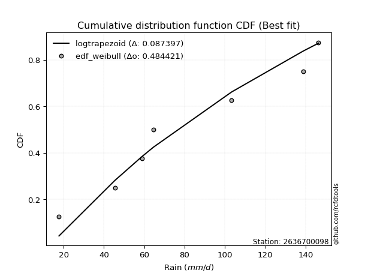</img></img>

</div>


### 4. EDF Beard (1943)

The Beard formula (or Beard´s plotting position formula) in hydrology is used to estimate the empirical non-exceedance probability _(P)_ of a flood event (or other extreme hydrological data point) within a given dataset.

<div align="center">


$P=(m-0.31)/(n+0.38)$


</div>


**4.1. Empirical values**

<div align="center">

|                | 0                   | 1                   | 2                   | 3         | 4                  | 5                  | 6                  |
|:---------------|:--------------------|:--------------------|:--------------------|:----------|:-------------------|:-------------------|:-------------------|
| date           | 2023                | 2022                | 2019                | 2025      | 2020               | 2024               | 2021               |
| x              | 17.7                | 45.4                | 58.8                | 64.6      | 103.3              | 138.8              | 146.4              |
| m              | 1                   | 2                   | 3                   | 4         | 5                  | 6                  | 7                  |
| empirical_dist | edf_beard           | edf_beard           | edf_beard           | edf_beard | edf_beard          | edf_beard          | edf_beard          |
| empirical      | 0.09349593495934959 | 0.22899728997289973 | 0.36449864498644985 | 0.5       | 0.6355013550135502 | 0.7710027100271003 | 0.9065040650406505 |
| empirical_tr   | 1.1031390134529149  | 1.29701230228471    | 1.5735607675906182  | 2.0       | 2.743494423791822  | 4.366863905325444  | 10.695652173913055 |

</div>


**4.2. Kolmogorov-Smirnov fit test (sorted by Δ)**


<div align="center">

|                | 0                   | 1                   | 2                   | 3                   | 4                   | 5                   | 6                   | 7                   | 8                   | 9                   | 10                  | 11                  | 12                  | 13                  | 14                  | 15                  | 16                  | 17                  | 18                  | 19                  | 20                  | 21                  | 22                  | 23                  | 24                  | 25                  | 26                  | 27                  | 28                  | 29                  | 30                  | 31                  | 32                  | 33                  | 34                  | 35                  | 36                  | 37                  | 38                  | 39                  | 40                  | 41                  | 42                  | 43                  | 44                  | 45                  | 46                  | 47                  | 48                  | 49                  | 50                  | 51                  | 52                  | 53                  | 54                  | 55                  | 56                  | 57                  | 58                  | 59                  | 60                  | 61                  | 62                  | 63                  | 64                  | 65                  | 66                  | 67                  | 68                  | 69                  | 70                  | 71                  | 72                  | 73                  | 74                  | 75                  | 76                  | 77                  | 78                  | 79                  | 80                  | 81                  | 82                  | 83                  | 84                  | 85                  | 86                  | 87                  | 88                  | 89                  | 90                  | 91                  | 92                  | 93                  | 94                  | 95                  | 96                  | 97                  | 98                  | 99                  | 100                 | 101                 | 102                 | 103                 | 104                 | 105                 | 106                 | 107                 | 108                 | 109                 | 110                 | 111                 | 112                 | 113                 | 114                 | 115                 | 116                 | 117                 | 118                 | 119                 | 120                 | 121                 | 122                 | 123                 | 124                 | 125                 | 126                 | 127                 | 128                 | 129                 | 130                 | 131                 | 132                 | 133                 | 134                 | 135                 | 136                 | 137                 | 138                 | 139                 | 140                 | 141                 | 142                 | 143                 | 144                 | 145                 | 146                 | 147                 | 148                 | 149                 | 150                 | 151                 | 152                 | 153                 | 154                 | 155                 | 156                 | 157                 | 158                 | 159                 |
|:---------------|:--------------------|:--------------------|:--------------------|:--------------------|:--------------------|:--------------------|:--------------------|:--------------------|:--------------------|:--------------------|:--------------------|:--------------------|:--------------------|:--------------------|:--------------------|:--------------------|:--------------------|:--------------------|:--------------------|:--------------------|:--------------------|:--------------------|:--------------------|:--------------------|:--------------------|:--------------------|:--------------------|:--------------------|:--------------------|:--------------------|:--------------------|:--------------------|:--------------------|:--------------------|:--------------------|:--------------------|:--------------------|:--------------------|:--------------------|:--------------------|:--------------------|:--------------------|:--------------------|:--------------------|:--------------------|:--------------------|:--------------------|:--------------------|:--------------------|:--------------------|:--------------------|:--------------------|:--------------------|:--------------------|:--------------------|:--------------------|:--------------------|:--------------------|:--------------------|:--------------------|:--------------------|:--------------------|:--------------------|:--------------------|:--------------------|:--------------------|:--------------------|:--------------------|:--------------------|:--------------------|:--------------------|:--------------------|:--------------------|:--------------------|:--------------------|:--------------------|:--------------------|:--------------------|:--------------------|:--------------------|:--------------------|:--------------------|:--------------------|:--------------------|:--------------------|:--------------------|:--------------------|:--------------------|:--------------------|:--------------------|:--------------------|:--------------------|:--------------------|:--------------------|:--------------------|:--------------------|:--------------------|:--------------------|:--------------------|:--------------------|:--------------------|:--------------------|:--------------------|:--------------------|:--------------------|:--------------------|:--------------------|:--------------------|:--------------------|:--------------------|:--------------------|:--------------------|:--------------------|:--------------------|:--------------------|:--------------------|:--------------------|:--------------------|:--------------------|:--------------------|:--------------------|:--------------------|:--------------------|:--------------------|:--------------------|:--------------------|:--------------------|:--------------------|:--------------------|:--------------------|:--------------------|:--------------------|:--------------------|:--------------------|:--------------------|:--------------------|:--------------------|:--------------------|:--------------------|:--------------------|:--------------------|:--------------------|:--------------------|:--------------------|:--------------------|:--------------------|:--------------------|:--------------------|:--------------------|:--------------------|:--------------------|:--------------------|:--------------------|:--------------------|:--------------------|:--------------------|:--------------------|:--------------------|:--------------------|:--------------------|
| station        | 2636700098          | 2636700098          | 2636700098          | 2636700098          | 2636700098          | 2636700098          | 2636700098          | 2636700098          | 2636700098          | 2636700098          | 2636700098          | 2636700098          | 2636700098          | 2636700098          | 2636700098          | 2636700098          | 2636700098          | 2636700098          | 2636700098          | 2636700098          | 2636700098          | 2636700098          | 2636700098          | 2636700098          | 2636700098          | 2636700098          | 2636700098          | 2636700098          | 2636700098          | 2636700098          | 2636700098          | 2636700098          | 2636700098          | 2636700098          | 2636700098          | 2636700098          | 2636700098          | 2636700098          | 2636700098          | 2636700098          | 2636700098          | 2636700098          | 2636700098          | 2636700098          | 2636700098          | 2636700098          | 2636700098          | 2636700098          | 2636700098          | 2636700098          | 2636700098          | 2636700098          | 2636700098          | 2636700098          | 2636700098          | 2636700098          | 2636700098          | 2636700098          | 2636700098          | 2636700098          | 2636700098          | 2636700098          | 2636700098          | 2636700098          | 2636700098          | 2636700098          | 2636700098          | 2636700098          | 2636700098          | 2636700098          | 2636700098          | 2636700098          | 2636700098          | 2636700098          | 2636700098          | 2636700098          | 2636700098          | 2636700098          | 2636700098          | 2636700098          | 2636700098          | 2636700098          | 2636700098          | 2636700098          | 2636700098          | 2636700098          | 2636700098          | 2636700098          | 2636700098          | 2636700098          | 2636700098          | 2636700098          | 2636700098          | 2636700098          | 2636700098          | 2636700098          | 2636700098          | 2636700098          | 2636700098          | 2636700098          | 2636700098          | 2636700098          | 2636700098          | 2636700098          | 2636700098          | 2636700098          | 2636700098          | 2636700098          | 2636700098          | 2636700098          | 2636700098          | 2636700098          | 2636700098          | 2636700098          | 2636700098          | 2636700098          | 2636700098          | 2636700098          | 2636700098          | 2636700098          | 2636700098          | 2636700098          | 2636700098          | 2636700098          | 2636700098          | 2636700098          | 2636700098          | 2636700098          | 2636700098          | 2636700098          | 2636700098          | 2636700098          | 2636700098          | 2636700098          | 2636700098          | 2636700098          | 2636700098          | 2636700098          | 2636700098          | 2636700098          | 2636700098          | 2636700098          | 2636700098          | 2636700098          | 2636700098          | 2636700098          | 2636700098          | 2636700098          | 2636700098          | 2636700098          | 2636700098          | 2636700098          | 2636700098          | 2636700098          | 2636700098          | 2636700098          | 2636700098          | 2636700098          | 2636700098          | 2636700098          |
| empirical_dist | edf_beard           | edf_beard           | edf_beard           | edf_beard           | edf_beard           | edf_beard           | edf_beard           | edf_beard           | edf_beard           | edf_beard           | edf_beard           | edf_beard           | edf_beard           | edf_beard           | edf_beard           | edf_beard           | edf_beard           | edf_beard           | edf_beard           | edf_beard           | edf_beard           | edf_beard           | edf_beard           | edf_beard           | edf_beard           | edf_beard           | edf_beard           | edf_beard           | edf_beard           | edf_beard           | edf_beard           | edf_beard           | edf_beard           | edf_beard           | edf_beard           | edf_beard           | edf_beard           | edf_beard           | edf_beard           | edf_beard           | edf_beard           | edf_beard           | edf_beard           | edf_beard           | edf_beard           | edf_beard           | edf_beard           | edf_beard           | edf_beard           | edf_beard           | edf_beard           | edf_beard           | edf_beard           | edf_beard           | edf_beard           | edf_beard           | edf_beard           | edf_beard           | edf_beard           | edf_beard           | edf_beard           | edf_beard           | edf_beard           | edf_beard           | edf_beard           | edf_beard           | edf_beard           | edf_beard           | edf_beard           | edf_beard           | edf_beard           | edf_beard           | edf_beard           | edf_beard           | edf_beard           | edf_beard           | edf_beard           | edf_beard           | edf_beard           | edf_beard           | edf_beard           | edf_beard           | edf_beard           | edf_beard           | edf_beard           | edf_beard           | edf_beard           | edf_beard           | edf_beard           | edf_beard           | edf_beard           | edf_beard           | edf_beard           | edf_beard           | edf_beard           | edf_beard           | edf_beard           | edf_beard           | edf_beard           | edf_beard           | edf_beard           | edf_beard           | edf_beard           | edf_beard           | edf_beard           | edf_beard           | edf_beard           | edf_beard           | edf_beard           | edf_beard           | edf_beard           | edf_beard           | edf_beard           | edf_beard           | edf_beard           | edf_beard           | edf_beard           | edf_beard           | edf_beard           | edf_beard           | edf_beard           | edf_beard           | edf_beard           | edf_beard           | edf_beard           | edf_beard           | edf_beard           | edf_beard           | edf_beard           | edf_beard           | edf_beard           | edf_beard           | edf_beard           | edf_beard           | edf_beard           | edf_beard           | edf_beard           | edf_beard           | edf_beard           | edf_beard           | edf_beard           | edf_beard           | edf_beard           | edf_beard           | edf_beard           | edf_beard           | edf_beard           | edf_beard           | edf_beard           | edf_beard           | edf_beard           | edf_beard           | edf_beard           | edf_beard           | edf_beard           | edf_beard           | edf_beard           | edf_beard           | edf_beard           | edf_beard           |
| p_dist         | logtrapezoid        | loganglit           | logsemicircular     | logdweibull         | logpearson3         | arcsine             | logf                | logfatiguelife      | lognct              | logexponnorm        | logcrystalball      | lognorm             | logt                | logrice             | logncf              | logbetaprime        | f                   | dweibull            | loginvgauss         | logdgamma           | loggamma            | loggamma            | loginvgamma         | logfoldnorm         | logerlang           | exponweib           | weibull_min         | logalpha            | loggompertz         | genexpon            | genlogistic         | loggausshyper       | skewnorm            | erlang              | invweibull          | logmaxwell          | halfnorm            | dgamma              | invgauss            | betaprime           | gamma               | lograyleigh         | ksone               | logweibull_min      | logburr12           | kstwobign           | rayleigh            | loggumbel_l         | lomax               | invgamma            | gengamma            | loglogistic         | maxwell             | halflogistic        | loginvweibull       | logcosine           | semicircular        | gumbel_r            | rice                | moyal               | wrapcauchy          | anglit              | loghypsecant        | logarcsine          | loghalfnorm         | logvonmises_line    | logloglaplace       | foldnorm            | loggumbel_r         | pearson3            | genextreme          | beta                | alpha               | burr                | kappa3              | logargus            | logburr             | exponnorm           | t                   | nct                 | norm                | johnsonsu           | loghalflogistic     | logmoyal            | loglaplace          | loglaplace          | logkstwobign        | loglevy_l           | cosine              | loggenexpon         | logloggamma         | loggenhalflogistic  | tukeylambda         | logbeta             | kappa4              | gausshyper          | logistic            | uniform             | vonmises_line       | logmielke           | gompertz            | mielke              | wald                | hypsecant           | logtriang           | bradford            | logskewnorm         | truncexpon          | truncweibull_min    | argus               | levy_l              | ncf                 | logkappa4           | logwald             | gumbel_l            | laplace             | logkappa3           | logweibull_max      | loguniform          | genpareto           | logtukeylambda      | logbradford         | loggenextreme       | loggenpareto        | logksone            | nakagami            | lognakagami         | halfgennorm         | logwrapcauchy       | crystalball         | genhalflogistic     | triang              | logtruncnorm        | gennorm             | loggennorm          | burr12              | logtruncweibull_min | logrdist            | logjohnsonsb        | logtruncexpon       | truncnorm           | trapezoid           | loggengamma         | loglomax            | johnsonsb           | exponpow            | logexponpow         | weibull_max         | rdist               | powerlaw            | logjohnsonsu        | fatiguelife         | logexponweib        | logpowerlaw         | truncpareto         | logtruncpareto      | loggenlogistic      | loghalfgennorm      | logvonmises         | vonmises            |
| delta          | 0.0757454220395209  | 0.08016958740489397 | 0.09174868605443935 | 0.09295029243952513 | 0.093285653772201   | 0.09349593495934959 | 0.09602832663884597 | 0.09631803782403081 | 0.09694137640146672 | 0.09745877796963731 | 0.09746298188379854 | 0.09746315220103585 | 0.09746499251769625 | 0.09823498083969884 | 0.09838364861991977 | 0.09843872098823547 | 0.09861636331963186 | 0.09865902157919026 | 0.09874403629378325 | 0.09975721672555049 | 0.09993271725857311 | 0.09993271725857311 | 0.10173093559634472 | 0.10188661068259541 | 0.10197767166835303 | 0.10593688457340811 | 0.10602516677630647 | 0.10621287603472296 | 0.10653594602370331 | 0.1081607937525371  | 0.10818761281720368 | 0.10877634984114279 | 0.10888513770642005 | 0.10901838922413842 | 0.10908941771251401 | 0.1092589051377173  | 0.109700306337567   | 0.11073603725240422 | 0.11118014175080448 | 0.11118269472931752 | 0.11211992424335915 | 0.11264894425907579 | 0.11266792091342365 | 0.11270212924412837 | 0.1130818235135439  | 0.11319139244709053 | 0.11382959922499591 | 0.11478194161386823 | 0.11518275656756413 | 0.11555389204678124 | 0.11569880994188608 | 0.11993631394771487 | 0.12001767590767343 | 0.12072871793733153 | 0.12155020190928337 | 0.12246981025964399 | 0.123441076109165   | 0.12350343712137579 | 0.1245273712281546  | 0.12505147700565822 | 0.12662237173680635 | 0.13183780353967706 | 0.1352381922324709  | 0.1362395165614618  | 0.13630590543587567 | 0.1379069193857122  | 0.1396330172482958  | 0.1402127841745603  | 0.14103410376218017 | 0.14182124126336731 | 0.14684736212466504 | 0.14737512513702455 | 0.14920575322840643 | 0.14992746701187754 | 0.14995322714320575 | 0.15094810543908976 | 0.15127755482720268 | 0.15158790704596126 | 0.15180417150920011 | 0.15183346053931307 | 0.1518400974366227  | 0.15360072444642503 | 0.1542699255164935  | 0.15505979388442082 | 0.15697507104456843 | 0.15697507104456843 | 0.15718407649087532 | 0.15820988933464397 | 0.15910489304755016 | 0.16212302233705703 | 0.1625733413663094  | 0.16546414449710378 | 0.16618499175484402 | 0.1663334475635534  | 0.16766206615093404 | 0.16806676234192097 | 0.16993993924782103 | 0.16994523092084057 | 0.1700101846938037  | 0.1704212401330183  | 0.1773181647371081  | 0.17980933311301428 | 0.18028979021577352 | 0.18395853805754803 | 0.18743752337867758 | 0.18776564090146775 | 0.18781607493573294 | 0.19267471485912124 | 0.1946108901829029  | 0.1979547499845885  | 0.20147616473541952 | 0.20586631724393697 | 0.20709212465640228 | 0.20878546171047702 | 0.21152252278913553 | 0.21208932804944386 | 0.21567507754299073 | 0.21636474319145899 | 0.21683633875318278 | 0.2171382123971345  | 0.2184339049355398  | 0.218477223851735   | 0.22056752496164522 | 0.22063463393060842 | 0.22586406729883582 | 0.2289972152538654  | 0.22899728251880636 | 0.2415470965487965  | 0.2420977693589804  | 0.2453261124735323  | 0.2516993594683026  | 0.2550352647985161  | 0.25749799168954846 | 0.2710027100271003  | 0.2710027100271003  | 0.27419000831313256 | 0.2817404949958159  | 0.29936625721265153 | 0.3058300856957741  | 0.3227271419201019  | 0.32906225226242314 | 0.350222379829347   | 0.35763287781875963 | 0.39620662460426603 | 0.414094285254893   | 0.43885527458759643 | 0.4639560083573878  | 0.5275851241824927  | 0.5307495507890221  | 0.5464712382000242  | 0.551325372210139   | 0.5689939255162229  | 0.6234815626972185  | 0.6333001166481219  | 0.6582318110022234  | 0.7106303884221938  | 0.7710027100271003  | 0.7710027100271003  | 1.0881941804799409  | 22.64740047533223   |
| deltao         | 0.48442053926100004 | 0.48442053926100004 | 0.48442053926100004 | 0.48442053926100004 | 0.48442053926100004 | 0.48442053926100004 | 0.48442053926100004 | 0.48442053926100004 | 0.48442053926100004 | 0.48442053926100004 | 0.48442053926100004 | 0.48442053926100004 | 0.48442053926100004 | 0.48442053926100004 | 0.48442053926100004 | 0.48442053926100004 | 0.48442053926100004 | 0.48442053926100004 | 0.48442053926100004 | 0.48442053926100004 | 0.48442053926100004 | 0.48442053926100004 | 0.48442053926100004 | 0.48442053926100004 | 0.48442053926100004 | 0.48442053926100004 | 0.48442053926100004 | 0.48442053926100004 | 0.48442053926100004 | 0.48442053926100004 | 0.48442053926100004 | 0.48442053926100004 | 0.48442053926100004 | 0.48442053926100004 | 0.48442053926100004 | 0.48442053926100004 | 0.48442053926100004 | 0.48442053926100004 | 0.48442053926100004 | 0.48442053926100004 | 0.48442053926100004 | 0.48442053926100004 | 0.48442053926100004 | 0.48442053926100004 | 0.48442053926100004 | 0.48442053926100004 | 0.48442053926100004 | 0.48442053926100004 | 0.48442053926100004 | 0.48442053926100004 | 0.48442053926100004 | 0.48442053926100004 | 0.48442053926100004 | 0.48442053926100004 | 0.48442053926100004 | 0.48442053926100004 | 0.48442053926100004 | 0.48442053926100004 | 0.48442053926100004 | 0.48442053926100004 | 0.48442053926100004 | 0.48442053926100004 | 0.48442053926100004 | 0.48442053926100004 | 0.48442053926100004 | 0.48442053926100004 | 0.48442053926100004 | 0.48442053926100004 | 0.48442053926100004 | 0.48442053926100004 | 0.48442053926100004 | 0.48442053926100004 | 0.48442053926100004 | 0.48442053926100004 | 0.48442053926100004 | 0.48442053926100004 | 0.48442053926100004 | 0.48442053926100004 | 0.48442053926100004 | 0.48442053926100004 | 0.48442053926100004 | 0.48442053926100004 | 0.48442053926100004 | 0.48442053926100004 | 0.48442053926100004 | 0.48442053926100004 | 0.48442053926100004 | 0.48442053926100004 | 0.48442053926100004 | 0.48442053926100004 | 0.48442053926100004 | 0.48442053926100004 | 0.48442053926100004 | 0.48442053926100004 | 0.48442053926100004 | 0.48442053926100004 | 0.48442053926100004 | 0.48442053926100004 | 0.48442053926100004 | 0.48442053926100004 | 0.48442053926100004 | 0.48442053926100004 | 0.48442053926100004 | 0.48442053926100004 | 0.48442053926100004 | 0.48442053926100004 | 0.48442053926100004 | 0.48442053926100004 | 0.48442053926100004 | 0.48442053926100004 | 0.48442053926100004 | 0.48442053926100004 | 0.48442053926100004 | 0.48442053926100004 | 0.48442053926100004 | 0.48442053926100004 | 0.48442053926100004 | 0.48442053926100004 | 0.48442053926100004 | 0.48442053926100004 | 0.48442053926100004 | 0.48442053926100004 | 0.48442053926100004 | 0.48442053926100004 | 0.48442053926100004 | 0.48442053926100004 | 0.48442053926100004 | 0.48442053926100004 | 0.48442053926100004 | 0.48442053926100004 | 0.48442053926100004 | 0.48442053926100004 | 0.48442053926100004 | 0.48442053926100004 | 0.48442053926100004 | 0.48442053926100004 | 0.48442053926100004 | 0.48442053926100004 | 0.48442053926100004 | 0.48442053926100004 | 0.48442053926100004 | 0.48442053926100004 | 0.48442053926100004 | 0.48442053926100004 | 0.48442053926100004 | 0.48442053926100004 | 0.48442053926100004 | 0.48442053926100004 | 0.48442053926100004 | 0.48442053926100004 | 0.48442053926100004 | 0.48442053926100004 | 0.48442053926100004 | 0.48442053926100004 | 0.48442053926100004 | 0.48442053926100004 | 0.48442053926100004 | 0.48442053926100004 | 0.48442053926100004 | 0.48442053926100004 |
| eval           | Δo > Δ              | Δo > Δ              | Δo > Δ              | Δo > Δ              | Δo > Δ              | Δo > Δ              | Δo > Δ              | Δo > Δ              | Δo > Δ              | Δo > Δ              | Δo > Δ              | Δo > Δ              | Δo > Δ              | Δo > Δ              | Δo > Δ              | Δo > Δ              | Δo > Δ              | Δo > Δ              | Δo > Δ              | Δo > Δ              | Δo > Δ              | Δo > Δ              | Δo > Δ              | Δo > Δ              | Δo > Δ              | Δo > Δ              | Δo > Δ              | Δo > Δ              | Δo > Δ              | Δo > Δ              | Δo > Δ              | Δo > Δ              | Δo > Δ              | Δo > Δ              | Δo > Δ              | Δo > Δ              | Δo > Δ              | Δo > Δ              | Δo > Δ              | Δo > Δ              | Δo > Δ              | Δo > Δ              | Δo > Δ              | Δo > Δ              | Δo > Δ              | Δo > Δ              | Δo > Δ              | Δo > Δ              | Δo > Δ              | Δo > Δ              | Δo > Δ              | Δo > Δ              | Δo > Δ              | Δo > Δ              | Δo > Δ              | Δo > Δ              | Δo > Δ              | Δo > Δ              | Δo > Δ              | Δo > Δ              | Δo > Δ              | Δo > Δ              | Δo > Δ              | Δo > Δ              | Δo > Δ              | Δo > Δ              | Δo > Δ              | Δo > Δ              | Δo > Δ              | Δo > Δ              | Δo > Δ              | Δo > Δ              | Δo > Δ              | Δo > Δ              | Δo > Δ              | Δo > Δ              | Δo > Δ              | Δo > Δ              | Δo > Δ              | Δo > Δ              | Δo > Δ              | Δo > Δ              | Δo > Δ              | Δo > Δ              | Δo > Δ              | Δo > Δ              | Δo > Δ              | Δo > Δ              | Δo > Δ              | Δo > Δ              | Δo > Δ              | Δo > Δ              | Δo > Δ              | Δo > Δ              | Δo > Δ              | Δo > Δ              | Δo > Δ              | Δo > Δ              | Δo > Δ              | Δo > Δ              | Δo > Δ              | Δo > Δ              | Δo > Δ              | Δo > Δ              | Δo > Δ              | Δo > Δ              | Δo > Δ              | Δo > Δ              | Δo > Δ              | Δo > Δ              | Δo > Δ              | Δo > Δ              | Δo > Δ              | Δo > Δ              | Δo > Δ              | Δo > Δ              | Δo > Δ              | Δo > Δ              | Δo > Δ              | Δo > Δ              | Δo > Δ              | Δo > Δ              | Δo > Δ              | Δo > Δ              | Δo > Δ              | Δo > Δ              | Δo > Δ              | Δo > Δ              | Δo > Δ              | Δo > Δ              | Δo > Δ              | Δo > Δ              | Δo > Δ              | Δo > Δ              | Δo > Δ              | Δo > Δ              | Δo > Δ              | Δo > Δ              | Δo > Δ              | Δo > Δ              | Δo > Δ              | Δo > Δ              | Δo > Δ              | Δo > Δ              | Δo > Δ              | Δo > Δ              | Δo > Δ              | Δo <= Δ             | Δo <= Δ             | Δo <= Δ             | Δo <= Δ             | Δo <= Δ             | Δo <= Δ             | Δo <= Δ             | Δo <= Δ             | Δo <= Δ             | Δo <= Δ             | Δo <= Δ             | Δo <= Δ             | Δo <= Δ             |
| fit            | 1                   | 1                   | 1                   | 1                   | 1                   | 1                   | 1                   | 1                   | 1                   | 1                   | 1                   | 1                   | 1                   | 1                   | 1                   | 1                   | 1                   | 1                   | 1                   | 1                   | 1                   | 1                   | 1                   | 1                   | 1                   | 1                   | 1                   | 1                   | 1                   | 1                   | 1                   | 1                   | 1                   | 1                   | 1                   | 1                   | 1                   | 1                   | 1                   | 1                   | 1                   | 1                   | 1                   | 1                   | 1                   | 1                   | 1                   | 1                   | 1                   | 1                   | 1                   | 1                   | 1                   | 1                   | 1                   | 1                   | 1                   | 1                   | 1                   | 1                   | 1                   | 1                   | 1                   | 1                   | 1                   | 1                   | 1                   | 1                   | 1                   | 1                   | 1                   | 1                   | 1                   | 1                   | 1                   | 1                   | 1                   | 1                   | 1                   | 1                   | 1                   | 1                   | 1                   | 1                   | 1                   | 1                   | 1                   | 1                   | 1                   | 1                   | 1                   | 1                   | 1                   | 1                   | 1                   | 1                   | 1                   | 1                   | 1                   | 1                   | 1                   | 1                   | 1                   | 1                   | 1                   | 1                   | 1                   | 1                   | 1                   | 1                   | 1                   | 1                   | 1                   | 1                   | 1                   | 1                   | 1                   | 1                   | 1                   | 1                   | 1                   | 1                   | 1                   | 1                   | 1                   | 1                   | 1                   | 1                   | 1                   | 1                   | 1                   | 1                   | 1                   | 1                   | 1                   | 1                   | 1                   | 1                   | 1                   | 1                   | 1                   | 1                   | 1                   | 1                   | 1                   | 1                   | 1                   | 0                   | 0                   | 0                   | 0                   | 0                   | 0                   | 0                   | 0                   | 0                   | 0                   | 0                   | 0                   | 0                   |
| n              | 7                   | 7                   | 7                   | 7                   | 7                   | 7                   | 7                   | 7                   | 7                   | 7                   | 7                   | 7                   | 7                   | 7                   | 7                   | 7                   | 7                   | 7                   | 7                   | 7                   | 7                   | 7                   | 7                   | 7                   | 7                   | 7                   | 7                   | 7                   | 7                   | 7                   | 7                   | 7                   | 7                   | 7                   | 7                   | 7                   | 7                   | 7                   | 7                   | 7                   | 7                   | 7                   | 7                   | 7                   | 7                   | 7                   | 7                   | 7                   | 7                   | 7                   | 7                   | 7                   | 7                   | 7                   | 7                   | 7                   | 7                   | 7                   | 7                   | 7                   | 7                   | 7                   | 7                   | 7                   | 7                   | 7                   | 7                   | 7                   | 7                   | 7                   | 7                   | 7                   | 7                   | 7                   | 7                   | 7                   | 7                   | 7                   | 7                   | 7                   | 7                   | 7                   | 7                   | 7                   | 7                   | 7                   | 7                   | 7                   | 7                   | 7                   | 7                   | 7                   | 7                   | 7                   | 7                   | 7                   | 7                   | 7                   | 7                   | 7                   | 7                   | 7                   | 7                   | 7                   | 7                   | 7                   | 7                   | 7                   | 7                   | 7                   | 7                   | 7                   | 7                   | 7                   | 7                   | 7                   | 7                   | 7                   | 7                   | 7                   | 7                   | 7                   | 7                   | 7                   | 7                   | 7                   | 7                   | 7                   | 7                   | 7                   | 7                   | 7                   | 7                   | 7                   | 7                   | 7                   | 7                   | 7                   | 7                   | 7                   | 7                   | 7                   | 7                   | 7                   | 7                   | 7                   | 7                   | 7                   | 7                   | 7                   | 7                   | 7                   | 7                   | 7                   | 7                   | 7                   | 7                   | 7                   | 7                   | 7                   |
| best_fit       | 1                   | 0                   | 0                   | 0                   | 0                   | 0                   | 0                   | 0                   | 0                   | 0                   | 0                   | 0                   | 0                   | 0                   | 0                   | 0                   | 0                   | 0                   | 0                   | 0                   | 0                   | 0                   | 0                   | 0                   | 0                   | 0                   | 0                   | 0                   | 0                   | 0                   | 0                   | 0                   | 0                   | 0                   | 0                   | 0                   | 0                   | 0                   | 0                   | 0                   | 0                   | 0                   | 0                   | 0                   | 0                   | 0                   | 0                   | 0                   | 0                   | 0                   | 0                   | 0                   | 0                   | 0                   | 0                   | 0                   | 0                   | 0                   | 0                   | 0                   | 0                   | 0                   | 0                   | 0                   | 0                   | 0                   | 0                   | 0                   | 0                   | 0                   | 0                   | 0                   | 0                   | 0                   | 0                   | 0                   | 0                   | 0                   | 0                   | 0                   | 0                   | 0                   | 0                   | 0                   | 0                   | 0                   | 0                   | 0                   | 0                   | 0                   | 0                   | 0                   | 0                   | 0                   | 0                   | 0                   | 0                   | 0                   | 0                   | 0                   | 0                   | 0                   | 0                   | 0                   | 0                   | 0                   | 0                   | 0                   | 0                   | 0                   | 0                   | 0                   | 0                   | 0                   | 0                   | 0                   | 0                   | 0                   | 0                   | 0                   | 0                   | 0                   | 0                   | 0                   | 0                   | 0                   | 0                   | 0                   | 0                   | 0                   | 0                   | 0                   | 0                   | 0                   | 0                   | 0                   | 0                   | 0                   | 0                   | 0                   | 0                   | 0                   | 0                   | 0                   | 0                   | 0                   | 0                   | 0                   | 0                   | 0                   | 0                   | 0                   | 0                   | 0                   | 0                   | 0                   | 0                   | 0                   | 0                   | 0                   |
| best_fit_sort  | 1                   | 2                   | 3                   | 4                   | 5                   | 6                   | 7                   | 8                   | 9                   | 10                  | 11                  | 12                  | 13                  | 14                  | 15                  | 16                  | 17                  | 18                  | 19                  | 20                  | 21                  | 22                  | 23                  | 24                  | 25                  | 26                  | 27                  | 28                  | 29                  | 30                  | 31                  | 32                  | 33                  | 34                  | 35                  | 36                  | 37                  | 38                  | 39                  | 40                  | 41                  | 42                  | 43                  | 44                  | 45                  | 46                  | 47                  | 48                  | 49                  | 50                  | 51                  | 52                  | 53                  | 54                  | 55                  | 56                  | 57                  | 58                  | 59                  | 60                  | 61                  | 62                  | 63                  | 64                  | 65                  | 66                  | 67                  | 68                  | 69                  | 70                  | 71                  | 72                  | 73                  | 74                  | 75                  | 76                  | 77                  | 78                  | 79                  | 80                  | 81                  | 82                  | 83                  | 84                  | 85                  | 86                  | 87                  | 88                  | 89                  | 90                  | 91                  | 92                  | 93                  | 94                  | 95                  | 96                  | 97                  | 98                  | 99                  | 100                 | 101                 | 102                 | 103                 | 104                 | 105                 | 106                 | 107                 | 108                 | 109                 | 110                 | 111                 | 112                 | 113                 | 114                 | 115                 | 116                 | 117                 | 118                 | 119                 | 120                 | 121                 | 122                 | 123                 | 124                 | 125                 | 126                 | 127                 | 128                 | 129                 | 130                 | 131                 | 132                 | 133                 | 134                 | 135                 | 136                 | 137                 | 138                 | 139                 | 140                 | 141                 | 142                 | 143                 | 144                 | 145                 | 146                 | 147                 | 148                 | 149                 | 150                 | 151                 | 152                 | 153                 | 154                 | 155                 | 156                 | 157                 | 158                 | 159                 | 160                 |

</div>


**4.3. Best fit**

<div align="center">

|   id |    station | empirical_dist   | p_dist       |     delta |   deltao | eval   |   fit |   n |   best_fit |   best_fit_sort |
|-----:|-----------:|:-----------------|:-------------|----------:|---------:|:-------|------:|----:|-----------:|----------------:|
|    0 | 2636700098 | edf_beard        | logtrapezoid | 0.0757454 | 0.484421 | Δo > Δ |     1 |   7 |          1 |               1 |

</div>


<div align="center">

</img>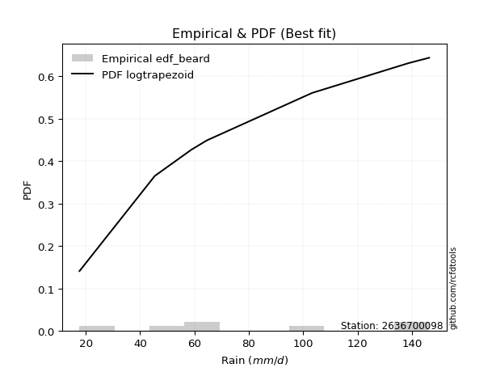</img>

</div>


### 5. EDF Chegodayev (1955)

The Chegodayev formula is an empirical plotting position formula used in hydrological frequency analysis to estimate the exceedance probability or return period of a specific event from a set of observed data. It is primarily used for plotting observed data points on probability paper to fit a theoretical distribution, particularly for analyzing extreme events like maximum flood flows or rainfall intensities. The constant _b_ value in the generalized plotting position formula is 0.3.

<div align="center">


$P=(m-b)/(n+1-2b)$


</div>


**5.1. Empirical values**

<div align="center">

|                | 0                   | 1                   | 2                   | 3              | 4                  | 5                  | 6                  |
|:---------------|:--------------------|:--------------------|:--------------------|:---------------|:-------------------|:-------------------|:-------------------|
| date           | 2023                | 2022                | 2019                | 2025           | 2020               | 2024               | 2021               |
| x              | 17.7                | 45.4                | 58.8                | 64.6           | 103.3              | 138.8              | 146.4              |
| m              | 1                   | 2                   | 3                   | 4              | 5                  | 6                  | 7                  |
| empirical_dist | edf_chegodayev      | edf_chegodayev      | edf_chegodayev      | edf_chegodayev | edf_chegodayev     | edf_chegodayev     | edf_chegodayev     |
| empirical      | 0.09459459459459459 | 0.22972972972972971 | 0.36486486486486486 | 0.5            | 0.6351351351351351 | 0.7702702702702703 | 0.9054054054054054 |
| empirical_tr   | 1.1044776119402986  | 1.2982456140350878  | 1.574468085106383   | 2.0            | 2.7407407407407405 | 4.352941176470589  | 10.571428571428568 |

</div>


**5.2. Kolmogorov-Smirnov fit test (sorted by Δ)**


<div align="center">

|                | 0                   | 1                   | 2                   | 3                   | 4                   | 5                   | 6                   | 7                   | 8                   | 9                   | 10                  | 11                  | 12                  | 13                  | 14                  | 15                  | 16                  | 17                  | 18                  | 19                  | 20                  | 21                  | 22                  | 23                  | 24                  | 25                  | 26                  | 27                  | 28                  | 29                  | 30                  | 31                  | 32                  | 33                  | 34                  | 35                  | 36                  | 37                  | 38                  | 39                  | 40                  | 41                  | 42                  | 43                  | 44                  | 45                  | 46                  | 47                  | 48                  | 49                  | 50                  | 51                  | 52                  | 53                  | 54                  | 55                  | 56                  | 57                  | 58                  | 59                  | 60                  | 61                  | 62                  | 63                  | 64                  | 65                  | 66                  | 67                  | 68                  | 69                  | 70                  | 71                  | 72                  | 73                  | 74                  | 75                  | 76                  | 77                  | 78                  | 79                  | 80                  | 81                  | 82                  | 83                  | 84                  | 85                  | 86                  | 87                  | 88                  | 89                  | 90                  | 91                  | 92                  | 93                  | 94                  | 95                  | 96                  | 97                  | 98                  | 99                  | 100                 | 101                 | 102                 | 103                 | 104                 | 105                 | 106                 | 107                 | 108                 | 109                 | 110                 | 111                 | 112                 | 113                 | 114                 | 115                 | 116                 | 117                 | 118                 | 119                 | 120                 | 121                 | 122                 | 123                 | 124                 | 125                 | 126                 | 127                 | 128                 | 129                 | 130                 | 131                 | 132                 | 133                 | 134                 | 135                 | 136                 | 137                 | 138                 | 139                 | 140                 | 141                 | 142                 | 143                 | 144                 | 145                 | 146                 | 147                 | 148                 | 149                 | 150                 | 151                 | 152                 | 153                 | 154                 | 155                 | 156                 | 157                 | 158                 | 159                 |
|:---------------|:--------------------|:--------------------|:--------------------|:--------------------|:--------------------|:--------------------|:--------------------|:--------------------|:--------------------|:--------------------|:--------------------|:--------------------|:--------------------|:--------------------|:--------------------|:--------------------|:--------------------|:--------------------|:--------------------|:--------------------|:--------------------|:--------------------|:--------------------|:--------------------|:--------------------|:--------------------|:--------------------|:--------------------|:--------------------|:--------------------|:--------------------|:--------------------|:--------------------|:--------------------|:--------------------|:--------------------|:--------------------|:--------------------|:--------------------|:--------------------|:--------------------|:--------------------|:--------------------|:--------------------|:--------------------|:--------------------|:--------------------|:--------------------|:--------------------|:--------------------|:--------------------|:--------------------|:--------------------|:--------------------|:--------------------|:--------------------|:--------------------|:--------------------|:--------------------|:--------------------|:--------------------|:--------------------|:--------------------|:--------------------|:--------------------|:--------------------|:--------------------|:--------------------|:--------------------|:--------------------|:--------------------|:--------------------|:--------------------|:--------------------|:--------------------|:--------------------|:--------------------|:--------------------|:--------------------|:--------------------|:--------------------|:--------------------|:--------------------|:--------------------|:--------------------|:--------------------|:--------------------|:--------------------|:--------------------|:--------------------|:--------------------|:--------------------|:--------------------|:--------------------|:--------------------|:--------------------|:--------------------|:--------------------|:--------------------|:--------------------|:--------------------|:--------------------|:--------------------|:--------------------|:--------------------|:--------------------|:--------------------|:--------------------|:--------------------|:--------------------|:--------------------|:--------------------|:--------------------|:--------------------|:--------------------|:--------------------|:--------------------|:--------------------|:--------------------|:--------------------|:--------------------|:--------------------|:--------------------|:--------------------|:--------------------|:--------------------|:--------------------|:--------------------|:--------------------|:--------------------|:--------------------|:--------------------|:--------------------|:--------------------|:--------------------|:--------------------|:--------------------|:--------------------|:--------------------|:--------------------|:--------------------|:--------------------|:--------------------|:--------------------|:--------------------|:--------------------|:--------------------|:--------------------|:--------------------|:--------------------|:--------------------|:--------------------|:--------------------|:--------------------|:--------------------|:--------------------|:--------------------|:--------------------|:--------------------|:--------------------|
| station        | 2636700098          | 2636700098          | 2636700098          | 2636700098          | 2636700098          | 2636700098          | 2636700098          | 2636700098          | 2636700098          | 2636700098          | 2636700098          | 2636700098          | 2636700098          | 2636700098          | 2636700098          | 2636700098          | 2636700098          | 2636700098          | 2636700098          | 2636700098          | 2636700098          | 2636700098          | 2636700098          | 2636700098          | 2636700098          | 2636700098          | 2636700098          | 2636700098          | 2636700098          | 2636700098          | 2636700098          | 2636700098          | 2636700098          | 2636700098          | 2636700098          | 2636700098          | 2636700098          | 2636700098          | 2636700098          | 2636700098          | 2636700098          | 2636700098          | 2636700098          | 2636700098          | 2636700098          | 2636700098          | 2636700098          | 2636700098          | 2636700098          | 2636700098          | 2636700098          | 2636700098          | 2636700098          | 2636700098          | 2636700098          | 2636700098          | 2636700098          | 2636700098          | 2636700098          | 2636700098          | 2636700098          | 2636700098          | 2636700098          | 2636700098          | 2636700098          | 2636700098          | 2636700098          | 2636700098          | 2636700098          | 2636700098          | 2636700098          | 2636700098          | 2636700098          | 2636700098          | 2636700098          | 2636700098          | 2636700098          | 2636700098          | 2636700098          | 2636700098          | 2636700098          | 2636700098          | 2636700098          | 2636700098          | 2636700098          | 2636700098          | 2636700098          | 2636700098          | 2636700098          | 2636700098          | 2636700098          | 2636700098          | 2636700098          | 2636700098          | 2636700098          | 2636700098          | 2636700098          | 2636700098          | 2636700098          | 2636700098          | 2636700098          | 2636700098          | 2636700098          | 2636700098          | 2636700098          | 2636700098          | 2636700098          | 2636700098          | 2636700098          | 2636700098          | 2636700098          | 2636700098          | 2636700098          | 2636700098          | 2636700098          | 2636700098          | 2636700098          | 2636700098          | 2636700098          | 2636700098          | 2636700098          | 2636700098          | 2636700098          | 2636700098          | 2636700098          | 2636700098          | 2636700098          | 2636700098          | 2636700098          | 2636700098          | 2636700098          | 2636700098          | 2636700098          | 2636700098          | 2636700098          | 2636700098          | 2636700098          | 2636700098          | 2636700098          | 2636700098          | 2636700098          | 2636700098          | 2636700098          | 2636700098          | 2636700098          | 2636700098          | 2636700098          | 2636700098          | 2636700098          | 2636700098          | 2636700098          | 2636700098          | 2636700098          | 2636700098          | 2636700098          | 2636700098          | 2636700098          | 2636700098          | 2636700098          | 2636700098          |
| empirical_dist | edf_chegodayev      | edf_chegodayev      | edf_chegodayev      | edf_chegodayev      | edf_chegodayev      | edf_chegodayev      | edf_chegodayev      | edf_chegodayev      | edf_chegodayev      | edf_chegodayev      | edf_chegodayev      | edf_chegodayev      | edf_chegodayev      | edf_chegodayev      | edf_chegodayev      | edf_chegodayev      | edf_chegodayev      | edf_chegodayev      | edf_chegodayev      | edf_chegodayev      | edf_chegodayev      | edf_chegodayev      | edf_chegodayev      | edf_chegodayev      | edf_chegodayev      | edf_chegodayev      | edf_chegodayev      | edf_chegodayev      | edf_chegodayev      | edf_chegodayev      | edf_chegodayev      | edf_chegodayev      | edf_chegodayev      | edf_chegodayev      | edf_chegodayev      | edf_chegodayev      | edf_chegodayev      | edf_chegodayev      | edf_chegodayev      | edf_chegodayev      | edf_chegodayev      | edf_chegodayev      | edf_chegodayev      | edf_chegodayev      | edf_chegodayev      | edf_chegodayev      | edf_chegodayev      | edf_chegodayev      | edf_chegodayev      | edf_chegodayev      | edf_chegodayev      | edf_chegodayev      | edf_chegodayev      | edf_chegodayev      | edf_chegodayev      | edf_chegodayev      | edf_chegodayev      | edf_chegodayev      | edf_chegodayev      | edf_chegodayev      | edf_chegodayev      | edf_chegodayev      | edf_chegodayev      | edf_chegodayev      | edf_chegodayev      | edf_chegodayev      | edf_chegodayev      | edf_chegodayev      | edf_chegodayev      | edf_chegodayev      | edf_chegodayev      | edf_chegodayev      | edf_chegodayev      | edf_chegodayev      | edf_chegodayev      | edf_chegodayev      | edf_chegodayev      | edf_chegodayev      | edf_chegodayev      | edf_chegodayev      | edf_chegodayev      | edf_chegodayev      | edf_chegodayev      | edf_chegodayev      | edf_chegodayev      | edf_chegodayev      | edf_chegodayev      | edf_chegodayev      | edf_chegodayev      | edf_chegodayev      | edf_chegodayev      | edf_chegodayev      | edf_chegodayev      | edf_chegodayev      | edf_chegodayev      | edf_chegodayev      | edf_chegodayev      | edf_chegodayev      | edf_chegodayev      | edf_chegodayev      | edf_chegodayev      | edf_chegodayev      | edf_chegodayev      | edf_chegodayev      | edf_chegodayev      | edf_chegodayev      | edf_chegodayev      | edf_chegodayev      | edf_chegodayev      | edf_chegodayev      | edf_chegodayev      | edf_chegodayev      | edf_chegodayev      | edf_chegodayev      | edf_chegodayev      | edf_chegodayev      | edf_chegodayev      | edf_chegodayev      | edf_chegodayev      | edf_chegodayev      | edf_chegodayev      | edf_chegodayev      | edf_chegodayev      | edf_chegodayev      | edf_chegodayev      | edf_chegodayev      | edf_chegodayev      | edf_chegodayev      | edf_chegodayev      | edf_chegodayev      | edf_chegodayev      | edf_chegodayev      | edf_chegodayev      | edf_chegodayev      | edf_chegodayev      | edf_chegodayev      | edf_chegodayev      | edf_chegodayev      | edf_chegodayev      | edf_chegodayev      | edf_chegodayev      | edf_chegodayev      | edf_chegodayev      | edf_chegodayev      | edf_chegodayev      | edf_chegodayev      | edf_chegodayev      | edf_chegodayev      | edf_chegodayev      | edf_chegodayev      | edf_chegodayev      | edf_chegodayev      | edf_chegodayev      | edf_chegodayev      | edf_chegodayev      | edf_chegodayev      | edf_chegodayev      | edf_chegodayev      | edf_chegodayev      | edf_chegodayev      |
| p_dist         | logtrapezoid        | loganglit           | logdweibull         | logsemicircular     | logpearson3         | arcsine             | logf                | logfatiguelife      | lognct              | logexponnorm        | logcrystalball      | lognorm             | logt                | dweibull            | logrice             | logdgamma           | logncf              | logbetaprime        | loginvgauss         | f                   | loggamma            | loggamma            | loginvgamma         | logfoldnorm         | logerlang           | logalpha            | exponweib           | weibull_min         | loggompertz         | genexpon            | loggausshyper       | genlogistic         | skewnorm            | logmaxwell          | erlang              | invweibull          | halfnorm            | dgamma              | invgauss            | betaprime           | ksone               | gamma               | lograyleigh         | logweibull_min      | logburr12           | kstwobign           | lomax               | rayleigh            | loggumbel_l         | invgamma            | gengamma            | maxwell             | loglogistic         | loginvweibull       | halflogistic        | logcosine           | semicircular        | gumbel_r            | rice                | moyal               | wrapcauchy          | anglit              | logarcsine          | loghypsecant        | loghalfnorm         | logvonmises_line    | logloglaplace       | foldnorm            | loggumbel_r         | pearson3            | genextreme          | beta                | alpha               | kappa3              | burr                | logburr             | exponnorm           | logargus            | t                   | nct                 | norm                | johnsonsu           | loghalflogistic     | logmoyal            | logkstwobign        | loglaplace          | loglaplace          | loglevy_l           | cosine              | loggenexpon         | logloggamma         | loggenhalflogistic  | tukeylambda         | logbeta             | kappa4              | gausshyper          | logistic            | uniform             | vonmises_line       | logmielke           | gompertz            | mielke              | wald                | hypsecant           | logtriang           | bradford            | logskewnorm         | truncexpon          | truncweibull_min    | argus               | levy_l              | ncf                 | logkappa4           | logwald             | gumbel_l            | laplace             | logkappa3           | logweibull_max      | loguniform          | genpareto           | logtukeylambda      | logbradford         | loggenpareto        | loggenextreme       | logksone            | nakagami            | lognakagami         | halfgennorm         | logwrapcauchy       | crystalball         | genhalflogistic     | triang              | logtruncnorm        | gennorm             | loggennorm          | burr12              | logtruncweibull_min | logrdist            | logjohnsonsb        | logtruncexpon       | truncnorm           | trapezoid           | loggengamma         | loglomax            | johnsonsb           | exponpow            | logexponpow         | weibull_max         | rdist               | powerlaw            | logjohnsonsu        | fatiguelife         | logexponweib        | logpowerlaw         | truncpareto         | logtruncpareto      | loggenlogistic      | loghalfgennorm      | logvonmises         | vonmises            |
| delta          | 0.0757454220395209  | 0.08126824704013896 | 0.09185163280427999 | 0.09284734568968435 | 0.09401809352903101 | 0.09459459459459463 | 0.09639454651726109 | 0.09668425770244593 | 0.09730759627988184 | 0.09782499784805243 | 0.09782920176221366 | 0.09782937207945097 | 0.09783121239611137 | 0.09829280170077515 | 0.09860120071811396 | 0.09865855709030535 | 0.09874986849833489 | 0.09880494086665059 | 0.09911025617219837 | 0.09934880307646188 | 0.10029893713698823 | 0.10029893713698823 | 0.10209715547475984 | 0.10225283056101053 | 0.10234389154676815 | 0.10657909591313808 | 0.10666932433023812 | 0.10675760653313648 | 0.10726838578053333 | 0.1074283539957071  | 0.1080439100843128  | 0.1089200525740337  | 0.10961757746325007 | 0.10962512501613242 | 0.10975082898096844 | 0.10982185746934403 | 0.11043274609439702 | 0.11146847700923423 | 0.1119125815076345  | 0.11191513448614754 | 0.11266792091342365 | 0.11285236400018916 | 0.11301516413749091 | 0.11343456900095839 | 0.11381426327037392 | 0.11392383220392055 | 0.11445031681073414 | 0.11456203898182593 | 0.11551438137069825 | 0.11628633180361125 | 0.1164312496987161  | 0.12001767590767343 | 0.12030253382612999 | 0.12081776215245338 | 0.12146115769416155 | 0.1228360301380591  | 0.123441076109165   | 0.12423587687820581 | 0.1245273712281546  | 0.12578391676248823 | 0.12735481149363637 | 0.13183780353967706 | 0.1355070768046318  | 0.13560441211088603 | 0.13593968555746067 | 0.1379069193857122  | 0.13999923712671092 | 0.1402127841745603  | 0.1414003236405953  | 0.14182124126336731 | 0.14574870248942007 | 0.14810756489385457 | 0.14847331347157644 | 0.14995322714320575 | 0.15065990676870755 | 0.15127755482720268 | 0.15158790704596126 | 0.15168054519591978 | 0.15180417150920011 | 0.15183346053931307 | 0.1518400974366227  | 0.15360072444642503 | 0.15390370563807848 | 0.15542601376283594 | 0.15645163673404533 | 0.15734129092298355 | 0.15734129092298355 | 0.15820988933464397 | 0.15910489304755016 | 0.16139058258022704 | 0.16330578112313943 | 0.1661965842539338  | 0.16691743151167404 | 0.1670658873203834  | 0.16839450590776406 | 0.168799202098751   | 0.16993993924782103 | 0.1706776706776706  | 0.1707426244506337  | 0.1711536798898483  | 0.1773181647371081  | 0.1805417728698443  | 0.18102222997260353 | 0.18395853805754803 | 0.1881699631355076  | 0.18849808065829776 | 0.18854851469256295 | 0.19340715461595126 | 0.1953433299397329  | 0.1979547499845885  | 0.20037750510017455 | 0.20513387748710699 | 0.2063596848995723  | 0.208419241832062   | 0.21152252278913553 | 0.21208932804944386 | 0.21494263778616074 | 0.21526608355621402 | 0.2161038989963528  | 0.2171382123971345  | 0.2177014651787098  | 0.217744784094905   | 0.21990219417377843 | 0.22056752496164522 | 0.22513162754200583 | 0.2297296550106954  | 0.22972972227563634 | 0.2408146567919665  | 0.2413653296021504  | 0.24422745283828734 | 0.2516993594683026  | 0.2550352647985161  | 0.2578642115679636  | 0.2702702702702703  | 0.2702702702702703  | 0.27345756855630254 | 0.28100805523898587 | 0.2986338174558215  | 0.3047314260605291  | 0.32199470216327186 | 0.32906225226242314 | 0.350222379829347   | 0.3569004380619296  | 0.3951079649690209  | 0.413361845498063   | 0.4381228348307664  | 0.4632235686005578  | 0.5268526844256627  | 0.5300171110321921  | 0.5457387984431942  | 0.550592932453309   | 0.5682614857593928  | 0.6227491229403885  | 0.6325676768912919  | 0.6574993712453934  | 0.7098979486653638  | 0.7702702702702703  | 0.7702702702702703  | 1.088560400358356   | 22.648499134967473  |
| deltao         | 0.48442053926100004 | 0.48442053926100004 | 0.48442053926100004 | 0.48442053926100004 | 0.48442053926100004 | 0.48442053926100004 | 0.48442053926100004 | 0.48442053926100004 | 0.48442053926100004 | 0.48442053926100004 | 0.48442053926100004 | 0.48442053926100004 | 0.48442053926100004 | 0.48442053926100004 | 0.48442053926100004 | 0.48442053926100004 | 0.48442053926100004 | 0.48442053926100004 | 0.48442053926100004 | 0.48442053926100004 | 0.48442053926100004 | 0.48442053926100004 | 0.48442053926100004 | 0.48442053926100004 | 0.48442053926100004 | 0.48442053926100004 | 0.48442053926100004 | 0.48442053926100004 | 0.48442053926100004 | 0.48442053926100004 | 0.48442053926100004 | 0.48442053926100004 | 0.48442053926100004 | 0.48442053926100004 | 0.48442053926100004 | 0.48442053926100004 | 0.48442053926100004 | 0.48442053926100004 | 0.48442053926100004 | 0.48442053926100004 | 0.48442053926100004 | 0.48442053926100004 | 0.48442053926100004 | 0.48442053926100004 | 0.48442053926100004 | 0.48442053926100004 | 0.48442053926100004 | 0.48442053926100004 | 0.48442053926100004 | 0.48442053926100004 | 0.48442053926100004 | 0.48442053926100004 | 0.48442053926100004 | 0.48442053926100004 | 0.48442053926100004 | 0.48442053926100004 | 0.48442053926100004 | 0.48442053926100004 | 0.48442053926100004 | 0.48442053926100004 | 0.48442053926100004 | 0.48442053926100004 | 0.48442053926100004 | 0.48442053926100004 | 0.48442053926100004 | 0.48442053926100004 | 0.48442053926100004 | 0.48442053926100004 | 0.48442053926100004 | 0.48442053926100004 | 0.48442053926100004 | 0.48442053926100004 | 0.48442053926100004 | 0.48442053926100004 | 0.48442053926100004 | 0.48442053926100004 | 0.48442053926100004 | 0.48442053926100004 | 0.48442053926100004 | 0.48442053926100004 | 0.48442053926100004 | 0.48442053926100004 | 0.48442053926100004 | 0.48442053926100004 | 0.48442053926100004 | 0.48442053926100004 | 0.48442053926100004 | 0.48442053926100004 | 0.48442053926100004 | 0.48442053926100004 | 0.48442053926100004 | 0.48442053926100004 | 0.48442053926100004 | 0.48442053926100004 | 0.48442053926100004 | 0.48442053926100004 | 0.48442053926100004 | 0.48442053926100004 | 0.48442053926100004 | 0.48442053926100004 | 0.48442053926100004 | 0.48442053926100004 | 0.48442053926100004 | 0.48442053926100004 | 0.48442053926100004 | 0.48442053926100004 | 0.48442053926100004 | 0.48442053926100004 | 0.48442053926100004 | 0.48442053926100004 | 0.48442053926100004 | 0.48442053926100004 | 0.48442053926100004 | 0.48442053926100004 | 0.48442053926100004 | 0.48442053926100004 | 0.48442053926100004 | 0.48442053926100004 | 0.48442053926100004 | 0.48442053926100004 | 0.48442053926100004 | 0.48442053926100004 | 0.48442053926100004 | 0.48442053926100004 | 0.48442053926100004 | 0.48442053926100004 | 0.48442053926100004 | 0.48442053926100004 | 0.48442053926100004 | 0.48442053926100004 | 0.48442053926100004 | 0.48442053926100004 | 0.48442053926100004 | 0.48442053926100004 | 0.48442053926100004 | 0.48442053926100004 | 0.48442053926100004 | 0.48442053926100004 | 0.48442053926100004 | 0.48442053926100004 | 0.48442053926100004 | 0.48442053926100004 | 0.48442053926100004 | 0.48442053926100004 | 0.48442053926100004 | 0.48442053926100004 | 0.48442053926100004 | 0.48442053926100004 | 0.48442053926100004 | 0.48442053926100004 | 0.48442053926100004 | 0.48442053926100004 | 0.48442053926100004 | 0.48442053926100004 | 0.48442053926100004 | 0.48442053926100004 | 0.48442053926100004 | 0.48442053926100004 | 0.48442053926100004 | 0.48442053926100004 |
| eval           | Δo > Δ              | Δo > Δ              | Δo > Δ              | Δo > Δ              | Δo > Δ              | Δo > Δ              | Δo > Δ              | Δo > Δ              | Δo > Δ              | Δo > Δ              | Δo > Δ              | Δo > Δ              | Δo > Δ              | Δo > Δ              | Δo > Δ              | Δo > Δ              | Δo > Δ              | Δo > Δ              | Δo > Δ              | Δo > Δ              | Δo > Δ              | Δo > Δ              | Δo > Δ              | Δo > Δ              | Δo > Δ              | Δo > Δ              | Δo > Δ              | Δo > Δ              | Δo > Δ              | Δo > Δ              | Δo > Δ              | Δo > Δ              | Δo > Δ              | Δo > Δ              | Δo > Δ              | Δo > Δ              | Δo > Δ              | Δo > Δ              | Δo > Δ              | Δo > Δ              | Δo > Δ              | Δo > Δ              | Δo > Δ              | Δo > Δ              | Δo > Δ              | Δo > Δ              | Δo > Δ              | Δo > Δ              | Δo > Δ              | Δo > Δ              | Δo > Δ              | Δo > Δ              | Δo > Δ              | Δo > Δ              | Δo > Δ              | Δo > Δ              | Δo > Δ              | Δo > Δ              | Δo > Δ              | Δo > Δ              | Δo > Δ              | Δo > Δ              | Δo > Δ              | Δo > Δ              | Δo > Δ              | Δo > Δ              | Δo > Δ              | Δo > Δ              | Δo > Δ              | Δo > Δ              | Δo > Δ              | Δo > Δ              | Δo > Δ              | Δo > Δ              | Δo > Δ              | Δo > Δ              | Δo > Δ              | Δo > Δ              | Δo > Δ              | Δo > Δ              | Δo > Δ              | Δo > Δ              | Δo > Δ              | Δo > Δ              | Δo > Δ              | Δo > Δ              | Δo > Δ              | Δo > Δ              | Δo > Δ              | Δo > Δ              | Δo > Δ              | Δo > Δ              | Δo > Δ              | Δo > Δ              | Δo > Δ              | Δo > Δ              | Δo > Δ              | Δo > Δ              | Δo > Δ              | Δo > Δ              | Δo > Δ              | Δo > Δ              | Δo > Δ              | Δo > Δ              | Δo > Δ              | Δo > Δ              | Δo > Δ              | Δo > Δ              | Δo > Δ              | Δo > Δ              | Δo > Δ              | Δo > Δ              | Δo > Δ              | Δo > Δ              | Δo > Δ              | Δo > Δ              | Δo > Δ              | Δo > Δ              | Δo > Δ              | Δo > Δ              | Δo > Δ              | Δo > Δ              | Δo > Δ              | Δo > Δ              | Δo > Δ              | Δo > Δ              | Δo > Δ              | Δo > Δ              | Δo > Δ              | Δo > Δ              | Δo > Δ              | Δo > Δ              | Δo > Δ              | Δo > Δ              | Δo > Δ              | Δo > Δ              | Δo > Δ              | Δo > Δ              | Δo > Δ              | Δo > Δ              | Δo > Δ              | Δo > Δ              | Δo > Δ              | Δo > Δ              | Δo > Δ              | Δo > Δ              | Δo > Δ              | Δo <= Δ             | Δo <= Δ             | Δo <= Δ             | Δo <= Δ             | Δo <= Δ             | Δo <= Δ             | Δo <= Δ             | Δo <= Δ             | Δo <= Δ             | Δo <= Δ             | Δo <= Δ             | Δo <= Δ             | Δo <= Δ             |
| fit            | 1                   | 1                   | 1                   | 1                   | 1                   | 1                   | 1                   | 1                   | 1                   | 1                   | 1                   | 1                   | 1                   | 1                   | 1                   | 1                   | 1                   | 1                   | 1                   | 1                   | 1                   | 1                   | 1                   | 1                   | 1                   | 1                   | 1                   | 1                   | 1                   | 1                   | 1                   | 1                   | 1                   | 1                   | 1                   | 1                   | 1                   | 1                   | 1                   | 1                   | 1                   | 1                   | 1                   | 1                   | 1                   | 1                   | 1                   | 1                   | 1                   | 1                   | 1                   | 1                   | 1                   | 1                   | 1                   | 1                   | 1                   | 1                   | 1                   | 1                   | 1                   | 1                   | 1                   | 1                   | 1                   | 1                   | 1                   | 1                   | 1                   | 1                   | 1                   | 1                   | 1                   | 1                   | 1                   | 1                   | 1                   | 1                   | 1                   | 1                   | 1                   | 1                   | 1                   | 1                   | 1                   | 1                   | 1                   | 1                   | 1                   | 1                   | 1                   | 1                   | 1                   | 1                   | 1                   | 1                   | 1                   | 1                   | 1                   | 1                   | 1                   | 1                   | 1                   | 1                   | 1                   | 1                   | 1                   | 1                   | 1                   | 1                   | 1                   | 1                   | 1                   | 1                   | 1                   | 1                   | 1                   | 1                   | 1                   | 1                   | 1                   | 1                   | 1                   | 1                   | 1                   | 1                   | 1                   | 1                   | 1                   | 1                   | 1                   | 1                   | 1                   | 1                   | 1                   | 1                   | 1                   | 1                   | 1                   | 1                   | 1                   | 1                   | 1                   | 1                   | 1                   | 1                   | 1                   | 0                   | 0                   | 0                   | 0                   | 0                   | 0                   | 0                   | 0                   | 0                   | 0                   | 0                   | 0                   | 0                   |
| n              | 7                   | 7                   | 7                   | 7                   | 7                   | 7                   | 7                   | 7                   | 7                   | 7                   | 7                   | 7                   | 7                   | 7                   | 7                   | 7                   | 7                   | 7                   | 7                   | 7                   | 7                   | 7                   | 7                   | 7                   | 7                   | 7                   | 7                   | 7                   | 7                   | 7                   | 7                   | 7                   | 7                   | 7                   | 7                   | 7                   | 7                   | 7                   | 7                   | 7                   | 7                   | 7                   | 7                   | 7                   | 7                   | 7                   | 7                   | 7                   | 7                   | 7                   | 7                   | 7                   | 7                   | 7                   | 7                   | 7                   | 7                   | 7                   | 7                   | 7                   | 7                   | 7                   | 7                   | 7                   | 7                   | 7                   | 7                   | 7                   | 7                   | 7                   | 7                   | 7                   | 7                   | 7                   | 7                   | 7                   | 7                   | 7                   | 7                   | 7                   | 7                   | 7                   | 7                   | 7                   | 7                   | 7                   | 7                   | 7                   | 7                   | 7                   | 7                   | 7                   | 7                   | 7                   | 7                   | 7                   | 7                   | 7                   | 7                   | 7                   | 7                   | 7                   | 7                   | 7                   | 7                   | 7                   | 7                   | 7                   | 7                   | 7                   | 7                   | 7                   | 7                   | 7                   | 7                   | 7                   | 7                   | 7                   | 7                   | 7                   | 7                   | 7                   | 7                   | 7                   | 7                   | 7                   | 7                   | 7                   | 7                   | 7                   | 7                   | 7                   | 7                   | 7                   | 7                   | 7                   | 7                   | 7                   | 7                   | 7                   | 7                   | 7                   | 7                   | 7                   | 7                   | 7                   | 7                   | 7                   | 7                   | 7                   | 7                   | 7                   | 7                   | 7                   | 7                   | 7                   | 7                   | 7                   | 7                   | 7                   |
| best_fit       | 1                   | 0                   | 0                   | 0                   | 0                   | 0                   | 0                   | 0                   | 0                   | 0                   | 0                   | 0                   | 0                   | 0                   | 0                   | 0                   | 0                   | 0                   | 0                   | 0                   | 0                   | 0                   | 0                   | 0                   | 0                   | 0                   | 0                   | 0                   | 0                   | 0                   | 0                   | 0                   | 0                   | 0                   | 0                   | 0                   | 0                   | 0                   | 0                   | 0                   | 0                   | 0                   | 0                   | 0                   | 0                   | 0                   | 0                   | 0                   | 0                   | 0                   | 0                   | 0                   | 0                   | 0                   | 0                   | 0                   | 0                   | 0                   | 0                   | 0                   | 0                   | 0                   | 0                   | 0                   | 0                   | 0                   | 0                   | 0                   | 0                   | 0                   | 0                   | 0                   | 0                   | 0                   | 0                   | 0                   | 0                   | 0                   | 0                   | 0                   | 0                   | 0                   | 0                   | 0                   | 0                   | 0                   | 0                   | 0                   | 0                   | 0                   | 0                   | 0                   | 0                   | 0                   | 0                   | 0                   | 0                   | 0                   | 0                   | 0                   | 0                   | 0                   | 0                   | 0                   | 0                   | 0                   | 0                   | 0                   | 0                   | 0                   | 0                   | 0                   | 0                   | 0                   | 0                   | 0                   | 0                   | 0                   | 0                   | 0                   | 0                   | 0                   | 0                   | 0                   | 0                   | 0                   | 0                   | 0                   | 0                   | 0                   | 0                   | 0                   | 0                   | 0                   | 0                   | 0                   | 0                   | 0                   | 0                   | 0                   | 0                   | 0                   | 0                   | 0                   | 0                   | 0                   | 0                   | 0                   | 0                   | 0                   | 0                   | 0                   | 0                   | 0                   | 0                   | 0                   | 0                   | 0                   | 0                   | 0                   |
| best_fit_sort  | 1                   | 2                   | 3                   | 4                   | 5                   | 6                   | 7                   | 8                   | 9                   | 10                  | 11                  | 12                  | 13                  | 14                  | 15                  | 16                  | 17                  | 18                  | 19                  | 20                  | 21                  | 22                  | 23                  | 24                  | 25                  | 26                  | 27                  | 28                  | 29                  | 30                  | 31                  | 32                  | 33                  | 34                  | 35                  | 36                  | 37                  | 38                  | 39                  | 40                  | 41                  | 42                  | 43                  | 44                  | 45                  | 46                  | 47                  | 48                  | 49                  | 50                  | 51                  | 52                  | 53                  | 54                  | 55                  | 56                  | 57                  | 58                  | 59                  | 60                  | 61                  | 62                  | 63                  | 64                  | 65                  | 66                  | 67                  | 68                  | 69                  | 70                  | 71                  | 72                  | 73                  | 74                  | 75                  | 76                  | 77                  | 78                  | 79                  | 80                  | 81                  | 82                  | 83                  | 84                  | 85                  | 86                  | 87                  | 88                  | 89                  | 90                  | 91                  | 92                  | 93                  | 94                  | 95                  | 96                  | 97                  | 98                  | 99                  | 100                 | 101                 | 102                 | 103                 | 104                 | 105                 | 106                 | 107                 | 108                 | 109                 | 110                 | 111                 | 112                 | 113                 | 114                 | 115                 | 116                 | 117                 | 118                 | 119                 | 120                 | 121                 | 122                 | 123                 | 124                 | 125                 | 126                 | 127                 | 128                 | 129                 | 130                 | 131                 | 132                 | 133                 | 134                 | 135                 | 136                 | 137                 | 138                 | 139                 | 140                 | 141                 | 142                 | 143                 | 144                 | 145                 | 146                 | 147                 | 148                 | 149                 | 150                 | 151                 | 152                 | 153                 | 154                 | 155                 | 156                 | 157                 | 158                 | 159                 | 160                 |

</div>


**5.3. Best fit**

<div align="center">

|   id |    station | empirical_dist   | p_dist       |     delta |   deltao | eval   |   fit |   n |   best_fit |   best_fit_sort |
|-----:|-----------:|:-----------------|:-------------|----------:|---------:|:-------|------:|----:|-----------:|----------------:|
|    0 | 2636700098 | edf_chegodayev   | logtrapezoid | 0.0757454 | 0.484421 | Δo > Δ |     1 |   7 |          1 |               1 |

</div>


<div align="center">

</img></img>

</div>


### 6. EDF Blom (1958)

The Blom formula is a specific "plotting position" formula used in hydrology and statistical analysis to estimate the empirical cumulative probability (or non-exceedance probability) of a data series. It is particularly recommended for data that are approximately normally distributed. The constant _a_ is set to 0.375 (or 3/8).

<div align="center">


$P=(m-a)/(n+1-2a)$


</div>


**6.1. Empirical values**

<div align="center">

|                | 0                   | 1                   | 2                  | 3        | 4                  | 5                  | 6                  |
|:---------------|:--------------------|:--------------------|:-------------------|:---------|:-------------------|:-------------------|:-------------------|
| date           | 2023                | 2022                | 2019               | 2025     | 2020               | 2024               | 2021               |
| x              | 17.7                | 45.4                | 58.8               | 64.6     | 103.3              | 138.8              | 146.4              |
| m              | 1                   | 2                   | 3                  | 4        | 5                  | 6                  | 7                  |
| empirical_dist | edf_blom            | edf_blom            | edf_blom           | edf_blom | edf_blom           | edf_blom           | edf_blom           |
| empirical      | 0.08620689655172414 | 0.22413793103448276 | 0.3620689655172414 | 0.5      | 0.6379310344827587 | 0.7758620689655172 | 0.9137931034482759 |
| empirical_tr   | 1.0943396226415094  | 1.288888888888889   | 1.5675675675675675 | 2.0      | 2.7619047619047623 | 4.461538461538462  | 11.600000000000007 |

</div>


**6.2. Kolmogorov-Smirnov fit test (sorted by Δ)**


<div align="center">

|                | 0                   | 1                   | 2                   | 3                   | 4                   | 5                   | 6                   | 7                   | 8                   | 9                   | 10                  | 11                  | 12                  | 13                  | 14                  | 15                  | 16                  | 17                  | 18                  | 19                  | 20                  | 21                  | 22                  | 23                  | 24                  | 25                  | 26                  | 27                  | 28                  | 29                  | 30                  | 31                  | 32                  | 33                  | 34                  | 35                  | 36                  | 37                  | 38                  | 39                  | 40                  | 41                  | 42                  | 43                  | 44                  | 45                  | 46                  | 47                  | 48                  | 49                  | 50                  | 51                  | 52                  | 53                  | 54                  | 55                  | 56                  | 57                  | 58                  | 59                  | 60                  | 61                  | 62                  | 63                  | 64                  | 65                  | 66                  | 67                  | 68                  | 69                  | 70                  | 71                  | 72                  | 73                  | 74                  | 75                  | 76                  | 77                  | 78                  | 79                  | 80                  | 81                  | 82                  | 83                  | 84                  | 85                  | 86                  | 87                  | 88                  | 89                  | 90                  | 91                  | 92                  | 93                  | 94                  | 95                  | 96                  | 97                  | 98                  | 99                  | 100                 | 101                 | 102                 | 103                 | 104                 | 105                 | 106                 | 107                 | 108                 | 109                 | 110                 | 111                 | 112                 | 113                 | 114                 | 115                 | 116                 | 117                 | 118                 | 119                 | 120                 | 121                 | 122                 | 123                 | 124                 | 125                 | 126                 | 127                 | 128                 | 129                 | 130                 | 131                 | 132                 | 133                 | 134                 | 135                 | 136                 | 137                 | 138                 | 139                 | 140                 | 141                 | 142                 | 143                 | 144                 | 145                 | 146                 | 147                 | 148                 | 149                 | 150                 | 151                 | 152                 | 153                 | 154                 | 155                 | 156                 | 157                 | 158                 | 159                 |
|:---------------|:--------------------|:--------------------|:--------------------|:--------------------|:--------------------|:--------------------|:--------------------|:--------------------|:--------------------|:--------------------|:--------------------|:--------------------|:--------------------|:--------------------|:--------------------|:--------------------|:--------------------|:--------------------|:--------------------|:--------------------|:--------------------|:--------------------|:--------------------|:--------------------|:--------------------|:--------------------|:--------------------|:--------------------|:--------------------|:--------------------|:--------------------|:--------------------|:--------------------|:--------------------|:--------------------|:--------------------|:--------------------|:--------------------|:--------------------|:--------------------|:--------------------|:--------------------|:--------------------|:--------------------|:--------------------|:--------------------|:--------------------|:--------------------|:--------------------|:--------------------|:--------------------|:--------------------|:--------------------|:--------------------|:--------------------|:--------------------|:--------------------|:--------------------|:--------------------|:--------------------|:--------------------|:--------------------|:--------------------|:--------------------|:--------------------|:--------------------|:--------------------|:--------------------|:--------------------|:--------------------|:--------------------|:--------------------|:--------------------|:--------------------|:--------------------|:--------------------|:--------------------|:--------------------|:--------------------|:--------------------|:--------------------|:--------------------|:--------------------|:--------------------|:--------------------|:--------------------|:--------------------|:--------------------|:--------------------|:--------------------|:--------------------|:--------------------|:--------------------|:--------------------|:--------------------|:--------------------|:--------------------|:--------------------|:--------------------|:--------------------|:--------------------|:--------------------|:--------------------|:--------------------|:--------------------|:--------------------|:--------------------|:--------------------|:--------------------|:--------------------|:--------------------|:--------------------|:--------------------|:--------------------|:--------------------|:--------------------|:--------------------|:--------------------|:--------------------|:--------------------|:--------------------|:--------------------|:--------------------|:--------------------|:--------------------|:--------------------|:--------------------|:--------------------|:--------------------|:--------------------|:--------------------|:--------------------|:--------------------|:--------------------|:--------------------|:--------------------|:--------------------|:--------------------|:--------------------|:--------------------|:--------------------|:--------------------|:--------------------|:--------------------|:--------------------|:--------------------|:--------------------|:--------------------|:--------------------|:--------------------|:--------------------|:--------------------|:--------------------|:--------------------|:--------------------|:--------------------|:--------------------|:--------------------|:--------------------|:--------------------|
| station        | 2636700098          | 2636700098          | 2636700098          | 2636700098          | 2636700098          | 2636700098          | 2636700098          | 2636700098          | 2636700098          | 2636700098          | 2636700098          | 2636700098          | 2636700098          | 2636700098          | 2636700098          | 2636700098          | 2636700098          | 2636700098          | 2636700098          | 2636700098          | 2636700098          | 2636700098          | 2636700098          | 2636700098          | 2636700098          | 2636700098          | 2636700098          | 2636700098          | 2636700098          | 2636700098          | 2636700098          | 2636700098          | 2636700098          | 2636700098          | 2636700098          | 2636700098          | 2636700098          | 2636700098          | 2636700098          | 2636700098          | 2636700098          | 2636700098          | 2636700098          | 2636700098          | 2636700098          | 2636700098          | 2636700098          | 2636700098          | 2636700098          | 2636700098          | 2636700098          | 2636700098          | 2636700098          | 2636700098          | 2636700098          | 2636700098          | 2636700098          | 2636700098          | 2636700098          | 2636700098          | 2636700098          | 2636700098          | 2636700098          | 2636700098          | 2636700098          | 2636700098          | 2636700098          | 2636700098          | 2636700098          | 2636700098          | 2636700098          | 2636700098          | 2636700098          | 2636700098          | 2636700098          | 2636700098          | 2636700098          | 2636700098          | 2636700098          | 2636700098          | 2636700098          | 2636700098          | 2636700098          | 2636700098          | 2636700098          | 2636700098          | 2636700098          | 2636700098          | 2636700098          | 2636700098          | 2636700098          | 2636700098          | 2636700098          | 2636700098          | 2636700098          | 2636700098          | 2636700098          | 2636700098          | 2636700098          | 2636700098          | 2636700098          | 2636700098          | 2636700098          | 2636700098          | 2636700098          | 2636700098          | 2636700098          | 2636700098          | 2636700098          | 2636700098          | 2636700098          | 2636700098          | 2636700098          | 2636700098          | 2636700098          | 2636700098          | 2636700098          | 2636700098          | 2636700098          | 2636700098          | 2636700098          | 2636700098          | 2636700098          | 2636700098          | 2636700098          | 2636700098          | 2636700098          | 2636700098          | 2636700098          | 2636700098          | 2636700098          | 2636700098          | 2636700098          | 2636700098          | 2636700098          | 2636700098          | 2636700098          | 2636700098          | 2636700098          | 2636700098          | 2636700098          | 2636700098          | 2636700098          | 2636700098          | 2636700098          | 2636700098          | 2636700098          | 2636700098          | 2636700098          | 2636700098          | 2636700098          | 2636700098          | 2636700098          | 2636700098          | 2636700098          | 2636700098          | 2636700098          | 2636700098          | 2636700098          | 2636700098          |
| empirical_dist | edf_blom            | edf_blom            | edf_blom            | edf_blom            | edf_blom            | edf_blom            | edf_blom            | edf_blom            | edf_blom            | edf_blom            | edf_blom            | edf_blom            | edf_blom            | edf_blom            | edf_blom            | edf_blom            | edf_blom            | edf_blom            | edf_blom            | edf_blom            | edf_blom            | edf_blom            | edf_blom            | edf_blom            | edf_blom            | edf_blom            | edf_blom            | edf_blom            | edf_blom            | edf_blom            | edf_blom            | edf_blom            | edf_blom            | edf_blom            | edf_blom            | edf_blom            | edf_blom            | edf_blom            | edf_blom            | edf_blom            | edf_blom            | edf_blom            | edf_blom            | edf_blom            | edf_blom            | edf_blom            | edf_blom            | edf_blom            | edf_blom            | edf_blom            | edf_blom            | edf_blom            | edf_blom            | edf_blom            | edf_blom            | edf_blom            | edf_blom            | edf_blom            | edf_blom            | edf_blom            | edf_blom            | edf_blom            | edf_blom            | edf_blom            | edf_blom            | edf_blom            | edf_blom            | edf_blom            | edf_blom            | edf_blom            | edf_blom            | edf_blom            | edf_blom            | edf_blom            | edf_blom            | edf_blom            | edf_blom            | edf_blom            | edf_blom            | edf_blom            | edf_blom            | edf_blom            | edf_blom            | edf_blom            | edf_blom            | edf_blom            | edf_blom            | edf_blom            | edf_blom            | edf_blom            | edf_blom            | edf_blom            | edf_blom            | edf_blom            | edf_blom            | edf_blom            | edf_blom            | edf_blom            | edf_blom            | edf_blom            | edf_blom            | edf_blom            | edf_blom            | edf_blom            | edf_blom            | edf_blom            | edf_blom            | edf_blom            | edf_blom            | edf_blom            | edf_blom            | edf_blom            | edf_blom            | edf_blom            | edf_blom            | edf_blom            | edf_blom            | edf_blom            | edf_blom            | edf_blom            | edf_blom            | edf_blom            | edf_blom            | edf_blom            | edf_blom            | edf_blom            | edf_blom            | edf_blom            | edf_blom            | edf_blom            | edf_blom            | edf_blom            | edf_blom            | edf_blom            | edf_blom            | edf_blom            | edf_blom            | edf_blom            | edf_blom            | edf_blom            | edf_blom            | edf_blom            | edf_blom            | edf_blom            | edf_blom            | edf_blom            | edf_blom            | edf_blom            | edf_blom            | edf_blom            | edf_blom            | edf_blom            | edf_blom            | edf_blom            | edf_blom            | edf_blom            | edf_blom            | edf_blom            | edf_blom            | edf_blom            |
| p_dist         | logtrapezoid        | loganglit           | logpearson3         | arcsine             | logsemicircular     | logf                | f                   | logfatiguelife      | lognct              | logexponnorm        | logcrystalball      | lognorm             | logt                | logrice             | logncf              | logbetaprime        | loginvgauss         | loggamma            | loggamma            | loginvgamma         | logfoldnorm         | logerlang           | logdweibull         | exponweib           | dweibull            | weibull_min         | loggompertz         | genlogistic         | logalpha            | skewnorm            | erlang              | invweibull          | halfnorm            | dgamma              | invgauss            | betaprime           | logmaxwell          | logdgamma           | gamma               | logweibull_min      | logburr12           | kstwobign           | rayleigh            | loggumbel_l         | lograyleigh         | gengamma            | ksone               | genexpon            | invgamma            | loggausshyper       | halflogistic        | loglogistic         | gumbel_r            | maxwell             | logcosine           | lomax               | moyal               | wrapcauchy          | semicircular        | rice                | loginvweibull       | anglit              | loghypsecant        | logloglaplace       | logvonmises_line    | loggumbel_r         | loghalfnorm         | foldnorm            | logarcsine          | pearson3            | burr                | logargus            | beta                | kappa3              | logburr             | exponnorm           | t                   | nct                 | norm                | logmoyal            | johnsonsu           | alpha               | genextreme          | loglaplace          | loglaplace          | loghalflogistic     | logloggamma         | loglevy_l           | cosine              | loggenhalflogistic  | tukeylambda         | logbeta             | logkstwobign        | kappa4              | gausshyper          | uniform             | vonmises_line       | logmielke           | loggenexpon         | logistic            | mielke              | wald                | gompertz            | logtriang           | bradford            | logskewnorm         | hypsecant           | truncexpon          | truncweibull_min    | argus               | levy_l              | ncf                 | logwald             | gumbel_l            | logkappa4           | laplace             | genpareto           | logkappa3           | loggenextreme       | loguniform          | logtukeylambda      | logbradford         | logweibull_max      | nakagami            | lognakagami         | loggenpareto        | logksone            | halfgennorm         | logwrapcauchy       | genhalflogistic     | crystalball         | triang              | logtruncnorm        | gennorm             | loggennorm          | burr12              | logtruncweibull_min | logrdist            | logjohnsonsb        | logtruncexpon       | truncnorm           | trapezoid           | loggengamma         | loglomax            | johnsonsb           | exponpow            | logexponpow         | weibull_max         | rdist               | powerlaw            | logjohnsonsu        | fatiguelife         | logexponweib        | logpowerlaw         | truncpareto         | logtruncpareto      | loggenlogistic      | loghalfgennorm      | logvonmises         | vonmises            |
| delta          | 0.0757454220395209  | 0.0824334136888788  | 0.08842629483378406 | 0.08900202256878814 | 0.09355453664852453 | 0.0935986471696375  | 0.09375700438121493 | 0.09388835835482234 | 0.09451169693225825 | 0.09502909850042884 | 0.09503330241459007 | 0.09503347273182738 | 0.09503531304848778 | 0.09580530137049037 | 0.0959539691507113  | 0.096009041519027   | 0.09631435682457479 | 0.09750303778936464 | 0.09750303778936464 | 0.09930125612713625 | 0.09945693121338695 | 0.09954799219914456 | 0.10023933084715053 | 0.10107752563499117 | 0.10108870104839873 | 0.10116580783788953 | 0.10167658708528637 | 0.10332825387878675 | 0.10378319656551449 | 0.10402577876800312 | 0.10415903028572149 | 0.10423005877409708 | 0.10484094739915006 | 0.10587667831398728 | 0.10632078281238755 | 0.10632333579090059 | 0.10682922566850883 | 0.1070462551331759  | 0.10726056530494221 | 0.10784277030571143 | 0.10822246457512696 | 0.1083320335086736  | 0.10897024028657898 | 0.1099225826754513  | 0.11021926478986732 | 0.11083945100346915 | 0.11266792091342365 | 0.11302015269095406 | 0.11332782919485573 | 0.11363570877955975 | 0.1158693589989146  | 0.1175066344785064  | 0.11864407818295886 | 0.12001767590767343 | 0.12004013079043552 | 0.1200421155059811  | 0.12019211806724128 | 0.12176301279838941 | 0.123441076109165   | 0.1245273712281546  | 0.12640956084770033 | 0.13183780353967706 | 0.13280851276326244 | 0.13720333777908733 | 0.1379069193857122  | 0.1386044242929717  | 0.13873558490508414 | 0.1402127841745603  | 0.14109887549987876 | 0.14182124126336731 | 0.1450681080734606  | 0.14608874650067283 | 0.1473177867654193  | 0.14995322714320575 | 0.15127755482720268 | 0.15158790704596126 | 0.15180417150920011 | 0.15183346053931307 | 0.1518400974366227  | 0.15263011441521235 | 0.15360072444642503 | 0.1540651121668234  | 0.1541364005322905  | 0.15454539157535996 | 0.15454539157535996 | 0.15669960498570196 | 0.15771398242789247 | 0.15820988933464397 | 0.15910489304755016 | 0.16060478555868685 | 0.1613256328164271  | 0.16147408862513646 | 0.16204343542929228 | 0.1628027072125171  | 0.16320740340350404 | 0.16508587198242364 | 0.16515082575538675 | 0.16556188119460136 | 0.166982381275474   | 0.16993993924782103 | 0.17494997417459734 | 0.17543043127735658 | 0.1773181647371081  | 0.18257816444026065 | 0.1829062819630508  | 0.182956715997316   | 0.18395853805754803 | 0.1878153559207043  | 0.18975153124448596 | 0.1979547499845885  | 0.20876520314304498 | 0.21072567618235394 | 0.21121514117968548 | 0.21152252278913553 | 0.21195148359481925 | 0.21208932804944386 | 0.2171382123971345  | 0.2205344364814077  | 0.22056752496164522 | 0.22169569769159975 | 0.22329326387395676 | 0.22333658279015195 | 0.22365378159908444 | 0.22413785631544844 | 0.2241379235803894  | 0.22549399286902538 | 0.23072342623725278 | 0.24640645548721346 | 0.24695712829739735 | 0.2516993594683026  | 0.25261515088115777 | 0.2550352647985161  | 0.25506831222034    | 0.27586206896551724 | 0.27586206896551724 | 0.2790493672515495  | 0.2865998539342328  | 0.30422561615106847 | 0.31311912410339954 | 0.3275865008585188  | 0.32906225226242314 | 0.350222379829347   | 0.36249223675717657 | 0.40349566301189144 | 0.41895364419330994 | 0.44371463352601337 | 0.46881536729580475 | 0.5324444831209096  | 0.535608909727439   | 0.5513305971384411  | 0.5561847311485559  | 0.5738532844546398  | 0.6283409216356355  | 0.6381594755865388  | 0.6630911699406403  | 0.7154897473606108  | 0.7758620689655172  | 0.7758620689655172  | 1.0857645010107324  | 22.640111436924602  |
| deltao         | 0.48442053926100004 | 0.48442053926100004 | 0.48442053926100004 | 0.48442053926100004 | 0.48442053926100004 | 0.48442053926100004 | 0.48442053926100004 | 0.48442053926100004 | 0.48442053926100004 | 0.48442053926100004 | 0.48442053926100004 | 0.48442053926100004 | 0.48442053926100004 | 0.48442053926100004 | 0.48442053926100004 | 0.48442053926100004 | 0.48442053926100004 | 0.48442053926100004 | 0.48442053926100004 | 0.48442053926100004 | 0.48442053926100004 | 0.48442053926100004 | 0.48442053926100004 | 0.48442053926100004 | 0.48442053926100004 | 0.48442053926100004 | 0.48442053926100004 | 0.48442053926100004 | 0.48442053926100004 | 0.48442053926100004 | 0.48442053926100004 | 0.48442053926100004 | 0.48442053926100004 | 0.48442053926100004 | 0.48442053926100004 | 0.48442053926100004 | 0.48442053926100004 | 0.48442053926100004 | 0.48442053926100004 | 0.48442053926100004 | 0.48442053926100004 | 0.48442053926100004 | 0.48442053926100004 | 0.48442053926100004 | 0.48442053926100004 | 0.48442053926100004 | 0.48442053926100004 | 0.48442053926100004 | 0.48442053926100004 | 0.48442053926100004 | 0.48442053926100004 | 0.48442053926100004 | 0.48442053926100004 | 0.48442053926100004 | 0.48442053926100004 | 0.48442053926100004 | 0.48442053926100004 | 0.48442053926100004 | 0.48442053926100004 | 0.48442053926100004 | 0.48442053926100004 | 0.48442053926100004 | 0.48442053926100004 | 0.48442053926100004 | 0.48442053926100004 | 0.48442053926100004 | 0.48442053926100004 | 0.48442053926100004 | 0.48442053926100004 | 0.48442053926100004 | 0.48442053926100004 | 0.48442053926100004 | 0.48442053926100004 | 0.48442053926100004 | 0.48442053926100004 | 0.48442053926100004 | 0.48442053926100004 | 0.48442053926100004 | 0.48442053926100004 | 0.48442053926100004 | 0.48442053926100004 | 0.48442053926100004 | 0.48442053926100004 | 0.48442053926100004 | 0.48442053926100004 | 0.48442053926100004 | 0.48442053926100004 | 0.48442053926100004 | 0.48442053926100004 | 0.48442053926100004 | 0.48442053926100004 | 0.48442053926100004 | 0.48442053926100004 | 0.48442053926100004 | 0.48442053926100004 | 0.48442053926100004 | 0.48442053926100004 | 0.48442053926100004 | 0.48442053926100004 | 0.48442053926100004 | 0.48442053926100004 | 0.48442053926100004 | 0.48442053926100004 | 0.48442053926100004 | 0.48442053926100004 | 0.48442053926100004 | 0.48442053926100004 | 0.48442053926100004 | 0.48442053926100004 | 0.48442053926100004 | 0.48442053926100004 | 0.48442053926100004 | 0.48442053926100004 | 0.48442053926100004 | 0.48442053926100004 | 0.48442053926100004 | 0.48442053926100004 | 0.48442053926100004 | 0.48442053926100004 | 0.48442053926100004 | 0.48442053926100004 | 0.48442053926100004 | 0.48442053926100004 | 0.48442053926100004 | 0.48442053926100004 | 0.48442053926100004 | 0.48442053926100004 | 0.48442053926100004 | 0.48442053926100004 | 0.48442053926100004 | 0.48442053926100004 | 0.48442053926100004 | 0.48442053926100004 | 0.48442053926100004 | 0.48442053926100004 | 0.48442053926100004 | 0.48442053926100004 | 0.48442053926100004 | 0.48442053926100004 | 0.48442053926100004 | 0.48442053926100004 | 0.48442053926100004 | 0.48442053926100004 | 0.48442053926100004 | 0.48442053926100004 | 0.48442053926100004 | 0.48442053926100004 | 0.48442053926100004 | 0.48442053926100004 | 0.48442053926100004 | 0.48442053926100004 | 0.48442053926100004 | 0.48442053926100004 | 0.48442053926100004 | 0.48442053926100004 | 0.48442053926100004 | 0.48442053926100004 | 0.48442053926100004 | 0.48442053926100004 | 0.48442053926100004 |
| eval           | Δo > Δ              | Δo > Δ              | Δo > Δ              | Δo > Δ              | Δo > Δ              | Δo > Δ              | Δo > Δ              | Δo > Δ              | Δo > Δ              | Δo > Δ              | Δo > Δ              | Δo > Δ              | Δo > Δ              | Δo > Δ              | Δo > Δ              | Δo > Δ              | Δo > Δ              | Δo > Δ              | Δo > Δ              | Δo > Δ              | Δo > Δ              | Δo > Δ              | Δo > Δ              | Δo > Δ              | Δo > Δ              | Δo > Δ              | Δo > Δ              | Δo > Δ              | Δo > Δ              | Δo > Δ              | Δo > Δ              | Δo > Δ              | Δo > Δ              | Δo > Δ              | Δo > Δ              | Δo > Δ              | Δo > Δ              | Δo > Δ              | Δo > Δ              | Δo > Δ              | Δo > Δ              | Δo > Δ              | Δo > Δ              | Δo > Δ              | Δo > Δ              | Δo > Δ              | Δo > Δ              | Δo > Δ              | Δo > Δ              | Δo > Δ              | Δo > Δ              | Δo > Δ              | Δo > Δ              | Δo > Δ              | Δo > Δ              | Δo > Δ              | Δo > Δ              | Δo > Δ              | Δo > Δ              | Δo > Δ              | Δo > Δ              | Δo > Δ              | Δo > Δ              | Δo > Δ              | Δo > Δ              | Δo > Δ              | Δo > Δ              | Δo > Δ              | Δo > Δ              | Δo > Δ              | Δo > Δ              | Δo > Δ              | Δo > Δ              | Δo > Δ              | Δo > Δ              | Δo > Δ              | Δo > Δ              | Δo > Δ              | Δo > Δ              | Δo > Δ              | Δo > Δ              | Δo > Δ              | Δo > Δ              | Δo > Δ              | Δo > Δ              | Δo > Δ              | Δo > Δ              | Δo > Δ              | Δo > Δ              | Δo > Δ              | Δo > Δ              | Δo > Δ              | Δo > Δ              | Δo > Δ              | Δo > Δ              | Δo > Δ              | Δo > Δ              | Δo > Δ              | Δo > Δ              | Δo > Δ              | Δo > Δ              | Δo > Δ              | Δo > Δ              | Δo > Δ              | Δo > Δ              | Δo > Δ              | Δo > Δ              | Δo > Δ              | Δo > Δ              | Δo > Δ              | Δo > Δ              | Δo > Δ              | Δo > Δ              | Δo > Δ              | Δo > Δ              | Δo > Δ              | Δo > Δ              | Δo > Δ              | Δo > Δ              | Δo > Δ              | Δo > Δ              | Δo > Δ              | Δo > Δ              | Δo > Δ              | Δo > Δ              | Δo > Δ              | Δo > Δ              | Δo > Δ              | Δo > Δ              | Δo > Δ              | Δo > Δ              | Δo > Δ              | Δo > Δ              | Δo > Δ              | Δo > Δ              | Δo > Δ              | Δo > Δ              | Δo > Δ              | Δo > Δ              | Δo > Δ              | Δo > Δ              | Δo > Δ              | Δo > Δ              | Δo > Δ              | Δo > Δ              | Δo > Δ              | Δo > Δ              | Δo <= Δ             | Δo <= Δ             | Δo <= Δ             | Δo <= Δ             | Δo <= Δ             | Δo <= Δ             | Δo <= Δ             | Δo <= Δ             | Δo <= Δ             | Δo <= Δ             | Δo <= Δ             | Δo <= Δ             | Δo <= Δ             |
| fit            | 1                   | 1                   | 1                   | 1                   | 1                   | 1                   | 1                   | 1                   | 1                   | 1                   | 1                   | 1                   | 1                   | 1                   | 1                   | 1                   | 1                   | 1                   | 1                   | 1                   | 1                   | 1                   | 1                   | 1                   | 1                   | 1                   | 1                   | 1                   | 1                   | 1                   | 1                   | 1                   | 1                   | 1                   | 1                   | 1                   | 1                   | 1                   | 1                   | 1                   | 1                   | 1                   | 1                   | 1                   | 1                   | 1                   | 1                   | 1                   | 1                   | 1                   | 1                   | 1                   | 1                   | 1                   | 1                   | 1                   | 1                   | 1                   | 1                   | 1                   | 1                   | 1                   | 1                   | 1                   | 1                   | 1                   | 1                   | 1                   | 1                   | 1                   | 1                   | 1                   | 1                   | 1                   | 1                   | 1                   | 1                   | 1                   | 1                   | 1                   | 1                   | 1                   | 1                   | 1                   | 1                   | 1                   | 1                   | 1                   | 1                   | 1                   | 1                   | 1                   | 1                   | 1                   | 1                   | 1                   | 1                   | 1                   | 1                   | 1                   | 1                   | 1                   | 1                   | 1                   | 1                   | 1                   | 1                   | 1                   | 1                   | 1                   | 1                   | 1                   | 1                   | 1                   | 1                   | 1                   | 1                   | 1                   | 1                   | 1                   | 1                   | 1                   | 1                   | 1                   | 1                   | 1                   | 1                   | 1                   | 1                   | 1                   | 1                   | 1                   | 1                   | 1                   | 1                   | 1                   | 1                   | 1                   | 1                   | 1                   | 1                   | 1                   | 1                   | 1                   | 1                   | 1                   | 1                   | 0                   | 0                   | 0                   | 0                   | 0                   | 0                   | 0                   | 0                   | 0                   | 0                   | 0                   | 0                   | 0                   |
| n              | 7                   | 7                   | 7                   | 7                   | 7                   | 7                   | 7                   | 7                   | 7                   | 7                   | 7                   | 7                   | 7                   | 7                   | 7                   | 7                   | 7                   | 7                   | 7                   | 7                   | 7                   | 7                   | 7                   | 7                   | 7                   | 7                   | 7                   | 7                   | 7                   | 7                   | 7                   | 7                   | 7                   | 7                   | 7                   | 7                   | 7                   | 7                   | 7                   | 7                   | 7                   | 7                   | 7                   | 7                   | 7                   | 7                   | 7                   | 7                   | 7                   | 7                   | 7                   | 7                   | 7                   | 7                   | 7                   | 7                   | 7                   | 7                   | 7                   | 7                   | 7                   | 7                   | 7                   | 7                   | 7                   | 7                   | 7                   | 7                   | 7                   | 7                   | 7                   | 7                   | 7                   | 7                   | 7                   | 7                   | 7                   | 7                   | 7                   | 7                   | 7                   | 7                   | 7                   | 7                   | 7                   | 7                   | 7                   | 7                   | 7                   | 7                   | 7                   | 7                   | 7                   | 7                   | 7                   | 7                   | 7                   | 7                   | 7                   | 7                   | 7                   | 7                   | 7                   | 7                   | 7                   | 7                   | 7                   | 7                   | 7                   | 7                   | 7                   | 7                   | 7                   | 7                   | 7                   | 7                   | 7                   | 7                   | 7                   | 7                   | 7                   | 7                   | 7                   | 7                   | 7                   | 7                   | 7                   | 7                   | 7                   | 7                   | 7                   | 7                   | 7                   | 7                   | 7                   | 7                   | 7                   | 7                   | 7                   | 7                   | 7                   | 7                   | 7                   | 7                   | 7                   | 7                   | 7                   | 7                   | 7                   | 7                   | 7                   | 7                   | 7                   | 7                   | 7                   | 7                   | 7                   | 7                   | 7                   | 7                   |
| best_fit       | 1                   | 0                   | 0                   | 0                   | 0                   | 0                   | 0                   | 0                   | 0                   | 0                   | 0                   | 0                   | 0                   | 0                   | 0                   | 0                   | 0                   | 0                   | 0                   | 0                   | 0                   | 0                   | 0                   | 0                   | 0                   | 0                   | 0                   | 0                   | 0                   | 0                   | 0                   | 0                   | 0                   | 0                   | 0                   | 0                   | 0                   | 0                   | 0                   | 0                   | 0                   | 0                   | 0                   | 0                   | 0                   | 0                   | 0                   | 0                   | 0                   | 0                   | 0                   | 0                   | 0                   | 0                   | 0                   | 0                   | 0                   | 0                   | 0                   | 0                   | 0                   | 0                   | 0                   | 0                   | 0                   | 0                   | 0                   | 0                   | 0                   | 0                   | 0                   | 0                   | 0                   | 0                   | 0                   | 0                   | 0                   | 0                   | 0                   | 0                   | 0                   | 0                   | 0                   | 0                   | 0                   | 0                   | 0                   | 0                   | 0                   | 0                   | 0                   | 0                   | 0                   | 0                   | 0                   | 0                   | 0                   | 0                   | 0                   | 0                   | 0                   | 0                   | 0                   | 0                   | 0                   | 0                   | 0                   | 0                   | 0                   | 0                   | 0                   | 0                   | 0                   | 0                   | 0                   | 0                   | 0                   | 0                   | 0                   | 0                   | 0                   | 0                   | 0                   | 0                   | 0                   | 0                   | 0                   | 0                   | 0                   | 0                   | 0                   | 0                   | 0                   | 0                   | 0                   | 0                   | 0                   | 0                   | 0                   | 0                   | 0                   | 0                   | 0                   | 0                   | 0                   | 0                   | 0                   | 0                   | 0                   | 0                   | 0                   | 0                   | 0                   | 0                   | 0                   | 0                   | 0                   | 0                   | 0                   | 0                   |
| best_fit_sort  | 1                   | 2                   | 3                   | 4                   | 5                   | 6                   | 7                   | 8                   | 9                   | 10                  | 11                  | 12                  | 13                  | 14                  | 15                  | 16                  | 17                  | 18                  | 19                  | 20                  | 21                  | 22                  | 23                  | 24                  | 25                  | 26                  | 27                  | 28                  | 29                  | 30                  | 31                  | 32                  | 33                  | 34                  | 35                  | 36                  | 37                  | 38                  | 39                  | 40                  | 41                  | 42                  | 43                  | 44                  | 45                  | 46                  | 47                  | 48                  | 49                  | 50                  | 51                  | 52                  | 53                  | 54                  | 55                  | 56                  | 57                  | 58                  | 59                  | 60                  | 61                  | 62                  | 63                  | 64                  | 65                  | 66                  | 67                  | 68                  | 69                  | 70                  | 71                  | 72                  | 73                  | 74                  | 75                  | 76                  | 77                  | 78                  | 79                  | 80                  | 81                  | 82                  | 83                  | 84                  | 85                  | 86                  | 87                  | 88                  | 89                  | 90                  | 91                  | 92                  | 93                  | 94                  | 95                  | 96                  | 97                  | 98                  | 99                  | 100                 | 101                 | 102                 | 103                 | 104                 | 105                 | 106                 | 107                 | 108                 | 109                 | 110                 | 111                 | 112                 | 113                 | 114                 | 115                 | 116                 | 117                 | 118                 | 119                 | 120                 | 121                 | 122                 | 123                 | 124                 | 125                 | 126                 | 127                 | 128                 | 129                 | 130                 | 131                 | 132                 | 133                 | 134                 | 135                 | 136                 | 137                 | 138                 | 139                 | 140                 | 141                 | 142                 | 143                 | 144                 | 145                 | 146                 | 147                 | 148                 | 149                 | 150                 | 151                 | 152                 | 153                 | 154                 | 155                 | 156                 | 157                 | 158                 | 159                 | 160                 |

</div>


**6.3. Best fit**

<div align="center">

|   id |    station | empirical_dist   | p_dist       |     delta |   deltao | eval   |   fit |   n |   best_fit |   best_fit_sort |
|-----:|-----------:|:-----------------|:-------------|----------:|---------:|:-------|------:|----:|-----------:|----------------:|
|    0 | 2636700098 | edf_blom         | logtrapezoid | 0.0757454 | 0.484421 | Δo > Δ |     1 |   7 |          1 |               1 |

</div>


<div align="center">

</img>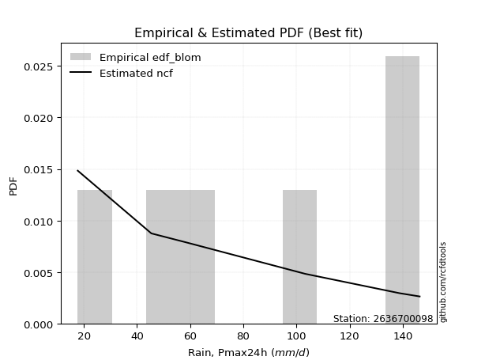</img>

</div>


### 7. EDF Tukey (1962)

In hydrology, the Tukey formula is used as a plotting position formula to estimate the empirical probability or frequency of a flood event (or other hydrological data). The formula parameter is given as _c=0.333_ (or 1/3).

<div align="center">


$P=(m-c)/(n+1-2c)$


</div>


**7.1. Empirical values**

<div align="center">

|                | 0                   | 1                   | 2                   | 3         | 4                  | 5                  | 6                  |
|:---------------|:--------------------|:--------------------|:--------------------|:----------|:-------------------|:-------------------|:-------------------|
| date           | 2023                | 2022                | 2019                | 2025      | 2020               | 2024               | 2021               |
| x              | 17.7                | 45.4                | 58.8                | 64.6      | 103.3              | 138.8              | 146.4              |
| m              | 1                   | 2                   | 3                   | 4         | 5                  | 6                  | 7                  |
| empirical_dist | edf_tukey           | edf_tukey           | edf_tukey           | edf_tukey | edf_tukey          | edf_tukey          | edf_tukey          |
| empirical      | 0.09090909090909091 | 0.22727272727272727 | 0.36363636363636365 | 0.5       | 0.6363636363636364 | 0.7727272727272727 | 0.9090909090909091 |
| empirical_tr   | 1.1                 | 1.2941176470588236  | 1.5714285714285714  | 2.0       | 2.75               | 4.3999999999999995 | 10.999999999999996 |

</div>


**7.2. Kolmogorov-Smirnov fit test (sorted by Δ)**


<div align="center">

|                | 0                   | 1                   | 2                   | 3                   | 4                   | 5                   | 6                   | 7                   | 8                   | 9                   | 10                  | 11                  | 12                  | 13                  | 14                  | 15                  | 16                  | 17                  | 18                  | 19                  | 20                  | 21                  | 22                  | 23                  | 24                  | 25                  | 26                  | 27                  | 28                  | 29                  | 30                  | 31                  | 32                  | 33                  | 34                  | 35                  | 36                  | 37                  | 38                  | 39                  | 40                  | 41                  | 42                  | 43                  | 44                  | 45                  | 46                  | 47                  | 48                  | 49                  | 50                  | 51                  | 52                  | 53                  | 54                  | 55                  | 56                  | 57                  | 58                  | 59                  | 60                  | 61                  | 62                  | 63                  | 64                  | 65                  | 66                  | 67                  | 68                  | 69                  | 70                  | 71                  | 72                  | 73                  | 74                  | 75                  | 76                  | 77                  | 78                  | 79                  | 80                  | 81                  | 82                  | 83                  | 84                  | 85                  | 86                  | 87                  | 88                  | 89                  | 90                  | 91                  | 92                  | 93                  | 94                  | 95                  | 96                  | 97                  | 98                  | 99                  | 100                 | 101                 | 102                 | 103                 | 104                 | 105                 | 106                 | 107                 | 108                 | 109                 | 110                 | 111                 | 112                 | 113                 | 114                 | 115                 | 116                 | 117                 | 118                 | 119                 | 120                 | 121                 | 122                 | 123                 | 124                 | 125                 | 126                 | 127                 | 128                 | 129                 | 130                 | 131                 | 132                 | 133                 | 134                 | 135                 | 136                 | 137                 | 138                 | 139                 | 140                 | 141                 | 142                 | 143                 | 144                 | 145                 | 146                 | 147                 | 148                 | 149                 | 150                 | 151                 | 152                 | 153                 | 154                 | 155                 | 156                 | 157                 | 158                 | 159                 |
|:---------------|:--------------------|:--------------------|:--------------------|:--------------------|:--------------------|:--------------------|:--------------------|:--------------------|:--------------------|:--------------------|:--------------------|:--------------------|:--------------------|:--------------------|:--------------------|:--------------------|:--------------------|:--------------------|:--------------------|:--------------------|:--------------------|:--------------------|:--------------------|:--------------------|:--------------------|:--------------------|:--------------------|:--------------------|:--------------------|:--------------------|:--------------------|:--------------------|:--------------------|:--------------------|:--------------------|:--------------------|:--------------------|:--------------------|:--------------------|:--------------------|:--------------------|:--------------------|:--------------------|:--------------------|:--------------------|:--------------------|:--------------------|:--------------------|:--------------------|:--------------------|:--------------------|:--------------------|:--------------------|:--------------------|:--------------------|:--------------------|:--------------------|:--------------------|:--------------------|:--------------------|:--------------------|:--------------------|:--------------------|:--------------------|:--------------------|:--------------------|:--------------------|:--------------------|:--------------------|:--------------------|:--------------------|:--------------------|:--------------------|:--------------------|:--------------------|:--------------------|:--------------------|:--------------------|:--------------------|:--------------------|:--------------------|:--------------------|:--------------------|:--------------------|:--------------------|:--------------------|:--------------------|:--------------------|:--------------------|:--------------------|:--------------------|:--------------------|:--------------------|:--------------------|:--------------------|:--------------------|:--------------------|:--------------------|:--------------------|:--------------------|:--------------------|:--------------------|:--------------------|:--------------------|:--------------------|:--------------------|:--------------------|:--------------------|:--------------------|:--------------------|:--------------------|:--------------------|:--------------------|:--------------------|:--------------------|:--------------------|:--------------------|:--------------------|:--------------------|:--------------------|:--------------------|:--------------------|:--------------------|:--------------------|:--------------------|:--------------------|:--------------------|:--------------------|:--------------------|:--------------------|:--------------------|:--------------------|:--------------------|:--------------------|:--------------------|:--------------------|:--------------------|:--------------------|:--------------------|:--------------------|:--------------------|:--------------------|:--------------------|:--------------------|:--------------------|:--------------------|:--------------------|:--------------------|:--------------------|:--------------------|:--------------------|:--------------------|:--------------------|:--------------------|:--------------------|:--------------------|:--------------------|:--------------------|:--------------------|:--------------------|
| station        | 2636700098          | 2636700098          | 2636700098          | 2636700098          | 2636700098          | 2636700098          | 2636700098          | 2636700098          | 2636700098          | 2636700098          | 2636700098          | 2636700098          | 2636700098          | 2636700098          | 2636700098          | 2636700098          | 2636700098          | 2636700098          | 2636700098          | 2636700098          | 2636700098          | 2636700098          | 2636700098          | 2636700098          | 2636700098          | 2636700098          | 2636700098          | 2636700098          | 2636700098          | 2636700098          | 2636700098          | 2636700098          | 2636700098          | 2636700098          | 2636700098          | 2636700098          | 2636700098          | 2636700098          | 2636700098          | 2636700098          | 2636700098          | 2636700098          | 2636700098          | 2636700098          | 2636700098          | 2636700098          | 2636700098          | 2636700098          | 2636700098          | 2636700098          | 2636700098          | 2636700098          | 2636700098          | 2636700098          | 2636700098          | 2636700098          | 2636700098          | 2636700098          | 2636700098          | 2636700098          | 2636700098          | 2636700098          | 2636700098          | 2636700098          | 2636700098          | 2636700098          | 2636700098          | 2636700098          | 2636700098          | 2636700098          | 2636700098          | 2636700098          | 2636700098          | 2636700098          | 2636700098          | 2636700098          | 2636700098          | 2636700098          | 2636700098          | 2636700098          | 2636700098          | 2636700098          | 2636700098          | 2636700098          | 2636700098          | 2636700098          | 2636700098          | 2636700098          | 2636700098          | 2636700098          | 2636700098          | 2636700098          | 2636700098          | 2636700098          | 2636700098          | 2636700098          | 2636700098          | 2636700098          | 2636700098          | 2636700098          | 2636700098          | 2636700098          | 2636700098          | 2636700098          | 2636700098          | 2636700098          | 2636700098          | 2636700098          | 2636700098          | 2636700098          | 2636700098          | 2636700098          | 2636700098          | 2636700098          | 2636700098          | 2636700098          | 2636700098          | 2636700098          | 2636700098          | 2636700098          | 2636700098          | 2636700098          | 2636700098          | 2636700098          | 2636700098          | 2636700098          | 2636700098          | 2636700098          | 2636700098          | 2636700098          | 2636700098          | 2636700098          | 2636700098          | 2636700098          | 2636700098          | 2636700098          | 2636700098          | 2636700098          | 2636700098          | 2636700098          | 2636700098          | 2636700098          | 2636700098          | 2636700098          | 2636700098          | 2636700098          | 2636700098          | 2636700098          | 2636700098          | 2636700098          | 2636700098          | 2636700098          | 2636700098          | 2636700098          | 2636700098          | 2636700098          | 2636700098          | 2636700098          | 2636700098          | 2636700098          |
| empirical_dist | edf_tukey           | edf_tukey           | edf_tukey           | edf_tukey           | edf_tukey           | edf_tukey           | edf_tukey           | edf_tukey           | edf_tukey           | edf_tukey           | edf_tukey           | edf_tukey           | edf_tukey           | edf_tukey           | edf_tukey           | edf_tukey           | edf_tukey           | edf_tukey           | edf_tukey           | edf_tukey           | edf_tukey           | edf_tukey           | edf_tukey           | edf_tukey           | edf_tukey           | edf_tukey           | edf_tukey           | edf_tukey           | edf_tukey           | edf_tukey           | edf_tukey           | edf_tukey           | edf_tukey           | edf_tukey           | edf_tukey           | edf_tukey           | edf_tukey           | edf_tukey           | edf_tukey           | edf_tukey           | edf_tukey           | edf_tukey           | edf_tukey           | edf_tukey           | edf_tukey           | edf_tukey           | edf_tukey           | edf_tukey           | edf_tukey           | edf_tukey           | edf_tukey           | edf_tukey           | edf_tukey           | edf_tukey           | edf_tukey           | edf_tukey           | edf_tukey           | edf_tukey           | edf_tukey           | edf_tukey           | edf_tukey           | edf_tukey           | edf_tukey           | edf_tukey           | edf_tukey           | edf_tukey           | edf_tukey           | edf_tukey           | edf_tukey           | edf_tukey           | edf_tukey           | edf_tukey           | edf_tukey           | edf_tukey           | edf_tukey           | edf_tukey           | edf_tukey           | edf_tukey           | edf_tukey           | edf_tukey           | edf_tukey           | edf_tukey           | edf_tukey           | edf_tukey           | edf_tukey           | edf_tukey           | edf_tukey           | edf_tukey           | edf_tukey           | edf_tukey           | edf_tukey           | edf_tukey           | edf_tukey           | edf_tukey           | edf_tukey           | edf_tukey           | edf_tukey           | edf_tukey           | edf_tukey           | edf_tukey           | edf_tukey           | edf_tukey           | edf_tukey           | edf_tukey           | edf_tukey           | edf_tukey           | edf_tukey           | edf_tukey           | edf_tukey           | edf_tukey           | edf_tukey           | edf_tukey           | edf_tukey           | edf_tukey           | edf_tukey           | edf_tukey           | edf_tukey           | edf_tukey           | edf_tukey           | edf_tukey           | edf_tukey           | edf_tukey           | edf_tukey           | edf_tukey           | edf_tukey           | edf_tukey           | edf_tukey           | edf_tukey           | edf_tukey           | edf_tukey           | edf_tukey           | edf_tukey           | edf_tukey           | edf_tukey           | edf_tukey           | edf_tukey           | edf_tukey           | edf_tukey           | edf_tukey           | edf_tukey           | edf_tukey           | edf_tukey           | edf_tukey           | edf_tukey           | edf_tukey           | edf_tukey           | edf_tukey           | edf_tukey           | edf_tukey           | edf_tukey           | edf_tukey           | edf_tukey           | edf_tukey           | edf_tukey           | edf_tukey           | edf_tukey           | edf_tukey           | edf_tukey           | edf_tukey           | edf_tukey           |
| p_dist         | logtrapezoid        | loganglit           | logsemicircular     | arcsine             | logpearson3         | logf                | logfatiguelife      | logdweibull         | lognct              | logexponnorm        | logcrystalball      | lognorm             | logt                | f                   | logrice             | logncf              | logbetaprime        | loginvgauss         | loggamma            | loggamma            | dweibull            | loginvgamma         | logfoldnorm         | logerlang           | logdgamma           | exponweib           | weibull_min         | loggompertz         | logalpha            | genlogistic         | skewnorm            | erlang              | invweibull          | halfnorm            | logmaxwell          | dgamma              | invgauss            | betaprime           | genexpon            | gamma               | loggausshyper       | logweibull_min      | logburr12           | kstwobign           | lograyleigh         | rayleigh            | ksone               | loggumbel_l         | invgamma            | gengamma            | lomax               | halflogistic        | loglogistic         | maxwell             | logcosine           | gumbel_r            | loginvweibull       | moyal               | semicircular        | rice                | wrapcauchy          | anglit              | loghypsecant        | loghalfnorm         | logvonmises_line    | logarcsine          | logloglaplace       | loggumbel_r         | foldnorm            | pearson3            | beta                | burr                | logargus            | genextreme          | kappa3              | alpha               | logburr             | exponnorm           | t                   | nct                 | norm                | johnsonsu           | logmoyal            | loghalflogistic     | loglaplace          | loglaplace          | loglevy_l           | logkstwobign        | cosine              | logloggamma         | loggenhalflogistic  | loggenexpon         | tukeylambda         | logbeta             | kappa4              | gausshyper          | uniform             | vonmises_line       | logmielke           | logistic            | gompertz            | mielke              | wald                | hypsecant           | logtriang           | bradford            | logskewnorm         | truncexpon          | truncweibull_min    | argus               | levy_l              | ncf                 | logkappa4           | logwald             | gumbel_l            | laplace             | genpareto           | logkappa3           | loguniform          | logweibull_max      | logtukeylambda      | logbradford         | loggenextreme       | loggenpareto        | nakagami            | lognakagami         | logksone            | halfgennorm         | logwrapcauchy       | crystalball         | genhalflogistic     | triang              | logtruncnorm        | gennorm             | loggennorm          | burr12              | logtruncweibull_min | logrdist            | logjohnsonsb        | logtruncexpon       | truncnorm           | trapezoid           | loggengamma         | loglomax            | johnsonsb           | exponpow            | logexponpow         | weibull_max         | rdist               | powerlaw            | logjohnsonsu        | fatiguelife         | logexponweib        | logpowerlaw         | truncpareto         | logtruncpareto      | loggenlogistic      | loghalfgennorm      | logvonmises         | vonmises            |
| delta          | 0.0757454220395209  | 0.0792986174506343  | 0.09041974041028003 | 0.09090909090909094 | 0.09156109107202859 | 0.09516604528875983 | 0.09545575647394466 | 0.09553713648978368 | 0.09607909505138057 | 0.09659649661955116 | 0.09660070053371239 | 0.0966008708509497  | 0.0966027111676101  | 0.09689180061945946 | 0.09737269948961269 | 0.09752136726983363 | 0.09757643963814933 | 0.09788175494369711 | 0.09907043590848696 | 0.09907043590848696 | 0.09952130292927641 | 0.10086865424625857 | 0.10102432933250927 | 0.10111539031826688 | 0.10234406077580904 | 0.1042123218732357  | 0.10430060407613406 | 0.1048113833235309  | 0.10535059468463681 | 0.10646305011703128 | 0.10716057500624765 | 0.10729382652396602 | 0.10736485501234161 | 0.1079757436373946  | 0.10839662378763115 | 0.10901147455223181 | 0.10945557905063208 | 0.10945813202914512 | 0.10988535645270955 | 0.11039536154318674 | 0.11050091254131525 | 0.11097756654395596 | 0.1113572608133715  | 0.11146682974691813 | 0.11178666290898964 | 0.11210503652482351 | 0.11266792091342365 | 0.11305737891369583 | 0.11382932934660883 | 0.11397424724171368 | 0.11690731926773659 | 0.11900415523715913 | 0.11907403259762872 | 0.12001767590767343 | 0.12160752890955784 | 0.12177887442120339 | 0.12327476460945583 | 0.12332691430548581 | 0.123441076109165   | 0.1245273712281546  | 0.12489780903663394 | 0.13183780353967706 | 0.13437591088238476 | 0.13716818678596188 | 0.1379069193857122  | 0.13796407926163426 | 0.13877073589820965 | 0.14017182241209403 | 0.1402127841745603  | 0.14182124126336731 | 0.14565056243685215 | 0.14820290431170513 | 0.14922354273891736 | 0.14943420617492373 | 0.14995322714320575 | 0.1509303159285789  | 0.15127755482720268 | 0.15158790704596126 | 0.15180417150920011 | 0.15183346053931307 | 0.1518400974366227  | 0.15360072444642503 | 0.15419751253433467 | 0.1551322068665797  | 0.15611278969448228 | 0.15611278969448228 | 0.15820988933464397 | 0.15890863919104778 | 0.15910489304755016 | 0.160848778666137   | 0.16373958179693138 | 0.1638475850372295  | 0.16446042905467162 | 0.164608884863381   | 0.16593750345076164 | 0.16634219964174857 | 0.16822066822066817 | 0.16828562199363128 | 0.1686966774328459  | 0.16993993924782103 | 0.1773181647371081  | 0.17808477041284188 | 0.17856522751560105 | 0.18395853805754803 | 0.18571296067850518 | 0.18604107820129534 | 0.18609151223556053 | 0.19095015215894884 | 0.1928863274827305  | 0.1979547499845885  | 0.2040630087856782  | 0.20759087994410944 | 0.20881668735657474 | 0.20964774306056322 | 0.21152252278913553 | 0.21208932804944386 | 0.2171382123971345  | 0.2173996402431632  | 0.21856090145335524 | 0.21895158724171768 | 0.22015846763571226 | 0.22020178655190745 | 0.22056752496164522 | 0.22235919663078088 | 0.22727265255369294 | 0.2272727198186339  | 0.22758862999900828 | 0.24327165924896896 | 0.24382233205915285 | 0.247912956523791   | 0.2516993594683026  | 0.2550352647985161  | 0.2566357103394623  | 0.2727272727272727  | 0.2727272727272727  | 0.27591457101330497 | 0.2834650576959883  | 0.30109081991282394 | 0.30841692974603274 | 0.3244517046202743  | 0.32906225226242314 | 0.350222379829347   | 0.35935744051893204 | 0.3987934686545246  | 0.4158188479550654  | 0.44057983728776884 | 0.4656805710575602  | 0.5293096868826651  | 0.5324741134891945  | 0.5481958009001966  | 0.5530499349103115  | 0.5707184882163953  | 0.625206125397391   | 0.6350246793482943  | 0.6599563737023958  | 0.7123549511223662  | 0.7727272727272727  | 0.7727272727272727  | 1.0873318991298548  | 22.64481363128197   |
| deltao         | 0.48442053926100004 | 0.48442053926100004 | 0.48442053926100004 | 0.48442053926100004 | 0.48442053926100004 | 0.48442053926100004 | 0.48442053926100004 | 0.48442053926100004 | 0.48442053926100004 | 0.48442053926100004 | 0.48442053926100004 | 0.48442053926100004 | 0.48442053926100004 | 0.48442053926100004 | 0.48442053926100004 | 0.48442053926100004 | 0.48442053926100004 | 0.48442053926100004 | 0.48442053926100004 | 0.48442053926100004 | 0.48442053926100004 | 0.48442053926100004 | 0.48442053926100004 | 0.48442053926100004 | 0.48442053926100004 | 0.48442053926100004 | 0.48442053926100004 | 0.48442053926100004 | 0.48442053926100004 | 0.48442053926100004 | 0.48442053926100004 | 0.48442053926100004 | 0.48442053926100004 | 0.48442053926100004 | 0.48442053926100004 | 0.48442053926100004 | 0.48442053926100004 | 0.48442053926100004 | 0.48442053926100004 | 0.48442053926100004 | 0.48442053926100004 | 0.48442053926100004 | 0.48442053926100004 | 0.48442053926100004 | 0.48442053926100004 | 0.48442053926100004 | 0.48442053926100004 | 0.48442053926100004 | 0.48442053926100004 | 0.48442053926100004 | 0.48442053926100004 | 0.48442053926100004 | 0.48442053926100004 | 0.48442053926100004 | 0.48442053926100004 | 0.48442053926100004 | 0.48442053926100004 | 0.48442053926100004 | 0.48442053926100004 | 0.48442053926100004 | 0.48442053926100004 | 0.48442053926100004 | 0.48442053926100004 | 0.48442053926100004 | 0.48442053926100004 | 0.48442053926100004 | 0.48442053926100004 | 0.48442053926100004 | 0.48442053926100004 | 0.48442053926100004 | 0.48442053926100004 | 0.48442053926100004 | 0.48442053926100004 | 0.48442053926100004 | 0.48442053926100004 | 0.48442053926100004 | 0.48442053926100004 | 0.48442053926100004 | 0.48442053926100004 | 0.48442053926100004 | 0.48442053926100004 | 0.48442053926100004 | 0.48442053926100004 | 0.48442053926100004 | 0.48442053926100004 | 0.48442053926100004 | 0.48442053926100004 | 0.48442053926100004 | 0.48442053926100004 | 0.48442053926100004 | 0.48442053926100004 | 0.48442053926100004 | 0.48442053926100004 | 0.48442053926100004 | 0.48442053926100004 | 0.48442053926100004 | 0.48442053926100004 | 0.48442053926100004 | 0.48442053926100004 | 0.48442053926100004 | 0.48442053926100004 | 0.48442053926100004 | 0.48442053926100004 | 0.48442053926100004 | 0.48442053926100004 | 0.48442053926100004 | 0.48442053926100004 | 0.48442053926100004 | 0.48442053926100004 | 0.48442053926100004 | 0.48442053926100004 | 0.48442053926100004 | 0.48442053926100004 | 0.48442053926100004 | 0.48442053926100004 | 0.48442053926100004 | 0.48442053926100004 | 0.48442053926100004 | 0.48442053926100004 | 0.48442053926100004 | 0.48442053926100004 | 0.48442053926100004 | 0.48442053926100004 | 0.48442053926100004 | 0.48442053926100004 | 0.48442053926100004 | 0.48442053926100004 | 0.48442053926100004 | 0.48442053926100004 | 0.48442053926100004 | 0.48442053926100004 | 0.48442053926100004 | 0.48442053926100004 | 0.48442053926100004 | 0.48442053926100004 | 0.48442053926100004 | 0.48442053926100004 | 0.48442053926100004 | 0.48442053926100004 | 0.48442053926100004 | 0.48442053926100004 | 0.48442053926100004 | 0.48442053926100004 | 0.48442053926100004 | 0.48442053926100004 | 0.48442053926100004 | 0.48442053926100004 | 0.48442053926100004 | 0.48442053926100004 | 0.48442053926100004 | 0.48442053926100004 | 0.48442053926100004 | 0.48442053926100004 | 0.48442053926100004 | 0.48442053926100004 | 0.48442053926100004 | 0.48442053926100004 | 0.48442053926100004 | 0.48442053926100004 | 0.48442053926100004 |
| eval           | Δo > Δ              | Δo > Δ              | Δo > Δ              | Δo > Δ              | Δo > Δ              | Δo > Δ              | Δo > Δ              | Δo > Δ              | Δo > Δ              | Δo > Δ              | Δo > Δ              | Δo > Δ              | Δo > Δ              | Δo > Δ              | Δo > Δ              | Δo > Δ              | Δo > Δ              | Δo > Δ              | Δo > Δ              | Δo > Δ              | Δo > Δ              | Δo > Δ              | Δo > Δ              | Δo > Δ              | Δo > Δ              | Δo > Δ              | Δo > Δ              | Δo > Δ              | Δo > Δ              | Δo > Δ              | Δo > Δ              | Δo > Δ              | Δo > Δ              | Δo > Δ              | Δo > Δ              | Δo > Δ              | Δo > Δ              | Δo > Δ              | Δo > Δ              | Δo > Δ              | Δo > Δ              | Δo > Δ              | Δo > Δ              | Δo > Δ              | Δo > Δ              | Δo > Δ              | Δo > Δ              | Δo > Δ              | Δo > Δ              | Δo > Δ              | Δo > Δ              | Δo > Δ              | Δo > Δ              | Δo > Δ              | Δo > Δ              | Δo > Δ              | Δo > Δ              | Δo > Δ              | Δo > Δ              | Δo > Δ              | Δo > Δ              | Δo > Δ              | Δo > Δ              | Δo > Δ              | Δo > Δ              | Δo > Δ              | Δo > Δ              | Δo > Δ              | Δo > Δ              | Δo > Δ              | Δo > Δ              | Δo > Δ              | Δo > Δ              | Δo > Δ              | Δo > Δ              | Δo > Δ              | Δo > Δ              | Δo > Δ              | Δo > Δ              | Δo > Δ              | Δo > Δ              | Δo > Δ              | Δo > Δ              | Δo > Δ              | Δo > Δ              | Δo > Δ              | Δo > Δ              | Δo > Δ              | Δo > Δ              | Δo > Δ              | Δo > Δ              | Δo > Δ              | Δo > Δ              | Δo > Δ              | Δo > Δ              | Δo > Δ              | Δo > Δ              | Δo > Δ              | Δo > Δ              | Δo > Δ              | Δo > Δ              | Δo > Δ              | Δo > Δ              | Δo > Δ              | Δo > Δ              | Δo > Δ              | Δo > Δ              | Δo > Δ              | Δo > Δ              | Δo > Δ              | Δo > Δ              | Δo > Δ              | Δo > Δ              | Δo > Δ              | Δo > Δ              | Δo > Δ              | Δo > Δ              | Δo > Δ              | Δo > Δ              | Δo > Δ              | Δo > Δ              | Δo > Δ              | Δo > Δ              | Δo > Δ              | Δo > Δ              | Δo > Δ              | Δo > Δ              | Δo > Δ              | Δo > Δ              | Δo > Δ              | Δo > Δ              | Δo > Δ              | Δo > Δ              | Δo > Δ              | Δo > Δ              | Δo > Δ              | Δo > Δ              | Δo > Δ              | Δo > Δ              | Δo > Δ              | Δo > Δ              | Δo > Δ              | Δo > Δ              | Δo > Δ              | Δo > Δ              | Δo > Δ              | Δo > Δ              | Δo <= Δ             | Δo <= Δ             | Δo <= Δ             | Δo <= Δ             | Δo <= Δ             | Δo <= Δ             | Δo <= Δ             | Δo <= Δ             | Δo <= Δ             | Δo <= Δ             | Δo <= Δ             | Δo <= Δ             | Δo <= Δ             |
| fit            | 1                   | 1                   | 1                   | 1                   | 1                   | 1                   | 1                   | 1                   | 1                   | 1                   | 1                   | 1                   | 1                   | 1                   | 1                   | 1                   | 1                   | 1                   | 1                   | 1                   | 1                   | 1                   | 1                   | 1                   | 1                   | 1                   | 1                   | 1                   | 1                   | 1                   | 1                   | 1                   | 1                   | 1                   | 1                   | 1                   | 1                   | 1                   | 1                   | 1                   | 1                   | 1                   | 1                   | 1                   | 1                   | 1                   | 1                   | 1                   | 1                   | 1                   | 1                   | 1                   | 1                   | 1                   | 1                   | 1                   | 1                   | 1                   | 1                   | 1                   | 1                   | 1                   | 1                   | 1                   | 1                   | 1                   | 1                   | 1                   | 1                   | 1                   | 1                   | 1                   | 1                   | 1                   | 1                   | 1                   | 1                   | 1                   | 1                   | 1                   | 1                   | 1                   | 1                   | 1                   | 1                   | 1                   | 1                   | 1                   | 1                   | 1                   | 1                   | 1                   | 1                   | 1                   | 1                   | 1                   | 1                   | 1                   | 1                   | 1                   | 1                   | 1                   | 1                   | 1                   | 1                   | 1                   | 1                   | 1                   | 1                   | 1                   | 1                   | 1                   | 1                   | 1                   | 1                   | 1                   | 1                   | 1                   | 1                   | 1                   | 1                   | 1                   | 1                   | 1                   | 1                   | 1                   | 1                   | 1                   | 1                   | 1                   | 1                   | 1                   | 1                   | 1                   | 1                   | 1                   | 1                   | 1                   | 1                   | 1                   | 1                   | 1                   | 1                   | 1                   | 1                   | 1                   | 1                   | 0                   | 0                   | 0                   | 0                   | 0                   | 0                   | 0                   | 0                   | 0                   | 0                   | 0                   | 0                   | 0                   |
| n              | 7                   | 7                   | 7                   | 7                   | 7                   | 7                   | 7                   | 7                   | 7                   | 7                   | 7                   | 7                   | 7                   | 7                   | 7                   | 7                   | 7                   | 7                   | 7                   | 7                   | 7                   | 7                   | 7                   | 7                   | 7                   | 7                   | 7                   | 7                   | 7                   | 7                   | 7                   | 7                   | 7                   | 7                   | 7                   | 7                   | 7                   | 7                   | 7                   | 7                   | 7                   | 7                   | 7                   | 7                   | 7                   | 7                   | 7                   | 7                   | 7                   | 7                   | 7                   | 7                   | 7                   | 7                   | 7                   | 7                   | 7                   | 7                   | 7                   | 7                   | 7                   | 7                   | 7                   | 7                   | 7                   | 7                   | 7                   | 7                   | 7                   | 7                   | 7                   | 7                   | 7                   | 7                   | 7                   | 7                   | 7                   | 7                   | 7                   | 7                   | 7                   | 7                   | 7                   | 7                   | 7                   | 7                   | 7                   | 7                   | 7                   | 7                   | 7                   | 7                   | 7                   | 7                   | 7                   | 7                   | 7                   | 7                   | 7                   | 7                   | 7                   | 7                   | 7                   | 7                   | 7                   | 7                   | 7                   | 7                   | 7                   | 7                   | 7                   | 7                   | 7                   | 7                   | 7                   | 7                   | 7                   | 7                   | 7                   | 7                   | 7                   | 7                   | 7                   | 7                   | 7                   | 7                   | 7                   | 7                   | 7                   | 7                   | 7                   | 7                   | 7                   | 7                   | 7                   | 7                   | 7                   | 7                   | 7                   | 7                   | 7                   | 7                   | 7                   | 7                   | 7                   | 7                   | 7                   | 7                   | 7                   | 7                   | 7                   | 7                   | 7                   | 7                   | 7                   | 7                   | 7                   | 7                   | 7                   | 7                   |
| best_fit       | 1                   | 0                   | 0                   | 0                   | 0                   | 0                   | 0                   | 0                   | 0                   | 0                   | 0                   | 0                   | 0                   | 0                   | 0                   | 0                   | 0                   | 0                   | 0                   | 0                   | 0                   | 0                   | 0                   | 0                   | 0                   | 0                   | 0                   | 0                   | 0                   | 0                   | 0                   | 0                   | 0                   | 0                   | 0                   | 0                   | 0                   | 0                   | 0                   | 0                   | 0                   | 0                   | 0                   | 0                   | 0                   | 0                   | 0                   | 0                   | 0                   | 0                   | 0                   | 0                   | 0                   | 0                   | 0                   | 0                   | 0                   | 0                   | 0                   | 0                   | 0                   | 0                   | 0                   | 0                   | 0                   | 0                   | 0                   | 0                   | 0                   | 0                   | 0                   | 0                   | 0                   | 0                   | 0                   | 0                   | 0                   | 0                   | 0                   | 0                   | 0                   | 0                   | 0                   | 0                   | 0                   | 0                   | 0                   | 0                   | 0                   | 0                   | 0                   | 0                   | 0                   | 0                   | 0                   | 0                   | 0                   | 0                   | 0                   | 0                   | 0                   | 0                   | 0                   | 0                   | 0                   | 0                   | 0                   | 0                   | 0                   | 0                   | 0                   | 0                   | 0                   | 0                   | 0                   | 0                   | 0                   | 0                   | 0                   | 0                   | 0                   | 0                   | 0                   | 0                   | 0                   | 0                   | 0                   | 0                   | 0                   | 0                   | 0                   | 0                   | 0                   | 0                   | 0                   | 0                   | 0                   | 0                   | 0                   | 0                   | 0                   | 0                   | 0                   | 0                   | 0                   | 0                   | 0                   | 0                   | 0                   | 0                   | 0                   | 0                   | 0                   | 0                   | 0                   | 0                   | 0                   | 0                   | 0                   | 0                   |
| best_fit_sort  | 1                   | 2                   | 3                   | 4                   | 5                   | 6                   | 7                   | 8                   | 9                   | 10                  | 11                  | 12                  | 13                  | 14                  | 15                  | 16                  | 17                  | 18                  | 19                  | 20                  | 21                  | 22                  | 23                  | 24                  | 25                  | 26                  | 27                  | 28                  | 29                  | 30                  | 31                  | 32                  | 33                  | 34                  | 35                  | 36                  | 37                  | 38                  | 39                  | 40                  | 41                  | 42                  | 43                  | 44                  | 45                  | 46                  | 47                  | 48                  | 49                  | 50                  | 51                  | 52                  | 53                  | 54                  | 55                  | 56                  | 57                  | 58                  | 59                  | 60                  | 61                  | 62                  | 63                  | 64                  | 65                  | 66                  | 67                  | 68                  | 69                  | 70                  | 71                  | 72                  | 73                  | 74                  | 75                  | 76                  | 77                  | 78                  | 79                  | 80                  | 81                  | 82                  | 83                  | 84                  | 85                  | 86                  | 87                  | 88                  | 89                  | 90                  | 91                  | 92                  | 93                  | 94                  | 95                  | 96                  | 97                  | 98                  | 99                  | 100                 | 101                 | 102                 | 103                 | 104                 | 105                 | 106                 | 107                 | 108                 | 109                 | 110                 | 111                 | 112                 | 113                 | 114                 | 115                 | 116                 | 117                 | 118                 | 119                 | 120                 | 121                 | 122                 | 123                 | 124                 | 125                 | 126                 | 127                 | 128                 | 129                 | 130                 | 131                 | 132                 | 133                 | 134                 | 135                 | 136                 | 137                 | 138                 | 139                 | 140                 | 141                 | 142                 | 143                 | 144                 | 145                 | 146                 | 147                 | 148                 | 149                 | 150                 | 151                 | 152                 | 153                 | 154                 | 155                 | 156                 | 157                 | 158                 | 159                 | 160                 |

</div>


**7.3. Best fit**

<div align="center">

|   id |    station | empirical_dist   | p_dist       |     delta |   deltao | eval   |   fit |   n |   best_fit |   best_fit_sort |
|-----:|-----------:|:-----------------|:-------------|----------:|---------:|:-------|------:|----:|-----------:|----------------:|
|    0 | 2636700098 | edf_tukey        | logtrapezoid | 0.0757454 | 0.484421 | Δo > Δ |     1 |   7 |          1 |               1 |

</div>


<div align="center">

</img></img>

</div>


### 8. EDF Gringorten (1963)

Gringorten plotting position formula is essential for estimating the probability and return periods of extreme events like floods and heavy rainfall. The constant _a=0.44_.

<div align="center">


$P=(m-a)/(n+1-2a)$


</div>


**8.1. Empirical values**

<div align="center">

|                | 0                   | 1                   | 2                  | 3              | 4                  | 5                  | 6                  |
|:---------------|:--------------------|:--------------------|:-------------------|:---------------|:-------------------|:-------------------|:-------------------|
| date           | 2023                | 2022                | 2019               | 2025           | 2020               | 2024               | 2021               |
| x              | 17.7                | 45.4                | 58.8               | 64.6           | 103.3              | 138.8              | 146.4              |
| m              | 1                   | 2                   | 3                  | 4              | 5                  | 6                  | 7                  |
| empirical_dist | edf_gringorten      | edf_gringorten      | edf_gringorten     | edf_gringorten | edf_gringorten     | edf_gringorten     | edf_gringorten     |
| empirical      | 0.07865168539325844 | 0.21910112359550563 | 0.3595505617977528 | 0.5            | 0.6404494382022471 | 0.7808988764044943 | 0.9213483146067415 |
| empirical_tr   | 1.0853658536585364  | 1.2805755395683454  | 1.5614035087719298 | 2.0            | 2.781249999999999  | 4.564102564102562  | 12.714285714285701 |

</div>


**8.2. Kolmogorov-Smirnov fit test (sorted by Δ)**


<div align="center">

|                | 0                   | 1                   | 2                   | 3                   | 4                   | 5                   | 6                   | 7                   | 8                   | 9                   | 10                  | 11                  | 12                  | 13                  | 14                  | 15                  | 16                  | 17                  | 18                  | 19                  | 20                  | 21                  | 22                  | 23                  | 24                  | 25                  | 26                  | 27                  | 28                  | 29                  | 30                  | 31                  | 32                  | 33                  | 34                  | 35                  | 36                  | 37                  | 38                  | 39                  | 40                  | 41                  | 42                  | 43                  | 44                  | 45                  | 46                  | 47                  | 48                  | 49                  | 50                  | 51                  | 52                  | 53                  | 54                  | 55                  | 56                  | 57                  | 58                  | 59                  | 60                  | 61                  | 62                  | 63                  | 64                  | 65                  | 66                  | 67                  | 68                  | 69                  | 70                  | 71                  | 72                  | 73                  | 74                  | 75                  | 76                  | 77                  | 78                  | 79                  | 80                  | 81                  | 82                  | 83                  | 84                  | 85                  | 86                  | 87                  | 88                  | 89                  | 90                  | 91                  | 92                  | 93                  | 94                  | 95                  | 96                  | 97                  | 98                  | 99                  | 100                 | 101                 | 102                 | 103                 | 104                 | 105                 | 106                 | 107                 | 108                 | 109                 | 110                 | 111                 | 112                 | 113                 | 114                 | 115                 | 116                 | 117                 | 118                 | 119                 | 120                 | 121                 | 122                 | 123                 | 124                 | 125                 | 126                 | 127                 | 128                 | 129                 | 130                 | 131                 | 132                 | 133                 | 134                 | 135                 | 136                 | 137                 | 138                 | 139                 | 140                 | 141                 | 142                 | 143                 | 144                 | 145                 | 146                 | 147                 | 148                 | 149                 | 150                 | 151                 | 152                 | 153                 | 154                 | 155                 | 156                 | 157                 | 158                 | 159                 |
|:---------------|:--------------------|:--------------------|:--------------------|:--------------------|:--------------------|:--------------------|:--------------------|:--------------------|:--------------------|:--------------------|:--------------------|:--------------------|:--------------------|:--------------------|:--------------------|:--------------------|:--------------------|:--------------------|:--------------------|:--------------------|:--------------------|:--------------------|:--------------------|:--------------------|:--------------------|:--------------------|:--------------------|:--------------------|:--------------------|:--------------------|:--------------------|:--------------------|:--------------------|:--------------------|:--------------------|:--------------------|:--------------------|:--------------------|:--------------------|:--------------------|:--------------------|:--------------------|:--------------------|:--------------------|:--------------------|:--------------------|:--------------------|:--------------------|:--------------------|:--------------------|:--------------------|:--------------------|:--------------------|:--------------------|:--------------------|:--------------------|:--------------------|:--------------------|:--------------------|:--------------------|:--------------------|:--------------------|:--------------------|:--------------------|:--------------------|:--------------------|:--------------------|:--------------------|:--------------------|:--------------------|:--------------------|:--------------------|:--------------------|:--------------------|:--------------------|:--------------------|:--------------------|:--------------------|:--------------------|:--------------------|:--------------------|:--------------------|:--------------------|:--------------------|:--------------------|:--------------------|:--------------------|:--------------------|:--------------------|:--------------------|:--------------------|:--------------------|:--------------------|:--------------------|:--------------------|:--------------------|:--------------------|:--------------------|:--------------------|:--------------------|:--------------------|:--------------------|:--------------------|:--------------------|:--------------------|:--------------------|:--------------------|:--------------------|:--------------------|:--------------------|:--------------------|:--------------------|:--------------------|:--------------------|:--------------------|:--------------------|:--------------------|:--------------------|:--------------------|:--------------------|:--------------------|:--------------------|:--------------------|:--------------------|:--------------------|:--------------------|:--------------------|:--------------------|:--------------------|:--------------------|:--------------------|:--------------------|:--------------------|:--------------------|:--------------------|:--------------------|:--------------------|:--------------------|:--------------------|:--------------------|:--------------------|:--------------------|:--------------------|:--------------------|:--------------------|:--------------------|:--------------------|:--------------------|:--------------------|:--------------------|:--------------------|:--------------------|:--------------------|:--------------------|:--------------------|:--------------------|:--------------------|:--------------------|:--------------------|:--------------------|
| station        | 2636700098          | 2636700098          | 2636700098          | 2636700098          | 2636700098          | 2636700098          | 2636700098          | 2636700098          | 2636700098          | 2636700098          | 2636700098          | 2636700098          | 2636700098          | 2636700098          | 2636700098          | 2636700098          | 2636700098          | 2636700098          | 2636700098          | 2636700098          | 2636700098          | 2636700098          | 2636700098          | 2636700098          | 2636700098          | 2636700098          | 2636700098          | 2636700098          | 2636700098          | 2636700098          | 2636700098          | 2636700098          | 2636700098          | 2636700098          | 2636700098          | 2636700098          | 2636700098          | 2636700098          | 2636700098          | 2636700098          | 2636700098          | 2636700098          | 2636700098          | 2636700098          | 2636700098          | 2636700098          | 2636700098          | 2636700098          | 2636700098          | 2636700098          | 2636700098          | 2636700098          | 2636700098          | 2636700098          | 2636700098          | 2636700098          | 2636700098          | 2636700098          | 2636700098          | 2636700098          | 2636700098          | 2636700098          | 2636700098          | 2636700098          | 2636700098          | 2636700098          | 2636700098          | 2636700098          | 2636700098          | 2636700098          | 2636700098          | 2636700098          | 2636700098          | 2636700098          | 2636700098          | 2636700098          | 2636700098          | 2636700098          | 2636700098          | 2636700098          | 2636700098          | 2636700098          | 2636700098          | 2636700098          | 2636700098          | 2636700098          | 2636700098          | 2636700098          | 2636700098          | 2636700098          | 2636700098          | 2636700098          | 2636700098          | 2636700098          | 2636700098          | 2636700098          | 2636700098          | 2636700098          | 2636700098          | 2636700098          | 2636700098          | 2636700098          | 2636700098          | 2636700098          | 2636700098          | 2636700098          | 2636700098          | 2636700098          | 2636700098          | 2636700098          | 2636700098          | 2636700098          | 2636700098          | 2636700098          | 2636700098          | 2636700098          | 2636700098          | 2636700098          | 2636700098          | 2636700098          | 2636700098          | 2636700098          | 2636700098          | 2636700098          | 2636700098          | 2636700098          | 2636700098          | 2636700098          | 2636700098          | 2636700098          | 2636700098          | 2636700098          | 2636700098          | 2636700098          | 2636700098          | 2636700098          | 2636700098          | 2636700098          | 2636700098          | 2636700098          | 2636700098          | 2636700098          | 2636700098          | 2636700098          | 2636700098          | 2636700098          | 2636700098          | 2636700098          | 2636700098          | 2636700098          | 2636700098          | 2636700098          | 2636700098          | 2636700098          | 2636700098          | 2636700098          | 2636700098          | 2636700098          | 2636700098          | 2636700098          |
| empirical_dist | edf_gringorten      | edf_gringorten      | edf_gringorten      | edf_gringorten      | edf_gringorten      | edf_gringorten      | edf_gringorten      | edf_gringorten      | edf_gringorten      | edf_gringorten      | edf_gringorten      | edf_gringorten      | edf_gringorten      | edf_gringorten      | edf_gringorten      | edf_gringorten      | edf_gringorten      | edf_gringorten      | edf_gringorten      | edf_gringorten      | edf_gringorten      | edf_gringorten      | edf_gringorten      | edf_gringorten      | edf_gringorten      | edf_gringorten      | edf_gringorten      | edf_gringorten      | edf_gringorten      | edf_gringorten      | edf_gringorten      | edf_gringorten      | edf_gringorten      | edf_gringorten      | edf_gringorten      | edf_gringorten      | edf_gringorten      | edf_gringorten      | edf_gringorten      | edf_gringorten      | edf_gringorten      | edf_gringorten      | edf_gringorten      | edf_gringorten      | edf_gringorten      | edf_gringorten      | edf_gringorten      | edf_gringorten      | edf_gringorten      | edf_gringorten      | edf_gringorten      | edf_gringorten      | edf_gringorten      | edf_gringorten      | edf_gringorten      | edf_gringorten      | edf_gringorten      | edf_gringorten      | edf_gringorten      | edf_gringorten      | edf_gringorten      | edf_gringorten      | edf_gringorten      | edf_gringorten      | edf_gringorten      | edf_gringorten      | edf_gringorten      | edf_gringorten      | edf_gringorten      | edf_gringorten      | edf_gringorten      | edf_gringorten      | edf_gringorten      | edf_gringorten      | edf_gringorten      | edf_gringorten      | edf_gringorten      | edf_gringorten      | edf_gringorten      | edf_gringorten      | edf_gringorten      | edf_gringorten      | edf_gringorten      | edf_gringorten      | edf_gringorten      | edf_gringorten      | edf_gringorten      | edf_gringorten      | edf_gringorten      | edf_gringorten      | edf_gringorten      | edf_gringorten      | edf_gringorten      | edf_gringorten      | edf_gringorten      | edf_gringorten      | edf_gringorten      | edf_gringorten      | edf_gringorten      | edf_gringorten      | edf_gringorten      | edf_gringorten      | edf_gringorten      | edf_gringorten      | edf_gringorten      | edf_gringorten      | edf_gringorten      | edf_gringorten      | edf_gringorten      | edf_gringorten      | edf_gringorten      | edf_gringorten      | edf_gringorten      | edf_gringorten      | edf_gringorten      | edf_gringorten      | edf_gringorten      | edf_gringorten      | edf_gringorten      | edf_gringorten      | edf_gringorten      | edf_gringorten      | edf_gringorten      | edf_gringorten      | edf_gringorten      | edf_gringorten      | edf_gringorten      | edf_gringorten      | edf_gringorten      | edf_gringorten      | edf_gringorten      | edf_gringorten      | edf_gringorten      | edf_gringorten      | edf_gringorten      | edf_gringorten      | edf_gringorten      | edf_gringorten      | edf_gringorten      | edf_gringorten      | edf_gringorten      | edf_gringorten      | edf_gringorten      | edf_gringorten      | edf_gringorten      | edf_gringorten      | edf_gringorten      | edf_gringorten      | edf_gringorten      | edf_gringorten      | edf_gringorten      | edf_gringorten      | edf_gringorten      | edf_gringorten      | edf_gringorten      | edf_gringorten      | edf_gringorten      | edf_gringorten      | edf_gringorten      | edf_gringorten      |
| p_dist         | logtrapezoid        | logpearson3         | loganglit           | f                   | arcsine             | logf                | logfatiguelife      | lognct              | logexponnorm        | logcrystalball      | lognorm             | logt                | logrice             | logncf              | logbetaprime        | loginvgauss         | loggamma            | loggamma            | exponweib           | weibull_min         | loggompertz         | loginvgamma         | logfoldnorm         | logerlang           | genlogistic         | logsemicircular     | skewnorm            | erlang              | invweibull          | halfnorm            | logalpha            | dgamma              | invgauss            | betaprime           | gamma               | logweibull_min      | kstwobign           | dweibull            | logburr12           | logmaxwell          | loggumbel_l         | gengamma            | lograyleigh         | logdweibull         | rayleigh            | halflogistic        | ksone               | invgamma            | gumbel_r            | logdgamma           | loglogistic         | moyal               | wrapcauchy          | logcosine           | genexpon            | loggausshyper       | maxwell             | semicircular        | rice                | lomax               | loghypsecant        | loginvweibull       | anglit              | logloglaplace       | loggumbel_r         | logvonmises_line    | foldnorm            | logargus            | loghalfnorm         | pearson3            | burr                | logarcsine          | kappa3              | logmoyal            | logburr             | exponnorm           | t                   | nct                 | norm                | loglaplace          | loglaplace          | beta                | logloggamma         | johnsonsu           | loggenhalflogistic  | tukeylambda         | logbeta             | kappa4              | gausshyper          | loglevy_l           | alpha               | cosine              | loghalflogistic     | uniform             | vonmises_line       | logmielke           | genextreme          | logkstwobign        | mielke              | logistic            | wald                | loggenexpon         | gompertz            | logtriang           | bradford            | logskewnorm         | truncexpon          | hypsecant           | truncweibull_min    | argus               | gumbel_l            | laplace             | logwald             | ncf                 | levy_l              | logkappa4           | genpareto           | nakagami            | lognakagami         | loggenextreme       | logkappa3           | loguniform          | logtukeylambda      | logbradford         | loggenpareto        | logweibull_max      | logksone            | halfgennorm         | genhalflogistic     | logwrapcauchy       | logtruncnorm        | triang              | crystalball         | gennorm             | loggennorm          | burr12              | logtruncweibull_min | logrdist            | logjohnsonsb        | truncnorm           | logtruncexpon       | trapezoid           | loggengamma         | loglomax            | johnsonsb           | exponpow            | logexponpow         | weibull_max         | rdist               | powerlaw            | logjohnsonsu        | fatiguelife         | logexponweib        | logpowerlaw         | truncpareto         | logtruncpareto      | loggenlogistic      | loghalfgennorm      | logvonmises         | vonmises            |
| delta          | 0.0757454220395209  | 0.083389487394807   | 0.08747022112785593 | 0.08872019694223787 | 0.08900202256878814 | 0.09108024345014909 | 0.09136995463533393 | 0.09199329321276983 | 0.09251069478094043 | 0.09251489869510165 | 0.09251506901233897 | 0.09251690932899936 | 0.09328689765100195 | 0.09343556543122289 | 0.09349063779953859 | 0.09498304751337674 | 0.09498463406987623 | 0.09498463406987623 | 0.09604071819601412 | 0.09612900039891248 | 0.09663977964630932 | 0.09678285240764783 | 0.09693852749389853 | 0.09702958847965615 | 0.0982914464398097  | 0.09859134408750167 | 0.09898897132902607 | 0.09912222284674443 | 0.09919325133512003 | 0.09980413996017301 | 0.10126479284602607 | 0.10127288019288028 | 0.1012839753734105  | 0.10128652835192353 | 0.10222375786596516 | 0.10280596286673438 | 0.10329522606969654 | 0.10360710476788715 | 0.10398432897168797 | 0.10431082194902042 | 0.10488577523647424 | 0.1058026435644921  | 0.1077008610703789  | 0.10779454200561611 | 0.10797485983920685 | 0.11083255155993754 | 0.11266792091342365 | 0.11332782919485573 | 0.1136072707439818  | 0.11460146629164147 | 0.11498823075901798 | 0.11515531062826423 | 0.11672620535941236 | 0.1175217270709471  | 0.1180569601299312  | 0.11867251621853689 | 0.12001767590767343 | 0.123441076109165   | 0.1245273712281546  | 0.12507892294495823 | 0.13029010904377403 | 0.13144636828667747 | 0.13183780353967706 | 0.13468493405959892 | 0.1360860205734833  | 0.1379069193857122  | 0.1402127841745603  | 0.14105193906169577 | 0.14125398862457272 | 0.14182124126336731 | 0.14328725159446537 | 0.1461356829388559  | 0.14995322714320575 | 0.15011171069572393 | 0.15127755482720268 | 0.15158790704596126 | 0.15180417150920011 | 0.15183346053931307 | 0.1518400974366227  | 0.15202698785587154 | 0.15202698785587154 | 0.15235459420439643 | 0.15267717498891542 | 0.15360072444642503 | 0.1555679781197098  | 0.15628882537745004 | 0.1564372811861594  | 0.15776589977354005 | 0.15817059596452698 | 0.15820988933464397 | 0.15910191960580053 | 0.15910489304755016 | 0.15921800870519054 | 0.16004906454344658 | 0.1601140183164097  | 0.1605250737556243  | 0.1616916116907562  | 0.16708024286826942 | 0.1699131667356203  | 0.16993993924782103 | 0.17039362383837942 | 0.17201918871445113 | 0.1773181647371081  | 0.1775413570012836  | 0.17786947452407376 | 0.17791990855833895 | 0.18277854848172725 | 0.18395853805754803 | 0.1847147238055089  | 0.1979547499845885  | 0.21152252278913553 | 0.21208932804944386 | 0.21373354489917407 | 0.21576248362133107 | 0.21632041430151067 | 0.21698829103379638 | 0.2171382123971345  | 0.2191010488764713  | 0.21910111614141226 | 0.22056752496164522 | 0.22557124392038483 | 0.22673250513057688 | 0.2283300713129339  | 0.2283733902291291  | 0.23053080030800252 | 0.23120899275755014 | 0.23576023367622992 | 0.25144326292619057 | 0.2516993594683026  | 0.2519939357363745  | 0.25254990850085157 | 0.2550352647985161  | 0.26017036203962346 | 0.2808988764044944  | 0.2808988764044944  | 0.28408617469052666 | 0.29163666137321    | 0.30926242359004563 | 0.32067433526186523 | 0.32906225226242314 | 0.332623308297496   | 0.350222379829347   | 0.36752904419615373 | 0.411050874170357   | 0.423990451632287   | 0.44875144096499053 | 0.4738521747347819  | 0.5374812905598867  | 0.5406457171664162  | 0.5563674045774183  | 0.561221538587533   | 0.578890091893617   | 0.6333777290746126  | 0.643196283025516   | 0.6681279773796175  | 0.7205265547995879  | 0.7808988764044943  | 0.7808988764044943  | 1.0832460972912439  | 22.632556225766137  |
| deltao         | 0.48442053926100004 | 0.48442053926100004 | 0.48442053926100004 | 0.48442053926100004 | 0.48442053926100004 | 0.48442053926100004 | 0.48442053926100004 | 0.48442053926100004 | 0.48442053926100004 | 0.48442053926100004 | 0.48442053926100004 | 0.48442053926100004 | 0.48442053926100004 | 0.48442053926100004 | 0.48442053926100004 | 0.48442053926100004 | 0.48442053926100004 | 0.48442053926100004 | 0.48442053926100004 | 0.48442053926100004 | 0.48442053926100004 | 0.48442053926100004 | 0.48442053926100004 | 0.48442053926100004 | 0.48442053926100004 | 0.48442053926100004 | 0.48442053926100004 | 0.48442053926100004 | 0.48442053926100004 | 0.48442053926100004 | 0.48442053926100004 | 0.48442053926100004 | 0.48442053926100004 | 0.48442053926100004 | 0.48442053926100004 | 0.48442053926100004 | 0.48442053926100004 | 0.48442053926100004 | 0.48442053926100004 | 0.48442053926100004 | 0.48442053926100004 | 0.48442053926100004 | 0.48442053926100004 | 0.48442053926100004 | 0.48442053926100004 | 0.48442053926100004 | 0.48442053926100004 | 0.48442053926100004 | 0.48442053926100004 | 0.48442053926100004 | 0.48442053926100004 | 0.48442053926100004 | 0.48442053926100004 | 0.48442053926100004 | 0.48442053926100004 | 0.48442053926100004 | 0.48442053926100004 | 0.48442053926100004 | 0.48442053926100004 | 0.48442053926100004 | 0.48442053926100004 | 0.48442053926100004 | 0.48442053926100004 | 0.48442053926100004 | 0.48442053926100004 | 0.48442053926100004 | 0.48442053926100004 | 0.48442053926100004 | 0.48442053926100004 | 0.48442053926100004 | 0.48442053926100004 | 0.48442053926100004 | 0.48442053926100004 | 0.48442053926100004 | 0.48442053926100004 | 0.48442053926100004 | 0.48442053926100004 | 0.48442053926100004 | 0.48442053926100004 | 0.48442053926100004 | 0.48442053926100004 | 0.48442053926100004 | 0.48442053926100004 | 0.48442053926100004 | 0.48442053926100004 | 0.48442053926100004 | 0.48442053926100004 | 0.48442053926100004 | 0.48442053926100004 | 0.48442053926100004 | 0.48442053926100004 | 0.48442053926100004 | 0.48442053926100004 | 0.48442053926100004 | 0.48442053926100004 | 0.48442053926100004 | 0.48442053926100004 | 0.48442053926100004 | 0.48442053926100004 | 0.48442053926100004 | 0.48442053926100004 | 0.48442053926100004 | 0.48442053926100004 | 0.48442053926100004 | 0.48442053926100004 | 0.48442053926100004 | 0.48442053926100004 | 0.48442053926100004 | 0.48442053926100004 | 0.48442053926100004 | 0.48442053926100004 | 0.48442053926100004 | 0.48442053926100004 | 0.48442053926100004 | 0.48442053926100004 | 0.48442053926100004 | 0.48442053926100004 | 0.48442053926100004 | 0.48442053926100004 | 0.48442053926100004 | 0.48442053926100004 | 0.48442053926100004 | 0.48442053926100004 | 0.48442053926100004 | 0.48442053926100004 | 0.48442053926100004 | 0.48442053926100004 | 0.48442053926100004 | 0.48442053926100004 | 0.48442053926100004 | 0.48442053926100004 | 0.48442053926100004 | 0.48442053926100004 | 0.48442053926100004 | 0.48442053926100004 | 0.48442053926100004 | 0.48442053926100004 | 0.48442053926100004 | 0.48442053926100004 | 0.48442053926100004 | 0.48442053926100004 | 0.48442053926100004 | 0.48442053926100004 | 0.48442053926100004 | 0.48442053926100004 | 0.48442053926100004 | 0.48442053926100004 | 0.48442053926100004 | 0.48442053926100004 | 0.48442053926100004 | 0.48442053926100004 | 0.48442053926100004 | 0.48442053926100004 | 0.48442053926100004 | 0.48442053926100004 | 0.48442053926100004 | 0.48442053926100004 | 0.48442053926100004 | 0.48442053926100004 | 0.48442053926100004 |
| eval           | Δo > Δ              | Δo > Δ              | Δo > Δ              | Δo > Δ              | Δo > Δ              | Δo > Δ              | Δo > Δ              | Δo > Δ              | Δo > Δ              | Δo > Δ              | Δo > Δ              | Δo > Δ              | Δo > Δ              | Δo > Δ              | Δo > Δ              | Δo > Δ              | Δo > Δ              | Δo > Δ              | Δo > Δ              | Δo > Δ              | Δo > Δ              | Δo > Δ              | Δo > Δ              | Δo > Δ              | Δo > Δ              | Δo > Δ              | Δo > Δ              | Δo > Δ              | Δo > Δ              | Δo > Δ              | Δo > Δ              | Δo > Δ              | Δo > Δ              | Δo > Δ              | Δo > Δ              | Δo > Δ              | Δo > Δ              | Δo > Δ              | Δo > Δ              | Δo > Δ              | Δo > Δ              | Δo > Δ              | Δo > Δ              | Δo > Δ              | Δo > Δ              | Δo > Δ              | Δo > Δ              | Δo > Δ              | Δo > Δ              | Δo > Δ              | Δo > Δ              | Δo > Δ              | Δo > Δ              | Δo > Δ              | Δo > Δ              | Δo > Δ              | Δo > Δ              | Δo > Δ              | Δo > Δ              | Δo > Δ              | Δo > Δ              | Δo > Δ              | Δo > Δ              | Δo > Δ              | Δo > Δ              | Δo > Δ              | Δo > Δ              | Δo > Δ              | Δo > Δ              | Δo > Δ              | Δo > Δ              | Δo > Δ              | Δo > Δ              | Δo > Δ              | Δo > Δ              | Δo > Δ              | Δo > Δ              | Δo > Δ              | Δo > Δ              | Δo > Δ              | Δo > Δ              | Δo > Δ              | Δo > Δ              | Δo > Δ              | Δo > Δ              | Δo > Δ              | Δo > Δ              | Δo > Δ              | Δo > Δ              | Δo > Δ              | Δo > Δ              | Δo > Δ              | Δo > Δ              | Δo > Δ              | Δo > Δ              | Δo > Δ              | Δo > Δ              | Δo > Δ              | Δo > Δ              | Δo > Δ              | Δo > Δ              | Δo > Δ              | Δo > Δ              | Δo > Δ              | Δo > Δ              | Δo > Δ              | Δo > Δ              | Δo > Δ              | Δo > Δ              | Δo > Δ              | Δo > Δ              | Δo > Δ              | Δo > Δ              | Δo > Δ              | Δo > Δ              | Δo > Δ              | Δo > Δ              | Δo > Δ              | Δo > Δ              | Δo > Δ              | Δo > Δ              | Δo > Δ              | Δo > Δ              | Δo > Δ              | Δo > Δ              | Δo > Δ              | Δo > Δ              | Δo > Δ              | Δo > Δ              | Δo > Δ              | Δo > Δ              | Δo > Δ              | Δo > Δ              | Δo > Δ              | Δo > Δ              | Δo > Δ              | Δo > Δ              | Δo > Δ              | Δo > Δ              | Δo > Δ              | Δo > Δ              | Δo > Δ              | Δo > Δ              | Δo > Δ              | Δo > Δ              | Δo > Δ              | Δo > Δ              | Δo <= Δ             | Δo <= Δ             | Δo <= Δ             | Δo <= Δ             | Δo <= Δ             | Δo <= Δ             | Δo <= Δ             | Δo <= Δ             | Δo <= Δ             | Δo <= Δ             | Δo <= Δ             | Δo <= Δ             | Δo <= Δ             |
| fit            | 1                   | 1                   | 1                   | 1                   | 1                   | 1                   | 1                   | 1                   | 1                   | 1                   | 1                   | 1                   | 1                   | 1                   | 1                   | 1                   | 1                   | 1                   | 1                   | 1                   | 1                   | 1                   | 1                   | 1                   | 1                   | 1                   | 1                   | 1                   | 1                   | 1                   | 1                   | 1                   | 1                   | 1                   | 1                   | 1                   | 1                   | 1                   | 1                   | 1                   | 1                   | 1                   | 1                   | 1                   | 1                   | 1                   | 1                   | 1                   | 1                   | 1                   | 1                   | 1                   | 1                   | 1                   | 1                   | 1                   | 1                   | 1                   | 1                   | 1                   | 1                   | 1                   | 1                   | 1                   | 1                   | 1                   | 1                   | 1                   | 1                   | 1                   | 1                   | 1                   | 1                   | 1                   | 1                   | 1                   | 1                   | 1                   | 1                   | 1                   | 1                   | 1                   | 1                   | 1                   | 1                   | 1                   | 1                   | 1                   | 1                   | 1                   | 1                   | 1                   | 1                   | 1                   | 1                   | 1                   | 1                   | 1                   | 1                   | 1                   | 1                   | 1                   | 1                   | 1                   | 1                   | 1                   | 1                   | 1                   | 1                   | 1                   | 1                   | 1                   | 1                   | 1                   | 1                   | 1                   | 1                   | 1                   | 1                   | 1                   | 1                   | 1                   | 1                   | 1                   | 1                   | 1                   | 1                   | 1                   | 1                   | 1                   | 1                   | 1                   | 1                   | 1                   | 1                   | 1                   | 1                   | 1                   | 1                   | 1                   | 1                   | 1                   | 1                   | 1                   | 1                   | 1                   | 1                   | 0                   | 0                   | 0                   | 0                   | 0                   | 0                   | 0                   | 0                   | 0                   | 0                   | 0                   | 0                   | 0                   |
| n              | 7                   | 7                   | 7                   | 7                   | 7                   | 7                   | 7                   | 7                   | 7                   | 7                   | 7                   | 7                   | 7                   | 7                   | 7                   | 7                   | 7                   | 7                   | 7                   | 7                   | 7                   | 7                   | 7                   | 7                   | 7                   | 7                   | 7                   | 7                   | 7                   | 7                   | 7                   | 7                   | 7                   | 7                   | 7                   | 7                   | 7                   | 7                   | 7                   | 7                   | 7                   | 7                   | 7                   | 7                   | 7                   | 7                   | 7                   | 7                   | 7                   | 7                   | 7                   | 7                   | 7                   | 7                   | 7                   | 7                   | 7                   | 7                   | 7                   | 7                   | 7                   | 7                   | 7                   | 7                   | 7                   | 7                   | 7                   | 7                   | 7                   | 7                   | 7                   | 7                   | 7                   | 7                   | 7                   | 7                   | 7                   | 7                   | 7                   | 7                   | 7                   | 7                   | 7                   | 7                   | 7                   | 7                   | 7                   | 7                   | 7                   | 7                   | 7                   | 7                   | 7                   | 7                   | 7                   | 7                   | 7                   | 7                   | 7                   | 7                   | 7                   | 7                   | 7                   | 7                   | 7                   | 7                   | 7                   | 7                   | 7                   | 7                   | 7                   | 7                   | 7                   | 7                   | 7                   | 7                   | 7                   | 7                   | 7                   | 7                   | 7                   | 7                   | 7                   | 7                   | 7                   | 7                   | 7                   | 7                   | 7                   | 7                   | 7                   | 7                   | 7                   | 7                   | 7                   | 7                   | 7                   | 7                   | 7                   | 7                   | 7                   | 7                   | 7                   | 7                   | 7                   | 7                   | 7                   | 7                   | 7                   | 7                   | 7                   | 7                   | 7                   | 7                   | 7                   | 7                   | 7                   | 7                   | 7                   | 7                   |
| best_fit       | 1                   | 0                   | 0                   | 0                   | 0                   | 0                   | 0                   | 0                   | 0                   | 0                   | 0                   | 0                   | 0                   | 0                   | 0                   | 0                   | 0                   | 0                   | 0                   | 0                   | 0                   | 0                   | 0                   | 0                   | 0                   | 0                   | 0                   | 0                   | 0                   | 0                   | 0                   | 0                   | 0                   | 0                   | 0                   | 0                   | 0                   | 0                   | 0                   | 0                   | 0                   | 0                   | 0                   | 0                   | 0                   | 0                   | 0                   | 0                   | 0                   | 0                   | 0                   | 0                   | 0                   | 0                   | 0                   | 0                   | 0                   | 0                   | 0                   | 0                   | 0                   | 0                   | 0                   | 0                   | 0                   | 0                   | 0                   | 0                   | 0                   | 0                   | 0                   | 0                   | 0                   | 0                   | 0                   | 0                   | 0                   | 0                   | 0                   | 0                   | 0                   | 0                   | 0                   | 0                   | 0                   | 0                   | 0                   | 0                   | 0                   | 0                   | 0                   | 0                   | 0                   | 0                   | 0                   | 0                   | 0                   | 0                   | 0                   | 0                   | 0                   | 0                   | 0                   | 0                   | 0                   | 0                   | 0                   | 0                   | 0                   | 0                   | 0                   | 0                   | 0                   | 0                   | 0                   | 0                   | 0                   | 0                   | 0                   | 0                   | 0                   | 0                   | 0                   | 0                   | 0                   | 0                   | 0                   | 0                   | 0                   | 0                   | 0                   | 0                   | 0                   | 0                   | 0                   | 0                   | 0                   | 0                   | 0                   | 0                   | 0                   | 0                   | 0                   | 0                   | 0                   | 0                   | 0                   | 0                   | 0                   | 0                   | 0                   | 0                   | 0                   | 0                   | 0                   | 0                   | 0                   | 0                   | 0                   | 0                   |
| best_fit_sort  | 1                   | 2                   | 3                   | 4                   | 5                   | 6                   | 7                   | 8                   | 9                   | 10                  | 11                  | 12                  | 13                  | 14                  | 15                  | 16                  | 17                  | 18                  | 19                  | 20                  | 21                  | 22                  | 23                  | 24                  | 25                  | 26                  | 27                  | 28                  | 29                  | 30                  | 31                  | 32                  | 33                  | 34                  | 35                  | 36                  | 37                  | 38                  | 39                  | 40                  | 41                  | 42                  | 43                  | 44                  | 45                  | 46                  | 47                  | 48                  | 49                  | 50                  | 51                  | 52                  | 53                  | 54                  | 55                  | 56                  | 57                  | 58                  | 59                  | 60                  | 61                  | 62                  | 63                  | 64                  | 65                  | 66                  | 67                  | 68                  | 69                  | 70                  | 71                  | 72                  | 73                  | 74                  | 75                  | 76                  | 77                  | 78                  | 79                  | 80                  | 81                  | 82                  | 83                  | 84                  | 85                  | 86                  | 87                  | 88                  | 89                  | 90                  | 91                  | 92                  | 93                  | 94                  | 95                  | 96                  | 97                  | 98                  | 99                  | 100                 | 101                 | 102                 | 103                 | 104                 | 105                 | 106                 | 107                 | 108                 | 109                 | 110                 | 111                 | 112                 | 113                 | 114                 | 115                 | 116                 | 117                 | 118                 | 119                 | 120                 | 121                 | 122                 | 123                 | 124                 | 125                 | 126                 | 127                 | 128                 | 129                 | 130                 | 131                 | 132                 | 133                 | 134                 | 135                 | 136                 | 137                 | 138                 | 139                 | 140                 | 141                 | 142                 | 143                 | 144                 | 145                 | 146                 | 147                 | 148                 | 149                 | 150                 | 151                 | 152                 | 153                 | 154                 | 155                 | 156                 | 157                 | 158                 | 159                 | 160                 |

</div>


**8.3. Best fit**

<div align="center">

|   id |    station | empirical_dist   | p_dist       |     delta |   deltao | eval   |   fit |   n |   best_fit |   best_fit_sort |
|-----:|-----------:|:-----------------|:-------------|----------:|---------:|:-------|------:|----:|-----------:|----------------:|
|    0 | 2636700098 | edf_gringorten   | logtrapezoid | 0.0757454 | 0.484421 | Δo > Δ |     1 |   7 |          1 |               1 |

</div>


<div align="center">

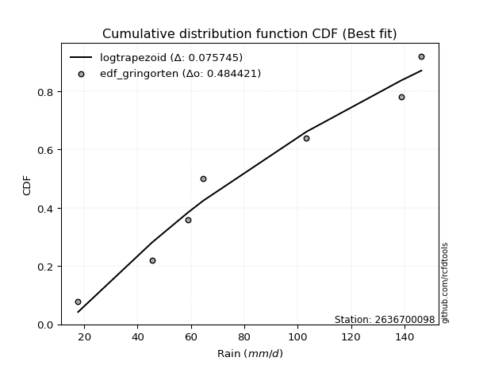</img></img>

</div>


### 9. EDF Filliben (1975)

The specific values of the constants (0.3175) (often denoted as $alpha$) and (0.365) are derived from a method proposed by James J. Filliben in a 1975 paper. This particular formula is the mean value of the $i$-th order statistic of the normal distribution and is considered a robust and effective plotting position formula for the normal probability plot correlation coefficient test for normality.

<div align="center">


$P=(m-0.3175)/(n+0.365)$


</div>


**9.1. Empirical values**

<div align="center">

|                | 0                   | 1                   | 2                   | 3            | 4                  | 5                  | 6                  |
|:---------------|:--------------------|:--------------------|:--------------------|:-------------|:-------------------|:-------------------|:-------------------|
| date           | 2023                | 2022                | 2019                | 2025         | 2020               | 2024               | 2021               |
| x              | 17.7                | 45.4                | 58.8                | 64.6         | 103.3              | 138.8              | 146.4              |
| m              | 1                   | 2                   | 3                   | 4            | 5                  | 6                  | 7                  |
| empirical_dist | edf_filliben        | edf_filliben        | edf_filliben        | edf_filliben | edf_filliben       | edf_filliben       | edf_filliben       |
| empirical      | 0.09266802443991853 | 0.22844534962661237 | 0.36422267481330617 | 0.5          | 0.6357773251866938 | 0.7715546503733877 | 0.9073319755600815 |
| empirical_tr   | 1.1021324354657687  | 1.2960844698636163  | 1.5728777362520021  | 2.0          | 2.7455731593662627 | 4.377414561664191  | 10.791208791208794 |

</div>


**9.2. Kolmogorov-Smirnov fit test (sorted by Δ)**


<div align="center">

|                | 0                   | 1                   | 2                   | 3                   | 4                   | 5                   | 6                   | 7                   | 8                   | 9                   | 10                  | 11                  | 12                  | 13                  | 14                  | 15                  | 16                  | 17                  | 18                  | 19                  | 20                  | 21                  | 22                  | 23                  | 24                  | 25                  | 26                  | 27                  | 28                  | 29                  | 30                  | 31                  | 32                  | 33                  | 34                  | 35                  | 36                  | 37                  | 38                  | 39                  | 40                  | 41                  | 42                  | 43                  | 44                  | 45                  | 46                  | 47                  | 48                  | 49                  | 50                  | 51                  | 52                  | 53                  | 54                  | 55                  | 56                  | 57                  | 58                  | 59                  | 60                  | 61                  | 62                  | 63                  | 64                  | 65                  | 66                  | 67                  | 68                  | 69                  | 70                  | 71                  | 72                  | 73                  | 74                  | 75                  | 76                  | 77                  | 78                  | 79                  | 80                  | 81                  | 82                  | 83                  | 84                  | 85                  | 86                  | 87                  | 88                  | 89                  | 90                  | 91                  | 92                  | 93                  | 94                  | 95                  | 96                  | 97                  | 98                  | 99                  | 100                 | 101                 | 102                 | 103                 | 104                 | 105                 | 106                 | 107                 | 108                 | 109                 | 110                 | 111                 | 112                 | 113                 | 114                 | 115                 | 116                 | 117                 | 118                 | 119                 | 120                 | 121                 | 122                 | 123                 | 124                 | 125                 | 126                 | 127                 | 128                 | 129                 | 130                 | 131                 | 132                 | 133                 | 134                 | 135                 | 136                 | 137                 | 138                 | 139                 | 140                 | 141                 | 142                 | 143                 | 144                 | 145                 | 146                 | 147                 | 148                 | 149                 | 150                 | 151                 | 152                 | 153                 | 154                 | 155                 | 156                 | 157                 | 158                 | 159                 |
|:---------------|:--------------------|:--------------------|:--------------------|:--------------------|:--------------------|:--------------------|:--------------------|:--------------------|:--------------------|:--------------------|:--------------------|:--------------------|:--------------------|:--------------------|:--------------------|:--------------------|:--------------------|:--------------------|:--------------------|:--------------------|:--------------------|:--------------------|:--------------------|:--------------------|:--------------------|:--------------------|:--------------------|:--------------------|:--------------------|:--------------------|:--------------------|:--------------------|:--------------------|:--------------------|:--------------------|:--------------------|:--------------------|:--------------------|:--------------------|:--------------------|:--------------------|:--------------------|:--------------------|:--------------------|:--------------------|:--------------------|:--------------------|:--------------------|:--------------------|:--------------------|:--------------------|:--------------------|:--------------------|:--------------------|:--------------------|:--------------------|:--------------------|:--------------------|:--------------------|:--------------------|:--------------------|:--------------------|:--------------------|:--------------------|:--------------------|:--------------------|:--------------------|:--------------------|:--------------------|:--------------------|:--------------------|:--------------------|:--------------------|:--------------------|:--------------------|:--------------------|:--------------------|:--------------------|:--------------------|:--------------------|:--------------------|:--------------------|:--------------------|:--------------------|:--------------------|:--------------------|:--------------------|:--------------------|:--------------------|:--------------------|:--------------------|:--------------------|:--------------------|:--------------------|:--------------------|:--------------------|:--------------------|:--------------------|:--------------------|:--------------------|:--------------------|:--------------------|:--------------------|:--------------------|:--------------------|:--------------------|:--------------------|:--------------------|:--------------------|:--------------------|:--------------------|:--------------------|:--------------------|:--------------------|:--------------------|:--------------------|:--------------------|:--------------------|:--------------------|:--------------------|:--------------------|:--------------------|:--------------------|:--------------------|:--------------------|:--------------------|:--------------------|:--------------------|:--------------------|:--------------------|:--------------------|:--------------------|:--------------------|:--------------------|:--------------------|:--------------------|:--------------------|:--------------------|:--------------------|:--------------------|:--------------------|:--------------------|:--------------------|:--------------------|:--------------------|:--------------------|:--------------------|:--------------------|:--------------------|:--------------------|:--------------------|:--------------------|:--------------------|:--------------------|:--------------------|:--------------------|:--------------------|:--------------------|:--------------------|:--------------------|
| station        | 2636700098          | 2636700098          | 2636700098          | 2636700098          | 2636700098          | 2636700098          | 2636700098          | 2636700098          | 2636700098          | 2636700098          | 2636700098          | 2636700098          | 2636700098          | 2636700098          | 2636700098          | 2636700098          | 2636700098          | 2636700098          | 2636700098          | 2636700098          | 2636700098          | 2636700098          | 2636700098          | 2636700098          | 2636700098          | 2636700098          | 2636700098          | 2636700098          | 2636700098          | 2636700098          | 2636700098          | 2636700098          | 2636700098          | 2636700098          | 2636700098          | 2636700098          | 2636700098          | 2636700098          | 2636700098          | 2636700098          | 2636700098          | 2636700098          | 2636700098          | 2636700098          | 2636700098          | 2636700098          | 2636700098          | 2636700098          | 2636700098          | 2636700098          | 2636700098          | 2636700098          | 2636700098          | 2636700098          | 2636700098          | 2636700098          | 2636700098          | 2636700098          | 2636700098          | 2636700098          | 2636700098          | 2636700098          | 2636700098          | 2636700098          | 2636700098          | 2636700098          | 2636700098          | 2636700098          | 2636700098          | 2636700098          | 2636700098          | 2636700098          | 2636700098          | 2636700098          | 2636700098          | 2636700098          | 2636700098          | 2636700098          | 2636700098          | 2636700098          | 2636700098          | 2636700098          | 2636700098          | 2636700098          | 2636700098          | 2636700098          | 2636700098          | 2636700098          | 2636700098          | 2636700098          | 2636700098          | 2636700098          | 2636700098          | 2636700098          | 2636700098          | 2636700098          | 2636700098          | 2636700098          | 2636700098          | 2636700098          | 2636700098          | 2636700098          | 2636700098          | 2636700098          | 2636700098          | 2636700098          | 2636700098          | 2636700098          | 2636700098          | 2636700098          | 2636700098          | 2636700098          | 2636700098          | 2636700098          | 2636700098          | 2636700098          | 2636700098          | 2636700098          | 2636700098          | 2636700098          | 2636700098          | 2636700098          | 2636700098          | 2636700098          | 2636700098          | 2636700098          | 2636700098          | 2636700098          | 2636700098          | 2636700098          | 2636700098          | 2636700098          | 2636700098          | 2636700098          | 2636700098          | 2636700098          | 2636700098          | 2636700098          | 2636700098          | 2636700098          | 2636700098          | 2636700098          | 2636700098          | 2636700098          | 2636700098          | 2636700098          | 2636700098          | 2636700098          | 2636700098          | 2636700098          | 2636700098          | 2636700098          | 2636700098          | 2636700098          | 2636700098          | 2636700098          | 2636700098          | 2636700098          | 2636700098          | 2636700098          |
| empirical_dist | edf_filliben        | edf_filliben        | edf_filliben        | edf_filliben        | edf_filliben        | edf_filliben        | edf_filliben        | edf_filliben        | edf_filliben        | edf_filliben        | edf_filliben        | edf_filliben        | edf_filliben        | edf_filliben        | edf_filliben        | edf_filliben        | edf_filliben        | edf_filliben        | edf_filliben        | edf_filliben        | edf_filliben        | edf_filliben        | edf_filliben        | edf_filliben        | edf_filliben        | edf_filliben        | edf_filliben        | edf_filliben        | edf_filliben        | edf_filliben        | edf_filliben        | edf_filliben        | edf_filliben        | edf_filliben        | edf_filliben        | edf_filliben        | edf_filliben        | edf_filliben        | edf_filliben        | edf_filliben        | edf_filliben        | edf_filliben        | edf_filliben        | edf_filliben        | edf_filliben        | edf_filliben        | edf_filliben        | edf_filliben        | edf_filliben        | edf_filliben        | edf_filliben        | edf_filliben        | edf_filliben        | edf_filliben        | edf_filliben        | edf_filliben        | edf_filliben        | edf_filliben        | edf_filliben        | edf_filliben        | edf_filliben        | edf_filliben        | edf_filliben        | edf_filliben        | edf_filliben        | edf_filliben        | edf_filliben        | edf_filliben        | edf_filliben        | edf_filliben        | edf_filliben        | edf_filliben        | edf_filliben        | edf_filliben        | edf_filliben        | edf_filliben        | edf_filliben        | edf_filliben        | edf_filliben        | edf_filliben        | edf_filliben        | edf_filliben        | edf_filliben        | edf_filliben        | edf_filliben        | edf_filliben        | edf_filliben        | edf_filliben        | edf_filliben        | edf_filliben        | edf_filliben        | edf_filliben        | edf_filliben        | edf_filliben        | edf_filliben        | edf_filliben        | edf_filliben        | edf_filliben        | edf_filliben        | edf_filliben        | edf_filliben        | edf_filliben        | edf_filliben        | edf_filliben        | edf_filliben        | edf_filliben        | edf_filliben        | edf_filliben        | edf_filliben        | edf_filliben        | edf_filliben        | edf_filliben        | edf_filliben        | edf_filliben        | edf_filliben        | edf_filliben        | edf_filliben        | edf_filliben        | edf_filliben        | edf_filliben        | edf_filliben        | edf_filliben        | edf_filliben        | edf_filliben        | edf_filliben        | edf_filliben        | edf_filliben        | edf_filliben        | edf_filliben        | edf_filliben        | edf_filliben        | edf_filliben        | edf_filliben        | edf_filliben        | edf_filliben        | edf_filliben        | edf_filliben        | edf_filliben        | edf_filliben        | edf_filliben        | edf_filliben        | edf_filliben        | edf_filliben        | edf_filliben        | edf_filliben        | edf_filliben        | edf_filliben        | edf_filliben        | edf_filliben        | edf_filliben        | edf_filliben        | edf_filliben        | edf_filliben        | edf_filliben        | edf_filliben        | edf_filliben        | edf_filliben        | edf_filliben        | edf_filliben        | edf_filliben        |
| p_dist         | logtrapezoid        | loganglit           | logsemicircular     | arcsine             | logpearson3         | logdweibull         | logf                | logfatiguelife      | lognct              | logexponnorm        | logcrystalball      | lognorm             | logt                | logrice             | f                   | logncf              | logbetaprime        | loginvgauss         | dweibull            | loggamma            | loggamma            | logdgamma           | loginvgamma         | logfoldnorm         | logerlang           | exponweib           | weibull_min         | logalpha            | loggompertz         | genlogistic         | skewnorm            | erlang              | invweibull          | genexpon            | logmaxwell          | halfnorm            | loggausshyper       | dgamma              | invgauss            | betaprime           | gamma               | logweibull_min      | lograyleigh         | logburr12           | kstwobign           | ksone               | rayleigh            | loggumbel_l         | invgamma            | gengamma            | lomax               | loglogistic         | maxwell             | halflogistic        | loginvweibull       | logcosine           | gumbel_r            | semicircular        | moyal               | rice                | wrapcauchy          | anglit              | loghypsecant        | loghalfnorm         | logarcsine          | logvonmises_line    | logloglaplace       | foldnorm            | loggumbel_r         | pearson3            | beta                | genextreme          | burr                | alpha               | kappa3              | logargus            | logburr             | exponnorm           | t                   | nct                 | norm                | johnsonsu           | loghalflogistic     | logmoyal            | loglaplace          | loglaplace          | logkstwobign        | loglevy_l           | cosine              | logloggamma         | loggenexpon         | loggenhalflogistic  | tukeylambda         | logbeta             | kappa4              | gausshyper          | uniform             | vonmises_line       | logmielke           | logistic            | gompertz            | mielke              | wald                | hypsecant           | logtriang           | bradford            | logskewnorm         | truncexpon          | truncweibull_min    | argus               | levy_l              | ncf                 | logkappa4           | logwald             | gumbel_l            | laplace             | logkappa3           | genpareto           | logweibull_max      | loguniform          | logtukeylambda      | logbradford         | loggenextreme       | loggenpareto        | logksone            | nakagami            | lognakagami         | halfgennorm         | logwrapcauchy       | crystalball         | genhalflogistic     | triang              | logtruncnorm        | gennorm             | loggennorm          | burr12              | logtruncweibull_min | logrdist            | logjohnsonsb        | logtruncexpon       | truncnorm           | trapezoid           | loggengamma         | loglomax            | johnsonsb           | exponpow            | logexponpow         | weibull_max         | rdist               | powerlaw            | logjohnsonsu        | fatiguelife         | logexponweib        | logpowerlaw         | truncpareto         | logtruncpareto      | loggenlogistic      | loghalfgennorm      | logvonmises         | vonmises            |
| delta          | 0.0757454220395209  | 0.07934167688546291 | 0.0909207755350083  | 0.09266802443991853 | 0.09273371342591363 | 0.09377820295895611 | 0.09575235646570235 | 0.09604206765088719 | 0.09666540622832309 | 0.09718280779649369 | 0.09718701171065491 | 0.09718718202789223 | 0.09718902234455262 | 0.09795901066655521 | 0.0980644229733445  | 0.09810767844677615 | 0.09816275081509185 | 0.09846806612063963 | 0.09893499175233389 | 0.09965674708542949 | 0.09965674708542949 | 0.10058512724498148 | 0.1014549654232011  | 0.10161064050945179 | 0.1017017014952094  | 0.10538494422712075 | 0.1054732264300191  | 0.10593690586157933 | 0.10598400567741595 | 0.10763567247091632 | 0.1083331973601327  | 0.10846644887785106 | 0.10853747736622665 | 0.10871273409882445 | 0.10898293496457367 | 0.10914836599127964 | 0.10932829018743015 | 0.11018409690611686 | 0.11062820140451712 | 0.11063075438303016 | 0.11156798389707179 | 0.11215018889784101 | 0.11237297408593216 | 0.11252988316725654 | 0.11263945210080317 | 0.11266792091342365 | 0.11327765887870855 | 0.11423000126758087 | 0.11500195170049388 | 0.11514686959559872 | 0.11573469691385149 | 0.11966034377457124 | 0.12001767590767343 | 0.12017677759104417 | 0.12210214225557073 | 0.12219384008650036 | 0.12295149677508843 | 0.123441076109165   | 0.12449953665937086 | 0.1245273712281546  | 0.126070431390519   | 0.13183780353967706 | 0.13496222205932729 | 0.13658187560901935 | 0.13679145690774916 | 0.1379069193857122  | 0.13935704707515217 | 0.1402127841745603  | 0.14075813358903655 | 0.14182124126336731 | 0.1468231847907372  | 0.1476752726440961  | 0.14937552666559017 | 0.1497576935746938  | 0.14995322714320575 | 0.1503961650928024  | 0.15127755482720268 | 0.15158790704596126 | 0.15180417150920011 | 0.15183346053931307 | 0.1518400974366227  | 0.15360072444642503 | 0.15454589568963717 | 0.1547838237112772  | 0.1566991008714248  | 0.1566991008714248  | 0.15773601683716268 | 0.15820988933464397 | 0.15910489304755016 | 0.16202140102002205 | 0.1626749626833444  | 0.16491220415081642 | 0.16563305140855666 | 0.16578150721726603 | 0.16711012580464668 | 0.1675148219956336  | 0.1693932905745532  | 0.16945824434751633 | 0.16986929978673093 | 0.16993993924782103 | 0.1773181647371081  | 0.17925739276672692 | 0.17973784986948615 | 0.18395853805754803 | 0.18688558303239022 | 0.18721370055518038 | 0.18726413458944557 | 0.19212277451283388 | 0.19405894983661554 | 0.1979547499845885  | 0.20230407525485058 | 0.20641825759022434 | 0.20764406500268964 | 0.2090614318836207  | 0.21152252278913553 | 0.21208932804944386 | 0.2162270178892781  | 0.2171382123971345  | 0.21719265371089005 | 0.21738827909947014 | 0.21898584528182716 | 0.21902916419802235 | 0.22056752496164522 | 0.22118657427689578 | 0.22641600764512318 | 0.22844527490757804 | 0.228445342172519   | 0.24209903689508386 | 0.24264970970526775 | 0.24615402299296338 | 0.2516993594683026  | 0.2550352647985161  | 0.25722202151640483 | 0.27155465037338766 | 0.27155465037338766 | 0.2747419486594199  | 0.28229243534210324 | 0.2999181975589389  | 0.3066579962152052  | 0.32327908226638924 | 0.32906225226242314 | 0.350222379829347   | 0.358184818165047   | 0.397034535123697   | 0.41464622560118036 | 0.4394072149338838  | 0.4645079487036752  | 0.5281370645287801  | 0.5313014911353094  | 0.5470231785463116  | 0.5518773125564265  | 0.5695458658625102  | 0.6240335030435059  | 0.6338520569944093  | 0.6587837513485107  | 0.7111823287684812  | 0.7715546503733877  | 0.7715546503733877  | 1.0879182103067973  | 22.6465725648128    |
| deltao         | 0.48442053926100004 | 0.48442053926100004 | 0.48442053926100004 | 0.48442053926100004 | 0.48442053926100004 | 0.48442053926100004 | 0.48442053926100004 | 0.48442053926100004 | 0.48442053926100004 | 0.48442053926100004 | 0.48442053926100004 | 0.48442053926100004 | 0.48442053926100004 | 0.48442053926100004 | 0.48442053926100004 | 0.48442053926100004 | 0.48442053926100004 | 0.48442053926100004 | 0.48442053926100004 | 0.48442053926100004 | 0.48442053926100004 | 0.48442053926100004 | 0.48442053926100004 | 0.48442053926100004 | 0.48442053926100004 | 0.48442053926100004 | 0.48442053926100004 | 0.48442053926100004 | 0.48442053926100004 | 0.48442053926100004 | 0.48442053926100004 | 0.48442053926100004 | 0.48442053926100004 | 0.48442053926100004 | 0.48442053926100004 | 0.48442053926100004 | 0.48442053926100004 | 0.48442053926100004 | 0.48442053926100004 | 0.48442053926100004 | 0.48442053926100004 | 0.48442053926100004 | 0.48442053926100004 | 0.48442053926100004 | 0.48442053926100004 | 0.48442053926100004 | 0.48442053926100004 | 0.48442053926100004 | 0.48442053926100004 | 0.48442053926100004 | 0.48442053926100004 | 0.48442053926100004 | 0.48442053926100004 | 0.48442053926100004 | 0.48442053926100004 | 0.48442053926100004 | 0.48442053926100004 | 0.48442053926100004 | 0.48442053926100004 | 0.48442053926100004 | 0.48442053926100004 | 0.48442053926100004 | 0.48442053926100004 | 0.48442053926100004 | 0.48442053926100004 | 0.48442053926100004 | 0.48442053926100004 | 0.48442053926100004 | 0.48442053926100004 | 0.48442053926100004 | 0.48442053926100004 | 0.48442053926100004 | 0.48442053926100004 | 0.48442053926100004 | 0.48442053926100004 | 0.48442053926100004 | 0.48442053926100004 | 0.48442053926100004 | 0.48442053926100004 | 0.48442053926100004 | 0.48442053926100004 | 0.48442053926100004 | 0.48442053926100004 | 0.48442053926100004 | 0.48442053926100004 | 0.48442053926100004 | 0.48442053926100004 | 0.48442053926100004 | 0.48442053926100004 | 0.48442053926100004 | 0.48442053926100004 | 0.48442053926100004 | 0.48442053926100004 | 0.48442053926100004 | 0.48442053926100004 | 0.48442053926100004 | 0.48442053926100004 | 0.48442053926100004 | 0.48442053926100004 | 0.48442053926100004 | 0.48442053926100004 | 0.48442053926100004 | 0.48442053926100004 | 0.48442053926100004 | 0.48442053926100004 | 0.48442053926100004 | 0.48442053926100004 | 0.48442053926100004 | 0.48442053926100004 | 0.48442053926100004 | 0.48442053926100004 | 0.48442053926100004 | 0.48442053926100004 | 0.48442053926100004 | 0.48442053926100004 | 0.48442053926100004 | 0.48442053926100004 | 0.48442053926100004 | 0.48442053926100004 | 0.48442053926100004 | 0.48442053926100004 | 0.48442053926100004 | 0.48442053926100004 | 0.48442053926100004 | 0.48442053926100004 | 0.48442053926100004 | 0.48442053926100004 | 0.48442053926100004 | 0.48442053926100004 | 0.48442053926100004 | 0.48442053926100004 | 0.48442053926100004 | 0.48442053926100004 | 0.48442053926100004 | 0.48442053926100004 | 0.48442053926100004 | 0.48442053926100004 | 0.48442053926100004 | 0.48442053926100004 | 0.48442053926100004 | 0.48442053926100004 | 0.48442053926100004 | 0.48442053926100004 | 0.48442053926100004 | 0.48442053926100004 | 0.48442053926100004 | 0.48442053926100004 | 0.48442053926100004 | 0.48442053926100004 | 0.48442053926100004 | 0.48442053926100004 | 0.48442053926100004 | 0.48442053926100004 | 0.48442053926100004 | 0.48442053926100004 | 0.48442053926100004 | 0.48442053926100004 | 0.48442053926100004 | 0.48442053926100004 | 0.48442053926100004 |
| eval           | Δo > Δ              | Δo > Δ              | Δo > Δ              | Δo > Δ              | Δo > Δ              | Δo > Δ              | Δo > Δ              | Δo > Δ              | Δo > Δ              | Δo > Δ              | Δo > Δ              | Δo > Δ              | Δo > Δ              | Δo > Δ              | Δo > Δ              | Δo > Δ              | Δo > Δ              | Δo > Δ              | Δo > Δ              | Δo > Δ              | Δo > Δ              | Δo > Δ              | Δo > Δ              | Δo > Δ              | Δo > Δ              | Δo > Δ              | Δo > Δ              | Δo > Δ              | Δo > Δ              | Δo > Δ              | Δo > Δ              | Δo > Δ              | Δo > Δ              | Δo > Δ              | Δo > Δ              | Δo > Δ              | Δo > Δ              | Δo > Δ              | Δo > Δ              | Δo > Δ              | Δo > Δ              | Δo > Δ              | Δo > Δ              | Δo > Δ              | Δo > Δ              | Δo > Δ              | Δo > Δ              | Δo > Δ              | Δo > Δ              | Δo > Δ              | Δo > Δ              | Δo > Δ              | Δo > Δ              | Δo > Δ              | Δo > Δ              | Δo > Δ              | Δo > Δ              | Δo > Δ              | Δo > Δ              | Δo > Δ              | Δo > Δ              | Δo > Δ              | Δo > Δ              | Δo > Δ              | Δo > Δ              | Δo > Δ              | Δo > Δ              | Δo > Δ              | Δo > Δ              | Δo > Δ              | Δo > Δ              | Δo > Δ              | Δo > Δ              | Δo > Δ              | Δo > Δ              | Δo > Δ              | Δo > Δ              | Δo > Δ              | Δo > Δ              | Δo > Δ              | Δo > Δ              | Δo > Δ              | Δo > Δ              | Δo > Δ              | Δo > Δ              | Δo > Δ              | Δo > Δ              | Δo > Δ              | Δo > Δ              | Δo > Δ              | Δo > Δ              | Δo > Δ              | Δo > Δ              | Δo > Δ              | Δo > Δ              | Δo > Δ              | Δo > Δ              | Δo > Δ              | Δo > Δ              | Δo > Δ              | Δo > Δ              | Δo > Δ              | Δo > Δ              | Δo > Δ              | Δo > Δ              | Δo > Δ              | Δo > Δ              | Δo > Δ              | Δo > Δ              | Δo > Δ              | Δo > Δ              | Δo > Δ              | Δo > Δ              | Δo > Δ              | Δo > Δ              | Δo > Δ              | Δo > Δ              | Δo > Δ              | Δo > Δ              | Δo > Δ              | Δo > Δ              | Δo > Δ              | Δo > Δ              | Δo > Δ              | Δo > Δ              | Δo > Δ              | Δo > Δ              | Δo > Δ              | Δo > Δ              | Δo > Δ              | Δo > Δ              | Δo > Δ              | Δo > Δ              | Δo > Δ              | Δo > Δ              | Δo > Δ              | Δo > Δ              | Δo > Δ              | Δo > Δ              | Δo > Δ              | Δo > Δ              | Δo > Δ              | Δo > Δ              | Δo > Δ              | Δo > Δ              | Δo > Δ              | Δo > Δ              | Δo <= Δ             | Δo <= Δ             | Δo <= Δ             | Δo <= Δ             | Δo <= Δ             | Δo <= Δ             | Δo <= Δ             | Δo <= Δ             | Δo <= Δ             | Δo <= Δ             | Δo <= Δ             | Δo <= Δ             | Δo <= Δ             |
| fit            | 1                   | 1                   | 1                   | 1                   | 1                   | 1                   | 1                   | 1                   | 1                   | 1                   | 1                   | 1                   | 1                   | 1                   | 1                   | 1                   | 1                   | 1                   | 1                   | 1                   | 1                   | 1                   | 1                   | 1                   | 1                   | 1                   | 1                   | 1                   | 1                   | 1                   | 1                   | 1                   | 1                   | 1                   | 1                   | 1                   | 1                   | 1                   | 1                   | 1                   | 1                   | 1                   | 1                   | 1                   | 1                   | 1                   | 1                   | 1                   | 1                   | 1                   | 1                   | 1                   | 1                   | 1                   | 1                   | 1                   | 1                   | 1                   | 1                   | 1                   | 1                   | 1                   | 1                   | 1                   | 1                   | 1                   | 1                   | 1                   | 1                   | 1                   | 1                   | 1                   | 1                   | 1                   | 1                   | 1                   | 1                   | 1                   | 1                   | 1                   | 1                   | 1                   | 1                   | 1                   | 1                   | 1                   | 1                   | 1                   | 1                   | 1                   | 1                   | 1                   | 1                   | 1                   | 1                   | 1                   | 1                   | 1                   | 1                   | 1                   | 1                   | 1                   | 1                   | 1                   | 1                   | 1                   | 1                   | 1                   | 1                   | 1                   | 1                   | 1                   | 1                   | 1                   | 1                   | 1                   | 1                   | 1                   | 1                   | 1                   | 1                   | 1                   | 1                   | 1                   | 1                   | 1                   | 1                   | 1                   | 1                   | 1                   | 1                   | 1                   | 1                   | 1                   | 1                   | 1                   | 1                   | 1                   | 1                   | 1                   | 1                   | 1                   | 1                   | 1                   | 1                   | 1                   | 1                   | 0                   | 0                   | 0                   | 0                   | 0                   | 0                   | 0                   | 0                   | 0                   | 0                   | 0                   | 0                   | 0                   |
| n              | 7                   | 7                   | 7                   | 7                   | 7                   | 7                   | 7                   | 7                   | 7                   | 7                   | 7                   | 7                   | 7                   | 7                   | 7                   | 7                   | 7                   | 7                   | 7                   | 7                   | 7                   | 7                   | 7                   | 7                   | 7                   | 7                   | 7                   | 7                   | 7                   | 7                   | 7                   | 7                   | 7                   | 7                   | 7                   | 7                   | 7                   | 7                   | 7                   | 7                   | 7                   | 7                   | 7                   | 7                   | 7                   | 7                   | 7                   | 7                   | 7                   | 7                   | 7                   | 7                   | 7                   | 7                   | 7                   | 7                   | 7                   | 7                   | 7                   | 7                   | 7                   | 7                   | 7                   | 7                   | 7                   | 7                   | 7                   | 7                   | 7                   | 7                   | 7                   | 7                   | 7                   | 7                   | 7                   | 7                   | 7                   | 7                   | 7                   | 7                   | 7                   | 7                   | 7                   | 7                   | 7                   | 7                   | 7                   | 7                   | 7                   | 7                   | 7                   | 7                   | 7                   | 7                   | 7                   | 7                   | 7                   | 7                   | 7                   | 7                   | 7                   | 7                   | 7                   | 7                   | 7                   | 7                   | 7                   | 7                   | 7                   | 7                   | 7                   | 7                   | 7                   | 7                   | 7                   | 7                   | 7                   | 7                   | 7                   | 7                   | 7                   | 7                   | 7                   | 7                   | 7                   | 7                   | 7                   | 7                   | 7                   | 7                   | 7                   | 7                   | 7                   | 7                   | 7                   | 7                   | 7                   | 7                   | 7                   | 7                   | 7                   | 7                   | 7                   | 7                   | 7                   | 7                   | 7                   | 7                   | 7                   | 7                   | 7                   | 7                   | 7                   | 7                   | 7                   | 7                   | 7                   | 7                   | 7                   | 7                   |
| best_fit       | 1                   | 0                   | 0                   | 0                   | 0                   | 0                   | 0                   | 0                   | 0                   | 0                   | 0                   | 0                   | 0                   | 0                   | 0                   | 0                   | 0                   | 0                   | 0                   | 0                   | 0                   | 0                   | 0                   | 0                   | 0                   | 0                   | 0                   | 0                   | 0                   | 0                   | 0                   | 0                   | 0                   | 0                   | 0                   | 0                   | 0                   | 0                   | 0                   | 0                   | 0                   | 0                   | 0                   | 0                   | 0                   | 0                   | 0                   | 0                   | 0                   | 0                   | 0                   | 0                   | 0                   | 0                   | 0                   | 0                   | 0                   | 0                   | 0                   | 0                   | 0                   | 0                   | 0                   | 0                   | 0                   | 0                   | 0                   | 0                   | 0                   | 0                   | 0                   | 0                   | 0                   | 0                   | 0                   | 0                   | 0                   | 0                   | 0                   | 0                   | 0                   | 0                   | 0                   | 0                   | 0                   | 0                   | 0                   | 0                   | 0                   | 0                   | 0                   | 0                   | 0                   | 0                   | 0                   | 0                   | 0                   | 0                   | 0                   | 0                   | 0                   | 0                   | 0                   | 0                   | 0                   | 0                   | 0                   | 0                   | 0                   | 0                   | 0                   | 0                   | 0                   | 0                   | 0                   | 0                   | 0                   | 0                   | 0                   | 0                   | 0                   | 0                   | 0                   | 0                   | 0                   | 0                   | 0                   | 0                   | 0                   | 0                   | 0                   | 0                   | 0                   | 0                   | 0                   | 0                   | 0                   | 0                   | 0                   | 0                   | 0                   | 0                   | 0                   | 0                   | 0                   | 0                   | 0                   | 0                   | 0                   | 0                   | 0                   | 0                   | 0                   | 0                   | 0                   | 0                   | 0                   | 0                   | 0                   | 0                   |
| best_fit_sort  | 1                   | 2                   | 3                   | 4                   | 5                   | 6                   | 7                   | 8                   | 9                   | 10                  | 11                  | 12                  | 13                  | 14                  | 15                  | 16                  | 17                  | 18                  | 19                  | 20                  | 21                  | 22                  | 23                  | 24                  | 25                  | 26                  | 27                  | 28                  | 29                  | 30                  | 31                  | 32                  | 33                  | 34                  | 35                  | 36                  | 37                  | 38                  | 39                  | 40                  | 41                  | 42                  | 43                  | 44                  | 45                  | 46                  | 47                  | 48                  | 49                  | 50                  | 51                  | 52                  | 53                  | 54                  | 55                  | 56                  | 57                  | 58                  | 59                  | 60                  | 61                  | 62                  | 63                  | 64                  | 65                  | 66                  | 67                  | 68                  | 69                  | 70                  | 71                  | 72                  | 73                  | 74                  | 75                  | 76                  | 77                  | 78                  | 79                  | 80                  | 81                  | 82                  | 83                  | 84                  | 85                  | 86                  | 87                  | 88                  | 89                  | 90                  | 91                  | 92                  | 93                  | 94                  | 95                  | 96                  | 97                  | 98                  | 99                  | 100                 | 101                 | 102                 | 103                 | 104                 | 105                 | 106                 | 107                 | 108                 | 109                 | 110                 | 111                 | 112                 | 113                 | 114                 | 115                 | 116                 | 117                 | 118                 | 119                 | 120                 | 121                 | 122                 | 123                 | 124                 | 125                 | 126                 | 127                 | 128                 | 129                 | 130                 | 131                 | 132                 | 133                 | 134                 | 135                 | 136                 | 137                 | 138                 | 139                 | 140                 | 141                 | 142                 | 143                 | 144                 | 145                 | 146                 | 147                 | 148                 | 149                 | 150                 | 151                 | 152                 | 153                 | 154                 | 155                 | 156                 | 157                 | 158                 | 159                 | 160                 |

</div>


**9.3. Best fit**

<div align="center">

|   id |    station | empirical_dist   | p_dist       |     delta |   deltao | eval   |   fit |   n |   best_fit |   best_fit_sort |
|-----:|-----------:|:-----------------|:-------------|----------:|---------:|:-------|------:|----:|-----------:|----------------:|
|    0 | 2636700098 | edf_filliben     | logtrapezoid | 0.0757454 | 0.484421 | Δo > Δ |     1 |   7 |          1 |               1 |

</div>


<div align="center">

</img></img>

</div>


### 10. EDF Jenkinson (1977)

The Jenkinson formula in hydrology is an empirical plotting position formula used to estimate the non-exceedance probability _(P)_ or return period _(T)_ of a given ordered observation within a sample. It is a widely used method in the frequency analysis of extreme events such as floods and rainfall, as it provides a distribution-free way to plot data. _a≈0.31_ and _b≈0.38_ are constants derived to approximate the median of the probability distribution for the given rank.

<div align="center">


$P=(m-a)/(n+b)$


</div>


**10.1. Empirical values**

<div align="center">

|                | 0                   | 1                   | 2                   | 3             | 4                  | 5                  | 6                  |
|:---------------|:--------------------|:--------------------|:--------------------|:--------------|:-------------------|:-------------------|:-------------------|
| date           | 2023                | 2022                | 2019                | 2025          | 2020               | 2024               | 2021               |
| x              | 17.7                | 45.4                | 58.8                | 64.6          | 103.3              | 138.8              | 146.4              |
| m              | 1                   | 2                   | 3                   | 4             | 5                  | 6                  | 7                  |
| empirical_dist | edf_jenkinson       | edf_jenkinson       | edf_jenkinson       | edf_jenkinson | edf_jenkinson      | edf_jenkinson      | edf_jenkinson      |
| empirical      | 0.09349593495934959 | 0.22899728997289973 | 0.36449864498644985 | 0.5           | 0.6355013550135502 | 0.7710027100271003 | 0.9065040650406505 |
| empirical_tr   | 1.1031390134529149  | 1.29701230228471    | 1.5735607675906182  | 2.0           | 2.743494423791822  | 4.366863905325444  | 10.695652173913055 |

</div>


**10.2. Kolmogorov-Smirnov fit test (sorted by Δ)**


<div align="center">

|                | 0                   | 1                   | 2                   | 3                   | 4                   | 5                   | 6                   | 7                   | 8                   | 9                   | 10                  | 11                  | 12                  | 13                  | 14                  | 15                  | 16                  | 17                  | 18                  | 19                  | 20                  | 21                  | 22                  | 23                  | 24                  | 25                  | 26                  | 27                  | 28                  | 29                  | 30                  | 31                  | 32                  | 33                  | 34                  | 35                  | 36                  | 37                  | 38                  | 39                  | 40                  | 41                  | 42                  | 43                  | 44                  | 45                  | 46                  | 47                  | 48                  | 49                  | 50                  | 51                  | 52                  | 53                  | 54                  | 55                  | 56                  | 57                  | 58                  | 59                  | 60                  | 61                  | 62                  | 63                  | 64                  | 65                  | 66                  | 67                  | 68                  | 69                  | 70                  | 71                  | 72                  | 73                  | 74                  | 75                  | 76                  | 77                  | 78                  | 79                  | 80                  | 81                  | 82                  | 83                  | 84                  | 85                  | 86                  | 87                  | 88                  | 89                  | 90                  | 91                  | 92                  | 93                  | 94                  | 95                  | 96                  | 97                  | 98                  | 99                  | 100                 | 101                 | 102                 | 103                 | 104                 | 105                 | 106                 | 107                 | 108                 | 109                 | 110                 | 111                 | 112                 | 113                 | 114                 | 115                 | 116                 | 117                 | 118                 | 119                 | 120                 | 121                 | 122                 | 123                 | 124                 | 125                 | 126                 | 127                 | 128                 | 129                 | 130                 | 131                 | 132                 | 133                 | 134                 | 135                 | 136                 | 137                 | 138                 | 139                 | 140                 | 141                 | 142                 | 143                 | 144                 | 145                 | 146                 | 147                 | 148                 | 149                 | 150                 | 151                 | 152                 | 153                 | 154                 | 155                 | 156                 | 157                 | 158                 | 159                 |
|:---------------|:--------------------|:--------------------|:--------------------|:--------------------|:--------------------|:--------------------|:--------------------|:--------------------|:--------------------|:--------------------|:--------------------|:--------------------|:--------------------|:--------------------|:--------------------|:--------------------|:--------------------|:--------------------|:--------------------|:--------------------|:--------------------|:--------------------|:--------------------|:--------------------|:--------------------|:--------------------|:--------------------|:--------------------|:--------------------|:--------------------|:--------------------|:--------------------|:--------------------|:--------------------|:--------------------|:--------------------|:--------------------|:--------------------|:--------------------|:--------------------|:--------------------|:--------------------|:--------------------|:--------------------|:--------------------|:--------------------|:--------------------|:--------------------|:--------------------|:--------------------|:--------------------|:--------------------|:--------------------|:--------------------|:--------------------|:--------------------|:--------------------|:--------------------|:--------------------|:--------------------|:--------------------|:--------------------|:--------------------|:--------------------|:--------------------|:--------------------|:--------------------|:--------------------|:--------------------|:--------------------|:--------------------|:--------------------|:--------------------|:--------------------|:--------------------|:--------------------|:--------------------|:--------------------|:--------------------|:--------------------|:--------------------|:--------------------|:--------------------|:--------------------|:--------------------|:--------------------|:--------------------|:--------------------|:--------------------|:--------------------|:--------------------|:--------------------|:--------------------|:--------------------|:--------------------|:--------------------|:--------------------|:--------------------|:--------------------|:--------------------|:--------------------|:--------------------|:--------------------|:--------------------|:--------------------|:--------------------|:--------------------|:--------------------|:--------------------|:--------------------|:--------------------|:--------------------|:--------------------|:--------------------|:--------------------|:--------------------|:--------------------|:--------------------|:--------------------|:--------------------|:--------------------|:--------------------|:--------------------|:--------------------|:--------------------|:--------------------|:--------------------|:--------------------|:--------------------|:--------------------|:--------------------|:--------------------|:--------------------|:--------------------|:--------------------|:--------------------|:--------------------|:--------------------|:--------------------|:--------------------|:--------------------|:--------------------|:--------------------|:--------------------|:--------------------|:--------------------|:--------------------|:--------------------|:--------------------|:--------------------|:--------------------|:--------------------|:--------------------|:--------------------|:--------------------|:--------------------|:--------------------|:--------------------|:--------------------|:--------------------|
| station        | 2636700098          | 2636700098          | 2636700098          | 2636700098          | 2636700098          | 2636700098          | 2636700098          | 2636700098          | 2636700098          | 2636700098          | 2636700098          | 2636700098          | 2636700098          | 2636700098          | 2636700098          | 2636700098          | 2636700098          | 2636700098          | 2636700098          | 2636700098          | 2636700098          | 2636700098          | 2636700098          | 2636700098          | 2636700098          | 2636700098          | 2636700098          | 2636700098          | 2636700098          | 2636700098          | 2636700098          | 2636700098          | 2636700098          | 2636700098          | 2636700098          | 2636700098          | 2636700098          | 2636700098          | 2636700098          | 2636700098          | 2636700098          | 2636700098          | 2636700098          | 2636700098          | 2636700098          | 2636700098          | 2636700098          | 2636700098          | 2636700098          | 2636700098          | 2636700098          | 2636700098          | 2636700098          | 2636700098          | 2636700098          | 2636700098          | 2636700098          | 2636700098          | 2636700098          | 2636700098          | 2636700098          | 2636700098          | 2636700098          | 2636700098          | 2636700098          | 2636700098          | 2636700098          | 2636700098          | 2636700098          | 2636700098          | 2636700098          | 2636700098          | 2636700098          | 2636700098          | 2636700098          | 2636700098          | 2636700098          | 2636700098          | 2636700098          | 2636700098          | 2636700098          | 2636700098          | 2636700098          | 2636700098          | 2636700098          | 2636700098          | 2636700098          | 2636700098          | 2636700098          | 2636700098          | 2636700098          | 2636700098          | 2636700098          | 2636700098          | 2636700098          | 2636700098          | 2636700098          | 2636700098          | 2636700098          | 2636700098          | 2636700098          | 2636700098          | 2636700098          | 2636700098          | 2636700098          | 2636700098          | 2636700098          | 2636700098          | 2636700098          | 2636700098          | 2636700098          | 2636700098          | 2636700098          | 2636700098          | 2636700098          | 2636700098          | 2636700098          | 2636700098          | 2636700098          | 2636700098          | 2636700098          | 2636700098          | 2636700098          | 2636700098          | 2636700098          | 2636700098          | 2636700098          | 2636700098          | 2636700098          | 2636700098          | 2636700098          | 2636700098          | 2636700098          | 2636700098          | 2636700098          | 2636700098          | 2636700098          | 2636700098          | 2636700098          | 2636700098          | 2636700098          | 2636700098          | 2636700098          | 2636700098          | 2636700098          | 2636700098          | 2636700098          | 2636700098          | 2636700098          | 2636700098          | 2636700098          | 2636700098          | 2636700098          | 2636700098          | 2636700098          | 2636700098          | 2636700098          | 2636700098          | 2636700098          | 2636700098          |
| empirical_dist | edf_jenkinson       | edf_jenkinson       | edf_jenkinson       | edf_jenkinson       | edf_jenkinson       | edf_jenkinson       | edf_jenkinson       | edf_jenkinson       | edf_jenkinson       | edf_jenkinson       | edf_jenkinson       | edf_jenkinson       | edf_jenkinson       | edf_jenkinson       | edf_jenkinson       | edf_jenkinson       | edf_jenkinson       | edf_jenkinson       | edf_jenkinson       | edf_jenkinson       | edf_jenkinson       | edf_jenkinson       | edf_jenkinson       | edf_jenkinson       | edf_jenkinson       | edf_jenkinson       | edf_jenkinson       | edf_jenkinson       | edf_jenkinson       | edf_jenkinson       | edf_jenkinson       | edf_jenkinson       | edf_jenkinson       | edf_jenkinson       | edf_jenkinson       | edf_jenkinson       | edf_jenkinson       | edf_jenkinson       | edf_jenkinson       | edf_jenkinson       | edf_jenkinson       | edf_jenkinson       | edf_jenkinson       | edf_jenkinson       | edf_jenkinson       | edf_jenkinson       | edf_jenkinson       | edf_jenkinson       | edf_jenkinson       | edf_jenkinson       | edf_jenkinson       | edf_jenkinson       | edf_jenkinson       | edf_jenkinson       | edf_jenkinson       | edf_jenkinson       | edf_jenkinson       | edf_jenkinson       | edf_jenkinson       | edf_jenkinson       | edf_jenkinson       | edf_jenkinson       | edf_jenkinson       | edf_jenkinson       | edf_jenkinson       | edf_jenkinson       | edf_jenkinson       | edf_jenkinson       | edf_jenkinson       | edf_jenkinson       | edf_jenkinson       | edf_jenkinson       | edf_jenkinson       | edf_jenkinson       | edf_jenkinson       | edf_jenkinson       | edf_jenkinson       | edf_jenkinson       | edf_jenkinson       | edf_jenkinson       | edf_jenkinson       | edf_jenkinson       | edf_jenkinson       | edf_jenkinson       | edf_jenkinson       | edf_jenkinson       | edf_jenkinson       | edf_jenkinson       | edf_jenkinson       | edf_jenkinson       | edf_jenkinson       | edf_jenkinson       | edf_jenkinson       | edf_jenkinson       | edf_jenkinson       | edf_jenkinson       | edf_jenkinson       | edf_jenkinson       | edf_jenkinson       | edf_jenkinson       | edf_jenkinson       | edf_jenkinson       | edf_jenkinson       | edf_jenkinson       | edf_jenkinson       | edf_jenkinson       | edf_jenkinson       | edf_jenkinson       | edf_jenkinson       | edf_jenkinson       | edf_jenkinson       | edf_jenkinson       | edf_jenkinson       | edf_jenkinson       | edf_jenkinson       | edf_jenkinson       | edf_jenkinson       | edf_jenkinson       | edf_jenkinson       | edf_jenkinson       | edf_jenkinson       | edf_jenkinson       | edf_jenkinson       | edf_jenkinson       | edf_jenkinson       | edf_jenkinson       | edf_jenkinson       | edf_jenkinson       | edf_jenkinson       | edf_jenkinson       | edf_jenkinson       | edf_jenkinson       | edf_jenkinson       | edf_jenkinson       | edf_jenkinson       | edf_jenkinson       | edf_jenkinson       | edf_jenkinson       | edf_jenkinson       | edf_jenkinson       | edf_jenkinson       | edf_jenkinson       | edf_jenkinson       | edf_jenkinson       | edf_jenkinson       | edf_jenkinson       | edf_jenkinson       | edf_jenkinson       | edf_jenkinson       | edf_jenkinson       | edf_jenkinson       | edf_jenkinson       | edf_jenkinson       | edf_jenkinson       | edf_jenkinson       | edf_jenkinson       | edf_jenkinson       | edf_jenkinson       | edf_jenkinson       | edf_jenkinson       |
| p_dist         | logtrapezoid        | loganglit           | logsemicircular     | logdweibull         | logpearson3         | arcsine             | logf                | logfatiguelife      | lognct              | logexponnorm        | logcrystalball      | lognorm             | logt                | logrice             | logncf              | logbetaprime        | f                   | dweibull            | loginvgauss         | logdgamma           | loggamma            | loggamma            | loginvgamma         | logfoldnorm         | logerlang           | exponweib           | weibull_min         | logalpha            | loggompertz         | genexpon            | genlogistic         | loggausshyper       | skewnorm            | erlang              | invweibull          | logmaxwell          | halfnorm            | dgamma              | invgauss            | betaprime           | gamma               | lograyleigh         | ksone               | logweibull_min      | logburr12           | kstwobign           | rayleigh            | loggumbel_l         | lomax               | invgamma            | gengamma            | loglogistic         | maxwell             | halflogistic        | loginvweibull       | logcosine           | semicircular        | gumbel_r            | rice                | moyal               | wrapcauchy          | anglit              | loghypsecant        | logarcsine          | loghalfnorm         | logvonmises_line    | logloglaplace       | foldnorm            | loggumbel_r         | pearson3            | genextreme          | beta                | alpha               | burr                | kappa3              | logargus            | logburr             | exponnorm           | t                   | nct                 | norm                | johnsonsu           | loghalflogistic     | logmoyal            | loglaplace          | loglaplace          | logkstwobign        | loglevy_l           | cosine              | loggenexpon         | logloggamma         | loggenhalflogistic  | tukeylambda         | logbeta             | kappa4              | gausshyper          | logistic            | uniform             | vonmises_line       | logmielke           | gompertz            | mielke              | wald                | hypsecant           | logtriang           | bradford            | logskewnorm         | truncexpon          | truncweibull_min    | argus               | levy_l              | ncf                 | logkappa4           | logwald             | gumbel_l            | laplace             | logkappa3           | logweibull_max      | loguniform          | genpareto           | logtukeylambda      | logbradford         | loggenextreme       | loggenpareto        | logksone            | nakagami            | lognakagami         | halfgennorm         | logwrapcauchy       | crystalball         | genhalflogistic     | triang              | logtruncnorm        | gennorm             | loggennorm          | burr12              | logtruncweibull_min | logrdist            | logjohnsonsb        | logtruncexpon       | truncnorm           | trapezoid           | loggengamma         | loglomax            | johnsonsb           | exponpow            | logexponpow         | weibull_max         | rdist               | powerlaw            | logjohnsonsu        | fatiguelife         | logexponweib        | logpowerlaw         | truncpareto         | logtruncpareto      | loggenlogistic      | loghalfgennorm      | logvonmises         | vonmises            |
| delta          | 0.0757454220395209  | 0.08016958740489397 | 0.09174868605443935 | 0.09295029243952513 | 0.093285653772201   | 0.09349593495934959 | 0.09602832663884597 | 0.09631803782403081 | 0.09694137640146672 | 0.09745877796963731 | 0.09746298188379854 | 0.09746315220103585 | 0.09746499251769625 | 0.09823498083969884 | 0.09838364861991977 | 0.09843872098823547 | 0.09861636331963186 | 0.09865902157919026 | 0.09874403629378325 | 0.09975721672555049 | 0.09993271725857311 | 0.09993271725857311 | 0.10173093559634472 | 0.10188661068259541 | 0.10197767166835303 | 0.10593688457340811 | 0.10602516677630647 | 0.10621287603472296 | 0.10653594602370331 | 0.1081607937525371  | 0.10818761281720368 | 0.10877634984114279 | 0.10888513770642005 | 0.10901838922413842 | 0.10908941771251401 | 0.1092589051377173  | 0.109700306337567   | 0.11073603725240422 | 0.11118014175080448 | 0.11118269472931752 | 0.11211992424335915 | 0.11264894425907579 | 0.11266792091342365 | 0.11270212924412837 | 0.1130818235135439  | 0.11319139244709053 | 0.11382959922499591 | 0.11478194161386823 | 0.11518275656756413 | 0.11555389204678124 | 0.11569880994188608 | 0.11993631394771487 | 0.12001767590767343 | 0.12072871793733153 | 0.12155020190928337 | 0.12246981025964399 | 0.123441076109165   | 0.12350343712137579 | 0.1245273712281546  | 0.12505147700565822 | 0.12662237173680635 | 0.13183780353967706 | 0.1352381922324709  | 0.1362395165614618  | 0.13630590543587567 | 0.1379069193857122  | 0.1396330172482958  | 0.1402127841745603  | 0.14103410376218017 | 0.14182124126336731 | 0.14684736212466504 | 0.14737512513702455 | 0.14920575322840643 | 0.14992746701187754 | 0.14995322714320575 | 0.15094810543908976 | 0.15127755482720268 | 0.15158790704596126 | 0.15180417150920011 | 0.15183346053931307 | 0.1518400974366227  | 0.15360072444642503 | 0.1542699255164935  | 0.15505979388442082 | 0.15697507104456843 | 0.15697507104456843 | 0.15718407649087532 | 0.15820988933464397 | 0.15910489304755016 | 0.16212302233705703 | 0.1625733413663094  | 0.16546414449710378 | 0.16618499175484402 | 0.1663334475635534  | 0.16766206615093404 | 0.16806676234192097 | 0.16993993924782103 | 0.16994523092084057 | 0.1700101846938037  | 0.1704212401330183  | 0.1773181647371081  | 0.17980933311301428 | 0.18028979021577352 | 0.18395853805754803 | 0.18743752337867758 | 0.18776564090146775 | 0.18781607493573294 | 0.19267471485912124 | 0.1946108901829029  | 0.1979547499845885  | 0.20147616473541952 | 0.20586631724393697 | 0.20709212465640228 | 0.20878546171047702 | 0.21152252278913553 | 0.21208932804944386 | 0.21567507754299073 | 0.21636474319145899 | 0.21683633875318278 | 0.2171382123971345  | 0.2184339049355398  | 0.218477223851735   | 0.22056752496164522 | 0.22063463393060842 | 0.22586406729883582 | 0.2289972152538654  | 0.22899728251880636 | 0.2415470965487965  | 0.2420977693589804  | 0.2453261124735323  | 0.2516993594683026  | 0.2550352647985161  | 0.25749799168954846 | 0.2710027100271003  | 0.2710027100271003  | 0.27419000831313256 | 0.2817404949958159  | 0.29936625721265153 | 0.3058300856957741  | 0.3227271419201019  | 0.32906225226242314 | 0.350222379829347   | 0.35763287781875963 | 0.39620662460426603 | 0.414094285254893   | 0.43885527458759643 | 0.4639560083573878  | 0.5275851241824927  | 0.5307495507890221  | 0.5464712382000242  | 0.551325372210139   | 0.5689939255162229  | 0.6234815626972185  | 0.6333001166481219  | 0.6582318110022234  | 0.7106303884221938  | 0.7710027100271003  | 0.7710027100271003  | 1.0881941804799409  | 22.64740047533223   |
| deltao         | 0.48442053926100004 | 0.48442053926100004 | 0.48442053926100004 | 0.48442053926100004 | 0.48442053926100004 | 0.48442053926100004 | 0.48442053926100004 | 0.48442053926100004 | 0.48442053926100004 | 0.48442053926100004 | 0.48442053926100004 | 0.48442053926100004 | 0.48442053926100004 | 0.48442053926100004 | 0.48442053926100004 | 0.48442053926100004 | 0.48442053926100004 | 0.48442053926100004 | 0.48442053926100004 | 0.48442053926100004 | 0.48442053926100004 | 0.48442053926100004 | 0.48442053926100004 | 0.48442053926100004 | 0.48442053926100004 | 0.48442053926100004 | 0.48442053926100004 | 0.48442053926100004 | 0.48442053926100004 | 0.48442053926100004 | 0.48442053926100004 | 0.48442053926100004 | 0.48442053926100004 | 0.48442053926100004 | 0.48442053926100004 | 0.48442053926100004 | 0.48442053926100004 | 0.48442053926100004 | 0.48442053926100004 | 0.48442053926100004 | 0.48442053926100004 | 0.48442053926100004 | 0.48442053926100004 | 0.48442053926100004 | 0.48442053926100004 | 0.48442053926100004 | 0.48442053926100004 | 0.48442053926100004 | 0.48442053926100004 | 0.48442053926100004 | 0.48442053926100004 | 0.48442053926100004 | 0.48442053926100004 | 0.48442053926100004 | 0.48442053926100004 | 0.48442053926100004 | 0.48442053926100004 | 0.48442053926100004 | 0.48442053926100004 | 0.48442053926100004 | 0.48442053926100004 | 0.48442053926100004 | 0.48442053926100004 | 0.48442053926100004 | 0.48442053926100004 | 0.48442053926100004 | 0.48442053926100004 | 0.48442053926100004 | 0.48442053926100004 | 0.48442053926100004 | 0.48442053926100004 | 0.48442053926100004 | 0.48442053926100004 | 0.48442053926100004 | 0.48442053926100004 | 0.48442053926100004 | 0.48442053926100004 | 0.48442053926100004 | 0.48442053926100004 | 0.48442053926100004 | 0.48442053926100004 | 0.48442053926100004 | 0.48442053926100004 | 0.48442053926100004 | 0.48442053926100004 | 0.48442053926100004 | 0.48442053926100004 | 0.48442053926100004 | 0.48442053926100004 | 0.48442053926100004 | 0.48442053926100004 | 0.48442053926100004 | 0.48442053926100004 | 0.48442053926100004 | 0.48442053926100004 | 0.48442053926100004 | 0.48442053926100004 | 0.48442053926100004 | 0.48442053926100004 | 0.48442053926100004 | 0.48442053926100004 | 0.48442053926100004 | 0.48442053926100004 | 0.48442053926100004 | 0.48442053926100004 | 0.48442053926100004 | 0.48442053926100004 | 0.48442053926100004 | 0.48442053926100004 | 0.48442053926100004 | 0.48442053926100004 | 0.48442053926100004 | 0.48442053926100004 | 0.48442053926100004 | 0.48442053926100004 | 0.48442053926100004 | 0.48442053926100004 | 0.48442053926100004 | 0.48442053926100004 | 0.48442053926100004 | 0.48442053926100004 | 0.48442053926100004 | 0.48442053926100004 | 0.48442053926100004 | 0.48442053926100004 | 0.48442053926100004 | 0.48442053926100004 | 0.48442053926100004 | 0.48442053926100004 | 0.48442053926100004 | 0.48442053926100004 | 0.48442053926100004 | 0.48442053926100004 | 0.48442053926100004 | 0.48442053926100004 | 0.48442053926100004 | 0.48442053926100004 | 0.48442053926100004 | 0.48442053926100004 | 0.48442053926100004 | 0.48442053926100004 | 0.48442053926100004 | 0.48442053926100004 | 0.48442053926100004 | 0.48442053926100004 | 0.48442053926100004 | 0.48442053926100004 | 0.48442053926100004 | 0.48442053926100004 | 0.48442053926100004 | 0.48442053926100004 | 0.48442053926100004 | 0.48442053926100004 | 0.48442053926100004 | 0.48442053926100004 | 0.48442053926100004 | 0.48442053926100004 | 0.48442053926100004 | 0.48442053926100004 | 0.48442053926100004 |
| eval           | Δo > Δ              | Δo > Δ              | Δo > Δ              | Δo > Δ              | Δo > Δ              | Δo > Δ              | Δo > Δ              | Δo > Δ              | Δo > Δ              | Δo > Δ              | Δo > Δ              | Δo > Δ              | Δo > Δ              | Δo > Δ              | Δo > Δ              | Δo > Δ              | Δo > Δ              | Δo > Δ              | Δo > Δ              | Δo > Δ              | Δo > Δ              | Δo > Δ              | Δo > Δ              | Δo > Δ              | Δo > Δ              | Δo > Δ              | Δo > Δ              | Δo > Δ              | Δo > Δ              | Δo > Δ              | Δo > Δ              | Δo > Δ              | Δo > Δ              | Δo > Δ              | Δo > Δ              | Δo > Δ              | Δo > Δ              | Δo > Δ              | Δo > Δ              | Δo > Δ              | Δo > Δ              | Δo > Δ              | Δo > Δ              | Δo > Δ              | Δo > Δ              | Δo > Δ              | Δo > Δ              | Δo > Δ              | Δo > Δ              | Δo > Δ              | Δo > Δ              | Δo > Δ              | Δo > Δ              | Δo > Δ              | Δo > Δ              | Δo > Δ              | Δo > Δ              | Δo > Δ              | Δo > Δ              | Δo > Δ              | Δo > Δ              | Δo > Δ              | Δo > Δ              | Δo > Δ              | Δo > Δ              | Δo > Δ              | Δo > Δ              | Δo > Δ              | Δo > Δ              | Δo > Δ              | Δo > Δ              | Δo > Δ              | Δo > Δ              | Δo > Δ              | Δo > Δ              | Δo > Δ              | Δo > Δ              | Δo > Δ              | Δo > Δ              | Δo > Δ              | Δo > Δ              | Δo > Δ              | Δo > Δ              | Δo > Δ              | Δo > Δ              | Δo > Δ              | Δo > Δ              | Δo > Δ              | Δo > Δ              | Δo > Δ              | Δo > Δ              | Δo > Δ              | Δo > Δ              | Δo > Δ              | Δo > Δ              | Δo > Δ              | Δo > Δ              | Δo > Δ              | Δo > Δ              | Δo > Δ              | Δo > Δ              | Δo > Δ              | Δo > Δ              | Δo > Δ              | Δo > Δ              | Δo > Δ              | Δo > Δ              | Δo > Δ              | Δo > Δ              | Δo > Δ              | Δo > Δ              | Δo > Δ              | Δo > Δ              | Δo > Δ              | Δo > Δ              | Δo > Δ              | Δo > Δ              | Δo > Δ              | Δo > Δ              | Δo > Δ              | Δo > Δ              | Δo > Δ              | Δo > Δ              | Δo > Δ              | Δo > Δ              | Δo > Δ              | Δo > Δ              | Δo > Δ              | Δo > Δ              | Δo > Δ              | Δo > Δ              | Δo > Δ              | Δo > Δ              | Δo > Δ              | Δo > Δ              | Δo > Δ              | Δo > Δ              | Δo > Δ              | Δo > Δ              | Δo > Δ              | Δo > Δ              | Δo > Δ              | Δo > Δ              | Δo > Δ              | Δo > Δ              | Δo > Δ              | Δo > Δ              | Δo <= Δ             | Δo <= Δ             | Δo <= Δ             | Δo <= Δ             | Δo <= Δ             | Δo <= Δ             | Δo <= Δ             | Δo <= Δ             | Δo <= Δ             | Δo <= Δ             | Δo <= Δ             | Δo <= Δ             | Δo <= Δ             |
| fit            | 1                   | 1                   | 1                   | 1                   | 1                   | 1                   | 1                   | 1                   | 1                   | 1                   | 1                   | 1                   | 1                   | 1                   | 1                   | 1                   | 1                   | 1                   | 1                   | 1                   | 1                   | 1                   | 1                   | 1                   | 1                   | 1                   | 1                   | 1                   | 1                   | 1                   | 1                   | 1                   | 1                   | 1                   | 1                   | 1                   | 1                   | 1                   | 1                   | 1                   | 1                   | 1                   | 1                   | 1                   | 1                   | 1                   | 1                   | 1                   | 1                   | 1                   | 1                   | 1                   | 1                   | 1                   | 1                   | 1                   | 1                   | 1                   | 1                   | 1                   | 1                   | 1                   | 1                   | 1                   | 1                   | 1                   | 1                   | 1                   | 1                   | 1                   | 1                   | 1                   | 1                   | 1                   | 1                   | 1                   | 1                   | 1                   | 1                   | 1                   | 1                   | 1                   | 1                   | 1                   | 1                   | 1                   | 1                   | 1                   | 1                   | 1                   | 1                   | 1                   | 1                   | 1                   | 1                   | 1                   | 1                   | 1                   | 1                   | 1                   | 1                   | 1                   | 1                   | 1                   | 1                   | 1                   | 1                   | 1                   | 1                   | 1                   | 1                   | 1                   | 1                   | 1                   | 1                   | 1                   | 1                   | 1                   | 1                   | 1                   | 1                   | 1                   | 1                   | 1                   | 1                   | 1                   | 1                   | 1                   | 1                   | 1                   | 1                   | 1                   | 1                   | 1                   | 1                   | 1                   | 1                   | 1                   | 1                   | 1                   | 1                   | 1                   | 1                   | 1                   | 1                   | 1                   | 1                   | 0                   | 0                   | 0                   | 0                   | 0                   | 0                   | 0                   | 0                   | 0                   | 0                   | 0                   | 0                   | 0                   |
| n              | 7                   | 7                   | 7                   | 7                   | 7                   | 7                   | 7                   | 7                   | 7                   | 7                   | 7                   | 7                   | 7                   | 7                   | 7                   | 7                   | 7                   | 7                   | 7                   | 7                   | 7                   | 7                   | 7                   | 7                   | 7                   | 7                   | 7                   | 7                   | 7                   | 7                   | 7                   | 7                   | 7                   | 7                   | 7                   | 7                   | 7                   | 7                   | 7                   | 7                   | 7                   | 7                   | 7                   | 7                   | 7                   | 7                   | 7                   | 7                   | 7                   | 7                   | 7                   | 7                   | 7                   | 7                   | 7                   | 7                   | 7                   | 7                   | 7                   | 7                   | 7                   | 7                   | 7                   | 7                   | 7                   | 7                   | 7                   | 7                   | 7                   | 7                   | 7                   | 7                   | 7                   | 7                   | 7                   | 7                   | 7                   | 7                   | 7                   | 7                   | 7                   | 7                   | 7                   | 7                   | 7                   | 7                   | 7                   | 7                   | 7                   | 7                   | 7                   | 7                   | 7                   | 7                   | 7                   | 7                   | 7                   | 7                   | 7                   | 7                   | 7                   | 7                   | 7                   | 7                   | 7                   | 7                   | 7                   | 7                   | 7                   | 7                   | 7                   | 7                   | 7                   | 7                   | 7                   | 7                   | 7                   | 7                   | 7                   | 7                   | 7                   | 7                   | 7                   | 7                   | 7                   | 7                   | 7                   | 7                   | 7                   | 7                   | 7                   | 7                   | 7                   | 7                   | 7                   | 7                   | 7                   | 7                   | 7                   | 7                   | 7                   | 7                   | 7                   | 7                   | 7                   | 7                   | 7                   | 7                   | 7                   | 7                   | 7                   | 7                   | 7                   | 7                   | 7                   | 7                   | 7                   | 7                   | 7                   | 7                   |
| best_fit       | 1                   | 0                   | 0                   | 0                   | 0                   | 0                   | 0                   | 0                   | 0                   | 0                   | 0                   | 0                   | 0                   | 0                   | 0                   | 0                   | 0                   | 0                   | 0                   | 0                   | 0                   | 0                   | 0                   | 0                   | 0                   | 0                   | 0                   | 0                   | 0                   | 0                   | 0                   | 0                   | 0                   | 0                   | 0                   | 0                   | 0                   | 0                   | 0                   | 0                   | 0                   | 0                   | 0                   | 0                   | 0                   | 0                   | 0                   | 0                   | 0                   | 0                   | 0                   | 0                   | 0                   | 0                   | 0                   | 0                   | 0                   | 0                   | 0                   | 0                   | 0                   | 0                   | 0                   | 0                   | 0                   | 0                   | 0                   | 0                   | 0                   | 0                   | 0                   | 0                   | 0                   | 0                   | 0                   | 0                   | 0                   | 0                   | 0                   | 0                   | 0                   | 0                   | 0                   | 0                   | 0                   | 0                   | 0                   | 0                   | 0                   | 0                   | 0                   | 0                   | 0                   | 0                   | 0                   | 0                   | 0                   | 0                   | 0                   | 0                   | 0                   | 0                   | 0                   | 0                   | 0                   | 0                   | 0                   | 0                   | 0                   | 0                   | 0                   | 0                   | 0                   | 0                   | 0                   | 0                   | 0                   | 0                   | 0                   | 0                   | 0                   | 0                   | 0                   | 0                   | 0                   | 0                   | 0                   | 0                   | 0                   | 0                   | 0                   | 0                   | 0                   | 0                   | 0                   | 0                   | 0                   | 0                   | 0                   | 0                   | 0                   | 0                   | 0                   | 0                   | 0                   | 0                   | 0                   | 0                   | 0                   | 0                   | 0                   | 0                   | 0                   | 0                   | 0                   | 0                   | 0                   | 0                   | 0                   | 0                   |
| best_fit_sort  | 1                   | 2                   | 3                   | 4                   | 5                   | 6                   | 7                   | 8                   | 9                   | 10                  | 11                  | 12                  | 13                  | 14                  | 15                  | 16                  | 17                  | 18                  | 19                  | 20                  | 21                  | 22                  | 23                  | 24                  | 25                  | 26                  | 27                  | 28                  | 29                  | 30                  | 31                  | 32                  | 33                  | 34                  | 35                  | 36                  | 37                  | 38                  | 39                  | 40                  | 41                  | 42                  | 43                  | 44                  | 45                  | 46                  | 47                  | 48                  | 49                  | 50                  | 51                  | 52                  | 53                  | 54                  | 55                  | 56                  | 57                  | 58                  | 59                  | 60                  | 61                  | 62                  | 63                  | 64                  | 65                  | 66                  | 67                  | 68                  | 69                  | 70                  | 71                  | 72                  | 73                  | 74                  | 75                  | 76                  | 77                  | 78                  | 79                  | 80                  | 81                  | 82                  | 83                  | 84                  | 85                  | 86                  | 87                  | 88                  | 89                  | 90                  | 91                  | 92                  | 93                  | 94                  | 95                  | 96                  | 97                  | 98                  | 99                  | 100                 | 101                 | 102                 | 103                 | 104                 | 105                 | 106                 | 107                 | 108                 | 109                 | 110                 | 111                 | 112                 | 113                 | 114                 | 115                 | 116                 | 117                 | 118                 | 119                 | 120                 | 121                 | 122                 | 123                 | 124                 | 125                 | 126                 | 127                 | 128                 | 129                 | 130                 | 131                 | 132                 | 133                 | 134                 | 135                 | 136                 | 137                 | 138                 | 139                 | 140                 | 141                 | 142                 | 143                 | 144                 | 145                 | 146                 | 147                 | 148                 | 149                 | 150                 | 151                 | 152                 | 153                 | 154                 | 155                 | 156                 | 157                 | 158                 | 159                 | 160                 |

</div>


**10.3. Best fit**

<div align="center">

|   id |    station | empirical_dist   | p_dist       |     delta |   deltao | eval   |   fit |   n |   best_fit |   best_fit_sort |
|-----:|-----------:|:-----------------|:-------------|----------:|---------:|:-------|------:|----:|-----------:|----------------:|
|    0 | 2636700098 | edf_jenkinson    | logtrapezoid | 0.0757454 | 0.484421 | Δo > Δ |     1 |   7 |          1 |               1 |

</div>


<div align="center">

</img>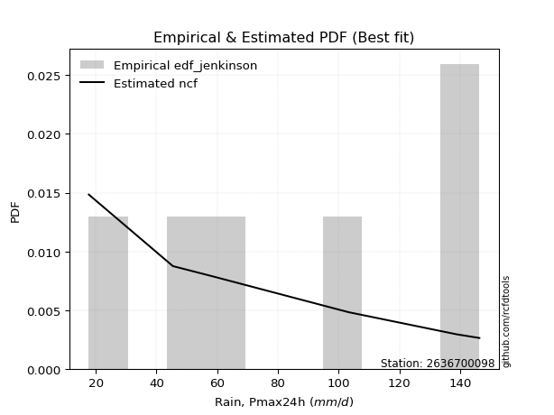</img>

</div>


### 11. EDF Cunnane (1978)

Cunnane´s work in statistical hydrology has focused on the performance and evaluation of different probability distributions (such as GEV, Gumbel, Lognormal) for flood frequency estimation. _b_ is a constant, typically set to 0.4.

<div align="center">


$P=(m-b)/(n+1-2b)$


</div>


**11.1. Empirical values**

<div align="center">

|                | 0                   | 1                   | 2                  | 3           | 4                  | 5                  | 6                  |
|:---------------|:--------------------|:--------------------|:-------------------|:------------|:-------------------|:-------------------|:-------------------|
| date           | 2023                | 2022                | 2019               | 2025        | 2020               | 2024               | 2021               |
| x              | 17.7                | 45.4                | 58.8               | 64.6        | 103.3              | 138.8              | 146.4              |
| m              | 1                   | 2                   | 3                  | 4           | 5                  | 6                  | 7                  |
| empirical_dist | edf_cunnane         | edf_cunnane         | edf_cunnane        | edf_cunnane | edf_cunnane        | edf_cunnane        | edf_cunnane        |
| empirical      | 0.08333333333333333 | 0.22222222222222224 | 0.3611111111111111 | 0.5         | 0.6388888888888888 | 0.7777777777777777 | 0.9166666666666666 |
| empirical_tr   | 1.090909090909091   | 1.2857142857142856  | 1.565217391304348  | 2.0         | 2.7692307692307687 | 4.499999999999998  | 11.999999999999995 |

</div>


**11.2. Kolmogorov-Smirnov fit test (sorted by Δ)**


<div align="center">

|                | 0                   | 1                   | 2                   | 3                   | 4                   | 5                   | 6                   | 7                   | 8                   | 9                   | 10                  | 11                  | 12                  | 13                  | 14                  | 15                  | 16                  | 17                  | 18                  | 19                  | 20                  | 21                  | 22                  | 23                  | 24                  | 25                  | 26                  | 27                  | 28                  | 29                  | 30                  | 31                  | 32                  | 33                  | 34                  | 35                  | 36                  | 37                  | 38                  | 39                  | 40                  | 41                  | 42                  | 43                  | 44                  | 45                  | 46                  | 47                  | 48                  | 49                  | 50                  | 51                  | 52                  | 53                  | 54                  | 55                  | 56                  | 57                  | 58                  | 59                  | 60                  | 61                  | 62                  | 63                  | 64                  | 65                  | 66                  | 67                  | 68                  | 69                  | 70                  | 71                  | 72                  | 73                  | 74                  | 75                  | 76                  | 77                  | 78                  | 79                  | 80                  | 81                  | 82                  | 83                  | 84                  | 85                  | 86                  | 87                  | 88                  | 89                  | 90                  | 91                  | 92                  | 93                  | 94                  | 95                  | 96                  | 97                  | 98                  | 99                  | 100                 | 101                 | 102                 | 103                 | 104                 | 105                 | 106                 | 107                 | 108                 | 109                 | 110                 | 111                 | 112                 | 113                 | 114                 | 115                 | 116                 | 117                 | 118                 | 119                 | 120                 | 121                 | 122                 | 123                 | 124                 | 125                 | 126                 | 127                 | 128                 | 129                 | 130                 | 131                 | 132                 | 133                 | 134                 | 135                 | 136                 | 137                 | 138                 | 139                 | 140                 | 141                 | 142                 | 143                 | 144                 | 145                 | 146                 | 147                 | 148                 | 149                 | 150                 | 151                 | 152                 | 153                 | 154                 | 155                 | 156                 | 157                 | 158                 | 159                 |
|:---------------|:--------------------|:--------------------|:--------------------|:--------------------|:--------------------|:--------------------|:--------------------|:--------------------|:--------------------|:--------------------|:--------------------|:--------------------|:--------------------|:--------------------|:--------------------|:--------------------|:--------------------|:--------------------|:--------------------|:--------------------|:--------------------|:--------------------|:--------------------|:--------------------|:--------------------|:--------------------|:--------------------|:--------------------|:--------------------|:--------------------|:--------------------|:--------------------|:--------------------|:--------------------|:--------------------|:--------------------|:--------------------|:--------------------|:--------------------|:--------------------|:--------------------|:--------------------|:--------------------|:--------------------|:--------------------|:--------------------|:--------------------|:--------------------|:--------------------|:--------------------|:--------------------|:--------------------|:--------------------|:--------------------|:--------------------|:--------------------|:--------------------|:--------------------|:--------------------|:--------------------|:--------------------|:--------------------|:--------------------|:--------------------|:--------------------|:--------------------|:--------------------|:--------------------|:--------------------|:--------------------|:--------------------|:--------------------|:--------------------|:--------------------|:--------------------|:--------------------|:--------------------|:--------------------|:--------------------|:--------------------|:--------------------|:--------------------|:--------------------|:--------------------|:--------------------|:--------------------|:--------------------|:--------------------|:--------------------|:--------------------|:--------------------|:--------------------|:--------------------|:--------------------|:--------------------|:--------------------|:--------------------|:--------------------|:--------------------|:--------------------|:--------------------|:--------------------|:--------------------|:--------------------|:--------------------|:--------------------|:--------------------|:--------------------|:--------------------|:--------------------|:--------------------|:--------------------|:--------------------|:--------------------|:--------------------|:--------------------|:--------------------|:--------------------|:--------------------|:--------------------|:--------------------|:--------------------|:--------------------|:--------------------|:--------------------|:--------------------|:--------------------|:--------------------|:--------------------|:--------------------|:--------------------|:--------------------|:--------------------|:--------------------|:--------------------|:--------------------|:--------------------|:--------------------|:--------------------|:--------------------|:--------------------|:--------------------|:--------------------|:--------------------|:--------------------|:--------------------|:--------------------|:--------------------|:--------------------|:--------------------|:--------------------|:--------------------|:--------------------|:--------------------|:--------------------|:--------------------|:--------------------|:--------------------|:--------------------|:--------------------|
| station        | 2636700098          | 2636700098          | 2636700098          | 2636700098          | 2636700098          | 2636700098          | 2636700098          | 2636700098          | 2636700098          | 2636700098          | 2636700098          | 2636700098          | 2636700098          | 2636700098          | 2636700098          | 2636700098          | 2636700098          | 2636700098          | 2636700098          | 2636700098          | 2636700098          | 2636700098          | 2636700098          | 2636700098          | 2636700098          | 2636700098          | 2636700098          | 2636700098          | 2636700098          | 2636700098          | 2636700098          | 2636700098          | 2636700098          | 2636700098          | 2636700098          | 2636700098          | 2636700098          | 2636700098          | 2636700098          | 2636700098          | 2636700098          | 2636700098          | 2636700098          | 2636700098          | 2636700098          | 2636700098          | 2636700098          | 2636700098          | 2636700098          | 2636700098          | 2636700098          | 2636700098          | 2636700098          | 2636700098          | 2636700098          | 2636700098          | 2636700098          | 2636700098          | 2636700098          | 2636700098          | 2636700098          | 2636700098          | 2636700098          | 2636700098          | 2636700098          | 2636700098          | 2636700098          | 2636700098          | 2636700098          | 2636700098          | 2636700098          | 2636700098          | 2636700098          | 2636700098          | 2636700098          | 2636700098          | 2636700098          | 2636700098          | 2636700098          | 2636700098          | 2636700098          | 2636700098          | 2636700098          | 2636700098          | 2636700098          | 2636700098          | 2636700098          | 2636700098          | 2636700098          | 2636700098          | 2636700098          | 2636700098          | 2636700098          | 2636700098          | 2636700098          | 2636700098          | 2636700098          | 2636700098          | 2636700098          | 2636700098          | 2636700098          | 2636700098          | 2636700098          | 2636700098          | 2636700098          | 2636700098          | 2636700098          | 2636700098          | 2636700098          | 2636700098          | 2636700098          | 2636700098          | 2636700098          | 2636700098          | 2636700098          | 2636700098          | 2636700098          | 2636700098          | 2636700098          | 2636700098          | 2636700098          | 2636700098          | 2636700098          | 2636700098          | 2636700098          | 2636700098          | 2636700098          | 2636700098          | 2636700098          | 2636700098          | 2636700098          | 2636700098          | 2636700098          | 2636700098          | 2636700098          | 2636700098          | 2636700098          | 2636700098          | 2636700098          | 2636700098          | 2636700098          | 2636700098          | 2636700098          | 2636700098          | 2636700098          | 2636700098          | 2636700098          | 2636700098          | 2636700098          | 2636700098          | 2636700098          | 2636700098          | 2636700098          | 2636700098          | 2636700098          | 2636700098          | 2636700098          | 2636700098          | 2636700098          | 2636700098          |
| empirical_dist | edf_cunnane         | edf_cunnane         | edf_cunnane         | edf_cunnane         | edf_cunnane         | edf_cunnane         | edf_cunnane         | edf_cunnane         | edf_cunnane         | edf_cunnane         | edf_cunnane         | edf_cunnane         | edf_cunnane         | edf_cunnane         | edf_cunnane         | edf_cunnane         | edf_cunnane         | edf_cunnane         | edf_cunnane         | edf_cunnane         | edf_cunnane         | edf_cunnane         | edf_cunnane         | edf_cunnane         | edf_cunnane         | edf_cunnane         | edf_cunnane         | edf_cunnane         | edf_cunnane         | edf_cunnane         | edf_cunnane         | edf_cunnane         | edf_cunnane         | edf_cunnane         | edf_cunnane         | edf_cunnane         | edf_cunnane         | edf_cunnane         | edf_cunnane         | edf_cunnane         | edf_cunnane         | edf_cunnane         | edf_cunnane         | edf_cunnane         | edf_cunnane         | edf_cunnane         | edf_cunnane         | edf_cunnane         | edf_cunnane         | edf_cunnane         | edf_cunnane         | edf_cunnane         | edf_cunnane         | edf_cunnane         | edf_cunnane         | edf_cunnane         | edf_cunnane         | edf_cunnane         | edf_cunnane         | edf_cunnane         | edf_cunnane         | edf_cunnane         | edf_cunnane         | edf_cunnane         | edf_cunnane         | edf_cunnane         | edf_cunnane         | edf_cunnane         | edf_cunnane         | edf_cunnane         | edf_cunnane         | edf_cunnane         | edf_cunnane         | edf_cunnane         | edf_cunnane         | edf_cunnane         | edf_cunnane         | edf_cunnane         | edf_cunnane         | edf_cunnane         | edf_cunnane         | edf_cunnane         | edf_cunnane         | edf_cunnane         | edf_cunnane         | edf_cunnane         | edf_cunnane         | edf_cunnane         | edf_cunnane         | edf_cunnane         | edf_cunnane         | edf_cunnane         | edf_cunnane         | edf_cunnane         | edf_cunnane         | edf_cunnane         | edf_cunnane         | edf_cunnane         | edf_cunnane         | edf_cunnane         | edf_cunnane         | edf_cunnane         | edf_cunnane         | edf_cunnane         | edf_cunnane         | edf_cunnane         | edf_cunnane         | edf_cunnane         | edf_cunnane         | edf_cunnane         | edf_cunnane         | edf_cunnane         | edf_cunnane         | edf_cunnane         | edf_cunnane         | edf_cunnane         | edf_cunnane         | edf_cunnane         | edf_cunnane         | edf_cunnane         | edf_cunnane         | edf_cunnane         | edf_cunnane         | edf_cunnane         | edf_cunnane         | edf_cunnane         | edf_cunnane         | edf_cunnane         | edf_cunnane         | edf_cunnane         | edf_cunnane         | edf_cunnane         | edf_cunnane         | edf_cunnane         | edf_cunnane         | edf_cunnane         | edf_cunnane         | edf_cunnane         | edf_cunnane         | edf_cunnane         | edf_cunnane         | edf_cunnane         | edf_cunnane         | edf_cunnane         | edf_cunnane         | edf_cunnane         | edf_cunnane         | edf_cunnane         | edf_cunnane         | edf_cunnane         | edf_cunnane         | edf_cunnane         | edf_cunnane         | edf_cunnane         | edf_cunnane         | edf_cunnane         | edf_cunnane         | edf_cunnane         | edf_cunnane         | edf_cunnane         |
| p_dist         | logtrapezoid        | loganglit           | logpearson3         | arcsine             | f                   | logf                | logfatiguelife      | lognct              | logexponnorm        | logcrystalball      | lognorm             | logt                | logrice             | logncf              | logbetaprime        | loginvgauss         | logsemicircular     | loggamma            | loggamma            | loginvgamma         | logfoldnorm         | logerlang           | exponweib           | weibull_min         | loggompertz         | genlogistic         | dweibull            | skewnorm            | erlang              | invweibull          | logalpha            | halfnorm            | logdweibull         | dgamma              | invgauss            | betaprime           | gamma               | logmaxwell          | logweibull_min      | logburr12           | kstwobign           | rayleigh            | loggumbel_l         | gengamma            | lograyleigh         | logdgamma           | ksone               | invgamma            | halflogistic        | genexpon            | loggausshyper       | loglogistic         | gumbel_r            | moyal               | logcosine           | wrapcauchy          | maxwell             | lomax               | semicircular        | rice                | loginvweibull       | anglit              | loghypsecant        | logloglaplace       | loggumbel_r         | logvonmises_line    | loghalfnorm         | foldnorm            | pearson3            | logarcsine          | burr                | logargus            | beta                | kappa3              | logburr             | exponnorm           | logmoyal            | t                   | nct                 | norm                | loglaplace          | loglaplace          | johnsonsu           | logloggamma         | alpha               | genextreme          | loghalflogistic     | loglevy_l           | loggenhalflogistic  | cosine              | tukeylambda         | logbeta             | kappa4              | gausshyper          | uniform             | vonmises_line       | logmielke           | logkstwobign        | loggenexpon         | logistic            | mielke              | wald                | gompertz            | logtriang           | bradford            | logskewnorm         | hypsecant           | truncexpon          | truncweibull_min    | argus               | gumbel_l            | levy_l              | laplace             | logwald             | ncf                 | logkappa4           | genpareto           | loggenextreme       | nakagami            | lognakagami         | logkappa3           | loguniform          | logtukeylambda      | logbradford         | logweibull_max      | loggenpareto        | logksone            | halfgennorm         | logwrapcauchy       | genhalflogistic     | logtruncnorm        | triang              | crystalball         | gennorm             | loggennorm          | burr12              | logtruncweibull_min | logrdist            | logjohnsonsb        | truncnorm           | logtruncexpon       | trapezoid           | loggengamma         | loglomax            | johnsonsb           | exponpow            | logexponpow         | weibull_max         | rdist               | powerlaw            | logjohnsonsu        | fatiguelife         | logexponweib        | logpowerlaw         | truncpareto         | logtruncpareto      | loggenlogistic      | loghalfgennorm      | logvonmises         | vonmises            |
| delta          | 0.0757454220395209  | 0.08434912250113932 | 0.08651058602152362 | 0.08900202256878814 | 0.09184129556895448 | 0.09264079276350734 | 0.09293050394869218 | 0.09355384252612808 | 0.09407124409429868 | 0.0940754480084599  | 0.09407561832569722 | 0.09407745864235761 | 0.0948474469643602  | 0.09499611474458114 | 0.09505118711289684 | 0.09535650241844462 | 0.09547024546078506 | 0.09654518338323448 | 0.09654518338323448 | 0.09834340172100609 | 0.09849907680725678 | 0.0985901377930144  | 0.09916181682273073 | 0.09925009902562909 | 0.09976087827302593 | 0.1014125450665263  | 0.1020465554545289  | 0.10211006995574268 | 0.10224332147346105 | 0.10231434996183664 | 0.10282534215938433 | 0.10292523858688962 | 0.10311289406554125 | 0.10396096950172684 | 0.10440507400012711 | 0.10440762697864014 | 0.10534485649268177 | 0.10587137126237867 | 0.10592706149345099 | 0.10630675576286652 | 0.10641632469641316 | 0.10797485983920685 | 0.10800687386319086 | 0.1089237421912087  | 0.10926141038373716 | 0.10991981835156661 | 0.11266792091342365 | 0.11332782919485573 | 0.11395365018665415 | 0.11493586150321458 | 0.11555141759182028 | 0.11654878007237623 | 0.11672836937069841 | 0.11827640925498084 | 0.11908227638430535 | 0.11984730398612897 | 0.12001767590767343 | 0.12195782431824162 | 0.123441076109165   | 0.1245273712281546  | 0.12832526965996086 | 0.13183780353967706 | 0.13185065835713228 | 0.13624548337295717 | 0.13764656988684154 | 0.1379069193857122  | 0.13969343931121442 | 0.1402127841745603  | 0.14182124126336731 | 0.1430145843121393  | 0.14328725159446537 | 0.1441730376884124  | 0.14923349557767981 | 0.14995322714320575 | 0.15127755482720268 | 0.15158790704596126 | 0.15167226000908218 | 0.15180417150920011 | 0.15183346053931307 | 0.1518400974366227  | 0.1535875371692298  | 0.1535875371692298  | 0.15360072444642503 | 0.15579827361563203 | 0.15598082097908392 | 0.15700996375068133 | 0.15765745939183223 | 0.15820988933464397 | 0.1586890767464264  | 0.15910489304755016 | 0.15940992400416665 | 0.15955837981287602 | 0.16088699840025666 | 0.1612916945912436  | 0.1631701631701632  | 0.1632351169431263  | 0.16364617238234092 | 0.1639591442415528  | 0.16889809008773451 | 0.16993993924782103 | 0.1730342653623369  | 0.17351472246509603 | 0.1773181647371081  | 0.1806624556280002  | 0.18099057315079037 | 0.18104100718505556 | 0.18395853805754803 | 0.18589964710844387 | 0.18783582243222552 | 0.1979547499845885  | 0.21152252278913553 | 0.2116387663614358  | 0.21208932804944386 | 0.21217299558581576 | 0.21264138499461446 | 0.21386719240707977 | 0.2171382123971345  | 0.22056752496164522 | 0.22222214750318792 | 0.22222221476812887 | 0.22245014529366822 | 0.22361140650386027 | 0.22520897268621728 | 0.22525229160241247 | 0.22652734481747527 | 0.2274097016812859  | 0.2326391350495133  | 0.24832216429947399 | 0.24887283710965788 | 0.2516993594683026  | 0.2541104578142098  | 0.2550352647985161  | 0.2554887140995486  | 0.2777777777777778  | 0.2777777777777778  | 0.28096507606381005 | 0.28851556274649337 | 0.306141324963329   | 0.31599268732179037 | 0.32906225226242314 | 0.32950220967077937 | 0.350222379829347   | 0.3644079455694371  | 0.40636922623028215 | 0.4208693530055704  | 0.4456303423382739  | 0.4707310761080653  | 0.5343601919331701  | 0.5375246185396996  | 0.5532463059507017  | 0.5581004399608165  | 0.5757689932669003  | 0.630256630447896   | 0.6400751843987994  | 0.6650068787529009  | 0.7174054561728713  | 0.7777777777777777  | 0.7777777777777777  | 1.0848066466046022  | 22.637237873706212  |
| deltao         | 0.48442053926100004 | 0.48442053926100004 | 0.48442053926100004 | 0.48442053926100004 | 0.48442053926100004 | 0.48442053926100004 | 0.48442053926100004 | 0.48442053926100004 | 0.48442053926100004 | 0.48442053926100004 | 0.48442053926100004 | 0.48442053926100004 | 0.48442053926100004 | 0.48442053926100004 | 0.48442053926100004 | 0.48442053926100004 | 0.48442053926100004 | 0.48442053926100004 | 0.48442053926100004 | 0.48442053926100004 | 0.48442053926100004 | 0.48442053926100004 | 0.48442053926100004 | 0.48442053926100004 | 0.48442053926100004 | 0.48442053926100004 | 0.48442053926100004 | 0.48442053926100004 | 0.48442053926100004 | 0.48442053926100004 | 0.48442053926100004 | 0.48442053926100004 | 0.48442053926100004 | 0.48442053926100004 | 0.48442053926100004 | 0.48442053926100004 | 0.48442053926100004 | 0.48442053926100004 | 0.48442053926100004 | 0.48442053926100004 | 0.48442053926100004 | 0.48442053926100004 | 0.48442053926100004 | 0.48442053926100004 | 0.48442053926100004 | 0.48442053926100004 | 0.48442053926100004 | 0.48442053926100004 | 0.48442053926100004 | 0.48442053926100004 | 0.48442053926100004 | 0.48442053926100004 | 0.48442053926100004 | 0.48442053926100004 | 0.48442053926100004 | 0.48442053926100004 | 0.48442053926100004 | 0.48442053926100004 | 0.48442053926100004 | 0.48442053926100004 | 0.48442053926100004 | 0.48442053926100004 | 0.48442053926100004 | 0.48442053926100004 | 0.48442053926100004 | 0.48442053926100004 | 0.48442053926100004 | 0.48442053926100004 | 0.48442053926100004 | 0.48442053926100004 | 0.48442053926100004 | 0.48442053926100004 | 0.48442053926100004 | 0.48442053926100004 | 0.48442053926100004 | 0.48442053926100004 | 0.48442053926100004 | 0.48442053926100004 | 0.48442053926100004 | 0.48442053926100004 | 0.48442053926100004 | 0.48442053926100004 | 0.48442053926100004 | 0.48442053926100004 | 0.48442053926100004 | 0.48442053926100004 | 0.48442053926100004 | 0.48442053926100004 | 0.48442053926100004 | 0.48442053926100004 | 0.48442053926100004 | 0.48442053926100004 | 0.48442053926100004 | 0.48442053926100004 | 0.48442053926100004 | 0.48442053926100004 | 0.48442053926100004 | 0.48442053926100004 | 0.48442053926100004 | 0.48442053926100004 | 0.48442053926100004 | 0.48442053926100004 | 0.48442053926100004 | 0.48442053926100004 | 0.48442053926100004 | 0.48442053926100004 | 0.48442053926100004 | 0.48442053926100004 | 0.48442053926100004 | 0.48442053926100004 | 0.48442053926100004 | 0.48442053926100004 | 0.48442053926100004 | 0.48442053926100004 | 0.48442053926100004 | 0.48442053926100004 | 0.48442053926100004 | 0.48442053926100004 | 0.48442053926100004 | 0.48442053926100004 | 0.48442053926100004 | 0.48442053926100004 | 0.48442053926100004 | 0.48442053926100004 | 0.48442053926100004 | 0.48442053926100004 | 0.48442053926100004 | 0.48442053926100004 | 0.48442053926100004 | 0.48442053926100004 | 0.48442053926100004 | 0.48442053926100004 | 0.48442053926100004 | 0.48442053926100004 | 0.48442053926100004 | 0.48442053926100004 | 0.48442053926100004 | 0.48442053926100004 | 0.48442053926100004 | 0.48442053926100004 | 0.48442053926100004 | 0.48442053926100004 | 0.48442053926100004 | 0.48442053926100004 | 0.48442053926100004 | 0.48442053926100004 | 0.48442053926100004 | 0.48442053926100004 | 0.48442053926100004 | 0.48442053926100004 | 0.48442053926100004 | 0.48442053926100004 | 0.48442053926100004 | 0.48442053926100004 | 0.48442053926100004 | 0.48442053926100004 | 0.48442053926100004 | 0.48442053926100004 | 0.48442053926100004 | 0.48442053926100004 |
| eval           | Δo > Δ              | Δo > Δ              | Δo > Δ              | Δo > Δ              | Δo > Δ              | Δo > Δ              | Δo > Δ              | Δo > Δ              | Δo > Δ              | Δo > Δ              | Δo > Δ              | Δo > Δ              | Δo > Δ              | Δo > Δ              | Δo > Δ              | Δo > Δ              | Δo > Δ              | Δo > Δ              | Δo > Δ              | Δo > Δ              | Δo > Δ              | Δo > Δ              | Δo > Δ              | Δo > Δ              | Δo > Δ              | Δo > Δ              | Δo > Δ              | Δo > Δ              | Δo > Δ              | Δo > Δ              | Δo > Δ              | Δo > Δ              | Δo > Δ              | Δo > Δ              | Δo > Δ              | Δo > Δ              | Δo > Δ              | Δo > Δ              | Δo > Δ              | Δo > Δ              | Δo > Δ              | Δo > Δ              | Δo > Δ              | Δo > Δ              | Δo > Δ              | Δo > Δ              | Δo > Δ              | Δo > Δ              | Δo > Δ              | Δo > Δ              | Δo > Δ              | Δo > Δ              | Δo > Δ              | Δo > Δ              | Δo > Δ              | Δo > Δ              | Δo > Δ              | Δo > Δ              | Δo > Δ              | Δo > Δ              | Δo > Δ              | Δo > Δ              | Δo > Δ              | Δo > Δ              | Δo > Δ              | Δo > Δ              | Δo > Δ              | Δo > Δ              | Δo > Δ              | Δo > Δ              | Δo > Δ              | Δo > Δ              | Δo > Δ              | Δo > Δ              | Δo > Δ              | Δo > Δ              | Δo > Δ              | Δo > Δ              | Δo > Δ              | Δo > Δ              | Δo > Δ              | Δo > Δ              | Δo > Δ              | Δo > Δ              | Δo > Δ              | Δo > Δ              | Δo > Δ              | Δo > Δ              | Δo > Δ              | Δo > Δ              | Δo > Δ              | Δo > Δ              | Δo > Δ              | Δo > Δ              | Δo > Δ              | Δo > Δ              | Δo > Δ              | Δo > Δ              | Δo > Δ              | Δo > Δ              | Δo > Δ              | Δo > Δ              | Δo > Δ              | Δo > Δ              | Δo > Δ              | Δo > Δ              | Δo > Δ              | Δo > Δ              | Δo > Δ              | Δo > Δ              | Δo > Δ              | Δo > Δ              | Δo > Δ              | Δo > Δ              | Δo > Δ              | Δo > Δ              | Δo > Δ              | Δo > Δ              | Δo > Δ              | Δo > Δ              | Δo > Δ              | Δo > Δ              | Δo > Δ              | Δo > Δ              | Δo > Δ              | Δo > Δ              | Δo > Δ              | Δo > Δ              | Δo > Δ              | Δo > Δ              | Δo > Δ              | Δo > Δ              | Δo > Δ              | Δo > Δ              | Δo > Δ              | Δo > Δ              | Δo > Δ              | Δo > Δ              | Δo > Δ              | Δo > Δ              | Δo > Δ              | Δo > Δ              | Δo > Δ              | Δo > Δ              | Δo > Δ              | Δo > Δ              | Δo > Δ              | Δo <= Δ             | Δo <= Δ             | Δo <= Δ             | Δo <= Δ             | Δo <= Δ             | Δo <= Δ             | Δo <= Δ             | Δo <= Δ             | Δo <= Δ             | Δo <= Δ             | Δo <= Δ             | Δo <= Δ             | Δo <= Δ             |
| fit            | 1                   | 1                   | 1                   | 1                   | 1                   | 1                   | 1                   | 1                   | 1                   | 1                   | 1                   | 1                   | 1                   | 1                   | 1                   | 1                   | 1                   | 1                   | 1                   | 1                   | 1                   | 1                   | 1                   | 1                   | 1                   | 1                   | 1                   | 1                   | 1                   | 1                   | 1                   | 1                   | 1                   | 1                   | 1                   | 1                   | 1                   | 1                   | 1                   | 1                   | 1                   | 1                   | 1                   | 1                   | 1                   | 1                   | 1                   | 1                   | 1                   | 1                   | 1                   | 1                   | 1                   | 1                   | 1                   | 1                   | 1                   | 1                   | 1                   | 1                   | 1                   | 1                   | 1                   | 1                   | 1                   | 1                   | 1                   | 1                   | 1                   | 1                   | 1                   | 1                   | 1                   | 1                   | 1                   | 1                   | 1                   | 1                   | 1                   | 1                   | 1                   | 1                   | 1                   | 1                   | 1                   | 1                   | 1                   | 1                   | 1                   | 1                   | 1                   | 1                   | 1                   | 1                   | 1                   | 1                   | 1                   | 1                   | 1                   | 1                   | 1                   | 1                   | 1                   | 1                   | 1                   | 1                   | 1                   | 1                   | 1                   | 1                   | 1                   | 1                   | 1                   | 1                   | 1                   | 1                   | 1                   | 1                   | 1                   | 1                   | 1                   | 1                   | 1                   | 1                   | 1                   | 1                   | 1                   | 1                   | 1                   | 1                   | 1                   | 1                   | 1                   | 1                   | 1                   | 1                   | 1                   | 1                   | 1                   | 1                   | 1                   | 1                   | 1                   | 1                   | 1                   | 1                   | 1                   | 0                   | 0                   | 0                   | 0                   | 0                   | 0                   | 0                   | 0                   | 0                   | 0                   | 0                   | 0                   | 0                   |
| n              | 7                   | 7                   | 7                   | 7                   | 7                   | 7                   | 7                   | 7                   | 7                   | 7                   | 7                   | 7                   | 7                   | 7                   | 7                   | 7                   | 7                   | 7                   | 7                   | 7                   | 7                   | 7                   | 7                   | 7                   | 7                   | 7                   | 7                   | 7                   | 7                   | 7                   | 7                   | 7                   | 7                   | 7                   | 7                   | 7                   | 7                   | 7                   | 7                   | 7                   | 7                   | 7                   | 7                   | 7                   | 7                   | 7                   | 7                   | 7                   | 7                   | 7                   | 7                   | 7                   | 7                   | 7                   | 7                   | 7                   | 7                   | 7                   | 7                   | 7                   | 7                   | 7                   | 7                   | 7                   | 7                   | 7                   | 7                   | 7                   | 7                   | 7                   | 7                   | 7                   | 7                   | 7                   | 7                   | 7                   | 7                   | 7                   | 7                   | 7                   | 7                   | 7                   | 7                   | 7                   | 7                   | 7                   | 7                   | 7                   | 7                   | 7                   | 7                   | 7                   | 7                   | 7                   | 7                   | 7                   | 7                   | 7                   | 7                   | 7                   | 7                   | 7                   | 7                   | 7                   | 7                   | 7                   | 7                   | 7                   | 7                   | 7                   | 7                   | 7                   | 7                   | 7                   | 7                   | 7                   | 7                   | 7                   | 7                   | 7                   | 7                   | 7                   | 7                   | 7                   | 7                   | 7                   | 7                   | 7                   | 7                   | 7                   | 7                   | 7                   | 7                   | 7                   | 7                   | 7                   | 7                   | 7                   | 7                   | 7                   | 7                   | 7                   | 7                   | 7                   | 7                   | 7                   | 7                   | 7                   | 7                   | 7                   | 7                   | 7                   | 7                   | 7                   | 7                   | 7                   | 7                   | 7                   | 7                   | 7                   |
| best_fit       | 1                   | 0                   | 0                   | 0                   | 0                   | 0                   | 0                   | 0                   | 0                   | 0                   | 0                   | 0                   | 0                   | 0                   | 0                   | 0                   | 0                   | 0                   | 0                   | 0                   | 0                   | 0                   | 0                   | 0                   | 0                   | 0                   | 0                   | 0                   | 0                   | 0                   | 0                   | 0                   | 0                   | 0                   | 0                   | 0                   | 0                   | 0                   | 0                   | 0                   | 0                   | 0                   | 0                   | 0                   | 0                   | 0                   | 0                   | 0                   | 0                   | 0                   | 0                   | 0                   | 0                   | 0                   | 0                   | 0                   | 0                   | 0                   | 0                   | 0                   | 0                   | 0                   | 0                   | 0                   | 0                   | 0                   | 0                   | 0                   | 0                   | 0                   | 0                   | 0                   | 0                   | 0                   | 0                   | 0                   | 0                   | 0                   | 0                   | 0                   | 0                   | 0                   | 0                   | 0                   | 0                   | 0                   | 0                   | 0                   | 0                   | 0                   | 0                   | 0                   | 0                   | 0                   | 0                   | 0                   | 0                   | 0                   | 0                   | 0                   | 0                   | 0                   | 0                   | 0                   | 0                   | 0                   | 0                   | 0                   | 0                   | 0                   | 0                   | 0                   | 0                   | 0                   | 0                   | 0                   | 0                   | 0                   | 0                   | 0                   | 0                   | 0                   | 0                   | 0                   | 0                   | 0                   | 0                   | 0                   | 0                   | 0                   | 0                   | 0                   | 0                   | 0                   | 0                   | 0                   | 0                   | 0                   | 0                   | 0                   | 0                   | 0                   | 0                   | 0                   | 0                   | 0                   | 0                   | 0                   | 0                   | 0                   | 0                   | 0                   | 0                   | 0                   | 0                   | 0                   | 0                   | 0                   | 0                   | 0                   |
| best_fit_sort  | 1                   | 2                   | 3                   | 4                   | 5                   | 6                   | 7                   | 8                   | 9                   | 10                  | 11                  | 12                  | 13                  | 14                  | 15                  | 16                  | 17                  | 18                  | 19                  | 20                  | 21                  | 22                  | 23                  | 24                  | 25                  | 26                  | 27                  | 28                  | 29                  | 30                  | 31                  | 32                  | 33                  | 34                  | 35                  | 36                  | 37                  | 38                  | 39                  | 40                  | 41                  | 42                  | 43                  | 44                  | 45                  | 46                  | 47                  | 48                  | 49                  | 50                  | 51                  | 52                  | 53                  | 54                  | 55                  | 56                  | 57                  | 58                  | 59                  | 60                  | 61                  | 62                  | 63                  | 64                  | 65                  | 66                  | 67                  | 68                  | 69                  | 70                  | 71                  | 72                  | 73                  | 74                  | 75                  | 76                  | 77                  | 78                  | 79                  | 80                  | 81                  | 82                  | 83                  | 84                  | 85                  | 86                  | 87                  | 88                  | 89                  | 90                  | 91                  | 92                  | 93                  | 94                  | 95                  | 96                  | 97                  | 98                  | 99                  | 100                 | 101                 | 102                 | 103                 | 104                 | 105                 | 106                 | 107                 | 108                 | 109                 | 110                 | 111                 | 112                 | 113                 | 114                 | 115                 | 116                 | 117                 | 118                 | 119                 | 120                 | 121                 | 122                 | 123                 | 124                 | 125                 | 126                 | 127                 | 128                 | 129                 | 130                 | 131                 | 132                 | 133                 | 134                 | 135                 | 136                 | 137                 | 138                 | 139                 | 140                 | 141                 | 142                 | 143                 | 144                 | 145                 | 146                 | 147                 | 148                 | 149                 | 150                 | 151                 | 152                 | 153                 | 154                 | 155                 | 156                 | 157                 | 158                 | 159                 | 160                 |

</div>


**11.3. Best fit**

<div align="center">

|   id |    station | empirical_dist   | p_dist       |     delta |   deltao | eval   |   fit |   n |   best_fit |   best_fit_sort |
|-----:|-----------:|:-----------------|:-------------|----------:|---------:|:-------|------:|----:|-----------:|----------------:|
|    0 | 2636700098 | edf_cunnane      | logtrapezoid | 0.0757454 | 0.484421 | Δo > Δ |     1 |   7 |          1 |               1 |

</div>


<div align="center">

</img></img>

</div>


### 12. EDF Adamowski (1981)

The Adamowski formula in hydrology refers to a specific plotting position formula used for estimating the non-parametric empirical distribution of hydrological events (like flood peaks) to calculate their return periods. This formula provides an alternative to traditional parametric methods (like the Gumbel or Log Pearson Type III distributions). 

<div align="center">


$P=(m-0.25)/(n+0.5)$


</div>


**12.1. Empirical values**

<div align="center">

|                | 0                  | 1                   | 2                   | 3             | 4                  | 5                  | 6                  |
|:---------------|:-------------------|:--------------------|:--------------------|:--------------|:-------------------|:-------------------|:-------------------|
| date           | 2023               | 2022                | 2019                | 2025          | 2020               | 2024               | 2021               |
| x              | 17.7               | 45.4                | 58.8                | 64.6          | 103.3              | 138.8              | 146.4              |
| m              | 1                  | 2                   | 3                   | 4             | 5                  | 6                  | 7                  |
| empirical_dist | edf_adamowski      | edf_adamowski       | edf_adamowski       | edf_adamowski | edf_adamowski      | edf_adamowski      | edf_adamowski      |
| empirical      | 0.1                | 0.23333333333333334 | 0.36666666666666664 | 0.5           | 0.6333333333333333 | 0.7666666666666667 | 0.9                |
| empirical_tr   | 1.1111111111111112 | 1.3043478260869565  | 1.5789473684210527  | 2.0           | 2.727272727272727  | 4.2857142857142865 | 10.000000000000002 |

</div>


**12.2. Kolmogorov-Smirnov fit test (sorted by Δ)**


<div align="center">

|                | 0                   | 1                   | 2                   | 3                   | 4                   | 5                   | 6                   | 7                   | 8                   | 9                   | 10                  | 11                  | 12                  | 13                  | 14                  | 15                  | 16                  | 17                  | 18                  | 19                  | 20                  | 21                  | 22                  | 23                  | 24                  | 25                  | 26                  | 27                  | 28                  | 29                  | 30                  | 31                  | 32                  | 33                  | 34                  | 35                  | 36                  | 37                  | 38                  | 39                  | 40                  | 41                  | 42                  | 43                  | 44                  | 45                  | 46                  | 47                  | 48                  | 49                  | 50                  | 51                  | 52                  | 53                  | 54                  | 55                  | 56                  | 57                  | 58                  | 59                  | 60                  | 61                  | 62                  | 63                  | 64                  | 65                  | 66                  | 67                  | 68                  | 69                  | 70                  | 71                  | 72                  | 73                  | 74                  | 75                  | 76                  | 77                  | 78                  | 79                  | 80                  | 81                  | 82                  | 83                  | 84                  | 85                  | 86                  | 87                  | 88                  | 89                  | 90                  | 91                  | 92                  | 93                  | 94                  | 95                  | 96                  | 97                  | 98                  | 99                  | 100                 | 101                 | 102                 | 103                 | 104                 | 105                 | 106                 | 107                 | 108                 | 109                 | 110                 | 111                 | 112                 | 113                 | 114                 | 115                 | 116                 | 117                 | 118                 | 119                 | 120                 | 121                 | 122                 | 123                 | 124                 | 125                 | 126                 | 127                 | 128                 | 129                 | 130                 | 131                 | 132                 | 133                 | 134                 | 135                 | 136                 | 137                 | 138                 | 139                 | 140                 | 141                 | 142                 | 143                 | 144                 | 145                 | 146                 | 147                 | 148                 | 149                 | 150                 | 151                 | 152                 | 153                 | 154                 | 155                 | 156                 | 157                 | 158                 | 159                 |
|:---------------|:--------------------|:--------------------|:--------------------|:--------------------|:--------------------|:--------------------|:--------------------|:--------------------|:--------------------|:--------------------|:--------------------|:--------------------|:--------------------|:--------------------|:--------------------|:--------------------|:--------------------|:--------------------|:--------------------|:--------------------|:--------------------|:--------------------|:--------------------|:--------------------|:--------------------|:--------------------|:--------------------|:--------------------|:--------------------|:--------------------|:--------------------|:--------------------|:--------------------|:--------------------|:--------------------|:--------------------|:--------------------|:--------------------|:--------------------|:--------------------|:--------------------|:--------------------|:--------------------|:--------------------|:--------------------|:--------------------|:--------------------|:--------------------|:--------------------|:--------------------|:--------------------|:--------------------|:--------------------|:--------------------|:--------------------|:--------------------|:--------------------|:--------------------|:--------------------|:--------------------|:--------------------|:--------------------|:--------------------|:--------------------|:--------------------|:--------------------|:--------------------|:--------------------|:--------------------|:--------------------|:--------------------|:--------------------|:--------------------|:--------------------|:--------------------|:--------------------|:--------------------|:--------------------|:--------------------|:--------------------|:--------------------|:--------------------|:--------------------|:--------------------|:--------------------|:--------------------|:--------------------|:--------------------|:--------------------|:--------------------|:--------------------|:--------------------|:--------------------|:--------------------|:--------------------|:--------------------|:--------------------|:--------------------|:--------------------|:--------------------|:--------------------|:--------------------|:--------------------|:--------------------|:--------------------|:--------------------|:--------------------|:--------------------|:--------------------|:--------------------|:--------------------|:--------------------|:--------------------|:--------------------|:--------------------|:--------------------|:--------------------|:--------------------|:--------------------|:--------------------|:--------------------|:--------------------|:--------------------|:--------------------|:--------------------|:--------------------|:--------------------|:--------------------|:--------------------|:--------------------|:--------------------|:--------------------|:--------------------|:--------------------|:--------------------|:--------------------|:--------------------|:--------------------|:--------------------|:--------------------|:--------------------|:--------------------|:--------------------|:--------------------|:--------------------|:--------------------|:--------------------|:--------------------|:--------------------|:--------------------|:--------------------|:--------------------|:--------------------|:--------------------|:--------------------|:--------------------|:--------------------|:--------------------|:--------------------|:--------------------|
| station        | 2636700098          | 2636700098          | 2636700098          | 2636700098          | 2636700098          | 2636700098          | 2636700098          | 2636700098          | 2636700098          | 2636700098          | 2636700098          | 2636700098          | 2636700098          | 2636700098          | 2636700098          | 2636700098          | 2636700098          | 2636700098          | 2636700098          | 2636700098          | 2636700098          | 2636700098          | 2636700098          | 2636700098          | 2636700098          | 2636700098          | 2636700098          | 2636700098          | 2636700098          | 2636700098          | 2636700098          | 2636700098          | 2636700098          | 2636700098          | 2636700098          | 2636700098          | 2636700098          | 2636700098          | 2636700098          | 2636700098          | 2636700098          | 2636700098          | 2636700098          | 2636700098          | 2636700098          | 2636700098          | 2636700098          | 2636700098          | 2636700098          | 2636700098          | 2636700098          | 2636700098          | 2636700098          | 2636700098          | 2636700098          | 2636700098          | 2636700098          | 2636700098          | 2636700098          | 2636700098          | 2636700098          | 2636700098          | 2636700098          | 2636700098          | 2636700098          | 2636700098          | 2636700098          | 2636700098          | 2636700098          | 2636700098          | 2636700098          | 2636700098          | 2636700098          | 2636700098          | 2636700098          | 2636700098          | 2636700098          | 2636700098          | 2636700098          | 2636700098          | 2636700098          | 2636700098          | 2636700098          | 2636700098          | 2636700098          | 2636700098          | 2636700098          | 2636700098          | 2636700098          | 2636700098          | 2636700098          | 2636700098          | 2636700098          | 2636700098          | 2636700098          | 2636700098          | 2636700098          | 2636700098          | 2636700098          | 2636700098          | 2636700098          | 2636700098          | 2636700098          | 2636700098          | 2636700098          | 2636700098          | 2636700098          | 2636700098          | 2636700098          | 2636700098          | 2636700098          | 2636700098          | 2636700098          | 2636700098          | 2636700098          | 2636700098          | 2636700098          | 2636700098          | 2636700098          | 2636700098          | 2636700098          | 2636700098          | 2636700098          | 2636700098          | 2636700098          | 2636700098          | 2636700098          | 2636700098          | 2636700098          | 2636700098          | 2636700098          | 2636700098          | 2636700098          | 2636700098          | 2636700098          | 2636700098          | 2636700098          | 2636700098          | 2636700098          | 2636700098          | 2636700098          | 2636700098          | 2636700098          | 2636700098          | 2636700098          | 2636700098          | 2636700098          | 2636700098          | 2636700098          | 2636700098          | 2636700098          | 2636700098          | 2636700098          | 2636700098          | 2636700098          | 2636700098          | 2636700098          | 2636700098          | 2636700098          | 2636700098          |
| empirical_dist | edf_adamowski       | edf_adamowski       | edf_adamowski       | edf_adamowski       | edf_adamowski       | edf_adamowski       | edf_adamowski       | edf_adamowski       | edf_adamowski       | edf_adamowski       | edf_adamowski       | edf_adamowski       | edf_adamowski       | edf_adamowski       | edf_adamowski       | edf_adamowski       | edf_adamowski       | edf_adamowski       | edf_adamowski       | edf_adamowski       | edf_adamowski       | edf_adamowski       | edf_adamowski       | edf_adamowski       | edf_adamowski       | edf_adamowski       | edf_adamowski       | edf_adamowski       | edf_adamowski       | edf_adamowski       | edf_adamowski       | edf_adamowski       | edf_adamowski       | edf_adamowski       | edf_adamowski       | edf_adamowski       | edf_adamowski       | edf_adamowski       | edf_adamowski       | edf_adamowski       | edf_adamowski       | edf_adamowski       | edf_adamowski       | edf_adamowski       | edf_adamowski       | edf_adamowski       | edf_adamowski       | edf_adamowski       | edf_adamowski       | edf_adamowski       | edf_adamowski       | edf_adamowski       | edf_adamowski       | edf_adamowski       | edf_adamowski       | edf_adamowski       | edf_adamowski       | edf_adamowski       | edf_adamowski       | edf_adamowski       | edf_adamowski       | edf_adamowski       | edf_adamowski       | edf_adamowski       | edf_adamowski       | edf_adamowski       | edf_adamowski       | edf_adamowski       | edf_adamowski       | edf_adamowski       | edf_adamowski       | edf_adamowski       | edf_adamowski       | edf_adamowski       | edf_adamowski       | edf_adamowski       | edf_adamowski       | edf_adamowski       | edf_adamowski       | edf_adamowski       | edf_adamowski       | edf_adamowski       | edf_adamowski       | edf_adamowski       | edf_adamowski       | edf_adamowski       | edf_adamowski       | edf_adamowski       | edf_adamowski       | edf_adamowski       | edf_adamowski       | edf_adamowski       | edf_adamowski       | edf_adamowski       | edf_adamowski       | edf_adamowski       | edf_adamowski       | edf_adamowski       | edf_adamowski       | edf_adamowski       | edf_adamowski       | edf_adamowski       | edf_adamowski       | edf_adamowski       | edf_adamowski       | edf_adamowski       | edf_adamowski       | edf_adamowski       | edf_adamowski       | edf_adamowski       | edf_adamowski       | edf_adamowski       | edf_adamowski       | edf_adamowski       | edf_adamowski       | edf_adamowski       | edf_adamowski       | edf_adamowski       | edf_adamowski       | edf_adamowski       | edf_adamowski       | edf_adamowski       | edf_adamowski       | edf_adamowski       | edf_adamowski       | edf_adamowski       | edf_adamowski       | edf_adamowski       | edf_adamowski       | edf_adamowski       | edf_adamowski       | edf_adamowski       | edf_adamowski       | edf_adamowski       | edf_adamowski       | edf_adamowski       | edf_adamowski       | edf_adamowski       | edf_adamowski       | edf_adamowski       | edf_adamowski       | edf_adamowski       | edf_adamowski       | edf_adamowski       | edf_adamowski       | edf_adamowski       | edf_adamowski       | edf_adamowski       | edf_adamowski       | edf_adamowski       | edf_adamowski       | edf_adamowski       | edf_adamowski       | edf_adamowski       | edf_adamowski       | edf_adamowski       | edf_adamowski       | edf_adamowski       | edf_adamowski       | edf_adamowski       |
| p_dist         | logtrapezoid        | loganglit           | logdweibull         | logdgamma           | dweibull            | logpearson3         | logf                | logsemicircular     | logfatiguelife      | lognct              | logexponnorm        | logcrystalball      | lognorm             | logt                | arcsine             | logrice             | logncf              | logbetaprime        | loginvgauss         | loggamma            | loggamma            | f                   | genexpon            | loginvgamma         | logfoldnorm         | logerlang           | loggausshyper       | logalpha            | exponweib           | weibull_min         | lomax               | loggompertz         | logmaxwell          | genlogistic         | ksone               | skewnorm            | erlang              | invweibull          | halfnorm            | lograyleigh         | dgamma              | invgauss            | betaprime           | gamma               | logweibull_min      | loginvweibull       | logburr12           | kstwobign           | rayleigh            | loggumbel_l         | invgamma            | gengamma            | maxwell             | loglogistic         | semicircular        | rice                | logcosine           | halflogistic        | gumbel_r            | moyal               | wrapcauchy          | anglit              | logarcsine          | loghalfnorm         | loghypsecant        | logvonmises_line    | foldnorm            | genextreme          | logloglaplace       | pearson3            | loggumbel_r         | alpha               | kappa3              | logburr             | exponnorm           | beta                | t                   | nct                 | norm                | loghalflogistic     | logkstwobign        | johnsonsu           | burr                | logargus            | logmoyal            | loggenexpon         | loglevy_l           | cosine              | loglaplace          | loglaplace          | logloggamma         | loggenhalflogistic  | logistic            | tukeylambda         | logbeta             | kappa4              | gausshyper          | uniform             | vonmises_line       | logmielke           | gompertz            | hypsecant           | mielke              | wald                | logtriang           | bradford            | logskewnorm         | levy_l              | truncexpon          | argus               | truncweibull_min    | ncf                 | logkappa4           | logwald             | logweibull_max      | logkappa3           | gumbel_l            | laplace             | loguniform          | logtukeylambda      | logbradford         | loggenpareto        | genpareto           | loggenextreme       | logksone            | nakagami            | lognakagami         | halfgennorm         | logwrapcauchy       | crystalball         | genhalflogistic     | triang              | logtruncnorm        | gennorm             | loggennorm          | burr12              | logtruncweibull_min | logrdist            | logjohnsonsb        | logtruncexpon       | truncnorm           | trapezoid           | loggengamma         | loglomax            | johnsonsb           | exponpow            | logexponpow         | weibull_max         | rdist               | powerlaw            | logjohnsonsu        | fatiguelife         | logexponweib        | logpowerlaw         | truncpareto         | logtruncpareto      | loggenlogistic      | loghalfgennorm      | logvonmises         | vonmises            |
| delta          | 0.0757454220395209  | 0.08667365244554438 | 0.08727827686616979 | 0.0932531516849     | 0.09656968828812118 | 0.09762169713263458 | 0.09819634831906288 | 0.09825275109508977 | 0.09848605950424771 | 0.09910939808168362 | 0.09962679964985421 | 0.09963100356401544 | 0.09963117388125275 | 0.09963301419791315 | 0.1                 | 0.10040300251991574 | 0.10055167030013668 | 0.10060674266845238 | 0.10091205797400016 | 0.10210073893879001 | 0.10210073893879001 | 0.10295240668006544 | 0.10382475039210348 | 0.10389895727656162 | 0.10405463236281232 | 0.10414569334856993 | 0.10444030648070918 | 0.10838089771493986 | 0.11027292793384169 | 0.11036121013674005 | 0.11084671320713052 | 0.1108719893841369  | 0.1114269268179342  | 0.11252365617763727 | 0.11266792091342365 | 0.11322118106685364 | 0.113354432584572   | 0.1134254610729476  | 0.11403634969800058 | 0.11481696593929269 | 0.1150720806128378  | 0.11551618511123807 | 0.1155187380897511  | 0.11645596760379273 | 0.11703817260456195 | 0.11721415854884976 | 0.11741786687397748 | 0.11752743580752412 | 0.1181656425854295  | 0.11911798497430182 | 0.11988993540721482 | 0.12003485330231967 | 0.12056367390312583 | 0.12210433562793177 | 0.123441076109165   | 0.1245273712281546  | 0.12463783193986089 | 0.12506476129776511 | 0.12783948048180938 | 0.1293875203660918  | 0.13095841509723993 | 0.13183780353967706 | 0.1319034732010282  | 0.13413788375565888 | 0.1374062139126878  | 0.1379069193857122  | 0.1402127841745603  | 0.14034329708401463 | 0.1418010389285127  | 0.14182124126336731 | 0.14320212544239708 | 0.14486970986797282 | 0.14995322714320575 | 0.15127755482720268 | 0.15158790704596126 | 0.15171116849745814 | 0.15180417150920011 | 0.15183346053931307 | 0.1518400974366227  | 0.1521019038362767  | 0.1528480331304417  | 0.15360072444642503 | 0.15426351037231112 | 0.15528414879952335 | 0.15722781556463772 | 0.15778697897662342 | 0.15820988933464397 | 0.15910489304755016 | 0.15914309272478533 | 0.15914309272478533 | 0.166909384726743   | 0.16980018785753737 | 0.16993993924782103 | 0.1705210351152776  | 0.17066949092398698 | 0.17199810951136763 | 0.17240280570235456 | 0.17428127428127416 | 0.17434622805423727 | 0.17475728349345188 | 0.1773181647371081  | 0.18395853805754803 | 0.18414537647344786 | 0.18462583357620715 | 0.19177356673911117 | 0.19210168426190133 | 0.19215211829616652 | 0.1949720996947691  | 0.19701075821955483 | 0.1979547499845885  | 0.19894693354333648 | 0.20153027388350336 | 0.20276443134059097 | 0.20661744003026022 | 0.20986067815080858 | 0.21133903418255712 | 0.21152252278913553 | 0.21208932804944386 | 0.21250029539274917 | 0.21409786157510619 | 0.21414118049130137 | 0.2162985905701748  | 0.2171382123971345  | 0.22056752496164522 | 0.2215280239384022  | 0.23333325861429902 | 0.23333332587923997 | 0.23721105318836289 | 0.23776172599854678 | 0.2388220474328819  | 0.2516993594683026  | 0.2550352647985161  | 0.25966601336976536 | 0.2666666666666667  | 0.2666666666666667  | 0.2698539649526989  | 0.27740445163538224 | 0.2950302138522179  | 0.2993260206551237  | 0.31839109855966824 | 0.32906225226242314 | 0.350222379829347   | 0.353296834458326   | 0.38970255956361555 | 0.4097582418944594  | 0.4345192312271628  | 0.4596199649969542  | 0.5232490808220591  | 0.5264135074285885  | 0.5421351948395905  | 0.5469893288497054  | 0.5646578821557893  | 0.619145519336785   | 0.6289640732876882  | 0.6538957676417898  | 0.7062943450617603  | 0.7666666666666667  | 0.7666666666666667  | 1.0903622021601578  | 22.65390454037288   |
| deltao         | 0.48442053926100004 | 0.48442053926100004 | 0.48442053926100004 | 0.48442053926100004 | 0.48442053926100004 | 0.48442053926100004 | 0.48442053926100004 | 0.48442053926100004 | 0.48442053926100004 | 0.48442053926100004 | 0.48442053926100004 | 0.48442053926100004 | 0.48442053926100004 | 0.48442053926100004 | 0.48442053926100004 | 0.48442053926100004 | 0.48442053926100004 | 0.48442053926100004 | 0.48442053926100004 | 0.48442053926100004 | 0.48442053926100004 | 0.48442053926100004 | 0.48442053926100004 | 0.48442053926100004 | 0.48442053926100004 | 0.48442053926100004 | 0.48442053926100004 | 0.48442053926100004 | 0.48442053926100004 | 0.48442053926100004 | 0.48442053926100004 | 0.48442053926100004 | 0.48442053926100004 | 0.48442053926100004 | 0.48442053926100004 | 0.48442053926100004 | 0.48442053926100004 | 0.48442053926100004 | 0.48442053926100004 | 0.48442053926100004 | 0.48442053926100004 | 0.48442053926100004 | 0.48442053926100004 | 0.48442053926100004 | 0.48442053926100004 | 0.48442053926100004 | 0.48442053926100004 | 0.48442053926100004 | 0.48442053926100004 | 0.48442053926100004 | 0.48442053926100004 | 0.48442053926100004 | 0.48442053926100004 | 0.48442053926100004 | 0.48442053926100004 | 0.48442053926100004 | 0.48442053926100004 | 0.48442053926100004 | 0.48442053926100004 | 0.48442053926100004 | 0.48442053926100004 | 0.48442053926100004 | 0.48442053926100004 | 0.48442053926100004 | 0.48442053926100004 | 0.48442053926100004 | 0.48442053926100004 | 0.48442053926100004 | 0.48442053926100004 | 0.48442053926100004 | 0.48442053926100004 | 0.48442053926100004 | 0.48442053926100004 | 0.48442053926100004 | 0.48442053926100004 | 0.48442053926100004 | 0.48442053926100004 | 0.48442053926100004 | 0.48442053926100004 | 0.48442053926100004 | 0.48442053926100004 | 0.48442053926100004 | 0.48442053926100004 | 0.48442053926100004 | 0.48442053926100004 | 0.48442053926100004 | 0.48442053926100004 | 0.48442053926100004 | 0.48442053926100004 | 0.48442053926100004 | 0.48442053926100004 | 0.48442053926100004 | 0.48442053926100004 | 0.48442053926100004 | 0.48442053926100004 | 0.48442053926100004 | 0.48442053926100004 | 0.48442053926100004 | 0.48442053926100004 | 0.48442053926100004 | 0.48442053926100004 | 0.48442053926100004 | 0.48442053926100004 | 0.48442053926100004 | 0.48442053926100004 | 0.48442053926100004 | 0.48442053926100004 | 0.48442053926100004 | 0.48442053926100004 | 0.48442053926100004 | 0.48442053926100004 | 0.48442053926100004 | 0.48442053926100004 | 0.48442053926100004 | 0.48442053926100004 | 0.48442053926100004 | 0.48442053926100004 | 0.48442053926100004 | 0.48442053926100004 | 0.48442053926100004 | 0.48442053926100004 | 0.48442053926100004 | 0.48442053926100004 | 0.48442053926100004 | 0.48442053926100004 | 0.48442053926100004 | 0.48442053926100004 | 0.48442053926100004 | 0.48442053926100004 | 0.48442053926100004 | 0.48442053926100004 | 0.48442053926100004 | 0.48442053926100004 | 0.48442053926100004 | 0.48442053926100004 | 0.48442053926100004 | 0.48442053926100004 | 0.48442053926100004 | 0.48442053926100004 | 0.48442053926100004 | 0.48442053926100004 | 0.48442053926100004 | 0.48442053926100004 | 0.48442053926100004 | 0.48442053926100004 | 0.48442053926100004 | 0.48442053926100004 | 0.48442053926100004 | 0.48442053926100004 | 0.48442053926100004 | 0.48442053926100004 | 0.48442053926100004 | 0.48442053926100004 | 0.48442053926100004 | 0.48442053926100004 | 0.48442053926100004 | 0.48442053926100004 | 0.48442053926100004 | 0.48442053926100004 | 0.48442053926100004 |
| eval           | Δo > Δ              | Δo > Δ              | Δo > Δ              | Δo > Δ              | Δo > Δ              | Δo > Δ              | Δo > Δ              | Δo > Δ              | Δo > Δ              | Δo > Δ              | Δo > Δ              | Δo > Δ              | Δo > Δ              | Δo > Δ              | Δo > Δ              | Δo > Δ              | Δo > Δ              | Δo > Δ              | Δo > Δ              | Δo > Δ              | Δo > Δ              | Δo > Δ              | Δo > Δ              | Δo > Δ              | Δo > Δ              | Δo > Δ              | Δo > Δ              | Δo > Δ              | Δo > Δ              | Δo > Δ              | Δo > Δ              | Δo > Δ              | Δo > Δ              | Δo > Δ              | Δo > Δ              | Δo > Δ              | Δo > Δ              | Δo > Δ              | Δo > Δ              | Δo > Δ              | Δo > Δ              | Δo > Δ              | Δo > Δ              | Δo > Δ              | Δo > Δ              | Δo > Δ              | Δo > Δ              | Δo > Δ              | Δo > Δ              | Δo > Δ              | Δo > Δ              | Δo > Δ              | Δo > Δ              | Δo > Δ              | Δo > Δ              | Δo > Δ              | Δo > Δ              | Δo > Δ              | Δo > Δ              | Δo > Δ              | Δo > Δ              | Δo > Δ              | Δo > Δ              | Δo > Δ              | Δo > Δ              | Δo > Δ              | Δo > Δ              | Δo > Δ              | Δo > Δ              | Δo > Δ              | Δo > Δ              | Δo > Δ              | Δo > Δ              | Δo > Δ              | Δo > Δ              | Δo > Δ              | Δo > Δ              | Δo > Δ              | Δo > Δ              | Δo > Δ              | Δo > Δ              | Δo > Δ              | Δo > Δ              | Δo > Δ              | Δo > Δ              | Δo > Δ              | Δo > Δ              | Δo > Δ              | Δo > Δ              | Δo > Δ              | Δo > Δ              | Δo > Δ              | Δo > Δ              | Δo > Δ              | Δo > Δ              | Δo > Δ              | Δo > Δ              | Δo > Δ              | Δo > Δ              | Δo > Δ              | Δo > Δ              | Δo > Δ              | Δo > Δ              | Δo > Δ              | Δo > Δ              | Δo > Δ              | Δo > Δ              | Δo > Δ              | Δo > Δ              | Δo > Δ              | Δo > Δ              | Δo > Δ              | Δo > Δ              | Δo > Δ              | Δo > Δ              | Δo > Δ              | Δo > Δ              | Δo > Δ              | Δo > Δ              | Δo > Δ              | Δo > Δ              | Δo > Δ              | Δo > Δ              | Δo > Δ              | Δo > Δ              | Δo > Δ              | Δo > Δ              | Δo > Δ              | Δo > Δ              | Δo > Δ              | Δo > Δ              | Δo > Δ              | Δo > Δ              | Δo > Δ              | Δo > Δ              | Δo > Δ              | Δo > Δ              | Δo > Δ              | Δo > Δ              | Δo > Δ              | Δo > Δ              | Δo > Δ              | Δo > Δ              | Δo > Δ              | Δo > Δ              | Δo > Δ              | Δo > Δ              | Δo <= Δ             | Δo <= Δ             | Δo <= Δ             | Δo <= Δ             | Δo <= Δ             | Δo <= Δ             | Δo <= Δ             | Δo <= Δ             | Δo <= Δ             | Δo <= Δ             | Δo <= Δ             | Δo <= Δ             | Δo <= Δ             |
| fit            | 1                   | 1                   | 1                   | 1                   | 1                   | 1                   | 1                   | 1                   | 1                   | 1                   | 1                   | 1                   | 1                   | 1                   | 1                   | 1                   | 1                   | 1                   | 1                   | 1                   | 1                   | 1                   | 1                   | 1                   | 1                   | 1                   | 1                   | 1                   | 1                   | 1                   | 1                   | 1                   | 1                   | 1                   | 1                   | 1                   | 1                   | 1                   | 1                   | 1                   | 1                   | 1                   | 1                   | 1                   | 1                   | 1                   | 1                   | 1                   | 1                   | 1                   | 1                   | 1                   | 1                   | 1                   | 1                   | 1                   | 1                   | 1                   | 1                   | 1                   | 1                   | 1                   | 1                   | 1                   | 1                   | 1                   | 1                   | 1                   | 1                   | 1                   | 1                   | 1                   | 1                   | 1                   | 1                   | 1                   | 1                   | 1                   | 1                   | 1                   | 1                   | 1                   | 1                   | 1                   | 1                   | 1                   | 1                   | 1                   | 1                   | 1                   | 1                   | 1                   | 1                   | 1                   | 1                   | 1                   | 1                   | 1                   | 1                   | 1                   | 1                   | 1                   | 1                   | 1                   | 1                   | 1                   | 1                   | 1                   | 1                   | 1                   | 1                   | 1                   | 1                   | 1                   | 1                   | 1                   | 1                   | 1                   | 1                   | 1                   | 1                   | 1                   | 1                   | 1                   | 1                   | 1                   | 1                   | 1                   | 1                   | 1                   | 1                   | 1                   | 1                   | 1                   | 1                   | 1                   | 1                   | 1                   | 1                   | 1                   | 1                   | 1                   | 1                   | 1                   | 1                   | 1                   | 1                   | 0                   | 0                   | 0                   | 0                   | 0                   | 0                   | 0                   | 0                   | 0                   | 0                   | 0                   | 0                   | 0                   |
| n              | 7                   | 7                   | 7                   | 7                   | 7                   | 7                   | 7                   | 7                   | 7                   | 7                   | 7                   | 7                   | 7                   | 7                   | 7                   | 7                   | 7                   | 7                   | 7                   | 7                   | 7                   | 7                   | 7                   | 7                   | 7                   | 7                   | 7                   | 7                   | 7                   | 7                   | 7                   | 7                   | 7                   | 7                   | 7                   | 7                   | 7                   | 7                   | 7                   | 7                   | 7                   | 7                   | 7                   | 7                   | 7                   | 7                   | 7                   | 7                   | 7                   | 7                   | 7                   | 7                   | 7                   | 7                   | 7                   | 7                   | 7                   | 7                   | 7                   | 7                   | 7                   | 7                   | 7                   | 7                   | 7                   | 7                   | 7                   | 7                   | 7                   | 7                   | 7                   | 7                   | 7                   | 7                   | 7                   | 7                   | 7                   | 7                   | 7                   | 7                   | 7                   | 7                   | 7                   | 7                   | 7                   | 7                   | 7                   | 7                   | 7                   | 7                   | 7                   | 7                   | 7                   | 7                   | 7                   | 7                   | 7                   | 7                   | 7                   | 7                   | 7                   | 7                   | 7                   | 7                   | 7                   | 7                   | 7                   | 7                   | 7                   | 7                   | 7                   | 7                   | 7                   | 7                   | 7                   | 7                   | 7                   | 7                   | 7                   | 7                   | 7                   | 7                   | 7                   | 7                   | 7                   | 7                   | 7                   | 7                   | 7                   | 7                   | 7                   | 7                   | 7                   | 7                   | 7                   | 7                   | 7                   | 7                   | 7                   | 7                   | 7                   | 7                   | 7                   | 7                   | 7                   | 7                   | 7                   | 7                   | 7                   | 7                   | 7                   | 7                   | 7                   | 7                   | 7                   | 7                   | 7                   | 7                   | 7                   | 7                   |
| best_fit       | 1                   | 0                   | 0                   | 0                   | 0                   | 0                   | 0                   | 0                   | 0                   | 0                   | 0                   | 0                   | 0                   | 0                   | 0                   | 0                   | 0                   | 0                   | 0                   | 0                   | 0                   | 0                   | 0                   | 0                   | 0                   | 0                   | 0                   | 0                   | 0                   | 0                   | 0                   | 0                   | 0                   | 0                   | 0                   | 0                   | 0                   | 0                   | 0                   | 0                   | 0                   | 0                   | 0                   | 0                   | 0                   | 0                   | 0                   | 0                   | 0                   | 0                   | 0                   | 0                   | 0                   | 0                   | 0                   | 0                   | 0                   | 0                   | 0                   | 0                   | 0                   | 0                   | 0                   | 0                   | 0                   | 0                   | 0                   | 0                   | 0                   | 0                   | 0                   | 0                   | 0                   | 0                   | 0                   | 0                   | 0                   | 0                   | 0                   | 0                   | 0                   | 0                   | 0                   | 0                   | 0                   | 0                   | 0                   | 0                   | 0                   | 0                   | 0                   | 0                   | 0                   | 0                   | 0                   | 0                   | 0                   | 0                   | 0                   | 0                   | 0                   | 0                   | 0                   | 0                   | 0                   | 0                   | 0                   | 0                   | 0                   | 0                   | 0                   | 0                   | 0                   | 0                   | 0                   | 0                   | 0                   | 0                   | 0                   | 0                   | 0                   | 0                   | 0                   | 0                   | 0                   | 0                   | 0                   | 0                   | 0                   | 0                   | 0                   | 0                   | 0                   | 0                   | 0                   | 0                   | 0                   | 0                   | 0                   | 0                   | 0                   | 0                   | 0                   | 0                   | 0                   | 0                   | 0                   | 0                   | 0                   | 0                   | 0                   | 0                   | 0                   | 0                   | 0                   | 0                   | 0                   | 0                   | 0                   | 0                   |
| best_fit_sort  | 1                   | 2                   | 3                   | 4                   | 5                   | 6                   | 7                   | 8                   | 9                   | 10                  | 11                  | 12                  | 13                  | 14                  | 15                  | 16                  | 17                  | 18                  | 19                  | 20                  | 21                  | 22                  | 23                  | 24                  | 25                  | 26                  | 27                  | 28                  | 29                  | 30                  | 31                  | 32                  | 33                  | 34                  | 35                  | 36                  | 37                  | 38                  | 39                  | 40                  | 41                  | 42                  | 43                  | 44                  | 45                  | 46                  | 47                  | 48                  | 49                  | 50                  | 51                  | 52                  | 53                  | 54                  | 55                  | 56                  | 57                  | 58                  | 59                  | 60                  | 61                  | 62                  | 63                  | 64                  | 65                  | 66                  | 67                  | 68                  | 69                  | 70                  | 71                  | 72                  | 73                  | 74                  | 75                  | 76                  | 77                  | 78                  | 79                  | 80                  | 81                  | 82                  | 83                  | 84                  | 85                  | 86                  | 87                  | 88                  | 89                  | 90                  | 91                  | 92                  | 93                  | 94                  | 95                  | 96                  | 97                  | 98                  | 99                  | 100                 | 101                 | 102                 | 103                 | 104                 | 105                 | 106                 | 107                 | 108                 | 109                 | 110                 | 111                 | 112                 | 113                 | 114                 | 115                 | 116                 | 117                 | 118                 | 119                 | 120                 | 121                 | 122                 | 123                 | 124                 | 125                 | 126                 | 127                 | 128                 | 129                 | 130                 | 131                 | 132                 | 133                 | 134                 | 135                 | 136                 | 137                 | 138                 | 139                 | 140                 | 141                 | 142                 | 143                 | 144                 | 145                 | 146                 | 147                 | 148                 | 149                 | 150                 | 151                 | 152                 | 153                 | 154                 | 155                 | 156                 | 157                 | 158                 | 159                 | 160                 |

</div>


**12.3. Best fit**

<div align="center">

|   id |    station | empirical_dist   | p_dist       |     delta |   deltao | eval   |   fit |   n |   best_fit |   best_fit_sort |
|-----:|-----------:|:-----------------|:-------------|----------:|---------:|:-------|------:|----:|-----------:|----------------:|
|    0 | 2636700098 | edf_adamowski    | logtrapezoid | 0.0757454 | 0.484421 | Δo > Δ |     1 |   7 |          1 |               1 |

</div>


<div align="center">

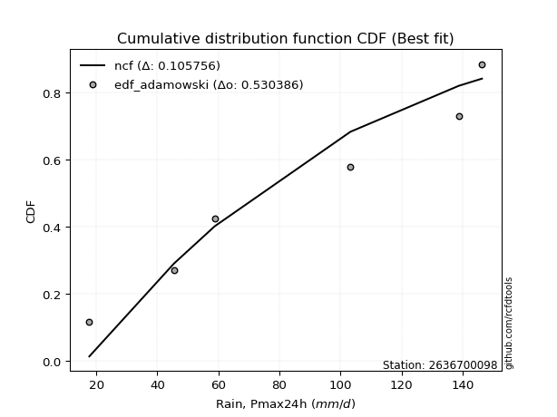</img>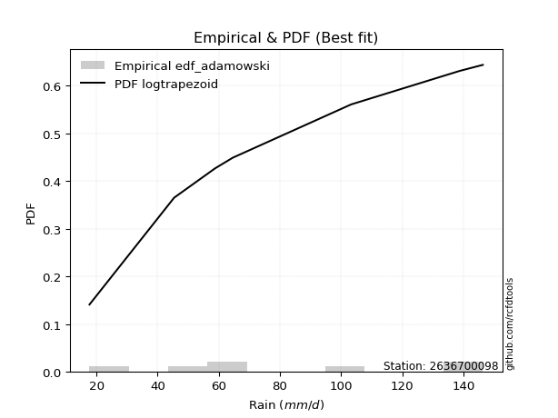</img>

</div>


## C. Best fit & Estimate extreme values for specific return periods - Tr

Best fit in probability distribution analysis means finding the theoretical distribution (like Normal, Poisson, Exponential, etc.) that most accurately mirrors your real-world data´s patterns (shape, center, spread) for better predictions, using methods like visual checks (Q-Q plots), goodness-of-fit tests (Kolmogorov-Smirnov, Chi-Squared), and information criteria (AIC) to score and select the simplest, most representative model.


### 1. Best fit (ordered by delta Δ)

:file_folder:Table: [bestfit_2636700098.csv](table/bestfit_2636700098.csv)

<div align="center">

|   id |    station | empirical_dist   | p_dist       |     delta |   deltao | eval   |   fit |   n |   best_fit |   best_fit_sort |
|-----:|-----------:|:-----------------|:-------------|----------:|---------:|:-------|------:|----:|-----------:|----------------:|
|    0 | 2636700098 | edf_adamowski    | logtrapezoid | 0.0757454 | 0.484421 | Δo > Δ |     1 |   7 |          1 |               1 |
|    1 | 2636700098 | edf_cunnane      | logtrapezoid | 0.0757454 | 0.484421 | Δo > Δ |     1 |   7 |          1 |               2 |
|    2 | 2636700098 | edf_jenkinson    | logtrapezoid | 0.0757454 | 0.484421 | Δo > Δ |     1 |   7 |          1 |               3 |
|    3 | 2636700098 | edf_filliben     | logtrapezoid | 0.0757454 | 0.484421 | Δo > Δ |     1 |   7 |          1 |               4 |
|    4 | 2636700098 | edf_gringorten   | logtrapezoid | 0.0757454 | 0.484421 | Δo > Δ |     1 |   7 |          1 |               5 |
|    5 | 2636700098 | edf_tukey        | logtrapezoid | 0.0757454 | 0.484421 | Δo > Δ |     1 |   7 |          1 |               6 |
|    6 | 2636700098 | edf_blom         | logtrapezoid | 0.0757454 | 0.484421 | Δo > Δ |     1 |   7 |          1 |               7 |
|    7 | 2636700098 | edf_chegodayev   | logtrapezoid | 0.0757454 | 0.484421 | Δo > Δ |     1 |   7 |          1 |               8 |
|    8 | 2636700098 | edf_beard        | logtrapezoid | 0.0757454 | 0.484421 | Δo > Δ |     1 |   7 |          1 |               9 |
|    9 | 2636700098 | edf_hazen        | logtrapezoid | 0.0757454 | 0.484421 | Δo > Δ |     1 |   7 |          1 |              10 |
|   10 | 2636700098 | edf_weibull      | logtrapezoid | 0.0873965 | 0.484421 | Δo > Δ |     1 |   7 |          1 |              11 |
|   11 | 2636700098 | edf_california   | beta         | 0.0875363 | 0.484421 | Δo > Δ |     1 |   7 |          1 |              12 |

</div>


### 2. Extreme values and % difference analysis

In hydrology, a return period (or recurrence interval $Tr$) is the statistical average time between extreme events like floods or droughts of a specific magnitude, indicating how rare an event is, with a 100-year flood, for example, having a 1% chance of occurring in any given year, not that it happens exactly every century. It is a key tool for infrastructure design (like bridges or dams) and risk assessment, calculated from historical data to determine the probability of future events, although it is important to remember it is statistical average, and events can cluster or be missed.

The extreme value porcentage difference is evaluated as $pdiff = 1 - (ETrBf / ETr) * 100$, where _ETrBf_ correspond to the bestfit extreme value for a specific recurrence interval and _ETr_ correspond to the extreme value for one of the most used PDFsused in hydrology.

> risk_rate: assuming the return period as the project useful life.

:file_folder:Table: [extreme_2636700098.csv](table/extreme_2636700098.csv), all PDFs.  
:file_folder:Table: [extremepdiff_2636700098.csv](table/extremepdiff_2636700098.csv), % difference between bestfit and most used PDFs in Hydrology.

<div align="center">

Extreme values table for only best fit PDFs
|   id |      tr |   prob_l |     prob_g |      alpha |   anglit |   arcsine |    argus |     beta |   betaprime |   bradford |     burr |   burr12 |   cosine |   crystalball |   dgamma |   dweibull |   erlang |   exponnorm |   exponpow |   exponweib |        f |   fatiguelife |   foldnorm |    gamma |   gausshyper |   genexpon |   genextreme |   gengamma |   genhalflogistic |   genlogistic |   gennorm |   genpareto |   gompertz |   gumbel_l |   gumbel_r |   halfgennorm |   halflogistic |   halfnorm |   hypsecant |   invgamma |   invgauss |   invweibull |   johnsonsb |   johnsonsu |   kappa3 |   kappa4 |    ksone |   kstwobign |   laplace |   levy_l |   loggamma |   logistic |   loglaplace |    lomax |   maxwell |   mielke |    moyal |   nakagami |      ncf |      nct |     norm |   pearson3 |   powerlaw |   rayleigh |    rdist |     rice |   semicircular |   skewnorm |        t |   trapezoid |   triang |   truncexpon |   truncnorm |   truncpareto |   truncweibull_min |   tukeylambda |   uniform |   vonmises |   vonmises_line |     wald |   weibull_max |   weibull_min |   wrapcauchy |   logalpha |   loganglit |   logarcsine |   logargus |   logbeta |   logbetaprime |   logbradford |   logburr |   logburr12 |   logcosine |   logcrystalball |   logdgamma |   logdweibull |   logerlang |   logexponnorm |   logexponpow |   logexponweib |     logf |   logfatiguelife |   logfoldnorm |   loggausshyper |   loggenexpon |   loggenextreme |   loggengamma |   loggenhalflogistic |   loggenlogistic |   loggennorm |   loggenpareto |   loggompertz |   loggumbel_l |   loggumbel_r |   loghalfgennorm |   loghalflogistic |   loghalfnorm |   loghypsecant |   loginvgamma |   loginvgauss |   loginvweibull |   logjohnsonsb |   logjohnsonsu |   logkappa3 |   logkappa4 |   logksone |   logkstwobign |   loglevy_l |   logloggamma |   loglogistic |   logloglaplace |         loglomax |   logmaxwell |   logmielke |   logmoyal |   lognakagami |   logncf |   lognct |   lognorm |   logpearson3 |   logpowerlaw |   lograyleigh |   logrdist |   logrice |   logsemicircular |   logskewnorm |     logt |   logtrapezoid |   logtriang |   logtruncexpon |   logtruncnorm |   logtruncpareto |   logtruncweibull_min |   logtukeylambda |   loguniform |   logvonmises |   logvonmises_line |    logwald |   logweibull_max |   logweibull_min |   logwrapcauchy |    station |   n |   risk_rate |
|-----:|--------:|---------:|-----------:|-----------:|---------:|----------:|---------:|---------:|------------:|-----------:|---------:|---------:|---------:|--------------:|---------:|-----------:|---------:|------------:|-----------:|------------:|---------:|--------------:|-----------:|---------:|-------------:|-----------:|-------------:|-----------:|------------------:|--------------:|----------:|------------:|-----------:|-----------:|-----------:|--------------:|---------------:|-----------:|------------:|-----------:|-----------:|-------------:|------------:|------------:|---------:|---------:|---------:|------------:|----------:|---------:|-----------:|-----------:|-------------:|---------:|----------:|---------:|---------:|-----------:|---------:|---------:|---------:|-----------:|-----------:|-----------:|---------:|---------:|---------------:|-----------:|---------:|------------:|---------:|-------------:|------------:|--------------:|-------------------:|--------------:|----------:|-----------:|----------------:|---------:|--------------:|--------------:|-------------:|-----------:|------------:|-------------:|-----------:|----------:|---------------:|--------------:|----------:|------------:|------------:|-----------------:|------------:|--------------:|------------:|---------------:|--------------:|---------------:|---------:|-----------------:|--------------:|----------------:|--------------:|----------------:|--------------:|---------------------:|-----------------:|-------------:|---------------:|--------------:|--------------:|--------------:|-----------------:|------------------:|--------------:|---------------:|--------------:|--------------:|----------------:|---------------:|---------------:|------------:|------------:|-----------:|---------------:|------------:|--------------:|--------------:|----------------:|-----------------:|-------------:|------------:|-----------:|--------------:|---------:|---------:|----------:|--------------:|--------------:|--------------:|-----------:|----------:|------------------:|--------------:|---------:|---------------:|------------:|----------------:|---------------:|-----------------:|----------------------:|-----------------:|-------------:|--------------:|-------------------:|-----------:|-----------------:|-----------------:|----------------:|-----------:|----:|------------:|
|    0 |    2    | 0.5      | 0.5        |    59.3462 |  82.1429 |   82.1429 |  89.4622 |  67.4699 |     73.7936 |    69.2663 |  84.8374 |  45.0116 |  83.0892 |       56.394  |  85.7806 |    86.8614 |  72.2954 |     82.1016 |    21.9341 |     74.3674 |  71.2669 |       17.7001 |    81.3233 |  75.1387 |      75.57   |    64.3909 |      91.8573 |    75.6504 |           103.351 |       74.2751 |     82.05 |     103.386 |    88.4051 |    89.5271 |    74.7586 |       49.1085 |        71.0876 |    72.942  |     82.1429 |    76.8938 |    75.0609 |      74.0495 |     146.223 |     82.1422 |  84.6912 |  79.3002 |  82.1429 |     73.7847 |   82.1429 |  108.927 |    66.2427 |    82.1429 |      67.5343 |  63.2217 |   78.2986 |   17.7   |  72.3747 |    74.5385 |  55.4696 |  82.1417 |  82.1429 |    80.7139 |    19.6551 |    76.9352 |  5.95281 |  78.5184 |        82.1429 |    72.4589 |  82.1391 |     114.036 |  99.6158 |      67.2605 |     101.051 |       18.5343 |            64.7202 |       81.3812 |   82.05   |    1.74897 |         82.05   |  67.5726 |       146.042 |       72.8634 |       82.05  |    64.1766 |     67.5343 |      67.5342 |    79.6031 |   73.3749 |        67.3061 |       50.7452 |   85.8335 |     76.3801 |     62.4356 |          67.5343 |     80.1822 |       77.7631 |     65.8915 |        67.5349 |       28.7456 |        18.3174 |  67.6411 |          67.7142 |       67.6408 |         72.4707 |       57.0037 |         99.2851 |       36.8406 |              76.6022 |              inf |      50.9046 |        57.9206 |       72.4396 |       75.5597 |       60.3612 |          17.6999 |           57.0836 |       58.7156 |        67.5343 |       65.7876 |       64.1956 |         61.5042 |        101.293 |        146.373 |     17.7    |     52.1701 |    50.9046 |        57.5446 |     105.349 |       85.3729 |       67.5343 |         64.6    |    137.656       |      63.6996 |     74.5321 |    58.2123 |       61.556  |  67.0969 |  67.4369 |   67.5343 |       73.053  |       18.575  |       62.3924 |    40.6057 |   66.5237 |           67.5343 |       72.9665 |  67.5341 |        75.9371 |     69.5754 |         40.8636 |        61.7852 |          18.0174 |               44.4371 |          50.9049 |      50.9046 |      0.13144  |            80.524  |    54.1139 |          127.165 |          76.1935 |         50.9046 | 2636700098 |   7 |    0.75     |
|    1 |    2.33 | 0.570815 | 0.429185   |    70.635  |  91.4858 |   96.1682 |  97.6381 |  80.2949 |     82.0602 |    78.3966 |  94.4018 |  55.2376 |  91.1754 |       73.0052 | 107.302  |   108.631  |  80.6626 |     90.1217 |    27.3965 |     82.5446 |  79.9762 |       18.967  |    89.6405 |  83.302  |      85.3349 |    74.6783 |     104.027  |    83.7709 |           111.708 |       82.4067 |     82.05 |     113.636 |    96.7834 |    96.5054 |    82.191  |       59.8997 |        78.7292 |    81.5988 |     88.562  |    84.9395 |    83.2373 |      82.1676 |     146.372 |     90.0661 |  94.1792 |  88.8366 |  93.1691 |     82.086  |   86.9968 |  120.342 |    75.0532 |    89.2099 |      72.7076 |  73.2571 |   86.6319 |   17.7   |  79.4104 |    85.2426 |  67.8946 |  90.1627 |  90.1638 |    88.7662 |    22.0518 |    85.3917 | 17.4748  |  86.7425 |        92.1634 |    81.2141 |  90.1604 |     121.513 | 107.606  |      76.0198 |     107.23  |       19.1118 |            73.5217 |       90.8186 |   91.1639 |    1.93049 |         91.1539 |  72.8321 |       146.256 |       81.527  |       97.695 |    72.9357 |     77.8442 |      83.5889 |    88.5165 |   83.4659 |        76.0554 |       58.9613 |   95.3044 |     84.8212 |     71.14   |          76.2949 |    100.586  |       93.9718 |     74.6641 |        76.2956 |       33.1334 |        19.0703 |  76.4431 |          76.486  |       76.1835 |         86.4446 |       66.635  |        108.494  |       43.56   |              86.7918 |              inf |      50.9046 |        77.2118 |       81.1041 |       84.0187 |       67.5837 |          17.6999 |           64.1178 |       66.9773 |        74.459  |       74.5612 |       73.2818 |         71.8628 |        139.423 |        146.393 |     17.7    |     60.8127 |    60.9159 |        67.4646 |     116.485 |       94.6443 |       75.1962 |         70.3938 |    216.307       |      72.3053 |     83.8878 |    64.7857 |       67.3824 |  75.8772 |  76.231  |   76.2949 |       82.0868 |       19.5488 |       70.9545 |    53.5581 |   75.3962 |           78.6503 |       81.5427 |  76.2947 |        87.3834 |     78.6802 |         47.2537 |        65.7432 |          18.2315 |               51.304  |          59.3887 |      59.1201 |      0.147383 |            89.9571 |    58.6193 |          139.655 |          84.6654 |         66.7723 | 2636700098 |   7 |    0.729209 |
|    2 |    5    | 0.8      | 0.2        |   158.17   | 124.45   |  133.569  | 123.864  | 121.194  |    117.421  |   111.782  | 123.919  | inf      | 120.315  |      134.737  | 128.78   |   131.966  | 117.119  |    119.951  |   129.288  |    118.2    | 118.887  |       45.877  |   120.556  | 117.844  |     118.564  |   126.113  |     132.25   |   117.53   |           133.336 |      117.725  |     82.05 |     137.998 |   124.191  |   119.05   |   114.48   |      133.148  |       113.306  |   118.207  |    114.311  |   118.045  |   117.901  |     117.439  |     146.4   |    119.513  | 124.886  | 120.038  | 128.854  |    117.348  |  111.265  |  139.254 |   120.301  |   116.497  |     105.16   | 123.457  |  119.431  |   17.7   | 112      |   140.229  | 131.333  | 119.971  | 119.972  |   119.495  |    51.1337 |   119.247  | 50.3213  | 119.218  |       126.359  |   118.234  | 119.97   |     142.965 | 130.531  |     109.035  |     126.916 |       28.2278 |           107.301  |      121.143  |  120.66   |    2.63755 |        120.638  | 102.274  |       146.397 |      118.538  |      130.487 |   119.736  |    128.506  |     147.62   |   119.159  |  118.195  |       119.9    |       95.827  |  124.496  |    119.02   |    113.861  |         120.047  |    144.518  |      142.146  |    119.827  |       120.048  |       67.4166 |        32.2489 | 120.475  |         120.343  |      118.527  |        130.295  |      125.289  |        132.847  |      102.193  |             120.059  |              inf |      50.9046 |       132.461  |      118.275  |      118.375  |      110.429  |          17.6999 |          108.476  |      116.871  |       110.145  |      120.082  |      122.661  |        141.314  |        146.398 |        146.4   |     96.3706 |     98.9447 |   108.913  |       132.58   |     137.583 |      123.082  |      113.868  |        111.139  |   2072.05        |     119.063  |    116.599  |   106.342  |      103.737  | 120.092  | 120.321  |  120.047  |      121.321  |       33.0954 |      118.731  |   113.2    |  120.564  |          132.292  |      112.707  | 120.046  |       130.726  |    111.968  |         81.0283 |        86.5618 |          21.6767 |               85.6612 |          97.3762 |      95.9461 |      0.227389 |           138.856  |    91.7207 |          146.34  |         119.022  |        114.34   | 2636700098 |   7 |    0.67232  |
|    3 |   10    | 0.9      | 0.1        |   318.993  | 143.108  |  142.598  | 136.51   | 136.4    |    145.113  |   128.395  | 136.253  | inf      | 137.92   |      175.688  | 141.715  |   143.575  | 146.212  |    139.764  |   387.567  |    147.372  | 150.737  |       83.0328 |   141.066  | 144.575  |     133.261  |   172.804  |     140.609  |   143.213  |           140.594 |      146.484  |     82.05 |     143.957 |   139.606  |   131.601  |   140.78   |      227.66   |       142.021  |   145.296  |    134.872  |   143.17   |   144.979  |     146.172  |     146.4   |    139.048  | 138.284  | 133.616  | 144.424  |    144.196  |  133.296  |  143.82  |   165.629  |   136.592  |     147.008  | 169.063  |  142.513  |   17.7   | 140.375  |   185.911  | 194.614  | 139.745  | 139.746  |   140.586  |    85.8045 |   143.386  | 60.0422  | 141.96   |       143.906  |   145.628  | 139.744  |     151.345 | 139.485  |     126.429  |     136.117 |       50.0601 |           125.403  |      134.089  |  133.53   |    3.17897 |        133.516  | 133.52   |       146.4   |      146.9    |      138.984 |   169.509  |    170.665  |     169.346  |   134.862  |  133.421  |       162.312  |      118.446  |  136.684  |    143.733  |    151.28   |         162.159  |    184.15   |      185.298  |    165.232  |       162.16   |      123.063  |        75.8713 | 162.938  |         162.632  |      158.911  |        142.281  |      197.241  |        140.827  |      225.061  |             133.974  |              inf |      50.9046 |       143.707  |      146.766  |      143.268  |      164.728  |          17.6999 |          167.87   |      176.449  |       150.575  |      166.41   |      176.26   |        245.123  |        146.4   |        146.4   |    119.108  |    121.335  |   140.343  |       221.75   |     143.225 |      134.899  |      154.566  |        175.489  |  16114.8         |     169.128  |    132.13   |   163.716  |      146.247  | 163.153  | 162.989  |  162.159  |      151.739  |       58.152  |      171.39   |   136.656  |  165.039  |          172.747  |      128.588  | 162.158  |       153      |    128.513  |        107.012  |       105.002  |          31.763  |              110.517  |         120.138  |     118.518  |      0.308705 |           192.159  |   147.503  |          146.399 |         143.874  |        130.539  | 2636700098 |   7 |    0.651322 |
|    4 |   15    | 0.933333 | 0.0666667  |   479.243  | 151.076  |  144.32   | 141.318  | 140.624  |    160.252  |   134.236  | 140.304  | inf      | 145.94   |      196.124  | 148.391  |   149      | 162.262  |    149.66   |   630.431  |    163.877  | 168.523  |      107.333  |   151.3    | 159.098  |     138.002  |   200.116  |     142.901  |   157.064  |           142.731 |      162.709  |     82.05 |     145.214 |   146.612  |   137.285  |   155.618  |      295.602  |       158.27   |   159.393  |    146.606  |   156.784  |   159.819  |     162.384  |     146.4   |    148.796  | 142.75   | 138.089  | 149.615  |    158.449  |  146.182  |  145.2   |   194.677  |   147.542  |     178.833  | 195.757  |  154.356  |   17.7   | 156.842  |   210.317  | 235.297  | 149.613  | 149.614  |   151.324  |   102.536  |   155.824  | 62.2819  | 153.557  |       150.748  |   159.883  | 149.612  |     154.033 | 142.358  |     132.763  |     139.388 |       67.239  |           132.04   |      138.316  |  137.82   |    3.48539 |        137.811  | 153.584  |       146.4   |      162.076  |      141.518 |   202.829  |    192.647  |     173.839  |   140.965  |  138.239  |       188.845  |      127.115  |  140.686  |    156.557  |    172.185  |         188.411  |    209.616  |      212.251  |    194.403  |       188.413  |      170.928  |       138.351  | 189.443  |         189.031  |      183.95   |        144.585  |      249.371  |        143.053  |      358.972  |             138.393  |              inf |      50.9046 |       145.389  |      161.989  |      156.203  |      206.423  |          17.6999 |          214.927  |      218.637  |       179.989  |      196.447  |      212.577  |        334.455  |        146.4   |        146.4   |    127.822  |    129.575  |   152.719  |       291.377  |     144.975 |      138.772  |      182.567  |        233.929  |  53496.1         |     202.502  |    137.486  |   210.302  |      175.397  | 190.217  | 189.687  |  188.411  |      167.967  |       75.4855 |      207.075  |   141.851  |  193.146  |          191.69   |      134.287  | 188.41   |       160.922  |    134.323  |        118.285  |       114.508  |          42.2911 |              120.979  |         128.627  |     127.166  |      0.363284 |           226.672  |   200.124  |          146.4   |         156.776  |        135.763  | 2636700098 |   7 |    0.644736 |
|    5 |   20    | 0.95     | 0.05       |   639.351  | 155.762  |  144.926  | 143.957  | 142.495  |    170.654  |   137.216  | 142.318  | inf      | 150.872  |      209.507  | 152.882  |   152.465  | 173.339  |    156.144  |   846.916  |    175.451  | 180.872  |      125.325  |   158.003  | 169.045  |     140.3    |   219.495  |     143.942  |   166.518  |           143.74  |      174.069  |     82.05 |     145.69  |   150.979  |   140.824  |   166.007  |      349.601  |       169.656  |   168.792  |    154.884  |   166.12   |   170.04   |     173.735  |     146.4   |    155.18   | 144.983  | 140.305  | 152.21   |    168.05   |  155.326  |  145.906 |   216.567  |   155.109  |     205.509  | 214.704  |  162.216  |   17.7   | 168.504  |   226.703  | 266.099  | 156.076  | 156.076  |   158.433  |   112.11   |   164.091  | 63.1674  | 161.223  |       154.543  |   169.388  | 156.074  |     155.359 | 143.776  |     136.046  |     141.075 |       79.7261 |           135.487  |      140.401  |  139.965  |    3.69843 |        139.958  | 168.536  |       146.4   |      172.36   |      142.755 |   228.638  |    206.878  |     175.449  |   144.343  |  140.543  |       208.548  |      131.685  |  142.676  |    165.111  |    186.451  |         207.866  |    229.012  |      232.359  |    216.42   |       207.867  |      213.637  |       217.932  | 209.099  |         208.611  |      202.447  |        145.389  |      291.493  |        144.062  |      500.896  |             140.536  |              inf |      50.9046 |       145.896  |      172.293  |      164.838  |      241.751  |          17.6999 |          255.553  |      252.231  |       204.133  |      219.249  |      240.893  |        415.747  |        146.4   |        146.4   |    132.416  |    133.809  |   159.31   |       350.221  |     145.879 |      140.697  |      204.833  |        289.627  | 125328           |     228.211  |    140.199  |   251.109  |      198.102  | 210.371  | 209.516  |  207.865  |      178.897  |       87.4343 |      234.814  |   143.772  |  214.136  |          203.079  |      137.223  | 207.864  |       164.98   |    137.285  |        124.554  |       120.402  |          51.8138 |              126.725  |         133.021  |     131.723  |      0.406331 |           250.723  |   251.209  |          146.4   |         165.384  |        138.383  | 2636700098 |   7 |    0.641514 |
|    6 |   25    | 0.96     | 0.04       |   799.403  | 158.939  |  145.208  | 145.659  | 143.519  |    178.561  |   139.023  | 143.524  | inf      | 154.33   |      219.358  | 156.255  |   154.98   | 181.782  |    160.918  |  1040.64   |    184.375  | 190.32   |      139.62   |   162.937  | 176.59   |     141.644  |   234.526  |     144.527  |   173.675  |           144.324 |      182.819  |     82.05 |     145.923 |   154.089  |   143.341  |   174.009  |      394.848  |       178.427  |   175.785  |    161.29   |   173.216  |   177.824  |     182.48   |     146.4   |    159.879  | 146.323  | 141.625  | 153.767  |    175.241  |  162.418  |  146.349 |   234.327  |   160.898  |     228.912  | 229.404  |  168.052  |   17.7   | 177.544  |   238.93   | 291.204  | 160.833  | 160.833  |   163.705  |   118.274  |   170.233  | 63.6142  | 166.899  |       157.006  |   176.459  | 160.831  |     156.15  | 144.62   |     138.054  |     142.107 |       88.9783 |           137.599  |      141.641  |  141.252  |    3.8582  |        141.246  | 180.512  |       146.4   |      180.099  |      143.49  |   250.004  |    217.115  |     176.202  |   146.532  |  141.876  |       224.366  |      134.505  |  143.867  |    171.482  |    197.155  |         223.459  |    244.911  |      248.58   |    234.302  |       223.461  |      252.604  |       313.663  | 224.863  |         224.314  |      217.243  |        145.758  |      327.362  |        144.628  |      649.241  |             141.794  |              inf |      50.9046 |       146.107  |      180.041  |      171.271  |      273.033  |          17.6999 |          292.02   |      280.533  |       225.02   |      237.848  |      264.44   |        491.6    |        146.4   |        146.4   |    135.25   |    136.374  |   163.401  |       401.958  |     146.449 |      141.848  |      223.683  |        343.776  | 242565           |     249.386  |    141.837  |   288.112  |      216.918  | 226.582  | 225.435  |  223.459  |      187.07   |       96.0376 |      257.803  |   144.687  |  231.049  |          210.826  |      139.013  | 223.457  |       167.446  |    139.081  |        128.542  |       124.437  |          60.0974 |              130.354  |         135.698  |     134.536  |      0.442761 |           268.166  |   301.385  |          146.4   |         171.797  |        139.964  | 2636700098 |   7 |    0.639603 |
|    7 |   50    | 0.98     | 0.02       |  1599.41   | 166.757  |  145.583  | 149.517  | 145.283  |    202.392  |   142.682  | 145.94   | inf      | 163.386  |      247.569  | 166.26   |   162.038  | 207.338  |    174.6    |  1787.32   |    211.917  | 219.085  |      185.485  |   177.066  | 199.255  |     144.212  |   281.217  |     145.589  |   195.115  |           145.432 |      209.773  |     82.05 |     146.261 |   162.542  |   150.176  |   198.66   |      554.527  |       205.454  |   196.111  |    181.153  |   194.646  |   201.374  |     209.419  |     146.4   |    173.336  | 149.003  | 144.231  | 156.881  |    196.36   |  184.448  |  147.348 |   294.173  |   178.586  |     320.006  | 275.091  |  184.975  |  143.542 | 205.606  |   274.543  | 376.736  | 174.456  | 174.455  |   178.987  |   131.614  |   188.063  | 64.2918  | 183.283  |       162.63   |   197.014  | 174.454  |     157.718 | 146.296  |     142.162  |     144.218 |      112.782  |           141.927  |      144.08   |  143.826  |    4.28798 |        143.823  | 219.615  |       146.4   |      203.016  |      144.949 |   324.716  |    244.526  |     177.212  |   151.523  |  144.379  |       276.681  |      140.328  |  146.265  |    190.045  |    228.186  |         274.89   |    299.711  |      302.804  |    294.683  |       274.892  |      413.327  |      1014.93   | 276.901  |         276.168  |      265.869  |        146.244  |      458.661  |        145.648  |     1460.5    |             144.222  |              inf |      50.9046 |       146.346  |      202.954  |      190.03   |      397.205  |          17.6999 |          440.46   |      382.145  |       304.366  |      301.145  |      347.384  |        823.801  |        146.4   |        146.4   |    141.104  |    141.512  |   171.9    |       602.415  |     147.742 |      144.143  |      292.715  |        605.535  |      1.88648e+06 |     322.578  |    145.139  |   441.457  |      282.484  | 280.387  | 278.089  |  274.89   |      210.93   |      117.445  |      338.095  |   145.95   |  287.339  |          229.652  |      142.66   | 274.888  |       172.449  |    142.715  |        137.074  |       133.996  |          87.4122 |              138.055  |         141.106  |     140.343  |      0.578559 |           311.314  |   546.183  |          146.4   |         190.485  |        143.155  | 2636700098 |   7 |    0.63583  |
|    8 |   75    | 0.986667 | 0.0133333  |  2399.31   | 170.198  |  145.653  | 151.048  | 145.758  |    215.916  |   143.915  | 146.774  | inf      | 167.711  |      262.706  | 171.854  |   165.753  | 221.902  |    181.948  |  2325.06   |    227.958  | 235.577  |      213.107  |   184.647  | 212.071  |     145.013  |   308.529  |     145.902  |   207.207  |           145.779 |      225.439  |     82.05 |     146.333 |   166.821  |   153.632  |   212.989  |      661.647  |       221.165  |   207.176  |    192.76   |   206.865  |   214.801  |     225.079  |     146.4   |    180.557  | 149.897  | 145.084  | 157.919  |    207.979  |  197.335  |  147.758 |   332.715  |   188.802  |     389.282  | 301.832  |  194.176  |  144.631 | 222.017  |   293.935  | 432.69   | 181.765  | 181.764  |   187.3    |   136.376  |   197.763  | 64.444   | 192.143  |       164.877  |   208.203  | 181.763  |     158.237 | 146.85   |     143.56   |     144.937 |      122.7    |           143.402  |      144.875  |  144.684  |    4.47218 |        144.682  | 243.676  |       146.4   |      215.755  |      145.433 |   374.953  |    257.661  |     177.399  |   153.514  |  145.141  |       309.656  |      142.324  |  147.109  |    200.185  |    244.683  |         307.206  |    336.084  |      337.477  |    333.66   |       307.208  |      541.538  |      2055.51   | 309.631  |         308.792  |      296.303  |        146.332  |      551.139  |        145.943  |     2354.08   |             144.994  |              inf |      50.9046 |       146.38   |      215.669  |      200.284  |      493.901  |          17.6999 |          559.325  |      452.173  |       363.122  |      342.381  |      403.58   |       1112.09   |        146.4   |        146.4   |    143.11   |    143.205  |   174.83   |       752.616  |     148.276 |      144.906  |      341.91   |        864.673  |      6.26252e+06 |     371.02   |    146.251  |   566.584  |      326.168  | 314.439  | 311.28   |  307.205  |      223.91   |      126.12   |      391.831  |   146.195  |  323.059  |          237.634  |      143.896  | 307.203  |       174.139  |    143.938  |        140.095  |       137.748  |         101.926  |              140.762  |         142.908  |     142.333  |      0.680083 |           328.357  |   787.469  |          146.4   |         200.696  |        144.23   | 2636700098 |   7 |    0.634587 |
|    9 |  100    | 0.99     | 0.01       |  3199.18   | 172.244  |  145.677  | 151.902  | 145.967  |    225.358  |   144.534  | 147.22   | inf      | 170.422  |      272.944  | 175.733  |   168.242  | 232.094  |    186.919  |  2750.94   |    239.325  | 247.155  |      232.982  |   189.775  | 221.002  |     145.396  |   327.908  |     146.047  |   215.623  |           145.946 |      236.527  |     82.05 |     146.36  |   169.622  |   155.893  |   223.13   |      743.931  |       232.285  |   214.713  |    200.994  |   215.432  |   224.204  |     236.162  |     146.4   |    185.441  | 150.348  | 145.505  | 158.438  |    215.94   |  206.479  |  147.997 |   361.761  |   196.015  |     447.35   | 320.812  |  200.443  |  145.176 | 233.659  |   307.136  | 475.351  | 186.709  | 186.707  |   192.968  |   138.819  |   204.372  | 64.5038  | 198.16   |       166.135  |   215.825  | 186.707  |     158.496 | 147.127  |     144.265  |     145.299 |      128.11   |           144.145  |      145.268  |  145.113  |    4.57179 |        145.112  | 261.22   |       146.4   |      224.539  |      145.675 |   413.868  |    265.804  |     177.465  |   154.628  |  145.5    |       334.178  |      143.333  |  147.57   |    207.109  |    255.626  |         331.19   |    364.078  |      363.517  |    363.076  |       331.192  |      651.243  |      3407.89   | 333.939  |         333.026  |      318.839  |        146.362  |      624.65   |        146.079  |     3307.21   |             145.369  |              inf |      50.9046 |       146.39   |      224.428  |      207.289  |      576.252  |          17.6999 |          662.372  |      507.093  |       411.556  |      373.686  |      447.295  |       1375.24   |        146.4   |        146.4   |    144.124  |    144.04   |   176.314  |       876.623  |     148.589 |      145.287  |      381.544  |       1126.69   |      1.46715e+07 |     408.118  |    146.814  |   676.321  |      359.72   | 339.824  | 335.964  |  331.19   |      232.721  |      130.801  |      433.254  |   146.282  |  349.728  |          242.225  |      144.518  | 331.187  |       174.987  |    144.553  |        141.64   |       139.756  |         110.773  |              142.143  |         143.804  |     143.339  |      0.766123 |           337.379  |  1028.21   |          146.4   |         207.669  |        144.77   | 2636700098 |   7 |    0.633968 |
|   10 |  200    | 0.995    | 0.005      |  6398.59   | 176.11   |  145.701  | 153.387  | 146.233  |    247.67   |   145.465  | 148.018  | inf      | 175.934  |      296.167  | 184.823  |   173.822  | 256.245  |    198.205  |  3924.09   |    266.696  | 274.698  |      281.632  |   201.405  | 242.051  |     145.94   |   374.599  |     146.246  |   235.435  |           146.187 |      263.184  |     82.05 |     146.388 |   175.713  |   160.807  |   247.51   |      964.078  |       259.018  |   231.953  |    220.83   |   235.823  |   246.518  |     262.811  |     146.4   |    196.519  | 151.058  | 146.128  | 159.216  |    234.276  |  228.509  |  148.452 |   437.956  |   213.317  |     625.371  | 366.568  |  214.781  |  145.994 | 261.71   |   337.284  | 589.391  | 197.924  | 197.921  |   205.959  |   142.562  |   219.492  | 64.57    | 211.871  |       168.329  |   233.259  | 197.921  |     158.883 | 147.541  |     145.328  |     145.847 |      136.846  |           145.268  |      145.847  |  145.757  |    4.72859 |        145.756  | 304.918  |       146.4   |      244.947  |      146.038 |   520.09   |    281.896  |     177.529  |   156.569  |  146      |       397.308  |      144.86   |  148.418  |    222.997  |    279.409  |         392.765  |    439.931  |      431.562  |    440.399  |       392.768  |      993.325  |     11631.1    | 396.397  |         395.316  |      376.516  |        146.391  |      832.026  |        146.263  |     7531.78   |             145.912  |              inf |      50.9046 |       146.398  |      244.749  |      223.371  |      834.872  |          17.6999 |          994.617  |      659.093  |       556.452  |      456.677  |      567.264  |       2291.5    |        146.4   |        146.4   |    145.659  |    145.266  |   178.563  |      1245.6    |     149.185 |      145.857  |      496.372  |       2226.29   |      1.14103e+08 |     507.546  |    147.717  |  1036.1    |      449.9    | 405.405  | 399.513  |  392.765  |      252.689  |      138.294  |      545.259  |   146.369  |  418.743  |          250.441  |      145.456  | 392.762  |       176.265  |    145.477  |        144.004  |       142.953  |         126.616  |              144.25   |         145.132  |     144.862  |      1.04178  |           351.514  |  1998.26   |          146.4   |         223.672  |        145.583  | 2636700098 |   7 |    0.633042 |
|   11 |  250    | 0.996    | 0.004      |  7998.28   | 177.094  |  145.704  | 153.734  | 146.277  |    254.739  |   145.652  | 148.224  | inf      | 177.445  |      303.264  | 187.684  |   175.512  | 263.913  |    201.657  |  4344.71   |    275.508  | 283.473  |      297.487  |   204.96   | 248.704  |     146.042  |   389.63   |     146.282  |   241.692  |           146.233 |      271.754  |     82.05 |     146.392 |   177.507  |   162.252  |   255.347  |     1041.66   |       267.613  |   237.256  |    227.216  |   242.332  |   253.614  |     271.379  |     146.4   |    199.904  | 151.217  | 146.251  | 159.372  |    239.95   |  235.601  |  148.57  |   464.463  |   218.871  |     696.586  | 381.305  |  219.194  |  146.158 | 270.74   |   346.544  | 629.814  | 201.351  | 201.348  |   209.967  |   143.321  |   224.147  | 64.5793  | 216.077  |       168.844  |   238.622  | 201.348  |     158.961 | 147.624  |     145.542  |     145.957 |      138.689  |           145.493  |      145.961  |  145.885  |    4.76073 |        145.885  | 319.375  |       146.4   |      251.313  |      146.11  |   558.404  |    286.145  |     177.536  |   157.024  |  146.092  |       418.903  |      145.167  |  148.643  |    227.9    |    286.307  |         413.775  |    467.146  |      455.168  |    467.349  |       413.778  |     1130.95   |     17296.7    | 417.724  |         416.593  |      396.143  |        146.394  |      908.829  |        146.296  |     9827.5    |             146.016  |              inf |      50.9046 |       146.399  |      251.081  |      228.336  |      940.549  |          17.6999 |         1133.48   |      714.454  |       613.193  |      485.827  |      610.723  |       2700.27   |        146.4   |        146.4   |    145.968  |    145.505  |   179.017  |      1388.65   |     149.34  |      145.972  |      540.12   |       2810.37   |      2.2084e+08  |     542.78   |    147.925  |  1188.6    |      481.913  | 427.908  | 421.251  |  413.775  |      258.762  |      139.864  |      585.251  |   146.38   |  442.457  |          252.409  |      145.644  | 413.771  |       176.522  |    145.662  |        144.484  |       143.621  |         130.222  |              144.676  |         145.393  |     145.168  |      1.1571   |           354.425  |  2489.53   |          146.4   |         228.611  |        145.746  | 2636700098 |   7 |    0.632858 |
|   12 |  500    | 0.998    | 0.002      | 15996.7    | 179.533  |  145.708  | 154.533  | 146.352  |    276.396  |   146.026  | 148.785  | inf      | 181.465  |      324.31   | 196.403  |   180.481  | 287.454  |    211.899  |  5778.96   |    302.897  | 310.488  |      347.225  |   215.5    | 269.048  |     146.236  |   436.321  |     146.348  |   260.812  |           146.321 |      298.352  |     82.05 |     146.398 |   182.649  |   166.397  |   279.674  |     1303.98   |       294.288  |   253.069  |    247.05   |   262.447  |   275.439  |     297.974  |     146.4   |    209.944  | 151.605  | 146.492  | 159.683  |    256.955  |  257.631  |  148.875 |   553.426  |   236.098  |     973.789  | 427.107  |  232.365  |  146.486 | 298.79   |   374.099  | 768.383  | 211.514  | 211.51   |   221.955  |   144.853  |   238.035  | 64.5936  | 228.587  |       170.029  |   254.612  | 211.511  |     159.115 | 147.789  |     145.97   |     146.178 |      142.475  |           145.946  |      146.185  |  146.143  |    4.82547 |        146.142  | 365.342  |       146.4   |      270.534  |      146.255 |   691.922  |    296.959  |     177.547  |   158.071  |  146.263  |       490.155  |      145.784  |  149.265  |    242.562  |    305.503  |         482.923  |    561.596  |      534.22   |    557.966  |       482.925  |     1663.55   |     59454.1    | 487.97   |         486.696  |      460.568  |        146.399  |     1182.9    |        146.355  |    22527.7    |             146.218  |              inf |      50.9046 |       146.4    |      270.176  |      243.19   |     1361.57   |          17.6999 |         1700.54   |      908.679  |       829.06   |      584.634  |      762.745  |       4494.35   |        146.4   |        146.4   |    146.589  |    145.971  |   179.927  |      1923.48   |     149.742 |      146.2    |      701.87   |       6066.95   |      1.71752e+09 |     663.136  |    148.44   |  1820.88   |      591.374  | 502.392  | 492.977  |  482.922  |      276.604  |      143.08   |      722.868  |   146.395  |  521.037  |          256.998  |      146.022  | 482.918  |       177.035  |    146.033  |        145.449  |       144.989  |         137.94   |              145.535  |         145.909  |     145.783  |      1.60597  |           360.327  |  5008.07   |          146.4   |         243.384  |        146.073  | 2636700098 |   7 |    0.632489 |
|   13 |  750    | 0.998667 | 0.00133333 | 23995.1    | 180.613  |  145.708  | 154.854  | 146.373  |    288.879  |   146.15   | 149.079  | inf      | 183.414  |      336.002  | 201.402  |   183.218  | 301.051  |    217.593  |  6704.12   |    318.934  | 326.142  |      376.612  |   221.356  | 280.749  |     146.296  |   463.633  |     146.368  |   271.805  |           146.349 |      313.902  |     82.05 |     146.399 |   185.399  |   168.612  |   293.896  |     1472.69   |       309.882  |   261.903  |    258.652  |   274.17   |   288.075  |     313.523  |     146.4   |    215.52   | 151.787  | 146.571  | 159.787  |    266.509  |  270.518  |  149.02  |   610.399  |   246.162  |    1184.6    | 453.915  |  239.731  |  146.595 | 315.198  |   389.459  | 859.508  | 217.16   | 217.156  |   228.682  |   145.367  |   245.801  | 64.5967  | 235.56   |       170.506  |   263.546  | 217.156  |     159.167 | 147.844  |     146.113  |     146.252 |      143.767  |           146.097  |      146.259  |  146.228  |    4.84714 |        146.228  | 392.903  |       146.4   |      281.427  |      146.303 |   781.293  |    301.876  |     177.548  |   158.492  |  146.315  |       534.892  |      145.99   |  149.596  |    250.781  |    315.264  |         526.211  |    624.59   |      584.749  |    616.125  |       526.214  |     2061.97   |    122469      | 531.984  |         530.64   |      500.782  |        146.399  |     1370.84   |        146.373  |    36673.5    |             146.283  |              inf |      50.9046 |       146.4    |      280.984  |      251.521  |     1690.28   |          17.6999 |         2155.64   |     1039.33   |       989.028  |      648.654  |      864.887  |       6053.62   |        146.4   |        146.4   |    146.803  |    146.121  |   180.231  |      2309.8    |     149.933 |      146.276  |      817.943  |       9846.32   |      5.70164e+09 |     741.737  |    148.687  |  2336.91   |      662.898  | 549.329  | 538.012  |  526.21   |      286.367  |      144.175  |      813.479  |   146.398  |  570.61   |          258.868  |      146.148  | 526.205  |       177.206  |    146.157  |        145.773  |       145.455  |         140.673  |              145.822  |         146.078  |     145.988  |      1.90576  |           362.318  |  7615.06   |          146.4   |         251.667  |        146.182  | 2636700098 |   7 |    0.632366 |
|   14 | 1000    | 0.999    | 0.001      | 31993.6    | 181.257  |  145.708  | 155.034  | 146.382  |    297.664  |   146.213  | 149.279  | inf      | 184.643  |      344.051  | 204.909  |   185.093  | 310.631  |    221.516  |  7397.52   |    330.32   | 337.189  |      397.575  |   225.387  | 288.972  |     146.325  |   483.012  |     146.377  |   279.528  |           146.363 |      324.932  |     82.05 |     146.399 |   187.25   |   170.103  |   303.984  |     1599.36   |       320.944  |   268.004  |    266.884  |   282.482  |   296.991  |     324.553  |     146.4   |    219.36   | 151.906  | 146.61   | 159.839  |    273.127  |  279.662  |  149.111 |   653.172  |   253.3    |    1361.3    | 472.943  |  244.822  |  146.65  | 326.84   |   400.052  | 929.151  | 221.047  | 221.042  |   233.341  |   145.625  |   251.167  | 64.598   | 240.369  |       170.773  |   269.715  | 221.043  |     159.193 | 147.872  |     146.185  |     146.289 |      144.42   |           146.173  |      146.295  |  146.271  |    4.85799 |        146.271  | 412.729  |       146.4   |      289.013  |      146.328 |   850.309  |    304.845  |     177.549  |   158.728  |  146.339  |       568.065  |      146.093  |  149.822  |    256.47   |    321.581  |         558.25   |    673.158  |      622.649  |    659.847  |       558.253  |     2390.43   |    204479      | 564.578  |         563.191  |      530.491  |        146.4    |     1517.94   |        146.381  |    51866.2    |             146.314  |              inf |      50.9046 |       146.4    |      288.505  |      257.288  |     1970.52   |         146.097  |         2550.53   |     1140.37   |      1120.92   |      697.074  |      943.924  |       7477.69   |        146.4   |        146.4   |    146.915  |    146.194  |   180.383  |      2622.06   |     150.053 |      146.314  |      911.714  |      14110.2    |      1.33575e+10 |     801.444  |    148.85   |  2789.49   |      717.226  | 584.212  | 571.405  |  558.249  |      293.01   |      144.727  |      882.65   |   146.399  |  607.474  |          259.925  |      146.211  | 558.244  |       177.292  |    146.219  |        145.935  |       145.689  |         142.072  |              145.966  |         146.161  |     146.091  |      2.11103  |           363.318  | 10294.2    |          146.4   |         257.399  |        146.236  | 2636700098 |   7 |    0.632305 |


</div>


<div align="center">

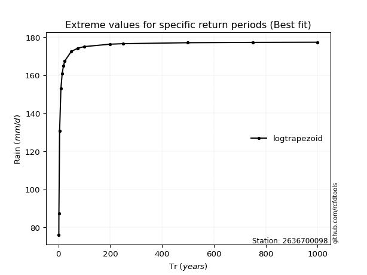</img>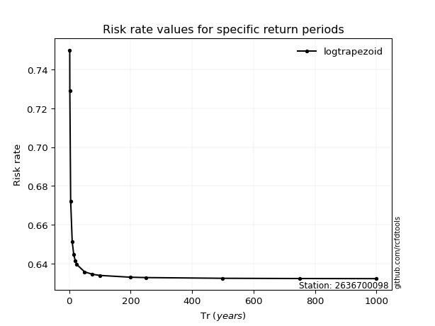</img>

</div>


<sub>**APP DISCLAIMER**: NO WARRANTY - This software is provided by [github.com/rcfdtools](https://github.com/rcfdtools) "as is", without any express or implied warranty, including warranties of merchantability, fitness for a particular purpose, or non-infringement. There is no guarantee that the software will be error-free or operate without interruption. LIMITATION OF LIABILITY - Neither the authors nor copyright holders will be liable for claims or damages arising from the software or its use. You are responsible for determining if the software is appropriate for your use and assume all associated risks, including errors, legal compliance, and data loss. NO PROFESSIONAL ADVICE - The software provides general information and does not offer professional advice. It should not replace consultation with professional advisors.</sub>