<div align="center">


</div>

# PMax24h Station (Rain): 27015280

Maximum Precipitation in 24 hours (PMax24h) is the greatest amount of rainfall for a specific duration that is meteorologically possible for a given location, acting as a "worst-case" scenario for extreme storms, crucial for designing safety-critical infrastructure like bridges, river deviations, dams, spillways, and nuclear plants to prevent catastrophic failure. The PMax24h is related with the Probable Maximum Precipitation (PMP) and it is calculated by hydrologists using meteorological data to determine the upper limit of extreme rainfall, often leading to the Probable Maximum Flood (PMF) for flood control design, and is increasingly being studied for climate change impacts. Probable Maximum Precipitation (PMP) is the theoretical upper limit of rainfall, a deterministic estimate for extreme events, while probability distributions (like GEV, Gumbel) describe the likelihood and frequency of various precipitation amounts, including rare ones, showing how often events occur, with PMP representing the extreme end of these distributions, used for critical infrastructure design to ensure safety against the worst conceivable weather, unlike standard statistical forecasts which cover typical probabilities.

The most common probability distributions in hydrology, used for analyzing floods, rainfall, and streamflow, include the Normal, Log-Normal, Gumbel, Gamma (including Log-Pearson Type III), and Generalized Extreme Value (GEV) distributions, often chosen based on the data´s skewness and whether modeling extremes or general conditions, with Gumbel and GEV popular for extreme events like floods, while the Normal distribution serves as a baseline, though often requiring transformations for skewed hydrological data. These distributions help in designing water infrastructure, managing water resources, and forecasting hydrologic events.

> Hydrological data often isn´t perfectly normal (it´s skewed), so different distributions are needed for different applications, such as: **Flood Frequency Analysis**: Using Gumbel, GEV, or Log-Pearson Type III for predicting extreme flood magnitudes and their return periods, **Rainfall Analysis**: Normal for annual totals, but Log-Normal, Weibull, or GEV for intensity or extreme daily rainfall, **Streamflow Modeling**: Gamma and Log-Normal for maximum flows, GEV for minimum flows, and Kappa for daily flows.

<div align="center">

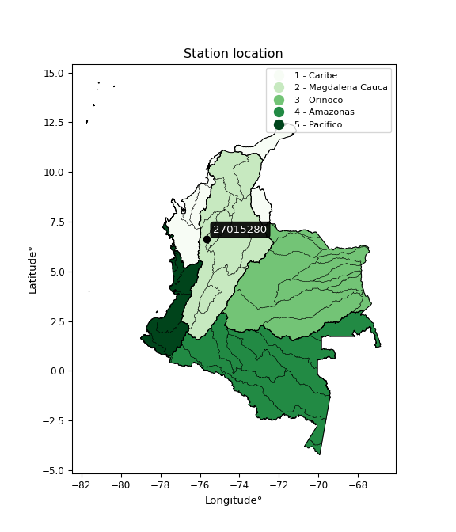</img>

</div>


## A. General information


### 1. General running parameters

• app_version: _v20260312_. • runtime: _2026-03-12 07:15:23.203550_. • Python version: _3.14.0_. • SciPy version: _1.16.3_. • Pandas version: _2.3.3_. • NumPy version: _2.3.5_. • Stations dataset (station_dataset_file): _dataset/pmax24h_in/automatic_colombia_2003_2025.csv_. • Stations catalog (station_catalog_file): _dataset/CNE.xls_. • Minimum year to eval til year_max (date_min): _1900_. • Maximum year to eval since year_min (date_max): _2025_. • Creates, save and include plots into reports (create_plot): _True_. • Plot only fit distributions with Δo > Δ (plot_only_fit): _True_. • Plot only simple graphs avoiding multiple CDFs and multiple Extreme values plots (plot_only_simple): _True_. • Eval low extreme values, if False, evaluates high extreme values (low_extreme): _False_. • Eval every SciPy distribution as logarithmic (pdist_logarithmic_on): _True_. • Standard deviation normalized (ddof): _1.0_. • Return periods to eval in years (Tr): _[2, 2.33, 5, 10, 15, 20, 25, 50, 75, 100, 200, 250, 500, 750, 1000]_. • Minimum data sample per station, 0 means any (minimum_sample): _5_. • Z-Score maximum threshold to adjust a value, 0 means disable (zscore_max): _3.5_. • Z-Score minimum threshold to adjust a value, 0 means disable (zscore_min): _-2.5_. • Avoid zeros, e.g. rain = 0 (avoid_zeros): _True_. • Avoid null values (avoid_nans): _True_. 

:file_folder:Table: [dataset.csv](../../dataset/pmax24h_in/automatic_colombia_2003_2025.csv)

> Delta Degrees of Freedom (DDOF): is a parameter used in the formulas for calculating variance and standard deviation. When ddof=0, the divisor is $N$ (the total number of observations) and this is used when your data set is the entire population. When ddof=1, the divisor is $N-1$ and this is used when your data set is a sample drawn from a larger population. Using $N-1$ provides an unbiased estimate of the population variance (known as Bessel´s correction).


### 2. Station info and location

|   id |   CODIGO | NOMBRE                    | CATEGORIA               | TECNOLOGIA                | ESTADO   | FECHA_INSTALACION   |   FECHA_SUSPENSION |   ALTITUD |   LATITUD |   LONGITUD | DEPARTAMENTO   | MUNICIPIO   | AREA_OPERATIVA                      | ENTIDAD                                                     | AREA_HIDROGRAFICA   | ZONA_HIDROGRAFICA   | SUBZONA_HIDROGRAFICA   |   CORRIENTE | Catalogo   |   Version |
|-----:|---------:|:--------------------------|:------------------------|:--------------------------|:---------|:--------------------|-------------------:|----------:|----------:|-----------:|:---------------|:------------|:------------------------------------|:------------------------------------------------------------|:--------------------|:--------------------|:-----------------------|------------:|:-----------|----------:|
|    0 | 27015280 | PARAMO BELMIRA [27015280] | Climatológica Principal | Automática con Telemetría | Activa   | 23/11/2004          |                nan |      3221 |   6.63203 |   -75.6444 | Antioquia      | Entrerrios  | Area Operativa 01 - Antioquia-Chocó | INSTITUTO DE HIDROLOGIA METEOROLOGIA Y ESTUDIOS AMBIENTALES | Magdalena Cauca     | Nechí               | Río Porce              |         nan | CNE_IDEAM  |  20251226 |

<div align="center">

Dynamic map: [:earth_americas:Google](http://maps.google.com/maps?q=6.632027778,-75.64444444) [:earth_americas:OSM](https://www.openstreetmap.org/#map=18/6.632027778/-75.64444444&layers=P) [:earth_americas:Bing](https://www.bing.com/maps?cp=6.632027778~-75.64444444&lvl=18) [:earth_americas:Apple](https://maps.apple.com/frame?center=6.632027778%2C-75.64444444&span=0.003%2C0.006)

</div>


<div align="center">

```geojson
{
  "type": "Feature",
  "geometry": {
    "type": "Point", 
    "coordinates": [-75.64444444, 6.632027778]
  }, 
  "properties": {
    "Name": "27015280"
  }
}
```

</div>


### 3. Discrete values table and plot

<div align="center">

|               |          0 |           1 |           2 |           3 |          4 |
|:--------------|-----------:|------------:|------------:|------------:|-----------:|
| Date          | 2017       | 2018        | 2019        | 2020        | 2025       |
| Value         |   45.3     |   15.7      |   42.3      |   30        |    0.1     |
| Value_initial |   45.3     |   15.7      |   42.3      |   30        |    0.1     |
| count         |    5       |    5        |    5        |    5        |    5       |
| mean          |   26.68    |   26.68     |   26.68     |   26.68     |   26.68    |
| std           |   18.8995  |   18.8995   |   18.8995   |   18.8995   |   18.8995  |
| zscore        |    0.98521 |   -0.580967 |    0.826476 |    0.175666 |   -1.40638 |


</div>


<div align="center">

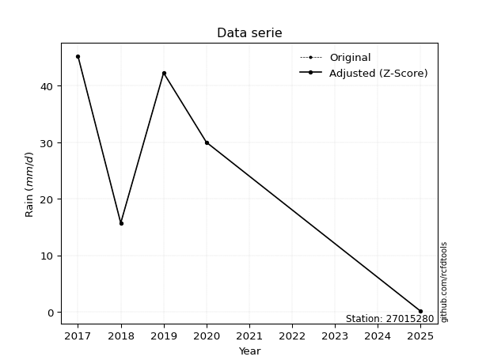</img>

</div>


> The initial value (value_initial) correspond to the initial obtained or null completed value, and value (value) is adjusted only when the initial value is outside the valid range (outlier) definite through the Z-Score value. If Z-Score is active, values out of range or outliers are replaced with the station mean value. A Z-Score (or standard score) measures how many standard deviations a data point is from the mean of a dataset, indicating its relative position; positive scores mean above the mean, negative mean below, and a score of zero is exactly at the mean, allowing for comparison of values from different distributions. It´s calculated using the formula $z=(x–μ)/σ$, where $x$ is the data point, $μ$ is the mean, and $σ$ is the standard deviation, helping identify outliers and understand probability.
>
> <sub>**Note**: In this study, "completing" (filling gaps in) and "extending" (forecasting or lengthening the historical record) rainfall data series are avoided for certain critical analyses because they introduce artificial bias and uncertainty, which can distort the statistics of rare events (extremes), alter day-to-day variability, and compromise the integrity and homogeneity of the original data. Some reasons against Completing/Extending rainfall data are: **Distortion of Extremes and Variability**: The primary issue is that most gap-filling or extension methods rely on averaging or regression with nearby stations, which inherently smooths the data. Rainfall is highly variable in space and time, with a large percentage of zero values and occasional large storms. Infilling methods often underestimate the highest values and overestimate the lowest (zero) values, which severely distorts analyses focused on flood frequency, drought severity, and intensity-duration-frequency (IDF) curves, **Loss of Data Homogeneity**: Infilled or extended data are synthetic estimates, not actual measurements. Combining these estimates with observed data can violate the assumption of data homogeneity, which requires that the data properties do not change over time. Inhomogeneity can lead to incorrect conclusions about long-term trends or changes in climate patterns, **Propagation of Errors**: Errors and biases from the original data (e.g., wind-induced undercatch, instrument errors, site changes) or the data used for imputation can propagate through the analysis, leading to unreliable hydrological models and inaccurate predictions, **Compromised Statistical Integrity**: For statistical analyses, especially those involving the frequency of events, using artificial data can introduce time bias or autocorrelation that doesn´t exist in reality, making it difficult to assess the true probability of events, **Difficulty in Validation**: It is difficult to accurately validate the quality of filled or extended data, especially for past periods where ground-truth measurements are unavailable. The reliability of imputation techniques heavily depends on the density of the surrounding station network and the complexity of the local topography.</sub>


### 4. Active continuous probability distributions from SciPy (80 of 104 available)

A Probability Density Function (PDF) describes the relative likelihood of a continuous random variable falling within a specific range, where the total area under its curve equals 1, and the area over any interval gives the actual probability for that range. Unlike discrete probabilities (like rolling a die), a PDF shows density, not direct probability for a single point (which is zero), with higher points indicating higher likelihood, often visualized as a bell curve for normal distributions.

A log of a probability density function (log-PDF) is simply the logarithm of the PDF´s value, denoted as $log(f(x))$, useful for converting multiplication of probabilities into addition, improving numerical stability with tiny numbers, and connecting to information theory concepts like entropy. Instead of dealing with very small probabilities (e.g., 0.000001), log-PDFs use negative numbers (e.g., $log(0.00001) ≈ -11.51$ that are easier for computers to handle, preventing underflow errors and simplifying complex calculations. In this study, each active probability distribution from SciPy is also evaluated in the $log$ form.

[scipy.stats](https://docs.scipy.org/doc/scipy/reference/stats.html) is a Python´s powerful submodule within the SciPy library for comprehensive statistical analysis, offering over 130 probability distributions (like Normal, Poisson, etc.), functions for descriptive stats (mean, variance), hypothesis testing (t-tests, chi-square), random variable generation, and statistical tests, making it essential for data science, modeling, and research. It provides tools to explore, model, and draw conclusions from data efficiently, working seamlessly with [NumPy](https://numpy.org/).

<div align="center">

|   id | p_dist           |   n_parameter | fit_method   | label                                                                       | active   | ref                                                                                                      |
|-----:|:-----------------|--------------:|:-------------|:----------------------------------------------------------------------------|:---------|:---------------------------------------------------------------------------------------------------------|
|    0 | alpha            |             3 | MLE          | Alpha                                                                       | True     | [:mortar_board:](https://docs.scipy.org/doc/scipy/reference/generated/scipy.stats.alpha.html)            |
|    1 | anglit           |             2 | MM           | Anglit                                                                      | True     | [:mortar_board:](https://docs.scipy.org/doc/scipy/reference/generated/scipy.stats.anglit.html)           |
|    2 | arcsine          |             2 | MM           | Arcsine                                                                     | True     | [:mortar_board:](https://docs.scipy.org/doc/scipy/reference/generated/scipy.stats.arcsine.html)          |
|    3 | argus            |             3 | MLE          | Argus                                                                       | True     | [:mortar_board:](https://docs.scipy.org/doc/scipy/reference/generated/scipy.stats.argus.html)            |
|    4 | beta             |             4 | MLE          | Beta                                                                        | True     | [:mortar_board:](https://docs.scipy.org/doc/scipy/reference/generated/scipy.stats.beta.html)             |
|    5 | betaprime        |             4 | MLE          | Beta prime                                                                  | True     | [:mortar_board:](https://docs.scipy.org/doc/scipy/reference/generated/scipy.stats.betaprime.html)        |
|    6 | bradford         |             3 | MLE          | Bradford                                                                    | True     | [:mortar_board:](https://docs.scipy.org/doc/scipy/reference/generated/scipy.stats.bradford.html)         |
|    7 | burr             |             4 | MLE          | Burr (Type III)                                                             | True     | [:mortar_board:](https://docs.scipy.org/doc/scipy/reference/generated/scipy.stats.burr.html)             |
|    8 | burr12           |             4 | MLE          | Burr (Type III) 12                                                          | True     | [:mortar_board:](https://docs.scipy.org/doc/scipy/reference/generated/scipy.stats.burr12.html)           |
|    9 | cosine           |             2 | MLE          | Cosine                                                                      | True     | [:mortar_board:](https://docs.scipy.org/doc/scipy/reference/generated/scipy.stats.cosine.html)           |
|   10 | crystalball      |             4 | MLE          | Crystalball                                                                 | True     | [:mortar_board:](https://docs.scipy.org/doc/scipy/reference/generated/scipy.stats.crystalball.html)      |
|   11 | dgamma           |             3 | MLE          | Double gamma                                                                | True     | [:mortar_board:](https://docs.scipy.org/doc/scipy/reference/generated/scipy.stats.dgamma.html)           |
|   12 | dweibull         |             3 | MLE          | Double Weibull                                                              | True     | [:mortar_board:](https://docs.scipy.org/doc/scipy/reference/generated/scipy.stats.dweibull.html)         |
|   13 | erlang           |             3 | MLE          | Erlang                                                                      | True     | [:mortar_board:](https://docs.scipy.org/doc/scipy/reference/generated/scipy.stats.erlang.html)           |
|   14 | exponnorm        |             3 | MLE          | Exponentially modified Normal                                               | True     | [:mortar_board:](https://docs.scipy.org/doc/scipy/reference/generated/scipy.stats.exponnorm.html)        |
|   15 | exponpow         |             3 | MLE          | Exponential power                                                           | True     | [:mortar_board:](https://docs.scipy.org/doc/scipy/reference/generated/scipy.stats.exponpow.html)         |
|   16 | exponweib        |             4 | MLE          | Exponentiated Weibull                                                       | True     | [:mortar_board:](https://docs.scipy.org/doc/scipy/reference/generated/scipy.stats.exponweib.html)        |
|   17 | f                |             4 | MLE          | F                                                                           | True     | [:mortar_board:](https://docs.scipy.org/doc/scipy/reference/generated/scipy.stats.f.html)                |
|   18 | fatiguelife      |             3 | MLE          | Fatigue-life (Birnbaum-Saunders)                                            | True     | [:mortar_board:](https://docs.scipy.org/doc/scipy/reference/generated/scipy.stats.fatiguelife.html)      |
|   19 | foldnorm         |             3 | MM           | Fold Normal                                                                 | True     | [:mortar_board:](https://docs.scipy.org/doc/scipy/reference/generated/scipy.stats.foldnorm.html)         |
|   20 | gamma            |             3 | MLE          | Gamma                                                                       | True     | [:mortar_board:](https://docs.scipy.org/doc/scipy/reference/generated/scipy.stats.gamma.html)            |
|   21 | gausshyper       |             6 | MLE          | Gauss hypergeometric                                                        | True     | [:mortar_board:](https://docs.scipy.org/doc/scipy/reference/generated/scipy.stats.gausshyper.html)       |
|   22 | genexpon         |             5 | MLE          | Generalized exponential                                                     | True     | [:mortar_board:](https://docs.scipy.org/doc/scipy/reference/generated/scipy.stats.genexpon.html)         |
|   23 | genextreme       |             3 | MLE          | Generalized exponential                                                     | True     | [:mortar_board:](https://docs.scipy.org/doc/scipy/reference/generated/scipy.stats.genextreme.html)       |
|   24 | gengamma         |             4 | MLE          | Generalized gamma                                                           | True     | [:mortar_board:](https://docs.scipy.org/doc/scipy/reference/generated/scipy.stats.gengamma.html)         |
|   25 | genhalflogistic  |             3 | MLE          | Generalized half-logistic                                                   | True     | [:mortar_board:](https://docs.scipy.org/doc/scipy/reference/generated/scipy.stats.genhalflogistic.html)  |
|   26 | genlogistic      |             3 | MLE          | Generalized logistic                                                        | True     | [:mortar_board:](https://docs.scipy.org/doc/scipy/reference/generated/scipy.stats.genlogistic.html)      |
|   27 | gennorm          |             3 | MLE          | Generalized Normal                                                          | True     | [:mortar_board:](https://docs.scipy.org/doc/scipy/reference/generated/scipy.stats.gennorm.html)          |
|   28 | genpareto        |             3 | MLE          | Generalized Pareto                                                          | True     | [:mortar_board:](https://docs.scipy.org/doc/scipy/reference/generated/scipy.stats.genpareto.html)        |
|   29 | gompertz         |             3 | MLE          | Gompertz (or truncated Gumbel)                                              | True     | [:mortar_board:](https://docs.scipy.org/doc/scipy/reference/generated/scipy.stats.gompertz.html)         |
|   30 | gumbel_l         |             2 | MM           | Gumbel Left Skew                                                            | True     | [:mortar_board:](https://docs.scipy.org/doc/scipy/reference/generated/scipy.stats.gumbel_l.html)         |
|   31 | gumbel_r         |             2 | MM           | Gumbel Right Skew                                                           | True     | [:mortar_board:](https://docs.scipy.org/doc/scipy/reference/generated/scipy.stats.gumbel_r.html)         |
|   32 | halfgennorm      |             3 | MLE          | Upper half of a generalized normal                                          | True     | [:mortar_board:](https://docs.scipy.org/doc/scipy/reference/generated/scipy.stats.halfgennorm.html)      |
|   33 | halflogistic     |             2 | MM           | Half-logistic                                                               | True     | [:mortar_board:](https://docs.scipy.org/doc/scipy/reference/generated/scipy.stats.halflogistic.html)     |
|   34 | halfnorm         |             2 | MM           | Half Normal                                                                 | True     | [:mortar_board:](https://docs.scipy.org/doc/scipy/reference/generated/scipy.stats.halfnorm.html)         |
|   35 | hypsecant        |             2 | MM           | hyperbolic secant                                                           | True     | [:mortar_board:](https://docs.scipy.org/doc/scipy/reference/generated/scipy.stats.hypsecant.html)        |
|   36 | invgamma         |             3 | MLE          | Inverted gamma                                                              | True     | [:mortar_board:](https://docs.scipy.org/doc/scipy/reference/generated/scipy.stats.invgamma.html)         |
|   37 | invgauss         |             3 | MLE          | Inverse Gaussian                                                            | True     | [:mortar_board:](https://docs.scipy.org/doc/scipy/reference/generated/scipy.stats.invgauss.html)         |
|   38 | invweibull       |             3 | MLE          | Inverted Weibull                                                            | True     | [:mortar_board:](https://docs.scipy.org/doc/scipy/reference/generated/scipy.stats.invweibull.html)       |
|   39 | johnsonsb        |             4 | MLE          | Johnson SB                                                                  | True     | [:mortar_board:](https://docs.scipy.org/doc/scipy/reference/generated/scipy.stats.johnsonsb.html)        |
|   40 | johnsonsu        |             4 | MLE          | Johnson Su                                                                  | True     | [:mortar_board:](https://docs.scipy.org/doc/scipy/reference/generated/scipy.stats.johnsonsu.html)        |
|   41 | kappa3           |             3 | MLE          | Kappa 3                                                                     | True     | [:mortar_board:](https://docs.scipy.org/doc/scipy/reference/generated/scipy.stats.kappa3.html)           |
|   42 | kappa4           |             4 | MLE          | Kappa 4                                                                     | True     | [:mortar_board:](https://docs.scipy.org/doc/scipy/reference/generated/scipy.stats.kappa4.html)           |
|   43 | ksone            |             3 | MLE          | Kolmogorov-Smirnov one-sided test statistic distribution                    | True     | [:mortar_board:](https://docs.scipy.org/doc/scipy/reference/generated/scipy.stats.ksone.html)            |
|   44 | kstwobign        |             2 | MLE          | Limiting distribution of scaled Kolmogorov-Smirnov two-sided test statistic | True     | [:mortar_board:](https://docs.scipy.org/doc/scipy/reference/generated/scipy.stats.kstwobign.html)        |
|   45 | laplace          |             2 | MM           | Laplace                                                                     | True     | [:mortar_board:](https://docs.scipy.org/doc/scipy/reference/generated/scipy.stats.laplace.html)          |
|   46 | levy_l           |             2 | MLE          | Left-skewed Levy                                                            | True     | [:mortar_board:](https://docs.scipy.org/doc/scipy/reference/generated/scipy.stats.levy_l.html)           |
|   47 | loggamma         |             3 | MLE          | Log gamma                                                                   | True     | [:mortar_board:](https://docs.scipy.org/doc/scipy/reference/generated/scipy.stats.loggamma.html)         |
|   48 | logistic         |             2 | MM           | Logistic (or Sech-squared)                                                  | True     | [:mortar_board:](https://docs.scipy.org/doc/scipy/reference/generated/scipy.stats.logistic.html)         |
|   49 | loglaplace       |             3 | MLE          | Log-Laplace                                                                 | True     | [:mortar_board:](https://docs.scipy.org/doc/scipy/reference/generated/scipy.stats.loglaplace.html)       |
|   50 | lomax            |             3 | MLE          | Lomax (Pareto of the second kind)                                           | True     | [:mortar_board:](https://docs.scipy.org/doc/scipy/reference/generated/scipy.stats.lomax.html)            |
|   51 | maxwell          |             2 | MM           | Maxwell                                                                     | True     | [:mortar_board:](https://docs.scipy.org/doc/scipy/reference/generated/scipy.stats.maxwell.html)          |
|   52 | mielke           |             4 | MLE          | Mielke Beta-Kappa / Dagum                                                   | True     | [:mortar_board:](https://docs.scipy.org/doc/scipy/reference/generated/scipy.stats.mielke.html)           |
|   53 | moyal            |             2 | MM           | Moyal                                                                       | True     | [:mortar_board:](https://docs.scipy.org/doc/scipy/reference/generated/scipy.stats.moyal.html)            |
|   54 | nakagami         |             3 | MLE          | Nakagami                                                                    | True     | [:mortar_board:](https://docs.scipy.org/doc/scipy/reference/generated/scipy.stats.nakagami.html)         |
|   55 | ncf              |             5 | MLE          | Non-central F distribution                                                  | True     | [:mortar_board:](https://docs.scipy.org/doc/scipy/reference/generated/scipy.stats.ncf.html)              |
|   56 | nct              |             4 | MLE          | Non-central Student’s t                                                     | True     | [:mortar_board:](https://docs.scipy.org/doc/scipy/reference/generated/scipy.stats.nct.html)              |
|   57 | norm             |             2 | MM           | Normal                                                                      | True     | [:mortar_board:](https://docs.scipy.org/doc/scipy/reference/generated/scipy.stats.norm.html)             |
|   58 | pearson3         |             3 | MM           | Pearson type III                                                            | True     | [:mortar_board:](https://docs.scipy.org/doc/scipy/reference/generated/scipy.stats.pearson3.html)         |
|   59 | powerlaw         |             3 | MLE          | Power-function                                                              | True     | [:mortar_board:](https://docs.scipy.org/doc/scipy/reference/generated/scipy.stats.powerlaw.html)         |
|   60 | rayleigh         |             2 | MM           | Rayleigh                                                                    | True     | [:mortar_board:](https://docs.scipy.org/doc/scipy/reference/generated/scipy.stats.rayleigh.html)         |
|   61 | rdist            |             3 | MLE          | R-distributed (symmetric beta)                                              | True     | [:mortar_board:](https://docs.scipy.org/doc/scipy/reference/generated/scipy.stats.rdist.html)            |
|   62 | rice             |             3 | MLE          | Rice                                                                        | True     | [:mortar_board:](https://docs.scipy.org/doc/scipy/reference/generated/scipy.stats.rice.html)             |
|   63 | semicircular     |             2 | MM           | Semicircular                                                                | True     | [:mortar_board:](https://docs.scipy.org/doc/scipy/reference/generated/scipy.stats.semicircular.html)     |
|   64 | skewnorm         |             3 | MLE          | Skew normal                                                                 | True     | [:mortar_board:](https://docs.scipy.org/doc/scipy/reference/generated/scipy.stats.skewnorm.html)         |
|   65 | t                |             3 | MLE          | Student’s t                                                                 | True     | [:mortar_board:](https://docs.scipy.org/doc/scipy/reference/generated/scipy.stats.t.html)                |
|   66 | trapezoid        |             4 | MLE          | Trapezoid                                                                   | True     | [:mortar_board:](https://docs.scipy.org/doc/scipy/reference/generated/scipy.stats.trapezoid.html)        |
|   67 | triang           |             3 | MLE          | Triangular                                                                  | True     | [:mortar_board:](https://docs.scipy.org/doc/scipy/reference/generated/scipy.stats.triang.html)           |
|   68 | truncexpon       |             3 | MLE          | Truncated exponential                                                       | True     | [:mortar_board:](https://docs.scipy.org/doc/scipy/reference/generated/scipy.stats.truncexpon.html)       |
|   69 | truncnorm        |             4 | MLE          | Truncated normal                                                            | True     | [:mortar_board:](https://docs.scipy.org/doc/scipy/reference/generated/scipy.stats.truncnorm.html)        |
|   70 | truncpareto      |             4 | MLE          | Upper truncated Pareto                                                      | True     | [:mortar_board:](https://docs.scipy.org/doc/scipy/reference/generated/scipy.stats.truncpareto.html)      |
|   71 | truncweibull_min |             5 | MLE          | Doubly truncated Weibull minimum                                            | True     | [:mortar_board:](https://docs.scipy.org/doc/scipy/reference/generated/scipy.stats.truncweibull_min.html) |
|   72 | tukeylambda      |             3 | MLE          | Tukey-Lamdba                                                                | True     | [:mortar_board:](https://docs.scipy.org/doc/scipy/reference/generated/scipy.stats.tukeylambda.html)      |
|   73 | uniform          |             2 | MLE          | Uniform                                                                     | True     | [:mortar_board:](https://docs.scipy.org/doc/scipy/reference/generated/scipy.stats.uniform.html)          |
|   74 | vonmises         |             3 | MLE          | Von Mises                                                                   | True     | [:mortar_board:](https://docs.scipy.org/doc/scipy/reference/generated/scipy.stats.vonmises.html)         |
|   75 | vonmises_line    |             3 | MLE          | Von Mises line                                                              | True     | [:mortar_board:](https://docs.scipy.org/doc/scipy/reference/generated/scipy.stats.vonmises_line.html)    |
|   76 | wald             |             2 | MM           | Wald                                                                        | True     | [:mortar_board:](https://docs.scipy.org/doc/scipy/reference/generated/scipy.stats.wald.html)             |
|   77 | weibull_max      |             3 | MLE          | Weibull maximum                                                             | True     | [:mortar_board:](https://docs.scipy.org/doc/scipy/reference/generated/scipy.stats.weibull_max.html)      |
|   78 | weibull_min      |             3 | MLE          | Weibull minimum                                                             | True     | [:mortar_board:](https://docs.scipy.org/doc/scipy/reference/generated/scipy.stats.weibull_min.html)      |
|   79 | wrapcauchy       |             3 | MLE          | Wrapped  Cauchy                                                             | True     | [:mortar_board:](https://docs.scipy.org/doc/scipy/reference/generated/scipy.stats.wrapcauchy.html)       |

</div>

> **n_parameter:** # arguments & localization & scale.
>
> **Fit methods:** (MLE) maximum likelihood, (MM) L-moments.
>
>**Inactive** (With the only purpose of prevent loops, zero divisions, infinite values, over high estimated values or horizontal trending for recurrence intervals estimations, the follow distributions were disabled.)**:** lognorm, norminvgauss, powernorm, powerlognorm, cauchy, halfcauchy, foldcauchy, skewcauchy, chi2, expon, fisk, genhyperbolic, geninvgauss, gibrat, kstwo, laplace_asymmetric, levy, levy_stable, ncx2, pareto, rel_breitwigner, recipinvgauss, studentized_range, loguniform, 


## B. Probability (PDF) vs. Empirical (EDF) distributions functions

A continuous probability distribution (CPD) describes probabilities for variables that can take any value within a range (like rain any time), unlike discrete variables with specific outcomes (like temperature). It uses a Probability Density Function (PDF), a curve where the total area under it equals 1, and the probability of the variable falling within an interval (a to b) is found by calculating the area under the curve between those points. A key feature is that the probability of hitting any single exact value is zero, so probabilities are always expressed for ranges, e.g., $P(a ≤ X ≤ b)$.

<div align="center">

Distributions parameters from station values
|     |   station | p_dist              |   n |             loc |           scale | shape                  | shape1                 | shape2               | shape3             |
|----:|----------:|:--------------------|----:|----------------:|----------------:|:-----------------------|:-----------------------|:---------------------|:-------------------|
|   0 |  27015280 | alpha               |   5 |  -274.282       |  5200.69        | 17.357256874194235     |                        |                      |                    |
|   1 |  27015280 | anglit              |   5 |    26.68        |    49.4517      |                        |                        |                      |                    |
|   2 |  27015280 | arcsine             |   5 |     2.7738      |    47.8124      |                        |                        |                      |                    |
|   3 |  27015280 | argus               |   5 |   -16.6099      |    64.3998      | 1.8407008553228579     |                        |                      |                    |
|   4 |  27015280 | beta                |   5 |    -3.14721     |    48.4472      | 0.6468696066667625     | 0.4290030715853006     |                      |                    |
|   5 |  27015280 | betaprime           |   5 |  -397.086       | 42614           | 623.5165040277975      | 62720.59082735256      |                      |                    |
|   6 |  27015280 | bradford            |   5 |    -6.0048      |    51.3048      | 2.2006472657635062e-05 |                        |                      |                    |
|   7 |  27015280 | burr                |   5 |     0.0994053   |    46.7443      | 62.967504166525885     | 0.00612221892799676    |                      |                    |
|   8 |  27015280 | burr12              |   5 |   -62.7917      |   619.802       | 6.503071009189945      | 180350.35505750403     |                      |                    |
|   9 |  27015280 | cosine              |   5 |    25.6376      |    13.6336      |                        |                        |                      |                    |
|  10 |  27015280 | crystalball         |   5 |    26.68        |    16.9042      | 1488.6234198666634     | 4123.098252176         |                      |                    |
|  11 |  27015280 | dgamma              |   5 |    23.58        |     3.9794      | 3.931249495145118      |                        |                      |                    |
|  12 |  27015280 | dweibull            |   5 |    23.5144      |    17.7334      | 2.446993750998171      |                        |                      |                    |
|  13 |  27015280 | erlang              |   5 |  -248.158       |     1.06631     | 257.571413638715       |                        |                      |                    |
|  14 |  27015280 | exponnorm           |   5 |    26.6669      |    16.9042      | 0.0007682171223185179  |                        |                      |                    |
|  15 |  27015280 | exponpow            |   5 |     0.1         |     3.02875     | 0.17215387349782235    |                        |                      |                    |
|  16 |  27015280 | exponweib           |   5 |     0.1         |     2.89604     | 0.921931547608991      | 0.3824961319073486     |                      |                    |
|  17 |  27015280 | f                   |   5 |     0.1         |    17.0361      | 1.2530155219999197     | 4.886722268236431      |                      |                    |
|  18 |  27015280 | fatiguelife         |   5 |     0.1         |     0.000421526 | 242.5795638039882      |                        |                      |                    |
|  19 |  27015280 | foldnorm            |   5 |   -93.628       |    16.0572      | 7.505376494292878      |                        |                      |                    |
|  20 |  27015280 | gamma               |   5 |  -267.402       |     0.989443    | 297.1978469897905      |                        |                      |                    |
|  21 |  27015280 | gausshyper          |   5 |    -4.16043     |    49.4604      | 1.2007931323086671     | 0.6438382490304146     | 1.1256825403042037   | 1.0477863608405866 |
|  22 |  27015280 | genexpon            |   5 |     0.0999998   |     0.668651    | 0.02516051317774529    | 2.5862855836227588e-08 | 1.03861647766296     |                    |
|  23 |  27015280 | genextreme          |   5 |    25.2209      |    25.8924      | 1.2895219791077932     |                        |                      |                    |
|  24 |  27015280 | gengamma            |   5 |     0.1         |     0.0233782   | 3.729325479907801      | 0.2319584661125783     |                      |                    |
|  25 |  27015280 | genhalflogistic     |   5 |   -10.7446      |    60.2021      | 1.0741821002618726     |                        |                      |                    |
|  26 |  27015280 | genlogistic         |   5 |    45.3002      |     1.17993e-05 | 6.328081343325381e-07  |                        |                      |                    |
|  27 |  27015280 | gennorm             |   5 |    22.7         |    22.6         | 13883541.553490229     |                        |                      |                    |
|  28 |  27015280 | genpareto           |   5 |    -0.222797    |   126.066       | -2.769296042209885     |                        |                      |                    |
|  29 |  27015280 | gompertz            |   5 |    15.7         |     7.75802     | 0.05002531454978103    |                        |                      |                    |
|  30 |  27015280 | gumbel_l            |   5 |    34.2878      |    13.1802      |                        |                        |                      |                    |
|  31 |  27015280 | gumbel_r            |   5 |    19.0722      |    13.1802      |                        |                        |                      |                    |
|  32 |  27015280 | halfgennorm         |   5 |     0.1         |     3.35785     | 0.4479229219041192     |                        |                      |                    |
|  33 |  27015280 | halflogistic        |   5 |     6.64451     |    14.4525      |                        |                        |                      |                    |
|  34 |  27015280 | halfnorm            |   5 |     4.30537     |    28.0424      |                        |                        |                      |                    |
|  35 |  27015280 | hypsecant           |   5 |    26.68        |    10.7616      |                        |                        |                      |                    |
|  36 |  27015280 | invgamma            |   5 |     0.005124    |     0.110579    | 0.23631940542229102    |                        |                      |                    |
|  37 |  27015280 | invgauss            |   5 |   -71.9344      |  2884.01        | 0.03403865606941574    |                        |                      |                    |
|  38 |  27015280 | invweibull          |   5 |     0.1         |     2.43086     | 0.042448668954506004   |                        |                      |                    |
|  39 |  27015280 | johnsonsb           |   5 |    -5.15437     |    50.4544      | -2.6833479551571626    | 0.17056300649739364    |                      |                    |
|  40 |  27015280 | johnsonsu           |   5 |    45.3         |     2.94481e-11 | 3.9399942570476405     | 0.1594772688095737     |                      |                    |
|  41 |  27015280 | kappa3              |   5 |     0.0535629   |    45.2353      | 6927.194626674762      |                        |                      |                    |
|  42 |  27015280 | kappa4              |   5 |    -2.79404     |    52.1902      | 1.0204478069897758     | 1.0851701095578923     |                      |                    |
|  43 |  27015280 | ksone               |   5 |    -2.59902     |    58.558       | 1.0                    |                        |                      |                    |
|  44 |  27015280 | kstwobign           |   5 |   -38.8846      |    74.6932      |                        |                        |                      |                    |
|  45 |  27015280 | laplace             |   5 |    26.68        |    11.9531      |                        |                        |                      |                    |
|  46 |  27015280 | levy_l              |   5 |    46.1689      |     3.27711     |                        |                        |                      |                    |
|  47 |  27015280 | loggamma            |   5 |    45.3005      |     3.32631e-05 | 1.7852077374931221e-06 |                        |                      |                    |
|  48 |  27015280 | logistic            |   5 |    26.68        |     9.3198      |                        |                        |                      |                    |
|  49 |  27015280 | loglaplace          |   5 |    -0.0477488   |    30.0478      | 0.7451883072505519     |                        |                      |                    |
|  50 |  27015280 | lomax               |   5 |     0.1         |     6.89312e+11 | 27128627598.644287     |                        |                      |                    |
|  51 |  27015280 | maxwell             |   5 |   -13.376       |    25.1014      |                        |                        |                      |                    |
|  52 |  27015280 | mielke              |   5 |     0.1         |    47.845       | 0.7726708368831465     | 34.23916603879639      |                      |                    |
|  53 |  27015280 | moyal               |   5 |    17.0131      |     7.60959     |                        |                        |                      |                    |
|  54 |  27015280 | nakagami            |   5 |     0.1         |    35.2268      | 0.2786266876712986     |                        |                      |                    |
|  55 |  27015280 | ncf                 |   5 |     0.1         |     0.995287    | 0.28333170524877926    | 67.32804470231707      | 8.420618360826854    |                    |
|  56 |  27015280 | nct                 |   5 |     0.1         |     4.03833e-18 | 0.15770884903327992    | 14.854480346961235     |                      |                    |
|  57 |  27015280 | norm                |   5 |    26.68        |    16.9042      |                        |                        |                      |                    |
|  58 |  27015280 | pearson3            |   5 |    26.68        |    16.9042      | -0.40571191594640754   |                        |                      |                    |
|  59 |  27015280 | powerlaw            |   5 |     0.1         |    45.2         | 0.11319110880604502    |                        |                      |                    |
|  60 |  27015280 | rayleigh            |   5 |    -5.65881     |    25.8026      |                        |                        |                      |                    |
|  61 |  27015280 | rdist               |   5 |    -3.3003      |    19.0003      | 1.2660642189808438     |                        |                      |                    |
|  62 |  27015280 | rice                |   5 |    -9.98922     |    19.2394      | 1.5506739332168147     |                        |                      |                    |
|  63 |  27015280 | semicircular        |   5 |    26.68        |    33.8085      |                        |                        |                      |                    |
|  64 |  27015280 | skewnorm            |   5 |    45.3         |    25.1483      | -5377675.097099505     |                        |                      |                    |
|  65 |  27015280 | t                   |   5 |    26.6767      |    16.899       | 184779.177754278       |                        |                      |                    |
|  66 |  27015280 | trapezoid           |   5 |   -22.1891      |    71.7187      | 1.0                    | 1.0                    |                      |                    |
|  67 |  27015280 | triang              |   5 |   -12.754       |    58.1067      | 0.9990929026207334     |                        |                      |                    |
|  68 |  27015280 | truncexpon          |   5 |     0.0999717   |    73.495       | 0.6150087979556828     |                        |                      |                    |
|  69 |  27015280 | truncnorm           |   5 |    -1.06243     |     4.3375      | 0.04701784173042227    | 10.688735505512781     |                      |                    |
|  70 |  27015280 | truncpareto         |   5 |    -0.21549     |     0.315458    | 6.316476369547353e-05  | 144.28456177949545     |                      |                    |
|  71 |  27015280 | truncweibull_min    |   5 |    -1.91038     |    84.1125      | 1.2336644438560607     | 0.001129794307026597   | 0.5612763553304132   |                    |
|  72 |  27015280 | tukeylambda         |   5 |    22.7254      |    28.8241      | 1.2739720647550066     |                        |                      |                    |
|  73 |  27015280 | uniform             |   5 |     0.1         |    45.2         |                        |                        |                      |                    |
|  74 |  27015280 | vonmises            |   5 |    -1.26256     |     1           | 0.38736371764048577    |                        |                      |                    |
|  75 |  27015280 | vonmises_line       |   5 |    22.3049      |     7.31957     | 1.2747210215689465e-05 |                        |                      |                    |
|  76 |  27015280 | wald                |   5 |     9.77579     |    16.9042      |                        |                        |                      |                    |
|  77 |  27015280 | weibull_max         |   5 |    45.3         |     1.5995      | 0.31843491866573503    |                        |                      |                    |
|  78 |  27015280 | weibull_min         |   5 |    -7.10673e+08 |     7.10673e+08 | 53695803.685544774     |                        |                      |                    |
|  79 |  27015280 | wrapcauchy          |   5 |     0.0999993   |     7.1938      | 0.6642169995360115     |                        |                      |                    |
|  80 |  27015280 | logalpha            |   5 |   -65.2687      |  1841.76        | 27.31874705948256      |                        |                      |                    |
|  81 |  27015280 | loganglit           |   5 |     2.28207     |     6.79526     |                        |                        |                      |                    |
|  82 |  27015280 | logarcsine          |   5 |    -1.00291     |     6.56997     |                        |                        |                      |                    |
|  83 |  27015280 | logargus            |   5 |    -4.90557     |     8.92586     | 3.154020003427341      |                        |                      |                    |
|  84 |  27015280 | logbeta             |   5 |    -2.98756     |     6.80087     | 0.11462918868536384    | 0.032903820058994906   |                      |                    |
|  85 |  27015280 | logbetaprime        |   5 |    -2.30259     |     1.92207     | 0.7289060741838371     | 0.8678422767192059     |                      |                    |
|  86 |  27015280 | logbradford         |   5 |    -2.321       |     6.14455     | 3.396894176590342e-06  |                        |                      |                    |
|  87 |  27015280 | logburr             |   5 |    -2.30259     |     3.68206     | 0.6667050426149129     | 0.18107971294450287    |                      |                    |
|  88 |  27015280 | logburr12           |   5 |    -2.30259     |     1.66386     | 0.14122265466598205    | 0.9338561803079908     |                      |                    |
|  89 |  27015280 | logcosine           |   5 |     1.84129     |     1.99258     |                        |                        |                      |                    |
|  90 |  27015280 | logcrystalball      |   5 |     2.28207     |     2.32285     | 7.6425863455522105     | 22.146467956300246     |                      |                    |
|  91 |  27015280 | logdgamma           |   5 |     3.74479     |     1.58669     | 0.7492669787202075     |                        |                      |                    |
|  92 |  27015280 | logdweibull         |   5 |     3.74479     |     1.55427     | 0.7913685385220912     |                        |                      |                    |
|  93 |  27015280 | logerlang           |   5 |   -33.3767      |     0.168895    | 211.16809593647014     |                        |                      |                    |
|  94 |  27015280 | logexponnorm        |   5 |     2.28082     |     2.32286     | 0.0005406312791088307  |                        |                      |                    |
|  95 |  27015280 | logexponpow         |   5 |    -2.30259     |     1.84577     | 0.32539571542973966    |                        |                      |                    |
|  96 |  27015280 | logexponweib        |   5 |    -2.30259     |     1.82473     | 1.761396908768336      | 0.0849212656847161     |                      |                    |
|  97 |  27015280 | logf                |   5 |    -2.30259     |     1.02653     | 1.1333247488741809     | 1.0915490887426367     |                      |                    |
|  98 |  27015280 | logfatiguelife      |   5 |    -2.30259     |     1.61164e-06 | 1605.4018822755224     |                        |                      |                    |
|  99 |  27015280 | logfoldnorm         |   5 |   -10.318       |     1.65747     | 7.67524056713688       |                        |                      |                    |
| 100 |  27015280 | loggamma            |   5 |   -37.2507      |     0.148573    | 265.8356608049992      |                        |                      |                    |
| 101 |  27015280 | loggausshyper       |   5 |    -3.5428      |     7.35611     | 1.360170868091413      | 0.269510349225746      | 0.9494159514090579   | 1.1979717324466064 |
| 102 |  27015280 | loggenexpon         |   5 |    -2.30448     |     0.53048     | 0.04630785662509246    | 4.631703528193647      | 0.002734973687202897 |                    |
| 103 |  27015280 | loggenextreme       |   5 |     0.803627    |     3.89274     | 1.2934053413590076     |                        |                      |                    |
| 104 |  27015280 | loggengamma         |   5 |    -2.30259     |     1.39986     | 1.4077100399237303     | 0.10166014063235934    |                      |                    |
| 105 |  27015280 | loggenhalflogistic  |   5 |    -2.96915     |     7.69545     | 1.1346110260834994     |                        |                      |                    |
| 106 |  27015280 | loggenlogistic      |   5 |     3.81343     |     9.46259e-06 | 6.207326375375958e-06  |                        |                      |                    |
| 107 |  27015280 | loggennorm          |   5 |     3.74479     |     0.000388669 | 0.2259900083969165     |                        |                      |                    |
| 108 |  27015280 | loggenpareto        |   5 |    -2.3305      |    21.997       | -3.580354992076379     |                        |                      |                    |
| 109 |  27015280 | loggompertz         |   5 |    -2.30259     |     1.33956     | 0.01679550350245608    |                        |                      |                    |
| 110 |  27015280 | loggumbel_l         |   5 |     3.32748     |     1.81112     |                        |                        |                      |                    |
| 111 |  27015280 | loggumbel_r         |   5 |     1.23667     |     1.81112     |                        |                        |                      |                    |
| 112 |  27015280 | loghalfgennorm      |   5 |    -2.30259     |     1.36333     | 0.5662160114195327     |                        |                      |                    |
| 113 |  27015280 | loghalflogistic     |   5 |    -0.47107     |     1.98597     |                        |                        |                      |                    |
| 114 |  27015280 | loghalfnorm         |   5 |    -0.792443    |     3.85335     |                        |                        |                      |                    |
| 115 |  27015280 | loghypsecant        |   5 |     2.28207     |     1.47877     |                        |                        |                      |                    |
| 116 |  27015280 | loginvgamma         |   5 |   -46.3723      | 19405.9         | 399.8568720341112      |                        |                      |                    |
| 117 |  27015280 | loginvgauss         |   5 |   -18.8829      |  1359.58        | 0.015547014761426073   |                        |                      |                    |
| 118 |  27015280 | loginvweibull       |   5 |    -3.49458e+08 |     3.49458e+08 | 131535771.22714102     |                        |                      |                    |
| 119 |  27015280 | logjohnsonsb        |   5 |    -4.3539      |     8.16721     | 0.06816619173102847    | 0.1543087583861314     |                      |                    |
| 120 |  27015280 | logjohnsonsu        |   5 |     3.81331     |     7.53497e-22 | 1.8876450240334761     | 0.08832539862624256    |                      |                    |
| 121 |  27015280 | logkappa3           |   5 |    -2.30259     |     1.97234     | 0.18287776718640164    |                        |                      |                    |
| 122 |  27015280 | logkappa4           |   5 |    -2.53392     |     7.49759     | 1.0304438850505724     | 1.1812389643550016     |                      |                    |
| 123 |  27015280 | logksone            |   5 |    -2.91417     |     7.33907     | 1.0                    |                        |                      |                    |
| 124 |  27015280 | logkstwobign        |   5 |    -8.5438      |    12.3368      |                        |                        |                      |                    |
| 125 |  27015280 | loglaplace          |   5 |     2.28207     |     1.6425      |                        |                        |                      |                    |
| 126 |  27015280 | loglevy_l           |   5 |     3.83676     |     0.0878925   |                        |                        |                      |                    |
| 127 |  27015280 | logloggamma         |   5 |     3.8134      |     4.21121e-06 | 2.759509621512474e-06  |                        |                      |                    |
| 128 |  27015280 | loglogistic         |   5 |     2.28207     |     1.28065     |                        |                        |                      |                    |
| 129 |  27015280 | logloglaplace       |   5 |    -2.30259     |     1.56475     | 0.5901322120335221     |                        |                      |                    |
| 130 |  27015280 | loglomax            |   5 |    -2.30259     |     2.54857e+12 | 593637224997.7552      |                        |                      |                    |
| 131 |  27015280 | logmaxwell          |   5 |    -3.2221      |     3.44923     |                        |                        |                      |                    |
| 132 |  27015280 | logmielke           |   5 |    -2.30259     |     2.45513     | 0.1280893377510934     | 0.827650647125573      |                      |                    |
| 133 |  27015280 | logmoyal            |   5 |     0.953719    |     1.04565     |                        |                        |                      |                    |
| 134 |  27015280 | lognakagami         |   5 | -2535.68        |  2537.96        | 299268.9175659856      |                        |                      |                    |
| 135 |  27015280 | logncf              |   5 |    -2.30259     |     1.07724     | 1.0602338240760458     | 1.1176655332258199     | 1.005442525363291    |                    |
| 136 |  27015280 | lognct              |   5 |  -134.478       |     2.27099     | 35942.919036276864     | 60.219306872485205     |                      |                    |
| 137 |  27015280 | lognorm             |   5 |     2.28207     |     2.32285     |                        |                        |                      |                    |
| 138 |  27015280 | logpearson3         |   5 |     2.28209     |     2.32283     | -1.4064921573987719    |                        |                      |                    |
| 139 |  27015280 | logpowerlaw         |   5 |    -2.30259     |     6.11589     | 0.13357308397620224    |                        |                      |                    |
| 140 |  27015280 | lograyleigh         |   5 |    -2.1617      |     3.54561     |                        |                        |                      |                    |
| 141 |  27015280 | logrdist            |   5 |    -2.30259     |     8.70859e-13 | 1.6055725534725918     |                        |                      |                    |
| 142 |  27015280 | logrice             |   5 |  -882.497       |     2.32295     | 380.88536563500475     |                        |                      |                    |
| 143 |  27015280 | logsemicircular     |   5 |     2.28207     |     4.6457      |                        |                        |                      |                    |
| 144 |  27015280 | logskewnorm         |   5 |     3.81331     |     2.78197     | -3700611.219112505     |                        |                      |                    |
| 145 |  27015280 | logt                |   5 |     3.76207     |     0.0830702   | 0.40593292335644593    |                        |                      |                    |
| 146 |  27015280 | logtrapezoid        |   5 |    -4.50233     |     9.85501     | 1.0                    | 1.0                    |                      |                    |
| 147 |  27015280 | logtriang           |   5 |    -3.58492     |     7.39824     | 0.9999985732570542     |                        |                      |                    |
| 148 |  27015280 | logtruncexpon       |   5 |    -2.31135     |    11.7767      | 0.5200636992219414     |                        |                      |                    |
| 149 |  27015280 | logtruncnorm        |   5 |     2.02304     |     2.56577     | -1.6859014609839238    | 5.2980327414341755     |                      |                    |
| 150 |  27015280 | logtruncpareto      |   5 |    -2.34999     |     0.0474076   | 0.26039903356779054    | 130.00660352822652     |                      |                    |
| 151 |  27015280 | logtruncweibull_min |   5 |    -2.52674     |     8.71791     | 1.2768042391818495     | 8.022995642354233e-07  | 0.7272436501506794   |                    |
| 152 |  27015280 | logtukeylambda      |   5 |    -2.30259     |     1.46237e-13 | 1.6063015881661284     |                        |                      |                    |
| 153 |  27015280 | loguniform          |   5 |    -2.30259     |     6.11589     |                        |                        |                      |                    |
| 154 |  27015280 | logvonmises         |   5 |    -2.73138     |     1           | 5.775593909105611      |                        |                      |                    |
| 155 |  27015280 | logvonmises_line    |   5 |     2.97332     |     1.67937     | 1.3137378801769057     |                        |                      |                    |
| 156 |  27015280 | logwald             |   5 |    -0.0408217   |     2.32288     |                        |                        |                      |                    |
| 157 |  27015280 | logweibull_max      |   5 |     3.81331     |     2.8982      | 0.7441310358648043     |                        |                      |                    |
| 158 |  27015280 | logweibull_min      |   5 |    -2.30259     |     1.50914     | 0.5765544953171842     |                        |                      |                    |
| 159 |  27015280 | logwrapcauchy       |   5 |    -2.3027      |     0.973392    | 0.9351688210937865     |                        |                      |                    |

</div>

> **loc** (Location parameter): This shifts the distribution along the x-axis. For many common distributions, like the normal (Gaussian) distribution, loc represents the mean $μ$. For others, like the uniform distribution, it might represent the minimum value, or for the beta distribution, the left end of the support interval.
>
> **scale** (Scale parameter): This determines the width or spread of the distribution. For the normal distribution, scale represents the standard deviation $σ$. For a uniform distribution, it defines the length of the interval (from $loc$ to $loc + scale$).
>
> **shape** (Shape parameters): Refers to parameters that define the specific form of a probability distribution, distinct from its location (loc) and scale (scale). These parameters are required arguments for most distribution functions. For example, a normal (Gaussian) distribution is fully defined by its location (mean) and scale (standard deviation), so it has no specific shape parameters beyond loc and scale. However, other distributions have intrinsic properties that need specification, as Gamma distribution that takes a shape parameter, often named $a$ or $alpha$.


### 0. Cumulative distribution values - CDF (160 evaluated)

Cumulative Distribution Function (CDF), denoted as $F$<sub>$X$</sub>$(x)$, is a function that gives the probability that a random variable $X$ will take a value less than or equal to a specific value, $x$ (i.e., $(P(X≥x)$. It essentially "accumulates" probabilities from a given point up to the far right (positive infinity), providing a complete picture of the distribution´s probabilities for both discrete (like rain) and continuous (like temperature) variables, helping to find probabilities over ranges or above certain values. Each station is evaluated separately ordering the $x$ values ascending, calculating the CDF and PDF values for the activated distributions and their logarithmic forms.

<div align="center">

CDF ordered by x ascending and calculating $log(f(x))$ separately
|   id |   Station |   date |    x |   count |   mean |     std |    zscore |   Value_initial |   station |   m |     alpha |   alpha_pdf |    anglit |   anglit_pdf |   arcsine |   arcsine_pdf |     argus |   argus_pdf |      beta |    beta_pdf |   betaprime |   betaprime_pdf |   bradford |   bradford_pdf |      burr |     burr_pdf |    burr12 |   burr12_pdf |    cosine |   cosine_pdf |   crystalball |   crystalball_pdf |    dgamma |   dgamma_pdf |   dweibull |   dweibull_pdf |    erlang |   erlang_pdf |   exponnorm |   exponnorm_pdf |   exponpow |   exponpow_pdf |   exponweib |   exponweib_pdf |           f |           f_pdf |   fatiguelife |   fatiguelife_pdf |   foldnorm |   foldnorm_pdf |    gamma |   gamma_pdf |   gausshyper |   gausshyper_pdf |    genexpon |   genexpon_pdf |   genextreme |   genextreme_pdf |    gengamma |   gengamma_pdf |   genhalflogistic |   genhalflogistic_pdf |   genlogistic |   genlogistic_pdf |     gennorm |   gennorm_pdf |   genpareto |   genpareto_pdf |    gompertz |   gompertz_pdf |   gumbel_l |   gumbel_l_pdf |   gumbel_r |   gumbel_r_pdf |   halfgennorm |   halfgennorm_pdf |   halflogistic |   halflogistic_pdf |   halfnorm |   halfnorm_pdf |   hypsecant |   hypsecant_pdf |   invgamma |   invgamma_pdf |   invgauss |   invgauss_pdf |   invweibull |   invweibull_pdf |   johnsonsb |   johnsonsb_pdf |   johnsonsu |   johnsonsu_pdf |     kappa3 |   kappa3_pdf |   kappa4 |   kappa4_pdf |     ksone |   ksone_pdf |   kstwobign |   kstwobign_pdf |   laplace |   laplace_pdf |   levy_l |   levy_l_pdf |   loggamma |   loggamma_pdf |   logistic |   logistic_pdf |   loglaplace |   loglaplace_pdf |       lomax |   lomax_pdf |   maxwell |   maxwell_pdf |      mielke |   mielke_pdf |      moyal |   moyal_pdf |    nakagami |   nakagami_pdf |         ncf |     ncf_pdf |       nct |     nct_pdf |      norm |   norm_pdf |   pearson3 |   pearson3_pdf |   powerlaw |   powerlaw_pdf |   rayleigh |   rayleigh_pdf |    rdist |    rdist_pdf |      rice |   rice_pdf |   semicircular |   semicircular_pdf |   skewnorm |   skewnorm_pdf |         t |      t_pdf |   trapezoid |   trapezoid_pdf |    triang |   triang_pdf |   truncexpon |   truncexpon_pdf |   truncnorm |   truncnorm_pdf |   truncpareto |   truncpareto_pdf |   truncweibull_min |   truncweibull_min_pdf |   tukeylambda |   tukeylambda_pdf |   uniform |   uniform_pdf |   vonmises |   vonmises_pdf |   vonmises_line |   vonmises_line_pdf |     wald |   wald_pdf |   weibull_max |   weibull_max_pdf |   weibull_min |   weibull_min_pdf |   wrapcauchy |   wrapcauchy_pdf |   logalpha |   logalpha_pdf |   loganglit |   loganglit_pdf |   logarcsine |   logarcsine_pdf |   logargus |   logargus_pdf |   logbeta |   logbeta_pdf |   logbetaprime |   logbetaprime_pdf |   logbradford |   logbradford_pdf |   logburr |   logburr_pdf |   logburr12 |   logburr12_pdf |   logcosine |   logcosine_pdf |   logcrystalball |   logcrystalball_pdf |   logdgamma |   logdgamma_pdf |   logdweibull |   logdweibull_pdf |   logerlang |   logerlang_pdf |   logexponnorm |   logexponnorm_pdf |   logexponpow |   logexponpow_pdf |   logexponweib |   logexponweib_pdf |        logf |    logf_pdf |   logfatiguelife |   logfatiguelife_pdf |   logfoldnorm |   logfoldnorm_pdf |   loggausshyper |   loggausshyper_pdf |   loggenexpon |   loggenexpon_pdf |   loggenextreme |   loggenextreme_pdf |   loggengamma |   loggengamma_pdf |   loggenhalflogistic |   loggenhalflogistic_pdf |   loggenlogistic |   loggenlogistic_pdf |   loggennorm |   loggennorm_pdf |   loggenpareto |   loggenpareto_pdf |   loggompertz |   loggompertz_pdf |   loggumbel_l |   loggumbel_l_pdf |   loggumbel_r |   loggumbel_r_pdf |   loghalfgennorm |   loghalfgennorm_pdf |   loghalflogistic |   loghalflogistic_pdf |   loghalfnorm |   loghalfnorm_pdf |   loghypsecant |   loghypsecant_pdf |   loginvgamma |   loginvgamma_pdf |   loginvgauss |   loginvgauss_pdf |   loginvweibull |   loginvweibull_pdf |   logjohnsonsb |   logjohnsonsb_pdf |   logjohnsonsu |   logjohnsonsu_pdf |   logkappa3 |   logkappa3_pdf |   logkappa4 |   logkappa4_pdf |   logksone |   logksone_pdf |   logkstwobign |   logkstwobign_pdf |   loglevy_l |   loglevy_l_pdf |   logloggamma |   logloggamma_pdf |   loglogistic |   loglogistic_pdf |   logloglaplace |   logloglaplace_pdf |    loglomax |   loglomax_pdf |   logmaxwell |   logmaxwell_pdf |   logmielke |   logmielke_pdf |    logmoyal |   logmoyal_pdf |   lognakagami |   lognakagami_pdf |      logncf |   logncf_pdf |    lognct |   lognct_pdf |   lognorm |   lognorm_pdf |   logpearson3 |   logpearson3_pdf |   logpowerlaw |   logpowerlaw_pdf |   lograyleigh |   lograyleigh_pdf |    logrdist |   logrdist_pdf |   logrice |   logrice_pdf |   logsemicircular |   logsemicircular_pdf |   logskewnorm |   logskewnorm_pdf |      logt |   logt_pdf |   logtrapezoid |   logtrapezoid_pdf |   logtriang |   logtriang_pdf |   logtruncexpon |   logtruncexpon_pdf |   logtruncnorm |   logtruncnorm_pdf |   logtruncpareto |   logtruncpareto_pdf |   logtruncweibull_min |   logtruncweibull_min_pdf |   logtukeylambda |   logtukeylambda_pdf |   loguniform |   loguniform_pdf |   logvonmises |   logvonmises_pdf |   logvonmises_line |   logvonmises_line_pdf |   logwald |   logwald_pdf |   logweibull_max |   logweibull_max_pdf |   logweibull_min |   logweibull_min_pdf |   logwrapcauchy |   logwrapcauchy_pdf |
|-----:|----------:|-------:|-----:|--------:|-------:|--------:|----------:|----------------:|----------:|----:|----------:|------------:|----------:|-------------:|----------:|--------------:|----------:|------------:|----------:|------------:|------------:|----------------:|-----------:|---------------:|----------:|-------------:|----------:|-------------:|----------:|-------------:|--------------:|------------------:|----------:|-------------:|-----------:|---------------:|----------:|-------------:|------------:|----------------:|-----------:|---------------:|------------:|----------------:|------------:|----------------:|--------------:|------------------:|-----------:|---------------:|---------:|------------:|-------------:|-----------------:|------------:|---------------:|-------------:|-----------------:|------------:|---------------:|------------------:|----------------------:|--------------:|------------------:|------------:|--------------:|------------:|----------------:|------------:|---------------:|-----------:|---------------:|-----------:|---------------:|--------------:|------------------:|---------------:|-------------------:|-----------:|---------------:|------------:|----------------:|-----------:|---------------:|-----------:|---------------:|-------------:|-----------------:|------------:|----------------:|------------:|----------------:|-----------:|-------------:|---------:|-------------:|----------:|------------:|------------:|----------------:|----------:|--------------:|---------:|-------------:|-----------:|---------------:|-----------:|---------------:|-------------:|-----------------:|------------:|------------:|----------:|--------------:|------------:|-------------:|-----------:|------------:|------------:|---------------:|------------:|------------:|----------:|------------:|----------:|-----------:|-----------:|---------------:|-----------:|---------------:|-----------:|---------------:|---------:|-------------:|----------:|-----------:|---------------:|-------------------:|-----------:|---------------:|----------:|-----------:|------------:|----------------:|----------:|-------------:|-------------:|-----------------:|------------:|----------------:|--------------:|------------------:|-------------------:|-----------------------:|--------------:|------------------:|----------:|--------------:|-----------:|---------------:|----------------:|--------------------:|---------:|-----------:|--------------:|------------------:|--------------:|------------------:|-------------:|-----------------:|-----------:|---------------:|------------:|----------------:|-------------:|-----------------:|-----------:|---------------:|----------:|--------------:|---------------:|-------------------:|--------------:|------------------:|----------:|--------------:|------------:|----------------:|------------:|----------------:|-----------------:|---------------------:|------------:|----------------:|--------------:|------------------:|------------:|----------------:|---------------:|-------------------:|--------------:|------------------:|---------------:|-------------------:|------------:|------------:|-----------------:|---------------------:|--------------:|------------------:|----------------:|--------------------:|--------------:|------------------:|----------------:|--------------------:|--------------:|------------------:|---------------------:|-------------------------:|-----------------:|---------------------:|-------------:|-----------------:|---------------:|-------------------:|--------------:|------------------:|--------------:|------------------:|--------------:|------------------:|-----------------:|---------------------:|------------------:|----------------------:|--------------:|------------------:|---------------:|-------------------:|--------------:|------------------:|--------------:|------------------:|----------------:|--------------------:|---------------:|-------------------:|---------------:|-------------------:|------------:|----------------:|------------:|----------------:|-----------:|---------------:|---------------:|-------------------:|------------:|----------------:|--------------:|------------------:|--------------:|------------------:|----------------:|--------------------:|------------:|---------------:|-------------:|-----------------:|------------:|----------------:|------------:|---------------:|--------------:|------------------:|------------:|-------------:|----------:|-------------:|----------:|--------------:|--------------:|------------------:|--------------:|------------------:|--------------:|------------------:|------------:|---------------:|----------:|--------------:|------------------:|----------------------:|--------------:|------------------:|----------:|-----------:|---------------:|-------------------:|------------:|----------------:|----------------:|--------------------:|---------------:|-------------------:|-----------------:|---------------------:|----------------------:|--------------------------:|-----------------:|---------------------:|-------------:|-----------------:|--------------:|------------------:|-------------------:|-----------------------:|----------:|--------------:|-----------------:|---------------------:|-----------------:|---------------------:|----------------:|--------------------:|
|    0 |  27015280 |   2025 |  0.1 |       5 |  26.68 | 18.8995 | -1.40638  |             0.1 |  27015280 |   1 | 0.0551407 |  0.00770005 | 0.0602076 |   0.00962034 |  0        |     0         | 0.0482224 |  0.00600209 | 0.0914784 | 0.0186693   |   0.0579923 |      0.00710488 |   0.118992 |      0.0194915 | 0.0129657 | nan          | 0.0603705 |   0.00605004 | 0.0499446 |   0.00819779 |     0.0579306 |        0.00685551 | 0.0761585 |    0.0113593 |  0.0694545 |      0.0143279 | 0.0577792 |   0.00723003 |   0.0579312 |      0.00685558 | 0.00103522 |    1.28419e+13 | 7.80799e-07 |     1.98401e+10 | 3.68844e-12 | 166513          |     0.0878973 |       2.76355e+07 |  0.0476316 |     0.00617867 | 0.056253 |  0.00707214 |    0.0535217 |        0.0146564 | 5.92154e-09 |     0.0376288  |     0.153174 |       0.00493051 | 4.18299e-15 |   260.724      |         0.0997667 |             0.0101955 |      0        |        0.00474926 | 6.11672e-07 |     0.0221239 |  0.00256636 |     0.00796849  | 0           |     0          |  0.0720056 |     0.00526158 |  0.0147227 |     0.00471205 |   3.02984e-10 |        0.1189     |       0        |         0          |   0        |     0          |    0.053726 |      0.00496872 |  0.0498156 |     0.88545    |  0.0547788 |     0.00848164 |   0.00454093 |      7.4929e+13  |  0.00114266 |     0.000137875 |    0.259335 |      0.00114293 | 0.00102526 |    0.0220784 | 0.038767 |    0.0205773 | 0.0460913 |   0.0170771 |   0.0518357 |       0.0107139 | 0.0541046 |    0.0045264  | 0.210309 |   0.00222893 |  0.0265516 |      0.0275387 |  0.0545784 |     0.00553656 |    0.0306718 |        0.0186738 | 2.40387e-13 |  0.0393561  | 0.0377717 |    0.00793199 | 2.23323e-13 |   85.1638    | 0.00237912 |  0.00157626 | 4.31187e-11 |     1.7314e+06 | 4.91351e-05 | 5.01576e+11 | 0.0614552 | 3.7793e+15  | 0.0579305 | 0.00685551 |   0.067223 |     0.00640741 | 0.00802627 |    6.54645e+13 |  0.0245986 |      0.008437  | 0.567114 |    0.0198959 | 0.0418082 | 0.00836829 |      0.0573976 |          0.0116367 |  0.0722816 |     0.00630888 | 0.0578972 | 0.00685446 |   0.0965871 |      0.00866677 | 0.0489799 |   0.00762096 |  8.39056e-07 |        0.02962   |    0.180567 |     0.184376    |   2.02505e-05 |        0.637633   |          0.0250585 |              0.0156651 |   3.55271e-14 |         0.0346861 |  0        |     0.0221239 |   0.777147 |       0.166134 |       0.0171823 |           0.0217435 | 0        | 0          |     0.0551333 |       0.00112563  |     0.0703986 |        0.00512727 |  7.44664e-08 |       0.109651   |  0.0267296 |      0.0287128 |   0.0122075 |       0.0323199 |     0        |        0         | 0.00912591 |     0.00841986 |  0.174217 |   0.0319689   |    3.56919e-12 |       5858.3       |    0.00299701 |          0.162746 | 0.0119728 |   3.25484e+12 |   0.0058652 |     1.85384e+12 |   0.0300225 |       0.0409609 |        0.0242067 |            0.0244892 |  0.00611591 |      0.00406373 |     0.0266856 |         0.0102336 |   0.0265382 |        0.027453 |      0.0242071 |          0.0244894 |   8.27446e-06 |       6.06291e+09 |     0.00443109 |        1.45754e+12 | 1.31231e-09 | 1.67452e+06 |        0.0376336 |          3.69044e+11 |    0.00226059 |        0.00427461 |       0.0360453 |         0.0390592   |   0.000165856 |         0.0873652 |        0.177257 |           0.0387699 |    0.00477436 |       1.52162e+12 |            0.0455563 |                0.0719053 |         0        |            0.0118712 |    0.0179842 |       0.00394186 |     0.00127094 |        0.0456102   |   3.56279e-09 |         0.0125381 |     0.0436802 |         0.0235832 |   0.000860377 |        0.00335299 |      8.49355e-12 |            0.45005   |          0        |             0         |      0        |          0        |      0.0286508 |          0.0193486 |     0.0240337 |         0.0264995 |     0.0291117 |         0.0324045 |       0.0332291 |           0.0425793 |       0.460012 |        0.0398743   |     0.00427634 |        0.000181633 |    0        |   5490.62       |  0.00174692 |        0.162745 |  0.0833333 |       0.136257 |      0.0399565 |          0.0553176 |    0.09524  |      0.00771958 |     0.0181758 |         0.0119102 |     0.0271214 |         0.0206034 |     3.34349e-10 |      444302         | 1.95091e-13 |      0.23293   |   0.00493278 |        0.0158658 |  0.00962809 |     2.77705e+12 | 2.08597e-06 |    2.33808e-05 |     0.0240988 |         0.0244457 | 2.78024e-09 |  3.31882e+06 | 0.0243063 |    0.0246006 | 0.0242067 |     0.0244892 |     0.0480168 |         0.0242435 |    0.00698659 |       2.10143e+12 |      0        |          0        | 3.05626e-07 |    1.44794e+13 | 0.0242112 |     0.0244921 |       0.000902159 |             0.0221407 |     0.0279204 |         0.0255929 | 0.0580357 |  0.0038844 |      0.0498231 |           0.045299 |   0.0300432 |       0.0468571 |      0.00183485 |            0.209239 |    8.81897e-12 |          0.0393471 |      1.54526e-16 |            7.6451    |             0.0191086 |                  0.108338 |          0.99999 |          6.83177e+12 |     0        |         0.163508 |      0.840791 |          0.554873 |         2.0357e-11 |              0.0172096 |  0        |     0         |         0.174961 |            0.0371087 |      1.11015e-09 |          1.44129e+06 |     0.000548658 |           4.88052   |
|    1 |  27015280 |   2018 | 15.7 |       5 |  26.68 | 18.8995 | -0.580967 |            15.7 |  27015280 |   2 | 0.281881  |  0.0208866  | 0.285191  |   0.0182605  |  0.348102 |     0.0149895 | 0.200742  |  0.0142067  | 0.311709  | 0.0127763   |   0.264789  |      0.0195411  |   0.423059 |      0.0194914 | 0.655051  |   0.0161867  | 0.231311  |   0.0167538  | 0.277985  |   0.0203812  |     0.257994  |        0.0191117  | 0.425821  |    0.0233319 |  0.437021  |      0.0184233 | 0.268187  |   0.0197762  |   0.257997  |      0.0191118  | 0.937088   |    0.00346703  | 0.86185     |     0.00649209  | 0.590576    |      0.0157916  |     0.786117  |       0.00740463  |  0.242982  |     0.0194906  | 0.263952 |  0.0196541  |    0.308255  |        0.0172309 | 0.444012    |     0.0209211  |     0.258941 |       0.00916612 | 0.710329    |     0.0104084  |         0.288697  |             0.0144147 |      0        |        0.0109642  | 0.5         |     0.0221239 |  0.143955   |     0.0104432   | 2.51328e-08 |     0.00644821 |  0.21657   |     0.0145077  |  0.274841  |     0.0269324  |   0.523177    |        0.0162589  |       0.303421 |         0.0314109  |   0.315504 |     0.0261982  |    0.220263 |      0.0188727  |  0.659501  |     0.00509778 |  0.299247  |     0.0216083  |   0.39688    |      0.000997993 |  0.00304328 |     0.000129206 |    0.28167  |      0.00181886 | 0.345449   |    0.0220784 | 0.355006 |    0.0203307 | 0.312494  |   0.0170771 |   0.340435  |       0.0225787 | 0.199541  |    0.0166936  | 0.257056 |   0.00406926 |  0.590725  |      0.159034  |  0.235387  |     0.0193116  |    0.624787  |        0.22844   | 0.458794    |  0.0212998  | 0.280758  |    0.0218051  | 0.42066     |    0.0208354 | 0.275665   |  0.0315482  | 0.487993    |     0.0167007  | 0.259984    | 0.0209387   | 0.998472  | 1.54428e-05 | 0.257994  | 0.0191117  |   0.245098 |     0.0171152  | 0.886552   |    0.00643268  |  0.290083  |      0.0227749 | 1        | 8461.75      | 0.272888  | 0.0204867  |      0.296939  |          0.0178094 |  0.239188  |     0.0158709  | 0.257992  | 0.0191175  |   0.279102  |      0.0147326  | 0.240009  |   0.01687    |  0.416327    |        0.0239553 |    0.999884 |     0.000109216 |   0.788681    |        0.0126365  |          0.348465  |              0.0227196 |   0.352211    |         0.0211649 |  0.345133 |     0.0221239 |   3.14394  |       0.135946 |       0.356383  |           0.0217439 | 0.219537 | 0.0623081  |     0.0794574 |       0.0021648   |     0.211209  |        0.0141399  |  0.466157    |       0.00564841 |  0.596003  |      0.154175  |   0.569177  |       0.145746  |     0.545854 |        0.0979125 | 0.442882   |     0.339404   |  0.261523 |   0.0265148   |    0.745902    |          0.0331774 |    0.82588    |          0.162746 | 0.898184  |   0.0095934   |   0.514931  |     0.00682147  |   0.643229  |       0.15152   |        0.580441  |            0.168244  |  0.202297   |      0.154813   |     0.248184  |         0.138801  |   0.583805  |        0.15756  |      0.580439  |          0.168243  |   0.950565    |       0.0176954   |     0.486044   |        0.00793663  | 0.740787    | 0.0246219   |        0.865053  |          0.023682    |    0.583662   |        0.235381   |       0.405604  |         0.153754    |   0.636662    |         0.113377  |        0.640086 |           0.208366  |    0.51835    |       0.00871801  |            0.674023  |                0.226939  |         0        |            0.327321  |    0.108024  |       0.0769793  |     0.38791    |        0.161335    |   0.510868    |         0.267255  |     0.517345  |         0.19413   |   0.648724    |        0.155006   |      0.686883    |            0.0550887 |          0.670624 |             0.138537  |      0.642565 |          0.135582 |      0.599832  |          0.204753  |     0.5894    |         0.157642  |     0.598596  |         0.143621  |       0.601956  |           0.115003  |       0.641268 |        0.062526    |     0.00666918 |        0.00155631  |    0.45703  |      0.0120592  |  0.779486   |        0.17687  |  0.772282  |       0.136257 |      0.628651  |          0.108088  |    0.224253 |      0.100754   |     0.499362  |         0.32722   |     0.591034  |         0.188742  |     0.749754    |           0.029207  | 0.692029    |      0.071735  |   0.60861    |        0.154806  |  0.934428   |     0.00839915  | 0.672387    |    0.147538    |     0.581097  |         0.168407  | 0.635852    |  0.0317291   | 0.580593  |    0.167833  | 0.580441  |     0.168244  |     0.489763  |         0.187988  |    0.974906   |       0.0257545   |      0.61747  |          0.149568 | 1           |    0           | 0.580438  |     0.168237  |       0.564512    |             0.136326  |     0.703278  |         0.266737  | 0.120184  |  0.0483022 |      0.5421    |           0.149421 |   0.734054  |       0.231615  |      0.861977   |            0.136201 |    0.59342     |          0.156493  |      0.98027     |            0.0209996 |             0.8428    |                  0.154768 |          1       |          0           |     0.826739 |         0.163508 |      1.03446  |          0.163631 |         0.447881   |              0.235502  |  0.738147 |     0.127947  |         0.623145 |            0.206974  |      0.865733    |          0.0307417   |     0.5176      |           0.0203659 |
|    2 |  27015280 |   2020 | 30   |       5 |  26.68 | 18.8995 |  0.175666 |            30   |  27015280 |   3 | 0.60472   |  0.0216322  | 0.566935  |   0.0200397  |  0.544349 |     0.0134452 | 0.482821  |  0.0259231  | 0.505744  | 0.0152569   |   0.585137  |      0.0227384  |   0.701785 |      0.0194913 | 0.841771  |   0.0108527  | 0.542131  |   0.0250667  | 0.600986  |   0.022755   |     0.577852  |        0.0231493  | 0.543491  |    0.0184686 |  0.54089   |      0.0147791 | 0.588935  |   0.0225365  |   0.577854  |      0.0231493  | 0.966856   |    0.00124731  | 0.919548    |     0.00252266  | 0.747287    |      0.00756277 |     0.863876  |       0.00400902  |  0.576843  |     0.0243827  | 0.584913 |  0.0226828  |    0.567908  |        0.0195518 | 0.67538     |     0.012215   |     0.444885 |       0.0182633  | 0.808214    |     0.00456571 |         0.540115  |             0.0215478 |      0        |        0.0236074  | 0.5         |     0.0221239 |  0.325465   |     0.01592     | 0.233551    |     0.0312203  |  0.514363  |     0.0266136  |  0.646335  |     0.0214022  |   0.689033    |        0.0082936  |       0.668489 |         0.0191358  |   0.640478 |     0.0186989  |    0.596679 |      0.0282245  |  0.707639  |     0.00229655 |  0.616596  |     0.0203884  |   0.406997   |      0.000519421 |  0.00551957 |     0.00025262  |    0.318233 |      0.00371885 | 0.661171   |    0.0220784 | 0.65053  |    0.0211479 | 0.556696  |   0.0170771 |   0.637226  |       0.0175881 | 0.621258  |    0.0316857  | 0.347434 |   0.0100375  |  0.688998  |      0.143053  |  0.588128  |     0.0259913  |    0.747034  |        0.154013  | 0.69172     |  0.0121327  | 0.606226  |    0.0213267  | 0.69542     |    0.0179709 | 0.670111   |  0.0203961  | 0.680189    |     0.0108191  | 0.550614    | 0.0182064   | 0.998621  | 7.27144e-06 | 0.577852  | 0.0231493  |   0.552176 |     0.0240147  | 0.954302   |    0.00361266  |  0.615164  |      0.0206117 | 1        |    0         | 0.592088  | 0.0219288  |      0.562416  |          0.0187392 |  0.542927  |     0.0263667  | 0.577951  | 0.0231553  |   0.529535  |      0.020293   | 0.54187   |   0.0253483  |  0.727622    |        0.0197197 |    1        |     1.39599e-12 |   0.917606    |        0.00665581 |          0.673194  |              0.0223075 |   0.653068    |         0.0211794 |  0.661504 |     0.0221239 |   5.46541  |       0.224871 |       0.667322  |           0.0217439 | 0.736169 | 0.0177459  |     0.128408  |       0.00548547  |     0.502895  |        0.0262523  |  0.535555    |       0.00577082 |  0.690875  |      0.137621  |   0.66173   |       0.13925   |     0.610656 |        0.103064  | 0.716131   |     0.500203   |  0.286255 |   0.0601241   |    0.76559     |          0.0278689 |    0.931264   |          0.162746 | 0.903918  |   0.00818037  |   0.519086  |     0.00604224  |   0.736849  |       0.136496  |        0.685022  |            0.152927  |  0.342068   |      0.303671   |     0.369344  |         0.257655  |   0.681403  |        0.142475 |      0.68502   |          0.152927  |   0.960672    |       0.0137192   |     0.490888   |        0.00705889  | 0.75546     | 0.0208679   |        0.879367  |          0.0206252   |    0.726396   |        0.200809   |       0.540488  |         0.302566    |   0.70585     |         0.100127  |        0.806566 |           0.325289  |    0.523671   |       0.00775304  |            0.84381   |                0.30795   |         0        |            0.500555  |    0.199477  |       0.269562   |     0.529824   |        0.318655    |   0.689652    |         0.27497   |     0.64709   |         0.202952  |   0.738848    |        0.123472   |      0.720014    |            0.0474951 |          0.750851 |             0.109826  |      0.723541 |          0.114527 |      0.720728  |          0.165541  |     0.686592  |         0.141205  |     0.686769  |         0.127828  |       0.671808  |           0.100586  |       0.698828 |        0.137348    |     0.00839692 |        0.00490208  |    0.464366 |      0.010656   |  0.901073   |        0.203548 |  0.860514  |       0.136257 |      0.694393  |          0.0948999 |    0.34672  |      0.371953   |     0.763297  |         0.500171  |     0.70555   |         0.162221  |     0.766932    |           0.024114  | 0.735147    |      0.0616938 |   0.702726   |        0.134972  |  0.939396   |     0.0070108   | 0.756356    |    0.112813    |     0.685744  |         0.152965  | 0.654905    |  0.0272988   | 0.684904  |    0.152521  | 0.685022  |     0.152927  |     0.620576  |         0.214304  |    0.990725   |       0.0232011   |      0.707944 |          0.129237 | 1           |    0           | 0.685016  |     0.152922  |       0.651862    |             0.132999  |     0.882235  |         0.283676  | 0.181992  |  0.202186  |      0.643173  |           0.162756 |   0.891694  |       0.255276  |      0.947792   |            0.128915 |    0.690189    |          0.141076  |      0.992874    |            0.0180645 |             0.940514  |                  0.146942 |          1       |          0           |     0.932617 |         0.163508 |      1.36205  |          0.876771 |         0.600478   |              0.228271  |  0.807087 |     0.0880414 |         0.791183 |            0.334617  |      0.883794    |          0.0252829   |     0.549225    |           0.121137  |
|    3 |  27015280 |   2019 | 42.3 |       5 |  26.68 | 18.8995 |  0.826476 |            42.3 |  27015280 |   4 | 0.823721  |  0.013438   | 0.79527   |   0.0163191  |  0.726652 |     0.0175885 | 0.860173  |  0.0325953  | 0.761846  | 0.0346009   |   0.822693  |      0.0148746  |   0.941527 |      0.0194912 | 0.961337  |   0.00876777 | 0.827107  |   0.0187769  | 0.844093  |   0.0156617  |     0.822264  |        0.0153995  | 0.851556  |    0.0193386 |  0.841915  |      0.0237112 | 0.823086  |   0.0146113  |   0.822266  |      0.0153994  | 0.978182   |    0.000675894 | 0.943028    |     0.00144247  | 0.820033    |      0.00459829 |     0.903938  |       0.00263353  |  0.83143   |     0.0156742  | 0.821337 |  0.0147911  |    0.854294  |        0.0317096 | 0.795653    |     0.00768934 |     0.795367 |       0.0470719  | 0.852251    |     0.00281439 |         0.877013  |             0.0358175 |      0        |        0.0456601  | 0.5         |     0.0221239 |  0.625459   |     0.0450825   | 0.775211    |     0.0446974  |  0.840636  |     0.0222062  |  0.842278  |     0.0109689  |   0.770816    |        0.00531797 |       0.843602 |         0.00997525 |   0.82455  |     0.0113631  |    0.853526 |      0.0131355  |  0.730387  |     0.00150326 |  0.820513  |     0.0125131  |   0.412345   |      0.000367447 |  0.0134696  |     0.00208654  |    0.415734 |      0.0207325  | 0.932736   |    0.0220784 | 0.922383 |    0.0238617 | 0.766744  |   0.0170771 |   0.811832  |       0.0109251 | 0.864654  |    0.0113231  | 0.642609 |   0.0621359  |  0.736224  |      0.131578  |  0.842374  |     0.0142471  |    0.794783  |        0.124942  | 0.810018    |  0.00747692 | 0.82223   |    0.0133622  | 0.907273    |    0.0163893 | 0.849426   |  0.00977539 | 0.792525    |     0.00761134 | 0.738807    | 0.0123434   | 0.998694  | 4.87955e-06 | 0.822264  | 0.0153995  |   0.821275 |     0.0177484  | 0.992257   |    0.00266148  |  0.822244  |      0.0128046 | 1        |    0         | 0.820292  | 0.0143833  |      0.7833    |          0.0167    |  0.905043  |     0.0315022  | 0.822388  | 0.0153975  |   0.808552  |      0.0250756  | 0.898503  |   0.0326408  |  0.950965    |        0.0166809 |    1        |     3.79487e-23 |   0.986287    |        0.00473014 |          0.938521  |              0.0207248 |   0.923186    |         0.0235467 |  0.933628 |     0.0221239 |   7.40624  |       0.218427 |       0.934769  |           0.0217435 | 0.876761 | 0.00708327 |     0.294719  |       0.0382194   |     0.829725  |        0.0227761  |  0.742438    |       0.0545595  |  0.736261  |      0.126351  |   0.708667  |       0.133733  |     0.646892 |        0.108218  | 0.893349   |     0.50488    |  0.328162 |   0.325435    |    0.774761    |          0.0255665 |    0.987181   |          0.162746 | 0.906621  |   0.00756641  |   0.521102  |     0.00569645  |   0.781987  |       0.125991  |        0.735557  |            0.140859  |  0.5        |   2039.4        |     0.5       |       445.453     |   0.72852   |        0.13152  |      0.735555  |          0.140858  |   0.965089    |       0.0120364   |     0.493245   |        0.00666817  | 0.762344    | 0.0192434   |        0.886208  |          0.0192192   |    0.790813   |        0.173484   |       0.717106  |         1.11399     |   0.738991    |         0.0927623 |        0.94772  |           0.574206  |    0.526259   |       0.00732346  |            0.965746  |                0.433058  |         0        |            0.627101  |    0.5       |      27.6639     |     0.715141   |        1.16114     |   0.78065     |         0.25117   |     0.716097  |         0.197375  |   0.778519    |        0.10762    |      0.735728    |            0.0440313 |          0.786202 |             0.0961458 |      0.760994 |          0.103523 |      0.773334  |          0.14065   |     0.73318   |         0.129739  |     0.728974  |         0.117704  |       0.705022  |           0.0927536 |       0.789469 |        0.6555      |     0.0127837  |        0.0425296   |    0.467918 |      0.0100337  |  0.978366   |        0.267381 |  0.90733   |       0.136257 |      0.725789  |          0.0878693 |    0.671703 |      2.62948    |     0.956034  |         0.626467  |     0.758076  |         0.143205  |     0.77484     |           0.0219722 | 0.755517    |      0.0569499 |   0.747019   |        0.122728  |  0.9417     |     0.00641619  | 0.79235     |    0.0970199   |     0.73628   |         0.140829  | 0.663942    |  0.025346    | 0.735306  |    0.140496  | 0.735557  |     0.140859  |     0.695714  |         0.222024  |    0.998496   |       0.0220546   |      0.750312 |          0.117313 | 1           |    0           | 0.735549  |     0.140855  |       0.697079    |             0.130065  |     0.980349  |         0.286718  | 0.448528  |  2.84063   |      0.70031   |           0.169831 |   0.981561  |       0.267831  |      0.991446   |            0.125208 |    0.736822    |          0.130113  |      0.998858    |            0.0167905 |             0.990259  |                  0.142601 |          1       |          0           |     0.988796 |         0.163508 |      1.67437  |          0.840845 |         0.675665   |              0.207835  |  0.834672 |     0.0730944 |         0.940228 |            0.629328  |      0.892065    |          0.022909    |     0.742082    |           2.32179   |
|    4 |  27015280 |   2017 | 45.3 |       5 |  26.68 | 18.8995 |  0.98521  |            45.3 |  27015280 |   5 | 0.860784  |  0.0112906  | 0.841937  |   0.0147538  |  0.784211 |     0.02123   | 0.95171   |  0.0270742  | 1         | 8.90137e+06 |   0.863672  |      0.0124517  |   1        |      0.0194911 | 0.986449  |   0.00750708 | 0.878472  |   0.0154096  | 0.887375  |   0.0131708  |     0.86466   |        0.0128662  | 0.901517  |    0.0140683 |  0.90442   |      0.0177638 | 0.86335   |   0.0122407  |   0.864662  |      0.0128661  | 0.980083   |    0.000593916 | 0.947109    |     0.00128328  | 0.833097    |      0.0041223  |     0.911474  |       0.00239531  |  0.87424   |     0.0128744  | 0.862106 |  0.0123964  |    1         |     5497.32      | 0.817466    |     0.00686852 |     1        |     147.548      | 0.860279    |     0.0025448  |         1         |             0.41998   |      0.999987 |        0.0536305  | 0.999999    |     0.0221239 |  0.999998   |     1.23808e+08 | 0.891486    |     0.0317638  |  0.90034   |     0.0174364  |  0.872229  |     0.00904665 |   0.786016    |        0.00482601 |       0.871028 |         0.00834835 |   0.856226 |     0.00977375 |    0.888323 |      0.0101658  |  0.73471   |     0.00138138 |  0.855168  |     0.0106124  |   0.413409   |      0.000342943 |  0.99983    |     1.9834e+10  |    0.997745 |  77419.8        | 0.998971   |    0.0220608 | 1        |    0.342464  | 0.817975  |   0.0170771 |   0.842435  |       0.0094962 | 0.894696  |    0.00880978 | 0.94787  |   0.135274   |  0.745156  |      0.129113  |  0.880576  |     0.0112837  |    0.803168  |        0.119837  | 0.831176    |  0.00664427 | 0.859204  |    0.0113041  | 0.954133    |    0.0142739 | 0.876124   |  0.00807376 | 0.814373    |     0.00696126 | 0.77377     | 0.0109775   | 0.998708  | 4.50661e-06 | 0.86466   | 0.0128662  |   0.870172 |     0.0148087  | 1          |    0.00250423  |  0.857755  |      0.0108875 | 1        |    0         | 0.860086  | 0.0121526  |      0.831983  |          0.015717  |  0.999999  |     0.0317272  | 0.864776  | 0.0128626  |   0.885528  |      0.0262421  | 0.999093  |   0.0344194  |  1           |        0.0160137 |    1        |     2.96777e-26 |   0.999999    |        0.00441835 |          1         |              0.0202573 |   0.998448    |         0.0296636 |  1        |     0.0221239 |   7.94037  |       0.110475 |       1         |           0.0217435 | 0.896016 | 0.00580431 |     0.999973  |       1.20536e+09 |     0.891471  |        0.0182102  |  1           |       0.109651   |  0.744837  |      0.123965  |   0.717788  |       0.132468  |     0.654352 |        0.109525  | 0.927058   |     0.476027   |  0.766722 |   1.01659e+13 |    0.776498    |          0.0251425 |    0.998333   |          0.162746 | 0.907135  |   0.00745318  |   0.52149   |     0.00563214  |   0.790542  |       0.123721  |        0.745118  |            0.138206  |  0.550722   |      0.54108    |     0.540539  |         0.448688  |   0.737451  |        0.129159 |      0.745116  |          0.138206  |   0.965903    |       0.0117299   |     0.493699   |        0.00659541  | 0.763653    | 0.0189444   |        0.887516  |          0.0189542   |    0.8025     |        0.167633   |       1         |         1.64971e+10 |   0.745296    |         0.0912828 |        1        |         913.505     |    0.526759   |       0.00724345  |            1         |               20.3076    |         0.999917 |            0.65593   |    0.659052  |       1.10941    |     1          |        1.43245e+10 |   0.797616    |         0.243905  |     0.729551  |         0.195271  |   0.785789    |        0.104592   |      0.738722    |            0.0433811 |          0.792701 |             0.0935624 |      0.768013 |          0.101362 |      0.782803  |          0.135742  |     0.741987  |         0.127297  |     0.736967  |         0.115594  |       0.711324  |           0.0912    |       1        |        4.44477e+06 |     0.970463   |        7.87362e+18 |    0.468602 |      0.00991795 |  1          |       37.412    |  0.916667  |       0.136257 |      0.731762  |          0.0864784 |    0.947103 |      5.05622    |     0.999938  |         0.655236  |     0.767753  |         0.139232  |     0.776333    |           0.021582  | 0.759389    |      0.0560488 |   0.755343   |        0.120208  |  0.942136   |     0.00630717  | 0.798897    |    0.0940992   |     0.745838  |         0.138163  | 0.665666    |  0.024984    | 0.744843  |    0.137855  | 0.745118  |     0.138206  |     0.710953  |         0.222728  |    1          |       0.0218403   |      0.758268 |          0.114892 | 1           |    0           | 0.74511   |     0.138203  |       0.705968    |             0.129377  |     0.999999  |         0.286805  | 0.632409  |  1.9164    |      0.711995  |           0.171242 |   0.999999  |       0.270335  |      1          |            0.124481 |    0.745657    |          0.127757  |      1           |            0.0165555 |             1         |                  0.141725 |          1       |          0           |     1        |         0.163508 |      1.72962  |          0.769135 |         0.689734   |              0.202756  |  0.839591 |     0.0704956 |         1        |         2857.6       |      0.893619    |          0.0224716   |     0.999999    |           4.88053   |


</div>

An Empirical Distribution Function (EDF) is a step-function estimate of a true cumulative distribution function (CDF) based on observed sample data, representing the proportion of data points less than or equal to a given value. It is calculated by ordering your data and jumping up by $1/n$ (where $n$ is sample size) at each unique data point, allowing analysis without assuming an underlying population distribution, and it gets closer to the true CDF as the sample size grows. For the empirical probability calculations, the parameter $m$ correspond to the order number which means the position of the $x$ values in an ascending order list.

The Kolmogorov-Smirnov (K-S) test is a non-parametric statistical test used to determine if a sample data set comes from a specific theoretical distribution (one-sample) or if two different samples come from the same underlying distribution (two-sample), by comparing their cumulative distribution functions (CDFs). It calculates the maximum vertical difference (D statistic) between these functions, with a small p-value indicating a significant difference and rejection of the null hypothesis (that the data/samples match).


### 1. EDF California (1923)

California´s estimates the true probability distribution of water-related data (like rainfall, streamflow) using observed samples, crucial for risk assessment.

<div align="center">


$P=m/n$


</div>


**1.1. Empirical values**

<div align="center">

|                | 0              | 1                  | 2              | 3                 | 4              |
|:---------------|:---------------|:-------------------|:---------------|:------------------|:---------------|
| date           | 2025           | 2018               | 2020           | 2019              | 2017           |
| x              | 0.1            | 15.7               | 30.0           | 42.3              | 45.3           |
| m              | 1              | 2                  | 3              | 4                 | 5              |
| empirical_dist | edf_california | edf_california     | edf_california | edf_california    | edf_california |
| empirical      | 0.2            | 0.4                | 0.6            | 0.8               | 1.0            |
| empirical_tr   | 1.25           | 1.6666666666666667 | 2.5            | 5.000000000000001 | inf            |

</div>


**1.2. Kolmogorov-Smirnov fit test (sorted by Δ)**


<div align="center">

|                | 0                   | 1                   | 2                   | 3                   | 4                   | 5                   | 6                   | 7                   | 8                  | 9                   | 10                  | 11                 | 12                  | 13                  | 14                  | 15                  | 16                  | 17                 | 18                  | 19                  | 20                  | 21                  | 22                 | 23                  | 24                  | 25                 | 26                  | 27                 | 28                  | 29                  | 30                 | 31                  | 32                  | 33                 | 34                 | 35                  | 36                  | 37                  | 38                  | 39                  | 40                 | 41                  | 42                  | 43                 | 44                  | 45                  | 46                  | 47                 | 48                  | 49                  | 50                  | 51                  | 52                  | 53                 | 54                  | 55                 | 56                 | 57                 | 58                 | 59                 | 60                  | 61                 | 62                  | 63                  | 64                  | 65                  | 66                  | 67                  | 68                  | 69                  | 70                  | 71                  | 72                 | 73                 | 74                  | 75                 | 76                 | 77                 | 78                  | 79                 | 80                  | 81                  | 82                  | 83                 | 84                  | 85                 | 86                 | 87                 | 88                 | 89                 | 90                 | 91                 | 92                 | 93                  | 94                 | 95                 | 96                 | 97                 | 98                  | 99                  | 100                 | 101                | 102                 | 103                | 104                | 105                 | 106                 | 107                 | 108                 | 109                | 110                 | 111                 | 112                | 113                | 114                | 115                 | 116                 | 117                 | 118                | 119                | 120                | 121                | 122                | 123                | 124                | 125                 | 126                | 127                 | 128                 | 129                 | 130                | 131                 | 132                | 133                | 134                 | 135                 | 136                | 137                | 138                | 139                | 140                | 141                | 142                | 143                | 144                | 145                | 146                | 147                | 148                | 149                | 150                | 151                | 152                | 153                | 154                | 155                | 156                | 157                | 158                | 159                |
|:---------------|:--------------------|:--------------------|:--------------------|:--------------------|:--------------------|:--------------------|:--------------------|:--------------------|:-------------------|:--------------------|:--------------------|:-------------------|:--------------------|:--------------------|:--------------------|:--------------------|:--------------------|:-------------------|:--------------------|:--------------------|:--------------------|:--------------------|:-------------------|:--------------------|:--------------------|:-------------------|:--------------------|:-------------------|:--------------------|:--------------------|:-------------------|:--------------------|:--------------------|:-------------------|:-------------------|:--------------------|:--------------------|:--------------------|:--------------------|:--------------------|:-------------------|:--------------------|:--------------------|:-------------------|:--------------------|:--------------------|:--------------------|:-------------------|:--------------------|:--------------------|:--------------------|:--------------------|:--------------------|:-------------------|:--------------------|:-------------------|:-------------------|:-------------------|:-------------------|:-------------------|:--------------------|:-------------------|:--------------------|:--------------------|:--------------------|:--------------------|:--------------------|:--------------------|:--------------------|:--------------------|:--------------------|:--------------------|:-------------------|:-------------------|:--------------------|:-------------------|:-------------------|:-------------------|:--------------------|:-------------------|:--------------------|:--------------------|:--------------------|:-------------------|:--------------------|:-------------------|:-------------------|:-------------------|:-------------------|:-------------------|:-------------------|:-------------------|:-------------------|:--------------------|:-------------------|:-------------------|:-------------------|:-------------------|:--------------------|:--------------------|:--------------------|:-------------------|:--------------------|:-------------------|:-------------------|:--------------------|:--------------------|:--------------------|:--------------------|:-------------------|:--------------------|:--------------------|:-------------------|:-------------------|:-------------------|:--------------------|:--------------------|:--------------------|:-------------------|:-------------------|:-------------------|:-------------------|:-------------------|:-------------------|:-------------------|:--------------------|:-------------------|:--------------------|:--------------------|:--------------------|:-------------------|:--------------------|:-------------------|:-------------------|:--------------------|:--------------------|:-------------------|:-------------------|:-------------------|:-------------------|:-------------------|:-------------------|:-------------------|:-------------------|:-------------------|:-------------------|:-------------------|:-------------------|:-------------------|:-------------------|:-------------------|:-------------------|:-------------------|:-------------------|:-------------------|:-------------------|:-------------------|:-------------------|:-------------------|:-------------------|
| station        | 27015280            | 27015280            | 27015280            | 27015280            | 27015280            | 27015280            | 27015280            | 27015280            | 27015280           | 27015280            | 27015280            | 27015280           | 27015280            | 27015280            | 27015280            | 27015280            | 27015280            | 27015280           | 27015280            | 27015280            | 27015280            | 27015280            | 27015280           | 27015280            | 27015280            | 27015280           | 27015280            | 27015280           | 27015280            | 27015280            | 27015280           | 27015280            | 27015280            | 27015280           | 27015280           | 27015280            | 27015280            | 27015280            | 27015280            | 27015280            | 27015280           | 27015280            | 27015280            | 27015280           | 27015280            | 27015280            | 27015280            | 27015280           | 27015280            | 27015280            | 27015280            | 27015280            | 27015280            | 27015280           | 27015280            | 27015280           | 27015280           | 27015280           | 27015280           | 27015280           | 27015280            | 27015280           | 27015280            | 27015280            | 27015280            | 27015280            | 27015280            | 27015280            | 27015280            | 27015280            | 27015280            | 27015280            | 27015280           | 27015280           | 27015280            | 27015280           | 27015280           | 27015280           | 27015280            | 27015280           | 27015280            | 27015280            | 27015280            | 27015280           | 27015280            | 27015280           | 27015280           | 27015280           | 27015280           | 27015280           | 27015280           | 27015280           | 27015280           | 27015280            | 27015280           | 27015280           | 27015280           | 27015280           | 27015280            | 27015280            | 27015280            | 27015280           | 27015280            | 27015280           | 27015280           | 27015280            | 27015280            | 27015280            | 27015280            | 27015280           | 27015280            | 27015280            | 27015280           | 27015280           | 27015280           | 27015280            | 27015280            | 27015280            | 27015280           | 27015280           | 27015280           | 27015280           | 27015280           | 27015280           | 27015280           | 27015280            | 27015280           | 27015280            | 27015280            | 27015280            | 27015280           | 27015280            | 27015280           | 27015280           | 27015280            | 27015280            | 27015280           | 27015280           | 27015280           | 27015280           | 27015280           | 27015280           | 27015280           | 27015280           | 27015280           | 27015280           | 27015280           | 27015280           | 27015280           | 27015280           | 27015280           | 27015280           | 27015280           | 27015280           | 27015280           | 27015280           | 27015280           | 27015280           | 27015280           | 27015280           |
| empirical_dist | edf_california      | edf_california      | edf_california      | edf_california      | edf_california      | edf_california      | edf_california      | edf_california      | edf_california     | edf_california      | edf_california      | edf_california     | edf_california      | edf_california      | edf_california      | edf_california      | edf_california      | edf_california     | edf_california      | edf_california      | edf_california      | edf_california      | edf_california     | edf_california      | edf_california      | edf_california     | edf_california      | edf_california     | edf_california      | edf_california      | edf_california     | edf_california      | edf_california      | edf_california     | edf_california     | edf_california      | edf_california      | edf_california      | edf_california      | edf_california      | edf_california     | edf_california      | edf_california      | edf_california     | edf_california      | edf_california      | edf_california      | edf_california     | edf_california      | edf_california      | edf_california      | edf_california      | edf_california      | edf_california     | edf_california      | edf_california     | edf_california     | edf_california     | edf_california     | edf_california     | edf_california      | edf_california     | edf_california      | edf_california      | edf_california      | edf_california      | edf_california      | edf_california      | edf_california      | edf_california      | edf_california      | edf_california      | edf_california     | edf_california     | edf_california      | edf_california     | edf_california     | edf_california     | edf_california      | edf_california     | edf_california      | edf_california      | edf_california      | edf_california     | edf_california      | edf_california     | edf_california     | edf_california     | edf_california     | edf_california     | edf_california     | edf_california     | edf_california     | edf_california      | edf_california     | edf_california     | edf_california     | edf_california     | edf_california      | edf_california      | edf_california      | edf_california     | edf_california      | edf_california     | edf_california     | edf_california      | edf_california      | edf_california      | edf_california      | edf_california     | edf_california      | edf_california      | edf_california     | edf_california     | edf_california     | edf_california      | edf_california      | edf_california      | edf_california     | edf_california     | edf_california     | edf_california     | edf_california     | edf_california     | edf_california     | edf_california      | edf_california     | edf_california      | edf_california      | edf_california      | edf_california     | edf_california      | edf_california     | edf_california     | edf_california      | edf_california      | edf_california     | edf_california     | edf_california     | edf_california     | edf_california     | edf_california     | edf_california     | edf_california     | edf_california     | edf_california     | edf_california     | edf_california     | edf_california     | edf_california     | edf_california     | edf_california     | edf_california     | edf_california     | edf_california     | edf_california     | edf_california     | edf_california     | edf_california     | edf_california     |
| p_dist         | beta                | genhalflogistic     | trapezoid           | dgamma              | dweibull            | bradford            | betaprime           | exponnorm           | crystalball        | norm                | t                   | erlang             | gamma               | alpha               | invgauss            | gausshyper          | cosine              | pearson3           | genextreme          | foldnorm            | kstwobign           | anglit              | rice               | triang              | skewnorm            | kappa4             | maxwell             | loggausshyper      | logistic            | semicircular        | burr12             | truncweibull_min    | rayleigh            | hypsecant          | logloggamma        | ksone               | vonmises_line       | gumbel_l            | gumbel_r            | weibull_min         | logargus           | moyal               | logfoldnorm         | loggenpareto       | kappa3              | argus               | logwrapcauchy       | truncexpon         | wrapcauchy          | genexpon            | nakagami            | f                   | lomax               | mielke             | tukeylambda         | wald               | halflogistic       | uniform            | halfnorm           | laplace            | loggompertz         | halfgennorm        | arcsine             | loghypsecant        | logweibull_max      | loglaplace          | loglaplace          | ncf                 | loglogistic         | loggenextreme       | lograyleigh         | loghalfnorm         | logcosine          | logmaxwell         | loggumbel_r         | levy_l             | loglevy_l          | lognakagami        | logtruncnorm        | loggenexpon        | loggamma            | loggamma            | logcrystalball      | lognorm            | logexponnorm        | logrice            | burr               | lognct             | logalpha           | loginvgamma        | logjohnsonsb       | logerlang          | loginvgauss        | invgamma            | logkstwobign       | loggumbel_l        | loghalflogistic    | logmoyal           | loggenhalflogistic  | genpareto           | loganglit           | loghalfgennorm     | logtrapezoid        | loginvweibull      | logpearson3        | loglomax            | logsemicircular     | gennorm             | logskewnorm         | logvonmises_line   | gengamma            | logtriang           | logncf             | logwald            | logf               | logarcsine          | logbetaprime        | logloglaplace       | logksone           | logkappa4          | johnsonsu          | fatiguelife        | truncpareto        | gompertz           | loggennorm         | logt                | logbradford        | loguniform          | logtruncweibull_min | logdgamma           | logdweibull        | exponweib           | logtruncexpon      | logfatiguelife     | logweibull_min      | logbeta             | loggengamma        | logburr12          | powerlaw           | logburr            | weibull_max        | logexponweib       | logkappa3          | logmielke          | exponpow           | logexponpow        | logpowerlaw        | logtruncpareto     | invweibull         | nct                | truncnorm          | rdist              | logrdist           | johnsonsb          | logjohnsonsu       | logtukeylambda     | genlogistic        | loggenlogistic     | logvonmises        | vonmises           |
| delta          | 0.10852158492877706 | 0.11130328751482521 | 0.12089775083795495 | 0.12384154855697922 | 0.13054547491506235 | 0.14152652451418501 | 0.14200774165031688 | 0.14206875757024293 | 0.1420694491899946 | 0.14206945074365568 | 0.14210279479409885 | 0.1422207561544952 | 0.14374696305802687 | 0.14485930140211173 | 0.14522121589582349 | 0.14647826667831887 | 0.15005543274122934 | 0.1549016151696837 | 0.15511469869323835 | 0.15701760741734228 | 0.15756454446889112 | 0.15806329850559553 | 0.1581918361574482 | 0.15999066578797544 | 0.16081233924064714 | 0.161232969993289  | 0.16222834529949848 | 0.1639547124534731 | 0.16461263423253514 | 0.16801687888350458 | 0.1686890528029311 | 0.17494146656535103 | 0.17540138658902035 | 0.1797374617796875 | 0.1818241510397631 | 0.18202483716841666 | 0.18281769102162254 | 0.18342973111234243 | 0.18527729746794633 | 0.18879140474301867 | 0.1908740945879996 | 0.19762087759884478 | 0.19773941422588281 | 0.1987290625394022 | 0.19897474121249276 | 0.19925775561043801 | 0.19945134159297814 | 0.19999916094399   | 0.19999992553361678 | 0.19999999407845662 | 0.19999999995688136 | 0.19999999999631157 | 0.19999999999975962 | 0.1999999999997767 | 0.19999999999996448 | 0.2                | 0.2                | 0.2                | 0.2                | 0.2004592280606627 | 0.20238379961701491 | 0.2139842093024994 | 0.21578945599142962 | 0.21719738911504916 | 0.22314513631459332 | 0.22478734989638605 | 0.22478734989638605 | 0.22623048620196895 | 0.23224717490641034 | 0.24008575459320858 | 0.24173218030627752 | 0.24256525228656822 | 0.2432289384213029 | 0.2446574408087825 | 0.24872412126887977 | 0.2525661414924646 | 0.2532803833830518 | 0.254161622240892  | 0.25434280460956193 | 0.2547040472169413 | 0.25484418918553764 | 0.25484418918553764 | 0.25488206419868786 | 0.2548820655553806 | 0.25488417139221264 | 0.2548900521314975 | 0.2550511600542754 | 0.2551574850896292 | 0.2551633450370716 | 0.2580132471793597 | 0.2600124781740664 | 0.2625490738139531 | 0.2630326208806759 | 0.26529020387684277 | 0.2682375599126948 | 0.27044922987981   | 0.2706239408194935 | 0.2723872335930696 | 0.27402333363030684 | 0.27453482132830437 | 0.28221249598512654 | 0.28688269983698   | 0.28800514745055605 | 0.2886757772647728 | 0.2890470321035321 | 0.29202874081172137 | 0.29403224985144694 | 0.30000000000000004 | 0.30327832075951566 | 0.3102662795400314 | 0.31032906622435685 | 0.33405414723836047 | 0.3343338267603482 | 0.3381473096275033 | 0.340786782296588  | 0.34564840810099784 | 0.34590213885913457 | 0.34975440607913233 | 0.3722823999081143 | 0.3794863000620359 | 0.3842656027448125 | 0.3861168087037866 | 0.3886807750145881 | 0.3999999748672291 | 0.400523109949269  | 0.41800828157696324 | 0.4258800026663905 | 0.42673887988973713 | 0.44279954396470156 | 0.44927762485334544 | 0.4594610050691619 | 0.46185023070180464 | 0.4619773498990658 | 0.4650529449689462 | 0.46573334439673764 | 0.47183810940426757 | 0.4732414522064994 | 0.4785101707639312 | 0.4865518523839858 | 0.4981837499970435 | 0.5052813349102973 | 0.5063008004834999 | 0.5313983098584738 | 0.5344284193333126 | 0.5370880125009782 | 0.5505645842506435 | 0.5749057621768863 | 0.5802695256029148 | 0.586590626876887  | 0.5984724486241226 | 0.5998843619087311 | 0.5999999999436056 | 0.6                | 0.7865303715278898 | 0.7872162981944363 | 0.7999896936490061 | 0.8                | 0.8                | 0.8743733773213236 | 6.940374555047828  |
| deltao         | 0.5865427407550001  | 0.5865427407550001  | 0.5865427407550001  | 0.5865427407550001  | 0.5865427407550001  | 0.5865427407550001  | 0.5865427407550001  | 0.5865427407550001  | 0.5865427407550001 | 0.5865427407550001  | 0.5865427407550001  | 0.5865427407550001 | 0.5865427407550001  | 0.5865427407550001  | 0.5865427407550001  | 0.5865427407550001  | 0.5865427407550001  | 0.5865427407550001 | 0.5865427407550001  | 0.5865427407550001  | 0.5865427407550001  | 0.5865427407550001  | 0.5865427407550001 | 0.5865427407550001  | 0.5865427407550001  | 0.5865427407550001 | 0.5865427407550001  | 0.5865427407550001 | 0.5865427407550001  | 0.5865427407550001  | 0.5865427407550001 | 0.5865427407550001  | 0.5865427407550001  | 0.5865427407550001 | 0.5865427407550001 | 0.5865427407550001  | 0.5865427407550001  | 0.5865427407550001  | 0.5865427407550001  | 0.5865427407550001  | 0.5865427407550001 | 0.5865427407550001  | 0.5865427407550001  | 0.5865427407550001 | 0.5865427407550001  | 0.5865427407550001  | 0.5865427407550001  | 0.5865427407550001 | 0.5865427407550001  | 0.5865427407550001  | 0.5865427407550001  | 0.5865427407550001  | 0.5865427407550001  | 0.5865427407550001 | 0.5865427407550001  | 0.5865427407550001 | 0.5865427407550001 | 0.5865427407550001 | 0.5865427407550001 | 0.5865427407550001 | 0.5865427407550001  | 0.5865427407550001 | 0.5865427407550001  | 0.5865427407550001  | 0.5865427407550001  | 0.5865427407550001  | 0.5865427407550001  | 0.5865427407550001  | 0.5865427407550001  | 0.5865427407550001  | 0.5865427407550001  | 0.5865427407550001  | 0.5865427407550001 | 0.5865427407550001 | 0.5865427407550001  | 0.5865427407550001 | 0.5865427407550001 | 0.5865427407550001 | 0.5865427407550001  | 0.5865427407550001 | 0.5865427407550001  | 0.5865427407550001  | 0.5865427407550001  | 0.5865427407550001 | 0.5865427407550001  | 0.5865427407550001 | 0.5865427407550001 | 0.5865427407550001 | 0.5865427407550001 | 0.5865427407550001 | 0.5865427407550001 | 0.5865427407550001 | 0.5865427407550001 | 0.5865427407550001  | 0.5865427407550001 | 0.5865427407550001 | 0.5865427407550001 | 0.5865427407550001 | 0.5865427407550001  | 0.5865427407550001  | 0.5865427407550001  | 0.5865427407550001 | 0.5865427407550001  | 0.5865427407550001 | 0.5865427407550001 | 0.5865427407550001  | 0.5865427407550001  | 0.5865427407550001  | 0.5865427407550001  | 0.5865427407550001 | 0.5865427407550001  | 0.5865427407550001  | 0.5865427407550001 | 0.5865427407550001 | 0.5865427407550001 | 0.5865427407550001  | 0.5865427407550001  | 0.5865427407550001  | 0.5865427407550001 | 0.5865427407550001 | 0.5865427407550001 | 0.5865427407550001 | 0.5865427407550001 | 0.5865427407550001 | 0.5865427407550001 | 0.5865427407550001  | 0.5865427407550001 | 0.5865427407550001  | 0.5865427407550001  | 0.5865427407550001  | 0.5865427407550001 | 0.5865427407550001  | 0.5865427407550001 | 0.5865427407550001 | 0.5865427407550001  | 0.5865427407550001  | 0.5865427407550001 | 0.5865427407550001 | 0.5865427407550001 | 0.5865427407550001 | 0.5865427407550001 | 0.5865427407550001 | 0.5865427407550001 | 0.5865427407550001 | 0.5865427407550001 | 0.5865427407550001 | 0.5865427407550001 | 0.5865427407550001 | 0.5865427407550001 | 0.5865427407550001 | 0.5865427407550001 | 0.5865427407550001 | 0.5865427407550001 | 0.5865427407550001 | 0.5865427407550001 | 0.5865427407550001 | 0.5865427407550001 | 0.5865427407550001 | 0.5865427407550001 | 0.5865427407550001 |
| eval           | Δo > Δ              | Δo > Δ              | Δo > Δ              | Δo > Δ              | Δo > Δ              | Δo > Δ              | Δo > Δ              | Δo > Δ              | Δo > Δ             | Δo > Δ              | Δo > Δ              | Δo > Δ             | Δo > Δ              | Δo > Δ              | Δo > Δ              | Δo > Δ              | Δo > Δ              | Δo > Δ             | Δo > Δ              | Δo > Δ              | Δo > Δ              | Δo > Δ              | Δo > Δ             | Δo > Δ              | Δo > Δ              | Δo > Δ             | Δo > Δ              | Δo > Δ             | Δo > Δ              | Δo > Δ              | Δo > Δ             | Δo > Δ              | Δo > Δ              | Δo > Δ             | Δo > Δ             | Δo > Δ              | Δo > Δ              | Δo > Δ              | Δo > Δ              | Δo > Δ              | Δo > Δ             | Δo > Δ              | Δo > Δ              | Δo > Δ             | Δo > Δ              | Δo > Δ              | Δo > Δ              | Δo > Δ             | Δo > Δ              | Δo > Δ              | Δo > Δ              | Δo > Δ              | Δo > Δ              | Δo > Δ             | Δo > Δ              | Δo > Δ             | Δo > Δ             | Δo > Δ             | Δo > Δ             | Δo > Δ             | Δo > Δ              | Δo > Δ             | Δo > Δ              | Δo > Δ              | Δo > Δ              | Δo > Δ              | Δo > Δ              | Δo > Δ              | Δo > Δ              | Δo > Δ              | Δo > Δ              | Δo > Δ              | Δo > Δ             | Δo > Δ             | Δo > Δ              | Δo > Δ             | Δo > Δ             | Δo > Δ             | Δo > Δ              | Δo > Δ             | Δo > Δ              | Δo > Δ              | Δo > Δ              | Δo > Δ             | Δo > Δ              | Δo > Δ             | Δo > Δ             | Δo > Δ             | Δo > Δ             | Δo > Δ             | Δo > Δ             | Δo > Δ             | Δo > Δ             | Δo > Δ              | Δo > Δ             | Δo > Δ             | Δo > Δ             | Δo > Δ             | Δo > Δ              | Δo > Δ              | Δo > Δ              | Δo > Δ             | Δo > Δ              | Δo > Δ             | Δo > Δ             | Δo > Δ              | Δo > Δ              | Δo > Δ              | Δo > Δ              | Δo > Δ             | Δo > Δ              | Δo > Δ              | Δo > Δ             | Δo > Δ             | Δo > Δ             | Δo > Δ              | Δo > Δ              | Δo > Δ              | Δo > Δ             | Δo > Δ             | Δo > Δ             | Δo > Δ             | Δo > Δ             | Δo > Δ             | Δo > Δ             | Δo > Δ              | Δo > Δ             | Δo > Δ              | Δo > Δ              | Δo > Δ              | Δo > Δ             | Δo > Δ              | Δo > Δ             | Δo > Δ             | Δo > Δ              | Δo > Δ              | Δo > Δ             | Δo > Δ             | Δo > Δ             | Δo > Δ             | Δo > Δ             | Δo > Δ             | Δo > Δ             | Δo > Δ             | Δo > Δ             | Δo > Δ             | Δo > Δ             | Δo > Δ             | Δo <= Δ            | Δo <= Δ            | Δo <= Δ            | Δo <= Δ            | Δo <= Δ            | Δo <= Δ            | Δo <= Δ            | Δo <= Δ            | Δo <= Δ            | Δo <= Δ            | Δo <= Δ            | Δo <= Δ            |
| fit            | 1                   | 1                   | 1                   | 1                   | 1                   | 1                   | 1                   | 1                   | 1                  | 1                   | 1                   | 1                  | 1                   | 1                   | 1                   | 1                   | 1                   | 1                  | 1                   | 1                   | 1                   | 1                   | 1                  | 1                   | 1                   | 1                  | 1                   | 1                  | 1                   | 1                   | 1                  | 1                   | 1                   | 1                  | 1                  | 1                   | 1                   | 1                   | 1                   | 1                   | 1                  | 1                   | 1                   | 1                  | 1                   | 1                   | 1                   | 1                  | 1                   | 1                   | 1                   | 1                   | 1                   | 1                  | 1                   | 1                  | 1                  | 1                  | 1                  | 1                  | 1                   | 1                  | 1                   | 1                   | 1                   | 1                   | 1                   | 1                   | 1                   | 1                   | 1                   | 1                   | 1                  | 1                  | 1                   | 1                  | 1                  | 1                  | 1                   | 1                  | 1                   | 1                   | 1                   | 1                  | 1                   | 1                  | 1                  | 1                  | 1                  | 1                  | 1                  | 1                  | 1                  | 1                   | 1                  | 1                  | 1                  | 1                  | 1                   | 1                   | 1                   | 1                  | 1                   | 1                  | 1                  | 1                   | 1                   | 1                   | 1                   | 1                  | 1                   | 1                   | 1                  | 1                  | 1                  | 1                   | 1                   | 1                   | 1                  | 1                  | 1                  | 1                  | 1                  | 1                  | 1                  | 1                   | 1                  | 1                   | 1                   | 1                   | 1                  | 1                   | 1                  | 1                  | 1                   | 1                   | 1                  | 1                  | 1                  | 1                  | 1                  | 1                  | 1                  | 1                  | 1                  | 1                  | 1                  | 1                  | 0                  | 0                  | 0                  | 0                  | 0                  | 0                  | 0                  | 0                  | 0                  | 0                  | 0                  | 0                  |
| n              | 5                   | 5                   | 5                   | 5                   | 5                   | 5                   | 5                   | 5                   | 5                  | 5                   | 5                   | 5                  | 5                   | 5                   | 5                   | 5                   | 5                   | 5                  | 5                   | 5                   | 5                   | 5                   | 5                  | 5                   | 5                   | 5                  | 5                   | 5                  | 5                   | 5                   | 5                  | 5                   | 5                   | 5                  | 5                  | 5                   | 5                   | 5                   | 5                   | 5                   | 5                  | 5                   | 5                   | 5                  | 5                   | 5                   | 5                   | 5                  | 5                   | 5                   | 5                   | 5                   | 5                   | 5                  | 5                   | 5                  | 5                  | 5                  | 5                  | 5                  | 5                   | 5                  | 5                   | 5                   | 5                   | 5                   | 5                   | 5                   | 5                   | 5                   | 5                   | 5                   | 5                  | 5                  | 5                   | 5                  | 5                  | 5                  | 5                   | 5                  | 5                   | 5                   | 5                   | 5                  | 5                   | 5                  | 5                  | 5                  | 5                  | 5                  | 5                  | 5                  | 5                  | 5                   | 5                  | 5                  | 5                  | 5                  | 5                   | 5                   | 5                   | 5                  | 5                   | 5                  | 5                  | 5                   | 5                   | 5                   | 5                   | 5                  | 5                   | 5                   | 5                  | 5                  | 5                  | 5                   | 5                   | 5                   | 5                  | 5                  | 5                  | 5                  | 5                  | 5                  | 5                  | 5                   | 5                  | 5                   | 5                   | 5                   | 5                  | 5                   | 5                  | 5                  | 5                   | 5                   | 5                  | 5                  | 5                  | 5                  | 5                  | 5                  | 5                  | 5                  | 5                  | 5                  | 5                  | 5                  | 5                  | 5                  | 5                  | 5                  | 5                  | 5                  | 5                  | 5                  | 5                  | 5                  | 5                  | 5                  |
| best_fit       | 1                   | 0                   | 0                   | 0                   | 0                   | 0                   | 0                   | 0                   | 0                  | 0                   | 0                   | 0                  | 0                   | 0                   | 0                   | 0                   | 0                   | 0                  | 0                   | 0                   | 0                   | 0                   | 0                  | 0                   | 0                   | 0                  | 0                   | 0                  | 0                   | 0                   | 0                  | 0                   | 0                   | 0                  | 0                  | 0                   | 0                   | 0                   | 0                   | 0                   | 0                  | 0                   | 0                   | 0                  | 0                   | 0                   | 0                   | 0                  | 0                   | 0                   | 0                   | 0                   | 0                   | 0                  | 0                   | 0                  | 0                  | 0                  | 0                  | 0                  | 0                   | 0                  | 0                   | 0                   | 0                   | 0                   | 0                   | 0                   | 0                   | 0                   | 0                   | 0                   | 0                  | 0                  | 0                   | 0                  | 0                  | 0                  | 0                   | 0                  | 0                   | 0                   | 0                   | 0                  | 0                   | 0                  | 0                  | 0                  | 0                  | 0                  | 0                  | 0                  | 0                  | 0                   | 0                  | 0                  | 0                  | 0                  | 0                   | 0                   | 0                   | 0                  | 0                   | 0                  | 0                  | 0                   | 0                   | 0                   | 0                   | 0                  | 0                   | 0                   | 0                  | 0                  | 0                  | 0                   | 0                   | 0                   | 0                  | 0                  | 0                  | 0                  | 0                  | 0                  | 0                  | 0                   | 0                  | 0                   | 0                   | 0                   | 0                  | 0                   | 0                  | 0                  | 0                   | 0                   | 0                  | 0                  | 0                  | 0                  | 0                  | 0                  | 0                  | 0                  | 0                  | 0                  | 0                  | 0                  | 0                  | 0                  | 0                  | 0                  | 0                  | 0                  | 0                  | 0                  | 0                  | 0                  | 0                  | 0                  |
| best_fit_sort  | 1                   | 2                   | 3                   | 4                   | 5                   | 6                   | 7                   | 8                   | 9                  | 10                  | 11                  | 12                 | 13                  | 14                  | 15                  | 16                  | 17                  | 18                 | 19                  | 20                  | 21                  | 22                  | 23                 | 24                  | 25                  | 26                 | 27                  | 28                 | 29                  | 30                  | 31                 | 32                  | 33                  | 34                 | 35                 | 36                  | 37                  | 38                  | 39                  | 40                  | 41                 | 42                  | 43                  | 44                 | 45                  | 46                  | 47                  | 48                 | 49                  | 50                  | 51                  | 52                  | 53                  | 54                 | 55                  | 56                 | 57                 | 58                 | 59                 | 60                 | 61                  | 62                 | 63                  | 64                  | 65                  | 66                  | 67                  | 68                  | 69                  | 70                  | 71                  | 72                  | 73                 | 74                 | 75                  | 76                 | 77                 | 78                 | 79                  | 80                 | 81                  | 82                  | 83                  | 84                 | 85                  | 86                 | 87                 | 88                 | 89                 | 90                 | 91                 | 92                 | 93                 | 94                  | 95                 | 96                 | 97                 | 98                 | 99                  | 100                 | 101                 | 102                | 103                 | 104                | 105                | 106                 | 107                 | 108                 | 109                 | 110                | 111                 | 112                 | 113                | 114                | 115                | 116                 | 117                 | 118                 | 119                | 120                | 121                | 122                | 123                | 124                | 125                | 126                 | 127                | 128                 | 129                 | 130                 | 131                | 132                 | 133                | 134                | 135                 | 136                 | 137                | 138                | 139                | 140                | 141                | 142                | 143                | 144                | 145                | 146                | 147                | 148                | 149                | 150                | 151                | 152                | 153                | 154                | 155                | 156                | 157                | 158                | 159                | 160                |

</div>


**1.3. Best fit**

<div align="center">

|   id |   station | empirical_dist   | p_dist   |    delta |   deltao | eval   |   fit |   n |   best_fit |   best_fit_sort |
|-----:|----------:|:-----------------|:---------|---------:|---------:|:-------|------:|----:|-----------:|----------------:|
|    0 |  27015280 | edf_california   | beta     | 0.108522 | 0.586543 | Δo > Δ |     1 |   5 |          1 |               1 |

</div>


<div align="center">

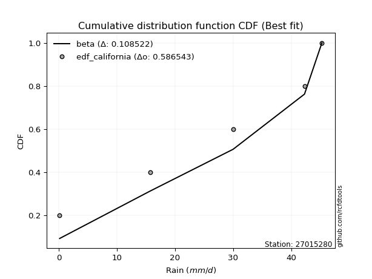</img>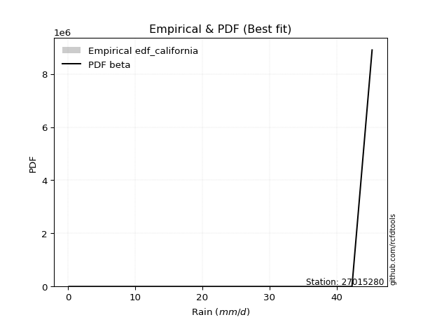</img>

</div>


### 2. EDF Hazen (1930)

Hazen method for plotting positions is a formula used to estimate the empirical cumulative probability distribution of flood events or other hydrological data. This formula often results in biased estimations, particularly when extrapolating to extreme events (high return periods).

<div align="center">


$P=(m-0.5)/n$


</div>


**2.1. Empirical values**

<div align="center">

|                | 0                  | 1                  | 2         | 3                 | 4                  |
|:---------------|:-------------------|:-------------------|:----------|:------------------|:-------------------|
| date           | 2025               | 2018               | 2020      | 2019              | 2017               |
| x              | 0.1                | 15.7               | 30.0      | 42.3              | 45.3               |
| m              | 1                  | 2                  | 3         | 4                 | 5                  |
| empirical_dist | edf_hazen          | edf_hazen          | edf_hazen | edf_hazen         | edf_hazen          |
| empirical      | 0.1                | 0.3                | 0.5       | 0.7               | 0.9                |
| empirical_tr   | 1.1111111111111112 | 1.4285714285714286 | 2.0       | 3.333333333333333 | 10.000000000000002 |

</div>


**2.2. Kolmogorov-Smirnov fit test (sorted by Δ)**


<div align="center">

|                | 0                   | 1                   | 2                   | 3                   | 4                   | 5                   | 6                   | 7                   | 8                   | 9                   | 10                  | 11                  | 12                  | 13                 | 14                  | 15                  | 16                  | 17                  | 18                  | 19                  | 20                  | 21                  | 22                  | 23                  | 24                 | 25                  | 26                 | 27                  | 28                 | 29                 | 30                 | 31                  | 32                  | 33                  | 34                 | 35                  | 36                  | 37                  | 38                  | 39                  | 40                  | 41                  | 42                 | 43                 | 44                  | 45                 | 46                  | 47                  | 48                 | 49                  | 50                 | 51                 | 52                  | 53                 | 54                  | 55                  | 56                  | 57                 | 58                 | 59                  | 60                  | 61                  | 62                  | 63                 | 64                 | 65                  | 66                 | 67                  | 68                  | 69                 | 70                  | 71                  | 72                 | 73                 | 74                  | 75                  | 76                  | 77                 | 78                 | 79                 | 80                  | 81                 | 82                  | 83                 | 84                  | 85                  | 86                  | 87                 | 88                 | 89                  | 90                 | 91                  | 92                 | 93                  | 94                 | 95                  | 96                  | 97                  | 98                 | 99                 | 100                 | 101                 | 102                 | 103                | 104                 | 105                | 106                | 107                 | 108                 | 109                | 110                 | 111                 | 112                | 113                | 114                 | 115                | 116                | 117                 | 118                 | 119                | 120                | 121                 | 122                | 123                | 124                | 125                | 126                | 127                | 128                | 129                 | 130                | 131                | 132                 | 133                | 134                | 135                | 136                | 137                 | 138                | 139                | 140                | 141                | 142                | 143                | 144                | 145                | 146                | 147                | 148                | 149                | 150                | 151                | 152                | 153                | 154                | 155                | 156                | 157                | 158                | 159                |
|:---------------|:--------------------|:--------------------|:--------------------|:--------------------|:--------------------|:--------------------|:--------------------|:--------------------|:--------------------|:--------------------|:--------------------|:--------------------|:--------------------|:-------------------|:--------------------|:--------------------|:--------------------|:--------------------|:--------------------|:--------------------|:--------------------|:--------------------|:--------------------|:--------------------|:-------------------|:--------------------|:-------------------|:--------------------|:-------------------|:-------------------|:-------------------|:--------------------|:--------------------|:--------------------|:-------------------|:--------------------|:--------------------|:--------------------|:--------------------|:--------------------|:--------------------|:--------------------|:-------------------|:-------------------|:--------------------|:-------------------|:--------------------|:--------------------|:-------------------|:--------------------|:-------------------|:-------------------|:--------------------|:-------------------|:--------------------|:--------------------|:--------------------|:-------------------|:-------------------|:--------------------|:--------------------|:--------------------|:--------------------|:-------------------|:-------------------|:--------------------|:-------------------|:--------------------|:--------------------|:-------------------|:--------------------|:--------------------|:-------------------|:-------------------|:--------------------|:--------------------|:--------------------|:-------------------|:-------------------|:-------------------|:--------------------|:-------------------|:--------------------|:-------------------|:--------------------|:--------------------|:--------------------|:-------------------|:-------------------|:--------------------|:-------------------|:--------------------|:-------------------|:--------------------|:-------------------|:--------------------|:--------------------|:--------------------|:-------------------|:-------------------|:--------------------|:--------------------|:--------------------|:-------------------|:--------------------|:-------------------|:-------------------|:--------------------|:--------------------|:-------------------|:--------------------|:--------------------|:-------------------|:-------------------|:--------------------|:-------------------|:-------------------|:--------------------|:--------------------|:-------------------|:-------------------|:--------------------|:-------------------|:-------------------|:-------------------|:-------------------|:-------------------|:-------------------|:-------------------|:--------------------|:-------------------|:-------------------|:--------------------|:-------------------|:-------------------|:-------------------|:-------------------|:--------------------|:-------------------|:-------------------|:-------------------|:-------------------|:-------------------|:-------------------|:-------------------|:-------------------|:-------------------|:-------------------|:-------------------|:-------------------|:-------------------|:-------------------|:-------------------|:-------------------|:-------------------|:-------------------|:-------------------|:-------------------|:-------------------|:-------------------|
| station        | 27015280            | 27015280            | 27015280            | 27015280            | 27015280            | 27015280            | 27015280            | 27015280            | 27015280            | 27015280            | 27015280            | 27015280            | 27015280            | 27015280           | 27015280            | 27015280            | 27015280            | 27015280            | 27015280            | 27015280            | 27015280            | 27015280            | 27015280            | 27015280            | 27015280           | 27015280            | 27015280           | 27015280            | 27015280           | 27015280           | 27015280           | 27015280            | 27015280            | 27015280            | 27015280           | 27015280            | 27015280            | 27015280            | 27015280            | 27015280            | 27015280            | 27015280            | 27015280           | 27015280           | 27015280            | 27015280           | 27015280            | 27015280            | 27015280           | 27015280            | 27015280           | 27015280           | 27015280            | 27015280           | 27015280            | 27015280            | 27015280            | 27015280           | 27015280           | 27015280            | 27015280            | 27015280            | 27015280            | 27015280           | 27015280           | 27015280            | 27015280           | 27015280            | 27015280            | 27015280           | 27015280            | 27015280            | 27015280           | 27015280           | 27015280            | 27015280            | 27015280            | 27015280           | 27015280           | 27015280           | 27015280            | 27015280           | 27015280            | 27015280           | 27015280            | 27015280            | 27015280            | 27015280           | 27015280           | 27015280            | 27015280           | 27015280            | 27015280           | 27015280            | 27015280           | 27015280            | 27015280            | 27015280            | 27015280           | 27015280           | 27015280            | 27015280            | 27015280            | 27015280           | 27015280            | 27015280           | 27015280           | 27015280            | 27015280            | 27015280           | 27015280            | 27015280            | 27015280           | 27015280           | 27015280            | 27015280           | 27015280           | 27015280            | 27015280            | 27015280           | 27015280           | 27015280            | 27015280           | 27015280           | 27015280           | 27015280           | 27015280           | 27015280           | 27015280           | 27015280            | 27015280           | 27015280           | 27015280            | 27015280           | 27015280           | 27015280           | 27015280           | 27015280            | 27015280           | 27015280           | 27015280           | 27015280           | 27015280           | 27015280           | 27015280           | 27015280           | 27015280           | 27015280           | 27015280           | 27015280           | 27015280           | 27015280           | 27015280           | 27015280           | 27015280           | 27015280           | 27015280           | 27015280           | 27015280           | 27015280           |
| empirical_dist | edf_hazen           | edf_hazen           | edf_hazen           | edf_hazen           | edf_hazen           | edf_hazen           | edf_hazen           | edf_hazen           | edf_hazen           | edf_hazen           | edf_hazen           | edf_hazen           | edf_hazen           | edf_hazen          | edf_hazen           | edf_hazen           | edf_hazen           | edf_hazen           | edf_hazen           | edf_hazen           | edf_hazen           | edf_hazen           | edf_hazen           | edf_hazen           | edf_hazen          | edf_hazen           | edf_hazen          | edf_hazen           | edf_hazen          | edf_hazen          | edf_hazen          | edf_hazen           | edf_hazen           | edf_hazen           | edf_hazen          | edf_hazen           | edf_hazen           | edf_hazen           | edf_hazen           | edf_hazen           | edf_hazen           | edf_hazen           | edf_hazen          | edf_hazen          | edf_hazen           | edf_hazen          | edf_hazen           | edf_hazen           | edf_hazen          | edf_hazen           | edf_hazen          | edf_hazen          | edf_hazen           | edf_hazen          | edf_hazen           | edf_hazen           | edf_hazen           | edf_hazen          | edf_hazen          | edf_hazen           | edf_hazen           | edf_hazen           | edf_hazen           | edf_hazen          | edf_hazen          | edf_hazen           | edf_hazen          | edf_hazen           | edf_hazen           | edf_hazen          | edf_hazen           | edf_hazen           | edf_hazen          | edf_hazen          | edf_hazen           | edf_hazen           | edf_hazen           | edf_hazen          | edf_hazen          | edf_hazen          | edf_hazen           | edf_hazen          | edf_hazen           | edf_hazen          | edf_hazen           | edf_hazen           | edf_hazen           | edf_hazen          | edf_hazen          | edf_hazen           | edf_hazen          | edf_hazen           | edf_hazen          | edf_hazen           | edf_hazen          | edf_hazen           | edf_hazen           | edf_hazen           | edf_hazen          | edf_hazen          | edf_hazen           | edf_hazen           | edf_hazen           | edf_hazen          | edf_hazen           | edf_hazen          | edf_hazen          | edf_hazen           | edf_hazen           | edf_hazen          | edf_hazen           | edf_hazen           | edf_hazen          | edf_hazen          | edf_hazen           | edf_hazen          | edf_hazen          | edf_hazen           | edf_hazen           | edf_hazen          | edf_hazen          | edf_hazen           | edf_hazen          | edf_hazen          | edf_hazen          | edf_hazen          | edf_hazen          | edf_hazen          | edf_hazen          | edf_hazen           | edf_hazen          | edf_hazen          | edf_hazen           | edf_hazen          | edf_hazen          | edf_hazen          | edf_hazen          | edf_hazen           | edf_hazen          | edf_hazen          | edf_hazen          | edf_hazen          | edf_hazen          | edf_hazen          | edf_hazen          | edf_hazen          | edf_hazen          | edf_hazen          | edf_hazen          | edf_hazen          | edf_hazen          | edf_hazen          | edf_hazen          | edf_hazen          | edf_hazen          | edf_hazen          | edf_hazen          | edf_hazen          | edf_hazen          | edf_hazen          |
| p_dist         | ksone               | semicircular        | anglit              | beta                | genextreme          | loggenpareto        | loggausshyper       | trapezoid           | arcsine             | rice                | invgauss            | pearson3            | gamma               | maxwell            | rayleigh            | crystalball         | norm                | exponnorm           | t                   | betaprime           | erlang              | alpha               | ncf                 | burr12              | weibull_min        | foldnorm            | kstwobign          | halfnorm            | gumbel_l           | dweibull           | logistic           | cosine              | gumbel_r            | dgamma              | levy_l             | loglevy_l           | hypsecant           | gausshyper          | argus               | laplace             | wrapcauchy          | halflogistic        | moyal              | genpareto          | genexpon            | genhalflogistic    | nakagami            | logpearson3         | lomax              | triang              | gennorm            | skewnorm           | mielke              | logvonmises_line   | loggompertz         | logargus            | loggumbel_l         | logwrapcauchy      | kappa4             | halfgennorm         | tukeylambda         | kappa3              | uniform             | vonmises_line      | wald               | truncweibull_min    | bradford           | logtrapezoid        | logarcsine          | truncexpon         | logloggamma         | logsemicircular     | loganglit          | logrice            | logexponnorm        | lognorm             | logcrystalball      | lognct             | lognakagami        | logfoldnorm        | logerlang           | johnsonsu          | loginvgamma         | f                  | loggamma            | loggamma            | loglogistic         | logtruncnorm       | logalpha           | loginvgauss         | loghypsecant       | gompertz            | loggennorm         | loginvweibull       | logmaxwell         | lograyleigh         | logt                | logweibull_max      | loglaplace         | loglaplace         | logkstwobign        | logncf              | loggenexpon         | loggenextreme      | loghalfnorm         | logcosine          | loggumbel_r        | logdgamma           | burr                | logdweibull        | invgamma            | logjohnsonsb        | loghalflogistic    | logbeta            | logmoyal            | loggengamma        | loggenhalflogistic | logburr12           | loghalfgennorm      | loglomax           | logskewnorm        | weibull_max         | logexponweib       | gengamma           | logkappa3          | logtriang          | logwald            | logf               | logbetaprime       | logloglaplace       | logksone           | logkappa4          | fatiguelife         | invweibull         | truncpareto        | logbradford        | loguniform         | logtruncweibull_min | exponweib          | logtruncexpon      | logfatiguelife     | logweibull_min     | powerlaw           | logburr            | logmielke          | exponpow           | logexponpow        | logpowerlaw        | logtruncpareto     | johnsonsb          | logjohnsonsu       | nct                | truncnorm          | rdist              | genlogistic        | loggenlogistic     | logrdist           | logtukeylambda     | logvonmises        | vonmises           |
| delta          | 0.08202483716841669 | 0.08329974972546972 | 0.09527002353852121 | 0.09999988839708629 | 0.09999999999957587 | 0.09999999999999998 | 0.10560445511166566 | 0.10855173465318946 | 0.11578945599142965 | 0.12029160776582692 | 0.12051265854167115 | 0.12127495913626818 | 0.12133667879683718 | 0.1222297764522624 | 0.12224391600301832 | 0.12226415314842443 | 0.12226415482551656 | 0.12226610494492485 | 0.12238831708962583 | 0.12269267498624659 | 0.12308606605149208 | 0.12372077122665803 | 0.12623048620196897 | 0.12710675927183834 | 0.1297246733995694 | 0.13142999329298788 | 0.1372261530413219 | 0.14047827222750342 | 0.140635930420124  | 0.1419149476892838 | 0.1423743461037219 | 0.14409268056209956 | 0.14633454990242634 | 0.15155647871464495 | 0.1525661414924646 | 0.15328038338305183 | 0.15352632263400212 | 0.15429386370029397 | 0.16017269164873438 | 0.16465392187055938 | 0.16615740534511236 | 0.16848899657511163 | 0.1701113898473332 | 0.1745348213283044 | 0.17538026476865665 | 0.1770134582339995 | 0.18799335099418002 | 0.18976305118832154 | 0.191720271830068  | 0.19850258006320354 | 0.2                | 0.2050429367599771 | 0.20727348372827759 | 0.2102662795400314 | 0.21086788120230643 | 0.21613062664594018 | 0.21734532747024554 | 0.217599612315653  | 0.2223830521543576 | 0.22317715037407998 | 0.22318596501869625 | 0.23273580622714596 | 0.23362831858407085 | 0.2347694332071142 | 0.2361686486603175 | 0.23852134009477655 | 0.2415265245141851 | 0.24209983210447134 | 0.24585375273969629 | 0.250964642178375  | 0.26329727160896566 | 0.26451246052408234 | 0.2691768292546675 | 0.2804381389827965 | 0.28043910636241626 | 0.28044072247478063 | 0.28044072442228857 | 0.2805929747749099 | 0.2810968523867004 | 0.2836619893608135 | 0.28380457541018284 | 0.2842656027448124 | 0.28940043597298176 | 0.2905759751280658 | 0.29072526921022473 | 0.29072526921022473 | 0.29103351302755726 | 0.2934195427111134 | 0.2960033923347209 | 0.29859593041618887 | 0.2998324269195421 | 0.29999997486722907 | 0.300523109949269  | 0.30195564434888017 | 0.3086101977907956 | 0.31746951679682195 | 0.31800828157696326 | 0.32314513631459335 | 0.3247873498963861 | 0.3247873498963861 | 0.32865111706938627 | 0.33585248500699066 | 0.33666187466920455 | 0.3400857545932086 | 0.34256525228656826 | 0.3432289384213029 | 0.3487241212688798 | 0.34927762485334546 | 0.35505116005427545 | 0.3594610050691619 | 0.35950135410993106 | 0.36001247817406645 | 0.3706239408194935 | 0.3718381094042675 | 0.37238723359306963 | 0.3732414522064994 | 0.3740233336303069 | 0.37851017076393123 | 0.38688269983698004 | 0.3920287408117214 | 0.4032783207595157 | 0.40528133491029716 | 0.4063008004834999 | 0.4103290662243569 | 0.4313983098584739 | 0.4340541472383605 | 0.4381473096275033 | 0.440786782296588  | 0.4459021388591346 | 0.44975440607913236 | 0.4722823999081143 | 0.4794863000620359 | 0.48611680870378665 | 0.4865906268768871 | 0.4886807750145881 | 0.5258800026663906 | 0.5267388798897372 | 0.5427995439647015  | 0.5618502307018047 | 0.5619773498990659 | 0.5650529449689463 | 0.5657333443967376 | 0.5865518523839859 | 0.5981837499970435 | 0.6344284193333127 | 0.6370880125009781 | 0.6505645842506436 | 0.6749057621768864 | 0.6802695256029148 | 0.6865303715278898 | 0.6872162981944362 | 0.6984724486241227 | 0.6998843619087312 | 0.6999999999436057 | 0.7                | 0.7                | 0.7                | 0.899989693649006  | 0.9743733773213237 | 7.040374555047828  |
| deltao         | 0.5865427407550001  | 0.5865427407550001  | 0.5865427407550001  | 0.5865427407550001  | 0.5865427407550001  | 0.5865427407550001  | 0.5865427407550001  | 0.5865427407550001  | 0.5865427407550001  | 0.5865427407550001  | 0.5865427407550001  | 0.5865427407550001  | 0.5865427407550001  | 0.5865427407550001 | 0.5865427407550001  | 0.5865427407550001  | 0.5865427407550001  | 0.5865427407550001  | 0.5865427407550001  | 0.5865427407550001  | 0.5865427407550001  | 0.5865427407550001  | 0.5865427407550001  | 0.5865427407550001  | 0.5865427407550001 | 0.5865427407550001  | 0.5865427407550001 | 0.5865427407550001  | 0.5865427407550001 | 0.5865427407550001 | 0.5865427407550001 | 0.5865427407550001  | 0.5865427407550001  | 0.5865427407550001  | 0.5865427407550001 | 0.5865427407550001  | 0.5865427407550001  | 0.5865427407550001  | 0.5865427407550001  | 0.5865427407550001  | 0.5865427407550001  | 0.5865427407550001  | 0.5865427407550001 | 0.5865427407550001 | 0.5865427407550001  | 0.5865427407550001 | 0.5865427407550001  | 0.5865427407550001  | 0.5865427407550001 | 0.5865427407550001  | 0.5865427407550001 | 0.5865427407550001 | 0.5865427407550001  | 0.5865427407550001 | 0.5865427407550001  | 0.5865427407550001  | 0.5865427407550001  | 0.5865427407550001 | 0.5865427407550001 | 0.5865427407550001  | 0.5865427407550001  | 0.5865427407550001  | 0.5865427407550001  | 0.5865427407550001 | 0.5865427407550001 | 0.5865427407550001  | 0.5865427407550001 | 0.5865427407550001  | 0.5865427407550001  | 0.5865427407550001 | 0.5865427407550001  | 0.5865427407550001  | 0.5865427407550001 | 0.5865427407550001 | 0.5865427407550001  | 0.5865427407550001  | 0.5865427407550001  | 0.5865427407550001 | 0.5865427407550001 | 0.5865427407550001 | 0.5865427407550001  | 0.5865427407550001 | 0.5865427407550001  | 0.5865427407550001 | 0.5865427407550001  | 0.5865427407550001  | 0.5865427407550001  | 0.5865427407550001 | 0.5865427407550001 | 0.5865427407550001  | 0.5865427407550001 | 0.5865427407550001  | 0.5865427407550001 | 0.5865427407550001  | 0.5865427407550001 | 0.5865427407550001  | 0.5865427407550001  | 0.5865427407550001  | 0.5865427407550001 | 0.5865427407550001 | 0.5865427407550001  | 0.5865427407550001  | 0.5865427407550001  | 0.5865427407550001 | 0.5865427407550001  | 0.5865427407550001 | 0.5865427407550001 | 0.5865427407550001  | 0.5865427407550001  | 0.5865427407550001 | 0.5865427407550001  | 0.5865427407550001  | 0.5865427407550001 | 0.5865427407550001 | 0.5865427407550001  | 0.5865427407550001 | 0.5865427407550001 | 0.5865427407550001  | 0.5865427407550001  | 0.5865427407550001 | 0.5865427407550001 | 0.5865427407550001  | 0.5865427407550001 | 0.5865427407550001 | 0.5865427407550001 | 0.5865427407550001 | 0.5865427407550001 | 0.5865427407550001 | 0.5865427407550001 | 0.5865427407550001  | 0.5865427407550001 | 0.5865427407550001 | 0.5865427407550001  | 0.5865427407550001 | 0.5865427407550001 | 0.5865427407550001 | 0.5865427407550001 | 0.5865427407550001  | 0.5865427407550001 | 0.5865427407550001 | 0.5865427407550001 | 0.5865427407550001 | 0.5865427407550001 | 0.5865427407550001 | 0.5865427407550001 | 0.5865427407550001 | 0.5865427407550001 | 0.5865427407550001 | 0.5865427407550001 | 0.5865427407550001 | 0.5865427407550001 | 0.5865427407550001 | 0.5865427407550001 | 0.5865427407550001 | 0.5865427407550001 | 0.5865427407550001 | 0.5865427407550001 | 0.5865427407550001 | 0.5865427407550001 | 0.5865427407550001 |
| eval           | Δo > Δ              | Δo > Δ              | Δo > Δ              | Δo > Δ              | Δo > Δ              | Δo > Δ              | Δo > Δ              | Δo > Δ              | Δo > Δ              | Δo > Δ              | Δo > Δ              | Δo > Δ              | Δo > Δ              | Δo > Δ             | Δo > Δ              | Δo > Δ              | Δo > Δ              | Δo > Δ              | Δo > Δ              | Δo > Δ              | Δo > Δ              | Δo > Δ              | Δo > Δ              | Δo > Δ              | Δo > Δ             | Δo > Δ              | Δo > Δ             | Δo > Δ              | Δo > Δ             | Δo > Δ             | Δo > Δ             | Δo > Δ              | Δo > Δ              | Δo > Δ              | Δo > Δ             | Δo > Δ              | Δo > Δ              | Δo > Δ              | Δo > Δ              | Δo > Δ              | Δo > Δ              | Δo > Δ              | Δo > Δ             | Δo > Δ             | Δo > Δ              | Δo > Δ             | Δo > Δ              | Δo > Δ              | Δo > Δ             | Δo > Δ              | Δo > Δ             | Δo > Δ             | Δo > Δ              | Δo > Δ             | Δo > Δ              | Δo > Δ              | Δo > Δ              | Δo > Δ             | Δo > Δ             | Δo > Δ              | Δo > Δ              | Δo > Δ              | Δo > Δ              | Δo > Δ             | Δo > Δ             | Δo > Δ              | Δo > Δ             | Δo > Δ              | Δo > Δ              | Δo > Δ             | Δo > Δ              | Δo > Δ              | Δo > Δ             | Δo > Δ             | Δo > Δ              | Δo > Δ              | Δo > Δ              | Δo > Δ             | Δo > Δ             | Δo > Δ             | Δo > Δ              | Δo > Δ             | Δo > Δ              | Δo > Δ             | Δo > Δ              | Δo > Δ              | Δo > Δ              | Δo > Δ             | Δo > Δ             | Δo > Δ              | Δo > Δ             | Δo > Δ              | Δo > Δ             | Δo > Δ              | Δo > Δ             | Δo > Δ              | Δo > Δ              | Δo > Δ              | Δo > Δ             | Δo > Δ             | Δo > Δ              | Δo > Δ              | Δo > Δ              | Δo > Δ             | Δo > Δ              | Δo > Δ             | Δo > Δ             | Δo > Δ              | Δo > Δ              | Δo > Δ             | Δo > Δ              | Δo > Δ              | Δo > Δ             | Δo > Δ             | Δo > Δ              | Δo > Δ             | Δo > Δ             | Δo > Δ              | Δo > Δ              | Δo > Δ             | Δo > Δ             | Δo > Δ              | Δo > Δ             | Δo > Δ             | Δo > Δ             | Δo > Δ             | Δo > Δ             | Δo > Δ             | Δo > Δ             | Δo > Δ              | Δo > Δ             | Δo > Δ             | Δo > Δ              | Δo > Δ             | Δo > Δ             | Δo > Δ             | Δo > Δ             | Δo > Δ              | Δo > Δ             | Δo > Δ             | Δo > Δ             | Δo > Δ             | Δo <= Δ            | Δo <= Δ            | Δo <= Δ            | Δo <= Δ            | Δo <= Δ            | Δo <= Δ            | Δo <= Δ            | Δo <= Δ            | Δo <= Δ            | Δo <= Δ            | Δo <= Δ            | Δo <= Δ            | Δo <= Δ            | Δo <= Δ            | Δo <= Δ            | Δo <= Δ            | Δo <= Δ            | Δo <= Δ            |
| fit            | 1                   | 1                   | 1                   | 1                   | 1                   | 1                   | 1                   | 1                   | 1                   | 1                   | 1                   | 1                   | 1                   | 1                  | 1                   | 1                   | 1                   | 1                   | 1                   | 1                   | 1                   | 1                   | 1                   | 1                   | 1                  | 1                   | 1                  | 1                   | 1                  | 1                  | 1                  | 1                   | 1                   | 1                   | 1                  | 1                   | 1                   | 1                   | 1                   | 1                   | 1                   | 1                   | 1                  | 1                  | 1                   | 1                  | 1                   | 1                   | 1                  | 1                   | 1                  | 1                  | 1                   | 1                  | 1                   | 1                   | 1                   | 1                  | 1                  | 1                   | 1                   | 1                   | 1                   | 1                  | 1                  | 1                   | 1                  | 1                   | 1                   | 1                  | 1                   | 1                   | 1                  | 1                  | 1                   | 1                   | 1                   | 1                  | 1                  | 1                  | 1                   | 1                  | 1                   | 1                  | 1                   | 1                   | 1                   | 1                  | 1                  | 1                   | 1                  | 1                   | 1                  | 1                   | 1                  | 1                   | 1                   | 1                   | 1                  | 1                  | 1                   | 1                   | 1                   | 1                  | 1                   | 1                  | 1                  | 1                   | 1                   | 1                  | 1                   | 1                   | 1                  | 1                  | 1                   | 1                  | 1                  | 1                   | 1                   | 1                  | 1                  | 1                   | 1                  | 1                  | 1                  | 1                  | 1                  | 1                  | 1                  | 1                   | 1                  | 1                  | 1                   | 1                  | 1                  | 1                  | 1                  | 1                   | 1                  | 1                  | 1                  | 1                  | 0                  | 0                  | 0                  | 0                  | 0                  | 0                  | 0                  | 0                  | 0                  | 0                  | 0                  | 0                  | 0                  | 0                  | 0                  | 0                  | 0                  | 0                  |
| n              | 5                   | 5                   | 5                   | 5                   | 5                   | 5                   | 5                   | 5                   | 5                   | 5                   | 5                   | 5                   | 5                   | 5                  | 5                   | 5                   | 5                   | 5                   | 5                   | 5                   | 5                   | 5                   | 5                   | 5                   | 5                  | 5                   | 5                  | 5                   | 5                  | 5                  | 5                  | 5                   | 5                   | 5                   | 5                  | 5                   | 5                   | 5                   | 5                   | 5                   | 5                   | 5                   | 5                  | 5                  | 5                   | 5                  | 5                   | 5                   | 5                  | 5                   | 5                  | 5                  | 5                   | 5                  | 5                   | 5                   | 5                   | 5                  | 5                  | 5                   | 5                   | 5                   | 5                   | 5                  | 5                  | 5                   | 5                  | 5                   | 5                   | 5                  | 5                   | 5                   | 5                  | 5                  | 5                   | 5                   | 5                   | 5                  | 5                  | 5                  | 5                   | 5                  | 5                   | 5                  | 5                   | 5                   | 5                   | 5                  | 5                  | 5                   | 5                  | 5                   | 5                  | 5                   | 5                  | 5                   | 5                   | 5                   | 5                  | 5                  | 5                   | 5                   | 5                   | 5                  | 5                   | 5                  | 5                  | 5                   | 5                   | 5                  | 5                   | 5                   | 5                  | 5                  | 5                   | 5                  | 5                  | 5                   | 5                   | 5                  | 5                  | 5                   | 5                  | 5                  | 5                  | 5                  | 5                  | 5                  | 5                  | 5                   | 5                  | 5                  | 5                   | 5                  | 5                  | 5                  | 5                  | 5                   | 5                  | 5                  | 5                  | 5                  | 5                  | 5                  | 5                  | 5                  | 5                  | 5                  | 5                  | 5                  | 5                  | 5                  | 5                  | 5                  | 5                  | 5                  | 5                  | 5                  | 5                  | 5                  |
| best_fit       | 1                   | 0                   | 0                   | 0                   | 0                   | 0                   | 0                   | 0                   | 0                   | 0                   | 0                   | 0                   | 0                   | 0                  | 0                   | 0                   | 0                   | 0                   | 0                   | 0                   | 0                   | 0                   | 0                   | 0                   | 0                  | 0                   | 0                  | 0                   | 0                  | 0                  | 0                  | 0                   | 0                   | 0                   | 0                  | 0                   | 0                   | 0                   | 0                   | 0                   | 0                   | 0                   | 0                  | 0                  | 0                   | 0                  | 0                   | 0                   | 0                  | 0                   | 0                  | 0                  | 0                   | 0                  | 0                   | 0                   | 0                   | 0                  | 0                  | 0                   | 0                   | 0                   | 0                   | 0                  | 0                  | 0                   | 0                  | 0                   | 0                   | 0                  | 0                   | 0                   | 0                  | 0                  | 0                   | 0                   | 0                   | 0                  | 0                  | 0                  | 0                   | 0                  | 0                   | 0                  | 0                   | 0                   | 0                   | 0                  | 0                  | 0                   | 0                  | 0                   | 0                  | 0                   | 0                  | 0                   | 0                   | 0                   | 0                  | 0                  | 0                   | 0                   | 0                   | 0                  | 0                   | 0                  | 0                  | 0                   | 0                   | 0                  | 0                   | 0                   | 0                  | 0                  | 0                   | 0                  | 0                  | 0                   | 0                   | 0                  | 0                  | 0                   | 0                  | 0                  | 0                  | 0                  | 0                  | 0                  | 0                  | 0                   | 0                  | 0                  | 0                   | 0                  | 0                  | 0                  | 0                  | 0                   | 0                  | 0                  | 0                  | 0                  | 0                  | 0                  | 0                  | 0                  | 0                  | 0                  | 0                  | 0                  | 0                  | 0                  | 0                  | 0                  | 0                  | 0                  | 0                  | 0                  | 0                  | 0                  |
| best_fit_sort  | 1                   | 2                   | 3                   | 4                   | 5                   | 6                   | 7                   | 8                   | 9                   | 10                  | 11                  | 12                  | 13                  | 14                 | 15                  | 16                  | 17                  | 18                  | 19                  | 20                  | 21                  | 22                  | 23                  | 24                  | 25                 | 26                  | 27                 | 28                  | 29                 | 30                 | 31                 | 32                  | 33                  | 34                  | 35                 | 36                  | 37                  | 38                  | 39                  | 40                  | 41                  | 42                  | 43                 | 44                 | 45                  | 46                 | 47                  | 48                  | 49                 | 50                  | 51                 | 52                 | 53                  | 54                 | 55                  | 56                  | 57                  | 58                 | 59                 | 60                  | 61                  | 62                  | 63                  | 64                 | 65                 | 66                  | 67                 | 68                  | 69                  | 70                 | 71                  | 72                  | 73                 | 74                 | 75                  | 76                  | 77                  | 78                 | 79                 | 80                 | 81                  | 82                 | 83                  | 84                 | 85                  | 86                  | 87                  | 88                 | 89                 | 90                  | 91                 | 92                  | 93                 | 94                  | 95                 | 96                  | 97                  | 98                  | 99                 | 100                | 101                 | 102                 | 103                 | 104                | 105                 | 106                | 107                | 108                 | 109                 | 110                | 111                 | 112                 | 113                | 114                | 115                 | 116                | 117                | 118                 | 119                 | 120                | 121                | 122                 | 123                | 124                | 125                | 126                | 127                | 128                | 129                | 130                 | 131                | 132                | 133                 | 134                | 135                | 136                | 137                | 138                 | 139                | 140                | 141                | 142                | 143                | 144                | 145                | 146                | 147                | 148                | 149                | 150                | 151                | 152                | 153                | 154                | 155                | 156                | 157                | 158                | 159                | 160                |

</div>


**2.3. Best fit**

<div align="center">

|   id |   station | empirical_dist   | p_dist   |     delta |   deltao | eval   |   fit |   n |   best_fit |   best_fit_sort |
|-----:|----------:|:-----------------|:---------|----------:|---------:|:-------|------:|----:|-----------:|----------------:|
|    0 |  27015280 | edf_hazen        | ksone    | 0.0820248 | 0.586543 | Δo > Δ |     1 |   5 |          1 |               1 |

</div>


<div align="center">

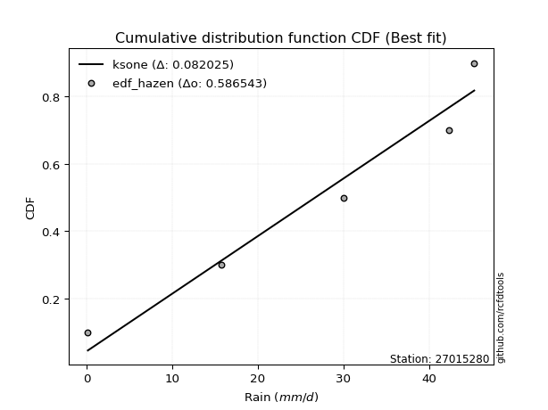</img></img>

</div>


### 3. EDF Weibull (1939)

Weibull plotting position formula is an empirical method used to estimate the non-exceedance probability or plotting position for a set of observed data, is often recommended or widely used in practice, particularly in flood frequency analysis.

<div align="center">


$P=m/(n+1)$


</div>


**3.1. Empirical values**

<div align="center">

|                | 0                   | 1                  | 2           | 3                  | 4                  |
|:---------------|:--------------------|:-------------------|:------------|:-------------------|:-------------------|
| date           | 2025                | 2018               | 2020        | 2019               | 2017               |
| x              | 0.1                 | 15.7               | 30.0        | 42.3               | 45.3               |
| m              | 1                   | 2                  | 3           | 4                  | 5                  |
| empirical_dist | edf_weibull         | edf_weibull        | edf_weibull | edf_weibull        | edf_weibull        |
| empirical      | 0.16666666666666666 | 0.3333333333333333 | 0.5         | 0.6666666666666666 | 0.8333333333333334 |
| empirical_tr   | 1.2                 | 1.4999999999999998 | 2.0         | 2.9999999999999996 | 6.000000000000002  |

</div>


**3.2. Kolmogorov-Smirnov fit test (sorted by Δ)**


<div align="center">

|                | 0                   | 1                   | 2                   | 3                   | 4                   | 5                  | 6                   | 7                   | 8                   | 9                  | 10                 | 11                  | 12                  | 13                  | 14                  | 15                  | 16                  | 17                 | 18                 | 19                  | 20                  | 21                  | 22                  | 23                 | 24                  | 25                  | 26                  | 27                  | 28                 | 29                  | 30                  | 31                  | 32                  | 33                  | 34                  | 35                  | 36                  | 37                  | 38                  | 39                  | 40                 | 41                 | 42                 | 43                  | 44                  | 45                  | 46                  | 47                 | 48                  | 49                  | 50                  | 51                 | 52                 | 53                 | 54                 | 55                  | 56                  | 57                  | 58                 | 59                  | 60                 | 61                 | 62                  | 63                 | 64                 | 65                  | 66                 | 67                  | 68                  | 69                  | 70                  | 71                 | 72                  | 73                  | 74                  | 75                 | 76                 | 77                 | 78                 | 79                  | 80                 | 81                  | 82                  | 83                 | 84                  | 85                 | 86                 | 87                  | 88                  | 89                  | 90                 | 91                 | 92                 | 93                 | 94                 | 95                 | 96                  | 97                  | 98                  | 99                  | 100                | 101                 | 102                | 103                 | 104                | 105                | 106                 | 107                | 108                | 109                | 110                 | 111                 | 112                | 113                | 114                 | 115                | 116                | 117                 | 118                 | 119                | 120                | 121                 | 122                 | 123                 | 124                 | 125                | 126                | 127                | 128                | 129                 | 130                 | 131                | 132                | 133                | 134                | 135                | 136                 | 137                 | 138                | 139                | 140                | 141                | 142                | 143                | 144                | 145                | 146                | 147                | 148                | 149                | 150                | 151                | 152                | 153                | 154                | 155                | 156                | 157                | 158                | 159                |
|:---------------|:--------------------|:--------------------|:--------------------|:--------------------|:--------------------|:-------------------|:--------------------|:--------------------|:--------------------|:-------------------|:-------------------|:--------------------|:--------------------|:--------------------|:--------------------|:--------------------|:--------------------|:-------------------|:-------------------|:--------------------|:--------------------|:--------------------|:--------------------|:-------------------|:--------------------|:--------------------|:--------------------|:--------------------|:-------------------|:--------------------|:--------------------|:--------------------|:--------------------|:--------------------|:--------------------|:--------------------|:--------------------|:--------------------|:--------------------|:--------------------|:-------------------|:-------------------|:-------------------|:--------------------|:--------------------|:--------------------|:--------------------|:-------------------|:--------------------|:--------------------|:--------------------|:-------------------|:-------------------|:-------------------|:-------------------|:--------------------|:--------------------|:--------------------|:-------------------|:--------------------|:-------------------|:-------------------|:--------------------|:-------------------|:-------------------|:--------------------|:-------------------|:--------------------|:--------------------|:--------------------|:--------------------|:-------------------|:--------------------|:--------------------|:--------------------|:-------------------|:-------------------|:-------------------|:-------------------|:--------------------|:-------------------|:--------------------|:--------------------|:-------------------|:--------------------|:-------------------|:-------------------|:--------------------|:--------------------|:--------------------|:-------------------|:-------------------|:-------------------|:-------------------|:-------------------|:-------------------|:--------------------|:--------------------|:--------------------|:--------------------|:-------------------|:--------------------|:-------------------|:--------------------|:-------------------|:-------------------|:--------------------|:-------------------|:-------------------|:-------------------|:--------------------|:--------------------|:-------------------|:-------------------|:--------------------|:-------------------|:-------------------|:--------------------|:--------------------|:-------------------|:-------------------|:--------------------|:--------------------|:--------------------|:--------------------|:-------------------|:-------------------|:-------------------|:-------------------|:--------------------|:--------------------|:-------------------|:-------------------|:-------------------|:-------------------|:-------------------|:--------------------|:--------------------|:-------------------|:-------------------|:-------------------|:-------------------|:-------------------|:-------------------|:-------------------|:-------------------|:-------------------|:-------------------|:-------------------|:-------------------|:-------------------|:-------------------|:-------------------|:-------------------|:-------------------|:-------------------|:-------------------|:-------------------|:-------------------|:-------------------|
| station        | 27015280            | 27015280            | 27015280            | 27015280            | 27015280            | 27015280           | 27015280            | 27015280            | 27015280            | 27015280           | 27015280           | 27015280            | 27015280            | 27015280            | 27015280            | 27015280            | 27015280            | 27015280           | 27015280           | 27015280            | 27015280            | 27015280            | 27015280            | 27015280           | 27015280            | 27015280            | 27015280            | 27015280            | 27015280           | 27015280            | 27015280            | 27015280            | 27015280            | 27015280            | 27015280            | 27015280            | 27015280            | 27015280            | 27015280            | 27015280            | 27015280           | 27015280           | 27015280           | 27015280            | 27015280            | 27015280            | 27015280            | 27015280           | 27015280            | 27015280            | 27015280            | 27015280           | 27015280           | 27015280           | 27015280           | 27015280            | 27015280            | 27015280            | 27015280           | 27015280            | 27015280           | 27015280           | 27015280            | 27015280           | 27015280           | 27015280            | 27015280           | 27015280            | 27015280            | 27015280            | 27015280            | 27015280           | 27015280            | 27015280            | 27015280            | 27015280           | 27015280           | 27015280           | 27015280           | 27015280            | 27015280           | 27015280            | 27015280            | 27015280           | 27015280            | 27015280           | 27015280           | 27015280            | 27015280            | 27015280            | 27015280           | 27015280           | 27015280           | 27015280           | 27015280           | 27015280           | 27015280            | 27015280            | 27015280            | 27015280            | 27015280           | 27015280            | 27015280           | 27015280            | 27015280           | 27015280           | 27015280            | 27015280           | 27015280           | 27015280           | 27015280            | 27015280            | 27015280           | 27015280           | 27015280            | 27015280           | 27015280           | 27015280            | 27015280            | 27015280           | 27015280           | 27015280            | 27015280            | 27015280            | 27015280            | 27015280           | 27015280           | 27015280           | 27015280           | 27015280            | 27015280            | 27015280           | 27015280           | 27015280           | 27015280           | 27015280           | 27015280            | 27015280            | 27015280           | 27015280           | 27015280           | 27015280           | 27015280           | 27015280           | 27015280           | 27015280           | 27015280           | 27015280           | 27015280           | 27015280           | 27015280           | 27015280           | 27015280           | 27015280           | 27015280           | 27015280           | 27015280           | 27015280           | 27015280           | 27015280           |
| empirical_dist | edf_weibull         | edf_weibull         | edf_weibull         | edf_weibull         | edf_weibull         | edf_weibull        | edf_weibull         | edf_weibull         | edf_weibull         | edf_weibull        | edf_weibull        | edf_weibull         | edf_weibull         | edf_weibull         | edf_weibull         | edf_weibull         | edf_weibull         | edf_weibull        | edf_weibull        | edf_weibull         | edf_weibull         | edf_weibull         | edf_weibull         | edf_weibull        | edf_weibull         | edf_weibull         | edf_weibull         | edf_weibull         | edf_weibull        | edf_weibull         | edf_weibull         | edf_weibull         | edf_weibull         | edf_weibull         | edf_weibull         | edf_weibull         | edf_weibull         | edf_weibull         | edf_weibull         | edf_weibull         | edf_weibull        | edf_weibull        | edf_weibull        | edf_weibull         | edf_weibull         | edf_weibull         | edf_weibull         | edf_weibull        | edf_weibull         | edf_weibull         | edf_weibull         | edf_weibull        | edf_weibull        | edf_weibull        | edf_weibull        | edf_weibull         | edf_weibull         | edf_weibull         | edf_weibull        | edf_weibull         | edf_weibull        | edf_weibull        | edf_weibull         | edf_weibull        | edf_weibull        | edf_weibull         | edf_weibull        | edf_weibull         | edf_weibull         | edf_weibull         | edf_weibull         | edf_weibull        | edf_weibull         | edf_weibull         | edf_weibull         | edf_weibull        | edf_weibull        | edf_weibull        | edf_weibull        | edf_weibull         | edf_weibull        | edf_weibull         | edf_weibull         | edf_weibull        | edf_weibull         | edf_weibull        | edf_weibull        | edf_weibull         | edf_weibull         | edf_weibull         | edf_weibull        | edf_weibull        | edf_weibull        | edf_weibull        | edf_weibull        | edf_weibull        | edf_weibull         | edf_weibull         | edf_weibull         | edf_weibull         | edf_weibull        | edf_weibull         | edf_weibull        | edf_weibull         | edf_weibull        | edf_weibull        | edf_weibull         | edf_weibull        | edf_weibull        | edf_weibull        | edf_weibull         | edf_weibull         | edf_weibull        | edf_weibull        | edf_weibull         | edf_weibull        | edf_weibull        | edf_weibull         | edf_weibull         | edf_weibull        | edf_weibull        | edf_weibull         | edf_weibull         | edf_weibull         | edf_weibull         | edf_weibull        | edf_weibull        | edf_weibull        | edf_weibull        | edf_weibull         | edf_weibull         | edf_weibull        | edf_weibull        | edf_weibull        | edf_weibull        | edf_weibull        | edf_weibull         | edf_weibull         | edf_weibull        | edf_weibull        | edf_weibull        | edf_weibull        | edf_weibull        | edf_weibull        | edf_weibull        | edf_weibull        | edf_weibull        | edf_weibull        | edf_weibull        | edf_weibull        | edf_weibull        | edf_weibull        | edf_weibull        | edf_weibull        | edf_weibull        | edf_weibull        | edf_weibull        | edf_weibull        | edf_weibull        | edf_weibull        |
| p_dist         | semicircular        | ksone               | anglit              | trapezoid           | kstwobign           | levy_l             | loglevy_l           | rice                | invgauss            | pearson3           | gamma              | maxwell             | rayleigh            | crystalball         | norm                | exponnorm           | t                   | betaprime          | erlang             | logpearson3         | alpha               | burr12              | weibull_min         | foldnorm           | ncf                 | beta                | wrapcauchy          | loggausshyper       | logvonmises_line   | genextreme          | loggenpareto        | halfnorm            | arcsine             | gennorm             | gumbel_l            | dweibull            | genexpon            | gumbel_r            | logistic            | halflogistic        | cosine             | nakagami           | moyal              | loggumbel_l         | logwrapcauchy       | dgamma              | hypsecant           | gausshyper         | genpareto           | loggompertz         | halfgennorm         | lomax              | argus              | laplace            | logtrapezoid       | genhalflogistic     | logarcsine          | logargus            | logsemicircular    | triang              | loganglit          | wald               | skewnorm            | mielke             | logrice            | logexponnorm        | lognorm            | logcrystalball      | lognct              | lognakagami         | logfoldnorm         | logerlang          | johnsonsu           | kappa4              | loginvgamma         | tukeylambda        | f                  | loggamma           | loggamma           | loglogistic         | logtruncnorm       | logalpha            | loginvgauss         | kappa3             | loghypsecant        | uniform            | vonmises_line      | loginvweibull       | truncweibull_min    | bradford            | logmaxwell         | logdgamma          | lograyleigh        | truncexpon         | logloggamma        | logweibull_max     | loglaplace          | loglaplace          | logdweibull         | logkstwobign        | loggennorm         | logncf              | loggenexpon        | loggengamma         | loggenextreme      | logjohnsonsb       | loghalfnorm         | logcosine          | logburr12          | loggumbel_r        | logt                | invgamma            | gompertz           | loghalflogistic    | logbeta             | logmoyal           | logexponweib       | burr                | loggenhalflogistic  | loghalfgennorm     | loglomax           | logkappa3           | weibull_max         | gengamma            | logskewnorm         | logtriang          | logwald            | logf               | logbetaprime       | logloglaplace       | invweibull          | logksone           | logkappa4          | fatiguelife        | truncpareto        | logbradford        | loguniform          | logtruncweibull_min | exponweib          | logtruncexpon      | logfatiguelife     | logweibull_min     | powerlaw           | logburr            | logmielke          | exponpow           | logexponpow        | logpowerlaw        | logtruncpareto     | johnsonsb          | logjohnsonsu       | nct                | truncnorm          | rdist              | genlogistic        | loggenlogistic     | logrdist           | logtukeylambda     | logvonmises        | vonmises           |
| delta          | 0.11663308305880304 | 0.12057535775493097 | 0.12860335687185454 | 0.14188506798652278 | 0.14516529800461786 | 0.1525661414924646 | 0.15328038338305183 | 0.15362494109916025 | 0.15384599187500447 | 0.1546082924696015 | 0.1546700121301705 | 0.15556310978559573 | 0.15557724933635164 | 0.15559748648175775 | 0.15559748815884988 | 0.15559943827825817 | 0.15572165042295916 | 0.1560260083195799 | 0.1564193993848254 | 0.15642971785498822 | 0.15705410455999136 | 0.16044009260517167 | 0.16305800673290272 | 0.1647633266263212 | 0.16661753158978762 | 0.16666655506375294 | 0.16666663417688787 | 0.16666666647353412 | 0.1666666666463097 | 0.16666666666624252 | 0.16666666666666663 | 0.16666666666666666 | 0.16666666666666666 | 0.16666666666666669 | 0.17396926375345734 | 0.17524828102261714 | 0.17538026476865665 | 0.17561158473245875 | 0.17570767943705523 | 0.17693558576092072 | 0.1774260138954329 | 0.1801887957180175 | 0.1827596488742591 | 0.18401199413691222 | 0.18426627898231968 | 0.18488981204797827 | 0.18685965596733545 | 0.1876271970336273 | 0.18937810729674298 | 0.18965208292932967 | 0.18984381704074665 | 0.191720271830068  | 0.1935060249820677 | 0.1979872552038927 | 0.208766498771138  | 0.21034679156733282 | 0.21252041940636296 | 0.22668259451316586 | 0.231179127190749  | 0.23183591339653686 | 0.2358434959213342 | 0.2361686486603175 | 0.23837627009331042 | 0.2406068170616109 | 0.2471048056494632 | 0.24710577302908293 | 0.2471073891414473 | 0.24710739108895524 | 0.24725964144157658 | 0.24776351905336708 | 0.25032865602748017 | 0.2504712420768495 | 0.25093226941147906 | 0.25571638548769093 | 0.25606710263964844 | 0.2565192983520296 | 0.2572426417947325 | 0.2573919358768914 | 0.2573919358768914 | 0.25770017969422393 | 0.2600862093777801 | 0.26267005900138757 | 0.26526259708285554 | 0.2660691395604793 | 0.26649909358620877 | 0.2669616519174042 | 0.2681027665404475 | 0.26862231101554684 | 0.27185467342810987 | 0.27485985784751843 | 0.2752768644574623 | 0.2826109581866788 | 0.2841361834634886 | 0.2842979755117083 | 0.2893676188952816 | 0.2911830424087949 | 0.29145401656305275 | 0.29145401656305275 | 0.29279433840249525 | 0.29531778373605294 | 0.300523109949269  | 0.30251915167365734 | 0.3033285413358712 | 0.30657478553983275 | 0.3067524212598753 | 0.3079347091777295 | 0.30923191895323493 | 0.3098956050879696 | 0.3118435040972646 | 0.3153907879355465 | 0.31800828157696326 | 0.32616802077659773 | 0.3333333082005624 | 0.3372906074861602 | 0.33850477607093415 | 0.3390539002597363 | 0.3396341338168333 | 0.34177130552425483 | 0.34380998176835487 | 0.3535493665036467 | 0.3586954074783881 | 0.36473164319180723 | 0.37194800157696384 | 0.37699573289102356 | 0.38223456942559664 | 0.4007208139050272 | 0.40481397629417   | 0.4074534489632547 | 0.4125688055258013 | 0.41642107274579904 | 0.41992396021022044 | 0.438949066574781  | 0.4461529667287026 | 0.4527834753704533 | 0.4553474416812548 | 0.4925466693330572 | 0.49340554655640384 | 0.5094662106313683  | 0.5285168973684713 | 0.5286440165657325 | 0.5317196116356129 | 0.5324000110634044 | 0.5532185190506524 | 0.5648504166637103 | 0.6010950859999793 | 0.6037546791676449 | 0.6172312509173101 | 0.6415724288435529 | 0.6469361922695815 | 0.6531970381945564 | 0.6538829648611029 | 0.6651391152907893 | 0.6665510285753977 | 0.6666666666102723 | 0.6666666666666666 | 0.6666666666666666 | 0.6666666666666667 | 0.8333230269823394 | 1.0077067106546571 | 7.107041221714495  |
| deltao         | 0.5865427407550001  | 0.5865427407550001  | 0.5865427407550001  | 0.5865427407550001  | 0.5865427407550001  | 0.5865427407550001 | 0.5865427407550001  | 0.5865427407550001  | 0.5865427407550001  | 0.5865427407550001 | 0.5865427407550001 | 0.5865427407550001  | 0.5865427407550001  | 0.5865427407550001  | 0.5865427407550001  | 0.5865427407550001  | 0.5865427407550001  | 0.5865427407550001 | 0.5865427407550001 | 0.5865427407550001  | 0.5865427407550001  | 0.5865427407550001  | 0.5865427407550001  | 0.5865427407550001 | 0.5865427407550001  | 0.5865427407550001  | 0.5865427407550001  | 0.5865427407550001  | 0.5865427407550001 | 0.5865427407550001  | 0.5865427407550001  | 0.5865427407550001  | 0.5865427407550001  | 0.5865427407550001  | 0.5865427407550001  | 0.5865427407550001  | 0.5865427407550001  | 0.5865427407550001  | 0.5865427407550001  | 0.5865427407550001  | 0.5865427407550001 | 0.5865427407550001 | 0.5865427407550001 | 0.5865427407550001  | 0.5865427407550001  | 0.5865427407550001  | 0.5865427407550001  | 0.5865427407550001 | 0.5865427407550001  | 0.5865427407550001  | 0.5865427407550001  | 0.5865427407550001 | 0.5865427407550001 | 0.5865427407550001 | 0.5865427407550001 | 0.5865427407550001  | 0.5865427407550001  | 0.5865427407550001  | 0.5865427407550001 | 0.5865427407550001  | 0.5865427407550001 | 0.5865427407550001 | 0.5865427407550001  | 0.5865427407550001 | 0.5865427407550001 | 0.5865427407550001  | 0.5865427407550001 | 0.5865427407550001  | 0.5865427407550001  | 0.5865427407550001  | 0.5865427407550001  | 0.5865427407550001 | 0.5865427407550001  | 0.5865427407550001  | 0.5865427407550001  | 0.5865427407550001 | 0.5865427407550001 | 0.5865427407550001 | 0.5865427407550001 | 0.5865427407550001  | 0.5865427407550001 | 0.5865427407550001  | 0.5865427407550001  | 0.5865427407550001 | 0.5865427407550001  | 0.5865427407550001 | 0.5865427407550001 | 0.5865427407550001  | 0.5865427407550001  | 0.5865427407550001  | 0.5865427407550001 | 0.5865427407550001 | 0.5865427407550001 | 0.5865427407550001 | 0.5865427407550001 | 0.5865427407550001 | 0.5865427407550001  | 0.5865427407550001  | 0.5865427407550001  | 0.5865427407550001  | 0.5865427407550001 | 0.5865427407550001  | 0.5865427407550001 | 0.5865427407550001  | 0.5865427407550001 | 0.5865427407550001 | 0.5865427407550001  | 0.5865427407550001 | 0.5865427407550001 | 0.5865427407550001 | 0.5865427407550001  | 0.5865427407550001  | 0.5865427407550001 | 0.5865427407550001 | 0.5865427407550001  | 0.5865427407550001 | 0.5865427407550001 | 0.5865427407550001  | 0.5865427407550001  | 0.5865427407550001 | 0.5865427407550001 | 0.5865427407550001  | 0.5865427407550001  | 0.5865427407550001  | 0.5865427407550001  | 0.5865427407550001 | 0.5865427407550001 | 0.5865427407550001 | 0.5865427407550001 | 0.5865427407550001  | 0.5865427407550001  | 0.5865427407550001 | 0.5865427407550001 | 0.5865427407550001 | 0.5865427407550001 | 0.5865427407550001 | 0.5865427407550001  | 0.5865427407550001  | 0.5865427407550001 | 0.5865427407550001 | 0.5865427407550001 | 0.5865427407550001 | 0.5865427407550001 | 0.5865427407550001 | 0.5865427407550001 | 0.5865427407550001 | 0.5865427407550001 | 0.5865427407550001 | 0.5865427407550001 | 0.5865427407550001 | 0.5865427407550001 | 0.5865427407550001 | 0.5865427407550001 | 0.5865427407550001 | 0.5865427407550001 | 0.5865427407550001 | 0.5865427407550001 | 0.5865427407550001 | 0.5865427407550001 | 0.5865427407550001 |
| eval           | Δo > Δ              | Δo > Δ              | Δo > Δ              | Δo > Δ              | Δo > Δ              | Δo > Δ             | Δo > Δ              | Δo > Δ              | Δo > Δ              | Δo > Δ             | Δo > Δ             | Δo > Δ              | Δo > Δ              | Δo > Δ              | Δo > Δ              | Δo > Δ              | Δo > Δ              | Δo > Δ             | Δo > Δ             | Δo > Δ              | Δo > Δ              | Δo > Δ              | Δo > Δ              | Δo > Δ             | Δo > Δ              | Δo > Δ              | Δo > Δ              | Δo > Δ              | Δo > Δ             | Δo > Δ              | Δo > Δ              | Δo > Δ              | Δo > Δ              | Δo > Δ              | Δo > Δ              | Δo > Δ              | Δo > Δ              | Δo > Δ              | Δo > Δ              | Δo > Δ              | Δo > Δ             | Δo > Δ             | Δo > Δ             | Δo > Δ              | Δo > Δ              | Δo > Δ              | Δo > Δ              | Δo > Δ             | Δo > Δ              | Δo > Δ              | Δo > Δ              | Δo > Δ             | Δo > Δ             | Δo > Δ             | Δo > Δ             | Δo > Δ              | Δo > Δ              | Δo > Δ              | Δo > Δ             | Δo > Δ              | Δo > Δ             | Δo > Δ             | Δo > Δ              | Δo > Δ             | Δo > Δ             | Δo > Δ              | Δo > Δ             | Δo > Δ              | Δo > Δ              | Δo > Δ              | Δo > Δ              | Δo > Δ             | Δo > Δ              | Δo > Δ              | Δo > Δ              | Δo > Δ             | Δo > Δ             | Δo > Δ             | Δo > Δ             | Δo > Δ              | Δo > Δ             | Δo > Δ              | Δo > Δ              | Δo > Δ             | Δo > Δ              | Δo > Δ             | Δo > Δ             | Δo > Δ              | Δo > Δ              | Δo > Δ              | Δo > Δ             | Δo > Δ             | Δo > Δ             | Δo > Δ             | Δo > Δ             | Δo > Δ             | Δo > Δ              | Δo > Δ              | Δo > Δ              | Δo > Δ              | Δo > Δ             | Δo > Δ              | Δo > Δ             | Δo > Δ              | Δo > Δ             | Δo > Δ             | Δo > Δ              | Δo > Δ             | Δo > Δ             | Δo > Δ             | Δo > Δ              | Δo > Δ              | Δo > Δ             | Δo > Δ             | Δo > Δ              | Δo > Δ             | Δo > Δ             | Δo > Δ              | Δo > Δ              | Δo > Δ             | Δo > Δ             | Δo > Δ              | Δo > Δ              | Δo > Δ              | Δo > Δ              | Δo > Δ             | Δo > Δ             | Δo > Δ             | Δo > Δ             | Δo > Δ              | Δo > Δ              | Δo > Δ             | Δo > Δ             | Δo > Δ             | Δo > Δ             | Δo > Δ             | Δo > Δ              | Δo > Δ              | Δo > Δ             | Δo > Δ             | Δo > Δ             | Δo > Δ             | Δo > Δ             | Δo > Δ             | Δo <= Δ            | Δo <= Δ            | Δo <= Δ            | Δo <= Δ            | Δo <= Δ            | Δo <= Δ            | Δo <= Δ            | Δo <= Δ            | Δo <= Δ            | Δo <= Δ            | Δo <= Δ            | Δo <= Δ            | Δo <= Δ            | Δo <= Δ            | Δo <= Δ            | Δo <= Δ            |
| fit            | 1                   | 1                   | 1                   | 1                   | 1                   | 1                  | 1                   | 1                   | 1                   | 1                  | 1                  | 1                   | 1                   | 1                   | 1                   | 1                   | 1                   | 1                  | 1                  | 1                   | 1                   | 1                   | 1                   | 1                  | 1                   | 1                   | 1                   | 1                   | 1                  | 1                   | 1                   | 1                   | 1                   | 1                   | 1                   | 1                   | 1                   | 1                   | 1                   | 1                   | 1                  | 1                  | 1                  | 1                   | 1                   | 1                   | 1                   | 1                  | 1                   | 1                   | 1                   | 1                  | 1                  | 1                  | 1                  | 1                   | 1                   | 1                   | 1                  | 1                   | 1                  | 1                  | 1                   | 1                  | 1                  | 1                   | 1                  | 1                   | 1                   | 1                   | 1                   | 1                  | 1                   | 1                   | 1                   | 1                  | 1                  | 1                  | 1                  | 1                   | 1                  | 1                   | 1                   | 1                  | 1                   | 1                  | 1                  | 1                   | 1                   | 1                   | 1                  | 1                  | 1                  | 1                  | 1                  | 1                  | 1                   | 1                   | 1                   | 1                   | 1                  | 1                   | 1                  | 1                   | 1                  | 1                  | 1                   | 1                  | 1                  | 1                  | 1                   | 1                   | 1                  | 1                  | 1                   | 1                  | 1                  | 1                   | 1                   | 1                  | 1                  | 1                   | 1                   | 1                   | 1                   | 1                  | 1                  | 1                  | 1                  | 1                   | 1                   | 1                  | 1                  | 1                  | 1                  | 1                  | 1                   | 1                   | 1                  | 1                  | 1                  | 1                  | 1                  | 1                  | 0                  | 0                  | 0                  | 0                  | 0                  | 0                  | 0                  | 0                  | 0                  | 0                  | 0                  | 0                  | 0                  | 0                  | 0                  | 0                  |
| n              | 5                   | 5                   | 5                   | 5                   | 5                   | 5                  | 5                   | 5                   | 5                   | 5                  | 5                  | 5                   | 5                   | 5                   | 5                   | 5                   | 5                   | 5                  | 5                  | 5                   | 5                   | 5                   | 5                   | 5                  | 5                   | 5                   | 5                   | 5                   | 5                  | 5                   | 5                   | 5                   | 5                   | 5                   | 5                   | 5                   | 5                   | 5                   | 5                   | 5                   | 5                  | 5                  | 5                  | 5                   | 5                   | 5                   | 5                   | 5                  | 5                   | 5                   | 5                   | 5                  | 5                  | 5                  | 5                  | 5                   | 5                   | 5                   | 5                  | 5                   | 5                  | 5                  | 5                   | 5                  | 5                  | 5                   | 5                  | 5                   | 5                   | 5                   | 5                   | 5                  | 5                   | 5                   | 5                   | 5                  | 5                  | 5                  | 5                  | 5                   | 5                  | 5                   | 5                   | 5                  | 5                   | 5                  | 5                  | 5                   | 5                   | 5                   | 5                  | 5                  | 5                  | 5                  | 5                  | 5                  | 5                   | 5                   | 5                   | 5                   | 5                  | 5                   | 5                  | 5                   | 5                  | 5                  | 5                   | 5                  | 5                  | 5                  | 5                   | 5                   | 5                  | 5                  | 5                   | 5                  | 5                  | 5                   | 5                   | 5                  | 5                  | 5                   | 5                   | 5                   | 5                   | 5                  | 5                  | 5                  | 5                  | 5                   | 5                   | 5                  | 5                  | 5                  | 5                  | 5                  | 5                   | 5                   | 5                  | 5                  | 5                  | 5                  | 5                  | 5                  | 5                  | 5                  | 5                  | 5                  | 5                  | 5                  | 5                  | 5                  | 5                  | 5                  | 5                  | 5                  | 5                  | 5                  | 5                  | 5                  |
| best_fit       | 1                   | 0                   | 0                   | 0                   | 0                   | 0                  | 0                   | 0                   | 0                   | 0                  | 0                  | 0                   | 0                   | 0                   | 0                   | 0                   | 0                   | 0                  | 0                  | 0                   | 0                   | 0                   | 0                   | 0                  | 0                   | 0                   | 0                   | 0                   | 0                  | 0                   | 0                   | 0                   | 0                   | 0                   | 0                   | 0                   | 0                   | 0                   | 0                   | 0                   | 0                  | 0                  | 0                  | 0                   | 0                   | 0                   | 0                   | 0                  | 0                   | 0                   | 0                   | 0                  | 0                  | 0                  | 0                  | 0                   | 0                   | 0                   | 0                  | 0                   | 0                  | 0                  | 0                   | 0                  | 0                  | 0                   | 0                  | 0                   | 0                   | 0                   | 0                   | 0                  | 0                   | 0                   | 0                   | 0                  | 0                  | 0                  | 0                  | 0                   | 0                  | 0                   | 0                   | 0                  | 0                   | 0                  | 0                  | 0                   | 0                   | 0                   | 0                  | 0                  | 0                  | 0                  | 0                  | 0                  | 0                   | 0                   | 0                   | 0                   | 0                  | 0                   | 0                  | 0                   | 0                  | 0                  | 0                   | 0                  | 0                  | 0                  | 0                   | 0                   | 0                  | 0                  | 0                   | 0                  | 0                  | 0                   | 0                   | 0                  | 0                  | 0                   | 0                   | 0                   | 0                   | 0                  | 0                  | 0                  | 0                  | 0                   | 0                   | 0                  | 0                  | 0                  | 0                  | 0                  | 0                   | 0                   | 0                  | 0                  | 0                  | 0                  | 0                  | 0                  | 0                  | 0                  | 0                  | 0                  | 0                  | 0                  | 0                  | 0                  | 0                  | 0                  | 0                  | 0                  | 0                  | 0                  | 0                  | 0                  |
| best_fit_sort  | 1                   | 2                   | 3                   | 4                   | 5                   | 6                  | 7                   | 8                   | 9                   | 10                 | 11                 | 12                  | 13                  | 14                  | 15                  | 16                  | 17                  | 18                 | 19                 | 20                  | 21                  | 22                  | 23                  | 24                 | 25                  | 26                  | 27                  | 28                  | 29                 | 30                  | 31                  | 32                  | 33                  | 34                  | 35                  | 36                  | 37                  | 38                  | 39                  | 40                  | 41                 | 42                 | 43                 | 44                  | 45                  | 46                  | 47                  | 48                 | 49                  | 50                  | 51                  | 52                 | 53                 | 54                 | 55                 | 56                  | 57                  | 58                  | 59                 | 60                  | 61                 | 62                 | 63                  | 64                 | 65                 | 66                  | 67                 | 68                  | 69                  | 70                  | 71                  | 72                 | 73                  | 74                  | 75                  | 76                 | 77                 | 78                 | 79                 | 80                  | 81                 | 82                  | 83                  | 84                 | 85                  | 86                 | 87                 | 88                  | 89                  | 90                  | 91                 | 92                 | 93                 | 94                 | 95                 | 96                 | 97                  | 98                  | 99                  | 100                 | 101                | 102                 | 103                | 104                 | 105                | 106                | 107                 | 108                | 109                | 110                | 111                 | 112                 | 113                | 114                | 115                 | 116                | 117                | 118                 | 119                 | 120                | 121                | 122                 | 123                 | 124                 | 125                 | 126                | 127                | 128                | 129                | 130                 | 131                 | 132                | 133                | 134                | 135                | 136                | 137                 | 138                 | 139                | 140                | 141                | 142                | 143                | 144                | 145                | 146                | 147                | 148                | 149                | 150                | 151                | 152                | 153                | 154                | 155                | 156                | 157                | 158                | 159                | 160                |

</div>


**3.3. Best fit**

<div align="center">

|   id |   station | empirical_dist   | p_dist       |    delta |   deltao | eval   |   fit |   n |   best_fit |   best_fit_sort |
|-----:|----------:|:-----------------|:-------------|---------:|---------:|:-------|------:|----:|-----------:|----------------:|
|    0 |  27015280 | edf_weibull      | semicircular | 0.116633 | 0.586543 | Δo > Δ |     1 |   5 |          1 |               1 |

</div>


<div align="center">

</img>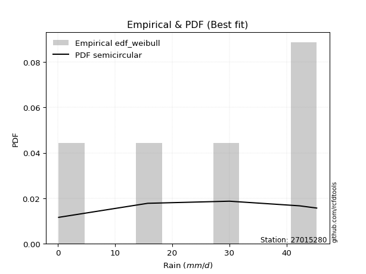</img>

</div>


### 4. EDF Beard (1943)

The Beard formula (or Beard´s plotting position formula) in hydrology is used to estimate the empirical non-exceedance probability _(P)_ of a flood event (or other extreme hydrological data point) within a given dataset.

<div align="center">


$P=(m-0.31)/(n+0.38)$


</div>


**4.1. Empirical values**

<div align="center">

|                | 0                   | 1                  | 2         | 3                  | 4                  |
|:---------------|:--------------------|:-------------------|:----------|:-------------------|:-------------------|
| date           | 2025                | 2018               | 2020      | 2019               | 2017               |
| x              | 0.1                 | 15.7               | 30.0      | 42.3               | 45.3               |
| m              | 1                   | 2                  | 3         | 4                  | 5                  |
| empirical_dist | edf_beard           | edf_beard          | edf_beard | edf_beard          | edf_beard          |
| empirical      | 0.12825278810408922 | 0.3141263940520446 | 0.5       | 0.6858736059479554 | 0.8717472118959109 |
| empirical_tr   | 1.1471215351812367  | 1.4579945799457996 | 2.0       | 3.183431952662722  | 7.797101449275368  |

</div>


**4.2. Kolmogorov-Smirnov fit test (sorted by Δ)**


<div align="center">

|                | 0                   | 1                   | 2                   | 3                   | 4                   | 5                   | 6                   | 7                   | 8                   | 9                   | 10                  | 11                  | 12                 | 13                 | 14                  | 15                  | 16                  | 17                  | 18                  | 19                  | 20                 | 21                 | 22                 | 23                  | 24                  | 25                  | 26                 | 27                 | 28                  | 29                 | 30                  | 31                  | 32                  | 33                  | 34                  | 35                  | 36                  | 37                  | 38                 | 39                  | 40                 | 41                 | 42                 | 43                  | 44                 | 45                 | 46                 | 47                  | 48                  | 49                  | 50                 | 51                 | 52                 | 53                  | 54                  | 55                  | 56                  | 57                 | 58                 | 59                 | 60                  | 61                 | 62                  | 63                  | 64                  | 65                  | 66                 | 67                 | 68                  | 69                 | 70                 | 71                 | 72                 | 73                 | 74                 | 75                  | 76                 | 77                  | 78                  | 79                 | 80                  | 81                 | 82                  | 83                 | 84                 | 85                 | 86                 | 87                 | 88                  | 89                  | 90                  | 91                  | 92                 | 93                 | 94                 | 95                 | 96                  | 97                  | 98                 | 99                  | 100                 | 101                | 102                 | 103                | 104                | 105                | 106                | 107                 | 108                | 109                | 110                 | 111                 | 112                | 113                | 114                | 115                 | 116                | 117                 | 118                | 119                 | 120                 | 121                 | 122                 | 123                 | 124                 | 125                 | 126                | 127                | 128                 | 129                 | 130                | 131                 | 132                | 133                | 134                | 135                | 136                | 137                 | 138                | 139                | 140                | 141                | 142                | 143                | 144                | 145                | 146                | 147                | 148                | 149                | 150                | 151                | 152                | 153                | 154                | 155                | 156                | 157                | 158                | 159                |
|:---------------|:--------------------|:--------------------|:--------------------|:--------------------|:--------------------|:--------------------|:--------------------|:--------------------|:--------------------|:--------------------|:--------------------|:--------------------|:-------------------|:-------------------|:--------------------|:--------------------|:--------------------|:--------------------|:--------------------|:--------------------|:-------------------|:-------------------|:-------------------|:--------------------|:--------------------|:--------------------|:-------------------|:-------------------|:--------------------|:-------------------|:--------------------|:--------------------|:--------------------|:--------------------|:--------------------|:--------------------|:--------------------|:--------------------|:-------------------|:--------------------|:-------------------|:-------------------|:-------------------|:--------------------|:-------------------|:-------------------|:-------------------|:--------------------|:--------------------|:--------------------|:-------------------|:-------------------|:-------------------|:--------------------|:--------------------|:--------------------|:--------------------|:-------------------|:-------------------|:-------------------|:--------------------|:-------------------|:--------------------|:--------------------|:--------------------|:--------------------|:-------------------|:-------------------|:--------------------|:-------------------|:-------------------|:-------------------|:-------------------|:-------------------|:-------------------|:--------------------|:-------------------|:--------------------|:--------------------|:-------------------|:--------------------|:-------------------|:--------------------|:-------------------|:-------------------|:-------------------|:-------------------|:-------------------|:--------------------|:--------------------|:--------------------|:--------------------|:-------------------|:-------------------|:-------------------|:-------------------|:--------------------|:--------------------|:-------------------|:--------------------|:--------------------|:-------------------|:--------------------|:-------------------|:-------------------|:-------------------|:-------------------|:--------------------|:-------------------|:-------------------|:--------------------|:--------------------|:-------------------|:-------------------|:-------------------|:--------------------|:-------------------|:--------------------|:-------------------|:--------------------|:--------------------|:--------------------|:--------------------|:--------------------|:--------------------|:--------------------|:-------------------|:-------------------|:--------------------|:--------------------|:-------------------|:--------------------|:-------------------|:-------------------|:-------------------|:-------------------|:-------------------|:--------------------|:-------------------|:-------------------|:-------------------|:-------------------|:-------------------|:-------------------|:-------------------|:-------------------|:-------------------|:-------------------|:-------------------|:-------------------|:-------------------|:-------------------|:-------------------|:-------------------|:-------------------|:-------------------|:-------------------|:-------------------|:-------------------|:-------------------|
| station        | 27015280            | 27015280            | 27015280            | 27015280            | 27015280            | 27015280            | 27015280            | 27015280            | 27015280            | 27015280            | 27015280            | 27015280            | 27015280           | 27015280           | 27015280            | 27015280            | 27015280            | 27015280            | 27015280            | 27015280            | 27015280           | 27015280           | 27015280           | 27015280            | 27015280            | 27015280            | 27015280           | 27015280           | 27015280            | 27015280           | 27015280            | 27015280            | 27015280            | 27015280            | 27015280            | 27015280            | 27015280            | 27015280            | 27015280           | 27015280            | 27015280           | 27015280           | 27015280           | 27015280            | 27015280           | 27015280           | 27015280           | 27015280            | 27015280            | 27015280            | 27015280           | 27015280           | 27015280           | 27015280            | 27015280            | 27015280            | 27015280            | 27015280           | 27015280           | 27015280           | 27015280            | 27015280           | 27015280            | 27015280            | 27015280            | 27015280            | 27015280           | 27015280           | 27015280            | 27015280           | 27015280           | 27015280           | 27015280           | 27015280           | 27015280           | 27015280            | 27015280           | 27015280            | 27015280            | 27015280           | 27015280            | 27015280           | 27015280            | 27015280           | 27015280           | 27015280           | 27015280           | 27015280           | 27015280            | 27015280            | 27015280            | 27015280            | 27015280           | 27015280           | 27015280           | 27015280           | 27015280            | 27015280            | 27015280           | 27015280            | 27015280            | 27015280           | 27015280            | 27015280           | 27015280           | 27015280           | 27015280           | 27015280            | 27015280           | 27015280           | 27015280            | 27015280            | 27015280           | 27015280           | 27015280           | 27015280            | 27015280           | 27015280            | 27015280           | 27015280            | 27015280            | 27015280            | 27015280            | 27015280            | 27015280            | 27015280            | 27015280           | 27015280           | 27015280            | 27015280            | 27015280           | 27015280            | 27015280           | 27015280           | 27015280           | 27015280           | 27015280           | 27015280            | 27015280           | 27015280           | 27015280           | 27015280           | 27015280           | 27015280           | 27015280           | 27015280           | 27015280           | 27015280           | 27015280           | 27015280           | 27015280           | 27015280           | 27015280           | 27015280           | 27015280           | 27015280           | 27015280           | 27015280           | 27015280           | 27015280           |
| empirical_dist | edf_beard           | edf_beard           | edf_beard           | edf_beard           | edf_beard           | edf_beard           | edf_beard           | edf_beard           | edf_beard           | edf_beard           | edf_beard           | edf_beard           | edf_beard          | edf_beard          | edf_beard           | edf_beard           | edf_beard           | edf_beard           | edf_beard           | edf_beard           | edf_beard          | edf_beard          | edf_beard          | edf_beard           | edf_beard           | edf_beard           | edf_beard          | edf_beard          | edf_beard           | edf_beard          | edf_beard           | edf_beard           | edf_beard           | edf_beard           | edf_beard           | edf_beard           | edf_beard           | edf_beard           | edf_beard          | edf_beard           | edf_beard          | edf_beard          | edf_beard          | edf_beard           | edf_beard          | edf_beard          | edf_beard          | edf_beard           | edf_beard           | edf_beard           | edf_beard          | edf_beard          | edf_beard          | edf_beard           | edf_beard           | edf_beard           | edf_beard           | edf_beard          | edf_beard          | edf_beard          | edf_beard           | edf_beard          | edf_beard           | edf_beard           | edf_beard           | edf_beard           | edf_beard          | edf_beard          | edf_beard           | edf_beard          | edf_beard          | edf_beard          | edf_beard          | edf_beard          | edf_beard          | edf_beard           | edf_beard          | edf_beard           | edf_beard           | edf_beard          | edf_beard           | edf_beard          | edf_beard           | edf_beard          | edf_beard          | edf_beard          | edf_beard          | edf_beard          | edf_beard           | edf_beard           | edf_beard           | edf_beard           | edf_beard          | edf_beard          | edf_beard          | edf_beard          | edf_beard           | edf_beard           | edf_beard          | edf_beard           | edf_beard           | edf_beard          | edf_beard           | edf_beard          | edf_beard          | edf_beard          | edf_beard          | edf_beard           | edf_beard          | edf_beard          | edf_beard           | edf_beard           | edf_beard          | edf_beard          | edf_beard          | edf_beard           | edf_beard          | edf_beard           | edf_beard          | edf_beard           | edf_beard           | edf_beard           | edf_beard           | edf_beard           | edf_beard           | edf_beard           | edf_beard          | edf_beard          | edf_beard           | edf_beard           | edf_beard          | edf_beard           | edf_beard          | edf_beard          | edf_beard          | edf_beard          | edf_beard          | edf_beard           | edf_beard          | edf_beard          | edf_beard          | edf_beard          | edf_beard          | edf_beard          | edf_beard          | edf_beard          | edf_beard          | edf_beard          | edf_beard          | edf_beard          | edf_beard          | edf_beard          | edf_beard          | edf_beard          | edf_beard          | edf_beard          | edf_beard          | edf_beard          | edf_beard          | edf_beard          |
| p_dist         | ksone               | semicircular        | anglit              | trapezoid           | ncf                 | beta                | loggausshyper       | genextreme          | loggenpareto        | arcsine             | rice                | invgauss            | pearson3           | gamma              | maxwell             | rayleigh            | crystalball         | norm                | exponnorm           | t                   | betaprime          | erlang             | kstwobign          | alpha               | halfnorm            | burr12              | weibull_min        | foldnorm           | wrapcauchy          | levy_l             | loglevy_l           | gumbel_l            | dweibull            | gumbel_r            | logistic            | cosine              | dgamma              | hypsecant           | gausshyper         | halflogistic        | moyal              | argus              | genpareto          | genexpon            | logpearson3        | laplace            | nakagami           | logvonmises_line    | gennorm             | genhalflogistic     | lomax              | loggompertz        | loggumbel_l        | logwrapcauchy       | halfgennorm         | triang              | logargus            | skewnorm           | mielke             | logtrapezoid       | logarcsine          | wald               | kappa4              | tukeylambda         | kappa3              | uniform             | vonmises_line      | logsemicircular    | truncweibull_min    | loganglit          | bradford           | truncexpon         | logrice            | logexponnorm       | lognorm            | logcrystalball      | lognct             | lognakagami         | logfoldnorm         | logerlang          | johnsonsu           | logloggamma        | loginvgamma         | f                  | loggamma           | loggamma           | loglogistic        | logtruncnorm       | logalpha            | loginvgauss         | loghypsecant        | loginvweibull       | logmaxwell         | loggennorm         | lograyleigh        | logweibull_max     | loglaplace          | loglaplace          | gompertz           | logkstwobign        | logt                | logdgamma          | logncf              | loggenexpon        | loggenextreme      | loghalfnorm        | logcosine          | logdweibull         | logjohnsonsb       | loggumbel_r        | burr                | loggengamma         | invgamma           | logburr12          | loghalflogistic    | logbeta             | logmoyal           | loggenhalflogistic  | loghalfgennorm     | loglomax            | logexponweib        | logskewnorm         | weibull_max         | gengamma            | logkappa3           | logtriang           | logwald            | logf               | logbetaprime        | logloglaplace       | logksone           | invweibull          | logkappa4          | fatiguelife        | truncpareto        | logbradford        | loguniform         | logtruncweibull_min | exponweib          | logtruncexpon      | logfatiguelife     | logweibull_min     | powerlaw           | logburr            | logmielke          | exponpow           | logexponpow        | logpowerlaw        | logtruncpareto     | johnsonsb          | logjohnsonsu       | nct                | truncnorm          | rdist              | logrdist           | genlogistic        | loggenlogistic     | logtukeylambda     | logvonmises        | vonmises           |
| delta          | 0.08216147919235353 | 0.09742614377751424 | 0.10939641759056573 | 0.12267812870523398 | 0.12820365302721018 | 0.12825267650117544 | 0.12825278791095662 | 0.12825278810366503 | 0.12825278810408913 | 0.12825278810408922 | 0.13441800181787145 | 0.13463905259371567 | 0.1354013531883127 | 0.1354630728488817 | 0.13635617050430693 | 0.13637031005506284 | 0.13639054720046895 | 0.13639054887756108 | 0.13639249899696937 | 0.13651471114167035 | 0.1368190690382911 | 0.1372124601035366 | 0.1372261530413219 | 0.13784716527870255 | 0.14047827222750342 | 0.14123315332388287 | 0.1438510674516139 | 0.1455563873450324 | 0.15203101129306773 | 0.1525661414924646 | 0.15328038338305183 | 0.15476232447216853 | 0.15604134174132833 | 0.15640464545116994 | 0.15650074015576643 | 0.15821907461414408 | 0.16568287276668947 | 0.16765271668604664 | 0.1684202577523385 | 0.16848899657511163 | 0.1701113898473332 | 0.1742990857007789 | 0.1745348213283044 | 0.17538026476865665 | 0.1756366571362769 | 0.1787803159226039 | 0.1801887957180175 | 0.18201349143594225 | 0.18587360594795543 | 0.19113985228604402 | 0.191720271830068  | 0.1967414871502618 | 0.2032189334182009 | 0.20347321826360837 | 0.20905075632203535 | 0.21262897411524806 | 0.21613062664594018 | 0.2191693308120216 | 0.2213998777803221 | 0.2279734380524267 | 0.23172735868765165 | 0.2361686486603175 | 0.23650944620640213 | 0.23731235907074077 | 0.24686220027919048 | 0.24775471263611537 | 0.2488958272591587 | 0.2503860664720377 | 0.25264773414682107 | 0.2550504352026229 | 0.2556529185662296 | 0.2650910362304195 | 0.2663117449307519 | 0.2663127123103716 | 0.266314328422736  | 0.26631433037024393 | 0.2664665807228653 | 0.26697045833465577 | 0.26953559530876886 | 0.2696781813581382 | 0.27013920869276786 | 0.2701606796139928 | 0.27527404192093713 | 0.2764495810760212 | 0.2765988751581801 | 0.2765988751581801 | 0.2769071189755126 | 0.2792931486590688 | 0.28187699828267626 | 0.28446953636414424 | 0.28570603286749746 | 0.28782925029683554 | 0.294483803738751  | 0.300523109949269  | 0.3033431227447773 | 0.3090187422625487 | 0.31066095584434145 | 0.31066095584434145 | 0.3141263689192737 | 0.31452472301734163 | 0.31800828157696326 | 0.3210248367492563 | 0.32172609095494603 | 0.3225354806171599 | 0.325959360541164  | 0.3284388582345236 | 0.3291025443692583 | 0.33120821696507274 | 0.3317596900699772 | 0.3345977272168352 | 0.34177130552425483 | 0.34498866410241025 | 0.3453749600578864 | 0.3502573826598421 | 0.3564975467674489 | 0.35771171535222296 | 0.358260839541025  | 0.35989693957826224 | 0.3727563057849354 | 0.37790234675967677 | 0.37804801237941077 | 0.38915192670747106 | 0.39115494085825264 | 0.39620267217231225 | 0.40314552175438473 | 0.41992775318631587 | 0.4240209155754587 | 0.4266603882445434 | 0.43177574480708997 | 0.43562801202708773 | 0.4581560058560697 | 0.45833783877279793 | 0.4653599060099913 | 0.471990414651742  | 0.4745543809625435 | 0.5117536086143459 | 0.5126124858376926 | 0.5286731499126569  | 0.5477238366497601 | 0.5478509558470213 | 0.5509265509169017 | 0.551606950344693  | 0.5724254583319413 | 0.5840573559449989 | 0.6203020252812681 | 0.6229616184489335 | 0.6364381901985989 | 0.6607793681248417 | 0.6661431315508701 | 0.6724039774758452 | 0.6730899041423917 | 0.6843460545720781 | 0.6857579678566865 | 0.6858736058915611 | 0.6858736059479553 | 0.6858736059479554 | 0.6858736059479554 | 0.8717369055449168 | 0.9884997713733682 | 7.068627343151918  |
| deltao         | 0.5865427407550001  | 0.5865427407550001  | 0.5865427407550001  | 0.5865427407550001  | 0.5865427407550001  | 0.5865427407550001  | 0.5865427407550001  | 0.5865427407550001  | 0.5865427407550001  | 0.5865427407550001  | 0.5865427407550001  | 0.5865427407550001  | 0.5865427407550001 | 0.5865427407550001 | 0.5865427407550001  | 0.5865427407550001  | 0.5865427407550001  | 0.5865427407550001  | 0.5865427407550001  | 0.5865427407550001  | 0.5865427407550001 | 0.5865427407550001 | 0.5865427407550001 | 0.5865427407550001  | 0.5865427407550001  | 0.5865427407550001  | 0.5865427407550001 | 0.5865427407550001 | 0.5865427407550001  | 0.5865427407550001 | 0.5865427407550001  | 0.5865427407550001  | 0.5865427407550001  | 0.5865427407550001  | 0.5865427407550001  | 0.5865427407550001  | 0.5865427407550001  | 0.5865427407550001  | 0.5865427407550001 | 0.5865427407550001  | 0.5865427407550001 | 0.5865427407550001 | 0.5865427407550001 | 0.5865427407550001  | 0.5865427407550001 | 0.5865427407550001 | 0.5865427407550001 | 0.5865427407550001  | 0.5865427407550001  | 0.5865427407550001  | 0.5865427407550001 | 0.5865427407550001 | 0.5865427407550001 | 0.5865427407550001  | 0.5865427407550001  | 0.5865427407550001  | 0.5865427407550001  | 0.5865427407550001 | 0.5865427407550001 | 0.5865427407550001 | 0.5865427407550001  | 0.5865427407550001 | 0.5865427407550001  | 0.5865427407550001  | 0.5865427407550001  | 0.5865427407550001  | 0.5865427407550001 | 0.5865427407550001 | 0.5865427407550001  | 0.5865427407550001 | 0.5865427407550001 | 0.5865427407550001 | 0.5865427407550001 | 0.5865427407550001 | 0.5865427407550001 | 0.5865427407550001  | 0.5865427407550001 | 0.5865427407550001  | 0.5865427407550001  | 0.5865427407550001 | 0.5865427407550001  | 0.5865427407550001 | 0.5865427407550001  | 0.5865427407550001 | 0.5865427407550001 | 0.5865427407550001 | 0.5865427407550001 | 0.5865427407550001 | 0.5865427407550001  | 0.5865427407550001  | 0.5865427407550001  | 0.5865427407550001  | 0.5865427407550001 | 0.5865427407550001 | 0.5865427407550001 | 0.5865427407550001 | 0.5865427407550001  | 0.5865427407550001  | 0.5865427407550001 | 0.5865427407550001  | 0.5865427407550001  | 0.5865427407550001 | 0.5865427407550001  | 0.5865427407550001 | 0.5865427407550001 | 0.5865427407550001 | 0.5865427407550001 | 0.5865427407550001  | 0.5865427407550001 | 0.5865427407550001 | 0.5865427407550001  | 0.5865427407550001  | 0.5865427407550001 | 0.5865427407550001 | 0.5865427407550001 | 0.5865427407550001  | 0.5865427407550001 | 0.5865427407550001  | 0.5865427407550001 | 0.5865427407550001  | 0.5865427407550001  | 0.5865427407550001  | 0.5865427407550001  | 0.5865427407550001  | 0.5865427407550001  | 0.5865427407550001  | 0.5865427407550001 | 0.5865427407550001 | 0.5865427407550001  | 0.5865427407550001  | 0.5865427407550001 | 0.5865427407550001  | 0.5865427407550001 | 0.5865427407550001 | 0.5865427407550001 | 0.5865427407550001 | 0.5865427407550001 | 0.5865427407550001  | 0.5865427407550001 | 0.5865427407550001 | 0.5865427407550001 | 0.5865427407550001 | 0.5865427407550001 | 0.5865427407550001 | 0.5865427407550001 | 0.5865427407550001 | 0.5865427407550001 | 0.5865427407550001 | 0.5865427407550001 | 0.5865427407550001 | 0.5865427407550001 | 0.5865427407550001 | 0.5865427407550001 | 0.5865427407550001 | 0.5865427407550001 | 0.5865427407550001 | 0.5865427407550001 | 0.5865427407550001 | 0.5865427407550001 | 0.5865427407550001 |
| eval           | Δo > Δ              | Δo > Δ              | Δo > Δ              | Δo > Δ              | Δo > Δ              | Δo > Δ              | Δo > Δ              | Δo > Δ              | Δo > Δ              | Δo > Δ              | Δo > Δ              | Δo > Δ              | Δo > Δ             | Δo > Δ             | Δo > Δ              | Δo > Δ              | Δo > Δ              | Δo > Δ              | Δo > Δ              | Δo > Δ              | Δo > Δ             | Δo > Δ             | Δo > Δ             | Δo > Δ              | Δo > Δ              | Δo > Δ              | Δo > Δ             | Δo > Δ             | Δo > Δ              | Δo > Δ             | Δo > Δ              | Δo > Δ              | Δo > Δ              | Δo > Δ              | Δo > Δ              | Δo > Δ              | Δo > Δ              | Δo > Δ              | Δo > Δ             | Δo > Δ              | Δo > Δ             | Δo > Δ             | Δo > Δ             | Δo > Δ              | Δo > Δ             | Δo > Δ             | Δo > Δ             | Δo > Δ              | Δo > Δ              | Δo > Δ              | Δo > Δ             | Δo > Δ             | Δo > Δ             | Δo > Δ              | Δo > Δ              | Δo > Δ              | Δo > Δ              | Δo > Δ             | Δo > Δ             | Δo > Δ             | Δo > Δ              | Δo > Δ             | Δo > Δ              | Δo > Δ              | Δo > Δ              | Δo > Δ              | Δo > Δ             | Δo > Δ             | Δo > Δ              | Δo > Δ             | Δo > Δ             | Δo > Δ             | Δo > Δ             | Δo > Δ             | Δo > Δ             | Δo > Δ              | Δo > Δ             | Δo > Δ              | Δo > Δ              | Δo > Δ             | Δo > Δ              | Δo > Δ             | Δo > Δ              | Δo > Δ             | Δo > Δ             | Δo > Δ             | Δo > Δ             | Δo > Δ             | Δo > Δ              | Δo > Δ              | Δo > Δ              | Δo > Δ              | Δo > Δ             | Δo > Δ             | Δo > Δ             | Δo > Δ             | Δo > Δ              | Δo > Δ              | Δo > Δ             | Δo > Δ              | Δo > Δ              | Δo > Δ             | Δo > Δ              | Δo > Δ             | Δo > Δ             | Δo > Δ             | Δo > Δ             | Δo > Δ              | Δo > Δ             | Δo > Δ             | Δo > Δ              | Δo > Δ              | Δo > Δ             | Δo > Δ             | Δo > Δ             | Δo > Δ              | Δo > Δ             | Δo > Δ              | Δo > Δ             | Δo > Δ              | Δo > Δ              | Δo > Δ              | Δo > Δ              | Δo > Δ              | Δo > Δ              | Δo > Δ              | Δo > Δ             | Δo > Δ             | Δo > Δ              | Δo > Δ              | Δo > Δ             | Δo > Δ              | Δo > Δ             | Δo > Δ             | Δo > Δ             | Δo > Δ             | Δo > Δ             | Δo > Δ              | Δo > Δ             | Δo > Δ             | Δo > Δ             | Δo > Δ             | Δo > Δ             | Δo > Δ             | Δo <= Δ            | Δo <= Δ            | Δo <= Δ            | Δo <= Δ            | Δo <= Δ            | Δo <= Δ            | Δo <= Δ            | Δo <= Δ            | Δo <= Δ            | Δo <= Δ            | Δo <= Δ            | Δo <= Δ            | Δo <= Δ            | Δo <= Δ            | Δo <= Δ            | Δo <= Δ            |
| fit            | 1                   | 1                   | 1                   | 1                   | 1                   | 1                   | 1                   | 1                   | 1                   | 1                   | 1                   | 1                   | 1                  | 1                  | 1                   | 1                   | 1                   | 1                   | 1                   | 1                   | 1                  | 1                  | 1                  | 1                   | 1                   | 1                   | 1                  | 1                  | 1                   | 1                  | 1                   | 1                   | 1                   | 1                   | 1                   | 1                   | 1                   | 1                   | 1                  | 1                   | 1                  | 1                  | 1                  | 1                   | 1                  | 1                  | 1                  | 1                   | 1                   | 1                   | 1                  | 1                  | 1                  | 1                   | 1                   | 1                   | 1                   | 1                  | 1                  | 1                  | 1                   | 1                  | 1                   | 1                   | 1                   | 1                   | 1                  | 1                  | 1                   | 1                  | 1                  | 1                  | 1                  | 1                  | 1                  | 1                   | 1                  | 1                   | 1                   | 1                  | 1                   | 1                  | 1                   | 1                  | 1                  | 1                  | 1                  | 1                  | 1                   | 1                   | 1                   | 1                   | 1                  | 1                  | 1                  | 1                  | 1                   | 1                   | 1                  | 1                   | 1                   | 1                  | 1                   | 1                  | 1                  | 1                  | 1                  | 1                   | 1                  | 1                  | 1                   | 1                   | 1                  | 1                  | 1                  | 1                   | 1                  | 1                   | 1                  | 1                   | 1                   | 1                   | 1                   | 1                   | 1                   | 1                   | 1                  | 1                  | 1                   | 1                   | 1                  | 1                   | 1                  | 1                  | 1                  | 1                  | 1                  | 1                   | 1                  | 1                  | 1                  | 1                  | 1                  | 1                  | 0                  | 0                  | 0                  | 0                  | 0                  | 0                  | 0                  | 0                  | 0                  | 0                  | 0                  | 0                  | 0                  | 0                  | 0                  | 0                  |
| n              | 5                   | 5                   | 5                   | 5                   | 5                   | 5                   | 5                   | 5                   | 5                   | 5                   | 5                   | 5                   | 5                  | 5                  | 5                   | 5                   | 5                   | 5                   | 5                   | 5                   | 5                  | 5                  | 5                  | 5                   | 5                   | 5                   | 5                  | 5                  | 5                   | 5                  | 5                   | 5                   | 5                   | 5                   | 5                   | 5                   | 5                   | 5                   | 5                  | 5                   | 5                  | 5                  | 5                  | 5                   | 5                  | 5                  | 5                  | 5                   | 5                   | 5                   | 5                  | 5                  | 5                  | 5                   | 5                   | 5                   | 5                   | 5                  | 5                  | 5                  | 5                   | 5                  | 5                   | 5                   | 5                   | 5                   | 5                  | 5                  | 5                   | 5                  | 5                  | 5                  | 5                  | 5                  | 5                  | 5                   | 5                  | 5                   | 5                   | 5                  | 5                   | 5                  | 5                   | 5                  | 5                  | 5                  | 5                  | 5                  | 5                   | 5                   | 5                   | 5                   | 5                  | 5                  | 5                  | 5                  | 5                   | 5                   | 5                  | 5                   | 5                   | 5                  | 5                   | 5                  | 5                  | 5                  | 5                  | 5                   | 5                  | 5                  | 5                   | 5                   | 5                  | 5                  | 5                  | 5                   | 5                  | 5                   | 5                  | 5                   | 5                   | 5                   | 5                   | 5                   | 5                   | 5                   | 5                  | 5                  | 5                   | 5                   | 5                  | 5                   | 5                  | 5                  | 5                  | 5                  | 5                  | 5                   | 5                  | 5                  | 5                  | 5                  | 5                  | 5                  | 5                  | 5                  | 5                  | 5                  | 5                  | 5                  | 5                  | 5                  | 5                  | 5                  | 5                  | 5                  | 5                  | 5                  | 5                  | 5                  |
| best_fit       | 1                   | 0                   | 0                   | 0                   | 0                   | 0                   | 0                   | 0                   | 0                   | 0                   | 0                   | 0                   | 0                  | 0                  | 0                   | 0                   | 0                   | 0                   | 0                   | 0                   | 0                  | 0                  | 0                  | 0                   | 0                   | 0                   | 0                  | 0                  | 0                   | 0                  | 0                   | 0                   | 0                   | 0                   | 0                   | 0                   | 0                   | 0                   | 0                  | 0                   | 0                  | 0                  | 0                  | 0                   | 0                  | 0                  | 0                  | 0                   | 0                   | 0                   | 0                  | 0                  | 0                  | 0                   | 0                   | 0                   | 0                   | 0                  | 0                  | 0                  | 0                   | 0                  | 0                   | 0                   | 0                   | 0                   | 0                  | 0                  | 0                   | 0                  | 0                  | 0                  | 0                  | 0                  | 0                  | 0                   | 0                  | 0                   | 0                   | 0                  | 0                   | 0                  | 0                   | 0                  | 0                  | 0                  | 0                  | 0                  | 0                   | 0                   | 0                   | 0                   | 0                  | 0                  | 0                  | 0                  | 0                   | 0                   | 0                  | 0                   | 0                   | 0                  | 0                   | 0                  | 0                  | 0                  | 0                  | 0                   | 0                  | 0                  | 0                   | 0                   | 0                  | 0                  | 0                  | 0                   | 0                  | 0                   | 0                  | 0                   | 0                   | 0                   | 0                   | 0                   | 0                   | 0                   | 0                  | 0                  | 0                   | 0                   | 0                  | 0                   | 0                  | 0                  | 0                  | 0                  | 0                  | 0                   | 0                  | 0                  | 0                  | 0                  | 0                  | 0                  | 0                  | 0                  | 0                  | 0                  | 0                  | 0                  | 0                  | 0                  | 0                  | 0                  | 0                  | 0                  | 0                  | 0                  | 0                  | 0                  |
| best_fit_sort  | 1                   | 2                   | 3                   | 4                   | 5                   | 6                   | 7                   | 8                   | 9                   | 10                  | 11                  | 12                  | 13                 | 14                 | 15                  | 16                  | 17                  | 18                  | 19                  | 20                  | 21                 | 22                 | 23                 | 24                  | 25                  | 26                  | 27                 | 28                 | 29                  | 30                 | 31                  | 32                  | 33                  | 34                  | 35                  | 36                  | 37                  | 38                  | 39                 | 40                  | 41                 | 42                 | 43                 | 44                  | 45                 | 46                 | 47                 | 48                  | 49                  | 50                  | 51                 | 52                 | 53                 | 54                  | 55                  | 56                  | 57                  | 58                 | 59                 | 60                 | 61                  | 62                 | 63                  | 64                  | 65                  | 66                  | 67                 | 68                 | 69                  | 70                 | 71                 | 72                 | 73                 | 74                 | 75                 | 76                  | 77                 | 78                  | 79                  | 80                 | 81                  | 82                 | 83                  | 84                 | 85                 | 86                 | 87                 | 88                 | 89                  | 90                  | 91                  | 92                  | 93                 | 94                 | 95                 | 96                 | 97                  | 98                  | 99                 | 100                 | 101                 | 102                | 103                 | 104                | 105                | 106                | 107                | 108                 | 109                | 110                | 111                 | 112                 | 113                | 114                | 115                | 116                 | 117                | 118                 | 119                | 120                 | 121                 | 122                 | 123                 | 124                 | 125                 | 126                 | 127                | 128                | 129                 | 130                 | 131                | 132                 | 133                | 134                | 135                | 136                | 137                | 138                 | 139                | 140                | 141                | 142                | 143                | 144                | 145                | 146                | 147                | 148                | 149                | 150                | 151                | 152                | 153                | 154                | 155                | 156                | 157                | 158                | 159                | 160                |

</div>


**4.3. Best fit**

<div align="center">

|   id |   station | empirical_dist   | p_dist   |     delta |   deltao | eval   |   fit |   n |   best_fit |   best_fit_sort |
|-----:|----------:|:-----------------|:---------|----------:|---------:|:-------|------:|----:|-----------:|----------------:|
|    0 |  27015280 | edf_beard        | ksone    | 0.0821615 | 0.586543 | Δo > Δ |     1 |   5 |          1 |               1 |

</div>


<div align="center">

</img></img>

</div>


### 5. EDF Chegodayev (1955)

The Chegodayev formula is an empirical plotting position formula used in hydrological frequency analysis to estimate the exceedance probability or return period of a specific event from a set of observed data. It is primarily used for plotting observed data points on probability paper to fit a theoretical distribution, particularly for analyzing extreme events like maximum flood flows or rainfall intensities. The constant _b_ value in the generalized plotting position formula is 0.3.

<div align="center">


$P=(m-b)/(n+1-2b)$


</div>


**5.1. Empirical values**

<div align="center">

|                | 0                   | 1                   | 2              | 3                  | 4                  |
|:---------------|:--------------------|:--------------------|:---------------|:-------------------|:-------------------|
| date           | 2025                | 2018                | 2020           | 2019               | 2017               |
| x              | 0.1                 | 15.7                | 30.0           | 42.3               | 45.3               |
| m              | 1                   | 2                   | 3              | 4                  | 5                  |
| empirical_dist | edf_chegodayev      | edf_chegodayev      | edf_chegodayev | edf_chegodayev     | edf_chegodayev     |
| empirical      | 0.12962962962962962 | 0.31481481481481477 | 0.5            | 0.6851851851851851 | 0.8703703703703703 |
| empirical_tr   | 1.148936170212766   | 1.4594594594594594  | 2.0            | 3.1764705882352935 | 7.714285714285713  |

</div>


**5.2. Kolmogorov-Smirnov fit test (sorted by Δ)**


<div align="center">

|                | 0                   | 1                   | 2                   | 3                  | 4                   | 5                   | 6                   | 7                   | 8                   | 9                   | 10                  | 11                  | 12                  | 13                  | 14                  | 15                  | 16                  | 17                 | 18                  | 19                  | 20                 | 21                  | 22                  | 23                  | 24                  | 25                  | 26                  | 27                  | 28                  | 29                 | 30                  | 31                  | 32                  | 33                  | 34                  | 35                 | 36                  | 37                  | 38                  | 39                 | 40                 | 41                 | 42                  | 43                  | 44                  | 45                  | 46                 | 47                  | 48                  | 49                 | 50                  | 51                  | 52                  | 53                  | 54                 | 55                  | 56                  | 57                  | 58                  | 59                  | 60                 | 61                 | 62                  | 63                 | 64                 | 65                  | 66                  | 67                  | 68                 | 69                  | 70                  | 71                  | 72                 | 73                  | 74                 | 75                  | 76                  | 77                 | 78                 | 79                  | 80                  | 81                  | 82                 | 83                  | 84                  | 85                  | 86                 | 87                  | 88                 | 89                 | 90                 | 91                 | 92                  | 93                 | 94                  | 95                  | 96                 | 97                 | 98                 | 99                  | 100                 | 101                | 102                | 103                 | 104                 | 105                | 106                 | 107                | 108                | 109                | 110                 | 111                 | 112                | 113                 | 114                 | 115                 | 116                 | 117                | 118                 | 119                 | 120                | 121                | 122                 | 123                | 124                | 125                | 126                 | 127                 | 128                | 129                | 130                | 131                 | 132                | 133                 | 134                 | 135                | 136                | 137                 | 138                | 139                | 140                | 141                | 142                | 143                | 144                | 145                | 146                | 147                | 148                | 149                | 150                | 151                | 152                | 153                | 154                | 155                | 156                | 157                | 158                | 159                |
|:---------------|:--------------------|:--------------------|:--------------------|:-------------------|:--------------------|:--------------------|:--------------------|:--------------------|:--------------------|:--------------------|:--------------------|:--------------------|:--------------------|:--------------------|:--------------------|:--------------------|:--------------------|:-------------------|:--------------------|:--------------------|:-------------------|:--------------------|:--------------------|:--------------------|:--------------------|:--------------------|:--------------------|:--------------------|:--------------------|:-------------------|:--------------------|:--------------------|:--------------------|:--------------------|:--------------------|:-------------------|:--------------------|:--------------------|:--------------------|:-------------------|:-------------------|:-------------------|:--------------------|:--------------------|:--------------------|:--------------------|:-------------------|:--------------------|:--------------------|:-------------------|:--------------------|:--------------------|:--------------------|:--------------------|:-------------------|:--------------------|:--------------------|:--------------------|:--------------------|:--------------------|:-------------------|:-------------------|:--------------------|:-------------------|:-------------------|:--------------------|:--------------------|:--------------------|:-------------------|:--------------------|:--------------------|:--------------------|:-------------------|:--------------------|:-------------------|:--------------------|:--------------------|:-------------------|:-------------------|:--------------------|:--------------------|:--------------------|:-------------------|:--------------------|:--------------------|:--------------------|:-------------------|:--------------------|:-------------------|:-------------------|:-------------------|:-------------------|:--------------------|:-------------------|:--------------------|:--------------------|:-------------------|:-------------------|:-------------------|:--------------------|:--------------------|:-------------------|:-------------------|:--------------------|:--------------------|:-------------------|:--------------------|:-------------------|:-------------------|:-------------------|:--------------------|:--------------------|:-------------------|:--------------------|:--------------------|:--------------------|:--------------------|:-------------------|:--------------------|:--------------------|:-------------------|:-------------------|:--------------------|:-------------------|:-------------------|:-------------------|:--------------------|:--------------------|:-------------------|:-------------------|:-------------------|:--------------------|:-------------------|:--------------------|:--------------------|:-------------------|:-------------------|:--------------------|:-------------------|:-------------------|:-------------------|:-------------------|:-------------------|:-------------------|:-------------------|:-------------------|:-------------------|:-------------------|:-------------------|:-------------------|:-------------------|:-------------------|:-------------------|:-------------------|:-------------------|:-------------------|:-------------------|:-------------------|:-------------------|:-------------------|
| station        | 27015280            | 27015280            | 27015280            | 27015280           | 27015280            | 27015280            | 27015280            | 27015280            | 27015280            | 27015280            | 27015280            | 27015280            | 27015280            | 27015280            | 27015280            | 27015280            | 27015280            | 27015280           | 27015280            | 27015280            | 27015280           | 27015280            | 27015280            | 27015280            | 27015280            | 27015280            | 27015280            | 27015280            | 27015280            | 27015280           | 27015280            | 27015280            | 27015280            | 27015280            | 27015280            | 27015280           | 27015280            | 27015280            | 27015280            | 27015280           | 27015280           | 27015280           | 27015280            | 27015280            | 27015280            | 27015280            | 27015280           | 27015280            | 27015280            | 27015280           | 27015280            | 27015280            | 27015280            | 27015280            | 27015280           | 27015280            | 27015280            | 27015280            | 27015280            | 27015280            | 27015280           | 27015280           | 27015280            | 27015280           | 27015280           | 27015280            | 27015280            | 27015280            | 27015280           | 27015280            | 27015280            | 27015280            | 27015280           | 27015280            | 27015280           | 27015280            | 27015280            | 27015280           | 27015280           | 27015280            | 27015280            | 27015280            | 27015280           | 27015280            | 27015280            | 27015280            | 27015280           | 27015280            | 27015280           | 27015280           | 27015280           | 27015280           | 27015280            | 27015280           | 27015280            | 27015280            | 27015280           | 27015280           | 27015280           | 27015280            | 27015280            | 27015280           | 27015280           | 27015280            | 27015280            | 27015280           | 27015280            | 27015280           | 27015280           | 27015280           | 27015280            | 27015280            | 27015280           | 27015280            | 27015280            | 27015280            | 27015280            | 27015280           | 27015280            | 27015280            | 27015280           | 27015280           | 27015280            | 27015280           | 27015280           | 27015280           | 27015280            | 27015280            | 27015280           | 27015280           | 27015280           | 27015280            | 27015280           | 27015280            | 27015280            | 27015280           | 27015280           | 27015280            | 27015280           | 27015280           | 27015280           | 27015280           | 27015280           | 27015280           | 27015280           | 27015280           | 27015280           | 27015280           | 27015280           | 27015280           | 27015280           | 27015280           | 27015280           | 27015280           | 27015280           | 27015280           | 27015280           | 27015280           | 27015280           | 27015280           |
| empirical_dist | edf_chegodayev      | edf_chegodayev      | edf_chegodayev      | edf_chegodayev     | edf_chegodayev      | edf_chegodayev      | edf_chegodayev      | edf_chegodayev      | edf_chegodayev      | edf_chegodayev      | edf_chegodayev      | edf_chegodayev      | edf_chegodayev      | edf_chegodayev      | edf_chegodayev      | edf_chegodayev      | edf_chegodayev      | edf_chegodayev     | edf_chegodayev      | edf_chegodayev      | edf_chegodayev     | edf_chegodayev      | edf_chegodayev      | edf_chegodayev      | edf_chegodayev      | edf_chegodayev      | edf_chegodayev      | edf_chegodayev      | edf_chegodayev      | edf_chegodayev     | edf_chegodayev      | edf_chegodayev      | edf_chegodayev      | edf_chegodayev      | edf_chegodayev      | edf_chegodayev     | edf_chegodayev      | edf_chegodayev      | edf_chegodayev      | edf_chegodayev     | edf_chegodayev     | edf_chegodayev     | edf_chegodayev      | edf_chegodayev      | edf_chegodayev      | edf_chegodayev      | edf_chegodayev     | edf_chegodayev      | edf_chegodayev      | edf_chegodayev     | edf_chegodayev      | edf_chegodayev      | edf_chegodayev      | edf_chegodayev      | edf_chegodayev     | edf_chegodayev      | edf_chegodayev      | edf_chegodayev      | edf_chegodayev      | edf_chegodayev      | edf_chegodayev     | edf_chegodayev     | edf_chegodayev      | edf_chegodayev     | edf_chegodayev     | edf_chegodayev      | edf_chegodayev      | edf_chegodayev      | edf_chegodayev     | edf_chegodayev      | edf_chegodayev      | edf_chegodayev      | edf_chegodayev     | edf_chegodayev      | edf_chegodayev     | edf_chegodayev      | edf_chegodayev      | edf_chegodayev     | edf_chegodayev     | edf_chegodayev      | edf_chegodayev      | edf_chegodayev      | edf_chegodayev     | edf_chegodayev      | edf_chegodayev      | edf_chegodayev      | edf_chegodayev     | edf_chegodayev      | edf_chegodayev     | edf_chegodayev     | edf_chegodayev     | edf_chegodayev     | edf_chegodayev      | edf_chegodayev     | edf_chegodayev      | edf_chegodayev      | edf_chegodayev     | edf_chegodayev     | edf_chegodayev     | edf_chegodayev      | edf_chegodayev      | edf_chegodayev     | edf_chegodayev     | edf_chegodayev      | edf_chegodayev      | edf_chegodayev     | edf_chegodayev      | edf_chegodayev     | edf_chegodayev     | edf_chegodayev     | edf_chegodayev      | edf_chegodayev      | edf_chegodayev     | edf_chegodayev      | edf_chegodayev      | edf_chegodayev      | edf_chegodayev      | edf_chegodayev     | edf_chegodayev      | edf_chegodayev      | edf_chegodayev     | edf_chegodayev     | edf_chegodayev      | edf_chegodayev     | edf_chegodayev     | edf_chegodayev     | edf_chegodayev      | edf_chegodayev      | edf_chegodayev     | edf_chegodayev     | edf_chegodayev     | edf_chegodayev      | edf_chegodayev     | edf_chegodayev      | edf_chegodayev      | edf_chegodayev     | edf_chegodayev     | edf_chegodayev      | edf_chegodayev     | edf_chegodayev     | edf_chegodayev     | edf_chegodayev     | edf_chegodayev     | edf_chegodayev     | edf_chegodayev     | edf_chegodayev     | edf_chegodayev     | edf_chegodayev     | edf_chegodayev     | edf_chegodayev     | edf_chegodayev     | edf_chegodayev     | edf_chegodayev     | edf_chegodayev     | edf_chegodayev     | edf_chegodayev     | edf_chegodayev     | edf_chegodayev     | edf_chegodayev     | edf_chegodayev     |
| p_dist         | ksone               | semicircular        | anglit              | trapezoid          | ncf                 | beta                | loggausshyper       | genextreme          | arcsine             | loggenpareto        | rice                | invgauss            | pearson3            | gamma               | maxwell             | rayleigh            | crystalball         | norm               | exponnorm           | t                   | kstwobign          | betaprime           | erlang              | alpha               | halfnorm            | burr12              | weibull_min         | foldnorm            | wrapcauchy          | levy_l             | loglevy_l           | gumbel_l            | dweibull            | gumbel_r            | logistic            | cosine             | dgamma              | hypsecant           | halflogistic        | gausshyper         | moyal              | genpareto          | logpearson3         | argus               | genexpon            | laplace             | nakagami           | logvonmises_line    | gennorm             | lomax              | genhalflogistic     | loggompertz         | loggumbel_l         | logwrapcauchy       | halfgennorm        | triang              | logargus            | skewnorm            | mielke              | logtrapezoid        | logarcsine         | wald               | kappa4              | tukeylambda        | kappa3             | uniform             | vonmises_line       | logsemicircular     | truncweibull_min   | loganglit           | bradford            | logrice             | logexponnorm       | lognorm             | logcrystalball     | lognct              | truncexpon          | lognakagami        | logfoldnorm        | logerlang           | johnsonsu           | logloggamma         | loginvgamma        | f                   | loggamma            | loggamma            | loglogistic        | logtruncnorm        | logalpha           | loginvgauss        | loghypsecant       | loginvweibull      | logmaxwell          | loggennorm         | lograyleigh         | logweibull_max      | loglaplace         | loglaplace         | logkstwobign       | gompertz            | logt                | logdgamma          | logncf             | loggenexpon         | loggenextreme       | loghalfnorm        | logcosine           | logdweibull        | logjohnsonsb       | loggumbel_r        | burr                | loggengamma         | invgamma           | logburr12           | loghalflogistic     | logbeta             | logmoyal            | loggenhalflogistic | loghalfgennorm      | logexponweib        | loglomax           | logskewnorm        | weibull_max         | gengamma           | logkappa3          | logtriang          | logwald             | logf                | logbetaprime       | logloglaplace      | invweibull         | logksone            | logkappa4          | fatiguelife         | truncpareto         | logbradford        | loguniform         | logtruncweibull_min | exponweib          | logtruncexpon      | logfatiguelife     | logweibull_min     | powerlaw           | logburr            | logmielke          | exponpow           | logexponpow        | logpowerlaw        | logtruncpareto     | johnsonsb          | logjohnsonsu       | nct                | truncnorm          | rdist              | genlogistic        | loggenlogistic     | logrdist           | logtukeylambda     | logvonmises        | vonmises           |
| delta          | 0.08353832071789394 | 0.09811456454028455 | 0.11008483835333605 | 0.1233665494680043 | 0.12958049455275059 | 0.12962951802671596 | 0.12962962943649714 | 0.12962962962920554 | 0.12962962962962962 | 0.12962962962962965 | 0.13510642258064176 | 0.13532747335648598 | 0.13608977395108302 | 0.13615149361165202 | 0.13704459126707724 | 0.13705873081783315 | 0.13707896796323926 | 0.1370789696403314 | 0.13708091975973968 | 0.13720313190444067 | 0.1372261530413219 | 0.13750748980106142 | 0.13790088086630692 | 0.13853558604147287 | 0.14047827222750342 | 0.14192157408665318 | 0.14453948821438423 | 0.14624480810780272 | 0.15134259053029758 | 0.1525661414924646 | 0.15328038338305183 | 0.15545074523493885 | 0.15672976250409865 | 0.15709306621394026 | 0.15718916091853674 | 0.1589074953769144 | 0.16637129352945978 | 0.16834113744881696 | 0.16848899657511163 | 0.1691086785151088 | 0.1701113898473332 | 0.1745348213283044 | 0.17494823637350676 | 0.17498750646354921 | 0.17538026476865665 | 0.17946873668537422 | 0.1801887957180175 | 0.18063664991040174 | 0.18518518518518523 | 0.191720271830068  | 0.19182827304881434 | 0.19605306638749165 | 0.20253051265543076 | 0.20278479750083822 | 0.2083623355592652 | 0.21331739487801837 | 0.21613062664594018 | 0.21985775157479193 | 0.22208829854309242 | 0.22728501728965655 | 0.2310389379248815 | 0.2361686486603175 | 0.23719786696917244 | 0.2380007798335111 | 0.2475506210419608 | 0.24844313339888568 | 0.24958424802192902 | 0.24969764570926756 | 0.2533361549095914 | 0.25436201443985273 | 0.25634133932899994 | 0.26562332416798173 | 0.2656242915476015 | 0.26562590765996585 | 0.2656259096074738 | 0.26577815996009513 | 0.26577945699318983 | 0.2662820375718856 | 0.2688471745459987 | 0.26898976059536805 | 0.26945078792999755 | 0.27084910037676313 | 0.274585621158167  | 0.27576116031325104 | 0.27591045439540995 | 0.27591045439540995 | 0.2762186982127425 | 0.27860472789629864 | 0.2811885775199061 | 0.2837811156013741 | 0.2850176121047273 | 0.2871408295340654 | 0.29379538297598085 | 0.300523109949269  | 0.30265470198200717 | 0.30833032149977857 | 0.3099725350815713 | 0.3099725350815713 | 0.3138363022545715 | 0.31481478968204385 | 0.31800828157696326 | 0.3196479952237158 | 0.3210376701921759 | 0.32184705985438977 | 0.32527093977839383 | 0.3277504374717535 | 0.32841412360648814 | 0.3298313754395322 | 0.3303828485444368 | 0.333909306454065  | 0.34177130552425483 | 0.34361182257686973 | 0.3446865392951163 | 0.34888054113430156 | 0.35580912600467873 | 0.35702329458945264 | 0.35757241877825485 | 0.3592085188154921 | 0.37206788502216526 | 0.37667117085387025 | 0.3772139259969066 | 0.3884635059447009 | 0.39046652009548233 | 0.3955142514095421 | 0.4017686802288442 | 0.4192393324235457 | 0.42333249481268853 | 0.42597196748177324 | 0.4310873240443198 | 0.4349395912643176 | 0.4569609972472574 | 0.45746758509329954 | 0.4646714852472211 | 0.47130199388897187 | 0.47386596019977334 | 0.5110651878515757 | 0.5119240650749224 | 0.5279847291498868  | 0.5470354158869899 | 0.5471625350842511 | 0.5502381301541315 | 0.5509185295819229 | 0.571737037569171  | 0.5833689351822288 | 0.6196136045184979 | 0.6222731976861634 | 0.6357497694358287 | 0.6600909473620715 | 0.6654547107881    | 0.6717155567130749 | 0.6724014833796214 | 0.6836576338093079 | 0.6850695470939163 | 0.6851851851287909 | 0.6851851851851851 | 0.6851851851851851 | 0.6851851851851852 | 0.8703600640193764 | 0.9891881921361385 | 7.070004184677458  |
| deltao         | 0.5865427407550001  | 0.5865427407550001  | 0.5865427407550001  | 0.5865427407550001 | 0.5865427407550001  | 0.5865427407550001  | 0.5865427407550001  | 0.5865427407550001  | 0.5865427407550001  | 0.5865427407550001  | 0.5865427407550001  | 0.5865427407550001  | 0.5865427407550001  | 0.5865427407550001  | 0.5865427407550001  | 0.5865427407550001  | 0.5865427407550001  | 0.5865427407550001 | 0.5865427407550001  | 0.5865427407550001  | 0.5865427407550001 | 0.5865427407550001  | 0.5865427407550001  | 0.5865427407550001  | 0.5865427407550001  | 0.5865427407550001  | 0.5865427407550001  | 0.5865427407550001  | 0.5865427407550001  | 0.5865427407550001 | 0.5865427407550001  | 0.5865427407550001  | 0.5865427407550001  | 0.5865427407550001  | 0.5865427407550001  | 0.5865427407550001 | 0.5865427407550001  | 0.5865427407550001  | 0.5865427407550001  | 0.5865427407550001 | 0.5865427407550001 | 0.5865427407550001 | 0.5865427407550001  | 0.5865427407550001  | 0.5865427407550001  | 0.5865427407550001  | 0.5865427407550001 | 0.5865427407550001  | 0.5865427407550001  | 0.5865427407550001 | 0.5865427407550001  | 0.5865427407550001  | 0.5865427407550001  | 0.5865427407550001  | 0.5865427407550001 | 0.5865427407550001  | 0.5865427407550001  | 0.5865427407550001  | 0.5865427407550001  | 0.5865427407550001  | 0.5865427407550001 | 0.5865427407550001 | 0.5865427407550001  | 0.5865427407550001 | 0.5865427407550001 | 0.5865427407550001  | 0.5865427407550001  | 0.5865427407550001  | 0.5865427407550001 | 0.5865427407550001  | 0.5865427407550001  | 0.5865427407550001  | 0.5865427407550001 | 0.5865427407550001  | 0.5865427407550001 | 0.5865427407550001  | 0.5865427407550001  | 0.5865427407550001 | 0.5865427407550001 | 0.5865427407550001  | 0.5865427407550001  | 0.5865427407550001  | 0.5865427407550001 | 0.5865427407550001  | 0.5865427407550001  | 0.5865427407550001  | 0.5865427407550001 | 0.5865427407550001  | 0.5865427407550001 | 0.5865427407550001 | 0.5865427407550001 | 0.5865427407550001 | 0.5865427407550001  | 0.5865427407550001 | 0.5865427407550001  | 0.5865427407550001  | 0.5865427407550001 | 0.5865427407550001 | 0.5865427407550001 | 0.5865427407550001  | 0.5865427407550001  | 0.5865427407550001 | 0.5865427407550001 | 0.5865427407550001  | 0.5865427407550001  | 0.5865427407550001 | 0.5865427407550001  | 0.5865427407550001 | 0.5865427407550001 | 0.5865427407550001 | 0.5865427407550001  | 0.5865427407550001  | 0.5865427407550001 | 0.5865427407550001  | 0.5865427407550001  | 0.5865427407550001  | 0.5865427407550001  | 0.5865427407550001 | 0.5865427407550001  | 0.5865427407550001  | 0.5865427407550001 | 0.5865427407550001 | 0.5865427407550001  | 0.5865427407550001 | 0.5865427407550001 | 0.5865427407550001 | 0.5865427407550001  | 0.5865427407550001  | 0.5865427407550001 | 0.5865427407550001 | 0.5865427407550001 | 0.5865427407550001  | 0.5865427407550001 | 0.5865427407550001  | 0.5865427407550001  | 0.5865427407550001 | 0.5865427407550001 | 0.5865427407550001  | 0.5865427407550001 | 0.5865427407550001 | 0.5865427407550001 | 0.5865427407550001 | 0.5865427407550001 | 0.5865427407550001 | 0.5865427407550001 | 0.5865427407550001 | 0.5865427407550001 | 0.5865427407550001 | 0.5865427407550001 | 0.5865427407550001 | 0.5865427407550001 | 0.5865427407550001 | 0.5865427407550001 | 0.5865427407550001 | 0.5865427407550001 | 0.5865427407550001 | 0.5865427407550001 | 0.5865427407550001 | 0.5865427407550001 | 0.5865427407550001 |
| eval           | Δo > Δ              | Δo > Δ              | Δo > Δ              | Δo > Δ             | Δo > Δ              | Δo > Δ              | Δo > Δ              | Δo > Δ              | Δo > Δ              | Δo > Δ              | Δo > Δ              | Δo > Δ              | Δo > Δ              | Δo > Δ              | Δo > Δ              | Δo > Δ              | Δo > Δ              | Δo > Δ             | Δo > Δ              | Δo > Δ              | Δo > Δ             | Δo > Δ              | Δo > Δ              | Δo > Δ              | Δo > Δ              | Δo > Δ              | Δo > Δ              | Δo > Δ              | Δo > Δ              | Δo > Δ             | Δo > Δ              | Δo > Δ              | Δo > Δ              | Δo > Δ              | Δo > Δ              | Δo > Δ             | Δo > Δ              | Δo > Δ              | Δo > Δ              | Δo > Δ             | Δo > Δ             | Δo > Δ             | Δo > Δ              | Δo > Δ              | Δo > Δ              | Δo > Δ              | Δo > Δ             | Δo > Δ              | Δo > Δ              | Δo > Δ             | Δo > Δ              | Δo > Δ              | Δo > Δ              | Δo > Δ              | Δo > Δ             | Δo > Δ              | Δo > Δ              | Δo > Δ              | Δo > Δ              | Δo > Δ              | Δo > Δ             | Δo > Δ             | Δo > Δ              | Δo > Δ             | Δo > Δ             | Δo > Δ              | Δo > Δ              | Δo > Δ              | Δo > Δ             | Δo > Δ              | Δo > Δ              | Δo > Δ              | Δo > Δ             | Δo > Δ              | Δo > Δ             | Δo > Δ              | Δo > Δ              | Δo > Δ             | Δo > Δ             | Δo > Δ              | Δo > Δ              | Δo > Δ              | Δo > Δ             | Δo > Δ              | Δo > Δ              | Δo > Δ              | Δo > Δ             | Δo > Δ              | Δo > Δ             | Δo > Δ             | Δo > Δ             | Δo > Δ             | Δo > Δ              | Δo > Δ             | Δo > Δ              | Δo > Δ              | Δo > Δ             | Δo > Δ             | Δo > Δ             | Δo > Δ              | Δo > Δ              | Δo > Δ             | Δo > Δ             | Δo > Δ              | Δo > Δ              | Δo > Δ             | Δo > Δ              | Δo > Δ             | Δo > Δ             | Δo > Δ             | Δo > Δ              | Δo > Δ              | Δo > Δ             | Δo > Δ              | Δo > Δ              | Δo > Δ              | Δo > Δ              | Δo > Δ             | Δo > Δ              | Δo > Δ              | Δo > Δ             | Δo > Δ             | Δo > Δ              | Δo > Δ             | Δo > Δ             | Δo > Δ             | Δo > Δ              | Δo > Δ              | Δo > Δ             | Δo > Δ             | Δo > Δ             | Δo > Δ              | Δo > Δ             | Δo > Δ              | Δo > Δ              | Δo > Δ             | Δo > Δ             | Δo > Δ              | Δo > Δ             | Δo > Δ             | Δo > Δ             | Δo > Δ             | Δo > Δ             | Δo > Δ             | Δo <= Δ            | Δo <= Δ            | Δo <= Δ            | Δo <= Δ            | Δo <= Δ            | Δo <= Δ            | Δo <= Δ            | Δo <= Δ            | Δo <= Δ            | Δo <= Δ            | Δo <= Δ            | Δo <= Δ            | Δo <= Δ            | Δo <= Δ            | Δo <= Δ            | Δo <= Δ            |
| fit            | 1                   | 1                   | 1                   | 1                  | 1                   | 1                   | 1                   | 1                   | 1                   | 1                   | 1                   | 1                   | 1                   | 1                   | 1                   | 1                   | 1                   | 1                  | 1                   | 1                   | 1                  | 1                   | 1                   | 1                   | 1                   | 1                   | 1                   | 1                   | 1                   | 1                  | 1                   | 1                   | 1                   | 1                   | 1                   | 1                  | 1                   | 1                   | 1                   | 1                  | 1                  | 1                  | 1                   | 1                   | 1                   | 1                   | 1                  | 1                   | 1                   | 1                  | 1                   | 1                   | 1                   | 1                   | 1                  | 1                   | 1                   | 1                   | 1                   | 1                   | 1                  | 1                  | 1                   | 1                  | 1                  | 1                   | 1                   | 1                   | 1                  | 1                   | 1                   | 1                   | 1                  | 1                   | 1                  | 1                   | 1                   | 1                  | 1                  | 1                   | 1                   | 1                   | 1                  | 1                   | 1                   | 1                   | 1                  | 1                   | 1                  | 1                  | 1                  | 1                  | 1                   | 1                  | 1                   | 1                   | 1                  | 1                  | 1                  | 1                   | 1                   | 1                  | 1                  | 1                   | 1                   | 1                  | 1                   | 1                  | 1                  | 1                  | 1                   | 1                   | 1                  | 1                   | 1                   | 1                   | 1                   | 1                  | 1                   | 1                   | 1                  | 1                  | 1                   | 1                  | 1                  | 1                  | 1                   | 1                   | 1                  | 1                  | 1                  | 1                   | 1                  | 1                   | 1                   | 1                  | 1                  | 1                   | 1                  | 1                  | 1                  | 1                  | 1                  | 1                  | 0                  | 0                  | 0                  | 0                  | 0                  | 0                  | 0                  | 0                  | 0                  | 0                  | 0                  | 0                  | 0                  | 0                  | 0                  | 0                  |
| n              | 5                   | 5                   | 5                   | 5                  | 5                   | 5                   | 5                   | 5                   | 5                   | 5                   | 5                   | 5                   | 5                   | 5                   | 5                   | 5                   | 5                   | 5                  | 5                   | 5                   | 5                  | 5                   | 5                   | 5                   | 5                   | 5                   | 5                   | 5                   | 5                   | 5                  | 5                   | 5                   | 5                   | 5                   | 5                   | 5                  | 5                   | 5                   | 5                   | 5                  | 5                  | 5                  | 5                   | 5                   | 5                   | 5                   | 5                  | 5                   | 5                   | 5                  | 5                   | 5                   | 5                   | 5                   | 5                  | 5                   | 5                   | 5                   | 5                   | 5                   | 5                  | 5                  | 5                   | 5                  | 5                  | 5                   | 5                   | 5                   | 5                  | 5                   | 5                   | 5                   | 5                  | 5                   | 5                  | 5                   | 5                   | 5                  | 5                  | 5                   | 5                   | 5                   | 5                  | 5                   | 5                   | 5                   | 5                  | 5                   | 5                  | 5                  | 5                  | 5                  | 5                   | 5                  | 5                   | 5                   | 5                  | 5                  | 5                  | 5                   | 5                   | 5                  | 5                  | 5                   | 5                   | 5                  | 5                   | 5                  | 5                  | 5                  | 5                   | 5                   | 5                  | 5                   | 5                   | 5                   | 5                   | 5                  | 5                   | 5                   | 5                  | 5                  | 5                   | 5                  | 5                  | 5                  | 5                   | 5                   | 5                  | 5                  | 5                  | 5                   | 5                  | 5                   | 5                   | 5                  | 5                  | 5                   | 5                  | 5                  | 5                  | 5                  | 5                  | 5                  | 5                  | 5                  | 5                  | 5                  | 5                  | 5                  | 5                  | 5                  | 5                  | 5                  | 5                  | 5                  | 5                  | 5                  | 5                  | 5                  |
| best_fit       | 1                   | 0                   | 0                   | 0                  | 0                   | 0                   | 0                   | 0                   | 0                   | 0                   | 0                   | 0                   | 0                   | 0                   | 0                   | 0                   | 0                   | 0                  | 0                   | 0                   | 0                  | 0                   | 0                   | 0                   | 0                   | 0                   | 0                   | 0                   | 0                   | 0                  | 0                   | 0                   | 0                   | 0                   | 0                   | 0                  | 0                   | 0                   | 0                   | 0                  | 0                  | 0                  | 0                   | 0                   | 0                   | 0                   | 0                  | 0                   | 0                   | 0                  | 0                   | 0                   | 0                   | 0                   | 0                  | 0                   | 0                   | 0                   | 0                   | 0                   | 0                  | 0                  | 0                   | 0                  | 0                  | 0                   | 0                   | 0                   | 0                  | 0                   | 0                   | 0                   | 0                  | 0                   | 0                  | 0                   | 0                   | 0                  | 0                  | 0                   | 0                   | 0                   | 0                  | 0                   | 0                   | 0                   | 0                  | 0                   | 0                  | 0                  | 0                  | 0                  | 0                   | 0                  | 0                   | 0                   | 0                  | 0                  | 0                  | 0                   | 0                   | 0                  | 0                  | 0                   | 0                   | 0                  | 0                   | 0                  | 0                  | 0                  | 0                   | 0                   | 0                  | 0                   | 0                   | 0                   | 0                   | 0                  | 0                   | 0                   | 0                  | 0                  | 0                   | 0                  | 0                  | 0                  | 0                   | 0                   | 0                  | 0                  | 0                  | 0                   | 0                  | 0                   | 0                   | 0                  | 0                  | 0                   | 0                  | 0                  | 0                  | 0                  | 0                  | 0                  | 0                  | 0                  | 0                  | 0                  | 0                  | 0                  | 0                  | 0                  | 0                  | 0                  | 0                  | 0                  | 0                  | 0                  | 0                  | 0                  |
| best_fit_sort  | 1                   | 2                   | 3                   | 4                  | 5                   | 6                   | 7                   | 8                   | 9                   | 10                  | 11                  | 12                  | 13                  | 14                  | 15                  | 16                  | 17                  | 18                 | 19                  | 20                  | 21                 | 22                  | 23                  | 24                  | 25                  | 26                  | 27                  | 28                  | 29                  | 30                 | 31                  | 32                  | 33                  | 34                  | 35                  | 36                 | 37                  | 38                  | 39                  | 40                 | 41                 | 42                 | 43                  | 44                  | 45                  | 46                  | 47                 | 48                  | 49                  | 50                 | 51                  | 52                  | 53                  | 54                  | 55                 | 56                  | 57                  | 58                  | 59                  | 60                  | 61                 | 62                 | 63                  | 64                 | 65                 | 66                  | 67                  | 68                  | 69                 | 70                  | 71                  | 72                  | 73                 | 74                  | 75                 | 76                  | 77                  | 78                 | 79                 | 80                  | 81                  | 82                  | 83                 | 84                  | 85                  | 86                  | 87                 | 88                  | 89                 | 90                 | 91                 | 92                 | 93                  | 94                 | 95                  | 96                  | 97                 | 98                 | 99                 | 100                 | 101                 | 102                | 103                | 104                 | 105                 | 106                | 107                 | 108                | 109                | 110                | 111                 | 112                 | 113                | 114                 | 115                 | 116                 | 117                 | 118                | 119                 | 120                 | 121                | 122                | 123                 | 124                | 125                | 126                | 127                 | 128                 | 129                | 130                | 131                | 132                 | 133                | 134                 | 135                 | 136                | 137                | 138                 | 139                | 140                | 141                | 142                | 143                | 144                | 145                | 146                | 147                | 148                | 149                | 150                | 151                | 152                | 153                | 154                | 155                | 156                | 157                | 158                | 159                | 160                |

</div>


**5.3. Best fit**

<div align="center">

|   id |   station | empirical_dist   | p_dist   |     delta |   deltao | eval   |   fit |   n |   best_fit |   best_fit_sort |
|-----:|----------:|:-----------------|:---------|----------:|---------:|:-------|------:|----:|-----------:|----------------:|
|    0 |  27015280 | edf_chegodayev   | ksone    | 0.0835383 | 0.586543 | Δo > Δ |     1 |   5 |          1 |               1 |

</div>


<div align="center">

</img></img>

</div>


### 6. EDF Blom (1958)

The Blom formula is a specific "plotting position" formula used in hydrology and statistical analysis to estimate the empirical cumulative probability (or non-exceedance probability) of a data series. It is particularly recommended for data that are approximately normally distributed. The constant _a_ is set to 0.375 (or 3/8).

<div align="center">


$P=(m-a)/(n+1-2a)$


</div>


**6.1. Empirical values**

<div align="center">

|                | 0                   | 1                   | 2        | 3                  | 4                  |
|:---------------|:--------------------|:--------------------|:---------|:-------------------|:-------------------|
| date           | 2025                | 2018                | 2020     | 2019               | 2017               |
| x              | 0.1                 | 15.7                | 30.0     | 42.3               | 45.3               |
| m              | 1                   | 2                   | 3        | 4                  | 5                  |
| empirical_dist | edf_blom            | edf_blom            | edf_blom | edf_blom           | edf_blom           |
| empirical      | 0.11904761904761904 | 0.30952380952380953 | 0.5      | 0.6904761904761905 | 0.8809523809523809 |
| empirical_tr   | 1.135135135135135   | 1.4482758620689655  | 2.0      | 3.230769230769231  | 8.399999999999999  |

</div>


**6.2. Kolmogorov-Smirnov fit test (sorted by Δ)**


<div align="center">

|                | 0                   | 1                   | 2                  | 3                   | 4                  | 5                   | 6                   | 7                   | 8                   | 9                   | 10                  | 11                  | 12                  | 13                  | 14                 | 15                 | 16                  | 17                  | 18                  | 19                  | 20                  | 21                  | 22                  | 23                  | 24                 | 25                  | 26                  | 27                  | 28                 | 29                 | 30                 | 31                 | 32                 | 33                  | 34                  | 35                  | 36                  | 37                 | 38                  | 39                  | 40                  | 41                 | 42                  | 43                 | 44                  | 45                 | 46                 | 47                 | 48                  | 49                  | 50                 | 51                  | 52                 | 53                  | 54                  | 55                  | 56                  | 57                  | 58                  | 59                 | 60                 | 61                  | 62                 | 63                  | 64                  | 65                  | 66                  | 67                  | 68                 | 69                 | 70                  | 71                 | 72                 | 73                  | 74                 | 75                 | 76                 | 77                  | 78                  | 79                  | 80                 | 81                 | 82                 | 83                 | 84                 | 85                 | 86                 | 87                 | 88                  | 89                 | 90                  | 91                 | 92                 | 93                 | 94                 | 95                 | 96                 | 97                  | 98                  | 99                  | 100                | 101                | 102                | 103                 | 104                 | 105                | 106                | 107                 | 108                | 109                 | 110                | 111                | 112                | 113                 | 114                 | 115                | 116                | 117                 | 118                | 119                 | 120                 | 121                 | 122                | 123                 | 124                | 125                 | 126                 | 127                | 128                 | 129                | 130                | 131                | 132                 | 133                | 134                | 135                | 136                | 137                 | 138                | 139                | 140                | 141                | 142                | 143                | 144                | 145                | 146                | 147                | 148                | 149                | 150                | 151                | 152                | 153                | 154                | 155                | 156                | 157                | 158                | 159                |
|:---------------|:--------------------|:--------------------|:-------------------|:--------------------|:-------------------|:--------------------|:--------------------|:--------------------|:--------------------|:--------------------|:--------------------|:--------------------|:--------------------|:--------------------|:-------------------|:-------------------|:--------------------|:--------------------|:--------------------|:--------------------|:--------------------|:--------------------|:--------------------|:--------------------|:-------------------|:--------------------|:--------------------|:--------------------|:-------------------|:-------------------|:-------------------|:-------------------|:-------------------|:--------------------|:--------------------|:--------------------|:--------------------|:-------------------|:--------------------|:--------------------|:--------------------|:-------------------|:--------------------|:-------------------|:--------------------|:-------------------|:-------------------|:-------------------|:--------------------|:--------------------|:-------------------|:--------------------|:-------------------|:--------------------|:--------------------|:--------------------|:--------------------|:--------------------|:--------------------|:-------------------|:-------------------|:--------------------|:-------------------|:--------------------|:--------------------|:--------------------|:--------------------|:--------------------|:-------------------|:-------------------|:--------------------|:-------------------|:-------------------|:--------------------|:-------------------|:-------------------|:-------------------|:--------------------|:--------------------|:--------------------|:-------------------|:-------------------|:-------------------|:-------------------|:-------------------|:-------------------|:-------------------|:-------------------|:--------------------|:-------------------|:--------------------|:-------------------|:-------------------|:-------------------|:-------------------|:-------------------|:-------------------|:--------------------|:--------------------|:--------------------|:-------------------|:-------------------|:-------------------|:--------------------|:--------------------|:-------------------|:-------------------|:--------------------|:-------------------|:--------------------|:-------------------|:-------------------|:-------------------|:--------------------|:--------------------|:-------------------|:-------------------|:--------------------|:-------------------|:--------------------|:--------------------|:--------------------|:-------------------|:--------------------|:-------------------|:--------------------|:--------------------|:-------------------|:--------------------|:-------------------|:-------------------|:-------------------|:--------------------|:-------------------|:-------------------|:-------------------|:-------------------|:--------------------|:-------------------|:-------------------|:-------------------|:-------------------|:-------------------|:-------------------|:-------------------|:-------------------|:-------------------|:-------------------|:-------------------|:-------------------|:-------------------|:-------------------|:-------------------|:-------------------|:-------------------|:-------------------|:-------------------|:-------------------|:-------------------|:-------------------|
| station        | 27015280            | 27015280            | 27015280           | 27015280            | 27015280           | 27015280            | 27015280            | 27015280            | 27015280            | 27015280            | 27015280            | 27015280            | 27015280            | 27015280            | 27015280           | 27015280           | 27015280            | 27015280            | 27015280            | 27015280            | 27015280            | 27015280            | 27015280            | 27015280            | 27015280           | 27015280            | 27015280            | 27015280            | 27015280           | 27015280           | 27015280           | 27015280           | 27015280           | 27015280            | 27015280            | 27015280            | 27015280            | 27015280           | 27015280            | 27015280            | 27015280            | 27015280           | 27015280            | 27015280           | 27015280            | 27015280           | 27015280           | 27015280           | 27015280            | 27015280            | 27015280           | 27015280            | 27015280           | 27015280            | 27015280            | 27015280            | 27015280            | 27015280            | 27015280            | 27015280           | 27015280           | 27015280            | 27015280           | 27015280            | 27015280            | 27015280            | 27015280            | 27015280            | 27015280           | 27015280           | 27015280            | 27015280           | 27015280           | 27015280            | 27015280           | 27015280           | 27015280           | 27015280            | 27015280            | 27015280            | 27015280           | 27015280           | 27015280           | 27015280           | 27015280           | 27015280           | 27015280           | 27015280           | 27015280            | 27015280           | 27015280            | 27015280           | 27015280           | 27015280           | 27015280           | 27015280           | 27015280           | 27015280            | 27015280            | 27015280            | 27015280           | 27015280           | 27015280           | 27015280            | 27015280            | 27015280           | 27015280           | 27015280            | 27015280           | 27015280            | 27015280           | 27015280           | 27015280           | 27015280            | 27015280            | 27015280           | 27015280           | 27015280            | 27015280           | 27015280            | 27015280            | 27015280            | 27015280           | 27015280            | 27015280           | 27015280            | 27015280            | 27015280           | 27015280            | 27015280           | 27015280           | 27015280           | 27015280            | 27015280           | 27015280           | 27015280           | 27015280           | 27015280            | 27015280           | 27015280           | 27015280           | 27015280           | 27015280           | 27015280           | 27015280           | 27015280           | 27015280           | 27015280           | 27015280           | 27015280           | 27015280           | 27015280           | 27015280           | 27015280           | 27015280           | 27015280           | 27015280           | 27015280           | 27015280           | 27015280           |
| empirical_dist | edf_blom            | edf_blom            | edf_blom           | edf_blom            | edf_blom           | edf_blom            | edf_blom            | edf_blom            | edf_blom            | edf_blom            | edf_blom            | edf_blom            | edf_blom            | edf_blom            | edf_blom           | edf_blom           | edf_blom            | edf_blom            | edf_blom            | edf_blom            | edf_blom            | edf_blom            | edf_blom            | edf_blom            | edf_blom           | edf_blom            | edf_blom            | edf_blom            | edf_blom           | edf_blom           | edf_blom           | edf_blom           | edf_blom           | edf_blom            | edf_blom            | edf_blom            | edf_blom            | edf_blom           | edf_blom            | edf_blom            | edf_blom            | edf_blom           | edf_blom            | edf_blom           | edf_blom            | edf_blom           | edf_blom           | edf_blom           | edf_blom            | edf_blom            | edf_blom           | edf_blom            | edf_blom           | edf_blom            | edf_blom            | edf_blom            | edf_blom            | edf_blom            | edf_blom            | edf_blom           | edf_blom           | edf_blom            | edf_blom           | edf_blom            | edf_blom            | edf_blom            | edf_blom            | edf_blom            | edf_blom           | edf_blom           | edf_blom            | edf_blom           | edf_blom           | edf_blom            | edf_blom           | edf_blom           | edf_blom           | edf_blom            | edf_blom            | edf_blom            | edf_blom           | edf_blom           | edf_blom           | edf_blom           | edf_blom           | edf_blom           | edf_blom           | edf_blom           | edf_blom            | edf_blom           | edf_blom            | edf_blom           | edf_blom           | edf_blom           | edf_blom           | edf_blom           | edf_blom           | edf_blom            | edf_blom            | edf_blom            | edf_blom           | edf_blom           | edf_blom           | edf_blom            | edf_blom            | edf_blom           | edf_blom           | edf_blom            | edf_blom           | edf_blom            | edf_blom           | edf_blom           | edf_blom           | edf_blom            | edf_blom            | edf_blom           | edf_blom           | edf_blom            | edf_blom           | edf_blom            | edf_blom            | edf_blom            | edf_blom           | edf_blom            | edf_blom           | edf_blom            | edf_blom            | edf_blom           | edf_blom            | edf_blom           | edf_blom           | edf_blom           | edf_blom            | edf_blom           | edf_blom           | edf_blom           | edf_blom           | edf_blom            | edf_blom           | edf_blom           | edf_blom           | edf_blom           | edf_blom           | edf_blom           | edf_blom           | edf_blom           | edf_blom           | edf_blom           | edf_blom           | edf_blom           | edf_blom           | edf_blom           | edf_blom           | edf_blom           | edf_blom           | edf_blom           | edf_blom           | edf_blom           | edf_blom           | edf_blom           |
| p_dist         | ksone               | semicircular        | anglit             | trapezoid           | ncf                | beta                | loggausshyper       | genextreme          | arcsine             | loggenpareto        | rice                | invgauss            | pearson3            | gamma               | maxwell            | rayleigh           | crystalball         | norm                | exponnorm           | t                   | betaprime           | erlang              | alpha               | burr12              | kstwobign          | weibull_min         | halfnorm            | foldnorm            | gumbel_l           | dweibull           | gumbel_r           | logistic           | levy_l             | loglevy_l           | cosine              | wrapcauchy          | dgamma              | hypsecant          | gausshyper          | halflogistic        | argus               | moyal              | laplace             | genpareto          | genexpon            | nakagami           | logpearson3        | genhalflogistic    | gennorm             | logvonmises_line    | lomax              | loggompertz         | loggumbel_l        | triang              | logwrapcauchy       | halfgennorm         | skewnorm            | logargus            | mielke              | kappa4             | logtrapezoid       | tukeylambda         | wald               | logarcsine          | kappa3              | uniform             | vonmises_line       | truncweibull_min    | bradford           | logsemicircular    | loganglit           | truncexpon         | logloggamma        | logrice             | logexponnorm       | lognorm            | logcrystalball     | lognct              | lognakagami         | logfoldnorm         | logerlang          | johnsonsu          | loginvgamma        | f                  | loggamma           | loggamma           | loglogistic        | logtruncnorm       | logalpha            | loginvgauss        | loghypsecant        | loginvweibull      | logmaxwell         | loggennorm         | lograyleigh        | gompertz           | logweibull_max     | loglaplace          | loglaplace          | logt                | logkstwobign       | logncf             | loggenexpon        | logdgamma           | loggenextreme       | loghalfnorm        | logcosine          | loggumbel_r         | logdweibull        | logjohnsonsb        | burr               | invgamma           | loggengamma        | logburr12           | loghalflogistic     | logbeta            | logmoyal           | loggenhalflogistic  | loghalfgennorm     | loglomax            | logexponweib        | logskewnorm         | weibull_max        | gengamma            | logkappa3          | logtriang           | logwald             | logf               | logbetaprime        | logloglaplace      | logksone           | invweibull         | logkappa4           | fatiguelife        | truncpareto        | logbradford        | loguniform         | logtruncweibull_min | exponweib          | logtruncexpon      | logfatiguelife     | logweibull_min     | powerlaw           | logburr            | logmielke          | exponpow           | logexponpow        | logpowerlaw        | logtruncpareto     | johnsonsb          | logjohnsonsu       | nct                | truncnorm          | rdist              | genlogistic        | loggenlogistic     | logrdist           | logtukeylambda     | logvonmises        | vonmises           |
| delta          | 0.07626774311292506 | 0.09282355924927921 | 0.1047938330623307 | 0.11807554417699895 | 0.11899848397074   | 0.11904750744470538 | 0.11904761885448656 | 0.11904761904719496 | 0.11904761904761904 | 0.11904761904761907 | 0.12981541728963641 | 0.13003646806548064 | 0.13079876866007767 | 0.13086048832064667 | 0.1317535859760719 | 0.1317677255268278 | 0.13178796267223392 | 0.13178796434932605 | 0.13178991446873434 | 0.13191212661343532 | 0.13221648451005608 | 0.13260987557530157 | 0.13324458075046752 | 0.13663056879564783 | 0.1372261530413219 | 0.13924848292337888 | 0.14047827222750342 | 0.14095380281679737 | 0.1501597399439335 | 0.1514387572130933 | 0.1518020609229349 | 0.1518981556275314 | 0.1525661414924646 | 0.15328038338305183 | 0.15361649008590905 | 0.15663359582130282 | 0.16108028823845444 | 0.1630501321578116 | 0.16381767322410345 | 0.16848899657511163 | 0.16969650117254387 | 0.1701113898473332 | 0.17417773139436887 | 0.1745348213283044 | 0.17538026476865665 | 0.1801887957180175 | 0.180239241664512  | 0.186537267757809  | 0.19047619047619047 | 0.19121866049241232 | 0.191720271830068  | 0.20134407167849688 | 0.207821517946436  | 0.20802638958701303 | 0.20807580279184346 | 0.21365334085027043 | 0.21456674628378658 | 0.21613062664594018 | 0.21679729325208708 | 0.2319068616781671 | 0.2325760225806618 | 0.23270977454250574 | 0.2361686486603175 | 0.23632994321588674 | 0.24225961575095545 | 0.24315212810788034 | 0.24429324273092368 | 0.24804514961858604 | 0.2510503340379946 | 0.2549886510002728 | 0.25965301973085797 | 0.2604884517021845 | 0.2655580950857578 | 0.27091432945898697 | 0.2709152968386067 | 0.2709169129509711 | 0.270916914898479  | 0.27106916525110036 | 0.27157304286289086 | 0.27413817983700395 | 0.2742807658863733 | 0.2747417932210029 | 0.2798766264491722 | 0.2810521656042563 | 0.2812014596864152 | 0.2812014596864152 | 0.2815097035037477 | 0.2838957331873039 | 0.28647958281091135 | 0.2890721208923793 | 0.29030861739573255 | 0.2924318348250706 | 0.2990863882669861 | 0.300523109949269  | 0.3079457072730124 | 0.3095237843910386 | 0.3136213267907838 | 0.31526354037257653 | 0.31526354037257653 | 0.31800828157696326 | 0.3191273075455767 | 0.3263286754831811 | 0.327138065145395  | 0.33023000580572637 | 0.33056194506939907 | 0.3330414427627587 | 0.3337051288974934 | 0.33920031174507026 | 0.3404133860215428 | 0.34096485912644736 | 0.3455273505304659 | 0.3499775445861215 | 0.3541938331588803 | 0.35946255171631214 | 0.36110013129568397 | 0.362314299880458  | 0.3628634240692601 | 0.36449952410649733 | 0.3773588903131705 | 0.38250493128791185 | 0.38725318143588083 | 0.39375451123570615 | 0.3957575253864877 | 0.40080525670054734 | 0.4123506908108548 | 0.42453033771455095 | 0.42862350010369377 | 0.4312629727727785 | 0.43637832933532505 | 0.4402305965553228 | 0.4627585903843048 | 0.467543007829268  | 0.46996249053822636 | 0.4765929991799771 | 0.4791569654907786 | 0.516356193142581  | 0.5172150703659276 | 0.533275734440892   | 0.5523264211779951 | 0.5524535403752563 | 0.5555291354451367 | 0.5562095348729281 | 0.5770280428601763 | 0.588659940473234  | 0.6249046098095031 | 0.6275642029771686 | 0.641040774726834  | 0.6653819526530768 | 0.6707457160791053 | 0.6770065620040803 | 0.6776924886706267 | 0.6889486391003131 | 0.6903605523849216 | 0.6904761904197961 | 0.6904761904761905 | 0.6904761904761905 | 0.6904761904761905 | 0.880942074601387  | 0.9838971868451332 | 7.059422174095447  |
| deltao         | 0.5865427407550001  | 0.5865427407550001  | 0.5865427407550001 | 0.5865427407550001  | 0.5865427407550001 | 0.5865427407550001  | 0.5865427407550001  | 0.5865427407550001  | 0.5865427407550001  | 0.5865427407550001  | 0.5865427407550001  | 0.5865427407550001  | 0.5865427407550001  | 0.5865427407550001  | 0.5865427407550001 | 0.5865427407550001 | 0.5865427407550001  | 0.5865427407550001  | 0.5865427407550001  | 0.5865427407550001  | 0.5865427407550001  | 0.5865427407550001  | 0.5865427407550001  | 0.5865427407550001  | 0.5865427407550001 | 0.5865427407550001  | 0.5865427407550001  | 0.5865427407550001  | 0.5865427407550001 | 0.5865427407550001 | 0.5865427407550001 | 0.5865427407550001 | 0.5865427407550001 | 0.5865427407550001  | 0.5865427407550001  | 0.5865427407550001  | 0.5865427407550001  | 0.5865427407550001 | 0.5865427407550001  | 0.5865427407550001  | 0.5865427407550001  | 0.5865427407550001 | 0.5865427407550001  | 0.5865427407550001 | 0.5865427407550001  | 0.5865427407550001 | 0.5865427407550001 | 0.5865427407550001 | 0.5865427407550001  | 0.5865427407550001  | 0.5865427407550001 | 0.5865427407550001  | 0.5865427407550001 | 0.5865427407550001  | 0.5865427407550001  | 0.5865427407550001  | 0.5865427407550001  | 0.5865427407550001  | 0.5865427407550001  | 0.5865427407550001 | 0.5865427407550001 | 0.5865427407550001  | 0.5865427407550001 | 0.5865427407550001  | 0.5865427407550001  | 0.5865427407550001  | 0.5865427407550001  | 0.5865427407550001  | 0.5865427407550001 | 0.5865427407550001 | 0.5865427407550001  | 0.5865427407550001 | 0.5865427407550001 | 0.5865427407550001  | 0.5865427407550001 | 0.5865427407550001 | 0.5865427407550001 | 0.5865427407550001  | 0.5865427407550001  | 0.5865427407550001  | 0.5865427407550001 | 0.5865427407550001 | 0.5865427407550001 | 0.5865427407550001 | 0.5865427407550001 | 0.5865427407550001 | 0.5865427407550001 | 0.5865427407550001 | 0.5865427407550001  | 0.5865427407550001 | 0.5865427407550001  | 0.5865427407550001 | 0.5865427407550001 | 0.5865427407550001 | 0.5865427407550001 | 0.5865427407550001 | 0.5865427407550001 | 0.5865427407550001  | 0.5865427407550001  | 0.5865427407550001  | 0.5865427407550001 | 0.5865427407550001 | 0.5865427407550001 | 0.5865427407550001  | 0.5865427407550001  | 0.5865427407550001 | 0.5865427407550001 | 0.5865427407550001  | 0.5865427407550001 | 0.5865427407550001  | 0.5865427407550001 | 0.5865427407550001 | 0.5865427407550001 | 0.5865427407550001  | 0.5865427407550001  | 0.5865427407550001 | 0.5865427407550001 | 0.5865427407550001  | 0.5865427407550001 | 0.5865427407550001  | 0.5865427407550001  | 0.5865427407550001  | 0.5865427407550001 | 0.5865427407550001  | 0.5865427407550001 | 0.5865427407550001  | 0.5865427407550001  | 0.5865427407550001 | 0.5865427407550001  | 0.5865427407550001 | 0.5865427407550001 | 0.5865427407550001 | 0.5865427407550001  | 0.5865427407550001 | 0.5865427407550001 | 0.5865427407550001 | 0.5865427407550001 | 0.5865427407550001  | 0.5865427407550001 | 0.5865427407550001 | 0.5865427407550001 | 0.5865427407550001 | 0.5865427407550001 | 0.5865427407550001 | 0.5865427407550001 | 0.5865427407550001 | 0.5865427407550001 | 0.5865427407550001 | 0.5865427407550001 | 0.5865427407550001 | 0.5865427407550001 | 0.5865427407550001 | 0.5865427407550001 | 0.5865427407550001 | 0.5865427407550001 | 0.5865427407550001 | 0.5865427407550001 | 0.5865427407550001 | 0.5865427407550001 | 0.5865427407550001 |
| eval           | Δo > Δ              | Δo > Δ              | Δo > Δ             | Δo > Δ              | Δo > Δ             | Δo > Δ              | Δo > Δ              | Δo > Δ              | Δo > Δ              | Δo > Δ              | Δo > Δ              | Δo > Δ              | Δo > Δ              | Δo > Δ              | Δo > Δ             | Δo > Δ             | Δo > Δ              | Δo > Δ              | Δo > Δ              | Δo > Δ              | Δo > Δ              | Δo > Δ              | Δo > Δ              | Δo > Δ              | Δo > Δ             | Δo > Δ              | Δo > Δ              | Δo > Δ              | Δo > Δ             | Δo > Δ             | Δo > Δ             | Δo > Δ             | Δo > Δ             | Δo > Δ              | Δo > Δ              | Δo > Δ              | Δo > Δ              | Δo > Δ             | Δo > Δ              | Δo > Δ              | Δo > Δ              | Δo > Δ             | Δo > Δ              | Δo > Δ             | Δo > Δ              | Δo > Δ             | Δo > Δ             | Δo > Δ             | Δo > Δ              | Δo > Δ              | Δo > Δ             | Δo > Δ              | Δo > Δ             | Δo > Δ              | Δo > Δ              | Δo > Δ              | Δo > Δ              | Δo > Δ              | Δo > Δ              | Δo > Δ             | Δo > Δ             | Δo > Δ              | Δo > Δ             | Δo > Δ              | Δo > Δ              | Δo > Δ              | Δo > Δ              | Δo > Δ              | Δo > Δ             | Δo > Δ             | Δo > Δ              | Δo > Δ             | Δo > Δ             | Δo > Δ              | Δo > Δ             | Δo > Δ             | Δo > Δ             | Δo > Δ              | Δo > Δ              | Δo > Δ              | Δo > Δ             | Δo > Δ             | Δo > Δ             | Δo > Δ             | Δo > Δ             | Δo > Δ             | Δo > Δ             | Δo > Δ             | Δo > Δ              | Δo > Δ             | Δo > Δ              | Δo > Δ             | Δo > Δ             | Δo > Δ             | Δo > Δ             | Δo > Δ             | Δo > Δ             | Δo > Δ              | Δo > Δ              | Δo > Δ              | Δo > Δ             | Δo > Δ             | Δo > Δ             | Δo > Δ              | Δo > Δ              | Δo > Δ             | Δo > Δ             | Δo > Δ              | Δo > Δ             | Δo > Δ              | Δo > Δ             | Δo > Δ             | Δo > Δ             | Δo > Δ              | Δo > Δ              | Δo > Δ             | Δo > Δ             | Δo > Δ              | Δo > Δ             | Δo > Δ              | Δo > Δ              | Δo > Δ              | Δo > Δ             | Δo > Δ              | Δo > Δ             | Δo > Δ              | Δo > Δ              | Δo > Δ             | Δo > Δ              | Δo > Δ             | Δo > Δ             | Δo > Δ             | Δo > Δ              | Δo > Δ             | Δo > Δ             | Δo > Δ             | Δo > Δ             | Δo > Δ              | Δo > Δ             | Δo > Δ             | Δo > Δ             | Δo > Δ             | Δo > Δ             | Δo <= Δ            | Δo <= Δ            | Δo <= Δ            | Δo <= Δ            | Δo <= Δ            | Δo <= Δ            | Δo <= Δ            | Δo <= Δ            | Δo <= Δ            | Δo <= Δ            | Δo <= Δ            | Δo <= Δ            | Δo <= Δ            | Δo <= Δ            | Δo <= Δ            | Δo <= Δ            | Δo <= Δ            |
| fit            | 1                   | 1                   | 1                  | 1                   | 1                  | 1                   | 1                   | 1                   | 1                   | 1                   | 1                   | 1                   | 1                   | 1                   | 1                  | 1                  | 1                   | 1                   | 1                   | 1                   | 1                   | 1                   | 1                   | 1                   | 1                  | 1                   | 1                   | 1                   | 1                  | 1                  | 1                  | 1                  | 1                  | 1                   | 1                   | 1                   | 1                   | 1                  | 1                   | 1                   | 1                   | 1                  | 1                   | 1                  | 1                   | 1                  | 1                  | 1                  | 1                   | 1                   | 1                  | 1                   | 1                  | 1                   | 1                   | 1                   | 1                   | 1                   | 1                   | 1                  | 1                  | 1                   | 1                  | 1                   | 1                   | 1                   | 1                   | 1                   | 1                  | 1                  | 1                   | 1                  | 1                  | 1                   | 1                  | 1                  | 1                  | 1                   | 1                   | 1                   | 1                  | 1                  | 1                  | 1                  | 1                  | 1                  | 1                  | 1                  | 1                   | 1                  | 1                   | 1                  | 1                  | 1                  | 1                  | 1                  | 1                  | 1                   | 1                   | 1                   | 1                  | 1                  | 1                  | 1                   | 1                   | 1                  | 1                  | 1                   | 1                  | 1                   | 1                  | 1                  | 1                  | 1                   | 1                   | 1                  | 1                  | 1                   | 1                  | 1                   | 1                   | 1                   | 1                  | 1                   | 1                  | 1                   | 1                   | 1                  | 1                   | 1                  | 1                  | 1                  | 1                   | 1                  | 1                  | 1                  | 1                  | 1                   | 1                  | 1                  | 1                  | 1                  | 1                  | 0                  | 0                  | 0                  | 0                  | 0                  | 0                  | 0                  | 0                  | 0                  | 0                  | 0                  | 0                  | 0                  | 0                  | 0                  | 0                  | 0                  |
| n              | 5                   | 5                   | 5                  | 5                   | 5                  | 5                   | 5                   | 5                   | 5                   | 5                   | 5                   | 5                   | 5                   | 5                   | 5                  | 5                  | 5                   | 5                   | 5                   | 5                   | 5                   | 5                   | 5                   | 5                   | 5                  | 5                   | 5                   | 5                   | 5                  | 5                  | 5                  | 5                  | 5                  | 5                   | 5                   | 5                   | 5                   | 5                  | 5                   | 5                   | 5                   | 5                  | 5                   | 5                  | 5                   | 5                  | 5                  | 5                  | 5                   | 5                   | 5                  | 5                   | 5                  | 5                   | 5                   | 5                   | 5                   | 5                   | 5                   | 5                  | 5                  | 5                   | 5                  | 5                   | 5                   | 5                   | 5                   | 5                   | 5                  | 5                  | 5                   | 5                  | 5                  | 5                   | 5                  | 5                  | 5                  | 5                   | 5                   | 5                   | 5                  | 5                  | 5                  | 5                  | 5                  | 5                  | 5                  | 5                  | 5                   | 5                  | 5                   | 5                  | 5                  | 5                  | 5                  | 5                  | 5                  | 5                   | 5                   | 5                   | 5                  | 5                  | 5                  | 5                   | 5                   | 5                  | 5                  | 5                   | 5                  | 5                   | 5                  | 5                  | 5                  | 5                   | 5                   | 5                  | 5                  | 5                   | 5                  | 5                   | 5                   | 5                   | 5                  | 5                   | 5                  | 5                   | 5                   | 5                  | 5                   | 5                  | 5                  | 5                  | 5                   | 5                  | 5                  | 5                  | 5                  | 5                   | 5                  | 5                  | 5                  | 5                  | 5                  | 5                  | 5                  | 5                  | 5                  | 5                  | 5                  | 5                  | 5                  | 5                  | 5                  | 5                  | 5                  | 5                  | 5                  | 5                  | 5                  | 5                  |
| best_fit       | 1                   | 0                   | 0                  | 0                   | 0                  | 0                   | 0                   | 0                   | 0                   | 0                   | 0                   | 0                   | 0                   | 0                   | 0                  | 0                  | 0                   | 0                   | 0                   | 0                   | 0                   | 0                   | 0                   | 0                   | 0                  | 0                   | 0                   | 0                   | 0                  | 0                  | 0                  | 0                  | 0                  | 0                   | 0                   | 0                   | 0                   | 0                  | 0                   | 0                   | 0                   | 0                  | 0                   | 0                  | 0                   | 0                  | 0                  | 0                  | 0                   | 0                   | 0                  | 0                   | 0                  | 0                   | 0                   | 0                   | 0                   | 0                   | 0                   | 0                  | 0                  | 0                   | 0                  | 0                   | 0                   | 0                   | 0                   | 0                   | 0                  | 0                  | 0                   | 0                  | 0                  | 0                   | 0                  | 0                  | 0                  | 0                   | 0                   | 0                   | 0                  | 0                  | 0                  | 0                  | 0                  | 0                  | 0                  | 0                  | 0                   | 0                  | 0                   | 0                  | 0                  | 0                  | 0                  | 0                  | 0                  | 0                   | 0                   | 0                   | 0                  | 0                  | 0                  | 0                   | 0                   | 0                  | 0                  | 0                   | 0                  | 0                   | 0                  | 0                  | 0                  | 0                   | 0                   | 0                  | 0                  | 0                   | 0                  | 0                   | 0                   | 0                   | 0                  | 0                   | 0                  | 0                   | 0                   | 0                  | 0                   | 0                  | 0                  | 0                  | 0                   | 0                  | 0                  | 0                  | 0                  | 0                   | 0                  | 0                  | 0                  | 0                  | 0                  | 0                  | 0                  | 0                  | 0                  | 0                  | 0                  | 0                  | 0                  | 0                  | 0                  | 0                  | 0                  | 0                  | 0                  | 0                  | 0                  | 0                  |
| best_fit_sort  | 1                   | 2                   | 3                  | 4                   | 5                  | 6                   | 7                   | 8                   | 9                   | 10                  | 11                  | 12                  | 13                  | 14                  | 15                 | 16                 | 17                  | 18                  | 19                  | 20                  | 21                  | 22                  | 23                  | 24                  | 25                 | 26                  | 27                  | 28                  | 29                 | 30                 | 31                 | 32                 | 33                 | 34                  | 35                  | 36                  | 37                  | 38                 | 39                  | 40                  | 41                  | 42                 | 43                  | 44                 | 45                  | 46                 | 47                 | 48                 | 49                  | 50                  | 51                 | 52                  | 53                 | 54                  | 55                  | 56                  | 57                  | 58                  | 59                  | 60                 | 61                 | 62                  | 63                 | 64                  | 65                  | 66                  | 67                  | 68                  | 69                 | 70                 | 71                  | 72                 | 73                 | 74                  | 75                 | 76                 | 77                 | 78                  | 79                  | 80                  | 81                 | 82                 | 83                 | 84                 | 85                 | 86                 | 87                 | 88                 | 89                  | 90                 | 91                  | 92                 | 93                 | 94                 | 95                 | 96                 | 97                 | 98                  | 99                  | 100                 | 101                | 102                | 103                | 104                 | 105                 | 106                | 107                | 108                 | 109                | 110                 | 111                | 112                | 113                | 114                 | 115                 | 116                | 117                | 118                 | 119                | 120                 | 121                 | 122                 | 123                | 124                 | 125                | 126                 | 127                 | 128                | 129                 | 130                | 131                | 132                | 133                 | 134                | 135                | 136                | 137                | 138                 | 139                | 140                | 141                | 142                | 143                | 144                | 145                | 146                | 147                | 148                | 149                | 150                | 151                | 152                | 153                | 154                | 155                | 156                | 157                | 158                | 159                | 160                |

</div>


**6.3. Best fit**

<div align="center">

|   id |   station | empirical_dist   | p_dist   |     delta |   deltao | eval   |   fit |   n |   best_fit |   best_fit_sort |
|-----:|----------:|:-----------------|:---------|----------:|---------:|:-------|------:|----:|-----------:|----------------:|
|    0 |  27015280 | edf_blom         | ksone    | 0.0762677 | 0.586543 | Δo > Δ |     1 |   5 |          1 |               1 |

</div>


<div align="center">

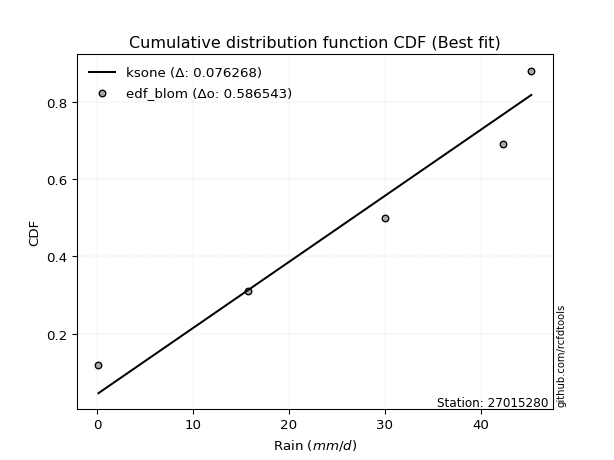</img></img>

</div>


### 7. EDF Tukey (1962)

In hydrology, the Tukey formula is used as a plotting position formula to estimate the empirical probability or frequency of a flood event (or other hydrological data). The formula parameter is given as _c=0.333_ (or 1/3).

<div align="center">


$P=(m-c)/(n+1-2c)$


</div>


**7.1. Empirical values**

<div align="center">

|                | 0                  | 1                  | 2         | 3         | 4         |
|:---------------|:-------------------|:-------------------|:----------|:----------|:----------|
| date           | 2025               | 2018               | 2020      | 2019      | 2017      |
| x              | 0.1                | 15.7               | 30.0      | 42.3      | 45.3      |
| m              | 1                  | 2                  | 3         | 4         | 5         |
| empirical_dist | edf_tukey          | edf_tukey          | edf_tukey | edf_tukey | edf_tukey |
| empirical      | 0.125              | 0.3125             | 0.5       | 0.6875    | 0.875     |
| empirical_tr   | 1.1428571428571428 | 1.4545454545454546 | 2.0       | 3.2       | 8.0       |

</div>


**7.2. Kolmogorov-Smirnov fit test (sorted by Δ)**


<div align="center">

|                | 0                   | 1                   | 2                   | 3                   | 4                   | 5                   | 6                   | 7                  | 8                  | 9                  | 10                  | 11                 | 12                  | 13                  | 14                  | 15                  | 16                  | 17                 | 18                 | 19                 | 20                  | 21                  | 22                 | 23                 | 24                 | 25                  | 26                  | 27                  | 28                 | 29                  | 30                  | 31                  | 32                  | 33                  | 34                  | 35                  | 36                 | 37                  | 38                  | 39                  | 40                 | 41                  | 42                 | 43                  | 44                  | 45                  | 46                 | 47                 | 48                 | 49                  | 50                 | 51                  | 52                  | 53                 | 54                  | 55                 | 56                  | 57                  | 58                  | 59                  | 60                  | 61                  | 62                 | 63                 | 64                 | 65                 | 66                  | 67                 | 68                 | 69                  | 70                 | 71                  | 72                 | 73                  | 74                 | 75                  | 76                 | 77                  | 78                 | 79                 | 80                 | 81                  | 82                  | 83                 | 84                 | 85                 | 86                  | 87                 | 88                 | 89                  | 90                 | 91                  | 92                 | 93                 | 94                  | 95                  | 96                  | 97                  | 98                 | 99                  | 100                 | 101                 | 102                 | 103                 | 104                | 105                 | 106                | 107                | 108                 | 109                | 110                 | 111                 | 112                | 113                | 114                | 115                | 116                | 117                 | 118                | 119                | 120                | 121                | 122                | 123                | 124                 | 125                | 126                | 127                | 128                | 129                 | 130                | 131                 | 132                | 133                 | 134                | 135                | 136                | 137                 | 138                | 139                | 140                | 141                | 142                | 143                | 144                | 145                | 146                | 147                | 148                | 149                | 150                | 151                | 152                | 153                | 154                | 155                | 156                | 157                | 158                | 159                |
|:---------------|:--------------------|:--------------------|:--------------------|:--------------------|:--------------------|:--------------------|:--------------------|:-------------------|:-------------------|:-------------------|:--------------------|:-------------------|:--------------------|:--------------------|:--------------------|:--------------------|:--------------------|:-------------------|:-------------------|:-------------------|:--------------------|:--------------------|:-------------------|:-------------------|:-------------------|:--------------------|:--------------------|:--------------------|:-------------------|:--------------------|:--------------------|:--------------------|:--------------------|:--------------------|:--------------------|:--------------------|:-------------------|:--------------------|:--------------------|:--------------------|:-------------------|:--------------------|:-------------------|:--------------------|:--------------------|:--------------------|:-------------------|:-------------------|:-------------------|:--------------------|:-------------------|:--------------------|:--------------------|:-------------------|:--------------------|:-------------------|:--------------------|:--------------------|:--------------------|:--------------------|:--------------------|:--------------------|:-------------------|:-------------------|:-------------------|:-------------------|:--------------------|:-------------------|:-------------------|:--------------------|:-------------------|:--------------------|:-------------------|:--------------------|:-------------------|:--------------------|:-------------------|:--------------------|:-------------------|:-------------------|:-------------------|:--------------------|:--------------------|:-------------------|:-------------------|:-------------------|:--------------------|:-------------------|:-------------------|:--------------------|:-------------------|:--------------------|:-------------------|:-------------------|:--------------------|:--------------------|:--------------------|:--------------------|:-------------------|:--------------------|:--------------------|:--------------------|:--------------------|:--------------------|:-------------------|:--------------------|:-------------------|:-------------------|:--------------------|:-------------------|:--------------------|:--------------------|:-------------------|:-------------------|:-------------------|:-------------------|:-------------------|:--------------------|:-------------------|:-------------------|:-------------------|:-------------------|:-------------------|:-------------------|:--------------------|:-------------------|:-------------------|:-------------------|:-------------------|:--------------------|:-------------------|:--------------------|:-------------------|:--------------------|:-------------------|:-------------------|:-------------------|:--------------------|:-------------------|:-------------------|:-------------------|:-------------------|:-------------------|:-------------------|:-------------------|:-------------------|:-------------------|:-------------------|:-------------------|:-------------------|:-------------------|:-------------------|:-------------------|:-------------------|:-------------------|:-------------------|:-------------------|:-------------------|:-------------------|:-------------------|
| station        | 27015280            | 27015280            | 27015280            | 27015280            | 27015280            | 27015280            | 27015280            | 27015280           | 27015280           | 27015280           | 27015280            | 27015280           | 27015280            | 27015280            | 27015280            | 27015280            | 27015280            | 27015280           | 27015280           | 27015280           | 27015280            | 27015280            | 27015280           | 27015280           | 27015280           | 27015280            | 27015280            | 27015280            | 27015280           | 27015280            | 27015280            | 27015280            | 27015280            | 27015280            | 27015280            | 27015280            | 27015280           | 27015280            | 27015280            | 27015280            | 27015280           | 27015280            | 27015280           | 27015280            | 27015280            | 27015280            | 27015280           | 27015280           | 27015280           | 27015280            | 27015280           | 27015280            | 27015280            | 27015280           | 27015280            | 27015280           | 27015280            | 27015280            | 27015280            | 27015280            | 27015280            | 27015280            | 27015280           | 27015280           | 27015280           | 27015280           | 27015280            | 27015280           | 27015280           | 27015280            | 27015280           | 27015280            | 27015280           | 27015280            | 27015280           | 27015280            | 27015280           | 27015280            | 27015280           | 27015280           | 27015280           | 27015280            | 27015280            | 27015280           | 27015280           | 27015280           | 27015280            | 27015280           | 27015280           | 27015280            | 27015280           | 27015280            | 27015280           | 27015280           | 27015280            | 27015280            | 27015280            | 27015280            | 27015280           | 27015280            | 27015280            | 27015280            | 27015280            | 27015280            | 27015280           | 27015280            | 27015280           | 27015280           | 27015280            | 27015280           | 27015280            | 27015280            | 27015280           | 27015280           | 27015280           | 27015280           | 27015280           | 27015280            | 27015280           | 27015280           | 27015280           | 27015280           | 27015280           | 27015280           | 27015280            | 27015280           | 27015280           | 27015280           | 27015280           | 27015280            | 27015280           | 27015280            | 27015280           | 27015280            | 27015280           | 27015280           | 27015280           | 27015280            | 27015280           | 27015280           | 27015280           | 27015280           | 27015280           | 27015280           | 27015280           | 27015280           | 27015280           | 27015280           | 27015280           | 27015280           | 27015280           | 27015280           | 27015280           | 27015280           | 27015280           | 27015280           | 27015280           | 27015280           | 27015280           | 27015280           |
| empirical_dist | edf_tukey           | edf_tukey           | edf_tukey           | edf_tukey           | edf_tukey           | edf_tukey           | edf_tukey           | edf_tukey          | edf_tukey          | edf_tukey          | edf_tukey           | edf_tukey          | edf_tukey           | edf_tukey           | edf_tukey           | edf_tukey           | edf_tukey           | edf_tukey          | edf_tukey          | edf_tukey          | edf_tukey           | edf_tukey           | edf_tukey          | edf_tukey          | edf_tukey          | edf_tukey           | edf_tukey           | edf_tukey           | edf_tukey          | edf_tukey           | edf_tukey           | edf_tukey           | edf_tukey           | edf_tukey           | edf_tukey           | edf_tukey           | edf_tukey          | edf_tukey           | edf_tukey           | edf_tukey           | edf_tukey          | edf_tukey           | edf_tukey          | edf_tukey           | edf_tukey           | edf_tukey           | edf_tukey          | edf_tukey          | edf_tukey          | edf_tukey           | edf_tukey          | edf_tukey           | edf_tukey           | edf_tukey          | edf_tukey           | edf_tukey          | edf_tukey           | edf_tukey           | edf_tukey           | edf_tukey           | edf_tukey           | edf_tukey           | edf_tukey          | edf_tukey          | edf_tukey          | edf_tukey          | edf_tukey           | edf_tukey          | edf_tukey          | edf_tukey           | edf_tukey          | edf_tukey           | edf_tukey          | edf_tukey           | edf_tukey          | edf_tukey           | edf_tukey          | edf_tukey           | edf_tukey          | edf_tukey          | edf_tukey          | edf_tukey           | edf_tukey           | edf_tukey          | edf_tukey          | edf_tukey          | edf_tukey           | edf_tukey          | edf_tukey          | edf_tukey           | edf_tukey          | edf_tukey           | edf_tukey          | edf_tukey          | edf_tukey           | edf_tukey           | edf_tukey           | edf_tukey           | edf_tukey          | edf_tukey           | edf_tukey           | edf_tukey           | edf_tukey           | edf_tukey           | edf_tukey          | edf_tukey           | edf_tukey          | edf_tukey          | edf_tukey           | edf_tukey          | edf_tukey           | edf_tukey           | edf_tukey          | edf_tukey          | edf_tukey          | edf_tukey          | edf_tukey          | edf_tukey           | edf_tukey          | edf_tukey          | edf_tukey          | edf_tukey          | edf_tukey          | edf_tukey          | edf_tukey           | edf_tukey          | edf_tukey          | edf_tukey          | edf_tukey          | edf_tukey           | edf_tukey          | edf_tukey           | edf_tukey          | edf_tukey           | edf_tukey          | edf_tukey          | edf_tukey          | edf_tukey           | edf_tukey          | edf_tukey          | edf_tukey          | edf_tukey          | edf_tukey          | edf_tukey          | edf_tukey          | edf_tukey          | edf_tukey          | edf_tukey          | edf_tukey          | edf_tukey          | edf_tukey          | edf_tukey          | edf_tukey          | edf_tukey          | edf_tukey          | edf_tukey          | edf_tukey          | edf_tukey          | edf_tukey          | edf_tukey          |
| p_dist         | ksone               | semicircular        | anglit              | trapezoid           | ncf                 | beta                | loggausshyper       | genextreme         | arcsine            | loggenpareto       | rice                | invgauss           | pearson3            | gamma               | maxwell             | rayleigh            | crystalball         | norm               | exponnorm          | t                  | betaprime           | erlang              | alpha              | kstwobign          | burr12             | halfnorm            | weibull_min         | foldnorm            | levy_l             | gumbel_l            | loglevy_l           | wrapcauchy          | dweibull            | gumbel_r            | logistic            | cosine              | dgamma             | hypsecant           | gausshyper          | halflogistic        | moyal              | argus               | genpareto          | genexpon            | laplace             | logpearson3         | nakagami           | logvonmises_line   | gennorm            | genhalflogistic     | lomax              | loggompertz         | loggumbel_l         | logwrapcauchy      | halfgennorm         | triang             | logargus            | skewnorm            | mielke              | logtrapezoid        | logarcsine          | kappa4              | tukeylambda        | wald               | kappa3             | uniform            | vonmises_line       | truncweibull_min   | logsemicircular    | bradford            | loganglit          | truncexpon          | logrice            | logexponnorm        | lognorm            | logcrystalball      | lognct             | logloggamma         | lognakagami        | logfoldnorm        | logerlang          | johnsonsu           | loginvgamma         | f                  | loggamma           | loggamma           | loglogistic         | logtruncnorm       | logalpha           | loginvgauss         | loghypsecant       | loginvweibull       | logmaxwell         | loggennorm         | lograyleigh         | logweibull_max      | loglaplace          | loglaplace          | gompertz           | logkstwobign        | logt                | logncf              | loggenexpon         | logdgamma           | loggenextreme      | loghalfnorm         | logcosine          | logdweibull        | logjohnsonsb        | loggumbel_r        | burr                | invgamma            | loggengamma        | logburr12          | loghalflogistic    | logbeta            | logmoyal           | loggenhalflogistic  | loghalfgennorm     | loglomax           | logexponweib       | logskewnorm        | weibull_max        | gengamma           | logkappa3           | logtriang          | logwald            | logf               | logbetaprime       | logloglaplace       | logksone           | invweibull          | logkappa4          | fatiguelife         | truncpareto        | logbradford        | loguniform         | logtruncweibull_min | exponweib          | logtruncexpon      | logfatiguelife     | logweibull_min     | powerlaw           | logburr            | logmielke          | exponpow           | logexponpow        | logpowerlaw        | logtruncpareto     | johnsonsb          | logjohnsonsu       | nct                | truncnorm          | rdist              | genlogistic        | loggenlogistic     | logrdist           | logtukeylambda     | logvonmises        | vonmises           |
| delta          | 0.07924393358911552 | 0.09579974972546967 | 0.10777002353852116 | 0.12105173465318941 | 0.12495086492312096 | 0.12499988839708631 | 0.12499999980686749 | 0.1249999999995759 | 0.125              | 0.125              | 0.13279160776582688 | 0.1330126585416711 | 0.13377495913626813 | 0.13383667879683714 | 0.13472977645226236 | 0.13474391600301827 | 0.13476415314842438 | 0.1347641548255165 | 0.1347661049449248 | 0.1348883170896258 | 0.13519267498624654 | 0.13558606605149204 | 0.136220771226658  | 0.1372261530413219 | 0.1396067592718383 | 0.14047827222750342 | 0.14222467339956935 | 0.14392999329298783 | 0.1525661414924646 | 0.15313593042012397 | 0.15328038338305183 | 0.15365740534511235 | 0.15441494768928377 | 0.15477825139912538 | 0.15487434610372186 | 0.15659268056209952 | 0.1640564787146449 | 0.16602632263400208 | 0.16679386370029392 | 0.16848899657511163 | 0.1701113898473332 | 0.17267269164873433 | 0.1745348213283044 | 0.17538026476865665 | 0.17715392187055934 | 0.17726305118832153 | 0.1801887957180175 | 0.1852662795400314 | 0.1875             | 0.18951345823399945 | 0.191720271830068  | 0.19836788120230642 | 0.20484532747024553 | 0.205099612315653  | 0.21067715037407997 | 0.2110025800632035 | 0.21613062664594018 | 0.21754293675997705 | 0.21977348372827754 | 0.22959983210447132 | 0.23335375273969627 | 0.23488305215435756 | 0.2356859650186962 | 0.2361686486603175 | 0.2452358062271459 | 0.2461283185840708 | 0.24726943320711414 | 0.2510213400947765 | 0.2520124605240823 | 0.25402652451418506 | 0.2566768292546675 | 0.26346464217837495 | 0.2679381389827965 | 0.26793910636241625 | 0.2679407224747806 | 0.26794072442228856 | 0.2680929747749099 | 0.26853428556194825 | 0.2685968523867004 | 0.2711619893608135 | 0.2713045754101828 | 0.27176560274481243 | 0.27690043597298175 | 0.2780759751280658 | 0.2782252692102247 | 0.2782252692102247 | 0.27853351302755724 | 0.2809195427111134 | 0.2835033923347209 | 0.28609593041618886 | 0.2873324269195421 | 0.28945564434888016 | 0.2961101977907956 | 0.300523109949269  | 0.30496951679682194 | 0.31064513631459334 | 0.31228734989638607 | 0.31228734989638607 | 0.3124999748672291 | 0.31615111706938626 | 0.31800828157696326 | 0.32335248500699065 | 0.32416187466920454 | 0.32427762485334544 | 0.3275857545932086 | 0.33006525228656824 | 0.3307289384213029 | 0.3344610050691619 | 0.33501247817406643 | 0.3362241212688798 | 0.34255116005427544 | 0.34700135410993105 | 0.3482414522064994 | 0.3535101707639312 | 0.3581239408194935 | 0.3593381094042675 | 0.3598872335930696 | 0.36152333363030686 | 0.37438269983698   | 0.3795287408117214 | 0.3813008004834999 | 0.3907783207595157 | 0.3927813349102972 | 0.3978290662243569 | 0.40639830985847386 | 0.4215541472383605 | 0.4256473096275033 | 0.428286782296588  | 0.4334021388591346 | 0.43725440607913235 | 0.4597823999081143 | 0.46159062687688707 | 0.4669863000620359 | 0.47361680870378664 | 0.4761807750145881 | 0.5133800026663905 | 0.5142388798897372 | 0.5302995439647016  | 0.5493502307018047 | 0.5494773498990658 | 0.5525529449689462 | 0.5532333443967377 | 0.5740518523839858 | 0.5856837499970435 | 0.6219284193333127 | 0.6245880125009782 | 0.6380645842506435 | 0.6624057621768863 | 0.6677695256029148 | 0.6740303715278898 | 0.6747162981944362 | 0.6859724486241227 | 0.6873843619087311 | 0.6874999999436057 | 0.6875             | 0.6875             | 0.6875             | 0.874989693649006  | 0.9868733773213236 | 7.065374555047828  |
| deltao         | 0.5865427407550001  | 0.5865427407550001  | 0.5865427407550001  | 0.5865427407550001  | 0.5865427407550001  | 0.5865427407550001  | 0.5865427407550001  | 0.5865427407550001 | 0.5865427407550001 | 0.5865427407550001 | 0.5865427407550001  | 0.5865427407550001 | 0.5865427407550001  | 0.5865427407550001  | 0.5865427407550001  | 0.5865427407550001  | 0.5865427407550001  | 0.5865427407550001 | 0.5865427407550001 | 0.5865427407550001 | 0.5865427407550001  | 0.5865427407550001  | 0.5865427407550001 | 0.5865427407550001 | 0.5865427407550001 | 0.5865427407550001  | 0.5865427407550001  | 0.5865427407550001  | 0.5865427407550001 | 0.5865427407550001  | 0.5865427407550001  | 0.5865427407550001  | 0.5865427407550001  | 0.5865427407550001  | 0.5865427407550001  | 0.5865427407550001  | 0.5865427407550001 | 0.5865427407550001  | 0.5865427407550001  | 0.5865427407550001  | 0.5865427407550001 | 0.5865427407550001  | 0.5865427407550001 | 0.5865427407550001  | 0.5865427407550001  | 0.5865427407550001  | 0.5865427407550001 | 0.5865427407550001 | 0.5865427407550001 | 0.5865427407550001  | 0.5865427407550001 | 0.5865427407550001  | 0.5865427407550001  | 0.5865427407550001 | 0.5865427407550001  | 0.5865427407550001 | 0.5865427407550001  | 0.5865427407550001  | 0.5865427407550001  | 0.5865427407550001  | 0.5865427407550001  | 0.5865427407550001  | 0.5865427407550001 | 0.5865427407550001 | 0.5865427407550001 | 0.5865427407550001 | 0.5865427407550001  | 0.5865427407550001 | 0.5865427407550001 | 0.5865427407550001  | 0.5865427407550001 | 0.5865427407550001  | 0.5865427407550001 | 0.5865427407550001  | 0.5865427407550001 | 0.5865427407550001  | 0.5865427407550001 | 0.5865427407550001  | 0.5865427407550001 | 0.5865427407550001 | 0.5865427407550001 | 0.5865427407550001  | 0.5865427407550001  | 0.5865427407550001 | 0.5865427407550001 | 0.5865427407550001 | 0.5865427407550001  | 0.5865427407550001 | 0.5865427407550001 | 0.5865427407550001  | 0.5865427407550001 | 0.5865427407550001  | 0.5865427407550001 | 0.5865427407550001 | 0.5865427407550001  | 0.5865427407550001  | 0.5865427407550001  | 0.5865427407550001  | 0.5865427407550001 | 0.5865427407550001  | 0.5865427407550001  | 0.5865427407550001  | 0.5865427407550001  | 0.5865427407550001  | 0.5865427407550001 | 0.5865427407550001  | 0.5865427407550001 | 0.5865427407550001 | 0.5865427407550001  | 0.5865427407550001 | 0.5865427407550001  | 0.5865427407550001  | 0.5865427407550001 | 0.5865427407550001 | 0.5865427407550001 | 0.5865427407550001 | 0.5865427407550001 | 0.5865427407550001  | 0.5865427407550001 | 0.5865427407550001 | 0.5865427407550001 | 0.5865427407550001 | 0.5865427407550001 | 0.5865427407550001 | 0.5865427407550001  | 0.5865427407550001 | 0.5865427407550001 | 0.5865427407550001 | 0.5865427407550001 | 0.5865427407550001  | 0.5865427407550001 | 0.5865427407550001  | 0.5865427407550001 | 0.5865427407550001  | 0.5865427407550001 | 0.5865427407550001 | 0.5865427407550001 | 0.5865427407550001  | 0.5865427407550001 | 0.5865427407550001 | 0.5865427407550001 | 0.5865427407550001 | 0.5865427407550001 | 0.5865427407550001 | 0.5865427407550001 | 0.5865427407550001 | 0.5865427407550001 | 0.5865427407550001 | 0.5865427407550001 | 0.5865427407550001 | 0.5865427407550001 | 0.5865427407550001 | 0.5865427407550001 | 0.5865427407550001 | 0.5865427407550001 | 0.5865427407550001 | 0.5865427407550001 | 0.5865427407550001 | 0.5865427407550001 | 0.5865427407550001 |
| eval           | Δo > Δ              | Δo > Δ              | Δo > Δ              | Δo > Δ              | Δo > Δ              | Δo > Δ              | Δo > Δ              | Δo > Δ             | Δo > Δ             | Δo > Δ             | Δo > Δ              | Δo > Δ             | Δo > Δ              | Δo > Δ              | Δo > Δ              | Δo > Δ              | Δo > Δ              | Δo > Δ             | Δo > Δ             | Δo > Δ             | Δo > Δ              | Δo > Δ              | Δo > Δ             | Δo > Δ             | Δo > Δ             | Δo > Δ              | Δo > Δ              | Δo > Δ              | Δo > Δ             | Δo > Δ              | Δo > Δ              | Δo > Δ              | Δo > Δ              | Δo > Δ              | Δo > Δ              | Δo > Δ              | Δo > Δ             | Δo > Δ              | Δo > Δ              | Δo > Δ              | Δo > Δ             | Δo > Δ              | Δo > Δ             | Δo > Δ              | Δo > Δ              | Δo > Δ              | Δo > Δ             | Δo > Δ             | Δo > Δ             | Δo > Δ              | Δo > Δ             | Δo > Δ              | Δo > Δ              | Δo > Δ             | Δo > Δ              | Δo > Δ             | Δo > Δ              | Δo > Δ              | Δo > Δ              | Δo > Δ              | Δo > Δ              | Δo > Δ              | Δo > Δ             | Δo > Δ             | Δo > Δ             | Δo > Δ             | Δo > Δ              | Δo > Δ             | Δo > Δ             | Δo > Δ              | Δo > Δ             | Δo > Δ              | Δo > Δ             | Δo > Δ              | Δo > Δ             | Δo > Δ              | Δo > Δ             | Δo > Δ              | Δo > Δ             | Δo > Δ             | Δo > Δ             | Δo > Δ              | Δo > Δ              | Δo > Δ             | Δo > Δ             | Δo > Δ             | Δo > Δ              | Δo > Δ             | Δo > Δ             | Δo > Δ              | Δo > Δ             | Δo > Δ              | Δo > Δ             | Δo > Δ             | Δo > Δ              | Δo > Δ              | Δo > Δ              | Δo > Δ              | Δo > Δ             | Δo > Δ              | Δo > Δ              | Δo > Δ              | Δo > Δ              | Δo > Δ              | Δo > Δ             | Δo > Δ              | Δo > Δ             | Δo > Δ             | Δo > Δ              | Δo > Δ             | Δo > Δ              | Δo > Δ              | Δo > Δ             | Δo > Δ             | Δo > Δ             | Δo > Δ             | Δo > Δ             | Δo > Δ              | Δo > Δ             | Δo > Δ             | Δo > Δ             | Δo > Δ             | Δo > Δ             | Δo > Δ             | Δo > Δ              | Δo > Δ             | Δo > Δ             | Δo > Δ             | Δo > Δ             | Δo > Δ              | Δo > Δ             | Δo > Δ              | Δo > Δ             | Δo > Δ              | Δo > Δ             | Δo > Δ             | Δo > Δ             | Δo > Δ              | Δo > Δ             | Δo > Δ             | Δo > Δ             | Δo > Δ             | Δo > Δ             | Δo > Δ             | Δo <= Δ            | Δo <= Δ            | Δo <= Δ            | Δo <= Δ            | Δo <= Δ            | Δo <= Δ            | Δo <= Δ            | Δo <= Δ            | Δo <= Δ            | Δo <= Δ            | Δo <= Δ            | Δo <= Δ            | Δo <= Δ            | Δo <= Δ            | Δo <= Δ            | Δo <= Δ            |
| fit            | 1                   | 1                   | 1                   | 1                   | 1                   | 1                   | 1                   | 1                  | 1                  | 1                  | 1                   | 1                  | 1                   | 1                   | 1                   | 1                   | 1                   | 1                  | 1                  | 1                  | 1                   | 1                   | 1                  | 1                  | 1                  | 1                   | 1                   | 1                   | 1                  | 1                   | 1                   | 1                   | 1                   | 1                   | 1                   | 1                   | 1                  | 1                   | 1                   | 1                   | 1                  | 1                   | 1                  | 1                   | 1                   | 1                   | 1                  | 1                  | 1                  | 1                   | 1                  | 1                   | 1                   | 1                  | 1                   | 1                  | 1                   | 1                   | 1                   | 1                   | 1                   | 1                   | 1                  | 1                  | 1                  | 1                  | 1                   | 1                  | 1                  | 1                   | 1                  | 1                   | 1                  | 1                   | 1                  | 1                   | 1                  | 1                   | 1                  | 1                  | 1                  | 1                   | 1                   | 1                  | 1                  | 1                  | 1                   | 1                  | 1                  | 1                   | 1                  | 1                   | 1                  | 1                  | 1                   | 1                   | 1                   | 1                   | 1                  | 1                   | 1                   | 1                   | 1                   | 1                   | 1                  | 1                   | 1                  | 1                  | 1                   | 1                  | 1                   | 1                   | 1                  | 1                  | 1                  | 1                  | 1                  | 1                   | 1                  | 1                  | 1                  | 1                  | 1                  | 1                  | 1                   | 1                  | 1                  | 1                  | 1                  | 1                   | 1                  | 1                   | 1                  | 1                   | 1                  | 1                  | 1                  | 1                   | 1                  | 1                  | 1                  | 1                  | 1                  | 1                  | 0                  | 0                  | 0                  | 0                  | 0                  | 0                  | 0                  | 0                  | 0                  | 0                  | 0                  | 0                  | 0                  | 0                  | 0                  | 0                  |
| n              | 5                   | 5                   | 5                   | 5                   | 5                   | 5                   | 5                   | 5                  | 5                  | 5                  | 5                   | 5                  | 5                   | 5                   | 5                   | 5                   | 5                   | 5                  | 5                  | 5                  | 5                   | 5                   | 5                  | 5                  | 5                  | 5                   | 5                   | 5                   | 5                  | 5                   | 5                   | 5                   | 5                   | 5                   | 5                   | 5                   | 5                  | 5                   | 5                   | 5                   | 5                  | 5                   | 5                  | 5                   | 5                   | 5                   | 5                  | 5                  | 5                  | 5                   | 5                  | 5                   | 5                   | 5                  | 5                   | 5                  | 5                   | 5                   | 5                   | 5                   | 5                   | 5                   | 5                  | 5                  | 5                  | 5                  | 5                   | 5                  | 5                  | 5                   | 5                  | 5                   | 5                  | 5                   | 5                  | 5                   | 5                  | 5                   | 5                  | 5                  | 5                  | 5                   | 5                   | 5                  | 5                  | 5                  | 5                   | 5                  | 5                  | 5                   | 5                  | 5                   | 5                  | 5                  | 5                   | 5                   | 5                   | 5                   | 5                  | 5                   | 5                   | 5                   | 5                   | 5                   | 5                  | 5                   | 5                  | 5                  | 5                   | 5                  | 5                   | 5                   | 5                  | 5                  | 5                  | 5                  | 5                  | 5                   | 5                  | 5                  | 5                  | 5                  | 5                  | 5                  | 5                   | 5                  | 5                  | 5                  | 5                  | 5                   | 5                  | 5                   | 5                  | 5                   | 5                  | 5                  | 5                  | 5                   | 5                  | 5                  | 5                  | 5                  | 5                  | 5                  | 5                  | 5                  | 5                  | 5                  | 5                  | 5                  | 5                  | 5                  | 5                  | 5                  | 5                  | 5                  | 5                  | 5                  | 5                  | 5                  |
| best_fit       | 1                   | 0                   | 0                   | 0                   | 0                   | 0                   | 0                   | 0                  | 0                  | 0                  | 0                   | 0                  | 0                   | 0                   | 0                   | 0                   | 0                   | 0                  | 0                  | 0                  | 0                   | 0                   | 0                  | 0                  | 0                  | 0                   | 0                   | 0                   | 0                  | 0                   | 0                   | 0                   | 0                   | 0                   | 0                   | 0                   | 0                  | 0                   | 0                   | 0                   | 0                  | 0                   | 0                  | 0                   | 0                   | 0                   | 0                  | 0                  | 0                  | 0                   | 0                  | 0                   | 0                   | 0                  | 0                   | 0                  | 0                   | 0                   | 0                   | 0                   | 0                   | 0                   | 0                  | 0                  | 0                  | 0                  | 0                   | 0                  | 0                  | 0                   | 0                  | 0                   | 0                  | 0                   | 0                  | 0                   | 0                  | 0                   | 0                  | 0                  | 0                  | 0                   | 0                   | 0                  | 0                  | 0                  | 0                   | 0                  | 0                  | 0                   | 0                  | 0                   | 0                  | 0                  | 0                   | 0                   | 0                   | 0                   | 0                  | 0                   | 0                   | 0                   | 0                   | 0                   | 0                  | 0                   | 0                  | 0                  | 0                   | 0                  | 0                   | 0                   | 0                  | 0                  | 0                  | 0                  | 0                  | 0                   | 0                  | 0                  | 0                  | 0                  | 0                  | 0                  | 0                   | 0                  | 0                  | 0                  | 0                  | 0                   | 0                  | 0                   | 0                  | 0                   | 0                  | 0                  | 0                  | 0                   | 0                  | 0                  | 0                  | 0                  | 0                  | 0                  | 0                  | 0                  | 0                  | 0                  | 0                  | 0                  | 0                  | 0                  | 0                  | 0                  | 0                  | 0                  | 0                  | 0                  | 0                  | 0                  |
| best_fit_sort  | 1                   | 2                   | 3                   | 4                   | 5                   | 6                   | 7                   | 8                  | 9                  | 10                 | 11                  | 12                 | 13                  | 14                  | 15                  | 16                  | 17                  | 18                 | 19                 | 20                 | 21                  | 22                  | 23                 | 24                 | 25                 | 26                  | 27                  | 28                  | 29                 | 30                  | 31                  | 32                  | 33                  | 34                  | 35                  | 36                  | 37                 | 38                  | 39                  | 40                  | 41                 | 42                  | 43                 | 44                  | 45                  | 46                  | 47                 | 48                 | 49                 | 50                  | 51                 | 52                  | 53                  | 54                 | 55                  | 56                 | 57                  | 58                  | 59                  | 60                  | 61                  | 62                  | 63                 | 64                 | 65                 | 66                 | 67                  | 68                 | 69                 | 70                  | 71                 | 72                  | 73                 | 74                  | 75                 | 76                  | 77                 | 78                  | 79                 | 80                 | 81                 | 82                  | 83                  | 84                 | 85                 | 86                 | 87                  | 88                 | 89                 | 90                  | 91                 | 92                  | 93                 | 94                 | 95                  | 96                  | 97                  | 98                  | 99                 | 100                 | 101                 | 102                 | 103                 | 104                 | 105                | 106                 | 107                | 108                | 109                 | 110                | 111                 | 112                 | 113                | 114                | 115                | 116                | 117                | 118                 | 119                | 120                | 121                | 122                | 123                | 124                | 125                 | 126                | 127                | 128                | 129                | 130                 | 131                | 132                 | 133                | 134                 | 135                | 136                | 137                | 138                 | 139                | 140                | 141                | 142                | 143                | 144                | 145                | 146                | 147                | 148                | 149                | 150                | 151                | 152                | 153                | 154                | 155                | 156                | 157                | 158                | 159                | 160                |

</div>


**7.3. Best fit**

<div align="center">

|   id |   station | empirical_dist   | p_dist   |     delta |   deltao | eval   |   fit |   n |   best_fit |   best_fit_sort |
|-----:|----------:|:-----------------|:---------|----------:|---------:|:-------|------:|----:|-----------:|----------------:|
|    0 |  27015280 | edf_tukey        | ksone    | 0.0792439 | 0.586543 | Δo > Δ |     1 |   5 |          1 |               1 |

</div>


<div align="center">

</img>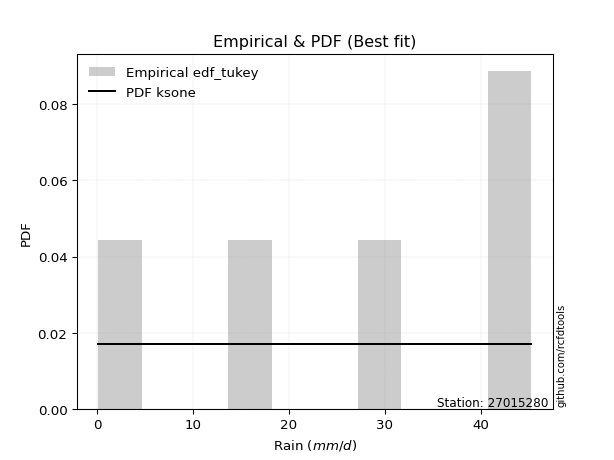</img>

</div>


### 8. EDF Gringorten (1963)

Gringorten plotting position formula is essential for estimating the probability and return periods of extreme events like floods and heavy rainfall. The constant _a=0.44_.

<div align="center">


$P=(m-a)/(n+1-2a)$


</div>


**8.1. Empirical values**

<div align="center">

|                | 0                   | 1                  | 2              | 3                 | 4                  |
|:---------------|:--------------------|:-------------------|:---------------|:------------------|:-------------------|
| date           | 2025                | 2018               | 2020           | 2019              | 2017               |
| x              | 0.1                 | 15.7               | 30.0           | 42.3              | 45.3               |
| m              | 1                   | 2                  | 3              | 4                 | 5                  |
| empirical_dist | edf_gringorten      | edf_gringorten     | edf_gringorten | edf_gringorten    | edf_gringorten     |
| empirical      | 0.10937500000000001 | 0.3046875          | 0.5            | 0.6953125         | 0.8906249999999999 |
| empirical_tr   | 1.1228070175438596  | 1.4382022471910112 | 2.0            | 3.282051282051282 | 9.142857142857133  |

</div>


**8.2. Kolmogorov-Smirnov fit test (sorted by Δ)**


<div align="center">

|                | 0                   | 1                   | 2                   | 3                   | 4                  | 5                  | 6                   | 7                   | 8                   | 9                   | 10                  | 11                 | 12                  | 13                  | 14                  | 15                  | 16                  | 17                 | 18                 | 19                 | 20                  | 21                  | 22                 | 23                 | 24                  | 25                  | 26                 | 27                  | 28                  | 29                  | 30                  | 31                  | 32                  | 33                 | 34                  | 35                 | 36                  | 37                  | 38                  | 39                  | 40                  | 41                  | 42                 | 43                 | 44                  | 45                  | 46                 | 47                  | 48                 | 49                 | 50                  | 51                 | 52                  | 53                  | 54                  | 55                  | 56                 | 57                  | 58                  | 59                  | 60                 | 61                 | 62                  | 63                 | 64                 | 65                  | 66                  | 67                 | 68                  | 69                  | 70                 | 71                  | 72                 | 73                 | 74                  | 75                 | 76                  | 77                 | 78                 | 79                 | 80                 | 81                  | 82                  | 83                 | 84                 | 85                 | 86                  | 87                 | 88                 | 89                  | 90                 | 91                  | 92                 | 93                 | 94                 | 95                  | 96                  | 97                  | 98                  | 99                  | 100                 | 101                 | 102                 | 103                | 104                 | 105                | 106                | 107                | 108                 | 109                 | 110                 | 111                 | 112                 | 113                | 114                | 115                | 116                | 117                 | 118                | 119                | 120                | 121                | 122                | 123                | 124                 | 125                | 126                | 127                | 128                | 129                 | 130                | 131                | 132                 | 133                 | 134                | 135                | 136                | 137                 | 138                | 139                | 140                | 141                | 142                | 143                | 144                | 145                | 146                | 147                | 148                | 149                | 150                | 151                | 152                | 153                | 154                | 155                | 156                | 157                | 158                | 159                |
|:---------------|:--------------------|:--------------------|:--------------------|:--------------------|:-------------------|:-------------------|:--------------------|:--------------------|:--------------------|:--------------------|:--------------------|:-------------------|:--------------------|:--------------------|:--------------------|:--------------------|:--------------------|:-------------------|:-------------------|:-------------------|:--------------------|:--------------------|:-------------------|:-------------------|:--------------------|:--------------------|:-------------------|:--------------------|:--------------------|:--------------------|:--------------------|:--------------------|:--------------------|:-------------------|:--------------------|:-------------------|:--------------------|:--------------------|:--------------------|:--------------------|:--------------------|:--------------------|:-------------------|:-------------------|:--------------------|:--------------------|:-------------------|:--------------------|:-------------------|:-------------------|:--------------------|:-------------------|:--------------------|:--------------------|:--------------------|:--------------------|:-------------------|:--------------------|:--------------------|:--------------------|:-------------------|:-------------------|:--------------------|:-------------------|:-------------------|:--------------------|:--------------------|:-------------------|:--------------------|:--------------------|:-------------------|:--------------------|:-------------------|:-------------------|:--------------------|:-------------------|:--------------------|:-------------------|:-------------------|:-------------------|:-------------------|:--------------------|:--------------------|:-------------------|:-------------------|:-------------------|:--------------------|:-------------------|:-------------------|:--------------------|:-------------------|:--------------------|:-------------------|:-------------------|:-------------------|:--------------------|:--------------------|:--------------------|:--------------------|:--------------------|:--------------------|:--------------------|:--------------------|:-------------------|:--------------------|:-------------------|:-------------------|:-------------------|:--------------------|:--------------------|:--------------------|:--------------------|:--------------------|:-------------------|:-------------------|:-------------------|:-------------------|:--------------------|:-------------------|:-------------------|:-------------------|:-------------------|:-------------------|:-------------------|:--------------------|:-------------------|:-------------------|:-------------------|:-------------------|:--------------------|:-------------------|:-------------------|:--------------------|:--------------------|:-------------------|:-------------------|:-------------------|:--------------------|:-------------------|:-------------------|:-------------------|:-------------------|:-------------------|:-------------------|:-------------------|:-------------------|:-------------------|:-------------------|:-------------------|:-------------------|:-------------------|:-------------------|:-------------------|:-------------------|:-------------------|:-------------------|:-------------------|:-------------------|:-------------------|:-------------------|
| station        | 27015280            | 27015280            | 27015280            | 27015280            | 27015280           | 27015280           | 27015280            | 27015280            | 27015280            | 27015280            | 27015280            | 27015280           | 27015280            | 27015280            | 27015280            | 27015280            | 27015280            | 27015280           | 27015280           | 27015280           | 27015280            | 27015280            | 27015280           | 27015280           | 27015280            | 27015280            | 27015280           | 27015280            | 27015280            | 27015280            | 27015280            | 27015280            | 27015280            | 27015280           | 27015280            | 27015280           | 27015280            | 27015280            | 27015280            | 27015280            | 27015280            | 27015280            | 27015280           | 27015280           | 27015280            | 27015280            | 27015280           | 27015280            | 27015280           | 27015280           | 27015280            | 27015280           | 27015280            | 27015280            | 27015280            | 27015280            | 27015280           | 27015280            | 27015280            | 27015280            | 27015280           | 27015280           | 27015280            | 27015280           | 27015280           | 27015280            | 27015280            | 27015280           | 27015280            | 27015280            | 27015280           | 27015280            | 27015280           | 27015280           | 27015280            | 27015280           | 27015280            | 27015280           | 27015280           | 27015280           | 27015280           | 27015280            | 27015280            | 27015280           | 27015280           | 27015280           | 27015280            | 27015280           | 27015280           | 27015280            | 27015280           | 27015280            | 27015280           | 27015280           | 27015280           | 27015280            | 27015280            | 27015280            | 27015280            | 27015280            | 27015280            | 27015280            | 27015280            | 27015280           | 27015280            | 27015280           | 27015280           | 27015280           | 27015280            | 27015280            | 27015280            | 27015280            | 27015280            | 27015280           | 27015280           | 27015280           | 27015280           | 27015280            | 27015280           | 27015280           | 27015280           | 27015280           | 27015280           | 27015280           | 27015280            | 27015280           | 27015280           | 27015280           | 27015280           | 27015280            | 27015280           | 27015280           | 27015280            | 27015280            | 27015280           | 27015280           | 27015280           | 27015280            | 27015280           | 27015280           | 27015280           | 27015280           | 27015280           | 27015280           | 27015280           | 27015280           | 27015280           | 27015280           | 27015280           | 27015280           | 27015280           | 27015280           | 27015280           | 27015280           | 27015280           | 27015280           | 27015280           | 27015280           | 27015280           | 27015280           |
| empirical_dist | edf_gringorten      | edf_gringorten      | edf_gringorten      | edf_gringorten      | edf_gringorten     | edf_gringorten     | edf_gringorten      | edf_gringorten      | edf_gringorten      | edf_gringorten      | edf_gringorten      | edf_gringorten     | edf_gringorten      | edf_gringorten      | edf_gringorten      | edf_gringorten      | edf_gringorten      | edf_gringorten     | edf_gringorten     | edf_gringorten     | edf_gringorten      | edf_gringorten      | edf_gringorten     | edf_gringorten     | edf_gringorten      | edf_gringorten      | edf_gringorten     | edf_gringorten      | edf_gringorten      | edf_gringorten      | edf_gringorten      | edf_gringorten      | edf_gringorten      | edf_gringorten     | edf_gringorten      | edf_gringorten     | edf_gringorten      | edf_gringorten      | edf_gringorten      | edf_gringorten      | edf_gringorten      | edf_gringorten      | edf_gringorten     | edf_gringorten     | edf_gringorten      | edf_gringorten      | edf_gringorten     | edf_gringorten      | edf_gringorten     | edf_gringorten     | edf_gringorten      | edf_gringorten     | edf_gringorten      | edf_gringorten      | edf_gringorten      | edf_gringorten      | edf_gringorten     | edf_gringorten      | edf_gringorten      | edf_gringorten      | edf_gringorten     | edf_gringorten     | edf_gringorten      | edf_gringorten     | edf_gringorten     | edf_gringorten      | edf_gringorten      | edf_gringorten     | edf_gringorten      | edf_gringorten      | edf_gringorten     | edf_gringorten      | edf_gringorten     | edf_gringorten     | edf_gringorten      | edf_gringorten     | edf_gringorten      | edf_gringorten     | edf_gringorten     | edf_gringorten     | edf_gringorten     | edf_gringorten      | edf_gringorten      | edf_gringorten     | edf_gringorten     | edf_gringorten     | edf_gringorten      | edf_gringorten     | edf_gringorten     | edf_gringorten      | edf_gringorten     | edf_gringorten      | edf_gringorten     | edf_gringorten     | edf_gringorten     | edf_gringorten      | edf_gringorten      | edf_gringorten      | edf_gringorten      | edf_gringorten      | edf_gringorten      | edf_gringorten      | edf_gringorten      | edf_gringorten     | edf_gringorten      | edf_gringorten     | edf_gringorten     | edf_gringorten     | edf_gringorten      | edf_gringorten      | edf_gringorten      | edf_gringorten      | edf_gringorten      | edf_gringorten     | edf_gringorten     | edf_gringorten     | edf_gringorten     | edf_gringorten      | edf_gringorten     | edf_gringorten     | edf_gringorten     | edf_gringorten     | edf_gringorten     | edf_gringorten     | edf_gringorten      | edf_gringorten     | edf_gringorten     | edf_gringorten     | edf_gringorten     | edf_gringorten      | edf_gringorten     | edf_gringorten     | edf_gringorten      | edf_gringorten      | edf_gringorten     | edf_gringorten     | edf_gringorten     | edf_gringorten      | edf_gringorten     | edf_gringorten     | edf_gringorten     | edf_gringorten     | edf_gringorten     | edf_gringorten     | edf_gringorten     | edf_gringorten     | edf_gringorten     | edf_gringorten     | edf_gringorten     | edf_gringorten     | edf_gringorten     | edf_gringorten     | edf_gringorten     | edf_gringorten     | edf_gringorten     | edf_gringorten     | edf_gringorten     | edf_gringorten     | edf_gringorten     | edf_gringorten     |
| p_dist         | ksone               | semicircular        | anglit              | beta                | loggausshyper      | genextreme         | arcsine             | loggenpareto        | trapezoid           | ncf                 | rice                | invgauss           | pearson3            | gamma               | maxwell             | rayleigh            | crystalball         | norm               | exponnorm          | t                  | betaprime           | erlang              | alpha              | burr12             | weibull_min         | foldnorm            | kstwobign          | halfnorm            | gumbel_l            | dweibull            | gumbel_r            | logistic            | cosine              | levy_l             | loglevy_l           | dgamma             | hypsecant           | gausshyper          | wrapcauchy          | argus               | halflogistic        | laplace             | moyal              | genpareto          | genexpon            | genhalflogistic     | nakagami           | logpearson3         | lomax              | gennorm            | logvonmises_line    | triang             | loggompertz         | skewnorm            | mielke              | loggumbel_l         | logwrapcauchy      | logargus            | halfgennorm         | kappa4              | tukeylambda        | wald               | logtrapezoid        | kappa3             | uniform            | vonmises_line       | logarcsine          | truncweibull_min   | bradford            | truncexpon          | logsemicircular    | logloggamma         | loganglit          | logrice            | logexponnorm        | lognorm            | logcrystalball      | lognct             | lognakagami        | logfoldnorm        | logerlang          | johnsonsu           | loginvgamma         | f                  | loggamma           | loggamma           | loglogistic         | logtruncnorm       | logalpha           | loginvgauss         | loghypsecant       | loginvweibull       | loggennorm         | logmaxwell         | gompertz           | lograyleigh         | logt                | logweibull_max      | loglaplace          | loglaplace          | logkstwobign        | logncf              | loggenexpon         | loggenextreme      | loghalfnorm         | logcosine          | logdgamma          | loggumbel_r        | logdweibull         | burr                | logjohnsonsb        | invgamma            | loggengamma         | loghalflogistic    | logbeta            | logmoyal           | logburr12          | loggenhalflogistic  | loghalfgennorm     | loglomax           | logexponweib       | logskewnorm        | weibull_max        | gengamma           | logkappa3           | logtriang          | logwald            | logf               | logbetaprime       | logloglaplace       | logksone           | logkappa4          | invweibull          | fatiguelife         | truncpareto        | logbradford        | loguniform         | logtruncweibull_min | exponweib          | logtruncexpon      | logfatiguelife     | logweibull_min     | powerlaw           | logburr            | logmielke          | exponpow           | logexponpow        | logpowerlaw        | logtruncpareto     | johnsonsb          | logjohnsonsu       | nct                | truncnorm          | rdist              | genlogistic        | loggenlogistic     | logrdist           | logtukeylambda     | logvonmises        | vonmises           |
| delta          | 0.07264983716841655 | 0.08798724972546967 | 0.09995752353852116 | 0.10937488839708642 | 0.1093749998068676 | 0.109374999999576  | 0.10937500000000001 | 0.10937500000000011 | 0.11323923465318941 | 0.11685548620196884 | 0.12497910776582688 | 0.1252001585416711 | 0.12596245913626813 | 0.12602417879683714 | 0.12691727645226236 | 0.12693141600301827 | 0.12695165314842438 | 0.1269516548255165 | 0.1269536049449248 | 0.1270758170896258 | 0.12738017498624654 | 0.12777356605149204 | 0.128408271226658  | 0.1317942592718383 | 0.13441217339956935 | 0.13611749329298783 | 0.1372261530413219 | 0.14047827222750342 | 0.14532343042012397 | 0.14660244768928377 | 0.14696575139912538 | 0.14706184610372186 | 0.14878018056209952 | 0.1525661414924646 | 0.15328038338305183 | 0.1562439787146449 | 0.15821382263400208 | 0.15898136370029392 | 0.16146990534511235 | 0.16486019164873433 | 0.16848899657511163 | 0.16934142187055934 | 0.1701113898473332 | 0.1745348213283044 | 0.17538026476865665 | 0.18170095823399945 | 0.18330585099418   | 0.18507555118832153 | 0.191720271830068  | 0.1953125          | 0.20089127954003128 | 0.2031900800632035 | 0.20618038120230642 | 0.20973043675997705 | 0.21196098372827754 | 0.21265782747024553 | 0.212912112315653  | 0.21613062664594018 | 0.21848965037407997 | 0.22707055215435756 | 0.2278734650186962 | 0.2361686486603175 | 0.23741233210447132 | 0.2374233062271459 | 0.2383158185840708 | 0.23945693320711414 | 0.24116625273969627 | 0.2432088400947765 | 0.24621402451418506 | 0.25565214217837495 | 0.2598249605240823 | 0.26329727160896566 | 0.2644893292546675 | 0.2757506389827965 | 0.27575160636241625 | 0.2757532224747806 | 0.27575322442228856 | 0.2759054747749099 | 0.2764093523867004 | 0.2789744893608135 | 0.2791170754101828 | 0.27957810274481243 | 0.28471293597298175 | 0.2858884751280658 | 0.2860377692102247 | 0.2860377692102247 | 0.28634601302755724 | 0.2887320427111134 | 0.2913158923347209 | 0.29390843041618886 | 0.2951449269195421 | 0.29726814434888016 | 0.300523109949269  | 0.3039226977907956 | 0.3046874748672291 | 0.31278201679682194 | 0.31800828157696326 | 0.31845763631459334 | 0.32009984989638607 | 0.32009984989638607 | 0.32396361706938626 | 0.33116498500699065 | 0.33197437466920454 | 0.3353982545932086 | 0.33787775228656824 | 0.3385414384213029 | 0.3399026248533453 | 0.3440366212688798 | 0.35008600506916177 | 0.35036366005427544 | 0.35063747817406643 | 0.35481385410993105 | 0.36386645220649927 | 0.3659364408194935 | 0.3671506094042675 | 0.3676997335930696 | 0.3691351707639311 | 0.36933583363030686 | 0.38219519983698   | 0.3873412408117214 | 0.3969258004834998 | 0.3985908207595157 | 0.4005938349102972 | 0.4056415662243569 | 0.42202330985847375 | 0.4293666472383605 | 0.4334598096275033 | 0.436099282296588  | 0.4412146388591346 | 0.44506690607913235 | 0.4675948999081143 | 0.4747988000620359 | 0.47721562687688696 | 0.48142930870378664 | 0.4839932750145881 | 0.5211925026663905 | 0.5220513798897372 | 0.5381120439647016  | 0.5571627307018047 | 0.5572898498990658 | 0.5603654449689462 | 0.5610458443967377 | 0.5818643523839858 | 0.5934962499970435 | 0.6297409193333127 | 0.6324005125009782 | 0.6458770842506435 | 0.6702182621768863 | 0.6755820256029148 | 0.6818428715278898 | 0.6825287981944362 | 0.6937849486241227 | 0.6951968619087311 | 0.6953124999436057 | 0.6953125          | 0.6953125          | 0.6953125          | 0.890614693649006  | 0.9790608773213236 | 7.049749555047828  |
| deltao         | 0.5865427407550001  | 0.5865427407550001  | 0.5865427407550001  | 0.5865427407550001  | 0.5865427407550001 | 0.5865427407550001 | 0.5865427407550001  | 0.5865427407550001  | 0.5865427407550001  | 0.5865427407550001  | 0.5865427407550001  | 0.5865427407550001 | 0.5865427407550001  | 0.5865427407550001  | 0.5865427407550001  | 0.5865427407550001  | 0.5865427407550001  | 0.5865427407550001 | 0.5865427407550001 | 0.5865427407550001 | 0.5865427407550001  | 0.5865427407550001  | 0.5865427407550001 | 0.5865427407550001 | 0.5865427407550001  | 0.5865427407550001  | 0.5865427407550001 | 0.5865427407550001  | 0.5865427407550001  | 0.5865427407550001  | 0.5865427407550001  | 0.5865427407550001  | 0.5865427407550001  | 0.5865427407550001 | 0.5865427407550001  | 0.5865427407550001 | 0.5865427407550001  | 0.5865427407550001  | 0.5865427407550001  | 0.5865427407550001  | 0.5865427407550001  | 0.5865427407550001  | 0.5865427407550001 | 0.5865427407550001 | 0.5865427407550001  | 0.5865427407550001  | 0.5865427407550001 | 0.5865427407550001  | 0.5865427407550001 | 0.5865427407550001 | 0.5865427407550001  | 0.5865427407550001 | 0.5865427407550001  | 0.5865427407550001  | 0.5865427407550001  | 0.5865427407550001  | 0.5865427407550001 | 0.5865427407550001  | 0.5865427407550001  | 0.5865427407550001  | 0.5865427407550001 | 0.5865427407550001 | 0.5865427407550001  | 0.5865427407550001 | 0.5865427407550001 | 0.5865427407550001  | 0.5865427407550001  | 0.5865427407550001 | 0.5865427407550001  | 0.5865427407550001  | 0.5865427407550001 | 0.5865427407550001  | 0.5865427407550001 | 0.5865427407550001 | 0.5865427407550001  | 0.5865427407550001 | 0.5865427407550001  | 0.5865427407550001 | 0.5865427407550001 | 0.5865427407550001 | 0.5865427407550001 | 0.5865427407550001  | 0.5865427407550001  | 0.5865427407550001 | 0.5865427407550001 | 0.5865427407550001 | 0.5865427407550001  | 0.5865427407550001 | 0.5865427407550001 | 0.5865427407550001  | 0.5865427407550001 | 0.5865427407550001  | 0.5865427407550001 | 0.5865427407550001 | 0.5865427407550001 | 0.5865427407550001  | 0.5865427407550001  | 0.5865427407550001  | 0.5865427407550001  | 0.5865427407550001  | 0.5865427407550001  | 0.5865427407550001  | 0.5865427407550001  | 0.5865427407550001 | 0.5865427407550001  | 0.5865427407550001 | 0.5865427407550001 | 0.5865427407550001 | 0.5865427407550001  | 0.5865427407550001  | 0.5865427407550001  | 0.5865427407550001  | 0.5865427407550001  | 0.5865427407550001 | 0.5865427407550001 | 0.5865427407550001 | 0.5865427407550001 | 0.5865427407550001  | 0.5865427407550001 | 0.5865427407550001 | 0.5865427407550001 | 0.5865427407550001 | 0.5865427407550001 | 0.5865427407550001 | 0.5865427407550001  | 0.5865427407550001 | 0.5865427407550001 | 0.5865427407550001 | 0.5865427407550001 | 0.5865427407550001  | 0.5865427407550001 | 0.5865427407550001 | 0.5865427407550001  | 0.5865427407550001  | 0.5865427407550001 | 0.5865427407550001 | 0.5865427407550001 | 0.5865427407550001  | 0.5865427407550001 | 0.5865427407550001 | 0.5865427407550001 | 0.5865427407550001 | 0.5865427407550001 | 0.5865427407550001 | 0.5865427407550001 | 0.5865427407550001 | 0.5865427407550001 | 0.5865427407550001 | 0.5865427407550001 | 0.5865427407550001 | 0.5865427407550001 | 0.5865427407550001 | 0.5865427407550001 | 0.5865427407550001 | 0.5865427407550001 | 0.5865427407550001 | 0.5865427407550001 | 0.5865427407550001 | 0.5865427407550001 | 0.5865427407550001 |
| eval           | Δo > Δ              | Δo > Δ              | Δo > Δ              | Δo > Δ              | Δo > Δ             | Δo > Δ             | Δo > Δ              | Δo > Δ              | Δo > Δ              | Δo > Δ              | Δo > Δ              | Δo > Δ             | Δo > Δ              | Δo > Δ              | Δo > Δ              | Δo > Δ              | Δo > Δ              | Δo > Δ             | Δo > Δ             | Δo > Δ             | Δo > Δ              | Δo > Δ              | Δo > Δ             | Δo > Δ             | Δo > Δ              | Δo > Δ              | Δo > Δ             | Δo > Δ              | Δo > Δ              | Δo > Δ              | Δo > Δ              | Δo > Δ              | Δo > Δ              | Δo > Δ             | Δo > Δ              | Δo > Δ             | Δo > Δ              | Δo > Δ              | Δo > Δ              | Δo > Δ              | Δo > Δ              | Δo > Δ              | Δo > Δ             | Δo > Δ             | Δo > Δ              | Δo > Δ              | Δo > Δ             | Δo > Δ              | Δo > Δ             | Δo > Δ             | Δo > Δ              | Δo > Δ             | Δo > Δ              | Δo > Δ              | Δo > Δ              | Δo > Δ              | Δo > Δ             | Δo > Δ              | Δo > Δ              | Δo > Δ              | Δo > Δ             | Δo > Δ             | Δo > Δ              | Δo > Δ             | Δo > Δ             | Δo > Δ              | Δo > Δ              | Δo > Δ             | Δo > Δ              | Δo > Δ              | Δo > Δ             | Δo > Δ              | Δo > Δ             | Δo > Δ             | Δo > Δ              | Δo > Δ             | Δo > Δ              | Δo > Δ             | Δo > Δ             | Δo > Δ             | Δo > Δ             | Δo > Δ              | Δo > Δ              | Δo > Δ             | Δo > Δ             | Δo > Δ             | Δo > Δ              | Δo > Δ             | Δo > Δ             | Δo > Δ              | Δo > Δ             | Δo > Δ              | Δo > Δ             | Δo > Δ             | Δo > Δ             | Δo > Δ              | Δo > Δ              | Δo > Δ              | Δo > Δ              | Δo > Δ              | Δo > Δ              | Δo > Δ              | Δo > Δ              | Δo > Δ             | Δo > Δ              | Δo > Δ             | Δo > Δ             | Δo > Δ             | Δo > Δ              | Δo > Δ              | Δo > Δ              | Δo > Δ              | Δo > Δ              | Δo > Δ             | Δo > Δ             | Δo > Δ             | Δo > Δ             | Δo > Δ              | Δo > Δ             | Δo > Δ             | Δo > Δ             | Δo > Δ             | Δo > Δ             | Δo > Δ             | Δo > Δ              | Δo > Δ             | Δo > Δ             | Δo > Δ             | Δo > Δ             | Δo > Δ              | Δo > Δ             | Δo > Δ             | Δo > Δ              | Δo > Δ              | Δo > Δ             | Δo > Δ             | Δo > Δ             | Δo > Δ              | Δo > Δ             | Δo > Δ             | Δo > Δ             | Δo > Δ             | Δo > Δ             | Δo <= Δ            | Δo <= Δ            | Δo <= Δ            | Δo <= Δ            | Δo <= Δ            | Δo <= Δ            | Δo <= Δ            | Δo <= Δ            | Δo <= Δ            | Δo <= Δ            | Δo <= Δ            | Δo <= Δ            | Δo <= Δ            | Δo <= Δ            | Δo <= Δ            | Δo <= Δ            | Δo <= Δ            |
| fit            | 1                   | 1                   | 1                   | 1                   | 1                  | 1                  | 1                   | 1                   | 1                   | 1                   | 1                   | 1                  | 1                   | 1                   | 1                   | 1                   | 1                   | 1                  | 1                  | 1                  | 1                   | 1                   | 1                  | 1                  | 1                   | 1                   | 1                  | 1                   | 1                   | 1                   | 1                   | 1                   | 1                   | 1                  | 1                   | 1                  | 1                   | 1                   | 1                   | 1                   | 1                   | 1                   | 1                  | 1                  | 1                   | 1                   | 1                  | 1                   | 1                  | 1                  | 1                   | 1                  | 1                   | 1                   | 1                   | 1                   | 1                  | 1                   | 1                   | 1                   | 1                  | 1                  | 1                   | 1                  | 1                  | 1                   | 1                   | 1                  | 1                   | 1                   | 1                  | 1                   | 1                  | 1                  | 1                   | 1                  | 1                   | 1                  | 1                  | 1                  | 1                  | 1                   | 1                   | 1                  | 1                  | 1                  | 1                   | 1                  | 1                  | 1                   | 1                  | 1                   | 1                  | 1                  | 1                  | 1                   | 1                   | 1                   | 1                   | 1                   | 1                   | 1                   | 1                   | 1                  | 1                   | 1                  | 1                  | 1                  | 1                   | 1                   | 1                   | 1                   | 1                   | 1                  | 1                  | 1                  | 1                  | 1                   | 1                  | 1                  | 1                  | 1                  | 1                  | 1                  | 1                   | 1                  | 1                  | 1                  | 1                  | 1                   | 1                  | 1                  | 1                   | 1                   | 1                  | 1                  | 1                  | 1                   | 1                  | 1                  | 1                  | 1                  | 1                  | 0                  | 0                  | 0                  | 0                  | 0                  | 0                  | 0                  | 0                  | 0                  | 0                  | 0                  | 0                  | 0                  | 0                  | 0                  | 0                  | 0                  |
| n              | 5                   | 5                   | 5                   | 5                   | 5                  | 5                  | 5                   | 5                   | 5                   | 5                   | 5                   | 5                  | 5                   | 5                   | 5                   | 5                   | 5                   | 5                  | 5                  | 5                  | 5                   | 5                   | 5                  | 5                  | 5                   | 5                   | 5                  | 5                   | 5                   | 5                   | 5                   | 5                   | 5                   | 5                  | 5                   | 5                  | 5                   | 5                   | 5                   | 5                   | 5                   | 5                   | 5                  | 5                  | 5                   | 5                   | 5                  | 5                   | 5                  | 5                  | 5                   | 5                  | 5                   | 5                   | 5                   | 5                   | 5                  | 5                   | 5                   | 5                   | 5                  | 5                  | 5                   | 5                  | 5                  | 5                   | 5                   | 5                  | 5                   | 5                   | 5                  | 5                   | 5                  | 5                  | 5                   | 5                  | 5                   | 5                  | 5                  | 5                  | 5                  | 5                   | 5                   | 5                  | 5                  | 5                  | 5                   | 5                  | 5                  | 5                   | 5                  | 5                   | 5                  | 5                  | 5                  | 5                   | 5                   | 5                   | 5                   | 5                   | 5                   | 5                   | 5                   | 5                  | 5                   | 5                  | 5                  | 5                  | 5                   | 5                   | 5                   | 5                   | 5                   | 5                  | 5                  | 5                  | 5                  | 5                   | 5                  | 5                  | 5                  | 5                  | 5                  | 5                  | 5                   | 5                  | 5                  | 5                  | 5                  | 5                   | 5                  | 5                  | 5                   | 5                   | 5                  | 5                  | 5                  | 5                   | 5                  | 5                  | 5                  | 5                  | 5                  | 5                  | 5                  | 5                  | 5                  | 5                  | 5                  | 5                  | 5                  | 5                  | 5                  | 5                  | 5                  | 5                  | 5                  | 5                  | 5                  | 5                  |
| best_fit       | 1                   | 0                   | 0                   | 0                   | 0                  | 0                  | 0                   | 0                   | 0                   | 0                   | 0                   | 0                  | 0                   | 0                   | 0                   | 0                   | 0                   | 0                  | 0                  | 0                  | 0                   | 0                   | 0                  | 0                  | 0                   | 0                   | 0                  | 0                   | 0                   | 0                   | 0                   | 0                   | 0                   | 0                  | 0                   | 0                  | 0                   | 0                   | 0                   | 0                   | 0                   | 0                   | 0                  | 0                  | 0                   | 0                   | 0                  | 0                   | 0                  | 0                  | 0                   | 0                  | 0                   | 0                   | 0                   | 0                   | 0                  | 0                   | 0                   | 0                   | 0                  | 0                  | 0                   | 0                  | 0                  | 0                   | 0                   | 0                  | 0                   | 0                   | 0                  | 0                   | 0                  | 0                  | 0                   | 0                  | 0                   | 0                  | 0                  | 0                  | 0                  | 0                   | 0                   | 0                  | 0                  | 0                  | 0                   | 0                  | 0                  | 0                   | 0                  | 0                   | 0                  | 0                  | 0                  | 0                   | 0                   | 0                   | 0                   | 0                   | 0                   | 0                   | 0                   | 0                  | 0                   | 0                  | 0                  | 0                  | 0                   | 0                   | 0                   | 0                   | 0                   | 0                  | 0                  | 0                  | 0                  | 0                   | 0                  | 0                  | 0                  | 0                  | 0                  | 0                  | 0                   | 0                  | 0                  | 0                  | 0                  | 0                   | 0                  | 0                  | 0                   | 0                   | 0                  | 0                  | 0                  | 0                   | 0                  | 0                  | 0                  | 0                  | 0                  | 0                  | 0                  | 0                  | 0                  | 0                  | 0                  | 0                  | 0                  | 0                  | 0                  | 0                  | 0                  | 0                  | 0                  | 0                  | 0                  | 0                  |
| best_fit_sort  | 1                   | 2                   | 3                   | 4                   | 5                  | 6                  | 7                   | 8                   | 9                   | 10                  | 11                  | 12                 | 13                  | 14                  | 15                  | 16                  | 17                  | 18                 | 19                 | 20                 | 21                  | 22                  | 23                 | 24                 | 25                  | 26                  | 27                 | 28                  | 29                  | 30                  | 31                  | 32                  | 33                  | 34                 | 35                  | 36                 | 37                  | 38                  | 39                  | 40                  | 41                  | 42                  | 43                 | 44                 | 45                  | 46                  | 47                 | 48                  | 49                 | 50                 | 51                  | 52                 | 53                  | 54                  | 55                  | 56                  | 57                 | 58                  | 59                  | 60                  | 61                 | 62                 | 63                  | 64                 | 65                 | 66                  | 67                  | 68                 | 69                  | 70                  | 71                 | 72                  | 73                 | 74                 | 75                  | 76                 | 77                  | 78                 | 79                 | 80                 | 81                 | 82                  | 83                  | 84                 | 85                 | 86                 | 87                  | 88                 | 89                 | 90                  | 91                 | 92                  | 93                 | 94                 | 95                 | 96                  | 97                  | 98                  | 99                  | 100                 | 101                 | 102                 | 103                 | 104                | 105                 | 106                | 107                | 108                | 109                 | 110                 | 111                 | 112                 | 113                 | 114                | 115                | 116                | 117                | 118                 | 119                | 120                | 121                | 122                | 123                | 124                | 125                 | 126                | 127                | 128                | 129                | 130                 | 131                | 132                | 133                 | 134                 | 135                | 136                | 137                | 138                 | 139                | 140                | 141                | 142                | 143                | 144                | 145                | 146                | 147                | 148                | 149                | 150                | 151                | 152                | 153                | 154                | 155                | 156                | 157                | 158                | 159                | 160                |

</div>


**8.3. Best fit**

<div align="center">

|   id |   station | empirical_dist   | p_dist   |     delta |   deltao | eval   |   fit |   n |   best_fit |   best_fit_sort |
|-----:|----------:|:-----------------|:---------|----------:|---------:|:-------|------:|----:|-----------:|----------------:|
|    0 |  27015280 | edf_gringorten   | ksone    | 0.0726498 | 0.586543 | Δo > Δ |     1 |   5 |          1 |               1 |

</div>


<div align="center">

</img></img>

</div>


### 9. EDF Filliben (1975)

The specific values of the constants (0.3175) (often denoted as $alpha$) and (0.365) are derived from a method proposed by James J. Filliben in a 1975 paper. This particular formula is the mean value of the $i$-th order statistic of the normal distribution and is considered a robust and effective plotting position formula for the normal probability plot correlation coefficient test for normality.

<div align="center">


$P=(m-0.3175)/(n+0.365)$


</div>


**9.1. Empirical values**

<div align="center">

|                | 0                   | 1                  | 2            | 3                  | 4                  |
|:---------------|:--------------------|:-------------------|:-------------|:-------------------|:-------------------|
| date           | 2025                | 2018               | 2020         | 2019               | 2017               |
| x              | 0.1                 | 15.7               | 30.0         | 42.3               | 45.3               |
| m              | 1                   | 2                  | 3            | 4                  | 5                  |
| empirical_dist | edf_filliben        | edf_filliben       | edf_filliben | edf_filliben       | edf_filliben       |
| empirical      | 0.12721342031686858 | 0.3136067101584343 | 0.5          | 0.6863932898415657 | 0.8727865796831314 |
| empirical_tr   | 1.1457554725040042  | 1.456890699253225  | 2.0          | 3.188707280832095  | 7.860805860805863  |

</div>


**9.2. Kolmogorov-Smirnov fit test (sorted by Δ)**


<div align="center">

|                | 0                  | 1                  | 2                  | 3                   | 4                   | 5                   | 6                   | 7                   | 8                   | 9                   | 10                 | 11                  | 12                  | 13                  | 14                 | 15                 | 16                 | 17                  | 18                  | 19                  | 20                  | 21                  | 22                 | 23                  | 24                  | 25                  | 26                  | 27                  | 28                  | 29                 | 30                  | 31                 | 32                 | 33                 | 34                 | 35                  | 36                  | 37                 | 38                  | 39                  | 40                 | 41                  | 42                 | 43                  | 44                  | 45                  | 46                 | 47                  | 48                  | 49                 | 50                 | 51                  | 52                  | 53                  | 54                 | 55                  | 56                  | 57                  | 58                  | 59                  | 60                 | 61                 | 62                 | 63                  | 64                  | 65                  | 66                  | 67                  | 68                  | 69                 | 70                  | 71                 | 72                 | 73                  | 74                  | 75                 | 76                 | 77                 | 78                 | 79                 | 80                  | 81                 | 82                 | 83                  | 84                  | 85                  | 86                  | 87                  | 88                 | 89                 | 90                 | 91                 | 92                  | 93                 | 94                  | 95                  | 96                 | 97                 | 98                  | 99                 | 100                 | 101                | 102                | 103                 | 104                | 105                 | 106                 | 107                | 108                | 109                | 110                 | 111                 | 112                | 113                 | 114                | 115                | 116                 | 117                | 118                 | 119                | 120                 | 121                | 122                | 123                | 124                | 125                | 126                | 127                 | 128                | 129                | 130                 | 131                | 132                | 133                 | 134                 | 135                | 136                | 137                 | 138                | 139                | 140                | 141                | 142                | 143                | 144                | 145                | 146                | 147                | 148                | 149                | 150                | 151                | 152                | 153                | 154                | 155                | 156                | 157                | 158                | 159                |
|:---------------|:-------------------|:-------------------|:-------------------|:--------------------|:--------------------|:--------------------|:--------------------|:--------------------|:--------------------|:--------------------|:-------------------|:--------------------|:--------------------|:--------------------|:-------------------|:-------------------|:-------------------|:--------------------|:--------------------|:--------------------|:--------------------|:--------------------|:-------------------|:--------------------|:--------------------|:--------------------|:--------------------|:--------------------|:--------------------|:-------------------|:--------------------|:-------------------|:-------------------|:-------------------|:-------------------|:--------------------|:--------------------|:-------------------|:--------------------|:--------------------|:-------------------|:--------------------|:-------------------|:--------------------|:--------------------|:--------------------|:-------------------|:--------------------|:--------------------|:-------------------|:-------------------|:--------------------|:--------------------|:--------------------|:-------------------|:--------------------|:--------------------|:--------------------|:--------------------|:--------------------|:-------------------|:-------------------|:-------------------|:--------------------|:--------------------|:--------------------|:--------------------|:--------------------|:--------------------|:-------------------|:--------------------|:-------------------|:-------------------|:--------------------|:--------------------|:-------------------|:-------------------|:-------------------|:-------------------|:-------------------|:--------------------|:-------------------|:-------------------|:--------------------|:--------------------|:--------------------|:--------------------|:--------------------|:-------------------|:-------------------|:-------------------|:-------------------|:--------------------|:-------------------|:--------------------|:--------------------|:-------------------|:-------------------|:--------------------|:-------------------|:--------------------|:-------------------|:-------------------|:--------------------|:-------------------|:--------------------|:--------------------|:-------------------|:-------------------|:-------------------|:--------------------|:--------------------|:-------------------|:--------------------|:-------------------|:-------------------|:--------------------|:-------------------|:--------------------|:-------------------|:--------------------|:-------------------|:-------------------|:-------------------|:-------------------|:-------------------|:-------------------|:--------------------|:-------------------|:-------------------|:--------------------|:-------------------|:-------------------|:--------------------|:--------------------|:-------------------|:-------------------|:--------------------|:-------------------|:-------------------|:-------------------|:-------------------|:-------------------|:-------------------|:-------------------|:-------------------|:-------------------|:-------------------|:-------------------|:-------------------|:-------------------|:-------------------|:-------------------|:-------------------|:-------------------|:-------------------|:-------------------|:-------------------|:-------------------|:-------------------|
| station        | 27015280           | 27015280           | 27015280           | 27015280            | 27015280            | 27015280            | 27015280            | 27015280            | 27015280            | 27015280            | 27015280           | 27015280            | 27015280            | 27015280            | 27015280           | 27015280           | 27015280           | 27015280            | 27015280            | 27015280            | 27015280            | 27015280            | 27015280           | 27015280            | 27015280            | 27015280            | 27015280            | 27015280            | 27015280            | 27015280           | 27015280            | 27015280           | 27015280           | 27015280           | 27015280           | 27015280            | 27015280            | 27015280           | 27015280            | 27015280            | 27015280           | 27015280            | 27015280           | 27015280            | 27015280            | 27015280            | 27015280           | 27015280            | 27015280            | 27015280           | 27015280           | 27015280            | 27015280            | 27015280            | 27015280           | 27015280            | 27015280            | 27015280            | 27015280            | 27015280            | 27015280           | 27015280           | 27015280           | 27015280            | 27015280            | 27015280            | 27015280            | 27015280            | 27015280            | 27015280           | 27015280            | 27015280           | 27015280           | 27015280            | 27015280            | 27015280           | 27015280           | 27015280           | 27015280           | 27015280           | 27015280            | 27015280           | 27015280           | 27015280            | 27015280            | 27015280            | 27015280            | 27015280            | 27015280           | 27015280           | 27015280           | 27015280           | 27015280            | 27015280           | 27015280            | 27015280            | 27015280           | 27015280           | 27015280            | 27015280           | 27015280            | 27015280           | 27015280           | 27015280            | 27015280           | 27015280            | 27015280            | 27015280           | 27015280           | 27015280           | 27015280            | 27015280            | 27015280           | 27015280            | 27015280           | 27015280           | 27015280            | 27015280           | 27015280            | 27015280           | 27015280            | 27015280           | 27015280           | 27015280           | 27015280           | 27015280           | 27015280           | 27015280            | 27015280           | 27015280           | 27015280            | 27015280           | 27015280           | 27015280            | 27015280            | 27015280           | 27015280           | 27015280            | 27015280           | 27015280           | 27015280           | 27015280           | 27015280           | 27015280           | 27015280           | 27015280           | 27015280           | 27015280           | 27015280           | 27015280           | 27015280           | 27015280           | 27015280           | 27015280           | 27015280           | 27015280           | 27015280           | 27015280           | 27015280           | 27015280           |
| empirical_dist | edf_filliben       | edf_filliben       | edf_filliben       | edf_filliben        | edf_filliben        | edf_filliben        | edf_filliben        | edf_filliben        | edf_filliben        | edf_filliben        | edf_filliben       | edf_filliben        | edf_filliben        | edf_filliben        | edf_filliben       | edf_filliben       | edf_filliben       | edf_filliben        | edf_filliben        | edf_filliben        | edf_filliben        | edf_filliben        | edf_filliben       | edf_filliben        | edf_filliben        | edf_filliben        | edf_filliben        | edf_filliben        | edf_filliben        | edf_filliben       | edf_filliben        | edf_filliben       | edf_filliben       | edf_filliben       | edf_filliben       | edf_filliben        | edf_filliben        | edf_filliben       | edf_filliben        | edf_filliben        | edf_filliben       | edf_filliben        | edf_filliben       | edf_filliben        | edf_filliben        | edf_filliben        | edf_filliben       | edf_filliben        | edf_filliben        | edf_filliben       | edf_filliben       | edf_filliben        | edf_filliben        | edf_filliben        | edf_filliben       | edf_filliben        | edf_filliben        | edf_filliben        | edf_filliben        | edf_filliben        | edf_filliben       | edf_filliben       | edf_filliben       | edf_filliben        | edf_filliben        | edf_filliben        | edf_filliben        | edf_filliben        | edf_filliben        | edf_filliben       | edf_filliben        | edf_filliben       | edf_filliben       | edf_filliben        | edf_filliben        | edf_filliben       | edf_filliben       | edf_filliben       | edf_filliben       | edf_filliben       | edf_filliben        | edf_filliben       | edf_filliben       | edf_filliben        | edf_filliben        | edf_filliben        | edf_filliben        | edf_filliben        | edf_filliben       | edf_filliben       | edf_filliben       | edf_filliben       | edf_filliben        | edf_filliben       | edf_filliben        | edf_filliben        | edf_filliben       | edf_filliben       | edf_filliben        | edf_filliben       | edf_filliben        | edf_filliben       | edf_filliben       | edf_filliben        | edf_filliben       | edf_filliben        | edf_filliben        | edf_filliben       | edf_filliben       | edf_filliben       | edf_filliben        | edf_filliben        | edf_filliben       | edf_filliben        | edf_filliben       | edf_filliben       | edf_filliben        | edf_filliben       | edf_filliben        | edf_filliben       | edf_filliben        | edf_filliben       | edf_filliben       | edf_filliben       | edf_filliben       | edf_filliben       | edf_filliben       | edf_filliben        | edf_filliben       | edf_filliben       | edf_filliben        | edf_filliben       | edf_filliben       | edf_filliben        | edf_filliben        | edf_filliben       | edf_filliben       | edf_filliben        | edf_filliben       | edf_filliben       | edf_filliben       | edf_filliben       | edf_filliben       | edf_filliben       | edf_filliben       | edf_filliben       | edf_filliben       | edf_filliben       | edf_filliben       | edf_filliben       | edf_filliben       | edf_filliben       | edf_filliben       | edf_filliben       | edf_filliben       | edf_filliben       | edf_filliben       | edf_filliben       | edf_filliben       | edf_filliben       |
| p_dist         | ksone              | semicircular       | anglit             | trapezoid           | ncf                 | beta                | loggausshyper       | genextreme          | loggenpareto        | arcsine             | rice               | invgauss            | pearson3            | gamma               | maxwell            | rayleigh           | crystalball        | norm                | exponnorm           | t                   | betaprime           | erlang              | kstwobign          | alpha               | halfnorm            | burr12              | weibull_min         | foldnorm            | wrapcauchy          | levy_l             | loglevy_l           | gumbel_l           | dweibull           | gumbel_r           | logistic           | cosine              | dgamma              | hypsecant          | gausshyper          | halflogistic        | moyal              | argus               | genpareto          | genexpon            | logpearson3         | laplace             | nakagami           | logvonmises_line    | gennorm             | genhalflogistic    | lomax              | loggompertz         | loggumbel_l         | logwrapcauchy       | halfgennorm        | triang              | logargus            | skewnorm            | mielke              | logtrapezoid        | logarcsine         | kappa4             | wald               | tukeylambda         | kappa3              | uniform             | vonmises_line       | logsemicircular     | truncweibull_min    | bradford           | loganglit           | truncexpon         | logrice            | logexponnorm        | lognorm             | logcrystalball     | lognct             | lognakagami        | logloggamma        | logfoldnorm        | logerlang           | johnsonsu          | loginvgamma        | f                   | loggamma            | loggamma            | loglogistic         | logtruncnorm        | logalpha           | loginvgauss        | loghypsecant       | loginvweibull      | logmaxwell          | loggennorm         | lograyleigh         | logweibull_max      | loglaplace         | loglaplace         | gompertz            | logkstwobign       | logt                | logdgamma          | logncf             | loggenexpon         | loggenextreme      | loghalfnorm         | logcosine           | logdweibull        | logjohnsonsb       | loggumbel_r        | burr                | invgamma            | loggengamma        | logburr12           | loghalflogistic    | logbeta            | logmoyal            | loggenhalflogistic | loghalfgennorm      | loglomax           | logexponweib        | logskewnorm        | weibull_max        | gengamma           | logkappa3          | logtriang          | logwald            | logf                | logbetaprime       | logloglaplace      | logksone            | invweibull         | logkappa4          | fatiguelife         | truncpareto         | logbradford        | loguniform         | logtruncweibull_min | exponweib          | logtruncexpon      | logfatiguelife     | logweibull_min     | powerlaw           | logburr            | logmielke          | exponpow           | logexponpow        | logpowerlaw        | logtruncpareto     | johnsonsb          | logjohnsonsu       | nct                | truncnorm          | rdist              | genlogistic        | loggenlogistic     | logrdist           | logtukeylambda     | logvonmises        | vonmises           |
| delta          | 0.0811221114051329 | 0.096906459883904  | 0.1088767336969555 | 0.12215844481162375 | 0.12716428523998954 | 0.12721330871395486 | 0.12721342012373604 | 0.12721342031644445 | 0.12721342031686855 | 0.12721342031686858 | 0.1338983179242612 | 0.13411936870010543 | 0.13488166929470247 | 0.13494338895527147 | 0.1358364866106967 | 0.1358506261614526 | 0.1358708633068587 | 0.13587086498395085 | 0.13587281510335913 | 0.13599502724806012 | 0.13629938514468087 | 0.13669277620992637 | 0.1372261530413219 | 0.13732748138509232 | 0.14047827222750342 | 0.14071346943027263 | 0.14333138355800368 | 0.14503670345142217 | 0.15255069518667808 | 0.1525661414924646 | 0.15328038338305183 | 0.1542426405785583 | 0.1555216578477181 | 0.1558849615575597 | 0.1559810562621562 | 0.15769939072053385 | 0.16516318887307924 | 0.1671330327924364 | 0.16790057385872825 | 0.16848899657511163 | 0.1701113898473332 | 0.17377940180716867 | 0.1745348213283044 | 0.17538026476865665 | 0.17615634102988725 | 0.17826063202899367 | 0.1801887957180175 | 0.18305285922316283 | 0.18639328984156572 | 0.1906201683924338 | 0.191720271830068  | 0.19726117104387214 | 0.20373861731181125 | 0.20399290215721871 | 0.2095704402156457 | 0.21210929022163783 | 0.21613062664594018 | 0.21864964691841138 | 0.22088019388671187 | 0.22849312194603705 | 0.232247042581262  | 0.2359897623127919 | 0.2361686486603175 | 0.23679267517713054 | 0.24634251638558025 | 0.24723502874250514 | 0.24837614336554847 | 0.25090575036564805 | 0.25212805025321083 | 0.2551332346726194 | 0.25557011909623323 | 0.2645713523368093 | 0.2668314288243622 | 0.26683239620398197 | 0.26683401231634635 | 0.2668340142638543 | 0.2669862646164756 | 0.2674901422282661 | 0.2696409957203826 | 0.2700552792023792 | 0.27019786525174855 | 0.2706588925863781 | 0.2757937258145475 | 0.27696926496963153 | 0.27711855905179045 | 0.27711855905179045 | 0.27742680286912297 | 0.27981283255267914 | 0.2823966821762866 | 0.2849892202577546 | 0.2862257167611078 | 0.2883489341904459 | 0.29500348763236134 | 0.300523109949269  | 0.30386280663838766 | 0.30953842615615906 | 0.3111806397379518 | 0.3111806397379518 | 0.31360668502566336 | 0.315044406910952  | 0.31800828157696326 | 0.3220642045364769 | 0.3222457748485564 | 0.32305516451077027 | 0.3264790444347743 | 0.32895854212813397 | 0.32962222826286863 | 0.3322475847522933 | 0.3327990578571979 | 0.3351174111104455 | 0.34177130552425483 | 0.34589464395149677 | 0.3460280318896308 | 0.35129675044706266 | 0.3570172306610592 | 0.3582313992458332 | 0.35878052343463535 | 0.3604166234718726 | 0.37327598967854575 | 0.3784220306532871 | 0.37908738016663135 | 0.3896716106010814 | 0.3916746247518629 | 0.3967223560659226 | 0.4041848895416053 | 0.4204474370799262 | 0.424540599469069  | 0.42718007213815373 | 0.4322954287007003 | 0.4361476959206981 | 0.45867568974968004 | 0.4593772065600185 | 0.4658795899036016 | 0.47251009854535236 | 0.47507406485615383 | 0.5122732925079563 | 0.5131321697313029 | 0.5291928338062672  | 0.5482435205433704 | 0.5483706397406316 | 0.551446234810512  | 0.5521266342383033 | 0.5729451422255516 | 0.5845770398386092 | 0.6208217091748784 | 0.6234813023425438 | 0.6369578740922093 | 0.6612990520184521 | 0.6666628154444805 | 0.6729236613694555 | 0.6736095880360019 | 0.6848657384656884 | 0.6862776517502969 | 0.6863932897851714 | 0.6863932898415657 | 0.6863932898415657 | 0.6863932898415657 | 0.8727762733321375 | 0.987980087479758  | 7.067587975364697  |
| deltao         | 0.5865427407550001 | 0.5865427407550001 | 0.5865427407550001 | 0.5865427407550001  | 0.5865427407550001  | 0.5865427407550001  | 0.5865427407550001  | 0.5865427407550001  | 0.5865427407550001  | 0.5865427407550001  | 0.5865427407550001 | 0.5865427407550001  | 0.5865427407550001  | 0.5865427407550001  | 0.5865427407550001 | 0.5865427407550001 | 0.5865427407550001 | 0.5865427407550001  | 0.5865427407550001  | 0.5865427407550001  | 0.5865427407550001  | 0.5865427407550001  | 0.5865427407550001 | 0.5865427407550001  | 0.5865427407550001  | 0.5865427407550001  | 0.5865427407550001  | 0.5865427407550001  | 0.5865427407550001  | 0.5865427407550001 | 0.5865427407550001  | 0.5865427407550001 | 0.5865427407550001 | 0.5865427407550001 | 0.5865427407550001 | 0.5865427407550001  | 0.5865427407550001  | 0.5865427407550001 | 0.5865427407550001  | 0.5865427407550001  | 0.5865427407550001 | 0.5865427407550001  | 0.5865427407550001 | 0.5865427407550001  | 0.5865427407550001  | 0.5865427407550001  | 0.5865427407550001 | 0.5865427407550001  | 0.5865427407550001  | 0.5865427407550001 | 0.5865427407550001 | 0.5865427407550001  | 0.5865427407550001  | 0.5865427407550001  | 0.5865427407550001 | 0.5865427407550001  | 0.5865427407550001  | 0.5865427407550001  | 0.5865427407550001  | 0.5865427407550001  | 0.5865427407550001 | 0.5865427407550001 | 0.5865427407550001 | 0.5865427407550001  | 0.5865427407550001  | 0.5865427407550001  | 0.5865427407550001  | 0.5865427407550001  | 0.5865427407550001  | 0.5865427407550001 | 0.5865427407550001  | 0.5865427407550001 | 0.5865427407550001 | 0.5865427407550001  | 0.5865427407550001  | 0.5865427407550001 | 0.5865427407550001 | 0.5865427407550001 | 0.5865427407550001 | 0.5865427407550001 | 0.5865427407550001  | 0.5865427407550001 | 0.5865427407550001 | 0.5865427407550001  | 0.5865427407550001  | 0.5865427407550001  | 0.5865427407550001  | 0.5865427407550001  | 0.5865427407550001 | 0.5865427407550001 | 0.5865427407550001 | 0.5865427407550001 | 0.5865427407550001  | 0.5865427407550001 | 0.5865427407550001  | 0.5865427407550001  | 0.5865427407550001 | 0.5865427407550001 | 0.5865427407550001  | 0.5865427407550001 | 0.5865427407550001  | 0.5865427407550001 | 0.5865427407550001 | 0.5865427407550001  | 0.5865427407550001 | 0.5865427407550001  | 0.5865427407550001  | 0.5865427407550001 | 0.5865427407550001 | 0.5865427407550001 | 0.5865427407550001  | 0.5865427407550001  | 0.5865427407550001 | 0.5865427407550001  | 0.5865427407550001 | 0.5865427407550001 | 0.5865427407550001  | 0.5865427407550001 | 0.5865427407550001  | 0.5865427407550001 | 0.5865427407550001  | 0.5865427407550001 | 0.5865427407550001 | 0.5865427407550001 | 0.5865427407550001 | 0.5865427407550001 | 0.5865427407550001 | 0.5865427407550001  | 0.5865427407550001 | 0.5865427407550001 | 0.5865427407550001  | 0.5865427407550001 | 0.5865427407550001 | 0.5865427407550001  | 0.5865427407550001  | 0.5865427407550001 | 0.5865427407550001 | 0.5865427407550001  | 0.5865427407550001 | 0.5865427407550001 | 0.5865427407550001 | 0.5865427407550001 | 0.5865427407550001 | 0.5865427407550001 | 0.5865427407550001 | 0.5865427407550001 | 0.5865427407550001 | 0.5865427407550001 | 0.5865427407550001 | 0.5865427407550001 | 0.5865427407550001 | 0.5865427407550001 | 0.5865427407550001 | 0.5865427407550001 | 0.5865427407550001 | 0.5865427407550001 | 0.5865427407550001 | 0.5865427407550001 | 0.5865427407550001 | 0.5865427407550001 |
| eval           | Δo > Δ             | Δo > Δ             | Δo > Δ             | Δo > Δ              | Δo > Δ              | Δo > Δ              | Δo > Δ              | Δo > Δ              | Δo > Δ              | Δo > Δ              | Δo > Δ             | Δo > Δ              | Δo > Δ              | Δo > Δ              | Δo > Δ             | Δo > Δ             | Δo > Δ             | Δo > Δ              | Δo > Δ              | Δo > Δ              | Δo > Δ              | Δo > Δ              | Δo > Δ             | Δo > Δ              | Δo > Δ              | Δo > Δ              | Δo > Δ              | Δo > Δ              | Δo > Δ              | Δo > Δ             | Δo > Δ              | Δo > Δ             | Δo > Δ             | Δo > Δ             | Δo > Δ             | Δo > Δ              | Δo > Δ              | Δo > Δ             | Δo > Δ              | Δo > Δ              | Δo > Δ             | Δo > Δ              | Δo > Δ             | Δo > Δ              | Δo > Δ              | Δo > Δ              | Δo > Δ             | Δo > Δ              | Δo > Δ              | Δo > Δ             | Δo > Δ             | Δo > Δ              | Δo > Δ              | Δo > Δ              | Δo > Δ             | Δo > Δ              | Δo > Δ              | Δo > Δ              | Δo > Δ              | Δo > Δ              | Δo > Δ             | Δo > Δ             | Δo > Δ             | Δo > Δ              | Δo > Δ              | Δo > Δ              | Δo > Δ              | Δo > Δ              | Δo > Δ              | Δo > Δ             | Δo > Δ              | Δo > Δ             | Δo > Δ             | Δo > Δ              | Δo > Δ              | Δo > Δ             | Δo > Δ             | Δo > Δ             | Δo > Δ             | Δo > Δ             | Δo > Δ              | Δo > Δ             | Δo > Δ             | Δo > Δ              | Δo > Δ              | Δo > Δ              | Δo > Δ              | Δo > Δ              | Δo > Δ             | Δo > Δ             | Δo > Δ             | Δo > Δ             | Δo > Δ              | Δo > Δ             | Δo > Δ              | Δo > Δ              | Δo > Δ             | Δo > Δ             | Δo > Δ              | Δo > Δ             | Δo > Δ              | Δo > Δ             | Δo > Δ             | Δo > Δ              | Δo > Δ             | Δo > Δ              | Δo > Δ              | Δo > Δ             | Δo > Δ             | Δo > Δ             | Δo > Δ              | Δo > Δ              | Δo > Δ             | Δo > Δ              | Δo > Δ             | Δo > Δ             | Δo > Δ              | Δo > Δ             | Δo > Δ              | Δo > Δ             | Δo > Δ              | Δo > Δ             | Δo > Δ             | Δo > Δ             | Δo > Δ             | Δo > Δ             | Δo > Δ             | Δo > Δ              | Δo > Δ             | Δo > Δ             | Δo > Δ              | Δo > Δ             | Δo > Δ             | Δo > Δ              | Δo > Δ              | Δo > Δ             | Δo > Δ             | Δo > Δ              | Δo > Δ             | Δo > Δ             | Δo > Δ             | Δo > Δ             | Δo > Δ             | Δo > Δ             | Δo <= Δ            | Δo <= Δ            | Δo <= Δ            | Δo <= Δ            | Δo <= Δ            | Δo <= Δ            | Δo <= Δ            | Δo <= Δ            | Δo <= Δ            | Δo <= Δ            | Δo <= Δ            | Δo <= Δ            | Δo <= Δ            | Δo <= Δ            | Δo <= Δ            | Δo <= Δ            |
| fit            | 1                  | 1                  | 1                  | 1                   | 1                   | 1                   | 1                   | 1                   | 1                   | 1                   | 1                  | 1                   | 1                   | 1                   | 1                  | 1                  | 1                  | 1                   | 1                   | 1                   | 1                   | 1                   | 1                  | 1                   | 1                   | 1                   | 1                   | 1                   | 1                   | 1                  | 1                   | 1                  | 1                  | 1                  | 1                  | 1                   | 1                   | 1                  | 1                   | 1                   | 1                  | 1                   | 1                  | 1                   | 1                   | 1                   | 1                  | 1                   | 1                   | 1                  | 1                  | 1                   | 1                   | 1                   | 1                  | 1                   | 1                   | 1                   | 1                   | 1                   | 1                  | 1                  | 1                  | 1                   | 1                   | 1                   | 1                   | 1                   | 1                   | 1                  | 1                   | 1                  | 1                  | 1                   | 1                   | 1                  | 1                  | 1                  | 1                  | 1                  | 1                   | 1                  | 1                  | 1                   | 1                   | 1                   | 1                   | 1                   | 1                  | 1                  | 1                  | 1                  | 1                   | 1                  | 1                   | 1                   | 1                  | 1                  | 1                   | 1                  | 1                   | 1                  | 1                  | 1                   | 1                  | 1                   | 1                   | 1                  | 1                  | 1                  | 1                   | 1                   | 1                  | 1                   | 1                  | 1                  | 1                   | 1                  | 1                   | 1                  | 1                   | 1                  | 1                  | 1                  | 1                  | 1                  | 1                  | 1                   | 1                  | 1                  | 1                   | 1                  | 1                  | 1                   | 1                   | 1                  | 1                  | 1                   | 1                  | 1                  | 1                  | 1                  | 1                  | 1                  | 0                  | 0                  | 0                  | 0                  | 0                  | 0                  | 0                  | 0                  | 0                  | 0                  | 0                  | 0                  | 0                  | 0                  | 0                  | 0                  |
| n              | 5                  | 5                  | 5                  | 5                   | 5                   | 5                   | 5                   | 5                   | 5                   | 5                   | 5                  | 5                   | 5                   | 5                   | 5                  | 5                  | 5                  | 5                   | 5                   | 5                   | 5                   | 5                   | 5                  | 5                   | 5                   | 5                   | 5                   | 5                   | 5                   | 5                  | 5                   | 5                  | 5                  | 5                  | 5                  | 5                   | 5                   | 5                  | 5                   | 5                   | 5                  | 5                   | 5                  | 5                   | 5                   | 5                   | 5                  | 5                   | 5                   | 5                  | 5                  | 5                   | 5                   | 5                   | 5                  | 5                   | 5                   | 5                   | 5                   | 5                   | 5                  | 5                  | 5                  | 5                   | 5                   | 5                   | 5                   | 5                   | 5                   | 5                  | 5                   | 5                  | 5                  | 5                   | 5                   | 5                  | 5                  | 5                  | 5                  | 5                  | 5                   | 5                  | 5                  | 5                   | 5                   | 5                   | 5                   | 5                   | 5                  | 5                  | 5                  | 5                  | 5                   | 5                  | 5                   | 5                   | 5                  | 5                  | 5                   | 5                  | 5                   | 5                  | 5                  | 5                   | 5                  | 5                   | 5                   | 5                  | 5                  | 5                  | 5                   | 5                   | 5                  | 5                   | 5                  | 5                  | 5                   | 5                  | 5                   | 5                  | 5                   | 5                  | 5                  | 5                  | 5                  | 5                  | 5                  | 5                   | 5                  | 5                  | 5                   | 5                  | 5                  | 5                   | 5                   | 5                  | 5                  | 5                   | 5                  | 5                  | 5                  | 5                  | 5                  | 5                  | 5                  | 5                  | 5                  | 5                  | 5                  | 5                  | 5                  | 5                  | 5                  | 5                  | 5                  | 5                  | 5                  | 5                  | 5                  | 5                  |
| best_fit       | 1                  | 0                  | 0                  | 0                   | 0                   | 0                   | 0                   | 0                   | 0                   | 0                   | 0                  | 0                   | 0                   | 0                   | 0                  | 0                  | 0                  | 0                   | 0                   | 0                   | 0                   | 0                   | 0                  | 0                   | 0                   | 0                   | 0                   | 0                   | 0                   | 0                  | 0                   | 0                  | 0                  | 0                  | 0                  | 0                   | 0                   | 0                  | 0                   | 0                   | 0                  | 0                   | 0                  | 0                   | 0                   | 0                   | 0                  | 0                   | 0                   | 0                  | 0                  | 0                   | 0                   | 0                   | 0                  | 0                   | 0                   | 0                   | 0                   | 0                   | 0                  | 0                  | 0                  | 0                   | 0                   | 0                   | 0                   | 0                   | 0                   | 0                  | 0                   | 0                  | 0                  | 0                   | 0                   | 0                  | 0                  | 0                  | 0                  | 0                  | 0                   | 0                  | 0                  | 0                   | 0                   | 0                   | 0                   | 0                   | 0                  | 0                  | 0                  | 0                  | 0                   | 0                  | 0                   | 0                   | 0                  | 0                  | 0                   | 0                  | 0                   | 0                  | 0                  | 0                   | 0                  | 0                   | 0                   | 0                  | 0                  | 0                  | 0                   | 0                   | 0                  | 0                   | 0                  | 0                  | 0                   | 0                  | 0                   | 0                  | 0                   | 0                  | 0                  | 0                  | 0                  | 0                  | 0                  | 0                   | 0                  | 0                  | 0                   | 0                  | 0                  | 0                   | 0                   | 0                  | 0                  | 0                   | 0                  | 0                  | 0                  | 0                  | 0                  | 0                  | 0                  | 0                  | 0                  | 0                  | 0                  | 0                  | 0                  | 0                  | 0                  | 0                  | 0                  | 0                  | 0                  | 0                  | 0                  | 0                  |
| best_fit_sort  | 1                  | 2                  | 3                  | 4                   | 5                   | 6                   | 7                   | 8                   | 9                   | 10                  | 11                 | 12                  | 13                  | 14                  | 15                 | 16                 | 17                 | 18                  | 19                  | 20                  | 21                  | 22                  | 23                 | 24                  | 25                  | 26                  | 27                  | 28                  | 29                  | 30                 | 31                  | 32                 | 33                 | 34                 | 35                 | 36                  | 37                  | 38                 | 39                  | 40                  | 41                 | 42                  | 43                 | 44                  | 45                  | 46                  | 47                 | 48                  | 49                  | 50                 | 51                 | 52                  | 53                  | 54                  | 55                 | 56                  | 57                  | 58                  | 59                  | 60                  | 61                 | 62                 | 63                 | 64                  | 65                  | 66                  | 67                  | 68                  | 69                  | 70                 | 71                  | 72                 | 73                 | 74                  | 75                  | 76                 | 77                 | 78                 | 79                 | 80                 | 81                  | 82                 | 83                 | 84                  | 85                  | 86                  | 87                  | 88                  | 89                 | 90                 | 91                 | 92                 | 93                  | 94                 | 95                  | 96                  | 97                 | 98                 | 99                  | 100                | 101                 | 102                | 103                | 104                 | 105                | 106                 | 107                 | 108                | 109                | 110                | 111                 | 112                 | 113                | 114                 | 115                | 116                | 117                 | 118                | 119                 | 120                | 121                 | 122                | 123                | 124                | 125                | 126                | 127                | 128                 | 129                | 130                | 131                 | 132                | 133                | 134                 | 135                 | 136                | 137                | 138                 | 139                | 140                | 141                | 142                | 143                | 144                | 145                | 146                | 147                | 148                | 149                | 150                | 151                | 152                | 153                | 154                | 155                | 156                | 157                | 158                | 159                | 160                |

</div>


**9.3. Best fit**

<div align="center">

|   id |   station | empirical_dist   | p_dist   |     delta |   deltao | eval   |   fit |   n |   best_fit |   best_fit_sort |
|-----:|----------:|:-----------------|:---------|----------:|---------:|:-------|------:|----:|-----------:|----------------:|
|    0 |  27015280 | edf_filliben     | ksone    | 0.0811221 | 0.586543 | Δo > Δ |     1 |   5 |          1 |               1 |

</div>


<div align="center">

</img>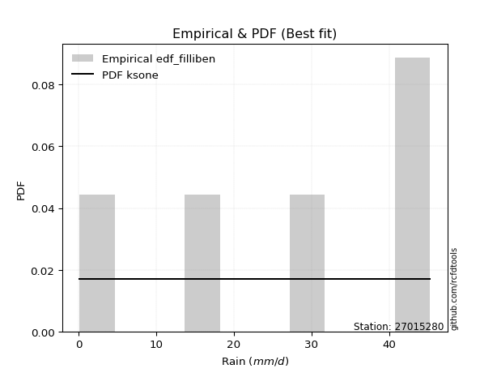</img>

</div>


### 10. EDF Jenkinson (1977)

The Jenkinson formula in hydrology is an empirical plotting position formula used to estimate the non-exceedance probability _(P)_ or return period _(T)_ of a given ordered observation within a sample. It is a widely used method in the frequency analysis of extreme events such as floods and rainfall, as it provides a distribution-free way to plot data. _a≈0.31_ and _b≈0.38_ are constants derived to approximate the median of the probability distribution for the given rank.

<div align="center">


$P=(m-a)/(n+b)$


</div>


**10.1. Empirical values**

<div align="center">

|                | 0                   | 1                  | 2             | 3                  | 4                  |
|:---------------|:--------------------|:-------------------|:--------------|:-------------------|:-------------------|
| date           | 2025                | 2018               | 2020          | 2019               | 2017               |
| x              | 0.1                 | 15.7               | 30.0          | 42.3               | 45.3               |
| m              | 1                   | 2                  | 3             | 4                  | 5                  |
| empirical_dist | edf_jenkinson       | edf_jenkinson      | edf_jenkinson | edf_jenkinson      | edf_jenkinson      |
| empirical      | 0.12825278810408922 | 0.3141263940520446 | 0.5           | 0.6858736059479554 | 0.8717472118959109 |
| empirical_tr   | 1.1471215351812367  | 1.4579945799457996 | 2.0           | 3.183431952662722  | 7.797101449275368  |

</div>


**10.2. Kolmogorov-Smirnov fit test (sorted by Δ)**


<div align="center">

|                | 0                   | 1                   | 2                   | 3                   | 4                   | 5                   | 6                   | 7                   | 8                   | 9                   | 10                  | 11                  | 12                 | 13                 | 14                  | 15                  | 16                  | 17                  | 18                  | 19                  | 20                 | 21                 | 22                 | 23                  | 24                  | 25                  | 26                 | 27                 | 28                  | 29                 | 30                  | 31                  | 32                  | 33                  | 34                  | 35                  | 36                  | 37                  | 38                 | 39                  | 40                 | 41                 | 42                 | 43                  | 44                 | 45                 | 46                 | 47                  | 48                  | 49                  | 50                 | 51                 | 52                 | 53                  | 54                  | 55                  | 56                  | 57                 | 58                 | 59                 | 60                  | 61                 | 62                  | 63                  | 64                  | 65                  | 66                 | 67                 | 68                  | 69                 | 70                 | 71                 | 72                 | 73                 | 74                 | 75                  | 76                 | 77                  | 78                  | 79                 | 80                  | 81                 | 82                  | 83                 | 84                 | 85                 | 86                 | 87                 | 88                  | 89                  | 90                  | 91                  | 92                 | 93                 | 94                 | 95                 | 96                  | 97                  | 98                 | 99                  | 100                 | 101                | 102                 | 103                | 104                | 105                | 106                | 107                 | 108                | 109                | 110                 | 111                 | 112                | 113                | 114                | 115                 | 116                | 117                 | 118                | 119                 | 120                 | 121                 | 122                 | 123                 | 124                 | 125                 | 126                | 127                | 128                 | 129                 | 130                | 131                 | 132                | 133                | 134                | 135                | 136                | 137                 | 138                | 139                | 140                | 141                | 142                | 143                | 144                | 145                | 146                | 147                | 148                | 149                | 150                | 151                | 152                | 153                | 154                | 155                | 156                | 157                | 158                | 159                |
|:---------------|:--------------------|:--------------------|:--------------------|:--------------------|:--------------------|:--------------------|:--------------------|:--------------------|:--------------------|:--------------------|:--------------------|:--------------------|:-------------------|:-------------------|:--------------------|:--------------------|:--------------------|:--------------------|:--------------------|:--------------------|:-------------------|:-------------------|:-------------------|:--------------------|:--------------------|:--------------------|:-------------------|:-------------------|:--------------------|:-------------------|:--------------------|:--------------------|:--------------------|:--------------------|:--------------------|:--------------------|:--------------------|:--------------------|:-------------------|:--------------------|:-------------------|:-------------------|:-------------------|:--------------------|:-------------------|:-------------------|:-------------------|:--------------------|:--------------------|:--------------------|:-------------------|:-------------------|:-------------------|:--------------------|:--------------------|:--------------------|:--------------------|:-------------------|:-------------------|:-------------------|:--------------------|:-------------------|:--------------------|:--------------------|:--------------------|:--------------------|:-------------------|:-------------------|:--------------------|:-------------------|:-------------------|:-------------------|:-------------------|:-------------------|:-------------------|:--------------------|:-------------------|:--------------------|:--------------------|:-------------------|:--------------------|:-------------------|:--------------------|:-------------------|:-------------------|:-------------------|:-------------------|:-------------------|:--------------------|:--------------------|:--------------------|:--------------------|:-------------------|:-------------------|:-------------------|:-------------------|:--------------------|:--------------------|:-------------------|:--------------------|:--------------------|:-------------------|:--------------------|:-------------------|:-------------------|:-------------------|:-------------------|:--------------------|:-------------------|:-------------------|:--------------------|:--------------------|:-------------------|:-------------------|:-------------------|:--------------------|:-------------------|:--------------------|:-------------------|:--------------------|:--------------------|:--------------------|:--------------------|:--------------------|:--------------------|:--------------------|:-------------------|:-------------------|:--------------------|:--------------------|:-------------------|:--------------------|:-------------------|:-------------------|:-------------------|:-------------------|:-------------------|:--------------------|:-------------------|:-------------------|:-------------------|:-------------------|:-------------------|:-------------------|:-------------------|:-------------------|:-------------------|:-------------------|:-------------------|:-------------------|:-------------------|:-------------------|:-------------------|:-------------------|:-------------------|:-------------------|:-------------------|:-------------------|:-------------------|:-------------------|
| station        | 27015280            | 27015280            | 27015280            | 27015280            | 27015280            | 27015280            | 27015280            | 27015280            | 27015280            | 27015280            | 27015280            | 27015280            | 27015280           | 27015280           | 27015280            | 27015280            | 27015280            | 27015280            | 27015280            | 27015280            | 27015280           | 27015280           | 27015280           | 27015280            | 27015280            | 27015280            | 27015280           | 27015280           | 27015280            | 27015280           | 27015280            | 27015280            | 27015280            | 27015280            | 27015280            | 27015280            | 27015280            | 27015280            | 27015280           | 27015280            | 27015280           | 27015280           | 27015280           | 27015280            | 27015280           | 27015280           | 27015280           | 27015280            | 27015280            | 27015280            | 27015280           | 27015280           | 27015280           | 27015280            | 27015280            | 27015280            | 27015280            | 27015280           | 27015280           | 27015280           | 27015280            | 27015280           | 27015280            | 27015280            | 27015280            | 27015280            | 27015280           | 27015280           | 27015280            | 27015280           | 27015280           | 27015280           | 27015280           | 27015280           | 27015280           | 27015280            | 27015280           | 27015280            | 27015280            | 27015280           | 27015280            | 27015280           | 27015280            | 27015280           | 27015280           | 27015280           | 27015280           | 27015280           | 27015280            | 27015280            | 27015280            | 27015280            | 27015280           | 27015280           | 27015280           | 27015280           | 27015280            | 27015280            | 27015280           | 27015280            | 27015280            | 27015280           | 27015280            | 27015280           | 27015280           | 27015280           | 27015280           | 27015280            | 27015280           | 27015280           | 27015280            | 27015280            | 27015280           | 27015280           | 27015280           | 27015280            | 27015280           | 27015280            | 27015280           | 27015280            | 27015280            | 27015280            | 27015280            | 27015280            | 27015280            | 27015280            | 27015280           | 27015280           | 27015280            | 27015280            | 27015280           | 27015280            | 27015280           | 27015280           | 27015280           | 27015280           | 27015280           | 27015280            | 27015280           | 27015280           | 27015280           | 27015280           | 27015280           | 27015280           | 27015280           | 27015280           | 27015280           | 27015280           | 27015280           | 27015280           | 27015280           | 27015280           | 27015280           | 27015280           | 27015280           | 27015280           | 27015280           | 27015280           | 27015280           | 27015280           |
| empirical_dist | edf_jenkinson       | edf_jenkinson       | edf_jenkinson       | edf_jenkinson       | edf_jenkinson       | edf_jenkinson       | edf_jenkinson       | edf_jenkinson       | edf_jenkinson       | edf_jenkinson       | edf_jenkinson       | edf_jenkinson       | edf_jenkinson      | edf_jenkinson      | edf_jenkinson       | edf_jenkinson       | edf_jenkinson       | edf_jenkinson       | edf_jenkinson       | edf_jenkinson       | edf_jenkinson      | edf_jenkinson      | edf_jenkinson      | edf_jenkinson       | edf_jenkinson       | edf_jenkinson       | edf_jenkinson      | edf_jenkinson      | edf_jenkinson       | edf_jenkinson      | edf_jenkinson       | edf_jenkinson       | edf_jenkinson       | edf_jenkinson       | edf_jenkinson       | edf_jenkinson       | edf_jenkinson       | edf_jenkinson       | edf_jenkinson      | edf_jenkinson       | edf_jenkinson      | edf_jenkinson      | edf_jenkinson      | edf_jenkinson       | edf_jenkinson      | edf_jenkinson      | edf_jenkinson      | edf_jenkinson       | edf_jenkinson       | edf_jenkinson       | edf_jenkinson      | edf_jenkinson      | edf_jenkinson      | edf_jenkinson       | edf_jenkinson       | edf_jenkinson       | edf_jenkinson       | edf_jenkinson      | edf_jenkinson      | edf_jenkinson      | edf_jenkinson       | edf_jenkinson      | edf_jenkinson       | edf_jenkinson       | edf_jenkinson       | edf_jenkinson       | edf_jenkinson      | edf_jenkinson      | edf_jenkinson       | edf_jenkinson      | edf_jenkinson      | edf_jenkinson      | edf_jenkinson      | edf_jenkinson      | edf_jenkinson      | edf_jenkinson       | edf_jenkinson      | edf_jenkinson       | edf_jenkinson       | edf_jenkinson      | edf_jenkinson       | edf_jenkinson      | edf_jenkinson       | edf_jenkinson      | edf_jenkinson      | edf_jenkinson      | edf_jenkinson      | edf_jenkinson      | edf_jenkinson       | edf_jenkinson       | edf_jenkinson       | edf_jenkinson       | edf_jenkinson      | edf_jenkinson      | edf_jenkinson      | edf_jenkinson      | edf_jenkinson       | edf_jenkinson       | edf_jenkinson      | edf_jenkinson       | edf_jenkinson       | edf_jenkinson      | edf_jenkinson       | edf_jenkinson      | edf_jenkinson      | edf_jenkinson      | edf_jenkinson      | edf_jenkinson       | edf_jenkinson      | edf_jenkinson      | edf_jenkinson       | edf_jenkinson       | edf_jenkinson      | edf_jenkinson      | edf_jenkinson      | edf_jenkinson       | edf_jenkinson      | edf_jenkinson       | edf_jenkinson      | edf_jenkinson       | edf_jenkinson       | edf_jenkinson       | edf_jenkinson       | edf_jenkinson       | edf_jenkinson       | edf_jenkinson       | edf_jenkinson      | edf_jenkinson      | edf_jenkinson       | edf_jenkinson       | edf_jenkinson      | edf_jenkinson       | edf_jenkinson      | edf_jenkinson      | edf_jenkinson      | edf_jenkinson      | edf_jenkinson      | edf_jenkinson       | edf_jenkinson      | edf_jenkinson      | edf_jenkinson      | edf_jenkinson      | edf_jenkinson      | edf_jenkinson      | edf_jenkinson      | edf_jenkinson      | edf_jenkinson      | edf_jenkinson      | edf_jenkinson      | edf_jenkinson      | edf_jenkinson      | edf_jenkinson      | edf_jenkinson      | edf_jenkinson      | edf_jenkinson      | edf_jenkinson      | edf_jenkinson      | edf_jenkinson      | edf_jenkinson      | edf_jenkinson      |
| p_dist         | ksone               | semicircular        | anglit              | trapezoid           | ncf                 | beta                | loggausshyper       | genextreme          | loggenpareto        | arcsine             | rice                | invgauss            | pearson3           | gamma              | maxwell             | rayleigh            | crystalball         | norm                | exponnorm           | t                   | betaprime          | erlang             | kstwobign          | alpha               | halfnorm            | burr12              | weibull_min        | foldnorm           | wrapcauchy          | levy_l             | loglevy_l           | gumbel_l            | dweibull            | gumbel_r            | logistic            | cosine              | dgamma              | hypsecant           | gausshyper         | halflogistic        | moyal              | argus              | genpareto          | genexpon            | logpearson3        | laplace            | nakagami           | logvonmises_line    | gennorm             | genhalflogistic     | lomax              | loggompertz        | loggumbel_l        | logwrapcauchy       | halfgennorm         | triang              | logargus            | skewnorm           | mielke             | logtrapezoid       | logarcsine          | wald               | kappa4              | tukeylambda         | kappa3              | uniform             | vonmises_line      | logsemicircular    | truncweibull_min    | loganglit          | bradford           | truncexpon         | logrice            | logexponnorm       | lognorm            | logcrystalball      | lognct             | lognakagami         | logfoldnorm         | logerlang          | johnsonsu           | logloggamma        | loginvgamma         | f                  | loggamma           | loggamma           | loglogistic        | logtruncnorm       | logalpha            | loginvgauss         | loghypsecant        | loginvweibull       | logmaxwell         | loggennorm         | lograyleigh        | logweibull_max     | loglaplace          | loglaplace          | gompertz           | logkstwobign        | logt                | logdgamma          | logncf              | loggenexpon        | loggenextreme      | loghalfnorm        | logcosine          | logdweibull         | logjohnsonsb       | loggumbel_r        | burr                | loggengamma         | invgamma           | logburr12          | loghalflogistic    | logbeta             | logmoyal           | loggenhalflogistic  | loghalfgennorm     | loglomax            | logexponweib        | logskewnorm         | weibull_max         | gengamma            | logkappa3           | logtriang           | logwald            | logf               | logbetaprime        | logloglaplace       | logksone           | invweibull          | logkappa4          | fatiguelife        | truncpareto        | logbradford        | loguniform         | logtruncweibull_min | exponweib          | logtruncexpon      | logfatiguelife     | logweibull_min     | powerlaw           | logburr            | logmielke          | exponpow           | logexponpow        | logpowerlaw        | logtruncpareto     | johnsonsb          | logjohnsonsu       | nct                | truncnorm          | rdist              | logrdist           | genlogistic        | loggenlogistic     | logtukeylambda     | logvonmises        | vonmises           |
| delta          | 0.08216147919235353 | 0.09742614377751424 | 0.10939641759056573 | 0.12267812870523398 | 0.12820365302721018 | 0.12825267650117544 | 0.12825278791095662 | 0.12825278810366503 | 0.12825278810408913 | 0.12825278810408922 | 0.13441800181787145 | 0.13463905259371567 | 0.1354013531883127 | 0.1354630728488817 | 0.13635617050430693 | 0.13637031005506284 | 0.13639054720046895 | 0.13639054887756108 | 0.13639249899696937 | 0.13651471114167035 | 0.1368190690382911 | 0.1372124601035366 | 0.1372261530413219 | 0.13784716527870255 | 0.14047827222750342 | 0.14123315332388287 | 0.1438510674516139 | 0.1455563873450324 | 0.15203101129306773 | 0.1525661414924646 | 0.15328038338305183 | 0.15476232447216853 | 0.15604134174132833 | 0.15640464545116994 | 0.15650074015576643 | 0.15821907461414408 | 0.16568287276668947 | 0.16765271668604664 | 0.1684202577523385 | 0.16848899657511163 | 0.1701113898473332 | 0.1742990857007789 | 0.1745348213283044 | 0.17538026476865665 | 0.1756366571362769 | 0.1787803159226039 | 0.1801887957180175 | 0.18201349143594225 | 0.18587360594795543 | 0.19113985228604402 | 0.191720271830068  | 0.1967414871502618 | 0.2032189334182009 | 0.20347321826360837 | 0.20905075632203535 | 0.21262897411524806 | 0.21613062664594018 | 0.2191693308120216 | 0.2213998777803221 | 0.2279734380524267 | 0.23172735868765165 | 0.2361686486603175 | 0.23650944620640213 | 0.23731235907074077 | 0.24686220027919048 | 0.24775471263611537 | 0.2488958272591587 | 0.2503860664720377 | 0.25264773414682107 | 0.2550504352026229 | 0.2556529185662296 | 0.2650910362304195 | 0.2663117449307519 | 0.2663127123103716 | 0.266314328422736  | 0.26631433037024393 | 0.2664665807228653 | 0.26697045833465577 | 0.26953559530876886 | 0.2696781813581382 | 0.27013920869276786 | 0.2701606796139928 | 0.27527404192093713 | 0.2764495810760212 | 0.2765988751581801 | 0.2765988751581801 | 0.2769071189755126 | 0.2792931486590688 | 0.28187699828267626 | 0.28446953636414424 | 0.28570603286749746 | 0.28782925029683554 | 0.294483803738751  | 0.300523109949269  | 0.3033431227447773 | 0.3090187422625487 | 0.31066095584434145 | 0.31066095584434145 | 0.3141263689192737 | 0.31452472301734163 | 0.31800828157696326 | 0.3210248367492563 | 0.32172609095494603 | 0.3225354806171599 | 0.325959360541164  | 0.3284388582345236 | 0.3291025443692583 | 0.33120821696507274 | 0.3317596900699772 | 0.3345977272168352 | 0.34177130552425483 | 0.34498866410241025 | 0.3453749600578864 | 0.3502573826598421 | 0.3564975467674489 | 0.35771171535222296 | 0.358260839541025  | 0.35989693957826224 | 0.3727563057849354 | 0.37790234675967677 | 0.37804801237941077 | 0.38915192670747106 | 0.39115494085825264 | 0.39620267217231225 | 0.40314552175438473 | 0.41992775318631587 | 0.4240209155754587 | 0.4266603882445434 | 0.43177574480708997 | 0.43562801202708773 | 0.4581560058560697 | 0.45833783877279793 | 0.4653599060099913 | 0.471990414651742  | 0.4745543809625435 | 0.5117536086143459 | 0.5126124858376926 | 0.5286731499126569  | 0.5477238366497601 | 0.5478509558470213 | 0.5509265509169017 | 0.551606950344693  | 0.5724254583319413 | 0.5840573559449989 | 0.6203020252812681 | 0.6229616184489335 | 0.6364381901985989 | 0.6607793681248417 | 0.6661431315508701 | 0.6724039774758452 | 0.6730899041423917 | 0.6843460545720781 | 0.6857579678566865 | 0.6858736058915611 | 0.6858736059479553 | 0.6858736059479554 | 0.6858736059479554 | 0.8717369055449168 | 0.9884997713733682 | 7.068627343151918  |
| deltao         | 0.5865427407550001  | 0.5865427407550001  | 0.5865427407550001  | 0.5865427407550001  | 0.5865427407550001  | 0.5865427407550001  | 0.5865427407550001  | 0.5865427407550001  | 0.5865427407550001  | 0.5865427407550001  | 0.5865427407550001  | 0.5865427407550001  | 0.5865427407550001 | 0.5865427407550001 | 0.5865427407550001  | 0.5865427407550001  | 0.5865427407550001  | 0.5865427407550001  | 0.5865427407550001  | 0.5865427407550001  | 0.5865427407550001 | 0.5865427407550001 | 0.5865427407550001 | 0.5865427407550001  | 0.5865427407550001  | 0.5865427407550001  | 0.5865427407550001 | 0.5865427407550001 | 0.5865427407550001  | 0.5865427407550001 | 0.5865427407550001  | 0.5865427407550001  | 0.5865427407550001  | 0.5865427407550001  | 0.5865427407550001  | 0.5865427407550001  | 0.5865427407550001  | 0.5865427407550001  | 0.5865427407550001 | 0.5865427407550001  | 0.5865427407550001 | 0.5865427407550001 | 0.5865427407550001 | 0.5865427407550001  | 0.5865427407550001 | 0.5865427407550001 | 0.5865427407550001 | 0.5865427407550001  | 0.5865427407550001  | 0.5865427407550001  | 0.5865427407550001 | 0.5865427407550001 | 0.5865427407550001 | 0.5865427407550001  | 0.5865427407550001  | 0.5865427407550001  | 0.5865427407550001  | 0.5865427407550001 | 0.5865427407550001 | 0.5865427407550001 | 0.5865427407550001  | 0.5865427407550001 | 0.5865427407550001  | 0.5865427407550001  | 0.5865427407550001  | 0.5865427407550001  | 0.5865427407550001 | 0.5865427407550001 | 0.5865427407550001  | 0.5865427407550001 | 0.5865427407550001 | 0.5865427407550001 | 0.5865427407550001 | 0.5865427407550001 | 0.5865427407550001 | 0.5865427407550001  | 0.5865427407550001 | 0.5865427407550001  | 0.5865427407550001  | 0.5865427407550001 | 0.5865427407550001  | 0.5865427407550001 | 0.5865427407550001  | 0.5865427407550001 | 0.5865427407550001 | 0.5865427407550001 | 0.5865427407550001 | 0.5865427407550001 | 0.5865427407550001  | 0.5865427407550001  | 0.5865427407550001  | 0.5865427407550001  | 0.5865427407550001 | 0.5865427407550001 | 0.5865427407550001 | 0.5865427407550001 | 0.5865427407550001  | 0.5865427407550001  | 0.5865427407550001 | 0.5865427407550001  | 0.5865427407550001  | 0.5865427407550001 | 0.5865427407550001  | 0.5865427407550001 | 0.5865427407550001 | 0.5865427407550001 | 0.5865427407550001 | 0.5865427407550001  | 0.5865427407550001 | 0.5865427407550001 | 0.5865427407550001  | 0.5865427407550001  | 0.5865427407550001 | 0.5865427407550001 | 0.5865427407550001 | 0.5865427407550001  | 0.5865427407550001 | 0.5865427407550001  | 0.5865427407550001 | 0.5865427407550001  | 0.5865427407550001  | 0.5865427407550001  | 0.5865427407550001  | 0.5865427407550001  | 0.5865427407550001  | 0.5865427407550001  | 0.5865427407550001 | 0.5865427407550001 | 0.5865427407550001  | 0.5865427407550001  | 0.5865427407550001 | 0.5865427407550001  | 0.5865427407550001 | 0.5865427407550001 | 0.5865427407550001 | 0.5865427407550001 | 0.5865427407550001 | 0.5865427407550001  | 0.5865427407550001 | 0.5865427407550001 | 0.5865427407550001 | 0.5865427407550001 | 0.5865427407550001 | 0.5865427407550001 | 0.5865427407550001 | 0.5865427407550001 | 0.5865427407550001 | 0.5865427407550001 | 0.5865427407550001 | 0.5865427407550001 | 0.5865427407550001 | 0.5865427407550001 | 0.5865427407550001 | 0.5865427407550001 | 0.5865427407550001 | 0.5865427407550001 | 0.5865427407550001 | 0.5865427407550001 | 0.5865427407550001 | 0.5865427407550001 |
| eval           | Δo > Δ              | Δo > Δ              | Δo > Δ              | Δo > Δ              | Δo > Δ              | Δo > Δ              | Δo > Δ              | Δo > Δ              | Δo > Δ              | Δo > Δ              | Δo > Δ              | Δo > Δ              | Δo > Δ             | Δo > Δ             | Δo > Δ              | Δo > Δ              | Δo > Δ              | Δo > Δ              | Δo > Δ              | Δo > Δ              | Δo > Δ             | Δo > Δ             | Δo > Δ             | Δo > Δ              | Δo > Δ              | Δo > Δ              | Δo > Δ             | Δo > Δ             | Δo > Δ              | Δo > Δ             | Δo > Δ              | Δo > Δ              | Δo > Δ              | Δo > Δ              | Δo > Δ              | Δo > Δ              | Δo > Δ              | Δo > Δ              | Δo > Δ             | Δo > Δ              | Δo > Δ             | Δo > Δ             | Δo > Δ             | Δo > Δ              | Δo > Δ             | Δo > Δ             | Δo > Δ             | Δo > Δ              | Δo > Δ              | Δo > Δ              | Δo > Δ             | Δo > Δ             | Δo > Δ             | Δo > Δ              | Δo > Δ              | Δo > Δ              | Δo > Δ              | Δo > Δ             | Δo > Δ             | Δo > Δ             | Δo > Δ              | Δo > Δ             | Δo > Δ              | Δo > Δ              | Δo > Δ              | Δo > Δ              | Δo > Δ             | Δo > Δ             | Δo > Δ              | Δo > Δ             | Δo > Δ             | Δo > Δ             | Δo > Δ             | Δo > Δ             | Δo > Δ             | Δo > Δ              | Δo > Δ             | Δo > Δ              | Δo > Δ              | Δo > Δ             | Δo > Δ              | Δo > Δ             | Δo > Δ              | Δo > Δ             | Δo > Δ             | Δo > Δ             | Δo > Δ             | Δo > Δ             | Δo > Δ              | Δo > Δ              | Δo > Δ              | Δo > Δ              | Δo > Δ             | Δo > Δ             | Δo > Δ             | Δo > Δ             | Δo > Δ              | Δo > Δ              | Δo > Δ             | Δo > Δ              | Δo > Δ              | Δo > Δ             | Δo > Δ              | Δo > Δ             | Δo > Δ             | Δo > Δ             | Δo > Δ             | Δo > Δ              | Δo > Δ             | Δo > Δ             | Δo > Δ              | Δo > Δ              | Δo > Δ             | Δo > Δ             | Δo > Δ             | Δo > Δ              | Δo > Δ             | Δo > Δ              | Δo > Δ             | Δo > Δ              | Δo > Δ              | Δo > Δ              | Δo > Δ              | Δo > Δ              | Δo > Δ              | Δo > Δ              | Δo > Δ             | Δo > Δ             | Δo > Δ              | Δo > Δ              | Δo > Δ             | Δo > Δ              | Δo > Δ             | Δo > Δ             | Δo > Δ             | Δo > Δ             | Δo > Δ             | Δo > Δ              | Δo > Δ             | Δo > Δ             | Δo > Δ             | Δo > Δ             | Δo > Δ             | Δo > Δ             | Δo <= Δ            | Δo <= Δ            | Δo <= Δ            | Δo <= Δ            | Δo <= Δ            | Δo <= Δ            | Δo <= Δ            | Δo <= Δ            | Δo <= Δ            | Δo <= Δ            | Δo <= Δ            | Δo <= Δ            | Δo <= Δ            | Δo <= Δ            | Δo <= Δ            | Δo <= Δ            |
| fit            | 1                   | 1                   | 1                   | 1                   | 1                   | 1                   | 1                   | 1                   | 1                   | 1                   | 1                   | 1                   | 1                  | 1                  | 1                   | 1                   | 1                   | 1                   | 1                   | 1                   | 1                  | 1                  | 1                  | 1                   | 1                   | 1                   | 1                  | 1                  | 1                   | 1                  | 1                   | 1                   | 1                   | 1                   | 1                   | 1                   | 1                   | 1                   | 1                  | 1                   | 1                  | 1                  | 1                  | 1                   | 1                  | 1                  | 1                  | 1                   | 1                   | 1                   | 1                  | 1                  | 1                  | 1                   | 1                   | 1                   | 1                   | 1                  | 1                  | 1                  | 1                   | 1                  | 1                   | 1                   | 1                   | 1                   | 1                  | 1                  | 1                   | 1                  | 1                  | 1                  | 1                  | 1                  | 1                  | 1                   | 1                  | 1                   | 1                   | 1                  | 1                   | 1                  | 1                   | 1                  | 1                  | 1                  | 1                  | 1                  | 1                   | 1                   | 1                   | 1                   | 1                  | 1                  | 1                  | 1                  | 1                   | 1                   | 1                  | 1                   | 1                   | 1                  | 1                   | 1                  | 1                  | 1                  | 1                  | 1                   | 1                  | 1                  | 1                   | 1                   | 1                  | 1                  | 1                  | 1                   | 1                  | 1                   | 1                  | 1                   | 1                   | 1                   | 1                   | 1                   | 1                   | 1                   | 1                  | 1                  | 1                   | 1                   | 1                  | 1                   | 1                  | 1                  | 1                  | 1                  | 1                  | 1                   | 1                  | 1                  | 1                  | 1                  | 1                  | 1                  | 0                  | 0                  | 0                  | 0                  | 0                  | 0                  | 0                  | 0                  | 0                  | 0                  | 0                  | 0                  | 0                  | 0                  | 0                  | 0                  |
| n              | 5                   | 5                   | 5                   | 5                   | 5                   | 5                   | 5                   | 5                   | 5                   | 5                   | 5                   | 5                   | 5                  | 5                  | 5                   | 5                   | 5                   | 5                   | 5                   | 5                   | 5                  | 5                  | 5                  | 5                   | 5                   | 5                   | 5                  | 5                  | 5                   | 5                  | 5                   | 5                   | 5                   | 5                   | 5                   | 5                   | 5                   | 5                   | 5                  | 5                   | 5                  | 5                  | 5                  | 5                   | 5                  | 5                  | 5                  | 5                   | 5                   | 5                   | 5                  | 5                  | 5                  | 5                   | 5                   | 5                   | 5                   | 5                  | 5                  | 5                  | 5                   | 5                  | 5                   | 5                   | 5                   | 5                   | 5                  | 5                  | 5                   | 5                  | 5                  | 5                  | 5                  | 5                  | 5                  | 5                   | 5                  | 5                   | 5                   | 5                  | 5                   | 5                  | 5                   | 5                  | 5                  | 5                  | 5                  | 5                  | 5                   | 5                   | 5                   | 5                   | 5                  | 5                  | 5                  | 5                  | 5                   | 5                   | 5                  | 5                   | 5                   | 5                  | 5                   | 5                  | 5                  | 5                  | 5                  | 5                   | 5                  | 5                  | 5                   | 5                   | 5                  | 5                  | 5                  | 5                   | 5                  | 5                   | 5                  | 5                   | 5                   | 5                   | 5                   | 5                   | 5                   | 5                   | 5                  | 5                  | 5                   | 5                   | 5                  | 5                   | 5                  | 5                  | 5                  | 5                  | 5                  | 5                   | 5                  | 5                  | 5                  | 5                  | 5                  | 5                  | 5                  | 5                  | 5                  | 5                  | 5                  | 5                  | 5                  | 5                  | 5                  | 5                  | 5                  | 5                  | 5                  | 5                  | 5                  | 5                  |
| best_fit       | 1                   | 0                   | 0                   | 0                   | 0                   | 0                   | 0                   | 0                   | 0                   | 0                   | 0                   | 0                   | 0                  | 0                  | 0                   | 0                   | 0                   | 0                   | 0                   | 0                   | 0                  | 0                  | 0                  | 0                   | 0                   | 0                   | 0                  | 0                  | 0                   | 0                  | 0                   | 0                   | 0                   | 0                   | 0                   | 0                   | 0                   | 0                   | 0                  | 0                   | 0                  | 0                  | 0                  | 0                   | 0                  | 0                  | 0                  | 0                   | 0                   | 0                   | 0                  | 0                  | 0                  | 0                   | 0                   | 0                   | 0                   | 0                  | 0                  | 0                  | 0                   | 0                  | 0                   | 0                   | 0                   | 0                   | 0                  | 0                  | 0                   | 0                  | 0                  | 0                  | 0                  | 0                  | 0                  | 0                   | 0                  | 0                   | 0                   | 0                  | 0                   | 0                  | 0                   | 0                  | 0                  | 0                  | 0                  | 0                  | 0                   | 0                   | 0                   | 0                   | 0                  | 0                  | 0                  | 0                  | 0                   | 0                   | 0                  | 0                   | 0                   | 0                  | 0                   | 0                  | 0                  | 0                  | 0                  | 0                   | 0                  | 0                  | 0                   | 0                   | 0                  | 0                  | 0                  | 0                   | 0                  | 0                   | 0                  | 0                   | 0                   | 0                   | 0                   | 0                   | 0                   | 0                   | 0                  | 0                  | 0                   | 0                   | 0                  | 0                   | 0                  | 0                  | 0                  | 0                  | 0                  | 0                   | 0                  | 0                  | 0                  | 0                  | 0                  | 0                  | 0                  | 0                  | 0                  | 0                  | 0                  | 0                  | 0                  | 0                  | 0                  | 0                  | 0                  | 0                  | 0                  | 0                  | 0                  | 0                  |
| best_fit_sort  | 1                   | 2                   | 3                   | 4                   | 5                   | 6                   | 7                   | 8                   | 9                   | 10                  | 11                  | 12                  | 13                 | 14                 | 15                  | 16                  | 17                  | 18                  | 19                  | 20                  | 21                 | 22                 | 23                 | 24                  | 25                  | 26                  | 27                 | 28                 | 29                  | 30                 | 31                  | 32                  | 33                  | 34                  | 35                  | 36                  | 37                  | 38                  | 39                 | 40                  | 41                 | 42                 | 43                 | 44                  | 45                 | 46                 | 47                 | 48                  | 49                  | 50                  | 51                 | 52                 | 53                 | 54                  | 55                  | 56                  | 57                  | 58                 | 59                 | 60                 | 61                  | 62                 | 63                  | 64                  | 65                  | 66                  | 67                 | 68                 | 69                  | 70                 | 71                 | 72                 | 73                 | 74                 | 75                 | 76                  | 77                 | 78                  | 79                  | 80                 | 81                  | 82                 | 83                  | 84                 | 85                 | 86                 | 87                 | 88                 | 89                  | 90                  | 91                  | 92                  | 93                 | 94                 | 95                 | 96                 | 97                  | 98                  | 99                 | 100                 | 101                 | 102                | 103                 | 104                | 105                | 106                | 107                | 108                 | 109                | 110                | 111                 | 112                 | 113                | 114                | 115                | 116                 | 117                | 118                 | 119                | 120                 | 121                 | 122                 | 123                 | 124                 | 125                 | 126                 | 127                | 128                | 129                 | 130                 | 131                | 132                 | 133                | 134                | 135                | 136                | 137                | 138                 | 139                | 140                | 141                | 142                | 143                | 144                | 145                | 146                | 147                | 148                | 149                | 150                | 151                | 152                | 153                | 154                | 155                | 156                | 157                | 158                | 159                | 160                |

</div>


**10.3. Best fit**

<div align="center">

|   id |   station | empirical_dist   | p_dist   |     delta |   deltao | eval   |   fit |   n |   best_fit |   best_fit_sort |
|-----:|----------:|:-----------------|:---------|----------:|---------:|:-------|------:|----:|-----------:|----------------:|
|    0 |  27015280 | edf_jenkinson    | ksone    | 0.0821615 | 0.586543 | Δo > Δ |     1 |   5 |          1 |               1 |

</div>


<div align="center">

</img>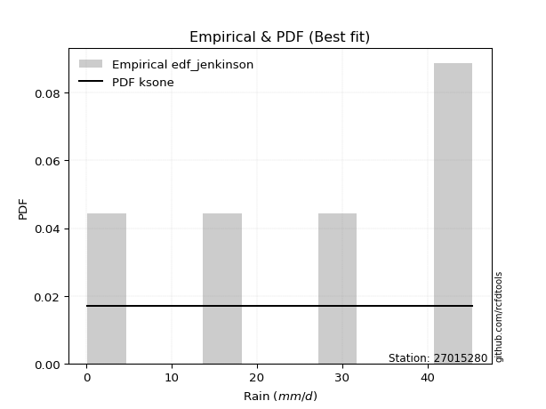</img>

</div>


### 11. EDF Cunnane (1978)

Cunnane´s work in statistical hydrology has focused on the performance and evaluation of different probability distributions (such as GEV, Gumbel, Lognormal) for flood frequency estimation. _b_ is a constant, typically set to 0.4.

<div align="center">


$P=(m-b)/(n+1-2b)$


</div>


**11.1. Empirical values**

<div align="center">

|                | 0                   | 1                  | 2           | 3                  | 4                  |
|:---------------|:--------------------|:-------------------|:------------|:-------------------|:-------------------|
| date           | 2025                | 2018               | 2020        | 2019               | 2017               |
| x              | 0.1                 | 15.7               | 30.0        | 42.3               | 45.3               |
| m              | 1                   | 2                  | 3           | 4                  | 5                  |
| empirical_dist | edf_cunnane         | edf_cunnane        | edf_cunnane | edf_cunnane        | edf_cunnane        |
| empirical      | 0.11538461538461538 | 0.3076923076923077 | 0.5         | 0.6923076923076923 | 0.8846153846153845 |
| empirical_tr   | 1.1304347826086958  | 1.4444444444444444 | 2.0         | 3.25               | 8.666666666666655  |

</div>


**11.2. Kolmogorov-Smirnov fit test (sorted by Δ)**


<div align="center">

|                | 0                   | 1                   | 2                   | 3                   | 4                   | 5                   | 6                   | 7                   | 8                   | 9                   | 10                 | 11                 | 12                  | 13                  | 14                  | 15                  | 16                 | 17                  | 18                 | 19                 | 20                  | 21                  | 22                 | 23                 | 24                 | 25                  | 26                  | 27                  | 28                  | 29                  | 30                 | 31                  | 32                  | 33                 | 34                  | 35                  | 36                 | 37                 | 38                  | 39                  | 40                  | 41                 | 42                  | 43                 | 44                  | 45                 | 46                  | 47                  | 48                 | 49                 | 50                  | 51                 | 52                 | 53                  | 54                  | 55                  | 56                  | 57                  | 58                  | 59                  | 60                  | 61                  | 62                 | 63                  | 64                  | 65                 | 66                  | 67                 | 68                  | 69                 | 70                  | 71                 | 72                  | 73                 | 74                  | 75                 | 76                  | 77                 | 78                 | 79                 | 80                 | 81                 | 82                  | 83                 | 84                 | 85                 | 86                  | 87                 | 88                 | 89                  | 90                 | 91                  | 92                 | 93                 | 94                 | 95                  | 96                  | 97                  | 98                  | 99                  | 100                 | 101                 | 102                 | 103                | 104                | 105                 | 106                | 107                | 108                 | 109                 | 110                 | 111                 | 112                 | 113                | 114                | 115                | 116                | 117                 | 118                | 119                | 120                | 121                | 122                | 123                 | 124                 | 125                | 126                | 127                | 128                | 129                 | 130                | 131                 | 132                | 133                 | 134                | 135                | 136                | 137                 | 138                | 139                | 140                | 141                | 142                | 143                | 144                | 145                | 146                | 147                | 148                | 149                | 150                | 151                | 152                | 153                | 154                | 155                | 156                | 157                | 158                | 159                |
|:---------------|:--------------------|:--------------------|:--------------------|:--------------------|:--------------------|:--------------------|:--------------------|:--------------------|:--------------------|:--------------------|:-------------------|:-------------------|:--------------------|:--------------------|:--------------------|:--------------------|:-------------------|:--------------------|:-------------------|:-------------------|:--------------------|:--------------------|:-------------------|:-------------------|:-------------------|:--------------------|:--------------------|:--------------------|:--------------------|:--------------------|:-------------------|:--------------------|:--------------------|:-------------------|:--------------------|:--------------------|:-------------------|:-------------------|:--------------------|:--------------------|:--------------------|:-------------------|:--------------------|:-------------------|:--------------------|:-------------------|:--------------------|:--------------------|:-------------------|:-------------------|:--------------------|:-------------------|:-------------------|:--------------------|:--------------------|:--------------------|:--------------------|:--------------------|:--------------------|:--------------------|:--------------------|:--------------------|:-------------------|:--------------------|:--------------------|:-------------------|:--------------------|:-------------------|:--------------------|:-------------------|:--------------------|:-------------------|:--------------------|:-------------------|:--------------------|:-------------------|:--------------------|:-------------------|:-------------------|:-------------------|:-------------------|:-------------------|:--------------------|:-------------------|:-------------------|:-------------------|:--------------------|:-------------------|:-------------------|:--------------------|:-------------------|:--------------------|:-------------------|:-------------------|:-------------------|:--------------------|:--------------------|:--------------------|:--------------------|:--------------------|:--------------------|:--------------------|:--------------------|:-------------------|:-------------------|:--------------------|:-------------------|:-------------------|:--------------------|:--------------------|:--------------------|:--------------------|:--------------------|:-------------------|:-------------------|:-------------------|:-------------------|:--------------------|:-------------------|:-------------------|:-------------------|:-------------------|:-------------------|:--------------------|:--------------------|:-------------------|:-------------------|:-------------------|:-------------------|:--------------------|:-------------------|:--------------------|:-------------------|:--------------------|:-------------------|:-------------------|:-------------------|:--------------------|:-------------------|:-------------------|:-------------------|:-------------------|:-------------------|:-------------------|:-------------------|:-------------------|:-------------------|:-------------------|:-------------------|:-------------------|:-------------------|:-------------------|:-------------------|:-------------------|:-------------------|:-------------------|:-------------------|:-------------------|:-------------------|:-------------------|
| station        | 27015280            | 27015280            | 27015280            | 27015280            | 27015280            | 27015280            | 27015280            | 27015280            | 27015280            | 27015280            | 27015280           | 27015280           | 27015280            | 27015280            | 27015280            | 27015280            | 27015280           | 27015280            | 27015280           | 27015280           | 27015280            | 27015280            | 27015280           | 27015280           | 27015280           | 27015280            | 27015280            | 27015280            | 27015280            | 27015280            | 27015280           | 27015280            | 27015280            | 27015280           | 27015280            | 27015280            | 27015280           | 27015280           | 27015280            | 27015280            | 27015280            | 27015280           | 27015280            | 27015280           | 27015280            | 27015280           | 27015280            | 27015280            | 27015280           | 27015280           | 27015280            | 27015280           | 27015280           | 27015280            | 27015280            | 27015280            | 27015280            | 27015280            | 27015280            | 27015280            | 27015280            | 27015280            | 27015280           | 27015280            | 27015280            | 27015280           | 27015280            | 27015280           | 27015280            | 27015280           | 27015280            | 27015280           | 27015280            | 27015280           | 27015280            | 27015280           | 27015280            | 27015280           | 27015280           | 27015280           | 27015280           | 27015280           | 27015280            | 27015280           | 27015280           | 27015280           | 27015280            | 27015280           | 27015280           | 27015280            | 27015280           | 27015280            | 27015280           | 27015280           | 27015280           | 27015280            | 27015280            | 27015280            | 27015280            | 27015280            | 27015280            | 27015280            | 27015280            | 27015280           | 27015280           | 27015280            | 27015280           | 27015280           | 27015280            | 27015280            | 27015280            | 27015280            | 27015280            | 27015280           | 27015280           | 27015280           | 27015280           | 27015280            | 27015280           | 27015280           | 27015280           | 27015280           | 27015280           | 27015280            | 27015280            | 27015280           | 27015280           | 27015280           | 27015280           | 27015280            | 27015280           | 27015280            | 27015280           | 27015280            | 27015280           | 27015280           | 27015280           | 27015280            | 27015280           | 27015280           | 27015280           | 27015280           | 27015280           | 27015280           | 27015280           | 27015280           | 27015280           | 27015280           | 27015280           | 27015280           | 27015280           | 27015280           | 27015280           | 27015280           | 27015280           | 27015280           | 27015280           | 27015280           | 27015280           | 27015280           |
| empirical_dist | edf_cunnane         | edf_cunnane         | edf_cunnane         | edf_cunnane         | edf_cunnane         | edf_cunnane         | edf_cunnane         | edf_cunnane         | edf_cunnane         | edf_cunnane         | edf_cunnane        | edf_cunnane        | edf_cunnane         | edf_cunnane         | edf_cunnane         | edf_cunnane         | edf_cunnane        | edf_cunnane         | edf_cunnane        | edf_cunnane        | edf_cunnane         | edf_cunnane         | edf_cunnane        | edf_cunnane        | edf_cunnane        | edf_cunnane         | edf_cunnane         | edf_cunnane         | edf_cunnane         | edf_cunnane         | edf_cunnane        | edf_cunnane         | edf_cunnane         | edf_cunnane        | edf_cunnane         | edf_cunnane         | edf_cunnane        | edf_cunnane        | edf_cunnane         | edf_cunnane         | edf_cunnane         | edf_cunnane        | edf_cunnane         | edf_cunnane        | edf_cunnane         | edf_cunnane        | edf_cunnane         | edf_cunnane         | edf_cunnane        | edf_cunnane        | edf_cunnane         | edf_cunnane        | edf_cunnane        | edf_cunnane         | edf_cunnane         | edf_cunnane         | edf_cunnane         | edf_cunnane         | edf_cunnane         | edf_cunnane         | edf_cunnane         | edf_cunnane         | edf_cunnane        | edf_cunnane         | edf_cunnane         | edf_cunnane        | edf_cunnane         | edf_cunnane        | edf_cunnane         | edf_cunnane        | edf_cunnane         | edf_cunnane        | edf_cunnane         | edf_cunnane        | edf_cunnane         | edf_cunnane        | edf_cunnane         | edf_cunnane        | edf_cunnane        | edf_cunnane        | edf_cunnane        | edf_cunnane        | edf_cunnane         | edf_cunnane        | edf_cunnane        | edf_cunnane        | edf_cunnane         | edf_cunnane        | edf_cunnane        | edf_cunnane         | edf_cunnane        | edf_cunnane         | edf_cunnane        | edf_cunnane        | edf_cunnane        | edf_cunnane         | edf_cunnane         | edf_cunnane         | edf_cunnane         | edf_cunnane         | edf_cunnane         | edf_cunnane         | edf_cunnane         | edf_cunnane        | edf_cunnane        | edf_cunnane         | edf_cunnane        | edf_cunnane        | edf_cunnane         | edf_cunnane         | edf_cunnane         | edf_cunnane         | edf_cunnane         | edf_cunnane        | edf_cunnane        | edf_cunnane        | edf_cunnane        | edf_cunnane         | edf_cunnane        | edf_cunnane        | edf_cunnane        | edf_cunnane        | edf_cunnane        | edf_cunnane         | edf_cunnane         | edf_cunnane        | edf_cunnane        | edf_cunnane        | edf_cunnane        | edf_cunnane         | edf_cunnane        | edf_cunnane         | edf_cunnane        | edf_cunnane         | edf_cunnane        | edf_cunnane        | edf_cunnane        | edf_cunnane         | edf_cunnane        | edf_cunnane        | edf_cunnane        | edf_cunnane        | edf_cunnane        | edf_cunnane        | edf_cunnane        | edf_cunnane        | edf_cunnane        | edf_cunnane        | edf_cunnane        | edf_cunnane        | edf_cunnane        | edf_cunnane        | edf_cunnane        | edf_cunnane        | edf_cunnane        | edf_cunnane        | edf_cunnane        | edf_cunnane        | edf_cunnane        | edf_cunnane        |
| p_dist         | ksone               | semicircular        | anglit              | ncf                 | beta                | loggausshyper       | genextreme          | arcsine             | loggenpareto        | trapezoid           | rice               | invgauss           | pearson3            | gamma               | maxwell             | rayleigh            | crystalball        | norm                | exponnorm          | t                  | betaprime           | erlang              | alpha              | burr12             | kstwobign          | weibull_min         | foldnorm            | halfnorm            | gumbel_l            | dweibull            | gumbel_r           | logistic            | cosine              | levy_l             | loglevy_l           | wrapcauchy          | dgamma             | hypsecant          | gausshyper          | argus               | halflogistic        | moyal              | laplace             | genpareto          | genexpon            | nakagami           | logpearson3         | genhalflogistic     | lomax              | gennorm            | logvonmises_line    | loggompertz        | triang             | loggumbel_l         | logwrapcauchy       | skewnorm            | mielke              | halfgennorm         | logargus            | kappa4              | tukeylambda         | logtrapezoid        | wald               | logarcsine          | kappa3              | uniform            | vonmises_line       | truncweibull_min   | bradford            | logsemicircular    | truncexpon          | loganglit          | logloggamma         | logrice            | logexponnorm        | lognorm            | logcrystalball      | lognct             | lognakagami        | logfoldnorm        | logerlang          | johnsonsu          | loginvgamma         | f                  | loggamma           | loggamma           | loglogistic         | logtruncnorm       | logalpha           | loginvgauss         | loghypsecant       | loginvweibull       | loggennorm         | logmaxwell         | gompertz           | lograyleigh         | logweibull_max      | loglaplace          | loglaplace          | logt                | logkstwobign        | logncf              | loggenexpon         | loggenextreme      | logdgamma          | loghalfnorm         | logcosine          | loggumbel_r        | logdweibull         | logjohnsonsb        | burr                | invgamma            | loggengamma         | loghalflogistic    | logburr12          | logbeta            | logmoyal           | loggenhalflogistic  | loghalfgennorm     | loglomax           | logexponweib       | logskewnorm        | weibull_max        | gengamma            | logkappa3           | logtriang          | logwald            | logf               | logbetaprime       | logloglaplace       | logksone           | invweibull          | logkappa4          | fatiguelife         | truncpareto        | logbradford        | loguniform         | logtruncweibull_min | exponweib          | logtruncexpon      | logfatiguelife     | logweibull_min     | powerlaw           | logburr            | logmielke          | exponpow           | logexponpow        | logpowerlaw        | logtruncpareto     | johnsonsb          | logjohnsonsu       | nct                | truncnorm          | rdist              | genlogistic        | loggenlogistic     | logrdist           | logtukeylambda     | logvonmises        | vonmises           |
| delta          | 0.07443624128142323 | 0.09099205741777738 | 0.10296233123082887 | 0.11533548030773634 | 0.11538450378170184 | 0.11538461519148302 | 0.11538461538419142 | 0.11538461538461538 | 0.11538461538461553 | 0.11624404234549712 | 0.1279839154581346 | 0.1282049662339788 | 0.12896726682857584 | 0.12902898648914485 | 0.12992208414457007 | 0.12993622369532598 | 0.1299564608407321 | 0.12995646251782422 | 0.1299584126372325 | 0.1300806247819335 | 0.13038498267855425 | 0.13077837374379975 | 0.1314130789189657 | 0.134799066964146  | 0.1372261530413219 | 0.13741698109187706 | 0.13912230098529554 | 0.14047827222750342 | 0.14832823811243168 | 0.14960725538159148 | 0.1499705590914331 | 0.15006665379602957 | 0.15178498825440723 | 0.1525661414924646 | 0.15328038338305183 | 0.15846509765280464 | 0.1592487864069526 | 0.1612186303263098 | 0.16198617139260163 | 0.16786499934104204 | 0.16848899657511163 | 0.1701113898473332 | 0.17234622956286705 | 0.1745348213283044 | 0.17538026476865665 | 0.1803010433018723 | 0.18207074349601382 | 0.18470576592630716 | 0.191720271830068  | 0.1923076923076923 | 0.19488166415541586 | 0.2031755735099987 | 0.2061948877555112 | 0.20965301977793782 | 0.20990730462334528 | 0.21273524445228476 | 0.21496579142058525 | 0.21548484268177226 | 0.21613062664594018 | 0.23007535984666527 | 0.23087827271100392 | 0.23440752441216361 | 0.2361686486603175 | 0.23816144504738856 | 0.24042811391945362 | 0.2413206262763785 | 0.24246174089942185 | 0.2462136477870842 | 0.24921883220649277 | 0.2568201528317746 | 0.25865694987068266 | 0.2614845215623598 | 0.26372659325425596 | 0.2727458312904888 | 0.27274679867010854 | 0.2727484147824729 | 0.27274841672998085 | 0.2729006670826022 | 0.2734045446943927 | 0.2759696816685058 | 0.2761122677178751 | 0.2765732950525047 | 0.28170812828067404 | 0.2828836674357581 | 0.283032961517917  | 0.283032961517917  | 0.28334120533524954 | 0.2857272350188057 | 0.2883110846424132 | 0.29090362272388115 | 0.2921401192272344 | 0.29426333665657245 | 0.300523109949269  | 0.3009178900984879 | 0.3076922825595368 | 0.30977720910451423 | 0.31545282862228563 | 0.31709504220407836 | 0.31709504220407836 | 0.31800828157696326 | 0.32095880937707855 | 0.32816017731468294 | 0.32896956697689683 | 0.3323934469009009 | 0.3338930094687299 | 0.33487294459426054 | 0.3355366307289952 | 0.3410318135765721 | 0.34407638968454635 | 0.34462786278945107 | 0.34735885236196773 | 0.35180904641762334 | 0.35785683682188385 | 0.3629316331271858 | 0.3631255553793157 | 0.3641458017119598 | 0.3646949259007619 | 0.36633102593799916 | 0.3791903921446723 | 0.3843364331194137 | 0.3909161850988844 | 0.395586013067208  | 0.3975890272179895 | 0.40263675853204917 | 0.41601369447385833 | 0.4263618395460528 | 0.4304550019351956 | 0.4330944746042803 | 0.4382098311668269 | 0.44206209838682464 | 0.4645900922158066 | 0.47120601149227154 | 0.4717939923697282 | 0.47842450101147893 | 0.4809884673222804 | 0.5181876949740828 | 0.5190465721974294 | 0.5351072362723939  | 0.554157923009497  | 0.5542850422067581 | 0.5573606372766385 | 0.55804103670443   | 0.5788595446916781 | 0.5904914423047358 | 0.626736111641005  | 0.6293957048086705 | 0.6428722765583358 | 0.6672134544845786 | 0.6725772179106071 | 0.6788380638355821 | 0.6795239905021285 | 0.690780140931815  | 0.6921920542164234 | 0.692307692251298  | 0.6923076923076923 | 0.6923076923076923 | 0.6923076923076923 | 0.8846050782643906 | 0.9820656850136313 | 7.055759170432444  |
| deltao         | 0.5865427407550001  | 0.5865427407550001  | 0.5865427407550001  | 0.5865427407550001  | 0.5865427407550001  | 0.5865427407550001  | 0.5865427407550001  | 0.5865427407550001  | 0.5865427407550001  | 0.5865427407550001  | 0.5865427407550001 | 0.5865427407550001 | 0.5865427407550001  | 0.5865427407550001  | 0.5865427407550001  | 0.5865427407550001  | 0.5865427407550001 | 0.5865427407550001  | 0.5865427407550001 | 0.5865427407550001 | 0.5865427407550001  | 0.5865427407550001  | 0.5865427407550001 | 0.5865427407550001 | 0.5865427407550001 | 0.5865427407550001  | 0.5865427407550001  | 0.5865427407550001  | 0.5865427407550001  | 0.5865427407550001  | 0.5865427407550001 | 0.5865427407550001  | 0.5865427407550001  | 0.5865427407550001 | 0.5865427407550001  | 0.5865427407550001  | 0.5865427407550001 | 0.5865427407550001 | 0.5865427407550001  | 0.5865427407550001  | 0.5865427407550001  | 0.5865427407550001 | 0.5865427407550001  | 0.5865427407550001 | 0.5865427407550001  | 0.5865427407550001 | 0.5865427407550001  | 0.5865427407550001  | 0.5865427407550001 | 0.5865427407550001 | 0.5865427407550001  | 0.5865427407550001 | 0.5865427407550001 | 0.5865427407550001  | 0.5865427407550001  | 0.5865427407550001  | 0.5865427407550001  | 0.5865427407550001  | 0.5865427407550001  | 0.5865427407550001  | 0.5865427407550001  | 0.5865427407550001  | 0.5865427407550001 | 0.5865427407550001  | 0.5865427407550001  | 0.5865427407550001 | 0.5865427407550001  | 0.5865427407550001 | 0.5865427407550001  | 0.5865427407550001 | 0.5865427407550001  | 0.5865427407550001 | 0.5865427407550001  | 0.5865427407550001 | 0.5865427407550001  | 0.5865427407550001 | 0.5865427407550001  | 0.5865427407550001 | 0.5865427407550001 | 0.5865427407550001 | 0.5865427407550001 | 0.5865427407550001 | 0.5865427407550001  | 0.5865427407550001 | 0.5865427407550001 | 0.5865427407550001 | 0.5865427407550001  | 0.5865427407550001 | 0.5865427407550001 | 0.5865427407550001  | 0.5865427407550001 | 0.5865427407550001  | 0.5865427407550001 | 0.5865427407550001 | 0.5865427407550001 | 0.5865427407550001  | 0.5865427407550001  | 0.5865427407550001  | 0.5865427407550001  | 0.5865427407550001  | 0.5865427407550001  | 0.5865427407550001  | 0.5865427407550001  | 0.5865427407550001 | 0.5865427407550001 | 0.5865427407550001  | 0.5865427407550001 | 0.5865427407550001 | 0.5865427407550001  | 0.5865427407550001  | 0.5865427407550001  | 0.5865427407550001  | 0.5865427407550001  | 0.5865427407550001 | 0.5865427407550001 | 0.5865427407550001 | 0.5865427407550001 | 0.5865427407550001  | 0.5865427407550001 | 0.5865427407550001 | 0.5865427407550001 | 0.5865427407550001 | 0.5865427407550001 | 0.5865427407550001  | 0.5865427407550001  | 0.5865427407550001 | 0.5865427407550001 | 0.5865427407550001 | 0.5865427407550001 | 0.5865427407550001  | 0.5865427407550001 | 0.5865427407550001  | 0.5865427407550001 | 0.5865427407550001  | 0.5865427407550001 | 0.5865427407550001 | 0.5865427407550001 | 0.5865427407550001  | 0.5865427407550001 | 0.5865427407550001 | 0.5865427407550001 | 0.5865427407550001 | 0.5865427407550001 | 0.5865427407550001 | 0.5865427407550001 | 0.5865427407550001 | 0.5865427407550001 | 0.5865427407550001 | 0.5865427407550001 | 0.5865427407550001 | 0.5865427407550001 | 0.5865427407550001 | 0.5865427407550001 | 0.5865427407550001 | 0.5865427407550001 | 0.5865427407550001 | 0.5865427407550001 | 0.5865427407550001 | 0.5865427407550001 | 0.5865427407550001 |
| eval           | Δo > Δ              | Δo > Δ              | Δo > Δ              | Δo > Δ              | Δo > Δ              | Δo > Δ              | Δo > Δ              | Δo > Δ              | Δo > Δ              | Δo > Δ              | Δo > Δ             | Δo > Δ             | Δo > Δ              | Δo > Δ              | Δo > Δ              | Δo > Δ              | Δo > Δ             | Δo > Δ              | Δo > Δ             | Δo > Δ             | Δo > Δ              | Δo > Δ              | Δo > Δ             | Δo > Δ             | Δo > Δ             | Δo > Δ              | Δo > Δ              | Δo > Δ              | Δo > Δ              | Δo > Δ              | Δo > Δ             | Δo > Δ              | Δo > Δ              | Δo > Δ             | Δo > Δ              | Δo > Δ              | Δo > Δ             | Δo > Δ             | Δo > Δ              | Δo > Δ              | Δo > Δ              | Δo > Δ             | Δo > Δ              | Δo > Δ             | Δo > Δ              | Δo > Δ             | Δo > Δ              | Δo > Δ              | Δo > Δ             | Δo > Δ             | Δo > Δ              | Δo > Δ             | Δo > Δ             | Δo > Δ              | Δo > Δ              | Δo > Δ              | Δo > Δ              | Δo > Δ              | Δo > Δ              | Δo > Δ              | Δo > Δ              | Δo > Δ              | Δo > Δ             | Δo > Δ              | Δo > Δ              | Δo > Δ             | Δo > Δ              | Δo > Δ             | Δo > Δ              | Δo > Δ             | Δo > Δ              | Δo > Δ             | Δo > Δ              | Δo > Δ             | Δo > Δ              | Δo > Δ             | Δo > Δ              | Δo > Δ             | Δo > Δ             | Δo > Δ             | Δo > Δ             | Δo > Δ             | Δo > Δ              | Δo > Δ             | Δo > Δ             | Δo > Δ             | Δo > Δ              | Δo > Δ             | Δo > Δ             | Δo > Δ              | Δo > Δ             | Δo > Δ              | Δo > Δ             | Δo > Δ             | Δo > Δ             | Δo > Δ              | Δo > Δ              | Δo > Δ              | Δo > Δ              | Δo > Δ              | Δo > Δ              | Δo > Δ              | Δo > Δ              | Δo > Δ             | Δo > Δ             | Δo > Δ              | Δo > Δ             | Δo > Δ             | Δo > Δ              | Δo > Δ              | Δo > Δ              | Δo > Δ              | Δo > Δ              | Δo > Δ             | Δo > Δ             | Δo > Δ             | Δo > Δ             | Δo > Δ              | Δo > Δ             | Δo > Δ             | Δo > Δ             | Δo > Δ             | Δo > Δ             | Δo > Δ              | Δo > Δ              | Δo > Δ             | Δo > Δ             | Δo > Δ             | Δo > Δ             | Δo > Δ              | Δo > Δ             | Δo > Δ              | Δo > Δ             | Δo > Δ              | Δo > Δ             | Δo > Δ             | Δo > Δ             | Δo > Δ              | Δo > Δ             | Δo > Δ             | Δo > Δ             | Δo > Δ             | Δo > Δ             | Δo <= Δ            | Δo <= Δ            | Δo <= Δ            | Δo <= Δ            | Δo <= Δ            | Δo <= Δ            | Δo <= Δ            | Δo <= Δ            | Δo <= Δ            | Δo <= Δ            | Δo <= Δ            | Δo <= Δ            | Δo <= Δ            | Δo <= Δ            | Δo <= Δ            | Δo <= Δ            | Δo <= Δ            |
| fit            | 1                   | 1                   | 1                   | 1                   | 1                   | 1                   | 1                   | 1                   | 1                   | 1                   | 1                  | 1                  | 1                   | 1                   | 1                   | 1                   | 1                  | 1                   | 1                  | 1                  | 1                   | 1                   | 1                  | 1                  | 1                  | 1                   | 1                   | 1                   | 1                   | 1                   | 1                  | 1                   | 1                   | 1                  | 1                   | 1                   | 1                  | 1                  | 1                   | 1                   | 1                   | 1                  | 1                   | 1                  | 1                   | 1                  | 1                   | 1                   | 1                  | 1                  | 1                   | 1                  | 1                  | 1                   | 1                   | 1                   | 1                   | 1                   | 1                   | 1                   | 1                   | 1                   | 1                  | 1                   | 1                   | 1                  | 1                   | 1                  | 1                   | 1                  | 1                   | 1                  | 1                   | 1                  | 1                   | 1                  | 1                   | 1                  | 1                  | 1                  | 1                  | 1                  | 1                   | 1                  | 1                  | 1                  | 1                   | 1                  | 1                  | 1                   | 1                  | 1                   | 1                  | 1                  | 1                  | 1                   | 1                   | 1                   | 1                   | 1                   | 1                   | 1                   | 1                   | 1                  | 1                  | 1                   | 1                  | 1                  | 1                   | 1                   | 1                   | 1                   | 1                   | 1                  | 1                  | 1                  | 1                  | 1                   | 1                  | 1                  | 1                  | 1                  | 1                  | 1                   | 1                   | 1                  | 1                  | 1                  | 1                  | 1                   | 1                  | 1                   | 1                  | 1                   | 1                  | 1                  | 1                  | 1                   | 1                  | 1                  | 1                  | 1                  | 1                  | 0                  | 0                  | 0                  | 0                  | 0                  | 0                  | 0                  | 0                  | 0                  | 0                  | 0                  | 0                  | 0                  | 0                  | 0                  | 0                  | 0                  |
| n              | 5                   | 5                   | 5                   | 5                   | 5                   | 5                   | 5                   | 5                   | 5                   | 5                   | 5                  | 5                  | 5                   | 5                   | 5                   | 5                   | 5                  | 5                   | 5                  | 5                  | 5                   | 5                   | 5                  | 5                  | 5                  | 5                   | 5                   | 5                   | 5                   | 5                   | 5                  | 5                   | 5                   | 5                  | 5                   | 5                   | 5                  | 5                  | 5                   | 5                   | 5                   | 5                  | 5                   | 5                  | 5                   | 5                  | 5                   | 5                   | 5                  | 5                  | 5                   | 5                  | 5                  | 5                   | 5                   | 5                   | 5                   | 5                   | 5                   | 5                   | 5                   | 5                   | 5                  | 5                   | 5                   | 5                  | 5                   | 5                  | 5                   | 5                  | 5                   | 5                  | 5                   | 5                  | 5                   | 5                  | 5                   | 5                  | 5                  | 5                  | 5                  | 5                  | 5                   | 5                  | 5                  | 5                  | 5                   | 5                  | 5                  | 5                   | 5                  | 5                   | 5                  | 5                  | 5                  | 5                   | 5                   | 5                   | 5                   | 5                   | 5                   | 5                   | 5                   | 5                  | 5                  | 5                   | 5                  | 5                  | 5                   | 5                   | 5                   | 5                   | 5                   | 5                  | 5                  | 5                  | 5                  | 5                   | 5                  | 5                  | 5                  | 5                  | 5                  | 5                   | 5                   | 5                  | 5                  | 5                  | 5                  | 5                   | 5                  | 5                   | 5                  | 5                   | 5                  | 5                  | 5                  | 5                   | 5                  | 5                  | 5                  | 5                  | 5                  | 5                  | 5                  | 5                  | 5                  | 5                  | 5                  | 5                  | 5                  | 5                  | 5                  | 5                  | 5                  | 5                  | 5                  | 5                  | 5                  | 5                  |
| best_fit       | 1                   | 0                   | 0                   | 0                   | 0                   | 0                   | 0                   | 0                   | 0                   | 0                   | 0                  | 0                  | 0                   | 0                   | 0                   | 0                   | 0                  | 0                   | 0                  | 0                  | 0                   | 0                   | 0                  | 0                  | 0                  | 0                   | 0                   | 0                   | 0                   | 0                   | 0                  | 0                   | 0                   | 0                  | 0                   | 0                   | 0                  | 0                  | 0                   | 0                   | 0                   | 0                  | 0                   | 0                  | 0                   | 0                  | 0                   | 0                   | 0                  | 0                  | 0                   | 0                  | 0                  | 0                   | 0                   | 0                   | 0                   | 0                   | 0                   | 0                   | 0                   | 0                   | 0                  | 0                   | 0                   | 0                  | 0                   | 0                  | 0                   | 0                  | 0                   | 0                  | 0                   | 0                  | 0                   | 0                  | 0                   | 0                  | 0                  | 0                  | 0                  | 0                  | 0                   | 0                  | 0                  | 0                  | 0                   | 0                  | 0                  | 0                   | 0                  | 0                   | 0                  | 0                  | 0                  | 0                   | 0                   | 0                   | 0                   | 0                   | 0                   | 0                   | 0                   | 0                  | 0                  | 0                   | 0                  | 0                  | 0                   | 0                   | 0                   | 0                   | 0                   | 0                  | 0                  | 0                  | 0                  | 0                   | 0                  | 0                  | 0                  | 0                  | 0                  | 0                   | 0                   | 0                  | 0                  | 0                  | 0                  | 0                   | 0                  | 0                   | 0                  | 0                   | 0                  | 0                  | 0                  | 0                   | 0                  | 0                  | 0                  | 0                  | 0                  | 0                  | 0                  | 0                  | 0                  | 0                  | 0                  | 0                  | 0                  | 0                  | 0                  | 0                  | 0                  | 0                  | 0                  | 0                  | 0                  | 0                  |
| best_fit_sort  | 1                   | 2                   | 3                   | 4                   | 5                   | 6                   | 7                   | 8                   | 9                   | 10                  | 11                 | 12                 | 13                  | 14                  | 15                  | 16                  | 17                 | 18                  | 19                 | 20                 | 21                  | 22                  | 23                 | 24                 | 25                 | 26                  | 27                  | 28                  | 29                  | 30                  | 31                 | 32                  | 33                  | 34                 | 35                  | 36                  | 37                 | 38                 | 39                  | 40                  | 41                  | 42                 | 43                  | 44                 | 45                  | 46                 | 47                  | 48                  | 49                 | 50                 | 51                  | 52                 | 53                 | 54                  | 55                  | 56                  | 57                  | 58                  | 59                  | 60                  | 61                  | 62                  | 63                 | 64                  | 65                  | 66                 | 67                  | 68                 | 69                  | 70                 | 71                  | 72                 | 73                  | 74                 | 75                  | 76                 | 77                  | 78                 | 79                 | 80                 | 81                 | 82                 | 83                  | 84                 | 85                 | 86                 | 87                  | 88                 | 89                 | 90                  | 91                 | 92                  | 93                 | 94                 | 95                 | 96                  | 97                  | 98                  | 99                  | 100                 | 101                 | 102                 | 103                 | 104                | 105                | 106                 | 107                | 108                | 109                 | 110                 | 111                 | 112                 | 113                 | 114                | 115                | 116                | 117                | 118                 | 119                | 120                | 121                | 122                | 123                | 124                 | 125                 | 126                | 127                | 128                | 129                | 130                 | 131                | 132                 | 133                | 134                 | 135                | 136                | 137                | 138                 | 139                | 140                | 141                | 142                | 143                | 144                | 145                | 146                | 147                | 148                | 149                | 150                | 151                | 152                | 153                | 154                | 155                | 156                | 157                | 158                | 159                | 160                |

</div>


**11.3. Best fit**

<div align="center">

|   id |   station | empirical_dist   | p_dist   |     delta |   deltao | eval   |   fit |   n |   best_fit |   best_fit_sort |
|-----:|----------:|:-----------------|:---------|----------:|---------:|:-------|------:|----:|-----------:|----------------:|
|    0 |  27015280 | edf_cunnane      | ksone    | 0.0744362 | 0.586543 | Δo > Δ |     1 |   5 |          1 |               1 |

</div>


<div align="center">

</img></img>

</div>


### 12. EDF Adamowski (1981)

The Adamowski formula in hydrology refers to a specific plotting position formula used for estimating the non-parametric empirical distribution of hydrological events (like flood peaks) to calculate their return periods. This formula provides an alternative to traditional parametric methods (like the Gumbel or Log Pearson Type III distributions). 

<div align="center">


$P=(m-0.25)/(n+0.5)$


</div>


**12.1. Empirical values**

<div align="center">

|                | 0                   | 1                  | 2             | 3                  | 4                  |
|:---------------|:--------------------|:-------------------|:--------------|:-------------------|:-------------------|
| date           | 2025                | 2018               | 2020          | 2019               | 2017               |
| x              | 0.1                 | 15.7               | 30.0          | 42.3               | 45.3               |
| m              | 1                   | 2                  | 3             | 4                  | 5                  |
| empirical_dist | edf_adamowski       | edf_adamowski      | edf_adamowski | edf_adamowski      | edf_adamowski      |
| empirical      | 0.13636363636363635 | 0.3181818181818182 | 0.5           | 0.6818181818181818 | 0.8636363636363636 |
| empirical_tr   | 1.1578947368421053  | 1.4666666666666666 | 2.0           | 3.1428571428571423 | 7.333333333333334  |

</div>


**12.2. Kolmogorov-Smirnov fit test (sorted by Δ)**


<div align="center">

|                | 0                   | 1                  | 2                  | 3                   | 4                   | 5                   | 6                   | 7                   | 8                   | 9                   | 10                 | 11                 | 12                  | 13                  | 14                  | 15                 | 16                 | 17                 | 18                  | 19                  | 20                  | 21                  | 22                  | 23                  | 24                  | 25                  | 26                  | 27                  | 28                  | 29                 | 30                  | 31                 | 32                 | 33                 | 34                 | 35                  | 36                  | 37                  | 38                 | 39                  | 40                 | 41                  | 42                  | 43                 | 44                  | 45                  | 46                 | 47                  | 48                  | 49                 | 50                  | 51                 | 52                  | 53                 | 54                 | 55                  | 56                  | 57                  | 58                  | 59                  | 60                 | 61                 | 62                 | 63                  | 64                  | 65                  | 66                  | 67                  | 68                 | 69                  | 70                 | 71                 | 72                  | 73                  | 74                 | 75                 | 76                 | 77                 | 78                  | 79                 | 80                 | 81                 | 82                  | 83                  | 84                  | 85                  | 86                 | 87                  | 88                 | 89                 | 90                 | 91                 | 92                  | 93                  | 94                 | 95                  | 96                 | 97                 | 98                 | 99                 | 100                | 101                 | 102                 | 103                 | 104                | 105                | 106                | 107                 | 108                 | 109                | 110                | 111                 | 112                 | 113                 | 114                | 115                | 116                 | 117                | 118                 | 119                 | 120                | 121                | 122                | 123                | 124                | 125                | 126                | 127                 | 128                | 129                | 130                | 131                 | 132                | 133                 | 134                 | 135                | 136                | 137                 | 138                | 139                | 140                | 141                | 142                | 143                | 144                | 145                | 146                | 147                | 148                | 149                | 150                | 151                | 152                | 153                | 154                | 155                | 156                | 157                | 158                | 159                |
|:---------------|:--------------------|:-------------------|:-------------------|:--------------------|:--------------------|:--------------------|:--------------------|:--------------------|:--------------------|:--------------------|:-------------------|:-------------------|:--------------------|:--------------------|:--------------------|:-------------------|:-------------------|:-------------------|:--------------------|:--------------------|:--------------------|:--------------------|:--------------------|:--------------------|:--------------------|:--------------------|:--------------------|:--------------------|:--------------------|:-------------------|:--------------------|:-------------------|:-------------------|:-------------------|:-------------------|:--------------------|:--------------------|:--------------------|:-------------------|:--------------------|:-------------------|:--------------------|:--------------------|:-------------------|:--------------------|:--------------------|:-------------------|:--------------------|:--------------------|:-------------------|:--------------------|:-------------------|:--------------------|:-------------------|:-------------------|:--------------------|:--------------------|:--------------------|:--------------------|:--------------------|:-------------------|:-------------------|:-------------------|:--------------------|:--------------------|:--------------------|:--------------------|:--------------------|:-------------------|:--------------------|:-------------------|:-------------------|:--------------------|:--------------------|:-------------------|:-------------------|:-------------------|:-------------------|:--------------------|:-------------------|:-------------------|:-------------------|:--------------------|:--------------------|:--------------------|:--------------------|:-------------------|:--------------------|:-------------------|:-------------------|:-------------------|:-------------------|:--------------------|:--------------------|:-------------------|:--------------------|:-------------------|:-------------------|:-------------------|:-------------------|:-------------------|:--------------------|:--------------------|:--------------------|:-------------------|:-------------------|:-------------------|:--------------------|:--------------------|:-------------------|:-------------------|:--------------------|:--------------------|:--------------------|:-------------------|:-------------------|:--------------------|:-------------------|:--------------------|:--------------------|:-------------------|:-------------------|:-------------------|:-------------------|:-------------------|:-------------------|:-------------------|:--------------------|:-------------------|:-------------------|:-------------------|:--------------------|:-------------------|:--------------------|:--------------------|:-------------------|:-------------------|:--------------------|:-------------------|:-------------------|:-------------------|:-------------------|:-------------------|:-------------------|:-------------------|:-------------------|:-------------------|:-------------------|:-------------------|:-------------------|:-------------------|:-------------------|:-------------------|:-------------------|:-------------------|:-------------------|:-------------------|:-------------------|:-------------------|:-------------------|
| station        | 27015280            | 27015280           | 27015280           | 27015280            | 27015280            | 27015280            | 27015280            | 27015280            | 27015280            | 27015280            | 27015280           | 27015280           | 27015280            | 27015280            | 27015280            | 27015280           | 27015280           | 27015280           | 27015280            | 27015280            | 27015280            | 27015280            | 27015280            | 27015280            | 27015280            | 27015280            | 27015280            | 27015280            | 27015280            | 27015280           | 27015280            | 27015280           | 27015280           | 27015280           | 27015280           | 27015280            | 27015280            | 27015280            | 27015280           | 27015280            | 27015280           | 27015280            | 27015280            | 27015280           | 27015280            | 27015280            | 27015280           | 27015280            | 27015280            | 27015280           | 27015280            | 27015280           | 27015280            | 27015280           | 27015280           | 27015280            | 27015280            | 27015280            | 27015280            | 27015280            | 27015280           | 27015280           | 27015280           | 27015280            | 27015280            | 27015280            | 27015280            | 27015280            | 27015280           | 27015280            | 27015280           | 27015280           | 27015280            | 27015280            | 27015280           | 27015280           | 27015280           | 27015280           | 27015280            | 27015280           | 27015280           | 27015280           | 27015280            | 27015280            | 27015280            | 27015280            | 27015280           | 27015280            | 27015280           | 27015280           | 27015280           | 27015280           | 27015280            | 27015280            | 27015280           | 27015280            | 27015280           | 27015280           | 27015280           | 27015280           | 27015280           | 27015280            | 27015280            | 27015280            | 27015280           | 27015280           | 27015280           | 27015280            | 27015280            | 27015280           | 27015280           | 27015280            | 27015280            | 27015280            | 27015280           | 27015280           | 27015280            | 27015280           | 27015280            | 27015280            | 27015280           | 27015280           | 27015280           | 27015280           | 27015280           | 27015280           | 27015280           | 27015280            | 27015280           | 27015280           | 27015280           | 27015280            | 27015280           | 27015280            | 27015280            | 27015280           | 27015280           | 27015280            | 27015280           | 27015280           | 27015280           | 27015280           | 27015280           | 27015280           | 27015280           | 27015280           | 27015280           | 27015280           | 27015280           | 27015280           | 27015280           | 27015280           | 27015280           | 27015280           | 27015280           | 27015280           | 27015280           | 27015280           | 27015280           | 27015280           |
| empirical_dist | edf_adamowski       | edf_adamowski      | edf_adamowski      | edf_adamowski       | edf_adamowski       | edf_adamowski       | edf_adamowski       | edf_adamowski       | edf_adamowski       | edf_adamowski       | edf_adamowski      | edf_adamowski      | edf_adamowski       | edf_adamowski       | edf_adamowski       | edf_adamowski      | edf_adamowski      | edf_adamowski      | edf_adamowski       | edf_adamowski       | edf_adamowski       | edf_adamowski       | edf_adamowski       | edf_adamowski       | edf_adamowski       | edf_adamowski       | edf_adamowski       | edf_adamowski       | edf_adamowski       | edf_adamowski      | edf_adamowski       | edf_adamowski      | edf_adamowski      | edf_adamowski      | edf_adamowski      | edf_adamowski       | edf_adamowski       | edf_adamowski       | edf_adamowski      | edf_adamowski       | edf_adamowski      | edf_adamowski       | edf_adamowski       | edf_adamowski      | edf_adamowski       | edf_adamowski       | edf_adamowski      | edf_adamowski       | edf_adamowski       | edf_adamowski      | edf_adamowski       | edf_adamowski      | edf_adamowski       | edf_adamowski      | edf_adamowski      | edf_adamowski       | edf_adamowski       | edf_adamowski       | edf_adamowski       | edf_adamowski       | edf_adamowski      | edf_adamowski      | edf_adamowski      | edf_adamowski       | edf_adamowski       | edf_adamowski       | edf_adamowski       | edf_adamowski       | edf_adamowski      | edf_adamowski       | edf_adamowski      | edf_adamowski      | edf_adamowski       | edf_adamowski       | edf_adamowski      | edf_adamowski      | edf_adamowski      | edf_adamowski      | edf_adamowski       | edf_adamowski      | edf_adamowski      | edf_adamowski      | edf_adamowski       | edf_adamowski       | edf_adamowski       | edf_adamowski       | edf_adamowski      | edf_adamowski       | edf_adamowski      | edf_adamowski      | edf_adamowski      | edf_adamowski      | edf_adamowski       | edf_adamowski       | edf_adamowski      | edf_adamowski       | edf_adamowski      | edf_adamowski      | edf_adamowski      | edf_adamowski      | edf_adamowski      | edf_adamowski       | edf_adamowski       | edf_adamowski       | edf_adamowski      | edf_adamowski      | edf_adamowski      | edf_adamowski       | edf_adamowski       | edf_adamowski      | edf_adamowski      | edf_adamowski       | edf_adamowski       | edf_adamowski       | edf_adamowski      | edf_adamowski      | edf_adamowski       | edf_adamowski      | edf_adamowski       | edf_adamowski       | edf_adamowski      | edf_adamowski      | edf_adamowski      | edf_adamowski      | edf_adamowski      | edf_adamowski      | edf_adamowski      | edf_adamowski       | edf_adamowski      | edf_adamowski      | edf_adamowski      | edf_adamowski       | edf_adamowski      | edf_adamowski       | edf_adamowski       | edf_adamowski      | edf_adamowski      | edf_adamowski       | edf_adamowski      | edf_adamowski      | edf_adamowski      | edf_adamowski      | edf_adamowski      | edf_adamowski      | edf_adamowski      | edf_adamowski      | edf_adamowski      | edf_adamowski      | edf_adamowski      | edf_adamowski      | edf_adamowski      | edf_adamowski      | edf_adamowski      | edf_adamowski      | edf_adamowski      | edf_adamowski      | edf_adamowski      | edf_adamowski      | edf_adamowski      | edf_adamowski      |
| p_dist         | ksone               | semicircular       | anglit             | trapezoid           | ncf                 | beta                | loggausshyper       | genextreme          | arcsine             | loggenpareto        | kstwobign          | rice               | invgauss            | pearson3            | gamma               | maxwell            | rayleigh           | crystalball        | norm                | exponnorm           | t                   | betaprime           | erlang              | alpha               | halfnorm            | burr12              | weibull_min         | wrapcauchy          | foldnorm            | levy_l             | loglevy_l           | gumbel_l           | dweibull           | gumbel_r           | logistic           | cosine              | halflogistic        | dgamma              | moyal              | logpearson3         | hypsecant          | gausshyper          | logvonmises_line    | genpareto          | genexpon            | argus               | nakagami           | gennorm             | laplace             | lomax              | loggompertz         | genhalflogistic    | loggumbel_l         | logwrapcauchy      | halfgennorm        | logargus            | triang              | skewnorm            | logtrapezoid        | mielke              | logarcsine         | wald               | kappa4             | tukeylambda         | logsemicircular     | kappa3              | loganglit           | uniform             | vonmises_line      | truncweibull_min    | bradford           | logrice            | logexponnorm        | lognorm             | logcrystalball     | lognct             | lognakagami        | logfoldnorm        | logerlang           | johnsonsu          | truncexpon         | loginvgamma        | f                   | loggamma            | loggamma            | loglogistic         | logloggamma        | logtruncnorm        | logalpha           | loginvgauss        | loghypsecant       | loginvweibull      | logmaxwell          | lograyleigh         | loggennorm         | logweibull_max      | loglaplace         | loglaplace         | logkstwobign       | logdgamma          | logncf             | logt                | gompertz            | loggenexpon         | loggenextreme      | logdweibull        | logjohnsonsb       | loghalfnorm         | logcosine           | loggumbel_r        | loggengamma        | invgamma            | burr                | logburr12           | loghalflogistic    | logbeta            | logmoyal            | loggenhalflogistic | loghalfgennorm      | logexponweib        | loglomax           | logskewnorm        | weibull_max        | gengamma           | logkappa3          | logtriang          | logwald            | logf                | logbetaprime       | logloglaplace      | invweibull         | logksone            | logkappa4          | fatiguelife         | truncpareto         | logbradford        | loguniform         | logtruncweibull_min | exponweib          | logtruncexpon      | logfatiguelife     | logweibull_min     | powerlaw           | logburr            | logmielke          | exponpow           | logexponpow        | logpowerlaw        | logtruncpareto     | johnsonsb          | logjohnsonsu       | nct                | truncnorm          | rdist              | genlogistic        | loggenlogistic     | logrdist           | logtukeylambda     | logvonmises        | vonmises           |
| delta          | 0.09027232745190067 | 0.1014815679072879 | 0.1134518417203394 | 0.12673355283500765 | 0.13631450128675732 | 0.13636352476072267 | 0.13636363617050384 | 0.13636363636321225 | 0.13636363636363635 | 0.13636363636363635 | 0.1372261530413219 | 0.1384734259476451 | 0.13869447672348933 | 0.13945677731808637 | 0.13951849697865537 | 0.1404115946340806 | 0.1404257341848365 | 0.1404459713302426 | 0.14044597300733475 | 0.14044792312674304 | 0.14057013527144402 | 0.14087449316806477 | 0.14126788423331027 | 0.14190258940847622 | 0.14273172510895016 | 0.14528857745365653 | 0.14790649158138758 | 0.14797558716329418 | 0.14961181147480607 | 0.1525661414924646 | 0.15328038338305183 | 0.1588177486019422 | 0.160096765871102  | 0.1604600695809436 | 0.1605561642855401 | 0.16227449874391775 | 0.16848899657511163 | 0.16973829689646314 | 0.1701113898473332 | 0.17158123300650335 | 0.1717081408158203 | 0.17247568188211215 | 0.17390264317639503 | 0.1745348213283044 | 0.17538026476865665 | 0.17835450983055257 | 0.1801887957180175 | 0.18181818181818182 | 0.18283574005237757 | 0.191720271830068  | 0.19268606302048824 | 0.1951952764158177 | 0.19916350928842735 | 0.1994177941338348 | 0.2049953321922618 | 0.21613062664594018 | 0.21668439824502173 | 0.22322475494179528 | 0.22391801392265315 | 0.22545530191009577 | 0.2276719345578781 | 0.2361686486603175 | 0.2405648703361758 | 0.24136778320051444 | 0.24633064234226415 | 0.25091762440896415 | 0.25099501107284933 | 0.25181013676588904 | 0.2529512513889324 | 0.25670315827659473 | 0.2597083426960033 | 0.2622563208009783 | 0.26225728818059807 | 0.26225890429296245 | 0.2622589062404704 | 0.2624111565930917 | 0.2629150342048822 | 0.2654801711789953 | 0.26562275722836465 | 0.2660837845629942 | 0.2691464603601932 | 0.2712186177911636 | 0.27239415694624763 | 0.27254345102840655 | 0.27254345102840655 | 0.27285169484573907 | 0.2742161037437665 | 0.27523772452929524 | 0.2778215741529027 | 0.2804141122343707 | 0.2816506087377239 | 0.283773826167062  | 0.29042837960897744 | 0.29928769861500376 | 0.300523109949269  | 0.30496331813277516 | 0.3066055317145679 | 0.3066055317145679 | 0.3104692988875681 | 0.3129139884897091 | 0.3176706668251725 | 0.31800828157696326 | 0.31818179304904726 | 0.31848005648738636 | 0.3219039364113904 | 0.3230973687055255 | 0.3236488418104301 | 0.32438343410475007 | 0.32504712023948473 | 0.3305423030870616 | 0.336877815842863  | 0.34131953592811287 | 0.34177130552425483 | 0.34214653440029485 | 0.3524421226376753 | 0.3536562912224493 | 0.35420541541125145 | 0.3558415154484887 | 0.36870088165516185 | 0.36993716411986355 | 0.3738469226299032 | 0.3850965025776975 | 0.387099516728479  | 0.3921472480425387 | 0.3950346734948375 | 0.4158723290565423 | 0.4199654914456851 | 0.42260496411476983 | 0.4277203206773164 | 0.4315725878973142 | 0.4502269905132507 | 0.45410058172629614 | 0.4613044818802177 | 0.46793499052196846 | 0.47049895683276993 | 0.5076981844845723 | 0.5085570617079189 | 0.5246177257828835  | 0.5436684125199864 | 0.5437955317172476 | 0.546871126787128  | 0.5475515262149195 | 0.5683700342021676 | 0.5800019318152254 | 0.6162466011514944 | 0.61890619431916   | 0.6323827660688253 | 0.6567239439950681 | 0.6620877074210967 | 0.6683485533460716 | 0.669034480012618  | 0.6802906304423044 | 0.6817025437269129 | 0.6818181817617874 | 0.6818181818181818 | 0.6818181818181818 | 0.6818181818181819 | 0.8636260572853697 | 0.9925551955031419 | 7.076738191411465  |
| deltao         | 0.5865427407550001  | 0.5865427407550001 | 0.5865427407550001 | 0.5865427407550001  | 0.5865427407550001  | 0.5865427407550001  | 0.5865427407550001  | 0.5865427407550001  | 0.5865427407550001  | 0.5865427407550001  | 0.5865427407550001 | 0.5865427407550001 | 0.5865427407550001  | 0.5865427407550001  | 0.5865427407550001  | 0.5865427407550001 | 0.5865427407550001 | 0.5865427407550001 | 0.5865427407550001  | 0.5865427407550001  | 0.5865427407550001  | 0.5865427407550001  | 0.5865427407550001  | 0.5865427407550001  | 0.5865427407550001  | 0.5865427407550001  | 0.5865427407550001  | 0.5865427407550001  | 0.5865427407550001  | 0.5865427407550001 | 0.5865427407550001  | 0.5865427407550001 | 0.5865427407550001 | 0.5865427407550001 | 0.5865427407550001 | 0.5865427407550001  | 0.5865427407550001  | 0.5865427407550001  | 0.5865427407550001 | 0.5865427407550001  | 0.5865427407550001 | 0.5865427407550001  | 0.5865427407550001  | 0.5865427407550001 | 0.5865427407550001  | 0.5865427407550001  | 0.5865427407550001 | 0.5865427407550001  | 0.5865427407550001  | 0.5865427407550001 | 0.5865427407550001  | 0.5865427407550001 | 0.5865427407550001  | 0.5865427407550001 | 0.5865427407550001 | 0.5865427407550001  | 0.5865427407550001  | 0.5865427407550001  | 0.5865427407550001  | 0.5865427407550001  | 0.5865427407550001 | 0.5865427407550001 | 0.5865427407550001 | 0.5865427407550001  | 0.5865427407550001  | 0.5865427407550001  | 0.5865427407550001  | 0.5865427407550001  | 0.5865427407550001 | 0.5865427407550001  | 0.5865427407550001 | 0.5865427407550001 | 0.5865427407550001  | 0.5865427407550001  | 0.5865427407550001 | 0.5865427407550001 | 0.5865427407550001 | 0.5865427407550001 | 0.5865427407550001  | 0.5865427407550001 | 0.5865427407550001 | 0.5865427407550001 | 0.5865427407550001  | 0.5865427407550001  | 0.5865427407550001  | 0.5865427407550001  | 0.5865427407550001 | 0.5865427407550001  | 0.5865427407550001 | 0.5865427407550001 | 0.5865427407550001 | 0.5865427407550001 | 0.5865427407550001  | 0.5865427407550001  | 0.5865427407550001 | 0.5865427407550001  | 0.5865427407550001 | 0.5865427407550001 | 0.5865427407550001 | 0.5865427407550001 | 0.5865427407550001 | 0.5865427407550001  | 0.5865427407550001  | 0.5865427407550001  | 0.5865427407550001 | 0.5865427407550001 | 0.5865427407550001 | 0.5865427407550001  | 0.5865427407550001  | 0.5865427407550001 | 0.5865427407550001 | 0.5865427407550001  | 0.5865427407550001  | 0.5865427407550001  | 0.5865427407550001 | 0.5865427407550001 | 0.5865427407550001  | 0.5865427407550001 | 0.5865427407550001  | 0.5865427407550001  | 0.5865427407550001 | 0.5865427407550001 | 0.5865427407550001 | 0.5865427407550001 | 0.5865427407550001 | 0.5865427407550001 | 0.5865427407550001 | 0.5865427407550001  | 0.5865427407550001 | 0.5865427407550001 | 0.5865427407550001 | 0.5865427407550001  | 0.5865427407550001 | 0.5865427407550001  | 0.5865427407550001  | 0.5865427407550001 | 0.5865427407550001 | 0.5865427407550001  | 0.5865427407550001 | 0.5865427407550001 | 0.5865427407550001 | 0.5865427407550001 | 0.5865427407550001 | 0.5865427407550001 | 0.5865427407550001 | 0.5865427407550001 | 0.5865427407550001 | 0.5865427407550001 | 0.5865427407550001 | 0.5865427407550001 | 0.5865427407550001 | 0.5865427407550001 | 0.5865427407550001 | 0.5865427407550001 | 0.5865427407550001 | 0.5865427407550001 | 0.5865427407550001 | 0.5865427407550001 | 0.5865427407550001 | 0.5865427407550001 |
| eval           | Δo > Δ              | Δo > Δ             | Δo > Δ             | Δo > Δ              | Δo > Δ              | Δo > Δ              | Δo > Δ              | Δo > Δ              | Δo > Δ              | Δo > Δ              | Δo > Δ             | Δo > Δ             | Δo > Δ              | Δo > Δ              | Δo > Δ              | Δo > Δ             | Δo > Δ             | Δo > Δ             | Δo > Δ              | Δo > Δ              | Δo > Δ              | Δo > Δ              | Δo > Δ              | Δo > Δ              | Δo > Δ              | Δo > Δ              | Δo > Δ              | Δo > Δ              | Δo > Δ              | Δo > Δ             | Δo > Δ              | Δo > Δ             | Δo > Δ             | Δo > Δ             | Δo > Δ             | Δo > Δ              | Δo > Δ              | Δo > Δ              | Δo > Δ             | Δo > Δ              | Δo > Δ             | Δo > Δ              | Δo > Δ              | Δo > Δ             | Δo > Δ              | Δo > Δ              | Δo > Δ             | Δo > Δ              | Δo > Δ              | Δo > Δ             | Δo > Δ              | Δo > Δ             | Δo > Δ              | Δo > Δ             | Δo > Δ             | Δo > Δ              | Δo > Δ              | Δo > Δ              | Δo > Δ              | Δo > Δ              | Δo > Δ             | Δo > Δ             | Δo > Δ             | Δo > Δ              | Δo > Δ              | Δo > Δ              | Δo > Δ              | Δo > Δ              | Δo > Δ             | Δo > Δ              | Δo > Δ             | Δo > Δ             | Δo > Δ              | Δo > Δ              | Δo > Δ             | Δo > Δ             | Δo > Δ             | Δo > Δ             | Δo > Δ              | Δo > Δ             | Δo > Δ             | Δo > Δ             | Δo > Δ              | Δo > Δ              | Δo > Δ              | Δo > Δ              | Δo > Δ             | Δo > Δ              | Δo > Δ             | Δo > Δ             | Δo > Δ             | Δo > Δ             | Δo > Δ              | Δo > Δ              | Δo > Δ             | Δo > Δ              | Δo > Δ             | Δo > Δ             | Δo > Δ             | Δo > Δ             | Δo > Δ             | Δo > Δ              | Δo > Δ              | Δo > Δ              | Δo > Δ             | Δo > Δ             | Δo > Δ             | Δo > Δ              | Δo > Δ              | Δo > Δ             | Δo > Δ             | Δo > Δ              | Δo > Δ              | Δo > Δ              | Δo > Δ             | Δo > Δ             | Δo > Δ              | Δo > Δ             | Δo > Δ              | Δo > Δ              | Δo > Δ             | Δo > Δ             | Δo > Δ             | Δo > Δ             | Δo > Δ             | Δo > Δ             | Δo > Δ             | Δo > Δ              | Δo > Δ             | Δo > Δ             | Δo > Δ             | Δo > Δ              | Δo > Δ             | Δo > Δ              | Δo > Δ              | Δo > Δ             | Δo > Δ             | Δo > Δ              | Δo > Δ             | Δo > Δ             | Δo > Δ             | Δo > Δ             | Δo > Δ             | Δo > Δ             | Δo <= Δ            | Δo <= Δ            | Δo <= Δ            | Δo <= Δ            | Δo <= Δ            | Δo <= Δ            | Δo <= Δ            | Δo <= Δ            | Δo <= Δ            | Δo <= Δ            | Δo <= Δ            | Δo <= Δ            | Δo <= Δ            | Δo <= Δ            | Δo <= Δ            | Δo <= Δ            |
| fit            | 1                   | 1                  | 1                  | 1                   | 1                   | 1                   | 1                   | 1                   | 1                   | 1                   | 1                  | 1                  | 1                   | 1                   | 1                   | 1                  | 1                  | 1                  | 1                   | 1                   | 1                   | 1                   | 1                   | 1                   | 1                   | 1                   | 1                   | 1                   | 1                   | 1                  | 1                   | 1                  | 1                  | 1                  | 1                  | 1                   | 1                   | 1                   | 1                  | 1                   | 1                  | 1                   | 1                   | 1                  | 1                   | 1                   | 1                  | 1                   | 1                   | 1                  | 1                   | 1                  | 1                   | 1                  | 1                  | 1                   | 1                   | 1                   | 1                   | 1                   | 1                  | 1                  | 1                  | 1                   | 1                   | 1                   | 1                   | 1                   | 1                  | 1                   | 1                  | 1                  | 1                   | 1                   | 1                  | 1                  | 1                  | 1                  | 1                   | 1                  | 1                  | 1                  | 1                   | 1                   | 1                   | 1                   | 1                  | 1                   | 1                  | 1                  | 1                  | 1                  | 1                   | 1                   | 1                  | 1                   | 1                  | 1                  | 1                  | 1                  | 1                  | 1                   | 1                   | 1                   | 1                  | 1                  | 1                  | 1                   | 1                   | 1                  | 1                  | 1                   | 1                   | 1                   | 1                  | 1                  | 1                   | 1                  | 1                   | 1                   | 1                  | 1                  | 1                  | 1                  | 1                  | 1                  | 1                  | 1                   | 1                  | 1                  | 1                  | 1                   | 1                  | 1                   | 1                   | 1                  | 1                  | 1                   | 1                  | 1                  | 1                  | 1                  | 1                  | 1                  | 0                  | 0                  | 0                  | 0                  | 0                  | 0                  | 0                  | 0                  | 0                  | 0                  | 0                  | 0                  | 0                  | 0                  | 0                  | 0                  |
| n              | 5                   | 5                  | 5                  | 5                   | 5                   | 5                   | 5                   | 5                   | 5                   | 5                   | 5                  | 5                  | 5                   | 5                   | 5                   | 5                  | 5                  | 5                  | 5                   | 5                   | 5                   | 5                   | 5                   | 5                   | 5                   | 5                   | 5                   | 5                   | 5                   | 5                  | 5                   | 5                  | 5                  | 5                  | 5                  | 5                   | 5                   | 5                   | 5                  | 5                   | 5                  | 5                   | 5                   | 5                  | 5                   | 5                   | 5                  | 5                   | 5                   | 5                  | 5                   | 5                  | 5                   | 5                  | 5                  | 5                   | 5                   | 5                   | 5                   | 5                   | 5                  | 5                  | 5                  | 5                   | 5                   | 5                   | 5                   | 5                   | 5                  | 5                   | 5                  | 5                  | 5                   | 5                   | 5                  | 5                  | 5                  | 5                  | 5                   | 5                  | 5                  | 5                  | 5                   | 5                   | 5                   | 5                   | 5                  | 5                   | 5                  | 5                  | 5                  | 5                  | 5                   | 5                   | 5                  | 5                   | 5                  | 5                  | 5                  | 5                  | 5                  | 5                   | 5                   | 5                   | 5                  | 5                  | 5                  | 5                   | 5                   | 5                  | 5                  | 5                   | 5                   | 5                   | 5                  | 5                  | 5                   | 5                  | 5                   | 5                   | 5                  | 5                  | 5                  | 5                  | 5                  | 5                  | 5                  | 5                   | 5                  | 5                  | 5                  | 5                   | 5                  | 5                   | 5                   | 5                  | 5                  | 5                   | 5                  | 5                  | 5                  | 5                  | 5                  | 5                  | 5                  | 5                  | 5                  | 5                  | 5                  | 5                  | 5                  | 5                  | 5                  | 5                  | 5                  | 5                  | 5                  | 5                  | 5                  | 5                  |
| best_fit       | 1                   | 0                  | 0                  | 0                   | 0                   | 0                   | 0                   | 0                   | 0                   | 0                   | 0                  | 0                  | 0                   | 0                   | 0                   | 0                  | 0                  | 0                  | 0                   | 0                   | 0                   | 0                   | 0                   | 0                   | 0                   | 0                   | 0                   | 0                   | 0                   | 0                  | 0                   | 0                  | 0                  | 0                  | 0                  | 0                   | 0                   | 0                   | 0                  | 0                   | 0                  | 0                   | 0                   | 0                  | 0                   | 0                   | 0                  | 0                   | 0                   | 0                  | 0                   | 0                  | 0                   | 0                  | 0                  | 0                   | 0                   | 0                   | 0                   | 0                   | 0                  | 0                  | 0                  | 0                   | 0                   | 0                   | 0                   | 0                   | 0                  | 0                   | 0                  | 0                  | 0                   | 0                   | 0                  | 0                  | 0                  | 0                  | 0                   | 0                  | 0                  | 0                  | 0                   | 0                   | 0                   | 0                   | 0                  | 0                   | 0                  | 0                  | 0                  | 0                  | 0                   | 0                   | 0                  | 0                   | 0                  | 0                  | 0                  | 0                  | 0                  | 0                   | 0                   | 0                   | 0                  | 0                  | 0                  | 0                   | 0                   | 0                  | 0                  | 0                   | 0                   | 0                   | 0                  | 0                  | 0                   | 0                  | 0                   | 0                   | 0                  | 0                  | 0                  | 0                  | 0                  | 0                  | 0                  | 0                   | 0                  | 0                  | 0                  | 0                   | 0                  | 0                   | 0                   | 0                  | 0                  | 0                   | 0                  | 0                  | 0                  | 0                  | 0                  | 0                  | 0                  | 0                  | 0                  | 0                  | 0                  | 0                  | 0                  | 0                  | 0                  | 0                  | 0                  | 0                  | 0                  | 0                  | 0                  | 0                  |
| best_fit_sort  | 1                   | 2                  | 3                  | 4                   | 5                   | 6                   | 7                   | 8                   | 9                   | 10                  | 11                 | 12                 | 13                  | 14                  | 15                  | 16                 | 17                 | 18                 | 19                  | 20                  | 21                  | 22                  | 23                  | 24                  | 25                  | 26                  | 27                  | 28                  | 29                  | 30                 | 31                  | 32                 | 33                 | 34                 | 35                 | 36                  | 37                  | 38                  | 39                 | 40                  | 41                 | 42                  | 43                  | 44                 | 45                  | 46                  | 47                 | 48                  | 49                  | 50                 | 51                  | 52                 | 53                  | 54                 | 55                 | 56                  | 57                  | 58                  | 59                  | 60                  | 61                 | 62                 | 63                 | 64                  | 65                  | 66                  | 67                  | 68                  | 69                 | 70                  | 71                 | 72                 | 73                  | 74                  | 75                 | 76                 | 77                 | 78                 | 79                  | 80                 | 81                 | 82                 | 83                  | 84                  | 85                  | 86                  | 87                 | 88                  | 89                 | 90                 | 91                 | 92                 | 93                  | 94                  | 95                 | 96                  | 97                 | 98                 | 99                 | 100                | 101                | 102                 | 103                 | 104                 | 105                | 106                | 107                | 108                 | 109                 | 110                | 111                | 112                 | 113                 | 114                 | 115                | 116                | 117                 | 118                | 119                 | 120                 | 121                | 122                | 123                | 124                | 125                | 126                | 127                | 128                 | 129                | 130                | 131                | 132                 | 133                | 134                 | 135                 | 136                | 137                | 138                 | 139                | 140                | 141                | 142                | 143                | 144                | 145                | 146                | 147                | 148                | 149                | 150                | 151                | 152                | 153                | 154                | 155                | 156                | 157                | 158                | 159                | 160                |

</div>


**12.3. Best fit**

<div align="center">

|   id |   station | empirical_dist   | p_dist   |     delta |   deltao | eval   |   fit |   n |   best_fit |   best_fit_sort |
|-----:|----------:|:-----------------|:---------|----------:|---------:|:-------|------:|----:|-----------:|----------------:|
|    0 |  27015280 | edf_adamowski    | ksone    | 0.0902723 | 0.586543 | Δo > Δ |     1 |   5 |          1 |               1 |

</div>


<div align="center">

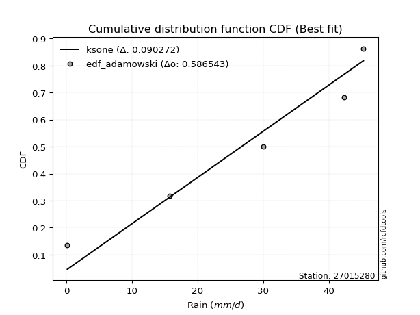</img>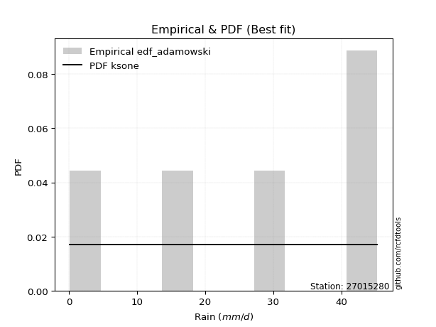</img>

</div>


## C. Best fit & Estimate extreme values for specific return periods - Tr

Best fit in probability distribution analysis means finding the theoretical distribution (like Normal, Poisson, Exponential, etc.) that most accurately mirrors your real-world data´s patterns (shape, center, spread) for better predictions, using methods like visual checks (Q-Q plots), goodness-of-fit tests (Kolmogorov-Smirnov, Chi-Squared), and information criteria (AIC) to score and select the simplest, most representative model.


### 1. Best fit (ordered by delta Δ)

:file_folder:Table: [bestfit_27015280.csv](table/bestfit_27015280.csv)

<div align="center">

|   id |   station | empirical_dist   | p_dist       |     delta |   deltao | eval   |   fit |   n |   best_fit |   best_fit_sort |
|-----:|----------:|:-----------------|:-------------|----------:|---------:|:-------|------:|----:|-----------:|----------------:|
|    0 |  27015280 | edf_gringorten   | ksone        | 0.0726498 | 0.586543 | Δo > Δ |     1 |   5 |          1 |               1 |
|    1 |  27015280 | edf_cunnane      | ksone        | 0.0744362 | 0.586543 | Δo > Δ |     1 |   5 |          1 |               2 |
|    2 |  27015280 | edf_blom         | ksone        | 0.0762677 | 0.586543 | Δo > Δ |     1 |   5 |          1 |               3 |
|    3 |  27015280 | edf_tukey        | ksone        | 0.0792439 | 0.586543 | Δo > Δ |     1 |   5 |          1 |               4 |
|    4 |  27015280 | edf_filliben     | ksone        | 0.0811221 | 0.586543 | Δo > Δ |     1 |   5 |          1 |               5 |
|    5 |  27015280 | edf_hazen        | ksone        | 0.0820248 | 0.586543 | Δo > Δ |     1 |   5 |          1 |               6 |
|    6 |  27015280 | edf_beard        | ksone        | 0.0821615 | 0.586543 | Δo > Δ |     1 |   5 |          1 |               7 |
|    7 |  27015280 | edf_jenkinson    | ksone        | 0.0821615 | 0.586543 | Δo > Δ |     1 |   5 |          1 |               8 |
|    8 |  27015280 | edf_chegodayev   | ksone        | 0.0835383 | 0.586543 | Δo > Δ |     1 |   5 |          1 |               9 |
|    9 |  27015280 | edf_adamowski    | ksone        | 0.0902723 | 0.586543 | Δo > Δ |     1 |   5 |          1 |              10 |
|   10 |  27015280 | edf_california   | beta         | 0.108522  | 0.586543 | Δo > Δ |     1 |   5 |          1 |              11 |
|   11 |  27015280 | edf_weibull      | semicircular | 0.116633  | 0.586543 | Δo > Δ |     1 |   5 |          1 |              12 |

</div>


### 2. Extreme values and % difference analysis

In hydrology, a return period (or recurrence interval $Tr$) is the statistical average time between extreme events like floods or droughts of a specific magnitude, indicating how rare an event is, with a 100-year flood, for example, having a 1% chance of occurring in any given year, not that it happens exactly every century. It is a key tool for infrastructure design (like bridges or dams) and risk assessment, calculated from historical data to determine the probability of future events, although it is important to remember it is statistical average, and events can cluster or be missed.

The extreme value porcentage difference is evaluated as $pdiff = 1 - (ETrBf / ETr) * 100$, where _ETrBf_ correspond to the bestfit extreme value for a specific recurrence interval and _ETr_ correspond to the extreme value for one of the most used PDFsused in hydrology.

> risk_rate: assuming the return period as the project useful life.

:file_folder:Table: [extreme_27015280.csv](table/extreme_27015280.csv), all PDFs.  
:file_folder:Table: [extremepdiff_27015280.csv](table/extremepdiff_27015280.csv), % difference between bestfit and most used PDFs in Hydrology.

<div align="center">

Extreme values table for only best fit PDFs
|   id |      tr |   prob_l |     prob_g |   alpha |   anglit |   arcsine |   argus |    beta |   betaprime |   bradford |     burr |   burr12 |   cosine |   crystalball |   dgamma |   dweibull |   erlang |   exponnorm |   exponpow |   exponweib |        f |   fatiguelife |   foldnorm |   gamma |   gausshyper |   genexpon |   genextreme |   gengamma |   genhalflogistic |   genlogistic |   gennorm |   genpareto |   gompertz |   gumbel_l |   gumbel_r |   halfgennorm |   halflogistic |   halfnorm |   hypsecant |         invgamma |   invgauss |      invweibull |   johnsonsb |   johnsonsu |     kappa3 |   kappa4 |   ksone |   kstwobign |   laplace |   levy_l |    loggamma |   logistic |   loglaplace |    lomax |   maxwell |   mielke |    moyal |   nakagami |      ncf |        nct |    norm |   pearson3 |   powerlaw |   rayleigh |     rdist |    rice |   semicircular |   skewnorm |       t |   trapezoid |   triang |   truncexpon |   truncnorm |   truncpareto |   truncweibull_min |   tukeylambda |   uniform |   vonmises |   vonmises_line |     wald |   weibull_max |   weibull_min |   wrapcauchy |    logalpha |   loganglit |   logarcsine |   logargus |   logbeta |   logbetaprime |   logbradford |          logburr |    logburr12 |   logcosine |   logcrystalball |   logdgamma |      logdweibull |   logerlang |   logexponnorm |      logexponpow |   logexponweib |           logf |   logfatiguelife |   logfoldnorm |   loggausshyper |   loggenexpon |   loggenextreme |   loggengamma |   loggenhalflogistic |   loggenlogistic |       loggennorm |   loggenpareto |   loggompertz |   loggumbel_l |   loggumbel_r |   loghalfgennorm |   loghalflogistic |   loghalfnorm |   loghypsecant |   loginvgamma |   loginvgauss |    loginvweibull |   logjohnsonsb |   logjohnsonsu |      logkappa3 |   logkappa4 |   logksone |     logkstwobign |   loglevy_l |   logloggamma |   loglogistic |   logloglaplace |         loglomax |   logmaxwell |       logmielke |         logmoyal |   lognakagami |         logncf |      lognct |     lognorm |   logpearson3 |   logpowerlaw |   lograyleigh |   logrdist |     logrice |   logsemicircular |   logskewnorm |              logt |   logtrapezoid |   logtriang |   logtruncexpon |   logtruncnorm |   logtruncpareto |   logtruncweibull_min |   logtukeylambda |   loguniform |   logvonmises |   logvonmises_line |          logwald |   logweibull_max |   logweibull_min |   logwrapcauchy |   station |   n |   risk_rate |
|-----:|--------:|---------:|-----------:|--------:|---------:|----------:|--------:|--------:|------------:|-----------:|---------:|---------:|---------:|--------------:|---------:|-----------:|---------:|------------:|-----------:|------------:|---------:|--------------:|-----------:|--------:|-------------:|-----------:|-------------:|-----------:|------------------:|--------------:|----------:|------------:|-----------:|-----------:|-----------:|--------------:|---------------:|-----------:|------------:|-----------------:|-----------:|----------------:|------------:|------------:|-----------:|---------:|--------:|------------:|----------:|---------:|------------:|-----------:|-------------:|---------:|----------:|---------:|---------:|-----------:|---------:|-----------:|--------:|-----------:|-----------:|-----------:|----------:|--------:|---------------:|-----------:|--------:|------------:|---------:|-------------:|------------:|--------------:|-------------------:|--------------:|----------:|-----------:|----------------:|---------:|--------------:|--------------:|-------------:|------------:|------------:|-------------:|-----------:|----------:|---------------:|--------------:|-----------------:|-------------:|------------:|-----------------:|------------:|-----------------:|------------:|---------------:|-----------------:|---------------:|---------------:|-----------------:|--------------:|----------------:|--------------:|----------------:|--------------:|---------------------:|-----------------:|-----------------:|---------------:|--------------:|--------------:|--------------:|-----------------:|------------------:|--------------:|---------------:|--------------:|--------------:|-----------------:|---------------:|---------------:|---------------:|------------:|-----------:|-----------------:|------------:|--------------:|--------------:|----------------:|-----------------:|-------------:|----------------:|-----------------:|--------------:|---------------:|------------:|------------:|--------------:|--------------:|--------------:|-----------:|------------:|------------------:|--------------:|------------------:|---------------:|------------:|----------------:|---------------:|-----------------:|----------------------:|-----------------:|-------------:|--------------:|-------------------:|-----------------:|-----------------:|-----------------:|----------------:|----------:|----:|------------:|
|    0 |    2    | 0.5      | 0.5        | 25.3442 |  26.68   |   26.68   | 30.655  | 29.6217 |     26.3239 |    19.6475 |  7.84132 |  28.3097 |  25.6376 |       26.68   |  23.58   |    23.5144 |  26.1378 |     26.6799 |   0.173007 |    0.993314 |  10.8273 |      0.100422 |    26.8877 | 26.3288 |      26.4413 |    18.5207 |      32.7834 |    4.68224 |           28.0806 |           inf |      22.7 |     38.6229 |    36.6342 |    29.4571 |    23.9029 |       14.3305 |        22.5223 |    23.2197 |     26.68   |      3.02076     |    24.595  | 13663.9         |        45.3 |     44.5101 |  0.0535629 |  22.7851 | 26.68   |     22.9296 |   26.68   |  38.9654 |     8.98658 |    26.68   |      9.79697 |  17.7122 |   25.2342 |  19.6092 |  23.0064 |    16.4281 |  27.3039 |   0.1      | 26.68   |    27.8202 |   0.199004 |    24.7215 | -3.3003   | 25.9072 |        26.68   |    28.3378 | 26.6767 |     28.5237 |  28.315  |      19.2786 |     1.99245 |       3.573   |            22.3389 |       22.7254 |   22.7    |  -1.26256  |         22.3049 |  21.2004 |       44.794  |       29.8896 |      22.7    |     8.57253 |     9.79697 |      9.79704 |    18.4051 |   45.2996 |   0.439259     |       2.1197  |     0.101229     |   2.66025    |     6.30467 |          9.79697 |     42.3    |     42.3         |     9.32028 |        9.79704 |      0.129326    |  127.112       |   0.287324     |      0.1         |       11.0617 |         25.815  |       5.17454 |         6.95773 |   2.78303     |              6.44486 |         inf      |     42.3         |        27.1041 |       15.0718 |       14.349  |       6.68901 |      1.3679      |       5.53309     |       6.08974 |        9.79697 |       9.02799 |       8.09806 |      6.86066     |       0.314152 |           45.3 | 3003.51        |     2.84343 |    2.12838 |      5.28987     |     38.2279 |       15.7306 |       9.79697 |    0.478148     |      1.96049     |       8.0318 |    0.101118     |      5.91369     |       9.76506 |   0.984036     |     9.77793 |     9.79697 |       16.5726 |      0.103469 |       7.48524 |        0.1 |     9.79694 |           9.79697 |       6.9372  |     43.0375       |        11.7778 |     5.18838 |         1.42937 |        8.76485 |         0.123926 |               1.96723 |              0.1 |      2.12838 |     0.0651292 |            19.5568 |      4.6139      |          7.70827 |      0.222374    |         2.12826 |  27015280 |   5 |    0.75     |
|    1 |    2.33 | 0.570815 | 0.429185   | 28.4566 |  30.1938 |   31.9547 | 33.2104 | 34.0066 |     29.3728 |    23.2806 | 11.0156  |  31.1423 |  28.6833 |       29.6966 |  31.3145 |    31.7422 |  29.2007 |     29.6965 |   0.276387 |    1.64323  |  14.495  |      0.890738 |    29.7532 | 29.3812 |      30.1485 |    22.5793 |      35.7783 |    6.98549 |           31.3924 |           inf |      22.7 |     40.9257 |    38.0842 |    32.0816 |    26.6981 |       18.8958 |        25.3962 |    26.4754 |     29.0942 |      5.84232     |    27.8122 |     2.01988e+06 |        45.3 |     45.042  |  0.0535629 |  26.2015 | 30.8268 |     26.4192 |   28.5055 |  40.9258 |    13.8637  |    29.3378 |     12.5902  |  21.5927 |   28.3683 |  23.2575 |  25.6524 |    21.1219 |  31.125  |   0.1      | 29.6966 |    30.7763 |   0.419059 |    27.9018 |  0.285916 | 29.0372 |        30.4486 |    31.0447 | 29.6924 |     31.9961 |  31.1271 |      22.4497 |     2.48768 |       5.17185 |            25.4508 |       26.0994 |   25.9009 |  -0.947069 |         25.5617 |  23.1784 |       45.0401 |       32.525  |      34.8211 |    13.3543  |    15.8776  |     20.2244  |    21.9448 |   45.3    |   0.781375     |       3.27528 |     0.103868     |   1.8422e+10 |     9.83979 |         14.829   |     47.1478 |     48.8826      |    14.4625  |       14.8292  |      0.150698    |    2.24096e+16 |   0.496624     |      0.114142    |       14.8688 |         32.8824 |       9.00885 |        10.9057  |   1.28069e+06 |              9.55575 |         inf      |     42.9638      |        33.6503 |       19.5666 |       20.5799 |       9.82136 |      2.88517     |       8.21251     |       9.5255  |       13.6509  |      13.9648  |      12.9699  |     12.0521      |       3.09529  |           45.3 |    1.88542e+14 |     4.47095 |    3.57899 |      9.41369     |     40.2915 |       19.2546 |      14.1157  |    0.759066     |      3.7767      |      12.355  |    0.103237     |      8.50678     |      14.7725  |   3.06921      |    14.8136  |    14.829   |       23.6787 |      0.109629 |      11.5879  |        0.1 |    14.8292  |          16.4433  |       9.35908 |     44.0962       |        18.9795 |     7.42325 |         2.20178 |       13.603   |         0.13668  |               2.9709  |              0.1 |      3.28203 |     0.0702775 |            26.3833 |      6.05496     |         11.9589  |      0.309213    |        34.0245  |  27015280 |   5 |    0.729209 |
|    2 |    5    | 0.8      | 0.2        | 40.6128 |  42.5911 |   46.0205 | 40.4766 | 43.2925 |     40.8329 |    35.0389 | 26.3018  |  40.9093 |  39.6591 |       40.907  |  39.9036 |    40.6255 |  40.7826 |     40.9068 |   2.47688  |    9.0129   |  38.2668 |     17.6706   |    40.4019 | 40.9098 |      40.4364 |    42.8714 |      42.3978 |   28.2716  |           40.0094 |           inf |      22.7 |     44.7721 |    42.8664 |    40.5601 |    38.8417 |       48.338  |        38.4    |    40.2432 |     38.7779 |    149.912       |    40.726  |     5.39165e+15 |        45.3 |     45.296  |  0.0535629 |  36.9333 | 44.2474 |     41.2425 |   37.6325 |  44.1735 |    71.3938  |    39.6    |     44.1275  |  40.9942 |   40.7035 |  35.9439 |  37.9089 |    43.2967 |  47.8143 |   0.1      | 40.907  |    41.1362 |   6.39471  |    40.6343 | 10.7162   | 40.9373 |        43.3091 |    38.9288 | 40.8993 |     41.9581 |  39.1946 |      33.7651 |     4.59029 |      16.6214  |            35.7657 |       36.8406 |   36.26   |   0.241304 |         36.1019 |  34.2512 |       45.2856 |       41.0389 |      43.2058 |    73.0788  |    87.2216  |    139.727   |    35.3309 |   45.3    | 129.976        |      13.3918  |     0.264496     | inf          |    48.9387  |         69.2022  |    115.682  |    170.12        |    76.3982  |       69.2034  |      0.507152    |  inf           | 518.712        |      1.89572     |       44.6319 |         44.45   |      86.6908  |        29.3948  | inf           |             25.8589  |         inf      |     59.5277      |        44.4335 |       45.7459 |       65.9807 |      52.1037  |    241.6         |      49.0364      |      63.17    |       51.6492  |      74.0046  |      82.0068  |    139.357       |      42.919    |           45.3 |  inf           |    17.6139  |   19.2417  |    108.904       |     43.9586 |       32.229  |      57.8259  |  162.312        |    100.18        |      67.294  |    0.181444     |     45.8356      |      68.8092  |   3.61967e+06  |    69.4367  |    69.2022  |       67.6412 |      0.316021 |      66.6567  |        0.1 |    69.2074  |          96.266   |      22.3876  |     57.2277       |        74.6089 |    20.7441  |        10.0462  |       71.3637  |         0.337865 |              11.94    |              0.1 |     13.3315  |     0.0934293 |            84.5848 |     27.728       |         30.7899  |      3.13444     |        43.2039  |  27015280 |   5 |    0.67232  |
|    3 |   10    | 0.9      | 0.1        | 49.2303 |  49.6081 |   49.4162 | 43.5444 | 44.8977 |     48.5482 |    40.1695 | 35.6652  |  46.7807 |  46.2903 |       48.3437 |  45.1928 |    45.0548 |  48.6402 |     48.3435 |   8.61243  |   23.5538   |  68.5635 |     40.8394   |    47.4659 | 48.7194 |      43.6178 |    61.2921 |      44.1973 |   66.2183  |           42.9291 |           inf |      22.7 |     45.2226 |    45.5742 |    45.2805 |    48.7325 |       84.2118 |        49.1991 |    50.4311 |     46.5107 |   2817.7         |    50.1732 |     2.56674e+23 |        45.3 |     45.2997 |  0.0535629 |  41.3516 | 50.1032 |     52.5286 |   45.9178 |  44.9576 |   216.968   |    47.1577 |    137.769   |  58.6064 |   49.3844 |  41.8577 |  48.5801 |    60.8455 |  61.2389 |   0.1      | 48.3437 |    47.4774 |  17.9192   |    49.7128 | 13.9978   | 48.986  |        49.9081 |    42.1399 | 48.3338 |     45.8492 |  42.3459 |      39.3065 |     6.15219 |      27.4672  |            40.4537 |       41.3048 |   40.78   |   0.967531 |         40.7009 |  46.0021 |       45.2986 |       45.779  |      44.3581 |   236.712   |   228.761   |    222.803   |    42.8632 |   45.3    |   6.01439e+06  |      24.7567  |    19.0629       | inf          |   128.989   |        192.274   |    297.05   |    721.016       |   236.927   |      192.279   |      2.42569     |  inf           |   1.0246e+13   |     91.7765      |       92.5382 |         45.2345 |     447.635   |        38.4538  | inf           |             35.6286  |         inf      |    127.479       |        45.2269 |       73.6034 |      126.218  |     202.826   |  32689.2         |     216.266       |     256.149   |      149.463   |     233.28    |     303.355   |   1023.25        |      45.158    |           45.3 |  inf           |    29.8422  |   40.0845  |    702.426       |     44.8928 |       38.5754 |     163.36    |    2.46053e+09  |   1964.01        |     221.835  |    1.25539      |    198.625       |     190.978   |   3.99654e+26  |   193.674   |   192.274   |      109.695  |      1.61035  |     232.074   |        0.1 |   192.297   |         238.387   |      31.9357  |    210.39         |       127.352  |    30.9898  |        20.8257  |      216.909   |         1.25197  |              22.8423  |              0.1 |     24.5747  |     0.113324  |           206.095  |    139.377       |         39.3485  |     60.8911      |        44.3502  |  27015280 |   5 |    0.651322 |
|    4 |   15    | 0.933333 | 0.0666667  | 53.7095 |  52.6046 |   50.0638 | 44.6463 | 45.1435 |     52.4322 |    41.8796 | 39.1838  |  49.548  |  49.3109 |       52.0547 |  47.9437 |    47.1263 |  52.6138 |     52.0546 |  14.6693   |   36.3734   |  90.9793 |     55.9922   |    50.9911 | 52.6651 |      44.4006 |    72.0675 |      44.6612 |   99.1326  |           43.7946 |           inf |      22.7 |     45.2748 |    46.8078 |    47.4183 |    54.3127 |      109.142  |        55.3105 |    55.7328 |     50.9237 |  15669.2         |    55.1647 |     5.50875e+27 |        45.3 |     45.2999 | 42.3271    |  42.7561 | 52.0551 |     58.5201 |   50.7644 |  45.1945 |   380.593   |    51.2755 |    268.153   |  68.9089 |   53.8384 |  43.9197 |  54.7732 |    70.1207 |  68.7096 |   0.1      | 52.0547 |    50.4874 |  24.6711   |    54.3904 | 14.7985   | 53.0333 |        52.4815 |    43.1963 | 52.0437 |     47.0977 |  43.3569 |      41.2505 |     6.96638 |      32.4577  |            42.0499 |       42.7287 |   42.2867 |   1.2544   |         42.234  |  53.548  |       45.2996 |       47.9257 |      44.6833 |   431.958   |   345.304   |    243.54    |    45.9061 |   45.3    |   6.81719e+11  |      30.3839  | 11560.7          | inf          |   200.576   |        320.175   |    527.318  |   1829.43        |   420.253   |      320.184   |      6.92204     |  inf           |   6.16959e+28  |   1160.71        |      133.152  |         45.2854 |    1049.13    |        41.2045  | inf           |             39.0432  |         inf      |    261.853       |        45.2829 |       91.3328 |      169.316  |     436.657   | 822524           |     500.843       |     530.744   |      274.089   |     419.107   |     598.197   |   3151.31        |      45.2657   |           45.3 |  inf           |    34.9739  |   51.1941  |   1889.63        |     45.1789 |       40.7768 |     287.664   |    4.53158e+19  |  11197.7         |     409.106  |   13.8148       |    465.181       |     317.862   |   4.59509e+56  |   323.22    |   320.175   |      132.273  |      3.8425   |     441.344   |        0.1 |   320.219   |         339.511   |      35.8949  |   3203.28         |       151.187  |    35.2495  |        26.8314  |      378.538   |         2.77624  |              28.5721  |              0.1 |     30.1318  |     0.125043  |           341.573  |    393.111       |         41.8282  |    488.871       |        44.6764  |  27015280 |   5 |    0.644736 |
|    5 |   20    | 0.95     | 0.05       | 56.7106 |  54.3672 |   50.2919 | 45.2371 | 45.2199 |     54.988  |    42.7347 | 41.0202  |  51.3057 |  51.1684 |       54.485  |  49.8005 |    48.4498 |  55.2349 |     54.4849 |  20.206    |   47.6533   | 109.377  |     67.2109   |    53.2996 | 55.2666 |      44.7238 |    79.7128 |      44.8641 |  128.185   |           44.2049 |           inf |      22.7 |     45.2886 |    47.5775 |    48.749  |    58.2199 |      128.584  |        59.5923 |    59.2675 |     54.0369 |  52934           |    58.5367 |     5.94262e+30 |        45.3 |     45.3    | 43.0819    |  43.4379 | 53.0311 |     62.5562 |   54.203  |  45.3158 |   551.367   |    54.1216 |    430.124   |  76.2186 |   56.7945 |  45.0144 |  59.1593 |    76.3305 |  73.8981 |   0.1      | 54.485  |    52.4038 |  28.83     |    57.4995 | 15.1266   | 55.6929 |        53.9088 |    43.7231 | 54.4733 |     47.7136 |  43.8557 |      42.2422 |     7.50962 |      35.2809  |            42.855  |       43.4216 |   43.04   |   1.40559  |         43.0005 |  59.1712 |       45.2999 |       49.2619 |      44.8404 |   644.064   |   439.939   |    251.294   |    47.6178 |   45.3    |   1.43484e+17  |      33.6604  |     3.41249e+07  | inf          |   263.14    |        447.117   |    797.406  |   3654.65        |   613.501   |      447.129   |     15.2101      |  inf           |   4.78093e+49  |   7596.52        |      168.981  |         45.295  |    1851.36    |        42.4669  | inf           |             40.7356  |         inf      |    506.032       |        45.2939 |      104.476  |      203.287  |     746.982   |      9.4256e+06  |     902.05        |     862.636   |      420.416   |     618.06    |     942.253   |   6926.78        |      45.2865   |           45.3 |  inf           |    37.678   |   57.8552  |   3680.34        |     45.3261 |       41.8932 |     425.336   |    4.29459e+32  |  38504.3         |     614.105  |  197.675        |    849.904       |     443.754   |   7.77063e+95  |   452.07    |   447.117   |      146.953  |      6.4437   |     676.581   |        0.1 |   447.184   |         413.08    |      38.0485  | 272975            |       164.539  |    37.5617  |        30.5187  |      545.406   |         4.64686  |              32.0063  |              0.1 |     33.3652  |     0.133497  |           486.363  |    851.329       |         42.9386  |   2484.37        |        44.8345  |  27015280 |   5 |    0.641514 |
|    6 |   25    | 0.96     | 0.04       | 58.9551 |  55.5618 |   50.3977 | 45.6129 | 45.2524 |     56.8756 |    43.2478 | 42.1477  |  52.5732 |  52.4711 |       56.274  |  51.1982 |    49.4104 |  57.1741 |     56.2739 |  25.2419   |   57.7407   | 125.253  |     76.1247   |    54.9989 | 57.1906 |      44.8923 |    85.6429 |      44.9753 |  154.337   |           44.4431 |           inf |      22.7 |     45.2939 |    48.1261 |    49.6959 |    61.2295 |      144.667  |        62.8912 |    61.8975 |     56.4463 | 136087           |    61.072  |     1.28862e+33 |        45.3 |     45.3    | 43.5349    |  43.8382 | 53.6167 |     65.5794 |   56.8703 |  45.3919 |   725.314   |    56.2988 |    620.539   |  81.8885 |   58.989  |  45.7207 |  62.5589 |    80.9587 |  77.8731 |   0.1      | 56.274  |    53.7872 |  31.6146   |    59.8095 | 15.2965   | 57.6547 |        54.8348 |    44.0387 | 56.2618 |     48.0806 |  44.1529 |      42.8437 |     7.914   |      37.0906  |            43.3404 |       43.8294 |   43.492  |   1.49835  |         43.4604 |  63.6752 |       45.2999 |       50.2128 |      44.9334 |   866.736   |   518.416   |    254.975   |    48.7372 |   45.3    |   4.88574e+22  |      35.7936  |     3.75095e+11  | inf          |   318.326   |        571.722   |   1102.15   |   6352.54        |   811.763   |      571.738   |     28.5796      |  inf           |   2.71283e+75  |  33796.6         |      201.381  |         45.2978 |    2825.71    |        43.1741  | inf           |             41.7347  |         inf      |    927.404       |        45.2972 |      114.971  |      231.536  |    1129.57    |      6.79364e+07 |    1419.39        |    1238.16    |      585.414   |     824.677   |    1323.05    |  12705.5         |      45.2932   |           45.3 |  inf           |    39.3202  |   62.2609  |   6063.79        |     45.4187 |       42.5681 |     573.673   |    1.22676e+48  | 100359           |     830.245  | 3415.44         |   1355.98        |     567.302   |   5.46991e+143 |   578.745   |   571.722   |      157.513  |      9.05039  |     929.341   |        0.1 |   571.813   |         469.131   |      39.4007  |      1.66824e+08  |       173.048  |    39.0108  |        32.9925  |      713.809   |         6.64126  |              34.2801  |              0.1 |     35.4694  |     0.140163  |           635.255  |   1580.85        |         43.5503  |   9516.62        |        44.9283  |  27015280 |   5 |    0.639603 |
|    7 |   50    | 0.98     | 0.02       | 65.5544 |  58.5022 |   50.539  | 46.4504 | 45.2905 |     62.3102 |    44.2739 | 44.4835  |  56.0854 |  55.8822 |       61.3971 |  55.3573 |    52.1083 |  62.7723 |     61.3969 |  45.1614   |   97.1496   | 185.083  |    104.724    |    59.8653 | 62.7421 |      45.1609 |   104.064  |      45.1689 |  258.513   |           44.8974 |           inf |      22.7 |     45.2991 |    49.618  |    52.2663 |    70.5005 |      200.203  |        73.0557 |    69.5418 |     63.9163 |      2.55648e+06 |    68.5862 |     2.02624e+40 |        45.3 |     45.3    | 44.4407    |  44.6108 | 54.7879 |     74.457  |   65.1556 |  45.5634 |  1600.58    |    62.951  |   1937.36    |  99.5007 |   65.3535 |  47.4306 |  73.1129 |    94.4286 |  90.0206 |   0.100001 | 61.3971 |    57.6215 |  37.9115   |    66.515  | 15.5648   | 63.2896 |        56.9501 |    44.6696 | 61.3833 |     48.8088 |  44.7426 |      44.0616 |     9.09017 |      40.9914  |            44.3165 |       44.6209 |   44.396  |   1.68736  |         44.3802 |  78.381  |       45.3    |       52.7939 |      45.1174 |  2056.58    |   776.527   |    259.975   |    51.3199 |   45.3    |   3.33187e+52  |      40.474   |     2.68051e+38  | inf          |   524.066   |       1155.89    |   3049.52   |  38319.4         |  1823.07    |     1155.92    |    220.955       |  inf           |   9.24193e+271 |      4.06232e+06 |      332.792  |         45.2998 |    9678.96    |        44.4318  | inf           |             43.6586  |         inf      |  11164.1         |        45.2998 |      149.111  |      329.621  |    4038.14    |      4.91988e+10 |    5737.17        |    3539.71    |     1634       |    1905.57    |    3580.57    |  82336.1         |      45.299    |           45.3 |  inf           |    42.5575  |   72.1044  |  26274.6         |     45.628  |       43.9288 |    1431.03    |    7.70719e+157 |      1.96754e+06 |    1990.79   |    3.34747e+10  |   5782.04        |    1146.31    | inf            |  1174.38    |  1155.89    |      185.674  |     19.1987   |    2335.31    |        0.1 |  1156.1     |         627.383   |      42.2485  |      9.36676e+37  |       191.26   |    42.0541  |        38.6183  |     1543.96    |        15.5001   |              39.3728  |              0.1 |     40.0845  |     0.161659  |          1320.83   |  11926.2         |         44.6119  | 960092           |        45.1145  |  27015280 |   5 |    0.63583  |
|    8 |   75    | 0.986667 | 0.0133333  | 69.2042 |  59.7963 |   50.5652 | 46.7771 | 45.2963 |     65.2441 |    44.6159 | 45.329   |  57.9019 |  57.5112 |       64.1459 |  57.6906 |    53.5288 |  65.8038 |     64.1458 |  59.8698   |  126.32     | 228.897  |    121.948    |    62.4764 | 65.7465 |      45.2259 |   114.839  |      45.2226 |  337.79    |           45.0405 |           inf |      22.7 |     45.2997 |    50.3739 |    53.5661 |    75.8891 |      236.609  |        78.9642 |    73.7031 |     68.2817 |      1.42162e+07 |    72.7764 |     3.08752e+44 |        45.3 |     45.3    | 44.7427    |  44.8561 | 55.1782 |     79.3413 |   70.0021 |  45.6338 |  2456.97    |    66.793  |   3770.87    | 109.803  |   68.8138 |  48.2358 |  79.2846 |   101.762  |  97.0294 |   0.100017 | 64.1459 |    59.6024 |  40.2455   |    70.1631 | 15.6287   | 66.3222 |        57.7952 |    44.8798 | 64.1314 |     49.0499 |  44.9378 |      44.4721 |     9.73085 |      42.3803  |            44.6435 |       44.8747 |   44.6973 |   1.75108  |         44.6868 |  87.4303 |       45.3    |       54.0992 |      45.1783 |  3297.88    |   927.65    |    260.913   |    52.3614 |   45.3    |   6.63614e+84  |      42.1664  |     8.04507e+73  | inf          |   664.941   |       1686.4     |   5567.94   | 115264           |  2826.53    |     1686.45    |    764.496       |  inf           | inf            |      7.26752e+07 |      435.739  |         45.3    |   18952.2     |        44.7863  | inf           |             44.2607  |         inf      |  78012.6         |        45.2999 |      170.078  |      394.08   |    8467.63    |      3.14399e+12 |   12921.4         |    6270.47    |     2976.93    |    3008.44    |    6198.81    | 243962           |      45.2997   |           45.3 |  inf           |    43.5809  |   75.72    |  58870.3         |     45.7143 |       44.3857 |    2426.22    |  inf            |      1.12178e+07 |    3202.78   |    2.52852e+18  |  13501.9         |    1671.97    | inf            |  1717.01    |  1686.4     |      199.074  |     25.2438   |    3855.24    |        0.1 |  1686.74    |         704.632   |      43.2423  |      1.9784e+100  |       197.702  |    43.113   |        40.7184  |     2336.81    |        21.5442   |              41.2489  |              0.1 |     41.7526  |     0.174923  |          1820.96   |  41356.6         |         44.9015  |      1.92689e+07 |        45.1764  |  27015280 |   5 |    0.634587 |
|    9 |  100    | 0.99     | 0.01       | 71.7176 |  60.5658 |   50.5744 | 46.9581 | 45.2981 |     67.2356 |    44.7869 | 45.7967  |  59.105  |  58.5322 |       66.0052 |  59.3109 |    54.4804 |  67.8652 |     66.005  |  71.6809   |  149.959    | 264.729  |    134.341    |    64.2425 | 67.7888 |      45.2526 |   122.484  |      45.2467 |  403.356   |           45.1098 |           inf |      22.7 |     45.2999 |    50.8688 |    54.4163 |    79.703  |      264.199  |        83.1462 |    76.5379 |     71.3783 |      4.80252e+07 |    75.6744 |     2.81916e+47 |        45.3 |     45.3    | 44.8937    |  44.9751 | 55.3734 |     82.6879 |   73.4408 |  45.675  |  3288.14    |    69.5056 |   6048.59    | 117.113  |   71.1708 |  48.7595 |  83.6632 |   106.756  | 101.974  |   0.100104 | 66.0052 |    60.9122 |  41.4597   |    72.6484 | 15.6547   | 68.3766 |        58.2684 |    44.9848 | 65.99   |     49.1701 |  45.0352 |      44.6782 |    10.1674  |      43.0923  |            44.8073 |       44.9988 |   44.848  |   1.78303  |         44.8401 |  94.028  |       45.3    |       54.9529 |      45.2088 |  4554.7     |  1031.11    |    261.242   |    52.947  |   45.3    |   6.82255e+118 |      43.039   |     1.80788e+116 | inf          |   771.95    |       2177.27    |   8555.16   | 256921           |  3809.13    |     2177.35    |   1871.18        |  inf           | inf            |      5.79009e+08 |      522.875  |         45.3    |   29979.7     |        44.9461  | inf           |             44.5491  |         inf      | 397978           |        45.3    |      185.368  |      442.916  |   14300.9     |      6.85682e+13 |   22955.2         |    9257.05    |     4555.81    |    4109.03    |    9038.08    | 526255           |      45.2998   |           45.3 |  inf           |    44.0693  |   77.5952  | 102317           |     45.7648 |       44.6147 |    3522.16    |  inf            |      3.85735e+07 |    4427.75   |    7.81583e+26  |  24643.1         |    2158.27    | inf            |  2220.1     |  2177.27    |      207.342  |     29.0791   |    5424.64    |        0.1 |  2177.74    |         751.974   |      43.7479  |      1.12319e+202 |       200.995  |    43.6511  |        41.8146  |     3093.34    |        25.6568   |              42.2233  |              0.1 |     42.6125  |     0.184705  |          2170.09   | 102397           |         45.0295  |      1.84341e+08 |        45.2073  |  27015280 |   5 |    0.633968 |
|   10 |  200    | 0.995    | 0.005      | 77.5574 |  62.0196 |   50.5833 | 47.2706 | 45.2996 |     71.7741 |    45.0435 | 46.6679  |  61.7618 |  60.6082 |       70.2225 |  63.1167 |    56.6151 |  72.5742 |     70.2223 | 104.792    |  217.613    | 370.628  |    164.677    |    68.2485 | 72.4518 |      45.2838 |   140.905  |      45.2783 |  597.116   |           45.2099 |           inf |      22.7 |     45.3    |    51.9456 |    56.2643 |    88.872  |      336.694  |        93.2002 |    83.0214 |     78.8383 |      9.02187e+08 |    82.4425 |     3.69387e+54 |        45.3 |     45.3    | 45.1201    |  45.1469 | 55.6662 |     90.3959 |   81.7261 |  45.753  |  6397.44    |    76.0125 |  18884.1     | 134.725  |   76.5631 |  49.9294 |  94.2126 |   118.166  | 113.832  |   0.108468 | 70.2225 |    63.7952 |  43.342    |    78.3352 | 15.6849   | 73.0451 |        59.0934 |    45.1424 | 70.2061 |     49.3501 |  45.181  |      44.9885 |    11.1664  |      44.1825  |            45.0534 |       45.1802 |   45.074  |   1.83101  |         45.0701 | 110.462  |       45.3    |       56.8086 |      45.2544 |  9575.41    |  1259.11    |    261.56    |    53.9721 |   45.3    |   1.665e+266   |      44.3818  |   inf            | inf          |  1045.59    |       3886.78    |  24237.9    |      1.88749e+06 |  7533.79    |     3886.93    |  16747.8         |  inf           | inf            |      9.30886e+10 |      790.646  |         45.3    |   85809.7     |        45.1557  | inf           |             44.9574  |         inf      |      5.30491e+07 |        45.3    |      223.526  |      570.959  |   50413.2     |      1.78959e+17 |   91386.6         |   22562.7     |    12698.7     |    8408.23    |   21641.8     |      3.34089e+06 |      45.3      |           45.3 |  inf           |    44.7531  |   80.4955  | 365463           |     45.8607 |       44.9591 |    8612.45    |  inf            |      7.56231e+08 |    9289.32   |    8.68525e+64  | 105017           |    3851.45    | inf            |  3977.38    |  3886.78    |      223.588  |     36.1635   |   11850.6     |        0.1 |  3887.69    |         842.241   |      44.5173  |    inf            |       206.028  |    44.4691  |        43.5195  |     5846.47    |        33.7977   |              43.7321  |              0.1 |     43.9357  |     0.209772  |          2865.7    | 979616           |         45.1936  |      6.55382e+10 |        45.2536  |  27015280 |   5 |    0.633042 |
|   11 |  250    | 0.996    | 0.004      | 79.3816 |  62.3896 |   50.5843 | 47.3433 | 45.2998 |     73.1669 |    45.0948 | 46.902   |  62.5544 |  61.1773 |       71.5112 |  64.3167 |    57.2614 |  74.0224 |     71.5111 | 116.833    |  242.778    | 411.647  |    174.564    |    69.4727 | 73.8853 |      45.2886 |   146.835  |      45.2837 |  671.35    |           45.2292 |           inf |      22.7 |     45.3    |    52.2627 |    56.808  |    91.8197 |      361.85   |        96.4324 |    85.016  |     81.2398 |      2.31941e+09 |    84.5655 |     7.1715e+56  |        45.3 |     45.3    | 45.1654    |  45.1798 | 55.7248 |     92.7813 |   84.3934 |  45.7733 |  7850.44    |    78.1016 |  27244       | 140.395  |   78.223  |  50.2897 |  97.6087 |   121.673  | 117.64   |   0.134855 | 71.5112 |    64.652  |  43.7275   |    80.0857 | 15.6894   | 74.474  |        59.2869 |    45.1739 | 71.4946 |     49.386  |  45.2101 |      45.0507 |    11.4738  |      44.4038  |            45.1027 |       45.2155 |   45.1192 |   1.84061  |         45.116  | 115.899  |       45.3    |       57.3546 |      45.2635 | 12052.4     |  1324.78    |    261.598   |    54.2133 |   45.3    | inf            |      44.6553  |   inf            | inf          |  1136.27    |       4639.82    |  33947.8    |      3.65064e+06 |  9293.08    |     4640       |  34172.7         |  inf           | inf            |      4.8742e+11  |      897.144  |         45.3    |  118683       |        45.1919  | inf           |             45.034   |          45.0298 |      3.53525e+08 |        45.3    |      236.185  |      615.252  |   75588.2     |      2.56451e+18 |  142487           |   29677.2     |    17663.3     |   10490.8     |   28401.8     |      6.05211e+06 |      45.3      |           45.3 |  inf           |    44.8792  |   81.0884  | 541941           |     45.8857 |       45.028  |   11476.1     |  inf            |      1.97107e+09 |   11669.2    |    5.46153e+85  | 167466           |    4597.18    | inf            |  4753.38    |  4639.82    |      227.856  |     37.8079   |   15073.2     |        0.1 |  4640.95    |         864.941   |      44.6728  |    inf            |       207.048  |    44.6342  |        43.8694  |     7102.7     |        35.7857   |              44.0409  |              0.1 |     44.2052  |     0.218359  |          3034.38   |      2.06786e+06 |         45.2212  |      4.9313e+11  |        45.2629  |  27015280 |   5 |    0.632858 |
|   12 |  500    | 0.998    | 0.002      | 84.9041 |  63.307  |   50.5857 | 47.5099 | 45.3    |     77.3136 |    45.1974 | 47.5541  |  64.8548 |  62.6918 |       75.3332 |  67.9797 |    59.1631 |  78.3423 |     75.333  | 158.427    |  332.129    | 565.851  |    205.578    |    73.1031 | 78.1597 |      45.2961 |   165.256  |      45.2933 |  943.549   |           45.2664 |           inf |      22.7 |     45.3    |    53.1724 |    58.3667 |   100.969  |      445.664  |       106.465  |    90.963  |     88.6992 |      4.35716e+10 |    91.0139 |     9.06756e+63 |        45.3 |     45.3    | 45.256     |  45.2433 | 55.8419 |     99.9299 |   92.6786 |  45.8257 | 14455.1     |    84.5802 |  85057.7     | 158.007  |   83.1763 |  51.3856 | 108.158  |   132.115  | 129.47   |   2.9251   | 75.3332 |    67.1273 |  44.5076   |    85.3086 | 15.6964   | 78.7169 |        59.7326 |    45.237  | 75.3154 |     49.4578 |  45.2682 |      45.1752 |    12.3906  |      44.8498  |            45.2013 |       45.2848 |   45.2096 |   1.85982  |         45.208  | 133.187  |       45.3    |       58.9198 |      45.2818 | 24046.2     |  1502.77    |    261.649   |    54.7697 |   45.3    | inf            |      45.2075  |   inf            | inf          |  1417.79    |       7844.82    |  97081.6    |      2.97972e+07 | 17386       |     7845.15    | 317625           |  inf           | inf            |      8.77873e+13 |     1305      |         45.3    |  312866       |        45.2559  | inf           |             45.1788  |          45.1677 |      3.98198e+11 |        45.3    |      276.602  |      762.205  |  265732       |      1.48352e+22 |  565558           |   67192.5     |    49230.4     |   20362       |   64487.1     |      3.82672e+07 |      45.3      |           45.3 |  inf           |    45.1139  |   82.2874  |      1.76493e+06 |     45.9502 |       45.1661 |   27952.7     |  inf            |      3.86428e+10 |   23048.2    |    1.72478e+201 | 713632           |    7770.55    | inf            |  8065.11    |  7844.82    |      238.682  |     41.3605   |   30895.9     |        0.1 |  7846.89    |         919.561   |      44.9854  |    inf            |       209.102  |    44.9662  |        44.5785  |    12653.1     |        40.2045   |              44.6656  |              0.1 |     44.7493  |     0.246959  |          3405.46   |      2.22443e+07 |         45.269   |      3.82584e+14 |        45.2815  |  27015280 |   5 |    0.632489 |
|   13 |  750    | 0.998667 | 0.00133333 | 88.047  |  63.7131 |   50.586  | 47.5766 | 45.3    |     79.6277 |    45.2316 | 47.9042  |  66.1014 |  63.4257 |       77.4563 |  70.0831 |    60.2105 |  80.7584 |     77.4561 | 185.628    |  392.613    | 678.572  |    223.903    |    75.1198 | 80.5494 |      45.2979 |   176.031  |      45.2961 | 1134.85    |           45.2783 |           inf |      22.7 |     45.3    |    53.6589 |    59.1998 |   106.317  |      498.69   |       112.329  |    94.2853 |     93.0627 |      2.42295e+11 |    94.6962 |     1.286e+68   |        45.3 |     45.3    | 45.2862    |  45.2635 | 55.8809 |    103.946  |   97.5252 |  45.8506 | 20337.2     |    88.3653 | 165556       | 168.31   |   85.9466 |  52.0198 | 114.329  |   137.94   | 136.403  |  37.0482   | 77.4563 |    68.4605 |  44.7703   |    88.2293 | 15.6981   | 81.0771 |        59.9119 |    45.258  | 77.438  |     49.4818 |  45.2876 |      45.2168 |    12.9029  |      44.9994  |            45.2342 |       45.3074 |   45.2397 |   1.86622  |         45.2387 | 143.552  |       45.3    |       59.7563 |      45.2878 | 35489       |  1589.02    |    261.658   |    54.9941 |   45.3    | inf            |      45.393   |   inf            | inf          |  1578.32    |      10502.3     | 179957      |      1.05192e+08 | 24686       |    10502.8     |      1.17709e+06 |  inf           | inf            |      1.88838e+15 |     1607.01   |         45.3    |  538529       |        45.2739  | inf           |             45.2235  |          45.2137 |      5.8437e+13  |        45.3    |      300.974  |      854.644  |  554151       |      3.08712e+24 |       1.26613e+06 |  106069       |    89667.1     |   29565.3     |  102624       |      1.12472e+08 |      45.3      |           45.3 |  inf           |    45.1847  |   82.691   |      3.42603e+06 |     45.9809 |       45.2121 |   47022.7     |  inf            |      2.2032e+11  |   33726      |  inf            |      1.66623e+06 |   10401.4     | inf            | 10819.3     | 10502.3     |      243.588  |     42.6284   |   46152.8     |        0.1 | 10505.2     |         942.506   |      45.0901  |    inf            |       209.79   |    45.0773  |        44.8176  |    17440.7     |        41.8223   |              44.876   |              0.1 |     44.9321  |     0.265267  |          3539.66   |      9.2427e+07  |         45.282   |      2.44401e+16 |        45.2876  |  27015280 |   5 |    0.632366 |
|   14 | 1000    | 0.999    | 0.001      | 90.2431 |  63.9552 |   50.5861 | 47.614  | 45.3    |     81.2253 |    45.2487 | 48.1447  |  66.9474 |  63.8887 |       78.9181 |  71.5602 |    60.9282 |  82.4287 |     78.9179 | 206.177    |  439.377    | 770.694  |    236.974    |    76.5084 | 82.2009 |      45.2987 |   183.676  |      45.2973 | 1286.36    |           45.284  |           inf |      22.7 |     45.3    |    53.9865 |    59.7604 |   110.111  |      538.112  |       116.49   |    96.5797 |     96.1586 |      8.18523e+11 |    97.2735 |     1.13302e+71 |        45.3 |     45.3    | 45.3013    |  45.2733 | 55.9005 |    106.728  |  100.964  |  45.8662 | 25750.6     |    91.0496 | 265556       | 175.619  |   87.8614 |  52.4695 | 118.707  |   141.959  | 141.332  | 229.084    | 78.9181 |    69.3613 |  44.9022   |    90.2476 | 15.6988   | 82.7034 |        60.0127 |    45.2685 | 78.8993 |     49.4937 |  45.2973 |      45.2376 |    13.2568  |      45.0744  |            45.2506 |       45.3185 |   45.2548 |   1.86943  |         45.254  | 151.008  |       45.3    |       60.3193 |      45.2909 | 46505.3     |  1642.77    |    261.661   |    55.1202 |   45.3    | inf            |      45.4861  |   inf            | inf          |  1688.81    |      12838.7     | 279102      |      2.61057e+08 | 31459.1     |    12839.2     |      2.98462e+06 |  inf           | inf            |      1.6854e+16  |     1854.66   |         45.3    |  784105       |        45.282   | inf           |             45.2448  |          45.2367 |      3.10567e+15 |        45.3    |      318.578  |      923.09   |  933336       |      1.53465e+26 |       2.24257e+06 |  145382       |   137211       |   38293.1     |  141848       |      2.41639e+08 |      45.3      |           45.3 |  inf           |    45.2179  |   82.8935  |      5.42449e+06 |     46.0002 |       45.2352 |   67998.1     |  inf            |      7.57589e+11 |   43876.6    |  inf            |      3.04101e+06 |   12714.2     | inf            | 13245.3     | 12838.7     |      246.547  |     43.279    |   60904       |        0.1 | 12842.3     |         955.647   |      45.1425  |    inf            |       210.135  |    45.1329  |        44.9377  |    21753.9     |        42.6606   |              44.9816  |              0.1 |     45.0238  |     0.27909   |          3608.82   |      2.57491e+08 |         45.2878  |      5.24219e+17 |        45.2907  |  27015280 |   5 |    0.632305 |


</div>


<div align="center">

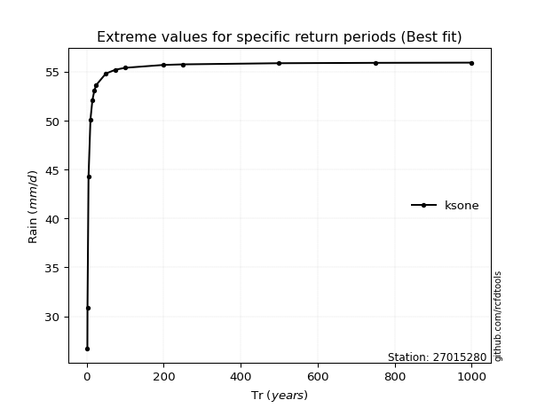</img>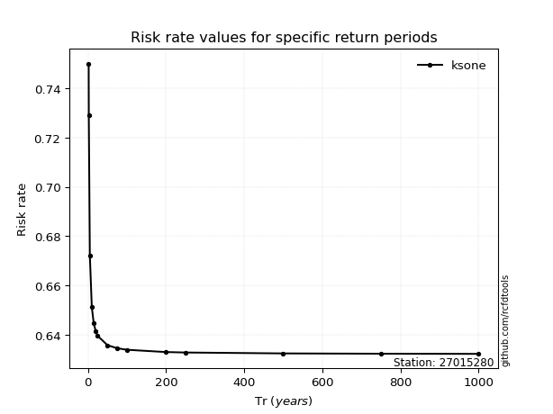</img>

</div>


<sub>**APP DISCLAIMER**: NO WARRANTY - This software is provided by [github.com/rcfdtools](https://github.com/rcfdtools) "as is", without any express or implied warranty, including warranties of merchantability, fitness for a particular purpose, or non-infringement. There is no guarantee that the software will be error-free or operate without interruption. LIMITATION OF LIABILITY - Neither the authors nor copyright holders will be liable for claims or damages arising from the software or its use. You are responsible for determining if the software is appropriate for your use and assume all associated risks, including errors, legal compliance, and data loss. NO PROFESSIONAL ADVICE - The software provides general information and does not offer professional advice. It should not replace consultation with professional advisors.</sub>