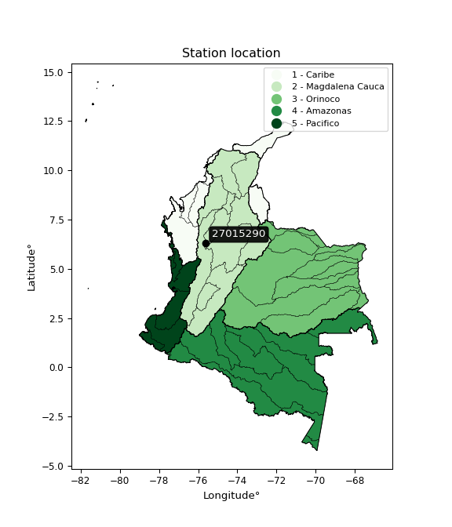

<div align="center">


</div>

# PMP Station (Rain, Pmax24h): 27015290

Probable Maximum Precipitation (PMP) is the greatest amount of rainfall for a specific duration that is meteorologically possible for a given location, acting as a "worst-case" scenario for extreme storms, crucial for designing safety-critical infrastructure like bridges, river deviations, dams, spillways, and nuclear plants to prevent catastrophic failure. PMP is calculated by hydrologists using meteorological data to determine the upper limit of extreme rainfall, often leading to the Probable Maximum Flood (PMF) for flood control design, and is increasingly being studied for climate change impacts. Probable Maximum Precipitation (PMP) is the theoretical upper limit of rainfall, a deterministic estimate for extreme events, while probability distributions (like GEV, Gumbel) describe the likelihood and frequency of various precipitation amounts, including rare ones, showing how often events occur, with PMP representing the extreme end of these distributions, used for critical infrastructure design to ensure safety against the worst conceivable weather, unlike standard statistical forecasts which cover typical probabilities.

The most common probability distributions in hydrology, used for analyzing floods, rainfall, and streamflow, include the Normal, Log-Normal, Gumbel, Gamma (including Log-Pearson Type III), and Generalized Extreme Value (GEV) distributions, often chosen based on the data´s skewness and whether modeling extremes or general conditions, with Gumbel and GEV popular for extreme events like floods, while the Normal distribution serves as a baseline, though often requiring transformations for skewed hydrological data. These distributions help in designing water infrastructure, managing water resources, and forecasting hydrologic events.

> Hydrological data often isn´t perfectly normal (it´s skewed), so different distributions are needed for different applications, such as: **Flood Frequency Analysis**: Using Gumbel, GEV, or Log-Pearson Type III for predicting extreme flood magnitudes and their return periods, **Rainfall Analysis**: Normal for annual totals, but Log-Normal, Weibull, or GEV for intensity or extreme daily rainfall, **Streamflow Modeling**: Gamma and Log-Normal for maximum flows, GEV for minimum flows, and Kappa for daily flows.

<div align="center">

</img>

</div>


## A. General information


### 1. General running parameters

• app_version: _v20260113_. • runtime: _2026-01-13 16:28:34.738620_. • Python version: _3.14.0_. • SciPy version: _1.16.3_. • Pandas version: _2.3.3_. • NumPy version: _2.3.5_. • Stations dataset (station_dataset_file): _dataset/pmax24h_in/automatic_colombia_2003_2025.csv_. • Stations catalog (station_catalog_file): _dataset/CNE.xls_. • Minimum year to eval til year_max (date_min): _1900_. • Maximum year to eval since year_min (date_max): _2025_. • Creates, save and include plots into reports (create_plot): _False_. • Plot only fit distributions with Δo > Δ (plot_only_fit): _True_. • Plot only simple graphs avoiding multiple CDFs and multiple Extreme values plots (plot_only_simple): _True_. • Eval low extreme values, if False, evaluates high extreme values (low_extreme): _False_. • Eval every SciPy distribution as logarithmic (pdist_logarithmic_on): _True_. • Standard deviation normalized (ddof): _1.0_. • Return periods to eval in years (Tr): _[2, 2.33, 5, 10, 15, 20, 25, 50, 75, 100, 200, 250, 500, 750, 1000]_. • Minimum data sample per station, 0 means any (minimum_sample): _5_. • Z-Score maximum threshold to adjust a value, 0 means disable (zscore_max): _3.5_. • Z-Score minimum threshold to adjust a value, 0 means disable (zscore_min): _-2.5_. • Avoid zeros, e.g. rain = 0 (avoid_zeros): _True_. • Avoid null values (avoid_nans): _True_. 

:file_folder:Table: [dataset.csv](../../dataset/pmax24h_in/automatic_colombia_2003_2025.csv)

> Delta Degrees of Freedom (DDOF): is a parameter used in the formulas for calculating variance and standard deviation. When ddof=0, the divisor is $N$ (the total number of observations) and this is used when your data set is the entire population. When ddof=1, the divisor is $N-1$ and this is used when your data set is a sample drawn from a larger population. Using $N-1$ provides an unbiased estimate of the population variance (known as Bessel´s correction).


### 2. Station info and location

|   id |   CODIGO | NOMBRE              | CATEGORIA               | TECNOLOGIA                | ESTADO     | FECHA_INSTALACION   | FECHA_SUSPENSION   |   ALTITUD |   LATITUD |   LONGITUD | DEPARTAMENTO   | MUNICIPIO   | AREA_OPERATIVA                      | ENTIDAD                                                     | AREA_HIDROGRAFICA   | ZONA_HIDROGRAFICA   | SUBZONA_HIDROGRAFICA   |   CORRIENTE | Catalogo   |   Version |
|-----:|---------:|:--------------------|:------------------------|:--------------------------|:-----------|:--------------------|:-------------------|----------:|----------:|-----------:|:---------------|:------------|:------------------------------------|:------------------------------------------------------------|:--------------------|:--------------------|:-----------------------|------------:|:-----------|----------:|
|    0 | 27015290 | PAJARITO [27015290] | Climatológica Principal | Automática con Telemetría | Suspendida | 17/11/2005          | 21/06/2024         |      1952 |   6.28633 |   -75.6128 | Antioquia      | Medellín    | Area Operativa 01 - Antioquia-Chocó | INSTITUTO DE HIDROLOGIA METEOROLOGIA Y ESTUDIOS AMBIENTALES | Magdalena Cauca     | Nechí               | Río Porce              |         nan | CNE_IDEAM  |  20251226 |

<div align="center">

Dynamic map: [:earth_americas:Google](http://maps.google.com/maps?q=6.286333333,-75.61279167) [:earth_americas:OSM](https://www.openstreetmap.org/#map=18/6.286333333/-75.61279167&layers=P) [:earth_americas:Bing](https://www.bing.com/maps?cp=6.286333333~-75.61279167&lvl=18) [:earth_americas:Apple](https://maps.apple.com/frame?center=6.286333333%2C-75.61279167&span=0.003%2C0.006)

</div>


<div align="center">

```geojson
{
  "type": "Feature",
  "geometry": {
    "type": "Point", 
    "coordinates": [-75.61279167, 6.286333333]
  }, 
  "properties": {
    "Name": "27015290"
  }
}
```

</div>


### 3. Discrete values table and plot

<div align="center">

|               |          0 |            1 |          2 |           3 |           4 |
|:--------------|-----------:|-------------:|-----------:|------------:|------------:|
| Date          | 2016       | 2017         | 2018       | 2019        | 2020        |
| Value         |    0.1     |   31.4       |   68.9     |   40.3      |   19.6      |
| Value_initial |    0.1     |   31.4       |   68.9     |   40.3      |   19.6      |
| count         |    5       |    5         |    5       |    5        |    5        |
| mean          |   32.06    |   32.06      |   32.06    |   32.06     |   32.06     |
| std           |   25.5059  |   25.5059    |   25.5059  |   25.5059   |   25.5059   |
| zscore        |   -1.25304 |   -0.0258763 |    1.44437 |    0.323062 |   -0.488514 |


</div>


> The initial value (value_initial) correspond to the initial obtained or null completed value, and value (value) is adjusted only when the initial value is outside the valid range (outlier) definite through the Z-Score value. If Z-Score is active, values out of range or outliers are replaced with the station mean value. A Z-Score (or standard score) measures how many standard deviations a data point is from the mean of a dataset, indicating its relative position; positive scores mean above the mean, negative mean below, and a score of zero is exactly at the mean, allowing for comparison of values from different distributions. It´s calculated using the formula $z=(x–μ)/σ$, where $x$ is the data point, $μ$ is the mean, and $σ$ is the standard deviation, helping identify outliers and understand probability.
>
> <sub>**Note**: In this study, "completing" (filling gaps in) and "extending" (forecasting or lengthening the historical record) rainfall data series are avoided for certain critical analyses because they introduce artificial bias and uncertainty, which can distort the statistics of rare events (extremes), alter day-to-day variability, and compromise the integrity and homogeneity of the original data. Some reasons against Completing/Extending rainfall data are: **Distortion of Extremes and Variability**: The primary issue is that most gap-filling or extension methods rely on averaging or regression with nearby stations, which inherently smooths the data. Rainfall is highly variable in space and time, with a large percentage of zero values and occasional large storms. Infilling methods often underestimate the highest values and overestimate the lowest (zero) values, which severely distorts analyses focused on flood frequency, drought severity, and intensity-duration-frequency (IDF) curves, **Loss of Data Homogeneity**: Infilled or extended data are synthetic estimates, not actual measurements. Combining these estimates with observed data can violate the assumption of data homogeneity, which requires that the data properties do not change over time. Inhomogeneity can lead to incorrect conclusions about long-term trends or changes in climate patterns, **Propagation of Errors**: Errors and biases from the original data (e.g., wind-induced undercatch, instrument errors, site changes) or the data used for imputation can propagate through the analysis, leading to unreliable hydrological models and inaccurate predictions, **Compromised Statistical Integrity**: For statistical analyses, especially those involving the frequency of events, using artificial data can introduce time bias or autocorrelation that doesn´t exist in reality, making it difficult to assess the true probability of events, **Difficulty in Validation**: It is difficult to accurately validate the quality of filled or extended data, especially for past periods where ground-truth measurements are unavailable. The reliability of imputation techniques heavily depends on the density of the surrounding station network and the complexity of the local topography.</sub>


### 4. Active continuous probability distributions from SciPy (45 of 104 available)

A Probability Density Function (PDF) describes the relative likelihood of a continuous random variable falling within a specific range, where the total area under its curve equals 1, and the area over any interval gives the actual probability for that range. Unlike discrete probabilities (like rolling a die), a PDF shows density, not direct probability for a single point (which is zero), with higher points indicating higher likelihood, often visualized as a bell curve for normal distributions.

A log of a probability density function (log-PDF) is simply the logarithm of the PDF´s value, denoted as $log(f(x))$, useful for converting multiplication of probabilities into addition, improving numerical stability with tiny numbers, and connecting to information theory concepts like entropy. Instead of dealing with very small probabilities (e.g., 0.000001), log-PDFs use negative numbers (e.g., $log(0.00001) ≈ -11.51$ that are easier for computers to handle, preventing underflow errors and simplifying complex calculations. In this study, each active probability distribution from SciPy is also evaluated in the $log$ form.

[scipy.stats](https://docs.scipy.org/doc/scipy/reference/stats.html) is a Python´s powerful submodule within the SciPy library for comprehensive statistical analysis, offering over 130 probability distributions (like Normal, Poisson), functions for descriptive stats (mean, variance), hypothesis testing (t-tests, chi-square), random variable generation, and statistical tests, making it essential for data science, modeling, and research. It provides tools to explore, model, and draw conclusions from data efficiently, working seamlessly with NumPy.

<div align="center">

|   id | p_dist             |   n_parameter | fit_method   | label                                                                       | active   | ref                                                                                                        |
|-----:|:-------------------|--------------:|:-------------|:----------------------------------------------------------------------------|:---------|:-----------------------------------------------------------------------------------------------------------|
|    0 | alpha              |             3 | MLE          | Alpha                                                                       | True     | [:mortar_board:](https://docs.scipy.org/doc/scipy/reference/generated/scipy.stats.alpha.html)              |
|    1 | betaprime          |             4 | MLE          | Beta prime                                                                  | True     | [:mortar_board:](https://docs.scipy.org/doc/scipy/reference/generated/scipy.stats.betaprime.html)          |
|    2 | chi2               |             3 | MLE          | Chi²                                                                        | True     | [:mortar_board:](https://docs.scipy.org/doc/scipy/reference/generated/scipy.stats.chi2.html)               |
|    3 | crystalball        |             4 | MLE          | Crystalball                                                                 | True     | [:mortar_board:](https://docs.scipy.org/doc/scipy/reference/generated/scipy.stats.crystalball.html)        |
|    4 | dweibull           |             3 | MLE          | Double Weibull                                                              | True     | [:mortar_board:](https://docs.scipy.org/doc/scipy/reference/generated/scipy.stats.dweibull.html)           |
|    5 | erlang             |             3 | MLE          | Erlang                                                                      | True     | [:mortar_board:](https://docs.scipy.org/doc/scipy/reference/generated/scipy.stats.erlang.html)             |
|    6 | expon              |             2 | MLE          | Exponential                                                                 | True     | [:mortar_board:](https://docs.scipy.org/doc/scipy/reference/generated/scipy.stats.expon.html)              |
|    7 | exponnorm          |             3 | MLE          | Exponentially modified Normal                                               | True     | [:mortar_board:](https://docs.scipy.org/doc/scipy/reference/generated/scipy.stats.exponnorm.html)          |
|    8 | f                  |             4 | MLE          | F                                                                           | True     | [:mortar_board:](https://docs.scipy.org/doc/scipy/reference/generated/scipy.stats.f.html)                  |
|    9 | fatiguelife        |             3 | MLE          | Fatigue-life (Birnbaum-Saunders)                                            | True     | [:mortar_board:](https://docs.scipy.org/doc/scipy/reference/generated/scipy.stats.fatiguelife.html)        |
|   10 | fisk               |             3 | MLE          | Fisk                                                                        | True     | [:mortar_board:](https://docs.scipy.org/doc/scipy/reference/generated/scipy.stats.fisk.html)               |
|   11 | gamma              |             3 | MLE          | Gamma                                                                       | True     | [:mortar_board:](https://docs.scipy.org/doc/scipy/reference/generated/scipy.stats.gamma.html)              |
|   12 | genexpon           |             5 | MLE          | Generalized exponential                                                     | True     | [:mortar_board:](https://docs.scipy.org/doc/scipy/reference/generated/scipy.stats.genexpon.html)           |
|   13 | genlogistic        |             3 | MLE          | Generalized logistic                                                        | True     | [:mortar_board:](https://docs.scipy.org/doc/scipy/reference/generated/scipy.stats.genlogistic.html)        |
|   14 | gibrat             |             2 | MM           | Gibrat                                                                      | True     | [:mortar_board:](https://docs.scipy.org/doc/scipy/reference/generated/scipy.stats.gibrat.html)             |
|   15 | gompertz           |             3 | MLE          | Gompertz (or truncated Gumbel)                                              | True     | [:mortar_board:](https://docs.scipy.org/doc/scipy/reference/generated/scipy.stats.gompertz.html)           |
|   16 | gumbel_l           |             2 | MM           | Gumbel Left Skew                                                            | True     | [:mortar_board:](https://docs.scipy.org/doc/scipy/reference/generated/scipy.stats.gumbel_l.html)           |
|   17 | gumbel_r           |             2 | MM           | Gumbel Right Skew                                                           | True     | [:mortar_board:](https://docs.scipy.org/doc/scipy/reference/generated/scipy.stats.gumbel_r.html)           |
|   18 | halflogistic       |             2 | MM           | Half-logistic                                                               | True     | [:mortar_board:](https://docs.scipy.org/doc/scipy/reference/generated/scipy.stats.halflogistic.html)       |
|   19 | halfnorm           |             2 | MM           | Half Normal                                                                 | True     | [:mortar_board:](https://docs.scipy.org/doc/scipy/reference/generated/scipy.stats.halfnorm.html)           |
|   20 | hypsecant          |             2 | MM           | hyperbolic secant                                                           | True     | [:mortar_board:](https://docs.scipy.org/doc/scipy/reference/generated/scipy.stats.hypsecant.html)          |
|   21 | invgamma           |             3 | MLE          | Inverted gamma                                                              | True     | [:mortar_board:](https://docs.scipy.org/doc/scipy/reference/generated/scipy.stats.invgamma.html)           |
|   22 | invgauss           |             3 | MLE          | Inverse Gaussian                                                            | True     | [:mortar_board:](https://docs.scipy.org/doc/scipy/reference/generated/scipy.stats.invgauss.html)           |
|   23 | invweibull         |             3 | MLE          | Inverted Weibull                                                            | True     | [:mortar_board:](https://docs.scipy.org/doc/scipy/reference/generated/scipy.stats.invweibull.html)         |
|   24 | kappa4             |             4 | MLE          | Kappa 4                                                                     | True     | [:mortar_board:](https://docs.scipy.org/doc/scipy/reference/generated/scipy.stats.kappa4.html)             |
|   25 | kstwobign          |             2 | MLE          | Limiting distribution of scaled Kolmogorov-Smirnov two-sided test statistic | True     | [:mortar_board:](https://docs.scipy.org/doc/scipy/reference/generated/scipy.stats.kstwobign.html)          |
|   26 | laplace            |             2 | MM           | Laplace                                                                     | True     | [:mortar_board:](https://docs.scipy.org/doc/scipy/reference/generated/scipy.stats.laplace.html)            |
|   27 | laplace_asymmetric |             3 | MLE          | Asymmetric Laplace                                                          | True     | [:mortar_board:](https://docs.scipy.org/doc/scipy/reference/generated/scipy.stats.laplace_asymmetric.html) |
|   28 | loggamma           |             3 | MLE          | Log gamma                                                                   | True     | [:mortar_board:](https://docs.scipy.org/doc/scipy/reference/generated/scipy.stats.loggamma.html)           |
|   29 | logistic           |             2 | MM           | Logistic (or Sech-squared)                                                  | True     | [:mortar_board:](https://docs.scipy.org/doc/scipy/reference/generated/scipy.stats.logistic.html)           |
|   30 | lognorm            |             3 | MLE          | Log Normal                                                                  | True     | [:mortar_board:](https://docs.scipy.org/doc/scipy/reference/generated/scipy.stats.lognorm.html)            |
|   31 | maxwell            |             2 | MM           | Maxwell                                                                     | True     | [:mortar_board:](https://docs.scipy.org/doc/scipy/reference/generated/scipy.stats.maxwell.html)            |
|   32 | mielke             |             4 | MLE          | Mielke Beta-Kappa / Dagum                                                   | True     | [:mortar_board:](https://docs.scipy.org/doc/scipy/reference/generated/scipy.stats.mielke.html)             |
|   33 | moyal              |             2 | MM           | Moyal                                                                       | True     | [:mortar_board:](https://docs.scipy.org/doc/scipy/reference/generated/scipy.stats.moyal.html)              |
|   34 | nakagami           |             3 | MLE          | Nakagami                                                                    | True     | [:mortar_board:](https://docs.scipy.org/doc/scipy/reference/generated/scipy.stats.nakagami.html)           |
|   35 | ncf                |             5 | MLE          | Non-central F distribution                                                  | True     | [:mortar_board:](https://docs.scipy.org/doc/scipy/reference/generated/scipy.stats.ncf.html)                |
|   36 | nct                |             4 | MLE          | Non-central Student’s t                                                     | True     | [:mortar_board:](https://docs.scipy.org/doc/scipy/reference/generated/scipy.stats.nct.html)                |
|   37 | norm               |             2 | MM           | Normal                                                                      | True     | [:mortar_board:](https://docs.scipy.org/doc/scipy/reference/generated/scipy.stats.norm.html)               |
|   38 | pearson3           |             3 | MM           | Pearson type III                                                            | True     | [:mortar_board:](https://docs.scipy.org/doc/scipy/reference/generated/scipy.stats.pearson3.html)           |
|   39 | rayleigh           |             2 | MM           | Rayleigh                                                                    | True     | [:mortar_board:](https://docs.scipy.org/doc/scipy/reference/generated/scipy.stats.rayleigh.html)           |
|   40 | rice               |             3 | MLE          | Rice                                                                        | True     | [:mortar_board:](https://docs.scipy.org/doc/scipy/reference/generated/scipy.stats.rice.html)               |
|   41 | t                  |             3 | MLE          | Student’s t                                                                 | True     | [:mortar_board:](https://docs.scipy.org/doc/scipy/reference/generated/scipy.stats.t.html)                  |
|   42 | truncnorm          |             4 | MLE          | Truncated normal                                                            | True     | [:mortar_board:](https://docs.scipy.org/doc/scipy/reference/generated/scipy.stats.truncnorm.html)          |
|   43 | wald               |             2 | MM           | Wald                                                                        | True     | [:mortar_board:](https://docs.scipy.org/doc/scipy/reference/generated/scipy.stats.wald.html)               |
|   44 | weibull_min        |             3 | MLE          | Weibull minimum                                                             | True     | [:mortar_board:](https://docs.scipy.org/doc/scipy/reference/generated/scipy.stats.weibull_min.html)        |

</div>

> **n_parameter:** # arguments & localization & scale.
>
> **Fit methods:** (MLE) maximum likelihood, (MM) L-moments.
>
>**Inactive** (With the only purpose of prevent loops, zero divisions, infinite values, over high estimated values or horizontal trending for recurrence intervals estimations, the follow distributions were disabled.)**:** foldnorm, gennorm, norminvgauss, powernorm, powerlognorm, skewnorm, genextreme, anglit, arcsine, argus, beta, bradford, burr, burr12, cauchy, cosine, halfcauchy, foldcauchy, skewcauchy, wrapcauchy, dgamma, gengamma, exponweib, exponpow, truncexpon, gausshyper, genhalflogistic, genhyperbolic, geninvgauss, halfgennorm, johnsonsb, johnsonsu, kappa3, ksone, kstwo, loglaplace, levy, levy_l, levy_stable, ncx2, pareto, genpareto, truncpareto, lomax, powerlaw, rdist, rel_breitwigner, recipinvgauss, semicircular, studentized_range, trapezoid, triang, truncweibull_min, tukeylambda, uniform, loguniform, vonmises, vonmises_line, weibull_max, 


## B. Probability (PDF) vs. Empirical (EDF) distributions functions

A continuous probability distribution (CPD) describes probabilities for variables that can take any value within a range (like rain any time), unlike discrete variables with specific outcomes (like temperature). It uses a Probability Density Function (PDF), a curve where the total area under it equals 1, and the probability of the variable falling within an interval (a to b) is found by calculating the area under the curve between those points. A key feature is that the probability of hitting any single exact value is zero, so probabilities are always expressed for ranges, e.g., $P(a ≤ X ≤ b)$.

<div align="center">

Distributions parameters from station values
|    |   station | p_dist                |   n |             loc |           scale | shape                  | shape1                | shape2                | shape3   |
|---:|----------:|:----------------------|----:|----------------:|----------------:|:-----------------------|:----------------------|:----------------------|:---------|
|  0 |  27015290 | alpha                 |   5 |  -227.877       |  2972.67        | 11.526807877782398     |                       |                       |          |
|  1 |  27015290 | betaprime             |   5 |   -20.9755      | 30127.7         | 4.850931583977351      | 2758.932977429823     |                       |          |
|  2 |  27015290 | chi2                  |   5 |   -19.1985      |     5.71104     | 8.97533491856166       |                       |                       |          |
|  3 |  27015290 | crystalball           |   5 |    32.06        |    22.8132      | 3487.436415445497      | 121.50792287180629    |                       |          |
|  4 |  27015290 | dweibull              |   5 |    31.4         |    18.3105      | 0.8554588827444604     |                       |                       |          |
|  5 |  27015290 | erlang                |   5 |   -19.1985      |    11.422       | 4.487680548927868      |                       |                       |          |
|  6 |  27015290 | expon                 |   5 |     0.1         |    31.96        |                        |                       |                       |          |
|  7 |  27015290 | exponnorm             |   5 |    24.5192      |    21.5515      | 0.34989622572629236    |                       |                       |          |
|  8 |  27015290 | f                     |   5 |     0.1         |    42.7309      | 0.7831960136817945     | 5.058344210566222     |                       |          |
|  9 |  27015290 | fatiguelife           |   5 |   -70.7647      |   100.276       | 0.22545547728431076    |                       |                       |          |
| 10 |  27015290 | fisk                  |   5 |     0.1         |    16.7723      | 0.6904968705440766     |                       |                       |          |
| 11 |  27015290 | gamma                 |   5 |   -19.1985      |    11.4221      | 4.487672422882768      |                       |                       |          |
| 12 |  27015290 | genexpon              |   5 |     0.0999953   |     2.46265     | 0.07644029341130248    | 0.0003118987378931324 | 1.0035961037098509    |          |
| 13 |  27015290 | genlogistic           |   5 |   -79.2431      |    19.7764      | 159.57427737672788     |                       |                       |          |
| 14 |  27015290 | gibrat                |   5 |    14.6564      |    10.5558      |                        |                       |                       |          |
| 15 |  27015290 | gompertz              |   5 |     0.1         |    45.1724      | 0.7621378380185981     |                       |                       |          |
| 16 |  27015290 | gumbel_l              |   5 |    42.3272      |    17.7874      |                        |                       |                       |          |
| 17 |  27015290 | gumbel_r              |   5 |    21.7928      |    17.7874      |                        |                       |                       |          |
| 18 |  27015290 | halflogistic          |   5 |     5.02101     |    19.5045      |                        |                       |                       |          |
| 19 |  27015290 | halfnorm              |   5 |     1.86427     |    37.8447      |                        |                       |                       |          |
| 20 |  27015290 | hypsecant             |   5 |    32.06        |    14.5233      |                        |                       |                       |          |
| 21 |  27015290 | invgamma              |   5 |     0.1         |     1.96655e-17 | 0.16695199099555255    |                       |                       |          |
| 22 |  27015290 | invgauss              |   5 |   -61.801       |  1501.35        | 0.06246417225905812    |                       |                       |          |
| 23 |  27015290 | invweibull            |   5 |     0.1         |     2.84964     | 0.06442449385316643    |                       |                       |          |
| 24 |  27015290 | kappa4                |   5 |    -7.61786     |    76.8345      | 1.1116446997385208     | 0.9969616750401035    |                       |          |
| 25 |  27015290 | kstwobign             |   5 |   -48.3922      |    92.0969      |                        |                       |                       |          |
| 26 |  27015290 | laplace               |   5 |    32.06        |    16.1314      |                        |                       |                       |          |
| 27 |  27015290 | laplace_asymmetric    |   5 |    31.4         |    17.891       | 0.9817197113743088     |                       |                       |          |
| 28 |  27015290 | loggamma              |   5 | -5414.95        |   774.453       | 1134.0543068372535     |                       |                       |          |
| 29 |  27015290 | logistic              |   5 |    32.06        |    12.5776      |                        |                       |                       |          |
| 30 |  27015290 | lognorm               |   5 |     0.1         |     0.00748071  | 16.965283334014746     |                       |                       |          |
| 31 |  27015290 | maxwell               |   5 |   -21.9977      |    33.8757      |                        |                       |                       |          |
| 32 |  27015290 | mielke                |   5 |     0.1         |    73.0769      | 0.4556699620486446     | 11.235722207039046    |                       |          |
| 33 |  27015290 | moyal                 |   5 |    19.0139      |    10.2696      |                        |                       |                       |          |
| 34 |  27015290 | nakagami              |   5 |     0.1         |    59.7522      | 0.27343864433291437    |                       |                       |          |
| 35 |  27015290 | ncf                   |   5 |     0.1         |     2.96665     | 0.18931997831273845    | 5.202522667208283     | 2.3865452910381775    |          |
| 36 |  27015290 | nct                   |   5 |     0.1         |     2.79662e-18 | 0.09335162075539588    | 23.392157015525505    |                       |          |
| 37 |  27015290 | norm                  |   5 |    32.06        |    22.8132      |                        |                       |                       |          |
| 38 |  27015290 | pearson3              |   5 |    32.06        |    22.8132      | 0.26915423517214354    |                       |                       |          |
| 39 |  27015290 | rayleigh              |   5 |   -11.583       |    34.8221      |                        |                       |                       |          |
| 40 |  27015290 | rice                  |   5 |   -11.1924      |    29.29        | 0.8872815745424915     |                       |                       |          |
| 41 |  27015290 | t                     |   5 |    32.0585      |    22.8123      | 2508288.8460722496     |                       |                       |          |
| 42 |  27015290 | truncnorm             |   5 |    -1.78114     |     5.47761     | -0.09348003668640154   | 12.903648936178136    |                       |          |
| 43 |  27015290 | wald                  |   5 |     9.24676     |    22.8132      |                        |                       |                       |          |
| 44 |  27015290 | weibull_min           |   5 |    -3.67453     |    39.04        | 1.4436372121603125     |                       |                       |          |
| 45 |  27015290 | logalpha              |   5 |    -3.13956     |     1.52152     | 2.1844967085885575e-08 |                       |                       |          |
| 46 |  27015290 | logbetaprime          |   5 |    -2.30259     |     3.09006     | 0.12104805649062685    | 0.7397566019211608    |                       |          |
| 47 |  27015290 | logchi2               |   5 |    -2.30259     |     1.29878     | 0.9596143821458258     |                       |                       |          |
| 48 |  27015290 | logcrystalball        |   5 |     4.23266     |     1.20493e-07 | 6.611174876289885e-08  | 13173.689537763303    |                       |          |
| 49 |  27015290 | logdweibull           |   5 |     3.44681     |     1.66227     | 0.8396099145869449     |                       |                       |          |
| 50 |  27015290 | logerlang             |   5 |   -41.6139      |     0.144287    | 305.3108720119865      |                       |                       |          |
| 51 |  27015290 | logexpon              |   5 |    -2.30259     |     4.71234     |                        |                       |                       |          |
| 52 |  27015290 | logexponnorm          |   5 |     2.40834     |     2.3908      | 0.000590904754228057   |                       |                       |          |
| 53 |  27015290 | logf                  |   5 |    -2.30259     |     1.12602     | 1.0607542569252164     | 1.0371763318324398    |                       |          |
| 54 |  27015290 | logfatiguelife        |   5 |    -2.30259     |     3.50147e-07 | 3175.098343557699      |                       |                       |          |
| 55 |  27015290 | logfisk               |   5 |    -2.30259     |     4.09931     | 0.1379625740514447     |                       |                       |          |
| 56 |  27015290 | loggamma              |   5 |   -37.0006      |     0.162907    | 241.71918359732524     |                       |                       |          |
| 57 |  27015290 | loggenexpon           |   5 |    -2.42019     |     0.296466    | 0.022790028014416222   | 7.378223366727857     | 0.0005117590202924601 |          |
| 58 |  27015290 | loggenlogistic        |   5 |     4.23269     |     3.82362e-06 | 2.0902411326253047e-06 |                       |                       |          |
| 59 |  27015290 | loggibrat             |   5 |     0.585835    |     1.10625     |                        |                       |                       |          |
| 60 |  27015290 | loggompertz           |   5 |    -4.51071     |     1.34336     | 0.0028440207328147     |                       |                       |          |
| 61 |  27015290 | loggumbel_l           |   5 |     3.48575     |     1.86411     |                        |                       |                       |          |
| 62 |  27015290 | loggumbel_r           |   5 |     1.33376     |     1.86411     |                        |                       |                       |          |
| 63 |  27015290 | loghalflogistic       |   5 |    -0.42392     |     2.04406     |                        |                       |                       |          |
| 64 |  27015290 | loghalfnorm           |   5 |    -0.75475     |     3.96612     |                        |                       |                       |          |
| 65 |  27015290 | loghypsecant          |   5 |     2.40975     |     1.52204     |                        |                       |                       |          |
| 66 |  27015290 | loginvgamma           |   5 |   -50.9669      | 24114           | 452.91485971707743     |                       |                       |          |
| 67 |  27015290 | loginvgauss           |   5 |   -21.8073      |  1969.74        | 0.012318949403650373   |                       |                       |          |
| 68 |  27015290 | loginvweibull         |   5 |    -1.01581e+07 |     1.01581e+07 | 3636147.3926667944     |                       |                       |          |
| 69 |  27015290 | logkappa4             |   5 |    -2.78036     |     7.6523      | 1.064832441351621      | 1.0911564969961902    |                       |          |
| 70 |  27015290 | logkstwobign          |   5 |    -8.719       |    12.6824      |                        |                       |                       |          |
| 71 |  27015290 | loglaplace            |   5 |     2.40975     |     1.69056     |                        |                       |                       |          |
| 72 |  27015290 | loglaplace_asymmetric |   5 |     4.23267     |     0.0150188   | 121.05962845595676     |                       |                       |          |
| 73 |  27015290 | logloggamma           |   5 |     4.23295     |     2.81144e-05 | 1.5456301316592292e-05 |                       |                       |          |
| 74 |  27015290 | loglogistic           |   5 |     2.40975     |     1.31813     |                        |                       |                       |          |
| 75 |  27015290 | loglognorm            |   5 |    -2.30259     |     0.00370424  | 15.917729704910514     |                       |                       |          |
| 76 |  27015290 | logmaxwell            |   5 |    -3.25548     |     3.55016     |                        |                       |                       |          |
| 77 |  27015290 | logmielke             |   5 |    -2.30259     |     3.25369     | 0.12510361071269172    | 0.6841285561379451    |                       |          |
| 78 |  27015290 | logmoyal              |   5 |     1.04253     |     1.07625     |                        |                       |                       |          |
| 79 |  27015290 | lognakagami           |   5 | -2103.22        |  2105.63        | 192802.23362249002     |                       |                       |          |
| 80 |  27015290 | logncf                |   5 |    -2.30259     |     1.02892     | 1.02523365924088       | 1.122290004030059     | 1.0896655716826034    |          |
| 81 |  27015290 | lognct                |   5 |  -144.659       |     2.34487     | 43815.07615746754      | 62.71818390749682     |                       |          |
| 82 |  27015290 | lognorm               |   5 |     2.40975     |     2.39082     |                        |                       |                       |          |
| 83 |  27015290 | logpearson3           |   5 |     2.40975     |     2.39083     | -1.3926007108652292    |                       |                       |          |
| 84 |  27015290 | lograyleigh           |   5 |    -2.16403     |     3.64936     |                        |                       |                       |          |
| 85 |  27015290 | logrice               |   5 |  -565.01        |     2.39083     | 237.32991818067663     |                       |                       |          |
| 86 |  27015290 | logt                  |   5 |     3.54114     |     0.389982    | 0.876054845775496      |                       |                       |          |
| 87 |  27015290 | logtruncnorm          |   5 |     2.14089     |     2.64255     | -1.6815136645654563    | 5.305910927125196     |                       |          |
| 88 |  27015290 | logwald               |   5 |     0.0189759   |     2.39078     |                        |                       |                       |          |
| 89 |  27015290 | logweibull_min        |   5 |    -2.30259     |     1.55905     | 0.4924489836899914     |                       |                       |          |

</div>

> **loc** (Location parameter): This shifts the distribution along the x-axis. For many common distributions, like the normal (Gaussian) distribution, loc represents the mean $μ$. For others, like the uniform distribution, it might represent the minimum value, or for the beta distribution, the left end of the support interval.
>
> **scale** (Scale parameter): This determines the width or spread of the distribution. For the normal distribution, scale represents the standard deviation $σ$. For a uniform distribution, it defines the length of the interval (from $loc$ to $loc + scale$).
>
> **shape** (Shape parameters): Refers to parameters that define the specific form of a probability distribution, distinct from its location (loc) and scale (scale). These parameters are required arguments for most distribution functions. For example, a normal (Gaussian) distribution is fully defined by its location (mean) and scale (standard deviation), so it has no specific shape parameters beyond loc and scale. However, other distributions have intrinsic properties that need specification, as Gamma distribution that takes a shape parameter, often named $a$ or $alpha$.


### 0. Cumulative distribution values - CDF (90 evaluated)

Cumulative Distribution Function (CDF), denoted as $F$<sub>$X$</sub>$(x)$, is a function that gives the probability that a random variable $X$ will take a value less than or equal to a specific value, $x$ (i.e., $(P(X≥x)$. It essentially "accumulates" probabilities from a given point up to the far right (positive infinity), providing a complete picture of the distribution´s probabilities for both discrete (like rain) and continuous (like temperature) variables, helping to find probabilities over ranges or above certain values. Each station is evaluated separately ordering the $x$ values ascending, calculating the CDF and PDF values for the activated distributions and their logarithmic forms.

<div align="center">

CDF ordered by x ascending and calculating $log(f(x))$ separately
|   id |   Station |   date |    x |   count |   mean |     std |     zscore |   Value_initial |   station |   m |    alpha |   alpha_pdf |   betaprime |   betaprime_pdf |      chi2 |   chi2_pdf |   crystalball |   crystalball_pdf |   dweibull |   dweibull_pdf |    erlang |   erlang_pdf |    expon |   expon_pdf |   exponnorm |   exponnorm_pdf |          f |       f_pdf |   fatiguelife |   fatiguelife_pdf |        fisk |       fisk_pdf |     gamma |   gamma_pdf |    genexpon |   genexpon_pdf |   genlogistic |   genlogistic_pdf |   gibrat |   gibrat_pdf |    gompertz |   gompertz_pdf |   gumbel_l |   gumbel_l_pdf |   gumbel_r |   gumbel_r_pdf |   halflogistic |   halflogistic_pdf |   halfnorm |   halfnorm_pdf |   hypsecant |   hypsecant_pdf |   invgamma |   invgamma_pdf |   invgauss |   invgauss_pdf |   invweibull |   invweibull_pdf |      kappa4 |   kappa4_pdf |   kstwobign |   kstwobign_pdf |   laplace |   laplace_pdf |   laplace_asymmetric |   laplace_asymmetric_pdf |   loggamma |   loggamma_pdf |   logistic |   logistic_pdf |   lognorm |   lognorm_pdf |   maxwell |   maxwell_pdf |      mielke |      mielke_pdf |     moyal |   moyal_pdf |    nakagami |   nakagami_pdf |       ncf |    ncf_pdf |       nct |     nct_pdf |      norm |   norm_pdf |   pearson3 |   pearson3_pdf |   rayleigh |   rayleigh_pdf |      rice |   rice_pdf |         t |      t_pdf |   truncnorm |   truncnorm_pdf |     wald |   wald_pdf |   weibull_min |   weibull_min_pdf |   logalpha |   logalpha_pdf |   logbetaprime |   logbetaprime_pdf |     logchi2 |   logchi2_pdf |   logcrystalball |   logcrystalball_pdf |   logdweibull |   logdweibull_pdf |   logerlang |   logerlang_pdf |   logexpon |   logexpon_pdf |   logexponnorm |   logexponnorm_pdf |        logf |    logf_pdf |   logfatiguelife |   logfatiguelife_pdf |    logfisk |   logfisk_pdf |   loggenexpon |   loggenexpon_pdf |   loggenlogistic |   loggenlogistic_pdf |   loggibrat |   loggibrat_pdf |   loggompertz |   loggompertz_pdf |   loggumbel_l |   loggumbel_l_pdf |   loggumbel_r |   loggumbel_r_pdf |   loghalflogistic |   loghalflogistic_pdf |   loghalfnorm |   loghalfnorm_pdf |   loghypsecant |   loghypsecant_pdf |   loginvgamma |   loginvgamma_pdf |   loginvgauss |   loginvgauss_pdf |   loginvweibull |   loginvweibull_pdf |   logkappa4 |   logkappa4_pdf |   logkstwobign |   logkstwobign_pdf |   loglaplace |   loglaplace_pdf |   loglaplace_asymmetric |   loglaplace_asymmetric_pdf |   logloggamma |   logloggamma_pdf |   loglogistic |   loglogistic_pdf |   loglognorm |   loglognorm_pdf |   logmaxwell |   logmaxwell_pdf |   logmielke |   logmielke_pdf |    logmoyal |   logmoyal_pdf |   lognakagami |   lognakagami_pdf |      logncf |   logncf_pdf |    lognct |   lognct_pdf |   logpearson3 |   logpearson3_pdf |   lograyleigh |   lograyleigh_pdf |   logrice |   logrice_pdf |      logt |   logt_pdf |   logtruncnorm |   logtruncnorm_pdf |   logwald |   logwald_pdf |   logweibull_min |   logweibull_min_pdf |
|-----:|----------:|-------:|-----:|--------:|-------:|--------:|-----------:|----------------:|----------:|----:|---------:|------------:|------------:|----------------:|----------:|-----------:|--------------:|------------------:|-----------:|---------------:|----------:|-------------:|---------:|------------:|------------:|----------------:|-----------:|------------:|--------------:|------------------:|------------:|---------------:|----------:|------------:|------------:|---------------:|--------------:|------------------:|---------:|-------------:|------------:|---------------:|-----------:|---------------:|-----------:|---------------:|---------------:|-------------------:|-----------:|---------------:|------------:|----------------:|-----------:|---------------:|-----------:|---------------:|-------------:|-----------------:|------------:|-------------:|------------:|----------------:|----------:|--------------:|---------------------:|-------------------------:|-----------:|---------------:|-----------:|---------------:|----------:|--------------:|----------:|--------------:|------------:|----------------:|----------:|------------:|------------:|---------------:|----------:|-----------:|----------:|------------:|----------:|-----------:|-----------:|---------------:|-----------:|---------------:|----------:|-----------:|----------:|-----------:|------------:|----------------:|---------:|-----------:|--------------:|------------------:|-----------:|---------------:|---------------:|-------------------:|------------:|--------------:|-----------------:|---------------------:|--------------:|------------------:|------------:|----------------:|-----------:|---------------:|---------------:|-------------------:|------------:|------------:|-----------------:|---------------------:|-----------:|--------------:|--------------:|------------------:|-----------------:|---------------------:|------------:|----------------:|--------------:|------------------:|--------------:|------------------:|--------------:|------------------:|------------------:|----------------------:|--------------:|------------------:|---------------:|-------------------:|--------------:|------------------:|--------------:|------------------:|----------------:|--------------------:|------------:|----------------:|---------------:|-------------------:|-------------:|-----------------:|------------------------:|----------------------------:|--------------:|------------------:|--------------:|------------------:|-------------:|-----------------:|-------------:|-----------------:|------------:|----------------:|------------:|---------------:|--------------:|------------------:|------------:|-------------:|----------:|-------------:|--------------:|------------------:|--------------:|------------------:|----------:|--------------:|----------:|-----------:|---------------:|-------------------:|----------:|--------------:|-----------------:|---------------------:|
|    0 |  27015290 |   2016 |  0.1 |       5 |  32.06 | 25.5059 | -1.25304   |             0.1 |  27015290 |   1 | 0.065196 |  0.00726909 |   0.0549311 |      0.00870453 | 0.0534027 | 0.00880401 |     0.0806156 |        0.00655453 |   0.102788 |     0.00444414 | 0.0534026 |   0.008804   | 0        |  0.0312891  |   0.0788062 |      0.00660237 | 4.2817e-08 | 1.20819e+09 |     0.0608684 |        0.00765416 | 3.26774e-13 | 16258.8        | 0.0534027 |  0.00880401 | 1.44526e-07 |     0.0310399  |     0.0571531 |        0.0081974  | 0        |   0          | 1.08293e-12 |     0.0168717  |  0.0889049 |     0.00476913 |  0.0338536 |     0.00644381 |       0        |          0         |   0        |     0          |   0.0702114 |      0.00479528 |  0.0229849 |    3.33236e+15 |  0.0588943 |     0.00781604 |  2.16717e-06 |      1.31211e+11 | 4.44387e-15 |    0.520781  |   0.0555996 |      0.00905778 | 0.0689496 |    0.00427425 |            0.0825929 |               0.00470243 |  0.0284087 |      0.0279444 |  0.0730315 |     0.00538242 | 0.0243611 |     0.0239204 | 0.0650783 |    0.00810161 | 1.70247e-07 | 760022          | 0.0120224 |  0.00416504 | 5.01578e-11 |    1.97655e+06 | 0.0057222 | 3.9031e+13 | 0.0101846 | 2.45318e+15 | 0.0806156 | 0.00655453 |  0.0729008 |     0.00698425 |  0.0547274 |     0.00910756 | 0.0490196 | 0.00848653 | 0.0806167 | 0.00655487 |    0.319409 |     0.127803    | 0        | 0          |     0.0337126 |        0.0126742  |  0.0690832 |      0.332039  |      0.0113986 |         3.107e+12  | 3.07274e-08 |   3.31988e+07 |              nan |                  nan |     0.0293727 |         0.0121586 |   0.0265995 |       0.0263497 |   0        |      0.212209  |      0.0243603 |          0.0239199 | 4.39008e-09 | 5.24308e+06 |        0.0325891 |          6.57733e+12 | 0.00623274 |   1.92422e+12 |    0.00929395 |         0.0811627 |         0        |            0.0153517 |    0        |       0         |     0.0118021 |         0.0108256 |     0.0438287 |         0.0229889 |   0.000881682 |        0.00332677 |          0        |             0         |      0        |         0         |      0.0287727 |          0.0188783 |     0.0251265 |         0.0264525 |     0.0274753 |         0.0294368 |       0.0350459 |           0.042039  |  0.00270628 |        0.192856 |      0.0399744 |          0.053825  |    0.0307894 |        0.0182125 |               0.0274749 |                   0.0151113 |     0.0275157 |         0.0151272 |     0.0272512 |         0.0201108 |    0.0308027 |      9.83846e+12 |    0.0050332 |        0.0156186 |   0.0103572 |     2.91771e+12 | 2.23783e-06 |     2.4229e-05 |     0.0245812 |         0.0240504 | 5.03916e-09 |  5.81675e+06 | 0.0245413 |    0.0240717 |     0.0480613 |         0.0236732 |      0        |          0        |  0.024361 |     0.0239204 | 0.0291342 | 0.00435654 |    2.05946e-11 |          0.0385043 |  0        |     0         |      2.21151e-08 |          2.45234e+07 |
|    1 |  27015290 |   2020 | 19.6 |       5 |  32.06 | 25.5059 | -0.488514  |            19.6 |  27015290 |   2 | 0.313797 |  0.0172141  |   0.341985  |      0.0181631  | 0.343709  | 0.01824    |     0.292473  |        0.0150642  |   0.251619 |     0.0125263  | 0.343708  |   0.01824    | 0.456724 |  0.0169986  |   0.29416   |      0.0153252  | 0.517884   | 0.00900388  |     0.322108  |        0.0176249  | 0.525989    |     0.00882861 | 0.343708  |  0.01824    | 0.455255    |     0.0169778  |     0.341738  |        0.0184915  | 0.224053 |   0.0605213  | 0.3373      |     0.0172168  |  0.243214  |     0.0118565  |  0.322645  |     0.0205189  |       0.357254 |          0.0223633 |   0.360676 |     0.0188905  |   0.255321  |      0.0157546  |  0.998933  |    9.13395e-06 |  0.327098  |     0.0179231  |  0.413348    |      0.00120648  | 0.32013     |    0.0147603 |   0.35306   |      0.0183145  | 0.23095   |    0.0143168  |            0.250675  |               0.0142722  |  0.601224  |      0.150873  |  0.270783  |     0.0156993  | 0.593534  |     0.162257  | 0.319545  |    0.0167104  | 0.547723    |      0.012799   | 0.331115  |  0.0235431  | 0.418995    |    0.0114847   | 0.455915  | 0.00862497 | 0.979226  | 9.94523e-05 | 0.292473  | 0.0150642  |  0.303276  |     0.0161097  |  0.33032   |     0.0172217  | 0.315694  | 0.0171331  | 0.292488  | 0.0150652  |    0.999912 |     6.66239e-05 | 0.322995 | 0.0411771  |     0.377451  |        0.0183007  |  0.803504  |      0.0314753 |      0.912892  |         0.00978908 | 0.958802    |   0.018904    |              nan |                  nan |     0.353389  |         0.21849   |   0.59143   |       0.152812  |   0.673741 |      0.0692351 |      0.593535  |          0.162258  | 0.728225    | 0.0234455   |        0.889298  |          0.0218811   | 0.508717   |   0.00653267  |    0.645914   |         0.108916  |         0        |            0.27495   |    0.779406 |       0.124096  |     0.525555  |         0.264338  |     0.532594  |         0.190701  |   0.660683    |        0.146902   |          0.681305 |             0.131069  |      0.653057 |         0.129266  |      0.615689  |          0.195472  |     0.603327  |         0.151415  |     0.5971    |         0.14094   |       0.602541  |           0.109264  |  0.791552   |        0.153164 |      0.637057  |          0.103616  |    0.642212  |        0.211638  |               0.500825  |                   0.275456  |     0.500936  |         0.275397  |     0.605689  |         0.181189  |    0.675881  |      0.00427913  |    0.620621  |        0.148385  |   0.905757  |     0.00897397  | 0.683735    |     0.13898    |     0.592841  |         0.161844  | 0.64198     |  0.0301623   | 0.59358   |    0.161785  |     0.505493  |         0.185975  |      0.629063 |          0.143151 |  0.593534 |     0.162257  | 0.203746  | 0.252079   |    0.60567     |          0.150601  |  0.747908 |     0.118623  |      0.838476    |          0.0274745   |
|    2 |  27015290 |   2017 | 31.4 |       5 |  32.06 | 25.5059 | -0.0258763 |            31.4 |  27015290 |   3 | 0.524544 |  0.0176079  |   0.55048   |      0.0164713  | 0.552062  | 0.0163896  |     0.48846   |        0.01748    |   0.5      |     4.36033    | 0.552062  |   0.0163896  | 0.624445 |  0.0117508  |   0.49259   |      0.017591   | 0.604341   | 0.0060218   |     0.532984  |        0.0172615  | 0.606063    |     0.00526698 | 0.552062  |  0.0163896  | 0.622884    |     0.0117534  |     0.553151  |        0.0165312  | 0.677723 |   0.0214212  | 0.533157    |     0.015749   |  0.417839  |     0.0177066  |  0.558398  |     0.0182921  |       0.589062 |          0.0167399 |   0.564871 |     0.0155479  |   0.48554   |      0.0218945  |  0.999014  |    5.25822e-06 |  0.539194  |     0.0171746  |  0.424459    |      0.000748674 | 0.489846    |    0.0140641 |   0.559239  |      0.0160297  | 0.479956  |    0.0297529  |            0.490776  |               0.0279423  |  0.670028  |      0.140435  |  0.486884  |     0.019863   | 0.667771  |     0.151882  | 0.521934  |    0.0168959  | 0.679524    |      0.00989189 | 0.584281  |  0.0183001  | 0.537518    |    0.00885238  | 0.546185  | 0.00677886 | 0.980123  | 5.92817e-05 | 0.48846   | 0.01748    |  0.506353  |     0.0175218  |  0.533185  |     0.0165475  | 0.520931  | 0.017005   | 0.488486  | 0.0174808  |    1        |     1.45898e-09 | 0.656306 | 0.0182667  |     0.575453  |        0.0149705  |  0.817306  |      0.0272482 |      0.917232  |         0.00866188 | 0.966774    |   0.0150813   |              nan |                  nan |     0.5       |        79.4581    |   0.66129   |       0.142939  |   0.704791 |      0.0626459 |      0.667772  |          0.151883  | 0.738656    | 0.0208999   |        0.899063  |          0.0196113   | 0.511665   |   0.00599574  |    0.695141   |         0.0998869 |         0        |            0.355747  |    0.82899  |       0.0887862 |     0.653591  |         0.274109  |     0.624437  |         0.197306  |   0.724777    |        0.125153   |          0.738342 |             0.111262  |      0.710565 |         0.114784  |      0.70182   |          0.168487  |     0.672206  |         0.14023   |     0.66124   |         0.130762  |       0.651839  |           0.0998546 |  0.864843   |        0.158383 |      0.683755  |          0.0945268 |    0.729257  |        0.16015   |               0.649019  |                   0.356963  |     0.64909   |         0.356847  |     0.687136  |         0.163095  |    0.67781   |      0.0039187   |    0.687458  |        0.134805  |   0.909748  |     0.00799433  | 0.743465    |     0.114986   |     0.666907  |         0.151577  | 0.655452    |  0.0271011   | 0.667598  |    0.151434  |     0.597575  |         0.203966  |      0.693315 |          0.129207 |  0.667771 |     0.151882  | 0.426543  | 0.74795    |    0.674324    |          0.140106  |  0.796955 |     0.0910237 |      0.850659    |          0.0243231   |
|    3 |  27015290 |   2019 | 40.3 |       5 |  32.06 | 25.5059 |  0.323062  |            40.3 |  27015290 |   4 | 0.670777 |  0.0149548  |   0.683718  |      0.0133442  | 0.684379  | 0.013231   |     0.641023  |        0.016383   |   0.708475 |     0.0151169  | 0.684379  |   0.013231   | 0.715728 |  0.00889463 |   0.645203  |      0.0162828  | 0.651928   | 0.00475758  |     0.674888  |        0.0143943  | 0.646477    |     0.0039256  | 0.684379  |  0.013231   | 0.714235    |     0.00890632 |     0.685369  |        0.0130774  | 0.812627 |   0.0104917  | 0.665       |     0.0137624  |  0.590283  |     0.0205531  |  0.702373  |     0.0139504  |       0.718424 |          0.012404  |   0.690188 |     0.0125879  |   0.671622  |      0.0188079  |  0.999055  |    3.92656e-06 |  0.679456  |     0.0141408  |  0.430317    |      0.000581515 | 0.613347    |    0.0137043 |   0.688249  |      0.0128892  | 0.699994  |    0.0185977  |            0.687526  |               0.0171462  |  0.704216  |      0.13342   |  0.658166  |     0.0178877  | 0.704761  |     0.144371  | 0.663603  |    0.0146838  | 0.761566    |      0.00862195 | 0.722784  |  0.0129403  | 0.610151    |    0.00752745  | 0.601614  | 0.00571415 | 0.980582  | 4.50913e-05 | 0.641023  | 0.016383   |  0.655496  |     0.0156319  |  0.670431  |     0.0141014  | 0.663253  | 0.0147413  | 0.641053  | 0.0163832  |    1        |     2.0716e-14  | 0.780385 | 0.0104962  |     0.695009  |        0.0118896  |  0.823864  |      0.0253436 |      0.919328  |         0.00814678 | 0.970323    |   0.0134004   |              nan |                  nan |     0.592059  |         0.279295  |   0.696129  |       0.136119  |   0.720017 |      0.0594148 |      0.704762  |          0.144371  | 0.743723    | 0.0197324   |        0.90382   |          0.0185323   | 0.51313    |   0.00574549  |    0.719447   |         0.0948998 |         0        |            0.407743  |    0.849388 |       0.075162  |     0.721163  |         0.265681  |     0.673592  |         0.196044  |   0.754606    |        0.113977   |          0.764878 |             0.101504  |      0.738257 |         0.10717   |      0.74178   |          0.151649  |     0.706299  |         0.132879  |     0.693079  |         0.124314  |       0.676118  |           0.0947233 |  0.904904   |        0.16304  |      0.706738  |          0.0896787 |    0.766412  |        0.138172  |               0.7445    |                   0.409478  |     0.744536  |         0.40932   |     0.72633   |         0.150801  |    0.678767  |      0.00375105  |    0.720096  |        0.126694  |   0.911686  |     0.00754543  | 0.770712    |     0.10354    |     0.703829  |         0.144135  | 0.662035    |  0.0256814   | 0.70448   |    0.143957  |     0.64938   |         0.210823  |      0.724566 |          0.121202 |  0.704761 |     0.144371  | 0.617028  | 0.679985   |    0.708433    |          0.133123  |  0.818207 |     0.0796139 |      0.856544    |          0.0228662   |
|    4 |  27015290 |   2018 | 68.9 |       5 |  32.06 | 25.5059 |  1.44437   |            68.9 |  27015290 |   5 | 0.934514 |  0.00430422 |   0.92211   |      0.0042592  | 0.920928  | 0.00425273 |     0.946829  |        0.00474741 |   0.9211   |     0.00332336 | 0.920928  |   0.00425273 | 0.883829 |  0.00363489 |   0.945234  |      0.00464585 | 0.7535     | 0.00266419  |     0.930067  |        0.00431954 | 0.726039    |     0.00199628 | 0.920928  |  0.00425273 | 0.882809    |     0.00365245 |     0.914808  |        0.00411767 | 0.949165 |   0.00192661 | 0.934988    |     0.00503046 |  0.988374  |     0.00291153 |  0.931678  |     0.00370673 |       0.927129 |          0.0036    |   0.923495 |     0.00439144 |   0.949726  |      0.00344721 |  0.999136  |    2.09744e-06 |  0.928843  |     0.00424755 |  0.442842    |      0.000337773 | 0.992957    |    0.0128306 |   0.921988  |      0.00431442 | 0.949049  |    0.00315849 |            0.934949  |               0.00356951 |  0.771196  |      0.115918  |  0.949263  |     0.00382929 | 0.777107  |     0.124775  | 0.93421   |    0.00463372 | 0.956824    |      0.00420284 | 0.929766  |  0.00341069 | 0.78087     |    0.00464749  | 0.729005  | 0.00342851 | 0.981532  | 2.5058e-05  | 0.946829  | 0.00474742 |  0.940014  |     0.00458179 |  0.930815  |     0.00459206 | 0.935604  | 0.00465939 | 0.946843  | 0.0047466  |    1        |     9.46746e-38 | 0.934809 | 0.00251186 |     0.913496  |        0.00421156 |  0.836489  |      0.0218662 |      0.923432  |         0.00719229 | 0.976677    |   0.0104257   |              nan |                  nan |     0.706613  |         0.16711   |   0.764618  |       0.11879   |   0.750136 |      0.0530235 |      0.777109  |          0.124775  | 0.753705    | 0.0175607   |        0.913189  |          0.0164567   | 0.516081   |   0.00527218  |    0.767418   |         0.0839729 |         0.999979 |            0.54663   |    0.883541 |       0.0537037 |     0.851204  |         0.211341  |     0.775266  |         0.179974  |   0.809639    |        0.0917158  |          0.814095 |             0.0824952 |      0.791428 |         0.0912424 |      0.813346  |          0.115726  |     0.772838  |         0.114862  |     0.755677  |         0.108838  |       0.723957  |           0.0837094 |  1          |        2.81238  |      0.752064  |          0.0793984 |    0.82991   |        0.100611  |               0.999927  |                   0.549964  |     0.999848  |         0.549665  |     0.799465  |         0.121628  |    0.680691  |      0.00343459  |    0.783106  |        0.108113  |   0.915502  |     0.00671102  | 0.820293    |     0.0820618  |     0.776093  |         0.124702  | 0.675072    |  0.0230137   | 0.776633  |    0.124474  |     0.764235  |         0.214389  |      0.784803 |          0.103362 |  0.777107 |     0.124775  | 0.82386   | 0.190322   |    0.775283    |          0.115725  |  0.855486 |     0.0604729 |      0.868053    |          0.0201372   |


</div>

An Empirical Distribution Function (EDF) is a step-function estimate of a true cumulative distribution function (CDF) based on observed sample data, representing the proportion of data points less than or equal to a given value. It is calculated by ordering your data and jumping up by $1/n$ (where $n$ is sample size) at each unique data point, allowing analysis without assuming an underlying population distribution, and it gets closer to the true CDF as the sample size grows. For the empirical probability calculations, the parameter $m$ correspond to the order number which means the position of the $x$ values in an ascending order list.

The Kolmogorov-Smirnov (K-S) test is a non-parametric statistical test used to determine if a sample data set comes from a specific theoretical distribution (one-sample) or if two different samples come from the same underlying distribution (two-sample), by comparing their cumulative distribution functions (CDFs). It calculates the maximum vertical difference (D statistic) between these functions, with a small p-value indicating a significant difference and rejection of the null hypothesis (that the data/samples match).


### 1. EDF California (1923)

California´s estimates the true probability distribution of water-related data (like rainfall, streamflow) using observed samples, crucial for risk assessment.

<div align="center">


$P=m/n$


</div>


**1.1. Empirical values**

<div align="center">

|                | 0              | 1                  | 2              | 3                 | 4              |
|:---------------|:---------------|:-------------------|:---------------|:------------------|:---------------|
| date           | 2016           | 2020               | 2017           | 2019              | 2018           |
| x              | 0.1            | 19.6               | 31.4           | 40.3              | 68.9           |
| m              | 1              | 2                  | 3              | 4                 | 5              |
| empirical_dist | edf_california | edf_california     | edf_california | edf_california    | edf_california |
| empirical      | 0.2            | 0.4                | 0.6            | 0.8               | 1.0            |
| empirical_tr   | 1.25           | 1.6666666666666667 | 2.5            | 5.000000000000001 | inf            |

</div>


**1.2. Kolmogorov-Smirnov fit test (sorted by Δ)**


<div align="center">

|                | 0                   | 1                  | 2                   | 3                   | 4                   | 5                  | 6                   | 7                  | 8                   | 9                   | 10                 | 11                  | 12                  | 13                  | 14                  | 15                 | 16                 | 17                  | 18                  | 19                  | 20                 | 21                  | 22                  | 23                  | 24                  | 25                    | 26                  | 27                  | 28                  | 29                  | 30                  | 31                  | 32                  | 33                 | 34                 | 35                 | 36                 | 37                 | 38                 | 39                  | 40                  | 41                  | 42                 | 43                  | 44                  | 45                  | 46                 | 47                  | 48                 | 49                 | 50                 | 51                  | 52                  | 53                  | 54                  | 55                 | 56                 | 57                  | 58                 | 59                  | 60                  | 61                 | 62                 | 63                  | 64                  | 65                 | 66                  | 67                 | 68                  | 69                 | 70                 | 71                 | 72                 | 73                  | 74                  | 75                 | 76                  | 77                 | 78                 | 79                 | 80                 | 81                 | 82                 | 83                 | 84                 | 85                 | 86                 | 87                 | 88                 | 89                 |
|:---------------|:--------------------|:-------------------|:--------------------|:--------------------|:--------------------|:-------------------|:--------------------|:-------------------|:--------------------|:--------------------|:-------------------|:--------------------|:--------------------|:--------------------|:--------------------|:-------------------|:-------------------|:--------------------|:--------------------|:--------------------|:-------------------|:--------------------|:--------------------|:--------------------|:--------------------|:----------------------|:--------------------|:--------------------|:--------------------|:--------------------|:--------------------|:--------------------|:--------------------|:-------------------|:-------------------|:-------------------|:-------------------|:-------------------|:-------------------|:--------------------|:--------------------|:--------------------|:-------------------|:--------------------|:--------------------|:--------------------|:-------------------|:--------------------|:-------------------|:-------------------|:-------------------|:--------------------|:--------------------|:--------------------|:--------------------|:-------------------|:-------------------|:--------------------|:-------------------|:--------------------|:--------------------|:-------------------|:-------------------|:--------------------|:--------------------|:-------------------|:--------------------|:-------------------|:--------------------|:-------------------|:-------------------|:-------------------|:-------------------|:--------------------|:--------------------|:-------------------|:--------------------|:-------------------|:-------------------|:-------------------|:-------------------|:-------------------|:-------------------|:-------------------|:-------------------|:-------------------|:-------------------|:-------------------|:-------------------|:-------------------|
| station        | 27015290            | 27015290           | 27015290            | 27015290            | 27015290            | 27015290           | 27015290            | 27015290           | 27015290            | 27015290            | 27015290           | 27015290            | 27015290            | 27015290            | 27015290            | 27015290           | 27015290           | 27015290            | 27015290            | 27015290            | 27015290           | 27015290            | 27015290            | 27015290            | 27015290            | 27015290              | 27015290            | 27015290            | 27015290            | 27015290            | 27015290            | 27015290            | 27015290            | 27015290           | 27015290           | 27015290           | 27015290           | 27015290           | 27015290           | 27015290            | 27015290            | 27015290            | 27015290           | 27015290            | 27015290            | 27015290            | 27015290           | 27015290            | 27015290           | 27015290           | 27015290           | 27015290            | 27015290            | 27015290            | 27015290            | 27015290           | 27015290           | 27015290            | 27015290           | 27015290            | 27015290            | 27015290           | 27015290           | 27015290            | 27015290            | 27015290           | 27015290            | 27015290           | 27015290            | 27015290           | 27015290           | 27015290           | 27015290           | 27015290            | 27015290            | 27015290           | 27015290            | 27015290           | 27015290           | 27015290           | 27015290           | 27015290           | 27015290           | 27015290           | 27015290           | 27015290           | 27015290           | 27015290           | 27015290           | 27015290           |
| empirical_dist | edf_california      | edf_california     | edf_california      | edf_california      | edf_california      | edf_california     | edf_california      | edf_california     | edf_california      | edf_california      | edf_california     | edf_california      | edf_california      | edf_california      | edf_california      | edf_california     | edf_california     | edf_california      | edf_california      | edf_california      | edf_california     | edf_california      | edf_california      | edf_california      | edf_california      | edf_california        | edf_california      | edf_california      | edf_california      | edf_california      | edf_california      | edf_california      | edf_california      | edf_california     | edf_california     | edf_california     | edf_california     | edf_california     | edf_california     | edf_california      | edf_california      | edf_california      | edf_california     | edf_california      | edf_california      | edf_california      | edf_california     | edf_california      | edf_california     | edf_california     | edf_california     | edf_california      | edf_california      | edf_california      | edf_california      | edf_california     | edf_california     | edf_california      | edf_california     | edf_california      | edf_california      | edf_california     | edf_california     | edf_california      | edf_california      | edf_california     | edf_california      | edf_california     | edf_california      | edf_california     | edf_california     | edf_california     | edf_california     | edf_california      | edf_california      | edf_california     | edf_california      | edf_california     | edf_california     | edf_california     | edf_california     | edf_california     | edf_california     | edf_california     | edf_california     | edf_california     | edf_california     | edf_california     | edf_california     | edf_california     |
| p_dist         | alpha               | maxwell            | fatiguelife         | invgauss            | logistic            | genlogistic        | kstwobign           | pearson3           | hypsecant           | betaprime           | rayleigh           | chi2                | gamma               | erlang              | dweibull            | laplace_asymmetric | rice               | exponnorm           | t                   | crystalball         | norm               | gumbel_r            | weibull_min         | laplace             | logloggamma         | loglaplace_asymmetric | moyal               | loggompertz         | logt                | mielke              | genexpon            | gompertz            | kappa4              | expon              | halfnorm           | halflogistic       | gibrat             | wald               | loglogistic        | gumbel_l            | loghypsecant        | nakagami            | logmaxwell         | logexponnorm        | lognorm             | lognorm             | logrice            | lognct              | lognakagami        | logtruncnorm       | loggumbel_l        | loginvgamma         | loggamma            | loggamma            | lograyleigh         | logerlang          | logpearson3        | loglaplace          | loginvgauss        | loggenexpon         | f                   | logkstwobign       | loghalfnorm        | loggumbel_r         | ncf                 | logexpon           | fisk                | loginvweibull      | loghalflogistic     | logmoyal           | logdweibull        | loglognorm         | logncf             | logf                | logwald             | loggibrat          | logkappa4           | logalpha           | logweibull_min     | logfisk            | logfatiguelife     | logmielke          | logbetaprime       | invweibull         | logchi2            | nct                | invgamma           | truncnorm          | loggenlogistic     | logcrystalball     |
| delta          | 0.13480404115014633 | 0.136396744902178  | 0.13913164047924387 | 0.14110571203193406 | 0.14183354243711888 | 0.1428469042909486 | 0.14440036240160564 | 0.1445036616850166 | 0.14467948485423482 | 0.14506892577377942 | 0.1452725661091781 | 0.14659727444929083 | 0.14659728168218222 | 0.14659735507706567 | 0.14838141515674175 | 0.1493253463804315 | 0.1509803983528845 | 0.15479710273332414 | 0.15894703873513527 | 0.15897709609543564 | 0.1589771051279395 | 0.16614637735458418 | 0.16628740728637814 | 0.16905023888627968 | 0.17248432879055806 | 0.17252512493346298   | 0.18797761992205406 | 0.18819791004180955 | 0.19625413023805996 | 0.19999982975333752 | 0.19999985547429908 | 0.19999999999891707 | 0.19999999999999557 | 0.2                | 0.2                | 0.2                | 0.2                | 0.2                | 0.2056894484725803 | 0.20971712247575947 | 0.21568863526075988 | 0.21913049635716952 | 0.2206209336047068 | 0.22289082118385029 | 0.22289251669992116 | 0.22289251669992116 | 0.2228925644487233 | 0.22336674428119663 | 0.2239072338675121 | 0.2247169526749916 | 0.2247341921518312 | 0.22716165462852422 | 0.22880379298222242 | 0.22880379298222242 | 0.22906270773287862 | 0.2353824753888748 | 0.235764800075968  | 0.24221224851374712 | 0.2443232647202649 | 0.24591372363633057 | 0.24650022631162494 | 0.2479362009401751 | 0.2530568628792519 | 0.26068253028597965 | 0.27099517512619253 | 0.2737407766198142 | 0.27396057496715276 | 0.2760434264896412 | 0.28130455967234314 | 0.28373499077397   | 0.2933867145358082 | 0.3193087019850058 | 0.3249284487559697 | 0.32822547951648684 | 0.34790817383140216 | 0.3794055207120077 | 0.39155157188335155 | 0.4035041926787094 | 0.4384759214693704 | 0.4839194198679293 | 0.4892981779742772 | 0.5057570957799834 | 0.5128924601463823 | 0.5571582531784425 | 0.5588016830164046 | 0.5792256393269463 | 0.5989331542092768 | 0.599911713281674  | 0.8                | nan                |
| deltao         | 0.5865427407550001  | 0.5865427407550001 | 0.5865427407550001  | 0.5865427407550001  | 0.5865427407550001  | 0.5865427407550001 | 0.5865427407550001  | 0.5865427407550001 | 0.5865427407550001  | 0.5865427407550001  | 0.5865427407550001 | 0.5865427407550001  | 0.5865427407550001  | 0.5865427407550001  | 0.5865427407550001  | 0.5865427407550001 | 0.5865427407550001 | 0.5865427407550001  | 0.5865427407550001  | 0.5865427407550001  | 0.5865427407550001 | 0.5865427407550001  | 0.5865427407550001  | 0.5865427407550001  | 0.5865427407550001  | 0.5865427407550001    | 0.5865427407550001  | 0.5865427407550001  | 0.5865427407550001  | 0.5865427407550001  | 0.5865427407550001  | 0.5865427407550001  | 0.5865427407550001  | 0.5865427407550001 | 0.5865427407550001 | 0.5865427407550001 | 0.5865427407550001 | 0.5865427407550001 | 0.5865427407550001 | 0.5865427407550001  | 0.5865427407550001  | 0.5865427407550001  | 0.5865427407550001 | 0.5865427407550001  | 0.5865427407550001  | 0.5865427407550001  | 0.5865427407550001 | 0.5865427407550001  | 0.5865427407550001 | 0.5865427407550001 | 0.5865427407550001 | 0.5865427407550001  | 0.5865427407550001  | 0.5865427407550001  | 0.5865427407550001  | 0.5865427407550001 | 0.5865427407550001 | 0.5865427407550001  | 0.5865427407550001 | 0.5865427407550001  | 0.5865427407550001  | 0.5865427407550001 | 0.5865427407550001 | 0.5865427407550001  | 0.5865427407550001  | 0.5865427407550001 | 0.5865427407550001  | 0.5865427407550001 | 0.5865427407550001  | 0.5865427407550001 | 0.5865427407550001 | 0.5865427407550001 | 0.5865427407550001 | 0.5865427407550001  | 0.5865427407550001  | 0.5865427407550001 | 0.5865427407550001  | 0.5865427407550001 | 0.5865427407550001 | 0.5865427407550001 | 0.5865427407550001 | 0.5865427407550001 | 0.5865427407550001 | 0.5865427407550001 | 0.5865427407550001 | 0.5865427407550001 | 0.5865427407550001 | 0.5865427407550001 | 0.5865427407550001 | 0.5865427407550001 |
| eval           | Δo > Δ              | Δo > Δ             | Δo > Δ              | Δo > Δ              | Δo > Δ              | Δo > Δ             | Δo > Δ              | Δo > Δ             | Δo > Δ              | Δo > Δ              | Δo > Δ             | Δo > Δ              | Δo > Δ              | Δo > Δ              | Δo > Δ              | Δo > Δ             | Δo > Δ             | Δo > Δ              | Δo > Δ              | Δo > Δ              | Δo > Δ             | Δo > Δ              | Δo > Δ              | Δo > Δ              | Δo > Δ              | Δo > Δ                | Δo > Δ              | Δo > Δ              | Δo > Δ              | Δo > Δ              | Δo > Δ              | Δo > Δ              | Δo > Δ              | Δo > Δ             | Δo > Δ             | Δo > Δ             | Δo > Δ             | Δo > Δ             | Δo > Δ             | Δo > Δ              | Δo > Δ              | Δo > Δ              | Δo > Δ             | Δo > Δ              | Δo > Δ              | Δo > Δ              | Δo > Δ             | Δo > Δ              | Δo > Δ             | Δo > Δ             | Δo > Δ             | Δo > Δ              | Δo > Δ              | Δo > Δ              | Δo > Δ              | Δo > Δ             | Δo > Δ             | Δo > Δ              | Δo > Δ             | Δo > Δ              | Δo > Δ              | Δo > Δ             | Δo > Δ             | Δo > Δ              | Δo > Δ              | Δo > Δ             | Δo > Δ              | Δo > Δ             | Δo > Δ              | Δo > Δ             | Δo > Δ             | Δo > Δ             | Δo > Δ             | Δo > Δ              | Δo > Δ              | Δo > Δ             | Δo > Δ              | Δo > Δ             | Δo > Δ             | Δo > Δ             | Δo > Δ             | Δo > Δ             | Δo > Δ             | Δo > Δ             | Δo > Δ             | Δo > Δ             | Δo <= Δ            | Δo <= Δ            | Δo <= Δ            | Δo <= Δ            |
| fit            | 1                   | 1                  | 1                   | 1                   | 1                   | 1                  | 1                   | 1                  | 1                   | 1                   | 1                  | 1                   | 1                   | 1                   | 1                   | 1                  | 1                  | 1                   | 1                   | 1                   | 1                  | 1                   | 1                   | 1                   | 1                   | 1                     | 1                   | 1                   | 1                   | 1                   | 1                   | 1                   | 1                   | 1                  | 1                  | 1                  | 1                  | 1                  | 1                  | 1                   | 1                   | 1                   | 1                  | 1                   | 1                   | 1                   | 1                  | 1                   | 1                  | 1                  | 1                  | 1                   | 1                   | 1                   | 1                   | 1                  | 1                  | 1                   | 1                  | 1                   | 1                   | 1                  | 1                  | 1                   | 1                   | 1                  | 1                   | 1                  | 1                   | 1                  | 1                  | 1                  | 1                  | 1                   | 1                   | 1                  | 1                   | 1                  | 1                  | 1                  | 1                  | 1                  | 1                  | 1                  | 1                  | 1                  | 0                  | 0                  | 0                  | 0                  |
| n              | 5                   | 5                  | 5                   | 5                   | 5                   | 5                  | 5                   | 5                  | 5                   | 5                   | 5                  | 5                   | 5                   | 5                   | 5                   | 5                  | 5                  | 5                   | 5                   | 5                   | 5                  | 5                   | 5                   | 5                   | 5                   | 5                     | 5                   | 5                   | 5                   | 5                   | 5                   | 5                   | 5                   | 5                  | 5                  | 5                  | 5                  | 5                  | 5                  | 5                   | 5                   | 5                   | 5                  | 5                   | 5                   | 5                   | 5                  | 5                   | 5                  | 5                  | 5                  | 5                   | 5                   | 5                   | 5                   | 5                  | 5                  | 5                   | 5                  | 5                   | 5                   | 5                  | 5                  | 5                   | 5                   | 5                  | 5                   | 5                  | 5                   | 5                  | 5                  | 5                  | 5                  | 5                   | 5                   | 5                  | 5                   | 5                  | 5                  | 5                  | 5                  | 5                  | 5                  | 5                  | 5                  | 5                  | 5                  | 5                  | 5                  | 5                  |
| best_fit       | 1                   | 0                  | 0                   | 0                   | 0                   | 0                  | 0                   | 0                  | 0                   | 0                   | 0                  | 0                   | 0                   | 0                   | 0                   | 0                  | 0                  | 0                   | 0                   | 0                   | 0                  | 0                   | 0                   | 0                   | 0                   | 0                     | 0                   | 0                   | 0                   | 0                   | 0                   | 0                   | 0                   | 0                  | 0                  | 0                  | 0                  | 0                  | 0                  | 0                   | 0                   | 0                   | 0                  | 0                   | 0                   | 0                   | 0                  | 0                   | 0                  | 0                  | 0                  | 0                   | 0                   | 0                   | 0                   | 0                  | 0                  | 0                   | 0                  | 0                   | 0                   | 0                  | 0                  | 0                   | 0                   | 0                  | 0                   | 0                  | 0                   | 0                  | 0                  | 0                  | 0                  | 0                   | 0                   | 0                  | 0                   | 0                  | 0                  | 0                  | 0                  | 0                  | 0                  | 0                  | 0                  | 0                  | 0                  | 0                  | 0                  | 0                  |
| best_fit_sort  | 1                   | 2                  | 3                   | 4                   | 5                   | 6                  | 7                   | 8                  | 9                   | 10                  | 11                 | 12                  | 13                  | 14                  | 15                  | 16                 | 17                 | 18                  | 19                  | 20                  | 21                 | 22                  | 23                  | 24                  | 25                  | 26                    | 27                  | 28                  | 29                  | 30                  | 31                  | 32                  | 33                  | 34                 | 35                 | 36                 | 37                 | 38                 | 39                 | 40                  | 41                  | 42                  | 43                 | 44                  | 45                  | 46                  | 47                 | 48                  | 49                 | 50                 | 51                 | 52                  | 53                  | 54                  | 55                  | 56                 | 57                 | 58                  | 59                 | 60                  | 61                  | 62                 | 63                 | 64                  | 65                  | 66                 | 67                  | 68                 | 69                  | 70                 | 71                 | 72                 | 73                 | 74                  | 75                  | 76                 | 77                  | 78                 | 79                 | 80                 | 81                 | 82                 | 83                 | 84                 | 85                 | 86                 | 87                 | 88                 | 89                 | 90                 |

</div>


**1.3. Best fit**

<div align="center">

|   id |   station | empirical_dist   | p_dist   |    delta |   deltao | eval   |   fit |   n |   best_fit |   best_fit_sort |
|-----:|----------:|:-----------------|:---------|---------:|---------:|:-------|------:|----:|-----------:|----------------:|
|    0 |  27015290 | edf_california   | alpha    | 0.134804 | 0.586543 | Δo > Δ |     1 |   5 |          1 |               1 |

</div>


### 2. EDF Hazen (1930)

Hazen method for plotting positions is a formula used to estimate the empirical cumulative probability distribution of flood events or other hydrological data. This formula often results in biased estimations, particularly when extrapolating to extreme events (high return periods).

<div align="center">


$P=(m-0.5)/n$


</div>


**2.1. Empirical values**

<div align="center">

|                | 0                  | 1                  | 2         | 3                 | 4                  |
|:---------------|:-------------------|:-------------------|:----------|:------------------|:-------------------|
| date           | 2016               | 2020               | 2017      | 2019              | 2018               |
| x              | 0.1                | 19.6               | 31.4      | 40.3              | 68.9               |
| m              | 1                  | 2                  | 3         | 4                 | 5                  |
| empirical_dist | edf_hazen          | edf_hazen          | edf_hazen | edf_hazen         | edf_hazen          |
| empirical      | 0.1                | 0.3                | 0.5       | 0.7               | 0.9                |
| empirical_tr   | 1.1111111111111112 | 1.4285714285714286 | 2.0       | 3.333333333333333 | 10.000000000000002 |

</div>


**2.2. Kolmogorov-Smirnov fit test (sorted by Δ)**


<div align="center">

|                | 0                    | 1                    | 2                   | 3                   | 4                    | 5                   | 6                    | 7                    | 8                    | 9                   | 10                  | 11                  | 12                  | 13                  | 14                   | 15                  | 16                   | 17                  | 18                   | 19                  | 20                  | 21                  | 22                  | 23                  | 24                  | 25                  | 26                  | 27                  | 28                 | 29                 | 30                  | 31                  | 32                  | 33                 | 34                  | 35                  | 36                  | 37                  | 38                    | 39                  | 40                 | 41                 | 42                  | 43                  | 44                  | 45                 | 46                 | 47                  | 48                  | 49                  | 50                  | 51                 | 52                 | 53                  | 54                 | 55                 | 56                 | 57                  | 58                  | 59                  | 60                 | 61                  | 62                  | 63                 | 64                  | 65                  | 66                 | 67                 | 68                 | 69                  | 70                  | 71                  | 72                  | 73                 | 74                 | 75                 | 76                 | 77                  | 78                 | 79                 | 80                 | 81                 | 82                 | 83                 | 84                 | 85                 | 86                 | 87                 | 88                 | 89                 |
|:---------------|:---------------------|:---------------------|:--------------------|:--------------------|:---------------------|:--------------------|:---------------------|:---------------------|:---------------------|:--------------------|:--------------------|:--------------------|:--------------------|:--------------------|:---------------------|:--------------------|:---------------------|:--------------------|:---------------------|:--------------------|:--------------------|:--------------------|:--------------------|:--------------------|:--------------------|:--------------------|:--------------------|:--------------------|:-------------------|:-------------------|:--------------------|:--------------------|:--------------------|:-------------------|:--------------------|:--------------------|:--------------------|:--------------------|:----------------------|:--------------------|:-------------------|:-------------------|:--------------------|:--------------------|:--------------------|:-------------------|:-------------------|:--------------------|:--------------------|:--------------------|:--------------------|:-------------------|:-------------------|:--------------------|:-------------------|:-------------------|:-------------------|:--------------------|:--------------------|:--------------------|:-------------------|:--------------------|:--------------------|:-------------------|:--------------------|:--------------------|:-------------------|:-------------------|:-------------------|:--------------------|:--------------------|:--------------------|:--------------------|:-------------------|:-------------------|:-------------------|:-------------------|:--------------------|:-------------------|:-------------------|:-------------------|:-------------------|:-------------------|:-------------------|:-------------------|:-------------------|:-------------------|:-------------------|:-------------------|:-------------------|
| station        | 27015290             | 27015290             | 27015290            | 27015290            | 27015290             | 27015290            | 27015290             | 27015290             | 27015290             | 27015290            | 27015290            | 27015290            | 27015290            | 27015290            | 27015290             | 27015290            | 27015290             | 27015290            | 27015290             | 27015290            | 27015290            | 27015290            | 27015290            | 27015290            | 27015290            | 27015290            | 27015290            | 27015290            | 27015290           | 27015290           | 27015290            | 27015290            | 27015290            | 27015290           | 27015290            | 27015290            | 27015290            | 27015290            | 27015290              | 27015290            | 27015290           | 27015290           | 27015290            | 27015290            | 27015290            | 27015290           | 27015290           | 27015290            | 27015290            | 27015290            | 27015290            | 27015290           | 27015290           | 27015290            | 27015290           | 27015290           | 27015290           | 27015290            | 27015290            | 27015290            | 27015290           | 27015290            | 27015290            | 27015290           | 27015290            | 27015290            | 27015290           | 27015290           | 27015290           | 27015290            | 27015290            | 27015290            | 27015290            | 27015290           | 27015290           | 27015290           | 27015290           | 27015290            | 27015290           | 27015290           | 27015290           | 27015290           | 27015290           | 27015290           | 27015290           | 27015290           | 27015290           | 27015290           | 27015290           | 27015290           |
| empirical_dist | edf_hazen            | edf_hazen            | edf_hazen           | edf_hazen           | edf_hazen            | edf_hazen           | edf_hazen            | edf_hazen            | edf_hazen            | edf_hazen           | edf_hazen           | edf_hazen           | edf_hazen           | edf_hazen           | edf_hazen            | edf_hazen           | edf_hazen            | edf_hazen           | edf_hazen            | edf_hazen           | edf_hazen           | edf_hazen           | edf_hazen           | edf_hazen           | edf_hazen           | edf_hazen           | edf_hazen           | edf_hazen           | edf_hazen          | edf_hazen          | edf_hazen           | edf_hazen           | edf_hazen           | edf_hazen          | edf_hazen           | edf_hazen           | edf_hazen           | edf_hazen           | edf_hazen             | edf_hazen           | edf_hazen          | edf_hazen          | edf_hazen           | edf_hazen           | edf_hazen           | edf_hazen          | edf_hazen          | edf_hazen           | edf_hazen           | edf_hazen           | edf_hazen           | edf_hazen          | edf_hazen          | edf_hazen           | edf_hazen          | edf_hazen          | edf_hazen          | edf_hazen           | edf_hazen           | edf_hazen           | edf_hazen          | edf_hazen           | edf_hazen           | edf_hazen          | edf_hazen           | edf_hazen           | edf_hazen          | edf_hazen          | edf_hazen          | edf_hazen           | edf_hazen           | edf_hazen           | edf_hazen           | edf_hazen          | edf_hazen          | edf_hazen          | edf_hazen          | edf_hazen           | edf_hazen          | edf_hazen          | edf_hazen          | edf_hazen          | edf_hazen          | edf_hazen          | edf_hazen          | edf_hazen          | edf_hazen          | edf_hazen          | edf_hazen          | edf_hazen          |
| p_dist         | alpha                | maxwell              | fatiguelife         | invgauss            | pearson3             | rayleigh            | dweibull             | logistic             | laplace_asymmetric   | hypsecant           | betaprime           | rice                | gamma               | chi2                | erlang               | genlogistic         | exponnorm            | t                   | crystalball          | norm                | kstwobign           | gumbel_r            | laplace             | weibull_min         | moyal               | logt                | gompertz            | kappa4              | halflogistic       | halfnorm           | gumbel_l            | nakagami            | genexpon            | wald               | expon               | ncf                 | gibrat              | logdweibull         | loglaplace_asymmetric | logloggamma         | logpearson3        | f                  | loggompertz         | fisk                | loggumbel_l         | mielke             | logerlang          | lognakagami         | logrice             | lognorm             | lognorm             | logexponnorm       | lognct             | loginvgauss         | loggamma           | loggamma           | loginvweibull      | loginvgamma         | logtruncnorm        | loglogistic         | loghypsecant       | logmaxwell          | lograyleigh         | logkstwobign       | logncf              | loglaplace          | loggenexpon        | loghalfnorm        | loggumbel_r        | logexpon            | loglognorm          | loghalflogistic     | logmoyal            | logfisk            | logf               | logwald            | invweibull         | loggibrat           | logkappa4          | logalpha           | logweibull_min     | logfatiguelife     | logmielke          | logbetaprime       | logchi2            | nct                | invgamma           | truncnorm          | loggenlogistic     | logcrystalball     |
| delta          | 0.034804041150146306 | 0.036396744902177924 | 0.03913164047924386 | 0.04110571203193406 | 0.044503661685016516 | 0.04527256610917808 | 0.048381415156741714 | 0.049262558993901306 | 0.049325346380431456 | 0.04972620671908323 | 0.05048008692654016 | 0.05098039835288449 | 0.05206191451446962 | 0.05206197068430518 | 0.052061992146225644 | 0.05315080874667821 | 0.054797102733324055 | 0.05894703873513518 | 0.058977096095435555 | 0.05897710512793941 | 0.05923903947304421 | 0.06614637735458417 | 0.06905023888627965 | 0.07745146131234493 | 0.08797761992205407 | 0.09625413023805993 | 0.09999999999891708 | 0.09999999999999556 | 0.1                | 0.1                | 0.10971712247575938 | 0.11913049635716955 | 0.15525466445113195 | 0.1563055652315435 | 0.15672393002631785 | 0.17099517512619256 | 0.17772268901733734 | 0.19338671453580825 | 0.20082520503382123   | 0.20093624178846375 | 0.205492787331842  | 0.2178843855449421 | 0.22555535024029166 | 0.22598882176640928 | 0.23259363628031166 | 0.2477234516583659 | 0.2914299967665344 | 0.29284105114462416 | 0.29353428296851486 | 0.29353433347299235 | 0.29353433347299235 | 0.2935351832700585 | 0.2935804196610943 | 0.29710028603117183 | 0.3012241130135383 | 0.3012241130135383 | 0.3025413540338577 | 0.30332732012796476 | 0.30567016171769584 | 0.30568944847258034 | 0.3156886352607599 | 0.32062093360470684 | 0.32906270773287866 | 0.3370572525648932 | 0.34197988221052616 | 0.34221224851374715 | 0.3459137236363306 | 0.3530568628792519 | 0.3606825302859797 | 0.37374077661981425 | 0.37588095982080255 | 0.38130455967234317 | 0.38373499077397005 | 0.3839194198679293 | 0.4282254795164869 | 0.4479081738314022 | 0.4571582531784425 | 0.47940552071200776 | 0.4915515718833516 | 0.5035041926787094 | 0.5384759214693704 | 0.5892981779742772 | 0.6057570957799834 | 0.6128924601463823 | 0.6588016830164047 | 0.6792256393269462 | 0.6989331542092769 | 0.6999117132816741 | 0.7                | nan                |
| deltao         | 0.5865427407550001   | 0.5865427407550001   | 0.5865427407550001  | 0.5865427407550001  | 0.5865427407550001   | 0.5865427407550001  | 0.5865427407550001   | 0.5865427407550001   | 0.5865427407550001   | 0.5865427407550001  | 0.5865427407550001  | 0.5865427407550001  | 0.5865427407550001  | 0.5865427407550001  | 0.5865427407550001   | 0.5865427407550001  | 0.5865427407550001   | 0.5865427407550001  | 0.5865427407550001   | 0.5865427407550001  | 0.5865427407550001  | 0.5865427407550001  | 0.5865427407550001  | 0.5865427407550001  | 0.5865427407550001  | 0.5865427407550001  | 0.5865427407550001  | 0.5865427407550001  | 0.5865427407550001 | 0.5865427407550001 | 0.5865427407550001  | 0.5865427407550001  | 0.5865427407550001  | 0.5865427407550001 | 0.5865427407550001  | 0.5865427407550001  | 0.5865427407550001  | 0.5865427407550001  | 0.5865427407550001    | 0.5865427407550001  | 0.5865427407550001 | 0.5865427407550001 | 0.5865427407550001  | 0.5865427407550001  | 0.5865427407550001  | 0.5865427407550001 | 0.5865427407550001 | 0.5865427407550001  | 0.5865427407550001  | 0.5865427407550001  | 0.5865427407550001  | 0.5865427407550001 | 0.5865427407550001 | 0.5865427407550001  | 0.5865427407550001 | 0.5865427407550001 | 0.5865427407550001 | 0.5865427407550001  | 0.5865427407550001  | 0.5865427407550001  | 0.5865427407550001 | 0.5865427407550001  | 0.5865427407550001  | 0.5865427407550001 | 0.5865427407550001  | 0.5865427407550001  | 0.5865427407550001 | 0.5865427407550001 | 0.5865427407550001 | 0.5865427407550001  | 0.5865427407550001  | 0.5865427407550001  | 0.5865427407550001  | 0.5865427407550001 | 0.5865427407550001 | 0.5865427407550001 | 0.5865427407550001 | 0.5865427407550001  | 0.5865427407550001 | 0.5865427407550001 | 0.5865427407550001 | 0.5865427407550001 | 0.5865427407550001 | 0.5865427407550001 | 0.5865427407550001 | 0.5865427407550001 | 0.5865427407550001 | 0.5865427407550001 | 0.5865427407550001 | 0.5865427407550001 |
| eval           | Δo > Δ               | Δo > Δ               | Δo > Δ              | Δo > Δ              | Δo > Δ               | Δo > Δ              | Δo > Δ               | Δo > Δ               | Δo > Δ               | Δo > Δ              | Δo > Δ              | Δo > Δ              | Δo > Δ              | Δo > Δ              | Δo > Δ               | Δo > Δ              | Δo > Δ               | Δo > Δ              | Δo > Δ               | Δo > Δ              | Δo > Δ              | Δo > Δ              | Δo > Δ              | Δo > Δ              | Δo > Δ              | Δo > Δ              | Δo > Δ              | Δo > Δ              | Δo > Δ             | Δo > Δ             | Δo > Δ              | Δo > Δ              | Δo > Δ              | Δo > Δ             | Δo > Δ              | Δo > Δ              | Δo > Δ              | Δo > Δ              | Δo > Δ                | Δo > Δ              | Δo > Δ             | Δo > Δ             | Δo > Δ              | Δo > Δ              | Δo > Δ              | Δo > Δ             | Δo > Δ             | Δo > Δ              | Δo > Δ              | Δo > Δ              | Δo > Δ              | Δo > Δ             | Δo > Δ             | Δo > Δ              | Δo > Δ             | Δo > Δ             | Δo > Δ             | Δo > Δ              | Δo > Δ              | Δo > Δ              | Δo > Δ             | Δo > Δ              | Δo > Δ              | Δo > Δ             | Δo > Δ              | Δo > Δ              | Δo > Δ             | Δo > Δ             | Δo > Δ             | Δo > Δ              | Δo > Δ              | Δo > Δ              | Δo > Δ              | Δo > Δ             | Δo > Δ             | Δo > Δ             | Δo > Δ             | Δo > Δ              | Δo > Δ             | Δo > Δ             | Δo > Δ             | Δo <= Δ            | Δo <= Δ            | Δo <= Δ            | Δo <= Δ            | Δo <= Δ            | Δo <= Δ            | Δo <= Δ            | Δo <= Δ            | Δo <= Δ            |
| fit            | 1                    | 1                    | 1                   | 1                   | 1                    | 1                   | 1                    | 1                    | 1                    | 1                   | 1                   | 1                   | 1                   | 1                   | 1                    | 1                   | 1                    | 1                   | 1                    | 1                   | 1                   | 1                   | 1                   | 1                   | 1                   | 1                   | 1                   | 1                   | 1                  | 1                  | 1                   | 1                   | 1                   | 1                  | 1                   | 1                   | 1                   | 1                   | 1                     | 1                   | 1                  | 1                  | 1                   | 1                   | 1                   | 1                  | 1                  | 1                   | 1                   | 1                   | 1                   | 1                  | 1                  | 1                   | 1                  | 1                  | 1                  | 1                   | 1                   | 1                   | 1                  | 1                   | 1                   | 1                  | 1                   | 1                   | 1                  | 1                  | 1                  | 1                   | 1                   | 1                   | 1                   | 1                  | 1                  | 1                  | 1                  | 1                   | 1                  | 1                  | 1                  | 0                  | 0                  | 0                  | 0                  | 0                  | 0                  | 0                  | 0                  | 0                  |
| n              | 5                    | 5                    | 5                   | 5                   | 5                    | 5                   | 5                    | 5                    | 5                    | 5                   | 5                   | 5                   | 5                   | 5                   | 5                    | 5                   | 5                    | 5                   | 5                    | 5                   | 5                   | 5                   | 5                   | 5                   | 5                   | 5                   | 5                   | 5                   | 5                  | 5                  | 5                   | 5                   | 5                   | 5                  | 5                   | 5                   | 5                   | 5                   | 5                     | 5                   | 5                  | 5                  | 5                   | 5                   | 5                   | 5                  | 5                  | 5                   | 5                   | 5                   | 5                   | 5                  | 5                  | 5                   | 5                  | 5                  | 5                  | 5                   | 5                   | 5                   | 5                  | 5                   | 5                   | 5                  | 5                   | 5                   | 5                  | 5                  | 5                  | 5                   | 5                   | 5                   | 5                   | 5                  | 5                  | 5                  | 5                  | 5                   | 5                  | 5                  | 5                  | 5                  | 5                  | 5                  | 5                  | 5                  | 5                  | 5                  | 5                  | 5                  |
| best_fit       | 1                    | 0                    | 0                   | 0                   | 0                    | 0                   | 0                    | 0                    | 0                    | 0                   | 0                   | 0                   | 0                   | 0                   | 0                    | 0                   | 0                    | 0                   | 0                    | 0                   | 0                   | 0                   | 0                   | 0                   | 0                   | 0                   | 0                   | 0                   | 0                  | 0                  | 0                   | 0                   | 0                   | 0                  | 0                   | 0                   | 0                   | 0                   | 0                     | 0                   | 0                  | 0                  | 0                   | 0                   | 0                   | 0                  | 0                  | 0                   | 0                   | 0                   | 0                   | 0                  | 0                  | 0                   | 0                  | 0                  | 0                  | 0                   | 0                   | 0                   | 0                  | 0                   | 0                   | 0                  | 0                   | 0                   | 0                  | 0                  | 0                  | 0                   | 0                   | 0                   | 0                   | 0                  | 0                  | 0                  | 0                  | 0                   | 0                  | 0                  | 0                  | 0                  | 0                  | 0                  | 0                  | 0                  | 0                  | 0                  | 0                  | 0                  |
| best_fit_sort  | 1                    | 2                    | 3                   | 4                   | 5                    | 6                   | 7                    | 8                    | 9                    | 10                  | 11                  | 12                  | 13                  | 14                  | 15                   | 16                  | 17                   | 18                  | 19                   | 20                  | 21                  | 22                  | 23                  | 24                  | 25                  | 26                  | 27                  | 28                  | 29                 | 30                 | 31                  | 32                  | 33                  | 34                 | 35                  | 36                  | 37                  | 38                  | 39                    | 40                  | 41                 | 42                 | 43                  | 44                  | 45                  | 46                 | 47                 | 48                  | 49                  | 50                  | 51                  | 52                 | 53                 | 54                  | 55                 | 56                 | 57                 | 58                  | 59                  | 60                  | 61                 | 62                  | 63                  | 64                 | 65                  | 66                  | 67                 | 68                 | 69                 | 70                  | 71                  | 72                  | 73                  | 74                 | 75                 | 76                 | 77                 | 78                  | 79                 | 80                 | 81                 | 82                 | 83                 | 84                 | 85                 | 86                 | 87                 | 88                 | 89                 | 90                 |

</div>


**2.3. Best fit**

<div align="center">

|   id |   station | empirical_dist   | p_dist   |    delta |   deltao | eval   |   fit |   n |   best_fit |   best_fit_sort |
|-----:|----------:|:-----------------|:---------|---------:|---------:|:-------|------:|----:|-----------:|----------------:|
|    0 |  27015290 | edf_hazen        | alpha    | 0.034804 | 0.586543 | Δo > Δ |     1 |   5 |          1 |               1 |

</div>


### 3. EDF Weibull (1939)

Weibull plotting position formula is an empirical method used to estimate the non-exceedance probability or plotting position for a set of observed data, is often recommended or widely used in practice, particularly in flood frequency analysis.

<div align="center">


$P=m/(n+1)$


</div>


**3.1. Empirical values**

<div align="center">

|                | 0                   | 1                  | 2           | 3                  | 4                  |
|:---------------|:--------------------|:-------------------|:------------|:-------------------|:-------------------|
| date           | 2016                | 2020               | 2017        | 2019               | 2018               |
| x              | 0.1                 | 19.6               | 31.4        | 40.3               | 68.9               |
| m              | 1                   | 2                  | 3           | 4                  | 5                  |
| empirical_dist | edf_weibull         | edf_weibull        | edf_weibull | edf_weibull        | edf_weibull        |
| empirical      | 0.16666666666666666 | 0.3333333333333333 | 0.5         | 0.6666666666666666 | 0.8333333333333334 |
| empirical_tr   | 1.2                 | 1.4999999999999998 | 2.0         | 2.9999999999999996 | 6.000000000000002  |

</div>


**3.2. Kolmogorov-Smirnov fit test (sorted by Δ)**


<div align="center">

|                | 0                   | 1                   | 2                   | 3                   | 4                   | 5                   | 6                   | 7                   | 8                   | 9                   | 10                  | 11                  | 12                  | 13                  | 14                 | 15                  | 16                  | 17                  | 18                  | 19                  | 20                  | 21                  | 22                  | 23                 | 24                  | 25                  | 26                 | 27                  | 28                  | 29                  | 30                  | 31                  | 32                  | 33                  | 34                  | 35                  | 36                  | 37                    | 38                  | 39                  | 40                  | 41                  | 42                  | 43                  | 44                  | 45                  | 46                 | 47                  | 48                  | 49                 | 50                 | 51                 | 52                 | 53                 | 54                  | 55                  | 56                  | 57                  | 58                 | 59                 | 60                 | 61                 | 62                  | 63                 | 64                  | 65                 | 66                 | 67                  | 68                 | 69                  | 70                 | 71                 | 72                  | 73                 | 74                  | 75                  | 76                  | 77                  | 78                  | 79                 | 80                 | 81                 | 82                 | 83                 | 84                 | 85                 | 86                 | 87                 | 88                 | 89                 |
|:---------------|:--------------------|:--------------------|:--------------------|:--------------------|:--------------------|:--------------------|:--------------------|:--------------------|:--------------------|:--------------------|:--------------------|:--------------------|:--------------------|:--------------------|:-------------------|:--------------------|:--------------------|:--------------------|:--------------------|:--------------------|:--------------------|:--------------------|:--------------------|:-------------------|:--------------------|:--------------------|:-------------------|:--------------------|:--------------------|:--------------------|:--------------------|:--------------------|:--------------------|:--------------------|:--------------------|:--------------------|:--------------------|:----------------------|:--------------------|:--------------------|:--------------------|:--------------------|:--------------------|:--------------------|:--------------------|:--------------------|:-------------------|:--------------------|:--------------------|:-------------------|:-------------------|:-------------------|:-------------------|:-------------------|:--------------------|:--------------------|:--------------------|:--------------------|:-------------------|:-------------------|:-------------------|:-------------------|:--------------------|:-------------------|:--------------------|:-------------------|:-------------------|:--------------------|:-------------------|:--------------------|:-------------------|:-------------------|:--------------------|:-------------------|:--------------------|:--------------------|:--------------------|:--------------------|:--------------------|:-------------------|:-------------------|:-------------------|:-------------------|:-------------------|:-------------------|:-------------------|:-------------------|:-------------------|:-------------------|:-------------------|
| station        | 27015290            | 27015290            | 27015290            | 27015290            | 27015290            | 27015290            | 27015290            | 27015290            | 27015290            | 27015290            | 27015290            | 27015290            | 27015290            | 27015290            | 27015290           | 27015290            | 27015290            | 27015290            | 27015290            | 27015290            | 27015290            | 27015290            | 27015290            | 27015290           | 27015290            | 27015290            | 27015290           | 27015290            | 27015290            | 27015290            | 27015290            | 27015290            | 27015290            | 27015290            | 27015290            | 27015290            | 27015290            | 27015290              | 27015290            | 27015290            | 27015290            | 27015290            | 27015290            | 27015290            | 27015290            | 27015290            | 27015290           | 27015290            | 27015290            | 27015290           | 27015290           | 27015290           | 27015290           | 27015290           | 27015290            | 27015290            | 27015290            | 27015290            | 27015290           | 27015290           | 27015290           | 27015290           | 27015290            | 27015290           | 27015290            | 27015290           | 27015290           | 27015290            | 27015290           | 27015290            | 27015290           | 27015290           | 27015290            | 27015290           | 27015290            | 27015290            | 27015290            | 27015290            | 27015290            | 27015290           | 27015290           | 27015290           | 27015290           | 27015290           | 27015290           | 27015290           | 27015290           | 27015290           | 27015290           | 27015290           |
| empirical_dist | edf_weibull         | edf_weibull         | edf_weibull         | edf_weibull         | edf_weibull         | edf_weibull         | edf_weibull         | edf_weibull         | edf_weibull         | edf_weibull         | edf_weibull         | edf_weibull         | edf_weibull         | edf_weibull         | edf_weibull        | edf_weibull         | edf_weibull         | edf_weibull         | edf_weibull         | edf_weibull         | edf_weibull         | edf_weibull         | edf_weibull         | edf_weibull        | edf_weibull         | edf_weibull         | edf_weibull        | edf_weibull         | edf_weibull         | edf_weibull         | edf_weibull         | edf_weibull         | edf_weibull         | edf_weibull         | edf_weibull         | edf_weibull         | edf_weibull         | edf_weibull           | edf_weibull         | edf_weibull         | edf_weibull         | edf_weibull         | edf_weibull         | edf_weibull         | edf_weibull         | edf_weibull         | edf_weibull        | edf_weibull         | edf_weibull         | edf_weibull        | edf_weibull        | edf_weibull        | edf_weibull        | edf_weibull        | edf_weibull         | edf_weibull         | edf_weibull         | edf_weibull         | edf_weibull        | edf_weibull        | edf_weibull        | edf_weibull        | edf_weibull         | edf_weibull        | edf_weibull         | edf_weibull        | edf_weibull        | edf_weibull         | edf_weibull        | edf_weibull         | edf_weibull        | edf_weibull        | edf_weibull         | edf_weibull        | edf_weibull         | edf_weibull         | edf_weibull         | edf_weibull         | edf_weibull         | edf_weibull        | edf_weibull        | edf_weibull        | edf_weibull        | edf_weibull        | edf_weibull        | edf_weibull        | edf_weibull        | edf_weibull        | edf_weibull        | edf_weibull        |
| p_dist         | dweibull            | alpha               | maxwell             | laplace_asymmetric  | fatiguelife         | pearson3            | invgauss            | genlogistic         | kstwobign           | betaprime           | exponnorm           | rayleigh            | chi2                | gamma               | erlang             | norm                | crystalball         | t                   | laplace             | logistic            | hypsecant           | rice                | gumbel_r            | weibull_min        | logdweibull         | logt                | moyal              | gumbel_l            | ncf                 | genexpon            | nakagami            | gompertz            | kappa4              | expon               | wald                | halflogistic        | halfnorm            | loglaplace_asymmetric | logloggamma         | logpearson3         | gibrat              | f                   | loggompertz         | fisk                | loggumbel_l         | mielke              | logerlang          | lognakagami         | logrice             | lognorm            | lognorm            | logexponnorm       | lognct             | loginvgauss        | loggamma            | loggamma            | loginvweibull       | loginvgamma         | logtruncnorm       | loglogistic        | loghypsecant       | logmaxwell         | lograyleigh         | logkstwobign       | logncf              | loglaplace         | loggenexpon        | logfisk             | loghalfnorm        | loggumbel_r         | logexpon           | loglognorm         | loghalflogistic     | logmoyal           | invweibull          | logf                | logwald             | loggibrat           | logkappa4           | logalpha           | logweibull_min     | logfatiguelife     | logmielke          | logbetaprime       | logchi2            | nct                | invgamma           | truncnorm          | loggenlogistic     | logcrystalball     |
| delta          | 0.08776633214137874 | 0.10147070781681296 | 0.10158838115856486 | 0.10161565336686385 | 0.10579830714591051 | 0.10668100898383115 | 0.10777237869860071 | 0.10951357095761526 | 0.11106702906827229 | 0.11173559244044606 | 0.11190036506344825 | 0.11193923277584474 | 0.11326394111595747 | 0.11326394834884888 | 0.1132640217437323 | 0.11349551778924016 | 0.11349552243116734 | 0.11350983880402477 | 0.11571591297911465 | 0.11592922566056796 | 0.11639287338574988 | 0.11764706501955113 | 0.13281304402125083 | 0.1329540739530448 | 0.13729396466449686 | 0.13753248082602051 | 0.1546442865887207 | 0.15504055301942032 | 0.16094446776549778 | 0.16666652214096572 | 0.16666666661650884 | 0.16666666666558372 | 0.16666666666666222 | 0.16666666666666666 | 0.16666666666666666 | 0.16666666666666666 | 0.16666666666666666 | 0.1674918717004879    | 0.16760290845513043 | 0.17215945399850868 | 0.17772268901733734 | 0.18455105221160878 | 0.19222201690695834 | 0.19265548843307595 | 0.19926030294697833 | 0.21439011832503257 | 0.2580966634332011 | 0.25950771781129084 | 0.26020094963518153 | 0.260201000139659  | 0.260201000139659  | 0.2602018499367252 | 0.260247086327761  | 0.2637669526978385 | 0.26789077968020497 | 0.26789077968020497 | 0.26920802070052435 | 0.26999398679463144 | 0.2723368283843625 | 0.272356115139247  | 0.2823553019274266 | 0.2872876002713735 | 0.29572937439954533 | 0.3037239192315599 | 0.30864654887719284 | 0.3088789151804138 | 0.3125803903029973 | 0.31725275320126267 | 0.3197235295459186 | 0.32734919695264636 | 0.3404074432864809 | 0.3425476264874692 | 0.34797122633900984 | 0.3504016574406367 | 0.39049158651177585 | 0.39489214618315355 | 0.41457484049806886 | 0.44607218737867443 | 0.45821823855001825 | 0.4701708593453761 | 0.5051425881360372 | 0.555964844640944  | 0.5724237624466502 | 0.5795591268130491 | 0.6254683496830713 | 0.645892305993613  | 0.6655998208759435 | 0.6665783799483407 | 0.6666666666666666 | nan                |
| deltao         | 0.5865427407550001  | 0.5865427407550001  | 0.5865427407550001  | 0.5865427407550001  | 0.5865427407550001  | 0.5865427407550001  | 0.5865427407550001  | 0.5865427407550001  | 0.5865427407550001  | 0.5865427407550001  | 0.5865427407550001  | 0.5865427407550001  | 0.5865427407550001  | 0.5865427407550001  | 0.5865427407550001 | 0.5865427407550001  | 0.5865427407550001  | 0.5865427407550001  | 0.5865427407550001  | 0.5865427407550001  | 0.5865427407550001  | 0.5865427407550001  | 0.5865427407550001  | 0.5865427407550001 | 0.5865427407550001  | 0.5865427407550001  | 0.5865427407550001 | 0.5865427407550001  | 0.5865427407550001  | 0.5865427407550001  | 0.5865427407550001  | 0.5865427407550001  | 0.5865427407550001  | 0.5865427407550001  | 0.5865427407550001  | 0.5865427407550001  | 0.5865427407550001  | 0.5865427407550001    | 0.5865427407550001  | 0.5865427407550001  | 0.5865427407550001  | 0.5865427407550001  | 0.5865427407550001  | 0.5865427407550001  | 0.5865427407550001  | 0.5865427407550001  | 0.5865427407550001 | 0.5865427407550001  | 0.5865427407550001  | 0.5865427407550001 | 0.5865427407550001 | 0.5865427407550001 | 0.5865427407550001 | 0.5865427407550001 | 0.5865427407550001  | 0.5865427407550001  | 0.5865427407550001  | 0.5865427407550001  | 0.5865427407550001 | 0.5865427407550001 | 0.5865427407550001 | 0.5865427407550001 | 0.5865427407550001  | 0.5865427407550001 | 0.5865427407550001  | 0.5865427407550001 | 0.5865427407550001 | 0.5865427407550001  | 0.5865427407550001 | 0.5865427407550001  | 0.5865427407550001 | 0.5865427407550001 | 0.5865427407550001  | 0.5865427407550001 | 0.5865427407550001  | 0.5865427407550001  | 0.5865427407550001  | 0.5865427407550001  | 0.5865427407550001  | 0.5865427407550001 | 0.5865427407550001 | 0.5865427407550001 | 0.5865427407550001 | 0.5865427407550001 | 0.5865427407550001 | 0.5865427407550001 | 0.5865427407550001 | 0.5865427407550001 | 0.5865427407550001 | 0.5865427407550001 |
| eval           | Δo > Δ              | Δo > Δ              | Δo > Δ              | Δo > Δ              | Δo > Δ              | Δo > Δ              | Δo > Δ              | Δo > Δ              | Δo > Δ              | Δo > Δ              | Δo > Δ              | Δo > Δ              | Δo > Δ              | Δo > Δ              | Δo > Δ             | Δo > Δ              | Δo > Δ              | Δo > Δ              | Δo > Δ              | Δo > Δ              | Δo > Δ              | Δo > Δ              | Δo > Δ              | Δo > Δ             | Δo > Δ              | Δo > Δ              | Δo > Δ             | Δo > Δ              | Δo > Δ              | Δo > Δ              | Δo > Δ              | Δo > Δ              | Δo > Δ              | Δo > Δ              | Δo > Δ              | Δo > Δ              | Δo > Δ              | Δo > Δ                | Δo > Δ              | Δo > Δ              | Δo > Δ              | Δo > Δ              | Δo > Δ              | Δo > Δ              | Δo > Δ              | Δo > Δ              | Δo > Δ             | Δo > Δ              | Δo > Δ              | Δo > Δ             | Δo > Δ             | Δo > Δ             | Δo > Δ             | Δo > Δ             | Δo > Δ              | Δo > Δ              | Δo > Δ              | Δo > Δ              | Δo > Δ             | Δo > Δ             | Δo > Δ             | Δo > Δ             | Δo > Δ              | Δo > Δ             | Δo > Δ              | Δo > Δ             | Δo > Δ             | Δo > Δ              | Δo > Δ             | Δo > Δ              | Δo > Δ             | Δo > Δ             | Δo > Δ              | Δo > Δ             | Δo > Δ              | Δo > Δ              | Δo > Δ              | Δo > Δ              | Δo > Δ              | Δo > Δ             | Δo > Δ             | Δo > Δ             | Δo > Δ             | Δo > Δ             | Δo <= Δ            | Δo <= Δ            | Δo <= Δ            | Δo <= Δ            | Δo <= Δ            | Δo <= Δ            |
| fit            | 1                   | 1                   | 1                   | 1                   | 1                   | 1                   | 1                   | 1                   | 1                   | 1                   | 1                   | 1                   | 1                   | 1                   | 1                  | 1                   | 1                   | 1                   | 1                   | 1                   | 1                   | 1                   | 1                   | 1                  | 1                   | 1                   | 1                  | 1                   | 1                   | 1                   | 1                   | 1                   | 1                   | 1                   | 1                   | 1                   | 1                   | 1                     | 1                   | 1                   | 1                   | 1                   | 1                   | 1                   | 1                   | 1                   | 1                  | 1                   | 1                   | 1                  | 1                  | 1                  | 1                  | 1                  | 1                   | 1                   | 1                   | 1                   | 1                  | 1                  | 1                  | 1                  | 1                   | 1                  | 1                   | 1                  | 1                  | 1                   | 1                  | 1                   | 1                  | 1                  | 1                   | 1                  | 1                   | 1                   | 1                   | 1                   | 1                   | 1                  | 1                  | 1                  | 1                  | 1                  | 0                  | 0                  | 0                  | 0                  | 0                  | 0                  |
| n              | 5                   | 5                   | 5                   | 5                   | 5                   | 5                   | 5                   | 5                   | 5                   | 5                   | 5                   | 5                   | 5                   | 5                   | 5                  | 5                   | 5                   | 5                   | 5                   | 5                   | 5                   | 5                   | 5                   | 5                  | 5                   | 5                   | 5                  | 5                   | 5                   | 5                   | 5                   | 5                   | 5                   | 5                   | 5                   | 5                   | 5                   | 5                     | 5                   | 5                   | 5                   | 5                   | 5                   | 5                   | 5                   | 5                   | 5                  | 5                   | 5                   | 5                  | 5                  | 5                  | 5                  | 5                  | 5                   | 5                   | 5                   | 5                   | 5                  | 5                  | 5                  | 5                  | 5                   | 5                  | 5                   | 5                  | 5                  | 5                   | 5                  | 5                   | 5                  | 5                  | 5                   | 5                  | 5                   | 5                   | 5                   | 5                   | 5                   | 5                  | 5                  | 5                  | 5                  | 5                  | 5                  | 5                  | 5                  | 5                  | 5                  | 5                  |
| best_fit       | 1                   | 0                   | 0                   | 0                   | 0                   | 0                   | 0                   | 0                   | 0                   | 0                   | 0                   | 0                   | 0                   | 0                   | 0                  | 0                   | 0                   | 0                   | 0                   | 0                   | 0                   | 0                   | 0                   | 0                  | 0                   | 0                   | 0                  | 0                   | 0                   | 0                   | 0                   | 0                   | 0                   | 0                   | 0                   | 0                   | 0                   | 0                     | 0                   | 0                   | 0                   | 0                   | 0                   | 0                   | 0                   | 0                   | 0                  | 0                   | 0                   | 0                  | 0                  | 0                  | 0                  | 0                  | 0                   | 0                   | 0                   | 0                   | 0                  | 0                  | 0                  | 0                  | 0                   | 0                  | 0                   | 0                  | 0                  | 0                   | 0                  | 0                   | 0                  | 0                  | 0                   | 0                  | 0                   | 0                   | 0                   | 0                   | 0                   | 0                  | 0                  | 0                  | 0                  | 0                  | 0                  | 0                  | 0                  | 0                  | 0                  | 0                  |
| best_fit_sort  | 1                   | 2                   | 3                   | 4                   | 5                   | 6                   | 7                   | 8                   | 9                   | 10                  | 11                  | 12                  | 13                  | 14                  | 15                 | 16                  | 17                  | 18                  | 19                  | 20                  | 21                  | 22                  | 23                  | 24                 | 25                  | 26                  | 27                 | 28                  | 29                  | 30                  | 31                  | 32                  | 33                  | 34                  | 35                  | 36                  | 37                  | 38                    | 39                  | 40                  | 41                  | 42                  | 43                  | 44                  | 45                  | 46                  | 47                 | 48                  | 49                  | 50                 | 51                 | 52                 | 53                 | 54                 | 55                  | 56                  | 57                  | 58                  | 59                 | 60                 | 61                 | 62                 | 63                  | 64                 | 65                  | 66                 | 67                 | 68                  | 69                 | 70                  | 71                 | 72                 | 73                  | 74                 | 75                  | 76                  | 77                  | 78                  | 79                  | 80                 | 81                 | 82                 | 83                 | 84                 | 85                 | 86                 | 87                 | 88                 | 89                 | 90                 |

</div>


**3.3. Best fit**

<div align="center">

|   id |   station | empirical_dist   | p_dist   |     delta |   deltao | eval   |   fit |   n |   best_fit |   best_fit_sort |
|-----:|----------:|:-----------------|:---------|----------:|---------:|:-------|------:|----:|-----------:|----------------:|
|    0 |  27015290 | edf_weibull      | dweibull | 0.0877663 | 0.586543 | Δo > Δ |     1 |   5 |          1 |               1 |

</div>


### 4. EDF Beard (1943)

The Beard formula (or Beard´s plotting position formula) in hydrology is used to estimate the empirical non-exceedance probability _(P)_ of a flood event (or other extreme hydrological data point) within a given dataset.

<div align="center">


$P=(m-0.31)/(n+0.38)$


</div>


**4.1. Empirical values**

<div align="center">

|                | 0                   | 1                  | 2         | 3                  | 4                  |
|:---------------|:--------------------|:-------------------|:----------|:-------------------|:-------------------|
| date           | 2016                | 2020               | 2017      | 2019               | 2018               |
| x              | 0.1                 | 19.6               | 31.4      | 40.3               | 68.9               |
| m              | 1                   | 2                  | 3         | 4                  | 5                  |
| empirical_dist | edf_beard           | edf_beard          | edf_beard | edf_beard          | edf_beard          |
| empirical      | 0.12825278810408922 | 0.3141263940520446 | 0.5       | 0.6858736059479554 | 0.8717472118959109 |
| empirical_tr   | 1.1471215351812367  | 1.4579945799457996 | 2.0       | 3.183431952662722  | 7.797101449275368  |

</div>


**4.2. Kolmogorov-Smirnov fit test (sorted by Δ)**


<div align="center">

|                | 0                   | 1                   | 2                   | 3                   | 4                   | 5                   | 6                   | 7                   | 8                   | 9                   | 10                  | 11                 | 12                  | 13                  | 14                  | 15                  | 16                  | 17                  | 18                  | 19                  | 20                  | 21                  | 22                  | 23                  | 24                  | 25                  | 26                  | 27                 | 28                  | 29                  | 30                  | 31                  | 32                  | 33                  | 34                 | 35                 | 36                 | 37                  | 38                    | 39                  | 40                  | 41                  | 42                  | 43                  | 44                  | 45                  | 46                 | 47                  | 48                 | 49                 | 50                 | 51                 | 52                 | 53                 | 54                  | 55                  | 56                  | 57                  | 58                 | 59                 | 60                 | 61                 | 62                 | 63                 | 64                  | 65                 | 66                 | 67                 | 68                  | 69                  | 70                 | 71                 | 72                  | 73                 | 74                  | 75                  | 76                  | 77                 | 78                  | 79                 | 80                 | 81                 | 82                 | 83                 | 84                 | 85                 | 86                 | 87                 | 88                 | 89                 |
|:---------------|:--------------------|:--------------------|:--------------------|:--------------------|:--------------------|:--------------------|:--------------------|:--------------------|:--------------------|:--------------------|:--------------------|:-------------------|:--------------------|:--------------------|:--------------------|:--------------------|:--------------------|:--------------------|:--------------------|:--------------------|:--------------------|:--------------------|:--------------------|:--------------------|:--------------------|:--------------------|:--------------------|:-------------------|:--------------------|:--------------------|:--------------------|:--------------------|:--------------------|:--------------------|:-------------------|:-------------------|:-------------------|:--------------------|:----------------------|:--------------------|:--------------------|:--------------------|:--------------------|:--------------------|:--------------------|:--------------------|:-------------------|:--------------------|:-------------------|:-------------------|:-------------------|:-------------------|:-------------------|:-------------------|:--------------------|:--------------------|:--------------------|:--------------------|:-------------------|:-------------------|:-------------------|:-------------------|:-------------------|:-------------------|:--------------------|:-------------------|:-------------------|:-------------------|:--------------------|:--------------------|:-------------------|:-------------------|:--------------------|:-------------------|:--------------------|:--------------------|:--------------------|:-------------------|:--------------------|:-------------------|:-------------------|:-------------------|:-------------------|:-------------------|:-------------------|:-------------------|:-------------------|:-------------------|:-------------------|:-------------------|
| station        | 27015290            | 27015290            | 27015290            | 27015290            | 27015290            | 27015290            | 27015290            | 27015290            | 27015290            | 27015290            | 27015290            | 27015290           | 27015290            | 27015290            | 27015290            | 27015290            | 27015290            | 27015290            | 27015290            | 27015290            | 27015290            | 27015290            | 27015290            | 27015290            | 27015290            | 27015290            | 27015290            | 27015290           | 27015290            | 27015290            | 27015290            | 27015290            | 27015290            | 27015290            | 27015290           | 27015290           | 27015290           | 27015290            | 27015290              | 27015290            | 27015290            | 27015290            | 27015290            | 27015290            | 27015290            | 27015290            | 27015290           | 27015290            | 27015290           | 27015290           | 27015290           | 27015290           | 27015290           | 27015290           | 27015290            | 27015290            | 27015290            | 27015290            | 27015290           | 27015290           | 27015290           | 27015290           | 27015290           | 27015290           | 27015290            | 27015290           | 27015290           | 27015290           | 27015290            | 27015290            | 27015290           | 27015290           | 27015290            | 27015290           | 27015290            | 27015290            | 27015290            | 27015290           | 27015290            | 27015290           | 27015290           | 27015290           | 27015290           | 27015290           | 27015290           | 27015290           | 27015290           | 27015290           | 27015290           | 27015290           |
| empirical_dist | edf_beard           | edf_beard           | edf_beard           | edf_beard           | edf_beard           | edf_beard           | edf_beard           | edf_beard           | edf_beard           | edf_beard           | edf_beard           | edf_beard          | edf_beard           | edf_beard           | edf_beard           | edf_beard           | edf_beard           | edf_beard           | edf_beard           | edf_beard           | edf_beard           | edf_beard           | edf_beard           | edf_beard           | edf_beard           | edf_beard           | edf_beard           | edf_beard          | edf_beard           | edf_beard           | edf_beard           | edf_beard           | edf_beard           | edf_beard           | edf_beard          | edf_beard          | edf_beard          | edf_beard           | edf_beard             | edf_beard           | edf_beard           | edf_beard           | edf_beard           | edf_beard           | edf_beard           | edf_beard           | edf_beard          | edf_beard           | edf_beard          | edf_beard          | edf_beard          | edf_beard          | edf_beard          | edf_beard          | edf_beard           | edf_beard           | edf_beard           | edf_beard           | edf_beard          | edf_beard          | edf_beard          | edf_beard          | edf_beard          | edf_beard          | edf_beard           | edf_beard          | edf_beard          | edf_beard          | edf_beard           | edf_beard           | edf_beard          | edf_beard          | edf_beard           | edf_beard          | edf_beard           | edf_beard           | edf_beard           | edf_beard          | edf_beard           | edf_beard          | edf_beard          | edf_beard          | edf_beard          | edf_beard          | edf_beard          | edf_beard          | edf_beard          | edf_beard          | edf_beard          | edf_beard          |
| p_dist         | dweibull            | alpha               | maxwell             | laplace_asymmetric  | fatiguelife         | pearson3            | invgauss            | genlogistic         | kstwobign           | betaprime           | exponnorm           | rayleigh           | chi2                | gamma               | erlang              | norm                | crystalball         | t                   | logistic            | hypsecant           | rice                | laplace             | gumbel_r            | weibull_min         | logt                | moyal               | gumbel_l            | nakagami           | gompertz            | kappa4              | halfnorm            | halflogistic        | genexpon            | expon               | ncf                | wald               | logdweibull        | gibrat              | loglaplace_asymmetric | logloggamma         | logpearson3         | f                   | loggompertz         | fisk                | loggumbel_l         | mielke              | logerlang          | lognakagami         | logrice            | lognorm            | lognorm            | logexponnorm       | lognct             | loginvgauss        | loggamma            | loggamma            | loginvweibull       | loginvgamma         | logtruncnorm       | loglogistic        | loghypsecant       | logmaxwell         | lograyleigh        | logkstwobign       | logncf              | loglaplace         | loggenexpon        | loghalfnorm        | loggumbel_r         | logfisk             | logexpon           | loglognorm         | loghalflogistic     | logmoyal           | logf                | invweibull          | logwald             | loggibrat          | logkappa4           | logalpha           | logweibull_min     | logfatiguelife     | logmielke          | logbetaprime       | logchi2            | nct                | invgamma           | truncnorm          | loggenlogistic     | logcrystalball     |
| delta          | 0.06250780920878635 | 0.06305682925423552 | 0.06317450259598742 | 0.06345174043247609 | 0.06738442858333307 | 0.06826713042125365 | 0.06935850013602327 | 0.07109969239503781 | 0.07265315050569485 | 0.07332171387786862 | 0.07348648650087075 | 0.0735253542132673 | 0.07485006255338003 | 0.07485006978627144 | 0.07485014318115486 | 0.07508163922666267 | 0.07508164386858984 | 0.07509596024144727 | 0.07751534709799046 | 0.07797899482317239 | 0.07923318645697369 | 0.08317663293832428 | 0.09439916545867338 | 0.09454019539046735 | 0.11038052429010456 | 0.11623040802614328 | 0.11662667445684283 | 0.1282527880539314 | 0.12825278810300628 | 0.12825278810408478 | 0.12825278810408922 | 0.12825278810408922 | 0.14112827039908732 | 0.14259753597427322 | 0.1427423870221034 | 0.1563055652315435 | 0.1651339264317191 | 0.17772268901733734 | 0.1866988109817766    | 0.18680984773641912 | 0.19136639327979738 | 0.20375799149289747 | 0.21142895618824703 | 0.21186242771436464 | 0.21846724222826702 | 0.23359705760632127 | 0.2773036027144898 | 0.27871465709257953 | 0.2794078889164702 | 0.2794079394209477 | 0.2794079394209477 | 0.2794087892180139 | 0.2794540256090497 | 0.2829738919791272 | 0.28709771896149366 | 0.28709771896149366 | 0.28841495998181305 | 0.28920092607592013 | 0.2915437676656512 | 0.2915630544205357 | 0.3015622412087153 | 0.3064945395526622 | 0.314936313680834  | 0.3229308585128486 | 0.32785348815848153 | 0.3280858544617025 | 0.331787329584286  | 0.3389304688272073 | 0.34655613623393505 | 0.35566663176384017 | 0.3596143825677696 | 0.3617545657687579 | 0.36717816562029854 | 0.3696085967219254 | 0.41409908546444224 | 0.42890546507435334 | 0.43378177977935756 | 0.4652791266599631 | 0.47742517783130695 | 0.4893777986266648 | 0.5243495274173258 | 0.5751717839222326 | 0.5916307017279387 | 0.5987660660943377 | 0.6446752889643601 | 0.6650992452749016 | 0.6848067601572323 | 0.6857853192296295 | 0.6858736059479554 | nan                |
| deltao         | 0.5865427407550001  | 0.5865427407550001  | 0.5865427407550001  | 0.5865427407550001  | 0.5865427407550001  | 0.5865427407550001  | 0.5865427407550001  | 0.5865427407550001  | 0.5865427407550001  | 0.5865427407550001  | 0.5865427407550001  | 0.5865427407550001 | 0.5865427407550001  | 0.5865427407550001  | 0.5865427407550001  | 0.5865427407550001  | 0.5865427407550001  | 0.5865427407550001  | 0.5865427407550001  | 0.5865427407550001  | 0.5865427407550001  | 0.5865427407550001  | 0.5865427407550001  | 0.5865427407550001  | 0.5865427407550001  | 0.5865427407550001  | 0.5865427407550001  | 0.5865427407550001 | 0.5865427407550001  | 0.5865427407550001  | 0.5865427407550001  | 0.5865427407550001  | 0.5865427407550001  | 0.5865427407550001  | 0.5865427407550001 | 0.5865427407550001 | 0.5865427407550001 | 0.5865427407550001  | 0.5865427407550001    | 0.5865427407550001  | 0.5865427407550001  | 0.5865427407550001  | 0.5865427407550001  | 0.5865427407550001  | 0.5865427407550001  | 0.5865427407550001  | 0.5865427407550001 | 0.5865427407550001  | 0.5865427407550001 | 0.5865427407550001 | 0.5865427407550001 | 0.5865427407550001 | 0.5865427407550001 | 0.5865427407550001 | 0.5865427407550001  | 0.5865427407550001  | 0.5865427407550001  | 0.5865427407550001  | 0.5865427407550001 | 0.5865427407550001 | 0.5865427407550001 | 0.5865427407550001 | 0.5865427407550001 | 0.5865427407550001 | 0.5865427407550001  | 0.5865427407550001 | 0.5865427407550001 | 0.5865427407550001 | 0.5865427407550001  | 0.5865427407550001  | 0.5865427407550001 | 0.5865427407550001 | 0.5865427407550001  | 0.5865427407550001 | 0.5865427407550001  | 0.5865427407550001  | 0.5865427407550001  | 0.5865427407550001 | 0.5865427407550001  | 0.5865427407550001 | 0.5865427407550001 | 0.5865427407550001 | 0.5865427407550001 | 0.5865427407550001 | 0.5865427407550001 | 0.5865427407550001 | 0.5865427407550001 | 0.5865427407550001 | 0.5865427407550001 | 0.5865427407550001 |
| eval           | Δo > Δ              | Δo > Δ              | Δo > Δ              | Δo > Δ              | Δo > Δ              | Δo > Δ              | Δo > Δ              | Δo > Δ              | Δo > Δ              | Δo > Δ              | Δo > Δ              | Δo > Δ             | Δo > Δ              | Δo > Δ              | Δo > Δ              | Δo > Δ              | Δo > Δ              | Δo > Δ              | Δo > Δ              | Δo > Δ              | Δo > Δ              | Δo > Δ              | Δo > Δ              | Δo > Δ              | Δo > Δ              | Δo > Δ              | Δo > Δ              | Δo > Δ             | Δo > Δ              | Δo > Δ              | Δo > Δ              | Δo > Δ              | Δo > Δ              | Δo > Δ              | Δo > Δ             | Δo > Δ             | Δo > Δ             | Δo > Δ              | Δo > Δ                | Δo > Δ              | Δo > Δ              | Δo > Δ              | Δo > Δ              | Δo > Δ              | Δo > Δ              | Δo > Δ              | Δo > Δ             | Δo > Δ              | Δo > Δ             | Δo > Δ             | Δo > Δ             | Δo > Δ             | Δo > Δ             | Δo > Δ             | Δo > Δ              | Δo > Δ              | Δo > Δ              | Δo > Δ              | Δo > Δ             | Δo > Δ             | Δo > Δ             | Δo > Δ             | Δo > Δ             | Δo > Δ             | Δo > Δ              | Δo > Δ             | Δo > Δ             | Δo > Δ             | Δo > Δ              | Δo > Δ              | Δo > Δ             | Δo > Δ             | Δo > Δ              | Δo > Δ             | Δo > Δ              | Δo > Δ              | Δo > Δ              | Δo > Δ             | Δo > Δ              | Δo > Δ             | Δo > Δ             | Δo > Δ             | Δo <= Δ            | Δo <= Δ            | Δo <= Δ            | Δo <= Δ            | Δo <= Δ            | Δo <= Δ            | Δo <= Δ            | Δo <= Δ            |
| fit            | 1                   | 1                   | 1                   | 1                   | 1                   | 1                   | 1                   | 1                   | 1                   | 1                   | 1                   | 1                  | 1                   | 1                   | 1                   | 1                   | 1                   | 1                   | 1                   | 1                   | 1                   | 1                   | 1                   | 1                   | 1                   | 1                   | 1                   | 1                  | 1                   | 1                   | 1                   | 1                   | 1                   | 1                   | 1                  | 1                  | 1                  | 1                   | 1                     | 1                   | 1                   | 1                   | 1                   | 1                   | 1                   | 1                   | 1                  | 1                   | 1                  | 1                  | 1                  | 1                  | 1                  | 1                  | 1                   | 1                   | 1                   | 1                   | 1                  | 1                  | 1                  | 1                  | 1                  | 1                  | 1                   | 1                  | 1                  | 1                  | 1                   | 1                   | 1                  | 1                  | 1                   | 1                  | 1                   | 1                   | 1                   | 1                  | 1                   | 1                  | 1                  | 1                  | 0                  | 0                  | 0                  | 0                  | 0                  | 0                  | 0                  | 0                  |
| n              | 5                   | 5                   | 5                   | 5                   | 5                   | 5                   | 5                   | 5                   | 5                   | 5                   | 5                   | 5                  | 5                   | 5                   | 5                   | 5                   | 5                   | 5                   | 5                   | 5                   | 5                   | 5                   | 5                   | 5                   | 5                   | 5                   | 5                   | 5                  | 5                   | 5                   | 5                   | 5                   | 5                   | 5                   | 5                  | 5                  | 5                  | 5                   | 5                     | 5                   | 5                   | 5                   | 5                   | 5                   | 5                   | 5                   | 5                  | 5                   | 5                  | 5                  | 5                  | 5                  | 5                  | 5                  | 5                   | 5                   | 5                   | 5                   | 5                  | 5                  | 5                  | 5                  | 5                  | 5                  | 5                   | 5                  | 5                  | 5                  | 5                   | 5                   | 5                  | 5                  | 5                   | 5                  | 5                   | 5                   | 5                   | 5                  | 5                   | 5                  | 5                  | 5                  | 5                  | 5                  | 5                  | 5                  | 5                  | 5                  | 5                  | 5                  |
| best_fit       | 1                   | 0                   | 0                   | 0                   | 0                   | 0                   | 0                   | 0                   | 0                   | 0                   | 0                   | 0                  | 0                   | 0                   | 0                   | 0                   | 0                   | 0                   | 0                   | 0                   | 0                   | 0                   | 0                   | 0                   | 0                   | 0                   | 0                   | 0                  | 0                   | 0                   | 0                   | 0                   | 0                   | 0                   | 0                  | 0                  | 0                  | 0                   | 0                     | 0                   | 0                   | 0                   | 0                   | 0                   | 0                   | 0                   | 0                  | 0                   | 0                  | 0                  | 0                  | 0                  | 0                  | 0                  | 0                   | 0                   | 0                   | 0                   | 0                  | 0                  | 0                  | 0                  | 0                  | 0                  | 0                   | 0                  | 0                  | 0                  | 0                   | 0                   | 0                  | 0                  | 0                   | 0                  | 0                   | 0                   | 0                   | 0                  | 0                   | 0                  | 0                  | 0                  | 0                  | 0                  | 0                  | 0                  | 0                  | 0                  | 0                  | 0                  |
| best_fit_sort  | 1                   | 2                   | 3                   | 4                   | 5                   | 6                   | 7                   | 8                   | 9                   | 10                  | 11                  | 12                 | 13                  | 14                  | 15                  | 16                  | 17                  | 18                  | 19                  | 20                  | 21                  | 22                  | 23                  | 24                  | 25                  | 26                  | 27                  | 28                 | 29                  | 30                  | 31                  | 32                  | 33                  | 34                  | 35                 | 36                 | 37                 | 38                  | 39                    | 40                  | 41                  | 42                  | 43                  | 44                  | 45                  | 46                  | 47                 | 48                  | 49                 | 50                 | 51                 | 52                 | 53                 | 54                 | 55                  | 56                  | 57                  | 58                  | 59                 | 60                 | 61                 | 62                 | 63                 | 64                 | 65                  | 66                 | 67                 | 68                 | 69                  | 70                  | 71                 | 72                 | 73                  | 74                 | 75                  | 76                  | 77                  | 78                 | 79                  | 80                 | 81                 | 82                 | 83                 | 84                 | 85                 | 86                 | 87                 | 88                 | 89                 | 90                 |

</div>


**4.3. Best fit**

<div align="center">

|   id |   station | empirical_dist   | p_dist   |     delta |   deltao | eval   |   fit |   n |   best_fit |   best_fit_sort |
|-----:|----------:|:-----------------|:---------|----------:|---------:|:-------|------:|----:|-----------:|----------------:|
|    0 |  27015290 | edf_beard        | dweibull | 0.0625078 | 0.586543 | Δo > Δ |     1 |   5 |          1 |               1 |

</div>


### 5. EDF Chegodayev (1955)

The Chegodayev formula is an empirical plotting position formula used in hydrological frequency analysis to estimate the exceedance probability or return period of a specific event from a set of observed data. It is primarily used for plotting observed data points on probability paper to fit a theoretical distribution, particularly for analyzing extreme events like maximum flood flows or rainfall intensities. The constant _b_ value in the generalized plotting position formula is 0.3.

<div align="center">


$P=(m-b)/(n+1-2b)$


</div>


**5.1. Empirical values**

<div align="center">

|                | 0                   | 1                   | 2              | 3                  | 4                  |
|:---------------|:--------------------|:--------------------|:---------------|:-------------------|:-------------------|
| date           | 2016                | 2020                | 2017           | 2019               | 2018               |
| x              | 0.1                 | 19.6                | 31.4           | 40.3               | 68.9               |
| m              | 1                   | 2                   | 3              | 4                  | 5                  |
| empirical_dist | edf_chegodayev      | edf_chegodayev      | edf_chegodayev | edf_chegodayev     | edf_chegodayev     |
| empirical      | 0.12962962962962962 | 0.31481481481481477 | 0.5            | 0.6851851851851851 | 0.8703703703703703 |
| empirical_tr   | 1.148936170212766   | 1.4594594594594594  | 2.0            | 3.1764705882352935 | 7.714285714285713  |

</div>


**5.2. Kolmogorov-Smirnov fit test (sorted by Δ)**


<div align="center">

|                | 0                  | 1                   | 2                   | 3                   | 4                   | 5                   | 6                   | 7                   | 8                   | 9                   | 10                  | 11                 | 12                  | 13                  | 14                  | 15                  | 16                  | 17                  | 18                  | 19                 | 20                 | 21                  | 22                  | 23                  | 24                 | 25                  | 26                  | 27                 | 28                  | 29                  | 30                  | 31                  | 32                  | 33                  | 34                  | 35                 | 36                  | 37                  | 38                    | 39                  | 40                  | 41                  | 42                  | 43                 | 44                  | 45                  | 46                  | 47                 | 48                 | 49                  | 50                  | 51                 | 52                  | 53                  | 54                 | 55                 | 56                 | 57                 | 58                  | 59                  | 60                  | 61                  | 62                 | 63                  | 64                 | 65                  | 66                 | 67                  | 68                 | 69                  | 70                  | 71                  | 72                 | 73                  | 74                 | 75                 | 76                 | 77                 | 78                 | 79                  | 80                 | 81                 | 82                 | 83                 | 84                 | 85                 | 86                 | 87                 | 88                 | 89                 |
|:---------------|:-------------------|:--------------------|:--------------------|:--------------------|:--------------------|:--------------------|:--------------------|:--------------------|:--------------------|:--------------------|:--------------------|:-------------------|:--------------------|:--------------------|:--------------------|:--------------------|:--------------------|:--------------------|:--------------------|:-------------------|:-------------------|:--------------------|:--------------------|:--------------------|:-------------------|:--------------------|:--------------------|:-------------------|:--------------------|:--------------------|:--------------------|:--------------------|:--------------------|:--------------------|:--------------------|:-------------------|:--------------------|:--------------------|:----------------------|:--------------------|:--------------------|:--------------------|:--------------------|:-------------------|:--------------------|:--------------------|:--------------------|:-------------------|:-------------------|:--------------------|:--------------------|:-------------------|:--------------------|:--------------------|:-------------------|:-------------------|:-------------------|:-------------------|:--------------------|:--------------------|:--------------------|:--------------------|:-------------------|:--------------------|:-------------------|:--------------------|:-------------------|:--------------------|:-------------------|:--------------------|:--------------------|:--------------------|:-------------------|:--------------------|:-------------------|:-------------------|:-------------------|:-------------------|:-------------------|:--------------------|:-------------------|:-------------------|:-------------------|:-------------------|:-------------------|:-------------------|:-------------------|:-------------------|:-------------------|:-------------------|
| station        | 27015290           | 27015290            | 27015290            | 27015290            | 27015290            | 27015290            | 27015290            | 27015290            | 27015290            | 27015290            | 27015290            | 27015290           | 27015290            | 27015290            | 27015290            | 27015290            | 27015290            | 27015290            | 27015290            | 27015290           | 27015290           | 27015290            | 27015290            | 27015290            | 27015290           | 27015290            | 27015290            | 27015290           | 27015290            | 27015290            | 27015290            | 27015290            | 27015290            | 27015290            | 27015290            | 27015290           | 27015290            | 27015290            | 27015290              | 27015290            | 27015290            | 27015290            | 27015290            | 27015290           | 27015290            | 27015290            | 27015290            | 27015290           | 27015290           | 27015290            | 27015290            | 27015290           | 27015290            | 27015290            | 27015290           | 27015290           | 27015290           | 27015290           | 27015290            | 27015290            | 27015290            | 27015290            | 27015290           | 27015290            | 27015290           | 27015290            | 27015290           | 27015290            | 27015290           | 27015290            | 27015290            | 27015290            | 27015290           | 27015290            | 27015290           | 27015290           | 27015290           | 27015290           | 27015290           | 27015290            | 27015290           | 27015290           | 27015290           | 27015290           | 27015290           | 27015290           | 27015290           | 27015290           | 27015290           | 27015290           |
| empirical_dist | edf_chegodayev     | edf_chegodayev      | edf_chegodayev      | edf_chegodayev      | edf_chegodayev      | edf_chegodayev      | edf_chegodayev      | edf_chegodayev      | edf_chegodayev      | edf_chegodayev      | edf_chegodayev      | edf_chegodayev     | edf_chegodayev      | edf_chegodayev      | edf_chegodayev      | edf_chegodayev      | edf_chegodayev      | edf_chegodayev      | edf_chegodayev      | edf_chegodayev     | edf_chegodayev     | edf_chegodayev      | edf_chegodayev      | edf_chegodayev      | edf_chegodayev     | edf_chegodayev      | edf_chegodayev      | edf_chegodayev     | edf_chegodayev      | edf_chegodayev      | edf_chegodayev      | edf_chegodayev      | edf_chegodayev      | edf_chegodayev      | edf_chegodayev      | edf_chegodayev     | edf_chegodayev      | edf_chegodayev      | edf_chegodayev        | edf_chegodayev      | edf_chegodayev      | edf_chegodayev      | edf_chegodayev      | edf_chegodayev     | edf_chegodayev      | edf_chegodayev      | edf_chegodayev      | edf_chegodayev     | edf_chegodayev     | edf_chegodayev      | edf_chegodayev      | edf_chegodayev     | edf_chegodayev      | edf_chegodayev      | edf_chegodayev     | edf_chegodayev     | edf_chegodayev     | edf_chegodayev     | edf_chegodayev      | edf_chegodayev      | edf_chegodayev      | edf_chegodayev      | edf_chegodayev     | edf_chegodayev      | edf_chegodayev     | edf_chegodayev      | edf_chegodayev     | edf_chegodayev      | edf_chegodayev     | edf_chegodayev      | edf_chegodayev      | edf_chegodayev      | edf_chegodayev     | edf_chegodayev      | edf_chegodayev     | edf_chegodayev     | edf_chegodayev     | edf_chegodayev     | edf_chegodayev     | edf_chegodayev      | edf_chegodayev     | edf_chegodayev     | edf_chegodayev     | edf_chegodayev     | edf_chegodayev     | edf_chegodayev     | edf_chegodayev     | edf_chegodayev     | edf_chegodayev     | edf_chegodayev     |
| p_dist         | dweibull           | alpha               | maxwell             | laplace_asymmetric  | fatiguelife         | pearson3            | invgauss            | genlogistic         | kstwobign           | betaprime           | exponnorm           | rayleigh           | chi2                | gamma               | erlang              | norm                | crystalball         | t                   | logistic            | hypsecant          | rice               | laplace             | gumbel_r            | weibull_min         | logt               | moyal               | gumbel_l            | nakagami           | gompertz            | kappa4              | halfnorm            | halflogistic        | genexpon            | ncf                 | expon               | wald               | logdweibull         | gibrat              | loglaplace_asymmetric | logloggamma         | logpearson3         | f                   | loggompertz         | fisk               | loggumbel_l         | mielke              | logerlang           | lognakagami        | logrice            | lognorm             | lognorm             | logexponnorm       | lognct              | loginvgauss         | loggamma           | loggamma           | loginvweibull      | loginvgamma        | logtruncnorm        | loglogistic         | loghypsecant        | logmaxwell          | lograyleigh        | logkstwobign        | logncf             | loglaplace          | loggenexpon        | loghalfnorm         | loggumbel_r        | logfisk             | logexpon            | loglognorm          | loghalflogistic    | logmoyal            | logf               | invweibull         | logwald            | loggibrat          | logkappa4          | logalpha            | logweibull_min     | logfatiguelife     | logmielke          | logbetaprime       | logchi2            | nct                | invgamma           | truncnorm          | loggenlogistic     | logcrystalball     |
| delta          | 0.0631962299715565 | 0.06443367077977592 | 0.06455134412152783 | 0.06457861632982687 | 0.06876127010887348 | 0.06964397194679417 | 0.07073534166156367 | 0.07247653392057822 | 0.07402999203123525 | 0.07469855540340903 | 0.07486332802641127 | 0.0749021957388077 | 0.07622690407892044 | 0.07622691131181185 | 0.07622698470669527 | 0.07645848075220318 | 0.07645848539413036 | 0.07647280176698779 | 0.07889218862353098 | 0.0793558363487129 | 0.0806100279825141 | 0.08386505370109443 | 0.09577600698421379 | 0.09591703691600775 | 0.1110689450528747 | 0.11760724955168368 | 0.11800351598238334 | 0.1296296295794718 | 0.12962962962854668 | 0.12962962962962518 | 0.12962962962962962 | 0.12962962962962962 | 0.14043984963631717 | 0.14136554549656288 | 0.14190911521150307 | 0.1563055652315435 | 0.16375708490617857 | 0.17772268901733734 | 0.18601039021900645   | 0.18612142697364897 | 0.19067797251702723 | 0.20306957073012732 | 0.21074053542547688 | 0.2111740069515945 | 0.21777882146549687 | 0.23290863684355112 | 0.27661518195171964 | 0.2780262363298094 | 0.2787194681537001 | 0.27871951865817757 | 0.27871951865817757 | 0.2787203684552437 | 0.27876560484627955 | 0.28228547121635705 | 0.2864092981987235 | 0.2864092981987235 | 0.2877265392190429 | 0.28851250531315   | 0.29085534690288106 | 0.29087463365776556 | 0.30087382044594513 | 0.30580611878989206 | 0.3142478929180639 | 0.32224243775007844 | 0.3271650673957114 | 0.32739743369893237 | 0.3310989088215158 | 0.33824204806443714 | 0.3458677154711649 | 0.35428979023829965 | 0.35892596180499947 | 0.36106614500598777 | 0.3664897448575284 | 0.36892017595915527 | 0.4134106647016721 | 0.4275286235488128 | 0.4330933590165874 | 0.464590705897193  | 0.4767367570685368 | 0.48868937786389466 | 0.5236611066545557 | 0.5744833631594625 | 0.5909422809651687 | 0.5980776453315676 | 0.6439868682015899 | 0.6644108245121315 | 0.6841183393944621 | 0.6850968984668593 | 0.6851851851851851 | nan                |
| deltao         | 0.5865427407550001 | 0.5865427407550001  | 0.5865427407550001  | 0.5865427407550001  | 0.5865427407550001  | 0.5865427407550001  | 0.5865427407550001  | 0.5865427407550001  | 0.5865427407550001  | 0.5865427407550001  | 0.5865427407550001  | 0.5865427407550001 | 0.5865427407550001  | 0.5865427407550001  | 0.5865427407550001  | 0.5865427407550001  | 0.5865427407550001  | 0.5865427407550001  | 0.5865427407550001  | 0.5865427407550001 | 0.5865427407550001 | 0.5865427407550001  | 0.5865427407550001  | 0.5865427407550001  | 0.5865427407550001 | 0.5865427407550001  | 0.5865427407550001  | 0.5865427407550001 | 0.5865427407550001  | 0.5865427407550001  | 0.5865427407550001  | 0.5865427407550001  | 0.5865427407550001  | 0.5865427407550001  | 0.5865427407550001  | 0.5865427407550001 | 0.5865427407550001  | 0.5865427407550001  | 0.5865427407550001    | 0.5865427407550001  | 0.5865427407550001  | 0.5865427407550001  | 0.5865427407550001  | 0.5865427407550001 | 0.5865427407550001  | 0.5865427407550001  | 0.5865427407550001  | 0.5865427407550001 | 0.5865427407550001 | 0.5865427407550001  | 0.5865427407550001  | 0.5865427407550001 | 0.5865427407550001  | 0.5865427407550001  | 0.5865427407550001 | 0.5865427407550001 | 0.5865427407550001 | 0.5865427407550001 | 0.5865427407550001  | 0.5865427407550001  | 0.5865427407550001  | 0.5865427407550001  | 0.5865427407550001 | 0.5865427407550001  | 0.5865427407550001 | 0.5865427407550001  | 0.5865427407550001 | 0.5865427407550001  | 0.5865427407550001 | 0.5865427407550001  | 0.5865427407550001  | 0.5865427407550001  | 0.5865427407550001 | 0.5865427407550001  | 0.5865427407550001 | 0.5865427407550001 | 0.5865427407550001 | 0.5865427407550001 | 0.5865427407550001 | 0.5865427407550001  | 0.5865427407550001 | 0.5865427407550001 | 0.5865427407550001 | 0.5865427407550001 | 0.5865427407550001 | 0.5865427407550001 | 0.5865427407550001 | 0.5865427407550001 | 0.5865427407550001 | 0.5865427407550001 |
| eval           | Δo > Δ             | Δo > Δ              | Δo > Δ              | Δo > Δ              | Δo > Δ              | Δo > Δ              | Δo > Δ              | Δo > Δ              | Δo > Δ              | Δo > Δ              | Δo > Δ              | Δo > Δ             | Δo > Δ              | Δo > Δ              | Δo > Δ              | Δo > Δ              | Δo > Δ              | Δo > Δ              | Δo > Δ              | Δo > Δ             | Δo > Δ             | Δo > Δ              | Δo > Δ              | Δo > Δ              | Δo > Δ             | Δo > Δ              | Δo > Δ              | Δo > Δ             | Δo > Δ              | Δo > Δ              | Δo > Δ              | Δo > Δ              | Δo > Δ              | Δo > Δ              | Δo > Δ              | Δo > Δ             | Δo > Δ              | Δo > Δ              | Δo > Δ                | Δo > Δ              | Δo > Δ              | Δo > Δ              | Δo > Δ              | Δo > Δ             | Δo > Δ              | Δo > Δ              | Δo > Δ              | Δo > Δ             | Δo > Δ             | Δo > Δ              | Δo > Δ              | Δo > Δ             | Δo > Δ              | Δo > Δ              | Δo > Δ             | Δo > Δ             | Δo > Δ             | Δo > Δ             | Δo > Δ              | Δo > Δ              | Δo > Δ              | Δo > Δ              | Δo > Δ             | Δo > Δ              | Δo > Δ             | Δo > Δ              | Δo > Δ             | Δo > Δ              | Δo > Δ             | Δo > Δ              | Δo > Δ              | Δo > Δ              | Δo > Δ             | Δo > Δ              | Δo > Δ             | Δo > Δ             | Δo > Δ             | Δo > Δ             | Δo > Δ             | Δo > Δ              | Δo > Δ             | Δo > Δ             | Δo <= Δ            | Δo <= Δ            | Δo <= Δ            | Δo <= Δ            | Δo <= Δ            | Δo <= Δ            | Δo <= Δ            | Δo <= Δ            |
| fit            | 1                  | 1                   | 1                   | 1                   | 1                   | 1                   | 1                   | 1                   | 1                   | 1                   | 1                   | 1                  | 1                   | 1                   | 1                   | 1                   | 1                   | 1                   | 1                   | 1                  | 1                  | 1                   | 1                   | 1                   | 1                  | 1                   | 1                   | 1                  | 1                   | 1                   | 1                   | 1                   | 1                   | 1                   | 1                   | 1                  | 1                   | 1                   | 1                     | 1                   | 1                   | 1                   | 1                   | 1                  | 1                   | 1                   | 1                   | 1                  | 1                  | 1                   | 1                   | 1                  | 1                   | 1                   | 1                  | 1                  | 1                  | 1                  | 1                   | 1                   | 1                   | 1                   | 1                  | 1                   | 1                  | 1                   | 1                  | 1                   | 1                  | 1                   | 1                   | 1                   | 1                  | 1                   | 1                  | 1                  | 1                  | 1                  | 1                  | 1                   | 1                  | 1                  | 0                  | 0                  | 0                  | 0                  | 0                  | 0                  | 0                  | 0                  |
| n              | 5                  | 5                   | 5                   | 5                   | 5                   | 5                   | 5                   | 5                   | 5                   | 5                   | 5                   | 5                  | 5                   | 5                   | 5                   | 5                   | 5                   | 5                   | 5                   | 5                  | 5                  | 5                   | 5                   | 5                   | 5                  | 5                   | 5                   | 5                  | 5                   | 5                   | 5                   | 5                   | 5                   | 5                   | 5                   | 5                  | 5                   | 5                   | 5                     | 5                   | 5                   | 5                   | 5                   | 5                  | 5                   | 5                   | 5                   | 5                  | 5                  | 5                   | 5                   | 5                  | 5                   | 5                   | 5                  | 5                  | 5                  | 5                  | 5                   | 5                   | 5                   | 5                   | 5                  | 5                   | 5                  | 5                   | 5                  | 5                   | 5                  | 5                   | 5                   | 5                   | 5                  | 5                   | 5                  | 5                  | 5                  | 5                  | 5                  | 5                   | 5                  | 5                  | 5                  | 5                  | 5                  | 5                  | 5                  | 5                  | 5                  | 5                  |
| best_fit       | 1                  | 0                   | 0                   | 0                   | 0                   | 0                   | 0                   | 0                   | 0                   | 0                   | 0                   | 0                  | 0                   | 0                   | 0                   | 0                   | 0                   | 0                   | 0                   | 0                  | 0                  | 0                   | 0                   | 0                   | 0                  | 0                   | 0                   | 0                  | 0                   | 0                   | 0                   | 0                   | 0                   | 0                   | 0                   | 0                  | 0                   | 0                   | 0                     | 0                   | 0                   | 0                   | 0                   | 0                  | 0                   | 0                   | 0                   | 0                  | 0                  | 0                   | 0                   | 0                  | 0                   | 0                   | 0                  | 0                  | 0                  | 0                  | 0                   | 0                   | 0                   | 0                   | 0                  | 0                   | 0                  | 0                   | 0                  | 0                   | 0                  | 0                   | 0                   | 0                   | 0                  | 0                   | 0                  | 0                  | 0                  | 0                  | 0                  | 0                   | 0                  | 0                  | 0                  | 0                  | 0                  | 0                  | 0                  | 0                  | 0                  | 0                  |
| best_fit_sort  | 1                  | 2                   | 3                   | 4                   | 5                   | 6                   | 7                   | 8                   | 9                   | 10                  | 11                  | 12                 | 13                  | 14                  | 15                  | 16                  | 17                  | 18                  | 19                  | 20                 | 21                 | 22                  | 23                  | 24                  | 25                 | 26                  | 27                  | 28                 | 29                  | 30                  | 31                  | 32                  | 33                  | 34                  | 35                  | 36                 | 37                  | 38                  | 39                    | 40                  | 41                  | 42                  | 43                  | 44                 | 45                  | 46                  | 47                  | 48                 | 49                 | 50                  | 51                  | 52                 | 53                  | 54                  | 55                 | 56                 | 57                 | 58                 | 59                  | 60                  | 61                  | 62                  | 63                 | 64                  | 65                 | 66                  | 67                 | 68                  | 69                 | 70                  | 71                  | 72                  | 73                 | 74                  | 75                 | 76                 | 77                 | 78                 | 79                 | 80                  | 81                 | 82                 | 83                 | 84                 | 85                 | 86                 | 87                 | 88                 | 89                 | 90                 |

</div>


**5.3. Best fit**

<div align="center">

|   id |   station | empirical_dist   | p_dist   |     delta |   deltao | eval   |   fit |   n |   best_fit |   best_fit_sort |
|-----:|----------:|:-----------------|:---------|----------:|---------:|:-------|------:|----:|-----------:|----------------:|
|    0 |  27015290 | edf_chegodayev   | dweibull | 0.0631962 | 0.586543 | Δo > Δ |     1 |   5 |          1 |               1 |

</div>


### 6. EDF Blom (1958)

The Blom formula is a specific "plotting position" formula used in hydrology and statistical analysis to estimate the empirical cumulative probability (or non-exceedance probability) of a data series. It is particularly recommended for data that are approximately normally distributed. The constant _a_ is set to 0.375 (or 3/8).

<div align="center">


$P=(m-a)/(n+1-2a)$


</div>


**6.1. Empirical values**

<div align="center">

|                | 0                   | 1                   | 2        | 3                  | 4                  |
|:---------------|:--------------------|:--------------------|:---------|:-------------------|:-------------------|
| date           | 2016                | 2020                | 2017     | 2019               | 2018               |
| x              | 0.1                 | 19.6                | 31.4     | 40.3               | 68.9               |
| m              | 1                   | 2                   | 3        | 4                  | 5                  |
| empirical_dist | edf_blom            | edf_blom            | edf_blom | edf_blom           | edf_blom           |
| empirical      | 0.11904761904761904 | 0.30952380952380953 | 0.5      | 0.6904761904761905 | 0.8809523809523809 |
| empirical_tr   | 1.135135135135135   | 1.4482758620689655  | 2.0      | 3.230769230769231  | 8.399999999999999  |

</div>


**6.2. Kolmogorov-Smirnov fit test (sorted by Δ)**


<div align="center">

|                | 0                   | 1                    | 2                   | 3                  | 4                  | 5                   | 6                  | 7                   | 8                   | 9                   | 10                  | 11                  | 12                  | 13                  | 14                  | 15                 | 16                  | 17                 | 18                 | 19                  | 20                  | 21                  | 22                  | 23                  | 24                  | 25                 | 26                  | 27                  | 28                  | 29                 | 30                  | 31                  | 32                 | 33                 | 34                  | 35                 | 36                  | 37                  | 38                    | 39                 | 40                  | 41                  | 42                  | 43                  | 44                 | 45                  | 46                  | 47                 | 48                 | 49                 | 50                 | 51                  | 52                 | 53                 | 54                  | 55                  | 56                  | 57                 | 58                 | 59                 | 60                  | 61                 | 62                 | 63                  | 64                 | 65                 | 66                  | 67                 | 68                  | 69                 | 70                  | 71                 | 72                 | 73                 | 74                  | 75                 | 76                  | 77                 | 78                  | 79                 | 80                 | 81                 | 82                 | 83                 | 84                 | 85                 | 86                 | 87                 | 88                 | 89                 |
|:---------------|:--------------------|:---------------------|:--------------------|:-------------------|:-------------------|:--------------------|:-------------------|:--------------------|:--------------------|:--------------------|:--------------------|:--------------------|:--------------------|:--------------------|:--------------------|:-------------------|:--------------------|:-------------------|:-------------------|:--------------------|:--------------------|:--------------------|:--------------------|:--------------------|:--------------------|:-------------------|:--------------------|:--------------------|:--------------------|:-------------------|:--------------------|:--------------------|:-------------------|:-------------------|:--------------------|:-------------------|:--------------------|:--------------------|:----------------------|:-------------------|:--------------------|:--------------------|:--------------------|:--------------------|:-------------------|:--------------------|:--------------------|:-------------------|:-------------------|:-------------------|:-------------------|:--------------------|:-------------------|:-------------------|:--------------------|:--------------------|:--------------------|:-------------------|:-------------------|:-------------------|:--------------------|:-------------------|:-------------------|:--------------------|:-------------------|:-------------------|:--------------------|:-------------------|:--------------------|:-------------------|:--------------------|:-------------------|:-------------------|:-------------------|:--------------------|:-------------------|:--------------------|:-------------------|:--------------------|:-------------------|:-------------------|:-------------------|:-------------------|:-------------------|:-------------------|:-------------------|:-------------------|:-------------------|:-------------------|:-------------------|
| station        | 27015290            | 27015290             | 27015290            | 27015290           | 27015290           | 27015290            | 27015290           | 27015290            | 27015290            | 27015290            | 27015290            | 27015290            | 27015290            | 27015290            | 27015290            | 27015290           | 27015290            | 27015290           | 27015290           | 27015290            | 27015290            | 27015290            | 27015290            | 27015290            | 27015290            | 27015290           | 27015290            | 27015290            | 27015290            | 27015290           | 27015290            | 27015290            | 27015290           | 27015290           | 27015290            | 27015290           | 27015290            | 27015290            | 27015290              | 27015290           | 27015290            | 27015290            | 27015290            | 27015290            | 27015290           | 27015290            | 27015290            | 27015290           | 27015290           | 27015290           | 27015290           | 27015290            | 27015290           | 27015290           | 27015290            | 27015290            | 27015290            | 27015290           | 27015290           | 27015290           | 27015290            | 27015290           | 27015290           | 27015290            | 27015290           | 27015290           | 27015290            | 27015290           | 27015290            | 27015290           | 27015290            | 27015290           | 27015290           | 27015290           | 27015290            | 27015290           | 27015290            | 27015290           | 27015290            | 27015290           | 27015290           | 27015290           | 27015290           | 27015290           | 27015290           | 27015290           | 27015290           | 27015290           | 27015290           | 27015290           |
| empirical_dist | edf_blom            | edf_blom             | edf_blom            | edf_blom           | edf_blom           | edf_blom            | edf_blom           | edf_blom            | edf_blom            | edf_blom            | edf_blom            | edf_blom            | edf_blom            | edf_blom            | edf_blom            | edf_blom           | edf_blom            | edf_blom           | edf_blom           | edf_blom            | edf_blom            | edf_blom            | edf_blom            | edf_blom            | edf_blom            | edf_blom           | edf_blom            | edf_blom            | edf_blom            | edf_blom           | edf_blom            | edf_blom            | edf_blom           | edf_blom           | edf_blom            | edf_blom           | edf_blom            | edf_blom            | edf_blom              | edf_blom           | edf_blom            | edf_blom            | edf_blom            | edf_blom            | edf_blom           | edf_blom            | edf_blom            | edf_blom           | edf_blom           | edf_blom           | edf_blom           | edf_blom            | edf_blom           | edf_blom           | edf_blom            | edf_blom            | edf_blom            | edf_blom           | edf_blom           | edf_blom           | edf_blom            | edf_blom           | edf_blom           | edf_blom            | edf_blom           | edf_blom           | edf_blom            | edf_blom           | edf_blom            | edf_blom           | edf_blom            | edf_blom           | edf_blom           | edf_blom           | edf_blom            | edf_blom           | edf_blom            | edf_blom           | edf_blom            | edf_blom           | edf_blom           | edf_blom           | edf_blom           | edf_blom           | edf_blom           | edf_blom           | edf_blom           | edf_blom           | edf_blom           | edf_blom           |
| p_dist         | alpha               | maxwell              | dweibull            | fatiguelife        | laplace_asymmetric | pearson3            | invgauss           | genlogistic         | kstwobign           | betaprime           | exponnorm           | rayleigh            | chi2                | gamma               | erlang              | norm               | crystalball         | t                  | logistic           | hypsecant           | rice                | laplace             | gumbel_r            | weibull_min         | logt                | moyal              | gumbel_l            | nakagami            | gompertz            | kappa4             | halfnorm            | halflogistic        | genexpon           | expon              | ncf                 | wald               | logdweibull         | gibrat              | loglaplace_asymmetric | logloggamma        | logpearson3         | f                   | loggompertz         | fisk                | loggumbel_l        | mielke              | logerlang           | lognakagami        | logrice            | lognorm            | lognorm            | logexponnorm        | lognct             | loginvgauss        | loggamma            | loggamma            | loginvweibull       | loginvgamma        | logtruncnorm       | loglogistic        | loghypsecant        | logmaxwell         | lograyleigh        | logkstwobign        | logncf             | loglaplace         | loggenexpon         | loghalfnorm        | loggumbel_r         | logexpon           | logfisk             | loglognorm         | loghalflogistic    | logmoyal           | logf                | invweibull         | logwald             | loggibrat          | logkappa4           | logalpha           | logweibull_min     | logfatiguelife     | logmielke          | logbetaprime       | logchi2            | nct                | invgamma           | truncnorm          | loggenlogistic     | logcrystalball     |
| delta          | 0.05385166019776534 | 0.053969333539517245 | 0.05790522468055126 | 0.0581792595268629 | 0.058849155904241  | 0.05906196136478359 | 0.0601533310795531 | 0.06189452333856764 | 0.06344798144922467 | 0.06411654482139845 | 0.06428131744440069 | 0.06432018515679712 | 0.06564489349690986 | 0.06564490072980127 | 0.06564497412468469 | 0.0658764701701926 | 0.06587647481211978 | 0.0658907911849772 | 0.0683101780415204 | 0.06877382576670232 | 0.07002801740050352 | 0.07857404841008919 | 0.08519399640220321 | 0.08533502633399717 | 0.10577793976186947 | 0.1070252389696731 | 0.10742150540037276 | 0.11904761899746123 | 0.11904761904653612 | 0.1190476190476146 | 0.11904761904761904 | 0.11904761904761904 | 0.1457308549273224 | 0.1472001205025083 | 0.15194755607857346 | 0.1563055652315435 | 0.17433909548818916 | 0.17772268901733734 | 0.19130139551001168   | 0.1914124322646542 | 0.19596897780803246 | 0.20836057602113256 | 0.21603154071648212 | 0.21646501224259973 | 0.2230698267565021 | 0.23819964213455636 | 0.28190618724272487 | 0.2833172416208146 | 0.2840104734447053 | 0.2840105239491828 | 0.2840105239491828 | 0.28401137374624896 | 0.2840566101372848 | 0.2875764765073623 | 0.29170030348972875 | 0.29170030348972875 | 0.29301754451004813 | 0.2938035106041552 | 0.2961463521938863 | 0.2961656389487708 | 0.30616482573695036 | 0.3110971240808973 | 0.3195388982090691 | 0.32753344304108367 | 0.3324560726867166 | 0.3326884389899376 | 0.33638991411252106 | 0.3435330533554424 | 0.35115872076217014 | 0.3642169670960047 | 0.36487180082031023 | 0.366357150296993  | 0.3717807501485336 | 0.3742111812501605 | 0.41870166999267733 | 0.4381106341308234 | 0.43838436430759264 | 0.4698817111881982 | 0.48202776235954203 | 0.4939803831548999 | 0.5289521119455609 | 0.5797743684504677 | 0.5962332862561739 | 0.6033686506225728 | 0.6492778734925951 | 0.6697018298031368 | 0.6894093446854673 | 0.6903879037578645 | 0.6904761904761905 | nan                |
| deltao         | 0.5865427407550001  | 0.5865427407550001   | 0.5865427407550001  | 0.5865427407550001 | 0.5865427407550001 | 0.5865427407550001  | 0.5865427407550001 | 0.5865427407550001  | 0.5865427407550001  | 0.5865427407550001  | 0.5865427407550001  | 0.5865427407550001  | 0.5865427407550001  | 0.5865427407550001  | 0.5865427407550001  | 0.5865427407550001 | 0.5865427407550001  | 0.5865427407550001 | 0.5865427407550001 | 0.5865427407550001  | 0.5865427407550001  | 0.5865427407550001  | 0.5865427407550001  | 0.5865427407550001  | 0.5865427407550001  | 0.5865427407550001 | 0.5865427407550001  | 0.5865427407550001  | 0.5865427407550001  | 0.5865427407550001 | 0.5865427407550001  | 0.5865427407550001  | 0.5865427407550001 | 0.5865427407550001 | 0.5865427407550001  | 0.5865427407550001 | 0.5865427407550001  | 0.5865427407550001  | 0.5865427407550001    | 0.5865427407550001 | 0.5865427407550001  | 0.5865427407550001  | 0.5865427407550001  | 0.5865427407550001  | 0.5865427407550001 | 0.5865427407550001  | 0.5865427407550001  | 0.5865427407550001 | 0.5865427407550001 | 0.5865427407550001 | 0.5865427407550001 | 0.5865427407550001  | 0.5865427407550001 | 0.5865427407550001 | 0.5865427407550001  | 0.5865427407550001  | 0.5865427407550001  | 0.5865427407550001 | 0.5865427407550001 | 0.5865427407550001 | 0.5865427407550001  | 0.5865427407550001 | 0.5865427407550001 | 0.5865427407550001  | 0.5865427407550001 | 0.5865427407550001 | 0.5865427407550001  | 0.5865427407550001 | 0.5865427407550001  | 0.5865427407550001 | 0.5865427407550001  | 0.5865427407550001 | 0.5865427407550001 | 0.5865427407550001 | 0.5865427407550001  | 0.5865427407550001 | 0.5865427407550001  | 0.5865427407550001 | 0.5865427407550001  | 0.5865427407550001 | 0.5865427407550001 | 0.5865427407550001 | 0.5865427407550001 | 0.5865427407550001 | 0.5865427407550001 | 0.5865427407550001 | 0.5865427407550001 | 0.5865427407550001 | 0.5865427407550001 | 0.5865427407550001 |
| eval           | Δo > Δ              | Δo > Δ               | Δo > Δ              | Δo > Δ             | Δo > Δ             | Δo > Δ              | Δo > Δ             | Δo > Δ              | Δo > Δ              | Δo > Δ              | Δo > Δ              | Δo > Δ              | Δo > Δ              | Δo > Δ              | Δo > Δ              | Δo > Δ             | Δo > Δ              | Δo > Δ             | Δo > Δ             | Δo > Δ              | Δo > Δ              | Δo > Δ              | Δo > Δ              | Δo > Δ              | Δo > Δ              | Δo > Δ             | Δo > Δ              | Δo > Δ              | Δo > Δ              | Δo > Δ             | Δo > Δ              | Δo > Δ              | Δo > Δ             | Δo > Δ             | Δo > Δ              | Δo > Δ             | Δo > Δ              | Δo > Δ              | Δo > Δ                | Δo > Δ             | Δo > Δ              | Δo > Δ              | Δo > Δ              | Δo > Δ              | Δo > Δ             | Δo > Δ              | Δo > Δ              | Δo > Δ             | Δo > Δ             | Δo > Δ             | Δo > Δ             | Δo > Δ              | Δo > Δ             | Δo > Δ             | Δo > Δ              | Δo > Δ              | Δo > Δ              | Δo > Δ             | Δo > Δ             | Δo > Δ             | Δo > Δ              | Δo > Δ             | Δo > Δ             | Δo > Δ              | Δo > Δ             | Δo > Δ             | Δo > Δ              | Δo > Δ             | Δo > Δ              | Δo > Δ             | Δo > Δ              | Δo > Δ             | Δo > Δ             | Δo > Δ             | Δo > Δ              | Δo > Δ             | Δo > Δ              | Δo > Δ             | Δo > Δ              | Δo > Δ             | Δo > Δ             | Δo > Δ             | Δo <= Δ            | Δo <= Δ            | Δo <= Δ            | Δo <= Δ            | Δo <= Δ            | Δo <= Δ            | Δo <= Δ            | Δo <= Δ            |
| fit            | 1                   | 1                    | 1                   | 1                  | 1                  | 1                   | 1                  | 1                   | 1                   | 1                   | 1                   | 1                   | 1                   | 1                   | 1                   | 1                  | 1                   | 1                  | 1                  | 1                   | 1                   | 1                   | 1                   | 1                   | 1                   | 1                  | 1                   | 1                   | 1                   | 1                  | 1                   | 1                   | 1                  | 1                  | 1                   | 1                  | 1                   | 1                   | 1                     | 1                  | 1                   | 1                   | 1                   | 1                   | 1                  | 1                   | 1                   | 1                  | 1                  | 1                  | 1                  | 1                   | 1                  | 1                  | 1                   | 1                   | 1                   | 1                  | 1                  | 1                  | 1                   | 1                  | 1                  | 1                   | 1                  | 1                  | 1                   | 1                  | 1                   | 1                  | 1                   | 1                  | 1                  | 1                  | 1                   | 1                  | 1                   | 1                  | 1                   | 1                  | 1                  | 1                  | 0                  | 0                  | 0                  | 0                  | 0                  | 0                  | 0                  | 0                  |
| n              | 5                   | 5                    | 5                   | 5                  | 5                  | 5                   | 5                  | 5                   | 5                   | 5                   | 5                   | 5                   | 5                   | 5                   | 5                   | 5                  | 5                   | 5                  | 5                  | 5                   | 5                   | 5                   | 5                   | 5                   | 5                   | 5                  | 5                   | 5                   | 5                   | 5                  | 5                   | 5                   | 5                  | 5                  | 5                   | 5                  | 5                   | 5                   | 5                     | 5                  | 5                   | 5                   | 5                   | 5                   | 5                  | 5                   | 5                   | 5                  | 5                  | 5                  | 5                  | 5                   | 5                  | 5                  | 5                   | 5                   | 5                   | 5                  | 5                  | 5                  | 5                   | 5                  | 5                  | 5                   | 5                  | 5                  | 5                   | 5                  | 5                   | 5                  | 5                   | 5                  | 5                  | 5                  | 5                   | 5                  | 5                   | 5                  | 5                   | 5                  | 5                  | 5                  | 5                  | 5                  | 5                  | 5                  | 5                  | 5                  | 5                  | 5                  |
| best_fit       | 1                   | 0                    | 0                   | 0                  | 0                  | 0                   | 0                  | 0                   | 0                   | 0                   | 0                   | 0                   | 0                   | 0                   | 0                   | 0                  | 0                   | 0                  | 0                  | 0                   | 0                   | 0                   | 0                   | 0                   | 0                   | 0                  | 0                   | 0                   | 0                   | 0                  | 0                   | 0                   | 0                  | 0                  | 0                   | 0                  | 0                   | 0                   | 0                     | 0                  | 0                   | 0                   | 0                   | 0                   | 0                  | 0                   | 0                   | 0                  | 0                  | 0                  | 0                  | 0                   | 0                  | 0                  | 0                   | 0                   | 0                   | 0                  | 0                  | 0                  | 0                   | 0                  | 0                  | 0                   | 0                  | 0                  | 0                   | 0                  | 0                   | 0                  | 0                   | 0                  | 0                  | 0                  | 0                   | 0                  | 0                   | 0                  | 0                   | 0                  | 0                  | 0                  | 0                  | 0                  | 0                  | 0                  | 0                  | 0                  | 0                  | 0                  |
| best_fit_sort  | 1                   | 2                    | 3                   | 4                  | 5                  | 6                   | 7                  | 8                   | 9                   | 10                  | 11                  | 12                  | 13                  | 14                  | 15                  | 16                 | 17                  | 18                 | 19                 | 20                  | 21                  | 22                  | 23                  | 24                  | 25                  | 26                 | 27                  | 28                  | 29                  | 30                 | 31                  | 32                  | 33                 | 34                 | 35                  | 36                 | 37                  | 38                  | 39                    | 40                 | 41                  | 42                  | 43                  | 44                  | 45                 | 46                  | 47                  | 48                 | 49                 | 50                 | 51                 | 52                  | 53                 | 54                 | 55                  | 56                  | 57                  | 58                 | 59                 | 60                 | 61                  | 62                 | 63                 | 64                  | 65                 | 66                 | 67                  | 68                 | 69                  | 70                 | 71                  | 72                 | 73                 | 74                 | 75                  | 76                 | 77                  | 78                 | 79                  | 80                 | 81                 | 82                 | 83                 | 84                 | 85                 | 86                 | 87                 | 88                 | 89                 | 90                 |

</div>


**6.3. Best fit**

<div align="center">

|   id |   station | empirical_dist   | p_dist   |     delta |   deltao | eval   |   fit |   n |   best_fit |   best_fit_sort |
|-----:|----------:|:-----------------|:---------|----------:|---------:|:-------|------:|----:|-----------:|----------------:|
|    0 |  27015290 | edf_blom         | alpha    | 0.0538517 | 0.586543 | Δo > Δ |     1 |   5 |          1 |               1 |

</div>


### 7. EDF Tukey (1962)

In hydrology, the Tukey formula is used as a plotting position formula to estimate the empirical probability or frequency of a flood event (or other hydrological data). The formula parameter is given as _c=0.333_ (or 1/3).

<div align="center">


$P=(m-c)/(n+1-2c)$


</div>


**7.1. Empirical values**

<div align="center">

|                | 0                  | 1                  | 2         | 3         | 4         |
|:---------------|:-------------------|:-------------------|:----------|:----------|:----------|
| date           | 2016               | 2020               | 2017      | 2019      | 2018      |
| x              | 0.1                | 19.6               | 31.4      | 40.3      | 68.9      |
| m              | 1                  | 2                  | 3         | 4         | 5         |
| empirical_dist | edf_tukey          | edf_tukey          | edf_tukey | edf_tukey | edf_tukey |
| empirical      | 0.125              | 0.3125             | 0.5       | 0.6875    | 0.875     |
| empirical_tr   | 1.1428571428571428 | 1.4545454545454546 | 2.0       | 3.2       | 8.0       |

</div>


**7.2. Kolmogorov-Smirnov fit test (sorted by Δ)**


<div align="center">

|                | 0                  | 1                    | 2                    | 3                   | 4                   | 5                   | 6                   | 7                  | 8                   | 9                  | 10                  | 11                  | 12                  | 13                  | 14                  | 15                  | 16                  | 17                  | 18                  | 19                  | 20                  | 21                  | 22                  | 23                  | 24                  | 25                  | 26                 | 27                  | 28                  | 29                  | 30                 | 31                 | 32                  | 33                  | 34                  | 35                 | 36                  | 37                  | 38                    | 39                  | 40                 | 41                 | 42                  | 43                  | 44                  | 45                 | 46                 | 47                  | 48                  | 49                  | 50                  | 51                 | 52                 | 53                 | 54                 | 55                 | 56                  | 57                  | 58                  | 59                 | 60                 | 61                 | 62                  | 63                 | 64                  | 65                  | 66                 | 67                 | 68                 | 69                 | 70                  | 71                  | 72                  | 73                  | 74                  | 75                 | 76                 | 77                  | 78                  | 79                  | 80                 | 81                 | 82                 | 83                 | 84                 | 85                 | 86                 | 87                 | 88                 | 89                 |
|:---------------|:-------------------|:---------------------|:---------------------|:--------------------|:--------------------|:--------------------|:--------------------|:-------------------|:--------------------|:-------------------|:--------------------|:--------------------|:--------------------|:--------------------|:--------------------|:--------------------|:--------------------|:--------------------|:--------------------|:--------------------|:--------------------|:--------------------|:--------------------|:--------------------|:--------------------|:--------------------|:-------------------|:--------------------|:--------------------|:--------------------|:-------------------|:-------------------|:--------------------|:--------------------|:--------------------|:-------------------|:--------------------|:--------------------|:----------------------|:--------------------|:-------------------|:-------------------|:--------------------|:--------------------|:--------------------|:-------------------|:-------------------|:--------------------|:--------------------|:--------------------|:--------------------|:-------------------|:-------------------|:-------------------|:-------------------|:-------------------|:--------------------|:--------------------|:--------------------|:-------------------|:-------------------|:-------------------|:--------------------|:-------------------|:--------------------|:--------------------|:-------------------|:-------------------|:-------------------|:-------------------|:--------------------|:--------------------|:--------------------|:--------------------|:--------------------|:-------------------|:-------------------|:--------------------|:--------------------|:--------------------|:-------------------|:-------------------|:-------------------|:-------------------|:-------------------|:-------------------|:-------------------|:-------------------|:-------------------|:-------------------|
| station        | 27015290           | 27015290             | 27015290             | 27015290            | 27015290            | 27015290            | 27015290            | 27015290           | 27015290            | 27015290           | 27015290            | 27015290            | 27015290            | 27015290            | 27015290            | 27015290            | 27015290            | 27015290            | 27015290            | 27015290            | 27015290            | 27015290            | 27015290            | 27015290            | 27015290            | 27015290            | 27015290           | 27015290            | 27015290            | 27015290            | 27015290           | 27015290           | 27015290            | 27015290            | 27015290            | 27015290           | 27015290            | 27015290            | 27015290              | 27015290            | 27015290           | 27015290           | 27015290            | 27015290            | 27015290            | 27015290           | 27015290           | 27015290            | 27015290            | 27015290            | 27015290            | 27015290           | 27015290           | 27015290           | 27015290           | 27015290           | 27015290            | 27015290            | 27015290            | 27015290           | 27015290           | 27015290           | 27015290            | 27015290           | 27015290            | 27015290            | 27015290           | 27015290           | 27015290           | 27015290           | 27015290            | 27015290            | 27015290            | 27015290            | 27015290            | 27015290           | 27015290           | 27015290            | 27015290            | 27015290            | 27015290           | 27015290           | 27015290           | 27015290           | 27015290           | 27015290           | 27015290           | 27015290           | 27015290           | 27015290           |
| empirical_dist | edf_tukey          | edf_tukey            | edf_tukey            | edf_tukey           | edf_tukey           | edf_tukey           | edf_tukey           | edf_tukey          | edf_tukey           | edf_tukey          | edf_tukey           | edf_tukey           | edf_tukey           | edf_tukey           | edf_tukey           | edf_tukey           | edf_tukey           | edf_tukey           | edf_tukey           | edf_tukey           | edf_tukey           | edf_tukey           | edf_tukey           | edf_tukey           | edf_tukey           | edf_tukey           | edf_tukey          | edf_tukey           | edf_tukey           | edf_tukey           | edf_tukey          | edf_tukey          | edf_tukey           | edf_tukey           | edf_tukey           | edf_tukey          | edf_tukey           | edf_tukey           | edf_tukey             | edf_tukey           | edf_tukey          | edf_tukey          | edf_tukey           | edf_tukey           | edf_tukey           | edf_tukey          | edf_tukey          | edf_tukey           | edf_tukey           | edf_tukey           | edf_tukey           | edf_tukey          | edf_tukey          | edf_tukey          | edf_tukey          | edf_tukey          | edf_tukey           | edf_tukey           | edf_tukey           | edf_tukey          | edf_tukey          | edf_tukey          | edf_tukey           | edf_tukey          | edf_tukey           | edf_tukey           | edf_tukey          | edf_tukey          | edf_tukey          | edf_tukey          | edf_tukey           | edf_tukey           | edf_tukey           | edf_tukey           | edf_tukey           | edf_tukey          | edf_tukey          | edf_tukey           | edf_tukey           | edf_tukey           | edf_tukey          | edf_tukey          | edf_tukey          | edf_tukey          | edf_tukey          | edf_tukey          | edf_tukey          | edf_tukey          | edf_tukey          | edf_tukey          |
| p_dist         | alpha              | maxwell              | dweibull             | laplace_asymmetric  | fatiguelife         | pearson3            | invgauss            | genlogistic        | kstwobign           | betaprime          | exponnorm           | rayleigh            | chi2                | gamma               | erlang              | norm                | crystalball         | t                   | logistic            | hypsecant           | rice                | laplace             | gumbel_r            | weibull_min         | logt                | moyal               | gumbel_l           | nakagami            | gompertz            | kappa4              | halfnorm           | halflogistic       | genexpon            | expon               | ncf                 | wald               | logdweibull         | gibrat              | loglaplace_asymmetric | logloggamma         | logpearson3        | f                  | loggompertz         | fisk                | loggumbel_l         | mielke             | logerlang          | lognakagami         | logrice             | lognorm             | lognorm             | logexponnorm       | lognct             | loginvgauss        | loggamma           | loggamma           | loginvweibull       | loginvgamma         | logtruncnorm        | loglogistic        | loghypsecant       | logmaxwell         | lograyleigh         | logkstwobign       | logncf              | loglaplace          | loggenexpon        | loghalfnorm        | loggumbel_r        | logfisk            | logexpon            | loglognorm          | loghalflogistic     | logmoyal            | logf                | invweibull         | logwald            | loggibrat           | logkappa4           | logalpha            | logweibull_min     | logfatiguelife     | logmielke          | logbetaprime       | logchi2            | nct                | invgamma           | truncnorm          | loggenlogistic     | logcrystalball     |
| delta          | 0.0598040411501463 | 0.059921714491898204 | 0.060881415156741725 | 0.06182534638043147 | 0.06413164047924386 | 0.06501434231716452 | 0.06610571203193405 | 0.0678469042909486 | 0.06940036240160563 | 0.0700689257737794 | 0.07023369839678162 | 0.07027256610917808 | 0.07159727444929082 | 0.07159728168218223 | 0.07159735507706565 | 0.07182885112257353 | 0.07182885576450071 | 0.07184317213735814 | 0.07426255899390133 | 0.07472620671908325 | 0.07598039835288448 | 0.08155023888627966 | 0.09114637735458417 | 0.09128740728637813 | 0.10875413023805994 | 0.11297761992205406 | 0.1133738863527537 | 0.12499999994984219 | 0.12499999999891707 | 0.12499999999999556 | 0.125              | 0.125              | 0.14275466445113194 | 0.14422393002631784 | 0.14599517512619253 | 0.1563055652315435 | 0.16838671453580822 | 0.17772268901733734 | 0.18832520503382122   | 0.18843624178846374 | 0.192992787331842  | 0.2053843855449421 | 0.21305535024029165 | 0.21348882176640926 | 0.22009363628031164 | 0.2352234516583659 | 0.2789299967665344 | 0.28034105114462415 | 0.28103428296851485 | 0.28103433347299234 | 0.28103433347299234 | 0.2810351832700585 | 0.2810804196610943 | 0.2846002860311718 | 0.2887241130135383 | 0.2887241130135383 | 0.29004135403385767 | 0.29082732012796475 | 0.29317016171769583 | 0.2931894484725803 | 0.3031886352607599 | 0.3081209336047068 | 0.31656270773287865 | 0.3245572525648932 | 0.32947988221052615 | 0.32971224851374714 | 0.3334137236363306 | 0.3405568628792519 | 0.3481825302859797 | 0.3589194198679293 | 0.36124077661981424 | 0.36338095982080254 | 0.36880455967234316 | 0.37123499077397004 | 0.41572547951648686 | 0.4321582531784425 | 0.4354081738314022 | 0.46690552071200775 | 0.47905157188335157 | 0.49100419267870943 | 0.5259759214693704 | 0.5767981779742772 | 0.5932570957799834 | 0.6003924601463824 | 0.6463016830164047 | 0.6667256393269463 | 0.6864331542092769 | 0.687411713281674  | 0.6875             | nan                |
| deltao         | 0.5865427407550001 | 0.5865427407550001   | 0.5865427407550001   | 0.5865427407550001  | 0.5865427407550001  | 0.5865427407550001  | 0.5865427407550001  | 0.5865427407550001 | 0.5865427407550001  | 0.5865427407550001 | 0.5865427407550001  | 0.5865427407550001  | 0.5865427407550001  | 0.5865427407550001  | 0.5865427407550001  | 0.5865427407550001  | 0.5865427407550001  | 0.5865427407550001  | 0.5865427407550001  | 0.5865427407550001  | 0.5865427407550001  | 0.5865427407550001  | 0.5865427407550001  | 0.5865427407550001  | 0.5865427407550001  | 0.5865427407550001  | 0.5865427407550001 | 0.5865427407550001  | 0.5865427407550001  | 0.5865427407550001  | 0.5865427407550001 | 0.5865427407550001 | 0.5865427407550001  | 0.5865427407550001  | 0.5865427407550001  | 0.5865427407550001 | 0.5865427407550001  | 0.5865427407550001  | 0.5865427407550001    | 0.5865427407550001  | 0.5865427407550001 | 0.5865427407550001 | 0.5865427407550001  | 0.5865427407550001  | 0.5865427407550001  | 0.5865427407550001 | 0.5865427407550001 | 0.5865427407550001  | 0.5865427407550001  | 0.5865427407550001  | 0.5865427407550001  | 0.5865427407550001 | 0.5865427407550001 | 0.5865427407550001 | 0.5865427407550001 | 0.5865427407550001 | 0.5865427407550001  | 0.5865427407550001  | 0.5865427407550001  | 0.5865427407550001 | 0.5865427407550001 | 0.5865427407550001 | 0.5865427407550001  | 0.5865427407550001 | 0.5865427407550001  | 0.5865427407550001  | 0.5865427407550001 | 0.5865427407550001 | 0.5865427407550001 | 0.5865427407550001 | 0.5865427407550001  | 0.5865427407550001  | 0.5865427407550001  | 0.5865427407550001  | 0.5865427407550001  | 0.5865427407550001 | 0.5865427407550001 | 0.5865427407550001  | 0.5865427407550001  | 0.5865427407550001  | 0.5865427407550001 | 0.5865427407550001 | 0.5865427407550001 | 0.5865427407550001 | 0.5865427407550001 | 0.5865427407550001 | 0.5865427407550001 | 0.5865427407550001 | 0.5865427407550001 | 0.5865427407550001 |
| eval           | Δo > Δ             | Δo > Δ               | Δo > Δ               | Δo > Δ              | Δo > Δ              | Δo > Δ              | Δo > Δ              | Δo > Δ             | Δo > Δ              | Δo > Δ             | Δo > Δ              | Δo > Δ              | Δo > Δ              | Δo > Δ              | Δo > Δ              | Δo > Δ              | Δo > Δ              | Δo > Δ              | Δo > Δ              | Δo > Δ              | Δo > Δ              | Δo > Δ              | Δo > Δ              | Δo > Δ              | Δo > Δ              | Δo > Δ              | Δo > Δ             | Δo > Δ              | Δo > Δ              | Δo > Δ              | Δo > Δ             | Δo > Δ             | Δo > Δ              | Δo > Δ              | Δo > Δ              | Δo > Δ             | Δo > Δ              | Δo > Δ              | Δo > Δ                | Δo > Δ              | Δo > Δ             | Δo > Δ             | Δo > Δ              | Δo > Δ              | Δo > Δ              | Δo > Δ             | Δo > Δ             | Δo > Δ              | Δo > Δ              | Δo > Δ              | Δo > Δ              | Δo > Δ             | Δo > Δ             | Δo > Δ             | Δo > Δ             | Δo > Δ             | Δo > Δ              | Δo > Δ              | Δo > Δ              | Δo > Δ             | Δo > Δ             | Δo > Δ             | Δo > Δ              | Δo > Δ             | Δo > Δ              | Δo > Δ              | Δo > Δ             | Δo > Δ             | Δo > Δ             | Δo > Δ             | Δo > Δ              | Δo > Δ              | Δo > Δ              | Δo > Δ              | Δo > Δ              | Δo > Δ             | Δo > Δ             | Δo > Δ              | Δo > Δ              | Δo > Δ              | Δo > Δ             | Δo > Δ             | Δo <= Δ            | Δo <= Δ            | Δo <= Δ            | Δo <= Δ            | Δo <= Δ            | Δo <= Δ            | Δo <= Δ            | Δo <= Δ            |
| fit            | 1                  | 1                    | 1                    | 1                   | 1                   | 1                   | 1                   | 1                  | 1                   | 1                  | 1                   | 1                   | 1                   | 1                   | 1                   | 1                   | 1                   | 1                   | 1                   | 1                   | 1                   | 1                   | 1                   | 1                   | 1                   | 1                   | 1                  | 1                   | 1                   | 1                   | 1                  | 1                  | 1                   | 1                   | 1                   | 1                  | 1                   | 1                   | 1                     | 1                   | 1                  | 1                  | 1                   | 1                   | 1                   | 1                  | 1                  | 1                   | 1                   | 1                   | 1                   | 1                  | 1                  | 1                  | 1                  | 1                  | 1                   | 1                   | 1                   | 1                  | 1                  | 1                  | 1                   | 1                  | 1                   | 1                   | 1                  | 1                  | 1                  | 1                  | 1                   | 1                   | 1                   | 1                   | 1                   | 1                  | 1                  | 1                   | 1                   | 1                   | 1                  | 1                  | 0                  | 0                  | 0                  | 0                  | 0                  | 0                  | 0                  | 0                  |
| n              | 5                  | 5                    | 5                    | 5                   | 5                   | 5                   | 5                   | 5                  | 5                   | 5                  | 5                   | 5                   | 5                   | 5                   | 5                   | 5                   | 5                   | 5                   | 5                   | 5                   | 5                   | 5                   | 5                   | 5                   | 5                   | 5                   | 5                  | 5                   | 5                   | 5                   | 5                  | 5                  | 5                   | 5                   | 5                   | 5                  | 5                   | 5                   | 5                     | 5                   | 5                  | 5                  | 5                   | 5                   | 5                   | 5                  | 5                  | 5                   | 5                   | 5                   | 5                   | 5                  | 5                  | 5                  | 5                  | 5                  | 5                   | 5                   | 5                   | 5                  | 5                  | 5                  | 5                   | 5                  | 5                   | 5                   | 5                  | 5                  | 5                  | 5                  | 5                   | 5                   | 5                   | 5                   | 5                   | 5                  | 5                  | 5                   | 5                   | 5                   | 5                  | 5                  | 5                  | 5                  | 5                  | 5                  | 5                  | 5                  | 5                  | 5                  |
| best_fit       | 1                  | 0                    | 0                    | 0                   | 0                   | 0                   | 0                   | 0                  | 0                   | 0                  | 0                   | 0                   | 0                   | 0                   | 0                   | 0                   | 0                   | 0                   | 0                   | 0                   | 0                   | 0                   | 0                   | 0                   | 0                   | 0                   | 0                  | 0                   | 0                   | 0                   | 0                  | 0                  | 0                   | 0                   | 0                   | 0                  | 0                   | 0                   | 0                     | 0                   | 0                  | 0                  | 0                   | 0                   | 0                   | 0                  | 0                  | 0                   | 0                   | 0                   | 0                   | 0                  | 0                  | 0                  | 0                  | 0                  | 0                   | 0                   | 0                   | 0                  | 0                  | 0                  | 0                   | 0                  | 0                   | 0                   | 0                  | 0                  | 0                  | 0                  | 0                   | 0                   | 0                   | 0                   | 0                   | 0                  | 0                  | 0                   | 0                   | 0                   | 0                  | 0                  | 0                  | 0                  | 0                  | 0                  | 0                  | 0                  | 0                  | 0                  |
| best_fit_sort  | 1                  | 2                    | 3                    | 4                   | 5                   | 6                   | 7                   | 8                  | 9                   | 10                 | 11                  | 12                  | 13                  | 14                  | 15                  | 16                  | 17                  | 18                  | 19                  | 20                  | 21                  | 22                  | 23                  | 24                  | 25                  | 26                  | 27                 | 28                  | 29                  | 30                  | 31                 | 32                 | 33                  | 34                  | 35                  | 36                 | 37                  | 38                  | 39                    | 40                  | 41                 | 42                 | 43                  | 44                  | 45                  | 46                 | 47                 | 48                  | 49                  | 50                  | 51                  | 52                 | 53                 | 54                 | 55                 | 56                 | 57                  | 58                  | 59                  | 60                 | 61                 | 62                 | 63                  | 64                 | 65                  | 66                  | 67                 | 68                 | 69                 | 70                 | 71                  | 72                  | 73                  | 74                  | 75                  | 76                 | 77                 | 78                  | 79                  | 80                  | 81                 | 82                 | 83                 | 84                 | 85                 | 86                 | 87                 | 88                 | 89                 | 90                 |

</div>


**7.3. Best fit**

<div align="center">

|   id |   station | empirical_dist   | p_dist   |    delta |   deltao | eval   |   fit |   n |   best_fit |   best_fit_sort |
|-----:|----------:|:-----------------|:---------|---------:|---------:|:-------|------:|----:|-----------:|----------------:|
|    0 |  27015290 | edf_tukey        | alpha    | 0.059804 | 0.586543 | Δo > Δ |     1 |   5 |          1 |               1 |

</div>


### 8. EDF Gringorten (1963)

Gringorten plotting position formula is essential for estimating the probability and return periods of extreme events like floods and heavy rainfall. The constant _a=0.44_.

<div align="center">


$P=(m-a)/(n+1-2a)$


</div>


**8.1. Empirical values**

<div align="center">

|                | 0                   | 1                  | 2              | 3                 | 4                  |
|:---------------|:--------------------|:-------------------|:---------------|:------------------|:-------------------|
| date           | 2016                | 2020               | 2017           | 2019              | 2018               |
| x              | 0.1                 | 19.6               | 31.4           | 40.3              | 68.9               |
| m              | 1                   | 2                  | 3              | 4                 | 5                  |
| empirical_dist | edf_gringorten      | edf_gringorten     | edf_gringorten | edf_gringorten    | edf_gringorten     |
| empirical      | 0.10937500000000001 | 0.3046875          | 0.5            | 0.6953125         | 0.8906249999999999 |
| empirical_tr   | 1.1228070175438596  | 1.4382022471910112 | 2.0            | 3.282051282051282 | 9.142857142857133  |

</div>


**8.2. Kolmogorov-Smirnov fit test (sorted by Δ)**


<div align="center">

|                | 0                    | 1                   | 2                   | 3                   | 4                   | 5                    | 6                   | 7                   | 8                   | 9                   | 10                  | 11                  | 12                  | 13                  | 14                   | 15                  | 16                  | 17                  | 18                   | 19                  | 20                 | 21                  | 22                  | 23                  | 24                  | 25                  | 26                  | 27                  | 28                  | 29                  | 30                  | 31                  | 32                  | 33                  | 34                 | 35                  | 36                  | 37                 | 38                    | 39                  | 40                 | 41                 | 42                  | 43                  | 44                  | 45                 | 46                 | 47                  | 48                  | 49                  | 50                  | 51                 | 52                 | 53                 | 54                 | 55                 | 56                  | 57                  | 58                  | 59                 | 60                 | 61                 | 62                  | 63                 | 64                  | 65                  | 66                 | 67                 | 68                 | 69                  | 70                  | 71                 | 72                  | 73                  | 74                  | 75                 | 76                  | 77                  | 78                  | 79                  | 80                 | 81                 | 82                 | 83                 | 84                 | 85                 | 86                 | 87                 | 88                 | 89                 |
|:---------------|:---------------------|:--------------------|:--------------------|:--------------------|:--------------------|:---------------------|:--------------------|:--------------------|:--------------------|:--------------------|:--------------------|:--------------------|:--------------------|:--------------------|:---------------------|:--------------------|:--------------------|:--------------------|:---------------------|:--------------------|:-------------------|:--------------------|:--------------------|:--------------------|:--------------------|:--------------------|:--------------------|:--------------------|:--------------------|:--------------------|:--------------------|:--------------------|:--------------------|:--------------------|:-------------------|:--------------------|:--------------------|:-------------------|:----------------------|:--------------------|:-------------------|:-------------------|:--------------------|:--------------------|:--------------------|:-------------------|:-------------------|:--------------------|:--------------------|:--------------------|:--------------------|:-------------------|:-------------------|:-------------------|:-------------------|:-------------------|:--------------------|:--------------------|:--------------------|:-------------------|:-------------------|:-------------------|:--------------------|:-------------------|:--------------------|:--------------------|:-------------------|:-------------------|:-------------------|:--------------------|:--------------------|:-------------------|:--------------------|:--------------------|:--------------------|:-------------------|:--------------------|:--------------------|:--------------------|:--------------------|:-------------------|:-------------------|:-------------------|:-------------------|:-------------------|:-------------------|:-------------------|:-------------------|:-------------------|:-------------------|
| station        | 27015290             | 27015290            | 27015290            | 27015290            | 27015290            | 27015290             | 27015290            | 27015290            | 27015290            | 27015290            | 27015290            | 27015290            | 27015290            | 27015290            | 27015290             | 27015290            | 27015290            | 27015290            | 27015290             | 27015290            | 27015290           | 27015290            | 27015290            | 27015290            | 27015290            | 27015290            | 27015290            | 27015290            | 27015290            | 27015290            | 27015290            | 27015290            | 27015290            | 27015290            | 27015290           | 27015290            | 27015290            | 27015290           | 27015290              | 27015290            | 27015290           | 27015290           | 27015290            | 27015290            | 27015290            | 27015290           | 27015290           | 27015290            | 27015290            | 27015290            | 27015290            | 27015290           | 27015290           | 27015290           | 27015290           | 27015290           | 27015290            | 27015290            | 27015290            | 27015290           | 27015290           | 27015290           | 27015290            | 27015290           | 27015290            | 27015290            | 27015290           | 27015290           | 27015290           | 27015290            | 27015290            | 27015290           | 27015290            | 27015290            | 27015290            | 27015290           | 27015290            | 27015290            | 27015290            | 27015290            | 27015290           | 27015290           | 27015290           | 27015290           | 27015290           | 27015290           | 27015290           | 27015290           | 27015290           | 27015290           |
| empirical_dist | edf_gringorten       | edf_gringorten      | edf_gringorten      | edf_gringorten      | edf_gringorten      | edf_gringorten       | edf_gringorten      | edf_gringorten      | edf_gringorten      | edf_gringorten      | edf_gringorten      | edf_gringorten      | edf_gringorten      | edf_gringorten      | edf_gringorten       | edf_gringorten      | edf_gringorten      | edf_gringorten      | edf_gringorten       | edf_gringorten      | edf_gringorten     | edf_gringorten      | edf_gringorten      | edf_gringorten      | edf_gringorten      | edf_gringorten      | edf_gringorten      | edf_gringorten      | edf_gringorten      | edf_gringorten      | edf_gringorten      | edf_gringorten      | edf_gringorten      | edf_gringorten      | edf_gringorten     | edf_gringorten      | edf_gringorten      | edf_gringorten     | edf_gringorten        | edf_gringorten      | edf_gringorten     | edf_gringorten     | edf_gringorten      | edf_gringorten      | edf_gringorten      | edf_gringorten     | edf_gringorten     | edf_gringorten      | edf_gringorten      | edf_gringorten      | edf_gringorten      | edf_gringorten     | edf_gringorten     | edf_gringorten     | edf_gringorten     | edf_gringorten     | edf_gringorten      | edf_gringorten      | edf_gringorten      | edf_gringorten     | edf_gringorten     | edf_gringorten     | edf_gringorten      | edf_gringorten     | edf_gringorten      | edf_gringorten      | edf_gringorten     | edf_gringorten     | edf_gringorten     | edf_gringorten      | edf_gringorten      | edf_gringorten     | edf_gringorten      | edf_gringorten      | edf_gringorten      | edf_gringorten     | edf_gringorten      | edf_gringorten      | edf_gringorten      | edf_gringorten      | edf_gringorten     | edf_gringorten     | edf_gringorten     | edf_gringorten     | edf_gringorten     | edf_gringorten     | edf_gringorten     | edf_gringorten     | edf_gringorten     | edf_gringorten     |
| p_dist         | alpha                | maxwell             | fatiguelife         | pearson3            | invgauss            | dweibull             | genlogistic         | laplace_asymmetric  | betaprime           | exponnorm           | rayleigh            | chi2                | gamma               | erlang              | norm                 | crystalball         | t                   | logistic            | hypsecant            | kstwobign           | rice               | laplace             | gumbel_r            | weibull_min         | moyal               | logt                | gumbel_l            | gompertz            | kappa4              | halfnorm            | halflogistic        | nakagami            | genexpon            | expon               | wald               | ncf                 | gibrat              | logdweibull        | loglaplace_asymmetric | logloggamma         | logpearson3        | f                  | loggompertz         | fisk                | loggumbel_l         | mielke             | logerlang          | lognakagami         | logrice             | lognorm             | lognorm             | logexponnorm       | lognct             | loginvgauss        | loggamma           | loggamma           | loginvweibull       | loginvgamma         | logtruncnorm        | loglogistic        | loghypsecant       | logmaxwell         | lograyleigh         | logkstwobign       | logncf              | loglaplace          | loggenexpon        | loghalfnorm        | loggumbel_r        | logexpon            | loglognorm          | logfisk            | loghalflogistic     | logmoyal            | logf                | logwald            | invweibull          | loggibrat           | logkappa4           | logalpha            | logweibull_min     | logfatiguelife     | logmielke          | logbetaprime       | logchi2            | nct                | invgamma           | truncnorm          | loggenlogistic     | logcrystalball     |
| delta          | 0.044179041150146314 | 0.04429671449189822 | 0.04850664047924387 | 0.04938934231716463 | 0.05048071203193407 | 0.053068915156741725 | 0.05315080874667821 | 0.05401284638043147 | 0.05444392577377941 | 0.05460869839678173 | 0.05464756610917809 | 0.05597227444929083 | 0.05597228168218224 | 0.05597235507706566 | 0.056203851122573645 | 0.05620385576450082 | 0.05621817213735825 | 0.05863755899390144 | 0.059101206719083366 | 0.05923903947304421 | 0.0603553983528845 | 0.07373773888627966 | 0.07552137735458417 | 0.07566240728637813 | 0.09735261992205407 | 0.10094163023805994 | 0.10502962247575942 | 0.10937499999891709 | 0.10937499999999557 | 0.10937500000000001 | 0.10937500000000001 | 0.11430795257555226 | 0.15056716445113194 | 0.15203643002631784 | 0.1563055652315435 | 0.16162017512619242 | 0.17772268901733734 | 0.1840117145358081 | 0.19613770503382122   | 0.19624874178846374 | 0.200805287331842  | 0.2131968855449421 | 0.22086785024029165 | 0.22130132176640926 | 0.22790613628031164 | 0.2430359516583659 | 0.2867424967665344 | 0.28815355114462415 | 0.28884678296851485 | 0.28884683347299234 | 0.28884683347299234 | 0.2888476832700585 | 0.2888929196610943 | 0.2924127860311718 | 0.2965366130135383 | 0.2965366130135383 | 0.29785385403385767 | 0.29863982012796475 | 0.30098266171769583 | 0.3010019484725803 | 0.3110011352607599 | 0.3159334336047068 | 0.32437520773287865 | 0.3323697525648932 | 0.33729238221052615 | 0.33752474851374714 | 0.3412262236363306 | 0.3483693628792519 | 0.3559950302859797 | 0.36905327661981424 | 0.37119345982080254 | 0.3745444198679292 | 0.37661705967234316 | 0.37904749077397004 | 0.42353797951648686 | 0.4432206738314022 | 0.44778325317844236 | 0.47471802071200775 | 0.48686407188335157 | 0.49881669267870943 | 0.5337884214693704 | 0.5846106779742772 | 0.6010695957799834 | 0.6082049601463824 | 0.6541141830164047 | 0.6745381393269463 | 0.6942456542092769 | 0.695224213281674  | 0.6953125          | nan                |
| deltao         | 0.5865427407550001   | 0.5865427407550001  | 0.5865427407550001  | 0.5865427407550001  | 0.5865427407550001  | 0.5865427407550001   | 0.5865427407550001  | 0.5865427407550001  | 0.5865427407550001  | 0.5865427407550001  | 0.5865427407550001  | 0.5865427407550001  | 0.5865427407550001  | 0.5865427407550001  | 0.5865427407550001   | 0.5865427407550001  | 0.5865427407550001  | 0.5865427407550001  | 0.5865427407550001   | 0.5865427407550001  | 0.5865427407550001 | 0.5865427407550001  | 0.5865427407550001  | 0.5865427407550001  | 0.5865427407550001  | 0.5865427407550001  | 0.5865427407550001  | 0.5865427407550001  | 0.5865427407550001  | 0.5865427407550001  | 0.5865427407550001  | 0.5865427407550001  | 0.5865427407550001  | 0.5865427407550001  | 0.5865427407550001 | 0.5865427407550001  | 0.5865427407550001  | 0.5865427407550001 | 0.5865427407550001    | 0.5865427407550001  | 0.5865427407550001 | 0.5865427407550001 | 0.5865427407550001  | 0.5865427407550001  | 0.5865427407550001  | 0.5865427407550001 | 0.5865427407550001 | 0.5865427407550001  | 0.5865427407550001  | 0.5865427407550001  | 0.5865427407550001  | 0.5865427407550001 | 0.5865427407550001 | 0.5865427407550001 | 0.5865427407550001 | 0.5865427407550001 | 0.5865427407550001  | 0.5865427407550001  | 0.5865427407550001  | 0.5865427407550001 | 0.5865427407550001 | 0.5865427407550001 | 0.5865427407550001  | 0.5865427407550001 | 0.5865427407550001  | 0.5865427407550001  | 0.5865427407550001 | 0.5865427407550001 | 0.5865427407550001 | 0.5865427407550001  | 0.5865427407550001  | 0.5865427407550001 | 0.5865427407550001  | 0.5865427407550001  | 0.5865427407550001  | 0.5865427407550001 | 0.5865427407550001  | 0.5865427407550001  | 0.5865427407550001  | 0.5865427407550001  | 0.5865427407550001 | 0.5865427407550001 | 0.5865427407550001 | 0.5865427407550001 | 0.5865427407550001 | 0.5865427407550001 | 0.5865427407550001 | 0.5865427407550001 | 0.5865427407550001 | 0.5865427407550001 |
| eval           | Δo > Δ               | Δo > Δ              | Δo > Δ              | Δo > Δ              | Δo > Δ              | Δo > Δ               | Δo > Δ              | Δo > Δ              | Δo > Δ              | Δo > Δ              | Δo > Δ              | Δo > Δ              | Δo > Δ              | Δo > Δ              | Δo > Δ               | Δo > Δ              | Δo > Δ              | Δo > Δ              | Δo > Δ               | Δo > Δ              | Δo > Δ             | Δo > Δ              | Δo > Δ              | Δo > Δ              | Δo > Δ              | Δo > Δ              | Δo > Δ              | Δo > Δ              | Δo > Δ              | Δo > Δ              | Δo > Δ              | Δo > Δ              | Δo > Δ              | Δo > Δ              | Δo > Δ             | Δo > Δ              | Δo > Δ              | Δo > Δ             | Δo > Δ                | Δo > Δ              | Δo > Δ             | Δo > Δ             | Δo > Δ              | Δo > Δ              | Δo > Δ              | Δo > Δ             | Δo > Δ             | Δo > Δ              | Δo > Δ              | Δo > Δ              | Δo > Δ              | Δo > Δ             | Δo > Δ             | Δo > Δ             | Δo > Δ             | Δo > Δ             | Δo > Δ              | Δo > Δ              | Δo > Δ              | Δo > Δ             | Δo > Δ             | Δo > Δ             | Δo > Δ              | Δo > Δ             | Δo > Δ              | Δo > Δ              | Δo > Δ             | Δo > Δ             | Δo > Δ             | Δo > Δ              | Δo > Δ              | Δo > Δ             | Δo > Δ              | Δo > Δ              | Δo > Δ              | Δo > Δ             | Δo > Δ              | Δo > Δ              | Δo > Δ              | Δo > Δ              | Δo > Δ             | Δo > Δ             | Δo <= Δ            | Δo <= Δ            | Δo <= Δ            | Δo <= Δ            | Δo <= Δ            | Δo <= Δ            | Δo <= Δ            | Δo <= Δ            |
| fit            | 1                    | 1                   | 1                   | 1                   | 1                   | 1                    | 1                   | 1                   | 1                   | 1                   | 1                   | 1                   | 1                   | 1                   | 1                    | 1                   | 1                   | 1                   | 1                    | 1                   | 1                  | 1                   | 1                   | 1                   | 1                   | 1                   | 1                   | 1                   | 1                   | 1                   | 1                   | 1                   | 1                   | 1                   | 1                  | 1                   | 1                   | 1                  | 1                     | 1                   | 1                  | 1                  | 1                   | 1                   | 1                   | 1                  | 1                  | 1                   | 1                   | 1                   | 1                   | 1                  | 1                  | 1                  | 1                  | 1                  | 1                   | 1                   | 1                   | 1                  | 1                  | 1                  | 1                   | 1                  | 1                   | 1                   | 1                  | 1                  | 1                  | 1                   | 1                   | 1                  | 1                   | 1                   | 1                   | 1                  | 1                   | 1                   | 1                   | 1                   | 1                  | 1                  | 0                  | 0                  | 0                  | 0                  | 0                  | 0                  | 0                  | 0                  |
| n              | 5                    | 5                   | 5                   | 5                   | 5                   | 5                    | 5                   | 5                   | 5                   | 5                   | 5                   | 5                   | 5                   | 5                   | 5                    | 5                   | 5                   | 5                   | 5                    | 5                   | 5                  | 5                   | 5                   | 5                   | 5                   | 5                   | 5                   | 5                   | 5                   | 5                   | 5                   | 5                   | 5                   | 5                   | 5                  | 5                   | 5                   | 5                  | 5                     | 5                   | 5                  | 5                  | 5                   | 5                   | 5                   | 5                  | 5                  | 5                   | 5                   | 5                   | 5                   | 5                  | 5                  | 5                  | 5                  | 5                  | 5                   | 5                   | 5                   | 5                  | 5                  | 5                  | 5                   | 5                  | 5                   | 5                   | 5                  | 5                  | 5                  | 5                   | 5                   | 5                  | 5                   | 5                   | 5                   | 5                  | 5                   | 5                   | 5                   | 5                   | 5                  | 5                  | 5                  | 5                  | 5                  | 5                  | 5                  | 5                  | 5                  | 5                  |
| best_fit       | 1                    | 0                   | 0                   | 0                   | 0                   | 0                    | 0                   | 0                   | 0                   | 0                   | 0                   | 0                   | 0                   | 0                   | 0                    | 0                   | 0                   | 0                   | 0                    | 0                   | 0                  | 0                   | 0                   | 0                   | 0                   | 0                   | 0                   | 0                   | 0                   | 0                   | 0                   | 0                   | 0                   | 0                   | 0                  | 0                   | 0                   | 0                  | 0                     | 0                   | 0                  | 0                  | 0                   | 0                   | 0                   | 0                  | 0                  | 0                   | 0                   | 0                   | 0                   | 0                  | 0                  | 0                  | 0                  | 0                  | 0                   | 0                   | 0                   | 0                  | 0                  | 0                  | 0                   | 0                  | 0                   | 0                   | 0                  | 0                  | 0                  | 0                   | 0                   | 0                  | 0                   | 0                   | 0                   | 0                  | 0                   | 0                   | 0                   | 0                   | 0                  | 0                  | 0                  | 0                  | 0                  | 0                  | 0                  | 0                  | 0                  | 0                  |
| best_fit_sort  | 1                    | 2                   | 3                   | 4                   | 5                   | 6                    | 7                   | 8                   | 9                   | 10                  | 11                  | 12                  | 13                  | 14                  | 15                   | 16                  | 17                  | 18                  | 19                   | 20                  | 21                 | 22                  | 23                  | 24                  | 25                  | 26                  | 27                  | 28                  | 29                  | 30                  | 31                  | 32                  | 33                  | 34                  | 35                 | 36                  | 37                  | 38                 | 39                    | 40                  | 41                 | 42                 | 43                  | 44                  | 45                  | 46                 | 47                 | 48                  | 49                  | 50                  | 51                  | 52                 | 53                 | 54                 | 55                 | 56                 | 57                  | 58                  | 59                  | 60                 | 61                 | 62                 | 63                  | 64                 | 65                  | 66                  | 67                 | 68                 | 69                 | 70                  | 71                  | 72                 | 73                  | 74                  | 75                  | 76                 | 77                  | 78                  | 79                  | 80                  | 81                 | 82                 | 83                 | 84                 | 85                 | 86                 | 87                 | 88                 | 89                 | 90                 |

</div>


**8.3. Best fit**

<div align="center">

|   id |   station | empirical_dist   | p_dist   |    delta |   deltao | eval   |   fit |   n |   best_fit |   best_fit_sort |
|-----:|----------:|:-----------------|:---------|---------:|---------:|:-------|------:|----:|-----------:|----------------:|
|    0 |  27015290 | edf_gringorten   | alpha    | 0.044179 | 0.586543 | Δo > Δ |     1 |   5 |          1 |               1 |

</div>


### 9. EDF Filliben (1975)

The specific values of the constants (0.3175) (often denoted as $alpha$) and (0.365) are derived from a method proposed by James J. Filliben in a 1975 paper. This particular formula is the mean value of the $i$-th order statistic of the normal distribution and is considered a robust and effective plotting position formula for the normal probability plot correlation coefficient test for normality.

<div align="center">


$P=(m-0.3175)/(n+0.365)$


</div>


**9.1. Empirical values**

<div align="center">

|                | 0                   | 1                  | 2            | 3                  | 4                  |
|:---------------|:--------------------|:-------------------|:-------------|:-------------------|:-------------------|
| date           | 2016                | 2020               | 2017         | 2019               | 2018               |
| x              | 0.1                 | 19.6               | 31.4         | 40.3               | 68.9               |
| m              | 1                   | 2                  | 3            | 4                  | 5                  |
| empirical_dist | edf_filliben        | edf_filliben       | edf_filliben | edf_filliben       | edf_filliben       |
| empirical      | 0.12721342031686858 | 0.3136067101584343 | 0.5          | 0.6863932898415657 | 0.8727865796831314 |
| empirical_tr   | 1.1457554725040042  | 1.456890699253225  | 2.0          | 3.188707280832095  | 7.860805860805863  |

</div>


**9.2. Kolmogorov-Smirnov fit test (sorted by Δ)**


<div align="center">

|                | 0                  | 1                   | 2                    | 3                   | 4                   | 5                   | 6                   | 7                   | 8                   | 9                   | 10                  | 11                  | 12                 | 13                 | 14                  | 15                  | 16                  | 17                  | 18                  | 19                  | 20                  | 21                  | 22                  | 23                  | 24                  | 25                  | 26                  | 27                  | 28                  | 29                  | 30                  | 31                  | 32                  | 33                  | 34                  | 35                 | 36                  | 37                  | 38                    | 39                  | 40                  | 41                  | 42                  | 43                 | 44                  | 45                 | 46                  | 47                 | 48                  | 49                  | 50                  | 51                 | 52                  | 53                  | 54                 | 55                 | 56                 | 57                 | 58                  | 59                  | 60                 | 61                  | 62                  | 63                  | 64                 | 65                  | 66                 | 67                  | 68                 | 69                  | 70                  | 71                  | 72                 | 73                  | 74                 | 75                 | 76                 | 77                 | 78                 | 79                  | 80                 | 81                 | 82                 | 83                 | 84                 | 85                 | 86                 | 87                 | 88                 | 89                 |
|:---------------|:-------------------|:--------------------|:---------------------|:--------------------|:--------------------|:--------------------|:--------------------|:--------------------|:--------------------|:--------------------|:--------------------|:--------------------|:-------------------|:-------------------|:--------------------|:--------------------|:--------------------|:--------------------|:--------------------|:--------------------|:--------------------|:--------------------|:--------------------|:--------------------|:--------------------|:--------------------|:--------------------|:--------------------|:--------------------|:--------------------|:--------------------|:--------------------|:--------------------|:--------------------|:--------------------|:-------------------|:--------------------|:--------------------|:----------------------|:--------------------|:--------------------|:--------------------|:--------------------|:-------------------|:--------------------|:-------------------|:--------------------|:-------------------|:--------------------|:--------------------|:--------------------|:-------------------|:--------------------|:--------------------|:-------------------|:-------------------|:-------------------|:-------------------|:--------------------|:--------------------|:-------------------|:--------------------|:--------------------|:--------------------|:-------------------|:--------------------|:-------------------|:--------------------|:-------------------|:--------------------|:--------------------|:--------------------|:-------------------|:--------------------|:-------------------|:-------------------|:-------------------|:-------------------|:-------------------|:--------------------|:-------------------|:-------------------|:-------------------|:-------------------|:-------------------|:-------------------|:-------------------|:-------------------|:-------------------|:-------------------|
| station        | 27015290           | 27015290            | 27015290             | 27015290            | 27015290            | 27015290            | 27015290            | 27015290            | 27015290            | 27015290            | 27015290            | 27015290            | 27015290           | 27015290           | 27015290            | 27015290            | 27015290            | 27015290            | 27015290            | 27015290            | 27015290            | 27015290            | 27015290            | 27015290            | 27015290            | 27015290            | 27015290            | 27015290            | 27015290            | 27015290            | 27015290            | 27015290            | 27015290            | 27015290            | 27015290            | 27015290           | 27015290            | 27015290            | 27015290              | 27015290            | 27015290            | 27015290            | 27015290            | 27015290           | 27015290            | 27015290           | 27015290            | 27015290           | 27015290            | 27015290            | 27015290            | 27015290           | 27015290            | 27015290            | 27015290           | 27015290           | 27015290           | 27015290           | 27015290            | 27015290            | 27015290           | 27015290            | 27015290            | 27015290            | 27015290           | 27015290            | 27015290           | 27015290            | 27015290           | 27015290            | 27015290            | 27015290            | 27015290           | 27015290            | 27015290           | 27015290           | 27015290           | 27015290           | 27015290           | 27015290            | 27015290           | 27015290           | 27015290           | 27015290           | 27015290           | 27015290           | 27015290           | 27015290           | 27015290           | 27015290           |
| empirical_dist | edf_filliben       | edf_filliben        | edf_filliben         | edf_filliben        | edf_filliben        | edf_filliben        | edf_filliben        | edf_filliben        | edf_filliben        | edf_filliben        | edf_filliben        | edf_filliben        | edf_filliben       | edf_filliben       | edf_filliben        | edf_filliben        | edf_filliben        | edf_filliben        | edf_filliben        | edf_filliben        | edf_filliben        | edf_filliben        | edf_filliben        | edf_filliben        | edf_filliben        | edf_filliben        | edf_filliben        | edf_filliben        | edf_filliben        | edf_filliben        | edf_filliben        | edf_filliben        | edf_filliben        | edf_filliben        | edf_filliben        | edf_filliben       | edf_filliben        | edf_filliben        | edf_filliben          | edf_filliben        | edf_filliben        | edf_filliben        | edf_filliben        | edf_filliben       | edf_filliben        | edf_filliben       | edf_filliben        | edf_filliben       | edf_filliben        | edf_filliben        | edf_filliben        | edf_filliben       | edf_filliben        | edf_filliben        | edf_filliben       | edf_filliben       | edf_filliben       | edf_filliben       | edf_filliben        | edf_filliben        | edf_filliben       | edf_filliben        | edf_filliben        | edf_filliben        | edf_filliben       | edf_filliben        | edf_filliben       | edf_filliben        | edf_filliben       | edf_filliben        | edf_filliben        | edf_filliben        | edf_filliben       | edf_filliben        | edf_filliben       | edf_filliben       | edf_filliben       | edf_filliben       | edf_filliben       | edf_filliben        | edf_filliben       | edf_filliben       | edf_filliben       | edf_filliben       | edf_filliben       | edf_filliben       | edf_filliben       | edf_filliben       | edf_filliben       | edf_filliben       |
| p_dist         | dweibull           | alpha               | maxwell              | laplace_asymmetric  | fatiguelife         | pearson3            | invgauss            | genlogistic         | kstwobign           | betaprime           | exponnorm           | rayleigh            | chi2               | gamma              | erlang              | norm                | crystalball         | t                   | logistic            | hypsecant           | rice                | laplace             | gumbel_r            | weibull_min         | logt                | moyal               | gumbel_l            | nakagami            | gompertz            | kappa4              | halfnorm            | halflogistic        | genexpon            | expon               | ncf                 | wald               | logdweibull         | gibrat              | loglaplace_asymmetric | logloggamma         | logpearson3         | f                   | loggompertz         | fisk               | loggumbel_l         | mielke             | logerlang           | lognakagami        | logrice             | lognorm             | lognorm             | logexponnorm       | lognct              | loginvgauss         | loggamma           | loggamma           | loginvweibull      | loginvgamma        | logtruncnorm        | loglogistic         | loghypsecant       | logmaxwell          | lograyleigh         | logkstwobign        | logncf             | loglaplace          | loggenexpon        | loghalfnorm         | loggumbel_r        | logfisk             | logexpon            | loglognorm          | loghalflogistic    | logmoyal            | logf               | invweibull         | logwald            | loggibrat          | logkappa4          | logalpha            | logweibull_min     | logfatiguelife     | logmielke          | logbetaprime       | logchi2            | nct                | invgamma           | truncnorm          | loggenlogistic     | logcrystalball     |
| delta          | 0.061988125315176  | 0.06201746146701488 | 0.062135134808766784 | 0.06293205653886574 | 0.06634506079611244 | 0.06722776263403307 | 0.06831913234880263 | 0.07006032460781718 | 0.07161378271847421 | 0.07228234609064799 | 0.07244711871365017 | 0.07248598642604666 | 0.0738106947661594 | 0.0738107019990508 | 0.07381077539393423 | 0.07404227143944209 | 0.07404227608136926 | 0.07405659245422669 | 0.07647597931076988 | 0.07693962703595181 | 0.07819381866975306 | 0.08265694904471393 | 0.09335979767145275 | 0.09350082760324671 | 0.10986084039649421 | 0.11519104023892264 | 0.11558730666962225 | 0.12721342026671076 | 0.12721342031578564 | 0.12721342031686414 | 0.12721342031686858 | 0.12721342031686858 | 0.14164795429269766 | 0.14311721986788356 | 0.14378175480932398 | 0.1563055652315435 | 0.16617329421893967 | 0.17772268901733734 | 0.18721849487538694   | 0.18732953163002947 | 0.19188607717340772 | 0.20427767538650782 | 0.21194864008185738 | 0.212382111607975  | 0.21898692612187737 | 0.2341167414999316 | 0.27782328660810013 | 0.2792343409861899 | 0.27992757281008057 | 0.27992762331455806 | 0.27992762331455806 | 0.2799284731116242 | 0.27997370950266004 | 0.28349357587273755 | 0.287617402855104  | 0.287617402855104  | 0.2889346438754234 | 0.2897206099695305 | 0.29206345155926156 | 0.29208273831414605 | 0.3020819251023256 | 0.30701422344627255 | 0.31545599757444437 | 0.32345054240645893 | 0.3283731720520919 | 0.32860553835531287 | 0.3323070134778963 | 0.33945015272081763 | 0.3470758201275454 | 0.35670599955106075 | 0.36013406646137996 | 0.36227424966236826 | 0.3676978495139089 | 0.37012828061553577 | 0.4146187693580526 | 0.4299448328615739 | 0.4343014636729679 | 0.4657988105535735 | 0.4779448617249173 | 0.48989748252027515 | 0.5248692113109361 | 0.5756914678158429 | 0.5921503856215491 | 0.599285749987948  | 0.6451949728579705 | 0.665618929168512  | 0.6853264440508426 | 0.6863050031232398 | 0.6863932898415657 | nan                |
| deltao         | 0.5865427407550001 | 0.5865427407550001  | 0.5865427407550001   | 0.5865427407550001  | 0.5865427407550001  | 0.5865427407550001  | 0.5865427407550001  | 0.5865427407550001  | 0.5865427407550001  | 0.5865427407550001  | 0.5865427407550001  | 0.5865427407550001  | 0.5865427407550001 | 0.5865427407550001 | 0.5865427407550001  | 0.5865427407550001  | 0.5865427407550001  | 0.5865427407550001  | 0.5865427407550001  | 0.5865427407550001  | 0.5865427407550001  | 0.5865427407550001  | 0.5865427407550001  | 0.5865427407550001  | 0.5865427407550001  | 0.5865427407550001  | 0.5865427407550001  | 0.5865427407550001  | 0.5865427407550001  | 0.5865427407550001  | 0.5865427407550001  | 0.5865427407550001  | 0.5865427407550001  | 0.5865427407550001  | 0.5865427407550001  | 0.5865427407550001 | 0.5865427407550001  | 0.5865427407550001  | 0.5865427407550001    | 0.5865427407550001  | 0.5865427407550001  | 0.5865427407550001  | 0.5865427407550001  | 0.5865427407550001 | 0.5865427407550001  | 0.5865427407550001 | 0.5865427407550001  | 0.5865427407550001 | 0.5865427407550001  | 0.5865427407550001  | 0.5865427407550001  | 0.5865427407550001 | 0.5865427407550001  | 0.5865427407550001  | 0.5865427407550001 | 0.5865427407550001 | 0.5865427407550001 | 0.5865427407550001 | 0.5865427407550001  | 0.5865427407550001  | 0.5865427407550001 | 0.5865427407550001  | 0.5865427407550001  | 0.5865427407550001  | 0.5865427407550001 | 0.5865427407550001  | 0.5865427407550001 | 0.5865427407550001  | 0.5865427407550001 | 0.5865427407550001  | 0.5865427407550001  | 0.5865427407550001  | 0.5865427407550001 | 0.5865427407550001  | 0.5865427407550001 | 0.5865427407550001 | 0.5865427407550001 | 0.5865427407550001 | 0.5865427407550001 | 0.5865427407550001  | 0.5865427407550001 | 0.5865427407550001 | 0.5865427407550001 | 0.5865427407550001 | 0.5865427407550001 | 0.5865427407550001 | 0.5865427407550001 | 0.5865427407550001 | 0.5865427407550001 | 0.5865427407550001 |
| eval           | Δo > Δ             | Δo > Δ              | Δo > Δ               | Δo > Δ              | Δo > Δ              | Δo > Δ              | Δo > Δ              | Δo > Δ              | Δo > Δ              | Δo > Δ              | Δo > Δ              | Δo > Δ              | Δo > Δ             | Δo > Δ             | Δo > Δ              | Δo > Δ              | Δo > Δ              | Δo > Δ              | Δo > Δ              | Δo > Δ              | Δo > Δ              | Δo > Δ              | Δo > Δ              | Δo > Δ              | Δo > Δ              | Δo > Δ              | Δo > Δ              | Δo > Δ              | Δo > Δ              | Δo > Δ              | Δo > Δ              | Δo > Δ              | Δo > Δ              | Δo > Δ              | Δo > Δ              | Δo > Δ             | Δo > Δ              | Δo > Δ              | Δo > Δ                | Δo > Δ              | Δo > Δ              | Δo > Δ              | Δo > Δ              | Δo > Δ             | Δo > Δ              | Δo > Δ             | Δo > Δ              | Δo > Δ             | Δo > Δ              | Δo > Δ              | Δo > Δ              | Δo > Δ             | Δo > Δ              | Δo > Δ              | Δo > Δ             | Δo > Δ             | Δo > Δ             | Δo > Δ             | Δo > Δ              | Δo > Δ              | Δo > Δ             | Δo > Δ              | Δo > Δ              | Δo > Δ              | Δo > Δ             | Δo > Δ              | Δo > Δ             | Δo > Δ              | Δo > Δ             | Δo > Δ              | Δo > Δ              | Δo > Δ              | Δo > Δ             | Δo > Δ              | Δo > Δ             | Δo > Δ             | Δo > Δ             | Δo > Δ             | Δo > Δ             | Δo > Δ              | Δo > Δ             | Δo > Δ             | Δo <= Δ            | Δo <= Δ            | Δo <= Δ            | Δo <= Δ            | Δo <= Δ            | Δo <= Δ            | Δo <= Δ            | Δo <= Δ            |
| fit            | 1                  | 1                   | 1                    | 1                   | 1                   | 1                   | 1                   | 1                   | 1                   | 1                   | 1                   | 1                   | 1                  | 1                  | 1                   | 1                   | 1                   | 1                   | 1                   | 1                   | 1                   | 1                   | 1                   | 1                   | 1                   | 1                   | 1                   | 1                   | 1                   | 1                   | 1                   | 1                   | 1                   | 1                   | 1                   | 1                  | 1                   | 1                   | 1                     | 1                   | 1                   | 1                   | 1                   | 1                  | 1                   | 1                  | 1                   | 1                  | 1                   | 1                   | 1                   | 1                  | 1                   | 1                   | 1                  | 1                  | 1                  | 1                  | 1                   | 1                   | 1                  | 1                   | 1                   | 1                   | 1                  | 1                   | 1                  | 1                   | 1                  | 1                   | 1                   | 1                   | 1                  | 1                   | 1                  | 1                  | 1                  | 1                  | 1                  | 1                   | 1                  | 1                  | 0                  | 0                  | 0                  | 0                  | 0                  | 0                  | 0                  | 0                  |
| n              | 5                  | 5                   | 5                    | 5                   | 5                   | 5                   | 5                   | 5                   | 5                   | 5                   | 5                   | 5                   | 5                  | 5                  | 5                   | 5                   | 5                   | 5                   | 5                   | 5                   | 5                   | 5                   | 5                   | 5                   | 5                   | 5                   | 5                   | 5                   | 5                   | 5                   | 5                   | 5                   | 5                   | 5                   | 5                   | 5                  | 5                   | 5                   | 5                     | 5                   | 5                   | 5                   | 5                   | 5                  | 5                   | 5                  | 5                   | 5                  | 5                   | 5                   | 5                   | 5                  | 5                   | 5                   | 5                  | 5                  | 5                  | 5                  | 5                   | 5                   | 5                  | 5                   | 5                   | 5                   | 5                  | 5                   | 5                  | 5                   | 5                  | 5                   | 5                   | 5                   | 5                  | 5                   | 5                  | 5                  | 5                  | 5                  | 5                  | 5                   | 5                  | 5                  | 5                  | 5                  | 5                  | 5                  | 5                  | 5                  | 5                  | 5                  |
| best_fit       | 1                  | 0                   | 0                    | 0                   | 0                   | 0                   | 0                   | 0                   | 0                   | 0                   | 0                   | 0                   | 0                  | 0                  | 0                   | 0                   | 0                   | 0                   | 0                   | 0                   | 0                   | 0                   | 0                   | 0                   | 0                   | 0                   | 0                   | 0                   | 0                   | 0                   | 0                   | 0                   | 0                   | 0                   | 0                   | 0                  | 0                   | 0                   | 0                     | 0                   | 0                   | 0                   | 0                   | 0                  | 0                   | 0                  | 0                   | 0                  | 0                   | 0                   | 0                   | 0                  | 0                   | 0                   | 0                  | 0                  | 0                  | 0                  | 0                   | 0                   | 0                  | 0                   | 0                   | 0                   | 0                  | 0                   | 0                  | 0                   | 0                  | 0                   | 0                   | 0                   | 0                  | 0                   | 0                  | 0                  | 0                  | 0                  | 0                  | 0                   | 0                  | 0                  | 0                  | 0                  | 0                  | 0                  | 0                  | 0                  | 0                  | 0                  |
| best_fit_sort  | 1                  | 2                   | 3                    | 4                   | 5                   | 6                   | 7                   | 8                   | 9                   | 10                  | 11                  | 12                  | 13                 | 14                 | 15                  | 16                  | 17                  | 18                  | 19                  | 20                  | 21                  | 22                  | 23                  | 24                  | 25                  | 26                  | 27                  | 28                  | 29                  | 30                  | 31                  | 32                  | 33                  | 34                  | 35                  | 36                 | 37                  | 38                  | 39                    | 40                  | 41                  | 42                  | 43                  | 44                 | 45                  | 46                 | 47                  | 48                 | 49                  | 50                  | 51                  | 52                 | 53                  | 54                  | 55                 | 56                 | 57                 | 58                 | 59                  | 60                  | 61                 | 62                  | 63                  | 64                  | 65                 | 66                  | 67                 | 68                  | 69                 | 70                  | 71                  | 72                  | 73                 | 74                  | 75                 | 76                 | 77                 | 78                 | 79                 | 80                  | 81                 | 82                 | 83                 | 84                 | 85                 | 86                 | 87                 | 88                 | 89                 | 90                 |

</div>


**9.3. Best fit**

<div align="center">

|   id |   station | empirical_dist   | p_dist   |     delta |   deltao | eval   |   fit |   n |   best_fit |   best_fit_sort |
|-----:|----------:|:-----------------|:---------|----------:|---------:|:-------|------:|----:|-----------:|----------------:|
|    0 |  27015290 | edf_filliben     | dweibull | 0.0619881 | 0.586543 | Δo > Δ |     1 |   5 |          1 |               1 |

</div>


### 10. EDF Jenkinson (1977)

The Jenkinson formula in hydrology is an empirical plotting position formula used to estimate the non-exceedance probability _(P)_ or return period _(T)_ of a given ordered observation within a sample. It is a widely used method in the frequency analysis of extreme events such as floods and rainfall, as it provides a distribution-free way to plot data. _a≈0.31_ and _b≈0.38_ are constants derived to approximate the median of the probability distribution for the given rank.

<div align="center">


$P=(m-a)/(n+b)$


</div>


**10.1. Empirical values**

<div align="center">

|                | 0                   | 1                  | 2             | 3                  | 4                  |
|:---------------|:--------------------|:-------------------|:--------------|:-------------------|:-------------------|
| date           | 2016                | 2020               | 2017          | 2019               | 2018               |
| x              | 0.1                 | 19.6               | 31.4          | 40.3               | 68.9               |
| m              | 1                   | 2                  | 3             | 4                  | 5                  |
| empirical_dist | edf_jenkinson       | edf_jenkinson      | edf_jenkinson | edf_jenkinson      | edf_jenkinson      |
| empirical      | 0.12825278810408922 | 0.3141263940520446 | 0.5           | 0.6858736059479554 | 0.8717472118959109 |
| empirical_tr   | 1.1471215351812367  | 1.4579945799457996 | 2.0           | 3.183431952662722  | 7.797101449275368  |

</div>


**10.2. Kolmogorov-Smirnov fit test (sorted by Δ)**


<div align="center">

|                | 0                   | 1                   | 2                   | 3                   | 4                   | 5                   | 6                   | 7                   | 8                   | 9                   | 10                  | 11                 | 12                  | 13                  | 14                  | 15                  | 16                  | 17                  | 18                  | 19                  | 20                  | 21                  | 22                  | 23                  | 24                  | 25                  | 26                  | 27                 | 28                  | 29                  | 30                  | 31                  | 32                  | 33                  | 34                 | 35                 | 36                 | 37                  | 38                    | 39                  | 40                  | 41                  | 42                  | 43                  | 44                  | 45                  | 46                 | 47                  | 48                 | 49                 | 50                 | 51                 | 52                 | 53                 | 54                  | 55                  | 56                  | 57                  | 58                 | 59                 | 60                 | 61                 | 62                 | 63                 | 64                  | 65                 | 66                 | 67                 | 68                  | 69                  | 70                 | 71                 | 72                  | 73                 | 74                  | 75                  | 76                  | 77                 | 78                  | 79                 | 80                 | 81                 | 82                 | 83                 | 84                 | 85                 | 86                 | 87                 | 88                 | 89                 |
|:---------------|:--------------------|:--------------------|:--------------------|:--------------------|:--------------------|:--------------------|:--------------------|:--------------------|:--------------------|:--------------------|:--------------------|:-------------------|:--------------------|:--------------------|:--------------------|:--------------------|:--------------------|:--------------------|:--------------------|:--------------------|:--------------------|:--------------------|:--------------------|:--------------------|:--------------------|:--------------------|:--------------------|:-------------------|:--------------------|:--------------------|:--------------------|:--------------------|:--------------------|:--------------------|:-------------------|:-------------------|:-------------------|:--------------------|:----------------------|:--------------------|:--------------------|:--------------------|:--------------------|:--------------------|:--------------------|:--------------------|:-------------------|:--------------------|:-------------------|:-------------------|:-------------------|:-------------------|:-------------------|:-------------------|:--------------------|:--------------------|:--------------------|:--------------------|:-------------------|:-------------------|:-------------------|:-------------------|:-------------------|:-------------------|:--------------------|:-------------------|:-------------------|:-------------------|:--------------------|:--------------------|:-------------------|:-------------------|:--------------------|:-------------------|:--------------------|:--------------------|:--------------------|:-------------------|:--------------------|:-------------------|:-------------------|:-------------------|:-------------------|:-------------------|:-------------------|:-------------------|:-------------------|:-------------------|:-------------------|:-------------------|
| station        | 27015290            | 27015290            | 27015290            | 27015290            | 27015290            | 27015290            | 27015290            | 27015290            | 27015290            | 27015290            | 27015290            | 27015290           | 27015290            | 27015290            | 27015290            | 27015290            | 27015290            | 27015290            | 27015290            | 27015290            | 27015290            | 27015290            | 27015290            | 27015290            | 27015290            | 27015290            | 27015290            | 27015290           | 27015290            | 27015290            | 27015290            | 27015290            | 27015290            | 27015290            | 27015290           | 27015290           | 27015290           | 27015290            | 27015290              | 27015290            | 27015290            | 27015290            | 27015290            | 27015290            | 27015290            | 27015290            | 27015290           | 27015290            | 27015290           | 27015290           | 27015290           | 27015290           | 27015290           | 27015290           | 27015290            | 27015290            | 27015290            | 27015290            | 27015290           | 27015290           | 27015290           | 27015290           | 27015290           | 27015290           | 27015290            | 27015290           | 27015290           | 27015290           | 27015290            | 27015290            | 27015290           | 27015290           | 27015290            | 27015290           | 27015290            | 27015290            | 27015290            | 27015290           | 27015290            | 27015290           | 27015290           | 27015290           | 27015290           | 27015290           | 27015290           | 27015290           | 27015290           | 27015290           | 27015290           | 27015290           |
| empirical_dist | edf_jenkinson       | edf_jenkinson       | edf_jenkinson       | edf_jenkinson       | edf_jenkinson       | edf_jenkinson       | edf_jenkinson       | edf_jenkinson       | edf_jenkinson       | edf_jenkinson       | edf_jenkinson       | edf_jenkinson      | edf_jenkinson       | edf_jenkinson       | edf_jenkinson       | edf_jenkinson       | edf_jenkinson       | edf_jenkinson       | edf_jenkinson       | edf_jenkinson       | edf_jenkinson       | edf_jenkinson       | edf_jenkinson       | edf_jenkinson       | edf_jenkinson       | edf_jenkinson       | edf_jenkinson       | edf_jenkinson      | edf_jenkinson       | edf_jenkinson       | edf_jenkinson       | edf_jenkinson       | edf_jenkinson       | edf_jenkinson       | edf_jenkinson      | edf_jenkinson      | edf_jenkinson      | edf_jenkinson       | edf_jenkinson         | edf_jenkinson       | edf_jenkinson       | edf_jenkinson       | edf_jenkinson       | edf_jenkinson       | edf_jenkinson       | edf_jenkinson       | edf_jenkinson      | edf_jenkinson       | edf_jenkinson      | edf_jenkinson      | edf_jenkinson      | edf_jenkinson      | edf_jenkinson      | edf_jenkinson      | edf_jenkinson       | edf_jenkinson       | edf_jenkinson       | edf_jenkinson       | edf_jenkinson      | edf_jenkinson      | edf_jenkinson      | edf_jenkinson      | edf_jenkinson      | edf_jenkinson      | edf_jenkinson       | edf_jenkinson      | edf_jenkinson      | edf_jenkinson      | edf_jenkinson       | edf_jenkinson       | edf_jenkinson      | edf_jenkinson      | edf_jenkinson       | edf_jenkinson      | edf_jenkinson       | edf_jenkinson       | edf_jenkinson       | edf_jenkinson      | edf_jenkinson       | edf_jenkinson      | edf_jenkinson      | edf_jenkinson      | edf_jenkinson      | edf_jenkinson      | edf_jenkinson      | edf_jenkinson      | edf_jenkinson      | edf_jenkinson      | edf_jenkinson      | edf_jenkinson      |
| p_dist         | dweibull            | alpha               | maxwell             | laplace_asymmetric  | fatiguelife         | pearson3            | invgauss            | genlogistic         | kstwobign           | betaprime           | exponnorm           | rayleigh           | chi2                | gamma               | erlang              | norm                | crystalball         | t                   | logistic            | hypsecant           | rice                | laplace             | gumbel_r            | weibull_min         | logt                | moyal               | gumbel_l            | nakagami           | gompertz            | kappa4              | halfnorm            | halflogistic        | genexpon            | expon               | ncf                | wald               | logdweibull        | gibrat              | loglaplace_asymmetric | logloggamma         | logpearson3         | f                   | loggompertz         | fisk                | loggumbel_l         | mielke              | logerlang          | lognakagami         | logrice            | lognorm            | lognorm            | logexponnorm       | lognct             | loginvgauss        | loggamma            | loggamma            | loginvweibull       | loginvgamma         | logtruncnorm       | loglogistic        | loghypsecant       | logmaxwell         | lograyleigh        | logkstwobign       | logncf              | loglaplace         | loggenexpon        | loghalfnorm        | loggumbel_r         | logfisk             | logexpon           | loglognorm         | loghalflogistic     | logmoyal           | logf                | invweibull          | logwald             | loggibrat          | logkappa4           | logalpha           | logweibull_min     | logfatiguelife     | logmielke          | logbetaprime       | logchi2            | nct                | invgamma           | truncnorm          | loggenlogistic     | logcrystalball     |
| delta          | 0.06250780920878635 | 0.06305682925423552 | 0.06317450259598742 | 0.06345174043247609 | 0.06738442858333307 | 0.06826713042125365 | 0.06935850013602327 | 0.07109969239503781 | 0.07265315050569485 | 0.07332171387786862 | 0.07348648650087075 | 0.0735253542132673 | 0.07485006255338003 | 0.07485006978627144 | 0.07485014318115486 | 0.07508163922666267 | 0.07508164386858984 | 0.07509596024144727 | 0.07751534709799046 | 0.07797899482317239 | 0.07923318645697369 | 0.08317663293832428 | 0.09439916545867338 | 0.09454019539046735 | 0.11038052429010456 | 0.11623040802614328 | 0.11662667445684283 | 0.1282527880539314 | 0.12825278810300628 | 0.12825278810408478 | 0.12825278810408922 | 0.12825278810408922 | 0.14112827039908732 | 0.14259753597427322 | 0.1427423870221034 | 0.1563055652315435 | 0.1651339264317191 | 0.17772268901733734 | 0.1866988109817766    | 0.18680984773641912 | 0.19136639327979738 | 0.20375799149289747 | 0.21142895618824703 | 0.21186242771436464 | 0.21846724222826702 | 0.23359705760632127 | 0.2773036027144898 | 0.27871465709257953 | 0.2794078889164702 | 0.2794079394209477 | 0.2794079394209477 | 0.2794087892180139 | 0.2794540256090497 | 0.2829738919791272 | 0.28709771896149366 | 0.28709771896149366 | 0.28841495998181305 | 0.28920092607592013 | 0.2915437676656512 | 0.2915630544205357 | 0.3015622412087153 | 0.3064945395526622 | 0.314936313680834  | 0.3229308585128486 | 0.32785348815848153 | 0.3280858544617025 | 0.331787329584286  | 0.3389304688272073 | 0.34655613623393505 | 0.35566663176384017 | 0.3596143825677696 | 0.3617545657687579 | 0.36717816562029854 | 0.3696085967219254 | 0.41409908546444224 | 0.42890546507435334 | 0.43378177977935756 | 0.4652791266599631 | 0.47742517783130695 | 0.4893777986266648 | 0.5243495274173258 | 0.5751717839222326 | 0.5916307017279387 | 0.5987660660943377 | 0.6446752889643601 | 0.6650992452749016 | 0.6848067601572323 | 0.6857853192296295 | 0.6858736059479554 | nan                |
| deltao         | 0.5865427407550001  | 0.5865427407550001  | 0.5865427407550001  | 0.5865427407550001  | 0.5865427407550001  | 0.5865427407550001  | 0.5865427407550001  | 0.5865427407550001  | 0.5865427407550001  | 0.5865427407550001  | 0.5865427407550001  | 0.5865427407550001 | 0.5865427407550001  | 0.5865427407550001  | 0.5865427407550001  | 0.5865427407550001  | 0.5865427407550001  | 0.5865427407550001  | 0.5865427407550001  | 0.5865427407550001  | 0.5865427407550001  | 0.5865427407550001  | 0.5865427407550001  | 0.5865427407550001  | 0.5865427407550001  | 0.5865427407550001  | 0.5865427407550001  | 0.5865427407550001 | 0.5865427407550001  | 0.5865427407550001  | 0.5865427407550001  | 0.5865427407550001  | 0.5865427407550001  | 0.5865427407550001  | 0.5865427407550001 | 0.5865427407550001 | 0.5865427407550001 | 0.5865427407550001  | 0.5865427407550001    | 0.5865427407550001  | 0.5865427407550001  | 0.5865427407550001  | 0.5865427407550001  | 0.5865427407550001  | 0.5865427407550001  | 0.5865427407550001  | 0.5865427407550001 | 0.5865427407550001  | 0.5865427407550001 | 0.5865427407550001 | 0.5865427407550001 | 0.5865427407550001 | 0.5865427407550001 | 0.5865427407550001 | 0.5865427407550001  | 0.5865427407550001  | 0.5865427407550001  | 0.5865427407550001  | 0.5865427407550001 | 0.5865427407550001 | 0.5865427407550001 | 0.5865427407550001 | 0.5865427407550001 | 0.5865427407550001 | 0.5865427407550001  | 0.5865427407550001 | 0.5865427407550001 | 0.5865427407550001 | 0.5865427407550001  | 0.5865427407550001  | 0.5865427407550001 | 0.5865427407550001 | 0.5865427407550001  | 0.5865427407550001 | 0.5865427407550001  | 0.5865427407550001  | 0.5865427407550001  | 0.5865427407550001 | 0.5865427407550001  | 0.5865427407550001 | 0.5865427407550001 | 0.5865427407550001 | 0.5865427407550001 | 0.5865427407550001 | 0.5865427407550001 | 0.5865427407550001 | 0.5865427407550001 | 0.5865427407550001 | 0.5865427407550001 | 0.5865427407550001 |
| eval           | Δo > Δ              | Δo > Δ              | Δo > Δ              | Δo > Δ              | Δo > Δ              | Δo > Δ              | Δo > Δ              | Δo > Δ              | Δo > Δ              | Δo > Δ              | Δo > Δ              | Δo > Δ             | Δo > Δ              | Δo > Δ              | Δo > Δ              | Δo > Δ              | Δo > Δ              | Δo > Δ              | Δo > Δ              | Δo > Δ              | Δo > Δ              | Δo > Δ              | Δo > Δ              | Δo > Δ              | Δo > Δ              | Δo > Δ              | Δo > Δ              | Δo > Δ             | Δo > Δ              | Δo > Δ              | Δo > Δ              | Δo > Δ              | Δo > Δ              | Δo > Δ              | Δo > Δ             | Δo > Δ             | Δo > Δ             | Δo > Δ              | Δo > Δ                | Δo > Δ              | Δo > Δ              | Δo > Δ              | Δo > Δ              | Δo > Δ              | Δo > Δ              | Δo > Δ              | Δo > Δ             | Δo > Δ              | Δo > Δ             | Δo > Δ             | Δo > Δ             | Δo > Δ             | Δo > Δ             | Δo > Δ             | Δo > Δ              | Δo > Δ              | Δo > Δ              | Δo > Δ              | Δo > Δ             | Δo > Δ             | Δo > Δ             | Δo > Δ             | Δo > Δ             | Δo > Δ             | Δo > Δ              | Δo > Δ             | Δo > Δ             | Δo > Δ             | Δo > Δ              | Δo > Δ              | Δo > Δ             | Δo > Δ             | Δo > Δ              | Δo > Δ             | Δo > Δ              | Δo > Δ              | Δo > Δ              | Δo > Δ             | Δo > Δ              | Δo > Δ             | Δo > Δ             | Δo > Δ             | Δo <= Δ            | Δo <= Δ            | Δo <= Δ            | Δo <= Δ            | Δo <= Δ            | Δo <= Δ            | Δo <= Δ            | Δo <= Δ            |
| fit            | 1                   | 1                   | 1                   | 1                   | 1                   | 1                   | 1                   | 1                   | 1                   | 1                   | 1                   | 1                  | 1                   | 1                   | 1                   | 1                   | 1                   | 1                   | 1                   | 1                   | 1                   | 1                   | 1                   | 1                   | 1                   | 1                   | 1                   | 1                  | 1                   | 1                   | 1                   | 1                   | 1                   | 1                   | 1                  | 1                  | 1                  | 1                   | 1                     | 1                   | 1                   | 1                   | 1                   | 1                   | 1                   | 1                   | 1                  | 1                   | 1                  | 1                  | 1                  | 1                  | 1                  | 1                  | 1                   | 1                   | 1                   | 1                   | 1                  | 1                  | 1                  | 1                  | 1                  | 1                  | 1                   | 1                  | 1                  | 1                  | 1                   | 1                   | 1                  | 1                  | 1                   | 1                  | 1                   | 1                   | 1                   | 1                  | 1                   | 1                  | 1                  | 1                  | 0                  | 0                  | 0                  | 0                  | 0                  | 0                  | 0                  | 0                  |
| n              | 5                   | 5                   | 5                   | 5                   | 5                   | 5                   | 5                   | 5                   | 5                   | 5                   | 5                   | 5                  | 5                   | 5                   | 5                   | 5                   | 5                   | 5                   | 5                   | 5                   | 5                   | 5                   | 5                   | 5                   | 5                   | 5                   | 5                   | 5                  | 5                   | 5                   | 5                   | 5                   | 5                   | 5                   | 5                  | 5                  | 5                  | 5                   | 5                     | 5                   | 5                   | 5                   | 5                   | 5                   | 5                   | 5                   | 5                  | 5                   | 5                  | 5                  | 5                  | 5                  | 5                  | 5                  | 5                   | 5                   | 5                   | 5                   | 5                  | 5                  | 5                  | 5                  | 5                  | 5                  | 5                   | 5                  | 5                  | 5                  | 5                   | 5                   | 5                  | 5                  | 5                   | 5                  | 5                   | 5                   | 5                   | 5                  | 5                   | 5                  | 5                  | 5                  | 5                  | 5                  | 5                  | 5                  | 5                  | 5                  | 5                  | 5                  |
| best_fit       | 1                   | 0                   | 0                   | 0                   | 0                   | 0                   | 0                   | 0                   | 0                   | 0                   | 0                   | 0                  | 0                   | 0                   | 0                   | 0                   | 0                   | 0                   | 0                   | 0                   | 0                   | 0                   | 0                   | 0                   | 0                   | 0                   | 0                   | 0                  | 0                   | 0                   | 0                   | 0                   | 0                   | 0                   | 0                  | 0                  | 0                  | 0                   | 0                     | 0                   | 0                   | 0                   | 0                   | 0                   | 0                   | 0                   | 0                  | 0                   | 0                  | 0                  | 0                  | 0                  | 0                  | 0                  | 0                   | 0                   | 0                   | 0                   | 0                  | 0                  | 0                  | 0                  | 0                  | 0                  | 0                   | 0                  | 0                  | 0                  | 0                   | 0                   | 0                  | 0                  | 0                   | 0                  | 0                   | 0                   | 0                   | 0                  | 0                   | 0                  | 0                  | 0                  | 0                  | 0                  | 0                  | 0                  | 0                  | 0                  | 0                  | 0                  |
| best_fit_sort  | 1                   | 2                   | 3                   | 4                   | 5                   | 6                   | 7                   | 8                   | 9                   | 10                  | 11                  | 12                 | 13                  | 14                  | 15                  | 16                  | 17                  | 18                  | 19                  | 20                  | 21                  | 22                  | 23                  | 24                  | 25                  | 26                  | 27                  | 28                 | 29                  | 30                  | 31                  | 32                  | 33                  | 34                  | 35                 | 36                 | 37                 | 38                  | 39                    | 40                  | 41                  | 42                  | 43                  | 44                  | 45                  | 46                  | 47                 | 48                  | 49                 | 50                 | 51                 | 52                 | 53                 | 54                 | 55                  | 56                  | 57                  | 58                  | 59                 | 60                 | 61                 | 62                 | 63                 | 64                 | 65                  | 66                 | 67                 | 68                 | 69                  | 70                  | 71                 | 72                 | 73                  | 74                 | 75                  | 76                  | 77                  | 78                 | 79                  | 80                 | 81                 | 82                 | 83                 | 84                 | 85                 | 86                 | 87                 | 88                 | 89                 | 90                 |

</div>


**10.3. Best fit**

<div align="center">

|   id |   station | empirical_dist   | p_dist   |     delta |   deltao | eval   |   fit |   n |   best_fit |   best_fit_sort |
|-----:|----------:|:-----------------|:---------|----------:|---------:|:-------|------:|----:|-----------:|----------------:|
|    0 |  27015290 | edf_jenkinson    | dweibull | 0.0625078 | 0.586543 | Δo > Δ |     1 |   5 |          1 |               1 |

</div>


### 11. EDF Cunnane (1978)

Cunnane´s work in statistical hydrology has focused on the performance and evaluation of different probability distributions (such as GEV, Gumbel, Lognormal) for flood frequency estimation. _b_ is a constant, typically set to 0.4.

<div align="center">


$P=(m-b)/(n+1-2b)$


</div>


**11.1. Empirical values**

<div align="center">

|                | 0                   | 1                  | 2           | 3                  | 4                  |
|:---------------|:--------------------|:-------------------|:------------|:-------------------|:-------------------|
| date           | 2016                | 2020               | 2017        | 2019               | 2018               |
| x              | 0.1                 | 19.6               | 31.4        | 40.3               | 68.9               |
| m              | 1                   | 2                  | 3           | 4                  | 5                  |
| empirical_dist | edf_cunnane         | edf_cunnane        | edf_cunnane | edf_cunnane        | edf_cunnane        |
| empirical      | 0.11538461538461538 | 0.3076923076923077 | 0.5         | 0.6923076923076923 | 0.8846153846153845 |
| empirical_tr   | 1.1304347826086958  | 1.4444444444444444 | 2.0         | 3.25               | 8.666666666666655  |

</div>


**11.2. Kolmogorov-Smirnov fit test (sorted by Δ)**


<div align="center">

|                | 0                   | 1                   | 2                    | 3                   | 4                    | 5                    | 6                   | 7                    | 8                  | 9                    | 10                  | 11                   | 12                  | 13                 | 14                   | 15                   | 16                  | 17                   | 18                  | 19                  | 20                  | 21                  | 22                  | 23                 | 24                  | 25                  | 26                  | 27                  | 28                  | 29                  | 30                  | 31                  | 32                  | 33                  | 34                 | 35                 | 36                  | 37                 | 38                    | 39                  | 40                 | 41                  | 42                  | 43                  | 44                  | 45                  | 46                 | 47                  | 48                  | 49                 | 50                 | 51                 | 52                 | 53                 | 54                 | 55                 | 56                  | 57                  | 58                 | 59                 | 60                 | 61                 | 62                  | 63                 | 64                  | 65                  | 66                 | 67                 | 68                  | 69                  | 70                  | 71                  | 72                  | 73                  | 74                  | 75                  | 76                  | 77                  | 78                  | 79                 | 80                 | 81                 | 82                 | 83                 | 84                 | 85                 | 86                 | 87                 | 88                 | 89                 |
|:---------------|:--------------------|:--------------------|:---------------------|:--------------------|:---------------------|:---------------------|:--------------------|:---------------------|:-------------------|:---------------------|:--------------------|:---------------------|:--------------------|:-------------------|:---------------------|:---------------------|:--------------------|:---------------------|:--------------------|:--------------------|:--------------------|:--------------------|:--------------------|:-------------------|:--------------------|:--------------------|:--------------------|:--------------------|:--------------------|:--------------------|:--------------------|:--------------------|:--------------------|:--------------------|:-------------------|:-------------------|:--------------------|:-------------------|:----------------------|:--------------------|:-------------------|:--------------------|:--------------------|:--------------------|:--------------------|:--------------------|:-------------------|:--------------------|:--------------------|:-------------------|:-------------------|:-------------------|:-------------------|:-------------------|:-------------------|:-------------------|:--------------------|:--------------------|:-------------------|:-------------------|:-------------------|:-------------------|:--------------------|:-------------------|:--------------------|:--------------------|:-------------------|:-------------------|:--------------------|:--------------------|:--------------------|:--------------------|:--------------------|:--------------------|:--------------------|:--------------------|:--------------------|:--------------------|:--------------------|:-------------------|:-------------------|:-------------------|:-------------------|:-------------------|:-------------------|:-------------------|:-------------------|:-------------------|:-------------------|:-------------------|
| station        | 27015290            | 27015290            | 27015290             | 27015290            | 27015290             | 27015290             | 27015290            | 27015290             | 27015290           | 27015290             | 27015290            | 27015290             | 27015290            | 27015290           | 27015290             | 27015290             | 27015290            | 27015290             | 27015290            | 27015290            | 27015290            | 27015290            | 27015290            | 27015290           | 27015290            | 27015290            | 27015290            | 27015290            | 27015290            | 27015290            | 27015290            | 27015290            | 27015290            | 27015290            | 27015290           | 27015290           | 27015290            | 27015290           | 27015290              | 27015290            | 27015290           | 27015290            | 27015290            | 27015290            | 27015290            | 27015290            | 27015290           | 27015290            | 27015290            | 27015290           | 27015290           | 27015290           | 27015290           | 27015290           | 27015290           | 27015290           | 27015290            | 27015290            | 27015290           | 27015290           | 27015290           | 27015290           | 27015290            | 27015290           | 27015290            | 27015290            | 27015290           | 27015290           | 27015290            | 27015290            | 27015290            | 27015290            | 27015290            | 27015290            | 27015290            | 27015290            | 27015290            | 27015290            | 27015290            | 27015290           | 27015290           | 27015290           | 27015290           | 27015290           | 27015290           | 27015290           | 27015290           | 27015290           | 27015290           | 27015290           |
| empirical_dist | edf_cunnane         | edf_cunnane         | edf_cunnane          | edf_cunnane         | edf_cunnane          | edf_cunnane          | edf_cunnane         | edf_cunnane          | edf_cunnane        | edf_cunnane          | edf_cunnane         | edf_cunnane          | edf_cunnane         | edf_cunnane        | edf_cunnane          | edf_cunnane          | edf_cunnane         | edf_cunnane          | edf_cunnane         | edf_cunnane         | edf_cunnane         | edf_cunnane         | edf_cunnane         | edf_cunnane        | edf_cunnane         | edf_cunnane         | edf_cunnane         | edf_cunnane         | edf_cunnane         | edf_cunnane         | edf_cunnane         | edf_cunnane         | edf_cunnane         | edf_cunnane         | edf_cunnane        | edf_cunnane        | edf_cunnane         | edf_cunnane        | edf_cunnane           | edf_cunnane         | edf_cunnane        | edf_cunnane         | edf_cunnane         | edf_cunnane         | edf_cunnane         | edf_cunnane         | edf_cunnane        | edf_cunnane         | edf_cunnane         | edf_cunnane        | edf_cunnane        | edf_cunnane        | edf_cunnane        | edf_cunnane        | edf_cunnane        | edf_cunnane        | edf_cunnane         | edf_cunnane         | edf_cunnane        | edf_cunnane        | edf_cunnane        | edf_cunnane        | edf_cunnane         | edf_cunnane        | edf_cunnane         | edf_cunnane         | edf_cunnane        | edf_cunnane        | edf_cunnane         | edf_cunnane         | edf_cunnane         | edf_cunnane         | edf_cunnane         | edf_cunnane         | edf_cunnane         | edf_cunnane         | edf_cunnane         | edf_cunnane         | edf_cunnane         | edf_cunnane        | edf_cunnane        | edf_cunnane        | edf_cunnane        | edf_cunnane        | edf_cunnane        | edf_cunnane        | edf_cunnane        | edf_cunnane        | edf_cunnane        | edf_cunnane        |
| p_dist         | alpha               | maxwell             | fatiguelife          | pearson3            | dweibull             | invgauss             | laplace_asymmetric  | genlogistic          | kstwobign          | betaprime            | exponnorm           | rayleigh             | chi2                | gamma              | erlang               | norm                 | crystalball         | t                    | logistic            | hypsecant           | rice                | laplace             | gumbel_r            | weibull_min        | moyal               | gumbel_l            | logt                | nakagami            | gompertz            | kappa4              | halfnorm            | halflogistic        | genexpon            | expon               | ncf                | wald               | gibrat              | logdweibull        | loglaplace_asymmetric | logloggamma         | logpearson3        | f                   | loggompertz         | fisk                | loggumbel_l         | mielke              | logerlang          | lognakagami         | logrice             | lognorm            | lognorm            | logexponnorm       | lognct             | loginvgauss        | loggamma           | loggamma           | loginvweibull       | loginvgamma         | logtruncnorm       | loglogistic        | loghypsecant       | logmaxwell         | lograyleigh         | logkstwobign       | logncf              | loglaplace          | loggenexpon        | loghalfnorm        | loggumbel_r         | logexpon            | loglognorm          | logfisk             | loghalflogistic     | logmoyal            | logf                | logwald             | invweibull          | loggibrat           | logkappa4           | logalpha           | logweibull_min     | logfatiguelife     | logmielke          | logbetaprime       | logchi2            | nct                | invgamma           | truncnorm          | loggenlogistic     | logcrystalball     |
| delta          | 0.05018865653476168 | 0.05030632987651358 | 0.054516255863859234 | 0.05539895770178005 | 0.056073722849049434 | 0.056490327416549434 | 0.05701765407273918 | 0.058231519675563975 | 0.059784977786221  | 0.060453541158394776 | 0.06061831378139715 | 0.060657181493793455 | 0.06198188983390619 | 0.0619818970667976 | 0.061981970461681024 | 0.062213466507189064 | 0.06221347114911624 | 0.062227787521973665 | 0.06464717437851686 | 0.06511082210369878 | 0.06636501373749987 | 0.07674254657858737 | 0.08153099273919953 | 0.0816720226709935 | 0.10336223530666944 | 0.10375850173736922 | 0.10394643793036765 | 0.11538461533445757 | 0.11538461538353245 | 0.11538461538461094 | 0.11538461538461538 | 0.11538461538461538 | 0.14756235675882423 | 0.14903162233401013 | 0.155610559741577  | 0.1563055652315435 | 0.17772268901733734 | 0.1780020991511927 | 0.1931328973415135    | 0.19324393409615603 | 0.1978004796395343 | 0.21019207785263438 | 0.21786304254798394 | 0.21829651407410156 | 0.22490132858800393 | 0.24003114396605818 | 0.2837376890742267 | 0.28514874345231644 | 0.28584197527620714 | 0.2858420257806846 | 0.2858420257806846 | 0.2858428755777508 | 0.2858881119687866 | 0.2894079783388641 | 0.2935318053212306 | 0.2935318053212306 | 0.29484904634154996 | 0.29563501243565704 | 0.2979778540253881 | 0.2979971407802726 | 0.3079963275684522 | 0.3129286259123991 | 0.32137040004057094 | 0.3293649448725855 | 0.33428757451821844 | 0.33451994082143943 | 0.3382214159440229 | 0.3453645551869442 | 0.35299022259367197 | 0.36604846892750653 | 0.36818865212849483 | 0.36853480448331377 | 0.37361225198003545 | 0.37604268308166233 | 0.42053317182417915 | 0.44021586613909447 | 0.44177363779382695 | 0.47171321301970004 | 0.48385926419104386 | 0.4958118849864017 | 0.5307836137770627 | 0.5816058702819695 | 0.5980647880876757 | 0.6052001524540747 | 0.651109375324097  | 0.6715333316346386 | 0.6912408465169692 | 0.6922194055893663 | 0.6923076923076923 | nan                |
| deltao         | 0.5865427407550001  | 0.5865427407550001  | 0.5865427407550001   | 0.5865427407550001  | 0.5865427407550001   | 0.5865427407550001   | 0.5865427407550001  | 0.5865427407550001   | 0.5865427407550001 | 0.5865427407550001   | 0.5865427407550001  | 0.5865427407550001   | 0.5865427407550001  | 0.5865427407550001 | 0.5865427407550001   | 0.5865427407550001   | 0.5865427407550001  | 0.5865427407550001   | 0.5865427407550001  | 0.5865427407550001  | 0.5865427407550001  | 0.5865427407550001  | 0.5865427407550001  | 0.5865427407550001 | 0.5865427407550001  | 0.5865427407550001  | 0.5865427407550001  | 0.5865427407550001  | 0.5865427407550001  | 0.5865427407550001  | 0.5865427407550001  | 0.5865427407550001  | 0.5865427407550001  | 0.5865427407550001  | 0.5865427407550001 | 0.5865427407550001 | 0.5865427407550001  | 0.5865427407550001 | 0.5865427407550001    | 0.5865427407550001  | 0.5865427407550001 | 0.5865427407550001  | 0.5865427407550001  | 0.5865427407550001  | 0.5865427407550001  | 0.5865427407550001  | 0.5865427407550001 | 0.5865427407550001  | 0.5865427407550001  | 0.5865427407550001 | 0.5865427407550001 | 0.5865427407550001 | 0.5865427407550001 | 0.5865427407550001 | 0.5865427407550001 | 0.5865427407550001 | 0.5865427407550001  | 0.5865427407550001  | 0.5865427407550001 | 0.5865427407550001 | 0.5865427407550001 | 0.5865427407550001 | 0.5865427407550001  | 0.5865427407550001 | 0.5865427407550001  | 0.5865427407550001  | 0.5865427407550001 | 0.5865427407550001 | 0.5865427407550001  | 0.5865427407550001  | 0.5865427407550001  | 0.5865427407550001  | 0.5865427407550001  | 0.5865427407550001  | 0.5865427407550001  | 0.5865427407550001  | 0.5865427407550001  | 0.5865427407550001  | 0.5865427407550001  | 0.5865427407550001 | 0.5865427407550001 | 0.5865427407550001 | 0.5865427407550001 | 0.5865427407550001 | 0.5865427407550001 | 0.5865427407550001 | 0.5865427407550001 | 0.5865427407550001 | 0.5865427407550001 | 0.5865427407550001 |
| eval           | Δo > Δ              | Δo > Δ              | Δo > Δ               | Δo > Δ              | Δo > Δ               | Δo > Δ               | Δo > Δ              | Δo > Δ               | Δo > Δ             | Δo > Δ               | Δo > Δ              | Δo > Δ               | Δo > Δ              | Δo > Δ             | Δo > Δ               | Δo > Δ               | Δo > Δ              | Δo > Δ               | Δo > Δ              | Δo > Δ              | Δo > Δ              | Δo > Δ              | Δo > Δ              | Δo > Δ             | Δo > Δ              | Δo > Δ              | Δo > Δ              | Δo > Δ              | Δo > Δ              | Δo > Δ              | Δo > Δ              | Δo > Δ              | Δo > Δ              | Δo > Δ              | Δo > Δ             | Δo > Δ             | Δo > Δ              | Δo > Δ             | Δo > Δ                | Δo > Δ              | Δo > Δ             | Δo > Δ              | Δo > Δ              | Δo > Δ              | Δo > Δ              | Δo > Δ              | Δo > Δ             | Δo > Δ              | Δo > Δ              | Δo > Δ             | Δo > Δ             | Δo > Δ             | Δo > Δ             | Δo > Δ             | Δo > Δ             | Δo > Δ             | Δo > Δ              | Δo > Δ              | Δo > Δ             | Δo > Δ             | Δo > Δ             | Δo > Δ             | Δo > Δ              | Δo > Δ             | Δo > Δ              | Δo > Δ              | Δo > Δ             | Δo > Δ             | Δo > Δ              | Δo > Δ              | Δo > Δ              | Δo > Δ              | Δo > Δ              | Δo > Δ              | Δo > Δ              | Δo > Δ              | Δo > Δ              | Δo > Δ              | Δo > Δ              | Δo > Δ             | Δo > Δ             | Δo > Δ             | Δo <= Δ            | Δo <= Δ            | Δo <= Δ            | Δo <= Δ            | Δo <= Δ            | Δo <= Δ            | Δo <= Δ            | Δo <= Δ            |
| fit            | 1                   | 1                   | 1                    | 1                   | 1                    | 1                    | 1                   | 1                    | 1                  | 1                    | 1                   | 1                    | 1                   | 1                  | 1                    | 1                    | 1                   | 1                    | 1                   | 1                   | 1                   | 1                   | 1                   | 1                  | 1                   | 1                   | 1                   | 1                   | 1                   | 1                   | 1                   | 1                   | 1                   | 1                   | 1                  | 1                  | 1                   | 1                  | 1                     | 1                   | 1                  | 1                   | 1                   | 1                   | 1                   | 1                   | 1                  | 1                   | 1                   | 1                  | 1                  | 1                  | 1                  | 1                  | 1                  | 1                  | 1                   | 1                   | 1                  | 1                  | 1                  | 1                  | 1                   | 1                  | 1                   | 1                   | 1                  | 1                  | 1                   | 1                   | 1                   | 1                   | 1                   | 1                   | 1                   | 1                   | 1                   | 1                   | 1                   | 1                  | 1                  | 1                  | 0                  | 0                  | 0                  | 0                  | 0                  | 0                  | 0                  | 0                  |
| n              | 5                   | 5                   | 5                    | 5                   | 5                    | 5                    | 5                   | 5                    | 5                  | 5                    | 5                   | 5                    | 5                   | 5                  | 5                    | 5                    | 5                   | 5                    | 5                   | 5                   | 5                   | 5                   | 5                   | 5                  | 5                   | 5                   | 5                   | 5                   | 5                   | 5                   | 5                   | 5                   | 5                   | 5                   | 5                  | 5                  | 5                   | 5                  | 5                     | 5                   | 5                  | 5                   | 5                   | 5                   | 5                   | 5                   | 5                  | 5                   | 5                   | 5                  | 5                  | 5                  | 5                  | 5                  | 5                  | 5                  | 5                   | 5                   | 5                  | 5                  | 5                  | 5                  | 5                   | 5                  | 5                   | 5                   | 5                  | 5                  | 5                   | 5                   | 5                   | 5                   | 5                   | 5                   | 5                   | 5                   | 5                   | 5                   | 5                   | 5                  | 5                  | 5                  | 5                  | 5                  | 5                  | 5                  | 5                  | 5                  | 5                  | 5                  |
| best_fit       | 1                   | 0                   | 0                    | 0                   | 0                    | 0                    | 0                   | 0                    | 0                  | 0                    | 0                   | 0                    | 0                   | 0                  | 0                    | 0                    | 0                   | 0                    | 0                   | 0                   | 0                   | 0                   | 0                   | 0                  | 0                   | 0                   | 0                   | 0                   | 0                   | 0                   | 0                   | 0                   | 0                   | 0                   | 0                  | 0                  | 0                   | 0                  | 0                     | 0                   | 0                  | 0                   | 0                   | 0                   | 0                   | 0                   | 0                  | 0                   | 0                   | 0                  | 0                  | 0                  | 0                  | 0                  | 0                  | 0                  | 0                   | 0                   | 0                  | 0                  | 0                  | 0                  | 0                   | 0                  | 0                   | 0                   | 0                  | 0                  | 0                   | 0                   | 0                   | 0                   | 0                   | 0                   | 0                   | 0                   | 0                   | 0                   | 0                   | 0                  | 0                  | 0                  | 0                  | 0                  | 0                  | 0                  | 0                  | 0                  | 0                  | 0                  |
| best_fit_sort  | 1                   | 2                   | 3                    | 4                   | 5                    | 6                    | 7                   | 8                    | 9                  | 10                   | 11                  | 12                   | 13                  | 14                 | 15                   | 16                   | 17                  | 18                   | 19                  | 20                  | 21                  | 22                  | 23                  | 24                 | 25                  | 26                  | 27                  | 28                  | 29                  | 30                  | 31                  | 32                  | 33                  | 34                  | 35                 | 36                 | 37                  | 38                 | 39                    | 40                  | 41                 | 42                  | 43                  | 44                  | 45                  | 46                  | 47                 | 48                  | 49                  | 50                 | 51                 | 52                 | 53                 | 54                 | 55                 | 56                 | 57                  | 58                  | 59                 | 60                 | 61                 | 62                 | 63                  | 64                 | 65                  | 66                  | 67                 | 68                 | 69                  | 70                  | 71                  | 72                  | 73                  | 74                  | 75                  | 76                  | 77                  | 78                  | 79                  | 80                 | 81                 | 82                 | 83                 | 84                 | 85                 | 86                 | 87                 | 88                 | 89                 | 90                 |

</div>


**11.3. Best fit**

<div align="center">

|   id |   station | empirical_dist   | p_dist   |     delta |   deltao | eval   |   fit |   n |   best_fit |   best_fit_sort |
|-----:|----------:|:-----------------|:---------|----------:|---------:|:-------|------:|----:|-----------:|----------------:|
|    0 |  27015290 | edf_cunnane      | alpha    | 0.0501887 | 0.586543 | Δo > Δ |     1 |   5 |          1 |               1 |

</div>


### 12. EDF Adamowski (1981)

The Adamowski formula in hydrology refers to a specific plotting position formula used for estimating the non-parametric empirical distribution of hydrological events (like flood peaks) to calculate their return periods. This formula provides an alternative to traditional parametric methods (like the Gumbel or Log Pearson Type III distributions). 

<div align="center">


$P=(m-0.25)/(n+0.5)$


</div>


**12.1. Empirical values**

<div align="center">

|                | 0                   | 1                  | 2             | 3                  | 4                  |
|:---------------|:--------------------|:-------------------|:--------------|:-------------------|:-------------------|
| date           | 2016                | 2020               | 2017          | 2019               | 2018               |
| x              | 0.1                 | 19.6               | 31.4          | 40.3               | 68.9               |
| m              | 1                   | 2                  | 3             | 4                  | 5                  |
| empirical_dist | edf_adamowski       | edf_adamowski      | edf_adamowski | edf_adamowski      | edf_adamowski      |
| empirical      | 0.13636363636363635 | 0.3181818181818182 | 0.5           | 0.6818181818181818 | 0.8636363636363636 |
| empirical_tr   | 1.1578947368421053  | 1.4666666666666666 | 2.0           | 3.1428571428571423 | 7.333333333333334  |

</div>


**12.2. Kolmogorov-Smirnov fit test (sorted by Δ)**


<div align="center">

|                | 0                  | 1                   | 2                   | 3                   | 4                   | 5                   | 6                  | 7                   | 8                   | 9                   | 10                  | 11                  | 12                  | 13                  | 14                 | 15                  | 16                  | 17                  | 18                  | 19                  | 20                  | 21                  | 22                  | 23                  | 24                  | 25                  | 26                  | 27                  | 28                  | 29                 | 30                  | 31                  | 32                  | 33                  | 34                  | 35                 | 36                  | 37                  | 38                    | 39                  | 40                  | 41                  | 42                  | 43                 | 44                  | 45                 | 46                  | 47                 | 48                  | 49                  | 50                  | 51                 | 52                  | 53                  | 54                 | 55                 | 56                 | 57                 | 58                  | 59                  | 60                 | 61                  | 62                  | 63                  | 64                 | 65                  | 66                 | 67                  | 68                 | 69                  | 70                  | 71                  | 72                 | 73                  | 74                 | 75                 | 76                 | 77                  | 78                 | 79                  | 80                 | 81                 | 82                 | 83                 | 84                 | 85                 | 86                 | 87                 | 88                 | 89                 |
|:---------------|:-------------------|:--------------------|:--------------------|:--------------------|:--------------------|:--------------------|:-------------------|:--------------------|:--------------------|:--------------------|:--------------------|:--------------------|:--------------------|:--------------------|:-------------------|:--------------------|:--------------------|:--------------------|:--------------------|:--------------------|:--------------------|:--------------------|:--------------------|:--------------------|:--------------------|:--------------------|:--------------------|:--------------------|:--------------------|:-------------------|:--------------------|:--------------------|:--------------------|:--------------------|:--------------------|:-------------------|:--------------------|:--------------------|:----------------------|:--------------------|:--------------------|:--------------------|:--------------------|:-------------------|:--------------------|:-------------------|:--------------------|:-------------------|:--------------------|:--------------------|:--------------------|:-------------------|:--------------------|:--------------------|:-------------------|:-------------------|:-------------------|:-------------------|:--------------------|:--------------------|:-------------------|:--------------------|:--------------------|:--------------------|:-------------------|:--------------------|:-------------------|:--------------------|:-------------------|:--------------------|:--------------------|:--------------------|:-------------------|:--------------------|:-------------------|:-------------------|:-------------------|:--------------------|:-------------------|:--------------------|:-------------------|:-------------------|:-------------------|:-------------------|:-------------------|:-------------------|:-------------------|:-------------------|:-------------------|:-------------------|
| station        | 27015290           | 27015290            | 27015290            | 27015290            | 27015290            | 27015290            | 27015290           | 27015290            | 27015290            | 27015290            | 27015290            | 27015290            | 27015290            | 27015290            | 27015290           | 27015290            | 27015290            | 27015290            | 27015290            | 27015290            | 27015290            | 27015290            | 27015290            | 27015290            | 27015290            | 27015290            | 27015290            | 27015290            | 27015290            | 27015290           | 27015290            | 27015290            | 27015290            | 27015290            | 27015290            | 27015290           | 27015290            | 27015290            | 27015290              | 27015290            | 27015290            | 27015290            | 27015290            | 27015290           | 27015290            | 27015290           | 27015290            | 27015290           | 27015290            | 27015290            | 27015290            | 27015290           | 27015290            | 27015290            | 27015290           | 27015290           | 27015290           | 27015290           | 27015290            | 27015290            | 27015290           | 27015290            | 27015290            | 27015290            | 27015290           | 27015290            | 27015290           | 27015290            | 27015290           | 27015290            | 27015290            | 27015290            | 27015290           | 27015290            | 27015290           | 27015290           | 27015290           | 27015290            | 27015290           | 27015290            | 27015290           | 27015290           | 27015290           | 27015290           | 27015290           | 27015290           | 27015290           | 27015290           | 27015290           | 27015290           |
| empirical_dist | edf_adamowski      | edf_adamowski       | edf_adamowski       | edf_adamowski       | edf_adamowski       | edf_adamowski       | edf_adamowski      | edf_adamowski       | edf_adamowski       | edf_adamowski       | edf_adamowski       | edf_adamowski       | edf_adamowski       | edf_adamowski       | edf_adamowski      | edf_adamowski       | edf_adamowski       | edf_adamowski       | edf_adamowski       | edf_adamowski       | edf_adamowski       | edf_adamowski       | edf_adamowski       | edf_adamowski       | edf_adamowski       | edf_adamowski       | edf_adamowski       | edf_adamowski       | edf_adamowski       | edf_adamowski      | edf_adamowski       | edf_adamowski       | edf_adamowski       | edf_adamowski       | edf_adamowski       | edf_adamowski      | edf_adamowski       | edf_adamowski       | edf_adamowski         | edf_adamowski       | edf_adamowski       | edf_adamowski       | edf_adamowski       | edf_adamowski      | edf_adamowski       | edf_adamowski      | edf_adamowski       | edf_adamowski      | edf_adamowski       | edf_adamowski       | edf_adamowski       | edf_adamowski      | edf_adamowski       | edf_adamowski       | edf_adamowski      | edf_adamowski      | edf_adamowski      | edf_adamowski      | edf_adamowski       | edf_adamowski       | edf_adamowski      | edf_adamowski       | edf_adamowski       | edf_adamowski       | edf_adamowski      | edf_adamowski       | edf_adamowski      | edf_adamowski       | edf_adamowski      | edf_adamowski       | edf_adamowski       | edf_adamowski       | edf_adamowski      | edf_adamowski       | edf_adamowski      | edf_adamowski      | edf_adamowski      | edf_adamowski       | edf_adamowski      | edf_adamowski       | edf_adamowski      | edf_adamowski      | edf_adamowski      | edf_adamowski      | edf_adamowski      | edf_adamowski      | edf_adamowski      | edf_adamowski      | edf_adamowski      | edf_adamowski      |
| p_dist         | dweibull           | alpha               | maxwell             | laplace_asymmetric  | fatiguelife         | pearson3            | invgauss           | genlogistic         | kstwobign           | betaprime           | exponnorm           | rayleigh            | chi2                | gamma               | erlang             | norm                | crystalball         | t                   | logistic            | hypsecant           | laplace             | rice                | gumbel_r            | weibull_min         | logt                | moyal               | gumbel_l            | nakagami            | gompertz            | kappa4             | halfnorm            | halflogistic        | genexpon            | ncf                 | expon               | wald               | logdweibull         | gibrat              | loglaplace_asymmetric | logloggamma         | logpearson3         | f                   | loggompertz         | fisk               | loggumbel_l         | mielke             | logerlang           | lognakagami        | logrice             | lognorm             | lognorm             | logexponnorm       | lognct              | loginvgauss         | loggamma           | loggamma           | loginvweibull      | loginvgamma        | logtruncnorm        | loglogistic         | loghypsecant       | logmaxwell          | lograyleigh         | logkstwobign        | logncf             | loglaplace          | loggenexpon        | loghalfnorm         | loggumbel_r        | logfisk             | logexpon            | loglognorm          | loghalflogistic    | logmoyal            | logf               | invweibull         | logwald            | loggibrat           | logkappa4          | logalpha            | logweibull_min     | logfatiguelife     | logmielke          | logbetaprime       | logchi2            | nct                | invgamma           | truncnorm          | loggenlogistic     | logcrystalball     |
| delta          | 0.0665632333385599 | 0.07116767751378265 | 0.07128535085553456 | 0.07131262306383357 | 0.07549527684288021 | 0.07637797868080087 | 0.0774693483955704 | 0.07921054065458495 | 0.08076399876524198 | 0.08143256213741576 | 0.08159733476041797 | 0.08163620247281443 | 0.08296091081292717 | 0.08296091804581858 | 0.082960991440702  | 0.08319248748620989 | 0.08319249212813706 | 0.08320680850099449 | 0.08562619535753768 | 0.08608984308271961 | 0.08723205706809783 | 0.08734403471652083 | 0.10251001371822052 | 0.10265104365001448 | 0.11443594841987811 | 0.12434125628569041 | 0.12473752271639005 | 0.13636363631347853 | 0.13636363636255341 | 0.1363636363636319 | 0.13636363636363635 | 0.13636363636363635 | 0.13707284626931376 | 0.13773283452644042 | 0.13854211184449966 | 0.1563055652315435 | 0.15702307817217187 | 0.17772268901733734 | 0.18264338685200304   | 0.18275442360664557 | 0.18731096915002382 | 0.19970256736312392 | 0.20737353205847348 | 0.2078070035845911 | 0.21441181809849347 | 0.2295416334765477 | 0.27324817858471623 | 0.274659232962806  | 0.27535246478669667 | 0.27535251529117416 | 0.27535251529117416 | 0.2753533650882403 | 0.27539860147927614 | 0.27891846784935365 | 0.2830422948317201 | 0.2830422948317201 | 0.2843595358520395 | 0.2851455019461466 | 0.28748834353587766 | 0.28750763029076215 | 0.2975068170789417 | 0.30243911542288865 | 0.31088088955106047 | 0.31887543438307503 | 0.323798064028708  | 0.32403043033192896 | 0.3277319054545124 | 0.33487504469743373 | 0.3425007121041615 | 0.34755578350429295 | 0.35555895843799606 | 0.35769914163898436 | 0.363122741490525  | 0.36555317259215186 | 0.4100436613346687 | 0.4207946168148061 | 0.429726355649584  | 0.46122370253018957 | 0.4733697537015334 | 0.48532237449689125 | 0.5202941032875523 | 0.5711163597924591 | 0.5875752775981653 | 0.5947106419645642 | 0.6406198648345864 | 0.6610438211451282 | 0.6807513360274586 | 0.6817298950998558 | 0.6818181818181818 | nan                |
| deltao         | 0.5865427407550001 | 0.5865427407550001  | 0.5865427407550001  | 0.5865427407550001  | 0.5865427407550001  | 0.5865427407550001  | 0.5865427407550001 | 0.5865427407550001  | 0.5865427407550001  | 0.5865427407550001  | 0.5865427407550001  | 0.5865427407550001  | 0.5865427407550001  | 0.5865427407550001  | 0.5865427407550001 | 0.5865427407550001  | 0.5865427407550001  | 0.5865427407550001  | 0.5865427407550001  | 0.5865427407550001  | 0.5865427407550001  | 0.5865427407550001  | 0.5865427407550001  | 0.5865427407550001  | 0.5865427407550001  | 0.5865427407550001  | 0.5865427407550001  | 0.5865427407550001  | 0.5865427407550001  | 0.5865427407550001 | 0.5865427407550001  | 0.5865427407550001  | 0.5865427407550001  | 0.5865427407550001  | 0.5865427407550001  | 0.5865427407550001 | 0.5865427407550001  | 0.5865427407550001  | 0.5865427407550001    | 0.5865427407550001  | 0.5865427407550001  | 0.5865427407550001  | 0.5865427407550001  | 0.5865427407550001 | 0.5865427407550001  | 0.5865427407550001 | 0.5865427407550001  | 0.5865427407550001 | 0.5865427407550001  | 0.5865427407550001  | 0.5865427407550001  | 0.5865427407550001 | 0.5865427407550001  | 0.5865427407550001  | 0.5865427407550001 | 0.5865427407550001 | 0.5865427407550001 | 0.5865427407550001 | 0.5865427407550001  | 0.5865427407550001  | 0.5865427407550001 | 0.5865427407550001  | 0.5865427407550001  | 0.5865427407550001  | 0.5865427407550001 | 0.5865427407550001  | 0.5865427407550001 | 0.5865427407550001  | 0.5865427407550001 | 0.5865427407550001  | 0.5865427407550001  | 0.5865427407550001  | 0.5865427407550001 | 0.5865427407550001  | 0.5865427407550001 | 0.5865427407550001 | 0.5865427407550001 | 0.5865427407550001  | 0.5865427407550001 | 0.5865427407550001  | 0.5865427407550001 | 0.5865427407550001 | 0.5865427407550001 | 0.5865427407550001 | 0.5865427407550001 | 0.5865427407550001 | 0.5865427407550001 | 0.5865427407550001 | 0.5865427407550001 | 0.5865427407550001 |
| eval           | Δo > Δ             | Δo > Δ              | Δo > Δ              | Δo > Δ              | Δo > Δ              | Δo > Δ              | Δo > Δ             | Δo > Δ              | Δo > Δ              | Δo > Δ              | Δo > Δ              | Δo > Δ              | Δo > Δ              | Δo > Δ              | Δo > Δ             | Δo > Δ              | Δo > Δ              | Δo > Δ              | Δo > Δ              | Δo > Δ              | Δo > Δ              | Δo > Δ              | Δo > Δ              | Δo > Δ              | Δo > Δ              | Δo > Δ              | Δo > Δ              | Δo > Δ              | Δo > Δ              | Δo > Δ             | Δo > Δ              | Δo > Δ              | Δo > Δ              | Δo > Δ              | Δo > Δ              | Δo > Δ             | Δo > Δ              | Δo > Δ              | Δo > Δ                | Δo > Δ              | Δo > Δ              | Δo > Δ              | Δo > Δ              | Δo > Δ             | Δo > Δ              | Δo > Δ             | Δo > Δ              | Δo > Δ             | Δo > Δ              | Δo > Δ              | Δo > Δ              | Δo > Δ             | Δo > Δ              | Δo > Δ              | Δo > Δ             | Δo > Δ             | Δo > Δ             | Δo > Δ             | Δo > Δ              | Δo > Δ              | Δo > Δ             | Δo > Δ              | Δo > Δ              | Δo > Δ              | Δo > Δ             | Δo > Δ              | Δo > Δ             | Δo > Δ              | Δo > Δ             | Δo > Δ              | Δo > Δ              | Δo > Δ              | Δo > Δ             | Δo > Δ              | Δo > Δ             | Δo > Δ             | Δo > Δ             | Δo > Δ              | Δo > Δ             | Δo > Δ              | Δo > Δ             | Δo > Δ             | Δo <= Δ            | Δo <= Δ            | Δo <= Δ            | Δo <= Δ            | Δo <= Δ            | Δo <= Δ            | Δo <= Δ            | Δo <= Δ            |
| fit            | 1                  | 1                   | 1                   | 1                   | 1                   | 1                   | 1                  | 1                   | 1                   | 1                   | 1                   | 1                   | 1                   | 1                   | 1                  | 1                   | 1                   | 1                   | 1                   | 1                   | 1                   | 1                   | 1                   | 1                   | 1                   | 1                   | 1                   | 1                   | 1                   | 1                  | 1                   | 1                   | 1                   | 1                   | 1                   | 1                  | 1                   | 1                   | 1                     | 1                   | 1                   | 1                   | 1                   | 1                  | 1                   | 1                  | 1                   | 1                  | 1                   | 1                   | 1                   | 1                  | 1                   | 1                   | 1                  | 1                  | 1                  | 1                  | 1                   | 1                   | 1                  | 1                   | 1                   | 1                   | 1                  | 1                   | 1                  | 1                   | 1                  | 1                   | 1                   | 1                   | 1                  | 1                   | 1                  | 1                  | 1                  | 1                   | 1                  | 1                   | 1                  | 1                  | 0                  | 0                  | 0                  | 0                  | 0                  | 0                  | 0                  | 0                  |
| n              | 5                  | 5                   | 5                   | 5                   | 5                   | 5                   | 5                  | 5                   | 5                   | 5                   | 5                   | 5                   | 5                   | 5                   | 5                  | 5                   | 5                   | 5                   | 5                   | 5                   | 5                   | 5                   | 5                   | 5                   | 5                   | 5                   | 5                   | 5                   | 5                   | 5                  | 5                   | 5                   | 5                   | 5                   | 5                   | 5                  | 5                   | 5                   | 5                     | 5                   | 5                   | 5                   | 5                   | 5                  | 5                   | 5                  | 5                   | 5                  | 5                   | 5                   | 5                   | 5                  | 5                   | 5                   | 5                  | 5                  | 5                  | 5                  | 5                   | 5                   | 5                  | 5                   | 5                   | 5                   | 5                  | 5                   | 5                  | 5                   | 5                  | 5                   | 5                   | 5                   | 5                  | 5                   | 5                  | 5                  | 5                  | 5                   | 5                  | 5                   | 5                  | 5                  | 5                  | 5                  | 5                  | 5                  | 5                  | 5                  | 5                  | 5                  |
| best_fit       | 1                  | 0                   | 0                   | 0                   | 0                   | 0                   | 0                  | 0                   | 0                   | 0                   | 0                   | 0                   | 0                   | 0                   | 0                  | 0                   | 0                   | 0                   | 0                   | 0                   | 0                   | 0                   | 0                   | 0                   | 0                   | 0                   | 0                   | 0                   | 0                   | 0                  | 0                   | 0                   | 0                   | 0                   | 0                   | 0                  | 0                   | 0                   | 0                     | 0                   | 0                   | 0                   | 0                   | 0                  | 0                   | 0                  | 0                   | 0                  | 0                   | 0                   | 0                   | 0                  | 0                   | 0                   | 0                  | 0                  | 0                  | 0                  | 0                   | 0                   | 0                  | 0                   | 0                   | 0                   | 0                  | 0                   | 0                  | 0                   | 0                  | 0                   | 0                   | 0                   | 0                  | 0                   | 0                  | 0                  | 0                  | 0                   | 0                  | 0                   | 0                  | 0                  | 0                  | 0                  | 0                  | 0                  | 0                  | 0                  | 0                  | 0                  |
| best_fit_sort  | 1                  | 2                   | 3                   | 4                   | 5                   | 6                   | 7                  | 8                   | 9                   | 10                  | 11                  | 12                  | 13                  | 14                  | 15                 | 16                  | 17                  | 18                  | 19                  | 20                  | 21                  | 22                  | 23                  | 24                  | 25                  | 26                  | 27                  | 28                  | 29                  | 30                 | 31                  | 32                  | 33                  | 34                  | 35                  | 36                 | 37                  | 38                  | 39                    | 40                  | 41                  | 42                  | 43                  | 44                 | 45                  | 46                 | 47                  | 48                 | 49                  | 50                  | 51                  | 52                 | 53                  | 54                  | 55                 | 56                 | 57                 | 58                 | 59                  | 60                  | 61                 | 62                  | 63                  | 64                  | 65                 | 66                  | 67                 | 68                  | 69                 | 70                  | 71                  | 72                  | 73                 | 74                  | 75                 | 76                 | 77                 | 78                  | 79                 | 80                  | 81                 | 82                 | 83                 | 84                 | 85                 | 86                 | 87                 | 88                 | 89                 | 90                 |

</div>


**12.3. Best fit**

<div align="center">

|   id |   station | empirical_dist   | p_dist   |     delta |   deltao | eval   |   fit |   n |   best_fit |   best_fit_sort |
|-----:|----------:|:-----------------|:---------|----------:|---------:|:-------|------:|----:|-----------:|----------------:|
|    0 |  27015290 | edf_adamowski    | dweibull | 0.0665632 | 0.586543 | Δo > Δ |     1 |   5 |          1 |               1 |

</div>


## C. Best fit & Estimate extreme values for specific return periods - Tr

Best fit in probability distribution analysis means finding the theoretical distribution (like Normal, Poisson, Exponential) that most accurately mirrors your real-world data´s patterns (shape, center, spread) for better predictions, using methods like visual checks (Q-Q plots), goodness-of-fit tests (Kolmogorov-Smirnov, Chi-Squared), and information criteria (AIC) to score and select the simplest, most representative model.


### 1. Best fit (ordered by delta Δ)

:file_folder:Table: [bestfit_27015290.csv](table/bestfit_27015290.csv)

<div align="center">

|   id |   station | empirical_dist   | p_dist   |     delta |   deltao | eval   |   fit |   n |   best_fit |   best_fit_sort |
|-----:|----------:|:-----------------|:---------|----------:|---------:|:-------|------:|----:|-----------:|----------------:|
|    0 |  27015290 | edf_hazen        | alpha    | 0.034804  | 0.586543 | Δo > Δ |     1 |   5 |          1 |               1 |
|    1 |  27015290 | edf_gringorten   | alpha    | 0.044179  | 0.586543 | Δo > Δ |     1 |   5 |          1 |               2 |
|    2 |  27015290 | edf_cunnane      | alpha    | 0.0501887 | 0.586543 | Δo > Δ |     1 |   5 |          1 |               3 |
|    3 |  27015290 | edf_blom         | alpha    | 0.0538517 | 0.586543 | Δo > Δ |     1 |   5 |          1 |               4 |
|    4 |  27015290 | edf_tukey        | alpha    | 0.059804  | 0.586543 | Δo > Δ |     1 |   5 |          1 |               5 |
|    5 |  27015290 | edf_filliben     | dweibull | 0.0619881 | 0.586543 | Δo > Δ |     1 |   5 |          1 |               6 |
|    6 |  27015290 | edf_beard        | dweibull | 0.0625078 | 0.586543 | Δo > Δ |     1 |   5 |          1 |               7 |
|    7 |  27015290 | edf_jenkinson    | dweibull | 0.0625078 | 0.586543 | Δo > Δ |     1 |   5 |          1 |               8 |
|    8 |  27015290 | edf_chegodayev   | dweibull | 0.0631962 | 0.586543 | Δo > Δ |     1 |   5 |          1 |               9 |
|    9 |  27015290 | edf_adamowski    | dweibull | 0.0665632 | 0.586543 | Δo > Δ |     1 |   5 |          1 |              10 |
|   10 |  27015290 | edf_weibull      | dweibull | 0.0877663 | 0.586543 | Δo > Δ |     1 |   5 |          1 |              11 |
|   11 |  27015290 | edf_california   | alpha    | 0.134804  | 0.586543 | Δo > Δ |     1 |   5 |          1 |              12 |

</div>


### 2. Extreme values and % difference analysis

In hydrology, a return period (or recurrence interval $Tr$) is the statistical average time between extreme events like floods or droughts of a specific magnitude, indicating how rare an event is, with a 100-year flood, for example, having a 1% chance of occurring in any given year, not that it happens exactly every century. It is a key tool for infrastructure design (like bridges or dams) and risk assessment, calculated from historical data to determine the probability of future events, although it is important to remember it is statistical average, and events can cluster or be missed.

The extreme value porcentage difference is evaluated as $pdiff = 1 - (ETrBf / ETr) * 100$, where _ETrBf_ correspond to the bestfit extreme value for a specific recurrence interval and _ETr_ correspond to the extreme value for one of the most used PDFsused in hydrology.

> risk_rate: assuming the return period as the project useful life.

:file_folder:Table: [extreme_27015290.csv](table/extreme_27015290.csv), all PDFs.  
:file_folder:Table: [extremepdiff_27015290.csv](table/extremepdiff_27015290.csv), % difference between bestfit and most used PDFs in Hydrology.

<div align="center">

Extreme values table for only best fit PDFs
|   id |      tr |   prob_l |     prob_g |    alpha |   betaprime |     chi2 |   crystalball |   dweibull |   erlang |    expon |   exponnorm |         f |   fatiguelife |        fisk |    gamma |   genexpon |   genlogistic |   gibrat |   gompertz |   gumbel_l |   gumbel_r |   halflogistic |   halfnorm |   hypsecant |   invgamma |   invgauss |      invweibull |   kappa4 |   kstwobign |   laplace |   laplace_asymmetric |   loggamma |   logistic |    lognorm |   maxwell |   mielke |    moyal |   nakagami |       ncf |             nct |     norm |   pearson3 |   rayleigh |     rice |        t |   truncnorm |     wald |   weibull_min |        logalpha |     logbetaprime |       logchi2 |   logcrystalball |      logdweibull |   logerlang |         logexpon |   logexponnorm |            logf |   logfatiguelife |      logfisk |      loggenexpon |   loggenlogistic |        loggibrat |   loggompertz |   loggumbel_l |      loggumbel_r |   loghalflogistic |   loghalfnorm |   loghypsecant |   loginvgamma |   loginvgauss |    loginvweibull |   logkappa4 |     logkstwobign |   loglaplace |   loglaplace_asymmetric |   logloggamma |   loglogistic |   loglognorm |   logmaxwell |       logmielke |         logmoyal |   lognakagami |         logncf |     lognct |   logpearson3 |   lograyleigh |    logrice |              logt |   logtruncnorm |          logwald |   logweibull_min |   station |   n |   risk_rate |
|-----:|--------:|---------:|-----------:|---------:|------------:|---------:|--------------:|-----------:|---------:|---------:|------------:|----------:|--------------:|------------:|---------:|-----------:|--------------:|---------:|-----------:|-----------:|-----------:|---------------:|-----------:|------------:|-----------:|-----------:|----------------:|---------:|------------:|----------:|---------------------:|-----------:|-----------:|-----------:|----------:|---------:|---------:|-----------:|----------:|----------------:|---------:|-----------:|-----------:|---------:|---------:|------------:|---------:|--------------:|----------------:|-----------------:|--------------:|-----------------:|-----------------:|------------:|-----------------:|---------------:|----------------:|-----------------:|-------------:|-----------------:|-----------------:|-----------------:|--------------:|--------------:|-----------------:|------------------:|--------------:|---------------:|--------------:|--------------:|-----------------:|------------:|-----------------:|-------------:|------------------------:|--------------:|--------------:|-------------:|-------------:|----------------:|-----------------:|--------------:|---------------:|-----------:|--------------:|--------------:|-----------:|------------------:|---------------:|-----------------:|-----------------:|----------:|----:|------------:|
|    0 |    2    | 0.5      | 0.5        |  30.0153 |     28.4107 |  28.3071 |       32.06   |    31.4    |  28.3071 |  22.253  |     31.8212 |   17.6925 |       29.5111 |     16.8723 |  28.3071 |    22.3501 |       28.2784 |  25.2122 |    29.3189 |    35.8079 |    28.3121 |        26.4489 |    27.3902 |     32.06   |   0.1      |    29.153  |   842.473       |  32.1228 |     27.8247 |   32.06   |              31.7331 |    10.204  |    32.06   |    11.1312 |   30.1089 |  16.0643 |  27.1022 |    27.3298 |   25.0094 |     0.1         |  32.06   |    31.0377 |    29.4169 |  30.176  |  32.0585 |     1.59851 |  24.6649 |       26.6121 |    0.413231     |     0.101654     |      0.17266  |                0 |     31.4         |     10.9176 |      2.62153     |        11.1312 |    0.314612     |      0.1         |   6.02986    |      5.75277     |         inf      |      5.43081     |       17.777  |       16.4862 |      7.51558     |       6.1824      |       6.82342 |        11.1312 |       10.1152 |       10.0688 |      8.16336     |     2.74904 |      5.91001     |      11.1312 |                 19.5413 |       19.5334 |       11.1312 |     0.100371 |      9.07274 |    0.101329     |      6.62055     |       11.1605 |   0.994952     |    11.1109 |       19.0276 |       8.43807 |    11.1312 |     34.5061       |        9.91875 |      5.12826     |      0.209735    |  27015290 |   5 |    0.75     |
|    1 |    2.33 | 0.570815 | 0.429185   |  34.0706 |     32.649  |  32.5569 |       36.131  |    33.4357 |  32.5569 |  27.1339 |     35.876  |   26.2537 |       33.6275 |     25.4488 |  32.5569 |    27.2502 |       32.4808 |  27.2744 |    33.8268 |    39.3497 |    32.0844 |        30.3274 |    31.7839 |     35.318  |   0.1      |    33.269  | 22653.6         |  37.2093 |     32.1275 |   34.5236 |              34.5163 |    16.0566 |    35.6469 |    17.0542 |   34.3384 |  21.4498 |  30.6731 |    35.3019 |   35.1683 |     0.1         |  36.131  |    35.127  |    33.709  |  34.383  |  36.1294 |     2.25562 |  27.3343 |       31.0913 |    0.634198     |     0.105065     |      0.213345 |                0 |     37.4911      |     17.1418 |      5.384       |        17.0541 |    0.587062     |      0.111897    |   1.1679e+13 |     10.181       |         inf      |      6.74101     |       23.2058 |       23.896  |     11.1597      |       9.28285     |      10.8138  |        15.6613 |       15.8546 |       16.2993 |     14.763       |     4.46225 |     10.6885      |      14.4102 |                 24.8625 |       24.8551 |       16.2104 |     0.106549 |     14.1332  |    0.104026     |      9.62545     |       17.1203 |   3.12203      |    17.0426 |       27.4995 |      13.231   |    17.0542 |     37.7861       |       15.595   |      6.78366     |      0.303368    |  27015290 |   5 |    0.729209 |
|    2 |    5    | 0.8      | 0.2        |  50.3282 |     50.506  |  50.547  |       51.2601 |    47.9317 |  50.547  |  51.5376 |     51.0906 |   89.4632 |       50.4289 |    124.986  |  50.547  |    51.7499 |       50.7227 |  39.1472 |    51.379  |    50.7919 |    48.4729 |        47.8768 |    50.3643 |     48.3868 |   0.1      |    50.245  |     3.68209e+10 |  54.1452 |     50.4047 |   46.841  |              48.4317 |    89.2393 |    49.4962 |    83.2555 |   50.9855 |  44.8984 |  47.214  |    73.1694 |   94.2076 |     0.1         |  51.2601 |    50.9014 |    50.8921 |  50.954  |  51.2578 |     5.01228 |  42.2778 |       50.6095 |   17.5689       |     0.267615     |      0.771193 |                0 |    140.429       |     94.1673 |    196.69        |        83.2543 | 2510.11         |      1.21866     | inf          |    103.635       |         inf      |     23.394       |       54.9495 |       79.2692 |     62.1663      |      58.401       |      75.7958  |        61.6083 |       88.108  |      106.309  |    193.651       |    20.7098  |    132.432       |      52.3944 |                 45.9281 |       45.9266 |       69.2043 |   inf        |     80.8936  |    0.248818     |     54.483       |       83.9873 |   3.73069e+06  |    83.6318 |       81.5035 |      80.1066  |    83.2555 |     61.6744       |       85.9391  |     32.478       |      6.02047     |  27015290 |   5 |    0.67232  |
|    3 |   10    | 0.9      | 0.1        |  62.2743 |     64.2635 |  64.4756 |       61.2963 |    63.337  |  64.4755 |  73.6906 |     61.3511 |  175.906  |       62.9705 |    404.263  |  64.4756 |    73.99   |       65.5708 |  52.6808 |    62.9613 |    57.1624 |    61.821  |        62.4508 |    64.1133 |     58.8226 |   0.1      |    63.0797 |     4.21531e+15 |  61.7344 |     64.3204 |   58.0224 |              61.0637 |   285.949  |    59.6958 |   238.342  |   62.7008 |  58.4918 |  61.6154 |   103.233  |  163.309  |     0.100001    |  61.2963 |    61.8747 |    63.144  |  62.5262 |  61.2936 |     7.03656 |  58.1363 |       65.8943 | 7852.38         |     6.41688      |      2.99822  |                0 |    588.004       |    298.496  |   5156.29        |       238.337  |    4.58365e+16  |     32.9459      | inf          |    553.148       |         inf      |     96.622       |       88.8385 |      154.544  |    251.815       |     268.992       |     320.199   |       183.913  |      286.208  |      398.201  |   1575.76        |    39.1034  |    899.977       |     169.12   |                 56.8961 |       56.8995 |      201.537  |   inf        |    276.138   |   10.8364       |    246.448       |      241.27   |   3.36293e+26  |   240.443  |      134.793  |     289.27    |   238.342  |    140.108        |      270.003   |    171.144       |    481.77        |  27015290 |   5 |    0.651322 |
|    4 |   15    | 0.933333 | 0.0666667  |  68.6278 |     71.7217 |  72.0447 |       66.3046 |    72.93   |  72.0446 |  86.6493 |     66.5383 |  240.885  |       69.6722 |    766.494  |  72.0447 |    86.9997 |       73.9461 |  62.0157 |    68.574  |    60.0475 |    69.3519 |        70.6984 |    71.2683 |     64.7782 |   0.1      |    69.9881 |     3.01249e+18 |  64.2901 |     71.7079 |   64.5632 |              68.4529 |   515.393  |    65.253  |   402.854  |   68.7118 |  64.0456 |  69.9734 |   119.134  |  212.691  |     0.100073    |  66.3046 |    67.5044 |    69.4567 |  68.4195 |  66.3017 |     8.0865  |  68.3199 |       74.1665 |    3.434e+06    |   349.685        |      6.96905  |                0 |   1444.81        |    534.616  |  34844.8         |       402.844  |    9.7599e+37   |    284.644       | inf          |   1316.31        |         inf      |    257.007       |      110.439  |      209.104  |    554.425       |     638.438       |     677.753   |       343.302  |      521.709  |      788.097  |   5142.46        |    47.8597  |   2489.14        |     335.651  |                 60.7853 |       60.7908 |      360.814  |   inf        |    518.454   | 2630.79         |    591.736       |      408.533  |   2.20845e+56  |   407.373  |      163.904  |     560.56    |   402.854  |    329.122        |      479.082   |    497.569       |  13166.5         |  27015290 |   5 |    0.644736 |
|    5 |   20    | 0.95     | 0.05       |  72.9414 |     76.8243 |  77.2293 |       69.5844 |    79.9419 |  77.2292 |  95.8436 |     69.9645 |  294.402  |       74.2265 |   1192.78   |  77.2293 |    96.2301 |       79.8098 |  69.3382 |    72.1717 |    61.8433 |    74.6248 |        76.4769 |    76.0386 |     68.9796 |   0.1      |    74.7011 |     3.00116e+20 |  65.5731 |     76.6845 |   69.2039 |              73.6956 |   760.235  |    69.0939 |   568.099  |   72.7011 |  67.3535 |  75.8926 |   129.782  |  252.562  |     0.101599    |  69.5844 |    71.2471 |    73.6526 |  72.313  |  69.5813 |     8.78548 |  75.9088 |       79.8052 |    1.49375e+09  | 32850.6          |     12.882    |                0 |   2794.5         |    785.067  | 135174           |       568.083  |    1.39374e+67  |   1404.97        | inf          |   2344.95        |         inf      |    553.634       |      126.463  |      252.404  |    963.464       |    1169.82        |    1117.35    |       533.212  |      776.569  |     1243.13   |  11771.6         |    52.7878  |   4939.38        |     545.89   |                 62.7733 |       62.7797 |      539.636  |   inf        |    787.55    |    2.21551e+06  |   1100.36        |      576.798  |   1.44188e+95  |   575.419  |      183.008  |     870.15    |   568.099  |    801.044        |      697.833   |   1102.16        | 192477           |  27015290 |   5 |    0.641514 |
|    6 |   25    | 0.96     | 0.04       |  76.198  |     80.6922 |  81.1624 |       71.9988 |    85.4848 |  81.1623 | 102.975  |     72.5033 |  340.617  |       77.6645 |   1672.96   |  81.1624 |   103.39   |       84.3262 |  75.4427 |    74.7775 |    63.1212 |    78.6864 |        80.929  |    79.5879 |     72.2312 |   0.1      |    78.2683 |     1.03885e+22 |  66.3448 |     80.4121 |   72.8035 |              77.7622 |  1013.57   |    72.0322 |   731.664  |   75.6627 |  69.6753 |  80.4806 |   137.719  |  286.608  |     0.117461    |  71.9988 |    74.0307 |    76.7701 |  75.1944 |  71.9956 |     9.30506 |  81.9872 |       84.0647 |    6.48381e+11  |     4.7688e+06   |     20.9034   |                0 |   4713.43        |   1043.05   | 386870           |       731.643  |    9.18325e+103 |   4995.41        | inf          |   3603.24        |         inf      |   1049.69        |      139.264  |      288.575  |   1474.66        |    1865.31        |    1620.8     |       749.706  |     1043.2    |     1746.45   |  22277.8         |    55.9115  |   8252.85        |     796.044  |                 63.9798 |       63.987  |      734.235  |   inf        |   1074.17    |    5.16391e+09  |   1779.73        |      743.531  |   2.59975e+142 |   742.025  |      196.833  |    1206.38    |   731.665  |   2008.79         |      920.664   |   2083.99        |      1.86836e+06 |  27015290 |   5 |    0.639603 |
|    7 |   50    | 0.98     | 0.02       |  85.926  |     92.2993 |  92.9784 |       78.9126 |   103.21   |  92.9783 | 125.128  |     79.863  |  514.546  |       87.9192 |   4703.25   |  92.9784 |   125.63   |       98.2383 |  96.961  |    82.0282 |    66.5901 |    91.1981 |        94.6465 |    89.9043 |     82.3124 |   0.1      |    88.953  |     5.73194e+26 |  67.8928 |     91.3581 |   83.9849 |              90.3942 |  2325.63   |    81.0097 |  1510.04   |   84.2521 |  76.0783 |  94.7237 |   160.818  |  412.764  |    29.3928      |  78.9126 |    82.1359 |    85.8196 |  83.5075 |  78.9092 |    10.8134  | 101.834  |       96.7554 |    9.89562e+24  |     3.90172e+19  |     97.2782   |                0 |  25242.5         |   2367.7    |      1.01419e+07 |      1509.99   |  inf            | 292498           | inf          |  12567           |         inf      |  10010.3         |      180.936  |      415.091  |   5472.05        |    7853.91        |    4778.28    |      2156.38   |     2456.48   |     4722.12   | 158962           |    62.4607  |  37259.6         |    2569.49   |                 66.4239 |       66.4324 |     1881.2    |   inf        |   2642.45    |    3.9867e+31   |   7917.94        |     1538.54   | inf            |  1537.28   |      234.057  |    3114.3     |  1510.04   | 275310            |     2037.78    |  16678.8         |      6.37848e+09 |  27015290 |   5 |    0.63583  |
|    8 |   75    | 0.986667 | 0.0133333  |  91.4068 |     98.8556 |  99.6606 |       82.6223 |   113.893  |  99.6606 | 138.087  |     83.8756 |  641.446  |       93.6773 |   8544.35   |  99.6606 |   138.64   |      106.324  | 111.495  |    85.786  |    68.3443 |    98.4704 |       102.62   |    95.5201 |     88.2037 |   0.100005 |    94.9803 |     3.26878e+29 |  68.4104 |     97.3806 |   90.5256 |              97.7834 |  3646.82   |    86.1947 |  2227.58   |   88.9219 |  79.5229 | 103.053  |   173.395  |  503.57   |  2254.77        |  82.6223 |    86.5672 |    90.7428 |  88.0009 |  82.6188 |    11.6334  | 114.046  |      103.856  |    1.50388e+38  |     1.25685e+35  |    243.781    |                0 |  69673.7         |   3689.63   |      6.85363e+07 |      2227.5    |  inf            |      3.39331e+06 | inf          |  24828.1         |         inf      |  45912.4         |      206.548  |      498.865  |  11725.8         |   18113.8         |    8607.38    |      3998.19   |     3916.52   |     8158.62   | 498118           |    64.6897  |  85391.5         |    5099.66   |                 67.2478 |       67.2567 |     3239.11   |   inf        |   4310.73    |    8.19714e+59  |  18954           |     2272.89   | inf            |  2272.72   |      251.96   |    5217.21    |  2227.58   |      5.47483e+07  |     3122.61    |  59978.5         |      1.58627e+12 |  27015290 |   5 |    0.634587 |
|    9 |  100    | 0.99     | 0.01       |  95.2236 |    103.422  | 104.317  |       85.1315 |   121.598  | 104.317  | 147.281  |     86.6188 |  744.892  |       97.6753 |  13023.8    | 104.317  |   147.87   |      112.047  | 122.753  |    88.2745 |    69.4917 |   103.617  |       108.264  |    99.3459 |     92.3828 |   0.100029 |    99.1761 |     2.91767e+31 |  68.6697 |    101.507  |   95.1663 |             103.026  |  4952.08   |    89.8555 |  2897.56   |   92.1027 |  81.9117 | 108.962  |   181.958  |  577.086  | 49141.8         |  85.1315 |    89.5971 |    94.0969 |  91.0512 |  85.1278 |    12.1916  | 122.95   |      108.77   |    2.28309e+51  |     3.72552e+52  |    471.096    |                0 | 145129           |   4988.06   |      2.65873e+08 |      2897.45   |  inf            |      1.97956e+07 | inf          |  39500.3         |         inf      | 149401           |      225.233  |      562.607  |  20109.6         |   32725           |   12852.7     |      6195.38   |     5384.35   |    11872      |      1.11792e+06 |    65.7976  | 150727           |    8293.88   |                 67.6614 |       67.6706 |     4753.81   |   inf        |   6016.2     |    1.81703e+93  |  35208.7         |     2959.41   | inf            |  2960.8    |      263.073  |    7414.77    |  2897.56   |      1.41095e+10  |     4168.31    | 152493           |      1.11649e+14 |  27015290 |   5 |    0.633968 |
|   10 |  200    | 0.995    | 0.005      | 104.229  |    114.176  | 115.294  |       90.8229 |   140.547  | 115.293  | 169.434  |     92.942  | 1048.93   |      107.059  |  35798.7    | 115.294  |   170.11   |      125.805  | 153.383  |    93.7611 |    71.9857 |   115.991  |       121.833  |   108.096  |    102.45   |   0.101869 |   109.058  |     1.42757e+36 |  69.0593 |    111.011  |  106.348  |             115.658  |  9962.78   |    98.637  |  5261.06   |   99.38   |  87.6346 | 123.199  |   201.525  |  791.333  |     8.24404e+07 |  90.8229 |    96.5684 |   101.771  |  98.0001 |  90.819  |    13.4675  | 145.129  |      120.238  |    1.20952e+104 |     5.68311e+136 |   2349.86     |                0 | 886454           |   9928.89   |      6.96994e+09 |      5260.84   |  inf            |      1.4841e+09  | inf          | 114434           |         inf      |      3.70223e+06 |      271.884  |      730.66   |  73551.8         |  135653           |   32154.1     |     17794.6    |    11178      |    28246.1    |      7.80617e+06 |    67.4257  | 557930           |   26771.2    |                 68.284  |       68.2935 |    11932.2    |   inf        |  12898.5     |    8.25302e+264 | 156543           |     5385.61   | inf            |  5395.42   |      285.076  |   16572.9     |  5261.07   |      3.44688e+20  |     8029.43    |      1.55844e+06 |      1.01029e+19 |  27015290 |   5 |    0.633042 |
|   11 |  250    | 0.996    | 0.004      | 107.082  |    117.574  | 118.763  |       92.5622 |   146.754  | 118.763  | 176.566  |     94.9056 | 1166.08   |      110.015  |  49527.5    | 118.763  |   177.27   |      130.228  | 164.374  |    95.3945 |    72.7194 |   119.97   |       126.195  |   110.788  |    105.691  |   0.107115 |   112.18   |     4.59433e+37 |  69.1374 |    113.952  |  109.947  |             119.725  | 12352.8    |   101.456  |  6312.99   |  101.62   |  89.4947 | 127.782  |   207.537  |  873.332  |     9.00032e+08 |  92.5622 |    98.7262 |   104.134  | 100.131  |  92.5582 |    13.8598  | 152.467  |      123.83   |    2.78259e+130 |     3.07925e+185 |   3962.27     |                0 |      1.60578e+06 |  12268.8    |      1.99481e+10 |      6312.72   |  inf            |      6.06026e+09 | inf          | 158817           |         inf      |      1.17132e+07 |      287.369  |      789.065  | 111597           |  214272           |   42633.6     |     24991.6    |    14006.7    |    36976.8    |      1.45808e+07 |    67.7416  | 836530           |   39039.1    |                 68.4088 |       68.4184 |    16033.8    |   inf        |  16311.6     |  inf            | 253066           |     6467.02   | inf            |  6481.68   |      290.898  |   21228.5     |  6313      |      1.12015e+26  |     9811.6     |      3.36234e+06 |      5.65513e+20 |  27015290 |   5 |    0.632858 |
|   12 |  500    | 0.998    | 0.002      | 115.838  |    127.958  | 129.374  |       97.7201 |   166.338  | 129.373  | 198.719  |    100.828  | 1603.86   |      119.03   | 135541      | 129.374  |   199.51   |      143.956  | 202.355  |   100.121  |    74.823  |   132.317  |       139.734  |   118.813  |    115.758  |   0.55213  |   121.727  |     2.19574e+42 |  69.2938 |    122.766  |  121.129  |             132.357  | 23462.7    |   110.2    | 10839      |  108.305  |  95.4039 | 142.019  |   225.442  | 1177.81   |     1.5099e+12  |  97.7201 |   105.201  |   111.183  | 106.469  |  97.7159 |    15.0287  | 175.797  |      134.715  |    1.79153e+262 |   inf            |  20346.5      |                0 |      1.05061e+07 |  23057.5    |      5.22946e+11 |     10838.5    |  inf            |      5.00374e+11 | inf          | 422633           |         inf      |      6.27173e+08 |      336.822  |      983.678  | 407021           |  885475           |   98863.5     |     71776.3    |    27526.4    |    83213.5    |      1.01385e+08 |    68.3538  |      2.81594e+06 |  126012      |                 68.6588 |       68.6686 |    40084.8    |   inf        |  32865.6     |  inf            |      1.12512e+06 |    11127.1    | inf            | 11168.1    |      305.755  |   44436       | 10839.1    |      4.09631e+55  |    17783.1     |      3.87703e+07 |      4.53776e+26 |  27015290 |   5 |    0.632489 |
|   13 |  750    | 0.998667 | 0.00133333 | 120.904  |    133.927  | 135.476  |      100.585  |   177.992  | 135.476  | 211.678  |    104.191  | 1921.64   |      124.201  | 244068      | 135.476  |   212.52   |      151.981  | 227.474  |   102.673  |    75.9472 |   139.535  |       147.649  |   123.297  |    121.647  |   5.22867  |   127.219  |     1.19434e+45 |  69.346  |    127.718  |  127.669  |             139.746  | 33592.2    |   115.308  | 14635.3    |  112.044  |  98.9818 | 150.347  |   235.43   | 1397.31   |     1.16217e+14 | 100.585  |   108.847  |   115.124  | 110      | 100.581  |    15.6814  | 189.786  |      140.908  |  inf            |   inf            |  53410        |                0 |      3.22072e+07 |  32808.7    |      3.53393e+12 |     14634.5    |  inf            |      6.78922e+12 | inf          | 730940           |          68.7347 |      8.7227e+09  |      366.655  |     1106.68   | 867242           |       2.02961e+06 |  158163       |    133046      |    40236.8    |   131642      |      3.15004e+08 |    68.5486  |      5.56877e+06 |  250094      |                 68.7422 |       68.752  |    68465.6    |   inf        |  48630.3     |  inf            |      2.693e+06   |    15042.3    | inf            | 15110.4    |      312.539  |   67163.3     | 14635.3    |      2.74703e+87  |    24747.9     |      1.67944e+08 |      2.78188e+30 |  27015290 |   5 |    0.632366 |
|   14 | 1000    | 0.999    | 0.001      | 124.478  |    138.121  | 139.765  |      102.558  |   186.343  | 139.765  | 220.872  |    106.539  | 2180.15   |      127.829  | 370391      | 139.765  |   221.75   |      157.674  | 246.697  |   104.4    |    76.7039 |   144.655  |       153.263  |   126.393  |    125.825  |  28.8314   |   131.079  |     1.04126e+47 |  69.3721 |    131.148  |  132.31   |             144.989  | 43052.7    |   118.93   | 17996.5    |  114.628  | 101.585  | 156.255  |   242.321  | 1575.14   |     2.53301e+15 | 102.558  |   111.377  |   117.848  | 112.436  | 102.554  |    16.1321  | 199.848  |      145.232  |  inf            |   inf            | 106258        |                0 |      7.19521e+07 |  41864.8    |      1.37092e+13 |     17995.6    |  inf            |      4.3619e+13  | inf          |      1.06754e+06 |          68.7767 |      6.53936e+10 |      388.208  |     1198.01   |      1.48312e+06 |       3.65547e+06 |  218794       |    206140      |    52351.2    |   181140      |      7.0397e+08  |    68.6431  |      8.93137e+06 |  406743      |                 68.7839 |       68.7938 |   100080      |   inf        |  63755.5     |  inf            |      5.00225e+06 |    18512.5    | inf            | 18607.5    |      316.647  |   89351.9     | 17996.5    |      6.76846e+120 |    31072.8     |      4.82097e+08 |      1.91118e+33 |  27015290 |   5 |    0.632305 |


</div>


<sub>**APP DISCLAIMER**: NO WARRANTY - This software is provided by [github.com/rcfdtools](https://github.com/rcfdtools) "as is", without any express or implied warranty, including warranties of merchantability, fitness for a particular purpose, or non-infringement. There is no guarantee that the software will be error-free or operate without interruption. LIMITATION OF LIABILITY - Neither the authors nor copyright holders will be liable for claims or damages arising from the software or its use. You are responsible for determining if the software is appropriate for your use and assume all associated risks, including errors, legal compliance, and data loss. NO PROFESSIONAL ADVICE - The software provides general information and does not offer professional advice. It should not replace consultation with professional advisors.</sub>