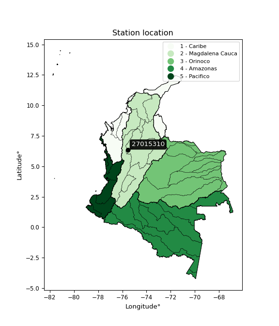

<div align="center">


</div>

# PMP Station (rain, Pmax24h): 27015310

Probable Maximum Precipitation (PMP) is the greatest amount of rainfall for a specific duration that is meteorologically possible for a given location, acting as a "worst-case" scenario for extreme storms, crucial for designing safety-critical infrastructure like bridges, river deviations, dams, spillways, and nuclear plants to prevent catastrophic failure. PMP is calculated by hydrologists using meteorological data to determine the upper limit of extreme rainfall, often leading to the Probable Maximum Flood (PMF) for flood control design, and is increasingly being studied for climate change impacts.

<div align="center">

</img>

</div>


## A. General information


### 1. General running parameters

• app_version: _v20251228_. • runtime: _2025-12-28 08:43:48.795225_. • Python version: _3.14.0_. • SciPy version: _1.16.3_. • Pandas version: _2.3.3_. • NumPy version: _2.3.5_. • Stations dataset (station_dataset_file): _dataset/pmax24h_in/automatic_colombia_2003_2024.csv_. • Stations catalog (station_catalog_file): _dataset/CNE_IDEAM.xls_. • Minimum year to eval til year_max (date_min): _1900_. • Maximum year to eval since year_min (date_max): _2024_. • Creates, save and include plots into reports (create_plot): _False_. • Plot only fit distributions with Δo > Δ (plot_only_fit): _True_. • Eval low extreme values, if False, evaluates high extreme values (low_extreme): _False_. • Eval every SciPy distribution as logarithmic (pdist_logarithmic_on): _True_. • Standard deviation normalized (ddof): _1.0_. • Return periods to eval in years (Tr): _[2, 2.33, 5, 10, 15, 20, 25, 50, 75, 100, 200, 250, 500, 750, 1000]_. • Minimum data sample per station, 0 means any (minimum_sample): _5_. • Z-Score maximum threshold to adjust a value, 0 means disable (zscore_max): _3.5_. • Z-Score minimum threshold to adjust a value, 0 means disable (zscore_min): _-2.5_. • Avoid zeros, e.g. rain = 0 (avoid_zeros): _True_. • Avoid null values (avoid_nans): _True_. [:file_folder:Dataset file.](../../dataset/pmax24h_in/automatic_colombia_2003_2024.csv)

> Delta Degrees of Freedom (DDOF): is a parameter used in the formulas for calculating variance and standard deviation. When ddof=0, the divisor is $N$ (the total number of observations) and this is used when your data set is the entire population. When ddof=1, the divisor is $N-1$ and this is used when your data set is a sample drawn from a larger population. Using $N-1$ provides an unbiased estimate of the population variance (known as Bessel´s correction).


### 2. Station info and location

|   id |   CODIGO | NOMBRE                   | CATEGORIA               | TECNOLOGIA                | ESTADO   | FECHA_INSTALACION   |   FECHA_SUSPENSION |   ALTITUD |   LATITUD |   LONGITUD | DEPARTAMENTO   | MUNICIPIO   | AREA_OPERATIVA                      | ENTIDAD                                                     | AREA_HIDROGRAFICA   | ZONA_HIDROGRAFICA   | SUBZONA_HIDROGRAFICA   |   CORRIENTE | Catalogo   |
|-----:|---------:|:-------------------------|:------------------------|:--------------------------|:---------|:--------------------|-------------------:|----------:|----------:|-----------:|:---------------|:------------|:------------------------------------|:------------------------------------------------------------|:--------------------|:--------------------|:-----------------------|------------:|:-----------|
|    0 | 27015310 | METROMEDELLIN [27015310] | Climatológica Principal | Automática con Telemetría | Activa   | 01/07/2005          |                nan |      1440 |   6.32975 |   -75.5521 | Antioquia      | Bello       | Area Operativa 01 - Antioquia-Chocó | INSTITUTO DE HIDROLOGIA METEOROLOGIA Y ESTUDIOS AMBIENTALES | Magdalena Cauca     | Nechí               | Río Porce              |         nan | CNE_IDEAM  |

<div align="center">

Map location in: [:earth_americas:Google](http://maps.google.com/maps?q=6.32975,-75.55211111) [:earth_americas:OSM](https://www.openstreetmap.org/#map=18/6.32975/-75.55211111&layers=P) [:earth_americas:Bing](https://www.bing.com/maps?cp=6.32975~-75.55211111&lvl=18) [:earth_americas:Apple](https://maps.apple.com/frame?center=6.32975%2C-75.55211111&span=0.003%2C0.006)

</div>


<div align="center">

```geojson
{
  "type": "Feature",
  "geometry": {
    "type": "Point", 
    "coordinates": [-75.55211111, 6.32975]
  }, 
  "properties": {
    "Name": "27015310"
  }
}
```

</div>


### 3. Discrete values table and plot

|               |           0 |           1 |          2 |           3 |          4 |
|:--------------|------------:|------------:|-----------:|------------:|-----------:|
| Date          | 2017        | 2018        | 2021       | 2022        | 2023       |
| Value         |   29.7      |   30        |   27.9     |   16.9      |   10.7     |
| Value_initial |   29.7      |   30        |   27.9     |   16.9      |   10.7     |
| count         |    5        |    5        |    5       |    5        |    5       |
| mean          |   23.04     |   23.04     |   23.04    |   23.04     |   23.04    |
| std           |    8.75203  |    8.75203  |    8.75203 |    8.75203  |    8.75203 |
| zscore        |    0.760966 |    0.795244 |    0.5553  |   -0.701552 |   -1.40996 |

> The initial value (value_initial) correspond to the initial obtained or null completed value, and value (value) is adjusted only when the initial value is outside the valid range definite through the Z-Score value. If Z-Score is active, values out of range or outliers are replaced with the station mean value


### 4. Active continuous probability distributions from SciPy (44 of 104 available)

[scipy.stats](https://docs.scipy.org/doc/scipy/reference/stats.html) is a Python´s powerful submodule within the SciPy library for comprehensive statistical analysis, offering over 130 probability distributions (like Normal, Poisson), functions for descriptive stats (mean, variance), hypothesis testing (t-tests, chi-square), random variable generation, and statistical tests, making it essential for data science, modeling, and research. It provides tools to explore, model, and draw conclusions from data efficiently, working seamlessly with NumPy.

<div align="center">

|   id | p_dist             |   n_parameter | fit_method   | label                                                                       | active   | ref                                                                                                        |
|-----:|:-------------------|--------------:|:-------------|:----------------------------------------------------------------------------|:---------|:-----------------------------------------------------------------------------------------------------------|
|    0 | alpha              |             3 | MLE          | Alpha                                                                       | True     | [:mortar_board:](https://docs.scipy.org/doc/scipy/reference/generated/scipy.stats.alpha.html)              |
|    1 | betaprime          |             4 | MLE          | Beta prime                                                                  | True     | [:mortar_board:](https://docs.scipy.org/doc/scipy/reference/generated/scipy.stats.betaprime.html)          |
|    2 | chi2               |             3 | MLE          | Chi²                                                                        | True     | [:mortar_board:](https://docs.scipy.org/doc/scipy/reference/generated/scipy.stats.chi2.html)               |
|    3 | crystalball        |             4 | MLE          | Crystalball                                                                 | True     | [:mortar_board:](https://docs.scipy.org/doc/scipy/reference/generated/scipy.stats.crystalball.html)        |
|    4 | erlang             |             3 | MLE          | Erlang                                                                      | True     | [:mortar_board:](https://docs.scipy.org/doc/scipy/reference/generated/scipy.stats.erlang.html)             |
|    5 | expon              |             2 | MLE          | Exponential                                                                 | True     | [:mortar_board:](https://docs.scipy.org/doc/scipy/reference/generated/scipy.stats.expon.html)              |
|    6 | exponnorm          |             3 | MLE          | Exponentially modified Normal                                               | True     | [:mortar_board:](https://docs.scipy.org/doc/scipy/reference/generated/scipy.stats.exponnorm.html)          |
|    7 | f                  |             4 | MLE          | F                                                                           | True     | [:mortar_board:](https://docs.scipy.org/doc/scipy/reference/generated/scipy.stats.f.html)                  |
|    8 | fatiguelife        |             3 | MLE          | Fatigue-life (Birnbaum-Saunders)                                            | True     | [:mortar_board:](https://docs.scipy.org/doc/scipy/reference/generated/scipy.stats.fatiguelife.html)        |
|    9 | fisk               |             3 | MLE          | Fisk                                                                        | True     | [:mortar_board:](https://docs.scipy.org/doc/scipy/reference/generated/scipy.stats.fisk.html)               |
|   10 | gamma              |             3 | MLE          | Gamma                                                                       | True     | [:mortar_board:](https://docs.scipy.org/doc/scipy/reference/generated/scipy.stats.gamma.html)              |
|   11 | genexpon           |             5 | MLE          | Generalized exponential                                                     | True     | [:mortar_board:](https://docs.scipy.org/doc/scipy/reference/generated/scipy.stats.genexpon.html)           |
|   12 | genlogistic        |             3 | MLE          | Generalized logistic                                                        | True     | [:mortar_board:](https://docs.scipy.org/doc/scipy/reference/generated/scipy.stats.genlogistic.html)        |
|   13 | gibrat             |             2 | MM           | Gibrat                                                                      | True     | [:mortar_board:](https://docs.scipy.org/doc/scipy/reference/generated/scipy.stats.gibrat.html)             |
|   14 | gompertz           |             3 | MLE          | Gompertz (or truncated Gumbel)                                              | True     | [:mortar_board:](https://docs.scipy.org/doc/scipy/reference/generated/scipy.stats.gompertz.html)           |
|   15 | gumbel_l           |             2 | MM           | Gumbel Left Skew                                                            | True     | [:mortar_board:](https://docs.scipy.org/doc/scipy/reference/generated/scipy.stats.gumbel_l.html)           |
|   16 | gumbel_r           |             2 | MM           | Gumbel Right Skew                                                           | True     | [:mortar_board:](https://docs.scipy.org/doc/scipy/reference/generated/scipy.stats.gumbel_r.html)           |
|   17 | halflogistic       |             2 | MM           | Half-logistic                                                               | True     | [:mortar_board:](https://docs.scipy.org/doc/scipy/reference/generated/scipy.stats.halflogistic.html)       |
|   18 | halfnorm           |             2 | MM           | Half Normal                                                                 | True     | [:mortar_board:](https://docs.scipy.org/doc/scipy/reference/generated/scipy.stats.halfnorm.html)           |
|   19 | hypsecant          |             2 | MM           | hyperbolic secant                                                           | True     | [:mortar_board:](https://docs.scipy.org/doc/scipy/reference/generated/scipy.stats.hypsecant.html)          |
|   20 | invgamma           |             3 | MLE          | Inverted gamma                                                              | True     | [:mortar_board:](https://docs.scipy.org/doc/scipy/reference/generated/scipy.stats.invgamma.html)           |
|   21 | invgauss           |             3 | MLE          | Inverse Gaussian                                                            | True     | [:mortar_board:](https://docs.scipy.org/doc/scipy/reference/generated/scipy.stats.invgauss.html)           |
|   22 | invweibull         |             3 | MLE          | Inverted Weibull                                                            | True     | [:mortar_board:](https://docs.scipy.org/doc/scipy/reference/generated/scipy.stats.invweibull.html)         |
|   23 | johnsonsu          |             4 | MLE          | Johnson Su                                                                  | True     | [:mortar_board:](https://docs.scipy.org/doc/scipy/reference/generated/scipy.stats.johnsonsu.html)          |
|   24 | kstwobign          |             2 | MLE          | Limiting distribution of scaled Kolmogorov-Smirnov two-sided test statistic | True     | [:mortar_board:](https://docs.scipy.org/doc/scipy/reference/generated/scipy.stats.kstwobign.html)          |
|   25 | laplace            |             2 | MM           | Laplace                                                                     | True     | [:mortar_board:](https://docs.scipy.org/doc/scipy/reference/generated/scipy.stats.laplace.html)            |
|   26 | laplace_asymmetric |             3 | MLE          | Asymmetric Laplace                                                          | True     | [:mortar_board:](https://docs.scipy.org/doc/scipy/reference/generated/scipy.stats.laplace_asymmetric.html) |
|   27 | loggamma           |             3 | MLE          | Log gamma                                                                   | True     | [:mortar_board:](https://docs.scipy.org/doc/scipy/reference/generated/scipy.stats.loggamma.html)           |
|   28 | logistic           |             2 | MM           | Logistic (or Sech-squared)                                                  | True     | [:mortar_board:](https://docs.scipy.org/doc/scipy/reference/generated/scipy.stats.logistic.html)           |
|   29 | lognorm            |             3 | MLE          | Log Normal                                                                  | True     | [:mortar_board:](https://docs.scipy.org/doc/scipy/reference/generated/scipy.stats.lognorm.html)            |
|   30 | maxwell            |             2 | MM           | Maxwell                                                                     | True     | [:mortar_board:](https://docs.scipy.org/doc/scipy/reference/generated/scipy.stats.maxwell.html)            |
|   31 | mielke             |             4 | MLE          | Mielke Beta-Kappa / Dagum                                                   | True     | [:mortar_board:](https://docs.scipy.org/doc/scipy/reference/generated/scipy.stats.mielke.html)             |
|   32 | moyal              |             2 | MM           | Moyal                                                                       | True     | [:mortar_board:](https://docs.scipy.org/doc/scipy/reference/generated/scipy.stats.moyal.html)              |
|   33 | nakagami           |             3 | MLE          | Nakagami                                                                    | True     | [:mortar_board:](https://docs.scipy.org/doc/scipy/reference/generated/scipy.stats.nakagami.html)           |
|   34 | ncf                |             5 | MLE          | Non-central F distribution                                                  | True     | [:mortar_board:](https://docs.scipy.org/doc/scipy/reference/generated/scipy.stats.ncf.html)                |
|   35 | nct                |             4 | MLE          | Non-central Student’s t                                                     | True     | [:mortar_board:](https://docs.scipy.org/doc/scipy/reference/generated/scipy.stats.nct.html)                |
|   36 | norm               |             2 | MM           | Normal                                                                      | True     | [:mortar_board:](https://docs.scipy.org/doc/scipy/reference/generated/scipy.stats.norm.html)               |
|   37 | pearson3           |             3 | MM           | Pearson type III                                                            | True     | [:mortar_board:](https://docs.scipy.org/doc/scipy/reference/generated/scipy.stats.pearson3.html)           |
|   38 | rayleigh           |             2 | MM           | Rayleigh                                                                    | True     | [:mortar_board:](https://docs.scipy.org/doc/scipy/reference/generated/scipy.stats.rayleigh.html)           |
|   39 | rice               |             3 | MLE          | Rice                                                                        | True     | [:mortar_board:](https://docs.scipy.org/doc/scipy/reference/generated/scipy.stats.rice.html)               |
|   40 | t                  |             3 | MLE          | Student’s t                                                                 | True     | [:mortar_board:](https://docs.scipy.org/doc/scipy/reference/generated/scipy.stats.t.html)                  |
|   41 | truncnorm          |             4 | MLE          | Truncated normal                                                            | True     | [:mortar_board:](https://docs.scipy.org/doc/scipy/reference/generated/scipy.stats.truncnorm.html)          |
|   42 | wald               |             2 | MM           | Wald                                                                        | True     | [:mortar_board:](https://docs.scipy.org/doc/scipy/reference/generated/scipy.stats.wald.html)               |
|   43 | weibull_min        |             3 | MLE          | Weibull minimum                                                             | True     | [:mortar_board:](https://docs.scipy.org/doc/scipy/reference/generated/scipy.stats.weibull_min.html)        |

</div>

> **n_parameter:** # arguments & localization & scale.
>
> **Fit methods:** (MLE) maximum likelihood, (MM) L-moments.
>
>**Inactive:** foldnorm, gennorm, norminvgauss, powernorm, powerlognorm, skewnorm, genextreme, anglit, arcsine, argus, beta, bradford, burr, burr12, cauchy, cosine, halfcauchy, foldcauchy, skewcauchy, wrapcauchy, dgamma, gengamma, exponweib, exponpow, truncexpon, gausshyper, genhalflogistic, genhyperbolic, geninvgauss, halfgennorm, johnsonsb, kappa4, kappa3, ksone, kstwo, loglaplace, levy, levy_l, levy_stable, ncx2, pareto, genpareto, truncpareto, lomax, powerlaw, rdist, rel_breitwigner, recipinvgauss, semicircular, studentized_range, trapezoid, triang, truncweibull_min, tukeylambda, uniform, loguniform, vonmises, vonmises_line, weibull_max, dweibull, 


## B. Probability distributions vs. Empirical distributions

A continuous probability distribution (CPD) describes probabilities for variables that can take any value within a range (like rain any time), unlike discrete variables with specific outcomes (like temperature). It uses a Probability Density Function (PDF), a curve where the total area under it equals 1, and the probability of the variable falling within an interval (a to b) is found by calculating the area under the curve between those points. A key feature is that the probability of hitting any single exact value is zero, so probabilities are always expressed for ranges, e.g., $P(a ≤ X ≤ b)$.

<div align="center">

Distributions parameters from station values
|    |   station | p_dist                |   n |             loc |           scale | shape                  | shape1              | shape2                 | shape3   |
|---:|----------:|:----------------------|----:|----------------:|----------------:|:-----------------------|:--------------------|:-----------------------|:---------|
|  0 |  27015310 | alpha                 |   5 |  -108.356       |  2076.52        | 15.858006041181106     |                     |                        |          |
|  1 |  27015310 | betaprime             |   5 |   -75.8645      |  2527.38        | 154.80408294185077     | 3964.264865211144   |                        |          |
|  2 |  27015310 | chi2                  |   5 |    10.7         |     8.29506     | 1.1475012305077972     |                     |                        |          |
|  3 |  27015310 | crystalball           |   5 |    23.04        |     7.82805     | 1321.6962902452606     | 1927.1582220543792  |                        |          |
|  4 |  27015310 | erlang                |   5 |   -87.2891      |     0.579768    | 190.4023624202074      |                     |                        |          |
|  5 |  27015310 | expon                 |   5 |    10.7         |    12.34        |                        |                     |                        |          |
|  6 |  27015310 | exponnorm             |   5 |    23.0328      |     7.82804     | 0.0009036517318904009  |                     |                        |          |
|  7 |  27015310 | f                     |   5 | -2666.98        |  2690           | 272459.13406908663     | 1742596.4996948494  |                        |          |
|  8 |  27015310 | fatiguelife           |   5 |    10.7         |     9.62719e-06 | 1046.878833204556      |                     |                        |          |
|  9 |  27015310 | fisk                  |   5 |    -7.87619e+08 |     7.87619e+08 | 163569485.5322038      |                     |                        |          |
| 10 |  27015310 | gamma                 |   5 |   -77.1154      |     0.645402    | 155.08688001690876     |                     |                        |          |
| 11 |  27015310 | genexpon              |   5 |    10.7         |     3.35865     | 0.2034796970903926     | 0.10079863404114571 | 0.5145331151766819     |          |
| 12 |  27015310 | genlogistic           |   5 |    30.0002      |     8.09088e-06 | 1.1622343815582902e-06 |                     |                        |          |
| 13 |  27015310 | gibrat                |   5 |    17.0681      |     3.62211     |                        |                     |                        |          |
| 14 |  27015310 | gompertz              |   5 |    14.6317      |     2.7626      | 0.006509345678254277   |                     |                        |          |
| 15 |  27015310 | gumbel_l              |   5 |    26.563       |     6.10351     |                        |                     |                        |          |
| 16 |  27015310 | gumbel_r              |   5 |    19.517       |     6.10351     |                        |                     |                        |          |
| 17 |  27015310 | halflogistic          |   5 |    13.7619      |     6.69272     |                        |                     |                        |          |
| 18 |  27015310 | halfnorm              |   5 |    12.6787      |    12.9859      |                        |                     |                        |          |
| 19 |  27015310 | hypsecant             |   5 |    23.04        |     4.98349     |                        |                     |                        |          |
| 20 |  27015310 | invgamma              |   5 |   -65.6209      | 10377.2         | 118.06954458769965     |                     |                        |          |
| 21 |  27015310 | invgauss              |   5 |   -30.6323      |  2195.89        | 0.024438745965526282   |                     |                        |          |
| 22 |  27015310 | invweibull            |   5 |    10.7         |     1.65904     | 0.048328145826971106   |                     |                        |          |
| 23 |  27015310 | johnsonsu             |   5 |    30           |     4.69292e-12 | 4.700205784315074      | 0.19386648308240656 |                        |          |
| 24 |  27015310 | kstwobign             |   5 |    -7.60657     |    34.8543      |                        |                     |                        |          |
| 25 |  27015310 | laplace               |   5 |    23.04        |     5.53527     |                        |                     |                        |          |
| 26 |  27015310 | laplace_asymmetric    |   5 |    30           |     0.0672113   | 103.47246784739121     |                     |                        |          |
| 27 |  27015310 | loggamma              |   5 |    30.0003      |     1.74203e-05 | 2.497368122635873e-06  |                     |                        |          |
| 28 |  27015310 | logistic              |   5 |    23.04        |     4.31583     |                        |                     |                        |          |
| 29 |  27015310 | lognorm               |   5 |    10.7         |     0.0092972   | 14.649243957994832     |                     |                        |          |
| 30 |  27015310 | maxwell               |   5 |     4.4908      |    11.624       |                        |                     |                        |          |
| 31 |  27015310 | mielke                |   5 | -2694.09        |  2724.11        | 387.68633234115225     | 879785.1970706832   |                        |          |
| 32 |  27015310 | moyal                 |   5 |    18.5634      |     3.52386     |                        |                     |                        |          |
| 33 |  27015310 | nakagami              |   5 |    16.9         |    12.1805      | 0.2230150418771238     |                     |                        |          |
| 34 |  27015310 | ncf                   |   5 |    -3.55868     |     7.58276     | 10.014582190654824     | 2444.783524079704   | 25.103713614390884     |          |
| 35 |  27015310 | nct                   |   5 |  -417.489       |     7.80029     | 213868.24654894194     | 56.47546141079769   |                        |          |
| 36 |  27015310 | norm                  |   5 |    23.04        |     7.82805     |                        |                     |                        |          |
| 37 |  27015310 | pearson3              |   5 |    23.04        |     7.82808     | -0.568400274251744     |                     |                        |          |
| 38 |  27015310 | rayleigh              |   5 |     8.06448     |    11.9487      |                        |                     |                        |          |
| 39 |  27015310 | rice                  |   5 |     5.95203     |     8.88647     | 1.5727651353676355     |                     |                        |          |
| 40 |  27015310 | t                     |   5 |    23.0415      |     7.82797     | 5919451.97326093       |                     |                        |          |
| 41 |  27015310 | truncnorm             |   5 |    23.04        |     7.82805     | -93.35494709750392     | 1807.8284743174086  |                        |          |
| 42 |  27015310 | wald                  |   5 |    15.212       |     7.82805     |                        |                     |                        |          |
| 43 |  27015310 | weibull_min           |   5 |    -5.87751e+08 |     5.87751e+08 | 103918978.9700537      |                     |                        |          |
| 44 |  27015310 | logalpha              |   5 |    -8.24573     |   301.647       | 26.74059162289928      |                     |                        |          |
| 45 |  27015310 | logbetaprime          |   5 |   -77.2879      |   109.23        | 67105.52955379887      | 91223.15099487815   |                        |          |
| 46 |  27015310 | logchi2               |   5 |     2.37024     |     0.955001    | 1.0960953966438403     |                     |                        |          |
| 47 |  27015310 | logcrystalball        |   5 |     3.4012      |     2.25145e-07 | 6.692526080807262e-07  | 859.0105477841048   |                        |          |
| 48 |  27015310 | logerlang             |   5 |    -3.53259     |     0.026533    | 248.4117937685387      |                     |                        |          |
| 49 |  27015310 | logexpon              |   5 |     2.37024     |     0.693462    |                        |                     |                        |          |
| 50 |  27015310 | logexponnorm          |   5 |     3.06342     |     0.406956    | 0.000704516865329223   |                     |                        |          |
| 51 |  27015310 | logf                  |   5 |  -446.72        |   449.784       | 7704350.992130613      | 3535279.335179437   |                        |          |
| 52 |  27015310 | logfatiguelife        |   5 |  -185.474       |   188.537       | 0.0021620202579469786  |                     |                        |          |
| 53 |  27015310 | logfisk               |   5 | -9236.52        |  9239.64        | 38143.34692715455      |                     |                        |          |
| 54 |  27015310 | loggamma              |   5 |    -3.65306     |     0.0258452   | 259.87618318635214     |                     |                        |          |
| 55 |  27015310 | loggenexpon           |   5 |     2.36602     |     0.00661684  | 0.004396493786323831   | 2.4267577246368957  | 2.9800392757294297e-05 |          |
| 56 |  27015310 | loggenlogistic        |   5 |     3.40122     |     1.14804e-06 | 3.3894386820614324e-06 |                     |                        |          |
| 57 |  27015310 | loggibrat             |   5 |     2.75323     |     0.188312    |                        |                     |                        |          |
| 58 |  27015310 | loggompertz           |   5 |     2.37024     |     1.00079     | 0.9505661872322055     |                     |                        |          |
| 59 |  27015310 | loggumbel_l           |   5 |     3.24686     |     0.317304    |                        |                     |                        |          |
| 60 |  27015310 | loggumbel_r           |   5 |     2.88055     |     0.317304    |                        |                     |                        |          |
| 61 |  27015310 | loghalflogistic       |   5 |     2.58135     |     0.347941    |                        |                     |                        |          |
| 62 |  27015310 | loghalfnorm           |   5 |     2.52509     |     0.675063    |                        |                     |                        |          |
| 63 |  27015310 | loghypsecant          |   5 |     3.06371     |     0.259077    |                        |                     |                        |          |
| 64 |  27015310 | loginvgamma           |   5 |    -6.04583     |  4378.97        | 481.67496152549177     |                     |                        |          |
| 65 |  27015310 | loginvgauss           |   5 |    -0.770401    |   300.216       | 0.012742662405297714   |                     |                        |          |
| 66 |  27015310 | loginvweibull         |   5 |    -4.30016e+07 |     4.30016e+07 | 101492207.72083035     |                     |                        |          |
| 67 |  27015310 | logjohnsonsu          |   5 |     3.4012      |     7.22966e-16 | 3.036551358212278      | 0.1400621181495842  |                        |          |
| 68 |  27015310 | logkstwobign          |   5 |     1.38213     |     1.9144      |                        |                     |                        |          |
| 69 |  27015310 | loglaplace            |   5 |     3.06371     |     0.287762    |                        |                     |                        |          |
| 70 |  27015310 | loglaplace_asymmetric |   5 |     3.4012      |     0.00315451  | 106.80185281759972     |                     |                        |          |
| 71 |  27015310 | logloggamma           |   5 |     3.40145     |     2.56797e-06 | 7.577622742212143e-06  |                     |                        |          |
| 72 |  27015310 | loglogistic           |   5 |     3.06371     |     0.224367    |                        |                     |                        |          |
| 73 |  27015310 | loglognorm            |   5 |     2.37024     |     0.000728187 | 14.066092168237487     |                     |                        |          |
| 74 |  27015310 | logmaxwell            |   5 |     2.09939     |     0.604297    |                        |                     |                        |          |
| 75 |  27015310 | logmielke             |   5 |    -5.7501e+07  |     5.7501e+07  | 164875646.68167588     | 19132894474.792793  |                        |          |
| 76 |  27015310 | logmoyal              |   5 |     2.83098     |     0.183195    |                        |                     |                        |          |
| 77 |  27015310 | lognakagami           |   5 |     2.82731     |     0.427768    | 0.0972893332897217     |                     |                        |          |
| 78 |  27015310 | logncf                |   5 |    -3.07843     |     6.07743     | 376.1658545238711      | 410.8697179817459   | 3.176309456880709      |          |
| 79 |  27015310 | lognct                |   5 |     0.976765    |     0.402785    | 666.020651817552       | 5.159858858664258   |                        |          |
| 80 |  27015310 | lognorm               |   5 |     3.06371     |     0.406958    |                        |                     |                        |          |
| 81 |  27015310 | logpearson3           |   5 |     3.06371     |     0.406958    | -0.7553410291178748    |                     |                        |          |
| 82 |  27015310 | lograyleigh           |   5 |     2.28517     |     0.62118     |                        |                     |                        |          |
| 83 |  27015310 | logrice               |   5 |     2.1032      |     0.450287    | 1.8349133281409702     |                     |                        |          |
| 84 |  27015310 | logt                  |   5 |     3.0637      |     0.406958    | 12346434788.105469     |                     |                        |          |
| 85 |  27015310 | logtruncnorm          |   5 |    -0.105823    |     1.13712     | 2.5794494976517597     | 3.084138024212365   |                        |          |
| 86 |  27015310 | logwald               |   5 |     2.65674     |     0.406965    |                        |                     |                        |          |
| 87 |  27015310 | logweibull_min        |   5 |    -2.74069e+07 |     2.74069e+07 | 97615827.68856248      |                     |                        |          |

</div>

> **loc** (Location parameter): This shifts the distribution along the x-axis. For many common distributions, like the normal (Gaussian) distribution, loc represents the mean $μ$. For others, like the uniform distribution, it might represent the minimum value, or for the beta distribution, the left end of the support interval.
>
> **scale** (Scale parameter): This determines the width or spread of the distribution. For the normal distribution, scale represents the standard deviation $σ$. For a uniform distribution, it defines the length of the interval (from $loc$ to $loc + scale$).
>
> **shape** (Shape parameters): Refers to parameters that define the specific form of a probability distribution, distinct from its location (loc) and scale (scale). These parameters are required arguments for most distribution functions. For example, a normal (Gaussian) distribution is fully defined by its location (mean) and scale (standard deviation), so it has no specific shape parameters beyond loc and scale. However, other distributions have intrinsic properties that need specification, as Gamma distribution that takes a shape parameter, often named $a$ or $alpha$.


### 0. Cumulative distribution values - CDF (88 evaluated)

Cumulative Distribution Function (CDF), denoted as $F$<sub>$X$</sub>$(x)$, is a function that gives the probability that a random variable $X$ will take a value less than or equal to a specific value, $x$ (i.e., $(P(X≥x)$. It essentially "accumulates" probabilities from a given point up to the far right (positive infinity), providing a complete picture of the distribution´s probabilities for both discrete (like rain) and continuous (like temperature) variables, helping to find probabilities over ranges or above certain values.

<div align="center">

CDF ordered by x ascending and calculating $log(f(x))$ separately
|   id |   Station |   date |    x |   count |   mean |     std |    zscore |   Value_initial |   station |   m |     alpha |   alpha_pdf |   betaprime |   betaprime_pdf |        chi2 |       chi2_pdf |   crystalball |   crystalball_pdf |   erlang |   erlang_pdf |    expon |   expon_pdf |   exponnorm |   exponnorm_pdf |         f |     f_pdf |   fatiguelife |   fatiguelife_pdf |      fisk |   fisk_pdf |     gamma |   gamma_pdf |    genexpon |   genexpon_pdf |   genlogistic |   genlogistic_pdf |   gibrat |   gibrat_pdf |   gompertz |   gompertz_pdf |   gumbel_l |   gumbel_l_pdf |   gumbel_r |   gumbel_r_pdf |   halflogistic |   halflogistic_pdf |   halfnorm |   halfnorm_pdf |   hypsecant |   hypsecant_pdf |   invgamma |   invgamma_pdf |   invgauss |   invgauss_pdf |   invweibull |   invweibull_pdf |   johnsonsu |   johnsonsu_pdf |   kstwobign |   kstwobign_pdf |   laplace |   laplace_pdf |   laplace_asymmetric |   laplace_asymmetric_pdf |   loggamma |   loggamma_pdf |   logistic |   logistic_pdf |   lognorm |   lognorm_pdf |   maxwell |   maxwell_pdf |    mielke |   mielke_pdf |      moyal |   moyal_pdf |    nakagami |   nakagami_pdf |       ncf |   ncf_pdf |       nct |   nct_pdf |      norm |   norm_pdf |   pearson3 |   pearson3_pdf |   rayleigh |   rayleigh_pdf |      rice |   rice_pdf |         t |     t_pdf |   truncnorm |   truncnorm_pdf |      wald |   wald_pdf |   weibull_min |   weibull_min_pdf |   logalpha |   logalpha_pdf |   logbetaprime |   logbetaprime_pdf |     logchi2 |   logchi2_pdf |   logcrystalball |   logcrystalball_pdf |   logerlang |   logerlang_pdf |   logexpon |   logexpon_pdf |   logexponnorm |   logexponnorm_pdf |      logf |   logf_pdf |   logfatiguelife |   logfatiguelife_pdf |   logfisk |   logfisk_pdf |   loggenexpon |   loggenexpon_pdf |   loggenlogistic |   loggenlogistic_pdf |   loggibrat |   loggibrat_pdf |   loggompertz |   loggompertz_pdf |   loggumbel_l |   loggumbel_l_pdf |   loggumbel_r |   loggumbel_r_pdf |   loghalflogistic |   loghalflogistic_pdf |   loghalfnorm |   loghalfnorm_pdf |   loghypsecant |   loghypsecant_pdf |   loginvgamma |   loginvgamma_pdf |   loginvgauss |   loginvgauss_pdf |   loginvweibull |   loginvweibull_pdf |   logjohnsonsu |   logjohnsonsu_pdf |   logkstwobign |   logkstwobign_pdf |   loglaplace |   loglaplace_pdf |   loglaplace_asymmetric |   loglaplace_asymmetric_pdf |   logloggamma |   logloggamma_pdf |   loglogistic |   loglogistic_pdf |   loglognorm |   loglognorm_pdf |   logmaxwell |   logmaxwell_pdf |   logmielke |   logmielke_pdf |    logmoyal |   logmoyal_pdf |   lognakagami |   lognakagami_pdf |   logncf |   logncf_pdf |    lognct |   lognct_pdf |   logpearson3 |   logpearson3_pdf |   lograyleigh |   lograyleigh_pdf |   logrice |   logrice_pdf |      logt |   logt_pdf |   logtruncnorm |   logtruncnorm_pdf |   logwald |   logwald_pdf |   logweibull_min |   logweibull_min_pdf |
|-----:|----------:|-------:|-----:|--------:|-------:|--------:|----------:|----------------:|----------:|----:|----------:|------------:|------------:|----------------:|------------:|---------------:|--------------:|------------------:|---------:|-------------:|---------:|------------:|------------:|----------------:|----------:|----------:|--------------:|------------------:|----------:|-----------:|----------:|------------:|------------:|---------------:|--------------:|------------------:|---------:|-------------:|-----------:|---------------:|-----------:|---------------:|-----------:|---------------:|---------------:|-------------------:|-----------:|---------------:|------------:|----------------:|-----------:|---------------:|-----------:|---------------:|-------------:|-----------------:|------------:|----------------:|------------:|----------------:|----------:|--------------:|---------------------:|-------------------------:|-----------:|---------------:|-----------:|---------------:|----------:|--------------:|----------:|--------------:|----------:|-------------:|-----------:|------------:|------------:|---------------:|----------:|----------:|----------:|----------:|----------:|-----------:|-----------:|---------------:|-----------:|---------------:|----------:|-----------:|----------:|----------:|------------:|----------------:|----------:|-----------:|--------------:|------------------:|-----------:|---------------:|---------------:|-------------------:|------------:|--------------:|-----------------:|---------------------:|------------:|----------------:|-----------:|---------------:|---------------:|-------------------:|----------:|-----------:|-----------------:|---------------------:|----------:|--------------:|--------------:|------------------:|-----------------:|---------------------:|------------:|----------------:|--------------:|------------------:|--------------:|------------------:|--------------:|------------------:|------------------:|----------------------:|--------------:|------------------:|---------------:|-------------------:|--------------:|------------------:|--------------:|------------------:|----------------:|--------------------:|---------------:|-------------------:|---------------:|-------------------:|-------------:|-----------------:|------------------------:|----------------------------:|--------------:|------------------:|--------------:|------------------:|-------------:|-----------------:|-------------:|-----------------:|------------:|----------------:|------------:|---------------:|--------------:|------------------:|---------:|-------------:|----------:|-------------:|--------------:|------------------:|--------------:|------------------:|----------:|--------------:|----------:|-----------:|---------------:|-------------------:|----------:|--------------:|-----------------:|---------------------:|
|    0 |  27015310 |   2023 | 10.7 |       5 |  23.04 | 8.75203 | -1.40996  |            10.7 |  27015310 |   1 | 0.0566477 |   0.0166808 |   0.0613868 |       0.016423  | 7.71303e-10 | 249125         |     0.0574689 |         0.0147113 | 0.056168 |    0.0153105 | 0        |   0.0810373 |   0.0574699 |       0.0147115 | 0.0578405 | 0.0148201 |     0.0250311 |       2.50527e+10 | 0.0608719 |  0.0118721 | 0.0584544 |   0.0158493 | 1.44572e-08 |      0.0605838 |      0        |        0.00897947 | 0        |    0         | 0          |     0          |   0.071651 |      0.0113083 |   0.014407 |      0.0100084 |       0        |          0         |   0        |      0         |   0.0533914 |       0.0106635 |   0.054697 |      0.0165336 |  0.0545215 |      0.017299  |   0.00503976 |      7.25385e+11 |    0.143429 |      0.00227271 |   0.0545191 |       0.0236585 | 0.0537997 |    0.00971943 |            0.0623328 |               0.00896292 |  0.0441908 |       0.241143 |  0.0542056 |      0.0118789 | 0.0441891 |      0.229529 | 0.0372381 |     0.0169819 | 0.0633336 |   0.00907781 | 0.00227457 |  0.00328114 | 0           |    0           | 0.0504758 | 0.0175743 | 0.0575151 | 0.0147241 | 0.0574689 |  0.0147113 |  0.0694438 |      0.0133394 |  0.0240319 |      0.018016  | 0.0420417 |  0.0179248 | 0.0574454 | 0.0147067 |   0.0574689 |       0.0147113 | 0         |  0         |     0.0577678 |        0.00991295 |  0.0470812 |       0.263088 |       0.044154 |           0.230322 | 3.04294e-09 |   3.75527e+06 |              nan |                  nan |   0.0459385 |        0.248093 |   0        |       1.44204  |      0.0441883 |           0.229526 | 0.0445806 |   0.230628 |        0.0442284 |             0.230166 | 0.0432794 |      0.170948 |    0.00281582 |          0.669523 |         0        |             0.140689 |    0        |        0        |   6.53095e-08 |          0.949818 |     0.0611702 |          0.186761 |    0.00677742 |          0.106672 |          0        |              0        |      0        |          0        |      0.0437258 |           0.168245 |     0.0417715 |          0.238851 |     0.0448499 |          0.268388 |       0.0458258 |            0.333441 |      0.0257188 |        0.00813096  |      0.0473322 |           0.395751 |    0.0449148 |         0.156083 |               0.0468813 |                    0.139152 |     0.0476964 |          0.140744 |     0.0434908 |          0.185407 |    0.0227756 |      8.65141e+12 |     0.022556 |         0.239907 |   0.0506294 |        0.145172 | 0.000437059 |      0.0158026 |     0         |       0           | 0.122632 |     0.368205 | 0.0451377 |     0.235794 |      0.059989 |          0.210749 |    0.00933404 |          0.218412 | 0.0344696 |      0.270558 | 0.0441894 |   0.22953  |    0           |           0        |  0        |      0        |        0.0430093 |             0.149845 |
|    1 |  27015310 |   2022 | 16.9 |       5 |  23.04 | 8.75203 | -0.701552 |            16.9 |  27015310 |   2 | 0.235695  |   0.0407393 |   0.234625  |       0.0396285 | 0.560345    |      0.0406424 |     0.216415  |         0.0374682 | 0.221916 |    0.0386552 | 0.394942 |   0.0490322 |   0.216418  |       0.0374685 | 0.217693  | 0.0376168 |     0.77833   |       0.0183839   | 0.190219  |  0.0319895 | 0.228087  |   0.0392036 | 0.356971    |      0.0507906 |      0        |        0.0218796  | 0        |    0         | 0.00825187 |     0.00531143 |   0.185612 |      0.0273955 |   0.215379 |      0.0541792 |       0.230238 |          0.0707478 |   0.254869 |      0.0582802 |   0.180682  |       0.0343402 |   0.234909 |      0.0413093 |  0.241546  |      0.042192  |   0.391302   |      0.00286188  |    0.161108 |      0.00361702 |   0.293958  |       0.0478721 | 0.164903  |    0.0297913  |            0.152017  |               0.0218588  |  0.290162  |       0.841581 |  0.194243  |      0.0362648 | 0.280662  |      0.828117 | 0.232492  |     0.0442473 | 0.153863  |   0.0220033  | 0.205441   |  0.0643056  | 9.23352e-08 |    1.15923e+07 | 0.242531  | 0.0430911 | 0.216565  | 0.0374848 | 0.216415  |  0.0374682 |  0.204424  |      0.0316503 |  0.239208  |      0.0470819 | 0.227756  |  0.0411389 | 0.216357  | 0.0374629 |   0.216415  |       0.0374682 | 0.0782964 |  0.12222   |     0.163126  |        0.0263501  |  0.308201  |       0.865726 |       0.281057 |           0.827575 | 0.473341    |   0.485035    |              nan |                  nan |   0.295193  |        0.845135 |   0.48269  |       0.745982 |      0.28066   |           0.828118 | 0.280972  |   0.825686 |        0.281122  |             0.828461 | 0.229906  |      0.730924 |    0.382526   |          0.880267 |         0        |             0.542389 |    0.175428 |        3.485    |   0.423198    |          0.864997 |     0.233977  |          0.643479 |    0.306455   |          1.14225  |          0.339431 |              1.27146  |      0.345633 |          1.06923  |      0.243085  |           0.849694 |     0.291168  |          0.855114 |     0.312557  |          0.873608 |       0.350559  |            0.867289 |      0.0310374 |        0.0170806   |      0.381078  |           0.878009 |    0.219889  |         0.764135 |               0.18205   |                    0.540356 |     0.183752  |          0.542222 |     0.258536  |          0.85438  |    0.676518  |      0.0558737   |     0.30638  |         0.927424 |   0.18775   |        0.538345 | 0.312466    |      1.3207    |     0.0010167 |       4.45468e+11 | 0.357387 |     0.625348 | 0.286799  |     0.840079 |      0.252294 |          0.685502 |    0.316724   |          0.960007 | 0.294809  |      0.853826 | 0.280663  |   0.828117 |    6.82701e-06 |           3.20789  |  0.289638 |      2.41557  |        0.200618  |             0.637531 |
|    2 |  27015310 |   2021 | 27.9 |       5 |  23.04 | 8.75203 |  0.5553   |            27.9 |  27015310 |   3 | 0.731762  |   0.0368606 |   0.739367  |       0.0387909 | 0.821893    |      0.0135561 |     0.732649  |         0.0420298 | 0.730915 |    0.0401023 | 0.75188  |   0.020107  |   0.732652  |       0.0420296 | 0.73362   | 0.0418461 |     0.899161  |       0.00655361  | 0.69759   |  0.043811  | 0.735424  |   0.039432  | 0.747511    |      0.0223309 |      0        |        0.106238   | 0.863337 |    0.0202132 | 0.54465    |     0.13074    |   0.712028 |      0.0587358 |   0.776294 |      0.0322071 |       0.784216 |          0.028763  |   0.758857 |      0.030912  |   0.770423  |       0.0421762 |   0.737925 |      0.0370616 |  0.737278  |      0.035777  |   0.409373   |      0.00102732  |    0.262711 |      0.0301045  |   0.749524  |       0.0291096 | 0.792195  |    0.0375421  |            0.739297  |               0.106305   |  0.74176   |       0.755976 |  0.755116  |      0.0428459 | 0.74247   |      0.793121 | 0.744485  |     0.0366412 | 0.739477  |   0.105322   | 0.790343   |  0.0290539  | 0.72579     |    0.0253353   | 0.738332  | 0.0353086 | 0.732752  | 0.0420079 | 0.732649  |  0.0420298 |  0.714057  |      0.0493829 |  0.747889  |      0.0350261 | 0.73676   |  0.0390961 | 0.73259   | 0.042035  |   0.732649  |       0.0420298 | 0.833159  |  0.0219283 |     0.712146  |        0.0633795  |  0.751413  |       0.713376 |       0.741142 |           0.789489 | 0.652695    |   0.266967    |              nan |                  nan |   0.744841  |        0.747765 |   0.748931 |       0.362052 |      0.74247   |           0.793124 | 0.741139  |   0.791494 |        0.742233  |             0.791096 | 0.702808  |      0.862239 |    0.754327   |          0.553007 |         0        |             2.38282  |    0.867994 |        0.371563 |   0.782628    |          0.537944 |     0.725814  |          1.11812  |    0.783782   |          0.601784 |          0.790907 |              0.538117 |      0.76608  |          0.582007 |      0.780196  |           0.782575 |     0.743731  |          0.746025 |     0.748268  |          0.690762 |       0.725373  |            0.549678 |      0.0574977 |        0.222349    |      0.747541  |           0.533078 |    0.800865  |         0.692013 |               0.806146  |                    2.39278  |     0.80664   |          2.38026  |     0.765082  |          0.801059 |    0.695192  |      0.0259765   |     0.753039 |         0.690151 |   0.79041   |        2.26638  | 0.797091    |      0.541708  |     0.853326  |       0.293137    | 0.670537 |     0.559675 | 0.748076  |     0.779672 |      0.720575 |          0.995803 |    0.756065   |          0.659648 | 0.744162  |      0.749336 | 0.742471  |   0.79312  |    0.938417    |           0.933558 |  0.838235 |      0.406453 |        0.736887  |             1.25124  |
|    3 |  27015310 |   2017 | 29.7 |       5 |  23.04 | 8.75203 |  0.760966 |            29.7 |  27015310 |   4 | 0.792994  |   0.0311348 |   0.803756  |       0.0326682 | 0.844534    |      0.0116571 |     0.802556  |         0.0354876 | 0.797617 |    0.0339045 | 0.785556 |   0.0173779 |   0.802559  |       0.0354873 | 0.803198  | 0.0353101 |     0.910191  |       0.00572562  | 0.770239  |  0.0367526 | 0.800931  |   0.0332594 | 0.784776    |      0.0191467 |      0        |        0.137585   | 0.894198 |    0.0144745 | 0.78025    |     0.121049   |   0.81211  |      0.0514676 |   0.828159 |      0.0255836 |       0.830797 |          0.0231428 |   0.810057 |      0.0260253 |   0.836404  |       0.0314014 |   0.799324 |      0.0311236 |  0.796602  |      0.0301226 |   0.411131   |      0.000929506 |    0.398295 |      0.249381   |   0.797947  |       0.0247428 | 0.849883  |    0.0271201  |            0.95769   |               0.137708   |  0.786569  |       0.67646  |  0.823923  |      0.0336144 | 0.789477  |      0.70922  | 0.805147  |     0.0307377 | 0.955494  |   0.135999   | 0.836837   |  0.0228257  | 0.768162    |    0.0218423   | 0.796875  | 0.0297322 | 0.80262   | 0.0354669 | 0.802556  |  0.0354876 |  0.797878  |      0.0432833 |  0.805886  |      0.0294158 | 0.801826  |  0.0331039 | 0.802507  | 0.0354934 |   0.802556  |       0.0354876 | 0.867611  |  0.0166455 |     0.819486  |        0.054639   |  0.793596  |       0.635472 |       0.787951 |           0.706558 | 0.668882    |   0.251095    |              nan |                  nan |   0.789142  |        0.668481 |   0.770576 |       0.330839 |      0.789477  |           0.709223 | 0.788073  |   0.70852  |        0.789123  |             0.707534 | 0.753765  |      0.76619  |    0.787264   |          0.500738 |         0        |             2.86586  |    0.888788 |        0.29709  |   0.814705    |          0.488123 |     0.793149  |          1.02724  |    0.818686   |          0.516168 |          0.82224  |              0.465484 |      0.800485 |          0.519025 |      0.824689  |           0.642981 |     0.787892  |          0.665839 |     0.789143  |          0.616455 |       0.758038  |            0.495625 |      0.0969316 |        2.39058     |      0.779264  |           0.482046 |    0.839752  |         0.556875 |               0.970524  |                    2.88068  |     0.970066  |          2.8625   |     0.811441  |          0.681938 |    0.696763  |      0.0243295   |     0.79382  |         0.614203 |   0.945588  |        2.70722  | 0.82838     |      0.461115  |     0.870501  |       0.257385    | 0.704578 |     0.52881  | 0.794209  |     0.694889 |      0.780765 |          0.924372 |    0.79505    |          0.587434 | 0.788614  |      0.671655 | 0.789477  |   0.709219 |    0.992169    |           0.789524 |  0.861426 |      0.337977 |        0.811412  |             1.12052  |
|    4 |  27015310 |   2018 | 30   |       5 |  23.04 | 8.75203 |  0.795244 |            30   |  27015310 |   5 | 0.802189  |   0.0301689 |   0.813398  |       0.0316131 | 0.847988    |      0.011372  |     0.813028  |         0.034324  | 0.807627 |    0.0328243 | 0.790707 |   0.0169605 |   0.813031  |       0.0343237 | 0.813617  | 0.0341499 |     0.91189   |       0.00560076  | 0.781079  |  0.0355115 | 0.810749  |   0.0321905 | 0.790446    |      0.0186577 |      0.999975 |        0.143644   | 0.898427 |    0.0137264 | 0.815449   |     0.113321   |   0.827288 |      0.0496935 |   0.835682 |      0.0245777 |       0.837612 |          0.0222934 |   0.817747 |      0.0252423 |   0.84558   |       0.0297851 |   0.808511 |      0.0301253 |  0.805498  |      0.0291806 |   0.411407   |      0.00091498  |    0.999997 | 416646          |   0.805265  |       0.0240462 | 0.857803  |    0.0256893  |            0.999907  |               0.143778   |  0.793301  |       0.663213 |  0.833781  |      0.032112  | 0.796534  |      0.695054 | 0.81422   |     0.0297505 | 0.997174  |   0.141685   | 0.843547   |  0.0219123  | 0.774635    |    0.0213134   | 0.805656  | 0.0288076 | 0.813086  | 0.0343037 | 0.813028  |  0.034324  |  0.810674  |      0.0420115 |  0.814571  |      0.0284892 | 0.811601  |  0.0320631 | 0.81298   | 0.0343298 |   0.813028  |       0.034324  | 0.872495  |  0.0159222 |     0.835559  |        0.0524853  |  0.799918  |       0.622704 |       0.794982 |           0.692567 | 0.671393    |   0.248673    |              nan |                  nan |   0.795794  |        0.655304 |   0.773877 |       0.326078 |      0.796534  |           0.695057 | 0.795123  |   0.694503 |        0.796163  |             0.693434 | 0.761385  |      0.749986 |    0.792255   |          0.492424 |         0.999935 |             2.95217  |    0.891722 |        0.286922 |   0.81957     |          0.480103 |     0.803376  |          1.00787  |    0.823808   |          0.503204 |          0.826863 |              0.454528 |      0.805652 |          0.509149 |      0.831045  |           0.621948 |     0.794517  |          0.652578 |     0.795278  |          0.604368 |       0.762976  |            0.48716  |      0.998438  |        8.36062e+11 |      0.784068  |           0.474037 |    0.845253  |         0.537761 |               0.999912  |                    2.96791  |     0.999266  |          2.94866  |     0.818199  |          0.662973 |    0.697007  |      0.0240837   |     0.799932 |         0.601926 |   0.972894  |        2.67465  | 0.832955    |      0.449201  |     0.873062  |       0.252211    | 0.709867 |     0.523586 | 0.801122  |     0.680675 |      0.789984 |          0.909981 |    0.800895   |          0.575865 | 0.795299  |      0.658693 | 0.796534  |   0.695053 |    0.999997    |           0.768323 |  0.864774 |      0.328318 |        0.822536  |             1.09285  |


</div>

An Empirical Distribution Function (EDF) is a step-function estimate of a true cumulative distribution function (CDF) based on observed sample data, representing the proportion of data points less than or equal to a given value. It is calculated by ordering your data and jumping up by $1/n$ (where $n$ is sample size) at each unique data point, allowing analysis without assuming an underlying population distribution, and it gets closer to the true CDF as the sample size grows.


### 1. Empirical - EDF California (1923)

California´s estimates the true probability distribution of water-related data (like rainfall, streamflow) using observed samples, crucial for risk assessment.

<div align="center">


$P=m/n$


</div>


**1.1. Empirical values**

<div align="center">

|                | 0              | 1                  | 2              | 3                 | 4              |
|:---------------|:---------------|:-------------------|:---------------|:------------------|:---------------|
| date           | 2023           | 2022               | 2021           | 2017              | 2018           |
| x              | 10.7           | 16.9               | 27.9           | 29.7              | 30.0           |
| m              | 1              | 2                  | 3              | 4                 | 5              |
| empirical_dist | edf_california | edf_california     | edf_california | edf_california    | edf_california |
| empirical      | 0.2            | 0.4                | 0.6            | 0.8               | 1.0            |
| empirical_tr   | 1.25           | 1.6666666666666667 | 2.5            | 5.000000000000001 | inf            |

</div>


**1.2. Kolmogorov-Smirnov fit test (sorted by Δ)**


<div align="center">

|                | 0                   | 1                   | 2                   | 3                   | 4                   | 5                   | 6                   | 7                   | 8                   | 9                   | 10                 | 11                 | 12                  | 13                  | 14                  | 15                  | 16                  | 17                  | 18                 | 19                  | 20                  | 21                  | 22                  | 23                  | 24                  | 25                  | 26                 | 27                 | 28                  | 29                  | 30                 | 31                 | 32                 | 33                 | 34                  | 35                  | 36                  | 37                 | 38                  | 39                  | 40                  | 41                  | 42                 | 43                 | 44                 | 45                  | 46                  | 47                  | 48                  | 49                  | 50                  | 51                  | 52                  | 53                  | 54                  | 55                 | 56                  | 57                  | 58                 | 59                    | 60                  | 61                  | 62                  | 63                  | 64                  | 65                 | 66                  | 67                  | 68                 | 69                  | 70                 | 71                 | 72                  | 73                  | 74                  | 75                 | 76                  | 77                  | 78                 | 79                  | 80                 | 81                 | 82                  | 83                 | 84                 | 85                 | 86                 | 87                 |
|:---------------|:--------------------|:--------------------|:--------------------|:--------------------|:--------------------|:--------------------|:--------------------|:--------------------|:--------------------|:--------------------|:-------------------|:-------------------|:--------------------|:--------------------|:--------------------|:--------------------|:--------------------|:--------------------|:-------------------|:--------------------|:--------------------|:--------------------|:--------------------|:--------------------|:--------------------|:--------------------|:-------------------|:-------------------|:--------------------|:--------------------|:-------------------|:-------------------|:-------------------|:-------------------|:--------------------|:--------------------|:--------------------|:-------------------|:--------------------|:--------------------|:--------------------|:--------------------|:-------------------|:-------------------|:-------------------|:--------------------|:--------------------|:--------------------|:--------------------|:--------------------|:--------------------|:--------------------|:--------------------|:--------------------|:--------------------|:-------------------|:--------------------|:--------------------|:-------------------|:----------------------|:--------------------|:--------------------|:--------------------|:--------------------|:--------------------|:-------------------|:--------------------|:--------------------|:-------------------|:--------------------|:-------------------|:-------------------|:--------------------|:--------------------|:--------------------|:-------------------|:--------------------|:--------------------|:-------------------|:--------------------|:-------------------|:-------------------|:--------------------|:-------------------|:-------------------|:-------------------|:-------------------|:-------------------|
| station        | 27015310            | 27015310            | 27015310            | 27015310            | 27015310            | 27015310            | 27015310            | 27015310            | 27015310            | 27015310            | 27015310           | 27015310           | 27015310            | 27015310            | 27015310            | 27015310            | 27015310            | 27015310            | 27015310           | 27015310            | 27015310            | 27015310            | 27015310            | 27015310            | 27015310            | 27015310            | 27015310           | 27015310           | 27015310            | 27015310            | 27015310           | 27015310           | 27015310           | 27015310           | 27015310            | 27015310            | 27015310            | 27015310           | 27015310            | 27015310            | 27015310            | 27015310            | 27015310           | 27015310           | 27015310           | 27015310            | 27015310            | 27015310            | 27015310            | 27015310            | 27015310            | 27015310            | 27015310            | 27015310            | 27015310            | 27015310           | 27015310            | 27015310            | 27015310           | 27015310              | 27015310            | 27015310            | 27015310            | 27015310            | 27015310            | 27015310           | 27015310            | 27015310            | 27015310           | 27015310            | 27015310           | 27015310           | 27015310            | 27015310            | 27015310            | 27015310           | 27015310            | 27015310            | 27015310           | 27015310            | 27015310           | 27015310           | 27015310            | 27015310           | 27015310           | 27015310           | 27015310           | 27015310           |
| empirical_dist | edf_california      | edf_california      | edf_california      | edf_california      | edf_california      | edf_california      | edf_california      | edf_california      | edf_california      | edf_california      | edf_california     | edf_california     | edf_california      | edf_california      | edf_california      | edf_california      | edf_california      | edf_california      | edf_california     | edf_california      | edf_california      | edf_california      | edf_california      | edf_california      | edf_california      | edf_california      | edf_california     | edf_california     | edf_california      | edf_california      | edf_california     | edf_california     | edf_california     | edf_california     | edf_california      | edf_california      | edf_california      | edf_california     | edf_california      | edf_california      | edf_california      | edf_california      | edf_california     | edf_california     | edf_california     | edf_california      | edf_california      | edf_california      | edf_california      | edf_california      | edf_california      | edf_california      | edf_california      | edf_california      | edf_california      | edf_california     | edf_california      | edf_california      | edf_california     | edf_california        | edf_california      | edf_california      | edf_california      | edf_california      | edf_california      | edf_california     | edf_california      | edf_california      | edf_california     | edf_california      | edf_california     | edf_california     | edf_california      | edf_california      | edf_california      | edf_california     | edf_california      | edf_california      | edf_california     | edf_california      | edf_california     | edf_california     | edf_california      | edf_california     | edf_california     | edf_california     | edf_california     | edf_california     |
| p_dist         | loghypsecant        | loglogistic         | rayleigh            | gumbel_r            | maxwell             | f                   | betaprime           | nct                 | exponnorm           | crystalball         | norm               | truncnorm          | t                   | rice                | gamma               | invgamma            | erlang              | loggumbel_r         | ncf                | invgauss            | kstwobign           | pearson3            | loggumbel_l         | moyal               | alpha               | lognct              | lograyleigh        | logweibull_min     | logmoyal            | loggompertz         | loghalflogistic    | halflogistic       | halfnorm           | loghalfnorm        | logmaxwell          | logalpha            | loglaplace          | logt               | logexponnorm        | lognorm             | lognorm             | logfatiguelife      | logerlang          | logrice            | loginvgauss        | logf                | logbetaprime        | loginvgamma         | logistic            | loggamma            | loggamma            | loggenexpon         | expon               | genexpon            | logpearson3         | logmielke          | gumbel_l            | logkstwobign        | logloggamma        | loglaplace_asymmetric | fisk                | hypsecant           | chi2                | logexpon            | laplace             | weibull_min        | loginvweibull       | logwald             | logfisk            | mielke              | laplace_asymmetric | loggibrat          | logncf              | loglognorm          | wald                | logchi2            | fatiguelife         | gompertz            | lognakagami        | logtruncnorm        | nakagami           | gibrat             | johnsonsu           | invweibull         | logjohnsonsu       | genlogistic        | loggenlogistic     | logcrystalball     |
| delta          | 0.18019599580408496 | 0.18180117432211707 | 0.18542859716830584 | 0.18559298587350168 | 0.18577973506177126 | 0.18638315324941912 | 0.18660195144161373 | 0.18691420924601287 | 0.18696914200591896 | 0.18697194300152753 | 0.1869719626713815 | 0.1869719721609141 | 0.18701960069514378 | 0.18839877564439445 | 0.18925094721775249 | 0.19148903967109143 | 0.19237326271077526 | 0.19322257982148436 | 0.1943439145021164 | 0.19450242144038465 | 0.19473488933438476 | 0.19557579320354926 | 0.19662355188528935 | 0.19772542819518393 | 0.19781087646637974 | 0.19887802666823673 | 0.1991046770857121 | 0.1993816389316073 | 0.19956294122035692 | 0.19999993469051472 | 0.2                | 0.2                | 0.2                | 0.2                | 0.20006843888460413 | 0.20008181198069375 | 0.20086475844406293 | 0.2034657322405502 | 0.20346595285550073 | 0.20346610090920247 | 0.20346610090920247 | 0.20383658844314834 | 0.2042059817407842 | 0.2047008889405587 | 0.2047221918550789 | 0.20487661577035765 | 0.20501817011460144 | 0.20548284035054698 | 0.20575651072813914 | 0.20669893563073716 | 0.20669893563073716 | 0.20774538652461794 | 0.20929313519474302 | 0.20955400432824278 | 0.21001603156395965 | 0.2122499361877433 | 0.21438819467282644 | 0.21593197642583606 | 0.2162475858879428 | 0.21794996342532375   | 0.21892103828269294 | 0.21931804035434432 | 0.22189251872174254 | 0.22612291170916765 | 0.23509698241522337 | 0.2368735618200258 | 0.23702367344015063 | 0.23823488838674334 | 0.2386154742611657 | 0.24613653979494832 | 0.247982626430814  | 0.2679938150971629 | 0.29013298233866636 | 0.30299342390424444 | 0.32170357086954615 | 0.328606686888566  | 0.37832989583938526 | 0.39174812512233353 | 0.3989833021526441 | 0.39999317299354575 | 0.3999999076647993 | 0.4                | 0.40170511898304884 | 0.588592586339151  | 0.7030683600550468 | 0.8                | 0.8                | nan                |
| deltao         | 0.5865427407550001  | 0.5865427407550001  | 0.5865427407550001  | 0.5865427407550001  | 0.5865427407550001  | 0.5865427407550001  | 0.5865427407550001  | 0.5865427407550001  | 0.5865427407550001  | 0.5865427407550001  | 0.5865427407550001 | 0.5865427407550001 | 0.5865427407550001  | 0.5865427407550001  | 0.5865427407550001  | 0.5865427407550001  | 0.5865427407550001  | 0.5865427407550001  | 0.5865427407550001 | 0.5865427407550001  | 0.5865427407550001  | 0.5865427407550001  | 0.5865427407550001  | 0.5865427407550001  | 0.5865427407550001  | 0.5865427407550001  | 0.5865427407550001 | 0.5865427407550001 | 0.5865427407550001  | 0.5865427407550001  | 0.5865427407550001 | 0.5865427407550001 | 0.5865427407550001 | 0.5865427407550001 | 0.5865427407550001  | 0.5865427407550001  | 0.5865427407550001  | 0.5865427407550001 | 0.5865427407550001  | 0.5865427407550001  | 0.5865427407550001  | 0.5865427407550001  | 0.5865427407550001 | 0.5865427407550001 | 0.5865427407550001 | 0.5865427407550001  | 0.5865427407550001  | 0.5865427407550001  | 0.5865427407550001  | 0.5865427407550001  | 0.5865427407550001  | 0.5865427407550001  | 0.5865427407550001  | 0.5865427407550001  | 0.5865427407550001  | 0.5865427407550001 | 0.5865427407550001  | 0.5865427407550001  | 0.5865427407550001 | 0.5865427407550001    | 0.5865427407550001  | 0.5865427407550001  | 0.5865427407550001  | 0.5865427407550001  | 0.5865427407550001  | 0.5865427407550001 | 0.5865427407550001  | 0.5865427407550001  | 0.5865427407550001 | 0.5865427407550001  | 0.5865427407550001 | 0.5865427407550001 | 0.5865427407550001  | 0.5865427407550001  | 0.5865427407550001  | 0.5865427407550001 | 0.5865427407550001  | 0.5865427407550001  | 0.5865427407550001 | 0.5865427407550001  | 0.5865427407550001 | 0.5865427407550001 | 0.5865427407550001  | 0.5865427407550001 | 0.5865427407550001 | 0.5865427407550001 | 0.5865427407550001 | 0.5865427407550001 |
| eval           | Δo > Δ              | Δo > Δ              | Δo > Δ              | Δo > Δ              | Δo > Δ              | Δo > Δ              | Δo > Δ              | Δo > Δ              | Δo > Δ              | Δo > Δ              | Δo > Δ             | Δo > Δ             | Δo > Δ              | Δo > Δ              | Δo > Δ              | Δo > Δ              | Δo > Δ              | Δo > Δ              | Δo > Δ             | Δo > Δ              | Δo > Δ              | Δo > Δ              | Δo > Δ              | Δo > Δ              | Δo > Δ              | Δo > Δ              | Δo > Δ             | Δo > Δ             | Δo > Δ              | Δo > Δ              | Δo > Δ             | Δo > Δ             | Δo > Δ             | Δo > Δ             | Δo > Δ              | Δo > Δ              | Δo > Δ              | Δo > Δ             | Δo > Δ              | Δo > Δ              | Δo > Δ              | Δo > Δ              | Δo > Δ             | Δo > Δ             | Δo > Δ             | Δo > Δ              | Δo > Δ              | Δo > Δ              | Δo > Δ              | Δo > Δ              | Δo > Δ              | Δo > Δ              | Δo > Δ              | Δo > Δ              | Δo > Δ              | Δo > Δ             | Δo > Δ              | Δo > Δ              | Δo > Δ             | Δo > Δ                | Δo > Δ              | Δo > Δ              | Δo > Δ              | Δo > Δ              | Δo > Δ              | Δo > Δ             | Δo > Δ              | Δo > Δ              | Δo > Δ             | Δo > Δ              | Δo > Δ             | Δo > Δ             | Δo > Δ              | Δo > Δ              | Δo > Δ              | Δo > Δ             | Δo > Δ              | Δo > Δ              | Δo > Δ             | Δo > Δ              | Δo > Δ             | Δo > Δ             | Δo > Δ              | Δo <= Δ            | Δo <= Δ            | Δo <= Δ            | Δo <= Δ            | Δo <= Δ            |
| fit            | 1                   | 1                   | 1                   | 1                   | 1                   | 1                   | 1                   | 1                   | 1                   | 1                   | 1                  | 1                  | 1                   | 1                   | 1                   | 1                   | 1                   | 1                   | 1                  | 1                   | 1                   | 1                   | 1                   | 1                   | 1                   | 1                   | 1                  | 1                  | 1                   | 1                   | 1                  | 1                  | 1                  | 1                  | 1                   | 1                   | 1                   | 1                  | 1                   | 1                   | 1                   | 1                   | 1                  | 1                  | 1                  | 1                   | 1                   | 1                   | 1                   | 1                   | 1                   | 1                   | 1                   | 1                   | 1                   | 1                  | 1                   | 1                   | 1                  | 1                     | 1                   | 1                   | 1                   | 1                   | 1                   | 1                  | 1                   | 1                   | 1                  | 1                   | 1                  | 1                  | 1                   | 1                   | 1                   | 1                  | 1                   | 1                   | 1                  | 1                   | 1                  | 1                  | 1                   | 0                  | 0                  | 0                  | 0                  | 0                  |
| n              | 5                   | 5                   | 5                   | 5                   | 5                   | 5                   | 5                   | 5                   | 5                   | 5                   | 5                  | 5                  | 5                   | 5                   | 5                   | 5                   | 5                   | 5                   | 5                  | 5                   | 5                   | 5                   | 5                   | 5                   | 5                   | 5                   | 5                  | 5                  | 5                   | 5                   | 5                  | 5                  | 5                  | 5                  | 5                   | 5                   | 5                   | 5                  | 5                   | 5                   | 5                   | 5                   | 5                  | 5                  | 5                  | 5                   | 5                   | 5                   | 5                   | 5                   | 5                   | 5                   | 5                   | 5                   | 5                   | 5                  | 5                   | 5                   | 5                  | 5                     | 5                   | 5                   | 5                   | 5                   | 5                   | 5                  | 5                   | 5                   | 5                  | 5                   | 5                  | 5                  | 5                   | 5                   | 5                   | 5                  | 5                   | 5                   | 5                  | 5                   | 5                  | 5                  | 5                   | 5                  | 5                  | 5                  | 5                  | 5                  |
| best_fit       | 1                   | 0                   | 0                   | 0                   | 0                   | 0                   | 0                   | 0                   | 0                   | 0                   | 0                  | 0                  | 0                   | 0                   | 0                   | 0                   | 0                   | 0                   | 0                  | 0                   | 0                   | 0                   | 0                   | 0                   | 0                   | 0                   | 0                  | 0                  | 0                   | 0                   | 0                  | 0                  | 0                  | 0                  | 0                   | 0                   | 0                   | 0                  | 0                   | 0                   | 0                   | 0                   | 0                  | 0                  | 0                  | 0                   | 0                   | 0                   | 0                   | 0                   | 0                   | 0                   | 0                   | 0                   | 0                   | 0                  | 0                   | 0                   | 0                  | 0                     | 0                   | 0                   | 0                   | 0                   | 0                   | 0                  | 0                   | 0                   | 0                  | 0                   | 0                  | 0                  | 0                   | 0                   | 0                   | 0                  | 0                   | 0                   | 0                  | 0                   | 0                  | 0                  | 0                   | 0                  | 0                  | 0                  | 0                  | 0                  |
| best_fit_sort  | 1                   | 2                   | 3                   | 4                   | 5                   | 6                   | 7                   | 8                   | 9                   | 10                  | 11                 | 12                 | 13                  | 14                  | 15                  | 16                  | 17                  | 18                  | 19                 | 20                  | 21                  | 22                  | 23                  | 24                  | 25                  | 26                  | 27                 | 28                 | 29                  | 30                  | 31                 | 32                 | 33                 | 34                 | 35                  | 36                  | 37                  | 38                 | 39                  | 40                  | 41                  | 42                  | 43                 | 44                 | 45                 | 46                  | 47                  | 48                  | 49                  | 50                  | 51                  | 52                  | 53                  | 54                  | 55                  | 56                 | 57                  | 58                  | 59                 | 60                    | 61                  | 62                  | 63                  | 64                  | 65                  | 66                 | 67                  | 68                  | 69                 | 70                  | 71                 | 72                 | 73                  | 74                  | 75                  | 76                 | 77                  | 78                  | 79                 | 80                  | 81                 | 82                 | 83                  | 84                 | 85                 | 86                 | 87                 | 88                 |

</div>


**1.3. Best fit**

<div align="center">

|   id |   station | empirical_dist   | p_dist       |    delta |   deltao | eval   |   fit |   n |   best_fit |   best_fit_sort |
|-----:|----------:|:-----------------|:-------------|---------:|---------:|:-------|------:|----:|-----------:|----------------:|
|    0 |  27015310 | edf_california   | loghypsecant | 0.180196 | 0.586543 | Δo > Δ |     1 |   5 |          1 |               1 |

</div>


### 2. Empirical - EDF Hazen (1930)

Hazen method for plotting positions is a formula used to estimate the empirical cumulative probability distribution of flood events or other hydrological data. This formula often results in biased estimations, particularly when extrapolating to extreme events (high return periods).

<div align="center">


$P=(m-0.5)/n$


</div>


**2.1. Empirical values**

<div align="center">

|                | 0                  | 1                  | 2         | 3                 | 4                  |
|:---------------|:-------------------|:-------------------|:----------|:------------------|:-------------------|
| date           | 2023               | 2022               | 2021      | 2017              | 2018               |
| x              | 10.7               | 16.9               | 27.9      | 29.7              | 30.0               |
| m              | 1                  | 2                  | 3         | 4                 | 5                  |
| empirical_dist | edf_hazen          | edf_hazen          | edf_hazen | edf_hazen         | edf_hazen          |
| empirical      | 0.1                | 0.3                | 0.5       | 0.7               | 0.9                |
| empirical_tr   | 1.1111111111111112 | 1.4285714285714286 | 2.0       | 3.333333333333333 | 10.000000000000002 |

</div>


**2.2. Kolmogorov-Smirnov fit test (sorted by Δ)**


<div align="center">

|                | 0                   | 1                   | 2                   | 3                   | 4                  | 5                  | 6                   | 7                  | 8                   | 9                  | 10                  | 11                  | 12                 | 13                 | 14                  | 15                  | 16                  | 17                  | 18                 | 19                  | 20                  | 21                  | 22                  | 23                  | 24                  | 25                 | 26                  | 27                 | 28                 | 29                 | 30                  | 31                  | 32                  | 33                  | 34                  | 35                  | 36                  | 37                  | 38                  | 39                 | 40                 | 41                 | 42                  | 43                  | 44                  | 45                  | 46                  | 47                 | 48                  | 49                 | 50                  | 51                  | 52                  | 53                 | 54                 | 55                 | 56                  | 57                  | 58                  | 59                  | 60                 | 61                  | 62                  | 63                  | 64                 | 65                 | 66                 | 67                 | 68                  | 69                 | 70                 | 71                  | 72                    | 73                 | 74                 | 75                 | 76                 | 77                 | 78                  | 79                 | 80                  | 81                  | 82                 | 83                 | 84                 | 85                 | 86                 | 87                 |
|:---------------|:--------------------|:--------------------|:--------------------|:--------------------|:-------------------|:-------------------|:--------------------|:-------------------|:--------------------|:-------------------|:--------------------|:--------------------|:-------------------|:-------------------|:--------------------|:--------------------|:--------------------|:--------------------|:-------------------|:--------------------|:--------------------|:--------------------|:--------------------|:--------------------|:--------------------|:-------------------|:--------------------|:-------------------|:-------------------|:-------------------|:--------------------|:--------------------|:--------------------|:--------------------|:--------------------|:--------------------|:--------------------|:--------------------|:--------------------|:-------------------|:-------------------|:-------------------|:--------------------|:--------------------|:--------------------|:--------------------|:--------------------|:-------------------|:--------------------|:-------------------|:--------------------|:--------------------|:--------------------|:-------------------|:-------------------|:-------------------|:--------------------|:--------------------|:--------------------|:--------------------|:-------------------|:--------------------|:--------------------|:--------------------|:-------------------|:-------------------|:-------------------|:-------------------|:--------------------|:-------------------|:-------------------|:--------------------|:----------------------|:-------------------|:-------------------|:-------------------|:-------------------|:-------------------|:--------------------|:-------------------|:--------------------|:--------------------|:-------------------|:-------------------|:-------------------|:-------------------|:-------------------|:-------------------|
| station        | 27015310            | 27015310            | 27015310            | 27015310            | 27015310           | 27015310           | 27015310            | 27015310           | 27015310            | 27015310           | 27015310            | 27015310            | 27015310           | 27015310           | 27015310            | 27015310            | 27015310            | 27015310            | 27015310           | 27015310            | 27015310            | 27015310            | 27015310            | 27015310            | 27015310            | 27015310           | 27015310            | 27015310           | 27015310           | 27015310           | 27015310            | 27015310            | 27015310            | 27015310            | 27015310            | 27015310            | 27015310            | 27015310            | 27015310            | 27015310           | 27015310           | 27015310           | 27015310            | 27015310            | 27015310            | 27015310            | 27015310            | 27015310           | 27015310            | 27015310           | 27015310            | 27015310            | 27015310            | 27015310           | 27015310           | 27015310           | 27015310            | 27015310            | 27015310            | 27015310            | 27015310           | 27015310            | 27015310            | 27015310            | 27015310           | 27015310           | 27015310           | 27015310           | 27015310            | 27015310           | 27015310           | 27015310            | 27015310              | 27015310           | 27015310           | 27015310           | 27015310           | 27015310           | 27015310            | 27015310           | 27015310            | 27015310            | 27015310           | 27015310           | 27015310           | 27015310           | 27015310           | 27015310           |
| empirical_dist | edf_hazen           | edf_hazen           | edf_hazen           | edf_hazen           | edf_hazen          | edf_hazen          | edf_hazen           | edf_hazen          | edf_hazen           | edf_hazen          | edf_hazen           | edf_hazen           | edf_hazen          | edf_hazen          | edf_hazen           | edf_hazen           | edf_hazen           | edf_hazen           | edf_hazen          | edf_hazen           | edf_hazen           | edf_hazen           | edf_hazen           | edf_hazen           | edf_hazen           | edf_hazen          | edf_hazen           | edf_hazen          | edf_hazen          | edf_hazen          | edf_hazen           | edf_hazen           | edf_hazen           | edf_hazen           | edf_hazen           | edf_hazen           | edf_hazen           | edf_hazen           | edf_hazen           | edf_hazen          | edf_hazen          | edf_hazen          | edf_hazen           | edf_hazen           | edf_hazen           | edf_hazen           | edf_hazen           | edf_hazen          | edf_hazen           | edf_hazen          | edf_hazen           | edf_hazen           | edf_hazen           | edf_hazen          | edf_hazen          | edf_hazen          | edf_hazen           | edf_hazen           | edf_hazen           | edf_hazen           | edf_hazen          | edf_hazen           | edf_hazen           | edf_hazen           | edf_hazen          | edf_hazen          | edf_hazen          | edf_hazen          | edf_hazen           | edf_hazen          | edf_hazen          | edf_hazen           | edf_hazen             | edf_hazen          | edf_hazen          | edf_hazen          | edf_hazen          | edf_hazen          | edf_hazen           | edf_hazen          | edf_hazen           | edf_hazen           | edf_hazen          | edf_hazen          | edf_hazen          | edf_hazen          | edf_hazen          | edf_hazen          |
| p_dist         | logncf              | fisk                | logfisk             | gumbel_l            | weibull_min        | pearson3           | logpearson3         | loginvweibull      | loggumbel_l         | logchi2            | erlang              | alpha               | t                  | truncnorm          | norm                | crystalball         | exponnorm           | nct                 | f                  | gamma               | rice                | logweibull_min      | invgauss            | invgamma            | ncf                 | betaprime          | logf                | logbetaprime       | loggamma           | loggamma           | logfatiguelife      | logexponnorm        | lognorm             | lognorm             | logt                | loginvgamma         | logrice             | maxwell             | logerlang           | genexpon           | logkstwobign       | rayleigh           | lognct              | loginvgauss         | logexpon            | kstwobign           | logalpha            | expon              | logmaxwell          | loggenexpon        | logistic            | mielke              | lograyleigh         | laplace_asymmetric | halfnorm           | loglogistic        | loghalfnorm         | hypsecant           | gumbel_r            | loghypsecant        | loggompertz        | loggumbel_r         | halflogistic        | moyal               | logmielke          | loghalflogistic    | gompertz           | laplace            | logmoyal            | nakagami           | loglaplace         | johnsonsu           | loglaplace_asymmetric | logloggamma        | chi2               | wald               | logwald            | lognakagami        | gibrat              | loggibrat          | loglognorm          | logtruncnorm        | fatiguelife        | invweibull         | logjohnsonsu       | genlogistic        | loggenlogistic     | logcrystalball     |
| delta          | 0.19013298233866638 | 0.19758954298028097 | 0.20280786396457884 | 0.21202765390017952 | 0.2121458374454963 | 0.2140572901576827 | 0.22057518752671978 | 0.2253728378438029 | 0.22581378900342886 | 0.228606686888566  | 0.23091451116917272 | 0.23176237737121297 | 0.2325896031652519 | 0.2326488852124744 | 0.23264889909869524 | 0.23264891753005446 | 0.23265230196918651 | 0.23275172620062112 | 0.2336197221752332 | 0.23542420273540565 | 0.23676040913922913 | 0.23688696661071362 | 0.23727781092803413 | 0.23792539294684956 | 0.23833170926650682 | 0.2393668744706099 | 0.24113870200628873 | 0.2411418507072891 | 0.2417599622219957 | 0.2417599622219957 | 0.24223292975299038 | 0.24247006634778046 | 0.24247010815829628 | 0.24247010815829628 | 0.24247057626558854 | 0.24373132991654511 | 0.24416242152850576 | 0.24448512470444406 | 0.24484080984257017 | 0.2475112376086931 | 0.2475407809325988 | 0.2478890003822577 | 0.24807615586816223 | 0.24826766441565595 | 0.24893080878840146 | 0.24952434296425974 | 0.25141262822989807 | 0.2518796000450183 | 0.25303902501554587 | 0.2543274725312977 | 0.25511597951554754 | 0.25549375550905995 | 0.25606528577669285 | 0.257690319656912  | 0.2588573404849638 | 0.265081914519425  | 0.26607967206904126 | 0.27042292498597353 | 0.27629364967677417 | 0.28019599580408494 | 0.2826280452291935 | 0.28378227339703554 | 0.28421632236035066 | 0.29034302219609875 | 0.2904101161451017 | 0.2909070301236668 | 0.2917481251223335 | 0.2921946244308    | 0.29709117310014765 | 0.2999999076647993 | 0.3008647584440629 | 0.30170511898304875 | 0.3061457906690289    | 0.3066400379234524 | 0.3218925187217425 | 0.3331589944628479 | 0.3382348883867433 | 0.3533261825538887 | 0.36333700094030685 | 0.3679938150971629 | 0.37651772667216304 | 0.43841745019572687 | 0.4783298958393853 | 0.488592586339151  | 0.6030683600550467 | 0.7                | 0.7                | nan                |
| deltao         | 0.5865427407550001  | 0.5865427407550001  | 0.5865427407550001  | 0.5865427407550001  | 0.5865427407550001 | 0.5865427407550001 | 0.5865427407550001  | 0.5865427407550001 | 0.5865427407550001  | 0.5865427407550001 | 0.5865427407550001  | 0.5865427407550001  | 0.5865427407550001 | 0.5865427407550001 | 0.5865427407550001  | 0.5865427407550001  | 0.5865427407550001  | 0.5865427407550001  | 0.5865427407550001 | 0.5865427407550001  | 0.5865427407550001  | 0.5865427407550001  | 0.5865427407550001  | 0.5865427407550001  | 0.5865427407550001  | 0.5865427407550001 | 0.5865427407550001  | 0.5865427407550001 | 0.5865427407550001 | 0.5865427407550001 | 0.5865427407550001  | 0.5865427407550001  | 0.5865427407550001  | 0.5865427407550001  | 0.5865427407550001  | 0.5865427407550001  | 0.5865427407550001  | 0.5865427407550001  | 0.5865427407550001  | 0.5865427407550001 | 0.5865427407550001 | 0.5865427407550001 | 0.5865427407550001  | 0.5865427407550001  | 0.5865427407550001  | 0.5865427407550001  | 0.5865427407550001  | 0.5865427407550001 | 0.5865427407550001  | 0.5865427407550001 | 0.5865427407550001  | 0.5865427407550001  | 0.5865427407550001  | 0.5865427407550001 | 0.5865427407550001 | 0.5865427407550001 | 0.5865427407550001  | 0.5865427407550001  | 0.5865427407550001  | 0.5865427407550001  | 0.5865427407550001 | 0.5865427407550001  | 0.5865427407550001  | 0.5865427407550001  | 0.5865427407550001 | 0.5865427407550001 | 0.5865427407550001 | 0.5865427407550001 | 0.5865427407550001  | 0.5865427407550001 | 0.5865427407550001 | 0.5865427407550001  | 0.5865427407550001    | 0.5865427407550001 | 0.5865427407550001 | 0.5865427407550001 | 0.5865427407550001 | 0.5865427407550001 | 0.5865427407550001  | 0.5865427407550001 | 0.5865427407550001  | 0.5865427407550001  | 0.5865427407550001 | 0.5865427407550001 | 0.5865427407550001 | 0.5865427407550001 | 0.5865427407550001 | 0.5865427407550001 |
| eval           | Δo > Δ              | Δo > Δ              | Δo > Δ              | Δo > Δ              | Δo > Δ             | Δo > Δ             | Δo > Δ              | Δo > Δ             | Δo > Δ              | Δo > Δ             | Δo > Δ              | Δo > Δ              | Δo > Δ             | Δo > Δ             | Δo > Δ              | Δo > Δ              | Δo > Δ              | Δo > Δ              | Δo > Δ             | Δo > Δ              | Δo > Δ              | Δo > Δ              | Δo > Δ              | Δo > Δ              | Δo > Δ              | Δo > Δ             | Δo > Δ              | Δo > Δ             | Δo > Δ             | Δo > Δ             | Δo > Δ              | Δo > Δ              | Δo > Δ              | Δo > Δ              | Δo > Δ              | Δo > Δ              | Δo > Δ              | Δo > Δ              | Δo > Δ              | Δo > Δ             | Δo > Δ             | Δo > Δ             | Δo > Δ              | Δo > Δ              | Δo > Δ              | Δo > Δ              | Δo > Δ              | Δo > Δ             | Δo > Δ              | Δo > Δ             | Δo > Δ              | Δo > Δ              | Δo > Δ              | Δo > Δ             | Δo > Δ             | Δo > Δ             | Δo > Δ              | Δo > Δ              | Δo > Δ              | Δo > Δ              | Δo > Δ             | Δo > Δ              | Δo > Δ              | Δo > Δ              | Δo > Δ             | Δo > Δ             | Δo > Δ             | Δo > Δ             | Δo > Δ              | Δo > Δ             | Δo > Δ             | Δo > Δ              | Δo > Δ                | Δo > Δ             | Δo > Δ             | Δo > Δ             | Δo > Δ             | Δo > Δ             | Δo > Δ              | Δo > Δ             | Δo > Δ              | Δo > Δ              | Δo > Δ             | Δo > Δ             | Δo <= Δ            | Δo <= Δ            | Δo <= Δ            | Δo <= Δ            |
| fit            | 1                   | 1                   | 1                   | 1                   | 1                  | 1                  | 1                   | 1                  | 1                   | 1                  | 1                   | 1                   | 1                  | 1                  | 1                   | 1                   | 1                   | 1                   | 1                  | 1                   | 1                   | 1                   | 1                   | 1                   | 1                   | 1                  | 1                   | 1                  | 1                  | 1                  | 1                   | 1                   | 1                   | 1                   | 1                   | 1                   | 1                   | 1                   | 1                   | 1                  | 1                  | 1                  | 1                   | 1                   | 1                   | 1                   | 1                   | 1                  | 1                   | 1                  | 1                   | 1                   | 1                   | 1                  | 1                  | 1                  | 1                   | 1                   | 1                   | 1                   | 1                  | 1                   | 1                   | 1                   | 1                  | 1                  | 1                  | 1                  | 1                   | 1                  | 1                  | 1                   | 1                     | 1                  | 1                  | 1                  | 1                  | 1                  | 1                   | 1                  | 1                   | 1                   | 1                  | 1                  | 0                  | 0                  | 0                  | 0                  |
| n              | 5                   | 5                   | 5                   | 5                   | 5                  | 5                  | 5                   | 5                  | 5                   | 5                  | 5                   | 5                   | 5                  | 5                  | 5                   | 5                   | 5                   | 5                   | 5                  | 5                   | 5                   | 5                   | 5                   | 5                   | 5                   | 5                  | 5                   | 5                  | 5                  | 5                  | 5                   | 5                   | 5                   | 5                   | 5                   | 5                   | 5                   | 5                   | 5                   | 5                  | 5                  | 5                  | 5                   | 5                   | 5                   | 5                   | 5                   | 5                  | 5                   | 5                  | 5                   | 5                   | 5                   | 5                  | 5                  | 5                  | 5                   | 5                   | 5                   | 5                   | 5                  | 5                   | 5                   | 5                   | 5                  | 5                  | 5                  | 5                  | 5                   | 5                  | 5                  | 5                   | 5                     | 5                  | 5                  | 5                  | 5                  | 5                  | 5                   | 5                  | 5                   | 5                   | 5                  | 5                  | 5                  | 5                  | 5                  | 5                  |
| best_fit       | 1                   | 0                   | 0                   | 0                   | 0                  | 0                  | 0                   | 0                  | 0                   | 0                  | 0                   | 0                   | 0                  | 0                  | 0                   | 0                   | 0                   | 0                   | 0                  | 0                   | 0                   | 0                   | 0                   | 0                   | 0                   | 0                  | 0                   | 0                  | 0                  | 0                  | 0                   | 0                   | 0                   | 0                   | 0                   | 0                   | 0                   | 0                   | 0                   | 0                  | 0                  | 0                  | 0                   | 0                   | 0                   | 0                   | 0                   | 0                  | 0                   | 0                  | 0                   | 0                   | 0                   | 0                  | 0                  | 0                  | 0                   | 0                   | 0                   | 0                   | 0                  | 0                   | 0                   | 0                   | 0                  | 0                  | 0                  | 0                  | 0                   | 0                  | 0                  | 0                   | 0                     | 0                  | 0                  | 0                  | 0                  | 0                  | 0                   | 0                  | 0                   | 0                   | 0                  | 0                  | 0                  | 0                  | 0                  | 0                  |
| best_fit_sort  | 1                   | 2                   | 3                   | 4                   | 5                  | 6                  | 7                   | 8                  | 9                   | 10                 | 11                  | 12                  | 13                 | 14                 | 15                  | 16                  | 17                  | 18                  | 19                 | 20                  | 21                  | 22                  | 23                  | 24                  | 25                  | 26                 | 27                  | 28                 | 29                 | 30                 | 31                  | 32                  | 33                  | 34                  | 35                  | 36                  | 37                  | 38                  | 39                  | 40                 | 41                 | 42                 | 43                  | 44                  | 45                  | 46                  | 47                  | 48                 | 49                  | 50                 | 51                  | 52                  | 53                  | 54                 | 55                 | 56                 | 57                  | 58                  | 59                  | 60                  | 61                 | 62                  | 63                  | 64                  | 65                 | 66                 | 67                 | 68                 | 69                  | 70                 | 71                 | 72                  | 73                    | 74                 | 75                 | 76                 | 77                 | 78                 | 79                  | 80                 | 81                  | 82                  | 83                 | 84                 | 85                 | 86                 | 87                 | 88                 |

</div>


**2.3. Best fit**

<div align="center">

|   id |   station | empirical_dist   | p_dist   |    delta |   deltao | eval   |   fit |   n |   best_fit |   best_fit_sort |
|-----:|----------:|:-----------------|:---------|---------:|---------:|:-------|------:|----:|-----------:|----------------:|
|    0 |  27015310 | edf_hazen        | logncf   | 0.190133 | 0.586543 | Δo > Δ |     1 |   5 |          1 |               1 |

</div>


### 3. Empirical - EDF Weibull (1939)

Weibull plotting position formula is an empirical method used to estimate the non-exceedance probability or plotting position for a set of observed data, is often recommended or widely used in practice, particularly in flood frequency analysis.

<div align="center">


$P=m/(n+1)$


</div>


**3.1. Empirical values**

<div align="center">

|                | 0                   | 1                  | 2           | 3                  | 4                  |
|:---------------|:--------------------|:-------------------|:------------|:-------------------|:-------------------|
| date           | 2023                | 2022               | 2021        | 2017               | 2018               |
| x              | 10.7                | 16.9               | 27.9        | 29.7               | 30.0               |
| m              | 1                   | 2                  | 3           | 4                  | 5                  |
| empirical_dist | edf_weibull         | edf_weibull        | edf_weibull | edf_weibull        | edf_weibull        |
| empirical      | 0.16666666666666666 | 0.3333333333333333 | 0.5         | 0.6666666666666666 | 0.8333333333333334 |
| empirical_tr   | 1.2                 | 1.4999999999999998 | 2.0         | 2.9999999999999996 | 6.000000000000002  |

</div>


**3.2. Kolmogorov-Smirnov fit test (sorted by Δ)**


<div align="center">

|                | 0                   | 1                  | 2                   | 3                   | 4                   | 5                  | 6                  | 7                   | 8                  | 9                   | 10                  | 11                  | 12                 | 13                 | 14                  | 15                  | 16                  | 17                  | 18                 | 19                  | 20                  | 21                  | 22                  | 23                  | 24                  | 25                 | 26                  | 27                 | 28                 | 29                 | 30                  | 31                  | 32                  | 33                  | 34                  | 35                  | 36                  | 37                  | 38                  | 39                 | 40                 | 41                 | 42                  | 43                  | 44                  | 45                  | 46                  | 47                 | 48                  | 49                 | 50                  | 51                  | 52                 | 53                 | 54                  | 55                 | 56                  | 57                  | 58                  | 59                 | 60                  | 61                  | 62                 | 63                  | 64                 | 65                 | 66                  | 67                 | 68                  | 69                 | 70                    | 71                 | 72                 | 73                 | 74                 | 75                 | 76                 | 77                 | 78                 | 79                  | 80                 | 81                  | 82                  | 83                  | 84                 | 85                 | 86                 | 87                 |
|:---------------|:--------------------|:-------------------|:--------------------|:--------------------|:--------------------|:-------------------|:-------------------|:--------------------|:-------------------|:--------------------|:--------------------|:--------------------|:-------------------|:-------------------|:--------------------|:--------------------|:--------------------|:--------------------|:-------------------|:--------------------|:--------------------|:--------------------|:--------------------|:--------------------|:--------------------|:-------------------|:--------------------|:-------------------|:-------------------|:-------------------|:--------------------|:--------------------|:--------------------|:--------------------|:--------------------|:--------------------|:--------------------|:--------------------|:--------------------|:-------------------|:-------------------|:-------------------|:--------------------|:--------------------|:--------------------|:--------------------|:--------------------|:-------------------|:--------------------|:-------------------|:--------------------|:--------------------|:-------------------|:-------------------|:--------------------|:-------------------|:--------------------|:--------------------|:--------------------|:-------------------|:--------------------|:--------------------|:-------------------|:--------------------|:-------------------|:-------------------|:--------------------|:-------------------|:--------------------|:-------------------|:----------------------|:-------------------|:-------------------|:-------------------|:-------------------|:-------------------|:-------------------|:-------------------|:-------------------|:--------------------|:-------------------|:--------------------|:--------------------|:--------------------|:-------------------|:-------------------|:-------------------|:-------------------|
| station        | 27015310            | 27015310           | 27015310            | 27015310            | 27015310            | 27015310           | 27015310           | 27015310            | 27015310           | 27015310            | 27015310            | 27015310            | 27015310           | 27015310           | 27015310            | 27015310            | 27015310            | 27015310            | 27015310           | 27015310            | 27015310            | 27015310            | 27015310            | 27015310            | 27015310            | 27015310           | 27015310            | 27015310           | 27015310           | 27015310           | 27015310            | 27015310            | 27015310            | 27015310            | 27015310            | 27015310            | 27015310            | 27015310            | 27015310            | 27015310           | 27015310           | 27015310           | 27015310            | 27015310            | 27015310            | 27015310            | 27015310            | 27015310           | 27015310            | 27015310           | 27015310            | 27015310            | 27015310           | 27015310           | 27015310            | 27015310           | 27015310            | 27015310            | 27015310            | 27015310           | 27015310            | 27015310            | 27015310           | 27015310            | 27015310           | 27015310           | 27015310            | 27015310           | 27015310            | 27015310           | 27015310              | 27015310           | 27015310           | 27015310           | 27015310           | 27015310           | 27015310           | 27015310           | 27015310           | 27015310            | 27015310           | 27015310            | 27015310            | 27015310            | 27015310           | 27015310           | 27015310           | 27015310           |
| empirical_dist | edf_weibull         | edf_weibull        | edf_weibull         | edf_weibull         | edf_weibull         | edf_weibull        | edf_weibull        | edf_weibull         | edf_weibull        | edf_weibull         | edf_weibull         | edf_weibull         | edf_weibull        | edf_weibull        | edf_weibull         | edf_weibull         | edf_weibull         | edf_weibull         | edf_weibull        | edf_weibull         | edf_weibull         | edf_weibull         | edf_weibull         | edf_weibull         | edf_weibull         | edf_weibull        | edf_weibull         | edf_weibull        | edf_weibull        | edf_weibull        | edf_weibull         | edf_weibull         | edf_weibull         | edf_weibull         | edf_weibull         | edf_weibull         | edf_weibull         | edf_weibull         | edf_weibull         | edf_weibull        | edf_weibull        | edf_weibull        | edf_weibull         | edf_weibull         | edf_weibull         | edf_weibull         | edf_weibull         | edf_weibull        | edf_weibull         | edf_weibull        | edf_weibull         | edf_weibull         | edf_weibull        | edf_weibull        | edf_weibull         | edf_weibull        | edf_weibull         | edf_weibull         | edf_weibull         | edf_weibull        | edf_weibull         | edf_weibull         | edf_weibull        | edf_weibull         | edf_weibull        | edf_weibull        | edf_weibull         | edf_weibull        | edf_weibull         | edf_weibull        | edf_weibull           | edf_weibull        | edf_weibull        | edf_weibull        | edf_weibull        | edf_weibull        | edf_weibull        | edf_weibull        | edf_weibull        | edf_weibull         | edf_weibull        | edf_weibull         | edf_weibull         | edf_weibull         | edf_weibull        | edf_weibull        | edf_weibull        | edf_weibull        |
| p_dist         | logchi2             | logncf             | fisk                | logfisk             | gumbel_l            | weibull_min        | pearson3           | logpearson3         | loginvweibull      | loggumbel_l         | erlang              | alpha               | t                  | truncnorm          | norm                | crystalball         | exponnorm           | nct                 | f                  | gamma               | rice                | logweibull_min      | invgauss            | invgamma            | ncf                 | betaprime          | logf                | logbetaprime       | loggamma           | loggamma           | logfatiguelife      | logexponnorm        | lognorm             | lognorm             | logt                | loginvgamma         | logrice             | maxwell             | logerlang           | genexpon           | logkstwobign       | rayleigh           | lognct              | loginvgauss         | logexpon            | kstwobign           | logalpha            | expon              | logmaxwell          | loggenexpon        | logistic            | lograyleigh         | halfnorm           | loglogistic        | loghalfnorm         | johnsonsu          | hypsecant           | gumbel_r            | loghypsecant        | loggompertz        | loggumbel_r         | halflogistic        | mielke             | moyal               | logmielke          | loghalflogistic    | laplace_asymmetric  | laplace            | logmoyal            | loglaplace         | loglaplace_asymmetric | logloggamma        | chi2               | gompertz           | wald               | nakagami           | logwald            | loglognorm         | lognakagami        | gibrat              | loggibrat          | invweibull          | logtruncnorm        | fatiguelife         | logjohnsonsu       | genlogistic        | loggenlogistic     | logcrystalball     |
| delta          | 0.16666666362372923 | 0.1705366545666367 | 0.19758954298028097 | 0.20280786396457884 | 0.21202765390017952 | 0.2121458374454963 | 0.2140572901576827 | 0.22057518752671978 | 0.2253728378438029 | 0.22581378900342886 | 0.23091451116917272 | 0.23176237737121297 | 0.2325896031652519 | 0.2326488852124744 | 0.23264889909869524 | 0.23264891753005446 | 0.23265230196918651 | 0.23275172620062112 | 0.2336197221752332 | 0.23542420273540565 | 0.23676040913922913 | 0.23688696661071362 | 0.23727781092803413 | 0.23792539294684956 | 0.23833170926650682 | 0.2393668744706099 | 0.24113870200628873 | 0.2411418507072891 | 0.2417599622219957 | 0.2417599622219957 | 0.24223292975299038 | 0.24247006634778046 | 0.24247010815829628 | 0.24247010815829628 | 0.24247057626558854 | 0.24373132991654511 | 0.24416242152850576 | 0.24448512470444406 | 0.24484080984257017 | 0.2475112376086931 | 0.2475407809325988 | 0.2478890003822577 | 0.24807615586816223 | 0.24826766441565595 | 0.24893080878840146 | 0.24952434296425974 | 0.25141262822989807 | 0.2518796000450183 | 0.25303902501554587 | 0.2543274725312977 | 0.25511597951554754 | 0.25606528577669285 | 0.2588573404849638 | 0.265081914519425  | 0.26607967206904126 | 0.2683717856497154 | 0.27042292498597353 | 0.27629364967677417 | 0.28019599580408494 | 0.2826280452291935 | 0.28378227339703554 | 0.28421632236035066 | 0.2888270888423933 | 0.29034302219609875 | 0.2904101161451017 | 0.2909070301236668 | 0.29102365299024535 | 0.2921946244308    | 0.29709117310014765 | 0.3008647584440629 | 0.3061457906690289    | 0.3066400379234524 | 0.3218925187217425 | 0.3250814584556668 | 0.3331589944628479 | 0.3333332409981326 | 0.3382348883867433 | 0.3431843933388297 | 0.3533261825538887 | 0.36333700094030685 | 0.3679938150971629 | 0.42192591967248433 | 0.43841745019572687 | 0.44499656250605196 | 0.5697350267217134 | 0.6666666666666666 | 0.6666666666666666 | nan                |
| deltao         | 0.5865427407550001  | 0.5865427407550001 | 0.5865427407550001  | 0.5865427407550001  | 0.5865427407550001  | 0.5865427407550001 | 0.5865427407550001 | 0.5865427407550001  | 0.5865427407550001 | 0.5865427407550001  | 0.5865427407550001  | 0.5865427407550001  | 0.5865427407550001 | 0.5865427407550001 | 0.5865427407550001  | 0.5865427407550001  | 0.5865427407550001  | 0.5865427407550001  | 0.5865427407550001 | 0.5865427407550001  | 0.5865427407550001  | 0.5865427407550001  | 0.5865427407550001  | 0.5865427407550001  | 0.5865427407550001  | 0.5865427407550001 | 0.5865427407550001  | 0.5865427407550001 | 0.5865427407550001 | 0.5865427407550001 | 0.5865427407550001  | 0.5865427407550001  | 0.5865427407550001  | 0.5865427407550001  | 0.5865427407550001  | 0.5865427407550001  | 0.5865427407550001  | 0.5865427407550001  | 0.5865427407550001  | 0.5865427407550001 | 0.5865427407550001 | 0.5865427407550001 | 0.5865427407550001  | 0.5865427407550001  | 0.5865427407550001  | 0.5865427407550001  | 0.5865427407550001  | 0.5865427407550001 | 0.5865427407550001  | 0.5865427407550001 | 0.5865427407550001  | 0.5865427407550001  | 0.5865427407550001 | 0.5865427407550001 | 0.5865427407550001  | 0.5865427407550001 | 0.5865427407550001  | 0.5865427407550001  | 0.5865427407550001  | 0.5865427407550001 | 0.5865427407550001  | 0.5865427407550001  | 0.5865427407550001 | 0.5865427407550001  | 0.5865427407550001 | 0.5865427407550001 | 0.5865427407550001  | 0.5865427407550001 | 0.5865427407550001  | 0.5865427407550001 | 0.5865427407550001    | 0.5865427407550001 | 0.5865427407550001 | 0.5865427407550001 | 0.5865427407550001 | 0.5865427407550001 | 0.5865427407550001 | 0.5865427407550001 | 0.5865427407550001 | 0.5865427407550001  | 0.5865427407550001 | 0.5865427407550001  | 0.5865427407550001  | 0.5865427407550001  | 0.5865427407550001 | 0.5865427407550001 | 0.5865427407550001 | 0.5865427407550001 |
| eval           | Δo > Δ              | Δo > Δ             | Δo > Δ              | Δo > Δ              | Δo > Δ              | Δo > Δ             | Δo > Δ             | Δo > Δ              | Δo > Δ             | Δo > Δ              | Δo > Δ              | Δo > Δ              | Δo > Δ             | Δo > Δ             | Δo > Δ              | Δo > Δ              | Δo > Δ              | Δo > Δ              | Δo > Δ             | Δo > Δ              | Δo > Δ              | Δo > Δ              | Δo > Δ              | Δo > Δ              | Δo > Δ              | Δo > Δ             | Δo > Δ              | Δo > Δ             | Δo > Δ             | Δo > Δ             | Δo > Δ              | Δo > Δ              | Δo > Δ              | Δo > Δ              | Δo > Δ              | Δo > Δ              | Δo > Δ              | Δo > Δ              | Δo > Δ              | Δo > Δ             | Δo > Δ             | Δo > Δ             | Δo > Δ              | Δo > Δ              | Δo > Δ              | Δo > Δ              | Δo > Δ              | Δo > Δ             | Δo > Δ              | Δo > Δ             | Δo > Δ              | Δo > Δ              | Δo > Δ             | Δo > Δ             | Δo > Δ              | Δo > Δ             | Δo > Δ              | Δo > Δ              | Δo > Δ              | Δo > Δ             | Δo > Δ              | Δo > Δ              | Δo > Δ             | Δo > Δ              | Δo > Δ             | Δo > Δ             | Δo > Δ              | Δo > Δ             | Δo > Δ              | Δo > Δ             | Δo > Δ                | Δo > Δ             | Δo > Δ             | Δo > Δ             | Δo > Δ             | Δo > Δ             | Δo > Δ             | Δo > Δ             | Δo > Δ             | Δo > Δ              | Δo > Δ             | Δo > Δ              | Δo > Δ              | Δo > Δ              | Δo > Δ             | Δo <= Δ            | Δo <= Δ            | Δo <= Δ            |
| fit            | 1                   | 1                  | 1                   | 1                   | 1                   | 1                  | 1                  | 1                   | 1                  | 1                   | 1                   | 1                   | 1                  | 1                  | 1                   | 1                   | 1                   | 1                   | 1                  | 1                   | 1                   | 1                   | 1                   | 1                   | 1                   | 1                  | 1                   | 1                  | 1                  | 1                  | 1                   | 1                   | 1                   | 1                   | 1                   | 1                   | 1                   | 1                   | 1                   | 1                  | 1                  | 1                  | 1                   | 1                   | 1                   | 1                   | 1                   | 1                  | 1                   | 1                  | 1                   | 1                   | 1                  | 1                  | 1                   | 1                  | 1                   | 1                   | 1                   | 1                  | 1                   | 1                   | 1                  | 1                   | 1                  | 1                  | 1                   | 1                  | 1                   | 1                  | 1                     | 1                  | 1                  | 1                  | 1                  | 1                  | 1                  | 1                  | 1                  | 1                   | 1                  | 1                   | 1                   | 1                   | 1                  | 0                  | 0                  | 0                  |
| n              | 5                   | 5                  | 5                   | 5                   | 5                   | 5                  | 5                  | 5                   | 5                  | 5                   | 5                   | 5                   | 5                  | 5                  | 5                   | 5                   | 5                   | 5                   | 5                  | 5                   | 5                   | 5                   | 5                   | 5                   | 5                   | 5                  | 5                   | 5                  | 5                  | 5                  | 5                   | 5                   | 5                   | 5                   | 5                   | 5                   | 5                   | 5                   | 5                   | 5                  | 5                  | 5                  | 5                   | 5                   | 5                   | 5                   | 5                   | 5                  | 5                   | 5                  | 5                   | 5                   | 5                  | 5                  | 5                   | 5                  | 5                   | 5                   | 5                   | 5                  | 5                   | 5                   | 5                  | 5                   | 5                  | 5                  | 5                   | 5                  | 5                   | 5                  | 5                     | 5                  | 5                  | 5                  | 5                  | 5                  | 5                  | 5                  | 5                  | 5                   | 5                  | 5                   | 5                   | 5                   | 5                  | 5                  | 5                  | 5                  |
| best_fit       | 1                   | 0                  | 0                   | 0                   | 0                   | 0                  | 0                  | 0                   | 0                  | 0                   | 0                   | 0                   | 0                  | 0                  | 0                   | 0                   | 0                   | 0                   | 0                  | 0                   | 0                   | 0                   | 0                   | 0                   | 0                   | 0                  | 0                   | 0                  | 0                  | 0                  | 0                   | 0                   | 0                   | 0                   | 0                   | 0                   | 0                   | 0                   | 0                   | 0                  | 0                  | 0                  | 0                   | 0                   | 0                   | 0                   | 0                   | 0                  | 0                   | 0                  | 0                   | 0                   | 0                  | 0                  | 0                   | 0                  | 0                   | 0                   | 0                   | 0                  | 0                   | 0                   | 0                  | 0                   | 0                  | 0                  | 0                   | 0                  | 0                   | 0                  | 0                     | 0                  | 0                  | 0                  | 0                  | 0                  | 0                  | 0                  | 0                  | 0                   | 0                  | 0                   | 0                   | 0                   | 0                  | 0                  | 0                  | 0                  |
| best_fit_sort  | 1                   | 2                  | 3                   | 4                   | 5                   | 6                  | 7                  | 8                   | 9                  | 10                  | 11                  | 12                  | 13                 | 14                 | 15                  | 16                  | 17                  | 18                  | 19                 | 20                  | 21                  | 22                  | 23                  | 24                  | 25                  | 26                 | 27                  | 28                 | 29                 | 30                 | 31                  | 32                  | 33                  | 34                  | 35                  | 36                  | 37                  | 38                  | 39                  | 40                 | 41                 | 42                 | 43                  | 44                  | 45                  | 46                  | 47                  | 48                 | 49                  | 50                 | 51                  | 52                  | 53                 | 54                 | 55                  | 56                 | 57                  | 58                  | 59                  | 60                 | 61                  | 62                  | 63                 | 64                  | 65                 | 66                 | 67                  | 68                 | 69                  | 70                 | 71                    | 72                 | 73                 | 74                 | 75                 | 76                 | 77                 | 78                 | 79                 | 80                  | 81                 | 82                  | 83                  | 84                  | 85                 | 86                 | 87                 | 88                 |

</div>


**3.3. Best fit**

<div align="center">

|   id |   station | empirical_dist   | p_dist   |    delta |   deltao | eval   |   fit |   n |   best_fit |   best_fit_sort |
|-----:|----------:|:-----------------|:---------|---------:|---------:|:-------|------:|----:|-----------:|----------------:|
|    0 |  27015310 | edf_weibull      | logchi2  | 0.166667 | 0.586543 | Δo > Δ |     1 |   5 |          1 |               1 |

</div>


### 4. Empirical - EDF Beard (1943)

The Beard formula (or Beard´s plotting position formula) in hydrology is used to estimate the empirical non-exceedance probability _(P)_ of a flood event (or other extreme hydrological data point) within a given dataset.

<div align="center">


$P=(m-0.31)/(n+0.38)$


</div>


**4.1. Empirical values**

<div align="center">

|                | 0                   | 1                  | 2         | 3                  | 4                  |
|:---------------|:--------------------|:-------------------|:----------|:-------------------|:-------------------|
| date           | 2023                | 2022               | 2021      | 2017               | 2018               |
| x              | 10.7                | 16.9               | 27.9      | 29.7               | 30.0               |
| m              | 1                   | 2                  | 3         | 4                  | 5                  |
| empirical_dist | edf_beard           | edf_beard          | edf_beard | edf_beard          | edf_beard          |
| empirical      | 0.12825278810408922 | 0.3141263940520446 | 0.5       | 0.6858736059479554 | 0.8717472118959109 |
| empirical_tr   | 1.1471215351812367  | 1.4579945799457996 | 2.0       | 3.183431952662722  | 7.797101449275368  |

</div>


**4.2. Kolmogorov-Smirnov fit test (sorted by Δ)**


<div align="center">

|                | 0                  | 1                   | 2                   | 3                   | 4                   | 5                  | 6                  | 7                   | 8                  | 9                   | 10                  | 11                  | 12                 | 13                 | 14                  | 15                  | 16                  | 17                  | 18                 | 19                  | 20                  | 21                  | 22                  | 23                  | 24                  | 25                 | 26                  | 27                 | 28                 | 29                 | 30                  | 31                  | 32                  | 33                  | 34                  | 35                  | 36                  | 37                  | 38                  | 39                 | 40                 | 41                 | 42                  | 43                  | 44                  | 45                  | 46                  | 47                 | 48                  | 49                 | 50                  | 51                  | 52                 | 53                 | 54                  | 55                  | 56                  | 57                  | 58                  | 59                  | 60                 | 61                  | 62                  | 63                 | 64                  | 65                 | 66                 | 67                 | 68                  | 69                 | 70                  | 71                    | 72                 | 73                 | 74                 | 75                 | 76                 | 77                 | 78                 | 79                  | 80                 | 81                  | 82                 | 83                  | 84                 | 85                 | 86                 | 87                 |
|:---------------|:-------------------|:--------------------|:--------------------|:--------------------|:--------------------|:-------------------|:-------------------|:--------------------|:-------------------|:--------------------|:--------------------|:--------------------|:-------------------|:-------------------|:--------------------|:--------------------|:--------------------|:--------------------|:-------------------|:--------------------|:--------------------|:--------------------|:--------------------|:--------------------|:--------------------|:-------------------|:--------------------|:-------------------|:-------------------|:-------------------|:--------------------|:--------------------|:--------------------|:--------------------|:--------------------|:--------------------|:--------------------|:--------------------|:--------------------|:-------------------|:-------------------|:-------------------|:--------------------|:--------------------|:--------------------|:--------------------|:--------------------|:-------------------|:--------------------|:-------------------|:--------------------|:--------------------|:-------------------|:-------------------|:--------------------|:--------------------|:--------------------|:--------------------|:--------------------|:--------------------|:-------------------|:--------------------|:--------------------|:-------------------|:--------------------|:-------------------|:-------------------|:-------------------|:--------------------|:-------------------|:--------------------|:----------------------|:-------------------|:-------------------|:-------------------|:-------------------|:-------------------|:-------------------|:-------------------|:--------------------|:-------------------|:--------------------|:-------------------|:--------------------|:-------------------|:-------------------|:-------------------|:-------------------|
| station        | 27015310           | 27015310            | 27015310            | 27015310            | 27015310            | 27015310           | 27015310           | 27015310            | 27015310           | 27015310            | 27015310            | 27015310            | 27015310           | 27015310           | 27015310            | 27015310            | 27015310            | 27015310            | 27015310           | 27015310            | 27015310            | 27015310            | 27015310            | 27015310            | 27015310            | 27015310           | 27015310            | 27015310           | 27015310           | 27015310           | 27015310            | 27015310            | 27015310            | 27015310            | 27015310            | 27015310            | 27015310            | 27015310            | 27015310            | 27015310           | 27015310           | 27015310           | 27015310            | 27015310            | 27015310            | 27015310            | 27015310            | 27015310           | 27015310            | 27015310           | 27015310            | 27015310            | 27015310           | 27015310           | 27015310            | 27015310            | 27015310            | 27015310            | 27015310            | 27015310            | 27015310           | 27015310            | 27015310            | 27015310           | 27015310            | 27015310           | 27015310           | 27015310           | 27015310            | 27015310           | 27015310            | 27015310              | 27015310           | 27015310           | 27015310           | 27015310           | 27015310           | 27015310           | 27015310           | 27015310            | 27015310           | 27015310            | 27015310           | 27015310            | 27015310           | 27015310           | 27015310           | 27015310           |
| empirical_dist | edf_beard          | edf_beard           | edf_beard           | edf_beard           | edf_beard           | edf_beard          | edf_beard          | edf_beard           | edf_beard          | edf_beard           | edf_beard           | edf_beard           | edf_beard          | edf_beard          | edf_beard           | edf_beard           | edf_beard           | edf_beard           | edf_beard          | edf_beard           | edf_beard           | edf_beard           | edf_beard           | edf_beard           | edf_beard           | edf_beard          | edf_beard           | edf_beard          | edf_beard          | edf_beard          | edf_beard           | edf_beard           | edf_beard           | edf_beard           | edf_beard           | edf_beard           | edf_beard           | edf_beard           | edf_beard           | edf_beard          | edf_beard          | edf_beard          | edf_beard           | edf_beard           | edf_beard           | edf_beard           | edf_beard           | edf_beard          | edf_beard           | edf_beard          | edf_beard           | edf_beard           | edf_beard          | edf_beard          | edf_beard           | edf_beard           | edf_beard           | edf_beard           | edf_beard           | edf_beard           | edf_beard          | edf_beard           | edf_beard           | edf_beard          | edf_beard           | edf_beard          | edf_beard          | edf_beard          | edf_beard           | edf_beard          | edf_beard           | edf_beard             | edf_beard          | edf_beard          | edf_beard          | edf_beard          | edf_beard          | edf_beard          | edf_beard          | edf_beard           | edf_beard          | edf_beard           | edf_beard          | edf_beard           | edf_beard          | edf_beard          | edf_beard          | edf_beard          |
| p_dist         | logncf             | fisk                | logchi2             | logfisk             | gumbel_l            | weibull_min        | pearson3           | logpearson3         | loginvweibull      | loggumbel_l         | erlang              | alpha               | t                  | truncnorm          | norm                | crystalball         | exponnorm           | nct                 | f                  | gamma               | rice                | logweibull_min      | invgauss            | invgamma            | ncf                 | betaprime          | logf                | logbetaprime       | loggamma           | loggamma           | logfatiguelife      | logexponnorm        | lognorm             | lognorm             | logt                | loginvgamma         | logrice             | maxwell             | logerlang           | genexpon           | logkstwobign       | rayleigh           | lognct              | loginvgauss         | logexpon            | kstwobign           | logalpha            | expon              | logmaxwell          | loggenexpon        | logistic            | lograyleigh         | halfnorm           | loglogistic        | loghalfnorm         | mielke              | hypsecant           | laplace_asymmetric  | gumbel_r            | loghypsecant        | loggompertz        | loggumbel_r         | halflogistic        | johnsonsu          | moyal               | logmielke          | loghalflogistic    | laplace            | logmoyal            | loglaplace         | gompertz            | loglaplace_asymmetric | logloggamma        | nakagami           | chi2               | wald               | logwald            | lognakagami        | loglognorm         | gibrat              | loggibrat          | logtruncnorm        | invweibull         | fatiguelife         | logjohnsonsu       | genlogistic        | loggenlogistic     | logcrystalball     |
| delta          | 0.1705366545666367 | 0.19758954298028097 | 0.20035389878447685 | 0.20280786396457884 | 0.21202765390017952 | 0.2121458374454963 | 0.2140572901576827 | 0.22057518752671978 | 0.2253728378438029 | 0.22581378900342886 | 0.23091451116917272 | 0.23176237737121297 | 0.2325896031652519 | 0.2326488852124744 | 0.23264889909869524 | 0.23264891753005446 | 0.23265230196918651 | 0.23275172620062112 | 0.2336197221752332 | 0.23542420273540565 | 0.23676040913922913 | 0.23688696661071362 | 0.23727781092803413 | 0.23792539294684956 | 0.23833170926650682 | 0.2393668744706099 | 0.24113870200628873 | 0.2411418507072891 | 0.2417599622219957 | 0.2417599622219957 | 0.24223292975299038 | 0.24247006634778046 | 0.24247010815829628 | 0.24247010815829628 | 0.24247057626558854 | 0.24373132991654511 | 0.24416242152850576 | 0.24448512470444406 | 0.24484080984257017 | 0.2475112376086931 | 0.2475407809325988 | 0.2478890003822577 | 0.24807615586816223 | 0.24826766441565595 | 0.24893080878840146 | 0.24952434296425974 | 0.25141262822989807 | 0.2518796000450183 | 0.25303902501554587 | 0.2543274725312977 | 0.25511597951554754 | 0.25606528577669285 | 0.2588573404849638 | 0.265081914519425  | 0.26607967206904126 | 0.26962014956110447 | 0.27042292498597353 | 0.27181671370895655 | 0.27629364967677417 | 0.28019599580408494 | 0.2826280452291935 | 0.28378227339703554 | 0.28421632236035066 | 0.2875787249310042 | 0.29034302219609875 | 0.2904101161451017 | 0.2909070301236668 | 0.2921946244308    | 0.29709117310014765 | 0.3008647584440629 | 0.30587451917437813 | 0.3061457906690289    | 0.3066400379234524 | 0.3141263017168439 | 0.3218925187217425 | 0.3331589944628479 | 0.3382348883867433 | 0.3533261825538887 | 0.3623913326201184 | 0.36333700094030685 | 0.3679938150971629 | 0.43841745019572687 | 0.4603397982350618 | 0.46420350178734066 | 0.5889419660030022 | 0.6858736059479554 | 0.6858736059479554 | nan                |
| deltao         | 0.5865427407550001 | 0.5865427407550001  | 0.5865427407550001  | 0.5865427407550001  | 0.5865427407550001  | 0.5865427407550001 | 0.5865427407550001 | 0.5865427407550001  | 0.5865427407550001 | 0.5865427407550001  | 0.5865427407550001  | 0.5865427407550001  | 0.5865427407550001 | 0.5865427407550001 | 0.5865427407550001  | 0.5865427407550001  | 0.5865427407550001  | 0.5865427407550001  | 0.5865427407550001 | 0.5865427407550001  | 0.5865427407550001  | 0.5865427407550001  | 0.5865427407550001  | 0.5865427407550001  | 0.5865427407550001  | 0.5865427407550001 | 0.5865427407550001  | 0.5865427407550001 | 0.5865427407550001 | 0.5865427407550001 | 0.5865427407550001  | 0.5865427407550001  | 0.5865427407550001  | 0.5865427407550001  | 0.5865427407550001  | 0.5865427407550001  | 0.5865427407550001  | 0.5865427407550001  | 0.5865427407550001  | 0.5865427407550001 | 0.5865427407550001 | 0.5865427407550001 | 0.5865427407550001  | 0.5865427407550001  | 0.5865427407550001  | 0.5865427407550001  | 0.5865427407550001  | 0.5865427407550001 | 0.5865427407550001  | 0.5865427407550001 | 0.5865427407550001  | 0.5865427407550001  | 0.5865427407550001 | 0.5865427407550001 | 0.5865427407550001  | 0.5865427407550001  | 0.5865427407550001  | 0.5865427407550001  | 0.5865427407550001  | 0.5865427407550001  | 0.5865427407550001 | 0.5865427407550001  | 0.5865427407550001  | 0.5865427407550001 | 0.5865427407550001  | 0.5865427407550001 | 0.5865427407550001 | 0.5865427407550001 | 0.5865427407550001  | 0.5865427407550001 | 0.5865427407550001  | 0.5865427407550001    | 0.5865427407550001 | 0.5865427407550001 | 0.5865427407550001 | 0.5865427407550001 | 0.5865427407550001 | 0.5865427407550001 | 0.5865427407550001 | 0.5865427407550001  | 0.5865427407550001 | 0.5865427407550001  | 0.5865427407550001 | 0.5865427407550001  | 0.5865427407550001 | 0.5865427407550001 | 0.5865427407550001 | 0.5865427407550001 |
| eval           | Δo > Δ             | Δo > Δ              | Δo > Δ              | Δo > Δ              | Δo > Δ              | Δo > Δ             | Δo > Δ             | Δo > Δ              | Δo > Δ             | Δo > Δ              | Δo > Δ              | Δo > Δ              | Δo > Δ             | Δo > Δ             | Δo > Δ              | Δo > Δ              | Δo > Δ              | Δo > Δ              | Δo > Δ             | Δo > Δ              | Δo > Δ              | Δo > Δ              | Δo > Δ              | Δo > Δ              | Δo > Δ              | Δo > Δ             | Δo > Δ              | Δo > Δ             | Δo > Δ             | Δo > Δ             | Δo > Δ              | Δo > Δ              | Δo > Δ              | Δo > Δ              | Δo > Δ              | Δo > Δ              | Δo > Δ              | Δo > Δ              | Δo > Δ              | Δo > Δ             | Δo > Δ             | Δo > Δ             | Δo > Δ              | Δo > Δ              | Δo > Δ              | Δo > Δ              | Δo > Δ              | Δo > Δ             | Δo > Δ              | Δo > Δ             | Δo > Δ              | Δo > Δ              | Δo > Δ             | Δo > Δ             | Δo > Δ              | Δo > Δ              | Δo > Δ              | Δo > Δ              | Δo > Δ              | Δo > Δ              | Δo > Δ             | Δo > Δ              | Δo > Δ              | Δo > Δ             | Δo > Δ              | Δo > Δ             | Δo > Δ             | Δo > Δ             | Δo > Δ              | Δo > Δ             | Δo > Δ              | Δo > Δ                | Δo > Δ             | Δo > Δ             | Δo > Δ             | Δo > Δ             | Δo > Δ             | Δo > Δ             | Δo > Δ             | Δo > Δ              | Δo > Δ             | Δo > Δ              | Δo > Δ             | Δo > Δ              | Δo <= Δ            | Δo <= Δ            | Δo <= Δ            | Δo <= Δ            |
| fit            | 1                  | 1                   | 1                   | 1                   | 1                   | 1                  | 1                  | 1                   | 1                  | 1                   | 1                   | 1                   | 1                  | 1                  | 1                   | 1                   | 1                   | 1                   | 1                  | 1                   | 1                   | 1                   | 1                   | 1                   | 1                   | 1                  | 1                   | 1                  | 1                  | 1                  | 1                   | 1                   | 1                   | 1                   | 1                   | 1                   | 1                   | 1                   | 1                   | 1                  | 1                  | 1                  | 1                   | 1                   | 1                   | 1                   | 1                   | 1                  | 1                   | 1                  | 1                   | 1                   | 1                  | 1                  | 1                   | 1                   | 1                   | 1                   | 1                   | 1                   | 1                  | 1                   | 1                   | 1                  | 1                   | 1                  | 1                  | 1                  | 1                   | 1                  | 1                   | 1                     | 1                  | 1                  | 1                  | 1                  | 1                  | 1                  | 1                  | 1                   | 1                  | 1                   | 1                  | 1                   | 0                  | 0                  | 0                  | 0                  |
| n              | 5                  | 5                   | 5                   | 5                   | 5                   | 5                  | 5                  | 5                   | 5                  | 5                   | 5                   | 5                   | 5                  | 5                  | 5                   | 5                   | 5                   | 5                   | 5                  | 5                   | 5                   | 5                   | 5                   | 5                   | 5                   | 5                  | 5                   | 5                  | 5                  | 5                  | 5                   | 5                   | 5                   | 5                   | 5                   | 5                   | 5                   | 5                   | 5                   | 5                  | 5                  | 5                  | 5                   | 5                   | 5                   | 5                   | 5                   | 5                  | 5                   | 5                  | 5                   | 5                   | 5                  | 5                  | 5                   | 5                   | 5                   | 5                   | 5                   | 5                   | 5                  | 5                   | 5                   | 5                  | 5                   | 5                  | 5                  | 5                  | 5                   | 5                  | 5                   | 5                     | 5                  | 5                  | 5                  | 5                  | 5                  | 5                  | 5                  | 5                   | 5                  | 5                   | 5                  | 5                   | 5                  | 5                  | 5                  | 5                  |
| best_fit       | 1                  | 0                   | 0                   | 0                   | 0                   | 0                  | 0                  | 0                   | 0                  | 0                   | 0                   | 0                   | 0                  | 0                  | 0                   | 0                   | 0                   | 0                   | 0                  | 0                   | 0                   | 0                   | 0                   | 0                   | 0                   | 0                  | 0                   | 0                  | 0                  | 0                  | 0                   | 0                   | 0                   | 0                   | 0                   | 0                   | 0                   | 0                   | 0                   | 0                  | 0                  | 0                  | 0                   | 0                   | 0                   | 0                   | 0                   | 0                  | 0                   | 0                  | 0                   | 0                   | 0                  | 0                  | 0                   | 0                   | 0                   | 0                   | 0                   | 0                   | 0                  | 0                   | 0                   | 0                  | 0                   | 0                  | 0                  | 0                  | 0                   | 0                  | 0                   | 0                     | 0                  | 0                  | 0                  | 0                  | 0                  | 0                  | 0                  | 0                   | 0                  | 0                   | 0                  | 0                   | 0                  | 0                  | 0                  | 0                  |
| best_fit_sort  | 1                  | 2                   | 3                   | 4                   | 5                   | 6                  | 7                  | 8                   | 9                  | 10                  | 11                  | 12                  | 13                 | 14                 | 15                  | 16                  | 17                  | 18                  | 19                 | 20                  | 21                  | 22                  | 23                  | 24                  | 25                  | 26                 | 27                  | 28                 | 29                 | 30                 | 31                  | 32                  | 33                  | 34                  | 35                  | 36                  | 37                  | 38                  | 39                  | 40                 | 41                 | 42                 | 43                  | 44                  | 45                  | 46                  | 47                  | 48                 | 49                  | 50                 | 51                  | 52                  | 53                 | 54                 | 55                  | 56                  | 57                  | 58                  | 59                  | 60                  | 61                 | 62                  | 63                  | 64                 | 65                  | 66                 | 67                 | 68                 | 69                  | 70                 | 71                  | 72                    | 73                 | 74                 | 75                 | 76                 | 77                 | 78                 | 79                 | 80                  | 81                 | 82                  | 83                 | 84                  | 85                 | 86                 | 87                 | 88                 |

</div>


**4.3. Best fit**

<div align="center">

|   id |   station | empirical_dist   | p_dist   |    delta |   deltao | eval   |   fit |   n |   best_fit |   best_fit_sort |
|-----:|----------:|:-----------------|:---------|---------:|---------:|:-------|------:|----:|-----------:|----------------:|
|    0 |  27015310 | edf_beard        | logncf   | 0.170537 | 0.586543 | Δo > Δ |     1 |   5 |          1 |               1 |

</div>


### 5. Empirical - EDF Chegodayev (1955)

The Chegodayev formula is an empirical plotting position formula used in hydrological frequency analysis to estimate the exceedance probability or return period of a specific event from a set of observed data. It is primarily used for plotting observed data points on probability paper to fit a theoretical distribution, particularly for analyzing extreme events like maximum flood flows or rainfall intensities. The constant _b_ value in the generalized plotting position formula is 0.3.

<div align="center">


$P=(m-b)/(n+1-2b)$


</div>


**5.1. Empirical values**

<div align="center">

|                | 0                   | 1                   | 2              | 3                  | 4                  |
|:---------------|:--------------------|:--------------------|:---------------|:-------------------|:-------------------|
| date           | 2023                | 2022                | 2021           | 2017               | 2018               |
| x              | 10.7                | 16.9                | 27.9           | 29.7               | 30.0               |
| m              | 1                   | 2                   | 3              | 4                  | 5                  |
| empirical_dist | edf_chegodayev      | edf_chegodayev      | edf_chegodayev | edf_chegodayev     | edf_chegodayev     |
| empirical      | 0.12962962962962962 | 0.31481481481481477 | 0.5            | 0.6851851851851851 | 0.8703703703703703 |
| empirical_tr   | 1.148936170212766   | 1.4594594594594594  | 2.0            | 3.1764705882352935 | 7.714285714285713  |

</div>


**5.2. Kolmogorov-Smirnov fit test (sorted by Δ)**


<div align="center">

|                | 0                  | 1                   | 2                   | 3                   | 4                   | 5                  | 6                  | 7                   | 8                  | 9                   | 10                  | 11                  | 12                 | 13                 | 14                  | 15                  | 16                  | 17                  | 18                 | 19                  | 20                  | 21                  | 22                  | 23                  | 24                  | 25                 | 26                  | 27                 | 28                 | 29                 | 30                  | 31                  | 32                  | 33                  | 34                  | 35                  | 36                  | 37                  | 38                  | 39                 | 40                 | 41                 | 42                  | 43                  | 44                  | 45                  | 46                  | 47                 | 48                  | 49                 | 50                  | 51                  | 52                 | 53                 | 54                  | 55                 | 56                  | 57                  | 58                  | 59                  | 60                 | 61                  | 62                  | 63                 | 64                  | 65                 | 66                 | 67                 | 68                  | 69                 | 70                    | 71                 | 72                 | 73                  | 74                 | 75                 | 76                 | 77                 | 78                  | 79                  | 80                 | 81                  | 82                 | 83                 | 84                 | 85                 | 86                 | 87                 |
|:---------------|:-------------------|:--------------------|:--------------------|:--------------------|:--------------------|:-------------------|:-------------------|:--------------------|:-------------------|:--------------------|:--------------------|:--------------------|:-------------------|:-------------------|:--------------------|:--------------------|:--------------------|:--------------------|:-------------------|:--------------------|:--------------------|:--------------------|:--------------------|:--------------------|:--------------------|:-------------------|:--------------------|:-------------------|:-------------------|:-------------------|:--------------------|:--------------------|:--------------------|:--------------------|:--------------------|:--------------------|:--------------------|:--------------------|:--------------------|:-------------------|:-------------------|:-------------------|:--------------------|:--------------------|:--------------------|:--------------------|:--------------------|:-------------------|:--------------------|:-------------------|:--------------------|:--------------------|:-------------------|:-------------------|:--------------------|:-------------------|:--------------------|:--------------------|:--------------------|:--------------------|:-------------------|:--------------------|:--------------------|:-------------------|:--------------------|:-------------------|:-------------------|:-------------------|:--------------------|:-------------------|:----------------------|:-------------------|:-------------------|:--------------------|:-------------------|:-------------------|:-------------------|:-------------------|:--------------------|:--------------------|:-------------------|:--------------------|:-------------------|:-------------------|:-------------------|:-------------------|:-------------------|:-------------------|
| station        | 27015310           | 27015310            | 27015310            | 27015310            | 27015310            | 27015310           | 27015310           | 27015310            | 27015310           | 27015310            | 27015310            | 27015310            | 27015310           | 27015310           | 27015310            | 27015310            | 27015310            | 27015310            | 27015310           | 27015310            | 27015310            | 27015310            | 27015310            | 27015310            | 27015310            | 27015310           | 27015310            | 27015310           | 27015310           | 27015310           | 27015310            | 27015310            | 27015310            | 27015310            | 27015310            | 27015310            | 27015310            | 27015310            | 27015310            | 27015310           | 27015310           | 27015310           | 27015310            | 27015310            | 27015310            | 27015310            | 27015310            | 27015310           | 27015310            | 27015310           | 27015310            | 27015310            | 27015310           | 27015310           | 27015310            | 27015310           | 27015310            | 27015310            | 27015310            | 27015310            | 27015310           | 27015310            | 27015310            | 27015310           | 27015310            | 27015310           | 27015310           | 27015310           | 27015310            | 27015310           | 27015310              | 27015310           | 27015310           | 27015310            | 27015310           | 27015310           | 27015310           | 27015310           | 27015310            | 27015310            | 27015310           | 27015310            | 27015310           | 27015310           | 27015310           | 27015310           | 27015310           | 27015310           |
| empirical_dist | edf_chegodayev     | edf_chegodayev      | edf_chegodayev      | edf_chegodayev      | edf_chegodayev      | edf_chegodayev     | edf_chegodayev     | edf_chegodayev      | edf_chegodayev     | edf_chegodayev      | edf_chegodayev      | edf_chegodayev      | edf_chegodayev     | edf_chegodayev     | edf_chegodayev      | edf_chegodayev      | edf_chegodayev      | edf_chegodayev      | edf_chegodayev     | edf_chegodayev      | edf_chegodayev      | edf_chegodayev      | edf_chegodayev      | edf_chegodayev      | edf_chegodayev      | edf_chegodayev     | edf_chegodayev      | edf_chegodayev     | edf_chegodayev     | edf_chegodayev     | edf_chegodayev      | edf_chegodayev      | edf_chegodayev      | edf_chegodayev      | edf_chegodayev      | edf_chegodayev      | edf_chegodayev      | edf_chegodayev      | edf_chegodayev      | edf_chegodayev     | edf_chegodayev     | edf_chegodayev     | edf_chegodayev      | edf_chegodayev      | edf_chegodayev      | edf_chegodayev      | edf_chegodayev      | edf_chegodayev     | edf_chegodayev      | edf_chegodayev     | edf_chegodayev      | edf_chegodayev      | edf_chegodayev     | edf_chegodayev     | edf_chegodayev      | edf_chegodayev     | edf_chegodayev      | edf_chegodayev      | edf_chegodayev      | edf_chegodayev      | edf_chegodayev     | edf_chegodayev      | edf_chegodayev      | edf_chegodayev     | edf_chegodayev      | edf_chegodayev     | edf_chegodayev     | edf_chegodayev     | edf_chegodayev      | edf_chegodayev     | edf_chegodayev        | edf_chegodayev     | edf_chegodayev     | edf_chegodayev      | edf_chegodayev     | edf_chegodayev     | edf_chegodayev     | edf_chegodayev     | edf_chegodayev      | edf_chegodayev      | edf_chegodayev     | edf_chegodayev      | edf_chegodayev     | edf_chegodayev     | edf_chegodayev     | edf_chegodayev     | edf_chegodayev     | edf_chegodayev     |
| p_dist         | logncf             | fisk                | logchi2             | logfisk             | gumbel_l            | weibull_min        | pearson3           | logpearson3         | loginvweibull      | loggumbel_l         | erlang              | alpha               | t                  | truncnorm          | norm                | crystalball         | exponnorm           | nct                 | f                  | gamma               | rice                | logweibull_min      | invgauss            | invgamma            | ncf                 | betaprime          | logf                | logbetaprime       | loggamma           | loggamma           | logfatiguelife      | logexponnorm        | lognorm             | lognorm             | logt                | loginvgamma         | logrice             | maxwell             | logerlang           | genexpon           | logkstwobign       | rayleigh           | lognct              | loginvgauss         | logexpon            | kstwobign           | logalpha            | expon              | logmaxwell          | loggenexpon        | logistic            | lograyleigh         | halfnorm           | loglogistic        | loghalfnorm         | mielke             | hypsecant           | laplace_asymmetric  | gumbel_r            | loghypsecant        | loggompertz        | loggumbel_r         | halflogistic        | johnsonsu          | moyal               | logmielke          | loghalflogistic    | laplace            | logmoyal            | loglaplace         | loglaplace_asymmetric | gompertz           | logloggamma        | nakagami            | chi2               | wald               | logwald            | lognakagami        | loglognorm          | gibrat              | loggibrat          | logtruncnorm        | invweibull         | fatiguelife        | logjohnsonsu       | genlogistic        | loggenlogistic     | logcrystalball     |
| delta          | 0.1705366545666367 | 0.19758954298028097 | 0.19897705725893633 | 0.20280786396457884 | 0.21202765390017952 | 0.2121458374454963 | 0.2140572901576827 | 0.22057518752671978 | 0.2253728378438029 | 0.22581378900342886 | 0.23091451116917272 | 0.23176237737121297 | 0.2325896031652519 | 0.2326488852124744 | 0.23264889909869524 | 0.23264891753005446 | 0.23265230196918651 | 0.23275172620062112 | 0.2336197221752332 | 0.23542420273540565 | 0.23676040913922913 | 0.23688696661071362 | 0.23727781092803413 | 0.23792539294684956 | 0.23833170926650682 | 0.2393668744706099 | 0.24113870200628873 | 0.2411418507072891 | 0.2417599622219957 | 0.2417599622219957 | 0.24223292975299038 | 0.24247006634778046 | 0.24247010815829628 | 0.24247010815829628 | 0.24247057626558854 | 0.24373132991654511 | 0.24416242152850576 | 0.24448512470444406 | 0.24484080984257017 | 0.2475112376086931 | 0.2475407809325988 | 0.2478890003822577 | 0.24807615586816223 | 0.24826766441565595 | 0.24893080878840146 | 0.24952434296425974 | 0.25141262822989807 | 0.2518796000450183 | 0.25303902501554587 | 0.2543274725312977 | 0.25511597951554754 | 0.25606528577669285 | 0.2588573404849638 | 0.265081914519425  | 0.26607967206904126 | 0.2703085703238748 | 0.27042292498597353 | 0.27250513447172686 | 0.27629364967677417 | 0.28019599580408494 | 0.2826280452291935 | 0.28378227339703554 | 0.28421632236035066 | 0.2868903041682339 | 0.29034302219609875 | 0.2904101161451017 | 0.2909070301236668 | 0.2921946244308    | 0.29709117310014765 | 0.3008647584440629 | 0.3061457906690289    | 0.3065629399371483 | 0.3066400379234524 | 0.31481472247961406 | 0.3218925187217425 | 0.3331589944628479 | 0.3382348883867433 | 0.3533261825538887 | 0.36170291185734826 | 0.36333700094030685 | 0.3679938150971629 | 0.43841745019572687 | 0.4589629567095213 | 0.4635150810245705 | 0.5882535452402319 | 0.6851851851851851 | 0.6851851851851851 | nan                |
| deltao         | 0.5865427407550001 | 0.5865427407550001  | 0.5865427407550001  | 0.5865427407550001  | 0.5865427407550001  | 0.5865427407550001 | 0.5865427407550001 | 0.5865427407550001  | 0.5865427407550001 | 0.5865427407550001  | 0.5865427407550001  | 0.5865427407550001  | 0.5865427407550001 | 0.5865427407550001 | 0.5865427407550001  | 0.5865427407550001  | 0.5865427407550001  | 0.5865427407550001  | 0.5865427407550001 | 0.5865427407550001  | 0.5865427407550001  | 0.5865427407550001  | 0.5865427407550001  | 0.5865427407550001  | 0.5865427407550001  | 0.5865427407550001 | 0.5865427407550001  | 0.5865427407550001 | 0.5865427407550001 | 0.5865427407550001 | 0.5865427407550001  | 0.5865427407550001  | 0.5865427407550001  | 0.5865427407550001  | 0.5865427407550001  | 0.5865427407550001  | 0.5865427407550001  | 0.5865427407550001  | 0.5865427407550001  | 0.5865427407550001 | 0.5865427407550001 | 0.5865427407550001 | 0.5865427407550001  | 0.5865427407550001  | 0.5865427407550001  | 0.5865427407550001  | 0.5865427407550001  | 0.5865427407550001 | 0.5865427407550001  | 0.5865427407550001 | 0.5865427407550001  | 0.5865427407550001  | 0.5865427407550001 | 0.5865427407550001 | 0.5865427407550001  | 0.5865427407550001 | 0.5865427407550001  | 0.5865427407550001  | 0.5865427407550001  | 0.5865427407550001  | 0.5865427407550001 | 0.5865427407550001  | 0.5865427407550001  | 0.5865427407550001 | 0.5865427407550001  | 0.5865427407550001 | 0.5865427407550001 | 0.5865427407550001 | 0.5865427407550001  | 0.5865427407550001 | 0.5865427407550001    | 0.5865427407550001 | 0.5865427407550001 | 0.5865427407550001  | 0.5865427407550001 | 0.5865427407550001 | 0.5865427407550001 | 0.5865427407550001 | 0.5865427407550001  | 0.5865427407550001  | 0.5865427407550001 | 0.5865427407550001  | 0.5865427407550001 | 0.5865427407550001 | 0.5865427407550001 | 0.5865427407550001 | 0.5865427407550001 | 0.5865427407550001 |
| eval           | Δo > Δ             | Δo > Δ              | Δo > Δ              | Δo > Δ              | Δo > Δ              | Δo > Δ             | Δo > Δ             | Δo > Δ              | Δo > Δ             | Δo > Δ              | Δo > Δ              | Δo > Δ              | Δo > Δ             | Δo > Δ             | Δo > Δ              | Δo > Δ              | Δo > Δ              | Δo > Δ              | Δo > Δ             | Δo > Δ              | Δo > Δ              | Δo > Δ              | Δo > Δ              | Δo > Δ              | Δo > Δ              | Δo > Δ             | Δo > Δ              | Δo > Δ             | Δo > Δ             | Δo > Δ             | Δo > Δ              | Δo > Δ              | Δo > Δ              | Δo > Δ              | Δo > Δ              | Δo > Δ              | Δo > Δ              | Δo > Δ              | Δo > Δ              | Δo > Δ             | Δo > Δ             | Δo > Δ             | Δo > Δ              | Δo > Δ              | Δo > Δ              | Δo > Δ              | Δo > Δ              | Δo > Δ             | Δo > Δ              | Δo > Δ             | Δo > Δ              | Δo > Δ              | Δo > Δ             | Δo > Δ             | Δo > Δ              | Δo > Δ             | Δo > Δ              | Δo > Δ              | Δo > Δ              | Δo > Δ              | Δo > Δ             | Δo > Δ              | Δo > Δ              | Δo > Δ             | Δo > Δ              | Δo > Δ             | Δo > Δ             | Δo > Δ             | Δo > Δ              | Δo > Δ             | Δo > Δ                | Δo > Δ             | Δo > Δ             | Δo > Δ              | Δo > Δ             | Δo > Δ             | Δo > Δ             | Δo > Δ             | Δo > Δ              | Δo > Δ              | Δo > Δ             | Δo > Δ              | Δo > Δ             | Δo > Δ             | Δo <= Δ            | Δo <= Δ            | Δo <= Δ            | Δo <= Δ            |
| fit            | 1                  | 1                   | 1                   | 1                   | 1                   | 1                  | 1                  | 1                   | 1                  | 1                   | 1                   | 1                   | 1                  | 1                  | 1                   | 1                   | 1                   | 1                   | 1                  | 1                   | 1                   | 1                   | 1                   | 1                   | 1                   | 1                  | 1                   | 1                  | 1                  | 1                  | 1                   | 1                   | 1                   | 1                   | 1                   | 1                   | 1                   | 1                   | 1                   | 1                  | 1                  | 1                  | 1                   | 1                   | 1                   | 1                   | 1                   | 1                  | 1                   | 1                  | 1                   | 1                   | 1                  | 1                  | 1                   | 1                  | 1                   | 1                   | 1                   | 1                   | 1                  | 1                   | 1                   | 1                  | 1                   | 1                  | 1                  | 1                  | 1                   | 1                  | 1                     | 1                  | 1                  | 1                   | 1                  | 1                  | 1                  | 1                  | 1                   | 1                   | 1                  | 1                   | 1                  | 1                  | 0                  | 0                  | 0                  | 0                  |
| n              | 5                  | 5                   | 5                   | 5                   | 5                   | 5                  | 5                  | 5                   | 5                  | 5                   | 5                   | 5                   | 5                  | 5                  | 5                   | 5                   | 5                   | 5                   | 5                  | 5                   | 5                   | 5                   | 5                   | 5                   | 5                   | 5                  | 5                   | 5                  | 5                  | 5                  | 5                   | 5                   | 5                   | 5                   | 5                   | 5                   | 5                   | 5                   | 5                   | 5                  | 5                  | 5                  | 5                   | 5                   | 5                   | 5                   | 5                   | 5                  | 5                   | 5                  | 5                   | 5                   | 5                  | 5                  | 5                   | 5                  | 5                   | 5                   | 5                   | 5                   | 5                  | 5                   | 5                   | 5                  | 5                   | 5                  | 5                  | 5                  | 5                   | 5                  | 5                     | 5                  | 5                  | 5                   | 5                  | 5                  | 5                  | 5                  | 5                   | 5                   | 5                  | 5                   | 5                  | 5                  | 5                  | 5                  | 5                  | 5                  |
| best_fit       | 1                  | 0                   | 0                   | 0                   | 0                   | 0                  | 0                  | 0                   | 0                  | 0                   | 0                   | 0                   | 0                  | 0                  | 0                   | 0                   | 0                   | 0                   | 0                  | 0                   | 0                   | 0                   | 0                   | 0                   | 0                   | 0                  | 0                   | 0                  | 0                  | 0                  | 0                   | 0                   | 0                   | 0                   | 0                   | 0                   | 0                   | 0                   | 0                   | 0                  | 0                  | 0                  | 0                   | 0                   | 0                   | 0                   | 0                   | 0                  | 0                   | 0                  | 0                   | 0                   | 0                  | 0                  | 0                   | 0                  | 0                   | 0                   | 0                   | 0                   | 0                  | 0                   | 0                   | 0                  | 0                   | 0                  | 0                  | 0                  | 0                   | 0                  | 0                     | 0                  | 0                  | 0                   | 0                  | 0                  | 0                  | 0                  | 0                   | 0                   | 0                  | 0                   | 0                  | 0                  | 0                  | 0                  | 0                  | 0                  |
| best_fit_sort  | 1                  | 2                   | 3                   | 4                   | 5                   | 6                  | 7                  | 8                   | 9                  | 10                  | 11                  | 12                  | 13                 | 14                 | 15                  | 16                  | 17                  | 18                  | 19                 | 20                  | 21                  | 22                  | 23                  | 24                  | 25                  | 26                 | 27                  | 28                 | 29                 | 30                 | 31                  | 32                  | 33                  | 34                  | 35                  | 36                  | 37                  | 38                  | 39                  | 40                 | 41                 | 42                 | 43                  | 44                  | 45                  | 46                  | 47                  | 48                 | 49                  | 50                 | 51                  | 52                  | 53                 | 54                 | 55                  | 56                 | 57                  | 58                  | 59                  | 60                  | 61                 | 62                  | 63                  | 64                 | 65                  | 66                 | 67                 | 68                 | 69                  | 70                 | 71                    | 72                 | 73                 | 74                  | 75                 | 76                 | 77                 | 78                 | 79                  | 80                  | 81                 | 82                  | 83                 | 84                 | 85                 | 86                 | 87                 | 88                 |

</div>


**5.3. Best fit**

<div align="center">

|   id |   station | empirical_dist   | p_dist   |    delta |   deltao | eval   |   fit |   n |   best_fit |   best_fit_sort |
|-----:|----------:|:-----------------|:---------|---------:|---------:|:-------|------:|----:|-----------:|----------------:|
|    0 |  27015310 | edf_chegodayev   | logncf   | 0.170537 | 0.586543 | Δo > Δ |     1 |   5 |          1 |               1 |

</div>


### 6. Empirical - EDF Blom (1958)

The Blom formula is a specific "plotting position" formula used in hydrology and statistical analysis to estimate the empirical cumulative probability (or non-exceedance probability) of a data series. It is particularly recommended for data that are approximately normally distributed. The constant _a_ is set to 0.375 (or 3/8).

<div align="center">


$P=(m-a)/(n+1-2a)$


</div>


**6.1. Empirical values**

<div align="center">

|                | 0                   | 1                   | 2        | 3                  | 4                  |
|:---------------|:--------------------|:--------------------|:---------|:-------------------|:-------------------|
| date           | 2023                | 2022                | 2021     | 2017               | 2018               |
| x              | 10.7                | 16.9                | 27.9     | 29.7               | 30.0               |
| m              | 1                   | 2                   | 3        | 4                  | 5                  |
| empirical_dist | edf_blom            | edf_blom            | edf_blom | edf_blom           | edf_blom           |
| empirical      | 0.11904761904761904 | 0.30952380952380953 | 0.5      | 0.6904761904761905 | 0.8809523809523809 |
| empirical_tr   | 1.135135135135135   | 1.4482758620689655  | 2.0      | 3.230769230769231  | 8.399999999999999  |

</div>


**6.2. Kolmogorov-Smirnov fit test (sorted by Δ)**


<div align="center">

|                | 0                  | 1                   | 2                   | 3                  | 4                   | 5                  | 6                  | 7                   | 8                  | 9                   | 10                  | 11                  | 12                 | 13                 | 14                  | 15                  | 16                  | 17                  | 18                 | 19                  | 20                  | 21                  | 22                  | 23                  | 24                  | 25                 | 26                  | 27                 | 28                 | 29                 | 30                  | 31                  | 32                  | 33                  | 34                  | 35                  | 36                  | 37                  | 38                  | 39                 | 40                 | 41                 | 42                  | 43                  | 44                  | 45                  | 46                  | 47                 | 48                  | 49                 | 50                  | 51                  | 52                 | 53                  | 54                 | 55                  | 56                 | 57                  | 58                  | 59                  | 60                 | 61                  | 62                  | 63                  | 64                 | 65                 | 66                  | 67                 | 68                  | 69                 | 70                  | 71                    | 72                 | 73                 | 74                 | 75                 | 76                 | 77                 | 78                  | 79                 | 80                 | 81                  | 82                  | 83                 | 84                 | 85                 | 86                 | 87                 |
|:---------------|:-------------------|:--------------------|:--------------------|:-------------------|:--------------------|:-------------------|:-------------------|:--------------------|:-------------------|:--------------------|:--------------------|:--------------------|:-------------------|:-------------------|:--------------------|:--------------------|:--------------------|:--------------------|:-------------------|:--------------------|:--------------------|:--------------------|:--------------------|:--------------------|:--------------------|:-------------------|:--------------------|:-------------------|:-------------------|:-------------------|:--------------------|:--------------------|:--------------------|:--------------------|:--------------------|:--------------------|:--------------------|:--------------------|:--------------------|:-------------------|:-------------------|:-------------------|:--------------------|:--------------------|:--------------------|:--------------------|:--------------------|:-------------------|:--------------------|:-------------------|:--------------------|:--------------------|:-------------------|:--------------------|:-------------------|:--------------------|:-------------------|:--------------------|:--------------------|:--------------------|:-------------------|:--------------------|:--------------------|:--------------------|:-------------------|:-------------------|:--------------------|:-------------------|:--------------------|:-------------------|:--------------------|:----------------------|:-------------------|:-------------------|:-------------------|:-------------------|:-------------------|:-------------------|:--------------------|:-------------------|:-------------------|:--------------------|:--------------------|:-------------------|:-------------------|:-------------------|:-------------------|:-------------------|
| station        | 27015310           | 27015310            | 27015310            | 27015310           | 27015310            | 27015310           | 27015310           | 27015310            | 27015310           | 27015310            | 27015310            | 27015310            | 27015310           | 27015310           | 27015310            | 27015310            | 27015310            | 27015310            | 27015310           | 27015310            | 27015310            | 27015310            | 27015310            | 27015310            | 27015310            | 27015310           | 27015310            | 27015310           | 27015310           | 27015310           | 27015310            | 27015310            | 27015310            | 27015310            | 27015310            | 27015310            | 27015310            | 27015310            | 27015310            | 27015310           | 27015310           | 27015310           | 27015310            | 27015310            | 27015310            | 27015310            | 27015310            | 27015310           | 27015310            | 27015310           | 27015310            | 27015310            | 27015310           | 27015310            | 27015310           | 27015310            | 27015310           | 27015310            | 27015310            | 27015310            | 27015310           | 27015310            | 27015310            | 27015310            | 27015310           | 27015310           | 27015310            | 27015310           | 27015310            | 27015310           | 27015310            | 27015310              | 27015310           | 27015310           | 27015310           | 27015310           | 27015310           | 27015310           | 27015310            | 27015310           | 27015310           | 27015310            | 27015310            | 27015310           | 27015310           | 27015310           | 27015310           | 27015310           |
| empirical_dist | edf_blom           | edf_blom            | edf_blom            | edf_blom           | edf_blom            | edf_blom           | edf_blom           | edf_blom            | edf_blom           | edf_blom            | edf_blom            | edf_blom            | edf_blom           | edf_blom           | edf_blom            | edf_blom            | edf_blom            | edf_blom            | edf_blom           | edf_blom            | edf_blom            | edf_blom            | edf_blom            | edf_blom            | edf_blom            | edf_blom           | edf_blom            | edf_blom           | edf_blom           | edf_blom           | edf_blom            | edf_blom            | edf_blom            | edf_blom            | edf_blom            | edf_blom            | edf_blom            | edf_blom            | edf_blom            | edf_blom           | edf_blom           | edf_blom           | edf_blom            | edf_blom            | edf_blom            | edf_blom            | edf_blom            | edf_blom           | edf_blom            | edf_blom           | edf_blom            | edf_blom            | edf_blom           | edf_blom            | edf_blom           | edf_blom            | edf_blom           | edf_blom            | edf_blom            | edf_blom            | edf_blom           | edf_blom            | edf_blom            | edf_blom            | edf_blom           | edf_blom           | edf_blom            | edf_blom           | edf_blom            | edf_blom           | edf_blom            | edf_blom              | edf_blom           | edf_blom           | edf_blom           | edf_blom           | edf_blom           | edf_blom           | edf_blom            | edf_blom           | edf_blom           | edf_blom            | edf_blom            | edf_blom           | edf_blom           | edf_blom           | edf_blom           | edf_blom           |
| p_dist         | logncf             | fisk                | logfisk             | logchi2            | gumbel_l            | weibull_min        | pearson3           | logpearson3         | loginvweibull      | loggumbel_l         | erlang              | alpha               | t                  | truncnorm          | norm                | crystalball         | exponnorm           | nct                 | f                  | gamma               | rice                | logweibull_min      | invgauss            | invgamma            | ncf                 | betaprime          | logf                | logbetaprime       | loggamma           | loggamma           | logfatiguelife      | logexponnorm        | lognorm             | lognorm             | logt                | loginvgamma         | logrice             | maxwell             | logerlang           | genexpon           | logkstwobign       | rayleigh           | lognct              | loginvgauss         | logexpon            | kstwobign           | logalpha            | expon              | logmaxwell          | loggenexpon        | logistic            | lograyleigh         | halfnorm           | mielke              | loglogistic        | loghalfnorm         | laplace_asymmetric | hypsecant           | gumbel_r            | loghypsecant        | loggompertz        | loggumbel_r         | halflogistic        | moyal               | logmielke          | loghalflogistic    | johnsonsu           | laplace            | logmoyal            | loglaplace         | gompertz            | loglaplace_asymmetric | logloggamma        | nakagami           | chi2               | wald               | logwald            | lognakagami        | gibrat              | loglognorm         | loggibrat          | logtruncnorm        | fatiguelife         | invweibull         | logjohnsonsu       | genlogistic        | loggenlogistic     | logcrystalball     |
| delta          | 0.1710853632910473 | 0.19758954298028097 | 0.20280786396457884 | 0.2095590678409469 | 0.21202765390017952 | 0.2121458374454963 | 0.2140572901576827 | 0.22057518752671978 | 0.2253728378438029 | 0.22581378900342886 | 0.23091451116917272 | 0.23176237737121297 | 0.2325896031652519 | 0.2326488852124744 | 0.23264889909869524 | 0.23264891753005446 | 0.23265230196918651 | 0.23275172620062112 | 0.2336197221752332 | 0.23542420273540565 | 0.23676040913922913 | 0.23688696661071362 | 0.23727781092803413 | 0.23792539294684956 | 0.23833170926650682 | 0.2393668744706099 | 0.24113870200628873 | 0.2411418507072891 | 0.2417599622219957 | 0.2417599622219957 | 0.24223292975299038 | 0.24247006634778046 | 0.24247010815829628 | 0.24247010815829628 | 0.24247057626558854 | 0.24373132991654511 | 0.24416242152850576 | 0.24448512470444406 | 0.24484080984257017 | 0.2475112376086931 | 0.2475407809325988 | 0.2478890003822577 | 0.24807615586816223 | 0.24826766441565595 | 0.24893080878840146 | 0.24952434296425974 | 0.25141262822989807 | 0.2518796000450183 | 0.25303902501554587 | 0.2543274725312977 | 0.25511597951554754 | 0.25606528577669285 | 0.2588573404849638 | 0.26501756503286944 | 0.265081914519425  | 0.26607967206904126 | 0.2672141291807215 | 0.27042292498597353 | 0.27629364967677417 | 0.28019599580408494 | 0.2826280452291935 | 0.28378227339703554 | 0.28421632236035066 | 0.29034302219609875 | 0.2904101161451017 | 0.2909070301236668 | 0.29218130945923926 | 0.2921946244308    | 0.29709117310014765 | 0.3008647584440629 | 0.30127193464614305 | 0.3061457906690289    | 0.3066400379234524 | 0.3095237171886088 | 0.3218925187217425 | 0.3331589944628479 | 0.3382348883867433 | 0.3533261825538887 | 0.36333700094030685 | 0.3669939171483535 | 0.3679938150971629 | 0.43841745019572687 | 0.46880608631557574 | 0.4695449672915319 | 0.5935445505312372 | 0.6904761904761905 | 0.6904761904761905 | nan                |
| deltao         | 0.5865427407550001 | 0.5865427407550001  | 0.5865427407550001  | 0.5865427407550001 | 0.5865427407550001  | 0.5865427407550001 | 0.5865427407550001 | 0.5865427407550001  | 0.5865427407550001 | 0.5865427407550001  | 0.5865427407550001  | 0.5865427407550001  | 0.5865427407550001 | 0.5865427407550001 | 0.5865427407550001  | 0.5865427407550001  | 0.5865427407550001  | 0.5865427407550001  | 0.5865427407550001 | 0.5865427407550001  | 0.5865427407550001  | 0.5865427407550001  | 0.5865427407550001  | 0.5865427407550001  | 0.5865427407550001  | 0.5865427407550001 | 0.5865427407550001  | 0.5865427407550001 | 0.5865427407550001 | 0.5865427407550001 | 0.5865427407550001  | 0.5865427407550001  | 0.5865427407550001  | 0.5865427407550001  | 0.5865427407550001  | 0.5865427407550001  | 0.5865427407550001  | 0.5865427407550001  | 0.5865427407550001  | 0.5865427407550001 | 0.5865427407550001 | 0.5865427407550001 | 0.5865427407550001  | 0.5865427407550001  | 0.5865427407550001  | 0.5865427407550001  | 0.5865427407550001  | 0.5865427407550001 | 0.5865427407550001  | 0.5865427407550001 | 0.5865427407550001  | 0.5865427407550001  | 0.5865427407550001 | 0.5865427407550001  | 0.5865427407550001 | 0.5865427407550001  | 0.5865427407550001 | 0.5865427407550001  | 0.5865427407550001  | 0.5865427407550001  | 0.5865427407550001 | 0.5865427407550001  | 0.5865427407550001  | 0.5865427407550001  | 0.5865427407550001 | 0.5865427407550001 | 0.5865427407550001  | 0.5865427407550001 | 0.5865427407550001  | 0.5865427407550001 | 0.5865427407550001  | 0.5865427407550001    | 0.5865427407550001 | 0.5865427407550001 | 0.5865427407550001 | 0.5865427407550001 | 0.5865427407550001 | 0.5865427407550001 | 0.5865427407550001  | 0.5865427407550001 | 0.5865427407550001 | 0.5865427407550001  | 0.5865427407550001  | 0.5865427407550001 | 0.5865427407550001 | 0.5865427407550001 | 0.5865427407550001 | 0.5865427407550001 |
| eval           | Δo > Δ             | Δo > Δ              | Δo > Δ              | Δo > Δ             | Δo > Δ              | Δo > Δ             | Δo > Δ             | Δo > Δ              | Δo > Δ             | Δo > Δ              | Δo > Δ              | Δo > Δ              | Δo > Δ             | Δo > Δ             | Δo > Δ              | Δo > Δ              | Δo > Δ              | Δo > Δ              | Δo > Δ             | Δo > Δ              | Δo > Δ              | Δo > Δ              | Δo > Δ              | Δo > Δ              | Δo > Δ              | Δo > Δ             | Δo > Δ              | Δo > Δ             | Δo > Δ             | Δo > Δ             | Δo > Δ              | Δo > Δ              | Δo > Δ              | Δo > Δ              | Δo > Δ              | Δo > Δ              | Δo > Δ              | Δo > Δ              | Δo > Δ              | Δo > Δ             | Δo > Δ             | Δo > Δ             | Δo > Δ              | Δo > Δ              | Δo > Δ              | Δo > Δ              | Δo > Δ              | Δo > Δ             | Δo > Δ              | Δo > Δ             | Δo > Δ              | Δo > Δ              | Δo > Δ             | Δo > Δ              | Δo > Δ             | Δo > Δ              | Δo > Δ             | Δo > Δ              | Δo > Δ              | Δo > Δ              | Δo > Δ             | Δo > Δ              | Δo > Δ              | Δo > Δ              | Δo > Δ             | Δo > Δ             | Δo > Δ              | Δo > Δ             | Δo > Δ              | Δo > Δ             | Δo > Δ              | Δo > Δ                | Δo > Δ             | Δo > Δ             | Δo > Δ             | Δo > Δ             | Δo > Δ             | Δo > Δ             | Δo > Δ              | Δo > Δ             | Δo > Δ             | Δo > Δ              | Δo > Δ              | Δo > Δ             | Δo <= Δ            | Δo <= Δ            | Δo <= Δ            | Δo <= Δ            |
| fit            | 1                  | 1                   | 1                   | 1                  | 1                   | 1                  | 1                  | 1                   | 1                  | 1                   | 1                   | 1                   | 1                  | 1                  | 1                   | 1                   | 1                   | 1                   | 1                  | 1                   | 1                   | 1                   | 1                   | 1                   | 1                   | 1                  | 1                   | 1                  | 1                  | 1                  | 1                   | 1                   | 1                   | 1                   | 1                   | 1                   | 1                   | 1                   | 1                   | 1                  | 1                  | 1                  | 1                   | 1                   | 1                   | 1                   | 1                   | 1                  | 1                   | 1                  | 1                   | 1                   | 1                  | 1                   | 1                  | 1                   | 1                  | 1                   | 1                   | 1                   | 1                  | 1                   | 1                   | 1                   | 1                  | 1                  | 1                   | 1                  | 1                   | 1                  | 1                   | 1                     | 1                  | 1                  | 1                  | 1                  | 1                  | 1                  | 1                   | 1                  | 1                  | 1                   | 1                   | 1                  | 0                  | 0                  | 0                  | 0                  |
| n              | 5                  | 5                   | 5                   | 5                  | 5                   | 5                  | 5                  | 5                   | 5                  | 5                   | 5                   | 5                   | 5                  | 5                  | 5                   | 5                   | 5                   | 5                   | 5                  | 5                   | 5                   | 5                   | 5                   | 5                   | 5                   | 5                  | 5                   | 5                  | 5                  | 5                  | 5                   | 5                   | 5                   | 5                   | 5                   | 5                   | 5                   | 5                   | 5                   | 5                  | 5                  | 5                  | 5                   | 5                   | 5                   | 5                   | 5                   | 5                  | 5                   | 5                  | 5                   | 5                   | 5                  | 5                   | 5                  | 5                   | 5                  | 5                   | 5                   | 5                   | 5                  | 5                   | 5                   | 5                   | 5                  | 5                  | 5                   | 5                  | 5                   | 5                  | 5                   | 5                     | 5                  | 5                  | 5                  | 5                  | 5                  | 5                  | 5                   | 5                  | 5                  | 5                   | 5                   | 5                  | 5                  | 5                  | 5                  | 5                  |
| best_fit       | 1                  | 0                   | 0                   | 0                  | 0                   | 0                  | 0                  | 0                   | 0                  | 0                   | 0                   | 0                   | 0                  | 0                  | 0                   | 0                   | 0                   | 0                   | 0                  | 0                   | 0                   | 0                   | 0                   | 0                   | 0                   | 0                  | 0                   | 0                  | 0                  | 0                  | 0                   | 0                   | 0                   | 0                   | 0                   | 0                   | 0                   | 0                   | 0                   | 0                  | 0                  | 0                  | 0                   | 0                   | 0                   | 0                   | 0                   | 0                  | 0                   | 0                  | 0                   | 0                   | 0                  | 0                   | 0                  | 0                   | 0                  | 0                   | 0                   | 0                   | 0                  | 0                   | 0                   | 0                   | 0                  | 0                  | 0                   | 0                  | 0                   | 0                  | 0                   | 0                     | 0                  | 0                  | 0                  | 0                  | 0                  | 0                  | 0                   | 0                  | 0                  | 0                   | 0                   | 0                  | 0                  | 0                  | 0                  | 0                  |
| best_fit_sort  | 1                  | 2                   | 3                   | 4                  | 5                   | 6                  | 7                  | 8                   | 9                  | 10                  | 11                  | 12                  | 13                 | 14                 | 15                  | 16                  | 17                  | 18                  | 19                 | 20                  | 21                  | 22                  | 23                  | 24                  | 25                  | 26                 | 27                  | 28                 | 29                 | 30                 | 31                  | 32                  | 33                  | 34                  | 35                  | 36                  | 37                  | 38                  | 39                  | 40                 | 41                 | 42                 | 43                  | 44                  | 45                  | 46                  | 47                  | 48                 | 49                  | 50                 | 51                  | 52                  | 53                 | 54                  | 55                 | 56                  | 57                 | 58                  | 59                  | 60                  | 61                 | 62                  | 63                  | 64                  | 65                 | 66                 | 67                  | 68                 | 69                  | 70                 | 71                  | 72                    | 73                 | 74                 | 75                 | 76                 | 77                 | 78                 | 79                  | 80                 | 81                 | 82                  | 83                  | 84                 | 85                 | 86                 | 87                 | 88                 |

</div>


**6.3. Best fit**

<div align="center">

|   id |   station | empirical_dist   | p_dist   |    delta |   deltao | eval   |   fit |   n |   best_fit |   best_fit_sort |
|-----:|----------:|:-----------------|:---------|---------:|---------:|:-------|------:|----:|-----------:|----------------:|
|    0 |  27015310 | edf_blom         | logncf   | 0.171085 | 0.586543 | Δo > Δ |     1 |   5 |          1 |               1 |

</div>


### 7. Empirical - EDF Tukey (1962)

In hydrology, the Tukey formula is used as a plotting position formula to estimate the empirical probability or frequency of a flood event (or other hydrological data). The formula parameter is given as _c=0.333_ (or 1/3).

<div align="center">


$P=(m-c)/(n+1-2c)$


</div>


**7.1. Empirical values**

<div align="center">

|                | 0                  | 1                  | 2         | 3         | 4         |
|:---------------|:-------------------|:-------------------|:----------|:----------|:----------|
| date           | 2023               | 2022               | 2021      | 2017      | 2018      |
| x              | 10.7               | 16.9               | 27.9      | 29.7      | 30.0      |
| m              | 1                  | 2                  | 3         | 4         | 5         |
| empirical_dist | edf_tukey          | edf_tukey          | edf_tukey | edf_tukey | edf_tukey |
| empirical      | 0.125              | 0.3125             | 0.5       | 0.6875    | 0.875     |
| empirical_tr   | 1.1428571428571428 | 1.4545454545454546 | 2.0       | 3.2       | 8.0       |

</div>


**7.2. Kolmogorov-Smirnov fit test (sorted by Δ)**


<div align="center">

|                | 0                  | 1                   | 2                   | 3                   | 4                   | 5                  | 6                  | 7                   | 8                  | 9                   | 10                  | 11                  | 12                 | 13                 | 14                  | 15                  | 16                  | 17                  | 18                 | 19                  | 20                  | 21                  | 22                  | 23                  | 24                  | 25                 | 26                  | 27                 | 28                 | 29                 | 30                  | 31                  | 32                  | 33                  | 34                  | 35                  | 36                  | 37                  | 38                  | 39                 | 40                 | 41                 | 42                  | 43                  | 44                  | 45                  | 46                  | 47                 | 48                  | 49                 | 50                  | 51                  | 52                 | 53                 | 54                  | 55                 | 56                 | 57                  | 58                  | 59                  | 60                 | 61                  | 62                  | 63                 | 64                  | 65                 | 66                 | 67                 | 68                  | 69                 | 70                 | 71                    | 72                 | 73                 | 74                 | 75                 | 76                 | 77                 | 78                  | 79                  | 80                 | 81                  | 82                  | 83                 | 84                 | 85                 | 86                 | 87                 |
|:---------------|:-------------------|:--------------------|:--------------------|:--------------------|:--------------------|:-------------------|:-------------------|:--------------------|:-------------------|:--------------------|:--------------------|:--------------------|:-------------------|:-------------------|:--------------------|:--------------------|:--------------------|:--------------------|:-------------------|:--------------------|:--------------------|:--------------------|:--------------------|:--------------------|:--------------------|:-------------------|:--------------------|:-------------------|:-------------------|:-------------------|:--------------------|:--------------------|:--------------------|:--------------------|:--------------------|:--------------------|:--------------------|:--------------------|:--------------------|:-------------------|:-------------------|:-------------------|:--------------------|:--------------------|:--------------------|:--------------------|:--------------------|:-------------------|:--------------------|:-------------------|:--------------------|:--------------------|:-------------------|:-------------------|:--------------------|:-------------------|:-------------------|:--------------------|:--------------------|:--------------------|:-------------------|:--------------------|:--------------------|:-------------------|:--------------------|:-------------------|:-------------------|:-------------------|:--------------------|:-------------------|:-------------------|:----------------------|:-------------------|:-------------------|:-------------------|:-------------------|:-------------------|:-------------------|:--------------------|:--------------------|:-------------------|:--------------------|:--------------------|:-------------------|:-------------------|:-------------------|:-------------------|:-------------------|
| station        | 27015310           | 27015310            | 27015310            | 27015310            | 27015310            | 27015310           | 27015310           | 27015310            | 27015310           | 27015310            | 27015310            | 27015310            | 27015310           | 27015310           | 27015310            | 27015310            | 27015310            | 27015310            | 27015310           | 27015310            | 27015310            | 27015310            | 27015310            | 27015310            | 27015310            | 27015310           | 27015310            | 27015310           | 27015310           | 27015310           | 27015310            | 27015310            | 27015310            | 27015310            | 27015310            | 27015310            | 27015310            | 27015310            | 27015310            | 27015310           | 27015310           | 27015310           | 27015310            | 27015310            | 27015310            | 27015310            | 27015310            | 27015310           | 27015310            | 27015310           | 27015310            | 27015310            | 27015310           | 27015310           | 27015310            | 27015310           | 27015310           | 27015310            | 27015310            | 27015310            | 27015310           | 27015310            | 27015310            | 27015310           | 27015310            | 27015310           | 27015310           | 27015310           | 27015310            | 27015310           | 27015310           | 27015310              | 27015310           | 27015310           | 27015310           | 27015310           | 27015310           | 27015310           | 27015310            | 27015310            | 27015310           | 27015310            | 27015310            | 27015310           | 27015310           | 27015310           | 27015310           | 27015310           |
| empirical_dist | edf_tukey          | edf_tukey           | edf_tukey           | edf_tukey           | edf_tukey           | edf_tukey          | edf_tukey          | edf_tukey           | edf_tukey          | edf_tukey           | edf_tukey           | edf_tukey           | edf_tukey          | edf_tukey          | edf_tukey           | edf_tukey           | edf_tukey           | edf_tukey           | edf_tukey          | edf_tukey           | edf_tukey           | edf_tukey           | edf_tukey           | edf_tukey           | edf_tukey           | edf_tukey          | edf_tukey           | edf_tukey          | edf_tukey          | edf_tukey          | edf_tukey           | edf_tukey           | edf_tukey           | edf_tukey           | edf_tukey           | edf_tukey           | edf_tukey           | edf_tukey           | edf_tukey           | edf_tukey          | edf_tukey          | edf_tukey          | edf_tukey           | edf_tukey           | edf_tukey           | edf_tukey           | edf_tukey           | edf_tukey          | edf_tukey           | edf_tukey          | edf_tukey           | edf_tukey           | edf_tukey          | edf_tukey          | edf_tukey           | edf_tukey          | edf_tukey          | edf_tukey           | edf_tukey           | edf_tukey           | edf_tukey          | edf_tukey           | edf_tukey           | edf_tukey          | edf_tukey           | edf_tukey          | edf_tukey          | edf_tukey          | edf_tukey           | edf_tukey          | edf_tukey          | edf_tukey             | edf_tukey          | edf_tukey          | edf_tukey          | edf_tukey          | edf_tukey          | edf_tukey          | edf_tukey           | edf_tukey           | edf_tukey          | edf_tukey           | edf_tukey           | edf_tukey          | edf_tukey          | edf_tukey          | edf_tukey          | edf_tukey          |
| p_dist         | logncf             | fisk                | logfisk             | logchi2             | gumbel_l            | weibull_min        | pearson3           | logpearson3         | loginvweibull      | loggumbel_l         | erlang              | alpha               | t                  | truncnorm          | norm                | crystalball         | exponnorm           | nct                 | f                  | gamma               | rice                | logweibull_min      | invgauss            | invgamma            | ncf                 | betaprime          | logf                | logbetaprime       | loggamma           | loggamma           | logfatiguelife      | logexponnorm        | lognorm             | lognorm             | logt                | loginvgamma         | logrice             | maxwell             | logerlang           | genexpon           | logkstwobign       | rayleigh           | lognct              | loginvgauss         | logexpon            | kstwobign           | logalpha            | expon              | logmaxwell          | loggenexpon        | logistic            | lograyleigh         | halfnorm           | loglogistic        | loghalfnorm         | mielke             | laplace_asymmetric | hypsecant           | gumbel_r            | loghypsecant        | loggompertz        | loggumbel_r         | halflogistic        | johnsonsu          | moyal               | logmielke          | loghalflogistic    | laplace            | logmoyal            | loglaplace         | gompertz           | loglaplace_asymmetric | logloggamma        | nakagami           | chi2               | wald               | logwald            | lognakagami        | gibrat              | loglognorm          | loggibrat          | logtruncnorm        | invweibull          | fatiguelife        | logjohnsonsu       | genlogistic        | loggenlogistic     | logcrystalball     |
| delta          | 0.1705366545666367 | 0.19758954298028097 | 0.20280786396457884 | 0.20360668688856598 | 0.21202765390017952 | 0.2121458374454963 | 0.2140572901576827 | 0.22057518752671978 | 0.2253728378438029 | 0.22581378900342886 | 0.23091451116917272 | 0.23176237737121297 | 0.2325896031652519 | 0.2326488852124744 | 0.23264889909869524 | 0.23264891753005446 | 0.23265230196918651 | 0.23275172620062112 | 0.2336197221752332 | 0.23542420273540565 | 0.23676040913922913 | 0.23688696661071362 | 0.23727781092803413 | 0.23792539294684956 | 0.23833170926650682 | 0.2393668744706099 | 0.24113870200628873 | 0.2411418507072891 | 0.2417599622219957 | 0.2417599622219957 | 0.24223292975299038 | 0.24247006634778046 | 0.24247010815829628 | 0.24247010815829628 | 0.24247057626558854 | 0.24373132991654511 | 0.24416242152850576 | 0.24448512470444406 | 0.24484080984257017 | 0.2475112376086931 | 0.2475407809325988 | 0.2478890003822577 | 0.24807615586816223 | 0.24826766441565595 | 0.24893080878840146 | 0.24952434296425974 | 0.25141262822989807 | 0.2518796000450183 | 0.25303902501554587 | 0.2543274725312977 | 0.25511597951554754 | 0.25606528577669285 | 0.2588573404849638 | 0.265081914519425  | 0.26607967206904126 | 0.2679937555090599 | 0.270190319656912  | 0.27042292498597353 | 0.27629364967677417 | 0.28019599580408494 | 0.2826280452291935 | 0.28378227339703554 | 0.28421632236035066 | 0.2892051189830488 | 0.29034302219609875 | 0.2904101161451017 | 0.2909070301236668 | 0.2921946244308    | 0.29709117310014765 | 0.3008647584440629 | 0.3042481251223335 | 0.3061457906690289    | 0.3066400379234524 | 0.3124999076647993 | 0.3218925187217425 | 0.3331589944628479 | 0.3382348883867433 | 0.3533261825538887 | 0.36333700094030685 | 0.36401772667216303 | 0.3679938150971629 | 0.43841745019572687 | 0.46359258633915096 | 0.4658298958393853 | 0.5905683600550468 | 0.6875             | 0.6875             | nan                |
| deltao         | 0.5865427407550001 | 0.5865427407550001  | 0.5865427407550001  | 0.5865427407550001  | 0.5865427407550001  | 0.5865427407550001 | 0.5865427407550001 | 0.5865427407550001  | 0.5865427407550001 | 0.5865427407550001  | 0.5865427407550001  | 0.5865427407550001  | 0.5865427407550001 | 0.5865427407550001 | 0.5865427407550001  | 0.5865427407550001  | 0.5865427407550001  | 0.5865427407550001  | 0.5865427407550001 | 0.5865427407550001  | 0.5865427407550001  | 0.5865427407550001  | 0.5865427407550001  | 0.5865427407550001  | 0.5865427407550001  | 0.5865427407550001 | 0.5865427407550001  | 0.5865427407550001 | 0.5865427407550001 | 0.5865427407550001 | 0.5865427407550001  | 0.5865427407550001  | 0.5865427407550001  | 0.5865427407550001  | 0.5865427407550001  | 0.5865427407550001  | 0.5865427407550001  | 0.5865427407550001  | 0.5865427407550001  | 0.5865427407550001 | 0.5865427407550001 | 0.5865427407550001 | 0.5865427407550001  | 0.5865427407550001  | 0.5865427407550001  | 0.5865427407550001  | 0.5865427407550001  | 0.5865427407550001 | 0.5865427407550001  | 0.5865427407550001 | 0.5865427407550001  | 0.5865427407550001  | 0.5865427407550001 | 0.5865427407550001 | 0.5865427407550001  | 0.5865427407550001 | 0.5865427407550001 | 0.5865427407550001  | 0.5865427407550001  | 0.5865427407550001  | 0.5865427407550001 | 0.5865427407550001  | 0.5865427407550001  | 0.5865427407550001 | 0.5865427407550001  | 0.5865427407550001 | 0.5865427407550001 | 0.5865427407550001 | 0.5865427407550001  | 0.5865427407550001 | 0.5865427407550001 | 0.5865427407550001    | 0.5865427407550001 | 0.5865427407550001 | 0.5865427407550001 | 0.5865427407550001 | 0.5865427407550001 | 0.5865427407550001 | 0.5865427407550001  | 0.5865427407550001  | 0.5865427407550001 | 0.5865427407550001  | 0.5865427407550001  | 0.5865427407550001 | 0.5865427407550001 | 0.5865427407550001 | 0.5865427407550001 | 0.5865427407550001 |
| eval           | Δo > Δ             | Δo > Δ              | Δo > Δ              | Δo > Δ              | Δo > Δ              | Δo > Δ             | Δo > Δ             | Δo > Δ              | Δo > Δ             | Δo > Δ              | Δo > Δ              | Δo > Δ              | Δo > Δ             | Δo > Δ             | Δo > Δ              | Δo > Δ              | Δo > Δ              | Δo > Δ              | Δo > Δ             | Δo > Δ              | Δo > Δ              | Δo > Δ              | Δo > Δ              | Δo > Δ              | Δo > Δ              | Δo > Δ             | Δo > Δ              | Δo > Δ             | Δo > Δ             | Δo > Δ             | Δo > Δ              | Δo > Δ              | Δo > Δ              | Δo > Δ              | Δo > Δ              | Δo > Δ              | Δo > Δ              | Δo > Δ              | Δo > Δ              | Δo > Δ             | Δo > Δ             | Δo > Δ             | Δo > Δ              | Δo > Δ              | Δo > Δ              | Δo > Δ              | Δo > Δ              | Δo > Δ             | Δo > Δ              | Δo > Δ             | Δo > Δ              | Δo > Δ              | Δo > Δ             | Δo > Δ             | Δo > Δ              | Δo > Δ             | Δo > Δ             | Δo > Δ              | Δo > Δ              | Δo > Δ              | Δo > Δ             | Δo > Δ              | Δo > Δ              | Δo > Δ             | Δo > Δ              | Δo > Δ             | Δo > Δ             | Δo > Δ             | Δo > Δ              | Δo > Δ             | Δo > Δ             | Δo > Δ                | Δo > Δ             | Δo > Δ             | Δo > Δ             | Δo > Δ             | Δo > Δ             | Δo > Δ             | Δo > Δ              | Δo > Δ              | Δo > Δ             | Δo > Δ              | Δo > Δ              | Δo > Δ             | Δo <= Δ            | Δo <= Δ            | Δo <= Δ            | Δo <= Δ            |
| fit            | 1                  | 1                   | 1                   | 1                   | 1                   | 1                  | 1                  | 1                   | 1                  | 1                   | 1                   | 1                   | 1                  | 1                  | 1                   | 1                   | 1                   | 1                   | 1                  | 1                   | 1                   | 1                   | 1                   | 1                   | 1                   | 1                  | 1                   | 1                  | 1                  | 1                  | 1                   | 1                   | 1                   | 1                   | 1                   | 1                   | 1                   | 1                   | 1                   | 1                  | 1                  | 1                  | 1                   | 1                   | 1                   | 1                   | 1                   | 1                  | 1                   | 1                  | 1                   | 1                   | 1                  | 1                  | 1                   | 1                  | 1                  | 1                   | 1                   | 1                   | 1                  | 1                   | 1                   | 1                  | 1                   | 1                  | 1                  | 1                  | 1                   | 1                  | 1                  | 1                     | 1                  | 1                  | 1                  | 1                  | 1                  | 1                  | 1                   | 1                   | 1                  | 1                   | 1                   | 1                  | 0                  | 0                  | 0                  | 0                  |
| n              | 5                  | 5                   | 5                   | 5                   | 5                   | 5                  | 5                  | 5                   | 5                  | 5                   | 5                   | 5                   | 5                  | 5                  | 5                   | 5                   | 5                   | 5                   | 5                  | 5                   | 5                   | 5                   | 5                   | 5                   | 5                   | 5                  | 5                   | 5                  | 5                  | 5                  | 5                   | 5                   | 5                   | 5                   | 5                   | 5                   | 5                   | 5                   | 5                   | 5                  | 5                  | 5                  | 5                   | 5                   | 5                   | 5                   | 5                   | 5                  | 5                   | 5                  | 5                   | 5                   | 5                  | 5                  | 5                   | 5                  | 5                  | 5                   | 5                   | 5                   | 5                  | 5                   | 5                   | 5                  | 5                   | 5                  | 5                  | 5                  | 5                   | 5                  | 5                  | 5                     | 5                  | 5                  | 5                  | 5                  | 5                  | 5                  | 5                   | 5                   | 5                  | 5                   | 5                   | 5                  | 5                  | 5                  | 5                  | 5                  |
| best_fit       | 1                  | 0                   | 0                   | 0                   | 0                   | 0                  | 0                  | 0                   | 0                  | 0                   | 0                   | 0                   | 0                  | 0                  | 0                   | 0                   | 0                   | 0                   | 0                  | 0                   | 0                   | 0                   | 0                   | 0                   | 0                   | 0                  | 0                   | 0                  | 0                  | 0                  | 0                   | 0                   | 0                   | 0                   | 0                   | 0                   | 0                   | 0                   | 0                   | 0                  | 0                  | 0                  | 0                   | 0                   | 0                   | 0                   | 0                   | 0                  | 0                   | 0                  | 0                   | 0                   | 0                  | 0                  | 0                   | 0                  | 0                  | 0                   | 0                   | 0                   | 0                  | 0                   | 0                   | 0                  | 0                   | 0                  | 0                  | 0                  | 0                   | 0                  | 0                  | 0                     | 0                  | 0                  | 0                  | 0                  | 0                  | 0                  | 0                   | 0                   | 0                  | 0                   | 0                   | 0                  | 0                  | 0                  | 0                  | 0                  |
| best_fit_sort  | 1                  | 2                   | 3                   | 4                   | 5                   | 6                  | 7                  | 8                   | 9                  | 10                  | 11                  | 12                  | 13                 | 14                 | 15                  | 16                  | 17                  | 18                  | 19                 | 20                  | 21                  | 22                  | 23                  | 24                  | 25                  | 26                 | 27                  | 28                 | 29                 | 30                 | 31                  | 32                  | 33                  | 34                  | 35                  | 36                  | 37                  | 38                  | 39                  | 40                 | 41                 | 42                 | 43                  | 44                  | 45                  | 46                  | 47                  | 48                 | 49                  | 50                 | 51                  | 52                  | 53                 | 54                 | 55                  | 56                 | 57                 | 58                  | 59                  | 60                  | 61                 | 62                  | 63                  | 64                 | 65                  | 66                 | 67                 | 68                 | 69                  | 70                 | 71                 | 72                    | 73                 | 74                 | 75                 | 76                 | 77                 | 78                 | 79                  | 80                  | 81                 | 82                  | 83                  | 84                 | 85                 | 86                 | 87                 | 88                 |

</div>


**7.3. Best fit**

<div align="center">

|   id |   station | empirical_dist   | p_dist   |    delta |   deltao | eval   |   fit |   n |   best_fit |   best_fit_sort |
|-----:|----------:|:-----------------|:---------|---------:|---------:|:-------|------:|----:|-----------:|----------------:|
|    0 |  27015310 | edf_tukey        | logncf   | 0.170537 | 0.586543 | Δo > Δ |     1 |   5 |          1 |               1 |

</div>


### 8. Empirical - EDF Gringorten (1963)

Gringorten plotting position formula is essential for estimating the probability and return periods of extreme events like floods and heavy rainfall. The constant _a=0.44_.

<div align="center">


$P=(m-a)/(n+1-2a)$


</div>


**8.1. Empirical values**

<div align="center">

|                | 0                   | 1                  | 2              | 3                 | 4                  |
|:---------------|:--------------------|:-------------------|:---------------|:------------------|:-------------------|
| date           | 2023                | 2022               | 2021           | 2017              | 2018               |
| x              | 10.7                | 16.9               | 27.9           | 29.7              | 30.0               |
| m              | 1                   | 2                  | 3              | 4                 | 5                  |
| empirical_dist | edf_gringorten      | edf_gringorten     | edf_gringorten | edf_gringorten    | edf_gringorten     |
| empirical      | 0.10937500000000001 | 0.3046875          | 0.5            | 0.6953125         | 0.8906249999999999 |
| empirical_tr   | 1.1228070175438596  | 1.4382022471910112 | 2.0            | 3.282051282051282 | 9.142857142857133  |

</div>


**8.2. Kolmogorov-Smirnov fit test (sorted by Δ)**


<div align="center">

|                | 0                   | 1                   | 2                   | 3                   | 4                  | 5                  | 6                   | 7                   | 8                  | 9                   | 10                  | 11                  | 12                 | 13                 | 14                  | 15                  | 16                  | 17                  | 18                 | 19                  | 20                  | 21                  | 22                  | 23                  | 24                  | 25                 | 26                  | 27                 | 28                 | 29                 | 30                  | 31                  | 32                  | 33                  | 34                  | 35                  | 36                  | 37                  | 38                  | 39                 | 40                 | 41                 | 42                  | 43                  | 44                  | 45                  | 46                  | 47                 | 48                  | 49                 | 50                  | 51                  | 52                 | 53                 | 54                 | 55                 | 56                  | 57                  | 58                  | 59                  | 60                 | 61                  | 62                  | 63                  | 64                 | 65                 | 66                 | 67                 | 68                 | 69                  | 70                 | 71                 | 72                    | 73                 | 74                 | 75                 | 76                 | 77                 | 78                  | 79                 | 80                  | 81                  | 82                 | 83                  | 84                 | 85                 | 86                 | 87                 |
|:---------------|:--------------------|:--------------------|:--------------------|:--------------------|:-------------------|:-------------------|:--------------------|:--------------------|:-------------------|:--------------------|:--------------------|:--------------------|:-------------------|:-------------------|:--------------------|:--------------------|:--------------------|:--------------------|:-------------------|:--------------------|:--------------------|:--------------------|:--------------------|:--------------------|:--------------------|:-------------------|:--------------------|:-------------------|:-------------------|:-------------------|:--------------------|:--------------------|:--------------------|:--------------------|:--------------------|:--------------------|:--------------------|:--------------------|:--------------------|:-------------------|:-------------------|:-------------------|:--------------------|:--------------------|:--------------------|:--------------------|:--------------------|:-------------------|:--------------------|:-------------------|:--------------------|:--------------------|:-------------------|:-------------------|:-------------------|:-------------------|:--------------------|:--------------------|:--------------------|:--------------------|:-------------------|:--------------------|:--------------------|:--------------------|:-------------------|:-------------------|:-------------------|:-------------------|:-------------------|:--------------------|:-------------------|:-------------------|:----------------------|:-------------------|:-------------------|:-------------------|:-------------------|:-------------------|:--------------------|:-------------------|:--------------------|:--------------------|:-------------------|:--------------------|:-------------------|:-------------------|:-------------------|:-------------------|
| station        | 27015310            | 27015310            | 27015310            | 27015310            | 27015310           | 27015310           | 27015310            | 27015310            | 27015310           | 27015310            | 27015310            | 27015310            | 27015310           | 27015310           | 27015310            | 27015310            | 27015310            | 27015310            | 27015310           | 27015310            | 27015310            | 27015310            | 27015310            | 27015310            | 27015310            | 27015310           | 27015310            | 27015310           | 27015310           | 27015310           | 27015310            | 27015310            | 27015310            | 27015310            | 27015310            | 27015310            | 27015310            | 27015310            | 27015310            | 27015310           | 27015310           | 27015310           | 27015310            | 27015310            | 27015310            | 27015310            | 27015310            | 27015310           | 27015310            | 27015310           | 27015310            | 27015310            | 27015310           | 27015310           | 27015310           | 27015310           | 27015310            | 27015310            | 27015310            | 27015310            | 27015310           | 27015310            | 27015310            | 27015310            | 27015310           | 27015310           | 27015310           | 27015310           | 27015310           | 27015310            | 27015310           | 27015310           | 27015310              | 27015310           | 27015310           | 27015310           | 27015310           | 27015310           | 27015310            | 27015310           | 27015310            | 27015310            | 27015310           | 27015310            | 27015310           | 27015310           | 27015310           | 27015310           |
| empirical_dist | edf_gringorten      | edf_gringorten      | edf_gringorten      | edf_gringorten      | edf_gringorten     | edf_gringorten     | edf_gringorten      | edf_gringorten      | edf_gringorten     | edf_gringorten      | edf_gringorten      | edf_gringorten      | edf_gringorten     | edf_gringorten     | edf_gringorten      | edf_gringorten      | edf_gringorten      | edf_gringorten      | edf_gringorten     | edf_gringorten      | edf_gringorten      | edf_gringorten      | edf_gringorten      | edf_gringorten      | edf_gringorten      | edf_gringorten     | edf_gringorten      | edf_gringorten     | edf_gringorten     | edf_gringorten     | edf_gringorten      | edf_gringorten      | edf_gringorten      | edf_gringorten      | edf_gringorten      | edf_gringorten      | edf_gringorten      | edf_gringorten      | edf_gringorten      | edf_gringorten     | edf_gringorten     | edf_gringorten     | edf_gringorten      | edf_gringorten      | edf_gringorten      | edf_gringorten      | edf_gringorten      | edf_gringorten     | edf_gringorten      | edf_gringorten     | edf_gringorten      | edf_gringorten      | edf_gringorten     | edf_gringorten     | edf_gringorten     | edf_gringorten     | edf_gringorten      | edf_gringorten      | edf_gringorten      | edf_gringorten      | edf_gringorten     | edf_gringorten      | edf_gringorten      | edf_gringorten      | edf_gringorten     | edf_gringorten     | edf_gringorten     | edf_gringorten     | edf_gringorten     | edf_gringorten      | edf_gringorten     | edf_gringorten     | edf_gringorten        | edf_gringorten     | edf_gringorten     | edf_gringorten     | edf_gringorten     | edf_gringorten     | edf_gringorten      | edf_gringorten     | edf_gringorten      | edf_gringorten      | edf_gringorten     | edf_gringorten      | edf_gringorten     | edf_gringorten     | edf_gringorten     | edf_gringorten     |
| p_dist         | logncf              | fisk                | logfisk             | gumbel_l            | weibull_min        | pearson3           | logchi2             | logpearson3         | loginvweibull      | loggumbel_l         | erlang              | alpha               | t                  | truncnorm          | norm                | crystalball         | exponnorm           | nct                 | f                  | gamma               | rice                | logweibull_min      | invgauss            | invgamma            | ncf                 | betaprime          | logf                | logbetaprime       | loggamma           | loggamma           | logfatiguelife      | logexponnorm        | lognorm             | lognorm             | logt                | loginvgamma         | logrice             | maxwell             | logerlang           | genexpon           | logkstwobign       | rayleigh           | lognct              | loginvgauss         | logexpon            | kstwobign           | logalpha            | expon              | logmaxwell          | loggenexpon        | logistic            | lograyleigh         | halfnorm           | mielke             | laplace_asymmetric | loglogistic        | loghalfnorm         | hypsecant           | gumbel_r            | loghypsecant        | loggompertz        | loggumbel_r         | halflogistic        | moyal               | logmielke          | loghalflogistic    | laplace            | gompertz           | johnsonsu          | logmoyal            | loglaplace         | nakagami           | loglaplace_asymmetric | logloggamma        | chi2               | wald               | logwald            | lognakagami        | gibrat              | loggibrat          | loglognorm          | logtruncnorm        | fatiguelife        | invweibull          | logjohnsonsu       | genlogistic        | loggenlogistic     | logcrystalball     |
| delta          | 0.18075798233866625 | 0.19758954298028097 | 0.20280786396457884 | 0.21202765390017952 | 0.2121458374454963 | 0.2140572901576827 | 0.21923168688856587 | 0.22057518752671978 | 0.2253728378438029 | 0.22581378900342886 | 0.23091451116917272 | 0.23176237737121297 | 0.2325896031652519 | 0.2326488852124744 | 0.23264889909869524 | 0.23264891753005446 | 0.23265230196918651 | 0.23275172620062112 | 0.2336197221752332 | 0.23542420273540565 | 0.23676040913922913 | 0.23688696661071362 | 0.23727781092803413 | 0.23792539294684956 | 0.23833170926650682 | 0.2393668744706099 | 0.24113870200628873 | 0.2411418507072891 | 0.2417599622219957 | 0.2417599622219957 | 0.24223292975299038 | 0.24247006634778046 | 0.24247010815829628 | 0.24247010815829628 | 0.24247057626558854 | 0.24373132991654511 | 0.24416242152850576 | 0.24448512470444406 | 0.24484080984257017 | 0.2475112376086931 | 0.2475407809325988 | 0.2478890003822577 | 0.24807615586816223 | 0.24826766441565595 | 0.24893080878840146 | 0.24952434296425974 | 0.25141262822989807 | 0.2518796000450183 | 0.25303902501554587 | 0.2543274725312977 | 0.25511597951554754 | 0.25606528577669285 | 0.2588573404849638 | 0.2601812555090599 | 0.262377819656912  | 0.265081914519425  | 0.26607967206904126 | 0.27042292498597353 | 0.27629364967677417 | 0.28019599580408494 | 0.2826280452291935 | 0.28378227339703554 | 0.28421632236035066 | 0.29034302219609875 | 0.2904101161451017 | 0.2909070301236668 | 0.2921946244308    | 0.2964356251223335 | 0.2970176189830488 | 0.29709117310014765 | 0.3008647584440629 | 0.3046874076647993 | 0.3061457906690289    | 0.3066400379234524 | 0.3218925187217425 | 0.3331589944628479 | 0.3382348883867433 | 0.3533261825538887 | 0.36333700094030685 | 0.3679938150971629 | 0.37183022667216303 | 0.43841745019572687 | 0.4736423958393853 | 0.47921758633915085 | 0.5983808600550468 | 0.6953125          | 0.6953125          | nan                |
| deltao         | 0.5865427407550001  | 0.5865427407550001  | 0.5865427407550001  | 0.5865427407550001  | 0.5865427407550001 | 0.5865427407550001 | 0.5865427407550001  | 0.5865427407550001  | 0.5865427407550001 | 0.5865427407550001  | 0.5865427407550001  | 0.5865427407550001  | 0.5865427407550001 | 0.5865427407550001 | 0.5865427407550001  | 0.5865427407550001  | 0.5865427407550001  | 0.5865427407550001  | 0.5865427407550001 | 0.5865427407550001  | 0.5865427407550001  | 0.5865427407550001  | 0.5865427407550001  | 0.5865427407550001  | 0.5865427407550001  | 0.5865427407550001 | 0.5865427407550001  | 0.5865427407550001 | 0.5865427407550001 | 0.5865427407550001 | 0.5865427407550001  | 0.5865427407550001  | 0.5865427407550001  | 0.5865427407550001  | 0.5865427407550001  | 0.5865427407550001  | 0.5865427407550001  | 0.5865427407550001  | 0.5865427407550001  | 0.5865427407550001 | 0.5865427407550001 | 0.5865427407550001 | 0.5865427407550001  | 0.5865427407550001  | 0.5865427407550001  | 0.5865427407550001  | 0.5865427407550001  | 0.5865427407550001 | 0.5865427407550001  | 0.5865427407550001 | 0.5865427407550001  | 0.5865427407550001  | 0.5865427407550001 | 0.5865427407550001 | 0.5865427407550001 | 0.5865427407550001 | 0.5865427407550001  | 0.5865427407550001  | 0.5865427407550001  | 0.5865427407550001  | 0.5865427407550001 | 0.5865427407550001  | 0.5865427407550001  | 0.5865427407550001  | 0.5865427407550001 | 0.5865427407550001 | 0.5865427407550001 | 0.5865427407550001 | 0.5865427407550001 | 0.5865427407550001  | 0.5865427407550001 | 0.5865427407550001 | 0.5865427407550001    | 0.5865427407550001 | 0.5865427407550001 | 0.5865427407550001 | 0.5865427407550001 | 0.5865427407550001 | 0.5865427407550001  | 0.5865427407550001 | 0.5865427407550001  | 0.5865427407550001  | 0.5865427407550001 | 0.5865427407550001  | 0.5865427407550001 | 0.5865427407550001 | 0.5865427407550001 | 0.5865427407550001 |
| eval           | Δo > Δ              | Δo > Δ              | Δo > Δ              | Δo > Δ              | Δo > Δ             | Δo > Δ             | Δo > Δ              | Δo > Δ              | Δo > Δ             | Δo > Δ              | Δo > Δ              | Δo > Δ              | Δo > Δ             | Δo > Δ             | Δo > Δ              | Δo > Δ              | Δo > Δ              | Δo > Δ              | Δo > Δ             | Δo > Δ              | Δo > Δ              | Δo > Δ              | Δo > Δ              | Δo > Δ              | Δo > Δ              | Δo > Δ             | Δo > Δ              | Δo > Δ             | Δo > Δ             | Δo > Δ             | Δo > Δ              | Δo > Δ              | Δo > Δ              | Δo > Δ              | Δo > Δ              | Δo > Δ              | Δo > Δ              | Δo > Δ              | Δo > Δ              | Δo > Δ             | Δo > Δ             | Δo > Δ             | Δo > Δ              | Δo > Δ              | Δo > Δ              | Δo > Δ              | Δo > Δ              | Δo > Δ             | Δo > Δ              | Δo > Δ             | Δo > Δ              | Δo > Δ              | Δo > Δ             | Δo > Δ             | Δo > Δ             | Δo > Δ             | Δo > Δ              | Δo > Δ              | Δo > Δ              | Δo > Δ              | Δo > Δ             | Δo > Δ              | Δo > Δ              | Δo > Δ              | Δo > Δ             | Δo > Δ             | Δo > Δ             | Δo > Δ             | Δo > Δ             | Δo > Δ              | Δo > Δ             | Δo > Δ             | Δo > Δ                | Δo > Δ             | Δo > Δ             | Δo > Δ             | Δo > Δ             | Δo > Δ             | Δo > Δ              | Δo > Δ             | Δo > Δ              | Δo > Δ              | Δo > Δ             | Δo > Δ              | Δo <= Δ            | Δo <= Δ            | Δo <= Δ            | Δo <= Δ            |
| fit            | 1                   | 1                   | 1                   | 1                   | 1                  | 1                  | 1                   | 1                   | 1                  | 1                   | 1                   | 1                   | 1                  | 1                  | 1                   | 1                   | 1                   | 1                   | 1                  | 1                   | 1                   | 1                   | 1                   | 1                   | 1                   | 1                  | 1                   | 1                  | 1                  | 1                  | 1                   | 1                   | 1                   | 1                   | 1                   | 1                   | 1                   | 1                   | 1                   | 1                  | 1                  | 1                  | 1                   | 1                   | 1                   | 1                   | 1                   | 1                  | 1                   | 1                  | 1                   | 1                   | 1                  | 1                  | 1                  | 1                  | 1                   | 1                   | 1                   | 1                   | 1                  | 1                   | 1                   | 1                   | 1                  | 1                  | 1                  | 1                  | 1                  | 1                   | 1                  | 1                  | 1                     | 1                  | 1                  | 1                  | 1                  | 1                  | 1                   | 1                  | 1                   | 1                   | 1                  | 1                   | 0                  | 0                  | 0                  | 0                  |
| n              | 5                   | 5                   | 5                   | 5                   | 5                  | 5                  | 5                   | 5                   | 5                  | 5                   | 5                   | 5                   | 5                  | 5                  | 5                   | 5                   | 5                   | 5                   | 5                  | 5                   | 5                   | 5                   | 5                   | 5                   | 5                   | 5                  | 5                   | 5                  | 5                  | 5                  | 5                   | 5                   | 5                   | 5                   | 5                   | 5                   | 5                   | 5                   | 5                   | 5                  | 5                  | 5                  | 5                   | 5                   | 5                   | 5                   | 5                   | 5                  | 5                   | 5                  | 5                   | 5                   | 5                  | 5                  | 5                  | 5                  | 5                   | 5                   | 5                   | 5                   | 5                  | 5                   | 5                   | 5                   | 5                  | 5                  | 5                  | 5                  | 5                  | 5                   | 5                  | 5                  | 5                     | 5                  | 5                  | 5                  | 5                  | 5                  | 5                   | 5                  | 5                   | 5                   | 5                  | 5                   | 5                  | 5                  | 5                  | 5                  |
| best_fit       | 1                   | 0                   | 0                   | 0                   | 0                  | 0                  | 0                   | 0                   | 0                  | 0                   | 0                   | 0                   | 0                  | 0                  | 0                   | 0                   | 0                   | 0                   | 0                  | 0                   | 0                   | 0                   | 0                   | 0                   | 0                   | 0                  | 0                   | 0                  | 0                  | 0                  | 0                   | 0                   | 0                   | 0                   | 0                   | 0                   | 0                   | 0                   | 0                   | 0                  | 0                  | 0                  | 0                   | 0                   | 0                   | 0                   | 0                   | 0                  | 0                   | 0                  | 0                   | 0                   | 0                  | 0                  | 0                  | 0                  | 0                   | 0                   | 0                   | 0                   | 0                  | 0                   | 0                   | 0                   | 0                  | 0                  | 0                  | 0                  | 0                  | 0                   | 0                  | 0                  | 0                     | 0                  | 0                  | 0                  | 0                  | 0                  | 0                   | 0                  | 0                   | 0                   | 0                  | 0                   | 0                  | 0                  | 0                  | 0                  |
| best_fit_sort  | 1                   | 2                   | 3                   | 4                   | 5                  | 6                  | 7                   | 8                   | 9                  | 10                  | 11                  | 12                  | 13                 | 14                 | 15                  | 16                  | 17                  | 18                  | 19                 | 20                  | 21                  | 22                  | 23                  | 24                  | 25                  | 26                 | 27                  | 28                 | 29                 | 30                 | 31                  | 32                  | 33                  | 34                  | 35                  | 36                  | 37                  | 38                  | 39                  | 40                 | 41                 | 42                 | 43                  | 44                  | 45                  | 46                  | 47                  | 48                 | 49                  | 50                 | 51                  | 52                  | 53                 | 54                 | 55                 | 56                 | 57                  | 58                  | 59                  | 60                  | 61                 | 62                  | 63                  | 64                  | 65                 | 66                 | 67                 | 68                 | 69                 | 70                  | 71                 | 72                 | 73                    | 74                 | 75                 | 76                 | 77                 | 78                 | 79                  | 80                 | 81                  | 82                  | 83                 | 84                  | 85                 | 86                 | 87                 | 88                 |

</div>


**8.3. Best fit**

<div align="center">

|   id |   station | empirical_dist   | p_dist   |    delta |   deltao | eval   |   fit |   n |   best_fit |   best_fit_sort |
|-----:|----------:|:-----------------|:---------|---------:|---------:|:-------|------:|----:|-----------:|----------------:|
|    0 |  27015310 | edf_gringorten   | logncf   | 0.180758 | 0.586543 | Δo > Δ |     1 |   5 |          1 |               1 |

</div>


### 9. Empirical - EDF Filliben (1975)

The specific values of the constants (0.3175) (often denoted as $alpha$) and (0.365) are derived from a method proposed by James J. Filliben in a 1975 paper. This particular formula is the mean value of the $i$-th order statistic of the normal distribution and is considered a robust and effective plotting position formula for the normal probability plot correlation coefficient test for normality.

<div align="center">


$P=(m-0.3175)/(n+0.365)$


</div>


**9.1. Empirical values**

<div align="center">

|                | 0                   | 1                  | 2            | 3                  | 4                  |
|:---------------|:--------------------|:-------------------|:-------------|:-------------------|:-------------------|
| date           | 2023                | 2022               | 2021         | 2017               | 2018               |
| x              | 10.7                | 16.9               | 27.9         | 29.7               | 30.0               |
| m              | 1                   | 2                  | 3            | 4                  | 5                  |
| empirical_dist | edf_filliben        | edf_filliben       | edf_filliben | edf_filliben       | edf_filliben       |
| empirical      | 0.12721342031686858 | 0.3136067101584343 | 0.5          | 0.6863932898415657 | 0.8727865796831314 |
| empirical_tr   | 1.1457554725040042  | 1.456890699253225  | 2.0          | 3.188707280832095  | 7.860805860805863  |

</div>


**9.2. Kolmogorov-Smirnov fit test (sorted by Δ)**


<div align="center">

|                | 0                  | 1                   | 2                   | 3                   | 4                   | 5                  | 6                  | 7                   | 8                  | 9                   | 10                  | 11                  | 12                 | 13                 | 14                  | 15                  | 16                  | 17                  | 18                 | 19                  | 20                  | 21                  | 22                  | 23                  | 24                  | 25                 | 26                  | 27                 | 28                 | 29                 | 30                  | 31                  | 32                  | 33                  | 34                  | 35                  | 36                  | 37                  | 38                  | 39                 | 40                 | 41                 | 42                  | 43                  | 44                  | 45                  | 46                  | 47                 | 48                  | 49                 | 50                  | 51                  | 52                 | 53                 | 54                  | 55                  | 56                  | 57                 | 58                  | 59                  | 60                 | 61                  | 62                  | 63                  | 64                  | 65                 | 66                 | 67                 | 68                  | 69                 | 70                 | 71                    | 72                 | 73                  | 74                 | 75                 | 76                 | 77                 | 78                  | 79                  | 80                 | 81                  | 82                 | 83                 | 84                 | 85                 | 86                 | 87                 |
|:---------------|:-------------------|:--------------------|:--------------------|:--------------------|:--------------------|:-------------------|:-------------------|:--------------------|:-------------------|:--------------------|:--------------------|:--------------------|:-------------------|:-------------------|:--------------------|:--------------------|:--------------------|:--------------------|:-------------------|:--------------------|:--------------------|:--------------------|:--------------------|:--------------------|:--------------------|:-------------------|:--------------------|:-------------------|:-------------------|:-------------------|:--------------------|:--------------------|:--------------------|:--------------------|:--------------------|:--------------------|:--------------------|:--------------------|:--------------------|:-------------------|:-------------------|:-------------------|:--------------------|:--------------------|:--------------------|:--------------------|:--------------------|:-------------------|:--------------------|:-------------------|:--------------------|:--------------------|:-------------------|:-------------------|:--------------------|:--------------------|:--------------------|:-------------------|:--------------------|:--------------------|:-------------------|:--------------------|:--------------------|:--------------------|:--------------------|:-------------------|:-------------------|:-------------------|:--------------------|:-------------------|:-------------------|:----------------------|:-------------------|:--------------------|:-------------------|:-------------------|:-------------------|:-------------------|:--------------------|:--------------------|:-------------------|:--------------------|:-------------------|:-------------------|:-------------------|:-------------------|:-------------------|:-------------------|
| station        | 27015310           | 27015310            | 27015310            | 27015310            | 27015310            | 27015310           | 27015310           | 27015310            | 27015310           | 27015310            | 27015310            | 27015310            | 27015310           | 27015310           | 27015310            | 27015310            | 27015310            | 27015310            | 27015310           | 27015310            | 27015310            | 27015310            | 27015310            | 27015310            | 27015310            | 27015310           | 27015310            | 27015310           | 27015310           | 27015310           | 27015310            | 27015310            | 27015310            | 27015310            | 27015310            | 27015310            | 27015310            | 27015310            | 27015310            | 27015310           | 27015310           | 27015310           | 27015310            | 27015310            | 27015310            | 27015310            | 27015310            | 27015310           | 27015310            | 27015310           | 27015310            | 27015310            | 27015310           | 27015310           | 27015310            | 27015310            | 27015310            | 27015310           | 27015310            | 27015310            | 27015310           | 27015310            | 27015310            | 27015310            | 27015310            | 27015310           | 27015310           | 27015310           | 27015310            | 27015310           | 27015310           | 27015310              | 27015310           | 27015310            | 27015310           | 27015310           | 27015310           | 27015310           | 27015310            | 27015310            | 27015310           | 27015310            | 27015310           | 27015310           | 27015310           | 27015310           | 27015310           | 27015310           |
| empirical_dist | edf_filliben       | edf_filliben        | edf_filliben        | edf_filliben        | edf_filliben        | edf_filliben       | edf_filliben       | edf_filliben        | edf_filliben       | edf_filliben        | edf_filliben        | edf_filliben        | edf_filliben       | edf_filliben       | edf_filliben        | edf_filliben        | edf_filliben        | edf_filliben        | edf_filliben       | edf_filliben        | edf_filliben        | edf_filliben        | edf_filliben        | edf_filliben        | edf_filliben        | edf_filliben       | edf_filliben        | edf_filliben       | edf_filliben       | edf_filliben       | edf_filliben        | edf_filliben        | edf_filliben        | edf_filliben        | edf_filliben        | edf_filliben        | edf_filliben        | edf_filliben        | edf_filliben        | edf_filliben       | edf_filliben       | edf_filliben       | edf_filliben        | edf_filliben        | edf_filliben        | edf_filliben        | edf_filliben        | edf_filliben       | edf_filliben        | edf_filliben       | edf_filliben        | edf_filliben        | edf_filliben       | edf_filliben       | edf_filliben        | edf_filliben        | edf_filliben        | edf_filliben       | edf_filliben        | edf_filliben        | edf_filliben       | edf_filliben        | edf_filliben        | edf_filliben        | edf_filliben        | edf_filliben       | edf_filliben       | edf_filliben       | edf_filliben        | edf_filliben       | edf_filliben       | edf_filliben          | edf_filliben       | edf_filliben        | edf_filliben       | edf_filliben       | edf_filliben       | edf_filliben       | edf_filliben        | edf_filliben        | edf_filliben       | edf_filliben        | edf_filliben       | edf_filliben       | edf_filliben       | edf_filliben       | edf_filliben       | edf_filliben       |
| p_dist         | logncf             | fisk                | logchi2             | logfisk             | gumbel_l            | weibull_min        | pearson3           | logpearson3         | loginvweibull      | loggumbel_l         | erlang              | alpha               | t                  | truncnorm          | norm                | crystalball         | exponnorm           | nct                 | f                  | gamma               | rice                | logweibull_min      | invgauss            | invgamma            | ncf                 | betaprime          | logf                | logbetaprime       | loggamma           | loggamma           | logfatiguelife      | logexponnorm        | lognorm             | lognorm             | logt                | loginvgamma         | logrice             | maxwell             | logerlang           | genexpon           | logkstwobign       | rayleigh           | lognct              | loginvgauss         | logexpon            | kstwobign           | logalpha            | expon              | logmaxwell          | loggenexpon        | logistic            | lograyleigh         | halfnorm           | loglogistic        | loghalfnorm         | mielke              | hypsecant           | laplace_asymmetric | gumbel_r            | loghypsecant        | loggompertz        | loggumbel_r         | halflogistic        | johnsonsu           | moyal               | logmielke          | loghalflogistic    | laplace            | logmoyal            | loglaplace         | gompertz           | loglaplace_asymmetric | logloggamma        | nakagami            | chi2               | wald               | logwald            | lognakagami        | loglognorm          | gibrat              | loggibrat          | logtruncnorm        | invweibull         | fatiguelife        | logjohnsonsu       | genlogistic        | loggenlogistic     | logcrystalball     |
| delta          | 0.1705366545666367 | 0.19758954298028097 | 0.20139326657169743 | 0.20280786396457884 | 0.21202765390017952 | 0.2121458374454963 | 0.2140572901576827 | 0.22057518752671978 | 0.2253728378438029 | 0.22581378900342886 | 0.23091451116917272 | 0.23176237737121297 | 0.2325896031652519 | 0.2326488852124744 | 0.23264889909869524 | 0.23264891753005446 | 0.23265230196918651 | 0.23275172620062112 | 0.2336197221752332 | 0.23542420273540565 | 0.23676040913922913 | 0.23688696661071362 | 0.23727781092803413 | 0.23792539294684956 | 0.23833170926650682 | 0.2393668744706099 | 0.24113870200628873 | 0.2411418507072891 | 0.2417599622219957 | 0.2417599622219957 | 0.24223292975299038 | 0.24247006634778046 | 0.24247010815829628 | 0.24247010815829628 | 0.24247057626558854 | 0.24373132991654511 | 0.24416242152850576 | 0.24448512470444406 | 0.24484080984257017 | 0.2475112376086931 | 0.2475407809325988 | 0.2478890003822577 | 0.24807615586816223 | 0.24826766441565595 | 0.24893080878840146 | 0.24952434296425974 | 0.25141262822989807 | 0.2518796000450183 | 0.25303902501554587 | 0.2543274725312977 | 0.25511597951554754 | 0.25606528577669285 | 0.2588573404849638 | 0.265081914519425  | 0.26607967206904126 | 0.26910046566749424 | 0.27042292498597353 | 0.2712970298153463 | 0.27629364967677417 | 0.28019599580408494 | 0.2826280452291935 | 0.28378227339703554 | 0.28421632236035066 | 0.28809840882461446 | 0.29034302219609875 | 0.2904101161451017 | 0.2909070301236668 | 0.2921946244308    | 0.29709117310014765 | 0.3008647584440629 | 0.3053548352807678 | 0.3061457906690289    | 0.3066400379234524 | 0.31360661782323357 | 0.3218925187217425 | 0.3331589944628479 | 0.3382348883867433 | 0.3533261825538887 | 0.36291101651372876 | 0.36333700094030685 | 0.3679938150971629 | 0.43841745019572687 | 0.4613791660222824 | 0.464723185680951  | 0.5894616498966124 | 0.6863932898415657 | 0.6863932898415657 | nan                |
| deltao         | 0.5865427407550001 | 0.5865427407550001  | 0.5865427407550001  | 0.5865427407550001  | 0.5865427407550001  | 0.5865427407550001 | 0.5865427407550001 | 0.5865427407550001  | 0.5865427407550001 | 0.5865427407550001  | 0.5865427407550001  | 0.5865427407550001  | 0.5865427407550001 | 0.5865427407550001 | 0.5865427407550001  | 0.5865427407550001  | 0.5865427407550001  | 0.5865427407550001  | 0.5865427407550001 | 0.5865427407550001  | 0.5865427407550001  | 0.5865427407550001  | 0.5865427407550001  | 0.5865427407550001  | 0.5865427407550001  | 0.5865427407550001 | 0.5865427407550001  | 0.5865427407550001 | 0.5865427407550001 | 0.5865427407550001 | 0.5865427407550001  | 0.5865427407550001  | 0.5865427407550001  | 0.5865427407550001  | 0.5865427407550001  | 0.5865427407550001  | 0.5865427407550001  | 0.5865427407550001  | 0.5865427407550001  | 0.5865427407550001 | 0.5865427407550001 | 0.5865427407550001 | 0.5865427407550001  | 0.5865427407550001  | 0.5865427407550001  | 0.5865427407550001  | 0.5865427407550001  | 0.5865427407550001 | 0.5865427407550001  | 0.5865427407550001 | 0.5865427407550001  | 0.5865427407550001  | 0.5865427407550001 | 0.5865427407550001 | 0.5865427407550001  | 0.5865427407550001  | 0.5865427407550001  | 0.5865427407550001 | 0.5865427407550001  | 0.5865427407550001  | 0.5865427407550001 | 0.5865427407550001  | 0.5865427407550001  | 0.5865427407550001  | 0.5865427407550001  | 0.5865427407550001 | 0.5865427407550001 | 0.5865427407550001 | 0.5865427407550001  | 0.5865427407550001 | 0.5865427407550001 | 0.5865427407550001    | 0.5865427407550001 | 0.5865427407550001  | 0.5865427407550001 | 0.5865427407550001 | 0.5865427407550001 | 0.5865427407550001 | 0.5865427407550001  | 0.5865427407550001  | 0.5865427407550001 | 0.5865427407550001  | 0.5865427407550001 | 0.5865427407550001 | 0.5865427407550001 | 0.5865427407550001 | 0.5865427407550001 | 0.5865427407550001 |
| eval           | Δo > Δ             | Δo > Δ              | Δo > Δ              | Δo > Δ              | Δo > Δ              | Δo > Δ             | Δo > Δ             | Δo > Δ              | Δo > Δ             | Δo > Δ              | Δo > Δ              | Δo > Δ              | Δo > Δ             | Δo > Δ             | Δo > Δ              | Δo > Δ              | Δo > Δ              | Δo > Δ              | Δo > Δ             | Δo > Δ              | Δo > Δ              | Δo > Δ              | Δo > Δ              | Δo > Δ              | Δo > Δ              | Δo > Δ             | Δo > Δ              | Δo > Δ             | Δo > Δ             | Δo > Δ             | Δo > Δ              | Δo > Δ              | Δo > Δ              | Δo > Δ              | Δo > Δ              | Δo > Δ              | Δo > Δ              | Δo > Δ              | Δo > Δ              | Δo > Δ             | Δo > Δ             | Δo > Δ             | Δo > Δ              | Δo > Δ              | Δo > Δ              | Δo > Δ              | Δo > Δ              | Δo > Δ             | Δo > Δ              | Δo > Δ             | Δo > Δ              | Δo > Δ              | Δo > Δ             | Δo > Δ             | Δo > Δ              | Δo > Δ              | Δo > Δ              | Δo > Δ             | Δo > Δ              | Δo > Δ              | Δo > Δ             | Δo > Δ              | Δo > Δ              | Δo > Δ              | Δo > Δ              | Δo > Δ             | Δo > Δ             | Δo > Δ             | Δo > Δ              | Δo > Δ             | Δo > Δ             | Δo > Δ                | Δo > Δ             | Δo > Δ              | Δo > Δ             | Δo > Δ             | Δo > Δ             | Δo > Δ             | Δo > Δ              | Δo > Δ              | Δo > Δ             | Δo > Δ              | Δo > Δ             | Δo > Δ             | Δo <= Δ            | Δo <= Δ            | Δo <= Δ            | Δo <= Δ            |
| fit            | 1                  | 1                   | 1                   | 1                   | 1                   | 1                  | 1                  | 1                   | 1                  | 1                   | 1                   | 1                   | 1                  | 1                  | 1                   | 1                   | 1                   | 1                   | 1                  | 1                   | 1                   | 1                   | 1                   | 1                   | 1                   | 1                  | 1                   | 1                  | 1                  | 1                  | 1                   | 1                   | 1                   | 1                   | 1                   | 1                   | 1                   | 1                   | 1                   | 1                  | 1                  | 1                  | 1                   | 1                   | 1                   | 1                   | 1                   | 1                  | 1                   | 1                  | 1                   | 1                   | 1                  | 1                  | 1                   | 1                   | 1                   | 1                  | 1                   | 1                   | 1                  | 1                   | 1                   | 1                   | 1                   | 1                  | 1                  | 1                  | 1                   | 1                  | 1                  | 1                     | 1                  | 1                   | 1                  | 1                  | 1                  | 1                  | 1                   | 1                   | 1                  | 1                   | 1                  | 1                  | 0                  | 0                  | 0                  | 0                  |
| n              | 5                  | 5                   | 5                   | 5                   | 5                   | 5                  | 5                  | 5                   | 5                  | 5                   | 5                   | 5                   | 5                  | 5                  | 5                   | 5                   | 5                   | 5                   | 5                  | 5                   | 5                   | 5                   | 5                   | 5                   | 5                   | 5                  | 5                   | 5                  | 5                  | 5                  | 5                   | 5                   | 5                   | 5                   | 5                   | 5                   | 5                   | 5                   | 5                   | 5                  | 5                  | 5                  | 5                   | 5                   | 5                   | 5                   | 5                   | 5                  | 5                   | 5                  | 5                   | 5                   | 5                  | 5                  | 5                   | 5                   | 5                   | 5                  | 5                   | 5                   | 5                  | 5                   | 5                   | 5                   | 5                   | 5                  | 5                  | 5                  | 5                   | 5                  | 5                  | 5                     | 5                  | 5                   | 5                  | 5                  | 5                  | 5                  | 5                   | 5                   | 5                  | 5                   | 5                  | 5                  | 5                  | 5                  | 5                  | 5                  |
| best_fit       | 1                  | 0                   | 0                   | 0                   | 0                   | 0                  | 0                  | 0                   | 0                  | 0                   | 0                   | 0                   | 0                  | 0                  | 0                   | 0                   | 0                   | 0                   | 0                  | 0                   | 0                   | 0                   | 0                   | 0                   | 0                   | 0                  | 0                   | 0                  | 0                  | 0                  | 0                   | 0                   | 0                   | 0                   | 0                   | 0                   | 0                   | 0                   | 0                   | 0                  | 0                  | 0                  | 0                   | 0                   | 0                   | 0                   | 0                   | 0                  | 0                   | 0                  | 0                   | 0                   | 0                  | 0                  | 0                   | 0                   | 0                   | 0                  | 0                   | 0                   | 0                  | 0                   | 0                   | 0                   | 0                   | 0                  | 0                  | 0                  | 0                   | 0                  | 0                  | 0                     | 0                  | 0                   | 0                  | 0                  | 0                  | 0                  | 0                   | 0                   | 0                  | 0                   | 0                  | 0                  | 0                  | 0                  | 0                  | 0                  |
| best_fit_sort  | 1                  | 2                   | 3                   | 4                   | 5                   | 6                  | 7                  | 8                   | 9                  | 10                  | 11                  | 12                  | 13                 | 14                 | 15                  | 16                  | 17                  | 18                  | 19                 | 20                  | 21                  | 22                  | 23                  | 24                  | 25                  | 26                 | 27                  | 28                 | 29                 | 30                 | 31                  | 32                  | 33                  | 34                  | 35                  | 36                  | 37                  | 38                  | 39                  | 40                 | 41                 | 42                 | 43                  | 44                  | 45                  | 46                  | 47                  | 48                 | 49                  | 50                 | 51                  | 52                  | 53                 | 54                 | 55                  | 56                  | 57                  | 58                 | 59                  | 60                  | 61                 | 62                  | 63                  | 64                  | 65                  | 66                 | 67                 | 68                 | 69                  | 70                 | 71                 | 72                    | 73                 | 74                  | 75                 | 76                 | 77                 | 78                 | 79                  | 80                  | 81                 | 82                  | 83                 | 84                 | 85                 | 86                 | 87                 | 88                 |

</div>


**9.3. Best fit**

<div align="center">

|   id |   station | empirical_dist   | p_dist   |    delta |   deltao | eval   |   fit |   n |   best_fit |   best_fit_sort |
|-----:|----------:|:-----------------|:---------|---------:|---------:|:-------|------:|----:|-----------:|----------------:|
|    0 |  27015310 | edf_filliben     | logncf   | 0.170537 | 0.586543 | Δo > Δ |     1 |   5 |          1 |               1 |

</div>


### 10. Empirical - EDF Jenkinson (1977)

The Jenkinson formula in hydrology is an empirical plotting position formula used to estimate the non-exceedance probability _(P)_ or return period _(T)_ of a given ordered observation within a sample. It is a widely used method in the frequency analysis of extreme events such as floods and rainfall, as it provides a distribution-free way to plot data. _a≈0.31_ and _b≈0.38_ are constants derived to approximate the median of the probability distribution for the given rank.

<div align="center">


$P=(m-a)/(n+b)$


</div>


**10.1. Empirical values**

<div align="center">

|                | 0                   | 1                  | 2             | 3                  | 4                  |
|:---------------|:--------------------|:-------------------|:--------------|:-------------------|:-------------------|
| date           | 2023                | 2022               | 2021          | 2017               | 2018               |
| x              | 10.7                | 16.9               | 27.9          | 29.7               | 30.0               |
| m              | 1                   | 2                  | 3             | 4                  | 5                  |
| empirical_dist | edf_jenkinson       | edf_jenkinson      | edf_jenkinson | edf_jenkinson      | edf_jenkinson      |
| empirical      | 0.12825278810408922 | 0.3141263940520446 | 0.5           | 0.6858736059479554 | 0.8717472118959109 |
| empirical_tr   | 1.1471215351812367  | 1.4579945799457996 | 2.0           | 3.183431952662722  | 7.797101449275368  |

</div>


**10.2. Kolmogorov-Smirnov fit test (sorted by Δ)**


<div align="center">

|                | 0                  | 1                   | 2                   | 3                   | 4                   | 5                  | 6                  | 7                   | 8                  | 9                   | 10                  | 11                  | 12                 | 13                 | 14                  | 15                  | 16                  | 17                  | 18                 | 19                  | 20                  | 21                  | 22                  | 23                  | 24                  | 25                 | 26                  | 27                 | 28                 | 29                 | 30                  | 31                  | 32                  | 33                  | 34                  | 35                  | 36                  | 37                  | 38                  | 39                 | 40                 | 41                 | 42                  | 43                  | 44                  | 45                  | 46                  | 47                 | 48                  | 49                 | 50                  | 51                  | 52                 | 53                 | 54                  | 55                  | 56                  | 57                  | 58                  | 59                  | 60                 | 61                  | 62                  | 63                 | 64                  | 65                 | 66                 | 67                 | 68                  | 69                 | 70                  | 71                    | 72                 | 73                 | 74                 | 75                 | 76                 | 77                 | 78                 | 79                  | 80                 | 81                  | 82                 | 83                  | 84                 | 85                 | 86                 | 87                 |
|:---------------|:-------------------|:--------------------|:--------------------|:--------------------|:--------------------|:-------------------|:-------------------|:--------------------|:-------------------|:--------------------|:--------------------|:--------------------|:-------------------|:-------------------|:--------------------|:--------------------|:--------------------|:--------------------|:-------------------|:--------------------|:--------------------|:--------------------|:--------------------|:--------------------|:--------------------|:-------------------|:--------------------|:-------------------|:-------------------|:-------------------|:--------------------|:--------------------|:--------------------|:--------------------|:--------------------|:--------------------|:--------------------|:--------------------|:--------------------|:-------------------|:-------------------|:-------------------|:--------------------|:--------------------|:--------------------|:--------------------|:--------------------|:-------------------|:--------------------|:-------------------|:--------------------|:--------------------|:-------------------|:-------------------|:--------------------|:--------------------|:--------------------|:--------------------|:--------------------|:--------------------|:-------------------|:--------------------|:--------------------|:-------------------|:--------------------|:-------------------|:-------------------|:-------------------|:--------------------|:-------------------|:--------------------|:----------------------|:-------------------|:-------------------|:-------------------|:-------------------|:-------------------|:-------------------|:-------------------|:--------------------|:-------------------|:--------------------|:-------------------|:--------------------|:-------------------|:-------------------|:-------------------|:-------------------|
| station        | 27015310           | 27015310            | 27015310            | 27015310            | 27015310            | 27015310           | 27015310           | 27015310            | 27015310           | 27015310            | 27015310            | 27015310            | 27015310           | 27015310           | 27015310            | 27015310            | 27015310            | 27015310            | 27015310           | 27015310            | 27015310            | 27015310            | 27015310            | 27015310            | 27015310            | 27015310           | 27015310            | 27015310           | 27015310           | 27015310           | 27015310            | 27015310            | 27015310            | 27015310            | 27015310            | 27015310            | 27015310            | 27015310            | 27015310            | 27015310           | 27015310           | 27015310           | 27015310            | 27015310            | 27015310            | 27015310            | 27015310            | 27015310           | 27015310            | 27015310           | 27015310            | 27015310            | 27015310           | 27015310           | 27015310            | 27015310            | 27015310            | 27015310            | 27015310            | 27015310            | 27015310           | 27015310            | 27015310            | 27015310           | 27015310            | 27015310           | 27015310           | 27015310           | 27015310            | 27015310           | 27015310            | 27015310              | 27015310           | 27015310           | 27015310           | 27015310           | 27015310           | 27015310           | 27015310           | 27015310            | 27015310           | 27015310            | 27015310           | 27015310            | 27015310           | 27015310           | 27015310           | 27015310           |
| empirical_dist | edf_jenkinson      | edf_jenkinson       | edf_jenkinson       | edf_jenkinson       | edf_jenkinson       | edf_jenkinson      | edf_jenkinson      | edf_jenkinson       | edf_jenkinson      | edf_jenkinson       | edf_jenkinson       | edf_jenkinson       | edf_jenkinson      | edf_jenkinson      | edf_jenkinson       | edf_jenkinson       | edf_jenkinson       | edf_jenkinson       | edf_jenkinson      | edf_jenkinson       | edf_jenkinson       | edf_jenkinson       | edf_jenkinson       | edf_jenkinson       | edf_jenkinson       | edf_jenkinson      | edf_jenkinson       | edf_jenkinson      | edf_jenkinson      | edf_jenkinson      | edf_jenkinson       | edf_jenkinson       | edf_jenkinson       | edf_jenkinson       | edf_jenkinson       | edf_jenkinson       | edf_jenkinson       | edf_jenkinson       | edf_jenkinson       | edf_jenkinson      | edf_jenkinson      | edf_jenkinson      | edf_jenkinson       | edf_jenkinson       | edf_jenkinson       | edf_jenkinson       | edf_jenkinson       | edf_jenkinson      | edf_jenkinson       | edf_jenkinson      | edf_jenkinson       | edf_jenkinson       | edf_jenkinson      | edf_jenkinson      | edf_jenkinson       | edf_jenkinson       | edf_jenkinson       | edf_jenkinson       | edf_jenkinson       | edf_jenkinson       | edf_jenkinson      | edf_jenkinson       | edf_jenkinson       | edf_jenkinson      | edf_jenkinson       | edf_jenkinson      | edf_jenkinson      | edf_jenkinson      | edf_jenkinson       | edf_jenkinson      | edf_jenkinson       | edf_jenkinson         | edf_jenkinson      | edf_jenkinson      | edf_jenkinson      | edf_jenkinson      | edf_jenkinson      | edf_jenkinson      | edf_jenkinson      | edf_jenkinson       | edf_jenkinson      | edf_jenkinson       | edf_jenkinson      | edf_jenkinson       | edf_jenkinson      | edf_jenkinson      | edf_jenkinson      | edf_jenkinson      |
| p_dist         | logncf             | fisk                | logchi2             | logfisk             | gumbel_l            | weibull_min        | pearson3           | logpearson3         | loginvweibull      | loggumbel_l         | erlang              | alpha               | t                  | truncnorm          | norm                | crystalball         | exponnorm           | nct                 | f                  | gamma               | rice                | logweibull_min      | invgauss            | invgamma            | ncf                 | betaprime          | logf                | logbetaprime       | loggamma           | loggamma           | logfatiguelife      | logexponnorm        | lognorm             | lognorm             | logt                | loginvgamma         | logrice             | maxwell             | logerlang           | genexpon           | logkstwobign       | rayleigh           | lognct              | loginvgauss         | logexpon            | kstwobign           | logalpha            | expon              | logmaxwell          | loggenexpon        | logistic            | lograyleigh         | halfnorm           | loglogistic        | loghalfnorm         | mielke              | hypsecant           | laplace_asymmetric  | gumbel_r            | loghypsecant        | loggompertz        | loggumbel_r         | halflogistic        | johnsonsu          | moyal               | logmielke          | loghalflogistic    | laplace            | logmoyal            | loglaplace         | gompertz            | loglaplace_asymmetric | logloggamma        | nakagami           | chi2               | wald               | logwald            | lognakagami        | loglognorm         | gibrat              | loggibrat          | logtruncnorm        | invweibull         | fatiguelife         | logjohnsonsu       | genlogistic        | loggenlogistic     | logcrystalball     |
| delta          | 0.1705366545666367 | 0.19758954298028097 | 0.20035389878447685 | 0.20280786396457884 | 0.21202765390017952 | 0.2121458374454963 | 0.2140572901576827 | 0.22057518752671978 | 0.2253728378438029 | 0.22581378900342886 | 0.23091451116917272 | 0.23176237737121297 | 0.2325896031652519 | 0.2326488852124744 | 0.23264889909869524 | 0.23264891753005446 | 0.23265230196918651 | 0.23275172620062112 | 0.2336197221752332 | 0.23542420273540565 | 0.23676040913922913 | 0.23688696661071362 | 0.23727781092803413 | 0.23792539294684956 | 0.23833170926650682 | 0.2393668744706099 | 0.24113870200628873 | 0.2411418507072891 | 0.2417599622219957 | 0.2417599622219957 | 0.24223292975299038 | 0.24247006634778046 | 0.24247010815829628 | 0.24247010815829628 | 0.24247057626558854 | 0.24373132991654511 | 0.24416242152850576 | 0.24448512470444406 | 0.24484080984257017 | 0.2475112376086931 | 0.2475407809325988 | 0.2478890003822577 | 0.24807615586816223 | 0.24826766441565595 | 0.24893080878840146 | 0.24952434296425974 | 0.25141262822989807 | 0.2518796000450183 | 0.25303902501554587 | 0.2543274725312977 | 0.25511597951554754 | 0.25606528577669285 | 0.2588573404849638 | 0.265081914519425  | 0.26607967206904126 | 0.26962014956110447 | 0.27042292498597353 | 0.27181671370895655 | 0.27629364967677417 | 0.28019599580408494 | 0.2826280452291935 | 0.28378227339703554 | 0.28421632236035066 | 0.2875787249310042 | 0.29034302219609875 | 0.2904101161451017 | 0.2909070301236668 | 0.2921946244308    | 0.29709117310014765 | 0.3008647584440629 | 0.30587451917437813 | 0.3061457906690289    | 0.3066400379234524 | 0.3141263017168439 | 0.3218925187217425 | 0.3331589944628479 | 0.3382348883867433 | 0.3533261825538887 | 0.3623913326201184 | 0.36333700094030685 | 0.3679938150971629 | 0.43841745019572687 | 0.4603397982350618 | 0.46420350178734066 | 0.5889419660030022 | 0.6858736059479554 | 0.6858736059479554 | nan                |
| deltao         | 0.5865427407550001 | 0.5865427407550001  | 0.5865427407550001  | 0.5865427407550001  | 0.5865427407550001  | 0.5865427407550001 | 0.5865427407550001 | 0.5865427407550001  | 0.5865427407550001 | 0.5865427407550001  | 0.5865427407550001  | 0.5865427407550001  | 0.5865427407550001 | 0.5865427407550001 | 0.5865427407550001  | 0.5865427407550001  | 0.5865427407550001  | 0.5865427407550001  | 0.5865427407550001 | 0.5865427407550001  | 0.5865427407550001  | 0.5865427407550001  | 0.5865427407550001  | 0.5865427407550001  | 0.5865427407550001  | 0.5865427407550001 | 0.5865427407550001  | 0.5865427407550001 | 0.5865427407550001 | 0.5865427407550001 | 0.5865427407550001  | 0.5865427407550001  | 0.5865427407550001  | 0.5865427407550001  | 0.5865427407550001  | 0.5865427407550001  | 0.5865427407550001  | 0.5865427407550001  | 0.5865427407550001  | 0.5865427407550001 | 0.5865427407550001 | 0.5865427407550001 | 0.5865427407550001  | 0.5865427407550001  | 0.5865427407550001  | 0.5865427407550001  | 0.5865427407550001  | 0.5865427407550001 | 0.5865427407550001  | 0.5865427407550001 | 0.5865427407550001  | 0.5865427407550001  | 0.5865427407550001 | 0.5865427407550001 | 0.5865427407550001  | 0.5865427407550001  | 0.5865427407550001  | 0.5865427407550001  | 0.5865427407550001  | 0.5865427407550001  | 0.5865427407550001 | 0.5865427407550001  | 0.5865427407550001  | 0.5865427407550001 | 0.5865427407550001  | 0.5865427407550001 | 0.5865427407550001 | 0.5865427407550001 | 0.5865427407550001  | 0.5865427407550001 | 0.5865427407550001  | 0.5865427407550001    | 0.5865427407550001 | 0.5865427407550001 | 0.5865427407550001 | 0.5865427407550001 | 0.5865427407550001 | 0.5865427407550001 | 0.5865427407550001 | 0.5865427407550001  | 0.5865427407550001 | 0.5865427407550001  | 0.5865427407550001 | 0.5865427407550001  | 0.5865427407550001 | 0.5865427407550001 | 0.5865427407550001 | 0.5865427407550001 |
| eval           | Δo > Δ             | Δo > Δ              | Δo > Δ              | Δo > Δ              | Δo > Δ              | Δo > Δ             | Δo > Δ             | Δo > Δ              | Δo > Δ             | Δo > Δ              | Δo > Δ              | Δo > Δ              | Δo > Δ             | Δo > Δ             | Δo > Δ              | Δo > Δ              | Δo > Δ              | Δo > Δ              | Δo > Δ             | Δo > Δ              | Δo > Δ              | Δo > Δ              | Δo > Δ              | Δo > Δ              | Δo > Δ              | Δo > Δ             | Δo > Δ              | Δo > Δ             | Δo > Δ             | Δo > Δ             | Δo > Δ              | Δo > Δ              | Δo > Δ              | Δo > Δ              | Δo > Δ              | Δo > Δ              | Δo > Δ              | Δo > Δ              | Δo > Δ              | Δo > Δ             | Δo > Δ             | Δo > Δ             | Δo > Δ              | Δo > Δ              | Δo > Δ              | Δo > Δ              | Δo > Δ              | Δo > Δ             | Δo > Δ              | Δo > Δ             | Δo > Δ              | Δo > Δ              | Δo > Δ             | Δo > Δ             | Δo > Δ              | Δo > Δ              | Δo > Δ              | Δo > Δ              | Δo > Δ              | Δo > Δ              | Δo > Δ             | Δo > Δ              | Δo > Δ              | Δo > Δ             | Δo > Δ              | Δo > Δ             | Δo > Δ             | Δo > Δ             | Δo > Δ              | Δo > Δ             | Δo > Δ              | Δo > Δ                | Δo > Δ             | Δo > Δ             | Δo > Δ             | Δo > Δ             | Δo > Δ             | Δo > Δ             | Δo > Δ             | Δo > Δ              | Δo > Δ             | Δo > Δ              | Δo > Δ             | Δo > Δ              | Δo <= Δ            | Δo <= Δ            | Δo <= Δ            | Δo <= Δ            |
| fit            | 1                  | 1                   | 1                   | 1                   | 1                   | 1                  | 1                  | 1                   | 1                  | 1                   | 1                   | 1                   | 1                  | 1                  | 1                   | 1                   | 1                   | 1                   | 1                  | 1                   | 1                   | 1                   | 1                   | 1                   | 1                   | 1                  | 1                   | 1                  | 1                  | 1                  | 1                   | 1                   | 1                   | 1                   | 1                   | 1                   | 1                   | 1                   | 1                   | 1                  | 1                  | 1                  | 1                   | 1                   | 1                   | 1                   | 1                   | 1                  | 1                   | 1                  | 1                   | 1                   | 1                  | 1                  | 1                   | 1                   | 1                   | 1                   | 1                   | 1                   | 1                  | 1                   | 1                   | 1                  | 1                   | 1                  | 1                  | 1                  | 1                   | 1                  | 1                   | 1                     | 1                  | 1                  | 1                  | 1                  | 1                  | 1                  | 1                  | 1                   | 1                  | 1                   | 1                  | 1                   | 0                  | 0                  | 0                  | 0                  |
| n              | 5                  | 5                   | 5                   | 5                   | 5                   | 5                  | 5                  | 5                   | 5                  | 5                   | 5                   | 5                   | 5                  | 5                  | 5                   | 5                   | 5                   | 5                   | 5                  | 5                   | 5                   | 5                   | 5                   | 5                   | 5                   | 5                  | 5                   | 5                  | 5                  | 5                  | 5                   | 5                   | 5                   | 5                   | 5                   | 5                   | 5                   | 5                   | 5                   | 5                  | 5                  | 5                  | 5                   | 5                   | 5                   | 5                   | 5                   | 5                  | 5                   | 5                  | 5                   | 5                   | 5                  | 5                  | 5                   | 5                   | 5                   | 5                   | 5                   | 5                   | 5                  | 5                   | 5                   | 5                  | 5                   | 5                  | 5                  | 5                  | 5                   | 5                  | 5                   | 5                     | 5                  | 5                  | 5                  | 5                  | 5                  | 5                  | 5                  | 5                   | 5                  | 5                   | 5                  | 5                   | 5                  | 5                  | 5                  | 5                  |
| best_fit       | 1                  | 0                   | 0                   | 0                   | 0                   | 0                  | 0                  | 0                   | 0                  | 0                   | 0                   | 0                   | 0                  | 0                  | 0                   | 0                   | 0                   | 0                   | 0                  | 0                   | 0                   | 0                   | 0                   | 0                   | 0                   | 0                  | 0                   | 0                  | 0                  | 0                  | 0                   | 0                   | 0                   | 0                   | 0                   | 0                   | 0                   | 0                   | 0                   | 0                  | 0                  | 0                  | 0                   | 0                   | 0                   | 0                   | 0                   | 0                  | 0                   | 0                  | 0                   | 0                   | 0                  | 0                  | 0                   | 0                   | 0                   | 0                   | 0                   | 0                   | 0                  | 0                   | 0                   | 0                  | 0                   | 0                  | 0                  | 0                  | 0                   | 0                  | 0                   | 0                     | 0                  | 0                  | 0                  | 0                  | 0                  | 0                  | 0                  | 0                   | 0                  | 0                   | 0                  | 0                   | 0                  | 0                  | 0                  | 0                  |
| best_fit_sort  | 1                  | 2                   | 3                   | 4                   | 5                   | 6                  | 7                  | 8                   | 9                  | 10                  | 11                  | 12                  | 13                 | 14                 | 15                  | 16                  | 17                  | 18                  | 19                 | 20                  | 21                  | 22                  | 23                  | 24                  | 25                  | 26                 | 27                  | 28                 | 29                 | 30                 | 31                  | 32                  | 33                  | 34                  | 35                  | 36                  | 37                  | 38                  | 39                  | 40                 | 41                 | 42                 | 43                  | 44                  | 45                  | 46                  | 47                  | 48                 | 49                  | 50                 | 51                  | 52                  | 53                 | 54                 | 55                  | 56                  | 57                  | 58                  | 59                  | 60                  | 61                 | 62                  | 63                  | 64                 | 65                  | 66                 | 67                 | 68                 | 69                  | 70                 | 71                  | 72                    | 73                 | 74                 | 75                 | 76                 | 77                 | 78                 | 79                 | 80                  | 81                 | 82                  | 83                 | 84                  | 85                 | 86                 | 87                 | 88                 |

</div>


**10.3. Best fit**

<div align="center">

|   id |   station | empirical_dist   | p_dist   |    delta |   deltao | eval   |   fit |   n |   best_fit |   best_fit_sort |
|-----:|----------:|:-----------------|:---------|---------:|---------:|:-------|------:|----:|-----------:|----------------:|
|    0 |  27015310 | edf_jenkinson    | logncf   | 0.170537 | 0.586543 | Δo > Δ |     1 |   5 |          1 |               1 |

</div>


### 11. Empirical - EDF Cunnane (1978)

Cunnane´s work in statistical hydrology has focused on the performance and evaluation of different probability distributions (such as GEV, Gumbel, Lognormal) for flood frequency estimation. _b_ is a constant, typically set to 0.4.

<div align="center">


$P=(m-b)/(n+1-2b)$


</div>


**11.1. Empirical values**

<div align="center">

|                | 0                   | 1                  | 2           | 3                  | 4                  |
|:---------------|:--------------------|:-------------------|:------------|:-------------------|:-------------------|
| date           | 2023                | 2022               | 2021        | 2017               | 2018               |
| x              | 10.7                | 16.9               | 27.9        | 29.7               | 30.0               |
| m              | 1                   | 2                  | 3           | 4                  | 5                  |
| empirical_dist | edf_cunnane         | edf_cunnane        | edf_cunnane | edf_cunnane        | edf_cunnane        |
| empirical      | 0.11538461538461538 | 0.3076923076923077 | 0.5         | 0.6923076923076923 | 0.8846153846153845 |
| empirical_tr   | 1.1304347826086958  | 1.4444444444444444 | 2.0         | 3.25               | 8.666666666666655  |

</div>


**11.2. Kolmogorov-Smirnov fit test (sorted by Δ)**


<div align="center">

|                | 0                   | 1                   | 2                   | 3                   | 4                  | 5                   | 6                  | 7                   | 8                  | 9                   | 10                  | 11                  | 12                 | 13                 | 14                  | 15                  | 16                  | 17                  | 18                 | 19                  | 20                  | 21                  | 22                  | 23                  | 24                  | 25                 | 26                  | 27                 | 28                 | 29                 | 30                  | 31                  | 32                  | 33                  | 34                  | 35                  | 36                  | 37                  | 38                  | 39                 | 40                 | 41                 | 42                  | 43                  | 44                  | 45                  | 46                  | 47                 | 48                  | 49                 | 50                  | 51                  | 52                 | 53                 | 54                 | 55                 | 56                  | 57                  | 58                  | 59                  | 60                 | 61                  | 62                  | 63                  | 64                 | 65                 | 66                 | 67                 | 68                  | 69                 | 70                 | 71                    | 72                 | 73                 | 74                 | 75                 | 76                 | 77                 | 78                  | 79                 | 80                 | 81                  | 82                  | 83                  | 84                 | 85                 | 86                 | 87                 |
|:---------------|:--------------------|:--------------------|:--------------------|:--------------------|:-------------------|:--------------------|:-------------------|:--------------------|:-------------------|:--------------------|:--------------------|:--------------------|:-------------------|:-------------------|:--------------------|:--------------------|:--------------------|:--------------------|:-------------------|:--------------------|:--------------------|:--------------------|:--------------------|:--------------------|:--------------------|:-------------------|:--------------------|:-------------------|:-------------------|:-------------------|:--------------------|:--------------------|:--------------------|:--------------------|:--------------------|:--------------------|:--------------------|:--------------------|:--------------------|:-------------------|:-------------------|:-------------------|:--------------------|:--------------------|:--------------------|:--------------------|:--------------------|:-------------------|:--------------------|:-------------------|:--------------------|:--------------------|:-------------------|:-------------------|:-------------------|:-------------------|:--------------------|:--------------------|:--------------------|:--------------------|:-------------------|:--------------------|:--------------------|:--------------------|:-------------------|:-------------------|:-------------------|:-------------------|:--------------------|:-------------------|:-------------------|:----------------------|:-------------------|:-------------------|:-------------------|:-------------------|:-------------------|:-------------------|:--------------------|:-------------------|:-------------------|:--------------------|:--------------------|:--------------------|:-------------------|:-------------------|:-------------------|:-------------------|
| station        | 27015310            | 27015310            | 27015310            | 27015310            | 27015310           | 27015310            | 27015310           | 27015310            | 27015310           | 27015310            | 27015310            | 27015310            | 27015310           | 27015310           | 27015310            | 27015310            | 27015310            | 27015310            | 27015310           | 27015310            | 27015310            | 27015310            | 27015310            | 27015310            | 27015310            | 27015310           | 27015310            | 27015310           | 27015310           | 27015310           | 27015310            | 27015310            | 27015310            | 27015310            | 27015310            | 27015310            | 27015310            | 27015310            | 27015310            | 27015310           | 27015310           | 27015310           | 27015310            | 27015310            | 27015310            | 27015310            | 27015310            | 27015310           | 27015310            | 27015310           | 27015310            | 27015310            | 27015310           | 27015310           | 27015310           | 27015310           | 27015310            | 27015310            | 27015310            | 27015310            | 27015310           | 27015310            | 27015310            | 27015310            | 27015310           | 27015310           | 27015310           | 27015310           | 27015310            | 27015310           | 27015310           | 27015310              | 27015310           | 27015310           | 27015310           | 27015310           | 27015310           | 27015310           | 27015310            | 27015310           | 27015310           | 27015310            | 27015310            | 27015310            | 27015310           | 27015310           | 27015310           | 27015310           |
| empirical_dist | edf_cunnane         | edf_cunnane         | edf_cunnane         | edf_cunnane         | edf_cunnane        | edf_cunnane         | edf_cunnane        | edf_cunnane         | edf_cunnane        | edf_cunnane         | edf_cunnane         | edf_cunnane         | edf_cunnane        | edf_cunnane        | edf_cunnane         | edf_cunnane         | edf_cunnane         | edf_cunnane         | edf_cunnane        | edf_cunnane         | edf_cunnane         | edf_cunnane         | edf_cunnane         | edf_cunnane         | edf_cunnane         | edf_cunnane        | edf_cunnane         | edf_cunnane        | edf_cunnane        | edf_cunnane        | edf_cunnane         | edf_cunnane         | edf_cunnane         | edf_cunnane         | edf_cunnane         | edf_cunnane         | edf_cunnane         | edf_cunnane         | edf_cunnane         | edf_cunnane        | edf_cunnane        | edf_cunnane        | edf_cunnane         | edf_cunnane         | edf_cunnane         | edf_cunnane         | edf_cunnane         | edf_cunnane        | edf_cunnane         | edf_cunnane        | edf_cunnane         | edf_cunnane         | edf_cunnane        | edf_cunnane        | edf_cunnane        | edf_cunnane        | edf_cunnane         | edf_cunnane         | edf_cunnane         | edf_cunnane         | edf_cunnane        | edf_cunnane         | edf_cunnane         | edf_cunnane         | edf_cunnane        | edf_cunnane        | edf_cunnane        | edf_cunnane        | edf_cunnane         | edf_cunnane        | edf_cunnane        | edf_cunnane           | edf_cunnane        | edf_cunnane        | edf_cunnane        | edf_cunnane        | edf_cunnane        | edf_cunnane        | edf_cunnane         | edf_cunnane        | edf_cunnane        | edf_cunnane         | edf_cunnane         | edf_cunnane         | edf_cunnane        | edf_cunnane        | edf_cunnane        | edf_cunnane        |
| p_dist         | logncf              | fisk                | logfisk             | gumbel_l            | weibull_min        | logchi2             | pearson3           | logpearson3         | loginvweibull      | loggumbel_l         | erlang              | alpha               | t                  | truncnorm          | norm                | crystalball         | exponnorm           | nct                 | f                  | gamma               | rice                | logweibull_min      | invgauss            | invgamma            | ncf                 | betaprime          | logf                | logbetaprime       | loggamma           | loggamma           | logfatiguelife      | logexponnorm        | lognorm             | lognorm             | logt                | loginvgamma         | logrice             | maxwell             | logerlang           | genexpon           | logkstwobign       | rayleigh           | lognct              | loginvgauss         | logexpon            | kstwobign           | logalpha            | expon              | logmaxwell          | loggenexpon        | logistic            | lograyleigh         | halfnorm           | mielke             | loglogistic        | laplace_asymmetric | loghalfnorm         | hypsecant           | gumbel_r            | loghypsecant        | loggompertz        | loggumbel_r         | halflogistic        | moyal               | logmielke          | loghalflogistic    | laplace            | johnsonsu          | logmoyal            | gompertz           | loglaplace         | loglaplace_asymmetric | logloggamma        | nakagami           | chi2               | wald               | logwald            | lognakagami        | gibrat              | loggibrat          | loglognorm         | logtruncnorm        | fatiguelife         | invweibull          | logjohnsonsu       | genlogistic        | loggenlogistic     | logcrystalball     |
| delta          | 0.17474836695405083 | 0.19758954298028097 | 0.20280786396457884 | 0.21202765390017952 | 0.2121458374454963 | 0.21322207150395045 | 0.2140572901576827 | 0.22057518752671978 | 0.2253728378438029 | 0.22581378900342886 | 0.23091451116917272 | 0.23176237737121297 | 0.2325896031652519 | 0.2326488852124744 | 0.23264889909869524 | 0.23264891753005446 | 0.23265230196918651 | 0.23275172620062112 | 0.2336197221752332 | 0.23542420273540565 | 0.23676040913922913 | 0.23688696661071362 | 0.23727781092803413 | 0.23792539294684956 | 0.23833170926650682 | 0.2393668744706099 | 0.24113870200628873 | 0.2411418507072891 | 0.2417599622219957 | 0.2417599622219957 | 0.24223292975299038 | 0.24247006634778046 | 0.24247010815829628 | 0.24247010815829628 | 0.24247057626558854 | 0.24373132991654511 | 0.24416242152850576 | 0.24448512470444406 | 0.24484080984257017 | 0.2475112376086931 | 0.2475407809325988 | 0.2478890003822577 | 0.24807615586816223 | 0.24826766441565595 | 0.24893080878840146 | 0.24952434296425974 | 0.25141262822989807 | 0.2518796000450183 | 0.25303902501554587 | 0.2543274725312977 | 0.25511597951554754 | 0.25606528577669285 | 0.2588573404849638 | 0.2631860632013676 | 0.265081914519425  | 0.2653826273492197 | 0.26607967206904126 | 0.27042292498597353 | 0.27629364967677417 | 0.28019599580408494 | 0.2826280452291935 | 0.28378227339703554 | 0.28421632236035066 | 0.29034302219609875 | 0.2904101161451017 | 0.2909070301236668 | 0.2921946244308    | 0.2940128112907411 | 0.29709117310014765 | 0.2994404328146412 | 0.3008647584440629 | 0.3061457906690289    | 0.3066400379234524 | 0.307692215357107  | 0.3218925187217425 | 0.3331589944628479 | 0.3382348883867433 | 0.3533261825538887 | 0.36333700094030685 | 0.3679938150971629 | 0.3688254189798553 | 0.43841745019572687 | 0.47063758814707757 | 0.47320797095453543 | 0.595376052362739  | 0.6923076923076923 | 0.6923076923076923 | nan                |
| deltao         | 0.5865427407550001  | 0.5865427407550001  | 0.5865427407550001  | 0.5865427407550001  | 0.5865427407550001 | 0.5865427407550001  | 0.5865427407550001 | 0.5865427407550001  | 0.5865427407550001 | 0.5865427407550001  | 0.5865427407550001  | 0.5865427407550001  | 0.5865427407550001 | 0.5865427407550001 | 0.5865427407550001  | 0.5865427407550001  | 0.5865427407550001  | 0.5865427407550001  | 0.5865427407550001 | 0.5865427407550001  | 0.5865427407550001  | 0.5865427407550001  | 0.5865427407550001  | 0.5865427407550001  | 0.5865427407550001  | 0.5865427407550001 | 0.5865427407550001  | 0.5865427407550001 | 0.5865427407550001 | 0.5865427407550001 | 0.5865427407550001  | 0.5865427407550001  | 0.5865427407550001  | 0.5865427407550001  | 0.5865427407550001  | 0.5865427407550001  | 0.5865427407550001  | 0.5865427407550001  | 0.5865427407550001  | 0.5865427407550001 | 0.5865427407550001 | 0.5865427407550001 | 0.5865427407550001  | 0.5865427407550001  | 0.5865427407550001  | 0.5865427407550001  | 0.5865427407550001  | 0.5865427407550001 | 0.5865427407550001  | 0.5865427407550001 | 0.5865427407550001  | 0.5865427407550001  | 0.5865427407550001 | 0.5865427407550001 | 0.5865427407550001 | 0.5865427407550001 | 0.5865427407550001  | 0.5865427407550001  | 0.5865427407550001  | 0.5865427407550001  | 0.5865427407550001 | 0.5865427407550001  | 0.5865427407550001  | 0.5865427407550001  | 0.5865427407550001 | 0.5865427407550001 | 0.5865427407550001 | 0.5865427407550001 | 0.5865427407550001  | 0.5865427407550001 | 0.5865427407550001 | 0.5865427407550001    | 0.5865427407550001 | 0.5865427407550001 | 0.5865427407550001 | 0.5865427407550001 | 0.5865427407550001 | 0.5865427407550001 | 0.5865427407550001  | 0.5865427407550001 | 0.5865427407550001 | 0.5865427407550001  | 0.5865427407550001  | 0.5865427407550001  | 0.5865427407550001 | 0.5865427407550001 | 0.5865427407550001 | 0.5865427407550001 |
| eval           | Δo > Δ              | Δo > Δ              | Δo > Δ              | Δo > Δ              | Δo > Δ             | Δo > Δ              | Δo > Δ             | Δo > Δ              | Δo > Δ             | Δo > Δ              | Δo > Δ              | Δo > Δ              | Δo > Δ             | Δo > Δ             | Δo > Δ              | Δo > Δ              | Δo > Δ              | Δo > Δ              | Δo > Δ             | Δo > Δ              | Δo > Δ              | Δo > Δ              | Δo > Δ              | Δo > Δ              | Δo > Δ              | Δo > Δ             | Δo > Δ              | Δo > Δ             | Δo > Δ             | Δo > Δ             | Δo > Δ              | Δo > Δ              | Δo > Δ              | Δo > Δ              | Δo > Δ              | Δo > Δ              | Δo > Δ              | Δo > Δ              | Δo > Δ              | Δo > Δ             | Δo > Δ             | Δo > Δ             | Δo > Δ              | Δo > Δ              | Δo > Δ              | Δo > Δ              | Δo > Δ              | Δo > Δ             | Δo > Δ              | Δo > Δ             | Δo > Δ              | Δo > Δ              | Δo > Δ             | Δo > Δ             | Δo > Δ             | Δo > Δ             | Δo > Δ              | Δo > Δ              | Δo > Δ              | Δo > Δ              | Δo > Δ             | Δo > Δ              | Δo > Δ              | Δo > Δ              | Δo > Δ             | Δo > Δ             | Δo > Δ             | Δo > Δ             | Δo > Δ              | Δo > Δ             | Δo > Δ             | Δo > Δ                | Δo > Δ             | Δo > Δ             | Δo > Δ             | Δo > Δ             | Δo > Δ             | Δo > Δ             | Δo > Δ              | Δo > Δ             | Δo > Δ             | Δo > Δ              | Δo > Δ              | Δo > Δ              | Δo <= Δ            | Δo <= Δ            | Δo <= Δ            | Δo <= Δ            |
| fit            | 1                   | 1                   | 1                   | 1                   | 1                  | 1                   | 1                  | 1                   | 1                  | 1                   | 1                   | 1                   | 1                  | 1                  | 1                   | 1                   | 1                   | 1                   | 1                  | 1                   | 1                   | 1                   | 1                   | 1                   | 1                   | 1                  | 1                   | 1                  | 1                  | 1                  | 1                   | 1                   | 1                   | 1                   | 1                   | 1                   | 1                   | 1                   | 1                   | 1                  | 1                  | 1                  | 1                   | 1                   | 1                   | 1                   | 1                   | 1                  | 1                   | 1                  | 1                   | 1                   | 1                  | 1                  | 1                  | 1                  | 1                   | 1                   | 1                   | 1                   | 1                  | 1                   | 1                   | 1                   | 1                  | 1                  | 1                  | 1                  | 1                   | 1                  | 1                  | 1                     | 1                  | 1                  | 1                  | 1                  | 1                  | 1                  | 1                   | 1                  | 1                  | 1                   | 1                   | 1                   | 0                  | 0                  | 0                  | 0                  |
| n              | 5                   | 5                   | 5                   | 5                   | 5                  | 5                   | 5                  | 5                   | 5                  | 5                   | 5                   | 5                   | 5                  | 5                  | 5                   | 5                   | 5                   | 5                   | 5                  | 5                   | 5                   | 5                   | 5                   | 5                   | 5                   | 5                  | 5                   | 5                  | 5                  | 5                  | 5                   | 5                   | 5                   | 5                   | 5                   | 5                   | 5                   | 5                   | 5                   | 5                  | 5                  | 5                  | 5                   | 5                   | 5                   | 5                   | 5                   | 5                  | 5                   | 5                  | 5                   | 5                   | 5                  | 5                  | 5                  | 5                  | 5                   | 5                   | 5                   | 5                   | 5                  | 5                   | 5                   | 5                   | 5                  | 5                  | 5                  | 5                  | 5                   | 5                  | 5                  | 5                     | 5                  | 5                  | 5                  | 5                  | 5                  | 5                  | 5                   | 5                  | 5                  | 5                   | 5                   | 5                   | 5                  | 5                  | 5                  | 5                  |
| best_fit       | 1                   | 0                   | 0                   | 0                   | 0                  | 0                   | 0                  | 0                   | 0                  | 0                   | 0                   | 0                   | 0                  | 0                  | 0                   | 0                   | 0                   | 0                   | 0                  | 0                   | 0                   | 0                   | 0                   | 0                   | 0                   | 0                  | 0                   | 0                  | 0                  | 0                  | 0                   | 0                   | 0                   | 0                   | 0                   | 0                   | 0                   | 0                   | 0                   | 0                  | 0                  | 0                  | 0                   | 0                   | 0                   | 0                   | 0                   | 0                  | 0                   | 0                  | 0                   | 0                   | 0                  | 0                  | 0                  | 0                  | 0                   | 0                   | 0                   | 0                   | 0                  | 0                   | 0                   | 0                   | 0                  | 0                  | 0                  | 0                  | 0                   | 0                  | 0                  | 0                     | 0                  | 0                  | 0                  | 0                  | 0                  | 0                  | 0                   | 0                  | 0                  | 0                   | 0                   | 0                   | 0                  | 0                  | 0                  | 0                  |
| best_fit_sort  | 1                   | 2                   | 3                   | 4                   | 5                  | 6                   | 7                  | 8                   | 9                  | 10                  | 11                  | 12                  | 13                 | 14                 | 15                  | 16                  | 17                  | 18                  | 19                 | 20                  | 21                  | 22                  | 23                  | 24                  | 25                  | 26                 | 27                  | 28                 | 29                 | 30                 | 31                  | 32                  | 33                  | 34                  | 35                  | 36                  | 37                  | 38                  | 39                  | 40                 | 41                 | 42                 | 43                  | 44                  | 45                  | 46                  | 47                  | 48                 | 49                  | 50                 | 51                  | 52                  | 53                 | 54                 | 55                 | 56                 | 57                  | 58                  | 59                  | 60                  | 61                 | 62                  | 63                  | 64                  | 65                 | 66                 | 67                 | 68                 | 69                  | 70                 | 71                 | 72                    | 73                 | 74                 | 75                 | 76                 | 77                 | 78                 | 79                  | 80                 | 81                 | 82                  | 83                  | 84                  | 85                 | 86                 | 87                 | 88                 |

</div>


**11.3. Best fit**

<div align="center">

|   id |   station | empirical_dist   | p_dist   |    delta |   deltao | eval   |   fit |   n |   best_fit |   best_fit_sort |
|-----:|----------:|:-----------------|:---------|---------:|---------:|:-------|------:|----:|-----------:|----------------:|
|    0 |  27015310 | edf_cunnane      | logncf   | 0.174748 | 0.586543 | Δo > Δ |     1 |   5 |          1 |               1 |

</div>


### 12. Empirical - EDF Adamowski (1981)

The Adamowski formula in hydrology refers to a specific plotting position formula used for estimating the non-parametric empirical distribution of hydrological events (like flood peaks) to calculate their return periods. This formula provides an alternative to traditional parametric methods (like the Gumbel or Log Pearson Type III distributions). 

<div align="center">


$P=(m-0.25)/(n+0.5)$


</div>


**12.1. Empirical values**

<div align="center">

|                | 0                   | 1                  | 2             | 3                  | 4                  |
|:---------------|:--------------------|:-------------------|:--------------|:-------------------|:-------------------|
| date           | 2023                | 2022               | 2021          | 2017               | 2018               |
| x              | 10.7                | 16.9               | 27.9          | 29.7               | 30.0               |
| m              | 1                   | 2                  | 3             | 4                  | 5                  |
| empirical_dist | edf_adamowski       | edf_adamowski      | edf_adamowski | edf_adamowski      | edf_adamowski      |
| empirical      | 0.13636363636363635 | 0.3181818181818182 | 0.5           | 0.6818181818181818 | 0.8636363636363636 |
| empirical_tr   | 1.1578947368421053  | 1.4666666666666666 | 2.0           | 3.1428571428571423 | 7.333333333333334  |

</div>


**12.2. Kolmogorov-Smirnov fit test (sorted by Δ)**


<div align="center">

|                | 0                  | 1                   | 2                   | 3                   | 4                   | 5                  | 6                  | 7                   | 8                  | 9                   | 10                  | 11                  | 12                 | 13                 | 14                  | 15                  | 16                  | 17                  | 18                 | 19                  | 20                  | 21                  | 22                  | 23                  | 24                  | 25                 | 26                  | 27                 | 28                 | 29                 | 30                  | 31                  | 32                  | 33                  | 34                  | 35                  | 36                  | 37                  | 38                  | 39                 | 40                 | 41                 | 42                  | 43                  | 44                  | 45                  | 46                  | 47                 | 48                  | 49                 | 50                  | 51                  | 52                 | 53                 | 54                  | 55                  | 56                  | 57                 | 58                  | 59                  | 60                 | 61                  | 62                  | 63                  | 64                  | 65                 | 66                 | 67                 | 68                  | 69                 | 70                    | 71                 | 72                 | 73                  | 74                 | 75                 | 76                 | 77                 | 78                  | 79                  | 80                 | 81                  | 82                 | 83                 | 84                 | 85                 | 86                 | 87                 |
|:---------------|:-------------------|:--------------------|:--------------------|:--------------------|:--------------------|:-------------------|:-------------------|:--------------------|:-------------------|:--------------------|:--------------------|:--------------------|:-------------------|:-------------------|:--------------------|:--------------------|:--------------------|:--------------------|:-------------------|:--------------------|:--------------------|:--------------------|:--------------------|:--------------------|:--------------------|:-------------------|:--------------------|:-------------------|:-------------------|:-------------------|:--------------------|:--------------------|:--------------------|:--------------------|:--------------------|:--------------------|:--------------------|:--------------------|:--------------------|:-------------------|:-------------------|:-------------------|:--------------------|:--------------------|:--------------------|:--------------------|:--------------------|:-------------------|:--------------------|:-------------------|:--------------------|:--------------------|:-------------------|:-------------------|:--------------------|:--------------------|:--------------------|:-------------------|:--------------------|:--------------------|:-------------------|:--------------------|:--------------------|:--------------------|:--------------------|:-------------------|:-------------------|:-------------------|:--------------------|:-------------------|:----------------------|:-------------------|:-------------------|:--------------------|:-------------------|:-------------------|:-------------------|:-------------------|:--------------------|:--------------------|:-------------------|:--------------------|:-------------------|:-------------------|:-------------------|:-------------------|:-------------------|:-------------------|
| station        | 27015310           | 27015310            | 27015310            | 27015310            | 27015310            | 27015310           | 27015310           | 27015310            | 27015310           | 27015310            | 27015310            | 27015310            | 27015310           | 27015310           | 27015310            | 27015310            | 27015310            | 27015310            | 27015310           | 27015310            | 27015310            | 27015310            | 27015310            | 27015310            | 27015310            | 27015310           | 27015310            | 27015310           | 27015310           | 27015310           | 27015310            | 27015310            | 27015310            | 27015310            | 27015310            | 27015310            | 27015310            | 27015310            | 27015310            | 27015310           | 27015310           | 27015310           | 27015310            | 27015310            | 27015310            | 27015310            | 27015310            | 27015310           | 27015310            | 27015310           | 27015310            | 27015310            | 27015310           | 27015310           | 27015310            | 27015310            | 27015310            | 27015310           | 27015310            | 27015310            | 27015310           | 27015310            | 27015310            | 27015310            | 27015310            | 27015310           | 27015310           | 27015310           | 27015310            | 27015310           | 27015310              | 27015310           | 27015310           | 27015310            | 27015310           | 27015310           | 27015310           | 27015310           | 27015310            | 27015310            | 27015310           | 27015310            | 27015310           | 27015310           | 27015310           | 27015310           | 27015310           | 27015310           |
| empirical_dist | edf_adamowski      | edf_adamowski       | edf_adamowski       | edf_adamowski       | edf_adamowski       | edf_adamowski      | edf_adamowski      | edf_adamowski       | edf_adamowski      | edf_adamowski       | edf_adamowski       | edf_adamowski       | edf_adamowski      | edf_adamowski      | edf_adamowski       | edf_adamowski       | edf_adamowski       | edf_adamowski       | edf_adamowski      | edf_adamowski       | edf_adamowski       | edf_adamowski       | edf_adamowski       | edf_adamowski       | edf_adamowski       | edf_adamowski      | edf_adamowski       | edf_adamowski      | edf_adamowski      | edf_adamowski      | edf_adamowski       | edf_adamowski       | edf_adamowski       | edf_adamowski       | edf_adamowski       | edf_adamowski       | edf_adamowski       | edf_adamowski       | edf_adamowski       | edf_adamowski      | edf_adamowski      | edf_adamowski      | edf_adamowski       | edf_adamowski       | edf_adamowski       | edf_adamowski       | edf_adamowski       | edf_adamowski      | edf_adamowski       | edf_adamowski      | edf_adamowski       | edf_adamowski       | edf_adamowski      | edf_adamowski      | edf_adamowski       | edf_adamowski       | edf_adamowski       | edf_adamowski      | edf_adamowski       | edf_adamowski       | edf_adamowski      | edf_adamowski       | edf_adamowski       | edf_adamowski       | edf_adamowski       | edf_adamowski      | edf_adamowski      | edf_adamowski      | edf_adamowski       | edf_adamowski      | edf_adamowski         | edf_adamowski      | edf_adamowski      | edf_adamowski       | edf_adamowski      | edf_adamowski      | edf_adamowski      | edf_adamowski      | edf_adamowski       | edf_adamowski       | edf_adamowski      | edf_adamowski       | edf_adamowski      | edf_adamowski      | edf_adamowski      | edf_adamowski      | edf_adamowski      | edf_adamowski      |
| p_dist         | logncf             | logchi2             | fisk                | logfisk             | gumbel_l            | weibull_min        | pearson3           | logpearson3         | loginvweibull      | loggumbel_l         | erlang              | alpha               | t                  | truncnorm          | norm                | crystalball         | exponnorm           | nct                 | f                  | gamma               | rice                | logweibull_min      | invgauss            | invgamma            | ncf                 | betaprime          | logf                | logbetaprime       | loggamma           | loggamma           | logfatiguelife      | logexponnorm        | lognorm             | lognorm             | logt                | loginvgamma         | logrice             | maxwell             | logerlang           | genexpon           | logkstwobign       | rayleigh           | lognct              | loginvgauss         | logexpon            | kstwobign           | logalpha            | expon              | logmaxwell          | loggenexpon        | logistic            | lograyleigh         | halfnorm           | loglogistic        | loghalfnorm         | hypsecant           | mielke              | laplace_asymmetric | gumbel_r            | loghypsecant        | loggompertz        | johnsonsu           | loggumbel_r         | halflogistic        | moyal               | logmielke          | loghalflogistic    | laplace            | logmoyal            | loglaplace         | loglaplace_asymmetric | logloggamma        | gompertz           | nakagami            | chi2               | wald               | logwald            | lognakagami        | loglognorm          | gibrat              | loggibrat          | logtruncnorm        | invweibull         | fatiguelife        | logjohnsonsu       | genlogistic        | loggenlogistic     | logcrystalball     |
| delta          | 0.1705366545666367 | 0.19224305052492963 | 0.19758954298028097 | 0.20280786396457884 | 0.21202765390017952 | 0.2121458374454963 | 0.2140572901576827 | 0.22057518752671978 | 0.2253728378438029 | 0.22581378900342886 | 0.23091451116917272 | 0.23176237737121297 | 0.2325896031652519 | 0.2326488852124744 | 0.23264889909869524 | 0.23264891753005446 | 0.23265230196918651 | 0.23275172620062112 | 0.2336197221752332 | 0.23542420273540565 | 0.23676040913922913 | 0.23688696661071362 | 0.23727781092803413 | 0.23792539294684956 | 0.23833170926650682 | 0.2393668744706099 | 0.24113870200628873 | 0.2411418507072891 | 0.2417599622219957 | 0.2417599622219957 | 0.24223292975299038 | 0.24247006634778046 | 0.24247010815829628 | 0.24247010815829628 | 0.24247057626558854 | 0.24373132991654511 | 0.24416242152850576 | 0.24448512470444406 | 0.24484080984257017 | 0.2475112376086931 | 0.2475407809325988 | 0.2478890003822577 | 0.24807615586816223 | 0.24826766441565595 | 0.24893080878840146 | 0.24952434296425974 | 0.25141262822989807 | 0.2518796000450183 | 0.25303902501554587 | 0.2543274725312977 | 0.25511597951554754 | 0.25606528577669285 | 0.2588573404849638 | 0.265081914519425  | 0.26607967206904126 | 0.27042292498597353 | 0.27367557369087814 | 0.2758721378387302 | 0.27629364967677417 | 0.28019599580408494 | 0.2826280452291935 | 0.28352330080123056 | 0.28378227339703554 | 0.28421632236035066 | 0.29034302219609875 | 0.2904101161451017 | 0.2909070301236668 | 0.2921946244308    | 0.29709117310014765 | 0.3008647584440629 | 0.3061457906690289    | 0.3066400379234524 | 0.3099299433041517 | 0.31818172584661747 | 0.3218925187217425 | 0.3331589944628479 | 0.3382348883867433 | 0.3533261825538887 | 0.35833590849034486 | 0.36333700094030685 | 0.3679938150971629 | 0.43841745019572687 | 0.4522289499755146 | 0.4601480776575671 | 0.5848865418732285 | 0.6818181818181818 | 0.6818181818181818 | nan                |
| deltao         | 0.5865427407550001 | 0.5865427407550001  | 0.5865427407550001  | 0.5865427407550001  | 0.5865427407550001  | 0.5865427407550001 | 0.5865427407550001 | 0.5865427407550001  | 0.5865427407550001 | 0.5865427407550001  | 0.5865427407550001  | 0.5865427407550001  | 0.5865427407550001 | 0.5865427407550001 | 0.5865427407550001  | 0.5865427407550001  | 0.5865427407550001  | 0.5865427407550001  | 0.5865427407550001 | 0.5865427407550001  | 0.5865427407550001  | 0.5865427407550001  | 0.5865427407550001  | 0.5865427407550001  | 0.5865427407550001  | 0.5865427407550001 | 0.5865427407550001  | 0.5865427407550001 | 0.5865427407550001 | 0.5865427407550001 | 0.5865427407550001  | 0.5865427407550001  | 0.5865427407550001  | 0.5865427407550001  | 0.5865427407550001  | 0.5865427407550001  | 0.5865427407550001  | 0.5865427407550001  | 0.5865427407550001  | 0.5865427407550001 | 0.5865427407550001 | 0.5865427407550001 | 0.5865427407550001  | 0.5865427407550001  | 0.5865427407550001  | 0.5865427407550001  | 0.5865427407550001  | 0.5865427407550001 | 0.5865427407550001  | 0.5865427407550001 | 0.5865427407550001  | 0.5865427407550001  | 0.5865427407550001 | 0.5865427407550001 | 0.5865427407550001  | 0.5865427407550001  | 0.5865427407550001  | 0.5865427407550001 | 0.5865427407550001  | 0.5865427407550001  | 0.5865427407550001 | 0.5865427407550001  | 0.5865427407550001  | 0.5865427407550001  | 0.5865427407550001  | 0.5865427407550001 | 0.5865427407550001 | 0.5865427407550001 | 0.5865427407550001  | 0.5865427407550001 | 0.5865427407550001    | 0.5865427407550001 | 0.5865427407550001 | 0.5865427407550001  | 0.5865427407550001 | 0.5865427407550001 | 0.5865427407550001 | 0.5865427407550001 | 0.5865427407550001  | 0.5865427407550001  | 0.5865427407550001 | 0.5865427407550001  | 0.5865427407550001 | 0.5865427407550001 | 0.5865427407550001 | 0.5865427407550001 | 0.5865427407550001 | 0.5865427407550001 |
| eval           | Δo > Δ             | Δo > Δ              | Δo > Δ              | Δo > Δ              | Δo > Δ              | Δo > Δ             | Δo > Δ             | Δo > Δ              | Δo > Δ             | Δo > Δ              | Δo > Δ              | Δo > Δ              | Δo > Δ             | Δo > Δ             | Δo > Δ              | Δo > Δ              | Δo > Δ              | Δo > Δ              | Δo > Δ             | Δo > Δ              | Δo > Δ              | Δo > Δ              | Δo > Δ              | Δo > Δ              | Δo > Δ              | Δo > Δ             | Δo > Δ              | Δo > Δ             | Δo > Δ             | Δo > Δ             | Δo > Δ              | Δo > Δ              | Δo > Δ              | Δo > Δ              | Δo > Δ              | Δo > Δ              | Δo > Δ              | Δo > Δ              | Δo > Δ              | Δo > Δ             | Δo > Δ             | Δo > Δ             | Δo > Δ              | Δo > Δ              | Δo > Δ              | Δo > Δ              | Δo > Δ              | Δo > Δ             | Δo > Δ              | Δo > Δ             | Δo > Δ              | Δo > Δ              | Δo > Δ             | Δo > Δ             | Δo > Δ              | Δo > Δ              | Δo > Δ              | Δo > Δ             | Δo > Δ              | Δo > Δ              | Δo > Δ             | Δo > Δ              | Δo > Δ              | Δo > Δ              | Δo > Δ              | Δo > Δ             | Δo > Δ             | Δo > Δ             | Δo > Δ              | Δo > Δ             | Δo > Δ                | Δo > Δ             | Δo > Δ             | Δo > Δ              | Δo > Δ             | Δo > Δ             | Δo > Δ             | Δo > Δ             | Δo > Δ              | Δo > Δ              | Δo > Δ             | Δo > Δ              | Δo > Δ             | Δo > Δ             | Δo > Δ             | Δo <= Δ            | Δo <= Δ            | Δo <= Δ            |
| fit            | 1                  | 1                   | 1                   | 1                   | 1                   | 1                  | 1                  | 1                   | 1                  | 1                   | 1                   | 1                   | 1                  | 1                  | 1                   | 1                   | 1                   | 1                   | 1                  | 1                   | 1                   | 1                   | 1                   | 1                   | 1                   | 1                  | 1                   | 1                  | 1                  | 1                  | 1                   | 1                   | 1                   | 1                   | 1                   | 1                   | 1                   | 1                   | 1                   | 1                  | 1                  | 1                  | 1                   | 1                   | 1                   | 1                   | 1                   | 1                  | 1                   | 1                  | 1                   | 1                   | 1                  | 1                  | 1                   | 1                   | 1                   | 1                  | 1                   | 1                   | 1                  | 1                   | 1                   | 1                   | 1                   | 1                  | 1                  | 1                  | 1                   | 1                  | 1                     | 1                  | 1                  | 1                   | 1                  | 1                  | 1                  | 1                  | 1                   | 1                   | 1                  | 1                   | 1                  | 1                  | 1                  | 0                  | 0                  | 0                  |
| n              | 5                  | 5                   | 5                   | 5                   | 5                   | 5                  | 5                  | 5                   | 5                  | 5                   | 5                   | 5                   | 5                  | 5                  | 5                   | 5                   | 5                   | 5                   | 5                  | 5                   | 5                   | 5                   | 5                   | 5                   | 5                   | 5                  | 5                   | 5                  | 5                  | 5                  | 5                   | 5                   | 5                   | 5                   | 5                   | 5                   | 5                   | 5                   | 5                   | 5                  | 5                  | 5                  | 5                   | 5                   | 5                   | 5                   | 5                   | 5                  | 5                   | 5                  | 5                   | 5                   | 5                  | 5                  | 5                   | 5                   | 5                   | 5                  | 5                   | 5                   | 5                  | 5                   | 5                   | 5                   | 5                   | 5                  | 5                  | 5                  | 5                   | 5                  | 5                     | 5                  | 5                  | 5                   | 5                  | 5                  | 5                  | 5                  | 5                   | 5                   | 5                  | 5                   | 5                  | 5                  | 5                  | 5                  | 5                  | 5                  |
| best_fit       | 1                  | 0                   | 0                   | 0                   | 0                   | 0                  | 0                  | 0                   | 0                  | 0                   | 0                   | 0                   | 0                  | 0                  | 0                   | 0                   | 0                   | 0                   | 0                  | 0                   | 0                   | 0                   | 0                   | 0                   | 0                   | 0                  | 0                   | 0                  | 0                  | 0                  | 0                   | 0                   | 0                   | 0                   | 0                   | 0                   | 0                   | 0                   | 0                   | 0                  | 0                  | 0                  | 0                   | 0                   | 0                   | 0                   | 0                   | 0                  | 0                   | 0                  | 0                   | 0                   | 0                  | 0                  | 0                   | 0                   | 0                   | 0                  | 0                   | 0                   | 0                  | 0                   | 0                   | 0                   | 0                   | 0                  | 0                  | 0                  | 0                   | 0                  | 0                     | 0                  | 0                  | 0                   | 0                  | 0                  | 0                  | 0                  | 0                   | 0                   | 0                  | 0                   | 0                  | 0                  | 0                  | 0                  | 0                  | 0                  |
| best_fit_sort  | 1                  | 2                   | 3                   | 4                   | 5                   | 6                  | 7                  | 8                   | 9                  | 10                  | 11                  | 12                  | 13                 | 14                 | 15                  | 16                  | 17                  | 18                  | 19                 | 20                  | 21                  | 22                  | 23                  | 24                  | 25                  | 26                 | 27                  | 28                 | 29                 | 30                 | 31                  | 32                  | 33                  | 34                  | 35                  | 36                  | 37                  | 38                  | 39                  | 40                 | 41                 | 42                 | 43                  | 44                  | 45                  | 46                  | 47                  | 48                 | 49                  | 50                 | 51                  | 52                  | 53                 | 54                 | 55                  | 56                  | 57                  | 58                 | 59                  | 60                  | 61                 | 62                  | 63                  | 64                  | 65                  | 66                 | 67                 | 68                 | 69                  | 70                 | 71                    | 72                 | 73                 | 74                  | 75                 | 76                 | 77                 | 78                 | 79                  | 80                  | 81                 | 82                  | 83                 | 84                 | 85                 | 86                 | 87                 | 88                 |

</div>


**12.3. Best fit**

<div align="center">

|   id |   station | empirical_dist   | p_dist   |    delta |   deltao | eval   |   fit |   n |   best_fit |   best_fit_sort |
|-----:|----------:|:-----------------|:---------|---------:|---------:|:-------|------:|----:|-----------:|----------------:|
|    0 |  27015310 | edf_adamowski    | logncf   | 0.170537 | 0.586543 | Δo > Δ |     1 |   5 |          1 |               1 |

</div>


## C. Best fit & Estimate extreme values for specific return periods - Tr


### 1. Best fit (ordered by delta Δ)

<div align="center">

|   id |   station | empirical_dist   | p_dist       |    delta |   deltao | eval   |   fit |   n |   best_fit |   best_fit_sort |
|-----:|----------:|:-----------------|:-------------|---------:|---------:|:-------|------:|----:|-----------:|----------------:|
|    0 |  27015310 | edf_weibull      | logchi2      | 0.166667 | 0.586543 | Δo > Δ |     1 |   5 |          1 |               1 |
|    1 |  27015310 | edf_adamowski    | logncf       | 0.170537 | 0.586543 | Δo > Δ |     1 |   5 |          1 |               2 |
|    2 |  27015310 | edf_filliben     | logncf       | 0.170537 | 0.586543 | Δo > Δ |     1 |   5 |          1 |               3 |
|    3 |  27015310 | edf_jenkinson    | logncf       | 0.170537 | 0.586543 | Δo > Δ |     1 |   5 |          1 |               4 |
|    4 |  27015310 | edf_chegodayev   | logncf       | 0.170537 | 0.586543 | Δo > Δ |     1 |   5 |          1 |               5 |
|    5 |  27015310 | edf_tukey        | logncf       | 0.170537 | 0.586543 | Δo > Δ |     1 |   5 |          1 |               6 |
|    6 |  27015310 | edf_beard        | logncf       | 0.170537 | 0.586543 | Δo > Δ |     1 |   5 |          1 |               7 |
|    7 |  27015310 | edf_blom         | logncf       | 0.171085 | 0.586543 | Δo > Δ |     1 |   5 |          1 |               8 |
|    8 |  27015310 | edf_cunnane      | logncf       | 0.174748 | 0.586543 | Δo > Δ |     1 |   5 |          1 |               9 |
|    9 |  27015310 | edf_california   | loghypsecant | 0.180196 | 0.586543 | Δo > Δ |     1 |   5 |          1 |              10 |
|   10 |  27015310 | edf_gringorten   | logncf       | 0.180758 | 0.586543 | Δo > Δ |     1 |   5 |          1 |              11 |
|   11 |  27015310 | edf_hazen        | logncf       | 0.190133 | 0.586543 | Δo > Δ |     1 |   5 |          1 |              12 |

</div>

:file_folder:Tables: [bestfit_27015310.csv](table/bestfit_27015310.csv) | [extreme_27015310.csv](table/extreme_27015310.csv)


### 2. Extreme values

In hydrology, a return period (or recurrence interval $Tr$) is the statistical average time between extreme events like floods or droughts of a specific magnitude, indicating how rare an event is, with a 100-year flood, for example, having a 1% chance of occurring in any given year, not that it happens exactly every century. It is a key tool for infrastructure design (like bridges or dams) and risk assessment, calculated from historical data to determine the probability of future events, although it is important to remember it is statistical average, and events can cluster or be missed.

> risk_rate: assuming the return period as the project useful life.

|   id |      tr |   prob_l |     prob_g |   alpha |   betaprime |     chi2 |   crystalball |   erlang |   expon |   exponnorm |       f |   fatiguelife |    fisk |   gamma |   genexpon |   genlogistic |   gibrat |   gompertz |   gumbel_l |   gumbel_r |   halflogistic |   halfnorm |   hypsecant |   invgamma |   invgauss |       invweibull |   johnsonsu |   kstwobign |   laplace |   laplace_asymmetric |   loggamma |   logistic |   lognorm |   maxwell |     mielke |   moyal |   nakagami |     ncf |     nct |    norm |   pearson3 |   rayleigh |    rice |       t |   truncnorm |    wald |   weibull_min |   logalpha |   logbetaprime |     logchi2 |   logcrystalball |   logerlang |   logexpon |   logexponnorm |    logf |   logfatiguelife |   logfisk |   loggenexpon |   loggenlogistic |   loggibrat |   loggompertz |   loggumbel_l |   loggumbel_r |   loghalflogistic |   loghalfnorm |   loghypsecant |   loginvgamma |   loginvgauss |   loginvweibull |   logjohnsonsu |   logkstwobign |   loglaplace |   loglaplace_asymmetric |   logloggamma |   loglogistic |   loglognorm |   logmaxwell |   logmielke |   logmoyal |   lognakagami |   logncf |   lognct |   logpearson3 |   lograyleigh |   logrice |    logt |   logtruncnorm |   logwald |   logweibull_min |   station |   n |   risk_rate |
|-----:|--------:|---------:|-----------:|--------:|------------:|---------:|--------------:|---------:|--------:|------------:|--------:|--------------:|--------:|--------:|-----------:|--------------:|---------:|-----------:|-----------:|-----------:|---------------:|-----------:|------------:|-----------:|-----------:|-----------------:|------------:|------------:|----------:|---------------------:|-----------:|-----------:|----------:|----------:|-----------:|--------:|-----------:|--------:|--------:|--------:|-----------:|-----------:|--------:|--------:|------------:|--------:|--------------:|-----------:|---------------:|------------:|-----------------:|------------:|-----------:|---------------:|--------:|-----------------:|----------:|--------------:|-----------------:|------------:|--------------:|--------------:|--------------:|------------------:|--------------:|---------------:|--------------:|--------------:|----------------:|---------------:|---------------:|-------------:|------------------------:|--------------:|--------------:|-------------:|-------------:|------------:|-----------:|--------------:|---------:|---------:|--------------:|--------------:|----------:|--------:|---------------:|----------:|-----------------:|----------:|----:|------------:|
|    0 |    2    | 0.5      | 0.5        | 22.5887 |     22.6254 |  15.5465 |       23.04   |  22.9069 | 19.2534 |     23.0399 | 23.0078 |       10.7    | 23.8752 | 22.7628 |    19.9926 |           inf |  20.6902 |    27.5533 |    24.326  |    21.754  |        21.1146 |    21.4376 |     23.04   |    22.5182 |    22.386  |   3272.65        |     29.9206 |     21.2379 |   23.04   |              25.1801 |    21.2187 |    23.04   |   21.4067 |   22.3705 | -2694.09   | 21.3388 |    21.3943 | 22.3197 | 23.0364 | 23.04   |    23.7779 |    22.133  | 22.6901 | 23.0415 |     23.04   | 20.5025 |       24.5863 |    20.7959 |        21.4104 |     17.897  |                0 |     21.1087 |    17.3036 |        21.4068 | 21.4173 |          21.3999 |   22.6494 |       19.3844 |         inf      |     18.9451 |       18.5104 |       22.8868 |       20.0223 |           19.3677 |       19.6959 |        21.4067 |       21.149  |       20.717  |         20.137  |             30 |        19.4226 |      21.4067 |                 23.7528 |       23.7254 |       21.4067 |  10.7078     |      20.6745 |     23.7817 |    19.5948 |       17.4199 |  21.1026 |  21.2395 |       22.5218 |       20.4208 |   21.1116 | 21.4067 |        20.5052 |   18.7611 |          23.2096 |  27015310 |   5 |    0.75     |
|    1 |    2.33 | 0.570815 | 0.429185   | 24.079  |     24.0738 |  17.162  |       24.4369 |  24.3392 | 21.138  |     24.4368 | 24.4066 |       11.036  | 25.2484 | 24.2022 |    21.8046 |           inf |  21.3979 |    28.0988 |    25.5414 |    23.0484 |        22.4455 |    22.9452 |     24.158  |    23.9835 |    23.8813 | 262593           |     29.9684 |     22.8663 |   23.8854 |              26.1013 |    22.8614 |    24.2708 |   23.0192 |   23.8218 | -2694.09   | 22.5641 |    23.0115 | 23.8194 | 24.4335 | 24.4369 |    25.1293 |    23.6058 | 24.1394 | 24.4384 |     24.4369 | 21.4184 |       25.7125 |    22.4331 |        23.0307 |     21.3844 |                0 |     22.7493 |    19.2367 |        23.0192 | 23.038  |          23.0149 |   24.2693 |       21.1794 |         inf      |     19.655  |       20.2316 |       24.3795 |       21.4161 |           20.7552 |       21.3016 |        22.6877 |       22.7824 |       22.3803 |         22.0302 |             30 |        21.2398 |      22.3685 |                 24.8368 |       24.8147 |       22.8212 |  10.7963     |      22.2947 |     24.9061 |    20.8836 |       17.9431 |  23.5896 |  22.8404 |       24.1301 |       22.0458 |   22.7593 | 23.0192 |        21.2628 |   19.6761 |          24.5441 |  27015310 |   5 |    0.729209 |
|    2 |    5    | 0.8      | 0.2        | 29.9277 |     29.5857 |  26.3876 |       29.6283 |  29.7705 | 30.5605 |     29.6282 | 29.6099 |       18.1735 | 30.5505 | 29.672  |    30.5238 |           inf |  25.4719 |    29.8659 |    29.4676 |    28.6719 |        28.4673 |    29.3209 |     28.6423 |    29.7218 |    29.8135 |      4.99885e+13 |     29.999  |     29.7833 |   28.1119 |              28.4488 |    30.3077 |    29.023  |   30.1508 |   29.534  |    28.4524 | 28.2399 |    31.252  | 29.8057 | 29.6264 | 29.6283 |    29.7491 |    29.502  | 29.645  | 29.6296 |     29.6283 | 26.5461 |       29.3508 |    30.0039 |        30.2198 |     60.0006 |                0 |     30.1944 |    32.6658 |        30.1507 | 30.2129 |          30.1674 |   31.6883 |       30.4821 |         inf      |     24.2918 |       28.839  |       29.9    |       28.6883 |           28.3849 |       29.6723 |        28.6443 |       30.2553 |       30.2372 |         32.5502 |             30 |        31.0563 |      27.8652 |                 27.8282 |       27.822  |       29.2168 |   6.5523e+44 |      30.0034 |     28.0176 |    28.0513 |       23.9623 |  36.3316 |  29.9507 |       30.3351 |       29.9535 |   30.2164 | 30.1507 |        24.6156 |   25.6869 |          29.4025 |  27015310 |   5 |    0.67232  |
|    3 |   10    | 0.9      | 0.1        | 34.1012 |     33.3557 |  35.7044 |       33.0721 |  33.4686 | 39.1139 |     33.072  | 33.0658 |       28.0287 | 34.4553 | 33.4066 |    38.2467 |           inf |  30.1158 |    30.8519 |    31.6536 |    33.2521 |        33.4682 |    34.0387 |     32.2232 |    33.8004 |    34.091  |      2.77004e+20 |     29.9999 |     35.0497 |   31.9487 |              29.2679 |    36.6961 |    32.5229 |   36.0621 |   33.554  |    29.2797 | 33.1816 |    38.0665 | 34.1394 | 33.0718 | 33.0721 |    32.476  |    33.7061 | 33.3664 | 33.0734 |     33.0721 | 31.9877 |       31.3764 |    36.6931 |        36.2049 |    172.041  |                0 |     36.5916 |    52.8258 |        36.0621 | 36.1699 |          36.1074 |   38.5668 |       39.7364 |         inf      |     30.9252 |       36.6544 |       33.4985 |       36.4012 |           36.8128 |       37.9195 |        34.5054 |       36.7572 |       37.3818 |         44.7341 |             30 |        41.4738 |      34.0164 |                 28.9546 |       28.9549 |       35.047  | inf          |      36.9771 |     29.1924 |    36.268  |       33.8218 |  49.1791 |  35.8831 |       34.5146 |       37.2705 |   36.5565 | 36.0621 |        26.8312 |   34.0858 |          32.5128 |  27015310 |   5 |    0.651322 |
|    4 |   15    | 0.933333 | 0.0666667  | 36.2796 |     35.2713 |  41.3935 |       34.7906 |  35.3426 | 44.1173 |     34.7905 | 34.7916 |       34.4741 | 36.5828 | 35.3021 |    42.7381 |           inf |  33.3189 |    31.2989 |    32.6435 |    35.8362 |        36.2983 |    36.4938 |     34.2668 |    35.9225 |    36.3325 |      1.76676e+24 |     30      |     37.8456 |   34.193  |              29.5208 |    40.4226 |    34.4297 |   39.4322 |   35.6166 |    29.5351 | 36.0495 |    41.7034 | 36.4111 | 34.7912 | 34.7906 |    33.7399 |    35.8722 | 35.2374 | 34.7919 |     34.7906 | 35.4821 |       32.2938 |    40.6763 |        39.627  |    328.215  |                0 |     40.3267 |    69.9775 |        39.4322 | 39.5695 |          39.4982 |   42.9237 |       45.6015 |         inf      |     36.5289 |       41.2267 |       35.2676 |       41.6351 |           42.6478 |       43.0815 |        38.3731 |       40.588  |       41.7164 |         53.5235 |             30 |        48.3577 |      38.2261 |                 29.3116 |       29.314  |       38.6994 | inf          |      41.1624 |     29.5651 |    42.0993 |       41.3177 |  57.4932 |  39.2815 |       36.5761 |       41.7131 |   40.2225 | 39.4322 |        27.7496 |   40.8762 |          34.0276 |  27015310 |   5 |    0.644736 |
|    5 |   20    | 0.95     | 0.05       | 37.7426 |     36.5383 |  45.5072 |       35.916  |  36.5802 | 47.6673 |     35.9159 | 35.9222 |       39.2461 | 38.0533 | 36.5549 |    45.9197 |           inf |  35.8316 |    31.5771 |    33.2597 |    37.6456 |        38.2811 |    38.1307 |     35.7085 |    37.3448 |    37.84   |      8.14937e+26 |     30      |     39.7289 |   35.7854 |              29.6439 |    43.0855 |    35.7477 |   41.8082 |   36.9855 |    29.6595 | 38.0806 |    44.1446 | 37.9385 | 35.9173 | 35.916  |    34.5336 |    37.312  | 36.4667 | 35.9173 |     35.916  | 38.0861 |       32.8648 |    43.5588 |        42.0437 |    524.047  |                0 |     42.9973 |    85.4277 |        41.8081 | 41.9677 |          41.8904 |   46.2196 |       49.9864 |         inf      |     41.6264 |       44.4711 |       36.4157 |       45.7415 |           47.2786 |       46.9078 |        41.3596 |       43.3423 |       44.8876 |         60.6866 |             30 |        53.628  |      41.5253 |                 29.4869 |       29.4904 |       41.444  | inf          |      44.1984 |     29.7484 |    46.7877 |       47.401  |  63.8065 |  41.6845 |       37.9081 |       44.9551 |   42.8268 | 41.8081 |        28.2542 |   46.8019 |          35.006  |  27015310 |   5 |    0.641514 |
|    6 |   25    | 0.96     | 0.04       | 38.8386 |     37.4772 |  48.7348 |       36.7445 |  37.4965 | 50.4209 |     36.7444 | 36.7548 |       43.0377 | 39.1782 | 37.4831 |    48.3859 |           inf |  37.9262 |    31.7752 |    33.6982 |    39.0392 |        39.8088 |    39.3486 |     36.8242 |    38.4087 |    38.9702 |      9.18465e+28 |     30      |     41.1397 |   37.0206 |              29.7168 |    45.1677 |    36.7559 |   43.6481 |   38.0017 |    29.7331 | 39.6549 |    45.9659 | 39.0829 | 36.7463 | 36.7445 |    35.101  |    38.3817 | 37.3734 | 36.7458 |     36.7445 | 40.1719 |       33.2711 |    45.8336 |        43.9175 |    756.791  |                0 |     45.0864 |    99.7245 |        43.6481 | 43.8257 |          43.744  |   48.9108 |       53.5224 |         inf      |     46.4156 |       46.9878 |       37.2554 |       49.1786 |           51.1866 |       49.9736 |        43.8295 |       45.5057 |       47.4096 |         66.8511 |             30 |        57.9486 |      44.2792 |                 29.5911 |       29.5952 |       43.6742 | inf          |      46.5963 |     29.8577 |    50.7781 |       52.5651 |  68.9602 |  43.5495 |       38.877  |       47.5259 |   44.8542 | 43.6481 |        28.5737 |   52.1622 |          35.7193 |  27015310 |   5 |    0.639603 |
|    7 |   50    | 0.98     | 0.02       | 42.0701 |     40.1958 |  58.9258 |       39.1169 |  40.145  | 58.9744 |     39.1168 | 39.1399 |       55.2028 | 42.6151 | 40.1685 |    56.0416 |           inf |  45.31   |    32.313  |    34.8886 |    43.3325 |        44.5158 |    42.8885 |     40.2834 |    41.5371 |    42.3035 |      1.92359e+35 |     30      |     45.2822 |   40.8573 |              29.8601 |    51.7608 |    39.8364 |   49.3775 |   40.949  |    29.8779 | 44.5422 |    51.2705 | 42.4548 | 39.1203 | 39.1169 |    36.6477 |    41.4869 | 39.9777 | 39.1181 |     39.1169 | 46.9818 |       34.3741 |    53.1544 |        49.7644 |   2419.27   |                0 |     51.7056 |   161.27   |        49.3774 | 49.6152 |          49.5211 |   58.1435 |       65.3042 |         inf      |     68.1365 |       54.8059 |       39.6336 |       61.4763 |           65.3779 |       60.0703 |        52.4648 |       52.4105 |       55.6352 |         90.0618 |             30 |        72.7544 |      54.0537 |                 29.7974 |       29.8027 |       51.2596 | inf          |      54.3119 |     30.0815 |    65.4668 |       71.1999 |  86.543  |  49.3794 |       41.5832 |       55.852  |   51.2216 | 49.3775 |        29.2549 |   74.3211 |          37.7296 |  27015310 |   5 |    0.63583  |
|    8 |   75    | 0.986667 | 0.0133333  | 43.8633 |     41.6729 |  64.9809 |       40.3898 |  41.5813 | 63.9778 |     40.3897 | 40.4204 |       62.5292 | 44.6001 | 41.6263 |    60.5181 |           inf |  50.297  |    32.585  |    35.4905 |    45.8279 |        47.2519 |    44.8155 |     42.305  |    43.267  |    44.1525 |      9.08131e+38 |     30      |     47.5614 |   43.1017 |              29.9073 |    55.7241 |    41.6156 |   52.7557 |   42.5514 |    29.9256 | 47.4002 |    54.159  | 44.3221 | 40.3942 | 40.3898 |    37.4311 |    43.1762 | 41.3791 | 40.3911 |     40.3898 | 51.1724 |       34.9319 |    57.6403 |        53.2203 |   4830.32   |                0 |     55.6877 |   213.633  |        52.7556 | 53.0316 |          52.931  |   64.2502 |       72.7908 |         inf      |     88.304  |       59.3796 |       40.8934 |       69.9919 |           75.3717 |       66.3995 |        58.2787 |       56.6005 |       60.7523 |        107.096  |             30 |        82.457  |      60.7432 |                 29.8655 |       29.8713 |       56.227  | inf          |      59.0301 |     30.1651 |    75.9536 |       84.0312 |  98.0451 |  52.8329 |       42.9854 |       60.979  |   55.0118 | 52.7557 |        29.4956 |   92.4117 |          38.7889 |  27015310 |   5 |    0.634587 |
|    9 |  100    | 0.99     | 0.01       | 45.1005 |     42.6792 |  69.311  |       41.2508 |  42.5588 | 67.5278 |     41.2507 | 41.2867 |       67.8008 | 46.0016 | 42.619  |    63.694  |           inf |  54.1603 |    32.7629 |    35.8842 |    47.594  |        49.1885 |    46.1283 |     43.739  |    44.4581 |    45.4275 |      3.61818e+41 |     30      |     49.123  |   44.6941 |              29.9308 |    58.591  |    42.8718 |   55.1706 |   43.6429 |    29.9493 | 49.4279 |    56.1254 | 45.6082 | 41.2558 | 41.2508 |    37.9429 |    44.3272 | 42.3285 | 41.252  |     41.2508 | 54.2277 |       35.2967 |    60.9243 |        55.6944 |   7922.69   |                0 |     58.5695 |   260.8    |        55.1705 | 55.4751 |          55.3703 |   68.9441 |       78.385  |         inf      |    107.946  |       62.6248 |       41.7391 |       76.7226 |           83.3553 |       71.089  |        62.7893 |       59.6492 |       64.5331 |        121.065  |             30 |        89.8418 |      65.9858 |                 29.8995 |       29.9054 |       60.0214 | inf          |      62.4764 |     30.213  |    84.3972 |       94.0609 | 106.806  |  55.3089 |       43.9111 |       64.7389 |   57.7363 | 55.1706 |        29.6188 |  108.32   |          39.4978 |  27015310 |   5 |    0.633968 |
|   10 |  200    | 0.995    | 0.005      | 47.9829 |     44.9837 |  79.8408 |       43.2037 |  44.794  | 76.0812 |     43.2036 | 43.2525 |       80.7046 | 49.3635 | 44.8911 |    71.3455 |           inf |  64.6707 |    33.1498 |    36.74   |    51.84   |        53.8443 |    49.1307 |     47.1936 |    47.2242 |    48.3934 |      6.45613e+47 |     30      |     52.7198 |   48.5309 |              29.9658 |    65.7052 |    45.885  |   61.0662 |   46.14   |    29.9847 | 54.3131 |    60.6163 | 48.5947 | 43.2104 | 43.2037 |    39.0511 |    46.9606 | 44.4858 | 43.205  |     43.2037 | 61.8382 |       36.0897 |    69.2132 |        61.7469 |  26415.6    |                0 |     65.7253 |   421.755  |        61.0661 | 61.4443 |          61.3305 |   81.6501 |       92.8813 |         inf      |    186.432  |       70.4446 |       43.6379 |       95.6727 |          106.183  |       83.0971 |        75.1419 |       67.2783 |       74.1969 |        162.564  |             30 |       109.465  |      80.5518 |                 29.9503 |       29.9565 |       70.2002 | inf          |      71.1369 |     30.3066 |   108.799  |      121.625  | 130.159  |  61.3787 |       45.9362 |       74.2373 |   64.4371 | 61.0662 |        29.8072 |  160.894  |          41.0836 |  27015310 |   5 |    0.633042 |
|   11 |  250    | 0.996    | 0.004      | 48.8855 |     45.6941 |  83.2557 |       43.8005 |  45.4821 | 78.8348 |     43.8005 | 43.8534 |       84.91   | 50.4428 | 45.591  |    73.8086 |           inf |  68.4419 |    33.2636 |    36.9918 |    53.205  |        55.3411 |    50.0544 |     48.3056 |    48.0878 |    49.3205 |      6.60287e+49 |     30      |     53.8329 |   49.766  |              29.9728 |    68.0621 |    46.8524 |   62.9906 |   46.9086 |    29.9917 | 55.8858 |    61.9956 | 49.5266 | 43.8077 | 43.8005 |    39.3754 |    47.7712 | 45.146  | 43.8018 |     43.8005 | 64.3559 |       36.3231 |    72.0024 |        63.7261 |  39046      |                0 |     68.0973 |   492.339  |        62.9904 | 63.3939 |          63.2775 |   86.2066 |       97.8685 |         inf      |    226.813  |       72.9621 |       44.2129 |      102.709  |          114.775  |       87.1844 |        79.6142 |       69.8253 |       77.4859 |        178.722  |             30 |       116.366  |      85.8939 |                 29.9604 |       29.9667 |       73.821  | inf          |      74.0372 |     30.3328 |   118.068  |      131.588  | 138.408  |  63.3676 |       46.5329 |       77.4326 |   66.6387 | 62.9906 |        29.8454 |  183.394  |          41.5623 |  27015310 |   5 |    0.632858 |
|   12 |  500    | 0.998    | 0.002      | 51.6244 |     47.8174 |  93.928  |       45.5704 |  47.5364 | 87.3883 |     45.5703 | 45.6362 |       98.1023 | 53.7901 | 47.682  |    81.4597 |           inf |  81.4749 |    33.5899 |    37.7136 |    57.4418 |        59.9869 |    52.8083 |     51.76   |    50.7006 |    52.1278 |      1.14187e+56 |     30      |     57.1687 |   53.6028 |              29.9867 |    75.6067 |    49.8526 |   69.0614 |   49.2024 |    30.0058 | 60.7709 |    66.1007 | 52.3434 | 45.5792 | 45.5704 |    40.2986 |    50.1899 | 47.1065 | 45.5716 |     45.5704 | 72.3615 |       36.9919 |    81.0728 |        69.9813 | 132510      |                0 |     75.6945 |   796.19   |        69.0611 | 69.5478 |          69.4246 |  102.019  |      114.417  |          29.9803 |    446.619  |       80.7828 |       45.9035 |      128.016  |          146.13   |      100.603  |        95.2756 |       78.0418 |       88.3004 |        239.831  |             30 |       139.765  |     104.855  |                 29.9807 |       29.9871 |       86.2813 | inf          |      83.4137 |     30.4074 |   152.205  |      166.234  | 166.55   |  69.6661 |       48.2371 |       87.8076 |   73.6269 | 69.0614 |        29.9224 |  278.059  |          42.9654 |  27015310 |   5 |    0.632489 |
|   13 |  750    | 0.998667 | 0.00133333 | 53.1876 |     49.0079 | 100.211  |       46.5536 |  48.6866 | 92.3917 |     46.5535 | 46.6269 |      105.897  | 55.7458 | 48.8536 |    85.9353 |           inf |  90.0941 |    33.7644 |    38.0993 |    59.9186 |        62.7028 |    54.3468 |     53.7806 |    52.1862 |    53.7251 |      5.06145e+59 |     30      |     59.0427 |   55.8471 |              29.9914 |    80.1852 |    51.6054 |   72.683  |   50.4853 |    30.0107 | 63.6285 |    68.3892 | 53.9427 | 46.5633 | 46.5536 |    40.7871 |    51.5424 | 48.197  | 46.5548 |     46.5536 | 77.1615 |       37.3494 |    86.681  |        73.7209 | 272147      |                0 |     80.3079 |  1054.7    |        72.6828 | 73.2215 |          73.0953 |  112.568  |      124.874  |          29.9871 |    699.116  |       85.3578 |       46.8334 |      145.607  |          168.29   |      108.98   |       105.829  |       83.0742 |       95.073  |        284.824  |             30 |       154.917  |     117.831  |                 29.9874 |       29.9939 |       94.5128 | inf          |      89.1666 |     30.4482 |   176.582  |      189.284  | 184.934  |  73.4411 |       49.1398 |       94.2038 |   77.8255 | 72.6831 |        29.9482 |  356.871  |          43.7347 |  27015310 |   5 |    0.632366 |
|   14 | 1000    | 0.999    | 0.001      | 54.2817 |     49.8321 | 104.683  |       47.2305 |  49.4822 | 95.9417 |     47.2304 | 47.3092 |      111.457  | 57.1326 | 49.6645 |    89.1108 |           inf |  96.69   |    33.8818 |    38.359  |    61.6754 |        64.6293 |    55.4093 |     55.2143 |    53.2237 |    54.8408 |      1.9543e+62  |     30      |     60.3409 |   57.4395 |              29.9937 |    83.5114 |    52.8484 |   75.2864 |   51.372  |    30.0132 | 65.656  |    69.9674 | 55.0581 | 47.2409 | 47.2305 |    41.1134 |    52.477  | 48.9485 | 47.2317 |     47.2305 | 80.6143 |       37.59   |    90.8036 |        76.4125 | 454355      |                0 |     83.6608 |  1287.57   |        75.2861 | 75.8634 |          75.7354 |  120.704  |      132.66   |          29.9905 |    985.091  |       88.604  |       47.4698 |      159.533  |          186.018  |      115.169  |       114.018  |       86.7515 |      100.091  |        321.768  |             30 |       166.368  |     128.001  |                 29.9908 |       29.9973 |      100.822  | inf          |      93.3731 |     30.4763 |   196.211  |      206.98   | 198.915  |  76.1625 |       49.7424 |       98.8941 |   80.8564 | 75.2864 |        29.9612 |  427.04   |          44.2601 |  27015310 |   5 |    0.632305 |

<sub>**APP DISCLAIMER**: NO WARRANTY - This software is provided by [github.com/rcfdtools](https://github.com/rcfdtools) "as is", without any express or implied warranty, including warranties of merchantability, fitness for a particular purpose, or non-infringement. There is no guarantee that the software will be error-free or operate without interruption. LIMITATION OF LIABILITY - Neither the authors nor copyright holders will be liable for claims or damages arising from the software or its use. You are responsible for determining if the software is appropriate for your use and assume all associated risks, including errors, legal compliance, and data loss. NO PROFESSIONAL ADVICE - The software provides general information and does not offer professional advice. It should not replace consultation with professional advisors.</sub>