<div align="center">


</div>

# Station (rain, Pmax24h): 27015310

Probable Maximum Precipitation (PMP) is the greatest amount of rainfall for a specific duration that is meteorologically possible for a given location, acting as a "worst-case" scenario for extreme storms, crucial for designing safety-critical infrastructure like bridges, river deviations, dams, spillways, and nuclear plants to prevent catastrophic failure. PMP is calculated by hydrologists using meteorological data to determine the upper limit of extreme rainfall, often leading to the Probable Maximum Flood (PMF) for flood control design, and is increasingly being studied for climate change impacts.

<div align="center">

</img>

</div>


## A. General information


### 1. General running parameters

• app_version: _v20251225_. • runtime: _2025-12-26 14:29:50.888910_. • Python version: _3.14.0_. • SciPy version: _1.16.3_. • Pandas version: _2.3.3_. • NumPy version: _2.3.5_. • Stations dataset (station_dataset_file): _dataset/pmax24h_in/automatic_colombia.csv_. • Stations catalog (station_catalog_file): _dataset/CNE_IDEAM.xls_. • Plot only fit distributions with Δo > Δ (plot_only_fit): _True_. • Eval low extreme values, if False, evaluates high extreme values (low_extreme): _False_. • Eval every SciPy distribution as logarithmic (pdist_logarithmic_on): _True_. • Standard deviation normalized (ddof): _1.0_. • Return periods to eval in years (Tr): _[2, 2.33, 5, 10, 15, 20, 25, 50, 75, 100, 200, 250, 500, 750, 1000]_. • Minimum data sample per station, 0 means any (minimum_sample): _5_. • Z-Score threshold to adjust a value, 0 means disable (zscore): _3.5_. • Avoid zeros, e.g. rain = 0 (avoid_zeros): _True_. • Avoid null values (avoid_nans): _True_. [:file_folder:Dataset file.](../../dataset/pmax24h_in/automatic_colombia.csv)


### 2. Station info and location

|   id |   CODIGO | NOMBRE                   | CATEGORIA               | TECNOLOGIA                | ESTADO   | FECHA_INSTALACION   |   FECHA_SUSPENSION |   ALTITUD |   LATITUD |   LONGITUD | DEPARTAMENTO   | MUNICIPIO   | AREA_OPERATIVA                      | ENTIDAD                                                     | AREA_HIDROGRAFICA   | ZONA_HIDROGRAFICA   | SUBZONA_HIDROGRAFICA   |   CORRIENTE | OBSERVACION                                                                                                                                                                                                                                    | SUBRED                                                   | Catalogo   |
|-----:|---------:|:-------------------------|:------------------------|:--------------------------|:---------|:--------------------|-------------------:|----------:|----------:|-----------:|:---------------|:------------|:------------------------------------|:------------------------------------------------------------|:--------------------|:--------------------|:-----------------------|------------:|:-----------------------------------------------------------------------------------------------------------------------------------------------------------------------------------------------------------------------------------------------|:---------------------------------------------------------|:-----------|
|    0 | 27015310 | METROMEDELLIN [27015310] | Climatológica Principal | Automática con Telemetría | Activa   | 01/07/2005          |                nan |      1440 |   6.32975 |   -75.5521 | Antioquia      | Bello       | Area Operativa 01 - Antioquia-Chocó | INSTITUTO DE HIDROLOGIA METEOROLOGIA Y ESTUDIOS AMBIENTALES | Magdalena Cauca     | Nechí               | Río Porce              |         nan | Correcciones solicitadas por actualizaciones en automatización|06/06/2025$mvelez$La estación fue actualizada en su estado luego de la reunión con el grupo de automatización 24/04/2025 se realiza el cambio bajo el memorando 20253080087083. | Radiación Visible,Radición Global,Radiación Ultravioleta | CNE_IDEAM  |

<div align="center">

Map location in: [:earth_americas:Google](http://maps.google.com/maps?q=6.32975,-75.55211111) [:earth_americas:OSM](https://www.openstreetmap.org/#map=18/6.32975/-75.55211111&layers=P) [:earth_americas:Bing](https://www.bing.com/maps?cp=6.32975~-75.55211111&lvl=18) [:earth_americas:Apple](https://maps.apple.com/frame?center=6.32975%2C-75.55211111&span=0.003%2C0.006)

</div>


<div align="center">

```geojson
{
  "type": "Feature",
  "geometry": {
    "type": "Point", 
    "coordinates": [-75.55211111, 6.32975]
  }, 
  "properties": {
    "Name": "27015310"
  }
}
```

</div>


### 3. Discrete values table and plot

|               |           0 |           1 |           2 |           3 |           4 |          5 |
|:--------------|------------:|------------:|------------:|------------:|------------:|-----------:|
| Date          | 2017        | 2018        | 2021        | 2022        | 2023        | 2025       |
| Value         |   29.7      |   30        |   27.9      |   16.9      |   10.7      |    0.1     |
| Value_initial |   29.7      |   30        |   27.9      |   16.9      |   10.7      |    0.1     |
| count         |    6        |    6        |    6        |    6        |    6        |    6       |
| mean          |   19.2167   |   19.2167   |   19.2167   |   19.2167   |   19.2167   |   19.2167  |
| std           |   12.206    |   12.206    |   12.206    |   12.206    |   12.206    |   12.206   |
| zscore        |    0.858869 |    0.883448 |    0.711401 |   -0.189798 |   -0.697746 |   -1.56617 |

<div align="center">

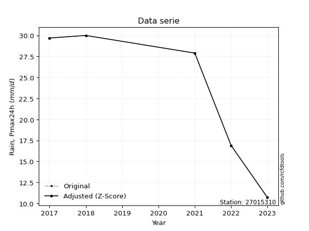</img>

</div>

> If Z-Score is active, values out of range or outliers are replaced with the station mean value.


### 4. Active continuous probability distributions from SciPy (45 of 104 available)

[scipy.stats](https://docs.scipy.org/doc/scipy/reference/stats.html) is a Python´s powerful submodule within the SciPy library for comprehensive statistical analysis, offering over 130 probability distributions (like Normal, Poisson), functions for descriptive stats (mean, variance), hypothesis testing (t-tests, chi-square), random variable generation, and statistical tests, making it essential for data science, modeling, and research. It provides tools to explore, model, and draw conclusions from data efficiently, working seamlessly with NumPy.

<div align="center">

|   id | p_dist             |   n_parameter | fit_method   | label                                                                       | active   | ref                                                                                                        |
|-----:|:-------------------|--------------:|:-------------|:----------------------------------------------------------------------------|:---------|:-----------------------------------------------------------------------------------------------------------|
|    0 | alpha              |             3 | MLE          | Alpha                                                                       | True     | [:mortar_board:](https://docs.scipy.org/doc/scipy/reference/generated/scipy.stats.alpha.html)              |
|    1 | betaprime          |             4 | MLE          | Beta prime                                                                  | True     | [:mortar_board:](https://docs.scipy.org/doc/scipy/reference/generated/scipy.stats.betaprime.html)          |
|    2 | chi2               |             3 | MLE          | Chi²                                                                        | True     | [:mortar_board:](https://docs.scipy.org/doc/scipy/reference/generated/scipy.stats.chi2.html)               |
|    3 | crystalball        |             4 | MLE          | Crystalball                                                                 | True     | [:mortar_board:](https://docs.scipy.org/doc/scipy/reference/generated/scipy.stats.crystalball.html)        |
|    4 | erlang             |             3 | MLE          | Erlang                                                                      | True     | [:mortar_board:](https://docs.scipy.org/doc/scipy/reference/generated/scipy.stats.erlang.html)             |
|    5 | expon              |             2 | MLE          | Exponential                                                                 | True     | [:mortar_board:](https://docs.scipy.org/doc/scipy/reference/generated/scipy.stats.expon.html)              |
|    6 | exponnorm          |             3 | MLE          | Exponentially modified Normal                                               | True     | [:mortar_board:](https://docs.scipy.org/doc/scipy/reference/generated/scipy.stats.exponnorm.html)          |
|    7 | f                  |             4 | MLE          | F                                                                           | True     | [:mortar_board:](https://docs.scipy.org/doc/scipy/reference/generated/scipy.stats.f.html)                  |
|    8 | fatiguelife        |             3 | MLE          | Fatigue-life (Birnbaum-Saunders)                                            | True     | [:mortar_board:](https://docs.scipy.org/doc/scipy/reference/generated/scipy.stats.fatiguelife.html)        |
|    9 | fisk               |             3 | MLE          | Fisk                                                                        | True     | [:mortar_board:](https://docs.scipy.org/doc/scipy/reference/generated/scipy.stats.fisk.html)               |
|   10 | gamma              |             3 | MLE          | Gamma                                                                       | True     | [:mortar_board:](https://docs.scipy.org/doc/scipy/reference/generated/scipy.stats.gamma.html)              |
|   11 | genexpon           |             5 | MLE          | Generalized exponential                                                     | True     | [:mortar_board:](https://docs.scipy.org/doc/scipy/reference/generated/scipy.stats.genexpon.html)           |
|   12 | genlogistic        |             3 | MLE          | Generalized logistic                                                        | True     | [:mortar_board:](https://docs.scipy.org/doc/scipy/reference/generated/scipy.stats.genlogistic.html)        |
|   13 | gibrat             |             2 | MM           | Gibrat                                                                      | True     | [:mortar_board:](https://docs.scipy.org/doc/scipy/reference/generated/scipy.stats.gibrat.html)             |
|   14 | gompertz           |             3 | MLE          | Gompertz (or truncated Gumbel)                                              | True     | [:mortar_board:](https://docs.scipy.org/doc/scipy/reference/generated/scipy.stats.gompertz.html)           |
|   15 | gumbel_l           |             2 | MM           | Gumbel Left Skew                                                            | True     | [:mortar_board:](https://docs.scipy.org/doc/scipy/reference/generated/scipy.stats.gumbel_l.html)           |
|   16 | gumbel_r           |             2 | MM           | Gumbel Right Skew                                                           | True     | [:mortar_board:](https://docs.scipy.org/doc/scipy/reference/generated/scipy.stats.gumbel_r.html)           |
|   17 | halflogistic       |             2 | MM           | Half-logistic                                                               | True     | [:mortar_board:](https://docs.scipy.org/doc/scipy/reference/generated/scipy.stats.halflogistic.html)       |
|   18 | halfnorm           |             2 | MM           | Half Normal                                                                 | True     | [:mortar_board:](https://docs.scipy.org/doc/scipy/reference/generated/scipy.stats.halfnorm.html)           |
|   19 | hypsecant          |             2 | MM           | hyperbolic secant                                                           | True     | [:mortar_board:](https://docs.scipy.org/doc/scipy/reference/generated/scipy.stats.hypsecant.html)          |
|   20 | invgamma           |             3 | MLE          | Inverted gamma                                                              | True     | [:mortar_board:](https://docs.scipy.org/doc/scipy/reference/generated/scipy.stats.invgamma.html)           |
|   21 | invgauss           |             3 | MLE          | Inverse Gaussian                                                            | True     | [:mortar_board:](https://docs.scipy.org/doc/scipy/reference/generated/scipy.stats.invgauss.html)           |
|   22 | invweibull         |             3 | MLE          | Inverted Weibull                                                            | True     | [:mortar_board:](https://docs.scipy.org/doc/scipy/reference/generated/scipy.stats.invweibull.html)         |
|   23 | johnsonsu          |             4 | MLE          | Johnson Su                                                                  | True     | [:mortar_board:](https://docs.scipy.org/doc/scipy/reference/generated/scipy.stats.johnsonsu.html)          |
|   24 | kstwobign          |             2 | MLE          | Limiting distribution of scaled Kolmogorov-Smirnov two-sided test statistic | True     | [:mortar_board:](https://docs.scipy.org/doc/scipy/reference/generated/scipy.stats.kstwobign.html)          |
|   25 | laplace            |             2 | MM           | Laplace                                                                     | True     | [:mortar_board:](https://docs.scipy.org/doc/scipy/reference/generated/scipy.stats.laplace.html)            |
|   26 | laplace_asymmetric |             3 | MLE          | Asymmetric Laplace                                                          | True     | [:mortar_board:](https://docs.scipy.org/doc/scipy/reference/generated/scipy.stats.laplace_asymmetric.html) |
|   27 | loggamma           |             3 | MLE          | Log gamma                                                                   | True     | [:mortar_board:](https://docs.scipy.org/doc/scipy/reference/generated/scipy.stats.loggamma.html)           |
|   28 | logistic           |             2 | MM           | Logistic (or Sech-squared)                                                  | True     | [:mortar_board:](https://docs.scipy.org/doc/scipy/reference/generated/scipy.stats.logistic.html)           |
|   29 | lognorm            |             3 | MLE          | Log Normal                                                                  | True     | [:mortar_board:](https://docs.scipy.org/doc/scipy/reference/generated/scipy.stats.lognorm.html)            |
|   30 | maxwell            |             2 | MM           | Maxwell                                                                     | True     | [:mortar_board:](https://docs.scipy.org/doc/scipy/reference/generated/scipy.stats.maxwell.html)            |
|   31 | mielke             |             4 | MLE          | Mielke Beta-Kappa / Dagum                                                   | True     | [:mortar_board:](https://docs.scipy.org/doc/scipy/reference/generated/scipy.stats.mielke.html)             |
|   32 | moyal              |             2 | MM           | Moyal                                                                       | True     | [:mortar_board:](https://docs.scipy.org/doc/scipy/reference/generated/scipy.stats.moyal.html)              |
|   33 | nakagami           |             3 | MLE          | Nakagami                                                                    | True     | [:mortar_board:](https://docs.scipy.org/doc/scipy/reference/generated/scipy.stats.nakagami.html)           |
|   34 | ncf                |             5 | MLE          | Non-central F distribution                                                  | True     | [:mortar_board:](https://docs.scipy.org/doc/scipy/reference/generated/scipy.stats.ncf.html)                |
|   35 | nct                |             4 | MLE          | Non-central Student’s t                                                     | True     | [:mortar_board:](https://docs.scipy.org/doc/scipy/reference/generated/scipy.stats.nct.html)                |
|   36 | norm               |             2 | MM           | Normal                                                                      | True     | [:mortar_board:](https://docs.scipy.org/doc/scipy/reference/generated/scipy.stats.norm.html)               |
|   37 | pareto             |             3 | MLE          | Pareto                                                                      | True     | [:mortar_board:](https://docs.scipy.org/doc/scipy/reference/generated/scipy.stats.pareto.html)             |
|   38 | pearson3           |             3 | MM           | Pearson type III                                                            | True     | [:mortar_board:](https://docs.scipy.org/doc/scipy/reference/generated/scipy.stats.pearson3.html)           |
|   39 | rayleigh           |             2 | MM           | Rayleigh                                                                    | True     | [:mortar_board:](https://docs.scipy.org/doc/scipy/reference/generated/scipy.stats.rayleigh.html)           |
|   40 | rice               |             3 | MLE          | Rice                                                                        | True     | [:mortar_board:](https://docs.scipy.org/doc/scipy/reference/generated/scipy.stats.rice.html)               |
|   41 | t                  |             3 | MLE          | Student’s t                                                                 | True     | [:mortar_board:](https://docs.scipy.org/doc/scipy/reference/generated/scipy.stats.t.html)                  |
|   42 | truncnorm          |             4 | MLE          | Truncated normal                                                            | True     | [:mortar_board:](https://docs.scipy.org/doc/scipy/reference/generated/scipy.stats.truncnorm.html)          |
|   43 | wald               |             2 | MM           | Wald                                                                        | True     | [:mortar_board:](https://docs.scipy.org/doc/scipy/reference/generated/scipy.stats.wald.html)               |
|   44 | weibull_min        |             3 | MLE          | Weibull minimum                                                             | True     | [:mortar_board:](https://docs.scipy.org/doc/scipy/reference/generated/scipy.stats.weibull_min.html)        |

</div>

> **n_parameter:** # arguments & localization & scale.
>
> **Fit methods:** (MLE) maximum likelihood, (MM) L-moments.
>
>**Inactive:** foldnorm, gennorm, norminvgauss, powernorm, powerlognorm, skewnorm, genextreme, anglit, arcsine, argus, beta, bradford, burr, burr12, cauchy, cosine, halfcauchy, foldcauchy, skewcauchy, wrapcauchy, dgamma, gengamma, exponweib, exponpow, truncexpon, gausshyper, genhalflogistic, genhyperbolic, geninvgauss, halfgennorm, johnsonsb, kappa4, kappa3, ksone, kstwo, loglaplace, levy, levy_l, levy_stable, ncx2, genpareto, truncpareto, lomax, powerlaw, rdist, rel_breitwigner, recipinvgauss, semicircular, studentized_range, trapezoid, triang, truncweibull_min, tukeylambda, uniform, loguniform, vonmises, vonmises_line, weibull_max, dweibull, 


## B. Probability distributions vs. Empirical distributions

A continuous probability distribution (CPD) describes probabilities for variables that can take any value within a range (like rain any time), unlike discrete variables with specific outcomes (like temperature). It uses a Probability Density Function (PDF), a curve where the total area under it equals 1, and the probability of the variable falling within an interval (a to b) is found by calculating the area under the curve between those points. A key feature is that the probability of hitting any single exact value is zero, so probabilities are always expressed for ranges, e.g., $P(a ≤ X ≤ b)$.

<div align="center">

Distributions parameters
|    |   station | p_dist                |   n |               loc |            scale | shape                  | shape1                 | shape2             | shape3   |
|---:|----------:|:----------------------|----:|------------------:|-----------------:|:-----------------------|:-----------------------|:-------------------|:---------|
|  0 |  27015310 | alpha                 |   6 |    -167.513       |   3000.22        | 16.14671816939346      |                        |                    |          |
|  1 |  27015310 | betaprime             |   6 |    -419.607       |  83608.1         | 1549.7522819836913     | 295288.5837181284      |                    |          |
|  2 |  27015310 | chi2                  |   6 |       0.1         |      2.48594     | 1.5647462394760097     |                        |                    |          |
|  3 |  27015310 | crystalball           |   6 |      19.2167      |     11.1425      | 752.5948390631         | 1488.794326248244      |                    |          |
|  4 |  27015310 | erlang                |   6 |    -137.302       |      0.831435    | 188.14484379287575     |                        |                    |          |
|  5 |  27015310 | expon                 |   6 |       0.1         |     19.1167      |                        |                        |                    |          |
|  6 |  27015310 | exponnorm             |   6 |      19.2063      |     11.1425      | 0.0009270318353581582  |                        |                    |          |
|  7 |  27015310 | f                     |   6 |   -2413.59        |   2432.79        | 151018.55505440955     | 255386.86226217446     |                    |          |
|  8 |  27015310 | fatiguelife           |   6 |   -1017.72        |   1036.93        | 0.010723809343786167   |                        |                    |          |
|  9 |  27015310 | fisk                  |   6 |      -9.34821e+08 |      9.34821e+08 | 136402772.29529697     |                        |                    |          |
| 10 |  27015310 | gamma                 |   6 |    -150.074       |      0.768547    | 220.2382212181957      |                        |                    |          |
| 11 |  27015310 | genexpon              |   6 |       0.0999829   |      2.32037     | 0.12117438337899275    | 2.3409765869989463e-07 | 1.4425758623241893 |          |
| 12 |  27015310 | genlogistic           |   6 |      30.0003      |      1.46679e-05 | 1.3606830050579993e-06 |                        |                    |          |
| 13 |  27015310 | gibrat                |   6 |      10.7164      |      5.15568     |                        |                        |                    |          |
| 14 |  27015310 | gompertz              |   6 |      10.7         |      5.64222     | 0.06275384463311837    |                        |                    |          |
| 15 |  27015310 | gumbel_l              |   6 |      24.2314      |      8.68775     |                        |                        |                    |          |
| 16 |  27015310 | gumbel_r              |   6 |      14.202       |      8.68775     |                        |                        |                    |          |
| 17 |  27015310 | halflogistic          |   6 |       6.01028     |      9.52641     |                        |                        |                    |          |
| 18 |  27015310 | halfnorm              |   6 |       4.4684      |     18.4842      |                        |                        |                    |          |
| 19 |  27015310 | hypsecant             |   6 |      19.2167      |      7.09352     |                        |                        |                    |          |
| 20 |  27015310 | invgamma              |   6 |    -108.324       |  15520.7         | 122.97215749819878     |                        |                    |          |
| 21 |  27015310 | invgauss              |   6 |     -62.4017      |   3760.71        | 0.021738857236922565   |                        |                    |          |
| 22 |  27015310 | invweibull            |   6 | -334199           | 334213           | 29518.922953831352     |                        |                    |          |
| 23 |  27015310 | johnsonsu             |   6 |      30           |      5.57332e-16 | 2.2537181458115416     | 0.1092326016240538     |                    |          |
| 24 |  27015310 | kstwobign             |   6 |     -25.7516      |     51.263       |                        |                        |                    |          |
| 25 |  27015310 | laplace               |   6 |      19.2167      |      7.87892     |                        |                        |                    |          |
| 26 |  27015310 | laplace_asymmetric    |   6 |      16.9         |      9.77886     | 0.8885467644039216     |                        |                    |          |
| 27 |  27015310 | loggamma              |   6 |      30.0001      |      3.69845e-06 | 3.4273193607073057e-07 |                        |                    |          |
| 28 |  27015310 | logistic              |   6 |      19.2167      |      6.14317     |                        |                        |                    |          |
| 29 |  27015310 | lognorm               |   6 |       0.1         |      0.0198301   | 15.610296781850288     |                        |                    |          |
| 30 |  27015310 | maxwell               |   6 |      -7.18632     |     16.5456      |                        |                        |                    |          |
| 31 |  27015310 | mielke                |   6 |      -1.31916e+08 |      1.31916e+08 | 12210646.654030869     | 50270980062.4073       |                    |          |
| 32 |  27015310 | moyal                 |   6 |      12.8447      |      5.01588     |                        |                        |                    |          |
| 33 |  27015310 | nakagami              |   6 |       0.1         |     21.8361      | 0.24513834879382318    |                        |                    |          |
| 34 |  27015310 | ncf                   |   6 |       0.1         |      4.85981     | 0.7420871792550894     | 37.40261700975991      | 2.726512402494131  |          |
| 35 |  27015310 | nct                   |   6 |    -744.145       |     11.1119      | 384247.6906556091      | 68.69722917739298      |                    |          |
| 36 |  27015310 | norm                  |   6 |      19.2167      |     11.1425      |                        |                        |                    |          |
| 37 |  27015310 | pareto                |   6 |       0.0410656   |      0.0589344   | 0.2036336597541331     |                        |                    |          |
| 38 |  27015310 | pearson3              |   6 |      19.2167      |     11.1424      | -0.5488303542490288    |                        |                    |          |
| 39 |  27015310 | rayleigh              |   6 |      -2.09954     |     17.0079      |                        |                        |                    |          |
| 40 |  27015310 | rice                  |   6 |      -6.6087      |     12.394       | 1.7748332690504136     |                        |                    |          |
| 41 |  27015310 | t                     |   6 |      19.216       |     11.1425      | 24503677.924290083     |                        |                    |          |
| 42 |  27015310 | truncnorm             |   6 |      12.5923      |     21.631       | -0.5775208600416635    | 0.8047566219832459     |                    |          |
| 43 |  27015310 | wald                  |   6 |       8.07423     |     11.1424      |                        |                        |                    |          |
| 44 |  27015310 | weibull_min           |   6 |      -4.51728e+08 |      4.51728e+08 | 54065652.21157197      |                        |                    |          |
| 45 |  27015310 | logalpha              |   6 |     -74.1707      |   2763.89        | 36.2414042388431       |                        |                    |          |
| 46 |  27015310 | logbetaprime          |   6 |      -2.30259     |      1.59305     | 0.8279554007409584     | 0.7966964574963638     |                    |          |
| 47 |  27015310 | logchi2               |   6 |      -2.30259     |      1.20593     | 1.0366416321930199     |                        |                    |          |
| 48 |  27015310 | logcrystalball        |   6 |       2.16932     |      2.03411     | 16.659753180283392     | 797.5411571941208      |                    |          |
| 49 |  27015310 | logerlang             |   6 |      -2.30259     |      2.6264      | 0.38751778092937056    |                        |                    |          |
| 50 |  27015310 | logexpon              |   6 |      -2.30259     |      4.47191     |                        |                        |                    |          |
| 51 |  27015310 | logexponnorm          |   6 |       2.16826     |      2.03412     | 0.0005298865080070305  |                        |                    |          |
| 52 |  27015310 | logf                  |   6 |      -2.30259     |      1.11533     | 1.055326394638816      | 1.055503152584036      |                    |          |
| 53 |  27015310 | logfatiguelife        |   6 |    -661.46        |    663.633       | 0.003076621762083888   |                        |                    |          |
| 54 |  27015310 | logfisk               |   6 |      -2.30259     |      1.89982     | 0.6726034906579462     |                        |                    |          |
| 55 |  27015310 | loggamma              |   6 |     -35.5457      |      0.123291    | 305.3918622112405      |                        |                    |          |
| 56 |  27015310 | loggenexpon           |   6 |      -2.30259     |      1.92476     | 0.9326086051903509     | 5.461133950049708e-07  | 1.156936878969141  |          |
| 57 |  27015310 | loggenlogistic        |   6 |       3.4013      |      4.43537e-06 | 3.600761888734376e-06  |                        |                    |          |
| 58 |  27015310 | loggibrat             |   6 |       0.61759     |      0.941183    |                        |                        |                    |          |
| 59 |  27015310 | loggompertz           |   6 |      -2.30259     |      1.0629      | 0.007259066844248773   |                        |                    |          |
| 60 |  27015310 | loggumbel_l           |   6 |       3.08478     |      1.58599     |                        |                        |                    |          |
| 61 |  27015310 | loggumbel_r           |   6 |       1.25387     |      1.58599     |                        |                        |                    |          |
| 62 |  27015310 | loghalflogistic       |   6 |      -0.241531    |      1.73908     |                        |                        |                    |          |
| 63 |  27015310 | loghalfnorm           |   6 |      -0.52298     |      3.37433     |                        |                        |                    |          |
| 64 |  27015310 | loghypsecant          |   6 |       2.16932     |      1.29496     |                        |                        |                    |          |
| 65 |  27015310 | loginvgamma           |   6 |     -42.4321      |  18772           | 421.9249460088729      |                        |                    |          |
| 66 |  27015310 | loginvgauss           |   6 |     -22.7005      |   2908.24        | 0.008538995872038522   |                        |                    |          |
| 67 |  27015310 | loginvweibull         |   6 |      -3.03048e+08 |      3.03048e+08 | 121168233.75945568     |                        |                    |          |
| 68 |  27015310 | logjohnsonsu          |   6 |       3.4012      |      6.82479e-15 | 3.316270992812203      | 0.1153756212011679     |                    |          |
| 69 |  27015310 | logkstwobign          |   6 |      -7.89755     |     11.4968      |                        |                        |                    |          |
| 70 |  27015310 | loglaplace            |   6 |       2.16932     |      1.43833     |                        |                        |                    |          |
| 71 |  27015310 | loglaplace_asymmetric |   6 |       3.40121     |      0.0109955   | 111.76813071860934     |                        |                    |          |
| 72 |  27015310 | logloggamma           |   6 |       3.40124     |      3.16475e-06 | 2.570353067579602e-06  |                        |                    |          |
| 73 |  27015310 | loglogistic           |   6 |       2.16932     |      1.12146     |                        |                        |                    |          |
| 74 |  27015310 | loglognorm            |   6 |    -886.199       |    888.354       | 0.0022877318228214528  |                        |                    |          |
| 75 |  27015310 | logmaxwell            |   6 |      -2.65066     |      3.02048     |                        |                        |                    |          |
| 76 |  27015310 | logmielke             |   6 |      -2.30259     |      2.5657      | 0.14580157393763268    | 0.6336523085463639     |                    |          |
| 77 |  27015310 | logmoyal              |   6 |       1.00609     |      0.915671    |                        |                        |                    |          |
| 78 |  27015310 | lognakagami           |   6 |   -2720.55        |   2722.72        | 445307.49775827036     |                        |                    |          |
| 79 |  27015310 | logncf                |   6 |      -2.30259     |      1.02916     | 0.994874639511562      | 1.1626728318094082     | 1.0549385087364622 |          |
| 80 |  27015310 | lognct                |   6 |    -112.406       |      1.98608     | 29987.96307016316      | 57.6872251963367       |                    |          |
| 81 |  27015310 | lognorm               |   6 |       2.16932     |      2.03411     |                        |                        |                    |          |
| 82 |  27015310 | logpareto             |   6 |      -2.31724     |      0.0146577   | 0.2032978269517183     |                        |                    |          |
| 83 |  27015310 | logpearson3           |   6 |       2.16933     |      2.03414     | -1.661185183409011     |                        |                    |          |
| 84 |  27015310 | lograyleigh           |   6 |      -1.72207     |      3.10488     |                        |                        |                    |          |
| 85 |  27015310 | logrice               |   6 |    -391.377       |      2.03409     | 193.4724026671302      |                        |                    |          |
| 86 |  27015310 | logt                  |   6 |       3.39407     |      0.0121201   | 0.26768723993056287    |                        |                    |          |
| 87 |  27015310 | logtruncnorm          |   6 |       2.13085     |      2.20042     | -2.0148180710869408    | 0.5837123133673108     |                    |          |
| 88 |  27015310 | logwald               |   6 |       0.135201    |      2.03411     |                        |                        |                    |          |
| 89 |  27015310 | logweibull_min        |   6 |      -2.30259     |      1.53299     | 0.4335611906799628     |                        |                    |          |

</div>

> **loc** (Location parameter): This shifts the distribution along the x-axis. For many common distributions, like the normal (Gaussian) distribution, loc represents the mean $μ$. For others, like the uniform distribution, it might represent the minimum value, or for the beta distribution, the left end of the support interval.
>
> **scale** (Scale parameter): This determines the width or spread of the distribution. For the normal distribution, scale represents the standard deviation $σ$. For a uniform distribution, it defines the length of the interval (from $loc$ to $loc + scale$).
>
> **shape** (Shape parameters): Refers to parameters that define the specific form of a probability distribution, distinct from its location (loc) and scale (scale). These parameters are required arguments for most distribution functions. For example, a normal (Gaussian) distribution is fully defined by its location (mean) and scale (standard deviation), so it has no specific shape parameters beyond loc and scale. However, other distributions have intrinsic properties that need specification, as Gamma distribution that takes a shape parameter, often named $a$ or $alpha$.


### 0. Cumulative distribution values - CDF (90 evaluated)

> Ordered by x ascending and calculating $log(f(x))$ separately. 

|   id |   Station |   date |    x |   count |    mean |    std |    zscore |   Value_initial |   station |   m |     alpha |   alpha_pdf |   betaprime |   betaprime_pdf |        chi2 |       chi2_pdf |   crystalball |   crystalball_pdf |    erlang |   erlang_pdf |    expon |   expon_pdf |   exponnorm |   exponnorm_pdf |         f |      f_pdf |   fatiguelife |   fatiguelife_pdf |     fisk |   fisk_pdf |     gamma |   gamma_pdf |    genexpon |   genexpon_pdf |   genlogistic |   genlogistic_pdf |   gibrat |   gibrat_pdf |    gompertz |   gompertz_pdf |   gumbel_l |   gumbel_l_pdf |   gumbel_r |   gumbel_r_pdf |   halflogistic |   halflogistic_pdf |   halfnorm |   halfnorm_pdf |   hypsecant |   hypsecant_pdf |   invgamma |   invgamma_pdf |   invgauss |   invgauss_pdf |   invweibull |   invweibull_pdf |   johnsonsu |   johnsonsu_pdf |   kstwobign |   kstwobign_pdf |   laplace |   laplace_pdf |   laplace_asymmetric |   laplace_asymmetric_pdf |   loggamma |   loggamma_pdf |   logistic |   logistic_pdf |   lognorm |   lognorm_pdf |   maxwell |   maxwell_pdf |    mielke |   mielke_pdf |       moyal |   moyal_pdf |    nakagami |   nakagami_pdf |         ncf |     ncf_pdf |       nct |    nct_pdf |      norm |   norm_pdf |   pareto |   pareto_pdf |   pearson3 |   pearson3_pdf |   rayleigh |   rayleigh_pdf |      rice |   rice_pdf |        t |      t_pdf |   truncnorm |   truncnorm_pdf |      wald |   wald_pdf |   weibull_min |   weibull_min_pdf |   logalpha |   logalpha_pdf |   logbetaprime |   logbetaprime_pdf |     logchi2 |   logchi2_pdf |   logcrystalball |   logcrystalball_pdf |   logerlang |   logerlang_pdf |   logexpon |   logexpon_pdf |   logexponnorm |   logexponnorm_pdf |        logf |    logf_pdf |   logfatiguelife |   logfatiguelife_pdf |     logfisk |   logfisk_pdf |   loggenexpon |   loggenexpon_pdf |   loggenlogistic |   loggenlogistic_pdf |   loggibrat |   loggibrat_pdf |   loggompertz |   loggompertz_pdf |   loggumbel_l |   loggumbel_l_pdf |   loggumbel_r |   loggumbel_r_pdf |   loghalflogistic |   loghalflogistic_pdf |   loghalfnorm |   loghalfnorm_pdf |   loghypsecant |   loghypsecant_pdf |   loginvgamma |   loginvgamma_pdf |   loginvgauss |   loginvgauss_pdf |   loginvweibull |   loginvweibull_pdf |   logjohnsonsu |   logjohnsonsu_pdf |   logkstwobign |   logkstwobign_pdf |   loglaplace |   loglaplace_pdf |   loglaplace_asymmetric |   loglaplace_asymmetric_pdf |   logloggamma |   logloggamma_pdf |   loglogistic |   loglogistic_pdf |   loglognorm |   loglognorm_pdf |   logmaxwell |   logmaxwell_pdf |   logmielke |   logmielke_pdf |    logmoyal |   logmoyal_pdf |   lognakagami |   lognakagami_pdf |      logncf |   logncf_pdf |    lognct |   lognct_pdf |   logpareto |   logpareto_pdf |   logpearson3 |   logpearson3_pdf |   lograyleigh |   lograyleigh_pdf |   logrice |   logrice_pdf |      logt |    logt_pdf |   logtruncnorm |   logtruncnorm_pdf |   logwald |   logwald_pdf |   logweibull_min |   logweibull_min_pdf |
|-----:|----------:|-------:|-----:|--------:|--------:|-------:|----------:|----------------:|----------:|----:|----------:|------------:|------------:|----------------:|------------:|---------------:|--------------:|------------------:|----------:|-------------:|---------:|------------:|------------:|----------------:|----------:|-----------:|--------------:|------------------:|---------:|-----------:|----------:|------------:|------------:|---------------:|--------------:|------------------:|---------:|-------------:|------------:|---------------:|-----------:|---------------:|-----------:|---------------:|---------------:|-------------------:|-----------:|---------------:|------------:|----------------:|-----------:|---------------:|-----------:|---------------:|-------------:|-----------------:|------------:|----------------:|------------:|----------------:|----------:|--------------:|---------------------:|-------------------------:|-----------:|---------------:|-----------:|---------------:|----------:|--------------:|----------:|--------------:|----------:|-------------:|------------:|------------:|------------:|---------------:|------------:|------------:|----------:|-----------:|----------:|-----------:|---------:|-------------:|-----------:|---------------:|-----------:|---------------:|----------:|-----------:|---------:|-----------:|------------:|----------------:|----------:|-----------:|--------------:|------------------:|-----------:|---------------:|---------------:|-------------------:|------------:|--------------:|-----------------:|---------------------:|------------:|----------------:|-----------:|---------------:|---------------:|-------------------:|------------:|------------:|-----------------:|---------------------:|------------:|--------------:|--------------:|------------------:|-----------------:|---------------------:|------------:|----------------:|--------------:|------------------:|--------------:|------------------:|--------------:|------------------:|------------------:|----------------------:|--------------:|------------------:|---------------:|-------------------:|--------------:|------------------:|--------------:|------------------:|----------------:|--------------------:|---------------:|-------------------:|---------------:|-------------------:|-------------:|-----------------:|------------------------:|----------------------------:|--------------:|------------------:|--------------:|------------------:|-------------:|-----------------:|-------------:|-----------------:|------------:|----------------:|------------:|---------------:|--------------:|------------------:|------------:|-------------:|----------:|-------------:|------------:|----------------:|--------------:|------------------:|--------------:|------------------:|----------:|--------------:|----------:|------------:|---------------:|-------------------:|----------:|--------------:|-----------------:|---------------------:|
|    0 |  27015310 |   2025 |  0.1 |       6 | 19.2167 | 12.206 | -1.56617  |             0.1 |  27015310 |   1 | 0.0398081 |   0.0091667 |   0.0422353 |      0.00830261 | 1.99099e-14 | 1122.44        |     0.0431124 |        0.00821788 | 0.0430027 |   0.00873906 | 0        |   0.0523104 |   0.0431125 |      0.00821791 | 0.0431042 | 0.00825693 |     0.0414419 |        0.00812557 | 0.050859 | 0.00704357 | 0.0428595 |  0.00865616 | 8.92481e-07 |      0.0522219 |      0        |        0.00579129 | 0        |   0          | 0           |      0         |  0.0602915 |     0.00672629 |  0.0062869 |     0.00366839 |       0        |          0         |   0        |      0         |   0.0429358 |      0.00603449 |  0.0393585 |     0.00915411 |  0.0393445 |     0.00933625 |    0.0373823 |        0.0108518 |   0.02119   |     0.00018576  |   0.0388674 |       0.0130837 | 0.0441813 |    0.00560754 |            0.0638151 |               0.00734438 |  0.0173073 |       0.021597 |  0.0426208 |     0.00664221 | 0.0139582 |     0.0174991 | 0.0214372 |    0.00848781 | 0.0627097 |   0.00580464 | 0.000367479 | 0.000497228 | 9.35449e-10 |    3.30477e+07 | 6.12005e-08 | 1.63629e+09 | 0.0431495 | 0.00822344 | 0.0431124 | 0.00821788 | 0        |   3.45526    |  0.0558092 |     0.00782465 | 0.00832756 |     0.00754049 | 0.0315063 |  0.0097169 | 0.043119 | 0.00821886 | 5.36323e-07 |       0.0307453 | 0         |  0         |     0.0529564 |        0.00616729 |  0.0133303 |      0.0183058 |    1.08087e-13 |        201.517     | 7.87734e-09 |   9.19408e+06 |        0.0139582 |            0.0174991 | 8.70345e-07 |     7.59474e+08 |   0        |      0.223618  |      0.0139583 |           0.017499 | 4.86759e-09 | 5.78363e+06 |        0.0139275 |            0.0175188 | 3.06458e-11 | 46415.2       |   9.79196e-07 |         0.484533  |         0        |            0.0079146 |    0        |       0         |   1.97751e-09 |        0.00682952 |     0.0329244 |          0.020414 |   8.14054e-05 |       0.000483307 |          0        |              0        |      0        |          0        |       0.020136 |          0.0155392 |     0.0149057 |         0.0199589 |     0.0183568 |         0.0240242 |        0.023139 |           0.0348442 |       0.233328 |        0.00619153  |      0.0281539 |          0.0473936 |    0.0223208 |        0.0155185 |              0.00964534 |                  0.00784844 |    0.00972991 |        0.00790247 |     0.0182072 |         0.0159396 |     0.013933 |        0.0175755 |  0.000405411 |       0.00348485 |  0.00503401 |     1.65275e+12 | 1.12719e-09 |    2.34159e-08 |     0.0141588 |         0.0176736 | 8.77577e-09 |  9.82999e+06 | 0.0140931 |    0.0176597 |    0        |      13.8697    |      0.03889  |          0.020952 |      0        |          0        | 0.0139585 |     0.0174996 | 0.0687411 |  0.00323016 |     4.9202e-08 |          0.0341065 |  0        |     0         |      1.83356e-07 |           1.7901e+08 |
|    1 |  27015310 |   2023 | 10.7 |       6 | 19.2167 | 12.206 | -0.697746 |            10.7 |  27015310 |   2 | 0.245644  |   0.0297385 |   0.224745  |      0.0271724  | 0.921079    |    0.0170778   |     0.222332  |        0.0267342  | 0.233201  |   0.0278388  | 0.425635 |   0.0300453 |   0.222332  |      0.0267343  | 0.223126  | 0.0268124  |     0.22123   |        0.0269339  | 0.201038 | 0.0234368  | 0.231296  |  0.0276371  | 0.425097    |      0.0300226 |      0        |        0.0154819  | 0        |   0          | 7.64526e-10 |      0.0111222 |  0.189948  |     0.0196418  |  0.223925  |     0.0385705  |       0.24129  |          0.0494299 |   0.263982 |      0.0407811 |   0.186134  |      0.02477    |  0.246129  |     0.0299371  |  0.24581   |     0.0293457  |    0.275646  |        0.0313736 |   0.0237422 |     0.000316753 |   0.307264  |       0.0327054 | 0.169638  |    0.0215306  |            0.21614   |               0.0248752  |  0.556181  |       0.182454 |  0.199989  |     0.0260441  | 0.539342  |     0.195172  | 0.239462  |    0.0314173  | 0.167284  |   0.0154844  | 0.215582    | 0.0457517   | 0.54168     |    0.0239155   | 0.386145    | 0.0219867   | 0.222424  | 0.0267356  | 0.222332  | 0.0267342  | 0.653001 |   0.00662925 |  0.209902  |     0.0227507  | 0.246614   |     0.0333359  | 0.234111  |  0.0284706 | 0.222352 | 0.0267354  | 0.36112     |       0.0361861 | 0.0980073 |  0.0906097 |     0.175922  |        0.0190841  |  0.552272  |      0.186593  |    0.708553    |          0.038153  | 0.948299    |   0.0253848   |        0.539342  |            0.195172  | 0.958696    |     0.0197047   |   0.648283 |      0.0786502 |      0.539339  |           0.195171 | 0.717772    | 0.0275209   |        0.538531  |            0.194423  | 0.646878    |     0.0328796 |   0.896081    |         0.0503523 |         0        |            0.351514  |    0.732946 |       0.187617  |   0.441123    |        0.309745   |     0.471276  |          0.212454 |   0.609783    |       0.190184    |          0.635689 |              0.171326 |      0.608788 |          0.163724 |       0.549191 |          0.242878  |     0.550416  |         0.18101   |     0.559274  |         0.170481  |        0.559101 |           0.129976  |       0.29786  |        0.0387845   |      0.597668  |          0.121861  |    0.565186  |        0.302304  |              0.432149   |                  0.351641   |    0.432853   |        0.351556   |     0.54467   |         0.221144  |     0.542052 |        0.195161  |  0.570407    |       0.183339   |  0.886999   |     0.0112407   | 0.63494     |    0.184807    |     0.539144  |         0.194607  | 0.630812    |  0.0350681   | 0.539742  |    0.19451   |    0.690426 |       0.0134263 |      0.428563 |          0.200839 |      0.58046  |          0.178095 | 0.539359  |     0.195174  | 0.10883   |  0.0284539  |     0.746573   |          0.258091  |  0.704759 |     0.169527  |      0.802357    |           0.0297313  |
|    2 |  27015310 |   2022 | 16.9 |       6 | 19.2167 | 12.206 | -0.189798 |            16.9 |  27015310 |   3 | 0.451344  |   0.0349327 |   0.421964  |      0.0351349  | 0.979021    |    0.00443951  |     0.417648  |        0.0350382  | 0.431715  |   0.0347939  | 0.584725 |   0.0217232 |   0.41765   |      0.0350383  | 0.418629  | 0.0350057  |     0.417788  |        0.0351905  | 0.383396 | 0.0344944  | 0.428909  |  0.0347308  | 0.584109    |      0.0217187 |      0        |        0.0275175  | 0.572131 |   0.0634588  | 0.117992    |      0.0294368 |  0.349518  |     0.0321987  |  0.480447  |     0.0405382  |       0.5165   |          0.038484  |   0.498768 |      0.0344284 |   0.397844  |      0.0425822  |  0.453255  |     0.0351701  |  0.446825  |     0.0339125  |    0.47461   |        0.0312406 |   0.0262126 |     0.00050705  |   0.506962  |       0.0304801 | 0.372626  |    0.047294   |            0.441189  |               0.0507758  |  0.637426  |       0.171863 |  0.406823  |     0.0392824  | 0.626833  |     0.186129  | 0.451965  |    0.0354202  | 0.296956  |   0.0274874  | 0.504466    | 0.0424869   | 0.667725    |    0.0173301   | 0.509901    | 0.0180625   | 0.417719  | 0.0350296  | 0.417648  | 0.0350382  | 0.683931 |   0.00381769 |  0.383884  |     0.0329657  | 0.464181   |     0.0351934  | 0.433605  |  0.0345875 | 0.417674 | 0.0350385  | 0.585219    |       0.0356117 | 0.570393  |  0.049422  |     0.333941  |        0.0323956  |  0.635237  |      0.175191  |    0.724889    |          0.0334871 | 0.958639    |   0.0200793   |        0.626833  |            0.186129  | 0.966734    |     0.0156375   |   0.682456 |      0.0710086 |      0.62683   |           0.186129 | 0.72959     | 0.0243043   |        0.625687  |            0.18543   | 0.661081    |     0.0293766 |   0.916725    |         0.0403494 |         0        |            0.50944   |    0.803305 |       0.125428  |   0.592754    |        0.346977   |     0.57265   |          0.229076 |   0.690182    |       0.161363    |          0.707578 |              0.143562 |      0.679229 |          0.14444  |       0.655197 |          0.217165  |     0.630946  |         0.170231  |     0.634901  |         0.159539  |        0.61612  |           0.119308  |       0.321691 |        0.0720535   |      0.651005  |          0.111426  |    0.683558  |        0.220006  |              0.626839   |                  0.510061   |    0.627423   |        0.509583   |     0.642613  |         0.204787  |     0.629449 |        0.185732  |  0.65085     |       0.16777    |  0.891828   |     0.00993552  | 0.711444    |    0.150509    |     0.626392  |         0.185641  | 0.645947    |  0.0312782   | 0.626917  |    0.185425  |    0.696227 |       0.0120042 |      0.528734 |          0.237665 |      0.658176 |          0.161311 | 0.626851  |     0.186129  | 0.127496  |  0.0602144  |     0.862387   |          0.246939  |  0.771125 |     0.123819  |      0.815155    |           0.0263744  |
|    3 |  27015310 |   2021 | 27.9 |       6 | 19.2167 | 12.206 |  0.711401 |            27.9 |  27015310 |   4 | 0.786265  |   0.0228781 |   0.783079  |      0.0259364  | 0.997906    |    0.000435392 |     0.782099  |        0.0264273  | 0.782127  |   0.0248945  | 0.766419 |   0.0122187 |   0.7821    |      0.0264272  | 0.781819  | 0.0262998  |     0.781905  |        0.0262747  | 0.755818 | 0.0269293  | 0.780346  |  0.0250823  | 0.765845    |      0.012228  |      0        |        0.0763436  | 0.885677 |   0.0112484  | 0.716418    |      0.0664953 |  0.782472  |     0.0381944  |  0.813301  |     0.0193459  |       0.817388 |          0.0174188 |   0.795079 |      0.0193283 |   0.817954  |      0.0242874  |  0.789738  |     0.0228869  |  0.773359  |     0.0227054  |    0.754212  |        0.0187901 |   0.0409596 |     0.00456948  |   0.776641  |       0.0181639 | 0.833913  |    0.0210799  |            0.794323  |               0.0186886  |  0.719153  |       0.153159 |  0.804317  |     0.0256206  | 0.715638  |     0.166725  | 0.78743   |    0.0228921  | 0.822037  |   0.0760908  | 0.823567    | 0.0172979   | 0.817059    |    0.0104176   | 0.676384    | 0.0124586   | 0.782044  | 0.026419   | 0.782099  | 0.0264273  | 0.71466  |   0.00208568 |  0.773267  |     0.0317234  | 0.788938   |     0.0218889  | 0.781835  |  0.0249273 | 0.782116 | 0.0264259  | 0.942697    |       0.0282785 | 0.857895  |  0.0127186 |     0.780411  |        0.0398431  |  0.718352  |      0.155347  |    0.740596    |          0.0293202 | 0.96753     |   0.0155946   |        0.715638  |            0.166725  | 0.973673    |     0.0122031   |   0.716131 |      0.0634783 |      0.715634  |           0.166726 | 0.741031    | 0.0214371   |        0.714184  |            0.166216  | 0.674987    |     0.0262032 |   0.934684    |         0.031648  |         0        |            0.765319  |    0.85496  |       0.0840875 |   0.764037    |        0.322197   |     0.688451  |          0.229086 |   0.763142    |       0.130068    |          0.77248  |              0.115945 |      0.746314 |          0.123263 |       0.753107 |          0.172107  |     0.71189   |         0.151743  |     0.71075   |         0.14233   |        0.672773 |           0.106616  |       0.411225 |        0.618484    |      0.703905  |          0.0996007 |    0.77668   |        0.155263  |              0.94257    |                  0.766973   |    0.94273    |        0.765669   |     0.73764   |         0.172566  |     0.717966 |        0.165996  |  0.729628    |       0.145904   |  0.896508   |     0.00877383  | 0.778455    |    0.117816    |     0.714989  |         0.166396  | 0.660737    |  0.0278385   | 0.715384  |    0.166101  |    0.701915 |       0.0107335 |      0.65774  |          0.275881 |      0.733683 |          0.139527 | 0.715655  |     0.166723  | 0.227078  |  0.924156   |     0.980816   |          0.223873  |  0.824139 |     0.0899047 |      0.82759     |           0.0233346  |
|    4 |  27015310 |   2017 | 29.7 |       6 | 19.2167 | 12.206 |  0.858869 |            29.7 |  27015310 |   5 | 0.824761  |   0.0199021 |   0.826744  |      0.0225588  | 0.998559    |    0.000299034 |     0.826608  |        0.0229992  | 0.824083  |   0.02171    | 0.787409 |   0.0111207 |   0.826609  |      0.0229991  | 0.82612   | 0.0228968  |     0.826143  |        0.0228543  | 0.800996 | 0.0232588  | 0.822639  |  0.0218955  | 0.786853    |      0.011131  |      0        |        0.0902174  | 0.903794 |   0.00898643 | 0.82751     |      0.0556449 |  0.846891  |     0.0330725  |  0.845369  |     0.0163457  |       0.846414 |          0.014884  |   0.827758 |      0.0170029 |   0.857216  |      0.0194605  |  0.828209  |     0.0198666  |  0.811751  |     0.0199563  |    0.786139  |        0.0167067 |   0.063368  |     0.0452633   |   0.807552  |       0.0161999 | 0.867835  |    0.0167745  |            0.825356  |               0.0158689  |  0.728644  |       0.150435 |  0.846382  |     0.0211649  | 0.725969  |     0.163753  | 0.826     |    0.0199701  | 0.971072  |   0.0898859  | 0.85218     | 0.0145654   | 0.835037    |    0.00956775  | 0.698106    | 0.0116838   | 0.826541  | 0.0229936  | 0.826608  | 0.0229992  | 0.718275 |   0.00193428 |  0.827156  |     0.0280227  | 0.825857   |     0.0191437  | 0.823918  |  0.0218147 | 0.826623 | 0.0229978  | 0.992073    |       0.0265692 | 0.878755  |  0.0105416 |     0.847478  |        0.0343272  |  0.727975  |      0.152478  |    0.742414    |          0.0288578 | 0.96849     |   0.015115    |        0.725969  |            0.163753  | 0.974425    |     0.0118357   |   0.720072 |      0.062597  |      0.725966  |           0.163753 | 0.742361    | 0.021119    |        0.724485  |            0.163276  | 0.676614    |     0.0258479 |   0.936633    |         0.0307036 |         0        |            0.805166  |    0.860095 |       0.0802124 |   0.783899    |        0.312954   |     0.702722  |          0.227381 |   0.771157    |       0.126353    |          0.779629 |              0.112754 |      0.753939 |          0.120663 |       0.763682 |          0.166183  |     0.721295  |         0.149077  |     0.719573  |         0.139909  |        0.679388 |           0.105006  |       0.501475 |        4.57974     |      0.710086  |          0.0981253 |    0.78618   |        0.148658  |              0.991762   |                  0.807      |    0.991836   |        0.805552   |     0.748286  |         0.167954  |     0.728251 |        0.162992  |  0.738658    |       0.142959   |  0.897052   |     0.00864501  | 0.785706    |    0.11416     |     0.725301  |         0.163447  | 0.662466    |  0.0274532   | 0.725677  |    0.163147  |    0.702582 |       0.0105922 |      0.675117 |          0.279957 |      0.742318 |          0.136675 | 0.725986  |     0.16375   | 0.449158  | 16.0487     |     0.994703   |          0.220348  |  0.829654 |     0.0865233 |      0.829038    |           0.0229943  |
|    5 |  27015310 |   2018 | 30   |       6 | 19.2167 | 12.206 |  0.883448 |            30   |  27015310 |   6 | 0.830658  |   0.019413  |   0.833426  |      0.0219872  | 0.998646    |    0.000280907 |     0.83342   |        0.0224158  | 0.830515  |   0.0211753  | 0.79072  |   0.0109475 |   0.833421  |      0.0224157  | 0.832902  | 0.0223183  |     0.832912  |        0.022274   | 0.807882 | 0.022647   | 0.829127  |  0.0213593  | 0.790166    |      0.0109579 |      0.999974 |        0.0927634  | 0.906442 |   0.00866659 | 0.843831    |      0.0531311 |  0.85666   |     0.03205    |  0.850202  |     0.0158812  |       0.850821 |          0.0144915 |   0.832802 |      0.0166282 |   0.862944  |      0.0187298  |  0.834094  |     0.0193706  |  0.817669  |     0.0195027  |    0.791101  |        0.0163725 |   0.987893  |     6.16885e+12 |   0.812365  |       0.0158834 | 0.872772  |    0.0161478  |            0.830052  |               0.0154421  |  0.730154  |       0.149991 |  0.852625  |     0.0204546  | 0.727612  |     0.163265  | 0.831919  |    0.019489   | 0.998415  |   0.0922822  | 0.856487    | 0.0141506   | 0.837887    |    0.00943174  | 0.701593    | 0.0115585   | 0.833352  | 0.0224107  | 0.83342   | 0.0224158  | 0.718852 |   0.00191099 |  0.83546   |     0.0273363  | 0.831533   |     0.0186945  | 0.830384  |  0.0212891 | 0.833435 | 0.0224144  | 1           |       0.0262768 | 0.88187   |  0.0102239 |     0.857611  |        0.0332182  |  0.729505  |      0.15201   |    0.742704    |          0.0287845 | 0.968642    |   0.0150394   |        0.727612  |            0.163265  | 0.974543    |     0.0117778   |   0.7207   |      0.0624565 |      0.727609  |           0.163266 | 0.742573    | 0.0210686   |        0.726123  |            0.162794  | 0.676873    |     0.0257915 |   0.93694     |         0.0305545 |         0.999917 |            0.811762  |    0.860898 |       0.0796105 |   0.787036    |        0.311341   |     0.705006  |          0.227069 |   0.772424    |       0.125762    |          0.78076  |              0.112247 |      0.75515  |          0.120246 |       0.765347 |          0.165233  |     0.722791  |         0.148642  |     0.720977  |         0.139516  |        0.680442 |           0.104747  |       0.999647 |        1.82563e+10 |      0.711071  |          0.0978884 |    0.787668  |        0.147623  |              0.999906   |                  0.813627   |    0.999965   |        0.812154   |     0.74997   |         0.167206  |     0.729886 |        0.1625    |  0.740092    |       0.142483   |  0.897139   |     0.00862459  | 0.78685     |    0.113581    |     0.726941  |         0.162964  | 0.662741    |  0.027392    | 0.727314  |    0.162663  |    0.702688 |       0.0105698 |      0.677934 |          0.280589 |      0.743689 |          0.136215 | 0.72763   |     0.163263  | 0.60694   | 10.7383     |     0.996915   |          0.21977   |  0.830521 |     0.0859944 |      0.829269    |           0.0229404  |

An Empirical Distribution Function (EDF) is a step-function estimate of a true cumulative distribution function (CDF) based on observed sample data, representing the proportion of data points less than or equal to a given value. It is calculated by ordering your data and jumping up by $1/n$ (where $n$ is sample size) at each unique data point, allowing analysis without assuming an underlying population distribution, and it gets closer to the true CDF as the sample size grows.


### 1. Empirical - EDF California (1923)

California´s estimates the true probability distribution of water-related data (like rainfall, streamflow) using observed samples, crucial for risk assessment.

<div align="center">


$P=m/n$


</div>


**1.1. Empirical values**

<div align="center">

|                | 0                   | 1                  | 2              | 3                  | 4                  | 5              |
|:---------------|:--------------------|:-------------------|:---------------|:-------------------|:-------------------|:---------------|
| date           | 2025                | 2023               | 2022           | 2021               | 2017               | 2018           |
| x              | 0.1                 | 10.7               | 16.9           | 27.9               | 29.7               | 30.0           |
| m              | 1                   | 2                  | 3              | 4                  | 5                  | 6              |
| empirical_dist | edf_california      | edf_california     | edf_california | edf_california     | edf_california     | edf_california |
| empirical      | 0.16666666666666666 | 0.3333333333333333 | 0.5            | 0.6666666666666666 | 0.8333333333333334 | 1.0            |
| empirical_tr   | 1.2                 | 1.4999999999999998 | 2.0            | 2.9999999999999996 | 6.000000000000002  | inf            |

</div>


**1.2. Kolmogorov-Smirnov fit test (sorted by Δ)**


<div align="center">

|                | 0                   | 1                   | 2                   | 3                   | 4                   | 5                   | 6                   | 7                   | 8                   | 9                  | 10                 | 11                  | 12                 | 13                 | 14                  | 15                  | 16                 | 17                  | 18                  | 19                  | 20                 | 21                  | 22                | 23                  | 24                 | 25                  | 26                  | 27                  | 28                  | 29                  | 30                  | 31                  | 32                  | 33                  | 34                 | 35                  | 36                  | 37                  | 38                 | 39                  | 40               | 41                | 42                | 43                 | 44                  | 45                 | 46                  | 47                  | 48                | 49                 | 50                  | 51                 | 52                 | 53                  | 54                    | 55                 | 56                  | 57                 | 58                  | 59                 | 60                  | 61                 | 62                 | 63                 | 64                  | 65                | 66                  | 67                  | 68                  | 69                  | 70                | 71                 | 72               | 73                 | 74                  | 75                 | 76                 | 77                 | 78                 | 79                 | 80                  | 81                 | 82                 | 83                 | 84                 | 85                 | 86                 | 87                 | 88                 | 89                 |
|:---------------|:--------------------|:--------------------|:--------------------|:--------------------|:--------------------|:--------------------|:--------------------|:--------------------|:--------------------|:-------------------|:-------------------|:--------------------|:-------------------|:-------------------|:--------------------|:--------------------|:-------------------|:--------------------|:--------------------|:--------------------|:-------------------|:--------------------|:------------------|:--------------------|:-------------------|:--------------------|:--------------------|:--------------------|:--------------------|:--------------------|:--------------------|:--------------------|:--------------------|:--------------------|:-------------------|:--------------------|:--------------------|:--------------------|:-------------------|:--------------------|:-----------------|:------------------|:------------------|:-------------------|:--------------------|:-------------------|:--------------------|:--------------------|:------------------|:-------------------|:--------------------|:-------------------|:-------------------|:--------------------|:----------------------|:-------------------|:--------------------|:-------------------|:--------------------|:-------------------|:--------------------|:-------------------|:-------------------|:-------------------|:--------------------|:------------------|:--------------------|:--------------------|:--------------------|:--------------------|:------------------|:-------------------|:-----------------|:-------------------|:--------------------|:-------------------|:-------------------|:-------------------|:-------------------|:-------------------|:--------------------|:-------------------|:-------------------|:-------------------|:-------------------|:-------------------|:-------------------|:-------------------|:-------------------|:-------------------|
| station        | 27015310            | 27015310            | 27015310            | 27015310            | 27015310            | 27015310            | 27015310            | 27015310            | 27015310            | 27015310           | 27015310           | 27015310            | 27015310           | 27015310           | 27015310            | 27015310            | 27015310           | 27015310            | 27015310            | 27015310            | 27015310           | 27015310            | 27015310          | 27015310            | 27015310           | 27015310            | 27015310            | 27015310            | 27015310            | 27015310            | 27015310            | 27015310            | 27015310            | 27015310            | 27015310           | 27015310            | 27015310            | 27015310            | 27015310           | 27015310            | 27015310         | 27015310          | 27015310          | 27015310           | 27015310            | 27015310           | 27015310            | 27015310            | 27015310          | 27015310           | 27015310            | 27015310           | 27015310           | 27015310            | 27015310              | 27015310           | 27015310            | 27015310           | 27015310            | 27015310           | 27015310            | 27015310           | 27015310           | 27015310           | 27015310            | 27015310          | 27015310            | 27015310            | 27015310            | 27015310            | 27015310          | 27015310           | 27015310         | 27015310           | 27015310            | 27015310           | 27015310           | 27015310           | 27015310           | 27015310           | 27015310            | 27015310           | 27015310           | 27015310           | 27015310           | 27015310           | 27015310           | 27015310           | 27015310           | 27015310           |
| empirical_dist | edf_california      | edf_california      | edf_california      | edf_california      | edf_california      | edf_california      | edf_california      | edf_california      | edf_california      | edf_california     | edf_california     | edf_california      | edf_california     | edf_california     | edf_california      | edf_california      | edf_california     | edf_california      | edf_california      | edf_california      | edf_california     | edf_california      | edf_california    | edf_california      | edf_california     | edf_california      | edf_california      | edf_california      | edf_california      | edf_california      | edf_california      | edf_california      | edf_california      | edf_california      | edf_california     | edf_california      | edf_california      | edf_california      | edf_california     | edf_california      | edf_california   | edf_california    | edf_california    | edf_california     | edf_california      | edf_california     | edf_california      | edf_california      | edf_california    | edf_california     | edf_california      | edf_california     | edf_california     | edf_california      | edf_california        | edf_california     | edf_california      | edf_california     | edf_california      | edf_california     | edf_california      | edf_california     | edf_california     | edf_california     | edf_california      | edf_california    | edf_california      | edf_california      | edf_california      | edf_california      | edf_california    | edf_california     | edf_california   | edf_california     | edf_california      | edf_california     | edf_california     | edf_california     | edf_california     | edf_california     | edf_california      | edf_california     | edf_california     | edf_california     | edf_california     | edf_california     | edf_california     | edf_california     | edf_california     | edf_california     |
| p_dist         | logistic            | gumbel_l            | hypsecant           | gumbel_r            | pearson3            | invgamma            | weibull_min         | moyal               | t                   | betaprime          | exponnorm          | crystalball         | norm               | nct                | halflogistic        | fatiguelife         | f                  | halfnorm            | laplace             | maxwell             | rayleigh           | alpha               | erlang            | rice                | laplace_asymmetric | gamma               | invgauss            | kstwobign           | fisk                | mielke              | nakagami            | invweibull          | expon               | genexpon            | loggompertz        | loglaplace          | loghypsecant        | wald                | loglogistic        | lograyleigh         | logmaxwell       | loggamma          | loggamma          | loglognorm         | logalpha            | logrice            | lognorm             | lognorm             | logcrystalball    | logexponnorm       | lognct              | lognakagami        | logfatiguelife     | loghalfnorm         | loglaplace_asymmetric | truncnorm          | logloggamma         | loggumbel_r        | loginvgamma         | loginvgauss        | logkstwobign        | loggumbel_l        | ncf                | logmoyal           | loghalflogistic     | logexpon          | loginvweibull       | pareto              | logpearson3         | logfisk             | logjohnsonsu      | gibrat             | logncf           | logpareto          | logwald             | logbetaprime       | gompertz           | logf               | loggibrat          | logtruncnorm       | logt                | logweibull_min     | logmielke          | loggenexpon        | chi2               | logchi2            | logerlang          | johnsonsu          | loggenlogistic     | genlogistic        |
| delta          | 0.14737523530308327 | 0.15048239527399104 | 0.15128705859269276 | 0.16037977054001204 | 0.16454020678375714 | 0.16590595911137285 | 0.16605944885305718 | 0.16629918803517824 | 0.16656537525048232 | 0.1665737647372234 | 0.1665787364153143 | 0.16658003913612074 | 0.1665800401454276 | 0.1666484736641215 | 0.16666666666666666 | 0.16708768894607573 | 0.1670980091760631 | 0.16719753934689296 | 0.16724645345617928 | 0.16808129977814423 | 0.1684669769413708 | 0.16934228837834675 | 0.169484624717138 | 0.16961624262795505 | 0.1699479113694694 | 0.17087286241443567 | 0.18233052126173588 | 0.18763539789975558 | 0.19211797980089362 | 0.20304357144437846 | 0.20834685145010573 | 0.20889883358371775 | 0.20928041886843818 | 0.20983365189897407 | 0.2129635004892223 | 0.23185248982779644 | 0.23465268042156306 | 0.23532603277521325 | 0.2500301980146791 | 0.25631100340858626 | 0.25990791241151 | 0.269846251174659 | 0.269846251174659 | 0.2701137876790538 | 0.27049533055990804 | 0.2723704167102573 | 0.27238757481384446 | 0.27238757481384446 | 0.272387594627416 | 0.2723909038897462 | 0.27268606469513534 | 0.2730587370485883 | 0.2738769438675437 | 0.27545419337029015 | 0.2759035352537589    | 0.2760307003711695 | 0.27606306961448124 | 0.2764494662935965 | 0.27720940037307384 | 0.2790229890393252 | 0.28892933007200217 | 0.2949939787428657 | 0.2984074671116561 | 0.3016068798312263 | 0.30235586837152834 | 0.314949989904073 | 0.31955752957044303 | 0.31966739227457824 | 0.32206634959500846 | 0.32312685213091774 | 0.331858443378945 | 0.3333333333333333 | 0.33725859755078 | 0.3570927651447316 | 0.37142569129277464 | 0.3752193005940458 | 0.3820082455619755 | 0.3844385498522184 | 0.3996129546646903 | 0.4132396089558052 | 0.43958915931672077 | 0.4690234374165048 | 0.5536659858795865 | 0.5627476810862873 | 0.5877459492071171 | 0.6149660587736072 | 0.6253626660594183 | 0.7699652884430532 | 0.8333333333333334 | 0.8333333333333334 |
| deltao         | 0.530385761606      | 0.530385761606      | 0.530385761606      | 0.530385761606      | 0.530385761606      | 0.530385761606      | 0.530385761606      | 0.530385761606      | 0.530385761606      | 0.530385761606     | 0.530385761606     | 0.530385761606      | 0.530385761606     | 0.530385761606     | 0.530385761606      | 0.530385761606      | 0.530385761606     | 0.530385761606      | 0.530385761606      | 0.530385761606      | 0.530385761606     | 0.530385761606      | 0.530385761606    | 0.530385761606      | 0.530385761606     | 0.530385761606      | 0.530385761606      | 0.530385761606      | 0.530385761606      | 0.530385761606      | 0.530385761606      | 0.530385761606      | 0.530385761606      | 0.530385761606      | 0.530385761606     | 0.530385761606      | 0.530385761606      | 0.530385761606      | 0.530385761606     | 0.530385761606      | 0.530385761606   | 0.530385761606    | 0.530385761606    | 0.530385761606     | 0.530385761606      | 0.530385761606     | 0.530385761606      | 0.530385761606      | 0.530385761606    | 0.530385761606     | 0.530385761606      | 0.530385761606     | 0.530385761606     | 0.530385761606      | 0.530385761606        | 0.530385761606     | 0.530385761606      | 0.530385761606     | 0.530385761606      | 0.530385761606     | 0.530385761606      | 0.530385761606     | 0.530385761606     | 0.530385761606     | 0.530385761606      | 0.530385761606    | 0.530385761606      | 0.530385761606      | 0.530385761606      | 0.530385761606      | 0.530385761606    | 0.530385761606     | 0.530385761606   | 0.530385761606     | 0.530385761606      | 0.530385761606     | 0.530385761606     | 0.530385761606     | 0.530385761606     | 0.530385761606     | 0.530385761606      | 0.530385761606     | 0.530385761606     | 0.530385761606     | 0.530385761606     | 0.530385761606     | 0.530385761606     | 0.530385761606     | 0.530385761606     | 0.530385761606     |
| eval           | Δo > Δ              | Δo > Δ              | Δo > Δ              | Δo > Δ              | Δo > Δ              | Δo > Δ              | Δo > Δ              | Δo > Δ              | Δo > Δ              | Δo > Δ             | Δo > Δ             | Δo > Δ              | Δo > Δ             | Δo > Δ             | Δo > Δ              | Δo > Δ              | Δo > Δ             | Δo > Δ              | Δo > Δ              | Δo > Δ              | Δo > Δ             | Δo > Δ              | Δo > Δ            | Δo > Δ              | Δo > Δ             | Δo > Δ              | Δo > Δ              | Δo > Δ              | Δo > Δ              | Δo > Δ              | Δo > Δ              | Δo > Δ              | Δo > Δ              | Δo > Δ              | Δo > Δ             | Δo > Δ              | Δo > Δ              | Δo > Δ              | Δo > Δ             | Δo > Δ              | Δo > Δ           | Δo > Δ            | Δo > Δ            | Δo > Δ             | Δo > Δ              | Δo > Δ             | Δo > Δ              | Δo > Δ              | Δo > Δ            | Δo > Δ             | Δo > Δ              | Δo > Δ             | Δo > Δ             | Δo > Δ              | Δo > Δ                | Δo > Δ             | Δo > Δ              | Δo > Δ             | Δo > Δ              | Δo > Δ             | Δo > Δ              | Δo > Δ             | Δo > Δ             | Δo > Δ             | Δo > Δ              | Δo > Δ            | Δo > Δ              | Δo > Δ              | Δo > Δ              | Δo > Δ              | Δo > Δ            | Δo > Δ             | Δo > Δ           | Δo > Δ             | Δo > Δ              | Δo > Δ             | Δo > Δ             | Δo > Δ             | Δo > Δ             | Δo > Δ             | Δo > Δ              | Δo > Δ             | Δo <= Δ            | Δo <= Δ            | Δo <= Δ            | Δo <= Δ            | Δo <= Δ            | Δo <= Δ            | Δo <= Δ            | Δo <= Δ            |
| fit            | 1                   | 1                   | 1                   | 1                   | 1                   | 1                   | 1                   | 1                   | 1                   | 1                  | 1                  | 1                   | 1                  | 1                  | 1                   | 1                   | 1                  | 1                   | 1                   | 1                   | 1                  | 1                   | 1                 | 1                   | 1                  | 1                   | 1                   | 1                   | 1                   | 1                   | 1                   | 1                   | 1                   | 1                   | 1                  | 1                   | 1                   | 1                   | 1                  | 1                   | 1                | 1                 | 1                 | 1                  | 1                   | 1                  | 1                   | 1                   | 1                 | 1                  | 1                   | 1                  | 1                  | 1                   | 1                     | 1                  | 1                   | 1                  | 1                   | 1                  | 1                   | 1                  | 1                  | 1                  | 1                   | 1                 | 1                   | 1                   | 1                   | 1                   | 1                 | 1                  | 1                | 1                  | 1                   | 1                  | 1                  | 1                  | 1                  | 1                  | 1                   | 1                  | 0                  | 0                  | 0                  | 0                  | 0                  | 0                  | 0                  | 0                  |
| n              | 6                   | 6                   | 6                   | 6                   | 6                   | 6                   | 6                   | 6                   | 6                   | 6                  | 6                  | 6                   | 6                  | 6                  | 6                   | 6                   | 6                  | 6                   | 6                   | 6                   | 6                  | 6                   | 6                 | 6                   | 6                  | 6                   | 6                   | 6                   | 6                   | 6                   | 6                   | 6                   | 6                   | 6                   | 6                  | 6                   | 6                   | 6                   | 6                  | 6                   | 6                | 6                 | 6                 | 6                  | 6                   | 6                  | 6                   | 6                   | 6                 | 6                  | 6                   | 6                  | 6                  | 6                   | 6                     | 6                  | 6                   | 6                  | 6                   | 6                  | 6                   | 6                  | 6                  | 6                  | 6                   | 6                 | 6                   | 6                   | 6                   | 6                   | 6                 | 6                  | 6                | 6                  | 6                   | 6                  | 6                  | 6                  | 6                  | 6                  | 6                   | 6                  | 6                  | 6                  | 6                  | 6                  | 6                  | 6                  | 6                  | 6                  |
| best_fit       | 1                   | 0                   | 0                   | 0                   | 0                   | 0                   | 0                   | 0                   | 0                   | 0                  | 0                  | 0                   | 0                  | 0                  | 0                   | 0                   | 0                  | 0                   | 0                   | 0                   | 0                  | 0                   | 0                 | 0                   | 0                  | 0                   | 0                   | 0                   | 0                   | 0                   | 0                   | 0                   | 0                   | 0                   | 0                  | 0                   | 0                   | 0                   | 0                  | 0                   | 0                | 0                 | 0                 | 0                  | 0                   | 0                  | 0                   | 0                   | 0                 | 0                  | 0                   | 0                  | 0                  | 0                   | 0                     | 0                  | 0                   | 0                  | 0                   | 0                  | 0                   | 0                  | 0                  | 0                  | 0                   | 0                 | 0                   | 0                   | 0                   | 0                   | 0                 | 0                  | 0                | 0                  | 0                   | 0                  | 0                  | 0                  | 0                  | 0                  | 0                   | 0                  | 0                  | 0                  | 0                  | 0                  | 0                  | 0                  | 0                  | 0                  |
| best_fit_sort  | 1                   | 2                   | 3                   | 4                   | 5                   | 6                   | 7                   | 8                   | 9                   | 10                 | 11                 | 12                  | 13                 | 14                 | 15                  | 16                  | 17                 | 18                  | 19                  | 20                  | 21                 | 22                  | 23                | 24                  | 25                 | 26                  | 27                  | 28                  | 29                  | 30                  | 31                  | 32                  | 33                  | 34                  | 35                 | 36                  | 37                  | 38                  | 39                 | 40                  | 41               | 42                | 43                | 44                 | 45                  | 46                 | 47                  | 48                  | 49                | 50                 | 51                  | 52                 | 53                 | 54                  | 55                    | 56                 | 57                  | 58                 | 59                  | 60                 | 61                  | 62                 | 63                 | 64                 | 65                  | 66                | 67                  | 68                  | 69                  | 70                  | 71                | 72                 | 73               | 74                 | 75                  | 76                 | 77                 | 78                 | 79                 | 80                 | 81                  | 82                 | 83                 | 84                 | 85                 | 86                 | 87                 | 88                 | 89                 | 90                 |

</div>


<div align="center">

</img>

</div>


**1.3. Best fit**

<div align="center">

|   id |   station | empirical_dist   | p_dist   |    delta |   deltao | eval   |   fit |   n |   best_fit |   best_fit_sort |
|-----:|----------:|:-----------------|:---------|---------:|---------:|:-------|------:|----:|-----------:|----------------:|
|    0 |  27015310 | edf_california   | logistic | 0.147375 | 0.530386 | Δo > Δ |     1 |   6 |          1 |               1 |

</div>


<div align="center">

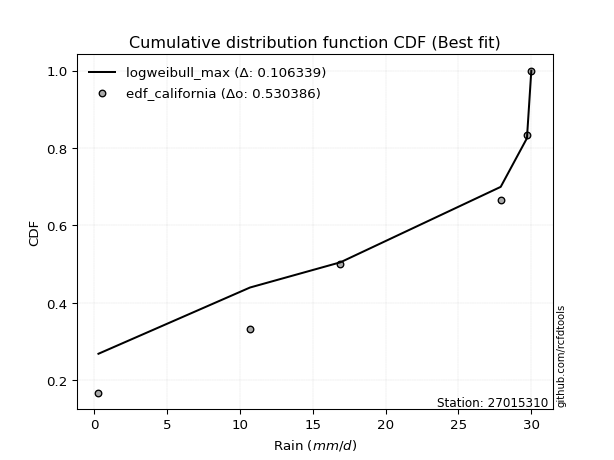</img>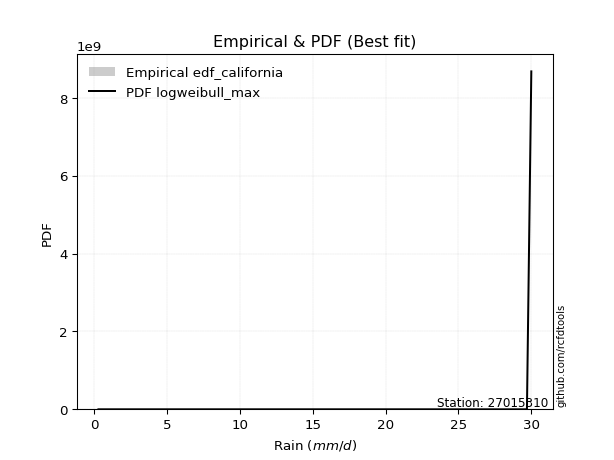</img>

</div>


### 2. Empirical - EDF Hazen (1930)

Hazen method for plotting positions is a formula used to estimate the empirical cumulative probability distribution of flood events or other hydrological data. This formula often results in biased estimations, particularly when extrapolating to extreme events (high return periods).

<div align="center">


$P=(m-0.5)/n$


</div>


**2.1. Empirical values**

<div align="center">

|                | 0                   | 1                  | 2                  | 3                  | 4         | 5                  |
|:---------------|:--------------------|:-------------------|:-------------------|:-------------------|:----------|:-------------------|
| date           | 2025                | 2023               | 2022               | 2021               | 2017      | 2018               |
| x              | 0.1                 | 10.7               | 16.9               | 27.9               | 29.7      | 30.0               |
| m              | 1                   | 2                  | 3                  | 4                  | 5         | 6                  |
| empirical_dist | edf_hazen           | edf_hazen          | edf_hazen          | edf_hazen          | edf_hazen | edf_hazen          |
| empirical      | 0.08333333333333333 | 0.25               | 0.4166666666666667 | 0.5833333333333334 | 0.75      | 0.9166666666666666 |
| empirical_tr   | 1.090909090909091   | 1.3333333333333333 | 1.7142857142857144 | 2.4000000000000004 | 4.0       | 11.999999999999995 |

</div>


**2.2. Kolmogorov-Smirnov fit test (sorted by Δ)**


<div align="center">

|                | 0                   | 1                   | 2                   | 3                   | 4                   | 5                   | 6                   | 7                   | 8                   | 9                   | 10                 | 11                  | 12                  | 13                  | 14                 | 15                  | 16                 | 17                  | 18                  | 19                  | 20                  | 21                  | 22                | 23                  | 24                  | 25                  | 26                  | 27                  | 28                | 29                  | 30                  | 31                 | 32                  | 33                  | 34                 | 35                  | 36                  | 37                  | 38                 | 39                  | 40                 | 41                 | 42                  | 43                  | 44                  | 45                 | 46                 | 47                  | 48                  | 49                 | 50                 | 51                  | 52                  | 53                  | 54                 | 55                  | 56                  | 57                 | 58                  | 59                  | 60                  | 61                 | 62                  | 63                 | 64                  | 65                    | 66                  | 67                 | 68                  | 69                  | 70                 | 71                  | 72                  | 73                  | 74                  | 75                 | 76                  | 77                 | 78                  | 79                  | 80                 | 81                 | 82                 | 83                 | 84                 | 85                 | 86                 | 87                 | 88             | 89             |
|:---------------|:--------------------|:--------------------|:--------------------|:--------------------|:--------------------|:--------------------|:--------------------|:--------------------|:--------------------|:--------------------|:-------------------|:--------------------|:--------------------|:--------------------|:-------------------|:--------------------|:-------------------|:--------------------|:--------------------|:--------------------|:--------------------|:--------------------|:------------------|:--------------------|:--------------------|:--------------------|:--------------------|:--------------------|:------------------|:--------------------|:--------------------|:-------------------|:--------------------|:--------------------|:-------------------|:--------------------|:--------------------|:--------------------|:-------------------|:--------------------|:-------------------|:-------------------|:--------------------|:--------------------|:--------------------|:-------------------|:-------------------|:--------------------|:--------------------|:-------------------|:-------------------|:--------------------|:--------------------|:--------------------|:-------------------|:--------------------|:--------------------|:-------------------|:--------------------|:--------------------|:--------------------|:-------------------|:--------------------|:-------------------|:--------------------|:----------------------|:--------------------|:-------------------|:--------------------|:--------------------|:-------------------|:--------------------|:--------------------|:--------------------|:--------------------|:-------------------|:--------------------|:-------------------|:--------------------|:--------------------|:-------------------|:-------------------|:-------------------|:-------------------|:-------------------|:-------------------|:-------------------|:-------------------|:---------------|:---------------|
| station        | 27015310            | 27015310            | 27015310            | 27015310            | 27015310            | 27015310            | 27015310            | 27015310            | 27015310            | 27015310            | 27015310           | 27015310            | 27015310            | 27015310            | 27015310           | 27015310            | 27015310           | 27015310            | 27015310            | 27015310            | 27015310            | 27015310            | 27015310          | 27015310            | 27015310            | 27015310            | 27015310            | 27015310            | 27015310          | 27015310            | 27015310            | 27015310           | 27015310            | 27015310            | 27015310           | 27015310            | 27015310            | 27015310            | 27015310           | 27015310            | 27015310           | 27015310           | 27015310            | 27015310            | 27015310            | 27015310           | 27015310           | 27015310            | 27015310            | 27015310           | 27015310           | 27015310            | 27015310            | 27015310            | 27015310           | 27015310            | 27015310            | 27015310           | 27015310            | 27015310            | 27015310            | 27015310           | 27015310            | 27015310           | 27015310            | 27015310              | 27015310            | 27015310           | 27015310            | 27015310            | 27015310           | 27015310            | 27015310            | 27015310            | 27015310            | 27015310           | 27015310            | 27015310           | 27015310            | 27015310            | 27015310           | 27015310           | 27015310           | 27015310           | 27015310           | 27015310           | 27015310           | 27015310           | 27015310       | 27015310       |
| empirical_dist | edf_hazen           | edf_hazen           | edf_hazen           | edf_hazen           | edf_hazen           | edf_hazen           | edf_hazen           | edf_hazen           | edf_hazen           | edf_hazen           | edf_hazen          | edf_hazen           | edf_hazen           | edf_hazen           | edf_hazen          | edf_hazen           | edf_hazen          | edf_hazen           | edf_hazen           | edf_hazen           | edf_hazen           | edf_hazen           | edf_hazen         | edf_hazen           | edf_hazen           | edf_hazen           | edf_hazen           | edf_hazen           | edf_hazen         | edf_hazen           | edf_hazen           | edf_hazen          | edf_hazen           | edf_hazen           | edf_hazen          | edf_hazen           | edf_hazen           | edf_hazen           | edf_hazen          | edf_hazen           | edf_hazen          | edf_hazen          | edf_hazen           | edf_hazen           | edf_hazen           | edf_hazen          | edf_hazen          | edf_hazen           | edf_hazen           | edf_hazen          | edf_hazen          | edf_hazen           | edf_hazen           | edf_hazen           | edf_hazen          | edf_hazen           | edf_hazen           | edf_hazen          | edf_hazen           | edf_hazen           | edf_hazen           | edf_hazen          | edf_hazen           | edf_hazen          | edf_hazen           | edf_hazen             | edf_hazen           | edf_hazen          | edf_hazen           | edf_hazen           | edf_hazen          | edf_hazen           | edf_hazen           | edf_hazen           | edf_hazen           | edf_hazen          | edf_hazen           | edf_hazen          | edf_hazen           | edf_hazen           | edf_hazen          | edf_hazen          | edf_hazen          | edf_hazen          | edf_hazen          | edf_hazen          | edf_hazen          | edf_hazen          | edf_hazen      | edf_hazen      |
| p_dist         | invweibull          | fisk                | genexpon            | expon               | pearson3            | invgauss            | loggompertz         | kstwobign           | gamma               | weibull_min         | f                  | rice                | fatiguelife         | nct                 | crystalball        | norm                | exponnorm          | t                   | erlang              | gumbel_l            | betaprime           | alpha               | maxwell           | rayleigh            | invgamma            | laplace_asymmetric  | halfnorm            | ncf                 | logistic          | loggumbel_l         | gumbel_r            | halflogistic       | hypsecant           | mielke              | logpearson3        | moyal               | logjohnsonsu        | laplace             | wald               | logfatiguelife      | lognakagami        | logexponnorm       | logcrystalball      | lognorm             | lognorm             | logrice            | lognct             | nakagami            | loglognorm          | loglogistic        | gompertz           | loghypsecant        | loginvgamma         | logalpha            | gibrat             | loggamma            | loggamma            | loginvweibull      | loginvgauss         | loglaplace          | logmaxwell          | lograyleigh        | logkstwobign        | logt               | loghalfnorm         | loglaplace_asymmetric | truncnorm           | logloggamma        | loggumbel_r         | logncf              | logmoyal           | loghalflogistic     | logfisk             | logexpon            | pareto              | logpareto          | logwald             | logbetaprime       | logf                | loggibrat           | logtruncnorm       | logweibull_min     | logmielke          | loggenexpon        | chi2               | johnsonsu          | logchi2            | logerlang          | loggenlogistic | genlogistic    |
| delta          | 0.17087819730846376 | 0.17248497661619278 | 0.18251210904145931 | 0.18308614667931733 | 0.18993413794128267 | 0.19002550014709874 | 0.19112318353783397 | 0.19330743583526522 | 0.19701237296505847 | 0.19707756469139603 | 0.1984853508072667 | 0.19850164302894746 | 0.19857130572896242 | 0.19871094085389462 | 0.1987652519481461 | 0.19876525199605377 | 0.1987667052511335 | 0.19878282903215405 | 0.19879384503784547 | 0.19913899546816027 | 0.19974574336114415 | 0.20293198818218083 | 0.204096397693195 | 0.20560497140560752 | 0.20640459250783372 | 0.21098978611526287 | 0.21174528537360393 | 0.21507413377832274 | 0.220983186349765 | 0.22127634513523065 | 0.22996729521706416 | 0.2340550725986441 | 0.23462039192602602 | 0.23870380961163606 | 0.2387330162616751 | 0.24023392005858923 | 0.24852511004561162 | 0.25057978678951254 | 0.2745617925079378 | 0.28853124038507916 | 0.2891440679052055 | 0.2893385124284146 | 0.28934163657265755 | 0.28934165125142797 | 0.28934165125142797 | 0.2893589712917828 | 0.2897419197397402 | 0.29168018478343904 | 0.29205227736651485 | 0.2946702135805088 | 0.2986749122286422 | 0.29919066925506743 | 0.30041640063168895 | 0.30227167667390054 | 0.3023441406345412 | 0.30618070059839275 | 0.30618070059839275 | 0.3091007339197167 | 0.30927420830449415 | 0.31518582316112975 | 0.32040666843097354 | 0.3304600601172941 | 0.34766799067064547 | 0.3562558259833875 | 0.35878752670362346 | 0.35923686858709214   | 0.35936403370450276 | 0.3593964029478145 | 0.35978279962692983 | 0.38081154777674286 | 0.3849402131645596 | 0.38568920170486165 | 0.39687828792300683 | 0.39828332323740634 | 0.40300072560791156 | 0.4404260984780649 | 0.45475902462610795 | 0.4585526339273791 | 0.46777188318555174 | 0.48294628799802364 | 0.4965729422891385 | 0.5523567707498381 | 0.6369993192129199 | 0.6460810144196206 | 0.6710792825404504 | 0.6866319551097197 | 0.6982993921069405 | 0.7086959993927515 | 0.75           | 0.75           |
| deltao         | 0.530385761606      | 0.530385761606      | 0.530385761606      | 0.530385761606      | 0.530385761606      | 0.530385761606      | 0.530385761606      | 0.530385761606      | 0.530385761606      | 0.530385761606      | 0.530385761606     | 0.530385761606      | 0.530385761606      | 0.530385761606      | 0.530385761606     | 0.530385761606      | 0.530385761606     | 0.530385761606      | 0.530385761606      | 0.530385761606      | 0.530385761606      | 0.530385761606      | 0.530385761606    | 0.530385761606      | 0.530385761606      | 0.530385761606      | 0.530385761606      | 0.530385761606      | 0.530385761606    | 0.530385761606      | 0.530385761606      | 0.530385761606     | 0.530385761606      | 0.530385761606      | 0.530385761606     | 0.530385761606      | 0.530385761606      | 0.530385761606      | 0.530385761606     | 0.530385761606      | 0.530385761606     | 0.530385761606     | 0.530385761606      | 0.530385761606      | 0.530385761606      | 0.530385761606     | 0.530385761606     | 0.530385761606      | 0.530385761606      | 0.530385761606     | 0.530385761606     | 0.530385761606      | 0.530385761606      | 0.530385761606      | 0.530385761606     | 0.530385761606      | 0.530385761606      | 0.530385761606     | 0.530385761606      | 0.530385761606      | 0.530385761606      | 0.530385761606     | 0.530385761606      | 0.530385761606     | 0.530385761606      | 0.530385761606        | 0.530385761606      | 0.530385761606     | 0.530385761606      | 0.530385761606      | 0.530385761606     | 0.530385761606      | 0.530385761606      | 0.530385761606      | 0.530385761606      | 0.530385761606     | 0.530385761606      | 0.530385761606     | 0.530385761606      | 0.530385761606      | 0.530385761606     | 0.530385761606     | 0.530385761606     | 0.530385761606     | 0.530385761606     | 0.530385761606     | 0.530385761606     | 0.530385761606     | 0.530385761606 | 0.530385761606 |
| eval           | Δo > Δ              | Δo > Δ              | Δo > Δ              | Δo > Δ              | Δo > Δ              | Δo > Δ              | Δo > Δ              | Δo > Δ              | Δo > Δ              | Δo > Δ              | Δo > Δ             | Δo > Δ              | Δo > Δ              | Δo > Δ              | Δo > Δ             | Δo > Δ              | Δo > Δ             | Δo > Δ              | Δo > Δ              | Δo > Δ              | Δo > Δ              | Δo > Δ              | Δo > Δ            | Δo > Δ              | Δo > Δ              | Δo > Δ              | Δo > Δ              | Δo > Δ              | Δo > Δ            | Δo > Δ              | Δo > Δ              | Δo > Δ             | Δo > Δ              | Δo > Δ              | Δo > Δ             | Δo > Δ              | Δo > Δ              | Δo > Δ              | Δo > Δ             | Δo > Δ              | Δo > Δ             | Δo > Δ             | Δo > Δ              | Δo > Δ              | Δo > Δ              | Δo > Δ             | Δo > Δ             | Δo > Δ              | Δo > Δ              | Δo > Δ             | Δo > Δ             | Δo > Δ              | Δo > Δ              | Δo > Δ              | Δo > Δ             | Δo > Δ              | Δo > Δ              | Δo > Δ             | Δo > Δ              | Δo > Δ              | Δo > Δ              | Δo > Δ             | Δo > Δ              | Δo > Δ             | Δo > Δ              | Δo > Δ                | Δo > Δ              | Δo > Δ             | Δo > Δ              | Δo > Δ              | Δo > Δ             | Δo > Δ              | Δo > Δ              | Δo > Δ              | Δo > Δ              | Δo > Δ             | Δo > Δ              | Δo > Δ             | Δo > Δ              | Δo > Δ              | Δo > Δ             | Δo <= Δ            | Δo <= Δ            | Δo <= Δ            | Δo <= Δ            | Δo <= Δ            | Δo <= Δ            | Δo <= Δ            | Δo <= Δ        | Δo <= Δ        |
| fit            | 1                   | 1                   | 1                   | 1                   | 1                   | 1                   | 1                   | 1                   | 1                   | 1                   | 1                  | 1                   | 1                   | 1                   | 1                  | 1                   | 1                  | 1                   | 1                   | 1                   | 1                   | 1                   | 1                 | 1                   | 1                   | 1                   | 1                   | 1                   | 1                 | 1                   | 1                   | 1                  | 1                   | 1                   | 1                  | 1                   | 1                   | 1                   | 1                  | 1                   | 1                  | 1                  | 1                   | 1                   | 1                   | 1                  | 1                  | 1                   | 1                   | 1                  | 1                  | 1                   | 1                   | 1                   | 1                  | 1                   | 1                   | 1                  | 1                   | 1                   | 1                   | 1                  | 1                   | 1                  | 1                   | 1                     | 1                   | 1                  | 1                   | 1                   | 1                  | 1                   | 1                   | 1                   | 1                   | 1                  | 1                   | 1                  | 1                   | 1                   | 1                  | 0                  | 0                  | 0                  | 0                  | 0                  | 0                  | 0                  | 0              | 0              |
| n              | 6                   | 6                   | 6                   | 6                   | 6                   | 6                   | 6                   | 6                   | 6                   | 6                   | 6                  | 6                   | 6                   | 6                   | 6                  | 6                   | 6                  | 6                   | 6                   | 6                   | 6                   | 6                   | 6                 | 6                   | 6                   | 6                   | 6                   | 6                   | 6                 | 6                   | 6                   | 6                  | 6                   | 6                   | 6                  | 6                   | 6                   | 6                   | 6                  | 6                   | 6                  | 6                  | 6                   | 6                   | 6                   | 6                  | 6                  | 6                   | 6                   | 6                  | 6                  | 6                   | 6                   | 6                   | 6                  | 6                   | 6                   | 6                  | 6                   | 6                   | 6                   | 6                  | 6                   | 6                  | 6                   | 6                     | 6                   | 6                  | 6                   | 6                   | 6                  | 6                   | 6                   | 6                   | 6                   | 6                  | 6                   | 6                  | 6                   | 6                   | 6                  | 6                  | 6                  | 6                  | 6                  | 6                  | 6                  | 6                  | 6              | 6              |
| best_fit       | 1                   | 0                   | 0                   | 0                   | 0                   | 0                   | 0                   | 0                   | 0                   | 0                   | 0                  | 0                   | 0                   | 0                   | 0                  | 0                   | 0                  | 0                   | 0                   | 0                   | 0                   | 0                   | 0                 | 0                   | 0                   | 0                   | 0                   | 0                   | 0                 | 0                   | 0                   | 0                  | 0                   | 0                   | 0                  | 0                   | 0                   | 0                   | 0                  | 0                   | 0                  | 0                  | 0                   | 0                   | 0                   | 0                  | 0                  | 0                   | 0                   | 0                  | 0                  | 0                   | 0                   | 0                   | 0                  | 0                   | 0                   | 0                  | 0                   | 0                   | 0                   | 0                  | 0                   | 0                  | 0                   | 0                     | 0                   | 0                  | 0                   | 0                   | 0                  | 0                   | 0                   | 0                   | 0                   | 0                  | 0                   | 0                  | 0                   | 0                   | 0                  | 0                  | 0                  | 0                  | 0                  | 0                  | 0                  | 0                  | 0              | 0              |
| best_fit_sort  | 1                   | 2                   | 3                   | 4                   | 5                   | 6                   | 7                   | 8                   | 9                   | 10                  | 11                 | 12                  | 13                  | 14                  | 15                 | 16                  | 17                 | 18                  | 19                  | 20                  | 21                  | 22                  | 23                | 24                  | 25                  | 26                  | 27                  | 28                  | 29                | 30                  | 31                  | 32                 | 33                  | 34                  | 35                 | 36                  | 37                  | 38                  | 39                 | 40                  | 41                 | 42                 | 43                  | 44                  | 45                  | 46                 | 47                 | 48                  | 49                  | 50                 | 51                 | 52                  | 53                  | 54                  | 55                 | 56                  | 57                  | 58                 | 59                  | 60                  | 61                  | 62                 | 63                  | 64                 | 65                  | 66                    | 67                  | 68                 | 69                  | 70                  | 71                 | 72                  | 73                  | 74                  | 75                  | 76                 | 77                  | 78                 | 79                  | 80                  | 81                 | 82                 | 83                 | 84                 | 85                 | 86                 | 87                 | 88                 | 89             | 90             |

</div>


<div align="center">

</img>

</div>


**2.3. Best fit**

<div align="center">

|   id |   station | empirical_dist   | p_dist     |    delta |   deltao | eval   |   fit |   n |   best_fit |   best_fit_sort |
|-----:|----------:|:-----------------|:-----------|---------:|---------:|:-------|------:|----:|-----------:|----------------:|
|    0 |  27015310 | edf_hazen        | invweibull | 0.170878 | 0.530386 | Δo > Δ |     1 |   6 |          1 |               1 |

</div>


<div align="center">

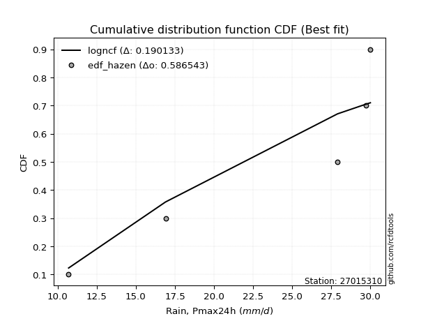</img>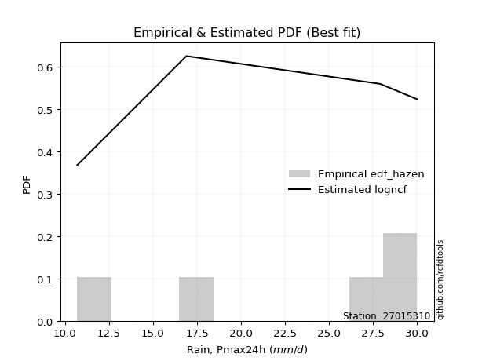</img>

</div>


### 3. Empirical - EDF Weibull (1939)

Weibull plotting position formula is an empirical method used to estimate the non-exceedance probability or plotting position for a set of observed data, is often recommended or widely used in practice, particularly in flood frequency analysis.

<div align="center">


$P=m/(n+1)$


</div>


**3.1. Empirical values**

<div align="center">

|                | 0                   | 1                  | 2                   | 3                  | 4                  | 5                  |
|:---------------|:--------------------|:-------------------|:--------------------|:-------------------|:-------------------|:-------------------|
| date           | 2025                | 2023               | 2022                | 2021               | 2017               | 2018               |
| x              | 0.1                 | 10.7               | 16.9                | 27.9               | 29.7               | 30.0               |
| m              | 1                   | 2                  | 3                   | 4                  | 5                  | 6                  |
| empirical_dist | edf_weibull         | edf_weibull        | edf_weibull         | edf_weibull        | edf_weibull        | edf_weibull        |
| empirical      | 0.14285714285714285 | 0.2857142857142857 | 0.42857142857142855 | 0.5714285714285714 | 0.7142857142857143 | 0.8571428571428571 |
| empirical_tr   | 1.1666666666666665  | 1.4                | 1.75                | 2.333333333333333  | 3.5                | 6.999999999999997  |

</div>


**3.2. Kolmogorov-Smirnov fit test (sorted by Δ)**


<div align="center">

|                | 0                  | 1                   | 2                   | 3                   | 4                   | 5                   | 6                  | 7                  | 8                   | 9                  | 10                 | 11                  | 12                | 13                  | 14                  | 15                 | 16                 | 17                  | 18                  | 19                  | 20                  | 21                  | 22                  | 23                  | 24                  | 25                 | 26                  | 27                 | 28                 | 29                  | 30                 | 31                  | 32                  | 33                  | 34                | 35                 | 36                  | 37                  | 38                 | 39                  | 40                  | 41                  | 42                 | 43                 | 44                  | 45                  | 46                 | 47                 | 48                 | 49                  | 50                  | 51                  | 52                  | 53                  | 54                | 55                  | 56                  | 57                  | 58                  | 59                 | 60                  | 61                  | 62                  | 63                  | 64                  | 65                  | 66                  | 67                 | 68                  | 69                  | 70                  | 71                  | 72                    | 73                  | 74                  | 75                 | 76                  | 77                 | 78                  | 79                  | 80                 | 81                 | 82                 | 83                 | 84                 | 85                 | 86                 | 87                 | 88                 | 89                 |
|:---------------|:-------------------|:--------------------|:--------------------|:--------------------|:--------------------|:--------------------|:-------------------|:-------------------|:--------------------|:-------------------|:-------------------|:--------------------|:------------------|:--------------------|:--------------------|:-------------------|:-------------------|:--------------------|:--------------------|:--------------------|:--------------------|:--------------------|:--------------------|:--------------------|:--------------------|:-------------------|:--------------------|:-------------------|:-------------------|:--------------------|:-------------------|:--------------------|:--------------------|:--------------------|:------------------|:-------------------|:--------------------|:--------------------|:-------------------|:--------------------|:--------------------|:--------------------|:-------------------|:-------------------|:--------------------|:--------------------|:-------------------|:-------------------|:-------------------|:--------------------|:--------------------|:--------------------|:--------------------|:--------------------|:------------------|:--------------------|:--------------------|:--------------------|:--------------------|:-------------------|:--------------------|:--------------------|:--------------------|:--------------------|:--------------------|:--------------------|:--------------------|:-------------------|:--------------------|:--------------------|:--------------------|:--------------------|:----------------------|:--------------------|:--------------------|:-------------------|:--------------------|:-------------------|:--------------------|:--------------------|:-------------------|:-------------------|:-------------------|:-------------------|:-------------------|:-------------------|:-------------------|:-------------------|:-------------------|:-------------------|
| station        | 27015310           | 27015310            | 27015310            | 27015310            | 27015310            | 27015310            | 27015310           | 27015310           | 27015310            | 27015310           | 27015310           | 27015310            | 27015310          | 27015310            | 27015310            | 27015310           | 27015310           | 27015310            | 27015310            | 27015310            | 27015310            | 27015310            | 27015310            | 27015310            | 27015310            | 27015310           | 27015310            | 27015310           | 27015310           | 27015310            | 27015310           | 27015310            | 27015310            | 27015310            | 27015310          | 27015310           | 27015310            | 27015310            | 27015310           | 27015310            | 27015310            | 27015310            | 27015310           | 27015310           | 27015310            | 27015310            | 27015310           | 27015310           | 27015310           | 27015310            | 27015310            | 27015310            | 27015310            | 27015310            | 27015310          | 27015310            | 27015310            | 27015310            | 27015310            | 27015310           | 27015310            | 27015310            | 27015310            | 27015310            | 27015310            | 27015310            | 27015310            | 27015310           | 27015310            | 27015310            | 27015310            | 27015310            | 27015310              | 27015310            | 27015310            | 27015310           | 27015310            | 27015310           | 27015310            | 27015310            | 27015310           | 27015310           | 27015310           | 27015310           | 27015310           | 27015310           | 27015310           | 27015310           | 27015310           | 27015310           |
| empirical_dist | edf_weibull        | edf_weibull         | edf_weibull         | edf_weibull         | edf_weibull         | edf_weibull         | edf_weibull        | edf_weibull        | edf_weibull         | edf_weibull        | edf_weibull        | edf_weibull         | edf_weibull       | edf_weibull         | edf_weibull         | edf_weibull        | edf_weibull        | edf_weibull         | edf_weibull         | edf_weibull         | edf_weibull         | edf_weibull         | edf_weibull         | edf_weibull         | edf_weibull         | edf_weibull        | edf_weibull         | edf_weibull        | edf_weibull        | edf_weibull         | edf_weibull        | edf_weibull         | edf_weibull         | edf_weibull         | edf_weibull       | edf_weibull        | edf_weibull         | edf_weibull         | edf_weibull        | edf_weibull         | edf_weibull         | edf_weibull         | edf_weibull        | edf_weibull        | edf_weibull         | edf_weibull         | edf_weibull        | edf_weibull        | edf_weibull        | edf_weibull         | edf_weibull         | edf_weibull         | edf_weibull         | edf_weibull         | edf_weibull       | edf_weibull         | edf_weibull         | edf_weibull         | edf_weibull         | edf_weibull        | edf_weibull         | edf_weibull         | edf_weibull         | edf_weibull         | edf_weibull         | edf_weibull         | edf_weibull         | edf_weibull        | edf_weibull         | edf_weibull         | edf_weibull         | edf_weibull         | edf_weibull           | edf_weibull         | edf_weibull         | edf_weibull        | edf_weibull         | edf_weibull        | edf_weibull         | edf_weibull         | edf_weibull        | edf_weibull        | edf_weibull        | edf_weibull        | edf_weibull        | edf_weibull        | edf_weibull        | edf_weibull        | edf_weibull        | edf_weibull        |
| p_dist         | ncf                | logpearson3         | invweibull          | fisk                | loggumbel_l         | loggompertz         | genexpon           | expon              | pearson3            | invgauss           | kstwobign          | gamma               | weibull_min       | f                   | rice                | fatiguelife        | nct                | crystalball         | norm                | exponnorm           | t                   | erlang              | gumbel_l            | betaprime           | logjohnsonsu        | alpha              | maxwell             | rayleigh           | invgamma           | laplace_asymmetric  | halfnorm           | logistic            | gumbel_r            | halflogistic        | hypsecant         | moyal              | logfatiguelife      | lognakagami         | logexponnorm       | logcrystalball      | lognorm             | lognorm             | logrice            | lognct             | nakagami            | loglognorm          | mielke             | loglogistic        | laplace            | loghypsecant        | loginvgamma         | logalpha            | loggamma            | loggamma            | loginvweibull     | loginvgauss         | loglaplace          | logmaxwell          | wald                | lograyleigh        | gompertz            | logkstwobign        | gibrat              | loghalfnorm         | loggumbel_r         | logt                | logncf              | logmoyal           | loghalflogistic     | logfisk             | logexpon            | pareto              | loglaplace_asymmetric | truncnorm           | logloggamma         | logpareto          | logwald             | logbetaprime       | logf                | loggibrat           | logtruncnorm       | logweibull_min     | logmielke          | loggenexpon        | chi2               | johnsonsu          | logchi2            | logerlang          | loggenlogistic     | genlogistic        |
| delta          | 0.1555503242545132 | 0.17920920673786556 | 0.18278295921322574 | 0.18438973852095475 | 0.18556205942094495 | 0.19260861388188322 | 0.1944168709462213 | 0.1949909085840793 | 0.20183889984604464 | 0.2019302620518607 | 0.2052121977400272 | 0.20891713486982044 | 0.208982326596158 | 0.21039011271202868 | 0.21040640493370943 | 0.2104760676337244 | 0.2106157027586566 | 0.21067001385290807 | 0.21067001390081574 | 0.21067146715589546 | 0.21068759093691602 | 0.21069860694260745 | 0.21104375737292225 | 0.21165050526590612 | 0.21281082433132592 | 0.2148367500869428 | 0.21600115959795696 | 0.2175097333103695 | 0.2183093544125957 | 0.22289454802002484 | 0.2236500472783659 | 0.23288794825452697 | 0.24187205712182613 | 0.24595983450340608 | 0.246525153830788 | 0.2521386819633512 | 0.25281695467079346 | 0.25342978219091983 | 0.2536242267141289 | 0.25362735085837185 | 0.25362736553714227 | 0.25362736553714227 | 0.2536446855774971 | 0.2540276340254545 | 0.25596589906915335 | 0.25633799165222915 | 0.2567858263549734 | 0.2589559278662231 | 0.2624845486942745 | 0.26347638354078173 | 0.26470211491740325 | 0.26655739095961484 | 0.27046641488410705 | 0.27046641488410705 | 0.273386448205431 | 0.27355992259020845 | 0.27947153744684405 | 0.28469238271668784 | 0.28646655441269975 | 0.2947457744030084 | 0.31057967413340404 | 0.31195370495635977 | 0.31424890253930315 | 0.32307324098933776 | 0.32406851391264413 | 0.34435106407862554 | 0.34509726206245717 | 0.3492259274502739 | 0.34997491599057595 | 0.36116400220872114 | 0.36256903752312064 | 0.36728643989362586 | 0.3711416304918541    | 0.37126879560926473 | 0.37130116485257647 | 0.4047118127637792 | 0.41904473891182226 | 0.4228383482130934 | 0.43205759747126604 | 0.44723200228373794 | 0.4608586565748528 | 0.5166424850355524 | 0.6012850334986342 | 0.6103667287053349 | 0.6353649968261647 | 0.6509176693954342 | 0.6625851063926548 | 0.6729817136784658 | 0.7142857142857143 | 0.7142857142857143 |
| deltao         | 0.530385761606     | 0.530385761606      | 0.530385761606      | 0.530385761606      | 0.530385761606      | 0.530385761606      | 0.530385761606     | 0.530385761606     | 0.530385761606      | 0.530385761606     | 0.530385761606     | 0.530385761606      | 0.530385761606    | 0.530385761606      | 0.530385761606      | 0.530385761606     | 0.530385761606     | 0.530385761606      | 0.530385761606      | 0.530385761606      | 0.530385761606      | 0.530385761606      | 0.530385761606      | 0.530385761606      | 0.530385761606      | 0.530385761606     | 0.530385761606      | 0.530385761606     | 0.530385761606     | 0.530385761606      | 0.530385761606     | 0.530385761606      | 0.530385761606      | 0.530385761606      | 0.530385761606    | 0.530385761606     | 0.530385761606      | 0.530385761606      | 0.530385761606     | 0.530385761606      | 0.530385761606      | 0.530385761606      | 0.530385761606     | 0.530385761606     | 0.530385761606      | 0.530385761606      | 0.530385761606     | 0.530385761606     | 0.530385761606     | 0.530385761606      | 0.530385761606      | 0.530385761606      | 0.530385761606      | 0.530385761606      | 0.530385761606    | 0.530385761606      | 0.530385761606      | 0.530385761606      | 0.530385761606      | 0.530385761606     | 0.530385761606      | 0.530385761606      | 0.530385761606      | 0.530385761606      | 0.530385761606      | 0.530385761606      | 0.530385761606      | 0.530385761606     | 0.530385761606      | 0.530385761606      | 0.530385761606      | 0.530385761606      | 0.530385761606        | 0.530385761606      | 0.530385761606      | 0.530385761606     | 0.530385761606      | 0.530385761606     | 0.530385761606      | 0.530385761606      | 0.530385761606     | 0.530385761606     | 0.530385761606     | 0.530385761606     | 0.530385761606     | 0.530385761606     | 0.530385761606     | 0.530385761606     | 0.530385761606     | 0.530385761606     |
| eval           | Δo > Δ             | Δo > Δ              | Δo > Δ              | Δo > Δ              | Δo > Δ              | Δo > Δ              | Δo > Δ             | Δo > Δ             | Δo > Δ              | Δo > Δ             | Δo > Δ             | Δo > Δ              | Δo > Δ            | Δo > Δ              | Δo > Δ              | Δo > Δ             | Δo > Δ             | Δo > Δ              | Δo > Δ              | Δo > Δ              | Δo > Δ              | Δo > Δ              | Δo > Δ              | Δo > Δ              | Δo > Δ              | Δo > Δ             | Δo > Δ              | Δo > Δ             | Δo > Δ             | Δo > Δ              | Δo > Δ             | Δo > Δ              | Δo > Δ              | Δo > Δ              | Δo > Δ            | Δo > Δ             | Δo > Δ              | Δo > Δ              | Δo > Δ             | Δo > Δ              | Δo > Δ              | Δo > Δ              | Δo > Δ             | Δo > Δ             | Δo > Δ              | Δo > Δ              | Δo > Δ             | Δo > Δ             | Δo > Δ             | Δo > Δ              | Δo > Δ              | Δo > Δ              | Δo > Δ              | Δo > Δ              | Δo > Δ            | Δo > Δ              | Δo > Δ              | Δo > Δ              | Δo > Δ              | Δo > Δ             | Δo > Δ              | Δo > Δ              | Δo > Δ              | Δo > Δ              | Δo > Δ              | Δo > Δ              | Δo > Δ              | Δo > Δ             | Δo > Δ              | Δo > Δ              | Δo > Δ              | Δo > Δ              | Δo > Δ                | Δo > Δ              | Δo > Δ              | Δo > Δ             | Δo > Δ              | Δo > Δ             | Δo > Δ              | Δo > Δ              | Δo > Δ             | Δo > Δ             | Δo <= Δ            | Δo <= Δ            | Δo <= Δ            | Δo <= Δ            | Δo <= Δ            | Δo <= Δ            | Δo <= Δ            | Δo <= Δ            |
| fit            | 1                  | 1                   | 1                   | 1                   | 1                   | 1                   | 1                  | 1                  | 1                   | 1                  | 1                  | 1                   | 1                 | 1                   | 1                   | 1                  | 1                  | 1                   | 1                   | 1                   | 1                   | 1                   | 1                   | 1                   | 1                   | 1                  | 1                   | 1                  | 1                  | 1                   | 1                  | 1                   | 1                   | 1                   | 1                 | 1                  | 1                   | 1                   | 1                  | 1                   | 1                   | 1                   | 1                  | 1                  | 1                   | 1                   | 1                  | 1                  | 1                  | 1                   | 1                   | 1                   | 1                   | 1                   | 1                 | 1                   | 1                   | 1                   | 1                   | 1                  | 1                   | 1                   | 1                   | 1                   | 1                   | 1                   | 1                   | 1                  | 1                   | 1                   | 1                   | 1                   | 1                     | 1                   | 1                   | 1                  | 1                   | 1                  | 1                   | 1                   | 1                  | 1                  | 0                  | 0                  | 0                  | 0                  | 0                  | 0                  | 0                  | 0                  |
| n              | 6                  | 6                   | 6                   | 6                   | 6                   | 6                   | 6                  | 6                  | 6                   | 6                  | 6                  | 6                   | 6                 | 6                   | 6                   | 6                  | 6                  | 6                   | 6                   | 6                   | 6                   | 6                   | 6                   | 6                   | 6                   | 6                  | 6                   | 6                  | 6                  | 6                   | 6                  | 6                   | 6                   | 6                   | 6                 | 6                  | 6                   | 6                   | 6                  | 6                   | 6                   | 6                   | 6                  | 6                  | 6                   | 6                   | 6                  | 6                  | 6                  | 6                   | 6                   | 6                   | 6                   | 6                   | 6                 | 6                   | 6                   | 6                   | 6                   | 6                  | 6                   | 6                   | 6                   | 6                   | 6                   | 6                   | 6                   | 6                  | 6                   | 6                   | 6                   | 6                   | 6                     | 6                   | 6                   | 6                  | 6                   | 6                  | 6                   | 6                   | 6                  | 6                  | 6                  | 6                  | 6                  | 6                  | 6                  | 6                  | 6                  | 6                  |
| best_fit       | 1                  | 0                   | 0                   | 0                   | 0                   | 0                   | 0                  | 0                  | 0                   | 0                  | 0                  | 0                   | 0                 | 0                   | 0                   | 0                  | 0                  | 0                   | 0                   | 0                   | 0                   | 0                   | 0                   | 0                   | 0                   | 0                  | 0                   | 0                  | 0                  | 0                   | 0                  | 0                   | 0                   | 0                   | 0                 | 0                  | 0                   | 0                   | 0                  | 0                   | 0                   | 0                   | 0                  | 0                  | 0                   | 0                   | 0                  | 0                  | 0                  | 0                   | 0                   | 0                   | 0                   | 0                   | 0                 | 0                   | 0                   | 0                   | 0                   | 0                  | 0                   | 0                   | 0                   | 0                   | 0                   | 0                   | 0                   | 0                  | 0                   | 0                   | 0                   | 0                   | 0                     | 0                   | 0                   | 0                  | 0                   | 0                  | 0                   | 0                   | 0                  | 0                  | 0                  | 0                  | 0                  | 0                  | 0                  | 0                  | 0                  | 0                  |
| best_fit_sort  | 1                  | 2                   | 3                   | 4                   | 5                   | 6                   | 7                  | 8                  | 9                   | 10                 | 11                 | 12                  | 13                | 14                  | 15                  | 16                 | 17                 | 18                  | 19                  | 20                  | 21                  | 22                  | 23                  | 24                  | 25                  | 26                 | 27                  | 28                 | 29                 | 30                  | 31                 | 32                  | 33                  | 34                  | 35                | 36                 | 37                  | 38                  | 39                 | 40                  | 41                  | 42                  | 43                 | 44                 | 45                  | 46                  | 47                 | 48                 | 49                 | 50                  | 51                  | 52                  | 53                  | 54                  | 55                | 56                  | 57                  | 58                  | 59                  | 60                 | 61                  | 62                  | 63                  | 64                  | 65                  | 66                  | 67                  | 68                 | 69                  | 70                  | 71                  | 72                  | 73                    | 74                  | 75                  | 76                 | 77                  | 78                 | 79                  | 80                  | 81                 | 82                 | 83                 | 84                 | 85                 | 86                 | 87                 | 88                 | 89                 | 90                 |

</div>


<div align="center">

</img>

</div>


**3.3. Best fit**

<div align="center">

|   id |   station | empirical_dist   | p_dist   |   delta |   deltao | eval   |   fit |   n |   best_fit |   best_fit_sort |
|-----:|----------:|:-----------------|:---------|--------:|---------:|:-------|------:|----:|-----------:|----------------:|
|    0 |  27015310 | edf_weibull      | ncf      | 0.15555 | 0.530386 | Δo > Δ |     1 |   6 |          1 |               1 |

</div>


<div align="center">

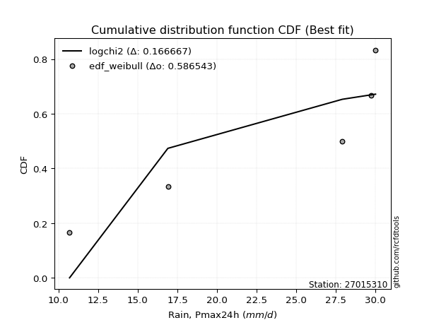</img>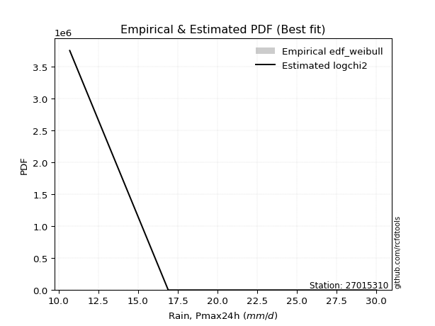</img>

</div>


### 4. Empirical - EDF Beard (1943)

The Beard formula (or Beard´s plotting position formula) in hydrology is used to estimate the empirical non-exceedance probability _(P)_ of a flood event (or other extreme hydrological data point) within a given dataset.

<div align="center">


$P=(m-0.31)/(n+0.38)$


</div>


**4.1. Empirical values**

<div align="center">

|                | 0                   | 1                   | 2                  | 3                  | 4                  | 5                  |
|:---------------|:--------------------|:--------------------|:-------------------|:-------------------|:-------------------|:-------------------|
| date           | 2025                | 2023                | 2022               | 2021               | 2017               | 2018               |
| x              | 0.1                 | 10.7                | 16.9               | 27.9               | 29.7               | 30.0               |
| m              | 1                   | 2                   | 3                  | 4                  | 5                  | 6                  |
| empirical_dist | edf_beard           | edf_beard           | edf_beard          | edf_beard          | edf_beard          | edf_beard          |
| empirical      | 0.10815047021943573 | 0.26489028213166144 | 0.4216300940438871 | 0.5783699059561128 | 0.7351097178683387 | 0.8918495297805643 |
| empirical_tr   | 1.1212653778558874  | 1.3603411513859276  | 1.7289972899728996 | 2.3717472118959106 | 3.7751479289940844 | 9.246376811594207  |

</div>


**4.2. Kolmogorov-Smirnov fit test (sorted by Δ)**


<div align="center">

|                | 0                   | 1                   | 2                  | 3                   | 4                   | 5                   | 6                   | 7                  | 8                   | 9                   | 10                 | 11                  | 12                | 13                  | 14                  | 15                  | 16                  | 17                  | 18                 | 19                  | 20                  | 21                 | 22                 | 23                 | 24                  | 25                  | 26                  | 27                  | 28                  | 29                  | 30                  | 31                 | 32                 | 33                  | 34                  | 35                  | 36                 | 37                 | 38                 | 39                 | 40                  | 41                 | 42                  | 43                  | 44                  | 45                  | 46                 | 47                 | 48                 | 49                 | 50                | 51                 | 52                 | 53                 | 54                 | 55                  | 56                 | 57                 | 58                 | 59                 | 60                  | 61                 | 62                  | 63                | 64                 | 65                  | 66                    | 67                 | 68                  | 69                  | 70                 | 71                 | 72                 | 73                 | 74                 | 75                 | 76                 | 77                  | 78                 | 79                 | 80                  | 81                 | 82                 | 83                 | 84                 | 85                 | 86                | 87                 | 88                 | 89                 |
|:---------------|:--------------------|:--------------------|:-------------------|:--------------------|:--------------------|:--------------------|:--------------------|:-------------------|:--------------------|:--------------------|:-------------------|:--------------------|:------------------|:--------------------|:--------------------|:--------------------|:--------------------|:--------------------|:-------------------|:--------------------|:--------------------|:-------------------|:-------------------|:-------------------|:--------------------|:--------------------|:--------------------|:--------------------|:--------------------|:--------------------|:--------------------|:-------------------|:-------------------|:--------------------|:--------------------|:--------------------|:-------------------|:-------------------|:-------------------|:-------------------|:--------------------|:-------------------|:--------------------|:--------------------|:--------------------|:--------------------|:-------------------|:-------------------|:-------------------|:-------------------|:------------------|:-------------------|:-------------------|:-------------------|:-------------------|:--------------------|:-------------------|:-------------------|:-------------------|:-------------------|:--------------------|:-------------------|:--------------------|:------------------|:-------------------|:--------------------|:----------------------|:-------------------|:--------------------|:--------------------|:-------------------|:-------------------|:-------------------|:-------------------|:-------------------|:-------------------|:-------------------|:--------------------|:-------------------|:-------------------|:--------------------|:-------------------|:-------------------|:-------------------|:-------------------|:-------------------|:------------------|:-------------------|:-------------------|:-------------------|
| station        | 27015310            | 27015310            | 27015310           | 27015310            | 27015310            | 27015310            | 27015310            | 27015310           | 27015310            | 27015310            | 27015310           | 27015310            | 27015310          | 27015310            | 27015310            | 27015310            | 27015310            | 27015310            | 27015310           | 27015310            | 27015310            | 27015310           | 27015310           | 27015310           | 27015310            | 27015310            | 27015310            | 27015310            | 27015310            | 27015310            | 27015310            | 27015310           | 27015310           | 27015310            | 27015310            | 27015310            | 27015310           | 27015310           | 27015310           | 27015310           | 27015310            | 27015310           | 27015310            | 27015310            | 27015310            | 27015310            | 27015310           | 27015310           | 27015310           | 27015310           | 27015310          | 27015310           | 27015310           | 27015310           | 27015310           | 27015310            | 27015310           | 27015310           | 27015310           | 27015310           | 27015310            | 27015310           | 27015310            | 27015310          | 27015310           | 27015310            | 27015310              | 27015310           | 27015310            | 27015310            | 27015310           | 27015310           | 27015310           | 27015310           | 27015310           | 27015310           | 27015310           | 27015310            | 27015310           | 27015310           | 27015310            | 27015310           | 27015310           | 27015310           | 27015310           | 27015310           | 27015310          | 27015310           | 27015310           | 27015310           |
| empirical_dist | edf_beard           | edf_beard           | edf_beard          | edf_beard           | edf_beard           | edf_beard           | edf_beard           | edf_beard          | edf_beard           | edf_beard           | edf_beard          | edf_beard           | edf_beard         | edf_beard           | edf_beard           | edf_beard           | edf_beard           | edf_beard           | edf_beard          | edf_beard           | edf_beard           | edf_beard          | edf_beard          | edf_beard          | edf_beard           | edf_beard           | edf_beard           | edf_beard           | edf_beard           | edf_beard           | edf_beard           | edf_beard          | edf_beard          | edf_beard           | edf_beard           | edf_beard           | edf_beard          | edf_beard          | edf_beard          | edf_beard          | edf_beard           | edf_beard          | edf_beard           | edf_beard           | edf_beard           | edf_beard           | edf_beard          | edf_beard          | edf_beard          | edf_beard          | edf_beard         | edf_beard          | edf_beard          | edf_beard          | edf_beard          | edf_beard           | edf_beard          | edf_beard          | edf_beard          | edf_beard          | edf_beard           | edf_beard          | edf_beard           | edf_beard         | edf_beard          | edf_beard           | edf_beard             | edf_beard          | edf_beard           | edf_beard           | edf_beard          | edf_beard          | edf_beard          | edf_beard          | edf_beard          | edf_beard          | edf_beard          | edf_beard           | edf_beard          | edf_beard          | edf_beard           | edf_beard          | edf_beard          | edf_beard          | edf_beard          | edf_beard          | edf_beard         | edf_beard          | edf_beard          | edf_beard          |
| p_dist         | invweibull          | fisk                | loggompertz        | genexpon            | expon               | ncf                 | pearson3            | invgauss           | kstwobign           | gamma               | weibull_min        | f                   | rice              | fatiguelife         | nct                 | crystalball         | norm                | exponnorm           | t                  | erlang              | gumbel_l            | betaprime          | loggumbel_l        | alpha              | maxwell             | rayleigh            | invgamma            | logpearson3         | laplace_asymmetric  | halfnorm            | logistic            | logjohnsonsu       | gumbel_r           | halflogistic        | hypsecant           | mielke              | moyal              | laplace            | logfatiguelife     | lognakagami        | logexponnorm        | logcrystalball     | lognorm             | lognorm             | logrice             | lognct              | nakagami           | loglognorm         | wald               | loglogistic        | loghypsecant      | loginvgamma        | logalpha           | loggamma           | loggamma           | loginvweibull       | loginvgauss        | loglaplace         | gompertz           | logmaxwell         | gibrat              | lograyleigh        | logkstwobign        | loghalfnorm       | loggumbel_r        | logt                | loglaplace_asymmetric | truncnorm          | logloggamma         | logncf              | logmoyal           | loghalflogistic    | logfisk            | logexpon           | pareto             | logpareto          | logwald            | logbetaprime        | logf               | loggibrat          | logtruncnorm        | logweibull_min     | logmielke          | loggenexpon        | chi2               | johnsonsu          | logchi2           | logerlang          | loggenlogistic     | genlogistic        |
| delta          | 0.17584162468568432 | 0.17744840399341333 | 0.1856672793543418 | 0.18747553641867987 | 0.18804957405653788 | 0.19025699689222042 | 0.19489756531850322 | 0.1949889275243193 | 0.19827086321248577 | 0.20197580034227902 | 0.2020409920686166 | 0.20344877818448726 | 0.203465070406168 | 0.20353473310618297 | 0.20367436823111518 | 0.20372867932536665 | 0.20372867937327432 | 0.20373013262835404 | 0.2037462564093746 | 0.20375727241506603 | 0.20410242284538083 | 0.2047091707383647 | 0.2063860630035692 | 0.2078954155594014 | 0.20905982507041554 | 0.21056839878282807 | 0.21136801988505427 | 0.21391587937557277 | 0.21595321349248342 | 0.21670871275082448 | 0.22594661372698555 | 0.2336348279139503 | 0.2349307225942847 | 0.23901849997586466 | 0.23958381930324657 | 0.24366723698885662 | 0.2451973474358098 | 0.2555432141667331 | 0.2736409582534177 | 0.2742537857735441 | 0.27444823029675314 | 0.2744513544409961 | 0.27445136911976653 | 0.27445136911976653 | 0.27446868916012135 | 0.27485163760807874 | 0.2767899026517776 | 0.2771619952348534 | 0.2795252198851583 | 0.2797799314488474 | 0.284300387123406 | 0.2855261185000275 | 0.2873813945422391 | 0.2912904184667313 | 0.2912904184667313 | 0.29421045178805527 | 0.2943839261728327 | 0.3002955410294683 | 0.3036383396058626 | 0.3055163862993121 | 0.30730756801176173 | 0.3155697779856327 | 0.33277770853898403 | 0.343897244571962 | 0.3448925174952684 | 0.35129239860616696 | 0.3642002959643127    | 0.3643274610817233 | 0.36435983032503505 | 0.36592126564508143 | 0.3700499310328982 | 0.3707989195732002 | 0.3819880057913454 | 0.3833930411057449 | 0.3881104434762501 | 0.4255358163464035 | 0.4398687424944465 | 0.44366235179571767 | 0.4528816010538903 | 0.4680560058663622 | 0.48168266015747707 | 0.5374664886181767 | 0.6221090370812584 | 0.6311907322879592 | 0.6561890004087889 | 0.6717416729780585 | 0.683409109975279 | 0.6938057172610901 | 0.7351097178683387 | 0.7351097178683387 |
| deltao         | 0.530385761606      | 0.530385761606      | 0.530385761606     | 0.530385761606      | 0.530385761606      | 0.530385761606      | 0.530385761606      | 0.530385761606     | 0.530385761606      | 0.530385761606      | 0.530385761606     | 0.530385761606      | 0.530385761606    | 0.530385761606      | 0.530385761606      | 0.530385761606      | 0.530385761606      | 0.530385761606      | 0.530385761606     | 0.530385761606      | 0.530385761606      | 0.530385761606     | 0.530385761606     | 0.530385761606     | 0.530385761606      | 0.530385761606      | 0.530385761606      | 0.530385761606      | 0.530385761606      | 0.530385761606      | 0.530385761606      | 0.530385761606     | 0.530385761606     | 0.530385761606      | 0.530385761606      | 0.530385761606      | 0.530385761606     | 0.530385761606     | 0.530385761606     | 0.530385761606     | 0.530385761606      | 0.530385761606     | 0.530385761606      | 0.530385761606      | 0.530385761606      | 0.530385761606      | 0.530385761606     | 0.530385761606     | 0.530385761606     | 0.530385761606     | 0.530385761606    | 0.530385761606     | 0.530385761606     | 0.530385761606     | 0.530385761606     | 0.530385761606      | 0.530385761606     | 0.530385761606     | 0.530385761606     | 0.530385761606     | 0.530385761606      | 0.530385761606     | 0.530385761606      | 0.530385761606    | 0.530385761606     | 0.530385761606      | 0.530385761606        | 0.530385761606     | 0.530385761606      | 0.530385761606      | 0.530385761606     | 0.530385761606     | 0.530385761606     | 0.530385761606     | 0.530385761606     | 0.530385761606     | 0.530385761606     | 0.530385761606      | 0.530385761606     | 0.530385761606     | 0.530385761606      | 0.530385761606     | 0.530385761606     | 0.530385761606     | 0.530385761606     | 0.530385761606     | 0.530385761606    | 0.530385761606     | 0.530385761606     | 0.530385761606     |
| eval           | Δo > Δ              | Δo > Δ              | Δo > Δ             | Δo > Δ              | Δo > Δ              | Δo > Δ              | Δo > Δ              | Δo > Δ             | Δo > Δ              | Δo > Δ              | Δo > Δ             | Δo > Δ              | Δo > Δ            | Δo > Δ              | Δo > Δ              | Δo > Δ              | Δo > Δ              | Δo > Δ              | Δo > Δ             | Δo > Δ              | Δo > Δ              | Δo > Δ             | Δo > Δ             | Δo > Δ             | Δo > Δ              | Δo > Δ              | Δo > Δ              | Δo > Δ              | Δo > Δ              | Δo > Δ              | Δo > Δ              | Δo > Δ             | Δo > Δ             | Δo > Δ              | Δo > Δ              | Δo > Δ              | Δo > Δ             | Δo > Δ             | Δo > Δ             | Δo > Δ             | Δo > Δ              | Δo > Δ             | Δo > Δ              | Δo > Δ              | Δo > Δ              | Δo > Δ              | Δo > Δ             | Δo > Δ             | Δo > Δ             | Δo > Δ             | Δo > Δ            | Δo > Δ             | Δo > Δ             | Δo > Δ             | Δo > Δ             | Δo > Δ              | Δo > Δ             | Δo > Δ             | Δo > Δ             | Δo > Δ             | Δo > Δ              | Δo > Δ             | Δo > Δ              | Δo > Δ            | Δo > Δ             | Δo > Δ              | Δo > Δ                | Δo > Δ             | Δo > Δ              | Δo > Δ              | Δo > Δ             | Δo > Δ             | Δo > Δ             | Δo > Δ             | Δo > Δ             | Δo > Δ             | Δo > Δ             | Δo > Δ              | Δo > Δ             | Δo > Δ             | Δo > Δ              | Δo <= Δ            | Δo <= Δ            | Δo <= Δ            | Δo <= Δ            | Δo <= Δ            | Δo <= Δ           | Δo <= Δ            | Δo <= Δ            | Δo <= Δ            |
| fit            | 1                   | 1                   | 1                  | 1                   | 1                   | 1                   | 1                   | 1                  | 1                   | 1                   | 1                  | 1                   | 1                 | 1                   | 1                   | 1                   | 1                   | 1                   | 1                  | 1                   | 1                   | 1                  | 1                  | 1                  | 1                   | 1                   | 1                   | 1                   | 1                   | 1                   | 1                   | 1                  | 1                  | 1                   | 1                   | 1                   | 1                  | 1                  | 1                  | 1                  | 1                   | 1                  | 1                   | 1                   | 1                   | 1                   | 1                  | 1                  | 1                  | 1                  | 1                 | 1                  | 1                  | 1                  | 1                  | 1                   | 1                  | 1                  | 1                  | 1                  | 1                   | 1                  | 1                   | 1                 | 1                  | 1                   | 1                     | 1                  | 1                   | 1                   | 1                  | 1                  | 1                  | 1                  | 1                  | 1                  | 1                  | 1                   | 1                  | 1                  | 1                   | 0                  | 0                  | 0                  | 0                  | 0                  | 0                 | 0                  | 0                  | 0                  |
| n              | 6                   | 6                   | 6                  | 6                   | 6                   | 6                   | 6                   | 6                  | 6                   | 6                   | 6                  | 6                   | 6                 | 6                   | 6                   | 6                   | 6                   | 6                   | 6                  | 6                   | 6                   | 6                  | 6                  | 6                  | 6                   | 6                   | 6                   | 6                   | 6                   | 6                   | 6                   | 6                  | 6                  | 6                   | 6                   | 6                   | 6                  | 6                  | 6                  | 6                  | 6                   | 6                  | 6                   | 6                   | 6                   | 6                   | 6                  | 6                  | 6                  | 6                  | 6                 | 6                  | 6                  | 6                  | 6                  | 6                   | 6                  | 6                  | 6                  | 6                  | 6                   | 6                  | 6                   | 6                 | 6                  | 6                   | 6                     | 6                  | 6                   | 6                   | 6                  | 6                  | 6                  | 6                  | 6                  | 6                  | 6                  | 6                   | 6                  | 6                  | 6                   | 6                  | 6                  | 6                  | 6                  | 6                  | 6                 | 6                  | 6                  | 6                  |
| best_fit       | 1                   | 0                   | 0                  | 0                   | 0                   | 0                   | 0                   | 0                  | 0                   | 0                   | 0                  | 0                   | 0                 | 0                   | 0                   | 0                   | 0                   | 0                   | 0                  | 0                   | 0                   | 0                  | 0                  | 0                  | 0                   | 0                   | 0                   | 0                   | 0                   | 0                   | 0                   | 0                  | 0                  | 0                   | 0                   | 0                   | 0                  | 0                  | 0                  | 0                  | 0                   | 0                  | 0                   | 0                   | 0                   | 0                   | 0                  | 0                  | 0                  | 0                  | 0                 | 0                  | 0                  | 0                  | 0                  | 0                   | 0                  | 0                  | 0                  | 0                  | 0                   | 0                  | 0                   | 0                 | 0                  | 0                   | 0                     | 0                  | 0                   | 0                   | 0                  | 0                  | 0                  | 0                  | 0                  | 0                  | 0                  | 0                   | 0                  | 0                  | 0                   | 0                  | 0                  | 0                  | 0                  | 0                  | 0                 | 0                  | 0                  | 0                  |
| best_fit_sort  | 1                   | 2                   | 3                  | 4                   | 5                   | 6                   | 7                   | 8                  | 9                   | 10                  | 11                 | 12                  | 13                | 14                  | 15                  | 16                  | 17                  | 18                  | 19                 | 20                  | 21                  | 22                 | 23                 | 24                 | 25                  | 26                  | 27                  | 28                  | 29                  | 30                  | 31                  | 32                 | 33                 | 34                  | 35                  | 36                  | 37                 | 38                 | 39                 | 40                 | 41                  | 42                 | 43                  | 44                  | 45                  | 46                  | 47                 | 48                 | 49                 | 50                 | 51                | 52                 | 53                 | 54                 | 55                 | 56                  | 57                 | 58                 | 59                 | 60                 | 61                  | 62                 | 63                  | 64                | 65                 | 66                  | 67                    | 68                 | 69                  | 70                  | 71                 | 72                 | 73                 | 74                 | 75                 | 76                 | 77                 | 78                  | 79                 | 80                 | 81                  | 82                 | 83                 | 84                 | 85                 | 86                 | 87                | 88                 | 89                 | 90                 |

</div>


<div align="center">

</img>

</div>


**4.3. Best fit**

<div align="center">

|   id |   station | empirical_dist   | p_dist     |    delta |   deltao | eval   |   fit |   n |   best_fit |   best_fit_sort |
|-----:|----------:|:-----------------|:-----------|---------:|---------:|:-------|------:|----:|-----------:|----------------:|
|    0 |  27015310 | edf_beard        | invweibull | 0.175842 | 0.530386 | Δo > Δ |     1 |   6 |          1 |               1 |

</div>


<div align="center">

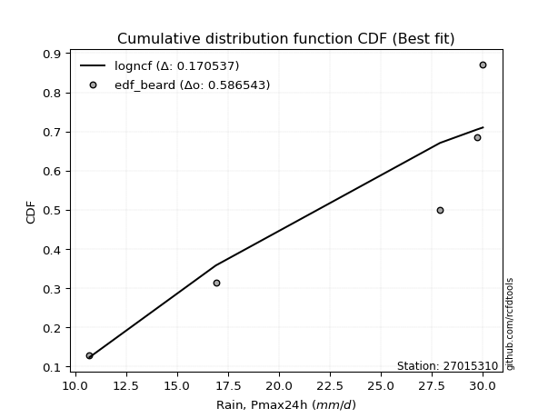</img></img>

</div>


### 5. Empirical - EDF Chegodayev (1955)

The Chegodayev formula is an empirical plotting position formula used in hydrological frequency analysis to estimate the exceedance probability or return period of a specific event from a set of observed data. It is primarily used for plotting observed data points on probability paper to fit a theoretical distribution, particularly for analyzing extreme events like maximum flood flows or rainfall intensities. The constant _b_ value in the generalized plotting position formula is 0.3.

<div align="center">


$P=(m-b)/(n+1-2b)$


</div>


**5.1. Empirical values**

<div align="center">

|                | 0                   | 1                  | 2                  | 3                  | 4                 | 5                 |
|:---------------|:--------------------|:-------------------|:-------------------|:-------------------|:------------------|:------------------|
| date           | 2025                | 2023               | 2022               | 2021               | 2017              | 2018              |
| x              | 0.1                 | 10.7               | 16.9               | 27.9               | 29.7              | 30.0              |
| m              | 1                   | 2                  | 3                  | 4                  | 5                 | 6                 |
| empirical_dist | edf_chegodayev      | edf_chegodayev     | edf_chegodayev     | edf_chegodayev     | edf_chegodayev    | edf_chegodayev    |
| empirical      | 0.10937499999999999 | 0.265625           | 0.421875           | 0.578125           | 0.734375          | 0.890625          |
| empirical_tr   | 1.1228070175438596  | 1.3617021276595744 | 1.7297297297297298 | 2.3703703703703702 | 3.764705882352941 | 9.142857142857142 |

</div>


**5.2. Kolmogorov-Smirnov fit test (sorted by Δ)**


<div align="center">

|                | 0                   | 1                   | 2                   | 3                   | 4                  | 5                  | 6                   | 7                  | 8                  | 9                   | 10                 | 11                  | 12                  | 13                 | 14                | 15                  | 16                  | 17                  | 18                  | 19                  | 20                  | 21                  | 22                  | 23                 | 24                  | 25                 | 26                 | 27                  | 28                  | 29                 | 30                  | 31                  | 32                  | 33                  | 34                 | 35                  | 36                 | 37                 | 38                  | 39                 | 40                 | 41                  | 42                  | 43                  | 44                 | 45                 | 46                  | 47                  | 48                 | 49                  | 50                  | 51                  | 52                  | 53                  | 54                  | 55                 | 56                  | 57                  | 58                 | 59                  | 60                  | 61                 | 62                  | 63                  | 64                  | 65                  | 66                    | 67                  | 68                  | 69                  | 70                 | 71                  | 72                  | 73                  | 74                  | 75                 | 76                  | 77                 | 78                  | 79                  | 80                 | 81                 | 82                 | 83                 | 84                 | 85                 | 86                 | 87                 | 88             | 89             |
|:---------------|:--------------------|:--------------------|:--------------------|:--------------------|:-------------------|:-------------------|:--------------------|:-------------------|:-------------------|:--------------------|:-------------------|:--------------------|:--------------------|:-------------------|:------------------|:--------------------|:--------------------|:--------------------|:--------------------|:--------------------|:--------------------|:--------------------|:--------------------|:-------------------|:--------------------|:-------------------|:-------------------|:--------------------|:--------------------|:-------------------|:--------------------|:--------------------|:--------------------|:--------------------|:-------------------|:--------------------|:-------------------|:-------------------|:--------------------|:-------------------|:-------------------|:--------------------|:--------------------|:--------------------|:-------------------|:-------------------|:--------------------|:--------------------|:-------------------|:--------------------|:--------------------|:--------------------|:--------------------|:--------------------|:--------------------|:-------------------|:--------------------|:--------------------|:-------------------|:--------------------|:--------------------|:-------------------|:--------------------|:--------------------|:--------------------|:--------------------|:----------------------|:--------------------|:--------------------|:--------------------|:-------------------|:--------------------|:--------------------|:--------------------|:--------------------|:-------------------|:--------------------|:-------------------|:--------------------|:--------------------|:-------------------|:-------------------|:-------------------|:-------------------|:-------------------|:-------------------|:-------------------|:-------------------|:---------------|:---------------|
| station        | 27015310            | 27015310            | 27015310            | 27015310            | 27015310           | 27015310           | 27015310            | 27015310           | 27015310           | 27015310            | 27015310           | 27015310            | 27015310            | 27015310           | 27015310          | 27015310            | 27015310            | 27015310            | 27015310            | 27015310            | 27015310            | 27015310            | 27015310            | 27015310           | 27015310            | 27015310           | 27015310           | 27015310            | 27015310            | 27015310           | 27015310            | 27015310            | 27015310            | 27015310            | 27015310           | 27015310            | 27015310           | 27015310           | 27015310            | 27015310           | 27015310           | 27015310            | 27015310            | 27015310            | 27015310           | 27015310           | 27015310            | 27015310            | 27015310           | 27015310            | 27015310            | 27015310            | 27015310            | 27015310            | 27015310            | 27015310           | 27015310            | 27015310            | 27015310           | 27015310            | 27015310            | 27015310           | 27015310            | 27015310            | 27015310            | 27015310            | 27015310              | 27015310            | 27015310            | 27015310            | 27015310           | 27015310            | 27015310            | 27015310            | 27015310            | 27015310           | 27015310            | 27015310           | 27015310            | 27015310            | 27015310           | 27015310           | 27015310           | 27015310           | 27015310           | 27015310           | 27015310           | 27015310           | 27015310       | 27015310       |
| empirical_dist | edf_chegodayev      | edf_chegodayev      | edf_chegodayev      | edf_chegodayev      | edf_chegodayev     | edf_chegodayev     | edf_chegodayev      | edf_chegodayev     | edf_chegodayev     | edf_chegodayev      | edf_chegodayev     | edf_chegodayev      | edf_chegodayev      | edf_chegodayev     | edf_chegodayev    | edf_chegodayev      | edf_chegodayev      | edf_chegodayev      | edf_chegodayev      | edf_chegodayev      | edf_chegodayev      | edf_chegodayev      | edf_chegodayev      | edf_chegodayev     | edf_chegodayev      | edf_chegodayev     | edf_chegodayev     | edf_chegodayev      | edf_chegodayev      | edf_chegodayev     | edf_chegodayev      | edf_chegodayev      | edf_chegodayev      | edf_chegodayev      | edf_chegodayev     | edf_chegodayev      | edf_chegodayev     | edf_chegodayev     | edf_chegodayev      | edf_chegodayev     | edf_chegodayev     | edf_chegodayev      | edf_chegodayev      | edf_chegodayev      | edf_chegodayev     | edf_chegodayev     | edf_chegodayev      | edf_chegodayev      | edf_chegodayev     | edf_chegodayev      | edf_chegodayev      | edf_chegodayev      | edf_chegodayev      | edf_chegodayev      | edf_chegodayev      | edf_chegodayev     | edf_chegodayev      | edf_chegodayev      | edf_chegodayev     | edf_chegodayev      | edf_chegodayev      | edf_chegodayev     | edf_chegodayev      | edf_chegodayev      | edf_chegodayev      | edf_chegodayev      | edf_chegodayev        | edf_chegodayev      | edf_chegodayev      | edf_chegodayev      | edf_chegodayev     | edf_chegodayev      | edf_chegodayev      | edf_chegodayev      | edf_chegodayev      | edf_chegodayev     | edf_chegodayev      | edf_chegodayev     | edf_chegodayev      | edf_chegodayev      | edf_chegodayev     | edf_chegodayev     | edf_chegodayev     | edf_chegodayev     | edf_chegodayev     | edf_chegodayev     | edf_chegodayev     | edf_chegodayev     | edf_chegodayev | edf_chegodayev |
| p_dist         | invweibull          | fisk                | loggompertz         | genexpon            | expon              | ncf                | pearson3            | invgauss           | kstwobign          | gamma               | weibull_min        | f                   | rice                | fatiguelife        | nct               | crystalball         | norm                | exponnorm           | t                   | erlang              | gumbel_l            | betaprime           | loggumbel_l         | alpha              | maxwell             | rayleigh           | invgamma           | logpearson3         | laplace_asymmetric  | halfnorm           | logistic            | logjohnsonsu        | gumbel_r            | halflogistic        | hypsecant          | mielke              | moyal              | laplace            | logfatiguelife      | lognakagami        | logexponnorm       | logcrystalball      | lognorm             | lognorm             | logrice            | lognct             | nakagami            | loglognorm          | loglogistic        | wald                | loghypsecant        | loginvgamma         | logalpha            | loggamma            | loggamma            | loginvweibull      | loginvgauss         | loglaplace          | gompertz           | logmaxwell          | gibrat              | lograyleigh        | logkstwobign        | loghalfnorm         | loggumbel_r         | logt                | loglaplace_asymmetric | truncnorm           | logloggamma         | logncf              | logmoyal           | loghalflogistic     | logfisk             | logexpon            | pareto              | logpareto          | logwald             | logbetaprime       | logf                | loggibrat           | logtruncnorm       | logweibull_min     | logmielke          | loggenexpon        | chi2               | johnsonsu          | logchi2            | logerlang          | loggenlogistic | genlogistic    |
| delta          | 0.17608653064179713 | 0.17769330994952615 | 0.18591218531045461 | 0.18772044237479268 | 0.1882944800126507 | 0.1890324671116561 | 0.19514247127461604 | 0.1952338334804321 | 0.1985157691685986 | 0.20222070629839184 | 0.2022858980247294 | 0.20369368414060007 | 0.20370997636228083 | 0.2037796390622958 | 0.203919274187228 | 0.20397358528147946 | 0.20397358532938714 | 0.20397503858446686 | 0.20399116236548742 | 0.20400217837117884 | 0.20434732880149364 | 0.20495407669447752 | 0.20565134513523065 | 0.2081403215155142 | 0.20930473102652836 | 0.2108133047389409 | 0.2116129258411671 | 0.21269134959500846 | 0.21619811944859624 | 0.2169536187069373 | 0.22619151968309836 | 0.23290011004561162 | 0.23517562855039753 | 0.23926340593197748 | 0.2398287252593594 | 0.24391214294496943 | 0.2454422533919226 | 0.2557881201228459 | 0.27290624038507916 | 0.2735190679052055 | 0.2737135124284146 | 0.27371663657265755 | 0.27371665125142797 | 0.27371665125142797 | 0.2737339712917828 | 0.2741169197397402 | 0.27605518478343904 | 0.27642727736651485 | 0.2790452135805088 | 0.27977012584127114 | 0.28356566925506743 | 0.28479140063168895 | 0.28664667667390054 | 0.29055570059839275 | 0.29055570059839275 | 0.2934757339197167 | 0.29364920830449415 | 0.29956082316112975 | 0.3038832455619755 | 0.30478166843097354 | 0.30755247396787455 | 0.3148350601172941 | 0.33204299067064547 | 0.34316252670362346 | 0.34415779962692983 | 0.35104749265005414 | 0.3644452019204255    | 0.36457236703783613 | 0.36460473628114787 | 0.36518654777674286 | 0.3693152131645596 | 0.37006420170486165 | 0.38125328792300683 | 0.38265832323740634 | 0.38737572560791156 | 0.4248010984780649 | 0.43913402462610795 | 0.4429276339273791 | 0.45214688318555174 | 0.46732128799802364 | 0.4809479422891385 | 0.5367317707498381 | 0.6213743192129199 | 0.6304560144196206 | 0.6554542825404504 | 0.6710069551097197 | 0.6826743921069405 | 0.6930709993927515 | 0.734375       | 0.734375       |
| deltao         | 0.530385761606      | 0.530385761606      | 0.530385761606      | 0.530385761606      | 0.530385761606     | 0.530385761606     | 0.530385761606      | 0.530385761606     | 0.530385761606     | 0.530385761606      | 0.530385761606     | 0.530385761606      | 0.530385761606      | 0.530385761606     | 0.530385761606    | 0.530385761606      | 0.530385761606      | 0.530385761606      | 0.530385761606      | 0.530385761606      | 0.530385761606      | 0.530385761606      | 0.530385761606      | 0.530385761606     | 0.530385761606      | 0.530385761606     | 0.530385761606     | 0.530385761606      | 0.530385761606      | 0.530385761606     | 0.530385761606      | 0.530385761606      | 0.530385761606      | 0.530385761606      | 0.530385761606     | 0.530385761606      | 0.530385761606     | 0.530385761606     | 0.530385761606      | 0.530385761606     | 0.530385761606     | 0.530385761606      | 0.530385761606      | 0.530385761606      | 0.530385761606     | 0.530385761606     | 0.530385761606      | 0.530385761606      | 0.530385761606     | 0.530385761606      | 0.530385761606      | 0.530385761606      | 0.530385761606      | 0.530385761606      | 0.530385761606      | 0.530385761606     | 0.530385761606      | 0.530385761606      | 0.530385761606     | 0.530385761606      | 0.530385761606      | 0.530385761606     | 0.530385761606      | 0.530385761606      | 0.530385761606      | 0.530385761606      | 0.530385761606        | 0.530385761606      | 0.530385761606      | 0.530385761606      | 0.530385761606     | 0.530385761606      | 0.530385761606      | 0.530385761606      | 0.530385761606      | 0.530385761606     | 0.530385761606      | 0.530385761606     | 0.530385761606      | 0.530385761606      | 0.530385761606     | 0.530385761606     | 0.530385761606     | 0.530385761606     | 0.530385761606     | 0.530385761606     | 0.530385761606     | 0.530385761606     | 0.530385761606 | 0.530385761606 |
| eval           | Δo > Δ              | Δo > Δ              | Δo > Δ              | Δo > Δ              | Δo > Δ             | Δo > Δ             | Δo > Δ              | Δo > Δ             | Δo > Δ             | Δo > Δ              | Δo > Δ             | Δo > Δ              | Δo > Δ              | Δo > Δ             | Δo > Δ            | Δo > Δ              | Δo > Δ              | Δo > Δ              | Δo > Δ              | Δo > Δ              | Δo > Δ              | Δo > Δ              | Δo > Δ              | Δo > Δ             | Δo > Δ              | Δo > Δ             | Δo > Δ             | Δo > Δ              | Δo > Δ              | Δo > Δ             | Δo > Δ              | Δo > Δ              | Δo > Δ              | Δo > Δ              | Δo > Δ             | Δo > Δ              | Δo > Δ             | Δo > Δ             | Δo > Δ              | Δo > Δ             | Δo > Δ             | Δo > Δ              | Δo > Δ              | Δo > Δ              | Δo > Δ             | Δo > Δ             | Δo > Δ              | Δo > Δ              | Δo > Δ             | Δo > Δ              | Δo > Δ              | Δo > Δ              | Δo > Δ              | Δo > Δ              | Δo > Δ              | Δo > Δ             | Δo > Δ              | Δo > Δ              | Δo > Δ             | Δo > Δ              | Δo > Δ              | Δo > Δ             | Δo > Δ              | Δo > Δ              | Δo > Δ              | Δo > Δ              | Δo > Δ                | Δo > Δ              | Δo > Δ              | Δo > Δ              | Δo > Δ             | Δo > Δ              | Δo > Δ              | Δo > Δ              | Δo > Δ              | Δo > Δ             | Δo > Δ              | Δo > Δ             | Δo > Δ              | Δo > Δ              | Δo > Δ             | Δo <= Δ            | Δo <= Δ            | Δo <= Δ            | Δo <= Δ            | Δo <= Δ            | Δo <= Δ            | Δo <= Δ            | Δo <= Δ        | Δo <= Δ        |
| fit            | 1                   | 1                   | 1                   | 1                   | 1                  | 1                  | 1                   | 1                  | 1                  | 1                   | 1                  | 1                   | 1                   | 1                  | 1                 | 1                   | 1                   | 1                   | 1                   | 1                   | 1                   | 1                   | 1                   | 1                  | 1                   | 1                  | 1                  | 1                   | 1                   | 1                  | 1                   | 1                   | 1                   | 1                   | 1                  | 1                   | 1                  | 1                  | 1                   | 1                  | 1                  | 1                   | 1                   | 1                   | 1                  | 1                  | 1                   | 1                   | 1                  | 1                   | 1                   | 1                   | 1                   | 1                   | 1                   | 1                  | 1                   | 1                   | 1                  | 1                   | 1                   | 1                  | 1                   | 1                   | 1                   | 1                   | 1                     | 1                   | 1                   | 1                   | 1                  | 1                   | 1                   | 1                   | 1                   | 1                  | 1                   | 1                  | 1                   | 1                   | 1                  | 0                  | 0                  | 0                  | 0                  | 0                  | 0                  | 0                  | 0              | 0              |
| n              | 6                   | 6                   | 6                   | 6                   | 6                  | 6                  | 6                   | 6                  | 6                  | 6                   | 6                  | 6                   | 6                   | 6                  | 6                 | 6                   | 6                   | 6                   | 6                   | 6                   | 6                   | 6                   | 6                   | 6                  | 6                   | 6                  | 6                  | 6                   | 6                   | 6                  | 6                   | 6                   | 6                   | 6                   | 6                  | 6                   | 6                  | 6                  | 6                   | 6                  | 6                  | 6                   | 6                   | 6                   | 6                  | 6                  | 6                   | 6                   | 6                  | 6                   | 6                   | 6                   | 6                   | 6                   | 6                   | 6                  | 6                   | 6                   | 6                  | 6                   | 6                   | 6                  | 6                   | 6                   | 6                   | 6                   | 6                     | 6                   | 6                   | 6                   | 6                  | 6                   | 6                   | 6                   | 6                   | 6                  | 6                   | 6                  | 6                   | 6                   | 6                  | 6                  | 6                  | 6                  | 6                  | 6                  | 6                  | 6                  | 6              | 6              |
| best_fit       | 1                   | 0                   | 0                   | 0                   | 0                  | 0                  | 0                   | 0                  | 0                  | 0                   | 0                  | 0                   | 0                   | 0                  | 0                 | 0                   | 0                   | 0                   | 0                   | 0                   | 0                   | 0                   | 0                   | 0                  | 0                   | 0                  | 0                  | 0                   | 0                   | 0                  | 0                   | 0                   | 0                   | 0                   | 0                  | 0                   | 0                  | 0                  | 0                   | 0                  | 0                  | 0                   | 0                   | 0                   | 0                  | 0                  | 0                   | 0                   | 0                  | 0                   | 0                   | 0                   | 0                   | 0                   | 0                   | 0                  | 0                   | 0                   | 0                  | 0                   | 0                   | 0                  | 0                   | 0                   | 0                   | 0                   | 0                     | 0                   | 0                   | 0                   | 0                  | 0                   | 0                   | 0                   | 0                   | 0                  | 0                   | 0                  | 0                   | 0                   | 0                  | 0                  | 0                  | 0                  | 0                  | 0                  | 0                  | 0                  | 0              | 0              |
| best_fit_sort  | 1                   | 2                   | 3                   | 4                   | 5                  | 6                  | 7                   | 8                  | 9                  | 10                  | 11                 | 12                  | 13                  | 14                 | 15                | 16                  | 17                  | 18                  | 19                  | 20                  | 21                  | 22                  | 23                  | 24                 | 25                  | 26                 | 27                 | 28                  | 29                  | 30                 | 31                  | 32                  | 33                  | 34                  | 35                 | 36                  | 37                 | 38                 | 39                  | 40                 | 41                 | 42                  | 43                  | 44                  | 45                 | 46                 | 47                  | 48                  | 49                 | 50                  | 51                  | 52                  | 53                  | 54                  | 55                  | 56                 | 57                  | 58                  | 59                 | 60                  | 61                  | 62                 | 63                  | 64                  | 65                  | 66                  | 67                    | 68                  | 69                  | 70                  | 71                 | 72                  | 73                  | 74                  | 75                  | 76                 | 77                  | 78                 | 79                  | 80                  | 81                 | 82                 | 83                 | 84                 | 85                 | 86                 | 87                 | 88                 | 89             | 90             |

</div>


<div align="center">

</img>

</div>


**5.3. Best fit**

<div align="center">

|   id |   station | empirical_dist   | p_dist     |    delta |   deltao | eval   |   fit |   n |   best_fit |   best_fit_sort |
|-----:|----------:|:-----------------|:-----------|---------:|---------:|:-------|------:|----:|-----------:|----------------:|
|    0 |  27015310 | edf_chegodayev   | invweibull | 0.176087 | 0.530386 | Δo > Δ |     1 |   6 |          1 |               1 |

</div>


<div align="center">

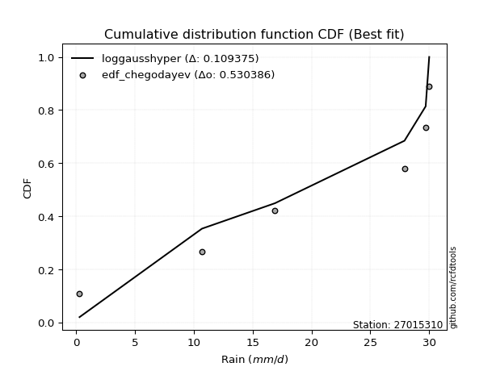</img></img>

</div>


### 6. Empirical - EDF Blom (1958)

The Blom formula is a specific "plotting position" formula used in hydrology and statistical analysis to estimate the empirical cumulative probability (or non-exceedance probability) of a data series. It is particularly recommended for data that are approximately normally distributed. The constant _a_ is set to 0.375 (or 3/8).

<div align="center">


$P=(m-a)/(n+1-2a)$


</div>


**6.1. Empirical values**

<div align="center">

|                | 0                  | 1                  | 2                  | 3                 | 4                 | 5                  |
|:---------------|:-------------------|:-------------------|:-------------------|:------------------|:------------------|:-------------------|
| date           | 2025               | 2023               | 2022               | 2021              | 2017              | 2018               |
| x              | 0.1                | 10.7               | 16.9               | 27.9              | 29.7              | 30.0               |
| m              | 1                  | 2                  | 3                  | 4                 | 5                 | 6                  |
| empirical_dist | edf_blom           | edf_blom           | edf_blom           | edf_blom          | edf_blom          | edf_blom           |
| empirical      | 0.1                | 0.26               | 0.42               | 0.58              | 0.74              | 0.9                |
| empirical_tr   | 1.1111111111111112 | 1.3513513513513513 | 1.7241379310344827 | 2.380952380952381 | 3.846153846153846 | 10.000000000000002 |

</div>


**6.2. Kolmogorov-Smirnov fit test (sorted by Δ)**


<div align="center">

|                | 0                   | 1                   | 2                   | 3                   | 4                   | 5                   | 6                   | 7                   | 8                   | 9                   | 10                  | 11                 | 12                  | 13                  | 14                  | 15                 | 16                  | 17                 | 18                  | 19                  | 20                  | 21                  | 22                  | 23                 | 24                  | 25                  | 26                  | 27                  | 28                  | 29                  | 30                 | 31                  | 32                  | 33                  | 34                 | 35                  | 36                  | 37                  | 38                 | 39                  | 40                 | 41                  | 42                  | 43                  | 44                  | 45                 | 46                  | 47                  | 48                  | 49                 | 50                 | 51                  | 52                 | 53                  | 54                  | 55                 | 56                  | 57                 | 58                  | 59                 | 60                  | 61                 | 62                  | 63                  | 64                 | 65                 | 66                    | 67                  | 68                 | 69                  | 70                 | 71                  | 72                 | 73                  | 74                  | 75                 | 76                  | 77                 | 78                  | 79                  | 80                 | 81                 | 82                 | 83                 | 84                 | 85                 | 86                 | 87                 | 88             | 89             |
|:---------------|:--------------------|:--------------------|:--------------------|:--------------------|:--------------------|:--------------------|:--------------------|:--------------------|:--------------------|:--------------------|:--------------------|:-------------------|:--------------------|:--------------------|:--------------------|:-------------------|:--------------------|:-------------------|:--------------------|:--------------------|:--------------------|:--------------------|:--------------------|:-------------------|:--------------------|:--------------------|:--------------------|:--------------------|:--------------------|:--------------------|:-------------------|:--------------------|:--------------------|:--------------------|:-------------------|:--------------------|:--------------------|:--------------------|:-------------------|:--------------------|:-------------------|:--------------------|:--------------------|:--------------------|:--------------------|:-------------------|:--------------------|:--------------------|:--------------------|:-------------------|:-------------------|:--------------------|:-------------------|:--------------------|:--------------------|:-------------------|:--------------------|:-------------------|:--------------------|:-------------------|:--------------------|:-------------------|:--------------------|:--------------------|:-------------------|:-------------------|:----------------------|:--------------------|:-------------------|:--------------------|:-------------------|:--------------------|:-------------------|:--------------------|:--------------------|:-------------------|:--------------------|:-------------------|:--------------------|:--------------------|:-------------------|:-------------------|:-------------------|:-------------------|:-------------------|:-------------------|:-------------------|:-------------------|:---------------|:---------------|
| station        | 27015310            | 27015310            | 27015310            | 27015310            | 27015310            | 27015310            | 27015310            | 27015310            | 27015310            | 27015310            | 27015310            | 27015310           | 27015310            | 27015310            | 27015310            | 27015310           | 27015310            | 27015310           | 27015310            | 27015310            | 27015310            | 27015310            | 27015310            | 27015310           | 27015310            | 27015310            | 27015310            | 27015310            | 27015310            | 27015310            | 27015310           | 27015310            | 27015310            | 27015310            | 27015310           | 27015310            | 27015310            | 27015310            | 27015310           | 27015310            | 27015310           | 27015310            | 27015310            | 27015310            | 27015310            | 27015310           | 27015310            | 27015310            | 27015310            | 27015310           | 27015310           | 27015310            | 27015310           | 27015310            | 27015310            | 27015310           | 27015310            | 27015310           | 27015310            | 27015310           | 27015310            | 27015310           | 27015310            | 27015310            | 27015310           | 27015310           | 27015310              | 27015310            | 27015310           | 27015310            | 27015310           | 27015310            | 27015310           | 27015310            | 27015310            | 27015310           | 27015310            | 27015310           | 27015310            | 27015310            | 27015310           | 27015310           | 27015310           | 27015310           | 27015310           | 27015310           | 27015310           | 27015310           | 27015310       | 27015310       |
| empirical_dist | edf_blom            | edf_blom            | edf_blom            | edf_blom            | edf_blom            | edf_blom            | edf_blom            | edf_blom            | edf_blom            | edf_blom            | edf_blom            | edf_blom           | edf_blom            | edf_blom            | edf_blom            | edf_blom           | edf_blom            | edf_blom           | edf_blom            | edf_blom            | edf_blom            | edf_blom            | edf_blom            | edf_blom           | edf_blom            | edf_blom            | edf_blom            | edf_blom            | edf_blom            | edf_blom            | edf_blom           | edf_blom            | edf_blom            | edf_blom            | edf_blom           | edf_blom            | edf_blom            | edf_blom            | edf_blom           | edf_blom            | edf_blom           | edf_blom            | edf_blom            | edf_blom            | edf_blom            | edf_blom           | edf_blom            | edf_blom            | edf_blom            | edf_blom           | edf_blom           | edf_blom            | edf_blom           | edf_blom            | edf_blom            | edf_blom           | edf_blom            | edf_blom           | edf_blom            | edf_blom           | edf_blom            | edf_blom           | edf_blom            | edf_blom            | edf_blom           | edf_blom           | edf_blom              | edf_blom            | edf_blom           | edf_blom            | edf_blom           | edf_blom            | edf_blom           | edf_blom            | edf_blom            | edf_blom           | edf_blom            | edf_blom           | edf_blom            | edf_blom            | edf_blom           | edf_blom           | edf_blom           | edf_blom           | edf_blom           | edf_blom           | edf_blom           | edf_blom           | edf_blom       | edf_blom       |
| p_dist         | invweibull          | fisk                | loggompertz         | genexpon            | expon               | pearson3            | invgauss            | kstwobign           | ncf                 | gamma               | weibull_min         | f                  | rice                | fatiguelife         | nct                 | crystalball        | norm                | exponnorm          | t                   | erlang              | gumbel_l            | betaprime           | alpha               | maxwell            | rayleigh            | invgamma            | loggumbel_l         | laplace_asymmetric  | halfnorm            | logpearson3         | logistic           | gumbel_r            | halflogistic        | hypsecant           | logjohnsonsu       | mielke              | moyal               | laplace             | wald               | logfatiguelife      | lognakagami        | logexponnorm        | logcrystalball      | lognorm             | lognorm             | logrice            | lognct              | nakagami            | loglognorm          | loglogistic        | loghypsecant       | loginvgamma         | logalpha           | loggamma            | loggamma            | loginvweibull      | loginvgauss         | gompertz           | loglaplace          | gibrat             | logmaxwell          | lograyleigh        | logkstwobign        | loghalfnorm         | loggumbel_r        | logt               | loglaplace_asymmetric | truncnorm           | logloggamma        | logncf              | logmoyal           | loghalflogistic     | logfisk            | logexpon            | pareto              | logpareto          | logwald             | logbetaprime       | logf                | loggibrat           | logtruncnorm       | logweibull_min     | logmielke          | loggenexpon        | chi2               | johnsonsu          | logchi2            | logerlang          | loggenlogistic | genlogistic    |
| delta          | 0.17421153064179717 | 0.17581830994952619 | 0.18403718531045465 | 0.18584544237479272 | 0.18641948001265074 | 0.19326747127461608 | 0.19335883348043215 | 0.19664076916859863 | 0.19840746711165613 | 0.20034570629839188 | 0.20041089802472944 | 0.2018186841406001 | 0.20183497636228087 | 0.20190463906229583 | 0.20204427418722803 | 0.2020985852814795 | 0.20209858532938718 | 0.2021000385844669 | 0.20211616236548746 | 0.20212717837117888 | 0.20247232880149368 | 0.20307907669447756 | 0.20626532151551424 | 0.2074297310265284 | 0.20893830473894093 | 0.20973792584116713 | 0.21127634513523064 | 0.21432311944859628 | 0.21507861870693734 | 0.22206634959500848 | 0.2243165196830984 | 0.23330062855039757 | 0.23738840593197752 | 0.23795372525935943 | 0.2385251100456116 | 0.24203714294496947 | 0.24356725339192264 | 0.25391312012284595 | 0.2778951258412712 | 0.27853124038507915 | 0.2791440679052055 | 0.27933851242841456 | 0.27934163657265754 | 0.27934165125142796 | 0.27934165125142796 | 0.2793589712917828 | 0.27974191973974016 | 0.28168018478343904 | 0.28205227736651484 | 0.2846702135805088 | 0.2891906692550674 | 0.29041640063168894 | 0.2922716766739005 | 0.29618070059839274 | 0.29618070059839274 | 0.2991007339197167 | 0.29927420830449414 | 0.3020082455619755 | 0.30518582316112974 | 0.3056774739678746 | 0.31040666843097353 | 0.3204600601172941 | 0.33766799067064546 | 0.34878752670362345 | 0.3497827996269298 | 0.3529224926500541 | 0.36257020192042555   | 0.36269736703783617 | 0.3627297362811479 | 0.37081154777674286 | 0.3749402131645596 | 0.37568920170486164 | 0.3868782879230068 | 0.38828332323740633 | 0.39300072560791155 | 0.4304260984780649 | 0.44475902462610795 | 0.4485526339273791 | 0.45777188318555173 | 0.47294628799802363 | 0.4865729422891385 | 0.5423567707498381 | 0.6269993192129198 | 0.6360810144196206 | 0.6610792825404503 | 0.6766319551097197 | 0.6882993921069405 | 0.6986959993927515 | 0.74           | 0.74           |
| deltao         | 0.530385761606      | 0.530385761606      | 0.530385761606      | 0.530385761606      | 0.530385761606      | 0.530385761606      | 0.530385761606      | 0.530385761606      | 0.530385761606      | 0.530385761606      | 0.530385761606      | 0.530385761606     | 0.530385761606      | 0.530385761606      | 0.530385761606      | 0.530385761606     | 0.530385761606      | 0.530385761606     | 0.530385761606      | 0.530385761606      | 0.530385761606      | 0.530385761606      | 0.530385761606      | 0.530385761606     | 0.530385761606      | 0.530385761606      | 0.530385761606      | 0.530385761606      | 0.530385761606      | 0.530385761606      | 0.530385761606     | 0.530385761606      | 0.530385761606      | 0.530385761606      | 0.530385761606     | 0.530385761606      | 0.530385761606      | 0.530385761606      | 0.530385761606     | 0.530385761606      | 0.530385761606     | 0.530385761606      | 0.530385761606      | 0.530385761606      | 0.530385761606      | 0.530385761606     | 0.530385761606      | 0.530385761606      | 0.530385761606      | 0.530385761606     | 0.530385761606     | 0.530385761606      | 0.530385761606     | 0.530385761606      | 0.530385761606      | 0.530385761606     | 0.530385761606      | 0.530385761606     | 0.530385761606      | 0.530385761606     | 0.530385761606      | 0.530385761606     | 0.530385761606      | 0.530385761606      | 0.530385761606     | 0.530385761606     | 0.530385761606        | 0.530385761606      | 0.530385761606     | 0.530385761606      | 0.530385761606     | 0.530385761606      | 0.530385761606     | 0.530385761606      | 0.530385761606      | 0.530385761606     | 0.530385761606      | 0.530385761606     | 0.530385761606      | 0.530385761606      | 0.530385761606     | 0.530385761606     | 0.530385761606     | 0.530385761606     | 0.530385761606     | 0.530385761606     | 0.530385761606     | 0.530385761606     | 0.530385761606 | 0.530385761606 |
| eval           | Δo > Δ              | Δo > Δ              | Δo > Δ              | Δo > Δ              | Δo > Δ              | Δo > Δ              | Δo > Δ              | Δo > Δ              | Δo > Δ              | Δo > Δ              | Δo > Δ              | Δo > Δ             | Δo > Δ              | Δo > Δ              | Δo > Δ              | Δo > Δ             | Δo > Δ              | Δo > Δ             | Δo > Δ              | Δo > Δ              | Δo > Δ              | Δo > Δ              | Δo > Δ              | Δo > Δ             | Δo > Δ              | Δo > Δ              | Δo > Δ              | Δo > Δ              | Δo > Δ              | Δo > Δ              | Δo > Δ             | Δo > Δ              | Δo > Δ              | Δo > Δ              | Δo > Δ             | Δo > Δ              | Δo > Δ              | Δo > Δ              | Δo > Δ             | Δo > Δ              | Δo > Δ             | Δo > Δ              | Δo > Δ              | Δo > Δ              | Δo > Δ              | Δo > Δ             | Δo > Δ              | Δo > Δ              | Δo > Δ              | Δo > Δ             | Δo > Δ             | Δo > Δ              | Δo > Δ             | Δo > Δ              | Δo > Δ              | Δo > Δ             | Δo > Δ              | Δo > Δ             | Δo > Δ              | Δo > Δ             | Δo > Δ              | Δo > Δ             | Δo > Δ              | Δo > Δ              | Δo > Δ             | Δo > Δ             | Δo > Δ                | Δo > Δ              | Δo > Δ             | Δo > Δ              | Δo > Δ             | Δo > Δ              | Δo > Δ             | Δo > Δ              | Δo > Δ              | Δo > Δ             | Δo > Δ              | Δo > Δ             | Δo > Δ              | Δo > Δ              | Δo > Δ             | Δo <= Δ            | Δo <= Δ            | Δo <= Δ            | Δo <= Δ            | Δo <= Δ            | Δo <= Δ            | Δo <= Δ            | Δo <= Δ        | Δo <= Δ        |
| fit            | 1                   | 1                   | 1                   | 1                   | 1                   | 1                   | 1                   | 1                   | 1                   | 1                   | 1                   | 1                  | 1                   | 1                   | 1                   | 1                  | 1                   | 1                  | 1                   | 1                   | 1                   | 1                   | 1                   | 1                  | 1                   | 1                   | 1                   | 1                   | 1                   | 1                   | 1                  | 1                   | 1                   | 1                   | 1                  | 1                   | 1                   | 1                   | 1                  | 1                   | 1                  | 1                   | 1                   | 1                   | 1                   | 1                  | 1                   | 1                   | 1                   | 1                  | 1                  | 1                   | 1                  | 1                   | 1                   | 1                  | 1                   | 1                  | 1                   | 1                  | 1                   | 1                  | 1                   | 1                   | 1                  | 1                  | 1                     | 1                   | 1                  | 1                   | 1                  | 1                   | 1                  | 1                   | 1                   | 1                  | 1                   | 1                  | 1                   | 1                   | 1                  | 0                  | 0                  | 0                  | 0                  | 0                  | 0                  | 0                  | 0              | 0              |
| n              | 6                   | 6                   | 6                   | 6                   | 6                   | 6                   | 6                   | 6                   | 6                   | 6                   | 6                   | 6                  | 6                   | 6                   | 6                   | 6                  | 6                   | 6                  | 6                   | 6                   | 6                   | 6                   | 6                   | 6                  | 6                   | 6                   | 6                   | 6                   | 6                   | 6                   | 6                  | 6                   | 6                   | 6                   | 6                  | 6                   | 6                   | 6                   | 6                  | 6                   | 6                  | 6                   | 6                   | 6                   | 6                   | 6                  | 6                   | 6                   | 6                   | 6                  | 6                  | 6                   | 6                  | 6                   | 6                   | 6                  | 6                   | 6                  | 6                   | 6                  | 6                   | 6                  | 6                   | 6                   | 6                  | 6                  | 6                     | 6                   | 6                  | 6                   | 6                  | 6                   | 6                  | 6                   | 6                   | 6                  | 6                   | 6                  | 6                   | 6                   | 6                  | 6                  | 6                  | 6                  | 6                  | 6                  | 6                  | 6                  | 6              | 6              |
| best_fit       | 1                   | 0                   | 0                   | 0                   | 0                   | 0                   | 0                   | 0                   | 0                   | 0                   | 0                   | 0                  | 0                   | 0                   | 0                   | 0                  | 0                   | 0                  | 0                   | 0                   | 0                   | 0                   | 0                   | 0                  | 0                   | 0                   | 0                   | 0                   | 0                   | 0                   | 0                  | 0                   | 0                   | 0                   | 0                  | 0                   | 0                   | 0                   | 0                  | 0                   | 0                  | 0                   | 0                   | 0                   | 0                   | 0                  | 0                   | 0                   | 0                   | 0                  | 0                  | 0                   | 0                  | 0                   | 0                   | 0                  | 0                   | 0                  | 0                   | 0                  | 0                   | 0                  | 0                   | 0                   | 0                  | 0                  | 0                     | 0                   | 0                  | 0                   | 0                  | 0                   | 0                  | 0                   | 0                   | 0                  | 0                   | 0                  | 0                   | 0                   | 0                  | 0                  | 0                  | 0                  | 0                  | 0                  | 0                  | 0                  | 0              | 0              |
| best_fit_sort  | 1                   | 2                   | 3                   | 4                   | 5                   | 6                   | 7                   | 8                   | 9                   | 10                  | 11                  | 12                 | 13                  | 14                  | 15                  | 16                 | 17                  | 18                 | 19                  | 20                  | 21                  | 22                  | 23                  | 24                 | 25                  | 26                  | 27                  | 28                  | 29                  | 30                  | 31                 | 32                  | 33                  | 34                  | 35                 | 36                  | 37                  | 38                  | 39                 | 40                  | 41                 | 42                  | 43                  | 44                  | 45                  | 46                 | 47                  | 48                  | 49                  | 50                 | 51                 | 52                  | 53                 | 54                  | 55                  | 56                 | 57                  | 58                 | 59                  | 60                 | 61                  | 62                 | 63                  | 64                  | 65                 | 66                 | 67                    | 68                  | 69                 | 70                  | 71                 | 72                  | 73                 | 74                  | 75                  | 76                 | 77                  | 78                 | 79                  | 80                  | 81                 | 82                 | 83                 | 84                 | 85                 | 86                 | 87                 | 88                 | 89             | 90             |

</div>


<div align="center">

</img>

</div>


**6.3. Best fit**

<div align="center">

|   id |   station | empirical_dist   | p_dist     |    delta |   deltao | eval   |   fit |   n |   best_fit |   best_fit_sort |
|-----:|----------:|:-----------------|:-----------|---------:|---------:|:-------|------:|----:|-----------:|----------------:|
|    0 |  27015310 | edf_blom         | invweibull | 0.174212 | 0.530386 | Δo > Δ |     1 |   6 |          1 |               1 |

</div>


<div align="center">

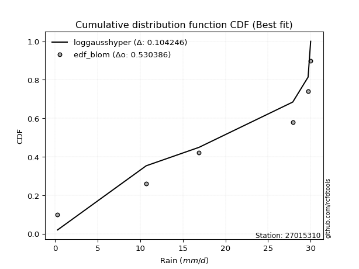</img></img>

</div>


### 7. Empirical - EDF Tukey (1962)

In hydrology, the Tukey formula is used as a plotting position formula to estimate the empirical probability or frequency of a flood event (or other hydrological data). The formula parameter is given as _c=0.333_ (or 1/3).

<div align="center">


$P=(m-c)/(n+1-2c)$


</div>


**7.1. Empirical values**

<div align="center">

|                | 0                   | 1                  | 2                   | 3                  | 4                  | 5                  |
|:---------------|:--------------------|:-------------------|:--------------------|:-------------------|:-------------------|:-------------------|
| date           | 2025                | 2023               | 2022                | 2021               | 2017               | 2018               |
| x              | 0.1                 | 10.7               | 16.9                | 27.9               | 29.7               | 30.0               |
| m              | 1                   | 2                  | 3                   | 4                  | 5                  | 6                  |
| empirical_dist | edf_tukey           | edf_tukey          | edf_tukey           | edf_tukey          | edf_tukey          | edf_tukey          |
| empirical      | 0.10526315789473684 | 0.2631578947368421 | 0.42105263157894735 | 0.5789473684210527 | 0.7368421052631579 | 0.8947368421052632 |
| empirical_tr   | 1.1176470588235294  | 1.357142857142857  | 1.7272727272727273  | 2.375              | 3.7999999999999994 | 9.5                |

</div>


**7.2. Kolmogorov-Smirnov fit test (sorted by Δ)**


<div align="center">

|                | 0                   | 1                  | 2                   | 3                   | 4                   | 5                   | 6                   | 7                   | 8                   | 9                   | 10                  | 11                  | 12                  | 13                  | 14                  | 15                 | 16                 | 17                 | 18                  | 19                 | 20                | 21                  | 22                  | 23                  | 24                 | 25                  | 26                  | 27                  | 28                  | 29                  | 30                 | 31                  | 32                  | 33                  | 34                  | 35                  | 36                  | 37                  | 38                  | 39                  | 40                 | 41                  | 42                 | 43                 | 44                 | 45                 | 46                  | 47                  | 48                 | 49                  | 50                  | 51                  | 52                  | 53                  | 54                  | 55                 | 56                  | 57                  | 58                  | 59                 | 60                  | 61                  | 62                 | 63                  | 64                  | 65                 | 66                    | 67                 | 68                 | 69                 | 70                  | 71                  | 72                  | 73                  | 74                  | 75                 | 76                  | 77                | 78                  | 79                  | 80                 | 81                | 82                 | 83                 | 84                 | 85                 | 86                 | 87                 | 88                 | 89                 |
|:---------------|:--------------------|:-------------------|:--------------------|:--------------------|:--------------------|:--------------------|:--------------------|:--------------------|:--------------------|:--------------------|:--------------------|:--------------------|:--------------------|:--------------------|:--------------------|:-------------------|:-------------------|:-------------------|:--------------------|:-------------------|:------------------|:--------------------|:--------------------|:--------------------|:-------------------|:--------------------|:--------------------|:--------------------|:--------------------|:--------------------|:-------------------|:--------------------|:--------------------|:--------------------|:--------------------|:--------------------|:--------------------|:--------------------|:--------------------|:--------------------|:-------------------|:--------------------|:-------------------|:-------------------|:-------------------|:-------------------|:--------------------|:--------------------|:-------------------|:--------------------|:--------------------|:--------------------|:--------------------|:--------------------|:--------------------|:-------------------|:--------------------|:--------------------|:--------------------|:-------------------|:--------------------|:--------------------|:-------------------|:--------------------|:--------------------|:-------------------|:----------------------|:-------------------|:-------------------|:-------------------|:--------------------|:--------------------|:--------------------|:--------------------|:--------------------|:-------------------|:--------------------|:------------------|:--------------------|:--------------------|:-------------------|:------------------|:-------------------|:-------------------|:-------------------|:-------------------|:-------------------|:-------------------|:-------------------|:-------------------|
| station        | 27015310            | 27015310           | 27015310            | 27015310            | 27015310            | 27015310            | 27015310            | 27015310            | 27015310            | 27015310            | 27015310            | 27015310            | 27015310            | 27015310            | 27015310            | 27015310           | 27015310           | 27015310           | 27015310            | 27015310           | 27015310          | 27015310            | 27015310            | 27015310            | 27015310           | 27015310            | 27015310            | 27015310            | 27015310            | 27015310            | 27015310           | 27015310            | 27015310            | 27015310            | 27015310            | 27015310            | 27015310            | 27015310            | 27015310            | 27015310            | 27015310           | 27015310            | 27015310           | 27015310           | 27015310           | 27015310           | 27015310            | 27015310            | 27015310           | 27015310            | 27015310            | 27015310            | 27015310            | 27015310            | 27015310            | 27015310           | 27015310            | 27015310            | 27015310            | 27015310           | 27015310            | 27015310            | 27015310           | 27015310            | 27015310            | 27015310           | 27015310              | 27015310           | 27015310           | 27015310           | 27015310            | 27015310            | 27015310            | 27015310            | 27015310            | 27015310           | 27015310            | 27015310          | 27015310            | 27015310            | 27015310           | 27015310          | 27015310           | 27015310           | 27015310           | 27015310           | 27015310           | 27015310           | 27015310           | 27015310           |
| empirical_dist | edf_tukey           | edf_tukey          | edf_tukey           | edf_tukey           | edf_tukey           | edf_tukey           | edf_tukey           | edf_tukey           | edf_tukey           | edf_tukey           | edf_tukey           | edf_tukey           | edf_tukey           | edf_tukey           | edf_tukey           | edf_tukey          | edf_tukey          | edf_tukey          | edf_tukey           | edf_tukey          | edf_tukey         | edf_tukey           | edf_tukey           | edf_tukey           | edf_tukey          | edf_tukey           | edf_tukey           | edf_tukey           | edf_tukey           | edf_tukey           | edf_tukey          | edf_tukey           | edf_tukey           | edf_tukey           | edf_tukey           | edf_tukey           | edf_tukey           | edf_tukey           | edf_tukey           | edf_tukey           | edf_tukey          | edf_tukey           | edf_tukey          | edf_tukey          | edf_tukey          | edf_tukey          | edf_tukey           | edf_tukey           | edf_tukey          | edf_tukey           | edf_tukey           | edf_tukey           | edf_tukey           | edf_tukey           | edf_tukey           | edf_tukey          | edf_tukey           | edf_tukey           | edf_tukey           | edf_tukey          | edf_tukey           | edf_tukey           | edf_tukey          | edf_tukey           | edf_tukey           | edf_tukey          | edf_tukey             | edf_tukey          | edf_tukey          | edf_tukey          | edf_tukey           | edf_tukey           | edf_tukey           | edf_tukey           | edf_tukey           | edf_tukey          | edf_tukey           | edf_tukey         | edf_tukey           | edf_tukey           | edf_tukey          | edf_tukey         | edf_tukey          | edf_tukey          | edf_tukey          | edf_tukey          | edf_tukey          | edf_tukey          | edf_tukey          | edf_tukey          |
| p_dist         | invweibull          | fisk               | loggompertz         | genexpon            | expon               | ncf                 | pearson3            | invgauss            | kstwobign           | gamma               | weibull_min         | f                   | rice                | fatiguelife         | nct                 | crystalball        | norm               | exponnorm          | t                   | erlang             | gumbel_l          | betaprime           | alpha               | loggumbel_l         | maxwell            | rayleigh            | invgamma            | laplace_asymmetric  | halfnorm            | logpearson3         | logistic           | gumbel_r            | logjohnsonsu        | halflogistic        | hypsecant           | mielke              | moyal               | laplace             | logfatiguelife      | lognakagami         | logexponnorm       | logcrystalball      | lognorm            | lognorm            | logrice            | lognct             | nakagami            | loglognorm          | wald               | loglogistic         | loghypsecant        | loginvgamma         | logalpha            | loggamma            | loggamma            | loginvweibull      | loginvgauss         | loglaplace          | gompertz            | gibrat             | logmaxwell          | lograyleigh         | logkstwobign       | loghalfnorm         | loggumbel_r         | logt               | loglaplace_asymmetric | truncnorm          | logloggamma        | logncf             | logmoyal            | loghalflogistic     | logfisk             | logexpon            | pareto              | logpareto          | logwald             | logbetaprime      | logf                | loggibrat           | logtruncnorm       | logweibull_min    | logmielke          | loggenexpon        | chi2               | johnsonsu          | logchi2            | logerlang          | loggenlogistic     | genlogistic        |
| delta          | 0.17526416222074448 | 0.1768709415284735 | 0.18508981688940196 | 0.18689807395374003 | 0.18747211159159805 | 0.19314430921691927 | 0.19432010285356338 | 0.19441146505937945 | 0.19769340074754593 | 0.20139833787733918 | 0.20146352960367675 | 0.20287131571954742 | 0.20288760794122818 | 0.20295727064124314 | 0.20309690576617534 | 0.2031512168604268 | 0.2031512169083345 | 0.2031526701634142 | 0.20316879394443477 | 0.2031798099501262 | 0.203524960380441 | 0.20413170827342486 | 0.20731795309446155 | 0.20811845039838855 | 0.2084823626054757 | 0.20999093631788823 | 0.21079055742011443 | 0.21537575102754358 | 0.21613125028588465 | 0.21680319170027162 | 0.2253691512620457 | 0.23435326012934488 | 0.23536721530876947 | 0.23844103751092482 | 0.23900635683830673 | 0.24308977452391678 | 0.24461988497086995 | 0.25496575170179325 | 0.27537334564823707 | 0.27598617316836344 | 0.2761806176915725 | 0.27618374183581546 | 0.2761837565145859 | 0.2761837565145859 | 0.2762010765549407 | 0.2765840250028981 | 0.27852229004659695 | 0.27889438262967275 | 0.2789477574202185 | 0.28151231884366673 | 0.28603277451822534 | 0.28725850589484686 | 0.28911378193705844 | 0.29302280586155066 | 0.29302280586155066 | 0.2959428391828746 | 0.29611631356765206 | 0.30202792842428766 | 0.30306087714092284 | 0.3067301055468219 | 0.30724877369413145 | 0.31730216538045203 | 0.3345100959338034 | 0.34562963196678137 | 0.34662490489008774 | 0.3518698610711068 | 0.36362283349937286   | 0.3637499986167835 | 0.3637823678600952 | 0.3676536530399008 | 0.37178231842771753 | 0.37253130696801956 | 0.38372039318616474 | 0.38512542850056425 | 0.38984283087106947 | 0.4272682037412228 | 0.44160112988926586 | 0.445394739190537 | 0.45461398844870965 | 0.46978839326118155 | 0.4834150475522964 | 0.539198876012996 | 0.6238414244760777 | 0.6329231196827785 | 0.6579213878036083 | 0.6734740603728777 | 0.6851414973700984 | 0.6955381046559095 | 0.7368421052631579 | 0.7368421052631579 |
| deltao         | 0.530385761606      | 0.530385761606     | 0.530385761606      | 0.530385761606      | 0.530385761606      | 0.530385761606      | 0.530385761606      | 0.530385761606      | 0.530385761606      | 0.530385761606      | 0.530385761606      | 0.530385761606      | 0.530385761606      | 0.530385761606      | 0.530385761606      | 0.530385761606     | 0.530385761606     | 0.530385761606     | 0.530385761606      | 0.530385761606     | 0.530385761606    | 0.530385761606      | 0.530385761606      | 0.530385761606      | 0.530385761606     | 0.530385761606      | 0.530385761606      | 0.530385761606      | 0.530385761606      | 0.530385761606      | 0.530385761606     | 0.530385761606      | 0.530385761606      | 0.530385761606      | 0.530385761606      | 0.530385761606      | 0.530385761606      | 0.530385761606      | 0.530385761606      | 0.530385761606      | 0.530385761606     | 0.530385761606      | 0.530385761606     | 0.530385761606     | 0.530385761606     | 0.530385761606     | 0.530385761606      | 0.530385761606      | 0.530385761606     | 0.530385761606      | 0.530385761606      | 0.530385761606      | 0.530385761606      | 0.530385761606      | 0.530385761606      | 0.530385761606     | 0.530385761606      | 0.530385761606      | 0.530385761606      | 0.530385761606     | 0.530385761606      | 0.530385761606      | 0.530385761606     | 0.530385761606      | 0.530385761606      | 0.530385761606     | 0.530385761606        | 0.530385761606     | 0.530385761606     | 0.530385761606     | 0.530385761606      | 0.530385761606      | 0.530385761606      | 0.530385761606      | 0.530385761606      | 0.530385761606     | 0.530385761606      | 0.530385761606    | 0.530385761606      | 0.530385761606      | 0.530385761606     | 0.530385761606    | 0.530385761606     | 0.530385761606     | 0.530385761606     | 0.530385761606     | 0.530385761606     | 0.530385761606     | 0.530385761606     | 0.530385761606     |
| eval           | Δo > Δ              | Δo > Δ             | Δo > Δ              | Δo > Δ              | Δo > Δ              | Δo > Δ              | Δo > Δ              | Δo > Δ              | Δo > Δ              | Δo > Δ              | Δo > Δ              | Δo > Δ              | Δo > Δ              | Δo > Δ              | Δo > Δ              | Δo > Δ             | Δo > Δ             | Δo > Δ             | Δo > Δ              | Δo > Δ             | Δo > Δ            | Δo > Δ              | Δo > Δ              | Δo > Δ              | Δo > Δ             | Δo > Δ              | Δo > Δ              | Δo > Δ              | Δo > Δ              | Δo > Δ              | Δo > Δ             | Δo > Δ              | Δo > Δ              | Δo > Δ              | Δo > Δ              | Δo > Δ              | Δo > Δ              | Δo > Δ              | Δo > Δ              | Δo > Δ              | Δo > Δ             | Δo > Δ              | Δo > Δ             | Δo > Δ             | Δo > Δ             | Δo > Δ             | Δo > Δ              | Δo > Δ              | Δo > Δ             | Δo > Δ              | Δo > Δ              | Δo > Δ              | Δo > Δ              | Δo > Δ              | Δo > Δ              | Δo > Δ             | Δo > Δ              | Δo > Δ              | Δo > Δ              | Δo > Δ             | Δo > Δ              | Δo > Δ              | Δo > Δ             | Δo > Δ              | Δo > Δ              | Δo > Δ             | Δo > Δ                | Δo > Δ             | Δo > Δ             | Δo > Δ             | Δo > Δ              | Δo > Δ              | Δo > Δ              | Δo > Δ              | Δo > Δ              | Δo > Δ             | Δo > Δ              | Δo > Δ            | Δo > Δ              | Δo > Δ              | Δo > Δ             | Δo <= Δ           | Δo <= Δ            | Δo <= Δ            | Δo <= Δ            | Δo <= Δ            | Δo <= Δ            | Δo <= Δ            | Δo <= Δ            | Δo <= Δ            |
| fit            | 1                   | 1                  | 1                   | 1                   | 1                   | 1                   | 1                   | 1                   | 1                   | 1                   | 1                   | 1                   | 1                   | 1                   | 1                   | 1                  | 1                  | 1                  | 1                   | 1                  | 1                 | 1                   | 1                   | 1                   | 1                  | 1                   | 1                   | 1                   | 1                   | 1                   | 1                  | 1                   | 1                   | 1                   | 1                   | 1                   | 1                   | 1                   | 1                   | 1                   | 1                  | 1                   | 1                  | 1                  | 1                  | 1                  | 1                   | 1                   | 1                  | 1                   | 1                   | 1                   | 1                   | 1                   | 1                   | 1                  | 1                   | 1                   | 1                   | 1                  | 1                   | 1                   | 1                  | 1                   | 1                   | 1                  | 1                     | 1                  | 1                  | 1                  | 1                   | 1                   | 1                   | 1                   | 1                   | 1                  | 1                   | 1                 | 1                   | 1                   | 1                  | 0                 | 0                  | 0                  | 0                  | 0                  | 0                  | 0                  | 0                  | 0                  |
| n              | 6                   | 6                  | 6                   | 6                   | 6                   | 6                   | 6                   | 6                   | 6                   | 6                   | 6                   | 6                   | 6                   | 6                   | 6                   | 6                  | 6                  | 6                  | 6                   | 6                  | 6                 | 6                   | 6                   | 6                   | 6                  | 6                   | 6                   | 6                   | 6                   | 6                   | 6                  | 6                   | 6                   | 6                   | 6                   | 6                   | 6                   | 6                   | 6                   | 6                   | 6                  | 6                   | 6                  | 6                  | 6                  | 6                  | 6                   | 6                   | 6                  | 6                   | 6                   | 6                   | 6                   | 6                   | 6                   | 6                  | 6                   | 6                   | 6                   | 6                  | 6                   | 6                   | 6                  | 6                   | 6                   | 6                  | 6                     | 6                  | 6                  | 6                  | 6                   | 6                   | 6                   | 6                   | 6                   | 6                  | 6                   | 6                 | 6                   | 6                   | 6                  | 6                 | 6                  | 6                  | 6                  | 6                  | 6                  | 6                  | 6                  | 6                  |
| best_fit       | 1                   | 0                  | 0                   | 0                   | 0                   | 0                   | 0                   | 0                   | 0                   | 0                   | 0                   | 0                   | 0                   | 0                   | 0                   | 0                  | 0                  | 0                  | 0                   | 0                  | 0                 | 0                   | 0                   | 0                   | 0                  | 0                   | 0                   | 0                   | 0                   | 0                   | 0                  | 0                   | 0                   | 0                   | 0                   | 0                   | 0                   | 0                   | 0                   | 0                   | 0                  | 0                   | 0                  | 0                  | 0                  | 0                  | 0                   | 0                   | 0                  | 0                   | 0                   | 0                   | 0                   | 0                   | 0                   | 0                  | 0                   | 0                   | 0                   | 0                  | 0                   | 0                   | 0                  | 0                   | 0                   | 0                  | 0                     | 0                  | 0                  | 0                  | 0                   | 0                   | 0                   | 0                   | 0                   | 0                  | 0                   | 0                 | 0                   | 0                   | 0                  | 0                 | 0                  | 0                  | 0                  | 0                  | 0                  | 0                  | 0                  | 0                  |
| best_fit_sort  | 1                   | 2                  | 3                   | 4                   | 5                   | 6                   | 7                   | 8                   | 9                   | 10                  | 11                  | 12                  | 13                  | 14                  | 15                  | 16                 | 17                 | 18                 | 19                  | 20                 | 21                | 22                  | 23                  | 24                  | 25                 | 26                  | 27                  | 28                  | 29                  | 30                  | 31                 | 32                  | 33                  | 34                  | 35                  | 36                  | 37                  | 38                  | 39                  | 40                  | 41                 | 42                  | 43                 | 44                 | 45                 | 46                 | 47                  | 48                  | 49                 | 50                  | 51                  | 52                  | 53                  | 54                  | 55                  | 56                 | 57                  | 58                  | 59                  | 60                 | 61                  | 62                  | 63                 | 64                  | 65                  | 66                 | 67                    | 68                 | 69                 | 70                 | 71                  | 72                  | 73                  | 74                  | 75                  | 76                 | 77                  | 78                | 79                  | 80                  | 81                 | 82                | 83                 | 84                 | 85                 | 86                 | 87                 | 88                 | 89                 | 90                 |

</div>


<div align="center">

</img>

</div>


**7.3. Best fit**

<div align="center">

|   id |   station | empirical_dist   | p_dist     |    delta |   deltao | eval   |   fit |   n |   best_fit |   best_fit_sort |
|-----:|----------:|:-----------------|:-----------|---------:|---------:|:-------|------:|----:|-----------:|----------------:|
|    0 |  27015310 | edf_tukey        | invweibull | 0.175264 | 0.530386 | Δo > Δ |     1 |   6 |          1 |               1 |

</div>


<div align="center">

</img></img>

</div>


### 8. Empirical - EDF Gringorten (1963)

Gringorten plotting position formula is essential for estimating the probability and return periods of extreme events like floods and heavy rainfall. The constant _a=0.44_.

<div align="center">


$P=(m-a)/(n+1-2a)$


</div>


**8.1. Empirical values**

<div align="center">

|                | 0                   | 1                  | 2                   | 3                  | 4                  | 5                  |
|:---------------|:--------------------|:-------------------|:--------------------|:-------------------|:-------------------|:-------------------|
| date           | 2025                | 2023               | 2022                | 2021               | 2017               | 2018               |
| x              | 0.1                 | 10.7               | 16.9                | 27.9               | 29.7               | 30.0               |
| m              | 1                   | 2                  | 3                   | 4                  | 5                  | 6                  |
| empirical_dist | edf_gringorten      | edf_gringorten     | edf_gringorten      | edf_gringorten     | edf_gringorten     | edf_gringorten     |
| empirical      | 0.09150326797385622 | 0.2549019607843137 | 0.41830065359477125 | 0.5816993464052288 | 0.7450980392156862 | 0.9084967320261437 |
| empirical_tr   | 1.1007194244604317  | 1.3421052631578947 | 1.7191011235955058  | 2.3906250000000004 | 3.9230769230769216 | 10.928571428571415 |

</div>


**8.2. Kolmogorov-Smirnov fit test (sorted by Δ)**


<div align="center">

|                | 0                   | 1                   | 2                   | 3                  | 4                   | 5                   | 6                  | 7                  | 8                   | 9                  | 10                  | 11                  | 12                | 13                 | 14                  | 15                  | 16                  | 17                  | 18                  | 19                  | 20                  | 21                 | 22                  | 23                  | 24                 | 25                 | 26                  | 27                 | 28                  | 29                  | 30                  | 31                  | 32                  | 33                 | 34                  | 35                 | 36                 | 37                 | 38                  | 39                  | 40                 | 41                  | 42                  | 43                  | 44                  | 45                 | 46                  | 47                  | 48                  | 49                 | 50                 | 51                  | 52                 | 53                  | 54                  | 55                  | 56                  | 57                | 58                  | 59                  | 60                  | 61                 | 62                  | 63                  | 64                  | 65                 | 66                    | 67                  | 68                  | 69                  | 70                 | 71                  | 72                 | 73                  | 74                  | 75                 | 76                  | 77                 | 78                  | 79                  | 80                 | 81                 | 82                 | 83                 | 84                 | 85                | 86                 | 87                 | 88                 | 89                 |
|:---------------|:--------------------|:--------------------|:--------------------|:-------------------|:--------------------|:--------------------|:-------------------|:-------------------|:--------------------|:-------------------|:--------------------|:--------------------|:------------------|:-------------------|:--------------------|:--------------------|:--------------------|:--------------------|:--------------------|:--------------------|:--------------------|:-------------------|:--------------------|:--------------------|:-------------------|:-------------------|:--------------------|:-------------------|:--------------------|:--------------------|:--------------------|:--------------------|:--------------------|:-------------------|:--------------------|:-------------------|:-------------------|:-------------------|:--------------------|:--------------------|:-------------------|:--------------------|:--------------------|:--------------------|:--------------------|:-------------------|:--------------------|:--------------------|:--------------------|:-------------------|:-------------------|:--------------------|:-------------------|:--------------------|:--------------------|:--------------------|:--------------------|:------------------|:--------------------|:--------------------|:--------------------|:-------------------|:--------------------|:--------------------|:--------------------|:-------------------|:----------------------|:--------------------|:--------------------|:--------------------|:-------------------|:--------------------|:-------------------|:--------------------|:--------------------|:-------------------|:--------------------|:-------------------|:--------------------|:--------------------|:-------------------|:-------------------|:-------------------|:-------------------|:-------------------|:------------------|:-------------------|:-------------------|:-------------------|:-------------------|
| station        | 27015310            | 27015310            | 27015310            | 27015310           | 27015310            | 27015310            | 27015310           | 27015310           | 27015310            | 27015310           | 27015310            | 27015310            | 27015310          | 27015310           | 27015310            | 27015310            | 27015310            | 27015310            | 27015310            | 27015310            | 27015310            | 27015310           | 27015310            | 27015310            | 27015310           | 27015310           | 27015310            | 27015310           | 27015310            | 27015310            | 27015310            | 27015310            | 27015310            | 27015310           | 27015310            | 27015310           | 27015310           | 27015310           | 27015310            | 27015310            | 27015310           | 27015310            | 27015310            | 27015310            | 27015310            | 27015310           | 27015310            | 27015310            | 27015310            | 27015310           | 27015310           | 27015310            | 27015310           | 27015310            | 27015310            | 27015310            | 27015310            | 27015310          | 27015310            | 27015310            | 27015310            | 27015310           | 27015310            | 27015310            | 27015310            | 27015310           | 27015310              | 27015310            | 27015310            | 27015310            | 27015310           | 27015310            | 27015310           | 27015310            | 27015310            | 27015310           | 27015310            | 27015310           | 27015310            | 27015310            | 27015310           | 27015310           | 27015310           | 27015310           | 27015310           | 27015310          | 27015310           | 27015310           | 27015310           | 27015310           |
| empirical_dist | edf_gringorten      | edf_gringorten      | edf_gringorten      | edf_gringorten     | edf_gringorten      | edf_gringorten      | edf_gringorten     | edf_gringorten     | edf_gringorten      | edf_gringorten     | edf_gringorten      | edf_gringorten      | edf_gringorten    | edf_gringorten     | edf_gringorten      | edf_gringorten      | edf_gringorten      | edf_gringorten      | edf_gringorten      | edf_gringorten      | edf_gringorten      | edf_gringorten     | edf_gringorten      | edf_gringorten      | edf_gringorten     | edf_gringorten     | edf_gringorten      | edf_gringorten     | edf_gringorten      | edf_gringorten      | edf_gringorten      | edf_gringorten      | edf_gringorten      | edf_gringorten     | edf_gringorten      | edf_gringorten     | edf_gringorten     | edf_gringorten     | edf_gringorten      | edf_gringorten      | edf_gringorten     | edf_gringorten      | edf_gringorten      | edf_gringorten      | edf_gringorten      | edf_gringorten     | edf_gringorten      | edf_gringorten      | edf_gringorten      | edf_gringorten     | edf_gringorten     | edf_gringorten      | edf_gringorten     | edf_gringorten      | edf_gringorten      | edf_gringorten      | edf_gringorten      | edf_gringorten    | edf_gringorten      | edf_gringorten      | edf_gringorten      | edf_gringorten     | edf_gringorten      | edf_gringorten      | edf_gringorten      | edf_gringorten     | edf_gringorten        | edf_gringorten      | edf_gringorten      | edf_gringorten      | edf_gringorten     | edf_gringorten      | edf_gringorten     | edf_gringorten      | edf_gringorten      | edf_gringorten     | edf_gringorten      | edf_gringorten     | edf_gringorten      | edf_gringorten      | edf_gringorten     | edf_gringorten     | edf_gringorten     | edf_gringorten     | edf_gringorten     | edf_gringorten    | edf_gringorten     | edf_gringorten     | edf_gringorten     | edf_gringorten     |
| p_dist         | invweibull          | fisk                | genexpon            | expon              | loggompertz         | pearson3            | invgauss           | kstwobign          | gamma               | weibull_min        | f                   | rice                | fatiguelife       | nct                | crystalball         | norm                | exponnorm           | t                   | erlang              | gumbel_l            | betaprime           | alpha              | maxwell             | ncf                 | rayleigh           | invgamma           | laplace_asymmetric  | halfnorm           | loggumbel_l         | logistic            | logpearson3         | gumbel_r            | halflogistic        | hypsecant          | mielke              | moyal              | logjohnsonsu       | laplace            | wald                | logfatiguelife      | lognakagami        | logexponnorm        | logcrystalball      | lognorm             | lognorm             | logrice            | lognct              | nakagami            | loglognorm          | loglogistic        | loghypsecant       | loginvgamma         | logalpha           | gompertz            | loggamma            | loggamma            | gibrat              | loginvweibull     | loginvgauss         | loglaplace          | logmaxwell          | lograyleigh        | logkstwobign        | loghalfnorm         | logt                | loggumbel_r        | loglaplace_asymmetric | truncnorm           | logloggamma         | logncf              | logmoyal           | loghalflogistic     | logfisk            | logexpon            | pareto              | logpareto          | logwald             | logbetaprime       | logf                | loggibrat           | logtruncnorm       | logweibull_min     | logmielke          | loggenexpon        | chi2               | johnsonsu         | logchi2            | logerlang          | loggenlogistic     | genlogistic        |
| delta          | 0.17251218423656833 | 0.17411896354429734 | 0.18414609596956388 | 0.1847201336074219 | 0.18622122275352027 | 0.19156812486938724 | 0.1916594870752033 | 0.1949414227633698 | 0.19864635989316304 | 0.1987115516195006 | 0.20011933773537127 | 0.20013562995705203 | 0.200205292657067 | 0.2003449277819992 | 0.20039923887625066 | 0.20039923892415834 | 0.20040069217923806 | 0.20041681596025862 | 0.20042783196595004 | 0.20077298239626484 | 0.20137973028924872 | 0.2045659751102854 | 0.20573038462129956 | 0.20690419913779978 | 0.2072389583337121 | 0.2080385794359383 | 0.21262377304336744 | 0.2133792723017085 | 0.21637438435091694 | 0.22261717327786956 | 0.23056308162115213 | 0.23160128214516873 | 0.23568905952674868 | 0.2362543788541306 | 0.24033779653974063 | 0.2418679069866938 | 0.2436231492612978 | 0.2522137737176171 | 0.27619577943604234 | 0.28362927960076545 | 0.2842421071208918 | 0.28443655164410087 | 0.28443967578834384 | 0.28443969046711426 | 0.28443969046711426 | 0.2844570105074691 | 0.28483995895542646 | 0.28677822399912534 | 0.28715031658220114 | 0.2897682527961951 | 0.2942887084707537 | 0.29551443984737524 | 0.2973697158895868 | 0.30030889915674674 | 0.30127873981407904 | 0.30127873981407904 | 0.30397812756264575 | 0.304198773135403 | 0.30437224752018044 | 0.31028386237681604 | 0.31550470764665983 | 0.3255580993329804 | 0.34276602988633176 | 0.35388556591930975 | 0.35462183905528294 | 0.3548808388426161 | 0.3608708555151967    | 0.36099802063260733 | 0.36103038987591907 | 0.37590958699242916 | 0.3800382523802459 | 0.38078724092054794 | 0.3919763271386931 | 0.39338136245309263 | 0.39809876482359785 | 0.4355241376937512 | 0.44985706384179425 | 0.4536506731430654 | 0.46286992240123803 | 0.47804432721370993 | 0.4916709815048248 | 0.5474548099655244 | 0.6320973584286061 | 0.6411790536353069 | 0.6661773217561366 | 0.681729994325406 | 0.6933974313226268 | 0.7037940386084378 | 0.7450980392156862 | 0.7450980392156862 |
| deltao         | 0.530385761606      | 0.530385761606      | 0.530385761606      | 0.530385761606     | 0.530385761606      | 0.530385761606      | 0.530385761606     | 0.530385761606     | 0.530385761606      | 0.530385761606     | 0.530385761606      | 0.530385761606      | 0.530385761606    | 0.530385761606     | 0.530385761606      | 0.530385761606      | 0.530385761606      | 0.530385761606      | 0.530385761606      | 0.530385761606      | 0.530385761606      | 0.530385761606     | 0.530385761606      | 0.530385761606      | 0.530385761606     | 0.530385761606     | 0.530385761606      | 0.530385761606     | 0.530385761606      | 0.530385761606      | 0.530385761606      | 0.530385761606      | 0.530385761606      | 0.530385761606     | 0.530385761606      | 0.530385761606     | 0.530385761606     | 0.530385761606     | 0.530385761606      | 0.530385761606      | 0.530385761606     | 0.530385761606      | 0.530385761606      | 0.530385761606      | 0.530385761606      | 0.530385761606     | 0.530385761606      | 0.530385761606      | 0.530385761606      | 0.530385761606     | 0.530385761606     | 0.530385761606      | 0.530385761606     | 0.530385761606      | 0.530385761606      | 0.530385761606      | 0.530385761606      | 0.530385761606    | 0.530385761606      | 0.530385761606      | 0.530385761606      | 0.530385761606     | 0.530385761606      | 0.530385761606      | 0.530385761606      | 0.530385761606     | 0.530385761606        | 0.530385761606      | 0.530385761606      | 0.530385761606      | 0.530385761606     | 0.530385761606      | 0.530385761606     | 0.530385761606      | 0.530385761606      | 0.530385761606     | 0.530385761606      | 0.530385761606     | 0.530385761606      | 0.530385761606      | 0.530385761606     | 0.530385761606     | 0.530385761606     | 0.530385761606     | 0.530385761606     | 0.530385761606    | 0.530385761606     | 0.530385761606     | 0.530385761606     | 0.530385761606     |
| eval           | Δo > Δ              | Δo > Δ              | Δo > Δ              | Δo > Δ             | Δo > Δ              | Δo > Δ              | Δo > Δ             | Δo > Δ             | Δo > Δ              | Δo > Δ             | Δo > Δ              | Δo > Δ              | Δo > Δ            | Δo > Δ             | Δo > Δ              | Δo > Δ              | Δo > Δ              | Δo > Δ              | Δo > Δ              | Δo > Δ              | Δo > Δ              | Δo > Δ             | Δo > Δ              | Δo > Δ              | Δo > Δ             | Δo > Δ             | Δo > Δ              | Δo > Δ             | Δo > Δ              | Δo > Δ              | Δo > Δ              | Δo > Δ              | Δo > Δ              | Δo > Δ             | Δo > Δ              | Δo > Δ             | Δo > Δ             | Δo > Δ             | Δo > Δ              | Δo > Δ              | Δo > Δ             | Δo > Δ              | Δo > Δ              | Δo > Δ              | Δo > Δ              | Δo > Δ             | Δo > Δ              | Δo > Δ              | Δo > Δ              | Δo > Δ             | Δo > Δ             | Δo > Δ              | Δo > Δ             | Δo > Δ              | Δo > Δ              | Δo > Δ              | Δo > Δ              | Δo > Δ            | Δo > Δ              | Δo > Δ              | Δo > Δ              | Δo > Δ             | Δo > Δ              | Δo > Δ              | Δo > Δ              | Δo > Δ             | Δo > Δ                | Δo > Δ              | Δo > Δ              | Δo > Δ              | Δo > Δ             | Δo > Δ              | Δo > Δ             | Δo > Δ              | Δo > Δ              | Δo > Δ             | Δo > Δ              | Δo > Δ             | Δo > Δ              | Δo > Δ              | Δo > Δ             | Δo <= Δ            | Δo <= Δ            | Δo <= Δ            | Δo <= Δ            | Δo <= Δ           | Δo <= Δ            | Δo <= Δ            | Δo <= Δ            | Δo <= Δ            |
| fit            | 1                   | 1                   | 1                   | 1                  | 1                   | 1                   | 1                  | 1                  | 1                   | 1                  | 1                   | 1                   | 1                 | 1                  | 1                   | 1                   | 1                   | 1                   | 1                   | 1                   | 1                   | 1                  | 1                   | 1                   | 1                  | 1                  | 1                   | 1                  | 1                   | 1                   | 1                   | 1                   | 1                   | 1                  | 1                   | 1                  | 1                  | 1                  | 1                   | 1                   | 1                  | 1                   | 1                   | 1                   | 1                   | 1                  | 1                   | 1                   | 1                   | 1                  | 1                  | 1                   | 1                  | 1                   | 1                   | 1                   | 1                   | 1                 | 1                   | 1                   | 1                   | 1                  | 1                   | 1                   | 1                   | 1                  | 1                     | 1                   | 1                   | 1                   | 1                  | 1                   | 1                  | 1                   | 1                   | 1                  | 1                   | 1                  | 1                   | 1                   | 1                  | 0                  | 0                  | 0                  | 0                  | 0                 | 0                  | 0                  | 0                  | 0                  |
| n              | 6                   | 6                   | 6                   | 6                  | 6                   | 6                   | 6                  | 6                  | 6                   | 6                  | 6                   | 6                   | 6                 | 6                  | 6                   | 6                   | 6                   | 6                   | 6                   | 6                   | 6                   | 6                  | 6                   | 6                   | 6                  | 6                  | 6                   | 6                  | 6                   | 6                   | 6                   | 6                   | 6                   | 6                  | 6                   | 6                  | 6                  | 6                  | 6                   | 6                   | 6                  | 6                   | 6                   | 6                   | 6                   | 6                  | 6                   | 6                   | 6                   | 6                  | 6                  | 6                   | 6                  | 6                   | 6                   | 6                   | 6                   | 6                 | 6                   | 6                   | 6                   | 6                  | 6                   | 6                   | 6                   | 6                  | 6                     | 6                   | 6                   | 6                   | 6                  | 6                   | 6                  | 6                   | 6                   | 6                  | 6                   | 6                  | 6                   | 6                   | 6                  | 6                  | 6                  | 6                  | 6                  | 6                 | 6                  | 6                  | 6                  | 6                  |
| best_fit       | 1                   | 0                   | 0                   | 0                  | 0                   | 0                   | 0                  | 0                  | 0                   | 0                  | 0                   | 0                   | 0                 | 0                  | 0                   | 0                   | 0                   | 0                   | 0                   | 0                   | 0                   | 0                  | 0                   | 0                   | 0                  | 0                  | 0                   | 0                  | 0                   | 0                   | 0                   | 0                   | 0                   | 0                  | 0                   | 0                  | 0                  | 0                  | 0                   | 0                   | 0                  | 0                   | 0                   | 0                   | 0                   | 0                  | 0                   | 0                   | 0                   | 0                  | 0                  | 0                   | 0                  | 0                   | 0                   | 0                   | 0                   | 0                 | 0                   | 0                   | 0                   | 0                  | 0                   | 0                   | 0                   | 0                  | 0                     | 0                   | 0                   | 0                   | 0                  | 0                   | 0                  | 0                   | 0                   | 0                  | 0                   | 0                  | 0                   | 0                   | 0                  | 0                  | 0                  | 0                  | 0                  | 0                 | 0                  | 0                  | 0                  | 0                  |
| best_fit_sort  | 1                   | 2                   | 3                   | 4                  | 5                   | 6                   | 7                  | 8                  | 9                   | 10                 | 11                  | 12                  | 13                | 14                 | 15                  | 16                  | 17                  | 18                  | 19                  | 20                  | 21                  | 22                 | 23                  | 24                  | 25                 | 26                 | 27                  | 28                 | 29                  | 30                  | 31                  | 32                  | 33                  | 34                 | 35                  | 36                 | 37                 | 38                 | 39                  | 40                  | 41                 | 42                  | 43                  | 44                  | 45                  | 46                 | 47                  | 48                  | 49                  | 50                 | 51                 | 52                  | 53                 | 54                  | 55                  | 56                  | 57                  | 58                | 59                  | 60                  | 61                  | 62                 | 63                  | 64                  | 65                  | 66                 | 67                    | 68                  | 69                  | 70                  | 71                 | 72                  | 73                 | 74                  | 75                  | 76                 | 77                  | 78                 | 79                  | 80                  | 81                 | 82                 | 83                 | 84                 | 85                 | 86                | 87                 | 88                 | 89                 | 90                 |

</div>


<div align="center">

</img>

</div>


**8.3. Best fit**

<div align="center">

|   id |   station | empirical_dist   | p_dist     |    delta |   deltao | eval   |   fit |   n |   best_fit |   best_fit_sort |
|-----:|----------:|:-----------------|:-----------|---------:|---------:|:-------|------:|----:|-----------:|----------------:|
|    0 |  27015310 | edf_gringorten   | invweibull | 0.172512 | 0.530386 | Δo > Δ |     1 |   6 |          1 |               1 |

</div>


<div align="center">

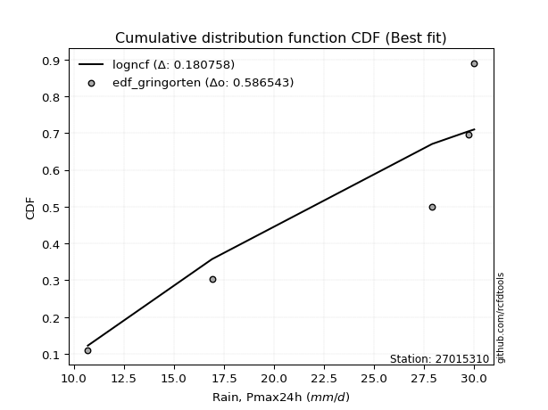</img></img>

</div>


### 9. Empirical - EDF Filliben (1975)

The specific values of the constants (0.3175) (often denoted as $alpha$) and (0.365) are derived from a method proposed by James J. Filliben in a 1975 paper. This particular formula is the mean value of the $i$-th order statistic of the normal distribution and is considered a robust and effective plotting position formula for the normal probability plot correlation coefficient test for normality.

<div align="center">


$P=(m-0.3175)/(n+0.365)$


</div>


**9.1. Empirical values**

<div align="center">

|                | 0                   | 1                   | 2                  | 3                  | 4                  | 5                  |
|:---------------|:--------------------|:--------------------|:-------------------|:-------------------|:-------------------|:-------------------|
| date           | 2025                | 2023                | 2022               | 2021               | 2017               | 2018               |
| x              | 0.1                 | 10.7                | 16.9               | 27.9               | 29.7               | 30.0               |
| m              | 1                   | 2                   | 3                  | 4                  | 5                  | 6                  |
| empirical_dist | edf_filliben        | edf_filliben        | edf_filliben       | edf_filliben       | edf_filliben       | edf_filliben       |
| empirical      | 0.10722702278083267 | 0.26433621366849963 | 0.4214454045561665 | 0.5785545954438335 | 0.7356637863315004 | 0.8927729772191673 |
| empirical_tr   | 1.1201055873295205  | 1.3593166043780034  | 1.7284453496266123 | 2.3727865796831313 | 3.783060921248143  | 9.326007326007321  |

</div>


**9.2. Kolmogorov-Smirnov fit test (sorted by Δ)**


<div align="center">

|                | 0                   | 1                   | 2                   | 3                  | 4                   | 5                   | 6                   | 7                   | 8                  | 9                   | 10                  | 11                 | 12                  | 13                  | 14                  | 15                | 16                  | 17                 | 18                  | 19                  | 20                  | 21                  | 22                  | 23                  | 24                  | 25                 | 26                 | 27                  | 28                  | 29                  | 30                 | 31                  | 32                  | 33                | 34                 | 35                  | 36                  | 37                  | 38                 | 39                 | 40                  | 41                 | 42                  | 43                  | 44                  | 45                  | 46                 | 47                 | 48                  | 49                 | 50                 | 51                 | 52                 | 53                 | 54                 | 55                 | 56                 | 57                 | 58                | 59                 | 60                 | 61                 | 62                  | 63                  | 64                 | 65                 | 66                    | 67                  | 68                 | 69                  | 70               | 71                | 72                 | 73                 | 74                 | 75                 | 76                 | 77                 | 78                 | 79                | 80                 | 81                 | 82                 | 83                | 84                 | 85                 | 86                 | 87                 | 88                 | 89                 |
|:---------------|:--------------------|:--------------------|:--------------------|:-------------------|:--------------------|:--------------------|:--------------------|:--------------------|:-------------------|:--------------------|:--------------------|:-------------------|:--------------------|:--------------------|:--------------------|:------------------|:--------------------|:-------------------|:--------------------|:--------------------|:--------------------|:--------------------|:--------------------|:--------------------|:--------------------|:-------------------|:-------------------|:--------------------|:--------------------|:--------------------|:-------------------|:--------------------|:--------------------|:------------------|:-------------------|:--------------------|:--------------------|:--------------------|:-------------------|:-------------------|:--------------------|:-------------------|:--------------------|:--------------------|:--------------------|:--------------------|:-------------------|:-------------------|:--------------------|:-------------------|:-------------------|:-------------------|:-------------------|:-------------------|:-------------------|:-------------------|:-------------------|:-------------------|:------------------|:-------------------|:-------------------|:-------------------|:--------------------|:--------------------|:-------------------|:-------------------|:----------------------|:--------------------|:-------------------|:--------------------|:-----------------|:------------------|:-------------------|:-------------------|:-------------------|:-------------------|:-------------------|:-------------------|:-------------------|:------------------|:-------------------|:-------------------|:-------------------|:------------------|:-------------------|:-------------------|:-------------------|:-------------------|:-------------------|:-------------------|
| station        | 27015310            | 27015310            | 27015310            | 27015310           | 27015310            | 27015310            | 27015310            | 27015310            | 27015310           | 27015310            | 27015310            | 27015310           | 27015310            | 27015310            | 27015310            | 27015310          | 27015310            | 27015310           | 27015310            | 27015310            | 27015310            | 27015310            | 27015310            | 27015310            | 27015310            | 27015310           | 27015310           | 27015310            | 27015310            | 27015310            | 27015310           | 27015310            | 27015310            | 27015310          | 27015310           | 27015310            | 27015310            | 27015310            | 27015310           | 27015310           | 27015310            | 27015310           | 27015310            | 27015310            | 27015310            | 27015310            | 27015310           | 27015310           | 27015310            | 27015310           | 27015310           | 27015310           | 27015310           | 27015310           | 27015310           | 27015310           | 27015310           | 27015310           | 27015310          | 27015310           | 27015310           | 27015310           | 27015310            | 27015310            | 27015310           | 27015310           | 27015310              | 27015310            | 27015310           | 27015310            | 27015310         | 27015310          | 27015310           | 27015310           | 27015310           | 27015310           | 27015310           | 27015310           | 27015310           | 27015310          | 27015310           | 27015310           | 27015310           | 27015310          | 27015310           | 27015310           | 27015310           | 27015310           | 27015310           | 27015310           |
| empirical_dist | edf_filliben        | edf_filliben        | edf_filliben        | edf_filliben       | edf_filliben        | edf_filliben        | edf_filliben        | edf_filliben        | edf_filliben       | edf_filliben        | edf_filliben        | edf_filliben       | edf_filliben        | edf_filliben        | edf_filliben        | edf_filliben      | edf_filliben        | edf_filliben       | edf_filliben        | edf_filliben        | edf_filliben        | edf_filliben        | edf_filliben        | edf_filliben        | edf_filliben        | edf_filliben       | edf_filliben       | edf_filliben        | edf_filliben        | edf_filliben        | edf_filliben       | edf_filliben        | edf_filliben        | edf_filliben      | edf_filliben       | edf_filliben        | edf_filliben        | edf_filliben        | edf_filliben       | edf_filliben       | edf_filliben        | edf_filliben       | edf_filliben        | edf_filliben        | edf_filliben        | edf_filliben        | edf_filliben       | edf_filliben       | edf_filliben        | edf_filliben       | edf_filliben       | edf_filliben       | edf_filliben       | edf_filliben       | edf_filliben       | edf_filliben       | edf_filliben       | edf_filliben       | edf_filliben      | edf_filliben       | edf_filliben       | edf_filliben       | edf_filliben        | edf_filliben        | edf_filliben       | edf_filliben       | edf_filliben          | edf_filliben        | edf_filliben       | edf_filliben        | edf_filliben     | edf_filliben      | edf_filliben       | edf_filliben       | edf_filliben       | edf_filliben       | edf_filliben       | edf_filliben       | edf_filliben       | edf_filliben      | edf_filliben       | edf_filliben       | edf_filliben       | edf_filliben      | edf_filliben       | edf_filliben       | edf_filliben       | edf_filliben       | edf_filliben       | edf_filliben       |
| p_dist         | invweibull          | fisk                | loggompertz         | genexpon           | expon               | ncf                 | pearson3            | invgauss            | kstwobign          | gamma               | weibull_min         | f                  | rice                | fatiguelife         | nct                 | crystalball       | norm                | exponnorm          | t                   | erlang              | gumbel_l            | betaprime           | loggumbel_l         | alpha               | maxwell             | rayleigh           | invgamma           | logpearson3         | laplace_asymmetric  | halfnorm            | logistic           | logjohnsonsu        | gumbel_r            | halflogistic      | hypsecant          | mielke              | moyal               | laplace             | logfatiguelife     | lognakagami        | logexponnorm        | logcrystalball     | lognorm             | lognorm             | logrice             | lognct              | nakagami           | loglognorm         | wald                | loglogistic        | loghypsecant       | loginvgamma        | logalpha           | loggamma           | loggamma           | loginvweibull      | loginvgauss        | loglaplace         | gompertz          | logmaxwell         | gibrat             | lograyleigh        | logkstwobign        | loghalfnorm         | loggumbel_r        | logt               | loglaplace_asymmetric | truncnorm           | logloggamma        | logncf              | logmoyal         | loghalflogistic   | logfisk            | logexpon           | pareto             | logpareto          | logwald            | logbetaprime       | logf               | loggibrat         | logtruncnorm       | logweibull_min     | logmielke          | loggenexpon       | chi2               | johnsonsu          | logchi2            | logerlang          | loggenlogistic     | genlogistic        |
| delta          | 0.17565693519796366 | 0.17726371450569267 | 0.18548258986662114 | 0.1872908469309592 | 0.18786488456881723 | 0.19118044433082337 | 0.19471287583078256 | 0.19480423803659863 | 0.1980861737247651 | 0.20179111085455836 | 0.20185630258089593 | 0.2032640886967666 | 0.20328038091844736 | 0.20335004361846232 | 0.20348967874339452 | 0.203543989837646 | 0.20354398988555367 | 0.2035454431406334 | 0.20356156692165395 | 0.20357258292734537 | 0.20391773335766017 | 0.20452448125064404 | 0.20694013146673101 | 0.20771072607168073 | 0.20887513558269488 | 0.2103837092951074 | 0.2111833303973336 | 0.21483932681417572 | 0.21576852400476276 | 0.21652402326310383 | 0.2257619242392649 | 0.23418889637711204 | 0.23474603310656406 | 0.238833810488144 | 0.2393991298155259 | 0.24348254750113596 | 0.24501265794808913 | 0.25535852467901243 | 0.2741950267165795 | 0.2748078542367059 | 0.27500229875991494 | 0.2750054229041579 | 0.27500543758292834 | 0.27500543758292834 | 0.27502275762328315 | 0.27540570607124054 | 0.2773439711149394 | 0.2777160636980152 | 0.27934053039743767 | 0.2803339999120092 | 0.2848544555865678 | 0.2860801869631893 | 0.2879354630054009 | 0.2918444869298931 | 0.2918444869298931 | 0.2947645202512171 | 0.2949379946359945 | 0.3008496094926301 | 0.303453650118142 | 0.3060704547624739 | 0.3071228785240411 | 0.3161238464487945 | 0.33333177700214583 | 0.34445131303512383 | 0.3454465859584302 | 0.3514770880938876 | 0.36401560647659204   | 0.36414277159400266 | 0.3641751408373144 | 0.36647533410824323 | 0.37060399949606 | 0.371352988036362 | 0.3825420742545072 | 0.3839471095689067 | 0.3886645119394119 | 0.4260898848095653 | 0.4404228109576083 | 0.4442164202588795 | 0.4534356695170521 | 0.468610074329524 | 0.4822367286206389 | 0.5380205570813386 | 0.6226631055444203 | 0.631744800751121 | 0.6567430688719507 | 0.6722957414412203 | 0.6839631784384408 | 0.6943597857242518 | 0.7356637863315004 | 0.7356637863315004 |
| deltao         | 0.530385761606      | 0.530385761606      | 0.530385761606      | 0.530385761606     | 0.530385761606      | 0.530385761606      | 0.530385761606      | 0.530385761606      | 0.530385761606     | 0.530385761606      | 0.530385761606      | 0.530385761606     | 0.530385761606      | 0.530385761606      | 0.530385761606      | 0.530385761606    | 0.530385761606      | 0.530385761606     | 0.530385761606      | 0.530385761606      | 0.530385761606      | 0.530385761606      | 0.530385761606      | 0.530385761606      | 0.530385761606      | 0.530385761606     | 0.530385761606     | 0.530385761606      | 0.530385761606      | 0.530385761606      | 0.530385761606     | 0.530385761606      | 0.530385761606      | 0.530385761606    | 0.530385761606     | 0.530385761606      | 0.530385761606      | 0.530385761606      | 0.530385761606     | 0.530385761606     | 0.530385761606      | 0.530385761606     | 0.530385761606      | 0.530385761606      | 0.530385761606      | 0.530385761606      | 0.530385761606     | 0.530385761606     | 0.530385761606      | 0.530385761606     | 0.530385761606     | 0.530385761606     | 0.530385761606     | 0.530385761606     | 0.530385761606     | 0.530385761606     | 0.530385761606     | 0.530385761606     | 0.530385761606    | 0.530385761606     | 0.530385761606     | 0.530385761606     | 0.530385761606      | 0.530385761606      | 0.530385761606     | 0.530385761606     | 0.530385761606        | 0.530385761606      | 0.530385761606     | 0.530385761606      | 0.530385761606   | 0.530385761606    | 0.530385761606     | 0.530385761606     | 0.530385761606     | 0.530385761606     | 0.530385761606     | 0.530385761606     | 0.530385761606     | 0.530385761606    | 0.530385761606     | 0.530385761606     | 0.530385761606     | 0.530385761606    | 0.530385761606     | 0.530385761606     | 0.530385761606     | 0.530385761606     | 0.530385761606     | 0.530385761606     |
| eval           | Δo > Δ              | Δo > Δ              | Δo > Δ              | Δo > Δ             | Δo > Δ              | Δo > Δ              | Δo > Δ              | Δo > Δ              | Δo > Δ             | Δo > Δ              | Δo > Δ              | Δo > Δ             | Δo > Δ              | Δo > Δ              | Δo > Δ              | Δo > Δ            | Δo > Δ              | Δo > Δ             | Δo > Δ              | Δo > Δ              | Δo > Δ              | Δo > Δ              | Δo > Δ              | Δo > Δ              | Δo > Δ              | Δo > Δ             | Δo > Δ             | Δo > Δ              | Δo > Δ              | Δo > Δ              | Δo > Δ             | Δo > Δ              | Δo > Δ              | Δo > Δ            | Δo > Δ             | Δo > Δ              | Δo > Δ              | Δo > Δ              | Δo > Δ             | Δo > Δ             | Δo > Δ              | Δo > Δ             | Δo > Δ              | Δo > Δ              | Δo > Δ              | Δo > Δ              | Δo > Δ             | Δo > Δ             | Δo > Δ              | Δo > Δ             | Δo > Δ             | Δo > Δ             | Δo > Δ             | Δo > Δ             | Δo > Δ             | Δo > Δ             | Δo > Δ             | Δo > Δ             | Δo > Δ            | Δo > Δ             | Δo > Δ             | Δo > Δ             | Δo > Δ              | Δo > Δ              | Δo > Δ             | Δo > Δ             | Δo > Δ                | Δo > Δ              | Δo > Δ             | Δo > Δ              | Δo > Δ           | Δo > Δ            | Δo > Δ             | Δo > Δ             | Δo > Δ             | Δo > Δ             | Δo > Δ             | Δo > Δ             | Δo > Δ             | Δo > Δ            | Δo > Δ             | Δo <= Δ            | Δo <= Δ            | Δo <= Δ           | Δo <= Δ            | Δo <= Δ            | Δo <= Δ            | Δo <= Δ            | Δo <= Δ            | Δo <= Δ            |
| fit            | 1                   | 1                   | 1                   | 1                  | 1                   | 1                   | 1                   | 1                   | 1                  | 1                   | 1                   | 1                  | 1                   | 1                   | 1                   | 1                 | 1                   | 1                  | 1                   | 1                   | 1                   | 1                   | 1                   | 1                   | 1                   | 1                  | 1                  | 1                   | 1                   | 1                   | 1                  | 1                   | 1                   | 1                 | 1                  | 1                   | 1                   | 1                   | 1                  | 1                  | 1                   | 1                  | 1                   | 1                   | 1                   | 1                   | 1                  | 1                  | 1                   | 1                  | 1                  | 1                  | 1                  | 1                  | 1                  | 1                  | 1                  | 1                  | 1                 | 1                  | 1                  | 1                  | 1                   | 1                   | 1                  | 1                  | 1                     | 1                   | 1                  | 1                   | 1                | 1                 | 1                  | 1                  | 1                  | 1                  | 1                  | 1                  | 1                  | 1                 | 1                  | 0                  | 0                  | 0                 | 0                  | 0                  | 0                  | 0                  | 0                  | 0                  |
| n              | 6                   | 6                   | 6                   | 6                  | 6                   | 6                   | 6                   | 6                   | 6                  | 6                   | 6                   | 6                  | 6                   | 6                   | 6                   | 6                 | 6                   | 6                  | 6                   | 6                   | 6                   | 6                   | 6                   | 6                   | 6                   | 6                  | 6                  | 6                   | 6                   | 6                   | 6                  | 6                   | 6                   | 6                 | 6                  | 6                   | 6                   | 6                   | 6                  | 6                  | 6                   | 6                  | 6                   | 6                   | 6                   | 6                   | 6                  | 6                  | 6                   | 6                  | 6                  | 6                  | 6                  | 6                  | 6                  | 6                  | 6                  | 6                  | 6                 | 6                  | 6                  | 6                  | 6                   | 6                   | 6                  | 6                  | 6                     | 6                   | 6                  | 6                   | 6                | 6                 | 6                  | 6                  | 6                  | 6                  | 6                  | 6                  | 6                  | 6                 | 6                  | 6                  | 6                  | 6                 | 6                  | 6                  | 6                  | 6                  | 6                  | 6                  |
| best_fit       | 1                   | 0                   | 0                   | 0                  | 0                   | 0                   | 0                   | 0                   | 0                  | 0                   | 0                   | 0                  | 0                   | 0                   | 0                   | 0                 | 0                   | 0                  | 0                   | 0                   | 0                   | 0                   | 0                   | 0                   | 0                   | 0                  | 0                  | 0                   | 0                   | 0                   | 0                  | 0                   | 0                   | 0                 | 0                  | 0                   | 0                   | 0                   | 0                  | 0                  | 0                   | 0                  | 0                   | 0                   | 0                   | 0                   | 0                  | 0                  | 0                   | 0                  | 0                  | 0                  | 0                  | 0                  | 0                  | 0                  | 0                  | 0                  | 0                 | 0                  | 0                  | 0                  | 0                   | 0                   | 0                  | 0                  | 0                     | 0                   | 0                  | 0                   | 0                | 0                 | 0                  | 0                  | 0                  | 0                  | 0                  | 0                  | 0                  | 0                 | 0                  | 0                  | 0                  | 0                 | 0                  | 0                  | 0                  | 0                  | 0                  | 0                  |
| best_fit_sort  | 1                   | 2                   | 3                   | 4                  | 5                   | 6                   | 7                   | 8                   | 9                  | 10                  | 11                  | 12                 | 13                  | 14                  | 15                  | 16                | 17                  | 18                 | 19                  | 20                  | 21                  | 22                  | 23                  | 24                  | 25                  | 26                 | 27                 | 28                  | 29                  | 30                  | 31                 | 32                  | 33                  | 34                | 35                 | 36                  | 37                  | 38                  | 39                 | 40                 | 41                  | 42                 | 43                  | 44                  | 45                  | 46                  | 47                 | 48                 | 49                  | 50                 | 51                 | 52                 | 53                 | 54                 | 55                 | 56                 | 57                 | 58                 | 59                | 60                 | 61                 | 62                 | 63                  | 64                  | 65                 | 66                 | 67                    | 68                  | 69                 | 70                  | 71               | 72                | 73                 | 74                 | 75                 | 76                 | 77                 | 78                 | 79                 | 80                | 81                 | 82                 | 83                 | 84                | 85                 | 86                 | 87                 | 88                 | 89                 | 90                 |

</div>


<div align="center">

</img>

</div>


**9.3. Best fit**

<div align="center">

|   id |   station | empirical_dist   | p_dist     |    delta |   deltao | eval   |   fit |   n |   best_fit |   best_fit_sort |
|-----:|----------:|:-----------------|:-----------|---------:|---------:|:-------|------:|----:|-----------:|----------------:|
|    0 |  27015310 | edf_filliben     | invweibull | 0.175657 | 0.530386 | Δo > Δ |     1 |   6 |          1 |               1 |

</div>


<div align="center">

</img>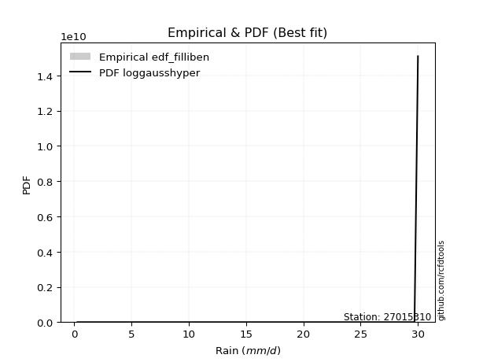</img>

</div>


### 10. Empirical - EDF Jenkinson (1977)

The Jenkinson formula in hydrology is an empirical plotting position formula used to estimate the non-exceedance probability _(P)_ or return period _(T)_ of a given ordered observation within a sample. It is a widely used method in the frequency analysis of extreme events such as floods and rainfall, as it provides a distribution-free way to plot data. _a≈0.31_ and _b≈0.38_ are constants derived to approximate the median of the probability distribution for the given rank.

<div align="center">


$P=(m-a)/(n+b)$


</div>


**10.1. Empirical values**

<div align="center">

|                | 0                   | 1                   | 2                  | 3                  | 4                  | 5                  |
|:---------------|:--------------------|:--------------------|:-------------------|:-------------------|:-------------------|:-------------------|
| date           | 2025                | 2023                | 2022               | 2021               | 2017               | 2018               |
| x              | 0.1                 | 10.7                | 16.9               | 27.9               | 29.7               | 30.0               |
| m              | 1                   | 2                   | 3                  | 4                  | 5                  | 6                  |
| empirical_dist | edf_jenkinson       | edf_jenkinson       | edf_jenkinson      | edf_jenkinson      | edf_jenkinson      | edf_jenkinson      |
| empirical      | 0.10815047021943573 | 0.26489028213166144 | 0.4216300940438871 | 0.5783699059561128 | 0.7351097178683387 | 0.8918495297805643 |
| empirical_tr   | 1.1212653778558874  | 1.3603411513859276  | 1.7289972899728996 | 2.3717472118959106 | 3.7751479289940844 | 9.246376811594207  |

</div>


**10.2. Kolmogorov-Smirnov fit test (sorted by Δ)**


<div align="center">

|                | 0                   | 1                   | 2                  | 3                   | 4                   | 5                   | 6                   | 7                  | 8                   | 9                   | 10                 | 11                  | 12                | 13                  | 14                  | 15                  | 16                  | 17                  | 18                 | 19                  | 20                  | 21                 | 22                 | 23                 | 24                  | 25                  | 26                  | 27                  | 28                  | 29                  | 30                  | 31                 | 32                 | 33                  | 34                  | 35                  | 36                 | 37                 | 38                 | 39                 | 40                  | 41                 | 42                  | 43                  | 44                  | 45                  | 46                 | 47                 | 48                 | 49                 | 50                | 51                 | 52                 | 53                 | 54                 | 55                  | 56                 | 57                 | 58                 | 59                 | 60                  | 61                 | 62                  | 63                | 64                 | 65                  | 66                    | 67                 | 68                  | 69                  | 70                 | 71                 | 72                 | 73                 | 74                 | 75                 | 76                 | 77                  | 78                 | 79                 | 80                  | 81                 | 82                 | 83                 | 84                 | 85                 | 86                | 87                 | 88                 | 89                 |
|:---------------|:--------------------|:--------------------|:-------------------|:--------------------|:--------------------|:--------------------|:--------------------|:-------------------|:--------------------|:--------------------|:-------------------|:--------------------|:------------------|:--------------------|:--------------------|:--------------------|:--------------------|:--------------------|:-------------------|:--------------------|:--------------------|:-------------------|:-------------------|:-------------------|:--------------------|:--------------------|:--------------------|:--------------------|:--------------------|:--------------------|:--------------------|:-------------------|:-------------------|:--------------------|:--------------------|:--------------------|:-------------------|:-------------------|:-------------------|:-------------------|:--------------------|:-------------------|:--------------------|:--------------------|:--------------------|:--------------------|:-------------------|:-------------------|:-------------------|:-------------------|:------------------|:-------------------|:-------------------|:-------------------|:-------------------|:--------------------|:-------------------|:-------------------|:-------------------|:-------------------|:--------------------|:-------------------|:--------------------|:------------------|:-------------------|:--------------------|:----------------------|:-------------------|:--------------------|:--------------------|:-------------------|:-------------------|:-------------------|:-------------------|:-------------------|:-------------------|:-------------------|:--------------------|:-------------------|:-------------------|:--------------------|:-------------------|:-------------------|:-------------------|:-------------------|:-------------------|:------------------|:-------------------|:-------------------|:-------------------|
| station        | 27015310            | 27015310            | 27015310           | 27015310            | 27015310            | 27015310            | 27015310            | 27015310           | 27015310            | 27015310            | 27015310           | 27015310            | 27015310          | 27015310            | 27015310            | 27015310            | 27015310            | 27015310            | 27015310           | 27015310            | 27015310            | 27015310           | 27015310           | 27015310           | 27015310            | 27015310            | 27015310            | 27015310            | 27015310            | 27015310            | 27015310            | 27015310           | 27015310           | 27015310            | 27015310            | 27015310            | 27015310           | 27015310           | 27015310           | 27015310           | 27015310            | 27015310           | 27015310            | 27015310            | 27015310            | 27015310            | 27015310           | 27015310           | 27015310           | 27015310           | 27015310          | 27015310           | 27015310           | 27015310           | 27015310           | 27015310            | 27015310           | 27015310           | 27015310           | 27015310           | 27015310            | 27015310           | 27015310            | 27015310          | 27015310           | 27015310            | 27015310              | 27015310           | 27015310            | 27015310            | 27015310           | 27015310           | 27015310           | 27015310           | 27015310           | 27015310           | 27015310           | 27015310            | 27015310           | 27015310           | 27015310            | 27015310           | 27015310           | 27015310           | 27015310           | 27015310           | 27015310          | 27015310           | 27015310           | 27015310           |
| empirical_dist | edf_jenkinson       | edf_jenkinson       | edf_jenkinson      | edf_jenkinson       | edf_jenkinson       | edf_jenkinson       | edf_jenkinson       | edf_jenkinson      | edf_jenkinson       | edf_jenkinson       | edf_jenkinson      | edf_jenkinson       | edf_jenkinson     | edf_jenkinson       | edf_jenkinson       | edf_jenkinson       | edf_jenkinson       | edf_jenkinson       | edf_jenkinson      | edf_jenkinson       | edf_jenkinson       | edf_jenkinson      | edf_jenkinson      | edf_jenkinson      | edf_jenkinson       | edf_jenkinson       | edf_jenkinson       | edf_jenkinson       | edf_jenkinson       | edf_jenkinson       | edf_jenkinson       | edf_jenkinson      | edf_jenkinson      | edf_jenkinson       | edf_jenkinson       | edf_jenkinson       | edf_jenkinson      | edf_jenkinson      | edf_jenkinson      | edf_jenkinson      | edf_jenkinson       | edf_jenkinson      | edf_jenkinson       | edf_jenkinson       | edf_jenkinson       | edf_jenkinson       | edf_jenkinson      | edf_jenkinson      | edf_jenkinson      | edf_jenkinson      | edf_jenkinson     | edf_jenkinson      | edf_jenkinson      | edf_jenkinson      | edf_jenkinson      | edf_jenkinson       | edf_jenkinson      | edf_jenkinson      | edf_jenkinson      | edf_jenkinson      | edf_jenkinson       | edf_jenkinson      | edf_jenkinson       | edf_jenkinson     | edf_jenkinson      | edf_jenkinson       | edf_jenkinson         | edf_jenkinson      | edf_jenkinson       | edf_jenkinson       | edf_jenkinson      | edf_jenkinson      | edf_jenkinson      | edf_jenkinson      | edf_jenkinson      | edf_jenkinson      | edf_jenkinson      | edf_jenkinson       | edf_jenkinson      | edf_jenkinson      | edf_jenkinson       | edf_jenkinson      | edf_jenkinson      | edf_jenkinson      | edf_jenkinson      | edf_jenkinson      | edf_jenkinson     | edf_jenkinson      | edf_jenkinson      | edf_jenkinson      |
| p_dist         | invweibull          | fisk                | loggompertz        | genexpon            | expon               | ncf                 | pearson3            | invgauss           | kstwobign           | gamma               | weibull_min        | f                   | rice              | fatiguelife         | nct                 | crystalball         | norm                | exponnorm           | t                  | erlang              | gumbel_l            | betaprime          | loggumbel_l        | alpha              | maxwell             | rayleigh            | invgamma            | logpearson3         | laplace_asymmetric  | halfnorm            | logistic            | logjohnsonsu       | gumbel_r           | halflogistic        | hypsecant           | mielke              | moyal              | laplace            | logfatiguelife     | lognakagami        | logexponnorm        | logcrystalball     | lognorm             | lognorm             | logrice             | lognct              | nakagami           | loglognorm         | wald               | loglogistic        | loghypsecant      | loginvgamma        | logalpha           | loggamma           | loggamma           | loginvweibull       | loginvgauss        | loglaplace         | gompertz           | logmaxwell         | gibrat              | lograyleigh        | logkstwobign        | loghalfnorm       | loggumbel_r        | logt                | loglaplace_asymmetric | truncnorm          | logloggamma         | logncf              | logmoyal           | loghalflogistic    | logfisk            | logexpon           | pareto             | logpareto          | logwald            | logbetaprime        | logf               | loggibrat          | logtruncnorm        | logweibull_min     | logmielke          | loggenexpon        | chi2               | johnsonsu          | logchi2           | logerlang          | loggenlogistic     | genlogistic        |
| delta          | 0.17584162468568432 | 0.17744840399341333 | 0.1856672793543418 | 0.18747553641867987 | 0.18804957405653788 | 0.19025699689222042 | 0.19489756531850322 | 0.1949889275243193 | 0.19827086321248577 | 0.20197580034227902 | 0.2020409920686166 | 0.20344877818448726 | 0.203465070406168 | 0.20353473310618297 | 0.20367436823111518 | 0.20372867932536665 | 0.20372867937327432 | 0.20373013262835404 | 0.2037462564093746 | 0.20375727241506603 | 0.20410242284538083 | 0.2047091707383647 | 0.2063860630035692 | 0.2078954155594014 | 0.20905982507041554 | 0.21056839878282807 | 0.21136801988505427 | 0.21391587937557277 | 0.21595321349248342 | 0.21670871275082448 | 0.22594661372698555 | 0.2336348279139503 | 0.2349307225942847 | 0.23901849997586466 | 0.23958381930324657 | 0.24366723698885662 | 0.2451973474358098 | 0.2555432141667331 | 0.2736409582534177 | 0.2742537857735441 | 0.27444823029675314 | 0.2744513544409961 | 0.27445136911976653 | 0.27445136911976653 | 0.27446868916012135 | 0.27485163760807874 | 0.2767899026517776 | 0.2771619952348534 | 0.2795252198851583 | 0.2797799314488474 | 0.284300387123406 | 0.2855261185000275 | 0.2873813945422391 | 0.2912904184667313 | 0.2912904184667313 | 0.29421045178805527 | 0.2943839261728327 | 0.3002955410294683 | 0.3036383396058626 | 0.3055163862993121 | 0.30730756801176173 | 0.3155697779856327 | 0.33277770853898403 | 0.343897244571962 | 0.3448925174952684 | 0.35129239860616696 | 0.3642002959643127    | 0.3643274610817233 | 0.36435983032503505 | 0.36592126564508143 | 0.3700499310328982 | 0.3707989195732002 | 0.3819880057913454 | 0.3833930411057449 | 0.3881104434762501 | 0.4255358163464035 | 0.4398687424944465 | 0.44366235179571767 | 0.4528816010538903 | 0.4680560058663622 | 0.48168266015747707 | 0.5374664886181767 | 0.6221090370812584 | 0.6311907322879592 | 0.6561890004087889 | 0.6717416729780585 | 0.683409109975279 | 0.6938057172610901 | 0.7351097178683387 | 0.7351097178683387 |
| deltao         | 0.530385761606      | 0.530385761606      | 0.530385761606     | 0.530385761606      | 0.530385761606      | 0.530385761606      | 0.530385761606      | 0.530385761606     | 0.530385761606      | 0.530385761606      | 0.530385761606     | 0.530385761606      | 0.530385761606    | 0.530385761606      | 0.530385761606      | 0.530385761606      | 0.530385761606      | 0.530385761606      | 0.530385761606     | 0.530385761606      | 0.530385761606      | 0.530385761606     | 0.530385761606     | 0.530385761606     | 0.530385761606      | 0.530385761606      | 0.530385761606      | 0.530385761606      | 0.530385761606      | 0.530385761606      | 0.530385761606      | 0.530385761606     | 0.530385761606     | 0.530385761606      | 0.530385761606      | 0.530385761606      | 0.530385761606     | 0.530385761606     | 0.530385761606     | 0.530385761606     | 0.530385761606      | 0.530385761606     | 0.530385761606      | 0.530385761606      | 0.530385761606      | 0.530385761606      | 0.530385761606     | 0.530385761606     | 0.530385761606     | 0.530385761606     | 0.530385761606    | 0.530385761606     | 0.530385761606     | 0.530385761606     | 0.530385761606     | 0.530385761606      | 0.530385761606     | 0.530385761606     | 0.530385761606     | 0.530385761606     | 0.530385761606      | 0.530385761606     | 0.530385761606      | 0.530385761606    | 0.530385761606     | 0.530385761606      | 0.530385761606        | 0.530385761606     | 0.530385761606      | 0.530385761606      | 0.530385761606     | 0.530385761606     | 0.530385761606     | 0.530385761606     | 0.530385761606     | 0.530385761606     | 0.530385761606     | 0.530385761606      | 0.530385761606     | 0.530385761606     | 0.530385761606      | 0.530385761606     | 0.530385761606     | 0.530385761606     | 0.530385761606     | 0.530385761606     | 0.530385761606    | 0.530385761606     | 0.530385761606     | 0.530385761606     |
| eval           | Δo > Δ              | Δo > Δ              | Δo > Δ             | Δo > Δ              | Δo > Δ              | Δo > Δ              | Δo > Δ              | Δo > Δ             | Δo > Δ              | Δo > Δ              | Δo > Δ             | Δo > Δ              | Δo > Δ            | Δo > Δ              | Δo > Δ              | Δo > Δ              | Δo > Δ              | Δo > Δ              | Δo > Δ             | Δo > Δ              | Δo > Δ              | Δo > Δ             | Δo > Δ             | Δo > Δ             | Δo > Δ              | Δo > Δ              | Δo > Δ              | Δo > Δ              | Δo > Δ              | Δo > Δ              | Δo > Δ              | Δo > Δ             | Δo > Δ             | Δo > Δ              | Δo > Δ              | Δo > Δ              | Δo > Δ             | Δo > Δ             | Δo > Δ             | Δo > Δ             | Δo > Δ              | Δo > Δ             | Δo > Δ              | Δo > Δ              | Δo > Δ              | Δo > Δ              | Δo > Δ             | Δo > Δ             | Δo > Δ             | Δo > Δ             | Δo > Δ            | Δo > Δ             | Δo > Δ             | Δo > Δ             | Δo > Δ             | Δo > Δ              | Δo > Δ             | Δo > Δ             | Δo > Δ             | Δo > Δ             | Δo > Δ              | Δo > Δ             | Δo > Δ              | Δo > Δ            | Δo > Δ             | Δo > Δ              | Δo > Δ                | Δo > Δ             | Δo > Δ              | Δo > Δ              | Δo > Δ             | Δo > Δ             | Δo > Δ             | Δo > Δ             | Δo > Δ             | Δo > Δ             | Δo > Δ             | Δo > Δ              | Δo > Δ             | Δo > Δ             | Δo > Δ              | Δo <= Δ            | Δo <= Δ            | Δo <= Δ            | Δo <= Δ            | Δo <= Δ            | Δo <= Δ           | Δo <= Δ            | Δo <= Δ            | Δo <= Δ            |
| fit            | 1                   | 1                   | 1                  | 1                   | 1                   | 1                   | 1                   | 1                  | 1                   | 1                   | 1                  | 1                   | 1                 | 1                   | 1                   | 1                   | 1                   | 1                   | 1                  | 1                   | 1                   | 1                  | 1                  | 1                  | 1                   | 1                   | 1                   | 1                   | 1                   | 1                   | 1                   | 1                  | 1                  | 1                   | 1                   | 1                   | 1                  | 1                  | 1                  | 1                  | 1                   | 1                  | 1                   | 1                   | 1                   | 1                   | 1                  | 1                  | 1                  | 1                  | 1                 | 1                  | 1                  | 1                  | 1                  | 1                   | 1                  | 1                  | 1                  | 1                  | 1                   | 1                  | 1                   | 1                 | 1                  | 1                   | 1                     | 1                  | 1                   | 1                   | 1                  | 1                  | 1                  | 1                  | 1                  | 1                  | 1                  | 1                   | 1                  | 1                  | 1                   | 0                  | 0                  | 0                  | 0                  | 0                  | 0                 | 0                  | 0                  | 0                  |
| n              | 6                   | 6                   | 6                  | 6                   | 6                   | 6                   | 6                   | 6                  | 6                   | 6                   | 6                  | 6                   | 6                 | 6                   | 6                   | 6                   | 6                   | 6                   | 6                  | 6                   | 6                   | 6                  | 6                  | 6                  | 6                   | 6                   | 6                   | 6                   | 6                   | 6                   | 6                   | 6                  | 6                  | 6                   | 6                   | 6                   | 6                  | 6                  | 6                  | 6                  | 6                   | 6                  | 6                   | 6                   | 6                   | 6                   | 6                  | 6                  | 6                  | 6                  | 6                 | 6                  | 6                  | 6                  | 6                  | 6                   | 6                  | 6                  | 6                  | 6                  | 6                   | 6                  | 6                   | 6                 | 6                  | 6                   | 6                     | 6                  | 6                   | 6                   | 6                  | 6                  | 6                  | 6                  | 6                  | 6                  | 6                  | 6                   | 6                  | 6                  | 6                   | 6                  | 6                  | 6                  | 6                  | 6                  | 6                 | 6                  | 6                  | 6                  |
| best_fit       | 1                   | 0                   | 0                  | 0                   | 0                   | 0                   | 0                   | 0                  | 0                   | 0                   | 0                  | 0                   | 0                 | 0                   | 0                   | 0                   | 0                   | 0                   | 0                  | 0                   | 0                   | 0                  | 0                  | 0                  | 0                   | 0                   | 0                   | 0                   | 0                   | 0                   | 0                   | 0                  | 0                  | 0                   | 0                   | 0                   | 0                  | 0                  | 0                  | 0                  | 0                   | 0                  | 0                   | 0                   | 0                   | 0                   | 0                  | 0                  | 0                  | 0                  | 0                 | 0                  | 0                  | 0                  | 0                  | 0                   | 0                  | 0                  | 0                  | 0                  | 0                   | 0                  | 0                   | 0                 | 0                  | 0                   | 0                     | 0                  | 0                   | 0                   | 0                  | 0                  | 0                  | 0                  | 0                  | 0                  | 0                  | 0                   | 0                  | 0                  | 0                   | 0                  | 0                  | 0                  | 0                  | 0                  | 0                 | 0                  | 0                  | 0                  |
| best_fit_sort  | 1                   | 2                   | 3                  | 4                   | 5                   | 6                   | 7                   | 8                  | 9                   | 10                  | 11                 | 12                  | 13                | 14                  | 15                  | 16                  | 17                  | 18                  | 19                 | 20                  | 21                  | 22                 | 23                 | 24                 | 25                  | 26                  | 27                  | 28                  | 29                  | 30                  | 31                  | 32                 | 33                 | 34                  | 35                  | 36                  | 37                 | 38                 | 39                 | 40                 | 41                  | 42                 | 43                  | 44                  | 45                  | 46                  | 47                 | 48                 | 49                 | 50                 | 51                | 52                 | 53                 | 54                 | 55                 | 56                  | 57                 | 58                 | 59                 | 60                 | 61                  | 62                 | 63                  | 64                | 65                 | 66                  | 67                    | 68                 | 69                  | 70                  | 71                 | 72                 | 73                 | 74                 | 75                 | 76                 | 77                 | 78                  | 79                 | 80                 | 81                  | 82                 | 83                 | 84                 | 85                 | 86                 | 87                | 88                 | 89                 | 90                 |

</div>


<div align="center">

</img>

</div>


**10.3. Best fit**

<div align="center">

|   id |   station | empirical_dist   | p_dist     |    delta |   deltao | eval   |   fit |   n |   best_fit |   best_fit_sort |
|-----:|----------:|:-----------------|:-----------|---------:|---------:|:-------|------:|----:|-----------:|----------------:|
|    0 |  27015310 | edf_jenkinson    | invweibull | 0.175842 | 0.530386 | Δo > Δ |     1 |   6 |          1 |               1 |

</div>


<div align="center">

</img></img>

</div>


### 11. Empirical - EDF Cunnane (1978)

Cunnane´s work in statistical hydrology has focused on the performance and evaluation of different probability distributions (such as GEV, Gumbel, Lognormal) for flood frequency estimation. _b_ is a constant, typically set to 0.4.

<div align="center">


$P=(m-b)/(n+1-2b)$


</div>


**11.1. Empirical values**

<div align="center">

|                | 0                  | 1                   | 2                   | 3                  | 4                  | 5                  |
|:---------------|:-------------------|:--------------------|:--------------------|:-------------------|:-------------------|:-------------------|
| date           | 2025               | 2023                | 2022                | 2021               | 2017               | 2018               |
| x              | 0.1                | 10.7                | 16.9                | 27.9               | 29.7               | 30.0               |
| m              | 1                  | 2                   | 3                   | 4                  | 5                  | 6                  |
| empirical_dist | edf_cunnane        | edf_cunnane         | edf_cunnane         | edf_cunnane        | edf_cunnane        | edf_cunnane        |
| empirical      | 0.0967741935483871 | 0.25806451612903225 | 0.41935483870967744 | 0.5806451612903226 | 0.7419354838709676 | 0.9032258064516128 |
| empirical_tr   | 1.1071428571428572 | 1.3478260869565217  | 1.7222222222222225  | 2.384615384615385  | 3.8749999999999982 | 10.333333333333318 |

</div>


**11.2. Kolmogorov-Smirnov fit test (sorted by Δ)**


<div align="center">

|                | 0                   | 1                   | 2                 | 3                   | 4                   | 5                   | 6                  | 7                   | 8                   | 9                   | 10                  | 11                 | 12                  | 13                  | 14                  | 15                  | 16                  | 17                 | 18                  | 19                  | 20                  | 21                 | 22                  | 23                  | 24                  | 25                  | 26                 | 27                  | 28                  | 29                  | 30                  | 31                 | 32                  | 33                  | 34                  | 35                  | 36                  | 37                 | 38                 | 39                 | 40                 | 41                 | 42                 | 43                 | 44                 | 45                  | 46                 | 47                 | 48                 | 49                  | 50                 | 51                 | 52                 | 53                 | 54                 | 55                  | 56                 | 57                 | 58                  | 59                 | 60                 | 61                  | 62                 | 63                 | 64                 | 65                  | 66                    | 67                 | 68                  | 69                 | 70                  | 71                 | 72                 | 73                 | 74                 | 75                  | 76                 | 77                  | 78                 | 79                 | 80                  | 81                 | 82                 | 83                 | 84                 | 85                 | 86                 | 87                 | 88                 | 89                 |
|:---------------|:--------------------|:--------------------|:------------------|:--------------------|:--------------------|:--------------------|:-------------------|:--------------------|:--------------------|:--------------------|:--------------------|:-------------------|:--------------------|:--------------------|:--------------------|:--------------------|:--------------------|:-------------------|:--------------------|:--------------------|:--------------------|:-------------------|:--------------------|:--------------------|:--------------------|:--------------------|:-------------------|:--------------------|:--------------------|:--------------------|:--------------------|:-------------------|:--------------------|:--------------------|:--------------------|:--------------------|:--------------------|:-------------------|:-------------------|:-------------------|:-------------------|:-------------------|:-------------------|:-------------------|:-------------------|:--------------------|:-------------------|:-------------------|:-------------------|:--------------------|:-------------------|:-------------------|:-------------------|:-------------------|:-------------------|:--------------------|:-------------------|:-------------------|:--------------------|:-------------------|:-------------------|:--------------------|:-------------------|:-------------------|:-------------------|:--------------------|:----------------------|:-------------------|:--------------------|:-------------------|:--------------------|:-------------------|:-------------------|:-------------------|:-------------------|:--------------------|:-------------------|:--------------------|:-------------------|:-------------------|:--------------------|:-------------------|:-------------------|:-------------------|:-------------------|:-------------------|:-------------------|:-------------------|:-------------------|:-------------------|
| station        | 27015310            | 27015310            | 27015310          | 27015310            | 27015310            | 27015310            | 27015310           | 27015310            | 27015310            | 27015310            | 27015310            | 27015310           | 27015310            | 27015310            | 27015310            | 27015310            | 27015310            | 27015310           | 27015310            | 27015310            | 27015310            | 27015310           | 27015310            | 27015310            | 27015310            | 27015310            | 27015310           | 27015310            | 27015310            | 27015310            | 27015310            | 27015310           | 27015310            | 27015310            | 27015310            | 27015310            | 27015310            | 27015310           | 27015310           | 27015310           | 27015310           | 27015310           | 27015310           | 27015310           | 27015310           | 27015310            | 27015310           | 27015310           | 27015310           | 27015310            | 27015310           | 27015310           | 27015310           | 27015310           | 27015310           | 27015310            | 27015310           | 27015310           | 27015310            | 27015310           | 27015310           | 27015310            | 27015310           | 27015310           | 27015310           | 27015310            | 27015310              | 27015310           | 27015310            | 27015310           | 27015310            | 27015310           | 27015310           | 27015310           | 27015310           | 27015310            | 27015310           | 27015310            | 27015310           | 27015310           | 27015310            | 27015310           | 27015310           | 27015310           | 27015310           | 27015310           | 27015310           | 27015310           | 27015310           | 27015310           |
| empirical_dist | edf_cunnane         | edf_cunnane         | edf_cunnane       | edf_cunnane         | edf_cunnane         | edf_cunnane         | edf_cunnane        | edf_cunnane         | edf_cunnane         | edf_cunnane         | edf_cunnane         | edf_cunnane        | edf_cunnane         | edf_cunnane         | edf_cunnane         | edf_cunnane         | edf_cunnane         | edf_cunnane        | edf_cunnane         | edf_cunnane         | edf_cunnane         | edf_cunnane        | edf_cunnane         | edf_cunnane         | edf_cunnane         | edf_cunnane         | edf_cunnane        | edf_cunnane         | edf_cunnane         | edf_cunnane         | edf_cunnane         | edf_cunnane        | edf_cunnane         | edf_cunnane         | edf_cunnane         | edf_cunnane         | edf_cunnane         | edf_cunnane        | edf_cunnane        | edf_cunnane        | edf_cunnane        | edf_cunnane        | edf_cunnane        | edf_cunnane        | edf_cunnane        | edf_cunnane         | edf_cunnane        | edf_cunnane        | edf_cunnane        | edf_cunnane         | edf_cunnane        | edf_cunnane        | edf_cunnane        | edf_cunnane        | edf_cunnane        | edf_cunnane         | edf_cunnane        | edf_cunnane        | edf_cunnane         | edf_cunnane        | edf_cunnane        | edf_cunnane         | edf_cunnane        | edf_cunnane        | edf_cunnane        | edf_cunnane         | edf_cunnane           | edf_cunnane        | edf_cunnane         | edf_cunnane        | edf_cunnane         | edf_cunnane        | edf_cunnane        | edf_cunnane        | edf_cunnane        | edf_cunnane         | edf_cunnane        | edf_cunnane         | edf_cunnane        | edf_cunnane        | edf_cunnane         | edf_cunnane        | edf_cunnane        | edf_cunnane        | edf_cunnane        | edf_cunnane        | edf_cunnane        | edf_cunnane        | edf_cunnane        | edf_cunnane        |
| p_dist         | invweibull          | fisk                | loggompertz       | genexpon            | expon               | pearson3            | invgauss           | kstwobign           | gamma               | weibull_min         | f                   | rice               | fatiguelife         | nct                 | crystalball         | norm                | exponnorm           | t                  | erlang              | ncf                 | gumbel_l            | betaprime          | alpha               | maxwell             | rayleigh            | invgamma            | loggumbel_l        | laplace_asymmetric  | halfnorm            | logistic            | logpearson3         | gumbel_r           | halflogistic        | hypsecant           | logjohnsonsu        | mielke              | moyal               | laplace            | wald               | logfatiguelife     | lognakagami        | logexponnorm       | logcrystalball     | lognorm            | lognorm            | logrice             | lognct             | nakagami           | loglognorm         | loglogistic         | loghypsecant       | loginvgamma        | logalpha           | loggamma           | loggamma           | loginvweibull       | loginvgauss        | gompertz           | gibrat              | loglaplace         | logmaxwell         | lograyleigh         | logkstwobign       | loghalfnorm        | loggumbel_r        | logt                | loglaplace_asymmetric | truncnorm          | logloggamma         | logncf             | logmoyal            | loghalflogistic    | logfisk            | logexpon           | pareto             | logpareto           | logwald            | logbetaprime        | logf               | loggibrat          | logtruncnorm        | logweibull_min     | logmielke          | loggenexpon        | chi2               | johnsonsu          | logchi2            | logerlang          | loggenlogistic     | genlogistic        |
| delta          | 0.17356636935147451 | 0.17517314865920353 | 0.183392024020132 | 0.18520028108447006 | 0.18577431872232808 | 0.19262230998429342 | 0.1927136721901095 | 0.19599560787827597 | 0.19970054500806922 | 0.19976573673440678 | 0.20117352285027745 | 0.2011898150719582 | 0.20125947777197317 | 0.20139911289690537 | 0.20145342399115684 | 0.20145342403906452 | 0.20145487729414424 | 0.2014710010751648 | 0.20148201708085622 | 0.20163327356326888 | 0.20182716751117102 | 0.2024339154041549 | 0.20562016022519158 | 0.20678456973620574 | 0.20829314344861827 | 0.20909276455084447 | 0.2132118290061984 | 0.21367795815827362 | 0.21443345741661468 | 0.22367135839277574 | 0.22529215604662123 | 0.2326554672600749 | 0.23674324464165486 | 0.23730856396903677 | 0.24046059391657926 | 0.24139198165464681 | 0.24292209210159998 | 0.2532679588325233 | 0.2772499645509485 | 0.2804667242560469 | 0.2810795517761733 | 0.2812739962993823 | 0.2812771204436253 | 0.2812771351223957 | 0.2812771351223957 | 0.28129445516275053 | 0.2816774036107079 | 0.2836156686544068 | 0.2839877612374826 | 0.28660569745147657 | 0.2911261531260352 | 0.2923518845026567 | 0.2942071605448683 | 0.2981161844693605 | 0.2981161844693605 | 0.30103621779068446 | 0.3012096921754619 | 0.3013630842716529 | 0.30503231267755193 | 0.3071213070320975 | 0.3123421523019413 | 0.32239554398826187 | 0.3396034745416132 | 0.3507230105745912 | 0.3517182834978976 | 0.35356765394037676 | 0.3619250406301029    | 0.3620522057475135 | 0.36208457499082525 | 0.3727470316477106 | 0.37687569703552737 | 0.3776246855758294 | 0.3888137717939746 | 0.3902188071083741 | 0.3949362094788793 | 0.43236158234903266 | 0.4466945084970757 | 0.45048811779834685 | 0.4597073670565195 | 0.4748817718689914 | 0.48850842616010626 | 0.5442922546208059 | 0.6289348030838876 | 0.6380164982905884 | 0.6630147664114181 | 0.6785674389806875 | 0.6902348759779082 | 0.7006314832637193 | 0.7419354838709676 | 0.7419354838709676 |
| deltao         | 0.530385761606      | 0.530385761606      | 0.530385761606    | 0.530385761606      | 0.530385761606      | 0.530385761606      | 0.530385761606     | 0.530385761606      | 0.530385761606      | 0.530385761606      | 0.530385761606      | 0.530385761606     | 0.530385761606      | 0.530385761606      | 0.530385761606      | 0.530385761606      | 0.530385761606      | 0.530385761606     | 0.530385761606      | 0.530385761606      | 0.530385761606      | 0.530385761606     | 0.530385761606      | 0.530385761606      | 0.530385761606      | 0.530385761606      | 0.530385761606     | 0.530385761606      | 0.530385761606      | 0.530385761606      | 0.530385761606      | 0.530385761606     | 0.530385761606      | 0.530385761606      | 0.530385761606      | 0.530385761606      | 0.530385761606      | 0.530385761606     | 0.530385761606     | 0.530385761606     | 0.530385761606     | 0.530385761606     | 0.530385761606     | 0.530385761606     | 0.530385761606     | 0.530385761606      | 0.530385761606     | 0.530385761606     | 0.530385761606     | 0.530385761606      | 0.530385761606     | 0.530385761606     | 0.530385761606     | 0.530385761606     | 0.530385761606     | 0.530385761606      | 0.530385761606     | 0.530385761606     | 0.530385761606      | 0.530385761606     | 0.530385761606     | 0.530385761606      | 0.530385761606     | 0.530385761606     | 0.530385761606     | 0.530385761606      | 0.530385761606        | 0.530385761606     | 0.530385761606      | 0.530385761606     | 0.530385761606      | 0.530385761606     | 0.530385761606     | 0.530385761606     | 0.530385761606     | 0.530385761606      | 0.530385761606     | 0.530385761606      | 0.530385761606     | 0.530385761606     | 0.530385761606      | 0.530385761606     | 0.530385761606     | 0.530385761606     | 0.530385761606     | 0.530385761606     | 0.530385761606     | 0.530385761606     | 0.530385761606     | 0.530385761606     |
| eval           | Δo > Δ              | Δo > Δ              | Δo > Δ            | Δo > Δ              | Δo > Δ              | Δo > Δ              | Δo > Δ             | Δo > Δ              | Δo > Δ              | Δo > Δ              | Δo > Δ              | Δo > Δ             | Δo > Δ              | Δo > Δ              | Δo > Δ              | Δo > Δ              | Δo > Δ              | Δo > Δ             | Δo > Δ              | Δo > Δ              | Δo > Δ              | Δo > Δ             | Δo > Δ              | Δo > Δ              | Δo > Δ              | Δo > Δ              | Δo > Δ             | Δo > Δ              | Δo > Δ              | Δo > Δ              | Δo > Δ              | Δo > Δ             | Δo > Δ              | Δo > Δ              | Δo > Δ              | Δo > Δ              | Δo > Δ              | Δo > Δ             | Δo > Δ             | Δo > Δ             | Δo > Δ             | Δo > Δ             | Δo > Δ             | Δo > Δ             | Δo > Δ             | Δo > Δ              | Δo > Δ             | Δo > Δ             | Δo > Δ             | Δo > Δ              | Δo > Δ             | Δo > Δ             | Δo > Δ             | Δo > Δ             | Δo > Δ             | Δo > Δ              | Δo > Δ             | Δo > Δ             | Δo > Δ              | Δo > Δ             | Δo > Δ             | Δo > Δ              | Δo > Δ             | Δo > Δ             | Δo > Δ             | Δo > Δ              | Δo > Δ                | Δo > Δ             | Δo > Δ              | Δo > Δ             | Δo > Δ              | Δo > Δ             | Δo > Δ             | Δo > Δ             | Δo > Δ             | Δo > Δ              | Δo > Δ             | Δo > Δ              | Δo > Δ             | Δo > Δ             | Δo > Δ              | Δo <= Δ            | Δo <= Δ            | Δo <= Δ            | Δo <= Δ            | Δo <= Δ            | Δo <= Δ            | Δo <= Δ            | Δo <= Δ            | Δo <= Δ            |
| fit            | 1                   | 1                   | 1                 | 1                   | 1                   | 1                   | 1                  | 1                   | 1                   | 1                   | 1                   | 1                  | 1                   | 1                   | 1                   | 1                   | 1                   | 1                  | 1                   | 1                   | 1                   | 1                  | 1                   | 1                   | 1                   | 1                   | 1                  | 1                   | 1                   | 1                   | 1                   | 1                  | 1                   | 1                   | 1                   | 1                   | 1                   | 1                  | 1                  | 1                  | 1                  | 1                  | 1                  | 1                  | 1                  | 1                   | 1                  | 1                  | 1                  | 1                   | 1                  | 1                  | 1                  | 1                  | 1                  | 1                   | 1                  | 1                  | 1                   | 1                  | 1                  | 1                   | 1                  | 1                  | 1                  | 1                   | 1                     | 1                  | 1                   | 1                  | 1                   | 1                  | 1                  | 1                  | 1                  | 1                   | 1                  | 1                   | 1                  | 1                  | 1                   | 0                  | 0                  | 0                  | 0                  | 0                  | 0                  | 0                  | 0                  | 0                  |
| n              | 6                   | 6                   | 6                 | 6                   | 6                   | 6                   | 6                  | 6                   | 6                   | 6                   | 6                   | 6                  | 6                   | 6                   | 6                   | 6                   | 6                   | 6                  | 6                   | 6                   | 6                   | 6                  | 6                   | 6                   | 6                   | 6                   | 6                  | 6                   | 6                   | 6                   | 6                   | 6                  | 6                   | 6                   | 6                   | 6                   | 6                   | 6                  | 6                  | 6                  | 6                  | 6                  | 6                  | 6                  | 6                  | 6                   | 6                  | 6                  | 6                  | 6                   | 6                  | 6                  | 6                  | 6                  | 6                  | 6                   | 6                  | 6                  | 6                   | 6                  | 6                  | 6                   | 6                  | 6                  | 6                  | 6                   | 6                     | 6                  | 6                   | 6                  | 6                   | 6                  | 6                  | 6                  | 6                  | 6                   | 6                  | 6                   | 6                  | 6                  | 6                   | 6                  | 6                  | 6                  | 6                  | 6                  | 6                  | 6                  | 6                  | 6                  |
| best_fit       | 1                   | 0                   | 0                 | 0                   | 0                   | 0                   | 0                  | 0                   | 0                   | 0                   | 0                   | 0                  | 0                   | 0                   | 0                   | 0                   | 0                   | 0                  | 0                   | 0                   | 0                   | 0                  | 0                   | 0                   | 0                   | 0                   | 0                  | 0                   | 0                   | 0                   | 0                   | 0                  | 0                   | 0                   | 0                   | 0                   | 0                   | 0                  | 0                  | 0                  | 0                  | 0                  | 0                  | 0                  | 0                  | 0                   | 0                  | 0                  | 0                  | 0                   | 0                  | 0                  | 0                  | 0                  | 0                  | 0                   | 0                  | 0                  | 0                   | 0                  | 0                  | 0                   | 0                  | 0                  | 0                  | 0                   | 0                     | 0                  | 0                   | 0                  | 0                   | 0                  | 0                  | 0                  | 0                  | 0                   | 0                  | 0                   | 0                  | 0                  | 0                   | 0                  | 0                  | 0                  | 0                  | 0                  | 0                  | 0                  | 0                  | 0                  |
| best_fit_sort  | 1                   | 2                   | 3                 | 4                   | 5                   | 6                   | 7                  | 8                   | 9                   | 10                  | 11                  | 12                 | 13                  | 14                  | 15                  | 16                  | 17                  | 18                 | 19                  | 20                  | 21                  | 22                 | 23                  | 24                  | 25                  | 26                  | 27                 | 28                  | 29                  | 30                  | 31                  | 32                 | 33                  | 34                  | 35                  | 36                  | 37                  | 38                 | 39                 | 40                 | 41                 | 42                 | 43                 | 44                 | 45                 | 46                  | 47                 | 48                 | 49                 | 50                  | 51                 | 52                 | 53                 | 54                 | 55                 | 56                  | 57                 | 58                 | 59                  | 60                 | 61                 | 62                  | 63                 | 64                 | 65                 | 66                  | 67                    | 68                 | 69                  | 70                 | 71                  | 72                 | 73                 | 74                 | 75                 | 76                  | 77                 | 78                  | 79                 | 80                 | 81                  | 82                 | 83                 | 84                 | 85                 | 86                 | 87                 | 88                 | 89                 | 90                 |

</div>


<div align="center">

</img>

</div>


**11.3. Best fit**

<div align="center">

|   id |   station | empirical_dist   | p_dist     |    delta |   deltao | eval   |   fit |   n |   best_fit |   best_fit_sort |
|-----:|----------:|:-----------------|:-----------|---------:|---------:|:-------|------:|----:|-----------:|----------------:|
|    0 |  27015310 | edf_cunnane      | invweibull | 0.173566 | 0.530386 | Δo > Δ |     1 |   6 |          1 |               1 |

</div>


<div align="center">

</img>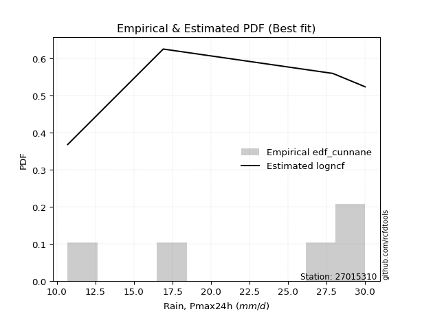</img>

</div>


### 12. Empirical - EDF Adamowski (1981)

The Adamowski formula in hydrology refers to a specific plotting position formula used for estimating the non-parametric empirical distribution of hydrological events (like flood peaks) to calculate their return periods. This formula provides an alternative to traditional parametric methods (like the Gumbel or Log Pearson Type III distributions). 

<div align="center">


$P=(m-0.25)/(n+0.5)$


</div>


**12.1. Empirical values**

<div align="center">

|                | 0                   | 1                  | 2                  | 3                  | 4                  | 5                  |
|:---------------|:--------------------|:-------------------|:-------------------|:-------------------|:-------------------|:-------------------|
| date           | 2025                | 2023               | 2022               | 2021               | 2017               | 2018               |
| x              | 0.1                 | 10.7               | 16.9               | 27.9               | 29.7               | 30.0               |
| m              | 1                   | 2                  | 3                  | 4                  | 5                  | 6                  |
| empirical_dist | edf_adamowski       | edf_adamowski      | edf_adamowski      | edf_adamowski      | edf_adamowski      | edf_adamowski      |
| empirical      | 0.11538461538461539 | 0.2692307692307692 | 0.4230769230769231 | 0.5769230769230769 | 0.7307692307692307 | 0.8846153846153846 |
| empirical_tr   | 1.1304347826086958  | 1.3684210526315788 | 1.7333333333333334 | 2.3636363636363633 | 3.7142857142857135 | 8.666666666666664  |

</div>


**12.2. Kolmogorov-Smirnov fit test (sorted by Δ)**


<div align="center">

|                | 0                   | 1                   | 2                  | 3                   | 4                  | 5                   | 6                   | 7                   | 8                   | 9                   | 10                  | 11                  | 12                 | 13                  | 14                  | 15                  | 16                 | 17                  | 18               | 19                  | 20                  | 21                  | 22                  | 23                  | 24                  | 25                  | 26                  | 27                  | 28                  | 29                  | 30                 | 31                  | 32                  | 33                 | 34                  | 35                  | 36                  | 37                  | 38                  | 39                 | 40                  | 41                 | 42                  | 43                  | 44                  | 45                  | 46                 | 47                 | 48                 | 49                 | 50                 | 51                  | 52                 | 53                  | 54                  | 55                 | 56                  | 57                  | 58                 | 59                  | 60                 | 61                 | 62                  | 63                  | 64                 | 65                | 66                  | 67                    | 68                 | 69                  | 70                | 71                  | 72                 | 73                 | 74                  | 75                 | 76                  | 77                 | 78                 | 79                 | 80                 | 81                 | 82                 | 83                 | 84                 | 85                 | 86                 | 87                 | 88                 | 89                 |
|:---------------|:--------------------|:--------------------|:-------------------|:--------------------|:-------------------|:--------------------|:--------------------|:--------------------|:--------------------|:--------------------|:--------------------|:--------------------|:-------------------|:--------------------|:--------------------|:--------------------|:-------------------|:--------------------|:-----------------|:--------------------|:--------------------|:--------------------|:--------------------|:--------------------|:--------------------|:--------------------|:--------------------|:--------------------|:--------------------|:--------------------|:-------------------|:--------------------|:--------------------|:-------------------|:--------------------|:--------------------|:--------------------|:--------------------|:--------------------|:-------------------|:--------------------|:-------------------|:--------------------|:--------------------|:--------------------|:--------------------|:-------------------|:-------------------|:-------------------|:-------------------|:-------------------|:--------------------|:-------------------|:--------------------|:--------------------|:-------------------|:--------------------|:--------------------|:-------------------|:--------------------|:-------------------|:-------------------|:--------------------|:--------------------|:-------------------|:------------------|:--------------------|:----------------------|:-------------------|:--------------------|:------------------|:--------------------|:-------------------|:-------------------|:--------------------|:-------------------|:--------------------|:-------------------|:-------------------|:-------------------|:-------------------|:-------------------|:-------------------|:-------------------|:-------------------|:-------------------|:-------------------|:-------------------|:-------------------|:-------------------|
| station        | 27015310            | 27015310            | 27015310           | 27015310            | 27015310           | 27015310            | 27015310            | 27015310            | 27015310            | 27015310            | 27015310            | 27015310            | 27015310           | 27015310            | 27015310            | 27015310            | 27015310           | 27015310            | 27015310         | 27015310            | 27015310            | 27015310            | 27015310            | 27015310            | 27015310            | 27015310            | 27015310            | 27015310            | 27015310            | 27015310            | 27015310           | 27015310            | 27015310            | 27015310           | 27015310            | 27015310            | 27015310            | 27015310            | 27015310            | 27015310           | 27015310            | 27015310           | 27015310            | 27015310            | 27015310            | 27015310            | 27015310           | 27015310           | 27015310           | 27015310           | 27015310           | 27015310            | 27015310           | 27015310            | 27015310            | 27015310           | 27015310            | 27015310            | 27015310           | 27015310            | 27015310           | 27015310           | 27015310            | 27015310            | 27015310           | 27015310          | 27015310            | 27015310              | 27015310           | 27015310            | 27015310          | 27015310            | 27015310           | 27015310           | 27015310            | 27015310           | 27015310            | 27015310           | 27015310           | 27015310           | 27015310           | 27015310           | 27015310           | 27015310           | 27015310           | 27015310           | 27015310           | 27015310           | 27015310           | 27015310           |
| empirical_dist | edf_adamowski       | edf_adamowski       | edf_adamowski      | edf_adamowski       | edf_adamowski      | edf_adamowski       | edf_adamowski       | edf_adamowski       | edf_adamowski       | edf_adamowski       | edf_adamowski       | edf_adamowski       | edf_adamowski      | edf_adamowski       | edf_adamowski       | edf_adamowski       | edf_adamowski      | edf_adamowski       | edf_adamowski    | edf_adamowski       | edf_adamowski       | edf_adamowski       | edf_adamowski       | edf_adamowski       | edf_adamowski       | edf_adamowski       | edf_adamowski       | edf_adamowski       | edf_adamowski       | edf_adamowski       | edf_adamowski      | edf_adamowski       | edf_adamowski       | edf_adamowski      | edf_adamowski       | edf_adamowski       | edf_adamowski       | edf_adamowski       | edf_adamowski       | edf_adamowski      | edf_adamowski       | edf_adamowski      | edf_adamowski       | edf_adamowski       | edf_adamowski       | edf_adamowski       | edf_adamowski      | edf_adamowski      | edf_adamowski      | edf_adamowski      | edf_adamowski      | edf_adamowski       | edf_adamowski      | edf_adamowski       | edf_adamowski       | edf_adamowski      | edf_adamowski       | edf_adamowski       | edf_adamowski      | edf_adamowski       | edf_adamowski      | edf_adamowski      | edf_adamowski       | edf_adamowski       | edf_adamowski      | edf_adamowski     | edf_adamowski       | edf_adamowski         | edf_adamowski      | edf_adamowski       | edf_adamowski     | edf_adamowski       | edf_adamowski      | edf_adamowski      | edf_adamowski       | edf_adamowski      | edf_adamowski       | edf_adamowski      | edf_adamowski      | edf_adamowski      | edf_adamowski      | edf_adamowski      | edf_adamowski      | edf_adamowski      | edf_adamowski      | edf_adamowski      | edf_adamowski      | edf_adamowski      | edf_adamowski      | edf_adamowski      |
| p_dist         | invweibull          | fisk                | ncf                | loggompertz         | genexpon           | expon               | pearson3            | invgauss            | kstwobign           | loggumbel_l         | gamma               | weibull_min         | f                  | rice                | fatiguelife         | nct                 | crystalball        | norm                | exponnorm        | t                   | erlang              | gumbel_l            | betaprime           | logpearson3         | alpha               | maxwell             | rayleigh            | invgamma            | laplace_asymmetric  | halfnorm            | logistic           | logjohnsonsu        | gumbel_r            | halflogistic       | hypsecant           | mielke              | moyal               | laplace             | logfatiguelife      | lognakagami        | logexponnorm        | logcrystalball     | lognorm             | lognorm             | logrice             | lognct              | nakagami           | loglognorm         | loglogistic        | loghypsecant       | wald               | loginvgamma         | logalpha           | loggamma            | loggamma            | loginvweibull      | loginvgauss         | loglaplace          | logmaxwell         | gompertz            | gibrat             | lograyleigh        | logkstwobign        | loghalfnorm         | loggumbel_r        | logt              | logncf              | loglaplace_asymmetric | logmoyal           | truncnorm           | logloggamma       | loghalflogistic     | logfisk            | logexpon           | pareto              | logpareto          | logwald             | logbetaprime       | logf               | loggibrat          | logtruncnorm       | logweibull_min     | logmielke          | loggenexpon        | chi2               | johnsonsu          | logchi2            | logerlang          | loggenlogistic     | genlogistic        |
| delta          | 0.17728845371872026 | 0.17889523302644927 | 0.1830228517270407 | 0.18711410838737774 | 0.1889223654517158 | 0.18949640308957383 | 0.19634439435153916 | 0.19643575655735523 | 0.19971769224552172 | 0.20204557590446143 | 0.20342262937531497 | 0.20348782110165253 | 0.2048956072175232 | 0.20491189943920396 | 0.20498156213921892 | 0.20512119726415112 | 0.2051755083584026 | 0.20517550840631027 | 0.20517696166139 | 0.20519308544241055 | 0.20520410144810197 | 0.20554925187841677 | 0.20615599977140064 | 0.20668173421039304 | 0.20934224459243733 | 0.21050665410345148 | 0.21201522781586402 | 0.21281484891809022 | 0.21740004252551937 | 0.21815554178386043 | 0.2273934427600215 | 0.22929434081484235 | 0.23637755162732066 | 0.2404653290089006 | 0.24103064833628252 | 0.24511406602189256 | 0.24664417646884573 | 0.25699004319976904 | 0.26930047115430994 | 0.2699132986744363 | 0.27010774319764536 | 0.2701108673418883 | 0.27011088202065875 | 0.27011088202065875 | 0.27012820206101357 | 0.27051115050897095 | 0.2724494155526698 | 0.2728215081357456 | 0.2754394443497396 | 0.2799599000242982 | 0.2809720489181943 | 0.28118563140091973 | 0.2830409074431313 | 0.28694993136762353 | 0.28694993136762353 | 0.2898699646889475 | 0.29004343907372493 | 0.29595505393036053 | 0.3011758992002043 | 0.30508516863889856 | 0.3087543970447977 | 0.3112292908865249 | 0.32843722143987625 | 0.33955675747285424 | 0.3405520303961606 | 0.349845569573131 | 0.36158077854597365 | 0.36564712499734864   | 0.3657094439337904 | 0.36577429011475926 | 0.365806659358071 | 0.36645843247409243 | 0.3776475186922376 | 0.3790525540066371 | 0.38376995637714234 | 0.4211953292472957 | 0.43552825539533874 | 0.4393218646966099 | 0.4485411139547825 | 0.4637155187672544 | 0.4773421730583693 | 0.5331260015190689 | 0.6177685499821506 | 0.6268502451888514 | 0.6518485133096812 | 0.6674011858789506 | 0.6790686228761713 | 0.6894652301619824 | 0.7307692307692307 | 0.7307692307692307 |
| deltao         | 0.530385761606      | 0.530385761606      | 0.530385761606     | 0.530385761606      | 0.530385761606     | 0.530385761606      | 0.530385761606      | 0.530385761606      | 0.530385761606      | 0.530385761606      | 0.530385761606      | 0.530385761606      | 0.530385761606     | 0.530385761606      | 0.530385761606      | 0.530385761606      | 0.530385761606     | 0.530385761606      | 0.530385761606   | 0.530385761606      | 0.530385761606      | 0.530385761606      | 0.530385761606      | 0.530385761606      | 0.530385761606      | 0.530385761606      | 0.530385761606      | 0.530385761606      | 0.530385761606      | 0.530385761606      | 0.530385761606     | 0.530385761606      | 0.530385761606      | 0.530385761606     | 0.530385761606      | 0.530385761606      | 0.530385761606      | 0.530385761606      | 0.530385761606      | 0.530385761606     | 0.530385761606      | 0.530385761606     | 0.530385761606      | 0.530385761606      | 0.530385761606      | 0.530385761606      | 0.530385761606     | 0.530385761606     | 0.530385761606     | 0.530385761606     | 0.530385761606     | 0.530385761606      | 0.530385761606     | 0.530385761606      | 0.530385761606      | 0.530385761606     | 0.530385761606      | 0.530385761606      | 0.530385761606     | 0.530385761606      | 0.530385761606     | 0.530385761606     | 0.530385761606      | 0.530385761606      | 0.530385761606     | 0.530385761606    | 0.530385761606      | 0.530385761606        | 0.530385761606     | 0.530385761606      | 0.530385761606    | 0.530385761606      | 0.530385761606     | 0.530385761606     | 0.530385761606      | 0.530385761606     | 0.530385761606      | 0.530385761606     | 0.530385761606     | 0.530385761606     | 0.530385761606     | 0.530385761606     | 0.530385761606     | 0.530385761606     | 0.530385761606     | 0.530385761606     | 0.530385761606     | 0.530385761606     | 0.530385761606     | 0.530385761606     |
| eval           | Δo > Δ              | Δo > Δ              | Δo > Δ             | Δo > Δ              | Δo > Δ             | Δo > Δ              | Δo > Δ              | Δo > Δ              | Δo > Δ              | Δo > Δ              | Δo > Δ              | Δo > Δ              | Δo > Δ             | Δo > Δ              | Δo > Δ              | Δo > Δ              | Δo > Δ             | Δo > Δ              | Δo > Δ           | Δo > Δ              | Δo > Δ              | Δo > Δ              | Δo > Δ              | Δo > Δ              | Δo > Δ              | Δo > Δ              | Δo > Δ              | Δo > Δ              | Δo > Δ              | Δo > Δ              | Δo > Δ             | Δo > Δ              | Δo > Δ              | Δo > Δ             | Δo > Δ              | Δo > Δ              | Δo > Δ              | Δo > Δ              | Δo > Δ              | Δo > Δ             | Δo > Δ              | Δo > Δ             | Δo > Δ              | Δo > Δ              | Δo > Δ              | Δo > Δ              | Δo > Δ             | Δo > Δ             | Δo > Δ             | Δo > Δ             | Δo > Δ             | Δo > Δ              | Δo > Δ             | Δo > Δ              | Δo > Δ              | Δo > Δ             | Δo > Δ              | Δo > Δ              | Δo > Δ             | Δo > Δ              | Δo > Δ             | Δo > Δ             | Δo > Δ              | Δo > Δ              | Δo > Δ             | Δo > Δ            | Δo > Δ              | Δo > Δ                | Δo > Δ             | Δo > Δ              | Δo > Δ            | Δo > Δ              | Δo > Δ             | Δo > Δ             | Δo > Δ              | Δo > Δ             | Δo > Δ              | Δo > Δ             | Δo > Δ             | Δo > Δ             | Δo > Δ             | Δo <= Δ            | Δo <= Δ            | Δo <= Δ            | Δo <= Δ            | Δo <= Δ            | Δo <= Δ            | Δo <= Δ            | Δo <= Δ            | Δo <= Δ            |
| fit            | 1                   | 1                   | 1                  | 1                   | 1                  | 1                   | 1                   | 1                   | 1                   | 1                   | 1                   | 1                   | 1                  | 1                   | 1                   | 1                   | 1                  | 1                   | 1                | 1                   | 1                   | 1                   | 1                   | 1                   | 1                   | 1                   | 1                   | 1                   | 1                   | 1                   | 1                  | 1                   | 1                   | 1                  | 1                   | 1                   | 1                   | 1                   | 1                   | 1                  | 1                   | 1                  | 1                   | 1                   | 1                   | 1                   | 1                  | 1                  | 1                  | 1                  | 1                  | 1                   | 1                  | 1                   | 1                   | 1                  | 1                   | 1                   | 1                  | 1                   | 1                  | 1                  | 1                   | 1                   | 1                  | 1                 | 1                   | 1                     | 1                  | 1                   | 1                 | 1                   | 1                  | 1                  | 1                   | 1                  | 1                   | 1                  | 1                  | 1                  | 1                  | 0                  | 0                  | 0                  | 0                  | 0                  | 0                  | 0                  | 0                  | 0                  |
| n              | 6                   | 6                   | 6                  | 6                   | 6                  | 6                   | 6                   | 6                   | 6                   | 6                   | 6                   | 6                   | 6                  | 6                   | 6                   | 6                   | 6                  | 6                   | 6                | 6                   | 6                   | 6                   | 6                   | 6                   | 6                   | 6                   | 6                   | 6                   | 6                   | 6                   | 6                  | 6                   | 6                   | 6                  | 6                   | 6                   | 6                   | 6                   | 6                   | 6                  | 6                   | 6                  | 6                   | 6                   | 6                   | 6                   | 6                  | 6                  | 6                  | 6                  | 6                  | 6                   | 6                  | 6                   | 6                   | 6                  | 6                   | 6                   | 6                  | 6                   | 6                  | 6                  | 6                   | 6                   | 6                  | 6                 | 6                   | 6                     | 6                  | 6                   | 6                 | 6                   | 6                  | 6                  | 6                   | 6                  | 6                   | 6                  | 6                  | 6                  | 6                  | 6                  | 6                  | 6                  | 6                  | 6                  | 6                  | 6                  | 6                  | 6                  |
| best_fit       | 1                   | 0                   | 0                  | 0                   | 0                  | 0                   | 0                   | 0                   | 0                   | 0                   | 0                   | 0                   | 0                  | 0                   | 0                   | 0                   | 0                  | 0                   | 0                | 0                   | 0                   | 0                   | 0                   | 0                   | 0                   | 0                   | 0                   | 0                   | 0                   | 0                   | 0                  | 0                   | 0                   | 0                  | 0                   | 0                   | 0                   | 0                   | 0                   | 0                  | 0                   | 0                  | 0                   | 0                   | 0                   | 0                   | 0                  | 0                  | 0                  | 0                  | 0                  | 0                   | 0                  | 0                   | 0                   | 0                  | 0                   | 0                   | 0                  | 0                   | 0                  | 0                  | 0                   | 0                   | 0                  | 0                 | 0                   | 0                     | 0                  | 0                   | 0                 | 0                   | 0                  | 0                  | 0                   | 0                  | 0                   | 0                  | 0                  | 0                  | 0                  | 0                  | 0                  | 0                  | 0                  | 0                  | 0                  | 0                  | 0                  | 0                  |
| best_fit_sort  | 1                   | 2                   | 3                  | 4                   | 5                  | 6                   | 7                   | 8                   | 9                   | 10                  | 11                  | 12                  | 13                 | 14                  | 15                  | 16                  | 17                 | 18                  | 19               | 20                  | 21                  | 22                  | 23                  | 24                  | 25                  | 26                  | 27                  | 28                  | 29                  | 30                  | 31                 | 32                  | 33                  | 34                 | 35                  | 36                  | 37                  | 38                  | 39                  | 40                 | 41                  | 42                 | 43                  | 44                  | 45                  | 46                  | 47                 | 48                 | 49                 | 50                 | 51                 | 52                  | 53                 | 54                  | 55                  | 56                 | 57                  | 58                  | 59                 | 60                  | 61                 | 62                 | 63                  | 64                  | 65                 | 66                | 67                  | 68                    | 69                 | 70                  | 71                | 72                  | 73                 | 74                 | 75                  | 76                 | 77                  | 78                 | 79                 | 80                 | 81                 | 82                 | 83                 | 84                 | 85                 | 86                 | 87                 | 88                 | 89                 | 90                 |

</div>


<div align="center">

</img>

</div>


**12.3. Best fit**

<div align="center">

|   id |   station | empirical_dist   | p_dist     |    delta |   deltao | eval   |   fit |   n |   best_fit |   best_fit_sort |
|-----:|----------:|:-----------------|:-----------|---------:|---------:|:-------|------:|----:|-----------:|----------------:|
|    0 |  27015310 | edf_adamowski    | invweibull | 0.177288 | 0.530386 | Δo > Δ |     1 |   6 |          1 |               1 |

</div>


<div align="center">

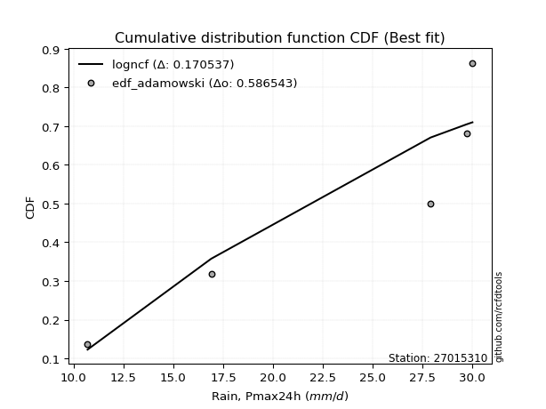</img></img>

</div>


## C. Best fit & Estimate extreme values for specific return periods - Tr


### 1. Best fit (ordered by delta Δ)

<div align="center">

|   id |   station | empirical_dist   | p_dist     |    delta |   deltao | eval   |   fit |   n |   best_fit |   best_fit_sort |
|-----:|----------:|:-----------------|:-----------|---------:|---------:|:-------|------:|----:|-----------:|----------------:|
|    0 |  27015310 | edf_california   | logistic   | 0.147375 | 0.530386 | Δo > Δ |     1 |   6 |          1 |               1 |
|    1 |  27015310 | edf_weibull      | ncf        | 0.15555  | 0.530386 | Δo > Δ |     1 |   6 |          1 |               2 |
|    2 |  27015310 | edf_hazen        | invweibull | 0.170878 | 0.530386 | Δo > Δ |     1 |   6 |          1 |               3 |
|    3 |  27015310 | edf_gringorten   | invweibull | 0.172512 | 0.530386 | Δo > Δ |     1 |   6 |          1 |               4 |
|    4 |  27015310 | edf_cunnane      | invweibull | 0.173566 | 0.530386 | Δo > Δ |     1 |   6 |          1 |               5 |
|    5 |  27015310 | edf_blom         | invweibull | 0.174212 | 0.530386 | Δo > Δ |     1 |   6 |          1 |               6 |
|    6 |  27015310 | edf_tukey        | invweibull | 0.175264 | 0.530386 | Δo > Δ |     1 |   6 |          1 |               7 |
|    7 |  27015310 | edf_filliben     | invweibull | 0.175657 | 0.530386 | Δo > Δ |     1 |   6 |          1 |               8 |
|    8 |  27015310 | edf_jenkinson    | invweibull | 0.175842 | 0.530386 | Δo > Δ |     1 |   6 |          1 |               9 |
|    9 |  27015310 | edf_beard        | invweibull | 0.175842 | 0.530386 | Δo > Δ |     1 |   6 |          1 |              10 |
|   10 |  27015310 | edf_chegodayev   | invweibull | 0.176087 | 0.530386 | Δo > Δ |     1 |   6 |          1 |              11 |
|   11 |  27015310 | edf_adamowski    | invweibull | 0.177288 | 0.530386 | Δo > Δ |     1 |   6 |          1 |              12 |

</div>

:file_folder:Tables: [bestfit_27015310.csv](table/bestfit_27015310.csv) | [extreme_27015310.csv](table/extreme_27015310.csv)


### 2. Extreme values

In hydrology, a return period (or recurrence interval $Tr$) is the statistical average time between extreme events like floods or droughts of a specific magnitude, indicating how rare an event is, with a 100-year flood, for example, having a 1% chance of occurring in any given year, not that it happens exactly every century. It is a key tool for infrastructure design (like bridges or dams) and risk assessment, calculated from historical data to determine the probability of future events, although it is important to remember it is statistical average, and events can cluster or be missed.

> risk_rate: assuming the return period as the project useful life.

|   id |      tr |   prob_l |     prob_g |   alpha |   betaprime |     chi2 |   crystalball |   erlang |    expon |   exponnorm |       f |   fatiguelife |    fisk |   gamma |   genexpon |   genlogistic |   gibrat |   gompertz |   gumbel_l |   gumbel_r |   halflogistic |   halfnorm |   hypsecant |   invgamma |   invgauss |   invweibull |   johnsonsu |   kstwobign |   laplace |   laplace_asymmetric |   loggamma |   logistic |    lognorm |   maxwell |       mielke |   moyal |   nakagami |      ncf |     nct |    norm |           pareto |   pearson3 |   rayleigh |    rice |       t |   truncnorm |     wald |   weibull_min |   logalpha |   logbetaprime |      logchi2 |   logcrystalball |    logerlang |         logexpon |   logexponnorm |           logf |   logfatiguelife |           logfisk |   loggenexpon |   loggenlogistic |        loggibrat |   loggompertz |   loggumbel_l |   loggumbel_r |   loghalflogistic |   loghalfnorm |   loghypsecant |   loginvgamma |   loginvgauss |    loginvweibull |   logjohnsonsu |     logkstwobign |   loglaplace |   loglaplace_asymmetric |   logloggamma |   loglogistic |   loglognorm |   logmaxwell |        logmielke |     logmoyal |   lognakagami |         logncf |     lognct |    logpareto |   logpearson3 |   lograyleigh |    logrice |             logt |   logtruncnorm |          logwald |   logweibull_min |   station |   n |   risk_rate |
|-----:|--------:|---------:|-----------:|--------:|------------:|---------:|--------------:|---------:|---------:|------------:|--------:|--------------:|--------:|--------:|-----------:|--------------:|---------:|-----------:|-----------:|-----------:|---------------:|-----------:|------------:|-----------:|-----------:|-------------:|------------:|------------:|----------:|---------------------:|-----------:|-----------:|-----------:|----------:|-------------:|--------:|-----------:|---------:|--------:|--------:|-----------------:|-----------:|-----------:|--------:|--------:|------------:|---------:|--------------:|-----------:|---------------:|-------------:|-----------------:|-------------:|-----------------:|---------------:|---------------:|-----------------:|------------------:|--------------:|-----------------:|-----------------:|--------------:|--------------:|--------------:|------------------:|--------------:|---------------:|--------------:|--------------:|-----------------:|---------------:|-----------------:|-------------:|------------------------:|--------------:|--------------:|-------------:|-------------:|-----------------:|-------------:|--------------:|---------------:|-----------:|-------------:|--------------:|--------------:|-----------:|-----------------:|---------------:|-----------------:|-----------------:|----------:|----:|------------:|
|    0 |    2    | 0.5      | 0.5        | 18.2964 |     19.0962 |  2.50973 |       19.2167 |  18.8515 |  13.3507 |     19.2166 | 19.193  |       19.2054 | 20.1564 | 18.9333 |    13.3731 |           inf |  15.8721 |    24.7417 |    21.0472 |    17.3861 |        16.4761 |    16.9358 |     19.2167 |    18.2324 |    18.4742 |      17.7208 |          30 |     16.6723 |   19.2167 |              18.1238 |    7.88682 |    19.2167 |    8.75236 |   18.2637 | -1.31916e+08 | 16.7952 |    9.04396 |  16.3566 | 19.2154 | 19.2167 |      1.81387     |    20.2312 |    17.9257 | 18.8116 | 19.216  |     14.5283 |  15.6048 |       21.3614 |    8.10697 |   0.540225     |     0.179818 |          8.75237 |     0.142704 |      2.21911     |         8.7525 |    0.305012    |          8.78203 |      0.668472     |      0.418097 |         inf      |      4.75299     |       12.8613 |       12.2252 |       6.26608 |           5.3071  |       5.77174 |        8.75236 |       8.12009 |       7.59498 |      6.89407     |        29.6903 |      5.03761     |      8.75236 |                 12.8003 |       12.779  |       8.75236 |      8.63302 |       7.3548 |     0.102423     |      5.62527 |       8.75609 |   0.895909     |    8.72874 |   0.153533   |       14.9365 |       6.91468 |    8.75162 |    29.7868       |        4.08452 |      4.52643     |      0.193146    |  27015310 |   6 |    0.75     |
|    1 |    2.33 | 0.570815 | 0.429185   | 20.3729 |     21.0933 |  3.14175 |       21.205  |  20.8933 |  16.2702 |     21.205  | 21.1867 |       21.1917 | 22.1109 | 20.975  |    16.2975 |           inf |  16.8793 |    25.78   |    22.7771 |    19.2286 |        18.3704 |    19.0818 |     20.808  |    20.2933 |    20.6245 |      20.1219 |          30 |     19.0673 |   20.4199 |              19.8046 |   11.5969  |    20.9686 |   12.5826  |   20.3295 | -1.31916e+08 | 18.5393 |   11.9631  |  20.4714 | 21.2044 | 21.205  |      3.79401     |    22.1581 |    20.0221 | 20.871  | 21.2043 |     16.4963 |  16.9086 |       23.025  |   11.8236  |   1.03327      |     0.222453 |         12.5826  |     0.168679 |      4.39321     |        12.5828 |    0.557394    |         12.6437  |      1.82292      |      0.573011 |         inf      |      5.71244     |       15.8612 |       16.7651 |       8.77144 |           7.49971 |       8.53972 |       11.7027  |      11.9837  |      11.4523  |     11.7174      |        29.9338 |      8.6198      |     10.9025  |                 15.0632 |       15.0427 |      12.0509  |     12.4079  |      10.7239 |     0.106541     |      7.73432 |      12.6014  |   2.6521       |   12.5636  |   0.25223    |       20.0727 |      10.1386  |   12.5814  |    29.9132       |        5.41876 |      5.74281     |      0.283486    |  27015310 |   6 |    0.729209 |
|    2 |    5    | 0.8      | 0.2        | 28.514  |     28.5683 |  6.4643  |       28.5944 |  28.6371 |  30.8671 |     28.5944 | 28.609  |       28.6064 | 29.6572 | 28.7063 |    30.9191 |           inf |  22.6782 |    29.2216 |    28.3657 |    27.2331 |        26.9419 |    28.1569 |     27.191  |    28.356  |    29.1238 |      30.5538 |          30 |     29.2408 |   26.436  |              28.208  |   49.7289  |    27.7329 |   48.486   |   28.4603 | -1.31916e+08 | 26.6182 |   26.3221  |  40.21   | 28.5968 | 28.5944 |    159.576       |    28.7652 |    28.4147 | 28.6479 | 28.5937 |     23.1941 |  24.2072 |       28.3997 |   49.6932  | 424.503        |     0.781477 |         48.486   |     0.513587 |    133.577       |        48.4871 | 1570.56        |         49.0731  | 302426            |      2.77052  |         inf      |     16.4653      |       31.2904 |       46.5036 |      37.8169  |          35.86    |      44.7639  |       37.5278  |      53.0017  |      55.9666  |    117.38        |        29.9998 |     84.4091      |     32.6961  |                 22.8073 |       22.7939 |      41.4299  |     47.8314  |      47.3132 |     0.324882     |     33.8018  |      48.7588  |   1.02704e+06  |   48.6796  |   2.8323e+16 |       45.6432 |      46.9211  |   48.4805  |    33.0952       |       13.1791  |     21.7662      |      9.89292     |  27015310 |   6 |    0.67232  |
|    3 |   10    | 0.9      | 0.1        | 34.3154 |     33.5735 |  9.60935 |       33.4963 |  33.9104 |  44.1178 |     33.4963 | 33.5442 |       33.5543 | 35.2149 | 33.9609 |    44.1922 |           inf |  29.2883 |    31.1782 |    31.4772 |    33.7526 |        34.0602 |    34.8722 |     32.2881 |    34.0787 |    35.2243 |      39.0507 |          30 |     36.9865 |   31.8973 |              35.8364 |  133.289   |    32.7146 |  118.646   |   34.1823 | 28.8789      | 33.6522 |   37.9563  |  57.5772 | 33.5012 | 33.4963 |   4799.01        |    32.6827 |    34.3988 | 33.8802 | 33.4957 |     26.4251 |  31.9529 |       31.3921 |  132.738   |   3.31669e+08  |     2.86994  |        118.646   |     1.80068  |   2964.21        |       118.649  |    3.17949e+15 |        120.841   |      4.35021e+20  |     11.5835   |         inf      |     55.0336      |       45.7205 |       82.068  |     124.328   |         131.511   |     152.521   |       95.1616  |     147.368   |     169.215   |    766.836       |        30      |    479.542       |     88.6089  |                 26.3595 |       26.3512 |     102.867   |    117.206   |     134.474  |    42.3634       |    122.07    |     119.654   |   3.7322e+23   |  119.667   | inf          |       64.1586 |     139.896   |  118.631   |   121.33         |       19.7164  |     89.5107      |   3613.44        |  27015310 |   6 |    0.651322 |
|    4 |   15    | 0.933333 | 0.0666667  | 37.3408 |     36.0852 | 11.4813  |       35.9425 |  36.5828 |  51.8689 |     35.9424 | 36.0104 |       36.0321 | 38.2429 | 36.6209 |    51.9564 |           inf |  33.8477 |    32.0709 |    32.8864 |    37.4309 |        38.0885 |    38.3669 |     35.197  |    37.0536 |    38.4127 |      43.8446 |          30 |     41.0986 |   35.0919 |              40.2988 |  219.327   |    35.4288 |  185.434   |   37.1182 | 29.2718      | 37.7344 |   44.1376  |  67.6849 | 35.9487 | 35.9425 |  35147.5         |    34.5039 |    37.4821 | 36.5064 | 35.9419 |     27.5706 |  36.9268 |       32.7473 |  218.759   |   1.78441e+15  |     6.39945  |        185.434   |     3.99845  |  18170.8         |       185.439  |    9.2394e+34  |        189.546   |      5.45017e+40  |     26.7463   |         inf      |    126.503       |       54.2957 |      106.143  |     243.328   |         274.369   |     288.663   |      161.839   |     248.255   |     298.822   |   2210.95        |        30      |   1205.98        |    158.765   |                 27.5644 |       27.558  |     168.837   |    183.373   |     229.829  | 70923.3          |    257.192   |     187.284   |   1.01139e+49  |  187.511   | inf          |       72.426  |     245.616   |  185.409   | 17705            |       22.6828  |    221.931       | 422462           |  27015310 |   6 |    0.644736 |
|    5 |   20    | 0.95     | 0.05       | 39.3716 |     37.735  | 12.8199  |       37.5444 |  38.3478 |  57.3684 |     37.5443 | 37.6267 |       37.6579 | 40.3358 | 38.3766 |    57.4653 |           inf |  37.4241 |    32.6283 |    33.7635 |    40.0063 |        40.9109 |    40.6968 |     37.249  |    39.0465 |    40.554  |      47.2013 |          30 |     43.8686 |   37.3585 |              43.4648 |  304.575   |    37.3048 |  248.424   |   39.0667 | 29.463       | 40.6255 |   48.2817  |  74.8699 | 37.5516 | 37.5444 | 144358           |    35.6496 |    39.5314 | 38.2307 | 37.5438 |     28.1593 |  40.6333 |       33.5908 |  304.473   |   3.89686e+22  |    11.455    |        248.424   |     7.18959  |  65779.1         |       248.432  |    1.88582e+61 |        254.574   |      5.24794e+64  |     48.4303   |         inf      |    243.023       |       60.4297 |      124.575  |     389.383   |         459.3     |     441.683   |      235.384   |     350.769   |     436.302   |   4640.59        |        30      |   2244.62        |    240.137   |                 28.1705 |       28.1652 |     237.794   |    245.858   |     328.008  |     8.94835e+08  |    435.982   |     251.146   |   2.71262e+81  |  251.656   | inf          |       77.2609 |     357.056   |  248.39    |     3.977e+09    |       24.3659  |    436.598       |      2.30736e+07 |  27015310 |   6 |    0.641514 |
|    6 |   25    | 0.96     | 0.04       | 40.8926 |     38.9521 | 13.8631  |       38.7236 |  39.6546 |  61.6342 |     38.7236 | 38.8171 |       38.8563 | 41.9369 | 39.6759 |    61.7382 |           inf |  40.4056 |    33.0256 |    34.3876 |    41.99   |        43.0853 |    42.4303 |     38.8372 |    40.5368 |    42.1577 |      49.7868 |          30 |     45.9435 |   39.1167 |              45.9206 |  388.284   |    38.74   |  308.096   |   40.5132 | 29.5761      | 42.8664 |   51.3721  |  80.4605 | 38.7316 | 38.7236 | 431861           |    36.4696 |    41.0541 | 39.5021 | 38.723  |     28.5182 |  43.6022 |       34.1911 |  389.053   |   2.6192e+30   |    18.1072   |        308.097   |    11.4452   | 178427           |       308.106  |    1.67659e+94 |        316.336   |      1.02886e+92  |     76.758    |         inf      |    418.821       |       65.2134 |      139.61   |     559.312   |         683.116   |     606.106   |      314.549   |     453.37    |     578.279   |   8214.73        |        30      |   3574.65        |    331.015   |                 28.5354 |       28.5306 |     309.017   |    305.111   |     427.138  |     6.43576e+13  |    656.344   |     311.697   |   2.02506e+120 |  312.532   | inf          |       80.4895 |     471.472   |  308.053   |     1.4984e+20   |       25.4489  |    750.687       |      7.41928e+08 |  27015310 |   6 |    0.639603 |
|    7 |   50    | 0.98     | 0.02       | 45.3742 |     42.4492 | 17.126   |       42.1005 |  43.4323 |  74.8848 |     42.1004 | 42.2289 |       42.2956 | 46.8286 | 43.4294 |    75.0113 |           inf |  50.9156 |    34.1068 |    36.0819 |    48.101  |        49.7853 |    47.4691 |     43.761  |    44.9162 |    46.8806 |      57.7517 |          30 |     52.0363 |   44.5779 |              53.549  |  782.352   |    43.1248 |  570.707   |   44.7084 | 29.7989      | 49.823  |   60.3697  |  97.9791 | 42.1107 | 42.1005 |      1.29908e+07 |    38.7098 |    45.474  | 43.1514 | 42.0999 |     29.2493 |  53.2955 |       35.8206 |  791.621   |   7.26509e+74  |    77.2415   |        570.707   |    50.7015   |      3.95949e+06 |       570.726  |  inf           |        589.464   |      6.17136e+267 |    320.924    |         inf      |   2852.84        |       80.2005 |      190.216  |    1706.67    |        2321.02    |    1520.65    |      772.794   |     954.84    |    1314.9     |  47711.8         |        30      |  14017.5         |    897.076   |                 29.2677 |       29.2642 |     688.049   |    566.39    |     918.703  |     2.02394e+47  |   2337.07    |     578.589   | inf            |  581.337   | inf          |       88.1189 |    1056.53    |  570.621   |     4.07931e+250 |       27.7985  |   4405.25        |      2.99882e+14 |  27015310 |   6 |    0.63583  |
|    8 |   75    | 0.986667 | 0.0133333  | 47.8593 |     44.333  | 19.0473  |       43.9124 |  45.4809 |  82.636  |     43.9124 | 44.0613 |       44.1456 | 49.6539 | 45.4635 |    82.7756 |           inf |  58.0141 |    34.6548 |    36.9387 |    51.653  |        53.6799 |    50.212  |     46.6385 |    47.3364 |    49.4958 |      62.3813 |          30 |     55.3885 |   47.7726 |              58.0114 | 1142.99    |    45.6573 |  794.451   |   46.9893 | 29.8721      | 53.8911 |   65.2688  | 108.368  | 43.9239 | 43.9124 |      9.51439e+07 |    39.8474 |    47.8786 | 45.1142 | 43.9118 |     29.4973 |  59.2603 |       36.6445 | 1164.98    |   4.08548e+125 |   183.373    |        794.451   |   124.156    |      2.42719e+07 |       794.478  |  inf           |        823.379   |    inf            |    741.013    |         inf      |  10424.5         |       89.0472 |      222.42   |    3264.05    |        4725.57    |    2508.95    |     1306.76    |    1432.91    |    2061.89    | 132651           |        30      |  29728.7         |   1607.34    |                 29.5126 |       29.5095 |    1092.45    |    789.488   |    1393.18   |     1.92379e+93  |   4911.35    |     806.344   | inf            |  811.179   | inf          |       91.2542 |    1638.81    |  794.326   |   inf            |       28.6412  |  13088.1         |      2.69112e+18 |  27015310 |   6 |    0.634587 |
|    9 |  100    | 0.99     | 0.01       | 49.5733 |     45.61   | 20.4152  |       45.1379 |  46.8752 |  88.1355 |     45.1379 | 45.3014 |       45.3987 | 51.6486 | 46.8472 |    88.2844 |           inf |  63.513  |    35.0138 |    37.4991 |    54.1669 |        56.4365 |    52.0806 |     48.6796 |    49.0021 |    51.2974 |      65.658  |          30 |     57.6853 |   50.0392 |              61.1774 | 1478.94    |    47.4453 |  993.638   |   48.5429 | 29.9086      | 56.7773 |   68.6043  | 115.814  | 45.1503 | 45.1379 |      3.90776e+08 |    40.5917 |    49.5169 | 46.4434 | 45.1374 |     29.6221 |  63.6092 |       37.1835 | 1516.09    |   8.83496e+180 |   340.62     |        993.638   |   236.506    |      8.78654e+07 |       993.673  |  inf           |       1032.31    |    inf            |   1341.77     |         inf      |  28445.8         |       95.3561 |      246.379  |    5164.97    |        7816.26    |    3528.85    |     1896.81    |    1890.36    |    2805.38    | 273537           |        30      |  49760.4         |   2431.14    |                 29.6352 |       29.6323 |    1514.11    |    988.386   |    1850.03   |     3.99833e+149 |   8318.07    |    1009.3     | inf            | 1016.26    | inf          |       93.0273 |    2210.1     |  993.478   |   inf            |       29.0745  |  28951.5         |      3.52266e+21 |  27015310 |   6 |    0.633968 |
|   10 |  200    | 0.995    | 0.005      | 53.5641 |     48.5153 | 23.724   |       47.9178 |  50.0637 | 101.386  |     47.9177 | 48.1165 |       48.2465 | 56.4335 | 50.0097 |   101.557  |           inf |  78.4734 |    35.7949 |    38.7172 |    60.2107 |        63.0636 |    56.3542 |     53.5969 |    52.8685 |    55.4829 |      73.5356 |          30 |     62.9754 |   55.5004 |              68.8058 | 2663.46    |    51.7343 | 1650.52    |   52.0972 | 29.963       | 63.7309 |   76.2235  | 134.052  | 47.9323 | 47.9178 |      1.17549e+10 |    42.2068 |    53.2653 | 49.463  | 47.9172 |     29.8104 |  74.442  |       38.355  | 2773.35    | inf            |  1539.61     |       1650.52    |  1146.14     |      1.94983e+09 |      1650.58   |  inf           |       1724.65    |    inf            |   5609.92     |         inf      | 436621           |      110.656  |      307.737  |   15567.9     |       26206.6     |    7699.33    |     4654.55    |    3571.09    |    5703.02    |      1.55826e+06 |        30      | 162981           |   6588.59    |                 29.8192 |       29.8167 |    3312.88    |   1645.75    |    3539.81   |   inf            |  29602.4     |    1679.55    | inf            | 1694.82    | inf          |       96.1391 |    4381.24    | 1650.24    |   inf            |       29.7401  | 209177           |      1.43015e+30 |  27015310 |   6 |    0.633042 |
|   11 |  250    | 0.996    | 0.004      | 54.8132 |     49.4056 | 24.7926  |       48.7673 |  51.0453 | 105.652  |     48.7672 | 48.9774 |       49.1183 | 57.9697 | 50.9828 |   105.83   |           inf |  83.8413 |    36.025  |    39.0756 |    62.1536 |        65.1941 |    57.669  |     55.1799 |    54.0751 |    56.7898 |      76.0681 |          30 |     64.6125 |   57.2586 |              71.2616 | 3191.41    |    53.1113 | 1927.4     |   53.1914 | 29.9738      | 65.9695 |   78.5642  | 140.02   | 48.7825 | 48.7673 |      3.5166e+10  |    42.6804 |    54.4191 | 50.3869 | 48.7667 |     29.8482 |  78.0257 |       38.6996 | 3341.44    | inf            |  2512.89     |       1927.4     |  1917.52     |      5.28895e+09 |      1927.47   |  inf           |       2017.67    |    inf            |   8891.27     |         inf      |      1.16326e+06 |      115.609  |      328.544  |   22196       |       38665.5     |    9787.86    |     6214.07    |    4346.64    |    7105.55    |      2.72622e+06 |        30      | 235285           |   9081.99    |                 29.856  |       29.8536 |    4259.68    |   1923.35    |    4322.4    |   inf            |  44545.6     |    1962.39    | inf            | 1981.63    | inf          |       96.8708 |    5408.51    | 1927.07    |   inf            |       29.8755  | 402386           |      1.84255e+33 |  27015310 |   6 |    0.632858 |
|   12 |  500    | 0.998    | 0.002      | 58.6015 |     52.0523 | 28.121   |       51.2865 |  53.976  | 118.903  |     51.2864 | 51.5319 |       51.7078 | 62.7338 | 53.8867 |   119.103  |           inf | 102.392  |    36.6852 |    40.103  |    68.1842 |        71.8068 |    61.5889 |     60.0968 |    57.7239 |    60.743  |      83.9289 |          30 |     69.5187 |   62.7198 |              78.89   | 5472.04    |    57.3817 | 3052.83    |   56.4563 | 29.9955      | 72.923  |   85.5325  | 158.888  | 51.3038 | 51.2865 |      1.05783e+12 |    44.0313 |    57.8619 | 53.1296 | 51.286  |     29.924  |  89.4209 |       39.6877 | 5835.84    | inf            | 11637.6      |       3052.83    |  9645.82     |      1.17368e+11 |      3052.95   |  inf           |       3213.97    |    inf            |  37174.2      |          29.9292 |      3.43907e+07 |      131.074  |      396.323  |   66741.5     |      129299       |   20020.2     |    15247.6     |    7831.89    |   13756.2     |      1.54718e+07 |        30      | 707063           |  24612.9     |                 29.9297 |       29.9274 |    9288.55    |   3054.07    |    7844.7    |   inf            | 158525       |    3113.42    | inf            | 3150.96    | inf          |       98.5526 |   10139.8     | 3052.28    |   inf            |       30.1486  |      3.22169e+06 |      1.02506e+44 |  27015310 |   6 |    0.632489 |
|   13 |  750    | 0.998667 | 0.00133333 | 60.7623 |     53.5269 | 30.0734  |       52.686  |  55.6169 | 126.654  |     52.6859 | 52.9521 |       53.1489 | 65.5172 | 55.5117 |   126.868  |           inf | 114.661  |    37.0383 |    40.6521 |    71.7097 |        75.6726 |    63.7788 |     62.973  |    59.7977 |    62.9898 |      88.5243 |          30 |     72.2749 |   65.9144 |              83.3524 | 7396.92    |    59.8767 | 3941.44    |   58.2824 | 30.0027      | 76.9905 |   89.4182  | 170.173  | 52.7045 | 52.686  |      7.74748e+12 |    44.7477 |    59.787  | 54.6549 | 52.6854 |     29.9493 |  96.2532 |       40.2158 | 7980.97    | inf            | 28720.3      |       3941.44    | 25073.4      |      7.19469e+11 |      3941.6    |  inf           |       4163.16    |    inf            |  85835.2      |          29.9538 |      3.22933e+08 |      140.171  |      438.11   |  127030       |      261869       |   29859.8     |    25777.1     |   10904.8     |   19966.2     |      4.2689e+07  |        30      |      1.31193e+06 |  44100.2     |                 29.9543 |       29.952  |   14647.2     |   3948.95    |   10948.5    |   inf            | 333104       |    4023.43    | inf            | 4077.31    | inf          |       99.2261 |   14409.9     | 3940.72    |   inf            |       30.2404  |      1.12141e+07 |      1.18772e+51 |  27015310 |   6 |    0.632366 |
|   14 | 1000    | 0.999    | 0.001      | 62.2742 |     54.5439 | 31.4607  |       53.6495 |  56.752  | 132.153  |     53.6494 | 53.9302 |       54.1423 | 67.4911 | 56.6355 |   132.377  |           inf | 124.049  |    37.2761 |    41.0217 |    74.2105 |        78.4148 |    65.2912 |     65.0136 |    61.2453 |    64.5579 |      91.7841 |          30 |     74.1843 |   68.1811 |              86.5184 | 9109.98    |    61.646  | 4699.44    |   59.5445 | 30.0064      | 79.8765 |   92.0986  | 178.296  | 53.6688 | 53.6495 |      3.18205e+13 |    45.2271 |    61.1174 | 55.7058 | 53.649  |     29.962  | 101.168  |       40.5712 | 9914.2     | inf            | 54662.2      |       4699.44    | 49579.9      |      2.60452e+12 |      4699.63   |  inf           |       4975.33    |    inf            | 155424        |          29.9661 |      1.79246e+09 |      146.647  |      468.688  |  200526       |      432006       |   39354.1     |    37413.1     |   13718.3     |   25864.5     |      8.76951e+07 |        30      |      2.01321e+06 |  66702.8     |                 29.9666 |       29.9644 |   20231.6     |   4713.46    |   13785.3    |   inf            | 564139       |    4800.31    | inf            | 4869.15    | inf          |       99.6027 |   18371.1     | 4698.57    |   inf            |       30.2864  |      2.7505e+07  |      2.77335e+56 |  27015310 |   6 |    0.632305 |

<div align="center">

</img>

</div>


<div align="center">

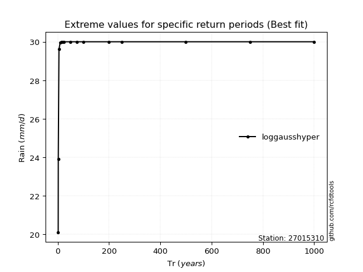</img>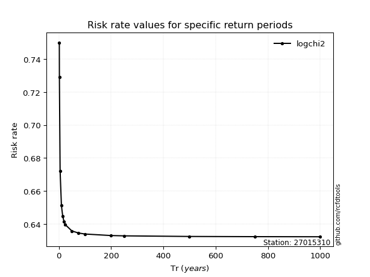</img>

</div>


<sub>**APP DISCLAIMER**: NO WARRANTY - This software is provided by [github.com/rcfdtools](https://github.com/rcfdtools) "as is", without any express or implied warranty, including warranties of merchantability, fitness for a particular purpose, or non-infringement. There is no guarantee that the software will be error-free or operate without interruption. LIMITATION OF LIABILITY - Neither the authors nor copyright holders will be liable for claims or damages arising from the software or its use. You are responsible for determining if the software is appropriate for your use and assume all associated risks, including errors, legal compliance, and data loss. NO PROFESSIONAL ADVICE - The software provides general information and does not offer professional advice. It should not replace consultation with professional advisors.</sub>