<div align="center">


</div>

# Station (rain, Pmax24h): 27015320

Probable Maximum Precipitation (PMP) is the greatest amount of rainfall for a specific duration that is meteorologically possible for a given location, acting as a "worst-case" scenario for extreme storms, crucial for designing safety-critical infrastructure like bridges, river deviations, dams, spillways, and nuclear plants to prevent catastrophic failure. PMP is calculated by hydrologists using meteorological data to determine the upper limit of extreme rainfall, often leading to the Probable Maximum Flood (PMF) for flood control design, and is increasingly being studied for climate change impacts.

<div align="center">

</img>

</div>


## A. General information


### 1. General running parameters

• app_version: _v20251225_. • runtime: _2025-12-26 14:29:50.888910_. • Python version: _3.14.0_. • SciPy version: _1.16.3_. • Pandas version: _2.3.3_. • NumPy version: _2.3.5_. • Stations dataset (station_dataset_file): _dataset/pmax24h_in/automatic_colombia.csv_. • Stations catalog (station_catalog_file): _dataset/CNE_IDEAM.xls_. • Plot only fit distributions with Δo > Δ (plot_only_fit): _True_. • Eval low extreme values, if False, evaluates high extreme values (low_extreme): _False_. • Eval every SciPy distribution as logarithmic (pdist_logarithmic_on): _True_. • Standard deviation normalized (ddof): _1.0_. • Return periods to eval in years (Tr): _[2, 2.33, 5, 10, 15, 20, 25, 50, 75, 100, 200, 250, 500, 750, 1000]_. • Minimum data sample per station, 0 means any (minimum_sample): _5_. • Z-Score threshold to adjust a value, 0 means disable (zscore): _3.5_. • Avoid zeros, e.g. rain = 0 (avoid_zeros): _True_. • Avoid null values (avoid_nans): _True_. [:file_folder:Dataset file.](../../dataset/pmax24h_in/automatic_colombia.csv)


### 2. Station info and location

|   id |   CODIGO | NOMBRE            | CATEGORIA         | TECNOLOGIA                | ESTADO   | FECHA_INSTALACION   |   FECHA_SUSPENSION |   ALTITUD |   LATITUD |   LONGITUD | DEPARTAMENTO   | MUNICIPIO          | AREA_OPERATIVA                      | ENTIDAD                                                     | AREA_HIDROGRAFICA   | ZONA_HIDROGRAFICA   | SUBZONA_HIDROGRAFICA   |   CORRIENTE | OBSERVACION                                                                                                                                                                                                                                                                                                                                                                                                                                                                                                                                                                                                                                                                                                                                                                                                                                            | SUBRED                                                   | Catalogo   |
|-----:|---------:|:------------------|:------------------|:--------------------------|:---------|:--------------------|-------------------:|----------:|----------:|-----------:|:---------------|:-------------------|:------------------------------------|:------------------------------------------------------------|:--------------------|:--------------------|:-----------------------|------------:|:-------------------------------------------------------------------------------------------------------------------------------------------------------------------------------------------------------------------------------------------------------------------------------------------------------------------------------------------------------------------------------------------------------------------------------------------------------------------------------------------------------------------------------------------------------------------------------------------------------------------------------------------------------------------------------------------------------------------------------------------------------------------------------------------------------------------------------------------------------|:---------------------------------------------------------|:-----------|
|    0 | 27015320 | ARAGON [27015320] | Agrometeorológica | Automática con Telemetría | Activa   | 28/08/2004          |                nan |      2633 |      6.78 |     -75.56 | Antioquia      | Santa Rosa De Osos | Area Operativa 01 - Antioquia-Chocó | INSTITUTO DE HIDROLOGIA METEOROLOGIA Y ESTUDIOS AMBIENTALES | Magdalena Cauca     | Nechí               | Río Porce              |         nan | Estación Homologada con ARAGON [27015110]. Datos Transferidos desde 15/05/1970. Estación SANTUARIO [27015320] Recodificada con código [27015110].|30/09/2022$Migracion$Estación Homologada con ARAGON [27015110]. Datos Transferidos desde 15/05/1970. Estación SANTUARIO [27015320] Recodificada con código [27015110].|30/09/2022$Migracion$Estación Homologada con ARAGON [27015110]. Datos Transferidos desde 15/05/1970. Estación SANTUARIO [27015320] Recodificada con código [27015110].|30/09/2022$Migracion$Estación Homologada con ARAGON [27015110]. Datos Transferidos desde 15/05/1970. Estación SANTUARIO [27015320] Recodificada con código [27015110].|06/06/2025$mvelez$La estación fue actualizada en su estado luego de la reunión con el grupo de automatización 24/04/2025 se realiza el cambio bajo el memorando 20253080087083. | Radiación Visible,Radición Global,Radiación Ultravioleta | CNE_IDEAM  |

<div align="center">

Map location in: [:earth_americas:Google](http://maps.google.com/maps?q=6.78,-75.56) [:earth_americas:OSM](https://www.openstreetmap.org/#map=18/6.78/-75.56&layers=P) [:earth_americas:Bing](https://www.bing.com/maps?cp=6.78~-75.56&lvl=18) [:earth_americas:Apple](https://maps.apple.com/frame?center=6.78%2C-75.56&span=0.003%2C0.006)

</div>


<div align="center">

```geojson
{
  "type": "Feature",
  "geometry": {
    "type": "Point", 
    "coordinates": [-75.56, 6.78]
  }, 
  "properties": {
    "Name": "27015320"
  }
}
```

</div>


### 3. Discrete values table and plot

|               |           0 |           1 |           2 |           3 |           4 |           5 |           6 |          7 |           8 |
|:--------------|------------:|------------:|------------:|------------:|------------:|------------:|------------:|-----------:|------------:|
| Date          | 2017        | 2018        | 2019        | 2020        | 2021        | 2022        | 2023        | 2024       | 2025        |
| Value         |   22.3      |   14.2      |   21.3      |   24.5      |   24.5      |   28.4      |   45.3      |   89.8     |    7.4      |
| Value_initial |   22.3      |   14.2      |   21.3      |   24.5      |   24.5      |   28.4      |   45.3      |   89.8     |    7.4      |
| count         |    9        |    9        |    9        |    9        |    9        |    9        |    9        |    9       |    9        |
| mean          |   30.8556   |   30.8556   |   30.8556   |   30.8556   |   30.8556   |   30.8556   |   30.8556   |   30.8556  |   30.8556   |
| std           |   24.3977   |   24.3977   |   24.3977   |   24.3977   |   24.3977   |   24.3977   |   24.3977   |   24.3977  |   24.3977   |
| zscore        |   -0.350671 |   -0.682669 |   -0.391658 |   -0.260498 |   -0.260498 |   -0.100647 |    0.592041 |    2.41598 |   -0.961384 |

<div align="center">

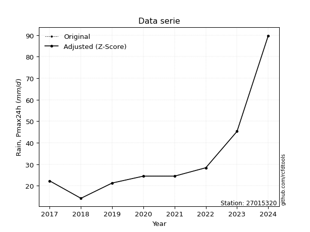</img>

</div>

> If Z-Score is active, values out of range or outliers are replaced with the station mean value.


### 4. Active continuous probability distributions from SciPy (45 of 104 available)

[scipy.stats](https://docs.scipy.org/doc/scipy/reference/stats.html) is a Python´s powerful submodule within the SciPy library for comprehensive statistical analysis, offering over 130 probability distributions (like Normal, Poisson), functions for descriptive stats (mean, variance), hypothesis testing (t-tests, chi-square), random variable generation, and statistical tests, making it essential for data science, modeling, and research. It provides tools to explore, model, and draw conclusions from data efficiently, working seamlessly with NumPy.

<div align="center">

|   id | p_dist             |   n_parameter | fit_method   | label                                                                       | active   | ref                                                                                                        |
|-----:|:-------------------|--------------:|:-------------|:----------------------------------------------------------------------------|:---------|:-----------------------------------------------------------------------------------------------------------|
|    0 | alpha              |             3 | MLE          | Alpha                                                                       | True     | [:mortar_board:](https://docs.scipy.org/doc/scipy/reference/generated/scipy.stats.alpha.html)              |
|    1 | betaprime          |             4 | MLE          | Beta prime                                                                  | True     | [:mortar_board:](https://docs.scipy.org/doc/scipy/reference/generated/scipy.stats.betaprime.html)          |
|    2 | chi2               |             3 | MLE          | Chi²                                                                        | True     | [:mortar_board:](https://docs.scipy.org/doc/scipy/reference/generated/scipy.stats.chi2.html)               |
|    3 | crystalball        |             4 | MLE          | Crystalball                                                                 | True     | [:mortar_board:](https://docs.scipy.org/doc/scipy/reference/generated/scipy.stats.crystalball.html)        |
|    4 | erlang             |             3 | MLE          | Erlang                                                                      | True     | [:mortar_board:](https://docs.scipy.org/doc/scipy/reference/generated/scipy.stats.erlang.html)             |
|    5 | expon              |             2 | MLE          | Exponential                                                                 | True     | [:mortar_board:](https://docs.scipy.org/doc/scipy/reference/generated/scipy.stats.expon.html)              |
|    6 | exponnorm          |             3 | MLE          | Exponentially modified Normal                                               | True     | [:mortar_board:](https://docs.scipy.org/doc/scipy/reference/generated/scipy.stats.exponnorm.html)          |
|    7 | f                  |             4 | MLE          | F                                                                           | True     | [:mortar_board:](https://docs.scipy.org/doc/scipy/reference/generated/scipy.stats.f.html)                  |
|    8 | fatiguelife        |             3 | MLE          | Fatigue-life (Birnbaum-Saunders)                                            | True     | [:mortar_board:](https://docs.scipy.org/doc/scipy/reference/generated/scipy.stats.fatiguelife.html)        |
|    9 | fisk               |             3 | MLE          | Fisk                                                                        | True     | [:mortar_board:](https://docs.scipy.org/doc/scipy/reference/generated/scipy.stats.fisk.html)               |
|   10 | gamma              |             3 | MLE          | Gamma                                                                       | True     | [:mortar_board:](https://docs.scipy.org/doc/scipy/reference/generated/scipy.stats.gamma.html)              |
|   11 | genexpon           |             5 | MLE          | Generalized exponential                                                     | True     | [:mortar_board:](https://docs.scipy.org/doc/scipy/reference/generated/scipy.stats.genexpon.html)           |
|   12 | genlogistic        |             3 | MLE          | Generalized logistic                                                        | True     | [:mortar_board:](https://docs.scipy.org/doc/scipy/reference/generated/scipy.stats.genlogistic.html)        |
|   13 | gibrat             |             2 | MM           | Gibrat                                                                      | True     | [:mortar_board:](https://docs.scipy.org/doc/scipy/reference/generated/scipy.stats.gibrat.html)             |
|   14 | gompertz           |             3 | MLE          | Gompertz (or truncated Gumbel)                                              | True     | [:mortar_board:](https://docs.scipy.org/doc/scipy/reference/generated/scipy.stats.gompertz.html)           |
|   15 | gumbel_l           |             2 | MM           | Gumbel Left Skew                                                            | True     | [:mortar_board:](https://docs.scipy.org/doc/scipy/reference/generated/scipy.stats.gumbel_l.html)           |
|   16 | gumbel_r           |             2 | MM           | Gumbel Right Skew                                                           | True     | [:mortar_board:](https://docs.scipy.org/doc/scipy/reference/generated/scipy.stats.gumbel_r.html)           |
|   17 | halflogistic       |             2 | MM           | Half-logistic                                                               | True     | [:mortar_board:](https://docs.scipy.org/doc/scipy/reference/generated/scipy.stats.halflogistic.html)       |
|   18 | halfnorm           |             2 | MM           | Half Normal                                                                 | True     | [:mortar_board:](https://docs.scipy.org/doc/scipy/reference/generated/scipy.stats.halfnorm.html)           |
|   19 | hypsecant          |             2 | MM           | hyperbolic secant                                                           | True     | [:mortar_board:](https://docs.scipy.org/doc/scipy/reference/generated/scipy.stats.hypsecant.html)          |
|   20 | invgamma           |             3 | MLE          | Inverted gamma                                                              | True     | [:mortar_board:](https://docs.scipy.org/doc/scipy/reference/generated/scipy.stats.invgamma.html)           |
|   21 | invgauss           |             3 | MLE          | Inverse Gaussian                                                            | True     | [:mortar_board:](https://docs.scipy.org/doc/scipy/reference/generated/scipy.stats.invgauss.html)           |
|   22 | invweibull         |             3 | MLE          | Inverted Weibull                                                            | True     | [:mortar_board:](https://docs.scipy.org/doc/scipy/reference/generated/scipy.stats.invweibull.html)         |
|   23 | johnsonsu          |             4 | MLE          | Johnson Su                                                                  | True     | [:mortar_board:](https://docs.scipy.org/doc/scipy/reference/generated/scipy.stats.johnsonsu.html)          |
|   24 | kstwobign          |             2 | MLE          | Limiting distribution of scaled Kolmogorov-Smirnov two-sided test statistic | True     | [:mortar_board:](https://docs.scipy.org/doc/scipy/reference/generated/scipy.stats.kstwobign.html)          |
|   25 | laplace            |             2 | MM           | Laplace                                                                     | True     | [:mortar_board:](https://docs.scipy.org/doc/scipy/reference/generated/scipy.stats.laplace.html)            |
|   26 | laplace_asymmetric |             3 | MLE          | Asymmetric Laplace                                                          | True     | [:mortar_board:](https://docs.scipy.org/doc/scipy/reference/generated/scipy.stats.laplace_asymmetric.html) |
|   27 | loggamma           |             3 | MLE          | Log gamma                                                                   | True     | [:mortar_board:](https://docs.scipy.org/doc/scipy/reference/generated/scipy.stats.loggamma.html)           |
|   28 | logistic           |             2 | MM           | Logistic (or Sech-squared)                                                  | True     | [:mortar_board:](https://docs.scipy.org/doc/scipy/reference/generated/scipy.stats.logistic.html)           |
|   29 | lognorm            |             3 | MLE          | Log Normal                                                                  | True     | [:mortar_board:](https://docs.scipy.org/doc/scipy/reference/generated/scipy.stats.lognorm.html)            |
|   30 | maxwell            |             2 | MM           | Maxwell                                                                     | True     | [:mortar_board:](https://docs.scipy.org/doc/scipy/reference/generated/scipy.stats.maxwell.html)            |
|   31 | mielke             |             4 | MLE          | Mielke Beta-Kappa / Dagum                                                   | True     | [:mortar_board:](https://docs.scipy.org/doc/scipy/reference/generated/scipy.stats.mielke.html)             |
|   32 | moyal              |             2 | MM           | Moyal                                                                       | True     | [:mortar_board:](https://docs.scipy.org/doc/scipy/reference/generated/scipy.stats.moyal.html)              |
|   33 | nakagami           |             3 | MLE          | Nakagami                                                                    | True     | [:mortar_board:](https://docs.scipy.org/doc/scipy/reference/generated/scipy.stats.nakagami.html)           |
|   34 | ncf                |             5 | MLE          | Non-central F distribution                                                  | True     | [:mortar_board:](https://docs.scipy.org/doc/scipy/reference/generated/scipy.stats.ncf.html)                |
|   35 | nct                |             4 | MLE          | Non-central Student’s t                                                     | True     | [:mortar_board:](https://docs.scipy.org/doc/scipy/reference/generated/scipy.stats.nct.html)                |
|   36 | norm               |             2 | MM           | Normal                                                                      | True     | [:mortar_board:](https://docs.scipy.org/doc/scipy/reference/generated/scipy.stats.norm.html)               |
|   37 | pareto             |             3 | MLE          | Pareto                                                                      | True     | [:mortar_board:](https://docs.scipy.org/doc/scipy/reference/generated/scipy.stats.pareto.html)             |
|   38 | pearson3           |             3 | MM           | Pearson type III                                                            | True     | [:mortar_board:](https://docs.scipy.org/doc/scipy/reference/generated/scipy.stats.pearson3.html)           |
|   39 | rayleigh           |             2 | MM           | Rayleigh                                                                    | True     | [:mortar_board:](https://docs.scipy.org/doc/scipy/reference/generated/scipy.stats.rayleigh.html)           |
|   40 | rice               |             3 | MLE          | Rice                                                                        | True     | [:mortar_board:](https://docs.scipy.org/doc/scipy/reference/generated/scipy.stats.rice.html)               |
|   41 | t                  |             3 | MLE          | Student’s t                                                                 | True     | [:mortar_board:](https://docs.scipy.org/doc/scipy/reference/generated/scipy.stats.t.html)                  |
|   42 | truncnorm          |             4 | MLE          | Truncated normal                                                            | True     | [:mortar_board:](https://docs.scipy.org/doc/scipy/reference/generated/scipy.stats.truncnorm.html)          |
|   43 | wald               |             2 | MM           | Wald                                                                        | True     | [:mortar_board:](https://docs.scipy.org/doc/scipy/reference/generated/scipy.stats.wald.html)               |
|   44 | weibull_min        |             3 | MLE          | Weibull minimum                                                             | True     | [:mortar_board:](https://docs.scipy.org/doc/scipy/reference/generated/scipy.stats.weibull_min.html)        |

</div>

> **n_parameter:** # arguments & localization & scale.
>
> **Fit methods:** (MLE) maximum likelihood, (MM) L-moments.
>
>**Inactive:** foldnorm, gennorm, norminvgauss, powernorm, powerlognorm, skewnorm, genextreme, anglit, arcsine, argus, beta, bradford, burr, burr12, cauchy, cosine, halfcauchy, foldcauchy, skewcauchy, wrapcauchy, dgamma, gengamma, exponweib, exponpow, truncexpon, gausshyper, genhalflogistic, genhyperbolic, geninvgauss, halfgennorm, johnsonsb, kappa4, kappa3, ksone, kstwo, loglaplace, levy, levy_l, levy_stable, ncx2, genpareto, truncpareto, lomax, powerlaw, rdist, rel_breitwigner, recipinvgauss, semicircular, studentized_range, trapezoid, triang, truncweibull_min, tukeylambda, uniform, loguniform, vonmises, vonmises_line, weibull_max, dweibull, 


## B. Probability distributions vs. Empirical distributions

A continuous probability distribution (CPD) describes probabilities for variables that can take any value within a range (like rain any time), unlike discrete variables with specific outcomes (like temperature). It uses a Probability Density Function (PDF), a curve where the total area under it equals 1, and the probability of the variable falling within an interval (a to b) is found by calculating the area under the curve between those points. A key feature is that the probability of hitting any single exact value is zero, so probabilities are always expressed for ranges, e.g., $P(a ≤ X ≤ b)$.

<div align="center">

Distributions parameters
|    |   station | p_dist                |   n |             loc |          scale | shape                  | shape1             | shape2                | shape3   |
|---:|----------:|:----------------------|----:|----------------:|---------------:|:-----------------------|:-------------------|:----------------------|:---------|
|  0 |  27015320 | alpha                 |   9 |   -19.9291      |  135.771       | 3.0735789382272722     |                    |                       |          |
|  1 |  27015320 | betaprime             |   9 |     1.68185     |   21.1196      | 4.546533788273517      | 4.289414631974666  |                       |          |
|  2 |  27015320 | chi2                  |   9 |     7.4         |   11.9328      | 1.8709074141369144     |                    |                       |          |
|  3 |  27015320 | crystalball           |   9 |    30.8556      |   23.0024      | 3384.4055583100335     | 14.385207644019708 |                       |          |
|  4 |  27015320 | erlang                |   9 |     7.4         |   26.5414      | 0.8386124724047617     |                    |                       |          |
|  5 |  27015320 | expon                 |   9 |     7.4         |   23.4556      |                        |                    |                       |          |
|  6 |  27015320 | exponnorm             |   9 |    11.6265      |    5.73873     | 3.3507385803925533     |                    |                       |          |
|  7 |  27015320 | f                     |   9 |     7.4         |   20.2586      | 1.4361645357614585     | 11.870473697638456 |                       |          |
|  8 |  27015320 | fatiguelife           |   9 |     0.961629    |   23.6372      | 0.7286257814345718     |                    |                       |          |
|  9 |  27015320 | fisk                  |   9 |     2.44112     |   21.7374      | 2.472294583079015      |                    |                       |          |
| 10 |  27015320 | gamma                 |   9 |     7.4         |   22.6317      | 0.7350514391958778     |                    |                       |          |
| 11 |  27015320 | genexpon              |   9 |     7.4         |   24.247       | 0.8013881585403817     | 0.3318428999591866 | 2.525590246969485     |          |
| 12 |  27015320 | genlogistic           |   9 |   -74.3898      |   13.6525      | 1138.7673065325293     |                    |                       |          |
| 13 |  27015320 | gibrat                |   9 |    13.3077      |   10.6433      |                        |                    |                       |          |
| 14 |  27015320 | gompertz              |   9 |     7.4         |  130.049       | 4.403067913794606      |                    |                       |          |
| 15 |  27015320 | gumbel_l              |   9 |    41.2078      |   17.9349      |                        |                    |                       |          |
| 16 |  27015320 | gumbel_r              |   9 |    20.5033      |   17.9349      |                        |                    |                       |          |
| 17 |  27015320 | halflogistic          |   9 |     3.5924      |   19.6662      |                        |                    |                       |          |
| 18 |  27015320 | halfnorm              |   9 |     0.409429    |   38.1586      |                        |                    |                       |          |
| 19 |  27015320 | hypsecant             |   9 |    30.8556      |   14.6438      |                        |                    |                       |          |
| 20 |  27015320 | invgamma              |   9 |    -5.15364     |  107.3         | 3.971934465236614      |                    |                       |          |
| 21 |  27015320 | invgauss              |   9 |     0.0867164   |   57.0512      | 0.5393201467089674     |                    |                       |          |
| 22 |  27015320 | invweibull            |   9 |   -21.2063      |   40.9908      | 3.5209127935379523     |                    |                       |          |
| 23 |  27015320 | johnsonsu             |   9 |    22.7623      |    2.34591     | -0.2518907633156301    | 0.4909214359099978 |                       |          |
| 24 |  27015320 | kstwobign             |   9 |   -30.8258      |   72.0505      |                        |                    |                       |          |
| 25 |  27015320 | laplace               |   9 |    30.8556      |   16.2651      |                        |                    |                       |          |
| 26 |  27015320 | laplace_asymmetric    |   9 |    21.3         |   11.4184      | 0.6655801312643954     |                    |                       |          |
| 27 |  27015320 | loggamma              |   9 | -7477.13        |  998.629       | 1841.7352967954512     |                    |                       |          |
| 28 |  27015320 | logistic              |   9 |    30.8556      |   12.6819      |                        |                    |                       |          |
| 29 |  27015320 | lognorm               |   9 |     7.4         |    0.306666    | 11.853373067973218     |                    |                       |          |
| 30 |  27015320 | maxwell               |   9 |   -23.6504      |   34.1565      |                        |                    |                       |          |
| 31 |  27015320 | mielke                |   9 |    -0.0825839   |   22.6645      | 3.1060637641495914     | 2.688042468989077  |                       |          |
| 32 |  27015320 | moyal                 |   9 |    17.7013      |   10.3547      |                        |                    |                       |          |
| 33 |  27015320 | nakagami              |   9 |     7.4         |   24.6616      | 0.24092331484061158    |                    |                       |          |
| 34 |  27015320 | ncf                   |   9 |    -0.0571935   |    0.179805    | 0.24968761079482293    | 8.018576059290286  | 32.05815758571217     |          |
| 35 |  27015320 | nct                   |   9 |    -0.0362848   |    7.32354     | 2.7391217730881805     | 2.9565551704272215 |                       |          |
| 36 |  27015320 | norm                  |   9 |    30.8556      |   23.0024      |                        |                    |                       |          |
| 37 |  27015320 | pareto                |   9 |     7.39748     |    0.00251627  | 0.125173098892647      |                    |                       |          |
| 38 |  27015320 | pearson3              |   9 |    30.8555      |   23.0024      | 1.7186887428490114     |                    |                       |          |
| 39 |  27015320 | rayleigh              |   9 |   -13.1493      |   35.1108      |                        |                    |                       |          |
| 40 |  27015320 | rice                  |   9 |    -3.46949     |   29.2174      | 0.00028289713936952184 |                    |                       |          |
| 41 |  27015320 | t                     |   9 |    23.3768      |    3.85678     | 0.782225533381446      |                    |                       |          |
| 42 |  27015320 | truncnorm             |   9 |    20.508       |   22.3414      | -0.5868952617321866    | 3187.0083849339044 |                       |          |
| 43 |  27015320 | wald                  |   9 |     7.85323     |   23.0023      |                        |                    |                       |          |
| 44 |  27015320 | weibull_min           |   9 |     7.4         |   27.0116      | 0.78449149516371       |                    |                       |          |
| 45 |  27015320 | logalpha              |   9 |   -10.0904      |  268.619       | 20.25000480747198      |                    |                       |          |
| 46 |  27015320 | logbetaprime          |   9 |    -9.43396     |    8.65367     | 922.2458762474164      | 632.291660558156   |                       |          |
| 47 |  27015320 | logchi2               |   9 |     2.00148     |    0.907332    | 1.0576271244561752     |                    |                       |          |
| 48 |  27015320 | logcrystalball        |   9 |     3.20807     |    0.653638    | 1419.7549011192716     | 55.45640541871788  |                       |          |
| 49 |  27015320 | logerlang             |   9 |    -4.8945      |    0.0527109   | 153.7173414251028      |                    |                       |          |
| 50 |  27015320 | logexpon              |   9 |     2.00148     |    1.20659     |                        |                    |                       |          |
| 51 |  27015320 | logexponnorm          |   9 |     2.88364     |    0.570108    | 0.5690742261604145     |                    |                       |          |
| 52 |  27015320 | logf                  |   9 |    -9.82107     |   13.0082      | 2224.835005421599      | 1241.8373238393083 |                       |          |
| 53 |  27015320 | logfatiguelife        |   9 |    -8.82258     |   12.0129      | 0.05430256059189724    |                    |                       |          |
| 54 |  27015320 | logfisk               |   9 |    -7.13458     |   10.3214      | 29.083139029288887     |                    |                       |          |
| 55 |  27015320 | loggamma              |   9 |    -4.89452     |    0.0527108   | 153.7179159662773      |                    |                       |          |
| 56 |  27015320 | loggenexpon           |   9 |     2.00043     |    0.042241    | 0.010732228356751548   | 4.519389695153864  | 0.0002919876469963281 |          |
| 57 |  27015320 | loggenlogistic        |   9 |     3.1219      |    0.372356    | 1.1449059316984886     |                    |                       |          |
| 58 |  27015320 | loggibrat             |   9 |     2.70941     |    0.302454    |                        |                    |                       |          |
| 59 |  27015320 | loggompertz           |   9 |     2.00148     |    0.939362    | 0.27443665498668024    |                    |                       |          |
| 60 |  27015320 | loggumbel_l           |   9 |     3.50224     |    0.509639    |                        |                    |                       |          |
| 61 |  27015320 | loggumbel_r           |   9 |     2.9139      |    0.509639    |                        |                    |                       |          |
| 62 |  27015320 | loghalflogistic       |   9 |     2.43338     |    0.558821    |                        |                    |                       |          |
| 63 |  27015320 | loghalfnorm           |   9 |     2.3429      |    1.08433     |                        |                    |                       |          |
| 64 |  27015320 | loghypsecant          |   9 |     3.20807     |    0.416119    |                        |                    |                       |          |
| 65 |  27015320 | loginvgamma           |   9 |    -6.57135     | 2173.02        | 223.28153026118605     |                    |                       |          |
| 66 |  27015320 | loginvgauss           |   9 |    -2.03969     |  323.505       | 0.01622521256835195    |                    |                       |          |
| 67 |  27015320 | loginvweibull         |   9 |    -5.42371e+07 |    5.42371e+07 | 86525901.32886603      |                    |                       |          |
| 68 |  27015320 | logjohnsonsu          |   9 |     3.16048     |    0.112804    | -0.06058182471808533   | 0.5245955543881474 |                       |          |
| 69 |  27015320 | logkstwobign          |   9 |     0.610759    |    2.98393     |                        |                    |                       |          |
| 70 |  27015320 | loglaplace            |   9 |     3.20807     |    0.462192    |                        |                    |                       |          |
| 71 |  27015320 | loglaplace_asymmetric |   9 |     3.19867     |    0.448564    | 0.9895604752351239     |                    |                       |          |
| 72 |  27015320 | logloggamma           |   9 |  -187.331       |   25.9467      | 1546.5861359312794     |                    |                       |          |
| 73 |  27015320 | loglogistic           |   9 |     3.20807     |    0.360369    |                        |                    |                       |          |
| 74 |  27015320 | loglognorm            |   9 |     2.00148     |    0.0242894   | 11.189300848613682     |                    |                       |          |
| 75 |  27015320 | logmaxwell            |   9 |     1.65922     |    0.970596    |                        |                    |                       |          |
| 76 |  27015320 | logmielke             |   9 |    -0.0608629   |    3.44647     | 6.973432109599166      | 10.850632493146373 |                       |          |
| 77 |  27015320 | logmoyal              |   9 |     2.83428     |    0.29424     |                        |                    |                       |          |
| 78 |  27015320 | lognakagami           |   9 |     2.65324     |    0.876089    | 0.24693360654594448    |                    |                       |          |
| 79 |  27015320 | logncf                |   9 |    -6.27226     |    9.45055     | 611.2959095120523      | 1332.150104134228  | 0.9572195115915481    |          |
| 80 |  27015320 | lognct                |   9 |    -7.77202     |    0.299709    | 178.29264396793224     | 36.47998444013733  |                       |          |
| 81 |  27015320 | lognorm               |   9 |     3.20807     |    0.653638    |                        |                    |                       |          |
| 82 |  27015320 | logpareto             |   9 |     2.00132     |    0.000158035 | 0.12515008244561482    |                    |                       |          |
| 83 |  27015320 | logpearson3           |   9 |     3.20807     |    0.653637    | 0.1737910080769242     |                    |                       |          |
| 84 |  27015320 | lograyleigh           |   9 |     1.95762     |    0.997713    |                        |                    |                       |          |
| 85 |  27015320 | logrice               |   9 |     1.65453     |    0.718758    | 1.870509277755288      |                    |                       |          |
| 86 |  27015320 | logt                  |   9 |     3.16151     |    0.236509    | 1.23747425447231       |                    |                       |          |
| 87 |  27015320 | logtruncnorm          |   9 |    -0.264439    |    1.65938     | 1.7582966300462655     | 2.8697824615422833 |                       |          |
| 88 |  27015320 | logwald               |   9 |     2.55442     |    0.65365     |                        |                    |                       |          |
| 89 |  27015320 | logweibull_min        |   9 |     1.44188     |    1.97751     | 2.9222658836155464     |                    |                       |          |

</div>

> **loc** (Location parameter): This shifts the distribution along the x-axis. For many common distributions, like the normal (Gaussian) distribution, loc represents the mean $μ$. For others, like the uniform distribution, it might represent the minimum value, or for the beta distribution, the left end of the support interval.
>
> **scale** (Scale parameter): This determines the width or spread of the distribution. For the normal distribution, scale represents the standard deviation $σ$. For a uniform distribution, it defines the length of the interval (from $loc$ to $loc + scale$).
>
> **shape** (Shape parameters): Refers to parameters that define the specific form of a probability distribution, distinct from its location (loc) and scale (scale). These parameters are required arguments for most distribution functions. For example, a normal (Gaussian) distribution is fully defined by its location (mean) and scale (standard deviation), so it has no specific shape parameters beyond loc and scale. However, other distributions have intrinsic properties that need specification, as Gamma distribution that takes a shape parameter, often named $a$ or $alpha$.


### 0. Cumulative distribution values - CDF (90 evaluated)

> Ordered by x ascending and calculating $log(f(x))$ separately. 

|   id |   Station |   date |    x |   count |    mean |     std |    zscore |   Value_initial |   station |   m |     alpha |   alpha_pdf |   betaprime |   betaprime_pdf |        chi2 |   chi2_pdf |   crystalball |   crystalball_pdf |      erlang |   erlang_pdf |    expon |   expon_pdf |   exponnorm |   exponnorm_pdf |           f |        f_pdf |   fatiguelife |   fatiguelife_pdf |      fisk |    fisk_pdf |       gamma |     gamma_pdf |    genexpon |   genexpon_pdf |   genlogistic |   genlogistic_pdf |     gibrat |   gibrat_pdf |    gompertz |   gompertz_pdf |   gumbel_l |   gumbel_l_pdf |   gumbel_r |   gumbel_r_pdf |   halflogistic |   halflogistic_pdf |   halfnorm |   halfnorm_pdf |   hypsecant |   hypsecant_pdf |   invgamma |   invgamma_pdf |   invgauss |   invgauss_pdf |   invweibull |   invweibull_pdf |   johnsonsu |   johnsonsu_pdf |   kstwobign |   kstwobign_pdf |   laplace |   laplace_pdf |   laplace_asymmetric |   laplace_asymmetric_pdf |   loggamma |   loggamma_pdf |   logistic |   logistic_pdf |   lognorm |   lognorm_pdf |   maxwell |   maxwell_pdf |    mielke |   mielke_pdf |    moyal |   moyal_pdf |    nakagami |   nakagami_pdf |       ncf |     ncf_pdf |       nct |     nct_pdf |     norm |    norm_pdf |   pareto |   pareto_pdf |   pearson3 |   pearson3_pdf |   rayleigh |   rayleigh_pdf |      rice |    rice_pdf |        t |       t_pdf |   truncnorm |   truncnorm_pdf |     wald |   wald_pdf |   weibull_min |   weibull_min_pdf |   logalpha |   logalpha_pdf |   logbetaprime |   logbetaprime_pdf |     logchi2 |   logchi2_pdf |   logcrystalball |   logcrystalball_pdf |   logerlang |   logerlang_pdf |   logexpon |   logexpon_pdf |   logexponnorm |   logexponnorm_pdf |      logf |   logf_pdf |   logfatiguelife |   logfatiguelife_pdf |   logfisk |   logfisk_pdf |   loggenexpon |   loggenexpon_pdf |   loggenlogistic |   loggenlogistic_pdf |   loggibrat |   loggibrat_pdf |   loggompertz |   loggompertz_pdf |   loggumbel_l |   loggumbel_l_pdf |   loggumbel_r |   loggumbel_r_pdf |   loghalflogistic |   loghalflogistic_pdf |   loghalfnorm |   loghalfnorm_pdf |   loghypsecant |   loghypsecant_pdf |   loginvgamma |   loginvgamma_pdf |   loginvgauss |   loginvgauss_pdf |   loginvweibull |   loginvweibull_pdf |   logjohnsonsu |   logjohnsonsu_pdf |   logkstwobign |   logkstwobign_pdf |   loglaplace |   loglaplace_pdf |   loglaplace_asymmetric |   loglaplace_asymmetric_pdf |   logloggamma |   logloggamma_pdf |   loglogistic |   loglogistic_pdf |   loglognorm |   loglognorm_pdf |   logmaxwell |   logmaxwell_pdf |   logmielke |   logmielke_pdf |    logmoyal |   logmoyal_pdf |   lognakagami |   lognakagami_pdf |    logncf |   logncf_pdf |   lognct |   lognct_pdf |   logpareto |   logpareto_pdf |   logpearson3 |   logpearson3_pdf |   lograyleigh |   lograyleigh_pdf |   logrice |   logrice_pdf |      logt |   logt_pdf |   logtruncnorm |   logtruncnorm_pdf |   logwald |   logwald_pdf |   logweibull_min |   logweibull_min_pdf |
|-----:|----------:|-------:|-----:|--------:|--------:|--------:|----------:|----------------:|----------:|----:|----------:|------------:|------------:|----------------:|------------:|-----------:|--------------:|------------------:|------------:|-------------:|---------:|------------:|------------:|----------------:|------------:|-------------:|--------------:|------------------:|----------:|------------:|------------:|--------------:|------------:|---------------:|--------------:|------------------:|-----------:|-------------:|------------:|---------------:|-----------:|---------------:|-----------:|---------------:|---------------:|-------------------:|-----------:|---------------:|------------:|----------------:|-----------:|---------------:|-----------:|---------------:|-------------:|-----------------:|------------:|----------------:|------------:|----------------:|----------:|--------------:|---------------------:|-------------------------:|-----------:|---------------:|-----------:|---------------:|----------:|--------------:|----------:|--------------:|----------:|-------------:|---------:|------------:|------------:|---------------:|----------:|------------:|----------:|------------:|---------:|------------:|---------:|-------------:|-----------:|---------------:|-----------:|---------------:|----------:|------------:|---------:|------------:|------------:|----------------:|---------:|-----------:|--------------:|------------------:|-----------:|---------------:|---------------:|-------------------:|------------:|--------------:|-----------------:|---------------------:|------------:|----------------:|-----------:|---------------:|---------------:|-------------------:|----------:|-----------:|-----------------:|---------------------:|----------:|--------------:|--------------:|------------------:|-----------------:|---------------------:|------------:|----------------:|--------------:|------------------:|--------------:|------------------:|--------------:|------------------:|------------------:|----------------------:|--------------:|------------------:|---------------:|-------------------:|--------------:|------------------:|--------------:|------------------:|----------------:|--------------------:|---------------:|-------------------:|---------------:|-------------------:|-------------:|-----------------:|------------------------:|----------------------------:|--------------:|------------------:|--------------:|------------------:|-------------:|-----------------:|-------------:|-----------------:|------------:|----------------:|------------:|---------------:|--------------:|------------------:|----------:|-------------:|---------:|-------------:|------------:|----------------:|--------------:|------------------:|--------------:|------------------:|----------:|--------------:|----------:|-----------:|---------------:|-------------------:|----------:|--------------:|-----------------:|---------------------:|
|    0 |  27015320 |   2025 |  7.4 |       9 | 30.8556 | 24.3977 | -0.961384 |             7.4 |  27015320 |   1 | 0.0291165 | 0.0120679   |   0.0273188 |     0.0145292   | 4.38971e-16 | 0.462337   |      0.153935 |       0.0103122   | 1.61942e-14 |  15.2905     | 0        |  0.0426338  |   0.0348753 |     0.0101846   | 4.45396e-11 | 327.362      |     0.0278476 |        0.0166195  | 0.0252416 | 0.0122668   | 9.52383e-13 | 788.187       | 6.18161e-12 |     0.033051   |     0.0581248 |       0.012098    | 0          |   0          | 5.74956e-14 |     0.0338569  |   0.14086  |    0.00727287  |   0.125389 |     0.0145164  |      0.0965044 |         0.0251875  |   0.145357 |     0.0205618  |    0.126611 |     0.0084199   |  0.0283051 |    0.013411    |   0.027764 |     0.015793   |    0.0287662 |      0.012564    |   0.0645615 |      0.00398444 |   0.0590008 |     0.0119867   |  0.118218 |   0.0072682   |            0.0492967 |              0.00648654  |  0.0274553 |      0.107752  |   0.135928 |    0.00926135  | 0.0324488 |      0.111078 |  0.156856 |    0.0127704  | 0.0302121 |  0.0119344   | 0.100078 |  0.0163896  | 9.32365e-09 |    5.05818e+06 | 0.0283664 | 0.0134947   | 0.0311612 | 0.0107617   | 0.153935 | 0.0103122   | 0        |  49.7454     |  0.0670707 |     0.0255137  |   0.157407 |     0.0140454  | 0.0668597 | 0.0118815   | 0.101027 | 0.00480722  | 8.56258e-05 |     0.0208399   | 0        | 0          |    1.1727e-13 |      103.58       |  0.0247179 |      0.106357  |      0.0273954 |          0.107435  | 6.25677e-09 |   7.45045e+06 |        0.0324487 |             0.111077 |   0.0274553 |       0.107752  |   0        |       0.828781 |      0.0271117 |          0.10411   | 0.0273964 |   0.107429 |        0.0274299 |            0.107599  | 0.0279805 |     0.0865789 |   0.000267213 |          0.25478  |        0.0301922 |            0.0884685 |    0        |       0         |   1.14977e-08 |          0.292152 |     0.0512547 |         0.097948  |    0.00250017 |         0.0293924 |          0        |             0         |      0        |          0        |      0.0350064 |          0.0839566 |     0.0250947 |         0.106642  |     0.0227741 |         0.106104  |       0.0166666 |            0.108863 |      0.0497201 |          0.0462549 |      0.0183688 |           0.136822 |    0.0367457 |        0.0795032 |               0.0333467 |                   0.0751252 |     0.0345068 |         0.113972  |     0.0339539 |         0.0910206 |    0.0023489 |      1.47619e+12 |     0.011236 |        0.0960561 |   0.0277826 |       0.0935858 | 3.83537e-05 |     0.00116388 |   0           |        0          | 0.0273157 |    0.108167  | 0.025744 |    0.106818  |    0        |     791.912     |     0.0270709 |         0.107454  |   0.000965613 |         0.0440146 | 0.0210985 |     0.12622   | 0.0463969 |  0.047811  |    0           |           0        | 0         |     0         |        0.0246881 |            0.127317  |
|    1 |  27015320 |   2018 | 14.2 |       9 | 30.8556 | 24.3977 | -0.682669 |            14.2 |  27015320 |   2 | 0.183041  | 0.0309205   |   0.199687  |     0.0318005   | 0.277255    | 0.0328066  |      0.234508 |       0.0133441   | 0.302258    |   0.032335   | 0.251669 |  0.0319042  |   0.161272  |     0.0266165   | 0.348187    |   0.0314431  |     0.209891  |        0.0311328  | 0.179602  | 0.0309792   | 0.398867    |   0.0361155   | 0.222077    |     0.0311145  |     0.177312  |       0.0224493   | 0.00658959 |   0.0207039  | 0.210497    |     0.0281649  |   0.198941 |    0.00990761  |   0.241441 |     0.0191314  |      0.263337  |         0.0236612  |   0.282201 |     0.0195878  |    0.197543 |     0.0126405   |  0.192954  |    0.0314063   |   0.206731 |     0.0314334  |    0.187356  |      0.0312026   |   0.108094  |      0.0102681  |   0.17033   |     0.0201184   |  0.179577 |   0.0110406   |            0.120616  |              0.0158708   |  0.199859  |      0.448924  |   0.211929 |    0.0131696   | 0.197987  |      0.425711 |  0.2537   |    0.0155241  | 0.177707  |  0.0299808   | 0.236333 |  0.02263    | 0.418507    |    0.0292204   | 0.193223  | 0.0313668   | 0.176342  | 0.0306009   | 0.234508 | 0.0133441   | 0.628108 |   0.00684319 |  0.251633  |     0.0268565  |   0.261679 |     0.0163799  | 0.16712   | 0.0172394   | 0.152561 | 0.0119734   | 0.15277     |     0.0237867   | 0.139962 | 0.0462752  |    0.287439   |        0.0278586  |  0.20365   |      0.468113  |      0.199687  |          0.449257  | 0.58232     |   0.371445    |        0.197987  |             0.425711 |   0.199859  |       0.448924  |   0.41735  |       0.48289  |      0.196981  |          0.450251  | 0.199681  |   0.449249 |        0.199774  |            0.449069  | 0.17599   |     0.430898  |   0.27618     |          0.532573 |        0.177771  |            0.425689  |    0        |       0         |   0.240287    |          0.444209 |     0.172233  |         0.307015  |    0.188677   |         0.617418  |          0.194216 |             0.860991  |      0.225282 |          0.706304 |      0.164077  |          0.377073  |     0.203313  |         0.466216  |     0.206731  |         0.479425  |       0.235159  |            0.543035 |      0.111381  |          0.191538  |      0.263131  |           0.549615 |    0.150532  |        0.325692  |               0.14479   |                   0.32619   |     0.199986  |         0.421253  |     0.176592  |         0.403494  |    0.615621  |      0.0523901   |     0.210565 |        0.510339  |   0.180457  |       0.43136   | 0.173765    |     0.731233   |   2.18094e-08 |        2.4254e+07 | 0.200985  |    0.451858  | 0.202062 |    0.460734  |    0.647201 |       0.0677274 |     0.200034  |         0.450787  |   0.21577     |         0.548029  | 0.206713  |     0.454557  | 0.118744  |  0.245705  |    1.28168e-06 |           1.37399  | 0.0258611 |     0.958276  |        0.21242   |            0.453686  |
|    2 |  27015320 |   2019 | 21.3 |       9 | 30.8556 | 24.3977 | -0.391658 |            21.3 |  27015320 |   3 | 0.413569  | 0.031139    |   0.421811  |     0.0288097   | 0.473836    | 0.0232658  |      0.338919 |       0.0159098   | 0.491692    |   0.0220488  | 0.447118 |  0.0235715  |   0.374134  |     0.0301593   | 0.524252    |   0.0197054  |     0.418203  |        0.0264275  | 0.413093  | 0.0317835   | 0.598105    |   0.0218363   | 0.422553    |     0.0251303  |     0.357474  |       0.0269229   | 0.387265   |   0.0479093  | 0.391453    |     0.0229276  |   0.280757 |    0.0132162   |   0.384217 |     0.020492   |      0.422066  |         0.0208952  |   0.415942 |     0.0179997  |    0.305634 |     0.0178089   |  0.416907  |    0.029407    |   0.419386 |     0.0270898  |    0.414782  |      0.0302347   |   0.294285  |      0.0612066  |   0.328093  |     0.0233782   |  0.277861 |   0.0170832   |            0.306998  |              0.0403952   |  0.419552  |      0.605354  |   0.320063 |    0.0171601   | 0.409624  |      0.594612 |  0.370132 |    0.0170181  | 0.408651  |  0.0319984   | 0.400634 |  0.0227461  | 0.584107    |    0.0190333   | 0.416767  | 0.029356    | 0.410293  | 0.0318865   | 0.338919 | 0.0159098   | 0.659936 |   0.00306181 |  0.428385  |     0.0226394  |   0.382044 |     0.0172686  | 0.301871  | 0.0202567   | 0.352095 | 0.0591938   | 0.326469    |     0.0247384   | 0.434657 | 0.0334785  |    0.44778    |        0.0185068  |  0.429096  |      0.609989  |      0.419655  |          0.606195  | 0.702416    |   0.236521    |        0.409624  |             0.594612 |   0.419552  |       0.605354  |   0.583642 |       0.34507  |      0.419927  |          0.618555  | 0.41965   |   0.606208 |        0.419594  |            0.605745  | 0.41017   |     0.690268  |   0.494399    |          0.522731 |        0.408664  |            0.681459  |    0.557252 |       1.13033   |   0.435202    |          0.508497 |     0.342183  |         0.540603  |    0.47111    |         0.695761  |          0.507607 |             0.664197  |      0.490837 |          0.591766 |      0.388121  |          0.718184  |     0.42849   |         0.611124  |     0.434293  |         0.607248  |       0.468582  |            0.566669 |      0.313564  |          1.2242    |      0.488628  |           0.532189 |    0.361927  |        0.783067  |               0.360949  |                   0.813164  |     0.40906   |         0.587687  |     0.397839  |         0.664771  |    0.632028  |      0.0318599   |     0.443831 |        0.604375  |   0.413699  |       0.690569  | 0.494653    |     0.733342   |   0.527995    |        0.616342   | 0.42145   |    0.605569  | 0.425406 |    0.608664  |    0.667921 |       0.0393042 |     0.42034   |         0.606065  |   0.456092    |         0.601637  | 0.423521  |     0.589241  | 0.363713  |  1.19285   |    0.448878    |           0.867819 | 0.558868  |     0.870694  |        0.426033  |            0.575941  |
|    3 |  27015320 |   2017 | 22.3 |       9 | 30.8556 | 24.3977 | -0.350671 |            22.3 |  27015320 |   4 | 0.444201  | 0.0301025   |   0.45009   |     0.0277367   | 0.49657     | 0.0222112  |      0.354968 |       0.0161844   | 0.513209    |   0.0209967  | 0.470194 |  0.0225877  |   0.403912  |     0.0293639   | 0.543412    |   0.018629   |     0.444139  |        0.0254406  | 0.444367  | 0.030738    | 0.61927     |   0.0205114   | 0.447234    |     0.0242321  |     0.384401  |       0.0269079   | 0.433069   |   0.043739   | 0.414039    |     0.0222471  |   0.294221 |    0.0137125   |   0.404674 |     0.0204126  |      0.442735  |         0.0204408  |   0.433812 |     0.0177372  |    0.323787 |     0.0184903   |  0.44579   |    0.0283462   |   0.445964 |     0.0260617  |    0.444491  |      0.0291671   |   0.363915  |      0.0770973  |   0.351495  |     0.0234111   |  0.29548  |   0.0181665   |            0.346238  |              0.0381079   |  0.447449  |      0.610244  |   0.337461 |    0.01763     | 0.437102  |      0.60274  |  0.387196 |    0.0171042  | 0.440194  |  0.0310569   | 0.423207 |  0.0223902  | 0.602694    |    0.018152    | 0.445603  | 0.0283015   | 0.441647  | 0.0307953   | 0.354968 | 0.0161844   | 0.66288  |   0.00283162 |  0.450683  |     0.0219573  |   0.399317 |     0.0172732  | 0.322234  | 0.0204598   | 0.417949 | 0.0720345   | 0.35118     |     0.0246745   | 0.466991 | 0.0312111  |    0.465845   |        0.0176354  |  0.457139  |      0.611946  |      0.44759   |          0.611057  | 0.713025    |   0.226046    |        0.437102  |             0.60274  |   0.447449  |       0.610244  |   0.599176 |       0.332195 |      0.448439  |          0.623814  | 0.447586  |   0.611072 |        0.447508  |            0.610624  | 0.442097  |     0.700572  |   0.518194    |          0.514356 |        0.440202  |            0.692492  |    0.605425 |       0.974059  |   0.458612    |          0.511818 |     0.367631  |         0.568644  |    0.502647   |         0.678429  |          0.537442 |             0.6363    |      0.517603 |          0.57495  |      0.421643  |          0.741889  |     0.456595  |         0.613548  |     0.462167  |         0.607344  |       0.494335  |            0.55562  |      0.377935  |          1.58397   |      0.512786  |           0.520746 |    0.399697  |        0.864787  |               0.400253  |                   0.90171   |     0.436226  |         0.596057  |     0.428699  |         0.679625  |    0.633458  |      0.0304955   |     0.471503 |        0.601506  |   0.44568   |       0.702625  | 0.527579    |     0.701568   |   0.555337    |        0.576456   | 0.449346  |    0.609971  | 0.453414 |    0.611751  |    0.669682 |       0.03747   |     0.448263  |         0.610694  |   0.483552    |         0.595066  | 0.450661  |     0.593429  | 0.421749  |  1.3286    |    0.487606    |           0.82076  | 0.596659  |     0.778702  |        0.452552  |            0.579687  |
|    4 |  27015320 |   2021 | 24.5 |       9 | 30.8556 | 24.3977 | -0.260498 |            24.5 |  27015320 |   5 | 0.507592  | 0.0274645   |   0.508385  |     0.0252401   | 0.543041    | 0.020076   |      0.391159 |       0.016694    | 0.557046    |   0.0189017  | 0.517627 |  0.0205654  |   0.466134  |     0.0271167   | 0.582038    |   0.0165453  |     0.497705  |        0.0232607  | 0.509072  | 0.02801     | 0.661491    |   0.0179445   | 0.498395    |     0.0222871  |     0.443158  |       0.0264073   | 0.520055   |   0.0355993  | 0.461377    |     0.0207987  |   0.325598 |    0.0148128   |   0.449222 |     0.0200439  |      0.486574  |         0.019405   |   0.472174 |     0.0171316  |    0.365993 |     0.0198389   |  0.505406  |    0.025821    |   0.500774 |     0.0237658  |    0.505834  |      0.0265572   |   0.533769  |      0.0668446  |   0.402823  |     0.0231872   |  0.338276 |   0.0207976   |            0.424923  |              0.0335214   |  0.504989  |      0.610762  |   0.37727  |    0.0185254   | 0.494264  |      0.610278 |  0.424942 |    0.0171867  | 0.505784  |  0.0284783   | 0.47143  |  0.0214082  | 0.640692    |    0.016437    | 0.505136  | 0.0257908   | 0.50638   | 0.0279848   | 0.391159 | 0.016694    | 0.668641 |   0.00242521 |  0.497334  |     0.0204543  |   0.437247 |     0.0171867  | 0.367579  | 0.0207208   | 0.585383 | 0.0715259   | 0.405163    |     0.024362    | 0.53059  | 0.0267236  |    0.502725   |        0.0159377  |  0.514554  |      0.606413  |      0.505202  |          0.611459  | 0.733354    |   0.206505    |        0.494264  |             0.610278 |   0.504989  |       0.610762  |   0.629244 |       0.307276 |      0.507255  |          0.624074  | 0.505199  |   0.611475 |        0.505082  |            0.611089  | 0.508341  |     0.703434  |   0.56565     |          0.493677 |        0.505788  |            0.697713  |    0.684735 |       0.72632   |   0.506965    |          0.51521  |     0.423742  |         0.623251  |    0.564447   |         0.633413  |          0.594588 |             0.578418  |      0.570018 |          0.53892  |      0.492811  |          0.764755  |     0.514203  |         0.608906  |     0.518984  |         0.598416  |       0.54534   |            0.527518 |      0.545303  |          1.74596   |      0.560551  |           0.493938 |    0.489936  |        1.06003   |               0.494753  |                   1.11461   |     0.492795  |         0.60442   |     0.49348   |         0.693615  |    0.636208  |      0.0280281   |     0.527534 |        0.587874  |   0.512283  |       0.708896  | 0.590322    |     0.631466   |   0.606243    |        0.508209   | 0.506813  |    0.609491  | 0.510919 |    0.608504  |    0.673048 |       0.0341739 |     0.50582   |         0.610659  |   0.538668    |         0.575164  | 0.506599  |     0.593799  | 0.551585  |  1.36781   |    0.560512    |           0.730337 | 0.662307  |     0.623661  |        0.507188  |            0.580075  |
|    5 |  27015320 |   2020 | 24.5 |       9 | 30.8556 | 24.3977 | -0.260498 |            24.5 |  27015320 |   6 | 0.507592  | 0.0274645   |   0.508385  |     0.0252401   | 0.543041    | 0.020076   |      0.391159 |       0.016694    | 0.557046    |   0.0189017  | 0.517627 |  0.0205654  |   0.466134  |     0.0271167   | 0.582038    |   0.0165453  |     0.497705  |        0.0232607  | 0.509072  | 0.02801     | 0.661491    |   0.0179445   | 0.498395    |     0.0222871  |     0.443158  |       0.0264073   | 0.520055   |   0.0355993  | 0.461377    |     0.0207987  |   0.325598 |    0.0148128   |   0.449222 |     0.0200439  |      0.486574  |         0.019405   |   0.472174 |     0.0171316  |    0.365993 |     0.0198389   |  0.505406  |    0.025821    |   0.500774 |     0.0237658  |    0.505834  |      0.0265572   |   0.533769  |      0.0668446  |   0.402823  |     0.0231872   |  0.338276 |   0.0207976   |            0.424923  |              0.0335214   |  0.504989  |      0.610762  |   0.37727  |    0.0185254   | 0.494264  |      0.610278 |  0.424942 |    0.0171867  | 0.505784  |  0.0284783   | 0.47143  |  0.0214082  | 0.640692    |    0.016437    | 0.505136  | 0.0257908   | 0.50638   | 0.0279848   | 0.391159 | 0.016694    | 0.668641 |   0.00242521 |  0.497334  |     0.0204543  |   0.437247 |     0.0171867  | 0.367579  | 0.0207208   | 0.585383 | 0.0715259   | 0.405163    |     0.024362    | 0.53059  | 0.0267236  |    0.502725   |        0.0159377  |  0.514554  |      0.606413  |      0.505202  |          0.611459  | 0.733354    |   0.206505    |        0.494264  |             0.610278 |   0.504989  |       0.610762  |   0.629244 |       0.307276 |      0.507255  |          0.624074  | 0.505199  |   0.611475 |        0.505082  |            0.611089  | 0.508341  |     0.703434  |   0.56565     |          0.493677 |        0.505788  |            0.697713  |    0.684735 |       0.72632   |   0.506965    |          0.51521  |     0.423742  |         0.623251  |    0.564447   |         0.633413  |          0.594588 |             0.578418  |      0.570018 |          0.53892  |      0.492811  |          0.764755  |     0.514203  |         0.608906  |     0.518984  |         0.598416  |       0.54534   |            0.527518 |      0.545303  |          1.74596   |      0.560551  |           0.493938 |    0.489936  |        1.06003   |               0.494753  |                   1.11461   |     0.492795  |         0.60442   |     0.49348   |         0.693615  |    0.636208  |      0.0280281   |     0.527534 |        0.587874  |   0.512283  |       0.708896  | 0.590322    |     0.631466   |   0.606243    |        0.508209   | 0.506813  |    0.609491  | 0.510919 |    0.608504  |    0.673048 |       0.0341739 |     0.50582   |         0.610659  |   0.538668    |         0.575164  | 0.506599  |     0.593799  | 0.551585  |  1.36781   |    0.560512    |           0.730337 | 0.662307  |     0.623661  |        0.507188  |            0.580075  |
|    6 |  27015320 |   2022 | 28.4 |       9 | 30.8556 | 24.3977 | -0.100647 |            28.4 |  27015320 |   7 | 0.60486   | 0.0224177   |   0.598138  |     0.0208345   | 0.614795    | 0.0168247  |      0.457493 |       0.017245    | 0.624467    |   0.0157865  | 0.591519 |  0.0174151  |   0.563138  |     0.0226287   | 0.640532    |   0.0135861  |     0.581155  |        0.0195948  | 0.607968  | 0.0226995   | 0.724049    |   0.0143038   | 0.578875    |     0.0190353  |     0.54245   |       0.0242963   | 0.636549   |   0.0248696  | 0.537735    |     0.0183936  |   0.387139 |    0.0167309   |   0.52527  |     0.0188566  |      0.558545  |         0.0174926  |   0.536767 |     0.0159774  |    0.446872 |     0.0214348   |  0.597167  |    0.0212729   |   0.585749 |     0.0198733  |    0.599988  |      0.0217546   |   0.704996  |      0.0277394  |   0.491207  |     0.0219926   |  0.429937 |   0.026433    |            0.541861  |              0.026705    |  0.593791  |      0.586738  |   0.451744 |    0.0195296   | 0.583795  |      0.596828 |  0.491719 |    0.0169866  | 0.606692  |  0.0232291   | 0.550815 |  0.019237   | 0.699729    |    0.0139325   | 0.596825  | 0.0212649   | 0.605054  | 0.0226326   | 0.457493 | 0.017245    | 0.677052 |   0.00192474 |  0.572009  |     0.0178645  |   0.503509 |     0.0167338  | 0.448376  | 0.0205937   | 0.77094  | 0.0280525   | 0.498239    |     0.0232567   | 0.621869 | 0.0204132  |    0.559915   |        0.0134939  |  0.602068  |      0.574014  |      0.594086  |          0.587124  | 0.761857    |   0.180206    |        0.583795  |             0.596828 |   0.593791  |       0.586738  |   0.671965 |       0.271869 |      0.597834  |          0.596978  | 0.594086  |   0.587141 |        0.593923  |            0.586923  | 0.609729  |     0.660302  |   0.635707    |          0.453501 |        0.606703  |            0.659788  |    0.771808 |       0.474591  |   0.58286     |          0.510131 |     0.521225  |         0.69192   |    0.651808   |         0.547402  |          0.67338  |             0.489029  |      0.645268 |          0.479515 |      0.60391   |          0.724552  |     0.602169  |         0.577534  |     0.60502   |         0.562392  |       0.619375  |            0.473346 |      0.728357  |          0.800079  |      0.630027  |           0.445828 |    0.629318  |        0.802008  |               0.635263  |                   0.804632  |     0.581599  |         0.592953  |     0.594795  |         0.668797  |    0.640105  |      0.0248581   |     0.611694 |        0.548284  |   0.614709  |       0.668049  | 0.67532     |     0.520209   |   0.674853    |        0.424422   | 0.595323  |    0.584111  | 0.598979 |    0.579163  |    0.677773 |       0.0299812 |     0.594546  |         0.585843  |   0.620447    |         0.52953   | 0.593061  |     0.572555  | 0.721924  |  0.892565  |    0.658842    |           0.604113 | 0.740685  |     0.449254  |        0.591765  |            0.561192  |
|    7 |  27015320 |   2023 | 45.3 |       9 | 30.8556 | 24.3977 |  0.592041 |            45.3 |  27015320 |   8 | 0.840323  | 0.00779016  |   0.827766  |     0.00818038  | 0.814784    | 0.00797736 |      0.734983 |       0.01424     | 0.81276     |   0.00759224 | 0.801273 |  0.0084725  |   0.818527  |     0.00943748  | 0.800949    |   0.00649591 |     0.809922  |        0.00882092 | 0.84269   | 0.00764686  | 0.882008    |   0.00579707  | 0.806499    |     0.00899253 |     0.837431  |       0.0108817   | 0.864456   |   0.00680532 | 0.774564    |     0.0102149  |   0.715293 |    0.019943    |   0.77808  |     0.0108861  |      0.785812  |         0.00972479 |   0.760574 |     0.010467   |    0.772761 |     0.0142329   |  0.829524  |    0.00817016  |   0.813959 |     0.00862497 |    0.833631  |      0.00803067  |   0.885014  |      0.00420489 |   0.785775  |     0.0125192   |  0.794274 |   0.0126483   |            0.828931  |              0.00997166  |  0.824004  |      0.377284  |   0.757493 |    0.014485    | 0.822764  |      0.397553 |  0.74652  |    0.0124085  | 0.846885  |  0.00776464  | 0.791954 |  0.00981512 | 0.869665    |    0.00691698  | 0.82937   | 0.00818624  | 0.840504  | 0.00776899  | 0.734983 | 0.01424     | 0.700057 |   0.00099056 |  0.794048  |     0.0091592  |   0.749834 |     0.0118611  | 0.751695  | 0.0141856   | 0.920712 | 0.00278601  | 0.814841    |     0.0133736   | 0.834374 | 0.00739736 |    0.728648   |        0.00732609 |  0.823829  |      0.359709  |      0.82422   |          0.376691  | 0.831039    |   0.121072    |        0.822764  |             0.397553 |   0.824004  |       0.377284  |   0.777228 |       0.184629 |      0.828592  |          0.369658  | 0.824224  |   0.376692 |        0.824103  |            0.377018  | 0.847325  |     0.34366   |   0.811911    |          0.298394 |        0.84693   |            0.351744  |    0.902284 |       0.156315  |   0.80091     |          0.400238 |     0.841356  |         0.573107  |    0.842634   |         0.283098  |          0.843929 |             0.257492  |      0.824919 |          0.293407 |      0.853952  |          0.33879   |     0.825574  |         0.36222   |     0.821406  |         0.351425  |       0.796566  |            0.289033 |      0.890263  |          0.148639  |      0.800441  |           0.286252 |    0.865021  |        0.292041  |               0.869793  |                   0.287245  |     0.820425  |         0.400179  |     0.842837  |         0.367576  |    0.650019  |      0.0182701   |     0.822663 |        0.344982  |   0.852857  |       0.336765  | 0.849743    |     0.25229    |   0.828113    |        0.247569   | 0.823944  |    0.374109  | 0.823964 |    0.366197  |    0.689569 |       0.0214409 |     0.824074  |         0.375779  |   0.822659    |         0.330599  | 0.820565  |     0.379475  | 0.909351  |  0.155142  |    0.867442    |           0.314784 | 0.87699   |     0.182782  |        0.817384  |            0.382641  |
|    8 |  27015320 |   2024 | 89.8 |       9 | 30.8556 | 24.3977 |  2.41598  |            89.8 |  27015320 |   9 | 0.967863  | 0.000834351 |   0.970825  |     0.000973231 | 0.972358    | 0.00117571 |      0.994804 |       0.000650457 | 0.968077    |   0.00125252 | 0.970193 |  0.00127077 |   0.982062  |     0.000932837 | 0.944254    |   0.00141508 |     0.974577  |        0.00112378 | 0.968899  | 0.000852787 | 0.985892    |   0.000660546 | 0.97576     |     0.00113284 |     0.993208  |       0.000495769 | 0.97571    |   0.00074582 | 0.979637    |     0.00129915 |   1        |    2.51169e-07 |   0.979231 |     0.00114594 |      0.975345  |         0.00123819 |   0.980851 |     0.00134488 |    0.988632 |     0.000776168 |  0.970835  |    0.000954318 |   0.973264 |     0.001104   |    0.970478  |      0.000922421 |   0.958576  |      0.00064883 |   0.992647  |     0.000683436 |  0.986662 |   0.000820049 |            0.987217  |              0.000745152 |  0.971532  |      0.0903715 |   0.99051  |    0.000741249 | 0.975742  |      0.087182 |  0.988447 |    0.00103635 | 0.972264  |  0.000807999 | 0.975459 |  0.00118466 | 0.99306     |    0.000554853 | 0.970957  | 0.000954508 | 0.969821  | 0.000869759 | 0.994804 | 0.000650457 | 0.727842 |   0.00041342 |  0.973507  |     0.00124965 |   0.986414 |     0.00113461 | 0.993874  | 0.000669298 | 0.966507 | 0.000393758 | 0.998665    |     0.000201761 | 0.970485 | 0.00102623 |    0.909171   |        0.00207432 |  0.966843  |      0.0932906 |      0.97142   |          0.0902362 | 0.895144    |   0.0714026   |        0.975742  |             0.087182 |   0.971532  |       0.0903715 |   0.873653 |       0.104714 |      0.969894  |          0.0856426 | 0.971421  |   0.090231 |        0.971483  |            0.0903104 | 0.970027  |     0.0726943 |   0.946449    |          0.111655 |        0.972278  |            0.0725143 |    0.962218 |       0.0460032 |   0.973699    |          0.109547 |     0.999133  |         0.0119988 |    0.956271   |         0.0839004 |          0.951455 |             0.0847613 |      0.953091 |          0.102175 |      0.971309  |          0.068856  |     0.968573  |         0.0914782 |     0.963548  |         0.0966918 |       0.926497  |            0.112843 |      0.945322  |          0.0432885 |      0.932818  |           0.117295 |    0.969289  |        0.0664458 |               0.971223  |                   0.0634833 |     0.975393  |         0.0888679 |     0.972836  |         0.0733315 |    0.660565  |      0.0131107   |     0.964117 |        0.0977141 |   0.970251  |       0.0681354 | 0.952774    |     0.0801565  |   0.941778    |        0.101049   | 0.970709  |    0.0909901 | 0.968626 |    0.0922439 |    0.701769 |       0.0149518 |     0.971202  |         0.0905934 |   0.960856    |         0.0998806 | 0.971383  |     0.0935145 | 0.960842  |  0.0353281 |    0.999997    |           0.104952 | 0.952102  |     0.0618774 |        0.971756  |            0.0963427 |

An Empirical Distribution Function (EDF) is a step-function estimate of a true cumulative distribution function (CDF) based on observed sample data, representing the proportion of data points less than or equal to a given value. It is calculated by ordering your data and jumping up by $1/n$ (where $n$ is sample size) at each unique data point, allowing analysis without assuming an underlying population distribution, and it gets closer to the true CDF as the sample size grows.


### 1. Empirical - EDF California (1923)

California´s estimates the true probability distribution of water-related data (like rainfall, streamflow) using observed samples, crucial for risk assessment.

<div align="center">


$P=m/n$


</div>


**1.1. Empirical values**

<div align="center">

|                | 0                  | 1                  | 2                  | 3                  | 4                  | 5                  | 6                  | 7                  | 8              |
|:---------------|:-------------------|:-------------------|:-------------------|:-------------------|:-------------------|:-------------------|:-------------------|:-------------------|:---------------|
| date           | 2025               | 2018               | 2019               | 2017               | 2021               | 2020               | 2022               | 2023               | 2024           |
| x              | 7.4                | 14.2               | 21.3               | 22.3               | 24.5               | 24.5               | 28.4               | 45.3               | 89.8           |
| m              | 1                  | 2                  | 3                  | 4                  | 5                  | 6                  | 7                  | 8                  | 9              |
| empirical_dist | edf_california     | edf_california     | edf_california     | edf_california     | edf_california     | edf_california     | edf_california     | edf_california     | edf_california |
| empirical      | 0.1111111111111111 | 0.2222222222222222 | 0.3333333333333333 | 0.4444444444444444 | 0.5555555555555556 | 0.6666666666666666 | 0.7777777777777778 | 0.8888888888888888 | 1.0            |
| empirical_tr   | 1.125              | 1.2857142857142856 | 1.4999999999999998 | 1.7999999999999998 | 2.25               | 2.9999999999999996 | 4.5                | 8.999999999999996  | inf            |

</div>


**1.2. Kolmogorov-Smirnov fit test (sorted by Δ)**


<div align="center">

|                | 0                   | 1                   | 2                   | 3                   | 4                   | 5                   | 6                   | 7                   | 8                   | 9                   | 10                  | 11                  | 12                  | 13                  | 14                  | 15                  | 16                  | 17                  | 18                  | 19                  | 20                    | 21                  | 22                  | 23                  | 24                  | 25                  | 26                  | 27                  | 28                  | 29                  | 30                  | 31                  | 32                  | 33                  | 34                  | 35                  | 36                  | 37                  | 38                  | 39                  | 40                  | 41                  | 42                  | 43                  | 44                  | 45                  | 46                  | 47                  | 48                  | 49                  | 50                  | 51                  | 52                  | 53                  | 54                  | 55                  | 56                  | 57                  | 58                  | 59                  | 60                  | 61                  | 62                  | 63                  | 64                  | 65                  | 66                  | 67                  | 68                  | 69                  | 70                  | 71                  | 72                  | 73                  | 74                  | 75                  | 76                  | 77                  | 78                  | 79                  | 80                  | 81                  | 82                  | 83                  | 84                  | 85                  | 86                  | 87                  | 88                  | 89                  |
|:---------------|:--------------------|:--------------------|:--------------------|:--------------------|:--------------------|:--------------------|:--------------------|:--------------------|:--------------------|:--------------------|:--------------------|:--------------------|:--------------------|:--------------------|:--------------------|:--------------------|:--------------------|:--------------------|:--------------------|:--------------------|:----------------------|:--------------------|:--------------------|:--------------------|:--------------------|:--------------------|:--------------------|:--------------------|:--------------------|:--------------------|:--------------------|:--------------------|:--------------------|:--------------------|:--------------------|:--------------------|:--------------------|:--------------------|:--------------------|:--------------------|:--------------------|:--------------------|:--------------------|:--------------------|:--------------------|:--------------------|:--------------------|:--------------------|:--------------------|:--------------------|:--------------------|:--------------------|:--------------------|:--------------------|:--------------------|:--------------------|:--------------------|:--------------------|:--------------------|:--------------------|:--------------------|:--------------------|:--------------------|:--------------------|:--------------------|:--------------------|:--------------------|:--------------------|:--------------------|:--------------------|:--------------------|:--------------------|:--------------------|:--------------------|:--------------------|:--------------------|:--------------------|:--------------------|:--------------------|:--------------------|:--------------------|:--------------------|:--------------------|:--------------------|:--------------------|:--------------------|:--------------------|:--------------------|:--------------------|:--------------------|
| station        | 27015320            | 27015320            | 27015320            | 27015320            | 27015320            | 27015320            | 27015320            | 27015320            | 27015320            | 27015320            | 27015320            | 27015320            | 27015320            | 27015320            | 27015320            | 27015320            | 27015320            | 27015320            | 27015320            | 27015320            | 27015320              | 27015320            | 27015320            | 27015320            | 27015320            | 27015320            | 27015320            | 27015320            | 27015320            | 27015320            | 27015320            | 27015320            | 27015320            | 27015320            | 27015320            | 27015320            | 27015320            | 27015320            | 27015320            | 27015320            | 27015320            | 27015320            | 27015320            | 27015320            | 27015320            | 27015320            | 27015320            | 27015320            | 27015320            | 27015320            | 27015320            | 27015320            | 27015320            | 27015320            | 27015320            | 27015320            | 27015320            | 27015320            | 27015320            | 27015320            | 27015320            | 27015320            | 27015320            | 27015320            | 27015320            | 27015320            | 27015320            | 27015320            | 27015320            | 27015320            | 27015320            | 27015320            | 27015320            | 27015320            | 27015320            | 27015320            | 27015320            | 27015320            | 27015320            | 27015320            | 27015320            | 27015320            | 27015320            | 27015320            | 27015320            | 27015320            | 27015320            | 27015320            | 27015320            | 27015320            |
| empirical_dist | edf_california      | edf_california      | edf_california      | edf_california      | edf_california      | edf_california      | edf_california      | edf_california      | edf_california      | edf_california      | edf_california      | edf_california      | edf_california      | edf_california      | edf_california      | edf_california      | edf_california      | edf_california      | edf_california      | edf_california      | edf_california        | edf_california      | edf_california      | edf_california      | edf_california      | edf_california      | edf_california      | edf_california      | edf_california      | edf_california      | edf_california      | edf_california      | edf_california      | edf_california      | edf_california      | edf_california      | edf_california      | edf_california      | edf_california      | edf_california      | edf_california      | edf_california      | edf_california      | edf_california      | edf_california      | edf_california      | edf_california      | edf_california      | edf_california      | edf_california      | edf_california      | edf_california      | edf_california      | edf_california      | edf_california      | edf_california      | edf_california      | edf_california      | edf_california      | edf_california      | edf_california      | edf_california      | edf_california      | edf_california      | edf_california      | edf_california      | edf_california      | edf_california      | edf_california      | edf_california      | edf_california      | edf_california      | edf_california      | edf_california      | edf_california      | edf_california      | edf_california      | edf_california      | edf_california      | edf_california      | edf_california      | edf_california      | edf_california      | edf_california      | edf_california      | edf_california      | edf_california      | edf_california      | edf_california      | edf_california      |
| p_dist         | t                   | logt                | logjohnsonsu        | johnsonsu           | loggumbel_r         | logkstwobign        | wald                | lograyleigh         | loghalfnorm         | erlang              | loginvweibull       | loggenexpon         | logmoyal            | chi2                | logmielke           | logmaxwell          | logfisk             | fisk                | loggenlogistic      | mielke              | loglaplace_asymmetric | nct                 | loginvgauss         | alpha               | loghypsecant        | loghalflogistic     | loginvgamma         | logalpha            | loglaplace          | invweibull          | lognct              | betaprime           | logexponnorm        | invgamma            | ncf                 | logncf              | loglogistic         | logpearson3         | logbetaprime        | logf                | logfatiguelife      | logerlang           | loggamma            | loggamma            | logrice             | logweibull_min      | expon               | f                   | invgauss            | lognorm             | lognorm             | logcrystalball      | loggompertz         | logloggamma         | fatiguelife         | genexpon            | pearson3            | exponnorm           | gibrat              | weibull_min         | halflogistic        | logtruncnorm        | lognakagami         | loggibrat           | logwald             | moyal               | genlogistic         | gompertz            | halfnorm            | laplace_asymmetric  | logexpon            | nakagami            | gumbel_r            | loggumbel_l         | gamma               | rayleigh            | truncnorm           | maxwell             | kstwobign           | norm                | crystalball         | logistic            | rice                | hypsecant           | laplace             | logchi2             | gumbel_l            | loglognorm          | pareto              | logpareto           |
| delta          | 0.08128323151530936 | 0.11508154612509724 | 0.12136331433255565 | 0.13289732661523135 | 0.13777674793652056 | 0.15529422804014842 | 0.15590890262044832 | 0.1573308153874341  | 0.15750347280917965 | 0.1583587698489235  | 0.1584030413772346  | 0.16106593994235202 | 0.1613198888460911  | 0.16298294204498798 | 0.1630688745521307  | 0.16608351030904778 | 0.16804881185412934 | 0.16981024047340387 | 0.17107485575705483 | 0.1710857431486651  | 0.17191368146513075   | 0.17272352404371893 | 0.17275781515843225 | 0.1729176709649375  | 0.17386796780817115 | 0.1742736482069152  | 0.17560898017558002 | 0.17570967794543624 | 0.17673113601808033 | 0.17778931508557894 | 0.17879846608502425 | 0.17963981573978338 | 0.17994372111183665 | 0.1806105969941728  | 0.18095269807995729 | 0.18245526225697772 | 0.18298319594378476 | 0.18323166506960364 | 0.18369198558365718 | 0.18369211957053244 | 0.18385493736611158 | 0.1839867241440064  | 0.18398673716085545 | 0.18398673716085545 | 0.18471632348433653 | 0.18601228527040325 | 0.18625861352894524 | 0.19091855083618509 | 0.1920292345027622  | 0.19398259727248557 | 0.19398259727248557 | 0.19398262447121006 | 0.19491817196890715 | 0.1961790864607268  | 0.1966231448828838  | 0.19890229855271035 | 0.2057683859488486  | 0.21463975315805628 | 0.21563263574616723 | 0.21786230497388426 | 0.21923249435544423 | 0.222220940539421   | 0.22222220041282495 | 0.22391900915443558 | 0.22553451312280876 | 0.22696304743590034 | 0.23532793196367718 | 0.24004257123851458 | 0.24101106820214457 | 0.24174400572985988 | 0.2503085976538281  | 0.250774133687587   | 0.2525077879585623  | 0.2565527082660898  | 0.2647720730625022  | 0.2742685546382131  | 0.2795390611135822  | 0.28605835962120796 | 0.2865709812931878  | 0.3202850222635551  | 0.3202850313288729  | 0.3260339072770822  | 0.3294016321475131  | 0.33090551496151643 | 0.34784125126724474 | 0.3690829349902291  | 0.3906385375426062  | 0.3933983557827796  | 0.4058856822345078  | 0.424978735541262   |
| deltao         | 0.41761268023100007 | 0.41761268023100007 | 0.41761268023100007 | 0.41761268023100007 | 0.41761268023100007 | 0.41761268023100007 | 0.41761268023100007 | 0.41761268023100007 | 0.41761268023100007 | 0.41761268023100007 | 0.41761268023100007 | 0.41761268023100007 | 0.41761268023100007 | 0.41761268023100007 | 0.41761268023100007 | 0.41761268023100007 | 0.41761268023100007 | 0.41761268023100007 | 0.41761268023100007 | 0.41761268023100007 | 0.41761268023100007   | 0.41761268023100007 | 0.41761268023100007 | 0.41761268023100007 | 0.41761268023100007 | 0.41761268023100007 | 0.41761268023100007 | 0.41761268023100007 | 0.41761268023100007 | 0.41761268023100007 | 0.41761268023100007 | 0.41761268023100007 | 0.41761268023100007 | 0.41761268023100007 | 0.41761268023100007 | 0.41761268023100007 | 0.41761268023100007 | 0.41761268023100007 | 0.41761268023100007 | 0.41761268023100007 | 0.41761268023100007 | 0.41761268023100007 | 0.41761268023100007 | 0.41761268023100007 | 0.41761268023100007 | 0.41761268023100007 | 0.41761268023100007 | 0.41761268023100007 | 0.41761268023100007 | 0.41761268023100007 | 0.41761268023100007 | 0.41761268023100007 | 0.41761268023100007 | 0.41761268023100007 | 0.41761268023100007 | 0.41761268023100007 | 0.41761268023100007 | 0.41761268023100007 | 0.41761268023100007 | 0.41761268023100007 | 0.41761268023100007 | 0.41761268023100007 | 0.41761268023100007 | 0.41761268023100007 | 0.41761268023100007 | 0.41761268023100007 | 0.41761268023100007 | 0.41761268023100007 | 0.41761268023100007 | 0.41761268023100007 | 0.41761268023100007 | 0.41761268023100007 | 0.41761268023100007 | 0.41761268023100007 | 0.41761268023100007 | 0.41761268023100007 | 0.41761268023100007 | 0.41761268023100007 | 0.41761268023100007 | 0.41761268023100007 | 0.41761268023100007 | 0.41761268023100007 | 0.41761268023100007 | 0.41761268023100007 | 0.41761268023100007 | 0.41761268023100007 | 0.41761268023100007 | 0.41761268023100007 | 0.41761268023100007 | 0.41761268023100007 |
| eval           | Δo > Δ              | Δo > Δ              | Δo > Δ              | Δo > Δ              | Δo > Δ              | Δo > Δ              | Δo > Δ              | Δo > Δ              | Δo > Δ              | Δo > Δ              | Δo > Δ              | Δo > Δ              | Δo > Δ              | Δo > Δ              | Δo > Δ              | Δo > Δ              | Δo > Δ              | Δo > Δ              | Δo > Δ              | Δo > Δ              | Δo > Δ                | Δo > Δ              | Δo > Δ              | Δo > Δ              | Δo > Δ              | Δo > Δ              | Δo > Δ              | Δo > Δ              | Δo > Δ              | Δo > Δ              | Δo > Δ              | Δo > Δ              | Δo > Δ              | Δo > Δ              | Δo > Δ              | Δo > Δ              | Δo > Δ              | Δo > Δ              | Δo > Δ              | Δo > Δ              | Δo > Δ              | Δo > Δ              | Δo > Δ              | Δo > Δ              | Δo > Δ              | Δo > Δ              | Δo > Δ              | Δo > Δ              | Δo > Δ              | Δo > Δ              | Δo > Δ              | Δo > Δ              | Δo > Δ              | Δo > Δ              | Δo > Δ              | Δo > Δ              | Δo > Δ              | Δo > Δ              | Δo > Δ              | Δo > Δ              | Δo > Δ              | Δo > Δ              | Δo > Δ              | Δo > Δ              | Δo > Δ              | Δo > Δ              | Δo > Δ              | Δo > Δ              | Δo > Δ              | Δo > Δ              | Δo > Δ              | Δo > Δ              | Δo > Δ              | Δo > Δ              | Δo > Δ              | Δo > Δ              | Δo > Δ              | Δo > Δ              | Δo > Δ              | Δo > Δ              | Δo > Δ              | Δo > Δ              | Δo > Δ              | Δo > Δ              | Δo > Δ              | Δo > Δ              | Δo > Δ              | Δo > Δ              | Δo > Δ              | Δo <= Δ             |
| fit            | 1                   | 1                   | 1                   | 1                   | 1                   | 1                   | 1                   | 1                   | 1                   | 1                   | 1                   | 1                   | 1                   | 1                   | 1                   | 1                   | 1                   | 1                   | 1                   | 1                   | 1                     | 1                   | 1                   | 1                   | 1                   | 1                   | 1                   | 1                   | 1                   | 1                   | 1                   | 1                   | 1                   | 1                   | 1                   | 1                   | 1                   | 1                   | 1                   | 1                   | 1                   | 1                   | 1                   | 1                   | 1                   | 1                   | 1                   | 1                   | 1                   | 1                   | 1                   | 1                   | 1                   | 1                   | 1                   | 1                   | 1                   | 1                   | 1                   | 1                   | 1                   | 1                   | 1                   | 1                   | 1                   | 1                   | 1                   | 1                   | 1                   | 1                   | 1                   | 1                   | 1                   | 1                   | 1                   | 1                   | 1                   | 1                   | 1                   | 1                   | 1                   | 1                   | 1                   | 1                   | 1                   | 1                   | 1                   | 1                   | 1                   | 0                   |
| n              | 9                   | 9                   | 9                   | 9                   | 9                   | 9                   | 9                   | 9                   | 9                   | 9                   | 9                   | 9                   | 9                   | 9                   | 9                   | 9                   | 9                   | 9                   | 9                   | 9                   | 9                     | 9                   | 9                   | 9                   | 9                   | 9                   | 9                   | 9                   | 9                   | 9                   | 9                   | 9                   | 9                   | 9                   | 9                   | 9                   | 9                   | 9                   | 9                   | 9                   | 9                   | 9                   | 9                   | 9                   | 9                   | 9                   | 9                   | 9                   | 9                   | 9                   | 9                   | 9                   | 9                   | 9                   | 9                   | 9                   | 9                   | 9                   | 9                   | 9                   | 9                   | 9                   | 9                   | 9                   | 9                   | 9                   | 9                   | 9                   | 9                   | 9                   | 9                   | 9                   | 9                   | 9                   | 9                   | 9                   | 9                   | 9                   | 9                   | 9                   | 9                   | 9                   | 9                   | 9                   | 9                   | 9                   | 9                   | 9                   | 9                   | 9                   |
| best_fit       | 1                   | 0                   | 0                   | 0                   | 0                   | 0                   | 0                   | 0                   | 0                   | 0                   | 0                   | 0                   | 0                   | 0                   | 0                   | 0                   | 0                   | 0                   | 0                   | 0                   | 0                     | 0                   | 0                   | 0                   | 0                   | 0                   | 0                   | 0                   | 0                   | 0                   | 0                   | 0                   | 0                   | 0                   | 0                   | 0                   | 0                   | 0                   | 0                   | 0                   | 0                   | 0                   | 0                   | 0                   | 0                   | 0                   | 0                   | 0                   | 0                   | 0                   | 0                   | 0                   | 0                   | 0                   | 0                   | 0                   | 0                   | 0                   | 0                   | 0                   | 0                   | 0                   | 0                   | 0                   | 0                   | 0                   | 0                   | 0                   | 0                   | 0                   | 0                   | 0                   | 0                   | 0                   | 0                   | 0                   | 0                   | 0                   | 0                   | 0                   | 0                   | 0                   | 0                   | 0                   | 0                   | 0                   | 0                   | 0                   | 0                   | 0                   |
| best_fit_sort  | 1                   | 2                   | 3                   | 4                   | 5                   | 6                   | 7                   | 8                   | 9                   | 10                  | 11                  | 12                  | 13                  | 14                  | 15                  | 16                  | 17                  | 18                  | 19                  | 20                  | 21                    | 22                  | 23                  | 24                  | 25                  | 26                  | 27                  | 28                  | 29                  | 30                  | 31                  | 32                  | 33                  | 34                  | 35                  | 36                  | 37                  | 38                  | 39                  | 40                  | 41                  | 42                  | 43                  | 44                  | 45                  | 46                  | 47                  | 48                  | 49                  | 50                  | 51                  | 52                  | 53                  | 54                  | 55                  | 56                  | 57                  | 58                  | 59                  | 60                  | 61                  | 62                  | 63                  | 64                  | 65                  | 66                  | 67                  | 68                  | 69                  | 70                  | 71                  | 72                  | 73                  | 74                  | 75                  | 76                  | 77                  | 78                  | 79                  | 80                  | 81                  | 82                  | 83                  | 84                  | 85                  | 86                  | 87                  | 88                  | 89                  | 90                  |

</div>


<div align="center">

</img>

</div>


**1.3. Best fit**

<div align="center">

|   id |   station | empirical_dist   | p_dist   |     delta |   deltao | eval   |   fit |   n |   best_fit |   best_fit_sort |
|-----:|----------:|:-----------------|:---------|----------:|---------:|:-------|------:|----:|-----------:|----------------:|
|    0 |  27015320 | edf_california   | t        | 0.0812832 | 0.417613 | Δo > Δ |     1 |   9 |          1 |               1 |

</div>


<div align="center">

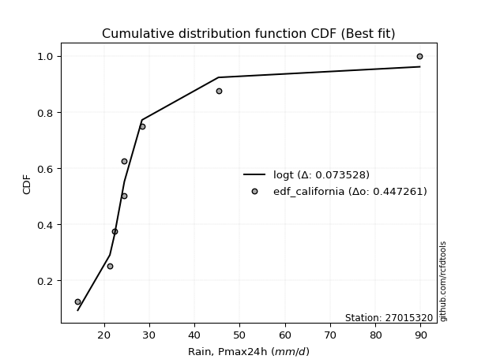</img>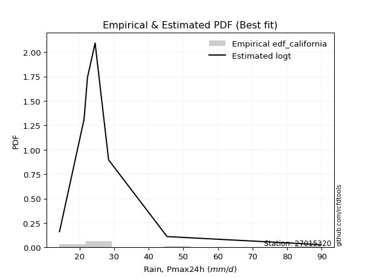</img>

</div>


### 2. Empirical - EDF Hazen (1930)

Hazen method for plotting positions is a formula used to estimate the empirical cumulative probability distribution of flood events or other hydrological data. This formula often results in biased estimations, particularly when extrapolating to extreme events (high return periods).

<div align="center">


$P=(m-0.5)/n$


</div>


**2.1. Empirical values**

<div align="center">

|                | 0                   | 1                   | 2                  | 3                  | 4         | 5                  | 6                  | 7                  | 8                  |
|:---------------|:--------------------|:--------------------|:-------------------|:-------------------|:----------|:-------------------|:-------------------|:-------------------|:-------------------|
| date           | 2025                | 2018                | 2019               | 2017               | 2021      | 2020               | 2022               | 2023               | 2024               |
| x              | 7.4                 | 14.2                | 21.3               | 22.3               | 24.5      | 24.5               | 28.4               | 45.3               | 89.8               |
| m              | 1                   | 2                   | 3                  | 4                  | 5         | 6                  | 7                  | 8                  | 9                  |
| empirical_dist | edf_hazen           | edf_hazen           | edf_hazen          | edf_hazen          | edf_hazen | edf_hazen          | edf_hazen          | edf_hazen          | edf_hazen          |
| empirical      | 0.05555555555555555 | 0.16666666666666666 | 0.2777777777777778 | 0.3888888888888889 | 0.5       | 0.6111111111111112 | 0.7222222222222222 | 0.8333333333333334 | 0.9444444444444444 |
| empirical_tr   | 1.0588235294117647  | 1.2                 | 1.3846153846153846 | 1.6363636363636362 | 2.0       | 2.5714285714285716 | 3.5999999999999996 | 6.000000000000002  | 17.999999999999993 |

</div>


**2.2. Kolmogorov-Smirnov fit test (sorted by Δ)**


<div align="center">

|                | 0                   | 1                   | 2                   | 3                   | 4                     | 5                   | 6                   | 7                   | 8                   | 9                   | 10                  | 11                  | 12                  | 13                  | 14                  | 15                  | 16                  | 17                  | 18                  | 19                  | 20                  | 21                  | 22                  | 23                  | 24                  | 25                  | 26                  | 27                  | 28                  | 29                  | 30                  | 31                  | 32                  | 33                  | 34                  | 35                  | 36                  | 37                  | 38                  | 39                  | 40                  | 41                  | 42                  | 43                  | 44                  | 45                  | 46                  | 47                  | 48                  | 49                  | 50                  | 51                  | 52                  | 53                  | 54                  | 55                  | 56                  | 57                  | 58                  | 59                  | 60                  | 61                  | 62                  | 63                  | 64                  | 65                  | 66                  | 67                  | 68                  | 69                  | 70                  | 71                  | 72                  | 73                  | 74                  | 75                  | 76                  | 77                  | 78                  | 79                  | 80                  | 81                  | 82                  | 83                  | 84                  | 85                  | 86                  | 87                  | 88                  | 89                  |
|:---------------|:--------------------|:--------------------|:--------------------|:--------------------|:----------------------|:--------------------|:--------------------|:--------------------|:--------------------|:--------------------|:--------------------|:--------------------|:--------------------|:--------------------|:--------------------|:--------------------|:--------------------|:--------------------|:--------------------|:--------------------|:--------------------|:--------------------|:--------------------|:--------------------|:--------------------|:--------------------|:--------------------|:--------------------|:--------------------|:--------------------|:--------------------|:--------------------|:--------------------|:--------------------|:--------------------|:--------------------|:--------------------|:--------------------|:--------------------|:--------------------|:--------------------|:--------------------|:--------------------|:--------------------|:--------------------|:--------------------|:--------------------|:--------------------|:--------------------|:--------------------|:--------------------|:--------------------|:--------------------|:--------------------|:--------------------|:--------------------|:--------------------|:--------------------|:--------------------|:--------------------|:--------------------|:--------------------|:--------------------|:--------------------|:--------------------|:--------------------|:--------------------|:--------------------|:--------------------|:--------------------|:--------------------|:--------------------|:--------------------|:--------------------|:--------------------|:--------------------|:--------------------|:--------------------|:--------------------|:--------------------|:--------------------|:--------------------|:--------------------|:--------------------|:--------------------|:--------------------|:--------------------|:--------------------|:--------------------|:--------------------|
| station        | 27015320            | 27015320            | 27015320            | 27015320            | 27015320              | 27015320            | 27015320            | 27015320            | 27015320            | 27015320            | 27015320            | 27015320            | 27015320            | 27015320            | 27015320            | 27015320            | 27015320            | 27015320            | 27015320            | 27015320            | 27015320            | 27015320            | 27015320            | 27015320            | 27015320            | 27015320            | 27015320            | 27015320            | 27015320            | 27015320            | 27015320            | 27015320            | 27015320            | 27015320            | 27015320            | 27015320            | 27015320            | 27015320            | 27015320            | 27015320            | 27015320            | 27015320            | 27015320            | 27015320            | 27015320            | 27015320            | 27015320            | 27015320            | 27015320            | 27015320            | 27015320            | 27015320            | 27015320            | 27015320            | 27015320            | 27015320            | 27015320            | 27015320            | 27015320            | 27015320            | 27015320            | 27015320            | 27015320            | 27015320            | 27015320            | 27015320            | 27015320            | 27015320            | 27015320            | 27015320            | 27015320            | 27015320            | 27015320            | 27015320            | 27015320            | 27015320            | 27015320            | 27015320            | 27015320            | 27015320            | 27015320            | 27015320            | 27015320            | 27015320            | 27015320            | 27015320            | 27015320            | 27015320            | 27015320            | 27015320            |
| empirical_dist | edf_hazen           | edf_hazen           | edf_hazen           | edf_hazen           | edf_hazen             | edf_hazen           | edf_hazen           | edf_hazen           | edf_hazen           | edf_hazen           | edf_hazen           | edf_hazen           | edf_hazen           | edf_hazen           | edf_hazen           | edf_hazen           | edf_hazen           | edf_hazen           | edf_hazen           | edf_hazen           | edf_hazen           | edf_hazen           | edf_hazen           | edf_hazen           | edf_hazen           | edf_hazen           | edf_hazen           | edf_hazen           | edf_hazen           | edf_hazen           | edf_hazen           | edf_hazen           | edf_hazen           | edf_hazen           | edf_hazen           | edf_hazen           | edf_hazen           | edf_hazen           | edf_hazen           | edf_hazen           | edf_hazen           | edf_hazen           | edf_hazen           | edf_hazen           | edf_hazen           | edf_hazen           | edf_hazen           | edf_hazen           | edf_hazen           | edf_hazen           | edf_hazen           | edf_hazen           | edf_hazen           | edf_hazen           | edf_hazen           | edf_hazen           | edf_hazen           | edf_hazen           | edf_hazen           | edf_hazen           | edf_hazen           | edf_hazen           | edf_hazen           | edf_hazen           | edf_hazen           | edf_hazen           | edf_hazen           | edf_hazen           | edf_hazen           | edf_hazen           | edf_hazen           | edf_hazen           | edf_hazen           | edf_hazen           | edf_hazen           | edf_hazen           | edf_hazen           | edf_hazen           | edf_hazen           | edf_hazen           | edf_hazen           | edf_hazen           | edf_hazen           | edf_hazen           | edf_hazen           | edf_hazen           | edf_hazen           | edf_hazen           | edf_hazen           | edf_hazen           |
| p_dist         | logjohnsonsu        | johnsonsu           | logt                | t                   | loglaplace_asymmetric | loghypsecant        | loglaplace          | loglogistic         | mielke              | loggenlogistic      | logfisk             | nct                 | fisk                | alpha               | logmielke           | invweibull          | lognorm             | lognorm             | logcrystalball      | ncf                 | invgamma            | logloggamma         | fatiguelife         | invgauss            | loggamma            | loggamma            | logerlang           | logfatiguelife      | logf                | logbetaprime        | logexponnorm        | logpearson3         | logncf              | betaprime           | genexpon            | logrice             | lognct              | logweibull_min      | pearson3            | loginvgamma         | logalpha            | loginvgauss         | wald                | loggompertz         | exponnorm           | gibrat              | halflogistic        | logmaxwell          | expon               | weibull_min         | logtruncnorm        | moyal               | lograyleigh         | genlogistic         | gompertz            | halfnorm            | laplace_asymmetric  | loginvweibull       | loggumbel_r         | chi2                | gumbel_r            | loggumbel_l         | logkstwobign        | loghalfnorm         | erlang              | loggenexpon         | logmoyal            | rayleigh            | truncnorm           | loghalflogistic     | maxwell             | kstwobign           | f                   | lognakagami         | norm                | crystalball         | logistic            | rice                | hypsecant           | loggibrat           | logwald             | laplace             | logexpon            | nakagami            | gamma               | gumbel_l            | logchi2             | loglognorm          | pareto              | logpareto           |
| delta          | 0.06580775877700018 | 0.07734177105967588 | 0.08593534878480169 | 0.08737908699231389 | 0.11635812590957528   | 0.11831241225261557 | 0.12117558046252486 | 0.12742764038822918 | 0.13087308553406207 | 0.1308858433497493  | 0.1323923304786755  | 0.13251476277289664 | 0.13531486442880492 | 0.1357910564789711  | 0.13592107294539846 | 0.13700382320380944 | 0.13842704171693    | 0.13842704171693    | 0.13842706891565448 | 0.13898944239773942 | 0.13912893150704508 | 0.1406235309051712  | 0.1410675893273282  | 0.1416083336905561  | 0.141773749071339   | 0.141773749071339   | 0.14177376684984488 | 0.14181573837005373 | 0.14187257936023534 | 0.14187736082002927 | 0.1421490375258908  | 0.14256173212812484 | 0.14367211145269576 | 0.14403353351064418 | 0.14477513457751368 | 0.14574304967912316 | 0.14762845499982385 | 0.14825530834401213 | 0.1506067499237107  | 0.15071178448953354 | 0.15131860385932694 | 0.15651565447733684 | 0.15687934506861467 | 0.15742467071619404 | 0.1590841976025007  | 0.16007708019061168 | 0.16367693879988865 | 0.16605286247686785 | 0.16933992122854202 | 0.17000240385892829 | 0.17110052749210825 | 0.17140749188034476 | 0.17831388491867706 | 0.1797723764081216  | 0.184487015682959   | 0.185455512646589   | 0.1861884501743044  | 0.1908044954430737  | 0.19333230349207609 | 0.19605805784330077 | 0.19695223240300674 | 0.2009971527105342  | 0.21084978359570394 | 0.21305902836473517 | 0.21391432540447902 | 0.21662149549790755 | 0.21687544440164663 | 0.2187129990826575  | 0.2239835055580266  | 0.22982920376247074 | 0.23050280406565238 | 0.23101542573763223 | 0.2464741063917406  | 0.25021689313171336 | 0.2647294667079995  | 0.26472947577331735 | 0.2704783517215266  | 0.27384607659195753 | 0.27534995940596085 | 0.2794745647099911  | 0.2810900686783643  | 0.29228569571168916 | 0.30586415320938365 | 0.3063296892431425  | 0.32032762861805775 | 0.3350829819870506  | 0.4246384905457846  | 0.4489539113383352  | 0.4614412377900634  | 0.48053429109681756 |
| deltao         | 0.41761268023100007 | 0.41761268023100007 | 0.41761268023100007 | 0.41761268023100007 | 0.41761268023100007   | 0.41761268023100007 | 0.41761268023100007 | 0.41761268023100007 | 0.41761268023100007 | 0.41761268023100007 | 0.41761268023100007 | 0.41761268023100007 | 0.41761268023100007 | 0.41761268023100007 | 0.41761268023100007 | 0.41761268023100007 | 0.41761268023100007 | 0.41761268023100007 | 0.41761268023100007 | 0.41761268023100007 | 0.41761268023100007 | 0.41761268023100007 | 0.41761268023100007 | 0.41761268023100007 | 0.41761268023100007 | 0.41761268023100007 | 0.41761268023100007 | 0.41761268023100007 | 0.41761268023100007 | 0.41761268023100007 | 0.41761268023100007 | 0.41761268023100007 | 0.41761268023100007 | 0.41761268023100007 | 0.41761268023100007 | 0.41761268023100007 | 0.41761268023100007 | 0.41761268023100007 | 0.41761268023100007 | 0.41761268023100007 | 0.41761268023100007 | 0.41761268023100007 | 0.41761268023100007 | 0.41761268023100007 | 0.41761268023100007 | 0.41761268023100007 | 0.41761268023100007 | 0.41761268023100007 | 0.41761268023100007 | 0.41761268023100007 | 0.41761268023100007 | 0.41761268023100007 | 0.41761268023100007 | 0.41761268023100007 | 0.41761268023100007 | 0.41761268023100007 | 0.41761268023100007 | 0.41761268023100007 | 0.41761268023100007 | 0.41761268023100007 | 0.41761268023100007 | 0.41761268023100007 | 0.41761268023100007 | 0.41761268023100007 | 0.41761268023100007 | 0.41761268023100007 | 0.41761268023100007 | 0.41761268023100007 | 0.41761268023100007 | 0.41761268023100007 | 0.41761268023100007 | 0.41761268023100007 | 0.41761268023100007 | 0.41761268023100007 | 0.41761268023100007 | 0.41761268023100007 | 0.41761268023100007 | 0.41761268023100007 | 0.41761268023100007 | 0.41761268023100007 | 0.41761268023100007 | 0.41761268023100007 | 0.41761268023100007 | 0.41761268023100007 | 0.41761268023100007 | 0.41761268023100007 | 0.41761268023100007 | 0.41761268023100007 | 0.41761268023100007 | 0.41761268023100007 |
| eval           | Δo > Δ              | Δo > Δ              | Δo > Δ              | Δo > Δ              | Δo > Δ                | Δo > Δ              | Δo > Δ              | Δo > Δ              | Δo > Δ              | Δo > Δ              | Δo > Δ              | Δo > Δ              | Δo > Δ              | Δo > Δ              | Δo > Δ              | Δo > Δ              | Δo > Δ              | Δo > Δ              | Δo > Δ              | Δo > Δ              | Δo > Δ              | Δo > Δ              | Δo > Δ              | Δo > Δ              | Δo > Δ              | Δo > Δ              | Δo > Δ              | Δo > Δ              | Δo > Δ              | Δo > Δ              | Δo > Δ              | Δo > Δ              | Δo > Δ              | Δo > Δ              | Δo > Δ              | Δo > Δ              | Δo > Δ              | Δo > Δ              | Δo > Δ              | Δo > Δ              | Δo > Δ              | Δo > Δ              | Δo > Δ              | Δo > Δ              | Δo > Δ              | Δo > Δ              | Δo > Δ              | Δo > Δ              | Δo > Δ              | Δo > Δ              | Δo > Δ              | Δo > Δ              | Δo > Δ              | Δo > Δ              | Δo > Δ              | Δo > Δ              | Δo > Δ              | Δo > Δ              | Δo > Δ              | Δo > Δ              | Δo > Δ              | Δo > Δ              | Δo > Δ              | Δo > Δ              | Δo > Δ              | Δo > Δ              | Δo > Δ              | Δo > Δ              | Δo > Δ              | Δo > Δ              | Δo > Δ              | Δo > Δ              | Δo > Δ              | Δo > Δ              | Δo > Δ              | Δo > Δ              | Δo > Δ              | Δo > Δ              | Δo > Δ              | Δo > Δ              | Δo > Δ              | Δo > Δ              | Δo > Δ              | Δo > Δ              | Δo > Δ              | Δo > Δ              | Δo <= Δ             | Δo <= Δ             | Δo <= Δ             | Δo <= Δ             |
| fit            | 1                   | 1                   | 1                   | 1                   | 1                     | 1                   | 1                   | 1                   | 1                   | 1                   | 1                   | 1                   | 1                   | 1                   | 1                   | 1                   | 1                   | 1                   | 1                   | 1                   | 1                   | 1                   | 1                   | 1                   | 1                   | 1                   | 1                   | 1                   | 1                   | 1                   | 1                   | 1                   | 1                   | 1                   | 1                   | 1                   | 1                   | 1                   | 1                   | 1                   | 1                   | 1                   | 1                   | 1                   | 1                   | 1                   | 1                   | 1                   | 1                   | 1                   | 1                   | 1                   | 1                   | 1                   | 1                   | 1                   | 1                   | 1                   | 1                   | 1                   | 1                   | 1                   | 1                   | 1                   | 1                   | 1                   | 1                   | 1                   | 1                   | 1                   | 1                   | 1                   | 1                   | 1                   | 1                   | 1                   | 1                   | 1                   | 1                   | 1                   | 1                   | 1                   | 1                   | 1                   | 1                   | 1                   | 0                   | 0                   | 0                   | 0                   |
| n              | 9                   | 9                   | 9                   | 9                   | 9                     | 9                   | 9                   | 9                   | 9                   | 9                   | 9                   | 9                   | 9                   | 9                   | 9                   | 9                   | 9                   | 9                   | 9                   | 9                   | 9                   | 9                   | 9                   | 9                   | 9                   | 9                   | 9                   | 9                   | 9                   | 9                   | 9                   | 9                   | 9                   | 9                   | 9                   | 9                   | 9                   | 9                   | 9                   | 9                   | 9                   | 9                   | 9                   | 9                   | 9                   | 9                   | 9                   | 9                   | 9                   | 9                   | 9                   | 9                   | 9                   | 9                   | 9                   | 9                   | 9                   | 9                   | 9                   | 9                   | 9                   | 9                   | 9                   | 9                   | 9                   | 9                   | 9                   | 9                   | 9                   | 9                   | 9                   | 9                   | 9                   | 9                   | 9                   | 9                   | 9                   | 9                   | 9                   | 9                   | 9                   | 9                   | 9                   | 9                   | 9                   | 9                   | 9                   | 9                   | 9                   | 9                   |
| best_fit       | 1                   | 0                   | 0                   | 0                   | 0                     | 0                   | 0                   | 0                   | 0                   | 0                   | 0                   | 0                   | 0                   | 0                   | 0                   | 0                   | 0                   | 0                   | 0                   | 0                   | 0                   | 0                   | 0                   | 0                   | 0                   | 0                   | 0                   | 0                   | 0                   | 0                   | 0                   | 0                   | 0                   | 0                   | 0                   | 0                   | 0                   | 0                   | 0                   | 0                   | 0                   | 0                   | 0                   | 0                   | 0                   | 0                   | 0                   | 0                   | 0                   | 0                   | 0                   | 0                   | 0                   | 0                   | 0                   | 0                   | 0                   | 0                   | 0                   | 0                   | 0                   | 0                   | 0                   | 0                   | 0                   | 0                   | 0                   | 0                   | 0                   | 0                   | 0                   | 0                   | 0                   | 0                   | 0                   | 0                   | 0                   | 0                   | 0                   | 0                   | 0                   | 0                   | 0                   | 0                   | 0                   | 0                   | 0                   | 0                   | 0                   | 0                   |
| best_fit_sort  | 1                   | 2                   | 3                   | 4                   | 5                     | 6                   | 7                   | 8                   | 9                   | 10                  | 11                  | 12                  | 13                  | 14                  | 15                  | 16                  | 17                  | 18                  | 19                  | 20                  | 21                  | 22                  | 23                  | 24                  | 25                  | 26                  | 27                  | 28                  | 29                  | 30                  | 31                  | 32                  | 33                  | 34                  | 35                  | 36                  | 37                  | 38                  | 39                  | 40                  | 41                  | 42                  | 43                  | 44                  | 45                  | 46                  | 47                  | 48                  | 49                  | 50                  | 51                  | 52                  | 53                  | 54                  | 55                  | 56                  | 57                  | 58                  | 59                  | 60                  | 61                  | 62                  | 63                  | 64                  | 65                  | 66                  | 67                  | 68                  | 69                  | 70                  | 71                  | 72                  | 73                  | 74                  | 75                  | 76                  | 77                  | 78                  | 79                  | 80                  | 81                  | 82                  | 83                  | 84                  | 85                  | 86                  | 87                  | 88                  | 89                  | 90                  |

</div>


<div align="center">

</img>

</div>


**2.3. Best fit**

<div align="center">

|   id |   station | empirical_dist   | p_dist       |     delta |   deltao | eval   |   fit |   n |   best_fit |   best_fit_sort |
|-----:|----------:|:-----------------|:-------------|----------:|---------:|:-------|------:|----:|-----------:|----------------:|
|    0 |  27015320 | edf_hazen        | logjohnsonsu | 0.0658078 | 0.417613 | Δo > Δ |     1 |   9 |          1 |               1 |

</div>


<div align="center">

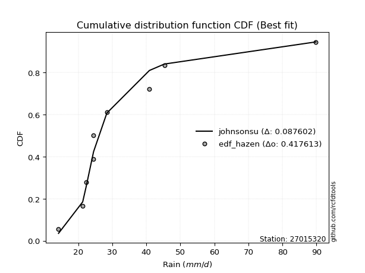</img></img>

</div>


### 3. Empirical - EDF Weibull (1939)

Weibull plotting position formula is an empirical method used to estimate the non-exceedance probability or plotting position for a set of observed data, is often recommended or widely used in practice, particularly in flood frequency analysis.

<div align="center">


$P=m/(n+1)$


</div>


**3.1. Empirical values**

<div align="center">

|                | 0                  | 1           | 2                  | 3                  | 4           | 5           | 6                 | 7                 | 8                  |
|:---------------|:-------------------|:------------|:-------------------|:-------------------|:------------|:------------|:------------------|:------------------|:-------------------|
| date           | 2025               | 2018        | 2019               | 2017               | 2021        | 2020        | 2022              | 2023              | 2024               |
| x              | 7.4                | 14.2        | 21.3               | 22.3               | 24.5        | 24.5        | 28.4              | 45.3              | 89.8               |
| m              | 1                  | 2           | 3                  | 4                  | 5           | 6           | 7                 | 8                 | 9                  |
| empirical_dist | edf_weibull        | edf_weibull | edf_weibull        | edf_weibull        | edf_weibull | edf_weibull | edf_weibull       | edf_weibull       | edf_weibull        |
| empirical      | 0.1                | 0.2         | 0.3                | 0.4                | 0.5         | 0.6         | 0.7               | 0.8               | 0.9                |
| empirical_tr   | 1.1111111111111112 | 1.25        | 1.4285714285714286 | 1.6666666666666667 | 2.0         | 2.5         | 3.333333333333333 | 5.000000000000001 | 10.000000000000002 |

</div>


**3.2. Kolmogorov-Smirnov fit test (sorted by Δ)**


<div align="center">

|                | 0                   | 1                   | 2                     | 3                   | 4                   | 5                   | 6                   | 7                   | 8                   | 9                   | 10                  | 11                  | 12                  | 13                  | 14                  | 15                  | 16                  | 17                  | 18                  | 19                  | 20                  | 21                  | 22                  | 23                  | 24                  | 25                  | 26                  | 27                  | 28                  | 29                  | 30                  | 31                  | 32                  | 33                  | 34                  | 35                  | 36                  | 37                  | 38                  | 39                  | 40                  | 41                  | 42                  | 43                  | 44                  | 45                  | 46                  | 47                  | 48                  | 49                  | 50                  | 51                  | 52                  | 53                  | 54                  | 55                  | 56                  | 57                  | 58                  | 59                  | 60                  | 61                  | 62                  | 63                  | 64                  | 65                  | 66                  | 67                  | 68                  | 69                  | 70                  | 71                  | 72                  | 73                  | 74                  | 75                  | 76                  | 77                  | 78                  | 79                  | 80                  | 81                  | 82                  | 83                  | 84                  | 85                  | 86                  | 87                  | 88                  | 89                  |
|:---------------|:--------------------|:--------------------|:----------------------|:--------------------|:--------------------|:--------------------|:--------------------|:--------------------|:--------------------|:--------------------|:--------------------|:--------------------|:--------------------|:--------------------|:--------------------|:--------------------|:--------------------|:--------------------|:--------------------|:--------------------|:--------------------|:--------------------|:--------------------|:--------------------|:--------------------|:--------------------|:--------------------|:--------------------|:--------------------|:--------------------|:--------------------|:--------------------|:--------------------|:--------------------|:--------------------|:--------------------|:--------------------|:--------------------|:--------------------|:--------------------|:--------------------|:--------------------|:--------------------|:--------------------|:--------------------|:--------------------|:--------------------|:--------------------|:--------------------|:--------------------|:--------------------|:--------------------|:--------------------|:--------------------|:--------------------|:--------------------|:--------------------|:--------------------|:--------------------|:--------------------|:--------------------|:--------------------|:--------------------|:--------------------|:--------------------|:--------------------|:--------------------|:--------------------|:--------------------|:--------------------|:--------------------|:--------------------|:--------------------|:--------------------|:--------------------|:--------------------|:--------------------|:--------------------|:--------------------|:--------------------|:--------------------|:--------------------|:--------------------|:--------------------|:--------------------|:--------------------|:--------------------|:--------------------|:--------------------|:--------------------|
| station        | 27015320            | 27015320            | 27015320              | 27015320            | 27015320            | 27015320            | 27015320            | 27015320            | 27015320            | 27015320            | 27015320            | 27015320            | 27015320            | 27015320            | 27015320            | 27015320            | 27015320            | 27015320            | 27015320            | 27015320            | 27015320            | 27015320            | 27015320            | 27015320            | 27015320            | 27015320            | 27015320            | 27015320            | 27015320            | 27015320            | 27015320            | 27015320            | 27015320            | 27015320            | 27015320            | 27015320            | 27015320            | 27015320            | 27015320            | 27015320            | 27015320            | 27015320            | 27015320            | 27015320            | 27015320            | 27015320            | 27015320            | 27015320            | 27015320            | 27015320            | 27015320            | 27015320            | 27015320            | 27015320            | 27015320            | 27015320            | 27015320            | 27015320            | 27015320            | 27015320            | 27015320            | 27015320            | 27015320            | 27015320            | 27015320            | 27015320            | 27015320            | 27015320            | 27015320            | 27015320            | 27015320            | 27015320            | 27015320            | 27015320            | 27015320            | 27015320            | 27015320            | 27015320            | 27015320            | 27015320            | 27015320            | 27015320            | 27015320            | 27015320            | 27015320            | 27015320            | 27015320            | 27015320            | 27015320            | 27015320            |
| empirical_dist | edf_weibull         | edf_weibull         | edf_weibull           | edf_weibull         | edf_weibull         | edf_weibull         | edf_weibull         | edf_weibull         | edf_weibull         | edf_weibull         | edf_weibull         | edf_weibull         | edf_weibull         | edf_weibull         | edf_weibull         | edf_weibull         | edf_weibull         | edf_weibull         | edf_weibull         | edf_weibull         | edf_weibull         | edf_weibull         | edf_weibull         | edf_weibull         | edf_weibull         | edf_weibull         | edf_weibull         | edf_weibull         | edf_weibull         | edf_weibull         | edf_weibull         | edf_weibull         | edf_weibull         | edf_weibull         | edf_weibull         | edf_weibull         | edf_weibull         | edf_weibull         | edf_weibull         | edf_weibull         | edf_weibull         | edf_weibull         | edf_weibull         | edf_weibull         | edf_weibull         | edf_weibull         | edf_weibull         | edf_weibull         | edf_weibull         | edf_weibull         | edf_weibull         | edf_weibull         | edf_weibull         | edf_weibull         | edf_weibull         | edf_weibull         | edf_weibull         | edf_weibull         | edf_weibull         | edf_weibull         | edf_weibull         | edf_weibull         | edf_weibull         | edf_weibull         | edf_weibull         | edf_weibull         | edf_weibull         | edf_weibull         | edf_weibull         | edf_weibull         | edf_weibull         | edf_weibull         | edf_weibull         | edf_weibull         | edf_weibull         | edf_weibull         | edf_weibull         | edf_weibull         | edf_weibull         | edf_weibull         | edf_weibull         | edf_weibull         | edf_weibull         | edf_weibull         | edf_weibull         | edf_weibull         | edf_weibull         | edf_weibull         | edf_weibull         | edf_weibull         |
| p_dist         | logjohnsonsu        | johnsonsu           | loglaplace_asymmetric | loglogistic         | loghypsecant        | mielke              | loggenlogistic      | logt                | loglaplace          | logfisk             | nct                 | fisk                | alpha               | logmielke           | invweibull          | lognorm             | lognorm             | logcrystalball      | ncf                 | invgamma            | logloggamma         | fatiguelife         | invgauss            | loggamma            | loggamma            | logerlang           | logfatiguelife      | logf                | logbetaprime        | logexponnorm        | logpearson3         | t                   | logncf              | betaprime           | genexpon            | logrice             | lognct              | logweibull_min      | pearson3            | loginvgamma         | logalpha            | loginvgauss         | wald                | loggompertz         | exponnorm           | halflogistic        | logmaxwell          | expon               | weibull_min         | moyal               | lograyleigh         | genlogistic         | gompertz            | halfnorm            | loginvweibull       | loggumbel_r         | chi2                | gumbel_r            | laplace_asymmetric  | loggumbel_l         | logkstwobign        | loghalfnorm         | erlang              | gibrat              | loggenexpon         | logmoyal            | rayleigh            | logtruncnorm        | truncnorm           | loghalflogistic     | maxwell             | kstwobign           | f                   | lognakagami         | norm                | crystalball         | logistic            | rice                | hypsecant           | loggibrat           | logwald             | laplace             | logexpon            | nakagami            | gamma               | gumbel_l            | logchi2             | loglognorm          | pareto              | logpareto           |
| delta          | 0.09026257842058594 | 0.09190594817335956 | 0.1052470147984641    | 0.10651956426844117 | 0.10718864464243782 | 0.10865086331183987 | 0.10866362112752709 | 0.10935126961139019 | 0.11006446935141367 | 0.11017010825645329 | 0.11029254055067444 | 0.11309264220658272 | 0.11356883425674891 | 0.11369885072317626 | 0.11478160098158724 | 0.11620481949470773 | 0.11620481949470773 | 0.11620484669343223 | 0.11676722017551722 | 0.11690670928482289 | 0.11840130868294896 | 0.11884536710510596 | 0.11938611146833389 | 0.1195515268491168  | 0.1195515268491168  | 0.11955154462762269 | 0.11959351614783154 | 0.11965035713801314 | 0.11965513859780708 | 0.11992681530366861 | 0.12033950990590264 | 0.12071242032564722 | 0.12144988923047356 | 0.12181131128842199 | 0.12255291235529148 | 0.12352082745690096 | 0.12540623277760166 | 0.12603308612178993 | 0.1283845277014885  | 0.12848956226731134 | 0.12909638163710474 | 0.13429343225511464 | 0.13465712284639247 | 0.13520244849397184 | 0.13686197538027844 | 0.1414547165776664  | 0.14383064025464565 | 0.14711769900631982 | 0.1477801816367061  | 0.1491852696581225  | 0.15609166269645486 | 0.15755015418589935 | 0.16226479346073674 | 0.16323329042436674 | 0.1685822732208515  | 0.1711100812698539  | 0.17383583562107857 | 0.1747300101807845  | 0.17507733906319323 | 0.17877493048831194 | 0.18862756137348174 | 0.19083680614251297 | 0.19169210318225682 | 0.19341041352394503 | 0.19439927327568535 | 0.19465322217942443 | 0.19649077686043526 | 0.19999871831719881 | 0.20176128333580434 | 0.20760698154024854 | 0.20828058184343012 | 0.20879320351540998 | 0.2242518841695184  | 0.22799467090949116 | 0.24250724448577726 | 0.2425072535510951  | 0.24825612949930437 | 0.2516238543697353  | 0.2531277371837386  | 0.2572523424877689  | 0.2588678464561421  | 0.2700634734894669  | 0.28364193098716145 | 0.2841074670209203  | 0.29810540639583555 | 0.31286075976482836 | 0.4024162683235624  | 0.4156205780050018  | 0.42810790445673    | 0.4472009577634842  |
| deltao         | 0.41761268023100007 | 0.41761268023100007 | 0.41761268023100007   | 0.41761268023100007 | 0.41761268023100007 | 0.41761268023100007 | 0.41761268023100007 | 0.41761268023100007 | 0.41761268023100007 | 0.41761268023100007 | 0.41761268023100007 | 0.41761268023100007 | 0.41761268023100007 | 0.41761268023100007 | 0.41761268023100007 | 0.41761268023100007 | 0.41761268023100007 | 0.41761268023100007 | 0.41761268023100007 | 0.41761268023100007 | 0.41761268023100007 | 0.41761268023100007 | 0.41761268023100007 | 0.41761268023100007 | 0.41761268023100007 | 0.41761268023100007 | 0.41761268023100007 | 0.41761268023100007 | 0.41761268023100007 | 0.41761268023100007 | 0.41761268023100007 | 0.41761268023100007 | 0.41761268023100007 | 0.41761268023100007 | 0.41761268023100007 | 0.41761268023100007 | 0.41761268023100007 | 0.41761268023100007 | 0.41761268023100007 | 0.41761268023100007 | 0.41761268023100007 | 0.41761268023100007 | 0.41761268023100007 | 0.41761268023100007 | 0.41761268023100007 | 0.41761268023100007 | 0.41761268023100007 | 0.41761268023100007 | 0.41761268023100007 | 0.41761268023100007 | 0.41761268023100007 | 0.41761268023100007 | 0.41761268023100007 | 0.41761268023100007 | 0.41761268023100007 | 0.41761268023100007 | 0.41761268023100007 | 0.41761268023100007 | 0.41761268023100007 | 0.41761268023100007 | 0.41761268023100007 | 0.41761268023100007 | 0.41761268023100007 | 0.41761268023100007 | 0.41761268023100007 | 0.41761268023100007 | 0.41761268023100007 | 0.41761268023100007 | 0.41761268023100007 | 0.41761268023100007 | 0.41761268023100007 | 0.41761268023100007 | 0.41761268023100007 | 0.41761268023100007 | 0.41761268023100007 | 0.41761268023100007 | 0.41761268023100007 | 0.41761268023100007 | 0.41761268023100007 | 0.41761268023100007 | 0.41761268023100007 | 0.41761268023100007 | 0.41761268023100007 | 0.41761268023100007 | 0.41761268023100007 | 0.41761268023100007 | 0.41761268023100007 | 0.41761268023100007 | 0.41761268023100007 | 0.41761268023100007 |
| eval           | Δo > Δ              | Δo > Δ              | Δo > Δ                | Δo > Δ              | Δo > Δ              | Δo > Δ              | Δo > Δ              | Δo > Δ              | Δo > Δ              | Δo > Δ              | Δo > Δ              | Δo > Δ              | Δo > Δ              | Δo > Δ              | Δo > Δ              | Δo > Δ              | Δo > Δ              | Δo > Δ              | Δo > Δ              | Δo > Δ              | Δo > Δ              | Δo > Δ              | Δo > Δ              | Δo > Δ              | Δo > Δ              | Δo > Δ              | Δo > Δ              | Δo > Δ              | Δo > Δ              | Δo > Δ              | Δo > Δ              | Δo > Δ              | Δo > Δ              | Δo > Δ              | Δo > Δ              | Δo > Δ              | Δo > Δ              | Δo > Δ              | Δo > Δ              | Δo > Δ              | Δo > Δ              | Δo > Δ              | Δo > Δ              | Δo > Δ              | Δo > Δ              | Δo > Δ              | Δo > Δ              | Δo > Δ              | Δo > Δ              | Δo > Δ              | Δo > Δ              | Δo > Δ              | Δo > Δ              | Δo > Δ              | Δo > Δ              | Δo > Δ              | Δo > Δ              | Δo > Δ              | Δo > Δ              | Δo > Δ              | Δo > Δ              | Δo > Δ              | Δo > Δ              | Δo > Δ              | Δo > Δ              | Δo > Δ              | Δo > Δ              | Δo > Δ              | Δo > Δ              | Δo > Δ              | Δo > Δ              | Δo > Δ              | Δo > Δ              | Δo > Δ              | Δo > Δ              | Δo > Δ              | Δo > Δ              | Δo > Δ              | Δo > Δ              | Δo > Δ              | Δo > Δ              | Δo > Δ              | Δo > Δ              | Δo > Δ              | Δo > Δ              | Δo > Δ              | Δo > Δ              | Δo > Δ              | Δo <= Δ             | Δo <= Δ             |
| fit            | 1                   | 1                   | 1                     | 1                   | 1                   | 1                   | 1                   | 1                   | 1                   | 1                   | 1                   | 1                   | 1                   | 1                   | 1                   | 1                   | 1                   | 1                   | 1                   | 1                   | 1                   | 1                   | 1                   | 1                   | 1                   | 1                   | 1                   | 1                   | 1                   | 1                   | 1                   | 1                   | 1                   | 1                   | 1                   | 1                   | 1                   | 1                   | 1                   | 1                   | 1                   | 1                   | 1                   | 1                   | 1                   | 1                   | 1                   | 1                   | 1                   | 1                   | 1                   | 1                   | 1                   | 1                   | 1                   | 1                   | 1                   | 1                   | 1                   | 1                   | 1                   | 1                   | 1                   | 1                   | 1                   | 1                   | 1                   | 1                   | 1                   | 1                   | 1                   | 1                   | 1                   | 1                   | 1                   | 1                   | 1                   | 1                   | 1                   | 1                   | 1                   | 1                   | 1                   | 1                   | 1                   | 1                   | 1                   | 1                   | 0                   | 0                   |
| n              | 9                   | 9                   | 9                     | 9                   | 9                   | 9                   | 9                   | 9                   | 9                   | 9                   | 9                   | 9                   | 9                   | 9                   | 9                   | 9                   | 9                   | 9                   | 9                   | 9                   | 9                   | 9                   | 9                   | 9                   | 9                   | 9                   | 9                   | 9                   | 9                   | 9                   | 9                   | 9                   | 9                   | 9                   | 9                   | 9                   | 9                   | 9                   | 9                   | 9                   | 9                   | 9                   | 9                   | 9                   | 9                   | 9                   | 9                   | 9                   | 9                   | 9                   | 9                   | 9                   | 9                   | 9                   | 9                   | 9                   | 9                   | 9                   | 9                   | 9                   | 9                   | 9                   | 9                   | 9                   | 9                   | 9                   | 9                   | 9                   | 9                   | 9                   | 9                   | 9                   | 9                   | 9                   | 9                   | 9                   | 9                   | 9                   | 9                   | 9                   | 9                   | 9                   | 9                   | 9                   | 9                   | 9                   | 9                   | 9                   | 9                   | 9                   |
| best_fit       | 1                   | 0                   | 0                     | 0                   | 0                   | 0                   | 0                   | 0                   | 0                   | 0                   | 0                   | 0                   | 0                   | 0                   | 0                   | 0                   | 0                   | 0                   | 0                   | 0                   | 0                   | 0                   | 0                   | 0                   | 0                   | 0                   | 0                   | 0                   | 0                   | 0                   | 0                   | 0                   | 0                   | 0                   | 0                   | 0                   | 0                   | 0                   | 0                   | 0                   | 0                   | 0                   | 0                   | 0                   | 0                   | 0                   | 0                   | 0                   | 0                   | 0                   | 0                   | 0                   | 0                   | 0                   | 0                   | 0                   | 0                   | 0                   | 0                   | 0                   | 0                   | 0                   | 0                   | 0                   | 0                   | 0                   | 0                   | 0                   | 0                   | 0                   | 0                   | 0                   | 0                   | 0                   | 0                   | 0                   | 0                   | 0                   | 0                   | 0                   | 0                   | 0                   | 0                   | 0                   | 0                   | 0                   | 0                   | 0                   | 0                   | 0                   |
| best_fit_sort  | 1                   | 2                   | 3                     | 4                   | 5                   | 6                   | 7                   | 8                   | 9                   | 10                  | 11                  | 12                  | 13                  | 14                  | 15                  | 16                  | 17                  | 18                  | 19                  | 20                  | 21                  | 22                  | 23                  | 24                  | 25                  | 26                  | 27                  | 28                  | 29                  | 30                  | 31                  | 32                  | 33                  | 34                  | 35                  | 36                  | 37                  | 38                  | 39                  | 40                  | 41                  | 42                  | 43                  | 44                  | 45                  | 46                  | 47                  | 48                  | 49                  | 50                  | 51                  | 52                  | 53                  | 54                  | 55                  | 56                  | 57                  | 58                  | 59                  | 60                  | 61                  | 62                  | 63                  | 64                  | 65                  | 66                  | 67                  | 68                  | 69                  | 70                  | 71                  | 72                  | 73                  | 74                  | 75                  | 76                  | 77                  | 78                  | 79                  | 80                  | 81                  | 82                  | 83                  | 84                  | 85                  | 86                  | 87                  | 88                  | 89                  | 90                  |

</div>


<div align="center">

</img>

</div>


**3.3. Best fit**

<div align="center">

|   id |   station | empirical_dist   | p_dist       |     delta |   deltao | eval   |   fit |   n |   best_fit |   best_fit_sort |
|-----:|----------:|:-----------------|:-------------|----------:|---------:|:-------|------:|----:|-----------:|----------------:|
|    0 |  27015320 | edf_weibull      | logjohnsonsu | 0.0902626 | 0.417613 | Δo > Δ |     1 |   9 |          1 |               1 |

</div>


<div align="center">

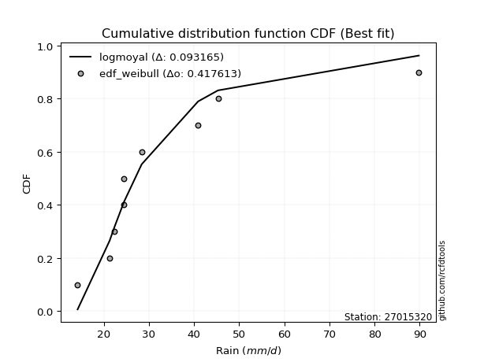</img></img>

</div>


### 4. Empirical - EDF Beard (1943)

The Beard formula (or Beard´s plotting position formula) in hydrology is used to estimate the empirical non-exceedance probability _(P)_ of a flood event (or other extreme hydrological data point) within a given dataset.

<div align="center">


$P=(m-0.31)/(n+0.38)$


</div>


**4.1. Empirical values**

<div align="center">

|                | 0                   | 1                   | 2                  | 3                   | 4         | 5                  | 6                  | 7                  | 8                  |
|:---------------|:--------------------|:--------------------|:-------------------|:--------------------|:----------|:-------------------|:-------------------|:-------------------|:-------------------|
| date           | 2025                | 2018                | 2019               | 2017                | 2021      | 2020               | 2022               | 2023               | 2024               |
| x              | 7.4                 | 14.2                | 21.3               | 22.3                | 24.5      | 24.5               | 28.4               | 45.3               | 89.8               |
| m              | 1                   | 2                   | 3                  | 4                   | 5         | 6                  | 7                  | 8                  | 9                  |
| empirical_dist | edf_beard           | edf_beard           | edf_beard          | edf_beard           | edf_beard | edf_beard          | edf_beard          | edf_beard          | edf_beard          |
| empirical      | 0.07356076759061833 | 0.18017057569296374 | 0.2867803837953091 | 0.39339019189765456 | 0.5       | 0.6066098081023454 | 0.7132196162046908 | 0.8198294243070362 | 0.9264392324093815 |
| empirical_tr   | 1.0794016110471807  | 1.2197659297789336  | 1.4020926756352765 | 1.6485061511423549  | 2.0       | 2.542005420054201  | 3.486988847583642  | 5.550295857988164  | 13.5942028985507   |

</div>


**4.2. Kolmogorov-Smirnov fit test (sorted by Δ)**


<div align="center">

|                | 0                   | 1                   | 2                   | 3                   | 4                     | 5                   | 6                   | 7                   | 8                   | 9                   | 10                  | 11                  | 12                  | 13                  | 14                  | 15                  | 16                  | 17                  | 18                  | 19                  | 20                  | 21                  | 22                  | 23                  | 24                  | 25                  | 26                  | 27                  | 28                  | 29                  | 30                  | 31                  | 32                  | 33                  | 34                  | 35                  | 36                  | 37                  | 38                  | 39                  | 40                  | 41                  | 42                  | 43                  | 44                  | 45                  | 46                  | 47                  | 48                  | 49                  | 50                  | 51                  | 52                  | 53                  | 54                  | 55                  | 56                  | 57                  | 58                  | 59                  | 60                  | 61                  | 62                  | 63                  | 64                  | 65                  | 66                  | 67                  | 68                  | 69                  | 70                  | 71                  | 72                  | 73                  | 74                  | 75                  | 76                  | 77                  | 78                  | 79                  | 80                  | 81                  | 82                  | 83                  | 84                  | 85                  | 86                  | 87                  | 88                  | 89                  |
|:---------------|:--------------------|:--------------------|:--------------------|:--------------------|:----------------------|:--------------------|:--------------------|:--------------------|:--------------------|:--------------------|:--------------------|:--------------------|:--------------------|:--------------------|:--------------------|:--------------------|:--------------------|:--------------------|:--------------------|:--------------------|:--------------------|:--------------------|:--------------------|:--------------------|:--------------------|:--------------------|:--------------------|:--------------------|:--------------------|:--------------------|:--------------------|:--------------------|:--------------------|:--------------------|:--------------------|:--------------------|:--------------------|:--------------------|:--------------------|:--------------------|:--------------------|:--------------------|:--------------------|:--------------------|:--------------------|:--------------------|:--------------------|:--------------------|:--------------------|:--------------------|:--------------------|:--------------------|:--------------------|:--------------------|:--------------------|:--------------------|:--------------------|:--------------------|:--------------------|:--------------------|:--------------------|:--------------------|:--------------------|:--------------------|:--------------------|:--------------------|:--------------------|:--------------------|:--------------------|:--------------------|:--------------------|:--------------------|:--------------------|:--------------------|:--------------------|:--------------------|:--------------------|:--------------------|:--------------------|:--------------------|:--------------------|:--------------------|:--------------------|:--------------------|:--------------------|:--------------------|:--------------------|:--------------------|:--------------------|:--------------------|
| station        | 27015320            | 27015320            | 27015320            | 27015320            | 27015320              | 27015320            | 27015320            | 27015320            | 27015320            | 27015320            | 27015320            | 27015320            | 27015320            | 27015320            | 27015320            | 27015320            | 27015320            | 27015320            | 27015320            | 27015320            | 27015320            | 27015320            | 27015320            | 27015320            | 27015320            | 27015320            | 27015320            | 27015320            | 27015320            | 27015320            | 27015320            | 27015320            | 27015320            | 27015320            | 27015320            | 27015320            | 27015320            | 27015320            | 27015320            | 27015320            | 27015320            | 27015320            | 27015320            | 27015320            | 27015320            | 27015320            | 27015320            | 27015320            | 27015320            | 27015320            | 27015320            | 27015320            | 27015320            | 27015320            | 27015320            | 27015320            | 27015320            | 27015320            | 27015320            | 27015320            | 27015320            | 27015320            | 27015320            | 27015320            | 27015320            | 27015320            | 27015320            | 27015320            | 27015320            | 27015320            | 27015320            | 27015320            | 27015320            | 27015320            | 27015320            | 27015320            | 27015320            | 27015320            | 27015320            | 27015320            | 27015320            | 27015320            | 27015320            | 27015320            | 27015320            | 27015320            | 27015320            | 27015320            | 27015320            | 27015320            |
| empirical_dist | edf_beard           | edf_beard           | edf_beard           | edf_beard           | edf_beard             | edf_beard           | edf_beard           | edf_beard           | edf_beard           | edf_beard           | edf_beard           | edf_beard           | edf_beard           | edf_beard           | edf_beard           | edf_beard           | edf_beard           | edf_beard           | edf_beard           | edf_beard           | edf_beard           | edf_beard           | edf_beard           | edf_beard           | edf_beard           | edf_beard           | edf_beard           | edf_beard           | edf_beard           | edf_beard           | edf_beard           | edf_beard           | edf_beard           | edf_beard           | edf_beard           | edf_beard           | edf_beard           | edf_beard           | edf_beard           | edf_beard           | edf_beard           | edf_beard           | edf_beard           | edf_beard           | edf_beard           | edf_beard           | edf_beard           | edf_beard           | edf_beard           | edf_beard           | edf_beard           | edf_beard           | edf_beard           | edf_beard           | edf_beard           | edf_beard           | edf_beard           | edf_beard           | edf_beard           | edf_beard           | edf_beard           | edf_beard           | edf_beard           | edf_beard           | edf_beard           | edf_beard           | edf_beard           | edf_beard           | edf_beard           | edf_beard           | edf_beard           | edf_beard           | edf_beard           | edf_beard           | edf_beard           | edf_beard           | edf_beard           | edf_beard           | edf_beard           | edf_beard           | edf_beard           | edf_beard           | edf_beard           | edf_beard           | edf_beard           | edf_beard           | edf_beard           | edf_beard           | edf_beard           | edf_beard           |
| p_dist         | logjohnsonsu        | johnsonsu           | logt                | t                   | loglaplace_asymmetric | loghypsecant        | loglaplace          | loglogistic         | mielke              | loggenlogistic      | logfisk             | nct                 | fisk                | alpha               | logmielke           | invweibull          | lognorm             | lognorm             | logcrystalball      | ncf                 | invgamma            | logloggamma         | fatiguelife         | invgauss            | loggamma            | loggamma            | logerlang           | logfatiguelife      | logf                | logbetaprime        | logexponnorm        | logpearson3         | logncf              | betaprime           | genexpon            | logrice             | lognct              | logweibull_min      | pearson3            | loginvgamma         | logalpha            | loginvgauss         | wald                | loggompertz         | exponnorm           | halflogistic        | logmaxwell          | expon               | weibull_min         | moyal               | lograyleigh         | genlogistic         | gibrat              | gompertz            | halfnorm            | logtruncnorm        | laplace_asymmetric  | loginvweibull       | loggumbel_r         | chi2                | gumbel_r            | loggumbel_l         | logkstwobign        | loghalfnorm         | erlang              | loggenexpon         | logmoyal            | rayleigh            | truncnorm           | loghalflogistic     | maxwell             | kstwobign           | f                   | lognakagami         | norm                | crystalball         | logistic            | rice                | hypsecant           | loggibrat           | logwald             | laplace             | logexpon            | nakagami            | gamma               | gumbel_l            | logchi2             | loglognorm          | pareto              | logpareto           |
| delta          | 0.07043315411354978 | 0.07284046805091016 | 0.08952184530435403 | 0.10088299601861106 | 0.11185682290080956   | 0.11379845274478328 | 0.11667427745375913 | 0.11842503437069773 | 0.12187047951653074 | 0.12188323733221795 | 0.12338972446114416 | 0.12351215675536531 | 0.12631225841127358 | 0.12678845046143977 | 0.12691846692786712 | 0.1280012171862781  | 0.12942443569939854 | 0.12942443569939854 | 0.12942446289812304 | 0.12998683638020808 | 0.13012632548951375 | 0.13162092488763977 | 0.13206498330979677 | 0.13260572767302475 | 0.13277114305380766 | 0.13277114305380766 | 0.13277116083231355 | 0.1328131323525224  | 0.132869973342704   | 0.13287475480249794 | 0.13314643150835948 | 0.1335591261105935  | 0.13466950543516443 | 0.13503092749311285 | 0.13577252855998234 | 0.13674044366159183 | 0.13862584898229252 | 0.1392527023264808  | 0.14160414390617937 | 0.1417091784720022  | 0.1423159978417956  | 0.1475130484598055  | 0.14787673905108334 | 0.1484220646986627  | 0.15008159158496925 | 0.1546743327823572  | 0.1570502564593365  | 0.1603373152110107  | 0.16099979784139695 | 0.16240488586281332 | 0.16931127890114572 | 0.17076977039059016 | 0.17358098921690876 | 0.17548440966542755 | 0.17645290662905755 | 0.18016929401016255 | 0.1816871471655387  | 0.18180188942554237 | 0.18432969747454475 | 0.18705545182576944 | 0.1879496263854753  | 0.19199454669300275 | 0.2018471775781726  | 0.20405642234720384 | 0.2049117193869477  | 0.2076188894803762  | 0.2078728383841153  | 0.20971039306512607 | 0.21498089954049515 | 0.2208265977449394  | 0.22150019804812093 | 0.22201281972010078 | 0.23747150037420928 | 0.24121428711418202 | 0.25572686069046807 | 0.2557268697557859  | 0.2614757457039952  | 0.2648434705744261  | 0.2663473533884294  | 0.27047195869245977 | 0.27208746266083295 | 0.2832830896941577  | 0.2968615471918523  | 0.2973270832256112  | 0.3113250226005264  | 0.32608037596951917 | 0.4156358845282533  | 0.43545000231203806 | 0.4479373287637663  | 0.46703038207052044 |
| deltao         | 0.41761268023100007 | 0.41761268023100007 | 0.41761268023100007 | 0.41761268023100007 | 0.41761268023100007   | 0.41761268023100007 | 0.41761268023100007 | 0.41761268023100007 | 0.41761268023100007 | 0.41761268023100007 | 0.41761268023100007 | 0.41761268023100007 | 0.41761268023100007 | 0.41761268023100007 | 0.41761268023100007 | 0.41761268023100007 | 0.41761268023100007 | 0.41761268023100007 | 0.41761268023100007 | 0.41761268023100007 | 0.41761268023100007 | 0.41761268023100007 | 0.41761268023100007 | 0.41761268023100007 | 0.41761268023100007 | 0.41761268023100007 | 0.41761268023100007 | 0.41761268023100007 | 0.41761268023100007 | 0.41761268023100007 | 0.41761268023100007 | 0.41761268023100007 | 0.41761268023100007 | 0.41761268023100007 | 0.41761268023100007 | 0.41761268023100007 | 0.41761268023100007 | 0.41761268023100007 | 0.41761268023100007 | 0.41761268023100007 | 0.41761268023100007 | 0.41761268023100007 | 0.41761268023100007 | 0.41761268023100007 | 0.41761268023100007 | 0.41761268023100007 | 0.41761268023100007 | 0.41761268023100007 | 0.41761268023100007 | 0.41761268023100007 | 0.41761268023100007 | 0.41761268023100007 | 0.41761268023100007 | 0.41761268023100007 | 0.41761268023100007 | 0.41761268023100007 | 0.41761268023100007 | 0.41761268023100007 | 0.41761268023100007 | 0.41761268023100007 | 0.41761268023100007 | 0.41761268023100007 | 0.41761268023100007 | 0.41761268023100007 | 0.41761268023100007 | 0.41761268023100007 | 0.41761268023100007 | 0.41761268023100007 | 0.41761268023100007 | 0.41761268023100007 | 0.41761268023100007 | 0.41761268023100007 | 0.41761268023100007 | 0.41761268023100007 | 0.41761268023100007 | 0.41761268023100007 | 0.41761268023100007 | 0.41761268023100007 | 0.41761268023100007 | 0.41761268023100007 | 0.41761268023100007 | 0.41761268023100007 | 0.41761268023100007 | 0.41761268023100007 | 0.41761268023100007 | 0.41761268023100007 | 0.41761268023100007 | 0.41761268023100007 | 0.41761268023100007 | 0.41761268023100007 |
| eval           | Δo > Δ              | Δo > Δ              | Δo > Δ              | Δo > Δ              | Δo > Δ                | Δo > Δ              | Δo > Δ              | Δo > Δ              | Δo > Δ              | Δo > Δ              | Δo > Δ              | Δo > Δ              | Δo > Δ              | Δo > Δ              | Δo > Δ              | Δo > Δ              | Δo > Δ              | Δo > Δ              | Δo > Δ              | Δo > Δ              | Δo > Δ              | Δo > Δ              | Δo > Δ              | Δo > Δ              | Δo > Δ              | Δo > Δ              | Δo > Δ              | Δo > Δ              | Δo > Δ              | Δo > Δ              | Δo > Δ              | Δo > Δ              | Δo > Δ              | Δo > Δ              | Δo > Δ              | Δo > Δ              | Δo > Δ              | Δo > Δ              | Δo > Δ              | Δo > Δ              | Δo > Δ              | Δo > Δ              | Δo > Δ              | Δo > Δ              | Δo > Δ              | Δo > Δ              | Δo > Δ              | Δo > Δ              | Δo > Δ              | Δo > Δ              | Δo > Δ              | Δo > Δ              | Δo > Δ              | Δo > Δ              | Δo > Δ              | Δo > Δ              | Δo > Δ              | Δo > Δ              | Δo > Δ              | Δo > Δ              | Δo > Δ              | Δo > Δ              | Δo > Δ              | Δo > Δ              | Δo > Δ              | Δo > Δ              | Δo > Δ              | Δo > Δ              | Δo > Δ              | Δo > Δ              | Δo > Δ              | Δo > Δ              | Δo > Δ              | Δo > Δ              | Δo > Δ              | Δo > Δ              | Δo > Δ              | Δo > Δ              | Δo > Δ              | Δo > Δ              | Δo > Δ              | Δo > Δ              | Δo > Δ              | Δo > Δ              | Δo > Δ              | Δo > Δ              | Δo > Δ              | Δo <= Δ             | Δo <= Δ             | Δo <= Δ             |
| fit            | 1                   | 1                   | 1                   | 1                   | 1                     | 1                   | 1                   | 1                   | 1                   | 1                   | 1                   | 1                   | 1                   | 1                   | 1                   | 1                   | 1                   | 1                   | 1                   | 1                   | 1                   | 1                   | 1                   | 1                   | 1                   | 1                   | 1                   | 1                   | 1                   | 1                   | 1                   | 1                   | 1                   | 1                   | 1                   | 1                   | 1                   | 1                   | 1                   | 1                   | 1                   | 1                   | 1                   | 1                   | 1                   | 1                   | 1                   | 1                   | 1                   | 1                   | 1                   | 1                   | 1                   | 1                   | 1                   | 1                   | 1                   | 1                   | 1                   | 1                   | 1                   | 1                   | 1                   | 1                   | 1                   | 1                   | 1                   | 1                   | 1                   | 1                   | 1                   | 1                   | 1                   | 1                   | 1                   | 1                   | 1                   | 1                   | 1                   | 1                   | 1                   | 1                   | 1                   | 1                   | 1                   | 1                   | 1                   | 0                   | 0                   | 0                   |
| n              | 9                   | 9                   | 9                   | 9                   | 9                     | 9                   | 9                   | 9                   | 9                   | 9                   | 9                   | 9                   | 9                   | 9                   | 9                   | 9                   | 9                   | 9                   | 9                   | 9                   | 9                   | 9                   | 9                   | 9                   | 9                   | 9                   | 9                   | 9                   | 9                   | 9                   | 9                   | 9                   | 9                   | 9                   | 9                   | 9                   | 9                   | 9                   | 9                   | 9                   | 9                   | 9                   | 9                   | 9                   | 9                   | 9                   | 9                   | 9                   | 9                   | 9                   | 9                   | 9                   | 9                   | 9                   | 9                   | 9                   | 9                   | 9                   | 9                   | 9                   | 9                   | 9                   | 9                   | 9                   | 9                   | 9                   | 9                   | 9                   | 9                   | 9                   | 9                   | 9                   | 9                   | 9                   | 9                   | 9                   | 9                   | 9                   | 9                   | 9                   | 9                   | 9                   | 9                   | 9                   | 9                   | 9                   | 9                   | 9                   | 9                   | 9                   |
| best_fit       | 1                   | 0                   | 0                   | 0                   | 0                     | 0                   | 0                   | 0                   | 0                   | 0                   | 0                   | 0                   | 0                   | 0                   | 0                   | 0                   | 0                   | 0                   | 0                   | 0                   | 0                   | 0                   | 0                   | 0                   | 0                   | 0                   | 0                   | 0                   | 0                   | 0                   | 0                   | 0                   | 0                   | 0                   | 0                   | 0                   | 0                   | 0                   | 0                   | 0                   | 0                   | 0                   | 0                   | 0                   | 0                   | 0                   | 0                   | 0                   | 0                   | 0                   | 0                   | 0                   | 0                   | 0                   | 0                   | 0                   | 0                   | 0                   | 0                   | 0                   | 0                   | 0                   | 0                   | 0                   | 0                   | 0                   | 0                   | 0                   | 0                   | 0                   | 0                   | 0                   | 0                   | 0                   | 0                   | 0                   | 0                   | 0                   | 0                   | 0                   | 0                   | 0                   | 0                   | 0                   | 0                   | 0                   | 0                   | 0                   | 0                   | 0                   |
| best_fit_sort  | 1                   | 2                   | 3                   | 4                   | 5                     | 6                   | 7                   | 8                   | 9                   | 10                  | 11                  | 12                  | 13                  | 14                  | 15                  | 16                  | 17                  | 18                  | 19                  | 20                  | 21                  | 22                  | 23                  | 24                  | 25                  | 26                  | 27                  | 28                  | 29                  | 30                  | 31                  | 32                  | 33                  | 34                  | 35                  | 36                  | 37                  | 38                  | 39                  | 40                  | 41                  | 42                  | 43                  | 44                  | 45                  | 46                  | 47                  | 48                  | 49                  | 50                  | 51                  | 52                  | 53                  | 54                  | 55                  | 56                  | 57                  | 58                  | 59                  | 60                  | 61                  | 62                  | 63                  | 64                  | 65                  | 66                  | 67                  | 68                  | 69                  | 70                  | 71                  | 72                  | 73                  | 74                  | 75                  | 76                  | 77                  | 78                  | 79                  | 80                  | 81                  | 82                  | 83                  | 84                  | 85                  | 86                  | 87                  | 88                  | 89                  | 90                  |

</div>


<div align="center">

</img>

</div>


**4.3. Best fit**

<div align="center">

|   id |   station | empirical_dist   | p_dist       |     delta |   deltao | eval   |   fit |   n |   best_fit |   best_fit_sort |
|-----:|----------:|:-----------------|:-------------|----------:|---------:|:-------|------:|----:|-----------:|----------------:|
|    0 |  27015320 | edf_beard        | logjohnsonsu | 0.0704332 | 0.417613 | Δo > Δ |     1 |   9 |          1 |               1 |

</div>


<div align="center">

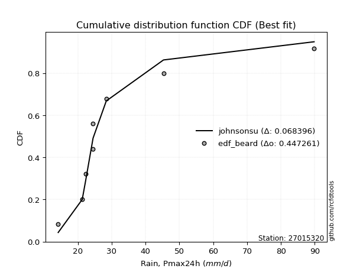</img></img>

</div>


### 5. Empirical - EDF Chegodayev (1955)

The Chegodayev formula is an empirical plotting position formula used in hydrological frequency analysis to estimate the exceedance probability or return period of a specific event from a set of observed data. It is primarily used for plotting observed data points on probability paper to fit a theoretical distribution, particularly for analyzing extreme events like maximum flood flows or rainfall intensities. The constant _b_ value in the generalized plotting position formula is 0.3.

<div align="center">


$P=(m-b)/(n+1-2b)$


</div>


**5.1. Empirical values**

<div align="center">

|                | 0                   | 1                   | 2                  | 3                   | 4              | 5                  | 6                  | 7                  | 8                  |
|:---------------|:--------------------|:--------------------|:-------------------|:--------------------|:---------------|:-------------------|:-------------------|:-------------------|:-------------------|
| date           | 2025                | 2018                | 2019               | 2017                | 2021           | 2020               | 2022               | 2023               | 2024               |
| x              | 7.4                 | 14.2                | 21.3               | 22.3                | 24.5           | 24.5               | 28.4               | 45.3               | 89.8               |
| m              | 1                   | 2                   | 3                  | 4                   | 5              | 6                  | 7                  | 8                  | 9                  |
| empirical_dist | edf_chegodayev      | edf_chegodayev      | edf_chegodayev     | edf_chegodayev      | edf_chegodayev | edf_chegodayev     | edf_chegodayev     | edf_chegodayev     | edf_chegodayev     |
| empirical      | 0.07446808510638298 | 0.18085106382978722 | 0.2872340425531915 | 0.39361702127659576 | 0.5            | 0.6063829787234043 | 0.7127659574468085 | 0.8191489361702128 | 0.9255319148936169 |
| empirical_tr   | 1.0804597701149425  | 1.2207792207792207  | 1.4029850746268657 | 1.6491228070175437  | 2.0            | 2.540540540540541  | 3.481481481481481  | 5.529411764705883  | 13.428571428571399 |

</div>


**5.2. Kolmogorov-Smirnov fit test (sorted by Δ)**


<div align="center">

|                | 0                   | 1                   | 2                   | 3                   | 4                     | 5                   | 6                   | 7                   | 8                   | 9                   | 10                  | 11                  | 12                  | 13                  | 14                  | 15                  | 16                  | 17                  | 18                  | 19                  | 20                  | 21                  | 22                  | 23                  | 24                  | 25                  | 26                  | 27                  | 28                  | 29                  | 30                  | 31                  | 32                  | 33                  | 34                  | 35                  | 36                  | 37                  | 38                  | 39                  | 40                  | 41                  | 42                  | 43                  | 44                  | 45                  | 46                  | 47                  | 48                  | 49                  | 50                  | 51                  | 52                  | 53                  | 54                  | 55                  | 56                  | 57                  | 58                  | 59                  | 60                  | 61                  | 62                  | 63                  | 64                  | 65                  | 66                  | 67                  | 68                  | 69                  | 70                  | 71                  | 72                  | 73                  | 74                  | 75                  | 76                  | 77                  | 78                  | 79                  | 80                  | 81                  | 82                  | 83                  | 84                  | 85                  | 86                  | 87                  | 88                  | 89                  |
|:---------------|:--------------------|:--------------------|:--------------------|:--------------------|:----------------------|:--------------------|:--------------------|:--------------------|:--------------------|:--------------------|:--------------------|:--------------------|:--------------------|:--------------------|:--------------------|:--------------------|:--------------------|:--------------------|:--------------------|:--------------------|:--------------------|:--------------------|:--------------------|:--------------------|:--------------------|:--------------------|:--------------------|:--------------------|:--------------------|:--------------------|:--------------------|:--------------------|:--------------------|:--------------------|:--------------------|:--------------------|:--------------------|:--------------------|:--------------------|:--------------------|:--------------------|:--------------------|:--------------------|:--------------------|:--------------------|:--------------------|:--------------------|:--------------------|:--------------------|:--------------------|:--------------------|:--------------------|:--------------------|:--------------------|:--------------------|:--------------------|:--------------------|:--------------------|:--------------------|:--------------------|:--------------------|:--------------------|:--------------------|:--------------------|:--------------------|:--------------------|:--------------------|:--------------------|:--------------------|:--------------------|:--------------------|:--------------------|:--------------------|:--------------------|:--------------------|:--------------------|:--------------------|:--------------------|:--------------------|:--------------------|:--------------------|:--------------------|:--------------------|:--------------------|:--------------------|:--------------------|:--------------------|:--------------------|:--------------------|:--------------------|
| station        | 27015320            | 27015320            | 27015320            | 27015320            | 27015320              | 27015320            | 27015320            | 27015320            | 27015320            | 27015320            | 27015320            | 27015320            | 27015320            | 27015320            | 27015320            | 27015320            | 27015320            | 27015320            | 27015320            | 27015320            | 27015320            | 27015320            | 27015320            | 27015320            | 27015320            | 27015320            | 27015320            | 27015320            | 27015320            | 27015320            | 27015320            | 27015320            | 27015320            | 27015320            | 27015320            | 27015320            | 27015320            | 27015320            | 27015320            | 27015320            | 27015320            | 27015320            | 27015320            | 27015320            | 27015320            | 27015320            | 27015320            | 27015320            | 27015320            | 27015320            | 27015320            | 27015320            | 27015320            | 27015320            | 27015320            | 27015320            | 27015320            | 27015320            | 27015320            | 27015320            | 27015320            | 27015320            | 27015320            | 27015320            | 27015320            | 27015320            | 27015320            | 27015320            | 27015320            | 27015320            | 27015320            | 27015320            | 27015320            | 27015320            | 27015320            | 27015320            | 27015320            | 27015320            | 27015320            | 27015320            | 27015320            | 27015320            | 27015320            | 27015320            | 27015320            | 27015320            | 27015320            | 27015320            | 27015320            | 27015320            |
| empirical_dist | edf_chegodayev      | edf_chegodayev      | edf_chegodayev      | edf_chegodayev      | edf_chegodayev        | edf_chegodayev      | edf_chegodayev      | edf_chegodayev      | edf_chegodayev      | edf_chegodayev      | edf_chegodayev      | edf_chegodayev      | edf_chegodayev      | edf_chegodayev      | edf_chegodayev      | edf_chegodayev      | edf_chegodayev      | edf_chegodayev      | edf_chegodayev      | edf_chegodayev      | edf_chegodayev      | edf_chegodayev      | edf_chegodayev      | edf_chegodayev      | edf_chegodayev      | edf_chegodayev      | edf_chegodayev      | edf_chegodayev      | edf_chegodayev      | edf_chegodayev      | edf_chegodayev      | edf_chegodayev      | edf_chegodayev      | edf_chegodayev      | edf_chegodayev      | edf_chegodayev      | edf_chegodayev      | edf_chegodayev      | edf_chegodayev      | edf_chegodayev      | edf_chegodayev      | edf_chegodayev      | edf_chegodayev      | edf_chegodayev      | edf_chegodayev      | edf_chegodayev      | edf_chegodayev      | edf_chegodayev      | edf_chegodayev      | edf_chegodayev      | edf_chegodayev      | edf_chegodayev      | edf_chegodayev      | edf_chegodayev      | edf_chegodayev      | edf_chegodayev      | edf_chegodayev      | edf_chegodayev      | edf_chegodayev      | edf_chegodayev      | edf_chegodayev      | edf_chegodayev      | edf_chegodayev      | edf_chegodayev      | edf_chegodayev      | edf_chegodayev      | edf_chegodayev      | edf_chegodayev      | edf_chegodayev      | edf_chegodayev      | edf_chegodayev      | edf_chegodayev      | edf_chegodayev      | edf_chegodayev      | edf_chegodayev      | edf_chegodayev      | edf_chegodayev      | edf_chegodayev      | edf_chegodayev      | edf_chegodayev      | edf_chegodayev      | edf_chegodayev      | edf_chegodayev      | edf_chegodayev      | edf_chegodayev      | edf_chegodayev      | edf_chegodayev      | edf_chegodayev      | edf_chegodayev      | edf_chegodayev      |
| p_dist         | logjohnsonsu        | johnsonsu           | logt                | t                   | loglaplace_asymmetric | loghypsecant        | loglaplace          | loglogistic         | mielke              | loggenlogistic      | logfisk             | nct                 | fisk                | alpha               | logmielke           | invweibull          | lognorm             | lognorm             | logcrystalball      | ncf                 | invgamma            | logloggamma         | fatiguelife         | invgauss            | loggamma            | loggamma            | logerlang           | logfatiguelife      | logf                | logbetaprime        | logexponnorm        | logpearson3         | logncf              | betaprime           | genexpon            | logrice             | lognct              | logweibull_min      | pearson3            | loginvgamma         | logalpha            | loginvgauss         | wald                | loggompertz         | exponnorm           | halflogistic        | logmaxwell          | expon               | weibull_min         | moyal               | lograyleigh         | genlogistic         | gibrat              | gompertz            | halfnorm            | logtruncnorm        | loginvweibull       | laplace_asymmetric  | loggumbel_r         | chi2                | gumbel_r            | loggumbel_l         | logkstwobign        | loghalfnorm         | erlang              | loggenexpon         | logmoyal            | rayleigh            | truncnorm           | loghalflogistic     | maxwell             | kstwobign           | f                   | lognakagami         | norm                | crystalball         | logistic            | rice                | hypsecant           | loggibrat           | logwald             | laplace             | logexpon            | nakagami            | gamma               | gumbel_l            | logchi2             | loglognorm          | pareto              | logpareto           |
| delta          | 0.0711136422503732  | 0.07275701200314677 | 0.09020233344117745 | 0.10156348415543448 | 0.11162999352186842   | 0.11357162336584214 | 0.116447448074818   | 0.11797137561281545 | 0.12141682075864835 | 0.12142957857433556 | 0.12293606570326177 | 0.12305849799748292 | 0.1258585996533912  | 0.12633479170355738 | 0.12646480816998473 | 0.1275475584283957  | 0.12897077694151626 | 0.12897077694151626 | 0.12897080414024076 | 0.1295331776223257  | 0.12967266673163136 | 0.1311672661297575  | 0.1316113245519145  | 0.13215206891514236 | 0.13231748429592527 | 0.13231748429592527 | 0.13231750207443116 | 0.13235947359464    | 0.13241631458482161 | 0.13242109604461555 | 0.13269277275047708 | 0.13310546735271112 | 0.13421584667728204 | 0.13457726873523046 | 0.13531886980209995 | 0.13628678490370943 | 0.13817219022441013 | 0.1387990435685984  | 0.14115048514829698 | 0.14125551971411981 | 0.1418623390839132  | 0.14705938970192312 | 0.14742308029320095 | 0.1479684059407803  | 0.14962793282708697 | 0.15422067402447492 | 0.15659659770145412 | 0.1598836564531283  | 0.16054613908351456 | 0.16195122710493104 | 0.16885762014326333 | 0.17031611163270788 | 0.17426147735373224 | 0.17503075090754527 | 0.17599924787117527 | 0.18084978214698602 | 0.18134823066765998 | 0.18146031778659755 | 0.18387603871666236 | 0.18660179306788705 | 0.18749596762759302 | 0.19154088793512047 | 0.20139351882029022 | 0.20360276358932144 | 0.2044580606290653  | 0.20716523072249382 | 0.2074191796262329  | 0.20925673430724379 | 0.21452724078261287 | 0.220372938987057   | 0.22104653929023865 | 0.2215591609622185  | 0.23701784161632689 | 0.24076062835629963 | 0.2552732019325858  | 0.2552732109979036  | 0.2610220869461129  | 0.2643898118165438  | 0.26589369463054713 | 0.2700182999345774  | 0.27163380390295055 | 0.28282943093627544 | 0.2964078884339699  | 0.2968734244677288  | 0.310871363842644   | 0.3256267172116369  | 0.4151822257703709  | 0.4347695141752146  | 0.4472568406269428  | 0.46634989393369697 |
| deltao         | 0.41761268023100007 | 0.41761268023100007 | 0.41761268023100007 | 0.41761268023100007 | 0.41761268023100007   | 0.41761268023100007 | 0.41761268023100007 | 0.41761268023100007 | 0.41761268023100007 | 0.41761268023100007 | 0.41761268023100007 | 0.41761268023100007 | 0.41761268023100007 | 0.41761268023100007 | 0.41761268023100007 | 0.41761268023100007 | 0.41761268023100007 | 0.41761268023100007 | 0.41761268023100007 | 0.41761268023100007 | 0.41761268023100007 | 0.41761268023100007 | 0.41761268023100007 | 0.41761268023100007 | 0.41761268023100007 | 0.41761268023100007 | 0.41761268023100007 | 0.41761268023100007 | 0.41761268023100007 | 0.41761268023100007 | 0.41761268023100007 | 0.41761268023100007 | 0.41761268023100007 | 0.41761268023100007 | 0.41761268023100007 | 0.41761268023100007 | 0.41761268023100007 | 0.41761268023100007 | 0.41761268023100007 | 0.41761268023100007 | 0.41761268023100007 | 0.41761268023100007 | 0.41761268023100007 | 0.41761268023100007 | 0.41761268023100007 | 0.41761268023100007 | 0.41761268023100007 | 0.41761268023100007 | 0.41761268023100007 | 0.41761268023100007 | 0.41761268023100007 | 0.41761268023100007 | 0.41761268023100007 | 0.41761268023100007 | 0.41761268023100007 | 0.41761268023100007 | 0.41761268023100007 | 0.41761268023100007 | 0.41761268023100007 | 0.41761268023100007 | 0.41761268023100007 | 0.41761268023100007 | 0.41761268023100007 | 0.41761268023100007 | 0.41761268023100007 | 0.41761268023100007 | 0.41761268023100007 | 0.41761268023100007 | 0.41761268023100007 | 0.41761268023100007 | 0.41761268023100007 | 0.41761268023100007 | 0.41761268023100007 | 0.41761268023100007 | 0.41761268023100007 | 0.41761268023100007 | 0.41761268023100007 | 0.41761268023100007 | 0.41761268023100007 | 0.41761268023100007 | 0.41761268023100007 | 0.41761268023100007 | 0.41761268023100007 | 0.41761268023100007 | 0.41761268023100007 | 0.41761268023100007 | 0.41761268023100007 | 0.41761268023100007 | 0.41761268023100007 | 0.41761268023100007 |
| eval           | Δo > Δ              | Δo > Δ              | Δo > Δ              | Δo > Δ              | Δo > Δ                | Δo > Δ              | Δo > Δ              | Δo > Δ              | Δo > Δ              | Δo > Δ              | Δo > Δ              | Δo > Δ              | Δo > Δ              | Δo > Δ              | Δo > Δ              | Δo > Δ              | Δo > Δ              | Δo > Δ              | Δo > Δ              | Δo > Δ              | Δo > Δ              | Δo > Δ              | Δo > Δ              | Δo > Δ              | Δo > Δ              | Δo > Δ              | Δo > Δ              | Δo > Δ              | Δo > Δ              | Δo > Δ              | Δo > Δ              | Δo > Δ              | Δo > Δ              | Δo > Δ              | Δo > Δ              | Δo > Δ              | Δo > Δ              | Δo > Δ              | Δo > Δ              | Δo > Δ              | Δo > Δ              | Δo > Δ              | Δo > Δ              | Δo > Δ              | Δo > Δ              | Δo > Δ              | Δo > Δ              | Δo > Δ              | Δo > Δ              | Δo > Δ              | Δo > Δ              | Δo > Δ              | Δo > Δ              | Δo > Δ              | Δo > Δ              | Δo > Δ              | Δo > Δ              | Δo > Δ              | Δo > Δ              | Δo > Δ              | Δo > Δ              | Δo > Δ              | Δo > Δ              | Δo > Δ              | Δo > Δ              | Δo > Δ              | Δo > Δ              | Δo > Δ              | Δo > Δ              | Δo > Δ              | Δo > Δ              | Δo > Δ              | Δo > Δ              | Δo > Δ              | Δo > Δ              | Δo > Δ              | Δo > Δ              | Δo > Δ              | Δo > Δ              | Δo > Δ              | Δo > Δ              | Δo > Δ              | Δo > Δ              | Δo > Δ              | Δo > Δ              | Δo > Δ              | Δo > Δ              | Δo <= Δ             | Δo <= Δ             | Δo <= Δ             |
| fit            | 1                   | 1                   | 1                   | 1                   | 1                     | 1                   | 1                   | 1                   | 1                   | 1                   | 1                   | 1                   | 1                   | 1                   | 1                   | 1                   | 1                   | 1                   | 1                   | 1                   | 1                   | 1                   | 1                   | 1                   | 1                   | 1                   | 1                   | 1                   | 1                   | 1                   | 1                   | 1                   | 1                   | 1                   | 1                   | 1                   | 1                   | 1                   | 1                   | 1                   | 1                   | 1                   | 1                   | 1                   | 1                   | 1                   | 1                   | 1                   | 1                   | 1                   | 1                   | 1                   | 1                   | 1                   | 1                   | 1                   | 1                   | 1                   | 1                   | 1                   | 1                   | 1                   | 1                   | 1                   | 1                   | 1                   | 1                   | 1                   | 1                   | 1                   | 1                   | 1                   | 1                   | 1                   | 1                   | 1                   | 1                   | 1                   | 1                   | 1                   | 1                   | 1                   | 1                   | 1                   | 1                   | 1                   | 1                   | 0                   | 0                   | 0                   |
| n              | 9                   | 9                   | 9                   | 9                   | 9                     | 9                   | 9                   | 9                   | 9                   | 9                   | 9                   | 9                   | 9                   | 9                   | 9                   | 9                   | 9                   | 9                   | 9                   | 9                   | 9                   | 9                   | 9                   | 9                   | 9                   | 9                   | 9                   | 9                   | 9                   | 9                   | 9                   | 9                   | 9                   | 9                   | 9                   | 9                   | 9                   | 9                   | 9                   | 9                   | 9                   | 9                   | 9                   | 9                   | 9                   | 9                   | 9                   | 9                   | 9                   | 9                   | 9                   | 9                   | 9                   | 9                   | 9                   | 9                   | 9                   | 9                   | 9                   | 9                   | 9                   | 9                   | 9                   | 9                   | 9                   | 9                   | 9                   | 9                   | 9                   | 9                   | 9                   | 9                   | 9                   | 9                   | 9                   | 9                   | 9                   | 9                   | 9                   | 9                   | 9                   | 9                   | 9                   | 9                   | 9                   | 9                   | 9                   | 9                   | 9                   | 9                   |
| best_fit       | 1                   | 0                   | 0                   | 0                   | 0                     | 0                   | 0                   | 0                   | 0                   | 0                   | 0                   | 0                   | 0                   | 0                   | 0                   | 0                   | 0                   | 0                   | 0                   | 0                   | 0                   | 0                   | 0                   | 0                   | 0                   | 0                   | 0                   | 0                   | 0                   | 0                   | 0                   | 0                   | 0                   | 0                   | 0                   | 0                   | 0                   | 0                   | 0                   | 0                   | 0                   | 0                   | 0                   | 0                   | 0                   | 0                   | 0                   | 0                   | 0                   | 0                   | 0                   | 0                   | 0                   | 0                   | 0                   | 0                   | 0                   | 0                   | 0                   | 0                   | 0                   | 0                   | 0                   | 0                   | 0                   | 0                   | 0                   | 0                   | 0                   | 0                   | 0                   | 0                   | 0                   | 0                   | 0                   | 0                   | 0                   | 0                   | 0                   | 0                   | 0                   | 0                   | 0                   | 0                   | 0                   | 0                   | 0                   | 0                   | 0                   | 0                   |
| best_fit_sort  | 1                   | 2                   | 3                   | 4                   | 5                     | 6                   | 7                   | 8                   | 9                   | 10                  | 11                  | 12                  | 13                  | 14                  | 15                  | 16                  | 17                  | 18                  | 19                  | 20                  | 21                  | 22                  | 23                  | 24                  | 25                  | 26                  | 27                  | 28                  | 29                  | 30                  | 31                  | 32                  | 33                  | 34                  | 35                  | 36                  | 37                  | 38                  | 39                  | 40                  | 41                  | 42                  | 43                  | 44                  | 45                  | 46                  | 47                  | 48                  | 49                  | 50                  | 51                  | 52                  | 53                  | 54                  | 55                  | 56                  | 57                  | 58                  | 59                  | 60                  | 61                  | 62                  | 63                  | 64                  | 65                  | 66                  | 67                  | 68                  | 69                  | 70                  | 71                  | 72                  | 73                  | 74                  | 75                  | 76                  | 77                  | 78                  | 79                  | 80                  | 81                  | 82                  | 83                  | 84                  | 85                  | 86                  | 87                  | 88                  | 89                  | 90                  |

</div>


<div align="center">

</img>

</div>


**5.3. Best fit**

<div align="center">

|   id |   station | empirical_dist   | p_dist       |     delta |   deltao | eval   |   fit |   n |   best_fit |   best_fit_sort |
|-----:|----------:|:-----------------|:-------------|----------:|---------:|:-------|------:|----:|-----------:|----------------:|
|    0 |  27015320 | edf_chegodayev   | logjohnsonsu | 0.0711136 | 0.417613 | Δo > Δ |     1 |   9 |          1 |               1 |

</div>


<div align="center">

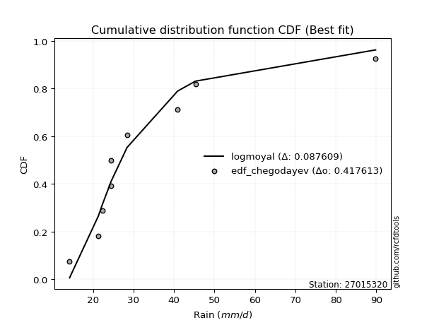</img>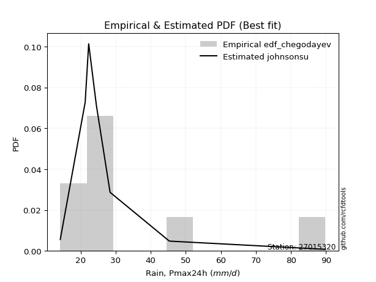</img>

</div>


### 6. Empirical - EDF Blom (1958)

The Blom formula is a specific "plotting position" formula used in hydrology and statistical analysis to estimate the empirical cumulative probability (or non-exceedance probability) of a data series. It is particularly recommended for data that are approximately normally distributed. The constant _a_ is set to 0.375 (or 3/8).

<div align="center">


$P=(m-a)/(n+1-2a)$


</div>


**6.1. Empirical values**

<div align="center">

|                | 0                   | 1                   | 2                   | 3                  | 4        | 5                  | 6                  | 7                  | 8                  |
|:---------------|:--------------------|:--------------------|:--------------------|:-------------------|:---------|:-------------------|:-------------------|:-------------------|:-------------------|
| date           | 2025                | 2018                | 2019                | 2017               | 2021     | 2020               | 2022               | 2023               | 2024               |
| x              | 7.4                 | 14.2                | 21.3                | 22.3               | 24.5     | 24.5               | 28.4               | 45.3               | 89.8               |
| m              | 1                   | 2                   | 3                   | 4                  | 5        | 6                  | 7                  | 8                  | 9                  |
| empirical_dist | edf_blom            | edf_blom            | edf_blom            | edf_blom           | edf_blom | edf_blom           | edf_blom           | edf_blom           | edf_blom           |
| empirical      | 0.06756756756756757 | 0.17567567567567569 | 0.28378378378378377 | 0.3918918918918919 | 0.5      | 0.6081081081081081 | 0.7162162162162162 | 0.8243243243243243 | 0.9324324324324325 |
| empirical_tr   | 1.072463768115942   | 1.2131147540983607  | 1.3962264150943395  | 1.6444444444444444 | 2.0      | 2.5517241379310347 | 3.523809523809524  | 5.6923076923076925 | 14.800000000000006 |

</div>


**6.2. Kolmogorov-Smirnov fit test (sorted by Δ)**


<div align="center">

|                | 0                   | 1                   | 2                   | 3                   | 4                     | 5                   | 6                   | 7                   | 8                   | 9                   | 10                  | 11                  | 12                  | 13                  | 14                  | 15                  | 16                  | 17                  | 18                  | 19                  | 20                  | 21                  | 22                  | 23                  | 24                  | 25                  | 26                  | 27                  | 28                  | 29                  | 30                  | 31                  | 32                  | 33                  | 34                  | 35                  | 36                  | 37                  | 38                  | 39                  | 40                  | 41                  | 42                  | 43                  | 44                  | 45                  | 46                  | 47                  | 48                  | 49                  | 50                  | 51                  | 52                  | 53                  | 54                  | 55                  | 56                  | 57                  | 58                  | 59                  | 60                  | 61                  | 62                  | 63                  | 64                  | 65                  | 66                  | 67                  | 68                  | 69                  | 70                  | 71                  | 72                  | 73                  | 74                  | 75                  | 76                  | 77                  | 78                  | 79                  | 80                  | 81                  | 82                  | 83                  | 84                  | 85                  | 86                  | 87                  | 88                  | 89                  |
|:---------------|:--------------------|:--------------------|:--------------------|:--------------------|:----------------------|:--------------------|:--------------------|:--------------------|:--------------------|:--------------------|:--------------------|:--------------------|:--------------------|:--------------------|:--------------------|:--------------------|:--------------------|:--------------------|:--------------------|:--------------------|:--------------------|:--------------------|:--------------------|:--------------------|:--------------------|:--------------------|:--------------------|:--------------------|:--------------------|:--------------------|:--------------------|:--------------------|:--------------------|:--------------------|:--------------------|:--------------------|:--------------------|:--------------------|:--------------------|:--------------------|:--------------------|:--------------------|:--------------------|:--------------------|:--------------------|:--------------------|:--------------------|:--------------------|:--------------------|:--------------------|:--------------------|:--------------------|:--------------------|:--------------------|:--------------------|:--------------------|:--------------------|:--------------------|:--------------------|:--------------------|:--------------------|:--------------------|:--------------------|:--------------------|:--------------------|:--------------------|:--------------------|:--------------------|:--------------------|:--------------------|:--------------------|:--------------------|:--------------------|:--------------------|:--------------------|:--------------------|:--------------------|:--------------------|:--------------------|:--------------------|:--------------------|:--------------------|:--------------------|:--------------------|:--------------------|:--------------------|:--------------------|:--------------------|:--------------------|:--------------------|
| station        | 27015320            | 27015320            | 27015320            | 27015320            | 27015320              | 27015320            | 27015320            | 27015320            | 27015320            | 27015320            | 27015320            | 27015320            | 27015320            | 27015320            | 27015320            | 27015320            | 27015320            | 27015320            | 27015320            | 27015320            | 27015320            | 27015320            | 27015320            | 27015320            | 27015320            | 27015320            | 27015320            | 27015320            | 27015320            | 27015320            | 27015320            | 27015320            | 27015320            | 27015320            | 27015320            | 27015320            | 27015320            | 27015320            | 27015320            | 27015320            | 27015320            | 27015320            | 27015320            | 27015320            | 27015320            | 27015320            | 27015320            | 27015320            | 27015320            | 27015320            | 27015320            | 27015320            | 27015320            | 27015320            | 27015320            | 27015320            | 27015320            | 27015320            | 27015320            | 27015320            | 27015320            | 27015320            | 27015320            | 27015320            | 27015320            | 27015320            | 27015320            | 27015320            | 27015320            | 27015320            | 27015320            | 27015320            | 27015320            | 27015320            | 27015320            | 27015320            | 27015320            | 27015320            | 27015320            | 27015320            | 27015320            | 27015320            | 27015320            | 27015320            | 27015320            | 27015320            | 27015320            | 27015320            | 27015320            | 27015320            |
| empirical_dist | edf_blom            | edf_blom            | edf_blom            | edf_blom            | edf_blom              | edf_blom            | edf_blom            | edf_blom            | edf_blom            | edf_blom            | edf_blom            | edf_blom            | edf_blom            | edf_blom            | edf_blom            | edf_blom            | edf_blom            | edf_blom            | edf_blom            | edf_blom            | edf_blom            | edf_blom            | edf_blom            | edf_blom            | edf_blom            | edf_blom            | edf_blom            | edf_blom            | edf_blom            | edf_blom            | edf_blom            | edf_blom            | edf_blom            | edf_blom            | edf_blom            | edf_blom            | edf_blom            | edf_blom            | edf_blom            | edf_blom            | edf_blom            | edf_blom            | edf_blom            | edf_blom            | edf_blom            | edf_blom            | edf_blom            | edf_blom            | edf_blom            | edf_blom            | edf_blom            | edf_blom            | edf_blom            | edf_blom            | edf_blom            | edf_blom            | edf_blom            | edf_blom            | edf_blom            | edf_blom            | edf_blom            | edf_blom            | edf_blom            | edf_blom            | edf_blom            | edf_blom            | edf_blom            | edf_blom            | edf_blom            | edf_blom            | edf_blom            | edf_blom            | edf_blom            | edf_blom            | edf_blom            | edf_blom            | edf_blom            | edf_blom            | edf_blom            | edf_blom            | edf_blom            | edf_blom            | edf_blom            | edf_blom            | edf_blom            | edf_blom            | edf_blom            | edf_blom            | edf_blom            | edf_blom            |
| p_dist         | logjohnsonsu        | johnsonsu           | logt                | t                   | loglaplace_asymmetric | loghypsecant        | loglaplace          | loglogistic         | mielke              | loggenlogistic      | logfisk             | nct                 | fisk                | alpha               | logmielke           | invweibull          | lognorm             | lognorm             | logcrystalball      | ncf                 | invgamma            | logloggamma         | fatiguelife         | invgauss            | loggamma            | loggamma            | logerlang           | logfatiguelife      | logf                | logbetaprime        | logexponnorm        | logpearson3         | logncf              | betaprime           | genexpon            | logrice             | lognct              | logweibull_min      | pearson3            | loginvgamma         | logalpha            | loginvgauss         | wald                | loggompertz         | exponnorm           | halflogistic        | logmaxwell          | expon               | weibull_min         | moyal               | gibrat              | lograyleigh         | genlogistic         | logtruncnorm        | gompertz            | halfnorm            | laplace_asymmetric  | loginvweibull       | loggumbel_r         | chi2                | gumbel_r            | loggumbel_l         | logkstwobign        | loghalfnorm         | erlang              | loggenexpon         | logmoyal            | rayleigh            | truncnorm           | loghalflogistic     | maxwell             | kstwobign           | f                   | lognakagami         | norm                | crystalball         | logistic            | rice                | hypsecant           | loggibrat           | logwald             | laplace             | logexpon            | nakagami            | gamma               | gumbel_l            | logchi2             | loglognorm          | pareto              | logpareto           |
| delta          | 0.06593825409626164 | 0.07433876805667283 | 0.08502694528706589 | 0.09638809600132292 | 0.11335512290657224   | 0.11529675275054596 | 0.11817257745952181 | 0.1214216343822232  | 0.12486707952805609 | 0.1248798373437433  | 0.1263863244726695  | 0.12650875676689066 | 0.12930885842279893 | 0.12978505047296512 | 0.12991506693939248 | 0.13099781719780346 | 0.132421035710924   | 0.132421035710924   | 0.1324210629096485  | 0.13298343639173343 | 0.1331229255010391  | 0.13461752489916523 | 0.13506158332132223 | 0.1356023276845501  | 0.135767743065333   | 0.135767743065333   | 0.1357677608438389  | 0.13580973236404775 | 0.13586657335422936 | 0.1358713548140233  | 0.13614303151988483 | 0.13655572612211886 | 0.13766610544668978 | 0.1380275275046382  | 0.1387691285715077  | 0.13973704367311718 | 0.14162244899381787 | 0.14224930233800614 | 0.14460074391770472 | 0.14470577848352756 | 0.14531259785332096 | 0.15050964847133086 | 0.1508733390626087  | 0.15141866471018806 | 0.15307819159649472 | 0.15767093279388267 | 0.16004685647086186 | 0.16333391522253604 | 0.1639963978529223  | 0.16540148587433878 | 0.1690860891996207  | 0.17230787891267108 | 0.17376637040211562 | 0.1756743939928745  | 0.17848100967695302 | 0.179449506640583   | 0.18318544717130136 | 0.18479848943706773 | 0.1873262974860701  | 0.1900520518372948  | 0.19094622639700076 | 0.19499114670452822 | 0.20484377758969796 | 0.2070530223587292  | 0.20790831939847304 | 0.21061548949190156 | 0.21086943839564065 | 0.21270699307665153 | 0.21797749955202061 | 0.22382319775646475 | 0.2244967980596464  | 0.22500941973162625 | 0.24046810038573463 | 0.24421088712570738 | 0.25872346070199354 | 0.25872346976731136 | 0.26447234571552064 | 0.26784007058595155 | 0.26934395339995487 | 0.2734685587039851  | 0.2750840626723583  | 0.2862796897056832  | 0.29985814720337767 | 0.30032368323713654 | 0.31432162261205177 | 0.32907697598104463 | 0.41863248453977864 | 0.43994490232932615 | 0.4524322287810544  | 0.47152528208780853 |
| deltao         | 0.41761268023100007 | 0.41761268023100007 | 0.41761268023100007 | 0.41761268023100007 | 0.41761268023100007   | 0.41761268023100007 | 0.41761268023100007 | 0.41761268023100007 | 0.41761268023100007 | 0.41761268023100007 | 0.41761268023100007 | 0.41761268023100007 | 0.41761268023100007 | 0.41761268023100007 | 0.41761268023100007 | 0.41761268023100007 | 0.41761268023100007 | 0.41761268023100007 | 0.41761268023100007 | 0.41761268023100007 | 0.41761268023100007 | 0.41761268023100007 | 0.41761268023100007 | 0.41761268023100007 | 0.41761268023100007 | 0.41761268023100007 | 0.41761268023100007 | 0.41761268023100007 | 0.41761268023100007 | 0.41761268023100007 | 0.41761268023100007 | 0.41761268023100007 | 0.41761268023100007 | 0.41761268023100007 | 0.41761268023100007 | 0.41761268023100007 | 0.41761268023100007 | 0.41761268023100007 | 0.41761268023100007 | 0.41761268023100007 | 0.41761268023100007 | 0.41761268023100007 | 0.41761268023100007 | 0.41761268023100007 | 0.41761268023100007 | 0.41761268023100007 | 0.41761268023100007 | 0.41761268023100007 | 0.41761268023100007 | 0.41761268023100007 | 0.41761268023100007 | 0.41761268023100007 | 0.41761268023100007 | 0.41761268023100007 | 0.41761268023100007 | 0.41761268023100007 | 0.41761268023100007 | 0.41761268023100007 | 0.41761268023100007 | 0.41761268023100007 | 0.41761268023100007 | 0.41761268023100007 | 0.41761268023100007 | 0.41761268023100007 | 0.41761268023100007 | 0.41761268023100007 | 0.41761268023100007 | 0.41761268023100007 | 0.41761268023100007 | 0.41761268023100007 | 0.41761268023100007 | 0.41761268023100007 | 0.41761268023100007 | 0.41761268023100007 | 0.41761268023100007 | 0.41761268023100007 | 0.41761268023100007 | 0.41761268023100007 | 0.41761268023100007 | 0.41761268023100007 | 0.41761268023100007 | 0.41761268023100007 | 0.41761268023100007 | 0.41761268023100007 | 0.41761268023100007 | 0.41761268023100007 | 0.41761268023100007 | 0.41761268023100007 | 0.41761268023100007 | 0.41761268023100007 |
| eval           | Δo > Δ              | Δo > Δ              | Δo > Δ              | Δo > Δ              | Δo > Δ                | Δo > Δ              | Δo > Δ              | Δo > Δ              | Δo > Δ              | Δo > Δ              | Δo > Δ              | Δo > Δ              | Δo > Δ              | Δo > Δ              | Δo > Δ              | Δo > Δ              | Δo > Δ              | Δo > Δ              | Δo > Δ              | Δo > Δ              | Δo > Δ              | Δo > Δ              | Δo > Δ              | Δo > Δ              | Δo > Δ              | Δo > Δ              | Δo > Δ              | Δo > Δ              | Δo > Δ              | Δo > Δ              | Δo > Δ              | Δo > Δ              | Δo > Δ              | Δo > Δ              | Δo > Δ              | Δo > Δ              | Δo > Δ              | Δo > Δ              | Δo > Δ              | Δo > Δ              | Δo > Δ              | Δo > Δ              | Δo > Δ              | Δo > Δ              | Δo > Δ              | Δo > Δ              | Δo > Δ              | Δo > Δ              | Δo > Δ              | Δo > Δ              | Δo > Δ              | Δo > Δ              | Δo > Δ              | Δo > Δ              | Δo > Δ              | Δo > Δ              | Δo > Δ              | Δo > Δ              | Δo > Δ              | Δo > Δ              | Δo > Δ              | Δo > Δ              | Δo > Δ              | Δo > Δ              | Δo > Δ              | Δo > Δ              | Δo > Δ              | Δo > Δ              | Δo > Δ              | Δo > Δ              | Δo > Δ              | Δo > Δ              | Δo > Δ              | Δo > Δ              | Δo > Δ              | Δo > Δ              | Δo > Δ              | Δo > Δ              | Δo > Δ              | Δo > Δ              | Δo > Δ              | Δo > Δ              | Δo > Δ              | Δo > Δ              | Δo > Δ              | Δo > Δ              | Δo <= Δ             | Δo <= Δ             | Δo <= Δ             | Δo <= Δ             |
| fit            | 1                   | 1                   | 1                   | 1                   | 1                     | 1                   | 1                   | 1                   | 1                   | 1                   | 1                   | 1                   | 1                   | 1                   | 1                   | 1                   | 1                   | 1                   | 1                   | 1                   | 1                   | 1                   | 1                   | 1                   | 1                   | 1                   | 1                   | 1                   | 1                   | 1                   | 1                   | 1                   | 1                   | 1                   | 1                   | 1                   | 1                   | 1                   | 1                   | 1                   | 1                   | 1                   | 1                   | 1                   | 1                   | 1                   | 1                   | 1                   | 1                   | 1                   | 1                   | 1                   | 1                   | 1                   | 1                   | 1                   | 1                   | 1                   | 1                   | 1                   | 1                   | 1                   | 1                   | 1                   | 1                   | 1                   | 1                   | 1                   | 1                   | 1                   | 1                   | 1                   | 1                   | 1                   | 1                   | 1                   | 1                   | 1                   | 1                   | 1                   | 1                   | 1                   | 1                   | 1                   | 1                   | 1                   | 0                   | 0                   | 0                   | 0                   |
| n              | 9                   | 9                   | 9                   | 9                   | 9                     | 9                   | 9                   | 9                   | 9                   | 9                   | 9                   | 9                   | 9                   | 9                   | 9                   | 9                   | 9                   | 9                   | 9                   | 9                   | 9                   | 9                   | 9                   | 9                   | 9                   | 9                   | 9                   | 9                   | 9                   | 9                   | 9                   | 9                   | 9                   | 9                   | 9                   | 9                   | 9                   | 9                   | 9                   | 9                   | 9                   | 9                   | 9                   | 9                   | 9                   | 9                   | 9                   | 9                   | 9                   | 9                   | 9                   | 9                   | 9                   | 9                   | 9                   | 9                   | 9                   | 9                   | 9                   | 9                   | 9                   | 9                   | 9                   | 9                   | 9                   | 9                   | 9                   | 9                   | 9                   | 9                   | 9                   | 9                   | 9                   | 9                   | 9                   | 9                   | 9                   | 9                   | 9                   | 9                   | 9                   | 9                   | 9                   | 9                   | 9                   | 9                   | 9                   | 9                   | 9                   | 9                   |
| best_fit       | 1                   | 0                   | 0                   | 0                   | 0                     | 0                   | 0                   | 0                   | 0                   | 0                   | 0                   | 0                   | 0                   | 0                   | 0                   | 0                   | 0                   | 0                   | 0                   | 0                   | 0                   | 0                   | 0                   | 0                   | 0                   | 0                   | 0                   | 0                   | 0                   | 0                   | 0                   | 0                   | 0                   | 0                   | 0                   | 0                   | 0                   | 0                   | 0                   | 0                   | 0                   | 0                   | 0                   | 0                   | 0                   | 0                   | 0                   | 0                   | 0                   | 0                   | 0                   | 0                   | 0                   | 0                   | 0                   | 0                   | 0                   | 0                   | 0                   | 0                   | 0                   | 0                   | 0                   | 0                   | 0                   | 0                   | 0                   | 0                   | 0                   | 0                   | 0                   | 0                   | 0                   | 0                   | 0                   | 0                   | 0                   | 0                   | 0                   | 0                   | 0                   | 0                   | 0                   | 0                   | 0                   | 0                   | 0                   | 0                   | 0                   | 0                   |
| best_fit_sort  | 1                   | 2                   | 3                   | 4                   | 5                     | 6                   | 7                   | 8                   | 9                   | 10                  | 11                  | 12                  | 13                  | 14                  | 15                  | 16                  | 17                  | 18                  | 19                  | 20                  | 21                  | 22                  | 23                  | 24                  | 25                  | 26                  | 27                  | 28                  | 29                  | 30                  | 31                  | 32                  | 33                  | 34                  | 35                  | 36                  | 37                  | 38                  | 39                  | 40                  | 41                  | 42                  | 43                  | 44                  | 45                  | 46                  | 47                  | 48                  | 49                  | 50                  | 51                  | 52                  | 53                  | 54                  | 55                  | 56                  | 57                  | 58                  | 59                  | 60                  | 61                  | 62                  | 63                  | 64                  | 65                  | 66                  | 67                  | 68                  | 69                  | 70                  | 71                  | 72                  | 73                  | 74                  | 75                  | 76                  | 77                  | 78                  | 79                  | 80                  | 81                  | 82                  | 83                  | 84                  | 85                  | 86                  | 87                  | 88                  | 89                  | 90                  |

</div>


<div align="center">

</img>

</div>


**6.3. Best fit**

<div align="center">

|   id |   station | empirical_dist   | p_dist       |     delta |   deltao | eval   |   fit |   n |   best_fit |   best_fit_sort |
|-----:|----------:|:-----------------|:-------------|----------:|---------:|:-------|------:|----:|-----------:|----------------:|
|    0 |  27015320 | edf_blom         | logjohnsonsu | 0.0659383 | 0.417613 | Δo > Δ |     1 |   9 |          1 |               1 |

</div>


<div align="center">

</img>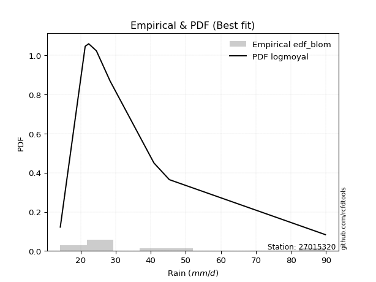</img>

</div>


### 7. Empirical - EDF Tukey (1962)

In hydrology, the Tukey formula is used as a plotting position formula to estimate the empirical probability or frequency of a flood event (or other hydrological data). The formula parameter is given as _c=0.333_ (or 1/3).

<div align="center">


$P=(m-c)/(n+1-2c)$


</div>


**7.1. Empirical values**

<div align="center">

|                | 0                   | 1                   | 2                  | 3                   | 4         | 5                  | 6                  | 7                  | 8                  |
|:---------------|:--------------------|:--------------------|:-------------------|:--------------------|:----------|:-------------------|:-------------------|:-------------------|:-------------------|
| date           | 2025                | 2018                | 2019               | 2017                | 2021      | 2020               | 2022               | 2023               | 2024               |
| x              | 7.4                 | 14.2                | 21.3               | 22.3                | 24.5      | 24.5               | 28.4               | 45.3               | 89.8               |
| m              | 1                   | 2                   | 3                  | 4                   | 5         | 6                  | 7                  | 8                  | 9                  |
| empirical_dist | edf_tukey           | edf_tukey           | edf_tukey          | edf_tukey           | edf_tukey | edf_tukey          | edf_tukey          | edf_tukey          | edf_tukey          |
| empirical      | 0.07142857142857142 | 0.17857142857142858 | 0.2857142857142857 | 0.39285714285714285 | 0.5       | 0.6071428571428571 | 0.7142857142857143 | 0.8214285714285714 | 0.9285714285714286 |
| empirical_tr   | 1.0769230769230769  | 1.2173913043478262  | 1.4                | 1.6470588235294117  | 2.0       | 2.545454545454545  | 3.5                | 5.599999999999999  | 14.000000000000007 |

</div>


**7.2. Kolmogorov-Smirnov fit test (sorted by Δ)**


<div align="center">

|                | 0                   | 1                   | 2                   | 3                   | 4                     | 5                   | 6                   | 7                   | 8                   | 9                   | 10                  | 11                  | 12                  | 13                  | 14                  | 15                  | 16                  | 17                  | 18                  | 19                  | 20                  | 21                  | 22                  | 23                  | 24                  | 25                  | 26                  | 27                  | 28                  | 29                  | 30                  | 31                  | 32                  | 33                  | 34                  | 35                  | 36                  | 37                  | 38                  | 39                  | 40                  | 41                  | 42                  | 43                  | 44                  | 45                  | 46                  | 47                  | 48                  | 49                  | 50                  | 51                  | 52                  | 53                  | 54                  | 55                  | 56                  | 57                  | 58                  | 59                  | 60                  | 61                  | 62                  | 63                  | 64                  | 65                  | 66                  | 67                  | 68                  | 69                  | 70                  | 71                  | 72                  | 73                  | 74                  | 75                  | 76                  | 77                  | 78                  | 79                  | 80                  | 81                  | 82                  | 83                  | 84                  | 85                  | 86                  | 87                  | 88                  | 89                  |
|:---------------|:--------------------|:--------------------|:--------------------|:--------------------|:----------------------|:--------------------|:--------------------|:--------------------|:--------------------|:--------------------|:--------------------|:--------------------|:--------------------|:--------------------|:--------------------|:--------------------|:--------------------|:--------------------|:--------------------|:--------------------|:--------------------|:--------------------|:--------------------|:--------------------|:--------------------|:--------------------|:--------------------|:--------------------|:--------------------|:--------------------|:--------------------|:--------------------|:--------------------|:--------------------|:--------------------|:--------------------|:--------------------|:--------------------|:--------------------|:--------------------|:--------------------|:--------------------|:--------------------|:--------------------|:--------------------|:--------------------|:--------------------|:--------------------|:--------------------|:--------------------|:--------------------|:--------------------|:--------------------|:--------------------|:--------------------|:--------------------|:--------------------|:--------------------|:--------------------|:--------------------|:--------------------|:--------------------|:--------------------|:--------------------|:--------------------|:--------------------|:--------------------|:--------------------|:--------------------|:--------------------|:--------------------|:--------------------|:--------------------|:--------------------|:--------------------|:--------------------|:--------------------|:--------------------|:--------------------|:--------------------|:--------------------|:--------------------|:--------------------|:--------------------|:--------------------|:--------------------|:--------------------|:--------------------|:--------------------|:--------------------|
| station        | 27015320            | 27015320            | 27015320            | 27015320            | 27015320              | 27015320            | 27015320            | 27015320            | 27015320            | 27015320            | 27015320            | 27015320            | 27015320            | 27015320            | 27015320            | 27015320            | 27015320            | 27015320            | 27015320            | 27015320            | 27015320            | 27015320            | 27015320            | 27015320            | 27015320            | 27015320            | 27015320            | 27015320            | 27015320            | 27015320            | 27015320            | 27015320            | 27015320            | 27015320            | 27015320            | 27015320            | 27015320            | 27015320            | 27015320            | 27015320            | 27015320            | 27015320            | 27015320            | 27015320            | 27015320            | 27015320            | 27015320            | 27015320            | 27015320            | 27015320            | 27015320            | 27015320            | 27015320            | 27015320            | 27015320            | 27015320            | 27015320            | 27015320            | 27015320            | 27015320            | 27015320            | 27015320            | 27015320            | 27015320            | 27015320            | 27015320            | 27015320            | 27015320            | 27015320            | 27015320            | 27015320            | 27015320            | 27015320            | 27015320            | 27015320            | 27015320            | 27015320            | 27015320            | 27015320            | 27015320            | 27015320            | 27015320            | 27015320            | 27015320            | 27015320            | 27015320            | 27015320            | 27015320            | 27015320            | 27015320            |
| empirical_dist | edf_tukey           | edf_tukey           | edf_tukey           | edf_tukey           | edf_tukey             | edf_tukey           | edf_tukey           | edf_tukey           | edf_tukey           | edf_tukey           | edf_tukey           | edf_tukey           | edf_tukey           | edf_tukey           | edf_tukey           | edf_tukey           | edf_tukey           | edf_tukey           | edf_tukey           | edf_tukey           | edf_tukey           | edf_tukey           | edf_tukey           | edf_tukey           | edf_tukey           | edf_tukey           | edf_tukey           | edf_tukey           | edf_tukey           | edf_tukey           | edf_tukey           | edf_tukey           | edf_tukey           | edf_tukey           | edf_tukey           | edf_tukey           | edf_tukey           | edf_tukey           | edf_tukey           | edf_tukey           | edf_tukey           | edf_tukey           | edf_tukey           | edf_tukey           | edf_tukey           | edf_tukey           | edf_tukey           | edf_tukey           | edf_tukey           | edf_tukey           | edf_tukey           | edf_tukey           | edf_tukey           | edf_tukey           | edf_tukey           | edf_tukey           | edf_tukey           | edf_tukey           | edf_tukey           | edf_tukey           | edf_tukey           | edf_tukey           | edf_tukey           | edf_tukey           | edf_tukey           | edf_tukey           | edf_tukey           | edf_tukey           | edf_tukey           | edf_tukey           | edf_tukey           | edf_tukey           | edf_tukey           | edf_tukey           | edf_tukey           | edf_tukey           | edf_tukey           | edf_tukey           | edf_tukey           | edf_tukey           | edf_tukey           | edf_tukey           | edf_tukey           | edf_tukey           | edf_tukey           | edf_tukey           | edf_tukey           | edf_tukey           | edf_tukey           | edf_tukey           |
| p_dist         | logjohnsonsu        | johnsonsu           | logt                | t                   | loglaplace_asymmetric | loghypsecant        | loglaplace          | loglogistic         | mielke              | loggenlogistic      | logfisk             | nct                 | fisk                | alpha               | logmielke           | invweibull          | lognorm             | lognorm             | logcrystalball      | ncf                 | invgamma            | logloggamma         | fatiguelife         | invgauss            | loggamma            | loggamma            | logerlang           | logfatiguelife      | logf                | logbetaprime        | logexponnorm        | logpearson3         | logncf              | betaprime           | genexpon            | logrice             | lognct              | logweibull_min      | pearson3            | loginvgamma         | logalpha            | loginvgauss         | wald                | loggompertz         | exponnorm           | halflogistic        | logmaxwell          | expon               | weibull_min         | moyal               | lograyleigh         | genlogistic         | gibrat              | gompertz            | halfnorm            | logtruncnorm        | laplace_asymmetric  | loginvweibull       | loggumbel_r         | chi2                | gumbel_r            | loggumbel_l         | logkstwobign        | loghalfnorm         | erlang              | loggenexpon         | logmoyal            | rayleigh            | truncnorm           | loghalflogistic     | maxwell             | kstwobign           | f                   | lognakagami         | norm                | crystalball         | logistic            | rice                | hypsecant           | loggibrat           | logwald             | laplace             | logexpon            | nakagami            | gamma               | gumbel_l            | logchi2             | loglognorm          | pareto              | logpareto           |
| delta          | 0.06883400699201458 | 0.07337351709142181 | 0.08792269818281884 | 0.09928384889707587 | 0.11238987194132122   | 0.11433150178529494 | 0.11720732649427079 | 0.11949113245172127 | 0.12293657759755416 | 0.12294933541324138 | 0.12445582254216758 | 0.12457825483638874 | 0.127378356492297   | 0.1278545485424632  | 0.12798456500889055 | 0.12906731526730153 | 0.13049053378042208 | 0.13049053378042208 | 0.13049056097914657 | 0.1310529344612315  | 0.13119242357053718 | 0.1326870229686633  | 0.1331310813908203  | 0.13367182575404818 | 0.1338372411348311  | 0.1338372411348311  | 0.13383725891333698 | 0.13387923043354583 | 0.13393607142372743 | 0.13394085288352137 | 0.1342125295893829  | 0.13462522419161693 | 0.13573560351618785 | 0.13609702557413628 | 0.13683862664100577 | 0.13780654174261525 | 0.13969194706331595 | 0.14031880040750422 | 0.1426702419872028  | 0.14277527655302563 | 0.14338209592281903 | 0.14857914654082893 | 0.14894283713210676 | 0.14948816277968613 | 0.1511476896659928  | 0.15574043086338074 | 0.15811635454035994 | 0.16140341329203411 | 0.16206589592242038 | 0.16347098394383686 | 0.17037737698216915 | 0.1718358684716137  | 0.1719818420953736  | 0.1765505077464511  | 0.17751900471008109 | 0.17857014688862738 | 0.18222019620605034 | 0.1828679875065658  | 0.18539579555556818 | 0.18812154990679286 | 0.18901572446649884 | 0.1930606447740263  | 0.20291327565919604 | 0.20512252042822726 | 0.2059778174679711  | 0.20868498756139964 | 0.20893893646513872 | 0.2107764911461496  | 0.2160469976215187  | 0.22189269582596283 | 0.22256629612914447 | 0.22307891780112432 | 0.2385375984552327  | 0.24228038519520545 | 0.2567929587714916  | 0.25679296783680944 | 0.2625418437850187  | 0.2659095686554496  | 0.26741345146945295 | 0.2715380567734832  | 0.27315356074185637 | 0.28434918777518126 | 0.29792764527287574 | 0.2983931813066346  | 0.31239112068154984 | 0.3271464740505427  | 0.4167019826092767  | 0.4370491494335732  | 0.44953647588530143 | 0.4686295291920556  |
| deltao         | 0.41761268023100007 | 0.41761268023100007 | 0.41761268023100007 | 0.41761268023100007 | 0.41761268023100007   | 0.41761268023100007 | 0.41761268023100007 | 0.41761268023100007 | 0.41761268023100007 | 0.41761268023100007 | 0.41761268023100007 | 0.41761268023100007 | 0.41761268023100007 | 0.41761268023100007 | 0.41761268023100007 | 0.41761268023100007 | 0.41761268023100007 | 0.41761268023100007 | 0.41761268023100007 | 0.41761268023100007 | 0.41761268023100007 | 0.41761268023100007 | 0.41761268023100007 | 0.41761268023100007 | 0.41761268023100007 | 0.41761268023100007 | 0.41761268023100007 | 0.41761268023100007 | 0.41761268023100007 | 0.41761268023100007 | 0.41761268023100007 | 0.41761268023100007 | 0.41761268023100007 | 0.41761268023100007 | 0.41761268023100007 | 0.41761268023100007 | 0.41761268023100007 | 0.41761268023100007 | 0.41761268023100007 | 0.41761268023100007 | 0.41761268023100007 | 0.41761268023100007 | 0.41761268023100007 | 0.41761268023100007 | 0.41761268023100007 | 0.41761268023100007 | 0.41761268023100007 | 0.41761268023100007 | 0.41761268023100007 | 0.41761268023100007 | 0.41761268023100007 | 0.41761268023100007 | 0.41761268023100007 | 0.41761268023100007 | 0.41761268023100007 | 0.41761268023100007 | 0.41761268023100007 | 0.41761268023100007 | 0.41761268023100007 | 0.41761268023100007 | 0.41761268023100007 | 0.41761268023100007 | 0.41761268023100007 | 0.41761268023100007 | 0.41761268023100007 | 0.41761268023100007 | 0.41761268023100007 | 0.41761268023100007 | 0.41761268023100007 | 0.41761268023100007 | 0.41761268023100007 | 0.41761268023100007 | 0.41761268023100007 | 0.41761268023100007 | 0.41761268023100007 | 0.41761268023100007 | 0.41761268023100007 | 0.41761268023100007 | 0.41761268023100007 | 0.41761268023100007 | 0.41761268023100007 | 0.41761268023100007 | 0.41761268023100007 | 0.41761268023100007 | 0.41761268023100007 | 0.41761268023100007 | 0.41761268023100007 | 0.41761268023100007 | 0.41761268023100007 | 0.41761268023100007 |
| eval           | Δo > Δ              | Δo > Δ              | Δo > Δ              | Δo > Δ              | Δo > Δ                | Δo > Δ              | Δo > Δ              | Δo > Δ              | Δo > Δ              | Δo > Δ              | Δo > Δ              | Δo > Δ              | Δo > Δ              | Δo > Δ              | Δo > Δ              | Δo > Δ              | Δo > Δ              | Δo > Δ              | Δo > Δ              | Δo > Δ              | Δo > Δ              | Δo > Δ              | Δo > Δ              | Δo > Δ              | Δo > Δ              | Δo > Δ              | Δo > Δ              | Δo > Δ              | Δo > Δ              | Δo > Δ              | Δo > Δ              | Δo > Δ              | Δo > Δ              | Δo > Δ              | Δo > Δ              | Δo > Δ              | Δo > Δ              | Δo > Δ              | Δo > Δ              | Δo > Δ              | Δo > Δ              | Δo > Δ              | Δo > Δ              | Δo > Δ              | Δo > Δ              | Δo > Δ              | Δo > Δ              | Δo > Δ              | Δo > Δ              | Δo > Δ              | Δo > Δ              | Δo > Δ              | Δo > Δ              | Δo > Δ              | Δo > Δ              | Δo > Δ              | Δo > Δ              | Δo > Δ              | Δo > Δ              | Δo > Δ              | Δo > Δ              | Δo > Δ              | Δo > Δ              | Δo > Δ              | Δo > Δ              | Δo > Δ              | Δo > Δ              | Δo > Δ              | Δo > Δ              | Δo > Δ              | Δo > Δ              | Δo > Δ              | Δo > Δ              | Δo > Δ              | Δo > Δ              | Δo > Δ              | Δo > Δ              | Δo > Δ              | Δo > Δ              | Δo > Δ              | Δo > Δ              | Δo > Δ              | Δo > Δ              | Δo > Δ              | Δo > Δ              | Δo > Δ              | Δo > Δ              | Δo <= Δ             | Δo <= Δ             | Δo <= Δ             |
| fit            | 1                   | 1                   | 1                   | 1                   | 1                     | 1                   | 1                   | 1                   | 1                   | 1                   | 1                   | 1                   | 1                   | 1                   | 1                   | 1                   | 1                   | 1                   | 1                   | 1                   | 1                   | 1                   | 1                   | 1                   | 1                   | 1                   | 1                   | 1                   | 1                   | 1                   | 1                   | 1                   | 1                   | 1                   | 1                   | 1                   | 1                   | 1                   | 1                   | 1                   | 1                   | 1                   | 1                   | 1                   | 1                   | 1                   | 1                   | 1                   | 1                   | 1                   | 1                   | 1                   | 1                   | 1                   | 1                   | 1                   | 1                   | 1                   | 1                   | 1                   | 1                   | 1                   | 1                   | 1                   | 1                   | 1                   | 1                   | 1                   | 1                   | 1                   | 1                   | 1                   | 1                   | 1                   | 1                   | 1                   | 1                   | 1                   | 1                   | 1                   | 1                   | 1                   | 1                   | 1                   | 1                   | 1                   | 1                   | 0                   | 0                   | 0                   |
| n              | 9                   | 9                   | 9                   | 9                   | 9                     | 9                   | 9                   | 9                   | 9                   | 9                   | 9                   | 9                   | 9                   | 9                   | 9                   | 9                   | 9                   | 9                   | 9                   | 9                   | 9                   | 9                   | 9                   | 9                   | 9                   | 9                   | 9                   | 9                   | 9                   | 9                   | 9                   | 9                   | 9                   | 9                   | 9                   | 9                   | 9                   | 9                   | 9                   | 9                   | 9                   | 9                   | 9                   | 9                   | 9                   | 9                   | 9                   | 9                   | 9                   | 9                   | 9                   | 9                   | 9                   | 9                   | 9                   | 9                   | 9                   | 9                   | 9                   | 9                   | 9                   | 9                   | 9                   | 9                   | 9                   | 9                   | 9                   | 9                   | 9                   | 9                   | 9                   | 9                   | 9                   | 9                   | 9                   | 9                   | 9                   | 9                   | 9                   | 9                   | 9                   | 9                   | 9                   | 9                   | 9                   | 9                   | 9                   | 9                   | 9                   | 9                   |
| best_fit       | 1                   | 0                   | 0                   | 0                   | 0                     | 0                   | 0                   | 0                   | 0                   | 0                   | 0                   | 0                   | 0                   | 0                   | 0                   | 0                   | 0                   | 0                   | 0                   | 0                   | 0                   | 0                   | 0                   | 0                   | 0                   | 0                   | 0                   | 0                   | 0                   | 0                   | 0                   | 0                   | 0                   | 0                   | 0                   | 0                   | 0                   | 0                   | 0                   | 0                   | 0                   | 0                   | 0                   | 0                   | 0                   | 0                   | 0                   | 0                   | 0                   | 0                   | 0                   | 0                   | 0                   | 0                   | 0                   | 0                   | 0                   | 0                   | 0                   | 0                   | 0                   | 0                   | 0                   | 0                   | 0                   | 0                   | 0                   | 0                   | 0                   | 0                   | 0                   | 0                   | 0                   | 0                   | 0                   | 0                   | 0                   | 0                   | 0                   | 0                   | 0                   | 0                   | 0                   | 0                   | 0                   | 0                   | 0                   | 0                   | 0                   | 0                   |
| best_fit_sort  | 1                   | 2                   | 3                   | 4                   | 5                     | 6                   | 7                   | 8                   | 9                   | 10                  | 11                  | 12                  | 13                  | 14                  | 15                  | 16                  | 17                  | 18                  | 19                  | 20                  | 21                  | 22                  | 23                  | 24                  | 25                  | 26                  | 27                  | 28                  | 29                  | 30                  | 31                  | 32                  | 33                  | 34                  | 35                  | 36                  | 37                  | 38                  | 39                  | 40                  | 41                  | 42                  | 43                  | 44                  | 45                  | 46                  | 47                  | 48                  | 49                  | 50                  | 51                  | 52                  | 53                  | 54                  | 55                  | 56                  | 57                  | 58                  | 59                  | 60                  | 61                  | 62                  | 63                  | 64                  | 65                  | 66                  | 67                  | 68                  | 69                  | 70                  | 71                  | 72                  | 73                  | 74                  | 75                  | 76                  | 77                  | 78                  | 79                  | 80                  | 81                  | 82                  | 83                  | 84                  | 85                  | 86                  | 87                  | 88                  | 89                  | 90                  |

</div>


<div align="center">

</img>

</div>


**7.3. Best fit**

<div align="center">

|   id |   station | empirical_dist   | p_dist       |    delta |   deltao | eval   |   fit |   n |   best_fit |   best_fit_sort |
|-----:|----------:|:-----------------|:-------------|---------:|---------:|:-------|------:|----:|-----------:|----------------:|
|    0 |  27015320 | edf_tukey        | logjohnsonsu | 0.068834 | 0.417613 | Δo > Δ |     1 |   9 |          1 |               1 |

</div>


<div align="center">

</img>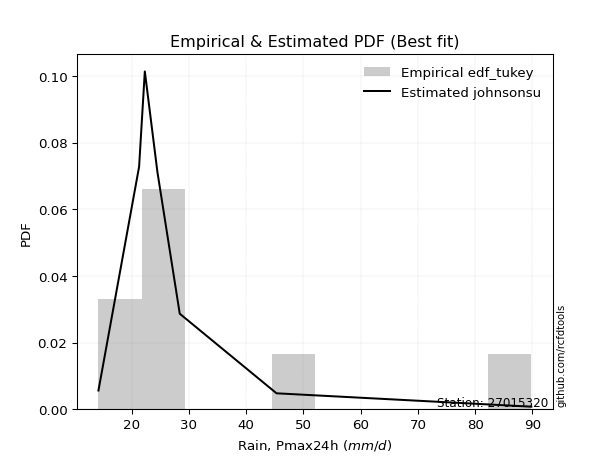</img>

</div>


### 8. Empirical - EDF Gringorten (1963)

Gringorten plotting position formula is essential for estimating the probability and return periods of extreme events like floods and heavy rainfall. The constant _a=0.44_.

<div align="center">


$P=(m-a)/(n+1-2a)$


</div>


**8.1. Empirical values**

<div align="center">

|                | 0                    | 1                  | 2                   | 3                  | 4              | 5                  | 6                  | 7                  | 8                  |
|:---------------|:---------------------|:-------------------|:--------------------|:-------------------|:---------------|:-------------------|:-------------------|:-------------------|:-------------------|
| date           | 2025                 | 2018               | 2019                | 2017               | 2021           | 2020               | 2022               | 2023               | 2024               |
| x              | 7.4                  | 14.2               | 21.3                | 22.3               | 24.5           | 24.5               | 28.4               | 45.3               | 89.8               |
| m              | 1                    | 2                  | 3                   | 4                  | 5              | 6                  | 7                  | 8                  | 9                  |
| empirical_dist | edf_gringorten       | edf_gringorten     | edf_gringorten      | edf_gringorten     | edf_gringorten | edf_gringorten     | edf_gringorten     | edf_gringorten     | edf_gringorten     |
| empirical      | 0.061403508771929835 | 0.1710526315789474 | 0.28070175438596495 | 0.3903508771929825 | 0.5            | 0.6096491228070176 | 0.7192982456140351 | 0.8289473684210527 | 0.9385964912280703 |
| empirical_tr   | 1.0654205607476634   | 1.2063492063492063 | 1.3902439024390243  | 1.6402877697841727 | 2.0            | 2.561797752808989  | 3.5625             | 5.846153846153847  | 16.285714285714324 |

</div>


**8.2. Kolmogorov-Smirnov fit test (sorted by Δ)**


<div align="center">

|                | 0                   | 1                   | 2                   | 3                   | 4                     | 5                   | 6                   | 7                   | 8                   | 9                   | 10                  | 11                  | 12                  | 13                  | 14                  | 15                  | 16                  | 17                  | 18                  | 19                  | 20                  | 21                  | 22                  | 23                  | 24                  | 25                  | 26                  | 27                  | 28                  | 29                  | 30                  | 31                  | 32                  | 33                  | 34                  | 35                  | 36                  | 37                  | 38                  | 39                  | 40                  | 41                  | 42                  | 43                  | 44                  | 45                  | 46                  | 47                  | 48                  | 49                  | 50                  | 51                  | 52                  | 53                  | 54                  | 55                  | 56                  | 57                  | 58                  | 59                  | 60                  | 61                  | 62                  | 63                  | 64                  | 65                  | 66                  | 67                  | 68                  | 69                  | 70                  | 71                  | 72                  | 73                  | 74                  | 75                  | 76                  | 77                  | 78                  | 79                  | 80                  | 81                  | 82                  | 83                  | 84                  | 85                  | 86                  | 87                  | 88                  | 89                  |
|:---------------|:--------------------|:--------------------|:--------------------|:--------------------|:----------------------|:--------------------|:--------------------|:--------------------|:--------------------|:--------------------|:--------------------|:--------------------|:--------------------|:--------------------|:--------------------|:--------------------|:--------------------|:--------------------|:--------------------|:--------------------|:--------------------|:--------------------|:--------------------|:--------------------|:--------------------|:--------------------|:--------------------|:--------------------|:--------------------|:--------------------|:--------------------|:--------------------|:--------------------|:--------------------|:--------------------|:--------------------|:--------------------|:--------------------|:--------------------|:--------------------|:--------------------|:--------------------|:--------------------|:--------------------|:--------------------|:--------------------|:--------------------|:--------------------|:--------------------|:--------------------|:--------------------|:--------------------|:--------------------|:--------------------|:--------------------|:--------------------|:--------------------|:--------------------|:--------------------|:--------------------|:--------------------|:--------------------|:--------------------|:--------------------|:--------------------|:--------------------|:--------------------|:--------------------|:--------------------|:--------------------|:--------------------|:--------------------|:--------------------|:--------------------|:--------------------|:--------------------|:--------------------|:--------------------|:--------------------|:--------------------|:--------------------|:--------------------|:--------------------|:--------------------|:--------------------|:--------------------|:--------------------|:--------------------|:--------------------|:--------------------|
| station        | 27015320            | 27015320            | 27015320            | 27015320            | 27015320              | 27015320            | 27015320            | 27015320            | 27015320            | 27015320            | 27015320            | 27015320            | 27015320            | 27015320            | 27015320            | 27015320            | 27015320            | 27015320            | 27015320            | 27015320            | 27015320            | 27015320            | 27015320            | 27015320            | 27015320            | 27015320            | 27015320            | 27015320            | 27015320            | 27015320            | 27015320            | 27015320            | 27015320            | 27015320            | 27015320            | 27015320            | 27015320            | 27015320            | 27015320            | 27015320            | 27015320            | 27015320            | 27015320            | 27015320            | 27015320            | 27015320            | 27015320            | 27015320            | 27015320            | 27015320            | 27015320            | 27015320            | 27015320            | 27015320            | 27015320            | 27015320            | 27015320            | 27015320            | 27015320            | 27015320            | 27015320            | 27015320            | 27015320            | 27015320            | 27015320            | 27015320            | 27015320            | 27015320            | 27015320            | 27015320            | 27015320            | 27015320            | 27015320            | 27015320            | 27015320            | 27015320            | 27015320            | 27015320            | 27015320            | 27015320            | 27015320            | 27015320            | 27015320            | 27015320            | 27015320            | 27015320            | 27015320            | 27015320            | 27015320            | 27015320            |
| empirical_dist | edf_gringorten      | edf_gringorten      | edf_gringorten      | edf_gringorten      | edf_gringorten        | edf_gringorten      | edf_gringorten      | edf_gringorten      | edf_gringorten      | edf_gringorten      | edf_gringorten      | edf_gringorten      | edf_gringorten      | edf_gringorten      | edf_gringorten      | edf_gringorten      | edf_gringorten      | edf_gringorten      | edf_gringorten      | edf_gringorten      | edf_gringorten      | edf_gringorten      | edf_gringorten      | edf_gringorten      | edf_gringorten      | edf_gringorten      | edf_gringorten      | edf_gringorten      | edf_gringorten      | edf_gringorten      | edf_gringorten      | edf_gringorten      | edf_gringorten      | edf_gringorten      | edf_gringorten      | edf_gringorten      | edf_gringorten      | edf_gringorten      | edf_gringorten      | edf_gringorten      | edf_gringorten      | edf_gringorten      | edf_gringorten      | edf_gringorten      | edf_gringorten      | edf_gringorten      | edf_gringorten      | edf_gringorten      | edf_gringorten      | edf_gringorten      | edf_gringorten      | edf_gringorten      | edf_gringorten      | edf_gringorten      | edf_gringorten      | edf_gringorten      | edf_gringorten      | edf_gringorten      | edf_gringorten      | edf_gringorten      | edf_gringorten      | edf_gringorten      | edf_gringorten      | edf_gringorten      | edf_gringorten      | edf_gringorten      | edf_gringorten      | edf_gringorten      | edf_gringorten      | edf_gringorten      | edf_gringorten      | edf_gringorten      | edf_gringorten      | edf_gringorten      | edf_gringorten      | edf_gringorten      | edf_gringorten      | edf_gringorten      | edf_gringorten      | edf_gringorten      | edf_gringorten      | edf_gringorten      | edf_gringorten      | edf_gringorten      | edf_gringorten      | edf_gringorten      | edf_gringorten      | edf_gringorten      | edf_gringorten      | edf_gringorten      |
| p_dist         | logjohnsonsu        | johnsonsu           | logt                | t                   | loglaplace_asymmetric | loghypsecant        | loglaplace          | loglogistic         | mielke              | loggenlogistic      | logfisk             | nct                 | fisk                | alpha               | logmielke           | invweibull          | lognorm             | lognorm             | logcrystalball      | ncf                 | invgamma            | logloggamma         | fatiguelife         | invgauss            | loggamma            | loggamma            | logerlang           | logfatiguelife      | logf                | logbetaprime        | logexponnorm        | logpearson3         | logncf              | betaprime           | genexpon            | logrice             | lognct              | logweibull_min      | pearson3            | loginvgamma         | logalpha            | loginvgauss         | wald                | loggompertz         | exponnorm           | halflogistic        | logmaxwell          | gibrat              | expon               | weibull_min         | moyal               | logtruncnorm        | lograyleigh         | genlogistic         | gompertz            | halfnorm            | laplace_asymmetric  | loginvweibull       | loggumbel_r         | chi2                | gumbel_r            | loggumbel_l         | logkstwobign        | loghalfnorm         | erlang              | loggenexpon         | logmoyal            | rayleigh            | truncnorm           | loghalflogistic     | maxwell             | kstwobign           | f                   | lognakagami         | norm                | crystalball         | logistic            | rice                | hypsecant           | loggibrat           | logwald             | laplace             | logexpon            | nakagami            | gamma               | gumbel_l            | logchi2             | loglognorm          | pareto              | logpareto           |
| delta          | 0.06434577047290657 | 0.07587978275558227 | 0.08301137217661453 | 0.09176505190459461 | 0.11489613760548167   | 0.1168377674494554  | 0.11971359215843125 | 0.12450366378004207 | 0.1279491089258749  | 0.12796186674156212 | 0.12946835387048833 | 0.12959078616470948 | 0.13239088782061775 | 0.13286707987078394 | 0.1329970963372113  | 0.13407984659562228 | 0.13550306510874288 | 0.13550306510874288 | 0.13550309230746738 | 0.13606546578955225 | 0.13620495489885792 | 0.1376995542969841  | 0.1381436127191411  | 0.13868435708236893 | 0.13884977246315183 | 0.13884977246315183 | 0.13884979024165772 | 0.13889176176186657 | 0.13894860275204818 | 0.1389533842118421  | 0.13922506091770365 | 0.13963775551993768 | 0.1407481348445086  | 0.14110955690245702 | 0.1418511579693265  | 0.142819073070936   | 0.1447044783916367  | 0.14533133173582496 | 0.14768277331552354 | 0.14778780788134638 | 0.14839462725113978 | 0.15359167786914968 | 0.1539553684604275  | 0.15450069410800688 | 0.1561602209943136  | 0.16075296219170154 | 0.16312888586868068 | 0.16446304510289242 | 0.16641594462035486 | 0.16707842725074112 | 0.16848351527215766 | 0.1710513498961462  | 0.1753899083104899  | 0.1768483997999345  | 0.1815630390747719  | 0.1825315360384019  | 0.1847264618702108  | 0.18788051883488655 | 0.19040832688388892 | 0.1931340812351136  | 0.19402825579481964 | 0.1980731761023471  | 0.20792580698751678 | 0.210135051756548   | 0.21099034879629186 | 0.21369751888972038 | 0.21395146779345947 | 0.2157890224744704  | 0.2210595289498395  | 0.22690522715428357 | 0.22757882745746527 | 0.22809144912944512 | 0.24355012978355345 | 0.2472929165235262  | 0.2618054900998124  | 0.26180549916513024 | 0.2675543751133395  | 0.2709220999837704  | 0.27242598279777375 | 0.27655058810180394 | 0.2781660920701771  | 0.28936171910350206 | 0.3029401766011965  | 0.30340571263495536 | 0.3174036520098706  | 0.3321590053788635  | 0.42171451393759746 | 0.4445679464260544  | 0.45705527287778264 | 0.4761483261845368  |
| deltao         | 0.41761268023100007 | 0.41761268023100007 | 0.41761268023100007 | 0.41761268023100007 | 0.41761268023100007   | 0.41761268023100007 | 0.41761268023100007 | 0.41761268023100007 | 0.41761268023100007 | 0.41761268023100007 | 0.41761268023100007 | 0.41761268023100007 | 0.41761268023100007 | 0.41761268023100007 | 0.41761268023100007 | 0.41761268023100007 | 0.41761268023100007 | 0.41761268023100007 | 0.41761268023100007 | 0.41761268023100007 | 0.41761268023100007 | 0.41761268023100007 | 0.41761268023100007 | 0.41761268023100007 | 0.41761268023100007 | 0.41761268023100007 | 0.41761268023100007 | 0.41761268023100007 | 0.41761268023100007 | 0.41761268023100007 | 0.41761268023100007 | 0.41761268023100007 | 0.41761268023100007 | 0.41761268023100007 | 0.41761268023100007 | 0.41761268023100007 | 0.41761268023100007 | 0.41761268023100007 | 0.41761268023100007 | 0.41761268023100007 | 0.41761268023100007 | 0.41761268023100007 | 0.41761268023100007 | 0.41761268023100007 | 0.41761268023100007 | 0.41761268023100007 | 0.41761268023100007 | 0.41761268023100007 | 0.41761268023100007 | 0.41761268023100007 | 0.41761268023100007 | 0.41761268023100007 | 0.41761268023100007 | 0.41761268023100007 | 0.41761268023100007 | 0.41761268023100007 | 0.41761268023100007 | 0.41761268023100007 | 0.41761268023100007 | 0.41761268023100007 | 0.41761268023100007 | 0.41761268023100007 | 0.41761268023100007 | 0.41761268023100007 | 0.41761268023100007 | 0.41761268023100007 | 0.41761268023100007 | 0.41761268023100007 | 0.41761268023100007 | 0.41761268023100007 | 0.41761268023100007 | 0.41761268023100007 | 0.41761268023100007 | 0.41761268023100007 | 0.41761268023100007 | 0.41761268023100007 | 0.41761268023100007 | 0.41761268023100007 | 0.41761268023100007 | 0.41761268023100007 | 0.41761268023100007 | 0.41761268023100007 | 0.41761268023100007 | 0.41761268023100007 | 0.41761268023100007 | 0.41761268023100007 | 0.41761268023100007 | 0.41761268023100007 | 0.41761268023100007 | 0.41761268023100007 |
| eval           | Δo > Δ              | Δo > Δ              | Δo > Δ              | Δo > Δ              | Δo > Δ                | Δo > Δ              | Δo > Δ              | Δo > Δ              | Δo > Δ              | Δo > Δ              | Δo > Δ              | Δo > Δ              | Δo > Δ              | Δo > Δ              | Δo > Δ              | Δo > Δ              | Δo > Δ              | Δo > Δ              | Δo > Δ              | Δo > Δ              | Δo > Δ              | Δo > Δ              | Δo > Δ              | Δo > Δ              | Δo > Δ              | Δo > Δ              | Δo > Δ              | Δo > Δ              | Δo > Δ              | Δo > Δ              | Δo > Δ              | Δo > Δ              | Δo > Δ              | Δo > Δ              | Δo > Δ              | Δo > Δ              | Δo > Δ              | Δo > Δ              | Δo > Δ              | Δo > Δ              | Δo > Δ              | Δo > Δ              | Δo > Δ              | Δo > Δ              | Δo > Δ              | Δo > Δ              | Δo > Δ              | Δo > Δ              | Δo > Δ              | Δo > Δ              | Δo > Δ              | Δo > Δ              | Δo > Δ              | Δo > Δ              | Δo > Δ              | Δo > Δ              | Δo > Δ              | Δo > Δ              | Δo > Δ              | Δo > Δ              | Δo > Δ              | Δo > Δ              | Δo > Δ              | Δo > Δ              | Δo > Δ              | Δo > Δ              | Δo > Δ              | Δo > Δ              | Δo > Δ              | Δo > Δ              | Δo > Δ              | Δo > Δ              | Δo > Δ              | Δo > Δ              | Δo > Δ              | Δo > Δ              | Δo > Δ              | Δo > Δ              | Δo > Δ              | Δo > Δ              | Δo > Δ              | Δo > Δ              | Δo > Δ              | Δo > Δ              | Δo > Δ              | Δo > Δ              | Δo <= Δ             | Δo <= Δ             | Δo <= Δ             | Δo <= Δ             |
| fit            | 1                   | 1                   | 1                   | 1                   | 1                     | 1                   | 1                   | 1                   | 1                   | 1                   | 1                   | 1                   | 1                   | 1                   | 1                   | 1                   | 1                   | 1                   | 1                   | 1                   | 1                   | 1                   | 1                   | 1                   | 1                   | 1                   | 1                   | 1                   | 1                   | 1                   | 1                   | 1                   | 1                   | 1                   | 1                   | 1                   | 1                   | 1                   | 1                   | 1                   | 1                   | 1                   | 1                   | 1                   | 1                   | 1                   | 1                   | 1                   | 1                   | 1                   | 1                   | 1                   | 1                   | 1                   | 1                   | 1                   | 1                   | 1                   | 1                   | 1                   | 1                   | 1                   | 1                   | 1                   | 1                   | 1                   | 1                   | 1                   | 1                   | 1                   | 1                   | 1                   | 1                   | 1                   | 1                   | 1                   | 1                   | 1                   | 1                   | 1                   | 1                   | 1                   | 1                   | 1                   | 1                   | 1                   | 0                   | 0                   | 0                   | 0                   |
| n              | 9                   | 9                   | 9                   | 9                   | 9                     | 9                   | 9                   | 9                   | 9                   | 9                   | 9                   | 9                   | 9                   | 9                   | 9                   | 9                   | 9                   | 9                   | 9                   | 9                   | 9                   | 9                   | 9                   | 9                   | 9                   | 9                   | 9                   | 9                   | 9                   | 9                   | 9                   | 9                   | 9                   | 9                   | 9                   | 9                   | 9                   | 9                   | 9                   | 9                   | 9                   | 9                   | 9                   | 9                   | 9                   | 9                   | 9                   | 9                   | 9                   | 9                   | 9                   | 9                   | 9                   | 9                   | 9                   | 9                   | 9                   | 9                   | 9                   | 9                   | 9                   | 9                   | 9                   | 9                   | 9                   | 9                   | 9                   | 9                   | 9                   | 9                   | 9                   | 9                   | 9                   | 9                   | 9                   | 9                   | 9                   | 9                   | 9                   | 9                   | 9                   | 9                   | 9                   | 9                   | 9                   | 9                   | 9                   | 9                   | 9                   | 9                   |
| best_fit       | 1                   | 0                   | 0                   | 0                   | 0                     | 0                   | 0                   | 0                   | 0                   | 0                   | 0                   | 0                   | 0                   | 0                   | 0                   | 0                   | 0                   | 0                   | 0                   | 0                   | 0                   | 0                   | 0                   | 0                   | 0                   | 0                   | 0                   | 0                   | 0                   | 0                   | 0                   | 0                   | 0                   | 0                   | 0                   | 0                   | 0                   | 0                   | 0                   | 0                   | 0                   | 0                   | 0                   | 0                   | 0                   | 0                   | 0                   | 0                   | 0                   | 0                   | 0                   | 0                   | 0                   | 0                   | 0                   | 0                   | 0                   | 0                   | 0                   | 0                   | 0                   | 0                   | 0                   | 0                   | 0                   | 0                   | 0                   | 0                   | 0                   | 0                   | 0                   | 0                   | 0                   | 0                   | 0                   | 0                   | 0                   | 0                   | 0                   | 0                   | 0                   | 0                   | 0                   | 0                   | 0                   | 0                   | 0                   | 0                   | 0                   | 0                   |
| best_fit_sort  | 1                   | 2                   | 3                   | 4                   | 5                     | 6                   | 7                   | 8                   | 9                   | 10                  | 11                  | 12                  | 13                  | 14                  | 15                  | 16                  | 17                  | 18                  | 19                  | 20                  | 21                  | 22                  | 23                  | 24                  | 25                  | 26                  | 27                  | 28                  | 29                  | 30                  | 31                  | 32                  | 33                  | 34                  | 35                  | 36                  | 37                  | 38                  | 39                  | 40                  | 41                  | 42                  | 43                  | 44                  | 45                  | 46                  | 47                  | 48                  | 49                  | 50                  | 51                  | 52                  | 53                  | 54                  | 55                  | 56                  | 57                  | 58                  | 59                  | 60                  | 61                  | 62                  | 63                  | 64                  | 65                  | 66                  | 67                  | 68                  | 69                  | 70                  | 71                  | 72                  | 73                  | 74                  | 75                  | 76                  | 77                  | 78                  | 79                  | 80                  | 81                  | 82                  | 83                  | 84                  | 85                  | 86                  | 87                  | 88                  | 89                  | 90                  |

</div>


<div align="center">

</img>

</div>


**8.3. Best fit**

<div align="center">

|   id |   station | empirical_dist   | p_dist       |     delta |   deltao | eval   |   fit |   n |   best_fit |   best_fit_sort |
|-----:|----------:|:-----------------|:-------------|----------:|---------:|:-------|------:|----:|-----------:|----------------:|
|    0 |  27015320 | edf_gringorten   | logjohnsonsu | 0.0643458 | 0.417613 | Δo > Δ |     1 |   9 |          1 |               1 |

</div>


<div align="center">

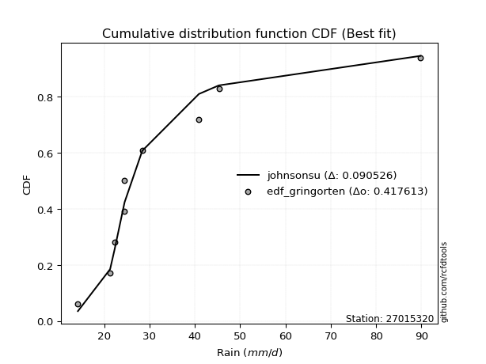</img>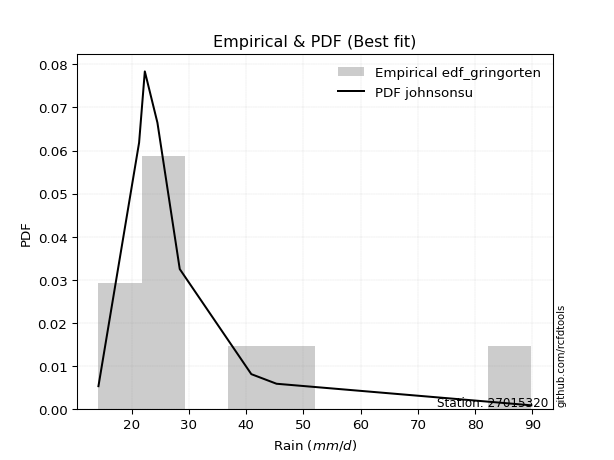</img>

</div>


### 9. Empirical - EDF Filliben (1975)

The specific values of the constants (0.3175) (often denoted as $alpha$) and (0.365) are derived from a method proposed by James J. Filliben in a 1975 paper. This particular formula is the mean value of the $i$-th order statistic of the normal distribution and is considered a robust and effective plotting position formula for the normal probability plot correlation coefficient test for normality.

<div align="center">


$P=(m-0.3175)/(n+0.365)$


</div>


**9.1. Empirical values**

<div align="center">

|                | 0                   | 1                  | 2                   | 3                   | 4            | 5                  | 6                  | 7                  | 8                  |
|:---------------|:--------------------|:-------------------|:--------------------|:--------------------|:-------------|:-------------------|:-------------------|:-------------------|:-------------------|
| date           | 2025                | 2018               | 2019                | 2017                | 2021         | 2020               | 2022               | 2023               | 2024               |
| x              | 7.4                 | 14.2               | 21.3                | 22.3                | 24.5         | 24.5               | 28.4               | 45.3               | 89.8               |
| m              | 1                   | 2                  | 3                   | 4                   | 5            | 6                  | 7                  | 8                  | 9                  |
| empirical_dist | edf_filliben        | edf_filliben       | edf_filliben        | edf_filliben        | edf_filliben | edf_filliben       | edf_filliben       | edf_filliben       | edf_filliben       |
| empirical      | 0.07287773625200214 | 0.1796583021890016 | 0.28643886812600106 | 0.39321943406300053 | 0.5          | 0.6067805659369995 | 0.7135611318739989 | 0.8203416978109984 | 0.9271222637479978 |
| empirical_tr   | 1.0786063921681543  | 1.219004230393752  | 1.401421623643846   | 1.6480422349318082  | 2.0          | 2.5431093007467753 | 3.491146318732526  | 5.566121842496286  | 13.721611721611705 |

</div>


**9.2. Kolmogorov-Smirnov fit test (sorted by Δ)**


<div align="center">

|                | 0                   | 1                   | 2                   | 3                   | 4                     | 5                   | 6                   | 7                   | 8                   | 9                   | 10                  | 11                  | 12                  | 13                  | 14                  | 15                  | 16                  | 17                  | 18                  | 19                  | 20                  | 21                  | 22                  | 23                  | 24                  | 25                  | 26                  | 27                  | 28                  | 29                  | 30                  | 31                  | 32                  | 33                  | 34                  | 35                  | 36                  | 37                  | 38                  | 39                  | 40                  | 41                  | 42                  | 43                  | 44                  | 45                  | 46                  | 47                  | 48                  | 49                  | 50                  | 51                  | 52                  | 53                  | 54                  | 55                  | 56                  | 57                  | 58                  | 59                  | 60                  | 61                  | 62                  | 63                  | 64                  | 65                  | 66                  | 67                  | 68                  | 69                  | 70                  | 71                  | 72                  | 73                  | 74                  | 75                  | 76                  | 77                  | 78                  | 79                  | 80                  | 81                  | 82                  | 83                  | 84                  | 85                  | 86                  | 87                  | 88                  | 89                  |
|:---------------|:--------------------|:--------------------|:--------------------|:--------------------|:----------------------|:--------------------|:--------------------|:--------------------|:--------------------|:--------------------|:--------------------|:--------------------|:--------------------|:--------------------|:--------------------|:--------------------|:--------------------|:--------------------|:--------------------|:--------------------|:--------------------|:--------------------|:--------------------|:--------------------|:--------------------|:--------------------|:--------------------|:--------------------|:--------------------|:--------------------|:--------------------|:--------------------|:--------------------|:--------------------|:--------------------|:--------------------|:--------------------|:--------------------|:--------------------|:--------------------|:--------------------|:--------------------|:--------------------|:--------------------|:--------------------|:--------------------|:--------------------|:--------------------|:--------------------|:--------------------|:--------------------|:--------------------|:--------------------|:--------------------|:--------------------|:--------------------|:--------------------|:--------------------|:--------------------|:--------------------|:--------------------|:--------------------|:--------------------|:--------------------|:--------------------|:--------------------|:--------------------|:--------------------|:--------------------|:--------------------|:--------------------|:--------------------|:--------------------|:--------------------|:--------------------|:--------------------|:--------------------|:--------------------|:--------------------|:--------------------|:--------------------|:--------------------|:--------------------|:--------------------|:--------------------|:--------------------|:--------------------|:--------------------|:--------------------|:--------------------|
| station        | 27015320            | 27015320            | 27015320            | 27015320            | 27015320              | 27015320            | 27015320            | 27015320            | 27015320            | 27015320            | 27015320            | 27015320            | 27015320            | 27015320            | 27015320            | 27015320            | 27015320            | 27015320            | 27015320            | 27015320            | 27015320            | 27015320            | 27015320            | 27015320            | 27015320            | 27015320            | 27015320            | 27015320            | 27015320            | 27015320            | 27015320            | 27015320            | 27015320            | 27015320            | 27015320            | 27015320            | 27015320            | 27015320            | 27015320            | 27015320            | 27015320            | 27015320            | 27015320            | 27015320            | 27015320            | 27015320            | 27015320            | 27015320            | 27015320            | 27015320            | 27015320            | 27015320            | 27015320            | 27015320            | 27015320            | 27015320            | 27015320            | 27015320            | 27015320            | 27015320            | 27015320            | 27015320            | 27015320            | 27015320            | 27015320            | 27015320            | 27015320            | 27015320            | 27015320            | 27015320            | 27015320            | 27015320            | 27015320            | 27015320            | 27015320            | 27015320            | 27015320            | 27015320            | 27015320            | 27015320            | 27015320            | 27015320            | 27015320            | 27015320            | 27015320            | 27015320            | 27015320            | 27015320            | 27015320            | 27015320            |
| empirical_dist | edf_filliben        | edf_filliben        | edf_filliben        | edf_filliben        | edf_filliben          | edf_filliben        | edf_filliben        | edf_filliben        | edf_filliben        | edf_filliben        | edf_filliben        | edf_filliben        | edf_filliben        | edf_filliben        | edf_filliben        | edf_filliben        | edf_filliben        | edf_filliben        | edf_filliben        | edf_filliben        | edf_filliben        | edf_filliben        | edf_filliben        | edf_filliben        | edf_filliben        | edf_filliben        | edf_filliben        | edf_filliben        | edf_filliben        | edf_filliben        | edf_filliben        | edf_filliben        | edf_filliben        | edf_filliben        | edf_filliben        | edf_filliben        | edf_filliben        | edf_filliben        | edf_filliben        | edf_filliben        | edf_filliben        | edf_filliben        | edf_filliben        | edf_filliben        | edf_filliben        | edf_filliben        | edf_filliben        | edf_filliben        | edf_filliben        | edf_filliben        | edf_filliben        | edf_filliben        | edf_filliben        | edf_filliben        | edf_filliben        | edf_filliben        | edf_filliben        | edf_filliben        | edf_filliben        | edf_filliben        | edf_filliben        | edf_filliben        | edf_filliben        | edf_filliben        | edf_filliben        | edf_filliben        | edf_filliben        | edf_filliben        | edf_filliben        | edf_filliben        | edf_filliben        | edf_filliben        | edf_filliben        | edf_filliben        | edf_filliben        | edf_filliben        | edf_filliben        | edf_filliben        | edf_filliben        | edf_filliben        | edf_filliben        | edf_filliben        | edf_filliben        | edf_filliben        | edf_filliben        | edf_filliben        | edf_filliben        | edf_filliben        | edf_filliben        | edf_filliben        |
| p_dist         | logjohnsonsu        | johnsonsu           | logt                | t                   | loglaplace_asymmetric | loghypsecant        | loglaplace          | loglogistic         | mielke              | loggenlogistic      | logfisk             | nct                 | fisk                | alpha               | logmielke           | invweibull          | lognorm             | lognorm             | logcrystalball      | ncf                 | invgamma            | logloggamma         | fatiguelife         | invgauss            | loggamma            | loggamma            | logerlang           | logfatiguelife      | logf                | logbetaprime        | logexponnorm        | logpearson3         | logncf              | betaprime           | genexpon            | logrice             | lognct              | logweibull_min      | pearson3            | loginvgamma         | logalpha            | loginvgauss         | wald                | loggompertz         | exponnorm           | halflogistic        | logmaxwell          | expon               | weibull_min         | moyal               | lograyleigh         | genlogistic         | gibrat              | gompertz            | halfnorm            | logtruncnorm        | laplace_asymmetric  | loginvweibull       | loggumbel_r         | chi2                | gumbel_r            | loggumbel_l         | logkstwobign        | loghalfnorm         | erlang              | loggenexpon         | logmoyal            | rayleigh            | truncnorm           | loghalflogistic     | maxwell             | kstwobign           | f                   | lognakagami         | norm                | crystalball         | logistic            | rice                | hypsecant           | loggibrat           | logwald             | laplace             | logexpon            | nakagami            | gamma               | gumbel_l            | logchi2             | loglognorm          | pareto              | logpareto           |
| delta          | 0.06992088060958757 | 0.07301122588556419 | 0.08900957180039182 | 0.10037072251464885 | 0.1120275807354636    | 0.11396921057943732 | 0.11684503528841317 | 0.11876655004000591 | 0.1222119951858388  | 0.12222475300152602 | 0.12373124013045222 | 0.12385367242467338 | 0.12665377408058165 | 0.12712996613074784 | 0.1272599825971752  | 0.12834273285558617 | 0.12976595136870672 | 0.12976595136870672 | 0.12976597856743122 | 0.13032835204951615 | 0.13046784115882182 | 0.13196244055694795 | 0.13240649897910495 | 0.13294724334233282 | 0.13311265872311573 | 0.13311265872311573 | 0.13311267650162162 | 0.13315464802183047 | 0.13321148901201207 | 0.133216270471806   | 0.13348794717766754 | 0.13390064177990157 | 0.1350110211044725  | 0.13537244316242092 | 0.1361140442292904  | 0.1370819593308999  | 0.1389673646516006  | 0.13959421799578886 | 0.14194565957548744 | 0.14205069414131027 | 0.14265751351110367 | 0.14785456412911357 | 0.1482182547203914  | 0.14876358036797077 | 0.15042310725427743 | 0.15501584845166538 | 0.15739177212864458 | 0.16067883088031876 | 0.16134131351070502 | 0.1627464015321215  | 0.1696527945704538  | 0.17111128605989834 | 0.17306871571294663 | 0.17582592533473573 | 0.17679442229836573 | 0.17965702050620042 | 0.18185790500019272 | 0.18214340509485044 | 0.18467121314385282 | 0.1873969674950775  | 0.18829114205478348 | 0.19233606236231093 | 0.20218869324748068 | 0.2043979380165119  | 0.20525323505625576 | 0.20796040514968428 | 0.20821435405342337 | 0.21005190873443425 | 0.21532241520980333 | 0.22116811341424747 | 0.2218417137174291  | 0.22235433538940896 | 0.23781301604351734 | 0.2415558027834901  | 0.25606837635977625 | 0.2560683854250941  | 0.26181726137330336 | 0.26518498624373427 | 0.2666888690577376  | 0.27081347436176784 | 0.272428978330141   | 0.2836246053634659  | 0.2972030628611604  | 0.29766859889491926 | 0.3116665382698345  | 0.32642189163882734 | 0.41597740019756135 | 0.4359622758160002  | 0.44844960226772845 | 0.4675426555744826  |
| deltao         | 0.41761268023100007 | 0.41761268023100007 | 0.41761268023100007 | 0.41761268023100007 | 0.41761268023100007   | 0.41761268023100007 | 0.41761268023100007 | 0.41761268023100007 | 0.41761268023100007 | 0.41761268023100007 | 0.41761268023100007 | 0.41761268023100007 | 0.41761268023100007 | 0.41761268023100007 | 0.41761268023100007 | 0.41761268023100007 | 0.41761268023100007 | 0.41761268023100007 | 0.41761268023100007 | 0.41761268023100007 | 0.41761268023100007 | 0.41761268023100007 | 0.41761268023100007 | 0.41761268023100007 | 0.41761268023100007 | 0.41761268023100007 | 0.41761268023100007 | 0.41761268023100007 | 0.41761268023100007 | 0.41761268023100007 | 0.41761268023100007 | 0.41761268023100007 | 0.41761268023100007 | 0.41761268023100007 | 0.41761268023100007 | 0.41761268023100007 | 0.41761268023100007 | 0.41761268023100007 | 0.41761268023100007 | 0.41761268023100007 | 0.41761268023100007 | 0.41761268023100007 | 0.41761268023100007 | 0.41761268023100007 | 0.41761268023100007 | 0.41761268023100007 | 0.41761268023100007 | 0.41761268023100007 | 0.41761268023100007 | 0.41761268023100007 | 0.41761268023100007 | 0.41761268023100007 | 0.41761268023100007 | 0.41761268023100007 | 0.41761268023100007 | 0.41761268023100007 | 0.41761268023100007 | 0.41761268023100007 | 0.41761268023100007 | 0.41761268023100007 | 0.41761268023100007 | 0.41761268023100007 | 0.41761268023100007 | 0.41761268023100007 | 0.41761268023100007 | 0.41761268023100007 | 0.41761268023100007 | 0.41761268023100007 | 0.41761268023100007 | 0.41761268023100007 | 0.41761268023100007 | 0.41761268023100007 | 0.41761268023100007 | 0.41761268023100007 | 0.41761268023100007 | 0.41761268023100007 | 0.41761268023100007 | 0.41761268023100007 | 0.41761268023100007 | 0.41761268023100007 | 0.41761268023100007 | 0.41761268023100007 | 0.41761268023100007 | 0.41761268023100007 | 0.41761268023100007 | 0.41761268023100007 | 0.41761268023100007 | 0.41761268023100007 | 0.41761268023100007 | 0.41761268023100007 |
| eval           | Δo > Δ              | Δo > Δ              | Δo > Δ              | Δo > Δ              | Δo > Δ                | Δo > Δ              | Δo > Δ              | Δo > Δ              | Δo > Δ              | Δo > Δ              | Δo > Δ              | Δo > Δ              | Δo > Δ              | Δo > Δ              | Δo > Δ              | Δo > Δ              | Δo > Δ              | Δo > Δ              | Δo > Δ              | Δo > Δ              | Δo > Δ              | Δo > Δ              | Δo > Δ              | Δo > Δ              | Δo > Δ              | Δo > Δ              | Δo > Δ              | Δo > Δ              | Δo > Δ              | Δo > Δ              | Δo > Δ              | Δo > Δ              | Δo > Δ              | Δo > Δ              | Δo > Δ              | Δo > Δ              | Δo > Δ              | Δo > Δ              | Δo > Δ              | Δo > Δ              | Δo > Δ              | Δo > Δ              | Δo > Δ              | Δo > Δ              | Δo > Δ              | Δo > Δ              | Δo > Δ              | Δo > Δ              | Δo > Δ              | Δo > Δ              | Δo > Δ              | Δo > Δ              | Δo > Δ              | Δo > Δ              | Δo > Δ              | Δo > Δ              | Δo > Δ              | Δo > Δ              | Δo > Δ              | Δo > Δ              | Δo > Δ              | Δo > Δ              | Δo > Δ              | Δo > Δ              | Δo > Δ              | Δo > Δ              | Δo > Δ              | Δo > Δ              | Δo > Δ              | Δo > Δ              | Δo > Δ              | Δo > Δ              | Δo > Δ              | Δo > Δ              | Δo > Δ              | Δo > Δ              | Δo > Δ              | Δo > Δ              | Δo > Δ              | Δo > Δ              | Δo > Δ              | Δo > Δ              | Δo > Δ              | Δo > Δ              | Δo > Δ              | Δo > Δ              | Δo > Δ              | Δo <= Δ             | Δo <= Δ             | Δo <= Δ             |
| fit            | 1                   | 1                   | 1                   | 1                   | 1                     | 1                   | 1                   | 1                   | 1                   | 1                   | 1                   | 1                   | 1                   | 1                   | 1                   | 1                   | 1                   | 1                   | 1                   | 1                   | 1                   | 1                   | 1                   | 1                   | 1                   | 1                   | 1                   | 1                   | 1                   | 1                   | 1                   | 1                   | 1                   | 1                   | 1                   | 1                   | 1                   | 1                   | 1                   | 1                   | 1                   | 1                   | 1                   | 1                   | 1                   | 1                   | 1                   | 1                   | 1                   | 1                   | 1                   | 1                   | 1                   | 1                   | 1                   | 1                   | 1                   | 1                   | 1                   | 1                   | 1                   | 1                   | 1                   | 1                   | 1                   | 1                   | 1                   | 1                   | 1                   | 1                   | 1                   | 1                   | 1                   | 1                   | 1                   | 1                   | 1                   | 1                   | 1                   | 1                   | 1                   | 1                   | 1                   | 1                   | 1                   | 1                   | 1                   | 0                   | 0                   | 0                   |
| n              | 9                   | 9                   | 9                   | 9                   | 9                     | 9                   | 9                   | 9                   | 9                   | 9                   | 9                   | 9                   | 9                   | 9                   | 9                   | 9                   | 9                   | 9                   | 9                   | 9                   | 9                   | 9                   | 9                   | 9                   | 9                   | 9                   | 9                   | 9                   | 9                   | 9                   | 9                   | 9                   | 9                   | 9                   | 9                   | 9                   | 9                   | 9                   | 9                   | 9                   | 9                   | 9                   | 9                   | 9                   | 9                   | 9                   | 9                   | 9                   | 9                   | 9                   | 9                   | 9                   | 9                   | 9                   | 9                   | 9                   | 9                   | 9                   | 9                   | 9                   | 9                   | 9                   | 9                   | 9                   | 9                   | 9                   | 9                   | 9                   | 9                   | 9                   | 9                   | 9                   | 9                   | 9                   | 9                   | 9                   | 9                   | 9                   | 9                   | 9                   | 9                   | 9                   | 9                   | 9                   | 9                   | 9                   | 9                   | 9                   | 9                   | 9                   |
| best_fit       | 1                   | 0                   | 0                   | 0                   | 0                     | 0                   | 0                   | 0                   | 0                   | 0                   | 0                   | 0                   | 0                   | 0                   | 0                   | 0                   | 0                   | 0                   | 0                   | 0                   | 0                   | 0                   | 0                   | 0                   | 0                   | 0                   | 0                   | 0                   | 0                   | 0                   | 0                   | 0                   | 0                   | 0                   | 0                   | 0                   | 0                   | 0                   | 0                   | 0                   | 0                   | 0                   | 0                   | 0                   | 0                   | 0                   | 0                   | 0                   | 0                   | 0                   | 0                   | 0                   | 0                   | 0                   | 0                   | 0                   | 0                   | 0                   | 0                   | 0                   | 0                   | 0                   | 0                   | 0                   | 0                   | 0                   | 0                   | 0                   | 0                   | 0                   | 0                   | 0                   | 0                   | 0                   | 0                   | 0                   | 0                   | 0                   | 0                   | 0                   | 0                   | 0                   | 0                   | 0                   | 0                   | 0                   | 0                   | 0                   | 0                   | 0                   |
| best_fit_sort  | 1                   | 2                   | 3                   | 4                   | 5                     | 6                   | 7                   | 8                   | 9                   | 10                  | 11                  | 12                  | 13                  | 14                  | 15                  | 16                  | 17                  | 18                  | 19                  | 20                  | 21                  | 22                  | 23                  | 24                  | 25                  | 26                  | 27                  | 28                  | 29                  | 30                  | 31                  | 32                  | 33                  | 34                  | 35                  | 36                  | 37                  | 38                  | 39                  | 40                  | 41                  | 42                  | 43                  | 44                  | 45                  | 46                  | 47                  | 48                  | 49                  | 50                  | 51                  | 52                  | 53                  | 54                  | 55                  | 56                  | 57                  | 58                  | 59                  | 60                  | 61                  | 62                  | 63                  | 64                  | 65                  | 66                  | 67                  | 68                  | 69                  | 70                  | 71                  | 72                  | 73                  | 74                  | 75                  | 76                  | 77                  | 78                  | 79                  | 80                  | 81                  | 82                  | 83                  | 84                  | 85                  | 86                  | 87                  | 88                  | 89                  | 90                  |

</div>


<div align="center">

</img>

</div>


**9.3. Best fit**

<div align="center">

|   id |   station | empirical_dist   | p_dist       |     delta |   deltao | eval   |   fit |   n |   best_fit |   best_fit_sort |
|-----:|----------:|:-----------------|:-------------|----------:|---------:|:-------|------:|----:|-----------:|----------------:|
|    0 |  27015320 | edf_filliben     | logjohnsonsu | 0.0699209 | 0.417613 | Δo > Δ |     1 |   9 |          1 |               1 |

</div>


<div align="center">

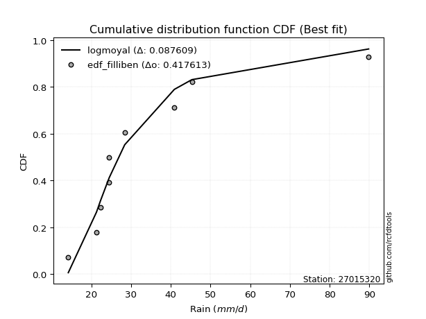</img></img>

</div>


### 10. Empirical - EDF Jenkinson (1977)

The Jenkinson formula in hydrology is an empirical plotting position formula used to estimate the non-exceedance probability _(P)_ or return period _(T)_ of a given ordered observation within a sample. It is a widely used method in the frequency analysis of extreme events such as floods and rainfall, as it provides a distribution-free way to plot data. _a≈0.31_ and _b≈0.38_ are constants derived to approximate the median of the probability distribution for the given rank.

<div align="center">


$P=(m-a)/(n+b)$


</div>


**10.1. Empirical values**

<div align="center">

|                | 0                   | 1                   | 2                  | 3                   | 4             | 5                  | 6                  | 7                  | 8                  |
|:---------------|:--------------------|:--------------------|:-------------------|:--------------------|:--------------|:-------------------|:-------------------|:-------------------|:-------------------|
| date           | 2025                | 2018                | 2019               | 2017                | 2021          | 2020               | 2022               | 2023               | 2024               |
| x              | 7.4                 | 14.2                | 21.3               | 22.3                | 24.5          | 24.5               | 28.4               | 45.3               | 89.8               |
| m              | 1                   | 2                   | 3                  | 4                   | 5             | 6                  | 7                  | 8                  | 9                  |
| empirical_dist | edf_jenkinson       | edf_jenkinson       | edf_jenkinson      | edf_jenkinson       | edf_jenkinson | edf_jenkinson      | edf_jenkinson      | edf_jenkinson      | edf_jenkinson      |
| empirical      | 0.07356076759061833 | 0.18017057569296374 | 0.2867803837953091 | 0.39339019189765456 | 0.5           | 0.6066098081023454 | 0.7132196162046908 | 0.8198294243070362 | 0.9264392324093815 |
| empirical_tr   | 1.0794016110471807  | 1.2197659297789336  | 1.4020926756352765 | 1.6485061511423549  | 2.0           | 2.542005420054201  | 3.486988847583642  | 5.550295857988164  | 13.5942028985507   |

</div>


**10.2. Kolmogorov-Smirnov fit test (sorted by Δ)**


<div align="center">

|                | 0                   | 1                   | 2                   | 3                   | 4                     | 5                   | 6                   | 7                   | 8                   | 9                   | 10                  | 11                  | 12                  | 13                  | 14                  | 15                  | 16                  | 17                  | 18                  | 19                  | 20                  | 21                  | 22                  | 23                  | 24                  | 25                  | 26                  | 27                  | 28                  | 29                  | 30                  | 31                  | 32                  | 33                  | 34                  | 35                  | 36                  | 37                  | 38                  | 39                  | 40                  | 41                  | 42                  | 43                  | 44                  | 45                  | 46                  | 47                  | 48                  | 49                  | 50                  | 51                  | 52                  | 53                  | 54                  | 55                  | 56                  | 57                  | 58                  | 59                  | 60                  | 61                  | 62                  | 63                  | 64                  | 65                  | 66                  | 67                  | 68                  | 69                  | 70                  | 71                  | 72                  | 73                  | 74                  | 75                  | 76                  | 77                  | 78                  | 79                  | 80                  | 81                  | 82                  | 83                  | 84                  | 85                  | 86                  | 87                  | 88                  | 89                  |
|:---------------|:--------------------|:--------------------|:--------------------|:--------------------|:----------------------|:--------------------|:--------------------|:--------------------|:--------------------|:--------------------|:--------------------|:--------------------|:--------------------|:--------------------|:--------------------|:--------------------|:--------------------|:--------------------|:--------------------|:--------------------|:--------------------|:--------------------|:--------------------|:--------------------|:--------------------|:--------------------|:--------------------|:--------------------|:--------------------|:--------------------|:--------------------|:--------------------|:--------------------|:--------------------|:--------------------|:--------------------|:--------------------|:--------------------|:--------------------|:--------------------|:--------------------|:--------------------|:--------------------|:--------------------|:--------------------|:--------------------|:--------------------|:--------------------|:--------------------|:--------------------|:--------------------|:--------------------|:--------------------|:--------------------|:--------------------|:--------------------|:--------------------|:--------------------|:--------------------|:--------------------|:--------------------|:--------------------|:--------------------|:--------------------|:--------------------|:--------------------|:--------------------|:--------------------|:--------------------|:--------------------|:--------------------|:--------------------|:--------------------|:--------------------|:--------------------|:--------------------|:--------------------|:--------------------|:--------------------|:--------------------|:--------------------|:--------------------|:--------------------|:--------------------|:--------------------|:--------------------|:--------------------|:--------------------|:--------------------|:--------------------|
| station        | 27015320            | 27015320            | 27015320            | 27015320            | 27015320              | 27015320            | 27015320            | 27015320            | 27015320            | 27015320            | 27015320            | 27015320            | 27015320            | 27015320            | 27015320            | 27015320            | 27015320            | 27015320            | 27015320            | 27015320            | 27015320            | 27015320            | 27015320            | 27015320            | 27015320            | 27015320            | 27015320            | 27015320            | 27015320            | 27015320            | 27015320            | 27015320            | 27015320            | 27015320            | 27015320            | 27015320            | 27015320            | 27015320            | 27015320            | 27015320            | 27015320            | 27015320            | 27015320            | 27015320            | 27015320            | 27015320            | 27015320            | 27015320            | 27015320            | 27015320            | 27015320            | 27015320            | 27015320            | 27015320            | 27015320            | 27015320            | 27015320            | 27015320            | 27015320            | 27015320            | 27015320            | 27015320            | 27015320            | 27015320            | 27015320            | 27015320            | 27015320            | 27015320            | 27015320            | 27015320            | 27015320            | 27015320            | 27015320            | 27015320            | 27015320            | 27015320            | 27015320            | 27015320            | 27015320            | 27015320            | 27015320            | 27015320            | 27015320            | 27015320            | 27015320            | 27015320            | 27015320            | 27015320            | 27015320            | 27015320            |
| empirical_dist | edf_jenkinson       | edf_jenkinson       | edf_jenkinson       | edf_jenkinson       | edf_jenkinson         | edf_jenkinson       | edf_jenkinson       | edf_jenkinson       | edf_jenkinson       | edf_jenkinson       | edf_jenkinson       | edf_jenkinson       | edf_jenkinson       | edf_jenkinson       | edf_jenkinson       | edf_jenkinson       | edf_jenkinson       | edf_jenkinson       | edf_jenkinson       | edf_jenkinson       | edf_jenkinson       | edf_jenkinson       | edf_jenkinson       | edf_jenkinson       | edf_jenkinson       | edf_jenkinson       | edf_jenkinson       | edf_jenkinson       | edf_jenkinson       | edf_jenkinson       | edf_jenkinson       | edf_jenkinson       | edf_jenkinson       | edf_jenkinson       | edf_jenkinson       | edf_jenkinson       | edf_jenkinson       | edf_jenkinson       | edf_jenkinson       | edf_jenkinson       | edf_jenkinson       | edf_jenkinson       | edf_jenkinson       | edf_jenkinson       | edf_jenkinson       | edf_jenkinson       | edf_jenkinson       | edf_jenkinson       | edf_jenkinson       | edf_jenkinson       | edf_jenkinson       | edf_jenkinson       | edf_jenkinson       | edf_jenkinson       | edf_jenkinson       | edf_jenkinson       | edf_jenkinson       | edf_jenkinson       | edf_jenkinson       | edf_jenkinson       | edf_jenkinson       | edf_jenkinson       | edf_jenkinson       | edf_jenkinson       | edf_jenkinson       | edf_jenkinson       | edf_jenkinson       | edf_jenkinson       | edf_jenkinson       | edf_jenkinson       | edf_jenkinson       | edf_jenkinson       | edf_jenkinson       | edf_jenkinson       | edf_jenkinson       | edf_jenkinson       | edf_jenkinson       | edf_jenkinson       | edf_jenkinson       | edf_jenkinson       | edf_jenkinson       | edf_jenkinson       | edf_jenkinson       | edf_jenkinson       | edf_jenkinson       | edf_jenkinson       | edf_jenkinson       | edf_jenkinson       | edf_jenkinson       | edf_jenkinson       |
| p_dist         | logjohnsonsu        | johnsonsu           | logt                | t                   | loglaplace_asymmetric | loghypsecant        | loglaplace          | loglogistic         | mielke              | loggenlogistic      | logfisk             | nct                 | fisk                | alpha               | logmielke           | invweibull          | lognorm             | lognorm             | logcrystalball      | ncf                 | invgamma            | logloggamma         | fatiguelife         | invgauss            | loggamma            | loggamma            | logerlang           | logfatiguelife      | logf                | logbetaprime        | logexponnorm        | logpearson3         | logncf              | betaprime           | genexpon            | logrice             | lognct              | logweibull_min      | pearson3            | loginvgamma         | logalpha            | loginvgauss         | wald                | loggompertz         | exponnorm           | halflogistic        | logmaxwell          | expon               | weibull_min         | moyal               | lograyleigh         | genlogistic         | gibrat              | gompertz            | halfnorm            | logtruncnorm        | laplace_asymmetric  | loginvweibull       | loggumbel_r         | chi2                | gumbel_r            | loggumbel_l         | logkstwobign        | loghalfnorm         | erlang              | loggenexpon         | logmoyal            | rayleigh            | truncnorm           | loghalflogistic     | maxwell             | kstwobign           | f                   | lognakagami         | norm                | crystalball         | logistic            | rice                | hypsecant           | loggibrat           | logwald             | laplace             | logexpon            | nakagami            | gamma               | gumbel_l            | logchi2             | loglognorm          | pareto              | logpareto           |
| delta          | 0.07043315411354978 | 0.07284046805091016 | 0.08952184530435403 | 0.10088299601861106 | 0.11185682290080956   | 0.11379845274478328 | 0.11667427745375913 | 0.11842503437069773 | 0.12187047951653074 | 0.12188323733221795 | 0.12338972446114416 | 0.12351215675536531 | 0.12631225841127358 | 0.12678845046143977 | 0.12691846692786712 | 0.1280012171862781  | 0.12942443569939854 | 0.12942443569939854 | 0.12942446289812304 | 0.12998683638020808 | 0.13012632548951375 | 0.13162092488763977 | 0.13206498330979677 | 0.13260572767302475 | 0.13277114305380766 | 0.13277114305380766 | 0.13277116083231355 | 0.1328131323525224  | 0.132869973342704   | 0.13287475480249794 | 0.13314643150835948 | 0.1335591261105935  | 0.13466950543516443 | 0.13503092749311285 | 0.13577252855998234 | 0.13674044366159183 | 0.13862584898229252 | 0.1392527023264808  | 0.14160414390617937 | 0.1417091784720022  | 0.1423159978417956  | 0.1475130484598055  | 0.14787673905108334 | 0.1484220646986627  | 0.15008159158496925 | 0.1546743327823572  | 0.1570502564593365  | 0.1603373152110107  | 0.16099979784139695 | 0.16240488586281332 | 0.16931127890114572 | 0.17076977039059016 | 0.17358098921690876 | 0.17548440966542755 | 0.17645290662905755 | 0.18016929401016255 | 0.1816871471655387  | 0.18180188942554237 | 0.18432969747454475 | 0.18705545182576944 | 0.1879496263854753  | 0.19199454669300275 | 0.2018471775781726  | 0.20405642234720384 | 0.2049117193869477  | 0.2076188894803762  | 0.2078728383841153  | 0.20971039306512607 | 0.21498089954049515 | 0.2208265977449394  | 0.22150019804812093 | 0.22201281972010078 | 0.23747150037420928 | 0.24121428711418202 | 0.25572686069046807 | 0.2557268697557859  | 0.2614757457039952  | 0.2648434705744261  | 0.2663473533884294  | 0.27047195869245977 | 0.27208746266083295 | 0.2832830896941577  | 0.2968615471918523  | 0.2973270832256112  | 0.3113250226005264  | 0.32608037596951917 | 0.4156358845282533  | 0.43545000231203806 | 0.4479373287637663  | 0.46703038207052044 |
| deltao         | 0.41761268023100007 | 0.41761268023100007 | 0.41761268023100007 | 0.41761268023100007 | 0.41761268023100007   | 0.41761268023100007 | 0.41761268023100007 | 0.41761268023100007 | 0.41761268023100007 | 0.41761268023100007 | 0.41761268023100007 | 0.41761268023100007 | 0.41761268023100007 | 0.41761268023100007 | 0.41761268023100007 | 0.41761268023100007 | 0.41761268023100007 | 0.41761268023100007 | 0.41761268023100007 | 0.41761268023100007 | 0.41761268023100007 | 0.41761268023100007 | 0.41761268023100007 | 0.41761268023100007 | 0.41761268023100007 | 0.41761268023100007 | 0.41761268023100007 | 0.41761268023100007 | 0.41761268023100007 | 0.41761268023100007 | 0.41761268023100007 | 0.41761268023100007 | 0.41761268023100007 | 0.41761268023100007 | 0.41761268023100007 | 0.41761268023100007 | 0.41761268023100007 | 0.41761268023100007 | 0.41761268023100007 | 0.41761268023100007 | 0.41761268023100007 | 0.41761268023100007 | 0.41761268023100007 | 0.41761268023100007 | 0.41761268023100007 | 0.41761268023100007 | 0.41761268023100007 | 0.41761268023100007 | 0.41761268023100007 | 0.41761268023100007 | 0.41761268023100007 | 0.41761268023100007 | 0.41761268023100007 | 0.41761268023100007 | 0.41761268023100007 | 0.41761268023100007 | 0.41761268023100007 | 0.41761268023100007 | 0.41761268023100007 | 0.41761268023100007 | 0.41761268023100007 | 0.41761268023100007 | 0.41761268023100007 | 0.41761268023100007 | 0.41761268023100007 | 0.41761268023100007 | 0.41761268023100007 | 0.41761268023100007 | 0.41761268023100007 | 0.41761268023100007 | 0.41761268023100007 | 0.41761268023100007 | 0.41761268023100007 | 0.41761268023100007 | 0.41761268023100007 | 0.41761268023100007 | 0.41761268023100007 | 0.41761268023100007 | 0.41761268023100007 | 0.41761268023100007 | 0.41761268023100007 | 0.41761268023100007 | 0.41761268023100007 | 0.41761268023100007 | 0.41761268023100007 | 0.41761268023100007 | 0.41761268023100007 | 0.41761268023100007 | 0.41761268023100007 | 0.41761268023100007 |
| eval           | Δo > Δ              | Δo > Δ              | Δo > Δ              | Δo > Δ              | Δo > Δ                | Δo > Δ              | Δo > Δ              | Δo > Δ              | Δo > Δ              | Δo > Δ              | Δo > Δ              | Δo > Δ              | Δo > Δ              | Δo > Δ              | Δo > Δ              | Δo > Δ              | Δo > Δ              | Δo > Δ              | Δo > Δ              | Δo > Δ              | Δo > Δ              | Δo > Δ              | Δo > Δ              | Δo > Δ              | Δo > Δ              | Δo > Δ              | Δo > Δ              | Δo > Δ              | Δo > Δ              | Δo > Δ              | Δo > Δ              | Δo > Δ              | Δo > Δ              | Δo > Δ              | Δo > Δ              | Δo > Δ              | Δo > Δ              | Δo > Δ              | Δo > Δ              | Δo > Δ              | Δo > Δ              | Δo > Δ              | Δo > Δ              | Δo > Δ              | Δo > Δ              | Δo > Δ              | Δo > Δ              | Δo > Δ              | Δo > Δ              | Δo > Δ              | Δo > Δ              | Δo > Δ              | Δo > Δ              | Δo > Δ              | Δo > Δ              | Δo > Δ              | Δo > Δ              | Δo > Δ              | Δo > Δ              | Δo > Δ              | Δo > Δ              | Δo > Δ              | Δo > Δ              | Δo > Δ              | Δo > Δ              | Δo > Δ              | Δo > Δ              | Δo > Δ              | Δo > Δ              | Δo > Δ              | Δo > Δ              | Δo > Δ              | Δo > Δ              | Δo > Δ              | Δo > Δ              | Δo > Δ              | Δo > Δ              | Δo > Δ              | Δo > Δ              | Δo > Δ              | Δo > Δ              | Δo > Δ              | Δo > Δ              | Δo > Δ              | Δo > Δ              | Δo > Δ              | Δo > Δ              | Δo <= Δ             | Δo <= Δ             | Δo <= Δ             |
| fit            | 1                   | 1                   | 1                   | 1                   | 1                     | 1                   | 1                   | 1                   | 1                   | 1                   | 1                   | 1                   | 1                   | 1                   | 1                   | 1                   | 1                   | 1                   | 1                   | 1                   | 1                   | 1                   | 1                   | 1                   | 1                   | 1                   | 1                   | 1                   | 1                   | 1                   | 1                   | 1                   | 1                   | 1                   | 1                   | 1                   | 1                   | 1                   | 1                   | 1                   | 1                   | 1                   | 1                   | 1                   | 1                   | 1                   | 1                   | 1                   | 1                   | 1                   | 1                   | 1                   | 1                   | 1                   | 1                   | 1                   | 1                   | 1                   | 1                   | 1                   | 1                   | 1                   | 1                   | 1                   | 1                   | 1                   | 1                   | 1                   | 1                   | 1                   | 1                   | 1                   | 1                   | 1                   | 1                   | 1                   | 1                   | 1                   | 1                   | 1                   | 1                   | 1                   | 1                   | 1                   | 1                   | 1                   | 1                   | 0                   | 0                   | 0                   |
| n              | 9                   | 9                   | 9                   | 9                   | 9                     | 9                   | 9                   | 9                   | 9                   | 9                   | 9                   | 9                   | 9                   | 9                   | 9                   | 9                   | 9                   | 9                   | 9                   | 9                   | 9                   | 9                   | 9                   | 9                   | 9                   | 9                   | 9                   | 9                   | 9                   | 9                   | 9                   | 9                   | 9                   | 9                   | 9                   | 9                   | 9                   | 9                   | 9                   | 9                   | 9                   | 9                   | 9                   | 9                   | 9                   | 9                   | 9                   | 9                   | 9                   | 9                   | 9                   | 9                   | 9                   | 9                   | 9                   | 9                   | 9                   | 9                   | 9                   | 9                   | 9                   | 9                   | 9                   | 9                   | 9                   | 9                   | 9                   | 9                   | 9                   | 9                   | 9                   | 9                   | 9                   | 9                   | 9                   | 9                   | 9                   | 9                   | 9                   | 9                   | 9                   | 9                   | 9                   | 9                   | 9                   | 9                   | 9                   | 9                   | 9                   | 9                   |
| best_fit       | 1                   | 0                   | 0                   | 0                   | 0                     | 0                   | 0                   | 0                   | 0                   | 0                   | 0                   | 0                   | 0                   | 0                   | 0                   | 0                   | 0                   | 0                   | 0                   | 0                   | 0                   | 0                   | 0                   | 0                   | 0                   | 0                   | 0                   | 0                   | 0                   | 0                   | 0                   | 0                   | 0                   | 0                   | 0                   | 0                   | 0                   | 0                   | 0                   | 0                   | 0                   | 0                   | 0                   | 0                   | 0                   | 0                   | 0                   | 0                   | 0                   | 0                   | 0                   | 0                   | 0                   | 0                   | 0                   | 0                   | 0                   | 0                   | 0                   | 0                   | 0                   | 0                   | 0                   | 0                   | 0                   | 0                   | 0                   | 0                   | 0                   | 0                   | 0                   | 0                   | 0                   | 0                   | 0                   | 0                   | 0                   | 0                   | 0                   | 0                   | 0                   | 0                   | 0                   | 0                   | 0                   | 0                   | 0                   | 0                   | 0                   | 0                   |
| best_fit_sort  | 1                   | 2                   | 3                   | 4                   | 5                     | 6                   | 7                   | 8                   | 9                   | 10                  | 11                  | 12                  | 13                  | 14                  | 15                  | 16                  | 17                  | 18                  | 19                  | 20                  | 21                  | 22                  | 23                  | 24                  | 25                  | 26                  | 27                  | 28                  | 29                  | 30                  | 31                  | 32                  | 33                  | 34                  | 35                  | 36                  | 37                  | 38                  | 39                  | 40                  | 41                  | 42                  | 43                  | 44                  | 45                  | 46                  | 47                  | 48                  | 49                  | 50                  | 51                  | 52                  | 53                  | 54                  | 55                  | 56                  | 57                  | 58                  | 59                  | 60                  | 61                  | 62                  | 63                  | 64                  | 65                  | 66                  | 67                  | 68                  | 69                  | 70                  | 71                  | 72                  | 73                  | 74                  | 75                  | 76                  | 77                  | 78                  | 79                  | 80                  | 81                  | 82                  | 83                  | 84                  | 85                  | 86                  | 87                  | 88                  | 89                  | 90                  |

</div>


<div align="center">

</img>

</div>


**10.3. Best fit**

<div align="center">

|   id |   station | empirical_dist   | p_dist       |     delta |   deltao | eval   |   fit |   n |   best_fit |   best_fit_sort |
|-----:|----------:|:-----------------|:-------------|----------:|---------:|:-------|------:|----:|-----------:|----------------:|
|    0 |  27015320 | edf_jenkinson    | logjohnsonsu | 0.0704332 | 0.417613 | Δo > Δ |     1 |   9 |          1 |               1 |

</div>


<div align="center">

</img></img>

</div>


### 11. Empirical - EDF Cunnane (1978)

Cunnane´s work in statistical hydrology has focused on the performance and evaluation of different probability distributions (such as GEV, Gumbel, Lognormal) for flood frequency estimation. _b_ is a constant, typically set to 0.4.

<div align="center">


$P=(m-b)/(n+1-2b)$


</div>


**11.1. Empirical values**

<div align="center">

|                | 0                   | 1                  | 2                   | 3                  | 4           | 5                  | 6                 | 7                  | 8                  |
|:---------------|:--------------------|:-------------------|:--------------------|:-------------------|:------------|:-------------------|:------------------|:-------------------|:-------------------|
| date           | 2025                | 2018               | 2019                | 2017               | 2021        | 2020               | 2022              | 2023               | 2024               |
| x              | 7.4                 | 14.2               | 21.3                | 22.3               | 24.5        | 24.5               | 28.4              | 45.3               | 89.8               |
| m              | 1                   | 2                  | 3                   | 4                  | 5           | 6                  | 7                 | 8                  | 9                  |
| empirical_dist | edf_cunnane         | edf_cunnane        | edf_cunnane         | edf_cunnane        | edf_cunnane | edf_cunnane        | edf_cunnane       | edf_cunnane        | edf_cunnane        |
| empirical      | 0.06521739130434782 | 0.1739130434782609 | 0.28260869565217395 | 0.391304347826087  | 0.5         | 0.6086956521739131 | 0.717391304347826 | 0.8260869565217391 | 0.9347826086956522 |
| empirical_tr   | 1.069767441860465   | 1.2105263157894737 | 1.393939393939394   | 1.6428571428571428 | 2.0         | 2.555555555555556  | 3.538461538461538 | 5.75               | 15.333333333333343 |

</div>


**11.2. Kolmogorov-Smirnov fit test (sorted by Δ)**


<div align="center">

|                | 0                   | 1                   | 2                   | 3                   | 4                     | 5                   | 6                   | 7                   | 8                   | 9                   | 10                  | 11                  | 12                  | 13                  | 14                  | 15                  | 16                  | 17                  | 18                  | 19                  | 20                  | 21                  | 22                  | 23                  | 24                  | 25                  | 26                  | 27                  | 28                  | 29                  | 30                  | 31                  | 32                  | 33                  | 34                  | 35                  | 36                  | 37                  | 38                  | 39                  | 40                  | 41                  | 42                  | 43                  | 44                  | 45                  | 46                  | 47                  | 48                  | 49                  | 50                  | 51                  | 52                  | 53                  | 54                  | 55                  | 56                  | 57                  | 58                  | 59                  | 60                  | 61                  | 62                  | 63                  | 64                  | 65                  | 66                  | 67                  | 68                  | 69                  | 70                  | 71                  | 72                  | 73                  | 74                  | 75                  | 76                  | 77                  | 78                  | 79                  | 80                  | 81                  | 82                  | 83                  | 84                  | 85                  | 86                  | 87                  | 88                  | 89                  |
|:---------------|:--------------------|:--------------------|:--------------------|:--------------------|:----------------------|:--------------------|:--------------------|:--------------------|:--------------------|:--------------------|:--------------------|:--------------------|:--------------------|:--------------------|:--------------------|:--------------------|:--------------------|:--------------------|:--------------------|:--------------------|:--------------------|:--------------------|:--------------------|:--------------------|:--------------------|:--------------------|:--------------------|:--------------------|:--------------------|:--------------------|:--------------------|:--------------------|:--------------------|:--------------------|:--------------------|:--------------------|:--------------------|:--------------------|:--------------------|:--------------------|:--------------------|:--------------------|:--------------------|:--------------------|:--------------------|:--------------------|:--------------------|:--------------------|:--------------------|:--------------------|:--------------------|:--------------------|:--------------------|:--------------------|:--------------------|:--------------------|:--------------------|:--------------------|:--------------------|:--------------------|:--------------------|:--------------------|:--------------------|:--------------------|:--------------------|:--------------------|:--------------------|:--------------------|:--------------------|:--------------------|:--------------------|:--------------------|:--------------------|:--------------------|:--------------------|:--------------------|:--------------------|:--------------------|:--------------------|:--------------------|:--------------------|:--------------------|:--------------------|:--------------------|:--------------------|:--------------------|:--------------------|:--------------------|:--------------------|:--------------------|
| station        | 27015320            | 27015320            | 27015320            | 27015320            | 27015320              | 27015320            | 27015320            | 27015320            | 27015320            | 27015320            | 27015320            | 27015320            | 27015320            | 27015320            | 27015320            | 27015320            | 27015320            | 27015320            | 27015320            | 27015320            | 27015320            | 27015320            | 27015320            | 27015320            | 27015320            | 27015320            | 27015320            | 27015320            | 27015320            | 27015320            | 27015320            | 27015320            | 27015320            | 27015320            | 27015320            | 27015320            | 27015320            | 27015320            | 27015320            | 27015320            | 27015320            | 27015320            | 27015320            | 27015320            | 27015320            | 27015320            | 27015320            | 27015320            | 27015320            | 27015320            | 27015320            | 27015320            | 27015320            | 27015320            | 27015320            | 27015320            | 27015320            | 27015320            | 27015320            | 27015320            | 27015320            | 27015320            | 27015320            | 27015320            | 27015320            | 27015320            | 27015320            | 27015320            | 27015320            | 27015320            | 27015320            | 27015320            | 27015320            | 27015320            | 27015320            | 27015320            | 27015320            | 27015320            | 27015320            | 27015320            | 27015320            | 27015320            | 27015320            | 27015320            | 27015320            | 27015320            | 27015320            | 27015320            | 27015320            | 27015320            |
| empirical_dist | edf_cunnane         | edf_cunnane         | edf_cunnane         | edf_cunnane         | edf_cunnane           | edf_cunnane         | edf_cunnane         | edf_cunnane         | edf_cunnane         | edf_cunnane         | edf_cunnane         | edf_cunnane         | edf_cunnane         | edf_cunnane         | edf_cunnane         | edf_cunnane         | edf_cunnane         | edf_cunnane         | edf_cunnane         | edf_cunnane         | edf_cunnane         | edf_cunnane         | edf_cunnane         | edf_cunnane         | edf_cunnane         | edf_cunnane         | edf_cunnane         | edf_cunnane         | edf_cunnane         | edf_cunnane         | edf_cunnane         | edf_cunnane         | edf_cunnane         | edf_cunnane         | edf_cunnane         | edf_cunnane         | edf_cunnane         | edf_cunnane         | edf_cunnane         | edf_cunnane         | edf_cunnane         | edf_cunnane         | edf_cunnane         | edf_cunnane         | edf_cunnane         | edf_cunnane         | edf_cunnane         | edf_cunnane         | edf_cunnane         | edf_cunnane         | edf_cunnane         | edf_cunnane         | edf_cunnane         | edf_cunnane         | edf_cunnane         | edf_cunnane         | edf_cunnane         | edf_cunnane         | edf_cunnane         | edf_cunnane         | edf_cunnane         | edf_cunnane         | edf_cunnane         | edf_cunnane         | edf_cunnane         | edf_cunnane         | edf_cunnane         | edf_cunnane         | edf_cunnane         | edf_cunnane         | edf_cunnane         | edf_cunnane         | edf_cunnane         | edf_cunnane         | edf_cunnane         | edf_cunnane         | edf_cunnane         | edf_cunnane         | edf_cunnane         | edf_cunnane         | edf_cunnane         | edf_cunnane         | edf_cunnane         | edf_cunnane         | edf_cunnane         | edf_cunnane         | edf_cunnane         | edf_cunnane         | edf_cunnane         | edf_cunnane         |
| p_dist         | logjohnsonsu        | johnsonsu           | logt                | t                   | loglaplace_asymmetric | loghypsecant        | loglaplace          | loglogistic         | mielke              | loggenlogistic      | logfisk             | nct                 | fisk                | alpha               | logmielke           | invweibull          | lognorm             | lognorm             | logcrystalball      | ncf                 | invgamma            | logloggamma         | fatiguelife         | invgauss            | loggamma            | loggamma            | logerlang           | logfatiguelife      | logf                | logbetaprime        | logexponnorm        | logpearson3         | logncf              | betaprime           | genexpon            | logrice             | lognct              | logweibull_min      | pearson3            | loginvgamma         | logalpha            | loginvgauss         | wald                | loggompertz         | exponnorm           | halflogistic        | logmaxwell          | expon               | weibull_min         | moyal               | gibrat              | lograyleigh         | logtruncnorm        | genlogistic         | gompertz            | halfnorm            | laplace_asymmetric  | loginvweibull       | loggumbel_r         | chi2                | gumbel_r            | loggumbel_l         | logkstwobign        | loghalfnorm         | erlang              | loggenexpon         | logmoyal            | rayleigh            | truncnorm           | loghalflogistic     | maxwell             | kstwobign           | f                   | lognakagami         | norm                | crystalball         | logistic            | rice                | hypsecant           | loggibrat           | logwald             | laplace             | logexpon            | nakagami            | gamma               | gumbel_l            | logchi2             | loglognorm          | pareto              | logpareto           |
| delta          | 0.06417562189884685 | 0.0749263121224778  | 0.0832643130896511  | 0.09462546380390813 | 0.1139426669723772    | 0.11588429681635093 | 0.11876012152532678 | 0.12259672251383302 | 0.12604216765966592 | 0.12605492547535313 | 0.12756141260427933 | 0.1276838448985005  | 0.13048394655440876 | 0.13096013860457495 | 0.1310901550710023  | 0.13217290532941328 | 0.13359612384253383 | 0.13359612384253383 | 0.13359615104125833 | 0.13415852452334326 | 0.13429801363264893 | 0.13579261303077506 | 0.13623667145293206 | 0.13677741581615993 | 0.13694283119694284 | 0.13694283119694284 | 0.13694284897544873 | 0.13698482049565758 | 0.13704166148583918 | 0.13704644294563312 | 0.13731811965149465 | 0.13773081425372868 | 0.1388411935782996  | 0.13920261563624803 | 0.13994421670311752 | 0.140912131804727   | 0.1427975371254277  | 0.14342439046961597 | 0.14577583204931455 | 0.14588086661513738 | 0.14648768598493078 | 0.15168473660294068 | 0.15204842719421852 | 0.15259375284179788 | 0.15425327972810454 | 0.1588460209254925  | 0.1612219446024717  | 0.16450900335414587 | 0.16517148598453213 | 0.1665765740059486  | 0.1673234570022059  | 0.1734829670442809  | 0.1739117617954597  | 0.17494145853372545 | 0.17965609780856284 | 0.18062459477219284 | 0.18377299123710633 | 0.18597357756867755 | 0.18850138561767993 | 0.1912271399689046  | 0.1921213145286106  | 0.19616623483613804 | 0.2060188657213078  | 0.208228110490339   | 0.20908340753008287 | 0.2117905776235114  | 0.21204452652725048 | 0.21388208120826135 | 0.21915258768363044 | 0.22499828588807458 | 0.22567188619125622 | 0.22618450786323607 | 0.24164318851734445 | 0.2453859752573172  | 0.25989854883360336 | 0.2598985578989212  | 0.26564743384713047 | 0.2690151587175614  | 0.2705190415315647  | 0.27464364683559495 | 0.2762591508039681  | 0.287454777837293   | 0.3010332353349875  | 0.30149877136874637 | 0.3154967107436616  | 0.33025206411265445 | 0.41980757267138846 | 0.44170753452674094 | 0.4541948609784692  | 0.4732879142852233  |
| deltao         | 0.41761268023100007 | 0.41761268023100007 | 0.41761268023100007 | 0.41761268023100007 | 0.41761268023100007   | 0.41761268023100007 | 0.41761268023100007 | 0.41761268023100007 | 0.41761268023100007 | 0.41761268023100007 | 0.41761268023100007 | 0.41761268023100007 | 0.41761268023100007 | 0.41761268023100007 | 0.41761268023100007 | 0.41761268023100007 | 0.41761268023100007 | 0.41761268023100007 | 0.41761268023100007 | 0.41761268023100007 | 0.41761268023100007 | 0.41761268023100007 | 0.41761268023100007 | 0.41761268023100007 | 0.41761268023100007 | 0.41761268023100007 | 0.41761268023100007 | 0.41761268023100007 | 0.41761268023100007 | 0.41761268023100007 | 0.41761268023100007 | 0.41761268023100007 | 0.41761268023100007 | 0.41761268023100007 | 0.41761268023100007 | 0.41761268023100007 | 0.41761268023100007 | 0.41761268023100007 | 0.41761268023100007 | 0.41761268023100007 | 0.41761268023100007 | 0.41761268023100007 | 0.41761268023100007 | 0.41761268023100007 | 0.41761268023100007 | 0.41761268023100007 | 0.41761268023100007 | 0.41761268023100007 | 0.41761268023100007 | 0.41761268023100007 | 0.41761268023100007 | 0.41761268023100007 | 0.41761268023100007 | 0.41761268023100007 | 0.41761268023100007 | 0.41761268023100007 | 0.41761268023100007 | 0.41761268023100007 | 0.41761268023100007 | 0.41761268023100007 | 0.41761268023100007 | 0.41761268023100007 | 0.41761268023100007 | 0.41761268023100007 | 0.41761268023100007 | 0.41761268023100007 | 0.41761268023100007 | 0.41761268023100007 | 0.41761268023100007 | 0.41761268023100007 | 0.41761268023100007 | 0.41761268023100007 | 0.41761268023100007 | 0.41761268023100007 | 0.41761268023100007 | 0.41761268023100007 | 0.41761268023100007 | 0.41761268023100007 | 0.41761268023100007 | 0.41761268023100007 | 0.41761268023100007 | 0.41761268023100007 | 0.41761268023100007 | 0.41761268023100007 | 0.41761268023100007 | 0.41761268023100007 | 0.41761268023100007 | 0.41761268023100007 | 0.41761268023100007 | 0.41761268023100007 |
| eval           | Δo > Δ              | Δo > Δ              | Δo > Δ              | Δo > Δ              | Δo > Δ                | Δo > Δ              | Δo > Δ              | Δo > Δ              | Δo > Δ              | Δo > Δ              | Δo > Δ              | Δo > Δ              | Δo > Δ              | Δo > Δ              | Δo > Δ              | Δo > Δ              | Δo > Δ              | Δo > Δ              | Δo > Δ              | Δo > Δ              | Δo > Δ              | Δo > Δ              | Δo > Δ              | Δo > Δ              | Δo > Δ              | Δo > Δ              | Δo > Δ              | Δo > Δ              | Δo > Δ              | Δo > Δ              | Δo > Δ              | Δo > Δ              | Δo > Δ              | Δo > Δ              | Δo > Δ              | Δo > Δ              | Δo > Δ              | Δo > Δ              | Δo > Δ              | Δo > Δ              | Δo > Δ              | Δo > Δ              | Δo > Δ              | Δo > Δ              | Δo > Δ              | Δo > Δ              | Δo > Δ              | Δo > Δ              | Δo > Δ              | Δo > Δ              | Δo > Δ              | Δo > Δ              | Δo > Δ              | Δo > Δ              | Δo > Δ              | Δo > Δ              | Δo > Δ              | Δo > Δ              | Δo > Δ              | Δo > Δ              | Δo > Δ              | Δo > Δ              | Δo > Δ              | Δo > Δ              | Δo > Δ              | Δo > Δ              | Δo > Δ              | Δo > Δ              | Δo > Δ              | Δo > Δ              | Δo > Δ              | Δo > Δ              | Δo > Δ              | Δo > Δ              | Δo > Δ              | Δo > Δ              | Δo > Δ              | Δo > Δ              | Δo > Δ              | Δo > Δ              | Δo > Δ              | Δo > Δ              | Δo > Δ              | Δo > Δ              | Δo > Δ              | Δo > Δ              | Δo <= Δ             | Δo <= Δ             | Δo <= Δ             | Δo <= Δ             |
| fit            | 1                   | 1                   | 1                   | 1                   | 1                     | 1                   | 1                   | 1                   | 1                   | 1                   | 1                   | 1                   | 1                   | 1                   | 1                   | 1                   | 1                   | 1                   | 1                   | 1                   | 1                   | 1                   | 1                   | 1                   | 1                   | 1                   | 1                   | 1                   | 1                   | 1                   | 1                   | 1                   | 1                   | 1                   | 1                   | 1                   | 1                   | 1                   | 1                   | 1                   | 1                   | 1                   | 1                   | 1                   | 1                   | 1                   | 1                   | 1                   | 1                   | 1                   | 1                   | 1                   | 1                   | 1                   | 1                   | 1                   | 1                   | 1                   | 1                   | 1                   | 1                   | 1                   | 1                   | 1                   | 1                   | 1                   | 1                   | 1                   | 1                   | 1                   | 1                   | 1                   | 1                   | 1                   | 1                   | 1                   | 1                   | 1                   | 1                   | 1                   | 1                   | 1                   | 1                   | 1                   | 1                   | 1                   | 0                   | 0                   | 0                   | 0                   |
| n              | 9                   | 9                   | 9                   | 9                   | 9                     | 9                   | 9                   | 9                   | 9                   | 9                   | 9                   | 9                   | 9                   | 9                   | 9                   | 9                   | 9                   | 9                   | 9                   | 9                   | 9                   | 9                   | 9                   | 9                   | 9                   | 9                   | 9                   | 9                   | 9                   | 9                   | 9                   | 9                   | 9                   | 9                   | 9                   | 9                   | 9                   | 9                   | 9                   | 9                   | 9                   | 9                   | 9                   | 9                   | 9                   | 9                   | 9                   | 9                   | 9                   | 9                   | 9                   | 9                   | 9                   | 9                   | 9                   | 9                   | 9                   | 9                   | 9                   | 9                   | 9                   | 9                   | 9                   | 9                   | 9                   | 9                   | 9                   | 9                   | 9                   | 9                   | 9                   | 9                   | 9                   | 9                   | 9                   | 9                   | 9                   | 9                   | 9                   | 9                   | 9                   | 9                   | 9                   | 9                   | 9                   | 9                   | 9                   | 9                   | 9                   | 9                   |
| best_fit       | 1                   | 0                   | 0                   | 0                   | 0                     | 0                   | 0                   | 0                   | 0                   | 0                   | 0                   | 0                   | 0                   | 0                   | 0                   | 0                   | 0                   | 0                   | 0                   | 0                   | 0                   | 0                   | 0                   | 0                   | 0                   | 0                   | 0                   | 0                   | 0                   | 0                   | 0                   | 0                   | 0                   | 0                   | 0                   | 0                   | 0                   | 0                   | 0                   | 0                   | 0                   | 0                   | 0                   | 0                   | 0                   | 0                   | 0                   | 0                   | 0                   | 0                   | 0                   | 0                   | 0                   | 0                   | 0                   | 0                   | 0                   | 0                   | 0                   | 0                   | 0                   | 0                   | 0                   | 0                   | 0                   | 0                   | 0                   | 0                   | 0                   | 0                   | 0                   | 0                   | 0                   | 0                   | 0                   | 0                   | 0                   | 0                   | 0                   | 0                   | 0                   | 0                   | 0                   | 0                   | 0                   | 0                   | 0                   | 0                   | 0                   | 0                   |
| best_fit_sort  | 1                   | 2                   | 3                   | 4                   | 5                     | 6                   | 7                   | 8                   | 9                   | 10                  | 11                  | 12                  | 13                  | 14                  | 15                  | 16                  | 17                  | 18                  | 19                  | 20                  | 21                  | 22                  | 23                  | 24                  | 25                  | 26                  | 27                  | 28                  | 29                  | 30                  | 31                  | 32                  | 33                  | 34                  | 35                  | 36                  | 37                  | 38                  | 39                  | 40                  | 41                  | 42                  | 43                  | 44                  | 45                  | 46                  | 47                  | 48                  | 49                  | 50                  | 51                  | 52                  | 53                  | 54                  | 55                  | 56                  | 57                  | 58                  | 59                  | 60                  | 61                  | 62                  | 63                  | 64                  | 65                  | 66                  | 67                  | 68                  | 69                  | 70                  | 71                  | 72                  | 73                  | 74                  | 75                  | 76                  | 77                  | 78                  | 79                  | 80                  | 81                  | 82                  | 83                  | 84                  | 85                  | 86                  | 87                  | 88                  | 89                  | 90                  |

</div>


<div align="center">

</img>

</div>


**11.3. Best fit**

<div align="center">

|   id |   station | empirical_dist   | p_dist       |     delta |   deltao | eval   |   fit |   n |   best_fit |   best_fit_sort |
|-----:|----------:|:-----------------|:-------------|----------:|---------:|:-------|------:|----:|-----------:|----------------:|
|    0 |  27015320 | edf_cunnane      | logjohnsonsu | 0.0641756 | 0.417613 | Δo > Δ |     1 |   9 |          1 |               1 |

</div>


<div align="center">

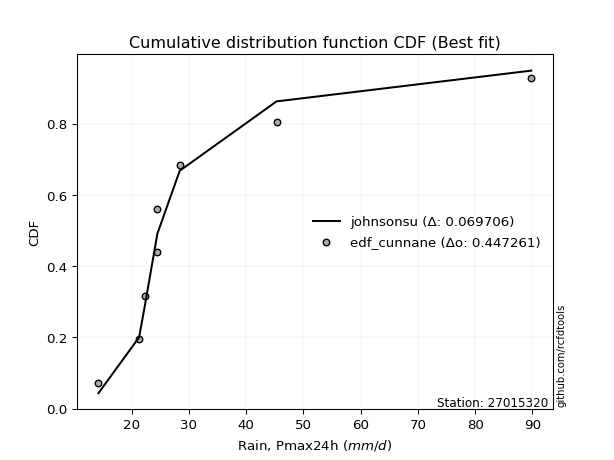</img>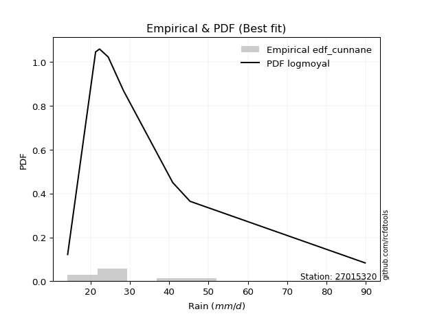</img>

</div>


### 12. Empirical - EDF Adamowski (1981)

The Adamowski formula in hydrology refers to a specific plotting position formula used for estimating the non-parametric empirical distribution of hydrological events (like flood peaks) to calculate their return periods. This formula provides an alternative to traditional parametric methods (like the Gumbel or Log Pearson Type III distributions). 

<div align="center">


$P=(m-0.25)/(n+0.5)$


</div>


**12.1. Empirical values**

<div align="center">

|                | 0                   | 1                   | 2                  | 3                   | 4             | 5                  | 6                  | 7                  | 8                  |
|:---------------|:--------------------|:--------------------|:-------------------|:--------------------|:--------------|:-------------------|:-------------------|:-------------------|:-------------------|
| date           | 2025                | 2018                | 2019               | 2017                | 2021          | 2020               | 2022               | 2023               | 2024               |
| x              | 7.4                 | 14.2                | 21.3               | 22.3                | 24.5          | 24.5               | 28.4               | 45.3               | 89.8               |
| m              | 1                   | 2                   | 3                  | 4                   | 5             | 6                  | 7                  | 8                  | 9                  |
| empirical_dist | edf_adamowski       | edf_adamowski       | edf_adamowski      | edf_adamowski       | edf_adamowski | edf_adamowski      | edf_adamowski      | edf_adamowski      | edf_adamowski      |
| empirical      | 0.07894736842105263 | 0.18421052631578946 | 0.2894736842105263 | 0.39473684210526316 | 0.5           | 0.6052631578947368 | 0.7105263157894737 | 0.8157894736842105 | 0.9210526315789473 |
| empirical_tr   | 1.0857142857142856  | 1.2258064516129032  | 1.4074074074074074 | 1.6521739130434783  | 2.0           | 2.533333333333333  | 3.4545454545454546 | 5.428571428571428  | 12.666666666666663 |

</div>


**12.2. Kolmogorov-Smirnov fit test (sorted by Δ)**


<div align="center">

|                | 0                   | 1                   | 2                   | 3                   | 4                     | 5                   | 6                   | 7                   | 8                   | 9                   | 10                  | 11                  | 12                  | 13                  | 14                  | 15                  | 16                  | 17                  | 18                  | 19                  | 20                  | 21                  | 22                  | 23                  | 24                  | 25                  | 26                  | 27                  | 28                  | 29                  | 30                  | 31                  | 32                  | 33                  | 34                  | 35                  | 36                  | 37                  | 38                  | 39                  | 40                  | 41                  | 42                  | 43                  | 44                  | 45                  | 46                  | 47                  | 48                  | 49                  | 50                  | 51                  | 52                  | 53                  | 54                  | 55                  | 56                  | 57                  | 58                  | 59                  | 60                  | 61                  | 62                  | 63                  | 64                  | 65                  | 66                  | 67                  | 68                  | 69                  | 70                  | 71                  | 72                  | 73                  | 74                  | 75                  | 76                  | 77                  | 78                  | 79                  | 80                  | 81                  | 82                  | 83                  | 84                  | 85                  | 86                  | 87                  | 88                  | 89                  |
|:---------------|:--------------------|:--------------------|:--------------------|:--------------------|:----------------------|:--------------------|:--------------------|:--------------------|:--------------------|:--------------------|:--------------------|:--------------------|:--------------------|:--------------------|:--------------------|:--------------------|:--------------------|:--------------------|:--------------------|:--------------------|:--------------------|:--------------------|:--------------------|:--------------------|:--------------------|:--------------------|:--------------------|:--------------------|:--------------------|:--------------------|:--------------------|:--------------------|:--------------------|:--------------------|:--------------------|:--------------------|:--------------------|:--------------------|:--------------------|:--------------------|:--------------------|:--------------------|:--------------------|:--------------------|:--------------------|:--------------------|:--------------------|:--------------------|:--------------------|:--------------------|:--------------------|:--------------------|:--------------------|:--------------------|:--------------------|:--------------------|:--------------------|:--------------------|:--------------------|:--------------------|:--------------------|:--------------------|:--------------------|:--------------------|:--------------------|:--------------------|:--------------------|:--------------------|:--------------------|:--------------------|:--------------------|:--------------------|:--------------------|:--------------------|:--------------------|:--------------------|:--------------------|:--------------------|:--------------------|:--------------------|:--------------------|:--------------------|:--------------------|:--------------------|:--------------------|:--------------------|:--------------------|:--------------------|:--------------------|:--------------------|
| station        | 27015320            | 27015320            | 27015320            | 27015320            | 27015320              | 27015320            | 27015320            | 27015320            | 27015320            | 27015320            | 27015320            | 27015320            | 27015320            | 27015320            | 27015320            | 27015320            | 27015320            | 27015320            | 27015320            | 27015320            | 27015320            | 27015320            | 27015320            | 27015320            | 27015320            | 27015320            | 27015320            | 27015320            | 27015320            | 27015320            | 27015320            | 27015320            | 27015320            | 27015320            | 27015320            | 27015320            | 27015320            | 27015320            | 27015320            | 27015320            | 27015320            | 27015320            | 27015320            | 27015320            | 27015320            | 27015320            | 27015320            | 27015320            | 27015320            | 27015320            | 27015320            | 27015320            | 27015320            | 27015320            | 27015320            | 27015320            | 27015320            | 27015320            | 27015320            | 27015320            | 27015320            | 27015320            | 27015320            | 27015320            | 27015320            | 27015320            | 27015320            | 27015320            | 27015320            | 27015320            | 27015320            | 27015320            | 27015320            | 27015320            | 27015320            | 27015320            | 27015320            | 27015320            | 27015320            | 27015320            | 27015320            | 27015320            | 27015320            | 27015320            | 27015320            | 27015320            | 27015320            | 27015320            | 27015320            | 27015320            |
| empirical_dist | edf_adamowski       | edf_adamowski       | edf_adamowski       | edf_adamowski       | edf_adamowski         | edf_adamowski       | edf_adamowski       | edf_adamowski       | edf_adamowski       | edf_adamowski       | edf_adamowski       | edf_adamowski       | edf_adamowski       | edf_adamowski       | edf_adamowski       | edf_adamowski       | edf_adamowski       | edf_adamowski       | edf_adamowski       | edf_adamowski       | edf_adamowski       | edf_adamowski       | edf_adamowski       | edf_adamowski       | edf_adamowski       | edf_adamowski       | edf_adamowski       | edf_adamowski       | edf_adamowski       | edf_adamowski       | edf_adamowski       | edf_adamowski       | edf_adamowski       | edf_adamowski       | edf_adamowski       | edf_adamowski       | edf_adamowski       | edf_adamowski       | edf_adamowski       | edf_adamowski       | edf_adamowski       | edf_adamowski       | edf_adamowski       | edf_adamowski       | edf_adamowski       | edf_adamowski       | edf_adamowski       | edf_adamowski       | edf_adamowski       | edf_adamowski       | edf_adamowski       | edf_adamowski       | edf_adamowski       | edf_adamowski       | edf_adamowski       | edf_adamowski       | edf_adamowski       | edf_adamowski       | edf_adamowski       | edf_adamowski       | edf_adamowski       | edf_adamowski       | edf_adamowski       | edf_adamowski       | edf_adamowski       | edf_adamowski       | edf_adamowski       | edf_adamowski       | edf_adamowski       | edf_adamowski       | edf_adamowski       | edf_adamowski       | edf_adamowski       | edf_adamowski       | edf_adamowski       | edf_adamowski       | edf_adamowski       | edf_adamowski       | edf_adamowski       | edf_adamowski       | edf_adamowski       | edf_adamowski       | edf_adamowski       | edf_adamowski       | edf_adamowski       | edf_adamowski       | edf_adamowski       | edf_adamowski       | edf_adamowski       | edf_adamowski       |
| p_dist         | logjohnsonsu        | johnsonsu           | logt                | t                   | loglaplace_asymmetric | loghypsecant        | loglaplace          | loglogistic         | mielke              | loggenlogistic      | logfisk             | nct                 | fisk                | alpha               | logmielke           | invweibull          | lognorm             | lognorm             | logcrystalball      | ncf                 | invgamma            | logloggamma         | fatiguelife         | invgauss            | loggamma            | loggamma            | logerlang           | logfatiguelife      | logf                | logbetaprime        | logexponnorm        | logpearson3         | logncf              | betaprime           | genexpon            | logrice             | lognct              | logweibull_min      | pearson3            | loginvgamma         | logalpha            | loginvgauss         | wald                | loggompertz         | exponnorm           | halflogistic        | logmaxwell          | expon               | weibull_min         | moyal               | lograyleigh         | genlogistic         | gompertz            | halfnorm            | gibrat              | loginvweibull       | laplace_asymmetric  | loggumbel_r         | logtruncnorm        | chi2                | gumbel_r            | loggumbel_l         | logkstwobign        | loghalfnorm         | erlang              | loggenexpon         | logmoyal            | rayleigh            | truncnorm           | loghalflogistic     | maxwell             | kstwobign           | f                   | lognakagami         | norm                | crystalball         | logistic            | rice                | hypsecant           | loggibrat           | logwald             | laplace             | logexpon            | nakagami            | gamma               | gumbel_l            | logchi2             | loglognorm          | pareto              | logpareto           |
| delta          | 0.07447310473637547 | 0.07611647448914902 | 0.09356179592717973 | 0.10492294664143675 | 0.11051017269320096   | 0.11245180253717468 | 0.11532762724615053 | 0.11573173395548064 | 0.11917717910131354 | 0.11918993691700075 | 0.12069642404592695 | 0.1208188563401481  | 0.12361895799605638 | 0.12409515004622257 | 0.12422516651264992 | 0.1253079167710609  | 0.12673113528418145 | 0.12673113528418145 | 0.12673116248290595 | 0.12729353596499088 | 0.12743302507429655 | 0.12892762447242267 | 0.12937168289457968 | 0.12991242725780755 | 0.13007784263859046 | 0.13007784263859046 | 0.13007786041709635 | 0.1301198319373052  | 0.1301766729274868  | 0.13018145438728074 | 0.13045313109314227 | 0.1308658256953763  | 0.13197620501994722 | 0.13233762707789565 | 0.13307922814476514 | 0.13404714324637462 | 0.13593254856707532 | 0.1365594019112636  | 0.13891084349096217 | 0.139015878056785   | 0.1396226974265784  | 0.1448197480445883  | 0.14518343863586614 | 0.1457287642834455  | 0.14738829116975216 | 0.1519810323671401  | 0.1543569560441193  | 0.15764401479579349 | 0.15830649742617975 | 0.15971158544759623 | 0.16661797848592852 | 0.16807646997537307 | 0.17279110925021046 | 0.17375960621384046 | 0.17762093983973448 | 0.17910858901032517 | 0.18034049695793009 | 0.18163639705932755 | 0.18420924463298827 | 0.18436215141055223 | 0.1852563259702582  | 0.18930124627778566 | 0.1991538771629554  | 0.20136312193198663 | 0.20221841897173048 | 0.204925589065159   | 0.2051795379688981  | 0.20701709264990897 | 0.21228759912527806 | 0.2181332973297222  | 0.21880689763290384 | 0.2193195193048837  | 0.23477819995899207 | 0.23852098669896482 | 0.253033560275251   | 0.2530335693405688  | 0.2587824452887781  | 0.262150170159209   | 0.2636540529732123  | 0.26777865827724256 | 0.26939416224561574 | 0.2805897892789406  | 0.2941682467766351  | 0.294633782810394   | 0.3086317221853092  | 0.3233870755543021  | 0.4129425841130361  | 0.4314100516892123  | 0.44389737814094055 | 0.4629904314476947  |
| deltao         | 0.41761268023100007 | 0.41761268023100007 | 0.41761268023100007 | 0.41761268023100007 | 0.41761268023100007   | 0.41761268023100007 | 0.41761268023100007 | 0.41761268023100007 | 0.41761268023100007 | 0.41761268023100007 | 0.41761268023100007 | 0.41761268023100007 | 0.41761268023100007 | 0.41761268023100007 | 0.41761268023100007 | 0.41761268023100007 | 0.41761268023100007 | 0.41761268023100007 | 0.41761268023100007 | 0.41761268023100007 | 0.41761268023100007 | 0.41761268023100007 | 0.41761268023100007 | 0.41761268023100007 | 0.41761268023100007 | 0.41761268023100007 | 0.41761268023100007 | 0.41761268023100007 | 0.41761268023100007 | 0.41761268023100007 | 0.41761268023100007 | 0.41761268023100007 | 0.41761268023100007 | 0.41761268023100007 | 0.41761268023100007 | 0.41761268023100007 | 0.41761268023100007 | 0.41761268023100007 | 0.41761268023100007 | 0.41761268023100007 | 0.41761268023100007 | 0.41761268023100007 | 0.41761268023100007 | 0.41761268023100007 | 0.41761268023100007 | 0.41761268023100007 | 0.41761268023100007 | 0.41761268023100007 | 0.41761268023100007 | 0.41761268023100007 | 0.41761268023100007 | 0.41761268023100007 | 0.41761268023100007 | 0.41761268023100007 | 0.41761268023100007 | 0.41761268023100007 | 0.41761268023100007 | 0.41761268023100007 | 0.41761268023100007 | 0.41761268023100007 | 0.41761268023100007 | 0.41761268023100007 | 0.41761268023100007 | 0.41761268023100007 | 0.41761268023100007 | 0.41761268023100007 | 0.41761268023100007 | 0.41761268023100007 | 0.41761268023100007 | 0.41761268023100007 | 0.41761268023100007 | 0.41761268023100007 | 0.41761268023100007 | 0.41761268023100007 | 0.41761268023100007 | 0.41761268023100007 | 0.41761268023100007 | 0.41761268023100007 | 0.41761268023100007 | 0.41761268023100007 | 0.41761268023100007 | 0.41761268023100007 | 0.41761268023100007 | 0.41761268023100007 | 0.41761268023100007 | 0.41761268023100007 | 0.41761268023100007 | 0.41761268023100007 | 0.41761268023100007 | 0.41761268023100007 |
| eval           | Δo > Δ              | Δo > Δ              | Δo > Δ              | Δo > Δ              | Δo > Δ                | Δo > Δ              | Δo > Δ              | Δo > Δ              | Δo > Δ              | Δo > Δ              | Δo > Δ              | Δo > Δ              | Δo > Δ              | Δo > Δ              | Δo > Δ              | Δo > Δ              | Δo > Δ              | Δo > Δ              | Δo > Δ              | Δo > Δ              | Δo > Δ              | Δo > Δ              | Δo > Δ              | Δo > Δ              | Δo > Δ              | Δo > Δ              | Δo > Δ              | Δo > Δ              | Δo > Δ              | Δo > Δ              | Δo > Δ              | Δo > Δ              | Δo > Δ              | Δo > Δ              | Δo > Δ              | Δo > Δ              | Δo > Δ              | Δo > Δ              | Δo > Δ              | Δo > Δ              | Δo > Δ              | Δo > Δ              | Δo > Δ              | Δo > Δ              | Δo > Δ              | Δo > Δ              | Δo > Δ              | Δo > Δ              | Δo > Δ              | Δo > Δ              | Δo > Δ              | Δo > Δ              | Δo > Δ              | Δo > Δ              | Δo > Δ              | Δo > Δ              | Δo > Δ              | Δo > Δ              | Δo > Δ              | Δo > Δ              | Δo > Δ              | Δo > Δ              | Δo > Δ              | Δo > Δ              | Δo > Δ              | Δo > Δ              | Δo > Δ              | Δo > Δ              | Δo > Δ              | Δo > Δ              | Δo > Δ              | Δo > Δ              | Δo > Δ              | Δo > Δ              | Δo > Δ              | Δo > Δ              | Δo > Δ              | Δo > Δ              | Δo > Δ              | Δo > Δ              | Δo > Δ              | Δo > Δ              | Δo > Δ              | Δo > Δ              | Δo > Δ              | Δo > Δ              | Δo > Δ              | Δo <= Δ             | Δo <= Δ             | Δo <= Δ             |
| fit            | 1                   | 1                   | 1                   | 1                   | 1                     | 1                   | 1                   | 1                   | 1                   | 1                   | 1                   | 1                   | 1                   | 1                   | 1                   | 1                   | 1                   | 1                   | 1                   | 1                   | 1                   | 1                   | 1                   | 1                   | 1                   | 1                   | 1                   | 1                   | 1                   | 1                   | 1                   | 1                   | 1                   | 1                   | 1                   | 1                   | 1                   | 1                   | 1                   | 1                   | 1                   | 1                   | 1                   | 1                   | 1                   | 1                   | 1                   | 1                   | 1                   | 1                   | 1                   | 1                   | 1                   | 1                   | 1                   | 1                   | 1                   | 1                   | 1                   | 1                   | 1                   | 1                   | 1                   | 1                   | 1                   | 1                   | 1                   | 1                   | 1                   | 1                   | 1                   | 1                   | 1                   | 1                   | 1                   | 1                   | 1                   | 1                   | 1                   | 1                   | 1                   | 1                   | 1                   | 1                   | 1                   | 1                   | 1                   | 0                   | 0                   | 0                   |
| n              | 9                   | 9                   | 9                   | 9                   | 9                     | 9                   | 9                   | 9                   | 9                   | 9                   | 9                   | 9                   | 9                   | 9                   | 9                   | 9                   | 9                   | 9                   | 9                   | 9                   | 9                   | 9                   | 9                   | 9                   | 9                   | 9                   | 9                   | 9                   | 9                   | 9                   | 9                   | 9                   | 9                   | 9                   | 9                   | 9                   | 9                   | 9                   | 9                   | 9                   | 9                   | 9                   | 9                   | 9                   | 9                   | 9                   | 9                   | 9                   | 9                   | 9                   | 9                   | 9                   | 9                   | 9                   | 9                   | 9                   | 9                   | 9                   | 9                   | 9                   | 9                   | 9                   | 9                   | 9                   | 9                   | 9                   | 9                   | 9                   | 9                   | 9                   | 9                   | 9                   | 9                   | 9                   | 9                   | 9                   | 9                   | 9                   | 9                   | 9                   | 9                   | 9                   | 9                   | 9                   | 9                   | 9                   | 9                   | 9                   | 9                   | 9                   |
| best_fit       | 1                   | 0                   | 0                   | 0                   | 0                     | 0                   | 0                   | 0                   | 0                   | 0                   | 0                   | 0                   | 0                   | 0                   | 0                   | 0                   | 0                   | 0                   | 0                   | 0                   | 0                   | 0                   | 0                   | 0                   | 0                   | 0                   | 0                   | 0                   | 0                   | 0                   | 0                   | 0                   | 0                   | 0                   | 0                   | 0                   | 0                   | 0                   | 0                   | 0                   | 0                   | 0                   | 0                   | 0                   | 0                   | 0                   | 0                   | 0                   | 0                   | 0                   | 0                   | 0                   | 0                   | 0                   | 0                   | 0                   | 0                   | 0                   | 0                   | 0                   | 0                   | 0                   | 0                   | 0                   | 0                   | 0                   | 0                   | 0                   | 0                   | 0                   | 0                   | 0                   | 0                   | 0                   | 0                   | 0                   | 0                   | 0                   | 0                   | 0                   | 0                   | 0                   | 0                   | 0                   | 0                   | 0                   | 0                   | 0                   | 0                   | 0                   |
| best_fit_sort  | 1                   | 2                   | 3                   | 4                   | 5                     | 6                   | 7                   | 8                   | 9                   | 10                  | 11                  | 12                  | 13                  | 14                  | 15                  | 16                  | 17                  | 18                  | 19                  | 20                  | 21                  | 22                  | 23                  | 24                  | 25                  | 26                  | 27                  | 28                  | 29                  | 30                  | 31                  | 32                  | 33                  | 34                  | 35                  | 36                  | 37                  | 38                  | 39                  | 40                  | 41                  | 42                  | 43                  | 44                  | 45                  | 46                  | 47                  | 48                  | 49                  | 50                  | 51                  | 52                  | 53                  | 54                  | 55                  | 56                  | 57                  | 58                  | 59                  | 60                  | 61                  | 62                  | 63                  | 64                  | 65                  | 66                  | 67                  | 68                  | 69                  | 70                  | 71                  | 72                  | 73                  | 74                  | 75                  | 76                  | 77                  | 78                  | 79                  | 80                  | 81                  | 82                  | 83                  | 84                  | 85                  | 86                  | 87                  | 88                  | 89                  | 90                  |

</div>


<div align="center">

</img>

</div>


**12.3. Best fit**

<div align="center">

|   id |   station | empirical_dist   | p_dist       |     delta |   deltao | eval   |   fit |   n |   best_fit |   best_fit_sort |
|-----:|----------:|:-----------------|:-------------|----------:|---------:|:-------|------:|----:|-----------:|----------------:|
|    0 |  27015320 | edf_adamowski    | logjohnsonsu | 0.0744731 | 0.417613 | Δo > Δ |     1 |   9 |          1 |               1 |

</div>


<div align="center">

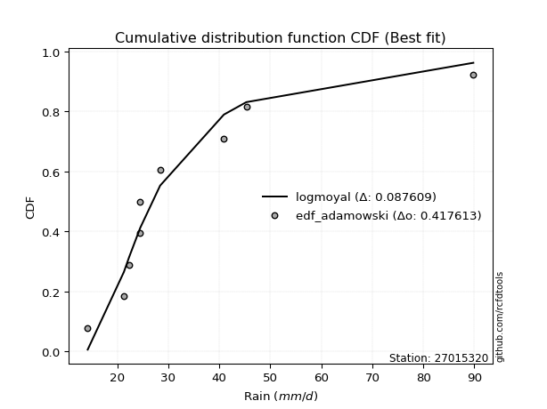</img></img>

</div>


## C. Best fit & Estimate extreme values for specific return periods - Tr


### 1. Best fit (ordered by delta Δ)

<div align="center">

|   id |   station | empirical_dist   | p_dist       |     delta |   deltao | eval   |   fit |   n |   best_fit |   best_fit_sort |
|-----:|----------:|:-----------------|:-------------|----------:|---------:|:-------|------:|----:|-----------:|----------------:|
|    0 |  27015320 | edf_cunnane      | logjohnsonsu | 0.0641756 | 0.417613 | Δo > Δ |     1 |   9 |          1 |               1 |
|    1 |  27015320 | edf_gringorten   | logjohnsonsu | 0.0643458 | 0.417613 | Δo > Δ |     1 |   9 |          1 |               2 |
|    2 |  27015320 | edf_hazen        | logjohnsonsu | 0.0658078 | 0.417613 | Δo > Δ |     1 |   9 |          1 |               3 |
|    3 |  27015320 | edf_blom         | logjohnsonsu | 0.0659383 | 0.417613 | Δo > Δ |     1 |   9 |          1 |               4 |
|    4 |  27015320 | edf_tukey        | logjohnsonsu | 0.068834  | 0.417613 | Δo > Δ |     1 |   9 |          1 |               5 |
|    5 |  27015320 | edf_filliben     | logjohnsonsu | 0.0699209 | 0.417613 | Δo > Δ |     1 |   9 |          1 |               6 |
|    6 |  27015320 | edf_beard        | logjohnsonsu | 0.0704332 | 0.417613 | Δo > Δ |     1 |   9 |          1 |               7 |
|    7 |  27015320 | edf_jenkinson    | logjohnsonsu | 0.0704332 | 0.417613 | Δo > Δ |     1 |   9 |          1 |               8 |
|    8 |  27015320 | edf_chegodayev   | logjohnsonsu | 0.0711136 | 0.417613 | Δo > Δ |     1 |   9 |          1 |               9 |
|    9 |  27015320 | edf_adamowski    | logjohnsonsu | 0.0744731 | 0.417613 | Δo > Δ |     1 |   9 |          1 |              10 |
|   10 |  27015320 | edf_california   | t            | 0.0812832 | 0.417613 | Δo > Δ |     1 |   9 |          1 |              11 |
|   11 |  27015320 | edf_weibull      | logjohnsonsu | 0.0902626 | 0.417613 | Δo > Δ |     1 |   9 |          1 |              12 |

</div>

:file_folder:Tables: [bestfit_27015320.csv](table/bestfit_27015320.csv) | [extreme_27015320.csv](table/extreme_27015320.csv)


### 2. Extreme values

In hydrology, a return period (or recurrence interval $Tr$) is the statistical average time between extreme events like floods or droughts of a specific magnitude, indicating how rare an event is, with a 100-year flood, for example, having a 1% chance of occurring in any given year, not that it happens exactly every century. It is a key tool for infrastructure design (like bridges or dams) and risk assessment, calculated from historical data to determine the probability of future events, although it is important to remember it is statistical average, and events can cluster or be missed.

> risk_rate: assuming the return period as the project useful life.

|   id |      tr |   prob_l |     prob_g |    alpha |   betaprime |     chi2 |   crystalball |   erlang |    expon |   exponnorm |        f |   fatiguelife |     fisk |    gamma |   genexpon |   genlogistic |   gibrat |   gompertz |   gumbel_l |   gumbel_r |   halflogistic |   halfnorm |   hypsecant |   invgamma |   invgauss |   invweibull |   johnsonsu |   kstwobign |   laplace |   laplace_asymmetric |   loggamma |   logistic |   lognorm |   maxwell |   mielke |    moyal |   nakagami |      ncf |      nct |     norm |           pareto |   pearson3 |   rayleigh |     rice |         t |   truncnorm |     wald |   weibull_min |   logalpha |   logbetaprime |     logchi2 |   logcrystalball |   logerlang |   logexpon |   logexponnorm |     logf |   logfatiguelife |   logfisk |   loggenexpon |   loggenlogistic |   loggibrat |   loggompertz |   loggumbel_l |   loggumbel_r |   loghalflogistic |   loghalfnorm |   loghypsecant |   loginvgamma |   loginvgauss |   loginvweibull |     logjohnsonsu |   logkstwobign |   loglaplace |   loglaplace_asymmetric |   logloggamma |   loglogistic |     loglognorm |   logmaxwell |   logmielke |   logmoyal |   lognakagami |   logncf |   lognct |     logpareto |   logpearson3 |   lograyleigh |   logrice |             logt |   logtruncnorm |   logwald |   logweibull_min |   station |   n |   risk_rate |
|-----:|--------:|---------:|-----------:|---------:|------------:|---------:|--------------:|---------:|---------:|------------:|---------:|--------------:|---------:|---------:|-----------:|--------------:|---------:|-----------:|-----------:|-----------:|---------------:|-----------:|------------:|-----------:|-----------:|-------------:|------------:|------------:|----------:|---------------------:|-----------:|-----------:|----------:|----------:|---------:|---------:|-----------:|---------:|---------:|---------:|-----------------:|-----------:|-----------:|---------:|----------:|------------:|---------:|--------------:|-----------:|---------------:|------------:|-----------------:|------------:|-----------:|---------------:|---------:|-----------------:|----------:|--------------:|-----------------:|------------:|--------------:|--------------:|--------------:|------------------:|--------------:|---------------:|--------------:|--------------:|----------------:|-----------------:|---------------:|-------------:|------------------------:|--------------:|--------------:|---------------:|-------------:|------------:|-----------:|--------------:|---------:|---------:|--------------:|--------------:|--------------:|----------:|-----------------:|---------------:|----------:|-----------------:|----------:|----:|------------:|
|    0 |    2    | 0.5      | 0.5        |  24.2253 |     24.1703 |  22.455  |       30.8556 |  21.6803 |  23.6582 |     25.7835 |  20.111  |       24.5989 |  24.1786 |  17.3611 |    24.5721 |       26.692  |  23.951  |    26.4128 |    34.6345 |    27.0766 |        25.1979 |    26.147  |     30.8556 |    24.2916 |    24.4675 |      24.2814 |     24.0195 |     28.8013 |   30.8556 |              26.9    |    24.3008 |    30.8556 |   24.7313 |   28.8882 |  24.2978 |  25.8567 |    17.3184 |  24.3017 |  24.2733 |  30.8556 |      8.03673     |    24.6306 |    28.1905 |  30.9314 |   23.3768 |     28.4758 |  23.3992 |       24.3297 |    23.9203 |        24.2925 |     11.6995 |          24.7313 |     24.3008 |    17.0786 |        24.217  |  24.2926 |          24.2972 |   24.2114 |       21.5298 |          24.2977 |     20.3252 |       24.171  |       27.5349 |       22.2133 |           21.0587 |       21.634  |        24.7313 |       23.9363 |       23.7378 |         22.5291 |     23.8918      |        21.7623 |      24.7313 |                 24.6162 |       24.7938 |       24.7313 |   7.58194      |      23.3867 |     24.0794 |    21.4564 |       20.3853 |  24.2278 |  24.0649 |   7.70224     |       24.2677 |       22.9276 |   24.2294 |     23.6062      |        22.6425 |   20.009  |          24.1984 |  27015320 |   9 |    0.75     |
|    1 |    2.33 | 0.570815 | 0.429185   |  26.9422 |     27.131  |  25.929  |       34.9603 |  25.2412 |  27.2403 |     28.7422 |  23.8336 |       27.8786 |  26.8363 |  20.0976 |    27.9803 |       29.5882 |  26.0304 |    30.2528 |    38.2057 |    30.8802 |        29.1086 |    30.5771 |     34.1406 |    27.1997 |    27.6616 |      27.1055 |     25.0924 |     32.1675 |   33.3396 |              29.52   |    27.3179 |    34.4722 |   27.791  |   33.1528 |  26.9196 |  29.4572 |    20.6133 |  27.2143 |  26.9501 |  34.9603 |      9.5629      |    28.3332 |    32.5182 |  34.5327 |   24.2993 |     31.6115 |  26.0907 |       29.2214 |    26.9145 |        27.3052 |     13.7752 |          27.791  |     27.3179 |    20.5343 |        27.1556 |  27.3052 |          27.3122 |   26.8034 |       24.7584 |          26.9193 |     21.5623 |       27.7385 |       30.4758 |       24.7487 |           23.5337 |       24.5363 |        27.1512 |       26.9181 |       26.75   |         25.7322 |     24.8704      |        25.0178 |      26.5401 |                 26.3807 |       27.8895 |       27.4082 |   8.84959      |      26.3997 |     26.6284 |    23.7679 |       22.9187 |  27.2431 |  27.0666 |   8.47814     |       27.2818 |       25.9278 |   27.3253 |     24.8502      |        24.8513 |   21.5994 |          27.3658 |  27015320 |   9 |    0.729209 |
|    2 |    5    | 0.8      | 0.2        |  40.819  |     42.1899 |  43.5178 |       50.2148 |  43.676  |  45.1503 |     43.4308 |  45.1544 |       44.2042 |  40.5241 |  34.6958 |    44.589  |       42.169  |  38.0016 |    47.9156 |    49.7428 |    47.4045 |        46.8035 |    49.3116 |     47.3177 |    42.0126 |    43.743  |      41.556  |     33.5166 |     46.4664 |   45.7591 |              42.6195 |    42.6209 |    48.4364 |   42.8706 |   49.938  |  40.2064 |  46.1352 |    36.9193 |  42.0337 |  40.786  |  50.2148 |    972.97        |    45.9589 |    49.8438 |  48.9502 |   29.5876 |     44.2194 |  41.158  |       56.945  |    42.5191 |        42.5949 |     35.8988 |          42.8706 |     42.6209 |    51.5944 |        42.102  |  42.5945 |          42.6091 |   40.0739 |       43.565  |          40.2025 |     30.2997 |       45.1972 |       42.2994 |       39.5802 |           38.9096 |       41.7843 |        39.4827 |       42.351  |       42.7261 |         45.8454 |     31.9859      |        45.2303 |      37.7722 |                 37.2912 |       43.1183 |       40.7579 |   3.91375e+130 |      42.5346 |     39.5074 |    38.178  |       40.7195 |  42.6061 |  42.5504 |   1.85566e+27 |       42.6038 |       42.421  |   42.99   |     31.6614      |        37.5945 |   33.1429 |          43.342  |  27015320 |   9 |    0.67232  |
|    3 |   10    | 0.9      | 0.1        |  55.6068 |     57.3055 |  59.6563 |       60.3343 |  60.908  |  61.4084 |     56.7593 |  67.9902 |       59.2628 |  55.3079 |  48.6786 |    59.4658 |       52.4149 |  51.6474 |    62.1052 |    56.1661 |    60.8633 |        61.4984 |    63.1747 |     57.8401 |    57.0118 |    58.9675 |      56.4653 |     49.3696 |     57.3531 |   57.0333 |              54.5108 |    57.747  |    58.7205 |   57.1536 |   61.7504 |  54.2247 |  60.6561 |    50.1778 |  57.012  |  55.5371 |  60.3343 | 245306           |    61.2803 |    62.1973 |  59.2301 |   39.5696 |     53.1279 |  57.148  |       85.6114 |    58.6126 |        57.7328 |     96.2893 |          57.1536 |     57.747  |   119.076  |        57.2292 |  57.732  |          57.7402 |   54.4246 |       65.3992 |          54.2154 |     44.6526 |       60.6634 |       50.7697 |       58.0193 |           59.0746 |       61.9581 |        53.243  |       58.0911 |       59.5868 |         73.3811 |     48.6456      |        70.9968 |      52.0362 |                 51.0578 |       57.4913 |       54.5918 | inf            |      59.5004 |     53.4918 |    57.6786 |       64.8266 |  57.9001 |  58.2666 | inf           |       57.7983 |       60.2608 |   58.2851 |     42.8593      |        50.6866 |   52.2067 |          58.7071 |  27015320 |   9 |    0.651322 |
|    4 |   15    | 0.933333 | 0.0666667  |  65.9972 |     67.0996 |  69.1393 |       65.3841 |  71.1122 |  70.9188 |     64.556  |  82.8676 |       68.2028 |  65.6528 |  57.0413 |    68.1487 |       58.1954 |  61.0597 |    69.7403 |    59.0751 |    68.4567 |        69.8143 |    70.389  |     63.8451 |    66.8158 |    68.1948 |      66.39   |     64.4215 |     63.1327 |   63.6282 |              61.4668 |    67.3727 |    64.3237 |   65.9725 |   67.8113 |  63.8669 |  69.0833 |    57.2277 |  66.7885 |  65.6708 |  65.3841 |      6.2586e+06  |    70.0761 |    68.5624 |  64.5269 |   50.8153 |     57.6764 |  67.4161 |      103.575  |    69.1838 |        67.3815 |    176.693  |          65.9725 |     67.3727 |   194.22   |        67.1668 |  67.3805 |          67.3761 |   64.5356 |       80.6819 |          63.8544 |     58.3456 |       69.5888 |       55.1447 |       71.9916 |           74.8213 |       76.0554 |        63.1495 |       68.3425 |       70.8266 |         95.6845 |     71.1362      |        90.1965 |      62.7616 |                 61.3597 |       66.3402 |       64.0143 | inf            |      70.6833 |     63.5302 |    73.2849 |       82.9882 |  67.6848 |  68.4683 | inf           |       67.49   |       72.2081 |   67.8995 |     55.4134      |        58.2599 |   69.895  |          68.2176 |  27015320 |   9 |    0.644736 |
|    5 |   20    | 0.95     | 0.05       |  74.4616 |     74.555  |  75.8814 |       68.6911 |  78.3921 |  77.6666 |     70.0878 |  94.1286 |       74.6004 |  73.9635 |  63.0339 |    74.3064 |       62.2427 |  68.4429 |    74.8978 |    60.8858 |    73.7733 |        75.6408 |    75.1988 |     68.0813 |    74.3235 |    74.8804 |      74.0845 |     78.6154 |     67.026  |   68.3074 |              66.4021 |    74.6004 |    68.1966 |   72.4727 |   71.8337 |  71.5285 |  75.0516 |    61.9551 |  74.2687 |  73.7018 |  68.6911 |      6.23167e+07 |    76.263  |    72.7931 |  68.0474 |   63.114  |     60.6836 |  75.0678 |      116.784  |    77.2832 |        74.6347 |    274.457  |          72.4727 |     74.6004 |   274.817  |        74.827  |  74.6336 |          74.6151 |   72.7126 |       92.7866 |          71.5138 |     71.966  |       75.8762 |       58.0563 |       83.7326 |           88.2931 |       87.1945 |        71.2278 |       76.1536 |       79.5124 |        115.224  |    100.918       |       105.978  |      71.6868 |                 69.9065 |       72.8503 |       71.4614 | inf            |      79.2422 |     71.7916 |    86.8299 |       97.9313 |  75.0569 |  76.2258 | inf           |       74.7775 |       81.4323 |   75.0573 |     70.1782      |        63.299  |   86.8716 |          75.2228 |  27015320 |   9 |    0.641514 |
|    6 |   25    | 0.96     | 0.04       |  81.8057 |     80.6565 |  81.1175 |       71.1255 |  84.0579 |  82.9005 |     74.3786 | 103.281  |       79.5916 |  81.0515 |  67.7102 |    79.0819 |       65.3601 |  74.5979 |    78.762  |    62.1743 |    77.8686 |        80.1298 |    78.7775 |     71.3599 |    80.4956 |    80.1418 |      80.4691 |     92.0633 |     69.9422 |   71.9369 |              70.2303 |    80.4504 |    71.1592 |   77.6635 |   74.8198 |  78.0098 |  79.6777 |    65.4807 |  80.4142 |  80.4794 |  71.1255 |      3.70521e+08 |    81.0364 |    75.9364 |  70.6631 |   76.2861 |     62.9098 |  81.1967 |      127.274  |    83.9377 |        80.5106 |    387.985  |          77.6635 |     80.4504 |   359.728  |        81.1662 |  80.5096 |          80.4765 |   79.7283 |      102.951  |          77.9937 |     85.7215 |       80.73   |       60.2214 |       94.0662 |          100.305  |       96.5281 |        78.1825 |       82.5446 |       86.6914 |        132.954  |    139.794       |       119.582  |      79.475  |                 77.3476 |       78.0418 |       77.738  | inf            |      86.2599 |     78.9896 |    99.0283 |      110.8    |  81.0389 |  82.5637 | inf           |       80.6821 |       89.0406 |   80.813  |     87.7239      |        66.9198 |  103.399  |          80.81   |  27015320 |   9 |    0.639603 |
|    7 |   50    | 0.98     | 0.02       | 110.522  |    101.601  |  97.4119 |       78.0967 | 101.743  |  99.1587 |     87.7072 | 134.16   |       95.2396 | 107.362  |  82.3628 |    93.914  |       74.9635 |  96.2946 |    90.0816 |    65.672  |    90.4841 |        93.961  |    89.1795 |     81.5246 |   101.862  |    96.8783 |     102.953  |    151.271  |     78.5057 |   83.211  |              82.1216 |   100.091  |    80.2111 |   94.6778 |   83.4804 | 101.707  |  94.0388 |    75.7462 | 101.664  | 105.138  |  78.0967 |      9.41287e+10 |    95.7483 |    85.0609 |  78.2561 |  151.861  |     69.3345 | 101.207  |      161.106  |   106.902  |       100.273  |   1160.89   |          94.6778 |    100.091  |   830.222  |       103.475  | 100.272  |         100.171  |  106.132  |      139.27   |         101.688  |    158.803  |       95.6924 |       66.5144 |      134.623  |          148.597  |      129.726  |       104.364  |      104.43   |      111.723  |        206.628  |    563.389       |       170.486  |     109.487  |                105.902  |       95.0145 |      100.541  | inf            |     110.329  |    107.026  |   148.933  |      158.728  | 101.216  | 104.211  | inf           |      100.543  |      115.397  |   99.9001 |    240.13        |        76.1456 |  182.588  |          99.0582 |  27015320 |   9 |    0.63583  |
|    8 |   75    | 0.986667 | 0.0133333  | 133.185  |    115.423  | 106.96   |       81.8372 | 112.137  | 108.669  |     95.5039 | 154.053  |      104.482  | 126.401  |  91.006  |   102.59   |       80.5453 | 110.949  |    96.2734 |    67.4407 |    97.8166 |       102.001  |    94.8419 |     87.4648 |   116.106  |   106.922  |     118.241  |    201.743  |     83.2172 |   89.8059 |              89.0775 |   112.694  |    85.4392 |  105.295  |   88.189  | 118.558  | 102.437  |    81.3356 | 115.811  | 122.573  |  81.8372 |      2.40162e+12 |   104.288  |    90.025  |  82.3869 |  239.165  |     72.8075 | 113.521  |      181.695  |   122.123  |       112.98   |   2229.96   |         105.295  |    112.694  |  1354.14   |       118.71   | 112.98   |         112.819  |  125.603  |      164.19   |         118.541  |    240.83   |      104.374  |       69.9429 |      165.81   |          186.736  |      152.372  |       123.555  |      118.803  |      128.502  |        266.987  |   1786.19        |       207.22   |     132.054  |                127.269  |      105.574  |      116.644  | inf            |     126.124  |    128.669  |   189.074  |      193.042  | 114.233  | 118.384  | inf           |      113.313  |      132.879  |  111.965  |    594.311       |        80.0524 |  259.083  |         110.383  |  27015320 |   9 |    0.634587 |
|    9 |  100    | 0.99     | 0.01       | 153.065  |    126.022  | 113.741  |       84.3671 | 119.53   | 115.417  |    101.036  | 169.045  |      111.075  | 141.888  |  97.1647 |   108.745  |       84.4958 | 122.301  |   100.494  |    68.5976 |   103.006  |       107.692  |    98.6994 |     91.6785 |   127.097  |   114.151  |     130.185  |    246.692  |     86.4454 |   94.4851 |              94.0129 |   122.172  |    89.1303 |  113.144  |   91.3962 | 132.114  | 108.395  |    85.1412 | 126.718  | 136.547  |  84.3671 |      2.39129e+13 |   110.323  |    93.4069 |  85.2012 |  335.099  |     75.1651 | 122.499  |      196.633  |   133.812  |       122.552  |   3558.72   |         113.144  |    122.172  |  1916.08   |       130.683  | 122.552  |         122.339  |  141.669  |      183.691  |         132.099  |    332.513  |      110.505  |       72.2805 |      192.158  |          219.51   |      170.024  |       139.271  |      129.774  |      141.473  |        320.084  |   4902.62        |       236.861  |     150.833  |                144.997  |      113.364  |      129.543  | inf            |     138.158  |    147.141  |   223.955  |      220.559  | 124.058  | 129.184  | inf           |      122.931  |      146.282  |  120.952  |   1387.35        |        82.2179 |  334.377  |         118.72   |  27015320 |   9 |    0.633968 |
|   10 |  200    | 0.995    | 0.005      | 220.588  |    154.583  | 130.097  |       90.1057 | 137.393  | 131.675  |    114.364  | 208.384  |      127.066  | 187.391  | 112.078  |   123.576  |       93.9934 | 153.185  |   110.135  |    71.1123 |   115.483  |       121.373  |   107.522  |    101.83   |   156.993  |   131.891  |     163.257  |    395.003  |     93.8806 |  105.759  |             105.904  |   146.976  |    97.9846 |  133.184  |   98.7338 | 171.3    | 122.75   |    93.8336 | 156.35   | 176.739  |  90.1057 |      6.07493e+15 |   124.795  |   101.145  |  91.6405 |  779.547  |     80.5354 | 144.862  |      233.664  |   165.336  |       147.654  |  11107.8    |         133.184  |    146.976  |  4422.16   |       164.249  | 147.656  |         147.272  |  190.033  |      237.525  |         171.298  |    799.768  |      125.189  |       77.6344 |      273.925  |          323.806  |      218.469  |       185.839  |      159.104  |      176.773  |        495.043  | 126500           |       322.273  |     207.793  |                198.525  |      133.2    |      166.603  | inf            |     170.188  |    205.997  |   336.756  |      299.036  | 149.899  | 157.979  | inf           |      148.146  |      182.258  |  144.135  |  29761.7         |        85.7837 |  631.28   |         139.864  |  27015320 |   9 |    0.633042 |
|   11 |  250    | 0.996    | 0.004      | 250.844  |    164.78   | 135.367  |       91.8595 | 143.156  | 136.909  |    118.655  | 222.079  |      132.243  | 204.943  | 116.899  |   128.35   |       97.0467 | 164.266  |   113.092  |    71.8521 |   119.494  |       125.771  |   110.236  |    105.097  |   167.757  |   137.692  |     175.354  |    457.544  |     96.1817 |  109.389  |             109.732  |   155.588  |   100.827  |  139.989  |  100.992  | 186.2    | 127.371  |    96.5039 | 167.008  | 191.956  |  91.8595 |      3.61201e+16 |   129.436  |   103.527  |  93.6227 | 1029.18   |     82.182  | 152.26   |      245.881  |   176.589  |       156.387  |  16074      |         139.989  |    155.588  |  5788.49   |       176.692  | 156.39   |         155.936  |  209.138  |      257.096  |         186.204  |   1095.78   |      129.893  |       79.2839 |      306.995  |          366.912  |      235.985  |       203.922  |      169.488  |      189.472  |        569.542  | 484753           |       354.495  |     230.368  |                219.656  |      139.919  |      180.62   | inf            |     181.47   |    230.553  |   384.013  |      328.349  | 158.913  | 168.15   | inf           |      156.916  |      195.022  |  152.079  | 122146           |        86.5483 |  778.978  |         146.997  |  27015320 |   9 |    0.632858 |
|   12 |  500    | 0.998    | 0.002      | 389.258  |    200.001  | 151.748  |       97.0601 | 161.094  | 153.167  |    131.984  | 268.115  |      148.399  | 270.693  | 131.923  |   143.181  |      106.524  | 202.563  |   121.872  |    73.9731 |   131.944  |       139.422  |   118.328  |    115.248  |   205.263  |   155.958  |     218.19   |    711.868  |    103.077  |  120.663  |             121.624  |   184.442  |   109.643  |  162.284  |  107.733  | 241.165  | 141.726  |   104.453  | 204.1    | 247.853  |  97.0601 |      9.17612e+18 |   143.804  |   110.634  |  99.5369 | 2463.15   |     87.0784 | 175.784  |      284.683  |   215.398  |       185.713  |  51070.4    |         162.284  |    184.442  | 13359.4    |       221.477  | 185.72   |         184.995  |  282.825  |      325.658  |         241.204  |   3253.58   |      144.434  |       84.2092 |      437.291  |          540.788  |      296.997  |       272.101  |      204.992  |      233.594  |        880.023  |      1.02171e+08 |       471.668  |     317.363  |                300.745  |      161.873  |      232.039  | inf            |     219.778  |    331.878  |   577.427  |      433.756  | 189.259  | 202.845  | inf           |      186.35   |      238.667  |  178.334  |      7.53434e+07 |        88.1347 | 1519.99   |         170.199  |  27015320 |   9 |    0.632489 |
|   13 |  750    | 0.998667 | 0.00133333 | 518.824  |    223.366  | 161.338  |       99.9491 | 171.608  | 162.677  |    139.78   | 297.679  |      157.899  | 318.586  | 140.742  |   151.857  |      112.064  | 227.89   |   126.746  |    75.1067 |   139.221  |       147.403  |   122.849  |    121.185  |   230.399  |   166.804  |     247.434  |    912.775  |    106.951  |  127.258  |             128.58   |   202.889  |   114.794  |  176.169  |  111.502  | 280.507  | 150.123  |   108.885  | 228.925  | 287.678  |  99.9491 |      2.34121e+20 |   152.18   |   114.608  | 102.844  | 4120.38   |     89.8061 | 189.889  |      307.947  |   241.073  |       204.512  | 100921      |         176.169  |    202.889  | 21789.9    |       252.676  | 204.523  |         203.593  |  338.506  |      371.719  |         280.578  |   6682.43   |      152.896  |       86.9659 |      537.758  |          678.441  |      337.71   |       322.111  |      228.238  |      263.022  |       1134.92   |      6.37771e+09 |       553.747  |     382.775  |                361.427  |      175.503  |      268.611  | inf            |     244.628  |    415.124  |   733.033  |      506.604  | 208.772  | 225.5    | inf           |      205.206  |      267.201  |  194.848  |      2.50718e+10 |        88.6814 | 2269.39   |         184.519  |  27015320 |   9 |    0.632366 |
|   14 | 1000    | 0.999    | 0.001      | 644.918  |    241.322  | 168.145  |      101.938  | 179.076  | 169.425  |    145.312  | 319.927  |      164.659  | 357.647  | 147.012  |   158.012  |      115.994  | 247.271  |   130.096  |    75.8696 |   144.384  |       153.064  |   125.971  |    125.398  |   249.84   |   174.566  |     270.319  |   1084.2    |    109.635  |  131.937  |             133.515  |   216.725  |   118.446  |  186.413  |  114.108  | 312.239  | 156.081  |   111.943  | 248.112  | 319.707  | 101.938  |      2.33114e+21 |   158.112  |   117.355  | 105.129  | 5941.56   |     91.687  | 200.035  |      324.694  |   260.757  |       218.638  | 163945      |         186.413  |    216.725  | 30832.3    |       277.42   | 218.651  |         217.553  |  385.104  |      407.319  |         312.339  |  11591.3    |      158.882  |       88.8718 |      622.727  |          796.839  |      369.041  |       363.074  |      245.941  |      285.694  |       1359.33   |      2.06891e+11 |       618.844  |     437.209  |                411.77   |      185.54   |      297.988  | inf            |     263.427  |    489.034  |   868.256  |      563.869  | 223.461  | 242.725  | inf           |      219.366  |      288.889  |  207.105  |      5.77748e+12 |        88.9582 | 3027.74   |         195.024  |  27015320 |   9 |    0.632305 |

<div align="center">

</img>

</div>


<div align="center">

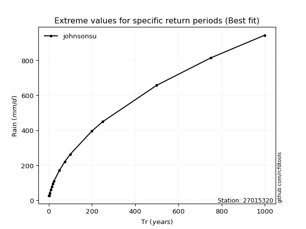</img>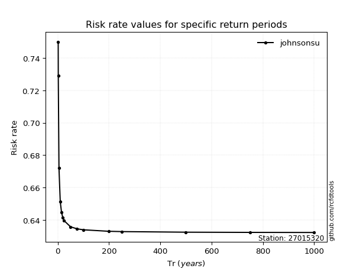</img>

</div>


<sub>**APP DISCLAIMER**: NO WARRANTY - This software is provided by [github.com/rcfdtools](https://github.com/rcfdtools) "as is", without any express or implied warranty, including warranties of merchantability, fitness for a particular purpose, or non-infringement. There is no guarantee that the software will be error-free or operate without interruption. LIMITATION OF LIABILITY - Neither the authors nor copyright holders will be liable for claims or damages arising from the software or its use. You are responsible for determining if the software is appropriate for your use and assume all associated risks, including errors, legal compliance, and data loss. NO PROFESSIONAL ADVICE - The software provides general information and does not offer professional advice. It should not replace consultation with professional advisors.</sub>