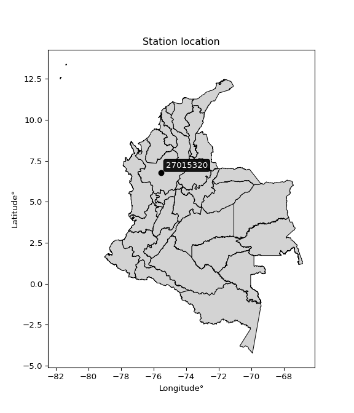

<div align="center">


</div>

# PMP Station (Rain, Pmax24h): 27015320

Probable Maximum Precipitation (PMP) is the greatest amount of rainfall for a specific duration that is meteorologically possible for a given location, acting as a "worst-case" scenario for extreme storms, crucial for designing safety-critical infrastructure like bridges, river deviations, dams, spillways, and nuclear plants to prevent catastrophic failure. PMP is calculated by hydrologists using meteorological data to determine the upper limit of extreme rainfall, often leading to the Probable Maximum Flood (PMF) for flood control design, and is increasingly being studied for climate change impacts.

<div align="center">

</img>

</div>


## A. General information


### 1. General running parameters

• app_version: _v20260103_. • runtime: _2026-01-03 07:24:50.581521_. • Python version: _3.14.0_. • SciPy version: _1.16.3_. • Pandas version: _2.3.3_. • NumPy version: _2.3.5_. • Stations dataset (station_dataset_file): _dataset/pmax24h_in/automatic_colombia_2003_2024.csv_. • Stations catalog (station_catalog_file): _dataset/CNE.xls_. • Minimum year to eval til year_max (date_min): _1900_. • Maximum year to eval since year_min (date_max): _2024_. • Creates, save and include plots into reports (create_plot): _False_. • Plot only fit distributions with Δo > Δ (plot_only_fit): _True_. • Eval low extreme values, if False, evaluates high extreme values (low_extreme): _False_. • Eval every SciPy distribution as logarithmic (pdist_logarithmic_on): _True_. • Standard deviation normalized (ddof): _1.0_. • Return periods to eval in years (Tr): _[2, 2.33, 5, 10, 15, 20, 25, 50, 75, 100, 200, 250, 500, 750, 1000]_. • Minimum data sample per station, 0 means any (minimum_sample): _5_. • Z-Score maximum threshold to adjust a value, 0 means disable (zscore_max): _3.5_. • Z-Score minimum threshold to adjust a value, 0 means disable (zscore_min): _-2.5_. • Avoid zeros, e.g. rain = 0 (avoid_zeros): _True_. • Avoid null values (avoid_nans): _True_. [:file_folder:Dataset file.](../../dataset/pmax24h_in/automatic_colombia_2003_2024.csv)

> Delta Degrees of Freedom (DDOF): is a parameter used in the formulas for calculating variance and standard deviation. When ddof=0, the divisor is $N$ (the total number of observations) and this is used when your data set is the entire population. When ddof=1, the divisor is $N-1$ and this is used when your data set is a sample drawn from a larger population. Using $N-1$ provides an unbiased estimate of the population variance (known as Bessel´s correction).


### 2. Station info and location

|   id |   CODIGO | NOMBRE            | CATEGORIA         | TECNOLOGIA                | ESTADO   | FECHA_INSTALACION   |   FECHA_SUSPENSION |   ALTITUD |   LATITUD |   LONGITUD | DEPARTAMENTO   | MUNICIPIO          | AREA_OPERATIVA                      | ENTIDAD                                                     | AREA_HIDROGRAFICA   | ZONA_HIDROGRAFICA   | SUBZONA_HIDROGRAFICA   |   CORRIENTE | Catalogo   |   Version |
|-----:|---------:|:------------------|:------------------|:--------------------------|:---------|:--------------------|-------------------:|----------:|----------:|-----------:|:---------------|:-------------------|:------------------------------------|:------------------------------------------------------------|:--------------------|:--------------------|:-----------------------|------------:|:-----------|----------:|
|    0 | 27015320 | ARAGON [27015320] | Agrometeorológica | Automática con Telemetría | Activa   | 28/08/2004          |                nan |      2633 |      6.78 |     -75.56 | Antioquia      | Santa Rosa De Osos | Area Operativa 01 - Antioquia-Chocó | INSTITUTO DE HIDROLOGIA METEOROLOGIA Y ESTUDIOS AMBIENTALES | Magdalena Cauca     | Nechí               | Río Porce              |         nan | CNE_IDEAM  |  20251226 |

<div align="center">

Dynamic map: [:earth_americas:Google](http://maps.google.com/maps?q=6.78,-75.56) [:earth_americas:OSM](https://www.openstreetmap.org/#map=18/6.78/-75.56&layers=P) [:earth_americas:Bing](https://www.bing.com/maps?cp=6.78~-75.56&lvl=18) [:earth_americas:Apple](https://maps.apple.com/frame?center=6.78%2C-75.56&span=0.003%2C0.006)

</div>


<div align="center">

```geojson
{
  "type": "Feature",
  "geometry": {
    "type": "Point", 
    "coordinates": [-75.56, 6.78]
  }, 
  "properties": {
    "Name": "27015320"
  }
}
```

</div>


### 3. Discrete values table and plot

<div align="center">

|               |           0 |           1 |           2 |           3 |           4 |          5 |           6 |          7 |
|:--------------|------------:|------------:|------------:|------------:|------------:|-----------:|------------:|-----------:|
| Date          | 2017        | 2018        | 2019        | 2020        | 2021        | 2022       | 2023        | 2024       |
| Value         |   22.3      |   14.2      |   21.3      |   24.5      |   24.5      |   28.4     |   45.3      |   89.8     |
| Value_initial |   22.3      |   14.2      |   21.3      |   24.5      |   24.5      |   28.4     |   45.3      |   89.8     |
| count         |    8        |    8        |    8        |    8        |    8        |    8       |    8        |    8       |
| mean          |   33.7875   |   33.7875   |   33.7875   |   33.7875   |   33.7875   |   33.7875  |   33.7875   |   33.7875  |
| std           |   24.3283   |   24.3283   |   24.3283   |   24.3283   |   24.3283   |   24.3283  |   24.3283   |   24.3283  |
| zscore        |   -0.472188 |   -0.805134 |   -0.513292 |   -0.381758 |   -0.381758 |   -0.22145 |    0.473215 |    2.30236 |


</div>


> The initial value (value_initial) correspond to the initial obtained or null completed value, and value (value) is adjusted only when the initial value is outside the valid range definite through the Z-Score value. If Z-Score is active, values out of range or outliers are replaced with the station mean value


### 4. Active continuous probability distributions from SciPy (44 of 104 available)

A Probability Density Function (PDF) describes the relative likelihood of a continuous random variable falling within a specific range, where the total area under its curve equals 1, and the area over any interval gives the actual probability for that range. Unlike discrete probabilities (like rolling a die), a PDF shows density, not direct probability for a single point (which is zero), with higher points indicating higher likelihood, often visualized as a bell curve for normal distributions.

A log of a probability density function (log-PDF) is simply the logarithm of the PDF´s value, denoted as $log(f(x))$, useful for converting multiplication of probabilities into addition, improving numerical stability with tiny numbers, and connecting to information theory concepts like entropy. Instead of dealing with very small probabilities (e.g., 0.000001), log-PDFs use negative numbers (e.g., $log(0.00001) ≈ -11.51$ that are easier for computers to handle, preventing underflow errors and simplifying complex calculations. In this study, each active probability distribution from SciPy is also evaluated in the $log$ form.

[scipy.stats](https://docs.scipy.org/doc/scipy/reference/stats.html) is a Python´s powerful submodule within the SciPy library for comprehensive statistical analysis, offering over 130 probability distributions (like Normal, Poisson), functions for descriptive stats (mean, variance), hypothesis testing (t-tests, chi-square), random variable generation, and statistical tests, making it essential for data science, modeling, and research. It provides tools to explore, model, and draw conclusions from data efficiently, working seamlessly with NumPy.

<div align="center">

|   id | p_dist             |   n_parameter | fit_method   | label                                                                       | active   | ref                                                                                                        |
|-----:|:-------------------|--------------:|:-------------|:----------------------------------------------------------------------------|:---------|:-----------------------------------------------------------------------------------------------------------|
|    0 | alpha              |             3 | MLE          | Alpha                                                                       | True     | [:mortar_board:](https://docs.scipy.org/doc/scipy/reference/generated/scipy.stats.alpha.html)              |
|    1 | betaprime          |             4 | MLE          | Beta prime                                                                  | True     | [:mortar_board:](https://docs.scipy.org/doc/scipy/reference/generated/scipy.stats.betaprime.html)          |
|    2 | chi2               |             3 | MLE          | Chi²                                                                        | True     | [:mortar_board:](https://docs.scipy.org/doc/scipy/reference/generated/scipy.stats.chi2.html)               |
|    3 | crystalball        |             4 | MLE          | Crystalball                                                                 | True     | [:mortar_board:](https://docs.scipy.org/doc/scipy/reference/generated/scipy.stats.crystalball.html)        |
|    4 | erlang             |             3 | MLE          | Erlang                                                                      | True     | [:mortar_board:](https://docs.scipy.org/doc/scipy/reference/generated/scipy.stats.erlang.html)             |
|    5 | expon              |             2 | MLE          | Exponential                                                                 | True     | [:mortar_board:](https://docs.scipy.org/doc/scipy/reference/generated/scipy.stats.expon.html)              |
|    6 | exponnorm          |             3 | MLE          | Exponentially modified Normal                                               | True     | [:mortar_board:](https://docs.scipy.org/doc/scipy/reference/generated/scipy.stats.exponnorm.html)          |
|    7 | f                  |             4 | MLE          | F                                                                           | True     | [:mortar_board:](https://docs.scipy.org/doc/scipy/reference/generated/scipy.stats.f.html)                  |
|    8 | fatiguelife        |             3 | MLE          | Fatigue-life (Birnbaum-Saunders)                                            | True     | [:mortar_board:](https://docs.scipy.org/doc/scipy/reference/generated/scipy.stats.fatiguelife.html)        |
|    9 | fisk               |             3 | MLE          | Fisk                                                                        | True     | [:mortar_board:](https://docs.scipy.org/doc/scipy/reference/generated/scipy.stats.fisk.html)               |
|   10 | gamma              |             3 | MLE          | Gamma                                                                       | True     | [:mortar_board:](https://docs.scipy.org/doc/scipy/reference/generated/scipy.stats.gamma.html)              |
|   11 | genexpon           |             5 | MLE          | Generalized exponential                                                     | True     | [:mortar_board:](https://docs.scipy.org/doc/scipy/reference/generated/scipy.stats.genexpon.html)           |
|   12 | genlogistic        |             3 | MLE          | Generalized logistic                                                        | True     | [:mortar_board:](https://docs.scipy.org/doc/scipy/reference/generated/scipy.stats.genlogistic.html)        |
|   13 | gibrat             |             2 | MM           | Gibrat                                                                      | True     | [:mortar_board:](https://docs.scipy.org/doc/scipy/reference/generated/scipy.stats.gibrat.html)             |
|   14 | gompertz           |             3 | MLE          | Gompertz (or truncated Gumbel)                                              | True     | [:mortar_board:](https://docs.scipy.org/doc/scipy/reference/generated/scipy.stats.gompertz.html)           |
|   15 | gumbel_l           |             2 | MM           | Gumbel Left Skew                                                            | True     | [:mortar_board:](https://docs.scipy.org/doc/scipy/reference/generated/scipy.stats.gumbel_l.html)           |
|   16 | gumbel_r           |             2 | MM           | Gumbel Right Skew                                                           | True     | [:mortar_board:](https://docs.scipy.org/doc/scipy/reference/generated/scipy.stats.gumbel_r.html)           |
|   17 | halflogistic       |             2 | MM           | Half-logistic                                                               | True     | [:mortar_board:](https://docs.scipy.org/doc/scipy/reference/generated/scipy.stats.halflogistic.html)       |
|   18 | halfnorm           |             2 | MM           | Half Normal                                                                 | True     | [:mortar_board:](https://docs.scipy.org/doc/scipy/reference/generated/scipy.stats.halfnorm.html)           |
|   19 | hypsecant          |             2 | MM           | hyperbolic secant                                                           | True     | [:mortar_board:](https://docs.scipy.org/doc/scipy/reference/generated/scipy.stats.hypsecant.html)          |
|   20 | invgamma           |             3 | MLE          | Inverted gamma                                                              | True     | [:mortar_board:](https://docs.scipy.org/doc/scipy/reference/generated/scipy.stats.invgamma.html)           |
|   21 | invgauss           |             3 | MLE          | Inverse Gaussian                                                            | True     | [:mortar_board:](https://docs.scipy.org/doc/scipy/reference/generated/scipy.stats.invgauss.html)           |
|   22 | invweibull         |             3 | MLE          | Inverted Weibull                                                            | True     | [:mortar_board:](https://docs.scipy.org/doc/scipy/reference/generated/scipy.stats.invweibull.html)         |
|   23 | johnsonsu          |             4 | MLE          | Johnson Su                                                                  | True     | [:mortar_board:](https://docs.scipy.org/doc/scipy/reference/generated/scipy.stats.johnsonsu.html)          |
|   24 | kstwobign          |             2 | MLE          | Limiting distribution of scaled Kolmogorov-Smirnov two-sided test statistic | True     | [:mortar_board:](https://docs.scipy.org/doc/scipy/reference/generated/scipy.stats.kstwobign.html)          |
|   25 | laplace            |             2 | MM           | Laplace                                                                     | True     | [:mortar_board:](https://docs.scipy.org/doc/scipy/reference/generated/scipy.stats.laplace.html)            |
|   26 | laplace_asymmetric |             3 | MLE          | Asymmetric Laplace                                                          | True     | [:mortar_board:](https://docs.scipy.org/doc/scipy/reference/generated/scipy.stats.laplace_asymmetric.html) |
|   27 | loggamma           |             3 | MLE          | Log gamma                                                                   | True     | [:mortar_board:](https://docs.scipy.org/doc/scipy/reference/generated/scipy.stats.loggamma.html)           |
|   28 | logistic           |             2 | MM           | Logistic (or Sech-squared)                                                  | True     | [:mortar_board:](https://docs.scipy.org/doc/scipy/reference/generated/scipy.stats.logistic.html)           |
|   29 | lognorm            |             3 | MLE          | Log Normal                                                                  | True     | [:mortar_board:](https://docs.scipy.org/doc/scipy/reference/generated/scipy.stats.lognorm.html)            |
|   30 | maxwell            |             2 | MM           | Maxwell                                                                     | True     | [:mortar_board:](https://docs.scipy.org/doc/scipy/reference/generated/scipy.stats.maxwell.html)            |
|   31 | mielke             |             4 | MLE          | Mielke Beta-Kappa / Dagum                                                   | True     | [:mortar_board:](https://docs.scipy.org/doc/scipy/reference/generated/scipy.stats.mielke.html)             |
|   32 | moyal              |             2 | MM           | Moyal                                                                       | True     | [:mortar_board:](https://docs.scipy.org/doc/scipy/reference/generated/scipy.stats.moyal.html)              |
|   33 | nakagami           |             3 | MLE          | Nakagami                                                                    | True     | [:mortar_board:](https://docs.scipy.org/doc/scipy/reference/generated/scipy.stats.nakagami.html)           |
|   34 | ncf                |             5 | MLE          | Non-central F distribution                                                  | True     | [:mortar_board:](https://docs.scipy.org/doc/scipy/reference/generated/scipy.stats.ncf.html)                |
|   35 | nct                |             4 | MLE          | Non-central Student’s t                                                     | True     | [:mortar_board:](https://docs.scipy.org/doc/scipy/reference/generated/scipy.stats.nct.html)                |
|   36 | norm               |             2 | MM           | Normal                                                                      | True     | [:mortar_board:](https://docs.scipy.org/doc/scipy/reference/generated/scipy.stats.norm.html)               |
|   37 | pearson3           |             3 | MM           | Pearson type III                                                            | True     | [:mortar_board:](https://docs.scipy.org/doc/scipy/reference/generated/scipy.stats.pearson3.html)           |
|   38 | rayleigh           |             2 | MM           | Rayleigh                                                                    | True     | [:mortar_board:](https://docs.scipy.org/doc/scipy/reference/generated/scipy.stats.rayleigh.html)           |
|   39 | rice               |             3 | MLE          | Rice                                                                        | True     | [:mortar_board:](https://docs.scipy.org/doc/scipy/reference/generated/scipy.stats.rice.html)               |
|   40 | t                  |             3 | MLE          | Student’s t                                                                 | True     | [:mortar_board:](https://docs.scipy.org/doc/scipy/reference/generated/scipy.stats.t.html)                  |
|   41 | truncnorm          |             4 | MLE          | Truncated normal                                                            | True     | [:mortar_board:](https://docs.scipy.org/doc/scipy/reference/generated/scipy.stats.truncnorm.html)          |
|   42 | wald               |             2 | MM           | Wald                                                                        | True     | [:mortar_board:](https://docs.scipy.org/doc/scipy/reference/generated/scipy.stats.wald.html)               |
|   43 | weibull_min        |             3 | MLE          | Weibull minimum                                                             | True     | [:mortar_board:](https://docs.scipy.org/doc/scipy/reference/generated/scipy.stats.weibull_min.html)        |

</div>

> **n_parameter:** # arguments & localization & scale.
>
> **Fit methods:** (MLE) maximum likelihood, (MM) L-moments.
>
>**Inactive** (With the only purpose of prevent loops, zero divisions, infinite values, over high estimated values or horizontal trending for recurrence intervals estimations, the follow distributions were disabled.)**:** foldnorm, gennorm, norminvgauss, powernorm, powerlognorm, skewnorm, genextreme, anglit, arcsine, argus, beta, bradford, burr, burr12, cauchy, cosine, halfcauchy, foldcauchy, skewcauchy, wrapcauchy, dgamma, gengamma, exponweib, exponpow, truncexpon, gausshyper, genhalflogistic, genhyperbolic, geninvgauss, halfgennorm, johnsonsb, kappa4, kappa3, ksone, kstwo, loglaplace, levy, levy_l, levy_stable, ncx2, pareto, genpareto, truncpareto, lomax, powerlaw, rdist, rel_breitwigner, recipinvgauss, semicircular, studentized_range, trapezoid, triang, truncweibull_min, tukeylambda, uniform, loguniform, vonmises, vonmises_line, weibull_max, dweibull, 


## B. Probability distributions vs. Empirical distributions

A continuous probability distribution (CPD) describes probabilities for variables that can take any value within a range (like rain any time), unlike discrete variables with specific outcomes (like temperature). It uses a Probability Density Function (PDF), a curve where the total area under it equals 1, and the probability of the variable falling within an interval (a to b) is found by calculating the area under the curve between those points. A key feature is that the probability of hitting any single exact value is zero, so probabilities are always expressed for ranges, e.g., $P(a ≤ X ≤ b)$.

<div align="center">

Distributions parameters from station values
|    |   station | p_dist                |   n |           loc |         scale | shape                 | shape1                | shape2                | shape3   |
|---:|----------:|:----------------------|----:|--------------:|--------------:|:----------------------|:----------------------|:----------------------|:---------|
|  0 |  27015320 | alpha                 |   8 |     0.223541  |   57.3201     | 2.226802481252591     |                       |                       |          |
|  1 |  27015320 | betaprime             |   8 |     9.43869   |    3.92655    | 9.51477482363218      | 2.5403024581588802    |                       |          |
|  2 |  27015320 | chi2                  |   8 |    14.2       |    7.56535    | 1.8647926897549785    |                       |                       |          |
|  3 |  27015320 | crystalball           |   8 |    33.7875    |   22.757      | 3384.276441216879     | 971.8510900181365     |                       |          |
|  4 |  27015320 | erlang                |   8 |    14.2       |   33.5901     | 0.6493359752011354    |                       |                       |          |
|  5 |  27015320 | expon                 |   8 |    14.2       |   19.5875     |                       |                       |                       |          |
|  6 |  27015320 | exponnorm             |   8 |    15.6393    |    3.39082    | 5.352150345122697     |                       |                       |          |
|  7 |  27015320 | f                     |   8 |     8.15261   |   15.4906     | 159.7946011440454     | 4.832098415031958     |                       |          |
|  8 |  27015320 | fatiguelife           |   8 |    11.2859    |   15.1734     | 0.9865344615882939    |                       |                       |          |
|  9 |  27015320 | fisk                  |   8 |    12.5032    |   13.2685     | 1.7953078293957305    |                       |                       |          |
| 10 |  27015320 | gamma                 |   8 |    14.2       |   19.84       | 0.9230041718281845    |                       |                       |          |
| 11 |  27015320 | genexpon              |   8 |    14.2       |    8.98655    | 0.45879799092229967   | 4.548355152519301e-08 | 2.271704933493487     |          |
| 12 |  27015320 | genlogistic           |   8 |   -69.9814    |   12.3622     | 2159.736465350189     |                       |                       |          |
| 13 |  27015320 | gibrat                |   8 |    16.4268    |   10.5298     |                       |                       |                       |          |
| 14 |  27015320 | gompertz              |   8 |    14.2       |  104.156      | 3.900852710775518     |                       |                       |          |
| 15 |  27015320 | gumbel_l              |   8 |    44.0294    |   17.7436     |                       |                       |                       |          |
| 16 |  27015320 | gumbel_r              |   8 |    23.5456    |   17.7436     |                       |                       |                       |          |
| 17 |  27015320 | halflogistic          |   8 |     6.81517   |   19.4564     |                       |                       |                       |          |
| 18 |  27015320 | halfnorm              |   8 |     3.66615   |   37.7515     |                       |                       |                       |          |
| 19 |  27015320 | hypsecant             |   8 |    33.7875    |   14.4876     |                       |                       |                       |          |
| 20 |  27015320 | invgamma              |   8 |     7.93347   |   37.6675     | 2.4133581070600028    |                       |                       |          |
| 21 |  27015320 | invgauss              |   8 |    10.5551    |   22.9173     | 1.0137489288452404    |                       |                       |          |
| 22 |  27015320 | invweibull            |   8 |     3.73581   |   18.7013     | 2.1432109766937706    |                       |                       |          |
| 23 |  27015320 | johnsonsu             |   8 |    22.2397    |    1.69945    | -0.5750641251822457   | 0.5044325295948924    |                       |          |
| 24 |  27015320 | kstwobign             |   8 |   -23.7117    |   67.3577     |                       |                       |                       |          |
| 25 |  27015320 | laplace               |   8 |    33.7875    |   16.0916     |                       |                       |                       |          |
| 26 |  27015320 | laplace_asymmetric    |   8 |    21.3       |    8.53694    | 0.5075349806110401    |                       |                       |          |
| 27 |  27015320 | loggamma              |   8 | -8738.58      | 1138.48       | 2219.8974966316673    |                       |                       |          |
| 28 |  27015320 | logistic              |   8 |    33.7875    |   12.5466     |                       |                       |                       |          |
| 29 |  27015320 | lognorm               |   8 |    14.2       |    0.156608   | 12.158989775029463    |                       |                       |          |
| 30 |  27015320 | maxwell               |   8 |   -20.137     |   33.7922     |                       |                       |                       |          |
| 31 |  27015320 | mielke                |   8 |     0.668266  |    2.62666    | 533.8460027699266     | 2.5146197901750984    |                       |          |
| 32 |  27015320 | moyal                 |   8 |    20.7736    |   10.2442     |                       |                       |                       |          |
| 33 |  27015320 | nakagami              |   8 |    14.2       |   28.2322     | 0.3492174506740827    |                       |                       |          |
| 34 |  27015320 | ncf                   |   8 |     8.12526   |   15.182      | 192.03559423596596    | 4.827247588099947     | 3.9798396469458086    |          |
| 35 |  27015320 | nct                   |   8 |    -0.151158  |    0.569274   | 2.859722088362779     | 41.782906064214174    |                       |          |
| 36 |  27015320 | norm                  |   8 |    33.7875    |   22.757      |                       |                       |                       |          |
| 37 |  27015320 | pearson3              |   8 |    33.7875    |   22.757      | 1.7449829238641228    |                       |                       |          |
| 38 |  27015320 | rayleigh              |   8 |    -9.74797   |   34.7363     |                       |                       |                       |          |
| 39 |  27015320 | rice                  |   8 |     1.15342   |   28.1324     | 0.0002372525370673089 |                       |                       |          |
| 40 |  27015320 | t                     |   8 |    32.8453    |   22.9629     | 8.20765048916671      |                       |                       |          |
| 41 |  27015320 | truncnorm             |   8 | -4576.86      |  320.529      | 14.32338552299424     | 12223.64991855852     |                       |          |
| 42 |  27015320 | wald                  |   8 |    11.0305    |   22.757      |                       |                       |                       |          |
| 43 |  27015320 | weibull_min           |   8 |    14.2       |   20.9312     | 0.5828808878712942    |                       |                       |          |
| 44 |  27015320 | logalpha              |   8 |     1.06334   |   10.7344     | 4.8968606564407136    |                       |                       |          |
| 45 |  27015320 | logbetaprime          |   8 |    -1.79591   |    4.8676     | 196.40218301752873    | 186.40887817032626    |                       |          |
| 46 |  27015320 | logchi2               |   8 |     2.65324   |    0.942224   | 1.0642365117808223    |                       |                       |          |
| 47 |  27015320 | logcrystalball        |   8 |     3.3589    |    0.525278   | 7.717287764024578     | 2332.5859934240534    |                       |          |
| 48 |  27015320 | logerlang             |   8 |     2.50354   |    0.33835    | 2.528020389178656     |                       |                       |          |
| 49 |  27015320 | logexpon              |   8 |     2.65324   |    0.705653   |                       |                       |                       |          |
| 50 |  27015320 | logexponnorm          |   8 |     2.87732   |    0.216984   | 2.219419894954199     |                       |                       |          |
| 51 |  27015320 | logf                  |   8 |     1.8282    |    1.38294    | 586.3223746271706     | 20.608141384405165    |                       |          |
| 52 |  27015320 | logfatiguelife        |   8 |     2.1407    |    1.11638    | 0.4271288499332231    |                       |                       |          |
| 53 |  27015320 | logfisk               |   8 |     2.24963   |    0.996781   | 3.873946473378788     |                       |                       |          |
| 54 |  27015320 | loggamma              |   8 |     2.50354   |    0.338346   | 2.5280344597773494    |                       |                       |          |
| 55 |  27015320 | loggenexpon           |   8 |     2.65324   |    0.963433   | 0.7334046046849896    | 1.5722157393185126    | 1.0822600907812912    |          |
| 56 |  27015320 | loggenlogistic        |   8 |     0.755535  |    0.391688   | 423.8615618910952     |                       |                       |          |
| 57 |  27015320 | loggibrat             |   8 |     2.95814   |    0.243064   |                       |                       |                       |          |
| 58 |  27015320 | loggompertz           |   8 |     2.65324   |    1.54669    | 1.4646675633061974    |                       |                       |          |
| 59 |  27015320 | loggumbel_l           |   8 |     3.5953    |    0.409558   |                       |                       |                       |          |
| 60 |  27015320 | loggumbel_r           |   8 |     3.12249   |    0.409558   |                       |                       |                       |          |
| 61 |  27015320 | loghalflogistic       |   8 |     2.7363    |    0.449105   |                       |                       |                       |          |
| 62 |  27015320 | loghalfnorm           |   8 |     2.66362   |    0.871393   |                       |                       |                       |          |
| 63 |  27015320 | loghypsecant          |   8 |     3.3589    |    0.334402   |                       |                       |                       |          |
| 64 |  27015320 | loginvgamma           |   8 |     1.80435   |   14.467      | 10.301008764790748    |                       |                       |          |
| 65 |  27015320 | loginvgauss           |   8 |     2.11632   |    6.85368    | 0.18129997317209004   |                       |                       |          |
| 66 |  27015320 | loginvweibull         |   8 |    -3.67394   |    6.78729    | 17.658215891605494    |                       |                       |          |
| 67 |  27015320 | logjohnsonsu          |   8 |     3.1258    |    0.100714   | -0.4262177149948433   | 0.5970488843389954    |                       |          |
| 68 |  27015320 | logkstwobign          |   8 |     1.69432   |    1.92229    |                       |                       |                       |          |
| 69 |  27015320 | loglaplace            |   8 |     3.3589    |    0.371428   |                       |                       |                       |          |
| 70 |  27015320 | loglaplace_asymmetric |   8 |     3.10459   |    0.304013   | 0.665672288074783     |                       |                       |          |
| 71 |  27015320 | logloggamma           |   8 |  -137.423     |   19.5079     | 1362.1799683540603    |                       |                       |          |
| 72 |  27015320 | loglogistic           |   8 |     3.3589    |    0.289601   |                       |                       |                       |          |
| 73 |  27015320 | loglognorm            |   8 |     2.65324   |    0.00879671 | 11.581953162394688    |                       |                       |          |
| 74 |  27015320 | logmaxwell            |   8 |     2.11421   |    0.779993   |                       |                       |                       |          |
| 75 |  27015320 | logmielke             |   8 |    -1.52916   |    3.76197    | 186.76254201203793    | 12.63815163915558     |                       |          |
| 76 |  27015320 | logmoyal              |   8 |     3.05851   |    0.236458   |                       |                       |                       |          |
| 77 |  27015320 | lognakagami           |   8 |     2.65324   |    0.990102   | 0.24224744402343762   |                       |                       |          |
| 78 |  27015320 | logncf                |   8 |    -3.08609   |    6.42869    | 249.73637984759347    | 362.32790741366466    | 9.603977762946659e-05 |          |
| 79 |  27015320 | lognct                |   8 |     0.0857914 |    0.162651   | 25.659092719508592    | 19.503529186520346    |                       |          |
| 80 |  27015320 | lognorm               |   8 |     3.3589    |    0.525278   |                       |                       |                       |          |
| 81 |  27015320 | logpearson3           |   8 |     3.3589    |    0.525278   | 1.0066243485048236    |                       |                       |          |
| 82 |  27015320 | lograyleigh           |   8 |     2.35401   |    0.801784   |                       |                       |                       |          |
| 83 |  27015320 | logrice               |   8 |     2.45344   |    0.740189   | 0.0006512526051090249 |                       |                       |          |
| 84 |  27015320 | logt                  |   8 |     3.17452   |    0.146314   | 0.9435305746119257    |                       |                       |          |
| 85 |  27015320 | logtruncnorm          |   8 |    -0.254274  |    1.24132    | 2.6682797657688395    | 3.828087502058871     |                       |          |
| 86 |  27015320 | logwald               |   8 |     2.83361   |    0.525285   |                       |                       |                       |          |
| 87 |  27015320 | logweibull_min        |   8 |     2.60403   |    0.824025   | 1.4005035886127706    |                       |                       |          |

</div>

> **loc** (Location parameter): This shifts the distribution along the x-axis. For many common distributions, like the normal (Gaussian) distribution, loc represents the mean $μ$. For others, like the uniform distribution, it might represent the minimum value, or for the beta distribution, the left end of the support interval.
>
> **scale** (Scale parameter): This determines the width or spread of the distribution. For the normal distribution, scale represents the standard deviation $σ$. For a uniform distribution, it defines the length of the interval (from $loc$ to $loc + scale$).
>
> **shape** (Shape parameters): Refers to parameters that define the specific form of a probability distribution, distinct from its location (loc) and scale (scale). These parameters are required arguments for most distribution functions. For example, a normal (Gaussian) distribution is fully defined by its location (mean) and scale (standard deviation), so it has no specific shape parameters beyond loc and scale. However, other distributions have intrinsic properties that need specification, as Gamma distribution that takes a shape parameter, often named $a$ or $alpha$.


### 0. Cumulative distribution values - CDF (88 evaluated)

Cumulative Distribution Function (CDF), denoted as $F$<sub>$X$</sub>$(x)$, is a function that gives the probability that a random variable $X$ will take a value less than or equal to a specific value, $x$ (i.e., $(P(X≥x)$. It essentially "accumulates" probabilities from a given point up to the far right (positive infinity), providing a complete picture of the distribution´s probabilities for both discrete (like rain) and continuous (like temperature) variables, helping to find probabilities over ranges or above certain values. Each station is evaluated separately ordering the $x$ values ascending, calculating the CDF and PDF values for the activated distributions and their logarithmic forms.

<div align="center">

CDF ordered by x ascending and calculating $log(f(x))$ separately
|   id |   Station |   date |    x |   count |    mean |     std |    zscore |   Value_initial |   station |   m |     alpha |   alpha_pdf |   betaprime |   betaprime_pdf |        chi2 |    chi2_pdf |   crystalball |   crystalball_pdf |      erlang |     erlang_pdf |    expon |   expon_pdf |   exponnorm |   exponnorm_pdf |         f |       f_pdf |   fatiguelife |   fatiguelife_pdf |      fisk |    fisk_pdf |       gamma |   gamma_pdf |    genexpon |   genexpon_pdf |   genlogistic |   genlogistic_pdf |   gibrat |   gibrat_pdf |    gompertz |   gompertz_pdf |   gumbel_l |   gumbel_l_pdf |   gumbel_r |   gumbel_r_pdf |   halflogistic |   halflogistic_pdf |   halfnorm |   halfnorm_pdf |   hypsecant |   hypsecant_pdf |   invgamma |   invgamma_pdf |   invgauss |   invgauss_pdf |   invweibull |   invweibull_pdf |   johnsonsu |   johnsonsu_pdf |   kstwobign |   kstwobign_pdf |   laplace |   laplace_pdf |   laplace_asymmetric |   laplace_asymmetric_pdf |   loggamma |   loggamma_pdf |   logistic |   logistic_pdf |   lognorm |   lognorm_pdf |   maxwell |   maxwell_pdf |   mielke |   mielke_pdf |    moyal |   moyal_pdf |   nakagami |   nakagami_pdf |       ncf |     ncf_pdf |       nct |     nct_pdf |     norm |    norm_pdf |   pearson3 |   pearson3_pdf |   rayleigh |   rayleigh_pdf |     rice |    rice_pdf |        t |      t_pdf |   truncnorm |   truncnorm_pdf |     wald |   wald_pdf |   weibull_min |   weibull_min_pdf |   logalpha |   logalpha_pdf |   logbetaprime |   logbetaprime_pdf |     logchi2 |   logchi2_pdf |   logcrystalball |   logcrystalball_pdf |   logerlang |   logerlang_pdf |   logexpon |   logexpon_pdf |   logexponnorm |   logexponnorm_pdf |      logf |   logf_pdf |   logfatiguelife |   logfatiguelife_pdf |   logfisk |   logfisk_pdf |   loggenexpon |   loggenexpon_pdf |   loggenlogistic |   loggenlogistic_pdf |   loggibrat |   loggibrat_pdf |   loggompertz |   loggompertz_pdf |   loggumbel_l |   loggumbel_l_pdf |   loggumbel_r |   loggumbel_r_pdf |   loghalflogistic |   loghalflogistic_pdf |   loghalfnorm |   loghalfnorm_pdf |   loghypsecant |   loghypsecant_pdf |   loginvgamma |   loginvgamma_pdf |   loginvgauss |   loginvgauss_pdf |   loginvweibull |   loginvweibull_pdf |   logjohnsonsu |   logjohnsonsu_pdf |   logkstwobign |   logkstwobign_pdf |   loglaplace |   loglaplace_pdf |   loglaplace_asymmetric |   loglaplace_asymmetric_pdf |   logloggamma |   logloggamma_pdf |   loglogistic |   loglogistic_pdf |   loglognorm |   loglognorm_pdf |   logmaxwell |   logmaxwell_pdf |   logmielke |   logmielke_pdf |   logmoyal |   logmoyal_pdf |   lognakagami |   lognakagami_pdf |   logncf |   logncf_pdf |    lognct |   lognct_pdf |   logpearson3 |   logpearson3_pdf |   lograyleigh |   lograyleigh_pdf |   logrice |   logrice_pdf |      logt |   logt_pdf |   logtruncnorm |   logtruncnorm_pdf |   logwald |   logwald_pdf |   logweibull_min |   logweibull_min_pdf |
|-----:|----------:|-------:|-----:|--------:|--------:|--------:|----------:|----------------:|----------:|----:|----------:|------------:|------------:|----------------:|------------:|------------:|--------------:|------------------:|------------:|---------------:|---------:|------------:|------------:|----------------:|----------:|------------:|--------------:|------------------:|----------:|------------:|------------:|------------:|------------:|---------------:|--------------:|------------------:|---------:|-------------:|------------:|---------------:|-----------:|---------------:|-----------:|---------------:|---------------:|-------------------:|-----------:|---------------:|------------:|----------------:|-----------:|---------------:|-----------:|---------------:|-------------:|-----------------:|------------:|----------------:|------------:|----------------:|----------:|--------------:|---------------------:|-------------------------:|-----------:|---------------:|-----------:|---------------:|----------:|--------------:|----------:|--------------:|---------:|-------------:|---------:|------------:|-----------:|---------------:|----------:|------------:|----------:|------------:|---------:|------------:|-----------:|---------------:|-----------:|---------------:|---------:|------------:|---------:|-----------:|------------:|----------------:|---------:|-----------:|--------------:|------------------:|-----------:|---------------:|---------------:|-------------------:|------------:|--------------:|-----------------:|---------------------:|------------:|----------------:|-----------:|---------------:|---------------:|-------------------:|----------:|-----------:|-----------------:|---------------------:|----------:|--------------:|--------------:|------------------:|-----------------:|---------------------:|------------:|----------------:|--------------:|------------------:|--------------:|------------------:|--------------:|------------------:|------------------:|----------------------:|--------------:|------------------:|---------------:|-------------------:|--------------:|------------------:|--------------:|------------------:|----------------:|--------------------:|---------------:|-------------------:|---------------:|-------------------:|-------------:|-----------------:|------------------------:|----------------------------:|--------------:|------------------:|--------------:|------------------:|-------------:|-----------------:|-------------:|-----------------:|------------:|----------------:|-----------:|---------------:|--------------:|------------------:|---------:|-------------:|----------:|-------------:|--------------:|------------------:|--------------:|------------------:|----------:|--------------:|----------:|-----------:|---------------:|-------------------:|----------:|--------------:|-----------------:|---------------------:|
|    0 |  27015320 |   2018 | 14.2 |       8 | 33.7875 | 24.3283 | -0.805134 |            14.2 |  27015320 |   1 | 0.0308387 | 0.0204732   |   0.0325537 |     0.0247626   | 1.44007e-15 | 0.755881    |      0.194695 |       0.0121038   | 2.99719e-11 | 10956          | 0        |  0.051053   |   0.0376326 |     0.0164193   | 0.0309104 | 0.0236825   |     0.0308252 |        0.0329218  | 0.0243084 | 0.0250945   | 1.58822e-15 | 0.825248    | 2.70597e-10 |     0.0510538  |      0.092437 |       0.0177955   | 0        |   0          | 8.03024e-12 |      0.0374521 |   0.169861 |    0.00870966  |   0.183903 |     0.0175507  |       0.187533 |         0.0247947  |   0.219779 |     0.0203282  |    0.16117  |     0.0106554   |  0.0308567 |    0.0236779   |  0.0306332 |     0.0293729  |    0.0310884 |      0.0221005   |   0.0432478 |     0.00563527  |   0.0906564 |     0.0162336   |  0.148022 |   0.00919869  |            0.0397859 |              0.0091825   |  0.0271593 |      0.402779  |   0.173477 |    0.011428    | 0.0895728 |     0.30806   |  0.206613 |    0.0145482  |      nan |          nan | 0.168114 |  0.0207616  |  3.758e-12 |  1477.59       | 0.0308549 | 0.0236812   | 0.0444469 | 0.021986    | 0.194695 | 0.0121038   |   0.163321 |     0.0285617  |   0.211523 |     0.0156492  | 0.101955 | 0.0148041   | 0.219859 | 0.0118087  | 2.51837e-05 |      0.0449013  | 0.018923 | 0.0236002  |   4.28911e-10 |   140740          |  0.0318176 |      0.303359  |      0.0822611 |          0.333495  | 5.44436e-09 |   6.52356e+06 |        0.0895728 |            0.30806   |   0.0271592 |       0.402777  |   0        |       1.41713  |      0.0292486 |           0.252559 | 0.0312326 |  0.315945  |        0.0308175 |            0.342185  | 0.0292445 |      0.272488 |   4.71572e-11 |         0.761241  |        0.0360834 |            0.304829  |    0        |       0         |   1.78132e-11 |          0.946969 |     0.0953804 |        0.221409   |     0.0430756 |         0.330757  |          0        |             0         |      0        |         0         |       0.076793 |          0.227421  |     0.0312329 |         0.315928  |     0.0308407 |         0.338896  |       0.0316177 |           0.304785  |      0.0383893 |          0.102981  |      0.0353198 |          0.328381  |    0.0747962 |        0.201375  |               0.0330087 |                   0.163108  |     0.0925397 |          0.309863 |      0.080421 |          0.255363 |   0.00410244 |      2.35608e+12 |    0.0762129 |        0.384765  |   0.0320585 |       0.297312  |  0.0184747 |       0.247761 |   2.86159e-08 |       3.12195e+07 | 0.167613 |     0.372457 | 0.0570958 |     0.331599 |     0.0438977 |         0.386629  |     0.0672732 |         0.434161  | 0.0357752 |     0.351629  | 0.0929441 |  0.160471  |      0         |          0         |  0        |     0         |        0.0191307 |            0.539234  |
|    1 |  27015320 |   2019 | 21.3 |       8 | 33.7875 | 24.3283 | -0.513292 |            21.3 |  27015320 |   2 | 0.315159  | 0.0461909   |   0.329595  |     0.0438421   | 0.408413    | 0.0416802   |      0.291595 |       0.0150803   | 0.373426    |     0.0299841  | 0.304049 |  0.0355304  |   0.25902   |     0.0382112   | 0.32236   | 0.0434324   |     0.335687  |        0.0377058  | 0.323468  | 0.0446616   | 0.338174    | 0.0362994   | 0.304053    |     0.0355307  |      0.261545 |       0.0283656   | 0.220513 |   0.060841   | 0.240567    |      0.0304488 |   0.242523 |    0.0118577   |   0.321448 |     0.0205606  |       0.355948 |         0.0224425  |   0.359574 |     0.0189508  |    0.254403 |     0.0157494   |  0.32248   |    0.0434527   |  0.333772  |     0.0398457  |    0.318574  |      0.0444667   |   0.200056  |     0.0727345   |   0.23677   |     0.0238045   |  0.230116 |   0.0143004   |            0.204829  |              0.0472742   |  0.336016  |      0.900284  |   0.269868 |    0.0157046   | 0.283836  |     0.645062  |  0.31857  |    0.01674    |      nan |          nan | 0.329742 |  0.0236048  |  0.294628  |     0.0285118  | 0.322486  | 0.0434512   | 0.29737   | 0.0405729   | 0.291595 | 0.0150803   |   0.356585 |     0.0251826  |   0.329316 |     0.0172578  | 0.226186 | 0.0196981   | 0.314165 | 0.0146567  | 0.27318     |      0.032686   | 0.320588 | 0.0414241  |   0.412862    |        0.0256671  |  0.314626  |      0.957258  |      0.295472  |          0.695319  | 0.462517    |   0.526385    |        0.283836  |            0.645062  |   0.336014  |       0.900278  |   0.437067 |       0.797747 |      0.304743  |           1.0251   | 0.318194  |  0.945664  |        0.323202  |            0.92019   | 0.30826   |      1.021    |   0.355223    |         0.875782  |        0.306415  |            0.924018  |    0.18874  |       2.68745   |   0.355315    |          0.793476 |     0.236447  |        0.502948   |     0.310825  |         0.886827  |          0.34428  |             0.981365  |      0.349737 |         0.826204  |       0.24635  |          0.665316  |     0.318192  |         0.945679  |     0.322708  |         0.923334  |       0.315556  |           0.954606  |      0.212086  |          1.43017   |      0.305088  |          0.871584  |    0.222829  |        0.599927  |               0.244771  |                   1.20951   |     0.286113  |          0.640162 |      0.261815 |          0.667359 |   0.629581   |      0.0804305   |    0.30993   |        0.720559  |   0.314586  |       0.963993  |  0.317514  |       1.02331  |   0.502885    |       0.581536    | 0.351861 |     0.517321 | 0.299033  |     0.808719 |     0.321005  |         0.851779  |     0.320396  |         0.74498   | 0.284182  |     0.790791  | 0.290027  |  1.31123   |      0.0019199 |          2.43515   |  0.298823 |     1.84951   |        0.352634  |            0.867097  |
|    2 |  27015320 |   2017 | 22.3 |       8 | 33.7875 | 24.3283 | -0.472188 |            22.3 |  27015320 |   3 | 0.360507  | 0.044398    |   0.372371  |     0.0416556   | 0.448565    | 0.0386685   |      0.306853 |       0.0154335   | 0.402285    |     0.0277904  | 0.338688 |  0.033762   |   0.296868  |     0.0373804   | 0.364761  | 0.0413138   |     0.372161  |        0.0352615  | 0.367122  | 0.042578    | 0.373392    | 0.0341667   | 0.338692    |     0.0337623  |      0.290264 |       0.0290355   | 0.279673 |   0.0572829  | 0.270554    |      0.0295287 |   0.254623 |    0.0123448   |   0.342075 |     0.0206809  |       0.378182 |         0.022023   |   0.378406 |     0.0187112  |    0.27053  |     0.0165051   |  0.364899  |    0.0413289   |  0.372385  |     0.0373788  |    0.362078  |      0.0424659   |   0.28871   |     0.101326    |   0.260838  |     0.0243075   |  0.24487  |   0.0152172   |            0.250726  |              0.0445456   |  0.37706   |      0.88753   |   0.285858 |    0.0162708   | 0.314143  |     0.675497  |  0.335405 |    0.0169246  |      nan |          nan | 0.3533   |  0.0234957  |  0.322479  |     0.0272191  | 0.364903  | 0.0413274   | 0.337528  | 0.0396607   | 0.306853 | 0.0154335   |   0.38142  |     0.0244847  |   0.346624 |     0.0173539  | 0.246112 | 0.0201434   | 0.328992 | 0.0149955  | 0.305145    |      0.0312552  | 0.360751 | 0.0388935  |   0.437299    |        0.0232833  |  0.358726  |      0.962633  |      0.327975  |          0.720637  | 0.485779    |   0.488593    |        0.314143  |            0.675497  |   0.377058  |       0.887525  |   0.472503 |       0.74753  |      0.352183  |           1.039    | 0.361656  |  0.946604  |        0.365362  |            0.915744  | 0.355582  |      1.03829  |   0.394905    |         0.853338  |        0.349156  |            0.936814  |    0.306183 |       2.39604   |   0.391225    |          0.771836 |     0.260478  |        0.544861   |     0.351801  |         0.897366  |          0.388489 |             0.945299  |      0.387177 |         0.805597  |       0.278369 |          0.730315  |     0.361654  |         0.946621  |     0.365024  |         0.919356  |       0.35949   |           0.958083  |      0.2908    |          1.98825   |      0.345252  |          0.877489  |    0.252126  |        0.678803  |               0.307057  |                   1.51728   |     0.316185  |          0.670189 |      0.293564 |          0.716104 |   0.633071   |      0.0720307   |    0.343376  |        0.73652   |   0.358991  |       0.969086  |  0.364322  |       1.01424  |   0.528707    |       0.544952    | 0.375786 |     0.525276 | 0.336684  |     0.831028 |     0.360177  |         0.85431   |     0.354787  |         0.753328  | 0.320865  |     0.807137  | 0.359943  |  1.74216   |      0.108286  |          2.2049    |  0.378758 |     1.63322   |        0.391959  |            0.846392  |
|    3 |  27015320 |   2020 | 24.5 |       8 | 33.7875 | 24.3283 | -0.381758 |            24.5 |  27015320 |   4 | 0.45244   | 0.0389585   |   0.458099  |     0.0362144   | 0.52709     | 0.032897    |      0.341594 |       0.0161297   | 0.45897     |     0.0239253  | 0.408945 |  0.0301751  |   0.375767  |     0.0341493   | 0.449873  | 0.0359901   |     0.444226  |        0.0303757  | 0.454902  | 0.0371079   | 0.443873    | 0.03002     | 0.40895     |     0.0301754  |      0.3551   |       0.0297331   | 0.39525  |   0.0477024  | 0.33334     |      0.0275631 |   0.282984 |    0.0134426   |   0.387657 |     0.0207037  |       0.425569 |         0.0210442  |   0.418961 |     0.0181498  |    0.308635 |     0.0181189   |  0.450033  |    0.0359956   |  0.44879   |     0.0321616  |    0.44973   |      0.0370943   |   0.491269  |     0.0711439   |   0.315129  |     0.0249444   |  0.280744 |   0.0174466   |            0.342588  |              0.0390842   |  0.458495  |      0.839318  |   0.322951 |    0.0174273   | 0.380174  |     0.724966  |  0.372991 |    0.0172184  |      nan |          nan | 0.404448 |  0.0229356  |  0.379677  |     0.0248715  | 0.450034  | 0.0359943   | 0.421393  | 0.0363561   | 0.341594 | 0.0161297   |   0.433555 |     0.0229033  |   0.384944 |     0.0174575  | 0.291321 | 0.0209054   | 0.362735 | 0.0156592  | 0.370629    |      0.0283231  | 0.440247 | 0.0334452  |   0.483898    |        0.0193186  |  0.448221  |      0.931272  |      0.397582  |          0.754896  | 0.528647    |   0.425392    |        0.380174  |            0.724966  |   0.458492  |       0.839313  |   0.538348 |       0.654219 |      0.448769  |           1.00073  | 0.449379  |  0.910645  |        0.449938  |            0.876184  | 0.452608  |      1.01132  |   0.472589    |         0.795776  |        0.437025  |            0.922675  |    0.495816 |       1.65852   |   0.461678    |          0.72532  |     0.31592   |        0.634177   |     0.435933  |         0.883736  |          0.473652 |             0.863556  |      0.460798 |         0.758328  |       0.353009 |          0.852176  |     0.449379  |         0.910663  |     0.449955  |         0.879951  |       0.448416  |           0.924057  |      0.49      |          1.91541   |      0.42728   |          0.860274  |    0.32481   |        0.87449   |               0.436067  |                   1.2348    |     0.381695  |          0.719304 |      0.36511  |          0.800428 |   0.63921    |      0.0592672   |    0.413589  |        0.752205  |   0.449001  |       0.935496  |  0.457178  |       0.95148  |   0.576947    |       0.48295     | 0.425738 |     0.53507  | 0.415973  |     0.848096 |     0.439849  |         0.834091  |     0.425877  |         0.754353  | 0.3976    |     0.819389  | 0.551472  |  2.09206   |      0.295676  |          1.7909    |  0.512523 |     1.22598   |        0.46913   |            0.791746  |
|    4 |  27015320 |   2021 | 24.5 |       8 | 33.7875 | 24.3283 | -0.381758 |            24.5 |  27015320 |   5 | 0.45244   | 0.0389585   |   0.458099  |     0.0362144   | 0.52709     | 0.032897    |      0.341594 |       0.0161297   | 0.45897     |     0.0239253  | 0.408945 |  0.0301751  |   0.375767  |     0.0341493   | 0.449873  | 0.0359901   |     0.444226  |        0.0303757  | 0.454902  | 0.0371079   | 0.443873    | 0.03002     | 0.40895     |     0.0301754  |      0.3551   |       0.0297331   | 0.39525  |   0.0477024  | 0.33334     |      0.0275631 |   0.282984 |    0.0134426   |   0.387657 |     0.0207037  |       0.425569 |         0.0210442  |   0.418961 |     0.0181498  |    0.308635 |     0.0181189   |  0.450033  |    0.0359956   |  0.44879   |     0.0321616  |    0.44973   |      0.0370943   |   0.491269  |     0.0711439   |   0.315129  |     0.0249444   |  0.280744 |   0.0174466   |            0.342588  |              0.0390842   |  0.458495  |      0.839318  |   0.322951 |    0.0174273   | 0.380174  |     0.724966  |  0.372991 |    0.0172184  |      nan |          nan | 0.404448 |  0.0229356  |  0.379677  |     0.0248715  | 0.450034  | 0.0359943   | 0.421393  | 0.0363561   | 0.341594 | 0.0161297   |   0.433555 |     0.0229033  |   0.384944 |     0.0174575  | 0.291321 | 0.0209054   | 0.362735 | 0.0156592  | 0.370629    |      0.0283231  | 0.440247 | 0.0334452  |   0.483898    |        0.0193186  |  0.448221  |      0.931272  |      0.397582  |          0.754896  | 0.528647    |   0.425392    |        0.380174  |            0.724966  |   0.458492  |       0.839313  |   0.538348 |       0.654219 |      0.448769  |           1.00073  | 0.449379  |  0.910645  |        0.449938  |            0.876184  | 0.452608  |      1.01132  |   0.472589    |         0.795776  |        0.437025  |            0.922675  |    0.495816 |       1.65852   |   0.461678    |          0.72532  |     0.31592   |        0.634177   |     0.435933  |         0.883736  |          0.473652 |             0.863556  |      0.460798 |         0.758328  |       0.353009 |          0.852176  |     0.449379  |         0.910663  |     0.449955  |         0.879951  |       0.448416  |           0.924057  |      0.49      |          1.91541   |      0.42728   |          0.860274  |    0.32481   |        0.87449   |               0.436067  |                   1.2348    |     0.381695  |          0.719304 |      0.36511  |          0.800428 |   0.63921    |      0.0592672   |    0.413589  |        0.752205  |   0.449001  |       0.935496  |  0.457178  |       0.95148  |   0.576947    |       0.48295     | 0.425738 |     0.53507  | 0.415973  |     0.848096 |     0.439849  |         0.834091  |     0.425877  |         0.754353  | 0.3976    |     0.819389  | 0.551472  |  2.09206   |      0.295676  |          1.7909    |  0.512523 |     1.22598   |        0.46913   |            0.791746  |
|    5 |  27015320 |   2022 | 28.4 |       8 | 33.7875 | 24.3283 | -0.22145  |            28.4 |  27015320 |   6 | 0.583894  | 0.0286467   |   0.580942  |     0.0270638   | 0.638956    | 0.0248764   |      0.406429 |       0.0170461   | 0.542127    |     0.0190342  | 0.515652 |  0.0247274  |   0.496259  |     0.0277525   | 0.572142  | 0.026983    |     0.548579  |        0.023496   | 0.58041   | 0.0275036   | 0.548832    | 0.0240604   | 0.515658    |     0.0247275  |      0.46988  |       0.0287026   | 0.551107 |   0.0330459  | 0.434349    |      0.0242792 |   0.339284 |    0.0154322   |   0.467363 |     0.0200354  |       0.504032 |         0.0191698  |   0.487645 |     0.0170527  |    0.384267 |     0.020535    |  0.572302  |    0.026979    |  0.558526  |     0.0244751  |    0.575463  |      0.0276319   |   0.667688  |     0.028666    |   0.412465  |     0.0247134   |  0.35774  |   0.0222314   |            0.478635  |              0.030996    |  0.574615  |      0.728099  |   0.39427  |    0.0190347   | 0.490503  |     0.759273  |  0.44058  |    0.0173639  |      nan |          nan | 0.4907   |  0.0211656  |  0.470116  |     0.0216505  | 0.572299  | 0.0269783   | 0.5489    | 0.0289544   | 0.406429 | 0.0170461   |   0.517373 |     0.0200926  |   0.452854 |     0.0172985  | 0.374377 | 0.0215383   | 0.425602 | 0.0165036  | 0.471977    |      0.0237821  | 0.554147 | 0.025342   |   0.549588    |        0.0147463  |  0.577341  |      0.806104  |      0.510077  |          0.757939  | 0.585733    |   0.351598    |        0.490503  |            0.759273  |   0.574611  |       0.728097  |   0.625543 |       0.530654 |      0.584974  |           0.829997 | 0.575553  |  0.788473  |        0.571514  |            0.762752  | 0.591525  |      0.853459 |   0.582269    |         0.686768  |        0.566726  |            0.821104  |    0.680218 |       0.920835  |   0.563139    |          0.647601 |     0.419911  |        0.771323   |     0.560532  |         0.792256  |          0.591015 |             0.724443  |      0.566688 |         0.673616  |       0.488098 |          0.951212  |     0.575555  |         0.788484  |     0.572015  |         0.765344  |       0.576404  |           0.798777  |      0.686041  |          0.873394  |      0.54889   |          0.777656  |    0.483445  |        1.30159   |               0.591908  |                   0.893566  |     0.491225  |          0.754364 |      0.489206 |          0.862855 |   0.646928   |      0.0462843   |    0.523907  |        0.733016  |   0.578403  |       0.805828  |  0.586415  |       0.791615 |   0.642489    |       0.407954    | 0.504867 |     0.532762 | 0.539016  |     0.805143 |     0.557615  |         0.75246   |     0.535118  |         0.71764   | 0.516967  |     0.787257  | 0.771102  |  0.895943  |      0.520406  |          1.27714   |  0.658434 |     0.787194  |        0.57853   |            0.686999  |
|    6 |  27015320 |   2023 | 45.3 |       8 | 33.7875 | 24.3283 |  0.473215 |            45.3 |  27015320 |   7 | 0.841176  | 0.00722558  |   0.838316  |     0.00783335  | 0.885912    | 0.00772134  |      0.693532 |       0.0154249   | 0.761704    |     0.00874256 | 0.795614 |  0.0104345  |   0.801489  |     0.0109384   | 0.83046   | 0.00795085  |     0.799726  |        0.00903938 | 0.835434  | 0.00752591  | 0.814511    | 0.00966387  | 0.79562     |     0.0104344  |      0.824886 |       0.0128449   | 0.843442 |   0.00830753 | 0.742655    |      0.0129918 |   0.658442 |    0.0206787   |   0.745685 |     0.0123325  |       0.756936 |         0.0109745  |   0.729903 |     0.0115053  |    0.729882 |     0.0164863   |  0.830513  |    0.00794592  |  0.809815  |     0.00859973 |    0.834799  |      0.00777248  |   0.862304  |     0.00480102  |   0.755398  |     0.0148      |  0.75551  |   0.0151936   |            0.809106  |              0.011349    |  0.824527  |      0.359251  |   0.714549 |    0.0162569   | 0.806505  |     0.522412  |  0.710227 |    0.013579   |      nan |          nan | 0.762595 |  0.011239   |  0.750266  |     0.0122214  | 0.83051   | 0.00794613  | 0.83492   | 0.00878756  | 0.693532 | 0.0154249   |   0.76784  |     0.0103443  |   0.715124 |     0.0129966  | 0.708076 | 0.0162837   | 0.699016 | 0.0143311  | 0.753693    |      0.011134   | 0.81194  | 0.00871369 |   0.716235    |        0.00669906 |  0.839745  |      0.34573   |      0.808985  |          0.473749  | 0.714259    |   0.215672    |        0.806505  |            0.522412  |   0.824524  |       0.359253  |   0.806786 |       0.273808 |      0.841513  |           0.329082 | 0.835805  |  0.351211  |        0.829705  |            0.361873  | 0.851231  |      0.313738 |   0.8206      |         0.349791  |        0.841571  |            0.370522  |    0.895798 |       0.211461  |   0.805268    |          0.390399 |     0.817836  |        0.757396   |     0.831002  |         0.375619  |          0.833366 |             0.340122  |      0.812953 |         0.38347   |       0.839885 |          0.458872  |     0.835808  |         0.351204  |     0.830342  |         0.360634  |       0.838009  |           0.349282  |      0.872359  |          0.179476  |      0.824089  |          0.402675  |    0.852889  |        0.39607   |               0.853193  |                   0.321452  |     0.806385  |          0.523375 |      0.827655 |          0.492548 |   0.663307   |      0.0271685   |    0.808568  |        0.452578  |   0.839839  |       0.344734  |  0.839373  |       0.335025 |   0.793447    |       0.25261     | 0.730863 |     0.41269  | 0.829811  |     0.419572 |     0.82318   |         0.386902  |     0.80916   |         0.433211  | 0.815041  |     0.459076  | 0.922713  |  0.11058   |      0.877156  |          0.399638  |  0.869458 |     0.24397   |        0.819352  |            0.35801   |
|    7 |  27015320 |   2024 | 89.8 |       8 | 33.7875 | 24.3283 |  2.30236  |            89.8 |  27015320 |   8 | 0.956143  | 0.000819732 |   0.966841  |     0.000886284 | 0.994256    | 0.000384004 |      0.993079 |       0.000847783 | 0.948856    |     0.00170222 | 0.978924 |  0.00107601 |   0.982905  |     0.000941989 | 0.963149  | 0.000945221 |     0.96857   |        0.00123908 | 0.959449  | 0.000903652 | 0.981304    | 0.000957972 | 0.978925    |     0.00107596 |      0.994752 |       0.000423418 | 0.973892 |   0.000826   | 0.984394    |      0.0012078 |   0.999998 |    1.38774e-06 |   0.976386 |     0.00131501 |       0.97229  |         0.00140447 |   0.977487 |     0.00156532 |    0.986673 |     0.000919611 |  0.96313   |    0.000945026 |  0.966206  |     0.00116817 |    0.962766  |      0.000909744 |   0.948696  |     0.000785753 |   0.993172  |     0.000683329 |  0.984609 |   0.000956439 |            0.986454  |              0.000805356 |  0.960834  |      0.0903653 |   0.988619 |    0.000896779 | 0.984912  |     0.0724574 |  0.985799 |    0.00125737 |      nan |          nan | 0.97254  |  0.00133974 |  0.985355  |     0.00116766 | 0.963131  | 0.000945052 | 0.972302  | 0.000844642 | 0.993079 | 0.000847784 |   0.970243 |     0.00140519 |   0.983534 |     0.00135847 | 0.993019 | 0.000781933 | 0.981311 | 0.00128329 | 0.967364    |      0.00148935 | 0.967986 | 0.00113467 |   0.879236    |        0.00196826 |  0.961735  |      0.0756514 |      0.977037  |          0.0841337 | 0.825305    |   0.120749    |        0.984912  |            0.0724574 |   0.960833  |       0.0903675 |   0.926735 |       0.103826 |      0.961726  |           0.079476 | 0.962187  |  0.0797106 |        0.96331   |            0.0854128 | 0.958927  |      0.067875 |   0.956891    |         0.0943053 |        0.970379  |            0.0744903 |    0.967543 |       0.0471729 |   0.96532     |          0.108214 |     0.999883  |        0.00258749 |     0.965777  |         0.0821136 |          0.961157 |             0.0848102 |      0.964677 |         0.0999711 |       0.978871 |          0.0631386 |     0.962186  |         0.0797086 |     0.963186  |         0.0848805 |       0.962978  |           0.0785032 |      0.93915   |          0.0522798 |      0.971564  |          0.0862872 |    0.97669   |        0.0627588 |               0.967187  |                   0.0718472 |     0.985258  |          0.071974 |      0.980771 |          0.065121 |   0.677793   |      0.0167892   |    0.974869  |        0.0896526 |   0.96249   |       0.0770648 |  0.961961  |       0.080373 |   0.916422    |       0.119678    | 0.924064 |     0.16325  | 0.974448  |     0.076435 |     0.966192  |         0.0881346 |     0.971952  |         0.0935259 | 0.977926  |     0.0823587 | 0.960668  |  0.0278376 |      0.999998  |          0.0563892 |  0.959307 |     0.0641595 |        0.959509  |            0.0960338 |


</div>

An Empirical Distribution Function (EDF) is a step-function estimate of a true cumulative distribution function (CDF) based on observed sample data, representing the proportion of data points less than or equal to a given value. It is calculated by ordering your data and jumping up by $1/n$ (where $n$ is sample size) at each unique data point, allowing analysis without assuming an underlying population distribution, and it gets closer to the true CDF as the sample size grows. For the empirical probability calculations, the parameter $m$ correspond to the order number which means the position of the $x$ values in an ascending order list.


### 1. Empirical - EDF California (1923)

California´s estimates the true probability distribution of water-related data (like rainfall, streamflow) using observed samples, crucial for risk assessment.

<div align="center">


$P=m/n$


</div>


**1.1. Empirical values**

<div align="center">

|                | 0                  | 1                  | 2              | 3              | 4                  | 5              | 6              | 7              |
|:---------------|:-------------------|:-------------------|:---------------|:---------------|:-------------------|:---------------|:---------------|:---------------|
| date           | 2018               | 2019               | 2017           | 2020           | 2021               | 2022           | 2023           | 2024           |
| x              | 14.2               | 21.3               | 22.3           | 24.5           | 24.5               | 28.4           | 45.3           | 89.8           |
| m              | 1                  | 2                  | 3              | 4              | 5                  | 6              | 7              | 8              |
| empirical_dist | edf_california     | edf_california     | edf_california | edf_california | edf_california     | edf_california | edf_california | edf_california |
| empirical      | 0.125              | 0.25               | 0.375          | 0.5            | 0.625              | 0.75           | 0.875          | 1.0            |
| empirical_tr   | 1.1428571428571428 | 1.3333333333333333 | 1.6            | 2.0            | 2.6666666666666665 | 4.0            | 8.0            | inf            |

</div>


**1.2. Kolmogorov-Smirnov fit test (sorted by Δ)**


<div align="center">

|                | 0                   | 1                  | 2                  | 3                   | 4                   | 5                   | 6                  | 7                  | 8                   | 9                   | 10                  | 11                 | 12                 | 13                  | 14                  | 15                 | 16                 | 17                 | 18                  | 19                  | 20                  | 21                 | 22                 | 23                  | 24                 | 25                  | 26                  | 27                  | 28                  | 29                  | 30                  | 31                  | 32                  | 33                    | 34                  | 35                  | 36                  | 37                  | 38                  | 39                 | 40                  | 41                  | 42                 | 43                  | 44                 | 45                 | 46                  | 47                 | 48                  | 49                  | 50                  | 51                  | 52                  | 53                  | 54                  | 55                  | 56                 | 57                 | 58                 | 59                  | 60                 | 61                 | 62                 | 63                 | 64                 | 65                  | 66                  | 67                  | 68                 | 69                 | 70                  | 71                  | 72                 | 73                 | 74                 | 75                  | 76                 | 77                 | 78                 | 79                  | 80                  | 81                 | 82                 | 83                 | 84                 | 85                 | 86                 | 87                 |
|:---------------|:--------------------|:-------------------|:-------------------|:--------------------|:--------------------|:--------------------|:-------------------|:-------------------|:--------------------|:--------------------|:--------------------|:-------------------|:-------------------|:--------------------|:--------------------|:-------------------|:-------------------|:-------------------|:--------------------|:--------------------|:--------------------|:-------------------|:-------------------|:--------------------|:-------------------|:--------------------|:--------------------|:--------------------|:--------------------|:--------------------|:--------------------|:--------------------|:--------------------|:----------------------|:--------------------|:--------------------|:--------------------|:--------------------|:--------------------|:-------------------|:--------------------|:--------------------|:-------------------|:--------------------|:-------------------|:-------------------|:--------------------|:-------------------|:--------------------|:--------------------|:--------------------|:--------------------|:--------------------|:--------------------|:--------------------|:--------------------|:-------------------|:-------------------|:-------------------|:--------------------|:-------------------|:-------------------|:-------------------|:-------------------|:-------------------|:--------------------|:--------------------|:--------------------|:-------------------|:-------------------|:--------------------|:--------------------|:-------------------|:-------------------|:-------------------|:--------------------|:-------------------|:-------------------|:-------------------|:--------------------|:--------------------|:-------------------|:-------------------|:-------------------|:-------------------|:-------------------|:-------------------|:-------------------|
| station        | 27015320            | 27015320           | 27015320           | 27015320            | 27015320            | 27015320            | 27015320           | 27015320           | 27015320            | 27015320            | 27015320            | 27015320           | 27015320           | 27015320            | 27015320            | 27015320           | 27015320           | 27015320           | 27015320            | 27015320            | 27015320            | 27015320           | 27015320           | 27015320            | 27015320           | 27015320            | 27015320            | 27015320            | 27015320            | 27015320            | 27015320            | 27015320            | 27015320            | 27015320              | 27015320            | 27015320            | 27015320            | 27015320            | 27015320            | 27015320           | 27015320            | 27015320            | 27015320           | 27015320            | 27015320           | 27015320           | 27015320            | 27015320           | 27015320            | 27015320            | 27015320            | 27015320            | 27015320            | 27015320            | 27015320            | 27015320            | 27015320           | 27015320           | 27015320           | 27015320            | 27015320           | 27015320           | 27015320           | 27015320           | 27015320           | 27015320            | 27015320            | 27015320            | 27015320           | 27015320           | 27015320            | 27015320            | 27015320           | 27015320           | 27015320           | 27015320            | 27015320           | 27015320           | 27015320           | 27015320            | 27015320            | 27015320           | 27015320           | 27015320           | 27015320           | 27015320           | 27015320           | 27015320           |
| empirical_dist | edf_california      | edf_california     | edf_california     | edf_california      | edf_california      | edf_california      | edf_california     | edf_california     | edf_california      | edf_california      | edf_california      | edf_california     | edf_california     | edf_california      | edf_california      | edf_california     | edf_california     | edf_california     | edf_california      | edf_california      | edf_california      | edf_california     | edf_california     | edf_california      | edf_california     | edf_california      | edf_california      | edf_california      | edf_california      | edf_california      | edf_california      | edf_california      | edf_california      | edf_california        | edf_california      | edf_california      | edf_california      | edf_california      | edf_california      | edf_california     | edf_california      | edf_california      | edf_california     | edf_california      | edf_california     | edf_california     | edf_california      | edf_california     | edf_california      | edf_california      | edf_california      | edf_california      | edf_california      | edf_california      | edf_california      | edf_california      | edf_california     | edf_california     | edf_california     | edf_california      | edf_california     | edf_california     | edf_california     | edf_california     | edf_california     | edf_california      | edf_california      | edf_california      | edf_california     | edf_california     | edf_california      | edf_california      | edf_california     | edf_california     | edf_california     | edf_california      | edf_california     | edf_california     | edf_california     | edf_california      | edf_california      | edf_california     | edf_california     | edf_california     | edf_california     | edf_california     | edf_california     | edf_california     |
| p_dist         | logt                | logwald            | loggibrat          | johnsonsu           | logjohnsonsu        | chi2                | loghalflogistic    | loggenexpon        | logmoyal            | betaprime           | fisk                | logweibull_min     | logfisk            | alpha               | invweibull          | loggamma           | loggamma           | logerlang          | loginvgamma         | logf                | logmielke           | logexponnorm       | loginvweibull      | logalpha            | invgamma           | ncf                 | f                   | loginvgauss         | logfatiguelife      | loghalfnorm         | loggompertz         | logexpon            | loggenlogistic      | loglaplace_asymmetric | loggumbel_r         | invgauss            | logpearson3         | wald                | weibull_min         | logkstwobign       | gamma               | fatiguelife         | nct                | erlang              | lognct             | logchi2            | lograyleigh         | logmaxwell         | gibrat              | pearson3            | logrice             | genexpon            | expon               | logbetaprime        | logncf              | halflogistic        | lognakagami        | exponnorm          | logloggamma        | moyal               | logcrystalball     | lognorm            | lognorm            | loglogistic        | halfnorm           | loghypsecant        | truncnorm           | nakagami            | genlogistic        | laplace_asymmetric | gumbel_r            | rayleigh            | loglaplace         | maxwell            | gompertz           | t                   | logtruncnorm       | loggumbel_l        | kstwobign          | crystalball         | norm                | logistic           | hypsecant          | rice               | loglognorm         | laplace            | gumbel_l           | mielke             |
| delta          | 0.07352818503502956 | 0.125              | 0.1291841342607019 | 0.13373050452985846 | 0.13499982980665587 | 0.15841297798817183 | 0.1589852481106262 | 0.1677314687518755 | 0.16782158087289067 | 0.16905813134315584 | 0.17009796603194688 | 0.171469881912389  | 0.1723915415307694 | 0.17255967286088453 | 0.17526967399147286 | 0.1753854859480476 | 0.1753854859480476 | 0.1753889560555537 | 0.17562113779387117 | 0.17562135106695942 | 0.17599863248947145 | 0.1762310783472062 | 0.1765842763409709 | 0.17677929038187384 | 0.1776975608323742 | 0.17770073956226107 | 0.17785813719195753 | 0.17798537740042042 | 0.17848595831860536 | 0.18331174534850148 | 0.18686115938187897 | 0.18706733260549957 | 0.18797530663030443 | 0.18893259870807866   | 0.18946783527247035 | 0.19147360327416896 | 0.19238512764608584 | 0.19585276454791367 | 0.20041228852569826 | 0.2011096006958164 | 0.20116753715574454 | 0.20142134780144516 | 0.2036072783777575 | 0.20787277455912379 | 0.2109838849938126 | 0.2125167164818289 | 0.21488249854641284 | 0.2260933556608835 | 0.22975019319825057 | 0.23262711265875557 | 0.23303303325329516 | 0.23434175339246366 | 0.23434775032866573 | 0.23992272122008573 | 0.24513311910533386 | 0.24596792826254965 | 0.2528849886609319 | 0.2537406959661991 | 0.2587753441506312 | 0.25930030590351083 | 0.2594974418761476 | 0.2594974436382952 | 0.2594974436382952 | 0.2607944236001349 | 0.2623550527687533 | 0.27199070701647254 | 0.27802251959329816 | 0.27988430696549965 | 0.2801203607474191 | 0.2824124155408436 | 0.28263658911218226 | 0.29714566401712017 | 0.3001903503494517 | 0.3094201781791254 | 0.3156508786766352 | 0.32439795066517146 | 0.3293235159599445 | 0.3300889144917528 | 0.3375349231769479 | 0.34357087153244936 | 0.34357087864364316 | 0.355730257394804  | 0.3657326608840769 | 0.3756225344113018 | 0.3795809289728267 | 0.3922599132126273 | 0.4107156161540969 | nan                |
| deltao         | 0.4472608134160001  | 0.4472608134160001 | 0.4472608134160001 | 0.4472608134160001  | 0.4472608134160001  | 0.4472608134160001  | 0.4472608134160001 | 0.4472608134160001 | 0.4472608134160001  | 0.4472608134160001  | 0.4472608134160001  | 0.4472608134160001 | 0.4472608134160001 | 0.4472608134160001  | 0.4472608134160001  | 0.4472608134160001 | 0.4472608134160001 | 0.4472608134160001 | 0.4472608134160001  | 0.4472608134160001  | 0.4472608134160001  | 0.4472608134160001 | 0.4472608134160001 | 0.4472608134160001  | 0.4472608134160001 | 0.4472608134160001  | 0.4472608134160001  | 0.4472608134160001  | 0.4472608134160001  | 0.4472608134160001  | 0.4472608134160001  | 0.4472608134160001  | 0.4472608134160001  | 0.4472608134160001    | 0.4472608134160001  | 0.4472608134160001  | 0.4472608134160001  | 0.4472608134160001  | 0.4472608134160001  | 0.4472608134160001 | 0.4472608134160001  | 0.4472608134160001  | 0.4472608134160001 | 0.4472608134160001  | 0.4472608134160001 | 0.4472608134160001 | 0.4472608134160001  | 0.4472608134160001 | 0.4472608134160001  | 0.4472608134160001  | 0.4472608134160001  | 0.4472608134160001  | 0.4472608134160001  | 0.4472608134160001  | 0.4472608134160001  | 0.4472608134160001  | 0.4472608134160001 | 0.4472608134160001 | 0.4472608134160001 | 0.4472608134160001  | 0.4472608134160001 | 0.4472608134160001 | 0.4472608134160001 | 0.4472608134160001 | 0.4472608134160001 | 0.4472608134160001  | 0.4472608134160001  | 0.4472608134160001  | 0.4472608134160001 | 0.4472608134160001 | 0.4472608134160001  | 0.4472608134160001  | 0.4472608134160001 | 0.4472608134160001 | 0.4472608134160001 | 0.4472608134160001  | 0.4472608134160001 | 0.4472608134160001 | 0.4472608134160001 | 0.4472608134160001  | 0.4472608134160001  | 0.4472608134160001 | 0.4472608134160001 | 0.4472608134160001 | 0.4472608134160001 | 0.4472608134160001 | 0.4472608134160001 | 0.4472608134160001 |
| eval           | Δo > Δ              | Δo > Δ             | Δo > Δ             | Δo > Δ              | Δo > Δ              | Δo > Δ              | Δo > Δ             | Δo > Δ             | Δo > Δ              | Δo > Δ              | Δo > Δ              | Δo > Δ             | Δo > Δ             | Δo > Δ              | Δo > Δ              | Δo > Δ             | Δo > Δ             | Δo > Δ             | Δo > Δ              | Δo > Δ              | Δo > Δ              | Δo > Δ             | Δo > Δ             | Δo > Δ              | Δo > Δ             | Δo > Δ              | Δo > Δ              | Δo > Δ              | Δo > Δ              | Δo > Δ              | Δo > Δ              | Δo > Δ              | Δo > Δ              | Δo > Δ                | Δo > Δ              | Δo > Δ              | Δo > Δ              | Δo > Δ              | Δo > Δ              | Δo > Δ             | Δo > Δ              | Δo > Δ              | Δo > Δ             | Δo > Δ              | Δo > Δ             | Δo > Δ             | Δo > Δ              | Δo > Δ             | Δo > Δ              | Δo > Δ              | Δo > Δ              | Δo > Δ              | Δo > Δ              | Δo > Δ              | Δo > Δ              | Δo > Δ              | Δo > Δ             | Δo > Δ             | Δo > Δ             | Δo > Δ              | Δo > Δ             | Δo > Δ             | Δo > Δ             | Δo > Δ             | Δo > Δ             | Δo > Δ              | Δo > Δ              | Δo > Δ              | Δo > Δ             | Δo > Δ             | Δo > Δ              | Δo > Δ              | Δo > Δ             | Δo > Δ             | Δo > Δ             | Δo > Δ              | Δo > Δ             | Δo > Δ             | Δo > Δ             | Δo > Δ              | Δo > Δ              | Δo > Δ             | Δo > Δ             | Δo > Δ             | Δo > Δ             | Δo > Δ             | Δo > Δ             | Δo <= Δ            |
| fit            | 1                   | 1                  | 1                  | 1                   | 1                   | 1                   | 1                  | 1                  | 1                   | 1                   | 1                   | 1                  | 1                  | 1                   | 1                   | 1                  | 1                  | 1                  | 1                   | 1                   | 1                   | 1                  | 1                  | 1                   | 1                  | 1                   | 1                   | 1                   | 1                   | 1                   | 1                   | 1                   | 1                   | 1                     | 1                   | 1                   | 1                   | 1                   | 1                   | 1                  | 1                   | 1                   | 1                  | 1                   | 1                  | 1                  | 1                   | 1                  | 1                   | 1                   | 1                   | 1                   | 1                   | 1                   | 1                   | 1                   | 1                  | 1                  | 1                  | 1                   | 1                  | 1                  | 1                  | 1                  | 1                  | 1                   | 1                   | 1                   | 1                  | 1                  | 1                   | 1                   | 1                  | 1                  | 1                  | 1                   | 1                  | 1                  | 1                  | 1                   | 1                   | 1                  | 1                  | 1                  | 1                  | 1                  | 1                  | 0                  |
| n              | 8                   | 8                  | 8                  | 8                   | 8                   | 8                   | 8                  | 8                  | 8                   | 8                   | 8                   | 8                  | 8                  | 8                   | 8                   | 8                  | 8                  | 8                  | 8                   | 8                   | 8                   | 8                  | 8                  | 8                   | 8                  | 8                   | 8                   | 8                   | 8                   | 8                   | 8                   | 8                   | 8                   | 8                     | 8                   | 8                   | 8                   | 8                   | 8                   | 8                  | 8                   | 8                   | 8                  | 8                   | 8                  | 8                  | 8                   | 8                  | 8                   | 8                   | 8                   | 8                   | 8                   | 8                   | 8                   | 8                   | 8                  | 8                  | 8                  | 8                   | 8                  | 8                  | 8                  | 8                  | 8                  | 8                   | 8                   | 8                   | 8                  | 8                  | 8                   | 8                   | 8                  | 8                  | 8                  | 8                   | 8                  | 8                  | 8                  | 8                   | 8                   | 8                  | 8                  | 8                  | 8                  | 8                  | 8                  | 8                  |
| best_fit       | 1                   | 0                  | 0                  | 0                   | 0                   | 0                   | 0                  | 0                  | 0                   | 0                   | 0                   | 0                  | 0                  | 0                   | 0                   | 0                  | 0                  | 0                  | 0                   | 0                   | 0                   | 0                  | 0                  | 0                   | 0                  | 0                   | 0                   | 0                   | 0                   | 0                   | 0                   | 0                   | 0                   | 0                     | 0                   | 0                   | 0                   | 0                   | 0                   | 0                  | 0                   | 0                   | 0                  | 0                   | 0                  | 0                  | 0                   | 0                  | 0                   | 0                   | 0                   | 0                   | 0                   | 0                   | 0                   | 0                   | 0                  | 0                  | 0                  | 0                   | 0                  | 0                  | 0                  | 0                  | 0                  | 0                   | 0                   | 0                   | 0                  | 0                  | 0                   | 0                   | 0                  | 0                  | 0                  | 0                   | 0                  | 0                  | 0                  | 0                   | 0                   | 0                  | 0                  | 0                  | 0                  | 0                  | 0                  | 0                  |
| best_fit_sort  | 1                   | 2                  | 3                  | 4                   | 5                   | 6                   | 7                  | 8                  | 9                   | 10                  | 11                  | 12                 | 13                 | 14                  | 15                  | 16                 | 17                 | 18                 | 19                  | 20                  | 21                  | 22                 | 23                 | 24                  | 25                 | 26                  | 27                  | 28                  | 29                  | 30                  | 31                  | 32                  | 33                  | 34                    | 35                  | 36                  | 37                  | 38                  | 39                  | 40                 | 41                  | 42                  | 43                 | 44                  | 45                 | 46                 | 47                  | 48                 | 49                  | 50                  | 51                  | 52                  | 53                  | 54                  | 55                  | 56                  | 57                 | 58                 | 59                 | 60                  | 61                 | 62                 | 63                 | 64                 | 65                 | 66                  | 67                  | 68                  | 69                 | 70                 | 71                  | 72                  | 73                 | 74                 | 75                 | 76                  | 77                 | 78                 | 79                 | 80                  | 81                  | 82                 | 83                 | 84                 | 85                 | 86                 | 87                 | 88                 |

</div>


**1.3. Best fit**

<div align="center">

|   id |   station | empirical_dist   | p_dist   |     delta |   deltao | eval   |   fit |   n |   best_fit |   best_fit_sort |
|-----:|----------:|:-----------------|:---------|----------:|---------:|:-------|------:|----:|-----------:|----------------:|
|    0 |  27015320 | edf_california   | logt     | 0.0735282 | 0.447261 | Δo > Δ |     1 |   8 |          1 |               1 |

</div>


### 2. Empirical - EDF Hazen (1930)

Hazen method for plotting positions is a formula used to estimate the empirical cumulative probability distribution of flood events or other hydrological data. This formula often results in biased estimations, particularly when extrapolating to extreme events (high return periods).

<div align="center">


$P=(m-0.5)/n$


</div>


**2.1. Empirical values**

<div align="center">

|                | 0                  | 1                  | 2                  | 3                  | 4                  | 5         | 6                 | 7         |
|:---------------|:-------------------|:-------------------|:-------------------|:-------------------|:-------------------|:----------|:------------------|:----------|
| date           | 2018               | 2019               | 2017               | 2020               | 2021               | 2022      | 2023              | 2024      |
| x              | 14.2               | 21.3               | 22.3               | 24.5               | 24.5               | 28.4      | 45.3              | 89.8      |
| m              | 1                  | 2                  | 3                  | 4                  | 5                  | 6         | 7                 | 8         |
| empirical_dist | edf_hazen          | edf_hazen          | edf_hazen          | edf_hazen          | edf_hazen          | edf_hazen | edf_hazen         | edf_hazen |
| empirical      | 0.0625             | 0.1875             | 0.3125             | 0.4375             | 0.5625             | 0.6875    | 0.8125            | 0.9375    |
| empirical_tr   | 1.0666666666666667 | 1.2307692307692308 | 1.4545454545454546 | 1.7777777777777777 | 2.2857142857142856 | 3.2       | 5.333333333333333 | 16.0      |

</div>


**2.2. Kolmogorov-Smirnov fit test (sorted by Δ)**


<div align="center">

|                | 0                   | 1                   | 2                   | 3                   | 4                   | 5                   | 6                  | 7                   | 8                     | 9                   | 10                  | 11                  | 12                 | 13                  | 14                  | 15                 | 16                  | 17                  | 18                  | 19                 | 20                  | 21                  | 22                  | 23                 | 24                  | 25                  | 26                 | 27                 | 28                  | 29                  | 30                  | 31                 | 32                  | 33                  | 34                  | 35                 | 36                  | 37                  | 38                  | 39                 | 40                 | 41                  | 42                  | 43                  | 44                  | 45                  | 46                  | 47                  | 48                  | 49                  | 50                  | 51                  | 52                  | 53                 | 54                  | 55                 | 56                 | 57                 | 58                  | 59                  | 60                  | 61                  | 62                  | 63                  | 64                  | 65                  | 66                  | 67                  | 68                  | 69                  | 70                  | 71                  | 72                 | 73                  | 74                 | 75                 | 76                 | 77                 | 78                  | 79                  | 80                 | 81                 | 82                 | 83                 | 84                 | 85                 | 86                 | 87                 |
|:---------------|:--------------------|:--------------------|:--------------------|:--------------------|:--------------------|:--------------------|:-------------------|:--------------------|:----------------------|:--------------------|:--------------------|:--------------------|:-------------------|:--------------------|:--------------------|:-------------------|:--------------------|:--------------------|:--------------------|:-------------------|:--------------------|:--------------------|:--------------------|:-------------------|:--------------------|:--------------------|:-------------------|:-------------------|:--------------------|:--------------------|:--------------------|:-------------------|:--------------------|:--------------------|:--------------------|:-------------------|:--------------------|:--------------------|:--------------------|:-------------------|:-------------------|:--------------------|:--------------------|:--------------------|:--------------------|:--------------------|:--------------------|:--------------------|:--------------------|:--------------------|:--------------------|:--------------------|:--------------------|:-------------------|:--------------------|:-------------------|:-------------------|:-------------------|:--------------------|:--------------------|:--------------------|:--------------------|:--------------------|:--------------------|:--------------------|:--------------------|:--------------------|:--------------------|:--------------------|:--------------------|:--------------------|:--------------------|:-------------------|:--------------------|:-------------------|:-------------------|:-------------------|:-------------------|:--------------------|:--------------------|:-------------------|:-------------------|:-------------------|:-------------------|:-------------------|:-------------------|:-------------------|:-------------------|
| station        | 27015320            | 27015320            | 27015320            | 27015320            | 27015320            | 27015320            | 27015320           | 27015320            | 27015320              | 27015320            | 27015320            | 27015320            | 27015320           | 27015320            | 27015320            | 27015320           | 27015320            | 27015320            | 27015320            | 27015320           | 27015320            | 27015320            | 27015320            | 27015320           | 27015320            | 27015320            | 27015320           | 27015320           | 27015320            | 27015320            | 27015320            | 27015320           | 27015320            | 27015320            | 27015320            | 27015320           | 27015320            | 27015320            | 27015320            | 27015320           | 27015320           | 27015320            | 27015320            | 27015320            | 27015320            | 27015320            | 27015320            | 27015320            | 27015320            | 27015320            | 27015320            | 27015320            | 27015320            | 27015320           | 27015320            | 27015320           | 27015320           | 27015320           | 27015320            | 27015320            | 27015320            | 27015320            | 27015320            | 27015320            | 27015320            | 27015320            | 27015320            | 27015320            | 27015320            | 27015320            | 27015320            | 27015320            | 27015320           | 27015320            | 27015320           | 27015320           | 27015320           | 27015320           | 27015320            | 27015320            | 27015320           | 27015320           | 27015320           | 27015320           | 27015320           | 27015320           | 27015320           | 27015320           |
| empirical_dist | edf_hazen           | edf_hazen           | edf_hazen           | edf_hazen           | edf_hazen           | edf_hazen           | edf_hazen          | edf_hazen           | edf_hazen             | edf_hazen           | edf_hazen           | edf_hazen           | edf_hazen          | edf_hazen           | edf_hazen           | edf_hazen          | edf_hazen           | edf_hazen           | edf_hazen           | edf_hazen          | edf_hazen           | edf_hazen           | edf_hazen           | edf_hazen          | edf_hazen           | edf_hazen           | edf_hazen          | edf_hazen          | edf_hazen           | edf_hazen           | edf_hazen           | edf_hazen          | edf_hazen           | edf_hazen           | edf_hazen           | edf_hazen          | edf_hazen           | edf_hazen           | edf_hazen           | edf_hazen          | edf_hazen          | edf_hazen           | edf_hazen           | edf_hazen           | edf_hazen           | edf_hazen           | edf_hazen           | edf_hazen           | edf_hazen           | edf_hazen           | edf_hazen           | edf_hazen           | edf_hazen           | edf_hazen          | edf_hazen           | edf_hazen          | edf_hazen          | edf_hazen          | edf_hazen           | edf_hazen           | edf_hazen           | edf_hazen           | edf_hazen           | edf_hazen           | edf_hazen           | edf_hazen           | edf_hazen           | edf_hazen           | edf_hazen           | edf_hazen           | edf_hazen           | edf_hazen           | edf_hazen          | edf_hazen           | edf_hazen          | edf_hazen          | edf_hazen          | edf_hazen          | edf_hazen           | edf_hazen           | edf_hazen          | edf_hazen          | edf_hazen          | edf_hazen          | edf_hazen          | edf_hazen          | edf_hazen          | edf_hazen          |
| p_dist         | johnsonsu           | logjohnsonsu        | loggibrat           | logwald             | logt                | logexponnorm        | logfisk            | loggenlogistic      | loglaplace_asymmetric | loggumbel_r         | logmielke           | logalpha            | alpha              | loginvweibull       | logmoyal            | loginvgamma        | logf                | invweibull          | wald                | logpearson3        | f                   | invgamma            | ncf                 | loginvgauss        | logfatiguelife      | fisk                | logkstwobign       | nct                | betaprime           | invgauss            | fatiguelife         | lognct             | logerlang           | loggamma            | loggamma            | gamma              | lograyleigh         | loghalflogistic     | loghalfnorm         | logmaxwell         | logweibull_min     | gibrat              | loggenexpon         | loggompertz         | pearson3            | logrice             | genexpon            | expon               | logbetaprime        | logncf              | halflogistic        | erlang              | exponnorm           | logloggamma        | moyal               | logcrystalball     | lognorm            | lognorm            | loglogistic         | halfnorm            | loghypsecant        | truncnorm           | nakagami            | genlogistic         | laplace_asymmetric  | gumbel_r            | chi2                | weibull_min         | rayleigh            | loglaplace          | maxwell             | logexpon            | gompertz           | t                   | logtruncnorm       | loggumbel_l        | logchi2            | kstwobign          | crystalball         | norm                | logistic           | hypsecant          | rice               | lognakagami        | laplace            | gumbel_l           | loglognorm         | mielke             |
| delta          | 0.07123050452985846 | 0.07249982980665587 | 0.08329787349019657 | 0.11132348104741979 | 0.11397181496497044 | 0.11724295314263666 | 0.1207599439126984 | 0.12547530663030443 | 0.12643259870807866   | 0.12696783527247035 | 0.12708603074440933 | 0.12712556609555292 | 0.127658625610647  | 0.12805555732907836 | 0.13001449211709593 | 0.130692077409576  | 0.13069434101680005 | 0.13107397353703076 | 0.13335276454791367 | 0.1335053911391097 | 0.13485951489359121 | 0.13498018117574107 | 0.13498579795655757 | 0.1352082405713067 | 0.13570215023745602 | 0.13596757032345308 | 0.1386096006958164 | 0.1411072783777575 | 0.14209459440571293 | 0.14627183379169728 | 0.14818653769287787 | 0.1484838849938126 | 0.14851384233311632 | 0.14851612843125034 | 0.14851612843125034 | 0.1506740154662058 | 0.15238249854641284 | 0.15678016041634724 | 0.16223695688907813 | 0.1635933556608835 | 0.1651337603541137 | 0.16725019319825057 | 0.16772290174152232 | 0.16781451651866647 | 0.17012711265875557 | 0.17053303325329516 | 0.17184175339246366 | 0.17184775032866573 | 0.17742272122008573 | 0.18263311910533386 | 0.18346792826254965 | 0.18592590323193425 | 0.19124069596619908 | 0.1962753441506312 | 0.19680030590351083 | 0.1969974418761476 | 0.1969974436382952 | 0.1969974436382952 | 0.19829442360013488 | 0.19985505276875332 | 0.20949070701647254 | 0.21552251959329816 | 0.21738430696549965 | 0.21762036074741908 | 0.21991241554084362 | 0.22013658911218226 | 0.22091297798817183 | 0.22536218658421037 | 0.23464566401712017 | 0.23769035034945168 | 0.24692017817912543 | 0.24956733260549957 | 0.2531508786766352 | 0.26189795066517146 | 0.2668235159599445 | 0.2675889144917528 | 0.2750167164818289 | 0.2750349231769479 | 0.28107087153244936 | 0.28107087864364316 | 0.293230257394804  | 0.3032326608840769 | 0.3131225344113018 | 0.3153849886609319 | 0.3297599132126273 | 0.3482156161540969 | 0.4420809289728267 | nan                |
| deltao         | 0.4472608134160001  | 0.4472608134160001  | 0.4472608134160001  | 0.4472608134160001  | 0.4472608134160001  | 0.4472608134160001  | 0.4472608134160001 | 0.4472608134160001  | 0.4472608134160001    | 0.4472608134160001  | 0.4472608134160001  | 0.4472608134160001  | 0.4472608134160001 | 0.4472608134160001  | 0.4472608134160001  | 0.4472608134160001 | 0.4472608134160001  | 0.4472608134160001  | 0.4472608134160001  | 0.4472608134160001 | 0.4472608134160001  | 0.4472608134160001  | 0.4472608134160001  | 0.4472608134160001 | 0.4472608134160001  | 0.4472608134160001  | 0.4472608134160001 | 0.4472608134160001 | 0.4472608134160001  | 0.4472608134160001  | 0.4472608134160001  | 0.4472608134160001 | 0.4472608134160001  | 0.4472608134160001  | 0.4472608134160001  | 0.4472608134160001 | 0.4472608134160001  | 0.4472608134160001  | 0.4472608134160001  | 0.4472608134160001 | 0.4472608134160001 | 0.4472608134160001  | 0.4472608134160001  | 0.4472608134160001  | 0.4472608134160001  | 0.4472608134160001  | 0.4472608134160001  | 0.4472608134160001  | 0.4472608134160001  | 0.4472608134160001  | 0.4472608134160001  | 0.4472608134160001  | 0.4472608134160001  | 0.4472608134160001 | 0.4472608134160001  | 0.4472608134160001 | 0.4472608134160001 | 0.4472608134160001 | 0.4472608134160001  | 0.4472608134160001  | 0.4472608134160001  | 0.4472608134160001  | 0.4472608134160001  | 0.4472608134160001  | 0.4472608134160001  | 0.4472608134160001  | 0.4472608134160001  | 0.4472608134160001  | 0.4472608134160001  | 0.4472608134160001  | 0.4472608134160001  | 0.4472608134160001  | 0.4472608134160001 | 0.4472608134160001  | 0.4472608134160001 | 0.4472608134160001 | 0.4472608134160001 | 0.4472608134160001 | 0.4472608134160001  | 0.4472608134160001  | 0.4472608134160001 | 0.4472608134160001 | 0.4472608134160001 | 0.4472608134160001 | 0.4472608134160001 | 0.4472608134160001 | 0.4472608134160001 | 0.4472608134160001 |
| eval           | Δo > Δ              | Δo > Δ              | Δo > Δ              | Δo > Δ              | Δo > Δ              | Δo > Δ              | Δo > Δ             | Δo > Δ              | Δo > Δ                | Δo > Δ              | Δo > Δ              | Δo > Δ              | Δo > Δ             | Δo > Δ              | Δo > Δ              | Δo > Δ             | Δo > Δ              | Δo > Δ              | Δo > Δ              | Δo > Δ             | Δo > Δ              | Δo > Δ              | Δo > Δ              | Δo > Δ             | Δo > Δ              | Δo > Δ              | Δo > Δ             | Δo > Δ             | Δo > Δ              | Δo > Δ              | Δo > Δ              | Δo > Δ             | Δo > Δ              | Δo > Δ              | Δo > Δ              | Δo > Δ             | Δo > Δ              | Δo > Δ              | Δo > Δ              | Δo > Δ             | Δo > Δ             | Δo > Δ              | Δo > Δ              | Δo > Δ              | Δo > Δ              | Δo > Δ              | Δo > Δ              | Δo > Δ              | Δo > Δ              | Δo > Δ              | Δo > Δ              | Δo > Δ              | Δo > Δ              | Δo > Δ             | Δo > Δ              | Δo > Δ             | Δo > Δ             | Δo > Δ             | Δo > Δ              | Δo > Δ              | Δo > Δ              | Δo > Δ              | Δo > Δ              | Δo > Δ              | Δo > Δ              | Δo > Δ              | Δo > Δ              | Δo > Δ              | Δo > Δ              | Δo > Δ              | Δo > Δ              | Δo > Δ              | Δo > Δ             | Δo > Δ              | Δo > Δ             | Δo > Δ             | Δo > Δ             | Δo > Δ             | Δo > Δ              | Δo > Δ              | Δo > Δ             | Δo > Δ             | Δo > Δ             | Δo > Δ             | Δo > Δ             | Δo > Δ             | Δo > Δ             | Δo <= Δ            |
| fit            | 1                   | 1                   | 1                   | 1                   | 1                   | 1                   | 1                  | 1                   | 1                     | 1                   | 1                   | 1                   | 1                  | 1                   | 1                   | 1                  | 1                   | 1                   | 1                   | 1                  | 1                   | 1                   | 1                   | 1                  | 1                   | 1                   | 1                  | 1                  | 1                   | 1                   | 1                   | 1                  | 1                   | 1                   | 1                   | 1                  | 1                   | 1                   | 1                   | 1                  | 1                  | 1                   | 1                   | 1                   | 1                   | 1                   | 1                   | 1                   | 1                   | 1                   | 1                   | 1                   | 1                   | 1                  | 1                   | 1                  | 1                  | 1                  | 1                   | 1                   | 1                   | 1                   | 1                   | 1                   | 1                   | 1                   | 1                   | 1                   | 1                   | 1                   | 1                   | 1                   | 1                  | 1                   | 1                  | 1                  | 1                  | 1                  | 1                   | 1                   | 1                  | 1                  | 1                  | 1                  | 1                  | 1                  | 1                  | 0                  |
| n              | 8                   | 8                   | 8                   | 8                   | 8                   | 8                   | 8                  | 8                   | 8                     | 8                   | 8                   | 8                   | 8                  | 8                   | 8                   | 8                  | 8                   | 8                   | 8                   | 8                  | 8                   | 8                   | 8                   | 8                  | 8                   | 8                   | 8                  | 8                  | 8                   | 8                   | 8                   | 8                  | 8                   | 8                   | 8                   | 8                  | 8                   | 8                   | 8                   | 8                  | 8                  | 8                   | 8                   | 8                   | 8                   | 8                   | 8                   | 8                   | 8                   | 8                   | 8                   | 8                   | 8                   | 8                  | 8                   | 8                  | 8                  | 8                  | 8                   | 8                   | 8                   | 8                   | 8                   | 8                   | 8                   | 8                   | 8                   | 8                   | 8                   | 8                   | 8                   | 8                   | 8                  | 8                   | 8                  | 8                  | 8                  | 8                  | 8                   | 8                   | 8                  | 8                  | 8                  | 8                  | 8                  | 8                  | 8                  | 8                  |
| best_fit       | 1                   | 0                   | 0                   | 0                   | 0                   | 0                   | 0                  | 0                   | 0                     | 0                   | 0                   | 0                   | 0                  | 0                   | 0                   | 0                  | 0                   | 0                   | 0                   | 0                  | 0                   | 0                   | 0                   | 0                  | 0                   | 0                   | 0                  | 0                  | 0                   | 0                   | 0                   | 0                  | 0                   | 0                   | 0                   | 0                  | 0                   | 0                   | 0                   | 0                  | 0                  | 0                   | 0                   | 0                   | 0                   | 0                   | 0                   | 0                   | 0                   | 0                   | 0                   | 0                   | 0                   | 0                  | 0                   | 0                  | 0                  | 0                  | 0                   | 0                   | 0                   | 0                   | 0                   | 0                   | 0                   | 0                   | 0                   | 0                   | 0                   | 0                   | 0                   | 0                   | 0                  | 0                   | 0                  | 0                  | 0                  | 0                  | 0                   | 0                   | 0                  | 0                  | 0                  | 0                  | 0                  | 0                  | 0                  | 0                  |
| best_fit_sort  | 1                   | 2                   | 3                   | 4                   | 5                   | 6                   | 7                  | 8                   | 9                     | 10                  | 11                  | 12                  | 13                 | 14                  | 15                  | 16                 | 17                  | 18                  | 19                  | 20                 | 21                  | 22                  | 23                  | 24                 | 25                  | 26                  | 27                 | 28                 | 29                  | 30                  | 31                  | 32                 | 33                  | 34                  | 35                  | 36                 | 37                  | 38                  | 39                  | 40                 | 41                 | 42                  | 43                  | 44                  | 45                  | 46                  | 47                  | 48                  | 49                  | 50                  | 51                  | 52                  | 53                  | 54                 | 55                  | 56                 | 57                 | 58                 | 59                  | 60                  | 61                  | 62                  | 63                  | 64                  | 65                  | 66                  | 67                  | 68                  | 69                  | 70                  | 71                  | 72                  | 73                 | 74                  | 75                 | 76                 | 77                 | 78                 | 79                  | 80                  | 81                 | 82                 | 83                 | 84                 | 85                 | 86                 | 87                 | 88                 |

</div>


**2.3. Best fit**

<div align="center">

|   id |   station | empirical_dist   | p_dist    |     delta |   deltao | eval   |   fit |   n |   best_fit |   best_fit_sort |
|-----:|----------:|:-----------------|:----------|----------:|---------:|:-------|------:|----:|-----------:|----------------:|
|    0 |  27015320 | edf_hazen        | johnsonsu | 0.0712305 | 0.447261 | Δo > Δ |     1 |   8 |          1 |               1 |

</div>


### 3. Empirical - EDF Weibull (1939)

Weibull plotting position formula is an empirical method used to estimate the non-exceedance probability or plotting position for a set of observed data, is often recommended or widely used in practice, particularly in flood frequency analysis.

<div align="center">


$P=m/(n+1)$


</div>


**3.1. Empirical values**

<div align="center">

|                | 0                  | 1                  | 2                  | 3                  | 4                  | 5                  | 6                  | 7                  |
|:---------------|:-------------------|:-------------------|:-------------------|:-------------------|:-------------------|:-------------------|:-------------------|:-------------------|
| date           | 2018               | 2019               | 2017               | 2020               | 2021               | 2022               | 2023               | 2024               |
| x              | 14.2               | 21.3               | 22.3               | 24.5               | 24.5               | 28.4               | 45.3               | 89.8               |
| m              | 1                  | 2                  | 3                  | 4                  | 5                  | 6                  | 7                  | 8                  |
| empirical_dist | edf_weibull        | edf_weibull        | edf_weibull        | edf_weibull        | edf_weibull        | edf_weibull        | edf_weibull        | edf_weibull        |
| empirical      | 0.1111111111111111 | 0.2222222222222222 | 0.3333333333333333 | 0.4444444444444444 | 0.5555555555555556 | 0.6666666666666666 | 0.7777777777777778 | 0.8888888888888888 |
| empirical_tr   | 1.125              | 1.2857142857142856 | 1.4999999999999998 | 1.7999999999999998 | 2.25               | 2.9999999999999996 | 4.5                | 8.999999999999996  |

</div>


**3.2. Kolmogorov-Smirnov fit test (sorted by Δ)**


<div align="center">

|                | 0                   | 1                   | 2                   | 3                   | 4                   | 5                   | 6                   | 7                   | 8                   | 9                   | 10                  | 11                  | 12                  | 13                 | 14                  | 15                  | 16                  | 17                  | 18                  | 19                 | 20                  | 21                  | 22                  | 23                  | 24                  | 25                  | 26                  | 27                  | 28                  | 29                  | 30                    | 31                 | 32                  | 33                  | 34                  | 35                 | 36                  | 37                 | 38                  | 39                  | 40                  | 41                  | 42                  | 43                 | 44                 | 45                  | 46                  | 47                 | 48                  | 49                  | 50                 | 51                  | 52                  | 53                  | 54                  | 55                  | 56                  | 57                  | 58                  | 59                  | 60                 | 61                  | 62                  | 63                  | 64                 | 65                 | 66                  | 67                 | 68                 | 69                  | 70                  | 71                  | 72                  | 73                 | 74                 | 75                  | 76                 | 77                 | 78                 | 79                 | 80                  | 81                 | 82                  | 83                 | 84                  | 85                  | 86                 | 87                 |
|:---------------|:--------------------|:--------------------|:--------------------|:--------------------|:--------------------|:--------------------|:--------------------|:--------------------|:--------------------|:--------------------|:--------------------|:--------------------|:--------------------|:-------------------|:--------------------|:--------------------|:--------------------|:--------------------|:--------------------|:-------------------|:--------------------|:--------------------|:--------------------|:--------------------|:--------------------|:--------------------|:--------------------|:--------------------|:--------------------|:--------------------|:----------------------|:-------------------|:--------------------|:--------------------|:--------------------|:-------------------|:--------------------|:-------------------|:--------------------|:--------------------|:--------------------|:--------------------|:--------------------|:-------------------|:-------------------|:--------------------|:--------------------|:-------------------|:--------------------|:--------------------|:-------------------|:--------------------|:--------------------|:--------------------|:--------------------|:--------------------|:--------------------|:--------------------|:--------------------|:--------------------|:-------------------|:--------------------|:--------------------|:--------------------|:-------------------|:-------------------|:--------------------|:-------------------|:-------------------|:--------------------|:--------------------|:--------------------|:--------------------|:-------------------|:-------------------|:--------------------|:-------------------|:-------------------|:-------------------|:-------------------|:--------------------|:-------------------|:--------------------|:-------------------|:--------------------|:--------------------|:-------------------|:-------------------|
| station        | 27015320            | 27015320            | 27015320            | 27015320            | 27015320            | 27015320            | 27015320            | 27015320            | 27015320            | 27015320            | 27015320            | 27015320            | 27015320            | 27015320           | 27015320            | 27015320            | 27015320            | 27015320            | 27015320            | 27015320           | 27015320            | 27015320            | 27015320            | 27015320            | 27015320            | 27015320            | 27015320            | 27015320            | 27015320            | 27015320            | 27015320              | 27015320           | 27015320            | 27015320            | 27015320            | 27015320           | 27015320            | 27015320           | 27015320            | 27015320            | 27015320            | 27015320            | 27015320            | 27015320           | 27015320           | 27015320            | 27015320            | 27015320           | 27015320            | 27015320            | 27015320           | 27015320            | 27015320            | 27015320            | 27015320            | 27015320            | 27015320            | 27015320            | 27015320            | 27015320            | 27015320           | 27015320            | 27015320            | 27015320            | 27015320           | 27015320           | 27015320            | 27015320           | 27015320           | 27015320            | 27015320            | 27015320            | 27015320            | 27015320           | 27015320           | 27015320            | 27015320           | 27015320           | 27015320           | 27015320           | 27015320            | 27015320           | 27015320            | 27015320           | 27015320            | 27015320            | 27015320           | 27015320           |
| empirical_dist | edf_weibull         | edf_weibull         | edf_weibull         | edf_weibull         | edf_weibull         | edf_weibull         | edf_weibull         | edf_weibull         | edf_weibull         | edf_weibull         | edf_weibull         | edf_weibull         | edf_weibull         | edf_weibull        | edf_weibull         | edf_weibull         | edf_weibull         | edf_weibull         | edf_weibull         | edf_weibull        | edf_weibull         | edf_weibull         | edf_weibull         | edf_weibull         | edf_weibull         | edf_weibull         | edf_weibull         | edf_weibull         | edf_weibull         | edf_weibull         | edf_weibull           | edf_weibull        | edf_weibull         | edf_weibull         | edf_weibull         | edf_weibull        | edf_weibull         | edf_weibull        | edf_weibull         | edf_weibull         | edf_weibull         | edf_weibull         | edf_weibull         | edf_weibull        | edf_weibull        | edf_weibull         | edf_weibull         | edf_weibull        | edf_weibull         | edf_weibull         | edf_weibull        | edf_weibull         | edf_weibull         | edf_weibull         | edf_weibull         | edf_weibull         | edf_weibull         | edf_weibull         | edf_weibull         | edf_weibull         | edf_weibull        | edf_weibull         | edf_weibull         | edf_weibull         | edf_weibull        | edf_weibull        | edf_weibull         | edf_weibull        | edf_weibull        | edf_weibull         | edf_weibull         | edf_weibull         | edf_weibull         | edf_weibull        | edf_weibull        | edf_weibull         | edf_weibull        | edf_weibull        | edf_weibull        | edf_weibull        | edf_weibull         | edf_weibull        | edf_weibull         | edf_weibull        | edf_weibull         | edf_weibull         | edf_weibull        | edf_weibull        |
| p_dist         | johnsonsu           | logjohnsonsu        | logmoyal            | fisk                | logfisk             | alpha               | ncf                 | invgamma            | loginvgauss         | logfatiguelife      | f                   | invweibull          | loginvgamma         | logf               | logmielke           | logexponnorm        | loginvweibull       | logalpha            | betaprime           | logwald            | invgauss            | logerlang           | loggamma            | loggamma            | wald                | logpearson3         | gamma               | loggibrat           | fatiguelife         | loggenlogistic      | loglaplace_asymmetric | loggumbel_r        | loghalflogistic     | loghalfnorm         | logkstwobign        | logweibull_min     | lograyleigh         | loggenexpon        | loggompertz         | nct                 | lognct              | logmaxwell          | logt                | pearson3           | genexpon           | expon               | erlang              | logrice            | logbetaprime        | gibrat              | logncf             | halflogistic        | logloggamma         | moyal               | logcrystalball      | lognorm             | lognorm             | halfnorm            | exponnorm           | chi2                | loglogistic        | weibull_min         | truncnorm           | nakagami            | gumbel_r           | genlogistic        | loghypsecant        | laplace_asymmetric | rayleigh           | logexpon            | maxwell             | loglaplace          | gompertz            | logchi2            | t                  | loggumbel_l         | kstwobign          | logtruncnorm       | crystalball        | norm               | logistic            | lognakagami        | hypsecant           | rice               | laplace             | gumbel_l            | loglognorm         | mielke             |
| delta          | 0.08452593966191957 | 0.09458085355981727 | 0.09837713642844625 | 0.10124534810123087 | 0.10294709708632499 | 0.10311522841644011 | 0.10552135687475533 | 0.10552218993503981 | 0.10560040284561961 | 0.10561735014050494 | 0.10568258240762785 | 0.10582522954702844 | 0.10617669334942675 | 0.106176906622515  | 0.10655418804502703 | 0.10678663390276177 | 0.10713983189652648 | 0.10733484593742942 | 0.10737237218349072 | 0.1111111111111111 | 0.11154961156947507 | 0.11379162011089411 | 0.11379390620902813 | 0.11379390620902813 | 0.11530881587813518 | 0.11570654102317984 | 0.11783420382241117 | 0.11802009571241878 | 0.11808801446811179 | 0.11853086218586001 | 0.11948815426363424   | 0.1196228557297247 | 0.12205793819412503 | 0.12751473466685592 | 0.12827558917701698 | 0.1304115381318915 | 0.13154916521307947 | 0.1330006795193001 | 0.13309229429644426 | 0.13416283393331307 | 0.13958211621341904 | 0.14276002232755014 | 0.14493480270343528 | 0.1492937793254222 | 0.1510084200591303 | 0.15101441699533236 | 0.15120368100971204 | 0.1579559794168548 | 0.15797399482848806 | 0.16030574875380615 | 0.1617997857720005 | 0.16263459492921628 | 0.17544201081729782 | 0.17596697257017746 | 0.17616410854281422 | 0.17616411030496182 | 0.17616411030496182 | 0.17902171943541995 | 0.17978805825658462 | 0.18619075576594962 | 0.1904452957926    | 0.19063996436198816 | 0.19468918625996479 | 0.19655097363216628 | 0.1993032557788489 | 0.2004551702588619 | 0.20254626257202812 | 0.2129679710963992 | 0.2138123306837868 | 0.21484511038327736 | 0.22608684484579206 | 0.23074590590500726 | 0.23231754534330185 | 0.2402944942596067 | 0.2410646173318381 | 0.24675558115841945 | 0.2542015898436145 | 0.2598790715155001 | 0.260237538199116  | 0.2602375453103098 | 0.27239692406147065 | 0.2806627664387097 | 0.28239932755074354 | 0.2922892010779684 | 0.30892657987929395 | 0.32738228282076354 | 0.4073587067506045 | nan                |
| deltao         | 0.4472608134160001  | 0.4472608134160001  | 0.4472608134160001  | 0.4472608134160001  | 0.4472608134160001  | 0.4472608134160001  | 0.4472608134160001  | 0.4472608134160001  | 0.4472608134160001  | 0.4472608134160001  | 0.4472608134160001  | 0.4472608134160001  | 0.4472608134160001  | 0.4472608134160001 | 0.4472608134160001  | 0.4472608134160001  | 0.4472608134160001  | 0.4472608134160001  | 0.4472608134160001  | 0.4472608134160001 | 0.4472608134160001  | 0.4472608134160001  | 0.4472608134160001  | 0.4472608134160001  | 0.4472608134160001  | 0.4472608134160001  | 0.4472608134160001  | 0.4472608134160001  | 0.4472608134160001  | 0.4472608134160001  | 0.4472608134160001    | 0.4472608134160001 | 0.4472608134160001  | 0.4472608134160001  | 0.4472608134160001  | 0.4472608134160001 | 0.4472608134160001  | 0.4472608134160001 | 0.4472608134160001  | 0.4472608134160001  | 0.4472608134160001  | 0.4472608134160001  | 0.4472608134160001  | 0.4472608134160001 | 0.4472608134160001 | 0.4472608134160001  | 0.4472608134160001  | 0.4472608134160001 | 0.4472608134160001  | 0.4472608134160001  | 0.4472608134160001 | 0.4472608134160001  | 0.4472608134160001  | 0.4472608134160001  | 0.4472608134160001  | 0.4472608134160001  | 0.4472608134160001  | 0.4472608134160001  | 0.4472608134160001  | 0.4472608134160001  | 0.4472608134160001 | 0.4472608134160001  | 0.4472608134160001  | 0.4472608134160001  | 0.4472608134160001 | 0.4472608134160001 | 0.4472608134160001  | 0.4472608134160001 | 0.4472608134160001 | 0.4472608134160001  | 0.4472608134160001  | 0.4472608134160001  | 0.4472608134160001  | 0.4472608134160001 | 0.4472608134160001 | 0.4472608134160001  | 0.4472608134160001 | 0.4472608134160001 | 0.4472608134160001 | 0.4472608134160001 | 0.4472608134160001  | 0.4472608134160001 | 0.4472608134160001  | 0.4472608134160001 | 0.4472608134160001  | 0.4472608134160001  | 0.4472608134160001 | 0.4472608134160001 |
| eval           | Δo > Δ              | Δo > Δ              | Δo > Δ              | Δo > Δ              | Δo > Δ              | Δo > Δ              | Δo > Δ              | Δo > Δ              | Δo > Δ              | Δo > Δ              | Δo > Δ              | Δo > Δ              | Δo > Δ              | Δo > Δ             | Δo > Δ              | Δo > Δ              | Δo > Δ              | Δo > Δ              | Δo > Δ              | Δo > Δ             | Δo > Δ              | Δo > Δ              | Δo > Δ              | Δo > Δ              | Δo > Δ              | Δo > Δ              | Δo > Δ              | Δo > Δ              | Δo > Δ              | Δo > Δ              | Δo > Δ                | Δo > Δ             | Δo > Δ              | Δo > Δ              | Δo > Δ              | Δo > Δ             | Δo > Δ              | Δo > Δ             | Δo > Δ              | Δo > Δ              | Δo > Δ              | Δo > Δ              | Δo > Δ              | Δo > Δ             | Δo > Δ             | Δo > Δ              | Δo > Δ              | Δo > Δ             | Δo > Δ              | Δo > Δ              | Δo > Δ             | Δo > Δ              | Δo > Δ              | Δo > Δ              | Δo > Δ              | Δo > Δ              | Δo > Δ              | Δo > Δ              | Δo > Δ              | Δo > Δ              | Δo > Δ             | Δo > Δ              | Δo > Δ              | Δo > Δ              | Δo > Δ             | Δo > Δ             | Δo > Δ              | Δo > Δ             | Δo > Δ             | Δo > Δ              | Δo > Δ              | Δo > Δ              | Δo > Δ              | Δo > Δ             | Δo > Δ             | Δo > Δ              | Δo > Δ             | Δo > Δ             | Δo > Δ             | Δo > Δ             | Δo > Δ              | Δo > Δ             | Δo > Δ              | Δo > Δ             | Δo > Δ              | Δo > Δ              | Δo > Δ             | Δo <= Δ            |
| fit            | 1                   | 1                   | 1                   | 1                   | 1                   | 1                   | 1                   | 1                   | 1                   | 1                   | 1                   | 1                   | 1                   | 1                  | 1                   | 1                   | 1                   | 1                   | 1                   | 1                  | 1                   | 1                   | 1                   | 1                   | 1                   | 1                   | 1                   | 1                   | 1                   | 1                   | 1                     | 1                  | 1                   | 1                   | 1                   | 1                  | 1                   | 1                  | 1                   | 1                   | 1                   | 1                   | 1                   | 1                  | 1                  | 1                   | 1                   | 1                  | 1                   | 1                   | 1                  | 1                   | 1                   | 1                   | 1                   | 1                   | 1                   | 1                   | 1                   | 1                   | 1                  | 1                   | 1                   | 1                   | 1                  | 1                  | 1                   | 1                  | 1                  | 1                   | 1                   | 1                   | 1                   | 1                  | 1                  | 1                   | 1                  | 1                  | 1                  | 1                  | 1                   | 1                  | 1                   | 1                  | 1                   | 1                   | 1                  | 0                  |
| n              | 8                   | 8                   | 8                   | 8                   | 8                   | 8                   | 8                   | 8                   | 8                   | 8                   | 8                   | 8                   | 8                   | 8                  | 8                   | 8                   | 8                   | 8                   | 8                   | 8                  | 8                   | 8                   | 8                   | 8                   | 8                   | 8                   | 8                   | 8                   | 8                   | 8                   | 8                     | 8                  | 8                   | 8                   | 8                   | 8                  | 8                   | 8                  | 8                   | 8                   | 8                   | 8                   | 8                   | 8                  | 8                  | 8                   | 8                   | 8                  | 8                   | 8                   | 8                  | 8                   | 8                   | 8                   | 8                   | 8                   | 8                   | 8                   | 8                   | 8                   | 8                  | 8                   | 8                   | 8                   | 8                  | 8                  | 8                   | 8                  | 8                  | 8                   | 8                   | 8                   | 8                   | 8                  | 8                  | 8                   | 8                  | 8                  | 8                  | 8                  | 8                   | 8                  | 8                   | 8                  | 8                   | 8                   | 8                  | 8                  |
| best_fit       | 1                   | 0                   | 0                   | 0                   | 0                   | 0                   | 0                   | 0                   | 0                   | 0                   | 0                   | 0                   | 0                   | 0                  | 0                   | 0                   | 0                   | 0                   | 0                   | 0                  | 0                   | 0                   | 0                   | 0                   | 0                   | 0                   | 0                   | 0                   | 0                   | 0                   | 0                     | 0                  | 0                   | 0                   | 0                   | 0                  | 0                   | 0                  | 0                   | 0                   | 0                   | 0                   | 0                   | 0                  | 0                  | 0                   | 0                   | 0                  | 0                   | 0                   | 0                  | 0                   | 0                   | 0                   | 0                   | 0                   | 0                   | 0                   | 0                   | 0                   | 0                  | 0                   | 0                   | 0                   | 0                  | 0                  | 0                   | 0                  | 0                  | 0                   | 0                   | 0                   | 0                   | 0                  | 0                  | 0                   | 0                  | 0                  | 0                  | 0                  | 0                   | 0                  | 0                   | 0                  | 0                   | 0                   | 0                  | 0                  |
| best_fit_sort  | 1                   | 2                   | 3                   | 4                   | 5                   | 6                   | 7                   | 8                   | 9                   | 10                  | 11                  | 12                  | 13                  | 14                 | 15                  | 16                  | 17                  | 18                  | 19                  | 20                 | 21                  | 22                  | 23                  | 24                  | 25                  | 26                  | 27                  | 28                  | 29                  | 30                  | 31                    | 32                 | 33                  | 34                  | 35                  | 36                 | 37                  | 38                 | 39                  | 40                  | 41                  | 42                  | 43                  | 44                 | 45                 | 46                  | 47                  | 48                 | 49                  | 50                  | 51                 | 52                  | 53                  | 54                  | 55                  | 56                  | 57                  | 58                  | 59                  | 60                  | 61                 | 62                  | 63                  | 64                  | 65                 | 66                 | 67                  | 68                 | 69                 | 70                  | 71                  | 72                  | 73                  | 74                 | 75                 | 76                  | 77                 | 78                 | 79                 | 80                 | 81                  | 82                 | 83                  | 84                 | 85                  | 86                  | 87                 | 88                 |

</div>


**3.3. Best fit**

<div align="center">

|   id |   station | empirical_dist   | p_dist    |     delta |   deltao | eval   |   fit |   n |   best_fit |   best_fit_sort |
|-----:|----------:|:-----------------|:----------|----------:|---------:|:-------|------:|----:|-----------:|----------------:|
|    0 |  27015320 | edf_weibull      | johnsonsu | 0.0845259 | 0.447261 | Δo > Δ |     1 |   8 |          1 |               1 |

</div>


### 4. Empirical - EDF Beard (1943)

The Beard formula (or Beard´s plotting position formula) in hydrology is used to estimate the empirical non-exceedance probability _(P)_ of a flood event (or other extreme hydrological data point) within a given dataset.

<div align="center">


$P=(m-0.31)/(n+0.38)$


</div>


**4.1. Empirical values**

<div align="center">

|                | 0                   | 1                   | 2                  | 3                   | 4                  | 5                  | 6                  | 7                  |
|:---------------|:--------------------|:--------------------|:-------------------|:--------------------|:-------------------|:-------------------|:-------------------|:-------------------|
| date           | 2018                | 2019                | 2017               | 2020                | 2021               | 2022               | 2023               | 2024               |
| x              | 14.2                | 21.3                | 22.3               | 24.5                | 24.5               | 28.4               | 45.3               | 89.8               |
| m              | 1                   | 2                   | 3                  | 4                   | 5                  | 6                  | 7                  | 8                  |
| empirical_dist | edf_beard           | edf_beard           | edf_beard          | edf_beard           | edf_beard          | edf_beard          | edf_beard          | edf_beard          |
| empirical      | 0.08233890214797135 | 0.20167064439140808 | 0.3210023866348448 | 0.44033412887828155 | 0.5596658711217184 | 0.6789976133651551 | 0.7983293556085919 | 0.9176610978520287 |
| empirical_tr   | 1.0897269180754225  | 1.2526158445440956  | 1.4727592267135323 | 1.7867803837953091  | 2.2710027100271004 | 3.115241635687732  | 4.958579881656804  | 12.144927536231886 |

</div>


**4.2. Kolmogorov-Smirnov fit test (sorted by Δ)**


<div align="center">

|                | 0                   | 1                  | 2                   | 3                   | 4                  | 5                   | 6                   | 7                   | 8                   | 9                   | 10                  | 11                  | 12                  | 13                  | 14                  | 15                  | 16                  | 17                  | 18                  | 19                  | 20                 | 21                  | 22                    | 23                  | 24                  | 25                  | 26                  | 27                 | 28                 | 29                 | 30                  | 31                  | 32                  | 33                 | 34                 | 35                  | 36                  | 37                 | 38                  | 39                  | 40                  | 41                  | 42                  | 43                  | 44                 | 45                  | 46                 | 47                  | 48                 | 49                  | 50                  | 51                  | 52                  | 53                  | 54                 | 55                  | 56                  | 57                  | 58                 | 59                  | 60                  | 61                  | 62                  | 63                  | 64                  | 65                  | 66                  | 67                  | 68                  | 69                  | 70                 | 71                 | 72                 | 73                  | 74                 | 75                 | 76                 | 77                  | 78                  | 79                  | 80                 | 81                 | 82                 | 83                  | 84                 | 85                 | 86                 | 87                 |
|:---------------|:--------------------|:-------------------|:--------------------|:--------------------|:-------------------|:--------------------|:--------------------|:--------------------|:--------------------|:--------------------|:--------------------|:--------------------|:--------------------|:--------------------|:--------------------|:--------------------|:--------------------|:--------------------|:--------------------|:--------------------|:-------------------|:--------------------|:----------------------|:--------------------|:--------------------|:--------------------|:--------------------|:-------------------|:-------------------|:-------------------|:--------------------|:--------------------|:--------------------|:-------------------|:-------------------|:--------------------|:--------------------|:-------------------|:--------------------|:--------------------|:--------------------|:--------------------|:--------------------|:--------------------|:-------------------|:--------------------|:-------------------|:--------------------|:-------------------|:--------------------|:--------------------|:--------------------|:--------------------|:--------------------|:-------------------|:--------------------|:--------------------|:--------------------|:-------------------|:--------------------|:--------------------|:--------------------|:--------------------|:--------------------|:--------------------|:--------------------|:--------------------|:--------------------|:--------------------|:--------------------|:-------------------|:-------------------|:-------------------|:--------------------|:-------------------|:-------------------|:-------------------|:--------------------|:--------------------|:--------------------|:-------------------|:-------------------|:-------------------|:--------------------|:-------------------|:-------------------|:-------------------|:-------------------|
| station        | 27015320            | 27015320           | 27015320            | 27015320            | 27015320           | 27015320            | 27015320            | 27015320            | 27015320            | 27015320            | 27015320            | 27015320            | 27015320            | 27015320            | 27015320            | 27015320            | 27015320            | 27015320            | 27015320            | 27015320            | 27015320           | 27015320            | 27015320              | 27015320            | 27015320            | 27015320            | 27015320            | 27015320           | 27015320           | 27015320           | 27015320            | 27015320            | 27015320            | 27015320           | 27015320           | 27015320            | 27015320            | 27015320           | 27015320            | 27015320            | 27015320            | 27015320            | 27015320            | 27015320            | 27015320           | 27015320            | 27015320           | 27015320            | 27015320           | 27015320            | 27015320            | 27015320            | 27015320            | 27015320            | 27015320           | 27015320            | 27015320            | 27015320            | 27015320           | 27015320            | 27015320            | 27015320            | 27015320            | 27015320            | 27015320            | 27015320            | 27015320            | 27015320            | 27015320            | 27015320            | 27015320           | 27015320           | 27015320           | 27015320            | 27015320           | 27015320           | 27015320           | 27015320            | 27015320            | 27015320            | 27015320           | 27015320           | 27015320           | 27015320            | 27015320           | 27015320           | 27015320           | 27015320           |
| empirical_dist | edf_beard           | edf_beard          | edf_beard           | edf_beard           | edf_beard          | edf_beard           | edf_beard           | edf_beard           | edf_beard           | edf_beard           | edf_beard           | edf_beard           | edf_beard           | edf_beard           | edf_beard           | edf_beard           | edf_beard           | edf_beard           | edf_beard           | edf_beard           | edf_beard          | edf_beard           | edf_beard             | edf_beard           | edf_beard           | edf_beard           | edf_beard           | edf_beard          | edf_beard          | edf_beard          | edf_beard           | edf_beard           | edf_beard           | edf_beard          | edf_beard          | edf_beard           | edf_beard           | edf_beard          | edf_beard           | edf_beard           | edf_beard           | edf_beard           | edf_beard           | edf_beard           | edf_beard          | edf_beard           | edf_beard          | edf_beard           | edf_beard          | edf_beard           | edf_beard           | edf_beard           | edf_beard           | edf_beard           | edf_beard          | edf_beard           | edf_beard           | edf_beard           | edf_beard          | edf_beard           | edf_beard           | edf_beard           | edf_beard           | edf_beard           | edf_beard           | edf_beard           | edf_beard           | edf_beard           | edf_beard           | edf_beard           | edf_beard          | edf_beard          | edf_beard          | edf_beard           | edf_beard          | edf_beard          | edf_beard          | edf_beard           | edf_beard           | edf_beard           | edf_beard          | edf_beard          | edf_beard          | edf_beard           | edf_beard          | edf_beard          | edf_beard          | edf_beard          |
| p_dist         | johnsonsu           | logjohnsonsu       | logwald             | loggibrat           | logfisk            | logexponnorm        | logmielke           | logalpha            | alpha               | loginvweibull       | logmoyal            | loginvgamma         | logf                | invweibull          | f                   | invgamma            | ncf                 | loginvgauss         | logpearson3         | logfatiguelife      | fisk               | loggenlogistic      | loglaplace_asymmetric | loggumbel_r         | logt                | wald                | betaprime           | invgauss           | logkstwobign       | fatiguelife        | logerlang           | loggamma            | loggamma            | gamma              | nct                | loghalflogistic     | lognct              | lograyleigh        | loghalfnorm         | logweibull_min      | loggenexpon         | loggompertz         | logmaxwell          | pearson3            | logrice            | genexpon            | expon              | gibrat              | logbetaprime       | erlang              | logncf              | halflogistic        | exponnorm           | logloggamma         | moyal              | logcrystalball      | lognorm             | lognorm             | halfnorm           | loglogistic         | loghypsecant        | chi2                | truncnorm           | nakagami            | genlogistic         | weibull_min         | gumbel_r            | laplace_asymmetric  | rayleigh            | loglaplace          | logexpon           | maxwell            | gompertz           | t                   | loggumbel_l        | logchi2            | logtruncnorm       | kstwobign           | crystalball         | norm                | logistic           | hypsecant          | lognakagami        | rice                | laplace            | gumbel_l           | loglognorm         | mielke             |
| delta          | 0.06839637565157686 | 0.0740292757290032 | 0.09715283665601171 | 0.09746851788160471 | 0.1070574126524878 | 0.11089694946892459 | 0.11291538635300125 | 0.11295492170414484 | 0.11348798121923892 | 0.11388491293767028 | 0.11584384772568784 | 0.11652143301816792 | 0.11652369662539197 | 0.11690332914562268 | 0.12068887050218313 | 0.12080953678433298 | 0.12081515356514949 | 0.12103759617989862 | 0.12138274101124091 | 0.12153150584604794 | 0.121796925932045  | 0.12264117775202282 | 0.12359846982979705   | 0.12373317129588751 | 0.12438322487262121 | 0.12485037791306874 | 0.12792395001430484 | 0.1321011894002892 | 0.1323859047431798 | 0.1340158933014698 | 0.13434319794170824 | 0.13434548403984226 | 0.13434548403984226 | 0.1365033710747977 | 0.1382731494994759 | 0.14260951602493915 | 0.14369243177958185 | 0.1438801119115679 | 0.14806631249767005 | 0.15096311596270562 | 0.15355225735011424 | 0.15364387212725839 | 0.15509096902603858 | 0.16162472602391065 | 0.1620662949830176 | 0.16333936675761873 | 0.1633453636938208 | 0.16441606431996897 | 0.1689203345852408 | 0.17175525884052617 | 0.17413073247048894 | 0.17496554162770472 | 0.18389837382274743 | 0.18777295751578627 | 0.1882979192686659 | 0.18849505524130267 | 0.18849505700345026 | 0.18849505700345026 | 0.1913526661339084 | 0.19455561135876281 | 0.20665657813819094 | 0.20674233359676375 | 0.20702013295845323 | 0.20888192033065472 | 0.20911797411257416 | 0.21119154219280228 | 0.21163420247733733 | 0.21707828666256201 | 0.22614327738227524 | 0.23485622147117008 | 0.2353966882140915 | 0.2384177915442805 | 0.2446484920417903 | 0.25339556403032654 | 0.2590865278569079 | 0.2608460720904208 | 0.2639893870816629 | 0.26653253654210296 | 0.27256848489760443 | 0.27256849200879824 | 0.2847278707599591 | 0.294730274249232  | 0.3012143442695238 | 0.30462014777645685 | 0.3212575265777824 | 0.339713229519252  | 0.4279102845814186 | nan                |
| deltao         | 0.4472608134160001  | 0.4472608134160001 | 0.4472608134160001  | 0.4472608134160001  | 0.4472608134160001 | 0.4472608134160001  | 0.4472608134160001  | 0.4472608134160001  | 0.4472608134160001  | 0.4472608134160001  | 0.4472608134160001  | 0.4472608134160001  | 0.4472608134160001  | 0.4472608134160001  | 0.4472608134160001  | 0.4472608134160001  | 0.4472608134160001  | 0.4472608134160001  | 0.4472608134160001  | 0.4472608134160001  | 0.4472608134160001 | 0.4472608134160001  | 0.4472608134160001    | 0.4472608134160001  | 0.4472608134160001  | 0.4472608134160001  | 0.4472608134160001  | 0.4472608134160001 | 0.4472608134160001 | 0.4472608134160001 | 0.4472608134160001  | 0.4472608134160001  | 0.4472608134160001  | 0.4472608134160001 | 0.4472608134160001 | 0.4472608134160001  | 0.4472608134160001  | 0.4472608134160001 | 0.4472608134160001  | 0.4472608134160001  | 0.4472608134160001  | 0.4472608134160001  | 0.4472608134160001  | 0.4472608134160001  | 0.4472608134160001 | 0.4472608134160001  | 0.4472608134160001 | 0.4472608134160001  | 0.4472608134160001 | 0.4472608134160001  | 0.4472608134160001  | 0.4472608134160001  | 0.4472608134160001  | 0.4472608134160001  | 0.4472608134160001 | 0.4472608134160001  | 0.4472608134160001  | 0.4472608134160001  | 0.4472608134160001 | 0.4472608134160001  | 0.4472608134160001  | 0.4472608134160001  | 0.4472608134160001  | 0.4472608134160001  | 0.4472608134160001  | 0.4472608134160001  | 0.4472608134160001  | 0.4472608134160001  | 0.4472608134160001  | 0.4472608134160001  | 0.4472608134160001 | 0.4472608134160001 | 0.4472608134160001 | 0.4472608134160001  | 0.4472608134160001 | 0.4472608134160001 | 0.4472608134160001 | 0.4472608134160001  | 0.4472608134160001  | 0.4472608134160001  | 0.4472608134160001 | 0.4472608134160001 | 0.4472608134160001 | 0.4472608134160001  | 0.4472608134160001 | 0.4472608134160001 | 0.4472608134160001 | 0.4472608134160001 |
| eval           | Δo > Δ              | Δo > Δ             | Δo > Δ              | Δo > Δ              | Δo > Δ             | Δo > Δ              | Δo > Δ              | Δo > Δ              | Δo > Δ              | Δo > Δ              | Δo > Δ              | Δo > Δ              | Δo > Δ              | Δo > Δ              | Δo > Δ              | Δo > Δ              | Δo > Δ              | Δo > Δ              | Δo > Δ              | Δo > Δ              | Δo > Δ             | Δo > Δ              | Δo > Δ                | Δo > Δ              | Δo > Δ              | Δo > Δ              | Δo > Δ              | Δo > Δ             | Δo > Δ             | Δo > Δ             | Δo > Δ              | Δo > Δ              | Δo > Δ              | Δo > Δ             | Δo > Δ             | Δo > Δ              | Δo > Δ              | Δo > Δ             | Δo > Δ              | Δo > Δ              | Δo > Δ              | Δo > Δ              | Δo > Δ              | Δo > Δ              | Δo > Δ             | Δo > Δ              | Δo > Δ             | Δo > Δ              | Δo > Δ             | Δo > Δ              | Δo > Δ              | Δo > Δ              | Δo > Δ              | Δo > Δ              | Δo > Δ             | Δo > Δ              | Δo > Δ              | Δo > Δ              | Δo > Δ             | Δo > Δ              | Δo > Δ              | Δo > Δ              | Δo > Δ              | Δo > Δ              | Δo > Δ              | Δo > Δ              | Δo > Δ              | Δo > Δ              | Δo > Δ              | Δo > Δ              | Δo > Δ             | Δo > Δ             | Δo > Δ             | Δo > Δ              | Δo > Δ             | Δo > Δ             | Δo > Δ             | Δo > Δ              | Δo > Δ              | Δo > Δ              | Δo > Δ             | Δo > Δ             | Δo > Δ             | Δo > Δ              | Δo > Δ             | Δo > Δ             | Δo > Δ             | Δo <= Δ            |
| fit            | 1                   | 1                  | 1                   | 1                   | 1                  | 1                   | 1                   | 1                   | 1                   | 1                   | 1                   | 1                   | 1                   | 1                   | 1                   | 1                   | 1                   | 1                   | 1                   | 1                   | 1                  | 1                   | 1                     | 1                   | 1                   | 1                   | 1                   | 1                  | 1                  | 1                  | 1                   | 1                   | 1                   | 1                  | 1                  | 1                   | 1                   | 1                  | 1                   | 1                   | 1                   | 1                   | 1                   | 1                   | 1                  | 1                   | 1                  | 1                   | 1                  | 1                   | 1                   | 1                   | 1                   | 1                   | 1                  | 1                   | 1                   | 1                   | 1                  | 1                   | 1                   | 1                   | 1                   | 1                   | 1                   | 1                   | 1                   | 1                   | 1                   | 1                   | 1                  | 1                  | 1                  | 1                   | 1                  | 1                  | 1                  | 1                   | 1                   | 1                   | 1                  | 1                  | 1                  | 1                   | 1                  | 1                  | 1                  | 0                  |
| n              | 8                   | 8                  | 8                   | 8                   | 8                  | 8                   | 8                   | 8                   | 8                   | 8                   | 8                   | 8                   | 8                   | 8                   | 8                   | 8                   | 8                   | 8                   | 8                   | 8                   | 8                  | 8                   | 8                     | 8                   | 8                   | 8                   | 8                   | 8                  | 8                  | 8                  | 8                   | 8                   | 8                   | 8                  | 8                  | 8                   | 8                   | 8                  | 8                   | 8                   | 8                   | 8                   | 8                   | 8                   | 8                  | 8                   | 8                  | 8                   | 8                  | 8                   | 8                   | 8                   | 8                   | 8                   | 8                  | 8                   | 8                   | 8                   | 8                  | 8                   | 8                   | 8                   | 8                   | 8                   | 8                   | 8                   | 8                   | 8                   | 8                   | 8                   | 8                  | 8                  | 8                  | 8                   | 8                  | 8                  | 8                  | 8                   | 8                   | 8                   | 8                  | 8                  | 8                  | 8                   | 8                  | 8                  | 8                  | 8                  |
| best_fit       | 1                   | 0                  | 0                   | 0                   | 0                  | 0                   | 0                   | 0                   | 0                   | 0                   | 0                   | 0                   | 0                   | 0                   | 0                   | 0                   | 0                   | 0                   | 0                   | 0                   | 0                  | 0                   | 0                     | 0                   | 0                   | 0                   | 0                   | 0                  | 0                  | 0                  | 0                   | 0                   | 0                   | 0                  | 0                  | 0                   | 0                   | 0                  | 0                   | 0                   | 0                   | 0                   | 0                   | 0                   | 0                  | 0                   | 0                  | 0                   | 0                  | 0                   | 0                   | 0                   | 0                   | 0                   | 0                  | 0                   | 0                   | 0                   | 0                  | 0                   | 0                   | 0                   | 0                   | 0                   | 0                   | 0                   | 0                   | 0                   | 0                   | 0                   | 0                  | 0                  | 0                  | 0                   | 0                  | 0                  | 0                  | 0                   | 0                   | 0                   | 0                  | 0                  | 0                  | 0                   | 0                  | 0                  | 0                  | 0                  |
| best_fit_sort  | 1                   | 2                  | 3                   | 4                   | 5                  | 6                   | 7                   | 8                   | 9                   | 10                  | 11                  | 12                  | 13                  | 14                  | 15                  | 16                  | 17                  | 18                  | 19                  | 20                  | 21                 | 22                  | 23                    | 24                  | 25                  | 26                  | 27                  | 28                 | 29                 | 30                 | 31                  | 32                  | 33                  | 34                 | 35                 | 36                  | 37                  | 38                 | 39                  | 40                  | 41                  | 42                  | 43                  | 44                  | 45                 | 46                  | 47                 | 48                  | 49                 | 50                  | 51                  | 52                  | 53                  | 54                  | 55                 | 56                  | 57                  | 58                  | 59                 | 60                  | 61                  | 62                  | 63                  | 64                  | 65                  | 66                  | 67                  | 68                  | 69                  | 70                  | 71                 | 72                 | 73                 | 74                  | 75                 | 76                 | 77                 | 78                  | 79                  | 80                  | 81                 | 82                 | 83                 | 84                  | 85                 | 86                 | 87                 | 88                 |

</div>


**4.3. Best fit**

<div align="center">

|   id |   station | empirical_dist   | p_dist    |     delta |   deltao | eval   |   fit |   n |   best_fit |   best_fit_sort |
|-----:|----------:|:-----------------|:----------|----------:|---------:|:-------|------:|----:|-----------:|----------------:|
|    0 |  27015320 | edf_beard        | johnsonsu | 0.0683964 | 0.447261 | Δo > Δ |     1 |   8 |          1 |               1 |

</div>


### 5. Empirical - EDF Chegodayev (1955)

The Chegodayev formula is an empirical plotting position formula used in hydrological frequency analysis to estimate the exceedance probability or return period of a specific event from a set of observed data. It is primarily used for plotting observed data points on probability paper to fit a theoretical distribution, particularly for analyzing extreme events like maximum flood flows or rainfall intensities. The constant _b_ value in the generalized plotting position formula is 0.3.

<div align="center">


$P=(m-b)/(n+1-2b)$


</div>


**5.1. Empirical values**

<div align="center">

|                | 0                   | 1                   | 2                   | 3                   | 4                  | 5                  | 6                  | 7                  |
|:---------------|:--------------------|:--------------------|:--------------------|:--------------------|:-------------------|:-------------------|:-------------------|:-------------------|
| date           | 2018                | 2019                | 2017                | 2020                | 2021               | 2022               | 2023               | 2024               |
| x              | 14.2                | 21.3                | 22.3                | 24.5                | 24.5               | 28.4               | 45.3               | 89.8               |
| m              | 1                   | 2                   | 3                   | 4                   | 5                  | 6                  | 7                  | 8                  |
| empirical_dist | edf_chegodayev      | edf_chegodayev      | edf_chegodayev      | edf_chegodayev      | edf_chegodayev     | edf_chegodayev     | edf_chegodayev     | edf_chegodayev     |
| empirical      | 0.08333333333333333 | 0.20238095238095236 | 0.32142857142857145 | 0.44047619047619047 | 0.5595238095238095 | 0.6785714285714286 | 0.7976190476190476 | 0.9166666666666666 |
| empirical_tr   | 1.090909090909091   | 1.253731343283582   | 1.4736842105263157  | 1.7872340425531914  | 2.27027027027027   | 3.1111111111111116 | 4.941176470588234  | 11.999999999999995 |

</div>


**5.2. Kolmogorov-Smirnov fit test (sorted by Δ)**


<div align="center">

|                | 0                  | 1                  | 2                   | 3                   | 4                   | 5                   | 6                   | 7                   | 8                   | 9                  | 10                  | 11                  | 12                 | 13                  | 14                  | 15                  | 16                  | 17                  | 18                  | 19                  | 20                  | 21                  | 22                    | 23                  | 24                  | 25                 | 26                  | 27                  | 28                  | 29                  | 30                  | 31                  | 32                  | 33                  | 34                  | 35                  | 36                  | 37                 | 38                  | 39                  | 40                  | 41                 | 42                 | 43                  | 44                  | 45                  | 46                  | 47                 | 48                  | 49                 | 50                  | 51                  | 52                  | 53                 | 54                  | 55                 | 56                 | 57                 | 58                  | 59                  | 60                  | 61                  | 62                  | 63                  | 64                 | 65                 | 66                  | 67                  | 68                  | 69                  | 70                  | 71                  | 72                  | 73                  | 74                 | 75                 | 76                  | 77                 | 78                  | 79                  | 80                 | 81                 | 82                  | 83                 | 84                 | 85                 | 86                  | 87                 |
|:---------------|:-------------------|:-------------------|:--------------------|:--------------------|:--------------------|:--------------------|:--------------------|:--------------------|:--------------------|:-------------------|:--------------------|:--------------------|:-------------------|:--------------------|:--------------------|:--------------------|:--------------------|:--------------------|:--------------------|:--------------------|:--------------------|:--------------------|:----------------------|:--------------------|:--------------------|:-------------------|:--------------------|:--------------------|:--------------------|:--------------------|:--------------------|:--------------------|:--------------------|:--------------------|:--------------------|:--------------------|:--------------------|:-------------------|:--------------------|:--------------------|:--------------------|:-------------------|:-------------------|:--------------------|:--------------------|:--------------------|:--------------------|:-------------------|:--------------------|:-------------------|:--------------------|:--------------------|:--------------------|:-------------------|:--------------------|:-------------------|:-------------------|:-------------------|:--------------------|:--------------------|:--------------------|:--------------------|:--------------------|:--------------------|:-------------------|:-------------------|:--------------------|:--------------------|:--------------------|:--------------------|:--------------------|:--------------------|:--------------------|:--------------------|:-------------------|:-------------------|:--------------------|:-------------------|:--------------------|:--------------------|:-------------------|:-------------------|:--------------------|:-------------------|:-------------------|:-------------------|:--------------------|:-------------------|
| station        | 27015320           | 27015320           | 27015320            | 27015320            | 27015320            | 27015320            | 27015320            | 27015320            | 27015320            | 27015320           | 27015320            | 27015320            | 27015320           | 27015320            | 27015320            | 27015320            | 27015320            | 27015320            | 27015320            | 27015320            | 27015320            | 27015320            | 27015320              | 27015320            | 27015320            | 27015320           | 27015320            | 27015320            | 27015320            | 27015320            | 27015320            | 27015320            | 27015320            | 27015320            | 27015320            | 27015320            | 27015320            | 27015320           | 27015320            | 27015320            | 27015320            | 27015320           | 27015320           | 27015320            | 27015320            | 27015320            | 27015320            | 27015320           | 27015320            | 27015320           | 27015320            | 27015320            | 27015320            | 27015320           | 27015320            | 27015320           | 27015320           | 27015320           | 27015320            | 27015320            | 27015320            | 27015320            | 27015320            | 27015320            | 27015320           | 27015320           | 27015320            | 27015320            | 27015320            | 27015320            | 27015320            | 27015320            | 27015320            | 27015320            | 27015320           | 27015320           | 27015320            | 27015320           | 27015320            | 27015320            | 27015320           | 27015320           | 27015320            | 27015320           | 27015320           | 27015320           | 27015320            | 27015320           |
| empirical_dist | edf_chegodayev     | edf_chegodayev     | edf_chegodayev      | edf_chegodayev      | edf_chegodayev      | edf_chegodayev      | edf_chegodayev      | edf_chegodayev      | edf_chegodayev      | edf_chegodayev     | edf_chegodayev      | edf_chegodayev      | edf_chegodayev     | edf_chegodayev      | edf_chegodayev      | edf_chegodayev      | edf_chegodayev      | edf_chegodayev      | edf_chegodayev      | edf_chegodayev      | edf_chegodayev      | edf_chegodayev      | edf_chegodayev        | edf_chegodayev      | edf_chegodayev      | edf_chegodayev     | edf_chegodayev      | edf_chegodayev      | edf_chegodayev      | edf_chegodayev      | edf_chegodayev      | edf_chegodayev      | edf_chegodayev      | edf_chegodayev      | edf_chegodayev      | edf_chegodayev      | edf_chegodayev      | edf_chegodayev     | edf_chegodayev      | edf_chegodayev      | edf_chegodayev      | edf_chegodayev     | edf_chegodayev     | edf_chegodayev      | edf_chegodayev      | edf_chegodayev      | edf_chegodayev      | edf_chegodayev     | edf_chegodayev      | edf_chegodayev     | edf_chegodayev      | edf_chegodayev      | edf_chegodayev      | edf_chegodayev     | edf_chegodayev      | edf_chegodayev     | edf_chegodayev     | edf_chegodayev     | edf_chegodayev      | edf_chegodayev      | edf_chegodayev      | edf_chegodayev      | edf_chegodayev      | edf_chegodayev      | edf_chegodayev     | edf_chegodayev     | edf_chegodayev      | edf_chegodayev      | edf_chegodayev      | edf_chegodayev      | edf_chegodayev      | edf_chegodayev      | edf_chegodayev      | edf_chegodayev      | edf_chegodayev     | edf_chegodayev     | edf_chegodayev      | edf_chegodayev     | edf_chegodayev      | edf_chegodayev      | edf_chegodayev     | edf_chegodayev     | edf_chegodayev      | edf_chegodayev     | edf_chegodayev     | edf_chegodayev     | edf_chegodayev      | edf_chegodayev     |
| p_dist         | johnsonsu          | logjohnsonsu       | logwald             | loggibrat           | logfisk             | logexponnorm        | logmielke           | logalpha            | alpha               | loginvweibull      | logmoyal            | loginvgamma         | logf               | invweibull          | f                   | invgamma            | ncf                 | loginvgauss         | logfatiguelife      | logpearson3         | fisk                | loggenlogistic      | loglaplace_asymmetric | loggumbel_r         | wald                | logt               | betaprime           | invgauss            | logkstwobign        | fatiguelife         | logerlang           | loggamma            | loggamma            | gamma               | nct                 | loghalflogistic     | lograyleigh         | lognct             | loghalfnorm         | logweibull_min      | loggenexpon         | loggompertz        | logmaxwell         | pearson3            | logrice             | genexpon            | expon               | gibrat             | logbetaprime        | erlang             | logncf              | halflogistic        | exponnorm           | logloggamma        | moyal               | logcrystalball     | lognorm            | lognorm            | halfnorm            | loglogistic         | chi2                | loghypsecant        | truncnorm           | nakagami            | genlogistic        | weibull_min        | gumbel_r            | laplace_asymmetric  | rayleigh            | logexpon            | loglaplace          | maxwell             | gompertz            | t                   | loggumbel_l        | logchi2            | logtruncnorm        | kstwobign          | crystalball         | norm                | logistic           | hypsecant          | lognakagami         | rice               | laplace            | gumbel_l           | loglognorm          | mielke             |
| delta          | 0.068254314053668  | 0.0747395837185475 | 0.09644252866646744 | 0.09817882587114901 | 0.10691535105457894 | 0.11075488787101573 | 0.11220507836345697 | 0.11224461371460057 | 0.11277767322969465 | 0.113174604948126  | 0.11513353973614357 | 0.11581112502862365 | 0.1158133886358477 | 0.11619302115607841 | 0.11997856251263886 | 0.12009922879478871 | 0.12010484557560522 | 0.12032728819035435 | 0.12082119785650366 | 0.12095655621751444 | 0.12108661794250072 | 0.12249911615411396 | 0.12345640823188819   | 0.12359110969797865 | 0.12442419311934227 | 0.1250935328621655 | 0.12721364202476057 | 0.13139088141074493 | 0.13224384314527093 | 0.13330558531192552 | 0.13363288995216396 | 0.13363517605029798 | 0.13363517605029798 | 0.13579306308525343 | 0.13813108790156703 | 0.14189920803539488 | 0.14345392711784144 | 0.143550370181673  | 0.14735600450812578 | 0.15025280797316135 | 0.15284194936056997 | 0.1529335641377141 | 0.1546647842323121 | 0.16119854123018418 | 0.16192423338510875 | 0.16291318196389226 | 0.16291917890009433 | 0.1642740027220601 | 0.16849414979151434 | 0.1710449508509819 | 0.17370454767676247 | 0.17453935683397825 | 0.18375631222483857 | 0.1873467727220598 | 0.18787173447493943 | 0.1880688704475762 | 0.1880688722097238 | 0.1880688722097238 | 0.19092648134018192 | 0.19441354976085395 | 0.20603202560721948 | 0.20651451654028208 | 0.20659394816472676 | 0.20845573553692825 | 0.2086917893188477 | 0.210481234203258  | 0.21120801768361086 | 0.21693622506465315 | 0.22571709258854877 | 0.23468638022454721 | 0.23471415987326122 | 0.23799160675055403 | 0.24422230724806382 | 0.25296937923660007 | 0.2586603430631814 | 0.2601357641008766 | 0.26384732548375406 | 0.2661063517483765 | 0.27214230010387797 | 0.27214230721507177 | 0.2843016859662326 | 0.2943040894555055 | 0.30050403627997957 | 0.3041939629827304 | 0.3208313417840559 | 0.3392870447255255 | 0.42719997659187436 | nan                |
| deltao         | 0.4472608134160001 | 0.4472608134160001 | 0.4472608134160001  | 0.4472608134160001  | 0.4472608134160001  | 0.4472608134160001  | 0.4472608134160001  | 0.4472608134160001  | 0.4472608134160001  | 0.4472608134160001 | 0.4472608134160001  | 0.4472608134160001  | 0.4472608134160001 | 0.4472608134160001  | 0.4472608134160001  | 0.4472608134160001  | 0.4472608134160001  | 0.4472608134160001  | 0.4472608134160001  | 0.4472608134160001  | 0.4472608134160001  | 0.4472608134160001  | 0.4472608134160001    | 0.4472608134160001  | 0.4472608134160001  | 0.4472608134160001 | 0.4472608134160001  | 0.4472608134160001  | 0.4472608134160001  | 0.4472608134160001  | 0.4472608134160001  | 0.4472608134160001  | 0.4472608134160001  | 0.4472608134160001  | 0.4472608134160001  | 0.4472608134160001  | 0.4472608134160001  | 0.4472608134160001 | 0.4472608134160001  | 0.4472608134160001  | 0.4472608134160001  | 0.4472608134160001 | 0.4472608134160001 | 0.4472608134160001  | 0.4472608134160001  | 0.4472608134160001  | 0.4472608134160001  | 0.4472608134160001 | 0.4472608134160001  | 0.4472608134160001 | 0.4472608134160001  | 0.4472608134160001  | 0.4472608134160001  | 0.4472608134160001 | 0.4472608134160001  | 0.4472608134160001 | 0.4472608134160001 | 0.4472608134160001 | 0.4472608134160001  | 0.4472608134160001  | 0.4472608134160001  | 0.4472608134160001  | 0.4472608134160001  | 0.4472608134160001  | 0.4472608134160001 | 0.4472608134160001 | 0.4472608134160001  | 0.4472608134160001  | 0.4472608134160001  | 0.4472608134160001  | 0.4472608134160001  | 0.4472608134160001  | 0.4472608134160001  | 0.4472608134160001  | 0.4472608134160001 | 0.4472608134160001 | 0.4472608134160001  | 0.4472608134160001 | 0.4472608134160001  | 0.4472608134160001  | 0.4472608134160001 | 0.4472608134160001 | 0.4472608134160001  | 0.4472608134160001 | 0.4472608134160001 | 0.4472608134160001 | 0.4472608134160001  | 0.4472608134160001 |
| eval           | Δo > Δ             | Δo > Δ             | Δo > Δ              | Δo > Δ              | Δo > Δ              | Δo > Δ              | Δo > Δ              | Δo > Δ              | Δo > Δ              | Δo > Δ             | Δo > Δ              | Δo > Δ              | Δo > Δ             | Δo > Δ              | Δo > Δ              | Δo > Δ              | Δo > Δ              | Δo > Δ              | Δo > Δ              | Δo > Δ              | Δo > Δ              | Δo > Δ              | Δo > Δ                | Δo > Δ              | Δo > Δ              | Δo > Δ             | Δo > Δ              | Δo > Δ              | Δo > Δ              | Δo > Δ              | Δo > Δ              | Δo > Δ              | Δo > Δ              | Δo > Δ              | Δo > Δ              | Δo > Δ              | Δo > Δ              | Δo > Δ             | Δo > Δ              | Δo > Δ              | Δo > Δ              | Δo > Δ             | Δo > Δ             | Δo > Δ              | Δo > Δ              | Δo > Δ              | Δo > Δ              | Δo > Δ             | Δo > Δ              | Δo > Δ             | Δo > Δ              | Δo > Δ              | Δo > Δ              | Δo > Δ             | Δo > Δ              | Δo > Δ             | Δo > Δ             | Δo > Δ             | Δo > Δ              | Δo > Δ              | Δo > Δ              | Δo > Δ              | Δo > Δ              | Δo > Δ              | Δo > Δ             | Δo > Δ             | Δo > Δ              | Δo > Δ              | Δo > Δ              | Δo > Δ              | Δo > Δ              | Δo > Δ              | Δo > Δ              | Δo > Δ              | Δo > Δ             | Δo > Δ             | Δo > Δ              | Δo > Δ             | Δo > Δ              | Δo > Δ              | Δo > Δ             | Δo > Δ             | Δo > Δ              | Δo > Δ             | Δo > Δ             | Δo > Δ             | Δo > Δ              | Δo <= Δ            |
| fit            | 1                  | 1                  | 1                   | 1                   | 1                   | 1                   | 1                   | 1                   | 1                   | 1                  | 1                   | 1                   | 1                  | 1                   | 1                   | 1                   | 1                   | 1                   | 1                   | 1                   | 1                   | 1                   | 1                     | 1                   | 1                   | 1                  | 1                   | 1                   | 1                   | 1                   | 1                   | 1                   | 1                   | 1                   | 1                   | 1                   | 1                   | 1                  | 1                   | 1                   | 1                   | 1                  | 1                  | 1                   | 1                   | 1                   | 1                   | 1                  | 1                   | 1                  | 1                   | 1                   | 1                   | 1                  | 1                   | 1                  | 1                  | 1                  | 1                   | 1                   | 1                   | 1                   | 1                   | 1                   | 1                  | 1                  | 1                   | 1                   | 1                   | 1                   | 1                   | 1                   | 1                   | 1                   | 1                  | 1                  | 1                   | 1                  | 1                   | 1                   | 1                  | 1                  | 1                   | 1                  | 1                  | 1                  | 1                   | 0                  |
| n              | 8                  | 8                  | 8                   | 8                   | 8                   | 8                   | 8                   | 8                   | 8                   | 8                  | 8                   | 8                   | 8                  | 8                   | 8                   | 8                   | 8                   | 8                   | 8                   | 8                   | 8                   | 8                   | 8                     | 8                   | 8                   | 8                  | 8                   | 8                   | 8                   | 8                   | 8                   | 8                   | 8                   | 8                   | 8                   | 8                   | 8                   | 8                  | 8                   | 8                   | 8                   | 8                  | 8                  | 8                   | 8                   | 8                   | 8                   | 8                  | 8                   | 8                  | 8                   | 8                   | 8                   | 8                  | 8                   | 8                  | 8                  | 8                  | 8                   | 8                   | 8                   | 8                   | 8                   | 8                   | 8                  | 8                  | 8                   | 8                   | 8                   | 8                   | 8                   | 8                   | 8                   | 8                   | 8                  | 8                  | 8                   | 8                  | 8                   | 8                   | 8                  | 8                  | 8                   | 8                  | 8                  | 8                  | 8                   | 8                  |
| best_fit       | 1                  | 0                  | 0                   | 0                   | 0                   | 0                   | 0                   | 0                   | 0                   | 0                  | 0                   | 0                   | 0                  | 0                   | 0                   | 0                   | 0                   | 0                   | 0                   | 0                   | 0                   | 0                   | 0                     | 0                   | 0                   | 0                  | 0                   | 0                   | 0                   | 0                   | 0                   | 0                   | 0                   | 0                   | 0                   | 0                   | 0                   | 0                  | 0                   | 0                   | 0                   | 0                  | 0                  | 0                   | 0                   | 0                   | 0                   | 0                  | 0                   | 0                  | 0                   | 0                   | 0                   | 0                  | 0                   | 0                  | 0                  | 0                  | 0                   | 0                   | 0                   | 0                   | 0                   | 0                   | 0                  | 0                  | 0                   | 0                   | 0                   | 0                   | 0                   | 0                   | 0                   | 0                   | 0                  | 0                  | 0                   | 0                  | 0                   | 0                   | 0                  | 0                  | 0                   | 0                  | 0                  | 0                  | 0                   | 0                  |
| best_fit_sort  | 1                  | 2                  | 3                   | 4                   | 5                   | 6                   | 7                   | 8                   | 9                   | 10                 | 11                  | 12                  | 13                 | 14                  | 15                  | 16                  | 17                  | 18                  | 19                  | 20                  | 21                  | 22                  | 23                    | 24                  | 25                  | 26                 | 27                  | 28                  | 29                  | 30                  | 31                  | 32                  | 33                  | 34                  | 35                  | 36                  | 37                  | 38                 | 39                  | 40                  | 41                  | 42                 | 43                 | 44                  | 45                  | 46                  | 47                  | 48                 | 49                  | 50                 | 51                  | 52                  | 53                  | 54                 | 55                  | 56                 | 57                 | 58                 | 59                  | 60                  | 61                  | 62                  | 63                  | 64                  | 65                 | 66                 | 67                  | 68                  | 69                  | 70                  | 71                  | 72                  | 73                  | 74                  | 75                 | 76                 | 77                  | 78                 | 79                  | 80                  | 81                 | 82                 | 83                  | 84                 | 85                 | 86                 | 87                  | 88                 |

</div>


**5.3. Best fit**

<div align="center">

|   id |   station | empirical_dist   | p_dist    |     delta |   deltao | eval   |   fit |   n |   best_fit |   best_fit_sort |
|-----:|----------:|:-----------------|:----------|----------:|---------:|:-------|------:|----:|-----------:|----------------:|
|    0 |  27015320 | edf_chegodayev   | johnsonsu | 0.0682543 | 0.447261 | Δo > Δ |     1 |   8 |          1 |               1 |

</div>


### 6. Empirical - EDF Blom (1958)

The Blom formula is a specific "plotting position" formula used in hydrology and statistical analysis to estimate the empirical cumulative probability (or non-exceedance probability) of a data series. It is particularly recommended for data that are approximately normally distributed. The constant _a_ is set to 0.375 (or 3/8).

<div align="center">


$P=(m-a)/(n+1-2a)$


</div>


**6.1. Empirical values**

<div align="center">

|                | 0                   | 1                   | 2                  | 3                  | 4                  | 5                  | 6                 | 7                  |
|:---------------|:--------------------|:--------------------|:-------------------|:-------------------|:-------------------|:-------------------|:------------------|:-------------------|
| date           | 2018                | 2019                | 2017               | 2020               | 2021               | 2022               | 2023              | 2024               |
| x              | 14.2                | 21.3                | 22.3               | 24.5               | 24.5               | 28.4               | 45.3              | 89.8               |
| m              | 1                   | 2                   | 3                  | 4                  | 5                  | 6                  | 7                 | 8                  |
| empirical_dist | edf_blom            | edf_blom            | edf_blom           | edf_blom           | edf_blom           | edf_blom           | edf_blom          | edf_blom           |
| empirical      | 0.07575757575757576 | 0.19696969696969696 | 0.3181818181818182 | 0.4393939393939394 | 0.5606060606060606 | 0.6818181818181818 | 0.803030303030303 | 0.9242424242424242 |
| empirical_tr   | 1.0819672131147542  | 1.2452830188679247  | 1.4666666666666666 | 1.783783783783784  | 2.275862068965517  | 3.1428571428571423 | 5.076923076923076 | 13.199999999999992 |

</div>


**6.2. Kolmogorov-Smirnov fit test (sorted by Δ)**


<div align="center">

|                | 0                   | 1                   | 2                   | 3                   | 4                   | 5                   | 6                   | 7                   | 8                   | 9                  | 10                  | 11                  | 12                  | 13                  | 14                 | 15                  | 16                  | 17                    | 18                  | 19                  | 20                 | 21                 | 22                  | 23                  | 24                  | 25                  | 26                  | 27                  | 28                  | 29                 | 30                  | 31                  | 32                  | 33                  | 34                  | 35                 | 36                 | 37                  | 38                  | 39                  | 40                  | 41                  | 42                 | 43                  | 44                  | 45                  | 46                  | 47                 | 48                 | 49                 | 50                  | 51                  | 52                  | 53                  | 54                 | 55                  | 56                  | 57                  | 58                  | 59                  | 60                 | 61                  | 62                  | 63                  | 64                  | 65                  | 66                 | 67                  | 68                  | 69                  | 70                 | 71                 | 72                  | 73                  | 74                 | 75                 | 76                  | 77                  | 78                  | 79                  | 80                 | 81                 | 82                  | 83                  | 84                 | 85                 | 86                  | 87                 |
|:---------------|:--------------------|:--------------------|:--------------------|:--------------------|:--------------------|:--------------------|:--------------------|:--------------------|:--------------------|:-------------------|:--------------------|:--------------------|:--------------------|:--------------------|:-------------------|:--------------------|:--------------------|:----------------------|:--------------------|:--------------------|:-------------------|:-------------------|:--------------------|:--------------------|:--------------------|:--------------------|:--------------------|:--------------------|:--------------------|:-------------------|:--------------------|:--------------------|:--------------------|:--------------------|:--------------------|:-------------------|:-------------------|:--------------------|:--------------------|:--------------------|:--------------------|:--------------------|:-------------------|:--------------------|:--------------------|:--------------------|:--------------------|:-------------------|:-------------------|:-------------------|:--------------------|:--------------------|:--------------------|:--------------------|:-------------------|:--------------------|:--------------------|:--------------------|:--------------------|:--------------------|:-------------------|:--------------------|:--------------------|:--------------------|:--------------------|:--------------------|:-------------------|:--------------------|:--------------------|:--------------------|:-------------------|:-------------------|:--------------------|:--------------------|:-------------------|:-------------------|:--------------------|:--------------------|:--------------------|:--------------------|:-------------------|:-------------------|:--------------------|:--------------------|:-------------------|:-------------------|:--------------------|:-------------------|
| station        | 27015320            | 27015320            | 27015320            | 27015320            | 27015320            | 27015320            | 27015320            | 27015320            | 27015320            | 27015320           | 27015320            | 27015320            | 27015320            | 27015320            | 27015320           | 27015320            | 27015320            | 27015320              | 27015320            | 27015320            | 27015320           | 27015320           | 27015320            | 27015320            | 27015320            | 27015320            | 27015320            | 27015320            | 27015320            | 27015320           | 27015320            | 27015320            | 27015320            | 27015320            | 27015320            | 27015320           | 27015320           | 27015320            | 27015320            | 27015320            | 27015320            | 27015320            | 27015320           | 27015320            | 27015320            | 27015320            | 27015320            | 27015320           | 27015320           | 27015320           | 27015320            | 27015320            | 27015320            | 27015320            | 27015320           | 27015320            | 27015320            | 27015320            | 27015320            | 27015320            | 27015320           | 27015320            | 27015320            | 27015320            | 27015320            | 27015320            | 27015320           | 27015320            | 27015320            | 27015320            | 27015320           | 27015320           | 27015320            | 27015320            | 27015320           | 27015320           | 27015320            | 27015320            | 27015320            | 27015320            | 27015320           | 27015320           | 27015320            | 27015320            | 27015320           | 27015320           | 27015320            | 27015320           |
| empirical_dist | edf_blom            | edf_blom            | edf_blom            | edf_blom            | edf_blom            | edf_blom            | edf_blom            | edf_blom            | edf_blom            | edf_blom           | edf_blom            | edf_blom            | edf_blom            | edf_blom            | edf_blom           | edf_blom            | edf_blom            | edf_blom              | edf_blom            | edf_blom            | edf_blom           | edf_blom           | edf_blom            | edf_blom            | edf_blom            | edf_blom            | edf_blom            | edf_blom            | edf_blom            | edf_blom           | edf_blom            | edf_blom            | edf_blom            | edf_blom            | edf_blom            | edf_blom           | edf_blom           | edf_blom            | edf_blom            | edf_blom            | edf_blom            | edf_blom            | edf_blom           | edf_blom            | edf_blom            | edf_blom            | edf_blom            | edf_blom           | edf_blom           | edf_blom           | edf_blom            | edf_blom            | edf_blom            | edf_blom            | edf_blom           | edf_blom            | edf_blom            | edf_blom            | edf_blom            | edf_blom            | edf_blom           | edf_blom            | edf_blom            | edf_blom            | edf_blom            | edf_blom            | edf_blom           | edf_blom            | edf_blom            | edf_blom            | edf_blom           | edf_blom           | edf_blom            | edf_blom            | edf_blom           | edf_blom           | edf_blom            | edf_blom            | edf_blom            | edf_blom            | edf_blom           | edf_blom           | edf_blom            | edf_blom            | edf_blom           | edf_blom           | edf_blom            | edf_blom           |
| p_dist         | johnsonsu           | logjohnsonsu        | loggibrat           | logwald             | logfisk             | logexponnorm        | logmielke           | logalpha            | alpha               | loginvweibull      | logt                | logmoyal            | loginvgamma         | logf                | invweibull         | loggenlogistic      | logpearson3         | loglaplace_asymmetric | loggumbel_r         | f                   | invgamma           | ncf                | loginvgauss         | logfatiguelife      | fisk                | wald                | betaprime           | logkstwobign        | invgauss            | fatiguelife        | logerlang           | loggamma            | loggamma            | nct                 | gamma               | lognct             | lograyleigh        | loghalflogistic     | loghalfnorm         | logweibull_min      | logmaxwell          | loggenexpon         | loggompertz        | pearson3            | logrice             | gibrat              | genexpon            | expon              | logbetaprime       | erlang             | logncf              | halflogistic        | exponnorm           | logloggamma         | moyal              | logcrystalball      | lognorm             | lognorm             | halfnorm            | loglogistic         | loghypsecant       | truncnorm           | chi2                | nakagami            | genlogistic         | gumbel_r            | weibull_min        | laplace_asymmetric  | rayleigh            | loglaplace          | logexpon           | maxwell            | gompertz            | t                   | loggumbel_l        | logtruncnorm       | logchi2             | kstwobign           | crystalball         | norm                | logistic           | hypsecant          | lognakagami         | rice                | laplace            | gumbel_l           | loglognorm          | mielke             |
| delta          | 0.06933656513591901 | 0.07060589041271642 | 0.09276757045989359 | 0.10185378407772283 | 0.11129024694300144 | 0.11183713895326675 | 0.11761633377471237 | 0.11765586912585596 | 0.11818892864095004 | 0.1185858603593814 | 0.11968227745091009 | 0.12054479514739896 | 0.12122238043987904 | 0.12122464404710309 | 0.1216042765673338 | 0.12358136723636498 | 0.12420330946426761 | 0.12453865931413921   | 0.12467336078022967 | 0.12538981792389425 | 0.1255104842060441 | 0.1255161009868606 | 0.12573854360160974 | 0.12623245326775906 | 0.12649787335375612 | 0.12767094636609544 | 0.13262489743601596 | 0.13332609422752195 | 0.13680213682200032 | 0.1387168407231809 | 0.13904414536341936 | 0.13904643146155338 | 0.13904643146155338 | 0.13921333898381805 | 0.14120431849650883 | 0.144632621263924  | 0.1467006803645946 | 0.14731046344665027 | 0.15276725991938117 | 0.15566406338441674 | 0.15791153747906528 | 0.15825320477182536 | 0.1583448195489695 | 0.16444529447693734 | 0.16485121507147693 | 0.16535625380431113 | 0.16615993521064543 | 0.1661659321468475 | 0.1717409030382675 | 0.1764562062622373 | 0.17695130092351563 | 0.17778611008073142 | 0.18555887778438085 | 0.19059352596881296 | 0.1911184877216926 | 0.19131562369432936 | 0.19131562545647696 | 0.19131562545647696 | 0.19417323458693508 | 0.19549580084310497 | 0.2075967676225331 | 0.20984070141147992 | 0.21144328101847487 | 0.21170248878368142 | 0.21193854256560085 | 0.21445477093036402 | 0.2158924896145134 | 0.21801847614690417 | 0.22896384583530194 | 0.23579641095551224 | 0.2400976356358026 | 0.2412383599973072 | 0.24746906049481698 | 0.25621613248335323 | 0.2619070963099346 | 0.2649295765660051 | 0.26554701951213194 | 0.26935310499512966 | 0.27538905335063113 | 0.27538906046182493 | 0.2875484392129858 | 0.2975508427022587 | 0.30591529169123494 | 0.30744071622948355 | 0.3240780950308091 | 0.3425337979722787 | 0.43261123200312973 | nan                |
| deltao         | 0.4472608134160001  | 0.4472608134160001  | 0.4472608134160001  | 0.4472608134160001  | 0.4472608134160001  | 0.4472608134160001  | 0.4472608134160001  | 0.4472608134160001  | 0.4472608134160001  | 0.4472608134160001 | 0.4472608134160001  | 0.4472608134160001  | 0.4472608134160001  | 0.4472608134160001  | 0.4472608134160001 | 0.4472608134160001  | 0.4472608134160001  | 0.4472608134160001    | 0.4472608134160001  | 0.4472608134160001  | 0.4472608134160001 | 0.4472608134160001 | 0.4472608134160001  | 0.4472608134160001  | 0.4472608134160001  | 0.4472608134160001  | 0.4472608134160001  | 0.4472608134160001  | 0.4472608134160001  | 0.4472608134160001 | 0.4472608134160001  | 0.4472608134160001  | 0.4472608134160001  | 0.4472608134160001  | 0.4472608134160001  | 0.4472608134160001 | 0.4472608134160001 | 0.4472608134160001  | 0.4472608134160001  | 0.4472608134160001  | 0.4472608134160001  | 0.4472608134160001  | 0.4472608134160001 | 0.4472608134160001  | 0.4472608134160001  | 0.4472608134160001  | 0.4472608134160001  | 0.4472608134160001 | 0.4472608134160001 | 0.4472608134160001 | 0.4472608134160001  | 0.4472608134160001  | 0.4472608134160001  | 0.4472608134160001  | 0.4472608134160001 | 0.4472608134160001  | 0.4472608134160001  | 0.4472608134160001  | 0.4472608134160001  | 0.4472608134160001  | 0.4472608134160001 | 0.4472608134160001  | 0.4472608134160001  | 0.4472608134160001  | 0.4472608134160001  | 0.4472608134160001  | 0.4472608134160001 | 0.4472608134160001  | 0.4472608134160001  | 0.4472608134160001  | 0.4472608134160001 | 0.4472608134160001 | 0.4472608134160001  | 0.4472608134160001  | 0.4472608134160001 | 0.4472608134160001 | 0.4472608134160001  | 0.4472608134160001  | 0.4472608134160001  | 0.4472608134160001  | 0.4472608134160001 | 0.4472608134160001 | 0.4472608134160001  | 0.4472608134160001  | 0.4472608134160001 | 0.4472608134160001 | 0.4472608134160001  | 0.4472608134160001 |
| eval           | Δo > Δ              | Δo > Δ              | Δo > Δ              | Δo > Δ              | Δo > Δ              | Δo > Δ              | Δo > Δ              | Δo > Δ              | Δo > Δ              | Δo > Δ             | Δo > Δ              | Δo > Δ              | Δo > Δ              | Δo > Δ              | Δo > Δ             | Δo > Δ              | Δo > Δ              | Δo > Δ                | Δo > Δ              | Δo > Δ              | Δo > Δ             | Δo > Δ             | Δo > Δ              | Δo > Δ              | Δo > Δ              | Δo > Δ              | Δo > Δ              | Δo > Δ              | Δo > Δ              | Δo > Δ             | Δo > Δ              | Δo > Δ              | Δo > Δ              | Δo > Δ              | Δo > Δ              | Δo > Δ             | Δo > Δ             | Δo > Δ              | Δo > Δ              | Δo > Δ              | Δo > Δ              | Δo > Δ              | Δo > Δ             | Δo > Δ              | Δo > Δ              | Δo > Δ              | Δo > Δ              | Δo > Δ             | Δo > Δ             | Δo > Δ             | Δo > Δ              | Δo > Δ              | Δo > Δ              | Δo > Δ              | Δo > Δ             | Δo > Δ              | Δo > Δ              | Δo > Δ              | Δo > Δ              | Δo > Δ              | Δo > Δ             | Δo > Δ              | Δo > Δ              | Δo > Δ              | Δo > Δ              | Δo > Δ              | Δo > Δ             | Δo > Δ              | Δo > Δ              | Δo > Δ              | Δo > Δ             | Δo > Δ             | Δo > Δ              | Δo > Δ              | Δo > Δ             | Δo > Δ             | Δo > Δ              | Δo > Δ              | Δo > Δ              | Δo > Δ              | Δo > Δ             | Δo > Δ             | Δo > Δ              | Δo > Δ              | Δo > Δ             | Δo > Δ             | Δo > Δ              | Δo <= Δ            |
| fit            | 1                   | 1                   | 1                   | 1                   | 1                   | 1                   | 1                   | 1                   | 1                   | 1                  | 1                   | 1                   | 1                   | 1                   | 1                  | 1                   | 1                   | 1                     | 1                   | 1                   | 1                  | 1                  | 1                   | 1                   | 1                   | 1                   | 1                   | 1                   | 1                   | 1                  | 1                   | 1                   | 1                   | 1                   | 1                   | 1                  | 1                  | 1                   | 1                   | 1                   | 1                   | 1                   | 1                  | 1                   | 1                   | 1                   | 1                   | 1                  | 1                  | 1                  | 1                   | 1                   | 1                   | 1                   | 1                  | 1                   | 1                   | 1                   | 1                   | 1                   | 1                  | 1                   | 1                   | 1                   | 1                   | 1                   | 1                  | 1                   | 1                   | 1                   | 1                  | 1                  | 1                   | 1                   | 1                  | 1                  | 1                   | 1                   | 1                   | 1                   | 1                  | 1                  | 1                   | 1                   | 1                  | 1                  | 1                   | 0                  |
| n              | 8                   | 8                   | 8                   | 8                   | 8                   | 8                   | 8                   | 8                   | 8                   | 8                  | 8                   | 8                   | 8                   | 8                   | 8                  | 8                   | 8                   | 8                     | 8                   | 8                   | 8                  | 8                  | 8                   | 8                   | 8                   | 8                   | 8                   | 8                   | 8                   | 8                  | 8                   | 8                   | 8                   | 8                   | 8                   | 8                  | 8                  | 8                   | 8                   | 8                   | 8                   | 8                   | 8                  | 8                   | 8                   | 8                   | 8                   | 8                  | 8                  | 8                  | 8                   | 8                   | 8                   | 8                   | 8                  | 8                   | 8                   | 8                   | 8                   | 8                   | 8                  | 8                   | 8                   | 8                   | 8                   | 8                   | 8                  | 8                   | 8                   | 8                   | 8                  | 8                  | 8                   | 8                   | 8                  | 8                  | 8                   | 8                   | 8                   | 8                   | 8                  | 8                  | 8                   | 8                   | 8                  | 8                  | 8                   | 8                  |
| best_fit       | 1                   | 0                   | 0                   | 0                   | 0                   | 0                   | 0                   | 0                   | 0                   | 0                  | 0                   | 0                   | 0                   | 0                   | 0                  | 0                   | 0                   | 0                     | 0                   | 0                   | 0                  | 0                  | 0                   | 0                   | 0                   | 0                   | 0                   | 0                   | 0                   | 0                  | 0                   | 0                   | 0                   | 0                   | 0                   | 0                  | 0                  | 0                   | 0                   | 0                   | 0                   | 0                   | 0                  | 0                   | 0                   | 0                   | 0                   | 0                  | 0                  | 0                  | 0                   | 0                   | 0                   | 0                   | 0                  | 0                   | 0                   | 0                   | 0                   | 0                   | 0                  | 0                   | 0                   | 0                   | 0                   | 0                   | 0                  | 0                   | 0                   | 0                   | 0                  | 0                  | 0                   | 0                   | 0                  | 0                  | 0                   | 0                   | 0                   | 0                   | 0                  | 0                  | 0                   | 0                   | 0                  | 0                  | 0                   | 0                  |
| best_fit_sort  | 1                   | 2                   | 3                   | 4                   | 5                   | 6                   | 7                   | 8                   | 9                   | 10                 | 11                  | 12                  | 13                  | 14                  | 15                 | 16                  | 17                  | 18                    | 19                  | 20                  | 21                 | 22                 | 23                  | 24                  | 25                  | 26                  | 27                  | 28                  | 29                  | 30                 | 31                  | 32                  | 33                  | 34                  | 35                  | 36                 | 37                 | 38                  | 39                  | 40                  | 41                  | 42                  | 43                 | 44                  | 45                  | 46                  | 47                  | 48                 | 49                 | 50                 | 51                  | 52                  | 53                  | 54                  | 55                 | 56                  | 57                  | 58                  | 59                  | 60                  | 61                 | 62                  | 63                  | 64                  | 65                  | 66                  | 67                 | 68                  | 69                  | 70                  | 71                 | 72                 | 73                  | 74                  | 75                 | 76                 | 77                  | 78                  | 79                  | 80                  | 81                 | 82                 | 83                  | 84                  | 85                 | 86                 | 87                  | 88                 |

</div>


**6.3. Best fit**

<div align="center">

|   id |   station | empirical_dist   | p_dist    |     delta |   deltao | eval   |   fit |   n |   best_fit |   best_fit_sort |
|-----:|----------:|:-----------------|:----------|----------:|---------:|:-------|------:|----:|-----------:|----------------:|
|    0 |  27015320 | edf_blom         | johnsonsu | 0.0693366 | 0.447261 | Δo > Δ |     1 |   8 |          1 |               1 |

</div>


### 7. Empirical - EDF Tukey (1962)

In hydrology, the Tukey formula is used as a plotting position formula to estimate the empirical probability or frequency of a flood event (or other hydrological data). The formula parameter is given as _c=0.333_ (or 1/3).

<div align="center">


$P=(m-c)/(n+1-2c)$


</div>


**7.1. Empirical values**

<div align="center">

|                | 0                  | 1         | 2                  | 3                  | 4                 | 5                  | 6                 | 7                  |
|:---------------|:-------------------|:----------|:-------------------|:-------------------|:------------------|:-------------------|:------------------|:-------------------|
| date           | 2018               | 2019      | 2017               | 2020               | 2021              | 2022               | 2023              | 2024               |
| x              | 14.2               | 21.3      | 22.3               | 24.5               | 24.5              | 28.4               | 45.3              | 89.8               |
| m              | 1                  | 2         | 3                  | 4                  | 5                 | 6                  | 7                 | 8                  |
| empirical_dist | edf_tukey          | edf_tukey | edf_tukey          | edf_tukey          | edf_tukey         | edf_tukey          | edf_tukey         | edf_tukey          |
| empirical      | 0.08               | 0.2       | 0.32               | 0.44               | 0.56              | 0.68               | 0.8               | 0.92               |
| empirical_tr   | 1.0869565217391304 | 1.25      | 1.4705882352941178 | 1.7857142857142856 | 2.272727272727273 | 3.1250000000000004 | 5.000000000000001 | 12.500000000000007 |

</div>


**7.2. Kolmogorov-Smirnov fit test (sorted by Δ)**


<div align="center">

|                | 0                   | 1                   | 2                   | 3                   | 4                   | 5                   | 6                   | 7                   | 8                   | 9                   | 10                  | 11                  | 12                  | 13                  | 14                 | 15                  | 16                  | 17                  | 18                  | 19                  | 20                  | 21                  | 22                  | 23                    | 24                  | 25                  | 26                  | 27                  | 28                  | 29                  | 30                 | 31                  | 32                  | 33                  | 34                  | 35                 | 36                  | 37                  | 38                  | 39                 | 40                 | 41                  | 42                  | 43                  | 44                 | 45                 | 46                  | 47                  | 48                  | 49                  | 50                 | 51                 | 52                 | 53                  | 54                  | 55                  | 56                  | 57                  | 58                  | 59                  | 60                 | 61                 | 62                  | 63                 | 64                  | 65                 | 66                  | 67                  | 68                  | 69                  | 70                  | 71                  | 72                  | 73                 | 74                  | 75                 | 76                 | 77                  | 78                 | 79                 | 80                  | 81                  | 82                 | 83                 | 84                  | 85                  | 86                 | 87                 |
|:---------------|:--------------------|:--------------------|:--------------------|:--------------------|:--------------------|:--------------------|:--------------------|:--------------------|:--------------------|:--------------------|:--------------------|:--------------------|:--------------------|:--------------------|:-------------------|:--------------------|:--------------------|:--------------------|:--------------------|:--------------------|:--------------------|:--------------------|:--------------------|:----------------------|:--------------------|:--------------------|:--------------------|:--------------------|:--------------------|:--------------------|:-------------------|:--------------------|:--------------------|:--------------------|:--------------------|:-------------------|:--------------------|:--------------------|:--------------------|:-------------------|:-------------------|:--------------------|:--------------------|:--------------------|:-------------------|:-------------------|:--------------------|:--------------------|:--------------------|:--------------------|:-------------------|:-------------------|:-------------------|:--------------------|:--------------------|:--------------------|:--------------------|:--------------------|:--------------------|:--------------------|:-------------------|:-------------------|:--------------------|:-------------------|:--------------------|:-------------------|:--------------------|:--------------------|:--------------------|:--------------------|:--------------------|:--------------------|:--------------------|:-------------------|:--------------------|:-------------------|:-------------------|:--------------------|:-------------------|:-------------------|:--------------------|:--------------------|:-------------------|:-------------------|:--------------------|:--------------------|:-------------------|:-------------------|
| station        | 27015320            | 27015320            | 27015320            | 27015320            | 27015320            | 27015320            | 27015320            | 27015320            | 27015320            | 27015320            | 27015320            | 27015320            | 27015320            | 27015320            | 27015320           | 27015320            | 27015320            | 27015320            | 27015320            | 27015320            | 27015320            | 27015320            | 27015320            | 27015320              | 27015320            | 27015320            | 27015320            | 27015320            | 27015320            | 27015320            | 27015320           | 27015320            | 27015320            | 27015320            | 27015320            | 27015320           | 27015320            | 27015320            | 27015320            | 27015320           | 27015320           | 27015320            | 27015320            | 27015320            | 27015320           | 27015320           | 27015320            | 27015320            | 27015320            | 27015320            | 27015320           | 27015320           | 27015320           | 27015320            | 27015320            | 27015320            | 27015320            | 27015320            | 27015320            | 27015320            | 27015320           | 27015320           | 27015320            | 27015320           | 27015320            | 27015320           | 27015320            | 27015320            | 27015320            | 27015320            | 27015320            | 27015320            | 27015320            | 27015320           | 27015320            | 27015320           | 27015320           | 27015320            | 27015320           | 27015320           | 27015320            | 27015320            | 27015320           | 27015320           | 27015320            | 27015320            | 27015320           | 27015320           |
| empirical_dist | edf_tukey           | edf_tukey           | edf_tukey           | edf_tukey           | edf_tukey           | edf_tukey           | edf_tukey           | edf_tukey           | edf_tukey           | edf_tukey           | edf_tukey           | edf_tukey           | edf_tukey           | edf_tukey           | edf_tukey          | edf_tukey           | edf_tukey           | edf_tukey           | edf_tukey           | edf_tukey           | edf_tukey           | edf_tukey           | edf_tukey           | edf_tukey             | edf_tukey           | edf_tukey           | edf_tukey           | edf_tukey           | edf_tukey           | edf_tukey           | edf_tukey          | edf_tukey           | edf_tukey           | edf_tukey           | edf_tukey           | edf_tukey          | edf_tukey           | edf_tukey           | edf_tukey           | edf_tukey          | edf_tukey          | edf_tukey           | edf_tukey           | edf_tukey           | edf_tukey          | edf_tukey          | edf_tukey           | edf_tukey           | edf_tukey           | edf_tukey           | edf_tukey          | edf_tukey          | edf_tukey          | edf_tukey           | edf_tukey           | edf_tukey           | edf_tukey           | edf_tukey           | edf_tukey           | edf_tukey           | edf_tukey          | edf_tukey          | edf_tukey           | edf_tukey          | edf_tukey           | edf_tukey          | edf_tukey           | edf_tukey           | edf_tukey           | edf_tukey           | edf_tukey           | edf_tukey           | edf_tukey           | edf_tukey          | edf_tukey           | edf_tukey          | edf_tukey          | edf_tukey           | edf_tukey          | edf_tukey          | edf_tukey           | edf_tukey           | edf_tukey          | edf_tukey          | edf_tukey           | edf_tukey           | edf_tukey          | edf_tukey          |
| p_dist         | johnsonsu           | logjohnsonsu        | loggibrat           | logwald             | logfisk             | logexponnorm        | logmielke           | logalpha            | alpha               | loginvweibull       | logmoyal            | loginvgamma         | logf                | invweibull          | f                  | logpearson3         | invgamma            | ncf                 | loginvgauss         | logt                | loggenlogistic      | logfatiguelife      | fisk                | loglaplace_asymmetric | loggumbel_r         | wald                | betaprime           | logkstwobign        | invgauss            | fatiguelife         | logerlang          | loggamma            | loggamma            | gamma               | nct                 | lognct             | loghalflogistic     | lograyleigh         | loghalfnorm         | logweibull_min     | loggenexpon        | loggompertz         | logmaxwell          | pearson3            | logrice            | genexpon           | expon               | gibrat              | logbetaprime        | erlang              | logncf             | halflogistic       | exponnorm          | logloggamma         | moyal               | logcrystalball      | lognorm             | lognorm             | halfnorm            | loglogistic         | loghypsecant       | truncnorm          | chi2                | nakagami           | genlogistic         | gumbel_r           | weibull_min         | laplace_asymmetric  | rayleigh            | loglaplace          | logexpon            | maxwell             | gompertz            | t                  | loggumbel_l         | logchi2            | logtruncnorm       | kstwobign           | crystalball        | norm               | logistic            | hypsecant           | lognakagami        | rice               | laplace             | gumbel_l            | loglognorm         | mielke             |
| delta          | 0.06873050452985852 | 0.07235863133759501 | 0.09579787349019653 | 0.09882348104741978 | 0.10825994391269839 | 0.11123107834720625 | 0.11458603074440932 | 0.11462556609555291 | 0.11515862561064699 | 0.11555555732907835 | 0.11751449211709591 | 0.11819207740957599 | 0.11819434101680004 | 0.11857397353703075 | 0.1223595148935912 | 0.12238512764608589 | 0.12248018117574105 | 0.12248579795655756 | 0.12270824057130669 | 0.12271258048121303 | 0.12297530663030448 | 0.12320215023745601 | 0.12346757032345307 | 0.12393259870807871   | 0.12406730017416917 | 0.12585276454791372 | 0.12959459440571292 | 0.13272003362146145 | 0.13377183379169727 | 0.13568653769287786 | 0.1360138423331163 | 0.13601612843125033 | 0.13601612843125033 | 0.13817401546620578 | 0.13860727837775755 | 0.1440265606578635 | 0.14428016041634723 | 0.14488249854641289 | 0.14973695688907812 | 0.1526337603541137 | 0.1552229017415223 | 0.15531451651866646 | 0.15609335566088356 | 0.16262711265875562 | 0.1630330332532952 | 0.1643417533924637 | 0.16434775032866578 | 0.16475019319825063 | 0.16992272122008578 | 0.17342590323193424 | 0.1751331191053339 | 0.1759679282625497 | 0.1842325027010291 | 0.18877534415063124 | 0.18930030590351088 | 0.18949744187614764 | 0.18949744363829524 | 0.18949744363829524 | 0.19235505276875337 | 0.19488974023704447 | 0.2069907070164726 | 0.2080225195932982 | 0.20841297798817182 | 0.2098843069654997 | 0.21012036074741913 | 0.2126365891121823 | 0.21286218658421036 | 0.21741241554084367 | 0.22714566401712022 | 0.23519035034945174 | 0.23706733260549956 | 0.23942017817912548 | 0.24565087867663526 | 0.2543979506651715 | 0.26008891449175287 | 0.2625167164818289 | 0.2643235159599446 | 0.26753492317694794 | 0.2735708715324494 | 0.2735708786436432 | 0.28573025739480407 | 0.29573266088407696 | 0.3028849886609319 | 0.3056225344113018 | 0.32225991321262737 | 0.34071561615409696 | 0.4295809289728267 | nan                |
| deltao         | 0.4472608134160001  | 0.4472608134160001  | 0.4472608134160001  | 0.4472608134160001  | 0.4472608134160001  | 0.4472608134160001  | 0.4472608134160001  | 0.4472608134160001  | 0.4472608134160001  | 0.4472608134160001  | 0.4472608134160001  | 0.4472608134160001  | 0.4472608134160001  | 0.4472608134160001  | 0.4472608134160001 | 0.4472608134160001  | 0.4472608134160001  | 0.4472608134160001  | 0.4472608134160001  | 0.4472608134160001  | 0.4472608134160001  | 0.4472608134160001  | 0.4472608134160001  | 0.4472608134160001    | 0.4472608134160001  | 0.4472608134160001  | 0.4472608134160001  | 0.4472608134160001  | 0.4472608134160001  | 0.4472608134160001  | 0.4472608134160001 | 0.4472608134160001  | 0.4472608134160001  | 0.4472608134160001  | 0.4472608134160001  | 0.4472608134160001 | 0.4472608134160001  | 0.4472608134160001  | 0.4472608134160001  | 0.4472608134160001 | 0.4472608134160001 | 0.4472608134160001  | 0.4472608134160001  | 0.4472608134160001  | 0.4472608134160001 | 0.4472608134160001 | 0.4472608134160001  | 0.4472608134160001  | 0.4472608134160001  | 0.4472608134160001  | 0.4472608134160001 | 0.4472608134160001 | 0.4472608134160001 | 0.4472608134160001  | 0.4472608134160001  | 0.4472608134160001  | 0.4472608134160001  | 0.4472608134160001  | 0.4472608134160001  | 0.4472608134160001  | 0.4472608134160001 | 0.4472608134160001 | 0.4472608134160001  | 0.4472608134160001 | 0.4472608134160001  | 0.4472608134160001 | 0.4472608134160001  | 0.4472608134160001  | 0.4472608134160001  | 0.4472608134160001  | 0.4472608134160001  | 0.4472608134160001  | 0.4472608134160001  | 0.4472608134160001 | 0.4472608134160001  | 0.4472608134160001 | 0.4472608134160001 | 0.4472608134160001  | 0.4472608134160001 | 0.4472608134160001 | 0.4472608134160001  | 0.4472608134160001  | 0.4472608134160001 | 0.4472608134160001 | 0.4472608134160001  | 0.4472608134160001  | 0.4472608134160001 | 0.4472608134160001 |
| eval           | Δo > Δ              | Δo > Δ              | Δo > Δ              | Δo > Δ              | Δo > Δ              | Δo > Δ              | Δo > Δ              | Δo > Δ              | Δo > Δ              | Δo > Δ              | Δo > Δ              | Δo > Δ              | Δo > Δ              | Δo > Δ              | Δo > Δ             | Δo > Δ              | Δo > Δ              | Δo > Δ              | Δo > Δ              | Δo > Δ              | Δo > Δ              | Δo > Δ              | Δo > Δ              | Δo > Δ                | Δo > Δ              | Δo > Δ              | Δo > Δ              | Δo > Δ              | Δo > Δ              | Δo > Δ              | Δo > Δ             | Δo > Δ              | Δo > Δ              | Δo > Δ              | Δo > Δ              | Δo > Δ             | Δo > Δ              | Δo > Δ              | Δo > Δ              | Δo > Δ             | Δo > Δ             | Δo > Δ              | Δo > Δ              | Δo > Δ              | Δo > Δ             | Δo > Δ             | Δo > Δ              | Δo > Δ              | Δo > Δ              | Δo > Δ              | Δo > Δ             | Δo > Δ             | Δo > Δ             | Δo > Δ              | Δo > Δ              | Δo > Δ              | Δo > Δ              | Δo > Δ              | Δo > Δ              | Δo > Δ              | Δo > Δ             | Δo > Δ             | Δo > Δ              | Δo > Δ             | Δo > Δ              | Δo > Δ             | Δo > Δ              | Δo > Δ              | Δo > Δ              | Δo > Δ              | Δo > Δ              | Δo > Δ              | Δo > Δ              | Δo > Δ             | Δo > Δ              | Δo > Δ             | Δo > Δ             | Δo > Δ              | Δo > Δ             | Δo > Δ             | Δo > Δ              | Δo > Δ              | Δo > Δ             | Δo > Δ             | Δo > Δ              | Δo > Δ              | Δo > Δ             | Δo <= Δ            |
| fit            | 1                   | 1                   | 1                   | 1                   | 1                   | 1                   | 1                   | 1                   | 1                   | 1                   | 1                   | 1                   | 1                   | 1                   | 1                  | 1                   | 1                   | 1                   | 1                   | 1                   | 1                   | 1                   | 1                   | 1                     | 1                   | 1                   | 1                   | 1                   | 1                   | 1                   | 1                  | 1                   | 1                   | 1                   | 1                   | 1                  | 1                   | 1                   | 1                   | 1                  | 1                  | 1                   | 1                   | 1                   | 1                  | 1                  | 1                   | 1                   | 1                   | 1                   | 1                  | 1                  | 1                  | 1                   | 1                   | 1                   | 1                   | 1                   | 1                   | 1                   | 1                  | 1                  | 1                   | 1                  | 1                   | 1                  | 1                   | 1                   | 1                   | 1                   | 1                   | 1                   | 1                   | 1                  | 1                   | 1                  | 1                  | 1                   | 1                  | 1                  | 1                   | 1                   | 1                  | 1                  | 1                   | 1                   | 1                  | 0                  |
| n              | 8                   | 8                   | 8                   | 8                   | 8                   | 8                   | 8                   | 8                   | 8                   | 8                   | 8                   | 8                   | 8                   | 8                   | 8                  | 8                   | 8                   | 8                   | 8                   | 8                   | 8                   | 8                   | 8                   | 8                     | 8                   | 8                   | 8                   | 8                   | 8                   | 8                   | 8                  | 8                   | 8                   | 8                   | 8                   | 8                  | 8                   | 8                   | 8                   | 8                  | 8                  | 8                   | 8                   | 8                   | 8                  | 8                  | 8                   | 8                   | 8                   | 8                   | 8                  | 8                  | 8                  | 8                   | 8                   | 8                   | 8                   | 8                   | 8                   | 8                   | 8                  | 8                  | 8                   | 8                  | 8                   | 8                  | 8                   | 8                   | 8                   | 8                   | 8                   | 8                   | 8                   | 8                  | 8                   | 8                  | 8                  | 8                   | 8                  | 8                  | 8                   | 8                   | 8                  | 8                  | 8                   | 8                   | 8                  | 8                  |
| best_fit       | 1                   | 0                   | 0                   | 0                   | 0                   | 0                   | 0                   | 0                   | 0                   | 0                   | 0                   | 0                   | 0                   | 0                   | 0                  | 0                   | 0                   | 0                   | 0                   | 0                   | 0                   | 0                   | 0                   | 0                     | 0                   | 0                   | 0                   | 0                   | 0                   | 0                   | 0                  | 0                   | 0                   | 0                   | 0                   | 0                  | 0                   | 0                   | 0                   | 0                  | 0                  | 0                   | 0                   | 0                   | 0                  | 0                  | 0                   | 0                   | 0                   | 0                   | 0                  | 0                  | 0                  | 0                   | 0                   | 0                   | 0                   | 0                   | 0                   | 0                   | 0                  | 0                  | 0                   | 0                  | 0                   | 0                  | 0                   | 0                   | 0                   | 0                   | 0                   | 0                   | 0                   | 0                  | 0                   | 0                  | 0                  | 0                   | 0                  | 0                  | 0                   | 0                   | 0                  | 0                  | 0                   | 0                   | 0                  | 0                  |
| best_fit_sort  | 1                   | 2                   | 3                   | 4                   | 5                   | 6                   | 7                   | 8                   | 9                   | 10                  | 11                  | 12                  | 13                  | 14                  | 15                 | 16                  | 17                  | 18                  | 19                  | 20                  | 21                  | 22                  | 23                  | 24                    | 25                  | 26                  | 27                  | 28                  | 29                  | 30                  | 31                 | 32                  | 33                  | 34                  | 35                  | 36                 | 37                  | 38                  | 39                  | 40                 | 41                 | 42                  | 43                  | 44                  | 45                 | 46                 | 47                  | 48                  | 49                  | 50                  | 51                 | 52                 | 53                 | 54                  | 55                  | 56                  | 57                  | 58                  | 59                  | 60                  | 61                 | 62                 | 63                  | 64                 | 65                  | 66                 | 67                  | 68                  | 69                  | 70                  | 71                  | 72                  | 73                  | 74                 | 75                  | 76                 | 77                 | 78                  | 79                 | 80                 | 81                  | 82                  | 83                 | 84                 | 85                  | 86                  | 87                 | 88                 |

</div>


**7.3. Best fit**

<div align="center">

|   id |   station | empirical_dist   | p_dist    |     delta |   deltao | eval   |   fit |   n |   best_fit |   best_fit_sort |
|-----:|----------:|:-----------------|:----------|----------:|---------:|:-------|------:|----:|-----------:|----------------:|
|    0 |  27015320 | edf_tukey        | johnsonsu | 0.0687305 | 0.447261 | Δo > Δ |     1 |   8 |          1 |               1 |

</div>


### 8. Empirical - EDF Gringorten (1963)

Gringorten plotting position formula is essential for estimating the probability and return periods of extreme events like floods and heavy rainfall. The constant _a=0.44_.

<div align="center">


$P=(m-a)/(n+1-2a)$


</div>


**8.1. Empirical values**

<div align="center">

|                | 0                   | 1                   | 2                  | 3                  | 4                  | 5                  | 6                  | 7                  |
|:---------------|:--------------------|:--------------------|:-------------------|:-------------------|:-------------------|:-------------------|:-------------------|:-------------------|
| date           | 2018                | 2019                | 2017               | 2020               | 2021               | 2022               | 2023               | 2024               |
| x              | 14.2                | 21.3                | 22.3               | 24.5               | 24.5               | 28.4               | 45.3               | 89.8               |
| m              | 1                   | 2                   | 3                  | 4                  | 5                  | 6                  | 7                  | 8                  |
| empirical_dist | edf_gringorten      | edf_gringorten      | edf_gringorten     | edf_gringorten     | edf_gringorten     | edf_gringorten     | edf_gringorten     | edf_gringorten     |
| empirical      | 0.06896551724137932 | 0.19211822660098524 | 0.3152709359605912 | 0.4384236453201971 | 0.5615763546798029 | 0.6847290640394089 | 0.8078817733990148 | 0.9310344827586208 |
| empirical_tr   | 1.0740740740740742  | 1.2378048780487805  | 1.460431654676259  | 1.780701754385965  | 2.2808988764044944 | 3.1718750000000004 | 5.205128205128205  | 14.500000000000018 |

</div>


**8.2. Kolmogorov-Smirnov fit test (sorted by Δ)**


<div align="center">

|                | 0                  | 1                  | 2                   | 3                   | 4                   | 5                   | 6                   | 7                   | 8                   | 9                   | 10                  | 11                  | 12                 | 13                    | 14                  | 15                  | 16                  | 17                  | 18                  | 19                  | 20                  | 21                  | 22                 | 23                  | 24                  | 25                  | 26                  | 27                 | 28                  | 29                  | 30                  | 31                  | 32                 | 33                 | 34                  | 35                  | 36                  | 37                 | 38                 | 39                  | 40                  | 41                 | 42                  | 43                 | 44                 | 45                  | 46                  | 47                  | 48                  | 49                  | 50                  | 51                  | 52                 | 53                 | 54                  | 55                 | 56                 | 57                 | 58                  | 59                  | 60                  | 61                  | 62                  | 63                 | 64                 | 65                  | 66                  | 67                  | 68                 | 69                  | 70                  | 71                  | 72                  | 73                 | 74                  | 75                  | 76                 | 77                 | 78                 | 79                 | 80                  | 81                  | 82                 | 83                 | 84                  | 85                 | 86                 | 87                 |
|:---------------|:-------------------|:-------------------|:--------------------|:--------------------|:--------------------|:--------------------|:--------------------|:--------------------|:--------------------|:--------------------|:--------------------|:--------------------|:-------------------|:----------------------|:--------------------|:--------------------|:--------------------|:--------------------|:--------------------|:--------------------|:--------------------|:--------------------|:-------------------|:--------------------|:--------------------|:--------------------|:--------------------|:-------------------|:--------------------|:--------------------|:--------------------|:--------------------|:-------------------|:-------------------|:--------------------|:--------------------|:--------------------|:-------------------|:-------------------|:--------------------|:--------------------|:-------------------|:--------------------|:-------------------|:-------------------|:--------------------|:--------------------|:--------------------|:--------------------|:--------------------|:--------------------|:--------------------|:-------------------|:-------------------|:--------------------|:-------------------|:-------------------|:-------------------|:--------------------|:--------------------|:--------------------|:--------------------|:--------------------|:-------------------|:-------------------|:--------------------|:--------------------|:--------------------|:-------------------|:--------------------|:--------------------|:--------------------|:--------------------|:-------------------|:--------------------|:--------------------|:-------------------|:-------------------|:-------------------|:-------------------|:--------------------|:--------------------|:-------------------|:-------------------|:--------------------|:-------------------|:-------------------|:-------------------|
| station        | 27015320           | 27015320           | 27015320            | 27015320            | 27015320            | 27015320            | 27015320            | 27015320            | 27015320            | 27015320            | 27015320            | 27015320            | 27015320           | 27015320              | 27015320            | 27015320            | 27015320            | 27015320            | 27015320            | 27015320            | 27015320            | 27015320            | 27015320           | 27015320            | 27015320            | 27015320            | 27015320            | 27015320           | 27015320            | 27015320            | 27015320            | 27015320            | 27015320           | 27015320           | 27015320            | 27015320            | 27015320            | 27015320           | 27015320           | 27015320            | 27015320            | 27015320           | 27015320            | 27015320           | 27015320           | 27015320            | 27015320            | 27015320            | 27015320            | 27015320            | 27015320            | 27015320            | 27015320           | 27015320           | 27015320            | 27015320           | 27015320           | 27015320           | 27015320            | 27015320            | 27015320            | 27015320            | 27015320            | 27015320           | 27015320           | 27015320            | 27015320            | 27015320            | 27015320           | 27015320            | 27015320            | 27015320            | 27015320            | 27015320           | 27015320            | 27015320            | 27015320           | 27015320           | 27015320           | 27015320           | 27015320            | 27015320            | 27015320           | 27015320           | 27015320            | 27015320           | 27015320           | 27015320           |
| empirical_dist | edf_gringorten     | edf_gringorten     | edf_gringorten      | edf_gringorten      | edf_gringorten      | edf_gringorten      | edf_gringorten      | edf_gringorten      | edf_gringorten      | edf_gringorten      | edf_gringorten      | edf_gringorten      | edf_gringorten     | edf_gringorten        | edf_gringorten      | edf_gringorten      | edf_gringorten      | edf_gringorten      | edf_gringorten      | edf_gringorten      | edf_gringorten      | edf_gringorten      | edf_gringorten     | edf_gringorten      | edf_gringorten      | edf_gringorten      | edf_gringorten      | edf_gringorten     | edf_gringorten      | edf_gringorten      | edf_gringorten      | edf_gringorten      | edf_gringorten     | edf_gringorten     | edf_gringorten      | edf_gringorten      | edf_gringorten      | edf_gringorten     | edf_gringorten     | edf_gringorten      | edf_gringorten      | edf_gringorten     | edf_gringorten      | edf_gringorten     | edf_gringorten     | edf_gringorten      | edf_gringorten      | edf_gringorten      | edf_gringorten      | edf_gringorten      | edf_gringorten      | edf_gringorten      | edf_gringorten     | edf_gringorten     | edf_gringorten      | edf_gringorten     | edf_gringorten     | edf_gringorten     | edf_gringorten      | edf_gringorten      | edf_gringorten      | edf_gringorten      | edf_gringorten      | edf_gringorten     | edf_gringorten     | edf_gringorten      | edf_gringorten      | edf_gringorten      | edf_gringorten     | edf_gringorten      | edf_gringorten      | edf_gringorten      | edf_gringorten      | edf_gringorten     | edf_gringorten      | edf_gringorten      | edf_gringorten     | edf_gringorten     | edf_gringorten     | edf_gringorten     | edf_gringorten      | edf_gringorten      | edf_gringorten     | edf_gringorten     | edf_gringorten      | edf_gringorten     | edf_gringorten     | edf_gringorten     |
| p_dist         | johnsonsu          | logjohnsonsu       | loggibrat           | logwald             | logexponnorm        | logt                | logfisk             | logmielke           | logalpha            | alpha               | loginvweibull       | loggenlogistic      | logmoyal           | loglaplace_asymmetric | loggumbel_r         | loginvgamma         | logf                | invweibull          | logpearson3         | f                   | invgamma            | ncf                 | wald               | loginvgauss         | logfatiguelife      | fisk                | logkstwobign        | betaprime          | nct                 | invgauss            | fatiguelife         | logerlang           | loggamma           | loggamma           | lognct              | gamma               | lograyleigh         | loghalflogistic    | loghalfnorm        | logweibull_min      | logmaxwell          | loggenexpon        | loggompertz         | gibrat             | pearson3           | logrice             | genexpon            | expon               | logbetaprime        | logncf              | halflogistic        | erlang              | exponnorm          | logloggamma        | moyal               | logcrystalball     | lognorm            | lognorm            | loglogistic         | halfnorm            | loghypsecant        | truncnorm           | nakagami            | genlogistic        | chi2               | gumbel_r            | laplace_asymmetric  | weibull_min         | rayleigh           | loglaplace          | maxwell             | logexpon            | gompertz            | t                  | loggumbel_l         | logtruncnorm        | logchi2            | kstwobign          | crystalball        | norm               | logistic            | hypsecant           | rice               | lognakagami        | laplace             | gumbel_l           | loglognorm         | mielke             |
| delta          | 0.0703068592096614 | 0.0715761844864588 | 0.08791610009118178 | 0.10670525444643456 | 0.11280743302700913 | 0.11483080708219828 | 0.11614171731171316 | 0.12246780414342409 | 0.12250733949456769 | 0.12304039900966177 | 0.12343733072809313 | 0.12455166131010736 | 0.1253962655161107 | 0.1255089533878816    | 0.12564365485397205 | 0.12607385080859076 | 0.12607611441581482 | 0.12645574693604553 | 0.12888716453812446 | 0.13024128829260598 | 0.13036195457475583 | 0.13036757135557234 | 0.1305818285873226 | 0.13059001397032147 | 0.13108392363647078 | 0.13134934372246784 | 0.13583866473522532 | 0.1374763678047277 | 0.14018363305756043 | 0.14165360719071204 | 0.14356831109189264 | 0.14389561573213108 | 0.1438979018302651 | 0.1438979018302651 | 0.14571294903322152 | 0.14605578886522055 | 0.14961156258582176 | 0.152161933815362  | 0.1576187302880929 | 0.16051553375312846 | 0.16082241970029243 | 0.1631046751405371 | 0.16319628991768123 | 0.1663265478780535 | 0.1673561766981645 | 0.16776209729270408 | 0.16907081743187258 | 0.16907681436807465 | 0.17465178525949465 | 0.17986218314474278 | 0.18069699230195857 | 0.18130767663094902 | 0.188469760005608  | 0.1935044081900401 | 0.19402936994291975 | 0.1942265059155565 | 0.1942265076777041 | 0.1942265076777041 | 0.19646609491684736 | 0.19708411680816224 | 0.20856706169627548 | 0.21275158363270708 | 0.21461337100490857 | 0.214849424786828  | 0.2162947513871866 | 0.21736565315159118 | 0.21898877022064656 | 0.22074395998322513 | 0.2318747280565291 | 0.23676670502925462 | 0.24414924221853435 | 0.24494910600451433 | 0.25037994271604413 | 0.2591270147045804 | 0.26481797853116174 | 0.26589987063974746 | 0.2703984898808437 | 0.2722639872163568 | 0.2782999355718583 | 0.2782999426830521 | 0.29045932143421294 | 0.30046172492348583 | 0.3103515984507107 | 0.3107667620599467 | 0.32698897725203624 | 0.3454446801935058 | 0.4374627023718415 | nan                |
| deltao         | 0.4472608134160001 | 0.4472608134160001 | 0.4472608134160001  | 0.4472608134160001  | 0.4472608134160001  | 0.4472608134160001  | 0.4472608134160001  | 0.4472608134160001  | 0.4472608134160001  | 0.4472608134160001  | 0.4472608134160001  | 0.4472608134160001  | 0.4472608134160001 | 0.4472608134160001    | 0.4472608134160001  | 0.4472608134160001  | 0.4472608134160001  | 0.4472608134160001  | 0.4472608134160001  | 0.4472608134160001  | 0.4472608134160001  | 0.4472608134160001  | 0.4472608134160001 | 0.4472608134160001  | 0.4472608134160001  | 0.4472608134160001  | 0.4472608134160001  | 0.4472608134160001 | 0.4472608134160001  | 0.4472608134160001  | 0.4472608134160001  | 0.4472608134160001  | 0.4472608134160001 | 0.4472608134160001 | 0.4472608134160001  | 0.4472608134160001  | 0.4472608134160001  | 0.4472608134160001 | 0.4472608134160001 | 0.4472608134160001  | 0.4472608134160001  | 0.4472608134160001 | 0.4472608134160001  | 0.4472608134160001 | 0.4472608134160001 | 0.4472608134160001  | 0.4472608134160001  | 0.4472608134160001  | 0.4472608134160001  | 0.4472608134160001  | 0.4472608134160001  | 0.4472608134160001  | 0.4472608134160001 | 0.4472608134160001 | 0.4472608134160001  | 0.4472608134160001 | 0.4472608134160001 | 0.4472608134160001 | 0.4472608134160001  | 0.4472608134160001  | 0.4472608134160001  | 0.4472608134160001  | 0.4472608134160001  | 0.4472608134160001 | 0.4472608134160001 | 0.4472608134160001  | 0.4472608134160001  | 0.4472608134160001  | 0.4472608134160001 | 0.4472608134160001  | 0.4472608134160001  | 0.4472608134160001  | 0.4472608134160001  | 0.4472608134160001 | 0.4472608134160001  | 0.4472608134160001  | 0.4472608134160001 | 0.4472608134160001 | 0.4472608134160001 | 0.4472608134160001 | 0.4472608134160001  | 0.4472608134160001  | 0.4472608134160001 | 0.4472608134160001 | 0.4472608134160001  | 0.4472608134160001 | 0.4472608134160001 | 0.4472608134160001 |
| eval           | Δo > Δ             | Δo > Δ             | Δo > Δ              | Δo > Δ              | Δo > Δ              | Δo > Δ              | Δo > Δ              | Δo > Δ              | Δo > Δ              | Δo > Δ              | Δo > Δ              | Δo > Δ              | Δo > Δ             | Δo > Δ                | Δo > Δ              | Δo > Δ              | Δo > Δ              | Δo > Δ              | Δo > Δ              | Δo > Δ              | Δo > Δ              | Δo > Δ              | Δo > Δ             | Δo > Δ              | Δo > Δ              | Δo > Δ              | Δo > Δ              | Δo > Δ             | Δo > Δ              | Δo > Δ              | Δo > Δ              | Δo > Δ              | Δo > Δ             | Δo > Δ             | Δo > Δ              | Δo > Δ              | Δo > Δ              | Δo > Δ             | Δo > Δ             | Δo > Δ              | Δo > Δ              | Δo > Δ             | Δo > Δ              | Δo > Δ             | Δo > Δ             | Δo > Δ              | Δo > Δ              | Δo > Δ              | Δo > Δ              | Δo > Δ              | Δo > Δ              | Δo > Δ              | Δo > Δ             | Δo > Δ             | Δo > Δ              | Δo > Δ             | Δo > Δ             | Δo > Δ             | Δo > Δ              | Δo > Δ              | Δo > Δ              | Δo > Δ              | Δo > Δ              | Δo > Δ             | Δo > Δ             | Δo > Δ              | Δo > Δ              | Δo > Δ              | Δo > Δ             | Δo > Δ              | Δo > Δ              | Δo > Δ              | Δo > Δ              | Δo > Δ             | Δo > Δ              | Δo > Δ              | Δo > Δ             | Δo > Δ             | Δo > Δ             | Δo > Δ             | Δo > Δ              | Δo > Δ              | Δo > Δ             | Δo > Δ             | Δo > Δ              | Δo > Δ             | Δo > Δ             | Δo <= Δ            |
| fit            | 1                  | 1                  | 1                   | 1                   | 1                   | 1                   | 1                   | 1                   | 1                   | 1                   | 1                   | 1                   | 1                  | 1                     | 1                   | 1                   | 1                   | 1                   | 1                   | 1                   | 1                   | 1                   | 1                  | 1                   | 1                   | 1                   | 1                   | 1                  | 1                   | 1                   | 1                   | 1                   | 1                  | 1                  | 1                   | 1                   | 1                   | 1                  | 1                  | 1                   | 1                   | 1                  | 1                   | 1                  | 1                  | 1                   | 1                   | 1                   | 1                   | 1                   | 1                   | 1                   | 1                  | 1                  | 1                   | 1                  | 1                  | 1                  | 1                   | 1                   | 1                   | 1                   | 1                   | 1                  | 1                  | 1                   | 1                   | 1                   | 1                  | 1                   | 1                   | 1                   | 1                   | 1                  | 1                   | 1                   | 1                  | 1                  | 1                  | 1                  | 1                   | 1                   | 1                  | 1                  | 1                   | 1                  | 1                  | 0                  |
| n              | 8                  | 8                  | 8                   | 8                   | 8                   | 8                   | 8                   | 8                   | 8                   | 8                   | 8                   | 8                   | 8                  | 8                     | 8                   | 8                   | 8                   | 8                   | 8                   | 8                   | 8                   | 8                   | 8                  | 8                   | 8                   | 8                   | 8                   | 8                  | 8                   | 8                   | 8                   | 8                   | 8                  | 8                  | 8                   | 8                   | 8                   | 8                  | 8                  | 8                   | 8                   | 8                  | 8                   | 8                  | 8                  | 8                   | 8                   | 8                   | 8                   | 8                   | 8                   | 8                   | 8                  | 8                  | 8                   | 8                  | 8                  | 8                  | 8                   | 8                   | 8                   | 8                   | 8                   | 8                  | 8                  | 8                   | 8                   | 8                   | 8                  | 8                   | 8                   | 8                   | 8                   | 8                  | 8                   | 8                   | 8                  | 8                  | 8                  | 8                  | 8                   | 8                   | 8                  | 8                  | 8                   | 8                  | 8                  | 8                  |
| best_fit       | 1                  | 0                  | 0                   | 0                   | 0                   | 0                   | 0                   | 0                   | 0                   | 0                   | 0                   | 0                   | 0                  | 0                     | 0                   | 0                   | 0                   | 0                   | 0                   | 0                   | 0                   | 0                   | 0                  | 0                   | 0                   | 0                   | 0                   | 0                  | 0                   | 0                   | 0                   | 0                   | 0                  | 0                  | 0                   | 0                   | 0                   | 0                  | 0                  | 0                   | 0                   | 0                  | 0                   | 0                  | 0                  | 0                   | 0                   | 0                   | 0                   | 0                   | 0                   | 0                   | 0                  | 0                  | 0                   | 0                  | 0                  | 0                  | 0                   | 0                   | 0                   | 0                   | 0                   | 0                  | 0                  | 0                   | 0                   | 0                   | 0                  | 0                   | 0                   | 0                   | 0                   | 0                  | 0                   | 0                   | 0                  | 0                  | 0                  | 0                  | 0                   | 0                   | 0                  | 0                  | 0                   | 0                  | 0                  | 0                  |
| best_fit_sort  | 1                  | 2                  | 3                   | 4                   | 5                   | 6                   | 7                   | 8                   | 9                   | 10                  | 11                  | 12                  | 13                 | 14                    | 15                  | 16                  | 17                  | 18                  | 19                  | 20                  | 21                  | 22                  | 23                 | 24                  | 25                  | 26                  | 27                  | 28                 | 29                  | 30                  | 31                  | 32                  | 33                 | 34                 | 35                  | 36                  | 37                  | 38                 | 39                 | 40                  | 41                  | 42                 | 43                  | 44                 | 45                 | 46                  | 47                  | 48                  | 49                  | 50                  | 51                  | 52                  | 53                 | 54                 | 55                  | 56                 | 57                 | 58                 | 59                  | 60                  | 61                  | 62                  | 63                  | 64                 | 65                 | 66                  | 67                  | 68                  | 69                 | 70                  | 71                  | 72                  | 73                  | 74                 | 75                  | 76                  | 77                 | 78                 | 79                 | 80                 | 81                  | 82                  | 83                 | 84                 | 85                  | 86                 | 87                 | 88                 |

</div>


**8.3. Best fit**

<div align="center">

|   id |   station | empirical_dist   | p_dist    |     delta |   deltao | eval   |   fit |   n |   best_fit |   best_fit_sort |
|-----:|----------:|:-----------------|:----------|----------:|---------:|:-------|------:|----:|-----------:|----------------:|
|    0 |  27015320 | edf_gringorten   | johnsonsu | 0.0703069 | 0.447261 | Δo > Δ |     1 |   8 |          1 |               1 |

</div>


### 9. Empirical - EDF Filliben (1975)

The specific values of the constants (0.3175) (often denoted as $alpha$) and (0.365) are derived from a method proposed by James J. Filliben in a 1975 paper. This particular formula is the mean value of the $i$-th order statistic of the normal distribution and is considered a robust and effective plotting position formula for the normal probability plot correlation coefficient test for normality.

<div align="center">


$P=(m-0.3175)/(n+0.365)$


</div>


**9.1. Empirical values**

<div align="center">

|                | 0                  | 1                   | 2                  | 3                   | 4                  | 5                  | 6                  | 7                  |
|:---------------|:-------------------|:--------------------|:-------------------|:--------------------|:-------------------|:-------------------|:-------------------|:-------------------|
| date           | 2018               | 2019                | 2017               | 2020                | 2021               | 2022               | 2023               | 2024               |
| x              | 14.2               | 21.3                | 22.3               | 24.5                | 24.5               | 28.4               | 45.3               | 89.8               |
| m              | 1                  | 2                   | 3                  | 4                   | 5                  | 6                  | 7                  | 8                  |
| empirical_dist | edf_filliben       | edf_filliben        | edf_filliben       | edf_filliben        | edf_filliben       | edf_filliben       | edf_filliben       | edf_filliben       |
| empirical      | 0.0815899581589958 | 0.20113568439928273 | 0.3206814106395696 | 0.44022713687985654 | 0.5597728631201434 | 0.6793185893604303 | 0.7988643156007172 | 0.9184100418410042 |
| empirical_tr   | 1.0888382687927107 | 1.2517770295548074  | 1.4720633523977125 | 1.7864388681260008  | 2.271554650373387  | 3.118359739049394  | 4.971768202080237  | 12.256410256410254 |

</div>


**9.2. Kolmogorov-Smirnov fit test (sorted by Δ)**


<div align="center">

|                | 0                   | 1                   | 2                   | 3                   | 4                   | 5                  | 6                  | 7                  | 8                   | 9                   | 10                 | 11                  | 12                  | 13                  | 14                  | 15                  | 16                  | 17                  | 18                  | 19                 | 20                  | 21                  | 22                    | 23                  | 24                  | 25                 | 26                 | 27                 | 28                  | 29                  | 30                 | 31                 | 32                 | 33                  | 34                 | 35                 | 36                  | 37                  | 38                 | 39                  | 40                 | 41                  | 42                  | 43                 | 44                 | 45                  | 46                  | 47                  | 48                  | 49                  | 50                 | 51                  | 52                  | 53                  | 54                  | 55                  | 56                 | 57                 | 58                  | 59                  | 60                  | 61                 | 62                  | 63                  | 64                 | 65                  | 66                  | 67                  | 68                 | 69                 | 70                  | 71                  | 72                  | 73                 | 74                  | 75                  | 76                  | 77                 | 78                 | 79                 | 80                  | 81                  | 82                  | 83                 | 84                  | 85                  | 86                  | 87                 |
|:---------------|:--------------------|:--------------------|:--------------------|:--------------------|:--------------------|:-------------------|:-------------------|:-------------------|:--------------------|:--------------------|:-------------------|:--------------------|:--------------------|:--------------------|:--------------------|:--------------------|:--------------------|:--------------------|:--------------------|:-------------------|:--------------------|:--------------------|:----------------------|:--------------------|:--------------------|:-------------------|:-------------------|:-------------------|:--------------------|:--------------------|:-------------------|:-------------------|:-------------------|:--------------------|:-------------------|:-------------------|:--------------------|:--------------------|:-------------------|:--------------------|:-------------------|:--------------------|:--------------------|:-------------------|:-------------------|:--------------------|:--------------------|:--------------------|:--------------------|:--------------------|:-------------------|:--------------------|:--------------------|:--------------------|:--------------------|:--------------------|:-------------------|:-------------------|:--------------------|:--------------------|:--------------------|:-------------------|:--------------------|:--------------------|:-------------------|:--------------------|:--------------------|:--------------------|:-------------------|:-------------------|:--------------------|:--------------------|:--------------------|:-------------------|:--------------------|:--------------------|:--------------------|:-------------------|:-------------------|:-------------------|:--------------------|:--------------------|:--------------------|:-------------------|:--------------------|:--------------------|:--------------------|:-------------------|
| station        | 27015320            | 27015320            | 27015320            | 27015320            | 27015320            | 27015320           | 27015320           | 27015320           | 27015320            | 27015320            | 27015320           | 27015320            | 27015320            | 27015320            | 27015320            | 27015320            | 27015320            | 27015320            | 27015320            | 27015320           | 27015320            | 27015320            | 27015320              | 27015320            | 27015320            | 27015320           | 27015320           | 27015320           | 27015320            | 27015320            | 27015320           | 27015320           | 27015320           | 27015320            | 27015320           | 27015320           | 27015320            | 27015320            | 27015320           | 27015320            | 27015320           | 27015320            | 27015320            | 27015320           | 27015320           | 27015320            | 27015320            | 27015320            | 27015320            | 27015320            | 27015320           | 27015320            | 27015320            | 27015320            | 27015320            | 27015320            | 27015320           | 27015320           | 27015320            | 27015320            | 27015320            | 27015320           | 27015320            | 27015320            | 27015320           | 27015320            | 27015320            | 27015320            | 27015320           | 27015320           | 27015320            | 27015320            | 27015320            | 27015320           | 27015320            | 27015320            | 27015320            | 27015320           | 27015320           | 27015320           | 27015320            | 27015320            | 27015320            | 27015320           | 27015320            | 27015320            | 27015320            | 27015320           |
| empirical_dist | edf_filliben        | edf_filliben        | edf_filliben        | edf_filliben        | edf_filliben        | edf_filliben       | edf_filliben       | edf_filliben       | edf_filliben        | edf_filliben        | edf_filliben       | edf_filliben        | edf_filliben        | edf_filliben        | edf_filliben        | edf_filliben        | edf_filliben        | edf_filliben        | edf_filliben        | edf_filliben       | edf_filliben        | edf_filliben        | edf_filliben          | edf_filliben        | edf_filliben        | edf_filliben       | edf_filliben       | edf_filliben       | edf_filliben        | edf_filliben        | edf_filliben       | edf_filliben       | edf_filliben       | edf_filliben        | edf_filliben       | edf_filliben       | edf_filliben        | edf_filliben        | edf_filliben       | edf_filliben        | edf_filliben       | edf_filliben        | edf_filliben        | edf_filliben       | edf_filliben       | edf_filliben        | edf_filliben        | edf_filliben        | edf_filliben        | edf_filliben        | edf_filliben       | edf_filliben        | edf_filliben        | edf_filliben        | edf_filliben        | edf_filliben        | edf_filliben       | edf_filliben       | edf_filliben        | edf_filliben        | edf_filliben        | edf_filliben       | edf_filliben        | edf_filliben        | edf_filliben       | edf_filliben        | edf_filliben        | edf_filliben        | edf_filliben       | edf_filliben       | edf_filliben        | edf_filliben        | edf_filliben        | edf_filliben       | edf_filliben        | edf_filliben        | edf_filliben        | edf_filliben       | edf_filliben       | edf_filliben       | edf_filliben        | edf_filliben        | edf_filliben        | edf_filliben       | edf_filliben        | edf_filliben        | edf_filliben        | edf_filliben       |
| p_dist         | johnsonsu           | logjohnsonsu        | loggibrat           | logwald             | logfisk             | logexponnorm       | logmielke          | logalpha           | alpha               | loginvweibull       | logmoyal           | loginvgamma         | logf                | invweibull          | f                   | invgamma            | ncf                 | loginvgauss         | logpearson3         | logfatiguelife     | fisk                | loggenlogistic      | loglaplace_asymmetric | loggumbel_r         | logt                | wald               | betaprime          | logkstwobign       | invgauss            | fatiguelife         | logerlang          | loggamma           | loggamma           | gamma               | nct                | loghalflogistic    | lognct              | lograyleigh         | loghalfnorm        | logweibull_min      | loggenexpon        | loggompertz         | logmaxwell          | pearson3           | logrice            | genexpon            | expon               | gibrat              | logbetaprime        | erlang              | logncf             | halflogistic        | exponnorm           | logloggamma         | moyal               | logcrystalball      | lognorm            | lognorm            | halfnorm            | loglogistic         | loghypsecant        | chi2               | truncnorm           | nakagami            | genlogistic        | weibull_min         | gumbel_r            | laplace_asymmetric  | rayleigh           | loglaplace         | logexpon            | maxwell             | gompertz            | t                  | loggumbel_l         | logchi2             | logtruncnorm        | kstwobign          | crystalball        | norm               | logistic            | hypsecant           | lognakagami         | rice               | laplace             | gumbel_l            | loglognorm          | mielke             |
| delta          | 0.06850336765000187 | 0.07349431573687781 | 0.09693355788947933 | 0.09768779664813707 | 0.10716440465091281 | 0.1110039414673496 | 0.1134503463451266 | 0.1134898816962702 | 0.11402294121136428 | 0.11441987292979564 | 0.1163788077178132 | 0.11705639301029327 | 0.11705865661751733 | 0.11743828913774804 | 0.12122383049430849 | 0.12134449677645834 | 0.12135011355727485 | 0.12157255617202398 | 0.12170371700651617 | 0.1220664658381733 | 0.12233188592417035 | 0.12274816975044783 | 0.12370546182822206   | 0.12384016329431252 | 0.12384826488049583 | 0.125171353908344  | 0.1284589100064302 | 0.1324928967416048 | 0.13263614939241455 | 0.13455085329359515 | 0.1348781579338336 | 0.1348804440319676 | 0.1348804440319676 | 0.13703833106692306 | 0.1383801414979009 | 0.1431444760170645 | 0.14379942377800686 | 0.14420108790684316 | 0.1486012724897954 | 0.15149807595483097 | 0.1540872173422396 | 0.15417883211938374 | 0.15541194502131384 | 0.1619457020191859 | 0.1623516226137255 | 0.16366034275289398 | 0.16366633968909605 | 0.16452305631839398 | 0.16924131058051606 | 0.17229021883265153 | 0.1744517084657642 | 0.17528651762297998 | 0.18400536582117244 | 0.18809393351106152 | 0.18861889526394116 | 0.18881603123657792 | 0.1888160329987255 | 0.1888160329987255 | 0.19167364212918364 | 0.19466260335718782 | 0.20676357013661595 | 0.2072772935888891 | 0.20734110895372848 | 0.20920289632592998 | 0.2094389501078494 | 0.21172650218492764 | 0.21195517847261258 | 0.21718527866098702 | 0.2264642533775505 | 0.2349632134695951 | 0.23593164820621684 | 0.23873876753955575 | 0.24496946803706554 | 0.2537165400256018 | 0.25940750385218314 | 0.26138103208254615 | 0.26409637908008793 | 0.2668535125373782 | 0.2728894608928797 | 0.2728894680040735 | 0.28504884675523434 | 0.29505125024450723 | 0.30174930426164914 | 0.3049411237717321 | 0.32157850257305765 | 0.34003420551452723 | 0.42844524457354394 | nan                |
| deltao         | 0.4472608134160001  | 0.4472608134160001  | 0.4472608134160001  | 0.4472608134160001  | 0.4472608134160001  | 0.4472608134160001 | 0.4472608134160001 | 0.4472608134160001 | 0.4472608134160001  | 0.4472608134160001  | 0.4472608134160001 | 0.4472608134160001  | 0.4472608134160001  | 0.4472608134160001  | 0.4472608134160001  | 0.4472608134160001  | 0.4472608134160001  | 0.4472608134160001  | 0.4472608134160001  | 0.4472608134160001 | 0.4472608134160001  | 0.4472608134160001  | 0.4472608134160001    | 0.4472608134160001  | 0.4472608134160001  | 0.4472608134160001 | 0.4472608134160001 | 0.4472608134160001 | 0.4472608134160001  | 0.4472608134160001  | 0.4472608134160001 | 0.4472608134160001 | 0.4472608134160001 | 0.4472608134160001  | 0.4472608134160001 | 0.4472608134160001 | 0.4472608134160001  | 0.4472608134160001  | 0.4472608134160001 | 0.4472608134160001  | 0.4472608134160001 | 0.4472608134160001  | 0.4472608134160001  | 0.4472608134160001 | 0.4472608134160001 | 0.4472608134160001  | 0.4472608134160001  | 0.4472608134160001  | 0.4472608134160001  | 0.4472608134160001  | 0.4472608134160001 | 0.4472608134160001  | 0.4472608134160001  | 0.4472608134160001  | 0.4472608134160001  | 0.4472608134160001  | 0.4472608134160001 | 0.4472608134160001 | 0.4472608134160001  | 0.4472608134160001  | 0.4472608134160001  | 0.4472608134160001 | 0.4472608134160001  | 0.4472608134160001  | 0.4472608134160001 | 0.4472608134160001  | 0.4472608134160001  | 0.4472608134160001  | 0.4472608134160001 | 0.4472608134160001 | 0.4472608134160001  | 0.4472608134160001  | 0.4472608134160001  | 0.4472608134160001 | 0.4472608134160001  | 0.4472608134160001  | 0.4472608134160001  | 0.4472608134160001 | 0.4472608134160001 | 0.4472608134160001 | 0.4472608134160001  | 0.4472608134160001  | 0.4472608134160001  | 0.4472608134160001 | 0.4472608134160001  | 0.4472608134160001  | 0.4472608134160001  | 0.4472608134160001 |
| eval           | Δo > Δ              | Δo > Δ              | Δo > Δ              | Δo > Δ              | Δo > Δ              | Δo > Δ             | Δo > Δ             | Δo > Δ             | Δo > Δ              | Δo > Δ              | Δo > Δ             | Δo > Δ              | Δo > Δ              | Δo > Δ              | Δo > Δ              | Δo > Δ              | Δo > Δ              | Δo > Δ              | Δo > Δ              | Δo > Δ             | Δo > Δ              | Δo > Δ              | Δo > Δ                | Δo > Δ              | Δo > Δ              | Δo > Δ             | Δo > Δ             | Δo > Δ             | Δo > Δ              | Δo > Δ              | Δo > Δ             | Δo > Δ             | Δo > Δ             | Δo > Δ              | Δo > Δ             | Δo > Δ             | Δo > Δ              | Δo > Δ              | Δo > Δ             | Δo > Δ              | Δo > Δ             | Δo > Δ              | Δo > Δ              | Δo > Δ             | Δo > Δ             | Δo > Δ              | Δo > Δ              | Δo > Δ              | Δo > Δ              | Δo > Δ              | Δo > Δ             | Δo > Δ              | Δo > Δ              | Δo > Δ              | Δo > Δ              | Δo > Δ              | Δo > Δ             | Δo > Δ             | Δo > Δ              | Δo > Δ              | Δo > Δ              | Δo > Δ             | Δo > Δ              | Δo > Δ              | Δo > Δ             | Δo > Δ              | Δo > Δ              | Δo > Δ              | Δo > Δ             | Δo > Δ             | Δo > Δ              | Δo > Δ              | Δo > Δ              | Δo > Δ             | Δo > Δ              | Δo > Δ              | Δo > Δ              | Δo > Δ             | Δo > Δ             | Δo > Δ             | Δo > Δ              | Δo > Δ              | Δo > Δ              | Δo > Δ             | Δo > Δ              | Δo > Δ              | Δo > Δ              | Δo <= Δ            |
| fit            | 1                   | 1                   | 1                   | 1                   | 1                   | 1                  | 1                  | 1                  | 1                   | 1                   | 1                  | 1                   | 1                   | 1                   | 1                   | 1                   | 1                   | 1                   | 1                   | 1                  | 1                   | 1                   | 1                     | 1                   | 1                   | 1                  | 1                  | 1                  | 1                   | 1                   | 1                  | 1                  | 1                  | 1                   | 1                  | 1                  | 1                   | 1                   | 1                  | 1                   | 1                  | 1                   | 1                   | 1                  | 1                  | 1                   | 1                   | 1                   | 1                   | 1                   | 1                  | 1                   | 1                   | 1                   | 1                   | 1                   | 1                  | 1                  | 1                   | 1                   | 1                   | 1                  | 1                   | 1                   | 1                  | 1                   | 1                   | 1                   | 1                  | 1                  | 1                   | 1                   | 1                   | 1                  | 1                   | 1                   | 1                   | 1                  | 1                  | 1                  | 1                   | 1                   | 1                   | 1                  | 1                   | 1                   | 1                   | 0                  |
| n              | 8                   | 8                   | 8                   | 8                   | 8                   | 8                  | 8                  | 8                  | 8                   | 8                   | 8                  | 8                   | 8                   | 8                   | 8                   | 8                   | 8                   | 8                   | 8                   | 8                  | 8                   | 8                   | 8                     | 8                   | 8                   | 8                  | 8                  | 8                  | 8                   | 8                   | 8                  | 8                  | 8                  | 8                   | 8                  | 8                  | 8                   | 8                   | 8                  | 8                   | 8                  | 8                   | 8                   | 8                  | 8                  | 8                   | 8                   | 8                   | 8                   | 8                   | 8                  | 8                   | 8                   | 8                   | 8                   | 8                   | 8                  | 8                  | 8                   | 8                   | 8                   | 8                  | 8                   | 8                   | 8                  | 8                   | 8                   | 8                   | 8                  | 8                  | 8                   | 8                   | 8                   | 8                  | 8                   | 8                   | 8                   | 8                  | 8                  | 8                  | 8                   | 8                   | 8                   | 8                  | 8                   | 8                   | 8                   | 8                  |
| best_fit       | 1                   | 0                   | 0                   | 0                   | 0                   | 0                  | 0                  | 0                  | 0                   | 0                   | 0                  | 0                   | 0                   | 0                   | 0                   | 0                   | 0                   | 0                   | 0                   | 0                  | 0                   | 0                   | 0                     | 0                   | 0                   | 0                  | 0                  | 0                  | 0                   | 0                   | 0                  | 0                  | 0                  | 0                   | 0                  | 0                  | 0                   | 0                   | 0                  | 0                   | 0                  | 0                   | 0                   | 0                  | 0                  | 0                   | 0                   | 0                   | 0                   | 0                   | 0                  | 0                   | 0                   | 0                   | 0                   | 0                   | 0                  | 0                  | 0                   | 0                   | 0                   | 0                  | 0                   | 0                   | 0                  | 0                   | 0                   | 0                   | 0                  | 0                  | 0                   | 0                   | 0                   | 0                  | 0                   | 0                   | 0                   | 0                  | 0                  | 0                  | 0                   | 0                   | 0                   | 0                  | 0                   | 0                   | 0                   | 0                  |
| best_fit_sort  | 1                   | 2                   | 3                   | 4                   | 5                   | 6                  | 7                  | 8                  | 9                   | 10                  | 11                 | 12                  | 13                  | 14                  | 15                  | 16                  | 17                  | 18                  | 19                  | 20                 | 21                  | 22                  | 23                    | 24                  | 25                  | 26                 | 27                 | 28                 | 29                  | 30                  | 31                 | 32                 | 33                 | 34                  | 35                 | 36                 | 37                  | 38                  | 39                 | 40                  | 41                 | 42                  | 43                  | 44                 | 45                 | 46                  | 47                  | 48                  | 49                  | 50                  | 51                 | 52                  | 53                  | 54                  | 55                  | 56                  | 57                 | 58                 | 59                  | 60                  | 61                  | 62                 | 63                  | 64                  | 65                 | 66                  | 67                  | 68                  | 69                 | 70                 | 71                  | 72                  | 73                  | 74                 | 75                  | 76                  | 77                  | 78                 | 79                 | 80                 | 81                  | 82                  | 83                  | 84                 | 85                  | 86                  | 87                  | 88                 |

</div>


**9.3. Best fit**

<div align="center">

|   id |   station | empirical_dist   | p_dist    |     delta |   deltao | eval   |   fit |   n |   best_fit |   best_fit_sort |
|-----:|----------:|:-----------------|:----------|----------:|---------:|:-------|------:|----:|-----------:|----------------:|
|    0 |  27015320 | edf_filliben     | johnsonsu | 0.0685034 | 0.447261 | Δo > Δ |     1 |   8 |          1 |               1 |

</div>


### 10. Empirical - EDF Jenkinson (1977)

The Jenkinson formula in hydrology is an empirical plotting position formula used to estimate the non-exceedance probability _(P)_ or return period _(T)_ of a given ordered observation within a sample. It is a widely used method in the frequency analysis of extreme events such as floods and rainfall, as it provides a distribution-free way to plot data. _a≈0.31_ and _b≈0.38_ are constants derived to approximate the median of the probability distribution for the given rank.

<div align="center">


$P=(m-a)/(n+b)$


</div>


**10.1. Empirical values**

<div align="center">

|                | 0                   | 1                   | 2                  | 3                   | 4                  | 5                  | 6                  | 7                  |
|:---------------|:--------------------|:--------------------|:-------------------|:--------------------|:-------------------|:-------------------|:-------------------|:-------------------|
| date           | 2018                | 2019                | 2017               | 2020                | 2021               | 2022               | 2023               | 2024               |
| x              | 14.2                | 21.3                | 22.3               | 24.5                | 24.5               | 28.4               | 45.3               | 89.8               |
| m              | 1                   | 2                   | 3                  | 4                   | 5                  | 6                  | 7                  | 8                  |
| empirical_dist | edf_jenkinson       | edf_jenkinson       | edf_jenkinson      | edf_jenkinson       | edf_jenkinson      | edf_jenkinson      | edf_jenkinson      | edf_jenkinson      |
| empirical      | 0.08233890214797135 | 0.20167064439140808 | 0.3210023866348448 | 0.44033412887828155 | 0.5596658711217184 | 0.6789976133651551 | 0.7983293556085919 | 0.9176610978520287 |
| empirical_tr   | 1.0897269180754225  | 1.2526158445440956  | 1.4727592267135323 | 1.7867803837953091  | 2.2710027100271004 | 3.115241635687732  | 4.958579881656804  | 12.144927536231886 |

</div>


**10.2. Kolmogorov-Smirnov fit test (sorted by Δ)**


<div align="center">

|                | 0                   | 1                  | 2                   | 3                   | 4                  | 5                   | 6                   | 7                   | 8                   | 9                   | 10                  | 11                  | 12                  | 13                  | 14                  | 15                  | 16                  | 17                  | 18                  | 19                  | 20                 | 21                  | 22                    | 23                  | 24                  | 25                  | 26                  | 27                 | 28                 | 29                 | 30                  | 31                  | 32                  | 33                 | 34                 | 35                  | 36                  | 37                 | 38                  | 39                  | 40                  | 41                  | 42                  | 43                  | 44                 | 45                  | 46                 | 47                  | 48                 | 49                  | 50                  | 51                  | 52                  | 53                  | 54                 | 55                  | 56                  | 57                  | 58                 | 59                  | 60                  | 61                  | 62                  | 63                  | 64                  | 65                  | 66                  | 67                  | 68                  | 69                  | 70                 | 71                 | 72                 | 73                  | 74                 | 75                 | 76                 | 77                  | 78                  | 79                  | 80                 | 81                 | 82                 | 83                  | 84                 | 85                 | 86                 | 87                 |
|:---------------|:--------------------|:-------------------|:--------------------|:--------------------|:-------------------|:--------------------|:--------------------|:--------------------|:--------------------|:--------------------|:--------------------|:--------------------|:--------------------|:--------------------|:--------------------|:--------------------|:--------------------|:--------------------|:--------------------|:--------------------|:-------------------|:--------------------|:----------------------|:--------------------|:--------------------|:--------------------|:--------------------|:-------------------|:-------------------|:-------------------|:--------------------|:--------------------|:--------------------|:-------------------|:-------------------|:--------------------|:--------------------|:-------------------|:--------------------|:--------------------|:--------------------|:--------------------|:--------------------|:--------------------|:-------------------|:--------------------|:-------------------|:--------------------|:-------------------|:--------------------|:--------------------|:--------------------|:--------------------|:--------------------|:-------------------|:--------------------|:--------------------|:--------------------|:-------------------|:--------------------|:--------------------|:--------------------|:--------------------|:--------------------|:--------------------|:--------------------|:--------------------|:--------------------|:--------------------|:--------------------|:-------------------|:-------------------|:-------------------|:--------------------|:-------------------|:-------------------|:-------------------|:--------------------|:--------------------|:--------------------|:-------------------|:-------------------|:-------------------|:--------------------|:-------------------|:-------------------|:-------------------|:-------------------|
| station        | 27015320            | 27015320           | 27015320            | 27015320            | 27015320           | 27015320            | 27015320            | 27015320            | 27015320            | 27015320            | 27015320            | 27015320            | 27015320            | 27015320            | 27015320            | 27015320            | 27015320            | 27015320            | 27015320            | 27015320            | 27015320           | 27015320            | 27015320              | 27015320            | 27015320            | 27015320            | 27015320            | 27015320           | 27015320           | 27015320           | 27015320            | 27015320            | 27015320            | 27015320           | 27015320           | 27015320            | 27015320            | 27015320           | 27015320            | 27015320            | 27015320            | 27015320            | 27015320            | 27015320            | 27015320           | 27015320            | 27015320           | 27015320            | 27015320           | 27015320            | 27015320            | 27015320            | 27015320            | 27015320            | 27015320           | 27015320            | 27015320            | 27015320            | 27015320           | 27015320            | 27015320            | 27015320            | 27015320            | 27015320            | 27015320            | 27015320            | 27015320            | 27015320            | 27015320            | 27015320            | 27015320           | 27015320           | 27015320           | 27015320            | 27015320           | 27015320           | 27015320           | 27015320            | 27015320            | 27015320            | 27015320           | 27015320           | 27015320           | 27015320            | 27015320           | 27015320           | 27015320           | 27015320           |
| empirical_dist | edf_jenkinson       | edf_jenkinson      | edf_jenkinson       | edf_jenkinson       | edf_jenkinson      | edf_jenkinson       | edf_jenkinson       | edf_jenkinson       | edf_jenkinson       | edf_jenkinson       | edf_jenkinson       | edf_jenkinson       | edf_jenkinson       | edf_jenkinson       | edf_jenkinson       | edf_jenkinson       | edf_jenkinson       | edf_jenkinson       | edf_jenkinson       | edf_jenkinson       | edf_jenkinson      | edf_jenkinson       | edf_jenkinson         | edf_jenkinson       | edf_jenkinson       | edf_jenkinson       | edf_jenkinson       | edf_jenkinson      | edf_jenkinson      | edf_jenkinson      | edf_jenkinson       | edf_jenkinson       | edf_jenkinson       | edf_jenkinson      | edf_jenkinson      | edf_jenkinson       | edf_jenkinson       | edf_jenkinson      | edf_jenkinson       | edf_jenkinson       | edf_jenkinson       | edf_jenkinson       | edf_jenkinson       | edf_jenkinson       | edf_jenkinson      | edf_jenkinson       | edf_jenkinson      | edf_jenkinson       | edf_jenkinson      | edf_jenkinson       | edf_jenkinson       | edf_jenkinson       | edf_jenkinson       | edf_jenkinson       | edf_jenkinson      | edf_jenkinson       | edf_jenkinson       | edf_jenkinson       | edf_jenkinson      | edf_jenkinson       | edf_jenkinson       | edf_jenkinson       | edf_jenkinson       | edf_jenkinson       | edf_jenkinson       | edf_jenkinson       | edf_jenkinson       | edf_jenkinson       | edf_jenkinson       | edf_jenkinson       | edf_jenkinson      | edf_jenkinson      | edf_jenkinson      | edf_jenkinson       | edf_jenkinson      | edf_jenkinson      | edf_jenkinson      | edf_jenkinson       | edf_jenkinson       | edf_jenkinson       | edf_jenkinson      | edf_jenkinson      | edf_jenkinson      | edf_jenkinson       | edf_jenkinson      | edf_jenkinson      | edf_jenkinson      | edf_jenkinson      |
| p_dist         | johnsonsu           | logjohnsonsu       | logwald             | loggibrat           | logfisk            | logexponnorm        | logmielke           | logalpha            | alpha               | loginvweibull       | logmoyal            | loginvgamma         | logf                | invweibull          | f                   | invgamma            | ncf                 | loginvgauss         | logpearson3         | logfatiguelife      | fisk               | loggenlogistic      | loglaplace_asymmetric | loggumbel_r         | logt                | wald                | betaprime           | invgauss           | logkstwobign       | fatiguelife        | logerlang           | loggamma            | loggamma            | gamma              | nct                | loghalflogistic     | lognct              | lograyleigh        | loghalfnorm         | logweibull_min      | loggenexpon         | loggompertz         | logmaxwell          | pearson3            | logrice            | genexpon            | expon              | gibrat              | logbetaprime       | erlang              | logncf              | halflogistic        | exponnorm           | logloggamma         | moyal              | logcrystalball      | lognorm             | lognorm             | halfnorm           | loglogistic         | loghypsecant        | chi2                | truncnorm           | nakagami            | genlogistic         | weibull_min         | gumbel_r            | laplace_asymmetric  | rayleigh            | loglaplace          | logexpon           | maxwell            | gompertz           | t                   | loggumbel_l        | logchi2            | logtruncnorm       | kstwobign           | crystalball         | norm                | logistic           | hypsecant          | lognakagami        | rice                | laplace            | gumbel_l           | loglognorm         | mielke             |
| delta          | 0.06839637565157686 | 0.0740292757290032 | 0.09715283665601171 | 0.09746851788160471 | 0.1070574126524878 | 0.11089694946892459 | 0.11291538635300125 | 0.11295492170414484 | 0.11348798121923892 | 0.11388491293767028 | 0.11584384772568784 | 0.11652143301816792 | 0.11652369662539197 | 0.11690332914562268 | 0.12068887050218313 | 0.12080953678433298 | 0.12081515356514949 | 0.12103759617989862 | 0.12138274101124091 | 0.12153150584604794 | 0.121796925932045  | 0.12264117775202282 | 0.12359846982979705   | 0.12373317129588751 | 0.12438322487262121 | 0.12485037791306874 | 0.12792395001430484 | 0.1321011894002892 | 0.1323859047431798 | 0.1340158933014698 | 0.13434319794170824 | 0.13434548403984226 | 0.13434548403984226 | 0.1365033710747977 | 0.1382731494994759 | 0.14260951602493915 | 0.14369243177958185 | 0.1438801119115679 | 0.14806631249767005 | 0.15096311596270562 | 0.15355225735011424 | 0.15364387212725839 | 0.15509096902603858 | 0.16162472602391065 | 0.1620662949830176 | 0.16333936675761873 | 0.1633453636938208 | 0.16441606431996897 | 0.1689203345852408 | 0.17175525884052617 | 0.17413073247048894 | 0.17496554162770472 | 0.18389837382274743 | 0.18777295751578627 | 0.1882979192686659 | 0.18849505524130267 | 0.18849505700345026 | 0.18849505700345026 | 0.1913526661339084 | 0.19455561135876281 | 0.20665657813819094 | 0.20674233359676375 | 0.20702013295845323 | 0.20888192033065472 | 0.20911797411257416 | 0.21119154219280228 | 0.21163420247733733 | 0.21707828666256201 | 0.22614327738227524 | 0.23485622147117008 | 0.2353966882140915 | 0.2384177915442805 | 0.2446484920417903 | 0.25339556403032654 | 0.2590865278569079 | 0.2608460720904208 | 0.2639893870816629 | 0.26653253654210296 | 0.27256848489760443 | 0.27256849200879824 | 0.2847278707599591 | 0.294730274249232  | 0.3012143442695238 | 0.30462014777645685 | 0.3212575265777824 | 0.339713229519252  | 0.4279102845814186 | nan                |
| deltao         | 0.4472608134160001  | 0.4472608134160001 | 0.4472608134160001  | 0.4472608134160001  | 0.4472608134160001 | 0.4472608134160001  | 0.4472608134160001  | 0.4472608134160001  | 0.4472608134160001  | 0.4472608134160001  | 0.4472608134160001  | 0.4472608134160001  | 0.4472608134160001  | 0.4472608134160001  | 0.4472608134160001  | 0.4472608134160001  | 0.4472608134160001  | 0.4472608134160001  | 0.4472608134160001  | 0.4472608134160001  | 0.4472608134160001 | 0.4472608134160001  | 0.4472608134160001    | 0.4472608134160001  | 0.4472608134160001  | 0.4472608134160001  | 0.4472608134160001  | 0.4472608134160001 | 0.4472608134160001 | 0.4472608134160001 | 0.4472608134160001  | 0.4472608134160001  | 0.4472608134160001  | 0.4472608134160001 | 0.4472608134160001 | 0.4472608134160001  | 0.4472608134160001  | 0.4472608134160001 | 0.4472608134160001  | 0.4472608134160001  | 0.4472608134160001  | 0.4472608134160001  | 0.4472608134160001  | 0.4472608134160001  | 0.4472608134160001 | 0.4472608134160001  | 0.4472608134160001 | 0.4472608134160001  | 0.4472608134160001 | 0.4472608134160001  | 0.4472608134160001  | 0.4472608134160001  | 0.4472608134160001  | 0.4472608134160001  | 0.4472608134160001 | 0.4472608134160001  | 0.4472608134160001  | 0.4472608134160001  | 0.4472608134160001 | 0.4472608134160001  | 0.4472608134160001  | 0.4472608134160001  | 0.4472608134160001  | 0.4472608134160001  | 0.4472608134160001  | 0.4472608134160001  | 0.4472608134160001  | 0.4472608134160001  | 0.4472608134160001  | 0.4472608134160001  | 0.4472608134160001 | 0.4472608134160001 | 0.4472608134160001 | 0.4472608134160001  | 0.4472608134160001 | 0.4472608134160001 | 0.4472608134160001 | 0.4472608134160001  | 0.4472608134160001  | 0.4472608134160001  | 0.4472608134160001 | 0.4472608134160001 | 0.4472608134160001 | 0.4472608134160001  | 0.4472608134160001 | 0.4472608134160001 | 0.4472608134160001 | 0.4472608134160001 |
| eval           | Δo > Δ              | Δo > Δ             | Δo > Δ              | Δo > Δ              | Δo > Δ             | Δo > Δ              | Δo > Δ              | Δo > Δ              | Δo > Δ              | Δo > Δ              | Δo > Δ              | Δo > Δ              | Δo > Δ              | Δo > Δ              | Δo > Δ              | Δo > Δ              | Δo > Δ              | Δo > Δ              | Δo > Δ              | Δo > Δ              | Δo > Δ             | Δo > Δ              | Δo > Δ                | Δo > Δ              | Δo > Δ              | Δo > Δ              | Δo > Δ              | Δo > Δ             | Δo > Δ             | Δo > Δ             | Δo > Δ              | Δo > Δ              | Δo > Δ              | Δo > Δ             | Δo > Δ             | Δo > Δ              | Δo > Δ              | Δo > Δ             | Δo > Δ              | Δo > Δ              | Δo > Δ              | Δo > Δ              | Δo > Δ              | Δo > Δ              | Δo > Δ             | Δo > Δ              | Δo > Δ             | Δo > Δ              | Δo > Δ             | Δo > Δ              | Δo > Δ              | Δo > Δ              | Δo > Δ              | Δo > Δ              | Δo > Δ             | Δo > Δ              | Δo > Δ              | Δo > Δ              | Δo > Δ             | Δo > Δ              | Δo > Δ              | Δo > Δ              | Δo > Δ              | Δo > Δ              | Δo > Δ              | Δo > Δ              | Δo > Δ              | Δo > Δ              | Δo > Δ              | Δo > Δ              | Δo > Δ             | Δo > Δ             | Δo > Δ             | Δo > Δ              | Δo > Δ             | Δo > Δ             | Δo > Δ             | Δo > Δ              | Δo > Δ              | Δo > Δ              | Δo > Δ             | Δo > Δ             | Δo > Δ             | Δo > Δ              | Δo > Δ             | Δo > Δ             | Δo > Δ             | Δo <= Δ            |
| fit            | 1                   | 1                  | 1                   | 1                   | 1                  | 1                   | 1                   | 1                   | 1                   | 1                   | 1                   | 1                   | 1                   | 1                   | 1                   | 1                   | 1                   | 1                   | 1                   | 1                   | 1                  | 1                   | 1                     | 1                   | 1                   | 1                   | 1                   | 1                  | 1                  | 1                  | 1                   | 1                   | 1                   | 1                  | 1                  | 1                   | 1                   | 1                  | 1                   | 1                   | 1                   | 1                   | 1                   | 1                   | 1                  | 1                   | 1                  | 1                   | 1                  | 1                   | 1                   | 1                   | 1                   | 1                   | 1                  | 1                   | 1                   | 1                   | 1                  | 1                   | 1                   | 1                   | 1                   | 1                   | 1                   | 1                   | 1                   | 1                   | 1                   | 1                   | 1                  | 1                  | 1                  | 1                   | 1                  | 1                  | 1                  | 1                   | 1                   | 1                   | 1                  | 1                  | 1                  | 1                   | 1                  | 1                  | 1                  | 0                  |
| n              | 8                   | 8                  | 8                   | 8                   | 8                  | 8                   | 8                   | 8                   | 8                   | 8                   | 8                   | 8                   | 8                   | 8                   | 8                   | 8                   | 8                   | 8                   | 8                   | 8                   | 8                  | 8                   | 8                     | 8                   | 8                   | 8                   | 8                   | 8                  | 8                  | 8                  | 8                   | 8                   | 8                   | 8                  | 8                  | 8                   | 8                   | 8                  | 8                   | 8                   | 8                   | 8                   | 8                   | 8                   | 8                  | 8                   | 8                  | 8                   | 8                  | 8                   | 8                   | 8                   | 8                   | 8                   | 8                  | 8                   | 8                   | 8                   | 8                  | 8                   | 8                   | 8                   | 8                   | 8                   | 8                   | 8                   | 8                   | 8                   | 8                   | 8                   | 8                  | 8                  | 8                  | 8                   | 8                  | 8                  | 8                  | 8                   | 8                   | 8                   | 8                  | 8                  | 8                  | 8                   | 8                  | 8                  | 8                  | 8                  |
| best_fit       | 1                   | 0                  | 0                   | 0                   | 0                  | 0                   | 0                   | 0                   | 0                   | 0                   | 0                   | 0                   | 0                   | 0                   | 0                   | 0                   | 0                   | 0                   | 0                   | 0                   | 0                  | 0                   | 0                     | 0                   | 0                   | 0                   | 0                   | 0                  | 0                  | 0                  | 0                   | 0                   | 0                   | 0                  | 0                  | 0                   | 0                   | 0                  | 0                   | 0                   | 0                   | 0                   | 0                   | 0                   | 0                  | 0                   | 0                  | 0                   | 0                  | 0                   | 0                   | 0                   | 0                   | 0                   | 0                  | 0                   | 0                   | 0                   | 0                  | 0                   | 0                   | 0                   | 0                   | 0                   | 0                   | 0                   | 0                   | 0                   | 0                   | 0                   | 0                  | 0                  | 0                  | 0                   | 0                  | 0                  | 0                  | 0                   | 0                   | 0                   | 0                  | 0                  | 0                  | 0                   | 0                  | 0                  | 0                  | 0                  |
| best_fit_sort  | 1                   | 2                  | 3                   | 4                   | 5                  | 6                   | 7                   | 8                   | 9                   | 10                  | 11                  | 12                  | 13                  | 14                  | 15                  | 16                  | 17                  | 18                  | 19                  | 20                  | 21                 | 22                  | 23                    | 24                  | 25                  | 26                  | 27                  | 28                 | 29                 | 30                 | 31                  | 32                  | 33                  | 34                 | 35                 | 36                  | 37                  | 38                 | 39                  | 40                  | 41                  | 42                  | 43                  | 44                  | 45                 | 46                  | 47                 | 48                  | 49                 | 50                  | 51                  | 52                  | 53                  | 54                  | 55                 | 56                  | 57                  | 58                  | 59                 | 60                  | 61                  | 62                  | 63                  | 64                  | 65                  | 66                  | 67                  | 68                  | 69                  | 70                  | 71                 | 72                 | 73                 | 74                  | 75                 | 76                 | 77                 | 78                  | 79                  | 80                  | 81                 | 82                 | 83                 | 84                  | 85                 | 86                 | 87                 | 88                 |

</div>


**10.3. Best fit**

<div align="center">

|   id |   station | empirical_dist   | p_dist    |     delta |   deltao | eval   |   fit |   n |   best_fit |   best_fit_sort |
|-----:|----------:|:-----------------|:----------|----------:|---------:|:-------|------:|----:|-----------:|----------------:|
|    0 |  27015320 | edf_jenkinson    | johnsonsu | 0.0683964 | 0.447261 | Δo > Δ |     1 |   8 |          1 |               1 |

</div>


### 11. Empirical - EDF Cunnane (1978)

Cunnane´s work in statistical hydrology has focused on the performance and evaluation of different probability distributions (such as GEV, Gumbel, Lognormal) for flood frequency estimation. _b_ is a constant, typically set to 0.4.

<div align="center">


$P=(m-b)/(n+1-2b)$


</div>


**11.1. Empirical values**

<div align="center">

|                | 0                   | 1                   | 2                  | 3                  | 4                  | 5                  | 6                  | 7                  |
|:---------------|:--------------------|:--------------------|:-------------------|:-------------------|:-------------------|:-------------------|:-------------------|:-------------------|
| date           | 2018                | 2019                | 2017               | 2020               | 2021               | 2022               | 2023               | 2024               |
| x              | 14.2                | 21.3                | 22.3               | 24.5               | 24.5               | 28.4               | 45.3               | 89.8               |
| m              | 1                   | 2                   | 3                  | 4                  | 5                  | 6                  | 7                  | 8                  |
| empirical_dist | edf_cunnane         | edf_cunnane         | edf_cunnane        | edf_cunnane        | edf_cunnane        | edf_cunnane        | edf_cunnane        | edf_cunnane        |
| empirical      | 0.07317073170731708 | 0.19512195121951223 | 0.3170731707317074 | 0.4390243902439025 | 0.5609756097560976 | 0.6829268292682927 | 0.8048780487804879 | 0.926829268292683  |
| empirical_tr   | 1.0789473684210527  | 1.2424242424242424  | 1.4642857142857144 | 1.782608695652174  | 2.277777777777778  | 3.153846153846154  | 5.125000000000001  | 13.666666666666675 |

</div>


**11.2. Kolmogorov-Smirnov fit test (sorted by Δ)**


<div align="center">

|                | 0                   | 1                   | 2                   | 3                   | 4                   | 5                   | 6                   | 7                  | 8                   | 9                   | 10                  | 11                 | 12                  | 13                  | 14                  | 15                  | 16                    | 17                  | 18                  | 19                  | 20                  | 21                  | 22                  | 23                 | 24                  | 25                 | 26                  | 27                 | 28                  | 29                 | 30                  | 31                 | 32                 | 33                 | 34                  | 35                  | 36                  | 37                 | 38                 | 39                  | 40                  | 41                 | 42                  | 43                 | 44                 | 45                 | 46                 | 47                  | 48                  | 49                 | 50                  | 51                  | 52                  | 53                  | 54                  | 55                  | 56                  | 57                  | 58                  | 59                  | 60                  | 61                 | 62                 | 63                  | 64                 | 65                 | 66                  | 67                  | 68                 | 69                 | 70                  | 71                  | 72                  | 73                 | 74                  | 75                  | 76                  | 77                 | 78                 | 79                 | 80                  | 81                  | 82                  | 83                 | 84                  | 85                  | 86                  | 87                 |
|:---------------|:--------------------|:--------------------|:--------------------|:--------------------|:--------------------|:--------------------|:--------------------|:-------------------|:--------------------|:--------------------|:--------------------|:-------------------|:--------------------|:--------------------|:--------------------|:--------------------|:----------------------|:--------------------|:--------------------|:--------------------|:--------------------|:--------------------|:--------------------|:-------------------|:--------------------|:-------------------|:--------------------|:-------------------|:--------------------|:-------------------|:--------------------|:-------------------|:-------------------|:-------------------|:--------------------|:--------------------|:--------------------|:-------------------|:-------------------|:--------------------|:--------------------|:-------------------|:--------------------|:-------------------|:-------------------|:-------------------|:-------------------|:--------------------|:--------------------|:-------------------|:--------------------|:--------------------|:--------------------|:--------------------|:--------------------|:--------------------|:--------------------|:--------------------|:--------------------|:--------------------|:--------------------|:-------------------|:-------------------|:--------------------|:-------------------|:-------------------|:--------------------|:--------------------|:-------------------|:-------------------|:--------------------|:--------------------|:--------------------|:-------------------|:--------------------|:--------------------|:--------------------|:-------------------|:-------------------|:-------------------|:--------------------|:--------------------|:--------------------|:-------------------|:--------------------|:--------------------|:--------------------|:-------------------|
| station        | 27015320            | 27015320            | 27015320            | 27015320            | 27015320            | 27015320            | 27015320            | 27015320           | 27015320            | 27015320            | 27015320            | 27015320           | 27015320            | 27015320            | 27015320            | 27015320            | 27015320              | 27015320            | 27015320            | 27015320            | 27015320            | 27015320            | 27015320            | 27015320           | 27015320            | 27015320           | 27015320            | 27015320           | 27015320            | 27015320           | 27015320            | 27015320           | 27015320           | 27015320           | 27015320            | 27015320            | 27015320            | 27015320           | 27015320           | 27015320            | 27015320            | 27015320           | 27015320            | 27015320           | 27015320           | 27015320           | 27015320           | 27015320            | 27015320            | 27015320           | 27015320            | 27015320            | 27015320            | 27015320            | 27015320            | 27015320            | 27015320            | 27015320            | 27015320            | 27015320            | 27015320            | 27015320           | 27015320           | 27015320            | 27015320           | 27015320           | 27015320            | 27015320            | 27015320           | 27015320           | 27015320            | 27015320            | 27015320            | 27015320           | 27015320            | 27015320            | 27015320            | 27015320           | 27015320           | 27015320           | 27015320            | 27015320            | 27015320            | 27015320           | 27015320            | 27015320            | 27015320            | 27015320           |
| empirical_dist | edf_cunnane         | edf_cunnane         | edf_cunnane         | edf_cunnane         | edf_cunnane         | edf_cunnane         | edf_cunnane         | edf_cunnane        | edf_cunnane         | edf_cunnane         | edf_cunnane         | edf_cunnane        | edf_cunnane         | edf_cunnane         | edf_cunnane         | edf_cunnane         | edf_cunnane           | edf_cunnane         | edf_cunnane         | edf_cunnane         | edf_cunnane         | edf_cunnane         | edf_cunnane         | edf_cunnane        | edf_cunnane         | edf_cunnane        | edf_cunnane         | edf_cunnane        | edf_cunnane         | edf_cunnane        | edf_cunnane         | edf_cunnane        | edf_cunnane        | edf_cunnane        | edf_cunnane         | edf_cunnane         | edf_cunnane         | edf_cunnane        | edf_cunnane        | edf_cunnane         | edf_cunnane         | edf_cunnane        | edf_cunnane         | edf_cunnane        | edf_cunnane        | edf_cunnane        | edf_cunnane        | edf_cunnane         | edf_cunnane         | edf_cunnane        | edf_cunnane         | edf_cunnane         | edf_cunnane         | edf_cunnane         | edf_cunnane         | edf_cunnane         | edf_cunnane         | edf_cunnane         | edf_cunnane         | edf_cunnane         | edf_cunnane         | edf_cunnane        | edf_cunnane        | edf_cunnane         | edf_cunnane        | edf_cunnane        | edf_cunnane         | edf_cunnane         | edf_cunnane        | edf_cunnane        | edf_cunnane         | edf_cunnane         | edf_cunnane         | edf_cunnane        | edf_cunnane         | edf_cunnane         | edf_cunnane         | edf_cunnane        | edf_cunnane        | edf_cunnane        | edf_cunnane         | edf_cunnane         | edf_cunnane         | edf_cunnane        | edf_cunnane         | edf_cunnane         | edf_cunnane         | edf_cunnane        |
| p_dist         | johnsonsu           | logjohnsonsu        | loggibrat           | logwald             | logexponnorm        | logfisk             | logt                | logmielke          | logalpha            | alpha               | loginvweibull       | logmoyal           | loginvgamma         | logf                | invweibull          | loggenlogistic      | loglaplace_asymmetric | loggumbel_r         | logpearson3         | f                   | invgamma            | ncf                 | loginvgauss         | logfatiguelife     | fisk                | wald               | logkstwobign        | betaprime          | invgauss            | nct                | fatiguelife         | logerlang          | loggamma           | loggamma           | gamma               | lognct              | lograyleigh         | loghalflogistic    | loghalfnorm        | logweibull_min      | logmaxwell          | loggenexpon        | loggompertz         | pearson3           | gibrat             | logrice            | genexpon           | expon               | logbetaprime        | logncf             | erlang              | halflogistic        | exponnorm           | logloggamma         | moyal               | logcrystalball      | lognorm             | lognorm             | halfnorm            | loglogistic         | loghypsecant        | truncnorm          | nakagami           | genlogistic         | chi2               | gumbel_r           | weibull_min         | laplace_asymmetric  | rayleigh           | loglaplace         | logexpon            | maxwell             | gompertz            | t                  | loggumbel_l         | logtruncnorm        | logchi2             | kstwobign          | crystalball        | norm               | logistic            | hypsecant           | lognakagami         | rice               | laplace             | gumbel_l            | loglognorm          | mielke             |
| delta          | 0.06970611428595608 | 0.07097543956275348 | 0.09091982470970872 | 0.10370152982790756 | 0.11220668810330381 | 0.11313799269318617 | 0.11783453170072522 | 0.1194640795248971 | 0.11950361487604069 | 0.12003667439113477 | 0.12043360610956613 | 0.1223925408975837 | 0.12307012619006377 | 0.12307238979728782 | 0.12345202231751853 | 0.12395091638640204 | 0.12490820846417627   | 0.12504290993026673 | 0.12588343991959747 | 0.12723756367407899 | 0.12735822995622884 | 0.12736384673704534 | 0.12758628935179447 | 0.1280801990179438 | 0.12834561910394085 | 0.1287795938162064 | 0.13403642996410914 | 0.1344726431862007 | 0.13864988257218505 | 0.1395828881338551 | 0.14056458647336564 | 0.1408918911136041 | 0.1408941772117381 | 0.1408941772117381 | 0.14305206424669356 | 0.14500217041396107 | 0.14780932781470557 | 0.149158209196835  | 0.1546150056695659 | 0.15751180913460147 | 0.15902018492917624 | 0.1601009505220101 | 0.16019256529915424 | 0.1655539419270483 | 0.1657258029543482 | 0.1659598625215879 | 0.1672685826607564 | 0.16727457959695846 | 0.17284955048837847 | 0.1780599483736266 | 0.17830395201242202 | 0.17889475753084239 | 0.18666752523449182 | 0.19170217341892393 | 0.19222713517180356 | 0.19242427114444033 | 0.19242427290658792 | 0.19242427290658792 | 0.19528188203704605 | 0.19586534999314203 | 0.20796631677257016 | 0.2109493488615909 | 0.2128111362337924 | 0.21304719001571182 | 0.2132910267686596 | 0.215563418380475  | 0.21774023536469814 | 0.21838802529694123 | 0.2300724932854129 | 0.2361659601055493 | 0.24194538138598734 | 0.24234700744741816 | 0.24857770794492795 | 0.2573247799334642 | 0.26301574376004555 | 0.26529912571604214 | 0.26739476526231665 | 0.2704617524452406 | 0.2764977008007421 | 0.2764977079119359 | 0.28865708666309675 | 0.29865949015236964 | 0.30776303744141964 | 0.3085493636795945 | 0.32518674248092005 | 0.34364244542238964 | 0.43445897775331443 | nan                |
| deltao         | 0.4472608134160001  | 0.4472608134160001  | 0.4472608134160001  | 0.4472608134160001  | 0.4472608134160001  | 0.4472608134160001  | 0.4472608134160001  | 0.4472608134160001 | 0.4472608134160001  | 0.4472608134160001  | 0.4472608134160001  | 0.4472608134160001 | 0.4472608134160001  | 0.4472608134160001  | 0.4472608134160001  | 0.4472608134160001  | 0.4472608134160001    | 0.4472608134160001  | 0.4472608134160001  | 0.4472608134160001  | 0.4472608134160001  | 0.4472608134160001  | 0.4472608134160001  | 0.4472608134160001 | 0.4472608134160001  | 0.4472608134160001 | 0.4472608134160001  | 0.4472608134160001 | 0.4472608134160001  | 0.4472608134160001 | 0.4472608134160001  | 0.4472608134160001 | 0.4472608134160001 | 0.4472608134160001 | 0.4472608134160001  | 0.4472608134160001  | 0.4472608134160001  | 0.4472608134160001 | 0.4472608134160001 | 0.4472608134160001  | 0.4472608134160001  | 0.4472608134160001 | 0.4472608134160001  | 0.4472608134160001 | 0.4472608134160001 | 0.4472608134160001 | 0.4472608134160001 | 0.4472608134160001  | 0.4472608134160001  | 0.4472608134160001 | 0.4472608134160001  | 0.4472608134160001  | 0.4472608134160001  | 0.4472608134160001  | 0.4472608134160001  | 0.4472608134160001  | 0.4472608134160001  | 0.4472608134160001  | 0.4472608134160001  | 0.4472608134160001  | 0.4472608134160001  | 0.4472608134160001 | 0.4472608134160001 | 0.4472608134160001  | 0.4472608134160001 | 0.4472608134160001 | 0.4472608134160001  | 0.4472608134160001  | 0.4472608134160001 | 0.4472608134160001 | 0.4472608134160001  | 0.4472608134160001  | 0.4472608134160001  | 0.4472608134160001 | 0.4472608134160001  | 0.4472608134160001  | 0.4472608134160001  | 0.4472608134160001 | 0.4472608134160001 | 0.4472608134160001 | 0.4472608134160001  | 0.4472608134160001  | 0.4472608134160001  | 0.4472608134160001 | 0.4472608134160001  | 0.4472608134160001  | 0.4472608134160001  | 0.4472608134160001 |
| eval           | Δo > Δ              | Δo > Δ              | Δo > Δ              | Δo > Δ              | Δo > Δ              | Δo > Δ              | Δo > Δ              | Δo > Δ             | Δo > Δ              | Δo > Δ              | Δo > Δ              | Δo > Δ             | Δo > Δ              | Δo > Δ              | Δo > Δ              | Δo > Δ              | Δo > Δ                | Δo > Δ              | Δo > Δ              | Δo > Δ              | Δo > Δ              | Δo > Δ              | Δo > Δ              | Δo > Δ             | Δo > Δ              | Δo > Δ             | Δo > Δ              | Δo > Δ             | Δo > Δ              | Δo > Δ             | Δo > Δ              | Δo > Δ             | Δo > Δ             | Δo > Δ             | Δo > Δ              | Δo > Δ              | Δo > Δ              | Δo > Δ             | Δo > Δ             | Δo > Δ              | Δo > Δ              | Δo > Δ             | Δo > Δ              | Δo > Δ             | Δo > Δ             | Δo > Δ             | Δo > Δ             | Δo > Δ              | Δo > Δ              | Δo > Δ             | Δo > Δ              | Δo > Δ              | Δo > Δ              | Δo > Δ              | Δo > Δ              | Δo > Δ              | Δo > Δ              | Δo > Δ              | Δo > Δ              | Δo > Δ              | Δo > Δ              | Δo > Δ             | Δo > Δ             | Δo > Δ              | Δo > Δ             | Δo > Δ             | Δo > Δ              | Δo > Δ              | Δo > Δ             | Δo > Δ             | Δo > Δ              | Δo > Δ              | Δo > Δ              | Δo > Δ             | Δo > Δ              | Δo > Δ              | Δo > Δ              | Δo > Δ             | Δo > Δ             | Δo > Δ             | Δo > Δ              | Δo > Δ              | Δo > Δ              | Δo > Δ             | Δo > Δ              | Δo > Δ              | Δo > Δ              | Δo <= Δ            |
| fit            | 1                   | 1                   | 1                   | 1                   | 1                   | 1                   | 1                   | 1                  | 1                   | 1                   | 1                   | 1                  | 1                   | 1                   | 1                   | 1                   | 1                     | 1                   | 1                   | 1                   | 1                   | 1                   | 1                   | 1                  | 1                   | 1                  | 1                   | 1                  | 1                   | 1                  | 1                   | 1                  | 1                  | 1                  | 1                   | 1                   | 1                   | 1                  | 1                  | 1                   | 1                   | 1                  | 1                   | 1                  | 1                  | 1                  | 1                  | 1                   | 1                   | 1                  | 1                   | 1                   | 1                   | 1                   | 1                   | 1                   | 1                   | 1                   | 1                   | 1                   | 1                   | 1                  | 1                  | 1                   | 1                  | 1                  | 1                   | 1                   | 1                  | 1                  | 1                   | 1                   | 1                   | 1                  | 1                   | 1                   | 1                   | 1                  | 1                  | 1                  | 1                   | 1                   | 1                   | 1                  | 1                   | 1                   | 1                   | 0                  |
| n              | 8                   | 8                   | 8                   | 8                   | 8                   | 8                   | 8                   | 8                  | 8                   | 8                   | 8                   | 8                  | 8                   | 8                   | 8                   | 8                   | 8                     | 8                   | 8                   | 8                   | 8                   | 8                   | 8                   | 8                  | 8                   | 8                  | 8                   | 8                  | 8                   | 8                  | 8                   | 8                  | 8                  | 8                  | 8                   | 8                   | 8                   | 8                  | 8                  | 8                   | 8                   | 8                  | 8                   | 8                  | 8                  | 8                  | 8                  | 8                   | 8                   | 8                  | 8                   | 8                   | 8                   | 8                   | 8                   | 8                   | 8                   | 8                   | 8                   | 8                   | 8                   | 8                  | 8                  | 8                   | 8                  | 8                  | 8                   | 8                   | 8                  | 8                  | 8                   | 8                   | 8                   | 8                  | 8                   | 8                   | 8                   | 8                  | 8                  | 8                  | 8                   | 8                   | 8                   | 8                  | 8                   | 8                   | 8                   | 8                  |
| best_fit       | 1                   | 0                   | 0                   | 0                   | 0                   | 0                   | 0                   | 0                  | 0                   | 0                   | 0                   | 0                  | 0                   | 0                   | 0                   | 0                   | 0                     | 0                   | 0                   | 0                   | 0                   | 0                   | 0                   | 0                  | 0                   | 0                  | 0                   | 0                  | 0                   | 0                  | 0                   | 0                  | 0                  | 0                  | 0                   | 0                   | 0                   | 0                  | 0                  | 0                   | 0                   | 0                  | 0                   | 0                  | 0                  | 0                  | 0                  | 0                   | 0                   | 0                  | 0                   | 0                   | 0                   | 0                   | 0                   | 0                   | 0                   | 0                   | 0                   | 0                   | 0                   | 0                  | 0                  | 0                   | 0                  | 0                  | 0                   | 0                   | 0                  | 0                  | 0                   | 0                   | 0                   | 0                  | 0                   | 0                   | 0                   | 0                  | 0                  | 0                  | 0                   | 0                   | 0                   | 0                  | 0                   | 0                   | 0                   | 0                  |
| best_fit_sort  | 1                   | 2                   | 3                   | 4                   | 5                   | 6                   | 7                   | 8                  | 9                   | 10                  | 11                  | 12                 | 13                  | 14                  | 15                  | 16                  | 17                    | 18                  | 19                  | 20                  | 21                  | 22                  | 23                  | 24                 | 25                  | 26                 | 27                  | 28                 | 29                  | 30                 | 31                  | 32                 | 33                 | 34                 | 35                  | 36                  | 37                  | 38                 | 39                 | 40                  | 41                  | 42                 | 43                  | 44                 | 45                 | 46                 | 47                 | 48                  | 49                  | 50                 | 51                  | 52                  | 53                  | 54                  | 55                  | 56                  | 57                  | 58                  | 59                  | 60                  | 61                  | 62                 | 63                 | 64                  | 65                 | 66                 | 67                  | 68                  | 69                 | 70                 | 71                  | 72                  | 73                  | 74                 | 75                  | 76                  | 77                  | 78                 | 79                 | 80                 | 81                  | 82                  | 83                  | 84                 | 85                  | 86                  | 87                  | 88                 |

</div>


**11.3. Best fit**

<div align="center">

|   id |   station | empirical_dist   | p_dist    |     delta |   deltao | eval   |   fit |   n |   best_fit |   best_fit_sort |
|-----:|----------:|:-----------------|:----------|----------:|---------:|:-------|------:|----:|-----------:|----------------:|
|    0 |  27015320 | edf_cunnane      | johnsonsu | 0.0697061 | 0.447261 | Δo > Δ |     1 |   8 |          1 |               1 |

</div>


### 12. Empirical - EDF Adamowski (1981)

The Adamowski formula in hydrology refers to a specific plotting position formula used for estimating the non-parametric empirical distribution of hydrological events (like flood peaks) to calculate their return periods. This formula provides an alternative to traditional parametric methods (like the Gumbel or Log Pearson Type III distributions). 

<div align="center">


$P=(m-0.25)/(n+0.5)$


</div>


**12.1. Empirical values**

<div align="center">

|                | 0                   | 1                   | 2                  | 3                  | 4                  | 5                  | 6                  | 7                  |
|:---------------|:--------------------|:--------------------|:-------------------|:-------------------|:-------------------|:-------------------|:-------------------|:-------------------|
| date           | 2018                | 2019                | 2017               | 2020               | 2021               | 2022               | 2023               | 2024               |
| x              | 14.2                | 21.3                | 22.3               | 24.5               | 24.5               | 28.4               | 45.3               | 89.8               |
| m              | 1                   | 2                   | 3                  | 4                  | 5                  | 6                  | 7                  | 8                  |
| empirical_dist | edf_adamowski       | edf_adamowski       | edf_adamowski      | edf_adamowski      | edf_adamowski      | edf_adamowski      | edf_adamowski      | edf_adamowski      |
| empirical      | 0.08823529411764706 | 0.20588235294117646 | 0.3235294117647059 | 0.4411764705882353 | 0.5588235294117647 | 0.6764705882352942 | 0.7941176470588235 | 0.9117647058823529 |
| empirical_tr   | 1.096774193548387   | 1.259259259259259   | 1.4782608695652173 | 1.7894736842105263 | 2.2666666666666666 | 3.0909090909090913 | 4.857142857142856  | 11.33333333333333  |

</div>


**12.2. Kolmogorov-Smirnov fit test (sorted by Δ)**


<div align="center">

|                | 0                   | 1                   | 2                   | 3                   | 4                   | 5                   | 6                   | 7                   | 8                   | 9                   | 10                  | 11                  | 12                  | 13                 | 14                  | 15                 | 16                  | 17                  | 18                  | 19                  | 20                  | 21                  | 22                  | 23                    | 24                  | 25                  | 26                  | 27                 | 28                 | 29                  | 30                  | 31                  | 32                  | 33                  | 34                 | 35                  | 36                 | 37                  | 38                  | 39                  | 40                  | 41                 | 42                  | 43                  | 44                  | 45                  | 46                  | 47                 | 48                 | 49                 | 50                  | 51                 | 52                  | 53                  | 54                 | 55                  | 56                  | 57                  | 58                  | 59                  | 60                  | 61                 | 62                  | 63                 | 64                  | 65                 | 66                  | 67                  | 68                  | 69                 | 70                 | 71                  | 72                  | 73                 | 74                 | 75                  | 76                  | 77                  | 78                 | 79                 | 80                 | 81                  | 82                  | 83                  | 84                 | 85                  | 86                  | 87                 |
|:---------------|:--------------------|:--------------------|:--------------------|:--------------------|:--------------------|:--------------------|:--------------------|:--------------------|:--------------------|:--------------------|:--------------------|:--------------------|:--------------------|:-------------------|:--------------------|:-------------------|:--------------------|:--------------------|:--------------------|:--------------------|:--------------------|:--------------------|:--------------------|:----------------------|:--------------------|:--------------------|:--------------------|:-------------------|:-------------------|:--------------------|:--------------------|:--------------------|:--------------------|:--------------------|:-------------------|:--------------------|:-------------------|:--------------------|:--------------------|:--------------------|:--------------------|:-------------------|:--------------------|:--------------------|:--------------------|:--------------------|:--------------------|:-------------------|:-------------------|:-------------------|:--------------------|:-------------------|:--------------------|:--------------------|:-------------------|:--------------------|:--------------------|:--------------------|:--------------------|:--------------------|:--------------------|:-------------------|:--------------------|:-------------------|:--------------------|:-------------------|:--------------------|:--------------------|:--------------------|:-------------------|:-------------------|:--------------------|:--------------------|:-------------------|:-------------------|:--------------------|:--------------------|:--------------------|:-------------------|:-------------------|:-------------------|:--------------------|:--------------------|:--------------------|:-------------------|:--------------------|:--------------------|:-------------------|
| station        | 27015320            | 27015320            | 27015320            | 27015320            | 27015320            | 27015320            | 27015320            | 27015320            | 27015320            | 27015320            | 27015320            | 27015320            | 27015320            | 27015320           | 27015320            | 27015320           | 27015320            | 27015320            | 27015320            | 27015320            | 27015320            | 27015320            | 27015320            | 27015320              | 27015320            | 27015320            | 27015320            | 27015320           | 27015320           | 27015320            | 27015320            | 27015320            | 27015320            | 27015320            | 27015320           | 27015320            | 27015320           | 27015320            | 27015320            | 27015320            | 27015320            | 27015320           | 27015320            | 27015320            | 27015320            | 27015320            | 27015320            | 27015320           | 27015320           | 27015320           | 27015320            | 27015320           | 27015320            | 27015320            | 27015320           | 27015320            | 27015320            | 27015320            | 27015320            | 27015320            | 27015320            | 27015320           | 27015320            | 27015320           | 27015320            | 27015320           | 27015320            | 27015320            | 27015320            | 27015320           | 27015320           | 27015320            | 27015320            | 27015320           | 27015320           | 27015320            | 27015320            | 27015320            | 27015320           | 27015320           | 27015320           | 27015320            | 27015320            | 27015320            | 27015320           | 27015320            | 27015320            | 27015320           |
| empirical_dist | edf_adamowski       | edf_adamowski       | edf_adamowski       | edf_adamowski       | edf_adamowski       | edf_adamowski       | edf_adamowski       | edf_adamowski       | edf_adamowski       | edf_adamowski       | edf_adamowski       | edf_adamowski       | edf_adamowski       | edf_adamowski      | edf_adamowski       | edf_adamowski      | edf_adamowski       | edf_adamowski       | edf_adamowski       | edf_adamowski       | edf_adamowski       | edf_adamowski       | edf_adamowski       | edf_adamowski         | edf_adamowski       | edf_adamowski       | edf_adamowski       | edf_adamowski      | edf_adamowski      | edf_adamowski       | edf_adamowski       | edf_adamowski       | edf_adamowski       | edf_adamowski       | edf_adamowski      | edf_adamowski       | edf_adamowski      | edf_adamowski       | edf_adamowski       | edf_adamowski       | edf_adamowski       | edf_adamowski      | edf_adamowski       | edf_adamowski       | edf_adamowski       | edf_adamowski       | edf_adamowski       | edf_adamowski      | edf_adamowski      | edf_adamowski      | edf_adamowski       | edf_adamowski      | edf_adamowski       | edf_adamowski       | edf_adamowski      | edf_adamowski       | edf_adamowski       | edf_adamowski       | edf_adamowski       | edf_adamowski       | edf_adamowski       | edf_adamowski      | edf_adamowski       | edf_adamowski      | edf_adamowski       | edf_adamowski      | edf_adamowski       | edf_adamowski       | edf_adamowski       | edf_adamowski      | edf_adamowski      | edf_adamowski       | edf_adamowski       | edf_adamowski      | edf_adamowski      | edf_adamowski       | edf_adamowski       | edf_adamowski       | edf_adamowski      | edf_adamowski      | edf_adamowski      | edf_adamowski       | edf_adamowski       | edf_adamowski       | edf_adamowski      | edf_adamowski       | edf_adamowski       | edf_adamowski      |
| p_dist         | johnsonsu           | logjohnsonsu        | logwald             | loggibrat           | logfisk             | alpha               | logmielke           | logexponnorm        | loginvweibull       | logalpha            | logmoyal            | loginvgamma         | logf                | invweibull         | f                   | invgamma           | ncf                 | loginvgauss         | logfatiguelife      | fisk                | logpearson3         | loggenlogistic      | wald                | loglaplace_asymmetric | loggumbel_r         | betaprime           | invgauss            | logt               | fatiguelife        | logerlang           | loggamma            | loggamma            | logkstwobign        | gamma               | nct                | loghalflogistic     | lograyleigh        | lognct              | loghalfnorm         | logweibull_min      | loggenexpon         | loggompertz        | logmaxwell          | pearson3            | genexpon            | expon               | logrice             | gibrat             | logbetaprime       | erlang             | logncf              | halflogistic       | exponnorm           | logloggamma         | moyal              | logcrystalball      | lognorm             | lognorm             | halfnorm            | loglogistic         | chi2                | truncnorm          | loghypsecant        | nakagami           | genlogistic         | weibull_min        | gumbel_r            | laplace_asymmetric  | rayleigh            | logexpon           | loglaplace         | maxwell             | gompertz            | t                  | loggumbel_l        | logchi2             | logtruncnorm        | kstwobign           | crystalball        | norm               | logistic           | hypsecant           | lognakagami         | rice                | laplace            | gumbel_l            | loglognorm          | mielke             |
| delta          | 0.06818607038087388 | 0.07824098427877157 | 0.09294112810624333 | 0.10168022643137309 | 0.10621507094253413 | 0.10927627266947054 | 0.10982216190123617 | 0.11005460775897091 | 0.11040780575273562 | 0.11060281979363856 | 0.11163213917591946 | 0.11230972446839954 | 0.11231198807562359 | 0.1126916205958543 | 0.11647716195241475 | 0.1165978282345646 | 0.11660344501538111 | 0.11682588763013024 | 0.11731979729627956 | 0.11758521738227662 | 0.11897451487938898 | 0.12179883604206915 | 0.12232335278320783 | 0.12275612811984338   | 0.12289082958593384 | 0.12371224146453647 | 0.12788948085052082 | 0.1285949334223896 | 0.1298041847517014 | 0.13013148939193986 | 0.13013377549007388 | 0.13013377549007388 | 0.13154356303322612 | 0.13229166252502933 | 0.1374308077895222 | 0.13839780747517078 | 0.141353086781707  | 0.14285009006962818 | 0.14385460394790167 | 0.14675140741293724 | 0.14934054880034586 | 0.14943216357749   | 0.15256394389617767 | 0.15909770089404973 | 0.16081234162775782 | 0.16081833856395988 | 0.16122395327306394 | 0.1635737226100153 | 0.1663933094553799 | 0.1675435502907578 | 0.17160370734062802 | 0.1724385164978438 | 0.18305603211279375 | 0.18524593238592535 | 0.185770894138805  | 0.18596803011144175 | 0.18596803187358935 | 0.18596803187358935 | 0.18882564100404747 | 0.19371326964880914 | 0.20253062504699537 | 0.2044931078285923 | 0.20581423642823726 | 0.2063548952007938 | 0.20659094898271324 | 0.2069798336430339 | 0.20910717734747641 | 0.21623594495260834 | 0.22361625225241433 | 0.2311849796643231 | 0.2340138797612164 | 0.23589076641441958 | 0.24212146691192937 | 0.2508685389004656 | 0.256559502727047  | 0.25663436354065244 | 0.26314704537170924 | 0.26400551141224204 | 0.2700414597677435 | 0.2700414668789373 | 0.2822008456300982 | 0.29220324911937107 | 0.29700263571975544 | 0.30209312264659594 | 0.3187305014479215 | 0.33718620438939106 | 0.42369857603165023 | nan                |
| deltao         | 0.4472608134160001  | 0.4472608134160001  | 0.4472608134160001  | 0.4472608134160001  | 0.4472608134160001  | 0.4472608134160001  | 0.4472608134160001  | 0.4472608134160001  | 0.4472608134160001  | 0.4472608134160001  | 0.4472608134160001  | 0.4472608134160001  | 0.4472608134160001  | 0.4472608134160001 | 0.4472608134160001  | 0.4472608134160001 | 0.4472608134160001  | 0.4472608134160001  | 0.4472608134160001  | 0.4472608134160001  | 0.4472608134160001  | 0.4472608134160001  | 0.4472608134160001  | 0.4472608134160001    | 0.4472608134160001  | 0.4472608134160001  | 0.4472608134160001  | 0.4472608134160001 | 0.4472608134160001 | 0.4472608134160001  | 0.4472608134160001  | 0.4472608134160001  | 0.4472608134160001  | 0.4472608134160001  | 0.4472608134160001 | 0.4472608134160001  | 0.4472608134160001 | 0.4472608134160001  | 0.4472608134160001  | 0.4472608134160001  | 0.4472608134160001  | 0.4472608134160001 | 0.4472608134160001  | 0.4472608134160001  | 0.4472608134160001  | 0.4472608134160001  | 0.4472608134160001  | 0.4472608134160001 | 0.4472608134160001 | 0.4472608134160001 | 0.4472608134160001  | 0.4472608134160001 | 0.4472608134160001  | 0.4472608134160001  | 0.4472608134160001 | 0.4472608134160001  | 0.4472608134160001  | 0.4472608134160001  | 0.4472608134160001  | 0.4472608134160001  | 0.4472608134160001  | 0.4472608134160001 | 0.4472608134160001  | 0.4472608134160001 | 0.4472608134160001  | 0.4472608134160001 | 0.4472608134160001  | 0.4472608134160001  | 0.4472608134160001  | 0.4472608134160001 | 0.4472608134160001 | 0.4472608134160001  | 0.4472608134160001  | 0.4472608134160001 | 0.4472608134160001 | 0.4472608134160001  | 0.4472608134160001  | 0.4472608134160001  | 0.4472608134160001 | 0.4472608134160001 | 0.4472608134160001 | 0.4472608134160001  | 0.4472608134160001  | 0.4472608134160001  | 0.4472608134160001 | 0.4472608134160001  | 0.4472608134160001  | 0.4472608134160001 |
| eval           | Δo > Δ              | Δo > Δ              | Δo > Δ              | Δo > Δ              | Δo > Δ              | Δo > Δ              | Δo > Δ              | Δo > Δ              | Δo > Δ              | Δo > Δ              | Δo > Δ              | Δo > Δ              | Δo > Δ              | Δo > Δ             | Δo > Δ              | Δo > Δ             | Δo > Δ              | Δo > Δ              | Δo > Δ              | Δo > Δ              | Δo > Δ              | Δo > Δ              | Δo > Δ              | Δo > Δ                | Δo > Δ              | Δo > Δ              | Δo > Δ              | Δo > Δ             | Δo > Δ             | Δo > Δ              | Δo > Δ              | Δo > Δ              | Δo > Δ              | Δo > Δ              | Δo > Δ             | Δo > Δ              | Δo > Δ             | Δo > Δ              | Δo > Δ              | Δo > Δ              | Δo > Δ              | Δo > Δ             | Δo > Δ              | Δo > Δ              | Δo > Δ              | Δo > Δ              | Δo > Δ              | Δo > Δ             | Δo > Δ             | Δo > Δ             | Δo > Δ              | Δo > Δ             | Δo > Δ              | Δo > Δ              | Δo > Δ             | Δo > Δ              | Δo > Δ              | Δo > Δ              | Δo > Δ              | Δo > Δ              | Δo > Δ              | Δo > Δ             | Δo > Δ              | Δo > Δ             | Δo > Δ              | Δo > Δ             | Δo > Δ              | Δo > Δ              | Δo > Δ              | Δo > Δ             | Δo > Δ             | Δo > Δ              | Δo > Δ              | Δo > Δ             | Δo > Δ             | Δo > Δ              | Δo > Δ              | Δo > Δ              | Δo > Δ             | Δo > Δ             | Δo > Δ             | Δo > Δ              | Δo > Δ              | Δo > Δ              | Δo > Δ             | Δo > Δ              | Δo > Δ              | Δo <= Δ            |
| fit            | 1                   | 1                   | 1                   | 1                   | 1                   | 1                   | 1                   | 1                   | 1                   | 1                   | 1                   | 1                   | 1                   | 1                  | 1                   | 1                  | 1                   | 1                   | 1                   | 1                   | 1                   | 1                   | 1                   | 1                     | 1                   | 1                   | 1                   | 1                  | 1                  | 1                   | 1                   | 1                   | 1                   | 1                   | 1                  | 1                   | 1                  | 1                   | 1                   | 1                   | 1                   | 1                  | 1                   | 1                   | 1                   | 1                   | 1                   | 1                  | 1                  | 1                  | 1                   | 1                  | 1                   | 1                   | 1                  | 1                   | 1                   | 1                   | 1                   | 1                   | 1                   | 1                  | 1                   | 1                  | 1                   | 1                  | 1                   | 1                   | 1                   | 1                  | 1                  | 1                   | 1                   | 1                  | 1                  | 1                   | 1                   | 1                   | 1                  | 1                  | 1                  | 1                   | 1                   | 1                   | 1                  | 1                   | 1                   | 0                  |
| n              | 8                   | 8                   | 8                   | 8                   | 8                   | 8                   | 8                   | 8                   | 8                   | 8                   | 8                   | 8                   | 8                   | 8                  | 8                   | 8                  | 8                   | 8                   | 8                   | 8                   | 8                   | 8                   | 8                   | 8                     | 8                   | 8                   | 8                   | 8                  | 8                  | 8                   | 8                   | 8                   | 8                   | 8                   | 8                  | 8                   | 8                  | 8                   | 8                   | 8                   | 8                   | 8                  | 8                   | 8                   | 8                   | 8                   | 8                   | 8                  | 8                  | 8                  | 8                   | 8                  | 8                   | 8                   | 8                  | 8                   | 8                   | 8                   | 8                   | 8                   | 8                   | 8                  | 8                   | 8                  | 8                   | 8                  | 8                   | 8                   | 8                   | 8                  | 8                  | 8                   | 8                   | 8                  | 8                  | 8                   | 8                   | 8                   | 8                  | 8                  | 8                  | 8                   | 8                   | 8                   | 8                  | 8                   | 8                   | 8                  |
| best_fit       | 1                   | 0                   | 0                   | 0                   | 0                   | 0                   | 0                   | 0                   | 0                   | 0                   | 0                   | 0                   | 0                   | 0                  | 0                   | 0                  | 0                   | 0                   | 0                   | 0                   | 0                   | 0                   | 0                   | 0                     | 0                   | 0                   | 0                   | 0                  | 0                  | 0                   | 0                   | 0                   | 0                   | 0                   | 0                  | 0                   | 0                  | 0                   | 0                   | 0                   | 0                   | 0                  | 0                   | 0                   | 0                   | 0                   | 0                   | 0                  | 0                  | 0                  | 0                   | 0                  | 0                   | 0                   | 0                  | 0                   | 0                   | 0                   | 0                   | 0                   | 0                   | 0                  | 0                   | 0                  | 0                   | 0                  | 0                   | 0                   | 0                   | 0                  | 0                  | 0                   | 0                   | 0                  | 0                  | 0                   | 0                   | 0                   | 0                  | 0                  | 0                  | 0                   | 0                   | 0                   | 0                  | 0                   | 0                   | 0                  |
| best_fit_sort  | 1                   | 2                   | 3                   | 4                   | 5                   | 6                   | 7                   | 8                   | 9                   | 10                  | 11                  | 12                  | 13                  | 14                 | 15                  | 16                 | 17                  | 18                  | 19                  | 20                  | 21                  | 22                  | 23                  | 24                    | 25                  | 26                  | 27                  | 28                 | 29                 | 30                  | 31                  | 32                  | 33                  | 34                  | 35                 | 36                  | 37                 | 38                  | 39                  | 40                  | 41                  | 42                 | 43                  | 44                  | 45                  | 46                  | 47                  | 48                 | 49                 | 50                 | 51                  | 52                 | 53                  | 54                  | 55                 | 56                  | 57                  | 58                  | 59                  | 60                  | 61                  | 62                 | 63                  | 64                 | 65                  | 66                 | 67                  | 68                  | 69                  | 70                 | 71                 | 72                  | 73                  | 74                 | 75                 | 76                  | 77                  | 78                  | 79                 | 80                 | 81                 | 82                  | 83                  | 84                  | 85                 | 86                  | 87                  | 88                 |

</div>


**12.3. Best fit**

<div align="center">

|   id |   station | empirical_dist   | p_dist    |     delta |   deltao | eval   |   fit |   n |   best_fit |   best_fit_sort |
|-----:|----------:|:-----------------|:----------|----------:|---------:|:-------|------:|----:|-----------:|----------------:|
|    0 |  27015320 | edf_adamowski    | johnsonsu | 0.0681861 | 0.447261 | Δo > Δ |     1 |   8 |          1 |               1 |

</div>


## C. Best fit & Estimate extreme values for specific return periods - Tr

Best fit in probability distribution analysis means finding the theoretical distribution (like Normal, Poisson, Exponential) that most accurately mirrors your real-world data´s patterns (shape, center, spread) for better predictions, using methods like visual checks (Q-Q plots), goodness-of-fit tests (Kolmogorov-Smirnov, Chi-Squared), and information criteria (AIC) to score and select the simplest, most representative model.


### 1. Best fit (ordered by delta Δ)

<div align="center">

|   id |   station | empirical_dist   | p_dist    |     delta |   deltao | eval   |   fit |   n |   best_fit |   best_fit_sort |
|-----:|----------:|:-----------------|:----------|----------:|---------:|:-------|------:|----:|-----------:|----------------:|
|    0 |  27015320 | edf_adamowski    | johnsonsu | 0.0681861 | 0.447261 | Δo > Δ |     1 |   8 |          1 |               1 |
|    1 |  27015320 | edf_chegodayev   | johnsonsu | 0.0682543 | 0.447261 | Δo > Δ |     1 |   8 |          1 |               2 |
|    2 |  27015320 | edf_jenkinson    | johnsonsu | 0.0683964 | 0.447261 | Δo > Δ |     1 |   8 |          1 |               3 |
|    3 |  27015320 | edf_beard        | johnsonsu | 0.0683964 | 0.447261 | Δo > Δ |     1 |   8 |          1 |               4 |
|    4 |  27015320 | edf_filliben     | johnsonsu | 0.0685034 | 0.447261 | Δo > Δ |     1 |   8 |          1 |               5 |
|    5 |  27015320 | edf_tukey        | johnsonsu | 0.0687305 | 0.447261 | Δo > Δ |     1 |   8 |          1 |               6 |
|    6 |  27015320 | edf_blom         | johnsonsu | 0.0693366 | 0.447261 | Δo > Δ |     1 |   8 |          1 |               7 |
|    7 |  27015320 | edf_cunnane      | johnsonsu | 0.0697061 | 0.447261 | Δo > Δ |     1 |   8 |          1 |               8 |
|    8 |  27015320 | edf_gringorten   | johnsonsu | 0.0703069 | 0.447261 | Δo > Δ |     1 |   8 |          1 |               9 |
|    9 |  27015320 | edf_hazen        | johnsonsu | 0.0712305 | 0.447261 | Δo > Δ |     1 |   8 |          1 |              10 |
|   10 |  27015320 | edf_california   | logt      | 0.0735282 | 0.447261 | Δo > Δ |     1 |   8 |          1 |              11 |
|   11 |  27015320 | edf_weibull      | johnsonsu | 0.0845259 | 0.447261 | Δo > Δ |     1 |   8 |          1 |              12 |

</div>

:file_folder:Tables: [bestfit_27015320.csv](table/bestfit_27015320.csv) | [extreme_27015320.csv](table/extreme_27015320.csv)


### 2. Extreme values

In hydrology, a return period (or recurrence interval $Tr$) is the statistical average time between extreme events like floods or droughts of a specific magnitude, indicating how rare an event is, with a 100-year flood, for example, having a 1% chance of occurring in any given year, not that it happens exactly every century. It is a key tool for infrastructure design (like bridges or dams) and risk assessment, calculated from historical data to determine the probability of future events, although it is important to remember it is statistical average, and events can cluster or be missed.

> risk_rate: assuming the return period as the project useful life.

|   id |      tr |   prob_l |     prob_g |     alpha |   betaprime |     chi2 |   crystalball |   erlang |    expon |   exponnorm |        f |   fatiguelife |     fisk |    gamma |   genexpon |   genlogistic |   gibrat |   gompertz |   gumbel_l |   gumbel_r |   halflogistic |   halfnorm |   hypsecant |   invgamma |   invgauss |   invweibull |   johnsonsu |   kstwobign |   laplace |   laplace_asymmetric |   loggamma |   logistic |   lognorm |   maxwell |   mielke |    moyal |   nakagami |      ncf |      nct |     norm |   pearson3 |   rayleigh |     rice |        t |   truncnorm |     wald |   weibull_min |   logalpha |   logbetaprime |     logchi2 |   logcrystalball |   logerlang |   logexpon |   logexponnorm |     logf |   logfatiguelife |   logfisk |   loggenexpon |   loggenlogistic |   loggibrat |   loggompertz |   loggumbel_l |   loggumbel_r |   loghalflogistic |   loghalfnorm |   loghypsecant |   loginvgamma |   loginvgauss |   loginvweibull |     logjohnsonsu |   logkstwobign |   loglaplace |   loglaplace_asymmetric |   logloggamma |   loglogistic |    loglognorm |   logmaxwell |   logmielke |   logmoyal |   lognakagami |   logncf |   lognct |   logpearson3 |   lograyleigh |   logrice |           logt |   logtruncnorm |   logwald |   logweibull_min |   station |   n |   risk_rate |
|-----:|--------:|---------:|-----------:|----------:|------------:|---------:|--------------:|---------:|---------:|------------:|---------:|--------------:|---------:|---------:|-----------:|--------------:|---------:|-----------:|-----------:|-----------:|---------------:|-----------:|------------:|-----------:|-----------:|-------------:|------------:|------------:|----------:|---------------------:|-----------:|-----------:|----------:|----------:|---------:|---------:|-----------:|---------:|---------:|---------:|-----------:|-----------:|---------:|---------:|------------:|---------:|--------------:|-----------:|---------------:|------------:|-----------------:|------------:|-----------:|---------------:|---------:|-----------------:|----------:|--------------:|-----------------:|------------:|--------------:|--------------:|--------------:|------------------:|--------------:|---------------:|--------------:|--------------:|----------------:|-----------------:|---------------:|-------------:|------------------------:|--------------:|--------------:|--------------:|-------------:|------------:|-----------:|--------------:|---------:|---------:|--------------:|--------------:|----------:|---------------:|---------------:|----------:|-----------------:|----------:|----:|------------:|
|    0 |    2    | 0.5      | 0.5        |   25.7778 |     25.7073 |  23.7003 |       33.7875 |  26.3131 |  27.777  |     28.5353 |  25.966  |       26.4594 |  25.7717 |  26.4779 |    27.7768 |       29.4614 |  26.9566 |    31.2353 |    37.5261 |    30.0489 |        28.1902 |    29.1292 |     33.7875 |    25.9609 |    26.1884 |      25.925  |     24.6249 |     32.0318 |   33.7875 |              29.1038 |    25.7682 |    33.7875 |   28.7574 |   31.8412 |  26.2416 |  28.8419 |    29.8132 |  25.9609 |  26.7963 |  33.7875 |    27.5482 |    31.1509 |  34.2768 |  32.8453 |     29.6106 |  26.4106 |       25.3612 |    25.9308 |        28.0255 |     22.9741 |          28.7574 |     25.7683 |    23.1585 |        25.8194 |  25.9314 |          25.9735 |   25.698  |       25.3721 |          26.2655 |     24.5622 |       25.8558 |       31.3492 |       26.3799 |           25.272  |       25.8256 |        28.7574 |       25.9314 |       25.9664 |         25.9377 |     24.6298      |        26.7131 |      28.7574 |                 25.884  |       28.7322 |       28.7574 |  14.3255      |      27.4941 |     25.9027 |    25.6551 |       21.195  |  28.1419 |  27.0752 |       26.3697 |       27.0595 |   27.7976 |   23.9153      |        27.958  |   24.2548 |          25.4909 |  27015320 |   8 |    0.75     |
|    1 |    2.33 | 0.570815 | 0.429185   |   27.952  |     28.0312 |  25.8975 |       37.8485 |  29.9716 |  30.7684 |     31.307  |  28.3509 |       29.3761 |  28.056  |  29.3377 |    30.7682 |       32.0835 |  29.0138 |    34.6415 |    41.0592 |    33.8119 |        32.0592 |    33.512  |     37.0375 |    28.345  |    28.911  |      28.2329 |     25.8335 |     35.1787 |   36.245  |              31.6726 |    28.2526 |    37.3655 |   31.5834 |   36.0603 |  28.4954 |  32.4041 |    33.4496 |  28.3451 |  29.1765 |  37.8485 |    31.1953 |    35.4324 |  37.7443 |  37.0738 |     32.9992 |  29.0735 |       29.9063 |    28.1722 |        30.8037 |     27.2491 |          31.5834 |     28.2528 |    25.7937 |        27.9261 |  28.2305 |          28.374  |   27.7313 |       27.9346 |          28.5422 |     25.7567 |       28.7404 |       34.013  |       28.7736 |           27.6327 |       28.575  |        30.9977 |       28.2304 |       28.3556 |         28.2029 |     25.6912      |        29.2232 |      30.4358 |                 27.7538 |       31.5721 |       31.2333 |  15.2219      |      30.3063 |     28.1355 |    27.8536 |       24.1933 |  32.2014 |  29.5608 |       28.9069 |       29.8702 |   30.453  |   24.7303      |        29.601  |   25.7924 |          28.0848 |  27015320 |   8 |    0.729209 |
|    2 |    5    | 0.8      | 0.2        |   40.5412 |     41.0692 |  37.0292 |       52.9403 |  50.1222 |  45.7249 |     45.1644 |  41.882  |       45.3303 |  41.2225 |  43.8551 |    45.7243 |       43.4744 |  40.8573 |    50.1777 |    52.4733 |    50.1599 |        49.5653 |    52.0467 |     50.0741 |    41.8748 |    44.1932 |      41.3902 |     36.2808 |     48.5462 |   48.5321 |              44.5162 |    42.4724 |    51.1808 |   44.745  |   52.6663 |  40.8224 |  48.9042 |    49.7187 |  41.8753 |  41.7853 |  52.9403 |    48.633  |    52.5732 |  51.6264 |  53.228  |     49.9049 |  43.9801 |       61.5553 |    40.8691 |        44.4622 |     73.975  |          44.745  |     42.4727 |    44.2098 |        40.4979 |  41.2885 |          41.9701 |   39.4598 |       42.826  |          40.9529 |     33.8549 |       44.6983 |       44.2653 |       41.9637 |           41.392  |       43.8316 |        41.8806 |       41.2882 |       41.8975 |         41.0616 |     34.4938      |        42.7963 |      40.4162 |                 39.3343 |       44.756  |       42.9642 |   3.40181e+66 |      44.463  |     40.8453 |    40.7648 |       46.5067 |  54.408  |  42.3829 |       42.7938 |       44.3675 |   43.8789 |   29.4492      |        38.7413 |   36.3852 |          43.0133 |  27015320 |   8 |    0.67232  |
|    3 |   10    | 0.9      | 0.1        |   57.0227 |     56.1272 |  47.2485 |       62.9518 |  69.9163 |  59.3019 |     57.7438 |  57.7683 |       61.2816 |  57.6204 |  57.2048 |    59.3011 |       52.7517 |  54.3575 |    62.5187 |    58.8281 |    63.4752 |        64.1034 |    65.7619 |     60.4842 |    57.7658 |    60.4578 |      57.1775 |     55.9272 |     58.7239 |   59.686  |              56.1752 |    59.124  |    61.3552 |   56.3773 |   64.3528 |  54.7913 |  63.2701 |    62.1839 |  57.7661 |  55.4174 |  62.9518 |    63.8518 |    64.7949 |  61.5246 |  64.8477 |     65.1986 |  59.7995 |      101.742  |    56.4005 |        57.5406 |    206.619  |          56.3773 |     59.1246 |    72.1011 |        56.5472 |  57.0267 |          57.8524 |   54.9952 |       60.5451 |          54.9493 |     46.2341 |       61.2172 |       51.2586 |       57.0625 |           57.897  |       60.1556 |        53.2559 |       57.0264 |       57.7737 |         56.5913 |     54.7364      |        57.2202 |      52.2837 |                 53.9824 |       56.3491 |       54.3374 | inf           |      58.2303 |     56.3762 |    56.7931 |       79.0738 |  78.7409 |  55.6793 |       58.149  |       58.8275 |   56.9324 |   38.6652      |        48.1971 |   52.4212 |          60.2678 |  27015320 |   8 |    0.651322 |
|    4 |   15    | 0.933333 | 0.0666667  |   70.6858 |     66.888  |  53.2548 |       67.9477 |  81.8738 |  67.2439 |     65.1022 |  69.2548 |       71.0559 |  70.2096 |  65.0564 |    67.243  |       57.9858 |  63.6694 |    69.1132 |    61.706  |    70.9875 |        72.3307 |    72.8992 |     66.4251 |    69.2586 |    70.9175 |      68.8497 |     74.3158 |     64.127  |   66.2106 |              62.9953 |    71.0649 |    66.8987 |   63.2682 |   70.349  |  64.7183 |  71.6075 |    68.7242 |  69.2586 |  64.7906 |  67.9477 |    72.6041 |    71.0921 |  66.6246 |  71.0999 |     74.1218 |  69.9581 |      129.829  |    68.3355 |        65.7388 |    388.572  |          63.2682 |     71.0658 |    95.9845 |        68.7406 |  68.8192 |          69.2826 |   68.0052 |       73.404  |          64.862  |     57.321  |       71.703  |       54.7792 |       67.8668 |           70.0054 |       70.9291 |        61.0833 |       68.8192 |       69.2453 |         68.2341 |     80.9898      |        66.76   |      60.7815 |                 64.9641 |       63.1915 |       61.7546 | inf           |      66.874  |     68.1743 |    68.845  |      104.851  |  95.3402 |  64.5497 |       68.7462 |       68.0309 |   65.1082 |   50.6482      |        54.036  |   66.2737 |          72.4093 |  27015320 |   8 |    0.644736 |
|    5 |   20    | 0.95     | 0.05       |   83.139  |     75.5894 |  57.5255 |       71.2194 |  90.48   |  72.8789 |     70.3231 |  78.6114 |       78.1434 |  80.9097 |  70.641  |    72.8779 |       61.6505 |  70.9738 |    73.5512 |    63.4974 |    76.2475 |        78.095  |    77.6578 |     70.6162 |    78.622  |    78.7175 |      78.5087 |     91.4972 |     67.7667 |   70.8398 |              67.8342 |    80.7248 |    70.7302 |   68.2311 |   74.3285 |  72.7333 |  77.5121 |    73.0946 |  78.6216 |  72.2073 |  71.2194 |    78.7655 |    75.2776 |  70.0144 |  75.4063 |     80.4426 |  77.5282 |      151.696  |    78.5847 |        71.8516 |    614.338  |          68.2311 |     80.7259 |   117.588  |        78.9552 |  78.7143 |          78.5637 |   79.9306 |       83.8937 |          72.8486 |     67.8486 |       79.4916 |       57.0918 |       76.6277 |           79.968  |       79.1638 |        67.2876 |       78.7147 |       78.5881 |         77.9943 |    114.51        |        74.0674 |      67.6359 |                 74.0854 |       68.1083 |       67.4649 | inf           |      73.3076 |     78.1667 |    78.8974 |      126.689  | 108.339  |  71.4391 |       77.1203 |       74.9314 |   71.182  |   66.5442      |        58.2001 |   78.9275 |          82.0876 |  27015320 |   8 |    0.641514 |
|    6 |   25    | 0.96     | 0.04       |   94.9117 |     83.0309 |  60.8424 |       73.6279 |  97.2135 |  77.2497 |     74.3728 |  86.6561 |       83.7152 |  90.4162 |  74.9792 |    77.2487 |       64.4733 |  77.0632 |    76.8678 |    64.7722 |    80.299  |        82.5361 |    81.1983 |     73.8597 |    86.6735 |    84.9678 |      86.9149 |    107.669  |     70.493  |   74.4306 |              71.5876 |    88.983  |    73.6612 |   72.1316 |   77.2828 |  79.5842 |  82.0888 |    76.3494 |  86.6727 |  78.4548 |  73.6279 |    83.5216 |    78.3874 |  72.533  |  78.6999 |     85.3395 |  83.5917 |      169.732  |    87.8131 |        76.7784 |    880.57   |          72.1316 |     88.9843 |   137.642  |        87.9125 |  87.4394 |          86.5243 |   91.2546 |       92.9206 |          79.6647 |     78.0885 |       85.726  |       58.7966 |       84.1395 |           88.6006 |       85.9051 |        72.5187 |       87.4402 |       86.6209 |         86.5873 |    156.713       |        80.0603 |      73.4805 |                 82.0336 |       71.9661 |       72.1872 | inf           |      78.481  |     87.0393 |    87.6883 |      145.887  | 119.184  |  77.1655 |       84.1583 |       80.5077 |   76.0587 |   87.7067      |        61.3854 |   90.7846 |          90.2633 |  27015320 |   8 |    0.639603 |
|    7 |   50    | 0.98     | 0.02       |  149.273  |    110.698  |  71.1654 |       80.5247 | 118.392  |  90.8268 |     86.9521 | 116.863  |      101.365  | 128.454  |  88.4844 |    90.8254 |       73.169  |  98.5285 |    86.5442 |    68.2325 |    92.7799 |        96.2198 |    91.4893 |     83.9161 |   116.913  |   105.389  |     119.227  |    178.037  |     78.4987 |   85.5845 |              83.2466 |   119.626  |    82.6166 |   84.5789 |   85.851  | 105.058  |  96.2968 |    85.8165 | 116.909  | 101.083  |  80.5247 |    98.1914 |    87.4146 |  79.844  |  88.8131 |    100.518  | 103.389  |      231.534  |   126.33   |        93.2242 |   2752.2    |          84.5789 |    119.628  |   224.477  |       122.75   | 122.069  |         116.276  |  144.271  |      126.862  |         104.936  |    128.167  |      106.126  |       63.6855 |      112.231  |          121.51   |      108.939  |        91.4658 |      122.072  |      116.791  |        120.512  |    561.832       |       100.61   |      95.0568 |                112.583  |       84.241  |       88.763  | inf           |      95.6434 |    122.715  |   121.722  |      220.004  | 157.612  |  97.4202 |      109.474  |       99.1584 |   92.1911 |  362.046       |        70.5775 |  143.374  |         119.872  |  27015320 |   8 |    0.63583  |
|    8 |   75    | 0.986667 | 0.0133333  |  200.651  |    130.697  |  77.2151 |       84.2253 | 130.929  |  98.7688 |     94.3106 | 138.943  |      111.886  | 158.384  |  96.4012 |    98.7674 |       78.2233 | 113.026  |    91.814  |    69.9824 |   100.034  |       104.174  |    97.0913 |     89.7929 |   139.022  |   117.962  |     143.5    |    237.305  |     82.9034 |   92.1091 |              90.0667 |   141.697  |    87.7888 |   92.1209 |   90.5093 | 123.489  | 104.605  |    90.9705 | 139.017  | 116.982  |  84.2253 |   106.713  |    92.3257 |  83.8214 |  94.7292 |    109.375  | 115.571  |      271.6    |   158.846  |       103.726  |   5425.19   |          92.1209 |    141.7    |   298.835  |       149.218  | 149.299  |         137.907  |  195.848  |      151.71   |         123.161  |    179.109  |      118.757  |       66.3104 |      132.689  |          145.999  |      123.976  |       104.754  |      149.306  |      138.859  |        146.943  |   1533.23        |       114.086  |     110.507  |                135.486  |       91.6528 |      100.019  | inf           |     106.501  |    151.17   |   147.454  |      275.153  | 183.833  | 111.288  |      127.076  |      111.061  |  102.362  | 1560.39        |        75.1496 |  189.93   |         140.561  |  27015320 |   8 |    0.634587 |
|    9 |  100    | 0.99     | 0.01       |  250.905  |    146.936  |  81.5115 |       86.7282 | 139.878  | 104.404  |     99.5315 | 156.999  |      119.424  | 184.059  | 102.024  |   104.402  |       81.8005 | 124.257  |    95.3976 |    71.127  |   105.169  |       109.804  |   100.908  |     93.9616 |   157.105  |   127.132  |     163.704  |    289.703  |     85.9213 |   96.7383 |              94.9056 |   159.563  |    91.4406 |   97.5997 |   93.6823 | 138.468  | 110.5    |    94.4808 | 157.098  | 129.67   |  86.7282 |   112.738  |    95.6716 |  86.5312 |  98.9574 |    115.649  | 124.454  |      301.721  |   188.532  |       111.61   |   8819.19   |          97.5997 |    159.566  |   366.096  |       171.392  | 172.792  |         155.532  |  248.036  |      172.048  |         137.942  |    232.116  |      128.019  |       68.0856 |      149.384  |          166.26   |      135.393  |       115.335  |      172.802  |      156.916  |        169.558  |   3593.19        |       124.347  |     122.969  |                154.509  |       97.0253 |      108.815  | inf           |     114.593  |    175.934  |   168.945  |      320.417  | 204.324  | 122.184  |      141.01   |      119.978  |  109.926  | 6926.78        |        77.9343 |  233.149  |         156.964  |  27015320 |   8 |    0.633968 |
|   10 |  200    | 0.995    | 0.005      |  448.182  |    194.468  |  91.8751 |       92.4056 | 161.594  | 117.981  |    112.111  | 210.399  |      137.794  | 265.608  | 115.59   |   117.979  |       90.4004 | 154.812  |   103.557  |    73.6148 |   117.512  |       123.339  |   109.636  |    104.005  |   210.597  |   149.982  |     225.046  |    460.831  |     92.8723 |  107.892  |             106.565  |   211.567  |   100.2    |  111.266  |  100.942  | 182.385  | 124.702  |   102.505  | 210.582  | 165.913  |  92.4056 |   127.191  |   103.327  |  92.7313 | 109.332  |    130.731  | 146.578  |      379.911  |   295.331  |       132.211  |  28789.4    |         111.266  |    211.572  |   597.06   |       239.309  | 248.813  |         207.385  |  472.56   |      232.284  |         181.149  |    469.912  |      151.324  |       72.1098 |      198.628  |          227.233  |      165.612  |       145.423  |      248.836  |      210.388  |        241.552  |  49631.8         |       151.631  |     159.076  |                212.048  |      110.386  |      133.199  | inf           |     135.497  |    257.058  |   234.483  |      453.725  | 260.94   | 152.663  |      180.275  |      143.167  |  129.404  |    3.24907e+06 |        83.0277 |  388.526  |         203.202  |  27015320 |   8 |    0.633042 |
|   11 |  250    | 0.996    | 0.004      |  545.987  |    212.732  |  95.2144 |       94.1407 | 168.625  | 122.352  |    116.16   | 231.104  |      143.762  | 299.266  | 119.962  |   122.35   |       93.1652 | 165.775  |   106.053  |    74.3468 |   121.48   |       127.69   |   112.321  |    107.237  |   231.343  |   157.544  |     249.387  |    532.393  |     95.0234 |  111.483  |             110.318  |   231.439  |   103.013  |  115.812  |  103.176  | 199.287  | 129.274  |   104.972  | 231.324  | 179.548  |  94.1407 |   131.828  |   105.684  |  94.6399 | 112.746  |    135.576  | 153.897  |      406.732  |   345.554  |       139.362  |  42270.2    |         115.812  |    231.444  |   698.88   |       266.458  | 280.95   |         227.396  |  596.443  |      255.67   |         197.734  |    605.233  |      159.116  |       73.3385 |      217.68   |          251.241  |      176.202  |       156.69   |      280.98   |      231.15   |        271.469  | 141413           |       161.231  |     172.822  |                234.797  |      114.818  |      142.132  | inf           |     142.669  |    291.691  |   260.581  |      504.897  | 281.577  | 163.932  |      194.854  |      151.17   |  136.068  |    7.61046e+07 |        84.2199 |  460.038  |         220.35   |  27015320 |   8 |    0.632858 |
|   12 |  500    | 0.998    | 0.002      | 1032.96   |    280.838  | 105.595  |       99.2858 | 190.568  | 135.929  |    128.74   | 309.064  |      162.441  | 434.865  | 133.554  |   135.927  |      101.746  | 203.663  |   113.447  |    76.4451 |   133.797  |       141.196  |   120.327  |    117.28   |   309.47   |   181.593  |     343.346  |    820.89   |    101.47   |  122.637  |             121.977  |   305.035  |   111.735  |  130.416  |  109.844  | 262.431  | 143.475  |   112.323  | 309.437  | 229.294  |  99.2858 |   146.189  |   112.715  | 100.334  | 123.651  |    150.595  | 177.171  |      495.027  |   590.283  |       163.342  | 140530      |         130.416  |    305.044  |  1139.79   |       372.048  | 415.508  |         302.358  | 1346.1    |      343.852  |         259.515  |   1451.28   |      184.186  |       76.978  |      289.259  |          343.147  |      211.966  |       197.564  |      415.574  |      309.455  |        393.792  |      7.88347e+06 |       193.798  |     223.569  |                322.235  |      129.015  |      173.829  | inf           |     166.408  |    438.137  |   361.664  |      694.01   | 354.249  | 204.37   |      247.24   |      177.808  |  158.062  |    8.61638e+14 |        86.8296 |  787.222  |         281.785  |  27015320 |   8 |    0.632489 |
|   13 |  750    | 0.998667 | 0.00133333 | 1518.91   |    330.179  | 111.673  |      102.144  | 203.467  | 143.871  |    136.098  | 366.164  |      173.454  | 542.081  | 141.512  |   143.868  |      106.763  | 228.72   |   117.54   |    77.5666 |   140.997  |       149.091  |   124.8    |    123.154  |   366.707  |   196.015  |     414.138  |   1046.69   |    105.092  |  129.161  |             128.797  |   357.899  |   116.83   |  139.31   |  113.574  | 308.272  | 151.783  |   116.426  | 366.663  | 264.453  | 102.144  |   154.563  |   116.647  | 103.519  | 130.275  |    159.359  | 191.125  |      550.096  |   839.877  |       178.704  | 285210      |         139.31   |    357.909  |  1517.35   |       452.273  | 527.915  |         356.943  | 2327.8    |      408.552  |         304.223  |   2587.91   |      199.443  |       78.9967 |      341.559  |          411.746  |      235.019  |       226.253  |      528.016  |      366.939  |        492.823  |      1.5618e+08  |       214.899  |     259.906  |                387.788  |      137.634  |      195.525  | inf           |     181.368  |    561.671  |   438.109  |      828.715  | 403.464  | 232.466  |      283.582  |      194.7    |  171.876  |    1.63392e+22 |        87.776  | 1086.38   |         324.196  |  27015320 |   8 |    0.632366 |
|   14 | 1000    | 0.999    | 0.001      | 2004.58   |    370.277  | 115.986  |      104.112  | 212.644  | 149.506  |    141.319  | 412.894  |      181.302  | 634.234  | 147.161  |   149.503  |      110.321  | 247.895  |   120.35   |    78.3214 |   146.105  |       154.692  |   127.889  |    127.322  |   413.557  |   206.39   |     473.131  |   1238.26   |    107.6    |  133.791  |             133.636  |   400.606  |   120.444  |  145.784  |  116.152  | 345.578  | 157.677  |   119.258  | 413.502  | 292.585  | 104.112  |   160.495  |   119.364  | 105.719  | 135.101  |    165.567  | 201.162  |      590.668  |  1101.6    |       190.248  | 472195      |         145.784  |    400.618  |  1858.87   |       519.479  | 628.82   |         401.445  | 3559.62   |      461.562  |         340.531  |   4028.81   |      210.526  |       80.385  |      384.295  |          468.568  |      252.387  |       249.1    |      628.959  |      414.06   |        579.652  |      1.8157e+09  |       230.85   |     289.216  |                442.236  |      143.894  |      212.533  | inf           |     192.487  |    673.172  |   501.958  |      936.583  | 441.743  | 254.731  |      312.299  |      207.302  |  182.121  |    4.37071e+29 |        88.2652 | 1369.63   |         357.571  |  27015320 |   8 |    0.632305 |

<sub>**APP DISCLAIMER**: NO WARRANTY - This software is provided by [github.com/rcfdtools](https://github.com/rcfdtools) "as is", without any express or implied warranty, including warranties of merchantability, fitness for a particular purpose, or non-infringement. There is no guarantee that the software will be error-free or operate without interruption. LIMITATION OF LIABILITY - Neither the authors nor copyright holders will be liable for claims or damages arising from the software or its use. You are responsible for determining if the software is appropriate for your use and assume all associated risks, including errors, legal compliance, and data loss. NO PROFESSIONAL ADVICE - The software provides general information and does not offer professional advice. It should not replace consultation with professional advisors.</sub>