<div align="center">


</div>

# Station (rain, Pmax24h): 27015330

Probable Maximum Precipitation (PMP) is the greatest amount of rainfall for a specific duration that is meteorologically possible for a given location, acting as a "worst-case" scenario for extreme storms, crucial for designing safety-critical infrastructure like bridges, river deviations, dams, spillways, and nuclear plants to prevent catastrophic failure. PMP is calculated by hydrologists using meteorological data to determine the upper limit of extreme rainfall, often leading to the Probable Maximum Flood (PMF) for flood control design, and is increasingly being studied for climate change impacts.

<div align="center">

</img>

</div>


## A. General information


### 1. General running parameters

• app_version: _v20251225_. • runtime: _2025-12-26 14:29:50.888910_. • Python version: _3.14.0_. • SciPy version: _1.16.3_. • Pandas version: _2.3.3_. • NumPy version: _2.3.5_. • Stations dataset (station_dataset_file): _dataset/pmax24h_in/automatic_colombia.csv_. • Stations catalog (station_catalog_file): _dataset/CNE_IDEAM.xls_. • Plot only fit distributions with Δo > Δ (plot_only_fit): _True_. • Eval low extreme values, if False, evaluates high extreme values (low_extreme): _False_. • Eval every SciPy distribution as logarithmic (pdist_logarithmic_on): _True_. • Standard deviation normalized (ddof): _1.0_. • Return periods to eval in years (Tr): _[2, 2.33, 5, 10, 15, 20, 25, 50, 75, 100, 200, 250, 500, 750, 1000]_. • Minimum data sample per station, 0 means any (minimum_sample): _5_. • Z-Score threshold to adjust a value, 0 means disable (zscore): _3.5_. • Avoid zeros, e.g. rain = 0 (avoid_zeros): _True_. • Avoid null values (avoid_nans): _True_. [:file_folder:Dataset file.](../../dataset/pmax24h_in/automatic_colombia.csv)


### 2. Station info and location

|   id |   CODIGO | NOMBRE                              | CATEGORIA           | TECNOLOGIA                | ESTADO   | FECHA_INSTALACION   |   FECHA_SUSPENSION |   ALTITUD |   LATITUD |   LONGITUD | DEPARTAMENTO   | MUNICIPIO   | AREA_OPERATIVA                      | ENTIDAD                                                     | AREA_HIDROGRAFICA   | ZONA_HIDROGRAFICA   | SUBZONA_HIDROGRAFICA   |   CORRIENTE | OBSERVACION                                                                                                                                                                                                                                                                                                                                                                                                                                                                                                                                        | SUBRED                                                                      | Catalogo   |
|-----:|---------:|:------------------------------------|:--------------------|:--------------------------|:---------|:--------------------|-------------------:|----------:|----------:|-----------:|:---------------|:------------|:------------------------------------|:------------------------------------------------------------|:--------------------|:--------------------|:-----------------------|------------:|:---------------------------------------------------------------------------------------------------------------------------------------------------------------------------------------------------------------------------------------------------------------------------------------------------------------------------------------------------------------------------------------------------------------------------------------------------------------------------------------------------------------------------------------------------|:----------------------------------------------------------------------------|:-----------|
|    0 | 27015330 | AEROPUERTO OLAYA HERRERA [27015330] | Sinóptica Principal | Automática con Telemetría | Activa   | 12/05/2014          |                nan |      1492 |   6.22464 |   -75.5882 | Antioquia      | Medellín    | Area Operativa 01 - Antioquia-Chocó | INSTITUTO DE HIDROLOGIA METEOROLOGIA Y ESTUDIOS AMBIENTALES | Magdalena Cauca     | Nechí               | Río Porce              |         nan | 25/11/2022$Migracion$En la fecha ajuste de coordenadas según solicitud del AO. MAXIMILIANO PÉREZ CARDONA. |21/03/2024$Migracion$Se cambia estado de estación de activa a suspendida a solicitud de la coordinadora 19032024. El cambio solicitado se debe a un mal proceso de homologación que dejó la estación en estado activo, sin embargo, según las reglas de homologación, esta estación debe permanecer suspendida. |16/12/2024$mvelez$Se modifica las coordenadas y la elevación de acuerdo con el memorando 20243080238263 del 12/12/2024 | Radiación Visible,SINOPTICA,Radición Global,Colombia,Radiación Ultravioleta | CNE_IDEAM  |

<div align="center">

Map location in: [:earth_americas:Google](http://maps.google.com/maps?q=6.2246389,-75.5882) [:earth_americas:OSM](https://www.openstreetmap.org/#map=18/6.2246389/-75.5882&layers=P) [:earth_americas:Bing](https://www.bing.com/maps?cp=6.2246389~-75.5882&lvl=18) [:earth_americas:Apple](https://maps.apple.com/frame?center=6.2246389%2C-75.5882&span=0.003%2C0.006)

</div>


<div align="center">

```geojson
{
  "type": "Feature",
  "geometry": {
    "type": "Point", 
    "coordinates": [-75.5882, 6.2246389]
  }, 
  "properties": {
    "Name": "27015330"
  }
}
```

</div>


### 3. Discrete values table and plot

|               |           0 |           1 |           2 |           3 |           4 |           5 |           6 |          7 |          8 |
|:--------------|------------:|------------:|------------:|------------:|------------:|------------:|------------:|-----------:|-----------:|
| Date          | 2017        | 2018        | 2019        | 2020        | 2021        | 2022        | 2023        | 2024       | 2025       |
| Value         |   58.219    |   53.146    |   33.02     |   45.398    |   42.975    |   42.34     |   36.602    |  172.6     |   81.2     |
| Value_initial |   58.219    |   53.146    |   33.02     |   45.398    |   42.975    |   42.34     |   36.602    |  172.6     |   81.2     |
| count         |    9        |    9        |    9        |    9        |    9        |    9        |    9        |    9       |    9       |
| mean          |   62.8333   |   62.8333   |   62.8333   |   62.8333   |   62.8333   |   62.8333   |   62.8333   |   62.8333  |   62.8333  |
| std           |   43.5839   |   43.5839   |   43.5839   |   43.5839   |   43.5839   |   43.5839   |   43.5839   |   43.5839  |   43.5839  |
| zscore        |   -0.105872 |   -0.222269 |   -0.684045 |   -0.400041 |   -0.455635 |   -0.470205 |   -0.601859 |    2.51852 |    0.42141 |

<div align="center">

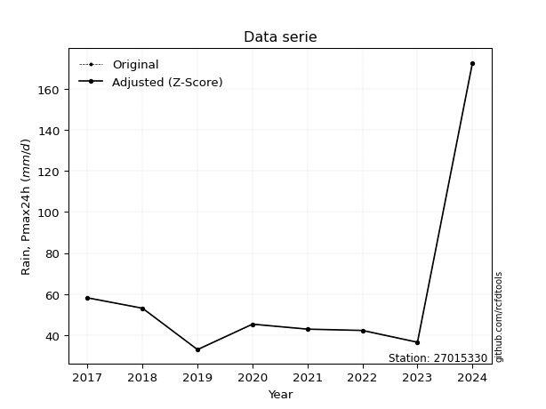</img>

</div>

> If Z-Score is active, values out of range or outliers are replaced with the station mean value.


### 4. Active continuous probability distributions from SciPy (45 of 104 available)

[scipy.stats](https://docs.scipy.org/doc/scipy/reference/stats.html) is a Python´s powerful submodule within the SciPy library for comprehensive statistical analysis, offering over 130 probability distributions (like Normal, Poisson), functions for descriptive stats (mean, variance), hypothesis testing (t-tests, chi-square), random variable generation, and statistical tests, making it essential for data science, modeling, and research. It provides tools to explore, model, and draw conclusions from data efficiently, working seamlessly with NumPy.

<div align="center">

|   id | p_dist             |   n_parameter | fit_method   | label                                                                       | active   | ref                                                                                                        |
|-----:|:-------------------|--------------:|:-------------|:----------------------------------------------------------------------------|:---------|:-----------------------------------------------------------------------------------------------------------|
|    0 | alpha              |             3 | MLE          | Alpha                                                                       | True     | [:mortar_board:](https://docs.scipy.org/doc/scipy/reference/generated/scipy.stats.alpha.html)              |
|    1 | betaprime          |             4 | MLE          | Beta prime                                                                  | True     | [:mortar_board:](https://docs.scipy.org/doc/scipy/reference/generated/scipy.stats.betaprime.html)          |
|    2 | chi2               |             3 | MLE          | Chi²                                                                        | True     | [:mortar_board:](https://docs.scipy.org/doc/scipy/reference/generated/scipy.stats.chi2.html)               |
|    3 | crystalball        |             4 | MLE          | Crystalball                                                                 | True     | [:mortar_board:](https://docs.scipy.org/doc/scipy/reference/generated/scipy.stats.crystalball.html)        |
|    4 | erlang             |             3 | MLE          | Erlang                                                                      | True     | [:mortar_board:](https://docs.scipy.org/doc/scipy/reference/generated/scipy.stats.erlang.html)             |
|    5 | expon              |             2 | MLE          | Exponential                                                                 | True     | [:mortar_board:](https://docs.scipy.org/doc/scipy/reference/generated/scipy.stats.expon.html)              |
|    6 | exponnorm          |             3 | MLE          | Exponentially modified Normal                                               | True     | [:mortar_board:](https://docs.scipy.org/doc/scipy/reference/generated/scipy.stats.exponnorm.html)          |
|    7 | f                  |             4 | MLE          | F                                                                           | True     | [:mortar_board:](https://docs.scipy.org/doc/scipy/reference/generated/scipy.stats.f.html)                  |
|    8 | fatiguelife        |             3 | MLE          | Fatigue-life (Birnbaum-Saunders)                                            | True     | [:mortar_board:](https://docs.scipy.org/doc/scipy/reference/generated/scipy.stats.fatiguelife.html)        |
|    9 | fisk               |             3 | MLE          | Fisk                                                                        | True     | [:mortar_board:](https://docs.scipy.org/doc/scipy/reference/generated/scipy.stats.fisk.html)               |
|   10 | gamma              |             3 | MLE          | Gamma                                                                       | True     | [:mortar_board:](https://docs.scipy.org/doc/scipy/reference/generated/scipy.stats.gamma.html)              |
|   11 | genexpon           |             5 | MLE          | Generalized exponential                                                     | True     | [:mortar_board:](https://docs.scipy.org/doc/scipy/reference/generated/scipy.stats.genexpon.html)           |
|   12 | genlogistic        |             3 | MLE          | Generalized logistic                                                        | True     | [:mortar_board:](https://docs.scipy.org/doc/scipy/reference/generated/scipy.stats.genlogistic.html)        |
|   13 | gibrat             |             2 | MM           | Gibrat                                                                      | True     | [:mortar_board:](https://docs.scipy.org/doc/scipy/reference/generated/scipy.stats.gibrat.html)             |
|   14 | gompertz           |             3 | MLE          | Gompertz (or truncated Gumbel)                                              | True     | [:mortar_board:](https://docs.scipy.org/doc/scipy/reference/generated/scipy.stats.gompertz.html)           |
|   15 | gumbel_l           |             2 | MM           | Gumbel Left Skew                                                            | True     | [:mortar_board:](https://docs.scipy.org/doc/scipy/reference/generated/scipy.stats.gumbel_l.html)           |
|   16 | gumbel_r           |             2 | MM           | Gumbel Right Skew                                                           | True     | [:mortar_board:](https://docs.scipy.org/doc/scipy/reference/generated/scipy.stats.gumbel_r.html)           |
|   17 | halflogistic       |             2 | MM           | Half-logistic                                                               | True     | [:mortar_board:](https://docs.scipy.org/doc/scipy/reference/generated/scipy.stats.halflogistic.html)       |
|   18 | halfnorm           |             2 | MM           | Half Normal                                                                 | True     | [:mortar_board:](https://docs.scipy.org/doc/scipy/reference/generated/scipy.stats.halfnorm.html)           |
|   19 | hypsecant          |             2 | MM           | hyperbolic secant                                                           | True     | [:mortar_board:](https://docs.scipy.org/doc/scipy/reference/generated/scipy.stats.hypsecant.html)          |
|   20 | invgamma           |             3 | MLE          | Inverted gamma                                                              | True     | [:mortar_board:](https://docs.scipy.org/doc/scipy/reference/generated/scipy.stats.invgamma.html)           |
|   21 | invgauss           |             3 | MLE          | Inverse Gaussian                                                            | True     | [:mortar_board:](https://docs.scipy.org/doc/scipy/reference/generated/scipy.stats.invgauss.html)           |
|   22 | invweibull         |             3 | MLE          | Inverted Weibull                                                            | True     | [:mortar_board:](https://docs.scipy.org/doc/scipy/reference/generated/scipy.stats.invweibull.html)         |
|   23 | johnsonsu          |             4 | MLE          | Johnson Su                                                                  | True     | [:mortar_board:](https://docs.scipy.org/doc/scipy/reference/generated/scipy.stats.johnsonsu.html)          |
|   24 | kstwobign          |             2 | MLE          | Limiting distribution of scaled Kolmogorov-Smirnov two-sided test statistic | True     | [:mortar_board:](https://docs.scipy.org/doc/scipy/reference/generated/scipy.stats.kstwobign.html)          |
|   25 | laplace            |             2 | MM           | Laplace                                                                     | True     | [:mortar_board:](https://docs.scipy.org/doc/scipy/reference/generated/scipy.stats.laplace.html)            |
|   26 | laplace_asymmetric |             3 | MLE          | Asymmetric Laplace                                                          | True     | [:mortar_board:](https://docs.scipy.org/doc/scipy/reference/generated/scipy.stats.laplace_asymmetric.html) |
|   27 | loggamma           |             3 | MLE          | Log gamma                                                                   | True     | [:mortar_board:](https://docs.scipy.org/doc/scipy/reference/generated/scipy.stats.loggamma.html)           |
|   28 | logistic           |             2 | MM           | Logistic (or Sech-squared)                                                  | True     | [:mortar_board:](https://docs.scipy.org/doc/scipy/reference/generated/scipy.stats.logistic.html)           |
|   29 | lognorm            |             3 | MLE          | Log Normal                                                                  | True     | [:mortar_board:](https://docs.scipy.org/doc/scipy/reference/generated/scipy.stats.lognorm.html)            |
|   30 | maxwell            |             2 | MM           | Maxwell                                                                     | True     | [:mortar_board:](https://docs.scipy.org/doc/scipy/reference/generated/scipy.stats.maxwell.html)            |
|   31 | mielke             |             4 | MLE          | Mielke Beta-Kappa / Dagum                                                   | True     | [:mortar_board:](https://docs.scipy.org/doc/scipy/reference/generated/scipy.stats.mielke.html)             |
|   32 | moyal              |             2 | MM           | Moyal                                                                       | True     | [:mortar_board:](https://docs.scipy.org/doc/scipy/reference/generated/scipy.stats.moyal.html)              |
|   33 | nakagami           |             3 | MLE          | Nakagami                                                                    | True     | [:mortar_board:](https://docs.scipy.org/doc/scipy/reference/generated/scipy.stats.nakagami.html)           |
|   34 | ncf                |             5 | MLE          | Non-central F distribution                                                  | True     | [:mortar_board:](https://docs.scipy.org/doc/scipy/reference/generated/scipy.stats.ncf.html)                |
|   35 | nct                |             4 | MLE          | Non-central Student’s t                                                     | True     | [:mortar_board:](https://docs.scipy.org/doc/scipy/reference/generated/scipy.stats.nct.html)                |
|   36 | norm               |             2 | MM           | Normal                                                                      | True     | [:mortar_board:](https://docs.scipy.org/doc/scipy/reference/generated/scipy.stats.norm.html)               |
|   37 | pareto             |             3 | MLE          | Pareto                                                                      | True     | [:mortar_board:](https://docs.scipy.org/doc/scipy/reference/generated/scipy.stats.pareto.html)             |
|   38 | pearson3           |             3 | MM           | Pearson type III                                                            | True     | [:mortar_board:](https://docs.scipy.org/doc/scipy/reference/generated/scipy.stats.pearson3.html)           |
|   39 | rayleigh           |             2 | MM           | Rayleigh                                                                    | True     | [:mortar_board:](https://docs.scipy.org/doc/scipy/reference/generated/scipy.stats.rayleigh.html)           |
|   40 | rice               |             3 | MLE          | Rice                                                                        | True     | [:mortar_board:](https://docs.scipy.org/doc/scipy/reference/generated/scipy.stats.rice.html)               |
|   41 | t                  |             3 | MLE          | Student’s t                                                                 | True     | [:mortar_board:](https://docs.scipy.org/doc/scipy/reference/generated/scipy.stats.t.html)                  |
|   42 | truncnorm          |             4 | MLE          | Truncated normal                                                            | True     | [:mortar_board:](https://docs.scipy.org/doc/scipy/reference/generated/scipy.stats.truncnorm.html)          |
|   43 | wald               |             2 | MM           | Wald                                                                        | True     | [:mortar_board:](https://docs.scipy.org/doc/scipy/reference/generated/scipy.stats.wald.html)               |
|   44 | weibull_min        |             3 | MLE          | Weibull minimum                                                             | True     | [:mortar_board:](https://docs.scipy.org/doc/scipy/reference/generated/scipy.stats.weibull_min.html)        |

</div>

> **n_parameter:** # arguments & localization & scale.
>
> **Fit methods:** (MLE) maximum likelihood, (MM) L-moments.
>
>**Inactive:** foldnorm, gennorm, norminvgauss, powernorm, powerlognorm, skewnorm, genextreme, anglit, arcsine, argus, beta, bradford, burr, burr12, cauchy, cosine, halfcauchy, foldcauchy, skewcauchy, wrapcauchy, dgamma, gengamma, exponweib, exponpow, truncexpon, gausshyper, genhalflogistic, genhyperbolic, geninvgauss, halfgennorm, johnsonsb, kappa4, kappa3, ksone, kstwo, loglaplace, levy, levy_l, levy_stable, ncx2, genpareto, truncpareto, lomax, powerlaw, rdist, rel_breitwigner, recipinvgauss, semicircular, studentized_range, trapezoid, triang, truncweibull_min, tukeylambda, uniform, loguniform, vonmises, vonmises_line, weibull_max, dweibull, 


## B. Probability distributions vs. Empirical distributions

A continuous probability distribution (CPD) describes probabilities for variables that can take any value within a range (like rain any time), unlike discrete variables with specific outcomes (like temperature). It uses a Probability Density Function (PDF), a curve where the total area under it equals 1, and the probability of the variable falling within an interval (a to b) is found by calculating the area under the curve between those points. A key feature is that the probability of hitting any single exact value is zero, so probabilities are always expressed for ranges, e.g., $P(a ≤ X ≤ b)$.

<div align="center">

Distributions parameters
|    |   station | p_dist                |   n |            loc |          scale | shape                  | shape1                 | shape2             | shape3   |
|---:|----------:|:----------------------|----:|---------------:|---------------:|:-----------------------|:-----------------------|:-------------------|:---------|
|  0 |  27015330 | alpha                 |   9 |     21.8275    |   35.2641      | 1.2899957448130739     |                        |                    |          |
|  1 |  27015330 | betaprime             |   9 |     -0.653468  |    1.05546     | 268.9544612626065      | 5.574615459125681      |                    |          |
|  2 |  27015330 | chi2                  |   9 |     33.02      |   12.5442      | 0.28644966909493763    |                        |                    |          |
|  3 |  27015330 | crystalball           |   9 |     62.8333    |   41.0913      | 4187.2119982480335     | 4215.75148820463       |                    |          |
|  4 |  27015330 | erlang                |   9 |     33.02      |   29.8831      | 0.7121388324936154     |                        |                    |          |
|  5 |  27015330 | expon                 |   9 |     33.02      |   29.8133      |                        |                        |                    |          |
|  6 |  27015330 | exponnorm             |   9 |     32.9857    |    0.0102131   | 2910.7245332373896     |                        |                    |          |
|  7 |  27015330 | f                     |   9 |     27.8552    |   15.1595      | 230.26705914888817     | 3.0842937406559248     |                    |          |
|  8 |  27015330 | fatiguelife           |   9 |     31.1014    |   16.4738      | 1.3631076614944786     |                        |                    |          |
|  9 |  27015330 | fisk                  |   9 |     33.02      |   12.1438      | 0.6722127887454792     |                        |                    |          |
| 10 |  27015330 | gamma                 |   9 |     33.02      |   70.6596      | 0.1943581184497848     |                        |                    |          |
| 11 |  27015330 | genexpon              |   9 |     33.02      |   39.2201      | 1.315522287792581      | 1.2219819400069574e-10 | 1.0658333325338822 |          |
| 12 |  27015330 | genlogistic           |   9 |   -108.711     |   20.4316      | 2104.669342330363      |                        |                    |          |
| 13 |  27015330 | gibrat                |   9 |     31.4859    |   19.0132      |                        |                        |                    |          |
| 14 |  27015330 | gompertz              |   9 |     33.02      |    6.09987e+12 | 198209244283.1264      |                        |                    |          |
| 15 |  27015330 | gumbel_l              |   9 |     81.3266    |   32.0387      |                        |                        |                    |          |
| 16 |  27015330 | gumbel_r              |   9 |     44.3401    |   32.0387      |                        |                        |                    |          |
| 17 |  27015330 | halflogistic          |   9 |     14.1306    |   35.1316      |                        |                        |                    |          |
| 18 |  27015330 | halfnorm              |   9 |      8.4446    |   68.1662      |                        |                        |                    |          |
| 19 |  27015330 | hypsecant             |   9 |     62.8333    |   26.1595      |                        |                        |                    |          |
| 20 |  27015330 | invgamma              |   9 |     27.7704    |   23.3765      | 1.5395346964059888     |                        |                    |          |
| 21 |  27015330 | invgauss              |   9 |     30.0345    |   16.6128      | 1.9743173541492922     |                        |                    |          |
| 22 |  27015330 | invweibull            |   9 |     26.3862    |   15.7893      | 1.411695596749916      |                        |                    |          |
| 23 |  27015330 | johnsonsu             |   9 |     31.8215    |    0.0458804   | -5.0488314081882475    | 0.7798058960250267     |                    |          |
| 24 |  27015330 | kstwobign             |   9 |    -36.4035    |  116.961       |                        |                        |                    |          |
| 25 |  27015330 | laplace               |   9 |     62.8333    |   29.0559      |                        |                        |                    |          |
| 26 |  27015330 | laplace_asymmetric    |   9 |     33.02      |    0.000152546 | 5.1167213251445595e-06 |                        |                    |          |
| 27 |  27015330 | loggamma              |   9 | -10682.7       | 1500.97        | 1286.3424812589888     |                        |                    |          |
| 28 |  27015330 | logistic              |   9 |     62.8333    |   22.6548      |                        |                        |                    |          |
| 29 |  27015330 | lognorm               |   9 |     33.02      |    0.359258    | 11.199900687850402     |                        |                    |          |
| 30 |  27015330 | maxwell               |   9 |    -34.5357    |   61.017       |                        |                        |                    |          |
| 31 |  27015330 | mielke                |   9 |     24.4901    |    1.44144     | 78.0188034882123       | 1.5559144693517517     |                    |          |
| 32 |  27015330 | moyal                 |   9 |     39.3347    |   18.4976      |                        |                        |                    |          |
| 33 |  27015330 | nakagami              |   9 |     33.02      |   65.9039      | 0.08298341430062559    |                        |                    |          |
| 34 |  27015330 | ncf                   |   9 |     -0.0262841 |    1.93822e-06 | 1.8676563862148642e-07 | 8.563273102712092      | 4.650273395411158  |          |
| 35 |  27015330 | nct                   |   9 |     -0.28323   |    1.08229     | 3.628592551082308      | 43.695550831980285     |                    |          |
| 36 |  27015330 | norm                  |   9 |     62.8333    |   41.0913      |                        |                        |                    |          |
| 37 |  27015330 | pareto                |   9 |     -5.24019   |   38.2602      | 2.195530514764228      |                        |                    |          |
| 38 |  27015330 | pearson3              |   9 |     62.8333    |   41.0913      | 2.020120943559383      |                        |                    |          |
| 39 |  27015330 | rayleigh              |   9 |    -15.7767    |   62.7217      |                        |                        |                    |          |
| 40 |  27015330 | rice                  |   9 |      5.70367   |   49.7609      | 0.0001802250257874927  |                        |                    |          |
| 41 |  27015330 | t                     |   9 |     44.0592    |    7.67232     | 0.9449295110589122     |                        |                    |          |
| 42 |  27015330 | truncnorm             |   9 | -44837.5       | 1357.15        | 33.06227205877995      | 80488.18739059212      |                    |          |
| 43 |  27015330 | wald                  |   9 |     21.7421    |   41.0913      |                        |                        |                    |          |
| 44 |  27015330 | weibull_min           |   9 |     33.02      |   33.8232      | 0.747193455675417      |                        |                    |          |
| 45 |  27015330 | logalpha              |   9 |      2.89801   |    2.8136      | 2.9399284500023954     |                        |                    |          |
| 46 |  27015330 | logbetaprime          |   9 |     -1.20773   |    3.2458      | 329.80642126445855     | 206.69845606166677     |                    |          |
| 47 |  27015330 | logchi2               |   9 |      3.49711   |    0.922944    | 1.123397538583646      |                        |                    |          |
| 48 |  27015330 | logcrystalball        |   9 |      4.00047   |    0.477953    | 51.9826752681998       | 76.08662671269104      |                    |          |
| 49 |  27015330 | logerlang             |   9 |      3.49711   |    0.543429    | 0.9487662580811526     |                        |                    |          |
| 50 |  27015330 | logexpon              |   9 |      3.49711   |    0.503351    |                        |                        |                    |          |
| 51 |  27015330 | logexponnorm          |   9 |      3.49643   |    0.000223841 | 2257.6828839329273     |                        |                    |          |
| 52 |  27015330 | logf                  |   9 |      3.24413   |    0.549205    | 868.2201499739472      | 6.936727019356964      |                    |          |
| 53 |  27015330 | logfatiguelife        |   9 |      3.38575   |    0.459348    | 0.8202751425369148     |                        |                    |          |
| 54 |  27015330 | logfisk               |   9 |      3.42452   |    0.42252     | 2.0134544540332935     |                        |                    |          |
| 55 |  27015330 | loggamma              |   9 |      3.49711   |    0.835761    | 0.3589847318789543     |                        |                    |          |
| 56 |  27015330 | loggenexpon           |   9 |      3.49711   |    0.757856    | 1.4376089846346927     | 0.13994728600447282    | 1.4441642171506457 |          |
| 57 |  27015330 | loggenlogistic        |   9 |      1.52848   |    0.30839     | 1577.3733150125395     |                        |                    |          |
| 58 |  27015330 | loggibrat             |   9 |      3.63581   |    0.221171    |                        |                        |                    |          |
| 59 |  27015330 | loggompertz           |   9 |      3.49711   |    1.1141      | 1.3086441174149628     |                        |                    |          |
| 60 |  27015330 | loggumbel_l           |   9 |      4.21557   |    0.372659    |                        |                        |                    |          |
| 61 |  27015330 | loggumbel_r           |   9 |      3.78536   |    0.372659    |                        |                        |                    |          |
| 62 |  27015330 | loghalflogistic       |   9 |      3.43398   |    0.408633    |                        |                        |                    |          |
| 63 |  27015330 | loghalfnorm           |   9 |      3.36784   |    0.792876    |                        |                        |                    |          |
| 64 |  27015330 | loghypsecant          |   9 |      4.00046   |    0.304275    |                        |                        |                    |          |
| 65 |  27015330 | loginvgamma           |   9 |      3.24194   |    1.91023     | 3.4683500733186565     |                        |                    |          |
| 66 |  27015330 | loginvgauss           |   9 |      3.35703   |    0.99412     | 0.6472427855400491     |                        |                    |          |
| 67 |  27015330 | loginvweibull         |   9 |      2.97231   |    0.777724    | 3.0349327360233236     |                        |                    |          |
| 68 |  27015330 | logjohnsonsu          |   9 |      3.39274   |    0.00680154  | -6.219368731315946     | 1.2707725701707995     |                    |          |
| 69 |  27015330 | logkstwobign          |   9 |      2.65841   |    1.55712     |                        |                        |                    |          |
| 70 |  27015330 | loglaplace            |   9 |      4.00046   |    0.337964    |                        |                        |                    |          |
| 71 |  27015330 | loglaplace_asymmetric |   9 |      3.74573   |    0.255549    | 0.6189139803863923     |                        |                    |          |
| 72 |  27015330 | logloggamma           |   9 |   -227.827     |   28.4812      | 3428.29012039376       |                        |                    |          |
| 73 |  27015330 | loglogistic           |   9 |      4.00046   |    0.26351     |                        |                        |                    |          |
| 74 |  27015330 | loglognorm            |   9 |      3.49711   |    0.00898887  | 10.85859535505263      |                        |                    |          |
| 75 |  27015330 | logmaxwell            |   9 |      2.86792   |    0.70972     |                        |                        |                    |          |
| 76 |  27015330 | logmielke             |   9 |      2.47952   |    0.568821    | 225.07806502987597     | 4.741506006367409      |                    |          |
| 77 |  27015330 | logmoyal              |   9 |      3.72714   |    0.215155    |                        |                        |                    |          |
| 78 |  27015330 | lognakagami           |   9 |      3.49711   |    0.947026    | 0.2931472009955318     |                        |                    |          |
| 79 |  27015330 | logncf                |   9 |      3.24877   |    0.445794    | 264.39893297819276     | 6.9377408588903915     | 59.39063159449971  |          |
| 80 |  27015330 | lognct                |   9 |     -0.934886  |    0.125023    | 67.69411725133735      | 39.03058790625261      |                    |          |
| 81 |  27015330 | lognorm               |   9 |      4.00046   |    0.477954    |                        |                        |                    |          |
| 82 |  27015330 | logpareto             |   9 |      3.49706   |    5.18057e-05 | 0.1251912039540259     |                        |                    |          |
| 83 |  27015330 | logpearson3           |   9 |      4.00046   |    0.477954    | 1.3810349662380874     |                        |                    |          |
| 84 |  27015330 | lograyleigh           |   9 |      3.08611   |    0.729548    |                        |                        |                    |          |
| 85 |  27015330 | logrice               |   9 |      3.26274   |    0.621563    | 0.0003431028146193263  |                        |                    |          |
| 86 |  27015330 | logt                  |   9 |      3.83279   |    0.236761    | 1.802810933002317      |                        |                    |          |
| 87 |  27015330 | logtruncnorm          |   9 |     -3.59194   |    2.02712     | 3.4971021244396656     | 4.313027668960075      |                    |          |
| 88 |  27015330 | logwald               |   9 |      3.52255   |    0.47792     |                        |                        |                    |          |
| 89 |  27015330 | logweibull_min        |   9 |      3.49711   |    0.178773    | 0.5033549948326101     |                        |                    |          |

</div>

> **loc** (Location parameter): This shifts the distribution along the x-axis. For many common distributions, like the normal (Gaussian) distribution, loc represents the mean $μ$. For others, like the uniform distribution, it might represent the minimum value, or for the beta distribution, the left end of the support interval.
>
> **scale** (Scale parameter): This determines the width or spread of the distribution. For the normal distribution, scale represents the standard deviation $σ$. For a uniform distribution, it defines the length of the interval (from $loc$ to $loc + scale$).
>
> **shape** (Shape parameters): Refers to parameters that define the specific form of a probability distribution, distinct from its location (loc) and scale (scale). These parameters are required arguments for most distribution functions. For example, a normal (Gaussian) distribution is fully defined by its location (mean) and scale (standard deviation), so it has no specific shape parameters beyond loc and scale. However, other distributions have intrinsic properties that need specification, as Gamma distribution that takes a shape parameter, often named $a$ or $alpha$.


### 0. Cumulative distribution values - CDF (90 evaluated)

> Ordered by x ascending and calculating $log(f(x))$ separately. 

|   id |   Station |   date |       x |   count |    mean |     std |    zscore |   Value_initial |   station |   m |     alpha |   alpha_pdf |   betaprime |   betaprime_pdf |       chi2 |    chi2_pdf |   crystalball |   crystalball_pdf |      erlang |   erlang_pdf |    expon |   expon_pdf |   exponnorm |   exponnorm_pdf |         f |       f_pdf |   fatiguelife |   fatiguelife_pdf |        fisk |       fisk_pdf |       gamma |   gamma_pdf |    genexpon |   genexpon_pdf |   genlogistic |   genlogistic_pdf |     gibrat |   gibrat_pdf |    gompertz |   gompertz_pdf |   gumbel_l |   gumbel_l_pdf |   gumbel_r |   gumbel_r_pdf |   halflogistic |   halflogistic_pdf |   halfnorm |   halfnorm_pdf |   hypsecant |   hypsecant_pdf |   invgamma |   invgamma_pdf |   invgauss |   invgauss_pdf |   invweibull |   invweibull_pdf |   johnsonsu |   johnsonsu_pdf |   kstwobign |   kstwobign_pdf |   laplace |   laplace_pdf |   laplace_asymmetric |   laplace_asymmetric_pdf |    loggamma |   loggamma_pdf |   logistic |   logistic_pdf |   lognorm |   lognorm_pdf |   maxwell |   maxwell_pdf |    mielke |   mielke_pdf |    moyal |   moyal_pdf |   nakagami |   nakagami_pdf |      ncf |     ncf_pdf |       nct |     nct_pdf |     norm |    norm_pdf |      pareto |   pareto_pdf |   pearson3 |   pearson3_pdf |   rayleigh |   rayleigh_pdf |     rice |    rice_pdf |        t |       t_pdf |   truncnorm |   truncnorm_pdf |     wald |    wald_pdf |   weibull_min |   weibull_min_pdf |   logalpha |   logalpha_pdf |   logbetaprime |   logbetaprime_pdf |     logchi2 |   logchi2_pdf |   logcrystalball |   logcrystalball_pdf |   logerlang |   logerlang_pdf |   logexpon |   logexpon_pdf |   logexponnorm |   logexponnorm_pdf |      logf |   logf_pdf |   logfatiguelife |   logfatiguelife_pdf |   logfisk |   logfisk_pdf |   loggenexpon |   loggenexpon_pdf |   loggenlogistic |   loggenlogistic_pdf |   loggibrat |   loggibrat_pdf |   loggompertz |   loggompertz_pdf |   loggumbel_l |   loggumbel_l_pdf |   loggumbel_r |   loggumbel_r_pdf |   loghalflogistic |   loghalflogistic_pdf |   loghalfnorm |   loghalfnorm_pdf |   loghypsecant |   loghypsecant_pdf |   loginvgamma |   loginvgamma_pdf |   loginvgauss |   loginvgauss_pdf |   loginvweibull |   loginvweibull_pdf |   logjohnsonsu |   logjohnsonsu_pdf |   logkstwobign |   logkstwobign_pdf |   loglaplace |   loglaplace_pdf |   loglaplace_asymmetric |   loglaplace_asymmetric_pdf |   logloggamma |   logloggamma_pdf |   loglogistic |   loglogistic_pdf |   loglognorm |   loglognorm_pdf |   logmaxwell |   logmaxwell_pdf |   logmielke |   logmielke_pdf |   logmoyal |   logmoyal_pdf |   lognakagami |   lognakagami_pdf |   logncf |   logncf_pdf |   lognct |   lognct_pdf |   logpareto |   logpareto_pdf |   logpearson3 |   logpearson3_pdf |   lograyleigh |   lograyleigh_pdf |   logrice |   logrice_pdf |     logt |   logt_pdf |   logtruncnorm |   logtruncnorm_pdf |   logwald |   logwald_pdf |   logweibull_min |   logweibull_min_pdf |
|-----:|----------:|-------:|--------:|--------:|--------:|--------:|----------:|----------------:|----------:|----:|----------:|------------:|------------:|----------------:|-----------:|------------:|--------------:|------------------:|------------:|-------------:|---------:|------------:|------------:|----------------:|----------:|------------:|--------------:|------------------:|------------:|---------------:|------------:|------------:|------------:|---------------:|--------------:|------------------:|-----------:|-------------:|------------:|---------------:|-----------:|---------------:|-----------:|---------------:|---------------:|-------------------:|-----------:|---------------:|------------:|----------------:|-----------:|---------------:|-----------:|---------------:|-------------:|-----------------:|------------:|----------------:|------------:|----------------:|----------:|--------------:|---------------------:|-------------------------:|------------:|---------------:|-----------:|---------------:|----------:|--------------:|----------:|--------------:|----------:|-------------:|---------:|------------:|-----------:|---------------:|---------:|------------:|----------:|------------:|---------:|------------:|------------:|-------------:|-----------:|---------------:|-----------:|---------------:|---------:|------------:|---------:|------------:|------------:|----------------:|---------:|------------:|--------------:|------------------:|-----------:|---------------:|---------------:|-------------------:|------------:|--------------:|-----------------:|---------------------:|------------:|----------------:|-----------:|---------------:|---------------:|-------------------:|----------:|-----------:|-----------------:|---------------------:|----------:|--------------:|--------------:|------------------:|-----------------:|---------------------:|------------:|----------------:|--------------:|------------------:|--------------:|------------------:|--------------:|------------------:|------------------:|----------------------:|--------------:|------------------:|---------------:|-------------------:|--------------:|------------------:|--------------:|------------------:|----------------:|--------------------:|---------------:|-------------------:|---------------:|-------------------:|-------------:|-----------------:|------------------------:|----------------------------:|--------------:|------------------:|--------------:|------------------:|-------------:|-----------------:|-------------:|-----------------:|------------:|----------------:|-----------:|---------------:|--------------:|------------------:|---------:|-------------:|---------:|-------------:|------------:|----------------:|--------------:|------------------:|--------------:|------------------:|----------:|--------------:|---------:|-----------:|---------------:|-------------------:|----------:|--------------:|-----------------:|---------------------:|
|    0 |  27015330 |   2019 |  33.02  |       9 | 62.8333 | 43.5839 | -0.684045 |          33.02  |  27015330 |   1 | 0.0348246 | 0.0220612   |    0.121758 |     0.0159725   | 0.00634162 | 1.27829e+11 |      0.234061 |       0.00746195  | 4.38817e-09 | 64.9156      | 0        | 0.033542    |  0.00115194 |     0.0335866   | 0.0328414 | 0.0249606   |     0.0287622 |       0.041094    | 4.45813e-10 | 2008.4         | 0.000845475 | 2.31267e+10 | 4.61932e-12 |    0.033542    |      0.129591 |       0.0129541   | 0.00591504 |  0.0109438   | 1.35529e-13 |    0.032494    |   0.198609 |     0.00553808 |   0.240799 |    0.010701    |       0.262543 |        0.0132512   |   0.281543 |    0.0109685   |    0.197119 |     0.00706279  |  0.0326177 |    0.0248945   |  0.0298664 |     0.0316416  |    0.0333304 |      0.0241246   |   0.0247827 |     0.037723    |    0.12731  |     0.011009    |  0.179207 |   0.00616765  |          5.47318e-11 |               0.0335423  | 3.69081e-06 |    2.98351e+09 |   0.211487 |     0.00736093 |  0.146139 |     0.479387  |  0.253179 |   0.00868422  | 0.0469584 |  0.0254147   | 0.235574 | 0.0126597   |  0.0018997 |    4.43728e+10 | 0.445313 | 0.0089027   | 0.0968802 | 0.0174203   | 0.234061 | 0.00746195  | 4.44089e-16 |  0.0573842   |   0.238864 |    0.0188192   |   0.261129 |    0.0091648   | 0.139872 | 0.00948876  | 0.198207 | 0.0132754   | 9.48298e-05 |     0.0243815   | 0.138411 | 0.0258797   |     1.931e-12 |     203.06        |   0.039572 |      0.66984   |       0.137335 |          0.529675  | 1.89537e-09 |   2.39733e+06 |         0.146139 |            0.479387  | 4.94722e-15 |      10.5694    |   0        |      1.98668   |     0.00134477 |          1.97376   | 0.0351478 |   0.737487 |        0.0303461 |            0.948785  | 0.0280181 |     0.755361  |   1.04788e-10 |         1.89694   |        0.0698019 |            0.602037  |    0        |       0         |   8.04404e-10 |         1.17462   |      0.135368 |       0.337471    |      0.114485 |         0.665823  |          0.077098 |             1.21632   |      0.129515 |          0.99303  |       0.12029  |          0.385991  |     0.0351486 |         0.737484  |     0.0315387 |         0.86497   |       0.0368981 |           0.704075  |      0.0309552 |          0.848425  |      0.0662235 |          0.59257   |     0.112758 |         0.333639 |               0.0575105 |                   0.363615  |      0.150278 |         0.477077  |      0.12896  |         0.426283  |   0.00238915 |      1.54472e+12 |     0.147178 |        0.596464  |   0.0539661 |       0.711983  |  0.0878781 |      0.737573  |   7.99832e-10 |       1.05595e+06 | 0.035146 |    0.737518  | 0.124045 |    0.542816  |    0        |    2416.55      |     0.0968753 |         0.886571  |      0.146739 |         0.658897  | 0.0686249 |     0.565026  | 0.152222 |  0.516307  |    7.70736e-07 |           1.91481  | 0         |     0         |       4.4523e-08 |          5.04648e+07 |
|    1 |  27015330 |   2023 |  36.602 |       9 | 62.8333 | 43.5839 | -0.601859 |          36.602 |  27015330 |   2 | 0.151261  | 0.0391768   |    0.183607 |     0.0183496   | 0.795099   | 0.028045    |      0.261617 |       0.007919    | 0.230684    |  0.0427339   | 0.11321  | 0.0297447   |  0.114539   |     0.0297858   | 0.159422  | 0.0404317   |     0.19887   |       0.0429497   | 0.305614    |    0.039825    | 0.604101    | 0.0314137   | 0.11321     |    0.0297447   |      0.179979 |       0.0151003   | 0.094636   |  0.0329431   | 0.109875    |    0.0289237   |   0.219325 |     0.00603309 |   0.279938 |    0.0111245   |       0.309342 |        0.0128703   |   0.320445 |    0.0107478   |    0.223851 |     0.00786906  |  0.159115  |    0.040435    |  0.179174  |     0.0430226  |    0.157394  |      0.0402154   |   0.188048  |     0.0439832   |    0.169271 |     0.0123651   |  0.202719 |   0.00697685  |          0.113211    |               0.0297449  | 0.51308     |    1.63237     |   0.239054 |     0.00802953 |  0.201111 |     0.587704  |  0.284885 |   0.00900805  | 0.166099  |  0.0376267   | 0.281631 | 0.0130064   |  0.523372  |    0.0242442   | 0.476388 | 0.00844811  | 0.16692   | 0.021308    | 0.261617 | 0.007919    | 0.17839     |  0.0431113   |   0.303259 |    0.0171659   |   0.29439  |    0.00939471  | 0.175337 | 0.0102905   | 0.25823  | 0.0209118   | 0.0837271   |     0.022344    | 0.231258 | 0.0254134   |     0.170406  |       0.0323291   |   0.143102 |      1.29013   |       0.198524 |          0.656668  | 0.217783    |   1.14593     |         0.201111 |            0.587703  | 0.192435    |       1.60603   |   0.185033 |      1.61908   |     0.185466   |          1.61178   | 0.149971  |   1.39532  |        0.170584  |            1.54842   | 0.14578   |     1.42801   |   0.178904    |         1.58459   |        0.148564  |            0.917997  |    0        |       0         |   0.119039    |         1.13502   |      0.174488 |       0.424767    |      0.193209 |         0.85234   |          0.200514 |             1.1744    |      0.230429 |          0.964054 |       0.166853 |          0.523592  |     0.149971  |         1.39531   |     0.162722  |         1.50379   |       0.147268  |           1.36372   |      0.159732  |          1.48865   |      0.142093  |          0.867053  |     0.15293  |         0.452504 |               0.110292  |                   0.697329  |      0.204787 |         0.580984  |      0.179558 |         0.559057  |   0.588848   |      0.34785     |     0.214305 |        0.702765  |   0.154275  |       1.19635   |  0.179134  |      1.01034   |   0.211332    |       1.19984     | 0.149972 |    1.39532   | 0.187594 |    0.688767  |    0.613597 |       0.469465  |     0.197906  |         1.04624   |      0.219784 |         0.753465  | 0.136965  |     0.753632  | 0.219434 |  0.8085    |    0.180606    |           1.60104  | 0.0332284 |     1.46917   |       0.531211   |          1.7358      |
|    2 |  27015330 |   2022 |  42.34  |       9 | 62.8333 | 43.5839 | -0.470205 |          42.34  |  27015330 |   3 | 0.370398  | 0.0338267   |    0.294021 |     0.0196694   | 0.888548   | 0.00983369  |      0.308986 |       0.00857333  | 0.422348    |  0.0267815   | 0.268466 | 0.0245371   |  0.269967   |     0.0245574   | 0.373895  | 0.0321588   |     0.388873  |       0.0254834   | 0.45564     |    0.0178895   | 0.71826     | 0.0134053   | 0.268466    |    0.0245371   |      0.273858 |       0.0173543   | 0.287539   |  0.0314105   | 0.261286    |    0.0240038   |   0.256331 |     0.00687432 |   0.344929 |    0.0114595   |       0.381216 |        0.0121639   |   0.380985 |    0.0103438   |    0.272815 |     0.00919817  |  0.37363   |    0.0321639   |  0.385499  |     0.0289424  |    0.373262  |      0.0325488   |   0.393512  |     0.028516    |    0.244816 |     0.0138155   |  0.246979 |   0.00850011  |          0.268468    |               0.0245372  | 0.674316    |    0.779473    |   0.288108 |     0.00905335 |  0.297029 |     0.724175  |  0.337742 |   0.00938586  | 0.371643  |  0.0317507   | 0.35654  | 0.0129996   |  0.613321  |    0.0109051   | 0.522796 | 0.00773103  | 0.296556  | 0.0230561   | 0.308986 | 0.00857333  | 0.380375    |  0.0285919   |   0.394938 |    0.0148507   |   0.349019 |    0.00961686  | 0.237407 | 0.0112831   | 0.430644 | 0.0390137   | 0.203378    |     0.0194287   | 0.366093 | 0.0213453   |     0.3173    |       0.0208915   |   0.35289  |      1.45604   |       0.305293 |          0.799693  | 0.347517    |   0.719678    |         0.297029 |            0.724174  | 0.392581    |       1.17425   |   0.389775 |      1.21232   |     0.389396   |          1.20825   | 0.364202  |   1.41954  |        0.382886  |            1.30203   | 0.365407  |     1.45353   |   0.38181     |         1.21575   |        0.304422  |            1.17359   |    0.242224 |       2.84235   |   0.279049    |         1.05857   |      0.246809 |       0.57286     |      0.328835 |         0.981407  |          0.363974 |             1.06149   |      0.366359 |          0.898274 |       0.260103 |          0.762824  |     0.364201  |         1.41954   |     0.376599  |         1.34325   |       0.361683  |           1.44337   |      0.374574  |          1.36436   |      0.285925  |          1.06767   |     0.235305 |         0.696242 |               0.276963  |                   1.75112   |      0.299298 |         0.711861  |      0.275541 |         0.757536  |   0.6201     |      0.141028    |     0.32459  |        0.800379  |   0.347767  |       1.36029   |  0.338207  |      1.1226    |   0.352959    |       0.819433    | 0.3642   |    1.41952   | 0.300382 |    0.847307  |    0.653949 |       0.174217  |     0.352795  |         1.04934   |      0.335515 |         0.823515  | 0.260599  |     0.924383  | 0.375866 |  1.33284   |    0.386256    |           1.23762  | 0.335245  |     1.92971   |       0.6929     |          0.734034    |
|    3 |  27015330 |   2021 |  42.975 |       9 | 62.8333 | 43.5839 | -0.455635 |          42.975 |  27015330 |   4 | 0.391456  | 0.0324954   |    0.306508 |     0.0196568   | 0.894542   | 0.00906148  |      0.314451 |       0.00863863  | 0.439015    |  0.0257257   | 0.283882 | 0.02402     |  0.285396   |     0.0240384   | 0.393901  | 0.0308574   |     0.404662  |       0.0242632   | 0.46665     |    0.0168062   | 0.726511    | 0.0125983   | 0.283882    |    0.02402     |      0.284926 |       0.0175035   | 0.307225   |  0.030586    | 0.276372    |    0.0235136   |   0.260727 |     0.00697048 |   0.35221  |    0.0114718   |       0.388913 |        0.0120795   |   0.387538 |    0.0102956   |    0.278702 |     0.00934392  |  0.393639  |    0.0308617   |  0.40345   |     0.0276065  |    0.393512  |      0.0312319   |   0.411197  |     0.0271983   |    0.253623 |     0.0139208   |  0.252435 |   0.00868792  |          0.283884    |               0.0240201  | 0.685604    |    0.737695    |   0.293891 |     0.00916004 |  0.307898 |     0.735939  |  0.343712 |   0.00941676  | 0.391445  |  0.0306158   | 0.364784 | 0.012963    |  0.620056  |    0.0103193   | 0.52768  | 0.00765325  | 0.311174  | 0.0229783   | 0.314451 | 0.00863863  | 0.39815     |  0.0274059   |   0.404293 |    0.0146163   |   0.35513  |    0.00963067  | 0.244599 | 0.0113704   | 0.45582  | 0.0402022   | 0.21562     |     0.0191304   | 0.37949  | 0.0208508   |     0.330329  |       0.0201541   |   0.374412 |      1.43474   |       0.317279 |          0.810547  | 0.358051    |   0.695932    |         0.307897 |            0.735939  | 0.409798    |       1.13912   |   0.407558 |      1.177     |     0.40712    |          1.17318   | 0.385114  |   1.38963  |        0.401989  |            1.26455   | 0.386806  |     1.42092   |   0.39966     |         1.18257   |        0.321965  |            1.18277   |    0.283608 |       2.71382   |   0.294739    |         1.04946   |      0.255459 |       0.58936     |      0.343473 |         0.984952  |          0.37967  |             1.04721   |      0.37967  |          0.890115 |       0.271648 |          0.788282  |     0.385114  |         1.38963   |     0.396329  |         1.30737   |       0.382964  |           1.41514   |      0.394627  |          1.3295    |      0.301875  |          1.07482   |     0.245901 |         0.727595 |               0.302566  |                   1.68911   |      0.30998  |         0.723177  |      0.286959 |         0.776494  |   0.622137   |      0.132841    |     0.33655  |        0.80638   |   0.367925  |       1.34733   |  0.354889  |      1.11819   |   0.364995    |       0.797964    | 0.385113 |    1.38961   | 0.313081 |    0.858681  |    0.656459 |       0.163184  |     0.368352  |         1.04057   |      0.347798 |         0.826534  | 0.274441  |     0.935036  | 0.396026 |  1.37469   |    0.404436    |           1.20512  | 0.363333  |     1.84391   |       0.703483   |          0.688563    |
|    4 |  27015330 |   2020 |  45.398 |       9 | 62.8333 | 43.5839 | -0.400041 |          45.398 |  27015330 |   5 | 0.464073  | 0.0274997   |    0.353874 |     0.0193843   | 0.913598   | 0.00682648  |      0.335671 |       0.00887291  | 0.497008    |  0.0222802   | 0.339781 | 0.0221451   |  0.34133    |     0.0221568   | 0.462896  | 0.026187    |     0.458555  |       0.0204119   | 0.50321     |    0.0135762   | 0.753959    | 0.010214    | 0.339781    |    0.0221451   |      0.327863 |       0.01789     | 0.377379   |  0.0273104   | 0.33116     |    0.0217333   |   0.278065 |     0.00734176 |   0.380025 |    0.0114761   |       0.417783 |        0.0117481   |   0.412256 |    0.0101055   |    0.302007 |     0.00988904  |  0.462641  |    0.0261888   |  0.464768  |     0.0231763  |    0.463307  |      0.0264678   |   0.471632  |     0.0228564   |    0.287754 |     0.0142265   |  0.274389 |   0.00944348  |          0.339783    |               0.0221452  | 0.72244     |    0.611975    |   0.316564 |     0.0095499  |  0.349356 |     0.774448  |  0.366653 |   0.00951454  | 0.46043   |  0.0263706   | 0.395975 | 0.0127691   |  0.642834  |    0.00859598  | 0.545868 | 0.00736024  | 0.366173  | 0.0223365   | 0.335671 | 0.00887291  | 0.459575    |  0.0234313   |   0.438657 |    0.0137574   |   0.378512 |    0.00966426  | 0.272516 | 0.0116621   | 0.554367 | 0.0397819   | 0.260631    |     0.0180336   | 0.427762 | 0.0190093   |     0.376152  |       0.017769    |   0.450284 |      1.32502   |       0.362687 |          0.843196  | 0.394105    |   0.621824    |         0.349356 |            0.774448  | 0.468938    |       1.01983   |   0.468722 |      1.05548   |     0.468099   |          1.05251   | 0.457912  |   1.26122  |        0.467596  |            1.12869   | 0.460984  |     1.27971   |   0.461309    |         1.06711   |        0.387241  |            1.19092   |    0.41766  |       2.1731    |   0.351342    |         1.01395   |      0.289483 |       0.651609    |      0.39757  |         0.984043  |          0.4356   |             0.991418  |      0.427628 |          0.858072 |       0.317398 |          0.878661  |     0.457912  |         1.26122   |     0.464321  |         1.1716    |       0.457225  |           1.28795   |      0.463866  |          1.19419   |      0.361171  |          1.0827    |     0.28923  |         0.855801 |               0.389323  |                   1.479     |      0.350699 |         0.760325  |      0.331358 |         0.840804  |   0.628738   |      0.109343    |     0.381252 |        0.821898  |   0.439913  |       1.2711    |  0.415398  |      1.08388   |   0.406834    |       0.730262    | 0.457909 |    1.26121   | 0.361145 |    0.891437  |    0.664494 |       0.131914  |     0.424351  |         0.999165  |      0.39331  |         0.831378  | 0.326584  |     0.963445  | 0.474492 |  1.46888   |    0.467389    |           1.09207  | 0.455975  |     1.5395    |       0.737379   |          0.555186    |
|    5 |  27015330 |   2018 |  53.146 |       9 | 62.8333 | 43.5839 | -0.222269 |          53.146 |  27015330 |   6 | 0.626905  | 0.0156981   |    0.495703 |     0.0169346   | 0.950586   | 0.00330524  |      0.406813 |       0.0094426   | 0.638536    |  0.0149467   | 0.490878 | 0.017077    |  0.492453   |     0.0170732   | 0.620548  | 0.0155657   |     0.584906  |       0.0131123   | 0.584092    |    0.00811386  | 0.815222    | 0.00618728  | 0.490878    |    0.017077    |      0.466137 |       0.0174106   | 0.551851   |  0.0182625   | 0.480025    |    0.0168961   |   0.339632 |     0.00855292 |   0.467814 |    0.0110925   |       0.504463 |        0.0106104   |   0.488029 |    0.00944039  |    0.38473  |     0.0113789   |  0.620294  |    0.0155651   |  0.605459  |     0.0141831  |    0.621981  |      0.0155807   |   0.610616  |     0.0140243   |    0.399083 |     0.0143017   |  0.358241 |   0.0123294   |          0.49088     |               0.017077   | 0.799559    |    0.391661    |   0.394698 |     0.0105457  |  0.477124 |     0.833316  |  0.440971 |   0.00961613  | 0.621048  |  0.0159867   | 0.491176 | 0.0117151   |  0.696587  |    0.00570342  | 0.5994   | 0.00647114  | 0.524631  | 0.0182566   | 0.406813 | 0.0094426   | 0.60465     |  0.0148666   |   0.53561  |    0.0113497   |   0.453244 |    0.009579    | 0.365229 | 0.012162    | 0.772483 | 0.0169328   | 0.387957    |     0.0149306   | 0.554717 | 0.0140125   |     0.492615  |       0.0127807   |   0.62757  |      0.923487  |       0.498849 |          0.867574  | 0.479813    |   0.478688    |         0.477123 |            0.833316  | 0.606983    |       0.747571  |   0.611523 |      0.771781  |     0.610583   |          0.77057   | 0.625463  |   0.873941 |        0.618025  |            0.797601  | 0.62843   |     0.85713   |   0.606596    |         0.789579  |        0.565968  |            1.04446   |    0.663428 |       1.08228   |   0.502137    |         0.896466  |      0.406447 |       0.830825    |      0.546439 |         0.886147  |          0.578093 |             0.814677  |      0.554715 |          0.752003 |       0.471352 |          1.04189   |     0.625463  |         0.873943  |     0.620151  |         0.821496  |       0.627968  |           0.886075  |      0.622431  |          0.832096  |      0.525941  |          0.984799  |     0.461033 |         1.36415  |               0.583062  |                   1.00978   |      0.476112 |         0.818363  |      0.474008 |         0.946168  |   0.642647   |      0.0722068   |     0.510939 |        0.810953  |   0.615258  |       0.943891  |  0.572276  |      0.892757  |   0.510326    |       0.593561    | 0.62546  |    0.873946  | 0.504087 |    0.902513  |    0.680963 |       0.0839121 |     0.569365  |         0.834089  |      0.522407 |         0.795866  | 0.4795    |     0.956963  | 0.690347 |  1.14958   |    0.61705     |           0.819553 | 0.644186  |     0.910538  |       0.805436   |          0.336854    |
|    6 |  27015330 |   2017 |  58.219 |       9 | 62.8333 | 43.5839 | -0.105872 |          58.219 |  27015330 |   7 | 0.694291  | 0.0111923   |    0.576179 |     0.014768    | 0.96439    | 0.00222712  |      0.455295 |       0.00964767  | 0.706045    |  0.0118227   | 0.57054  | 0.014405    |  0.572078   |     0.0143947   | 0.688306  | 0.0114238   |     0.644101  |       0.0103953   | 0.620272    |    0.00628316  | 0.842862    | 0.00480472  | 0.57054     |    0.014405    |      0.551298 |       0.0160653   | 0.633362   |  0.0140813   | 0.559047    |    0.0143283   |   0.38501  |     0.00933174 |   0.522863 |    0.0105823   |       0.556311 |        0.0098276   |   0.534727 |    0.00896587  |    0.444142 |     0.0119812   |  0.68805   |    0.0114236   |  0.668275  |     0.0108039  |    0.689602  |      0.0113655   |   0.672687  |     0.010663    |    0.470446 |     0.0137715   |  0.42658  |   0.0146813   |          0.570542    |               0.014405   | 0.831537    |    0.313866    |   0.449255 |     0.0109215  |  0.553052 |     0.827297  |  0.489553 |   0.00951626  | 0.690709  |  0.0117469   | 0.548357 | 0.0108113   |  0.722824  |    0.00470765  | 0.63085  | 0.00593418  | 0.609424  | 0.0151936   | 0.455295 | 0.00964767  | 0.670741    |  0.0113915   |   0.589725 |    0.0100138   |   0.501375 |    0.00937875  | 0.427009 | 0.0121523   | 0.836516 | 0.00929277  | 0.459204    |     0.013194    | 0.619256 | 0.0115258   |     0.551827  |       0.0106655   |   0.702162 |      0.719385  |       0.576726 |          0.835627  | 0.520767    |   0.421931    |         0.553051 |            0.827297  | 0.669447    |       0.626459  |   0.675881 |      0.643922  |     0.674862   |          0.643375  | 0.696493  |   0.690628 |        0.683848  |            0.651505  | 0.697426  |     0.664205  |   0.672562    |         0.661077  |        0.654716  |            0.899088  |    0.745734 |       0.748423  |   0.580418    |         0.819937  |      0.486347 |       0.918264    |      0.623017 |         0.791072  |          0.647596 |             0.71044   |      0.620211 |          0.684276 |       0.566205 |          1.02358   |     0.696493  |         0.690629  |     0.687625  |         0.664254  |       0.699707  |           0.694488  |      0.690509  |          0.667156  |      0.611157  |          0.881335  |     0.58595  |         1.22513  |               0.665667  |                   0.809719  |      0.550743 |         0.81406   |      0.560186 |         0.934985  |   0.648652   |      0.0602343   |     0.583239 |        0.771605  |   0.692666  |       0.758102  |  0.647754  |      0.763199  |   0.5617      |       0.535152    | 0.696491 |    0.690637  | 0.584559 |    0.85731   |    0.687886 |       0.0688951 |     0.640598  |         0.728599  |      0.592913 |         0.748105  | 0.564535  |     0.903384  | 0.779548 |  0.812777  |    0.685812    |           0.692223 | 0.716393  |     0.686417  |       0.8327     |          0.265504    |
|    7 |  27015330 |   2025 |  81.2   |       9 | 62.8333 | 43.5839 |  0.42141  |          81.2   |  27015330 |   8 | 0.839515  | 0.00347468  |    0.812678 |     0.00659685  | 0.990407   | 0.000511402 |      0.672553 |       0.00878573  | 0.879271    |  0.00454677  | 0.801319 | 0.00666416  |  0.80247    |     0.00664465  | 0.842087  | 0.00380957  |     0.804736  |       0.00468174  | 0.716343    |    0.00283501  | 0.915262    | 0.00205895  | 0.801319    |    0.00666416  |      0.824164 |       0.00780037  | 0.831763   |  0.00505621  | 0.791029    |    0.00679029  |   0.630667 |     0.0114822  |   0.728706 |    0.0071983   |       0.741834 |        0.00639997  |   0.714175 |    0.00662218  |    0.707107 |     0.00968201  |  0.841847  |    0.00381087  |  0.824336  |     0.00422237 |    0.841507  |      0.00373982  |   0.825285  |     0.00406669  |    0.735844 |     0.00902027  |  0.734267 |   0.00914559  |          0.801321    |               0.00666413 | 0.905984    |    0.156798    |   0.692263 |     0.00940353 |  0.796582 |     0.591726  |  0.691698 |   0.00778533  | 0.847718  |  0.00383612  | 0.747072 | 0.00660304  |  0.802954  |    0.00265488  | 0.74323  | 0.00397093  | 0.835305  | 0.00583051  | 0.672553 | 0.00878573  | 0.832948    |  0.00424302  |   0.765586 |    0.00570016  |   0.69738  |    0.00745983  | 0.683655 | 0.00964519  | 0.929837 | 0.00173913  | 0.691346    |     0.00753421  | 0.799804 | 0.00520581  |     0.728174  |       0.00549119  |   0.857477 |      0.284479  |       0.810672 |          0.540862  | 0.636509    |   0.287799    |         0.796582 |            0.591727  | 0.823535    |       0.33169   |   0.832642 |      0.332487  |     0.831674   |          0.33308   | 0.850578  |   0.295485 |        0.838198  |            0.318798  | 0.842674  |     0.274511  |   0.833635    |         0.340775  |        0.865873  |            0.40434   |    0.89174  |       0.244241  |   0.803318    |         0.51811   |      0.803446 |       0.858043    |      0.823843 |         0.428381  |          0.826896 |             0.386952  |      0.805679 |          0.433451 |       0.831088 |          0.52944   |     0.850578  |         0.295485  |     0.842268  |         0.312854  |       0.852741  |           0.289391  |      0.84344   |          0.303541  |      0.834786  |          0.473044  |     0.84529  |         0.457771 |               0.850639  |                   0.361736  |      0.791982 |         0.591892  |      0.818245 |         0.564382  |   0.664289   |      0.0373177   |     0.799973 |        0.512443  |   0.861485  |       0.317133  |  0.832986  |      0.382407  |   0.711692    |       0.376925    | 0.850579 |    0.295493  | 0.818378 |    0.524836  |    0.705412 |       0.0409842 |     0.824463  |         0.396726  |      0.800935 |         0.490257  | 0.810771  |     0.555517  | 0.923177 |  0.200809  |    0.856805    |           0.36744  | 0.864805  |     0.279497  |       0.895197   |          0.132244    |
|    8 |  27015330 |   2024 | 172.6   |       9 | 62.8333 | 43.5839 |  2.51852  |         172.6   |  27015330 |   9 | 0.947937  | 0.000393051 |    0.987545 |     0.000303222 | 0.999881   | 5.38007e-06 |      0.996222 |       0.000273933 | 0.995537    |  0.000157179 | 0.990738 | 0.000310678 |  0.990872   |     0.000307043 | 0.960087  | 0.000398387 |     0.971266  |       0.000556827 | 0.837728    |    0.000654681 | 0.987061    | 0.000239719 | 0.990738    |    0.000310678 |      0.997796 |       0.000107743 | 0.977488   |  0.000379222 | 0.989279    |    0.000348381 |   1        |     1.707e-08  |   0.98191  |    0.000559494 |       0.978258 |        0.000612138 |   0.983967 |    0.000644285 |    0.990416 |     0.000366294 |  0.959952  |    0.000399143 |  0.966964  |     0.0004974  |    0.957726  |      0.000399406 |   0.960171  |     0.000475676 |    0.996631 |     0.000205865 |  0.988563 |   0.000393613 |          0.990738    |               0.00031067 | 0.971057    |    0.0430574   |   0.992195 |     0.00034182 |  0.991961 |     0.0460553 |  0.990796 |   0.000473875 | 0.963538  |  0.000375832 | 0.97825  | 0.000587763 |  0.936247  |    0.0007877   | 0.927681 | 0.000890095 | 0.985543  | 0.000288933 | 0.996222 | 0.000273933 | 0.965726    |  0.000423126 |   0.974437 |    0.000618656 |   0.989003 |    0.000526586 | 0.996392 | 0.000243199 | 0.978045 | 0.000161036 | 0.966921    |     0.000809088 | 0.972934 | 0.000522239 |     0.944083  |       0.000863238 |   0.956159 |      0.0530133 |       0.988859 |          0.0509589 | 0.792181    |   0.146491    |         0.991961 |            0.0460553 | 0.956951    |       0.0802717 |   0.962586 |      0.0743302 |     0.962144   |          0.0749082 | 0.957896  |   0.060128 |        0.961466  |            0.0713128 | 0.944492  |     0.0611425 |   0.964913    |         0.0727597 |        0.987589  |            0.0399935 |    0.972844 |       0.0413363 |   0.988507    |         0.0595713 |      0.999995 |       0.000149404 |      0.974709 |         0.0670011 |          0.970504 |             0.0711164 |      0.975484 |          0.080252 |       0.98549  |          0.0476706 |     0.957896  |         0.0601278 |     0.961207  |         0.0682632 |       0.957068  |           0.0585032 |      0.95733   |          0.0656314 |      0.988106  |          0.0489105 |     0.983384 |         0.049165 |               0.975951  |                   0.0582448 |      0.991286 |         0.0492319 |      0.987459 |         0.0469963 |   0.684477   |      0.0197949   |     0.984173 |        0.0658644 |   0.969496  |       0.0532886 |  0.970838  |      0.0677402 |   0.904012    |       0.15615     | 0.957899 |    0.0601279 | 0.988149 |    0.0500515 |    0.727026 |       0.0206625 |     0.971517  |         0.0719488 |      0.981783 |         0.0706745 | 0.990092  |     0.0484268 | 0.980716 |  0.0252992 |    0.999991    |           0.079153 | 0.966557  |     0.0567035 |       0.953316   |          0.0435391   |

An Empirical Distribution Function (EDF) is a step-function estimate of a true cumulative distribution function (CDF) based on observed sample data, representing the proportion of data points less than or equal to a given value. It is calculated by ordering your data and jumping up by $1/n$ (where $n$ is sample size) at each unique data point, allowing analysis without assuming an underlying population distribution, and it gets closer to the true CDF as the sample size grows.


### 1. Empirical - EDF California (1923)

California´s estimates the true probability distribution of water-related data (like rainfall, streamflow) using observed samples, crucial for risk assessment.

<div align="center">


$P=m/n$


</div>


**1.1. Empirical values**

<div align="center">

|                | 0                  | 1                  | 2                  | 3                  | 4                  | 5                  | 6                  | 7                  | 8              |
|:---------------|:-------------------|:-------------------|:-------------------|:-------------------|:-------------------|:-------------------|:-------------------|:-------------------|:---------------|
| date           | 2019               | 2023               | 2022               | 2021               | 2020               | 2018               | 2017               | 2025               | 2024           |
| x              | 33.02              | 36.602             | 42.34              | 42.975             | 45.398             | 53.146             | 58.219             | 81.2               | 172.6          |
| m              | 1                  | 2                  | 3                  | 4                  | 5                  | 6                  | 7                  | 8                  | 9              |
| empirical_dist | edf_california     | edf_california     | edf_california     | edf_california     | edf_california     | edf_california     | edf_california     | edf_california     | edf_california |
| empirical      | 0.1111111111111111 | 0.2222222222222222 | 0.3333333333333333 | 0.4444444444444444 | 0.5555555555555556 | 0.6666666666666666 | 0.7777777777777778 | 0.8888888888888888 | 1.0            |
| empirical_tr   | 1.125              | 1.2857142857142856 | 1.4999999999999998 | 1.7999999999999998 | 2.25               | 2.9999999999999996 | 4.5                | 8.999999999999996  | inf            |

</div>


**1.2. Kolmogorov-Smirnov fit test (sorted by Δ)**


<div align="center">

|                | 0                   | 1                   | 2                   | 3                   | 4                   | 5                   | 6                   | 7                   | 8                   | 9                   | 10                  | 11                  | 12                  | 13                  | 14                  | 15                  | 16                  | 17                  | 18                  | 19                  | 20                  | 21                  | 22                  | 23                  | 24                  | 25                  | 26                  | 27                  | 28                  | 29                  | 30                  | 31                  | 32                  | 33                    | 34                  | 35                  | 36                  | 37                  | 38                  | 39                  | 40                  | 41                  | 42                  | 43                  | 44                  | 45                  | 46                  | 47                  | 48                  | 49                  | 50                  | 51                  | 52                  | 53                  | 54                  | 55                  | 56                  | 57                  | 58                  | 59                  | 60                  | 61                  | 62                  | 63                  | 64                  | 65                  | 66                  | 67                  | 68                  | 69                  | 70                  | 71                  | 72                  | 73                  | 74                  | 75                  | 76                  | 77                  | 78                  | 79                  | 80                  | 81                  | 82                  | 83                  | 84                  | 85                  | 86                  | 87                  | 88                  | 89                  |
|:---------------|:--------------------|:--------------------|:--------------------|:--------------------|:--------------------|:--------------------|:--------------------|:--------------------|:--------------------|:--------------------|:--------------------|:--------------------|:--------------------|:--------------------|:--------------------|:--------------------|:--------------------|:--------------------|:--------------------|:--------------------|:--------------------|:--------------------|:--------------------|:--------------------|:--------------------|:--------------------|:--------------------|:--------------------|:--------------------|:--------------------|:--------------------|:--------------------|:--------------------|:----------------------|:--------------------|:--------------------|:--------------------|:--------------------|:--------------------|:--------------------|:--------------------|:--------------------|:--------------------|:--------------------|:--------------------|:--------------------|:--------------------|:--------------------|:--------------------|:--------------------|:--------------------|:--------------------|:--------------------|:--------------------|:--------------------|:--------------------|:--------------------|:--------------------|:--------------------|:--------------------|:--------------------|:--------------------|:--------------------|:--------------------|:--------------------|:--------------------|:--------------------|:--------------------|:--------------------|:--------------------|:--------------------|:--------------------|:--------------------|:--------------------|:--------------------|:--------------------|:--------------------|:--------------------|:--------------------|:--------------------|:--------------------|:--------------------|:--------------------|:--------------------|:--------------------|:--------------------|:--------------------|:--------------------|:--------------------|:--------------------|
| station        | 27015330            | 27015330            | 27015330            | 27015330            | 27015330            | 27015330            | 27015330            | 27015330            | 27015330            | 27015330            | 27015330            | 27015330            | 27015330            | 27015330            | 27015330            | 27015330            | 27015330            | 27015330            | 27015330            | 27015330            | 27015330            | 27015330            | 27015330            | 27015330            | 27015330            | 27015330            | 27015330            | 27015330            | 27015330            | 27015330            | 27015330            | 27015330            | 27015330            | 27015330              | 27015330            | 27015330            | 27015330            | 27015330            | 27015330            | 27015330            | 27015330            | 27015330            | 27015330            | 27015330            | 27015330            | 27015330            | 27015330            | 27015330            | 27015330            | 27015330            | 27015330            | 27015330            | 27015330            | 27015330            | 27015330            | 27015330            | 27015330            | 27015330            | 27015330            | 27015330            | 27015330            | 27015330            | 27015330            | 27015330            | 27015330            | 27015330            | 27015330            | 27015330            | 27015330            | 27015330            | 27015330            | 27015330            | 27015330            | 27015330            | 27015330            | 27015330            | 27015330            | 27015330            | 27015330            | 27015330            | 27015330            | 27015330            | 27015330            | 27015330            | 27015330            | 27015330            | 27015330            | 27015330            | 27015330            | 27015330            |
| empirical_dist | edf_california      | edf_california      | edf_california      | edf_california      | edf_california      | edf_california      | edf_california      | edf_california      | edf_california      | edf_california      | edf_california      | edf_california      | edf_california      | edf_california      | edf_california      | edf_california      | edf_california      | edf_california      | edf_california      | edf_california      | edf_california      | edf_california      | edf_california      | edf_california      | edf_california      | edf_california      | edf_california      | edf_california      | edf_california      | edf_california      | edf_california      | edf_california      | edf_california      | edf_california        | edf_california      | edf_california      | edf_california      | edf_california      | edf_california      | edf_california      | edf_california      | edf_california      | edf_california      | edf_california      | edf_california      | edf_california      | edf_california      | edf_california      | edf_california      | edf_california      | edf_california      | edf_california      | edf_california      | edf_california      | edf_california      | edf_california      | edf_california      | edf_california      | edf_california      | edf_california      | edf_california      | edf_california      | edf_california      | edf_california      | edf_california      | edf_california      | edf_california      | edf_california      | edf_california      | edf_california      | edf_california      | edf_california      | edf_california      | edf_california      | edf_california      | edf_california      | edf_california      | edf_california      | edf_california      | edf_california      | edf_california      | edf_california      | edf_california      | edf_california      | edf_california      | edf_california      | edf_california      | edf_california      | edf_california      | edf_california      |
| p_dist         | logt                | loginvgauss         | alpha               | logjohnsonsu        | invweibull          | f                   | invgamma            | logfatiguelife      | logfisk             | mielke              | logf                | loginvgamma         | logncf              | loginvweibull       | johnsonsu           | logalpha            | t                   | invgauss            | logexponnorm        | logtruncnorm        | erlang              | loggenexpon         | logerlang           | pareto              | logexpon            | logmielke           | loghalflogistic     | fatiguelife         | logpearson3         | logmoyal            | loghalfnorm         | loggumbel_r         | wald                | loglaplace_asymmetric | loggenlogistic      | fisk                | gibrat              | lograyleigh         | pearson3            | logwald             | nct                 | logkstwobign        | lognct              | logmaxwell          | logbetaprime        | betaprime           | loggompertz         | exponnorm           | laplace_asymmetric  | expon               | genexpon            | lognakagami         | halflogistic        | loggibrat           | loglogistic         | gompertz            | lognorm             | lognorm             | logcrystalball      | weibull_min         | logloggamma         | genlogistic         | logrice             | moyal               | loghypsecant        | halfnorm            | gumbel_r            | logchi2             | loglaplace          | rayleigh            | maxwell             | loggumbel_l         | nakagami            | kstwobign           | truncnorm           | crystalball         | norm                | logistic            | hypsecant           | ncf                 | loggamma            | loggamma            | rice                | laplace             | logweibull_min      | loglognorm          | gamma               | logpareto           | gumbel_l            | chi2                |
| delta          | 0.08106349971017462 | 0.09123490469812479 | 0.09148273331942935 | 0.09168955007200785 | 0.09224841414087354 | 0.0926592768067368  | 0.09291421648065468 | 0.09392988656092716 | 0.09457181040325707 | 0.09512596409806112 | 0.0976436119301417  | 0.0976439192455516  | 0.09764606408365717 | 0.09833032814662929 | 0.10509060781506385 | 0.10527125889607353 | 0.10581588802924391 | 0.10950267510487288 | 0.10976633936958063 | 0.11111034037507887 | 0.11111110672293675 | 0.1111111110063227  | 0.11111111111110616 | 0.11111111111111066 | 0.1111111111111111  | 0.11564230258649116 | 0.13018153907015784 | 0.13367663435748367 | 0.13717930285281    | 0.14015717413724105 | 0.15756715657870557 | 0.1579859387297527  | 0.1585222570668856  | 0.16623245005583065   | 0.168314723382889   | 0.17254621107802126 | 0.17817679358334515 | 0.18486456567396126 | 0.1880523713166785  | 0.1889938373774782  | 0.18938228427888926 | 0.19438473320137856 | 0.19441072433252327 | 0.19453849686735158 | 0.2010521213691091  | 0.20168172884563135 | 0.20421396276837284 | 0.21422543062560628 | 0.21577294497193433 | 0.21577476528791728 | 0.21577483605405223 | 0.21607738455452108 | 0.22146666430763962 | 0.2222222222222222  | 0.22419737506138915 | 0.2243951511324983  | 0.22472614840249772 | 0.22472614840249772 | 0.22472651250357623 | 0.2259512496228412  | 0.2270343748003366  | 0.22769207940762254 | 0.22897192757763551 | 0.2294204311918654  | 0.2381580538094923  | 0.2430505262673307  | 0.25491485100226907 | 0.25701043491908593 | 0.2663253181024181  | 0.2764032423036491  | 0.28822482432388885 | 0.2914311620362231  | 0.3011497995207929  | 0.3073319869113128  | 0.318573431475908   | 0.3224829158667374  | 0.32248292243432913 | 0.32852250062565613 | 0.3336362299575711  | 0.3342023358784726  | 0.34098282953593056 | 0.34098282953593056 | 0.35076851166052564 | 0.3511980215062234  | 0.35956675357095275 | 0.3666253516077961  | 0.38492629100714687 | 0.3913751456712965  | 0.39276769045405757 | 0.5728771333457403  |
| deltao         | 0.41761268023100007 | 0.41761268023100007 | 0.41761268023100007 | 0.41761268023100007 | 0.41761268023100007 | 0.41761268023100007 | 0.41761268023100007 | 0.41761268023100007 | 0.41761268023100007 | 0.41761268023100007 | 0.41761268023100007 | 0.41761268023100007 | 0.41761268023100007 | 0.41761268023100007 | 0.41761268023100007 | 0.41761268023100007 | 0.41761268023100007 | 0.41761268023100007 | 0.41761268023100007 | 0.41761268023100007 | 0.41761268023100007 | 0.41761268023100007 | 0.41761268023100007 | 0.41761268023100007 | 0.41761268023100007 | 0.41761268023100007 | 0.41761268023100007 | 0.41761268023100007 | 0.41761268023100007 | 0.41761268023100007 | 0.41761268023100007 | 0.41761268023100007 | 0.41761268023100007 | 0.41761268023100007   | 0.41761268023100007 | 0.41761268023100007 | 0.41761268023100007 | 0.41761268023100007 | 0.41761268023100007 | 0.41761268023100007 | 0.41761268023100007 | 0.41761268023100007 | 0.41761268023100007 | 0.41761268023100007 | 0.41761268023100007 | 0.41761268023100007 | 0.41761268023100007 | 0.41761268023100007 | 0.41761268023100007 | 0.41761268023100007 | 0.41761268023100007 | 0.41761268023100007 | 0.41761268023100007 | 0.41761268023100007 | 0.41761268023100007 | 0.41761268023100007 | 0.41761268023100007 | 0.41761268023100007 | 0.41761268023100007 | 0.41761268023100007 | 0.41761268023100007 | 0.41761268023100007 | 0.41761268023100007 | 0.41761268023100007 | 0.41761268023100007 | 0.41761268023100007 | 0.41761268023100007 | 0.41761268023100007 | 0.41761268023100007 | 0.41761268023100007 | 0.41761268023100007 | 0.41761268023100007 | 0.41761268023100007 | 0.41761268023100007 | 0.41761268023100007 | 0.41761268023100007 | 0.41761268023100007 | 0.41761268023100007 | 0.41761268023100007 | 0.41761268023100007 | 0.41761268023100007 | 0.41761268023100007 | 0.41761268023100007 | 0.41761268023100007 | 0.41761268023100007 | 0.41761268023100007 | 0.41761268023100007 | 0.41761268023100007 | 0.41761268023100007 | 0.41761268023100007 |
| eval           | Δo > Δ              | Δo > Δ              | Δo > Δ              | Δo > Δ              | Δo > Δ              | Δo > Δ              | Δo > Δ              | Δo > Δ              | Δo > Δ              | Δo > Δ              | Δo > Δ              | Δo > Δ              | Δo > Δ              | Δo > Δ              | Δo > Δ              | Δo > Δ              | Δo > Δ              | Δo > Δ              | Δo > Δ              | Δo > Δ              | Δo > Δ              | Δo > Δ              | Δo > Δ              | Δo > Δ              | Δo > Δ              | Δo > Δ              | Δo > Δ              | Δo > Δ              | Δo > Δ              | Δo > Δ              | Δo > Δ              | Δo > Δ              | Δo > Δ              | Δo > Δ                | Δo > Δ              | Δo > Δ              | Δo > Δ              | Δo > Δ              | Δo > Δ              | Δo > Δ              | Δo > Δ              | Δo > Δ              | Δo > Δ              | Δo > Δ              | Δo > Δ              | Δo > Δ              | Δo > Δ              | Δo > Δ              | Δo > Δ              | Δo > Δ              | Δo > Δ              | Δo > Δ              | Δo > Δ              | Δo > Δ              | Δo > Δ              | Δo > Δ              | Δo > Δ              | Δo > Δ              | Δo > Δ              | Δo > Δ              | Δo > Δ              | Δo > Δ              | Δo > Δ              | Δo > Δ              | Δo > Δ              | Δo > Δ              | Δo > Δ              | Δo > Δ              | Δo > Δ              | Δo > Δ              | Δo > Δ              | Δo > Δ              | Δo > Δ              | Δo > Δ              | Δo > Δ              | Δo > Δ              | Δo > Δ              | Δo > Δ              | Δo > Δ              | Δo > Δ              | Δo > Δ              | Δo > Δ              | Δo > Δ              | Δo > Δ              | Δo > Δ              | Δo > Δ              | Δo > Δ              | Δo > Δ              | Δo > Δ              | Δo <= Δ             |
| fit            | 1                   | 1                   | 1                   | 1                   | 1                   | 1                   | 1                   | 1                   | 1                   | 1                   | 1                   | 1                   | 1                   | 1                   | 1                   | 1                   | 1                   | 1                   | 1                   | 1                   | 1                   | 1                   | 1                   | 1                   | 1                   | 1                   | 1                   | 1                   | 1                   | 1                   | 1                   | 1                   | 1                   | 1                     | 1                   | 1                   | 1                   | 1                   | 1                   | 1                   | 1                   | 1                   | 1                   | 1                   | 1                   | 1                   | 1                   | 1                   | 1                   | 1                   | 1                   | 1                   | 1                   | 1                   | 1                   | 1                   | 1                   | 1                   | 1                   | 1                   | 1                   | 1                   | 1                   | 1                   | 1                   | 1                   | 1                   | 1                   | 1                   | 1                   | 1                   | 1                   | 1                   | 1                   | 1                   | 1                   | 1                   | 1                   | 1                   | 1                   | 1                   | 1                   | 1                   | 1                   | 1                   | 1                   | 1                   | 1                   | 1                   | 0                   |
| n              | 9                   | 9                   | 9                   | 9                   | 9                   | 9                   | 9                   | 9                   | 9                   | 9                   | 9                   | 9                   | 9                   | 9                   | 9                   | 9                   | 9                   | 9                   | 9                   | 9                   | 9                   | 9                   | 9                   | 9                   | 9                   | 9                   | 9                   | 9                   | 9                   | 9                   | 9                   | 9                   | 9                   | 9                     | 9                   | 9                   | 9                   | 9                   | 9                   | 9                   | 9                   | 9                   | 9                   | 9                   | 9                   | 9                   | 9                   | 9                   | 9                   | 9                   | 9                   | 9                   | 9                   | 9                   | 9                   | 9                   | 9                   | 9                   | 9                   | 9                   | 9                   | 9                   | 9                   | 9                   | 9                   | 9                   | 9                   | 9                   | 9                   | 9                   | 9                   | 9                   | 9                   | 9                   | 9                   | 9                   | 9                   | 9                   | 9                   | 9                   | 9                   | 9                   | 9                   | 9                   | 9                   | 9                   | 9                   | 9                   | 9                   | 9                   |
| best_fit       | 1                   | 0                   | 0                   | 0                   | 0                   | 0                   | 0                   | 0                   | 0                   | 0                   | 0                   | 0                   | 0                   | 0                   | 0                   | 0                   | 0                   | 0                   | 0                   | 0                   | 0                   | 0                   | 0                   | 0                   | 0                   | 0                   | 0                   | 0                   | 0                   | 0                   | 0                   | 0                   | 0                   | 0                     | 0                   | 0                   | 0                   | 0                   | 0                   | 0                   | 0                   | 0                   | 0                   | 0                   | 0                   | 0                   | 0                   | 0                   | 0                   | 0                   | 0                   | 0                   | 0                   | 0                   | 0                   | 0                   | 0                   | 0                   | 0                   | 0                   | 0                   | 0                   | 0                   | 0                   | 0                   | 0                   | 0                   | 0                   | 0                   | 0                   | 0                   | 0                   | 0                   | 0                   | 0                   | 0                   | 0                   | 0                   | 0                   | 0                   | 0                   | 0                   | 0                   | 0                   | 0                   | 0                   | 0                   | 0                   | 0                   | 0                   |
| best_fit_sort  | 1                   | 2                   | 3                   | 4                   | 5                   | 6                   | 7                   | 8                   | 9                   | 10                  | 11                  | 12                  | 13                  | 14                  | 15                  | 16                  | 17                  | 18                  | 19                  | 20                  | 21                  | 22                  | 23                  | 24                  | 25                  | 26                  | 27                  | 28                  | 29                  | 30                  | 31                  | 32                  | 33                  | 34                    | 35                  | 36                  | 37                  | 38                  | 39                  | 40                  | 41                  | 42                  | 43                  | 44                  | 45                  | 46                  | 47                  | 48                  | 49                  | 50                  | 51                  | 52                  | 53                  | 54                  | 55                  | 56                  | 57                  | 58                  | 59                  | 60                  | 61                  | 62                  | 63                  | 64                  | 65                  | 66                  | 67                  | 68                  | 69                  | 70                  | 71                  | 72                  | 73                  | 74                  | 75                  | 76                  | 77                  | 78                  | 79                  | 80                  | 81                  | 82                  | 83                  | 84                  | 85                  | 86                  | 87                  | 88                  | 89                  | 90                  |

</div>


<div align="center">

</img>

</div>


**1.3. Best fit**

<div align="center">

|   id |   station | empirical_dist   | p_dist   |     delta |   deltao | eval   |   fit |   n |   best_fit |   best_fit_sort |
|-----:|----------:|:-----------------|:---------|----------:|---------:|:-------|------:|----:|-----------:|----------------:|
|    0 |  27015330 | edf_california   | logt     | 0.0810635 | 0.417613 | Δo > Δ |     1 |   9 |          1 |               1 |

</div>


<div align="center">

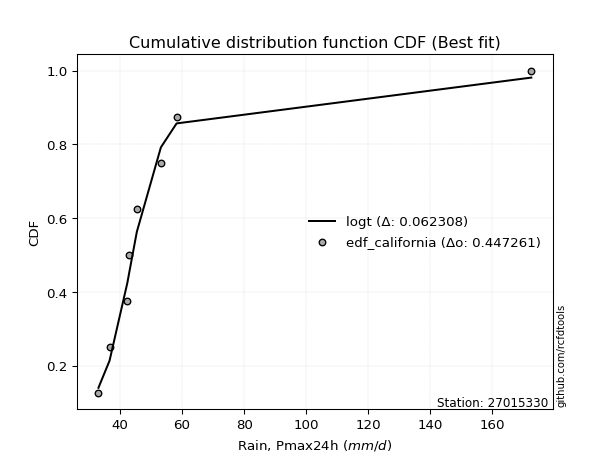</img>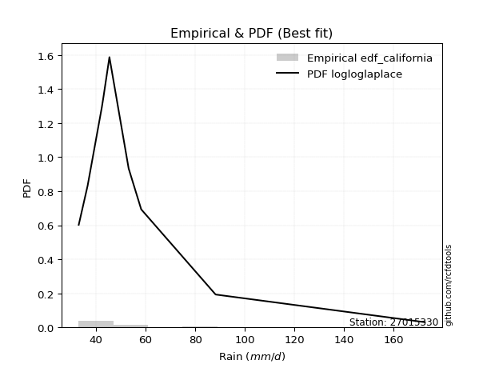</img>

</div>


### 2. Empirical - EDF Hazen (1930)

Hazen method for plotting positions is a formula used to estimate the empirical cumulative probability distribution of flood events or other hydrological data. This formula often results in biased estimations, particularly when extrapolating to extreme events (high return periods).

<div align="center">


$P=(m-0.5)/n$


</div>


**2.1. Empirical values**

<div align="center">

|                | 0                   | 1                   | 2                  | 3                  | 4         | 5                  | 6                  | 7                  | 8                  |
|:---------------|:--------------------|:--------------------|:-------------------|:-------------------|:----------|:-------------------|:-------------------|:-------------------|:-------------------|
| date           | 2019                | 2023                | 2022               | 2021               | 2020      | 2018               | 2017               | 2025               | 2024               |
| x              | 33.02               | 36.602              | 42.34              | 42.975             | 45.398    | 53.146             | 58.219             | 81.2               | 172.6              |
| m              | 1                   | 2                   | 3                  | 4                  | 5         | 6                  | 7                  | 8                  | 9                  |
| empirical_dist | edf_hazen           | edf_hazen           | edf_hazen          | edf_hazen          | edf_hazen | edf_hazen          | edf_hazen          | edf_hazen          | edf_hazen          |
| empirical      | 0.05555555555555555 | 0.16666666666666666 | 0.2777777777777778 | 0.3888888888888889 | 0.5       | 0.6111111111111112 | 0.7222222222222222 | 0.8333333333333334 | 0.9444444444444444 |
| empirical_tr   | 1.0588235294117647  | 1.2                 | 1.3846153846153846 | 1.6363636363636362 | 2.0       | 2.5714285714285716 | 3.5999999999999996 | 6.000000000000002  | 17.999999999999993 |

</div>


**2.2. Kolmogorov-Smirnov fit test (sorted by Δ)**


<div align="center">

|                | 0                   | 1                   | 2                   | 3                   | 4                   | 5                   | 6                   | 7                   | 8                   | 9                   | 10                  | 11                  | 12                  | 13                  | 14                  | 15                  | 16                  | 17                  | 18                  | 19                  | 20                  | 21                  | 22                  | 23                  | 24                  | 25                  | 26                    | 27                  | 28                  | 29                  | 30                  | 31                  | 32                  | 33                  | 34                  | 35                  | 36                  | 37                  | 38                  | 39                  | 40                  | 41                  | 42                  | 43                  | 44                  | 45                  | 46                  | 47                  | 48                  | 49                  | 50                  | 51                  | 52                  | 53                  | 54                  | 55                  | 56                  | 57                  | 58                  | 59                  | 60                  | 61                  | 62                  | 63                  | 64                  | 65                  | 66                  | 67                  | 68                  | 69                  | 70                  | 71                  | 72                  | 73                  | 74                  | 75                  | 76                  | 77                  | 78                  | 79                  | 80                  | 81                  | 82                  | 83                  | 84                  | 85                  | 86                  | 87                  | 88                  | 89                  |
|:---------------|:--------------------|:--------------------|:--------------------|:--------------------|:--------------------|:--------------------|:--------------------|:--------------------|:--------------------|:--------------------|:--------------------|:--------------------|:--------------------|:--------------------|:--------------------|:--------------------|:--------------------|:--------------------|:--------------------|:--------------------|:--------------------|:--------------------|:--------------------|:--------------------|:--------------------|:--------------------|:----------------------|:--------------------|:--------------------|:--------------------|:--------------------|:--------------------|:--------------------|:--------------------|:--------------------|:--------------------|:--------------------|:--------------------|:--------------------|:--------------------|:--------------------|:--------------------|:--------------------|:--------------------|:--------------------|:--------------------|:--------------------|:--------------------|:--------------------|:--------------------|:--------------------|:--------------------|:--------------------|:--------------------|:--------------------|:--------------------|:--------------------|:--------------------|:--------------------|:--------------------|:--------------------|:--------------------|:--------------------|:--------------------|:--------------------|:--------------------|:--------------------|:--------------------|:--------------------|:--------------------|:--------------------|:--------------------|:--------------------|:--------------------|:--------------------|:--------------------|:--------------------|:--------------------|:--------------------|:--------------------|:--------------------|:--------------------|:--------------------|:--------------------|:--------------------|:--------------------|:--------------------|:--------------------|:--------------------|:--------------------|
| station        | 27015330            | 27015330            | 27015330            | 27015330            | 27015330            | 27015330            | 27015330            | 27015330            | 27015330            | 27015330            | 27015330            | 27015330            | 27015330            | 27015330            | 27015330            | 27015330            | 27015330            | 27015330            | 27015330            | 27015330            | 27015330            | 27015330            | 27015330            | 27015330            | 27015330            | 27015330            | 27015330              | 27015330            | 27015330            | 27015330            | 27015330            | 27015330            | 27015330            | 27015330            | 27015330            | 27015330            | 27015330            | 27015330            | 27015330            | 27015330            | 27015330            | 27015330            | 27015330            | 27015330            | 27015330            | 27015330            | 27015330            | 27015330            | 27015330            | 27015330            | 27015330            | 27015330            | 27015330            | 27015330            | 27015330            | 27015330            | 27015330            | 27015330            | 27015330            | 27015330            | 27015330            | 27015330            | 27015330            | 27015330            | 27015330            | 27015330            | 27015330            | 27015330            | 27015330            | 27015330            | 27015330            | 27015330            | 27015330            | 27015330            | 27015330            | 27015330            | 27015330            | 27015330            | 27015330            | 27015330            | 27015330            | 27015330            | 27015330            | 27015330            | 27015330            | 27015330            | 27015330            | 27015330            | 27015330            | 27015330            |
| empirical_dist | edf_hazen           | edf_hazen           | edf_hazen           | edf_hazen           | edf_hazen           | edf_hazen           | edf_hazen           | edf_hazen           | edf_hazen           | edf_hazen           | edf_hazen           | edf_hazen           | edf_hazen           | edf_hazen           | edf_hazen           | edf_hazen           | edf_hazen           | edf_hazen           | edf_hazen           | edf_hazen           | edf_hazen           | edf_hazen           | edf_hazen           | edf_hazen           | edf_hazen           | edf_hazen           | edf_hazen             | edf_hazen           | edf_hazen           | edf_hazen           | edf_hazen           | edf_hazen           | edf_hazen           | edf_hazen           | edf_hazen           | edf_hazen           | edf_hazen           | edf_hazen           | edf_hazen           | edf_hazen           | edf_hazen           | edf_hazen           | edf_hazen           | edf_hazen           | edf_hazen           | edf_hazen           | edf_hazen           | edf_hazen           | edf_hazen           | edf_hazen           | edf_hazen           | edf_hazen           | edf_hazen           | edf_hazen           | edf_hazen           | edf_hazen           | edf_hazen           | edf_hazen           | edf_hazen           | edf_hazen           | edf_hazen           | edf_hazen           | edf_hazen           | edf_hazen           | edf_hazen           | edf_hazen           | edf_hazen           | edf_hazen           | edf_hazen           | edf_hazen           | edf_hazen           | edf_hazen           | edf_hazen           | edf_hazen           | edf_hazen           | edf_hazen           | edf_hazen           | edf_hazen           | edf_hazen           | edf_hazen           | edf_hazen           | edf_hazen           | edf_hazen           | edf_hazen           | edf_hazen           | edf_hazen           | edf_hazen           | edf_hazen           | edf_hazen           | edf_hazen           |
| p_dist         | logmielke           | logalpha            | logpearson3         | loginvweibull       | logmoyal            | loghalflogistic     | logncf              | loginvgamma         | logf                | logfisk             | alpha               | mielke              | invweibull          | invgamma            | f                   | logjohnsonsu        | logt                | loginvgauss         | loghalfnorm         | loggumbel_r         | pareto              | wald                | loggenexpon         | logfatiguelife      | invgauss            | logtruncnorm        | loglaplace_asymmetric | fatiguelife         | logexponnorm        | logexpon            | loggenlogistic      | logerlang           | johnsonsu           | gibrat              | lograyleigh         | logwald             | nct                 | logkstwobign        | lognct              | logmaxwell          | erlang              | logbetaprime        | betaprime           | loggompertz         | exponnorm           | laplace_asymmetric  | expon               | genexpon            | lognakagami         | t                   | loggibrat           | loglogistic         | gompertz            | lognorm             | lognorm             | logcrystalball      | weibull_min         | logloggamma         | genlogistic         | logrice             | fisk                | moyal               | loghypsecant        | pearson3            | gumbel_r            | logchi2             | halflogistic        | loglaplace          | rayleigh            | halfnorm            | maxwell             | loggumbel_l         | kstwobign           | truncnorm           | crystalball         | norm                | logistic            | hypsecant           | rice                | laplace             | gumbel_l            | nakagami            | ncf                 | loggamma            | loggamma            | logweibull_min      | loglognorm          | gamma               | logpareto           | chi2                |
| delta          | 0.06998958245446385 | 0.07511238757611155 | 0.08162374729725441 | 0.08390533468787587 | 0.08460161858168547 | 0.08619609008992368 | 0.08642262958965174 | 0.08642353949388432 | 0.08642393049954333 | 0.087628780761493   | 0.0926202698605248  | 0.0938654356570977  | 0.09548407518001673 | 0.09585212334717785 | 0.09611704256307663 | 0.09679664244278952 | 0.09808833262573546 | 0.09882096926733708 | 0.10201160102314999 | 0.10243038317419711 | 0.10259677525106514 | 0.10296670151133003 | 0.10403196746834698 | 0.1051079427785111  | 0.10772155970627734 | 0.10847798501270528 | 0.11067689450027507   | 0.11109547940064257 | 0.11161818000915968 | 0.11199698515635126 | 0.11275916782733342 | 0.11480325809647107 | 0.11573392276743827 | 0.12262123802778957 | 0.12930901011840568 | 0.13343828182192263 | 0.13382672872333368 | 0.13882917764582298 | 0.13885516877696769 | 0.138982941311796   | 0.14456978451225821 | 0.14549656581355352 | 0.14612617329007577 | 0.14865840721281726 | 0.1586698750700507  | 0.16021738941637875 | 0.1602192097323617  | 0.16021928049849665 | 0.1605218289989655  | 0.16137144358479938 | 0.16666666666666666 | 0.16864181950583357 | 0.16883959557694272 | 0.16917059284694214 | 0.16917059284694214 | 0.16917095694802065 | 0.1703956940672856  | 0.17147881924478103 | 0.17213652385206696 | 0.17341637202207993 | 0.17786244019366032 | 0.18001807369979686 | 0.1826024982539367  | 0.18330855378752012 | 0.1993592954467135  | 0.20145487936353035 | 0.20698723346137224 | 0.21076976254686253 | 0.22084768674809352 | 0.22598760972707574 | 0.23266926876833327 | 0.23587560648066752 | 0.2517764313557572  | 0.2630178759203524  | 0.2669273603111818  | 0.26692736687877355 | 0.27296694507010055 | 0.2780806744020155  | 0.29521295610497006 | 0.29564246595066784 | 0.337212134898502   | 0.3567053550763485  | 0.38975789143402817 | 0.3965383850914861  | 0.3965383850914861  | 0.41512230912650827 | 0.42218090716335166 | 0.4404818465627024  | 0.4469307012268521  | 0.6284326889012959  |
| deltao         | 0.41761268023100007 | 0.41761268023100007 | 0.41761268023100007 | 0.41761268023100007 | 0.41761268023100007 | 0.41761268023100007 | 0.41761268023100007 | 0.41761268023100007 | 0.41761268023100007 | 0.41761268023100007 | 0.41761268023100007 | 0.41761268023100007 | 0.41761268023100007 | 0.41761268023100007 | 0.41761268023100007 | 0.41761268023100007 | 0.41761268023100007 | 0.41761268023100007 | 0.41761268023100007 | 0.41761268023100007 | 0.41761268023100007 | 0.41761268023100007 | 0.41761268023100007 | 0.41761268023100007 | 0.41761268023100007 | 0.41761268023100007 | 0.41761268023100007   | 0.41761268023100007 | 0.41761268023100007 | 0.41761268023100007 | 0.41761268023100007 | 0.41761268023100007 | 0.41761268023100007 | 0.41761268023100007 | 0.41761268023100007 | 0.41761268023100007 | 0.41761268023100007 | 0.41761268023100007 | 0.41761268023100007 | 0.41761268023100007 | 0.41761268023100007 | 0.41761268023100007 | 0.41761268023100007 | 0.41761268023100007 | 0.41761268023100007 | 0.41761268023100007 | 0.41761268023100007 | 0.41761268023100007 | 0.41761268023100007 | 0.41761268023100007 | 0.41761268023100007 | 0.41761268023100007 | 0.41761268023100007 | 0.41761268023100007 | 0.41761268023100007 | 0.41761268023100007 | 0.41761268023100007 | 0.41761268023100007 | 0.41761268023100007 | 0.41761268023100007 | 0.41761268023100007 | 0.41761268023100007 | 0.41761268023100007 | 0.41761268023100007 | 0.41761268023100007 | 0.41761268023100007 | 0.41761268023100007 | 0.41761268023100007 | 0.41761268023100007 | 0.41761268023100007 | 0.41761268023100007 | 0.41761268023100007 | 0.41761268023100007 | 0.41761268023100007 | 0.41761268023100007 | 0.41761268023100007 | 0.41761268023100007 | 0.41761268023100007 | 0.41761268023100007 | 0.41761268023100007 | 0.41761268023100007 | 0.41761268023100007 | 0.41761268023100007 | 0.41761268023100007 | 0.41761268023100007 | 0.41761268023100007 | 0.41761268023100007 | 0.41761268023100007 | 0.41761268023100007 | 0.41761268023100007 |
| eval           | Δo > Δ              | Δo > Δ              | Δo > Δ              | Δo > Δ              | Δo > Δ              | Δo > Δ              | Δo > Δ              | Δo > Δ              | Δo > Δ              | Δo > Δ              | Δo > Δ              | Δo > Δ              | Δo > Δ              | Δo > Δ              | Δo > Δ              | Δo > Δ              | Δo > Δ              | Δo > Δ              | Δo > Δ              | Δo > Δ              | Δo > Δ              | Δo > Δ              | Δo > Δ              | Δo > Δ              | Δo > Δ              | Δo > Δ              | Δo > Δ                | Δo > Δ              | Δo > Δ              | Δo > Δ              | Δo > Δ              | Δo > Δ              | Δo > Δ              | Δo > Δ              | Δo > Δ              | Δo > Δ              | Δo > Δ              | Δo > Δ              | Δo > Δ              | Δo > Δ              | Δo > Δ              | Δo > Δ              | Δo > Δ              | Δo > Δ              | Δo > Δ              | Δo > Δ              | Δo > Δ              | Δo > Δ              | Δo > Δ              | Δo > Δ              | Δo > Δ              | Δo > Δ              | Δo > Δ              | Δo > Δ              | Δo > Δ              | Δo > Δ              | Δo > Δ              | Δo > Δ              | Δo > Δ              | Δo > Δ              | Δo > Δ              | Δo > Δ              | Δo > Δ              | Δo > Δ              | Δo > Δ              | Δo > Δ              | Δo > Δ              | Δo > Δ              | Δo > Δ              | Δo > Δ              | Δo > Δ              | Δo > Δ              | Δo > Δ              | Δo > Δ              | Δo > Δ              | Δo > Δ              | Δo > Δ              | Δo > Δ              | Δo > Δ              | Δo > Δ              | Δo > Δ              | Δo > Δ              | Δo > Δ              | Δo > Δ              | Δo > Δ              | Δo > Δ              | Δo <= Δ             | Δo <= Δ             | Δo <= Δ             | Δo <= Δ             |
| fit            | 1                   | 1                   | 1                   | 1                   | 1                   | 1                   | 1                   | 1                   | 1                   | 1                   | 1                   | 1                   | 1                   | 1                   | 1                   | 1                   | 1                   | 1                   | 1                   | 1                   | 1                   | 1                   | 1                   | 1                   | 1                   | 1                   | 1                     | 1                   | 1                   | 1                   | 1                   | 1                   | 1                   | 1                   | 1                   | 1                   | 1                   | 1                   | 1                   | 1                   | 1                   | 1                   | 1                   | 1                   | 1                   | 1                   | 1                   | 1                   | 1                   | 1                   | 1                   | 1                   | 1                   | 1                   | 1                   | 1                   | 1                   | 1                   | 1                   | 1                   | 1                   | 1                   | 1                   | 1                   | 1                   | 1                   | 1                   | 1                   | 1                   | 1                   | 1                   | 1                   | 1                   | 1                   | 1                   | 1                   | 1                   | 1                   | 1                   | 1                   | 1                   | 1                   | 1                   | 1                   | 1                   | 1                   | 0                   | 0                   | 0                   | 0                   |
| n              | 9                   | 9                   | 9                   | 9                   | 9                   | 9                   | 9                   | 9                   | 9                   | 9                   | 9                   | 9                   | 9                   | 9                   | 9                   | 9                   | 9                   | 9                   | 9                   | 9                   | 9                   | 9                   | 9                   | 9                   | 9                   | 9                   | 9                     | 9                   | 9                   | 9                   | 9                   | 9                   | 9                   | 9                   | 9                   | 9                   | 9                   | 9                   | 9                   | 9                   | 9                   | 9                   | 9                   | 9                   | 9                   | 9                   | 9                   | 9                   | 9                   | 9                   | 9                   | 9                   | 9                   | 9                   | 9                   | 9                   | 9                   | 9                   | 9                   | 9                   | 9                   | 9                   | 9                   | 9                   | 9                   | 9                   | 9                   | 9                   | 9                   | 9                   | 9                   | 9                   | 9                   | 9                   | 9                   | 9                   | 9                   | 9                   | 9                   | 9                   | 9                   | 9                   | 9                   | 9                   | 9                   | 9                   | 9                   | 9                   | 9                   | 9                   |
| best_fit       | 1                   | 0                   | 0                   | 0                   | 0                   | 0                   | 0                   | 0                   | 0                   | 0                   | 0                   | 0                   | 0                   | 0                   | 0                   | 0                   | 0                   | 0                   | 0                   | 0                   | 0                   | 0                   | 0                   | 0                   | 0                   | 0                   | 0                     | 0                   | 0                   | 0                   | 0                   | 0                   | 0                   | 0                   | 0                   | 0                   | 0                   | 0                   | 0                   | 0                   | 0                   | 0                   | 0                   | 0                   | 0                   | 0                   | 0                   | 0                   | 0                   | 0                   | 0                   | 0                   | 0                   | 0                   | 0                   | 0                   | 0                   | 0                   | 0                   | 0                   | 0                   | 0                   | 0                   | 0                   | 0                   | 0                   | 0                   | 0                   | 0                   | 0                   | 0                   | 0                   | 0                   | 0                   | 0                   | 0                   | 0                   | 0                   | 0                   | 0                   | 0                   | 0                   | 0                   | 0                   | 0                   | 0                   | 0                   | 0                   | 0                   | 0                   |
| best_fit_sort  | 1                   | 2                   | 3                   | 4                   | 5                   | 6                   | 7                   | 8                   | 9                   | 10                  | 11                  | 12                  | 13                  | 14                  | 15                  | 16                  | 17                  | 18                  | 19                  | 20                  | 21                  | 22                  | 23                  | 24                  | 25                  | 26                  | 27                    | 28                  | 29                  | 30                  | 31                  | 32                  | 33                  | 34                  | 35                  | 36                  | 37                  | 38                  | 39                  | 40                  | 41                  | 42                  | 43                  | 44                  | 45                  | 46                  | 47                  | 48                  | 49                  | 50                  | 51                  | 52                  | 53                  | 54                  | 55                  | 56                  | 57                  | 58                  | 59                  | 60                  | 61                  | 62                  | 63                  | 64                  | 65                  | 66                  | 67                  | 68                  | 69                  | 70                  | 71                  | 72                  | 73                  | 74                  | 75                  | 76                  | 77                  | 78                  | 79                  | 80                  | 81                  | 82                  | 83                  | 84                  | 85                  | 86                  | 87                  | 88                  | 89                  | 90                  |

</div>


<div align="center">

</img>

</div>


**2.3. Best fit**

<div align="center">

|   id |   station | empirical_dist   | p_dist    |     delta |   deltao | eval   |   fit |   n |   best_fit |   best_fit_sort |
|-----:|----------:|:-----------------|:----------|----------:|---------:|:-------|------:|----:|-----------:|----------------:|
|    0 |  27015330 | edf_hazen        | logmielke | 0.0699896 | 0.417613 | Δo > Δ |     1 |   9 |          1 |               1 |

</div>


<div align="center">

</img></img>

</div>


### 3. Empirical - EDF Weibull (1939)

Weibull plotting position formula is an empirical method used to estimate the non-exceedance probability or plotting position for a set of observed data, is often recommended or widely used in practice, particularly in flood frequency analysis.

<div align="center">


$P=m/(n+1)$


</div>


**3.1. Empirical values**

<div align="center">

|                | 0                  | 1           | 2                  | 3                  | 4           | 5           | 6                 | 7                 | 8                  |
|:---------------|:-------------------|:------------|:-------------------|:-------------------|:------------|:------------|:------------------|:------------------|:-------------------|
| date           | 2019               | 2023        | 2022               | 2021               | 2020        | 2018        | 2017              | 2025              | 2024               |
| x              | 33.02              | 36.602      | 42.34              | 42.975             | 45.398      | 53.146      | 58.219            | 81.2              | 172.6              |
| m              | 1                  | 2           | 3                  | 4                  | 5           | 6           | 7                 | 8                 | 9                  |
| empirical_dist | edf_weibull        | edf_weibull | edf_weibull        | edf_weibull        | edf_weibull | edf_weibull | edf_weibull       | edf_weibull       | edf_weibull        |
| empirical      | 0.1                | 0.2         | 0.3                | 0.4                | 0.5         | 0.6         | 0.7               | 0.8               | 0.9                |
| empirical_tr   | 1.1111111111111112 | 1.25        | 1.4285714285714286 | 1.6666666666666667 | 2.0         | 2.5         | 3.333333333333333 | 5.000000000000001 | 10.000000000000002 |

</div>


**3.2. Kolmogorov-Smirnov fit test (sorted by Δ)**


<div align="center">

|                | 0                    | 1                   | 2                   | 3                   | 4                   | 5                   | 6                   | 7                   | 8                   | 9                   | 10                  | 11                  | 12                  | 13                  | 14                  | 15                  | 16                  | 17                  | 18                  | 19                  | 20                  | 21                  | 22                  | 23                  | 24                  | 25                  | 26                  | 27                  | 28                  | 29                  | 30                  | 31                    | 32                  | 33                  | 34                  | 35                  | 36                  | 37                  | 38                  | 39                  | 40                  | 41                  | 42                  | 43                  | 44                  | 45                  | 46                  | 47                  | 48                  | 49                  | 50                  | 51                  | 52                  | 53                  | 54                  | 55                  | 56                  | 57                  | 58                  | 59                  | 60                  | 61                  | 62                  | 63                  | 64                  | 65                  | 66                  | 67                  | 68                  | 69                  | 70                  | 71                  | 72                  | 73                  | 74                  | 75                  | 76                  | 77                  | 78                  | 79                  | 80                  | 81                  | 82                  | 83                  | 84                  | 85                  | 86                  | 87                  | 88                  | 89                  |
|:---------------|:---------------------|:--------------------|:--------------------|:--------------------|:--------------------|:--------------------|:--------------------|:--------------------|:--------------------|:--------------------|:--------------------|:--------------------|:--------------------|:--------------------|:--------------------|:--------------------|:--------------------|:--------------------|:--------------------|:--------------------|:--------------------|:--------------------|:--------------------|:--------------------|:--------------------|:--------------------|:--------------------|:--------------------|:--------------------|:--------------------|:--------------------|:----------------------|:--------------------|:--------------------|:--------------------|:--------------------|:--------------------|:--------------------|:--------------------|:--------------------|:--------------------|:--------------------|:--------------------|:--------------------|:--------------------|:--------------------|:--------------------|:--------------------|:--------------------|:--------------------|:--------------------|:--------------------|:--------------------|:--------------------|:--------------------|:--------------------|:--------------------|:--------------------|:--------------------|:--------------------|:--------------------|:--------------------|:--------------------|:--------------------|:--------------------|:--------------------|:--------------------|:--------------------|:--------------------|:--------------------|:--------------------|:--------------------|:--------------------|:--------------------|:--------------------|:--------------------|:--------------------|:--------------------|:--------------------|:--------------------|:--------------------|:--------------------|:--------------------|:--------------------|:--------------------|:--------------------|:--------------------|:--------------------|:--------------------|:--------------------|
| station        | 27015330             | 27015330            | 27015330            | 27015330            | 27015330            | 27015330            | 27015330            | 27015330            | 27015330            | 27015330            | 27015330            | 27015330            | 27015330            | 27015330            | 27015330            | 27015330            | 27015330            | 27015330            | 27015330            | 27015330            | 27015330            | 27015330            | 27015330            | 27015330            | 27015330            | 27015330            | 27015330            | 27015330            | 27015330            | 27015330            | 27015330            | 27015330              | 27015330            | 27015330            | 27015330            | 27015330            | 27015330            | 27015330            | 27015330            | 27015330            | 27015330            | 27015330            | 27015330            | 27015330            | 27015330            | 27015330            | 27015330            | 27015330            | 27015330            | 27015330            | 27015330            | 27015330            | 27015330            | 27015330            | 27015330            | 27015330            | 27015330            | 27015330            | 27015330            | 27015330            | 27015330            | 27015330            | 27015330            | 27015330            | 27015330            | 27015330            | 27015330            | 27015330            | 27015330            | 27015330            | 27015330            | 27015330            | 27015330            | 27015330            | 27015330            | 27015330            | 27015330            | 27015330            | 27015330            | 27015330            | 27015330            | 27015330            | 27015330            | 27015330            | 27015330            | 27015330            | 27015330            | 27015330            | 27015330            | 27015330            |
| empirical_dist | edf_weibull          | edf_weibull         | edf_weibull         | edf_weibull         | edf_weibull         | edf_weibull         | edf_weibull         | edf_weibull         | edf_weibull         | edf_weibull         | edf_weibull         | edf_weibull         | edf_weibull         | edf_weibull         | edf_weibull         | edf_weibull         | edf_weibull         | edf_weibull         | edf_weibull         | edf_weibull         | edf_weibull         | edf_weibull         | edf_weibull         | edf_weibull         | edf_weibull         | edf_weibull         | edf_weibull         | edf_weibull         | edf_weibull         | edf_weibull         | edf_weibull         | edf_weibull           | edf_weibull         | edf_weibull         | edf_weibull         | edf_weibull         | edf_weibull         | edf_weibull         | edf_weibull         | edf_weibull         | edf_weibull         | edf_weibull         | edf_weibull         | edf_weibull         | edf_weibull         | edf_weibull         | edf_weibull         | edf_weibull         | edf_weibull         | edf_weibull         | edf_weibull         | edf_weibull         | edf_weibull         | edf_weibull         | edf_weibull         | edf_weibull         | edf_weibull         | edf_weibull         | edf_weibull         | edf_weibull         | edf_weibull         | edf_weibull         | edf_weibull         | edf_weibull         | edf_weibull         | edf_weibull         | edf_weibull         | edf_weibull         | edf_weibull         | edf_weibull         | edf_weibull         | edf_weibull         | edf_weibull         | edf_weibull         | edf_weibull         | edf_weibull         | edf_weibull         | edf_weibull         | edf_weibull         | edf_weibull         | edf_weibull         | edf_weibull         | edf_weibull         | edf_weibull         | edf_weibull         | edf_weibull         | edf_weibull         | edf_weibull         | edf_weibull         | edf_weibull         |
| p_dist         | logalpha             | loginvweibull       | loginvgamma         | logf                | logncf              | logmielke           | alpha               | loghalflogistic     | mielke              | logfisk             | invweibull          | invgamma            | f                   | logjohnsonsu        | logpearson3         | loginvgauss         | loghalfnorm         | wald                | logfatiguelife      | logmoyal            | invgauss            | fatiguelife         | johnsonsu           | logexponnorm        | logtruncnorm        | loggenexpon         | logerlang           | pareto              | logexpon            | loggumbel_r         | lograyleigh         | loglaplace_asymmetric | loggenlogistic      | logmaxwell          | erlang              | gibrat              | logt                | nct                 | logbetaprime        | lognakagami         | logkstwobign        | lognct              | pearson3            | betaprime           | weibull_min         | loggompertz         | logloggamma         | lognorm             | lognorm             | logcrystalball      | moyal               | fisk                | exponnorm           | laplace_asymmetric  | expon               | genexpon            | halflogistic        | logwald             | loglogistic         | gompertz            | genlogistic         | t                   | logrice             | gumbel_r            | logchi2             | halfnorm            | loghypsecant        | rayleigh            | loggibrat           | maxwell             | loglaplace          | loggumbel_l         | kstwobign           | truncnorm           | crystalball         | norm                | logistic            | hypsecant           | rice                | laplace             | gumbel_l            | nakagami            | ncf                 | loggamma            | loggamma            | loglognorm          | logweibull_min      | logpareto           | gamma               | chi2                |
| delta          | 0.060428033417335346 | 0.0631019470009005  | 0.0648513901159849  | 0.06485220364394015 | 0.0648539598824164  | 0.06949632345362244 | 0.0703980476383026  | 0.07050447155489503 | 0.07164321343487551 | 0.07198193333364114 | 0.07326185295779453 | 0.07362990112495565 | 0.07389482034085443 | 0.07457442022056732 | 0.07564900000215613 | 0.07659874704511488 | 0.07978937880092773 | 0.08074447928910777 | 0.0828857205562889  | 0.08460161858168547 | 0.08549933748405514 | 0.08887325717842037 | 0.09351170054521607 | 0.09865522825846954 | 0.09999922926396777 | 0.0999999998952116  | 0.09999999999999507 | 0.09999999999999956 | 0.1                 | 0.10243038317419711 | 0.10708678789618342 | 0.11067689450027507   | 0.11275916782733342 | 0.11874771387467437 | 0.12234756229003602 | 0.12262123802778957 | 0.12317667610401861 | 0.13382672872333368 | 0.13731301223428816 | 0.13829960677674324 | 0.13882917764582298 | 0.13885516877696769 | 0.13886410934307566 | 0.14612617329007577 | 0.14817347184506335 | 0.14865840721281726 | 0.1493011126576274  | 0.15064398925438371 | 0.15064398925438371 | 0.150644404978455   | 0.15164265341408756 | 0.15564021797143812 | 0.1586698750700507  | 0.16021738941637875 | 0.1602192097323617  | 0.16021928049849665 | 0.16254278901692779 | 0.16677161515525601 | 0.16864181950583357 | 0.16883959557694272 | 0.17213652385206696 | 0.17248255469591056 | 0.17341637202207993 | 0.17713707322449124 | 0.1792326571413081  | 0.18154316528263129 | 0.1826024982539367  | 0.19862546452587126 | 0.2                 | 0.21044704654611102 | 0.21076976254686253 | 0.21365338425844527 | 0.22955420913353497 | 0.24079565369813016 | 0.24470513808895955 | 0.2447051446565513  | 0.2507447228478783  | 0.25585845217979325 | 0.2729907338827478  | 0.2734202437284456  | 0.31498991267627974 | 0.3233720217430151  | 0.34531344698958366 | 0.3743161628692639  | 0.3743161628692639  | 0.3888475738300183  | 0.39290008690428607 | 0.4135973678935187  | 0.4182596243404802  | 0.5950993555679625  |
| deltao         | 0.41761268023100007  | 0.41761268023100007 | 0.41761268023100007 | 0.41761268023100007 | 0.41761268023100007 | 0.41761268023100007 | 0.41761268023100007 | 0.41761268023100007 | 0.41761268023100007 | 0.41761268023100007 | 0.41761268023100007 | 0.41761268023100007 | 0.41761268023100007 | 0.41761268023100007 | 0.41761268023100007 | 0.41761268023100007 | 0.41761268023100007 | 0.41761268023100007 | 0.41761268023100007 | 0.41761268023100007 | 0.41761268023100007 | 0.41761268023100007 | 0.41761268023100007 | 0.41761268023100007 | 0.41761268023100007 | 0.41761268023100007 | 0.41761268023100007 | 0.41761268023100007 | 0.41761268023100007 | 0.41761268023100007 | 0.41761268023100007 | 0.41761268023100007   | 0.41761268023100007 | 0.41761268023100007 | 0.41761268023100007 | 0.41761268023100007 | 0.41761268023100007 | 0.41761268023100007 | 0.41761268023100007 | 0.41761268023100007 | 0.41761268023100007 | 0.41761268023100007 | 0.41761268023100007 | 0.41761268023100007 | 0.41761268023100007 | 0.41761268023100007 | 0.41761268023100007 | 0.41761268023100007 | 0.41761268023100007 | 0.41761268023100007 | 0.41761268023100007 | 0.41761268023100007 | 0.41761268023100007 | 0.41761268023100007 | 0.41761268023100007 | 0.41761268023100007 | 0.41761268023100007 | 0.41761268023100007 | 0.41761268023100007 | 0.41761268023100007 | 0.41761268023100007 | 0.41761268023100007 | 0.41761268023100007 | 0.41761268023100007 | 0.41761268023100007 | 0.41761268023100007 | 0.41761268023100007 | 0.41761268023100007 | 0.41761268023100007 | 0.41761268023100007 | 0.41761268023100007 | 0.41761268023100007 | 0.41761268023100007 | 0.41761268023100007 | 0.41761268023100007 | 0.41761268023100007 | 0.41761268023100007 | 0.41761268023100007 | 0.41761268023100007 | 0.41761268023100007 | 0.41761268023100007 | 0.41761268023100007 | 0.41761268023100007 | 0.41761268023100007 | 0.41761268023100007 | 0.41761268023100007 | 0.41761268023100007 | 0.41761268023100007 | 0.41761268023100007 | 0.41761268023100007 |
| eval           | Δo > Δ               | Δo > Δ              | Δo > Δ              | Δo > Δ              | Δo > Δ              | Δo > Δ              | Δo > Δ              | Δo > Δ              | Δo > Δ              | Δo > Δ              | Δo > Δ              | Δo > Δ              | Δo > Δ              | Δo > Δ              | Δo > Δ              | Δo > Δ              | Δo > Δ              | Δo > Δ              | Δo > Δ              | Δo > Δ              | Δo > Δ              | Δo > Δ              | Δo > Δ              | Δo > Δ              | Δo > Δ              | Δo > Δ              | Δo > Δ              | Δo > Δ              | Δo > Δ              | Δo > Δ              | Δo > Δ              | Δo > Δ                | Δo > Δ              | Δo > Δ              | Δo > Δ              | Δo > Δ              | Δo > Δ              | Δo > Δ              | Δo > Δ              | Δo > Δ              | Δo > Δ              | Δo > Δ              | Δo > Δ              | Δo > Δ              | Δo > Δ              | Δo > Δ              | Δo > Δ              | Δo > Δ              | Δo > Δ              | Δo > Δ              | Δo > Δ              | Δo > Δ              | Δo > Δ              | Δo > Δ              | Δo > Δ              | Δo > Δ              | Δo > Δ              | Δo > Δ              | Δo > Δ              | Δo > Δ              | Δo > Δ              | Δo > Δ              | Δo > Δ              | Δo > Δ              | Δo > Δ              | Δo > Δ              | Δo > Δ              | Δo > Δ              | Δo > Δ              | Δo > Δ              | Δo > Δ              | Δo > Δ              | Δo > Δ              | Δo > Δ              | Δo > Δ              | Δo > Δ              | Δo > Δ              | Δo > Δ              | Δo > Δ              | Δo > Δ              | Δo > Δ              | Δo > Δ              | Δo > Δ              | Δo > Δ              | Δo > Δ              | Δo > Δ              | Δo > Δ              | Δo > Δ              | Δo <= Δ             | Δo <= Δ             |
| fit            | 1                    | 1                   | 1                   | 1                   | 1                   | 1                   | 1                   | 1                   | 1                   | 1                   | 1                   | 1                   | 1                   | 1                   | 1                   | 1                   | 1                   | 1                   | 1                   | 1                   | 1                   | 1                   | 1                   | 1                   | 1                   | 1                   | 1                   | 1                   | 1                   | 1                   | 1                   | 1                     | 1                   | 1                   | 1                   | 1                   | 1                   | 1                   | 1                   | 1                   | 1                   | 1                   | 1                   | 1                   | 1                   | 1                   | 1                   | 1                   | 1                   | 1                   | 1                   | 1                   | 1                   | 1                   | 1                   | 1                   | 1                   | 1                   | 1                   | 1                   | 1                   | 1                   | 1                   | 1                   | 1                   | 1                   | 1                   | 1                   | 1                   | 1                   | 1                   | 1                   | 1                   | 1                   | 1                   | 1                   | 1                   | 1                   | 1                   | 1                   | 1                   | 1                   | 1                   | 1                   | 1                   | 1                   | 1                   | 1                   | 0                   | 0                   |
| n              | 9                    | 9                   | 9                   | 9                   | 9                   | 9                   | 9                   | 9                   | 9                   | 9                   | 9                   | 9                   | 9                   | 9                   | 9                   | 9                   | 9                   | 9                   | 9                   | 9                   | 9                   | 9                   | 9                   | 9                   | 9                   | 9                   | 9                   | 9                   | 9                   | 9                   | 9                   | 9                     | 9                   | 9                   | 9                   | 9                   | 9                   | 9                   | 9                   | 9                   | 9                   | 9                   | 9                   | 9                   | 9                   | 9                   | 9                   | 9                   | 9                   | 9                   | 9                   | 9                   | 9                   | 9                   | 9                   | 9                   | 9                   | 9                   | 9                   | 9                   | 9                   | 9                   | 9                   | 9                   | 9                   | 9                   | 9                   | 9                   | 9                   | 9                   | 9                   | 9                   | 9                   | 9                   | 9                   | 9                   | 9                   | 9                   | 9                   | 9                   | 9                   | 9                   | 9                   | 9                   | 9                   | 9                   | 9                   | 9                   | 9                   | 9                   |
| best_fit       | 1                    | 0                   | 0                   | 0                   | 0                   | 0                   | 0                   | 0                   | 0                   | 0                   | 0                   | 0                   | 0                   | 0                   | 0                   | 0                   | 0                   | 0                   | 0                   | 0                   | 0                   | 0                   | 0                   | 0                   | 0                   | 0                   | 0                   | 0                   | 0                   | 0                   | 0                   | 0                     | 0                   | 0                   | 0                   | 0                   | 0                   | 0                   | 0                   | 0                   | 0                   | 0                   | 0                   | 0                   | 0                   | 0                   | 0                   | 0                   | 0                   | 0                   | 0                   | 0                   | 0                   | 0                   | 0                   | 0                   | 0                   | 0                   | 0                   | 0                   | 0                   | 0                   | 0                   | 0                   | 0                   | 0                   | 0                   | 0                   | 0                   | 0                   | 0                   | 0                   | 0                   | 0                   | 0                   | 0                   | 0                   | 0                   | 0                   | 0                   | 0                   | 0                   | 0                   | 0                   | 0                   | 0                   | 0                   | 0                   | 0                   | 0                   |
| best_fit_sort  | 1                    | 2                   | 3                   | 4                   | 5                   | 6                   | 7                   | 8                   | 9                   | 10                  | 11                  | 12                  | 13                  | 14                  | 15                  | 16                  | 17                  | 18                  | 19                  | 20                  | 21                  | 22                  | 23                  | 24                  | 25                  | 26                  | 27                  | 28                  | 29                  | 30                  | 31                  | 32                    | 33                  | 34                  | 35                  | 36                  | 37                  | 38                  | 39                  | 40                  | 41                  | 42                  | 43                  | 44                  | 45                  | 46                  | 47                  | 48                  | 49                  | 50                  | 51                  | 52                  | 53                  | 54                  | 55                  | 56                  | 57                  | 58                  | 59                  | 60                  | 61                  | 62                  | 63                  | 64                  | 65                  | 66                  | 67                  | 68                  | 69                  | 70                  | 71                  | 72                  | 73                  | 74                  | 75                  | 76                  | 77                  | 78                  | 79                  | 80                  | 81                  | 82                  | 83                  | 84                  | 85                  | 86                  | 87                  | 88                  | 89                  | 90                  |

</div>


<div align="center">

</img>

</div>


**3.3. Best fit**

<div align="center">

|   id |   station | empirical_dist   | p_dist   |    delta |   deltao | eval   |   fit |   n |   best_fit |   best_fit_sort |
|-----:|----------:|:-----------------|:---------|---------:|---------:|:-------|------:|----:|-----------:|----------------:|
|    0 |  27015330 | edf_weibull      | logalpha | 0.060428 | 0.417613 | Δo > Δ |     1 |   9 |          1 |               1 |

</div>


<div align="center">

</img>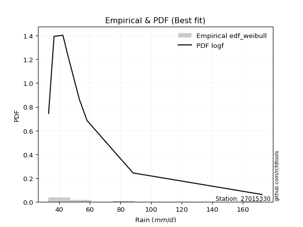</img>

</div>


### 4. Empirical - EDF Beard (1943)

The Beard formula (or Beard´s plotting position formula) in hydrology is used to estimate the empirical non-exceedance probability _(P)_ of a flood event (or other extreme hydrological data point) within a given dataset.

<div align="center">


$P=(m-0.31)/(n+0.38)$


</div>


**4.1. Empirical values**

<div align="center">

|                | 0                   | 1                   | 2                  | 3                   | 4         | 5                  | 6                  | 7                  | 8                  |
|:---------------|:--------------------|:--------------------|:-------------------|:--------------------|:----------|:-------------------|:-------------------|:-------------------|:-------------------|
| date           | 2019                | 2023                | 2022               | 2021                | 2020      | 2018               | 2017               | 2025               | 2024               |
| x              | 33.02               | 36.602              | 42.34              | 42.975              | 45.398    | 53.146             | 58.219             | 81.2               | 172.6              |
| m              | 1                   | 2                   | 3                  | 4                   | 5         | 6                  | 7                  | 8                  | 9                  |
| empirical_dist | edf_beard           | edf_beard           | edf_beard          | edf_beard           | edf_beard | edf_beard          | edf_beard          | edf_beard          | edf_beard          |
| empirical      | 0.07356076759061833 | 0.18017057569296374 | 0.2867803837953091 | 0.39339019189765456 | 0.5       | 0.6066098081023454 | 0.7132196162046908 | 0.8198294243070362 | 0.9264392324093815 |
| empirical_tr   | 1.0794016110471807  | 1.2197659297789336  | 1.4020926756352765 | 1.6485061511423549  | 2.0       | 2.542005420054201  | 3.486988847583642  | 5.550295857988164  | 13.5942028985507   |

</div>


**4.2. Kolmogorov-Smirnov fit test (sorted by Δ)**


<div align="center">

|                | 0                    | 1                   | 2                   | 3                   | 4                   | 5                   | 6                   | 7                   | 8                   | 9                   | 10                  | 11                  | 12                  | 13                  | 14                  | 15                  | 16                  | 17                  | 18                  | 19                  | 20                  | 21                  | 22                  | 23                  | 24                  | 25                  | 26                  | 27                  | 28                  | 29                  | 30                  | 31                    | 32                  | 33                  | 34                  | 35                  | 36                  | 37                  | 38                  | 39                  | 40                  | 41                  | 42                  | 43                  | 44                  | 45                  | 46                  | 47                  | 48                  | 49                  | 50                  | 51                  | 52                  | 53                  | 54                  | 55                  | 56                  | 57                  | 58                  | 59                  | 60                  | 61                  | 62                  | 63                  | 64                  | 65                  | 66                  | 67                  | 68                  | 69                  | 70                  | 71                  | 72                  | 73                  | 74                  | 75                  | 76                  | 77                  | 78                  | 79                  | 80                  | 81                  | 82                  | 83                  | 84                  | 85                  | 86                  | 87                  | 88                  | 89                  |
|:---------------|:---------------------|:--------------------|:--------------------|:--------------------|:--------------------|:--------------------|:--------------------|:--------------------|:--------------------|:--------------------|:--------------------|:--------------------|:--------------------|:--------------------|:--------------------|:--------------------|:--------------------|:--------------------|:--------------------|:--------------------|:--------------------|:--------------------|:--------------------|:--------------------|:--------------------|:--------------------|:--------------------|:--------------------|:--------------------|:--------------------|:--------------------|:----------------------|:--------------------|:--------------------|:--------------------|:--------------------|:--------------------|:--------------------|:--------------------|:--------------------|:--------------------|:--------------------|:--------------------|:--------------------|:--------------------|:--------------------|:--------------------|:--------------------|:--------------------|:--------------------|:--------------------|:--------------------|:--------------------|:--------------------|:--------------------|:--------------------|:--------------------|:--------------------|:--------------------|:--------------------|:--------------------|:--------------------|:--------------------|:--------------------|:--------------------|:--------------------|:--------------------|:--------------------|:--------------------|:--------------------|:--------------------|:--------------------|:--------------------|:--------------------|:--------------------|:--------------------|:--------------------|:--------------------|:--------------------|:--------------------|:--------------------|:--------------------|:--------------------|:--------------------|:--------------------|:--------------------|:--------------------|:--------------------|:--------------------|:--------------------|
| station        | 27015330             | 27015330            | 27015330            | 27015330            | 27015330            | 27015330            | 27015330            | 27015330            | 27015330            | 27015330            | 27015330            | 27015330            | 27015330            | 27015330            | 27015330            | 27015330            | 27015330            | 27015330            | 27015330            | 27015330            | 27015330            | 27015330            | 27015330            | 27015330            | 27015330            | 27015330            | 27015330            | 27015330            | 27015330            | 27015330            | 27015330            | 27015330              | 27015330            | 27015330            | 27015330            | 27015330            | 27015330            | 27015330            | 27015330            | 27015330            | 27015330            | 27015330            | 27015330            | 27015330            | 27015330            | 27015330            | 27015330            | 27015330            | 27015330            | 27015330            | 27015330            | 27015330            | 27015330            | 27015330            | 27015330            | 27015330            | 27015330            | 27015330            | 27015330            | 27015330            | 27015330            | 27015330            | 27015330            | 27015330            | 27015330            | 27015330            | 27015330            | 27015330            | 27015330            | 27015330            | 27015330            | 27015330            | 27015330            | 27015330            | 27015330            | 27015330            | 27015330            | 27015330            | 27015330            | 27015330            | 27015330            | 27015330            | 27015330            | 27015330            | 27015330            | 27015330            | 27015330            | 27015330            | 27015330            | 27015330            |
| empirical_dist | edf_beard            | edf_beard           | edf_beard           | edf_beard           | edf_beard           | edf_beard           | edf_beard           | edf_beard           | edf_beard           | edf_beard           | edf_beard           | edf_beard           | edf_beard           | edf_beard           | edf_beard           | edf_beard           | edf_beard           | edf_beard           | edf_beard           | edf_beard           | edf_beard           | edf_beard           | edf_beard           | edf_beard           | edf_beard           | edf_beard           | edf_beard           | edf_beard           | edf_beard           | edf_beard           | edf_beard           | edf_beard             | edf_beard           | edf_beard           | edf_beard           | edf_beard           | edf_beard           | edf_beard           | edf_beard           | edf_beard           | edf_beard           | edf_beard           | edf_beard           | edf_beard           | edf_beard           | edf_beard           | edf_beard           | edf_beard           | edf_beard           | edf_beard           | edf_beard           | edf_beard           | edf_beard           | edf_beard           | edf_beard           | edf_beard           | edf_beard           | edf_beard           | edf_beard           | edf_beard           | edf_beard           | edf_beard           | edf_beard           | edf_beard           | edf_beard           | edf_beard           | edf_beard           | edf_beard           | edf_beard           | edf_beard           | edf_beard           | edf_beard           | edf_beard           | edf_beard           | edf_beard           | edf_beard           | edf_beard           | edf_beard           | edf_beard           | edf_beard           | edf_beard           | edf_beard           | edf_beard           | edf_beard           | edf_beard           | edf_beard           | edf_beard           | edf_beard           | edf_beard           | edf_beard           |
| p_dist         | logmielke            | logalpha            | loginvweibull       | logpearson3         | loghalflogistic     | logncf              | loginvgamma         | logf                | logfisk             | alpha               | logmoyal            | mielke              | invweibull          | invgamma            | f                   | logjohnsonsu        | loginvgauss         | loghalfnorm         | pareto              | wald                | loggenexpon         | logfatiguelife      | invgauss            | logtruncnorm        | fatiguelife         | loggumbel_r         | logexponnorm        | logexpon            | logt                | logerlang           | johnsonsu           | loglaplace_asymmetric | loggenlogistic      | lograyleigh         | gibrat              | logmaxwell          | nct                 | erlang              | logbetaprime        | logkstwobign        | lognct              | betaprime           | logwald             | loggompertz         | lognakagami         | exponnorm           | lognorm             | lognorm             | logcrystalball      | laplace_asymmetric  | expon               | genexpon            | weibull_min         | logloggamma         | moyal               | pearson3            | t                   | loglogistic         | gompertz            | fisk                | genlogistic         | logrice             | loggibrat           | loghypsecant        | halflogistic        | gumbel_r            | logchi2             | halfnorm            | loglaplace          | rayleigh            | maxwell             | loggumbel_l         | kstwobign           | truncnorm           | crystalball         | norm                | logistic            | hypsecant           | rice                | laplace             | gumbel_l            | nakagami            | ncf                 | loggamma            | loggamma            | logweibull_min      | loglognorm          | gamma               | logpareto           | chi2                |
| delta          | 0.060986976436932516 | 0.06610978155858022 | 0.07490272867034453 | 0.07564900000215613 | 0.07719348407239235 | 0.07742002357212041 | 0.07742093347635298 | 0.077421324482012   | 0.07862617474396166 | 0.08361766384299346 | 0.08460161858168547 | 0.08486282963956637 | 0.08648146916248539 | 0.08684951732964652 | 0.08711443654554529 | 0.08779403642525818 | 0.08981836324980574 | 0.09300899500561854 | 0.09359416923353381 | 0.09396409549379858 | 0.09502936145081564 | 0.09610533676097976 | 0.098718953688746   | 0.09947537899517395 | 0.10209287338311124 | 0.10243038317419711 | 0.10261557399162835 | 0.10299437913881992 | 0.10334725179698245 | 0.10580065207893974 | 0.10673131674990693 | 0.11067689450027507   | 0.11275916782733342 | 0.12030640410087423 | 0.12262123802778957 | 0.12998033529426456 | 0.13382672872333368 | 0.13556717849472688 | 0.13731301223428816 | 0.13882917764582298 | 0.13885516877696769 | 0.14612617329007577 | 0.14694219084821974 | 0.14865840721281726 | 0.15151922298143405 | 0.1586698750700507  | 0.1601679868294107  | 0.1601679868294107  | 0.1601683509304892  | 0.16021738941637875 | 0.1602192097323617  | 0.16021928049849665 | 0.16139308804975416 | 0.1624762132272496  | 0.16486226961877837 | 0.16530334175245734 | 0.1658727465935651  | 0.16864181950583357 | 0.16883959557694272 | 0.168859834176129   | 0.17213652385206696 | 0.17341637202207993 | 0.18017057569296374 | 0.1826024982539367  | 0.18898202142630946 | 0.19035668942918205 | 0.1924522733459989  | 0.20798239769201296 | 0.21076976254686253 | 0.21184508073056207 | 0.22366666275080183 | 0.22687300046313608 | 0.24277382533822578 | 0.254015269902821   | 0.25792475429365036 | 0.2579247608612421  | 0.2639643390525691  | 0.26907806838448406 | 0.2862103500874386  | 0.2866398599331364  | 0.32820952888097055 | 0.3432014460500514  | 0.3717526793989654  | 0.38753577907395476 | 0.38753577907395476 | 0.40611970310897694 | 0.40867699813705455 | 0.43147924054517106 | 0.43342679220055497 | 0.6149287798749987  |
| deltao         | 0.41761268023100007  | 0.41761268023100007 | 0.41761268023100007 | 0.41761268023100007 | 0.41761268023100007 | 0.41761268023100007 | 0.41761268023100007 | 0.41761268023100007 | 0.41761268023100007 | 0.41761268023100007 | 0.41761268023100007 | 0.41761268023100007 | 0.41761268023100007 | 0.41761268023100007 | 0.41761268023100007 | 0.41761268023100007 | 0.41761268023100007 | 0.41761268023100007 | 0.41761268023100007 | 0.41761268023100007 | 0.41761268023100007 | 0.41761268023100007 | 0.41761268023100007 | 0.41761268023100007 | 0.41761268023100007 | 0.41761268023100007 | 0.41761268023100007 | 0.41761268023100007 | 0.41761268023100007 | 0.41761268023100007 | 0.41761268023100007 | 0.41761268023100007   | 0.41761268023100007 | 0.41761268023100007 | 0.41761268023100007 | 0.41761268023100007 | 0.41761268023100007 | 0.41761268023100007 | 0.41761268023100007 | 0.41761268023100007 | 0.41761268023100007 | 0.41761268023100007 | 0.41761268023100007 | 0.41761268023100007 | 0.41761268023100007 | 0.41761268023100007 | 0.41761268023100007 | 0.41761268023100007 | 0.41761268023100007 | 0.41761268023100007 | 0.41761268023100007 | 0.41761268023100007 | 0.41761268023100007 | 0.41761268023100007 | 0.41761268023100007 | 0.41761268023100007 | 0.41761268023100007 | 0.41761268023100007 | 0.41761268023100007 | 0.41761268023100007 | 0.41761268023100007 | 0.41761268023100007 | 0.41761268023100007 | 0.41761268023100007 | 0.41761268023100007 | 0.41761268023100007 | 0.41761268023100007 | 0.41761268023100007 | 0.41761268023100007 | 0.41761268023100007 | 0.41761268023100007 | 0.41761268023100007 | 0.41761268023100007 | 0.41761268023100007 | 0.41761268023100007 | 0.41761268023100007 | 0.41761268023100007 | 0.41761268023100007 | 0.41761268023100007 | 0.41761268023100007 | 0.41761268023100007 | 0.41761268023100007 | 0.41761268023100007 | 0.41761268023100007 | 0.41761268023100007 | 0.41761268023100007 | 0.41761268023100007 | 0.41761268023100007 | 0.41761268023100007 | 0.41761268023100007 |
| eval           | Δo > Δ               | Δo > Δ              | Δo > Δ              | Δo > Δ              | Δo > Δ              | Δo > Δ              | Δo > Δ              | Δo > Δ              | Δo > Δ              | Δo > Δ              | Δo > Δ              | Δo > Δ              | Δo > Δ              | Δo > Δ              | Δo > Δ              | Δo > Δ              | Δo > Δ              | Δo > Δ              | Δo > Δ              | Δo > Δ              | Δo > Δ              | Δo > Δ              | Δo > Δ              | Δo > Δ              | Δo > Δ              | Δo > Δ              | Δo > Δ              | Δo > Δ              | Δo > Δ              | Δo > Δ              | Δo > Δ              | Δo > Δ                | Δo > Δ              | Δo > Δ              | Δo > Δ              | Δo > Δ              | Δo > Δ              | Δo > Δ              | Δo > Δ              | Δo > Δ              | Δo > Δ              | Δo > Δ              | Δo > Δ              | Δo > Δ              | Δo > Δ              | Δo > Δ              | Δo > Δ              | Δo > Δ              | Δo > Δ              | Δo > Δ              | Δo > Δ              | Δo > Δ              | Δo > Δ              | Δo > Δ              | Δo > Δ              | Δo > Δ              | Δo > Δ              | Δo > Δ              | Δo > Δ              | Δo > Δ              | Δo > Δ              | Δo > Δ              | Δo > Δ              | Δo > Δ              | Δo > Δ              | Δo > Δ              | Δo > Δ              | Δo > Δ              | Δo > Δ              | Δo > Δ              | Δo > Δ              | Δo > Δ              | Δo > Δ              | Δo > Δ              | Δo > Δ              | Δo > Δ              | Δo > Δ              | Δo > Δ              | Δo > Δ              | Δo > Δ              | Δo > Δ              | Δo > Δ              | Δo > Δ              | Δo > Δ              | Δo > Δ              | Δo > Δ              | Δo > Δ              | Δo <= Δ             | Δo <= Δ             | Δo <= Δ             |
| fit            | 1                    | 1                   | 1                   | 1                   | 1                   | 1                   | 1                   | 1                   | 1                   | 1                   | 1                   | 1                   | 1                   | 1                   | 1                   | 1                   | 1                   | 1                   | 1                   | 1                   | 1                   | 1                   | 1                   | 1                   | 1                   | 1                   | 1                   | 1                   | 1                   | 1                   | 1                   | 1                     | 1                   | 1                   | 1                   | 1                   | 1                   | 1                   | 1                   | 1                   | 1                   | 1                   | 1                   | 1                   | 1                   | 1                   | 1                   | 1                   | 1                   | 1                   | 1                   | 1                   | 1                   | 1                   | 1                   | 1                   | 1                   | 1                   | 1                   | 1                   | 1                   | 1                   | 1                   | 1                   | 1                   | 1                   | 1                   | 1                   | 1                   | 1                   | 1                   | 1                   | 1                   | 1                   | 1                   | 1                   | 1                   | 1                   | 1                   | 1                   | 1                   | 1                   | 1                   | 1                   | 1                   | 1                   | 1                   | 0                   | 0                   | 0                   |
| n              | 9                    | 9                   | 9                   | 9                   | 9                   | 9                   | 9                   | 9                   | 9                   | 9                   | 9                   | 9                   | 9                   | 9                   | 9                   | 9                   | 9                   | 9                   | 9                   | 9                   | 9                   | 9                   | 9                   | 9                   | 9                   | 9                   | 9                   | 9                   | 9                   | 9                   | 9                   | 9                     | 9                   | 9                   | 9                   | 9                   | 9                   | 9                   | 9                   | 9                   | 9                   | 9                   | 9                   | 9                   | 9                   | 9                   | 9                   | 9                   | 9                   | 9                   | 9                   | 9                   | 9                   | 9                   | 9                   | 9                   | 9                   | 9                   | 9                   | 9                   | 9                   | 9                   | 9                   | 9                   | 9                   | 9                   | 9                   | 9                   | 9                   | 9                   | 9                   | 9                   | 9                   | 9                   | 9                   | 9                   | 9                   | 9                   | 9                   | 9                   | 9                   | 9                   | 9                   | 9                   | 9                   | 9                   | 9                   | 9                   | 9                   | 9                   |
| best_fit       | 1                    | 0                   | 0                   | 0                   | 0                   | 0                   | 0                   | 0                   | 0                   | 0                   | 0                   | 0                   | 0                   | 0                   | 0                   | 0                   | 0                   | 0                   | 0                   | 0                   | 0                   | 0                   | 0                   | 0                   | 0                   | 0                   | 0                   | 0                   | 0                   | 0                   | 0                   | 0                     | 0                   | 0                   | 0                   | 0                   | 0                   | 0                   | 0                   | 0                   | 0                   | 0                   | 0                   | 0                   | 0                   | 0                   | 0                   | 0                   | 0                   | 0                   | 0                   | 0                   | 0                   | 0                   | 0                   | 0                   | 0                   | 0                   | 0                   | 0                   | 0                   | 0                   | 0                   | 0                   | 0                   | 0                   | 0                   | 0                   | 0                   | 0                   | 0                   | 0                   | 0                   | 0                   | 0                   | 0                   | 0                   | 0                   | 0                   | 0                   | 0                   | 0                   | 0                   | 0                   | 0                   | 0                   | 0                   | 0                   | 0                   | 0                   |
| best_fit_sort  | 1                    | 2                   | 3                   | 4                   | 5                   | 6                   | 7                   | 8                   | 9                   | 10                  | 11                  | 12                  | 13                  | 14                  | 15                  | 16                  | 17                  | 18                  | 19                  | 20                  | 21                  | 22                  | 23                  | 24                  | 25                  | 26                  | 27                  | 28                  | 29                  | 30                  | 31                  | 32                    | 33                  | 34                  | 35                  | 36                  | 37                  | 38                  | 39                  | 40                  | 41                  | 42                  | 43                  | 44                  | 45                  | 46                  | 47                  | 48                  | 49                  | 50                  | 51                  | 52                  | 53                  | 54                  | 55                  | 56                  | 57                  | 58                  | 59                  | 60                  | 61                  | 62                  | 63                  | 64                  | 65                  | 66                  | 67                  | 68                  | 69                  | 70                  | 71                  | 72                  | 73                  | 74                  | 75                  | 76                  | 77                  | 78                  | 79                  | 80                  | 81                  | 82                  | 83                  | 84                  | 85                  | 86                  | 87                  | 88                  | 89                  | 90                  |

</div>


<div align="center">

</img>

</div>


**4.3. Best fit**

<div align="center">

|   id |   station | empirical_dist   | p_dist    |    delta |   deltao | eval   |   fit |   n |   best_fit |   best_fit_sort |
|-----:|----------:|:-----------------|:----------|---------:|---------:|:-------|------:|----:|-----------:|----------------:|
|    0 |  27015330 | edf_beard        | logmielke | 0.060987 | 0.417613 | Δo > Δ |     1 |   9 |          1 |               1 |

</div>


<div align="center">

</img></img>

</div>


### 5. Empirical - EDF Chegodayev (1955)

The Chegodayev formula is an empirical plotting position formula used in hydrological frequency analysis to estimate the exceedance probability or return period of a specific event from a set of observed data. It is primarily used for plotting observed data points on probability paper to fit a theoretical distribution, particularly for analyzing extreme events like maximum flood flows or rainfall intensities. The constant _b_ value in the generalized plotting position formula is 0.3.

<div align="center">


$P=(m-b)/(n+1-2b)$


</div>


**5.1. Empirical values**

<div align="center">

|                | 0                   | 1                   | 2                  | 3                   | 4              | 5                  | 6                  | 7                  | 8                  |
|:---------------|:--------------------|:--------------------|:-------------------|:--------------------|:---------------|:-------------------|:-------------------|:-------------------|:-------------------|
| date           | 2019                | 2023                | 2022               | 2021                | 2020           | 2018               | 2017               | 2025               | 2024               |
| x              | 33.02               | 36.602              | 42.34              | 42.975              | 45.398         | 53.146             | 58.219             | 81.2               | 172.6              |
| m              | 1                   | 2                   | 3                  | 4                   | 5              | 6                  | 7                  | 8                  | 9                  |
| empirical_dist | edf_chegodayev      | edf_chegodayev      | edf_chegodayev     | edf_chegodayev      | edf_chegodayev | edf_chegodayev     | edf_chegodayev     | edf_chegodayev     | edf_chegodayev     |
| empirical      | 0.07446808510638298 | 0.18085106382978722 | 0.2872340425531915 | 0.39361702127659576 | 0.5            | 0.6063829787234043 | 0.7127659574468085 | 0.8191489361702128 | 0.9255319148936169 |
| empirical_tr   | 1.0804597701149425  | 1.2207792207792207  | 1.4029850746268657 | 1.6491228070175437  | 2.0            | 2.540540540540541  | 3.481481481481481  | 5.529411764705883  | 13.428571428571399 |

</div>


**5.2. Kolmogorov-Smirnov fit test (sorted by Δ)**


<div align="center">

|                | 0                    | 1                   | 2                   | 3                   | 4                   | 5                   | 6                   | 7                   | 8                   | 9                   | 10                  | 11                  | 12                  | 13                  | 14                  | 15                  | 16                  | 17                  | 18                  | 19                  | 20                  | 21                  | 22                  | 23                  | 24                  | 25                  | 26                  | 27                  | 28                  | 29                  | 30                  | 31                    | 32                  | 33                  | 34                  | 35                  | 36                  | 37                  | 38                  | 39                  | 40                  | 41                  | 42                  | 43                  | 44                  | 45                  | 46                  | 47                  | 48                  | 49                  | 50                  | 51                  | 52                  | 53                  | 54                  | 55                  | 56                  | 57                  | 58                  | 59                  | 60                  | 61                  | 62                  | 63                  | 64                  | 65                  | 66                  | 67                  | 68                  | 69                  | 70                  | 71                  | 72                  | 73                  | 74                  | 75                  | 76                  | 77                  | 78                  | 79                  | 80                  | 81                  | 82                  | 83                  | 84                  | 85                  | 86                  | 87                  | 88                  | 89                  |
|:---------------|:---------------------|:--------------------|:--------------------|:--------------------|:--------------------|:--------------------|:--------------------|:--------------------|:--------------------|:--------------------|:--------------------|:--------------------|:--------------------|:--------------------|:--------------------|:--------------------|:--------------------|:--------------------|:--------------------|:--------------------|:--------------------|:--------------------|:--------------------|:--------------------|:--------------------|:--------------------|:--------------------|:--------------------|:--------------------|:--------------------|:--------------------|:----------------------|:--------------------|:--------------------|:--------------------|:--------------------|:--------------------|:--------------------|:--------------------|:--------------------|:--------------------|:--------------------|:--------------------|:--------------------|:--------------------|:--------------------|:--------------------|:--------------------|:--------------------|:--------------------|:--------------------|:--------------------|:--------------------|:--------------------|:--------------------|:--------------------|:--------------------|:--------------------|:--------------------|:--------------------|:--------------------|:--------------------|:--------------------|:--------------------|:--------------------|:--------------------|:--------------------|:--------------------|:--------------------|:--------------------|:--------------------|:--------------------|:--------------------|:--------------------|:--------------------|:--------------------|:--------------------|:--------------------|:--------------------|:--------------------|:--------------------|:--------------------|:--------------------|:--------------------|:--------------------|:--------------------|:--------------------|:--------------------|:--------------------|:--------------------|
| station        | 27015330             | 27015330            | 27015330            | 27015330            | 27015330            | 27015330            | 27015330            | 27015330            | 27015330            | 27015330            | 27015330            | 27015330            | 27015330            | 27015330            | 27015330            | 27015330            | 27015330            | 27015330            | 27015330            | 27015330            | 27015330            | 27015330            | 27015330            | 27015330            | 27015330            | 27015330            | 27015330            | 27015330            | 27015330            | 27015330            | 27015330            | 27015330              | 27015330            | 27015330            | 27015330            | 27015330            | 27015330            | 27015330            | 27015330            | 27015330            | 27015330            | 27015330            | 27015330            | 27015330            | 27015330            | 27015330            | 27015330            | 27015330            | 27015330            | 27015330            | 27015330            | 27015330            | 27015330            | 27015330            | 27015330            | 27015330            | 27015330            | 27015330            | 27015330            | 27015330            | 27015330            | 27015330            | 27015330            | 27015330            | 27015330            | 27015330            | 27015330            | 27015330            | 27015330            | 27015330            | 27015330            | 27015330            | 27015330            | 27015330            | 27015330            | 27015330            | 27015330            | 27015330            | 27015330            | 27015330            | 27015330            | 27015330            | 27015330            | 27015330            | 27015330            | 27015330            | 27015330            | 27015330            | 27015330            | 27015330            |
| empirical_dist | edf_chegodayev       | edf_chegodayev      | edf_chegodayev      | edf_chegodayev      | edf_chegodayev      | edf_chegodayev      | edf_chegodayev      | edf_chegodayev      | edf_chegodayev      | edf_chegodayev      | edf_chegodayev      | edf_chegodayev      | edf_chegodayev      | edf_chegodayev      | edf_chegodayev      | edf_chegodayev      | edf_chegodayev      | edf_chegodayev      | edf_chegodayev      | edf_chegodayev      | edf_chegodayev      | edf_chegodayev      | edf_chegodayev      | edf_chegodayev      | edf_chegodayev      | edf_chegodayev      | edf_chegodayev      | edf_chegodayev      | edf_chegodayev      | edf_chegodayev      | edf_chegodayev      | edf_chegodayev        | edf_chegodayev      | edf_chegodayev      | edf_chegodayev      | edf_chegodayev      | edf_chegodayev      | edf_chegodayev      | edf_chegodayev      | edf_chegodayev      | edf_chegodayev      | edf_chegodayev      | edf_chegodayev      | edf_chegodayev      | edf_chegodayev      | edf_chegodayev      | edf_chegodayev      | edf_chegodayev      | edf_chegodayev      | edf_chegodayev      | edf_chegodayev      | edf_chegodayev      | edf_chegodayev      | edf_chegodayev      | edf_chegodayev      | edf_chegodayev      | edf_chegodayev      | edf_chegodayev      | edf_chegodayev      | edf_chegodayev      | edf_chegodayev      | edf_chegodayev      | edf_chegodayev      | edf_chegodayev      | edf_chegodayev      | edf_chegodayev      | edf_chegodayev      | edf_chegodayev      | edf_chegodayev      | edf_chegodayev      | edf_chegodayev      | edf_chegodayev      | edf_chegodayev      | edf_chegodayev      | edf_chegodayev      | edf_chegodayev      | edf_chegodayev      | edf_chegodayev      | edf_chegodayev      | edf_chegodayev      | edf_chegodayev      | edf_chegodayev      | edf_chegodayev      | edf_chegodayev      | edf_chegodayev      | edf_chegodayev      | edf_chegodayev      | edf_chegodayev      | edf_chegodayev      | edf_chegodayev      |
| p_dist         | logmielke            | logalpha            | loginvweibull       | logpearson3         | loghalflogistic     | logncf              | loginvgamma         | logf                | logfisk             | alpha               | mielke              | logmoyal            | invweibull          | invgamma            | f                   | logjohnsonsu        | loginvgauss         | loghalfnorm         | pareto              | wald                | loggenexpon         | logfatiguelife      | invgauss            | logtruncnorm        | fatiguelife         | logexponnorm        | loggumbel_r         | logexpon            | logt                | logerlang           | johnsonsu           | loglaplace_asymmetric | loggenlogistic      | lograyleigh         | gibrat              | logmaxwell          | nct                 | erlang              | logbetaprime        | logkstwobign        | lognct              | betaprime           | logwald             | loggompertz         | lognakagami         | exponnorm           | lognorm             | lognorm             | logcrystalball      | laplace_asymmetric  | expon               | genexpon            | weibull_min         | logloggamma         | pearson3            | moyal               | t                   | fisk                | loglogistic         | gompertz            | genlogistic         | logrice             | loggibrat           | loghypsecant        | halflogistic        | gumbel_r            | logchi2             | halfnorm            | loglaplace          | rayleigh            | maxwell             | loggumbel_l         | kstwobign           | truncnorm           | crystalball         | norm                | logistic            | hypsecant           | rice                | laplace             | gumbel_l            | nakagami            | ncf                 | loggamma            | loggamma            | logweibull_min      | loglognorm          | gamma               | logpareto           | chi2                |
| delta          | 0.060533317679050125 | 0.06565612280069782 | 0.07444906991246214 | 0.07564900000215613 | 0.07673982531450996 | 0.07696636481423802 | 0.07696727471847059 | 0.07696766572412961 | 0.07817251598607927 | 0.08316400508511107 | 0.08440917088168398 | 0.08460161858168547 | 0.086027810404603   | 0.08639585857176413 | 0.0866607777876629  | 0.08734037766737579 | 0.08936470449192335 | 0.09255533624773626 | 0.09314051047565142 | 0.0935104367359163  | 0.09457570269293325 | 0.09565167800309737 | 0.09826529493086361 | 0.09902172023729156 | 0.10163921462522885 | 0.10216191523374596 | 0.10243038317419711 | 0.10254072038093753 | 0.10402773993380587 | 0.10534699332105735 | 0.10627765799202454 | 0.11067689450027507   | 0.11275916782733342 | 0.11985274534299195 | 0.12262123802778957 | 0.12952667653638228 | 0.13382672872333368 | 0.1351135197368445  | 0.13731301223428816 | 0.13882917764582298 | 0.13885516877696769 | 0.14612617329007577 | 0.14762267898504322 | 0.14865840721281726 | 0.15106556422355177 | 0.1586698750700507  | 0.1597143280715284  | 0.1597143280715284  | 0.15971469217260692 | 0.16021738941637875 | 0.1602192097323617  | 0.16021928049849665 | 0.16093942929187188 | 0.1620225544693673  | 0.1643960242366927  | 0.1644086108608961  | 0.16609957597250624 | 0.1684061754182466  | 0.16864181950583357 | 0.16883959557694272 | 0.17213652385206696 | 0.17341637202207993 | 0.18085106382978722 | 0.1826024982539367  | 0.18807470391054482 | 0.18990303067129977 | 0.19199861458811662 | 0.20707508017624832 | 0.21076976254686253 | 0.2113914219726798  | 0.22321300399291955 | 0.2264193417052538  | 0.2423201665803435  | 0.2535616111449387  | 0.2574710955357681  | 0.25747110210335983 | 0.2635106802946868  | 0.2686244096266018  | 0.28575669132955633 | 0.2861862011752541  | 0.32775587012308827 | 0.3425209579132279  | 0.3708453618832007  | 0.38708212031607236 | 0.38708212031607236 | 0.40566604435109455 | 0.40799651000023107 | 0.43102558178728867 | 0.4327463040637315  | 0.6142482917381753  |
| deltao         | 0.41761268023100007  | 0.41761268023100007 | 0.41761268023100007 | 0.41761268023100007 | 0.41761268023100007 | 0.41761268023100007 | 0.41761268023100007 | 0.41761268023100007 | 0.41761268023100007 | 0.41761268023100007 | 0.41761268023100007 | 0.41761268023100007 | 0.41761268023100007 | 0.41761268023100007 | 0.41761268023100007 | 0.41761268023100007 | 0.41761268023100007 | 0.41761268023100007 | 0.41761268023100007 | 0.41761268023100007 | 0.41761268023100007 | 0.41761268023100007 | 0.41761268023100007 | 0.41761268023100007 | 0.41761268023100007 | 0.41761268023100007 | 0.41761268023100007 | 0.41761268023100007 | 0.41761268023100007 | 0.41761268023100007 | 0.41761268023100007 | 0.41761268023100007   | 0.41761268023100007 | 0.41761268023100007 | 0.41761268023100007 | 0.41761268023100007 | 0.41761268023100007 | 0.41761268023100007 | 0.41761268023100007 | 0.41761268023100007 | 0.41761268023100007 | 0.41761268023100007 | 0.41761268023100007 | 0.41761268023100007 | 0.41761268023100007 | 0.41761268023100007 | 0.41761268023100007 | 0.41761268023100007 | 0.41761268023100007 | 0.41761268023100007 | 0.41761268023100007 | 0.41761268023100007 | 0.41761268023100007 | 0.41761268023100007 | 0.41761268023100007 | 0.41761268023100007 | 0.41761268023100007 | 0.41761268023100007 | 0.41761268023100007 | 0.41761268023100007 | 0.41761268023100007 | 0.41761268023100007 | 0.41761268023100007 | 0.41761268023100007 | 0.41761268023100007 | 0.41761268023100007 | 0.41761268023100007 | 0.41761268023100007 | 0.41761268023100007 | 0.41761268023100007 | 0.41761268023100007 | 0.41761268023100007 | 0.41761268023100007 | 0.41761268023100007 | 0.41761268023100007 | 0.41761268023100007 | 0.41761268023100007 | 0.41761268023100007 | 0.41761268023100007 | 0.41761268023100007 | 0.41761268023100007 | 0.41761268023100007 | 0.41761268023100007 | 0.41761268023100007 | 0.41761268023100007 | 0.41761268023100007 | 0.41761268023100007 | 0.41761268023100007 | 0.41761268023100007 | 0.41761268023100007 |
| eval           | Δo > Δ               | Δo > Δ              | Δo > Δ              | Δo > Δ              | Δo > Δ              | Δo > Δ              | Δo > Δ              | Δo > Δ              | Δo > Δ              | Δo > Δ              | Δo > Δ              | Δo > Δ              | Δo > Δ              | Δo > Δ              | Δo > Δ              | Δo > Δ              | Δo > Δ              | Δo > Δ              | Δo > Δ              | Δo > Δ              | Δo > Δ              | Δo > Δ              | Δo > Δ              | Δo > Δ              | Δo > Δ              | Δo > Δ              | Δo > Δ              | Δo > Δ              | Δo > Δ              | Δo > Δ              | Δo > Δ              | Δo > Δ                | Δo > Δ              | Δo > Δ              | Δo > Δ              | Δo > Δ              | Δo > Δ              | Δo > Δ              | Δo > Δ              | Δo > Δ              | Δo > Δ              | Δo > Δ              | Δo > Δ              | Δo > Δ              | Δo > Δ              | Δo > Δ              | Δo > Δ              | Δo > Δ              | Δo > Δ              | Δo > Δ              | Δo > Δ              | Δo > Δ              | Δo > Δ              | Δo > Δ              | Δo > Δ              | Δo > Δ              | Δo > Δ              | Δo > Δ              | Δo > Δ              | Δo > Δ              | Δo > Δ              | Δo > Δ              | Δo > Δ              | Δo > Δ              | Δo > Δ              | Δo > Δ              | Δo > Δ              | Δo > Δ              | Δo > Δ              | Δo > Δ              | Δo > Δ              | Δo > Δ              | Δo > Δ              | Δo > Δ              | Δo > Δ              | Δo > Δ              | Δo > Δ              | Δo > Δ              | Δo > Δ              | Δo > Δ              | Δo > Δ              | Δo > Δ              | Δo > Δ              | Δo > Δ              | Δo > Δ              | Δo > Δ              | Δo > Δ              | Δo <= Δ             | Δo <= Δ             | Δo <= Δ             |
| fit            | 1                    | 1                   | 1                   | 1                   | 1                   | 1                   | 1                   | 1                   | 1                   | 1                   | 1                   | 1                   | 1                   | 1                   | 1                   | 1                   | 1                   | 1                   | 1                   | 1                   | 1                   | 1                   | 1                   | 1                   | 1                   | 1                   | 1                   | 1                   | 1                   | 1                   | 1                   | 1                     | 1                   | 1                   | 1                   | 1                   | 1                   | 1                   | 1                   | 1                   | 1                   | 1                   | 1                   | 1                   | 1                   | 1                   | 1                   | 1                   | 1                   | 1                   | 1                   | 1                   | 1                   | 1                   | 1                   | 1                   | 1                   | 1                   | 1                   | 1                   | 1                   | 1                   | 1                   | 1                   | 1                   | 1                   | 1                   | 1                   | 1                   | 1                   | 1                   | 1                   | 1                   | 1                   | 1                   | 1                   | 1                   | 1                   | 1                   | 1                   | 1                   | 1                   | 1                   | 1                   | 1                   | 1                   | 1                   | 0                   | 0                   | 0                   |
| n              | 9                    | 9                   | 9                   | 9                   | 9                   | 9                   | 9                   | 9                   | 9                   | 9                   | 9                   | 9                   | 9                   | 9                   | 9                   | 9                   | 9                   | 9                   | 9                   | 9                   | 9                   | 9                   | 9                   | 9                   | 9                   | 9                   | 9                   | 9                   | 9                   | 9                   | 9                   | 9                     | 9                   | 9                   | 9                   | 9                   | 9                   | 9                   | 9                   | 9                   | 9                   | 9                   | 9                   | 9                   | 9                   | 9                   | 9                   | 9                   | 9                   | 9                   | 9                   | 9                   | 9                   | 9                   | 9                   | 9                   | 9                   | 9                   | 9                   | 9                   | 9                   | 9                   | 9                   | 9                   | 9                   | 9                   | 9                   | 9                   | 9                   | 9                   | 9                   | 9                   | 9                   | 9                   | 9                   | 9                   | 9                   | 9                   | 9                   | 9                   | 9                   | 9                   | 9                   | 9                   | 9                   | 9                   | 9                   | 9                   | 9                   | 9                   |
| best_fit       | 1                    | 0                   | 0                   | 0                   | 0                   | 0                   | 0                   | 0                   | 0                   | 0                   | 0                   | 0                   | 0                   | 0                   | 0                   | 0                   | 0                   | 0                   | 0                   | 0                   | 0                   | 0                   | 0                   | 0                   | 0                   | 0                   | 0                   | 0                   | 0                   | 0                   | 0                   | 0                     | 0                   | 0                   | 0                   | 0                   | 0                   | 0                   | 0                   | 0                   | 0                   | 0                   | 0                   | 0                   | 0                   | 0                   | 0                   | 0                   | 0                   | 0                   | 0                   | 0                   | 0                   | 0                   | 0                   | 0                   | 0                   | 0                   | 0                   | 0                   | 0                   | 0                   | 0                   | 0                   | 0                   | 0                   | 0                   | 0                   | 0                   | 0                   | 0                   | 0                   | 0                   | 0                   | 0                   | 0                   | 0                   | 0                   | 0                   | 0                   | 0                   | 0                   | 0                   | 0                   | 0                   | 0                   | 0                   | 0                   | 0                   | 0                   |
| best_fit_sort  | 1                    | 2                   | 3                   | 4                   | 5                   | 6                   | 7                   | 8                   | 9                   | 10                  | 11                  | 12                  | 13                  | 14                  | 15                  | 16                  | 17                  | 18                  | 19                  | 20                  | 21                  | 22                  | 23                  | 24                  | 25                  | 26                  | 27                  | 28                  | 29                  | 30                  | 31                  | 32                    | 33                  | 34                  | 35                  | 36                  | 37                  | 38                  | 39                  | 40                  | 41                  | 42                  | 43                  | 44                  | 45                  | 46                  | 47                  | 48                  | 49                  | 50                  | 51                  | 52                  | 53                  | 54                  | 55                  | 56                  | 57                  | 58                  | 59                  | 60                  | 61                  | 62                  | 63                  | 64                  | 65                  | 66                  | 67                  | 68                  | 69                  | 70                  | 71                  | 72                  | 73                  | 74                  | 75                  | 76                  | 77                  | 78                  | 79                  | 80                  | 81                  | 82                  | 83                  | 84                  | 85                  | 86                  | 87                  | 88                  | 89                  | 90                  |

</div>


<div align="center">

</img>

</div>


**5.3. Best fit**

<div align="center">

|   id |   station | empirical_dist   | p_dist    |     delta |   deltao | eval   |   fit |   n |   best_fit |   best_fit_sort |
|-----:|----------:|:-----------------|:----------|----------:|---------:|:-------|------:|----:|-----------:|----------------:|
|    0 |  27015330 | edf_chegodayev   | logmielke | 0.0605333 | 0.417613 | Δo > Δ |     1 |   9 |          1 |               1 |

</div>


<div align="center">

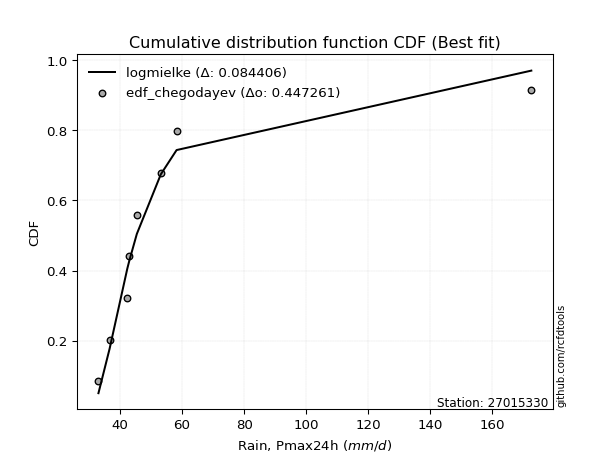</img>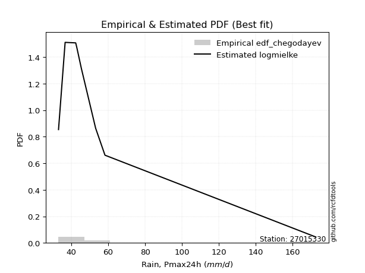</img>

</div>


### 6. Empirical - EDF Blom (1958)

The Blom formula is a specific "plotting position" formula used in hydrology and statistical analysis to estimate the empirical cumulative probability (or non-exceedance probability) of a data series. It is particularly recommended for data that are approximately normally distributed. The constant _a_ is set to 0.375 (or 3/8).

<div align="center">


$P=(m-a)/(n+1-2a)$


</div>


**6.1. Empirical values**

<div align="center">

|                | 0                   | 1                   | 2                   | 3                  | 4        | 5                  | 6                  | 7                  | 8                  |
|:---------------|:--------------------|:--------------------|:--------------------|:-------------------|:---------|:-------------------|:-------------------|:-------------------|:-------------------|
| date           | 2019                | 2023                | 2022                | 2021               | 2020     | 2018               | 2017               | 2025               | 2024               |
| x              | 33.02               | 36.602              | 42.34               | 42.975             | 45.398   | 53.146             | 58.219             | 81.2               | 172.6              |
| m              | 1                   | 2                   | 3                   | 4                  | 5        | 6                  | 7                  | 8                  | 9                  |
| empirical_dist | edf_blom            | edf_blom            | edf_blom            | edf_blom           | edf_blom | edf_blom           | edf_blom           | edf_blom           | edf_blom           |
| empirical      | 0.06756756756756757 | 0.17567567567567569 | 0.28378378378378377 | 0.3918918918918919 | 0.5      | 0.6081081081081081 | 0.7162162162162162 | 0.8243243243243243 | 0.9324324324324325 |
| empirical_tr   | 1.072463768115942   | 1.2131147540983607  | 1.3962264150943395  | 1.6444444444444444 | 2.0      | 2.5517241379310347 | 3.523809523809524  | 5.6923076923076925 | 14.800000000000006 |

</div>


**6.2. Kolmogorov-Smirnov fit test (sorted by Δ)**


<div align="center">

|                | 0                   | 1                   | 2                   | 3                   | 4                   | 5                   | 6                   | 7                   | 8                   | 9                   | 10                  | 11                  | 12                  | 13                  | 14                  | 15                  | 16                  | 17                  | 18                  | 19                  | 20                  | 21                  | 22                  | 23                  | 24                  | 25                  | 26                  | 27                  | 28                  | 29                  | 30                  | 31                    | 32                  | 33                  | 34                  | 35                  | 36                  | 37                  | 38                  | 39                  | 40                  | 41                  | 42                  | 43                  | 44                  | 45                  | 46                  | 47                  | 48                  | 49                  | 50                  | 51                  | 52                  | 53                  | 54                  | 55                  | 56                  | 57                  | 58                  | 59                  | 60                  | 61                  | 62                  | 63                  | 64                  | 65                  | 66                  | 67                  | 68                  | 69                  | 70                  | 71                  | 72                  | 73                  | 74                  | 75                  | 76                  | 77                  | 78                  | 79                  | 80                  | 81                  | 82                  | 83                  | 84                  | 85                  | 86                  | 87                  | 88                  | 89                  |
|:---------------|:--------------------|:--------------------|:--------------------|:--------------------|:--------------------|:--------------------|:--------------------|:--------------------|:--------------------|:--------------------|:--------------------|:--------------------|:--------------------|:--------------------|:--------------------|:--------------------|:--------------------|:--------------------|:--------------------|:--------------------|:--------------------|:--------------------|:--------------------|:--------------------|:--------------------|:--------------------|:--------------------|:--------------------|:--------------------|:--------------------|:--------------------|:----------------------|:--------------------|:--------------------|:--------------------|:--------------------|:--------------------|:--------------------|:--------------------|:--------------------|:--------------------|:--------------------|:--------------------|:--------------------|:--------------------|:--------------------|:--------------------|:--------------------|:--------------------|:--------------------|:--------------------|:--------------------|:--------------------|:--------------------|:--------------------|:--------------------|:--------------------|:--------------------|:--------------------|:--------------------|:--------------------|:--------------------|:--------------------|:--------------------|:--------------------|:--------------------|:--------------------|:--------------------|:--------------------|:--------------------|:--------------------|:--------------------|:--------------------|:--------------------|:--------------------|:--------------------|:--------------------|:--------------------|:--------------------|:--------------------|:--------------------|:--------------------|:--------------------|:--------------------|:--------------------|:--------------------|:--------------------|:--------------------|:--------------------|:--------------------|
| station        | 27015330            | 27015330            | 27015330            | 27015330            | 27015330            | 27015330            | 27015330            | 27015330            | 27015330            | 27015330            | 27015330            | 27015330            | 27015330            | 27015330            | 27015330            | 27015330            | 27015330            | 27015330            | 27015330            | 27015330            | 27015330            | 27015330            | 27015330            | 27015330            | 27015330            | 27015330            | 27015330            | 27015330            | 27015330            | 27015330            | 27015330            | 27015330              | 27015330            | 27015330            | 27015330            | 27015330            | 27015330            | 27015330            | 27015330            | 27015330            | 27015330            | 27015330            | 27015330            | 27015330            | 27015330            | 27015330            | 27015330            | 27015330            | 27015330            | 27015330            | 27015330            | 27015330            | 27015330            | 27015330            | 27015330            | 27015330            | 27015330            | 27015330            | 27015330            | 27015330            | 27015330            | 27015330            | 27015330            | 27015330            | 27015330            | 27015330            | 27015330            | 27015330            | 27015330            | 27015330            | 27015330            | 27015330            | 27015330            | 27015330            | 27015330            | 27015330            | 27015330            | 27015330            | 27015330            | 27015330            | 27015330            | 27015330            | 27015330            | 27015330            | 27015330            | 27015330            | 27015330            | 27015330            | 27015330            | 27015330            |
| empirical_dist | edf_blom            | edf_blom            | edf_blom            | edf_blom            | edf_blom            | edf_blom            | edf_blom            | edf_blom            | edf_blom            | edf_blom            | edf_blom            | edf_blom            | edf_blom            | edf_blom            | edf_blom            | edf_blom            | edf_blom            | edf_blom            | edf_blom            | edf_blom            | edf_blom            | edf_blom            | edf_blom            | edf_blom            | edf_blom            | edf_blom            | edf_blom            | edf_blom            | edf_blom            | edf_blom            | edf_blom            | edf_blom              | edf_blom            | edf_blom            | edf_blom            | edf_blom            | edf_blom            | edf_blom            | edf_blom            | edf_blom            | edf_blom            | edf_blom            | edf_blom            | edf_blom            | edf_blom            | edf_blom            | edf_blom            | edf_blom            | edf_blom            | edf_blom            | edf_blom            | edf_blom            | edf_blom            | edf_blom            | edf_blom            | edf_blom            | edf_blom            | edf_blom            | edf_blom            | edf_blom            | edf_blom            | edf_blom            | edf_blom            | edf_blom            | edf_blom            | edf_blom            | edf_blom            | edf_blom            | edf_blom            | edf_blom            | edf_blom            | edf_blom            | edf_blom            | edf_blom            | edf_blom            | edf_blom            | edf_blom            | edf_blom            | edf_blom            | edf_blom            | edf_blom            | edf_blom            | edf_blom            | edf_blom            | edf_blom            | edf_blom            | edf_blom            | edf_blom            | edf_blom            | edf_blom            |
| p_dist         | logmielke           | logalpha            | logpearson3         | loginvweibull       | loghalflogistic     | logncf              | loginvgamma         | logf                | logfisk             | logmoyal            | alpha               | mielke              | invweibull          | invgamma            | f                   | logjohnsonsu        | loginvgauss         | loghalfnorm         | pareto              | wald                | loggenexpon         | logt                | logfatiguelife      | invgauss            | loggumbel_r         | logtruncnorm        | fatiguelife         | logexponnorm        | logexpon            | logerlang           | johnsonsu           | loglaplace_asymmetric | loggenlogistic      | gibrat              | lograyleigh         | logmaxwell          | nct                 | erlang              | logkstwobign        | lognct              | logbetaprime        | logwald             | betaprime           | loggompertz         | lognakagami         | exponnorm           | laplace_asymmetric  | expon               | genexpon            | lognorm             | lognorm             | logcrystalball      | t                   | weibull_min         | logloggamma         | moyal               | loglogistic         | gompertz            | pearson3            | fisk                | genlogistic         | logrice             | loggibrat           | loghypsecant        | gumbel_r            | halflogistic        | logchi2             | loglaplace          | halfnorm            | rayleigh            | maxwell             | loggumbel_l         | kstwobign           | truncnorm           | crystalball         | norm                | logistic            | hypsecant           | rice                | laplace             | gumbel_l            | nakagami            | ncf                 | loggamma            | loggamma            | logweibull_min      | loglognorm          | gamma               | logpareto           | chi2                |
| delta          | 0.06398357644845787 | 0.06910638157010557 | 0.07564900000215613 | 0.07789932868186988 | 0.0801900840839177  | 0.08041662358364576 | 0.08041753348787833 | 0.08041792449353735 | 0.08162277475548702 | 0.08460161858168547 | 0.08661426385451881 | 0.08785942965109172 | 0.08947806917401074 | 0.08984611734117187 | 0.09011103655707065 | 0.09079063643678353 | 0.0928149632613311  | 0.09600559501714401 | 0.09659076924505916 | 0.09696069550532405 | 0.098025961462341   | 0.09885235177969431 | 0.09910193677250512 | 0.10171555370027136 | 0.10243038317419711 | 0.1024719790066993  | 0.10508947339463659 | 0.1056121740031537  | 0.10599097915034528 | 0.10879725209046509 | 0.10972791676143229 | 0.11067689450027507   | 0.11275916782733342 | 0.12262123802778957 | 0.1233030041123997  | 0.13297693530579002 | 0.13382672872333368 | 0.13856377850625223 | 0.13882917764582298 | 0.13885516877696769 | 0.13949055980754754 | 0.14244729083093166 | 0.14612617329007577 | 0.14865840721281726 | 0.15451582299295952 | 0.1586698750700507  | 0.16021738941637875 | 0.1602192097323617  | 0.16021928049849665 | 0.16316458684093615 | 0.16316458684093615 | 0.16316495094201466 | 0.16437444658780243 | 0.16438968806127963 | 0.16547281323877505 | 0.16800606168778484 | 0.16864181950583357 | 0.16883959557694272 | 0.1712965417755081  | 0.17185643418765434 | 0.17213652385206696 | 0.17341637202207993 | 0.17567567567567569 | 0.1826024982539367  | 0.1933532894407075  | 0.19497522144936022 | 0.19544887335752437 | 0.21076976254686253 | 0.21397559771506372 | 0.21484168074208754 | 0.2266632627623273  | 0.22986960047466154 | 0.24577042534975124 | 0.25701186991434644 | 0.2609213543051758  | 0.26092136087276757 | 0.26696093906409457 | 0.2720746683960095  | 0.2892069500989641  | 0.28963645994466186 | 0.331206128892496   | 0.34769634606733946 | 0.3777458794220161  | 0.3905323790854801  | 0.3905323790854801  | 0.4091163031205023  | 0.41317189815434263 | 0.4344758405566964  | 0.43792169221784305 | 0.6194236798922869  |
| deltao         | 0.41761268023100007 | 0.41761268023100007 | 0.41761268023100007 | 0.41761268023100007 | 0.41761268023100007 | 0.41761268023100007 | 0.41761268023100007 | 0.41761268023100007 | 0.41761268023100007 | 0.41761268023100007 | 0.41761268023100007 | 0.41761268023100007 | 0.41761268023100007 | 0.41761268023100007 | 0.41761268023100007 | 0.41761268023100007 | 0.41761268023100007 | 0.41761268023100007 | 0.41761268023100007 | 0.41761268023100007 | 0.41761268023100007 | 0.41761268023100007 | 0.41761268023100007 | 0.41761268023100007 | 0.41761268023100007 | 0.41761268023100007 | 0.41761268023100007 | 0.41761268023100007 | 0.41761268023100007 | 0.41761268023100007 | 0.41761268023100007 | 0.41761268023100007   | 0.41761268023100007 | 0.41761268023100007 | 0.41761268023100007 | 0.41761268023100007 | 0.41761268023100007 | 0.41761268023100007 | 0.41761268023100007 | 0.41761268023100007 | 0.41761268023100007 | 0.41761268023100007 | 0.41761268023100007 | 0.41761268023100007 | 0.41761268023100007 | 0.41761268023100007 | 0.41761268023100007 | 0.41761268023100007 | 0.41761268023100007 | 0.41761268023100007 | 0.41761268023100007 | 0.41761268023100007 | 0.41761268023100007 | 0.41761268023100007 | 0.41761268023100007 | 0.41761268023100007 | 0.41761268023100007 | 0.41761268023100007 | 0.41761268023100007 | 0.41761268023100007 | 0.41761268023100007 | 0.41761268023100007 | 0.41761268023100007 | 0.41761268023100007 | 0.41761268023100007 | 0.41761268023100007 | 0.41761268023100007 | 0.41761268023100007 | 0.41761268023100007 | 0.41761268023100007 | 0.41761268023100007 | 0.41761268023100007 | 0.41761268023100007 | 0.41761268023100007 | 0.41761268023100007 | 0.41761268023100007 | 0.41761268023100007 | 0.41761268023100007 | 0.41761268023100007 | 0.41761268023100007 | 0.41761268023100007 | 0.41761268023100007 | 0.41761268023100007 | 0.41761268023100007 | 0.41761268023100007 | 0.41761268023100007 | 0.41761268023100007 | 0.41761268023100007 | 0.41761268023100007 | 0.41761268023100007 |
| eval           | Δo > Δ              | Δo > Δ              | Δo > Δ              | Δo > Δ              | Δo > Δ              | Δo > Δ              | Δo > Δ              | Δo > Δ              | Δo > Δ              | Δo > Δ              | Δo > Δ              | Δo > Δ              | Δo > Δ              | Δo > Δ              | Δo > Δ              | Δo > Δ              | Δo > Δ              | Δo > Δ              | Δo > Δ              | Δo > Δ              | Δo > Δ              | Δo > Δ              | Δo > Δ              | Δo > Δ              | Δo > Δ              | Δo > Δ              | Δo > Δ              | Δo > Δ              | Δo > Δ              | Δo > Δ              | Δo > Δ              | Δo > Δ                | Δo > Δ              | Δo > Δ              | Δo > Δ              | Δo > Δ              | Δo > Δ              | Δo > Δ              | Δo > Δ              | Δo > Δ              | Δo > Δ              | Δo > Δ              | Δo > Δ              | Δo > Δ              | Δo > Δ              | Δo > Δ              | Δo > Δ              | Δo > Δ              | Δo > Δ              | Δo > Δ              | Δo > Δ              | Δo > Δ              | Δo > Δ              | Δo > Δ              | Δo > Δ              | Δo > Δ              | Δo > Δ              | Δo > Δ              | Δo > Δ              | Δo > Δ              | Δo > Δ              | Δo > Δ              | Δo > Δ              | Δo > Δ              | Δo > Δ              | Δo > Δ              | Δo > Δ              | Δo > Δ              | Δo > Δ              | Δo > Δ              | Δo > Δ              | Δo > Δ              | Δo > Δ              | Δo > Δ              | Δo > Δ              | Δo > Δ              | Δo > Δ              | Δo > Δ              | Δo > Δ              | Δo > Δ              | Δo > Δ              | Δo > Δ              | Δo > Δ              | Δo > Δ              | Δo > Δ              | Δo > Δ              | Δo > Δ              | Δo <= Δ             | Δo <= Δ             | Δo <= Δ             |
| fit            | 1                   | 1                   | 1                   | 1                   | 1                   | 1                   | 1                   | 1                   | 1                   | 1                   | 1                   | 1                   | 1                   | 1                   | 1                   | 1                   | 1                   | 1                   | 1                   | 1                   | 1                   | 1                   | 1                   | 1                   | 1                   | 1                   | 1                   | 1                   | 1                   | 1                   | 1                   | 1                     | 1                   | 1                   | 1                   | 1                   | 1                   | 1                   | 1                   | 1                   | 1                   | 1                   | 1                   | 1                   | 1                   | 1                   | 1                   | 1                   | 1                   | 1                   | 1                   | 1                   | 1                   | 1                   | 1                   | 1                   | 1                   | 1                   | 1                   | 1                   | 1                   | 1                   | 1                   | 1                   | 1                   | 1                   | 1                   | 1                   | 1                   | 1                   | 1                   | 1                   | 1                   | 1                   | 1                   | 1                   | 1                   | 1                   | 1                   | 1                   | 1                   | 1                   | 1                   | 1                   | 1                   | 1                   | 1                   | 0                   | 0                   | 0                   |
| n              | 9                   | 9                   | 9                   | 9                   | 9                   | 9                   | 9                   | 9                   | 9                   | 9                   | 9                   | 9                   | 9                   | 9                   | 9                   | 9                   | 9                   | 9                   | 9                   | 9                   | 9                   | 9                   | 9                   | 9                   | 9                   | 9                   | 9                   | 9                   | 9                   | 9                   | 9                   | 9                     | 9                   | 9                   | 9                   | 9                   | 9                   | 9                   | 9                   | 9                   | 9                   | 9                   | 9                   | 9                   | 9                   | 9                   | 9                   | 9                   | 9                   | 9                   | 9                   | 9                   | 9                   | 9                   | 9                   | 9                   | 9                   | 9                   | 9                   | 9                   | 9                   | 9                   | 9                   | 9                   | 9                   | 9                   | 9                   | 9                   | 9                   | 9                   | 9                   | 9                   | 9                   | 9                   | 9                   | 9                   | 9                   | 9                   | 9                   | 9                   | 9                   | 9                   | 9                   | 9                   | 9                   | 9                   | 9                   | 9                   | 9                   | 9                   |
| best_fit       | 1                   | 0                   | 0                   | 0                   | 0                   | 0                   | 0                   | 0                   | 0                   | 0                   | 0                   | 0                   | 0                   | 0                   | 0                   | 0                   | 0                   | 0                   | 0                   | 0                   | 0                   | 0                   | 0                   | 0                   | 0                   | 0                   | 0                   | 0                   | 0                   | 0                   | 0                   | 0                     | 0                   | 0                   | 0                   | 0                   | 0                   | 0                   | 0                   | 0                   | 0                   | 0                   | 0                   | 0                   | 0                   | 0                   | 0                   | 0                   | 0                   | 0                   | 0                   | 0                   | 0                   | 0                   | 0                   | 0                   | 0                   | 0                   | 0                   | 0                   | 0                   | 0                   | 0                   | 0                   | 0                   | 0                   | 0                   | 0                   | 0                   | 0                   | 0                   | 0                   | 0                   | 0                   | 0                   | 0                   | 0                   | 0                   | 0                   | 0                   | 0                   | 0                   | 0                   | 0                   | 0                   | 0                   | 0                   | 0                   | 0                   | 0                   |
| best_fit_sort  | 1                   | 2                   | 3                   | 4                   | 5                   | 6                   | 7                   | 8                   | 9                   | 10                  | 11                  | 12                  | 13                  | 14                  | 15                  | 16                  | 17                  | 18                  | 19                  | 20                  | 21                  | 22                  | 23                  | 24                  | 25                  | 26                  | 27                  | 28                  | 29                  | 30                  | 31                  | 32                    | 33                  | 34                  | 35                  | 36                  | 37                  | 38                  | 39                  | 40                  | 41                  | 42                  | 43                  | 44                  | 45                  | 46                  | 47                  | 48                  | 49                  | 50                  | 51                  | 52                  | 53                  | 54                  | 55                  | 56                  | 57                  | 58                  | 59                  | 60                  | 61                  | 62                  | 63                  | 64                  | 65                  | 66                  | 67                  | 68                  | 69                  | 70                  | 71                  | 72                  | 73                  | 74                  | 75                  | 76                  | 77                  | 78                  | 79                  | 80                  | 81                  | 82                  | 83                  | 84                  | 85                  | 86                  | 87                  | 88                  | 89                  | 90                  |

</div>


<div align="center">

</img>

</div>


**6.3. Best fit**

<div align="center">

|   id |   station | empirical_dist   | p_dist    |     delta |   deltao | eval   |   fit |   n |   best_fit |   best_fit_sort |
|-----:|----------:|:-----------------|:----------|----------:|---------:|:-------|------:|----:|-----------:|----------------:|
|    0 |  27015330 | edf_blom         | logmielke | 0.0639836 | 0.417613 | Δo > Δ |     1 |   9 |          1 |               1 |

</div>


<div align="center">

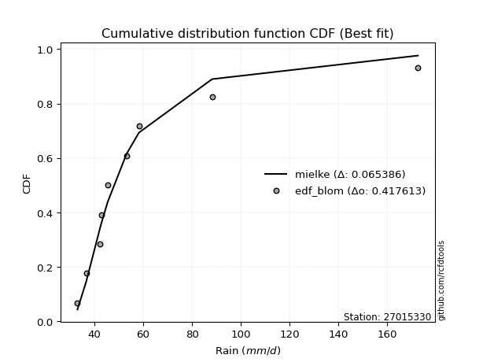</img>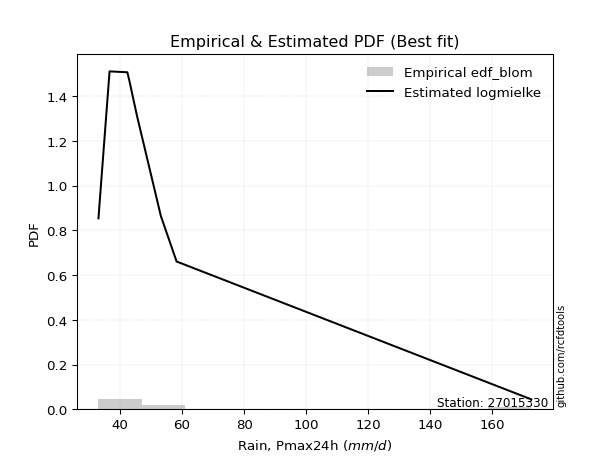</img>

</div>


### 7. Empirical - EDF Tukey (1962)

In hydrology, the Tukey formula is used as a plotting position formula to estimate the empirical probability or frequency of a flood event (or other hydrological data). The formula parameter is given as _c=0.333_ (or 1/3).

<div align="center">


$P=(m-c)/(n+1-2c)$


</div>


**7.1. Empirical values**

<div align="center">

|                | 0                   | 1                   | 2                  | 3                   | 4         | 5                  | 6                  | 7                  | 8                  |
|:---------------|:--------------------|:--------------------|:-------------------|:--------------------|:----------|:-------------------|:-------------------|:-------------------|:-------------------|
| date           | 2019                | 2023                | 2022               | 2021                | 2020      | 2018               | 2017               | 2025               | 2024               |
| x              | 33.02               | 36.602              | 42.34              | 42.975              | 45.398    | 53.146             | 58.219             | 81.2               | 172.6              |
| m              | 1                   | 2                   | 3                  | 4                   | 5         | 6                  | 7                  | 8                  | 9                  |
| empirical_dist | edf_tukey           | edf_tukey           | edf_tukey          | edf_tukey           | edf_tukey | edf_tukey          | edf_tukey          | edf_tukey          | edf_tukey          |
| empirical      | 0.07142857142857142 | 0.17857142857142858 | 0.2857142857142857 | 0.39285714285714285 | 0.5       | 0.6071428571428571 | 0.7142857142857143 | 0.8214285714285714 | 0.9285714285714286 |
| empirical_tr   | 1.0769230769230769  | 1.2173913043478262  | 1.4                | 1.6470588235294117  | 2.0       | 2.545454545454545  | 3.5                | 5.599999999999999  | 14.000000000000007 |

</div>


**7.2. Kolmogorov-Smirnov fit test (sorted by Δ)**


<div align="center">

|                | 0                   | 1                   | 2                   | 3                   | 4                   | 5                   | 6                   | 7                   | 8                   | 9                   | 10                  | 11                  | 12                  | 13                  | 14                  | 15                  | 16                  | 17                  | 18                  | 19                  | 20                  | 21                  | 22                  | 23                  | 24                  | 25                  | 26                  | 27                  | 28                  | 29                  | 30                  | 31                    | 32                  | 33                  | 34                  | 35                  | 36                  | 37                  | 38                  | 39                  | 40                  | 41                  | 42                  | 43                  | 44                  | 45                  | 46                  | 47                  | 48                  | 49                  | 50                  | 51                  | 52                  | 53                  | 54                  | 55                  | 56                  | 57                  | 58                  | 59                  | 60                  | 61                  | 62                  | 63                  | 64                  | 65                  | 66                  | 67                  | 68                  | 69                  | 70                  | 71                  | 72                  | 73                  | 74                  | 75                  | 76                  | 77                  | 78                  | 79                  | 80                  | 81                  | 82                  | 83                  | 84                  | 85                  | 86                  | 87                  | 88                  | 89                  |
|:---------------|:--------------------|:--------------------|:--------------------|:--------------------|:--------------------|:--------------------|:--------------------|:--------------------|:--------------------|:--------------------|:--------------------|:--------------------|:--------------------|:--------------------|:--------------------|:--------------------|:--------------------|:--------------------|:--------------------|:--------------------|:--------------------|:--------------------|:--------------------|:--------------------|:--------------------|:--------------------|:--------------------|:--------------------|:--------------------|:--------------------|:--------------------|:----------------------|:--------------------|:--------------------|:--------------------|:--------------------|:--------------------|:--------------------|:--------------------|:--------------------|:--------------------|:--------------------|:--------------------|:--------------------|:--------------------|:--------------------|:--------------------|:--------------------|:--------------------|:--------------------|:--------------------|:--------------------|:--------------------|:--------------------|:--------------------|:--------------------|:--------------------|:--------------------|:--------------------|:--------------------|:--------------------|:--------------------|:--------------------|:--------------------|:--------------------|:--------------------|:--------------------|:--------------------|:--------------------|:--------------------|:--------------------|:--------------------|:--------------------|:--------------------|:--------------------|:--------------------|:--------------------|:--------------------|:--------------------|:--------------------|:--------------------|:--------------------|:--------------------|:--------------------|:--------------------|:--------------------|:--------------------|:--------------------|:--------------------|:--------------------|
| station        | 27015330            | 27015330            | 27015330            | 27015330            | 27015330            | 27015330            | 27015330            | 27015330            | 27015330            | 27015330            | 27015330            | 27015330            | 27015330            | 27015330            | 27015330            | 27015330            | 27015330            | 27015330            | 27015330            | 27015330            | 27015330            | 27015330            | 27015330            | 27015330            | 27015330            | 27015330            | 27015330            | 27015330            | 27015330            | 27015330            | 27015330            | 27015330              | 27015330            | 27015330            | 27015330            | 27015330            | 27015330            | 27015330            | 27015330            | 27015330            | 27015330            | 27015330            | 27015330            | 27015330            | 27015330            | 27015330            | 27015330            | 27015330            | 27015330            | 27015330            | 27015330            | 27015330            | 27015330            | 27015330            | 27015330            | 27015330            | 27015330            | 27015330            | 27015330            | 27015330            | 27015330            | 27015330            | 27015330            | 27015330            | 27015330            | 27015330            | 27015330            | 27015330            | 27015330            | 27015330            | 27015330            | 27015330            | 27015330            | 27015330            | 27015330            | 27015330            | 27015330            | 27015330            | 27015330            | 27015330            | 27015330            | 27015330            | 27015330            | 27015330            | 27015330            | 27015330            | 27015330            | 27015330            | 27015330            | 27015330            |
| empirical_dist | edf_tukey           | edf_tukey           | edf_tukey           | edf_tukey           | edf_tukey           | edf_tukey           | edf_tukey           | edf_tukey           | edf_tukey           | edf_tukey           | edf_tukey           | edf_tukey           | edf_tukey           | edf_tukey           | edf_tukey           | edf_tukey           | edf_tukey           | edf_tukey           | edf_tukey           | edf_tukey           | edf_tukey           | edf_tukey           | edf_tukey           | edf_tukey           | edf_tukey           | edf_tukey           | edf_tukey           | edf_tukey           | edf_tukey           | edf_tukey           | edf_tukey           | edf_tukey             | edf_tukey           | edf_tukey           | edf_tukey           | edf_tukey           | edf_tukey           | edf_tukey           | edf_tukey           | edf_tukey           | edf_tukey           | edf_tukey           | edf_tukey           | edf_tukey           | edf_tukey           | edf_tukey           | edf_tukey           | edf_tukey           | edf_tukey           | edf_tukey           | edf_tukey           | edf_tukey           | edf_tukey           | edf_tukey           | edf_tukey           | edf_tukey           | edf_tukey           | edf_tukey           | edf_tukey           | edf_tukey           | edf_tukey           | edf_tukey           | edf_tukey           | edf_tukey           | edf_tukey           | edf_tukey           | edf_tukey           | edf_tukey           | edf_tukey           | edf_tukey           | edf_tukey           | edf_tukey           | edf_tukey           | edf_tukey           | edf_tukey           | edf_tukey           | edf_tukey           | edf_tukey           | edf_tukey           | edf_tukey           | edf_tukey           | edf_tukey           | edf_tukey           | edf_tukey           | edf_tukey           | edf_tukey           | edf_tukey           | edf_tukey           | edf_tukey           | edf_tukey           |
| p_dist         | logmielke           | logalpha            | logpearson3         | loginvweibull       | loghalflogistic     | logncf              | loginvgamma         | logf                | logfisk             | logmoyal            | alpha               | mielke              | invweibull          | invgamma            | f                   | logjohnsonsu        | loginvgauss         | loghalfnorm         | pareto              | wald                | loggenexpon         | logfatiguelife      | invgauss            | logtruncnorm        | logt                | loggumbel_r         | fatiguelife         | logexponnorm        | logexpon            | logerlang           | johnsonsu           | loglaplace_asymmetric | loggenlogistic      | lograyleigh         | gibrat              | logmaxwell          | nct                 | erlang              | logbetaprime        | logkstwobign        | lognct              | logwald             | betaprime           | loggompertz         | lognakagami         | exponnorm           | laplace_asymmetric  | expon               | genexpon            | lognorm             | lognorm             | logcrystalball      | weibull_min         | logloggamma         | t                   | moyal               | pearson3            | loglogistic         | gompertz            | fisk                | genlogistic         | logrice             | loggibrat           | loghypsecant        | halflogistic        | gumbel_r            | logchi2             | halfnorm            | loglaplace          | rayleigh            | maxwell             | loggumbel_l         | kstwobign           | truncnorm           | crystalball         | norm                | logistic            | hypsecant           | rice                | laplace             | gumbel_l            | nakagami            | ncf                 | loggamma            | loggamma            | logweibull_min      | loglognorm          | gamma               | logpareto           | chi2                |
| delta          | 0.06205307451795594 | 0.06717587963960364 | 0.07564900000215613 | 0.07596882675136796 | 0.07825958215341577 | 0.07848612165314384 | 0.07848703155737641 | 0.07848742256303542 | 0.07969227282498509 | 0.08460161858168547 | 0.08468376192401689 | 0.0859289277205898  | 0.08754756724350882 | 0.08791561541066995 | 0.08818053462656872 | 0.08886013450628161 | 0.09088446133082917 | 0.09407509308664208 | 0.09466026731455723 | 0.09503019357482212 | 0.09609545953183907 | 0.09717143484200319 | 0.09978505176976943 | 0.10054147707619737 | 0.10174810467544726 | 0.10243038317419711 | 0.10315897146413466 | 0.10368167207265178 | 0.10406047721984335 | 0.10686675015996316 | 0.10779741483093036 | 0.11067689450027507   | 0.11275916782733342 | 0.12137250218189777 | 0.12262123802778957 | 0.1310464333752881  | 0.13382672872333368 | 0.1366332765757503  | 0.13756005787704562 | 0.13882917764582298 | 0.13885516877696769 | 0.14534304372668455 | 0.14612617329007577 | 0.14865840721281726 | 0.1525853210624576  | 0.1586698750700507  | 0.16021738941637875 | 0.1602192097323617  | 0.16021928049849665 | 0.16123408491043423 | 0.16123408491043423 | 0.16123444901151274 | 0.1624591861307777  | 0.16354231130827313 | 0.16533969755305344 | 0.1659283676998019  | 0.16743553791450425 | 0.16864181950583357 | 0.16883959557694272 | 0.1699259322571524  | 0.17213652385206696 | 0.17341637202207993 | 0.17857142857142858 | 0.1826024982539367  | 0.19111421758835637 | 0.19142278751020558 | 0.19351837142702244 | 0.21011459385405987 | 0.21076976254686253 | 0.2129111788115856  | 0.22473276083182536 | 0.2279390985441596  | 0.24383992341924932 | 0.2550813679838445  | 0.2589908523746739  | 0.25899085894226564 | 0.26503043713359264 | 0.2701441664655076  | 0.28727644816846215 | 0.28770595801415993 | 0.3292756269619941  | 0.3448005931715865  | 0.37388487556101224 | 0.3886018771549782  | 0.3886018771549782  | 0.40718580119000036 | 0.4102761452585897  | 0.4325453386261945  | 0.4350259393220901  | 0.6165279269965339  |
| deltao         | 0.41761268023100007 | 0.41761268023100007 | 0.41761268023100007 | 0.41761268023100007 | 0.41761268023100007 | 0.41761268023100007 | 0.41761268023100007 | 0.41761268023100007 | 0.41761268023100007 | 0.41761268023100007 | 0.41761268023100007 | 0.41761268023100007 | 0.41761268023100007 | 0.41761268023100007 | 0.41761268023100007 | 0.41761268023100007 | 0.41761268023100007 | 0.41761268023100007 | 0.41761268023100007 | 0.41761268023100007 | 0.41761268023100007 | 0.41761268023100007 | 0.41761268023100007 | 0.41761268023100007 | 0.41761268023100007 | 0.41761268023100007 | 0.41761268023100007 | 0.41761268023100007 | 0.41761268023100007 | 0.41761268023100007 | 0.41761268023100007 | 0.41761268023100007   | 0.41761268023100007 | 0.41761268023100007 | 0.41761268023100007 | 0.41761268023100007 | 0.41761268023100007 | 0.41761268023100007 | 0.41761268023100007 | 0.41761268023100007 | 0.41761268023100007 | 0.41761268023100007 | 0.41761268023100007 | 0.41761268023100007 | 0.41761268023100007 | 0.41761268023100007 | 0.41761268023100007 | 0.41761268023100007 | 0.41761268023100007 | 0.41761268023100007 | 0.41761268023100007 | 0.41761268023100007 | 0.41761268023100007 | 0.41761268023100007 | 0.41761268023100007 | 0.41761268023100007 | 0.41761268023100007 | 0.41761268023100007 | 0.41761268023100007 | 0.41761268023100007 | 0.41761268023100007 | 0.41761268023100007 | 0.41761268023100007 | 0.41761268023100007 | 0.41761268023100007 | 0.41761268023100007 | 0.41761268023100007 | 0.41761268023100007 | 0.41761268023100007 | 0.41761268023100007 | 0.41761268023100007 | 0.41761268023100007 | 0.41761268023100007 | 0.41761268023100007 | 0.41761268023100007 | 0.41761268023100007 | 0.41761268023100007 | 0.41761268023100007 | 0.41761268023100007 | 0.41761268023100007 | 0.41761268023100007 | 0.41761268023100007 | 0.41761268023100007 | 0.41761268023100007 | 0.41761268023100007 | 0.41761268023100007 | 0.41761268023100007 | 0.41761268023100007 | 0.41761268023100007 | 0.41761268023100007 |
| eval           | Δo > Δ              | Δo > Δ              | Δo > Δ              | Δo > Δ              | Δo > Δ              | Δo > Δ              | Δo > Δ              | Δo > Δ              | Δo > Δ              | Δo > Δ              | Δo > Δ              | Δo > Δ              | Δo > Δ              | Δo > Δ              | Δo > Δ              | Δo > Δ              | Δo > Δ              | Δo > Δ              | Δo > Δ              | Δo > Δ              | Δo > Δ              | Δo > Δ              | Δo > Δ              | Δo > Δ              | Δo > Δ              | Δo > Δ              | Δo > Δ              | Δo > Δ              | Δo > Δ              | Δo > Δ              | Δo > Δ              | Δo > Δ                | Δo > Δ              | Δo > Δ              | Δo > Δ              | Δo > Δ              | Δo > Δ              | Δo > Δ              | Δo > Δ              | Δo > Δ              | Δo > Δ              | Δo > Δ              | Δo > Δ              | Δo > Δ              | Δo > Δ              | Δo > Δ              | Δo > Δ              | Δo > Δ              | Δo > Δ              | Δo > Δ              | Δo > Δ              | Δo > Δ              | Δo > Δ              | Δo > Δ              | Δo > Δ              | Δo > Δ              | Δo > Δ              | Δo > Δ              | Δo > Δ              | Δo > Δ              | Δo > Δ              | Δo > Δ              | Δo > Δ              | Δo > Δ              | Δo > Δ              | Δo > Δ              | Δo > Δ              | Δo > Δ              | Δo > Δ              | Δo > Δ              | Δo > Δ              | Δo > Δ              | Δo > Δ              | Δo > Δ              | Δo > Δ              | Δo > Δ              | Δo > Δ              | Δo > Δ              | Δo > Δ              | Δo > Δ              | Δo > Δ              | Δo > Δ              | Δo > Δ              | Δo > Δ              | Δo > Δ              | Δo > Δ              | Δo > Δ              | Δo <= Δ             | Δo <= Δ             | Δo <= Δ             |
| fit            | 1                   | 1                   | 1                   | 1                   | 1                   | 1                   | 1                   | 1                   | 1                   | 1                   | 1                   | 1                   | 1                   | 1                   | 1                   | 1                   | 1                   | 1                   | 1                   | 1                   | 1                   | 1                   | 1                   | 1                   | 1                   | 1                   | 1                   | 1                   | 1                   | 1                   | 1                   | 1                     | 1                   | 1                   | 1                   | 1                   | 1                   | 1                   | 1                   | 1                   | 1                   | 1                   | 1                   | 1                   | 1                   | 1                   | 1                   | 1                   | 1                   | 1                   | 1                   | 1                   | 1                   | 1                   | 1                   | 1                   | 1                   | 1                   | 1                   | 1                   | 1                   | 1                   | 1                   | 1                   | 1                   | 1                   | 1                   | 1                   | 1                   | 1                   | 1                   | 1                   | 1                   | 1                   | 1                   | 1                   | 1                   | 1                   | 1                   | 1                   | 1                   | 1                   | 1                   | 1                   | 1                   | 1                   | 1                   | 0                   | 0                   | 0                   |
| n              | 9                   | 9                   | 9                   | 9                   | 9                   | 9                   | 9                   | 9                   | 9                   | 9                   | 9                   | 9                   | 9                   | 9                   | 9                   | 9                   | 9                   | 9                   | 9                   | 9                   | 9                   | 9                   | 9                   | 9                   | 9                   | 9                   | 9                   | 9                   | 9                   | 9                   | 9                   | 9                     | 9                   | 9                   | 9                   | 9                   | 9                   | 9                   | 9                   | 9                   | 9                   | 9                   | 9                   | 9                   | 9                   | 9                   | 9                   | 9                   | 9                   | 9                   | 9                   | 9                   | 9                   | 9                   | 9                   | 9                   | 9                   | 9                   | 9                   | 9                   | 9                   | 9                   | 9                   | 9                   | 9                   | 9                   | 9                   | 9                   | 9                   | 9                   | 9                   | 9                   | 9                   | 9                   | 9                   | 9                   | 9                   | 9                   | 9                   | 9                   | 9                   | 9                   | 9                   | 9                   | 9                   | 9                   | 9                   | 9                   | 9                   | 9                   |
| best_fit       | 1                   | 0                   | 0                   | 0                   | 0                   | 0                   | 0                   | 0                   | 0                   | 0                   | 0                   | 0                   | 0                   | 0                   | 0                   | 0                   | 0                   | 0                   | 0                   | 0                   | 0                   | 0                   | 0                   | 0                   | 0                   | 0                   | 0                   | 0                   | 0                   | 0                   | 0                   | 0                     | 0                   | 0                   | 0                   | 0                   | 0                   | 0                   | 0                   | 0                   | 0                   | 0                   | 0                   | 0                   | 0                   | 0                   | 0                   | 0                   | 0                   | 0                   | 0                   | 0                   | 0                   | 0                   | 0                   | 0                   | 0                   | 0                   | 0                   | 0                   | 0                   | 0                   | 0                   | 0                   | 0                   | 0                   | 0                   | 0                   | 0                   | 0                   | 0                   | 0                   | 0                   | 0                   | 0                   | 0                   | 0                   | 0                   | 0                   | 0                   | 0                   | 0                   | 0                   | 0                   | 0                   | 0                   | 0                   | 0                   | 0                   | 0                   |
| best_fit_sort  | 1                   | 2                   | 3                   | 4                   | 5                   | 6                   | 7                   | 8                   | 9                   | 10                  | 11                  | 12                  | 13                  | 14                  | 15                  | 16                  | 17                  | 18                  | 19                  | 20                  | 21                  | 22                  | 23                  | 24                  | 25                  | 26                  | 27                  | 28                  | 29                  | 30                  | 31                  | 32                    | 33                  | 34                  | 35                  | 36                  | 37                  | 38                  | 39                  | 40                  | 41                  | 42                  | 43                  | 44                  | 45                  | 46                  | 47                  | 48                  | 49                  | 50                  | 51                  | 52                  | 53                  | 54                  | 55                  | 56                  | 57                  | 58                  | 59                  | 60                  | 61                  | 62                  | 63                  | 64                  | 65                  | 66                  | 67                  | 68                  | 69                  | 70                  | 71                  | 72                  | 73                  | 74                  | 75                  | 76                  | 77                  | 78                  | 79                  | 80                  | 81                  | 82                  | 83                  | 84                  | 85                  | 86                  | 87                  | 88                  | 89                  | 90                  |

</div>


<div align="center">

</img>

</div>


**7.3. Best fit**

<div align="center">

|   id |   station | empirical_dist   | p_dist    |     delta |   deltao | eval   |   fit |   n |   best_fit |   best_fit_sort |
|-----:|----------:|:-----------------|:----------|----------:|---------:|:-------|------:|----:|-----------:|----------------:|
|    0 |  27015330 | edf_tukey        | logmielke | 0.0620531 | 0.417613 | Δo > Δ |     1 |   9 |          1 |               1 |

</div>


<div align="center">

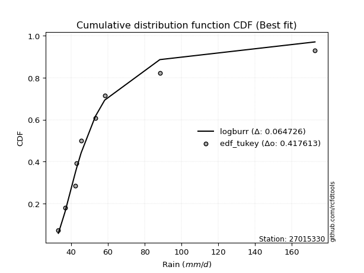</img>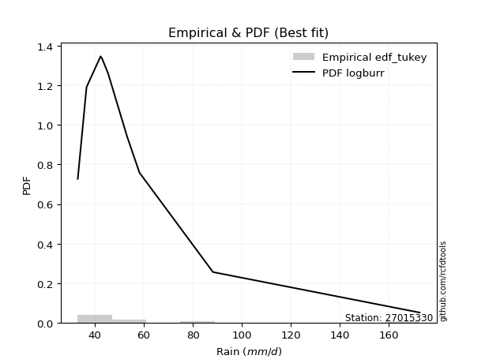</img>

</div>


### 8. Empirical - EDF Gringorten (1963)

Gringorten plotting position formula is essential for estimating the probability and return periods of extreme events like floods and heavy rainfall. The constant _a=0.44_.

<div align="center">


$P=(m-a)/(n+1-2a)$


</div>


**8.1. Empirical values**

<div align="center">

|                | 0                    | 1                  | 2                   | 3                  | 4              | 5                  | 6                  | 7                  | 8                  |
|:---------------|:---------------------|:-------------------|:--------------------|:-------------------|:---------------|:-------------------|:-------------------|:-------------------|:-------------------|
| date           | 2019                 | 2023               | 2022                | 2021               | 2020           | 2018               | 2017               | 2025               | 2024               |
| x              | 33.02                | 36.602             | 42.34               | 42.975             | 45.398         | 53.146             | 58.219             | 81.2               | 172.6              |
| m              | 1                    | 2                  | 3                   | 4                  | 5              | 6                  | 7                  | 8                  | 9                  |
| empirical_dist | edf_gringorten       | edf_gringorten     | edf_gringorten      | edf_gringorten     | edf_gringorten | edf_gringorten     | edf_gringorten     | edf_gringorten     | edf_gringorten     |
| empirical      | 0.061403508771929835 | 0.1710526315789474 | 0.28070175438596495 | 0.3903508771929825 | 0.5            | 0.6096491228070176 | 0.7192982456140351 | 0.8289473684210527 | 0.9385964912280703 |
| empirical_tr   | 1.0654205607476634   | 1.2063492063492063 | 1.3902439024390243  | 1.6402877697841727 | 2.0            | 2.561797752808989  | 3.5625             | 5.846153846153847  | 16.285714285714324 |

</div>


**8.2. Kolmogorov-Smirnov fit test (sorted by Δ)**


<div align="center">

|                | 0                   | 1                   | 2                   | 3                   | 4                   | 5                   | 6                   | 7                   | 8                   | 9                   | 10                  | 11                  | 12                  | 13                  | 14                  | 15                  | 16                  | 17                  | 18                  | 19                  | 20                  | 21                  | 22                  | 23                  | 24                  | 25                  | 26                  | 27                  | 28                  | 29                    | 30                  | 31                  | 32                  | 33                  | 34                  | 35                  | 36                  | 37                  | 38                  | 39                  | 40                  | 41                  | 42                  | 43                  | 44                  | 45                  | 46                  | 47                  | 48                  | 49                  | 50                  | 51                  | 52                  | 53                  | 54                  | 55                  | 56                  | 57                  | 58                  | 59                  | 60                  | 61                  | 62                  | 63                  | 64                  | 65                  | 66                  | 67                  | 68                  | 69                  | 70                  | 71                  | 72                  | 73                  | 74                  | 75                  | 76                  | 77                  | 78                  | 79                  | 80                  | 81                  | 82                  | 83                  | 84                  | 85                  | 86                  | 87                  | 88                  | 89                  |
|:---------------|:--------------------|:--------------------|:--------------------|:--------------------|:--------------------|:--------------------|:--------------------|:--------------------|:--------------------|:--------------------|:--------------------|:--------------------|:--------------------|:--------------------|:--------------------|:--------------------|:--------------------|:--------------------|:--------------------|:--------------------|:--------------------|:--------------------|:--------------------|:--------------------|:--------------------|:--------------------|:--------------------|:--------------------|:--------------------|:----------------------|:--------------------|:--------------------|:--------------------|:--------------------|:--------------------|:--------------------|:--------------------|:--------------------|:--------------------|:--------------------|:--------------------|:--------------------|:--------------------|:--------------------|:--------------------|:--------------------|:--------------------|:--------------------|:--------------------|:--------------------|:--------------------|:--------------------|:--------------------|:--------------------|:--------------------|:--------------------|:--------------------|:--------------------|:--------------------|:--------------------|:--------------------|:--------------------|:--------------------|:--------------------|:--------------------|:--------------------|:--------------------|:--------------------|:--------------------|:--------------------|:--------------------|:--------------------|:--------------------|:--------------------|:--------------------|:--------------------|:--------------------|:--------------------|:--------------------|:--------------------|:--------------------|:--------------------|:--------------------|:--------------------|:--------------------|:--------------------|:--------------------|:--------------------|:--------------------|:--------------------|
| station        | 27015330            | 27015330            | 27015330            | 27015330            | 27015330            | 27015330            | 27015330            | 27015330            | 27015330            | 27015330            | 27015330            | 27015330            | 27015330            | 27015330            | 27015330            | 27015330            | 27015330            | 27015330            | 27015330            | 27015330            | 27015330            | 27015330            | 27015330            | 27015330            | 27015330            | 27015330            | 27015330            | 27015330            | 27015330            | 27015330              | 27015330            | 27015330            | 27015330            | 27015330            | 27015330            | 27015330            | 27015330            | 27015330            | 27015330            | 27015330            | 27015330            | 27015330            | 27015330            | 27015330            | 27015330            | 27015330            | 27015330            | 27015330            | 27015330            | 27015330            | 27015330            | 27015330            | 27015330            | 27015330            | 27015330            | 27015330            | 27015330            | 27015330            | 27015330            | 27015330            | 27015330            | 27015330            | 27015330            | 27015330            | 27015330            | 27015330            | 27015330            | 27015330            | 27015330            | 27015330            | 27015330            | 27015330            | 27015330            | 27015330            | 27015330            | 27015330            | 27015330            | 27015330            | 27015330            | 27015330            | 27015330            | 27015330            | 27015330            | 27015330            | 27015330            | 27015330            | 27015330            | 27015330            | 27015330            | 27015330            |
| empirical_dist | edf_gringorten      | edf_gringorten      | edf_gringorten      | edf_gringorten      | edf_gringorten      | edf_gringorten      | edf_gringorten      | edf_gringorten      | edf_gringorten      | edf_gringorten      | edf_gringorten      | edf_gringorten      | edf_gringorten      | edf_gringorten      | edf_gringorten      | edf_gringorten      | edf_gringorten      | edf_gringorten      | edf_gringorten      | edf_gringorten      | edf_gringorten      | edf_gringorten      | edf_gringorten      | edf_gringorten      | edf_gringorten      | edf_gringorten      | edf_gringorten      | edf_gringorten      | edf_gringorten      | edf_gringorten        | edf_gringorten      | edf_gringorten      | edf_gringorten      | edf_gringorten      | edf_gringorten      | edf_gringorten      | edf_gringorten      | edf_gringorten      | edf_gringorten      | edf_gringorten      | edf_gringorten      | edf_gringorten      | edf_gringorten      | edf_gringorten      | edf_gringorten      | edf_gringorten      | edf_gringorten      | edf_gringorten      | edf_gringorten      | edf_gringorten      | edf_gringorten      | edf_gringorten      | edf_gringorten      | edf_gringorten      | edf_gringorten      | edf_gringorten      | edf_gringorten      | edf_gringorten      | edf_gringorten      | edf_gringorten      | edf_gringorten      | edf_gringorten      | edf_gringorten      | edf_gringorten      | edf_gringorten      | edf_gringorten      | edf_gringorten      | edf_gringorten      | edf_gringorten      | edf_gringorten      | edf_gringorten      | edf_gringorten      | edf_gringorten      | edf_gringorten      | edf_gringorten      | edf_gringorten      | edf_gringorten      | edf_gringorten      | edf_gringorten      | edf_gringorten      | edf_gringorten      | edf_gringorten      | edf_gringorten      | edf_gringorten      | edf_gringorten      | edf_gringorten      | edf_gringorten      | edf_gringorten      | edf_gringorten      | edf_gringorten      |
| p_dist         | logmielke           | logalpha            | logpearson3         | loginvweibull       | loghalflogistic     | logncf              | loginvgamma         | logf                | logmoyal            | logfisk             | alpha               | mielke              | invweibull          | invgamma            | f                   | logjohnsonsu        | logt                | loginvgauss         | loghalfnorm         | pareto              | wald                | loggenexpon         | logfatiguelife      | loggumbel_r         | invgauss            | logtruncnorm        | fatiguelife         | logexponnorm        | logexpon            | loglaplace_asymmetric | logerlang           | loggenlogistic      | johnsonsu           | gibrat              | lograyleigh         | nct                 | logmaxwell          | logwald             | logkstwobign        | lognct              | erlang              | logbetaprime        | betaprime           | loggompertz         | lognakagami         | exponnorm           | laplace_asymmetric  | expon               | genexpon            | t                   | lognorm             | lognorm             | logcrystalball      | weibull_min         | logloggamma         | loglogistic         | gompertz            | loggibrat           | genlogistic         | logrice             | moyal               | fisk                | pearson3            | loghypsecant        | gumbel_r            | logchi2             | halflogistic        | loglaplace          | rayleigh            | halfnorm            | maxwell             | loggumbel_l         | kstwobign           | truncnorm           | crystalball         | norm                | logistic            | hypsecant           | rice                | laplace             | gumbel_l            | nakagami            | ncf                 | loggamma            | loggamma            | logweibull_min      | loglognorm          | gamma               | logpareto           | chi2                |
| delta          | 0.06706560584627669 | 0.07218841096792439 | 0.0786997706890673  | 0.0809813580796887  | 0.08327211348173652 | 0.08349865298146458 | 0.08349956288569715 | 0.08349995389135617 | 0.08460161858168547 | 0.08470480415330583 | 0.08969629325233763 | 0.09094145904891054 | 0.09256009857182956 | 0.09292814673899069 | 0.09319306595488946 | 0.09387266583460235 | 0.0951643560175483  | 0.09589699265914992 | 0.09908762441496288 | 0.09967279864287798 | 0.10004272490314292 | 0.10110799086015981 | 0.10218396617032394 | 0.10243038317419711 | 0.10479758309809017 | 0.10555400840451812 | 0.10817150279245541 | 0.10869420340097252 | 0.1090730085481641  | 0.11067689450027507   | 0.11187928148828391 | 0.11275916782733342 | 0.1128099461592511  | 0.12262123802778957 | 0.12638503351021857 | 0.13382672872333368 | 0.1360589647036089  | 0.1378242467342034  | 0.13882917764582298 | 0.13885516877696769 | 0.14164580790407105 | 0.14257258920536642 | 0.14612617329007577 | 0.14865840721281726 | 0.1575978523907784  | 0.1586698750700507  | 0.16021738941637875 | 0.1602192097323617  | 0.16021928049849665 | 0.162833431888893   | 0.16624661623875503 | 0.16624661623875503 | 0.16624698033983354 | 0.1674717174590985  | 0.16855484263659393 | 0.16864181950583357 | 0.16883959557694272 | 0.1710526315789474  | 0.17213652385206696 | 0.17341637202207993 | 0.17417012048342256 | 0.17493846358547316 | 0.17746060057114582 | 0.1826024982539367  | 0.19643531883852638 | 0.19853090275534324 | 0.20113928024499794 | 0.21076976254686253 | 0.2179237101399064  | 0.22013965651070144 | 0.22974529216014616 | 0.23295162987248041 | 0.24885245474757012 | 0.2600938993121653  | 0.2640033837029947  | 0.26400339027058645 | 0.27004296846191345 | 0.2751566977938284  | 0.29228897949678295 | 0.29271848934248074 | 0.3342881582903149  | 0.3523193901640677  | 0.38390993821765385 | 0.3936144084832989  | 0.3936144084832989  | 0.4121983325183211  | 0.4177949422510709  | 0.43755786995451523 | 0.4425447363145713  | 0.6240467239890151  |
| deltao         | 0.41761268023100007 | 0.41761268023100007 | 0.41761268023100007 | 0.41761268023100007 | 0.41761268023100007 | 0.41761268023100007 | 0.41761268023100007 | 0.41761268023100007 | 0.41761268023100007 | 0.41761268023100007 | 0.41761268023100007 | 0.41761268023100007 | 0.41761268023100007 | 0.41761268023100007 | 0.41761268023100007 | 0.41761268023100007 | 0.41761268023100007 | 0.41761268023100007 | 0.41761268023100007 | 0.41761268023100007 | 0.41761268023100007 | 0.41761268023100007 | 0.41761268023100007 | 0.41761268023100007 | 0.41761268023100007 | 0.41761268023100007 | 0.41761268023100007 | 0.41761268023100007 | 0.41761268023100007 | 0.41761268023100007   | 0.41761268023100007 | 0.41761268023100007 | 0.41761268023100007 | 0.41761268023100007 | 0.41761268023100007 | 0.41761268023100007 | 0.41761268023100007 | 0.41761268023100007 | 0.41761268023100007 | 0.41761268023100007 | 0.41761268023100007 | 0.41761268023100007 | 0.41761268023100007 | 0.41761268023100007 | 0.41761268023100007 | 0.41761268023100007 | 0.41761268023100007 | 0.41761268023100007 | 0.41761268023100007 | 0.41761268023100007 | 0.41761268023100007 | 0.41761268023100007 | 0.41761268023100007 | 0.41761268023100007 | 0.41761268023100007 | 0.41761268023100007 | 0.41761268023100007 | 0.41761268023100007 | 0.41761268023100007 | 0.41761268023100007 | 0.41761268023100007 | 0.41761268023100007 | 0.41761268023100007 | 0.41761268023100007 | 0.41761268023100007 | 0.41761268023100007 | 0.41761268023100007 | 0.41761268023100007 | 0.41761268023100007 | 0.41761268023100007 | 0.41761268023100007 | 0.41761268023100007 | 0.41761268023100007 | 0.41761268023100007 | 0.41761268023100007 | 0.41761268023100007 | 0.41761268023100007 | 0.41761268023100007 | 0.41761268023100007 | 0.41761268023100007 | 0.41761268023100007 | 0.41761268023100007 | 0.41761268023100007 | 0.41761268023100007 | 0.41761268023100007 | 0.41761268023100007 | 0.41761268023100007 | 0.41761268023100007 | 0.41761268023100007 | 0.41761268023100007 |
| eval           | Δo > Δ              | Δo > Δ              | Δo > Δ              | Δo > Δ              | Δo > Δ              | Δo > Δ              | Δo > Δ              | Δo > Δ              | Δo > Δ              | Δo > Δ              | Δo > Δ              | Δo > Δ              | Δo > Δ              | Δo > Δ              | Δo > Δ              | Δo > Δ              | Δo > Δ              | Δo > Δ              | Δo > Δ              | Δo > Δ              | Δo > Δ              | Δo > Δ              | Δo > Δ              | Δo > Δ              | Δo > Δ              | Δo > Δ              | Δo > Δ              | Δo > Δ              | Δo > Δ              | Δo > Δ                | Δo > Δ              | Δo > Δ              | Δo > Δ              | Δo > Δ              | Δo > Δ              | Δo > Δ              | Δo > Δ              | Δo > Δ              | Δo > Δ              | Δo > Δ              | Δo > Δ              | Δo > Δ              | Δo > Δ              | Δo > Δ              | Δo > Δ              | Δo > Δ              | Δo > Δ              | Δo > Δ              | Δo > Δ              | Δo > Δ              | Δo > Δ              | Δo > Δ              | Δo > Δ              | Δo > Δ              | Δo > Δ              | Δo > Δ              | Δo > Δ              | Δo > Δ              | Δo > Δ              | Δo > Δ              | Δo > Δ              | Δo > Δ              | Δo > Δ              | Δo > Δ              | Δo > Δ              | Δo > Δ              | Δo > Δ              | Δo > Δ              | Δo > Δ              | Δo > Δ              | Δo > Δ              | Δo > Δ              | Δo > Δ              | Δo > Δ              | Δo > Δ              | Δo > Δ              | Δo > Δ              | Δo > Δ              | Δo > Δ              | Δo > Δ              | Δo > Δ              | Δo > Δ              | Δo > Δ              | Δo > Δ              | Δo > Δ              | Δo > Δ              | Δo <= Δ             | Δo <= Δ             | Δo <= Δ             | Δo <= Δ             |
| fit            | 1                   | 1                   | 1                   | 1                   | 1                   | 1                   | 1                   | 1                   | 1                   | 1                   | 1                   | 1                   | 1                   | 1                   | 1                   | 1                   | 1                   | 1                   | 1                   | 1                   | 1                   | 1                   | 1                   | 1                   | 1                   | 1                   | 1                   | 1                   | 1                   | 1                     | 1                   | 1                   | 1                   | 1                   | 1                   | 1                   | 1                   | 1                   | 1                   | 1                   | 1                   | 1                   | 1                   | 1                   | 1                   | 1                   | 1                   | 1                   | 1                   | 1                   | 1                   | 1                   | 1                   | 1                   | 1                   | 1                   | 1                   | 1                   | 1                   | 1                   | 1                   | 1                   | 1                   | 1                   | 1                   | 1                   | 1                   | 1                   | 1                   | 1                   | 1                   | 1                   | 1                   | 1                   | 1                   | 1                   | 1                   | 1                   | 1                   | 1                   | 1                   | 1                   | 1                   | 1                   | 1                   | 1                   | 0                   | 0                   | 0                   | 0                   |
| n              | 9                   | 9                   | 9                   | 9                   | 9                   | 9                   | 9                   | 9                   | 9                   | 9                   | 9                   | 9                   | 9                   | 9                   | 9                   | 9                   | 9                   | 9                   | 9                   | 9                   | 9                   | 9                   | 9                   | 9                   | 9                   | 9                   | 9                   | 9                   | 9                   | 9                     | 9                   | 9                   | 9                   | 9                   | 9                   | 9                   | 9                   | 9                   | 9                   | 9                   | 9                   | 9                   | 9                   | 9                   | 9                   | 9                   | 9                   | 9                   | 9                   | 9                   | 9                   | 9                   | 9                   | 9                   | 9                   | 9                   | 9                   | 9                   | 9                   | 9                   | 9                   | 9                   | 9                   | 9                   | 9                   | 9                   | 9                   | 9                   | 9                   | 9                   | 9                   | 9                   | 9                   | 9                   | 9                   | 9                   | 9                   | 9                   | 9                   | 9                   | 9                   | 9                   | 9                   | 9                   | 9                   | 9                   | 9                   | 9                   | 9                   | 9                   |
| best_fit       | 1                   | 0                   | 0                   | 0                   | 0                   | 0                   | 0                   | 0                   | 0                   | 0                   | 0                   | 0                   | 0                   | 0                   | 0                   | 0                   | 0                   | 0                   | 0                   | 0                   | 0                   | 0                   | 0                   | 0                   | 0                   | 0                   | 0                   | 0                   | 0                   | 0                     | 0                   | 0                   | 0                   | 0                   | 0                   | 0                   | 0                   | 0                   | 0                   | 0                   | 0                   | 0                   | 0                   | 0                   | 0                   | 0                   | 0                   | 0                   | 0                   | 0                   | 0                   | 0                   | 0                   | 0                   | 0                   | 0                   | 0                   | 0                   | 0                   | 0                   | 0                   | 0                   | 0                   | 0                   | 0                   | 0                   | 0                   | 0                   | 0                   | 0                   | 0                   | 0                   | 0                   | 0                   | 0                   | 0                   | 0                   | 0                   | 0                   | 0                   | 0                   | 0                   | 0                   | 0                   | 0                   | 0                   | 0                   | 0                   | 0                   | 0                   |
| best_fit_sort  | 1                   | 2                   | 3                   | 4                   | 5                   | 6                   | 7                   | 8                   | 9                   | 10                  | 11                  | 12                  | 13                  | 14                  | 15                  | 16                  | 17                  | 18                  | 19                  | 20                  | 21                  | 22                  | 23                  | 24                  | 25                  | 26                  | 27                  | 28                  | 29                  | 30                    | 31                  | 32                  | 33                  | 34                  | 35                  | 36                  | 37                  | 38                  | 39                  | 40                  | 41                  | 42                  | 43                  | 44                  | 45                  | 46                  | 47                  | 48                  | 49                  | 50                  | 51                  | 52                  | 53                  | 54                  | 55                  | 56                  | 57                  | 58                  | 59                  | 60                  | 61                  | 62                  | 63                  | 64                  | 65                  | 66                  | 67                  | 68                  | 69                  | 70                  | 71                  | 72                  | 73                  | 74                  | 75                  | 76                  | 77                  | 78                  | 79                  | 80                  | 81                  | 82                  | 83                  | 84                  | 85                  | 86                  | 87                  | 88                  | 89                  | 90                  |

</div>


<div align="center">

</img>

</div>


**8.3. Best fit**

<div align="center">

|   id |   station | empirical_dist   | p_dist    |     delta |   deltao | eval   |   fit |   n |   best_fit |   best_fit_sort |
|-----:|----------:|:-----------------|:----------|----------:|---------:|:-------|------:|----:|-----------:|----------------:|
|    0 |  27015330 | edf_gringorten   | logmielke | 0.0670656 | 0.417613 | Δo > Δ |     1 |   9 |          1 |               1 |

</div>


<div align="center">

</img>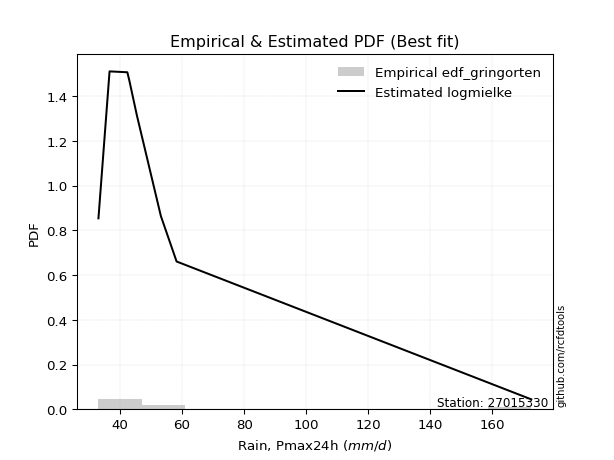</img>

</div>


### 9. Empirical - EDF Filliben (1975)

The specific values of the constants (0.3175) (often denoted as $alpha$) and (0.365) are derived from a method proposed by James J. Filliben in a 1975 paper. This particular formula is the mean value of the $i$-th order statistic of the normal distribution and is considered a robust and effective plotting position formula for the normal probability plot correlation coefficient test for normality.

<div align="center">


$P=(m-0.3175)/(n+0.365)$


</div>


**9.1. Empirical values**

<div align="center">

|                | 0                   | 1                  | 2                   | 3                   | 4            | 5                  | 6                  | 7                  | 8                  |
|:---------------|:--------------------|:-------------------|:--------------------|:--------------------|:-------------|:-------------------|:-------------------|:-------------------|:-------------------|
| date           | 2019                | 2023               | 2022                | 2021                | 2020         | 2018               | 2017               | 2025               | 2024               |
| x              | 33.02               | 36.602             | 42.34               | 42.975              | 45.398       | 53.146             | 58.219             | 81.2               | 172.6              |
| m              | 1                   | 2                  | 3                   | 4                   | 5            | 6                  | 7                  | 8                  | 9                  |
| empirical_dist | edf_filliben        | edf_filliben       | edf_filliben        | edf_filliben        | edf_filliben | edf_filliben       | edf_filliben       | edf_filliben       | edf_filliben       |
| empirical      | 0.07287773625200214 | 0.1796583021890016 | 0.28643886812600106 | 0.39321943406300053 | 0.5          | 0.6067805659369995 | 0.7135611318739989 | 0.8203416978109984 | 0.9271222637479978 |
| empirical_tr   | 1.0786063921681543  | 1.219004230393752  | 1.401421623643846   | 1.6480422349318082  | 2.0          | 2.5431093007467753 | 3.491146318732526  | 5.566121842496286  | 13.721611721611705 |

</div>


**9.2. Kolmogorov-Smirnov fit test (sorted by Δ)**


<div align="center">

|                | 0                    | 1                   | 2                   | 3                   | 4                   | 5                   | 6                   | 7                   | 8                   | 9                   | 10                  | 11                  | 12                  | 13                  | 14                  | 15                  | 16                  | 17                  | 18                  | 19                  | 20                  | 21                  | 22                  | 23                  | 24                  | 25                  | 26                  | 27                  | 28                  | 29                  | 30                  | 31                    | 32                  | 33                  | 34                  | 35                  | 36                  | 37                  | 38                  | 39                  | 40                  | 41                  | 42                  | 43                  | 44                  | 45                  | 46                  | 47                  | 48                  | 49                  | 50                  | 51                  | 52                  | 53                  | 54                  | 55                  | 56                  | 57                  | 58                  | 59                  | 60                  | 61                  | 62                  | 63                  | 64                  | 65                  | 66                  | 67                  | 68                  | 69                  | 70                  | 71                  | 72                  | 73                  | 74                  | 75                  | 76                  | 77                  | 78                  | 79                  | 80                  | 81                  | 82                  | 83                  | 84                  | 85                  | 86                  | 87                  | 88                  | 89                  |
|:---------------|:---------------------|:--------------------|:--------------------|:--------------------|:--------------------|:--------------------|:--------------------|:--------------------|:--------------------|:--------------------|:--------------------|:--------------------|:--------------------|:--------------------|:--------------------|:--------------------|:--------------------|:--------------------|:--------------------|:--------------------|:--------------------|:--------------------|:--------------------|:--------------------|:--------------------|:--------------------|:--------------------|:--------------------|:--------------------|:--------------------|:--------------------|:----------------------|:--------------------|:--------------------|:--------------------|:--------------------|:--------------------|:--------------------|:--------------------|:--------------------|:--------------------|:--------------------|:--------------------|:--------------------|:--------------------|:--------------------|:--------------------|:--------------------|:--------------------|:--------------------|:--------------------|:--------------------|:--------------------|:--------------------|:--------------------|:--------------------|:--------------------|:--------------------|:--------------------|:--------------------|:--------------------|:--------------------|:--------------------|:--------------------|:--------------------|:--------------------|:--------------------|:--------------------|:--------------------|:--------------------|:--------------------|:--------------------|:--------------------|:--------------------|:--------------------|:--------------------|:--------------------|:--------------------|:--------------------|:--------------------|:--------------------|:--------------------|:--------------------|:--------------------|:--------------------|:--------------------|:--------------------|:--------------------|:--------------------|:--------------------|
| station        | 27015330             | 27015330            | 27015330            | 27015330            | 27015330            | 27015330            | 27015330            | 27015330            | 27015330            | 27015330            | 27015330            | 27015330            | 27015330            | 27015330            | 27015330            | 27015330            | 27015330            | 27015330            | 27015330            | 27015330            | 27015330            | 27015330            | 27015330            | 27015330            | 27015330            | 27015330            | 27015330            | 27015330            | 27015330            | 27015330            | 27015330            | 27015330              | 27015330            | 27015330            | 27015330            | 27015330            | 27015330            | 27015330            | 27015330            | 27015330            | 27015330            | 27015330            | 27015330            | 27015330            | 27015330            | 27015330            | 27015330            | 27015330            | 27015330            | 27015330            | 27015330            | 27015330            | 27015330            | 27015330            | 27015330            | 27015330            | 27015330            | 27015330            | 27015330            | 27015330            | 27015330            | 27015330            | 27015330            | 27015330            | 27015330            | 27015330            | 27015330            | 27015330            | 27015330            | 27015330            | 27015330            | 27015330            | 27015330            | 27015330            | 27015330            | 27015330            | 27015330            | 27015330            | 27015330            | 27015330            | 27015330            | 27015330            | 27015330            | 27015330            | 27015330            | 27015330            | 27015330            | 27015330            | 27015330            | 27015330            |
| empirical_dist | edf_filliben         | edf_filliben        | edf_filliben        | edf_filliben        | edf_filliben        | edf_filliben        | edf_filliben        | edf_filliben        | edf_filliben        | edf_filliben        | edf_filliben        | edf_filliben        | edf_filliben        | edf_filliben        | edf_filliben        | edf_filliben        | edf_filliben        | edf_filliben        | edf_filliben        | edf_filliben        | edf_filliben        | edf_filliben        | edf_filliben        | edf_filliben        | edf_filliben        | edf_filliben        | edf_filliben        | edf_filliben        | edf_filliben        | edf_filliben        | edf_filliben        | edf_filliben          | edf_filliben        | edf_filliben        | edf_filliben        | edf_filliben        | edf_filliben        | edf_filliben        | edf_filliben        | edf_filliben        | edf_filliben        | edf_filliben        | edf_filliben        | edf_filliben        | edf_filliben        | edf_filliben        | edf_filliben        | edf_filliben        | edf_filliben        | edf_filliben        | edf_filliben        | edf_filliben        | edf_filliben        | edf_filliben        | edf_filliben        | edf_filliben        | edf_filliben        | edf_filliben        | edf_filliben        | edf_filliben        | edf_filliben        | edf_filliben        | edf_filliben        | edf_filliben        | edf_filliben        | edf_filliben        | edf_filliben        | edf_filliben        | edf_filliben        | edf_filliben        | edf_filliben        | edf_filliben        | edf_filliben        | edf_filliben        | edf_filliben        | edf_filliben        | edf_filliben        | edf_filliben        | edf_filliben        | edf_filliben        | edf_filliben        | edf_filliben        | edf_filliben        | edf_filliben        | edf_filliben        | edf_filliben        | edf_filliben        | edf_filliben        | edf_filliben        | edf_filliben        |
| p_dist         | logmielke            | logalpha            | loginvweibull       | logpearson3         | loghalflogistic     | logncf              | loginvgamma         | logf                | logfisk             | alpha               | logmoyal            | mielke              | invweibull          | invgamma            | f                   | logjohnsonsu        | loginvgauss         | loghalfnorm         | pareto              | wald                | loggenexpon         | logfatiguelife      | invgauss            | logtruncnorm        | loggumbel_r         | fatiguelife         | logt                | logexponnorm        | logexpon            | logerlang           | johnsonsu           | loglaplace_asymmetric | loggenlogistic      | lograyleigh         | gibrat              | logmaxwell          | nct                 | erlang              | logbetaprime        | logkstwobign        | lognct              | betaprime           | logwald             | loggompertz         | lognakagami         | exponnorm           | laplace_asymmetric  | expon               | genexpon            | lognorm             | lognorm             | logcrystalball      | weibull_min         | logloggamma         | moyal               | t                   | pearson3            | loglogistic         | gompertz            | fisk                | genlogistic         | logrice             | loggibrat           | loghypsecant        | halflogistic        | gumbel_r            | logchi2             | halfnorm            | loglaplace          | rayleigh            | maxwell             | loggumbel_l         | kstwobign           | truncnorm           | crystalball         | norm                | logistic            | hypsecant           | rice                | laplace             | gumbel_l            | nakagami            | ncf                 | loggamma            | loggamma            | logweibull_min      | loglognorm          | gamma               | logpareto           | chi2                |
| delta          | 0.061328492106240584 | 0.06645129722788828 | 0.0752442443396526  | 0.07564900000215613 | 0.07753499974170042 | 0.07776153924142848 | 0.07776244914566105 | 0.07776284015132007 | 0.07896769041326973 | 0.08395917951230153 | 0.08460161858168547 | 0.08520434530887444 | 0.08682298483179346 | 0.08719103299895459 | 0.08745595221485336 | 0.08813555209456625 | 0.09015987891911381 | 0.09335051067492672 | 0.09393568490284188 | 0.09430561116310676 | 0.09537087712012371 | 0.09644685243028783 | 0.09906046935805407 | 0.09981689466448201 | 0.10243038317419711 | 0.1024343890524193  | 0.10283497829302024 | 0.10295708966093642 | 0.10333589480812799 | 0.1061421677482478  | 0.107072832419215   | 0.11067689450027507   | 0.11275916782733342 | 0.12064791977018241 | 0.12262123802778957 | 0.13032185096357274 | 0.13382672872333368 | 0.13590869416403495 | 0.13731301223428816 | 0.13882917764582298 | 0.13885516877696769 | 0.14612617329007577 | 0.1464299173442576  | 0.14865840721281726 | 0.15186073865074223 | 0.1586698750700507  | 0.16021738941637875 | 0.1602192097323617  | 0.16021928049849665 | 0.16050950249871887 | 0.16050950249871887 | 0.16050986659979738 | 0.16173460371906234 | 0.16281772889655777 | 0.16520378528808655 | 0.16570198875891107 | 0.16598637309107353 | 0.16864181950583357 | 0.16883959557694272 | 0.16920134984543705 | 0.17213652385206696 | 0.17341637202207993 | 0.1796583021890016  | 0.1826024982539367  | 0.18966505276492565 | 0.19069820509849023 | 0.19279378901530708 | 0.20866542903062915 | 0.21076976254686253 | 0.21218659639987025 | 0.22400817842011    | 0.22721451613244426 | 0.24311534100753396 | 0.25435678557212915 | 0.25826626996295854 | 0.2582662765305503  | 0.2643058547218773  | 0.26941958405379224 | 0.2865518657567468  | 0.2869813756024446  | 0.3285510445502787  | 0.34371371955401353 | 0.3724357107375815  | 0.3878772947432628  | 0.3878772947432628  | 0.406461218778285   | 0.4091892716410167  | 0.43182075621447913 | 0.4339390657045171  | 0.6154410533789609  |
| deltao         | 0.41761268023100007  | 0.41761268023100007 | 0.41761268023100007 | 0.41761268023100007 | 0.41761268023100007 | 0.41761268023100007 | 0.41761268023100007 | 0.41761268023100007 | 0.41761268023100007 | 0.41761268023100007 | 0.41761268023100007 | 0.41761268023100007 | 0.41761268023100007 | 0.41761268023100007 | 0.41761268023100007 | 0.41761268023100007 | 0.41761268023100007 | 0.41761268023100007 | 0.41761268023100007 | 0.41761268023100007 | 0.41761268023100007 | 0.41761268023100007 | 0.41761268023100007 | 0.41761268023100007 | 0.41761268023100007 | 0.41761268023100007 | 0.41761268023100007 | 0.41761268023100007 | 0.41761268023100007 | 0.41761268023100007 | 0.41761268023100007 | 0.41761268023100007   | 0.41761268023100007 | 0.41761268023100007 | 0.41761268023100007 | 0.41761268023100007 | 0.41761268023100007 | 0.41761268023100007 | 0.41761268023100007 | 0.41761268023100007 | 0.41761268023100007 | 0.41761268023100007 | 0.41761268023100007 | 0.41761268023100007 | 0.41761268023100007 | 0.41761268023100007 | 0.41761268023100007 | 0.41761268023100007 | 0.41761268023100007 | 0.41761268023100007 | 0.41761268023100007 | 0.41761268023100007 | 0.41761268023100007 | 0.41761268023100007 | 0.41761268023100007 | 0.41761268023100007 | 0.41761268023100007 | 0.41761268023100007 | 0.41761268023100007 | 0.41761268023100007 | 0.41761268023100007 | 0.41761268023100007 | 0.41761268023100007 | 0.41761268023100007 | 0.41761268023100007 | 0.41761268023100007 | 0.41761268023100007 | 0.41761268023100007 | 0.41761268023100007 | 0.41761268023100007 | 0.41761268023100007 | 0.41761268023100007 | 0.41761268023100007 | 0.41761268023100007 | 0.41761268023100007 | 0.41761268023100007 | 0.41761268023100007 | 0.41761268023100007 | 0.41761268023100007 | 0.41761268023100007 | 0.41761268023100007 | 0.41761268023100007 | 0.41761268023100007 | 0.41761268023100007 | 0.41761268023100007 | 0.41761268023100007 | 0.41761268023100007 | 0.41761268023100007 | 0.41761268023100007 | 0.41761268023100007 |
| eval           | Δo > Δ               | Δo > Δ              | Δo > Δ              | Δo > Δ              | Δo > Δ              | Δo > Δ              | Δo > Δ              | Δo > Δ              | Δo > Δ              | Δo > Δ              | Δo > Δ              | Δo > Δ              | Δo > Δ              | Δo > Δ              | Δo > Δ              | Δo > Δ              | Δo > Δ              | Δo > Δ              | Δo > Δ              | Δo > Δ              | Δo > Δ              | Δo > Δ              | Δo > Δ              | Δo > Δ              | Δo > Δ              | Δo > Δ              | Δo > Δ              | Δo > Δ              | Δo > Δ              | Δo > Δ              | Δo > Δ              | Δo > Δ                | Δo > Δ              | Δo > Δ              | Δo > Δ              | Δo > Δ              | Δo > Δ              | Δo > Δ              | Δo > Δ              | Δo > Δ              | Δo > Δ              | Δo > Δ              | Δo > Δ              | Δo > Δ              | Δo > Δ              | Δo > Δ              | Δo > Δ              | Δo > Δ              | Δo > Δ              | Δo > Δ              | Δo > Δ              | Δo > Δ              | Δo > Δ              | Δo > Δ              | Δo > Δ              | Δo > Δ              | Δo > Δ              | Δo > Δ              | Δo > Δ              | Δo > Δ              | Δo > Δ              | Δo > Δ              | Δo > Δ              | Δo > Δ              | Δo > Δ              | Δo > Δ              | Δo > Δ              | Δo > Δ              | Δo > Δ              | Δo > Δ              | Δo > Δ              | Δo > Δ              | Δo > Δ              | Δo > Δ              | Δo > Δ              | Δo > Δ              | Δo > Δ              | Δo > Δ              | Δo > Δ              | Δo > Δ              | Δo > Δ              | Δo > Δ              | Δo > Δ              | Δo > Δ              | Δo > Δ              | Δo > Δ              | Δo > Δ              | Δo <= Δ             | Δo <= Δ             | Δo <= Δ             |
| fit            | 1                    | 1                   | 1                   | 1                   | 1                   | 1                   | 1                   | 1                   | 1                   | 1                   | 1                   | 1                   | 1                   | 1                   | 1                   | 1                   | 1                   | 1                   | 1                   | 1                   | 1                   | 1                   | 1                   | 1                   | 1                   | 1                   | 1                   | 1                   | 1                   | 1                   | 1                   | 1                     | 1                   | 1                   | 1                   | 1                   | 1                   | 1                   | 1                   | 1                   | 1                   | 1                   | 1                   | 1                   | 1                   | 1                   | 1                   | 1                   | 1                   | 1                   | 1                   | 1                   | 1                   | 1                   | 1                   | 1                   | 1                   | 1                   | 1                   | 1                   | 1                   | 1                   | 1                   | 1                   | 1                   | 1                   | 1                   | 1                   | 1                   | 1                   | 1                   | 1                   | 1                   | 1                   | 1                   | 1                   | 1                   | 1                   | 1                   | 1                   | 1                   | 1                   | 1                   | 1                   | 1                   | 1                   | 1                   | 0                   | 0                   | 0                   |
| n              | 9                    | 9                   | 9                   | 9                   | 9                   | 9                   | 9                   | 9                   | 9                   | 9                   | 9                   | 9                   | 9                   | 9                   | 9                   | 9                   | 9                   | 9                   | 9                   | 9                   | 9                   | 9                   | 9                   | 9                   | 9                   | 9                   | 9                   | 9                   | 9                   | 9                   | 9                   | 9                     | 9                   | 9                   | 9                   | 9                   | 9                   | 9                   | 9                   | 9                   | 9                   | 9                   | 9                   | 9                   | 9                   | 9                   | 9                   | 9                   | 9                   | 9                   | 9                   | 9                   | 9                   | 9                   | 9                   | 9                   | 9                   | 9                   | 9                   | 9                   | 9                   | 9                   | 9                   | 9                   | 9                   | 9                   | 9                   | 9                   | 9                   | 9                   | 9                   | 9                   | 9                   | 9                   | 9                   | 9                   | 9                   | 9                   | 9                   | 9                   | 9                   | 9                   | 9                   | 9                   | 9                   | 9                   | 9                   | 9                   | 9                   | 9                   |
| best_fit       | 1                    | 0                   | 0                   | 0                   | 0                   | 0                   | 0                   | 0                   | 0                   | 0                   | 0                   | 0                   | 0                   | 0                   | 0                   | 0                   | 0                   | 0                   | 0                   | 0                   | 0                   | 0                   | 0                   | 0                   | 0                   | 0                   | 0                   | 0                   | 0                   | 0                   | 0                   | 0                     | 0                   | 0                   | 0                   | 0                   | 0                   | 0                   | 0                   | 0                   | 0                   | 0                   | 0                   | 0                   | 0                   | 0                   | 0                   | 0                   | 0                   | 0                   | 0                   | 0                   | 0                   | 0                   | 0                   | 0                   | 0                   | 0                   | 0                   | 0                   | 0                   | 0                   | 0                   | 0                   | 0                   | 0                   | 0                   | 0                   | 0                   | 0                   | 0                   | 0                   | 0                   | 0                   | 0                   | 0                   | 0                   | 0                   | 0                   | 0                   | 0                   | 0                   | 0                   | 0                   | 0                   | 0                   | 0                   | 0                   | 0                   | 0                   |
| best_fit_sort  | 1                    | 2                   | 3                   | 4                   | 5                   | 6                   | 7                   | 8                   | 9                   | 10                  | 11                  | 12                  | 13                  | 14                  | 15                  | 16                  | 17                  | 18                  | 19                  | 20                  | 21                  | 22                  | 23                  | 24                  | 25                  | 26                  | 27                  | 28                  | 29                  | 30                  | 31                  | 32                    | 33                  | 34                  | 35                  | 36                  | 37                  | 38                  | 39                  | 40                  | 41                  | 42                  | 43                  | 44                  | 45                  | 46                  | 47                  | 48                  | 49                  | 50                  | 51                  | 52                  | 53                  | 54                  | 55                  | 56                  | 57                  | 58                  | 59                  | 60                  | 61                  | 62                  | 63                  | 64                  | 65                  | 66                  | 67                  | 68                  | 69                  | 70                  | 71                  | 72                  | 73                  | 74                  | 75                  | 76                  | 77                  | 78                  | 79                  | 80                  | 81                  | 82                  | 83                  | 84                  | 85                  | 86                  | 87                  | 88                  | 89                  | 90                  |

</div>


<div align="center">

</img>

</div>


**9.3. Best fit**

<div align="center">

|   id |   station | empirical_dist   | p_dist    |     delta |   deltao | eval   |   fit |   n |   best_fit |   best_fit_sort |
|-----:|----------:|:-----------------|:----------|----------:|---------:|:-------|------:|----:|-----------:|----------------:|
|    0 |  27015330 | edf_filliben     | logmielke | 0.0613285 | 0.417613 | Δo > Δ |     1 |   9 |          1 |               1 |

</div>


<div align="center">

</img></img>

</div>


### 10. Empirical - EDF Jenkinson (1977)

The Jenkinson formula in hydrology is an empirical plotting position formula used to estimate the non-exceedance probability _(P)_ or return period _(T)_ of a given ordered observation within a sample. It is a widely used method in the frequency analysis of extreme events such as floods and rainfall, as it provides a distribution-free way to plot data. _a≈0.31_ and _b≈0.38_ are constants derived to approximate the median of the probability distribution for the given rank.

<div align="center">


$P=(m-a)/(n+b)$


</div>


**10.1. Empirical values**

<div align="center">

|                | 0                   | 1                   | 2                  | 3                   | 4             | 5                  | 6                  | 7                  | 8                  |
|:---------------|:--------------------|:--------------------|:-------------------|:--------------------|:--------------|:-------------------|:-------------------|:-------------------|:-------------------|
| date           | 2019                | 2023                | 2022               | 2021                | 2020          | 2018               | 2017               | 2025               | 2024               |
| x              | 33.02               | 36.602              | 42.34              | 42.975              | 45.398        | 53.146             | 58.219             | 81.2               | 172.6              |
| m              | 1                   | 2                   | 3                  | 4                   | 5             | 6                  | 7                  | 8                  | 9                  |
| empirical_dist | edf_jenkinson       | edf_jenkinson       | edf_jenkinson      | edf_jenkinson       | edf_jenkinson | edf_jenkinson      | edf_jenkinson      | edf_jenkinson      | edf_jenkinson      |
| empirical      | 0.07356076759061833 | 0.18017057569296374 | 0.2867803837953091 | 0.39339019189765456 | 0.5           | 0.6066098081023454 | 0.7132196162046908 | 0.8198294243070362 | 0.9264392324093815 |
| empirical_tr   | 1.0794016110471807  | 1.2197659297789336  | 1.4020926756352765 | 1.6485061511423549  | 2.0           | 2.542005420054201  | 3.486988847583642  | 5.550295857988164  | 13.5942028985507   |

</div>


**10.2. Kolmogorov-Smirnov fit test (sorted by Δ)**


<div align="center">

|                | 0                    | 1                   | 2                   | 3                   | 4                   | 5                   | 6                   | 7                   | 8                   | 9                   | 10                  | 11                  | 12                  | 13                  | 14                  | 15                  | 16                  | 17                  | 18                  | 19                  | 20                  | 21                  | 22                  | 23                  | 24                  | 25                  | 26                  | 27                  | 28                  | 29                  | 30                  | 31                    | 32                  | 33                  | 34                  | 35                  | 36                  | 37                  | 38                  | 39                  | 40                  | 41                  | 42                  | 43                  | 44                  | 45                  | 46                  | 47                  | 48                  | 49                  | 50                  | 51                  | 52                  | 53                  | 54                  | 55                  | 56                  | 57                  | 58                  | 59                  | 60                  | 61                  | 62                  | 63                  | 64                  | 65                  | 66                  | 67                  | 68                  | 69                  | 70                  | 71                  | 72                  | 73                  | 74                  | 75                  | 76                  | 77                  | 78                  | 79                  | 80                  | 81                  | 82                  | 83                  | 84                  | 85                  | 86                  | 87                  | 88                  | 89                  |
|:---------------|:---------------------|:--------------------|:--------------------|:--------------------|:--------------------|:--------------------|:--------------------|:--------------------|:--------------------|:--------------------|:--------------------|:--------------------|:--------------------|:--------------------|:--------------------|:--------------------|:--------------------|:--------------------|:--------------------|:--------------------|:--------------------|:--------------------|:--------------------|:--------------------|:--------------------|:--------------------|:--------------------|:--------------------|:--------------------|:--------------------|:--------------------|:----------------------|:--------------------|:--------------------|:--------------------|:--------------------|:--------------------|:--------------------|:--------------------|:--------------------|:--------------------|:--------------------|:--------------------|:--------------------|:--------------------|:--------------------|:--------------------|:--------------------|:--------------------|:--------------------|:--------------------|:--------------------|:--------------------|:--------------------|:--------------------|:--------------------|:--------------------|:--------------------|:--------------------|:--------------------|:--------------------|:--------------------|:--------------------|:--------------------|:--------------------|:--------------------|:--------------------|:--------------------|:--------------------|:--------------------|:--------------------|:--------------------|:--------------------|:--------------------|:--------------------|:--------------------|:--------------------|:--------------------|:--------------------|:--------------------|:--------------------|:--------------------|:--------------------|:--------------------|:--------------------|:--------------------|:--------------------|:--------------------|:--------------------|:--------------------|
| station        | 27015330             | 27015330            | 27015330            | 27015330            | 27015330            | 27015330            | 27015330            | 27015330            | 27015330            | 27015330            | 27015330            | 27015330            | 27015330            | 27015330            | 27015330            | 27015330            | 27015330            | 27015330            | 27015330            | 27015330            | 27015330            | 27015330            | 27015330            | 27015330            | 27015330            | 27015330            | 27015330            | 27015330            | 27015330            | 27015330            | 27015330            | 27015330              | 27015330            | 27015330            | 27015330            | 27015330            | 27015330            | 27015330            | 27015330            | 27015330            | 27015330            | 27015330            | 27015330            | 27015330            | 27015330            | 27015330            | 27015330            | 27015330            | 27015330            | 27015330            | 27015330            | 27015330            | 27015330            | 27015330            | 27015330            | 27015330            | 27015330            | 27015330            | 27015330            | 27015330            | 27015330            | 27015330            | 27015330            | 27015330            | 27015330            | 27015330            | 27015330            | 27015330            | 27015330            | 27015330            | 27015330            | 27015330            | 27015330            | 27015330            | 27015330            | 27015330            | 27015330            | 27015330            | 27015330            | 27015330            | 27015330            | 27015330            | 27015330            | 27015330            | 27015330            | 27015330            | 27015330            | 27015330            | 27015330            | 27015330            |
| empirical_dist | edf_jenkinson        | edf_jenkinson       | edf_jenkinson       | edf_jenkinson       | edf_jenkinson       | edf_jenkinson       | edf_jenkinson       | edf_jenkinson       | edf_jenkinson       | edf_jenkinson       | edf_jenkinson       | edf_jenkinson       | edf_jenkinson       | edf_jenkinson       | edf_jenkinson       | edf_jenkinson       | edf_jenkinson       | edf_jenkinson       | edf_jenkinson       | edf_jenkinson       | edf_jenkinson       | edf_jenkinson       | edf_jenkinson       | edf_jenkinson       | edf_jenkinson       | edf_jenkinson       | edf_jenkinson       | edf_jenkinson       | edf_jenkinson       | edf_jenkinson       | edf_jenkinson       | edf_jenkinson         | edf_jenkinson       | edf_jenkinson       | edf_jenkinson       | edf_jenkinson       | edf_jenkinson       | edf_jenkinson       | edf_jenkinson       | edf_jenkinson       | edf_jenkinson       | edf_jenkinson       | edf_jenkinson       | edf_jenkinson       | edf_jenkinson       | edf_jenkinson       | edf_jenkinson       | edf_jenkinson       | edf_jenkinson       | edf_jenkinson       | edf_jenkinson       | edf_jenkinson       | edf_jenkinson       | edf_jenkinson       | edf_jenkinson       | edf_jenkinson       | edf_jenkinson       | edf_jenkinson       | edf_jenkinson       | edf_jenkinson       | edf_jenkinson       | edf_jenkinson       | edf_jenkinson       | edf_jenkinson       | edf_jenkinson       | edf_jenkinson       | edf_jenkinson       | edf_jenkinson       | edf_jenkinson       | edf_jenkinson       | edf_jenkinson       | edf_jenkinson       | edf_jenkinson       | edf_jenkinson       | edf_jenkinson       | edf_jenkinson       | edf_jenkinson       | edf_jenkinson       | edf_jenkinson       | edf_jenkinson       | edf_jenkinson       | edf_jenkinson       | edf_jenkinson       | edf_jenkinson       | edf_jenkinson       | edf_jenkinson       | edf_jenkinson       | edf_jenkinson       | edf_jenkinson       | edf_jenkinson       |
| p_dist         | logmielke            | logalpha            | loginvweibull       | logpearson3         | loghalflogistic     | logncf              | loginvgamma         | logf                | logfisk             | alpha               | logmoyal            | mielke              | invweibull          | invgamma            | f                   | logjohnsonsu        | loginvgauss         | loghalfnorm         | pareto              | wald                | loggenexpon         | logfatiguelife      | invgauss            | logtruncnorm        | fatiguelife         | loggumbel_r         | logexponnorm        | logexpon            | logt                | logerlang           | johnsonsu           | loglaplace_asymmetric | loggenlogistic      | lograyleigh         | gibrat              | logmaxwell          | nct                 | erlang              | logbetaprime        | logkstwobign        | lognct              | betaprime           | logwald             | loggompertz         | lognakagami         | exponnorm           | lognorm             | lognorm             | logcrystalball      | laplace_asymmetric  | expon               | genexpon            | weibull_min         | logloggamma         | moyal               | pearson3            | t                   | loglogistic         | gompertz            | fisk                | genlogistic         | logrice             | loggibrat           | loghypsecant        | halflogistic        | gumbel_r            | logchi2             | halfnorm            | loglaplace          | rayleigh            | maxwell             | loggumbel_l         | kstwobign           | truncnorm           | crystalball         | norm                | logistic            | hypsecant           | rice                | laplace             | gumbel_l            | nakagami            | ncf                 | loggamma            | loggamma            | logweibull_min      | loglognorm          | gamma               | logpareto           | chi2                |
| delta          | 0.060986976436932516 | 0.06610978155858022 | 0.07490272867034453 | 0.07564900000215613 | 0.07719348407239235 | 0.07742002357212041 | 0.07742093347635298 | 0.077421324482012   | 0.07862617474396166 | 0.08361766384299346 | 0.08460161858168547 | 0.08486282963956637 | 0.08648146916248539 | 0.08684951732964652 | 0.08711443654554529 | 0.08779403642525818 | 0.08981836324980574 | 0.09300899500561854 | 0.09359416923353381 | 0.09396409549379858 | 0.09502936145081564 | 0.09610533676097976 | 0.098718953688746   | 0.09947537899517395 | 0.10209287338311124 | 0.10243038317419711 | 0.10261557399162835 | 0.10299437913881992 | 0.10334725179698245 | 0.10580065207893974 | 0.10673131674990693 | 0.11067689450027507   | 0.11275916782733342 | 0.12030640410087423 | 0.12262123802778957 | 0.12998033529426456 | 0.13382672872333368 | 0.13556717849472688 | 0.13731301223428816 | 0.13882917764582298 | 0.13885516877696769 | 0.14612617329007577 | 0.14694219084821974 | 0.14865840721281726 | 0.15151922298143405 | 0.1586698750700507  | 0.1601679868294107  | 0.1601679868294107  | 0.1601683509304892  | 0.16021738941637875 | 0.1602192097323617  | 0.16021928049849665 | 0.16139308804975416 | 0.1624762132272496  | 0.16486226961877837 | 0.16530334175245734 | 0.1658727465935651  | 0.16864181950583357 | 0.16883959557694272 | 0.168859834176129   | 0.17213652385206696 | 0.17341637202207993 | 0.18017057569296374 | 0.1826024982539367  | 0.18898202142630946 | 0.19035668942918205 | 0.1924522733459989  | 0.20798239769201296 | 0.21076976254686253 | 0.21184508073056207 | 0.22366666275080183 | 0.22687300046313608 | 0.24277382533822578 | 0.254015269902821   | 0.25792475429365036 | 0.2579247608612421  | 0.2639643390525691  | 0.26907806838448406 | 0.2862103500874386  | 0.2866398599331364  | 0.32820952888097055 | 0.3432014460500514  | 0.3717526793989654  | 0.38753577907395476 | 0.38753577907395476 | 0.40611970310897694 | 0.40867699813705455 | 0.43147924054517106 | 0.43342679220055497 | 0.6149287798749987  |
| deltao         | 0.41761268023100007  | 0.41761268023100007 | 0.41761268023100007 | 0.41761268023100007 | 0.41761268023100007 | 0.41761268023100007 | 0.41761268023100007 | 0.41761268023100007 | 0.41761268023100007 | 0.41761268023100007 | 0.41761268023100007 | 0.41761268023100007 | 0.41761268023100007 | 0.41761268023100007 | 0.41761268023100007 | 0.41761268023100007 | 0.41761268023100007 | 0.41761268023100007 | 0.41761268023100007 | 0.41761268023100007 | 0.41761268023100007 | 0.41761268023100007 | 0.41761268023100007 | 0.41761268023100007 | 0.41761268023100007 | 0.41761268023100007 | 0.41761268023100007 | 0.41761268023100007 | 0.41761268023100007 | 0.41761268023100007 | 0.41761268023100007 | 0.41761268023100007   | 0.41761268023100007 | 0.41761268023100007 | 0.41761268023100007 | 0.41761268023100007 | 0.41761268023100007 | 0.41761268023100007 | 0.41761268023100007 | 0.41761268023100007 | 0.41761268023100007 | 0.41761268023100007 | 0.41761268023100007 | 0.41761268023100007 | 0.41761268023100007 | 0.41761268023100007 | 0.41761268023100007 | 0.41761268023100007 | 0.41761268023100007 | 0.41761268023100007 | 0.41761268023100007 | 0.41761268023100007 | 0.41761268023100007 | 0.41761268023100007 | 0.41761268023100007 | 0.41761268023100007 | 0.41761268023100007 | 0.41761268023100007 | 0.41761268023100007 | 0.41761268023100007 | 0.41761268023100007 | 0.41761268023100007 | 0.41761268023100007 | 0.41761268023100007 | 0.41761268023100007 | 0.41761268023100007 | 0.41761268023100007 | 0.41761268023100007 | 0.41761268023100007 | 0.41761268023100007 | 0.41761268023100007 | 0.41761268023100007 | 0.41761268023100007 | 0.41761268023100007 | 0.41761268023100007 | 0.41761268023100007 | 0.41761268023100007 | 0.41761268023100007 | 0.41761268023100007 | 0.41761268023100007 | 0.41761268023100007 | 0.41761268023100007 | 0.41761268023100007 | 0.41761268023100007 | 0.41761268023100007 | 0.41761268023100007 | 0.41761268023100007 | 0.41761268023100007 | 0.41761268023100007 | 0.41761268023100007 |
| eval           | Δo > Δ               | Δo > Δ              | Δo > Δ              | Δo > Δ              | Δo > Δ              | Δo > Δ              | Δo > Δ              | Δo > Δ              | Δo > Δ              | Δo > Δ              | Δo > Δ              | Δo > Δ              | Δo > Δ              | Δo > Δ              | Δo > Δ              | Δo > Δ              | Δo > Δ              | Δo > Δ              | Δo > Δ              | Δo > Δ              | Δo > Δ              | Δo > Δ              | Δo > Δ              | Δo > Δ              | Δo > Δ              | Δo > Δ              | Δo > Δ              | Δo > Δ              | Δo > Δ              | Δo > Δ              | Δo > Δ              | Δo > Δ                | Δo > Δ              | Δo > Δ              | Δo > Δ              | Δo > Δ              | Δo > Δ              | Δo > Δ              | Δo > Δ              | Δo > Δ              | Δo > Δ              | Δo > Δ              | Δo > Δ              | Δo > Δ              | Δo > Δ              | Δo > Δ              | Δo > Δ              | Δo > Δ              | Δo > Δ              | Δo > Δ              | Δo > Δ              | Δo > Δ              | Δo > Δ              | Δo > Δ              | Δo > Δ              | Δo > Δ              | Δo > Δ              | Δo > Δ              | Δo > Δ              | Δo > Δ              | Δo > Δ              | Δo > Δ              | Δo > Δ              | Δo > Δ              | Δo > Δ              | Δo > Δ              | Δo > Δ              | Δo > Δ              | Δo > Δ              | Δo > Δ              | Δo > Δ              | Δo > Δ              | Δo > Δ              | Δo > Δ              | Δo > Δ              | Δo > Δ              | Δo > Δ              | Δo > Δ              | Δo > Δ              | Δo > Δ              | Δo > Δ              | Δo > Δ              | Δo > Δ              | Δo > Δ              | Δo > Δ              | Δo > Δ              | Δo > Δ              | Δo <= Δ             | Δo <= Δ             | Δo <= Δ             |
| fit            | 1                    | 1                   | 1                   | 1                   | 1                   | 1                   | 1                   | 1                   | 1                   | 1                   | 1                   | 1                   | 1                   | 1                   | 1                   | 1                   | 1                   | 1                   | 1                   | 1                   | 1                   | 1                   | 1                   | 1                   | 1                   | 1                   | 1                   | 1                   | 1                   | 1                   | 1                   | 1                     | 1                   | 1                   | 1                   | 1                   | 1                   | 1                   | 1                   | 1                   | 1                   | 1                   | 1                   | 1                   | 1                   | 1                   | 1                   | 1                   | 1                   | 1                   | 1                   | 1                   | 1                   | 1                   | 1                   | 1                   | 1                   | 1                   | 1                   | 1                   | 1                   | 1                   | 1                   | 1                   | 1                   | 1                   | 1                   | 1                   | 1                   | 1                   | 1                   | 1                   | 1                   | 1                   | 1                   | 1                   | 1                   | 1                   | 1                   | 1                   | 1                   | 1                   | 1                   | 1                   | 1                   | 1                   | 1                   | 0                   | 0                   | 0                   |
| n              | 9                    | 9                   | 9                   | 9                   | 9                   | 9                   | 9                   | 9                   | 9                   | 9                   | 9                   | 9                   | 9                   | 9                   | 9                   | 9                   | 9                   | 9                   | 9                   | 9                   | 9                   | 9                   | 9                   | 9                   | 9                   | 9                   | 9                   | 9                   | 9                   | 9                   | 9                   | 9                     | 9                   | 9                   | 9                   | 9                   | 9                   | 9                   | 9                   | 9                   | 9                   | 9                   | 9                   | 9                   | 9                   | 9                   | 9                   | 9                   | 9                   | 9                   | 9                   | 9                   | 9                   | 9                   | 9                   | 9                   | 9                   | 9                   | 9                   | 9                   | 9                   | 9                   | 9                   | 9                   | 9                   | 9                   | 9                   | 9                   | 9                   | 9                   | 9                   | 9                   | 9                   | 9                   | 9                   | 9                   | 9                   | 9                   | 9                   | 9                   | 9                   | 9                   | 9                   | 9                   | 9                   | 9                   | 9                   | 9                   | 9                   | 9                   |
| best_fit       | 1                    | 0                   | 0                   | 0                   | 0                   | 0                   | 0                   | 0                   | 0                   | 0                   | 0                   | 0                   | 0                   | 0                   | 0                   | 0                   | 0                   | 0                   | 0                   | 0                   | 0                   | 0                   | 0                   | 0                   | 0                   | 0                   | 0                   | 0                   | 0                   | 0                   | 0                   | 0                     | 0                   | 0                   | 0                   | 0                   | 0                   | 0                   | 0                   | 0                   | 0                   | 0                   | 0                   | 0                   | 0                   | 0                   | 0                   | 0                   | 0                   | 0                   | 0                   | 0                   | 0                   | 0                   | 0                   | 0                   | 0                   | 0                   | 0                   | 0                   | 0                   | 0                   | 0                   | 0                   | 0                   | 0                   | 0                   | 0                   | 0                   | 0                   | 0                   | 0                   | 0                   | 0                   | 0                   | 0                   | 0                   | 0                   | 0                   | 0                   | 0                   | 0                   | 0                   | 0                   | 0                   | 0                   | 0                   | 0                   | 0                   | 0                   |
| best_fit_sort  | 1                    | 2                   | 3                   | 4                   | 5                   | 6                   | 7                   | 8                   | 9                   | 10                  | 11                  | 12                  | 13                  | 14                  | 15                  | 16                  | 17                  | 18                  | 19                  | 20                  | 21                  | 22                  | 23                  | 24                  | 25                  | 26                  | 27                  | 28                  | 29                  | 30                  | 31                  | 32                    | 33                  | 34                  | 35                  | 36                  | 37                  | 38                  | 39                  | 40                  | 41                  | 42                  | 43                  | 44                  | 45                  | 46                  | 47                  | 48                  | 49                  | 50                  | 51                  | 52                  | 53                  | 54                  | 55                  | 56                  | 57                  | 58                  | 59                  | 60                  | 61                  | 62                  | 63                  | 64                  | 65                  | 66                  | 67                  | 68                  | 69                  | 70                  | 71                  | 72                  | 73                  | 74                  | 75                  | 76                  | 77                  | 78                  | 79                  | 80                  | 81                  | 82                  | 83                  | 84                  | 85                  | 86                  | 87                  | 88                  | 89                  | 90                  |

</div>


<div align="center">

</img>

</div>


**10.3. Best fit**

<div align="center">

|   id |   station | empirical_dist   | p_dist    |    delta |   deltao | eval   |   fit |   n |   best_fit |   best_fit_sort |
|-----:|----------:|:-----------------|:----------|---------:|---------:|:-------|------:|----:|-----------:|----------------:|
|    0 |  27015330 | edf_jenkinson    | logmielke | 0.060987 | 0.417613 | Δo > Δ |     1 |   9 |          1 |               1 |

</div>


<div align="center">

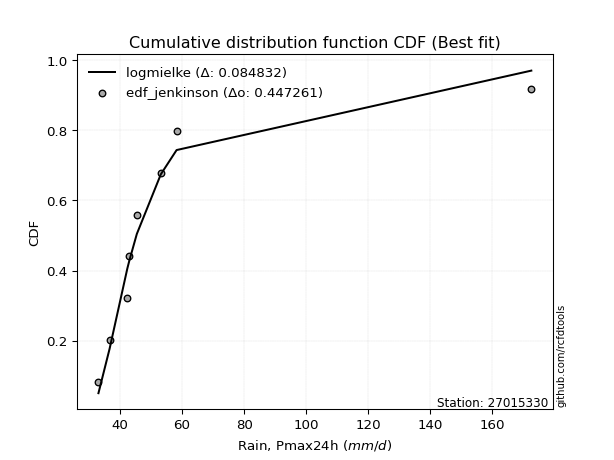</img></img>

</div>


### 11. Empirical - EDF Cunnane (1978)

Cunnane´s work in statistical hydrology has focused on the performance and evaluation of different probability distributions (such as GEV, Gumbel, Lognormal) for flood frequency estimation. _b_ is a constant, typically set to 0.4.

<div align="center">


$P=(m-b)/(n+1-2b)$


</div>


**11.1. Empirical values**

<div align="center">

|                | 0                   | 1                  | 2                   | 3                  | 4           | 5                  | 6                 | 7                  | 8                  |
|:---------------|:--------------------|:-------------------|:--------------------|:-------------------|:------------|:-------------------|:------------------|:-------------------|:-------------------|
| date           | 2019                | 2023               | 2022                | 2021               | 2020        | 2018               | 2017              | 2025               | 2024               |
| x              | 33.02               | 36.602             | 42.34               | 42.975             | 45.398      | 53.146             | 58.219            | 81.2               | 172.6              |
| m              | 1                   | 2                  | 3                   | 4                  | 5           | 6                  | 7                 | 8                  | 9                  |
| empirical_dist | edf_cunnane         | edf_cunnane        | edf_cunnane         | edf_cunnane        | edf_cunnane | edf_cunnane        | edf_cunnane       | edf_cunnane        | edf_cunnane        |
| empirical      | 0.06521739130434782 | 0.1739130434782609 | 0.28260869565217395 | 0.391304347826087  | 0.5         | 0.6086956521739131 | 0.717391304347826 | 0.8260869565217391 | 0.9347826086956522 |
| empirical_tr   | 1.069767441860465   | 1.2105263157894737 | 1.393939393939394   | 1.6428571428571428 | 2.0         | 2.555555555555556  | 3.538461538461538 | 5.75               | 15.333333333333343 |

</div>


**11.2. Kolmogorov-Smirnov fit test (sorted by Δ)**


<div align="center">

|                | 0                   | 1                   | 2                   | 3                   | 4                   | 5                   | 6                   | 7                   | 8                   | 9                   | 10                  | 11                  | 12                  | 13                  | 14                  | 15                  | 16                  | 17                  | 18                  | 19                  | 20                  | 21                  | 22                  | 23                  | 24                  | 25                  | 26                  | 27                  | 28                  | 29                  | 30                    | 31                  | 32                  | 33                  | 34                  | 35                  | 36                  | 37                  | 38                  | 39                  | 40                  | 41                  | 42                  | 43                  | 44                  | 45                  | 46                  | 47                  | 48                  | 49                  | 50                  | 51                  | 52                  | 53                  | 54                  | 55                  | 56                  | 57                  | 58                  | 59                  | 60                  | 61                  | 62                  | 63                  | 64                  | 65                  | 66                  | 67                  | 68                  | 69                  | 70                  | 71                  | 72                  | 73                  | 74                  | 75                  | 76                  | 77                  | 78                  | 79                  | 80                  | 81                  | 82                  | 83                  | 84                  | 85                  | 86                  | 87                  | 88                  | 89                  |
|:---------------|:--------------------|:--------------------|:--------------------|:--------------------|:--------------------|:--------------------|:--------------------|:--------------------|:--------------------|:--------------------|:--------------------|:--------------------|:--------------------|:--------------------|:--------------------|:--------------------|:--------------------|:--------------------|:--------------------|:--------------------|:--------------------|:--------------------|:--------------------|:--------------------|:--------------------|:--------------------|:--------------------|:--------------------|:--------------------|:--------------------|:----------------------|:--------------------|:--------------------|:--------------------|:--------------------|:--------------------|:--------------------|:--------------------|:--------------------|:--------------------|:--------------------|:--------------------|:--------------------|:--------------------|:--------------------|:--------------------|:--------------------|:--------------------|:--------------------|:--------------------|:--------------------|:--------------------|:--------------------|:--------------------|:--------------------|:--------------------|:--------------------|:--------------------|:--------------------|:--------------------|:--------------------|:--------------------|:--------------------|:--------------------|:--------------------|:--------------------|:--------------------|:--------------------|:--------------------|:--------------------|:--------------------|:--------------------|:--------------------|:--------------------|:--------------------|:--------------------|:--------------------|:--------------------|:--------------------|:--------------------|:--------------------|:--------------------|:--------------------|:--------------------|:--------------------|:--------------------|:--------------------|:--------------------|:--------------------|:--------------------|
| station        | 27015330            | 27015330            | 27015330            | 27015330            | 27015330            | 27015330            | 27015330            | 27015330            | 27015330            | 27015330            | 27015330            | 27015330            | 27015330            | 27015330            | 27015330            | 27015330            | 27015330            | 27015330            | 27015330            | 27015330            | 27015330            | 27015330            | 27015330            | 27015330            | 27015330            | 27015330            | 27015330            | 27015330            | 27015330            | 27015330            | 27015330              | 27015330            | 27015330            | 27015330            | 27015330            | 27015330            | 27015330            | 27015330            | 27015330            | 27015330            | 27015330            | 27015330            | 27015330            | 27015330            | 27015330            | 27015330            | 27015330            | 27015330            | 27015330            | 27015330            | 27015330            | 27015330            | 27015330            | 27015330            | 27015330            | 27015330            | 27015330            | 27015330            | 27015330            | 27015330            | 27015330            | 27015330            | 27015330            | 27015330            | 27015330            | 27015330            | 27015330            | 27015330            | 27015330            | 27015330            | 27015330            | 27015330            | 27015330            | 27015330            | 27015330            | 27015330            | 27015330            | 27015330            | 27015330            | 27015330            | 27015330            | 27015330            | 27015330            | 27015330            | 27015330            | 27015330            | 27015330            | 27015330            | 27015330            | 27015330            |
| empirical_dist | edf_cunnane         | edf_cunnane         | edf_cunnane         | edf_cunnane         | edf_cunnane         | edf_cunnane         | edf_cunnane         | edf_cunnane         | edf_cunnane         | edf_cunnane         | edf_cunnane         | edf_cunnane         | edf_cunnane         | edf_cunnane         | edf_cunnane         | edf_cunnane         | edf_cunnane         | edf_cunnane         | edf_cunnane         | edf_cunnane         | edf_cunnane         | edf_cunnane         | edf_cunnane         | edf_cunnane         | edf_cunnane         | edf_cunnane         | edf_cunnane         | edf_cunnane         | edf_cunnane         | edf_cunnane         | edf_cunnane           | edf_cunnane         | edf_cunnane         | edf_cunnane         | edf_cunnane         | edf_cunnane         | edf_cunnane         | edf_cunnane         | edf_cunnane         | edf_cunnane         | edf_cunnane         | edf_cunnane         | edf_cunnane         | edf_cunnane         | edf_cunnane         | edf_cunnane         | edf_cunnane         | edf_cunnane         | edf_cunnane         | edf_cunnane         | edf_cunnane         | edf_cunnane         | edf_cunnane         | edf_cunnane         | edf_cunnane         | edf_cunnane         | edf_cunnane         | edf_cunnane         | edf_cunnane         | edf_cunnane         | edf_cunnane         | edf_cunnane         | edf_cunnane         | edf_cunnane         | edf_cunnane         | edf_cunnane         | edf_cunnane         | edf_cunnane         | edf_cunnane         | edf_cunnane         | edf_cunnane         | edf_cunnane         | edf_cunnane         | edf_cunnane         | edf_cunnane         | edf_cunnane         | edf_cunnane         | edf_cunnane         | edf_cunnane         | edf_cunnane         | edf_cunnane         | edf_cunnane         | edf_cunnane         | edf_cunnane         | edf_cunnane         | edf_cunnane         | edf_cunnane         | edf_cunnane         | edf_cunnane         | edf_cunnane         |
| p_dist         | logmielke           | logalpha            | logpearson3         | loginvweibull       | loghalflogistic     | logncf              | loginvgamma         | logf                | logfisk             | logmoyal            | alpha               | mielke              | invweibull          | invgamma            | f                   | logjohnsonsu        | loginvgauss         | logt                | loghalfnorm         | pareto              | wald                | loggenexpon         | logfatiguelife      | loggumbel_r         | invgauss            | logtruncnorm        | fatiguelife         | logexponnorm        | logexpon            | logerlang           | loglaplace_asymmetric | johnsonsu           | loggenlogistic      | gibrat              | lograyleigh         | nct                 | logmaxwell          | logkstwobign        | lognct              | erlang              | logbetaprime        | logwald             | betaprime           | loggompertz         | lognakagami         | exponnorm           | laplace_asymmetric  | expon               | genexpon            | t                   | lognorm             | lognorm             | logcrystalball      | weibull_min         | logloggamma         | loglogistic         | gompertz            | moyal               | genlogistic         | fisk                | logrice             | pearson3            | loggibrat           | loghypsecant        | gumbel_r            | logchi2             | halflogistic        | loglaplace          | rayleigh            | halfnorm            | maxwell             | loggumbel_l         | kstwobign           | truncnorm           | crystalball         | norm                | logistic            | hypsecant           | rice                | laplace             | gumbel_l            | nakagami            | ncf                 | loggamma            | loggamma            | logweibull_min      | loglognorm          | gamma               | logpareto           | chi2                |
| delta          | 0.0651586645800677  | 0.0702814697017154  | 0.07679282942285826 | 0.07907441681347971 | 0.08136517221552753 | 0.08159171171525559 | 0.08159262161948816 | 0.08159301262514718 | 0.08279786288709684 | 0.08460161858168547 | 0.08778935198612864 | 0.08903451778270155 | 0.09065315730562057 | 0.0910212054727817  | 0.09128612468868047 | 0.09196572456839336 | 0.09399005139294092 | 0.09708971958227952 | 0.09718068314875383 | 0.09776585737666899 | 0.09813578363693387 | 0.09920104959395082 | 0.10027702490411494 | 0.10243038317419711 | 0.10289064183188118 | 0.10364706713830912 | 0.10626456152624641 | 0.10678726213476353 | 0.1071660672819551  | 0.10997234022207492 | 0.11067689450027507   | 0.11090300489304211 | 0.11275916782733342 | 0.12262123802778957 | 0.12447809224400952 | 0.13382672872333368 | 0.13415202343739985 | 0.13882917764582298 | 0.13885516877696769 | 0.13973886663786206 | 0.14066564793915737 | 0.14068465863351687 | 0.14612617329007577 | 0.14865840721281726 | 0.15569091112456934 | 0.1586698750700507  | 0.16021738941637875 | 0.1602192097323617  | 0.16021928049849665 | 0.16378690252199746 | 0.16433967497254598 | 0.16433967497254598 | 0.1643400390736245  | 0.16556477619288945 | 0.16664790137038488 | 0.16864181950583357 | 0.16883959557694272 | 0.17035623795100457 | 0.17213652385206696 | 0.17303152231926416 | 0.17341637202207993 | 0.17364671803872783 | 0.1739130434782609  | 0.1826024982539367  | 0.19452837757231733 | 0.1966239614891342  | 0.19732539771257995 | 0.21076976254686253 | 0.21601676887369736 | 0.21632577397828345 | 0.2278383508939371  | 0.23104468860627136 | 0.24694551348136107 | 0.25818695804595626 | 0.26209644243678565 | 0.2620964490043774  | 0.2681360271957044  | 0.27324975652761935 | 0.2903820382305739  | 0.2908115480762717  | 0.33238121702410584 | 0.34945897826475425 | 0.38009605568523586 | 0.39170746721708993 | 0.39170746721708993 | 0.4102913912521121  | 0.4149345303517574  | 0.43565092868830624 | 0.43968432441525784 | 0.6211863120897017  |
| deltao         | 0.41761268023100007 | 0.41761268023100007 | 0.41761268023100007 | 0.41761268023100007 | 0.41761268023100007 | 0.41761268023100007 | 0.41761268023100007 | 0.41761268023100007 | 0.41761268023100007 | 0.41761268023100007 | 0.41761268023100007 | 0.41761268023100007 | 0.41761268023100007 | 0.41761268023100007 | 0.41761268023100007 | 0.41761268023100007 | 0.41761268023100007 | 0.41761268023100007 | 0.41761268023100007 | 0.41761268023100007 | 0.41761268023100007 | 0.41761268023100007 | 0.41761268023100007 | 0.41761268023100007 | 0.41761268023100007 | 0.41761268023100007 | 0.41761268023100007 | 0.41761268023100007 | 0.41761268023100007 | 0.41761268023100007 | 0.41761268023100007   | 0.41761268023100007 | 0.41761268023100007 | 0.41761268023100007 | 0.41761268023100007 | 0.41761268023100007 | 0.41761268023100007 | 0.41761268023100007 | 0.41761268023100007 | 0.41761268023100007 | 0.41761268023100007 | 0.41761268023100007 | 0.41761268023100007 | 0.41761268023100007 | 0.41761268023100007 | 0.41761268023100007 | 0.41761268023100007 | 0.41761268023100007 | 0.41761268023100007 | 0.41761268023100007 | 0.41761268023100007 | 0.41761268023100007 | 0.41761268023100007 | 0.41761268023100007 | 0.41761268023100007 | 0.41761268023100007 | 0.41761268023100007 | 0.41761268023100007 | 0.41761268023100007 | 0.41761268023100007 | 0.41761268023100007 | 0.41761268023100007 | 0.41761268023100007 | 0.41761268023100007 | 0.41761268023100007 | 0.41761268023100007 | 0.41761268023100007 | 0.41761268023100007 | 0.41761268023100007 | 0.41761268023100007 | 0.41761268023100007 | 0.41761268023100007 | 0.41761268023100007 | 0.41761268023100007 | 0.41761268023100007 | 0.41761268023100007 | 0.41761268023100007 | 0.41761268023100007 | 0.41761268023100007 | 0.41761268023100007 | 0.41761268023100007 | 0.41761268023100007 | 0.41761268023100007 | 0.41761268023100007 | 0.41761268023100007 | 0.41761268023100007 | 0.41761268023100007 | 0.41761268023100007 | 0.41761268023100007 | 0.41761268023100007 |
| eval           | Δo > Δ              | Δo > Δ              | Δo > Δ              | Δo > Δ              | Δo > Δ              | Δo > Δ              | Δo > Δ              | Δo > Δ              | Δo > Δ              | Δo > Δ              | Δo > Δ              | Δo > Δ              | Δo > Δ              | Δo > Δ              | Δo > Δ              | Δo > Δ              | Δo > Δ              | Δo > Δ              | Δo > Δ              | Δo > Δ              | Δo > Δ              | Δo > Δ              | Δo > Δ              | Δo > Δ              | Δo > Δ              | Δo > Δ              | Δo > Δ              | Δo > Δ              | Δo > Δ              | Δo > Δ              | Δo > Δ                | Δo > Δ              | Δo > Δ              | Δo > Δ              | Δo > Δ              | Δo > Δ              | Δo > Δ              | Δo > Δ              | Δo > Δ              | Δo > Δ              | Δo > Δ              | Δo > Δ              | Δo > Δ              | Δo > Δ              | Δo > Δ              | Δo > Δ              | Δo > Δ              | Δo > Δ              | Δo > Δ              | Δo > Δ              | Δo > Δ              | Δo > Δ              | Δo > Δ              | Δo > Δ              | Δo > Δ              | Δo > Δ              | Δo > Δ              | Δo > Δ              | Δo > Δ              | Δo > Δ              | Δo > Δ              | Δo > Δ              | Δo > Δ              | Δo > Δ              | Δo > Δ              | Δo > Δ              | Δo > Δ              | Δo > Δ              | Δo > Δ              | Δo > Δ              | Δo > Δ              | Δo > Δ              | Δo > Δ              | Δo > Δ              | Δo > Δ              | Δo > Δ              | Δo > Δ              | Δo > Δ              | Δo > Δ              | Δo > Δ              | Δo > Δ              | Δo > Δ              | Δo > Δ              | Δo > Δ              | Δo > Δ              | Δo > Δ              | Δo > Δ              | Δo <= Δ             | Δo <= Δ             | Δo <= Δ             |
| fit            | 1                   | 1                   | 1                   | 1                   | 1                   | 1                   | 1                   | 1                   | 1                   | 1                   | 1                   | 1                   | 1                   | 1                   | 1                   | 1                   | 1                   | 1                   | 1                   | 1                   | 1                   | 1                   | 1                   | 1                   | 1                   | 1                   | 1                   | 1                   | 1                   | 1                   | 1                     | 1                   | 1                   | 1                   | 1                   | 1                   | 1                   | 1                   | 1                   | 1                   | 1                   | 1                   | 1                   | 1                   | 1                   | 1                   | 1                   | 1                   | 1                   | 1                   | 1                   | 1                   | 1                   | 1                   | 1                   | 1                   | 1                   | 1                   | 1                   | 1                   | 1                   | 1                   | 1                   | 1                   | 1                   | 1                   | 1                   | 1                   | 1                   | 1                   | 1                   | 1                   | 1                   | 1                   | 1                   | 1                   | 1                   | 1                   | 1                   | 1                   | 1                   | 1                   | 1                   | 1                   | 1                   | 1                   | 1                   | 0                   | 0                   | 0                   |
| n              | 9                   | 9                   | 9                   | 9                   | 9                   | 9                   | 9                   | 9                   | 9                   | 9                   | 9                   | 9                   | 9                   | 9                   | 9                   | 9                   | 9                   | 9                   | 9                   | 9                   | 9                   | 9                   | 9                   | 9                   | 9                   | 9                   | 9                   | 9                   | 9                   | 9                   | 9                     | 9                   | 9                   | 9                   | 9                   | 9                   | 9                   | 9                   | 9                   | 9                   | 9                   | 9                   | 9                   | 9                   | 9                   | 9                   | 9                   | 9                   | 9                   | 9                   | 9                   | 9                   | 9                   | 9                   | 9                   | 9                   | 9                   | 9                   | 9                   | 9                   | 9                   | 9                   | 9                   | 9                   | 9                   | 9                   | 9                   | 9                   | 9                   | 9                   | 9                   | 9                   | 9                   | 9                   | 9                   | 9                   | 9                   | 9                   | 9                   | 9                   | 9                   | 9                   | 9                   | 9                   | 9                   | 9                   | 9                   | 9                   | 9                   | 9                   |
| best_fit       | 1                   | 0                   | 0                   | 0                   | 0                   | 0                   | 0                   | 0                   | 0                   | 0                   | 0                   | 0                   | 0                   | 0                   | 0                   | 0                   | 0                   | 0                   | 0                   | 0                   | 0                   | 0                   | 0                   | 0                   | 0                   | 0                   | 0                   | 0                   | 0                   | 0                   | 0                     | 0                   | 0                   | 0                   | 0                   | 0                   | 0                   | 0                   | 0                   | 0                   | 0                   | 0                   | 0                   | 0                   | 0                   | 0                   | 0                   | 0                   | 0                   | 0                   | 0                   | 0                   | 0                   | 0                   | 0                   | 0                   | 0                   | 0                   | 0                   | 0                   | 0                   | 0                   | 0                   | 0                   | 0                   | 0                   | 0                   | 0                   | 0                   | 0                   | 0                   | 0                   | 0                   | 0                   | 0                   | 0                   | 0                   | 0                   | 0                   | 0                   | 0                   | 0                   | 0                   | 0                   | 0                   | 0                   | 0                   | 0                   | 0                   | 0                   |
| best_fit_sort  | 1                   | 2                   | 3                   | 4                   | 5                   | 6                   | 7                   | 8                   | 9                   | 10                  | 11                  | 12                  | 13                  | 14                  | 15                  | 16                  | 17                  | 18                  | 19                  | 20                  | 21                  | 22                  | 23                  | 24                  | 25                  | 26                  | 27                  | 28                  | 29                  | 30                  | 31                    | 32                  | 33                  | 34                  | 35                  | 36                  | 37                  | 38                  | 39                  | 40                  | 41                  | 42                  | 43                  | 44                  | 45                  | 46                  | 47                  | 48                  | 49                  | 50                  | 51                  | 52                  | 53                  | 54                  | 55                  | 56                  | 57                  | 58                  | 59                  | 60                  | 61                  | 62                  | 63                  | 64                  | 65                  | 66                  | 67                  | 68                  | 69                  | 70                  | 71                  | 72                  | 73                  | 74                  | 75                  | 76                  | 77                  | 78                  | 79                  | 80                  | 81                  | 82                  | 83                  | 84                  | 85                  | 86                  | 87                  | 88                  | 89                  | 90                  |

</div>


<div align="center">

</img>

</div>


**11.3. Best fit**

<div align="center">

|   id |   station | empirical_dist   | p_dist    |     delta |   deltao | eval   |   fit |   n |   best_fit |   best_fit_sort |
|-----:|----------:|:-----------------|:----------|----------:|---------:|:-------|------:|----:|-----------:|----------------:|
|    0 |  27015330 | edf_cunnane      | logmielke | 0.0651587 | 0.417613 | Δo > Δ |     1 |   9 |          1 |               1 |

</div>


<div align="center">

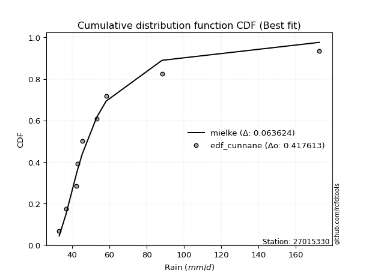</img>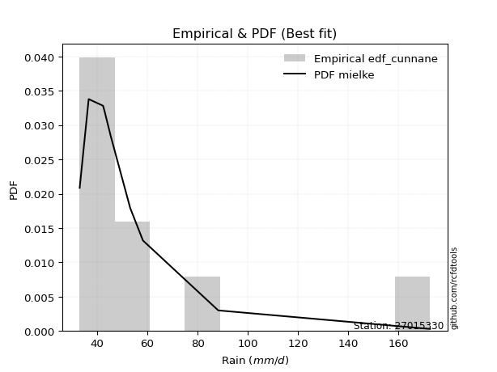</img>

</div>


### 12. Empirical - EDF Adamowski (1981)

The Adamowski formula in hydrology refers to a specific plotting position formula used for estimating the non-parametric empirical distribution of hydrological events (like flood peaks) to calculate their return periods. This formula provides an alternative to traditional parametric methods (like the Gumbel or Log Pearson Type III distributions). 

<div align="center">


$P=(m-0.25)/(n+0.5)$


</div>


**12.1. Empirical values**

<div align="center">

|                | 0                   | 1                   | 2                  | 3                   | 4             | 5                  | 6                  | 7                  | 8                  |
|:---------------|:--------------------|:--------------------|:-------------------|:--------------------|:--------------|:-------------------|:-------------------|:-------------------|:-------------------|
| date           | 2019                | 2023                | 2022               | 2021                | 2020          | 2018               | 2017               | 2025               | 2024               |
| x              | 33.02               | 36.602              | 42.34              | 42.975              | 45.398        | 53.146             | 58.219             | 81.2               | 172.6              |
| m              | 1                   | 2                   | 3                  | 4                   | 5             | 6                  | 7                  | 8                  | 9                  |
| empirical_dist | edf_adamowski       | edf_adamowski       | edf_adamowski      | edf_adamowski       | edf_adamowski | edf_adamowski      | edf_adamowski      | edf_adamowski      | edf_adamowski      |
| empirical      | 0.07894736842105263 | 0.18421052631578946 | 0.2894736842105263 | 0.39473684210526316 | 0.5           | 0.6052631578947368 | 0.7105263157894737 | 0.8157894736842105 | 0.9210526315789473 |
| empirical_tr   | 1.0857142857142856  | 1.2258064516129032  | 1.4074074074074074 | 1.6521739130434783  | 2.0           | 2.533333333333333  | 3.4545454545454546 | 5.428571428571428  | 12.666666666666663 |

</div>


**12.2. Kolmogorov-Smirnov fit test (sorted by Δ)**


<div align="center">

|                | 0                   | 1                   | 2                   | 3                   | 4                   | 5                   | 6                   | 7                   | 8                   | 9                   | 10                  | 11                  | 12                  | 13                  | 14                  | 15                  | 16                  | 17                  | 18                  | 19                  | 20                  | 21                  | 22                  | 23                  | 24                  | 25                  | 26                  | 27                  | 28                  | 29                  | 30                  | 31                    | 32                  | 33                  | 34                  | 35                  | 36                  | 37                  | 38                  | 39                  | 40                  | 41                  | 42                  | 43                  | 44                  | 45                  | 46                  | 47                  | 48                  | 49                  | 50                  | 51                  | 52                  | 53                  | 54                  | 55                  | 56                  | 57                  | 58                  | 59                  | 60                  | 61                  | 62                  | 63                  | 64                  | 65                  | 66                  | 67                  | 68                  | 69                  | 70                  | 71                  | 72                  | 73                  | 74                  | 75                  | 76                  | 77                  | 78                  | 79                  | 80                  | 81                  | 82                  | 83                  | 84                  | 85                  | 86                  | 87                  | 88                  | 89                  |
|:---------------|:--------------------|:--------------------|:--------------------|:--------------------|:--------------------|:--------------------|:--------------------|:--------------------|:--------------------|:--------------------|:--------------------|:--------------------|:--------------------|:--------------------|:--------------------|:--------------------|:--------------------|:--------------------|:--------------------|:--------------------|:--------------------|:--------------------|:--------------------|:--------------------|:--------------------|:--------------------|:--------------------|:--------------------|:--------------------|:--------------------|:--------------------|:----------------------|:--------------------|:--------------------|:--------------------|:--------------------|:--------------------|:--------------------|:--------------------|:--------------------|:--------------------|:--------------------|:--------------------|:--------------------|:--------------------|:--------------------|:--------------------|:--------------------|:--------------------|:--------------------|:--------------------|:--------------------|:--------------------|:--------------------|:--------------------|:--------------------|:--------------------|:--------------------|:--------------------|:--------------------|:--------------------|:--------------------|:--------------------|:--------------------|:--------------------|:--------------------|:--------------------|:--------------------|:--------------------|:--------------------|:--------------------|:--------------------|:--------------------|:--------------------|:--------------------|:--------------------|:--------------------|:--------------------|:--------------------|:--------------------|:--------------------|:--------------------|:--------------------|:--------------------|:--------------------|:--------------------|:--------------------|:--------------------|:--------------------|:--------------------|
| station        | 27015330            | 27015330            | 27015330            | 27015330            | 27015330            | 27015330            | 27015330            | 27015330            | 27015330            | 27015330            | 27015330            | 27015330            | 27015330            | 27015330            | 27015330            | 27015330            | 27015330            | 27015330            | 27015330            | 27015330            | 27015330            | 27015330            | 27015330            | 27015330            | 27015330            | 27015330            | 27015330            | 27015330            | 27015330            | 27015330            | 27015330            | 27015330              | 27015330            | 27015330            | 27015330            | 27015330            | 27015330            | 27015330            | 27015330            | 27015330            | 27015330            | 27015330            | 27015330            | 27015330            | 27015330            | 27015330            | 27015330            | 27015330            | 27015330            | 27015330            | 27015330            | 27015330            | 27015330            | 27015330            | 27015330            | 27015330            | 27015330            | 27015330            | 27015330            | 27015330            | 27015330            | 27015330            | 27015330            | 27015330            | 27015330            | 27015330            | 27015330            | 27015330            | 27015330            | 27015330            | 27015330            | 27015330            | 27015330            | 27015330            | 27015330            | 27015330            | 27015330            | 27015330            | 27015330            | 27015330            | 27015330            | 27015330            | 27015330            | 27015330            | 27015330            | 27015330            | 27015330            | 27015330            | 27015330            | 27015330            |
| empirical_dist | edf_adamowski       | edf_adamowski       | edf_adamowski       | edf_adamowski       | edf_adamowski       | edf_adamowski       | edf_adamowski       | edf_adamowski       | edf_adamowski       | edf_adamowski       | edf_adamowski       | edf_adamowski       | edf_adamowski       | edf_adamowski       | edf_adamowski       | edf_adamowski       | edf_adamowski       | edf_adamowski       | edf_adamowski       | edf_adamowski       | edf_adamowski       | edf_adamowski       | edf_adamowski       | edf_adamowski       | edf_adamowski       | edf_adamowski       | edf_adamowski       | edf_adamowski       | edf_adamowski       | edf_adamowski       | edf_adamowski       | edf_adamowski         | edf_adamowski       | edf_adamowski       | edf_adamowski       | edf_adamowski       | edf_adamowski       | edf_adamowski       | edf_adamowski       | edf_adamowski       | edf_adamowski       | edf_adamowski       | edf_adamowski       | edf_adamowski       | edf_adamowski       | edf_adamowski       | edf_adamowski       | edf_adamowski       | edf_adamowski       | edf_adamowski       | edf_adamowski       | edf_adamowski       | edf_adamowski       | edf_adamowski       | edf_adamowski       | edf_adamowski       | edf_adamowski       | edf_adamowski       | edf_adamowski       | edf_adamowski       | edf_adamowski       | edf_adamowski       | edf_adamowski       | edf_adamowski       | edf_adamowski       | edf_adamowski       | edf_adamowski       | edf_adamowski       | edf_adamowski       | edf_adamowski       | edf_adamowski       | edf_adamowski       | edf_adamowski       | edf_adamowski       | edf_adamowski       | edf_adamowski       | edf_adamowski       | edf_adamowski       | edf_adamowski       | edf_adamowski       | edf_adamowski       | edf_adamowski       | edf_adamowski       | edf_adamowski       | edf_adamowski       | edf_adamowski       | edf_adamowski       | edf_adamowski       | edf_adamowski       | edf_adamowski       |
| p_dist         | logmielke           | logalpha            | loginvweibull       | loghalflogistic     | logncf              | loginvgamma         | logf                | logpearson3         | logfisk             | alpha               | mielke              | invweibull          | invgamma            | f                   | logmoyal            | logjohnsonsu        | loginvgauss         | loghalfnorm         | pareto              | wald                | loggenexpon         | logfatiguelife      | invgauss            | logtruncnorm        | fatiguelife         | logexponnorm        | logexpon            | loggumbel_r         | logerlang           | johnsonsu           | logt                | loglaplace_asymmetric | loggenlogistic      | lograyleigh         | gibrat              | logmaxwell          | erlang              | nct                 | logbetaprime        | logkstwobign        | lognct              | betaprime           | loggompertz         | lognakagami         | logwald             | lognorm             | lognorm             | logcrystalball      | exponnorm           | weibull_min         | logloggamma         | pearson3            | laplace_asymmetric  | expon               | genexpon            | moyal               | fisk                | t                   | loglogistic         | gompertz            | genlogistic         | logrice             | loghypsecant        | halflogistic        | loggibrat           | gumbel_r            | logchi2             | halfnorm            | rayleigh            | loglaplace          | maxwell             | loggumbel_l         | kstwobign           | truncnorm           | crystalball         | norm                | logistic            | hypsecant           | rice                | laplace             | gumbel_l            | nakagami            | ncf                 | loggamma            | loggamma            | logweibull_min      | loglognorm          | gamma               | logpareto           | chi2                |
| delta          | 0.06008674703093558 | 0.06341648114336301 | 0.07220942825512733 | 0.07450018365717515 | 0.07472672315690321 | 0.07472763306113578 | 0.0747280240667948  | 0.07564900000215613 | 0.07593287432874446 | 0.08092436342777626 | 0.08216952922434917 | 0.08378816874726819 | 0.08415621691442932 | 0.08442113613032809 | 0.08460161858168547 | 0.08510073601004098 | 0.08712506283458854 | 0.09031569459040145 | 0.0909008688183166  | 0.09127079507858149 | 0.09233606103559844 | 0.09341203634576256 | 0.0960256532735288  | 0.09678207857995674 | 0.09939957296789403 | 0.09992227357641115 | 0.10030107872360272 | 0.10243038317419711 | 0.10310735166372254 | 0.10403801633468973 | 0.10738720241980815 | 0.11067689450027507   | 0.11275916782733342 | 0.11761310368565714 | 0.12262123802778957 | 0.12728703487904747 | 0.13287387807950968 | 0.13382672872333368 | 0.13731301223428816 | 0.13882917764582298 | 0.13885516877696769 | 0.14612617329007577 | 0.14865840721281726 | 0.14882592256621696 | 0.15098214147104544 | 0.1574746864141936  | 0.1574746864141936  | 0.1574750505152721  | 0.1586698750700507  | 0.15869978763453707 | 0.1597829128120325  | 0.15991674092202304 | 0.16021738941637875 | 0.1602192097323617  | 0.16021928049849665 | 0.16216896920356128 | 0.16616653376091178 | 0.1672193968011737  | 0.16864181950583357 | 0.16883959557694272 | 0.17213652385206696 | 0.17341637202207993 | 0.1826024982539367  | 0.18359542059587516 | 0.18421052631578946 | 0.18766338901396495 | 0.1897589729307818  | 0.20259579686157866 | 0.20915178031534498 | 0.21076976254686253 | 0.22097336233558473 | 0.22417970004791898 | 0.2400805249230087  | 0.2513219694876039  | 0.25523145387843327 | 0.255231460446025   | 0.261271038637352   | 0.26638476796926697 | 0.2835170496722215  | 0.2839465595179193  | 0.32551622846575345 | 0.3391614954272256  | 0.3663660785685311  | 0.38484247865873755 | 0.38484247865873755 | 0.40342640269375973 | 0.4046370475142288  | 0.42878594012995386 | 0.4293868415777292  | 0.610888829252173   |
| deltao         | 0.41761268023100007 | 0.41761268023100007 | 0.41761268023100007 | 0.41761268023100007 | 0.41761268023100007 | 0.41761268023100007 | 0.41761268023100007 | 0.41761268023100007 | 0.41761268023100007 | 0.41761268023100007 | 0.41761268023100007 | 0.41761268023100007 | 0.41761268023100007 | 0.41761268023100007 | 0.41761268023100007 | 0.41761268023100007 | 0.41761268023100007 | 0.41761268023100007 | 0.41761268023100007 | 0.41761268023100007 | 0.41761268023100007 | 0.41761268023100007 | 0.41761268023100007 | 0.41761268023100007 | 0.41761268023100007 | 0.41761268023100007 | 0.41761268023100007 | 0.41761268023100007 | 0.41761268023100007 | 0.41761268023100007 | 0.41761268023100007 | 0.41761268023100007   | 0.41761268023100007 | 0.41761268023100007 | 0.41761268023100007 | 0.41761268023100007 | 0.41761268023100007 | 0.41761268023100007 | 0.41761268023100007 | 0.41761268023100007 | 0.41761268023100007 | 0.41761268023100007 | 0.41761268023100007 | 0.41761268023100007 | 0.41761268023100007 | 0.41761268023100007 | 0.41761268023100007 | 0.41761268023100007 | 0.41761268023100007 | 0.41761268023100007 | 0.41761268023100007 | 0.41761268023100007 | 0.41761268023100007 | 0.41761268023100007 | 0.41761268023100007 | 0.41761268023100007 | 0.41761268023100007 | 0.41761268023100007 | 0.41761268023100007 | 0.41761268023100007 | 0.41761268023100007 | 0.41761268023100007 | 0.41761268023100007 | 0.41761268023100007 | 0.41761268023100007 | 0.41761268023100007 | 0.41761268023100007 | 0.41761268023100007 | 0.41761268023100007 | 0.41761268023100007 | 0.41761268023100007 | 0.41761268023100007 | 0.41761268023100007 | 0.41761268023100007 | 0.41761268023100007 | 0.41761268023100007 | 0.41761268023100007 | 0.41761268023100007 | 0.41761268023100007 | 0.41761268023100007 | 0.41761268023100007 | 0.41761268023100007 | 0.41761268023100007 | 0.41761268023100007 | 0.41761268023100007 | 0.41761268023100007 | 0.41761268023100007 | 0.41761268023100007 | 0.41761268023100007 | 0.41761268023100007 |
| eval           | Δo > Δ              | Δo > Δ              | Δo > Δ              | Δo > Δ              | Δo > Δ              | Δo > Δ              | Δo > Δ              | Δo > Δ              | Δo > Δ              | Δo > Δ              | Δo > Δ              | Δo > Δ              | Δo > Δ              | Δo > Δ              | Δo > Δ              | Δo > Δ              | Δo > Δ              | Δo > Δ              | Δo > Δ              | Δo > Δ              | Δo > Δ              | Δo > Δ              | Δo > Δ              | Δo > Δ              | Δo > Δ              | Δo > Δ              | Δo > Δ              | Δo > Δ              | Δo > Δ              | Δo > Δ              | Δo > Δ              | Δo > Δ                | Δo > Δ              | Δo > Δ              | Δo > Δ              | Δo > Δ              | Δo > Δ              | Δo > Δ              | Δo > Δ              | Δo > Δ              | Δo > Δ              | Δo > Δ              | Δo > Δ              | Δo > Δ              | Δo > Δ              | Δo > Δ              | Δo > Δ              | Δo > Δ              | Δo > Δ              | Δo > Δ              | Δo > Δ              | Δo > Δ              | Δo > Δ              | Δo > Δ              | Δo > Δ              | Δo > Δ              | Δo > Δ              | Δo > Δ              | Δo > Δ              | Δo > Δ              | Δo > Δ              | Δo > Δ              | Δo > Δ              | Δo > Δ              | Δo > Δ              | Δo > Δ              | Δo > Δ              | Δo > Δ              | Δo > Δ              | Δo > Δ              | Δo > Δ              | Δo > Δ              | Δo > Δ              | Δo > Δ              | Δo > Δ              | Δo > Δ              | Δo > Δ              | Δo > Δ              | Δo > Δ              | Δo > Δ              | Δo > Δ              | Δo > Δ              | Δo > Δ              | Δo > Δ              | Δo > Δ              | Δo > Δ              | Δo > Δ              | Δo <= Δ             | Δo <= Δ             | Δo <= Δ             |
| fit            | 1                   | 1                   | 1                   | 1                   | 1                   | 1                   | 1                   | 1                   | 1                   | 1                   | 1                   | 1                   | 1                   | 1                   | 1                   | 1                   | 1                   | 1                   | 1                   | 1                   | 1                   | 1                   | 1                   | 1                   | 1                   | 1                   | 1                   | 1                   | 1                   | 1                   | 1                   | 1                     | 1                   | 1                   | 1                   | 1                   | 1                   | 1                   | 1                   | 1                   | 1                   | 1                   | 1                   | 1                   | 1                   | 1                   | 1                   | 1                   | 1                   | 1                   | 1                   | 1                   | 1                   | 1                   | 1                   | 1                   | 1                   | 1                   | 1                   | 1                   | 1                   | 1                   | 1                   | 1                   | 1                   | 1                   | 1                   | 1                   | 1                   | 1                   | 1                   | 1                   | 1                   | 1                   | 1                   | 1                   | 1                   | 1                   | 1                   | 1                   | 1                   | 1                   | 1                   | 1                   | 1                   | 1                   | 1                   | 0                   | 0                   | 0                   |
| n              | 9                   | 9                   | 9                   | 9                   | 9                   | 9                   | 9                   | 9                   | 9                   | 9                   | 9                   | 9                   | 9                   | 9                   | 9                   | 9                   | 9                   | 9                   | 9                   | 9                   | 9                   | 9                   | 9                   | 9                   | 9                   | 9                   | 9                   | 9                   | 9                   | 9                   | 9                   | 9                     | 9                   | 9                   | 9                   | 9                   | 9                   | 9                   | 9                   | 9                   | 9                   | 9                   | 9                   | 9                   | 9                   | 9                   | 9                   | 9                   | 9                   | 9                   | 9                   | 9                   | 9                   | 9                   | 9                   | 9                   | 9                   | 9                   | 9                   | 9                   | 9                   | 9                   | 9                   | 9                   | 9                   | 9                   | 9                   | 9                   | 9                   | 9                   | 9                   | 9                   | 9                   | 9                   | 9                   | 9                   | 9                   | 9                   | 9                   | 9                   | 9                   | 9                   | 9                   | 9                   | 9                   | 9                   | 9                   | 9                   | 9                   | 9                   |
| best_fit       | 1                   | 0                   | 0                   | 0                   | 0                   | 0                   | 0                   | 0                   | 0                   | 0                   | 0                   | 0                   | 0                   | 0                   | 0                   | 0                   | 0                   | 0                   | 0                   | 0                   | 0                   | 0                   | 0                   | 0                   | 0                   | 0                   | 0                   | 0                   | 0                   | 0                   | 0                   | 0                     | 0                   | 0                   | 0                   | 0                   | 0                   | 0                   | 0                   | 0                   | 0                   | 0                   | 0                   | 0                   | 0                   | 0                   | 0                   | 0                   | 0                   | 0                   | 0                   | 0                   | 0                   | 0                   | 0                   | 0                   | 0                   | 0                   | 0                   | 0                   | 0                   | 0                   | 0                   | 0                   | 0                   | 0                   | 0                   | 0                   | 0                   | 0                   | 0                   | 0                   | 0                   | 0                   | 0                   | 0                   | 0                   | 0                   | 0                   | 0                   | 0                   | 0                   | 0                   | 0                   | 0                   | 0                   | 0                   | 0                   | 0                   | 0                   |
| best_fit_sort  | 1                   | 2                   | 3                   | 4                   | 5                   | 6                   | 7                   | 8                   | 9                   | 10                  | 11                  | 12                  | 13                  | 14                  | 15                  | 16                  | 17                  | 18                  | 19                  | 20                  | 21                  | 22                  | 23                  | 24                  | 25                  | 26                  | 27                  | 28                  | 29                  | 30                  | 31                  | 32                    | 33                  | 34                  | 35                  | 36                  | 37                  | 38                  | 39                  | 40                  | 41                  | 42                  | 43                  | 44                  | 45                  | 46                  | 47                  | 48                  | 49                  | 50                  | 51                  | 52                  | 53                  | 54                  | 55                  | 56                  | 57                  | 58                  | 59                  | 60                  | 61                  | 62                  | 63                  | 64                  | 65                  | 66                  | 67                  | 68                  | 69                  | 70                  | 71                  | 72                  | 73                  | 74                  | 75                  | 76                  | 77                  | 78                  | 79                  | 80                  | 81                  | 82                  | 83                  | 84                  | 85                  | 86                  | 87                  | 88                  | 89                  | 90                  |

</div>


<div align="center">

</img>

</div>


**12.3. Best fit**

<div align="center">

|   id |   station | empirical_dist   | p_dist    |     delta |   deltao | eval   |   fit |   n |   best_fit |   best_fit_sort |
|-----:|----------:|:-----------------|:----------|----------:|---------:|:-------|------:|----:|-----------:|----------------:|
|    0 |  27015330 | edf_adamowski    | logmielke | 0.0600867 | 0.417613 | Δo > Δ |     1 |   9 |          1 |               1 |

</div>


<div align="center">

</img></img>

</div>


## C. Best fit & Estimate extreme values for specific return periods - Tr


### 1. Best fit (ordered by delta Δ)

<div align="center">

|   id |   station | empirical_dist   | p_dist    |     delta |   deltao | eval   |   fit |   n |   best_fit |   best_fit_sort |
|-----:|----------:|:-----------------|:----------|----------:|---------:|:-------|------:|----:|-----------:|----------------:|
|    0 |  27015330 | edf_adamowski    | logmielke | 0.0600867 | 0.417613 | Δo > Δ |     1 |   9 |          1 |               1 |
|    1 |  27015330 | edf_weibull      | logalpha  | 0.060428  | 0.417613 | Δo > Δ |     1 |   9 |          1 |               2 |
|    2 |  27015330 | edf_chegodayev   | logmielke | 0.0605333 | 0.417613 | Δo > Δ |     1 |   9 |          1 |               3 |
|    3 |  27015330 | edf_jenkinson    | logmielke | 0.060987  | 0.417613 | Δo > Δ |     1 |   9 |          1 |               4 |
|    4 |  27015330 | edf_beard        | logmielke | 0.060987  | 0.417613 | Δo > Δ |     1 |   9 |          1 |               5 |
|    5 |  27015330 | edf_filliben     | logmielke | 0.0613285 | 0.417613 | Δo > Δ |     1 |   9 |          1 |               6 |
|    6 |  27015330 | edf_tukey        | logmielke | 0.0620531 | 0.417613 | Δo > Δ |     1 |   9 |          1 |               7 |
|    7 |  27015330 | edf_blom         | logmielke | 0.0639836 | 0.417613 | Δo > Δ |     1 |   9 |          1 |               8 |
|    8 |  27015330 | edf_cunnane      | logmielke | 0.0651587 | 0.417613 | Δo > Δ |     1 |   9 |          1 |               9 |
|    9 |  27015330 | edf_gringorten   | logmielke | 0.0670656 | 0.417613 | Δo > Δ |     1 |   9 |          1 |              10 |
|   10 |  27015330 | edf_hazen        | logmielke | 0.0699896 | 0.417613 | Δo > Δ |     1 |   9 |          1 |              11 |
|   11 |  27015330 | edf_california   | logt      | 0.0810635 | 0.417613 | Δo > Δ |     1 |   9 |          1 |              12 |

</div>

:file_folder:Tables: [bestfit_27015330.csv](table/bestfit_27015330.csv) | [extreme_27015330.csv](table/extreme_27015330.csv)


### 2. Extreme values

In hydrology, a return period (or recurrence interval $Tr$) is the statistical average time between extreme events like floods or droughts of a specific magnitude, indicating how rare an event is, with a 100-year flood, for example, having a 1% chance of occurring in any given year, not that it happens exactly every century. It is a key tool for infrastructure design (like bridges or dams) and risk assessment, calculated from historical data to determine the probability of future events, although it is important to remember it is statistical average, and events can cluster or be missed.

> risk_rate: assuming the return period as the project useful life.

|   id |      tr |   prob_l |     prob_g |     alpha |   betaprime |     chi2 |   crystalball |   erlang |    expon |   exponnorm |         f |   fatiguelife |        fisk |    gamma |   genexpon |   genlogistic |   gibrat |   gompertz |   gumbel_l |   gumbel_r |   halflogistic |   halfnorm |   hypsecant |   invgamma |   invgauss |   invweibull |   johnsonsu |   kstwobign |   laplace |   laplace_asymmetric |   loggamma |   logistic |   lognorm |   maxwell |    mielke |    moyal |   nakagami |      ncf |      nct |     norm |   pareto |   pearson3 |   rayleigh |     rice |         t |   truncnorm |     wald |   weibull_min |        logalpha |   logbetaprime |          logchi2 |   logcrystalball |   logerlang |   logexpon |   logexponnorm |       logf |   logfatiguelife |          logfisk |   loggenexpon |   loggenlogistic |   loggibrat |   loggompertz |   loggumbel_l |   loggumbel_r |   loghalflogistic |   loghalfnorm |   loghypsecant |   loginvgamma |   loginvgauss |   loginvweibull |   logjohnsonsu |   logkstwobign |   loglaplace |   loglaplace_asymmetric |   logloggamma |   loglogistic |    loglognorm |   logmaxwell |   logmielke |   logmoyal |   lognakagami |     logncf |   lognct |     logpareto |   logpearson3 |   lograyleigh |   logrice |       logt |   logtruncnorm |   logwald |   logweibull_min |   station |   n |   risk_rate |
|-----:|--------:|---------:|-----------:|----------:|------------:|---------:|--------------:|---------:|---------:|------------:|----------:|--------------:|------------:|---------:|-----------:|--------------:|---------:|-----------:|-----------:|-----------:|---------------:|-----------:|------------:|-----------:|-----------:|-------------:|------------:|------------:|----------:|---------------------:|-----------:|-----------:|----------:|----------:|----------:|---------:|-----------:|---------:|---------:|---------:|---------:|-----------:|-----------:|---------:|----------:|------------:|---------:|--------------:|----------------:|---------------:|-----------------:|-----------------:|------------:|-----------:|---------------:|-----------:|-----------------:|-----------------:|--------------:|-----------------:|------------:|--------------:|--------------:|--------------:|------------------:|--------------:|---------------:|--------------:|--------------:|----------------:|---------------:|---------------:|-------------:|------------------------:|--------------:|--------------:|--------------:|-------------:|------------:|-----------:|--------------:|-----------:|---------:|--------------:|--------------:|--------------:|----------:|-----------:|---------------:|----------:|-----------------:|----------:|----:|------------:|
|    0 |    2    | 0.5      | 0.5        |   46.7704 |     53.4005 |  33.145  |       62.8333 |  45.5328 |  53.685  |     53.5914 |   46.8889 |       47.5751 |     45.1638 |  34.3383 |    53.685  |       55.1155 |  50.4991 |    54.3515 |    69.584  |    56.0827 |        52.7266 |    54.422  |     62.8333 |    46.8996 |    47.0042 |      46.8562 |     46.6954 |     60.3901 |   62.8333 |              53.6849 |    36.3184 |    62.8333 |   54.6235 |   59.3189 |   46.976  |  53.9033 |    35.7399 |  39.4578 |  51.8258 |  62.8333 |  47.2233 |    50.1244 |    58.0725 |  64.2926 |   44.0592 |     61.4337 |  49.5132 |       53.7302 |    47.199       |        53.2165 |     55.5089      |          54.6236 |     46.8472 |    46.8059 |        46.8394 |    46.9949 |          46.7635 |     46.8543      |       47.1355 |          50.0131 |     47.3223 |       53.0196 |       59.0855 |       50.4985 |           48.5652 |       49.5324 |        54.6235 |       46.9949 |       46.8503 |         46.9867 |        46.8404 |        51.7818 |      54.6235 |                 49.3053 |       54.718  |       54.6235 |  33.3182      |      52.4357 |     47.6787 |    49.2345 |       52.2387 |    46.995  |  52.906  |  33.4554      |       49.112  |       51.6809 |   54.3026 |    46.191  |        46.8132 |   46.7843 |          35.9967 |  27015330 |   9 |    0.75     |
|    1 |    2.33 | 0.570815 | 0.429185   |   49.9611 |     57.8578 |  33.3372 |       70.1661 |  49.0532 |  58.2382 |     58.1314 |   50.2422 |       52.0992 |     51.581  |  35.667  |    58.2382 |       59.4492 |  54.2136 |    59.0515 |    75.9636 |    62.8773 |        59.7126 |    62.3359 |     68.7017 |    50.2556 |    50.8622 |      50.1743 |     50.5201 |     65.8545 |   67.2708 |              58.238  |    38.1115 |    69.294  |   59.4869 |   66.9372 |   50.2816 |  60.3353 |    39.0634 |  48.8852 |  55.7928 |  70.1661 |  51.0026 |    56.3732 |    65.8034 |  70.426  |   45.8158 |     67.6925 |  54.3214 |       60.0546 |    50.1996      |        57.8096 |     66.2021      |          59.4869 |     50.745  |    50.5459 |        50.5976 |    50.1467 |          50.2717 |     49.9655      |       50.8867 |          53.394  |     49.4118 |       57.5453 |       63.6366 |       54.6515 |           52.6763 |       54.3084 |        58.4822 |       50.1467 |       50.2402 |         50.0679 |        50.1592 |        55.6892 |      57.5169 |                 52.5145 |       59.6775 |       58.8865 |  35.1464      |      57.2942 |     50.8186 |    53.0592 |       59.2287 |    50.1468 |  57.2986 |  34.5221      |       53.2386 |       56.5436 |   58.6263 |    48.488  |        50.3684 |   49.4752 |          37.5364 |  27015330 |   9 |    0.729209 |
|    2 |    5    | 0.8      | 0.2        |   71.9437 |     79.3445 |  36.7811 |       97.4166 |  67.9805 |  81.0027 |     80.8305 |   72.0991 |       80.2033 |    128.518  |  50.8407 |    81.0027 |       78.2755 |  75.5989 |    82.5503 |    96.5733 |    92.3962 |        91.3226 |    95.8031 |     92.2413 |    72.1439 |    75.946  |      72.0746 |     75.5884 |     89.0661 |   89.457  |              81.0024 |    53.206  |    94.2396 |   81.6728 |   96.922  |   71.2193 |  90.1288 |    80.099  |  97.6517 |  75.8049 |  97.4166 |  74.3955 |    87.7317 |    96.7538 |  94.9808 |   54.9644 |     98.9722 |  81.2376 |       96.9662 |    69.125       |        79.6427 |    182.278       |          81.6728 |     75.9709 |    74.2343 |        74.4244 |    70.4023 |          72.9695 |     71.2118      |       74.2093 |          70.9424 |     63.3677 |       80.6845 |       80.8756 |       77.0401 |           76.084  |       80.1542 |        76.9013 |       70.4022 |       72.1431 |         69.908  |        71.7507 |        75.8537 |      74.4508 |                 71.9785 |       82.3204 |       78.7097 |   7.28739e+37 |      81.2042 |     69.4295 |    75.0349 |      106.322  |    70.4023 |  78.5005 |   1.36854e+10 |       76.6136 |       81.0455 |   79.6704 |    59.789  |        70.9269 |   67.662  |          52.3138 |  27015330 |   9 |    0.67232  |
|    3 |   10    | 0.9      | 0.1        |  108.429  |     99.5272 |  43.601  |      115.494  |  86.2231 | 101.668  |    101.436  |  103.173  |      110.921  |    352.108  |  74.5427 |   101.668  |       93.6086 |  99.9757 |   103.882  |   108.048  |   116.439  |       117.573  |   120.568  |    111.038  |   103.289  |   107.284  |     104.13   |    108.762  |    106.739  |  109.597  |             101.667  |    78.2639 |   112.611  |  100.785  |  118.024  |  100.24   | 116.069  |   135.64   | 147.118  |  95.9958 | 115.494  | 103.959  |   116.288  |   118.822  | 112.489  |   69.208  |    127.348  | 109.802  |      136.292  |    98.1097      |        99.6561 |    509.545       |         100.785  |    109.921  |   105.227  |       105.644  |   100.494  |         104.004  |    108.074       |      104.022  |          89.4164 |     84.143  |      102.308  |       92.4233 |      101.899  |          103.252  |      106.912  |        95.6945 |      100.494  |      102.707  |         99.963  |       103.278  |        95.9747 |      94.1037 |                 95.8292 |      101.833  |       97.4612 | inf           |     103.794  |     93.9528 |   101.461  |      168.294  |   100.493  |  98.4319 | inf           |      103.5    |      104.763  |   99.1457 |    73.8146 |        92.8037 |   94.3252 |          84.3076 |  27015330 |   9 |    0.651322 |
|    4 |   15    | 0.933333 | 0.0666667  |  143.483  |    112.074  |  48.8339 |      124.515  |  97.1606 | 113.756  |    113.49   |  128.85   |      130.283  |    648.712  |  91.3768 |   113.756  |      102.259  | 116.79   |   116.36   |   113.244  |   130.004  |       132.429  |   133.456  |    121.766  |   129.041  |   129.174  |     131.321  |    133.779  |    116.121  |  121.378  |             113.755  |   100.262  |   122.621  |  111.935  |  128.851  |  123.952  | 131.123  |   168.977  | 179.268  | 109.232  | 124.515  | 126.107  |   133.015  |   130.193  | 121.51   |   83.3175 |    143.939  | 128.145  |      161.329  |   126.171       |       111.859  |    955.71        |         111.935  |    136.54   |   129.052  |       129.669  |   127.525  |         128.703  |    147.167       |      126.598  |         101.888  |    102.32   |      115.185  |       98.182  |      119.314  |          122.728  |      124.202  |       108.412  |      127.525  |      127.653  |        127.637  |       130.602  |       108.743  |     107.924  |                113.294  |      113.215  |      109.495  | inf           |     117.725  |    113.942  |   120.878  |      214.431  |   127.522  | 110.823  | inf           |      122.525  |      119.576  |  110.971  |    85.878  |       106.143  |  116.756  |         120.405  |  27015330 |   9 |    0.644736 |
|    5 |   20    | 0.95     | 0.05       |  178.064  |    121.396  |  52.9699 |      130.422  | 105.007  | 122.333  |    122.042  |  151.592  |      144.47   |   1002.77   | 104.306  |   122.333  |      108.316  | 129.979  |   125.213  |   116.479  |   139.501  |       142.837  |   142.048  |    129.333  |   151.857  |   146.165  |     155.84   |    154.42   |    122.441  |  129.737  |             122.332  |   120.382  |   129.539  |  119.896  |  136.036  |  144.842  | 141.785  |   192.048  | 203.771  | 119.403  | 130.422  | 144.497  |   144.89   |   137.75   | 127.506  |   97.5756 |    155.706  | 141.814  |      179.892  |   155.365       |       120.813  |   1506.6         |         119.896  |    159.29   |   149.16   |       149.959  |   153.452  |         150.028  |    190.227       |      145.482  |         111.642  |    119.287  |      124.412  |      101.946  |      133.25   |          138.522  |      137.256  |       118.387  |      153.452  |      149.614  |        154.743  |       155.923  |       118.289  |     118.944  |                127.583  |      121.34   |      118.671  | inf           |     127.987  |    131.807  |   136.837  |      252.173  |   153.446  | 120.03   | inf           |      137.788  |      130.564  |  119.602  |    97.3738 |       115.41   |  136.875  |         160.486  |  27015330 |   9 |    0.641514 |
|    6 |   25    | 0.96     | 0.04       |  212.424  |    128.896  |  56.3802 |      134.771  | 111.134  | 128.985  |    128.675  |  172.381  |      155.685  |   1405.77   | 114.803  |   128.985  |      112.981  | 140.974  |   132.081  |   118.781  |   146.817  |       150.856  |   148.441  |    135.19   |   172.721  |   160.124  |     178.568  |    172.241  |    127.175  |  136.221  |             128.985  |   139.198  |   134.832  |  126.117  |  141.371  |  163.875  | 150.049  |   209.481  | 223.836  | 127.791  | 134.771  | 160.515  |   154.105  |   143.365  | 131.961  |  111.993  |    164.832  | 152.762  |      194.715  |   186.533       |       127.949  |   2153.58        |         126.117  |    179.537  |   166.891  |       167.861  |   178.955  |         169.155  |    238.073       |      162.027  |         119.787  |    135.563  |      131.619  |      104.713  |      145.085  |          152.065  |      147.852  |       126.733  |      178.954  |      169.625  |        181.903  |       180.05   |       125.984  |     128.261  |                139.897  |      127.688  |      126.206  | inf           |     136.18   |    148.398  |   150.643  |      284.556  |   178.945  | 127.436  | inf           |      150.758  |      139.376  |  126.446  |   108.724  |       122.304  |  155.463  |         204.541  |  27015330 |   9 |    0.639603 |
|    7 |   50    | 0.98     | 0.02       |  383.093  |    153.879  |  67.8789 |      147.224  | 130.35   | 149.65   |    149.281  |  259.884  |      191.463  |   4002.49   | 149.506  |   149.65   |      127.353  | 179.733  |   153.412  |   125.029  |   169.353  |       175.564  |   167.023  |    153.348  |   260.584  |   207.411  |     276.857  |    238.936  |    141.076  |  156.361  |             149.65   |   221.899  |   151.002  |  145.775  |  156.842  |  243.574  | 175.703  |   260.798  | 292.775  | 157.027  | 147.224  | 222.049  |   182.743  |   159.665  | 144.892  |  185.96   |    193.166  | 188.51   |      242.938  |   388.329       |       151.307  |   6659.34        |         145.775  |    260.498  |   236.568  |       238.275  |   307.796  |         246.829  |    569.043       |      226.288  |         148.806  |    212.788  |      154.256  |      112.606  |      188.567  |          202.694  |      183.524  |       156.536  |      307.795  |      253.6    |        325.521  |       292.411  |       151.597  |     162.119  |                186.253  |      147.736  |      152.322  | inf           |     163.029  |    222.091  |   203.022  |      404.433  |   307.762  | 152.1    | inf           |      198.365  |      168.472  |  148.613  |   167.912  |       140.969  |  235.609  |         484.805  |  27015330 |   9 |    0.63583  |
|    8 |   75    | 0.986667 | 0.0133333  |  553.196  |    169.817  |  75.1106 |      153.906  | 141.695  | 161.739  |    161.334  |  332.535  |      212.917  |   7362.45   | 170.98   |   161.739  |      135.707  | 205.911  |   165.89   |   128.189  |   182.452  |       189.927  |   177.138  |    163.96   |   333.577  |   237.527  |     360.993  |    286.96   |    148.724  |  168.142  |             161.738  |   293.996  |   160.341  |  157.556  |  165.253  |  309.427  | 190.706  |   288.862  | 338.308  | 176.693  | 153.906  | 268.15   |   199.504  |   168.533  | 151.928  |  262.115  |    209.733  | 210.507  |      272.556  |   705.373       |       165.898  |  13029.1         |         157.556  |    323.963  |   290.129  |       292.461  |   445.3    |         308.832  |   1104.65        |      275.053  |         168.802  |    288.534  |      167.661  |      116.822  |      219.601  |          239.549  |      206.438  |       177.101  |      445.298  |      323.366  |        488.384  |       399.475  |       167.846  |     185.929  |                220.196  |      159.745  |      169.801  | inf           |     179.785  |    288.996  |   241.729  |      489.747  |   445.229  | 167.83   | inf           |      232.242  |      186.777  |  162.263  |   235.54   |       149.453  |  304.3    |         867.162  |  27015330 |   9 |    0.634587 |
|    9 |  100    | 0.99     | 0.01       |  723.143  |    181.784  |  80.4215 |      158.426  | 149.782  | 170.315  |    169.887  |  396.968  |      228.327  |  11333.9    | 186.635  |   170.316  |      141.619  | 226.19   |   174.744  |   130.255  |   191.723  |       200.093  |   184.029  |    171.487  |   398.337  |   259.865  |     437.115  |    325.606  |    153.965  |  176.501  |             170.315  |   360.062  |   166.935  |  166.06   |  170.983  |  367.674  | 201.349  |   307.963  | 373.233  | 191.964  | 158.426  | 306.425  |   211.399  |   174.575  | 156.721  |  339.768  |    221.483  | 226.545  |      294.154  |  1204.09        |       176.707  |  21058.6         |         166.06   |    378.204  |   335.335  |       338.226  |   594.404  |         362.478  |   1928.5         |      315.878  |         184.558  |    365.295  |      177.24   |      119.664  |      244.606  |          269.616  |      223.666  |       193.305  |      594.401  |      385.424  |        673.915  |       505.209  |       179.974  |     204.914  |                247.969  |      168.409  |      183.336  | inf           |     192.175  |    353.183  |   273.586  |      557.928  |   594.283  | 179.639  | inf           |      259.458  |      200.374  |  172.275  |   314.506  |       154.334  |  366.701  |        1355.68   |  27015330 |   9 |    0.633968 |
|   10 |  200    | 0.995    | 0.005      | 1402.51   |    213.096  |  93.7176 |      168.677  | 169.377  | 190.981  |    190.492  |  611.799  |      265.983  |  31962      | 225.529  |   190.981  |      155.833  | 281.361  |   196.075  |   134.748  |   214.011  |       224.532  |   199.789  |    189.621  |   614.381  |   316.604  |     698.696  |    436.371  |    166.034  |  196.641  |             190.979  |   591.946  |   182.752  |  187.09   |  184.09   |  561.174  | 226.993  |   351.485  | 467.39   | 233.909  | 168.677  | 422.125  |   240.069  |   188.398  | 167.688  |  659.957  |    249.782  | 266.494  |      348.054  |  7861.52        |       204.433  |  67712.6         |         187.09   |    549.355  |   475.339  |       480.106  |  1323.83   |         535.003  |  10725.9         |      440.821  |         228.72   |    694.01   |      200.534  |      126.083  |      316.997  |          358.263  |      268.666  |       238.698  |     1323.83   |      594.054  |       1677.85   |       933.873  |       211.347  |     259.005  |                330.136  |      189.821  |      220.369  | inf           |     223.826  |    603.257  |   368.667  |      751.501  |  1323.39   | 210.531  | inf           |      337.845  |      235.326  |  197.567  |   784.911  |       162.683  |  583.58   |        4470.92   |  27015330 |   9 |    0.633042 |
|   11 |  250    | 0.996    | 0.004      | 1742.12   |    223.985  |  98.1252 |      171.81   | 175.714  | 197.633  |    197.126  |  704.178  |      278.24   |  44598.6    | 238.35   |   197.633  |      160.402  | 301.157  |   202.942  |   136.069  |   221.176  |       232.389  |   204.638  |    195.459  |   707.327  |   335.657  |     814.106  |    477.921  |    169.77   |  203.124  |             197.632  |   696.25   |   187.83   |  194.034  |  188.125  |  644.14   | 235.249  |   364.814  | 501.02   | 249.15   | 171.81   | 467.844  |   249.302  |   192.653  | 171.064  |  824.023  |    258.889  | 279.71   |      365.937  | 18639.9         |       213.901  |  98905.1         |         194.034  |    619.557  |   531.843  |       537.417  |  1774.99   |         606.985  |  21375.5         |      490.732  |         245.052  |    873.719  |      208.094  |      128.036  |      344.549  |          392.547  |      284.253  |       255.468  |     1774.98   |      684.642  |       2358.55   |      1155.69   |       222.122  |     279.293  |                361.998  |      196.885  |      233.777  | inf           |     234.581  |    729.103  |   405.822  |      823.539  |  1774.3    | 221.273  | inf           |      367.522  |      247.266  |  206.076  |  1143.76   |       164.528  |  680.546  |        6799.17   |  27015330 |   9 |    0.632858 |
|   12 |  500    | 0.998    | 0.002      | 3439.99   |    260.603  | 112.138  |      181.101  | 195.469  | 218.298  |    217.731  | 1093.31   |      316.66   | 125380      | 278.937  |   218.298  |      174.585  | 369.57   |   224.274  |   139.858  |   243.416  |       256.776  |   219.094  |    213.591  |  1099.05   |   396.967  |    1314.4    |    627.962  |    180.964  |  223.264  |             218.297  |  1159.35   |   203.579  |  216.176  |  200.166  |  992.559  | 260.892  |   404.352  | 617.208  | 302.782  | 181.101  | 643.468  |   277.985  |   205.349  | 181.136  | 1668.33   |    287.164  | 321.733  |      423.027  |     1.07576e+06 |       245.135  | 323294           |         216.176  |    900.35   |   753.888  |       762.853  |  5021.52   |         900.553  | 317750           |      684.722  |         303.548  |   1936.38   |      231.754  |      133.805  |      446.267  |          521.291  |      336.303  |       315.452  |     5021.5    |     1071.8    |       8084.33   |      2356.87   |       257.818  |     353.019  |                481.95   |      219.399  |      280.773  | inf           |     269.845  |   1394.33   |   546.855  |     1081.66   |  5018.48   | 257.391  | inf           |      476.4    |      286.615  |  233.706  |  5197.25   |       168.423  | 1109.49   |       27874.4    |  27015330 |   9 |    0.632489 |
|   13 |  750    | 0.998667 | 0.00133333 | 5137.8    |    284.156  | 120.527  |      186.262  | 207.07   | 230.386  |    229.785  | 1416.54   |      339.343  | 229386      | 303.138  |   230.387  |      182.876  | 414.814  |   236.752  |   141.883  |   256.417  |       271.032  |   227.17   |    224.198  |  1424.62   |   434.161  |    1743.35   |    732.142  |    187.252  |  235.046  |             230.385  |  1567.77   |   212.78   |  229.55   |  206.9    | 1281.03   | 275.892  |   426.303  | 694.309  | 339.152  | 186.262  | 775.045  |   294.768  |   212.449  | 186.769  | 2538.73   |    303.696  | 346.93   |      457.453  |     5.23726e+07 |       264.772  | 649339           |         229.55   |   1120.53   |   924.576  |       936.334  | 10226.2    |        1136      |      2.50825e+06 |      832.008  |         344.015  |   3277.64   |      245.712  |      136.994  |      519.123  |          615.314  |      369.425  |       356.873  |    10226.2    |     1399.65   |      19142.7    |      3711.94   |       280.332  |     404.865  |                569.784  |      232.986  |      312.488  | inf           |     291.832  |   2133.59   |   651.098  |     1259.36   | 10218.4    | 280.623  | inf           |      553.778  |      311.288  |  250.741  | 17165.5    |       169.786  | 1487.28   |       68663.9    |  27015330 |   9 |    0.632366 |
|   14 | 1000    | 0.999    | 0.001      | 6835.58   |    301.907  | 126.553  |      189.815  | 215.318  | 238.963  |    238.337  | 1703.25   |      355.517  | 352065      | 320.486  |   238.963  |      188.757  | 449.437  |   245.605  |   143.246  |   265.64   |       281.145  |   232.747  |    231.724  |  1713.52   |   461.081  |    2131.69   |    814.271  |    191.609  |  243.404  |             238.962  |  1944.77   |   219.305  |  239.236  |  211.555  | 1536.39   | 286.535  |   441.404  | 753.573  | 367.5    | 189.815  | 884.287  |   306.677  |   217.355  | 190.661  | 3426.54   |    315.422  | 365.054  |      482.317  |     2.39576e+09 |       279.358  |      1.06693e+06 |         239.236  |   1308.76   |  1068.64   |      1082.85   | 17853.2    |        1340.3    |      1.42813e+07 |      955.34   |         375.949  |   4903.14   |      255.664  |      139.183  |      577.906  |          692.118  |      394.185  |       389.52   |    17853.2    |     1694.67   |      37982.9    |      5214.42   |       297.072  |     446.206  |                641.648  |      242.821  |      337.128  | inf           |     308.067  |   2951.75   |   736.9    |     1398.74   | 17837.1    | 298.134  | inf           |      615.878  |      329.569  |  263.233  | 47883.6    |       170.481  | 1836.29   |      134684      |  27015330 |   9 |    0.632305 |

<div align="center">

</img>

</div>


<div align="center">

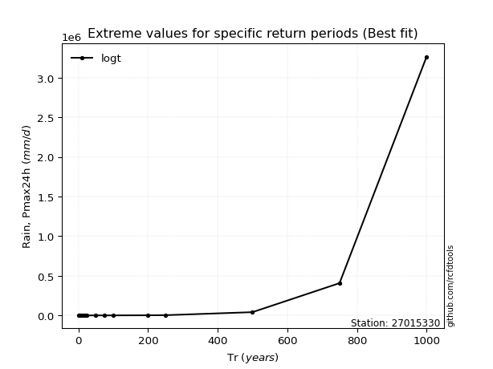</img>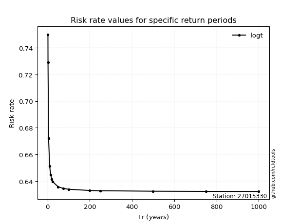</img>

</div>


<sub>**APP DISCLAIMER**: NO WARRANTY - This software is provided by [github.com/rcfdtools](https://github.com/rcfdtools) "as is", without any express or implied warranty, including warranties of merchantability, fitness for a particular purpose, or non-infringement. There is no guarantee that the software will be error-free or operate without interruption. LIMITATION OF LIABILITY - Neither the authors nor copyright holders will be liable for claims or damages arising from the software or its use. You are responsible for determining if the software is appropriate for your use and assume all associated risks, including errors, legal compliance, and data loss. NO PROFESSIONAL ADVICE - The software provides general information and does not offer professional advice. It should not replace consultation with professional advisors.</sub>