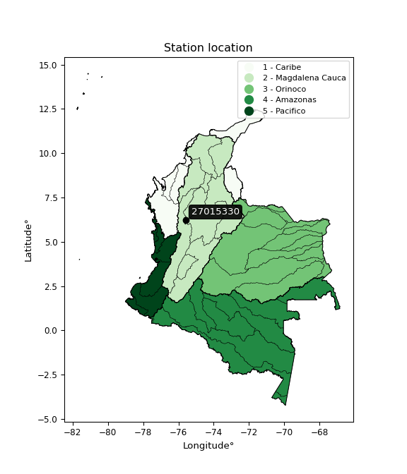

<div align="center">


</div>

# PMP Station (Rain, Pmax24h): 27015330

Probable Maximum Precipitation (PMP) is the greatest amount of rainfall for a specific duration that is meteorologically possible for a given location, acting as a "worst-case" scenario for extreme storms, crucial for designing safety-critical infrastructure like bridges, river deviations, dams, spillways, and nuclear plants to prevent catastrophic failure. PMP is calculated by hydrologists using meteorological data to determine the upper limit of extreme rainfall, often leading to the Probable Maximum Flood (PMF) for flood control design, and is increasingly being studied for climate change impacts. Probable Maximum Precipitation (PMP) is the theoretical upper limit of rainfall, a deterministic estimate for extreme events, while probability distributions (like GEV, Gumbel) describe the likelihood and frequency of various precipitation amounts, including rare ones, showing how often events occur, with PMP representing the extreme end of these distributions, used for critical infrastructure design to ensure safety against the worst conceivable weather, unlike standard statistical forecasts which cover typical probabilities.

The most common probability distributions in hydrology, used for analyzing floods, rainfall, and streamflow, include the Normal, Log-Normal, Gumbel, Gamma (including Log-Pearson Type III), and Generalized Extreme Value (GEV) distributions, often chosen based on the data´s skewness and whether modeling extremes or general conditions, with Gumbel and GEV popular for extreme events like floods, while the Normal distribution serves as a baseline, though often requiring transformations for skewed hydrological data. These distributions help in designing water infrastructure, managing water resources, and forecasting hydrologic events.

> Hydrological data often isn´t perfectly normal (it´s skewed), so different distributions are needed for different applications, such as: **Flood Frequency Analysis**: Using Gumbel, GEV, or Log-Pearson Type III for predicting extreme flood magnitudes and their return periods, **Rainfall Analysis**: Normal for annual totals, but Log-Normal, Weibull, or GEV for intensity or extreme daily rainfall, **Streamflow Modeling**: Gamma and Log-Normal for maximum flows, GEV for minimum flows, and Kappa for daily flows.

<div align="center">

</img>

</div>


## A. General information


### 1. General running parameters

• app_version: _v20260113_. • runtime: _2026-01-17 18:24:04.630693_. • Python version: _3.14.0_. • SciPy version: _1.16.3_. • Pandas version: _2.3.3_. • NumPy version: _2.3.5_. • Stations dataset (station_dataset_file): _dataset/pmax24h_in/automatic_colombia_2003_2025.csv_. • Stations catalog (station_catalog_file): _dataset/CNE.xls_. • Minimum year to eval til year_max (date_min): _1900_. • Maximum year to eval since year_min (date_max): _2025_. • Creates, save and include plots into reports (create_plot): _False_. • Plot only fit distributions with Δo > Δ (plot_only_fit): _True_. • Plot only simple graphs avoiding multiple CDFs and multiple Extreme values plots (plot_only_simple): _True_. • Eval low extreme values, if False, evaluates high extreme values (low_extreme): _False_. • Eval every SciPy distribution as logarithmic (pdist_logarithmic_on): _True_. • Standard deviation normalized (ddof): _1.0_. • Return periods to eval in years (Tr): _[2, 2.33, 5, 10, 15, 20, 25, 50, 75, 100, 200, 250, 500, 750, 1000]_. • Minimum data sample per station, 0 means any (minimum_sample): _5_. • Z-Score maximum threshold to adjust a value, 0 means disable (zscore_max): _3.5_. • Z-Score minimum threshold to adjust a value, 0 means disable (zscore_min): _-2.5_. • Avoid zeros, e.g. rain = 0 (avoid_zeros): _True_. • Avoid null values (avoid_nans): _True_. 

:file_folder:Table: [dataset.csv](../../dataset/pmax24h_in/automatic_colombia_2003_2025.csv)

> Delta Degrees of Freedom (DDOF): is a parameter used in the formulas for calculating variance and standard deviation. When ddof=0, the divisor is $N$ (the total number of observations) and this is used when your data set is the entire population. When ddof=1, the divisor is $N-1$ and this is used when your data set is a sample drawn from a larger population. Using $N-1$ provides an unbiased estimate of the population variance (known as Bessel´s correction).


### 2. Station info and location

|   id |   CODIGO | NOMBRE                              | CATEGORIA           | TECNOLOGIA                | ESTADO   | FECHA_INSTALACION   |   FECHA_SUSPENSION |   ALTITUD |   LATITUD |   LONGITUD | DEPARTAMENTO   | MUNICIPIO   | AREA_OPERATIVA                      | ENTIDAD                                                     | AREA_HIDROGRAFICA   | ZONA_HIDROGRAFICA   | SUBZONA_HIDROGRAFICA   |   CORRIENTE | Catalogo   |   Version |
|-----:|---------:|:------------------------------------|:--------------------|:--------------------------|:---------|:--------------------|-------------------:|----------:|----------:|-----------:|:---------------|:------------|:------------------------------------|:------------------------------------------------------------|:--------------------|:--------------------|:-----------------------|------------:|:-----------|----------:|
|    0 | 27015330 | AEROPUERTO OLAYA HERRERA [27015330] | Sinóptica Principal | Automática con Telemetría | Activa   | 12/05/2014          |                nan |      1492 |   6.22464 |   -75.5882 | Antioquia      | Medellín    | Area Operativa 01 - Antioquia-Chocó | INSTITUTO DE HIDROLOGIA METEOROLOGIA Y ESTUDIOS AMBIENTALES | Magdalena Cauca     | Nechí               | Río Porce              |         nan | CNE_IDEAM  |  20251226 |

<div align="center">

Dynamic map: [:earth_americas:Google](http://maps.google.com/maps?q=6.2246389,-75.5882) [:earth_americas:OSM](https://www.openstreetmap.org/#map=18/6.2246389/-75.5882&layers=P) [:earth_americas:Bing](https://www.bing.com/maps?cp=6.2246389~-75.5882&lvl=18) [:earth_americas:Apple](https://maps.apple.com/frame?center=6.2246389%2C-75.5882&span=0.003%2C0.006)

</div>


<div align="center">

```geojson
{
  "type": "Feature",
  "geometry": {
    "type": "Point", 
    "coordinates": [-75.5882, 6.2246389]
  }, 
  "properties": {
    "Name": "27015330"
  }
}
```

</div>


### 3. Discrete values table and plot

<div align="center">

|               |           0 |           1 |           2 |          3 |         4 |           5 |           6 |          7 |          8 |
|:--------------|------------:|------------:|------------:|-----------:|----------:|------------:|------------:|-----------:|-----------:|
| Date          | 2017        | 2018        | 2019        | 2020       | 2021      | 2022        | 2023        | 2024       | 2025       |
| Value         |   58.219    |   53.146    |   33.02     |   45.398   |   42.975  |   42.34     |   36.602    |  172.6     |   88.22    |
| Value_initial |   58.219    |   53.146    |   33.02     |   45.398   |   42.975  |   42.34     |   36.602    |  172.6     |   88.22    |
| count         |    9        |    9        |    9        |    9       |    9      |    9        |    9        |    9       |    9       |
| mean          |   63.6133   |   63.6133   |   63.6133   |   63.6133  |   63.6133 |   63.6133   |   63.6133   |   63.6133  |   63.6133  |
| std           |   44.0143   |   44.0143   |   44.0143   |   44.0143  |   44.0143 |   44.0143   |   44.0143   |   44.0143  |   44.0143  |
| zscore        |   -0.122559 |   -0.237816 |   -0.695076 |   -0.41385 |   -0.4689 |   -0.483327 |   -0.613694 |    2.47616 |    0.55906 |


</div>


> The initial value (value_initial) correspond to the initial obtained or null completed value, and value (value) is adjusted only when the initial value is outside the valid range (outlier) definite through the Z-Score value. If Z-Score is active, values out of range or outliers are replaced with the station mean value. A Z-Score (or standard score) measures how many standard deviations a data point is from the mean of a dataset, indicating its relative position; positive scores mean above the mean, negative mean below, and a score of zero is exactly at the mean, allowing for comparison of values from different distributions. It´s calculated using the formula $z=(x–μ)/σ$, where $x$ is the data point, $μ$ is the mean, and $σ$ is the standard deviation, helping identify outliers and understand probability.
>
> <sub>**Note**: In this study, "completing" (filling gaps in) and "extending" (forecasting or lengthening the historical record) rainfall data series are avoided for certain critical analyses because they introduce artificial bias and uncertainty, which can distort the statistics of rare events (extremes), alter day-to-day variability, and compromise the integrity and homogeneity of the original data. Some reasons against Completing/Extending rainfall data are: **Distortion of Extremes and Variability**: The primary issue is that most gap-filling or extension methods rely on averaging or regression with nearby stations, which inherently smooths the data. Rainfall is highly variable in space and time, with a large percentage of zero values and occasional large storms. Infilling methods often underestimate the highest values and overestimate the lowest (zero) values, which severely distorts analyses focused on flood frequency, drought severity, and intensity-duration-frequency (IDF) curves, **Loss of Data Homogeneity**: Infilled or extended data are synthetic estimates, not actual measurements. Combining these estimates with observed data can violate the assumption of data homogeneity, which requires that the data properties do not change over time. Inhomogeneity can lead to incorrect conclusions about long-term trends or changes in climate patterns, **Propagation of Errors**: Errors and biases from the original data (e.g., wind-induced undercatch, instrument errors, site changes) or the data used for imputation can propagate through the analysis, leading to unreliable hydrological models and inaccurate predictions, **Compromised Statistical Integrity**: For statistical analyses, especially those involving the frequency of events, using artificial data can introduce time bias or autocorrelation that doesn´t exist in reality, making it difficult to assess the true probability of events, **Difficulty in Validation**: It is difficult to accurately validate the quality of filled or extended data, especially for past periods where ground-truth measurements are unavailable. The reliability of imputation techniques heavily depends on the density of the surrounding station network and the complexity of the local topography.</sub>


### 4. Active continuous probability distributions from SciPy (80 of 104 available)

A Probability Density Function (PDF) describes the relative likelihood of a continuous random variable falling within a specific range, where the total area under its curve equals 1, and the area over any interval gives the actual probability for that range. Unlike discrete probabilities (like rolling a die), a PDF shows density, not direct probability for a single point (which is zero), with higher points indicating higher likelihood, often visualized as a bell curve for normal distributions.

A log of a probability density function (log-PDF) is simply the logarithm of the PDF´s value, denoted as $log(f(x))$, useful for converting multiplication of probabilities into addition, improving numerical stability with tiny numbers, and connecting to information theory concepts like entropy. Instead of dealing with very small probabilities (e.g., 0.000001), log-PDFs use negative numbers (e.g., $log(0.00001) ≈ -11.51$ that are easier for computers to handle, preventing underflow errors and simplifying complex calculations. In this study, each active probability distribution from SciPy is also evaluated in the $log$ form.

[scipy.stats](https://docs.scipy.org/doc/scipy/reference/stats.html) is a Python´s powerful submodule within the SciPy library for comprehensive statistical analysis, offering over 130 probability distributions (like Normal, Poisson), functions for descriptive stats (mean, variance), hypothesis testing (t-tests, chi-square), random variable generation, and statistical tests, making it essential for data science, modeling, and research. It provides tools to explore, model, and draw conclusions from data efficiently, working seamlessly with NumPy.

<div align="center">

|   id | p_dist           |   n_parameter | fit_method   | label                                                                       | active   | ref                                                                                                      |
|-----:|:-----------------|--------------:|:-------------|:----------------------------------------------------------------------------|:---------|:---------------------------------------------------------------------------------------------------------|
|    0 | alpha            |             3 | MLE          | Alpha                                                                       | True     | [:mortar_board:](https://docs.scipy.org/doc/scipy/reference/generated/scipy.stats.alpha.html)            |
|    1 | anglit           |             2 | MM           | Anglit                                                                      | True     | [:mortar_board:](https://docs.scipy.org/doc/scipy/reference/generated/scipy.stats.anglit.html)           |
|    2 | arcsine          |             2 | MM           | Arcsine                                                                     | True     | [:mortar_board:](https://docs.scipy.org/doc/scipy/reference/generated/scipy.stats.arcsine.html)          |
|    3 | argus            |             3 | MLE          | Argus                                                                       | True     | [:mortar_board:](https://docs.scipy.org/doc/scipy/reference/generated/scipy.stats.argus.html)            |
|    4 | beta             |             4 | MLE          | Beta                                                                        | True     | [:mortar_board:](https://docs.scipy.org/doc/scipy/reference/generated/scipy.stats.beta.html)             |
|    5 | betaprime        |             4 | MLE          | Beta prime                                                                  | True     | [:mortar_board:](https://docs.scipy.org/doc/scipy/reference/generated/scipy.stats.betaprime.html)        |
|    6 | bradford         |             3 | MLE          | Bradford                                                                    | True     | [:mortar_board:](https://docs.scipy.org/doc/scipy/reference/generated/scipy.stats.bradford.html)         |
|    7 | burr             |             4 | MLE          | Burr (Type III)                                                             | True     | [:mortar_board:](https://docs.scipy.org/doc/scipy/reference/generated/scipy.stats.burr.html)             |
|    8 | burr12           |             4 | MLE          | Burr (Type III) 12                                                          | True     | [:mortar_board:](https://docs.scipy.org/doc/scipy/reference/generated/scipy.stats.burr12.html)           |
|    9 | cosine           |             2 | MLE          | Cosine                                                                      | True     | [:mortar_board:](https://docs.scipy.org/doc/scipy/reference/generated/scipy.stats.cosine.html)           |
|   10 | crystalball      |             4 | MLE          | Crystalball                                                                 | True     | [:mortar_board:](https://docs.scipy.org/doc/scipy/reference/generated/scipy.stats.crystalball.html)      |
|   11 | dgamma           |             3 | MLE          | Double gamma                                                                | True     | [:mortar_board:](https://docs.scipy.org/doc/scipy/reference/generated/scipy.stats.dgamma.html)           |
|   12 | dweibull         |             3 | MLE          | Double Weibull                                                              | True     | [:mortar_board:](https://docs.scipy.org/doc/scipy/reference/generated/scipy.stats.dweibull.html)         |
|   13 | erlang           |             3 | MLE          | Erlang                                                                      | True     | [:mortar_board:](https://docs.scipy.org/doc/scipy/reference/generated/scipy.stats.erlang.html)           |
|   14 | exponnorm        |             3 | MLE          | Exponentially modified Normal                                               | True     | [:mortar_board:](https://docs.scipy.org/doc/scipy/reference/generated/scipy.stats.exponnorm.html)        |
|   15 | exponpow         |             3 | MLE          | Exponential power                                                           | True     | [:mortar_board:](https://docs.scipy.org/doc/scipy/reference/generated/scipy.stats.exponpow.html)         |
|   16 | exponweib        |             4 | MLE          | Exponentiated Weibull                                                       | True     | [:mortar_board:](https://docs.scipy.org/doc/scipy/reference/generated/scipy.stats.exponweib.html)        |
|   17 | f                |             4 | MLE          | F                                                                           | True     | [:mortar_board:](https://docs.scipy.org/doc/scipy/reference/generated/scipy.stats.f.html)                |
|   18 | fatiguelife      |             3 | MLE          | Fatigue-life (Birnbaum-Saunders)                                            | True     | [:mortar_board:](https://docs.scipy.org/doc/scipy/reference/generated/scipy.stats.fatiguelife.html)      |
|   19 | foldnorm         |             3 | MM           | Fold Normal                                                                 | True     | [:mortar_board:](https://docs.scipy.org/doc/scipy/reference/generated/scipy.stats.foldnorm.html)         |
|   20 | gamma            |             3 | MLE          | Gamma                                                                       | True     | [:mortar_board:](https://docs.scipy.org/doc/scipy/reference/generated/scipy.stats.gamma.html)            |
|   21 | gausshyper       |             6 | MLE          | Gauss hypergeometric                                                        | True     | [:mortar_board:](https://docs.scipy.org/doc/scipy/reference/generated/scipy.stats.gausshyper.html)       |
|   22 | genexpon         |             5 | MLE          | Generalized exponential                                                     | True     | [:mortar_board:](https://docs.scipy.org/doc/scipy/reference/generated/scipy.stats.genexpon.html)         |
|   23 | genextreme       |             3 | MLE          | Generalized exponential                                                     | True     | [:mortar_board:](https://docs.scipy.org/doc/scipy/reference/generated/scipy.stats.genextreme.html)       |
|   24 | gengamma         |             4 | MLE          | Generalized gamma                                                           | True     | [:mortar_board:](https://docs.scipy.org/doc/scipy/reference/generated/scipy.stats.gengamma.html)         |
|   25 | genhalflogistic  |             3 | MLE          | Generalized half-logistic                                                   | True     | [:mortar_board:](https://docs.scipy.org/doc/scipy/reference/generated/scipy.stats.genhalflogistic.html)  |
|   26 | genlogistic      |             3 | MLE          | Generalized logistic                                                        | True     | [:mortar_board:](https://docs.scipy.org/doc/scipy/reference/generated/scipy.stats.genlogistic.html)      |
|   27 | gennorm          |             3 | MLE          | Generalized Normal                                                          | True     | [:mortar_board:](https://docs.scipy.org/doc/scipy/reference/generated/scipy.stats.gennorm.html)          |
|   28 | genpareto        |             3 | MLE          | Generalized Pareto                                                          | True     | [:mortar_board:](https://docs.scipy.org/doc/scipy/reference/generated/scipy.stats.genpareto.html)        |
|   29 | gompertz         |             3 | MLE          | Gompertz (or truncated Gumbel)                                              | True     | [:mortar_board:](https://docs.scipy.org/doc/scipy/reference/generated/scipy.stats.gompertz.html)         |
|   30 | gumbel_l         |             2 | MM           | Gumbel Left Skew                                                            | True     | [:mortar_board:](https://docs.scipy.org/doc/scipy/reference/generated/scipy.stats.gumbel_l.html)         |
|   31 | gumbel_r         |             2 | MM           | Gumbel Right Skew                                                           | True     | [:mortar_board:](https://docs.scipy.org/doc/scipy/reference/generated/scipy.stats.gumbel_r.html)         |
|   32 | halfgennorm      |             3 | MLE          | Upper half of a generalized normal                                          | True     | [:mortar_board:](https://docs.scipy.org/doc/scipy/reference/generated/scipy.stats.halfgennorm.html)      |
|   33 | halflogistic     |             2 | MM           | Half-logistic                                                               | True     | [:mortar_board:](https://docs.scipy.org/doc/scipy/reference/generated/scipy.stats.halflogistic.html)     |
|   34 | halfnorm         |             2 | MM           | Half Normal                                                                 | True     | [:mortar_board:](https://docs.scipy.org/doc/scipy/reference/generated/scipy.stats.halfnorm.html)         |
|   35 | hypsecant        |             2 | MM           | hyperbolic secant                                                           | True     | [:mortar_board:](https://docs.scipy.org/doc/scipy/reference/generated/scipy.stats.hypsecant.html)        |
|   36 | invgamma         |             3 | MLE          | Inverted gamma                                                              | True     | [:mortar_board:](https://docs.scipy.org/doc/scipy/reference/generated/scipy.stats.invgamma.html)         |
|   37 | invgauss         |             3 | MLE          | Inverse Gaussian                                                            | True     | [:mortar_board:](https://docs.scipy.org/doc/scipy/reference/generated/scipy.stats.invgauss.html)         |
|   38 | invweibull       |             3 | MLE          | Inverted Weibull                                                            | True     | [:mortar_board:](https://docs.scipy.org/doc/scipy/reference/generated/scipy.stats.invweibull.html)       |
|   39 | johnsonsb        |             4 | MLE          | Johnson SB                                                                  | True     | [:mortar_board:](https://docs.scipy.org/doc/scipy/reference/generated/scipy.stats.johnsonsb.html)        |
|   40 | johnsonsu        |             4 | MLE          | Johnson Su                                                                  | True     | [:mortar_board:](https://docs.scipy.org/doc/scipy/reference/generated/scipy.stats.johnsonsu.html)        |
|   41 | kappa3           |             3 | MLE          | Kappa 3                                                                     | True     | [:mortar_board:](https://docs.scipy.org/doc/scipy/reference/generated/scipy.stats.kappa3.html)           |
|   42 | kappa4           |             4 | MLE          | Kappa 4                                                                     | True     | [:mortar_board:](https://docs.scipy.org/doc/scipy/reference/generated/scipy.stats.kappa4.html)           |
|   43 | ksone            |             3 | MLE          | Kolmogorov-Smirnov one-sided test statistic distribution                    | True     | [:mortar_board:](https://docs.scipy.org/doc/scipy/reference/generated/scipy.stats.ksone.html)            |
|   44 | kstwobign        |             2 | MLE          | Limiting distribution of scaled Kolmogorov-Smirnov two-sided test statistic | True     | [:mortar_board:](https://docs.scipy.org/doc/scipy/reference/generated/scipy.stats.kstwobign.html)        |
|   45 | laplace          |             2 | MM           | Laplace                                                                     | True     | [:mortar_board:](https://docs.scipy.org/doc/scipy/reference/generated/scipy.stats.laplace.html)          |
|   46 | levy_l           |             2 | MLE          | Left-skewed Levy                                                            | True     | [:mortar_board:](https://docs.scipy.org/doc/scipy/reference/generated/scipy.stats.levy_l.html)           |
|   47 | loggamma         |             3 | MLE          | Log gamma                                                                   | True     | [:mortar_board:](https://docs.scipy.org/doc/scipy/reference/generated/scipy.stats.loggamma.html)         |
|   48 | logistic         |             2 | MM           | Logistic (or Sech-squared)                                                  | True     | [:mortar_board:](https://docs.scipy.org/doc/scipy/reference/generated/scipy.stats.logistic.html)         |
|   49 | loglaplace       |             3 | MLE          | Log-Laplace                                                                 | True     | [:mortar_board:](https://docs.scipy.org/doc/scipy/reference/generated/scipy.stats.loglaplace.html)       |
|   50 | lomax            |             3 | MLE          | Lomax (Pareto of the second kind)                                           | True     | [:mortar_board:](https://docs.scipy.org/doc/scipy/reference/generated/scipy.stats.lomax.html)            |
|   51 | maxwell          |             2 | MM           | Maxwell                                                                     | True     | [:mortar_board:](https://docs.scipy.org/doc/scipy/reference/generated/scipy.stats.maxwell.html)          |
|   52 | mielke           |             4 | MLE          | Mielke Beta-Kappa / Dagum                                                   | True     | [:mortar_board:](https://docs.scipy.org/doc/scipy/reference/generated/scipy.stats.mielke.html)           |
|   53 | moyal            |             2 | MM           | Moyal                                                                       | True     | [:mortar_board:](https://docs.scipy.org/doc/scipy/reference/generated/scipy.stats.moyal.html)            |
|   54 | nakagami         |             3 | MLE          | Nakagami                                                                    | True     | [:mortar_board:](https://docs.scipy.org/doc/scipy/reference/generated/scipy.stats.nakagami.html)         |
|   55 | ncf              |             5 | MLE          | Non-central F distribution                                                  | True     | [:mortar_board:](https://docs.scipy.org/doc/scipy/reference/generated/scipy.stats.ncf.html)              |
|   56 | nct              |             4 | MLE          | Non-central Student’s t                                                     | True     | [:mortar_board:](https://docs.scipy.org/doc/scipy/reference/generated/scipy.stats.nct.html)              |
|   57 | norm             |             2 | MM           | Normal                                                                      | True     | [:mortar_board:](https://docs.scipy.org/doc/scipy/reference/generated/scipy.stats.norm.html)             |
|   58 | pearson3         |             3 | MM           | Pearson type III                                                            | True     | [:mortar_board:](https://docs.scipy.org/doc/scipy/reference/generated/scipy.stats.pearson3.html)         |
|   59 | powerlaw         |             3 | MLE          | Power-function                                                              | True     | [:mortar_board:](https://docs.scipy.org/doc/scipy/reference/generated/scipy.stats.powerlaw.html)         |
|   60 | rayleigh         |             2 | MM           | Rayleigh                                                                    | True     | [:mortar_board:](https://docs.scipy.org/doc/scipy/reference/generated/scipy.stats.rayleigh.html)         |
|   61 | rdist            |             3 | MLE          | R-distributed (symmetric beta)                                              | True     | [:mortar_board:](https://docs.scipy.org/doc/scipy/reference/generated/scipy.stats.rdist.html)            |
|   62 | rice             |             3 | MLE          | Rice                                                                        | True     | [:mortar_board:](https://docs.scipy.org/doc/scipy/reference/generated/scipy.stats.rice.html)             |
|   63 | semicircular     |             2 | MM           | Semicircular                                                                | True     | [:mortar_board:](https://docs.scipy.org/doc/scipy/reference/generated/scipy.stats.semicircular.html)     |
|   64 | skewnorm         |             3 | MLE          | Skew normal                                                                 | True     | [:mortar_board:](https://docs.scipy.org/doc/scipy/reference/generated/scipy.stats.skewnorm.html)         |
|   65 | t                |             3 | MLE          | Student’s t                                                                 | True     | [:mortar_board:](https://docs.scipy.org/doc/scipy/reference/generated/scipy.stats.t.html)                |
|   66 | trapezoid        |             4 | MLE          | Trapezoid                                                                   | True     | [:mortar_board:](https://docs.scipy.org/doc/scipy/reference/generated/scipy.stats.trapezoid.html)        |
|   67 | triang           |             3 | MLE          | Triangular                                                                  | True     | [:mortar_board:](https://docs.scipy.org/doc/scipy/reference/generated/scipy.stats.triang.html)           |
|   68 | truncexpon       |             3 | MLE          | Truncated exponential                                                       | True     | [:mortar_board:](https://docs.scipy.org/doc/scipy/reference/generated/scipy.stats.truncexpon.html)       |
|   69 | truncnorm        |             4 | MLE          | Truncated normal                                                            | True     | [:mortar_board:](https://docs.scipy.org/doc/scipy/reference/generated/scipy.stats.truncnorm.html)        |
|   70 | truncpareto      |             4 | MLE          | Upper truncated Pareto                                                      | True     | [:mortar_board:](https://docs.scipy.org/doc/scipy/reference/generated/scipy.stats.truncpareto.html)      |
|   71 | truncweibull_min |             5 | MLE          | Doubly truncated Weibull minimum                                            | True     | [:mortar_board:](https://docs.scipy.org/doc/scipy/reference/generated/scipy.stats.truncweibull_min.html) |
|   72 | tukeylambda      |             3 | MLE          | Tukey-Lamdba                                                                | True     | [:mortar_board:](https://docs.scipy.org/doc/scipy/reference/generated/scipy.stats.tukeylambda.html)      |
|   73 | uniform          |             2 | MLE          | Uniform                                                                     | True     | [:mortar_board:](https://docs.scipy.org/doc/scipy/reference/generated/scipy.stats.uniform.html)          |
|   74 | vonmises         |             3 | MLE          | Von Mises                                                                   | True     | [:mortar_board:](https://docs.scipy.org/doc/scipy/reference/generated/scipy.stats.vonmises.html)         |
|   75 | vonmises_line    |             3 | MLE          | Von Mises line                                                              | True     | [:mortar_board:](https://docs.scipy.org/doc/scipy/reference/generated/scipy.stats.vonmises_line.html)    |
|   76 | wald             |             2 | MM           | Wald                                                                        | True     | [:mortar_board:](https://docs.scipy.org/doc/scipy/reference/generated/scipy.stats.wald.html)             |
|   77 | weibull_max      |             3 | MLE          | Weibull maximum                                                             | True     | [:mortar_board:](https://docs.scipy.org/doc/scipy/reference/generated/scipy.stats.weibull_max.html)      |
|   78 | weibull_min      |             3 | MLE          | Weibull minimum                                                             | True     | [:mortar_board:](https://docs.scipy.org/doc/scipy/reference/generated/scipy.stats.weibull_min.html)      |
|   79 | wrapcauchy       |             3 | MLE          | Wrapped  Cauchy                                                             | True     | [:mortar_board:](https://docs.scipy.org/doc/scipy/reference/generated/scipy.stats.wrapcauchy.html)       |

</div>

> **n_parameter:** # arguments & localization & scale.
>
> **Fit methods:** (MLE) maximum likelihood, (MM) L-moments.
>
>**Inactive** (With the only purpose of prevent loops, zero divisions, infinite values, over high estimated values or horizontal trending for recurrence intervals estimations, the follow distributions were disabled.)**:** lognorm, norminvgauss, powernorm, powerlognorm, cauchy, halfcauchy, foldcauchy, skewcauchy, chi2, expon, fisk, genhyperbolic, geninvgauss, gibrat, kstwo, laplace_asymmetric, levy, levy_stable, ncx2, pareto, rel_breitwigner, recipinvgauss, studentized_range, loguniform, 


## B. Probability (PDF) vs. Empirical (EDF) distributions functions

A continuous probability distribution (CPD) describes probabilities for variables that can take any value within a range (like rain any time), unlike discrete variables with specific outcomes (like temperature). It uses a Probability Density Function (PDF), a curve where the total area under it equals 1, and the probability of the variable falling within an interval (a to b) is found by calculating the area under the curve between those points. A key feature is that the probability of hitting any single exact value is zero, so probabilities are always expressed for ranges, e.g., $P(a ≤ X ≤ b)$.

<div align="center">

Distributions parameters from station values
|     |   station | p_dist              |   n |              loc |            scale | shape                  | shape1                 | shape2                 | shape3             |
|----:|----------:|:--------------------|----:|-----------------:|-----------------:|:-----------------------|:-----------------------|:-----------------------|:-------------------|
|   0 |  27015330 | alpha               |   9 |     22.8477      |     30.2572      | 1.086840083822092      |                        |                        |                    |
|   1 |  27015330 | anglit              |   9 |     63.6133      |    121.396       |                        |                        |                        |                    |
|   2 |  27015330 | arcsine             |   9 |      4.92754     |    117.372       |                        |                        |                        |                    |
|   3 |  27015330 | argus               |   9 |    -41.6248      |    220.742       | 1.853437827499714e-07  |                        |                        |                    |
|   4 |  27015330 | beta                |   9 |     33.02        |    415.84        | 0.16523106200915857    | 2.2357898317734737     |                        |                    |
|   5 |  27015330 | betaprime           |   9 |     -0.652705    |      1.30056     | 217.0322256906511      | 5.534554175776428      |                        |                    |
|   6 |  27015330 | bradford            |   9 |     32.1521      |    140.448       | 20.497689050147024     |                        |                        |                    |
|   7 |  27015330 | burr                |   9 |     26.8207      |      0.559902    | 1.3642064173063724     | 92.03749531770534      |                        |                    |
|   8 |  27015330 | burr12              |   9 |     -1.93191     |     34.7019      | 439.40857701682853     | 0.004545749509483299   |                        |                    |
|   9 |  27015330 | cosine              |   9 |     75.2868      |     40.0002      |                        |                        |                        |                    |
|  10 |  27015330 | crystalball         |   9 |     63.6133      |     41.4971      | 3067.9685483383037     | 10388.476415393117     |                        |                    |
|  11 |  27015330 | dgamma              |   9 |     42.975       |     29.2124      | 0.7048621199332481     |                        |                        |                    |
|  12 |  27015330 | dweibull            |   9 |     42.975       |     28.2554      | 0.645081782698915      |                        |                        |                    |
|  13 |  27015330 | erlang              |   9 |     33.02        |     58.5162      | 0.44200255094734797    |                        |                        |                    |
|  14 |  27015330 | exponnorm           |   9 |     32.9876      |      0.00912107  | 3373.7887930427123     |                        |                        |                    |
|  15 |  27015330 | exponpow            |   9 |     33.02        |     52.3496      | 0.2179440675132867     |                        |                        |                    |
|  16 |  27015330 | exponweib           |   9 |     33.02        |     58.6056      | 1.1132466117177557     | 0.20191388666878485    |                        |                    |
|  17 |  27015330 | f                   |   9 |     33.02        |     11.337       | 1.575572802470047      | 2.6569288868306846     |                        |                    |
|  18 |  27015330 | fatiguelife         |   9 |     31.1469      |     16.549       | 1.3878318594664323     |                        |                        |                    |
|  19 |  27015330 | foldnorm            |   9 |      3.07624     |     74.5228      | 0.0010228484722958594  |                        |                        |                    |
|  20 |  27015330 | gamma               |   9 |     33.02        |     30.5801      | 0.6229032146963689     |                        |                        |                    |
|  21 |  27015330 | gausshyper          |   9 |     33.02        |    165.4         | 0.3793883111858636     | 1.0995727800728043     | 0.8983117264085139     | 1.037742169553434  |
|  22 |  27015330 | genexpon            |   9 |     33.02        |     34.4614      | 1.126419145530982      | 1.9555286244809462e-10 | 1.2911981032521784     |                    |
|  23 |  27015330 | genextreme          |   9 |     42.1793      |     11.3488      | -0.7364429850921451    |                        |                        |                    |
|  24 |  27015330 | gengamma            |   9 |     33.02        |     39.2458      | 1.0321302889559245     | 0.7917600612246818     |                        |                    |
|  25 |  27015330 | genhalflogistic     |   9 |     19.8712      |    157.291       | 1.0298730341327889     |                        |                        |                    |
|  26 |  27015330 | genlogistic         |   9 |   -112.496       |     21.1424      | 1979.0240861721459     |                        |                        |                    |
|  27 |  27015330 | gennorm             |   9 |     42.975       |      0.804335    | 0.38189466141251804    |                        |                        |                    |
|  28 |  27015330 | genpareto           |   9 |     31.9568      |     24.2845      | 0.11643251268366055    |                        |                        |                    |
|  29 |  27015330 | gompertz            |   9 |     32.002       |    441.449       | 11.76805795373054      |                        |                        |                    |
|  30 |  27015330 | gumbel_l            |   9 |     82.2892      |     32.3552      |                        |                        |                        |                    |
|  31 |  27015330 | gumbel_r            |   9 |     44.9374      |     32.3552      |                        |                        |                        |                    |
|  32 |  27015330 | halfgennorm         |   9 |     33.02        |     21.9416      | 0.8284163292051387     |                        |                        |                    |
|  33 |  27015330 | halflogistic        |   9 |     14.4296      |     35.4786      |                        |                        |                        |                    |
|  34 |  27015330 | halfnorm            |   9 |      8.6874      |     68.8394      |                        |                        |                        |                    |
|  35 |  27015330 | hypsecant           |   9 |     63.6133      |     26.4179      |                        |                        |                        |                    |
|  36 |  27015330 | invgamma            |   9 |     27.9108      |     22.1814      | 1.4781958138993914     |                        |                        |                    |
|  37 |  27015330 | invgauss            |   9 |     30.0567      |     16.3913      | 2.047224144672244      |                        |                        |                    |
|  38 |  27015330 | invweibull          |   9 |     26.7689      |     15.4103      | 1.357880445592414      |                        |                        |                    |
|  39 |  27015330 | johnsonsb           |   9 |     33.02        |    139.58        | 0.1418447822197451     | 0.21888262068253678    |                        |                    |
|  40 |  27015330 | johnsonsu           |   9 |     31.8851      |      0.0373122   | -5.105894507711071     | 0.7637415725357082     |                        |                    |
|  41 |  27015330 | kappa3              |   9 |     33.02        |     16.2678      | 1.4465635519240037     |                        |                        |                    |
|  42 |  27015330 | kappa4              |   9 |     18.7895      |    154.197       | 1.1016391228993152     | 0.9940973422335091     |                        |                    |
|  43 |  27015330 | ksone               |   9 |     19.062       |    167.496       | 1.0                    |                        |                        |                    |
|  44 |  27015330 | kstwobign           |   9 |    -37.78        |    119.219       |                        |                        |                        |                    |
|  45 |  27015330 | laplace             |   9 |     63.6133      |     29.3429      |                        |                        |                        |                    |
|  46 |  27015330 | levy_l              |   9 |    185.989       |     66.8817      |                        |                        |                        |                    |
|  47 |  27015330 | loggamma            |   9 | -18800.4         |   2365.71        | 2903.82924728109       |                        |                        |                    |
|  48 |  27015330 | logistic            |   9 |     63.6133      |     22.8786      |                        |                        |                        |                    |
|  49 |  27015330 | loglaplace          |   9 |     -0.124628    |     45.5226      | 2.9342244467101555     |                        |                        |                    |
|  50 |  27015330 | lomax               |   9 |     33.02        |     81.142       | 3.936522010471613      |                        |                        |                    |
|  51 |  27015330 | maxwell             |   9 |    -34.7174      |     61.6197      |                        |                        |                        |                    |
|  52 |  27015330 | mielke              |   9 |     20.6908      |      2.69799     | 122.18504852753063     | 1.951194286685345      |                        |                    |
|  53 |  27015330 | moyal               |   9 |     39.8826      |     18.6803      |                        |                        |                        |                    |
|  54 |  27015330 | nakagami            |   9 |     33.02        |     59.9216      | 0.19777579267727874    |                        |                        |                    |
|  55 |  27015330 | ncf                 |   9 |     -0.0275199   |      2.0656e-06  | 2.0012084440317986e-07 | 8.831601909046269      | 4.774617636383436      |                    |
|  56 |  27015330 | nct                 |   9 |     -0.257401    |      1.06167     | 3.490564603074737      | 44.642725260127044     |                        |                    |
|  57 |  27015330 | norm                |   9 |     63.6133      |     41.4971      |                        |                        |                        |                    |
|  58 |  27015330 | pearson3            |   9 |     63.6134      |     41.4971      | 1.9208376108263159     |                        |                        |                    |
|  59 |  27015330 | powerlaw            |   9 |     33.02        |    139.58        | 0.16814521912466826    |                        |                        |                    |
|  60 |  27015330 | rayleigh            |   9 |    -15.7731      |     63.3412      |                        |                        |                        |                    |
|  61 |  27015330 | rdist               |   9 |     21.1809      |     67.0391      | 1.1625656815950043     |                        |                        |                    |
|  62 |  27015330 | rice                |   9 |      5.43585     |     50.5303      | 0.00020102237143327902 |                        |                        |                    |
|  63 |  27015330 | semicircular        |   9 |     63.6133      |     82.9943      |                        |                        |                        |                    |
|  64 |  27015330 | skewnorm            |   9 |     33.02        |     51.5577      | 18838003.627426103     |                        |                        |                    |
|  65 |  27015330 | t                   |   9 |     43.8641      |      7.36681     | 0.8890507587947554     |                        |                        |                    |
|  66 |  27015330 | trapezoid           |   9 |     19.062       |    167.496       | 1.0                    | 1.0                    |                        |                    |
|  67 |  27015330 | triang              |   9 |    -62.7919      |    235.392       | 0.9999999158802453     |                        |                        |                    |
|  68 |  27015330 | truncexpon          |   9 |     33.02        |     91.2321      | 1.529944785621153      |                        |                        |                    |
|  69 |  27015330 | truncnorm           |   9 | -45339.5         |   1374.12        | 33.01928485458406      | 123.91300761940477     |                        |                    |
|  70 |  27015330 | truncpareto         |   9 |     -4.35175     |     37.3718      | 1.6852495012300404     | 4.734906564985957      |                        |                    |
|  71 |  27015330 | truncweibull_min    |   9 |     32.7942      |    114.366       | 0.3929341114108492     | 0.0019745856843225345  | 1.2239005484835697     |                    |
|  72 |  27015330 | tukeylambda         |   9 |     21.2225      |     70.1637      | 1.047257542343893      |                        |                        |                    |
|  73 |  27015330 | uniform             |   9 |     33.02        |    139.58        |                        |                        |                        |                    |
|  74 |  27015330 | vonmises            |   9 |      1.61333     |      1           | 0.21181830125112194    |                        |                        |                    |
|  75 |  27015330 | vonmises_line       |   9 |     60.6896      |      8.80751     | 4.7315801653958415e-05 |                        |                        |                    |
|  76 |  27015330 | wald                |   9 |     22.1162      |     41.4971      |                        |                        |                        |                    |
|  77 |  27015330 | weibull_max         |   9 |    172.6         |      1.63559     | 0.1852865685903201     |                        |                        |                    |
|  78 |  27015330 | weibull_min         |   9 |     33.02        |     58.3722      | 0.22550021773013607    |                        |                        |                    |
|  79 |  27015330 | wrapcauchy          |   9 |     33.02        |     22.2148      | 0.6438321761082375     |                        |                        |                    |
|  80 |  27015330 | logalpha            |   9 |      2.91123     |      2.69725     | 2.8501239722429625     |                        |                        |                    |
|  81 |  27015330 | loganglit           |   9 |      4.00968     |      1.42245     |                        |                        |                        |                    |
|  82 |  27015330 | logarcsine          |   9 |      3.32201     |      1.37534     |                        |                        |                        |                    |
|  83 |  27015330 | logargus            |   9 |      2.83314     |      2.39055     | 4.6021299791859725e-05 |                        |                        |                    |
|  84 |  27015330 | logbeta             |   9 |      3.49711     |      1.99736     | 0.3488056441845594     | 1.1911813740973636     |                        |                    |
|  85 |  27015330 | logbetaprime        |   9 |     -0.51969     |      3.46372     | 223.1307270892678      | 171.65719366382996     |                        |                    |
|  86 |  27015330 | logbradford         |   9 |      3.49711     |      1.65387     | 1.2361039982055682     |                        |                        |                    |
|  87 |  27015330 | logburr             |   9 |      2.36854     |      0.555271    | 5.070051939691275      | 105.53514648978171     |                        |                    |
|  88 |  27015330 | logburr12           |   9 |  -1069.52        |   1073.01        | 407832.3852336611      | 0.005058345217389881   |                        |                    |
|  89 |  27015330 | logcosine           |   9 |      4.10868     |      0.441192    |                        |                        |                        |                    |
|  90 |  27015330 | logcrystalball      |   9 |      4.00968     |      0.486234    | 445.83796167015157     | 296.7448576083422      |                        |                    |
|  91 |  27015330 | logdgamma           |   9 |      3.81547     |      0.355483    | 0.9499299311881938     |                        |                        |                    |
|  92 |  27015330 | logdweibull         |   9 |      3.81547     |      0.323782    | 0.8604647411128505     |                        |                        |                    |
|  93 |  27015330 | logerlang           |   9 |      3.49711     |      0.564492    | 0.5894018688864193     |                        |                        |                    |
|  94 |  27015330 | logexponnorm        |   9 |      3.49646     |      0.00021128  | 2405.7051411967486     |                        |                        |                    |
|  95 |  27015330 | logexponpow         |   9 |      3.49711     |      1.38194     | 0.8196408373915218     |                        |                        |                    |
|  96 |  27015330 | logexponweib        |   9 |      3.49711     |      0.885107    | 0.2479369374397334     | 1.8915155339587062     |                        |                    |
|  97 |  27015330 | logf                |   9 |      3.24961     |      0.543554    | 1360.527958932111      | 6.618530265139339      |                        |                    |
|  98 |  27015330 | logfatiguelife      |   9 |      3.38948     |      0.457628    | 0.8403059438508653     |                        |                        |                    |
|  99 |  27015330 | logfoldnorm         |   9 |      3.3538      |      0.738947    | 0.4773325275319771     |                        |                        |                    |
| 100 |  27015330 | loggamma            |   9 |      3.49711     |      0.552746    | 0.7141171125354724     |                        |                        |                    |
| 101 |  27015330 | loggausshyper       |   9 |      3.49711     |      1.69673     | 0.6615827988350209     | 1.0795391733142048     | 0.8957203577177659     | 1.0651812272273495 |
| 102 |  27015330 | loggenexpon         |   9 |      3.49711     |      0.923786    | 1.7205137008813784     | 1.0827985729996077     | 0.15354792911469378    |                    |
| 103 |  27015330 | loggenextreme       |   9 |      3.75047     |      0.259419    | -0.34766502535316685   |                        |                        |                    |
| 104 |  27015330 | loggengamma         |   9 |      3.49711     |      0.807737    | 0.5432863387692606     | 1.4168327141019659     |                        |                    |
| 105 |  27015330 | loggenhalflogistic  |   9 |      3.29434     |      1.9639      | 1.0577756850693694     |                        |                        |                    |
| 106 |  27015330 | loggenlogistic      |   9 |      1.53166     |      0.316354    | 1314.039558639376      |                        |                        |                    |
| 107 |  27015330 | loggennorm          |   9 |      3.81546     |      0.3653      | 1.009586411749249      |                        |                        |                    |
| 108 |  27015330 | loggenpareto        |   9 |     -0.00746994  |     11.6448      | -2.257433176609972     |                        |                        |                    |
| 109 |  27015330 | loggompertz         |   9 |      3.49711     |      1.13257     | 1.3135060550449866     |                        |                        |                    |
| 110 |  27015330 | loggumbel_l         |   9 |      4.22851     |      0.379115    |                        |                        |                        |                    |
| 111 |  27015330 | loggumbel_r         |   9 |      3.79085     |      0.379115    |                        |                        |                        |                    |
| 112 |  27015330 | loghalfgennorm      |   9 |      3.49711     |      0.645474    | 1.1900853010773518     |                        |                        |                    |
| 113 |  27015330 | loghalflogistic     |   9 |      3.43338     |      0.415713    |                        |                        |                        |                    |
| 114 |  27015330 | loghalfnorm         |   9 |      3.36609     |      0.806613    |                        |                        |                        |                    |
| 115 |  27015330 | loghypsecant        |   9 |      4.00968     |      0.309546    |                        |                        |                        |                    |
| 116 |  27015330 | loginvgamma         |   9 |      3.24829     |      1.80181     | 3.309268167683098      |                        |                        |                    |
| 117 |  27015330 | loginvgauss         |   9 |      3.35998     |      0.95847     | 0.6778525583489212     |                        |                        |                    |
| 118 |  27015330 | loginvweibull       |   9 |      3.00428     |      0.746212    | 2.8761461086732725     |                        |                        |                    |
| 119 |  27015330 | logjohnsonsb        |   9 |      3.49711     |      1.65386     | 0.4950467066732608     | 0.22105362260966605    |                        |                    |
| 120 |  27015330 | logjohnsonsu        |   9 |      3.39785     |      0.00577941  | -6.248130937482667     | 1.2372710472210415     |                        |                    |
| 121 |  27015330 | logkappa3           |   9 |      3.49711     |      1.65218     | 2158.357377484397      |                        |                        |                    |
| 122 |  27015330 | logkappa4           |   9 |      3.32512     |      1.96354     | 1.096092830111016      | 1.0191947728242492     |                        |                    |
| 123 |  27015330 | logksone            |   9 |      3.33173     |      1.98464     | 1.0                    |                        |                        |                    |
| 124 |  27015330 | logkstwobign        |   9 |      2.63972     |      1.5878      |                        |                        |                        |                    |
| 125 |  27015330 | loglaplace          |   9 |      4.00968     |      0.34382     |                        |                        |                        |                    |
| 126 |  27015330 | loglevy_l           |   9 |      5.28631     |      0.674364    |                        |                        |                        |                    |
| 127 |  27015330 | logloggamma         |   9 |   -138.427       |     19.4219      | 1531.5369518458501     |                        |                        |                    |
| 128 |  27015330 | loglogistic         |   9 |      4.00968     |      0.268075    |                        |                        |                        |                    |
| 129 |  27015330 | logloglaplace       |   9 |     -0.0211089   |      3.83658     | 12.183844242518695     |                        |                        |                    |
| 130 |  27015330 | loglomax            |   9 |      3.49711     | 123063           | 237773.3760247077      |                        |                        |                    |
| 131 |  27015330 | logmaxwell          |   9 |      2.85751     |      0.722016    |                        |                        |                        |                    |
| 132 |  27015330 | logmielke           |   9 |      2.48789     |      0.525782    | 373.99645326885457     | 4.869838632550419      |                        |                    |
| 133 |  27015330 | logmoyal            |   9 |      3.73162     |      0.218882    |                        |                        |                        |                    |
| 134 |  27015330 | lognakagami         |   9 |      3.49711     |      0.963421    | 0.33658461630239167    |                        |                        |                    |
| 135 |  27015330 | logncf              |   9 |     -2.02304     |      6.02131     | 437.8300075311102      | 419.7863179413367      | 3.7181116230963936e-05 |                    |
| 136 |  27015330 | lognct              |   9 |     -0.819382    |      0.12064     | 62.28452278019486      | 39.535901282762254     |                        |                    |
| 137 |  27015330 | lognorm             |   9 |      4.00968     |      0.486234    |                        |                        |                        |                    |
| 138 |  27015330 | logpearson3         |   9 |      4.00968     |      0.486235    | 1.3010861539491725     |                        |                        |                    |
| 139 |  27015330 | logpowerlaw         |   9 |      3.49711     |      1.65386     | 0.19211971014985724    |                        |                        |                    |
| 140 |  27015330 | lograyleigh         |   9 |      3.07948     |      0.742188    |                        |                        |                        |                    |
| 141 |  27015330 | logrdist            |   9 |      4.32316     |      0.827818    | 1.1768709155930919     |                        |                        |                    |
| 142 |  27015330 | logrice             |   9 |      3.2567      |      0.633798    | 0.00023134265926407196 |                        |                        |                    |
| 143 |  27015330 | logsemicircular     |   9 |      4.00968     |      0.972489    |                        |                        |                        |                    |
| 144 |  27015330 | logskewnorm         |   9 |      3.49711     |      0.706563    | 28783054.873076335     |                        |                        |                    |
| 145 |  27015330 | logt                |   9 |      3.82708     |      0.233784    | 1.6810964040745244     |                        |                        |                    |
| 146 |  27015330 | logtrapezoid        |   9 |      3.33173     |      1.98464     | 1.0                    | 1.0                    |                        |                    |
| 147 |  27015330 | logtriang           |   9 |      2.63554     |      2.51576     | 0.9999999994757018     |                        |                        |                    |
| 148 |  27015330 | logtruncexpon       |   9 |      3.49566     |      1.55532     | 1.064289697412431      |                        |                        |                    |
| 149 |  27015330 | logtruncnorm        |   9 |     -3.71421     |      2.06244     | 3.4964206394829263     | 4.298413292257155      |                        |                    |
| 150 |  27015330 | logtruncpareto      |   9 |      3.49706     |      5.23852e-05 | 0.0002692537614179247  | 33517.59907748173      |                        |                    |
| 151 |  27015330 | logtruncweibull_min |   9 |      3.49711     |      1.3928      | 0.5236377852629912     | 2.109041154092596e-09  | 1.191359659464879      |                    |
| 152 |  27015330 | logtukeylambda      |   9 |      4.32547     |      0.913353    | 1.1026087223169125     |                        |                        |                    |
| 153 |  27015330 | loguniform          |   9 |      3.49711     |      1.65386     |                        |                        |                        |                    |
| 154 |  27015330 | logvonmises         |   9 |     -2.29958     |      1           | 4.8721039152628505     |                        |                        |                    |
| 155 |  27015330 | logvonmises_line    |   9 |      3.90815     |      0.395605    | 1.3779286148836731     |                        |                        |                    |
| 156 |  27015330 | logwald             |   9 |      3.52337     |      0.486298    |                        |                        |                        |                    |
| 157 |  27015330 | logweibull_max      |   9 |      2.81746e+07 |      2.81746e+07 | 89165703.83082703      |                        |                        |                    |
| 158 |  27015330 | logweibull_min      |   9 |      3.49711     |      0.409293    | 0.8517370896315981     |                        |                        |                    |
| 159 |  27015330 | logwrapcauchy       |   9 |      3.49711     |      0.276382    | 0.5                    |                        |                        |                    |

</div>

> **loc** (Location parameter): This shifts the distribution along the x-axis. For many common distributions, like the normal (Gaussian) distribution, loc represents the mean $μ$. For others, like the uniform distribution, it might represent the minimum value, or for the beta distribution, the left end of the support interval.
>
> **scale** (Scale parameter): This determines the width or spread of the distribution. For the normal distribution, scale represents the standard deviation $σ$. For a uniform distribution, it defines the length of the interval (from $loc$ to $loc + scale$).
>
> **shape** (Shape parameters): Refers to parameters that define the specific form of a probability distribution, distinct from its location (loc) and scale (scale). These parameters are required arguments for most distribution functions. For example, a normal (Gaussian) distribution is fully defined by its location (mean) and scale (standard deviation), so it has no specific shape parameters beyond loc and scale. However, other distributions have intrinsic properties that need specification, as Gamma distribution that takes a shape parameter, often named $a$ or $alpha$.


### 0. Cumulative distribution values - CDF (160 evaluated)

Cumulative Distribution Function (CDF), denoted as $F$<sub>$X$</sub>$(x)$, is a function that gives the probability that a random variable $X$ will take a value less than or equal to a specific value, $x$ (i.e., $(P(X≥x)$. It essentially "accumulates" probabilities from a given point up to the far right (positive infinity), providing a complete picture of the distribution´s probabilities for both discrete (like rain) and continuous (like temperature) variables, helping to find probabilities over ranges or above certain values. Each station is evaluated separately ordering the $x$ values ascending, calculating the CDF and PDF values for the activated distributions and their logarithmic forms.

<div align="center">

CDF ordered by x ascending and calculating $log(f(x))$ separately
|   id |   Station |   date |       x |   count |    mean |     std |    zscore |   Value_initial |   station |   m |     alpha |   alpha_pdf |   anglit |   anglit_pdf |   arcsine |   arcsine_pdf |    argus |   argus_pdf |       beta |    beta_pdf |   betaprime |   betaprime_pdf |   bradford |   bradford_pdf |      burr |    burr_pdf |    burr12 |   burr12_pdf |   cosine |   cosine_pdf |   crystalball |   crystalball_pdf |   dgamma |    dgamma_pdf |   dweibull |   dweibull_pdf |      erlang |   erlang_pdf |   exponnorm |   exponnorm_pdf |    exponpow |   exponpow_pdf |   exponweib |   exponweib_pdf |           f |       f_pdf |   fatiguelife |   fatiguelife_pdf |   foldnorm |   foldnorm_pdf |       gamma |       gamma_pdf |   gausshyper |   gausshyper_pdf |    genexpon |   genexpon_pdf |   genextreme |   genextreme_pdf |    gengamma |   gengamma_pdf |   genhalflogistic |   genhalflogistic_pdf |   genlogistic |   genlogistic_pdf |   gennorm |   gennorm_pdf |   genpareto |   genpareto_pdf |   gompertz |   gompertz_pdf |   gumbel_l |   gumbel_l_pdf |   gumbel_r |   gumbel_r_pdf |   halfgennorm |   halfgennorm_pdf |   halflogistic |   halflogistic_pdf |   halfnorm |   halfnorm_pdf |   hypsecant |   hypsecant_pdf |   invgamma |   invgamma_pdf |   invgauss |   invgauss_pdf |   invweibull |   invweibull_pdf |   johnsonsb |   johnsonsb_pdf |   johnsonsu |   johnsonsu_pdf |      kappa3 |   kappa3_pdf |      kappa4 |   kappa4_pdf |     ksone |   ksone_pdf |   kstwobign |   kstwobign_pdf |   laplace |   laplace_pdf |   levy_l |   levy_l_pdf |    loggamma |   loggamma_pdf |   logistic |   logistic_pdf |   loglaplace |   loglaplace_pdf |       lomax |   lomax_pdf |   maxwell |   maxwell_pdf |   mielke |   mielke_pdf |    moyal |   moyal_pdf |    nakagami |   nakagami_pdf |      ncf |    ncf_pdf |       nct |     nct_pdf |     norm |   norm_pdf |   pearson3 |   pearson3_pdf |   powerlaw |   powerlaw_pdf |   rayleigh |   rayleigh_pdf |    rdist |      rdist_pdf |     rice |    rice_pdf |   semicircular |   semicircular_pdf |   skewnorm |   skewnorm_pdf |        t |      t_pdf |   trapezoid |   trapezoid_pdf |   triang |   triang_pdf |   truncexpon |   truncexpon_pdf |   truncnorm |   truncnorm_pdf |   truncpareto |   truncpareto_pdf |   truncweibull_min |   truncweibull_min_pdf |   tukeylambda |   tukeylambda_pdf |   uniform |   uniform_pdf |   vonmises |   vonmises_pdf |   vonmises_line |   vonmises_line_pdf |     wald |    wald_pdf |   weibull_max |   weibull_max_pdf |   weibull_min |   weibull_min_pdf |   wrapcauchy |   wrapcauchy_pdf |   logalpha |   logalpha_pdf |   loganglit |   loganglit_pdf |   logarcsine |   logarcsine_pdf |   logargus |   logargus_pdf |     logbeta |   logbeta_pdf |   logbetaprime |   logbetaprime_pdf |   logbradford |   logbradford_pdf |   logburr |   logburr_pdf |   logburr12 |   logburr12_pdf |   logcosine |   logcosine_pdf |   logcrystalball |   logcrystalball_pdf |   logdgamma |   logdgamma_pdf |   logdweibull |   logdweibull_pdf |   logerlang |   logerlang_pdf |   logexponnorm |   logexponnorm_pdf |   logexponpow |   logexponpow_pdf |   logexponweib |   logexponweib_pdf |      logf |   logf_pdf |   logfatiguelife |   logfatiguelife_pdf |   logfoldnorm |   logfoldnorm_pdf |   loggausshyper |   loggausshyper_pdf |   loggenexpon |   loggenexpon_pdf |   loggenextreme |   loggenextreme_pdf |   loggengamma |   loggengamma_pdf |   loggenhalflogistic |   loggenhalflogistic_pdf |   loggenlogistic |   loggenlogistic_pdf |   loggennorm |   loggennorm_pdf |   loggenpareto |   loggenpareto_pdf |   loggompertz |   loggompertz_pdf |   loggumbel_l |   loggumbel_l_pdf |   loggumbel_r |   loggumbel_r_pdf |   loghalfgennorm |   loghalfgennorm_pdf |   loghalflogistic |   loghalflogistic_pdf |   loghalfnorm |   loghalfnorm_pdf |   loghypsecant |   loghypsecant_pdf |   loginvgamma |   loginvgamma_pdf |   loginvgauss |   loginvgauss_pdf |   loginvweibull |   loginvweibull_pdf |   logjohnsonsb |   logjohnsonsb_pdf |   logjohnsonsu |   logjohnsonsu_pdf |   logkappa3 |   logkappa3_pdf |   logkappa4 |   logkappa4_pdf |   logksone |   logksone_pdf |   logkstwobign |   logkstwobign_pdf |   loglevy_l |   loglevy_l_pdf |   logloggamma |   logloggamma_pdf |   loglogistic |   loglogistic_pdf |   logloglaplace |   logloglaplace_pdf |    loglomax |   loglomax_pdf |   logmaxwell |   logmaxwell_pdf |   logmielke |   logmielke_pdf |   logmoyal |   logmoyal_pdf |   lognakagami |   lognakagami_pdf |   logncf |   logncf_pdf |   lognct |   lognct_pdf |   lognorm |   lognorm_pdf |   logpearson3 |   logpearson3_pdf |   logpowerlaw |   logpowerlaw_pdf |   lograyleigh |   lograyleigh_pdf |   logrdist |   logrdist_pdf |   logrice |   logrice_pdf |   logsemicircular |   logsemicircular_pdf |   logskewnorm |   logskewnorm_pdf |     logt |   logt_pdf |   logtrapezoid |   logtrapezoid_pdf |   logtriang |   logtriang_pdf |   logtruncexpon |   logtruncexpon_pdf |   logtruncnorm |   logtruncnorm_pdf |   logtruncpareto |   logtruncpareto_pdf |   logtruncweibull_min |   logtruncweibull_min_pdf |   logtukeylambda |   logtukeylambda_pdf |   loguniform |   loguniform_pdf |   logvonmises |   logvonmises_pdf |   logvonmises_line |   logvonmises_line_pdf |   logwald |   logwald_pdf |   logweibull_max |   logweibull_max_pdf |   logweibull_min |   logweibull_min_pdf |   logwrapcauchy |   logwrapcauchy_pdf |
|-----:|----------:|-------:|--------:|--------:|--------:|--------:|----------:|----------------:|----------:|----:|----------:|------------:|---------:|-------------:|----------:|--------------:|---------:|------------:|-----------:|------------:|------------:|----------------:|-----------:|---------------:|----------:|------------:|----------:|-------------:|---------:|-------------:|--------------:|------------------:|---------:|--------------:|-----------:|---------------:|------------:|-------------:|------------:|----------------:|------------:|---------------:|------------:|----------------:|------------:|------------:|--------------:|------------------:|-----------:|---------------:|------------:|----------------:|-------------:|-----------------:|------------:|---------------:|-------------:|-----------------:|------------:|---------------:|------------------:|----------------------:|--------------:|------------------:|----------:|--------------:|------------:|----------------:|-----------:|---------------:|-----------:|---------------:|-----------:|---------------:|--------------:|------------------:|---------------:|-------------------:|-----------:|---------------:|------------:|----------------:|-----------:|---------------:|-----------:|---------------:|-------------:|-----------------:|------------:|----------------:|------------:|----------------:|------------:|-------------:|------------:|-------------:|----------:|------------:|------------:|----------------:|----------:|--------------:|---------:|-------------:|------------:|---------------:|-----------:|---------------:|-------------:|-----------------:|------------:|------------:|----------:|--------------:|---------:|-------------:|---------:|------------:|------------:|---------------:|---------:|-----------:|----------:|------------:|---------:|-----------:|-----------:|---------------:|-----------:|---------------:|-----------:|---------------:|---------:|---------------:|---------:|------------:|---------------:|-------------------:|-----------:|---------------:|---------:|-----------:|------------:|----------------:|---------:|-------------:|-------------:|-----------------:|------------:|----------------:|--------------:|------------------:|-------------------:|-----------------------:|--------------:|------------------:|----------:|--------------:|-----------:|---------------:|----------------:|--------------------:|---------:|------------:|--------------:|------------------:|--------------:|------------------:|-------------:|-----------------:|-----------:|---------------:|------------:|----------------:|-------------:|-----------------:|-----------:|---------------:|------------:|--------------:|---------------:|-------------------:|--------------:|------------------:|----------:|--------------:|------------:|----------------:|------------:|----------------:|-----------------:|---------------------:|------------:|----------------:|--------------:|------------------:|------------:|----------------:|---------------:|-------------------:|--------------:|------------------:|---------------:|-------------------:|----------:|-----------:|-----------------:|---------------------:|--------------:|------------------:|----------------:|--------------------:|--------------:|------------------:|----------------:|--------------------:|--------------:|------------------:|---------------------:|-------------------------:|-----------------:|---------------------:|-------------:|-----------------:|---------------:|-------------------:|--------------:|------------------:|--------------:|------------------:|--------------:|------------------:|-----------------:|---------------------:|------------------:|----------------------:|--------------:|------------------:|---------------:|-------------------:|--------------:|------------------:|--------------:|------------------:|----------------:|--------------------:|---------------:|-------------------:|---------------:|-------------------:|------------:|----------------:|------------:|----------------:|-----------:|---------------:|---------------:|-------------------:|------------:|----------------:|--------------:|------------------:|--------------:|------------------:|----------------:|--------------------:|------------:|---------------:|-------------:|-----------------:|------------:|----------------:|-----------:|---------------:|--------------:|------------------:|---------:|-------------:|---------:|-------------:|----------:|--------------:|--------------:|------------------:|--------------:|------------------:|--------------:|------------------:|-----------:|---------------:|----------:|--------------:|------------------:|----------------------:|--------------:|------------------:|---------:|-----------:|---------------:|-------------------:|------------:|----------------:|----------------:|--------------------:|---------------:|-------------------:|-----------------:|---------------------:|----------------------:|--------------------------:|-----------------:|---------------------:|-------------:|-----------------:|--------------:|------------------:|-------------------:|-----------------------:|----------:|--------------:|-----------------:|---------------------:|-----------------:|---------------------:|----------------:|--------------------:|
|    0 |  27015330 |   2019 |  33.02  |       9 | 63.6133 | 44.0143 | -0.695076 |          33.02  |  27015330 |   1 | 0.0342891 | 0.0228007   | 0.258522 |   0.00721315 |  0.325445 |    0.00635595 | 0.166522 |  0.00432497 | 0.00202134 | 4.70046e+10 |    0.122446 |     0.0159216   |  0.0388717 |     0.0422231  | 0.0334002 | 0.0245284   | 0.0144251 |  0.0540198   | 0.193247 |  0.00593557  |      0.230488 |        0.00732601 | 0.275282 |   0.0129616   |   0.300188 |    0.00992445  | 1.04209e-07 |  6.48247e+06 |  0.00105122 |     0.032456    | 0.000348186 |    1.06799e+10 | 0.000264348 |     8.36009e+09 | 4.87334e-07 | 2.80477     |     0.0287598 |        0.0418119  |   0.312174 |    0.00987627  | 2.03785e-10 | 17865           |  7.69744e-07 |      4.10998e+07 | 2.89723e-11 |     0.0326864  |    0.0332119 |      0.0245641   | 1.34721e-13 |    15.4944     |         0.0436795 |            0.00347163 |      0.131565 |       0.0126149   |  0.209473 |   0.0119964   |   0.0427291 |     0.0392191   |  0.0268039 |     0.0260031  |   0.195962 |    0.00542008  |   0.235671 |    0.0105275   |   2.38199e-12 |       0.0412039   |       0.25616  |        0.0131683   |   0.276263 |    0.0108886   |    0.193748 |     0.00688944  |  0.0326229 |    0.0252014   |  0.0299264 |    0.0317826   |     0.033212 |      0.0245641   | 2.44672e-06 |     40.7545     |   0.0245244 |     0.038683    | 3.54629e-09 |  0.0476244   | 3.29161e-15 |   0.192164   | 0.0833333 |  0.00597029 |    0.127697 |     0.0108151   |  0.176266 |   0.00600711  | 0.491534 |   0.00138585 | 1.82246e-11 |   29306.1      |   0.20797  |    0.00719969  |     0.112597 |        0.327488  | 6.37719e-14 |  0.048514   |  0.249015 |   0.00855133  | 0.042896 |  0.0208486   | 0.229504 | 0.0124668   | 3.96319e-07 |    2.20627e+07 | 0.435963 | 0.00894929 | 0.0978343 | 0.0172571   | 0.230488 | 0.00732601 |   0.235605 |    0.0173259   | 0.00182126 |    4.30988e+10 |   0.256731 |    0.00903923  | 0.562585 |     0.00533333 | 0.13843  | 0.00930777  |       0.270758 |         0.00713048 |  0         |    0.0154756   | 0.200306 | 0.0131476  |  0.00694444 |     0.000995049 | 0.165675 |   0.00345833 |  1.38851e-07 |       0.0139907  |   0         |     0.0240514   |   2.19278e-09 |       0.0486331   |        2.72944e-08 |             0.238804   |      0.586891 |        0.00736857 | 0         |    0.00716435 |    5.4982  |       0.194514 |     9.97666e-08 |           0.0180695 | 0.126026 | 0.0253735   |      0.102348 |       0.000309682 |   0.000257748 |       8.17891e+09 |  2.75532e-07 |       0.0330658  |  0.0398381 |      0.675173  |    0.170052 |        0.528215 |     0.232277 |         0.694329 |   0.113457 |       0.334846 | 3.75481e-06 |   2.94918e+09 |       0.129196 |          0.518338  |   4.67729e-06 |          0.92875  | 0.0574804 |      0.727687 |   0.0152546 |        1.80259  |    0.122933 |        0.42696  |         0.145907 |            0.47072   |    0.192801 |       0.559945  |      0.186615 |         0.497109  | 1.40288e-09 |     1.86192e+06 |     0.00128971 |          1.96302   |   2.00119e-13 |        369.354    |    6.68161e-08 |        7.05606e+07 | 0.0352609 |  0.744267  |        0.0302791 |            0.965429  |      0.137413 |         0.949602  |     6.75695e-11 |       100885        |   2.85928e-11 |         1.86246   |       0.0369747 |           0.711616  |   2.01942e-12 |      3500.28      |            0.0546129 |                 0.284957 |        0.0720671 |            0.598564  |     0.207236 |        0.575545  |       0.39583  |        0.161825    |   4.64536e-09 |          1.15975  |      0.135204 |       0.331355    |      0.114163 |         0.653491  |      5.45503e-08 |            1.64343   |         0.0765093 |              1.19571  |      0.129034 |         0.976216  |       0.120103 |          0.378857  |     0.0352616 |         0.74427   |     0.0315608 |         0.873714  |       0.0369783 |            0.711596 |    2.82868e-06 |       13909.2      |      0.0306542 |          0.861909  |  1.0981e-08 |        0.603112 | 2.78052e-15 |       12.7773   |  0.0833333 |       0.503871 |      0.0674848 |           0.587329 |    0.460738 |        0.113377 |      0.152112 |         0.47002   |      0.128754 |         0.418452  |        0.174023 |           0.602653  | 7.53929e-09 |      1.93212   |     0.146889 |        0.585759  |   0.0431418 |       0.641133  |  0.0875215 |       0.723451 |    3.6831e-11 |      55830        | 0.184105 |     0.498824 | 0.123355 |    0.536448  |  0.145907 |     0.47072   |      0.103888 |         0.826731  |    0.00101976 |       4.41164e+11 |      0.14642  |         0.647155  |  0.0122152 |       4.056    | 0.0694157 |     0.556946  |          0.180718 |              0.556321 |      0        |         1.12925   | 0.157421 |  0.519236  |     0.00694444 |          0.0839785 |    0.117285 |        0.272258 |      0.00142515 |            0.98065  |    0.000300234 |          1.88557   |      7.67189e-11 |         1834.59      |           6.09291e-05 |               3436.18     |      7.10543e-15 |             1.0575   |     0        |         0.604645 |       1.15114 |         0.485951  |           0.155039 |              0.527436  | 0         |     0         |        0.0716607 |            0.597772  |      1.79525e-13 |          344.319     |        0        |            1.72756  |
|    1 |  27015330 |   2023 |  36.602 |       9 | 63.6133 | 44.0143 | -0.613694 |          36.602 |  27015330 |   2 | 0.154224  | 0.0398694   | 0.284765 |   0.00743523 |  0.347752 |    0.00610959 | 0.182335 |  0.00450367 | 0.542374   | 0.0247901   |    0.184025 |     0.0182527   |  0.163116  |     0.0288408  | 0.158773  | 0.0403469   | 0.188785  |  0.0420501   | 0.215055 |  0.00623756  |      0.257549 |        0.00777835 | 0.327888 |   0.0167139   |   0.34103  |    0.0132085   | 0.322393    |  0.0381222   |  0.110819   |     0.0288953   | 0.525773    |    0.0280807   | 0.394613    |     0.0183851   | 0.289934    | 0.051988    |     0.200084  |        0.0428308  |   0.347198 |    0.00967617  | 0.280654    |     0.0453788   |  0.289514    |      0.0301757   | 0.110488    |     0.0290749  |    0.158725  |      0.0403436   | 0.129301    |     0.0273708  |         0.0562696 |            0.00355858 |      0.180451 |       0.0146082   |  0.262077 |   0.0180645   |   0.172365  |     0.0333383   |  0.115973  |     0.023813   |   0.216232 |    0.00590196  |   0.274213 |    0.0109655   |   0.130912    |       0.0329744   |       0.302688 |        0.0128018   |   0.314892 |    0.0106757   |    0.219823 |     0.00767517  |  0.159931  |    0.0404318   |  0.179196  |    0.0428522   |     0.158725 |      0.0403435   | 0.256501    |      0.0202004  |   0.189346  |     0.0438442   | 0.162017    |  0.04198     | 0.0358679   |   0.00908881 | 0.104719  |  0.00597029 |    0.168867 |     0.0121202   |  0.199152 |   0.00678705  | 0.496574 |   0.00142848 | 0.306296    |       1.90212  |   0.234937 |    0.00785634  |     0.151921 |        0.441862  | 0.156378    |  0.0391971  |  0.28025  |   0.00887781  | 0.14468  |  0.0337756   | 0.27493  | 0.0128477   | 0.259182    |    0.028604    | 0.467234 | 0.00851056 | 0.166923  | 0.0209518   | 0.257549 | 0.00777835 |   0.295604 |    0.0161731   | 0.540172   |    0.0253566   |   0.289552 |    0.00927438  | 0.581775 |     0.00538422 | 0.173214 | 0.0100919   |       0.296524 |         0.00725303 |  0.0553892 |    0.0154383   | 0.260153 | 0.0210052  |  0.0109661  |     0.00125041  | 0.178294 |   0.00358762 |  0.0491438   |       0.013452   |   0.0825484 |     0.0220677   |   0.154158    |       0.0380358   |        0.256025    |             0.0360372  |      0.613291 |        0.00737223 | 0.0256627 |    0.00716435 |    6.05526 |       0.129834 |     0.0647252   |           0.0180696 | 0.218085 | 0.0254063   |      0.103475 |       0.000319795 |   0.413121    |       0.01969     |  0.113615    |       0.0292186  |  0.143681  |      1.28843   |    0.227716 |        0.58963  |     0.296916 |         0.576236 |   0.150356 |       0.381342 | 0.383858    |   1.29029     |       0.189415 |          0.64934   |   0.0921534   |          0.86237  | 0.158287  |      1.19075  |   0.191941  |        1.55341  |    0.171087 |        0.507192 |         0.199799 |            0.575427  |    0.26034  |       0.762898  |      0.247278 |         0.695623  | 0.384796    |     1.96043     |     0.184469   |          1.6045    |   0.118751    |          0.940421 |    0.363883    |        1.64286     | 0.150533  |  1.39369   |        0.171869  |            1.54956   |      0.233957 |         0.922996  |     0.210846    |            1.30562  |   0.175387    |         1.55221   |       0.148023  |           1.36516   |   0.226292    |         1.63291   |            0.0848546 |                 0.302595 |        0.149592  |            0.897717  |     0.275782 |        0.764391  |       0.412795 |        0.167725    |   0.11754     |          1.12086  |      0.17354  |       0.41551     |      0.191305 |         0.834566  |      0.160865    |            1.46847   |         0.197885  |              1.15565  |      0.22827  |         0.948416  |       0.165685 |          0.511405  |     0.150534  |         1.39369   |     0.163319  |         1.50171   |       0.148017  |            1.36501  |    0.45841     |           0.908175 |      0.160728  |          1.49222   |  0.0621141  |        0.603112 | 0.0740057   |        0.655956 |  0.135227  |       0.503871 |      0.142204  |           0.850574 |    0.472875 |        0.122503 |      0.205668 |         0.569559  |      0.17831  |         0.546548  |        0.24733  |           0.832162  | 0.180441    |      1.58349   |     0.212735 |        0.688814  |   0.138995  |       1.18564   |  0.176878  |       0.988936 |    0.172221   |          1.12245  | 0.239298 |     0.571142 | 0.186076 |    0.679078  |  0.199799 |     0.575427  |      0.198096 |         0.979902  |    0.586624   |       1.09431     |      0.218099 |         0.739     |  0.136013  |       0.777088 | 0.136519  |     0.738168  |          0.240033 |              0.593739 |      0.11589  |         1.11731   | 0.225086 |  0.815184  |     0.0182863  |          0.136274  |    0.147001 |        0.304803 |      0.0991505  |            0.917817 |    0.178415    |          1.58151   |      0.728147    |            0.930782  |           0.338839    |                  1.51211  |      0.0669704   |             0.625402 |     0.062272 |         0.604645 |       1.20709 |         0.600321  |           0.218098 |              0.699372  | 0.0301445 |     1.38265   |        0.149171  |            0.898226  |      0.265634    |            1.87512   |        0.163826 |            1.35546  |
|    2 |  27015330 |   2022 |  42.34  |       9 | 63.6133 | 44.0143 | -0.483327 |          42.34  |  27015330 |   3 | 0.372413  | 0.0330937   | 0.328326 |   0.00773675 |  0.381925 |    0.0058198  | 0.208978 |  0.00478093 | 0.633676   | 0.0109669   |    0.293767 |     0.0195407   |  0.296949  |     0.0191289  | 0.373456  | 0.032162    | 0.385219  |  0.0277374   | 0.252147 |  0.00668263  |      0.3041   |        0.00842994 | 0.463339 |   0.0401776   |   0.458597 |    0.0402686   | 0.477853    |  0.0202703   |  0.262079   |     0.0239798   | 0.627226    |    0.0118899   | 0.460564    |     0.00771347  | 0.501042    | 0.0263419   |     0.388376  |        0.0251427  |   0.401715 |    0.00931907  | 0.47545     |     0.0262276   |  0.412172    |      0.0161013   | 0.262609    |     0.0241026  |    0.373062  |      0.0320779   | 0.259948    |     0.0193863  |         0.0771044 |            0.00370498 |      0.271053 |       0.0167307   |  0.445295 |   0.0656708   |   0.341152  |     0.0258439   |  0.24334   |     0.0206488  |   0.252424 |    0.00672178  |   0.338379 |    0.0113325   |   0.296196    |       0.0251925   |       0.374238 |        0.0121192   |   0.375057 |    0.0102851   |    0.267592 |     0.00897756  |  0.372872  |    0.0317605   |  0.384136  |    0.0286937   |     0.373062 |      0.0320779   | 0.331625    |      0.0091316  |   0.392642  |     0.0280814   | 0.368507    |  0.0302097   | 0.0854341   |   0.0083193  | 0.138976  |  0.00597029 |    0.242865 |     0.0135293   |  0.242165 |   0.00825292  | 0.504977 |   0.00150143 | 0.518797    |       1.13605  |   0.282958 |    0.00886824  |     0.232043 |        0.674897  | 0.348198    |  0.0283637  |  0.332382 |   0.00926465  | 0.343884 |  0.0328037   | 0.349097 | 0.0128997   | 0.378079    |    0.0159821   | 0.514056 | 0.00781181 | 0.294041  | 0.0225744   | 0.3041   | 0.00842994 |   0.383176 |    0.0143664   | 0.634397   |    0.0114454   |   0.343523 |    0.0095087   | 0.612979 |     0.00549945 | 0.234094 | 0.01107     |       0.338625 |         0.00741438 |  0.143451  |    0.0152248   | 0.436629 | 0.0403669  |  0.0193145  |     0.00165946  | 0.199474 |   0.00379474 |  0.123954    |       0.012632   |   0.20083   |     0.0192251   |   0.337418    |       0.0267471   |        0.399564    |             0.0184007  |      0.655615 |        0.00738038 | 0.0667717 |    0.00716435 |    6.98547 |       0.127517 |     0.168409    |           0.01807   | 0.353757 | 0.0215789   |      0.105359 |       0.000337258 |   0.483761    |       0.00825858  |  0.247208    |       0.0175854  |  0.351988  |      1.43956   |    0.318673 |        0.655155 |     0.374607 |         0.501276 |   0.210432 |       0.442793 | 0.520035    |   0.715827    |       0.295581 |          0.798708  |   0.211791    |          0.783215 | 0.349969  |      1.34599  |   0.389244  |        1.17395  |    0.252415 |        0.606139 |         0.293621 |            0.708072  |    0.40113  |       1.21591   |      0.382899 |         1.26068   | 0.592019    |     1.05477     |     0.387638   |          1.20478   |   0.242547    |          0.782187 |    0.545179    |        0.982527    | 0.363212  |  1.40309   |        0.38255   |            1.28447   |      0.364362 |         0.864045  |     0.365579    |            0.89317  |   0.374361    |         1.19491   |       0.361136  |           1.42691   |   0.425966    |         1.16547   |            0.130914  |                 0.330611 |        0.301419  |            1.14212   |     0.412606 |        1.13884   |       0.437893 |        0.177195    |   0.275615    |          1.04633  |      0.244118 |       0.558006    |      0.324209 |         0.963238  |      0.354421    |            1.19184   |         0.358955  |              1.04778  |      0.362115 |         0.885468  |       0.256523 |          0.741872  |     0.363212  |         1.40309   |     0.375645  |         1.32795   |       0.361108  |            1.42679  |    0.544656    |           0.414848 |      0.374248  |          1.34758   |  0.149945   |        0.603112 | 0.165495    |        0.608196 |  0.208605  |       0.503871 |      0.283058  |           1.04553  |    0.491783 |        0.137651 |      0.29812  |         0.695387  |      0.271981 |         0.738626  |        0.399858 |           1.29334   | 0.381441    |      1.19513   |     0.320818 |        0.784722  |   0.336182  |       1.40881   |  0.332909  |       1.10436  |    0.310251   |          0.826061 | 0.328525 |     0.648416 | 0.29717  |    0.834123  |  0.293621 |     0.708072  |      0.344946 |         1.00781   |    0.694852   |       0.536945    |      0.331632 |         0.808396  |  0.230446  |       0.565396 | 0.257458  |     0.903976  |          0.32936  |              0.630056 |      0.275065 |         1.06146   | 0.38326  |  1.34872   |     0.0435161  |          0.21022   |    0.19474  |        0.350822 |      0.226745   |            0.83578  |    0.381998    |          1.22811   |      0.812633    |            0.385597  |           0.500796    |                  0.855342 |      0.156326    |             0.605127 |     0.150326 |         0.604645 |       1.30552 |         0.745593  |           0.337315 |              0.927716  | 0.326203  |     1.92257   |        0.301175  |            1.14384   |      0.480055    |            1.16501   |        0.307649 |            0.687681 |
|    3 |  27015330 |   2021 |  42.975 |       9 | 63.6133 | 44.0143 | -0.4689   |          42.975 |  27015330 |   4 | 0.39299   | 0.031716    | 0.333248 |   0.00776592 |  0.385612 |    0.00579408 | 0.212023 |  0.0048109  | 0.640443   | 0.0103597   |    0.306173 |     0.0195276   |  0.308875  |     0.0184416  | 0.393457  | 0.030837    | 0.402461  |  0.0265783   | 0.256405 |  0.00672862  |      0.309473 |        0.00849534 | 0.5      | 538.205       |   0.5      | 3926.76        | 0.490421    |  0.0193275   |  0.27715    |     0.0234901   | 0.634547    |    0.0111812   | 0.465314    |     0.00725845  | 0.517269    | 0.02479     |     0.40395   |        0.0239286  |   0.40762  |    0.00927699  | 0.491728    |     0.0250579   |  0.422169    |      0.0153976   | 0.277756    |     0.0236075  |    0.39301   |      0.0307537   | 0.272079    |     0.0188282  |         0.0794624 |            0.00372174 |      0.281724 |       0.0168752   |  0.5      |   0.163634    |   0.357337  |     0.0251361   |  0.256348  |     0.020323   |   0.256722 |    0.00681559  |   0.345581 |    0.0113487   |   0.311974    |       0.0245065   |       0.381907 |        0.0120375   |   0.381573 |    0.0102384   |    0.273338 |     0.00912117  |  0.392624  |    0.0304564   |  0.40193   |    0.0273645   |     0.39301  |      0.0307537   | 0.337267    |      0.00864813 |   0.410054  |     0.0267731   | 0.387317    |  0.0290408   | 0.0907006   |   0.00826863 | 0.142768  |  0.00597029 |    0.25149  |     0.0136331   |  0.247462 |   0.00843346  | 0.505933 |   0.00150988 | 0.535344    |       1.08763  |   0.288623 |    0.00897433  |     0.24231  |        0.70476   | 0.365901    |  0.0274009  |  0.338275 |   0.00929689  | 0.364447 |  0.0319517   | 0.357279 | 0.0128695   | 0.388022    |    0.0153475   | 0.518992 | 0.00773559 | 0.308353  | 0.0224965   | 0.309473 | 0.00849534 |   0.392238 |    0.0141733   | 0.641467   |    0.0108347   |   0.349566 |    0.00952411  | 0.616476 |     0.00551504 | 0.241151 | 0.0111567   |       0.343338 |         0.0074297  |  0.153108  |    0.0151898   | 0.462669 | 0.0415573  |  0.0203826  |     0.00170473  | 0.201891 |   0.00381766 |  0.131948    |       0.0125444  |   0.212945  |     0.0189339   |   0.354097    |       0.0257943   |        0.410965    |             0.0175251  |      0.660302 |        0.00738147 | 0.0713211 |    0.00716435 |    7.06697 |       0.130971 |     0.179884    |           0.01807   | 0.367305 | 0.0210926   |      0.105574 |       0.000339293 |   0.488847    |       0.00777025  |  0.258031    |       0.0165143  |  0.373261  |      1.41767   |    0.328465 |        0.660348 |     0.382034 |         0.496596 |   0.217068 |       0.448752 | 0.530481    |   0.688101    |       0.307557 |          0.810176  |   0.223396    |          0.775935 | 0.369918  |      1.33353  |   0.406472  |        1.14082  |    0.261504 |        0.614919 |         0.304248 |            0.7196    |    0.419722 |       1.28325   |      0.402454 |         1.37022   | 0.607331    |     1.00308     |     0.405312   |          1.17001   |   0.254109    |          0.771387 |    0.559532    |        0.946352    | 0.383877  |  1.37281   |        0.40139   |            1.24673   |      0.377171 |         0.856766  |     0.378692    |            0.868757 |   0.391911    |         1.16309   |       0.382167  |           1.39802   |   0.443061    |         1.13152   |            0.135859  |                 0.333702 |        0.318493  |            1.15139   |     0.429906 |        1.18585   |       0.440539 |        0.17825     |   0.291125    |          1.03748  |      0.252543 |       0.573884    |      0.338579 |         0.9672    |      0.371961    |            1.16471   |         0.374451  |              1.03411  |      0.375238 |         0.877661  |       0.26775  |          0.766521  |     0.383877  |         1.37281   |     0.395145  |         1.29189   |       0.382137  |            1.39791  |    0.55068     |           0.394883 |      0.394047  |          1.31219   |  0.158923   |        0.603112 | 0.174526    |        0.605212 |  0.216106  |       0.503871 |      0.298679  |           1.05282  |    0.493844 |        0.139373 |      0.308554 |         0.706342  |      0.283114 |         0.757104  |        0.419543 |           1.35167   | 0.398978    |      1.16125   |     0.332546 |        0.79076   |   0.357076  |       1.39761   |  0.349325  |       1.10085  |    0.322414   |          0.808271 | 0.338221 |     0.654215 | 0.309671 |    0.845302  |  0.304248 |     0.719601  |      0.359907 |         1.00205   |    0.702658   |       0.512303    |      0.343691 |         0.811548  |  0.23878   |       0.554542 | 0.270995  |     0.914512  |          0.338759 |              0.632797 |      0.290806 |         1.05339   | 0.403654 |  1.39019   |     0.0467017  |          0.217779  |    0.199997 |        0.355527 |      0.239127   |            0.827819 |    0.400043    |          1.19643   |      0.818207    |            0.363812  |           0.513274    |                  0.821604 |      0.165325    |             0.603898 |     0.159327 |         0.604645 |       1.31671 |         0.758046  |           0.351265 |              0.946263  | 0.35421   |     1.84001   |        0.318276  |            1.15315   |      0.497039    |            1.11728   |        0.317553 |            0.643559 |
|    4 |  27015330 |   2020 |  45.398 |       9 | 63.6133 | 44.0143 | -0.41385  |          45.398 |  27015330 |   5 | 0.463628  | 0.0266743   | 0.352193 |   0.00786937 |  0.399541 |    0.00570578 | 0.223817 |  0.00492387 | 0.663237   | 0.00857352  |    0.353227 |     0.0192572   |  0.35075   |     0.0162183  | 0.462298  | 0.0260833   | 0.462003  |  0.0227048   | 0.272915 |  0.00689767  |      0.330347 |        0.00873076 | 0.59189  |   0.025454    |   0.592697 |    0.0222351   | 0.533539    |  0.016421    |  0.331884   |     0.0217114   | 0.658952    |    0.00910313  | 0.481183    |     0.00593152  | 0.571194    | 0.0199814   |     0.45707   |        0.02011    |   0.4299   |    0.00911209  | 0.547714    |     0.0213234   |  0.456737    |      0.0132592   | 0.332751    |     0.0218099  |    0.461659  |      0.0260095   | 0.31538     |     0.0169793  |         0.0885587 |            0.0037868  |      0.323132 |       0.0172609   |  0.639062 |   0.035682    |   0.415141  |     0.0226256   |  0.304123  |     0.0191221  |   0.273674 |    0.00717806  |   0.373116 |    0.0113689   |   0.368386    |       0.0221132   |       0.410688 |        0.011716    |   0.406159 |    0.0100542   |    0.296095 |     0.00966025  |  0.460666  |    0.0258084   |  0.462698  |    0.0229647   |     0.461659 |      0.0260095   | 0.356392    |      0.00723392 |   0.469517  |     0.0224821   | 0.452607    |  0.0249496   | 0.110527    |   0.00810325 | 0.157234  |  0.00597029 |    0.28492  |     0.0139379   |  0.268764 |   0.00915942  | 0.509631 |   0.00154285 | 0.590605    |       0.933059 |   0.310844 |    0.00936336  |     0.28422  |        0.826654  | 0.428155    |  0.0240706  |  0.360933 |   0.00940037  | 0.437595 |  0.0283733   | 0.388273 | 0.0126994   | 0.422733    |    0.013414    | 0.537386 | 0.0074478  | 0.362201  | 0.0218724   | 0.330347 | 0.00873076 |   0.425701 |    0.0134522   | 0.665399   |    0.00903891  |   0.372697 |    0.00956425  | 0.629916 |     0.00558038 | 0.268549 | 0.011448    |       0.361407 |         0.00748362 |  0.189733  |    0.0150359   | 0.563762 | 0.0403445  |  0.0247224  |     0.00187746  | 0.211247 |   0.00390511 |  0.161943    |       0.0122156  |   0.257512  |     0.0178627   |   0.412556    |       0.0225578   |        0.450036    |             0.0148827  |      0.678193 |        0.00738601 | 0.0886803 |    0.00716435 |    7.46161 |       0.193715 |     0.223668    |           0.0180702 | 0.416187 | 0.0192672   |      0.106406 |       0.000347264 |   0.50583     |       0.00634579  |  0.293647    |       0.0130418  |  0.448169  |      1.30733   |    0.365158 |        0.676967 |     0.408864 |         0.482524 |   0.242272 |       0.470134 | 0.565817    |   0.604652    |       0.353004 |          0.844954  |   0.265243    |          0.75024  | 0.44122   |      1.2601   |   0.465859  |        1.02662  |    0.296068 |        0.644698 |         0.344793 |            0.757569  |    0.5      |       7.60138   |      0.5      |       157.519     | 0.657747    |     0.842206    |     0.466146   |          1.05032   |   0.295406    |          0.735264 |    0.6082      |        0.832761    | 0.455743  |  1.24443   |        0.466019  |            1.11116   |      0.423392 |         0.82818   |     0.424142    |            0.791465 |   0.452626    |         1.05253   |       0.455459  |           1.27013   |   0.501922    |         1.01734   |            0.154482  |                 0.345493 |        0.382093  |            1.16159   |     0.500014 |        1.37417   |       0.450425 |        0.182291    |   0.347098    |          1.00297  |      0.285655 |       0.633839    |      0.391755 |         0.968362  |      0.433164    |            1.06778   |         0.429726  |              0.980647 |      0.422549 |         0.84699   |       0.312236 |          0.854535  |     0.455744  |         1.24443   |     0.462292  |         1.15651   |       0.455423  |            1.27005  |    0.570669    |           0.337647 |      0.462317  |          1.17654   |  0.192003   |        0.603112 | 0.20745     |        0.595665 |  0.243743  |       0.503871 |      0.356802  |           1.06211  |    0.501669 |        0.146033 |      0.34832  |         0.742498  |      0.326412 |         0.82017   |        0.5      |           1.58785   | 0.459413    |      1.04448   |     0.376402 |        0.806747  |   0.431895  |       1.32287   |  0.408983  |       1.07022  |    0.365126   |          0.751088 | 0.374614 |     0.671801 | 0.356988 |    0.877672  |  0.344793 |     0.757569  |      0.41409  |         0.97137   |    0.728654   |       0.439726    |      0.3884   |         0.817162  |  0.268253  |       0.521838 | 0.322012  |     0.943087  |          0.373715 |              0.641442 |      0.347699 |         1.02025   | 0.482825 |  1.47759   |     0.0594106  |          0.24563   |    0.219973 |        0.372859 |      0.283741   |            0.799134 |    0.462596    |          1.08611   |      0.836335    |            0.301125  |           0.555384    |                  0.718852 |      0.198339    |             0.600052 |     0.192491 |         0.604645 |       1.35944 |         0.798444  |           0.40479  |              1.00183   | 0.446872  |     1.54319   |        0.381974  |            1.16341   |      0.553957    |            0.963446  |        0.349043 |            0.512192 |
|    5 |  27015330 |   2018 |  53.146 |       9 | 63.6133 | 44.0143 | -0.237816 |          53.146 |  27015330 |   6 | 0.621211  | 0.0152049   | 0.414202 |   0.00811534 |  0.44292  |    0.00551236 | 0.263323 |  0.0052697  | 0.716357   | 0.00557862  |    0.494185 |     0.0168417   |  0.457034  |     0.0117056  | 0.618592  | 0.0153568   | 0.602567  |  0.0144132   | 0.32824  |  0.00736358  |      0.400427 |        0.0093127  | 0.727499 |   0.0127848   |   0.70194  |    0.00977931  | 0.637082    |  0.0109673   |  0.480597   |     0.0168788   | 0.71414     |    0.00566079  | 0.51744     |     0.00375988  | 0.687787    | 0.0113158   |     0.581532  |        0.0129227  |   0.498335 |    0.00854335  | 0.680591    |     0.0137789   |  0.542498    |      0.00937651  | 0.482034    |     0.0169304  |    0.617544  |      0.0153234   | 0.429687    |     0.0128696  |         0.11874   |            0.004007   |      0.456965 |       0.0169234   |  0.79309  |   0.0117411   |   0.56439   |     0.0162835   |  0.438627  |     0.0156992  |   0.333872 |    0.00836435  |   0.460279 |    0.0110381   |   0.515491    |       0.0162417   |       0.497238 |        0.0106086   |   0.481611 |    0.00940874  |    0.377055 |     0.0111614   |  0.616013  |    0.0153516   |  0.602126  |    0.0140638   |     0.617544 |      0.0153234   | 0.40208     |      0.00491626 |   0.60629   |     0.0138192   | 0.606111    |  0.0155195   | 0.171802    |   0.00774513 | 0.203491  |  0.00597029 |    0.394129 |     0.0140523   |  0.349983 |   0.0119273   | 0.522017 |   0.00165664 | 0.711317    |       0.625429 |   0.387575 |    0.0103748   |     0.449464 |        1.30727   | 0.581975    |  0.0162496  |  0.434453 |   0.0095257   | 0.61465  |  0.0179152   | 0.483199 | 0.0117109   | 0.511189    |    0.00986122  | 0.591641 | 0.00656868 | 0.517635  | 0.0179551   | 0.400427 | 0.0093127  |   0.521521 |    0.01133     | 0.722069   |    0.00603262  |   0.446746 |    0.00950367  | 0.674168 |     0.00586327 | 0.359653 | 0.0119652   |       0.419922 |         0.0076094  |  0.303729  |    0.0143403   | 0.776993 | 0.0160353  |  0.0414088  |     0.00242981  | 0.242587 |   0.00418478 |  0.252682    |       0.0112211  |   0.383789  |     0.0148273   |   0.556696    |       0.0152933   |        0.544752    |             0.0101983  |      0.735489 |        0.00740509 | 0.14419   |    0.00716435 |    8.73416 |       0.167674 |     0.363679    |           0.0180709 | 0.545095 | 0.0142487   |      0.109202 |       0.000375112 |   0.54458     |       0.00401347  |  0.36669     |       0.00676402 |  0.623043  |      0.91165   |    0.474257 |        0.702082 |     0.483035 |         0.46354  |   0.32087  |       0.525993 | 0.648179    |   0.456672    |       0.489834 |          0.873877  |   0.378172    |          0.685066 | 0.615562  |      0.941639 |   0.60542   |        0.758275 |    0.402905 |        0.704562 |         0.46997  |            0.818148  |    0.691419 |       0.911723  |      0.708076 |         0.85781   | 0.764309    |     0.540112    |     0.608453   |          0.770343  |   0.404293    |          0.650036 |    0.720131    |        0.60553     | 0.621071  |  0.863234  |        0.614094  |            0.78582   |      0.546628 |         0.733187  |     0.535718    |            0.637268 |   0.596627    |         0.787227  |       0.623773  |           0.874116  |   0.640522    |         0.755282  |            0.21182   |                 0.383283 |        0.557254  |            1.02977   |     0.676362 |        0.895791  |       0.480156 |        0.195496    |   0.496433    |          0.889041 |      0.39935  |       0.807609    |      0.538794 |         0.878894  |      0.581244    |            0.819505  |         0.571053  |              0.810533 |      0.548229 |         0.74529   |       0.462416 |          1.02115   |     0.621072  |         0.863234  |     0.616119  |         0.811631  |       0.623731  |            0.87411  |    0.615895    |           0.249105 |      0.618471  |          0.819976  |  0.287039   |        0.603112 | 0.299663    |        0.576241 |  0.32314   |       0.503871 |      0.518944  |           0.972707 |    0.526373 |        0.168393 |      0.470901 |         0.801153  |      0.465888 |         0.928234  |        0.693812 |           0.934003  | 0.601303    |      0.77033   |     0.503962 |        0.79967   |   0.614252  |       0.978483  |  0.564556  |       0.889451 |    0.473292   |          0.629369 | 0.482405 |     0.687677 | 0.497859 |    0.890746  |  0.46997  |     0.818148  |      0.556787 |         0.83059   |    0.787175   |       0.317761    |      0.515555 |         0.785851  |  0.345537  |       0.46605  | 0.472032  |     0.941514  |          0.476024 |              0.654164 |      0.499424 |         0.900049  | 0.696793 |  1.11942   |     0.10442    |          0.325642  |    0.282649 |        0.422653 |      0.403496   |            0.722137 |    0.611809    |          0.819347  |      0.874881    |            0.201415  |           0.652464    |                  0.53267  |      0.292269    |             0.592918 |     0.287768 |         0.604645 |       1.49097 |         0.854995  |           0.567096 |              1.02119   | 0.636275  |     0.919789  |        0.557388  |            1.03105   |      0.67925     |            0.652718  |        0.411215 |            0.308354 |
|    6 |  27015330 |   2017 |  58.219 |       9 | 63.6133 | 44.0143 | -0.122559 |          58.219 |  27015330 |   7 | 0.686644  | 0.0109038   | 0.455623 |   0.00820502 |  0.4707   |    0.00544703 | 0.2906   |  0.00548239 | 0.741873   | 0.004551    |    0.574266 |     0.0147049   |  0.511586  |     0.00990169 | 0.685311  | 0.0112287   | 0.666702  |  0.0110679   | 0.366222 |  0.00760096  |      0.448286 |        0.00953285 | 0.783491 |   0.00953694  |   0.744557 |    0.00725983  | 0.687096    |  0.00887102  |  0.559538   |     0.0143135   | 0.739713    |    0.00450332  | 0.534549    |     0.00303701  | 0.737092    | 0.00834133  |     0.639913  |        0.0102614  |   0.540667 |    0.00814252  | 0.74232     |     0.0107239   |  0.586166    |      0.00792582  | 0.561179    |     0.0143435  |    0.684141  |      0.0112125   | 0.490067    |     0.0110119  |         0.139456  |            0.00416201 |      0.540043 |       0.0157348   |  0.840829 |   0.00755883  |   0.638892  |     0.0132069   |  0.513276  |     0.0137689  |   0.378263 |    0.00913218  |   0.515137 |    0.010561    |   0.590465    |       0.0134238   |       0.549123 |        0.00984346  |   0.528182 |    0.0089471   |    0.435451 |     0.0118021   |  0.682915  |    0.0112954   |  0.664449  |    0.0107263   |     0.684141 |      0.0112125   | 0.424942    |      0.00415364 |   0.667527  |     0.0105344   | 0.674375    |  0.0116259   | 0.210669    |   0.0075843  | 0.233779  |  0.00597029 |    0.464343 |     0.0135696   |  0.416035 |   0.0141784   | 0.530627 |   0.00173881 | 0.762585    |       0.504413 |   0.441326 |    0.0107768   |     0.573336 |        1.24095   | 0.655146    |  0.0127658  |  0.482624 |   0.00944493  | 0.692842 |  0.01318     | 0.540446 | 0.0108395   | 0.557569    |    0.00850003  | 0.623593 | 0.00603396 | 0.601209  | 0.0150123   | 0.448286 | 0.00953285 |   0.575819 |    0.0100975   | 0.749884   |    0.00500375  |   0.494541 |    0.00932177  | 0.704556 |     0.00613004 | 0.420493 | 0.0119798   |       0.458651 |         0.00765443 |  0.374984  |    0.0137333   | 0.837482 | 0.00877974 |  0.0546525  |     0.00279145  | 0.264281 |   0.00436789 |  0.308053    |       0.0106141  |   0.454602  |     0.0131249   |   0.625991    |       0.012187    |        0.591922    |             0.0085057  |      0.773096 |        0.00742228 | 0.180534  |    0.00716435 |    9.51109 |       0.194448 |     0.455353    |           0.0180712 | 0.610757 | 0.0117325   |      0.111156 |       0.000395565 |   0.56283     |       0.00323703  |  0.395634    |       0.00482039 |  0.696763  |      0.712009  |    0.538301 |        0.700948 |     0.52527  |         0.464344 |   0.370126 |       0.553982 | 0.687236    |   0.402631    |       0.568359 |          0.843413  |   0.43911     |          0.652282 | 0.69291   |      0.75873  |   0.668831  |        0.636362 |    0.467942 |        0.719645 |         0.54465  |            0.815329  |    0.763877 |       0.689532  |      0.774668 |         0.62127   | 0.808179    |     0.427651    |     0.672746   |          0.64385   |   0.461579    |          0.60716  |    0.770843    |        0.50998     | 0.691313  |  0.683947  |        0.679017  |            0.643475  |      0.610708 |         0.671986  |     0.590842    |            0.574257 |   0.662626    |         0.663917  |       0.694624  |           0.686876  |   0.70375     |         0.634933  |            0.247881  |                 0.408226 |        0.645097  |            0.893726  |     0.74861  |        0.697272  |       0.49838  |        0.204468    |   0.574143    |          0.814869 |      0.477077 |       0.894244    |      0.614937 |         0.78869   |      0.650272    |            0.697371  |         0.640333  |              0.709592 |      0.613232 |         0.680166  |       0.55579  |          1.01256   |     0.691313  |         0.683947  |     0.682849  |         0.657719  |       0.694583  |            0.686892 |    0.637306    |           0.222495 |      0.685628  |          0.658997  |  0.342024   |        0.603112 | 0.351819    |        0.568216 |  0.369078  |       0.503871 |      0.603317  |           0.874889 |    0.542421 |        0.184025 |      0.544078 |         0.799633  |      0.550682 |         0.922993  |        0.767423 |           0.693627  | 0.665695    |      0.645916  |     0.575386 |        0.76376   |   0.694259  |       0.780811  |  0.639941  |       0.764233 |    0.528099   |          0.574186 | 0.544587 |     0.673723 | 0.577386 |    0.848533  |  0.54465  |     0.815329  |      0.628132 |         0.733914  |    0.814132   |       0.275809    |      0.585295 |         0.741358  |  0.387161  |       0.448344 | 0.555873  |     0.8928    |          0.535681 |              0.653599 |      0.577803 |         0.818285  | 0.783021 |  0.780579  |     0.136218   |          0.371935  |    0.322496 |        0.451463 |      0.46744    |            0.681024 |    0.680657    |          0.694206  |      0.891682    |            0.16903   |           0.697747    |                  0.463885 |      0.346207    |             0.590477 |     0.342893 |         0.604645 |       1.56858 |         0.841803  |           0.656771 |              0.935785  | 0.709325  |     0.69551   |        0.645326  |            0.894527  |      0.732908    |            0.529585  |        0.436549 |            0.252164 |
|    7 |  27015330 |   2025 |  88.22  |       9 | 63.6133 | 44.0143 |  0.55906  |          88.22  |  27015330 |   8 | 0.851689  | 0.00269881  | 0.697191 |   0.00756984 |  0.637723 |    0.00597452 | 0.471112 |  0.00646494 | 0.833846   | 0.00214257  |    0.851298 |     0.00508769  |  0.722743  |     0.00518043 | 0.859375  | 0.00289133  | 0.851469  |  0.00329091  | 0.602027 |  0.00775153  |      0.7234   |        0.00806379 | 0.936115 |   0.00247712  |   0.87101  |    0.00249172  | 0.854054    |  0.00342992  |  0.833849   |     0.00539933  | 0.826236    |    0.00190865  | 0.595426    |     0.00142098  | 0.871427    | 0.00236491  |     0.828972  |        0.00384147 |   0.746762 |    0.00557439  | 0.920561    |     0.00299131  |  0.75566     |      0.00415456  | 0.835408    |     0.00537991 |    0.858248  |      0.00289897  | 0.718532    |     0.00520538 |         0.28035   |            0.00530148 |      0.861493 |       0.00607471  |  0.945189 |   0.00155044  |   0.871417  |     0.00416999  |  0.797751  |     0.00612374 |   0.69916  |    0.0111686   |   0.769173 |    0.00623893  |   0.839475    |       0.00481187  |       0.77786  |        0.00556581  |   0.752047 |    0.00594641  |    0.761069 |     0.00821857  |  0.859516  |    0.00295439  |  0.846409  |    0.0033755   |     0.858249 |      0.00289897  | 0.519524    |      0.00261364 |   0.844682  |     0.00323489  | 0.858454    |  0.00308087  | 0.428969    |   0.00704292 | 0.412893  |  0.00597029 |    0.786059 |     0.00755834  |  0.78384  |   0.00736668  | 0.591813 |   0.00239725 | 0.899299    |       0.203221 |   0.745648 |    0.00828973  |     0.872622 |        0.370479  | 0.870351    |  0.00374329 |  0.736414 |   0.00704388  | 0.889711 |  0.00300134  | 0.783912 | 0.00564032  | 0.744453    |    0.0046331   | 0.764998 | 0.00359248 | 0.862983  | 0.0044658   | 0.7234   | 0.00806379 |   0.79385  |    0.00499611  | 0.855573   |    0.00260617  |   0.740173 |    0.00673466  | 1        | 14112.5        | 0.738683 | 0.00847246  |       0.685946 |         0.00732575 |  0.715671  |    0.00872438  | 0.937021 | 0.0012425  |  0.170481   |     0.00493019  | 0.411566 |   0.00545077 |  0.579427    |       0.00763959 |   0.73511   |     0.0063787   |   0.84463     |       0.00425714  |        0.770775    |             0.00434576 |      1        |        0.0117354  | 0.395472  |    0.00716435 |   14.2508  |       0.164588 |     0.997485    |           0.0180695 | 0.828291 | 0.00428202  |      0.125378 |       0.000571665 |   0.627485    |       0.00150272  |  0.476544    |       0.00172311 |  0.872796  |      0.231303  |    0.806974 |        0.554922 |     0.739628 |         0.634287 |   0.619053 |       0.626655 | 0.821682    |   0.263581    |       0.847092 |          0.462547  |   0.684341    |          0.535462 | 0.886155  |      0.257052 |   0.850971  |        0.286257 |    0.752533 |        0.601184 |         0.833211 |            0.514092  |    0.928876 |       0.203904  |      0.921858 |         0.187848  | 0.921167    |     0.163414    |     0.855536   |          0.284223  |   0.67703     |          0.43393  |    0.916795    |        0.223755    | 0.867181  |  0.244447  |        0.856777  |            0.270313  |      0.829647 |         0.385133  |     0.787523    |            0.392642 |   0.85331     |         0.299116  |       0.86875   |           0.238274  |   0.883558    |         0.273832  |            0.447028  |                 0.563561 |        0.888835  |            0.331082  |     0.920918 |        0.220624  |       0.594818 |        0.267436    |   0.837076    |          0.449968 |      0.856362 |       0.735195    |      0.850054 |         0.364257  |      0.851849    |            0.315899  |         0.850686  |              0.332362 |      0.832648 |         0.381315  |       0.86277  |          0.42972   |     0.867182  |         0.244446  |     0.860645  |         0.263408  |       0.868722  |            0.238304 |    0.718821    |           0.186973 |      0.860642  |          0.253723  |  0.59269    |        0.603112 | 0.582705    |        0.545733 |  0.578497  |       0.503871 |      0.863754  |           0.397395 |    0.639511 |        0.297781 |      0.829426 |         0.515106  |      0.852434 |         0.469235  |        0.928566 |           0.193368  | 0.850241    |      0.28935   |     0.831737 |        0.446947  |   0.88964   |       0.254142  |  0.856356  |       0.324563 |    0.724003   |          0.379814 | 0.786688 |     0.462302 | 0.850896 |    0.443054  |  0.833211 |     0.514092  |      0.847512 |         0.348469  |    0.904831   |       0.176893    |      0.831359 |         0.428719  |  0.567665  |       0.43624  | 0.844663  |     0.472985  |          0.795329 |              0.573041 |      0.835728 |         0.429268  | 0.934839 |  0.145729  |     0.334659   |          0.582976  |    0.537427 |        0.5828   |      0.715825   |            0.521325 |    0.88164     |          0.318124  |      0.94438     |            0.0975315 |           0.849037    |                  0.289841 |      0.590779    |             0.588694 |     0.594197 |         0.604645 |       1.85354 |         0.475186  |           0.91126  |              0.311702  | 0.881762  |     0.234509  |        0.889095  |            0.330763  |      0.878594    |            0.221877  |        0.52225  |            0.199442 |
|    8 |  27015330 |   2024 | 172.6   |       9 | 63.6133 | 44.0143 |  2.47616  |         172.6   |  27015330 |   9 | 0.942445  | 0.000422444 | 1        |   0          |  1        |    0          | 0.985969 |  0.00318118 | 0.937726   | 0.000710509 |    0.987098 |     0.000311497 |  1         |     0.00221284 | 0.954457  | 0.000416227 | 0.960304  |  0.000454308 | 0.99079  |  0.000958271 |      0.995685 |        0.00030553 | 0.997205 |   0.000101059 |   0.965431 |    0.000459615 | 0.976052    |  0.000483309 |  0.989294   |     0.000347921 | 0.913683    |    0.000575741 | 0.668268    |     0.000559447 | 0.953966    | 0.000389995 |     0.968568  |        0.00058822 |   0.977081 |    0.000805351 | 0.996184    |     0.000133531 |  0.967671    |      0.00150093  | 0.989563    |     0.00034116 |    0.953822  |      0.000419891 | 0.930862    |     0.00106123 |         1         |            0.0369073  |      0.997248 |       0.000129965 |  0.990567 |   0.000154597 |   0.988045  |     0.000294013 |  0.987889  |     0.00044394 |   1        |    4.19576e-08 |   0.980847 |    0.000586244 |   0.984822    |       0.000401517 |       0.977099 |        0.000638103 |   0.982738 |    0.000680725 |    0.989716 |     0.000389218 |  0.956379  |    0.000418577 |  0.964436  |    0.000517487 |     0.953822 |      0.000419891 | 0.999998    |     11.1505     |   0.956647  |     0.000499232 | 0.957672    |  0.000416105 | 0.991835    |   0.00630898 | 0.916667  |  0.00597029 |    0.996053 |     0.000233687 |  0.987813 |   0.000415328 | 0.974581 |   0.00547956 | 0.973285    |       0.052002 |   0.991538 |    0.000366725 |     0.981914 |        0.0526032 | 0.980538    |  0.0003471  |  0.989883 |   0.000510532 | 0.976244 |  0.000301422 | 0.977138 | 0.000611767 | 0.953719    |    0.00106951  | 0.927039 | 0.00090979 | 0.983377  | 0.000319781 | 0.995685 | 0.00030553 |   0.973875 |    0.000643695 | 1          |    0.00120465  |   0.987992 |    0.000563798 | 1        |     0          | 0.995797 | 0.000275136 |       1        |         0          |  0.993216  |    0.000396386 | 0.975425 | 0.00016939 |  0.840278   |     0.0109455   | 1        |   0.00849647 |  1           |       0.00302966 |   0.965343  |     0.000836116 |   1           |       0.000747398 |        0.999702    |             0.00178196 |      1        |        0          | 1         |    0.00716435 |   27.7464  |       0.165176 |     1           |           0         | 0.971951 | 0.000537828 |      0.997183 |       1.83409e+10 |   0.703955    |       0.000582182 |  1           |       0.0330658  |  0.952184  |      0.0554834 |    1        |        0        |     1        |         0        |   0.985338 |       0.29781  | 0.958432    |   0.152676    |       0.987864 |          0.0540317 |   0.999999    |          0.415345 | 0.970607  |      0.052756 |   0.958925  |        0.078848 |    0.987829 |        0.104068 |         0.990543 |            0.0522042 |    0.989519 |       0.0298062 |      0.983057 |         0.0369496 | 0.97959     |     0.0401901   |     0.961425   |          0.0758933 |   0.887582    |          0.205628 |    0.990366    |        0.0364805   | 0.954272  |  0.0628368 |        0.958026  |            0.0748138 |      0.972883 |         0.0877434 |     0.991588    |            0.213918 |   0.963987    |         0.0772181 |       0.953267  |           0.0611311 |   0.978477    |         0.0575459 |            1         |                 7.57442  |        0.985975  |            0.0440212 |     0.987904 |        0.0339185 |       1        |        6.62027e+07 |   0.987015    |          0.064865 |      0.999989 |       0.000338061 |      0.972716 |         0.0709776 |      0.966576    |            0.0767462 |         0.968396  |              0.074822 |      0.973089 |         0.0855076 |       0.984058 |          0.0514797 |     0.954273  |         0.0628366 |     0.957896  |         0.0713604 |       0.953253  |            0.061145 |    0.999997    |         157.757    |      0.953552  |          0.0686206 |  0.997462   |        0.600607 | 0.944589    |        0.541349 |  0.916667  |       0.503871 |      0.986563  |           0.053539 |    0.974404 |        0.544751 |      0.989911 |         0.0551897 |      0.986038 |         0.0513537 |        0.986864 |           0.0309441 | 0.959052    |      0.0791159 |     0.982184 |        0.0718231 |   0.971951  |       0.0505561 |  0.968831  |       0.071164 |    0.902026   |          0.168658 | 0.964789 |     0.11163  | 0.986326 |    0.0554004 |  0.990543 |     0.0522041 |      0.970185 |         0.0759573 |    1          |       0.116164    |      0.979657 |         0.0765018 |  1         |  894876        | 0.988511  |     0.0541775 |          1        |              0        |      0.980753 |         0.0729541 | 0.978298 |  0.0265526 |     0.840278   |          0.923763  |    0.999738 |        0.794883 |      1          |            0.338614 |    0.999997    |          0.0828174 |      0.99427     |            0.057946  |           0.99905     |                  0.174221 |      0.997894    |             0.715085 |     1        |         0.604645 |       1.99051 |         0.0443401 |           1        |              0.0661132 | 0.964875  |     0.0588407 |        0.986045  |            0.0438553 |      0.962563    |            0.0633362 |        0.864826 |            1.46688  |


</div>

An Empirical Distribution Function (EDF) is a step-function estimate of a true cumulative distribution function (CDF) based on observed sample data, representing the proportion of data points less than or equal to a given value. It is calculated by ordering your data and jumping up by $1/n$ (where $n$ is sample size) at each unique data point, allowing analysis without assuming an underlying population distribution, and it gets closer to the true CDF as the sample size grows. For the empirical probability calculations, the parameter $m$ correspond to the order number which means the position of the $x$ values in an ascending order list.

The Kolmogorov-Smirnov (K-S) test is a non-parametric statistical test used to determine if a sample data set comes from a specific theoretical distribution (one-sample) or if two different samples come from the same underlying distribution (two-sample), by comparing their cumulative distribution functions (CDFs). It calculates the maximum vertical difference (D statistic) between these functions, with a small p-value indicating a significant difference and rejection of the null hypothesis (that the data/samples match).


### 1. EDF California (1923)

California´s estimates the true probability distribution of water-related data (like rainfall, streamflow) using observed samples, crucial for risk assessment.

<div align="center">


$P=m/n$


</div>


**1.1. Empirical values**

<div align="center">

|                | 0                  | 1                  | 2                  | 3                  | 4                  | 5                  | 6                  | 7                  | 8              |
|:---------------|:-------------------|:-------------------|:-------------------|:-------------------|:-------------------|:-------------------|:-------------------|:-------------------|:---------------|
| date           | 2019               | 2023               | 2022               | 2021               | 2020               | 2018               | 2017               | 2025               | 2024           |
| x              | 33.02              | 36.602             | 42.34              | 42.975             | 45.398             | 53.146             | 58.219             | 88.22              | 172.6          |
| m              | 1                  | 2                  | 3                  | 4                  | 5                  | 6                  | 7                  | 8                  | 9              |
| empirical_dist | edf_california     | edf_california     | edf_california     | edf_california     | edf_california     | edf_california     | edf_california     | edf_california     | edf_california |
| empirical      | 0.1111111111111111 | 0.2222222222222222 | 0.3333333333333333 | 0.4444444444444444 | 0.5555555555555556 | 0.6666666666666666 | 0.7777777777777778 | 0.8888888888888888 | 1.0            |
| empirical_tr   | 1.125              | 1.2857142857142856 | 1.4999999999999998 | 1.7999999999999998 | 2.25               | 2.9999999999999996 | 4.5                | 8.999999999999996  | inf            |

</div>


**1.2. Kolmogorov-Smirnov fit test (sorted by Δ)**


<div align="center">

|                | 0                   | 1                   | 2                   | 3                   | 4                   | 5                   | 6                   | 7                   | 8                   | 9                   | 10                  | 11                  | 12                  | 13                  | 14                  | 15                  | 16                  | 17                  | 18                  | 19                  | 20                  | 21                  | 22                  | 23                  | 24                  | 25                  | 26                  | 27                  | 28                  | 29                  | 30                  | 31                  | 32                  | 33                  | 34                  | 35                  | 36                  | 37                  | 38                  | 39                  | 40                  | 41                  | 42                  | 43                  | 44                  | 45                  | 46                  | 47                  | 48                  | 49                  | 50                  | 51                  | 52                  | 53                  | 54                  | 55                  | 56                  | 57                  | 58                  | 59                  | 60                  | 61                  | 62                  | 63                  | 64                  | 65                  | 66                  | 67                  | 68                  | 69                  | 70                  | 71                  | 72                  | 73                  | 74                  | 75                  | 76                  | 77                  | 78                  | 79                  | 80                  | 81                  | 82                  | 83                  | 84                  | 85                  | 86                  | 87                  | 88                  | 89                  | 90                  | 91                  | 92                  | 93                  | 94                  | 95                  | 96                  | 97                  | 98                  | 99                  | 100                 | 101                 | 102                 | 103                 | 104                 | 105                 | 106                 | 107                 | 108                 | 109                 | 110                 | 111                 | 112                 | 113                 | 114                 | 115                 | 116                 | 117                 | 118                 | 119                 | 120                 | 121                 | 122                 | 123                 | 124                 | 125                 | 126                 | 127                 | 128                 | 129                 | 130                 | 131                 | 132                 | 133                 | 134                 | 135                 | 136                 | 137                 | 138                 | 139                 | 140                 | 141                 | 142                 | 143                 | 144                 | 145                 | 146                 | 147                 | 148                 | 149                 | 150                 | 151                 | 152                 | 153                 | 154                 | 155                 | 156                 | 157                 | 158                 | 159                 |
|:---------------|:--------------------|:--------------------|:--------------------|:--------------------|:--------------------|:--------------------|:--------------------|:--------------------|:--------------------|:--------------------|:--------------------|:--------------------|:--------------------|:--------------------|:--------------------|:--------------------|:--------------------|:--------------------|:--------------------|:--------------------|:--------------------|:--------------------|:--------------------|:--------------------|:--------------------|:--------------------|:--------------------|:--------------------|:--------------------|:--------------------|:--------------------|:--------------------|:--------------------|:--------------------|:--------------------|:--------------------|:--------------------|:--------------------|:--------------------|:--------------------|:--------------------|:--------------------|:--------------------|:--------------------|:--------------------|:--------------------|:--------------------|:--------------------|:--------------------|:--------------------|:--------------------|:--------------------|:--------------------|:--------------------|:--------------------|:--------------------|:--------------------|:--------------------|:--------------------|:--------------------|:--------------------|:--------------------|:--------------------|:--------------------|:--------------------|:--------------------|:--------------------|:--------------------|:--------------------|:--------------------|:--------------------|:--------------------|:--------------------|:--------------------|:--------------------|:--------------------|:--------------------|:--------------------|:--------------------|:--------------------|:--------------------|:--------------------|:--------------------|:--------------------|:--------------------|:--------------------|:--------------------|:--------------------|:--------------------|:--------------------|:--------------------|:--------------------|:--------------------|:--------------------|:--------------------|:--------------------|:--------------------|:--------------------|:--------------------|:--------------------|:--------------------|:--------------------|:--------------------|:--------------------|:--------------------|:--------------------|:--------------------|:--------------------|:--------------------|:--------------------|:--------------------|:--------------------|:--------------------|:--------------------|:--------------------|:--------------------|:--------------------|:--------------------|:--------------------|:--------------------|:--------------------|:--------------------|:--------------------|:--------------------|:--------------------|:--------------------|:--------------------|:--------------------|:--------------------|:--------------------|:--------------------|:--------------------|:--------------------|:--------------------|:--------------------|:--------------------|:--------------------|:--------------------|:--------------------|:--------------------|:--------------------|:--------------------|:--------------------|:--------------------|:--------------------|:--------------------|:--------------------|:--------------------|:--------------------|:--------------------|:--------------------|:--------------------|:--------------------|:--------------------|:--------------------|:--------------------|:--------------------|:--------------------|:--------------------|:--------------------|
| station        | 27015330            | 27015330            | 27015330            | 27015330            | 27015330            | 27015330            | 27015330            | 27015330            | 27015330            | 27015330            | 27015330            | 27015330            | 27015330            | 27015330            | 27015330            | 27015330            | 27015330            | 27015330            | 27015330            | 27015330            | 27015330            | 27015330            | 27015330            | 27015330            | 27015330            | 27015330            | 27015330            | 27015330            | 27015330            | 27015330            | 27015330            | 27015330            | 27015330            | 27015330            | 27015330            | 27015330            | 27015330            | 27015330            | 27015330            | 27015330            | 27015330            | 27015330            | 27015330            | 27015330            | 27015330            | 27015330            | 27015330            | 27015330            | 27015330            | 27015330            | 27015330            | 27015330            | 27015330            | 27015330            | 27015330            | 27015330            | 27015330            | 27015330            | 27015330            | 27015330            | 27015330            | 27015330            | 27015330            | 27015330            | 27015330            | 27015330            | 27015330            | 27015330            | 27015330            | 27015330            | 27015330            | 27015330            | 27015330            | 27015330            | 27015330            | 27015330            | 27015330            | 27015330            | 27015330            | 27015330            | 27015330            | 27015330            | 27015330            | 27015330            | 27015330            | 27015330            | 27015330            | 27015330            | 27015330            | 27015330            | 27015330            | 27015330            | 27015330            | 27015330            | 27015330            | 27015330            | 27015330            | 27015330            | 27015330            | 27015330            | 27015330            | 27015330            | 27015330            | 27015330            | 27015330            | 27015330            | 27015330            | 27015330            | 27015330            | 27015330            | 27015330            | 27015330            | 27015330            | 27015330            | 27015330            | 27015330            | 27015330            | 27015330            | 27015330            | 27015330            | 27015330            | 27015330            | 27015330            | 27015330            | 27015330            | 27015330            | 27015330            | 27015330            | 27015330            | 27015330            | 27015330            | 27015330            | 27015330            | 27015330            | 27015330            | 27015330            | 27015330            | 27015330            | 27015330            | 27015330            | 27015330            | 27015330            | 27015330            | 27015330            | 27015330            | 27015330            | 27015330            | 27015330            | 27015330            | 27015330            | 27015330            | 27015330            | 27015330            | 27015330            | 27015330            | 27015330            | 27015330            | 27015330            | 27015330            | 27015330            |
| empirical_dist | edf_california      | edf_california      | edf_california      | edf_california      | edf_california      | edf_california      | edf_california      | edf_california      | edf_california      | edf_california      | edf_california      | edf_california      | edf_california      | edf_california      | edf_california      | edf_california      | edf_california      | edf_california      | edf_california      | edf_california      | edf_california      | edf_california      | edf_california      | edf_california      | edf_california      | edf_california      | edf_california      | edf_california      | edf_california      | edf_california      | edf_california      | edf_california      | edf_california      | edf_california      | edf_california      | edf_california      | edf_california      | edf_california      | edf_california      | edf_california      | edf_california      | edf_california      | edf_california      | edf_california      | edf_california      | edf_california      | edf_california      | edf_california      | edf_california      | edf_california      | edf_california      | edf_california      | edf_california      | edf_california      | edf_california      | edf_california      | edf_california      | edf_california      | edf_california      | edf_california      | edf_california      | edf_california      | edf_california      | edf_california      | edf_california      | edf_california      | edf_california      | edf_california      | edf_california      | edf_california      | edf_california      | edf_california      | edf_california      | edf_california      | edf_california      | edf_california      | edf_california      | edf_california      | edf_california      | edf_california      | edf_california      | edf_california      | edf_california      | edf_california      | edf_california      | edf_california      | edf_california      | edf_california      | edf_california      | edf_california      | edf_california      | edf_california      | edf_california      | edf_california      | edf_california      | edf_california      | edf_california      | edf_california      | edf_california      | edf_california      | edf_california      | edf_california      | edf_california      | edf_california      | edf_california      | edf_california      | edf_california      | edf_california      | edf_california      | edf_california      | edf_california      | edf_california      | edf_california      | edf_california      | edf_california      | edf_california      | edf_california      | edf_california      | edf_california      | edf_california      | edf_california      | edf_california      | edf_california      | edf_california      | edf_california      | edf_california      | edf_california      | edf_california      | edf_california      | edf_california      | edf_california      | edf_california      | edf_california      | edf_california      | edf_california      | edf_california      | edf_california      | edf_california      | edf_california      | edf_california      | edf_california      | edf_california      | edf_california      | edf_california      | edf_california      | edf_california      | edf_california      | edf_california      | edf_california      | edf_california      | edf_california      | edf_california      | edf_california      | edf_california      | edf_california      | edf_california      | edf_california      | edf_california      | edf_california      | edf_california      |
| p_dist         | logloglaplace       | logt                | logdweibull         | logdgamma           | alpha               | logjohnsonsu        | burr                | invweibull          | genextreme          | invgamma            | loginvgauss         | loggennorm          | logfatiguelife      | loginvgamma         | logf                | loggenextreme       | loginvweibull       | logalpha            | logburr12           | logexponnorm        | johnsonsu           | t                   | logtruncnorm        | burr12              | kappa3              | loggengamma         | loglomax            | invgauss            | logburr             | loggenexpon         | mielke              | logmielke           | gennorm             | lomax               | loghalfgennorm      | loghalflogistic     | fatiguelife         | genpareto           | gamma               | erlang              | logmoyal            | logweibull_min      | logpearson3         | logvonmises_line    | truncpareto         | loggumbel_r         | dgamma              | loghalfnorm         | wald                | logfoldnorm         | logtruncweibull_min | f                   | loggenlogistic      | logweibull_max      | loggamma            | loggamma            | truncweibull_min    | logbeta             | loggausshyper       | halfgennorm         | dweibull            | gausshyper          | logwald             | lograyleigh         | nct                 | logkstwobign        | lognct              | pearson3            | logmaxwell          | betaprime           | logskewnorm         | loggompertz         | logbetaprime        | logexponweib        | nakagami            | genexpon            | exponnorm           | halflogistic        | loglogistic         | lognorm             | logcrystalball      | logncf              | logrice             | logloggamma         | logjohnsonsb        | foldnorm            | moyal               | genlogistic         | loganglit           | logsemicircular     | loghypsecant        | halfnorm            | lognakagami         | logarcsine          | logerlang           | gumbel_r            | gompertz            | bradford            | loglaplace          | loglaplace          | rayleigh            | gengamma            | loggenpareto        | maxwell             | weibull_min         | loggumbel_l         | exponpow            | arcsine             | logcosine           | logtruncexpon       | kstwobign           | logexponpow         | powerlaw            | semicircular        | beta                | anglit              | truncnorm           | ncf                 | norm                | crystalball         | exponweib           | vonmises_line       | logistic            | logbradford         | hypsecant           | loglevy_l           | rice                | laplace             | logpowerlaw         | logwrapcauchy       | johnsonsb           | levy_l              | logrdist            | gumbel_l            | skewnorm            | logargus            | logksone            | cosine              | wrapcauchy          | logkappa4           | logtukeylambda      | loguniform          | logkappa3           | rdist               | logtriang           | truncexpon          | tukeylambda         | argus               | logtruncpareto      | triang              | loggenhalflogistic  | ksone               | kappa4              | uniform             | genhalflogistic     | logtrapezoid        | trapezoid           | weibull_max         | logvonmises         | vonmises            |
| delta          | 0.06652495777427953 | 0.07273072694547328 | 0.0755043049917439  | 0.08169016591715927 | 0.09192742503400891 | 0.09323831820658879 | 0.09325803565449692 | 0.09389672150534661 | 0.09389672491340051 | 0.09488945105528801 | 0.09492877361644259 | 0.09612456022580523 | 0.09876115558119336 | 0.09981167527461043 | 0.09981214621446088 | 0.10009674943057217 | 0.10013233562532897 | 0.10738654061139169 | 0.10894632276141059 | 0.10982139719699607 | 0.11025104165826194 | 0.11032640890866163 | 0.11081087740874981 | 0.11107585965731226 | 0.11111110756482377 | 0.11111111110909169 | 0.11208255577995507 | 0.11332880557152913 | 0.11433528563499007 | 0.11515127863311647 | 0.1179605751719986  | 0.12366054788452385 | 0.12642344670557393 | 0.1274010382505817  | 0.12750625382322323 | 0.1374447432439856  | 0.13786444786735497 | 0.1404143966259906  | 0.1421169979247417  | 0.14452007486495633 | 0.1465727746227895  | 0.14672157815877301 | 0.1496462718388164  | 0.1507660246514838  | 0.15178660055486426 | 0.16380075399038424 | 0.1641704038711917  | 0.1645459447544262  | 0.1670209606154499  | 0.1670701827614154  | 0.167462652850845   | 0.16770847045502962 | 0.17346290453011637 | 0.17358127648834415 | 0.18546324813717213 | 0.18546324813717213 | 0.18585571295596404 | 0.18670144149420026 | 0.18693571181392488 | 0.18731294660130016 | 0.1890769315803293  | 0.1916120856806659  | 0.19207775648424233 | 0.1924828328213486  | 0.19335416446858394 | 0.19875351892186943 | 0.20039153031504642 | 0.20195857707834908 | 0.20239154981738094 | 0.20351225936443174 | 0.2078564609715301  | 0.2084580210417361  | 0.20941887146460225 | 0.21184541607252588 | 0.22020845013107582 | 0.22280474459916533 | 0.2236717442615188  | 0.22865483157213617 | 0.22914401038432852 | 0.2331277587925371  | 0.23312788751569014 | 0.23319113924625745 | 0.2335434618788293  | 0.2336998502384322  | 0.23618823311107945 | 0.23711126451364906 | 0.2373321134022629  | 0.23773462903205134 | 0.23947718631932513 | 0.2420964789696297  | 0.24331970660573066 | 0.24959621649914965 | 0.24967871225959548 | 0.25250790421351355 | 0.2586854863049622  | 0.2626410836892703  | 0.2645019287802016  | 0.2661917818765942  | 0.27133552410155615 | 0.27133552410155615 | 0.2832367427348551  | 0.2877107876046005  | 0.2940707865600186  | 0.29515357729106856 | 0.29604450355313316 | 0.3007011681871864  | 0.30355084818456735 | 0.3070778300982193  | 0.30983626351922383 | 0.31033772010053184 | 0.3134349981389277  | 0.3161991746057854  | 0.31794944538296765 | 0.3191266821631107  | 0.3201519556324971  | 0.32215526511880643 | 0.3231761872947533  | 0.32485151807617235 | 0.3294917703439954  | 0.3294917740620993  | 0.3317319617776717  | 0.33188774932843945 | 0.33645148653790113 | 0.3386682455514485  | 0.3423272315285897  | 0.3496271399258735  | 0.3572850641088191  | 0.36174238969727424 | 0.36440192985778275 | 0.366638626339142   | 0.3693652239242744  | 0.38042292686369633 | 0.39061708136346623 | 0.3995144106838191  | 0.4027936629406098  | 0.4076516152664823  | 0.4087001965773419  | 0.41155612190914254 | 0.41234511592702144 | 0.4259585010906706  | 0.4315711482461203  | 0.43488468033725464 | 0.4357541787304982  | 0.45147338910963725 | 0.4552822469381561  | 0.4697248999580329  | 0.475779772182857   | 0.4871773034041744  | 0.5059243942139242  | 0.5134967479849908  | 0.5298967058186774  | 0.5439990606740858  | 0.5671087304496947  | 0.5972433172533473  | 0.6383213989692027  | 0.6415595168330135  | 0.7231252892071297  | 0.7635108179807317  | 1.0400337288959598  | 26.74639179868369   |
| deltao         | 0.41761268023100007 | 0.41761268023100007 | 0.41761268023100007 | 0.41761268023100007 | 0.41761268023100007 | 0.41761268023100007 | 0.41761268023100007 | 0.41761268023100007 | 0.41761268023100007 | 0.41761268023100007 | 0.41761268023100007 | 0.41761268023100007 | 0.41761268023100007 | 0.41761268023100007 | 0.41761268023100007 | 0.41761268023100007 | 0.41761268023100007 | 0.41761268023100007 | 0.41761268023100007 | 0.41761268023100007 | 0.41761268023100007 | 0.41761268023100007 | 0.41761268023100007 | 0.41761268023100007 | 0.41761268023100007 | 0.41761268023100007 | 0.41761268023100007 | 0.41761268023100007 | 0.41761268023100007 | 0.41761268023100007 | 0.41761268023100007 | 0.41761268023100007 | 0.41761268023100007 | 0.41761268023100007 | 0.41761268023100007 | 0.41761268023100007 | 0.41761268023100007 | 0.41761268023100007 | 0.41761268023100007 | 0.41761268023100007 | 0.41761268023100007 | 0.41761268023100007 | 0.41761268023100007 | 0.41761268023100007 | 0.41761268023100007 | 0.41761268023100007 | 0.41761268023100007 | 0.41761268023100007 | 0.41761268023100007 | 0.41761268023100007 | 0.41761268023100007 | 0.41761268023100007 | 0.41761268023100007 | 0.41761268023100007 | 0.41761268023100007 | 0.41761268023100007 | 0.41761268023100007 | 0.41761268023100007 | 0.41761268023100007 | 0.41761268023100007 | 0.41761268023100007 | 0.41761268023100007 | 0.41761268023100007 | 0.41761268023100007 | 0.41761268023100007 | 0.41761268023100007 | 0.41761268023100007 | 0.41761268023100007 | 0.41761268023100007 | 0.41761268023100007 | 0.41761268023100007 | 0.41761268023100007 | 0.41761268023100007 | 0.41761268023100007 | 0.41761268023100007 | 0.41761268023100007 | 0.41761268023100007 | 0.41761268023100007 | 0.41761268023100007 | 0.41761268023100007 | 0.41761268023100007 | 0.41761268023100007 | 0.41761268023100007 | 0.41761268023100007 | 0.41761268023100007 | 0.41761268023100007 | 0.41761268023100007 | 0.41761268023100007 | 0.41761268023100007 | 0.41761268023100007 | 0.41761268023100007 | 0.41761268023100007 | 0.41761268023100007 | 0.41761268023100007 | 0.41761268023100007 | 0.41761268023100007 | 0.41761268023100007 | 0.41761268023100007 | 0.41761268023100007 | 0.41761268023100007 | 0.41761268023100007 | 0.41761268023100007 | 0.41761268023100007 | 0.41761268023100007 | 0.41761268023100007 | 0.41761268023100007 | 0.41761268023100007 | 0.41761268023100007 | 0.41761268023100007 | 0.41761268023100007 | 0.41761268023100007 | 0.41761268023100007 | 0.41761268023100007 | 0.41761268023100007 | 0.41761268023100007 | 0.41761268023100007 | 0.41761268023100007 | 0.41761268023100007 | 0.41761268023100007 | 0.41761268023100007 | 0.41761268023100007 | 0.41761268023100007 | 0.41761268023100007 | 0.41761268023100007 | 0.41761268023100007 | 0.41761268023100007 | 0.41761268023100007 | 0.41761268023100007 | 0.41761268023100007 | 0.41761268023100007 | 0.41761268023100007 | 0.41761268023100007 | 0.41761268023100007 | 0.41761268023100007 | 0.41761268023100007 | 0.41761268023100007 | 0.41761268023100007 | 0.41761268023100007 | 0.41761268023100007 | 0.41761268023100007 | 0.41761268023100007 | 0.41761268023100007 | 0.41761268023100007 | 0.41761268023100007 | 0.41761268023100007 | 0.41761268023100007 | 0.41761268023100007 | 0.41761268023100007 | 0.41761268023100007 | 0.41761268023100007 | 0.41761268023100007 | 0.41761268023100007 | 0.41761268023100007 | 0.41761268023100007 | 0.41761268023100007 | 0.41761268023100007 | 0.41761268023100007 | 0.41761268023100007 | 0.41761268023100007 | 0.41761268023100007 |
| eval           | Δo > Δ              | Δo > Δ              | Δo > Δ              | Δo > Δ              | Δo > Δ              | Δo > Δ              | Δo > Δ              | Δo > Δ              | Δo > Δ              | Δo > Δ              | Δo > Δ              | Δo > Δ              | Δo > Δ              | Δo > Δ              | Δo > Δ              | Δo > Δ              | Δo > Δ              | Δo > Δ              | Δo > Δ              | Δo > Δ              | Δo > Δ              | Δo > Δ              | Δo > Δ              | Δo > Δ              | Δo > Δ              | Δo > Δ              | Δo > Δ              | Δo > Δ              | Δo > Δ              | Δo > Δ              | Δo > Δ              | Δo > Δ              | Δo > Δ              | Δo > Δ              | Δo > Δ              | Δo > Δ              | Δo > Δ              | Δo > Δ              | Δo > Δ              | Δo > Δ              | Δo > Δ              | Δo > Δ              | Δo > Δ              | Δo > Δ              | Δo > Δ              | Δo > Δ              | Δo > Δ              | Δo > Δ              | Δo > Δ              | Δo > Δ              | Δo > Δ              | Δo > Δ              | Δo > Δ              | Δo > Δ              | Δo > Δ              | Δo > Δ              | Δo > Δ              | Δo > Δ              | Δo > Δ              | Δo > Δ              | Δo > Δ              | Δo > Δ              | Δo > Δ              | Δo > Δ              | Δo > Δ              | Δo > Δ              | Δo > Δ              | Δo > Δ              | Δo > Δ              | Δo > Δ              | Δo > Δ              | Δo > Δ              | Δo > Δ              | Δo > Δ              | Δo > Δ              | Δo > Δ              | Δo > Δ              | Δo > Δ              | Δo > Δ              | Δo > Δ              | Δo > Δ              | Δo > Δ              | Δo > Δ              | Δo > Δ              | Δo > Δ              | Δo > Δ              | Δo > Δ              | Δo > Δ              | Δo > Δ              | Δo > Δ              | Δo > Δ              | Δo > Δ              | Δo > Δ              | Δo > Δ              | Δo > Δ              | Δo > Δ              | Δo > Δ              | Δo > Δ              | Δo > Δ              | Δo > Δ              | Δo > Δ              | Δo > Δ              | Δo > Δ              | Δo > Δ              | Δo > Δ              | Δo > Δ              | Δo > Δ              | Δo > Δ              | Δo > Δ              | Δo > Δ              | Δo > Δ              | Δo > Δ              | Δo > Δ              | Δo > Δ              | Δo > Δ              | Δo > Δ              | Δo > Δ              | Δo > Δ              | Δo > Δ              | Δo > Δ              | Δo > Δ              | Δo > Δ              | Δo > Δ              | Δo > Δ              | Δo > Δ              | Δo > Δ              | Δo > Δ              | Δo > Δ              | Δo > Δ              | Δo > Δ              | Δo > Δ              | Δo > Δ              | Δo > Δ              | Δo > Δ              | Δo > Δ              | Δo > Δ              | Δo > Δ              | Δo > Δ              | Δo > Δ              | Δo <= Δ             | Δo <= Δ             | Δo <= Δ             | Δo <= Δ             | Δo <= Δ             | Δo <= Δ             | Δo <= Δ             | Δo <= Δ             | Δo <= Δ             | Δo <= Δ             | Δo <= Δ             | Δo <= Δ             | Δo <= Δ             | Δo <= Δ             | Δo <= Δ             | Δo <= Δ             | Δo <= Δ             | Δo <= Δ             | Δo <= Δ             | Δo <= Δ             | Δo <= Δ             |
| fit            | 1                   | 1                   | 1                   | 1                   | 1                   | 1                   | 1                   | 1                   | 1                   | 1                   | 1                   | 1                   | 1                   | 1                   | 1                   | 1                   | 1                   | 1                   | 1                   | 1                   | 1                   | 1                   | 1                   | 1                   | 1                   | 1                   | 1                   | 1                   | 1                   | 1                   | 1                   | 1                   | 1                   | 1                   | 1                   | 1                   | 1                   | 1                   | 1                   | 1                   | 1                   | 1                   | 1                   | 1                   | 1                   | 1                   | 1                   | 1                   | 1                   | 1                   | 1                   | 1                   | 1                   | 1                   | 1                   | 1                   | 1                   | 1                   | 1                   | 1                   | 1                   | 1                   | 1                   | 1                   | 1                   | 1                   | 1                   | 1                   | 1                   | 1                   | 1                   | 1                   | 1                   | 1                   | 1                   | 1                   | 1                   | 1                   | 1                   | 1                   | 1                   | 1                   | 1                   | 1                   | 1                   | 1                   | 1                   | 1                   | 1                   | 1                   | 1                   | 1                   | 1                   | 1                   | 1                   | 1                   | 1                   | 1                   | 1                   | 1                   | 1                   | 1                   | 1                   | 1                   | 1                   | 1                   | 1                   | 1                   | 1                   | 1                   | 1                   | 1                   | 1                   | 1                   | 1                   | 1                   | 1                   | 1                   | 1                   | 1                   | 1                   | 1                   | 1                   | 1                   | 1                   | 1                   | 1                   | 1                   | 1                   | 1                   | 1                   | 1                   | 1                   | 1                   | 1                   | 1                   | 1                   | 1                   | 1                   | 0                   | 0                   | 0                   | 0                   | 0                   | 0                   | 0                   | 0                   | 0                   | 0                   | 0                   | 0                   | 0                   | 0                   | 0                   | 0                   | 0                   | 0                   | 0                   | 0                   | 0                   |
| n              | 9                   | 9                   | 9                   | 9                   | 9                   | 9                   | 9                   | 9                   | 9                   | 9                   | 9                   | 9                   | 9                   | 9                   | 9                   | 9                   | 9                   | 9                   | 9                   | 9                   | 9                   | 9                   | 9                   | 9                   | 9                   | 9                   | 9                   | 9                   | 9                   | 9                   | 9                   | 9                   | 9                   | 9                   | 9                   | 9                   | 9                   | 9                   | 9                   | 9                   | 9                   | 9                   | 9                   | 9                   | 9                   | 9                   | 9                   | 9                   | 9                   | 9                   | 9                   | 9                   | 9                   | 9                   | 9                   | 9                   | 9                   | 9                   | 9                   | 9                   | 9                   | 9                   | 9                   | 9                   | 9                   | 9                   | 9                   | 9                   | 9                   | 9                   | 9                   | 9                   | 9                   | 9                   | 9                   | 9                   | 9                   | 9                   | 9                   | 9                   | 9                   | 9                   | 9                   | 9                   | 9                   | 9                   | 9                   | 9                   | 9                   | 9                   | 9                   | 9                   | 9                   | 9                   | 9                   | 9                   | 9                   | 9                   | 9                   | 9                   | 9                   | 9                   | 9                   | 9                   | 9                   | 9                   | 9                   | 9                   | 9                   | 9                   | 9                   | 9                   | 9                   | 9                   | 9                   | 9                   | 9                   | 9                   | 9                   | 9                   | 9                   | 9                   | 9                   | 9                   | 9                   | 9                   | 9                   | 9                   | 9                   | 9                   | 9                   | 9                   | 9                   | 9                   | 9                   | 9                   | 9                   | 9                   | 9                   | 9                   | 9                   | 9                   | 9                   | 9                   | 9                   | 9                   | 9                   | 9                   | 9                   | 9                   | 9                   | 9                   | 9                   | 9                   | 9                   | 9                   | 9                   | 9                   | 9                   | 9                   |
| best_fit       | 1                   | 0                   | 0                   | 0                   | 0                   | 0                   | 0                   | 0                   | 0                   | 0                   | 0                   | 0                   | 0                   | 0                   | 0                   | 0                   | 0                   | 0                   | 0                   | 0                   | 0                   | 0                   | 0                   | 0                   | 0                   | 0                   | 0                   | 0                   | 0                   | 0                   | 0                   | 0                   | 0                   | 0                   | 0                   | 0                   | 0                   | 0                   | 0                   | 0                   | 0                   | 0                   | 0                   | 0                   | 0                   | 0                   | 0                   | 0                   | 0                   | 0                   | 0                   | 0                   | 0                   | 0                   | 0                   | 0                   | 0                   | 0                   | 0                   | 0                   | 0                   | 0                   | 0                   | 0                   | 0                   | 0                   | 0                   | 0                   | 0                   | 0                   | 0                   | 0                   | 0                   | 0                   | 0                   | 0                   | 0                   | 0                   | 0                   | 0                   | 0                   | 0                   | 0                   | 0                   | 0                   | 0                   | 0                   | 0                   | 0                   | 0                   | 0                   | 0                   | 0                   | 0                   | 0                   | 0                   | 0                   | 0                   | 0                   | 0                   | 0                   | 0                   | 0                   | 0                   | 0                   | 0                   | 0                   | 0                   | 0                   | 0                   | 0                   | 0                   | 0                   | 0                   | 0                   | 0                   | 0                   | 0                   | 0                   | 0                   | 0                   | 0                   | 0                   | 0                   | 0                   | 0                   | 0                   | 0                   | 0                   | 0                   | 0                   | 0                   | 0                   | 0                   | 0                   | 0                   | 0                   | 0                   | 0                   | 0                   | 0                   | 0                   | 0                   | 0                   | 0                   | 0                   | 0                   | 0                   | 0                   | 0                   | 0                   | 0                   | 0                   | 0                   | 0                   | 0                   | 0                   | 0                   | 0                   | 0                   |
| best_fit_sort  | 1                   | 2                   | 3                   | 4                   | 5                   | 6                   | 7                   | 8                   | 9                   | 10                  | 11                  | 12                  | 13                  | 14                  | 15                  | 16                  | 17                  | 18                  | 19                  | 20                  | 21                  | 22                  | 23                  | 24                  | 25                  | 26                  | 27                  | 28                  | 29                  | 30                  | 31                  | 32                  | 33                  | 34                  | 35                  | 36                  | 37                  | 38                  | 39                  | 40                  | 41                  | 42                  | 43                  | 44                  | 45                  | 46                  | 47                  | 48                  | 49                  | 50                  | 51                  | 52                  | 53                  | 54                  | 55                  | 56                  | 57                  | 58                  | 59                  | 60                  | 61                  | 62                  | 63                  | 64                  | 65                  | 66                  | 67                  | 68                  | 69                  | 70                  | 71                  | 72                  | 73                  | 74                  | 75                  | 76                  | 77                  | 78                  | 79                  | 80                  | 81                  | 82                  | 83                  | 84                  | 85                  | 86                  | 87                  | 88                  | 89                  | 90                  | 91                  | 92                  | 93                  | 94                  | 95                  | 96                  | 97                  | 98                  | 99                  | 100                 | 101                 | 102                 | 103                 | 104                 | 105                 | 106                 | 107                 | 108                 | 109                 | 110                 | 111                 | 112                 | 113                 | 114                 | 115                 | 116                 | 117                 | 118                 | 119                 | 120                 | 121                 | 122                 | 123                 | 124                 | 125                 | 126                 | 127                 | 128                 | 129                 | 130                 | 131                 | 132                 | 133                 | 134                 | 135                 | 136                 | 137                 | 138                 | 139                 | 140                 | 141                 | 142                 | 143                 | 144                 | 145                 | 146                 | 147                 | 148                 | 149                 | 150                 | 151                 | 152                 | 153                 | 154                 | 155                 | 156                 | 157                 | 158                 | 159                 | 160                 |

</div>


**1.3. Best fit**

<div align="center">

|   id |   station | empirical_dist   | p_dist        |    delta |   deltao | eval   |   fit |   n |   best_fit |   best_fit_sort |
|-----:|----------:|:-----------------|:--------------|---------:|---------:|:-------|------:|----:|-----------:|----------------:|
|    0 |  27015330 | edf_california   | logloglaplace | 0.066525 | 0.417613 | Δo > Δ |     1 |   9 |          1 |               1 |

</div>


### 2. EDF Hazen (1930)

Hazen method for plotting positions is a formula used to estimate the empirical cumulative probability distribution of flood events or other hydrological data. This formula often results in biased estimations, particularly when extrapolating to extreme events (high return periods).

<div align="center">


$P=(m-0.5)/n$


</div>


**2.1. Empirical values**

<div align="center">

|                | 0                   | 1                   | 2                  | 3                  | 4         | 5                  | 6                  | 7                  | 8                  |
|:---------------|:--------------------|:--------------------|:-------------------|:-------------------|:----------|:-------------------|:-------------------|:-------------------|:-------------------|
| date           | 2019                | 2023                | 2022               | 2021               | 2020      | 2018               | 2017               | 2025               | 2024               |
| x              | 33.02               | 36.602              | 42.34              | 42.975             | 45.398    | 53.146             | 58.219             | 88.22              | 172.6              |
| m              | 1                   | 2                   | 3                  | 4                  | 5         | 6                  | 7                  | 8                  | 9                  |
| empirical_dist | edf_hazen           | edf_hazen           | edf_hazen          | edf_hazen          | edf_hazen | edf_hazen          | edf_hazen          | edf_hazen          | edf_hazen          |
| empirical      | 0.05555555555555555 | 0.16666666666666666 | 0.2777777777777778 | 0.3888888888888889 | 0.5       | 0.6111111111111112 | 0.7222222222222222 | 0.8333333333333334 | 0.9444444444444444 |
| empirical_tr   | 1.0588235294117647  | 1.2                 | 1.3846153846153846 | 1.6363636363636362 | 2.0       | 2.5714285714285716 | 3.5999999999999996 | 6.000000000000002  | 17.999999999999993 |

</div>


**2.2. Kolmogorov-Smirnov fit test (sorted by Δ)**


<div align="center">

|                | 0                   | 1                   | 2                   | 3                   | 4                   | 5                   | 6                   | 7                   | 8                   | 9                   | 10                  | 11                  | 12                  | 13                  | 14                  | 15                  | 16                  | 17                  | 18                  | 19                  | 20                  | 21                  | 22                  | 23                  | 24                  | 25                  | 26                  | 27                  | 28                  | 29                  | 30                  | 31                  | 32                  | 33                  | 34                  | 35                  | 36                  | 37                  | 38                  | 39                  | 40                  | 41                  | 42                  | 43                  | 44                  | 45                  | 46                  | 47                  | 48                  | 49                  | 50                  | 51                  | 52                  | 53                  | 54                  | 55                  | 56                  | 57                  | 58                  | 59                  | 60                  | 61                  | 62                  | 63                  | 64                  | 65                  | 66                  | 67                  | 68                  | 69                  | 70                  | 71                  | 72                  | 73                  | 74                  | 75                  | 76                  | 77                  | 78                  | 79                  | 80                  | 81                  | 82                  | 83                  | 84                  | 85                  | 86                  | 87                  | 88                  | 89                  | 90                  | 91                  | 92                  | 93                  | 94                  | 95                  | 96                  | 97                  | 98                  | 99                  | 100                 | 101                 | 102                 | 103                 | 104                 | 105                 | 106                 | 107                 | 108                 | 109                 | 110                 | 111                 | 112                 | 113                 | 114                 | 115                 | 116                 | 117                 | 118                 | 119                 | 120                 | 121                 | 122                 | 123                 | 124                 | 125                 | 126                 | 127                 | 128                 | 129                 | 130                 | 131                 | 132                 | 133                 | 134                 | 135                 | 136                 | 137                 | 138                 | 139                 | 140                 | 141                 | 142                 | 143                 | 144                 | 145                 | 146                 | 147                 | 148                 | 149                 | 150                 | 151                 | 152                 | 153                 | 154                 | 155                 | 156                 | 157                 | 158                 | 159                 |
|:---------------|:--------------------|:--------------------|:--------------------|:--------------------|:--------------------|:--------------------|:--------------------|:--------------------|:--------------------|:--------------------|:--------------------|:--------------------|:--------------------|:--------------------|:--------------------|:--------------------|:--------------------|:--------------------|:--------------------|:--------------------|:--------------------|:--------------------|:--------------------|:--------------------|:--------------------|:--------------------|:--------------------|:--------------------|:--------------------|:--------------------|:--------------------|:--------------------|:--------------------|:--------------------|:--------------------|:--------------------|:--------------------|:--------------------|:--------------------|:--------------------|:--------------------|:--------------------|:--------------------|:--------------------|:--------------------|:--------------------|:--------------------|:--------------------|:--------------------|:--------------------|:--------------------|:--------------------|:--------------------|:--------------------|:--------------------|:--------------------|:--------------------|:--------------------|:--------------------|:--------------------|:--------------------|:--------------------|:--------------------|:--------------------|:--------------------|:--------------------|:--------------------|:--------------------|:--------------------|:--------------------|:--------------------|:--------------------|:--------------------|:--------------------|:--------------------|:--------------------|:--------------------|:--------------------|:--------------------|:--------------------|:--------------------|:--------------------|:--------------------|:--------------------|:--------------------|:--------------------|:--------------------|:--------------------|:--------------------|:--------------------|:--------------------|:--------------------|:--------------------|:--------------------|:--------------------|:--------------------|:--------------------|:--------------------|:--------------------|:--------------------|:--------------------|:--------------------|:--------------------|:--------------------|:--------------------|:--------------------|:--------------------|:--------------------|:--------------------|:--------------------|:--------------------|:--------------------|:--------------------|:--------------------|:--------------------|:--------------------|:--------------------|:--------------------|:--------------------|:--------------------|:--------------------|:--------------------|:--------------------|:--------------------|:--------------------|:--------------------|:--------------------|:--------------------|:--------------------|:--------------------|:--------------------|:--------------------|:--------------------|:--------------------|:--------------------|:--------------------|:--------------------|:--------------------|:--------------------|:--------------------|:--------------------|:--------------------|:--------------------|:--------------------|:--------------------|:--------------------|:--------------------|:--------------------|:--------------------|:--------------------|:--------------------|:--------------------|:--------------------|:--------------------|:--------------------|:--------------------|:--------------------|:--------------------|:--------------------|:--------------------|
| station        | 27015330            | 27015330            | 27015330            | 27015330            | 27015330            | 27015330            | 27015330            | 27015330            | 27015330            | 27015330            | 27015330            | 27015330            | 27015330            | 27015330            | 27015330            | 27015330            | 27015330            | 27015330            | 27015330            | 27015330            | 27015330            | 27015330            | 27015330            | 27015330            | 27015330            | 27015330            | 27015330            | 27015330            | 27015330            | 27015330            | 27015330            | 27015330            | 27015330            | 27015330            | 27015330            | 27015330            | 27015330            | 27015330            | 27015330            | 27015330            | 27015330            | 27015330            | 27015330            | 27015330            | 27015330            | 27015330            | 27015330            | 27015330            | 27015330            | 27015330            | 27015330            | 27015330            | 27015330            | 27015330            | 27015330            | 27015330            | 27015330            | 27015330            | 27015330            | 27015330            | 27015330            | 27015330            | 27015330            | 27015330            | 27015330            | 27015330            | 27015330            | 27015330            | 27015330            | 27015330            | 27015330            | 27015330            | 27015330            | 27015330            | 27015330            | 27015330            | 27015330            | 27015330            | 27015330            | 27015330            | 27015330            | 27015330            | 27015330            | 27015330            | 27015330            | 27015330            | 27015330            | 27015330            | 27015330            | 27015330            | 27015330            | 27015330            | 27015330            | 27015330            | 27015330            | 27015330            | 27015330            | 27015330            | 27015330            | 27015330            | 27015330            | 27015330            | 27015330            | 27015330            | 27015330            | 27015330            | 27015330            | 27015330            | 27015330            | 27015330            | 27015330            | 27015330            | 27015330            | 27015330            | 27015330            | 27015330            | 27015330            | 27015330            | 27015330            | 27015330            | 27015330            | 27015330            | 27015330            | 27015330            | 27015330            | 27015330            | 27015330            | 27015330            | 27015330            | 27015330            | 27015330            | 27015330            | 27015330            | 27015330            | 27015330            | 27015330            | 27015330            | 27015330            | 27015330            | 27015330            | 27015330            | 27015330            | 27015330            | 27015330            | 27015330            | 27015330            | 27015330            | 27015330            | 27015330            | 27015330            | 27015330            | 27015330            | 27015330            | 27015330            | 27015330            | 27015330            | 27015330            | 27015330            | 27015330            | 27015330            |
| empirical_dist | edf_hazen           | edf_hazen           | edf_hazen           | edf_hazen           | edf_hazen           | edf_hazen           | edf_hazen           | edf_hazen           | edf_hazen           | edf_hazen           | edf_hazen           | edf_hazen           | edf_hazen           | edf_hazen           | edf_hazen           | edf_hazen           | edf_hazen           | edf_hazen           | edf_hazen           | edf_hazen           | edf_hazen           | edf_hazen           | edf_hazen           | edf_hazen           | edf_hazen           | edf_hazen           | edf_hazen           | edf_hazen           | edf_hazen           | edf_hazen           | edf_hazen           | edf_hazen           | edf_hazen           | edf_hazen           | edf_hazen           | edf_hazen           | edf_hazen           | edf_hazen           | edf_hazen           | edf_hazen           | edf_hazen           | edf_hazen           | edf_hazen           | edf_hazen           | edf_hazen           | edf_hazen           | edf_hazen           | edf_hazen           | edf_hazen           | edf_hazen           | edf_hazen           | edf_hazen           | edf_hazen           | edf_hazen           | edf_hazen           | edf_hazen           | edf_hazen           | edf_hazen           | edf_hazen           | edf_hazen           | edf_hazen           | edf_hazen           | edf_hazen           | edf_hazen           | edf_hazen           | edf_hazen           | edf_hazen           | edf_hazen           | edf_hazen           | edf_hazen           | edf_hazen           | edf_hazen           | edf_hazen           | edf_hazen           | edf_hazen           | edf_hazen           | edf_hazen           | edf_hazen           | edf_hazen           | edf_hazen           | edf_hazen           | edf_hazen           | edf_hazen           | edf_hazen           | edf_hazen           | edf_hazen           | edf_hazen           | edf_hazen           | edf_hazen           | edf_hazen           | edf_hazen           | edf_hazen           | edf_hazen           | edf_hazen           | edf_hazen           | edf_hazen           | edf_hazen           | edf_hazen           | edf_hazen           | edf_hazen           | edf_hazen           | edf_hazen           | edf_hazen           | edf_hazen           | edf_hazen           | edf_hazen           | edf_hazen           | edf_hazen           | edf_hazen           | edf_hazen           | edf_hazen           | edf_hazen           | edf_hazen           | edf_hazen           | edf_hazen           | edf_hazen           | edf_hazen           | edf_hazen           | edf_hazen           | edf_hazen           | edf_hazen           | edf_hazen           | edf_hazen           | edf_hazen           | edf_hazen           | edf_hazen           | edf_hazen           | edf_hazen           | edf_hazen           | edf_hazen           | edf_hazen           | edf_hazen           | edf_hazen           | edf_hazen           | edf_hazen           | edf_hazen           | edf_hazen           | edf_hazen           | edf_hazen           | edf_hazen           | edf_hazen           | edf_hazen           | edf_hazen           | edf_hazen           | edf_hazen           | edf_hazen           | edf_hazen           | edf_hazen           | edf_hazen           | edf_hazen           | edf_hazen           | edf_hazen           | edf_hazen           | edf_hazen           | edf_hazen           | edf_hazen           | edf_hazen           | edf_hazen           | edf_hazen           | edf_hazen           |
| p_dist         | mielke              | logmielke           | lomax               | logburr             | logalpha            | loghalfgennorm      | loghalflogistic     | loginvweibull       | loggenextreme       | genpareto           | logf                | loginvgamma         | kappa3              | logmoyal            | logpearson3         | alpha               | invgamma            | invweibull          | genextreme          | burr                | truncpareto         | logjohnsonsu        | loggenexpon         | loginvgauss         | logvonmises_line    | loglomax            | logtruncnorm        | logfatiguelife      | logt                | invgauss            | burr12              | loggumbel_r         | loghalfnorm         | logexponnorm        | fatiguelife         | wald                | logburr12           | logfoldnorm         | johnsonsu           | loggenlogistic      | logweibull_max      | logloglaplace       | truncweibull_min    | logdweibull         | loggausshyper       | halfgennorm         | gausshyper          | logwald             | lograyleigh         | logdgamma           | nct                 | logkstwobign        | lognct              | logmaxwell          | betaprime           | loggengamma         | loggennorm          | logskewnorm         | loggompertz         | logbetaprime        | nakagami            | t                   | genexpon            | exponnorm           | loglogistic         | lognorm             | logcrystalball      | logncf              | logrice             | logloggamma         | pearson3            | moyal               | gennorm             | genlogistic         | loganglit           | logsemicircular     | loghypsecant        | lognakagami         | logarcsine          | gamma               | erlang              | halflogistic        | logweibull_min      | gumbel_r            | gompertz            | bradford            | loglaplace          | loglaplace          | dgamma              | halfnorm            | logtruncweibull_min | f                   | rayleigh            | gengamma            | maxwell             | loggamma            | loggamma            | logbeta             | dweibull            | loggumbel_l         | weibull_min         | logcosine           | logtruncexpon       | foldnorm            | kstwobign           | logexponpow         | semicircular        | anglit              | logexponweib        | truncnorm           | arcsine             | norm                | crystalball         | exponweib           | vonmises_line       | logistic            | logbradford         | hypsecant           | logjohnsonsb        | rice                | laplace             | logwrapcauchy       | johnsonsb           | logerlang           | logrdist            | loggenpareto        | gumbel_l            | skewnorm            | logargus            | logksone            | cosine              | wrapcauchy          | exponpow            | logkappa4           | powerlaw            | beta                | logtukeylambda      | loguniform          | logkappa3           | ncf                 | logtriang           | loglevy_l           | truncexpon          | logpowerlaw         | argus               | levy_l              | triang              | loggenhalflogistic  | ksone               | rdist               | kappa4              | tukeylambda         | uniform             | logtruncpareto      | genhalflogistic     | logtrapezoid        | trapezoid           | weibull_max         | logvonmises         | vonmises            |
| delta          | 0.06610644523489151 | 0.06810499232896827 | 0.07184548269502611 | 0.07219104103211221 | 0.07421060406963859 | 0.07664367191730309 | 0.08188918768843001 | 0.08333018132356118 | 0.08335864006356974 | 0.08485884107043501 | 0.08543394752871408 | 0.08543443781849253 | 0.09072878318952171 | 0.09101721906723392 | 0.09409071628326082 | 0.09463560047746461 | 0.09509384762785267 | 0.0952842607333017  | 0.09528427343082735 | 0.09567790308551    | 0.09623104499930868 | 0.09647063990893029 | 0.09658325655283012 | 0.09786685120393745 | 0.09948354443935772 | 0.10366285956601096 | 0.10422018157440177 | 0.1047726335969657  | 0.10548219272743209 | 0.10635779169598863 | 0.10744170517301554 | 0.10824519843482866 | 0.10899038919887061 | 0.10986007863170644 | 0.11059805680438273 | 0.11146540505989433 | 0.11146647344753874 | 0.1115146272058598  | 0.11486418391383846 | 0.11790734897456079 | 0.11802572093278857 | 0.12208051332983505 | 0.13030015740040846 | 0.13105986054729946 | 0.1313801562583693  | 0.13175739104574458 | 0.13605653012511032 | 0.13652220092868678 | 0.136927277265793   | 0.13724572147271483 | 0.13779860891302836 | 0.14319796336631385 | 0.14483597475949084 | 0.14683599426182536 | 0.14795670380887616 | 0.14818839075098994 | 0.15168011578136079 | 0.15230090541597452 | 0.15290246548618053 | 0.15386331590904667 | 0.16465289457552024 | 0.1658819644642171  | 0.16724918904360975 | 0.16811618870596323 | 0.17358845482877294 | 0.17757220323698153 | 0.17757233196013456 | 0.17763558369070187 | 0.17798790632327371 | 0.17814429468287662 | 0.18004934801460049 | 0.18177655784670732 | 0.1819790022611294  | 0.18217907347649576 | 0.18392163076376955 | 0.18654092341407413 | 0.18776415105017508 | 0.1941231567040399  | 0.19695234865795797 | 0.19767255348029722 | 0.20007563042051185 | 0.2006048874309597  | 0.20227713371432854 | 0.20708552813371472 | 0.20894637322464604 | 0.21063622632103862 | 0.21577996854600057 | 0.21577996854600057 | 0.21972595942674725 | 0.22070745337806366 | 0.22301820840640052 | 0.22326402601058515 | 0.22768118717929953 | 0.23215523204904492 | 0.23959802173551298 | 0.24101880369272766 | 0.24101880369272766 | 0.24225699704975578 | 0.24463248713588484 | 0.24514561263163082 | 0.2464543023996628  | 0.25428070796366825 | 0.25478216454497626 | 0.2566181477417824  | 0.25787944258337214 | 0.2606436190502298  | 0.2635711266075551  | 0.26659970956325085 | 0.2674009716280814  | 0.2676206317391977  | 0.26988896817591135 | 0.2739362147884398  | 0.2739362185065437  | 0.27617640622211614 | 0.27633219377288387 | 0.28089593098234555 | 0.2831126899958929  | 0.2867716759730341  | 0.291743788666635   | 0.3017295085532635  | 0.30618683414171866 | 0.31108307078358655 | 0.31380966836871893 | 0.3142410418605177  | 0.33506152580791065 | 0.34027490547695705 | 0.3439588551282635  | 0.34723810738505423 | 0.3520960597109267  | 0.35314464102178633 | 0.35600056635358696 | 0.356789560371466   | 0.3591064037401229  | 0.37040294553511505 | 0.37350500093852324 | 0.3757075111880527  | 0.3760155926905647  | 0.37932912478169906 | 0.38019862317494263 | 0.3804070736317279  | 0.39972669138260053 | 0.40518269548142904 | 0.4141693444024773  | 0.4199574854133383  | 0.43162174784861884 | 0.43597848241925186 | 0.45794119242943515 | 0.4743411502631219  | 0.4884435051185302  | 0.5070289446651928  | 0.5115531748941391  | 0.5313353277384125  | 0.5416877616977918  | 0.5614799497694798  | 0.5827658434136471  | 0.5860039612774579  | 0.6675697336515741  | 0.7079552624251761  | 1.0955892844515154  | 26.801947354239246  |
| deltao         | 0.41761268023100007 | 0.41761268023100007 | 0.41761268023100007 | 0.41761268023100007 | 0.41761268023100007 | 0.41761268023100007 | 0.41761268023100007 | 0.41761268023100007 | 0.41761268023100007 | 0.41761268023100007 | 0.41761268023100007 | 0.41761268023100007 | 0.41761268023100007 | 0.41761268023100007 | 0.41761268023100007 | 0.41761268023100007 | 0.41761268023100007 | 0.41761268023100007 | 0.41761268023100007 | 0.41761268023100007 | 0.41761268023100007 | 0.41761268023100007 | 0.41761268023100007 | 0.41761268023100007 | 0.41761268023100007 | 0.41761268023100007 | 0.41761268023100007 | 0.41761268023100007 | 0.41761268023100007 | 0.41761268023100007 | 0.41761268023100007 | 0.41761268023100007 | 0.41761268023100007 | 0.41761268023100007 | 0.41761268023100007 | 0.41761268023100007 | 0.41761268023100007 | 0.41761268023100007 | 0.41761268023100007 | 0.41761268023100007 | 0.41761268023100007 | 0.41761268023100007 | 0.41761268023100007 | 0.41761268023100007 | 0.41761268023100007 | 0.41761268023100007 | 0.41761268023100007 | 0.41761268023100007 | 0.41761268023100007 | 0.41761268023100007 | 0.41761268023100007 | 0.41761268023100007 | 0.41761268023100007 | 0.41761268023100007 | 0.41761268023100007 | 0.41761268023100007 | 0.41761268023100007 | 0.41761268023100007 | 0.41761268023100007 | 0.41761268023100007 | 0.41761268023100007 | 0.41761268023100007 | 0.41761268023100007 | 0.41761268023100007 | 0.41761268023100007 | 0.41761268023100007 | 0.41761268023100007 | 0.41761268023100007 | 0.41761268023100007 | 0.41761268023100007 | 0.41761268023100007 | 0.41761268023100007 | 0.41761268023100007 | 0.41761268023100007 | 0.41761268023100007 | 0.41761268023100007 | 0.41761268023100007 | 0.41761268023100007 | 0.41761268023100007 | 0.41761268023100007 | 0.41761268023100007 | 0.41761268023100007 | 0.41761268023100007 | 0.41761268023100007 | 0.41761268023100007 | 0.41761268023100007 | 0.41761268023100007 | 0.41761268023100007 | 0.41761268023100007 | 0.41761268023100007 | 0.41761268023100007 | 0.41761268023100007 | 0.41761268023100007 | 0.41761268023100007 | 0.41761268023100007 | 0.41761268023100007 | 0.41761268023100007 | 0.41761268023100007 | 0.41761268023100007 | 0.41761268023100007 | 0.41761268023100007 | 0.41761268023100007 | 0.41761268023100007 | 0.41761268023100007 | 0.41761268023100007 | 0.41761268023100007 | 0.41761268023100007 | 0.41761268023100007 | 0.41761268023100007 | 0.41761268023100007 | 0.41761268023100007 | 0.41761268023100007 | 0.41761268023100007 | 0.41761268023100007 | 0.41761268023100007 | 0.41761268023100007 | 0.41761268023100007 | 0.41761268023100007 | 0.41761268023100007 | 0.41761268023100007 | 0.41761268023100007 | 0.41761268023100007 | 0.41761268023100007 | 0.41761268023100007 | 0.41761268023100007 | 0.41761268023100007 | 0.41761268023100007 | 0.41761268023100007 | 0.41761268023100007 | 0.41761268023100007 | 0.41761268023100007 | 0.41761268023100007 | 0.41761268023100007 | 0.41761268023100007 | 0.41761268023100007 | 0.41761268023100007 | 0.41761268023100007 | 0.41761268023100007 | 0.41761268023100007 | 0.41761268023100007 | 0.41761268023100007 | 0.41761268023100007 | 0.41761268023100007 | 0.41761268023100007 | 0.41761268023100007 | 0.41761268023100007 | 0.41761268023100007 | 0.41761268023100007 | 0.41761268023100007 | 0.41761268023100007 | 0.41761268023100007 | 0.41761268023100007 | 0.41761268023100007 | 0.41761268023100007 | 0.41761268023100007 | 0.41761268023100007 | 0.41761268023100007 | 0.41761268023100007 | 0.41761268023100007 | 0.41761268023100007 |
| eval           | Δo > Δ              | Δo > Δ              | Δo > Δ              | Δo > Δ              | Δo > Δ              | Δo > Δ              | Δo > Δ              | Δo > Δ              | Δo > Δ              | Δo > Δ              | Δo > Δ              | Δo > Δ              | Δo > Δ              | Δo > Δ              | Δo > Δ              | Δo > Δ              | Δo > Δ              | Δo > Δ              | Δo > Δ              | Δo > Δ              | Δo > Δ              | Δo > Δ              | Δo > Δ              | Δo > Δ              | Δo > Δ              | Δo > Δ              | Δo > Δ              | Δo > Δ              | Δo > Δ              | Δo > Δ              | Δo > Δ              | Δo > Δ              | Δo > Δ              | Δo > Δ              | Δo > Δ              | Δo > Δ              | Δo > Δ              | Δo > Δ              | Δo > Δ              | Δo > Δ              | Δo > Δ              | Δo > Δ              | Δo > Δ              | Δo > Δ              | Δo > Δ              | Δo > Δ              | Δo > Δ              | Δo > Δ              | Δo > Δ              | Δo > Δ              | Δo > Δ              | Δo > Δ              | Δo > Δ              | Δo > Δ              | Δo > Δ              | Δo > Δ              | Δo > Δ              | Δo > Δ              | Δo > Δ              | Δo > Δ              | Δo > Δ              | Δo > Δ              | Δo > Δ              | Δo > Δ              | Δo > Δ              | Δo > Δ              | Δo > Δ              | Δo > Δ              | Δo > Δ              | Δo > Δ              | Δo > Δ              | Δo > Δ              | Δo > Δ              | Δo > Δ              | Δo > Δ              | Δo > Δ              | Δo > Δ              | Δo > Δ              | Δo > Δ              | Δo > Δ              | Δo > Δ              | Δo > Δ              | Δo > Δ              | Δo > Δ              | Δo > Δ              | Δo > Δ              | Δo > Δ              | Δo > Δ              | Δo > Δ              | Δo > Δ              | Δo > Δ              | Δo > Δ              | Δo > Δ              | Δo > Δ              | Δo > Δ              | Δo > Δ              | Δo > Δ              | Δo > Δ              | Δo > Δ              | Δo > Δ              | Δo > Δ              | Δo > Δ              | Δo > Δ              | Δo > Δ              | Δo > Δ              | Δo > Δ              | Δo > Δ              | Δo > Δ              | Δo > Δ              | Δo > Δ              | Δo > Δ              | Δo > Δ              | Δo > Δ              | Δo > Δ              | Δo > Δ              | Δo > Δ              | Δo > Δ              | Δo > Δ              | Δo > Δ              | Δo > Δ              | Δo > Δ              | Δo > Δ              | Δo > Δ              | Δo > Δ              | Δo > Δ              | Δo > Δ              | Δo > Δ              | Δo > Δ              | Δo > Δ              | Δo > Δ              | Δo > Δ              | Δo > Δ              | Δo > Δ              | Δo > Δ              | Δo > Δ              | Δo > Δ              | Δo > Δ              | Δo > Δ              | Δo > Δ              | Δo > Δ              | Δo > Δ              | Δo > Δ              | Δo > Δ              | Δo <= Δ             | Δo <= Δ             | Δo <= Δ             | Δo <= Δ             | Δo <= Δ             | Δo <= Δ             | Δo <= Δ             | Δo <= Δ             | Δo <= Δ             | Δo <= Δ             | Δo <= Δ             | Δo <= Δ             | Δo <= Δ             | Δo <= Δ             | Δo <= Δ             | Δo <= Δ             | Δo <= Δ             |
| fit            | 1                   | 1                   | 1                   | 1                   | 1                   | 1                   | 1                   | 1                   | 1                   | 1                   | 1                   | 1                   | 1                   | 1                   | 1                   | 1                   | 1                   | 1                   | 1                   | 1                   | 1                   | 1                   | 1                   | 1                   | 1                   | 1                   | 1                   | 1                   | 1                   | 1                   | 1                   | 1                   | 1                   | 1                   | 1                   | 1                   | 1                   | 1                   | 1                   | 1                   | 1                   | 1                   | 1                   | 1                   | 1                   | 1                   | 1                   | 1                   | 1                   | 1                   | 1                   | 1                   | 1                   | 1                   | 1                   | 1                   | 1                   | 1                   | 1                   | 1                   | 1                   | 1                   | 1                   | 1                   | 1                   | 1                   | 1                   | 1                   | 1                   | 1                   | 1                   | 1                   | 1                   | 1                   | 1                   | 1                   | 1                   | 1                   | 1                   | 1                   | 1                   | 1                   | 1                   | 1                   | 1                   | 1                   | 1                   | 1                   | 1                   | 1                   | 1                   | 1                   | 1                   | 1                   | 1                   | 1                   | 1                   | 1                   | 1                   | 1                   | 1                   | 1                   | 1                   | 1                   | 1                   | 1                   | 1                   | 1                   | 1                   | 1                   | 1                   | 1                   | 1                   | 1                   | 1                   | 1                   | 1                   | 1                   | 1                   | 1                   | 1                   | 1                   | 1                   | 1                   | 1                   | 1                   | 1                   | 1                   | 1                   | 1                   | 1                   | 1                   | 1                   | 1                   | 1                   | 1                   | 1                   | 1                   | 1                   | 1                   | 1                   | 1                   | 1                   | 0                   | 0                   | 0                   | 0                   | 0                   | 0                   | 0                   | 0                   | 0                   | 0                   | 0                   | 0                   | 0                   | 0                   | 0                   | 0                   | 0                   |
| n              | 9                   | 9                   | 9                   | 9                   | 9                   | 9                   | 9                   | 9                   | 9                   | 9                   | 9                   | 9                   | 9                   | 9                   | 9                   | 9                   | 9                   | 9                   | 9                   | 9                   | 9                   | 9                   | 9                   | 9                   | 9                   | 9                   | 9                   | 9                   | 9                   | 9                   | 9                   | 9                   | 9                   | 9                   | 9                   | 9                   | 9                   | 9                   | 9                   | 9                   | 9                   | 9                   | 9                   | 9                   | 9                   | 9                   | 9                   | 9                   | 9                   | 9                   | 9                   | 9                   | 9                   | 9                   | 9                   | 9                   | 9                   | 9                   | 9                   | 9                   | 9                   | 9                   | 9                   | 9                   | 9                   | 9                   | 9                   | 9                   | 9                   | 9                   | 9                   | 9                   | 9                   | 9                   | 9                   | 9                   | 9                   | 9                   | 9                   | 9                   | 9                   | 9                   | 9                   | 9                   | 9                   | 9                   | 9                   | 9                   | 9                   | 9                   | 9                   | 9                   | 9                   | 9                   | 9                   | 9                   | 9                   | 9                   | 9                   | 9                   | 9                   | 9                   | 9                   | 9                   | 9                   | 9                   | 9                   | 9                   | 9                   | 9                   | 9                   | 9                   | 9                   | 9                   | 9                   | 9                   | 9                   | 9                   | 9                   | 9                   | 9                   | 9                   | 9                   | 9                   | 9                   | 9                   | 9                   | 9                   | 9                   | 9                   | 9                   | 9                   | 9                   | 9                   | 9                   | 9                   | 9                   | 9                   | 9                   | 9                   | 9                   | 9                   | 9                   | 9                   | 9                   | 9                   | 9                   | 9                   | 9                   | 9                   | 9                   | 9                   | 9                   | 9                   | 9                   | 9                   | 9                   | 9                   | 9                   | 9                   |
| best_fit       | 1                   | 0                   | 0                   | 0                   | 0                   | 0                   | 0                   | 0                   | 0                   | 0                   | 0                   | 0                   | 0                   | 0                   | 0                   | 0                   | 0                   | 0                   | 0                   | 0                   | 0                   | 0                   | 0                   | 0                   | 0                   | 0                   | 0                   | 0                   | 0                   | 0                   | 0                   | 0                   | 0                   | 0                   | 0                   | 0                   | 0                   | 0                   | 0                   | 0                   | 0                   | 0                   | 0                   | 0                   | 0                   | 0                   | 0                   | 0                   | 0                   | 0                   | 0                   | 0                   | 0                   | 0                   | 0                   | 0                   | 0                   | 0                   | 0                   | 0                   | 0                   | 0                   | 0                   | 0                   | 0                   | 0                   | 0                   | 0                   | 0                   | 0                   | 0                   | 0                   | 0                   | 0                   | 0                   | 0                   | 0                   | 0                   | 0                   | 0                   | 0                   | 0                   | 0                   | 0                   | 0                   | 0                   | 0                   | 0                   | 0                   | 0                   | 0                   | 0                   | 0                   | 0                   | 0                   | 0                   | 0                   | 0                   | 0                   | 0                   | 0                   | 0                   | 0                   | 0                   | 0                   | 0                   | 0                   | 0                   | 0                   | 0                   | 0                   | 0                   | 0                   | 0                   | 0                   | 0                   | 0                   | 0                   | 0                   | 0                   | 0                   | 0                   | 0                   | 0                   | 0                   | 0                   | 0                   | 0                   | 0                   | 0                   | 0                   | 0                   | 0                   | 0                   | 0                   | 0                   | 0                   | 0                   | 0                   | 0                   | 0                   | 0                   | 0                   | 0                   | 0                   | 0                   | 0                   | 0                   | 0                   | 0                   | 0                   | 0                   | 0                   | 0                   | 0                   | 0                   | 0                   | 0                   | 0                   | 0                   |
| best_fit_sort  | 1                   | 2                   | 3                   | 4                   | 5                   | 6                   | 7                   | 8                   | 9                   | 10                  | 11                  | 12                  | 13                  | 14                  | 15                  | 16                  | 17                  | 18                  | 19                  | 20                  | 21                  | 22                  | 23                  | 24                  | 25                  | 26                  | 27                  | 28                  | 29                  | 30                  | 31                  | 32                  | 33                  | 34                  | 35                  | 36                  | 37                  | 38                  | 39                  | 40                  | 41                  | 42                  | 43                  | 44                  | 45                  | 46                  | 47                  | 48                  | 49                  | 50                  | 51                  | 52                  | 53                  | 54                  | 55                  | 56                  | 57                  | 58                  | 59                  | 60                  | 61                  | 62                  | 63                  | 64                  | 65                  | 66                  | 67                  | 68                  | 69                  | 70                  | 71                  | 72                  | 73                  | 74                  | 75                  | 76                  | 77                  | 78                  | 79                  | 80                  | 81                  | 82                  | 83                  | 84                  | 85                  | 86                  | 87                  | 88                  | 89                  | 90                  | 91                  | 92                  | 93                  | 94                  | 95                  | 96                  | 97                  | 98                  | 99                  | 100                 | 101                 | 102                 | 103                 | 104                 | 105                 | 106                 | 107                 | 108                 | 109                 | 110                 | 111                 | 112                 | 113                 | 114                 | 115                 | 116                 | 117                 | 118                 | 119                 | 120                 | 121                 | 122                 | 123                 | 124                 | 125                 | 126                 | 127                 | 128                 | 129                 | 130                 | 131                 | 132                 | 133                 | 134                 | 135                 | 136                 | 137                 | 138                 | 139                 | 140                 | 141                 | 142                 | 143                 | 144                 | 145                 | 146                 | 147                 | 148                 | 149                 | 150                 | 151                 | 152                 | 153                 | 154                 | 155                 | 156                 | 157                 | 158                 | 159                 | 160                 |

</div>


**2.3. Best fit**

<div align="center">

|   id |   station | empirical_dist   | p_dist   |     delta |   deltao | eval   |   fit |   n |   best_fit |   best_fit_sort |
|-----:|----------:|:-----------------|:---------|----------:|---------:|:-------|------:|----:|-----------:|----------------:|
|    0 |  27015330 | edf_hazen        | mielke   | 0.0661064 | 0.417613 | Δo > Δ |     1 |   9 |          1 |               1 |

</div>


### 3. EDF Weibull (1939)

Weibull plotting position formula is an empirical method used to estimate the non-exceedance probability or plotting position for a set of observed data, is often recommended or widely used in practice, particularly in flood frequency analysis.

<div align="center">


$P=m/(n+1)$


</div>


**3.1. Empirical values**

<div align="center">

|                | 0                  | 1           | 2                  | 3                  | 4           | 5           | 6                 | 7                 | 8                  |
|:---------------|:-------------------|:------------|:-------------------|:-------------------|:------------|:------------|:------------------|:------------------|:-------------------|
| date           | 2019               | 2023        | 2022               | 2021               | 2020        | 2018        | 2017              | 2025              | 2024               |
| x              | 33.02              | 36.602      | 42.34              | 42.975             | 45.398      | 53.146      | 58.219            | 88.22             | 172.6              |
| m              | 1                  | 2           | 3                  | 4                  | 5           | 6           | 7                 | 8                 | 9                  |
| empirical_dist | edf_weibull        | edf_weibull | edf_weibull        | edf_weibull        | edf_weibull | edf_weibull | edf_weibull       | edf_weibull       | edf_weibull        |
| empirical      | 0.1                | 0.2         | 0.3                | 0.4                | 0.5         | 0.6         | 0.7               | 0.8               | 0.9                |
| empirical_tr   | 1.1111111111111112 | 1.25        | 1.4285714285714286 | 1.6666666666666667 | 2.0         | 2.5         | 3.333333333333333 | 5.000000000000001 | 10.000000000000002 |

</div>


**3.2. Kolmogorov-Smirnov fit test (sorted by Δ)**


<div align="center">

|                | 0                   | 1                   | 2                   | 3                   | 4                   | 5                   | 6                   | 7                   | 8                   | 9                   | 10                  | 11                  | 12                  | 13                  | 14                  | 15                  | 16                  | 17                  | 18                  | 19                  | 20                  | 21                  | 22                  | 23                  | 24                  | 25                  | 26                  | 27                  | 28                  | 29                  | 30                  | 31                  | 32                  | 33                  | 34                  | 35                  | 36                  | 37                  | 38                  | 39                  | 40                  | 41                  | 42                  | 43                  | 44                  | 45                  | 46                  | 47                  | 48                  | 49                  | 50                  | 51                  | 52                  | 53                  | 54                  | 55                  | 56                  | 57                  | 58                  | 59                  | 60                  | 61                  | 62                  | 63                  | 64                  | 65                  | 66                  | 67                  | 68                  | 69                  | 70                  | 71                  | 72                  | 73                  | 74                  | 75                  | 76                  | 77                  | 78                  | 79                  | 80                  | 81                  | 82                  | 83                  | 84                  | 85                  | 86                  | 87                  | 88                  | 89                  | 90                  | 91                  | 92                  | 93                  | 94                  | 95                  | 96                  | 97                  | 98                  | 99                  | 100                 | 101                 | 102                 | 103                 | 104                 | 105                 | 106                 | 107                 | 108                 | 109                 | 110                 | 111                 | 112                 | 113                 | 114                 | 115                 | 116                 | 117                 | 118                 | 119                 | 120                 | 121                 | 122                 | 123                 | 124                 | 125                 | 126                 | 127                 | 128                 | 129                 | 130                 | 131                 | 132                 | 133                 | 134                 | 135                 | 136                 | 137                 | 138                 | 139                 | 140                 | 141                 | 142                 | 143                 | 144                 | 145                 | 146                 | 147                 | 148                 | 149                 | 150                 | 151                 | 152                 | 153                 | 154                 | 155                 | 156                 | 157                 | 158                 | 159                 |
|:---------------|:--------------------|:--------------------|:--------------------|:--------------------|:--------------------|:--------------------|:--------------------|:--------------------|:--------------------|:--------------------|:--------------------|:--------------------|:--------------------|:--------------------|:--------------------|:--------------------|:--------------------|:--------------------|:--------------------|:--------------------|:--------------------|:--------------------|:--------------------|:--------------------|:--------------------|:--------------------|:--------------------|:--------------------|:--------------------|:--------------------|:--------------------|:--------------------|:--------------------|:--------------------|:--------------------|:--------------------|:--------------------|:--------------------|:--------------------|:--------------------|:--------------------|:--------------------|:--------------------|:--------------------|:--------------------|:--------------------|:--------------------|:--------------------|:--------------------|:--------------------|:--------------------|:--------------------|:--------------------|:--------------------|:--------------------|:--------------------|:--------------------|:--------------------|:--------------------|:--------------------|:--------------------|:--------------------|:--------------------|:--------------------|:--------------------|:--------------------|:--------------------|:--------------------|:--------------------|:--------------------|:--------------------|:--------------------|:--------------------|:--------------------|:--------------------|:--------------------|:--------------------|:--------------------|:--------------------|:--------------------|:--------------------|:--------------------|:--------------------|:--------------------|:--------------------|:--------------------|:--------------------|:--------------------|:--------------------|:--------------------|:--------------------|:--------------------|:--------------------|:--------------------|:--------------------|:--------------------|:--------------------|:--------------------|:--------------------|:--------------------|:--------------------|:--------------------|:--------------------|:--------------------|:--------------------|:--------------------|:--------------------|:--------------------|:--------------------|:--------------------|:--------------------|:--------------------|:--------------------|:--------------------|:--------------------|:--------------------|:--------------------|:--------------------|:--------------------|:--------------------|:--------------------|:--------------------|:--------------------|:--------------------|:--------------------|:--------------------|:--------------------|:--------------------|:--------------------|:--------------------|:--------------------|:--------------------|:--------------------|:--------------------|:--------------------|:--------------------|:--------------------|:--------------------|:--------------------|:--------------------|:--------------------|:--------------------|:--------------------|:--------------------|:--------------------|:--------------------|:--------------------|:--------------------|:--------------------|:--------------------|:--------------------|:--------------------|:--------------------|:--------------------|:--------------------|:--------------------|:--------------------|:--------------------|:--------------------|:--------------------|
| station        | 27015330            | 27015330            | 27015330            | 27015330            | 27015330            | 27015330            | 27015330            | 27015330            | 27015330            | 27015330            | 27015330            | 27015330            | 27015330            | 27015330            | 27015330            | 27015330            | 27015330            | 27015330            | 27015330            | 27015330            | 27015330            | 27015330            | 27015330            | 27015330            | 27015330            | 27015330            | 27015330            | 27015330            | 27015330            | 27015330            | 27015330            | 27015330            | 27015330            | 27015330            | 27015330            | 27015330            | 27015330            | 27015330            | 27015330            | 27015330            | 27015330            | 27015330            | 27015330            | 27015330            | 27015330            | 27015330            | 27015330            | 27015330            | 27015330            | 27015330            | 27015330            | 27015330            | 27015330            | 27015330            | 27015330            | 27015330            | 27015330            | 27015330            | 27015330            | 27015330            | 27015330            | 27015330            | 27015330            | 27015330            | 27015330            | 27015330            | 27015330            | 27015330            | 27015330            | 27015330            | 27015330            | 27015330            | 27015330            | 27015330            | 27015330            | 27015330            | 27015330            | 27015330            | 27015330            | 27015330            | 27015330            | 27015330            | 27015330            | 27015330            | 27015330            | 27015330            | 27015330            | 27015330            | 27015330            | 27015330            | 27015330            | 27015330            | 27015330            | 27015330            | 27015330            | 27015330            | 27015330            | 27015330            | 27015330            | 27015330            | 27015330            | 27015330            | 27015330            | 27015330            | 27015330            | 27015330            | 27015330            | 27015330            | 27015330            | 27015330            | 27015330            | 27015330            | 27015330            | 27015330            | 27015330            | 27015330            | 27015330            | 27015330            | 27015330            | 27015330            | 27015330            | 27015330            | 27015330            | 27015330            | 27015330            | 27015330            | 27015330            | 27015330            | 27015330            | 27015330            | 27015330            | 27015330            | 27015330            | 27015330            | 27015330            | 27015330            | 27015330            | 27015330            | 27015330            | 27015330            | 27015330            | 27015330            | 27015330            | 27015330            | 27015330            | 27015330            | 27015330            | 27015330            | 27015330            | 27015330            | 27015330            | 27015330            | 27015330            | 27015330            | 27015330            | 27015330            | 27015330            | 27015330            | 27015330            | 27015330            |
| empirical_dist | edf_weibull         | edf_weibull         | edf_weibull         | edf_weibull         | edf_weibull         | edf_weibull         | edf_weibull         | edf_weibull         | edf_weibull         | edf_weibull         | edf_weibull         | edf_weibull         | edf_weibull         | edf_weibull         | edf_weibull         | edf_weibull         | edf_weibull         | edf_weibull         | edf_weibull         | edf_weibull         | edf_weibull         | edf_weibull         | edf_weibull         | edf_weibull         | edf_weibull         | edf_weibull         | edf_weibull         | edf_weibull         | edf_weibull         | edf_weibull         | edf_weibull         | edf_weibull         | edf_weibull         | edf_weibull         | edf_weibull         | edf_weibull         | edf_weibull         | edf_weibull         | edf_weibull         | edf_weibull         | edf_weibull         | edf_weibull         | edf_weibull         | edf_weibull         | edf_weibull         | edf_weibull         | edf_weibull         | edf_weibull         | edf_weibull         | edf_weibull         | edf_weibull         | edf_weibull         | edf_weibull         | edf_weibull         | edf_weibull         | edf_weibull         | edf_weibull         | edf_weibull         | edf_weibull         | edf_weibull         | edf_weibull         | edf_weibull         | edf_weibull         | edf_weibull         | edf_weibull         | edf_weibull         | edf_weibull         | edf_weibull         | edf_weibull         | edf_weibull         | edf_weibull         | edf_weibull         | edf_weibull         | edf_weibull         | edf_weibull         | edf_weibull         | edf_weibull         | edf_weibull         | edf_weibull         | edf_weibull         | edf_weibull         | edf_weibull         | edf_weibull         | edf_weibull         | edf_weibull         | edf_weibull         | edf_weibull         | edf_weibull         | edf_weibull         | edf_weibull         | edf_weibull         | edf_weibull         | edf_weibull         | edf_weibull         | edf_weibull         | edf_weibull         | edf_weibull         | edf_weibull         | edf_weibull         | edf_weibull         | edf_weibull         | edf_weibull         | edf_weibull         | edf_weibull         | edf_weibull         | edf_weibull         | edf_weibull         | edf_weibull         | edf_weibull         | edf_weibull         | edf_weibull         | edf_weibull         | edf_weibull         | edf_weibull         | edf_weibull         | edf_weibull         | edf_weibull         | edf_weibull         | edf_weibull         | edf_weibull         | edf_weibull         | edf_weibull         | edf_weibull         | edf_weibull         | edf_weibull         | edf_weibull         | edf_weibull         | edf_weibull         | edf_weibull         | edf_weibull         | edf_weibull         | edf_weibull         | edf_weibull         | edf_weibull         | edf_weibull         | edf_weibull         | edf_weibull         | edf_weibull         | edf_weibull         | edf_weibull         | edf_weibull         | edf_weibull         | edf_weibull         | edf_weibull         | edf_weibull         | edf_weibull         | edf_weibull         | edf_weibull         | edf_weibull         | edf_weibull         | edf_weibull         | edf_weibull         | edf_weibull         | edf_weibull         | edf_weibull         | edf_weibull         | edf_weibull         | edf_weibull         | edf_weibull         | edf_weibull         |
| p_dist         | logf                | loginvgamma         | loginvweibull       | loggenextreme       | loghalflogistic     | alpha               | logalpha            | invgamma            | invweibull          | genextreme          | burr                | logjohnsonsu        | loginvgauss         | logfatiguelife      | invgauss            | burr12              | logpearson3         | logburr             | loghalfnorm         | genpareto           | fatiguelife         | wald                | logburr12           | logfoldnorm         | logmielke           | mielke              | logmoyal            | johnsonsu           | logexponnorm        | logtruncnorm        | loghalfgennorm      | loglomax            | kappa3              | truncpareto         | loggenexpon         | lomax               | truncweibull_min    | loggumbel_r         | loggausshyper       | logvonmises_line    | gausshyper          | lograyleigh         | loggenlogistic      | logweibull_max      | loggennorm          | logdweibull         | logmaxwell          | loggengamma         | logloglaplace       | logdgamma           | halfgennorm         | logt                | pearson3            | nct                 | nakagami            | lognct              | logkstwobign        | betaprime           | logbetaprime        | logskewnorm         | loggompertz         | lognorm             | logcrystalball      | logncf              | logloggamma         | halflogistic        | moyal               | loganglit           | logsemicircular     | genexpon            | exponnorm           | logwald             | lognakagami         | loglogistic         | logarcsine          | dgamma              | gamma               | halfnorm            | genlogistic         | t                   | erlang              | logrice             | logweibull_min      | gumbel_r            | loghypsecant        | bradford            | gennorm             | gompertz            | dweibull            | logtruncweibull_min | f                   | rayleigh            | gengamma            | foldnorm            | weibull_min         | loglaplace          | loglaplace          | maxwell             | loggamma            | loggamma            | logbeta             | loggumbel_l         | arcsine             | exponweib           | logcosine           | logtruncexpon       | kstwobign           | logexponpow         | semicircular        | anglit              | logexponweib        | truncnorm           | norm                | crystalball         | logjohnsonsb        | logistic            | logbradford         | hypsecant           | vonmises_line       | logwrapcauchy       | rice                | johnsonsb           | laplace             | logerlang           | loggenpareto        | logrdist            | gumbel_l            | wrapcauchy          | skewnorm            | exponpow            | logargus            | logksone            | cosine              | ncf                 | powerlaw            | beta                | logkappa4           | logtukeylambda      | loguniform          | logkappa3           | loglevy_l           | logtriang           | levy_l              | truncexpon          | logpowerlaw         | argus               | triang              | loggenhalflogistic  | rdist               | ksone               | tukeylambda         | kappa4              | uniform             | logtruncpareto      | genhalflogistic     | logtrapezoid        | trapezoid           | weibull_max         | logvonmises         | vonmises            |
| delta          | 0.06718145303928535 | 0.06718186814844296 | 0.06872165364516247 | 0.06875047342199714 | 0.07027372894818662 | 0.07241337825524241 | 0.07279610987697582 | 0.07287162540563047 | 0.07306203851107951 | 0.07306205120860515 | 0.0734556808632878  | 0.07424841768670809 | 0.07564462898171526 | 0.0825504113747435  | 0.08413556947376644 | 0.08557493742314111 | 0.0859100538371324  | 0.08615459594397024 | 0.08676816697664835 | 0.0880454599588325  | 0.08837583458216053 | 0.08924318283767207 | 0.08924425122531654 | 0.08929240498363755 | 0.08964017602941965 | 0.08971062520463813 | 0.09101721906723392 | 0.09264196169161626 | 0.09871028608588497 | 0.09999671589326464 | 0.09999994544966426 | 0.0999999924607127  | 0.09999999645371267 | 0.09999999780721586 | 0.09999999997140721 | 0.09999999999993624 | 0.1080779351781862  | 0.10824519843482866 | 0.10915793403614704 | 0.11126003665054274 | 0.11383430790288807 | 0.11470505504357076 | 0.11790734897456079 | 0.11802572093278857 | 0.12091845754590047 | 0.12185818225469269 | 0.12461377203960311 | 0.12596616852876774 | 0.1285661680222121  | 0.1288756438729589  | 0.13161390537233886 | 0.13483922994794417 | 0.13560490357015603 | 0.13779860891302836 | 0.14243067235329798 | 0.14301239549530437 | 0.14319796336631385 | 0.14677318860935556 | 0.14699635760253316 | 0.15230090541597452 | 0.15290246548618053 | 0.15534998101475928 | 0.1553501097379123  | 0.15541336146847962 | 0.15592207246065437 | 0.15616044298651524 | 0.15955433562448507 | 0.1616994085415473  | 0.16431870119185188 | 0.16724918904360975 | 0.16811618870596323 | 0.16985553426202013 | 0.17190093448181765 | 0.17358845482877294 | 0.1747301264357357  | 0.1752815149823028  | 0.17545033125807502 | 0.1762630089336192  | 0.17686752605684386 | 0.17699307557532828 | 0.17785340819828965 | 0.17798790632327371 | 0.18005491149210634 | 0.18486330591149247 | 0.18776415105017508 | 0.18841400409881637 | 0.19309011337224058 | 0.1958773034962475  | 0.2001880426914404  | 0.20079598618417832 | 0.20104180378836295 | 0.20545896495707727 | 0.20993300982682267 | 0.21217370329733795 | 0.21312096906632944 | 0.21577996854600057 | 0.21577996854600057 | 0.21737579951329072 | 0.21879658147050546 | 0.21879658147050546 | 0.22003477482753359 | 0.22292339040940856 | 0.22930005232044148 | 0.23173196177767175 | 0.232058485741446   | 0.232559942322754   | 0.2356572203611499  | 0.23842139682800756 | 0.24134890438533285 | 0.2443774873410286  | 0.2451787494058592  | 0.24539840951697545 | 0.25171399256621757 | 0.25171399628432145 | 0.25841045533330165 | 0.2586737087601233  | 0.26089046777367064 | 0.26454945375081185 | 0.27633219377288387 | 0.2777497374502532  | 0.27950728633104127 | 0.2804763350353856  | 0.2839646119194964  | 0.2920188196382955  | 0.29583046103251254 | 0.3128393035856884  | 0.32173663290604126 | 0.32345622703813265 | 0.325015885162832   | 0.3272263754834693  | 0.32987383748870447 | 0.3309224187995641  | 0.3337783441313647  | 0.3359626291872835  | 0.34017166760518985 | 0.3423741778547193  | 0.3481807233128928  | 0.35379337046834247 | 0.3571069025594768  | 0.3579764009527204  | 0.36073825103698465 | 0.3775044691603783  | 0.39153403797480746 | 0.39194712218025507 | 0.3948516387243311  | 0.4093995256263966  | 0.4357189702072129  | 0.45211892804089965 | 0.4625845002207484  | 0.46622128289630793 | 0.4868908832939681  | 0.48933095267191684 | 0.5194655394755695  | 0.5281466164361464  | 0.5605436211914249  | 0.5637817390552357  | 0.6453475114293519  | 0.6746219290918429  | 1.0905052843885028  | 26.84639179868369   |
| deltao         | 0.41761268023100007 | 0.41761268023100007 | 0.41761268023100007 | 0.41761268023100007 | 0.41761268023100007 | 0.41761268023100007 | 0.41761268023100007 | 0.41761268023100007 | 0.41761268023100007 | 0.41761268023100007 | 0.41761268023100007 | 0.41761268023100007 | 0.41761268023100007 | 0.41761268023100007 | 0.41761268023100007 | 0.41761268023100007 | 0.41761268023100007 | 0.41761268023100007 | 0.41761268023100007 | 0.41761268023100007 | 0.41761268023100007 | 0.41761268023100007 | 0.41761268023100007 | 0.41761268023100007 | 0.41761268023100007 | 0.41761268023100007 | 0.41761268023100007 | 0.41761268023100007 | 0.41761268023100007 | 0.41761268023100007 | 0.41761268023100007 | 0.41761268023100007 | 0.41761268023100007 | 0.41761268023100007 | 0.41761268023100007 | 0.41761268023100007 | 0.41761268023100007 | 0.41761268023100007 | 0.41761268023100007 | 0.41761268023100007 | 0.41761268023100007 | 0.41761268023100007 | 0.41761268023100007 | 0.41761268023100007 | 0.41761268023100007 | 0.41761268023100007 | 0.41761268023100007 | 0.41761268023100007 | 0.41761268023100007 | 0.41761268023100007 | 0.41761268023100007 | 0.41761268023100007 | 0.41761268023100007 | 0.41761268023100007 | 0.41761268023100007 | 0.41761268023100007 | 0.41761268023100007 | 0.41761268023100007 | 0.41761268023100007 | 0.41761268023100007 | 0.41761268023100007 | 0.41761268023100007 | 0.41761268023100007 | 0.41761268023100007 | 0.41761268023100007 | 0.41761268023100007 | 0.41761268023100007 | 0.41761268023100007 | 0.41761268023100007 | 0.41761268023100007 | 0.41761268023100007 | 0.41761268023100007 | 0.41761268023100007 | 0.41761268023100007 | 0.41761268023100007 | 0.41761268023100007 | 0.41761268023100007 | 0.41761268023100007 | 0.41761268023100007 | 0.41761268023100007 | 0.41761268023100007 | 0.41761268023100007 | 0.41761268023100007 | 0.41761268023100007 | 0.41761268023100007 | 0.41761268023100007 | 0.41761268023100007 | 0.41761268023100007 | 0.41761268023100007 | 0.41761268023100007 | 0.41761268023100007 | 0.41761268023100007 | 0.41761268023100007 | 0.41761268023100007 | 0.41761268023100007 | 0.41761268023100007 | 0.41761268023100007 | 0.41761268023100007 | 0.41761268023100007 | 0.41761268023100007 | 0.41761268023100007 | 0.41761268023100007 | 0.41761268023100007 | 0.41761268023100007 | 0.41761268023100007 | 0.41761268023100007 | 0.41761268023100007 | 0.41761268023100007 | 0.41761268023100007 | 0.41761268023100007 | 0.41761268023100007 | 0.41761268023100007 | 0.41761268023100007 | 0.41761268023100007 | 0.41761268023100007 | 0.41761268023100007 | 0.41761268023100007 | 0.41761268023100007 | 0.41761268023100007 | 0.41761268023100007 | 0.41761268023100007 | 0.41761268023100007 | 0.41761268023100007 | 0.41761268023100007 | 0.41761268023100007 | 0.41761268023100007 | 0.41761268023100007 | 0.41761268023100007 | 0.41761268023100007 | 0.41761268023100007 | 0.41761268023100007 | 0.41761268023100007 | 0.41761268023100007 | 0.41761268023100007 | 0.41761268023100007 | 0.41761268023100007 | 0.41761268023100007 | 0.41761268023100007 | 0.41761268023100007 | 0.41761268023100007 | 0.41761268023100007 | 0.41761268023100007 | 0.41761268023100007 | 0.41761268023100007 | 0.41761268023100007 | 0.41761268023100007 | 0.41761268023100007 | 0.41761268023100007 | 0.41761268023100007 | 0.41761268023100007 | 0.41761268023100007 | 0.41761268023100007 | 0.41761268023100007 | 0.41761268023100007 | 0.41761268023100007 | 0.41761268023100007 | 0.41761268023100007 | 0.41761268023100007 | 0.41761268023100007 | 0.41761268023100007 |
| eval           | Δo > Δ              | Δo > Δ              | Δo > Δ              | Δo > Δ              | Δo > Δ              | Δo > Δ              | Δo > Δ              | Δo > Δ              | Δo > Δ              | Δo > Δ              | Δo > Δ              | Δo > Δ              | Δo > Δ              | Δo > Δ              | Δo > Δ              | Δo > Δ              | Δo > Δ              | Δo > Δ              | Δo > Δ              | Δo > Δ              | Δo > Δ              | Δo > Δ              | Δo > Δ              | Δo > Δ              | Δo > Δ              | Δo > Δ              | Δo > Δ              | Δo > Δ              | Δo > Δ              | Δo > Δ              | Δo > Δ              | Δo > Δ              | Δo > Δ              | Δo > Δ              | Δo > Δ              | Δo > Δ              | Δo > Δ              | Δo > Δ              | Δo > Δ              | Δo > Δ              | Δo > Δ              | Δo > Δ              | Δo > Δ              | Δo > Δ              | Δo > Δ              | Δo > Δ              | Δo > Δ              | Δo > Δ              | Δo > Δ              | Δo > Δ              | Δo > Δ              | Δo > Δ              | Δo > Δ              | Δo > Δ              | Δo > Δ              | Δo > Δ              | Δo > Δ              | Δo > Δ              | Δo > Δ              | Δo > Δ              | Δo > Δ              | Δo > Δ              | Δo > Δ              | Δo > Δ              | Δo > Δ              | Δo > Δ              | Δo > Δ              | Δo > Δ              | Δo > Δ              | Δo > Δ              | Δo > Δ              | Δo > Δ              | Δo > Δ              | Δo > Δ              | Δo > Δ              | Δo > Δ              | Δo > Δ              | Δo > Δ              | Δo > Δ              | Δo > Δ              | Δo > Δ              | Δo > Δ              | Δo > Δ              | Δo > Δ              | Δo > Δ              | Δo > Δ              | Δo > Δ              | Δo > Δ              | Δo > Δ              | Δo > Δ              | Δo > Δ              | Δo > Δ              | Δo > Δ              | Δo > Δ              | Δo > Δ              | Δo > Δ              | Δo > Δ              | Δo > Δ              | Δo > Δ              | Δo > Δ              | Δo > Δ              | Δo > Δ              | Δo > Δ              | Δo > Δ              | Δo > Δ              | Δo > Δ              | Δo > Δ              | Δo > Δ              | Δo > Δ              | Δo > Δ              | Δo > Δ              | Δo > Δ              | Δo > Δ              | Δo > Δ              | Δo > Δ              | Δo > Δ              | Δo > Δ              | Δo > Δ              | Δo > Δ              | Δo > Δ              | Δo > Δ              | Δo > Δ              | Δo > Δ              | Δo > Δ              | Δo > Δ              | Δo > Δ              | Δo > Δ              | Δo > Δ              | Δo > Δ              | Δo > Δ              | Δo > Δ              | Δo > Δ              | Δo > Δ              | Δo > Δ              | Δo > Δ              | Δo > Δ              | Δo > Δ              | Δo > Δ              | Δo > Δ              | Δo > Δ              | Δo > Δ              | Δo > Δ              | Δo > Δ              | Δo > Δ              | Δo > Δ              | Δo > Δ              | Δo <= Δ             | Δo <= Δ             | Δo <= Δ             | Δo <= Δ             | Δo <= Δ             | Δo <= Δ             | Δo <= Δ             | Δo <= Δ             | Δo <= Δ             | Δo <= Δ             | Δo <= Δ             | Δo <= Δ             | Δo <= Δ             | Δo <= Δ             |
| fit            | 1                   | 1                   | 1                   | 1                   | 1                   | 1                   | 1                   | 1                   | 1                   | 1                   | 1                   | 1                   | 1                   | 1                   | 1                   | 1                   | 1                   | 1                   | 1                   | 1                   | 1                   | 1                   | 1                   | 1                   | 1                   | 1                   | 1                   | 1                   | 1                   | 1                   | 1                   | 1                   | 1                   | 1                   | 1                   | 1                   | 1                   | 1                   | 1                   | 1                   | 1                   | 1                   | 1                   | 1                   | 1                   | 1                   | 1                   | 1                   | 1                   | 1                   | 1                   | 1                   | 1                   | 1                   | 1                   | 1                   | 1                   | 1                   | 1                   | 1                   | 1                   | 1                   | 1                   | 1                   | 1                   | 1                   | 1                   | 1                   | 1                   | 1                   | 1                   | 1                   | 1                   | 1                   | 1                   | 1                   | 1                   | 1                   | 1                   | 1                   | 1                   | 1                   | 1                   | 1                   | 1                   | 1                   | 1                   | 1                   | 1                   | 1                   | 1                   | 1                   | 1                   | 1                   | 1                   | 1                   | 1                   | 1                   | 1                   | 1                   | 1                   | 1                   | 1                   | 1                   | 1                   | 1                   | 1                   | 1                   | 1                   | 1                   | 1                   | 1                   | 1                   | 1                   | 1                   | 1                   | 1                   | 1                   | 1                   | 1                   | 1                   | 1                   | 1                   | 1                   | 1                   | 1                   | 1                   | 1                   | 1                   | 1                   | 1                   | 1                   | 1                   | 1                   | 1                   | 1                   | 1                   | 1                   | 1                   | 1                   | 1                   | 1                   | 1                   | 1                   | 1                   | 1                   | 0                   | 0                   | 0                   | 0                   | 0                   | 0                   | 0                   | 0                   | 0                   | 0                   | 0                   | 0                   | 0                   | 0                   |
| n              | 9                   | 9                   | 9                   | 9                   | 9                   | 9                   | 9                   | 9                   | 9                   | 9                   | 9                   | 9                   | 9                   | 9                   | 9                   | 9                   | 9                   | 9                   | 9                   | 9                   | 9                   | 9                   | 9                   | 9                   | 9                   | 9                   | 9                   | 9                   | 9                   | 9                   | 9                   | 9                   | 9                   | 9                   | 9                   | 9                   | 9                   | 9                   | 9                   | 9                   | 9                   | 9                   | 9                   | 9                   | 9                   | 9                   | 9                   | 9                   | 9                   | 9                   | 9                   | 9                   | 9                   | 9                   | 9                   | 9                   | 9                   | 9                   | 9                   | 9                   | 9                   | 9                   | 9                   | 9                   | 9                   | 9                   | 9                   | 9                   | 9                   | 9                   | 9                   | 9                   | 9                   | 9                   | 9                   | 9                   | 9                   | 9                   | 9                   | 9                   | 9                   | 9                   | 9                   | 9                   | 9                   | 9                   | 9                   | 9                   | 9                   | 9                   | 9                   | 9                   | 9                   | 9                   | 9                   | 9                   | 9                   | 9                   | 9                   | 9                   | 9                   | 9                   | 9                   | 9                   | 9                   | 9                   | 9                   | 9                   | 9                   | 9                   | 9                   | 9                   | 9                   | 9                   | 9                   | 9                   | 9                   | 9                   | 9                   | 9                   | 9                   | 9                   | 9                   | 9                   | 9                   | 9                   | 9                   | 9                   | 9                   | 9                   | 9                   | 9                   | 9                   | 9                   | 9                   | 9                   | 9                   | 9                   | 9                   | 9                   | 9                   | 9                   | 9                   | 9                   | 9                   | 9                   | 9                   | 9                   | 9                   | 9                   | 9                   | 9                   | 9                   | 9                   | 9                   | 9                   | 9                   | 9                   | 9                   | 9                   |
| best_fit       | 1                   | 0                   | 0                   | 0                   | 0                   | 0                   | 0                   | 0                   | 0                   | 0                   | 0                   | 0                   | 0                   | 0                   | 0                   | 0                   | 0                   | 0                   | 0                   | 0                   | 0                   | 0                   | 0                   | 0                   | 0                   | 0                   | 0                   | 0                   | 0                   | 0                   | 0                   | 0                   | 0                   | 0                   | 0                   | 0                   | 0                   | 0                   | 0                   | 0                   | 0                   | 0                   | 0                   | 0                   | 0                   | 0                   | 0                   | 0                   | 0                   | 0                   | 0                   | 0                   | 0                   | 0                   | 0                   | 0                   | 0                   | 0                   | 0                   | 0                   | 0                   | 0                   | 0                   | 0                   | 0                   | 0                   | 0                   | 0                   | 0                   | 0                   | 0                   | 0                   | 0                   | 0                   | 0                   | 0                   | 0                   | 0                   | 0                   | 0                   | 0                   | 0                   | 0                   | 0                   | 0                   | 0                   | 0                   | 0                   | 0                   | 0                   | 0                   | 0                   | 0                   | 0                   | 0                   | 0                   | 0                   | 0                   | 0                   | 0                   | 0                   | 0                   | 0                   | 0                   | 0                   | 0                   | 0                   | 0                   | 0                   | 0                   | 0                   | 0                   | 0                   | 0                   | 0                   | 0                   | 0                   | 0                   | 0                   | 0                   | 0                   | 0                   | 0                   | 0                   | 0                   | 0                   | 0                   | 0                   | 0                   | 0                   | 0                   | 0                   | 0                   | 0                   | 0                   | 0                   | 0                   | 0                   | 0                   | 0                   | 0                   | 0                   | 0                   | 0                   | 0                   | 0                   | 0                   | 0                   | 0                   | 0                   | 0                   | 0                   | 0                   | 0                   | 0                   | 0                   | 0                   | 0                   | 0                   | 0                   |
| best_fit_sort  | 1                   | 2                   | 3                   | 4                   | 5                   | 6                   | 7                   | 8                   | 9                   | 10                  | 11                  | 12                  | 13                  | 14                  | 15                  | 16                  | 17                  | 18                  | 19                  | 20                  | 21                  | 22                  | 23                  | 24                  | 25                  | 26                  | 27                  | 28                  | 29                  | 30                  | 31                  | 32                  | 33                  | 34                  | 35                  | 36                  | 37                  | 38                  | 39                  | 40                  | 41                  | 42                  | 43                  | 44                  | 45                  | 46                  | 47                  | 48                  | 49                  | 50                  | 51                  | 52                  | 53                  | 54                  | 55                  | 56                  | 57                  | 58                  | 59                  | 60                  | 61                  | 62                  | 63                  | 64                  | 65                  | 66                  | 67                  | 68                  | 69                  | 70                  | 71                  | 72                  | 73                  | 74                  | 75                  | 76                  | 77                  | 78                  | 79                  | 80                  | 81                  | 82                  | 83                  | 84                  | 85                  | 86                  | 87                  | 88                  | 89                  | 90                  | 91                  | 92                  | 93                  | 94                  | 95                  | 96                  | 97                  | 98                  | 99                  | 100                 | 101                 | 102                 | 103                 | 104                 | 105                 | 106                 | 107                 | 108                 | 109                 | 110                 | 111                 | 112                 | 113                 | 114                 | 115                 | 116                 | 117                 | 118                 | 119                 | 120                 | 121                 | 122                 | 123                 | 124                 | 125                 | 126                 | 127                 | 128                 | 129                 | 130                 | 131                 | 132                 | 133                 | 134                 | 135                 | 136                 | 137                 | 138                 | 139                 | 140                 | 141                 | 142                 | 143                 | 144                 | 145                 | 146                 | 147                 | 148                 | 149                 | 150                 | 151                 | 152                 | 153                 | 154                 | 155                 | 156                 | 157                 | 158                 | 159                 | 160                 |

</div>


**3.3. Best fit**

<div align="center">

|   id |   station | empirical_dist   | p_dist   |     delta |   deltao | eval   |   fit |   n |   best_fit |   best_fit_sort |
|-----:|----------:|:-----------------|:---------|----------:|---------:|:-------|------:|----:|-----------:|----------------:|
|    0 |  27015330 | edf_weibull      | logf     | 0.0671815 | 0.417613 | Δo > Δ |     1 |   9 |          1 |               1 |

</div>


### 4. EDF Beard (1943)

The Beard formula (or Beard´s plotting position formula) in hydrology is used to estimate the empirical non-exceedance probability _(P)_ of a flood event (or other extreme hydrological data point) within a given dataset.

<div align="center">


$P=(m-0.31)/(n+0.38)$


</div>


**4.1. Empirical values**

<div align="center">

|                | 0                   | 1                   | 2                  | 3                   | 4         | 5                  | 6                  | 7                  | 8                  |
|:---------------|:--------------------|:--------------------|:-------------------|:--------------------|:----------|:-------------------|:-------------------|:-------------------|:-------------------|
| date           | 2019                | 2023                | 2022               | 2021                | 2020      | 2018               | 2017               | 2025               | 2024               |
| x              | 33.02               | 36.602              | 42.34              | 42.975              | 45.398    | 53.146             | 58.219             | 88.22              | 172.6              |
| m              | 1                   | 2                   | 3                  | 4                   | 5         | 6                  | 7                  | 8                  | 9                  |
| empirical_dist | edf_beard           | edf_beard           | edf_beard          | edf_beard           | edf_beard | edf_beard          | edf_beard          | edf_beard          | edf_beard          |
| empirical      | 0.07356076759061833 | 0.18017057569296374 | 0.2867803837953091 | 0.39339019189765456 | 0.5       | 0.6066098081023454 | 0.7132196162046908 | 0.8198294243070362 | 0.9264392324093815 |
| empirical_tr   | 1.0794016110471807  | 1.2197659297789336  | 1.4020926756352765 | 1.6485061511423549  | 2.0       | 2.542005420054201  | 3.486988847583642  | 5.550295857988164  | 13.5942028985507   |

</div>


**4.2. Kolmogorov-Smirnov fit test (sorted by Δ)**


<div align="center">

|                | 0                   | 1                   | 2                   | 3                   | 4                   | 5                   | 6                   | 7                   | 8                   | 9                   | 10                  | 11                  | 12                  | 13                  | 14                  | 15                  | 16                  | 17                  | 18                  | 19                  | 20                  | 21                  | 22                  | 23                  | 24                  | 25                  | 26                  | 27                  | 28                  | 29                  | 30                  | 31                  | 32                  | 33                  | 34                  | 35                  | 36                  | 37                  | 38                  | 39                  | 40                  | 41                  | 42                  | 43                  | 44                  | 45                  | 46                  | 47                  | 48                  | 49                  | 50                  | 51                  | 52                  | 53                  | 54                  | 55                  | 56                  | 57                  | 58                  | 59                  | 60                  | 61                  | 62                  | 63                  | 64                  | 65                  | 66                  | 67                  | 68                  | 69                  | 70                  | 71                  | 72                  | 73                  | 74                  | 75                  | 76                  | 77                  | 78                  | 79                  | 80                  | 81                  | 82                  | 83                  | 84                  | 85                  | 86                  | 87                  | 88                  | 89                  | 90                  | 91                  | 92                  | 93                  | 94                  | 95                  | 96                  | 97                  | 98                  | 99                  | 100                 | 101                 | 102                 | 103                 | 104                 | 105                 | 106                 | 107                 | 108                 | 109                 | 110                 | 111                 | 112                 | 113                 | 114                 | 115                 | 116                 | 117                 | 118                 | 119                 | 120                 | 121                 | 122                 | 123                 | 124                 | 125                 | 126                 | 127                 | 128                 | 129                 | 130                 | 131                 | 132                 | 133                 | 134                 | 135                 | 136                 | 137                 | 138                 | 139                 | 140                 | 141                 | 142                 | 143                 | 144                 | 145                 | 146                 | 147                 | 148                 | 149                 | 150                 | 151                 | 152                 | 153                 | 154                 | 155                 | 156                 | 157                 | 158                 | 159                 |
|:---------------|:--------------------|:--------------------|:--------------------|:--------------------|:--------------------|:--------------------|:--------------------|:--------------------|:--------------------|:--------------------|:--------------------|:--------------------|:--------------------|:--------------------|:--------------------|:--------------------|:--------------------|:--------------------|:--------------------|:--------------------|:--------------------|:--------------------|:--------------------|:--------------------|:--------------------|:--------------------|:--------------------|:--------------------|:--------------------|:--------------------|:--------------------|:--------------------|:--------------------|:--------------------|:--------------------|:--------------------|:--------------------|:--------------------|:--------------------|:--------------------|:--------------------|:--------------------|:--------------------|:--------------------|:--------------------|:--------------------|:--------------------|:--------------------|:--------------------|:--------------------|:--------------------|:--------------------|:--------------------|:--------------------|:--------------------|:--------------------|:--------------------|:--------------------|:--------------------|:--------------------|:--------------------|:--------------------|:--------------------|:--------------------|:--------------------|:--------------------|:--------------------|:--------------------|:--------------------|:--------------------|:--------------------|:--------------------|:--------------------|:--------------------|:--------------------|:--------------------|:--------------------|:--------------------|:--------------------|:--------------------|:--------------------|:--------------------|:--------------------|:--------------------|:--------------------|:--------------------|:--------------------|:--------------------|:--------------------|:--------------------|:--------------------|:--------------------|:--------------------|:--------------------|:--------------------|:--------------------|:--------------------|:--------------------|:--------------------|:--------------------|:--------------------|:--------------------|:--------------------|:--------------------|:--------------------|:--------------------|:--------------------|:--------------------|:--------------------|:--------------------|:--------------------|:--------------------|:--------------------|:--------------------|:--------------------|:--------------------|:--------------------|:--------------------|:--------------------|:--------------------|:--------------------|:--------------------|:--------------------|:--------------------|:--------------------|:--------------------|:--------------------|:--------------------|:--------------------|:--------------------|:--------------------|:--------------------|:--------------------|:--------------------|:--------------------|:--------------------|:--------------------|:--------------------|:--------------------|:--------------------|:--------------------|:--------------------|:--------------------|:--------------------|:--------------------|:--------------------|:--------------------|:--------------------|:--------------------|:--------------------|:--------------------|:--------------------|:--------------------|:--------------------|:--------------------|:--------------------|:--------------------|:--------------------|:--------------------|:--------------------|
| station        | 27015330            | 27015330            | 27015330            | 27015330            | 27015330            | 27015330            | 27015330            | 27015330            | 27015330            | 27015330            | 27015330            | 27015330            | 27015330            | 27015330            | 27015330            | 27015330            | 27015330            | 27015330            | 27015330            | 27015330            | 27015330            | 27015330            | 27015330            | 27015330            | 27015330            | 27015330            | 27015330            | 27015330            | 27015330            | 27015330            | 27015330            | 27015330            | 27015330            | 27015330            | 27015330            | 27015330            | 27015330            | 27015330            | 27015330            | 27015330            | 27015330            | 27015330            | 27015330            | 27015330            | 27015330            | 27015330            | 27015330            | 27015330            | 27015330            | 27015330            | 27015330            | 27015330            | 27015330            | 27015330            | 27015330            | 27015330            | 27015330            | 27015330            | 27015330            | 27015330            | 27015330            | 27015330            | 27015330            | 27015330            | 27015330            | 27015330            | 27015330            | 27015330            | 27015330            | 27015330            | 27015330            | 27015330            | 27015330            | 27015330            | 27015330            | 27015330            | 27015330            | 27015330            | 27015330            | 27015330            | 27015330            | 27015330            | 27015330            | 27015330            | 27015330            | 27015330            | 27015330            | 27015330            | 27015330            | 27015330            | 27015330            | 27015330            | 27015330            | 27015330            | 27015330            | 27015330            | 27015330            | 27015330            | 27015330            | 27015330            | 27015330            | 27015330            | 27015330            | 27015330            | 27015330            | 27015330            | 27015330            | 27015330            | 27015330            | 27015330            | 27015330            | 27015330            | 27015330            | 27015330            | 27015330            | 27015330            | 27015330            | 27015330            | 27015330            | 27015330            | 27015330            | 27015330            | 27015330            | 27015330            | 27015330            | 27015330            | 27015330            | 27015330            | 27015330            | 27015330            | 27015330            | 27015330            | 27015330            | 27015330            | 27015330            | 27015330            | 27015330            | 27015330            | 27015330            | 27015330            | 27015330            | 27015330            | 27015330            | 27015330            | 27015330            | 27015330            | 27015330            | 27015330            | 27015330            | 27015330            | 27015330            | 27015330            | 27015330            | 27015330            | 27015330            | 27015330            | 27015330            | 27015330            | 27015330            | 27015330            |
| empirical_dist | edf_beard           | edf_beard           | edf_beard           | edf_beard           | edf_beard           | edf_beard           | edf_beard           | edf_beard           | edf_beard           | edf_beard           | edf_beard           | edf_beard           | edf_beard           | edf_beard           | edf_beard           | edf_beard           | edf_beard           | edf_beard           | edf_beard           | edf_beard           | edf_beard           | edf_beard           | edf_beard           | edf_beard           | edf_beard           | edf_beard           | edf_beard           | edf_beard           | edf_beard           | edf_beard           | edf_beard           | edf_beard           | edf_beard           | edf_beard           | edf_beard           | edf_beard           | edf_beard           | edf_beard           | edf_beard           | edf_beard           | edf_beard           | edf_beard           | edf_beard           | edf_beard           | edf_beard           | edf_beard           | edf_beard           | edf_beard           | edf_beard           | edf_beard           | edf_beard           | edf_beard           | edf_beard           | edf_beard           | edf_beard           | edf_beard           | edf_beard           | edf_beard           | edf_beard           | edf_beard           | edf_beard           | edf_beard           | edf_beard           | edf_beard           | edf_beard           | edf_beard           | edf_beard           | edf_beard           | edf_beard           | edf_beard           | edf_beard           | edf_beard           | edf_beard           | edf_beard           | edf_beard           | edf_beard           | edf_beard           | edf_beard           | edf_beard           | edf_beard           | edf_beard           | edf_beard           | edf_beard           | edf_beard           | edf_beard           | edf_beard           | edf_beard           | edf_beard           | edf_beard           | edf_beard           | edf_beard           | edf_beard           | edf_beard           | edf_beard           | edf_beard           | edf_beard           | edf_beard           | edf_beard           | edf_beard           | edf_beard           | edf_beard           | edf_beard           | edf_beard           | edf_beard           | edf_beard           | edf_beard           | edf_beard           | edf_beard           | edf_beard           | edf_beard           | edf_beard           | edf_beard           | edf_beard           | edf_beard           | edf_beard           | edf_beard           | edf_beard           | edf_beard           | edf_beard           | edf_beard           | edf_beard           | edf_beard           | edf_beard           | edf_beard           | edf_beard           | edf_beard           | edf_beard           | edf_beard           | edf_beard           | edf_beard           | edf_beard           | edf_beard           | edf_beard           | edf_beard           | edf_beard           | edf_beard           | edf_beard           | edf_beard           | edf_beard           | edf_beard           | edf_beard           | edf_beard           | edf_beard           | edf_beard           | edf_beard           | edf_beard           | edf_beard           | edf_beard           | edf_beard           | edf_beard           | edf_beard           | edf_beard           | edf_beard           | edf_beard           | edf_beard           | edf_beard           | edf_beard           | edf_beard           | edf_beard           | edf_beard           |
| p_dist         | logalpha            | logburr             | logmielke           | mielke              | loghalflogistic     | loghalfgennorm      | lomax               | loginvweibull       | loggenextreme       | logf                | loginvgamma         | kappa3              | genpareto           | alpha               | logpearson3         | invgamma            | invweibull          | genextreme          | burr                | truncpareto         | logjohnsonsu        | loggenexpon         | loginvgauss         | logmoyal            | loglomax            | logvonmises_line    | logtruncnorm        | logfatiguelife      | invgauss            | burr12              | loghalfnorm         | logexponnorm        | fatiguelife         | wald                | logburr12           | logfoldnorm         | johnsonsu           | loggumbel_r         | logdweibull         | logloglaplace       | logt                | loggenlogistic      | logweibull_max      | logdgamma           | truncweibull_min    | loggausshyper       | gausshyper          | lograyleigh         | halfgennorm         | loggennorm          | nct                 | logmaxwell          | loggengamma         | lognct              | logkstwobign        | betaprime           | logbetaprime        | logwald             | logskewnorm         | loggompertz         | nakagami            | pearson3            | genexpon            | exponnorm           | lognorm             | logcrystalball      | logncf              | logloggamma         | t                   | moyal               | loglogistic         | loganglit           | genlogistic         | logsemicircular     | logrice             | halflogistic        | lognakagami         | gennorm             | loghypsecant        | logarcsine          | gamma               | erlang              | logweibull_min      | gumbel_r            | gompertz            | bradford            | dgamma              | halfnorm            | logtruncweibull_min | f                   | loglaplace          | loglaplace          | rayleigh            | gengamma            | dweibull            | maxwell             | loggamma            | loggamma            | weibull_min         | logbeta             | loggumbel_l         | foldnorm            | logcosine           | logtruncexpon       | kstwobign           | logexponpow         | arcsine             | semicircular        | anglit              | exponweib           | logexponweib        | truncnorm           | norm                | crystalball         | logistic            | logbradford         | vonmises_line       | hypsecant           | logjohnsonsb        | rice                | laplace             | logwrapcauchy       | johnsonsb           | logerlang           | loggenpareto        | logrdist            | gumbel_l            | skewnorm            | logargus            | wrapcauchy          | logksone            | exponpow            | cosine              | powerlaw            | logkappa4           | beta                | ncf                 | logtukeylambda      | loguniform          | logkappa3           | loglevy_l           | logtriang           | truncexpon          | logpowerlaw         | levy_l              | argus               | triang              | loggenhalflogistic  | ksone               | rdist               | kappa4              | tukeylambda         | uniform             | logtruncpareto      | genhalflogistic     | logtrapezoid        | trapezoid           | weibull_max         | logvonmises         | vonmises            |
| delta          | 0.06520799805210725 | 0.06632517163693408 | 0.06981075172238349 | 0.06988120089760197 | 0.07288658167089856 | 0.07356071304028258 | 0.07356076759055456 | 0.07432757530602985 | 0.07435603404603841 | 0.07643134151118275 | 0.07643183180096119 | 0.08172617717199038 | 0.08485884107043501 | 0.08563299445993328 | 0.0859100538371324  | 0.08609124161032133 | 0.08628165471577037 | 0.08628166741329601 | 0.08667529706797866 | 0.08744429407283538 | 0.08746803389139896 | 0.08758065053529879 | 0.08886424518640612 | 0.09101721906723392 | 0.09466025354847962 | 0.09521046909592823 | 0.09521757555687044 | 0.09577002757943437 | 0.0973551856784573  | 0.09843909915548421 | 0.09998778318133916 | 0.1008574726141751  | 0.1015954507868514  | 0.10246279904236288 | 0.1024638674300074  | 0.10251202118832836 | 0.10586157789630712 | 0.10824519843482866 | 0.11305464851223668 | 0.11307790731230372 | 0.11500980564090801 | 0.11790734897456079 | 0.11802572093278857 | 0.11924050943765205 | 0.12129755138287701 | 0.12237755024083785 | 0.12705392410757888 | 0.12792467124826157 | 0.13161390537233886 | 0.133674903746298   | 0.13779860891302836 | 0.13783338824429392 | 0.1391857847334586  | 0.14301239549530437 | 0.14319796336631385 | 0.14677318860935556 | 0.14699635760253316 | 0.15002610995498386 | 0.15230090541597452 | 0.15290246548618053 | 0.1556502885579888  | 0.1620441359795377  | 0.16724918904360975 | 0.16811618870596323 | 0.16856959721945008 | 0.1685697259426031  | 0.16863297767317043 | 0.16914168866534518 | 0.17038326747298282 | 0.17277395182917588 | 0.17358845482877294 | 0.1749190247462381  | 0.17686752605684386 | 0.1775383173965427  | 0.17798790632327371 | 0.18259967539589692 | 0.18512055068650846 | 0.18648030526989512 | 0.18776415105017508 | 0.18794974264042652 | 0.18866994746276589 | 0.19107302440298052 | 0.1932745276967972  | 0.19808292211618328 | 0.1999437672071146  | 0.20163362030350718 | 0.20172074739168447 | 0.20270224134300088 | 0.21401560238886919 | 0.21426141999305381 | 0.21577996854600057 | 0.21577996854600057 | 0.21867858116176808 | 0.22315262603151348 | 0.22662727510082206 | 0.23059541571798153 | 0.23201619767519632 | 0.23201619767519632 | 0.2329503933733657  | 0.23325439103222445 | 0.23614300661409937 | 0.23861293570671963 | 0.2452781019461368  | 0.24577955852744482 | 0.2488768365658407  | 0.25164101303269837 | 0.25188375614084857 | 0.25456852059002366 | 0.2575971035457194  | 0.25817119418705325 | 0.2583983656105501  | 0.25861802572166626 | 0.2649336087709084  | 0.26493361248901226 | 0.2718933249648141  | 0.27411008397836145 | 0.27633219377288387 | 0.27776906995550266 | 0.2782398796403379  | 0.2927269025357321  | 0.2971842281241872  | 0.2975791617572894  | 0.30030575934242176 | 0.3052384358429864  | 0.32226969344189427 | 0.3260589197903792  | 0.3349562491107321  | 0.3382355013675228  | 0.3430934536933953  | 0.3432856513451688  | 0.3441420350042549  | 0.3456024947138258  | 0.3469979603360555  | 0.3600010919122261  | 0.3614003395175836  | 0.36220360216175557 | 0.3624018615966651  | 0.3670129866730333  | 0.3703265187641676  | 0.3711960171574112  | 0.38717748344636627 | 0.3907240853650691  | 0.4051667383849459  | 0.40807125492902196 | 0.4179732703841891  | 0.4226191418310874  | 0.4489385864119037  | 0.46533854424559046 | 0.47944089910099874 | 0.48902373263013    | 0.5025505688766077  | 0.5133301157033497  | 0.5326851556802603  | 0.5479760407431826  | 0.5737632373961157  | 0.5770013552599265  | 0.6585671276340427  | 0.694451353398879   | 1.0775840724164527  | 26.819952566274306  |
| deltao         | 0.41761268023100007 | 0.41761268023100007 | 0.41761268023100007 | 0.41761268023100007 | 0.41761268023100007 | 0.41761268023100007 | 0.41761268023100007 | 0.41761268023100007 | 0.41761268023100007 | 0.41761268023100007 | 0.41761268023100007 | 0.41761268023100007 | 0.41761268023100007 | 0.41761268023100007 | 0.41761268023100007 | 0.41761268023100007 | 0.41761268023100007 | 0.41761268023100007 | 0.41761268023100007 | 0.41761268023100007 | 0.41761268023100007 | 0.41761268023100007 | 0.41761268023100007 | 0.41761268023100007 | 0.41761268023100007 | 0.41761268023100007 | 0.41761268023100007 | 0.41761268023100007 | 0.41761268023100007 | 0.41761268023100007 | 0.41761268023100007 | 0.41761268023100007 | 0.41761268023100007 | 0.41761268023100007 | 0.41761268023100007 | 0.41761268023100007 | 0.41761268023100007 | 0.41761268023100007 | 0.41761268023100007 | 0.41761268023100007 | 0.41761268023100007 | 0.41761268023100007 | 0.41761268023100007 | 0.41761268023100007 | 0.41761268023100007 | 0.41761268023100007 | 0.41761268023100007 | 0.41761268023100007 | 0.41761268023100007 | 0.41761268023100007 | 0.41761268023100007 | 0.41761268023100007 | 0.41761268023100007 | 0.41761268023100007 | 0.41761268023100007 | 0.41761268023100007 | 0.41761268023100007 | 0.41761268023100007 | 0.41761268023100007 | 0.41761268023100007 | 0.41761268023100007 | 0.41761268023100007 | 0.41761268023100007 | 0.41761268023100007 | 0.41761268023100007 | 0.41761268023100007 | 0.41761268023100007 | 0.41761268023100007 | 0.41761268023100007 | 0.41761268023100007 | 0.41761268023100007 | 0.41761268023100007 | 0.41761268023100007 | 0.41761268023100007 | 0.41761268023100007 | 0.41761268023100007 | 0.41761268023100007 | 0.41761268023100007 | 0.41761268023100007 | 0.41761268023100007 | 0.41761268023100007 | 0.41761268023100007 | 0.41761268023100007 | 0.41761268023100007 | 0.41761268023100007 | 0.41761268023100007 | 0.41761268023100007 | 0.41761268023100007 | 0.41761268023100007 | 0.41761268023100007 | 0.41761268023100007 | 0.41761268023100007 | 0.41761268023100007 | 0.41761268023100007 | 0.41761268023100007 | 0.41761268023100007 | 0.41761268023100007 | 0.41761268023100007 | 0.41761268023100007 | 0.41761268023100007 | 0.41761268023100007 | 0.41761268023100007 | 0.41761268023100007 | 0.41761268023100007 | 0.41761268023100007 | 0.41761268023100007 | 0.41761268023100007 | 0.41761268023100007 | 0.41761268023100007 | 0.41761268023100007 | 0.41761268023100007 | 0.41761268023100007 | 0.41761268023100007 | 0.41761268023100007 | 0.41761268023100007 | 0.41761268023100007 | 0.41761268023100007 | 0.41761268023100007 | 0.41761268023100007 | 0.41761268023100007 | 0.41761268023100007 | 0.41761268023100007 | 0.41761268023100007 | 0.41761268023100007 | 0.41761268023100007 | 0.41761268023100007 | 0.41761268023100007 | 0.41761268023100007 | 0.41761268023100007 | 0.41761268023100007 | 0.41761268023100007 | 0.41761268023100007 | 0.41761268023100007 | 0.41761268023100007 | 0.41761268023100007 | 0.41761268023100007 | 0.41761268023100007 | 0.41761268023100007 | 0.41761268023100007 | 0.41761268023100007 | 0.41761268023100007 | 0.41761268023100007 | 0.41761268023100007 | 0.41761268023100007 | 0.41761268023100007 | 0.41761268023100007 | 0.41761268023100007 | 0.41761268023100007 | 0.41761268023100007 | 0.41761268023100007 | 0.41761268023100007 | 0.41761268023100007 | 0.41761268023100007 | 0.41761268023100007 | 0.41761268023100007 | 0.41761268023100007 | 0.41761268023100007 | 0.41761268023100007 | 0.41761268023100007 | 0.41761268023100007 |
| eval           | Δo > Δ              | Δo > Δ              | Δo > Δ              | Δo > Δ              | Δo > Δ              | Δo > Δ              | Δo > Δ              | Δo > Δ              | Δo > Δ              | Δo > Δ              | Δo > Δ              | Δo > Δ              | Δo > Δ              | Δo > Δ              | Δo > Δ              | Δo > Δ              | Δo > Δ              | Δo > Δ              | Δo > Δ              | Δo > Δ              | Δo > Δ              | Δo > Δ              | Δo > Δ              | Δo > Δ              | Δo > Δ              | Δo > Δ              | Δo > Δ              | Δo > Δ              | Δo > Δ              | Δo > Δ              | Δo > Δ              | Δo > Δ              | Δo > Δ              | Δo > Δ              | Δo > Δ              | Δo > Δ              | Δo > Δ              | Δo > Δ              | Δo > Δ              | Δo > Δ              | Δo > Δ              | Δo > Δ              | Δo > Δ              | Δo > Δ              | Δo > Δ              | Δo > Δ              | Δo > Δ              | Δo > Δ              | Δo > Δ              | Δo > Δ              | Δo > Δ              | Δo > Δ              | Δo > Δ              | Δo > Δ              | Δo > Δ              | Δo > Δ              | Δo > Δ              | Δo > Δ              | Δo > Δ              | Δo > Δ              | Δo > Δ              | Δo > Δ              | Δo > Δ              | Δo > Δ              | Δo > Δ              | Δo > Δ              | Δo > Δ              | Δo > Δ              | Δo > Δ              | Δo > Δ              | Δo > Δ              | Δo > Δ              | Δo > Δ              | Δo > Δ              | Δo > Δ              | Δo > Δ              | Δo > Δ              | Δo > Δ              | Δo > Δ              | Δo > Δ              | Δo > Δ              | Δo > Δ              | Δo > Δ              | Δo > Δ              | Δo > Δ              | Δo > Δ              | Δo > Δ              | Δo > Δ              | Δo > Δ              | Δo > Δ              | Δo > Δ              | Δo > Δ              | Δo > Δ              | Δo > Δ              | Δo > Δ              | Δo > Δ              | Δo > Δ              | Δo > Δ              | Δo > Δ              | Δo > Δ              | Δo > Δ              | Δo > Δ              | Δo > Δ              | Δo > Δ              | Δo > Δ              | Δo > Δ              | Δo > Δ              | Δo > Δ              | Δo > Δ              | Δo > Δ              | Δo > Δ              | Δo > Δ              | Δo > Δ              | Δo > Δ              | Δo > Δ              | Δo > Δ              | Δo > Δ              | Δo > Δ              | Δo > Δ              | Δo > Δ              | Δo > Δ              | Δo > Δ              | Δo > Δ              | Δo > Δ              | Δo > Δ              | Δo > Δ              | Δo > Δ              | Δo > Δ              | Δo > Δ              | Δo > Δ              | Δo > Δ              | Δo > Δ              | Δo > Δ              | Δo > Δ              | Δo > Δ              | Δo > Δ              | Δo > Δ              | Δo > Δ              | Δo > Δ              | Δo > Δ              | Δo > Δ              | Δo > Δ              | Δo > Δ              | Δo > Δ              | Δo <= Δ             | Δo <= Δ             | Δo <= Δ             | Δo <= Δ             | Δo <= Δ             | Δo <= Δ             | Δo <= Δ             | Δo <= Δ             | Δo <= Δ             | Δo <= Δ             | Δo <= Δ             | Δo <= Δ             | Δo <= Δ             | Δo <= Δ             | Δo <= Δ             | Δo <= Δ             |
| fit            | 1                   | 1                   | 1                   | 1                   | 1                   | 1                   | 1                   | 1                   | 1                   | 1                   | 1                   | 1                   | 1                   | 1                   | 1                   | 1                   | 1                   | 1                   | 1                   | 1                   | 1                   | 1                   | 1                   | 1                   | 1                   | 1                   | 1                   | 1                   | 1                   | 1                   | 1                   | 1                   | 1                   | 1                   | 1                   | 1                   | 1                   | 1                   | 1                   | 1                   | 1                   | 1                   | 1                   | 1                   | 1                   | 1                   | 1                   | 1                   | 1                   | 1                   | 1                   | 1                   | 1                   | 1                   | 1                   | 1                   | 1                   | 1                   | 1                   | 1                   | 1                   | 1                   | 1                   | 1                   | 1                   | 1                   | 1                   | 1                   | 1                   | 1                   | 1                   | 1                   | 1                   | 1                   | 1                   | 1                   | 1                   | 1                   | 1                   | 1                   | 1                   | 1                   | 1                   | 1                   | 1                   | 1                   | 1                   | 1                   | 1                   | 1                   | 1                   | 1                   | 1                   | 1                   | 1                   | 1                   | 1                   | 1                   | 1                   | 1                   | 1                   | 1                   | 1                   | 1                   | 1                   | 1                   | 1                   | 1                   | 1                   | 1                   | 1                   | 1                   | 1                   | 1                   | 1                   | 1                   | 1                   | 1                   | 1                   | 1                   | 1                   | 1                   | 1                   | 1                   | 1                   | 1                   | 1                   | 1                   | 1                   | 1                   | 1                   | 1                   | 1                   | 1                   | 1                   | 1                   | 1                   | 1                   | 1                   | 1                   | 1                   | 1                   | 1                   | 1                   | 0                   | 0                   | 0                   | 0                   | 0                   | 0                   | 0                   | 0                   | 0                   | 0                   | 0                   | 0                   | 0                   | 0                   | 0                   | 0                   |
| n              | 9                   | 9                   | 9                   | 9                   | 9                   | 9                   | 9                   | 9                   | 9                   | 9                   | 9                   | 9                   | 9                   | 9                   | 9                   | 9                   | 9                   | 9                   | 9                   | 9                   | 9                   | 9                   | 9                   | 9                   | 9                   | 9                   | 9                   | 9                   | 9                   | 9                   | 9                   | 9                   | 9                   | 9                   | 9                   | 9                   | 9                   | 9                   | 9                   | 9                   | 9                   | 9                   | 9                   | 9                   | 9                   | 9                   | 9                   | 9                   | 9                   | 9                   | 9                   | 9                   | 9                   | 9                   | 9                   | 9                   | 9                   | 9                   | 9                   | 9                   | 9                   | 9                   | 9                   | 9                   | 9                   | 9                   | 9                   | 9                   | 9                   | 9                   | 9                   | 9                   | 9                   | 9                   | 9                   | 9                   | 9                   | 9                   | 9                   | 9                   | 9                   | 9                   | 9                   | 9                   | 9                   | 9                   | 9                   | 9                   | 9                   | 9                   | 9                   | 9                   | 9                   | 9                   | 9                   | 9                   | 9                   | 9                   | 9                   | 9                   | 9                   | 9                   | 9                   | 9                   | 9                   | 9                   | 9                   | 9                   | 9                   | 9                   | 9                   | 9                   | 9                   | 9                   | 9                   | 9                   | 9                   | 9                   | 9                   | 9                   | 9                   | 9                   | 9                   | 9                   | 9                   | 9                   | 9                   | 9                   | 9                   | 9                   | 9                   | 9                   | 9                   | 9                   | 9                   | 9                   | 9                   | 9                   | 9                   | 9                   | 9                   | 9                   | 9                   | 9                   | 9                   | 9                   | 9                   | 9                   | 9                   | 9                   | 9                   | 9                   | 9                   | 9                   | 9                   | 9                   | 9                   | 9                   | 9                   | 9                   |
| best_fit       | 1                   | 0                   | 0                   | 0                   | 0                   | 0                   | 0                   | 0                   | 0                   | 0                   | 0                   | 0                   | 0                   | 0                   | 0                   | 0                   | 0                   | 0                   | 0                   | 0                   | 0                   | 0                   | 0                   | 0                   | 0                   | 0                   | 0                   | 0                   | 0                   | 0                   | 0                   | 0                   | 0                   | 0                   | 0                   | 0                   | 0                   | 0                   | 0                   | 0                   | 0                   | 0                   | 0                   | 0                   | 0                   | 0                   | 0                   | 0                   | 0                   | 0                   | 0                   | 0                   | 0                   | 0                   | 0                   | 0                   | 0                   | 0                   | 0                   | 0                   | 0                   | 0                   | 0                   | 0                   | 0                   | 0                   | 0                   | 0                   | 0                   | 0                   | 0                   | 0                   | 0                   | 0                   | 0                   | 0                   | 0                   | 0                   | 0                   | 0                   | 0                   | 0                   | 0                   | 0                   | 0                   | 0                   | 0                   | 0                   | 0                   | 0                   | 0                   | 0                   | 0                   | 0                   | 0                   | 0                   | 0                   | 0                   | 0                   | 0                   | 0                   | 0                   | 0                   | 0                   | 0                   | 0                   | 0                   | 0                   | 0                   | 0                   | 0                   | 0                   | 0                   | 0                   | 0                   | 0                   | 0                   | 0                   | 0                   | 0                   | 0                   | 0                   | 0                   | 0                   | 0                   | 0                   | 0                   | 0                   | 0                   | 0                   | 0                   | 0                   | 0                   | 0                   | 0                   | 0                   | 0                   | 0                   | 0                   | 0                   | 0                   | 0                   | 0                   | 0                   | 0                   | 0                   | 0                   | 0                   | 0                   | 0                   | 0                   | 0                   | 0                   | 0                   | 0                   | 0                   | 0                   | 0                   | 0                   | 0                   |
| best_fit_sort  | 1                   | 2                   | 3                   | 4                   | 5                   | 6                   | 7                   | 8                   | 9                   | 10                  | 11                  | 12                  | 13                  | 14                  | 15                  | 16                  | 17                  | 18                  | 19                  | 20                  | 21                  | 22                  | 23                  | 24                  | 25                  | 26                  | 27                  | 28                  | 29                  | 30                  | 31                  | 32                  | 33                  | 34                  | 35                  | 36                  | 37                  | 38                  | 39                  | 40                  | 41                  | 42                  | 43                  | 44                  | 45                  | 46                  | 47                  | 48                  | 49                  | 50                  | 51                  | 52                  | 53                  | 54                  | 55                  | 56                  | 57                  | 58                  | 59                  | 60                  | 61                  | 62                  | 63                  | 64                  | 65                  | 66                  | 67                  | 68                  | 69                  | 70                  | 71                  | 72                  | 73                  | 74                  | 75                  | 76                  | 77                  | 78                  | 79                  | 80                  | 81                  | 82                  | 83                  | 84                  | 85                  | 86                  | 87                  | 88                  | 89                  | 90                  | 91                  | 92                  | 93                  | 94                  | 95                  | 96                  | 97                  | 98                  | 99                  | 100                 | 101                 | 102                 | 103                 | 104                 | 105                 | 106                 | 107                 | 108                 | 109                 | 110                 | 111                 | 112                 | 113                 | 114                 | 115                 | 116                 | 117                 | 118                 | 119                 | 120                 | 121                 | 122                 | 123                 | 124                 | 125                 | 126                 | 127                 | 128                 | 129                 | 130                 | 131                 | 132                 | 133                 | 134                 | 135                 | 136                 | 137                 | 138                 | 139                 | 140                 | 141                 | 142                 | 143                 | 144                 | 145                 | 146                 | 147                 | 148                 | 149                 | 150                 | 151                 | 152                 | 153                 | 154                 | 155                 | 156                 | 157                 | 158                 | 159                 | 160                 |

</div>


**4.3. Best fit**

<div align="center">

|   id |   station | empirical_dist   | p_dist   |    delta |   deltao | eval   |   fit |   n |   best_fit |   best_fit_sort |
|-----:|----------:|:-----------------|:---------|---------:|---------:|:-------|------:|----:|-----------:|----------------:|
|    0 |  27015330 | edf_beard        | logalpha | 0.065208 | 0.417613 | Δo > Δ |     1 |   9 |          1 |               1 |

</div>


### 5. EDF Chegodayev (1955)

The Chegodayev formula is an empirical plotting position formula used in hydrological frequency analysis to estimate the exceedance probability or return period of a specific event from a set of observed data. It is primarily used for plotting observed data points on probability paper to fit a theoretical distribution, particularly for analyzing extreme events like maximum flood flows or rainfall intensities. The constant _b_ value in the generalized plotting position formula is 0.3.

<div align="center">


$P=(m-b)/(n+1-2b)$


</div>


**5.1. Empirical values**

<div align="center">

|                | 0                   | 1                   | 2                  | 3                   | 4              | 5                  | 6                  | 7                  | 8                  |
|:---------------|:--------------------|:--------------------|:-------------------|:--------------------|:---------------|:-------------------|:-------------------|:-------------------|:-------------------|
| date           | 2019                | 2023                | 2022               | 2021                | 2020           | 2018               | 2017               | 2025               | 2024               |
| x              | 33.02               | 36.602              | 42.34              | 42.975              | 45.398         | 53.146             | 58.219             | 88.22              | 172.6              |
| m              | 1                   | 2                   | 3                  | 4                   | 5              | 6                  | 7                  | 8                  | 9                  |
| empirical_dist | edf_chegodayev      | edf_chegodayev      | edf_chegodayev     | edf_chegodayev      | edf_chegodayev | edf_chegodayev     | edf_chegodayev     | edf_chegodayev     | edf_chegodayev     |
| empirical      | 0.07446808510638298 | 0.18085106382978722 | 0.2872340425531915 | 0.39361702127659576 | 0.5            | 0.6063829787234043 | 0.7127659574468085 | 0.8191489361702128 | 0.9255319148936169 |
| empirical_tr   | 1.0804597701149425  | 1.2207792207792207  | 1.4029850746268657 | 1.6491228070175437  | 2.0            | 2.540540540540541  | 3.481481481481481  | 5.529411764705883  | 13.428571428571399 |

</div>


**5.2. Kolmogorov-Smirnov fit test (sorted by Δ)**


<div align="center">

|                | 0                   | 1                   | 2                   | 3                   | 4                   | 5                   | 6                   | 7                   | 8                   | 9                   | 10                  | 11                  | 12                  | 13                  | 14                  | 15                  | 16                  | 17                  | 18                  | 19                  | 20                  | 21                  | 22                  | 23                  | 24                  | 25                  | 26                  | 27                  | 28                  | 29                  | 30                  | 31                  | 32                  | 33                  | 34                  | 35                  | 36                  | 37                  | 38                  | 39                  | 40                  | 41                  | 42                  | 43                  | 44                  | 45                  | 46                  | 47                  | 48                  | 49                  | 50                  | 51                  | 52                  | 53                  | 54                  | 55                  | 56                  | 57                  | 58                  | 59                  | 60                  | 61                  | 62                  | 63                  | 64                  | 65                  | 66                  | 67                  | 68                  | 69                  | 70                  | 71                  | 72                  | 73                  | 74                  | 75                  | 76                  | 77                  | 78                  | 79                  | 80                  | 81                  | 82                  | 83                  | 84                  | 85                  | 86                  | 87                  | 88                  | 89                  | 90                  | 91                  | 92                  | 93                  | 94                  | 95                  | 96                  | 97                  | 98                  | 99                  | 100                 | 101                 | 102                 | 103                 | 104                 | 105                 | 106                 | 107                 | 108                 | 109                 | 110                 | 111                 | 112                 | 113                 | 114                 | 115                 | 116                 | 117                 | 118                 | 119                 | 120                 | 121                 | 122                 | 123                 | 124                 | 125                 | 126                 | 127                 | 128                 | 129                 | 130                 | 131                 | 132                 | 133                 | 134                 | 135                 | 136                 | 137                 | 138                 | 139                 | 140                 | 141                 | 142                 | 143                 | 144                 | 145                 | 146                 | 147                 | 148                 | 149                 | 150                 | 151                 | 152                 | 153                 | 154                 | 155                 | 156                 | 157                 | 158                 | 159                 |
|:---------------|:--------------------|:--------------------|:--------------------|:--------------------|:--------------------|:--------------------|:--------------------|:--------------------|:--------------------|:--------------------|:--------------------|:--------------------|:--------------------|:--------------------|:--------------------|:--------------------|:--------------------|:--------------------|:--------------------|:--------------------|:--------------------|:--------------------|:--------------------|:--------------------|:--------------------|:--------------------|:--------------------|:--------------------|:--------------------|:--------------------|:--------------------|:--------------------|:--------------------|:--------------------|:--------------------|:--------------------|:--------------------|:--------------------|:--------------------|:--------------------|:--------------------|:--------------------|:--------------------|:--------------------|:--------------------|:--------------------|:--------------------|:--------------------|:--------------------|:--------------------|:--------------------|:--------------------|:--------------------|:--------------------|:--------------------|:--------------------|:--------------------|:--------------------|:--------------------|:--------------------|:--------------------|:--------------------|:--------------------|:--------------------|:--------------------|:--------------------|:--------------------|:--------------------|:--------------------|:--------------------|:--------------------|:--------------------|:--------------------|:--------------------|:--------------------|:--------------------|:--------------------|:--------------------|:--------------------|:--------------------|:--------------------|:--------------------|:--------------------|:--------------------|:--------------------|:--------------------|:--------------------|:--------------------|:--------------------|:--------------------|:--------------------|:--------------------|:--------------------|:--------------------|:--------------------|:--------------------|:--------------------|:--------------------|:--------------------|:--------------------|:--------------------|:--------------------|:--------------------|:--------------------|:--------------------|:--------------------|:--------------------|:--------------------|:--------------------|:--------------------|:--------------------|:--------------------|:--------------------|:--------------------|:--------------------|:--------------------|:--------------------|:--------------------|:--------------------|:--------------------|:--------------------|:--------------------|:--------------------|:--------------------|:--------------------|:--------------------|:--------------------|:--------------------|:--------------------|:--------------------|:--------------------|:--------------------|:--------------------|:--------------------|:--------------------|:--------------------|:--------------------|:--------------------|:--------------------|:--------------------|:--------------------|:--------------------|:--------------------|:--------------------|:--------------------|:--------------------|:--------------------|:--------------------|:--------------------|:--------------------|:--------------------|:--------------------|:--------------------|:--------------------|:--------------------|:--------------------|:--------------------|:--------------------|:--------------------|:--------------------|
| station        | 27015330            | 27015330            | 27015330            | 27015330            | 27015330            | 27015330            | 27015330            | 27015330            | 27015330            | 27015330            | 27015330            | 27015330            | 27015330            | 27015330            | 27015330            | 27015330            | 27015330            | 27015330            | 27015330            | 27015330            | 27015330            | 27015330            | 27015330            | 27015330            | 27015330            | 27015330            | 27015330            | 27015330            | 27015330            | 27015330            | 27015330            | 27015330            | 27015330            | 27015330            | 27015330            | 27015330            | 27015330            | 27015330            | 27015330            | 27015330            | 27015330            | 27015330            | 27015330            | 27015330            | 27015330            | 27015330            | 27015330            | 27015330            | 27015330            | 27015330            | 27015330            | 27015330            | 27015330            | 27015330            | 27015330            | 27015330            | 27015330            | 27015330            | 27015330            | 27015330            | 27015330            | 27015330            | 27015330            | 27015330            | 27015330            | 27015330            | 27015330            | 27015330            | 27015330            | 27015330            | 27015330            | 27015330            | 27015330            | 27015330            | 27015330            | 27015330            | 27015330            | 27015330            | 27015330            | 27015330            | 27015330            | 27015330            | 27015330            | 27015330            | 27015330            | 27015330            | 27015330            | 27015330            | 27015330            | 27015330            | 27015330            | 27015330            | 27015330            | 27015330            | 27015330            | 27015330            | 27015330            | 27015330            | 27015330            | 27015330            | 27015330            | 27015330            | 27015330            | 27015330            | 27015330            | 27015330            | 27015330            | 27015330            | 27015330            | 27015330            | 27015330            | 27015330            | 27015330            | 27015330            | 27015330            | 27015330            | 27015330            | 27015330            | 27015330            | 27015330            | 27015330            | 27015330            | 27015330            | 27015330            | 27015330            | 27015330            | 27015330            | 27015330            | 27015330            | 27015330            | 27015330            | 27015330            | 27015330            | 27015330            | 27015330            | 27015330            | 27015330            | 27015330            | 27015330            | 27015330            | 27015330            | 27015330            | 27015330            | 27015330            | 27015330            | 27015330            | 27015330            | 27015330            | 27015330            | 27015330            | 27015330            | 27015330            | 27015330            | 27015330            | 27015330            | 27015330            | 27015330            | 27015330            | 27015330            | 27015330            |
| empirical_dist | edf_chegodayev      | edf_chegodayev      | edf_chegodayev      | edf_chegodayev      | edf_chegodayev      | edf_chegodayev      | edf_chegodayev      | edf_chegodayev      | edf_chegodayev      | edf_chegodayev      | edf_chegodayev      | edf_chegodayev      | edf_chegodayev      | edf_chegodayev      | edf_chegodayev      | edf_chegodayev      | edf_chegodayev      | edf_chegodayev      | edf_chegodayev      | edf_chegodayev      | edf_chegodayev      | edf_chegodayev      | edf_chegodayev      | edf_chegodayev      | edf_chegodayev      | edf_chegodayev      | edf_chegodayev      | edf_chegodayev      | edf_chegodayev      | edf_chegodayev      | edf_chegodayev      | edf_chegodayev      | edf_chegodayev      | edf_chegodayev      | edf_chegodayev      | edf_chegodayev      | edf_chegodayev      | edf_chegodayev      | edf_chegodayev      | edf_chegodayev      | edf_chegodayev      | edf_chegodayev      | edf_chegodayev      | edf_chegodayev      | edf_chegodayev      | edf_chegodayev      | edf_chegodayev      | edf_chegodayev      | edf_chegodayev      | edf_chegodayev      | edf_chegodayev      | edf_chegodayev      | edf_chegodayev      | edf_chegodayev      | edf_chegodayev      | edf_chegodayev      | edf_chegodayev      | edf_chegodayev      | edf_chegodayev      | edf_chegodayev      | edf_chegodayev      | edf_chegodayev      | edf_chegodayev      | edf_chegodayev      | edf_chegodayev      | edf_chegodayev      | edf_chegodayev      | edf_chegodayev      | edf_chegodayev      | edf_chegodayev      | edf_chegodayev      | edf_chegodayev      | edf_chegodayev      | edf_chegodayev      | edf_chegodayev      | edf_chegodayev      | edf_chegodayev      | edf_chegodayev      | edf_chegodayev      | edf_chegodayev      | edf_chegodayev      | edf_chegodayev      | edf_chegodayev      | edf_chegodayev      | edf_chegodayev      | edf_chegodayev      | edf_chegodayev      | edf_chegodayev      | edf_chegodayev      | edf_chegodayev      | edf_chegodayev      | edf_chegodayev      | edf_chegodayev      | edf_chegodayev      | edf_chegodayev      | edf_chegodayev      | edf_chegodayev      | edf_chegodayev      | edf_chegodayev      | edf_chegodayev      | edf_chegodayev      | edf_chegodayev      | edf_chegodayev      | edf_chegodayev      | edf_chegodayev      | edf_chegodayev      | edf_chegodayev      | edf_chegodayev      | edf_chegodayev      | edf_chegodayev      | edf_chegodayev      | edf_chegodayev      | edf_chegodayev      | edf_chegodayev      | edf_chegodayev      | edf_chegodayev      | edf_chegodayev      | edf_chegodayev      | edf_chegodayev      | edf_chegodayev      | edf_chegodayev      | edf_chegodayev      | edf_chegodayev      | edf_chegodayev      | edf_chegodayev      | edf_chegodayev      | edf_chegodayev      | edf_chegodayev      | edf_chegodayev      | edf_chegodayev      | edf_chegodayev      | edf_chegodayev      | edf_chegodayev      | edf_chegodayev      | edf_chegodayev      | edf_chegodayev      | edf_chegodayev      | edf_chegodayev      | edf_chegodayev      | edf_chegodayev      | edf_chegodayev      | edf_chegodayev      | edf_chegodayev      | edf_chegodayev      | edf_chegodayev      | edf_chegodayev      | edf_chegodayev      | edf_chegodayev      | edf_chegodayev      | edf_chegodayev      | edf_chegodayev      | edf_chegodayev      | edf_chegodayev      | edf_chegodayev      | edf_chegodayev      | edf_chegodayev      | edf_chegodayev      | edf_chegodayev      | edf_chegodayev      | edf_chegodayev      |
| p_dist         | logalpha            | logburr             | logmielke           | mielke              | loghalflogistic     | loginvweibull       | loggenextreme       | loghalfgennorm      | lomax               | logf                | loginvgamma         | kappa3              | genpareto           | alpha               | invgamma            | invweibull          | genextreme          | logpearson3         | burr                | logjohnsonsu        | loggenexpon         | truncpareto         | loginvgauss         | logmoyal            | loglomax            | logtruncnorm        | logvonmises_line    | logfatiguelife      | invgauss            | burr12              | loghalfnorm         | logexponnorm        | fatiguelife         | wald                | logburr12           | logfoldnorm         | johnsonsu           | loggumbel_r         | logdweibull         | logloglaplace       | logt                | loggenlogistic      | logweibull_max      | logdgamma           | truncweibull_min    | loggausshyper       | gausshyper          | lograyleigh         | halfgennorm         | loggennorm          | logmaxwell          | nct                 | loggengamma         | lognct              | logkstwobign        | betaprime           | logbetaprime        | logwald             | logskewnorm         | loggompertz         | nakagami            | pearson3            | genexpon            | lognorm             | logcrystalball      | exponnorm           | logncf              | logloggamma         | t                   | moyal               | loglogistic         | loganglit           | genlogistic         | logsemicircular     | logrice             | halflogistic        | lognakagami         | gennorm             | logarcsine          | loghypsecant        | gamma               | erlang              | logweibull_min      | gumbel_r            | gompertz            | dgamma              | bradford            | halfnorm            | logtruncweibull_min | f                   | loglaplace          | loglaplace          | rayleigh            | gengamma            | dweibull            | maxwell             | loggamma            | loggamma            | weibull_min         | logbeta             | loggumbel_l         | foldnorm            | logcosine           | logtruncexpon       | kstwobign           | arcsine             | logexponpow         | semicircular        | anglit              | exponweib           | logexponweib        | truncnorm           | norm                | crystalball         | logistic            | logbradford         | vonmises_line       | hypsecant           | logjohnsonsb        | rice                | laplace             | logwrapcauchy       | johnsonsb           | logerlang           | loggenpareto        | logrdist            | gumbel_l            | skewnorm            | wrapcauchy          | logargus            | logksone            | exponpow            | cosine              | powerlaw            | logkappa4           | ncf                 | beta                | logtukeylambda      | loguniform          | logkappa3           | loglevy_l           | logtriang           | truncexpon          | logpowerlaw         | levy_l              | argus               | triang              | loggenhalflogistic  | ksone               | rdist               | kappa4              | tukeylambda         | uniform             | logtruncpareto      | genhalflogistic     | logtrapezoid        | trapezoid           | weibull_max         | logvonmises         | vonmises            |
| delta          | 0.06475433929422486 | 0.0670056597737575  | 0.07049123985920691 | 0.07056168903442539 | 0.07243292291301628 | 0.07387391654814746 | 0.07390237528815602 | 0.07446803055604723 | 0.0744680851063192  | 0.07597768275330036 | 0.0759781730430788  | 0.08127251841410799 | 0.08485884107043501 | 0.08517933570205088 | 0.08563758285243894 | 0.08582799595788798 | 0.08582800865541362 | 0.0859100538371324  | 0.08622163831009627 | 0.08701437513351656 | 0.0871269917774164  | 0.08744429407283538 | 0.08841058642852373 | 0.09101721906723392 | 0.09420659479059723 | 0.09476391679898805 | 0.09521046909592823 | 0.09531636882155198 | 0.09690152692057491 | 0.09798544039760182 | 0.09953412442345688 | 0.10040381385629271 | 0.101141792028969   | 0.1020091402844806  | 0.10201020867212501 | 0.10205836243044608 | 0.10540791913842473 | 0.10824519843482866 | 0.11214733099647203 | 0.11262424855442132 | 0.11569029377773143 | 0.11790734897456079 | 0.11802572093278857 | 0.1183331919218874  | 0.12084389262499473 | 0.12192389148295557 | 0.1266002653496966  | 0.1274710124903793  | 0.13161390537233886 | 0.13276758623053336 | 0.13737972948641164 | 0.13779860891302836 | 0.13873212597557621 | 0.14301239549530437 | 0.14319796336631385 | 0.14677318860935556 | 0.14699635760253316 | 0.15070659809180734 | 0.15230090541597452 | 0.15290246548618053 | 0.1551966298001065  | 0.16113681846377306 | 0.16724918904360975 | 0.1681159384615678  | 0.16811606718472083 | 0.16811618870596323 | 0.16817931891528815 | 0.1686880299074629  | 0.17061009685192396 | 0.1723202930712936  | 0.17358845482877294 | 0.17446536598835582 | 0.17686752605684386 | 0.1770846586386604  | 0.17798790632327371 | 0.18169235788013227 | 0.18466689192862618 | 0.18670713464883626 | 0.18749608388254424 | 0.18776415105017508 | 0.1882162887048835  | 0.19061936564509813 | 0.1928208689389148  | 0.197629263358301   | 0.19949010844923232 | 0.20081342987591982 | 0.2011799615456249  | 0.20179492382723624 | 0.2135619436309868  | 0.21380776123517142 | 0.21577996854600057 | 0.21577996854600057 | 0.2182249224038858  | 0.2226989672736312  | 0.22571995758505742 | 0.23014175696009925 | 0.23156253891731393 | 0.23156253891731393 | 0.23226990523654223 | 0.23280073227434206 | 0.2356893478562171  | 0.23770561819095498 | 0.24482444318825453 | 0.24532589976956254 | 0.24842317780795842 | 0.2509764386250839  | 0.2511873542748161  | 0.2541148618321414  | 0.2571434447878371  | 0.2572638766712886  | 0.2579447068526677  | 0.258164366963784   | 0.2644799500130261  | 0.26447995373113    | 0.27143966620693183 | 0.27365642522047917 | 0.27633219377288387 | 0.2773154111976204  | 0.27755939150351444 | 0.2922732437778498  | 0.29673056936630493 | 0.29689867362046596 | 0.29962527120559834 | 0.304784777085104   | 0.3213623759261296  | 0.32560526103249693 | 0.3345025903528498  | 0.3377818426096405  | 0.3426051632083454  | 0.342639794935513   | 0.3436883762463726  | 0.34492200657700234 | 0.34654430157817323 | 0.35932060377540265 | 0.3609466807597013  | 0.3614945440809005  | 0.3615231140249321  | 0.366559327915151   | 0.36987286000628533 | 0.3707423583995289  | 0.38627016593060165 | 0.3902704266071868  | 0.4047130796270636  | 0.4076175961711396  | 0.41706595286842446 | 0.4221654830732051  | 0.4484849276540214  | 0.4648848854877082  | 0.47898724034311646 | 0.4881164151143654  | 0.5020969101187254  | 0.5124227981875851  | 0.532231496922378   | 0.5472955526063592  | 0.5733095786382334  | 0.5765476965020442  | 0.6581134688761604  | 0.6937708652620556  | 1.076676754900688   | 26.82085988379007   |
| deltao         | 0.41761268023100007 | 0.41761268023100007 | 0.41761268023100007 | 0.41761268023100007 | 0.41761268023100007 | 0.41761268023100007 | 0.41761268023100007 | 0.41761268023100007 | 0.41761268023100007 | 0.41761268023100007 | 0.41761268023100007 | 0.41761268023100007 | 0.41761268023100007 | 0.41761268023100007 | 0.41761268023100007 | 0.41761268023100007 | 0.41761268023100007 | 0.41761268023100007 | 0.41761268023100007 | 0.41761268023100007 | 0.41761268023100007 | 0.41761268023100007 | 0.41761268023100007 | 0.41761268023100007 | 0.41761268023100007 | 0.41761268023100007 | 0.41761268023100007 | 0.41761268023100007 | 0.41761268023100007 | 0.41761268023100007 | 0.41761268023100007 | 0.41761268023100007 | 0.41761268023100007 | 0.41761268023100007 | 0.41761268023100007 | 0.41761268023100007 | 0.41761268023100007 | 0.41761268023100007 | 0.41761268023100007 | 0.41761268023100007 | 0.41761268023100007 | 0.41761268023100007 | 0.41761268023100007 | 0.41761268023100007 | 0.41761268023100007 | 0.41761268023100007 | 0.41761268023100007 | 0.41761268023100007 | 0.41761268023100007 | 0.41761268023100007 | 0.41761268023100007 | 0.41761268023100007 | 0.41761268023100007 | 0.41761268023100007 | 0.41761268023100007 | 0.41761268023100007 | 0.41761268023100007 | 0.41761268023100007 | 0.41761268023100007 | 0.41761268023100007 | 0.41761268023100007 | 0.41761268023100007 | 0.41761268023100007 | 0.41761268023100007 | 0.41761268023100007 | 0.41761268023100007 | 0.41761268023100007 | 0.41761268023100007 | 0.41761268023100007 | 0.41761268023100007 | 0.41761268023100007 | 0.41761268023100007 | 0.41761268023100007 | 0.41761268023100007 | 0.41761268023100007 | 0.41761268023100007 | 0.41761268023100007 | 0.41761268023100007 | 0.41761268023100007 | 0.41761268023100007 | 0.41761268023100007 | 0.41761268023100007 | 0.41761268023100007 | 0.41761268023100007 | 0.41761268023100007 | 0.41761268023100007 | 0.41761268023100007 | 0.41761268023100007 | 0.41761268023100007 | 0.41761268023100007 | 0.41761268023100007 | 0.41761268023100007 | 0.41761268023100007 | 0.41761268023100007 | 0.41761268023100007 | 0.41761268023100007 | 0.41761268023100007 | 0.41761268023100007 | 0.41761268023100007 | 0.41761268023100007 | 0.41761268023100007 | 0.41761268023100007 | 0.41761268023100007 | 0.41761268023100007 | 0.41761268023100007 | 0.41761268023100007 | 0.41761268023100007 | 0.41761268023100007 | 0.41761268023100007 | 0.41761268023100007 | 0.41761268023100007 | 0.41761268023100007 | 0.41761268023100007 | 0.41761268023100007 | 0.41761268023100007 | 0.41761268023100007 | 0.41761268023100007 | 0.41761268023100007 | 0.41761268023100007 | 0.41761268023100007 | 0.41761268023100007 | 0.41761268023100007 | 0.41761268023100007 | 0.41761268023100007 | 0.41761268023100007 | 0.41761268023100007 | 0.41761268023100007 | 0.41761268023100007 | 0.41761268023100007 | 0.41761268023100007 | 0.41761268023100007 | 0.41761268023100007 | 0.41761268023100007 | 0.41761268023100007 | 0.41761268023100007 | 0.41761268023100007 | 0.41761268023100007 | 0.41761268023100007 | 0.41761268023100007 | 0.41761268023100007 | 0.41761268023100007 | 0.41761268023100007 | 0.41761268023100007 | 0.41761268023100007 | 0.41761268023100007 | 0.41761268023100007 | 0.41761268023100007 | 0.41761268023100007 | 0.41761268023100007 | 0.41761268023100007 | 0.41761268023100007 | 0.41761268023100007 | 0.41761268023100007 | 0.41761268023100007 | 0.41761268023100007 | 0.41761268023100007 | 0.41761268023100007 | 0.41761268023100007 | 0.41761268023100007 | 0.41761268023100007 |
| eval           | Δo > Δ              | Δo > Δ              | Δo > Δ              | Δo > Δ              | Δo > Δ              | Δo > Δ              | Δo > Δ              | Δo > Δ              | Δo > Δ              | Δo > Δ              | Δo > Δ              | Δo > Δ              | Δo > Δ              | Δo > Δ              | Δo > Δ              | Δo > Δ              | Δo > Δ              | Δo > Δ              | Δo > Δ              | Δo > Δ              | Δo > Δ              | Δo > Δ              | Δo > Δ              | Δo > Δ              | Δo > Δ              | Δo > Δ              | Δo > Δ              | Δo > Δ              | Δo > Δ              | Δo > Δ              | Δo > Δ              | Δo > Δ              | Δo > Δ              | Δo > Δ              | Δo > Δ              | Δo > Δ              | Δo > Δ              | Δo > Δ              | Δo > Δ              | Δo > Δ              | Δo > Δ              | Δo > Δ              | Δo > Δ              | Δo > Δ              | Δo > Δ              | Δo > Δ              | Δo > Δ              | Δo > Δ              | Δo > Δ              | Δo > Δ              | Δo > Δ              | Δo > Δ              | Δo > Δ              | Δo > Δ              | Δo > Δ              | Δo > Δ              | Δo > Δ              | Δo > Δ              | Δo > Δ              | Δo > Δ              | Δo > Δ              | Δo > Δ              | Δo > Δ              | Δo > Δ              | Δo > Δ              | Δo > Δ              | Δo > Δ              | Δo > Δ              | Δo > Δ              | Δo > Δ              | Δo > Δ              | Δo > Δ              | Δo > Δ              | Δo > Δ              | Δo > Δ              | Δo > Δ              | Δo > Δ              | Δo > Δ              | Δo > Δ              | Δo > Δ              | Δo > Δ              | Δo > Δ              | Δo > Δ              | Δo > Δ              | Δo > Δ              | Δo > Δ              | Δo > Δ              | Δo > Δ              | Δo > Δ              | Δo > Δ              | Δo > Δ              | Δo > Δ              | Δo > Δ              | Δo > Δ              | Δo > Δ              | Δo > Δ              | Δo > Δ              | Δo > Δ              | Δo > Δ              | Δo > Δ              | Δo > Δ              | Δo > Δ              | Δo > Δ              | Δo > Δ              | Δo > Δ              | Δo > Δ              | Δo > Δ              | Δo > Δ              | Δo > Δ              | Δo > Δ              | Δo > Δ              | Δo > Δ              | Δo > Δ              | Δo > Δ              | Δo > Δ              | Δo > Δ              | Δo > Δ              | Δo > Δ              | Δo > Δ              | Δo > Δ              | Δo > Δ              | Δo > Δ              | Δo > Δ              | Δo > Δ              | Δo > Δ              | Δo > Δ              | Δo > Δ              | Δo > Δ              | Δo > Δ              | Δo > Δ              | Δo > Δ              | Δo > Δ              | Δo > Δ              | Δo > Δ              | Δo > Δ              | Δo > Δ              | Δo > Δ              | Δo > Δ              | Δo > Δ              | Δo > Δ              | Δo > Δ              | Δo > Δ              | Δo > Δ              | Δo > Δ              | Δo > Δ              | Δo <= Δ             | Δo <= Δ             | Δo <= Δ             | Δo <= Δ             | Δo <= Δ             | Δo <= Δ             | Δo <= Δ             | Δo <= Δ             | Δo <= Δ             | Δo <= Δ             | Δo <= Δ             | Δo <= Δ             | Δo <= Δ             | Δo <= Δ             | Δo <= Δ             |
| fit            | 1                   | 1                   | 1                   | 1                   | 1                   | 1                   | 1                   | 1                   | 1                   | 1                   | 1                   | 1                   | 1                   | 1                   | 1                   | 1                   | 1                   | 1                   | 1                   | 1                   | 1                   | 1                   | 1                   | 1                   | 1                   | 1                   | 1                   | 1                   | 1                   | 1                   | 1                   | 1                   | 1                   | 1                   | 1                   | 1                   | 1                   | 1                   | 1                   | 1                   | 1                   | 1                   | 1                   | 1                   | 1                   | 1                   | 1                   | 1                   | 1                   | 1                   | 1                   | 1                   | 1                   | 1                   | 1                   | 1                   | 1                   | 1                   | 1                   | 1                   | 1                   | 1                   | 1                   | 1                   | 1                   | 1                   | 1                   | 1                   | 1                   | 1                   | 1                   | 1                   | 1                   | 1                   | 1                   | 1                   | 1                   | 1                   | 1                   | 1                   | 1                   | 1                   | 1                   | 1                   | 1                   | 1                   | 1                   | 1                   | 1                   | 1                   | 1                   | 1                   | 1                   | 1                   | 1                   | 1                   | 1                   | 1                   | 1                   | 1                   | 1                   | 1                   | 1                   | 1                   | 1                   | 1                   | 1                   | 1                   | 1                   | 1                   | 1                   | 1                   | 1                   | 1                   | 1                   | 1                   | 1                   | 1                   | 1                   | 1                   | 1                   | 1                   | 1                   | 1                   | 1                   | 1                   | 1                   | 1                   | 1                   | 1                   | 1                   | 1                   | 1                   | 1                   | 1                   | 1                   | 1                   | 1                   | 1                   | 1                   | 1                   | 1                   | 1                   | 1                   | 1                   | 0                   | 0                   | 0                   | 0                   | 0                   | 0                   | 0                   | 0                   | 0                   | 0                   | 0                   | 0                   | 0                   | 0                   | 0                   |
| n              | 9                   | 9                   | 9                   | 9                   | 9                   | 9                   | 9                   | 9                   | 9                   | 9                   | 9                   | 9                   | 9                   | 9                   | 9                   | 9                   | 9                   | 9                   | 9                   | 9                   | 9                   | 9                   | 9                   | 9                   | 9                   | 9                   | 9                   | 9                   | 9                   | 9                   | 9                   | 9                   | 9                   | 9                   | 9                   | 9                   | 9                   | 9                   | 9                   | 9                   | 9                   | 9                   | 9                   | 9                   | 9                   | 9                   | 9                   | 9                   | 9                   | 9                   | 9                   | 9                   | 9                   | 9                   | 9                   | 9                   | 9                   | 9                   | 9                   | 9                   | 9                   | 9                   | 9                   | 9                   | 9                   | 9                   | 9                   | 9                   | 9                   | 9                   | 9                   | 9                   | 9                   | 9                   | 9                   | 9                   | 9                   | 9                   | 9                   | 9                   | 9                   | 9                   | 9                   | 9                   | 9                   | 9                   | 9                   | 9                   | 9                   | 9                   | 9                   | 9                   | 9                   | 9                   | 9                   | 9                   | 9                   | 9                   | 9                   | 9                   | 9                   | 9                   | 9                   | 9                   | 9                   | 9                   | 9                   | 9                   | 9                   | 9                   | 9                   | 9                   | 9                   | 9                   | 9                   | 9                   | 9                   | 9                   | 9                   | 9                   | 9                   | 9                   | 9                   | 9                   | 9                   | 9                   | 9                   | 9                   | 9                   | 9                   | 9                   | 9                   | 9                   | 9                   | 9                   | 9                   | 9                   | 9                   | 9                   | 9                   | 9                   | 9                   | 9                   | 9                   | 9                   | 9                   | 9                   | 9                   | 9                   | 9                   | 9                   | 9                   | 9                   | 9                   | 9                   | 9                   | 9                   | 9                   | 9                   | 9                   |
| best_fit       | 1                   | 0                   | 0                   | 0                   | 0                   | 0                   | 0                   | 0                   | 0                   | 0                   | 0                   | 0                   | 0                   | 0                   | 0                   | 0                   | 0                   | 0                   | 0                   | 0                   | 0                   | 0                   | 0                   | 0                   | 0                   | 0                   | 0                   | 0                   | 0                   | 0                   | 0                   | 0                   | 0                   | 0                   | 0                   | 0                   | 0                   | 0                   | 0                   | 0                   | 0                   | 0                   | 0                   | 0                   | 0                   | 0                   | 0                   | 0                   | 0                   | 0                   | 0                   | 0                   | 0                   | 0                   | 0                   | 0                   | 0                   | 0                   | 0                   | 0                   | 0                   | 0                   | 0                   | 0                   | 0                   | 0                   | 0                   | 0                   | 0                   | 0                   | 0                   | 0                   | 0                   | 0                   | 0                   | 0                   | 0                   | 0                   | 0                   | 0                   | 0                   | 0                   | 0                   | 0                   | 0                   | 0                   | 0                   | 0                   | 0                   | 0                   | 0                   | 0                   | 0                   | 0                   | 0                   | 0                   | 0                   | 0                   | 0                   | 0                   | 0                   | 0                   | 0                   | 0                   | 0                   | 0                   | 0                   | 0                   | 0                   | 0                   | 0                   | 0                   | 0                   | 0                   | 0                   | 0                   | 0                   | 0                   | 0                   | 0                   | 0                   | 0                   | 0                   | 0                   | 0                   | 0                   | 0                   | 0                   | 0                   | 0                   | 0                   | 0                   | 0                   | 0                   | 0                   | 0                   | 0                   | 0                   | 0                   | 0                   | 0                   | 0                   | 0                   | 0                   | 0                   | 0                   | 0                   | 0                   | 0                   | 0                   | 0                   | 0                   | 0                   | 0                   | 0                   | 0                   | 0                   | 0                   | 0                   | 0                   |
| best_fit_sort  | 1                   | 2                   | 3                   | 4                   | 5                   | 6                   | 7                   | 8                   | 9                   | 10                  | 11                  | 12                  | 13                  | 14                  | 15                  | 16                  | 17                  | 18                  | 19                  | 20                  | 21                  | 22                  | 23                  | 24                  | 25                  | 26                  | 27                  | 28                  | 29                  | 30                  | 31                  | 32                  | 33                  | 34                  | 35                  | 36                  | 37                  | 38                  | 39                  | 40                  | 41                  | 42                  | 43                  | 44                  | 45                  | 46                  | 47                  | 48                  | 49                  | 50                  | 51                  | 52                  | 53                  | 54                  | 55                  | 56                  | 57                  | 58                  | 59                  | 60                  | 61                  | 62                  | 63                  | 64                  | 65                  | 66                  | 67                  | 68                  | 69                  | 70                  | 71                  | 72                  | 73                  | 74                  | 75                  | 76                  | 77                  | 78                  | 79                  | 80                  | 81                  | 82                  | 83                  | 84                  | 85                  | 86                  | 87                  | 88                  | 89                  | 90                  | 91                  | 92                  | 93                  | 94                  | 95                  | 96                  | 97                  | 98                  | 99                  | 100                 | 101                 | 102                 | 103                 | 104                 | 105                 | 106                 | 107                 | 108                 | 109                 | 110                 | 111                 | 112                 | 113                 | 114                 | 115                 | 116                 | 117                 | 118                 | 119                 | 120                 | 121                 | 122                 | 123                 | 124                 | 125                 | 126                 | 127                 | 128                 | 129                 | 130                 | 131                 | 132                 | 133                 | 134                 | 135                 | 136                 | 137                 | 138                 | 139                 | 140                 | 141                 | 142                 | 143                 | 144                 | 145                 | 146                 | 147                 | 148                 | 149                 | 150                 | 151                 | 152                 | 153                 | 154                 | 155                 | 156                 | 157                 | 158                 | 159                 | 160                 |

</div>


**5.3. Best fit**

<div align="center">

|   id |   station | empirical_dist   | p_dist   |     delta |   deltao | eval   |   fit |   n |   best_fit |   best_fit_sort |
|-----:|----------:|:-----------------|:---------|----------:|---------:|:-------|------:|----:|-----------:|----------------:|
|    0 |  27015330 | edf_chegodayev   | logalpha | 0.0647543 | 0.417613 | Δo > Δ |     1 |   9 |          1 |               1 |

</div>


### 6. EDF Blom (1958)

The Blom formula is a specific "plotting position" formula used in hydrology and statistical analysis to estimate the empirical cumulative probability (or non-exceedance probability) of a data series. It is particularly recommended for data that are approximately normally distributed. The constant _a_ is set to 0.375 (or 3/8).

<div align="center">


$P=(m-a)/(n+1-2a)$


</div>


**6.1. Empirical values**

<div align="center">

|                | 0                   | 1                   | 2                   | 3                  | 4        | 5                  | 6                  | 7                  | 8                  |
|:---------------|:--------------------|:--------------------|:--------------------|:-------------------|:---------|:-------------------|:-------------------|:-------------------|:-------------------|
| date           | 2019                | 2023                | 2022                | 2021               | 2020     | 2018               | 2017               | 2025               | 2024               |
| x              | 33.02               | 36.602              | 42.34               | 42.975             | 45.398   | 53.146             | 58.219             | 88.22              | 172.6              |
| m              | 1                   | 2                   | 3                   | 4                  | 5        | 6                  | 7                  | 8                  | 9                  |
| empirical_dist | edf_blom            | edf_blom            | edf_blom            | edf_blom           | edf_blom | edf_blom           | edf_blom           | edf_blom           | edf_blom           |
| empirical      | 0.06756756756756757 | 0.17567567567567569 | 0.28378378378378377 | 0.3918918918918919 | 0.5      | 0.6081081081081081 | 0.7162162162162162 | 0.8243243243243243 | 0.9324324324324325 |
| empirical_tr   | 1.072463768115942   | 1.2131147540983607  | 1.3962264150943395  | 1.6444444444444444 | 2.0      | 2.5517241379310347 | 3.523809523809524  | 5.6923076923076925 | 14.800000000000006 |

</div>


**6.2. Kolmogorov-Smirnov fit test (sorted by Δ)**


<div align="center">

|                | 0                   | 1                   | 2                   | 3                   | 4                   | 5                   | 6                   | 7                   | 8                   | 9                   | 10                  | 11                  | 12                  | 13                  | 14                  | 15                  | 16                  | 17                  | 18                  | 19                  | 20                  | 21                  | 22                  | 23                  | 24                  | 25                  | 26                  | 27                  | 28                  | 29                  | 30                  | 31                  | 32                  | 33                  | 34                  | 35                  | 36                  | 37                  | 38                  | 39                  | 40                  | 41                  | 42                  | 43                  | 44                  | 45                  | 46                  | 47                  | 48                  | 49                  | 50                  | 51                  | 52                  | 53                  | 54                  | 55                  | 56                  | 57                  | 58                  | 59                  | 60                  | 61                  | 62                  | 63                  | 64                  | 65                  | 66                  | 67                  | 68                  | 69                  | 70                  | 71                  | 72                  | 73                  | 74                  | 75                  | 76                  | 77                  | 78                  | 79                  | 80                  | 81                  | 82                  | 83                  | 84                  | 85                  | 86                  | 87                  | 88                  | 89                  | 90                  | 91                  | 92                  | 93                  | 94                  | 95                  | 96                  | 97                  | 98                  | 99                  | 100                 | 101                 | 102                 | 103                 | 104                 | 105                 | 106                 | 107                 | 108                 | 109                 | 110                 | 111                 | 112                 | 113                 | 114                 | 115                 | 116                 | 117                 | 118                 | 119                 | 120                 | 121                 | 122                 | 123                 | 124                 | 125                 | 126                 | 127                 | 128                 | 129                 | 130                 | 131                 | 132                 | 133                 | 134                 | 135                 | 136                 | 137                 | 138                 | 139                 | 140                 | 141                 | 142                 | 143                 | 144                 | 145                 | 146                 | 147                 | 148                 | 149                 | 150                 | 151                 | 152                 | 153                 | 154                 | 155                 | 156                 | 157                 | 158                 | 159                 |
|:---------------|:--------------------|:--------------------|:--------------------|:--------------------|:--------------------|:--------------------|:--------------------|:--------------------|:--------------------|:--------------------|:--------------------|:--------------------|:--------------------|:--------------------|:--------------------|:--------------------|:--------------------|:--------------------|:--------------------|:--------------------|:--------------------|:--------------------|:--------------------|:--------------------|:--------------------|:--------------------|:--------------------|:--------------------|:--------------------|:--------------------|:--------------------|:--------------------|:--------------------|:--------------------|:--------------------|:--------------------|:--------------------|:--------------------|:--------------------|:--------------------|:--------------------|:--------------------|:--------------------|:--------------------|:--------------------|:--------------------|:--------------------|:--------------------|:--------------------|:--------------------|:--------------------|:--------------------|:--------------------|:--------------------|:--------------------|:--------------------|:--------------------|:--------------------|:--------------------|:--------------------|:--------------------|:--------------------|:--------------------|:--------------------|:--------------------|:--------------------|:--------------------|:--------------------|:--------------------|:--------------------|:--------------------|:--------------------|:--------------------|:--------------------|:--------------------|:--------------------|:--------------------|:--------------------|:--------------------|:--------------------|:--------------------|:--------------------|:--------------------|:--------------------|:--------------------|:--------------------|:--------------------|:--------------------|:--------------------|:--------------------|:--------------------|:--------------------|:--------------------|:--------------------|:--------------------|:--------------------|:--------------------|:--------------------|:--------------------|:--------------------|:--------------------|:--------------------|:--------------------|:--------------------|:--------------------|:--------------------|:--------------------|:--------------------|:--------------------|:--------------------|:--------------------|:--------------------|:--------------------|:--------------------|:--------------------|:--------------------|:--------------------|:--------------------|:--------------------|:--------------------|:--------------------|:--------------------|:--------------------|:--------------------|:--------------------|:--------------------|:--------------------|:--------------------|:--------------------|:--------------------|:--------------------|:--------------------|:--------------------|:--------------------|:--------------------|:--------------------|:--------------------|:--------------------|:--------------------|:--------------------|:--------------------|:--------------------|:--------------------|:--------------------|:--------------------|:--------------------|:--------------------|:--------------------|:--------------------|:--------------------|:--------------------|:--------------------|:--------------------|:--------------------|:--------------------|:--------------------|:--------------------|:--------------------|:--------------------|:--------------------|
| station        | 27015330            | 27015330            | 27015330            | 27015330            | 27015330            | 27015330            | 27015330            | 27015330            | 27015330            | 27015330            | 27015330            | 27015330            | 27015330            | 27015330            | 27015330            | 27015330            | 27015330            | 27015330            | 27015330            | 27015330            | 27015330            | 27015330            | 27015330            | 27015330            | 27015330            | 27015330            | 27015330            | 27015330            | 27015330            | 27015330            | 27015330            | 27015330            | 27015330            | 27015330            | 27015330            | 27015330            | 27015330            | 27015330            | 27015330            | 27015330            | 27015330            | 27015330            | 27015330            | 27015330            | 27015330            | 27015330            | 27015330            | 27015330            | 27015330            | 27015330            | 27015330            | 27015330            | 27015330            | 27015330            | 27015330            | 27015330            | 27015330            | 27015330            | 27015330            | 27015330            | 27015330            | 27015330            | 27015330            | 27015330            | 27015330            | 27015330            | 27015330            | 27015330            | 27015330            | 27015330            | 27015330            | 27015330            | 27015330            | 27015330            | 27015330            | 27015330            | 27015330            | 27015330            | 27015330            | 27015330            | 27015330            | 27015330            | 27015330            | 27015330            | 27015330            | 27015330            | 27015330            | 27015330            | 27015330            | 27015330            | 27015330            | 27015330            | 27015330            | 27015330            | 27015330            | 27015330            | 27015330            | 27015330            | 27015330            | 27015330            | 27015330            | 27015330            | 27015330            | 27015330            | 27015330            | 27015330            | 27015330            | 27015330            | 27015330            | 27015330            | 27015330            | 27015330            | 27015330            | 27015330            | 27015330            | 27015330            | 27015330            | 27015330            | 27015330            | 27015330            | 27015330            | 27015330            | 27015330            | 27015330            | 27015330            | 27015330            | 27015330            | 27015330            | 27015330            | 27015330            | 27015330            | 27015330            | 27015330            | 27015330            | 27015330            | 27015330            | 27015330            | 27015330            | 27015330            | 27015330            | 27015330            | 27015330            | 27015330            | 27015330            | 27015330            | 27015330            | 27015330            | 27015330            | 27015330            | 27015330            | 27015330            | 27015330            | 27015330            | 27015330            | 27015330            | 27015330            | 27015330            | 27015330            | 27015330            | 27015330            |
| empirical_dist | edf_blom            | edf_blom            | edf_blom            | edf_blom            | edf_blom            | edf_blom            | edf_blom            | edf_blom            | edf_blom            | edf_blom            | edf_blom            | edf_blom            | edf_blom            | edf_blom            | edf_blom            | edf_blom            | edf_blom            | edf_blom            | edf_blom            | edf_blom            | edf_blom            | edf_blom            | edf_blom            | edf_blom            | edf_blom            | edf_blom            | edf_blom            | edf_blom            | edf_blom            | edf_blom            | edf_blom            | edf_blom            | edf_blom            | edf_blom            | edf_blom            | edf_blom            | edf_blom            | edf_blom            | edf_blom            | edf_blom            | edf_blom            | edf_blom            | edf_blom            | edf_blom            | edf_blom            | edf_blom            | edf_blom            | edf_blom            | edf_blom            | edf_blom            | edf_blom            | edf_blom            | edf_blom            | edf_blom            | edf_blom            | edf_blom            | edf_blom            | edf_blom            | edf_blom            | edf_blom            | edf_blom            | edf_blom            | edf_blom            | edf_blom            | edf_blom            | edf_blom            | edf_blom            | edf_blom            | edf_blom            | edf_blom            | edf_blom            | edf_blom            | edf_blom            | edf_blom            | edf_blom            | edf_blom            | edf_blom            | edf_blom            | edf_blom            | edf_blom            | edf_blom            | edf_blom            | edf_blom            | edf_blom            | edf_blom            | edf_blom            | edf_blom            | edf_blom            | edf_blom            | edf_blom            | edf_blom            | edf_blom            | edf_blom            | edf_blom            | edf_blom            | edf_blom            | edf_blom            | edf_blom            | edf_blom            | edf_blom            | edf_blom            | edf_blom            | edf_blom            | edf_blom            | edf_blom            | edf_blom            | edf_blom            | edf_blom            | edf_blom            | edf_blom            | edf_blom            | edf_blom            | edf_blom            | edf_blom            | edf_blom            | edf_blom            | edf_blom            | edf_blom            | edf_blom            | edf_blom            | edf_blom            | edf_blom            | edf_blom            | edf_blom            | edf_blom            | edf_blom            | edf_blom            | edf_blom            | edf_blom            | edf_blom            | edf_blom            | edf_blom            | edf_blom            | edf_blom            | edf_blom            | edf_blom            | edf_blom            | edf_blom            | edf_blom            | edf_blom            | edf_blom            | edf_blom            | edf_blom            | edf_blom            | edf_blom            | edf_blom            | edf_blom            | edf_blom            | edf_blom            | edf_blom            | edf_blom            | edf_blom            | edf_blom            | edf_blom            | edf_blom            | edf_blom            | edf_blom            | edf_blom            | edf_blom            | edf_blom            |
| p_dist         | mielke              | logburr             | logmielke           | logalpha            | loghalfgennorm      | lomax               | loghalflogistic     | loginvweibull       | loggenextreme       | logf                | loginvgamma         | kappa3              | genpareto           | logpearson3         | alpha               | invgamma            | invweibull          | genextreme          | burr                | truncpareto         | logjohnsonsu        | loggenexpon         | logmoyal            | loginvgauss         | logvonmises_line    | loglomax            | logtruncnorm        | logfatiguelife      | invgauss            | burr12              | loghalfnorm         | logexponnorm        | fatiguelife         | wald                | logburr12           | logfoldnorm         | loggumbel_r         | johnsonsu           | logt                | logloglaplace       | loggenlogistic      | logweibull_max      | logdweibull         | truncweibull_min    | logdgamma           | loggausshyper       | gausshyper          | lograyleigh         | halfgennorm         | nct                 | loggennorm          | logmaxwell          | loggengamma         | lognct              | logkstwobign        | logwald             | betaprime           | logbetaprime        | logskewnorm         | loggompertz         | nakagami            | genexpon            | pearson3            | exponnorm           | t                   | lognorm             | logcrystalball      | logncf              | logloggamma         | loglogistic         | moyal               | genlogistic         | loganglit           | logrice             | logsemicircular     | gennorm             | loghypsecant        | lognakagami         | halflogistic        | logarcsine          | gamma               | erlang              | logweibull_min      | gumbel_r            | gompertz            | bradford            | dgamma              | halfnorm            | loglaplace          | loglaplace          | logtruncweibull_min | f                   | rayleigh            | gengamma            | dweibull            | maxwell             | loggamma            | loggamma            | logbeta             | weibull_min         | loggumbel_l         | foldnorm            | logcosine           | logtruncexpon       | kstwobign           | logexponpow         | semicircular        | arcsine             | anglit              | logexponweib        | truncnorm           | exponweib           | norm                | crystalball         | logistic            | vonmises_line       | logbradford         | hypsecant           | logjohnsonsb        | rice                | laplace             | logwrapcauchy       | johnsonsb           | logerlang           | loggenpareto        | logrdist            | gumbel_l            | skewnorm            | logargus            | logksone            | wrapcauchy          | cosine              | exponpow            | logkappa4           | powerlaw            | beta                | ncf                 | logtukeylambda      | loguniform          | logkappa3           | loglevy_l           | logtriang           | truncexpon          | logpowerlaw         | levy_l              | argus               | triang              | loggenhalflogistic  | ksone               | rdist               | kappa4              | tukeylambda         | uniform             | logtruncpareto      | genhalflogistic     | logtrapezoid        | trapezoid           | weibull_max         | logvonmises         | vonmises            |
| delta          | 0.06538630088031383 | 0.06618503502610623 | 0.06810499232896827 | 0.0682045980636326  | 0.07063766591129711 | 0.07184548269502611 | 0.07588318168242403 | 0.0773241753175552  | 0.07735263405756376 | 0.0794279415227081  | 0.07942843181248654 | 0.08472277718351573 | 0.08485884107043501 | 0.08808471027725484 | 0.08862959447145863 | 0.08908784162184669 | 0.08927825472729572 | 0.08927826742482137 | 0.08967189707950401 | 0.0902250389933027  | 0.09046463390292431 | 0.09057725054682414 | 0.09101721906723392 | 0.09186084519793147 | 0.09521046909592823 | 0.09765685356000497 | 0.09821417556839579 | 0.09876662759095972 | 0.10035178568998265 | 0.10143569916700956 | 0.10298438319286463 | 0.10385407262570046 | 0.10459205079837675 | 0.10545939905388835 | 0.10546046744153276 | 0.10550862119985382 | 0.10824519843482866 | 0.10885817790783248 | 0.11051490562361987 | 0.11607450732382907 | 0.11790734897456079 | 0.11802572093278857 | 0.11904784853528744 | 0.12429415139440247 | 0.1252337094607028  | 0.12537415025236331 | 0.13005052411910434 | 0.13092127125978703 | 0.13161390537233886 | 0.13779860891302836 | 0.13966810376934877 | 0.14082998825581938 | 0.14218238474498396 | 0.14301239549530437 | 0.14319796336631385 | 0.1455312099376958  | 0.14677318860935556 | 0.1478573099030407  | 0.15230090541597452 | 0.15290246548618053 | 0.15864688856951425 | 0.16724918904360975 | 0.16803733600258847 | 0.16811618870596323 | 0.16888496746722015 | 0.17156619723097555 | 0.17156632595412857 | 0.1716295776846959  | 0.17213828867687064 | 0.17358845482877294 | 0.17577055184070134 | 0.17686752605684386 | 0.17791562475776357 | 0.17798790632327371 | 0.18053491740806815 | 0.18498200526413244 | 0.18776415105017508 | 0.18811715069803392 | 0.18859287541894768 | 0.19094634265195198 | 0.19166654747429124 | 0.19406962441450587 | 0.19627112770832256 | 0.20107952212770874 | 0.20294036721864006 | 0.20463022031503264 | 0.20771394741473523 | 0.20869544136605164 | 0.21577996854600057 | 0.21577996854600057 | 0.21701220240039454 | 0.21725802000457917 | 0.22167518117329355 | 0.22614922604303894 | 0.23262047512387282 | 0.233592015729507   | 0.23501279768672168 | 0.23501279768672168 | 0.2362509910437498  | 0.23744529339065376 | 0.23913960662562483 | 0.24460613572977039 | 0.24827470195766227 | 0.24877615853897028 | 0.25187343657736616 | 0.25463761304422383 | 0.2575651206015491  | 0.2578769561638993  | 0.26059370355724487 | 0.2613949656220754  | 0.2616146257331917  | 0.2641643942101042  | 0.26793020878243384 | 0.2679302125005377  | 0.2748899249763396  | 0.27633219377288387 | 0.2771066839898869  | 0.2807656699670281  | 0.28273477965762595 | 0.29572350254725754 | 0.3001808281357127  | 0.3020740617745775  | 0.3048006593597099  | 0.30823503585451173 | 0.32826289346494497 | 0.3290555198019047  | 0.33795284912225754 | 0.34123210137904825 | 0.34609005370492074 | 0.34713863501578035 | 0.34778055136245695 | 0.349994560347581   | 0.3500973947311139  | 0.36439693952910907 | 0.3644959919295142  | 0.36669850217904365 | 0.3683950616197159  | 0.37000958668455874 | 0.3733231187756931  | 0.37419261716893665 | 0.3931706834694171  | 0.39372068537659455 | 0.40816333839647134 | 0.4110678549405473  | 0.4239664704072399  | 0.42561574184261286 | 0.45193518642342917 | 0.4683351442571159  | 0.4824374991125242  | 0.4950169326531808  | 0.5055471688881331  | 0.5193233157264006  | 0.5356817556917858  | 0.5524709407604708  | 0.5767598374076411  | 0.5799979552714519  | 0.6615637276455681  | 0.6989462534161672  | 1.0835772724395034  | 26.813959366251257  |
| deltao         | 0.41761268023100007 | 0.41761268023100007 | 0.41761268023100007 | 0.41761268023100007 | 0.41761268023100007 | 0.41761268023100007 | 0.41761268023100007 | 0.41761268023100007 | 0.41761268023100007 | 0.41761268023100007 | 0.41761268023100007 | 0.41761268023100007 | 0.41761268023100007 | 0.41761268023100007 | 0.41761268023100007 | 0.41761268023100007 | 0.41761268023100007 | 0.41761268023100007 | 0.41761268023100007 | 0.41761268023100007 | 0.41761268023100007 | 0.41761268023100007 | 0.41761268023100007 | 0.41761268023100007 | 0.41761268023100007 | 0.41761268023100007 | 0.41761268023100007 | 0.41761268023100007 | 0.41761268023100007 | 0.41761268023100007 | 0.41761268023100007 | 0.41761268023100007 | 0.41761268023100007 | 0.41761268023100007 | 0.41761268023100007 | 0.41761268023100007 | 0.41761268023100007 | 0.41761268023100007 | 0.41761268023100007 | 0.41761268023100007 | 0.41761268023100007 | 0.41761268023100007 | 0.41761268023100007 | 0.41761268023100007 | 0.41761268023100007 | 0.41761268023100007 | 0.41761268023100007 | 0.41761268023100007 | 0.41761268023100007 | 0.41761268023100007 | 0.41761268023100007 | 0.41761268023100007 | 0.41761268023100007 | 0.41761268023100007 | 0.41761268023100007 | 0.41761268023100007 | 0.41761268023100007 | 0.41761268023100007 | 0.41761268023100007 | 0.41761268023100007 | 0.41761268023100007 | 0.41761268023100007 | 0.41761268023100007 | 0.41761268023100007 | 0.41761268023100007 | 0.41761268023100007 | 0.41761268023100007 | 0.41761268023100007 | 0.41761268023100007 | 0.41761268023100007 | 0.41761268023100007 | 0.41761268023100007 | 0.41761268023100007 | 0.41761268023100007 | 0.41761268023100007 | 0.41761268023100007 | 0.41761268023100007 | 0.41761268023100007 | 0.41761268023100007 | 0.41761268023100007 | 0.41761268023100007 | 0.41761268023100007 | 0.41761268023100007 | 0.41761268023100007 | 0.41761268023100007 | 0.41761268023100007 | 0.41761268023100007 | 0.41761268023100007 | 0.41761268023100007 | 0.41761268023100007 | 0.41761268023100007 | 0.41761268023100007 | 0.41761268023100007 | 0.41761268023100007 | 0.41761268023100007 | 0.41761268023100007 | 0.41761268023100007 | 0.41761268023100007 | 0.41761268023100007 | 0.41761268023100007 | 0.41761268023100007 | 0.41761268023100007 | 0.41761268023100007 | 0.41761268023100007 | 0.41761268023100007 | 0.41761268023100007 | 0.41761268023100007 | 0.41761268023100007 | 0.41761268023100007 | 0.41761268023100007 | 0.41761268023100007 | 0.41761268023100007 | 0.41761268023100007 | 0.41761268023100007 | 0.41761268023100007 | 0.41761268023100007 | 0.41761268023100007 | 0.41761268023100007 | 0.41761268023100007 | 0.41761268023100007 | 0.41761268023100007 | 0.41761268023100007 | 0.41761268023100007 | 0.41761268023100007 | 0.41761268023100007 | 0.41761268023100007 | 0.41761268023100007 | 0.41761268023100007 | 0.41761268023100007 | 0.41761268023100007 | 0.41761268023100007 | 0.41761268023100007 | 0.41761268023100007 | 0.41761268023100007 | 0.41761268023100007 | 0.41761268023100007 | 0.41761268023100007 | 0.41761268023100007 | 0.41761268023100007 | 0.41761268023100007 | 0.41761268023100007 | 0.41761268023100007 | 0.41761268023100007 | 0.41761268023100007 | 0.41761268023100007 | 0.41761268023100007 | 0.41761268023100007 | 0.41761268023100007 | 0.41761268023100007 | 0.41761268023100007 | 0.41761268023100007 | 0.41761268023100007 | 0.41761268023100007 | 0.41761268023100007 | 0.41761268023100007 | 0.41761268023100007 | 0.41761268023100007 | 0.41761268023100007 | 0.41761268023100007 | 0.41761268023100007 |
| eval           | Δo > Δ              | Δo > Δ              | Δo > Δ              | Δo > Δ              | Δo > Δ              | Δo > Δ              | Δo > Δ              | Δo > Δ              | Δo > Δ              | Δo > Δ              | Δo > Δ              | Δo > Δ              | Δo > Δ              | Δo > Δ              | Δo > Δ              | Δo > Δ              | Δo > Δ              | Δo > Δ              | Δo > Δ              | Δo > Δ              | Δo > Δ              | Δo > Δ              | Δo > Δ              | Δo > Δ              | Δo > Δ              | Δo > Δ              | Δo > Δ              | Δo > Δ              | Δo > Δ              | Δo > Δ              | Δo > Δ              | Δo > Δ              | Δo > Δ              | Δo > Δ              | Δo > Δ              | Δo > Δ              | Δo > Δ              | Δo > Δ              | Δo > Δ              | Δo > Δ              | Δo > Δ              | Δo > Δ              | Δo > Δ              | Δo > Δ              | Δo > Δ              | Δo > Δ              | Δo > Δ              | Δo > Δ              | Δo > Δ              | Δo > Δ              | Δo > Δ              | Δo > Δ              | Δo > Δ              | Δo > Δ              | Δo > Δ              | Δo > Δ              | Δo > Δ              | Δo > Δ              | Δo > Δ              | Δo > Δ              | Δo > Δ              | Δo > Δ              | Δo > Δ              | Δo > Δ              | Δo > Δ              | Δo > Δ              | Δo > Δ              | Δo > Δ              | Δo > Δ              | Δo > Δ              | Δo > Δ              | Δo > Δ              | Δo > Δ              | Δo > Δ              | Δo > Δ              | Δo > Δ              | Δo > Δ              | Δo > Δ              | Δo > Δ              | Δo > Δ              | Δo > Δ              | Δo > Δ              | Δo > Δ              | Δo > Δ              | Δo > Δ              | Δo > Δ              | Δo > Δ              | Δo > Δ              | Δo > Δ              | Δo > Δ              | Δo > Δ              | Δo > Δ              | Δo > Δ              | Δo > Δ              | Δo > Δ              | Δo > Δ              | Δo > Δ              | Δo > Δ              | Δo > Δ              | Δo > Δ              | Δo > Δ              | Δo > Δ              | Δo > Δ              | Δo > Δ              | Δo > Δ              | Δo > Δ              | Δo > Δ              | Δo > Δ              | Δo > Δ              | Δo > Δ              | Δo > Δ              | Δo > Δ              | Δo > Δ              | Δo > Δ              | Δo > Δ              | Δo > Δ              | Δo > Δ              | Δo > Δ              | Δo > Δ              | Δo > Δ              | Δo > Δ              | Δo > Δ              | Δo > Δ              | Δo > Δ              | Δo > Δ              | Δo > Δ              | Δo > Δ              | Δo > Δ              | Δo > Δ              | Δo > Δ              | Δo > Δ              | Δo > Δ              | Δo > Δ              | Δo > Δ              | Δo > Δ              | Δo > Δ              | Δo > Δ              | Δo > Δ              | Δo > Δ              | Δo > Δ              | Δo > Δ              | Δo > Δ              | Δo > Δ              | Δo > Δ              | Δo <= Δ             | Δo <= Δ             | Δo <= Δ             | Δo <= Δ             | Δo <= Δ             | Δo <= Δ             | Δo <= Δ             | Δo <= Δ             | Δo <= Δ             | Δo <= Δ             | Δo <= Δ             | Δo <= Δ             | Δo <= Δ             | Δo <= Δ             | Δo <= Δ             | Δo <= Δ             |
| fit            | 1                   | 1                   | 1                   | 1                   | 1                   | 1                   | 1                   | 1                   | 1                   | 1                   | 1                   | 1                   | 1                   | 1                   | 1                   | 1                   | 1                   | 1                   | 1                   | 1                   | 1                   | 1                   | 1                   | 1                   | 1                   | 1                   | 1                   | 1                   | 1                   | 1                   | 1                   | 1                   | 1                   | 1                   | 1                   | 1                   | 1                   | 1                   | 1                   | 1                   | 1                   | 1                   | 1                   | 1                   | 1                   | 1                   | 1                   | 1                   | 1                   | 1                   | 1                   | 1                   | 1                   | 1                   | 1                   | 1                   | 1                   | 1                   | 1                   | 1                   | 1                   | 1                   | 1                   | 1                   | 1                   | 1                   | 1                   | 1                   | 1                   | 1                   | 1                   | 1                   | 1                   | 1                   | 1                   | 1                   | 1                   | 1                   | 1                   | 1                   | 1                   | 1                   | 1                   | 1                   | 1                   | 1                   | 1                   | 1                   | 1                   | 1                   | 1                   | 1                   | 1                   | 1                   | 1                   | 1                   | 1                   | 1                   | 1                   | 1                   | 1                   | 1                   | 1                   | 1                   | 1                   | 1                   | 1                   | 1                   | 1                   | 1                   | 1                   | 1                   | 1                   | 1                   | 1                   | 1                   | 1                   | 1                   | 1                   | 1                   | 1                   | 1                   | 1                   | 1                   | 1                   | 1                   | 1                   | 1                   | 1                   | 1                   | 1                   | 1                   | 1                   | 1                   | 1                   | 1                   | 1                   | 1                   | 1                   | 1                   | 1                   | 1                   | 1                   | 1                   | 0                   | 0                   | 0                   | 0                   | 0                   | 0                   | 0                   | 0                   | 0                   | 0                   | 0                   | 0                   | 0                   | 0                   | 0                   | 0                   |
| n              | 9                   | 9                   | 9                   | 9                   | 9                   | 9                   | 9                   | 9                   | 9                   | 9                   | 9                   | 9                   | 9                   | 9                   | 9                   | 9                   | 9                   | 9                   | 9                   | 9                   | 9                   | 9                   | 9                   | 9                   | 9                   | 9                   | 9                   | 9                   | 9                   | 9                   | 9                   | 9                   | 9                   | 9                   | 9                   | 9                   | 9                   | 9                   | 9                   | 9                   | 9                   | 9                   | 9                   | 9                   | 9                   | 9                   | 9                   | 9                   | 9                   | 9                   | 9                   | 9                   | 9                   | 9                   | 9                   | 9                   | 9                   | 9                   | 9                   | 9                   | 9                   | 9                   | 9                   | 9                   | 9                   | 9                   | 9                   | 9                   | 9                   | 9                   | 9                   | 9                   | 9                   | 9                   | 9                   | 9                   | 9                   | 9                   | 9                   | 9                   | 9                   | 9                   | 9                   | 9                   | 9                   | 9                   | 9                   | 9                   | 9                   | 9                   | 9                   | 9                   | 9                   | 9                   | 9                   | 9                   | 9                   | 9                   | 9                   | 9                   | 9                   | 9                   | 9                   | 9                   | 9                   | 9                   | 9                   | 9                   | 9                   | 9                   | 9                   | 9                   | 9                   | 9                   | 9                   | 9                   | 9                   | 9                   | 9                   | 9                   | 9                   | 9                   | 9                   | 9                   | 9                   | 9                   | 9                   | 9                   | 9                   | 9                   | 9                   | 9                   | 9                   | 9                   | 9                   | 9                   | 9                   | 9                   | 9                   | 9                   | 9                   | 9                   | 9                   | 9                   | 9                   | 9                   | 9                   | 9                   | 9                   | 9                   | 9                   | 9                   | 9                   | 9                   | 9                   | 9                   | 9                   | 9                   | 9                   | 9                   |
| best_fit       | 1                   | 0                   | 0                   | 0                   | 0                   | 0                   | 0                   | 0                   | 0                   | 0                   | 0                   | 0                   | 0                   | 0                   | 0                   | 0                   | 0                   | 0                   | 0                   | 0                   | 0                   | 0                   | 0                   | 0                   | 0                   | 0                   | 0                   | 0                   | 0                   | 0                   | 0                   | 0                   | 0                   | 0                   | 0                   | 0                   | 0                   | 0                   | 0                   | 0                   | 0                   | 0                   | 0                   | 0                   | 0                   | 0                   | 0                   | 0                   | 0                   | 0                   | 0                   | 0                   | 0                   | 0                   | 0                   | 0                   | 0                   | 0                   | 0                   | 0                   | 0                   | 0                   | 0                   | 0                   | 0                   | 0                   | 0                   | 0                   | 0                   | 0                   | 0                   | 0                   | 0                   | 0                   | 0                   | 0                   | 0                   | 0                   | 0                   | 0                   | 0                   | 0                   | 0                   | 0                   | 0                   | 0                   | 0                   | 0                   | 0                   | 0                   | 0                   | 0                   | 0                   | 0                   | 0                   | 0                   | 0                   | 0                   | 0                   | 0                   | 0                   | 0                   | 0                   | 0                   | 0                   | 0                   | 0                   | 0                   | 0                   | 0                   | 0                   | 0                   | 0                   | 0                   | 0                   | 0                   | 0                   | 0                   | 0                   | 0                   | 0                   | 0                   | 0                   | 0                   | 0                   | 0                   | 0                   | 0                   | 0                   | 0                   | 0                   | 0                   | 0                   | 0                   | 0                   | 0                   | 0                   | 0                   | 0                   | 0                   | 0                   | 0                   | 0                   | 0                   | 0                   | 0                   | 0                   | 0                   | 0                   | 0                   | 0                   | 0                   | 0                   | 0                   | 0                   | 0                   | 0                   | 0                   | 0                   | 0                   |
| best_fit_sort  | 1                   | 2                   | 3                   | 4                   | 5                   | 6                   | 7                   | 8                   | 9                   | 10                  | 11                  | 12                  | 13                  | 14                  | 15                  | 16                  | 17                  | 18                  | 19                  | 20                  | 21                  | 22                  | 23                  | 24                  | 25                  | 26                  | 27                  | 28                  | 29                  | 30                  | 31                  | 32                  | 33                  | 34                  | 35                  | 36                  | 37                  | 38                  | 39                  | 40                  | 41                  | 42                  | 43                  | 44                  | 45                  | 46                  | 47                  | 48                  | 49                  | 50                  | 51                  | 52                  | 53                  | 54                  | 55                  | 56                  | 57                  | 58                  | 59                  | 60                  | 61                  | 62                  | 63                  | 64                  | 65                  | 66                  | 67                  | 68                  | 69                  | 70                  | 71                  | 72                  | 73                  | 74                  | 75                  | 76                  | 77                  | 78                  | 79                  | 80                  | 81                  | 82                  | 83                  | 84                  | 85                  | 86                  | 87                  | 88                  | 89                  | 90                  | 91                  | 92                  | 93                  | 94                  | 95                  | 96                  | 97                  | 98                  | 99                  | 100                 | 101                 | 102                 | 103                 | 104                 | 105                 | 106                 | 107                 | 108                 | 109                 | 110                 | 111                 | 112                 | 113                 | 114                 | 115                 | 116                 | 117                 | 118                 | 119                 | 120                 | 121                 | 122                 | 123                 | 124                 | 125                 | 126                 | 127                 | 128                 | 129                 | 130                 | 131                 | 132                 | 133                 | 134                 | 135                 | 136                 | 137                 | 138                 | 139                 | 140                 | 141                 | 142                 | 143                 | 144                 | 145                 | 146                 | 147                 | 148                 | 149                 | 150                 | 151                 | 152                 | 153                 | 154                 | 155                 | 156                 | 157                 | 158                 | 159                 | 160                 |

</div>


**6.3. Best fit**

<div align="center">

|   id |   station | empirical_dist   | p_dist   |     delta |   deltao | eval   |   fit |   n |   best_fit |   best_fit_sort |
|-----:|----------:|:-----------------|:---------|----------:|---------:|:-------|------:|----:|-----------:|----------------:|
|    0 |  27015330 | edf_blom         | mielke   | 0.0653863 | 0.417613 | Δo > Δ |     1 |   9 |          1 |               1 |

</div>


### 7. EDF Tukey (1962)

In hydrology, the Tukey formula is used as a plotting position formula to estimate the empirical probability or frequency of a flood event (or other hydrological data). The formula parameter is given as _c=0.333_ (or 1/3).

<div align="center">


$P=(m-c)/(n+1-2c)$


</div>


**7.1. Empirical values**

<div align="center">

|                | 0                   | 1                   | 2                  | 3                   | 4         | 5                  | 6                  | 7                  | 8                  |
|:---------------|:--------------------|:--------------------|:-------------------|:--------------------|:----------|:-------------------|:-------------------|:-------------------|:-------------------|
| date           | 2019                | 2023                | 2022               | 2021                | 2020      | 2018               | 2017               | 2025               | 2024               |
| x              | 33.02               | 36.602              | 42.34              | 42.975              | 45.398    | 53.146             | 58.219             | 88.22              | 172.6              |
| m              | 1                   | 2                   | 3                  | 4                   | 5         | 6                  | 7                  | 8                  | 9                  |
| empirical_dist | edf_tukey           | edf_tukey           | edf_tukey          | edf_tukey           | edf_tukey | edf_tukey          | edf_tukey          | edf_tukey          | edf_tukey          |
| empirical      | 0.07142857142857142 | 0.17857142857142858 | 0.2857142857142857 | 0.39285714285714285 | 0.5       | 0.6071428571428571 | 0.7142857142857143 | 0.8214285714285714 | 0.9285714285714286 |
| empirical_tr   | 1.0769230769230769  | 1.2173913043478262  | 1.4                | 1.6470588235294117  | 2.0       | 2.545454545454545  | 3.5                | 5.599999999999999  | 14.000000000000007 |

</div>


**7.2. Kolmogorov-Smirnov fit test (sorted by Δ)**


<div align="center">

|                | 0                   | 1                   | 2                   | 3                   | 4                   | 5                   | 6                   | 7                   | 8                   | 9                   | 10                  | 11                  | 12                  | 13                  | 14                  | 15                  | 16                  | 17                  | 18                  | 19                  | 20                  | 21                  | 22                  | 23                  | 24                  | 25                  | 26                  | 27                  | 28                  | 29                  | 30                  | 31                  | 32                  | 33                  | 34                  | 35                  | 36                  | 37                  | 38                  | 39                  | 40                  | 41                  | 42                  | 43                  | 44                  | 45                  | 46                  | 47                  | 48                  | 49                  | 50                  | 51                  | 52                  | 53                  | 54                  | 55                  | 56                  | 57                  | 58                  | 59                  | 60                  | 61                  | 62                  | 63                  | 64                  | 65                  | 66                  | 67                  | 68                  | 69                  | 70                  | 71                  | 72                  | 73                  | 74                  | 75                  | 76                  | 77                  | 78                  | 79                  | 80                  | 81                  | 82                  | 83                  | 84                  | 85                  | 86                  | 87                  | 88                  | 89                  | 90                  | 91                  | 92                  | 93                  | 94                  | 95                  | 96                  | 97                  | 98                  | 99                  | 100                 | 101                 | 102                 | 103                 | 104                 | 105                 | 106                 | 107                 | 108                 | 109                 | 110                 | 111                 | 112                 | 113                 | 114                 | 115                 | 116                 | 117                 | 118                 | 119                 | 120                 | 121                 | 122                 | 123                 | 124                 | 125                 | 126                 | 127                 | 128                 | 129                 | 130                 | 131                 | 132                 | 133                 | 134                 | 135                 | 136                 | 137                 | 138                 | 139                 | 140                 | 141                 | 142                 | 143                 | 144                 | 145                 | 146                 | 147                 | 148                 | 149                 | 150                 | 151                 | 152                 | 153                 | 154                 | 155                 | 156                 | 157                 | 158                 | 159                 |
|:---------------|:--------------------|:--------------------|:--------------------|:--------------------|:--------------------|:--------------------|:--------------------|:--------------------|:--------------------|:--------------------|:--------------------|:--------------------|:--------------------|:--------------------|:--------------------|:--------------------|:--------------------|:--------------------|:--------------------|:--------------------|:--------------------|:--------------------|:--------------------|:--------------------|:--------------------|:--------------------|:--------------------|:--------------------|:--------------------|:--------------------|:--------------------|:--------------------|:--------------------|:--------------------|:--------------------|:--------------------|:--------------------|:--------------------|:--------------------|:--------------------|:--------------------|:--------------------|:--------------------|:--------------------|:--------------------|:--------------------|:--------------------|:--------------------|:--------------------|:--------------------|:--------------------|:--------------------|:--------------------|:--------------------|:--------------------|:--------------------|:--------------------|:--------------------|:--------------------|:--------------------|:--------------------|:--------------------|:--------------------|:--------------------|:--------------------|:--------------------|:--------------------|:--------------------|:--------------------|:--------------------|:--------------------|:--------------------|:--------------------|:--------------------|:--------------------|:--------------------|:--------------------|:--------------------|:--------------------|:--------------------|:--------------------|:--------------------|:--------------------|:--------------------|:--------------------|:--------------------|:--------------------|:--------------------|:--------------------|:--------------------|:--------------------|:--------------------|:--------------------|:--------------------|:--------------------|:--------------------|:--------------------|:--------------------|:--------------------|:--------------------|:--------------------|:--------------------|:--------------------|:--------------------|:--------------------|:--------------------|:--------------------|:--------------------|:--------------------|:--------------------|:--------------------|:--------------------|:--------------------|:--------------------|:--------------------|:--------------------|:--------------------|:--------------------|:--------------------|:--------------------|:--------------------|:--------------------|:--------------------|:--------------------|:--------------------|:--------------------|:--------------------|:--------------------|:--------------------|:--------------------|:--------------------|:--------------------|:--------------------|:--------------------|:--------------------|:--------------------|:--------------------|:--------------------|:--------------------|:--------------------|:--------------------|:--------------------|:--------------------|:--------------------|:--------------------|:--------------------|:--------------------|:--------------------|:--------------------|:--------------------|:--------------------|:--------------------|:--------------------|:--------------------|:--------------------|:--------------------|:--------------------|:--------------------|:--------------------|:--------------------|
| station        | 27015330            | 27015330            | 27015330            | 27015330            | 27015330            | 27015330            | 27015330            | 27015330            | 27015330            | 27015330            | 27015330            | 27015330            | 27015330            | 27015330            | 27015330            | 27015330            | 27015330            | 27015330            | 27015330            | 27015330            | 27015330            | 27015330            | 27015330            | 27015330            | 27015330            | 27015330            | 27015330            | 27015330            | 27015330            | 27015330            | 27015330            | 27015330            | 27015330            | 27015330            | 27015330            | 27015330            | 27015330            | 27015330            | 27015330            | 27015330            | 27015330            | 27015330            | 27015330            | 27015330            | 27015330            | 27015330            | 27015330            | 27015330            | 27015330            | 27015330            | 27015330            | 27015330            | 27015330            | 27015330            | 27015330            | 27015330            | 27015330            | 27015330            | 27015330            | 27015330            | 27015330            | 27015330            | 27015330            | 27015330            | 27015330            | 27015330            | 27015330            | 27015330            | 27015330            | 27015330            | 27015330            | 27015330            | 27015330            | 27015330            | 27015330            | 27015330            | 27015330            | 27015330            | 27015330            | 27015330            | 27015330            | 27015330            | 27015330            | 27015330            | 27015330            | 27015330            | 27015330            | 27015330            | 27015330            | 27015330            | 27015330            | 27015330            | 27015330            | 27015330            | 27015330            | 27015330            | 27015330            | 27015330            | 27015330            | 27015330            | 27015330            | 27015330            | 27015330            | 27015330            | 27015330            | 27015330            | 27015330            | 27015330            | 27015330            | 27015330            | 27015330            | 27015330            | 27015330            | 27015330            | 27015330            | 27015330            | 27015330            | 27015330            | 27015330            | 27015330            | 27015330            | 27015330            | 27015330            | 27015330            | 27015330            | 27015330            | 27015330            | 27015330            | 27015330            | 27015330            | 27015330            | 27015330            | 27015330            | 27015330            | 27015330            | 27015330            | 27015330            | 27015330            | 27015330            | 27015330            | 27015330            | 27015330            | 27015330            | 27015330            | 27015330            | 27015330            | 27015330            | 27015330            | 27015330            | 27015330            | 27015330            | 27015330            | 27015330            | 27015330            | 27015330            | 27015330            | 27015330            | 27015330            | 27015330            | 27015330            |
| empirical_dist | edf_tukey           | edf_tukey           | edf_tukey           | edf_tukey           | edf_tukey           | edf_tukey           | edf_tukey           | edf_tukey           | edf_tukey           | edf_tukey           | edf_tukey           | edf_tukey           | edf_tukey           | edf_tukey           | edf_tukey           | edf_tukey           | edf_tukey           | edf_tukey           | edf_tukey           | edf_tukey           | edf_tukey           | edf_tukey           | edf_tukey           | edf_tukey           | edf_tukey           | edf_tukey           | edf_tukey           | edf_tukey           | edf_tukey           | edf_tukey           | edf_tukey           | edf_tukey           | edf_tukey           | edf_tukey           | edf_tukey           | edf_tukey           | edf_tukey           | edf_tukey           | edf_tukey           | edf_tukey           | edf_tukey           | edf_tukey           | edf_tukey           | edf_tukey           | edf_tukey           | edf_tukey           | edf_tukey           | edf_tukey           | edf_tukey           | edf_tukey           | edf_tukey           | edf_tukey           | edf_tukey           | edf_tukey           | edf_tukey           | edf_tukey           | edf_tukey           | edf_tukey           | edf_tukey           | edf_tukey           | edf_tukey           | edf_tukey           | edf_tukey           | edf_tukey           | edf_tukey           | edf_tukey           | edf_tukey           | edf_tukey           | edf_tukey           | edf_tukey           | edf_tukey           | edf_tukey           | edf_tukey           | edf_tukey           | edf_tukey           | edf_tukey           | edf_tukey           | edf_tukey           | edf_tukey           | edf_tukey           | edf_tukey           | edf_tukey           | edf_tukey           | edf_tukey           | edf_tukey           | edf_tukey           | edf_tukey           | edf_tukey           | edf_tukey           | edf_tukey           | edf_tukey           | edf_tukey           | edf_tukey           | edf_tukey           | edf_tukey           | edf_tukey           | edf_tukey           | edf_tukey           | edf_tukey           | edf_tukey           | edf_tukey           | edf_tukey           | edf_tukey           | edf_tukey           | edf_tukey           | edf_tukey           | edf_tukey           | edf_tukey           | edf_tukey           | edf_tukey           | edf_tukey           | edf_tukey           | edf_tukey           | edf_tukey           | edf_tukey           | edf_tukey           | edf_tukey           | edf_tukey           | edf_tukey           | edf_tukey           | edf_tukey           | edf_tukey           | edf_tukey           | edf_tukey           | edf_tukey           | edf_tukey           | edf_tukey           | edf_tukey           | edf_tukey           | edf_tukey           | edf_tukey           | edf_tukey           | edf_tukey           | edf_tukey           | edf_tukey           | edf_tukey           | edf_tukey           | edf_tukey           | edf_tukey           | edf_tukey           | edf_tukey           | edf_tukey           | edf_tukey           | edf_tukey           | edf_tukey           | edf_tukey           | edf_tukey           | edf_tukey           | edf_tukey           | edf_tukey           | edf_tukey           | edf_tukey           | edf_tukey           | edf_tukey           | edf_tukey           | edf_tukey           | edf_tukey           | edf_tukey           | edf_tukey           | edf_tukey           |
| p_dist         | logburr             | logalpha            | logmielke           | mielke              | loghalfgennorm      | lomax               | loghalflogistic     | loginvweibull       | loggenextreme       | logf                | loginvgamma         | kappa3              | genpareto           | logpearson3         | alpha               | invgamma            | invweibull          | genextreme          | burr                | truncpareto         | logjohnsonsu        | loggenexpon         | loginvgauss         | logmoyal            | logvonmises_line    | loglomax            | logtruncnorm        | logfatiguelife      | invgauss            | burr12              | loghalfnorm         | logexponnorm        | fatiguelife         | wald                | logburr12           | logfoldnorm         | johnsonsu           | loggumbel_r         | logt                | logloglaplace       | logdweibull         | loggenlogistic      | logweibull_max      | logdgamma           | truncweibull_min    | loggausshyper       | gausshyper          | lograyleigh         | halfgennorm         | loggennorm          | nct                 | logmaxwell          | loggengamma         | lognct              | logkstwobign        | betaprime           | logbetaprime        | logwald             | logskewnorm         | loggompertz         | nakagami            | pearson3            | genexpon            | exponnorm           | lognorm             | logcrystalball      | logncf              | t                   | logloggamma         | loglogistic         | moyal               | loganglit           | genlogistic         | logrice             | logsemicircular     | halflogistic        | gennorm             | lognakagami         | loghypsecant        | logarcsine          | gamma               | erlang              | logweibull_min      | gumbel_r            | gompertz            | bradford            | dgamma              | halfnorm            | logtruncweibull_min | f                   | loglaplace          | loglaplace          | rayleigh            | gengamma            | dweibull            | maxwell             | loggamma            | loggamma            | logbeta             | weibull_min         | loggumbel_l         | foldnorm            | logcosine           | logtruncexpon       | kstwobign           | logexponpow         | arcsine             | semicircular        | anglit              | logexponweib        | truncnorm           | exponweib           | norm                | crystalball         | logistic            | logbradford         | vonmises_line       | hypsecant           | logjohnsonsb        | rice                | laplace             | logwrapcauchy       | johnsonsb           | logerlang           | loggenpareto        | logrdist            | gumbel_l            | skewnorm            | logargus            | wrapcauchy          | logksone            | exponpow            | cosine              | powerlaw            | logkappa4           | beta                | ncf                 | logtukeylambda      | loguniform          | logkappa3           | loglevy_l           | logtriang           | truncexpon          | logpowerlaw         | levy_l              | argus               | triang              | loggenhalflogistic  | ksone               | rdist               | kappa4              | tukeylambda         | uniform             | logtruncpareto      | genhalflogistic     | logtrapezoid        | trapezoid           | weibull_max         | logvonmises         | vonmises            |
| delta          | 0.06472602451539888 | 0.06627409613313068 | 0.0682116046008483  | 0.06828205377606678 | 0.07142851687823568 | 0.07184548269502611 | 0.0739526797519221  | 0.07539367338705327 | 0.07542213212706184 | 0.07749743959220617 | 0.07749792988198462 | 0.0827922752530138  | 0.08485884107043501 | 0.08615420834675291 | 0.0866990925409567  | 0.08715733969134476 | 0.0873477527967938  | 0.08734776549431944 | 0.08774139514900209 | 0.08829453706280077 | 0.08853413197242238 | 0.08864674861632221 | 0.08993034326742955 | 0.09101721906723392 | 0.09521046909592823 | 0.09572635162950305 | 0.09628367363789386 | 0.0968361256604578  | 0.09842128375948073 | 0.09950519723650764 | 0.1010538812623627  | 0.10192357069519853 | 0.10266154886787482 | 0.10352889712338642 | 0.10352996551103083 | 0.1035781192693519  | 0.10692767597733055 | 0.10824519843482866 | 0.11341065851937282 | 0.11414400539332714 | 0.11518684467428358 | 0.11790734897456079 | 0.11802572093278857 | 0.12137270559969895 | 0.12236364946390055 | 0.12344364832186139 | 0.1281200221886024  | 0.1289907693292851  | 0.13161390537233886 | 0.1358070999083449  | 0.13779860891302836 | 0.13889948632531746 | 0.14025188281448203 | 0.14301239549530437 | 0.14319796336631385 | 0.14677318860935556 | 0.14699635760253316 | 0.1484269628334487  | 0.15230090541597452 | 0.15290246548618053 | 0.15671638663901233 | 0.1641763321415846  | 0.16724918904360975 | 0.16811618870596323 | 0.16963569530047362 | 0.16963582402362665 | 0.16969907575419396 | 0.16985021843247117 | 0.17020778674636872 | 0.17358845482877294 | 0.1738400499101994  | 0.17598512282726164 | 0.17686752605684386 | 0.17798790632327371 | 0.17860441547756623 | 0.18473187155794382 | 0.18594725622938346 | 0.186186648767532   | 0.18776415105017508 | 0.18901584072145006 | 0.1897360455437893  | 0.19213912248400394 | 0.19434062577782063 | 0.19914902019720682 | 0.20100986528813813 | 0.2026997183845307  | 0.20385294355373137 | 0.2048344375050478  | 0.2150817004698926  | 0.21532751807407724 | 0.21577996854600057 | 0.21577996854600057 | 0.21974467924279162 | 0.22421872411253702 | 0.22875947126286897 | 0.23166151379900507 | 0.23308229575621975 | 0.23308229575621975 | 0.23432048911324788 | 0.23454954049490087 | 0.2372091046951229  | 0.24074513186876653 | 0.24634420002716034 | 0.24684565660846836 | 0.24994293464686423 | 0.2527071111137219  | 0.2540159523028954  | 0.2556346186710472  | 0.25866320162674294 | 0.2594644636915735  | 0.2596841238026898  | 0.2603033903491003  | 0.2659997068519319  | 0.2659997105700358  | 0.27295942304583765 | 0.275176182059385   | 0.27633219377288387 | 0.2788351680365262  | 0.2798390267618731  | 0.2937930006167556  | 0.29825032620521075 | 0.2991783088788246  | 0.30190490646395696 | 0.3063045339240098  | 0.3244018896039411  | 0.32712501787140275 | 0.3360223471917556  | 0.3393015994485463  | 0.3441595517744188  | 0.344884798466704   | 0.3452081330852784  | 0.34720164183536095 | 0.34806405841707905 | 0.36160023903376126 | 0.36246643759860714 | 0.3638027492832907  | 0.36453405775871206 | 0.3680790847540568  | 0.37139261684519115 | 0.3722621152384347  | 0.38930967960841323 | 0.3917901834460926  | 0.4062328364659694  | 0.4091373530100454  | 0.42010546654623604 | 0.42368523991211093 | 0.45000468449292724 | 0.466404642326614   | 0.4805069971820223  | 0.49115592879217695 | 0.5036166669576312  | 0.5154623118653967  | 0.5337512537612839  | 0.5495751878647178  | 0.5748293354771392  | 0.57806745334095    | 0.6596332257150662  | 0.6960505005204143  | 1.0797162685784996  | 26.817820370112262  |
| deltao         | 0.41761268023100007 | 0.41761268023100007 | 0.41761268023100007 | 0.41761268023100007 | 0.41761268023100007 | 0.41761268023100007 | 0.41761268023100007 | 0.41761268023100007 | 0.41761268023100007 | 0.41761268023100007 | 0.41761268023100007 | 0.41761268023100007 | 0.41761268023100007 | 0.41761268023100007 | 0.41761268023100007 | 0.41761268023100007 | 0.41761268023100007 | 0.41761268023100007 | 0.41761268023100007 | 0.41761268023100007 | 0.41761268023100007 | 0.41761268023100007 | 0.41761268023100007 | 0.41761268023100007 | 0.41761268023100007 | 0.41761268023100007 | 0.41761268023100007 | 0.41761268023100007 | 0.41761268023100007 | 0.41761268023100007 | 0.41761268023100007 | 0.41761268023100007 | 0.41761268023100007 | 0.41761268023100007 | 0.41761268023100007 | 0.41761268023100007 | 0.41761268023100007 | 0.41761268023100007 | 0.41761268023100007 | 0.41761268023100007 | 0.41761268023100007 | 0.41761268023100007 | 0.41761268023100007 | 0.41761268023100007 | 0.41761268023100007 | 0.41761268023100007 | 0.41761268023100007 | 0.41761268023100007 | 0.41761268023100007 | 0.41761268023100007 | 0.41761268023100007 | 0.41761268023100007 | 0.41761268023100007 | 0.41761268023100007 | 0.41761268023100007 | 0.41761268023100007 | 0.41761268023100007 | 0.41761268023100007 | 0.41761268023100007 | 0.41761268023100007 | 0.41761268023100007 | 0.41761268023100007 | 0.41761268023100007 | 0.41761268023100007 | 0.41761268023100007 | 0.41761268023100007 | 0.41761268023100007 | 0.41761268023100007 | 0.41761268023100007 | 0.41761268023100007 | 0.41761268023100007 | 0.41761268023100007 | 0.41761268023100007 | 0.41761268023100007 | 0.41761268023100007 | 0.41761268023100007 | 0.41761268023100007 | 0.41761268023100007 | 0.41761268023100007 | 0.41761268023100007 | 0.41761268023100007 | 0.41761268023100007 | 0.41761268023100007 | 0.41761268023100007 | 0.41761268023100007 | 0.41761268023100007 | 0.41761268023100007 | 0.41761268023100007 | 0.41761268023100007 | 0.41761268023100007 | 0.41761268023100007 | 0.41761268023100007 | 0.41761268023100007 | 0.41761268023100007 | 0.41761268023100007 | 0.41761268023100007 | 0.41761268023100007 | 0.41761268023100007 | 0.41761268023100007 | 0.41761268023100007 | 0.41761268023100007 | 0.41761268023100007 | 0.41761268023100007 | 0.41761268023100007 | 0.41761268023100007 | 0.41761268023100007 | 0.41761268023100007 | 0.41761268023100007 | 0.41761268023100007 | 0.41761268023100007 | 0.41761268023100007 | 0.41761268023100007 | 0.41761268023100007 | 0.41761268023100007 | 0.41761268023100007 | 0.41761268023100007 | 0.41761268023100007 | 0.41761268023100007 | 0.41761268023100007 | 0.41761268023100007 | 0.41761268023100007 | 0.41761268023100007 | 0.41761268023100007 | 0.41761268023100007 | 0.41761268023100007 | 0.41761268023100007 | 0.41761268023100007 | 0.41761268023100007 | 0.41761268023100007 | 0.41761268023100007 | 0.41761268023100007 | 0.41761268023100007 | 0.41761268023100007 | 0.41761268023100007 | 0.41761268023100007 | 0.41761268023100007 | 0.41761268023100007 | 0.41761268023100007 | 0.41761268023100007 | 0.41761268023100007 | 0.41761268023100007 | 0.41761268023100007 | 0.41761268023100007 | 0.41761268023100007 | 0.41761268023100007 | 0.41761268023100007 | 0.41761268023100007 | 0.41761268023100007 | 0.41761268023100007 | 0.41761268023100007 | 0.41761268023100007 | 0.41761268023100007 | 0.41761268023100007 | 0.41761268023100007 | 0.41761268023100007 | 0.41761268023100007 | 0.41761268023100007 | 0.41761268023100007 | 0.41761268023100007 | 0.41761268023100007 |
| eval           | Δo > Δ              | Δo > Δ              | Δo > Δ              | Δo > Δ              | Δo > Δ              | Δo > Δ              | Δo > Δ              | Δo > Δ              | Δo > Δ              | Δo > Δ              | Δo > Δ              | Δo > Δ              | Δo > Δ              | Δo > Δ              | Δo > Δ              | Δo > Δ              | Δo > Δ              | Δo > Δ              | Δo > Δ              | Δo > Δ              | Δo > Δ              | Δo > Δ              | Δo > Δ              | Δo > Δ              | Δo > Δ              | Δo > Δ              | Δo > Δ              | Δo > Δ              | Δo > Δ              | Δo > Δ              | Δo > Δ              | Δo > Δ              | Δo > Δ              | Δo > Δ              | Δo > Δ              | Δo > Δ              | Δo > Δ              | Δo > Δ              | Δo > Δ              | Δo > Δ              | Δo > Δ              | Δo > Δ              | Δo > Δ              | Δo > Δ              | Δo > Δ              | Δo > Δ              | Δo > Δ              | Δo > Δ              | Δo > Δ              | Δo > Δ              | Δo > Δ              | Δo > Δ              | Δo > Δ              | Δo > Δ              | Δo > Δ              | Δo > Δ              | Δo > Δ              | Δo > Δ              | Δo > Δ              | Δo > Δ              | Δo > Δ              | Δo > Δ              | Δo > Δ              | Δo > Δ              | Δo > Δ              | Δo > Δ              | Δo > Δ              | Δo > Δ              | Δo > Δ              | Δo > Δ              | Δo > Δ              | Δo > Δ              | Δo > Δ              | Δo > Δ              | Δo > Δ              | Δo > Δ              | Δo > Δ              | Δo > Δ              | Δo > Δ              | Δo > Δ              | Δo > Δ              | Δo > Δ              | Δo > Δ              | Δo > Δ              | Δo > Δ              | Δo > Δ              | Δo > Δ              | Δo > Δ              | Δo > Δ              | Δo > Δ              | Δo > Δ              | Δo > Δ              | Δo > Δ              | Δo > Δ              | Δo > Δ              | Δo > Δ              | Δo > Δ              | Δo > Δ              | Δo > Δ              | Δo > Δ              | Δo > Δ              | Δo > Δ              | Δo > Δ              | Δo > Δ              | Δo > Δ              | Δo > Δ              | Δo > Δ              | Δo > Δ              | Δo > Δ              | Δo > Δ              | Δo > Δ              | Δo > Δ              | Δo > Δ              | Δo > Δ              | Δo > Δ              | Δo > Δ              | Δo > Δ              | Δo > Δ              | Δo > Δ              | Δo > Δ              | Δo > Δ              | Δo > Δ              | Δo > Δ              | Δo > Δ              | Δo > Δ              | Δo > Δ              | Δo > Δ              | Δo > Δ              | Δo > Δ              | Δo > Δ              | Δo > Δ              | Δo > Δ              | Δo > Δ              | Δo > Δ              | Δo > Δ              | Δo > Δ              | Δo > Δ              | Δo > Δ              | Δo > Δ              | Δo > Δ              | Δo > Δ              | Δo > Δ              | Δo > Δ              | Δo > Δ              | Δo <= Δ             | Δo <= Δ             | Δo <= Δ             | Δo <= Δ             | Δo <= Δ             | Δo <= Δ             | Δo <= Δ             | Δo <= Δ             | Δo <= Δ             | Δo <= Δ             | Δo <= Δ             | Δo <= Δ             | Δo <= Δ             | Δo <= Δ             | Δo <= Δ             | Δo <= Δ             |
| fit            | 1                   | 1                   | 1                   | 1                   | 1                   | 1                   | 1                   | 1                   | 1                   | 1                   | 1                   | 1                   | 1                   | 1                   | 1                   | 1                   | 1                   | 1                   | 1                   | 1                   | 1                   | 1                   | 1                   | 1                   | 1                   | 1                   | 1                   | 1                   | 1                   | 1                   | 1                   | 1                   | 1                   | 1                   | 1                   | 1                   | 1                   | 1                   | 1                   | 1                   | 1                   | 1                   | 1                   | 1                   | 1                   | 1                   | 1                   | 1                   | 1                   | 1                   | 1                   | 1                   | 1                   | 1                   | 1                   | 1                   | 1                   | 1                   | 1                   | 1                   | 1                   | 1                   | 1                   | 1                   | 1                   | 1                   | 1                   | 1                   | 1                   | 1                   | 1                   | 1                   | 1                   | 1                   | 1                   | 1                   | 1                   | 1                   | 1                   | 1                   | 1                   | 1                   | 1                   | 1                   | 1                   | 1                   | 1                   | 1                   | 1                   | 1                   | 1                   | 1                   | 1                   | 1                   | 1                   | 1                   | 1                   | 1                   | 1                   | 1                   | 1                   | 1                   | 1                   | 1                   | 1                   | 1                   | 1                   | 1                   | 1                   | 1                   | 1                   | 1                   | 1                   | 1                   | 1                   | 1                   | 1                   | 1                   | 1                   | 1                   | 1                   | 1                   | 1                   | 1                   | 1                   | 1                   | 1                   | 1                   | 1                   | 1                   | 1                   | 1                   | 1                   | 1                   | 1                   | 1                   | 1                   | 1                   | 1                   | 1                   | 1                   | 1                   | 1                   | 1                   | 0                   | 0                   | 0                   | 0                   | 0                   | 0                   | 0                   | 0                   | 0                   | 0                   | 0                   | 0                   | 0                   | 0                   | 0                   | 0                   |
| n              | 9                   | 9                   | 9                   | 9                   | 9                   | 9                   | 9                   | 9                   | 9                   | 9                   | 9                   | 9                   | 9                   | 9                   | 9                   | 9                   | 9                   | 9                   | 9                   | 9                   | 9                   | 9                   | 9                   | 9                   | 9                   | 9                   | 9                   | 9                   | 9                   | 9                   | 9                   | 9                   | 9                   | 9                   | 9                   | 9                   | 9                   | 9                   | 9                   | 9                   | 9                   | 9                   | 9                   | 9                   | 9                   | 9                   | 9                   | 9                   | 9                   | 9                   | 9                   | 9                   | 9                   | 9                   | 9                   | 9                   | 9                   | 9                   | 9                   | 9                   | 9                   | 9                   | 9                   | 9                   | 9                   | 9                   | 9                   | 9                   | 9                   | 9                   | 9                   | 9                   | 9                   | 9                   | 9                   | 9                   | 9                   | 9                   | 9                   | 9                   | 9                   | 9                   | 9                   | 9                   | 9                   | 9                   | 9                   | 9                   | 9                   | 9                   | 9                   | 9                   | 9                   | 9                   | 9                   | 9                   | 9                   | 9                   | 9                   | 9                   | 9                   | 9                   | 9                   | 9                   | 9                   | 9                   | 9                   | 9                   | 9                   | 9                   | 9                   | 9                   | 9                   | 9                   | 9                   | 9                   | 9                   | 9                   | 9                   | 9                   | 9                   | 9                   | 9                   | 9                   | 9                   | 9                   | 9                   | 9                   | 9                   | 9                   | 9                   | 9                   | 9                   | 9                   | 9                   | 9                   | 9                   | 9                   | 9                   | 9                   | 9                   | 9                   | 9                   | 9                   | 9                   | 9                   | 9                   | 9                   | 9                   | 9                   | 9                   | 9                   | 9                   | 9                   | 9                   | 9                   | 9                   | 9                   | 9                   | 9                   |
| best_fit       | 1                   | 0                   | 0                   | 0                   | 0                   | 0                   | 0                   | 0                   | 0                   | 0                   | 0                   | 0                   | 0                   | 0                   | 0                   | 0                   | 0                   | 0                   | 0                   | 0                   | 0                   | 0                   | 0                   | 0                   | 0                   | 0                   | 0                   | 0                   | 0                   | 0                   | 0                   | 0                   | 0                   | 0                   | 0                   | 0                   | 0                   | 0                   | 0                   | 0                   | 0                   | 0                   | 0                   | 0                   | 0                   | 0                   | 0                   | 0                   | 0                   | 0                   | 0                   | 0                   | 0                   | 0                   | 0                   | 0                   | 0                   | 0                   | 0                   | 0                   | 0                   | 0                   | 0                   | 0                   | 0                   | 0                   | 0                   | 0                   | 0                   | 0                   | 0                   | 0                   | 0                   | 0                   | 0                   | 0                   | 0                   | 0                   | 0                   | 0                   | 0                   | 0                   | 0                   | 0                   | 0                   | 0                   | 0                   | 0                   | 0                   | 0                   | 0                   | 0                   | 0                   | 0                   | 0                   | 0                   | 0                   | 0                   | 0                   | 0                   | 0                   | 0                   | 0                   | 0                   | 0                   | 0                   | 0                   | 0                   | 0                   | 0                   | 0                   | 0                   | 0                   | 0                   | 0                   | 0                   | 0                   | 0                   | 0                   | 0                   | 0                   | 0                   | 0                   | 0                   | 0                   | 0                   | 0                   | 0                   | 0                   | 0                   | 0                   | 0                   | 0                   | 0                   | 0                   | 0                   | 0                   | 0                   | 0                   | 0                   | 0                   | 0                   | 0                   | 0                   | 0                   | 0                   | 0                   | 0                   | 0                   | 0                   | 0                   | 0                   | 0                   | 0                   | 0                   | 0                   | 0                   | 0                   | 0                   | 0                   |
| best_fit_sort  | 1                   | 2                   | 3                   | 4                   | 5                   | 6                   | 7                   | 8                   | 9                   | 10                  | 11                  | 12                  | 13                  | 14                  | 15                  | 16                  | 17                  | 18                  | 19                  | 20                  | 21                  | 22                  | 23                  | 24                  | 25                  | 26                  | 27                  | 28                  | 29                  | 30                  | 31                  | 32                  | 33                  | 34                  | 35                  | 36                  | 37                  | 38                  | 39                  | 40                  | 41                  | 42                  | 43                  | 44                  | 45                  | 46                  | 47                  | 48                  | 49                  | 50                  | 51                  | 52                  | 53                  | 54                  | 55                  | 56                  | 57                  | 58                  | 59                  | 60                  | 61                  | 62                  | 63                  | 64                  | 65                  | 66                  | 67                  | 68                  | 69                  | 70                  | 71                  | 72                  | 73                  | 74                  | 75                  | 76                  | 77                  | 78                  | 79                  | 80                  | 81                  | 82                  | 83                  | 84                  | 85                  | 86                  | 87                  | 88                  | 89                  | 90                  | 91                  | 92                  | 93                  | 94                  | 95                  | 96                  | 97                  | 98                  | 99                  | 100                 | 101                 | 102                 | 103                 | 104                 | 105                 | 106                 | 107                 | 108                 | 109                 | 110                 | 111                 | 112                 | 113                 | 114                 | 115                 | 116                 | 117                 | 118                 | 119                 | 120                 | 121                 | 122                 | 123                 | 124                 | 125                 | 126                 | 127                 | 128                 | 129                 | 130                 | 131                 | 132                 | 133                 | 134                 | 135                 | 136                 | 137                 | 138                 | 139                 | 140                 | 141                 | 142                 | 143                 | 144                 | 145                 | 146                 | 147                 | 148                 | 149                 | 150                 | 151                 | 152                 | 153                 | 154                 | 155                 | 156                 | 157                 | 158                 | 159                 | 160                 |

</div>


**7.3. Best fit**

<div align="center">

|   id |   station | empirical_dist   | p_dist   |    delta |   deltao | eval   |   fit |   n |   best_fit |   best_fit_sort |
|-----:|----------:|:-----------------|:---------|---------:|---------:|:-------|------:|----:|-----------:|----------------:|
|    0 |  27015330 | edf_tukey        | logburr  | 0.064726 | 0.417613 | Δo > Δ |     1 |   9 |          1 |               1 |

</div>


### 8. EDF Gringorten (1963)

Gringorten plotting position formula is essential for estimating the probability and return periods of extreme events like floods and heavy rainfall. The constant _a=0.44_.

<div align="center">


$P=(m-a)/(n+1-2a)$


</div>


**8.1. Empirical values**

<div align="center">

|                | 0                    | 1                  | 2                   | 3                  | 4              | 5                  | 6                  | 7                  | 8                  |
|:---------------|:---------------------|:-------------------|:--------------------|:-------------------|:---------------|:-------------------|:-------------------|:-------------------|:-------------------|
| date           | 2019                 | 2023               | 2022                | 2021               | 2020           | 2018               | 2017               | 2025               | 2024               |
| x              | 33.02                | 36.602             | 42.34               | 42.975             | 45.398         | 53.146             | 58.219             | 88.22              | 172.6              |
| m              | 1                    | 2                  | 3                   | 4                  | 5              | 6                  | 7                  | 8                  | 9                  |
| empirical_dist | edf_gringorten       | edf_gringorten     | edf_gringorten      | edf_gringorten     | edf_gringorten | edf_gringorten     | edf_gringorten     | edf_gringorten     | edf_gringorten     |
| empirical      | 0.061403508771929835 | 0.1710526315789474 | 0.28070175438596495 | 0.3903508771929825 | 0.5            | 0.6096491228070176 | 0.7192982456140351 | 0.8289473684210527 | 0.9385964912280703 |
| empirical_tr   | 1.0654205607476634   | 1.2063492063492063 | 1.3902439024390243  | 1.6402877697841727 | 2.0            | 2.561797752808989  | 3.5625             | 5.846153846153847  | 16.285714285714324 |

</div>


**8.2. Kolmogorov-Smirnov fit test (sorted by Δ)**


<div align="center">

|                | 0                   | 1                   | 2                   | 3                   | 4                   | 5                   | 6                   | 7                   | 8                   | 9                   | 10                  | 11                  | 12                  | 13                  | 14                  | 15                  | 16                  | 17                  | 18                  | 19                  | 20                  | 21                  | 22                  | 23                  | 24                  | 25                  | 26                  | 27                  | 28                  | 29                  | 30                  | 31                  | 32                  | 33                  | 34                  | 35                  | 36                  | 37                  | 38                  | 39                  | 40                  | 41                  | 42                  | 43                  | 44                  | 45                  | 46                  | 47                  | 48                  | 49                  | 50                  | 51                  | 52                  | 53                  | 54                  | 55                  | 56                  | 57                  | 58                  | 59                  | 60                  | 61                  | 62                  | 63                  | 64                  | 65                  | 66                  | 67                  | 68                  | 69                  | 70                  | 71                  | 72                  | 73                  | 74                  | 75                  | 76                  | 77                  | 78                  | 79                  | 80                  | 81                  | 82                  | 83                  | 84                  | 85                  | 86                  | 87                  | 88                  | 89                  | 90                  | 91                  | 92                  | 93                  | 94                  | 95                  | 96                  | 97                  | 98                  | 99                  | 100                 | 101                 | 102                 | 103                 | 104                 | 105                 | 106                 | 107                 | 108                 | 109                 | 110                 | 111                 | 112                 | 113                 | 114                 | 115                 | 116                 | 117                 | 118                 | 119                 | 120                 | 121                 | 122                 | 123                 | 124                 | 125                 | 126                 | 127                 | 128                 | 129                 | 130                 | 131                 | 132                 | 133                 | 134                 | 135                 | 136                 | 137                 | 138                 | 139                 | 140                 | 141                 | 142                 | 143                 | 144                 | 145                 | 146                 | 147                 | 148                 | 149                 | 150                 | 151                 | 152                 | 153                 | 154                 | 155                 | 156                 | 157                 | 158                 | 159                 |
|:---------------|:--------------------|:--------------------|:--------------------|:--------------------|:--------------------|:--------------------|:--------------------|:--------------------|:--------------------|:--------------------|:--------------------|:--------------------|:--------------------|:--------------------|:--------------------|:--------------------|:--------------------|:--------------------|:--------------------|:--------------------|:--------------------|:--------------------|:--------------------|:--------------------|:--------------------|:--------------------|:--------------------|:--------------------|:--------------------|:--------------------|:--------------------|:--------------------|:--------------------|:--------------------|:--------------------|:--------------------|:--------------------|:--------------------|:--------------------|:--------------------|:--------------------|:--------------------|:--------------------|:--------------------|:--------------------|:--------------------|:--------------------|:--------------------|:--------------------|:--------------------|:--------------------|:--------------------|:--------------------|:--------------------|:--------------------|:--------------------|:--------------------|:--------------------|:--------------------|:--------------------|:--------------------|:--------------------|:--------------------|:--------------------|:--------------------|:--------------------|:--------------------|:--------------------|:--------------------|:--------------------|:--------------------|:--------------------|:--------------------|:--------------------|:--------------------|:--------------------|:--------------------|:--------------------|:--------------------|:--------------------|:--------------------|:--------------------|:--------------------|:--------------------|:--------------------|:--------------------|:--------------------|:--------------------|:--------------------|:--------------------|:--------------------|:--------------------|:--------------------|:--------------------|:--------------------|:--------------------|:--------------------|:--------------------|:--------------------|:--------------------|:--------------------|:--------------------|:--------------------|:--------------------|:--------------------|:--------------------|:--------------------|:--------------------|:--------------------|:--------------------|:--------------------|:--------------------|:--------------------|:--------------------|:--------------------|:--------------------|:--------------------|:--------------------|:--------------------|:--------------------|:--------------------|:--------------------|:--------------------|:--------------------|:--------------------|:--------------------|:--------------------|:--------------------|:--------------------|:--------------------|:--------------------|:--------------------|:--------------------|:--------------------|:--------------------|:--------------------|:--------------------|:--------------------|:--------------------|:--------------------|:--------------------|:--------------------|:--------------------|:--------------------|:--------------------|:--------------------|:--------------------|:--------------------|:--------------------|:--------------------|:--------------------|:--------------------|:--------------------|:--------------------|:--------------------|:--------------------|:--------------------|:--------------------|:--------------------|:--------------------|
| station        | 27015330            | 27015330            | 27015330            | 27015330            | 27015330            | 27015330            | 27015330            | 27015330            | 27015330            | 27015330            | 27015330            | 27015330            | 27015330            | 27015330            | 27015330            | 27015330            | 27015330            | 27015330            | 27015330            | 27015330            | 27015330            | 27015330            | 27015330            | 27015330            | 27015330            | 27015330            | 27015330            | 27015330            | 27015330            | 27015330            | 27015330            | 27015330            | 27015330            | 27015330            | 27015330            | 27015330            | 27015330            | 27015330            | 27015330            | 27015330            | 27015330            | 27015330            | 27015330            | 27015330            | 27015330            | 27015330            | 27015330            | 27015330            | 27015330            | 27015330            | 27015330            | 27015330            | 27015330            | 27015330            | 27015330            | 27015330            | 27015330            | 27015330            | 27015330            | 27015330            | 27015330            | 27015330            | 27015330            | 27015330            | 27015330            | 27015330            | 27015330            | 27015330            | 27015330            | 27015330            | 27015330            | 27015330            | 27015330            | 27015330            | 27015330            | 27015330            | 27015330            | 27015330            | 27015330            | 27015330            | 27015330            | 27015330            | 27015330            | 27015330            | 27015330            | 27015330            | 27015330            | 27015330            | 27015330            | 27015330            | 27015330            | 27015330            | 27015330            | 27015330            | 27015330            | 27015330            | 27015330            | 27015330            | 27015330            | 27015330            | 27015330            | 27015330            | 27015330            | 27015330            | 27015330            | 27015330            | 27015330            | 27015330            | 27015330            | 27015330            | 27015330            | 27015330            | 27015330            | 27015330            | 27015330            | 27015330            | 27015330            | 27015330            | 27015330            | 27015330            | 27015330            | 27015330            | 27015330            | 27015330            | 27015330            | 27015330            | 27015330            | 27015330            | 27015330            | 27015330            | 27015330            | 27015330            | 27015330            | 27015330            | 27015330            | 27015330            | 27015330            | 27015330            | 27015330            | 27015330            | 27015330            | 27015330            | 27015330            | 27015330            | 27015330            | 27015330            | 27015330            | 27015330            | 27015330            | 27015330            | 27015330            | 27015330            | 27015330            | 27015330            | 27015330            | 27015330            | 27015330            | 27015330            | 27015330            | 27015330            |
| empirical_dist | edf_gringorten      | edf_gringorten      | edf_gringorten      | edf_gringorten      | edf_gringorten      | edf_gringorten      | edf_gringorten      | edf_gringorten      | edf_gringorten      | edf_gringorten      | edf_gringorten      | edf_gringorten      | edf_gringorten      | edf_gringorten      | edf_gringorten      | edf_gringorten      | edf_gringorten      | edf_gringorten      | edf_gringorten      | edf_gringorten      | edf_gringorten      | edf_gringorten      | edf_gringorten      | edf_gringorten      | edf_gringorten      | edf_gringorten      | edf_gringorten      | edf_gringorten      | edf_gringorten      | edf_gringorten      | edf_gringorten      | edf_gringorten      | edf_gringorten      | edf_gringorten      | edf_gringorten      | edf_gringorten      | edf_gringorten      | edf_gringorten      | edf_gringorten      | edf_gringorten      | edf_gringorten      | edf_gringorten      | edf_gringorten      | edf_gringorten      | edf_gringorten      | edf_gringorten      | edf_gringorten      | edf_gringorten      | edf_gringorten      | edf_gringorten      | edf_gringorten      | edf_gringorten      | edf_gringorten      | edf_gringorten      | edf_gringorten      | edf_gringorten      | edf_gringorten      | edf_gringorten      | edf_gringorten      | edf_gringorten      | edf_gringorten      | edf_gringorten      | edf_gringorten      | edf_gringorten      | edf_gringorten      | edf_gringorten      | edf_gringorten      | edf_gringorten      | edf_gringorten      | edf_gringorten      | edf_gringorten      | edf_gringorten      | edf_gringorten      | edf_gringorten      | edf_gringorten      | edf_gringorten      | edf_gringorten      | edf_gringorten      | edf_gringorten      | edf_gringorten      | edf_gringorten      | edf_gringorten      | edf_gringorten      | edf_gringorten      | edf_gringorten      | edf_gringorten      | edf_gringorten      | edf_gringorten      | edf_gringorten      | edf_gringorten      | edf_gringorten      | edf_gringorten      | edf_gringorten      | edf_gringorten      | edf_gringorten      | edf_gringorten      | edf_gringorten      | edf_gringorten      | edf_gringorten      | edf_gringorten      | edf_gringorten      | edf_gringorten      | edf_gringorten      | edf_gringorten      | edf_gringorten      | edf_gringorten      | edf_gringorten      | edf_gringorten      | edf_gringorten      | edf_gringorten      | edf_gringorten      | edf_gringorten      | edf_gringorten      | edf_gringorten      | edf_gringorten      | edf_gringorten      | edf_gringorten      | edf_gringorten      | edf_gringorten      | edf_gringorten      | edf_gringorten      | edf_gringorten      | edf_gringorten      | edf_gringorten      | edf_gringorten      | edf_gringorten      | edf_gringorten      | edf_gringorten      | edf_gringorten      | edf_gringorten      | edf_gringorten      | edf_gringorten      | edf_gringorten      | edf_gringorten      | edf_gringorten      | edf_gringorten      | edf_gringorten      | edf_gringorten      | edf_gringorten      | edf_gringorten      | edf_gringorten      | edf_gringorten      | edf_gringorten      | edf_gringorten      | edf_gringorten      | edf_gringorten      | edf_gringorten      | edf_gringorten      | edf_gringorten      | edf_gringorten      | edf_gringorten      | edf_gringorten      | edf_gringorten      | edf_gringorten      | edf_gringorten      | edf_gringorten      | edf_gringorten      | edf_gringorten      | edf_gringorten      | edf_gringorten      |
| p_dist         | mielke              | logmielke           | logburr             | logalpha            | lomax               | loghalfgennorm      | loghalflogistic     | loginvweibull       | loggenextreme       | logf                | loginvgamma         | genpareto           | kappa3              | logmoyal            | logpearson3         | alpha               | invgamma            | invweibull          | genextreme          | burr                | truncpareto         | logjohnsonsu        | loggenexpon         | loginvgauss         | logvonmises_line    | loglomax            | logtruncnorm        | logfatiguelife      | invgauss            | burr12              | logt                | loghalfnorm         | logexponnorm        | fatiguelife         | loggumbel_r         | wald                | logburr12           | logfoldnorm         | johnsonsu           | loggenlogistic      | logweibull_max      | logloglaplace       | logdweibull         | truncweibull_min    | loggausshyper       | logdgamma           | halfgennorm         | gausshyper          | lograyleigh         | nct                 | logwald             | lognct              | logkstwobign        | logmaxwell          | loggengamma         | loggennorm          | betaprime           | logbetaprime        | logskewnorm         | loggompertz         | nakagami            | genexpon            | t                   | exponnorm           | loglogistic         | pearson3            | lognorm             | logcrystalball      | logncf              | logloggamma         | logrice             | moyal               | genlogistic         | loganglit           | gennorm             | logsemicircular     | loghypsecant        | lognakagami         | logarcsine          | gamma               | halflogistic        | erlang              | logweibull_min      | gumbel_r            | gompertz            | bradford            | dgamma              | halfnorm            | loglaplace          | loglaplace          | logtruncweibull_min | f                   | rayleigh            | gengamma            | maxwell             | loggamma            | loggamma            | dweibull            | logbeta             | weibull_min         | loggumbel_l         | foldnorm            | logcosine           | logtruncexpon       | kstwobign           | logexponpow         | semicircular        | anglit              | arcsine             | logexponweib        | truncnorm           | exponweib           | norm                | crystalball         | vonmises_line       | logistic            | logbradford         | hypsecant           | logjohnsonsb        | rice                | laplace             | logwrapcauchy       | johnsonsb           | logerlang           | logrdist            | loggenpareto        | gumbel_l            | skewnorm            | logargus            | logksone            | wrapcauchy          | cosine              | exponpow            | logkappa4           | powerlaw            | beta                | logtukeylambda      | ncf                 | loguniform          | logkappa3           | logtriang           | loglevy_l           | truncexpon          | logpowerlaw         | argus               | levy_l              | triang              | loggenhalflogistic  | ksone               | rdist               | kappa4              | tukeylambda         | uniform             | logtruncpareto      | genhalflogistic     | logtrapezoid        | trapezoid           | weibull_max         | logvonmises         | vonmises            |
| delta          | 0.06318246862670435 | 0.06810499232896827 | 0.06926706442392505 | 0.07128662746145142 | 0.07184548269502611 | 0.07371969530911593 | 0.0789652110802429  | 0.08040620471537402 | 0.08043466345538258 | 0.08250997092052692 | 0.08251046121030536 | 0.08485884107043501 | 0.08780480658133455 | 0.09101721906723392 | 0.09116673967507372 | 0.09171162386927745 | 0.0921698710196655  | 0.09236028412511454 | 0.09236029682264019 | 0.09275392647732283 | 0.09330706839112157 | 0.09354666330074313 | 0.09365927994464296 | 0.09494287459575029 | 0.09521046909592823 | 0.1007388829578238  | 0.10129620496621461 | 0.10184865698877854 | 0.10343381508780147 | 0.10451772856482838 | 0.10589186152689156 | 0.1060664125906835  | 0.10693610202351927 | 0.10767408019619557 | 0.10824519843482866 | 0.10854142845170722 | 0.10854249683935158 | 0.1085906505976727  | 0.1119402073056513  | 0.11790734897456079 | 0.11802572093278857 | 0.11915653672164789 | 0.1252119073309252  | 0.12737618079222135 | 0.1284561796501822  | 0.13139776825634053 | 0.13161390537233886 | 0.1331325535169232  | 0.1340033006576059  | 0.13779860891302836 | 0.14090816584096752 | 0.14301239549530437 | 0.14319796336631385 | 0.14391201765363826 | 0.14526441414280278 | 0.1458321625649865  | 0.14677318860935556 | 0.15093933930085957 | 0.15230090541597452 | 0.15290246548618053 | 0.16172891796733313 | 0.16724918904360975 | 0.1673439527683107  | 0.16811618870596323 | 0.17358845482877294 | 0.17420139479822622 | 0.17464822662879442 | 0.17464835535194745 | 0.17471160708251476 | 0.17522031807468952 | 0.17798790632327371 | 0.17885258123852021 | 0.17925509686830865 | 0.18099765415558244 | 0.183440990565223   | 0.18361694680588703 | 0.18776415105017508 | 0.1911991800958528  | 0.19402837204977086 | 0.19474857687211006 | 0.1947569342145854  | 0.1971516538123247  | 0.19935315710614138 | 0.20416155152552762 | 0.20602239661645894 | 0.20771224971285152 | 0.21387800621037295 | 0.21485950016168937 | 0.21577996854600057 | 0.21577996854600057 | 0.22009423179821336 | 0.22034004940239799 | 0.22475721057111242 | 0.22923125544085782 | 0.23667404512732587 | 0.2380948270845405  | 0.2380948270845405  | 0.23878453391951054 | 0.23933302044156862 | 0.24206833748738205 | 0.2422216360234437  | 0.2507701945254081  | 0.25135673135548114 | 0.25185818793678916 | 0.25495546597518504 | 0.2577196424420427  | 0.260647149999368   | 0.26367573295506375 | 0.264041014959537   | 0.26447699501989425 | 0.2646966551310106  | 0.27032845300574204 | 0.2710122381802527  | 0.2710122418983566  | 0.27633219377288387 | 0.27797195437415845 | 0.2801887133877058  | 0.283847699364847   | 0.28735782375435426 | 0.2988055319450764  | 0.30326285753353155 | 0.30669710587130583 | 0.3094237034564382  | 0.31131706525233055 | 0.33213754919972355 | 0.3344269522605827  | 0.3410348785200764  | 0.3443141307768671  | 0.3491720831027396  | 0.3502206644135992  | 0.35240359545918526 | 0.35307658974539985 | 0.35472043882784215 | 0.36747896892692794 | 0.36911903602624246 | 0.3713215462757719  | 0.3730916160823776  | 0.3745591204153536  | 0.37640514817351195 | 0.3772746465667555  | 0.3968027147744134  | 0.3993347422650548  | 0.4112453677942902  | 0.41557152050105756 | 0.42869777124043174 | 0.4301305292028776  | 0.45501721582124804 | 0.4714171736549348  | 0.4855195285103431  | 0.5011809914488186  | 0.508629198285952   | 0.5254873745220383  | 0.5387637850896047  | 0.557093984857199   | 0.57984186680546    | 0.5830799846692708  | 0.664645757043387   | 0.7035692975128955  | 1.0897413312351412  | 26.807795307455617  |
| deltao         | 0.41761268023100007 | 0.41761268023100007 | 0.41761268023100007 | 0.41761268023100007 | 0.41761268023100007 | 0.41761268023100007 | 0.41761268023100007 | 0.41761268023100007 | 0.41761268023100007 | 0.41761268023100007 | 0.41761268023100007 | 0.41761268023100007 | 0.41761268023100007 | 0.41761268023100007 | 0.41761268023100007 | 0.41761268023100007 | 0.41761268023100007 | 0.41761268023100007 | 0.41761268023100007 | 0.41761268023100007 | 0.41761268023100007 | 0.41761268023100007 | 0.41761268023100007 | 0.41761268023100007 | 0.41761268023100007 | 0.41761268023100007 | 0.41761268023100007 | 0.41761268023100007 | 0.41761268023100007 | 0.41761268023100007 | 0.41761268023100007 | 0.41761268023100007 | 0.41761268023100007 | 0.41761268023100007 | 0.41761268023100007 | 0.41761268023100007 | 0.41761268023100007 | 0.41761268023100007 | 0.41761268023100007 | 0.41761268023100007 | 0.41761268023100007 | 0.41761268023100007 | 0.41761268023100007 | 0.41761268023100007 | 0.41761268023100007 | 0.41761268023100007 | 0.41761268023100007 | 0.41761268023100007 | 0.41761268023100007 | 0.41761268023100007 | 0.41761268023100007 | 0.41761268023100007 | 0.41761268023100007 | 0.41761268023100007 | 0.41761268023100007 | 0.41761268023100007 | 0.41761268023100007 | 0.41761268023100007 | 0.41761268023100007 | 0.41761268023100007 | 0.41761268023100007 | 0.41761268023100007 | 0.41761268023100007 | 0.41761268023100007 | 0.41761268023100007 | 0.41761268023100007 | 0.41761268023100007 | 0.41761268023100007 | 0.41761268023100007 | 0.41761268023100007 | 0.41761268023100007 | 0.41761268023100007 | 0.41761268023100007 | 0.41761268023100007 | 0.41761268023100007 | 0.41761268023100007 | 0.41761268023100007 | 0.41761268023100007 | 0.41761268023100007 | 0.41761268023100007 | 0.41761268023100007 | 0.41761268023100007 | 0.41761268023100007 | 0.41761268023100007 | 0.41761268023100007 | 0.41761268023100007 | 0.41761268023100007 | 0.41761268023100007 | 0.41761268023100007 | 0.41761268023100007 | 0.41761268023100007 | 0.41761268023100007 | 0.41761268023100007 | 0.41761268023100007 | 0.41761268023100007 | 0.41761268023100007 | 0.41761268023100007 | 0.41761268023100007 | 0.41761268023100007 | 0.41761268023100007 | 0.41761268023100007 | 0.41761268023100007 | 0.41761268023100007 | 0.41761268023100007 | 0.41761268023100007 | 0.41761268023100007 | 0.41761268023100007 | 0.41761268023100007 | 0.41761268023100007 | 0.41761268023100007 | 0.41761268023100007 | 0.41761268023100007 | 0.41761268023100007 | 0.41761268023100007 | 0.41761268023100007 | 0.41761268023100007 | 0.41761268023100007 | 0.41761268023100007 | 0.41761268023100007 | 0.41761268023100007 | 0.41761268023100007 | 0.41761268023100007 | 0.41761268023100007 | 0.41761268023100007 | 0.41761268023100007 | 0.41761268023100007 | 0.41761268023100007 | 0.41761268023100007 | 0.41761268023100007 | 0.41761268023100007 | 0.41761268023100007 | 0.41761268023100007 | 0.41761268023100007 | 0.41761268023100007 | 0.41761268023100007 | 0.41761268023100007 | 0.41761268023100007 | 0.41761268023100007 | 0.41761268023100007 | 0.41761268023100007 | 0.41761268023100007 | 0.41761268023100007 | 0.41761268023100007 | 0.41761268023100007 | 0.41761268023100007 | 0.41761268023100007 | 0.41761268023100007 | 0.41761268023100007 | 0.41761268023100007 | 0.41761268023100007 | 0.41761268023100007 | 0.41761268023100007 | 0.41761268023100007 | 0.41761268023100007 | 0.41761268023100007 | 0.41761268023100007 | 0.41761268023100007 | 0.41761268023100007 | 0.41761268023100007 | 0.41761268023100007 |
| eval           | Δo > Δ              | Δo > Δ              | Δo > Δ              | Δo > Δ              | Δo > Δ              | Δo > Δ              | Δo > Δ              | Δo > Δ              | Δo > Δ              | Δo > Δ              | Δo > Δ              | Δo > Δ              | Δo > Δ              | Δo > Δ              | Δo > Δ              | Δo > Δ              | Δo > Δ              | Δo > Δ              | Δo > Δ              | Δo > Δ              | Δo > Δ              | Δo > Δ              | Δo > Δ              | Δo > Δ              | Δo > Δ              | Δo > Δ              | Δo > Δ              | Δo > Δ              | Δo > Δ              | Δo > Δ              | Δo > Δ              | Δo > Δ              | Δo > Δ              | Δo > Δ              | Δo > Δ              | Δo > Δ              | Δo > Δ              | Δo > Δ              | Δo > Δ              | Δo > Δ              | Δo > Δ              | Δo > Δ              | Δo > Δ              | Δo > Δ              | Δo > Δ              | Δo > Δ              | Δo > Δ              | Δo > Δ              | Δo > Δ              | Δo > Δ              | Δo > Δ              | Δo > Δ              | Δo > Δ              | Δo > Δ              | Δo > Δ              | Δo > Δ              | Δo > Δ              | Δo > Δ              | Δo > Δ              | Δo > Δ              | Δo > Δ              | Δo > Δ              | Δo > Δ              | Δo > Δ              | Δo > Δ              | Δo > Δ              | Δo > Δ              | Δo > Δ              | Δo > Δ              | Δo > Δ              | Δo > Δ              | Δo > Δ              | Δo > Δ              | Δo > Δ              | Δo > Δ              | Δo > Δ              | Δo > Δ              | Δo > Δ              | Δo > Δ              | Δo > Δ              | Δo > Δ              | Δo > Δ              | Δo > Δ              | Δo > Δ              | Δo > Δ              | Δo > Δ              | Δo > Δ              | Δo > Δ              | Δo > Δ              | Δo > Δ              | Δo > Δ              | Δo > Δ              | Δo > Δ              | Δo > Δ              | Δo > Δ              | Δo > Δ              | Δo > Δ              | Δo > Δ              | Δo > Δ              | Δo > Δ              | Δo > Δ              | Δo > Δ              | Δo > Δ              | Δo > Δ              | Δo > Δ              | Δo > Δ              | Δo > Δ              | Δo > Δ              | Δo > Δ              | Δo > Δ              | Δo > Δ              | Δo > Δ              | Δo > Δ              | Δo > Δ              | Δo > Δ              | Δo > Δ              | Δo > Δ              | Δo > Δ              | Δo > Δ              | Δo > Δ              | Δo > Δ              | Δo > Δ              | Δo > Δ              | Δo > Δ              | Δo > Δ              | Δo > Δ              | Δo > Δ              | Δo > Δ              | Δo > Δ              | Δo > Δ              | Δo > Δ              | Δo > Δ              | Δo > Δ              | Δo > Δ              | Δo > Δ              | Δo > Δ              | Δo > Δ              | Δo > Δ              | Δo > Δ              | Δo > Δ              | Δo > Δ              | Δo > Δ              | Δo > Δ              | Δo > Δ              | Δo <= Δ             | Δo <= Δ             | Δo <= Δ             | Δo <= Δ             | Δo <= Δ             | Δo <= Δ             | Δo <= Δ             | Δo <= Δ             | Δo <= Δ             | Δo <= Δ             | Δo <= Δ             | Δo <= Δ             | Δo <= Δ             | Δo <= Δ             | Δo <= Δ             | Δo <= Δ             |
| fit            | 1                   | 1                   | 1                   | 1                   | 1                   | 1                   | 1                   | 1                   | 1                   | 1                   | 1                   | 1                   | 1                   | 1                   | 1                   | 1                   | 1                   | 1                   | 1                   | 1                   | 1                   | 1                   | 1                   | 1                   | 1                   | 1                   | 1                   | 1                   | 1                   | 1                   | 1                   | 1                   | 1                   | 1                   | 1                   | 1                   | 1                   | 1                   | 1                   | 1                   | 1                   | 1                   | 1                   | 1                   | 1                   | 1                   | 1                   | 1                   | 1                   | 1                   | 1                   | 1                   | 1                   | 1                   | 1                   | 1                   | 1                   | 1                   | 1                   | 1                   | 1                   | 1                   | 1                   | 1                   | 1                   | 1                   | 1                   | 1                   | 1                   | 1                   | 1                   | 1                   | 1                   | 1                   | 1                   | 1                   | 1                   | 1                   | 1                   | 1                   | 1                   | 1                   | 1                   | 1                   | 1                   | 1                   | 1                   | 1                   | 1                   | 1                   | 1                   | 1                   | 1                   | 1                   | 1                   | 1                   | 1                   | 1                   | 1                   | 1                   | 1                   | 1                   | 1                   | 1                   | 1                   | 1                   | 1                   | 1                   | 1                   | 1                   | 1                   | 1                   | 1                   | 1                   | 1                   | 1                   | 1                   | 1                   | 1                   | 1                   | 1                   | 1                   | 1                   | 1                   | 1                   | 1                   | 1                   | 1                   | 1                   | 1                   | 1                   | 1                   | 1                   | 1                   | 1                   | 1                   | 1                   | 1                   | 1                   | 1                   | 1                   | 1                   | 1                   | 1                   | 0                   | 0                   | 0                   | 0                   | 0                   | 0                   | 0                   | 0                   | 0                   | 0                   | 0                   | 0                   | 0                   | 0                   | 0                   | 0                   |
| n              | 9                   | 9                   | 9                   | 9                   | 9                   | 9                   | 9                   | 9                   | 9                   | 9                   | 9                   | 9                   | 9                   | 9                   | 9                   | 9                   | 9                   | 9                   | 9                   | 9                   | 9                   | 9                   | 9                   | 9                   | 9                   | 9                   | 9                   | 9                   | 9                   | 9                   | 9                   | 9                   | 9                   | 9                   | 9                   | 9                   | 9                   | 9                   | 9                   | 9                   | 9                   | 9                   | 9                   | 9                   | 9                   | 9                   | 9                   | 9                   | 9                   | 9                   | 9                   | 9                   | 9                   | 9                   | 9                   | 9                   | 9                   | 9                   | 9                   | 9                   | 9                   | 9                   | 9                   | 9                   | 9                   | 9                   | 9                   | 9                   | 9                   | 9                   | 9                   | 9                   | 9                   | 9                   | 9                   | 9                   | 9                   | 9                   | 9                   | 9                   | 9                   | 9                   | 9                   | 9                   | 9                   | 9                   | 9                   | 9                   | 9                   | 9                   | 9                   | 9                   | 9                   | 9                   | 9                   | 9                   | 9                   | 9                   | 9                   | 9                   | 9                   | 9                   | 9                   | 9                   | 9                   | 9                   | 9                   | 9                   | 9                   | 9                   | 9                   | 9                   | 9                   | 9                   | 9                   | 9                   | 9                   | 9                   | 9                   | 9                   | 9                   | 9                   | 9                   | 9                   | 9                   | 9                   | 9                   | 9                   | 9                   | 9                   | 9                   | 9                   | 9                   | 9                   | 9                   | 9                   | 9                   | 9                   | 9                   | 9                   | 9                   | 9                   | 9                   | 9                   | 9                   | 9                   | 9                   | 9                   | 9                   | 9                   | 9                   | 9                   | 9                   | 9                   | 9                   | 9                   | 9                   | 9                   | 9                   | 9                   |
| best_fit       | 1                   | 0                   | 0                   | 0                   | 0                   | 0                   | 0                   | 0                   | 0                   | 0                   | 0                   | 0                   | 0                   | 0                   | 0                   | 0                   | 0                   | 0                   | 0                   | 0                   | 0                   | 0                   | 0                   | 0                   | 0                   | 0                   | 0                   | 0                   | 0                   | 0                   | 0                   | 0                   | 0                   | 0                   | 0                   | 0                   | 0                   | 0                   | 0                   | 0                   | 0                   | 0                   | 0                   | 0                   | 0                   | 0                   | 0                   | 0                   | 0                   | 0                   | 0                   | 0                   | 0                   | 0                   | 0                   | 0                   | 0                   | 0                   | 0                   | 0                   | 0                   | 0                   | 0                   | 0                   | 0                   | 0                   | 0                   | 0                   | 0                   | 0                   | 0                   | 0                   | 0                   | 0                   | 0                   | 0                   | 0                   | 0                   | 0                   | 0                   | 0                   | 0                   | 0                   | 0                   | 0                   | 0                   | 0                   | 0                   | 0                   | 0                   | 0                   | 0                   | 0                   | 0                   | 0                   | 0                   | 0                   | 0                   | 0                   | 0                   | 0                   | 0                   | 0                   | 0                   | 0                   | 0                   | 0                   | 0                   | 0                   | 0                   | 0                   | 0                   | 0                   | 0                   | 0                   | 0                   | 0                   | 0                   | 0                   | 0                   | 0                   | 0                   | 0                   | 0                   | 0                   | 0                   | 0                   | 0                   | 0                   | 0                   | 0                   | 0                   | 0                   | 0                   | 0                   | 0                   | 0                   | 0                   | 0                   | 0                   | 0                   | 0                   | 0                   | 0                   | 0                   | 0                   | 0                   | 0                   | 0                   | 0                   | 0                   | 0                   | 0                   | 0                   | 0                   | 0                   | 0                   | 0                   | 0                   | 0                   |
| best_fit_sort  | 1                   | 2                   | 3                   | 4                   | 5                   | 6                   | 7                   | 8                   | 9                   | 10                  | 11                  | 12                  | 13                  | 14                  | 15                  | 16                  | 17                  | 18                  | 19                  | 20                  | 21                  | 22                  | 23                  | 24                  | 25                  | 26                  | 27                  | 28                  | 29                  | 30                  | 31                  | 32                  | 33                  | 34                  | 35                  | 36                  | 37                  | 38                  | 39                  | 40                  | 41                  | 42                  | 43                  | 44                  | 45                  | 46                  | 47                  | 48                  | 49                  | 50                  | 51                  | 52                  | 53                  | 54                  | 55                  | 56                  | 57                  | 58                  | 59                  | 60                  | 61                  | 62                  | 63                  | 64                  | 65                  | 66                  | 67                  | 68                  | 69                  | 70                  | 71                  | 72                  | 73                  | 74                  | 75                  | 76                  | 77                  | 78                  | 79                  | 80                  | 81                  | 82                  | 83                  | 84                  | 85                  | 86                  | 87                  | 88                  | 89                  | 90                  | 91                  | 92                  | 93                  | 94                  | 95                  | 96                  | 97                  | 98                  | 99                  | 100                 | 101                 | 102                 | 103                 | 104                 | 105                 | 106                 | 107                 | 108                 | 109                 | 110                 | 111                 | 112                 | 113                 | 114                 | 115                 | 116                 | 117                 | 118                 | 119                 | 120                 | 121                 | 122                 | 123                 | 124                 | 125                 | 126                 | 127                 | 128                 | 129                 | 130                 | 131                 | 132                 | 133                 | 134                 | 135                 | 136                 | 137                 | 138                 | 139                 | 140                 | 141                 | 142                 | 143                 | 144                 | 145                 | 146                 | 147                 | 148                 | 149                 | 150                 | 151                 | 152                 | 153                 | 154                 | 155                 | 156                 | 157                 | 158                 | 159                 | 160                 |

</div>


**8.3. Best fit**

<div align="center">

|   id |   station | empirical_dist   | p_dist   |     delta |   deltao | eval   |   fit |   n |   best_fit |   best_fit_sort |
|-----:|----------:|:-----------------|:---------|----------:|---------:|:-------|------:|----:|-----------:|----------------:|
|    0 |  27015330 | edf_gringorten   | mielke   | 0.0631825 | 0.417613 | Δo > Δ |     1 |   9 |          1 |               1 |

</div>


### 9. EDF Filliben (1975)

The specific values of the constants (0.3175) (often denoted as $alpha$) and (0.365) are derived from a method proposed by James J. Filliben in a 1975 paper. This particular formula is the mean value of the $i$-th order statistic of the normal distribution and is considered a robust and effective plotting position formula for the normal probability plot correlation coefficient test for normality.

<div align="center">


$P=(m-0.3175)/(n+0.365)$


</div>


**9.1. Empirical values**

<div align="center">

|                | 0                   | 1                  | 2                   | 3                   | 4            | 5                  | 6                  | 7                  | 8                  |
|:---------------|:--------------------|:-------------------|:--------------------|:--------------------|:-------------|:-------------------|:-------------------|:-------------------|:-------------------|
| date           | 2019                | 2023               | 2022                | 2021                | 2020         | 2018               | 2017               | 2025               | 2024               |
| x              | 33.02               | 36.602             | 42.34               | 42.975              | 45.398       | 53.146             | 58.219             | 88.22              | 172.6              |
| m              | 1                   | 2                  | 3                   | 4                   | 5            | 6                  | 7                  | 8                  | 9                  |
| empirical_dist | edf_filliben        | edf_filliben       | edf_filliben        | edf_filliben        | edf_filliben | edf_filliben       | edf_filliben       | edf_filliben       | edf_filliben       |
| empirical      | 0.07287773625200214 | 0.1796583021890016 | 0.28643886812600106 | 0.39321943406300053 | 0.5          | 0.6067805659369995 | 0.7135611318739989 | 0.8203416978109984 | 0.9271222637479978 |
| empirical_tr   | 1.0786063921681543  | 1.219004230393752  | 1.401421623643846   | 1.6480422349318082  | 2.0          | 2.5431093007467753 | 3.491146318732526  | 5.566121842496286  | 13.721611721611705 |

</div>


**9.2. Kolmogorov-Smirnov fit test (sorted by Δ)**


<div align="center">

|                | 0                   | 1                   | 2                   | 3                   | 4                   | 5                   | 6                   | 7                   | 8                   | 9                   | 10                  | 11                  | 12                  | 13                  | 14                  | 15                  | 16                  | 17                  | 18                  | 19                  | 20                  | 21                  | 22                  | 23                  | 24                  | 25                  | 26                  | 27                  | 28                  | 29                  | 30                  | 31                  | 32                  | 33                  | 34                  | 35                  | 36                  | 37                  | 38                  | 39                  | 40                  | 41                  | 42                  | 43                  | 44                  | 45                  | 46                  | 47                  | 48                  | 49                  | 50                  | 51                  | 52                  | 53                  | 54                  | 55                  | 56                  | 57                  | 58                  | 59                  | 60                  | 61                  | 62                  | 63                  | 64                  | 65                  | 66                  | 67                  | 68                  | 69                  | 70                  | 71                  | 72                  | 73                  | 74                  | 75                  | 76                  | 77                  | 78                  | 79                  | 80                  | 81                  | 82                  | 83                  | 84                  | 85                  | 86                  | 87                  | 88                  | 89                  | 90                  | 91                  | 92                  | 93                  | 94                  | 95                  | 96                  | 97                  | 98                  | 99                  | 100                 | 101                 | 102                 | 103                 | 104                 | 105                 | 106                 | 107                 | 108                 | 109                 | 110                 | 111                 | 112                 | 113                 | 114                 | 115                 | 116                 | 117                 | 118                 | 119                 | 120                 | 121                 | 122                 | 123                 | 124                 | 125                 | 126                 | 127                 | 128                 | 129                 | 130                 | 131                 | 132                 | 133                 | 134                 | 135                 | 136                 | 137                 | 138                 | 139                 | 140                 | 141                 | 142                 | 143                 | 144                 | 145                 | 146                 | 147                 | 148                 | 149                 | 150                 | 151                 | 152                 | 153                 | 154                 | 155                 | 156                 | 157                 | 158                 | 159                 |
|:---------------|:--------------------|:--------------------|:--------------------|:--------------------|:--------------------|:--------------------|:--------------------|:--------------------|:--------------------|:--------------------|:--------------------|:--------------------|:--------------------|:--------------------|:--------------------|:--------------------|:--------------------|:--------------------|:--------------------|:--------------------|:--------------------|:--------------------|:--------------------|:--------------------|:--------------------|:--------------------|:--------------------|:--------------------|:--------------------|:--------------------|:--------------------|:--------------------|:--------------------|:--------------------|:--------------------|:--------------------|:--------------------|:--------------------|:--------------------|:--------------------|:--------------------|:--------------------|:--------------------|:--------------------|:--------------------|:--------------------|:--------------------|:--------------------|:--------------------|:--------------------|:--------------------|:--------------------|:--------------------|:--------------------|:--------------------|:--------------------|:--------------------|:--------------------|:--------------------|:--------------------|:--------------------|:--------------------|:--------------------|:--------------------|:--------------------|:--------------------|:--------------------|:--------------------|:--------------------|:--------------------|:--------------------|:--------------------|:--------------------|:--------------------|:--------------------|:--------------------|:--------------------|:--------------------|:--------------------|:--------------------|:--------------------|:--------------------|:--------------------|:--------------------|:--------------------|:--------------------|:--------------------|:--------------------|:--------------------|:--------------------|:--------------------|:--------------------|:--------------------|:--------------------|:--------------------|:--------------------|:--------------------|:--------------------|:--------------------|:--------------------|:--------------------|:--------------------|:--------------------|:--------------------|:--------------------|:--------------------|:--------------------|:--------------------|:--------------------|:--------------------|:--------------------|:--------------------|:--------------------|:--------------------|:--------------------|:--------------------|:--------------------|:--------------------|:--------------------|:--------------------|:--------------------|:--------------------|:--------------------|:--------------------|:--------------------|:--------------------|:--------------------|:--------------------|:--------------------|:--------------------|:--------------------|:--------------------|:--------------------|:--------------------|:--------------------|:--------------------|:--------------------|:--------------------|:--------------------|:--------------------|:--------------------|:--------------------|:--------------------|:--------------------|:--------------------|:--------------------|:--------------------|:--------------------|:--------------------|:--------------------|:--------------------|:--------------------|:--------------------|:--------------------|:--------------------|:--------------------|:--------------------|:--------------------|:--------------------|:--------------------|
| station        | 27015330            | 27015330            | 27015330            | 27015330            | 27015330            | 27015330            | 27015330            | 27015330            | 27015330            | 27015330            | 27015330            | 27015330            | 27015330            | 27015330            | 27015330            | 27015330            | 27015330            | 27015330            | 27015330            | 27015330            | 27015330            | 27015330            | 27015330            | 27015330            | 27015330            | 27015330            | 27015330            | 27015330            | 27015330            | 27015330            | 27015330            | 27015330            | 27015330            | 27015330            | 27015330            | 27015330            | 27015330            | 27015330            | 27015330            | 27015330            | 27015330            | 27015330            | 27015330            | 27015330            | 27015330            | 27015330            | 27015330            | 27015330            | 27015330            | 27015330            | 27015330            | 27015330            | 27015330            | 27015330            | 27015330            | 27015330            | 27015330            | 27015330            | 27015330            | 27015330            | 27015330            | 27015330            | 27015330            | 27015330            | 27015330            | 27015330            | 27015330            | 27015330            | 27015330            | 27015330            | 27015330            | 27015330            | 27015330            | 27015330            | 27015330            | 27015330            | 27015330            | 27015330            | 27015330            | 27015330            | 27015330            | 27015330            | 27015330            | 27015330            | 27015330            | 27015330            | 27015330            | 27015330            | 27015330            | 27015330            | 27015330            | 27015330            | 27015330            | 27015330            | 27015330            | 27015330            | 27015330            | 27015330            | 27015330            | 27015330            | 27015330            | 27015330            | 27015330            | 27015330            | 27015330            | 27015330            | 27015330            | 27015330            | 27015330            | 27015330            | 27015330            | 27015330            | 27015330            | 27015330            | 27015330            | 27015330            | 27015330            | 27015330            | 27015330            | 27015330            | 27015330            | 27015330            | 27015330            | 27015330            | 27015330            | 27015330            | 27015330            | 27015330            | 27015330            | 27015330            | 27015330            | 27015330            | 27015330            | 27015330            | 27015330            | 27015330            | 27015330            | 27015330            | 27015330            | 27015330            | 27015330            | 27015330            | 27015330            | 27015330            | 27015330            | 27015330            | 27015330            | 27015330            | 27015330            | 27015330            | 27015330            | 27015330            | 27015330            | 27015330            | 27015330            | 27015330            | 27015330            | 27015330            | 27015330            | 27015330            |
| empirical_dist | edf_filliben        | edf_filliben        | edf_filliben        | edf_filliben        | edf_filliben        | edf_filliben        | edf_filliben        | edf_filliben        | edf_filliben        | edf_filliben        | edf_filliben        | edf_filliben        | edf_filliben        | edf_filliben        | edf_filliben        | edf_filliben        | edf_filliben        | edf_filliben        | edf_filliben        | edf_filliben        | edf_filliben        | edf_filliben        | edf_filliben        | edf_filliben        | edf_filliben        | edf_filliben        | edf_filliben        | edf_filliben        | edf_filliben        | edf_filliben        | edf_filliben        | edf_filliben        | edf_filliben        | edf_filliben        | edf_filliben        | edf_filliben        | edf_filliben        | edf_filliben        | edf_filliben        | edf_filliben        | edf_filliben        | edf_filliben        | edf_filliben        | edf_filliben        | edf_filliben        | edf_filliben        | edf_filliben        | edf_filliben        | edf_filliben        | edf_filliben        | edf_filliben        | edf_filliben        | edf_filliben        | edf_filliben        | edf_filliben        | edf_filliben        | edf_filliben        | edf_filliben        | edf_filliben        | edf_filliben        | edf_filliben        | edf_filliben        | edf_filliben        | edf_filliben        | edf_filliben        | edf_filliben        | edf_filliben        | edf_filliben        | edf_filliben        | edf_filliben        | edf_filliben        | edf_filliben        | edf_filliben        | edf_filliben        | edf_filliben        | edf_filliben        | edf_filliben        | edf_filliben        | edf_filliben        | edf_filliben        | edf_filliben        | edf_filliben        | edf_filliben        | edf_filliben        | edf_filliben        | edf_filliben        | edf_filliben        | edf_filliben        | edf_filliben        | edf_filliben        | edf_filliben        | edf_filliben        | edf_filliben        | edf_filliben        | edf_filliben        | edf_filliben        | edf_filliben        | edf_filliben        | edf_filliben        | edf_filliben        | edf_filliben        | edf_filliben        | edf_filliben        | edf_filliben        | edf_filliben        | edf_filliben        | edf_filliben        | edf_filliben        | edf_filliben        | edf_filliben        | edf_filliben        | edf_filliben        | edf_filliben        | edf_filliben        | edf_filliben        | edf_filliben        | edf_filliben        | edf_filliben        | edf_filliben        | edf_filliben        | edf_filliben        | edf_filliben        | edf_filliben        | edf_filliben        | edf_filliben        | edf_filliben        | edf_filliben        | edf_filliben        | edf_filliben        | edf_filliben        | edf_filliben        | edf_filliben        | edf_filliben        | edf_filliben        | edf_filliben        | edf_filliben        | edf_filliben        | edf_filliben        | edf_filliben        | edf_filliben        | edf_filliben        | edf_filliben        | edf_filliben        | edf_filliben        | edf_filliben        | edf_filliben        | edf_filliben        | edf_filliben        | edf_filliben        | edf_filliben        | edf_filliben        | edf_filliben        | edf_filliben        | edf_filliben        | edf_filliben        | edf_filliben        | edf_filliben        | edf_filliben        | edf_filliben        | edf_filliben        |
| p_dist         | logalpha            | logburr             | logmielke           | mielke              | loghalfgennorm      | lomax               | loghalflogistic     | loginvweibull       | loggenextreme       | logf                | loginvgamma         | kappa3              | genpareto           | logpearson3         | alpha               | invgamma            | invweibull          | genextreme          | burr                | truncpareto         | logjohnsonsu        | loggenexpon         | loginvgauss         | logmoyal            | loglomax            | logvonmises_line    | logtruncnorm        | logfatiguelife      | invgauss            | burr12              | loghalfnorm         | logexponnorm        | fatiguelife         | wald                | logburr12           | logfoldnorm         | johnsonsu           | loggumbel_r         | logloglaplace       | logdweibull         | logt                | loggenlogistic      | logweibull_max      | logdgamma           | truncweibull_min    | loggausshyper       | gausshyper          | lograyleigh         | halfgennorm         | loggennorm          | nct                 | logmaxwell          | loggengamma         | lognct              | logkstwobign        | betaprime           | logbetaprime        | logwald             | logskewnorm         | loggompertz         | nakagami            | pearson3            | genexpon            | exponnorm           | lognorm             | logcrystalball      | logncf              | logloggamma         | t                   | moyal               | loglogistic         | loganglit           | genlogistic         | logsemicircular     | logrice             | halflogistic        | lognakagami         | gennorm             | loghypsecant        | logarcsine          | gamma               | erlang              | logweibull_min      | gumbel_r            | gompertz            | bradford            | dgamma              | halfnorm            | logtruncweibull_min | f                   | loglaplace          | loglaplace          | rayleigh            | gengamma            | dweibull            | maxwell             | loggamma            | loggamma            | weibull_min         | logbeta             | loggumbel_l         | foldnorm            | logcosine           | logtruncexpon       | kstwobign           | logexponpow         | arcsine             | semicircular        | anglit              | logexponweib        | exponweib           | truncnorm           | norm                | crystalball         | logistic            | logbradford         | vonmises_line       | hypsecant           | logjohnsonsb        | rice                | laplace             | logwrapcauchy       | johnsonsb           | logerlang           | loggenpareto        | logrdist            | gumbel_l            | skewnorm            | logargus            | wrapcauchy          | logksone            | exponpow            | cosine              | powerlaw            | logkappa4           | beta                | ncf                 | logtukeylambda      | loguniform          | logkappa3           | loglevy_l           | logtriang           | truncexpon          | logpowerlaw         | levy_l              | argus               | triang              | loggenhalflogistic  | ksone               | rdist               | kappa4              | tukeylambda         | uniform             | logtruncpareto      | genhalflogistic     | logtrapezoid        | trapezoid           | weibull_max         | logvonmises         | vonmises            |
| delta          | 0.06554951372141532 | 0.06581289813297186 | 0.06929847821842128 | 0.06936892739363976 | 0.07287768170166639 | 0.07287773625193837 | 0.07322809734020674 | 0.07466909097533792 | 0.07469754971534648 | 0.07677285718049082 | 0.07677334747026926 | 0.08206769284129845 | 0.08485884107043501 | 0.0859100538371324  | 0.08597451012924134 | 0.0864327572796294  | 0.08662317038507844 | 0.08662318308260408 | 0.08701681273728673 | 0.08756995465108541 | 0.08780954956070702 | 0.08792216620460686 | 0.08920576085571419 | 0.09101721906723392 | 0.09500176921778769 | 0.09521046909592823 | 0.0955590912261785  | 0.09611154324874244 | 0.09769670134776537 | 0.09878061482479228 | 0.10032929885064734 | 0.10119898828348317 | 0.10193696645615946 | 0.10280431471167106 | 0.10280538309931547 | 0.10285353685763654 | 0.10620309356561519 | 0.10824519843482866 | 0.11341942298161178 | 0.11373767985085287 | 0.1144975321369458  | 0.11790734897456079 | 0.11802572093278857 | 0.11992354077626824 | 0.12163906705218519 | 0.12271906591014603 | 0.12739543977688705 | 0.12826618691756975 | 0.13161390537233886 | 0.1343579350849142  | 0.13779860891302836 | 0.1381749039136021  | 0.13952730040276667 | 0.14301239549530437 | 0.14319796336631385 | 0.14677318860935556 | 0.14699635760253316 | 0.14951383645102173 | 0.15230090541597452 | 0.15290246548618053 | 0.15599180422729697 | 0.1627271673181539  | 0.16724918904360975 | 0.16811618870596323 | 0.16891111288875826 | 0.1689112416119113  | 0.1689744933424786  | 0.16948320433465336 | 0.1702125096383288  | 0.17311546749848405 | 0.17358845482877294 | 0.17526054041554628 | 0.17686752605684386 | 0.17787983306585087 | 0.17798790632327371 | 0.1832827067345131  | 0.18546206635581663 | 0.18630954743524109 | 0.18776415105017508 | 0.1882912583097347  | 0.18901146313207395 | 0.19141454007228859 | 0.19361604336610527 | 0.19842443778549146 | 0.20028528287642278 | 0.20197513597281536 | 0.20240377873030066 | 0.20338527268161707 | 0.21435711805817725 | 0.21460293566236188 | 0.21577996854600057 | 0.21577996854600057 | 0.21902009683107626 | 0.22349414170082166 | 0.22731030643943825 | 0.2309369313872897  | 0.2323577133445044  | 0.2323577133445044  | 0.23346266687732783 | 0.23359590670153252 | 0.23648452228340755 | 0.23929596704533582 | 0.24561961761544499 | 0.246121074196753   | 0.24921835223514888 | 0.25198252870200655 | 0.2525667874794647  | 0.25491003625933184 | 0.2579386192150276  | 0.25873988127985814 | 0.2588542255256695  | 0.25895954139097443 | 0.26527512444021656 | 0.26527512815832044 | 0.2722348406341223  | 0.27445159964766963 | 0.27633219377288387 | 0.27811058562481084 | 0.2787521531443     | 0.29306841820504026 | 0.2975257437934954  | 0.2980914352612516  | 0.300818032846384   | 0.30557995151229445 | 0.3229527247805104  | 0.3264004354596874  | 0.33529776478004025 | 0.33857701703683096 | 0.34343496936270346 | 0.343797924849131   | 0.34448355067356307 | 0.34611476821778797 | 0.3473394760053637  | 0.3605133654161883  | 0.3617418551868918  | 0.3627158756657177  | 0.36308489293528134 | 0.36735450234234146 | 0.3706680344334758  | 0.37153753282671936 | 0.3878605147849825  | 0.39106560103437726 | 0.40550825405425406 | 0.40841277059833003 | 0.4186563017228053  | 0.4229606575003956  | 0.4492801020812119  | 0.46568005991489864 | 0.4797824147703069  | 0.48970676396874624 | 0.5028920845459158  | 0.514013147041966   | 0.5330266713495685  | 0.5484883142471448  | 0.5741047530654239  | 0.5773428709292346  | 0.6589086433033509  | 0.6949636269028412  | 1.0782671037550688  | 26.819269534935692  |
| deltao         | 0.41761268023100007 | 0.41761268023100007 | 0.41761268023100007 | 0.41761268023100007 | 0.41761268023100007 | 0.41761268023100007 | 0.41761268023100007 | 0.41761268023100007 | 0.41761268023100007 | 0.41761268023100007 | 0.41761268023100007 | 0.41761268023100007 | 0.41761268023100007 | 0.41761268023100007 | 0.41761268023100007 | 0.41761268023100007 | 0.41761268023100007 | 0.41761268023100007 | 0.41761268023100007 | 0.41761268023100007 | 0.41761268023100007 | 0.41761268023100007 | 0.41761268023100007 | 0.41761268023100007 | 0.41761268023100007 | 0.41761268023100007 | 0.41761268023100007 | 0.41761268023100007 | 0.41761268023100007 | 0.41761268023100007 | 0.41761268023100007 | 0.41761268023100007 | 0.41761268023100007 | 0.41761268023100007 | 0.41761268023100007 | 0.41761268023100007 | 0.41761268023100007 | 0.41761268023100007 | 0.41761268023100007 | 0.41761268023100007 | 0.41761268023100007 | 0.41761268023100007 | 0.41761268023100007 | 0.41761268023100007 | 0.41761268023100007 | 0.41761268023100007 | 0.41761268023100007 | 0.41761268023100007 | 0.41761268023100007 | 0.41761268023100007 | 0.41761268023100007 | 0.41761268023100007 | 0.41761268023100007 | 0.41761268023100007 | 0.41761268023100007 | 0.41761268023100007 | 0.41761268023100007 | 0.41761268023100007 | 0.41761268023100007 | 0.41761268023100007 | 0.41761268023100007 | 0.41761268023100007 | 0.41761268023100007 | 0.41761268023100007 | 0.41761268023100007 | 0.41761268023100007 | 0.41761268023100007 | 0.41761268023100007 | 0.41761268023100007 | 0.41761268023100007 | 0.41761268023100007 | 0.41761268023100007 | 0.41761268023100007 | 0.41761268023100007 | 0.41761268023100007 | 0.41761268023100007 | 0.41761268023100007 | 0.41761268023100007 | 0.41761268023100007 | 0.41761268023100007 | 0.41761268023100007 | 0.41761268023100007 | 0.41761268023100007 | 0.41761268023100007 | 0.41761268023100007 | 0.41761268023100007 | 0.41761268023100007 | 0.41761268023100007 | 0.41761268023100007 | 0.41761268023100007 | 0.41761268023100007 | 0.41761268023100007 | 0.41761268023100007 | 0.41761268023100007 | 0.41761268023100007 | 0.41761268023100007 | 0.41761268023100007 | 0.41761268023100007 | 0.41761268023100007 | 0.41761268023100007 | 0.41761268023100007 | 0.41761268023100007 | 0.41761268023100007 | 0.41761268023100007 | 0.41761268023100007 | 0.41761268023100007 | 0.41761268023100007 | 0.41761268023100007 | 0.41761268023100007 | 0.41761268023100007 | 0.41761268023100007 | 0.41761268023100007 | 0.41761268023100007 | 0.41761268023100007 | 0.41761268023100007 | 0.41761268023100007 | 0.41761268023100007 | 0.41761268023100007 | 0.41761268023100007 | 0.41761268023100007 | 0.41761268023100007 | 0.41761268023100007 | 0.41761268023100007 | 0.41761268023100007 | 0.41761268023100007 | 0.41761268023100007 | 0.41761268023100007 | 0.41761268023100007 | 0.41761268023100007 | 0.41761268023100007 | 0.41761268023100007 | 0.41761268023100007 | 0.41761268023100007 | 0.41761268023100007 | 0.41761268023100007 | 0.41761268023100007 | 0.41761268023100007 | 0.41761268023100007 | 0.41761268023100007 | 0.41761268023100007 | 0.41761268023100007 | 0.41761268023100007 | 0.41761268023100007 | 0.41761268023100007 | 0.41761268023100007 | 0.41761268023100007 | 0.41761268023100007 | 0.41761268023100007 | 0.41761268023100007 | 0.41761268023100007 | 0.41761268023100007 | 0.41761268023100007 | 0.41761268023100007 | 0.41761268023100007 | 0.41761268023100007 | 0.41761268023100007 | 0.41761268023100007 | 0.41761268023100007 | 0.41761268023100007 | 0.41761268023100007 |
| eval           | Δo > Δ              | Δo > Δ              | Δo > Δ              | Δo > Δ              | Δo > Δ              | Δo > Δ              | Δo > Δ              | Δo > Δ              | Δo > Δ              | Δo > Δ              | Δo > Δ              | Δo > Δ              | Δo > Δ              | Δo > Δ              | Δo > Δ              | Δo > Δ              | Δo > Δ              | Δo > Δ              | Δo > Δ              | Δo > Δ              | Δo > Δ              | Δo > Δ              | Δo > Δ              | Δo > Δ              | Δo > Δ              | Δo > Δ              | Δo > Δ              | Δo > Δ              | Δo > Δ              | Δo > Δ              | Δo > Δ              | Δo > Δ              | Δo > Δ              | Δo > Δ              | Δo > Δ              | Δo > Δ              | Δo > Δ              | Δo > Δ              | Δo > Δ              | Δo > Δ              | Δo > Δ              | Δo > Δ              | Δo > Δ              | Δo > Δ              | Δo > Δ              | Δo > Δ              | Δo > Δ              | Δo > Δ              | Δo > Δ              | Δo > Δ              | Δo > Δ              | Δo > Δ              | Δo > Δ              | Δo > Δ              | Δo > Δ              | Δo > Δ              | Δo > Δ              | Δo > Δ              | Δo > Δ              | Δo > Δ              | Δo > Δ              | Δo > Δ              | Δo > Δ              | Δo > Δ              | Δo > Δ              | Δo > Δ              | Δo > Δ              | Δo > Δ              | Δo > Δ              | Δo > Δ              | Δo > Δ              | Δo > Δ              | Δo > Δ              | Δo > Δ              | Δo > Δ              | Δo > Δ              | Δo > Δ              | Δo > Δ              | Δo > Δ              | Δo > Δ              | Δo > Δ              | Δo > Δ              | Δo > Δ              | Δo > Δ              | Δo > Δ              | Δo > Δ              | Δo > Δ              | Δo > Δ              | Δo > Δ              | Δo > Δ              | Δo > Δ              | Δo > Δ              | Δo > Δ              | Δo > Δ              | Δo > Δ              | Δo > Δ              | Δo > Δ              | Δo > Δ              | Δo > Δ              | Δo > Δ              | Δo > Δ              | Δo > Δ              | Δo > Δ              | Δo > Δ              | Δo > Δ              | Δo > Δ              | Δo > Δ              | Δo > Δ              | Δo > Δ              | Δo > Δ              | Δo > Δ              | Δo > Δ              | Δo > Δ              | Δo > Δ              | Δo > Δ              | Δo > Δ              | Δo > Δ              | Δo > Δ              | Δo > Δ              | Δo > Δ              | Δo > Δ              | Δo > Δ              | Δo > Δ              | Δo > Δ              | Δo > Δ              | Δo > Δ              | Δo > Δ              | Δo > Δ              | Δo > Δ              | Δo > Δ              | Δo > Δ              | Δo > Δ              | Δo > Δ              | Δo > Δ              | Δo > Δ              | Δo > Δ              | Δo > Δ              | Δo > Δ              | Δo > Δ              | Δo > Δ              | Δo > Δ              | Δo > Δ              | Δo > Δ              | Δo > Δ              | Δo <= Δ             | Δo <= Δ             | Δo <= Δ             | Δo <= Δ             | Δo <= Δ             | Δo <= Δ             | Δo <= Δ             | Δo <= Δ             | Δo <= Δ             | Δo <= Δ             | Δo <= Δ             | Δo <= Δ             | Δo <= Δ             | Δo <= Δ             | Δo <= Δ             | Δo <= Δ             |
| fit            | 1                   | 1                   | 1                   | 1                   | 1                   | 1                   | 1                   | 1                   | 1                   | 1                   | 1                   | 1                   | 1                   | 1                   | 1                   | 1                   | 1                   | 1                   | 1                   | 1                   | 1                   | 1                   | 1                   | 1                   | 1                   | 1                   | 1                   | 1                   | 1                   | 1                   | 1                   | 1                   | 1                   | 1                   | 1                   | 1                   | 1                   | 1                   | 1                   | 1                   | 1                   | 1                   | 1                   | 1                   | 1                   | 1                   | 1                   | 1                   | 1                   | 1                   | 1                   | 1                   | 1                   | 1                   | 1                   | 1                   | 1                   | 1                   | 1                   | 1                   | 1                   | 1                   | 1                   | 1                   | 1                   | 1                   | 1                   | 1                   | 1                   | 1                   | 1                   | 1                   | 1                   | 1                   | 1                   | 1                   | 1                   | 1                   | 1                   | 1                   | 1                   | 1                   | 1                   | 1                   | 1                   | 1                   | 1                   | 1                   | 1                   | 1                   | 1                   | 1                   | 1                   | 1                   | 1                   | 1                   | 1                   | 1                   | 1                   | 1                   | 1                   | 1                   | 1                   | 1                   | 1                   | 1                   | 1                   | 1                   | 1                   | 1                   | 1                   | 1                   | 1                   | 1                   | 1                   | 1                   | 1                   | 1                   | 1                   | 1                   | 1                   | 1                   | 1                   | 1                   | 1                   | 1                   | 1                   | 1                   | 1                   | 1                   | 1                   | 1                   | 1                   | 1                   | 1                   | 1                   | 1                   | 1                   | 1                   | 1                   | 1                   | 1                   | 1                   | 1                   | 0                   | 0                   | 0                   | 0                   | 0                   | 0                   | 0                   | 0                   | 0                   | 0                   | 0                   | 0                   | 0                   | 0                   | 0                   | 0                   |
| n              | 9                   | 9                   | 9                   | 9                   | 9                   | 9                   | 9                   | 9                   | 9                   | 9                   | 9                   | 9                   | 9                   | 9                   | 9                   | 9                   | 9                   | 9                   | 9                   | 9                   | 9                   | 9                   | 9                   | 9                   | 9                   | 9                   | 9                   | 9                   | 9                   | 9                   | 9                   | 9                   | 9                   | 9                   | 9                   | 9                   | 9                   | 9                   | 9                   | 9                   | 9                   | 9                   | 9                   | 9                   | 9                   | 9                   | 9                   | 9                   | 9                   | 9                   | 9                   | 9                   | 9                   | 9                   | 9                   | 9                   | 9                   | 9                   | 9                   | 9                   | 9                   | 9                   | 9                   | 9                   | 9                   | 9                   | 9                   | 9                   | 9                   | 9                   | 9                   | 9                   | 9                   | 9                   | 9                   | 9                   | 9                   | 9                   | 9                   | 9                   | 9                   | 9                   | 9                   | 9                   | 9                   | 9                   | 9                   | 9                   | 9                   | 9                   | 9                   | 9                   | 9                   | 9                   | 9                   | 9                   | 9                   | 9                   | 9                   | 9                   | 9                   | 9                   | 9                   | 9                   | 9                   | 9                   | 9                   | 9                   | 9                   | 9                   | 9                   | 9                   | 9                   | 9                   | 9                   | 9                   | 9                   | 9                   | 9                   | 9                   | 9                   | 9                   | 9                   | 9                   | 9                   | 9                   | 9                   | 9                   | 9                   | 9                   | 9                   | 9                   | 9                   | 9                   | 9                   | 9                   | 9                   | 9                   | 9                   | 9                   | 9                   | 9                   | 9                   | 9                   | 9                   | 9                   | 9                   | 9                   | 9                   | 9                   | 9                   | 9                   | 9                   | 9                   | 9                   | 9                   | 9                   | 9                   | 9                   | 9                   |
| best_fit       | 1                   | 0                   | 0                   | 0                   | 0                   | 0                   | 0                   | 0                   | 0                   | 0                   | 0                   | 0                   | 0                   | 0                   | 0                   | 0                   | 0                   | 0                   | 0                   | 0                   | 0                   | 0                   | 0                   | 0                   | 0                   | 0                   | 0                   | 0                   | 0                   | 0                   | 0                   | 0                   | 0                   | 0                   | 0                   | 0                   | 0                   | 0                   | 0                   | 0                   | 0                   | 0                   | 0                   | 0                   | 0                   | 0                   | 0                   | 0                   | 0                   | 0                   | 0                   | 0                   | 0                   | 0                   | 0                   | 0                   | 0                   | 0                   | 0                   | 0                   | 0                   | 0                   | 0                   | 0                   | 0                   | 0                   | 0                   | 0                   | 0                   | 0                   | 0                   | 0                   | 0                   | 0                   | 0                   | 0                   | 0                   | 0                   | 0                   | 0                   | 0                   | 0                   | 0                   | 0                   | 0                   | 0                   | 0                   | 0                   | 0                   | 0                   | 0                   | 0                   | 0                   | 0                   | 0                   | 0                   | 0                   | 0                   | 0                   | 0                   | 0                   | 0                   | 0                   | 0                   | 0                   | 0                   | 0                   | 0                   | 0                   | 0                   | 0                   | 0                   | 0                   | 0                   | 0                   | 0                   | 0                   | 0                   | 0                   | 0                   | 0                   | 0                   | 0                   | 0                   | 0                   | 0                   | 0                   | 0                   | 0                   | 0                   | 0                   | 0                   | 0                   | 0                   | 0                   | 0                   | 0                   | 0                   | 0                   | 0                   | 0                   | 0                   | 0                   | 0                   | 0                   | 0                   | 0                   | 0                   | 0                   | 0                   | 0                   | 0                   | 0                   | 0                   | 0                   | 0                   | 0                   | 0                   | 0                   | 0                   |
| best_fit_sort  | 1                   | 2                   | 3                   | 4                   | 5                   | 6                   | 7                   | 8                   | 9                   | 10                  | 11                  | 12                  | 13                  | 14                  | 15                  | 16                  | 17                  | 18                  | 19                  | 20                  | 21                  | 22                  | 23                  | 24                  | 25                  | 26                  | 27                  | 28                  | 29                  | 30                  | 31                  | 32                  | 33                  | 34                  | 35                  | 36                  | 37                  | 38                  | 39                  | 40                  | 41                  | 42                  | 43                  | 44                  | 45                  | 46                  | 47                  | 48                  | 49                  | 50                  | 51                  | 52                  | 53                  | 54                  | 55                  | 56                  | 57                  | 58                  | 59                  | 60                  | 61                  | 62                  | 63                  | 64                  | 65                  | 66                  | 67                  | 68                  | 69                  | 70                  | 71                  | 72                  | 73                  | 74                  | 75                  | 76                  | 77                  | 78                  | 79                  | 80                  | 81                  | 82                  | 83                  | 84                  | 85                  | 86                  | 87                  | 88                  | 89                  | 90                  | 91                  | 92                  | 93                  | 94                  | 95                  | 96                  | 97                  | 98                  | 99                  | 100                 | 101                 | 102                 | 103                 | 104                 | 105                 | 106                 | 107                 | 108                 | 109                 | 110                 | 111                 | 112                 | 113                 | 114                 | 115                 | 116                 | 117                 | 118                 | 119                 | 120                 | 121                 | 122                 | 123                 | 124                 | 125                 | 126                 | 127                 | 128                 | 129                 | 130                 | 131                 | 132                 | 133                 | 134                 | 135                 | 136                 | 137                 | 138                 | 139                 | 140                 | 141                 | 142                 | 143                 | 144                 | 145                 | 146                 | 147                 | 148                 | 149                 | 150                 | 151                 | 152                 | 153                 | 154                 | 155                 | 156                 | 157                 | 158                 | 159                 | 160                 |

</div>


**9.3. Best fit**

<div align="center">

|   id |   station | empirical_dist   | p_dist   |     delta |   deltao | eval   |   fit |   n |   best_fit |   best_fit_sort |
|-----:|----------:|:-----------------|:---------|----------:|---------:|:-------|------:|----:|-----------:|----------------:|
|    0 |  27015330 | edf_filliben     | logalpha | 0.0655495 | 0.417613 | Δo > Δ |     1 |   9 |          1 |               1 |

</div>


### 10. EDF Jenkinson (1977)

The Jenkinson formula in hydrology is an empirical plotting position formula used to estimate the non-exceedance probability _(P)_ or return period _(T)_ of a given ordered observation within a sample. It is a widely used method in the frequency analysis of extreme events such as floods and rainfall, as it provides a distribution-free way to plot data. _a≈0.31_ and _b≈0.38_ are constants derived to approximate the median of the probability distribution for the given rank.

<div align="center">


$P=(m-a)/(n+b)$


</div>


**10.1. Empirical values**

<div align="center">

|                | 0                   | 1                   | 2                  | 3                   | 4             | 5                  | 6                  | 7                  | 8                  |
|:---------------|:--------------------|:--------------------|:-------------------|:--------------------|:--------------|:-------------------|:-------------------|:-------------------|:-------------------|
| date           | 2019                | 2023                | 2022               | 2021                | 2020          | 2018               | 2017               | 2025               | 2024               |
| x              | 33.02               | 36.602              | 42.34              | 42.975              | 45.398        | 53.146             | 58.219             | 88.22              | 172.6              |
| m              | 1                   | 2                   | 3                  | 4                   | 5             | 6                  | 7                  | 8                  | 9                  |
| empirical_dist | edf_jenkinson       | edf_jenkinson       | edf_jenkinson      | edf_jenkinson       | edf_jenkinson | edf_jenkinson      | edf_jenkinson      | edf_jenkinson      | edf_jenkinson      |
| empirical      | 0.07356076759061833 | 0.18017057569296374 | 0.2867803837953091 | 0.39339019189765456 | 0.5           | 0.6066098081023454 | 0.7132196162046908 | 0.8198294243070362 | 0.9264392324093815 |
| empirical_tr   | 1.0794016110471807  | 1.2197659297789336  | 1.4020926756352765 | 1.6485061511423549  | 2.0           | 2.542005420054201  | 3.486988847583642  | 5.550295857988164  | 13.5942028985507   |

</div>


**10.2. Kolmogorov-Smirnov fit test (sorted by Δ)**


<div align="center">

|                | 0                   | 1                   | 2                   | 3                   | 4                   | 5                   | 6                   | 7                   | 8                   | 9                   | 10                  | 11                  | 12                  | 13                  | 14                  | 15                  | 16                  | 17                  | 18                  | 19                  | 20                  | 21                  | 22                  | 23                  | 24                  | 25                  | 26                  | 27                  | 28                  | 29                  | 30                  | 31                  | 32                  | 33                  | 34                  | 35                  | 36                  | 37                  | 38                  | 39                  | 40                  | 41                  | 42                  | 43                  | 44                  | 45                  | 46                  | 47                  | 48                  | 49                  | 50                  | 51                  | 52                  | 53                  | 54                  | 55                  | 56                  | 57                  | 58                  | 59                  | 60                  | 61                  | 62                  | 63                  | 64                  | 65                  | 66                  | 67                  | 68                  | 69                  | 70                  | 71                  | 72                  | 73                  | 74                  | 75                  | 76                  | 77                  | 78                  | 79                  | 80                  | 81                  | 82                  | 83                  | 84                  | 85                  | 86                  | 87                  | 88                  | 89                  | 90                  | 91                  | 92                  | 93                  | 94                  | 95                  | 96                  | 97                  | 98                  | 99                  | 100                 | 101                 | 102                 | 103                 | 104                 | 105                 | 106                 | 107                 | 108                 | 109                 | 110                 | 111                 | 112                 | 113                 | 114                 | 115                 | 116                 | 117                 | 118                 | 119                 | 120                 | 121                 | 122                 | 123                 | 124                 | 125                 | 126                 | 127                 | 128                 | 129                 | 130                 | 131                 | 132                 | 133                 | 134                 | 135                 | 136                 | 137                 | 138                 | 139                 | 140                 | 141                 | 142                 | 143                 | 144                 | 145                 | 146                 | 147                 | 148                 | 149                 | 150                 | 151                 | 152                 | 153                 | 154                 | 155                 | 156                 | 157                 | 158                 | 159                 |
|:---------------|:--------------------|:--------------------|:--------------------|:--------------------|:--------------------|:--------------------|:--------------------|:--------------------|:--------------------|:--------------------|:--------------------|:--------------------|:--------------------|:--------------------|:--------------------|:--------------------|:--------------------|:--------------------|:--------------------|:--------------------|:--------------------|:--------------------|:--------------------|:--------------------|:--------------------|:--------------------|:--------------------|:--------------------|:--------------------|:--------------------|:--------------------|:--------------------|:--------------------|:--------------------|:--------------------|:--------------------|:--------------------|:--------------------|:--------------------|:--------------------|:--------------------|:--------------------|:--------------------|:--------------------|:--------------------|:--------------------|:--------------------|:--------------------|:--------------------|:--------------------|:--------------------|:--------------------|:--------------------|:--------------------|:--------------------|:--------------------|:--------------------|:--------------------|:--------------------|:--------------------|:--------------------|:--------------------|:--------------------|:--------------------|:--------------------|:--------------------|:--------------------|:--------------------|:--------------------|:--------------------|:--------------------|:--------------------|:--------------------|:--------------------|:--------------------|:--------------------|:--------------------|:--------------------|:--------------------|:--------------------|:--------------------|:--------------------|:--------------------|:--------------------|:--------------------|:--------------------|:--------------------|:--------------------|:--------------------|:--------------------|:--------------------|:--------------------|:--------------------|:--------------------|:--------------------|:--------------------|:--------------------|:--------------------|:--------------------|:--------------------|:--------------------|:--------------------|:--------------------|:--------------------|:--------------------|:--------------------|:--------------------|:--------------------|:--------------------|:--------------------|:--------------------|:--------------------|:--------------------|:--------------------|:--------------------|:--------------------|:--------------------|:--------------------|:--------------------|:--------------------|:--------------------|:--------------------|:--------------------|:--------------------|:--------------------|:--------------------|:--------------------|:--------------------|:--------------------|:--------------------|:--------------------|:--------------------|:--------------------|:--------------------|:--------------------|:--------------------|:--------------------|:--------------------|:--------------------|:--------------------|:--------------------|:--------------------|:--------------------|:--------------------|:--------------------|:--------------------|:--------------------|:--------------------|:--------------------|:--------------------|:--------------------|:--------------------|:--------------------|:--------------------|:--------------------|:--------------------|:--------------------|:--------------------|:--------------------|:--------------------|
| station        | 27015330            | 27015330            | 27015330            | 27015330            | 27015330            | 27015330            | 27015330            | 27015330            | 27015330            | 27015330            | 27015330            | 27015330            | 27015330            | 27015330            | 27015330            | 27015330            | 27015330            | 27015330            | 27015330            | 27015330            | 27015330            | 27015330            | 27015330            | 27015330            | 27015330            | 27015330            | 27015330            | 27015330            | 27015330            | 27015330            | 27015330            | 27015330            | 27015330            | 27015330            | 27015330            | 27015330            | 27015330            | 27015330            | 27015330            | 27015330            | 27015330            | 27015330            | 27015330            | 27015330            | 27015330            | 27015330            | 27015330            | 27015330            | 27015330            | 27015330            | 27015330            | 27015330            | 27015330            | 27015330            | 27015330            | 27015330            | 27015330            | 27015330            | 27015330            | 27015330            | 27015330            | 27015330            | 27015330            | 27015330            | 27015330            | 27015330            | 27015330            | 27015330            | 27015330            | 27015330            | 27015330            | 27015330            | 27015330            | 27015330            | 27015330            | 27015330            | 27015330            | 27015330            | 27015330            | 27015330            | 27015330            | 27015330            | 27015330            | 27015330            | 27015330            | 27015330            | 27015330            | 27015330            | 27015330            | 27015330            | 27015330            | 27015330            | 27015330            | 27015330            | 27015330            | 27015330            | 27015330            | 27015330            | 27015330            | 27015330            | 27015330            | 27015330            | 27015330            | 27015330            | 27015330            | 27015330            | 27015330            | 27015330            | 27015330            | 27015330            | 27015330            | 27015330            | 27015330            | 27015330            | 27015330            | 27015330            | 27015330            | 27015330            | 27015330            | 27015330            | 27015330            | 27015330            | 27015330            | 27015330            | 27015330            | 27015330            | 27015330            | 27015330            | 27015330            | 27015330            | 27015330            | 27015330            | 27015330            | 27015330            | 27015330            | 27015330            | 27015330            | 27015330            | 27015330            | 27015330            | 27015330            | 27015330            | 27015330            | 27015330            | 27015330            | 27015330            | 27015330            | 27015330            | 27015330            | 27015330            | 27015330            | 27015330            | 27015330            | 27015330            | 27015330            | 27015330            | 27015330            | 27015330            | 27015330            | 27015330            |
| empirical_dist | edf_jenkinson       | edf_jenkinson       | edf_jenkinson       | edf_jenkinson       | edf_jenkinson       | edf_jenkinson       | edf_jenkinson       | edf_jenkinson       | edf_jenkinson       | edf_jenkinson       | edf_jenkinson       | edf_jenkinson       | edf_jenkinson       | edf_jenkinson       | edf_jenkinson       | edf_jenkinson       | edf_jenkinson       | edf_jenkinson       | edf_jenkinson       | edf_jenkinson       | edf_jenkinson       | edf_jenkinson       | edf_jenkinson       | edf_jenkinson       | edf_jenkinson       | edf_jenkinson       | edf_jenkinson       | edf_jenkinson       | edf_jenkinson       | edf_jenkinson       | edf_jenkinson       | edf_jenkinson       | edf_jenkinson       | edf_jenkinson       | edf_jenkinson       | edf_jenkinson       | edf_jenkinson       | edf_jenkinson       | edf_jenkinson       | edf_jenkinson       | edf_jenkinson       | edf_jenkinson       | edf_jenkinson       | edf_jenkinson       | edf_jenkinson       | edf_jenkinson       | edf_jenkinson       | edf_jenkinson       | edf_jenkinson       | edf_jenkinson       | edf_jenkinson       | edf_jenkinson       | edf_jenkinson       | edf_jenkinson       | edf_jenkinson       | edf_jenkinson       | edf_jenkinson       | edf_jenkinson       | edf_jenkinson       | edf_jenkinson       | edf_jenkinson       | edf_jenkinson       | edf_jenkinson       | edf_jenkinson       | edf_jenkinson       | edf_jenkinson       | edf_jenkinson       | edf_jenkinson       | edf_jenkinson       | edf_jenkinson       | edf_jenkinson       | edf_jenkinson       | edf_jenkinson       | edf_jenkinson       | edf_jenkinson       | edf_jenkinson       | edf_jenkinson       | edf_jenkinson       | edf_jenkinson       | edf_jenkinson       | edf_jenkinson       | edf_jenkinson       | edf_jenkinson       | edf_jenkinson       | edf_jenkinson       | edf_jenkinson       | edf_jenkinson       | edf_jenkinson       | edf_jenkinson       | edf_jenkinson       | edf_jenkinson       | edf_jenkinson       | edf_jenkinson       | edf_jenkinson       | edf_jenkinson       | edf_jenkinson       | edf_jenkinson       | edf_jenkinson       | edf_jenkinson       | edf_jenkinson       | edf_jenkinson       | edf_jenkinson       | edf_jenkinson       | edf_jenkinson       | edf_jenkinson       | edf_jenkinson       | edf_jenkinson       | edf_jenkinson       | edf_jenkinson       | edf_jenkinson       | edf_jenkinson       | edf_jenkinson       | edf_jenkinson       | edf_jenkinson       | edf_jenkinson       | edf_jenkinson       | edf_jenkinson       | edf_jenkinson       | edf_jenkinson       | edf_jenkinson       | edf_jenkinson       | edf_jenkinson       | edf_jenkinson       | edf_jenkinson       | edf_jenkinson       | edf_jenkinson       | edf_jenkinson       | edf_jenkinson       | edf_jenkinson       | edf_jenkinson       | edf_jenkinson       | edf_jenkinson       | edf_jenkinson       | edf_jenkinson       | edf_jenkinson       | edf_jenkinson       | edf_jenkinson       | edf_jenkinson       | edf_jenkinson       | edf_jenkinson       | edf_jenkinson       | edf_jenkinson       | edf_jenkinson       | edf_jenkinson       | edf_jenkinson       | edf_jenkinson       | edf_jenkinson       | edf_jenkinson       | edf_jenkinson       | edf_jenkinson       | edf_jenkinson       | edf_jenkinson       | edf_jenkinson       | edf_jenkinson       | edf_jenkinson       | edf_jenkinson       | edf_jenkinson       | edf_jenkinson       | edf_jenkinson       | edf_jenkinson       |
| p_dist         | logalpha            | logburr             | logmielke           | mielke              | loghalflogistic     | loghalfgennorm      | lomax               | loginvweibull       | loggenextreme       | logf                | loginvgamma         | kappa3              | genpareto           | alpha               | logpearson3         | invgamma            | invweibull          | genextreme          | burr                | truncpareto         | logjohnsonsu        | loggenexpon         | loginvgauss         | logmoyal            | loglomax            | logvonmises_line    | logtruncnorm        | logfatiguelife      | invgauss            | burr12              | loghalfnorm         | logexponnorm        | fatiguelife         | wald                | logburr12           | logfoldnorm         | johnsonsu           | loggumbel_r         | logdweibull         | logloglaplace       | logt                | loggenlogistic      | logweibull_max      | logdgamma           | truncweibull_min    | loggausshyper       | gausshyper          | lograyleigh         | halfgennorm         | loggennorm          | nct                 | logmaxwell          | loggengamma         | lognct              | logkstwobign        | betaprime           | logbetaprime        | logwald             | logskewnorm         | loggompertz         | nakagami            | pearson3            | genexpon            | exponnorm           | lognorm             | logcrystalball      | logncf              | logloggamma         | t                   | moyal               | loglogistic         | loganglit           | genlogistic         | logsemicircular     | logrice             | halflogistic        | lognakagami         | gennorm             | loghypsecant        | logarcsine          | gamma               | erlang              | logweibull_min      | gumbel_r            | gompertz            | bradford            | dgamma              | halfnorm            | logtruncweibull_min | f                   | loglaplace          | loglaplace          | rayleigh            | gengamma            | dweibull            | maxwell             | loggamma            | loggamma            | weibull_min         | logbeta             | loggumbel_l         | foldnorm            | logcosine           | logtruncexpon       | kstwobign           | logexponpow         | arcsine             | semicircular        | anglit              | exponweib           | logexponweib        | truncnorm           | norm                | crystalball         | logistic            | logbradford         | vonmises_line       | hypsecant           | logjohnsonsb        | rice                | laplace             | logwrapcauchy       | johnsonsb           | logerlang           | loggenpareto        | logrdist            | gumbel_l            | skewnorm            | logargus            | wrapcauchy          | logksone            | exponpow            | cosine              | powerlaw            | logkappa4           | beta                | ncf                 | logtukeylambda      | loguniform          | logkappa3           | loglevy_l           | logtriang           | truncexpon          | logpowerlaw         | levy_l              | argus               | triang              | loggenhalflogistic  | ksone               | rdist               | kappa4              | tukeylambda         | uniform             | logtruncpareto      | genhalflogistic     | logtrapezoid        | trapezoid           | weibull_max         | logvonmises         | vonmises            |
| delta          | 0.06520799805210725 | 0.06632517163693408 | 0.06981075172238349 | 0.06988120089760197 | 0.07288658167089856 | 0.07356071304028258 | 0.07356076759055456 | 0.07432757530602985 | 0.07435603404603841 | 0.07643134151118275 | 0.07643183180096119 | 0.08172617717199038 | 0.08485884107043501 | 0.08563299445993328 | 0.0859100538371324  | 0.08609124161032133 | 0.08628165471577037 | 0.08628166741329601 | 0.08667529706797866 | 0.08744429407283538 | 0.08746803389139896 | 0.08758065053529879 | 0.08886424518640612 | 0.09101721906723392 | 0.09466025354847962 | 0.09521046909592823 | 0.09521757555687044 | 0.09577002757943437 | 0.0973551856784573  | 0.09843909915548421 | 0.09998778318133916 | 0.1008574726141751  | 0.1015954507868514  | 0.10246279904236288 | 0.1024638674300074  | 0.10251202118832836 | 0.10586157789630712 | 0.10824519843482866 | 0.11305464851223668 | 0.11307790731230372 | 0.11500980564090801 | 0.11790734897456079 | 0.11802572093278857 | 0.11924050943765205 | 0.12129755138287701 | 0.12237755024083785 | 0.12705392410757888 | 0.12792467124826157 | 0.13161390537233886 | 0.133674903746298   | 0.13779860891302836 | 0.13783338824429392 | 0.1391857847334586  | 0.14301239549530437 | 0.14319796336631385 | 0.14677318860935556 | 0.14699635760253316 | 0.15002610995498386 | 0.15230090541597452 | 0.15290246548618053 | 0.1556502885579888  | 0.1620441359795377  | 0.16724918904360975 | 0.16811618870596323 | 0.16856959721945008 | 0.1685697259426031  | 0.16863297767317043 | 0.16914168866534518 | 0.17038326747298282 | 0.17277395182917588 | 0.17358845482877294 | 0.1749190247462381  | 0.17686752605684386 | 0.1775383173965427  | 0.17798790632327371 | 0.18259967539589692 | 0.18512055068650846 | 0.18648030526989512 | 0.18776415105017508 | 0.18794974264042652 | 0.18866994746276589 | 0.19107302440298052 | 0.1932745276967972  | 0.19808292211618328 | 0.1999437672071146  | 0.20163362030350718 | 0.20172074739168447 | 0.20270224134300088 | 0.21401560238886919 | 0.21426141999305381 | 0.21577996854600057 | 0.21577996854600057 | 0.21867858116176808 | 0.22315262603151348 | 0.22662727510082206 | 0.23059541571798153 | 0.23201619767519632 | 0.23201619767519632 | 0.2329503933733657  | 0.23325439103222445 | 0.23614300661409937 | 0.23861293570671963 | 0.2452781019461368  | 0.24577955852744482 | 0.2488768365658407  | 0.25164101303269837 | 0.25188375614084857 | 0.25456852059002366 | 0.2575971035457194  | 0.25817119418705325 | 0.2583983656105501  | 0.25861802572166626 | 0.2649336087709084  | 0.26493361248901226 | 0.2718933249648141  | 0.27411008397836145 | 0.27633219377288387 | 0.27776906995550266 | 0.2782398796403379  | 0.2927269025357321  | 0.2971842281241872  | 0.2975791617572894  | 0.30030575934242176 | 0.3052384358429864  | 0.32226969344189427 | 0.3260589197903792  | 0.3349562491107321  | 0.3382355013675228  | 0.3430934536933953  | 0.3432856513451688  | 0.3441420350042549  | 0.3456024947138258  | 0.3469979603360555  | 0.3600010919122261  | 0.3614003395175836  | 0.36220360216175557 | 0.3624018615966651  | 0.3670129866730333  | 0.3703265187641676  | 0.3711960171574112  | 0.38717748344636627 | 0.3907240853650691  | 0.4051667383849459  | 0.40807125492902196 | 0.4179732703841891  | 0.4226191418310874  | 0.4489385864119037  | 0.46533854424559046 | 0.47944089910099874 | 0.48902373263013    | 0.5025505688766077  | 0.5133301157033497  | 0.5326851556802603  | 0.5479760407431826  | 0.5737632373961157  | 0.5770013552599265  | 0.6585671276340427  | 0.694451353398879   | 1.0775840724164527  | 26.819952566274306  |
| deltao         | 0.41761268023100007 | 0.41761268023100007 | 0.41761268023100007 | 0.41761268023100007 | 0.41761268023100007 | 0.41761268023100007 | 0.41761268023100007 | 0.41761268023100007 | 0.41761268023100007 | 0.41761268023100007 | 0.41761268023100007 | 0.41761268023100007 | 0.41761268023100007 | 0.41761268023100007 | 0.41761268023100007 | 0.41761268023100007 | 0.41761268023100007 | 0.41761268023100007 | 0.41761268023100007 | 0.41761268023100007 | 0.41761268023100007 | 0.41761268023100007 | 0.41761268023100007 | 0.41761268023100007 | 0.41761268023100007 | 0.41761268023100007 | 0.41761268023100007 | 0.41761268023100007 | 0.41761268023100007 | 0.41761268023100007 | 0.41761268023100007 | 0.41761268023100007 | 0.41761268023100007 | 0.41761268023100007 | 0.41761268023100007 | 0.41761268023100007 | 0.41761268023100007 | 0.41761268023100007 | 0.41761268023100007 | 0.41761268023100007 | 0.41761268023100007 | 0.41761268023100007 | 0.41761268023100007 | 0.41761268023100007 | 0.41761268023100007 | 0.41761268023100007 | 0.41761268023100007 | 0.41761268023100007 | 0.41761268023100007 | 0.41761268023100007 | 0.41761268023100007 | 0.41761268023100007 | 0.41761268023100007 | 0.41761268023100007 | 0.41761268023100007 | 0.41761268023100007 | 0.41761268023100007 | 0.41761268023100007 | 0.41761268023100007 | 0.41761268023100007 | 0.41761268023100007 | 0.41761268023100007 | 0.41761268023100007 | 0.41761268023100007 | 0.41761268023100007 | 0.41761268023100007 | 0.41761268023100007 | 0.41761268023100007 | 0.41761268023100007 | 0.41761268023100007 | 0.41761268023100007 | 0.41761268023100007 | 0.41761268023100007 | 0.41761268023100007 | 0.41761268023100007 | 0.41761268023100007 | 0.41761268023100007 | 0.41761268023100007 | 0.41761268023100007 | 0.41761268023100007 | 0.41761268023100007 | 0.41761268023100007 | 0.41761268023100007 | 0.41761268023100007 | 0.41761268023100007 | 0.41761268023100007 | 0.41761268023100007 | 0.41761268023100007 | 0.41761268023100007 | 0.41761268023100007 | 0.41761268023100007 | 0.41761268023100007 | 0.41761268023100007 | 0.41761268023100007 | 0.41761268023100007 | 0.41761268023100007 | 0.41761268023100007 | 0.41761268023100007 | 0.41761268023100007 | 0.41761268023100007 | 0.41761268023100007 | 0.41761268023100007 | 0.41761268023100007 | 0.41761268023100007 | 0.41761268023100007 | 0.41761268023100007 | 0.41761268023100007 | 0.41761268023100007 | 0.41761268023100007 | 0.41761268023100007 | 0.41761268023100007 | 0.41761268023100007 | 0.41761268023100007 | 0.41761268023100007 | 0.41761268023100007 | 0.41761268023100007 | 0.41761268023100007 | 0.41761268023100007 | 0.41761268023100007 | 0.41761268023100007 | 0.41761268023100007 | 0.41761268023100007 | 0.41761268023100007 | 0.41761268023100007 | 0.41761268023100007 | 0.41761268023100007 | 0.41761268023100007 | 0.41761268023100007 | 0.41761268023100007 | 0.41761268023100007 | 0.41761268023100007 | 0.41761268023100007 | 0.41761268023100007 | 0.41761268023100007 | 0.41761268023100007 | 0.41761268023100007 | 0.41761268023100007 | 0.41761268023100007 | 0.41761268023100007 | 0.41761268023100007 | 0.41761268023100007 | 0.41761268023100007 | 0.41761268023100007 | 0.41761268023100007 | 0.41761268023100007 | 0.41761268023100007 | 0.41761268023100007 | 0.41761268023100007 | 0.41761268023100007 | 0.41761268023100007 | 0.41761268023100007 | 0.41761268023100007 | 0.41761268023100007 | 0.41761268023100007 | 0.41761268023100007 | 0.41761268023100007 | 0.41761268023100007 | 0.41761268023100007 | 0.41761268023100007 | 0.41761268023100007 |
| eval           | Δo > Δ              | Δo > Δ              | Δo > Δ              | Δo > Δ              | Δo > Δ              | Δo > Δ              | Δo > Δ              | Δo > Δ              | Δo > Δ              | Δo > Δ              | Δo > Δ              | Δo > Δ              | Δo > Δ              | Δo > Δ              | Δo > Δ              | Δo > Δ              | Δo > Δ              | Δo > Δ              | Δo > Δ              | Δo > Δ              | Δo > Δ              | Δo > Δ              | Δo > Δ              | Δo > Δ              | Δo > Δ              | Δo > Δ              | Δo > Δ              | Δo > Δ              | Δo > Δ              | Δo > Δ              | Δo > Δ              | Δo > Δ              | Δo > Δ              | Δo > Δ              | Δo > Δ              | Δo > Δ              | Δo > Δ              | Δo > Δ              | Δo > Δ              | Δo > Δ              | Δo > Δ              | Δo > Δ              | Δo > Δ              | Δo > Δ              | Δo > Δ              | Δo > Δ              | Δo > Δ              | Δo > Δ              | Δo > Δ              | Δo > Δ              | Δo > Δ              | Δo > Δ              | Δo > Δ              | Δo > Δ              | Δo > Δ              | Δo > Δ              | Δo > Δ              | Δo > Δ              | Δo > Δ              | Δo > Δ              | Δo > Δ              | Δo > Δ              | Δo > Δ              | Δo > Δ              | Δo > Δ              | Δo > Δ              | Δo > Δ              | Δo > Δ              | Δo > Δ              | Δo > Δ              | Δo > Δ              | Δo > Δ              | Δo > Δ              | Δo > Δ              | Δo > Δ              | Δo > Δ              | Δo > Δ              | Δo > Δ              | Δo > Δ              | Δo > Δ              | Δo > Δ              | Δo > Δ              | Δo > Δ              | Δo > Δ              | Δo > Δ              | Δo > Δ              | Δo > Δ              | Δo > Δ              | Δo > Δ              | Δo > Δ              | Δo > Δ              | Δo > Δ              | Δo > Δ              | Δo > Δ              | Δo > Δ              | Δo > Δ              | Δo > Δ              | Δo > Δ              | Δo > Δ              | Δo > Δ              | Δo > Δ              | Δo > Δ              | Δo > Δ              | Δo > Δ              | Δo > Δ              | Δo > Δ              | Δo > Δ              | Δo > Δ              | Δo > Δ              | Δo > Δ              | Δo > Δ              | Δo > Δ              | Δo > Δ              | Δo > Δ              | Δo > Δ              | Δo > Δ              | Δo > Δ              | Δo > Δ              | Δo > Δ              | Δo > Δ              | Δo > Δ              | Δo > Δ              | Δo > Δ              | Δo > Δ              | Δo > Δ              | Δo > Δ              | Δo > Δ              | Δo > Δ              | Δo > Δ              | Δo > Δ              | Δo > Δ              | Δo > Δ              | Δo > Δ              | Δo > Δ              | Δo > Δ              | Δo > Δ              | Δo > Δ              | Δo > Δ              | Δo > Δ              | Δo > Δ              | Δo > Δ              | Δo > Δ              | Δo > Δ              | Δo > Δ              | Δo <= Δ             | Δo <= Δ             | Δo <= Δ             | Δo <= Δ             | Δo <= Δ             | Δo <= Δ             | Δo <= Δ             | Δo <= Δ             | Δo <= Δ             | Δo <= Δ             | Δo <= Δ             | Δo <= Δ             | Δo <= Δ             | Δo <= Δ             | Δo <= Δ             | Δo <= Δ             |
| fit            | 1                   | 1                   | 1                   | 1                   | 1                   | 1                   | 1                   | 1                   | 1                   | 1                   | 1                   | 1                   | 1                   | 1                   | 1                   | 1                   | 1                   | 1                   | 1                   | 1                   | 1                   | 1                   | 1                   | 1                   | 1                   | 1                   | 1                   | 1                   | 1                   | 1                   | 1                   | 1                   | 1                   | 1                   | 1                   | 1                   | 1                   | 1                   | 1                   | 1                   | 1                   | 1                   | 1                   | 1                   | 1                   | 1                   | 1                   | 1                   | 1                   | 1                   | 1                   | 1                   | 1                   | 1                   | 1                   | 1                   | 1                   | 1                   | 1                   | 1                   | 1                   | 1                   | 1                   | 1                   | 1                   | 1                   | 1                   | 1                   | 1                   | 1                   | 1                   | 1                   | 1                   | 1                   | 1                   | 1                   | 1                   | 1                   | 1                   | 1                   | 1                   | 1                   | 1                   | 1                   | 1                   | 1                   | 1                   | 1                   | 1                   | 1                   | 1                   | 1                   | 1                   | 1                   | 1                   | 1                   | 1                   | 1                   | 1                   | 1                   | 1                   | 1                   | 1                   | 1                   | 1                   | 1                   | 1                   | 1                   | 1                   | 1                   | 1                   | 1                   | 1                   | 1                   | 1                   | 1                   | 1                   | 1                   | 1                   | 1                   | 1                   | 1                   | 1                   | 1                   | 1                   | 1                   | 1                   | 1                   | 1                   | 1                   | 1                   | 1                   | 1                   | 1                   | 1                   | 1                   | 1                   | 1                   | 1                   | 1                   | 1                   | 1                   | 1                   | 1                   | 0                   | 0                   | 0                   | 0                   | 0                   | 0                   | 0                   | 0                   | 0                   | 0                   | 0                   | 0                   | 0                   | 0                   | 0                   | 0                   |
| n              | 9                   | 9                   | 9                   | 9                   | 9                   | 9                   | 9                   | 9                   | 9                   | 9                   | 9                   | 9                   | 9                   | 9                   | 9                   | 9                   | 9                   | 9                   | 9                   | 9                   | 9                   | 9                   | 9                   | 9                   | 9                   | 9                   | 9                   | 9                   | 9                   | 9                   | 9                   | 9                   | 9                   | 9                   | 9                   | 9                   | 9                   | 9                   | 9                   | 9                   | 9                   | 9                   | 9                   | 9                   | 9                   | 9                   | 9                   | 9                   | 9                   | 9                   | 9                   | 9                   | 9                   | 9                   | 9                   | 9                   | 9                   | 9                   | 9                   | 9                   | 9                   | 9                   | 9                   | 9                   | 9                   | 9                   | 9                   | 9                   | 9                   | 9                   | 9                   | 9                   | 9                   | 9                   | 9                   | 9                   | 9                   | 9                   | 9                   | 9                   | 9                   | 9                   | 9                   | 9                   | 9                   | 9                   | 9                   | 9                   | 9                   | 9                   | 9                   | 9                   | 9                   | 9                   | 9                   | 9                   | 9                   | 9                   | 9                   | 9                   | 9                   | 9                   | 9                   | 9                   | 9                   | 9                   | 9                   | 9                   | 9                   | 9                   | 9                   | 9                   | 9                   | 9                   | 9                   | 9                   | 9                   | 9                   | 9                   | 9                   | 9                   | 9                   | 9                   | 9                   | 9                   | 9                   | 9                   | 9                   | 9                   | 9                   | 9                   | 9                   | 9                   | 9                   | 9                   | 9                   | 9                   | 9                   | 9                   | 9                   | 9                   | 9                   | 9                   | 9                   | 9                   | 9                   | 9                   | 9                   | 9                   | 9                   | 9                   | 9                   | 9                   | 9                   | 9                   | 9                   | 9                   | 9                   | 9                   | 9                   |
| best_fit       | 1                   | 0                   | 0                   | 0                   | 0                   | 0                   | 0                   | 0                   | 0                   | 0                   | 0                   | 0                   | 0                   | 0                   | 0                   | 0                   | 0                   | 0                   | 0                   | 0                   | 0                   | 0                   | 0                   | 0                   | 0                   | 0                   | 0                   | 0                   | 0                   | 0                   | 0                   | 0                   | 0                   | 0                   | 0                   | 0                   | 0                   | 0                   | 0                   | 0                   | 0                   | 0                   | 0                   | 0                   | 0                   | 0                   | 0                   | 0                   | 0                   | 0                   | 0                   | 0                   | 0                   | 0                   | 0                   | 0                   | 0                   | 0                   | 0                   | 0                   | 0                   | 0                   | 0                   | 0                   | 0                   | 0                   | 0                   | 0                   | 0                   | 0                   | 0                   | 0                   | 0                   | 0                   | 0                   | 0                   | 0                   | 0                   | 0                   | 0                   | 0                   | 0                   | 0                   | 0                   | 0                   | 0                   | 0                   | 0                   | 0                   | 0                   | 0                   | 0                   | 0                   | 0                   | 0                   | 0                   | 0                   | 0                   | 0                   | 0                   | 0                   | 0                   | 0                   | 0                   | 0                   | 0                   | 0                   | 0                   | 0                   | 0                   | 0                   | 0                   | 0                   | 0                   | 0                   | 0                   | 0                   | 0                   | 0                   | 0                   | 0                   | 0                   | 0                   | 0                   | 0                   | 0                   | 0                   | 0                   | 0                   | 0                   | 0                   | 0                   | 0                   | 0                   | 0                   | 0                   | 0                   | 0                   | 0                   | 0                   | 0                   | 0                   | 0                   | 0                   | 0                   | 0                   | 0                   | 0                   | 0                   | 0                   | 0                   | 0                   | 0                   | 0                   | 0                   | 0                   | 0                   | 0                   | 0                   | 0                   |
| best_fit_sort  | 1                   | 2                   | 3                   | 4                   | 5                   | 6                   | 7                   | 8                   | 9                   | 10                  | 11                  | 12                  | 13                  | 14                  | 15                  | 16                  | 17                  | 18                  | 19                  | 20                  | 21                  | 22                  | 23                  | 24                  | 25                  | 26                  | 27                  | 28                  | 29                  | 30                  | 31                  | 32                  | 33                  | 34                  | 35                  | 36                  | 37                  | 38                  | 39                  | 40                  | 41                  | 42                  | 43                  | 44                  | 45                  | 46                  | 47                  | 48                  | 49                  | 50                  | 51                  | 52                  | 53                  | 54                  | 55                  | 56                  | 57                  | 58                  | 59                  | 60                  | 61                  | 62                  | 63                  | 64                  | 65                  | 66                  | 67                  | 68                  | 69                  | 70                  | 71                  | 72                  | 73                  | 74                  | 75                  | 76                  | 77                  | 78                  | 79                  | 80                  | 81                  | 82                  | 83                  | 84                  | 85                  | 86                  | 87                  | 88                  | 89                  | 90                  | 91                  | 92                  | 93                  | 94                  | 95                  | 96                  | 97                  | 98                  | 99                  | 100                 | 101                 | 102                 | 103                 | 104                 | 105                 | 106                 | 107                 | 108                 | 109                 | 110                 | 111                 | 112                 | 113                 | 114                 | 115                 | 116                 | 117                 | 118                 | 119                 | 120                 | 121                 | 122                 | 123                 | 124                 | 125                 | 126                 | 127                 | 128                 | 129                 | 130                 | 131                 | 132                 | 133                 | 134                 | 135                 | 136                 | 137                 | 138                 | 139                 | 140                 | 141                 | 142                 | 143                 | 144                 | 145                 | 146                 | 147                 | 148                 | 149                 | 150                 | 151                 | 152                 | 153                 | 154                 | 155                 | 156                 | 157                 | 158                 | 159                 | 160                 |

</div>


**10.3. Best fit**

<div align="center">

|   id |   station | empirical_dist   | p_dist   |    delta |   deltao | eval   |   fit |   n |   best_fit |   best_fit_sort |
|-----:|----------:|:-----------------|:---------|---------:|---------:|:-------|------:|----:|-----------:|----------------:|
|    0 |  27015330 | edf_jenkinson    | logalpha | 0.065208 | 0.417613 | Δo > Δ |     1 |   9 |          1 |               1 |

</div>


### 11. EDF Cunnane (1978)

Cunnane´s work in statistical hydrology has focused on the performance and evaluation of different probability distributions (such as GEV, Gumbel, Lognormal) for flood frequency estimation. _b_ is a constant, typically set to 0.4.

<div align="center">


$P=(m-b)/(n+1-2b)$


</div>


**11.1. Empirical values**

<div align="center">

|                | 0                   | 1                  | 2                   | 3                  | 4           | 5                  | 6                 | 7                  | 8                  |
|:---------------|:--------------------|:-------------------|:--------------------|:-------------------|:------------|:-------------------|:------------------|:-------------------|:-------------------|
| date           | 2019                | 2023               | 2022                | 2021               | 2020        | 2018               | 2017              | 2025               | 2024               |
| x              | 33.02               | 36.602             | 42.34               | 42.975             | 45.398      | 53.146             | 58.219            | 88.22              | 172.6              |
| m              | 1                   | 2                  | 3                   | 4                  | 5           | 6                  | 7                 | 8                  | 9                  |
| empirical_dist | edf_cunnane         | edf_cunnane        | edf_cunnane         | edf_cunnane        | edf_cunnane | edf_cunnane        | edf_cunnane       | edf_cunnane        | edf_cunnane        |
| empirical      | 0.06521739130434782 | 0.1739130434782609 | 0.28260869565217395 | 0.391304347826087  | 0.5         | 0.6086956521739131 | 0.717391304347826 | 0.8260869565217391 | 0.9347826086956522 |
| empirical_tr   | 1.069767441860465   | 1.2105263157894737 | 1.393939393939394   | 1.6428571428571428 | 2.0         | 2.555555555555556  | 3.538461538461538 | 5.75               | 15.333333333333343 |

</div>


**11.2. Kolmogorov-Smirnov fit test (sorted by Δ)**


<div align="center">

|                | 0                   | 1                   | 2                   | 3                   | 4                   | 5                   | 6                   | 7                   | 8                   | 9                   | 10                  | 11                  | 12                  | 13                  | 14                  | 15                  | 16                  | 17                  | 18                  | 19                  | 20                  | 21                  | 22                  | 23                  | 24                  | 25                  | 26                  | 27                  | 28                  | 29                  | 30                  | 31                  | 32                  | 33                  | 34                  | 35                  | 36                  | 37                  | 38                  | 39                  | 40                  | 41                  | 42                  | 43                  | 44                  | 45                  | 46                  | 47                  | 48                  | 49                  | 50                  | 51                  | 52                  | 53                  | 54                  | 55                  | 56                  | 57                  | 58                  | 59                  | 60                  | 61                  | 62                  | 63                  | 64                  | 65                  | 66                  | 67                  | 68                  | 69                  | 70                  | 71                  | 72                  | 73                  | 74                  | 75                  | 76                  | 77                  | 78                  | 79                  | 80                  | 81                  | 82                  | 83                  | 84                  | 85                  | 86                  | 87                  | 88                  | 89                  | 90                  | 91                  | 92                  | 93                  | 94                  | 95                  | 96                  | 97                  | 98                  | 99                  | 100                 | 101                 | 102                 | 103                 | 104                 | 105                 | 106                 | 107                 | 108                 | 109                 | 110                 | 111                 | 112                 | 113                 | 114                 | 115                 | 116                 | 117                 | 118                 | 119                 | 120                 | 121                 | 122                 | 123                 | 124                 | 125                 | 126                 | 127                 | 128                 | 129                 | 130                 | 131                 | 132                 | 133                 | 134                 | 135                 | 136                 | 137                 | 138                 | 139                 | 140                 | 141                 | 142                 | 143                 | 144                 | 145                 | 146                 | 147                 | 148                 | 149                 | 150                 | 151                 | 152                 | 153                 | 154                 | 155                 | 156                 | 157                 | 158                 | 159                 |
|:---------------|:--------------------|:--------------------|:--------------------|:--------------------|:--------------------|:--------------------|:--------------------|:--------------------|:--------------------|:--------------------|:--------------------|:--------------------|:--------------------|:--------------------|:--------------------|:--------------------|:--------------------|:--------------------|:--------------------|:--------------------|:--------------------|:--------------------|:--------------------|:--------------------|:--------------------|:--------------------|:--------------------|:--------------------|:--------------------|:--------------------|:--------------------|:--------------------|:--------------------|:--------------------|:--------------------|:--------------------|:--------------------|:--------------------|:--------------------|:--------------------|:--------------------|:--------------------|:--------------------|:--------------------|:--------------------|:--------------------|:--------------------|:--------------------|:--------------------|:--------------------|:--------------------|:--------------------|:--------------------|:--------------------|:--------------------|:--------------------|:--------------------|:--------------------|:--------------------|:--------------------|:--------------------|:--------------------|:--------------------|:--------------------|:--------------------|:--------------------|:--------------------|:--------------------|:--------------------|:--------------------|:--------------------|:--------------------|:--------------------|:--------------------|:--------------------|:--------------------|:--------------------|:--------------------|:--------------------|:--------------------|:--------------------|:--------------------|:--------------------|:--------------------|:--------------------|:--------------------|:--------------------|:--------------------|:--------------------|:--------------------|:--------------------|:--------------------|:--------------------|:--------------------|:--------------------|:--------------------|:--------------------|:--------------------|:--------------------|:--------------------|:--------------------|:--------------------|:--------------------|:--------------------|:--------------------|:--------------------|:--------------------|:--------------------|:--------------------|:--------------------|:--------------------|:--------------------|:--------------------|:--------------------|:--------------------|:--------------------|:--------------------|:--------------------|:--------------------|:--------------------|:--------------------|:--------------------|:--------------------|:--------------------|:--------------------|:--------------------|:--------------------|:--------------------|:--------------------|:--------------------|:--------------------|:--------------------|:--------------------|:--------------------|:--------------------|:--------------------|:--------------------|:--------------------|:--------------------|:--------------------|:--------------------|:--------------------|:--------------------|:--------------------|:--------------------|:--------------------|:--------------------|:--------------------|:--------------------|:--------------------|:--------------------|:--------------------|:--------------------|:--------------------|:--------------------|:--------------------|:--------------------|:--------------------|:--------------------|:--------------------|
| station        | 27015330            | 27015330            | 27015330            | 27015330            | 27015330            | 27015330            | 27015330            | 27015330            | 27015330            | 27015330            | 27015330            | 27015330            | 27015330            | 27015330            | 27015330            | 27015330            | 27015330            | 27015330            | 27015330            | 27015330            | 27015330            | 27015330            | 27015330            | 27015330            | 27015330            | 27015330            | 27015330            | 27015330            | 27015330            | 27015330            | 27015330            | 27015330            | 27015330            | 27015330            | 27015330            | 27015330            | 27015330            | 27015330            | 27015330            | 27015330            | 27015330            | 27015330            | 27015330            | 27015330            | 27015330            | 27015330            | 27015330            | 27015330            | 27015330            | 27015330            | 27015330            | 27015330            | 27015330            | 27015330            | 27015330            | 27015330            | 27015330            | 27015330            | 27015330            | 27015330            | 27015330            | 27015330            | 27015330            | 27015330            | 27015330            | 27015330            | 27015330            | 27015330            | 27015330            | 27015330            | 27015330            | 27015330            | 27015330            | 27015330            | 27015330            | 27015330            | 27015330            | 27015330            | 27015330            | 27015330            | 27015330            | 27015330            | 27015330            | 27015330            | 27015330            | 27015330            | 27015330            | 27015330            | 27015330            | 27015330            | 27015330            | 27015330            | 27015330            | 27015330            | 27015330            | 27015330            | 27015330            | 27015330            | 27015330            | 27015330            | 27015330            | 27015330            | 27015330            | 27015330            | 27015330            | 27015330            | 27015330            | 27015330            | 27015330            | 27015330            | 27015330            | 27015330            | 27015330            | 27015330            | 27015330            | 27015330            | 27015330            | 27015330            | 27015330            | 27015330            | 27015330            | 27015330            | 27015330            | 27015330            | 27015330            | 27015330            | 27015330            | 27015330            | 27015330            | 27015330            | 27015330            | 27015330            | 27015330            | 27015330            | 27015330            | 27015330            | 27015330            | 27015330            | 27015330            | 27015330            | 27015330            | 27015330            | 27015330            | 27015330            | 27015330            | 27015330            | 27015330            | 27015330            | 27015330            | 27015330            | 27015330            | 27015330            | 27015330            | 27015330            | 27015330            | 27015330            | 27015330            | 27015330            | 27015330            | 27015330            |
| empirical_dist | edf_cunnane         | edf_cunnane         | edf_cunnane         | edf_cunnane         | edf_cunnane         | edf_cunnane         | edf_cunnane         | edf_cunnane         | edf_cunnane         | edf_cunnane         | edf_cunnane         | edf_cunnane         | edf_cunnane         | edf_cunnane         | edf_cunnane         | edf_cunnane         | edf_cunnane         | edf_cunnane         | edf_cunnane         | edf_cunnane         | edf_cunnane         | edf_cunnane         | edf_cunnane         | edf_cunnane         | edf_cunnane         | edf_cunnane         | edf_cunnane         | edf_cunnane         | edf_cunnane         | edf_cunnane         | edf_cunnane         | edf_cunnane         | edf_cunnane         | edf_cunnane         | edf_cunnane         | edf_cunnane         | edf_cunnane         | edf_cunnane         | edf_cunnane         | edf_cunnane         | edf_cunnane         | edf_cunnane         | edf_cunnane         | edf_cunnane         | edf_cunnane         | edf_cunnane         | edf_cunnane         | edf_cunnane         | edf_cunnane         | edf_cunnane         | edf_cunnane         | edf_cunnane         | edf_cunnane         | edf_cunnane         | edf_cunnane         | edf_cunnane         | edf_cunnane         | edf_cunnane         | edf_cunnane         | edf_cunnane         | edf_cunnane         | edf_cunnane         | edf_cunnane         | edf_cunnane         | edf_cunnane         | edf_cunnane         | edf_cunnane         | edf_cunnane         | edf_cunnane         | edf_cunnane         | edf_cunnane         | edf_cunnane         | edf_cunnane         | edf_cunnane         | edf_cunnane         | edf_cunnane         | edf_cunnane         | edf_cunnane         | edf_cunnane         | edf_cunnane         | edf_cunnane         | edf_cunnane         | edf_cunnane         | edf_cunnane         | edf_cunnane         | edf_cunnane         | edf_cunnane         | edf_cunnane         | edf_cunnane         | edf_cunnane         | edf_cunnane         | edf_cunnane         | edf_cunnane         | edf_cunnane         | edf_cunnane         | edf_cunnane         | edf_cunnane         | edf_cunnane         | edf_cunnane         | edf_cunnane         | edf_cunnane         | edf_cunnane         | edf_cunnane         | edf_cunnane         | edf_cunnane         | edf_cunnane         | edf_cunnane         | edf_cunnane         | edf_cunnane         | edf_cunnane         | edf_cunnane         | edf_cunnane         | edf_cunnane         | edf_cunnane         | edf_cunnane         | edf_cunnane         | edf_cunnane         | edf_cunnane         | edf_cunnane         | edf_cunnane         | edf_cunnane         | edf_cunnane         | edf_cunnane         | edf_cunnane         | edf_cunnane         | edf_cunnane         | edf_cunnane         | edf_cunnane         | edf_cunnane         | edf_cunnane         | edf_cunnane         | edf_cunnane         | edf_cunnane         | edf_cunnane         | edf_cunnane         | edf_cunnane         | edf_cunnane         | edf_cunnane         | edf_cunnane         | edf_cunnane         | edf_cunnane         | edf_cunnane         | edf_cunnane         | edf_cunnane         | edf_cunnane         | edf_cunnane         | edf_cunnane         | edf_cunnane         | edf_cunnane         | edf_cunnane         | edf_cunnane         | edf_cunnane         | edf_cunnane         | edf_cunnane         | edf_cunnane         | edf_cunnane         | edf_cunnane         | edf_cunnane         | edf_cunnane         | edf_cunnane         |
| p_dist         | mielke              | logburr             | logmielke           | logalpha            | loghalfgennorm      | lomax               | loghalflogistic     | loginvweibull       | loggenextreme       | logf                | loginvgamma         | genpareto           | kappa3              | logpearson3         | alpha               | invgamma            | invweibull          | genextreme          | burr                | logmoyal            | truncpareto         | logjohnsonsu        | loggenexpon         | loginvgauss         | logvonmises_line    | loglomax            | logtruncnorm        | logfatiguelife      | invgauss            | burr12              | loghalfnorm         | logexponnorm        | fatiguelife         | wald                | logburr12           | logfoldnorm         | loggumbel_r         | logt                | johnsonsu           | logloglaplace       | loggenlogistic      | logweibull_max      | logdweibull         | truncweibull_min    | loggausshyper       | logdgamma           | gausshyper          | halfgennorm         | lograyleigh         | nct                 | logmaxwell          | loggennorm          | lognct              | logkstwobign        | loggengamma         | logwald             | betaprime           | logbetaprime        | logskewnorm         | loggompertz         | nakagami            | genexpon            | exponnorm           | t                   | pearson3            | lognorm             | logcrystalball      | logncf              | logloggamma         | loglogistic         | moyal               | genlogistic         | logrice             | loganglit           | logsemicircular     | gennorm             | loghypsecant        | lognakagami         | halflogistic        | logarcsine          | gamma               | erlang              | logweibull_min      | gumbel_r            | gompertz            | bradford            | dgamma              | halfnorm            | loglaplace          | loglaplace          | logtruncweibull_min | f                   | rayleigh            | gengamma            | maxwell             | dweibull            | loggamma            | loggamma            | logbeta             | weibull_min         | loggumbel_l         | foldnorm            | logcosine           | logtruncexpon       | kstwobign           | logexponpow         | semicircular        | arcsine             | anglit              | logexponweib        | truncnorm           | exponweib           | norm                | crystalball         | logistic            | vonmises_line       | logbradford         | hypsecant           | logjohnsonsb        | rice                | laplace             | logwrapcauchy       | johnsonsb           | logerlang           | logrdist            | loggenpareto        | gumbel_l            | skewnorm            | logargus            | logksone            | wrapcauchy          | cosine              | exponpow            | logkappa4           | powerlaw            | beta                | ncf                 | logtukeylambda      | loguniform          | logkappa3           | logtriang           | loglevy_l           | truncexpon          | logpowerlaw         | levy_l              | argus               | triang              | loggenhalflogistic  | ksone               | rdist               | kappa4              | tukeylambda         | uniform             | logtruncpareto      | genhalflogistic     | logtrapezoid        | trapezoid           | weibull_max         | logvonmises         | vonmises            |
| delta          | 0.06362366868289904 | 0.06736012315771606 | 0.06810499232896827 | 0.06937968619524243 | 0.07181275404290693 | 0.07184548269502611 | 0.07705826981403385 | 0.07849926344916502 | 0.07852772218917359 | 0.08060302965431793 | 0.08060351994409637 | 0.08485884107043501 | 0.08589786531512555 | 0.08925979840886467 | 0.08980468260306845 | 0.09026292975345651 | 0.09045334285890555 | 0.09045335555643119 | 0.09084698521111384 | 0.09101721906723392 | 0.09140012712491252 | 0.09163972203453413 | 0.09175233867843396 | 0.0930359333295413  | 0.09521046909592823 | 0.0988319416916148  | 0.09938926370000561 | 0.09994171572256955 | 0.10152687382159248 | 0.10261078729861939 | 0.10415947132447445 | 0.10502916075731028 | 0.10576713892998657 | 0.10663448718549817 | 0.10663555557314258 | 0.10668370933146365 | 0.10824519843482866 | 0.10875227342620508 | 0.1100332660394423  | 0.11724959545543889 | 0.11790734897456079 | 0.11802572093278857 | 0.12139802479850718 | 0.1254692395260123  | 0.12654923838397314 | 0.12758388572392254 | 0.13122561225071416 | 0.13161390537233886 | 0.13209635939139686 | 0.13779860891302836 | 0.1420050763874292  | 0.1420182800325685  | 0.14301239549530437 | 0.14319796336631385 | 0.14335747287659378 | 0.143768577740281   | 0.14677318860935556 | 0.14903239803465052 | 0.15230090541597452 | 0.15290246548618053 | 0.15982197670112408 | 0.16724918904360975 | 0.16811618870596323 | 0.16829742340141518 | 0.17038751226580823 | 0.17274128536258537 | 0.1727414140857384  | 0.1728046658163057  | 0.17331337680848047 | 0.17358845482877294 | 0.17694563997231116 | 0.1773481556020996  | 0.17798790632327371 | 0.1790907128893734  | 0.18171000553967798 | 0.18439446119832748 | 0.18776415105017508 | 0.18929223882964374 | 0.1909430516821674  | 0.1921214307835618  | 0.19284163560590106 | 0.1952447125461157  | 0.19744621583993238 | 0.20225461025931857 | 0.20411545535024989 | 0.20580530844664247 | 0.21006412367795496 | 0.21104561762927138 | 0.21577996854600057 | 0.21577996854600057 | 0.21818729053200436 | 0.218433108136189   | 0.22285026930490337 | 0.22732431417464877 | 0.23476710386111682 | 0.23497065138709256 | 0.2361878858183315  | 0.2361878858183315  | 0.23742607917535963 | 0.23920792558806855 | 0.24031469475723466 | 0.24695631199299012 | 0.2494497900892721  | 0.2499512466705801  | 0.253048524708976   | 0.25581270117583366 | 0.25874020873315895 | 0.26022713242711903 | 0.2617687916888547  | 0.26257005375368525 | 0.26278971386480154 | 0.26651457047332394 | 0.26910529691404367 | 0.26910530063214755 | 0.2760650131079494  | 0.27633219377288387 | 0.27828177212149674 | 0.28194075809863794 | 0.28449741185504074 | 0.29689859067886737 | 0.3013559162673225  | 0.3038366939719923  | 0.3065632915571247  | 0.30941012398612155 | 0.3302306079335145  | 0.33061306972816473 | 0.33912793725386736 | 0.34240718951065807 | 0.34726514183653057 | 0.3483137231473902  | 0.34954318355987174 | 0.3511696484791908  | 0.3518600269285287  | 0.3655720276607189  | 0.366258624126929   | 0.36846113437645844 | 0.3707452378829356  | 0.37118467481616857 | 0.3744982069073029  | 0.3753677053005465  | 0.3948957735082044  | 0.3955208597326368  | 0.40933842652808117 | 0.4127111086017441  | 0.4263166466704596  | 0.4267908299742227  | 0.453110274555039   | 0.46951023238872575 | 0.48361258724413403 | 0.4973671089164005  | 0.5067222570197429  | 0.5216734919896203  | 0.5368568438233956  | 0.5542335729578856  | 0.577934925539251   | 0.5811730434030618  | 0.662738815777178   | 0.7007088856135819  | 1.085927448702723   | 26.811609189988037  |
| deltao         | 0.41761268023100007 | 0.41761268023100007 | 0.41761268023100007 | 0.41761268023100007 | 0.41761268023100007 | 0.41761268023100007 | 0.41761268023100007 | 0.41761268023100007 | 0.41761268023100007 | 0.41761268023100007 | 0.41761268023100007 | 0.41761268023100007 | 0.41761268023100007 | 0.41761268023100007 | 0.41761268023100007 | 0.41761268023100007 | 0.41761268023100007 | 0.41761268023100007 | 0.41761268023100007 | 0.41761268023100007 | 0.41761268023100007 | 0.41761268023100007 | 0.41761268023100007 | 0.41761268023100007 | 0.41761268023100007 | 0.41761268023100007 | 0.41761268023100007 | 0.41761268023100007 | 0.41761268023100007 | 0.41761268023100007 | 0.41761268023100007 | 0.41761268023100007 | 0.41761268023100007 | 0.41761268023100007 | 0.41761268023100007 | 0.41761268023100007 | 0.41761268023100007 | 0.41761268023100007 | 0.41761268023100007 | 0.41761268023100007 | 0.41761268023100007 | 0.41761268023100007 | 0.41761268023100007 | 0.41761268023100007 | 0.41761268023100007 | 0.41761268023100007 | 0.41761268023100007 | 0.41761268023100007 | 0.41761268023100007 | 0.41761268023100007 | 0.41761268023100007 | 0.41761268023100007 | 0.41761268023100007 | 0.41761268023100007 | 0.41761268023100007 | 0.41761268023100007 | 0.41761268023100007 | 0.41761268023100007 | 0.41761268023100007 | 0.41761268023100007 | 0.41761268023100007 | 0.41761268023100007 | 0.41761268023100007 | 0.41761268023100007 | 0.41761268023100007 | 0.41761268023100007 | 0.41761268023100007 | 0.41761268023100007 | 0.41761268023100007 | 0.41761268023100007 | 0.41761268023100007 | 0.41761268023100007 | 0.41761268023100007 | 0.41761268023100007 | 0.41761268023100007 | 0.41761268023100007 | 0.41761268023100007 | 0.41761268023100007 | 0.41761268023100007 | 0.41761268023100007 | 0.41761268023100007 | 0.41761268023100007 | 0.41761268023100007 | 0.41761268023100007 | 0.41761268023100007 | 0.41761268023100007 | 0.41761268023100007 | 0.41761268023100007 | 0.41761268023100007 | 0.41761268023100007 | 0.41761268023100007 | 0.41761268023100007 | 0.41761268023100007 | 0.41761268023100007 | 0.41761268023100007 | 0.41761268023100007 | 0.41761268023100007 | 0.41761268023100007 | 0.41761268023100007 | 0.41761268023100007 | 0.41761268023100007 | 0.41761268023100007 | 0.41761268023100007 | 0.41761268023100007 | 0.41761268023100007 | 0.41761268023100007 | 0.41761268023100007 | 0.41761268023100007 | 0.41761268023100007 | 0.41761268023100007 | 0.41761268023100007 | 0.41761268023100007 | 0.41761268023100007 | 0.41761268023100007 | 0.41761268023100007 | 0.41761268023100007 | 0.41761268023100007 | 0.41761268023100007 | 0.41761268023100007 | 0.41761268023100007 | 0.41761268023100007 | 0.41761268023100007 | 0.41761268023100007 | 0.41761268023100007 | 0.41761268023100007 | 0.41761268023100007 | 0.41761268023100007 | 0.41761268023100007 | 0.41761268023100007 | 0.41761268023100007 | 0.41761268023100007 | 0.41761268023100007 | 0.41761268023100007 | 0.41761268023100007 | 0.41761268023100007 | 0.41761268023100007 | 0.41761268023100007 | 0.41761268023100007 | 0.41761268023100007 | 0.41761268023100007 | 0.41761268023100007 | 0.41761268023100007 | 0.41761268023100007 | 0.41761268023100007 | 0.41761268023100007 | 0.41761268023100007 | 0.41761268023100007 | 0.41761268023100007 | 0.41761268023100007 | 0.41761268023100007 | 0.41761268023100007 | 0.41761268023100007 | 0.41761268023100007 | 0.41761268023100007 | 0.41761268023100007 | 0.41761268023100007 | 0.41761268023100007 | 0.41761268023100007 | 0.41761268023100007 | 0.41761268023100007 |
| eval           | Δo > Δ              | Δo > Δ              | Δo > Δ              | Δo > Δ              | Δo > Δ              | Δo > Δ              | Δo > Δ              | Δo > Δ              | Δo > Δ              | Δo > Δ              | Δo > Δ              | Δo > Δ              | Δo > Δ              | Δo > Δ              | Δo > Δ              | Δo > Δ              | Δo > Δ              | Δo > Δ              | Δo > Δ              | Δo > Δ              | Δo > Δ              | Δo > Δ              | Δo > Δ              | Δo > Δ              | Δo > Δ              | Δo > Δ              | Δo > Δ              | Δo > Δ              | Δo > Δ              | Δo > Δ              | Δo > Δ              | Δo > Δ              | Δo > Δ              | Δo > Δ              | Δo > Δ              | Δo > Δ              | Δo > Δ              | Δo > Δ              | Δo > Δ              | Δo > Δ              | Δo > Δ              | Δo > Δ              | Δo > Δ              | Δo > Δ              | Δo > Δ              | Δo > Δ              | Δo > Δ              | Δo > Δ              | Δo > Δ              | Δo > Δ              | Δo > Δ              | Δo > Δ              | Δo > Δ              | Δo > Δ              | Δo > Δ              | Δo > Δ              | Δo > Δ              | Δo > Δ              | Δo > Δ              | Δo > Δ              | Δo > Δ              | Δo > Δ              | Δo > Δ              | Δo > Δ              | Δo > Δ              | Δo > Δ              | Δo > Δ              | Δo > Δ              | Δo > Δ              | Δo > Δ              | Δo > Δ              | Δo > Δ              | Δo > Δ              | Δo > Δ              | Δo > Δ              | Δo > Δ              | Δo > Δ              | Δo > Δ              | Δo > Δ              | Δo > Δ              | Δo > Δ              | Δo > Δ              | Δo > Δ              | Δo > Δ              | Δo > Δ              | Δo > Δ              | Δo > Δ              | Δo > Δ              | Δo > Δ              | Δo > Δ              | Δo > Δ              | Δo > Δ              | Δo > Δ              | Δo > Δ              | Δo > Δ              | Δo > Δ              | Δo > Δ              | Δo > Δ              | Δo > Δ              | Δo > Δ              | Δo > Δ              | Δo > Δ              | Δo > Δ              | Δo > Δ              | Δo > Δ              | Δo > Δ              | Δo > Δ              | Δo > Δ              | Δo > Δ              | Δo > Δ              | Δo > Δ              | Δo > Δ              | Δo > Δ              | Δo > Δ              | Δo > Δ              | Δo > Δ              | Δo > Δ              | Δo > Δ              | Δo > Δ              | Δo > Δ              | Δo > Δ              | Δo > Δ              | Δo > Δ              | Δo > Δ              | Δo > Δ              | Δo > Δ              | Δo > Δ              | Δo > Δ              | Δo > Δ              | Δo > Δ              | Δo > Δ              | Δo > Δ              | Δo > Δ              | Δo > Δ              | Δo > Δ              | Δo > Δ              | Δo > Δ              | Δo > Δ              | Δo > Δ              | Δo > Δ              | Δo > Δ              | Δo > Δ              | Δo > Δ              | Δo > Δ              | Δo <= Δ             | Δo <= Δ             | Δo <= Δ             | Δo <= Δ             | Δo <= Δ             | Δo <= Δ             | Δo <= Δ             | Δo <= Δ             | Δo <= Δ             | Δo <= Δ             | Δo <= Δ             | Δo <= Δ             | Δo <= Δ             | Δo <= Δ             | Δo <= Δ             | Δo <= Δ             |
| fit            | 1                   | 1                   | 1                   | 1                   | 1                   | 1                   | 1                   | 1                   | 1                   | 1                   | 1                   | 1                   | 1                   | 1                   | 1                   | 1                   | 1                   | 1                   | 1                   | 1                   | 1                   | 1                   | 1                   | 1                   | 1                   | 1                   | 1                   | 1                   | 1                   | 1                   | 1                   | 1                   | 1                   | 1                   | 1                   | 1                   | 1                   | 1                   | 1                   | 1                   | 1                   | 1                   | 1                   | 1                   | 1                   | 1                   | 1                   | 1                   | 1                   | 1                   | 1                   | 1                   | 1                   | 1                   | 1                   | 1                   | 1                   | 1                   | 1                   | 1                   | 1                   | 1                   | 1                   | 1                   | 1                   | 1                   | 1                   | 1                   | 1                   | 1                   | 1                   | 1                   | 1                   | 1                   | 1                   | 1                   | 1                   | 1                   | 1                   | 1                   | 1                   | 1                   | 1                   | 1                   | 1                   | 1                   | 1                   | 1                   | 1                   | 1                   | 1                   | 1                   | 1                   | 1                   | 1                   | 1                   | 1                   | 1                   | 1                   | 1                   | 1                   | 1                   | 1                   | 1                   | 1                   | 1                   | 1                   | 1                   | 1                   | 1                   | 1                   | 1                   | 1                   | 1                   | 1                   | 1                   | 1                   | 1                   | 1                   | 1                   | 1                   | 1                   | 1                   | 1                   | 1                   | 1                   | 1                   | 1                   | 1                   | 1                   | 1                   | 1                   | 1                   | 1                   | 1                   | 1                   | 1                   | 1                   | 1                   | 1                   | 1                   | 1                   | 1                   | 1                   | 0                   | 0                   | 0                   | 0                   | 0                   | 0                   | 0                   | 0                   | 0                   | 0                   | 0                   | 0                   | 0                   | 0                   | 0                   | 0                   |
| n              | 9                   | 9                   | 9                   | 9                   | 9                   | 9                   | 9                   | 9                   | 9                   | 9                   | 9                   | 9                   | 9                   | 9                   | 9                   | 9                   | 9                   | 9                   | 9                   | 9                   | 9                   | 9                   | 9                   | 9                   | 9                   | 9                   | 9                   | 9                   | 9                   | 9                   | 9                   | 9                   | 9                   | 9                   | 9                   | 9                   | 9                   | 9                   | 9                   | 9                   | 9                   | 9                   | 9                   | 9                   | 9                   | 9                   | 9                   | 9                   | 9                   | 9                   | 9                   | 9                   | 9                   | 9                   | 9                   | 9                   | 9                   | 9                   | 9                   | 9                   | 9                   | 9                   | 9                   | 9                   | 9                   | 9                   | 9                   | 9                   | 9                   | 9                   | 9                   | 9                   | 9                   | 9                   | 9                   | 9                   | 9                   | 9                   | 9                   | 9                   | 9                   | 9                   | 9                   | 9                   | 9                   | 9                   | 9                   | 9                   | 9                   | 9                   | 9                   | 9                   | 9                   | 9                   | 9                   | 9                   | 9                   | 9                   | 9                   | 9                   | 9                   | 9                   | 9                   | 9                   | 9                   | 9                   | 9                   | 9                   | 9                   | 9                   | 9                   | 9                   | 9                   | 9                   | 9                   | 9                   | 9                   | 9                   | 9                   | 9                   | 9                   | 9                   | 9                   | 9                   | 9                   | 9                   | 9                   | 9                   | 9                   | 9                   | 9                   | 9                   | 9                   | 9                   | 9                   | 9                   | 9                   | 9                   | 9                   | 9                   | 9                   | 9                   | 9                   | 9                   | 9                   | 9                   | 9                   | 9                   | 9                   | 9                   | 9                   | 9                   | 9                   | 9                   | 9                   | 9                   | 9                   | 9                   | 9                   | 9                   |
| best_fit       | 1                   | 0                   | 0                   | 0                   | 0                   | 0                   | 0                   | 0                   | 0                   | 0                   | 0                   | 0                   | 0                   | 0                   | 0                   | 0                   | 0                   | 0                   | 0                   | 0                   | 0                   | 0                   | 0                   | 0                   | 0                   | 0                   | 0                   | 0                   | 0                   | 0                   | 0                   | 0                   | 0                   | 0                   | 0                   | 0                   | 0                   | 0                   | 0                   | 0                   | 0                   | 0                   | 0                   | 0                   | 0                   | 0                   | 0                   | 0                   | 0                   | 0                   | 0                   | 0                   | 0                   | 0                   | 0                   | 0                   | 0                   | 0                   | 0                   | 0                   | 0                   | 0                   | 0                   | 0                   | 0                   | 0                   | 0                   | 0                   | 0                   | 0                   | 0                   | 0                   | 0                   | 0                   | 0                   | 0                   | 0                   | 0                   | 0                   | 0                   | 0                   | 0                   | 0                   | 0                   | 0                   | 0                   | 0                   | 0                   | 0                   | 0                   | 0                   | 0                   | 0                   | 0                   | 0                   | 0                   | 0                   | 0                   | 0                   | 0                   | 0                   | 0                   | 0                   | 0                   | 0                   | 0                   | 0                   | 0                   | 0                   | 0                   | 0                   | 0                   | 0                   | 0                   | 0                   | 0                   | 0                   | 0                   | 0                   | 0                   | 0                   | 0                   | 0                   | 0                   | 0                   | 0                   | 0                   | 0                   | 0                   | 0                   | 0                   | 0                   | 0                   | 0                   | 0                   | 0                   | 0                   | 0                   | 0                   | 0                   | 0                   | 0                   | 0                   | 0                   | 0                   | 0                   | 0                   | 0                   | 0                   | 0                   | 0                   | 0                   | 0                   | 0                   | 0                   | 0                   | 0                   | 0                   | 0                   | 0                   |
| best_fit_sort  | 1                   | 2                   | 3                   | 4                   | 5                   | 6                   | 7                   | 8                   | 9                   | 10                  | 11                  | 12                  | 13                  | 14                  | 15                  | 16                  | 17                  | 18                  | 19                  | 20                  | 21                  | 22                  | 23                  | 24                  | 25                  | 26                  | 27                  | 28                  | 29                  | 30                  | 31                  | 32                  | 33                  | 34                  | 35                  | 36                  | 37                  | 38                  | 39                  | 40                  | 41                  | 42                  | 43                  | 44                  | 45                  | 46                  | 47                  | 48                  | 49                  | 50                  | 51                  | 52                  | 53                  | 54                  | 55                  | 56                  | 57                  | 58                  | 59                  | 60                  | 61                  | 62                  | 63                  | 64                  | 65                  | 66                  | 67                  | 68                  | 69                  | 70                  | 71                  | 72                  | 73                  | 74                  | 75                  | 76                  | 77                  | 78                  | 79                  | 80                  | 81                  | 82                  | 83                  | 84                  | 85                  | 86                  | 87                  | 88                  | 89                  | 90                  | 91                  | 92                  | 93                  | 94                  | 95                  | 96                  | 97                  | 98                  | 99                  | 100                 | 101                 | 102                 | 103                 | 104                 | 105                 | 106                 | 107                 | 108                 | 109                 | 110                 | 111                 | 112                 | 113                 | 114                 | 115                 | 116                 | 117                 | 118                 | 119                 | 120                 | 121                 | 122                 | 123                 | 124                 | 125                 | 126                 | 127                 | 128                 | 129                 | 130                 | 131                 | 132                 | 133                 | 134                 | 135                 | 136                 | 137                 | 138                 | 139                 | 140                 | 141                 | 142                 | 143                 | 144                 | 145                 | 146                 | 147                 | 148                 | 149                 | 150                 | 151                 | 152                 | 153                 | 154                 | 155                 | 156                 | 157                 | 158                 | 159                 | 160                 |

</div>


**11.3. Best fit**

<div align="center">

|   id |   station | empirical_dist   | p_dist   |     delta |   deltao | eval   |   fit |   n |   best_fit |   best_fit_sort |
|-----:|----------:|:-----------------|:---------|----------:|---------:|:-------|------:|----:|-----------:|----------------:|
|    0 |  27015330 | edf_cunnane      | mielke   | 0.0636237 | 0.417613 | Δo > Δ |     1 |   9 |          1 |               1 |

</div>


### 12. EDF Adamowski (1981)

The Adamowski formula in hydrology refers to a specific plotting position formula used for estimating the non-parametric empirical distribution of hydrological events (like flood peaks) to calculate their return periods. This formula provides an alternative to traditional parametric methods (like the Gumbel or Log Pearson Type III distributions). 

<div align="center">


$P=(m-0.25)/(n+0.5)$


</div>


**12.1. Empirical values**

<div align="center">

|                | 0                   | 1                   | 2                  | 3                   | 4             | 5                  | 6                  | 7                  | 8                  |
|:---------------|:--------------------|:--------------------|:-------------------|:--------------------|:--------------|:-------------------|:-------------------|:-------------------|:-------------------|
| date           | 2019                | 2023                | 2022               | 2021                | 2020          | 2018               | 2017               | 2025               | 2024               |
| x              | 33.02               | 36.602              | 42.34              | 42.975              | 45.398        | 53.146             | 58.219             | 88.22              | 172.6              |
| m              | 1                   | 2                   | 3                  | 4                   | 5             | 6                  | 7                  | 8                  | 9                  |
| empirical_dist | edf_adamowski       | edf_adamowski       | edf_adamowski      | edf_adamowski       | edf_adamowski | edf_adamowski      | edf_adamowski      | edf_adamowski      | edf_adamowski      |
| empirical      | 0.07894736842105263 | 0.18421052631578946 | 0.2894736842105263 | 0.39473684210526316 | 0.5           | 0.6052631578947368 | 0.7105263157894737 | 0.8157894736842105 | 0.9210526315789473 |
| empirical_tr   | 1.0857142857142856  | 1.2258064516129032  | 1.4074074074074074 | 1.6521739130434783  | 2.0           | 2.533333333333333  | 3.4545454545454546 | 5.428571428571428  | 12.666666666666663 |

</div>


**12.2. Kolmogorov-Smirnov fit test (sorted by Δ)**


<div align="center">

|                | 0                   | 1                   | 2                   | 3                   | 4                   | 5                   | 6                   | 7                   | 8                   | 9                   | 10                  | 11                  | 12                  | 13                  | 14                  | 15                  | 16                  | 17                  | 18                  | 19                  | 20                  | 21                  | 22                  | 23                  | 24                  | 25                  | 26                  | 27                  | 28                  | 29                  | 30                  | 31                  | 32                  | 33                  | 34                  | 35                  | 36                  | 37                  | 38                  | 39                  | 40                  | 41                  | 42                  | 43                  | 44                  | 45                  | 46                  | 47                  | 48                  | 49                  | 50                  | 51                  | 52                  | 53                  | 54                  | 55                  | 56                  | 57                  | 58                  | 59                  | 60                  | 61                  | 62                  | 63                  | 64                  | 65                  | 66                  | 67                  | 68                  | 69                  | 70                  | 71                  | 72                  | 73                  | 74                  | 75                  | 76                  | 77                  | 78                  | 79                  | 80                  | 81                  | 82                  | 83                  | 84                  | 85                  | 86                  | 87                  | 88                  | 89                  | 90                  | 91                  | 92                  | 93                  | 94                  | 95                  | 96                  | 97                  | 98                  | 99                  | 100                 | 101                 | 102                 | 103                 | 104                 | 105                 | 106                 | 107                 | 108                 | 109                 | 110                 | 111                 | 112                 | 113                 | 114                 | 115                 | 116                 | 117                 | 118                 | 119                 | 120                 | 121                 | 122                 | 123                 | 124                 | 125                 | 126                 | 127                 | 128                 | 129                 | 130                 | 131                 | 132                 | 133                 | 134                 | 135                 | 136                 | 137                 | 138                 | 139                 | 140                 | 141                 | 142                 | 143                 | 144                 | 145                 | 146                 | 147                 | 148                 | 149                 | 150                 | 151                 | 152                 | 153                 | 154                 | 155                 | 156                 | 157                 | 158                 | 159                 |
|:---------------|:--------------------|:--------------------|:--------------------|:--------------------|:--------------------|:--------------------|:--------------------|:--------------------|:--------------------|:--------------------|:--------------------|:--------------------|:--------------------|:--------------------|:--------------------|:--------------------|:--------------------|:--------------------|:--------------------|:--------------------|:--------------------|:--------------------|:--------------------|:--------------------|:--------------------|:--------------------|:--------------------|:--------------------|:--------------------|:--------------------|:--------------------|:--------------------|:--------------------|:--------------------|:--------------------|:--------------------|:--------------------|:--------------------|:--------------------|:--------------------|:--------------------|:--------------------|:--------------------|:--------------------|:--------------------|:--------------------|:--------------------|:--------------------|:--------------------|:--------------------|:--------------------|:--------------------|:--------------------|:--------------------|:--------------------|:--------------------|:--------------------|:--------------------|:--------------------|:--------------------|:--------------------|:--------------------|:--------------------|:--------------------|:--------------------|:--------------------|:--------------------|:--------------------|:--------------------|:--------------------|:--------------------|:--------------------|:--------------------|:--------------------|:--------------------|:--------------------|:--------------------|:--------------------|:--------------------|:--------------------|:--------------------|:--------------------|:--------------------|:--------------------|:--------------------|:--------------------|:--------------------|:--------------------|:--------------------|:--------------------|:--------------------|:--------------------|:--------------------|:--------------------|:--------------------|:--------------------|:--------------------|:--------------------|:--------------------|:--------------------|:--------------------|:--------------------|:--------------------|:--------------------|:--------------------|:--------------------|:--------------------|:--------------------|:--------------------|:--------------------|:--------------------|:--------------------|:--------------------|:--------------------|:--------------------|:--------------------|:--------------------|:--------------------|:--------------------|:--------------------|:--------------------|:--------------------|:--------------------|:--------------------|:--------------------|:--------------------|:--------------------|:--------------------|:--------------------|:--------------------|:--------------------|:--------------------|:--------------------|:--------------------|:--------------------|:--------------------|:--------------------|:--------------------|:--------------------|:--------------------|:--------------------|:--------------------|:--------------------|:--------------------|:--------------------|:--------------------|:--------------------|:--------------------|:--------------------|:--------------------|:--------------------|:--------------------|:--------------------|:--------------------|:--------------------|:--------------------|:--------------------|:--------------------|:--------------------|:--------------------|
| station        | 27015330            | 27015330            | 27015330            | 27015330            | 27015330            | 27015330            | 27015330            | 27015330            | 27015330            | 27015330            | 27015330            | 27015330            | 27015330            | 27015330            | 27015330            | 27015330            | 27015330            | 27015330            | 27015330            | 27015330            | 27015330            | 27015330            | 27015330            | 27015330            | 27015330            | 27015330            | 27015330            | 27015330            | 27015330            | 27015330            | 27015330            | 27015330            | 27015330            | 27015330            | 27015330            | 27015330            | 27015330            | 27015330            | 27015330            | 27015330            | 27015330            | 27015330            | 27015330            | 27015330            | 27015330            | 27015330            | 27015330            | 27015330            | 27015330            | 27015330            | 27015330            | 27015330            | 27015330            | 27015330            | 27015330            | 27015330            | 27015330            | 27015330            | 27015330            | 27015330            | 27015330            | 27015330            | 27015330            | 27015330            | 27015330            | 27015330            | 27015330            | 27015330            | 27015330            | 27015330            | 27015330            | 27015330            | 27015330            | 27015330            | 27015330            | 27015330            | 27015330            | 27015330            | 27015330            | 27015330            | 27015330            | 27015330            | 27015330            | 27015330            | 27015330            | 27015330            | 27015330            | 27015330            | 27015330            | 27015330            | 27015330            | 27015330            | 27015330            | 27015330            | 27015330            | 27015330            | 27015330            | 27015330            | 27015330            | 27015330            | 27015330            | 27015330            | 27015330            | 27015330            | 27015330            | 27015330            | 27015330            | 27015330            | 27015330            | 27015330            | 27015330            | 27015330            | 27015330            | 27015330            | 27015330            | 27015330            | 27015330            | 27015330            | 27015330            | 27015330            | 27015330            | 27015330            | 27015330            | 27015330            | 27015330            | 27015330            | 27015330            | 27015330            | 27015330            | 27015330            | 27015330            | 27015330            | 27015330            | 27015330            | 27015330            | 27015330            | 27015330            | 27015330            | 27015330            | 27015330            | 27015330            | 27015330            | 27015330            | 27015330            | 27015330            | 27015330            | 27015330            | 27015330            | 27015330            | 27015330            | 27015330            | 27015330            | 27015330            | 27015330            | 27015330            | 27015330            | 27015330            | 27015330            | 27015330            | 27015330            |
| empirical_dist | edf_adamowski       | edf_adamowski       | edf_adamowski       | edf_adamowski       | edf_adamowski       | edf_adamowski       | edf_adamowski       | edf_adamowski       | edf_adamowski       | edf_adamowski       | edf_adamowski       | edf_adamowski       | edf_adamowski       | edf_adamowski       | edf_adamowski       | edf_adamowski       | edf_adamowski       | edf_adamowski       | edf_adamowski       | edf_adamowski       | edf_adamowski       | edf_adamowski       | edf_adamowski       | edf_adamowski       | edf_adamowski       | edf_adamowski       | edf_adamowski       | edf_adamowski       | edf_adamowski       | edf_adamowski       | edf_adamowski       | edf_adamowski       | edf_adamowski       | edf_adamowski       | edf_adamowski       | edf_adamowski       | edf_adamowski       | edf_adamowski       | edf_adamowski       | edf_adamowski       | edf_adamowski       | edf_adamowski       | edf_adamowski       | edf_adamowski       | edf_adamowski       | edf_adamowski       | edf_adamowski       | edf_adamowski       | edf_adamowski       | edf_adamowski       | edf_adamowski       | edf_adamowski       | edf_adamowski       | edf_adamowski       | edf_adamowski       | edf_adamowski       | edf_adamowski       | edf_adamowski       | edf_adamowski       | edf_adamowski       | edf_adamowski       | edf_adamowski       | edf_adamowski       | edf_adamowski       | edf_adamowski       | edf_adamowski       | edf_adamowski       | edf_adamowski       | edf_adamowski       | edf_adamowski       | edf_adamowski       | edf_adamowski       | edf_adamowski       | edf_adamowski       | edf_adamowski       | edf_adamowski       | edf_adamowski       | edf_adamowski       | edf_adamowski       | edf_adamowski       | edf_adamowski       | edf_adamowski       | edf_adamowski       | edf_adamowski       | edf_adamowski       | edf_adamowski       | edf_adamowski       | edf_adamowski       | edf_adamowski       | edf_adamowski       | edf_adamowski       | edf_adamowski       | edf_adamowski       | edf_adamowski       | edf_adamowski       | edf_adamowski       | edf_adamowski       | edf_adamowski       | edf_adamowski       | edf_adamowski       | edf_adamowski       | edf_adamowski       | edf_adamowski       | edf_adamowski       | edf_adamowski       | edf_adamowski       | edf_adamowski       | edf_adamowski       | edf_adamowski       | edf_adamowski       | edf_adamowski       | edf_adamowski       | edf_adamowski       | edf_adamowski       | edf_adamowski       | edf_adamowski       | edf_adamowski       | edf_adamowski       | edf_adamowski       | edf_adamowski       | edf_adamowski       | edf_adamowski       | edf_adamowski       | edf_adamowski       | edf_adamowski       | edf_adamowski       | edf_adamowski       | edf_adamowski       | edf_adamowski       | edf_adamowski       | edf_adamowski       | edf_adamowski       | edf_adamowski       | edf_adamowski       | edf_adamowski       | edf_adamowski       | edf_adamowski       | edf_adamowski       | edf_adamowski       | edf_adamowski       | edf_adamowski       | edf_adamowski       | edf_adamowski       | edf_adamowski       | edf_adamowski       | edf_adamowski       | edf_adamowski       | edf_adamowski       | edf_adamowski       | edf_adamowski       | edf_adamowski       | edf_adamowski       | edf_adamowski       | edf_adamowski       | edf_adamowski       | edf_adamowski       | edf_adamowski       | edf_adamowski       | edf_adamowski       | edf_adamowski       |
| p_dist         | logalpha            | loghalflogistic     | logburr             | loginvweibull       | loggenextreme       | logf                | loginvgamma         | logmielke           | mielke              | loghalfgennorm      | lomax               | kappa3              | alpha               | invgamma            | invweibull          | genextreme          | burr                | logjohnsonsu        | genpareto           | loggenexpon         | logpearson3         | loginvgauss         | truncpareto         | logmoyal            | loglomax            | logtruncnorm        | logfatiguelife      | invgauss            | logvonmises_line    | burr12              | loghalfnorm         | logexponnorm        | fatiguelife         | wald                | logburr12           | logfoldnorm         | johnsonsu           | logdweibull         | loggumbel_r         | logloglaplace       | logdgamma           | loggenlogistic      | logweibull_max      | truncweibull_min    | logt                | loggausshyper       | gausshyper          | lograyleigh         | loggennorm          | halfgennorm         | logmaxwell          | loggengamma         | nct                 | lognct              | logkstwobign        | betaprime           | logbetaprime        | logskewnorm         | loggompertz         | nakagami            | logwald             | pearson3            | lognorm             | logcrystalball      | logncf              | logloggamma         | genexpon            | exponnorm           | moyal               | t                   | loganglit           | loglogistic         | logsemicircular     | genlogistic         | halflogistic        | logrice             | lognakagami         | logarcsine          | gamma               | loghypsecant        | gennorm             | erlang              | logweibull_min      | gumbel_r            | dgamma              | gompertz            | halfnorm            | bradford            | logtruncweibull_min | f                   | loglaplace          | loglaplace          | rayleigh            | gengamma            | dweibull            | maxwell             | weibull_min         | loggamma            | loggamma            | logbeta             | foldnorm            | loggumbel_l         | logcosine           | logtruncexpon       | kstwobign           | arcsine             | logexponpow         | semicircular        | exponweib           | anglit              | logexponweib        | truncnorm           | norm                | crystalball         | logistic            | logbradford         | logjohnsonsb        | hypsecant           | vonmises_line       | rice                | logwrapcauchy       | laplace             | johnsonsb           | logerlang           | loggenpareto        | logrdist            | gumbel_l            | skewnorm            | wrapcauchy          | logargus            | logksone            | exponpow            | cosine              | powerlaw            | ncf                 | beta                | logkappa4           | logtukeylambda      | loguniform          | logkappa3           | loglevy_l           | logtriang           | truncexpon          | logpowerlaw         | levy_l              | argus               | triang              | loggenhalflogistic  | ksone               | rdist               | kappa4              | tukeylambda         | uniform             | logtruncpareto      | genhalflogistic     | logtrapezoid        | trapezoid           | weibull_max         | logvonmises         | vonmises            |
| delta          | 0.06251469763689005 | 0.07027372894818662 | 0.07036512225975977 | 0.07163427489081264 | 0.07166273363082121 | 0.07373804109596555 | 0.07373853138574399 | 0.07385070234520918 | 0.07392115152042766 | 0.07894731387071688 | 0.07894736842098886 | 0.07903287675677317 | 0.08293969404471607 | 0.08339794119510413 | 0.08358835430055317 | 0.08358836699807881 | 0.08398199665276146 | 0.08477473347618175 | 0.08485884107043501 | 0.08488735012008158 | 0.0859100538371324  | 0.08617094477118892 | 0.08744429407283538 | 0.09101721906723392 | 0.09196695313326242 | 0.09252427514165323 | 0.09307672716421717 | 0.0946618852632401  | 0.09547056296633227 | 0.09574579874026701 | 0.09729448276612207 | 0.0981641721989579  | 0.09890215037163419 | 0.09976949862714579 | 0.0997705670147902  | 0.09981872077311127 | 0.10316827748108992 | 0.10766804768180238 | 0.10824519843482866 | 0.11277669433800164 | 0.11385390860721775 | 0.11790734897456079 | 0.11802572093278857 | 0.11860425096765992 | 0.11904975626373371 | 0.11968424982562076 | 0.12436062369236178 | 0.12523137083304448 | 0.1282883029158637  | 0.13161390537233886 | 0.13514008782907683 | 0.1364924843182414  | 0.13779860891302836 | 0.14301239549530437 | 0.14319796336631385 | 0.14677318860935556 | 0.14699635760253316 | 0.15230090541597452 | 0.15290246548618053 | 0.1529569881427717  | 0.15406606057780958 | 0.1566575351491034  | 0.165876296804233   | 0.16587642552738602 | 0.16593967725795333 | 0.1664483882501281  | 0.16724918904360975 | 0.16811618870596323 | 0.17008065141395878 | 0.17172991768059143 | 0.172225724331021   | 0.17358845482877294 | 0.1748450169813256  | 0.17686752605684386 | 0.17721307456546262 | 0.17798790632327371 | 0.18242725027129136 | 0.18525644222520943 | 0.18597664704754868 | 0.18776415105017508 | 0.18782695547750372 | 0.18837972398776331 | 0.19058122728158    | 0.1953896217009662  | 0.19633414656125017 | 0.1972504667918975  | 0.1973156405125666  | 0.19894031988829008 | 0.21132230197365198 | 0.2115681195778366  | 0.21577996854600057 | 0.21577996854600057 | 0.215985280746551   | 0.2204593256162964  | 0.22124067427038777 | 0.22790211530276444 | 0.22891044275053998 | 0.22932289725997912 | 0.22932289725997912 | 0.23056109061700725 | 0.23322633487628533 | 0.23344970619888228 | 0.2425848015309197  | 0.24308625811222773 | 0.2461835361506236  | 0.24649715531041425 | 0.24894771261748128 | 0.25187522017480657 | 0.25278459335661907 | 0.2549038031305023  | 0.25570506519533287 | 0.25592472530644916 | 0.2622403083556913  | 0.26224031207379517 | 0.269200024549597   | 0.27141678356314436 | 0.2741999290175122  | 0.27507576954028556 | 0.27633219377288387 | 0.290033602120515   | 0.2935392111344637  | 0.2944909277089701  | 0.29626580871959607 | 0.3025451354277692  | 0.31688309261145997 | 0.3233656193751621  | 0.332262948695515   | 0.3355422009523057  | 0.3392457007223431  | 0.3404001532781782  | 0.3414487345890378  | 0.34156254409100006 | 0.3443046599208384  | 0.3559611412894004  | 0.3570152607662308  | 0.3581636515389298  | 0.3587070391023665  | 0.3643196862578162  | 0.3676332183489505  | 0.3685027167421941  | 0.38179088261593197 | 0.388030784949852   | 0.4024734379697288  | 0.40537795451380476 | 0.4125866695537548  | 0.4199258414158703  | 0.4462452859966866  | 0.46264524383037336 | 0.47674759868578165 | 0.4836371317996957  | 0.49985726846139056 | 0.5079435148729154  | 0.5299918552650432  | 0.5439360901203569  | 0.5710699369808986  | 0.5743080548447094  | 0.6558738272188256  | 0.6904114027760533  | 1.0721974715860183  | 26.82533916710474   |
| deltao         | 0.41761268023100007 | 0.41761268023100007 | 0.41761268023100007 | 0.41761268023100007 | 0.41761268023100007 | 0.41761268023100007 | 0.41761268023100007 | 0.41761268023100007 | 0.41761268023100007 | 0.41761268023100007 | 0.41761268023100007 | 0.41761268023100007 | 0.41761268023100007 | 0.41761268023100007 | 0.41761268023100007 | 0.41761268023100007 | 0.41761268023100007 | 0.41761268023100007 | 0.41761268023100007 | 0.41761268023100007 | 0.41761268023100007 | 0.41761268023100007 | 0.41761268023100007 | 0.41761268023100007 | 0.41761268023100007 | 0.41761268023100007 | 0.41761268023100007 | 0.41761268023100007 | 0.41761268023100007 | 0.41761268023100007 | 0.41761268023100007 | 0.41761268023100007 | 0.41761268023100007 | 0.41761268023100007 | 0.41761268023100007 | 0.41761268023100007 | 0.41761268023100007 | 0.41761268023100007 | 0.41761268023100007 | 0.41761268023100007 | 0.41761268023100007 | 0.41761268023100007 | 0.41761268023100007 | 0.41761268023100007 | 0.41761268023100007 | 0.41761268023100007 | 0.41761268023100007 | 0.41761268023100007 | 0.41761268023100007 | 0.41761268023100007 | 0.41761268023100007 | 0.41761268023100007 | 0.41761268023100007 | 0.41761268023100007 | 0.41761268023100007 | 0.41761268023100007 | 0.41761268023100007 | 0.41761268023100007 | 0.41761268023100007 | 0.41761268023100007 | 0.41761268023100007 | 0.41761268023100007 | 0.41761268023100007 | 0.41761268023100007 | 0.41761268023100007 | 0.41761268023100007 | 0.41761268023100007 | 0.41761268023100007 | 0.41761268023100007 | 0.41761268023100007 | 0.41761268023100007 | 0.41761268023100007 | 0.41761268023100007 | 0.41761268023100007 | 0.41761268023100007 | 0.41761268023100007 | 0.41761268023100007 | 0.41761268023100007 | 0.41761268023100007 | 0.41761268023100007 | 0.41761268023100007 | 0.41761268023100007 | 0.41761268023100007 | 0.41761268023100007 | 0.41761268023100007 | 0.41761268023100007 | 0.41761268023100007 | 0.41761268023100007 | 0.41761268023100007 | 0.41761268023100007 | 0.41761268023100007 | 0.41761268023100007 | 0.41761268023100007 | 0.41761268023100007 | 0.41761268023100007 | 0.41761268023100007 | 0.41761268023100007 | 0.41761268023100007 | 0.41761268023100007 | 0.41761268023100007 | 0.41761268023100007 | 0.41761268023100007 | 0.41761268023100007 | 0.41761268023100007 | 0.41761268023100007 | 0.41761268023100007 | 0.41761268023100007 | 0.41761268023100007 | 0.41761268023100007 | 0.41761268023100007 | 0.41761268023100007 | 0.41761268023100007 | 0.41761268023100007 | 0.41761268023100007 | 0.41761268023100007 | 0.41761268023100007 | 0.41761268023100007 | 0.41761268023100007 | 0.41761268023100007 | 0.41761268023100007 | 0.41761268023100007 | 0.41761268023100007 | 0.41761268023100007 | 0.41761268023100007 | 0.41761268023100007 | 0.41761268023100007 | 0.41761268023100007 | 0.41761268023100007 | 0.41761268023100007 | 0.41761268023100007 | 0.41761268023100007 | 0.41761268023100007 | 0.41761268023100007 | 0.41761268023100007 | 0.41761268023100007 | 0.41761268023100007 | 0.41761268023100007 | 0.41761268023100007 | 0.41761268023100007 | 0.41761268023100007 | 0.41761268023100007 | 0.41761268023100007 | 0.41761268023100007 | 0.41761268023100007 | 0.41761268023100007 | 0.41761268023100007 | 0.41761268023100007 | 0.41761268023100007 | 0.41761268023100007 | 0.41761268023100007 | 0.41761268023100007 | 0.41761268023100007 | 0.41761268023100007 | 0.41761268023100007 | 0.41761268023100007 | 0.41761268023100007 | 0.41761268023100007 | 0.41761268023100007 | 0.41761268023100007 | 0.41761268023100007 |
| eval           | Δo > Δ              | Δo > Δ              | Δo > Δ              | Δo > Δ              | Δo > Δ              | Δo > Δ              | Δo > Δ              | Δo > Δ              | Δo > Δ              | Δo > Δ              | Δo > Δ              | Δo > Δ              | Δo > Δ              | Δo > Δ              | Δo > Δ              | Δo > Δ              | Δo > Δ              | Δo > Δ              | Δo > Δ              | Δo > Δ              | Δo > Δ              | Δo > Δ              | Δo > Δ              | Δo > Δ              | Δo > Δ              | Δo > Δ              | Δo > Δ              | Δo > Δ              | Δo > Δ              | Δo > Δ              | Δo > Δ              | Δo > Δ              | Δo > Δ              | Δo > Δ              | Δo > Δ              | Δo > Δ              | Δo > Δ              | Δo > Δ              | Δo > Δ              | Δo > Δ              | Δo > Δ              | Δo > Δ              | Δo > Δ              | Δo > Δ              | Δo > Δ              | Δo > Δ              | Δo > Δ              | Δo > Δ              | Δo > Δ              | Δo > Δ              | Δo > Δ              | Δo > Δ              | Δo > Δ              | Δo > Δ              | Δo > Δ              | Δo > Δ              | Δo > Δ              | Δo > Δ              | Δo > Δ              | Δo > Δ              | Δo > Δ              | Δo > Δ              | Δo > Δ              | Δo > Δ              | Δo > Δ              | Δo > Δ              | Δo > Δ              | Δo > Δ              | Δo > Δ              | Δo > Δ              | Δo > Δ              | Δo > Δ              | Δo > Δ              | Δo > Δ              | Δo > Δ              | Δo > Δ              | Δo > Δ              | Δo > Δ              | Δo > Δ              | Δo > Δ              | Δo > Δ              | Δo > Δ              | Δo > Δ              | Δo > Δ              | Δo > Δ              | Δo > Δ              | Δo > Δ              | Δo > Δ              | Δo > Δ              | Δo > Δ              | Δo > Δ              | Δo > Δ              | Δo > Δ              | Δo > Δ              | Δo > Δ              | Δo > Δ              | Δo > Δ              | Δo > Δ              | Δo > Δ              | Δo > Δ              | Δo > Δ              | Δo > Δ              | Δo > Δ              | Δo > Δ              | Δo > Δ              | Δo > Δ              | Δo > Δ              | Δo > Δ              | Δo > Δ              | Δo > Δ              | Δo > Δ              | Δo > Δ              | Δo > Δ              | Δo > Δ              | Δo > Δ              | Δo > Δ              | Δo > Δ              | Δo > Δ              | Δo > Δ              | Δo > Δ              | Δo > Δ              | Δo > Δ              | Δo > Δ              | Δo > Δ              | Δo > Δ              | Δo > Δ              | Δo > Δ              | Δo > Δ              | Δo > Δ              | Δo > Δ              | Δo > Δ              | Δo > Δ              | Δo > Δ              | Δo > Δ              | Δo > Δ              | Δo > Δ              | Δo > Δ              | Δo > Δ              | Δo > Δ              | Δo > Δ              | Δo > Δ              | Δo > Δ              | Δo > Δ              | Δo > Δ              | Δo > Δ              | Δo <= Δ             | Δo <= Δ             | Δo <= Δ             | Δo <= Δ             | Δo <= Δ             | Δo <= Δ             | Δo <= Δ             | Δo <= Δ             | Δo <= Δ             | Δo <= Δ             | Δo <= Δ             | Δo <= Δ             | Δo <= Δ             | Δo <= Δ             | Δo <= Δ             |
| fit            | 1                   | 1                   | 1                   | 1                   | 1                   | 1                   | 1                   | 1                   | 1                   | 1                   | 1                   | 1                   | 1                   | 1                   | 1                   | 1                   | 1                   | 1                   | 1                   | 1                   | 1                   | 1                   | 1                   | 1                   | 1                   | 1                   | 1                   | 1                   | 1                   | 1                   | 1                   | 1                   | 1                   | 1                   | 1                   | 1                   | 1                   | 1                   | 1                   | 1                   | 1                   | 1                   | 1                   | 1                   | 1                   | 1                   | 1                   | 1                   | 1                   | 1                   | 1                   | 1                   | 1                   | 1                   | 1                   | 1                   | 1                   | 1                   | 1                   | 1                   | 1                   | 1                   | 1                   | 1                   | 1                   | 1                   | 1                   | 1                   | 1                   | 1                   | 1                   | 1                   | 1                   | 1                   | 1                   | 1                   | 1                   | 1                   | 1                   | 1                   | 1                   | 1                   | 1                   | 1                   | 1                   | 1                   | 1                   | 1                   | 1                   | 1                   | 1                   | 1                   | 1                   | 1                   | 1                   | 1                   | 1                   | 1                   | 1                   | 1                   | 1                   | 1                   | 1                   | 1                   | 1                   | 1                   | 1                   | 1                   | 1                   | 1                   | 1                   | 1                   | 1                   | 1                   | 1                   | 1                   | 1                   | 1                   | 1                   | 1                   | 1                   | 1                   | 1                   | 1                   | 1                   | 1                   | 1                   | 1                   | 1                   | 1                   | 1                   | 1                   | 1                   | 1                   | 1                   | 1                   | 1                   | 1                   | 1                   | 1                   | 1                   | 1                   | 1                   | 1                   | 1                   | 0                   | 0                   | 0                   | 0                   | 0                   | 0                   | 0                   | 0                   | 0                   | 0                   | 0                   | 0                   | 0                   | 0                   | 0                   |
| n              | 9                   | 9                   | 9                   | 9                   | 9                   | 9                   | 9                   | 9                   | 9                   | 9                   | 9                   | 9                   | 9                   | 9                   | 9                   | 9                   | 9                   | 9                   | 9                   | 9                   | 9                   | 9                   | 9                   | 9                   | 9                   | 9                   | 9                   | 9                   | 9                   | 9                   | 9                   | 9                   | 9                   | 9                   | 9                   | 9                   | 9                   | 9                   | 9                   | 9                   | 9                   | 9                   | 9                   | 9                   | 9                   | 9                   | 9                   | 9                   | 9                   | 9                   | 9                   | 9                   | 9                   | 9                   | 9                   | 9                   | 9                   | 9                   | 9                   | 9                   | 9                   | 9                   | 9                   | 9                   | 9                   | 9                   | 9                   | 9                   | 9                   | 9                   | 9                   | 9                   | 9                   | 9                   | 9                   | 9                   | 9                   | 9                   | 9                   | 9                   | 9                   | 9                   | 9                   | 9                   | 9                   | 9                   | 9                   | 9                   | 9                   | 9                   | 9                   | 9                   | 9                   | 9                   | 9                   | 9                   | 9                   | 9                   | 9                   | 9                   | 9                   | 9                   | 9                   | 9                   | 9                   | 9                   | 9                   | 9                   | 9                   | 9                   | 9                   | 9                   | 9                   | 9                   | 9                   | 9                   | 9                   | 9                   | 9                   | 9                   | 9                   | 9                   | 9                   | 9                   | 9                   | 9                   | 9                   | 9                   | 9                   | 9                   | 9                   | 9                   | 9                   | 9                   | 9                   | 9                   | 9                   | 9                   | 9                   | 9                   | 9                   | 9                   | 9                   | 9                   | 9                   | 9                   | 9                   | 9                   | 9                   | 9                   | 9                   | 9                   | 9                   | 9                   | 9                   | 9                   | 9                   | 9                   | 9                   | 9                   |
| best_fit       | 1                   | 0                   | 0                   | 0                   | 0                   | 0                   | 0                   | 0                   | 0                   | 0                   | 0                   | 0                   | 0                   | 0                   | 0                   | 0                   | 0                   | 0                   | 0                   | 0                   | 0                   | 0                   | 0                   | 0                   | 0                   | 0                   | 0                   | 0                   | 0                   | 0                   | 0                   | 0                   | 0                   | 0                   | 0                   | 0                   | 0                   | 0                   | 0                   | 0                   | 0                   | 0                   | 0                   | 0                   | 0                   | 0                   | 0                   | 0                   | 0                   | 0                   | 0                   | 0                   | 0                   | 0                   | 0                   | 0                   | 0                   | 0                   | 0                   | 0                   | 0                   | 0                   | 0                   | 0                   | 0                   | 0                   | 0                   | 0                   | 0                   | 0                   | 0                   | 0                   | 0                   | 0                   | 0                   | 0                   | 0                   | 0                   | 0                   | 0                   | 0                   | 0                   | 0                   | 0                   | 0                   | 0                   | 0                   | 0                   | 0                   | 0                   | 0                   | 0                   | 0                   | 0                   | 0                   | 0                   | 0                   | 0                   | 0                   | 0                   | 0                   | 0                   | 0                   | 0                   | 0                   | 0                   | 0                   | 0                   | 0                   | 0                   | 0                   | 0                   | 0                   | 0                   | 0                   | 0                   | 0                   | 0                   | 0                   | 0                   | 0                   | 0                   | 0                   | 0                   | 0                   | 0                   | 0                   | 0                   | 0                   | 0                   | 0                   | 0                   | 0                   | 0                   | 0                   | 0                   | 0                   | 0                   | 0                   | 0                   | 0                   | 0                   | 0                   | 0                   | 0                   | 0                   | 0                   | 0                   | 0                   | 0                   | 0                   | 0                   | 0                   | 0                   | 0                   | 0                   | 0                   | 0                   | 0                   | 0                   |
| best_fit_sort  | 1                   | 2                   | 3                   | 4                   | 5                   | 6                   | 7                   | 8                   | 9                   | 10                  | 11                  | 12                  | 13                  | 14                  | 15                  | 16                  | 17                  | 18                  | 19                  | 20                  | 21                  | 22                  | 23                  | 24                  | 25                  | 26                  | 27                  | 28                  | 29                  | 30                  | 31                  | 32                  | 33                  | 34                  | 35                  | 36                  | 37                  | 38                  | 39                  | 40                  | 41                  | 42                  | 43                  | 44                  | 45                  | 46                  | 47                  | 48                  | 49                  | 50                  | 51                  | 52                  | 53                  | 54                  | 55                  | 56                  | 57                  | 58                  | 59                  | 60                  | 61                  | 62                  | 63                  | 64                  | 65                  | 66                  | 67                  | 68                  | 69                  | 70                  | 71                  | 72                  | 73                  | 74                  | 75                  | 76                  | 77                  | 78                  | 79                  | 80                  | 81                  | 82                  | 83                  | 84                  | 85                  | 86                  | 87                  | 88                  | 89                  | 90                  | 91                  | 92                  | 93                  | 94                  | 95                  | 96                  | 97                  | 98                  | 99                  | 100                 | 101                 | 102                 | 103                 | 104                 | 105                 | 106                 | 107                 | 108                 | 109                 | 110                 | 111                 | 112                 | 113                 | 114                 | 115                 | 116                 | 117                 | 118                 | 119                 | 120                 | 121                 | 122                 | 123                 | 124                 | 125                 | 126                 | 127                 | 128                 | 129                 | 130                 | 131                 | 132                 | 133                 | 134                 | 135                 | 136                 | 137                 | 138                 | 139                 | 140                 | 141                 | 142                 | 143                 | 144                 | 145                 | 146                 | 147                 | 148                 | 149                 | 150                 | 151                 | 152                 | 153                 | 154                 | 155                 | 156                 | 157                 | 158                 | 159                 | 160                 |

</div>


**12.3. Best fit**

<div align="center">

|   id |   station | empirical_dist   | p_dist   |     delta |   deltao | eval   |   fit |   n |   best_fit |   best_fit_sort |
|-----:|----------:|:-----------------|:---------|----------:|---------:|:-------|------:|----:|-----------:|----------------:|
|    0 |  27015330 | edf_adamowski    | logalpha | 0.0625147 | 0.417613 | Δo > Δ |     1 |   9 |          1 |               1 |

</div>


## C. Best fit & Estimate extreme values for specific return periods - Tr

Best fit in probability distribution analysis means finding the theoretical distribution (like Normal, Poisson, Exponential) that most accurately mirrors your real-world data´s patterns (shape, center, spread) for better predictions, using methods like visual checks (Q-Q plots), goodness-of-fit tests (Kolmogorov-Smirnov, Chi-Squared), and information criteria (AIC) to score and select the simplest, most representative model.


### 1. Best fit (ordered by delta Δ)

:file_folder:Table: [bestfit_27015330.csv](table/bestfit_27015330.csv)

<div align="center">

|   id |   station | empirical_dist   | p_dist        |     delta |   deltao | eval   |   fit |   n |   best_fit |   best_fit_sort |
|-----:|----------:|:-----------------|:--------------|----------:|---------:|:-------|------:|----:|-----------:|----------------:|
|    0 |  27015330 | edf_adamowski    | logalpha      | 0.0625147 | 0.417613 | Δo > Δ |     1 |   9 |          1 |               1 |
|    1 |  27015330 | edf_gringorten   | mielke        | 0.0631825 | 0.417613 | Δo > Δ |     1 |   9 |          1 |               2 |
|    2 |  27015330 | edf_cunnane      | mielke        | 0.0636237 | 0.417613 | Δo > Δ |     1 |   9 |          1 |               3 |
|    3 |  27015330 | edf_tukey        | logburr       | 0.064726  | 0.417613 | Δo > Δ |     1 |   9 |          1 |               4 |
|    4 |  27015330 | edf_chegodayev   | logalpha      | 0.0647543 | 0.417613 | Δo > Δ |     1 |   9 |          1 |               5 |
|    5 |  27015330 | edf_jenkinson    | logalpha      | 0.065208  | 0.417613 | Δo > Δ |     1 |   9 |          1 |               6 |
|    6 |  27015330 | edf_beard        | logalpha      | 0.065208  | 0.417613 | Δo > Δ |     1 |   9 |          1 |               7 |
|    7 |  27015330 | edf_blom         | mielke        | 0.0653863 | 0.417613 | Δo > Δ |     1 |   9 |          1 |               8 |
|    8 |  27015330 | edf_filliben     | logalpha      | 0.0655495 | 0.417613 | Δo > Δ |     1 |   9 |          1 |               9 |
|    9 |  27015330 | edf_hazen        | mielke        | 0.0661064 | 0.417613 | Δo > Δ |     1 |   9 |          1 |              10 |
|   10 |  27015330 | edf_california   | logloglaplace | 0.066525  | 0.417613 | Δo > Δ |     1 |   9 |          1 |              11 |
|   11 |  27015330 | edf_weibull      | logf          | 0.0671815 | 0.417613 | Δo > Δ |     1 |   9 |          1 |              12 |

</div>


### 2. Extreme values and % difference analysis

In hydrology, a return period (or recurrence interval $Tr$) is the statistical average time between extreme events like floods or droughts of a specific magnitude, indicating how rare an event is, with a 100-year flood, for example, having a 1% chance of occurring in any given year, not that it happens exactly every century. It is a key tool for infrastructure design (like bridges or dams) and risk assessment, calculated from historical data to determine the probability of future events, although it is important to remember it is statistical average, and events can cluster or be missed.

The extreme value porcentage difference is evaluated as $pdiff = 1 - (ETrBf / ETr) * 100$, where _ETrBf_ correspond to the bestfit extreme value for a specific recurrence interval and _ETr_ correspond to the extreme value for one of the most used PDFsused in hydrology.

> risk_rate: assuming the return period as the project useful life.

:file_folder:Table: [extreme_27015330.csv](table/extreme_27015330.csv), all PDFs.  
:file_folder:Table: [extremepdiff_27015330.csv](table/extremepdiff_27015330.csv), % difference between bestfit and most used PDFs in Hydrology.

<div align="center">

Extreme values table for only best fit PDFs
|   id |      tr |   prob_l |     prob_g |     alpha |   anglit |   arcsine |    argus |     beta |   betaprime |   bradford |      burr |   burr12 |   cosine |   crystalball |   dgamma |   dweibull |   erlang |   exponnorm |   exponpow |   exponweib |         f |   fatiguelife |   foldnorm |    gamma |   gausshyper |   genexpon |   genextreme |   gengamma |   genhalflogistic |   genlogistic |   gennorm |   genpareto |   gompertz |   gumbel_l |   gumbel_r |   halfgennorm |   halflogistic |   halfnorm |   hypsecant |   invgamma |   invgauss |   invweibull |   johnsonsb |   johnsonsu |    kappa3 |   kappa4 |   ksone |   kstwobign |   laplace |   levy_l |   loggamma |   logistic |   loglaplace |    lomax |   maxwell |   mielke |    moyal |   nakagami |      ncf |      nct |     norm |   pearson3 |   powerlaw |   rayleigh |   rdist |     rice |   semicircular |   skewnorm |         t |   trapezoid |   triang |   truncexpon |   truncnorm |   truncpareto |   truncweibull_min |   tukeylambda |   uniform |   vonmises |   vonmises_line |     wald |   weibull_max |   weibull_min |   wrapcauchy |        logalpha |   loganglit |   logarcsine |   logargus |   logbeta |   logbetaprime |   logbradford |   logburr |   logburr12 |   logcosine |   logcrystalball |   logdgamma |   logdweibull |   logerlang |   logexponnorm |   logexponpow |   logexponweib |       logf |   logfatiguelife |   logfoldnorm |   loggausshyper |   loggenexpon |   loggenextreme |   loggengamma |   loggenhalflogistic |   loggenlogistic |   loggennorm |   loggenpareto |   loggompertz |   loggumbel_l |   loggumbel_r |   loghalfgennorm |   loghalflogistic |   loghalfnorm |   loghypsecant |   loginvgamma |   loginvgauss |   loginvweibull |   logjohnsonsb |   logjohnsonsu |   logkappa3 |   logkappa4 |   logksone |   logkstwobign |   loglevy_l |   logloggamma |   loglogistic |   logloglaplace |   loglomax |   logmaxwell |   logmielke |   logmoyal |   lognakagami |   logncf |   lognct |   lognorm |   logpearson3 |   logpowerlaw |   lograyleigh |   logrdist |   logrice |   logsemicircular |   logskewnorm |        logt |   logtrapezoid |   logtriang |   logtruncexpon |   logtruncnorm |   logtruncpareto |   logtruncweibull_min |   logtukeylambda |   loguniform |   logvonmises |   logvonmises_line |   logwald |   logweibull_max |   logweibull_min |   logwrapcauchy |   station |   n |   risk_rate |
|-----:|--------:|---------:|-----------:|----------:|---------:|----------:|---------:|---------:|------------:|-----------:|----------:|---------:|---------:|--------------:|---------:|-----------:|---------:|------------:|-----------:|------------:|----------:|--------------:|-----------:|---------:|-------------:|-----------:|-------------:|-----------:|------------------:|--------------:|----------:|------------:|-----------:|-----------:|-----------:|--------------:|---------------:|-----------:|------------:|-----------:|-----------:|-------------:|------------:|------------:|----------:|---------:|--------:|------------:|----------:|---------:|-----------:|-----------:|-------------:|---------:|----------:|---------:|---------:|-----------:|---------:|---------:|---------:|-----------:|-----------:|-----------:|--------:|---------:|---------------:|-----------:|----------:|------------:|---------:|-------------:|------------:|--------------:|-------------------:|--------------:|----------:|-----------:|----------------:|---------:|--------------:|--------------:|-------------:|----------------:|------------:|-------------:|-----------:|----------:|---------------:|--------------:|----------:|------------:|------------:|-----------------:|------------:|--------------:|------------:|---------------:|--------------:|---------------:|-----------:|-----------------:|--------------:|----------------:|--------------:|----------------:|--------------:|---------------------:|-----------------:|-------------:|---------------:|--------------:|--------------:|--------------:|-----------------:|------------------:|--------------:|---------------:|--------------:|--------------:|----------------:|---------------:|---------------:|------------:|------------:|-----------:|---------------:|------------:|--------------:|--------------:|----------------:|-----------:|-------------:|------------:|-----------:|--------------:|---------:|---------:|----------:|--------------:|--------------:|--------------:|-----------:|----------:|------------------:|--------------:|------------:|---------------:|------------:|----------------:|---------------:|-----------------:|----------------------:|-----------------:|-------------:|--------------:|-------------------:|----------:|-----------------:|-----------------:|----------------:|----------:|----:|------------:|
|    0 |    2    | 0.5      | 0.5        |   46.8352 |  63.6133 |   63.6133 |  92.6543 |  35.2015 |     53.4927 |    57.0694 |   46.9223 |  47.1657 |  75.2868 |       63.6133 |  42.975  |    42.975  |  43.4797 |     54.3176 |    35.7802 |     48.979  |   42.3005 |       47.6959 |    53.3411 |  43.309  |      48.9723 |    54.226  |      46.9542 |    59.1331 |           123.334 |       55.7275 |   42.975  |     49.4874 |    57.2667 |    70.4307 |    56.796  |       52.2093 |        53.4068 |    55.1189 |     63.6133 |    47.0086 |    47.121  |      46.9542 |     80.9561 |     46.8213 |   47.4205 |  98.3902 | 102.81  |     60.8828 |   63.6133 |  38.9761 |    41.6617 |    63.6133 |      55.1291 |  48.6426 |   60.0642 |  47.7438 |  54.5951 |    52.032  |  40.565  |  52.179  |  63.6133 |    51.286  |    35.2822 |    58.8055 | 21.1809 |  64.9308 |        63.6133 |    67.7951 |   43.8641 |     137.5   |  103.655 |      78.3742 |     61.8303 |       49.7322 |            49.1206 |       21.2225 |   102.81  |    1.61333 |         60.6896 |  50.1617 |       172.374 |       44.5104 |      102.81  |    47.3081      |     55.1291 |      55.129  |    72.7718 |   41.2148 |        53.7686 |       64.0643 |   47.6444 |     46.9853 |     60.8666 |          55.1291 |     45.398  |       45.398  |     39.2494 |        46.9352 |       62.1187 |        40.5434 |    47.1063 |          46.8574 |       49.9549 |         50.3429 |       47.5813 |         47.0813 |       45.3125 |              96.5596 |          50.3613 |      45.3975 |        58.6812 |       53.36   |       59.7135 |       50.8967 |          48.4966 |           48.915  |       49.9062 |        55.1291 |       47.1063 |       46.9588 |         47.0828 |        38.7184 |        46.9298 |      33.02  |     75.8764 |    75.4934 |        52.1302 |     44.8795 |       55.1076 |       55.1291 |         45.398  |    47.2694 |      52.8835 |     47.8958 |    49.6009 |       55.5024 |  54.5254 |  53.274  |   55.1291 |       49.7641 |       34.5341 |       52.1093 |    75.4265 |   54.7589 |           55.1291 |       53.18   |     45.9281 |        113.872 |     82.6369 |         61.1159 |        47.0402 |          33.3353 |               42.3007 |          75.601  |      75.4934 |      0.100301 |            49.8065 |   47.0887 |          50.3586 |          43.0895 |         78.6802 |  27015330 |   9 |    0.75     |
|    1 |    2.33 | 0.570815 | 0.429185   |   50.166  |  72.239  |   76.5619 | 103.297  |  37.9169 |     57.9852 |    64.7787 |   50.3156 |  51.0669 |  84.2228 |       71.0185 |  44.6239 |    44.5096 |  47.8367 |     59.0172 |    38.5605 |     73.3141 |   45.3791 |       52.3333 |    61.9931 |  46.5197 |      56.3379 |    58.8983 |      50.3663 |    66.4362 |           132.457 |       60.212  |   43.8721 |     53.5439 |    62.6441 |    76.8733 |    63.6577 |       56.7935 |        60.4617 |    63.111  |     69.5397 |    50.45   |    51.052  |      50.3663 |    108.632  |     50.7526 |   51.0128 | 108.686  | 114.671 |     66.4527 |   68.0946 |  78.9837 |    44.4715 |    70.1378 |      58.1012 |  52.4705 |   67.7577 |  50.8663 |  61.0907 |    59.8102 |  50.0556 |  56.2667 |  71.0185 |    57.7262 |    37.9933 |    66.6128 | 34.5605 |  71.159  |        72.8645 |    73.7808 |   45.5737 |     145.609 |  115.052 |      87.0997 |     68.1756 |       54.0896 |            55.835  |       30.8381 |   112.694 |    1.9791  |         64.6083 |  55.0173 |       172.528 |       60.8059 |      138.663 |    50.3804      |     60.9924 |      64.1617 |    81.6617 |   45.7782 |        58.389  |       72.0396 |   50.7966 |     50.8713 |     67.1713 |          60.1263 |     47.6101 |       47.0837 |     41.5252 |        50.7237 |       70.6459 |        43.4982 |    50.3336 |          50.4544 |       54.9561 |         56.2602 |       51.4811 |         50.2359 |       48.8112 |             107.806  |          53.8569 |      47.9859 |        80.3766 |       57.9822 |       64.3958 |       55.1578 |          52.4812 |           53.1304 |       54.8056 |        59.0934 |       50.3336 |       50.4272 |         50.238  |        45.4177 |        50.33   |      33.02  |     86.3202 |    86.8852 |        56.1444 |     67.1799 |       60.2071 |       59.509  |         47.649  |    51.1573 |      57.8723 |     50.9456 |    53.5234 |       62.8948 |  60.5484 |  57.7712 |   60.1263 |       54.0611 |       36.1057 |       57.1011 |    88.8589 |   59.2082 |           61.4411 |       57.7263 |     48.2044 |        125.357 |     93.3411 |         68.3016 |        50.6602 |          33.6848 |               46.4075 |          85.2775 |      84.8737 |      0.10901  |            53.3401 |   49.8459 |          53.8489 |          46.2184 |        109.397  |  27015330 |   9 |    0.729209 |
|    2 |    5    | 0.8      | 0.2        |   73.8392 | 102.672  |  111.091  | 137.435  |  74.4907 |     79.6647 |   105.049  |   73.045  |  75.7439 | 116.425  |       98.5382 |  60.0345 |    67.6493 |  75.1758 |     82.5142 |    76.2486 |    858.2    |   67.8104 |       81.3695 |    98.5811 |  64.4107 |      99.8928 |    82.2588 |      73.2785 |   107.277  |           156.708 |       79.6934 |   53.7521 |     74.9431 |    88.5891 |    97.6866 |    93.4682 |       80.9474 |        92.384  |    96.9087 |     93.3117 |    73.2406 |    76.8367 |      73.2785 |    167.118  |     76.8445 |   73.9359 | 142.921  | 153.059 |     90.1125 |   90.5    | 145.267  |    63.1497 |    95.3298 |      75.5441 |  74.0034 |   98.0387 |  69.1446 |  91.1784 |   101.602  |  98.8906 |  77.0401 |  98.5382 |    89.4693 |    70.0434 |    97.8688 | 72.3884 |  96.0935 |       104.435  |    99.0938 |   54.7316 |     168.875 |  147.749 |     122.933  |     99.8875 |       79.1059 |            95.3276 |       61.8401 |   144.684 |    3.29012 |         77.2909 |  82.1994 |       172.6   |      514.658  |      165.663 |    70.1049      |     87.1256 |      96.16   |   118.19   |   81.4811 |        80.4478 |      110.631  |   69.3495 |     75.6934 |     95.816  |          83.0052 |     61.6335 |       60.8232 |     57.1415 |        74.776  |      122.789  |        61.8482 |    71.4016 |          74.0569 |       82.0473 |         91.1059 |       75.7055 |         70.8978 |       69.6741 |             143.923  |          72.0848 |      63.2185 |       150.601  |       81.6996 |       82.181  |       78.2178 |          76.5309 |           77.2303 |       81.4354 |        78.0744 |       71.4016 |       73.1445 |         70.904  |       129.754  |        72.8143 |     124.408 |    131.894  |   136.925  |        76.9407 |    131.066  |       83.5558 |       79.9426 |         61.2599 |    75.9523 |      82.5208 |     68.8592 |    76.1471 |      110.517  |  90.853  |  79.6213 |   83.0052 |       78.201  |       55.4127 |       82.3567 |   141.513  |   80.9483 |           88.944  |       81.6638 |     59.5642 |        165.148 |    132.384  |        104.617  |        71.592  |          41.0601 |               75.4271 |         125.55   |     123.99   |      0.148951 |            69.6123 |   68.5442 |          72.0464 |          67.5411 |        164.405  |  27015330 |   9 |    0.67232  |
|    3 |   10    | 0.9      | 0.1        |  114.42   | 119.898  |  119.427  | 153.898  | 130.761  |    100.058  |   133.684  |  106.983  | 107.967  | 135.881  |      116.794  |  76.8138 |   102.061  | 104.742  |    103.844  |   151.436  |   4552.52   |  103.269  |      113.26   |   125.655  |  82.1441 |     135.853  |   103.465  |     107.595  |   148.99   |           165.238 |       95.5599 |   69.4293 |     96.0867 |   110.89   |   109.275  |   117.748  |      104.276  |       118.894  |   121.918  |    112.294  |   106.36   |   109.37   |     107.595  |    171.839  |    111.865  |  106.096  | 158.261  | 169.808 |    108.126  |  110.839  | 161.269  |    88.526  |   113.883  |      95.8739 |  97.5168 |  119.349  |  91.905  | 117.375  |   137.226  | 148.079  |  98.2189 | 116.794  |   117.931  |   107.612  |   120.155  | 83.3045 | 113.872  |       120.634  |   117.825  |   69.8468 |     177.963 |  160.52  |     144.427  |    128.655  |      104.319  |           126.571  |       75.2118 |   158.642 |    3.98553 |         82.825  | 111.046  |       172.6   |     2390.69   |      169.477 |   101.36        |    106.612  |     106.027  |   141.255  |  123.948  |       100.801  |      136.954  |   93.486  |    108.588  |    118.75   |         102.803  |     78.347  |       79.709  |     78.7207 |       106.358  |      183.835  |        82.2901 |   103.532  |         106.931  |      110.012  |        122.001  |      106.308  |        103.123  |       94.0777 |             158.943  |          91.4012 |      81.0992 |       167.748  |      103.966  |       94.1325 |      103.959  |         105.848  |          105.364  |      109.164  |        97.523  |      103.532  |      105.474  |        103.139  |       164.869  |       106.481  |     146.845 |    158.902  |   166.984  |        97.8024 |    154.016  |      103.742  |       99.355  |         78.0431 |   108.729  |     105.927  |     92.1088 |   103.504  |      170.556  | 120.713  | 100.353  |  102.803  |      105.716  |       85.8694 |      106.932  |   162.136  |  101.171  |          107.536  |      105.563  |     74.234  |        183.923 |    151.746  |        131.707  |        93.7868 |          61.2903 |              106.805  |         148.053  |     146.29   |      0.184258 |            85.2667 |   96.1132 |          91.3255 |          98.1796 |        176.626  |  27015330 |   9 |    0.651322 |
|    4 |   15    | 0.933333 | 0.0666667  |  153.954  | 127.254  |  121.017  | 160.156  | 166.61   |    112.747  |   145.354  |  136.171  | 132.701  | 144.743  |      125.904  |  87.122  |   126.68   | 123.267  |    116.321  |   214.055  |   9842.09   |  134.458  |      133.388  |   139.745  |  92.8945 |     152.168  |   115.87   |     137.168  |   174.975  |           167.837 |      104.511  |   81.5612 |    109.27   |   123.431  |   114.522  |   131.447  |      118.422  |       133.896  |   134.933  |    123.128  |   134.154  |   132.213  |     137.168  |    172.32   |    138.5    |  132.779  | 163.431  | 175.392 |    117.69   |  122.736  | 166.103  |   108.394  |   123.991  |     110.216  | 113.317  |  130.283  | 109.175  | 132.578  |   156.366  | 179.9    | 112.202  | 125.904  |   134.493  |   125.623  |   131.638  | 85.7608 | 123.033  |       126.952  |   127.572  |   85.4246 |     180.879 |  164.618 |     152.887  |    145.475  |      118.502  |           139.971  |       79.62   |   163.295 |    4.23629 |         84.6697 | 129.57   |       172.6   |     4873.18   |      170.555 |   132.658       |    116.208  |     108.02   |   151.161  |  148.057  |       113.271  |      147.629  |  112.936  |    134.117  |    130.944  |         114.384  |     90.2349 |       94.2875 |     95.6855 |       130.699  |      225.696  |        95.6357 |   133.06   |         133.435  |      128.005  |        136.739  |      129.129  |        133.576  |      111.197  |             163.739  |         104.502  |      93.7872 |       170.641  |      117.264  |      100.103  |      122.059  |         127.212  |          125.613  |      127.148  |       110.722  |      133.06   |      132.254  |        133.602  |       169.644  |       136.259  |     155.189 |    169.044  |   178.405  |       111.087  |    161.709  |      115.536  |      111.848  |         90.5064 |   134.117  |     120.405  |    110.822  |   123.687  |      214.211  | 139.758  | 113.324  |  114.384  |      125.077  |      104.794  |      122.332  |   167.239  |  113.489  |          115.798  |      120.65   |     87.3285 |        190.389 |    158.539  |        143.394  |       107.239  |          79.2695 |              123.301  |         156.229  |     154.581  |      0.205484 |            95.69   |  119.415  |         104.398  |         123.394  |        180.291  |  27015330 |   9 |    0.644736 |
|    5 |   20    | 0.95     | 0.05       |  193.163  | 131.581  |  121.577  | 163.591  | 191.623  |    122.181  |   151.652  |  162.722  | 153.558  | 150.193  |      131.87   |  94.5774 |   145.92   | 136.808  |    125.174  |   266.505  |  15946.1    |  163.143  |      148.142  |   149.138  | 100.644  |     161.53   |   124.671  |     164.103  |   194.027  |           169.09  |      110.779  |   91.5261 |    119.008  |   132.118  |   117.789  |   141.039  |      128.657  |       144.408  |   143.61   |    130.77   |   159.012  |   149.99   |     164.103  |    172.455  |    160.583  |  156.572  | 166.029  | 178.183 |    124.132  |  131.178  | 168.579  |   125.338  |   130.978  |     121.675  | 125.557  |  137.539  | 123.701  | 143.345  |   169.236  | 204.083  | 122.995  | 131.87   |   146.215  |   135.902  |   139.27   | 86.718  | 129.121  |       130.456  |   134.071  |  101.552  |     182.317 |  166.64  |     157.431  |    157.405  |      127.724  |           147.363  |       81.8084 |   165.621 |    4.36437 |         85.5921 | 143.374  |       172.6   |     7606.57   |      171.076 |   166.157       |    122.252  |     108.731  |   156.89   |  163.549  |       122.448  |      153.391  |  130.172  |    155.797  |    139.057  |         122.666  |     99.7739 |      106.588  |    110.172  |       151.278  |      258.196  |       105.693  |   161.871  |         156.509  |      141.547  |        145.378  |      147.985  |        164.005  |      124.789  |             166.077  |         114.776  |     103.963  |       171.574  |      126.809  |      104.008  |      136.578  |         144.621  |          142.077  |      140.756  |       121.095  |      161.87   |      156.059  |        164.042  |       171.043  |       164.26   |     159.537 |    174.333  |   184.404  |       121.039  |    165.796  |      123.964  |      121.39   |        100.844  |   155.65   |     131.091  |    127.399  |   140.318  |      249.459  | 154.099  | 122.998  |  122.666  |      140.558  |      117.149  |      133.777  |   169.285  |  122.496  |          120.651  |      131.888  |    100.161  |        193.661 |    162.002  |        149.891  |       116.534  |          93.6137 |              133.32   |         160.424  |     158.901  |      0.220994 |           103.796  |  140.383  |         114.65   |         145.661  |        182.092  |  27015330 |   9 |    0.641514 |
|    6 |   25    | 0.96     | 0.04       |  232.227  | 134.513  |  121.836  | 165.807  | 210.378  |    129.774  |   155.589  |  187.49   | 171.936  | 154.015  |      136.262  | 100.424  |   161.792  | 147.5    |    132.041  |   311.591  |  22501.9    |  190.095  |      159.809  |   156.127  | 106.712  |     167.63   |   131.498  |     189.252  |   209.13   |           169.825 |      115.607  |  100.046  |    126.789  |   138.74   |   120.113  |   148.427  |      136.701  |       152.506  |   150.066  |    136.685  |   181.901  |   164.616  |     189.252  |    172.51   |    179.711  |  178.466  | 167.592  | 179.858 |    128.957  |  137.726  | 170.133  |   140.389  |   136.323  |     131.377  | 135.687  |  142.927  | 136.495  | 151.69   |   178.844  | 223.845  | 131.924  | 136.262  |   155.294  |   142.513  |   144.941  | 87.1958 | 133.645  |       132.729  |   138.906  |  118.149  |     183.174 |  167.844 |     160.269  |    166.657  |      134.229  |           152.04   |       83.1144 |   167.017 |    4.44189 |         86.1455 | 154.431  |       172.6   |    10448.1    |      171.384 |   202.848       |    126.526  |     109.063  |   160.7    |  174.39   |       129.777  |      156.994  |  146.067  |    175.001  |    145.044  |         129.143  |    107.875  |      117.429  |    123.048  |       169.446  |      285.024  |       113.826  |   190.615  |         177.333  |      152.51   |        151.071  |      164.337  |        195.007  |      136.233  |             167.455  |         123.374  |     112.603  |       171.979  |      134.271  |      106.88   |      148.928  |         159.569  |          156.219  |      151.817  |       129.785  |      190.614  |      177.911  |        195.057  |       171.632  |       191.25   |     162.205 |    177.573  |   188.101  |       129.073  |    168.414  |      130.552  |      129.235  |        109.863  |   174.706  |     139.633  |    142.683  |   154.733  |      279.43   | 165.737  | 130.802  |  129.143  |      153.681  |      125.761  |      142.967  |   170.322  |  129.647  |          123.908  |      140.923  |    113.133  |        195.638 |    164.1    |        154.026  |       123.418  |         104.981  |              140.027  |         162.968  |     161.551  |      0.233344 |           110.449  |  159.804  |         123.227  |         165.985  |        183.169  |  27015330 |   9 |    0.639603 |
|    7 |   50    | 0.98     | 0.02       |  426.831  | 141.732  |  122.183  | 170.829  | 263.378  |    155.083  |   163.834  |  295.91   | inf      | 164.023  |      148.838  | 118.86   |   216.012  | 181.562  |    153.371  |   474.695  |  57512.4    |  309.523  |      197.038  |   176.442  | 125.824  |     181.237  |   152.704  |     299.529  |   257.698  |           171.255 |      130.479  |  131.023  |    152.29   |   158.699  |   126.423  |   171.185  |      162.228  |       177.458  |   168.832  |    155.022  |   279.566  |   214.279  |     299.528  |    172.578  |    251.714  |  272.017  | 170.731  | 183.208 |    143.127  |  158.064  | 173.631  |   200.35   |   152.653  |     166.732  | 171.076  |  158.55   | 186.773  | 177.598  |   206.844  | 291.495  | 163.223  | 148.838  |   183.437  |   156.798  |   161.402  | 87.9087 | 146.777  |       137.922  |   152.961  |  206.221  |     184.875 |  170.234 |     166.227  |    195.383  |      150.299  |           161.981  |       85.7036 |   169.808 |    4.598   |         87.2523 | 190.531  |       172.6   |    24765.1    |      171.994 |   458.125       |    137.693  |     109.507  |   169.683  |  201.104  |       153.861  |      164.55   |  215.588  |    inf      |    161.972  |         149.647  |    137.546  |      160.009  |    174.39   |       241.012  |      377.512  |       140.937  |   340.654  |         262.888  |      189.245  |        163.917  |      226.504  |        365.614  |      177.394  |             170.136  |         154.123  |     144.25   |       172.47   |      157.754  |      115.082  |      194.442  |         215.393  |          209.271  |      189.153  |       160.894  |      340.652  |      270.946  |        365.753  |       172.353  |       320.104  |     167.674 |    184.191  |   195.717  |       155.881  |    174.461  |      151.378  |      156.488  |        144.831  |   250.099  |     167.685  |    209.547  |   209.615  |      388.694  | 205.038  | 156.922  |  149.647  |      201.636  |      146.334  |      173.381  |   171.894  |  152.861  |          131.682  |      170.857  |    184.807  |        199.62  |    168.346  |        162.879  |       141.901  |         137.302  |              155.293  |         168.088  |     166.984  |      0.273917 |           131.619  |  243.959  |         153.899  |         251.487  |        185.319  |  27015330 |   9 |    0.63583  |
|    8 |   75    | 0.986667 | 0.0133333  |  621.089  | 144.908  |  122.248  | 172.821  | 290.127  |    171.243  |   166.696  |  389.952  | inf      | 168.802  |      155.586  | 129.794  |   250.951  | 201.967  |    165.848  |   585.104  |  92598.6    |  414.389  |      219.367  |   187.501  | 137.152  |     186.334  |   165.108  |     395.359  |   287.17   |           171.717 |      139.123  |  152.398  |    168.19   |   169.969  |   129.614  |   184.414  |      177.511  |       191.962  |   179.047  |    165.739  |   361.878  |   245.976  |     395.357  |    172.589  |    303.876  |  351.158  | 171.782  | 184.325 |    150.923  |  169.962  | 175.069  |   247.158  |   162.084  |     191.674  | 194.858  |  167.045  | 225.493  | 192.749  |   222.093  | 335.99   | 184.415  | 155.586  |   199.864  |   161.89   |   170.357  | 88.065  | 153.921  |       139.996  |   160.612  |  300.132  |     185.438 |  171.025 |     168.302  |    212.178  |      156.867  |           165.478  |       86.5564 |   170.739 |    4.65026 |         87.6213 | 212.745  |       172.6   |    38332.5    |      172.197 |   902.006       |    142.915  |     109.59   |   173.383  |  212.228  |       168.975  |      167.176  |  277.477  |    inf      |    170.739  |         161.96   |    158.597  |      192.764  |    214.501  |       296.17   |      438.137  |       158.113  |   507.468  |         332.084  |      212.706  |        168.764  |      272.425  |        569.13   |      205.917  |             170.997  |         175.404  |     166.707  |       172.548  |      171.687  |      119.466  |      227.041  |         255.825  |          248.038  |      213.204  |       182.42   |      507.464  |      349.522  |        569.397  |       172.482  |       446.592  |     169.537 |    186.43   |   198.324  |       172.937  |    177.008  |      163.865  |      174.773  |        171.511  |   308.498  |     185.233  |    269.13   |   250.335  |      465.204  | 230.456  | 173.678  |  161.96   |      235.589  |      154.373  |      192.564  |   172.245  |  167.191  |          134.922  |      189.743  |    273.324  |        200.956 |    169.776  |        166.017  |       150.217  |         152.146  |              161.011  |         169.79   |     168.836  |      0.299547 |           142.582  |  316.501  |         175.122  |         322.666  |        186.037  |  27015330 |   9 |    0.634587 |
|    9 |  100    | 0.99     | 0.01       |  815.255  | 146.797  |  122.27   | 173.933  | 307.152  |    183.382  |   168.15   |  475.761  | inf      | 171.798  |      160.15   | 137.603  |   277.094  | 216.619  |    174.701  |   669.619  | 126516      |  510.789  |      235.407  |   195.034  | 145.242  |     189.034  |   173.91   |     482.902  |   308.517  |           171.945 |      145.24   |  169.062  |    179.935  |   177.794  |   131.701  |   193.776  |      188.499  |       202.228  |   186.006  |    173.34   |   435.586  |   269.511  |     482.901  |    172.594  |    346.005  |  422.266  | 172.309  | 184.883 |    156.264  |  178.403  | 175.909  |   287.061  |   168.743  |     211.602  | 213.28   |  172.831  | 258.237  | 203.498  |   232.472  | 370.029  | 200.938  | 160.15   |   211.507  |   164.501  |   176.458  | 88.1255 | 158.788  |       141.158  |   165.824  |  398.085  |     185.718 |  171.42  |     169.358  |    224.091  |      160.444  |           167.263  |       86.9796 |   171.204 |    4.67641 |         87.8058 | 228.942  |       172.6   |    51016.1    |      172.297 |  1669.44        |    146.113  |     109.619  |   175.484  |  218.444  |       180.203  |      168.511  |  335.981  |    inf      |    176.475  |         170.857  |    175.477  |      220.456  |    248.714  |       342.803  |      484.12   |       170.904  |   694.151  |         392.464  |      230.279  |        171.334  |      310.152  |        810.444  |      228.408  |             171.418  |         192.219  |     184.716  |       172.573  |      181.654  |      122.424  |      253.366  |         288.638  |          279.744  |      231.317  |       199.413  |      694.145  |      420.184  |        810.886  |       172.528  |       574.214  |     170.477 |    187.552  |   199.64   |       185.688  |    178.514  |      172.878  |      188.956  |        194.041  |   358.028  |     198.227  |    325.526  |   283.935  |      525.762  | 249.683  | 186.302  |  170.857  |      262.779  |      158.647  |      206.834  |   172.382  |  177.716  |          136.771  |      203.792  |    383.739  |        201.626 |    170.493  |        167.624  |       154.974  |         160.599  |              164.001  |         170.636  |     169.769  |      0.318758 |           149.073  |  382.653  |         191.888  |         386.048  |        186.397  |  27015330 |   9 |    0.633968 |
|   10 |  200    | 0.995    | 0.005      | 1591.67   | 150.366  |  122.292  | 175.866  | 341.888  |    215.169  |   170.358  |  774.407  | inf      | 177.889  |      170.503  | 156.565  |   344.455  | 252.412  |    196.03   |   892.611  | 249679      |  849.939  |      274.605  |   212.264  | 164.889  |     193.353  |   195.116  |     788.125  |   361.334  |           172.28  |      159.948  |  214.464  |    209.903  |   196.098  |   136.238  |   216.284  |      215.436  |       226.909  |   201.922  |    191.653  |   684.905  |   329.359  |     788.122  |    172.598  |    467.358  |  664.233  | 173.102  | 185.721 |    168.567  |  198.742  | 177.501  |   412.525  |   184.717  |     268.547  | 263.608  |  186.068  | 360.001  | 229.395  |   256.17   | 461.457  | 246.585  | 170.503  |   239.524  |   168.5    |   190.418  | 88.1913 | 169.925  |       143.183  |   177.744  |  816.392  |     186.139 |  172.011 |     170.964  |    252.78   |      166.232  |           169.987  |       87.6084 |   171.902 |    4.71566 |         88.0825 | 269.285  |       172.6   |    94975      |      172.449 | 15150.4         |    152.353  |     109.647  |   179.195  |  228.998  |       209.128  |      170.539  |  557.935  |    inf      |    188.738  |         192.893  |    223.958  |      306.603  |    356.383  |       487.586  |      605.197  |       203.856  |  1664.8    |         589.138  |      275.935  |        175.435  |      422.215  |       2226.34   |      291.307  |             172.033  |         239.537  |     236.453  |       172.594  |      205.929  |      129.107  |      329.828  |         384.416  |          373.556  |      278.741  |       247.141  |     1664.78   |      661.777  |       2228.06   |       172.577  |      1111.21   |     171.896 |    189.234  |   201.631  |       218.748  |    181.403  |      195.169  |      227.848  |        264.463  |   512.534  |     231.486  |    540.143  |   384.594  |      695.451  | 300.447  | 219.501  |  192.893  |      340.718  |      165.403  |      243.591  |   172.533  |  204.357  |          140.055  |      239.957  |   1148.96   |        202.633 |    171.573  |        170.082  |       163.063  |         174.798  |              168.663  |         171.89   |     171.179  |      0.369278 |           160.128  |  613.947  |         239.064  |         599.411  |        186.938  |  27015330 |   9 |    0.633042 |
|   11 |  250    | 0.996    | 0.004      | 1979.84   | 151.274  |  122.294  | 176.318  | 351.332  |    226.23   |   170.803  |  907.587  | inf      | 179.559  |      173.667  | 162.706  |   367.4    | 264.062  |    202.897  |   969.803  | 305070      | 1002.53   |      287.366  |   217.565  | 171.254  |     194.272  |   201.943  |     924.44   |   378.73   |           172.346 |      164.677  |  230.696  |    220.077  |   201.833  |   137.573  |   223.52   |      224.239  |       234.844  |   206.818  |    197.548  |   793.431  |   349.474  |     924.435  |    172.599  |    513.073  |  770.14   | 173.261  | 185.888 |    172.374  |  205.29   | 177.916  |   463.843  |   189.845  |     289.961  | 281.79   |  190.143  | 401.211  | 237.732  |   263.446  | 494.003  | 263.258  | 173.667  |   248.534  |   169.312  |   194.715  | 88.2005 | 173.353  |       143.658  |   181.411  | 1036.8    |     186.223 |  172.129 |     171.289  |    262.013  |      167.456  |           170.538  |       87.7329 |   172.042 |    4.72351 |         88.1378 | 282.632  |       172.6   |   114034      |      172.479 | 42491.5         |    153.983  |     109.65   |   180.075  |  231.369  |       219.042  |      170.949  |  666.901  |    inf      |    192.246  |         200.178  |    242.272  |      341.563  |    400.462  |       546.146  |      647.31   |       215.129  |  2298.23   |         672.104  |      291.672  |        176.304  |      465.758  |       3256.63   |      314.469  |             172.152  |         257.099  |     256      |       172.597  |      213.818  |      131.142  |      359.013  |         421.072  |          409.952  |      295.201  |       264.816  |     2298.2    |      768.217  |       3259.43   |       172.583  |      1398.26   |     172.182 |    189.569  |   202.032  |       230.126  |    182.163  |      202.528  |      241.959  |        293.297  |   575.282  |     242.806  |    645.876  |   424.059  |      757.901  | 318.227  | 231.1    |  200.178  |      370.101  |      166.806  |      256.17   |   172.554  |  213.336  |          140.837  |      252.325  |   1819.63   |        202.834 |    171.79   |        170.581  |       164.842  |         177.88   |              169.621  |         172.137  |     171.462  |      0.387043 |           162.519  |  717.891  |         256.569  |         692.152  |        187.046  |  27015330 |   9 |    0.632858 |
|   12 |  500    | 0.998    | 0.002      | 3920.57   | 153.526  |  122.298  | 177.358  | 375.997  |    263.451  |   171.699  | 1491.85   | inf      | 184.002  |      183.049  | 181.874  |   442.392  | 300.578  |    224.227  |  1224.79   | 542263      | 1678.53   |      327.364  |   233.369  | 191.126  |     196.198  |   223.149  |    1523.45   |   433.898  |           172.476 |      179.353  |  286.289  |    253.419  |   219.185  |   141.399  |   245.98   |      251.964  |       259.471  |   221.417  |    215.86   |  1256.8    |   414.246  |    1523.44   |    172.599  |    678.848  | 1225.29   | 173.581  | 186.223 |    183.785  |  225.629  | 178.986  |   668.538  |   205.749  |     367.993  | 345.309  |  202.302  | 563.796  | 263.628  |   285.094  | 606.062  | 322.243  | 183.049  |   276.497  |   170.948  |   207.537  | 88.2141 | 183.581  |       144.752  |   192.345  | 2209.2    |     186.39  |  172.365 |     171.942  |    290.679  |      169.977  |           171.648  |       87.9798 |   172.321 |    4.73921 |         88.2485 | 325.071  |       172.6   |   192638      |      172.54  |     5.80238e+06 |    158.1    |     109.654  |   182.114  |  236.555  |       251.88   |      171.772  | 1223.21   |    inf      |    201.903  |         223.439  |    309.325  |      480.1    |    576.485  |       776.81   |      788.033  |       252.308  |  7265.59   |        1014.62   |      343.962  |        178.116  |      629.715  |      13044.6    |      396.836  |             172.385  |         320.236  |     327.575  |       172.599  |      238.537  |      137.156  |      467.089  |         556.935  |          547.086  |      350.274  |       328.193  |     7265.46   |     1230.78   |      13060.3    |       172.594  |      3022.74   |     172.755 |    190.236  |   202.835  |       267.894  |    184.139  |      225.991  |      291.524  |        409.525  |   823.545  |     279.986  |   1188.89   |   574.391  |      979.216  | 378.379  | 270.292  |  223.439  |      477.415  |      169.666  |      297.696  |   172.586  |  242.538  |          142.654  |      293.113  |  11988.4    |        203.238 |    172.223  |        171.585  |       168.587  |         184.311  |              171.565  |         172.625  |     172.03   |      0.448119 |           167.464  | 1180.45   |         319.493  |        1088.99   |        187.263  |  27015330 |   9 |    0.632489 |
|   13 |  750    | 0.998667 | 0.00133333 | 5861.26   | 154.524  |  122.299  | 177.776  | 387.575  |    287.409  |   171.999  | 1999.4    | inf      | 186.155  |      188.261  | 193.143  |   488.769  | 322.138  |    236.704  |  1383.78   | 737774      | 2272.04   |      350.98   |   242.198  | 202.814  |     196.88   |   235.553  |    2044.75   |   466.922  |           172.518 |      187.932  |  322.523  |    274.208  |   229.028  |   143.444  |   259.109  |      268.436  |       273.869  |   229.573  |    226.572  |  1647.48   |   453.567  |    2044.74   |    172.6    |    794.489  | 1611.91   | 173.687  | 186.335 |    190.194  |  237.527  | 179.493  |   828.607  |   215.041  |     423.042  | 387.993  |  209.103  | 689.354  | 278.776  |   297.157  | 680.128  | 362.489  | 188.261  |   292.839  |   171.497  |   214.707  | 88.217  | 189.301  |       145.192  |   198.453  | 3460.45   |     186.446 |  172.443 |     172.161  |    307.439  |      170.84   |           172.02   |       88.0611 |   172.414 |    4.74445 |         88.2854 | 350.516  |       172.6   |   254946      |      172.56  |     6.8196e+08  |    159.958  |     109.655  |   182.94   |  238.488  |       272.621  |      172.048  | 1815.79   |    inf      |    206.755  |         237.51   |    356.888  |      587.839  |    714.337  |       954.593  |      877.397  |       275.64   | 16060.7    |        1293.1    |      377.045  |        178.752  |      749.588  |      34777.9    |      453.216  |             172.46   |         364.102  |     378.348  |       172.6    |      253.139  |      140.482  |      544.771  |         654.523  |          647.618  |      385.398  |       372.081  |    16060.3    |     1629.87   |      34828.5    |       172.597  |      4949.86   |     172.952 |    190.456  |   203.104  |       291.768  |    185.084  |      240.159  |      325.056  |        502.328  |  1015.85   |     303.21   |   1772.06   |   685.953  |     1129.75   | 417.297  | 295.645  |  237.51   |      553.285  |      170.636  |      323.786  |   172.593  |  260.578  |          143.392  |      318.705  |  54855.2    |        203.373 |    172.368  |        171.923  |       169.895  |         186.537  |              172.221  |         172.785  |     172.22   |      0.488934 |           169.156  | 1590.55   |         363.202  |        1425.52   |        187.335  |  27015330 |   9 |    0.632366 |
|   14 | 1000    | 0.999    | 0.001      | 7801.95   | 155.118  |  122.299  | 178.01   | 394.705  |    305.475  |   172.149  | 2462.78   | inf      | 187.514  |      191.849  | 201.161  |   522.757  | 337.513  |    245.557  |  1500.64   | 907804      | 2817.61   |      367.82   |   248.296  | 211.13   |     197.233  |   244.355  |    2521.25   |   490.672  |           172.539 |      194.018  |  349.933  |    289.564  |   235.881  |   144.82   |   268.423  |      280.231  |       284.081  |   235.205  |    234.172  |  1997.37   |   482.036  |    2521.24   |    172.6    |    885.912  | 1959.85   | 173.741  | 186.391 |    194.635  |  245.968  | 179.812  |   965.229  |   221.63   |     467.025  | 421.058  |  213.803  | 795.646  | 289.524  |   305.474  | 736.916  | 393.98   | 191.849  |   304.428  |   171.772  |   219.661  | 88.2182 | 193.253  |       145.44   |   202.672  | 4765.84   |     186.474 |  172.482 |     172.271  |    319.327  |      171.275  |           172.207  |       88.1015 |   172.46  |    4.74707 |         88.3038 | 368.819  |       172.6   |   307868      |      172.57  |     7.60617e+10 |    161.076  |     109.655  |   183.406  |  239.519  |       288.073  |      172.186  | 2451.09   |    inf      |    209.876  |         247.709  |    395.022  |      679.581  |    832.123  |      1104.9    |      944      |       292.934  | 29990.1    |        1536.87   |      401.686  |        179.08   |      847.465  |      76201.4    |      497.348  |             172.497  |         398.815  |     419.056  |       172.6    |      263.56   |      142.766  |      607.586  |         733.32   |          729.941  |      411.692  |       406.735  |    29989.4    |     1993.44   |      76328.2    |       172.598  |      7165.1    |     173.056 |    190.566  |   203.238  |       309.544  |    185.68   |      250.417  |      351.148  |        583.097  |  1178.95   |     320.378  |   2401.54   |   778.015  |     1246.94   | 446.72   | 314.825  |  247.709  |      613.97   |      171.124  |      343.14   |   172.596  |  273.822  |          143.808  |      337.673  | 206180      |        203.44  |    172.44   |        172.092  |       170.56   |         187.665  |              172.551  |         172.864  |     172.315  |      0.520759 |           170.01   | 1971.06   |         397.786  |        1728.67   |        187.371  |  27015330 |   9 |    0.632305 |


</div>


<sub>**APP DISCLAIMER**: NO WARRANTY - This software is provided by [github.com/rcfdtools](https://github.com/rcfdtools) "as is", without any express or implied warranty, including warranties of merchantability, fitness for a particular purpose, or non-infringement. There is no guarantee that the software will be error-free or operate without interruption. LIMITATION OF LIABILITY - Neither the authors nor copyright holders will be liable for claims or damages arising from the software or its use. You are responsible for determining if the software is appropriate for your use and assume all associated risks, including errors, legal compliance, and data loss. NO PROFESSIONAL ADVICE - The software provides general information and does not offer professional advice. It should not replace consultation with professional advisors.</sub>