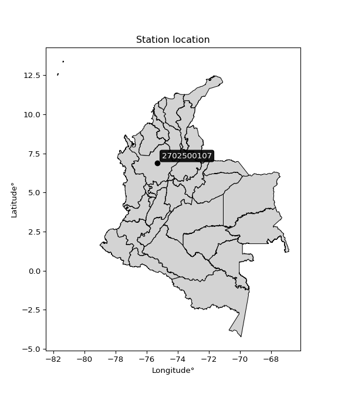

<div align="center">


</div>

# Station (rain, Pmax24h): 2702500107

Probable Maximum Precipitation (PMP) is the greatest amount of rainfall for a specific duration that is meteorologically possible for a given location, acting as a "worst-case" scenario for extreme storms, crucial for designing safety-critical infrastructure like bridges, river deviations, dams, spillways, and nuclear plants to prevent catastrophic failure. PMP is calculated by hydrologists using meteorological data to determine the upper limit of extreme rainfall, often leading to the Probable Maximum Flood (PMF) for flood control design, and is increasingly being studied for climate change impacts.

<div align="center">

</img>

</div>


## A. General information


### 1. General running parameters

• app_version: _v20251226_. • runtime: _2025-12-26 15:38:16.554582_. • Python version: _3.14.0_. • SciPy version: _1.16.3_. • Pandas version: _2.3.3_. • NumPy version: _2.3.5_. • Stations dataset (station_dataset_file): _dataset/pmax24h_in/automatic_colombia_2003_2024.csv_. • Stations catalog (station_catalog_file): _dataset/CNE_IDEAM.xls_. • Minimum year to eval til year_max (date_min): _2003_. • Maximum year to eval since year_min (date_max): _2024_. • Creates, save and include plots into reports (create_plot): _False_. • Plot only fit distributions with Δo > Δ (plot_only_fit): _True_. • Eval low extreme values, if False, evaluates high extreme values (low_extreme): _False_. • Eval every SciPy distribution as logarithmic (pdist_logarithmic_on): _True_. • Standard deviation normalized (ddof): _1.0_. • Return periods to eval in years (Tr): _[2, 2.33, 5, 10, 15, 20, 25, 50, 75, 100, 200, 250, 500, 750, 1000]_. • Minimum data sample per station, 0 means any (minimum_sample): _5_. • Z-Score threshold to adjust a value, 0 means disable (zscore): _3.5_. • Avoid zeros, e.g. rain = 0 (avoid_zeros): _True_. • Avoid null values (avoid_nans): _True_. [:file_folder:Dataset file.](../../dataset/pmax24h_in/automatic_colombia_2003_2024.csv)


### 2. Station info and location

|   id |     CODIGO | NOMBRE                 | CATEGORIA               | TECNOLOGIA                | ESTADO     | FECHA_INSTALACION   | FECHA_SUSPENSION   |   ALTITUD |   LATITUD |   LONGITUD | DEPARTAMENTO   | MUNICIPIO   | AREA_OPERATIVA                      | ENTIDAD                                                     | AREA_HIDROGRAFICA   | ZONA_HIDROGRAFICA   | SUBZONA_HIDROGRAFICA   |   CORRIENTE | OBSERVACION                                                                                                                                                                                                                                         |   SUBRED | Catalogo   |
|-----:|-----------:|:-----------------------|:------------------------|:--------------------------|:-----------|:--------------------|:-------------------|----------:|----------:|-----------:|:---------------|:------------|:------------------------------------|:------------------------------------------------------------|:--------------------|:--------------------|:-----------------------|------------:|:----------------------------------------------------------------------------------------------------------------------------------------------------------------------------------------------------------------------------------------------------|---------:|:-----------|
|    0 | 2702500107 | ANGOSTURA [2702500107] | Climatológica Principal | Automática con Telemetría | Suspendida | 26/12/2017          | 30/09/2025         |      1756 |   6.90056 |    -75.326 | Antioquia      | Angostura   | Area Operativa 01 - Antioquia-Chocó | INSTITUTO DE HIDROLOGIA METEOROLOGIA Y ESTUDIOS AMBIENTALES | Magdalena Cauca     | Nechí               | Alto Nechí             |         nan | Solicitado mediante correo electrónico por Jorge A. González, coordinador área operativa 11|30/09/2025$mvelez$Se suspende la estación bajo el memorando 20253080149323 la cual debio ser desmantelada por parte del ap ya que solicitaron el predio |      nan | CNE_IDEAM  |

<div align="center">

Map location in: [:earth_americas:Google](http://maps.google.com/maps?q=6.900555556,-75.326019444) [:earth_americas:OSM](https://www.openstreetmap.org/#map=18/6.900555556/-75.326019444&layers=P) [:earth_americas:Bing](https://www.bing.com/maps?cp=6.900555556~-75.326019444&lvl=18) [:earth_americas:Apple](https://maps.apple.com/frame?center=6.900555556%2C-75.326019444&span=0.003%2C0.006)

</div>


<div align="center">

```geojson
{
  "type": "Feature",
  "geometry": {
    "type": "Point", 
    "coordinates": [-75.326019444, 6.900555556]
  }, 
  "properties": {
    "Name": "2702500107"
  }
}
```

</div>


### 3. Discrete values table and plot

|               |          0 |           1 |            2 |           3 |         4 |           5 |
|:--------------|-----------:|------------:|-------------:|------------:|----------:|------------:|
| Date          | 2019       | 2020        | 2021         | 2022        | 2023      | 2024        |
| Value         |  153.6     |   61.4      |   73.6       |   66.2      |   42.4    |   66.8      |
| Value_initial |  153.6     |   61.4      |   73.6       |   66.2      |   42.4    |   66.8      |
| count         |    6       |    6        |    6         |    6        |    6      |    6        |
| mean          |   77.3333  |   77.3333   |   77.3333    |   77.3333   |   77.3333 |   77.3333   |
| std           |   38.8321  |   38.8321   |   38.8321    |   38.8321   |   38.8321 |   38.8321   |
| zscore        |    1.96401 |   -0.410314 |   -0.0961404 |   -0.286705 |   -0.8996 |   -0.271253 |
> If Z-Score is active, values out of range or outliers are replaced with the station mean value.


### 4. Active continuous probability distributions from SciPy (45 of 104 available)

[scipy.stats](https://docs.scipy.org/doc/scipy/reference/stats.html) is a Python´s powerful submodule within the SciPy library for comprehensive statistical analysis, offering over 130 probability distributions (like Normal, Poisson), functions for descriptive stats (mean, variance), hypothesis testing (t-tests, chi-square), random variable generation, and statistical tests, making it essential for data science, modeling, and research. It provides tools to explore, model, and draw conclusions from data efficiently, working seamlessly with NumPy.

<div align="center">

|   id | p_dist             |   n_parameter | fit_method   | label                                                                       | active   | ref                                                                                                        |
|-----:|:-------------------|--------------:|:-------------|:----------------------------------------------------------------------------|:---------|:-----------------------------------------------------------------------------------------------------------|
|    0 | alpha              |             3 | MLE          | Alpha                                                                       | True     | [:mortar_board:](https://docs.scipy.org/doc/scipy/reference/generated/scipy.stats.alpha.html)              |
|    1 | betaprime          |             4 | MLE          | Beta prime                                                                  | True     | [:mortar_board:](https://docs.scipy.org/doc/scipy/reference/generated/scipy.stats.betaprime.html)          |
|    2 | chi2               |             3 | MLE          | Chi²                                                                        | True     | [:mortar_board:](https://docs.scipy.org/doc/scipy/reference/generated/scipy.stats.chi2.html)               |
|    3 | crystalball        |             4 | MLE          | Crystalball                                                                 | True     | [:mortar_board:](https://docs.scipy.org/doc/scipy/reference/generated/scipy.stats.crystalball.html)        |
|    4 | erlang             |             3 | MLE          | Erlang                                                                      | True     | [:mortar_board:](https://docs.scipy.org/doc/scipy/reference/generated/scipy.stats.erlang.html)             |
|    5 | expon              |             2 | MLE          | Exponential                                                                 | True     | [:mortar_board:](https://docs.scipy.org/doc/scipy/reference/generated/scipy.stats.expon.html)              |
|    6 | exponnorm          |             3 | MLE          | Exponentially modified Normal                                               | True     | [:mortar_board:](https://docs.scipy.org/doc/scipy/reference/generated/scipy.stats.exponnorm.html)          |
|    7 | f                  |             4 | MLE          | F                                                                           | True     | [:mortar_board:](https://docs.scipy.org/doc/scipy/reference/generated/scipy.stats.f.html)                  |
|    8 | fatiguelife        |             3 | MLE          | Fatigue-life (Birnbaum-Saunders)                                            | True     | [:mortar_board:](https://docs.scipy.org/doc/scipy/reference/generated/scipy.stats.fatiguelife.html)        |
|    9 | fisk               |             3 | MLE          | Fisk                                                                        | True     | [:mortar_board:](https://docs.scipy.org/doc/scipy/reference/generated/scipy.stats.fisk.html)               |
|   10 | gamma              |             3 | MLE          | Gamma                                                                       | True     | [:mortar_board:](https://docs.scipy.org/doc/scipy/reference/generated/scipy.stats.gamma.html)              |
|   11 | genexpon           |             5 | MLE          | Generalized exponential                                                     | True     | [:mortar_board:](https://docs.scipy.org/doc/scipy/reference/generated/scipy.stats.genexpon.html)           |
|   12 | genlogistic        |             3 | MLE          | Generalized logistic                                                        | True     | [:mortar_board:](https://docs.scipy.org/doc/scipy/reference/generated/scipy.stats.genlogistic.html)        |
|   13 | gibrat             |             2 | MM           | Gibrat                                                                      | True     | [:mortar_board:](https://docs.scipy.org/doc/scipy/reference/generated/scipy.stats.gibrat.html)             |
|   14 | gompertz           |             3 | MLE          | Gompertz (or truncated Gumbel)                                              | True     | [:mortar_board:](https://docs.scipy.org/doc/scipy/reference/generated/scipy.stats.gompertz.html)           |
|   15 | gumbel_l           |             2 | MM           | Gumbel Left Skew                                                            | True     | [:mortar_board:](https://docs.scipy.org/doc/scipy/reference/generated/scipy.stats.gumbel_l.html)           |
|   16 | gumbel_r           |             2 | MM           | Gumbel Right Skew                                                           | True     | [:mortar_board:](https://docs.scipy.org/doc/scipy/reference/generated/scipy.stats.gumbel_r.html)           |
|   17 | halflogistic       |             2 | MM           | Half-logistic                                                               | True     | [:mortar_board:](https://docs.scipy.org/doc/scipy/reference/generated/scipy.stats.halflogistic.html)       |
|   18 | halfnorm           |             2 | MM           | Half Normal                                                                 | True     | [:mortar_board:](https://docs.scipy.org/doc/scipy/reference/generated/scipy.stats.halfnorm.html)           |
|   19 | hypsecant          |             2 | MM           | hyperbolic secant                                                           | True     | [:mortar_board:](https://docs.scipy.org/doc/scipy/reference/generated/scipy.stats.hypsecant.html)          |
|   20 | invgamma           |             3 | MLE          | Inverted gamma                                                              | True     | [:mortar_board:](https://docs.scipy.org/doc/scipy/reference/generated/scipy.stats.invgamma.html)           |
|   21 | invgauss           |             3 | MLE          | Inverse Gaussian                                                            | True     | [:mortar_board:](https://docs.scipy.org/doc/scipy/reference/generated/scipy.stats.invgauss.html)           |
|   22 | invweibull         |             3 | MLE          | Inverted Weibull                                                            | True     | [:mortar_board:](https://docs.scipy.org/doc/scipy/reference/generated/scipy.stats.invweibull.html)         |
|   23 | johnsonsu          |             4 | MLE          | Johnson Su                                                                  | True     | [:mortar_board:](https://docs.scipy.org/doc/scipy/reference/generated/scipy.stats.johnsonsu.html)          |
|   24 | kstwobign          |             2 | MLE          | Limiting distribution of scaled Kolmogorov-Smirnov two-sided test statistic | True     | [:mortar_board:](https://docs.scipy.org/doc/scipy/reference/generated/scipy.stats.kstwobign.html)          |
|   25 | laplace            |             2 | MM           | Laplace                                                                     | True     | [:mortar_board:](https://docs.scipy.org/doc/scipy/reference/generated/scipy.stats.laplace.html)            |
|   26 | laplace_asymmetric |             3 | MLE          | Asymmetric Laplace                                                          | True     | [:mortar_board:](https://docs.scipy.org/doc/scipy/reference/generated/scipy.stats.laplace_asymmetric.html) |
|   27 | loggamma           |             3 | MLE          | Log gamma                                                                   | True     | [:mortar_board:](https://docs.scipy.org/doc/scipy/reference/generated/scipy.stats.loggamma.html)           |
|   28 | logistic           |             2 | MM           | Logistic (or Sech-squared)                                                  | True     | [:mortar_board:](https://docs.scipy.org/doc/scipy/reference/generated/scipy.stats.logistic.html)           |
|   29 | lognorm            |             3 | MLE          | Log Normal                                                                  | True     | [:mortar_board:](https://docs.scipy.org/doc/scipy/reference/generated/scipy.stats.lognorm.html)            |
|   30 | maxwell            |             2 | MM           | Maxwell                                                                     | True     | [:mortar_board:](https://docs.scipy.org/doc/scipy/reference/generated/scipy.stats.maxwell.html)            |
|   31 | mielke             |             4 | MLE          | Mielke Beta-Kappa / Dagum                                                   | True     | [:mortar_board:](https://docs.scipy.org/doc/scipy/reference/generated/scipy.stats.mielke.html)             |
|   32 | moyal              |             2 | MM           | Moyal                                                                       | True     | [:mortar_board:](https://docs.scipy.org/doc/scipy/reference/generated/scipy.stats.moyal.html)              |
|   33 | nakagami           |             3 | MLE          | Nakagami                                                                    | True     | [:mortar_board:](https://docs.scipy.org/doc/scipy/reference/generated/scipy.stats.nakagami.html)           |
|   34 | ncf                |             5 | MLE          | Non-central F distribution                                                  | True     | [:mortar_board:](https://docs.scipy.org/doc/scipy/reference/generated/scipy.stats.ncf.html)                |
|   35 | nct                |             4 | MLE          | Non-central Student’s t                                                     | True     | [:mortar_board:](https://docs.scipy.org/doc/scipy/reference/generated/scipy.stats.nct.html)                |
|   36 | norm               |             2 | MM           | Normal                                                                      | True     | [:mortar_board:](https://docs.scipy.org/doc/scipy/reference/generated/scipy.stats.norm.html)               |
|   37 | pareto             |             3 | MLE          | Pareto                                                                      | True     | [:mortar_board:](https://docs.scipy.org/doc/scipy/reference/generated/scipy.stats.pareto.html)             |
|   38 | pearson3           |             3 | MM           | Pearson type III                                                            | True     | [:mortar_board:](https://docs.scipy.org/doc/scipy/reference/generated/scipy.stats.pearson3.html)           |
|   39 | rayleigh           |             2 | MM           | Rayleigh                                                                    | True     | [:mortar_board:](https://docs.scipy.org/doc/scipy/reference/generated/scipy.stats.rayleigh.html)           |
|   40 | rice               |             3 | MLE          | Rice                                                                        | True     | [:mortar_board:](https://docs.scipy.org/doc/scipy/reference/generated/scipy.stats.rice.html)               |
|   41 | t                  |             3 | MLE          | Student’s t                                                                 | True     | [:mortar_board:](https://docs.scipy.org/doc/scipy/reference/generated/scipy.stats.t.html)                  |
|   42 | truncnorm          |             4 | MLE          | Truncated normal                                                            | True     | [:mortar_board:](https://docs.scipy.org/doc/scipy/reference/generated/scipy.stats.truncnorm.html)          |
|   43 | wald               |             2 | MM           | Wald                                                                        | True     | [:mortar_board:](https://docs.scipy.org/doc/scipy/reference/generated/scipy.stats.wald.html)               |
|   44 | weibull_min        |             3 | MLE          | Weibull minimum                                                             | True     | [:mortar_board:](https://docs.scipy.org/doc/scipy/reference/generated/scipy.stats.weibull_min.html)        |

</div>

> **n_parameter:** # arguments & localization & scale.
>
> **Fit methods:** (MLE) maximum likelihood, (MM) L-moments.
>
>**Inactive:** foldnorm, gennorm, norminvgauss, powernorm, powerlognorm, skewnorm, genextreme, anglit, arcsine, argus, beta, bradford, burr, burr12, cauchy, cosine, halfcauchy, foldcauchy, skewcauchy, wrapcauchy, dgamma, gengamma, exponweib, exponpow, truncexpon, gausshyper, genhalflogistic, genhyperbolic, geninvgauss, halfgennorm, johnsonsb, kappa4, kappa3, ksone, kstwo, loglaplace, levy, levy_l, levy_stable, ncx2, genpareto, truncpareto, lomax, powerlaw, rdist, rel_breitwigner, recipinvgauss, semicircular, studentized_range, trapezoid, triang, truncweibull_min, tukeylambda, uniform, loguniform, vonmises, vonmises_line, weibull_max, dweibull, 


## B. Probability distributions vs. Empirical distributions

A continuous probability distribution (CPD) describes probabilities for variables that can take any value within a range (like rain any time), unlike discrete variables with specific outcomes (like temperature). It uses a Probability Density Function (PDF), a curve where the total area under it equals 1, and the probability of the variable falling within an interval (a to b) is found by calculating the area under the curve between those points. A key feature is that the probability of hitting any single exact value is zero, so probabilities are always expressed for ranges, e.g., $P(a ≤ X ≤ b)$.

<div align="center">

Distributions parameters
|    |    station | p_dist                |   n |              loc |          scale | shape                  | shape1                 | shape2                | shape3   |
|---:|-----------:|:----------------------|----:|-----------------:|---------------:|:-----------------------|:-----------------------|:----------------------|:---------|
|  0 | 2702500107 | alpha                 |   6 |      0.640789    |  195.031       | 2.9534416824462886     |                        |                       |          |
|  1 | 2702500107 | betaprime             |   6 |     -0.610279    |    1.50924     | 357.80518622666875     | 8.007876905287015      |                       |          |
|  2 | 2702500107 | chi2                  |   6 |     42.4         |   19.5163      | 1.6626772609738434     |                        |                       |          |
|  3 | 2702500107 | crystalball           |   6 |     77.3333      |   35.4487      | 3418.383458738571      | 8193.303694341423      |                       |          |
|  4 | 2702500107 | erlang                |   6 |     42.4         |   36.0846      | 0.9026950973673562     |                        |                       |          |
|  5 | 2702500107 | expon                 |   6 |     42.4         |   34.9333      |                        |                        |                       |          |
|  6 | 2702500107 | exponnorm             |   6 |     47.7956      |    9.41622     | 3.1368871559731817     |                        |                       |          |
|  7 | 2702500107 | f                     |   6 |     25.363       |   38.1251      | 50.44930978048479      | 7.394939183870964      |                       |          |
|  8 | 2702500107 | fatiguelife           |   6 |     33.4683      |   32.9937      | 0.8110546790696986     |                        |                       |          |
|  9 | 2702500107 | fisk                  |   6 |     34.4862      |   32.1081      | 2.333028375462378      |                        |                       |          |
| 10 | 2702500107 | gamma                 |   6 |     42.4         |   51.033       | 0.15619302381988406    |                        |                       |          |
| 11 | 2702500107 | genexpon              |   6 |     42.4         |   40.7544      | 1.1666309922411513     | 1.3523123741572984e-09 | 1.6245010729407863    |          |
| 12 | 2702500107 | genlogistic           |   6 |    -85.0304      |   21.3117      | 1034.8971578700748     |                        |                       |          |
| 13 | 2702500107 | gibrat                |   6 |     50.2905      |   16.4023      |                        |                        |                       |          |
| 14 | 2702500107 | gompertz              |   6 |     42.4         |    2.27889e+10 | 648746295.2647562      |                        |                       |          |
| 15 | 2702500107 | gumbel_l              |   6 |     93.2871      |   27.6392      |                        |                        |                       |          |
| 16 | 2702500107 | gumbel_r              |   6 |     61.3795      |   27.6392      |                        |                        |                       |          |
| 17 | 2702500107 | halflogistic          |   6 |     35.3184      |   30.3074      |                        |                        |                       |          |
| 18 | 2702500107 | halfnorm              |   6 |     30.4132      |   58.8057      |                        |                        |                       |          |
| 19 | 2702500107 | hypsecant             |   6 |     77.3333      |   22.5673      |                        |                        |                       |          |
| 20 | 2702500107 | invgamma              |   6 |     23.0685      |  143.981       | 3.631196158605201      |                        |                       |          |
| 21 | 2702500107 | invgauss              |   6 |     31.43        |   72.51        | 0.6330612455002671     |                        |                       |          |
| 22 | 2702500107 | invweibull            |   6 |     42.4         |    1.35543     | 0.04754822531075539    |                        |                       |          |
| 23 | 2702500107 | johnsonsu             |   6 |     33.9063      |    0.487919    | -6.349041714354588     | 1.2978885502253896     |                       |          |
| 24 | 2702500107 | kstwobign             |   6 |    -18.4954      |  111.702       |                        |                        |                       |          |
| 25 | 2702500107 | laplace               |   6 |     77.3333      |   25.066       |                        |                        |                       |          |
| 26 | 2702500107 | laplace_asymmetric    |   6 |     66.2         |   18.2075      | 0.7399378192097813     |                        |                       |          |
| 27 | 2702500107 | loggamma              |   6 |  -9438.41        | 1319.64        | 1354.408434810216      |                        |                       |          |
| 28 | 2702500107 | logistic              |   6 |     77.3333      |   19.5439      |                        |                        |                       |          |
| 29 | 2702500107 | lognorm               |   6 |     42.4         |    0.0804937   | 13.454777350047218     |                        |                       |          |
| 30 | 2702500107 | maxwell               |   6 |     -6.66515     |   52.6382      |                        |                        |                       |          |
| 31 | 2702500107 | mielke                |   6 |      2.12873     |   12.7545      | 417.4014224819159      | 3.2234147156195014     |                       |          |
| 32 | 2702500107 | moyal                 |   6 |     57.0615      |   15.9575      |                        |                        |                       |          |
| 33 | 2702500107 | nakagami              |   6 |     42.4         |   68.7805      | 0.06563485222288708    |                        |                       |          |
| 34 | 2702500107 | ncf                   |   6 |     -0.0595132   |    1.26081e-05 | 1.7631805344676666e-06 | 8.756259600437271      | 9.49427451044815      |          |
| 35 | 2702500107 | nct                   |   6 |     -0.231953    |    1.14799     | 4.556966786076277      | 55.31392576271705      |                       |          |
| 36 | 2702500107 | norm                  |   6 |     77.3333      |   35.4487      |                        |                        |                       |          |
| 37 | 2702500107 | pareto                |   6 |     42.3084      |    0.0915881   | 0.2038813708035        |                        |                       |          |
| 38 | 2702500107 | pearson3              |   6 |     77.3333      |   35.4487      | 1.4754173649921958     |                        |                       |          |
| 39 | 2702500107 | rayleigh              |   6 |      9.51794     |   54.1089      |                        |                        |                       |          |
| 40 | 2702500107 | rice                  |   6 |     24.0081      |   45.278       | 0.0008870724326874128  |                        |                       |          |
| 41 | 2702500107 | t                     |   6 |     61.7973      |   13.1277      | 1.296006287814514      |                        |                       |          |
| 42 | 2702500107 | truncnorm             |   6 | -63792.1         | 1505.53        | 42.39996994892893      | 158.7195863367608      |                       |          |
| 43 | 2702500107 | wald                  |   6 |     41.8847      |   35.4487      |                        |                        |                       |          |
| 44 | 2702500107 | weibull_min           |   6 |     42.4         |   19.5852      | 0.16617289329125473    |                        |                       |          |
| 45 | 2702500107 | logalpha              |   6 |      2.21441     |   11.4966      | 5.78858974918071       |                        |                       |          |
| 46 | 2702500107 | logbetaprime          |   6 |      0.160435    |    8.9474      | 178.49995870202827     | 390.03918592342234     |                       |          |
| 47 | 2702500107 | logchi2               |   6 |      3.74715     |    0.992539    | 1.0321942111170386     |                        |                       |          |
| 48 | 2702500107 | logcrystalball        |   6 |      4.26532     |    0.385621    | 489.86543451849104     | 29.84636352630676      |                       |          |
| 49 | 2702500107 | logerlang             |   6 |      3.59309     |    0.238092    | 2.82341548988355       |                        |                       |          |
| 50 | 2702500107 | logexpon              |   6 |      3.74715     |    0.518175    |                        |                        |                       |          |
| 51 | 2702500107 | logexponnorm          |   6 |      3.93287     |    0.19216     | 1.7301489766926843     |                        |                       |          |
| 52 | 2702500107 | logf                  |   6 |      2.8989      |    1.27096     | 4914.638192350059      | 28.53686225298866      |                       |          |
| 53 | 2702500107 | logfatiguelife        |   6 |      3.22848     |    0.970444    | 0.3699264532113228     |                        |                       |          |
| 54 | 2702500107 | logfisk               |   6 |      3.23885     |    0.961066    | 4.99310511960646       |                        |                       |          |
| 55 | 2702500107 | loggamma              |   6 |      3.59309     |    0.238088    | 2.82347092705628       |                        |                       |          |
| 56 | 2702500107 | loggenexpon           |   6 |      3.74715     |    0.0644689   | 0.07586227984115951    | 2.536069227064913      | 0.0031232254461985277 |          |
| 57 | 2702500107 | loggenlogistic        |   6 |      2.52578     |    0.300094    | 184.62358528326018     |                        |                       |          |
| 58 | 2702500107 | loggibrat             |   6 |      3.97116     |    0.178417    |                        |                        |                       |          |
| 59 | 2702500107 | loggompertz           |   6 |      3.74715     |    1.09703     | 1.3948249515526059     |                        |                       |          |
| 60 | 2702500107 | loggumbel_l           |   6 |      4.43887     |    0.300668    |                        |                        |                       |          |
| 61 | 2702500107 | loggumbel_r           |   6 |      4.09177     |    0.300668    |                        |                        |                       |          |
| 62 | 2702500107 | loghalflogistic       |   6 |      3.80824     |    0.329713    |                        |                        |                       |          |
| 63 | 2702500107 | loghalfnorm           |   6 |      3.75488     |    0.639742    |                        |                        |                       |          |
| 64 | 2702500107 | loghypsecant          |   6 |      4.26532     |    0.245494    |                        |                        |                       |          |
| 65 | 2702500107 | loginvgamma           |   6 |      2.89522     |   18.1833      | 14.268388409500322     |                        |                       |          |
| 66 | 2702500107 | loginvgauss           |   6 |      3.20788     |    7.83591     | 0.13494857967355672    |                        |                       |          |
| 67 | 2702500107 | loginvweibull         |   6 |     -1.65249e+06 |    1.6525e+06  | 5492023.166055092      |                        |                       |          |
| 68 | 2702500107 | logjohnsonsu          |   6 |      4.19655     |    0.00660023  | -0.048121369563004085  | 0.2785214524024465     |                       |          |
| 69 | 2702500107 | logkstwobign          |   6 |      2.99863     |    1.4613      |                        |                        |                       |          |
| 70 | 2702500107 | loglaplace            |   6 |      4.26532     |    0.272676    |                        |                        |                       |          |
| 71 | 2702500107 | loglaplace_asymmetric |   6 |      4.19268     |    0.237977    | 0.8595072195375202     |                        |                       |          |
| 72 | 2702500107 | logloggamma           |   6 |   -108.454       |   15.3329      | 1559.500211636272      |                        |                       |          |
| 73 | 2702500107 | loglogistic           |   6 |      4.26532     |    0.212604    |                        |                        |                       |          |
| 74 | 2702500107 | loglognorm            |   6 |      3.74715     |    0.0016941   | 12.961905653972643     |                        |                       |          |
| 75 | 2702500107 | logmaxwell            |   6 |      3.35156     |    0.572615    |                        |                        |                       |          |
| 76 | 2702500107 | logmielke             |   6 |      2.19603     |    1.79656     | 17.383458341368694     | 8.404918017372506      |                       |          |
| 77 | 2702500107 | logmoyal              |   6 |      4.0448      |    0.173591    |                        |                        |                       |          |
| 78 | 2702500107 | lognakagami           |   6 |      3.74715     |    0.647911    | 0.36135084178032784    |                        |                       |          |
| 79 | 2702500107 | logncf                |   6 |      3.53532     |    0.595059    | 7.157657660021066      | 155.41883576507394     | 1.5099816710065164    |          |
| 80 | 2702500107 | lognct                |   6 |     -0.707093    |    0.143757    | 106.24350144805737     | 34.340615446773256     |                       |          |
| 81 | 2702500107 | lognorm               |   6 |      4.26532     |    0.385621    |                        |                        |                       |          |
| 82 | 2702500107 | logpareto             |   6 |      3.74561     |    0.00153715  | 0.20359034882477747    |                        |                       |          |
| 83 | 2702500107 | logpearson3           |   6 |      4.26532     |    0.385622    | 0.9063145405259156     |                        |                       |          |
| 84 | 2702500107 | lograyleigh           |   6 |      3.52761     |    0.588612    |                        |                        |                       |          |
| 85 | 2702500107 | logrice               |   6 |      3.58361     |    0.553822    | 0.0017245674930455343  |                        |                       |          |
| 86 | 2702500107 | logt                  |   6 |      4.26522     |    0.385496    | 3355.7399068383147     |                        |                       |          |
| 87 | 2702500107 | logtruncnorm          |   6 |     -0.11362     |    1.10964     | 4.639328893852069      | 4.6393288938520705     |                       |          |
| 88 | 2702500107 | logwald               |   6 |      3.8797      |    0.385617    |                        |                        |                       |          |
| 89 | 2702500107 | logweibull_min        |   6 |      3.70679     |    0.605239    | 1.3612806069425099     |                        |                       |          |

</div>

> **loc** (Location parameter): This shifts the distribution along the x-axis. For many common distributions, like the normal (Gaussian) distribution, loc represents the mean $μ$. For others, like the uniform distribution, it might represent the minimum value, or for the beta distribution, the left end of the support interval.
>
> **scale** (Scale parameter): This determines the width or spread of the distribution. For the normal distribution, scale represents the standard deviation $σ$. For a uniform distribution, it defines the length of the interval (from $loc$ to $loc + scale$).
>
> **shape** (Shape parameters): Refers to parameters that define the specific form of a probability distribution, distinct from its location (loc) and scale (scale). These parameters are required arguments for most distribution functions. For example, a normal (Gaussian) distribution is fully defined by its location (mean) and scale (standard deviation), so it has no specific shape parameters beyond loc and scale. However, other distributions have intrinsic properties that need specification, as Gamma distribution that takes a shape parameter, often named $a$ or $alpha$.


### 0. Cumulative distribution values - CDF (90 evaluated)

> Ordered by x ascending and calculating $log(f(x))$ separately. 

|   id |    Station |   date |     x |   count |    mean |     std |     zscore |   Value_initial |    station |   m |     alpha |   alpha_pdf |   betaprime |   betaprime_pdf |        chi2 |   chi2_pdf |   crystalball |   crystalball_pdf |     erlang |   erlang_pdf |    expon |   expon_pdf |   exponnorm |   exponnorm_pdf |         f |       f_pdf |   fatiguelife |   fatiguelife_pdf |      fisk |    fisk_pdf |     gamma |   gamma_pdf |    genexpon |   genexpon_pdf |   genlogistic |   genlogistic_pdf |   gibrat |   gibrat_pdf |    gompertz |   gompertz_pdf |   gumbel_l |   gumbel_l_pdf |   gumbel_r |   gumbel_r_pdf |   halflogistic |   halflogistic_pdf |   halfnorm |   halfnorm_pdf |   hypsecant |   hypsecant_pdf |   invgamma |   invgamma_pdf |   invgauss |   invgauss_pdf |   invweibull |   invweibull_pdf |   johnsonsu |   johnsonsu_pdf |   kstwobign |   kstwobign_pdf |   laplace |   laplace_pdf |   laplace_asymmetric |   laplace_asymmetric_pdf |   loggamma |   loggamma_pdf |   logistic |   logistic_pdf |   lognorm |   lognorm_pdf |   maxwell |   maxwell_pdf |      mielke |   mielke_pdf |    moyal |   moyal_pdf |   nakagami |   nakagami_pdf |      ncf |    ncf_pdf |       nct |     nct_pdf |     norm |   norm_pdf |   pareto |   pareto_pdf |   pearson3 |   pearson3_pdf |   rayleigh |   rayleigh_pdf |     rice |   rice_pdf |        t |      t_pdf |   truncnorm |   truncnorm_pdf |        wald |    wald_pdf |   weibull_min |   weibull_min_pdf |   logalpha |   logalpha_pdf |   logbetaprime |   logbetaprime_pdf |     logchi2 |   logchi2_pdf |   logcrystalball |   logcrystalball_pdf |   logerlang |   logerlang_pdf |   logexpon |   logexpon_pdf |   logexponnorm |   logexponnorm_pdf |      logf |   logf_pdf |   logfatiguelife |   logfatiguelife_pdf |   logfisk |   logfisk_pdf |   loggenexpon |   loggenexpon_pdf |   loggenlogistic |   loggenlogistic_pdf |   loggibrat |   loggibrat_pdf |   loggompertz |   loggompertz_pdf |   loggumbel_l |   loggumbel_l_pdf |   loggumbel_r |   loggumbel_r_pdf |   loghalflogistic |   loghalflogistic_pdf |   loghalfnorm |   loghalfnorm_pdf |   loghypsecant |   loghypsecant_pdf |   loginvgamma |   loginvgamma_pdf |   loginvgauss |   loginvgauss_pdf |   loginvweibull |   loginvweibull_pdf |   logjohnsonsu |   logjohnsonsu_pdf |   logkstwobign |   logkstwobign_pdf |   loglaplace |   loglaplace_pdf |   loglaplace_asymmetric |   loglaplace_asymmetric_pdf |   logloggamma |   logloggamma_pdf |   loglogistic |   loglogistic_pdf |   loglognorm |   loglognorm_pdf |   logmaxwell |   logmaxwell_pdf |   logmielke |   logmielke_pdf |   logmoyal |   logmoyal_pdf |   lognakagami |   lognakagami_pdf |    logncf |   logncf_pdf |    lognct |   lognct_pdf |   logpareto |   logpareto_pdf |   logpearson3 |   logpearson3_pdf |   lograyleigh |   lograyleigh_pdf |   logrice |   logrice_pdf |      logt |   logt_pdf |   logtruncnorm |   logtruncnorm_pdf |   logwald |   logwald_pdf |   logweibull_min |   logweibull_min_pdf |
|-----:|-----------:|-------:|------:|--------:|--------:|--------:|-----------:|----------------:|-----------:|----:|----------:|------------:|------------:|----------------:|------------:|-----------:|--------------:|------------------:|-----------:|-------------:|---------:|------------:|------------:|----------------:|----------:|------------:|--------------:|------------------:|----------:|------------:|----------:|------------:|------------:|---------------:|--------------:|------------------:|---------:|-------------:|------------:|---------------:|-----------:|---------------:|-----------:|---------------:|---------------:|-------------------:|-----------:|---------------:|------------:|----------------:|-----------:|---------------:|-----------:|---------------:|-------------:|-----------------:|------------:|----------------:|------------:|----------------:|----------:|--------------:|---------------------:|-------------------------:|-----------:|---------------:|-----------:|---------------:|----------:|--------------:|----------:|--------------:|------------:|-------------:|---------:|------------:|-----------:|---------------:|---------:|-----------:|----------:|------------:|---------:|-----------:|---------:|-------------:|-----------:|---------------:|-----------:|---------------:|---------:|-----------:|---------:|-----------:|------------:|----------------:|------------:|------------:|--------------:|------------------:|-----------:|---------------:|---------------:|-------------------:|------------:|--------------:|-----------------:|---------------------:|------------:|----------------:|-----------:|---------------:|---------------:|-------------------:|----------:|-----------:|-----------------:|---------------------:|----------:|--------------:|--------------:|------------------:|-----------------:|---------------------:|------------:|----------------:|--------------:|------------------:|--------------:|------------------:|--------------:|------------------:|------------------:|----------------------:|--------------:|------------------:|---------------:|-------------------:|--------------:|------------------:|--------------:|------------------:|----------------:|--------------------:|---------------:|-------------------:|---------------:|-------------------:|-------------:|-----------------:|------------------------:|----------------------------:|--------------:|------------------:|--------------:|------------------:|-------------:|-----------------:|-------------:|-----------------:|------------:|----------------:|-----------:|---------------:|--------------:|------------------:|----------:|-------------:|----------:|-------------:|------------:|----------------:|--------------:|------------------:|--------------:|------------------:|----------:|--------------:|----------:|-----------:|---------------:|-------------------:|----------:|--------------:|-----------------:|---------------------:|
|    0 | 2702500107 |   2023 |  42.4 |       6 | 77.3333 | 38.8321 | -0.8996    |            42.4 | 2702500107 |   1 | 0.0430642 | 0.0102348   |   0.0715911 |     0.010257    | 8.74385e-14 | 10.2303    |      0.162199 |        0.00692517 | 6.9028e-15 |   0.876953   | 0        |  0.028626   |   0.0480861 |     0.00796381  | 0.0434558 | 0.0115362   |     0.0419741 |         0.0151052 | 0.0367062 | 0.010424    | 0.0035843 | 7.87907e+10 | 2.44282e-13 |     0.0286259  |     0.0731369 |       0.00896421  | 0        |  0           | 8.67962e-13 |     0.0284677  |   0.146696 |    0.00489767  |   0.137089 |     0.00985603 |       0.116301 |         0.0162745  |   0.16152  |     0.0132892  |    0.133409 |     0.00574005  |  0.0428219 |    0.0114817   |  0.0422245 |      0.0137891 |   0.00843452 |      2.69536e+11 |   0.0408971 |      0.0133851  |   0.0724063 |     0.00868246  |  0.124083 |   0.00495027  |            0.0604704 |              0.00448847  |  0.0379035 |       0.581437 |   0.143388 |    0.00628472  | 0.0895163 |      0.419431 |  0.167062 |    0.00852932 |   0.0431352 |    0.0107224 | 0.113396 |   0.011304  | 0.00690023 |    1.27479e+11 | 0.32272  | 0.00880294 | 0.0560838 | 0.0104493   | 0.162199 | 0.00692517 | 0        |  2.22607     |   0.118445 |     0.0137957  |   0.168605 |     0.00933748 | 0.079188 | 0.00826084 | 0.16823  | 0.00816976 |    0        |      0.0281784  | 2.96207e-16 | 2.00438e-14 |    0.00271422 |       6.33905e+10 |  0.0434351 |       0.45081  |      0.0747065 |           0.427774 | 9.44211e-09 |   1.09731e+07 |        0.0895162 |             0.41943  |   0.0379037 |        0.581444 |   0        |       1.92985  |      0.0403818 |           0.380561 | 0.0431049 |   0.465433 |        0.0425917 |             0.495949 | 0.0399054 |      0.376358 |   4.79873e-11 |          1.17673  |        0.0438753 |             0.453248 |    0        |       0         |   1.81887e-11 |          1.27145  |     0.0953398 |          0.301473 |      0.043015 |          0.450112 |          0        |              0        |      0        |          0        |      0.0767513 |           0.309619 |     0.0431051 |          0.465433 |     0.0426595 |          0.492703 |       0.0435207 |            0.453376 |      0.0782734 |          0.0906173 |      0.0444164 |           0.498698 |    0.0747593 |         0.274169 |               0.0481161 |                   0.235237  |     0.0895871 |          0.412068 |     0.0803742 |          0.347661 |    0.0127086 |      5.70254e+12 |    0.0761424 |         0.52384  |   0.0458799 |        0.398299 |  0.0184293 |       0.336896 |   8.54587e-12 |      13907.4      | 0.0408263 |     0.538232 | 0.0733039 |     0.438257 |    0        |     132.447     |     0.0513941 |          0.521557 |     0.0671936 |          0.591084 | 0.0426624 |      0.510444 | 0.0895349 |   0.419431 |              0 |        0           |  0        |      0        |        0.0247593 |             0.824663 |
|    1 | 2702500107 |   2020 |  61.4 |       6 | 77.3333 | 38.8321 | -0.410314  |            61.4 | 2702500107 |   2 | 0.399427  | 0.0204263   |   0.362718  |     0.0173217   | 0.47358     |  0.0157225 |      0.326544 |        0.0101728  | 0.458877   |   0.0163367  | 0.419516 |  0.0166169  |   0.348285  |     0.0195498   | 0.40524   | 0.019329    |     0.418554  |         0.0173017 | 0.398503  | 0.0207783   | 0.878449  | 0.00521478  | 0.419515    |     0.0166169  |     0.341914  |       0.0172089   | 0.348408 |  0.0332852   | 0.417768    |     0.0165748  |   0.270554 |    0.00832579  |   0.368152 |     0.01331    |       0.405559 |         0.0137841  |   0.401762 |     0.0118094  |    0.291898 |     0.0111964   |  0.405043  |    0.019343    |  0.414053  |      0.0178971 |   0.413947   |      0.000913698 |   0.414185  |      0.0183925  |   0.31429   |     0.0150387   |  0.264794 |   0.0105639   |            0.247757  |              0.01839     |  0.421729  |       1.14558  |   0.306771 |    0.0108813   | 0.350648  |      0.961171 |  0.356832 |    0.0109852  |   0.401626  |    0.0198551 | 0.38272  |   0.0149091 | 0.730885   |    0.00502595  | 0.478112 | 0.00742609 | 0.37752   | 0.0187374   | 0.326544 | 0.0101728  | 0.663335 |  0.00359529  |   0.398777 |     0.0141215  |   0.368522 |     0.0111902  | 0.28894  | 0.0129691  | 0.489917 | 0.0253637  |    0.414606 |      0.0165004  | 0.407704    | 0.0229328   |    0.630266   |       0.00321741  |  0.400233  |       1.22669  |      0.356987  |           1.03823  | 0.445518    |   0.548266    |        0.350648  |             0.961171 |   0.421731  |        1.14558  |   0.510587 |       0.944493 |      0.391355  |           1.32407  | 0.402402  |   1.2104   |        0.406235  |             1.18065  | 0.389789  |      1.3518   |   0.431953    |          1.06569  |        0.40019   |             1.21826  |    0.421194 |       2.6745    |   0.428769    |          1.01787  |     0.290571  |          0.810008 |      0.39921  |          1.21922  |          0.437266 |              1.22652  |      0.429069 |          1.06219  |      0.318865  |           1.09228  |     0.402403  |          1.2104   |     0.4058    |          1.18338  |       0.40024   |            1.21804  |      0.175268  |          0.904904  |      0.399024  |           1.14472  |    0.290661  |         1.06596  |               0.294067  |                   1.43768   |     0.345774  |          0.946461 |     0.332762  |          1.04434  |    0.661151  |      0.0762474   |    0.382623  |         1.01907  |   0.39412   |        1.29255  |  0.417204  |       1.34163  |   0.503337    |          0.900359 | 0.411712  |     1.16003  | 0.363023  |     1.05358  |    0.672867 |       0.179132  |     0.399599  |          1.1325   |     0.394696  |          1.03044  | 0.371553  |      1.09372  | 0.350715  |   0.961447 |              0 |        0           |  0.458565 |      1.89714  |        0.445517  |             1.08402  |
|    2 | 2702500107 |   2022 |  66.2 |       6 | 77.3333 | 38.8321 | -0.286705  |            66.2 | 2702500107 |   3 | 0.492221  | 0.0181271   |   0.44424   |     0.016533    | 0.543237    |  0.0133849 |      0.376734 |        0.0107125  | 0.53149    |   0.0139919  | 0.49404  |  0.0144836  |   0.439184  |     0.0181293   | 0.492604  | 0.0170179   |     0.496078  |         0.0150271 | 0.492794  | 0.0183875   | 0.90016   | 0.00392503  | 0.494039    |     0.0144836  |     0.424494  |       0.0170601   | 0.487832 |  0.0250641   | 0.492131    |     0.0144579  |   0.312918 |    0.00932961  |   0.43173  |     0.0131203  |       0.469535 |         0.0128605  |   0.457184 |     0.0112746  |    0.348973 |     0.0125468   |  0.492425  |    0.0170126   |  0.494389  |      0.0155835 |   0.417854   |      0.000728465 |   0.49682   |      0.0160312  |   0.386667  |     0.0150283   |  0.320681 |   0.0127935   |            0.3538    |              0.0262611   |  0.505174  |       1.06649  |   0.361316 |    0.0118076   | 0.42529   |      1.01635  |  0.410016 |    0.0111425  |   0.491504  |    0.0175155 | 0.452648 |   0.0141617 | 0.752686   |    0.00412096  | 0.512744 | 0.00700282 | 0.464288  | 0.0173012   | 0.376734 | 0.0107125  | 0.678382 |  0.00274456  |   0.464431 |     0.0132076  |   0.422292 |     0.0111845  | 0.352194 | 0.0133321  | 0.608243 | 0.0230713  |    0.488686 |      0.0144134  | 0.506648    | 0.0184358   |    0.644034   |       0.00256719  |  0.490874  |       1.17165  |      0.436935  |           1.07856  | 0.484211    |   0.48265     |        0.42529   |             1.01635  |   0.505175  |        1.06649  |   0.576758 |       0.816794 |      0.489587  |           1.27002  | 0.491657  |   1.15206  |        0.493042  |             1.11831  | 0.490563  |      1.30824  |   0.509368    |          0.989458 |        0.49015   |             1.16239  |    0.58565  |       1.7593    |   0.502815    |          0.948846 |     0.356576  |          0.943629 |      0.489241 |          1.16327  |          0.524836 |              1.09875  |      0.506239 |          0.986826 |      0.407156  |           1.24184  |     0.491657  |          1.15206  |     0.492832  |          1.12144  |       0.490158  |            1.16154  |      0.419422  |         14.2229    |      0.48343   |           1.09134  |    0.383064  |         1.40483  |               0.424878  |                   2.07718   |     0.419411  |          1.00464  |     0.415401  |          1.14223  |    0.66636   |      0.0629844   |    0.45967   |         1.02219  |   0.490138  |        1.24441  |  0.513659  |       1.21272  |   0.567699    |          0.811285 | 0.496766  |     1.09351  | 0.443784  |     1.08449  |    0.684918 |       0.143485  |     0.483559  |          1.0912   |     0.47183   |          1.01387  | 0.453782  |      1.08466  | 0.425378  |   1.01664  |              0 |        0           |  0.580988 |      1.38429  |        0.523634  |             0.989692 |
|    3 | 2702500107 |   2024 |  66.8 |       6 | 77.3333 | 38.8321 | -0.271253  |            66.8 | 2702500107 |   4 | 0.503001  | 0.0178036   |   0.454118  |     0.0163914   | 0.55119     |  0.0131255 |      0.383179 |        0.0107681  | 0.539806   |   0.0137278  | 0.502656 |  0.0142369  |   0.449988  |     0.0178833   | 0.502724  | 0.0167133   |     0.505012  |         0.0147562 | 0.503725  | 0.0180488   | 0.902477  | 0.00379851  | 0.502655    |     0.0142369  |     0.434708  |       0.016986    | 0.502598 |  0.0241639   | 0.500732    |     0.014213   |   0.318554 |    0.00945615  |   0.439588 |     0.0130722  |       0.477215 |         0.0127406  |   0.463928 |     0.0112042  |    0.356547 |     0.0126966   |  0.502541  |    0.0167061   |  0.503654  |      0.0153009 |   0.418286   |      0.000710444 |   0.506351  |      0.0157374  |   0.395673  |     0.0149911   |  0.32845  |   0.0131034   |            0.369366  |              0.0256285   |  0.514746  |       1.05518  |   0.36843  |    0.011906    | 0.43448   |      1.02056  |  0.416703 |    0.0111487  |   0.501919  |    0.0171989 | 0.461109 |   0.0140433 | 0.755132   |    0.00403117  | 0.516929 | 0.00694956 | 0.474603  | 0.0170805   | 0.383179 | 0.0107681  | 0.680005 |  0.00266382  |   0.472319 |     0.0130835  |   0.428999 |     0.0111717  | 0.360201 | 0.0133546  | 0.621908 | 0.0224705  |    0.497261 |      0.0141718  | 0.517559    | 0.0179362   |    0.645555   |       0.0025037   |  0.501399  |       1.16133  |      0.446675  |           1.08035  | 0.488535    |   0.475822    |        0.43448   |             1.02056  |   0.514747  |        1.05518  |   0.584064 |       0.802695 |      0.500991  |           1.25759  | 0.502006  |   1.14171  |        0.503086  |             1.10807  | 0.502314  |      1.29641  |   0.518251    |          0.979648 |        0.500592  |             1.15212  |    0.601138 |       1.67457   |   0.511337    |          0.940283 |     0.365161  |          0.9594   |      0.49969  |          1.15299  |          0.534679 |              1.08294  |      0.5151   |          0.97725  |      0.418418  |           1.25425  |     0.502006  |          1.14171  |     0.502905  |          1.1112   |       0.500592  |            1.15122  |      0.560263  |         13.1208    |      0.493237  |           1.08249  |    0.395951  |         1.4521   |               0.443318  |                   2.01058   |     0.428497  |          1.00932  |     0.425743  |          1.14996  |    0.666922  |      0.0616931   |    0.468884  |         1.02022  |   0.501316  |        1.23332  |  0.524518  |       1.19445  |   0.574973    |          0.801167 | 0.506586  |     1.08319  | 0.453572  |     1.08505  |    0.686198 |       0.140075  |     0.493371  |          1.08356  |     0.48096   |          1.00987  | 0.463552  |      1.08104  | 0.43457   |   1.02085  |              0 |        0           |  0.593249 |      1.33391  |        0.53251   |             0.977729 |
|    4 | 2702500107 |   2021 |  73.6 |       6 | 77.3333 | 38.8321 | -0.0961404 |            73.6 | 2702500107 |   5 | 0.611334  | 0.0140759   |   0.559085  |     0.0143799   | 0.631406    |  0.0105791 |      0.458062 |        0.0111918  | 0.623868   |   0.0111013  | 0.590627 |  0.0117187  |   0.561124  |     0.0147543   | 0.604758  | 0.0133437   |     0.595556  |         0.0119605 | 0.613124  | 0.0141485   | 0.924274  | 0.00270182  | 0.590626    |     0.0117187  |     0.545765  |       0.0155033   | 0.63737  |  0.01609     | 0.588601    |     0.0117116  |   0.387692 |    0.0108668   |   0.525893 |     0.0122279  |       0.559123 |         0.0113402  |   0.537294 |     0.0103611  |    0.44758  |     0.0139141   |  0.604472  |    0.013323    |  0.597345  |      0.0123349 |   0.422544   |      0.000554738 |   0.602485  |      0.0126107  |   0.495119  |     0.0141383   |  0.43081  |   0.017187    |            0.521633  |              0.0194405   |  0.610627  |       0.919485 |   0.452389 |    0.0126757   | 0.53443   |      1.03069  |  0.49228  |    0.0110202  | nan         |  nan         | 0.55145  |   0.0124699 | 0.779647   |    0.00323894  | 0.56214  | 0.00634921 | 0.581499  | 0.0143051   | 0.458062 | 0.0111918  | 0.695597 |  0.00198335  |   0.556296 |     0.0115979  |   0.504062 |     0.0108549  | 0.451087 | 0.0132782  | 0.747849 | 0.0145513  |    0.58496  |      0.0117009  | 0.622543    | 0.0132164   |    0.660557   |       0.00195334  |  0.607413  |       1.01731  |      0.550959  |           1.05898  | 0.531464    |   0.412676    |        0.53443   |             1.03069  |   0.610627  |        0.91948  |   0.655033 |       0.665735 |      0.614588  |           1.07357  | 0.606232  |   1.00103  |        0.604313  |             0.974244 | 0.619693  |      1.11035  |   0.60789     |          0.868063 |        0.605801  |             1.01041  |    0.728175 |       1.01306   |   0.597922    |          0.845158 |     0.465949  |          1.11416  |      0.60498  |          1.01121  |          0.631366 |              0.911972 |      0.604661 |          0.869071 |      0.543073  |           1.28476  |     0.606232  |          1.00103  |     0.604414  |          0.976805 |       0.605699  |            1.00927  |      0.818069  |          0.719165  |      0.592786  |           0.965656 |    0.557516  |         1.62275  |               0.607763  |                   1.41665   |     0.52764   |          1.02554  |     0.539103  |          1.1687   |    0.672326  |      0.050517    |    0.565787  |         0.97074  |   0.613405  |        1.0673   |  0.630268  |       0.985218 |   0.64757     |          0.698204 | 0.605498  |     0.952354 | 0.557671  |     1.05068  |    0.698272 |       0.111076  |     0.5935    |          0.975137 |     0.57597   |          0.943655 | 0.565457  |      1.01302  | 0.534547  |   1.03092  |              0 |        0           |  0.700456 |      0.91047  |        0.620926  |             0.845741 |
|    5 | 2702500107 |   2019 | 153.6 |       6 | 77.3333 | 38.8321 |  1.96401   |           153.6 | 2702500107 |   6 | 0.954865  | 0.000814408 |   0.972733  |     0.000886555 | 0.958984    |  0.0010996 |      0.98428  |        0.00111218 | 0.962381   |   0.00106863 | 0.958547 |  0.00118662 |   0.97073   |     0.000990923 | 0.956894  | 0.000936889 |     0.956045  |         0.0011609 | 0.95515   | 0.000839067 | 0.992426  | 0.000192802 | 0.958547    |     0.00118663 |     0.985909  |       0.000656514 | 0.967138 |  0.000710152 | 0.957811    |     0.00120101 |   0.999859 |    4.52903e-05 |   0.965066 |     0.00124158 |       0.960426 |         0.00127993 |   0.963812 |     0.00151227 |    0.978323 |     0.000959822 |  0.956167  |    0.000942426 |  0.956141  |      0.0011089 |   0.444438   |      0.00015411  |   0.954703  |      0.00103325 |   0.98265   |     0.000957197 |  0.976145 |   0.000951669 |            0.981473  |              0.000752929 |  0.95086   |       0.153889 |   0.980205 |    0.000992802 | 0.976938  |      0.141625 |  0.974091 |    0.00136389 | nan         |  nan         | 0.961266 |   0.0012127 | 0.912634   |    0.00091678  | 0.857215 | 0.00186411 | 0.966118  | 0.000887891 | 0.98428  | 0.00111218 | 0.764981 |  0.000430544 |   0.960457 |     0.00129109 |   0.97114  |     0.00142026 | 0.98336  | 0.00105188 | 0.972484 | 0.00038145 |    0.956551 |      0.00122645 | 0.958754    | 0.00096516  |    0.736714   |       0.000525057 |  0.956522  |       0.133289 |      0.974879  |           0.135869 | 0.736204    |   0.189027    |        0.976938  |             0.141625 |   0.950859  |        0.15389  |   0.9166   |       0.160949 |      0.956978  |           0.129402 | 0.956311  |   0.138306 |        0.955991  |             0.146138 | 0.957737  |      0.112562 |   0.953168    |          0.166484 |        0.957686  |             0.137961 |    0.962861 |       0.0762951 |   0.955594    |          0.182526 |     0.999287  |          0.017176 |      0.957431 |          0.138525 |          0.95262  |              0.140297 |      0.954498 |          0.168796 |      0.972257  |           0.112864 |     0.956311  |          0.138305 |     0.956067  |          0.145484 |       0.957454  |            0.138349 |      0.932413  |          0.0434441 |      0.958755  |           0.157273 |    0.970206  |         0.109265 |               0.972486  |                   0.0993731 |     0.976171  |          0.146998 |     0.973844  |          0.119807 |    0.695582  |      0.0209763   |    0.965464  |         0.160337 |   0.957133  |        0.122874 |  0.953884  |       0.132682 |   0.940893    |          0.172267 | 0.954604  |     0.149577 | 0.972249  |     0.138779 |    0.746012 |       0.0401241 |     0.958526  |          0.150679 |     0.962234  |          0.16424  | 0.967643  |      0.153046 | 0.976948  |   0.141484 |              0 |        8.17998e+14 |  0.952962 |      0.102775 |        0.945699  |             0.162208 |

An Empirical Distribution Function (EDF) is a step-function estimate of a true cumulative distribution function (CDF) based on observed sample data, representing the proportion of data points less than or equal to a given value. It is calculated by ordering your data and jumping up by $1/n$ (where $n$ is sample size) at each unique data point, allowing analysis without assuming an underlying population distribution, and it gets closer to the true CDF as the sample size grows.


### 1. Empirical - EDF California (1923)

California´s estimates the true probability distribution of water-related data (like rainfall, streamflow) using observed samples, crucial for risk assessment.

<div align="center">


$P=m/n$


</div>


**1.1. Empirical values**

<div align="center">

|                | 0                   | 1                  | 2              | 3                  | 4                  | 5              |
|:---------------|:--------------------|:-------------------|:---------------|:-------------------|:-------------------|:---------------|
| date           | 2023                | 2020               | 2022           | 2024               | 2021               | 2019           |
| x              | 42.4                | 61.4               | 66.2           | 66.8               | 73.6               | 153.6          |
| m              | 1                   | 2                  | 3              | 4                  | 5                  | 6              |
| empirical_dist | edf_california      | edf_california     | edf_california | edf_california     | edf_california     | edf_california |
| empirical      | 0.16666666666666666 | 0.3333333333333333 | 0.5            | 0.6666666666666666 | 0.8333333333333334 | 1.0            |
| empirical_tr   | 1.2                 | 1.4999999999999998 | 2.0            | 2.9999999999999996 | 6.000000000000002  | inf            |

</div>


**1.2. Kolmogorov-Smirnov fit test (sorted by Δ)**


<div align="center">

|                | 0                   | 1                   | 2                  | 3                   | 4                   | 5                   | 6                  | 7                   | 8                   | 9                   | 10                 | 11                  | 12                  | 13                  | 14                  | 15                  | 16                  | 17                 | 18                  | 19                 | 20                  | 21                  | 22                  | 23                    | 24                  | 25                  | 26                  | 27                  | 28                 | 29                  | 30                  | 31                 | 32                 | 33                  | 34                  | 35                  | 36                  | 37                  | 38                  | 39                  | 40                  | 41                  | 42                  | 43                  | 44                  | 45                 | 46                 | 47                  | 48                  | 49                 | 50                  | 51                  | 52                  | 53                  | 54                 | 55                 | 56                  | 57                  | 58                 | 59                 | 60                 | 61                  | 62                  | 63                  | 64                  | 65                 | 66                 | 67                  | 68                 | 69                  | 70                 | 71                  | 72                 | 73                 | 74                  | 75                | 76                 | 77                  | 78                 | 79                 | 80                  | 81                  | 82                  | 83                 | 84                 | 85                 | 86                 | 87                 | 88                 | 89             |
|:---------------|:--------------------|:--------------------|:-------------------|:--------------------|:--------------------|:--------------------|:-------------------|:--------------------|:--------------------|:--------------------|:-------------------|:--------------------|:--------------------|:--------------------|:--------------------|:--------------------|:--------------------|:-------------------|:--------------------|:-------------------|:--------------------|:--------------------|:--------------------|:----------------------|:--------------------|:--------------------|:--------------------|:--------------------|:-------------------|:--------------------|:--------------------|:-------------------|:-------------------|:--------------------|:--------------------|:--------------------|:--------------------|:--------------------|:--------------------|:--------------------|:--------------------|:--------------------|:--------------------|:--------------------|:--------------------|:-------------------|:-------------------|:--------------------|:--------------------|:-------------------|:--------------------|:--------------------|:--------------------|:--------------------|:-------------------|:-------------------|:--------------------|:--------------------|:-------------------|:-------------------|:-------------------|:--------------------|:--------------------|:--------------------|:--------------------|:-------------------|:-------------------|:--------------------|:-------------------|:--------------------|:-------------------|:--------------------|:-------------------|:-------------------|:--------------------|:------------------|:-------------------|:--------------------|:-------------------|:-------------------|:--------------------|:--------------------|:--------------------|:-------------------|:-------------------|:-------------------|:-------------------|:-------------------|:-------------------|:---------------|
| station        | 2702500107          | 2702500107          | 2702500107         | 2702500107          | 2702500107          | 2702500107          | 2702500107         | 2702500107          | 2702500107          | 2702500107          | 2702500107         | 2702500107          | 2702500107          | 2702500107          | 2702500107          | 2702500107          | 2702500107          | 2702500107         | 2702500107          | 2702500107         | 2702500107          | 2702500107          | 2702500107          | 2702500107            | 2702500107          | 2702500107          | 2702500107          | 2702500107          | 2702500107         | 2702500107          | 2702500107          | 2702500107         | 2702500107         | 2702500107          | 2702500107          | 2702500107          | 2702500107          | 2702500107          | 2702500107          | 2702500107          | 2702500107          | 2702500107          | 2702500107          | 2702500107          | 2702500107          | 2702500107         | 2702500107         | 2702500107          | 2702500107          | 2702500107         | 2702500107          | 2702500107          | 2702500107          | 2702500107          | 2702500107         | 2702500107         | 2702500107          | 2702500107          | 2702500107         | 2702500107         | 2702500107         | 2702500107          | 2702500107          | 2702500107          | 2702500107          | 2702500107         | 2702500107         | 2702500107          | 2702500107         | 2702500107          | 2702500107         | 2702500107          | 2702500107         | 2702500107         | 2702500107          | 2702500107        | 2702500107         | 2702500107          | 2702500107         | 2702500107         | 2702500107          | 2702500107          | 2702500107          | 2702500107         | 2702500107         | 2702500107         | 2702500107         | 2702500107         | 2702500107         | 2702500107     |
| empirical_dist | edf_california      | edf_california      | edf_california     | edf_california      | edf_california      | edf_california      | edf_california     | edf_california      | edf_california      | edf_california      | edf_california     | edf_california      | edf_california      | edf_california      | edf_california      | edf_california      | edf_california      | edf_california     | edf_california      | edf_california     | edf_california      | edf_california      | edf_california      | edf_california        | edf_california      | edf_california      | edf_california      | edf_california      | edf_california     | edf_california      | edf_california      | edf_california     | edf_california     | edf_california      | edf_california      | edf_california      | edf_california      | edf_california      | edf_california      | edf_california      | edf_california      | edf_california      | edf_california      | edf_california      | edf_california      | edf_california     | edf_california     | edf_california      | edf_california      | edf_california     | edf_california      | edf_california      | edf_california      | edf_california      | edf_california     | edf_california     | edf_california      | edf_california      | edf_california     | edf_california     | edf_california     | edf_california      | edf_california      | edf_california      | edf_california      | edf_california     | edf_california     | edf_california      | edf_california     | edf_california      | edf_california     | edf_california      | edf_california     | edf_california     | edf_california      | edf_california    | edf_california     | edf_california      | edf_california     | edf_california     | edf_california      | edf_california      | edf_california      | edf_california     | edf_california     | edf_california     | edf_california     | edf_california     | edf_california     | edf_california |
| p_dist         | t                   | logjohnsonsu        | mielke             | loggibrat           | logwald             | logexpon            | lognakagami        | gibrat              | chi2                | loghalflogistic     | logmoyal           | erlang              | wald                | logweibull_min      | logfisk             | logexponnorm        | logmielke           | fisk               | alpha               | logerlang          | loggamma            | loggamma            | loggenexpon         | loglaplace_asymmetric | logalpha            | loginvgamma         | logf                | loggenlogistic      | loginvweibull      | logncf              | loggumbel_r         | f                  | loghalfnorm        | invgamma            | loginvgauss         | logfatiguelife      | johnsonsu           | loggompertz         | invgauss            | fatiguelife         | logpearson3         | logkstwobign        | expon               | genexpon            | gompertz            | truncnorm          | nct                | lograyleigh         | logmaxwell          | logrice            | ncf                 | exponnorm           | halflogistic        | betaprime           | lognct             | loglaplace         | pearson3            | moyal               | logbetaprime       | genlogistic        | loghypsecant       | loglogistic         | halfnorm            | weibull_min         | logt                | lognorm            | lognorm            | logcrystalball      | logchi2            | logloggamma         | gumbel_r           | laplace_asymmetric  | loglognorm         | rayleigh           | pareto              | kstwobign         | logpareto          | maxwell             | loggumbel_l        | crystalball        | norm                | logistic            | rice                | hypsecant          | nakagami           | laplace            | gumbel_l           | gamma              | invweibull         | logtruncnorm   |
| delta          | 0.15658412164352042 | 0.15806556668596144 | 0.1647479810026926 | 0.16666666666666666 | 0.16666666666666666 | 0.17830039024062405 | 0.1857635568250866 | 0.19596305878943576 | 0.20192696140395072 | 0.20196763767469117 | 0.2030658163845659 | 0.20946550718819656 | 0.21079072645703945 | 0.21240770513482066 | 0.21364016361422622 | 0.21874543430357496 | 0.21992838606348075 | 0.2202092991432283 | 0.22199897313294614 | 0.2227059627705147 | 0.22270640943589903 | 0.22270640943589903 | 0.22544370910503486 | 0.225570748766885     | 0.22591999789604744 | 0.22710126396722508 | 0.22710132489709067 | 0.22753188270507296 | 0.2276344649107992 | 0.22783523669053585 | 0.22835285498676627 | 0.2285751543343545 | 0.2286721448666552 | 0.22886115649264116 | 0.22891968776622562 | 0.22902050393651663 | 0.23084816979106892 | 0.23541168318856476 | 0.23598804979165766 | 0.23777778458447063 | 0.23983355408647722 | 0.24054727391871722 | 0.24270583680854985 | 0.24270684513313368 | 0.24473237761433586 | 0.2483728380022484 | 0.2518344660574614 | 0.25736298015802783 | 0.26754643912812104 | 0.2678759834337935 | 0.27119381800014775 | 0.27220926935186507 | 0.27421063390752176 | 0.27424846005867953 | 0.2756620948198142 | 0.2758174256406779 | 0.27703693691423215 | 0.28188363445739895 | 0.2823738741045413 | 0.2875687641182568 | 0.2902599017309493 | 0.29423030113142046 | 0.29603914231335204 | 0.29693285119811413 | 0.29878666614577254 | 0.2989031915105387 | 0.2989031915105387 | 0.29890326413499946 | 0.3018697962675053 | 0.30569371952211355 | 0.3074408151007546 | 0.31170058471034656 | 0.3278178418984054 | 0.3292715726980302 | 0.33000128420717173 | 0.338214407065508 | 0.3395340471872958 | 0.34105299716662396 | 0.3673848028529564 | 0.3752710212843149 | 0.37527102555990083 | 0.38094442625360364 | 0.38224616741772166 | 0.3857530619259484 | 0.3975513221668792 | 0.4025229801214861 | 0.4456413008054012 | 0.5451153245056346 | 0.5555621103174018 | 1.0            |
| deltao         | 0.530385761606      | 0.530385761606      | 0.530385761606     | 0.530385761606      | 0.530385761606      | 0.530385761606      | 0.530385761606     | 0.530385761606      | 0.530385761606      | 0.530385761606      | 0.530385761606     | 0.530385761606      | 0.530385761606      | 0.530385761606      | 0.530385761606      | 0.530385761606      | 0.530385761606      | 0.530385761606     | 0.530385761606      | 0.530385761606     | 0.530385761606      | 0.530385761606      | 0.530385761606      | 0.530385761606        | 0.530385761606      | 0.530385761606      | 0.530385761606      | 0.530385761606      | 0.530385761606     | 0.530385761606      | 0.530385761606      | 0.530385761606     | 0.530385761606     | 0.530385761606      | 0.530385761606      | 0.530385761606      | 0.530385761606      | 0.530385761606      | 0.530385761606      | 0.530385761606      | 0.530385761606      | 0.530385761606      | 0.530385761606      | 0.530385761606      | 0.530385761606      | 0.530385761606     | 0.530385761606     | 0.530385761606      | 0.530385761606      | 0.530385761606     | 0.530385761606      | 0.530385761606      | 0.530385761606      | 0.530385761606      | 0.530385761606     | 0.530385761606     | 0.530385761606      | 0.530385761606      | 0.530385761606     | 0.530385761606     | 0.530385761606     | 0.530385761606      | 0.530385761606      | 0.530385761606      | 0.530385761606      | 0.530385761606     | 0.530385761606     | 0.530385761606      | 0.530385761606     | 0.530385761606      | 0.530385761606     | 0.530385761606      | 0.530385761606     | 0.530385761606     | 0.530385761606      | 0.530385761606    | 0.530385761606     | 0.530385761606      | 0.530385761606     | 0.530385761606     | 0.530385761606      | 0.530385761606      | 0.530385761606      | 0.530385761606     | 0.530385761606     | 0.530385761606     | 0.530385761606     | 0.530385761606     | 0.530385761606     | 0.530385761606 |
| eval           | Δo > Δ              | Δo > Δ              | Δo > Δ             | Δo > Δ              | Δo > Δ              | Δo > Δ              | Δo > Δ             | Δo > Δ              | Δo > Δ              | Δo > Δ              | Δo > Δ             | Δo > Δ              | Δo > Δ              | Δo > Δ              | Δo > Δ              | Δo > Δ              | Δo > Δ              | Δo > Δ             | Δo > Δ              | Δo > Δ             | Δo > Δ              | Δo > Δ              | Δo > Δ              | Δo > Δ                | Δo > Δ              | Δo > Δ              | Δo > Δ              | Δo > Δ              | Δo > Δ             | Δo > Δ              | Δo > Δ              | Δo > Δ             | Δo > Δ             | Δo > Δ              | Δo > Δ              | Δo > Δ              | Δo > Δ              | Δo > Δ              | Δo > Δ              | Δo > Δ              | Δo > Δ              | Δo > Δ              | Δo > Δ              | Δo > Δ              | Δo > Δ              | Δo > Δ             | Δo > Δ             | Δo > Δ              | Δo > Δ              | Δo > Δ             | Δo > Δ              | Δo > Δ              | Δo > Δ              | Δo > Δ              | Δo > Δ             | Δo > Δ             | Δo > Δ              | Δo > Δ              | Δo > Δ             | Δo > Δ             | Δo > Δ             | Δo > Δ              | Δo > Δ              | Δo > Δ              | Δo > Δ              | Δo > Δ             | Δo > Δ             | Δo > Δ              | Δo > Δ             | Δo > Δ              | Δo > Δ             | Δo > Δ              | Δo > Δ             | Δo > Δ             | Δo > Δ              | Δo > Δ            | Δo > Δ             | Δo > Δ              | Δo > Δ             | Δo > Δ             | Δo > Δ              | Δo > Δ              | Δo > Δ              | Δo > Δ             | Δo > Δ             | Δo > Δ             | Δo > Δ             | Δo <= Δ            | Δo <= Δ            | Δo <= Δ        |
| fit            | 1                   | 1                   | 1                  | 1                   | 1                   | 1                   | 1                  | 1                   | 1                   | 1                   | 1                  | 1                   | 1                   | 1                   | 1                   | 1                   | 1                   | 1                  | 1                   | 1                  | 1                   | 1                   | 1                   | 1                     | 1                   | 1                   | 1                   | 1                   | 1                  | 1                   | 1                   | 1                  | 1                  | 1                   | 1                   | 1                   | 1                   | 1                   | 1                   | 1                   | 1                   | 1                   | 1                   | 1                   | 1                   | 1                  | 1                  | 1                   | 1                   | 1                  | 1                   | 1                   | 1                   | 1                   | 1                  | 1                  | 1                   | 1                   | 1                  | 1                  | 1                  | 1                   | 1                   | 1                   | 1                   | 1                  | 1                  | 1                   | 1                  | 1                   | 1                  | 1                   | 1                  | 1                  | 1                   | 1                 | 1                  | 1                   | 1                  | 1                  | 1                   | 1                   | 1                   | 1                  | 1                  | 1                  | 1                  | 0                  | 0                  | 0              |
| n              | 6                   | 6                   | 6                  | 6                   | 6                   | 6                   | 6                  | 6                   | 6                   | 6                   | 6                  | 6                   | 6                   | 6                   | 6                   | 6                   | 6                   | 6                  | 6                   | 6                  | 6                   | 6                   | 6                   | 6                     | 6                   | 6                   | 6                   | 6                   | 6                  | 6                   | 6                   | 6                  | 6                  | 6                   | 6                   | 6                   | 6                   | 6                   | 6                   | 6                   | 6                   | 6                   | 6                   | 6                   | 6                   | 6                  | 6                  | 6                   | 6                   | 6                  | 6                   | 6                   | 6                   | 6                   | 6                  | 6                  | 6                   | 6                   | 6                  | 6                  | 6                  | 6                   | 6                   | 6                   | 6                   | 6                  | 6                  | 6                   | 6                  | 6                   | 6                  | 6                   | 6                  | 6                  | 6                   | 6                 | 6                  | 6                   | 6                  | 6                  | 6                   | 6                   | 6                   | 6                  | 6                  | 6                  | 6                  | 6                  | 6                  | 6              |
| best_fit       | 1                   | 0                   | 0                  | 0                   | 0                   | 0                   | 0                  | 0                   | 0                   | 0                   | 0                  | 0                   | 0                   | 0                   | 0                   | 0                   | 0                   | 0                  | 0                   | 0                  | 0                   | 0                   | 0                   | 0                     | 0                   | 0                   | 0                   | 0                   | 0                  | 0                   | 0                   | 0                  | 0                  | 0                   | 0                   | 0                   | 0                   | 0                   | 0                   | 0                   | 0                   | 0                   | 0                   | 0                   | 0                   | 0                  | 0                  | 0                   | 0                   | 0                  | 0                   | 0                   | 0                   | 0                   | 0                  | 0                  | 0                   | 0                   | 0                  | 0                  | 0                  | 0                   | 0                   | 0                   | 0                   | 0                  | 0                  | 0                   | 0                  | 0                   | 0                  | 0                   | 0                  | 0                  | 0                   | 0                 | 0                  | 0                   | 0                  | 0                  | 0                   | 0                   | 0                   | 0                  | 0                  | 0                  | 0                  | 0                  | 0                  | 0              |
| best_fit_sort  | 1                   | 2                   | 3                  | 4                   | 5                   | 6                   | 7                  | 8                   | 9                   | 10                  | 11                 | 12                  | 13                  | 14                  | 15                  | 16                  | 17                  | 18                 | 19                  | 20                 | 21                  | 22                  | 23                  | 24                    | 25                  | 26                  | 27                  | 28                  | 29                 | 30                  | 31                  | 32                 | 33                 | 34                  | 35                  | 36                  | 37                  | 38                  | 39                  | 40                  | 41                  | 42                  | 43                  | 44                  | 45                  | 46                 | 47                 | 48                  | 49                  | 50                 | 51                  | 52                  | 53                  | 54                  | 55                 | 56                 | 57                  | 58                  | 59                 | 60                 | 61                 | 62                  | 63                  | 64                  | 65                  | 66                 | 67                 | 68                  | 69                 | 70                  | 71                 | 72                  | 73                 | 74                 | 75                  | 76                | 77                 | 78                  | 79                 | 80                 | 81                  | 82                  | 83                  | 84                 | 85                 | 86                 | 87                 | 88                 | 89                 | 90             |

</div>


**1.3. Best fit**

<div align="center">

|   id |    station | empirical_dist   | p_dist   |    delta |   deltao | eval   |   fit |   n |   best_fit |   best_fit_sort |
|-----:|-----------:|:-----------------|:---------|---------:|---------:|:-------|------:|----:|-----------:|----------------:|
|    0 | 2702500107 | edf_california   | t        | 0.156584 | 0.530386 | Δo > Δ |     1 |   6 |          1 |               1 |

</div>


### 2. Empirical - EDF Hazen (1930)

Hazen method for plotting positions is a formula used to estimate the empirical cumulative probability distribution of flood events or other hydrological data. This formula often results in biased estimations, particularly when extrapolating to extreme events (high return periods).

<div align="center">


$P=(m-0.5)/n$


</div>


**2.1. Empirical values**

<div align="center">

|                | 0                   | 1                  | 2                  | 3                  | 4         | 5                  |
|:---------------|:--------------------|:-------------------|:-------------------|:-------------------|:----------|:-------------------|
| date           | 2023                | 2020               | 2022               | 2024               | 2021      | 2019               |
| x              | 42.4                | 61.4               | 66.2               | 66.8               | 73.6      | 153.6              |
| m              | 1                   | 2                  | 3                  | 4                  | 5         | 6                  |
| empirical_dist | edf_hazen           | edf_hazen          | edf_hazen          | edf_hazen          | edf_hazen | edf_hazen          |
| empirical      | 0.08333333333333333 | 0.25               | 0.4166666666666667 | 0.5833333333333334 | 0.75      | 0.9166666666666666 |
| empirical_tr   | 1.090909090909091   | 1.3333333333333333 | 1.7142857142857144 | 2.4000000000000004 | 4.0       | 11.999999999999995 |

</div>


**2.2. Kolmogorov-Smirnov fit test (sorted by Δ)**


<div align="center">

|                | 0                   | 1                   | 2                   | 3                   | 4                     | 5                   | 6                   | 7                   | 8                  | 9                   | 10                  | 11                  | 12                  | 13                  | 14                  | 15                  | 16                  | 17                  | 18                  | 19                  | 20                  | 21                  | 22                  | 23                 | 24                  | 25                  | 26                  | 27                  | 28                  | 29                  | 30                | 31                 | 32                 | 33                  | 34                  | 35                 | 36                  | 37                 | 38                 | 39                  | 40                  | 41                  | 42                  | 43                 | 44                 | 45                  | 46                  | 47                  | 48                  | 49                  | 50                  | 51                  | 52                  | 53                  | 54                  | 55                  | 56                 | 57                  | 58                  | 59                 | 60                 | 61                 | 62                  | 63                  | 64                  | 65                  | 66                 | 67                  | 68                  | 69                  | 70                  | 71                 | 72                 | 73                 | 74                | 75                 | 76                  | 77                  | 78                 | 79                | 80                 | 81                  | 82                  | 83                 | 84                  | 85                 | 86                  | 87                  | 88                 | 89                 |
|:---------------|:--------------------|:--------------------|:--------------------|:--------------------|:----------------------|:--------------------|:--------------------|:--------------------|:-------------------|:--------------------|:--------------------|:--------------------|:--------------------|:--------------------|:--------------------|:--------------------|:--------------------|:--------------------|:--------------------|:--------------------|:--------------------|:--------------------|:--------------------|:-------------------|:--------------------|:--------------------|:--------------------|:--------------------|:--------------------|:--------------------|:------------------|:-------------------|:-------------------|:--------------------|:--------------------|:-------------------|:--------------------|:-------------------|:-------------------|:--------------------|:--------------------|:--------------------|:--------------------|:-------------------|:-------------------|:--------------------|:--------------------|:--------------------|:--------------------|:--------------------|:--------------------|:--------------------|:--------------------|:--------------------|:--------------------|:--------------------|:-------------------|:--------------------|:--------------------|:-------------------|:-------------------|:-------------------|:--------------------|:--------------------|:--------------------|:--------------------|:-------------------|:--------------------|:--------------------|:--------------------|:--------------------|:-------------------|:-------------------|:-------------------|:------------------|:-------------------|:--------------------|:--------------------|:-------------------|:------------------|:-------------------|:--------------------|:--------------------|:-------------------|:--------------------|:-------------------|:--------------------|:--------------------|:-------------------|:-------------------|
| station        | 2702500107          | 2702500107          | 2702500107          | 2702500107          | 2702500107            | 2702500107          | 2702500107          | 2702500107          | 2702500107         | 2702500107          | 2702500107          | 2702500107          | 2702500107          | 2702500107          | 2702500107          | 2702500107          | 2702500107          | 2702500107          | 2702500107          | 2702500107          | 2702500107          | 2702500107          | 2702500107          | 2702500107         | 2702500107          | 2702500107          | 2702500107          | 2702500107          | 2702500107          | 2702500107          | 2702500107        | 2702500107         | 2702500107         | 2702500107          | 2702500107          | 2702500107         | 2702500107          | 2702500107         | 2702500107         | 2702500107          | 2702500107          | 2702500107          | 2702500107          | 2702500107         | 2702500107         | 2702500107          | 2702500107          | 2702500107          | 2702500107          | 2702500107          | 2702500107          | 2702500107          | 2702500107          | 2702500107          | 2702500107          | 2702500107          | 2702500107         | 2702500107          | 2702500107          | 2702500107         | 2702500107         | 2702500107         | 2702500107          | 2702500107          | 2702500107          | 2702500107          | 2702500107         | 2702500107          | 2702500107          | 2702500107          | 2702500107          | 2702500107         | 2702500107         | 2702500107         | 2702500107        | 2702500107         | 2702500107          | 2702500107          | 2702500107         | 2702500107        | 2702500107         | 2702500107          | 2702500107          | 2702500107         | 2702500107          | 2702500107         | 2702500107          | 2702500107          | 2702500107         | 2702500107         |
| empirical_dist | edf_hazen           | edf_hazen           | edf_hazen           | edf_hazen           | edf_hazen             | edf_hazen           | edf_hazen           | edf_hazen           | edf_hazen          | edf_hazen           | edf_hazen           | edf_hazen           | edf_hazen           | edf_hazen           | edf_hazen           | edf_hazen           | edf_hazen           | edf_hazen           | edf_hazen           | edf_hazen           | edf_hazen           | edf_hazen           | edf_hazen           | edf_hazen          | edf_hazen           | edf_hazen           | edf_hazen           | edf_hazen           | edf_hazen           | edf_hazen           | edf_hazen         | edf_hazen          | edf_hazen          | edf_hazen           | edf_hazen           | edf_hazen          | edf_hazen           | edf_hazen          | edf_hazen          | edf_hazen           | edf_hazen           | edf_hazen           | edf_hazen           | edf_hazen          | edf_hazen          | edf_hazen           | edf_hazen           | edf_hazen           | edf_hazen           | edf_hazen           | edf_hazen           | edf_hazen           | edf_hazen           | edf_hazen           | edf_hazen           | edf_hazen           | edf_hazen          | edf_hazen           | edf_hazen           | edf_hazen          | edf_hazen          | edf_hazen          | edf_hazen           | edf_hazen           | edf_hazen           | edf_hazen           | edf_hazen          | edf_hazen           | edf_hazen           | edf_hazen           | edf_hazen           | edf_hazen          | edf_hazen          | edf_hazen          | edf_hazen         | edf_hazen          | edf_hazen           | edf_hazen           | edf_hazen          | edf_hazen         | edf_hazen          | edf_hazen           | edf_hazen           | edf_hazen          | edf_hazen           | edf_hazen          | edf_hazen           | edf_hazen           | edf_hazen          | edf_hazen          |
| p_dist         | logjohnsonsu        | gibrat              | logfisk             | logexponnorm        | loglaplace_asymmetric | logmielke           | fisk                | loggumbel_r         | alpha              | loggenlogistic      | logalpha            | loginvweibull       | mielke              | logf                | loginvgamma         | invgamma            | f                   | loginvgauss         | logfatiguelife      | logpearson3         | logkstwobign        | wald                | logncf              | invgauss           | johnsonsu           | truncnorm           | logmoyal            | gompertz            | nct                 | fatiguelife         | genexpon          | expon              | loggibrat          | loggamma            | loggamma            | logerlang          | lograyleigh         | loggompertz        | loghalfnorm        | loggenexpon         | logmaxwell          | logrice             | loghalflogistic     | exponnorm          | halflogistic       | betaprime           | lognct              | loglaplace          | pearson3            | logweibull_min      | moyal               | logbetaprime        | genlogistic         | loghypsecant        | logwald             | erlang              | loglogistic        | halfnorm            | logt                | lognorm            | lognorm            | logcrystalball     | logchi2             | logloggamma         | chi2                | gumbel_r            | laplace_asymmetric | ncf                 | t                   | rayleigh            | lognakagami         | kstwobign          | maxwell            | logexpon           | loggumbel_l       | crystalball        | norm                | logistic            | rice               | hypsecant         | laplace            | gumbel_l            | weibull_min         | loglognorm         | pareto              | logpareto          | invweibull          | nakagami            | gamma              | logtruncnorm       |
| delta          | 0.07473223335262813 | 0.11262972545610239 | 0.13978910250362597 | 0.14135547279955474 | 0.14223741543355162   | 0.14412016352777324 | 0.14850264735018803 | 0.14921007565781047 | 0.1494273695991195 | 0.15018956055421412 | 0.15023334206479205 | 0.15024016268172008 | 0.15162583367540644 | 0.15240248494209302 | 0.15240250504391611 | 0.15504296788592953 | 0.15523990639855212 | 0.15580003522118235 | 0.15623534289596852 | 0.15650022075314385 | 0.15721394058538385 | 0.15770359087524188 | 0.16171244861733175 | 0.1640529187768746 | 0.16418480296943977 | 0.16503950466891504 | 0.16720440510065449 | 0.16776779039477074 | 0.16850113272412803 | 0.16855367505625157 | 0.169515180970098 | 0.1695160517215768 | 0.1711940583789086 | 0.17172937445816394 | 0.17172937445816394 | 0.1717307039783662 | 0.17402964682469446 | 0.1787685661123365 | 0.1790692826747825 | 0.18195339512843556 | 0.18421310579478767 | 0.18454265010046011 | 0.18726622411859029 | 0.1888759360185317 | 0.1908773005741884 | 0.19091512672534616 | 0.19232876148648081 | 0.19248409230734453 | 0.19370360358089878 | 0.19551676665164053 | 0.19855030112406558 | 0.19904054077120792 | 0.20423543078492346 | 0.20692656839761592 | 0.20856506453850865 | 0.20887695433040399 | 0.2108969677980871 | 0.21270580898001867 | 0.21545333281243917 | 0.2155698581772053 | 0.2155698581772053 | 0.2155699308016661 | 0.21853646293417195 | 0.22236038618878018 | 0.22357972204305304 | 0.22410748176742123 | 0.2283672513770132 | 0.23938653876821203 | 0.23991745497685374 | 0.24593823936469683 | 0.25333737877516727 | 0.2548810737321746 | 0.2577196638332906 | 0.2605874335605809 | 0.284051469519623 | 0.2919376879509815 | 0.29193769222656746 | 0.29761109292027027 | 0.2989128340843883 | 0.302419728592615 | 0.3191896467881527 | 0.36230796747206784 | 0.38026618453144745 | 0.4111511752317387 | 0.41333461754050504 | 0.4228673805206291 | 0.47222877698406845 | 0.48088465550021253 | 0.6284486578389679 | 0.9166666666666666 |
| deltao         | 0.530385761606      | 0.530385761606      | 0.530385761606      | 0.530385761606      | 0.530385761606        | 0.530385761606      | 0.530385761606      | 0.530385761606      | 0.530385761606     | 0.530385761606      | 0.530385761606      | 0.530385761606      | 0.530385761606      | 0.530385761606      | 0.530385761606      | 0.530385761606      | 0.530385761606      | 0.530385761606      | 0.530385761606      | 0.530385761606      | 0.530385761606      | 0.530385761606      | 0.530385761606      | 0.530385761606     | 0.530385761606      | 0.530385761606      | 0.530385761606      | 0.530385761606      | 0.530385761606      | 0.530385761606      | 0.530385761606    | 0.530385761606     | 0.530385761606     | 0.530385761606      | 0.530385761606      | 0.530385761606     | 0.530385761606      | 0.530385761606     | 0.530385761606     | 0.530385761606      | 0.530385761606      | 0.530385761606      | 0.530385761606      | 0.530385761606     | 0.530385761606     | 0.530385761606      | 0.530385761606      | 0.530385761606      | 0.530385761606      | 0.530385761606      | 0.530385761606      | 0.530385761606      | 0.530385761606      | 0.530385761606      | 0.530385761606      | 0.530385761606      | 0.530385761606     | 0.530385761606      | 0.530385761606      | 0.530385761606     | 0.530385761606     | 0.530385761606     | 0.530385761606      | 0.530385761606      | 0.530385761606      | 0.530385761606      | 0.530385761606     | 0.530385761606      | 0.530385761606      | 0.530385761606      | 0.530385761606      | 0.530385761606     | 0.530385761606     | 0.530385761606     | 0.530385761606    | 0.530385761606     | 0.530385761606      | 0.530385761606      | 0.530385761606     | 0.530385761606    | 0.530385761606     | 0.530385761606      | 0.530385761606      | 0.530385761606     | 0.530385761606      | 0.530385761606     | 0.530385761606      | 0.530385761606      | 0.530385761606     | 0.530385761606     |
| eval           | Δo > Δ              | Δo > Δ              | Δo > Δ              | Δo > Δ              | Δo > Δ                | Δo > Δ              | Δo > Δ              | Δo > Δ              | Δo > Δ             | Δo > Δ              | Δo > Δ              | Δo > Δ              | Δo > Δ              | Δo > Δ              | Δo > Δ              | Δo > Δ              | Δo > Δ              | Δo > Δ              | Δo > Δ              | Δo > Δ              | Δo > Δ              | Δo > Δ              | Δo > Δ              | Δo > Δ             | Δo > Δ              | Δo > Δ              | Δo > Δ              | Δo > Δ              | Δo > Δ              | Δo > Δ              | Δo > Δ            | Δo > Δ             | Δo > Δ             | Δo > Δ              | Δo > Δ              | Δo > Δ             | Δo > Δ              | Δo > Δ             | Δo > Δ             | Δo > Δ              | Δo > Δ              | Δo > Δ              | Δo > Δ              | Δo > Δ             | Δo > Δ             | Δo > Δ              | Δo > Δ              | Δo > Δ              | Δo > Δ              | Δo > Δ              | Δo > Δ              | Δo > Δ              | Δo > Δ              | Δo > Δ              | Δo > Δ              | Δo > Δ              | Δo > Δ             | Δo > Δ              | Δo > Δ              | Δo > Δ             | Δo > Δ             | Δo > Δ             | Δo > Δ              | Δo > Δ              | Δo > Δ              | Δo > Δ              | Δo > Δ             | Δo > Δ              | Δo > Δ              | Δo > Δ              | Δo > Δ              | Δo > Δ             | Δo > Δ             | Δo > Δ             | Δo > Δ            | Δo > Δ             | Δo > Δ              | Δo > Δ              | Δo > Δ             | Δo > Δ            | Δo > Δ             | Δo > Δ              | Δo > Δ              | Δo > Δ             | Δo > Δ              | Δo > Δ             | Δo > Δ              | Δo > Δ              | Δo <= Δ            | Δo <= Δ            |
| fit            | 1                   | 1                   | 1                   | 1                   | 1                     | 1                   | 1                   | 1                   | 1                  | 1                   | 1                   | 1                   | 1                   | 1                   | 1                   | 1                   | 1                   | 1                   | 1                   | 1                   | 1                   | 1                   | 1                   | 1                  | 1                   | 1                   | 1                   | 1                   | 1                   | 1                   | 1                 | 1                  | 1                  | 1                   | 1                   | 1                  | 1                   | 1                  | 1                  | 1                   | 1                   | 1                   | 1                   | 1                  | 1                  | 1                   | 1                   | 1                   | 1                   | 1                   | 1                   | 1                   | 1                   | 1                   | 1                   | 1                   | 1                  | 1                   | 1                   | 1                  | 1                  | 1                  | 1                   | 1                   | 1                   | 1                   | 1                  | 1                   | 1                   | 1                   | 1                   | 1                  | 1                  | 1                  | 1                 | 1                  | 1                   | 1                   | 1                  | 1                 | 1                  | 1                   | 1                   | 1                  | 1                   | 1                  | 1                   | 1                   | 0                  | 0                  |
| n              | 6                   | 6                   | 6                   | 6                   | 6                     | 6                   | 6                   | 6                   | 6                  | 6                   | 6                   | 6                   | 6                   | 6                   | 6                   | 6                   | 6                   | 6                   | 6                   | 6                   | 6                   | 6                   | 6                   | 6                  | 6                   | 6                   | 6                   | 6                   | 6                   | 6                   | 6                 | 6                  | 6                  | 6                   | 6                   | 6                  | 6                   | 6                  | 6                  | 6                   | 6                   | 6                   | 6                   | 6                  | 6                  | 6                   | 6                   | 6                   | 6                   | 6                   | 6                   | 6                   | 6                   | 6                   | 6                   | 6                   | 6                  | 6                   | 6                   | 6                  | 6                  | 6                  | 6                   | 6                   | 6                   | 6                   | 6                  | 6                   | 6                   | 6                   | 6                   | 6                  | 6                  | 6                  | 6                 | 6                  | 6                   | 6                   | 6                  | 6                 | 6                  | 6                   | 6                   | 6                  | 6                   | 6                  | 6                   | 6                   | 6                  | 6                  |
| best_fit       | 1                   | 0                   | 0                   | 0                   | 0                     | 0                   | 0                   | 0                   | 0                  | 0                   | 0                   | 0                   | 0                   | 0                   | 0                   | 0                   | 0                   | 0                   | 0                   | 0                   | 0                   | 0                   | 0                   | 0                  | 0                   | 0                   | 0                   | 0                   | 0                   | 0                   | 0                 | 0                  | 0                  | 0                   | 0                   | 0                  | 0                   | 0                  | 0                  | 0                   | 0                   | 0                   | 0                   | 0                  | 0                  | 0                   | 0                   | 0                   | 0                   | 0                   | 0                   | 0                   | 0                   | 0                   | 0                   | 0                   | 0                  | 0                   | 0                   | 0                  | 0                  | 0                  | 0                   | 0                   | 0                   | 0                   | 0                  | 0                   | 0                   | 0                   | 0                   | 0                  | 0                  | 0                  | 0                 | 0                  | 0                   | 0                   | 0                  | 0                 | 0                  | 0                   | 0                   | 0                  | 0                   | 0                  | 0                   | 0                   | 0                  | 0                  |
| best_fit_sort  | 1                   | 2                   | 3                   | 4                   | 5                     | 6                   | 7                   | 8                   | 9                  | 10                  | 11                  | 12                  | 13                  | 14                  | 15                  | 16                  | 17                  | 18                  | 19                  | 20                  | 21                  | 22                  | 23                  | 24                 | 25                  | 26                  | 27                  | 28                  | 29                  | 30                  | 31                | 32                 | 33                 | 34                  | 35                  | 36                 | 37                  | 38                 | 39                 | 40                  | 41                  | 42                  | 43                  | 44                 | 45                 | 46                  | 47                  | 48                  | 49                  | 50                  | 51                  | 52                  | 53                  | 54                  | 55                  | 56                  | 57                 | 58                  | 59                  | 60                 | 61                 | 62                 | 63                  | 64                  | 65                  | 66                  | 67                 | 68                  | 69                  | 70                  | 71                  | 72                 | 73                 | 74                 | 75                | 76                 | 77                  | 78                  | 79                 | 80                | 81                 | 82                  | 83                  | 84                 | 85                  | 86                 | 87                  | 88                  | 89                 | 90                 |

</div>


**2.3. Best fit**

<div align="center">

|   id |    station | empirical_dist   | p_dist       |     delta |   deltao | eval   |   fit |   n |   best_fit |   best_fit_sort |
|-----:|-----------:|:-----------------|:-------------|----------:|---------:|:-------|------:|----:|-----------:|----------------:|
|    0 | 2702500107 | edf_hazen        | logjohnsonsu | 0.0747322 | 0.530386 | Δo > Δ |     1 |   6 |          1 |               1 |

</div>


### 3. Empirical - EDF Weibull (1939)

Weibull plotting position formula is an empirical method used to estimate the non-exceedance probability or plotting position for a set of observed data, is often recommended or widely used in practice, particularly in flood frequency analysis.

<div align="center">


$P=m/(n+1)$


</div>


**3.1. Empirical values**

<div align="center">

|                | 0                   | 1                  | 2                   | 3                  | 4                  | 5                  |
|:---------------|:--------------------|:-------------------|:--------------------|:-------------------|:-------------------|:-------------------|
| date           | 2023                | 2020               | 2022                | 2024               | 2021               | 2019               |
| x              | 42.4                | 61.4               | 66.2                | 66.8               | 73.6               | 153.6              |
| m              | 1                   | 2                  | 3                   | 4                  | 5                  | 6                  |
| empirical_dist | edf_weibull         | edf_weibull        | edf_weibull         | edf_weibull        | edf_weibull        | edf_weibull        |
| empirical      | 0.14285714285714285 | 0.2857142857142857 | 0.42857142857142855 | 0.5714285714285714 | 0.7142857142857143 | 0.8571428571428571 |
| empirical_tr   | 1.1666666666666665  | 1.4                | 1.75                | 2.333333333333333  | 3.5                | 6.999999999999997  |

</div>


**3.2. Kolmogorov-Smirnov fit test (sorted by Δ)**


<div align="center">

|                | 0                   | 1                   | 2                   | 3                   | 4                   | 5                   | 6                   | 7                   | 8                   | 9                   | 10                  | 11                  | 12                  | 13                  | 14                  | 15                  | 16                  | 17                  | 18                  | 19                  | 20                    | 21                 | 22                  | 23                 | 24                  | 25                  | 26                  | 27                  | 28                 | 29                  | 30                  | 31                  | 32                  | 33                  | 34                  | 35                  | 36                 | 37                 | 38                  | 39                  | 40                  | 41                 | 42                | 43                 | 44                  | 45                  | 46                  | 47                  | 48                  | 49                  | 50                  | 51                  | 52                  | 53                  | 54                 | 55                 | 56                  | 57                  | 58                  | 59                 | 60                 | 61                 | 62                  | 63                  | 64                  | 65                  | 66                  | 67                  | 68                  | 69                  | 70                  | 71                 | 72                 | 73                 | 74                 | 75                 | 76                  | 77                  | 78                 | 79                 | 80                | 81                  | 82                  | 83                | 84                  | 85                 | 86                 | 87                  | 88                 | 89                 |
|:---------------|:--------------------|:--------------------|:--------------------|:--------------------|:--------------------|:--------------------|:--------------------|:--------------------|:--------------------|:--------------------|:--------------------|:--------------------|:--------------------|:--------------------|:--------------------|:--------------------|:--------------------|:--------------------|:--------------------|:--------------------|:----------------------|:-------------------|:--------------------|:-------------------|:--------------------|:--------------------|:--------------------|:--------------------|:-------------------|:--------------------|:--------------------|:--------------------|:--------------------|:--------------------|:--------------------|:--------------------|:-------------------|:-------------------|:--------------------|:--------------------|:--------------------|:-------------------|:------------------|:-------------------|:--------------------|:--------------------|:--------------------|:--------------------|:--------------------|:--------------------|:--------------------|:--------------------|:--------------------|:--------------------|:-------------------|:-------------------|:--------------------|:--------------------|:--------------------|:-------------------|:-------------------|:-------------------|:--------------------|:--------------------|:--------------------|:--------------------|:--------------------|:--------------------|:--------------------|:--------------------|:--------------------|:-------------------|:-------------------|:-------------------|:-------------------|:-------------------|:--------------------|:--------------------|:-------------------|:-------------------|:------------------|:--------------------|:--------------------|:------------------|:--------------------|:-------------------|:-------------------|:--------------------|:-------------------|:-------------------|
| station        | 2702500107          | 2702500107          | 2702500107          | 2702500107          | 2702500107          | 2702500107          | 2702500107          | 2702500107          | 2702500107          | 2702500107          | 2702500107          | 2702500107          | 2702500107          | 2702500107          | 2702500107          | 2702500107          | 2702500107          | 2702500107          | 2702500107          | 2702500107          | 2702500107            | 2702500107         | 2702500107          | 2702500107         | 2702500107          | 2702500107          | 2702500107          | 2702500107          | 2702500107         | 2702500107          | 2702500107          | 2702500107          | 2702500107          | 2702500107          | 2702500107          | 2702500107          | 2702500107         | 2702500107         | 2702500107          | 2702500107          | 2702500107          | 2702500107         | 2702500107        | 2702500107         | 2702500107          | 2702500107          | 2702500107          | 2702500107          | 2702500107          | 2702500107          | 2702500107          | 2702500107          | 2702500107          | 2702500107          | 2702500107         | 2702500107         | 2702500107          | 2702500107          | 2702500107          | 2702500107         | 2702500107         | 2702500107         | 2702500107          | 2702500107          | 2702500107          | 2702500107          | 2702500107          | 2702500107          | 2702500107          | 2702500107          | 2702500107          | 2702500107         | 2702500107         | 2702500107         | 2702500107         | 2702500107         | 2702500107          | 2702500107          | 2702500107         | 2702500107         | 2702500107        | 2702500107          | 2702500107          | 2702500107        | 2702500107          | 2702500107         | 2702500107         | 2702500107          | 2702500107         | 2702500107         |
| empirical_dist | edf_weibull         | edf_weibull         | edf_weibull         | edf_weibull         | edf_weibull         | edf_weibull         | edf_weibull         | edf_weibull         | edf_weibull         | edf_weibull         | edf_weibull         | edf_weibull         | edf_weibull         | edf_weibull         | edf_weibull         | edf_weibull         | edf_weibull         | edf_weibull         | edf_weibull         | edf_weibull         | edf_weibull           | edf_weibull        | edf_weibull         | edf_weibull        | edf_weibull         | edf_weibull         | edf_weibull         | edf_weibull         | edf_weibull        | edf_weibull         | edf_weibull         | edf_weibull         | edf_weibull         | edf_weibull         | edf_weibull         | edf_weibull         | edf_weibull        | edf_weibull        | edf_weibull         | edf_weibull         | edf_weibull         | edf_weibull        | edf_weibull       | edf_weibull        | edf_weibull         | edf_weibull         | edf_weibull         | edf_weibull         | edf_weibull         | edf_weibull         | edf_weibull         | edf_weibull         | edf_weibull         | edf_weibull         | edf_weibull        | edf_weibull        | edf_weibull         | edf_weibull         | edf_weibull         | edf_weibull        | edf_weibull        | edf_weibull        | edf_weibull         | edf_weibull         | edf_weibull         | edf_weibull         | edf_weibull         | edf_weibull         | edf_weibull         | edf_weibull         | edf_weibull         | edf_weibull        | edf_weibull        | edf_weibull        | edf_weibull        | edf_weibull        | edf_weibull         | edf_weibull         | edf_weibull        | edf_weibull        | edf_weibull       | edf_weibull         | edf_weibull         | edf_weibull       | edf_weibull         | edf_weibull        | edf_weibull        | edf_weibull         | edf_weibull        | edf_weibull        |
| p_dist         | logfisk             | logexponnorm        | logmielke           | logjohnsonsu        | fisk                | loggumbel_r         | alpha               | loggenlogistic      | logalpha            | loginvweibull       | mielke              | logf                | loginvgamma         | invgamma            | f                   | loginvgauss         | logfatiguelife      | logpearson3         | logkstwobign        | logncf              | loglaplace_asymmetric | invgauss           | johnsonsu           | logmoyal           | nct                 | fatiguelife         | loggamma            | loggamma            | logerlang          | lograyleigh         | gompertz            | genexpon            | wald                | gibrat              | truncnorm           | expon               | loggompertz        | loghalfnorm        | loggenexpon         | logmaxwell          | logrice             | loghalflogistic    | exponnorm         | halflogistic       | betaprime           | lognct              | loggibrat           | pearson3            | logweibull_min      | moyal               | logbetaprime        | genlogistic         | loghypsecant        | logwald             | erlang             | loglogistic        | loglaplace          | halfnorm            | logt                | lognorm            | lognorm            | logcrystalball     | logchi2             | logloggamma         | chi2                | gumbel_r            | ncf                 | laplace_asymmetric  | t                   | rayleigh            | lognakagami         | kstwobign          | maxwell            | logexpon           | loggumbel_l        | crystalball        | norm                | logistic            | rice               | hypsecant          | laplace           | gumbel_l            | weibull_min         | loglognorm        | pareto              | logpareto          | invweibull         | nakagami            | gamma              | logtruncnorm       |
| delta          | 0.10407481678934027 | 0.10564118708526904 | 0.10840587781348754 | 0.11044651906691383 | 0.11278836163590233 | 0.11349578994352477 | 0.11371308388483381 | 0.11447527483992842 | 0.11451905635050635 | 0.11452587696743438 | 0.11591154796112074 | 0.11668819922780732 | 0.11668821932963042 | 0.11932868217164383 | 0.11952562068426642 | 0.12008574950689666 | 0.12052105718168282 | 0.12078593503885815 | 0.12149965487109815 | 0.12599816290304605 | 0.1281110603635579    | 0.1283386330625889 | 0.12847051725515407 | 0.1314901193863688 | 0.13278684700984233 | 0.13283938934196587 | 0.13601508874387824 | 0.13601508874387824 | 0.1360164182640805 | 0.13831536111040876 | 0.14285714285627488 | 0.14285714285689857 | 0.14285714285714254 | 0.14285714285714285 | 0.14285714285714285 | 0.14285714285714285 | 0.1430542803980508 | 0.1433549969604968 | 0.14623910941414986 | 0.14849882008050197 | 0.14882836438617442 | 0.1515519384043046 | 0.153161650304246 | 0.1551630148599027 | 0.15520084101106046 | 0.15661447577219512 | 0.15707869318254125 | 0.15798931786661308 | 0.15980248093735483 | 0.16283601540977988 | 0.16332625505692222 | 0.16852114507063776 | 0.17121228268333022 | 0.17285077882422295 | 0.1731626686161183 | 0.1751826820838014 | 0.17547758142593028 | 0.17699152326573298 | 0.17973904709815347 | 0.1798555724629196 | 0.1798555724629196 | 0.1798556450873804 | 0.18282217721988625 | 0.18664610047449448 | 0.18786543632876734 | 0.18839319605313554 | 0.19239724145394183 | 0.20206267826362712 | 0.20420316926256804 | 0.21022395365041113 | 0.21762309306088157 | 0.2191667880178889 | 0.2220053781190049 | 0.2248731478462952 | 0.2483371838053373 | 0.2562234022366958 | 0.25622340651228176 | 0.26189680720598457 | 0.2631985483701026 | 0.2667054428783293 | 0.283475361073867 | 0.32659368175778214 | 0.34455189881716175 | 0.375436889517453 | 0.37762033182621935 | 0.3871530948063434 | 0.4127049674602589 | 0.44517036978592683 | 0.5927343721246822 | 0.8571428571428571 |
| deltao         | 0.530385761606      | 0.530385761606      | 0.530385761606      | 0.530385761606      | 0.530385761606      | 0.530385761606      | 0.530385761606      | 0.530385761606      | 0.530385761606      | 0.530385761606      | 0.530385761606      | 0.530385761606      | 0.530385761606      | 0.530385761606      | 0.530385761606      | 0.530385761606      | 0.530385761606      | 0.530385761606      | 0.530385761606      | 0.530385761606      | 0.530385761606        | 0.530385761606     | 0.530385761606      | 0.530385761606     | 0.530385761606      | 0.530385761606      | 0.530385761606      | 0.530385761606      | 0.530385761606     | 0.530385761606      | 0.530385761606      | 0.530385761606      | 0.530385761606      | 0.530385761606      | 0.530385761606      | 0.530385761606      | 0.530385761606     | 0.530385761606     | 0.530385761606      | 0.530385761606      | 0.530385761606      | 0.530385761606     | 0.530385761606    | 0.530385761606     | 0.530385761606      | 0.530385761606      | 0.530385761606      | 0.530385761606      | 0.530385761606      | 0.530385761606      | 0.530385761606      | 0.530385761606      | 0.530385761606      | 0.530385761606      | 0.530385761606     | 0.530385761606     | 0.530385761606      | 0.530385761606      | 0.530385761606      | 0.530385761606     | 0.530385761606     | 0.530385761606     | 0.530385761606      | 0.530385761606      | 0.530385761606      | 0.530385761606      | 0.530385761606      | 0.530385761606      | 0.530385761606      | 0.530385761606      | 0.530385761606      | 0.530385761606     | 0.530385761606     | 0.530385761606     | 0.530385761606     | 0.530385761606     | 0.530385761606      | 0.530385761606      | 0.530385761606     | 0.530385761606     | 0.530385761606    | 0.530385761606      | 0.530385761606      | 0.530385761606    | 0.530385761606      | 0.530385761606     | 0.530385761606     | 0.530385761606      | 0.530385761606     | 0.530385761606     |
| eval           | Δo > Δ              | Δo > Δ              | Δo > Δ              | Δo > Δ              | Δo > Δ              | Δo > Δ              | Δo > Δ              | Δo > Δ              | Δo > Δ              | Δo > Δ              | Δo > Δ              | Δo > Δ              | Δo > Δ              | Δo > Δ              | Δo > Δ              | Δo > Δ              | Δo > Δ              | Δo > Δ              | Δo > Δ              | Δo > Δ              | Δo > Δ                | Δo > Δ             | Δo > Δ              | Δo > Δ             | Δo > Δ              | Δo > Δ              | Δo > Δ              | Δo > Δ              | Δo > Δ             | Δo > Δ              | Δo > Δ              | Δo > Δ              | Δo > Δ              | Δo > Δ              | Δo > Δ              | Δo > Δ              | Δo > Δ             | Δo > Δ             | Δo > Δ              | Δo > Δ              | Δo > Δ              | Δo > Δ             | Δo > Δ            | Δo > Δ             | Δo > Δ              | Δo > Δ              | Δo > Δ              | Δo > Δ              | Δo > Δ              | Δo > Δ              | Δo > Δ              | Δo > Δ              | Δo > Δ              | Δo > Δ              | Δo > Δ             | Δo > Δ             | Δo > Δ              | Δo > Δ              | Δo > Δ              | Δo > Δ             | Δo > Δ             | Δo > Δ             | Δo > Δ              | Δo > Δ              | Δo > Δ              | Δo > Δ              | Δo > Δ              | Δo > Δ              | Δo > Δ              | Δo > Δ              | Δo > Δ              | Δo > Δ             | Δo > Δ             | Δo > Δ             | Δo > Δ             | Δo > Δ             | Δo > Δ              | Δo > Δ              | Δo > Δ             | Δo > Δ             | Δo > Δ            | Δo > Δ              | Δo > Δ              | Δo > Δ            | Δo > Δ              | Δo > Δ             | Δo > Δ             | Δo > Δ              | Δo <= Δ            | Δo <= Δ            |
| fit            | 1                   | 1                   | 1                   | 1                   | 1                   | 1                   | 1                   | 1                   | 1                   | 1                   | 1                   | 1                   | 1                   | 1                   | 1                   | 1                   | 1                   | 1                   | 1                   | 1                   | 1                     | 1                  | 1                   | 1                  | 1                   | 1                   | 1                   | 1                   | 1                  | 1                   | 1                   | 1                   | 1                   | 1                   | 1                   | 1                   | 1                  | 1                  | 1                   | 1                   | 1                   | 1                  | 1                 | 1                  | 1                   | 1                   | 1                   | 1                   | 1                   | 1                   | 1                   | 1                   | 1                   | 1                   | 1                  | 1                  | 1                   | 1                   | 1                   | 1                  | 1                  | 1                  | 1                   | 1                   | 1                   | 1                   | 1                   | 1                   | 1                   | 1                   | 1                   | 1                  | 1                  | 1                  | 1                  | 1                  | 1                   | 1                   | 1                  | 1                  | 1                 | 1                   | 1                   | 1                 | 1                   | 1                  | 1                  | 1                   | 0                  | 0                  |
| n              | 6                   | 6                   | 6                   | 6                   | 6                   | 6                   | 6                   | 6                   | 6                   | 6                   | 6                   | 6                   | 6                   | 6                   | 6                   | 6                   | 6                   | 6                   | 6                   | 6                   | 6                     | 6                  | 6                   | 6                  | 6                   | 6                   | 6                   | 6                   | 6                  | 6                   | 6                   | 6                   | 6                   | 6                   | 6                   | 6                   | 6                  | 6                  | 6                   | 6                   | 6                   | 6                  | 6                 | 6                  | 6                   | 6                   | 6                   | 6                   | 6                   | 6                   | 6                   | 6                   | 6                   | 6                   | 6                  | 6                  | 6                   | 6                   | 6                   | 6                  | 6                  | 6                  | 6                   | 6                   | 6                   | 6                   | 6                   | 6                   | 6                   | 6                   | 6                   | 6                  | 6                  | 6                  | 6                  | 6                  | 6                   | 6                   | 6                  | 6                  | 6                 | 6                   | 6                   | 6                 | 6                   | 6                  | 6                  | 6                   | 6                  | 6                  |
| best_fit       | 1                   | 0                   | 0                   | 0                   | 0                   | 0                   | 0                   | 0                   | 0                   | 0                   | 0                   | 0                   | 0                   | 0                   | 0                   | 0                   | 0                   | 0                   | 0                   | 0                   | 0                     | 0                  | 0                   | 0                  | 0                   | 0                   | 0                   | 0                   | 0                  | 0                   | 0                   | 0                   | 0                   | 0                   | 0                   | 0                   | 0                  | 0                  | 0                   | 0                   | 0                   | 0                  | 0                 | 0                  | 0                   | 0                   | 0                   | 0                   | 0                   | 0                   | 0                   | 0                   | 0                   | 0                   | 0                  | 0                  | 0                   | 0                   | 0                   | 0                  | 0                  | 0                  | 0                   | 0                   | 0                   | 0                   | 0                   | 0                   | 0                   | 0                   | 0                   | 0                  | 0                  | 0                  | 0                  | 0                  | 0                   | 0                   | 0                  | 0                  | 0                 | 0                   | 0                   | 0                 | 0                   | 0                  | 0                  | 0                   | 0                  | 0                  |
| best_fit_sort  | 1                   | 2                   | 3                   | 4                   | 5                   | 6                   | 7                   | 8                   | 9                   | 10                  | 11                  | 12                  | 13                  | 14                  | 15                  | 16                  | 17                  | 18                  | 19                  | 20                  | 21                    | 22                 | 23                  | 24                 | 25                  | 26                  | 27                  | 28                  | 29                 | 30                  | 31                  | 32                  | 33                  | 34                  | 35                  | 36                  | 37                 | 38                 | 39                  | 40                  | 41                  | 42                 | 43                | 44                 | 45                  | 46                  | 47                  | 48                  | 49                  | 50                  | 51                  | 52                  | 53                  | 54                  | 55                 | 56                 | 57                  | 58                  | 59                  | 60                 | 61                 | 62                 | 63                  | 64                  | 65                  | 66                  | 67                  | 68                  | 69                  | 70                  | 71                  | 72                 | 73                 | 74                 | 75                 | 76                 | 77                  | 78                  | 79                 | 80                 | 81                | 82                  | 83                  | 84                | 85                  | 86                 | 87                 | 88                  | 89                 | 90                 |

</div>


**3.3. Best fit**

<div align="center">

|   id |    station | empirical_dist   | p_dist   |    delta |   deltao | eval   |   fit |   n |   best_fit |   best_fit_sort |
|-----:|-----------:|:-----------------|:---------|---------:|---------:|:-------|------:|----:|-----------:|----------------:|
|    0 | 2702500107 | edf_weibull      | logfisk  | 0.104075 | 0.530386 | Δo > Δ |     1 |   6 |          1 |               1 |

</div>


### 4. Empirical - EDF Beard (1943)

The Beard formula (or Beard´s plotting position formula) in hydrology is used to estimate the empirical non-exceedance probability _(P)_ of a flood event (or other extreme hydrological data point) within a given dataset.

<div align="center">


$P=(m-0.31)/(n+0.38)$


</div>


**4.1. Empirical values**

<div align="center">

|                | 0                   | 1                   | 2                  | 3                  | 4                  | 5                  |
|:---------------|:--------------------|:--------------------|:-------------------|:-------------------|:-------------------|:-------------------|
| date           | 2023                | 2020                | 2022               | 2024               | 2021               | 2019               |
| x              | 42.4                | 61.4                | 66.2               | 66.8               | 73.6               | 153.6              |
| m              | 1                   | 2                   | 3                  | 4                  | 5                  | 6                  |
| empirical_dist | edf_beard           | edf_beard           | edf_beard          | edf_beard          | edf_beard          | edf_beard          |
| empirical      | 0.10815047021943573 | 0.26489028213166144 | 0.4216300940438871 | 0.5783699059561128 | 0.7351097178683387 | 0.8918495297805643 |
| empirical_tr   | 1.1212653778558874  | 1.3603411513859276  | 1.7289972899728996 | 2.3717472118959106 | 3.7751479289940844 | 9.246376811594207  |

</div>


**4.2. Kolmogorov-Smirnov fit test (sorted by Δ)**


<div align="center">

|                | 0                   | 1                   | 2                   | 3                  | 4                  | 5                  | 6                   | 7                   | 8                     | 9                   | 10                  | 11                  | 12                | 13                  | 14                  | 15                 | 16                  | 17                  | 18                  | 19                  | 20                  | 21                  | 22                 | 23                  | 24                  | 25                 | 26                  | 27                 | 28                 | 29                  | 30                  | 31                  | 32                 | 33                 | 34                  | 35                  | 36                  | 37                  | 38                  | 39                  | 40                  | 41                 | 42                  | 43                  | 44                  | 45                  | 46                 | 47                  | 48                 | 49                 | 50                  | 51                 | 52                  | 53                 | 54                 | 55                  | 56                  | 57                  | 58                  | 59                  | 60                  | 61                  | 62                  | 63                  | 64                 | 65                 | 66                  | 67                 | 68                 | 69                 | 70                  | 71                 | 72                  | 73                  | 74                 | 75                 | 76                  | 77                  | 78                  | 79                 | 80                 | 81                 | 82                | 83                 | 84                 | 85                 | 86                  | 87                 | 88                 | 89                 |
|:---------------|:--------------------|:--------------------|:--------------------|:-------------------|:-------------------|:-------------------|:--------------------|:--------------------|:----------------------|:--------------------|:--------------------|:--------------------|:------------------|:--------------------|:--------------------|:-------------------|:--------------------|:--------------------|:--------------------|:--------------------|:--------------------|:--------------------|:-------------------|:--------------------|:--------------------|:-------------------|:--------------------|:-------------------|:-------------------|:--------------------|:--------------------|:--------------------|:-------------------|:-------------------|:--------------------|:--------------------|:--------------------|:--------------------|:--------------------|:--------------------|:--------------------|:-------------------|:--------------------|:--------------------|:--------------------|:--------------------|:-------------------|:--------------------|:-------------------|:-------------------|:--------------------|:-------------------|:--------------------|:-------------------|:-------------------|:--------------------|:--------------------|:--------------------|:--------------------|:--------------------|:--------------------|:--------------------|:--------------------|:--------------------|:-------------------|:-------------------|:--------------------|:-------------------|:-------------------|:-------------------|:--------------------|:-------------------|:--------------------|:--------------------|:-------------------|:-------------------|:--------------------|:--------------------|:--------------------|:-------------------|:-------------------|:-------------------|:------------------|:-------------------|:-------------------|:-------------------|:--------------------|:-------------------|:-------------------|:-------------------|
| station        | 2702500107          | 2702500107          | 2702500107          | 2702500107         | 2702500107         | 2702500107         | 2702500107          | 2702500107          | 2702500107            | 2702500107          | 2702500107          | 2702500107          | 2702500107        | 2702500107          | 2702500107          | 2702500107         | 2702500107          | 2702500107          | 2702500107          | 2702500107          | 2702500107          | 2702500107          | 2702500107         | 2702500107          | 2702500107          | 2702500107         | 2702500107          | 2702500107         | 2702500107         | 2702500107          | 2702500107          | 2702500107          | 2702500107         | 2702500107         | 2702500107          | 2702500107          | 2702500107          | 2702500107          | 2702500107          | 2702500107          | 2702500107          | 2702500107         | 2702500107          | 2702500107          | 2702500107          | 2702500107          | 2702500107         | 2702500107          | 2702500107         | 2702500107         | 2702500107          | 2702500107         | 2702500107          | 2702500107         | 2702500107         | 2702500107          | 2702500107          | 2702500107          | 2702500107          | 2702500107          | 2702500107          | 2702500107          | 2702500107          | 2702500107          | 2702500107         | 2702500107         | 2702500107          | 2702500107         | 2702500107         | 2702500107         | 2702500107          | 2702500107         | 2702500107          | 2702500107          | 2702500107         | 2702500107         | 2702500107          | 2702500107          | 2702500107          | 2702500107         | 2702500107         | 2702500107         | 2702500107        | 2702500107         | 2702500107         | 2702500107         | 2702500107          | 2702500107         | 2702500107         | 2702500107         |
| empirical_dist | edf_beard           | edf_beard           | edf_beard           | edf_beard          | edf_beard          | edf_beard          | edf_beard           | edf_beard           | edf_beard             | edf_beard           | edf_beard           | edf_beard           | edf_beard         | edf_beard           | edf_beard           | edf_beard          | edf_beard           | edf_beard           | edf_beard           | edf_beard           | edf_beard           | edf_beard           | edf_beard          | edf_beard           | edf_beard           | edf_beard          | edf_beard           | edf_beard          | edf_beard          | edf_beard           | edf_beard           | edf_beard           | edf_beard          | edf_beard          | edf_beard           | edf_beard           | edf_beard           | edf_beard           | edf_beard           | edf_beard           | edf_beard           | edf_beard          | edf_beard           | edf_beard           | edf_beard           | edf_beard           | edf_beard          | edf_beard           | edf_beard          | edf_beard          | edf_beard           | edf_beard          | edf_beard           | edf_beard          | edf_beard          | edf_beard           | edf_beard           | edf_beard           | edf_beard           | edf_beard           | edf_beard           | edf_beard           | edf_beard           | edf_beard           | edf_beard          | edf_beard          | edf_beard           | edf_beard          | edf_beard          | edf_beard          | edf_beard           | edf_beard          | edf_beard           | edf_beard           | edf_beard          | edf_beard          | edf_beard           | edf_beard           | edf_beard           | edf_beard          | edf_beard          | edf_beard          | edf_beard         | edf_beard          | edf_beard          | edf_beard          | edf_beard           | edf_beard          | edf_beard          | edf_beard          |
| p_dist         | logjohnsonsu        | gibrat              | logfisk             | logexponnorm       | logmielke          | fisk               | loggumbel_r         | alpha               | loglaplace_asymmetric | loggenlogistic      | logalpha            | loginvweibull       | mielke            | logf                | loginvgamma         | invgamma           | f                   | loginvgauss         | logfatiguelife      | logpearson3         | logkstwobign        | wald                | logncf             | invgauss            | johnsonsu           | truncnorm          | logmoyal            | gompertz           | nct                | fatiguelife         | genexpon            | expon               | loggamma           | loggamma           | logerlang           | lograyleigh         | loggompertz         | loggibrat           | loghalfnorm         | loggenexpon         | logmaxwell          | logrice            | loghalflogistic     | exponnorm           | halflogistic        | betaprime           | lognct             | pearson3            | logweibull_min     | loglaplace         | moyal               | logbetaprime       | genlogistic         | loghypsecant       | logwald            | erlang              | loglogistic         | halfnorm            | logt                | lognorm             | lognorm             | logcrystalball      | logchi2             | logloggamma         | chi2               | gumbel_r           | laplace_asymmetric  | ncf                | t                  | rayleigh           | lognakagami         | kstwobign          | maxwell             | logexpon            | loggumbel_l        | crystalball        | norm                | logistic            | rice                | hypsecant          | laplace            | gumbel_l           | weibull_min       | loglognorm         | pareto             | logpareto          | invweibull          | nakagami           | gamma              | logtruncnorm       |
| delta          | 0.08962251548428957 | 0.10815047021943573 | 0.12489882037196454 | 0.1264651906678933 | 0.1292298813961118 | 0.1336123652185266 | 0.13431979352614903 | 0.13453708746745807 | 0.13505239489109933   | 0.13529927842255268 | 0.13534305993313062 | 0.13534988055005864 | 0.136735551543745 | 0.13751220281043158 | 0.13751222291225468 | 0.1401526857542681 | 0.14034962426689068 | 0.14090975308952092 | 0.14134506076430708 | 0.14160993862148252 | 0.14232365845372252 | 0.14281330874358045 | 0.1468221664856703 | 0.14916263664521318 | 0.14929452083777833 | 0.1501492225372537 | 0.15231412296899305 | 0.1528775082631093 | 0.1536108505924667 | 0.15366339292459014 | 0.15462489883843655 | 0.15462576958991536 | 0.1568390923265025 | 0.1568390923265025 | 0.15684042184670477 | 0.15913936469303314 | 0.16387828398067505 | 0.16402002771008267 | 0.16417900054312107 | 0.16706311299677412 | 0.16932282366312634 | 0.1696523679687988 | 0.17237594198692885 | 0.17398565388687037 | 0.17598701844252707 | 0.17602484459368484 | 0.1774384793548195 | 0.17881332144923745 | 0.1806264845199791 | 0.1824189159534717 | 0.18366001899240425 | 0.1841502586395466 | 0.18934514865326213 | 0.1920362862659546 | 0.1936747824068472 | 0.19398667219874255 | 0.19600668566642576 | 0.19781552684835735 | 0.20056305068077784 | 0.20067957604554398 | 0.20067957604554398 | 0.20067964867000476 | 0.20364618080251062 | 0.20747010405711885 | 0.2086894399113916 | 0.2092171996357599 | 0.21347696924535187 | 0.2145694018821096 | 0.2250271728451923 | 0.2310479572330355 | 0.23844709664350583 | 0.2399907916005133 | 0.24282938170162927 | 0.24569715142891946 | 0.2691611873879617 | 0.2770474058193202 | 0.27704741009490613 | 0.28272081078860894 | 0.28402255195272696 | 0.2875294464609537 | 0.3042993646564914 | 0.3474176853404065 | 0.365375902399786 | 0.3962608931000773 | 0.3984443354088436 | 0.4079770983889677 | 0.44741164009796613 | 0.4659943733685511 | 0.6135583757073064 | 0.8918495297805643 |
| deltao         | 0.530385761606      | 0.530385761606      | 0.530385761606      | 0.530385761606     | 0.530385761606     | 0.530385761606     | 0.530385761606      | 0.530385761606      | 0.530385761606        | 0.530385761606      | 0.530385761606      | 0.530385761606      | 0.530385761606    | 0.530385761606      | 0.530385761606      | 0.530385761606     | 0.530385761606      | 0.530385761606      | 0.530385761606      | 0.530385761606      | 0.530385761606      | 0.530385761606      | 0.530385761606     | 0.530385761606      | 0.530385761606      | 0.530385761606     | 0.530385761606      | 0.530385761606     | 0.530385761606     | 0.530385761606      | 0.530385761606      | 0.530385761606      | 0.530385761606     | 0.530385761606     | 0.530385761606      | 0.530385761606      | 0.530385761606      | 0.530385761606      | 0.530385761606      | 0.530385761606      | 0.530385761606      | 0.530385761606     | 0.530385761606      | 0.530385761606      | 0.530385761606      | 0.530385761606      | 0.530385761606     | 0.530385761606      | 0.530385761606     | 0.530385761606     | 0.530385761606      | 0.530385761606     | 0.530385761606      | 0.530385761606     | 0.530385761606     | 0.530385761606      | 0.530385761606      | 0.530385761606      | 0.530385761606      | 0.530385761606      | 0.530385761606      | 0.530385761606      | 0.530385761606      | 0.530385761606      | 0.530385761606     | 0.530385761606     | 0.530385761606      | 0.530385761606     | 0.530385761606     | 0.530385761606     | 0.530385761606      | 0.530385761606     | 0.530385761606      | 0.530385761606      | 0.530385761606     | 0.530385761606     | 0.530385761606      | 0.530385761606      | 0.530385761606      | 0.530385761606     | 0.530385761606     | 0.530385761606     | 0.530385761606    | 0.530385761606     | 0.530385761606     | 0.530385761606     | 0.530385761606      | 0.530385761606     | 0.530385761606     | 0.530385761606     |
| eval           | Δo > Δ              | Δo > Δ              | Δo > Δ              | Δo > Δ             | Δo > Δ             | Δo > Δ             | Δo > Δ              | Δo > Δ              | Δo > Δ                | Δo > Δ              | Δo > Δ              | Δo > Δ              | Δo > Δ            | Δo > Δ              | Δo > Δ              | Δo > Δ             | Δo > Δ              | Δo > Δ              | Δo > Δ              | Δo > Δ              | Δo > Δ              | Δo > Δ              | Δo > Δ             | Δo > Δ              | Δo > Δ              | Δo > Δ             | Δo > Δ              | Δo > Δ             | Δo > Δ             | Δo > Δ              | Δo > Δ              | Δo > Δ              | Δo > Δ             | Δo > Δ             | Δo > Δ              | Δo > Δ              | Δo > Δ              | Δo > Δ              | Δo > Δ              | Δo > Δ              | Δo > Δ              | Δo > Δ             | Δo > Δ              | Δo > Δ              | Δo > Δ              | Δo > Δ              | Δo > Δ             | Δo > Δ              | Δo > Δ             | Δo > Δ             | Δo > Δ              | Δo > Δ             | Δo > Δ              | Δo > Δ             | Δo > Δ             | Δo > Δ              | Δo > Δ              | Δo > Δ              | Δo > Δ              | Δo > Δ              | Δo > Δ              | Δo > Δ              | Δo > Δ              | Δo > Δ              | Δo > Δ             | Δo > Δ             | Δo > Δ              | Δo > Δ             | Δo > Δ             | Δo > Δ             | Δo > Δ              | Δo > Δ             | Δo > Δ              | Δo > Δ              | Δo > Δ             | Δo > Δ             | Δo > Δ              | Δo > Δ              | Δo > Δ              | Δo > Δ             | Δo > Δ             | Δo > Δ             | Δo > Δ            | Δo > Δ             | Δo > Δ             | Δo > Δ             | Δo > Δ              | Δo > Δ             | Δo <= Δ            | Δo <= Δ            |
| fit            | 1                   | 1                   | 1                   | 1                  | 1                  | 1                  | 1                   | 1                   | 1                     | 1                   | 1                   | 1                   | 1                 | 1                   | 1                   | 1                  | 1                   | 1                   | 1                   | 1                   | 1                   | 1                   | 1                  | 1                   | 1                   | 1                  | 1                   | 1                  | 1                  | 1                   | 1                   | 1                   | 1                  | 1                  | 1                   | 1                   | 1                   | 1                   | 1                   | 1                   | 1                   | 1                  | 1                   | 1                   | 1                   | 1                   | 1                  | 1                   | 1                  | 1                  | 1                   | 1                  | 1                   | 1                  | 1                  | 1                   | 1                   | 1                   | 1                   | 1                   | 1                   | 1                   | 1                   | 1                   | 1                  | 1                  | 1                   | 1                  | 1                  | 1                  | 1                   | 1                  | 1                   | 1                   | 1                  | 1                  | 1                   | 1                   | 1                   | 1                  | 1                  | 1                  | 1                 | 1                  | 1                  | 1                  | 1                   | 1                  | 0                  | 0                  |
| n              | 6                   | 6                   | 6                   | 6                  | 6                  | 6                  | 6                   | 6                   | 6                     | 6                   | 6                   | 6                   | 6                 | 6                   | 6                   | 6                  | 6                   | 6                   | 6                   | 6                   | 6                   | 6                   | 6                  | 6                   | 6                   | 6                  | 6                   | 6                  | 6                  | 6                   | 6                   | 6                   | 6                  | 6                  | 6                   | 6                   | 6                   | 6                   | 6                   | 6                   | 6                   | 6                  | 6                   | 6                   | 6                   | 6                   | 6                  | 6                   | 6                  | 6                  | 6                   | 6                  | 6                   | 6                  | 6                  | 6                   | 6                   | 6                   | 6                   | 6                   | 6                   | 6                   | 6                   | 6                   | 6                  | 6                  | 6                   | 6                  | 6                  | 6                  | 6                   | 6                  | 6                   | 6                   | 6                  | 6                  | 6                   | 6                   | 6                   | 6                  | 6                  | 6                  | 6                 | 6                  | 6                  | 6                  | 6                   | 6                  | 6                  | 6                  |
| best_fit       | 1                   | 0                   | 0                   | 0                  | 0                  | 0                  | 0                   | 0                   | 0                     | 0                   | 0                   | 0                   | 0                 | 0                   | 0                   | 0                  | 0                   | 0                   | 0                   | 0                   | 0                   | 0                   | 0                  | 0                   | 0                   | 0                  | 0                   | 0                  | 0                  | 0                   | 0                   | 0                   | 0                  | 0                  | 0                   | 0                   | 0                   | 0                   | 0                   | 0                   | 0                   | 0                  | 0                   | 0                   | 0                   | 0                   | 0                  | 0                   | 0                  | 0                  | 0                   | 0                  | 0                   | 0                  | 0                  | 0                   | 0                   | 0                   | 0                   | 0                   | 0                   | 0                   | 0                   | 0                   | 0                  | 0                  | 0                   | 0                  | 0                  | 0                  | 0                   | 0                  | 0                   | 0                   | 0                  | 0                  | 0                   | 0                   | 0                   | 0                  | 0                  | 0                  | 0                 | 0                  | 0                  | 0                  | 0                   | 0                  | 0                  | 0                  |
| best_fit_sort  | 1                   | 2                   | 3                   | 4                  | 5                  | 6                  | 7                   | 8                   | 9                     | 10                  | 11                  | 12                  | 13                | 14                  | 15                  | 16                 | 17                  | 18                  | 19                  | 20                  | 21                  | 22                  | 23                 | 24                  | 25                  | 26                 | 27                  | 28                 | 29                 | 30                  | 31                  | 32                  | 33                 | 34                 | 35                  | 36                  | 37                  | 38                  | 39                  | 40                  | 41                  | 42                 | 43                  | 44                  | 45                  | 46                  | 47                 | 48                  | 49                 | 50                 | 51                  | 52                 | 53                  | 54                 | 55                 | 56                  | 57                  | 58                  | 59                  | 60                  | 61                  | 62                  | 63                  | 64                  | 65                 | 66                 | 67                  | 68                 | 69                 | 70                 | 71                  | 72                 | 73                  | 74                  | 75                 | 76                 | 77                  | 78                  | 79                  | 80                 | 81                 | 82                 | 83                | 84                 | 85                 | 86                 | 87                  | 88                 | 89                 | 90                 |

</div>


**4.3. Best fit**

<div align="center">

|   id |    station | empirical_dist   | p_dist       |     delta |   deltao | eval   |   fit |   n |   best_fit |   best_fit_sort |
|-----:|-----------:|:-----------------|:-------------|----------:|---------:|:-------|------:|----:|-----------:|----------------:|
|    0 | 2702500107 | edf_beard        | logjohnsonsu | 0.0896225 | 0.530386 | Δo > Δ |     1 |   6 |          1 |               1 |

</div>


### 5. Empirical - EDF Chegodayev (1955)

The Chegodayev formula is an empirical plotting position formula used in hydrological frequency analysis to estimate the exceedance probability or return period of a specific event from a set of observed data. It is primarily used for plotting observed data points on probability paper to fit a theoretical distribution, particularly for analyzing extreme events like maximum flood flows or rainfall intensities. The constant _b_ value in the generalized plotting position formula is 0.3.

<div align="center">


$P=(m-b)/(n+1-2b)$


</div>


**5.1. Empirical values**

<div align="center">

|                | 0                   | 1                  | 2                  | 3                  | 4                 | 5                 |
|:---------------|:--------------------|:-------------------|:-------------------|:-------------------|:------------------|:------------------|
| date           | 2023                | 2020               | 2022               | 2024               | 2021              | 2019              |
| x              | 42.4                | 61.4               | 66.2               | 66.8               | 73.6              | 153.6             |
| m              | 1                   | 2                  | 3                  | 4                  | 5                 | 6                 |
| empirical_dist | edf_chegodayev      | edf_chegodayev     | edf_chegodayev     | edf_chegodayev     | edf_chegodayev    | edf_chegodayev    |
| empirical      | 0.10937499999999999 | 0.265625           | 0.421875           | 0.578125           | 0.734375          | 0.890625          |
| empirical_tr   | 1.1228070175438596  | 1.3617021276595744 | 1.7297297297297298 | 2.3703703703703702 | 3.764705882352941 | 9.142857142857142 |

</div>


**5.2. Kolmogorov-Smirnov fit test (sorted by Δ)**


<div align="center">

|                | 0                   | 1                   | 2                   | 3                   | 4                   | 5                   | 6                   | 7                  | 8                   | 9                   | 10                  | 11                    | 12                  | 13                  | 14                  | 15                  | 16                  | 17                  | 18                  | 19                  | 20                  | 21                  | 22                  | 23                 | 24                  | 25                  | 26                  | 27                  | 28                  | 29                  | 30                | 31                 | 32                  | 33                  | 34                 | 35                  | 36                 | 37                 | 38                 | 39                  | 40                  | 41                  | 42                  | 43                 | 44                 | 45                  | 46                  | 47                  | 48                  | 49                 | 50                  | 51                  | 52                  | 53                  | 54                  | 55                  | 56                 | 57                  | 58                  | 59                 | 60                 | 61                 | 62                  | 63                  | 64                  | 65                  | 66                 | 67                  | 68                  | 69                  | 70                  | 71                 | 72                 | 73                 | 74                | 75                 | 76                  | 77                  | 78                 | 79                | 80                 | 81                  | 82                  | 83                 | 84                  | 85                 | 86                 | 87                  | 88                 | 89             |
|:---------------|:--------------------|:--------------------|:--------------------|:--------------------|:--------------------|:--------------------|:--------------------|:-------------------|:--------------------|:--------------------|:--------------------|:----------------------|:--------------------|:--------------------|:--------------------|:--------------------|:--------------------|:--------------------|:--------------------|:--------------------|:--------------------|:--------------------|:--------------------|:-------------------|:--------------------|:--------------------|:--------------------|:--------------------|:--------------------|:--------------------|:------------------|:-------------------|:--------------------|:--------------------|:-------------------|:--------------------|:-------------------|:-------------------|:-------------------|:--------------------|:--------------------|:--------------------|:--------------------|:-------------------|:-------------------|:--------------------|:--------------------|:--------------------|:--------------------|:-------------------|:--------------------|:--------------------|:--------------------|:--------------------|:--------------------|:--------------------|:-------------------|:--------------------|:--------------------|:-------------------|:-------------------|:-------------------|:--------------------|:--------------------|:--------------------|:--------------------|:-------------------|:--------------------|:--------------------|:--------------------|:--------------------|:-------------------|:-------------------|:-------------------|:------------------|:-------------------|:--------------------|:--------------------|:-------------------|:------------------|:-------------------|:--------------------|:--------------------|:-------------------|:--------------------|:-------------------|:-------------------|:--------------------|:-------------------|:---------------|
| station        | 2702500107          | 2702500107          | 2702500107          | 2702500107          | 2702500107          | 2702500107          | 2702500107          | 2702500107         | 2702500107          | 2702500107          | 2702500107          | 2702500107            | 2702500107          | 2702500107          | 2702500107          | 2702500107          | 2702500107          | 2702500107          | 2702500107          | 2702500107          | 2702500107          | 2702500107          | 2702500107          | 2702500107         | 2702500107          | 2702500107          | 2702500107          | 2702500107          | 2702500107          | 2702500107          | 2702500107        | 2702500107         | 2702500107          | 2702500107          | 2702500107         | 2702500107          | 2702500107         | 2702500107         | 2702500107         | 2702500107          | 2702500107          | 2702500107          | 2702500107          | 2702500107         | 2702500107         | 2702500107          | 2702500107          | 2702500107          | 2702500107          | 2702500107         | 2702500107          | 2702500107          | 2702500107          | 2702500107          | 2702500107          | 2702500107          | 2702500107         | 2702500107          | 2702500107          | 2702500107         | 2702500107         | 2702500107         | 2702500107          | 2702500107          | 2702500107          | 2702500107          | 2702500107         | 2702500107          | 2702500107          | 2702500107          | 2702500107          | 2702500107         | 2702500107         | 2702500107         | 2702500107        | 2702500107         | 2702500107          | 2702500107          | 2702500107         | 2702500107        | 2702500107         | 2702500107          | 2702500107          | 2702500107         | 2702500107          | 2702500107         | 2702500107         | 2702500107          | 2702500107         | 2702500107     |
| empirical_dist | edf_chegodayev      | edf_chegodayev      | edf_chegodayev      | edf_chegodayev      | edf_chegodayev      | edf_chegodayev      | edf_chegodayev      | edf_chegodayev     | edf_chegodayev      | edf_chegodayev      | edf_chegodayev      | edf_chegodayev        | edf_chegodayev      | edf_chegodayev      | edf_chegodayev      | edf_chegodayev      | edf_chegodayev      | edf_chegodayev      | edf_chegodayev      | edf_chegodayev      | edf_chegodayev      | edf_chegodayev      | edf_chegodayev      | edf_chegodayev     | edf_chegodayev      | edf_chegodayev      | edf_chegodayev      | edf_chegodayev      | edf_chegodayev      | edf_chegodayev      | edf_chegodayev    | edf_chegodayev     | edf_chegodayev      | edf_chegodayev      | edf_chegodayev     | edf_chegodayev      | edf_chegodayev     | edf_chegodayev     | edf_chegodayev     | edf_chegodayev      | edf_chegodayev      | edf_chegodayev      | edf_chegodayev      | edf_chegodayev     | edf_chegodayev     | edf_chegodayev      | edf_chegodayev      | edf_chegodayev      | edf_chegodayev      | edf_chegodayev     | edf_chegodayev      | edf_chegodayev      | edf_chegodayev      | edf_chegodayev      | edf_chegodayev      | edf_chegodayev      | edf_chegodayev     | edf_chegodayev      | edf_chegodayev      | edf_chegodayev     | edf_chegodayev     | edf_chegodayev     | edf_chegodayev      | edf_chegodayev      | edf_chegodayev      | edf_chegodayev      | edf_chegodayev     | edf_chegodayev      | edf_chegodayev      | edf_chegodayev      | edf_chegodayev      | edf_chegodayev     | edf_chegodayev     | edf_chegodayev     | edf_chegodayev    | edf_chegodayev     | edf_chegodayev      | edf_chegodayev      | edf_chegodayev     | edf_chegodayev    | edf_chegodayev     | edf_chegodayev      | edf_chegodayev      | edf_chegodayev     | edf_chegodayev      | edf_chegodayev     | edf_chegodayev     | edf_chegodayev      | edf_chegodayev     | edf_chegodayev |
| p_dist         | logjohnsonsu        | gibrat              | logfisk             | logexponnorm        | logmielke           | fisk                | loggumbel_r         | alpha              | loggenlogistic      | logalpha            | loginvweibull       | loglaplace_asymmetric | mielke              | logf                | loginvgamma         | invgamma            | f                   | loginvgauss         | logfatiguelife      | logpearson3         | logkstwobign        | wald                | logncf              | invgauss           | johnsonsu           | truncnorm           | logmoyal            | gompertz            | nct                 | fatiguelife         | genexpon          | expon              | loggamma            | loggamma            | logerlang          | lograyleigh         | loggompertz        | loghalfnorm        | loggibrat          | loggenexpon         | logmaxwell          | logrice             | loghalflogistic     | exponnorm          | halflogistic       | betaprime           | lognct              | pearson3            | logweibull_min      | loglaplace         | moyal               | logbetaprime        | genlogistic         | loghypsecant        | logwald             | erlang              | loglogistic        | halfnorm            | logt                | lognorm            | lognorm            | logcrystalball     | logchi2             | logloggamma         | chi2                | gumbel_r            | laplace_asymmetric | ncf                 | t                   | rayleigh            | lognakagami         | kstwobign          | maxwell            | logexpon           | loggumbel_l       | crystalball        | norm                | logistic            | rice               | hypsecant         | laplace            | gumbel_l            | weibull_min         | loglognorm         | pareto              | logpareto          | invweibull         | nakagami            | gamma              | logtruncnorm   |
| delta          | 0.09035723335262813 | 0.10937499999999999 | 0.12416410250362597 | 0.12573047279955474 | 0.12849516352777324 | 0.13287764735018803 | 0.13358507565781047 | 0.1338023695991195 | 0.13456456055421412 | 0.13460834206479205 | 0.13461516268172008 | 0.1348074889349865    | 0.13600083367540644 | 0.13677748494209302 | 0.13677750504391611 | 0.13941796788592953 | 0.13961490639855212 | 0.14017503522118235 | 0.14061034289596852 | 0.14087522075314385 | 0.14158894058538385 | 0.14207859087524188 | 0.14608744861733175 | 0.1484279187768746 | 0.14855980296943977 | 0.14941450466891504 | 0.15157940510065449 | 0.15214279039477074 | 0.15287613272412803 | 0.15292867505625157 | 0.153890180970098 | 0.1538910517215768 | 0.15610437445816394 | 0.15610437445816394 | 0.1561057039783662 | 0.15840464682469446 | 0.1631435661123365 | 0.1634442826747825 | 0.1637751217539698 | 0.16632839512843556 | 0.16858810579478767 | 0.16891765010046011 | 0.17164122411859029 | 0.1732509360185317 | 0.1752523005741884 | 0.17529012672534616 | 0.17670376148648081 | 0.17807860358089878 | 0.17989176665164053 | 0.1821740099973589 | 0.18292530112406558 | 0.18341554077120792 | 0.18861043078492346 | 0.19130156839761592 | 0.19294006453850865 | 0.19325195433040399 | 0.1952719677980871 | 0.19708080898001867 | 0.19982833281243917 | 0.1999448581772053 | 0.1999448581772053 | 0.1999449308016661 | 0.20291146293417195 | 0.20673538618878018 | 0.20795472204305304 | 0.20848248176742123 | 0.2127422513770132 | 0.21334487210154535 | 0.22429245497685374 | 0.23031323936469683 | 0.23771237877516727 | 0.2392560737321746 | 0.2420946638332906 | 0.2449624335605809 | 0.268426469519623 | 0.2763126879509815 | 0.27631269222656746 | 0.28198609292027027 | 0.2832878340843883 | 0.286794728592615 | 0.3035646467881527 | 0.34668296747206784 | 0.36464118453144745 | 0.3955261752317387 | 0.39770961754050504 | 0.4072423805206291 | 0.4461871103174018 | 0.46525965550021253 | 0.6128236578389679 | 0.890625       |
| deltao         | 0.530385761606      | 0.530385761606      | 0.530385761606      | 0.530385761606      | 0.530385761606      | 0.530385761606      | 0.530385761606      | 0.530385761606     | 0.530385761606      | 0.530385761606      | 0.530385761606      | 0.530385761606        | 0.530385761606      | 0.530385761606      | 0.530385761606      | 0.530385761606      | 0.530385761606      | 0.530385761606      | 0.530385761606      | 0.530385761606      | 0.530385761606      | 0.530385761606      | 0.530385761606      | 0.530385761606     | 0.530385761606      | 0.530385761606      | 0.530385761606      | 0.530385761606      | 0.530385761606      | 0.530385761606      | 0.530385761606    | 0.530385761606     | 0.530385761606      | 0.530385761606      | 0.530385761606     | 0.530385761606      | 0.530385761606     | 0.530385761606     | 0.530385761606     | 0.530385761606      | 0.530385761606      | 0.530385761606      | 0.530385761606      | 0.530385761606     | 0.530385761606     | 0.530385761606      | 0.530385761606      | 0.530385761606      | 0.530385761606      | 0.530385761606     | 0.530385761606      | 0.530385761606      | 0.530385761606      | 0.530385761606      | 0.530385761606      | 0.530385761606      | 0.530385761606     | 0.530385761606      | 0.530385761606      | 0.530385761606     | 0.530385761606     | 0.530385761606     | 0.530385761606      | 0.530385761606      | 0.530385761606      | 0.530385761606      | 0.530385761606     | 0.530385761606      | 0.530385761606      | 0.530385761606      | 0.530385761606      | 0.530385761606     | 0.530385761606     | 0.530385761606     | 0.530385761606    | 0.530385761606     | 0.530385761606      | 0.530385761606      | 0.530385761606     | 0.530385761606    | 0.530385761606     | 0.530385761606      | 0.530385761606      | 0.530385761606     | 0.530385761606      | 0.530385761606     | 0.530385761606     | 0.530385761606      | 0.530385761606     | 0.530385761606 |
| eval           | Δo > Δ              | Δo > Δ              | Δo > Δ              | Δo > Δ              | Δo > Δ              | Δo > Δ              | Δo > Δ              | Δo > Δ             | Δo > Δ              | Δo > Δ              | Δo > Δ              | Δo > Δ                | Δo > Δ              | Δo > Δ              | Δo > Δ              | Δo > Δ              | Δo > Δ              | Δo > Δ              | Δo > Δ              | Δo > Δ              | Δo > Δ              | Δo > Δ              | Δo > Δ              | Δo > Δ             | Δo > Δ              | Δo > Δ              | Δo > Δ              | Δo > Δ              | Δo > Δ              | Δo > Δ              | Δo > Δ            | Δo > Δ             | Δo > Δ              | Δo > Δ              | Δo > Δ             | Δo > Δ              | Δo > Δ             | Δo > Δ             | Δo > Δ             | Δo > Δ              | Δo > Δ              | Δo > Δ              | Δo > Δ              | Δo > Δ             | Δo > Δ             | Δo > Δ              | Δo > Δ              | Δo > Δ              | Δo > Δ              | Δo > Δ             | Δo > Δ              | Δo > Δ              | Δo > Δ              | Δo > Δ              | Δo > Δ              | Δo > Δ              | Δo > Δ             | Δo > Δ              | Δo > Δ              | Δo > Δ             | Δo > Δ             | Δo > Δ             | Δo > Δ              | Δo > Δ              | Δo > Δ              | Δo > Δ              | Δo > Δ             | Δo > Δ              | Δo > Δ              | Δo > Δ              | Δo > Δ              | Δo > Δ             | Δo > Δ             | Δo > Δ             | Δo > Δ            | Δo > Δ             | Δo > Δ              | Δo > Δ              | Δo > Δ             | Δo > Δ            | Δo > Δ             | Δo > Δ              | Δo > Δ              | Δo > Δ             | Δo > Δ              | Δo > Δ             | Δo > Δ             | Δo > Δ              | Δo <= Δ            | Δo <= Δ        |
| fit            | 1                   | 1                   | 1                   | 1                   | 1                   | 1                   | 1                   | 1                  | 1                   | 1                   | 1                   | 1                     | 1                   | 1                   | 1                   | 1                   | 1                   | 1                   | 1                   | 1                   | 1                   | 1                   | 1                   | 1                  | 1                   | 1                   | 1                   | 1                   | 1                   | 1                   | 1                 | 1                  | 1                   | 1                   | 1                  | 1                   | 1                  | 1                  | 1                  | 1                   | 1                   | 1                   | 1                   | 1                  | 1                  | 1                   | 1                   | 1                   | 1                   | 1                  | 1                   | 1                   | 1                   | 1                   | 1                   | 1                   | 1                  | 1                   | 1                   | 1                  | 1                  | 1                  | 1                   | 1                   | 1                   | 1                   | 1                  | 1                   | 1                   | 1                   | 1                   | 1                  | 1                  | 1                  | 1                 | 1                  | 1                   | 1                   | 1                  | 1                 | 1                  | 1                   | 1                   | 1                  | 1                   | 1                  | 1                  | 1                   | 0                  | 0              |
| n              | 6                   | 6                   | 6                   | 6                   | 6                   | 6                   | 6                   | 6                  | 6                   | 6                   | 6                   | 6                     | 6                   | 6                   | 6                   | 6                   | 6                   | 6                   | 6                   | 6                   | 6                   | 6                   | 6                   | 6                  | 6                   | 6                   | 6                   | 6                   | 6                   | 6                   | 6                 | 6                  | 6                   | 6                   | 6                  | 6                   | 6                  | 6                  | 6                  | 6                   | 6                   | 6                   | 6                   | 6                  | 6                  | 6                   | 6                   | 6                   | 6                   | 6                  | 6                   | 6                   | 6                   | 6                   | 6                   | 6                   | 6                  | 6                   | 6                   | 6                  | 6                  | 6                  | 6                   | 6                   | 6                   | 6                   | 6                  | 6                   | 6                   | 6                   | 6                   | 6                  | 6                  | 6                  | 6                 | 6                  | 6                   | 6                   | 6                  | 6                 | 6                  | 6                   | 6                   | 6                  | 6                   | 6                  | 6                  | 6                   | 6                  | 6              |
| best_fit       | 1                   | 0                   | 0                   | 0                   | 0                   | 0                   | 0                   | 0                  | 0                   | 0                   | 0                   | 0                     | 0                   | 0                   | 0                   | 0                   | 0                   | 0                   | 0                   | 0                   | 0                   | 0                   | 0                   | 0                  | 0                   | 0                   | 0                   | 0                   | 0                   | 0                   | 0                 | 0                  | 0                   | 0                   | 0                  | 0                   | 0                  | 0                  | 0                  | 0                   | 0                   | 0                   | 0                   | 0                  | 0                  | 0                   | 0                   | 0                   | 0                   | 0                  | 0                   | 0                   | 0                   | 0                   | 0                   | 0                   | 0                  | 0                   | 0                   | 0                  | 0                  | 0                  | 0                   | 0                   | 0                   | 0                   | 0                  | 0                   | 0                   | 0                   | 0                   | 0                  | 0                  | 0                  | 0                 | 0                  | 0                   | 0                   | 0                  | 0                 | 0                  | 0                   | 0                   | 0                  | 0                   | 0                  | 0                  | 0                   | 0                  | 0              |
| best_fit_sort  | 1                   | 2                   | 3                   | 4                   | 5                   | 6                   | 7                   | 8                  | 9                   | 10                  | 11                  | 12                    | 13                  | 14                  | 15                  | 16                  | 17                  | 18                  | 19                  | 20                  | 21                  | 22                  | 23                  | 24                 | 25                  | 26                  | 27                  | 28                  | 29                  | 30                  | 31                | 32                 | 33                  | 34                  | 35                 | 36                  | 37                 | 38                 | 39                 | 40                  | 41                  | 42                  | 43                  | 44                 | 45                 | 46                  | 47                  | 48                  | 49                  | 50                 | 51                  | 52                  | 53                  | 54                  | 55                  | 56                  | 57                 | 58                  | 59                  | 60                 | 61                 | 62                 | 63                  | 64                  | 65                  | 66                  | 67                 | 68                  | 69                  | 70                  | 71                  | 72                 | 73                 | 74                 | 75                | 76                 | 77                  | 78                  | 79                 | 80                | 81                 | 82                  | 83                  | 84                 | 85                  | 86                 | 87                 | 88                  | 89                 | 90             |

</div>


**5.3. Best fit**

<div align="center">

|   id |    station | empirical_dist   | p_dist       |     delta |   deltao | eval   |   fit |   n |   best_fit |   best_fit_sort |
|-----:|-----------:|:-----------------|:-------------|----------:|---------:|:-------|------:|----:|-----------:|----------------:|
|    0 | 2702500107 | edf_chegodayev   | logjohnsonsu | 0.0903572 | 0.530386 | Δo > Δ |     1 |   6 |          1 |               1 |

</div>


### 6. Empirical - EDF Blom (1958)

The Blom formula is a specific "plotting position" formula used in hydrology and statistical analysis to estimate the empirical cumulative probability (or non-exceedance probability) of a data series. It is particularly recommended for data that are approximately normally distributed. The constant _a_ is set to 0.375 (or 3/8).

<div align="center">


$P=(m-a)/(n+1-2a)$


</div>


**6.1. Empirical values**

<div align="center">

|                | 0                  | 1                  | 2                  | 3                 | 4                 | 5                  |
|:---------------|:-------------------|:-------------------|:-------------------|:------------------|:------------------|:-------------------|
| date           | 2023               | 2020               | 2022               | 2024              | 2021              | 2019               |
| x              | 42.4               | 61.4               | 66.2               | 66.8              | 73.6              | 153.6              |
| m              | 1                  | 2                  | 3                  | 4                 | 5                 | 6                  |
| empirical_dist | edf_blom           | edf_blom           | edf_blom           | edf_blom          | edf_blom          | edf_blom           |
| empirical      | 0.1                | 0.26               | 0.42               | 0.58              | 0.74              | 0.9                |
| empirical_tr   | 1.1111111111111112 | 1.3513513513513513 | 1.7241379310344827 | 2.380952380952381 | 3.846153846153846 | 10.000000000000002 |

</div>


**6.2. Kolmogorov-Smirnov fit test (sorted by Δ)**


<div align="center">

|                | 0                   | 1                   | 2                   | 3                   | 4                   | 5                     | 6                   | 7                   | 8                  | 9                  | 10                  | 11                  | 12                  | 13                | 14                 | 15                  | 16                 | 17                  | 18                 | 19                  | 20                  | 21                  | 22                  | 23                 | 24                  | 25                  | 26                  | 27                  | 28                  | 29                  | 30                  | 31                 | 32                  | 33                  | 34                 | 35                  | 36                  | 37                  | 38                 | 39                  | 40                  | 41                 | 42                  | 43                 | 44                  | 45                  | 46                 | 47                  | 48                  | 49                  | 50                  | 51                 | 52                  | 53                 | 54                  | 55                  | 56                  | 57                  | 58                  | 59                 | 60                 | 61                  | 62                  | 63                  | 64                  | 65                  | 66                  | 67                  | 68                  | 69                  | 70                  | 71                 | 72                  | 73                 | 74                | 75                 | 76                  | 77                  | 78                 | 79                | 80                 | 81                  | 82                  | 83                 | 84                  | 85                 | 86                  | 87                 | 88                 | 89             |
|:---------------|:--------------------|:--------------------|:--------------------|:--------------------|:--------------------|:----------------------|:--------------------|:--------------------|:-------------------|:-------------------|:--------------------|:--------------------|:--------------------|:------------------|:-------------------|:--------------------|:-------------------|:--------------------|:-------------------|:--------------------|:--------------------|:--------------------|:--------------------|:-------------------|:--------------------|:--------------------|:--------------------|:--------------------|:--------------------|:--------------------|:--------------------|:-------------------|:--------------------|:--------------------|:-------------------|:--------------------|:--------------------|:--------------------|:-------------------|:--------------------|:--------------------|:-------------------|:--------------------|:-------------------|:--------------------|:--------------------|:-------------------|:--------------------|:--------------------|:--------------------|:--------------------|:-------------------|:--------------------|:-------------------|:--------------------|:--------------------|:--------------------|:--------------------|:--------------------|:-------------------|:-------------------|:--------------------|:--------------------|:--------------------|:--------------------|:--------------------|:--------------------|:--------------------|:--------------------|:--------------------|:--------------------|:-------------------|:--------------------|:-------------------|:------------------|:-------------------|:--------------------|:--------------------|:-------------------|:------------------|:-------------------|:--------------------|:--------------------|:-------------------|:--------------------|:-------------------|:--------------------|:-------------------|:-------------------|:---------------|
| station        | 2702500107          | 2702500107          | 2702500107          | 2702500107          | 2702500107          | 2702500107            | 2702500107          | 2702500107          | 2702500107         | 2702500107         | 2702500107          | 2702500107          | 2702500107          | 2702500107        | 2702500107         | 2702500107          | 2702500107         | 2702500107          | 2702500107         | 2702500107          | 2702500107          | 2702500107          | 2702500107          | 2702500107         | 2702500107          | 2702500107          | 2702500107          | 2702500107          | 2702500107          | 2702500107          | 2702500107          | 2702500107         | 2702500107          | 2702500107          | 2702500107         | 2702500107          | 2702500107          | 2702500107          | 2702500107         | 2702500107          | 2702500107          | 2702500107         | 2702500107          | 2702500107         | 2702500107          | 2702500107          | 2702500107         | 2702500107          | 2702500107          | 2702500107          | 2702500107          | 2702500107         | 2702500107          | 2702500107         | 2702500107          | 2702500107          | 2702500107          | 2702500107          | 2702500107          | 2702500107         | 2702500107         | 2702500107          | 2702500107          | 2702500107          | 2702500107          | 2702500107          | 2702500107          | 2702500107          | 2702500107          | 2702500107          | 2702500107          | 2702500107         | 2702500107          | 2702500107         | 2702500107        | 2702500107         | 2702500107          | 2702500107          | 2702500107         | 2702500107        | 2702500107         | 2702500107          | 2702500107          | 2702500107         | 2702500107          | 2702500107         | 2702500107          | 2702500107         | 2702500107         | 2702500107     |
| empirical_dist | edf_blom            | edf_blom            | edf_blom            | edf_blom            | edf_blom            | edf_blom              | edf_blom            | edf_blom            | edf_blom           | edf_blom           | edf_blom            | edf_blom            | edf_blom            | edf_blom          | edf_blom           | edf_blom            | edf_blom           | edf_blom            | edf_blom           | edf_blom            | edf_blom            | edf_blom            | edf_blom            | edf_blom           | edf_blom            | edf_blom            | edf_blom            | edf_blom            | edf_blom            | edf_blom            | edf_blom            | edf_blom           | edf_blom            | edf_blom            | edf_blom           | edf_blom            | edf_blom            | edf_blom            | edf_blom           | edf_blom            | edf_blom            | edf_blom           | edf_blom            | edf_blom           | edf_blom            | edf_blom            | edf_blom           | edf_blom            | edf_blom            | edf_blom            | edf_blom            | edf_blom           | edf_blom            | edf_blom           | edf_blom            | edf_blom            | edf_blom            | edf_blom            | edf_blom            | edf_blom           | edf_blom           | edf_blom            | edf_blom            | edf_blom            | edf_blom            | edf_blom            | edf_blom            | edf_blom            | edf_blom            | edf_blom            | edf_blom            | edf_blom           | edf_blom            | edf_blom           | edf_blom          | edf_blom           | edf_blom            | edf_blom            | edf_blom           | edf_blom          | edf_blom           | edf_blom            | edf_blom            | edf_blom           | edf_blom            | edf_blom           | edf_blom            | edf_blom           | edf_blom           | edf_blom       |
| p_dist         | logjohnsonsu        | gibrat              | logfisk             | logexponnorm        | logmielke           | loglaplace_asymmetric | fisk                | loggumbel_r         | alpha              | loggenlogistic     | logalpha            | loginvweibull       | mielke              | logf              | loginvgamma        | invgamma            | f                  | loginvgauss         | logfatiguelife     | logpearson3         | logkstwobign        | wald                | logncf              | invgauss           | johnsonsu           | truncnorm           | logmoyal            | gompertz            | nct                 | fatiguelife         | genexpon            | expon              | loggamma            | loggamma            | logerlang          | lograyleigh         | loggibrat           | loggompertz         | loghalfnorm        | loggenexpon         | logmaxwell          | logrice            | loghalflogistic     | exponnorm          | halflogistic        | betaprime           | lognct             | pearson3            | loglaplace          | logweibull_min      | moyal               | logbetaprime       | genlogistic         | loghypsecant       | logwald             | erlang              | loglogistic         | halfnorm            | logt                | lognorm            | lognorm            | logcrystalball      | logchi2             | logloggamma         | chi2                | gumbel_r            | laplace_asymmetric  | ncf                 | t                   | rayleigh            | lognakagami         | kstwobign          | maxwell             | logexpon           | loggumbel_l       | crystalball        | norm                | logistic            | rice               | hypsecant         | laplace            | gumbel_l            | weibull_min         | loglognorm         | pareto              | logpareto          | invweibull          | nakagami           | gamma              | logtruncnorm   |
| delta          | 0.08473223335262814 | 0.10262972545610238 | 0.12978910250362596 | 0.13135547279955473 | 0.13412016352777323 | 0.13668248893498647   | 0.13850264735018802 | 0.13921007565781046 | 0.1394273695991195 | 0.1401895605542141 | 0.14023334206479204 | 0.14024016268172007 | 0.14162583367540643 | 0.142402484942093 | 0.1424025050439161 | 0.14504296788592952 | 0.1452399063985521 | 0.14580003522118234 | 0.1462353428959685 | 0.14650022075314384 | 0.14721394058538384 | 0.14770359087524187 | 0.15171244861733174 | 0.1540529187768746 | 0.15418480296943976 | 0.15503950466891503 | 0.15720440510065448 | 0.15776779039477073 | 0.15850113272412802 | 0.15855367505625156 | 0.15951518097009798 | 0.1595160517215768 | 0.16172937445816393 | 0.16172937445816393 | 0.1617307039783662 | 0.16402964682469445 | 0.16565012175396981 | 0.16876856611233648 | 0.1690692826747825 | 0.17195339512843555 | 0.17421310579478766 | 0.1745426501004601 | 0.17726622411859028 | 0.1788759360185317 | 0.18087730057418838 | 0.18091512672534615 | 0.1823287614864808 | 0.18370360358089877 | 0.18404900999735885 | 0.18551676665164052 | 0.18855030112406557 | 0.1890405407712079 | 0.19423543078492345 | 0.1969265683976159 | 0.19856506453850864 | 0.19887695433040398 | 0.20089696779808708 | 0.20270580898001866 | 0.20545333281243916 | 0.2055698581772053 | 0.2055698581772053 | 0.20556993080166608 | 0.20853646293417194 | 0.21236038618878017 | 0.21357972204305303 | 0.21410748176742123 | 0.21836725137701318 | 0.22271987210154534 | 0.22991745497685373 | 0.23593823936469682 | 0.24333737877516726 | 0.2448810737321746 | 0.24771966383329058 | 0.2505874335605809 | 0.274051469519623 | 0.2819376879509815 | 0.28193769222656745 | 0.28761109292027026 | 0.2889128340843883 | 0.292419728592615 | 0.3091896467881527 | 0.35230796747206783 | 0.37026618453144744 | 0.4011511752317387 | 0.40333461754050504 | 0.4128673805206291 | 0.45556211031740185 | 0.4708846555002125 | 0.6184486578389679 | 0.9            |
| deltao         | 0.530385761606      | 0.530385761606      | 0.530385761606      | 0.530385761606      | 0.530385761606      | 0.530385761606        | 0.530385761606      | 0.530385761606      | 0.530385761606     | 0.530385761606     | 0.530385761606      | 0.530385761606      | 0.530385761606      | 0.530385761606    | 0.530385761606     | 0.530385761606      | 0.530385761606     | 0.530385761606      | 0.530385761606     | 0.530385761606      | 0.530385761606      | 0.530385761606      | 0.530385761606      | 0.530385761606     | 0.530385761606      | 0.530385761606      | 0.530385761606      | 0.530385761606      | 0.530385761606      | 0.530385761606      | 0.530385761606      | 0.530385761606     | 0.530385761606      | 0.530385761606      | 0.530385761606     | 0.530385761606      | 0.530385761606      | 0.530385761606      | 0.530385761606     | 0.530385761606      | 0.530385761606      | 0.530385761606     | 0.530385761606      | 0.530385761606     | 0.530385761606      | 0.530385761606      | 0.530385761606     | 0.530385761606      | 0.530385761606      | 0.530385761606      | 0.530385761606      | 0.530385761606     | 0.530385761606      | 0.530385761606     | 0.530385761606      | 0.530385761606      | 0.530385761606      | 0.530385761606      | 0.530385761606      | 0.530385761606     | 0.530385761606     | 0.530385761606      | 0.530385761606      | 0.530385761606      | 0.530385761606      | 0.530385761606      | 0.530385761606      | 0.530385761606      | 0.530385761606      | 0.530385761606      | 0.530385761606      | 0.530385761606     | 0.530385761606      | 0.530385761606     | 0.530385761606    | 0.530385761606     | 0.530385761606      | 0.530385761606      | 0.530385761606     | 0.530385761606    | 0.530385761606     | 0.530385761606      | 0.530385761606      | 0.530385761606     | 0.530385761606      | 0.530385761606     | 0.530385761606      | 0.530385761606     | 0.530385761606     | 0.530385761606 |
| eval           | Δo > Δ              | Δo > Δ              | Δo > Δ              | Δo > Δ              | Δo > Δ              | Δo > Δ                | Δo > Δ              | Δo > Δ              | Δo > Δ             | Δo > Δ             | Δo > Δ              | Δo > Δ              | Δo > Δ              | Δo > Δ            | Δo > Δ             | Δo > Δ              | Δo > Δ             | Δo > Δ              | Δo > Δ             | Δo > Δ              | Δo > Δ              | Δo > Δ              | Δo > Δ              | Δo > Δ             | Δo > Δ              | Δo > Δ              | Δo > Δ              | Δo > Δ              | Δo > Δ              | Δo > Δ              | Δo > Δ              | Δo > Δ             | Δo > Δ              | Δo > Δ              | Δo > Δ             | Δo > Δ              | Δo > Δ              | Δo > Δ              | Δo > Δ             | Δo > Δ              | Δo > Δ              | Δo > Δ             | Δo > Δ              | Δo > Δ             | Δo > Δ              | Δo > Δ              | Δo > Δ             | Δo > Δ              | Δo > Δ              | Δo > Δ              | Δo > Δ              | Δo > Δ             | Δo > Δ              | Δo > Δ             | Δo > Δ              | Δo > Δ              | Δo > Δ              | Δo > Δ              | Δo > Δ              | Δo > Δ             | Δo > Δ             | Δo > Δ              | Δo > Δ              | Δo > Δ              | Δo > Δ              | Δo > Δ              | Δo > Δ              | Δo > Δ              | Δo > Δ              | Δo > Δ              | Δo > Δ              | Δo > Δ             | Δo > Δ              | Δo > Δ             | Δo > Δ            | Δo > Δ             | Δo > Δ              | Δo > Δ              | Δo > Δ             | Δo > Δ            | Δo > Δ             | Δo > Δ              | Δo > Δ              | Δo > Δ             | Δo > Δ              | Δo > Δ             | Δo > Δ              | Δo > Δ             | Δo <= Δ            | Δo <= Δ        |
| fit            | 1                   | 1                   | 1                   | 1                   | 1                   | 1                     | 1                   | 1                   | 1                  | 1                  | 1                   | 1                   | 1                   | 1                 | 1                  | 1                   | 1                  | 1                   | 1                  | 1                   | 1                   | 1                   | 1                   | 1                  | 1                   | 1                   | 1                   | 1                   | 1                   | 1                   | 1                   | 1                  | 1                   | 1                   | 1                  | 1                   | 1                   | 1                   | 1                  | 1                   | 1                   | 1                  | 1                   | 1                  | 1                   | 1                   | 1                  | 1                   | 1                   | 1                   | 1                   | 1                  | 1                   | 1                  | 1                   | 1                   | 1                   | 1                   | 1                   | 1                  | 1                  | 1                   | 1                   | 1                   | 1                   | 1                   | 1                   | 1                   | 1                   | 1                   | 1                   | 1                  | 1                   | 1                  | 1                 | 1                  | 1                   | 1                   | 1                  | 1                 | 1                  | 1                   | 1                   | 1                  | 1                   | 1                  | 1                   | 1                  | 0                  | 0              |
| n              | 6                   | 6                   | 6                   | 6                   | 6                   | 6                     | 6                   | 6                   | 6                  | 6                  | 6                   | 6                   | 6                   | 6                 | 6                  | 6                   | 6                  | 6                   | 6                  | 6                   | 6                   | 6                   | 6                   | 6                  | 6                   | 6                   | 6                   | 6                   | 6                   | 6                   | 6                   | 6                  | 6                   | 6                   | 6                  | 6                   | 6                   | 6                   | 6                  | 6                   | 6                   | 6                  | 6                   | 6                  | 6                   | 6                   | 6                  | 6                   | 6                   | 6                   | 6                   | 6                  | 6                   | 6                  | 6                   | 6                   | 6                   | 6                   | 6                   | 6                  | 6                  | 6                   | 6                   | 6                   | 6                   | 6                   | 6                   | 6                   | 6                   | 6                   | 6                   | 6                  | 6                   | 6                  | 6                 | 6                  | 6                   | 6                   | 6                  | 6                 | 6                  | 6                   | 6                   | 6                  | 6                   | 6                  | 6                   | 6                  | 6                  | 6              |
| best_fit       | 1                   | 0                   | 0                   | 0                   | 0                   | 0                     | 0                   | 0                   | 0                  | 0                  | 0                   | 0                   | 0                   | 0                 | 0                  | 0                   | 0                  | 0                   | 0                  | 0                   | 0                   | 0                   | 0                   | 0                  | 0                   | 0                   | 0                   | 0                   | 0                   | 0                   | 0                   | 0                  | 0                   | 0                   | 0                  | 0                   | 0                   | 0                   | 0                  | 0                   | 0                   | 0                  | 0                   | 0                  | 0                   | 0                   | 0                  | 0                   | 0                   | 0                   | 0                   | 0                  | 0                   | 0                  | 0                   | 0                   | 0                   | 0                   | 0                   | 0                  | 0                  | 0                   | 0                   | 0                   | 0                   | 0                   | 0                   | 0                   | 0                   | 0                   | 0                   | 0                  | 0                   | 0                  | 0                 | 0                  | 0                   | 0                   | 0                  | 0                 | 0                  | 0                   | 0                   | 0                  | 0                   | 0                  | 0                   | 0                  | 0                  | 0              |
| best_fit_sort  | 1                   | 2                   | 3                   | 4                   | 5                   | 6                     | 7                   | 8                   | 9                  | 10                 | 11                  | 12                  | 13                  | 14                | 15                 | 16                  | 17                 | 18                  | 19                 | 20                  | 21                  | 22                  | 23                  | 24                 | 25                  | 26                  | 27                  | 28                  | 29                  | 30                  | 31                  | 32                 | 33                  | 34                  | 35                 | 36                  | 37                  | 38                  | 39                 | 40                  | 41                  | 42                 | 43                  | 44                 | 45                  | 46                  | 47                 | 48                  | 49                  | 50                  | 51                  | 52                 | 53                  | 54                 | 55                  | 56                  | 57                  | 58                  | 59                  | 60                 | 61                 | 62                  | 63                  | 64                  | 65                  | 66                  | 67                  | 68                  | 69                  | 70                  | 71                  | 72                 | 73                  | 74                 | 75                | 76                 | 77                  | 78                  | 79                 | 80                | 81                 | 82                  | 83                  | 84                 | 85                  | 86                 | 87                  | 88                 | 89                 | 90             |

</div>


**6.3. Best fit**

<div align="center">

|   id |    station | empirical_dist   | p_dist       |     delta |   deltao | eval   |   fit |   n |   best_fit |   best_fit_sort |
|-----:|-----------:|:-----------------|:-------------|----------:|---------:|:-------|------:|----:|-----------:|----------------:|
|    0 | 2702500107 | edf_blom         | logjohnsonsu | 0.0847322 | 0.530386 | Δo > Δ |     1 |   6 |          1 |               1 |

</div>


### 7. Empirical - EDF Tukey (1962)

In hydrology, the Tukey formula is used as a plotting position formula to estimate the empirical probability or frequency of a flood event (or other hydrological data). The formula parameter is given as _c=0.333_ (or 1/3).

<div align="center">


$P=(m-c)/(n+1-2c)$


</div>


**7.1. Empirical values**

<div align="center">

|                | 0                   | 1                  | 2                   | 3                  | 4                  | 5                  |
|:---------------|:--------------------|:-------------------|:--------------------|:-------------------|:-------------------|:-------------------|
| date           | 2023                | 2020               | 2022                | 2024               | 2021               | 2019               |
| x              | 42.4                | 61.4               | 66.2                | 66.8               | 73.6               | 153.6              |
| m              | 1                   | 2                  | 3                   | 4                  | 5                  | 6                  |
| empirical_dist | edf_tukey           | edf_tukey          | edf_tukey           | edf_tukey          | edf_tukey          | edf_tukey          |
| empirical      | 0.10526315789473684 | 0.2631578947368421 | 0.42105263157894735 | 0.5789473684210527 | 0.7368421052631579 | 0.8947368421052632 |
| empirical_tr   | 1.1176470588235294  | 1.357142857142857  | 1.7272727272727273  | 2.375              | 3.7999999999999994 | 9.5                |

</div>


**7.2. Kolmogorov-Smirnov fit test (sorted by Δ)**


<div align="center">

|                | 0                   | 1                   | 2                   | 3                   | 4                   | 5                   | 6                     | 7                   | 8                   | 9                   | 10                  | 11                | 12                  | 13                  | 14                  | 15                  | 16                  | 17                  | 18                  | 19                 | 20                 | 21                 | 22                  | 23                  | 24                  | 25                 | 26                 | 27                  | 28                 | 29                  | 30                 | 31                 | 32                  | 33                  | 34                  | 35                  | 36                  | 37                 | 38                 | 39                  | 40                  | 41                  | 42                 | 43                  | 44                  | 45                  | 46                  | 47                  | 48                  | 49                  | 50                  | 51                  | 52                 | 53                  | 54                  | 55                 | 56                  | 57                  | 58                  | 59                  | 60                  | 61                  | 62                 | 63                  | 64                  | 65                 | 66                  | 67                 | 68                  | 69                  | 70                  | 71                  | 72                  | 73                 | 74                  | 75                  | 76                 | 77                 | 78                  | 79                  | 80                  | 81                 | 82                  | 83                  | 84                  | 85                | 86                | 87                  | 88                 | 89                 |
|:---------------|:--------------------|:--------------------|:--------------------|:--------------------|:--------------------|:--------------------|:----------------------|:--------------------|:--------------------|:--------------------|:--------------------|:------------------|:--------------------|:--------------------|:--------------------|:--------------------|:--------------------|:--------------------|:--------------------|:-------------------|:-------------------|:-------------------|:--------------------|:--------------------|:--------------------|:-------------------|:-------------------|:--------------------|:-------------------|:--------------------|:-------------------|:-------------------|:--------------------|:--------------------|:--------------------|:--------------------|:--------------------|:-------------------|:-------------------|:--------------------|:--------------------|:--------------------|:-------------------|:--------------------|:--------------------|:--------------------|:--------------------|:--------------------|:--------------------|:--------------------|:--------------------|:--------------------|:-------------------|:--------------------|:--------------------|:-------------------|:--------------------|:--------------------|:--------------------|:--------------------|:--------------------|:--------------------|:-------------------|:--------------------|:--------------------|:-------------------|:--------------------|:-------------------|:--------------------|:--------------------|:--------------------|:--------------------|:--------------------|:-------------------|:--------------------|:--------------------|:-------------------|:-------------------|:--------------------|:--------------------|:--------------------|:-------------------|:--------------------|:--------------------|:--------------------|:------------------|:------------------|:--------------------|:-------------------|:-------------------|
| station        | 2702500107          | 2702500107          | 2702500107          | 2702500107          | 2702500107          | 2702500107          | 2702500107            | 2702500107          | 2702500107          | 2702500107          | 2702500107          | 2702500107        | 2702500107          | 2702500107          | 2702500107          | 2702500107          | 2702500107          | 2702500107          | 2702500107          | 2702500107         | 2702500107         | 2702500107         | 2702500107          | 2702500107          | 2702500107          | 2702500107         | 2702500107         | 2702500107          | 2702500107         | 2702500107          | 2702500107         | 2702500107         | 2702500107          | 2702500107          | 2702500107          | 2702500107          | 2702500107          | 2702500107         | 2702500107         | 2702500107          | 2702500107          | 2702500107          | 2702500107         | 2702500107          | 2702500107          | 2702500107          | 2702500107          | 2702500107          | 2702500107          | 2702500107          | 2702500107          | 2702500107          | 2702500107         | 2702500107          | 2702500107          | 2702500107         | 2702500107          | 2702500107          | 2702500107          | 2702500107          | 2702500107          | 2702500107          | 2702500107         | 2702500107          | 2702500107          | 2702500107         | 2702500107          | 2702500107         | 2702500107          | 2702500107          | 2702500107          | 2702500107          | 2702500107          | 2702500107         | 2702500107          | 2702500107          | 2702500107         | 2702500107         | 2702500107          | 2702500107          | 2702500107          | 2702500107         | 2702500107          | 2702500107          | 2702500107          | 2702500107        | 2702500107        | 2702500107          | 2702500107         | 2702500107         |
| empirical_dist | edf_tukey           | edf_tukey           | edf_tukey           | edf_tukey           | edf_tukey           | edf_tukey           | edf_tukey             | edf_tukey           | edf_tukey           | edf_tukey           | edf_tukey           | edf_tukey         | edf_tukey           | edf_tukey           | edf_tukey           | edf_tukey           | edf_tukey           | edf_tukey           | edf_tukey           | edf_tukey          | edf_tukey          | edf_tukey          | edf_tukey           | edf_tukey           | edf_tukey           | edf_tukey          | edf_tukey          | edf_tukey           | edf_tukey          | edf_tukey           | edf_tukey          | edf_tukey          | edf_tukey           | edf_tukey           | edf_tukey           | edf_tukey           | edf_tukey           | edf_tukey          | edf_tukey          | edf_tukey           | edf_tukey           | edf_tukey           | edf_tukey          | edf_tukey           | edf_tukey           | edf_tukey           | edf_tukey           | edf_tukey           | edf_tukey           | edf_tukey           | edf_tukey           | edf_tukey           | edf_tukey          | edf_tukey           | edf_tukey           | edf_tukey          | edf_tukey           | edf_tukey           | edf_tukey           | edf_tukey           | edf_tukey           | edf_tukey           | edf_tukey          | edf_tukey           | edf_tukey           | edf_tukey          | edf_tukey           | edf_tukey          | edf_tukey           | edf_tukey           | edf_tukey           | edf_tukey           | edf_tukey           | edf_tukey          | edf_tukey           | edf_tukey           | edf_tukey          | edf_tukey          | edf_tukey           | edf_tukey           | edf_tukey           | edf_tukey          | edf_tukey           | edf_tukey           | edf_tukey           | edf_tukey         | edf_tukey         | edf_tukey           | edf_tukey          | edf_tukey          |
| p_dist         | logjohnsonsu        | gibrat              | logfisk             | logexponnorm        | logmielke           | fisk                | loglaplace_asymmetric | loggumbel_r         | alpha               | loggenlogistic      | logalpha            | loginvweibull     | mielke              | logf                | loginvgamma         | invgamma            | f                   | loginvgauss         | logfatiguelife      | logpearson3        | logkstwobign       | wald               | logncf              | invgauss            | johnsonsu           | truncnorm          | logmoyal           | gompertz            | nct                | fatiguelife         | genexpon           | expon              | loggamma            | loggamma            | logerlang           | lograyleigh         | loggibrat           | loggompertz        | loghalfnorm        | loggenexpon         | logmaxwell          | logrice             | loghalflogistic    | exponnorm           | halflogistic        | betaprime           | lognct              | pearson3            | logweibull_min      | loglaplace          | moyal               | logbetaprime        | genlogistic        | loghypsecant        | logwald             | erlang             | loglogistic         | halfnorm            | logt                | lognorm             | lognorm             | logcrystalball      | logchi2            | logloggamma         | chi2                | gumbel_r           | laplace_asymmetric  | ncf                | t                   | rayleigh            | lognakagami         | kstwobign           | maxwell             | logexpon           | loggumbel_l         | crystalball         | norm               | logistic           | rice                | hypsecant           | laplace             | gumbel_l           | weibull_min         | loglognorm          | pareto              | logpareto         | invweibull        | nakagami            | gamma              | logtruncnorm       |
| delta          | 0.08789012808947022 | 0.10526315789473684 | 0.12663120776678388 | 0.12819757806271265 | 0.13096226879093115 | 0.13534475261334594 | 0.13562985735603916   | 0.13605218092096838 | 0.13626947486227742 | 0.13703166581737203 | 0.13707544732794996 | 0.137082267944878 | 0.13846793893856435 | 0.13924459020525093 | 0.13924461030707402 | 0.14188507314908744 | 0.14208201166171003 | 0.14264214048434026 | 0.14307744815912643 | 0.1433423260163017 | 0.1440560458485417 | 0.1445456961383998 | 0.14855455388048966 | 0.15089502404003252 | 0.15102690823259768 | 0.1518816099320729 | 0.1540465103638124 | 0.15460989565792865 | 0.1553432379872859 | 0.15539578031940948 | 0.1563572862332559 | 0.1563581569847347 | 0.15857147972132185 | 0.15857147972132185 | 0.15857280924152412 | 0.16087175208785232 | 0.16459749017502245 | 0.1656106713754944 | 0.1659113879379404 | 0.16879550039159347 | 0.17105521105794552 | 0.17138475536361797 | 0.1741083293817482 | 0.17571804128168955 | 0.17771940583734624 | 0.17775723198850402 | 0.17917086674963867 | 0.18054570884405663 | 0.18235887191479844 | 0.18299637841841154 | 0.18539240638722343 | 0.18588264603436577 | 0.1910775360480813 | 0.19376867366077377 | 0.19540716980166656 | 0.1957190595935619 | 0.19773907306124494 | 0.19954791424317653 | 0.20229543807559702 | 0.20241196344036316 | 0.20241196344036316 | 0.20241203606482394 | 0.2053785681973298 | 0.20920249145193803 | 0.21042182730621095 | 0.2109495870305791 | 0.21520935664017105 | 0.2174567142068085 | 0.22675956024001165 | 0.23278034462785469 | 0.24017948403832518 | 0.24172317899533247 | 0.24456176909644844 | 0.2474295388237388 | 0.27089357478278087 | 0.27877979321413937 | 0.2787797974897253 | 0.2844531981834281 | 0.28575493934754614 | 0.28926183385577287 | 0.30603175205131056 | 0.3491500727352257 | 0.36710828979460536 | 0.39799328049489663 | 0.40017672280366295 | 0.409709485783787 | 0.450298952422665 | 0.46772676076337044 | 0.6152907631021258 | 0.8947368421052632 |
| deltao         | 0.530385761606      | 0.530385761606      | 0.530385761606      | 0.530385761606      | 0.530385761606      | 0.530385761606      | 0.530385761606        | 0.530385761606      | 0.530385761606      | 0.530385761606      | 0.530385761606      | 0.530385761606    | 0.530385761606      | 0.530385761606      | 0.530385761606      | 0.530385761606      | 0.530385761606      | 0.530385761606      | 0.530385761606      | 0.530385761606     | 0.530385761606     | 0.530385761606     | 0.530385761606      | 0.530385761606      | 0.530385761606      | 0.530385761606     | 0.530385761606     | 0.530385761606      | 0.530385761606     | 0.530385761606      | 0.530385761606     | 0.530385761606     | 0.530385761606      | 0.530385761606      | 0.530385761606      | 0.530385761606      | 0.530385761606      | 0.530385761606     | 0.530385761606     | 0.530385761606      | 0.530385761606      | 0.530385761606      | 0.530385761606     | 0.530385761606      | 0.530385761606      | 0.530385761606      | 0.530385761606      | 0.530385761606      | 0.530385761606      | 0.530385761606      | 0.530385761606      | 0.530385761606      | 0.530385761606     | 0.530385761606      | 0.530385761606      | 0.530385761606     | 0.530385761606      | 0.530385761606      | 0.530385761606      | 0.530385761606      | 0.530385761606      | 0.530385761606      | 0.530385761606     | 0.530385761606      | 0.530385761606      | 0.530385761606     | 0.530385761606      | 0.530385761606     | 0.530385761606      | 0.530385761606      | 0.530385761606      | 0.530385761606      | 0.530385761606      | 0.530385761606     | 0.530385761606      | 0.530385761606      | 0.530385761606     | 0.530385761606     | 0.530385761606      | 0.530385761606      | 0.530385761606      | 0.530385761606     | 0.530385761606      | 0.530385761606      | 0.530385761606      | 0.530385761606    | 0.530385761606    | 0.530385761606      | 0.530385761606     | 0.530385761606     |
| eval           | Δo > Δ              | Δo > Δ              | Δo > Δ              | Δo > Δ              | Δo > Δ              | Δo > Δ              | Δo > Δ                | Δo > Δ              | Δo > Δ              | Δo > Δ              | Δo > Δ              | Δo > Δ            | Δo > Δ              | Δo > Δ              | Δo > Δ              | Δo > Δ              | Δo > Δ              | Δo > Δ              | Δo > Δ              | Δo > Δ             | Δo > Δ             | Δo > Δ             | Δo > Δ              | Δo > Δ              | Δo > Δ              | Δo > Δ             | Δo > Δ             | Δo > Δ              | Δo > Δ             | Δo > Δ              | Δo > Δ             | Δo > Δ             | Δo > Δ              | Δo > Δ              | Δo > Δ              | Δo > Δ              | Δo > Δ              | Δo > Δ             | Δo > Δ             | Δo > Δ              | Δo > Δ              | Δo > Δ              | Δo > Δ             | Δo > Δ              | Δo > Δ              | Δo > Δ              | Δo > Δ              | Δo > Δ              | Δo > Δ              | Δo > Δ              | Δo > Δ              | Δo > Δ              | Δo > Δ             | Δo > Δ              | Δo > Δ              | Δo > Δ             | Δo > Δ              | Δo > Δ              | Δo > Δ              | Δo > Δ              | Δo > Δ              | Δo > Δ              | Δo > Δ             | Δo > Δ              | Δo > Δ              | Δo > Δ             | Δo > Δ              | Δo > Δ             | Δo > Δ              | Δo > Δ              | Δo > Δ              | Δo > Δ              | Δo > Δ              | Δo > Δ             | Δo > Δ              | Δo > Δ              | Δo > Δ             | Δo > Δ             | Δo > Δ              | Δo > Δ              | Δo > Δ              | Δo > Δ             | Δo > Δ              | Δo > Δ              | Δo > Δ              | Δo > Δ            | Δo > Δ            | Δo > Δ              | Δo <= Δ            | Δo <= Δ            |
| fit            | 1                   | 1                   | 1                   | 1                   | 1                   | 1                   | 1                     | 1                   | 1                   | 1                   | 1                   | 1                 | 1                   | 1                   | 1                   | 1                   | 1                   | 1                   | 1                   | 1                  | 1                  | 1                  | 1                   | 1                   | 1                   | 1                  | 1                  | 1                   | 1                  | 1                   | 1                  | 1                  | 1                   | 1                   | 1                   | 1                   | 1                   | 1                  | 1                  | 1                   | 1                   | 1                   | 1                  | 1                   | 1                   | 1                   | 1                   | 1                   | 1                   | 1                   | 1                   | 1                   | 1                  | 1                   | 1                   | 1                  | 1                   | 1                   | 1                   | 1                   | 1                   | 1                   | 1                  | 1                   | 1                   | 1                  | 1                   | 1                  | 1                   | 1                   | 1                   | 1                   | 1                   | 1                  | 1                   | 1                   | 1                  | 1                  | 1                   | 1                   | 1                   | 1                  | 1                   | 1                   | 1                   | 1                 | 1                 | 1                   | 0                  | 0                  |
| n              | 6                   | 6                   | 6                   | 6                   | 6                   | 6                   | 6                     | 6                   | 6                   | 6                   | 6                   | 6                 | 6                   | 6                   | 6                   | 6                   | 6                   | 6                   | 6                   | 6                  | 6                  | 6                  | 6                   | 6                   | 6                   | 6                  | 6                  | 6                   | 6                  | 6                   | 6                  | 6                  | 6                   | 6                   | 6                   | 6                   | 6                   | 6                  | 6                  | 6                   | 6                   | 6                   | 6                  | 6                   | 6                   | 6                   | 6                   | 6                   | 6                   | 6                   | 6                   | 6                   | 6                  | 6                   | 6                   | 6                  | 6                   | 6                   | 6                   | 6                   | 6                   | 6                   | 6                  | 6                   | 6                   | 6                  | 6                   | 6                  | 6                   | 6                   | 6                   | 6                   | 6                   | 6                  | 6                   | 6                   | 6                  | 6                  | 6                   | 6                   | 6                   | 6                  | 6                   | 6                   | 6                   | 6                 | 6                 | 6                   | 6                  | 6                  |
| best_fit       | 1                   | 0                   | 0                   | 0                   | 0                   | 0                   | 0                     | 0                   | 0                   | 0                   | 0                   | 0                 | 0                   | 0                   | 0                   | 0                   | 0                   | 0                   | 0                   | 0                  | 0                  | 0                  | 0                   | 0                   | 0                   | 0                  | 0                  | 0                   | 0                  | 0                   | 0                  | 0                  | 0                   | 0                   | 0                   | 0                   | 0                   | 0                  | 0                  | 0                   | 0                   | 0                   | 0                  | 0                   | 0                   | 0                   | 0                   | 0                   | 0                   | 0                   | 0                   | 0                   | 0                  | 0                   | 0                   | 0                  | 0                   | 0                   | 0                   | 0                   | 0                   | 0                   | 0                  | 0                   | 0                   | 0                  | 0                   | 0                  | 0                   | 0                   | 0                   | 0                   | 0                   | 0                  | 0                   | 0                   | 0                  | 0                  | 0                   | 0                   | 0                   | 0                  | 0                   | 0                   | 0                   | 0                 | 0                 | 0                   | 0                  | 0                  |
| best_fit_sort  | 1                   | 2                   | 3                   | 4                   | 5                   | 6                   | 7                     | 8                   | 9                   | 10                  | 11                  | 12                | 13                  | 14                  | 15                  | 16                  | 17                  | 18                  | 19                  | 20                 | 21                 | 22                 | 23                  | 24                  | 25                  | 26                 | 27                 | 28                  | 29                 | 30                  | 31                 | 32                 | 33                  | 34                  | 35                  | 36                  | 37                  | 38                 | 39                 | 40                  | 41                  | 42                  | 43                 | 44                  | 45                  | 46                  | 47                  | 48                  | 49                  | 50                  | 51                  | 52                  | 53                 | 54                  | 55                  | 56                 | 57                  | 58                  | 59                  | 60                  | 61                  | 62                  | 63                 | 64                  | 65                  | 66                 | 67                  | 68                 | 69                  | 70                  | 71                  | 72                  | 73                  | 74                 | 75                  | 76                  | 77                 | 78                 | 79                  | 80                  | 81                  | 82                 | 83                  | 84                  | 85                  | 86                | 87                | 88                  | 89                 | 90                 |

</div>


**7.3. Best fit**

<div align="center">

|   id |    station | empirical_dist   | p_dist       |     delta |   deltao | eval   |   fit |   n |   best_fit |   best_fit_sort |
|-----:|-----------:|:-----------------|:-------------|----------:|---------:|:-------|------:|----:|-----------:|----------------:|
|    0 | 2702500107 | edf_tukey        | logjohnsonsu | 0.0878901 | 0.530386 | Δo > Δ |     1 |   6 |          1 |               1 |

</div>


### 8. Empirical - EDF Gringorten (1963)

Gringorten plotting position formula is essential for estimating the probability and return periods of extreme events like floods and heavy rainfall. The constant _a=0.44_.

<div align="center">


$P=(m-a)/(n+1-2a)$


</div>


**8.1. Empirical values**

<div align="center">

|                | 0                   | 1                  | 2                   | 3                  | 4                  | 5                  |
|:---------------|:--------------------|:-------------------|:--------------------|:-------------------|:-------------------|:-------------------|
| date           | 2023                | 2020               | 2022                | 2024               | 2021               | 2019               |
| x              | 42.4                | 61.4               | 66.2                | 66.8               | 73.6               | 153.6              |
| m              | 1                   | 2                  | 3                   | 4                  | 5                  | 6                  |
| empirical_dist | edf_gringorten      | edf_gringorten     | edf_gringorten      | edf_gringorten     | edf_gringorten     | edf_gringorten     |
| empirical      | 0.09150326797385622 | 0.2549019607843137 | 0.41830065359477125 | 0.5816993464052288 | 0.7450980392156862 | 0.9084967320261437 |
| empirical_tr   | 1.1007194244604317  | 1.3421052631578947 | 1.7191011235955058  | 2.3906250000000004 | 3.9230769230769216 | 10.928571428571415 |

</div>


**8.2. Kolmogorov-Smirnov fit test (sorted by Δ)**


<div align="center">

|                | 0                   | 1                   | 2                   | 3                   | 4                     | 5                   | 6                   | 7                   | 8                  | 9                  | 10                  | 11                  | 12                  | 13                 | 14                 | 15                  | 16                 | 17                  | 18                 | 19                  | 20                  | 21                  | 22                  | 23                 | 24                  | 25                  | 26                  | 27                  | 28                  | 29                  | 30                  | 31                 | 32                  | 33                  | 34                 | 35                  | 36                  | 37                  | 38                 | 39                  | 40                  | 41                 | 42                  | 43                  | 44                  | 45                  | 46                | 47                  | 48                  | 49                  | 50                  | 51                 | 52                  | 53                 | 54                  | 55                  | 56                  | 57                  | 58                  | 59                 | 60                 | 61                  | 62                  | 63                  | 64                  | 65                  | 66                  | 67                  | 68                  | 69                | 70                  | 71                 | 72                  | 73                 | 74                 | 75                 | 76                  | 77                  | 78                  | 79                 | 80                 | 81                | 82                  | 83                | 84                  | 85                 | 86                 | 87                 | 88                 | 89                 |
|:---------------|:--------------------|:--------------------|:--------------------|:--------------------|:----------------------|:--------------------|:--------------------|:--------------------|:-------------------|:-------------------|:--------------------|:--------------------|:--------------------|:-------------------|:-------------------|:--------------------|:-------------------|:--------------------|:-------------------|:--------------------|:--------------------|:--------------------|:--------------------|:-------------------|:--------------------|:--------------------|:--------------------|:--------------------|:--------------------|:--------------------|:--------------------|:-------------------|:--------------------|:--------------------|:-------------------|:--------------------|:--------------------|:--------------------|:-------------------|:--------------------|:--------------------|:-------------------|:--------------------|:--------------------|:--------------------|:--------------------|:------------------|:--------------------|:--------------------|:--------------------|:--------------------|:-------------------|:--------------------|:-------------------|:--------------------|:--------------------|:--------------------|:--------------------|:--------------------|:-------------------|:-------------------|:--------------------|:--------------------|:--------------------|:--------------------|:--------------------|:--------------------|:--------------------|:--------------------|:------------------|:--------------------|:-------------------|:--------------------|:-------------------|:-------------------|:-------------------|:--------------------|:--------------------|:--------------------|:-------------------|:-------------------|:------------------|:--------------------|:------------------|:--------------------|:-------------------|:-------------------|:-------------------|:-------------------|:-------------------|
| station        | 2702500107          | 2702500107          | 2702500107          | 2702500107          | 2702500107            | 2702500107          | 2702500107          | 2702500107          | 2702500107         | 2702500107         | 2702500107          | 2702500107          | 2702500107          | 2702500107         | 2702500107         | 2702500107          | 2702500107         | 2702500107          | 2702500107         | 2702500107          | 2702500107          | 2702500107          | 2702500107          | 2702500107         | 2702500107          | 2702500107          | 2702500107          | 2702500107          | 2702500107          | 2702500107          | 2702500107          | 2702500107         | 2702500107          | 2702500107          | 2702500107         | 2702500107          | 2702500107          | 2702500107          | 2702500107         | 2702500107          | 2702500107          | 2702500107         | 2702500107          | 2702500107          | 2702500107          | 2702500107          | 2702500107        | 2702500107          | 2702500107          | 2702500107          | 2702500107          | 2702500107         | 2702500107          | 2702500107         | 2702500107          | 2702500107          | 2702500107          | 2702500107          | 2702500107          | 2702500107         | 2702500107         | 2702500107          | 2702500107          | 2702500107          | 2702500107          | 2702500107          | 2702500107          | 2702500107          | 2702500107          | 2702500107        | 2702500107          | 2702500107         | 2702500107          | 2702500107         | 2702500107         | 2702500107         | 2702500107          | 2702500107          | 2702500107          | 2702500107         | 2702500107         | 2702500107        | 2702500107          | 2702500107        | 2702500107          | 2702500107         | 2702500107         | 2702500107         | 2702500107         | 2702500107         |
| empirical_dist | edf_gringorten      | edf_gringorten      | edf_gringorten      | edf_gringorten      | edf_gringorten        | edf_gringorten      | edf_gringorten      | edf_gringorten      | edf_gringorten     | edf_gringorten     | edf_gringorten      | edf_gringorten      | edf_gringorten      | edf_gringorten     | edf_gringorten     | edf_gringorten      | edf_gringorten     | edf_gringorten      | edf_gringorten     | edf_gringorten      | edf_gringorten      | edf_gringorten      | edf_gringorten      | edf_gringorten     | edf_gringorten      | edf_gringorten      | edf_gringorten      | edf_gringorten      | edf_gringorten      | edf_gringorten      | edf_gringorten      | edf_gringorten     | edf_gringorten      | edf_gringorten      | edf_gringorten     | edf_gringorten      | edf_gringorten      | edf_gringorten      | edf_gringorten     | edf_gringorten      | edf_gringorten      | edf_gringorten     | edf_gringorten      | edf_gringorten      | edf_gringorten      | edf_gringorten      | edf_gringorten    | edf_gringorten      | edf_gringorten      | edf_gringorten      | edf_gringorten      | edf_gringorten     | edf_gringorten      | edf_gringorten     | edf_gringorten      | edf_gringorten      | edf_gringorten      | edf_gringorten      | edf_gringorten      | edf_gringorten     | edf_gringorten     | edf_gringorten      | edf_gringorten      | edf_gringorten      | edf_gringorten      | edf_gringorten      | edf_gringorten      | edf_gringorten      | edf_gringorten      | edf_gringorten    | edf_gringorten      | edf_gringorten     | edf_gringorten      | edf_gringorten     | edf_gringorten     | edf_gringorten     | edf_gringorten      | edf_gringorten      | edf_gringorten      | edf_gringorten     | edf_gringorten     | edf_gringorten    | edf_gringorten      | edf_gringorten    | edf_gringorten      | edf_gringorten     | edf_gringorten     | edf_gringorten     | edf_gringorten     | edf_gringorten     |
| p_dist         | logjohnsonsu        | gibrat              | logfisk             | logexponnorm        | loglaplace_asymmetric | logmielke           | fisk                | loggumbel_r         | alpha              | loggenlogistic     | logalpha            | loginvweibull       | mielke              | logf               | loginvgamma        | invgamma            | f                  | loginvgauss         | logfatiguelife     | logpearson3         | logkstwobign        | wald                | logncf              | invgauss           | johnsonsu           | truncnorm           | logmoyal            | gompertz            | nct                 | fatiguelife         | genexpon            | expon              | loggamma            | loggamma            | logerlang          | loggibrat           | lograyleigh         | loggompertz         | loghalfnorm        | loggenexpon         | logmaxwell          | logrice            | loghalflogistic     | exponnorm           | halflogistic        | betaprime           | lognct            | loglaplace          | pearson3            | logweibull_min      | moyal               | logbetaprime       | genlogistic         | loghypsecant       | logwald             | erlang              | loglogistic         | halfnorm            | logt                | lognorm            | lognorm            | logcrystalball      | logchi2             | logloggamma         | chi2                | gumbel_r            | laplace_asymmetric  | ncf                 | t                   | rayleigh          | lognakagami         | kstwobign          | maxwell             | logexpon           | loggumbel_l        | crystalball        | norm                | logistic            | rice                | hypsecant          | laplace            | gumbel_l          | weibull_min         | loglognorm        | pareto              | logpareto          | invweibull         | nakagami           | gamma              | logtruncnorm       |
| delta          | 0.07963419413694184 | 0.10772776467178857 | 0.13488714171931226 | 0.13645351201524103 | 0.1383818353402153    | 0.13921820274345953 | 0.14360068656587432 | 0.14430811487349676 | 0.1445254088148058 | 0.1452875997699004 | 0.14533138128047834 | 0.14533820189740637 | 0.14672387289109273 | 0.1475005241577793 | 0.1475005442596024 | 0.15014100710161582 | 0.1503379456142384 | 0.15089807443686865 | 0.1513333821116548 | 0.15159825996883003 | 0.15231197980107003 | 0.15280163009092818 | 0.15681048783301804 | 0.1591509579925609 | 0.15928284218512606 | 0.16013754388460122 | 0.16230244431634078 | 0.16286582961045704 | 0.16359917193981421 | 0.16365171427193786 | 0.16461322018578428 | 0.1646140909372631 | 0.16682741367385023 | 0.16682741367385023 | 0.1668287431940525 | 0.16734946815919854 | 0.16912768604038064 | 0.17386660532802278 | 0.1741673218904688 | 0.17705143434412185 | 0.17931114501047385 | 0.1796406893161463 | 0.18236426333427658 | 0.18397397523421788 | 0.18597533978987457 | 0.18601316594103234 | 0.187426800702167 | 0.18758213152303072 | 0.18880164279658496 | 0.19061480586732682 | 0.19364834033975176 | 0.1941385799868941 | 0.19933347000060964 | 0.2020246076133021 | 0.20366310375419494 | 0.20397499354609028 | 0.20599500701377327 | 0.20780384819570485 | 0.21055137202812535 | 0.2106678973928915 | 0.2106678973928915 | 0.21066797001735227 | 0.21363450214985813 | 0.21745842540446636 | 0.21867776125873933 | 0.21920552098310742 | 0.22346529059269937 | 0.23121660412768913 | 0.23501549419254003 | 0.241036278580383 | 0.24843541799085356 | 0.2499791129478608 | 0.25281770304897677 | 0.2556854727762672 | 0.2791495087353092 | 0.2870357271666677 | 0.28703573144225364 | 0.29270913213595645 | 0.29401087330007447 | 0.2975177678083012 | 0.3142876860038389 | 0.357406006687754 | 0.37536422374713374 | 0.406249214447425 | 0.40843265675619134 | 0.4179654197363154 | 0.4640588423435455 | 0.4759826947158988 | 0.6235466970546542 | 0.9084967320261437 |
| deltao         | 0.530385761606      | 0.530385761606      | 0.530385761606      | 0.530385761606      | 0.530385761606        | 0.530385761606      | 0.530385761606      | 0.530385761606      | 0.530385761606     | 0.530385761606     | 0.530385761606      | 0.530385761606      | 0.530385761606      | 0.530385761606     | 0.530385761606     | 0.530385761606      | 0.530385761606     | 0.530385761606      | 0.530385761606     | 0.530385761606      | 0.530385761606      | 0.530385761606      | 0.530385761606      | 0.530385761606     | 0.530385761606      | 0.530385761606      | 0.530385761606      | 0.530385761606      | 0.530385761606      | 0.530385761606      | 0.530385761606      | 0.530385761606     | 0.530385761606      | 0.530385761606      | 0.530385761606     | 0.530385761606      | 0.530385761606      | 0.530385761606      | 0.530385761606     | 0.530385761606      | 0.530385761606      | 0.530385761606     | 0.530385761606      | 0.530385761606      | 0.530385761606      | 0.530385761606      | 0.530385761606    | 0.530385761606      | 0.530385761606      | 0.530385761606      | 0.530385761606      | 0.530385761606     | 0.530385761606      | 0.530385761606     | 0.530385761606      | 0.530385761606      | 0.530385761606      | 0.530385761606      | 0.530385761606      | 0.530385761606     | 0.530385761606     | 0.530385761606      | 0.530385761606      | 0.530385761606      | 0.530385761606      | 0.530385761606      | 0.530385761606      | 0.530385761606      | 0.530385761606      | 0.530385761606    | 0.530385761606      | 0.530385761606     | 0.530385761606      | 0.530385761606     | 0.530385761606     | 0.530385761606     | 0.530385761606      | 0.530385761606      | 0.530385761606      | 0.530385761606     | 0.530385761606     | 0.530385761606    | 0.530385761606      | 0.530385761606    | 0.530385761606      | 0.530385761606     | 0.530385761606     | 0.530385761606     | 0.530385761606     | 0.530385761606     |
| eval           | Δo > Δ              | Δo > Δ              | Δo > Δ              | Δo > Δ              | Δo > Δ                | Δo > Δ              | Δo > Δ              | Δo > Δ              | Δo > Δ             | Δo > Δ             | Δo > Δ              | Δo > Δ              | Δo > Δ              | Δo > Δ             | Δo > Δ             | Δo > Δ              | Δo > Δ             | Δo > Δ              | Δo > Δ             | Δo > Δ              | Δo > Δ              | Δo > Δ              | Δo > Δ              | Δo > Δ             | Δo > Δ              | Δo > Δ              | Δo > Δ              | Δo > Δ              | Δo > Δ              | Δo > Δ              | Δo > Δ              | Δo > Δ             | Δo > Δ              | Δo > Δ              | Δo > Δ             | Δo > Δ              | Δo > Δ              | Δo > Δ              | Δo > Δ             | Δo > Δ              | Δo > Δ              | Δo > Δ             | Δo > Δ              | Δo > Δ              | Δo > Δ              | Δo > Δ              | Δo > Δ            | Δo > Δ              | Δo > Δ              | Δo > Δ              | Δo > Δ              | Δo > Δ             | Δo > Δ              | Δo > Δ             | Δo > Δ              | Δo > Δ              | Δo > Δ              | Δo > Δ              | Δo > Δ              | Δo > Δ             | Δo > Δ             | Δo > Δ              | Δo > Δ              | Δo > Δ              | Δo > Δ              | Δo > Δ              | Δo > Δ              | Δo > Δ              | Δo > Δ              | Δo > Δ            | Δo > Δ              | Δo > Δ             | Δo > Δ              | Δo > Δ             | Δo > Δ             | Δo > Δ             | Δo > Δ              | Δo > Δ              | Δo > Δ              | Δo > Δ             | Δo > Δ             | Δo > Δ            | Δo > Δ              | Δo > Δ            | Δo > Δ              | Δo > Δ             | Δo > Δ             | Δo > Δ             | Δo <= Δ            | Δo <= Δ            |
| fit            | 1                   | 1                   | 1                   | 1                   | 1                     | 1                   | 1                   | 1                   | 1                  | 1                  | 1                   | 1                   | 1                   | 1                  | 1                  | 1                   | 1                  | 1                   | 1                  | 1                   | 1                   | 1                   | 1                   | 1                  | 1                   | 1                   | 1                   | 1                   | 1                   | 1                   | 1                   | 1                  | 1                   | 1                   | 1                  | 1                   | 1                   | 1                   | 1                  | 1                   | 1                   | 1                  | 1                   | 1                   | 1                   | 1                   | 1                 | 1                   | 1                   | 1                   | 1                   | 1                  | 1                   | 1                  | 1                   | 1                   | 1                   | 1                   | 1                   | 1                  | 1                  | 1                   | 1                   | 1                   | 1                   | 1                   | 1                   | 1                   | 1                   | 1                 | 1                   | 1                  | 1                   | 1                  | 1                  | 1                  | 1                   | 1                   | 1                   | 1                  | 1                  | 1                 | 1                   | 1                 | 1                   | 1                  | 1                  | 1                  | 0                  | 0                  |
| n              | 6                   | 6                   | 6                   | 6                   | 6                     | 6                   | 6                   | 6                   | 6                  | 6                  | 6                   | 6                   | 6                   | 6                  | 6                  | 6                   | 6                  | 6                   | 6                  | 6                   | 6                   | 6                   | 6                   | 6                  | 6                   | 6                   | 6                   | 6                   | 6                   | 6                   | 6                   | 6                  | 6                   | 6                   | 6                  | 6                   | 6                   | 6                   | 6                  | 6                   | 6                   | 6                  | 6                   | 6                   | 6                   | 6                   | 6                 | 6                   | 6                   | 6                   | 6                   | 6                  | 6                   | 6                  | 6                   | 6                   | 6                   | 6                   | 6                   | 6                  | 6                  | 6                   | 6                   | 6                   | 6                   | 6                   | 6                   | 6                   | 6                   | 6                 | 6                   | 6                  | 6                   | 6                  | 6                  | 6                  | 6                   | 6                   | 6                   | 6                  | 6                  | 6                 | 6                   | 6                 | 6                   | 6                  | 6                  | 6                  | 6                  | 6                  |
| best_fit       | 1                   | 0                   | 0                   | 0                   | 0                     | 0                   | 0                   | 0                   | 0                  | 0                  | 0                   | 0                   | 0                   | 0                  | 0                  | 0                   | 0                  | 0                   | 0                  | 0                   | 0                   | 0                   | 0                   | 0                  | 0                   | 0                   | 0                   | 0                   | 0                   | 0                   | 0                   | 0                  | 0                   | 0                   | 0                  | 0                   | 0                   | 0                   | 0                  | 0                   | 0                   | 0                  | 0                   | 0                   | 0                   | 0                   | 0                 | 0                   | 0                   | 0                   | 0                   | 0                  | 0                   | 0                  | 0                   | 0                   | 0                   | 0                   | 0                   | 0                  | 0                  | 0                   | 0                   | 0                   | 0                   | 0                   | 0                   | 0                   | 0                   | 0                 | 0                   | 0                  | 0                   | 0                  | 0                  | 0                  | 0                   | 0                   | 0                   | 0                  | 0                  | 0                 | 0                   | 0                 | 0                   | 0                  | 0                  | 0                  | 0                  | 0                  |
| best_fit_sort  | 1                   | 2                   | 3                   | 4                   | 5                     | 6                   | 7                   | 8                   | 9                  | 10                 | 11                  | 12                  | 13                  | 14                 | 15                 | 16                  | 17                 | 18                  | 19                 | 20                  | 21                  | 22                  | 23                  | 24                 | 25                  | 26                  | 27                  | 28                  | 29                  | 30                  | 31                  | 32                 | 33                  | 34                  | 35                 | 36                  | 37                  | 38                  | 39                 | 40                  | 41                  | 42                 | 43                  | 44                  | 45                  | 46                  | 47                | 48                  | 49                  | 50                  | 51                  | 52                 | 53                  | 54                 | 55                  | 56                  | 57                  | 58                  | 59                  | 60                 | 61                 | 62                  | 63                  | 64                  | 65                  | 66                  | 67                  | 68                  | 69                  | 70                | 71                  | 72                 | 73                  | 74                 | 75                 | 76                 | 77                  | 78                  | 79                  | 80                 | 81                 | 82                | 83                  | 84                | 85                  | 86                 | 87                 | 88                 | 89                 | 90                 |

</div>


**8.3. Best fit**

<div align="center">

|   id |    station | empirical_dist   | p_dist       |     delta |   deltao | eval   |   fit |   n |   best_fit |   best_fit_sort |
|-----:|-----------:|:-----------------|:-------------|----------:|---------:|:-------|------:|----:|-----------:|----------------:|
|    0 | 2702500107 | edf_gringorten   | logjohnsonsu | 0.0796342 | 0.530386 | Δo > Δ |     1 |   6 |          1 |               1 |

</div>


### 9. Empirical - EDF Filliben (1975)

The specific values of the constants (0.3175) (often denoted as $alpha$) and (0.365) are derived from a method proposed by James J. Filliben in a 1975 paper. This particular formula is the mean value of the $i$-th order statistic of the normal distribution and is considered a robust and effective plotting position formula for the normal probability plot correlation coefficient test for normality.

<div align="center">


$P=(m-0.3175)/(n+0.365)$


</div>


**9.1. Empirical values**

<div align="center">

|                | 0                   | 1                   | 2                  | 3                  | 4                  | 5                  |
|:---------------|:--------------------|:--------------------|:-------------------|:-------------------|:-------------------|:-------------------|
| date           | 2023                | 2020                | 2022               | 2024               | 2021               | 2019               |
| x              | 42.4                | 61.4                | 66.2               | 66.8               | 73.6               | 153.6              |
| m              | 1                   | 2                   | 3                  | 4                  | 5                  | 6                  |
| empirical_dist | edf_filliben        | edf_filliben        | edf_filliben       | edf_filliben       | edf_filliben       | edf_filliben       |
| empirical      | 0.10722702278083267 | 0.26433621366849963 | 0.4214454045561665 | 0.5785545954438335 | 0.7356637863315004 | 0.8927729772191673 |
| empirical_tr   | 1.1201055873295205  | 1.3593166043780034  | 1.7284453496266123 | 2.3727865796831313 | 3.783060921248143  | 9.326007326007321  |

</div>


**9.2. Kolmogorov-Smirnov fit test (sorted by Δ)**


<div align="center">

|                | 0                   | 1                   | 2                   | 3                  | 4                  | 5                  | 6                   | 7                   | 8                     | 9                  | 10                  | 11                  | 12                 | 13                 | 14                  | 15                 | 16                 | 17                  | 18                 | 19                  | 20                  | 21                  | 22                  | 23                  | 24                  | 25                  | 26                  | 27                 | 28                  | 29                  | 30                  | 31                  | 32                 | 33                 | 34                  | 35                  | 36                  | 37                  | 38                  | 39                  | 40                 | 41                  | 42                  | 43                  | 44                  | 45                 | 46                  | 47                 | 48                 | 49                  | 50                | 51                  | 52                  | 53                  | 54                  | 55                  | 56                 | 57                 | 58                 | 59                  | 60                  | 61                 | 62                  | 63                 | 64                 | 65                  | 66                  | 67                  | 68                 | 69                  | 70                  | 71                  | 72                  | 73                  | 74                  | 75                  | 76                 | 77                 | 78                 | 79                  | 80                 | 81                  | 82                 | 83                 | 84                 | 85                 | 86                 | 87                 | 88                 | 89                 |
|:---------------|:--------------------|:--------------------|:--------------------|:-------------------|:-------------------|:-------------------|:--------------------|:--------------------|:----------------------|:-------------------|:--------------------|:--------------------|:-------------------|:-------------------|:--------------------|:-------------------|:-------------------|:--------------------|:-------------------|:--------------------|:--------------------|:--------------------|:--------------------|:--------------------|:--------------------|:--------------------|:--------------------|:-------------------|:--------------------|:--------------------|:--------------------|:--------------------|:-------------------|:-------------------|:--------------------|:--------------------|:--------------------|:--------------------|:--------------------|:--------------------|:-------------------|:--------------------|:--------------------|:--------------------|:--------------------|:-------------------|:--------------------|:-------------------|:-------------------|:--------------------|:------------------|:--------------------|:--------------------|:--------------------|:--------------------|:--------------------|:-------------------|:-------------------|:-------------------|:--------------------|:--------------------|:-------------------|:--------------------|:-------------------|:-------------------|:--------------------|:--------------------|:--------------------|:-------------------|:--------------------|:--------------------|:--------------------|:--------------------|:--------------------|:--------------------|:--------------------|:-------------------|:-------------------|:-------------------|:--------------------|:-------------------|:--------------------|:-------------------|:-------------------|:-------------------|:-------------------|:-------------------|:-------------------|:-------------------|:-------------------|
| station        | 2702500107          | 2702500107          | 2702500107          | 2702500107         | 2702500107         | 2702500107         | 2702500107          | 2702500107          | 2702500107            | 2702500107         | 2702500107          | 2702500107          | 2702500107         | 2702500107         | 2702500107          | 2702500107         | 2702500107         | 2702500107          | 2702500107         | 2702500107          | 2702500107          | 2702500107          | 2702500107          | 2702500107          | 2702500107          | 2702500107          | 2702500107          | 2702500107         | 2702500107          | 2702500107          | 2702500107          | 2702500107          | 2702500107         | 2702500107         | 2702500107          | 2702500107          | 2702500107          | 2702500107          | 2702500107          | 2702500107          | 2702500107         | 2702500107          | 2702500107          | 2702500107          | 2702500107          | 2702500107         | 2702500107          | 2702500107         | 2702500107         | 2702500107          | 2702500107        | 2702500107          | 2702500107          | 2702500107          | 2702500107          | 2702500107          | 2702500107         | 2702500107         | 2702500107         | 2702500107          | 2702500107          | 2702500107         | 2702500107          | 2702500107         | 2702500107         | 2702500107          | 2702500107          | 2702500107          | 2702500107         | 2702500107          | 2702500107          | 2702500107          | 2702500107          | 2702500107          | 2702500107          | 2702500107          | 2702500107         | 2702500107         | 2702500107         | 2702500107          | 2702500107         | 2702500107          | 2702500107         | 2702500107         | 2702500107         | 2702500107         | 2702500107         | 2702500107         | 2702500107         | 2702500107         |
| empirical_dist | edf_filliben        | edf_filliben        | edf_filliben        | edf_filliben       | edf_filliben       | edf_filliben       | edf_filliben        | edf_filliben        | edf_filliben          | edf_filliben       | edf_filliben        | edf_filliben        | edf_filliben       | edf_filliben       | edf_filliben        | edf_filliben       | edf_filliben       | edf_filliben        | edf_filliben       | edf_filliben        | edf_filliben        | edf_filliben        | edf_filliben        | edf_filliben        | edf_filliben        | edf_filliben        | edf_filliben        | edf_filliben       | edf_filliben        | edf_filliben        | edf_filliben        | edf_filliben        | edf_filliben       | edf_filliben       | edf_filliben        | edf_filliben        | edf_filliben        | edf_filliben        | edf_filliben        | edf_filliben        | edf_filliben       | edf_filliben        | edf_filliben        | edf_filliben        | edf_filliben        | edf_filliben       | edf_filliben        | edf_filliben       | edf_filliben       | edf_filliben        | edf_filliben      | edf_filliben        | edf_filliben        | edf_filliben        | edf_filliben        | edf_filliben        | edf_filliben       | edf_filliben       | edf_filliben       | edf_filliben        | edf_filliben        | edf_filliben       | edf_filliben        | edf_filliben       | edf_filliben       | edf_filliben        | edf_filliben        | edf_filliben        | edf_filliben       | edf_filliben        | edf_filliben        | edf_filliben        | edf_filliben        | edf_filliben        | edf_filliben        | edf_filliben        | edf_filliben       | edf_filliben       | edf_filliben       | edf_filliben        | edf_filliben       | edf_filliben        | edf_filliben       | edf_filliben       | edf_filliben       | edf_filliben       | edf_filliben       | edf_filliben       | edf_filliben       | edf_filliben       |
| p_dist         | logjohnsonsu        | gibrat              | logfisk             | logexponnorm       | logmielke          | fisk               | loggumbel_r         | alpha               | loglaplace_asymmetric | loggenlogistic     | logalpha            | loginvweibull       | mielke             | logf               | loginvgamma         | invgamma           | f                  | loginvgauss         | logfatiguelife     | logpearson3         | logkstwobign        | wald                | logncf              | invgauss            | johnsonsu           | truncnorm           | logmoyal            | gompertz           | nct                 | fatiguelife         | genexpon            | expon               | loggamma           | loggamma           | logerlang           | lograyleigh         | loggibrat           | loggompertz         | loghalfnorm         | loggenexpon         | logmaxwell         | logrice             | loghalflogistic     | exponnorm           | halflogistic        | betaprime          | lognct              | pearson3           | logweibull_min     | loglaplace          | moyal             | logbetaprime        | genlogistic         | loghypsecant        | logwald             | erlang              | loglogistic        | halfnorm           | logt               | lognorm             | lognorm             | logcrystalball     | logchi2             | logloggamma        | chi2               | gumbel_r            | laplace_asymmetric  | ncf                 | t                  | rayleigh            | lognakagami         | kstwobign           | maxwell             | logexpon            | loggumbel_l         | crystalball         | norm               | logistic           | rice               | hypsecant           | laplace            | gumbel_l            | weibull_min        | loglognorm         | pareto             | logpareto          | invweibull         | nakagami           | gamma              | logtruncnorm       |
| delta          | 0.08906844702112776 | 0.10722702278083267 | 0.12545288883512634 | 0.1270192591310551 | 0.1297839498592736 | 0.1341664336816884 | 0.13487386198931084 | 0.13509115593061988 | 0.13523708437881998   | 0.1358533468857145 | 0.13589712839629242 | 0.13590394901322045 | 0.1372896200069068 | 0.1380662712735934 | 0.13806629137541648 | 0.1407067542174299 | 0.1409036927300525 | 0.14146382155268272 | 0.1418991292274689 | 0.14216400708464427 | 0.14287772691688427 | 0.14336737720674225 | 0.14737623494883212 | 0.14971670510837498 | 0.14984858930094014 | 0.15070329100041546 | 0.15286819143215485 | 0.1534315767262711 | 0.15416491905562846 | 0.15421746138775194 | 0.15517896730159836 | 0.15517983805307717 | 0.1573931607896643 | 0.1573931607896643 | 0.15739449030986657 | 0.15969343315619489 | 0.16420471719780327 | 0.16443235244383686 | 0.16473306900628287 | 0.16761718145993593 | 0.1698768921262881 | 0.17020643643196054 | 0.17293001045009065 | 0.17453972235003212 | 0.17654108690568882 | 0.1765789130568466 | 0.17799254781798124 | 0.1793673899123992 | 0.1811805529831409 | 0.18260360544119236 | 0.184214087455566 | 0.18470432710270834 | 0.18989921711642388 | 0.19259035472911634 | 0.19422885087000902 | 0.19454074066190435 | 0.1965607541295875 | 0.1983695953115191 | 0.2011171191439396 | 0.20123364450870573 | 0.20123364450870573 | 0.2012337171331665 | 0.20420024926567237 | 0.2080241725202806 | 0.2092435083745534 | 0.20977126809892166 | 0.21403103770851362 | 0.21549284932071266 | 0.2255812413083541 | 0.23160202569619726 | 0.23900116510666763 | 0.24054486006367504 | 0.24338345016479102 | 0.24625121989208126 | 0.26971525585112344 | 0.27760147428248194 | 0.2776014785580679 | 0.2832748792517707 | 0.2845766204158887 | 0.28808351492411544 | 0.3048534331196531 | 0.34797175380356826 | 0.3659299708629478 | 0.3968149615632391 | 0.3989984038720054 | 0.4085311668521295 | 0.4483350875365691 | 0.4665484418317129 | 0.6141124441704682 | 0.8927729772191673 |
| deltao         | 0.530385761606      | 0.530385761606      | 0.530385761606      | 0.530385761606     | 0.530385761606     | 0.530385761606     | 0.530385761606      | 0.530385761606      | 0.530385761606        | 0.530385761606     | 0.530385761606      | 0.530385761606      | 0.530385761606     | 0.530385761606     | 0.530385761606      | 0.530385761606     | 0.530385761606     | 0.530385761606      | 0.530385761606     | 0.530385761606      | 0.530385761606      | 0.530385761606      | 0.530385761606      | 0.530385761606      | 0.530385761606      | 0.530385761606      | 0.530385761606      | 0.530385761606     | 0.530385761606      | 0.530385761606      | 0.530385761606      | 0.530385761606      | 0.530385761606     | 0.530385761606     | 0.530385761606      | 0.530385761606      | 0.530385761606      | 0.530385761606      | 0.530385761606      | 0.530385761606      | 0.530385761606     | 0.530385761606      | 0.530385761606      | 0.530385761606      | 0.530385761606      | 0.530385761606     | 0.530385761606      | 0.530385761606     | 0.530385761606     | 0.530385761606      | 0.530385761606    | 0.530385761606      | 0.530385761606      | 0.530385761606      | 0.530385761606      | 0.530385761606      | 0.530385761606     | 0.530385761606     | 0.530385761606     | 0.530385761606      | 0.530385761606      | 0.530385761606     | 0.530385761606      | 0.530385761606     | 0.530385761606     | 0.530385761606      | 0.530385761606      | 0.530385761606      | 0.530385761606     | 0.530385761606      | 0.530385761606      | 0.530385761606      | 0.530385761606      | 0.530385761606      | 0.530385761606      | 0.530385761606      | 0.530385761606     | 0.530385761606     | 0.530385761606     | 0.530385761606      | 0.530385761606     | 0.530385761606      | 0.530385761606     | 0.530385761606     | 0.530385761606     | 0.530385761606     | 0.530385761606     | 0.530385761606     | 0.530385761606     | 0.530385761606     |
| eval           | Δo > Δ              | Δo > Δ              | Δo > Δ              | Δo > Δ             | Δo > Δ             | Δo > Δ             | Δo > Δ              | Δo > Δ              | Δo > Δ                | Δo > Δ             | Δo > Δ              | Δo > Δ              | Δo > Δ             | Δo > Δ             | Δo > Δ              | Δo > Δ             | Δo > Δ             | Δo > Δ              | Δo > Δ             | Δo > Δ              | Δo > Δ              | Δo > Δ              | Δo > Δ              | Δo > Δ              | Δo > Δ              | Δo > Δ              | Δo > Δ              | Δo > Δ             | Δo > Δ              | Δo > Δ              | Δo > Δ              | Δo > Δ              | Δo > Δ             | Δo > Δ             | Δo > Δ              | Δo > Δ              | Δo > Δ              | Δo > Δ              | Δo > Δ              | Δo > Δ              | Δo > Δ             | Δo > Δ              | Δo > Δ              | Δo > Δ              | Δo > Δ              | Δo > Δ             | Δo > Δ              | Δo > Δ             | Δo > Δ             | Δo > Δ              | Δo > Δ            | Δo > Δ              | Δo > Δ              | Δo > Δ              | Δo > Δ              | Δo > Δ              | Δo > Δ             | Δo > Δ             | Δo > Δ             | Δo > Δ              | Δo > Δ              | Δo > Δ             | Δo > Δ              | Δo > Δ             | Δo > Δ             | Δo > Δ              | Δo > Δ              | Δo > Δ              | Δo > Δ             | Δo > Δ              | Δo > Δ              | Δo > Δ              | Δo > Δ              | Δo > Δ              | Δo > Δ              | Δo > Δ              | Δo > Δ             | Δo > Δ             | Δo > Δ             | Δo > Δ              | Δo > Δ             | Δo > Δ              | Δo > Δ             | Δo > Δ             | Δo > Δ             | Δo > Δ             | Δo > Δ             | Δo > Δ             | Δo <= Δ            | Δo <= Δ            |
| fit            | 1                   | 1                   | 1                   | 1                  | 1                  | 1                  | 1                   | 1                   | 1                     | 1                  | 1                   | 1                   | 1                  | 1                  | 1                   | 1                  | 1                  | 1                   | 1                  | 1                   | 1                   | 1                   | 1                   | 1                   | 1                   | 1                   | 1                   | 1                  | 1                   | 1                   | 1                   | 1                   | 1                  | 1                  | 1                   | 1                   | 1                   | 1                   | 1                   | 1                   | 1                  | 1                   | 1                   | 1                   | 1                   | 1                  | 1                   | 1                  | 1                  | 1                   | 1                 | 1                   | 1                   | 1                   | 1                   | 1                   | 1                  | 1                  | 1                  | 1                   | 1                   | 1                  | 1                   | 1                  | 1                  | 1                   | 1                   | 1                   | 1                  | 1                   | 1                   | 1                   | 1                   | 1                   | 1                   | 1                   | 1                  | 1                  | 1                  | 1                   | 1                  | 1                   | 1                  | 1                  | 1                  | 1                  | 1                  | 1                  | 0                  | 0                  |
| n              | 6                   | 6                   | 6                   | 6                  | 6                  | 6                  | 6                   | 6                   | 6                     | 6                  | 6                   | 6                   | 6                  | 6                  | 6                   | 6                  | 6                  | 6                   | 6                  | 6                   | 6                   | 6                   | 6                   | 6                   | 6                   | 6                   | 6                   | 6                  | 6                   | 6                   | 6                   | 6                   | 6                  | 6                  | 6                   | 6                   | 6                   | 6                   | 6                   | 6                   | 6                  | 6                   | 6                   | 6                   | 6                   | 6                  | 6                   | 6                  | 6                  | 6                   | 6                 | 6                   | 6                   | 6                   | 6                   | 6                   | 6                  | 6                  | 6                  | 6                   | 6                   | 6                  | 6                   | 6                  | 6                  | 6                   | 6                   | 6                   | 6                  | 6                   | 6                   | 6                   | 6                   | 6                   | 6                   | 6                   | 6                  | 6                  | 6                  | 6                   | 6                  | 6                   | 6                  | 6                  | 6                  | 6                  | 6                  | 6                  | 6                  | 6                  |
| best_fit       | 1                   | 0                   | 0                   | 0                  | 0                  | 0                  | 0                   | 0                   | 0                     | 0                  | 0                   | 0                   | 0                  | 0                  | 0                   | 0                  | 0                  | 0                   | 0                  | 0                   | 0                   | 0                   | 0                   | 0                   | 0                   | 0                   | 0                   | 0                  | 0                   | 0                   | 0                   | 0                   | 0                  | 0                  | 0                   | 0                   | 0                   | 0                   | 0                   | 0                   | 0                  | 0                   | 0                   | 0                   | 0                   | 0                  | 0                   | 0                  | 0                  | 0                   | 0                 | 0                   | 0                   | 0                   | 0                   | 0                   | 0                  | 0                  | 0                  | 0                   | 0                   | 0                  | 0                   | 0                  | 0                  | 0                   | 0                   | 0                   | 0                  | 0                   | 0                   | 0                   | 0                   | 0                   | 0                   | 0                   | 0                  | 0                  | 0                  | 0                   | 0                  | 0                   | 0                  | 0                  | 0                  | 0                  | 0                  | 0                  | 0                  | 0                  |
| best_fit_sort  | 1                   | 2                   | 3                   | 4                  | 5                  | 6                  | 7                   | 8                   | 9                     | 10                 | 11                  | 12                  | 13                 | 14                 | 15                  | 16                 | 17                 | 18                  | 19                 | 20                  | 21                  | 22                  | 23                  | 24                  | 25                  | 26                  | 27                  | 28                 | 29                  | 30                  | 31                  | 32                  | 33                 | 34                 | 35                  | 36                  | 37                  | 38                  | 39                  | 40                  | 41                 | 42                  | 43                  | 44                  | 45                  | 46                 | 47                  | 48                 | 49                 | 50                  | 51                | 52                  | 53                  | 54                  | 55                  | 56                  | 57                 | 58                 | 59                 | 60                  | 61                  | 62                 | 63                  | 64                 | 65                 | 66                  | 67                  | 68                  | 69                 | 70                  | 71                  | 72                  | 73                  | 74                  | 75                  | 76                  | 77                 | 78                 | 79                 | 80                  | 81                 | 82                  | 83                 | 84                 | 85                 | 86                 | 87                 | 88                 | 89                 | 90                 |

</div>


**9.3. Best fit**

<div align="center">

|   id |    station | empirical_dist   | p_dist       |     delta |   deltao | eval   |   fit |   n |   best_fit |   best_fit_sort |
|-----:|-----------:|:-----------------|:-------------|----------:|---------:|:-------|------:|----:|-----------:|----------------:|
|    0 | 2702500107 | edf_filliben     | logjohnsonsu | 0.0890684 | 0.530386 | Δo > Δ |     1 |   6 |          1 |               1 |

</div>


### 10. Empirical - EDF Jenkinson (1977)

The Jenkinson formula in hydrology is an empirical plotting position formula used to estimate the non-exceedance probability _(P)_ or return period _(T)_ of a given ordered observation within a sample. It is a widely used method in the frequency analysis of extreme events such as floods and rainfall, as it provides a distribution-free way to plot data. _a≈0.31_ and _b≈0.38_ are constants derived to approximate the median of the probability distribution for the given rank.

<div align="center">


$P=(m-a)/(n+b)$


</div>


**10.1. Empirical values**

<div align="center">

|                | 0                   | 1                   | 2                  | 3                  | 4                  | 5                  |
|:---------------|:--------------------|:--------------------|:-------------------|:-------------------|:-------------------|:-------------------|
| date           | 2023                | 2020                | 2022               | 2024               | 2021               | 2019               |
| x              | 42.4                | 61.4                | 66.2               | 66.8               | 73.6               | 153.6              |
| m              | 1                   | 2                   | 3                  | 4                  | 5                  | 6                  |
| empirical_dist | edf_jenkinson       | edf_jenkinson       | edf_jenkinson      | edf_jenkinson      | edf_jenkinson      | edf_jenkinson      |
| empirical      | 0.10815047021943573 | 0.26489028213166144 | 0.4216300940438871 | 0.5783699059561128 | 0.7351097178683387 | 0.8918495297805643 |
| empirical_tr   | 1.1212653778558874  | 1.3603411513859276  | 1.7289972899728996 | 2.3717472118959106 | 3.7751479289940844 | 9.246376811594207  |

</div>


**10.2. Kolmogorov-Smirnov fit test (sorted by Δ)**


<div align="center">

|                | 0                   | 1                   | 2                   | 3                  | 4                  | 5                  | 6                   | 7                   | 8                     | 9                   | 10                  | 11                  | 12                | 13                  | 14                  | 15                 | 16                  | 17                  | 18                  | 19                  | 20                  | 21                  | 22                 | 23                  | 24                  | 25                 | 26                  | 27                 | 28                 | 29                  | 30                  | 31                  | 32                 | 33                 | 34                  | 35                  | 36                  | 37                  | 38                  | 39                  | 40                  | 41                 | 42                  | 43                  | 44                  | 45                  | 46                 | 47                  | 48                 | 49                 | 50                  | 51                 | 52                  | 53                 | 54                 | 55                  | 56                  | 57                  | 58                  | 59                  | 60                  | 61                  | 62                  | 63                  | 64                 | 65                 | 66                  | 67                 | 68                 | 69                 | 70                  | 71                 | 72                  | 73                  | 74                 | 75                 | 76                  | 77                  | 78                  | 79                 | 80                 | 81                 | 82                | 83                 | 84                 | 85                 | 86                  | 87                 | 88                 | 89                 |
|:---------------|:--------------------|:--------------------|:--------------------|:-------------------|:-------------------|:-------------------|:--------------------|:--------------------|:----------------------|:--------------------|:--------------------|:--------------------|:------------------|:--------------------|:--------------------|:-------------------|:--------------------|:--------------------|:--------------------|:--------------------|:--------------------|:--------------------|:-------------------|:--------------------|:--------------------|:-------------------|:--------------------|:-------------------|:-------------------|:--------------------|:--------------------|:--------------------|:-------------------|:-------------------|:--------------------|:--------------------|:--------------------|:--------------------|:--------------------|:--------------------|:--------------------|:-------------------|:--------------------|:--------------------|:--------------------|:--------------------|:-------------------|:--------------------|:-------------------|:-------------------|:--------------------|:-------------------|:--------------------|:-------------------|:-------------------|:--------------------|:--------------------|:--------------------|:--------------------|:--------------------|:--------------------|:--------------------|:--------------------|:--------------------|:-------------------|:-------------------|:--------------------|:-------------------|:-------------------|:-------------------|:--------------------|:-------------------|:--------------------|:--------------------|:-------------------|:-------------------|:--------------------|:--------------------|:--------------------|:-------------------|:-------------------|:-------------------|:------------------|:-------------------|:-------------------|:-------------------|:--------------------|:-------------------|:-------------------|:-------------------|
| station        | 2702500107          | 2702500107          | 2702500107          | 2702500107         | 2702500107         | 2702500107         | 2702500107          | 2702500107          | 2702500107            | 2702500107          | 2702500107          | 2702500107          | 2702500107        | 2702500107          | 2702500107          | 2702500107         | 2702500107          | 2702500107          | 2702500107          | 2702500107          | 2702500107          | 2702500107          | 2702500107         | 2702500107          | 2702500107          | 2702500107         | 2702500107          | 2702500107         | 2702500107         | 2702500107          | 2702500107          | 2702500107          | 2702500107         | 2702500107         | 2702500107          | 2702500107          | 2702500107          | 2702500107          | 2702500107          | 2702500107          | 2702500107          | 2702500107         | 2702500107          | 2702500107          | 2702500107          | 2702500107          | 2702500107         | 2702500107          | 2702500107         | 2702500107         | 2702500107          | 2702500107         | 2702500107          | 2702500107         | 2702500107         | 2702500107          | 2702500107          | 2702500107          | 2702500107          | 2702500107          | 2702500107          | 2702500107          | 2702500107          | 2702500107          | 2702500107         | 2702500107         | 2702500107          | 2702500107         | 2702500107         | 2702500107         | 2702500107          | 2702500107         | 2702500107          | 2702500107          | 2702500107         | 2702500107         | 2702500107          | 2702500107          | 2702500107          | 2702500107         | 2702500107         | 2702500107         | 2702500107        | 2702500107         | 2702500107         | 2702500107         | 2702500107          | 2702500107         | 2702500107         | 2702500107         |
| empirical_dist | edf_jenkinson       | edf_jenkinson       | edf_jenkinson       | edf_jenkinson      | edf_jenkinson      | edf_jenkinson      | edf_jenkinson       | edf_jenkinson       | edf_jenkinson         | edf_jenkinson       | edf_jenkinson       | edf_jenkinson       | edf_jenkinson     | edf_jenkinson       | edf_jenkinson       | edf_jenkinson      | edf_jenkinson       | edf_jenkinson       | edf_jenkinson       | edf_jenkinson       | edf_jenkinson       | edf_jenkinson       | edf_jenkinson      | edf_jenkinson       | edf_jenkinson       | edf_jenkinson      | edf_jenkinson       | edf_jenkinson      | edf_jenkinson      | edf_jenkinson       | edf_jenkinson       | edf_jenkinson       | edf_jenkinson      | edf_jenkinson      | edf_jenkinson       | edf_jenkinson       | edf_jenkinson       | edf_jenkinson       | edf_jenkinson       | edf_jenkinson       | edf_jenkinson       | edf_jenkinson      | edf_jenkinson       | edf_jenkinson       | edf_jenkinson       | edf_jenkinson       | edf_jenkinson      | edf_jenkinson       | edf_jenkinson      | edf_jenkinson      | edf_jenkinson       | edf_jenkinson      | edf_jenkinson       | edf_jenkinson      | edf_jenkinson      | edf_jenkinson       | edf_jenkinson       | edf_jenkinson       | edf_jenkinson       | edf_jenkinson       | edf_jenkinson       | edf_jenkinson       | edf_jenkinson       | edf_jenkinson       | edf_jenkinson      | edf_jenkinson      | edf_jenkinson       | edf_jenkinson      | edf_jenkinson      | edf_jenkinson      | edf_jenkinson       | edf_jenkinson      | edf_jenkinson       | edf_jenkinson       | edf_jenkinson      | edf_jenkinson      | edf_jenkinson       | edf_jenkinson       | edf_jenkinson       | edf_jenkinson      | edf_jenkinson      | edf_jenkinson      | edf_jenkinson     | edf_jenkinson      | edf_jenkinson      | edf_jenkinson      | edf_jenkinson       | edf_jenkinson      | edf_jenkinson      | edf_jenkinson      |
| p_dist         | logjohnsonsu        | gibrat              | logfisk             | logexponnorm       | logmielke          | fisk               | loggumbel_r         | alpha               | loglaplace_asymmetric | loggenlogistic      | logalpha            | loginvweibull       | mielke            | logf                | loginvgamma         | invgamma           | f                   | loginvgauss         | logfatiguelife      | logpearson3         | logkstwobign        | wald                | logncf             | invgauss            | johnsonsu           | truncnorm          | logmoyal            | gompertz           | nct                | fatiguelife         | genexpon            | expon               | loggamma           | loggamma           | logerlang           | lograyleigh         | loggompertz         | loggibrat           | loghalfnorm         | loggenexpon         | logmaxwell          | logrice            | loghalflogistic     | exponnorm           | halflogistic        | betaprime           | lognct             | pearson3            | logweibull_min     | loglaplace         | moyal               | logbetaprime       | genlogistic         | loghypsecant       | logwald            | erlang              | loglogistic         | halfnorm            | logt                | lognorm             | lognorm             | logcrystalball      | logchi2             | logloggamma         | chi2               | gumbel_r           | laplace_asymmetric  | ncf                | t                  | rayleigh           | lognakagami         | kstwobign          | maxwell             | logexpon            | loggumbel_l        | crystalball        | norm                | logistic            | rice                | hypsecant          | laplace            | gumbel_l           | weibull_min       | loglognorm         | pareto             | logpareto          | invweibull          | nakagami           | gamma              | logtruncnorm       |
| delta          | 0.08962251548428957 | 0.10815047021943573 | 0.12489882037196454 | 0.1264651906678933 | 0.1292298813961118 | 0.1336123652185266 | 0.13431979352614903 | 0.13453708746745807 | 0.13505239489109933   | 0.13529927842255268 | 0.13534305993313062 | 0.13534988055005864 | 0.136735551543745 | 0.13751220281043158 | 0.13751222291225468 | 0.1401526857542681 | 0.14034962426689068 | 0.14090975308952092 | 0.14134506076430708 | 0.14160993862148252 | 0.14232365845372252 | 0.14281330874358045 | 0.1468221664856703 | 0.14916263664521318 | 0.14929452083777833 | 0.1501492225372537 | 0.15231412296899305 | 0.1528775082631093 | 0.1536108505924667 | 0.15366339292459014 | 0.15462489883843655 | 0.15462576958991536 | 0.1568390923265025 | 0.1568390923265025 | 0.15684042184670477 | 0.15913936469303314 | 0.16387828398067505 | 0.16402002771008267 | 0.16417900054312107 | 0.16706311299677412 | 0.16932282366312634 | 0.1696523679687988 | 0.17237594198692885 | 0.17398565388687037 | 0.17598701844252707 | 0.17602484459368484 | 0.1774384793548195 | 0.17881332144923745 | 0.1806264845199791 | 0.1824189159534717 | 0.18366001899240425 | 0.1841502586395466 | 0.18934514865326213 | 0.1920362862659546 | 0.1936747824068472 | 0.19398667219874255 | 0.19600668566642576 | 0.19781552684835735 | 0.20056305068077784 | 0.20067957604554398 | 0.20067957604554398 | 0.20067964867000476 | 0.20364618080251062 | 0.20747010405711885 | 0.2086894399113916 | 0.2092171996357599 | 0.21347696924535187 | 0.2145694018821096 | 0.2250271728451923 | 0.2310479572330355 | 0.23844709664350583 | 0.2399907916005133 | 0.24282938170162927 | 0.24569715142891946 | 0.2691611873879617 | 0.2770474058193202 | 0.27704741009490613 | 0.28272081078860894 | 0.28402255195272696 | 0.2875294464609537 | 0.3042993646564914 | 0.3474176853404065 | 0.365375902399786 | 0.3962608931000773 | 0.3984443354088436 | 0.4079770983889677 | 0.44741164009796613 | 0.4659943733685511 | 0.6135583757073064 | 0.8918495297805643 |
| deltao         | 0.530385761606      | 0.530385761606      | 0.530385761606      | 0.530385761606     | 0.530385761606     | 0.530385761606     | 0.530385761606      | 0.530385761606      | 0.530385761606        | 0.530385761606      | 0.530385761606      | 0.530385761606      | 0.530385761606    | 0.530385761606      | 0.530385761606      | 0.530385761606     | 0.530385761606      | 0.530385761606      | 0.530385761606      | 0.530385761606      | 0.530385761606      | 0.530385761606      | 0.530385761606     | 0.530385761606      | 0.530385761606      | 0.530385761606     | 0.530385761606      | 0.530385761606     | 0.530385761606     | 0.530385761606      | 0.530385761606      | 0.530385761606      | 0.530385761606     | 0.530385761606     | 0.530385761606      | 0.530385761606      | 0.530385761606      | 0.530385761606      | 0.530385761606      | 0.530385761606      | 0.530385761606      | 0.530385761606     | 0.530385761606      | 0.530385761606      | 0.530385761606      | 0.530385761606      | 0.530385761606     | 0.530385761606      | 0.530385761606     | 0.530385761606     | 0.530385761606      | 0.530385761606     | 0.530385761606      | 0.530385761606     | 0.530385761606     | 0.530385761606      | 0.530385761606      | 0.530385761606      | 0.530385761606      | 0.530385761606      | 0.530385761606      | 0.530385761606      | 0.530385761606      | 0.530385761606      | 0.530385761606     | 0.530385761606     | 0.530385761606      | 0.530385761606     | 0.530385761606     | 0.530385761606     | 0.530385761606      | 0.530385761606     | 0.530385761606      | 0.530385761606      | 0.530385761606     | 0.530385761606     | 0.530385761606      | 0.530385761606      | 0.530385761606      | 0.530385761606     | 0.530385761606     | 0.530385761606     | 0.530385761606    | 0.530385761606     | 0.530385761606     | 0.530385761606     | 0.530385761606      | 0.530385761606     | 0.530385761606     | 0.530385761606     |
| eval           | Δo > Δ              | Δo > Δ              | Δo > Δ              | Δo > Δ             | Δo > Δ             | Δo > Δ             | Δo > Δ              | Δo > Δ              | Δo > Δ                | Δo > Δ              | Δo > Δ              | Δo > Δ              | Δo > Δ            | Δo > Δ              | Δo > Δ              | Δo > Δ             | Δo > Δ              | Δo > Δ              | Δo > Δ              | Δo > Δ              | Δo > Δ              | Δo > Δ              | Δo > Δ             | Δo > Δ              | Δo > Δ              | Δo > Δ             | Δo > Δ              | Δo > Δ             | Δo > Δ             | Δo > Δ              | Δo > Δ              | Δo > Δ              | Δo > Δ             | Δo > Δ             | Δo > Δ              | Δo > Δ              | Δo > Δ              | Δo > Δ              | Δo > Δ              | Δo > Δ              | Δo > Δ              | Δo > Δ             | Δo > Δ              | Δo > Δ              | Δo > Δ              | Δo > Δ              | Δo > Δ             | Δo > Δ              | Δo > Δ             | Δo > Δ             | Δo > Δ              | Δo > Δ             | Δo > Δ              | Δo > Δ             | Δo > Δ             | Δo > Δ              | Δo > Δ              | Δo > Δ              | Δo > Δ              | Δo > Δ              | Δo > Δ              | Δo > Δ              | Δo > Δ              | Δo > Δ              | Δo > Δ             | Δo > Δ             | Δo > Δ              | Δo > Δ             | Δo > Δ             | Δo > Δ             | Δo > Δ              | Δo > Δ             | Δo > Δ              | Δo > Δ              | Δo > Δ             | Δo > Δ             | Δo > Δ              | Δo > Δ              | Δo > Δ              | Δo > Δ             | Δo > Δ             | Δo > Δ             | Δo > Δ            | Δo > Δ             | Δo > Δ             | Δo > Δ             | Δo > Δ              | Δo > Δ             | Δo <= Δ            | Δo <= Δ            |
| fit            | 1                   | 1                   | 1                   | 1                  | 1                  | 1                  | 1                   | 1                   | 1                     | 1                   | 1                   | 1                   | 1                 | 1                   | 1                   | 1                  | 1                   | 1                   | 1                   | 1                   | 1                   | 1                   | 1                  | 1                   | 1                   | 1                  | 1                   | 1                  | 1                  | 1                   | 1                   | 1                   | 1                  | 1                  | 1                   | 1                   | 1                   | 1                   | 1                   | 1                   | 1                   | 1                  | 1                   | 1                   | 1                   | 1                   | 1                  | 1                   | 1                  | 1                  | 1                   | 1                  | 1                   | 1                  | 1                  | 1                   | 1                   | 1                   | 1                   | 1                   | 1                   | 1                   | 1                   | 1                   | 1                  | 1                  | 1                   | 1                  | 1                  | 1                  | 1                   | 1                  | 1                   | 1                   | 1                  | 1                  | 1                   | 1                   | 1                   | 1                  | 1                  | 1                  | 1                 | 1                  | 1                  | 1                  | 1                   | 1                  | 0                  | 0                  |
| n              | 6                   | 6                   | 6                   | 6                  | 6                  | 6                  | 6                   | 6                   | 6                     | 6                   | 6                   | 6                   | 6                 | 6                   | 6                   | 6                  | 6                   | 6                   | 6                   | 6                   | 6                   | 6                   | 6                  | 6                   | 6                   | 6                  | 6                   | 6                  | 6                  | 6                   | 6                   | 6                   | 6                  | 6                  | 6                   | 6                   | 6                   | 6                   | 6                   | 6                   | 6                   | 6                  | 6                   | 6                   | 6                   | 6                   | 6                  | 6                   | 6                  | 6                  | 6                   | 6                  | 6                   | 6                  | 6                  | 6                   | 6                   | 6                   | 6                   | 6                   | 6                   | 6                   | 6                   | 6                   | 6                  | 6                  | 6                   | 6                  | 6                  | 6                  | 6                   | 6                  | 6                   | 6                   | 6                  | 6                  | 6                   | 6                   | 6                   | 6                  | 6                  | 6                  | 6                 | 6                  | 6                  | 6                  | 6                   | 6                  | 6                  | 6                  |
| best_fit       | 1                   | 0                   | 0                   | 0                  | 0                  | 0                  | 0                   | 0                   | 0                     | 0                   | 0                   | 0                   | 0                 | 0                   | 0                   | 0                  | 0                   | 0                   | 0                   | 0                   | 0                   | 0                   | 0                  | 0                   | 0                   | 0                  | 0                   | 0                  | 0                  | 0                   | 0                   | 0                   | 0                  | 0                  | 0                   | 0                   | 0                   | 0                   | 0                   | 0                   | 0                   | 0                  | 0                   | 0                   | 0                   | 0                   | 0                  | 0                   | 0                  | 0                  | 0                   | 0                  | 0                   | 0                  | 0                  | 0                   | 0                   | 0                   | 0                   | 0                   | 0                   | 0                   | 0                   | 0                   | 0                  | 0                  | 0                   | 0                  | 0                  | 0                  | 0                   | 0                  | 0                   | 0                   | 0                  | 0                  | 0                   | 0                   | 0                   | 0                  | 0                  | 0                  | 0                 | 0                  | 0                  | 0                  | 0                   | 0                  | 0                  | 0                  |
| best_fit_sort  | 1                   | 2                   | 3                   | 4                  | 5                  | 6                  | 7                   | 8                   | 9                     | 10                  | 11                  | 12                  | 13                | 14                  | 15                  | 16                 | 17                  | 18                  | 19                  | 20                  | 21                  | 22                  | 23                 | 24                  | 25                  | 26                 | 27                  | 28                 | 29                 | 30                  | 31                  | 32                  | 33                 | 34                 | 35                  | 36                  | 37                  | 38                  | 39                  | 40                  | 41                  | 42                 | 43                  | 44                  | 45                  | 46                  | 47                 | 48                  | 49                 | 50                 | 51                  | 52                 | 53                  | 54                 | 55                 | 56                  | 57                  | 58                  | 59                  | 60                  | 61                  | 62                  | 63                  | 64                  | 65                 | 66                 | 67                  | 68                 | 69                 | 70                 | 71                  | 72                 | 73                  | 74                  | 75                 | 76                 | 77                  | 78                  | 79                  | 80                 | 81                 | 82                 | 83                | 84                 | 85                 | 86                 | 87                  | 88                 | 89                 | 90                 |

</div>


**10.3. Best fit**

<div align="center">

|   id |    station | empirical_dist   | p_dist       |     delta |   deltao | eval   |   fit |   n |   best_fit |   best_fit_sort |
|-----:|-----------:|:-----------------|:-------------|----------:|---------:|:-------|------:|----:|-----------:|----------------:|
|    0 | 2702500107 | edf_jenkinson    | logjohnsonsu | 0.0896225 | 0.530386 | Δo > Δ |     1 |   6 |          1 |               1 |

</div>


### 11. Empirical - EDF Cunnane (1978)

Cunnane´s work in statistical hydrology has focused on the performance and evaluation of different probability distributions (such as GEV, Gumbel, Lognormal) for flood frequency estimation. _b_ is a constant, typically set to 0.4.

<div align="center">


$P=(m-b)/(n+1-2b)$


</div>


**11.1. Empirical values**

<div align="center">

|                | 0                  | 1                   | 2                   | 3                  | 4                  | 5                  |
|:---------------|:-------------------|:--------------------|:--------------------|:-------------------|:-------------------|:-------------------|
| date           | 2023               | 2020                | 2022                | 2024               | 2021               | 2019               |
| x              | 42.4               | 61.4                | 66.2                | 66.8               | 73.6               | 153.6              |
| m              | 1                  | 2                   | 3                   | 4                  | 5                  | 6                  |
| empirical_dist | edf_cunnane        | edf_cunnane         | edf_cunnane         | edf_cunnane        | edf_cunnane        | edf_cunnane        |
| empirical      | 0.0967741935483871 | 0.25806451612903225 | 0.41935483870967744 | 0.5806451612903226 | 0.7419354838709676 | 0.9032258064516128 |
| empirical_tr   | 1.1071428571428572 | 1.3478260869565217  | 1.7222222222222225  | 2.384615384615385  | 3.8749999999999982 | 10.333333333333318 |

</div>


**11.2. Kolmogorov-Smirnov fit test (sorted by Δ)**


<div align="center">

|                | 0                   | 1                   | 2                   | 3                  | 4                 | 5                     | 6                   | 7                   | 8                   | 9                   | 10                 | 11                  | 12                 | 13                  | 14                  | 15                  | 16                  | 17                 | 18                  | 19                 | 20                 | 21                  | 22                 | 23                  | 24                  | 25                  | 26                  | 27                 | 28                  | 29                  | 30                  | 31                  | 32                 | 33                 | 34                  | 35                 | 36                  | 37                  | 38                  | 39                 | 40                 | 41                  | 42                  | 43                  | 44                  | 45                 | 46                  | 47                 | 48                 | 49                  | 50                 | 51                  | 52                 | 53                  | 54                 | 55                  | 56                  | 57                 | 58                 | 59                  | 60                  | 61                  | 62                 | 63                  | 64                 | 65                  | 66                  | 67                  | 68                 | 69                  | 70                  | 71                  | 72                  | 73                  | 74                  | 75                  | 76                 | 77                 | 78                  | 79                  | 80                  | 81                 | 82                 | 83                  | 84                 | 85                  | 86                 | 87                 | 88                 | 89                 |
|:---------------|:--------------------|:--------------------|:--------------------|:-------------------|:------------------|:----------------------|:--------------------|:--------------------|:--------------------|:--------------------|:-------------------|:--------------------|:-------------------|:--------------------|:--------------------|:--------------------|:--------------------|:-------------------|:--------------------|:-------------------|:-------------------|:--------------------|:-------------------|:--------------------|:--------------------|:--------------------|:--------------------|:-------------------|:--------------------|:--------------------|:--------------------|:--------------------|:-------------------|:-------------------|:--------------------|:-------------------|:--------------------|:--------------------|:--------------------|:-------------------|:-------------------|:--------------------|:--------------------|:--------------------|:--------------------|:-------------------|:--------------------|:-------------------|:-------------------|:--------------------|:-------------------|:--------------------|:-------------------|:--------------------|:-------------------|:--------------------|:--------------------|:-------------------|:-------------------|:--------------------|:--------------------|:--------------------|:-------------------|:--------------------|:-------------------|:--------------------|:--------------------|:--------------------|:-------------------|:--------------------|:--------------------|:--------------------|:--------------------|:--------------------|:--------------------|:--------------------|:-------------------|:-------------------|:--------------------|:--------------------|:--------------------|:-------------------|:-------------------|:--------------------|:-------------------|:--------------------|:-------------------|:-------------------|:-------------------|:-------------------|
| station        | 2702500107          | 2702500107          | 2702500107          | 2702500107         | 2702500107        | 2702500107            | 2702500107          | 2702500107          | 2702500107          | 2702500107          | 2702500107         | 2702500107          | 2702500107         | 2702500107          | 2702500107          | 2702500107          | 2702500107          | 2702500107         | 2702500107          | 2702500107         | 2702500107         | 2702500107          | 2702500107         | 2702500107          | 2702500107          | 2702500107          | 2702500107          | 2702500107         | 2702500107          | 2702500107          | 2702500107          | 2702500107          | 2702500107         | 2702500107         | 2702500107          | 2702500107         | 2702500107          | 2702500107          | 2702500107          | 2702500107         | 2702500107         | 2702500107          | 2702500107          | 2702500107          | 2702500107          | 2702500107         | 2702500107          | 2702500107         | 2702500107         | 2702500107          | 2702500107         | 2702500107          | 2702500107         | 2702500107          | 2702500107         | 2702500107          | 2702500107          | 2702500107         | 2702500107         | 2702500107          | 2702500107          | 2702500107          | 2702500107         | 2702500107          | 2702500107         | 2702500107          | 2702500107          | 2702500107          | 2702500107         | 2702500107          | 2702500107          | 2702500107          | 2702500107          | 2702500107          | 2702500107          | 2702500107          | 2702500107         | 2702500107         | 2702500107          | 2702500107          | 2702500107          | 2702500107         | 2702500107         | 2702500107          | 2702500107         | 2702500107          | 2702500107         | 2702500107         | 2702500107         | 2702500107         |
| empirical_dist | edf_cunnane         | edf_cunnane         | edf_cunnane         | edf_cunnane        | edf_cunnane       | edf_cunnane           | edf_cunnane         | edf_cunnane         | edf_cunnane         | edf_cunnane         | edf_cunnane        | edf_cunnane         | edf_cunnane        | edf_cunnane         | edf_cunnane         | edf_cunnane         | edf_cunnane         | edf_cunnane        | edf_cunnane         | edf_cunnane        | edf_cunnane        | edf_cunnane         | edf_cunnane        | edf_cunnane         | edf_cunnane         | edf_cunnane         | edf_cunnane         | edf_cunnane        | edf_cunnane         | edf_cunnane         | edf_cunnane         | edf_cunnane         | edf_cunnane        | edf_cunnane        | edf_cunnane         | edf_cunnane        | edf_cunnane         | edf_cunnane         | edf_cunnane         | edf_cunnane        | edf_cunnane        | edf_cunnane         | edf_cunnane         | edf_cunnane         | edf_cunnane         | edf_cunnane        | edf_cunnane         | edf_cunnane        | edf_cunnane        | edf_cunnane         | edf_cunnane        | edf_cunnane         | edf_cunnane        | edf_cunnane         | edf_cunnane        | edf_cunnane         | edf_cunnane         | edf_cunnane        | edf_cunnane        | edf_cunnane         | edf_cunnane         | edf_cunnane         | edf_cunnane        | edf_cunnane         | edf_cunnane        | edf_cunnane         | edf_cunnane         | edf_cunnane         | edf_cunnane        | edf_cunnane         | edf_cunnane         | edf_cunnane         | edf_cunnane         | edf_cunnane         | edf_cunnane         | edf_cunnane         | edf_cunnane        | edf_cunnane        | edf_cunnane         | edf_cunnane         | edf_cunnane         | edf_cunnane        | edf_cunnane        | edf_cunnane         | edf_cunnane        | edf_cunnane         | edf_cunnane        | edf_cunnane        | edf_cunnane        | edf_cunnane        |
| p_dist         | logjohnsonsu        | gibrat              | logfisk             | logexponnorm       | logmielke         | loglaplace_asymmetric | fisk                | loggumbel_r         | alpha               | loggenlogistic      | logalpha           | loginvweibull       | mielke             | logf                | loginvgamma         | invgamma            | f                   | loginvgauss        | logfatiguelife      | logpearson3        | logkstwobign       | wald                | logncf             | invgauss            | johnsonsu           | truncnorm           | logmoyal            | gompertz           | nct                 | fatiguelife         | genexpon            | expon               | loggamma           | loggamma           | logerlang           | lograyleigh        | loggibrat           | loggompertz         | loghalfnorm         | loggenexpon        | logmaxwell         | logrice             | loghalflogistic     | exponnorm           | halflogistic        | betaprime          | lognct              | loglaplace         | pearson3           | logweibull_min      | moyal              | logbetaprime        | genlogistic        | loghypsecant        | logwald            | erlang              | loglogistic         | halfnorm           | logt               | lognorm             | lognorm             | logcrystalball      | logchi2            | logloggamma         | chi2               | gumbel_r            | laplace_asymmetric  | ncf                 | t                  | rayleigh            | lognakagami         | kstwobign           | maxwell             | logexpon            | loggumbel_l         | crystalball         | norm               | logistic           | rice                | hypsecant           | laplace             | gumbel_l           | weibull_min        | loglognorm          | pareto             | logpareto           | invweibull         | nakagami           | gamma              | logtruncnorm       |
| delta          | 0.08279674948166038 | 0.10456520932707003 | 0.13172458637459372 | 0.1332909566705225 | 0.136055647398741 | 0.13732765022530913   | 0.14043813122115578 | 0.14114555952877822 | 0.14136285347008726 | 0.14212504442518187 | 0.1421688259357598 | 0.14217564655268783 | 0.1435613175463742 | 0.14433796881306077 | 0.14433798891488386 | 0.14697845175689728 | 0.14717539026951987 | 0.1477355190921501 | 0.14817082676693627 | 0.1484357046241115 | 0.1491494244563515 | 0.14963907474620963 | 0.1536479324882995 | 0.15598840264784236 | 0.15612028684040752 | 0.15697498853988268 | 0.15913988897162223 | 0.1597032742657385 | 0.16043661659509567 | 0.16048915892721932 | 0.16145066484106574 | 0.16145153559254455 | 0.1636648583291317 | 0.1636648583291317 | 0.16366618784933396 | 0.1659651306956621 | 0.16629528304429236 | 0.17070404998330424 | 0.17100476654575025 | 0.1738888789994033 | 0.1761485896657553 | 0.17647813397142775 | 0.17920170798955803 | 0.18081141988949934 | 0.18281278444515603 | 0.1828506105963138 | 0.18426424535744845 | 0.1846941712876815 | 0.1856390874518664 | 0.18745225052260828 | 0.1904857849950332 | 0.19097602464217556 | 0.1961709146558911 | 0.19886205226858356 | 0.2005005484094764 | 0.20081243820137173 | 0.20283245166905473 | 0.2046412928509863 | 0.2073888166834068 | 0.20750534204817295 | 0.20750534204817295 | 0.20750541467263373 | 0.2104719468051396 | 0.21429587005974782 | 0.2155152059140208 | 0.21604296563838887 | 0.22030273524798083 | 0.22594567855315825 | 0.2318529388478215 | 0.23787372323566447 | 0.24527286264613501 | 0.24681655760314225 | 0.24965514770425823 | 0.25252291743154864 | 0.27598695339059065 | 0.28387317182194916 | 0.2838731760975351 | 0.2895465767912379 | 0.29084831795535593 | 0.29435521246358265 | 0.31112513065912034 | 0.3542434513430355 | 0.3722016684024152 | 0.40308665910270647 | 0.4052701014114728 | 0.41480286439159686 | 0.4587879167690146 | 0.4728201393711803 | 0.6203841417099356 | 0.9032258064516128 |
| deltao         | 0.530385761606      | 0.530385761606      | 0.530385761606      | 0.530385761606     | 0.530385761606    | 0.530385761606        | 0.530385761606      | 0.530385761606      | 0.530385761606      | 0.530385761606      | 0.530385761606     | 0.530385761606      | 0.530385761606     | 0.530385761606      | 0.530385761606      | 0.530385761606      | 0.530385761606      | 0.530385761606     | 0.530385761606      | 0.530385761606     | 0.530385761606     | 0.530385761606      | 0.530385761606     | 0.530385761606      | 0.530385761606      | 0.530385761606      | 0.530385761606      | 0.530385761606     | 0.530385761606      | 0.530385761606      | 0.530385761606      | 0.530385761606      | 0.530385761606     | 0.530385761606     | 0.530385761606      | 0.530385761606     | 0.530385761606      | 0.530385761606      | 0.530385761606      | 0.530385761606     | 0.530385761606     | 0.530385761606      | 0.530385761606      | 0.530385761606      | 0.530385761606      | 0.530385761606     | 0.530385761606      | 0.530385761606     | 0.530385761606     | 0.530385761606      | 0.530385761606     | 0.530385761606      | 0.530385761606     | 0.530385761606      | 0.530385761606     | 0.530385761606      | 0.530385761606      | 0.530385761606     | 0.530385761606     | 0.530385761606      | 0.530385761606      | 0.530385761606      | 0.530385761606     | 0.530385761606      | 0.530385761606     | 0.530385761606      | 0.530385761606      | 0.530385761606      | 0.530385761606     | 0.530385761606      | 0.530385761606      | 0.530385761606      | 0.530385761606      | 0.530385761606      | 0.530385761606      | 0.530385761606      | 0.530385761606     | 0.530385761606     | 0.530385761606      | 0.530385761606      | 0.530385761606      | 0.530385761606     | 0.530385761606     | 0.530385761606      | 0.530385761606     | 0.530385761606      | 0.530385761606     | 0.530385761606     | 0.530385761606     | 0.530385761606     |
| eval           | Δo > Δ              | Δo > Δ              | Δo > Δ              | Δo > Δ             | Δo > Δ            | Δo > Δ                | Δo > Δ              | Δo > Δ              | Δo > Δ              | Δo > Δ              | Δo > Δ             | Δo > Δ              | Δo > Δ             | Δo > Δ              | Δo > Δ              | Δo > Δ              | Δo > Δ              | Δo > Δ             | Δo > Δ              | Δo > Δ             | Δo > Δ             | Δo > Δ              | Δo > Δ             | Δo > Δ              | Δo > Δ              | Δo > Δ              | Δo > Δ              | Δo > Δ             | Δo > Δ              | Δo > Δ              | Δo > Δ              | Δo > Δ              | Δo > Δ             | Δo > Δ             | Δo > Δ              | Δo > Δ             | Δo > Δ              | Δo > Δ              | Δo > Δ              | Δo > Δ             | Δo > Δ             | Δo > Δ              | Δo > Δ              | Δo > Δ              | Δo > Δ              | Δo > Δ             | Δo > Δ              | Δo > Δ             | Δo > Δ             | Δo > Δ              | Δo > Δ             | Δo > Δ              | Δo > Δ             | Δo > Δ              | Δo > Δ             | Δo > Δ              | Δo > Δ              | Δo > Δ             | Δo > Δ             | Δo > Δ              | Δo > Δ              | Δo > Δ              | Δo > Δ             | Δo > Δ              | Δo > Δ             | Δo > Δ              | Δo > Δ              | Δo > Δ              | Δo > Δ             | Δo > Δ              | Δo > Δ              | Δo > Δ              | Δo > Δ              | Δo > Δ              | Δo > Δ              | Δo > Δ              | Δo > Δ             | Δo > Δ             | Δo > Δ              | Δo > Δ              | Δo > Δ              | Δo > Δ             | Δo > Δ             | Δo > Δ              | Δo > Δ             | Δo > Δ              | Δo > Δ             | Δo > Δ             | Δo <= Δ            | Δo <= Δ            |
| fit            | 1                   | 1                   | 1                   | 1                  | 1                 | 1                     | 1                   | 1                   | 1                   | 1                   | 1                  | 1                   | 1                  | 1                   | 1                   | 1                   | 1                   | 1                  | 1                   | 1                  | 1                  | 1                   | 1                  | 1                   | 1                   | 1                   | 1                   | 1                  | 1                   | 1                   | 1                   | 1                   | 1                  | 1                  | 1                   | 1                  | 1                   | 1                   | 1                   | 1                  | 1                  | 1                   | 1                   | 1                   | 1                   | 1                  | 1                   | 1                  | 1                  | 1                   | 1                  | 1                   | 1                  | 1                   | 1                  | 1                   | 1                   | 1                  | 1                  | 1                   | 1                   | 1                   | 1                  | 1                   | 1                  | 1                   | 1                   | 1                   | 1                  | 1                   | 1                   | 1                   | 1                   | 1                   | 1                   | 1                   | 1                  | 1                  | 1                   | 1                   | 1                   | 1                  | 1                  | 1                   | 1                  | 1                   | 1                  | 1                  | 0                  | 0                  |
| n              | 6                   | 6                   | 6                   | 6                  | 6                 | 6                     | 6                   | 6                   | 6                   | 6                   | 6                  | 6                   | 6                  | 6                   | 6                   | 6                   | 6                   | 6                  | 6                   | 6                  | 6                  | 6                   | 6                  | 6                   | 6                   | 6                   | 6                   | 6                  | 6                   | 6                   | 6                   | 6                   | 6                  | 6                  | 6                   | 6                  | 6                   | 6                   | 6                   | 6                  | 6                  | 6                   | 6                   | 6                   | 6                   | 6                  | 6                   | 6                  | 6                  | 6                   | 6                  | 6                   | 6                  | 6                   | 6                  | 6                   | 6                   | 6                  | 6                  | 6                   | 6                   | 6                   | 6                  | 6                   | 6                  | 6                   | 6                   | 6                   | 6                  | 6                   | 6                   | 6                   | 6                   | 6                   | 6                   | 6                   | 6                  | 6                  | 6                   | 6                   | 6                   | 6                  | 6                  | 6                   | 6                  | 6                   | 6                  | 6                  | 6                  | 6                  |
| best_fit       | 1                   | 0                   | 0                   | 0                  | 0                 | 0                     | 0                   | 0                   | 0                   | 0                   | 0                  | 0                   | 0                  | 0                   | 0                   | 0                   | 0                   | 0                  | 0                   | 0                  | 0                  | 0                   | 0                  | 0                   | 0                   | 0                   | 0                   | 0                  | 0                   | 0                   | 0                   | 0                   | 0                  | 0                  | 0                   | 0                  | 0                   | 0                   | 0                   | 0                  | 0                  | 0                   | 0                   | 0                   | 0                   | 0                  | 0                   | 0                  | 0                  | 0                   | 0                  | 0                   | 0                  | 0                   | 0                  | 0                   | 0                   | 0                  | 0                  | 0                   | 0                   | 0                   | 0                  | 0                   | 0                  | 0                   | 0                   | 0                   | 0                  | 0                   | 0                   | 0                   | 0                   | 0                   | 0                   | 0                   | 0                  | 0                  | 0                   | 0                   | 0                   | 0                  | 0                  | 0                   | 0                  | 0                   | 0                  | 0                  | 0                  | 0                  |
| best_fit_sort  | 1                   | 2                   | 3                   | 4                  | 5                 | 6                     | 7                   | 8                   | 9                   | 10                  | 11                 | 12                  | 13                 | 14                  | 15                  | 16                  | 17                  | 18                 | 19                  | 20                 | 21                 | 22                  | 23                 | 24                  | 25                  | 26                  | 27                  | 28                 | 29                  | 30                  | 31                  | 32                  | 33                 | 34                 | 35                  | 36                 | 37                  | 38                  | 39                  | 40                 | 41                 | 42                  | 43                  | 44                  | 45                  | 46                 | 47                  | 48                 | 49                 | 50                  | 51                 | 52                  | 53                 | 54                  | 55                 | 56                  | 57                  | 58                 | 59                 | 60                  | 61                  | 62                  | 63                 | 64                  | 65                 | 66                  | 67                  | 68                  | 69                 | 70                  | 71                  | 72                  | 73                  | 74                  | 75                  | 76                  | 77                 | 78                 | 79                  | 80                  | 81                  | 82                 | 83                 | 84                  | 85                 | 86                  | 87                 | 88                 | 89                 | 90                 |

</div>


**11.3. Best fit**

<div align="center">

|   id |    station | empirical_dist   | p_dist       |     delta |   deltao | eval   |   fit |   n |   best_fit |   best_fit_sort |
|-----:|-----------:|:-----------------|:-------------|----------:|---------:|:-------|------:|----:|-----------:|----------------:|
|    0 | 2702500107 | edf_cunnane      | logjohnsonsu | 0.0827967 | 0.530386 | Δo > Δ |     1 |   6 |          1 |               1 |

</div>


### 12. Empirical - EDF Adamowski (1981)

The Adamowski formula in hydrology refers to a specific plotting position formula used for estimating the non-parametric empirical distribution of hydrological events (like flood peaks) to calculate their return periods. This formula provides an alternative to traditional parametric methods (like the Gumbel or Log Pearson Type III distributions). 

<div align="center">


$P=(m-0.25)/(n+0.5)$


</div>


**12.1. Empirical values**

<div align="center">

|                | 0                   | 1                  | 2                  | 3                  | 4                  | 5                  |
|:---------------|:--------------------|:-------------------|:-------------------|:-------------------|:-------------------|:-------------------|
| date           | 2023                | 2020               | 2022               | 2024               | 2021               | 2019               |
| x              | 42.4                | 61.4               | 66.2               | 66.8               | 73.6               | 153.6              |
| m              | 1                   | 2                  | 3                  | 4                  | 5                  | 6                  |
| empirical_dist | edf_adamowski       | edf_adamowski      | edf_adamowski      | edf_adamowski      | edf_adamowski      | edf_adamowski      |
| empirical      | 0.11538461538461539 | 0.2692307692307692 | 0.4230769230769231 | 0.5769230769230769 | 0.7307692307692307 | 0.8846153846153846 |
| empirical_tr   | 1.1304347826086958  | 1.3684210526315788 | 1.7333333333333334 | 2.3636363636363633 | 3.7142857142857135 | 8.666666666666664  |

</div>


**12.2. Kolmogorov-Smirnov fit test (sorted by Δ)**


<div align="center">

|                | 0                   | 1                   | 2                   | 3                   | 4                   | 5                   | 6                   | 7                  | 8                  | 9                   | 10                  | 11                  | 12                 | 13                 | 14                    | 15                 | 16                 | 17                  | 18                 | 19                  | 20                  | 21                  | 22                  | 23                 | 24                  | 25                  | 26                  | 27                  | 28                  | 29                  | 30                  | 31                  | 32                  | 33                  | 34                | 35                 | 36                  | 37                  | 38                  | 39                  | 40                 | 41                  | 42                  | 43                  | 44                  | 45                 | 46                  | 47                 | 48                 | 49                 | 50                  | 51                  | 52                  | 53                  | 54                  | 55                  | 56                 | 57                 | 58                 | 59                  | 60                  | 61                  | 62                  | 63                 | 64                  | 65                  | 66                 | 67                  | 68                  | 69                  | 70                  | 71                  | 72                  | 73                  | 74                  | 75                  | 76                 | 77                | 78                | 79                  | 80                  | 81                  | 82                  | 83                 | 84                 | 85                 | 86                 | 87                 | 88                 | 89                 |
|:---------------|:--------------------|:--------------------|:--------------------|:--------------------|:--------------------|:--------------------|:--------------------|:-------------------|:-------------------|:--------------------|:--------------------|:--------------------|:-------------------|:-------------------|:----------------------|:-------------------|:-------------------|:--------------------|:-------------------|:--------------------|:--------------------|:--------------------|:--------------------|:-------------------|:--------------------|:--------------------|:--------------------|:--------------------|:--------------------|:--------------------|:--------------------|:--------------------|:--------------------|:--------------------|:------------------|:-------------------|:--------------------|:--------------------|:--------------------|:--------------------|:-------------------|:--------------------|:--------------------|:--------------------|:--------------------|:-------------------|:--------------------|:-------------------|:-------------------|:-------------------|:--------------------|:--------------------|:--------------------|:--------------------|:--------------------|:--------------------|:-------------------|:-------------------|:-------------------|:--------------------|:--------------------|:--------------------|:--------------------|:-------------------|:--------------------|:--------------------|:-------------------|:--------------------|:--------------------|:--------------------|:--------------------|:--------------------|:--------------------|:--------------------|:--------------------|:--------------------|:-------------------|:------------------|:------------------|:--------------------|:--------------------|:--------------------|:--------------------|:-------------------|:-------------------|:-------------------|:-------------------|:-------------------|:-------------------|:-------------------|
| station        | 2702500107          | 2702500107          | 2702500107          | 2702500107          | 2702500107          | 2702500107          | 2702500107          | 2702500107         | 2702500107         | 2702500107          | 2702500107          | 2702500107          | 2702500107         | 2702500107         | 2702500107            | 2702500107         | 2702500107         | 2702500107          | 2702500107         | 2702500107          | 2702500107          | 2702500107          | 2702500107          | 2702500107         | 2702500107          | 2702500107          | 2702500107          | 2702500107          | 2702500107          | 2702500107          | 2702500107          | 2702500107          | 2702500107          | 2702500107          | 2702500107        | 2702500107         | 2702500107          | 2702500107          | 2702500107          | 2702500107          | 2702500107         | 2702500107          | 2702500107          | 2702500107          | 2702500107          | 2702500107         | 2702500107          | 2702500107         | 2702500107         | 2702500107         | 2702500107          | 2702500107          | 2702500107          | 2702500107          | 2702500107          | 2702500107          | 2702500107         | 2702500107         | 2702500107         | 2702500107          | 2702500107          | 2702500107          | 2702500107          | 2702500107         | 2702500107          | 2702500107          | 2702500107         | 2702500107          | 2702500107          | 2702500107          | 2702500107          | 2702500107          | 2702500107          | 2702500107          | 2702500107          | 2702500107          | 2702500107         | 2702500107        | 2702500107        | 2702500107          | 2702500107          | 2702500107          | 2702500107          | 2702500107         | 2702500107         | 2702500107         | 2702500107         | 2702500107         | 2702500107         | 2702500107         |
| empirical_dist | edf_adamowski       | edf_adamowski       | edf_adamowski       | edf_adamowski       | edf_adamowski       | edf_adamowski       | edf_adamowski       | edf_adamowski      | edf_adamowski      | edf_adamowski       | edf_adamowski       | edf_adamowski       | edf_adamowski      | edf_adamowski      | edf_adamowski         | edf_adamowski      | edf_adamowski      | edf_adamowski       | edf_adamowski      | edf_adamowski       | edf_adamowski       | edf_adamowski       | edf_adamowski       | edf_adamowski      | edf_adamowski       | edf_adamowski       | edf_adamowski       | edf_adamowski       | edf_adamowski       | edf_adamowski       | edf_adamowski       | edf_adamowski       | edf_adamowski       | edf_adamowski       | edf_adamowski     | edf_adamowski      | edf_adamowski       | edf_adamowski       | edf_adamowski       | edf_adamowski       | edf_adamowski      | edf_adamowski       | edf_adamowski       | edf_adamowski       | edf_adamowski       | edf_adamowski      | edf_adamowski       | edf_adamowski      | edf_adamowski      | edf_adamowski      | edf_adamowski       | edf_adamowski       | edf_adamowski       | edf_adamowski       | edf_adamowski       | edf_adamowski       | edf_adamowski      | edf_adamowski      | edf_adamowski      | edf_adamowski       | edf_adamowski       | edf_adamowski       | edf_adamowski       | edf_adamowski      | edf_adamowski       | edf_adamowski       | edf_adamowski      | edf_adamowski       | edf_adamowski       | edf_adamowski       | edf_adamowski       | edf_adamowski       | edf_adamowski       | edf_adamowski       | edf_adamowski       | edf_adamowski       | edf_adamowski      | edf_adamowski     | edf_adamowski     | edf_adamowski       | edf_adamowski       | edf_adamowski       | edf_adamowski       | edf_adamowski      | edf_adamowski      | edf_adamowski      | edf_adamowski      | edf_adamowski      | edf_adamowski      | edf_adamowski      |
| p_dist         | logjohnsonsu        | gibrat              | logfisk             | logexponnorm        | logmielke           | fisk                | loggumbel_r         | alpha              | loggenlogistic     | logalpha            | loginvweibull       | mielke              | logf               | loginvgamma        | loglaplace_asymmetric | invgamma           | f                  | loginvgauss         | logfatiguelife     | logpearson3         | logkstwobign        | wald                | logncf              | invgauss           | johnsonsu           | truncnorm           | logmoyal            | gompertz            | nct                 | fatiguelife         | genexpon            | expon               | loggamma            | loggamma            | logerlang         | lograyleigh        | loggompertz         | loghalfnorm         | loggibrat           | loggenexpon         | logmaxwell         | logrice             | loghalflogistic     | exponnorm           | halflogistic        | betaprime          | lognct              | pearson3           | logweibull_min     | moyal              | logbetaprime        | loglaplace          | genlogistic         | loghypsecant        | logwald             | erlang              | loglogistic        | halfnorm           | logt               | lognorm             | lognorm             | logcrystalball      | logchi2             | logloggamma        | chi2                | gumbel_r            | ncf                | laplace_asymmetric  | t                   | rayleigh            | lognakagami         | kstwobign           | maxwell             | logexpon            | loggumbel_l         | crystalball         | norm               | logistic          | rice              | hypsecant           | laplace             | gumbel_l            | weibull_min         | loglognorm         | pareto             | logpareto          | invweibull         | nakagami           | gamma              | logtruncnorm       |
| delta          | 0.09396300258339735 | 0.11538461538461539 | 0.12055833327285675 | 0.12212470356878552 | 0.12488939429700402 | 0.12927187811941881 | 0.12997930642704125 | 0.1301966003683503 | 0.1309587913234449 | 0.13100257283402283 | 0.13100939345095086 | 0.13239506444463722 | 0.1331717157113238 | 0.1331717358131469 | 0.13360556585806338   | 0.1358121986551603 | 0.1360091371677829 | 0.13656926599041314 | 0.1370045736651993 | 0.13726945152237457 | 0.13798317135461458 | 0.13847282164447267 | 0.14248167938656253 | 0.1448221495461054 | 0.14495403373867055 | 0.14580873543814576 | 0.14797363586988527 | 0.14853702116400153 | 0.14927036349335876 | 0.14932290582548235 | 0.15028441173932877 | 0.15028528249080758 | 0.15249860522739472 | 0.15249860522739472 | 0.152499934747597 | 0.1547988775939252 | 0.15953779688156727 | 0.15983851344401329 | 0.16257319867704673 | 0.16272262589766634 | 0.1649823365640184 | 0.16531188086969084 | 0.16803545488782107 | 0.16964516678776242 | 0.17164653134341912 | 0.1716843574945769 | 0.17309799225571154 | 0.1744728343501295 | 0.1762859974208713 | 0.1793195318932963 | 0.17980977154043865 | 0.18097208692043576 | 0.18500466155415418 | 0.18769579916684664 | 0.18933429530773943 | 0.18964618509963477 | 0.1916661985673178 | 0.1934750397492494 | 0.1962225635816699 | 0.19633908894643604 | 0.19633908894643604 | 0.19633916157089681 | 0.19930569370340268 | 0.2031296169580109 | 0.20434895281228382 | 0.20487671253665196 | 0.2088807579374583 | 0.20913648214624392 | 0.22068668574608452 | 0.22670747013392756 | 0.23410660954439805 | 0.23565030450140534 | 0.23848889460252132 | 0.24135666432981168 | 0.26482070028885374 | 0.27270691872021224 | 0.2727069229957982 | 0.278380323689501 | 0.279682064853619 | 0.28318895936184574 | 0.29995887755738343 | 0.34307719824129856 | 0.36103541530067823 | 0.3919204060009695 | 0.3941038483097358 | 0.4036366112898599 | 0.4401774949327864 | 0.4616538862694433 | 0.6092178886081987 | 0.8846153846153846 |
| deltao         | 0.530385761606      | 0.530385761606      | 0.530385761606      | 0.530385761606      | 0.530385761606      | 0.530385761606      | 0.530385761606      | 0.530385761606     | 0.530385761606     | 0.530385761606      | 0.530385761606      | 0.530385761606      | 0.530385761606     | 0.530385761606     | 0.530385761606        | 0.530385761606     | 0.530385761606     | 0.530385761606      | 0.530385761606     | 0.530385761606      | 0.530385761606      | 0.530385761606      | 0.530385761606      | 0.530385761606     | 0.530385761606      | 0.530385761606      | 0.530385761606      | 0.530385761606      | 0.530385761606      | 0.530385761606      | 0.530385761606      | 0.530385761606      | 0.530385761606      | 0.530385761606      | 0.530385761606    | 0.530385761606     | 0.530385761606      | 0.530385761606      | 0.530385761606      | 0.530385761606      | 0.530385761606     | 0.530385761606      | 0.530385761606      | 0.530385761606      | 0.530385761606      | 0.530385761606     | 0.530385761606      | 0.530385761606     | 0.530385761606     | 0.530385761606     | 0.530385761606      | 0.530385761606      | 0.530385761606      | 0.530385761606      | 0.530385761606      | 0.530385761606      | 0.530385761606     | 0.530385761606     | 0.530385761606     | 0.530385761606      | 0.530385761606      | 0.530385761606      | 0.530385761606      | 0.530385761606     | 0.530385761606      | 0.530385761606      | 0.530385761606     | 0.530385761606      | 0.530385761606      | 0.530385761606      | 0.530385761606      | 0.530385761606      | 0.530385761606      | 0.530385761606      | 0.530385761606      | 0.530385761606      | 0.530385761606     | 0.530385761606    | 0.530385761606    | 0.530385761606      | 0.530385761606      | 0.530385761606      | 0.530385761606      | 0.530385761606     | 0.530385761606     | 0.530385761606     | 0.530385761606     | 0.530385761606     | 0.530385761606     | 0.530385761606     |
| eval           | Δo > Δ              | Δo > Δ              | Δo > Δ              | Δo > Δ              | Δo > Δ              | Δo > Δ              | Δo > Δ              | Δo > Δ             | Δo > Δ             | Δo > Δ              | Δo > Δ              | Δo > Δ              | Δo > Δ             | Δo > Δ             | Δo > Δ                | Δo > Δ             | Δo > Δ             | Δo > Δ              | Δo > Δ             | Δo > Δ              | Δo > Δ              | Δo > Δ              | Δo > Δ              | Δo > Δ             | Δo > Δ              | Δo > Δ              | Δo > Δ              | Δo > Δ              | Δo > Δ              | Δo > Δ              | Δo > Δ              | Δo > Δ              | Δo > Δ              | Δo > Δ              | Δo > Δ            | Δo > Δ             | Δo > Δ              | Δo > Δ              | Δo > Δ              | Δo > Δ              | Δo > Δ             | Δo > Δ              | Δo > Δ              | Δo > Δ              | Δo > Δ              | Δo > Δ             | Δo > Δ              | Δo > Δ             | Δo > Δ             | Δo > Δ             | Δo > Δ              | Δo > Δ              | Δo > Δ              | Δo > Δ              | Δo > Δ              | Δo > Δ              | Δo > Δ             | Δo > Δ             | Δo > Δ             | Δo > Δ              | Δo > Δ              | Δo > Δ              | Δo > Δ              | Δo > Δ             | Δo > Δ              | Δo > Δ              | Δo > Δ             | Δo > Δ              | Δo > Δ              | Δo > Δ              | Δo > Δ              | Δo > Δ              | Δo > Δ              | Δo > Δ              | Δo > Δ              | Δo > Δ              | Δo > Δ             | Δo > Δ            | Δo > Δ            | Δo > Δ              | Δo > Δ              | Δo > Δ              | Δo > Δ              | Δo > Δ             | Δo > Δ             | Δo > Δ             | Δo > Δ             | Δo > Δ             | Δo <= Δ            | Δo <= Δ            |
| fit            | 1                   | 1                   | 1                   | 1                   | 1                   | 1                   | 1                   | 1                  | 1                  | 1                   | 1                   | 1                   | 1                  | 1                  | 1                     | 1                  | 1                  | 1                   | 1                  | 1                   | 1                   | 1                   | 1                   | 1                  | 1                   | 1                   | 1                   | 1                   | 1                   | 1                   | 1                   | 1                   | 1                   | 1                   | 1                 | 1                  | 1                   | 1                   | 1                   | 1                   | 1                  | 1                   | 1                   | 1                   | 1                   | 1                  | 1                   | 1                  | 1                  | 1                  | 1                   | 1                   | 1                   | 1                   | 1                   | 1                   | 1                  | 1                  | 1                  | 1                   | 1                   | 1                   | 1                   | 1                  | 1                   | 1                   | 1                  | 1                   | 1                   | 1                   | 1                   | 1                   | 1                   | 1                   | 1                   | 1                   | 1                  | 1                 | 1                 | 1                   | 1                   | 1                   | 1                   | 1                  | 1                  | 1                  | 1                  | 1                  | 0                  | 0                  |
| n              | 6                   | 6                   | 6                   | 6                   | 6                   | 6                   | 6                   | 6                  | 6                  | 6                   | 6                   | 6                   | 6                  | 6                  | 6                     | 6                  | 6                  | 6                   | 6                  | 6                   | 6                   | 6                   | 6                   | 6                  | 6                   | 6                   | 6                   | 6                   | 6                   | 6                   | 6                   | 6                   | 6                   | 6                   | 6                 | 6                  | 6                   | 6                   | 6                   | 6                   | 6                  | 6                   | 6                   | 6                   | 6                   | 6                  | 6                   | 6                  | 6                  | 6                  | 6                   | 6                   | 6                   | 6                   | 6                   | 6                   | 6                  | 6                  | 6                  | 6                   | 6                   | 6                   | 6                   | 6                  | 6                   | 6                   | 6                  | 6                   | 6                   | 6                   | 6                   | 6                   | 6                   | 6                   | 6                   | 6                   | 6                  | 6                 | 6                 | 6                   | 6                   | 6                   | 6                   | 6                  | 6                  | 6                  | 6                  | 6                  | 6                  | 6                  |
| best_fit       | 1                   | 0                   | 0                   | 0                   | 0                   | 0                   | 0                   | 0                  | 0                  | 0                   | 0                   | 0                   | 0                  | 0                  | 0                     | 0                  | 0                  | 0                   | 0                  | 0                   | 0                   | 0                   | 0                   | 0                  | 0                   | 0                   | 0                   | 0                   | 0                   | 0                   | 0                   | 0                   | 0                   | 0                   | 0                 | 0                  | 0                   | 0                   | 0                   | 0                   | 0                  | 0                   | 0                   | 0                   | 0                   | 0                  | 0                   | 0                  | 0                  | 0                  | 0                   | 0                   | 0                   | 0                   | 0                   | 0                   | 0                  | 0                  | 0                  | 0                   | 0                   | 0                   | 0                   | 0                  | 0                   | 0                   | 0                  | 0                   | 0                   | 0                   | 0                   | 0                   | 0                   | 0                   | 0                   | 0                   | 0                  | 0                 | 0                 | 0                   | 0                   | 0                   | 0                   | 0                  | 0                  | 0                  | 0                  | 0                  | 0                  | 0                  |
| best_fit_sort  | 1                   | 2                   | 3                   | 4                   | 5                   | 6                   | 7                   | 8                  | 9                  | 10                  | 11                  | 12                  | 13                 | 14                 | 15                    | 16                 | 17                 | 18                  | 19                 | 20                  | 21                  | 22                  | 23                  | 24                 | 25                  | 26                  | 27                  | 28                  | 29                  | 30                  | 31                  | 32                  | 33                  | 34                  | 35                | 36                 | 37                  | 38                  | 39                  | 40                  | 41                 | 42                  | 43                  | 44                  | 45                  | 46                 | 47                  | 48                 | 49                 | 50                 | 51                  | 52                  | 53                  | 54                  | 55                  | 56                  | 57                 | 58                 | 59                 | 60                  | 61                  | 62                  | 63                  | 64                 | 65                  | 66                  | 67                 | 68                  | 69                  | 70                  | 71                  | 72                  | 73                  | 74                  | 75                  | 76                  | 77                 | 78                | 79                | 80                  | 81                  | 82                  | 83                  | 84                 | 85                 | 86                 | 87                 | 88                 | 89                 | 90                 |

</div>


**12.3. Best fit**

<div align="center">

|   id |    station | empirical_dist   | p_dist       |    delta |   deltao | eval   |   fit |   n |   best_fit |   best_fit_sort |
|-----:|-----------:|:-----------------|:-------------|---------:|---------:|:-------|------:|----:|-----------:|----------------:|
|    0 | 2702500107 | edf_adamowski    | logjohnsonsu | 0.093963 | 0.530386 | Δo > Δ |     1 |   6 |          1 |               1 |

</div>


## C. Best fit & Estimate extreme values for specific return periods - Tr


### 1. Best fit (ordered by delta Δ)

<div align="center">

|   id |    station | empirical_dist   | p_dist       |     delta |   deltao | eval   |   fit |   n |   best_fit |   best_fit_sort |
|-----:|-----------:|:-----------------|:-------------|----------:|---------:|:-------|------:|----:|-----------:|----------------:|
|    0 | 2702500107 | edf_hazen        | logjohnsonsu | 0.0747322 | 0.530386 | Δo > Δ |     1 |   6 |          1 |               1 |
|    1 | 2702500107 | edf_gringorten   | logjohnsonsu | 0.0796342 | 0.530386 | Δo > Δ |     1 |   6 |          1 |               2 |
|    2 | 2702500107 | edf_cunnane      | logjohnsonsu | 0.0827967 | 0.530386 | Δo > Δ |     1 |   6 |          1 |               3 |
|    3 | 2702500107 | edf_blom         | logjohnsonsu | 0.0847322 | 0.530386 | Δo > Δ |     1 |   6 |          1 |               4 |
|    4 | 2702500107 | edf_tukey        | logjohnsonsu | 0.0878901 | 0.530386 | Δo > Δ |     1 |   6 |          1 |               5 |
|    5 | 2702500107 | edf_filliben     | logjohnsonsu | 0.0890684 | 0.530386 | Δo > Δ |     1 |   6 |          1 |               6 |
|    6 | 2702500107 | edf_beard        | logjohnsonsu | 0.0896225 | 0.530386 | Δo > Δ |     1 |   6 |          1 |               7 |
|    7 | 2702500107 | edf_jenkinson    | logjohnsonsu | 0.0896225 | 0.530386 | Δo > Δ |     1 |   6 |          1 |               8 |
|    8 | 2702500107 | edf_chegodayev   | logjohnsonsu | 0.0903572 | 0.530386 | Δo > Δ |     1 |   6 |          1 |               9 |
|    9 | 2702500107 | edf_adamowski    | logjohnsonsu | 0.093963  | 0.530386 | Δo > Δ |     1 |   6 |          1 |              10 |
|   10 | 2702500107 | edf_weibull      | logfisk      | 0.104075  | 0.530386 | Δo > Δ |     1 |   6 |          1 |              11 |
|   11 | 2702500107 | edf_california   | t            | 0.156584  | 0.530386 | Δo > Δ |     1 |   6 |          1 |              12 |

</div>

:file_folder:Tables: [bestfit_2702500107.csv](table/bestfit_2702500107.csv) | [extreme_2702500107.csv](table/extreme_2702500107.csv)


### 2. Extreme values

In hydrology, a return period (or recurrence interval $Tr$) is the statistical average time between extreme events like floods or droughts of a specific magnitude, indicating how rare an event is, with a 100-year flood, for example, having a 1% chance of occurring in any given year, not that it happens exactly every century. It is a key tool for infrastructure design (like bridges or dams) and risk assessment, calculated from historical data to determine the probability of future events, although it is important to remember it is statistical average, and events can cluster or be missed.

> risk_rate: assuming the return period as the project useful life.

|   id |      tr |   prob_l |     prob_g |     alpha |   betaprime |     chi2 |   crystalball |   erlang |    expon |   exponnorm |        f |   fatiguelife |     fisk |    gamma |   genexpon |   genlogistic |   gibrat |   gompertz |   gumbel_l |   gumbel_r |   halflogistic |   halfnorm |   hypsecant |   invgamma |   invgauss |       invweibull |   johnsonsu |   kstwobign |   laplace |   laplace_asymmetric |   loggamma |   logistic |   lognorm |   maxwell |   mielke |    moyal |   nakagami |      ncf |      nct |     norm |           pareto |   pearson3 |   rayleigh |     rice |         t |   truncnorm |     wald |      weibull_min |   logalpha |   logbetaprime |          logchi2 |   logcrystalball |   logerlang |   logexpon |   logexponnorm |     logf |   logfatiguelife |   logfisk |   loggenexpon |   loggenlogistic |   loggibrat |   loggompertz |   loggumbel_l |   loggumbel_r |   loghalflogistic |   loghalfnorm |   loghypsecant |   loginvgamma |   loginvgauss |   loginvweibull |     logjohnsonsu |   logkstwobign |   loglaplace |   loglaplace_asymmetric |   logloggamma |   loglogistic |    loglognorm |   logmaxwell |   logmielke |   logmoyal |   lognakagami |   logncf |   lognct |      logpareto |   logpearson3 |   lograyleigh |   logrice |     logt |   logtruncnorm |   logwald |   logweibull_min |    station |   n |   risk_rate |
|-----:|--------:|---------:|-----------:|----------:|------------:|---------:|--------------:|---------:|---------:|------------:|---------:|--------------:|---------:|---------:|-----------:|--------------:|---------:|-----------:|-----------:|-----------:|---------------:|-----------:|------------:|-----------:|-----------:|-----------------:|------------:|------------:|----------:|---------------------:|-----------:|-----------:|----------:|----------:|---------:|---------:|-----------:|---------:|---------:|---------:|-----------------:|-----------:|-----------:|---------:|----------:|------------:|---------:|-----------------:|-----------:|---------------:|-----------------:|-----------------:|------------:|-----------:|---------------:|---------:|-----------------:|----------:|--------------:|-----------------:|------------:|--------------:|--------------:|--------------:|------------------:|--------------:|---------------:|--------------:|--------------:|----------------:|-----------------:|---------------:|-------------:|------------------------:|--------------:|--------------:|--------------:|-------------:|------------:|-----------:|--------------:|---------:|---------:|---------------:|--------------:|--------------:|----------:|---------:|---------------:|----------:|-----------------:|-----------:|----:|------------:|
|    0 |    2    | 0.5      | 0.5        |   66.6319 |     69.6645 |  63.1307 |       77.3333 |  64.0266 |  66.6139 |     69.6997 |  66.6374 |       66.4621 |  66.5943 |  42.7843 |    66.614  |       70.7204 |  66.6928 |    66.7486 |    83.157  |    71.5097 |        68.6144 |    70.077  |     77.3333 |    66.6483 |    66.5621 |   3060.41        |     66.399  |     73.946  |   77.3333 |              72.5117 |    65.8805 |    77.3333 |   71.1879 |   74.3015 |  66.6886 |  69.6296 |    43.4513 |  64.4007 |  68.3125 |  77.3333 |     45.0521      |    68.9532 |    73.2262 |  77.3188 |   61.7973 |     66.9938 |  65.8423 |     44.558       |    66.7196 |        70.1775 |     68.4608      |          71.1879 |     65.8804 |    60.7228 |        66.7474 |  66.6829 |          66.6145 |   66.681  |       65.5794 |          66.7657 |     63.4075 |       66.0042 |       75.8437 |       66.8179 |           64.7457 |       65.7842 |        71.1879 |       66.6829 |       66.6258 |         66.7656 |    66.5331       |        67.2199 |      71.1879 |                 68.816  |       71.6454 |       71.1879 |  42.4719      |      68.8784 |     66.7288 |    65.4653 |       61.1734 |  66.3964 |  69.7257 |   44.3398      |       67.211  |       68.0774 |   69.109  |  71.1805 |          153.6 |   62.8229 |          64.6615 | 2702500107 |   6 |    0.75     |
|    1 |    2.33 | 0.570815 | 0.429185   |   70.8646 |     74.4236 |  68.3326 |       83.6592 |  69.1435 |  71.949  |     74.2638 |  71.1625 |       71.5954 |  70.769  |  43.3052 |    71.9491 |       75.2414 |  69.8972 |    72.1133 |    88.6606 |    77.3713 |        74.6411 |    76.9042 |     82.3959 |    71.179  |    71.5206 | 261120           |     71.1887 |     79.1647 |   81.1614 |              76.2696 |    70.5802 |    82.9068 |   76.2592 |   80.8736 |  71.09   |  75.1783 |    45.2837 |  74.9795 |  72.8612 |  83.6592 |     48.1114      |    74.8674 |    79.8956 |  82.8997 |   64.6249 |     72.4112 |  69.9903 |     49.5523      |    71.0706 |        75.001  |     81.502       |          76.2592 |     70.5801 |    65.7235 |        70.7686 |  71.1095 |          71.1745 |   70.5561 |       70.6058 |          71.1606 |     65.6566 |       71.3188 |       80.5231 |       71.2173 |           69.1329 |       70.8562 |        75.2183 |       71.1095 |       71.1737 |         71.1649 |    66.8555       |        71.9694 |      74.215  |                 71.7882 |       76.7819 |       75.6376 |  43.1321      |      73.983  |     70.8174 |    69.5385 |       66.4555 |  71.0362 |  74.5307 |   46.6925      |       71.9326 |       73.2    |   73.9913 |  76.2499 |          153.6 |   65.7225 |          69.5466 | 2702500107 |   6 |    0.729209 |
|    2 |    5    | 0.8      | 0.2        |   92.7972 |     96.3101 |  95.3134 |      107.168  |  95.233  |  98.623  |     96.8355 |  94.5311 |       97.9458 |  92.6528 |  51.3611 |    98.6232 |       94.8805 |  88.3459 |    98.9356 |   106.44   |   102.837  |       101.91   |   105.776  |    102.703  |    94.647  |    97.1124 |      6.79488e+13 |     96.0537 |    101.333  |  100.301  |              95.0586 |    95.4792 |   104.427  |   98.4817 |  106.741  |  93.9441 | 100.881  |    80.4848 | 128.463  |  94.925  | 107.168  |    287.868       |   101.94   |   106.596  | 105.242  |   77.7837 |     99.4905 |  93.2104 |    385.687       |    93.54   |        96.8273 |    228.569       |          98.4816 |     95.4793 |    97.6235 |        92.1251 |  94.0158 |          94.7963 |   90.6924 |       96.7035 |          93.8507 |     80.2474 |       98.3824 |       97.7054 |       93.9494 |           93.0088 |       97.0031 |        93.8129 |       94.0158 |       94.7289 |         93.8996 |    72.0194       |        96.1822 |      91.3934 |                 88.6889 |       99.2235 |       95.5888 |   7.04607e+41 |      98.0256 |     92.0582 |    91.9714 |       96.0215 |  95.1559 |  96.6116 | 2734.42        |       95.7368 |       97.8709 |   97.245  |  98.465  |          153.6 |   84.6084 |          96.0921 | 2702500107 |   6 |    0.67232  |
|    3 |   10    | 0.9      | 0.1        |  116.737  |    115.596  | 120.573  |      122.763  | 119.313  | 122.837  |    117.309  | 118.637  |      122.934  | 116.83   |  66.1592 |   122.837  |      110.875  | 109.375  |   123.284  |   116.339  |   123.578  |       124.557  |   127.14   |    118.919  |   118.962  |   121.999  |      4.85748e+20 |    121.13   |    118.21   |  117.676  |             112.115  |   121.709  |   120.276  |  116.69   |  124.945  | 118.029  | 123.259  |   140.777  | 181.738  | 115.988  | 122.763  |   7398.48        |   124.629  |   125.634  | 121.173  |   93.7192 |    124.062  | 117.852  |   3005.04        |   117.358  |       115.576  |    665.582       |         116.69   |    121.709  |   139.811  |       116.039  | 118.082  |         119.199  |  113.43   |      122.487  |         117.566  |    100.873  |      123.545  |      108.814  |      117.729  |          118.992  |      122.384  |       111.911  |      118.082  |      119.092  |        117.686  |    98.2237       |       119.946  |     110.407  |                107.453  |      117.528  |      113.575  | inf           |     119.493  |    115.403  |   117.321  |      127.156  | 120.057  | 116.028  |    1.31143e+56 |      119.304  |      120.392  |  118.166  | 116.67   |          153.6 |  110.619  |         124.422  | 2702500107 |   6 |    0.651322 |
|    4 |   15    | 0.933333 | 0.0666667  |  133.895  |    127.092  | 135.54   |      130.545  | 133.498  | 137.001  |    129.286  | 134.591  |      137.94   | 133.998  |  77.2393 |   137.001  |      119.898  | 123.88   |   137.527  |   120.822  |   135.28   |       137.372  |   138.258  |    128.173  |   135.103  |   137.289  |      3.57692e+24 |    137.205  |    127.171  |  127.839  |             122.092  |   139.207  |   128.911  |  126.998  |  134.285  | 134.302  | 136.246  |   179.407  | 216.1    | 129.282  | 130.545  |  53788.4         |   137.441  |   135.443  | 129.381  |  106.925  |    138.432  | 133.676  |   7905.28        |   133.732  |       126.543  |   1286.67        |         126.998  |    139.207  |   172.499  |       132.785  | 134.381  |         135.342  |  130.224  |      138.711  |         133.498  |    118.113  |      138.484  |      114.252  |      133.711  |          136.795  |      138.119  |       123.764  |      134.381  |      135.234  |        133.675  |   156.949        |       134.864  |     123.314  |                120.219  |      127.86   |      124.761  | inf           |     132.273  |    132.043  |   135.123  |      147.324  | 136.494  | 127.578  |  inf           |      134.414  |      133.949  |  130.646  | 126.979  |          153.6 |  131.398  |         143.31   | 2702500107 |   6 |    0.644736 |
|    5 |   20    | 0.95     | 0.05       |  148.068  |    135.423  | 146.221  |      135.641  | 143.594  | 147.051  |    137.783  | 146.899  |      148.731  | 147.915  |  85.9185 |   147.051  |      126.216  | 135.259  |   147.633  |   123.613  |   143.473  |       146.351  |   145.67   |    134.702  |   147.58   |   148.441  |      1.82454e+27 |    149.305  |    133.207  |  135.05   |             129.171  |   152.751  |   134.879  |  134.238  |  140.484  | 147.037  | 145.443  |   206.618  | 242.19   | 139.265  | 135.641  | 220410           |   146.383  |   141.963  | 134.837  |  118.895  |    148.625  | 145.468  |  14478.2         |   146.771  |       134.399  |   2076.54        |         134.238  |    152.752  |   200.229  |       146.113  | 147.19   |         147.789  |  144.328  |      150.785  |         145.92   |    133.675  |      149.172  |      117.773  |      146.177  |          150.832  |      149.718  |       132.873  |      147.19   |      147.697  |        146.147  |   280.49         |       145.944  |     133.377  |                130.186  |      135.101  |      133.13   | inf           |     141.5    |    145.623  |   149.343  |      162.55   | 149.149  | 135.938  |  inf           |      145.836  |      143.794  |  139.662  | 134.22   |          153.6 |  149.382  |         157.886  | 2702500107 |   6 |    0.641514 |
|    6 |   25    | 0.96     | 0.04       |  160.502  |    142.008  | 154.535  |      139.393  | 151.44   | 154.846  |    144.374  | 157.073  |      157.176  | 159.861  |  93.0406 |   154.846  |      131.082  | 144.744  |   155.471  |   125.598  |   149.785  |       153.269  |   151.185  |    139.754  |   157.907  |   157.254  |      2.22202e+29 |    159.11   |    137.728  |  140.643  |             134.662  |   163.965  |   139.445  |  139.83   |  145.086  | 157.677  | 152.572  |   227.333  | 263.505  | 147.362  | 139.393  | 658417           |   153.248  |   146.807  | 138.891  |  130.088  |    156.53   | 154.914  |  22286           |   157.842  |       140.554  |   3025.8         |         139.83   |    163.966  |   224.772  |       157.365  | 157.94   |         158.071  |  156.821  |      160.489  |         156.271  |    148.204  |      157.51   |      120.345  |      156.565  |          162.621  |      158.975  |       140.38   |      157.94   |      158.002  |        156.541  |   545.763        |       154.837  |     141.745  |                138.483  |      140.687  |      139.909  | inf           |     148.764  |    157.367  |   161.386  |      174.901  | 159.591  | 142.537  |  inf           |      155.135  |      151.574  |  146.761  | 139.813  |          153.6 |  165.546  |         169.917  | 2702500107 |   6 |    0.639603 |
|    7 |   50    | 0.98     | 0.02       |  210.238  |    163.27   | 180.494  |      150.136  | 175.881  | 179.06   |    164.848  | 192.635  |      183.756  | 204.733  | 116.909  |   179.06   |      146.073  | 178.181  |   179.82   |   130.989  |   169.226  |       174.584  |   167.216  |    155.419  |   194.094  |   185.465  |      5.90856e+35 |    192.041  |    151.004  |  158.018  |             151.718  |   203.246  |   153.395  |  157.164  |  158.433  | 195.613  | 174.704  |   288.711  | 336.451  | 174.751  | 150.136  |      1.97229e+07 |   174.254  |   160.869  | 150.657  |  179.644  |    181.08   | 185.752  |  71970.4         |   198.865  |       160.118  |   9974.68        |         157.164  |    203.248  |   321.906  |       198.148  | 196.75   |         193.965  |  207.31   |      192.641  |         193.001  |    213.214  |      183.651  |      127.613  |      193.439  |          205.062  |      189.264  |       166.461  |      196.75   |      194.051  |        193.44   | 34457.6          |       184.206  |     171.234  |                167.782  |      157.961  |      162.836  | inf           |     172.009  |    202.413  |   205.317  |      216.421  | 195.972  | 163.805  |  inf           |      186.743  |      176.628  |  169.48   | 157.156  |          153.6 |  231.532  |         211.739  | 2702500107 |   6 |    0.63583  |
|    8 |   75    | 0.986667 | 0.0133333  |  250.594  |    176.358  | 195.754  |      155.9    | 190.217  | 193.224  |    176.825  | 216.603  |      199.514  | 237.637  | 131.846  |   193.225  |      154.786  | 200.764  |   194.063  |   133.714  |   180.526  |       186.975  |   175.942  |    164.573  |   218.554  |   202.498  |      3.20465e+39 |    213.148  |    158.308  |  168.181  |             161.695  |   229.753  |   161.451  |  167.335  |  165.689  | 221.78   | 187.647  |   322.393  | 384.436  | 192.556  | 155.9    |      1.441e+08   |   186.359  |   168.519  | 157.059  |  223.35   |    195.436  | 204.729  | 130251           |   228.778  |       171.939  |  20309.9         |         167.335  |    229.755  |   397.169  |       226.743  | 224.038  |         218.114  |  248.28   |      212.942  |         218.196  |    272.584  |      199.1    |      131.453  |      218.741  |          234.652  |      208.112  |       183.891  |      224.038  |      218.369  |        218.762  |     4.89629e+06  |       202.677  |     191.252  |                187.716  |      168.068  |      177.751  | inf           |     186.137  |    236.555  |   236.357  |      243.031  | 220.402  | 176.865  |  inf           |      207.356  |      191.956  |  183.284  | 167.334  |          153.6 |  284.618  |         239.659  | 2702500107 |   6 |    0.634587 |
|    9 |  100    | 0.99     | 0.01       |  286.673  |    185.972  | 206.609  |      159.799  | 200.402  | 203.274  |    185.322  | 235.226  |      210.774  | 264.63   | 142.792  |   203.274  |      160.953  | 218.258  |   204.168  |   135.497  |   188.524  |       195.745  |   181.887  |    171.067  |   237.592  |   214.797  |      1.40856e+42 |    229      |    163.313  |  175.392  |             168.774  |   250.352  |   167.14   |  174.585  |  170.632  | 242.411  | 196.829  |   345.328  | 421.155  | 206.091  | 159.799  |      5.90833e+08 |   194.88   |   173.73   | 161.42   |  263.718  |    205.62   | 218.564  | 192009           |   253.405  |       180.519  |  33798.8         |         174.585  |    250.354  |   461.015  |       249.5    | 245.891  |         236.855  |  284.62   |      228.056  |         237.991  |    329.719  |      210.126  |      134.028  |      238.624  |          258.142  |      222.015  |       197.351  |      245.891  |      237.274  |        238.662  |     1.11359e+09  |       216.39   |     206.859  |                203.279  |      175.26   |      189.098  | inf           |     196.419  |    265.352  |   261.185  |      263.004  | 239.34   | 186.442  |  inf           |      223.038  |      203.153  |  193.326  | 174.591  |          153.6 |  330.847  |         261.185  | 2702500107 |   6 |    0.633968 |
|   10 |  200    | 0.995    | 0.005      |  412.854  |    210.363  | 232.841  |      168.643  | 224.984  | 227.488  |    205.796  | 286.381  |      238.138  | 344.918  | 170.132  |   227.488  |      175.779  | 265.853  |   228.517  |   139.372  |   207.752  |       216.828  |   195.483  |    186.711  |   290.022  |   245.088  |      3.18273e+48 |    270.348  |    174.84   |  192.767  |             185.83   |   306.904  |   180.785  |  192.216  |  181.94   | 300.29   | 218.951  |   397.576  | 519.835  | 242.151  | 168.643  |      1.76995e+10 |   215.22   |   185.656  | 171.399  |  406.94   |    230.152  | 253.027  | 446382           |   327.943  |       201.924  | 116892           |         192.216  |    306.908  |   660.239  |       314.162  | 308.922  |         288.234  |  408.784  |      267.024  |         293.242  |    553.334  |      236.901  |      139.799  |      294.139  |          324.692  |      257.407  |       233.963  |      308.922  |      289.245  |        294.232  |     3.27751e+19  |       251.611  |     249.895  |                246.287  |      192.707  |      219.357  | inf           |     222.13   |    355.557  |   332.249  |      315.048  | 291.2    | 210.685  |  inf           |      264.808  |      231.293  |  218.424  | 192.242  |          153.6 |  481.33   |         319.53   | 2702500107 |   6 |    0.633042 |
|   11 |  250    | 0.996    | 0.004      |  470.765  |    218.613  | 241.306  |      171.346  | 232.908  | 235.283  |    212.387  | 304.961  |      247.01   | 376.223  | 179.18   |   235.284  |      180.545  | 282.931  |   236.355  |   140.513  |   213.933  |       223.606  |   199.665  |    191.747  |   309.11   |   255.022  |      3.51176e+50 |    284.653  |    178.407  |  198.36   |             191.321  |   327.426  |   185.166  |  197.951  |  185.421  | 321.712  | 226.073  |   413.566  | 554.983  | 254.903  | 171.346  |      5.28794e+10 |   221.718  |   189.326  | 174.471  |  471.867  |    238.047  | 264.429  | 572155           |   357.746  |       209.051  | 174904           |         197.951  |    327.43   |   741.17   |       338.355  | 332.928  |         306.863  |  464.318  |      280.372  |         313.599  |    666.288  |      245.579  |      141.543  |      314.598  |          349.539  |      269.39   |       247.138  |      332.927  |      308.137  |        314.713  |     1.22019e+25  |       263.631  |     265.572  |                261.983  |      198.37   |      230.064  | inf           |     230.702  |    392.668  |   359.012  |      333.032  | 309.988  | 218.868  |  inf           |      279.561  |      240.716  |  226.787  | 197.985  |          153.6 |  544.887  |         340.439  | 2702500107 |   6 |    0.632858 |
|   12 |  500    | 0.998    | 0.002      |  742.139  |    245.594  | 267.654  |      179.36   | 257.551  | 259.497  |    232.861  | 370.287  |      274.732  | 494.843  | 207.909  |   259.498  |      195.339  | 341.949  |   260.704  |   143.781  |   233.119  |       244.644  |   212.136  |    207.389  |   376.376  |   286.381  |      7.68648e+56 |    332.368  |    189.098  |  215.734  |             208.377  |   399.46   |   198.752  |  215.984  |  195.808  | 398.506  | 248.195  |   460.959  | 676.084  | 298.545  | 179.36   |      1.5841e+12  |   241.77   |   200.279  | 183.636  |  762.065  |    262.566  | 300.682  |      1.16566e+06 |   475.594  |       231.988  | 617188           |         215.984  |    399.465  |  1061.46   |       426.045  | 422.124  |         372.226  |  716.248  |      324.486  |         386.228  |   1266.11   |      272.707  |      146.667  |      387.612  |          439.433  |      308.534  |       292.982  |      422.123  |      374.614  |        387.813  |     1.62039e+54  |       303.204  |     320.823  |                317.41   |      216.137  |      266.707  | inf           |     258.3    |    543.689  |   456.69   |      392.942  | 375.889  | 245.567  |  inf           |      329.929  |      271.175  |  253.691  | 216.049  |          153.6 |  808.308  |         412.798  | 2702500107 |   6 |    0.632489 |
|   13 |  750    | 0.998667 | 0.00133333 | 1001.6    |    262.394  | 283.099  |      183.813  | 271.982  | 273.661  |    244.838  | 414.525  |      291.052  | 582.38   | 225.089  |   273.662  |      203.987  | 380.981  |   274.947  |   145.528  |   244.335  |       256.943  |   219.103  |    216.54   |   422.053  |   305.047  |      3.91021e+60 |    362.694  |    195.104  |  225.898  |             218.354  |   448.124  |   206.689  |  226.702  |  201.617  | 451.684  | 261.135  |   487.241  | 756.197  | 327.204  | 183.813  |      1.15738e+13 |   253.419  |   206.404  | 188.761  | 1019.36   |    276.904  | 322.418  |      1.7051e+06  |   568.339  |       246      |      1.2977e+06  |         226.702  |    448.131  |  1309.63   |       487.528  | 486.837  |         416.382  |  950.173  |      352.238  |         436.245  |   1935.78   |      288.688  |      149.481  |      437.911  |          502.343  |      332.828  |       323.646  |      486.836  |      419.678  |        438.178  |     1.14622e+84  |       327.987  |     358.329  |                355.121  |      226.669  |      290.759  | inf           |     275.151  |    666.064  |   525.723  |      430.958  | 420.41   | 262.148  |  inf           |      362.882  |      289.858  |  270.103  | 226.789  |          153.6 | 1023.92   |         460.831  | 2702500107 |   6 |    0.632366 |
|   14 | 1000    | 0.999    | 0.001      | 1256.67   |    274.802  | 294.07   |      186.878  | 282.228  | 283.711  |    253.335  | 448.968  |      302.671  | 654.37   | 237.421  |   283.712  |      210.122  | 410.849  |   285.053  |   146.704  |   252.291  |       265.667  |   223.915  |    223.032  |   457.678  |   318.422  |      1.66474e+63 |    385.346  |    199.264  |  233.109  |             225.433  |   485.945  |   212.318  |  234.389  |  205.632  | 493.676  | 270.317  |   505.309  | 817.656  | 349.093  | 186.878  |      4.74546e+13 |   261.652  |   210.636  | 192.303  | 1257.39   |    287.075  | 338.054  |      2.20253e+06 |   648.729  |       256.223  |      2.20351e+06 |         234.389  |    485.953  |  1520.16   |       536.46   | 539.671  |         450.707  | 1177.87   |      372.843  |         475.605  |   2678.91   |      300.075  |      151.405  |      477.499  |          552.354  |      350.713  |       347.33   |      539.67   |      454.789  |        477.821  |     9.98313e+113 |       346.334  |     387.569  |                384.564  |      234.211  |      309.12   | inf           |     287.436  |    773.89   |   580.943  |      459.324  | 455.029  | 274.374  |  inf           |      387.978  |      303.516  |  282.061  | 234.493  |          153.6 | 1213.76   |         497.724  | 2702500107 |   6 |    0.632305 |

<sub>**APP DISCLAIMER**: NO WARRANTY - This software is provided by [github.com/rcfdtools](https://github.com/rcfdtools) "as is", without any express or implied warranty, including warranties of merchantability, fitness for a particular purpose, or non-infringement. There is no guarantee that the software will be error-free or operate without interruption. LIMITATION OF LIABILITY - Neither the authors nor copyright holders will be liable for claims or damages arising from the software or its use. You are responsible for determining if the software is appropriate for your use and assume all associated risks, including errors, legal compliance, and data loss. NO PROFESSIONAL ADVICE - The software provides general information and does not offer professional advice. It should not replace consultation with professional advisors.</sub>