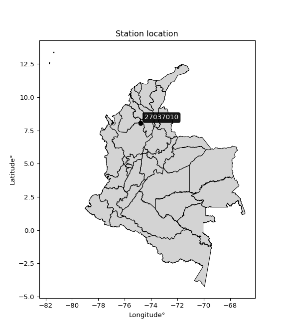

<div align="center">


</div>

# Station (rain, Pmax24h): 27037010

Probable Maximum Precipitation (PMP) is the greatest amount of rainfall for a specific duration that is meteorologically possible for a given location, acting as a "worst-case" scenario for extreme storms, crucial for designing safety-critical infrastructure like bridges, river deviations, dams, spillways, and nuclear plants to prevent catastrophic failure. PMP is calculated by hydrologists using meteorological data to determine the upper limit of extreme rainfall, often leading to the Probable Maximum Flood (PMF) for flood control design, and is increasingly being studied for climate change impacts.

<div align="center">

</img>

</div>


## A. General information


### 1. General running parameters

• app_version: _v20251226_. • runtime: _2025-12-26 15:38:16.554582_. • Python version: _3.14.0_. • SciPy version: _1.16.3_. • Pandas version: _2.3.3_. • NumPy version: _2.3.5_. • Stations dataset (station_dataset_file): _dataset/pmax24h_in/automatic_colombia_2003_2024.csv_. • Stations catalog (station_catalog_file): _dataset/CNE_IDEAM.xls_. • Minimum year to eval til year_max (date_min): _2003_. • Maximum year to eval since year_min (date_max): _2024_. • Creates, save and include plots into reports (create_plot): _False_. • Plot only fit distributions with Δo > Δ (plot_only_fit): _True_. • Eval low extreme values, if False, evaluates high extreme values (low_extreme): _False_. • Eval every SciPy distribution as logarithmic (pdist_logarithmic_on): _True_. • Standard deviation normalized (ddof): _1.0_. • Return periods to eval in years (Tr): _[2, 2.33, 5, 10, 15, 20, 25, 50, 75, 100, 200, 250, 500, 750, 1000]_. • Minimum data sample per station, 0 means any (minimum_sample): _5_. • Z-Score threshold to adjust a value, 0 means disable (zscore): _3.5_. • Avoid zeros, e.g. rain = 0 (avoid_zeros): _True_. • Avoid null values (avoid_nans): _True_. [:file_folder:Dataset file.](../../dataset/pmax24h_in/automatic_colombia_2003_2024.csv)


### 2. Station info and location

|   id |   CODIGO | NOMBRE                        | CATEGORIA    | TECNOLOGIA                | ESTADO   | FECHA_INSTALACION   |   FECHA_SUSPENSION |   ALTITUD |   LATITUD |   LONGITUD | DEPARTAMENTO   | MUNICIPIO   | AREA_OPERATIVA                      | ENTIDAD                                                     | AREA_HIDROGRAFICA   | ZONA_HIDROGRAFICA   | SUBZONA_HIDROGRAFICA        | CORRIENTE   | OBSERVACION                                                                                                                                                                                                                                                                 | SUBRED                          | Catalogo   |
|-----:|---------:|:------------------------------|:-------------|:--------------------------|:---------|:--------------------|-------------------:|----------:|----------:|-----------:|:---------------|:------------|:------------------------------------|:------------------------------------------------------------|:--------------------|:--------------------|:----------------------------|:------------|:----------------------------------------------------------------------------------------------------------------------------------------------------------------------------------------------------------------------------------------------------------------------------|:--------------------------------|:-----------|
|    0 | 27037010 | LA ESPERANZA NECHI [27037010] | Limnigráfica | Automática con Telemetría | Activa   | 09/03/1975          |                nan |        31 |   8.03194 |   -74.7888 | Antioquia      | Nechí       | Area Operativa 01 - Antioquia-Chocó | INSTITUTO DE HIDROLOGIA METEOROLOGIA Y ESTUDIOS AMBIENTALES | Magdalena Cauca     | Nechí               | Directos al Bajo Nechí (mi) | Nechi       | ESTACIÓN ACTIVADA NUEVAMENTE EN SU COMPONENTE CONVENCIONAL POR SOLICITUD DEL AO. (11012023) ESTACIÓN YA CUENTA CON OBSERVADOR Y PERTENECE A LA RED DE ALERTAS.|17/12/2024$mvelez$Se modifica la altura a solicitud de la coordinadora AO1 mediante memorando 20243080239923 | RED ALERTAS - AREA OPERATIVA 01 | CNE_IDEAM  |

<div align="center">

Map location in: [:earth_americas:Google](http://maps.google.com/maps?q=8.031943889,-74.788805556) [:earth_americas:OSM](https://www.openstreetmap.org/#map=18/8.031943889/-74.788805556&layers=P) [:earth_americas:Bing](https://www.bing.com/maps?cp=8.031943889~-74.788805556&lvl=18) [:earth_americas:Apple](https://maps.apple.com/frame?center=8.031943889%2C-74.788805556&span=0.003%2C0.006)

</div>


<div align="center">

```geojson
{
  "type": "Feature",
  "geometry": {
    "type": "Point", 
    "coordinates": [-74.788805556, 8.031943889]
  }, 
  "properties": {
    "Name": "27037010"
  }
}
```

</div>


### 3. Discrete values table and plot

|               |           0 |          1 |          2 |           3 |           4 |           5 |           6 |           7 |
|:--------------|------------:|-----------:|-----------:|------------:|------------:|------------:|------------:|------------:|
| Date          | 2017        | 2018       | 2019       | 2020        | 2021        | 2022        | 2023        | 2024        |
| Value         |  105.8      |  333.1     |  284.9     |   23.8      |   13        |   36.2      |   21        |    2.4      |
| Value_initial |  105.8      |  333.1     |  284.9     |   23.8      |   13        |   36.2      |   21        |    2.4      |
| count         |    8        |    8       |    8       |    8        |    8        |    8        |    8        |    8        |
| mean          |  102.525    |  102.525   |  102.525   |  102.525    |  102.525    |  102.525    |  102.525    |  102.525    |
| std           |  131.865    |  131.865   |  131.865   |  131.865    |  131.865    |  131.865    |  131.865    |  131.865    |
| zscore        |    0.024836 |    1.74857 |    1.38304 |   -0.597011 |   -0.678913 |   -0.502976 |   -0.618245 |   -0.759299 |
> If Z-Score is active, values out of range or outliers are replaced with the station mean value.


### 4. Active continuous probability distributions from SciPy (45 of 104 available)

[scipy.stats](https://docs.scipy.org/doc/scipy/reference/stats.html) is a Python´s powerful submodule within the SciPy library for comprehensive statistical analysis, offering over 130 probability distributions (like Normal, Poisson), functions for descriptive stats (mean, variance), hypothesis testing (t-tests, chi-square), random variable generation, and statistical tests, making it essential for data science, modeling, and research. It provides tools to explore, model, and draw conclusions from data efficiently, working seamlessly with NumPy.

<div align="center">

|   id | p_dist             |   n_parameter | fit_method   | label                                                                       | active   | ref                                                                                                        |
|-----:|:-------------------|--------------:|:-------------|:----------------------------------------------------------------------------|:---------|:-----------------------------------------------------------------------------------------------------------|
|    0 | alpha              |             3 | MLE          | Alpha                                                                       | True     | [:mortar_board:](https://docs.scipy.org/doc/scipy/reference/generated/scipy.stats.alpha.html)              |
|    1 | betaprime          |             4 | MLE          | Beta prime                                                                  | True     | [:mortar_board:](https://docs.scipy.org/doc/scipy/reference/generated/scipy.stats.betaprime.html)          |
|    2 | chi2               |             3 | MLE          | Chi²                                                                        | True     | [:mortar_board:](https://docs.scipy.org/doc/scipy/reference/generated/scipy.stats.chi2.html)               |
|    3 | crystalball        |             4 | MLE          | Crystalball                                                                 | True     | [:mortar_board:](https://docs.scipy.org/doc/scipy/reference/generated/scipy.stats.crystalball.html)        |
|    4 | erlang             |             3 | MLE          | Erlang                                                                      | True     | [:mortar_board:](https://docs.scipy.org/doc/scipy/reference/generated/scipy.stats.erlang.html)             |
|    5 | expon              |             2 | MLE          | Exponential                                                                 | True     | [:mortar_board:](https://docs.scipy.org/doc/scipy/reference/generated/scipy.stats.expon.html)              |
|    6 | exponnorm          |             3 | MLE          | Exponentially modified Normal                                               | True     | [:mortar_board:](https://docs.scipy.org/doc/scipy/reference/generated/scipy.stats.exponnorm.html)          |
|    7 | f                  |             4 | MLE          | F                                                                           | True     | [:mortar_board:](https://docs.scipy.org/doc/scipy/reference/generated/scipy.stats.f.html)                  |
|    8 | fatiguelife        |             3 | MLE          | Fatigue-life (Birnbaum-Saunders)                                            | True     | [:mortar_board:](https://docs.scipy.org/doc/scipy/reference/generated/scipy.stats.fatiguelife.html)        |
|    9 | fisk               |             3 | MLE          | Fisk                                                                        | True     | [:mortar_board:](https://docs.scipy.org/doc/scipy/reference/generated/scipy.stats.fisk.html)               |
|   10 | gamma              |             3 | MLE          | Gamma                                                                       | True     | [:mortar_board:](https://docs.scipy.org/doc/scipy/reference/generated/scipy.stats.gamma.html)              |
|   11 | genexpon           |             5 | MLE          | Generalized exponential                                                     | True     | [:mortar_board:](https://docs.scipy.org/doc/scipy/reference/generated/scipy.stats.genexpon.html)           |
|   12 | genlogistic        |             3 | MLE          | Generalized logistic                                                        | True     | [:mortar_board:](https://docs.scipy.org/doc/scipy/reference/generated/scipy.stats.genlogistic.html)        |
|   13 | gibrat             |             2 | MM           | Gibrat                                                                      | True     | [:mortar_board:](https://docs.scipy.org/doc/scipy/reference/generated/scipy.stats.gibrat.html)             |
|   14 | gompertz           |             3 | MLE          | Gompertz (or truncated Gumbel)                                              | True     | [:mortar_board:](https://docs.scipy.org/doc/scipy/reference/generated/scipy.stats.gompertz.html)           |
|   15 | gumbel_l           |             2 | MM           | Gumbel Left Skew                                                            | True     | [:mortar_board:](https://docs.scipy.org/doc/scipy/reference/generated/scipy.stats.gumbel_l.html)           |
|   16 | gumbel_r           |             2 | MM           | Gumbel Right Skew                                                           | True     | [:mortar_board:](https://docs.scipy.org/doc/scipy/reference/generated/scipy.stats.gumbel_r.html)           |
|   17 | halflogistic       |             2 | MM           | Half-logistic                                                               | True     | [:mortar_board:](https://docs.scipy.org/doc/scipy/reference/generated/scipy.stats.halflogistic.html)       |
|   18 | halfnorm           |             2 | MM           | Half Normal                                                                 | True     | [:mortar_board:](https://docs.scipy.org/doc/scipy/reference/generated/scipy.stats.halfnorm.html)           |
|   19 | hypsecant          |             2 | MM           | hyperbolic secant                                                           | True     | [:mortar_board:](https://docs.scipy.org/doc/scipy/reference/generated/scipy.stats.hypsecant.html)          |
|   20 | invgamma           |             3 | MLE          | Inverted gamma                                                              | True     | [:mortar_board:](https://docs.scipy.org/doc/scipy/reference/generated/scipy.stats.invgamma.html)           |
|   21 | invgauss           |             3 | MLE          | Inverse Gaussian                                                            | True     | [:mortar_board:](https://docs.scipy.org/doc/scipy/reference/generated/scipy.stats.invgauss.html)           |
|   22 | invweibull         |             3 | MLE          | Inverted Weibull                                                            | True     | [:mortar_board:](https://docs.scipy.org/doc/scipy/reference/generated/scipy.stats.invweibull.html)         |
|   23 | johnsonsu          |             4 | MLE          | Johnson Su                                                                  | True     | [:mortar_board:](https://docs.scipy.org/doc/scipy/reference/generated/scipy.stats.johnsonsu.html)          |
|   24 | kstwobign          |             2 | MLE          | Limiting distribution of scaled Kolmogorov-Smirnov two-sided test statistic | True     | [:mortar_board:](https://docs.scipy.org/doc/scipy/reference/generated/scipy.stats.kstwobign.html)          |
|   25 | laplace            |             2 | MM           | Laplace                                                                     | True     | [:mortar_board:](https://docs.scipy.org/doc/scipy/reference/generated/scipy.stats.laplace.html)            |
|   26 | laplace_asymmetric |             3 | MLE          | Asymmetric Laplace                                                          | True     | [:mortar_board:](https://docs.scipy.org/doc/scipy/reference/generated/scipy.stats.laplace_asymmetric.html) |
|   27 | loggamma           |             3 | MLE          | Log gamma                                                                   | True     | [:mortar_board:](https://docs.scipy.org/doc/scipy/reference/generated/scipy.stats.loggamma.html)           |
|   28 | logistic           |             2 | MM           | Logistic (or Sech-squared)                                                  | True     | [:mortar_board:](https://docs.scipy.org/doc/scipy/reference/generated/scipy.stats.logistic.html)           |
|   29 | lognorm            |             3 | MLE          | Log Normal                                                                  | True     | [:mortar_board:](https://docs.scipy.org/doc/scipy/reference/generated/scipy.stats.lognorm.html)            |
|   30 | maxwell            |             2 | MM           | Maxwell                                                                     | True     | [:mortar_board:](https://docs.scipy.org/doc/scipy/reference/generated/scipy.stats.maxwell.html)            |
|   31 | mielke             |             4 | MLE          | Mielke Beta-Kappa / Dagum                                                   | True     | [:mortar_board:](https://docs.scipy.org/doc/scipy/reference/generated/scipy.stats.mielke.html)             |
|   32 | moyal              |             2 | MM           | Moyal                                                                       | True     | [:mortar_board:](https://docs.scipy.org/doc/scipy/reference/generated/scipy.stats.moyal.html)              |
|   33 | nakagami           |             3 | MLE          | Nakagami                                                                    | True     | [:mortar_board:](https://docs.scipy.org/doc/scipy/reference/generated/scipy.stats.nakagami.html)           |
|   34 | ncf                |             5 | MLE          | Non-central F distribution                                                  | True     | [:mortar_board:](https://docs.scipy.org/doc/scipy/reference/generated/scipy.stats.ncf.html)                |
|   35 | nct                |             4 | MLE          | Non-central Student’s t                                                     | True     | [:mortar_board:](https://docs.scipy.org/doc/scipy/reference/generated/scipy.stats.nct.html)                |
|   36 | norm               |             2 | MM           | Normal                                                                      | True     | [:mortar_board:](https://docs.scipy.org/doc/scipy/reference/generated/scipy.stats.norm.html)               |
|   37 | pareto             |             3 | MLE          | Pareto                                                                      | True     | [:mortar_board:](https://docs.scipy.org/doc/scipy/reference/generated/scipy.stats.pareto.html)             |
|   38 | pearson3           |             3 | MM           | Pearson type III                                                            | True     | [:mortar_board:](https://docs.scipy.org/doc/scipy/reference/generated/scipy.stats.pearson3.html)           |
|   39 | rayleigh           |             2 | MM           | Rayleigh                                                                    | True     | [:mortar_board:](https://docs.scipy.org/doc/scipy/reference/generated/scipy.stats.rayleigh.html)           |
|   40 | rice               |             3 | MLE          | Rice                                                                        | True     | [:mortar_board:](https://docs.scipy.org/doc/scipy/reference/generated/scipy.stats.rice.html)               |
|   41 | t                  |             3 | MLE          | Student’s t                                                                 | True     | [:mortar_board:](https://docs.scipy.org/doc/scipy/reference/generated/scipy.stats.t.html)                  |
|   42 | truncnorm          |             4 | MLE          | Truncated normal                                                            | True     | [:mortar_board:](https://docs.scipy.org/doc/scipy/reference/generated/scipy.stats.truncnorm.html)          |
|   43 | wald               |             2 | MM           | Wald                                                                        | True     | [:mortar_board:](https://docs.scipy.org/doc/scipy/reference/generated/scipy.stats.wald.html)               |
|   44 | weibull_min        |             3 | MLE          | Weibull minimum                                                             | True     | [:mortar_board:](https://docs.scipy.org/doc/scipy/reference/generated/scipy.stats.weibull_min.html)        |

</div>

> **n_parameter:** # arguments & localization & scale.
>
> **Fit methods:** (MLE) maximum likelihood, (MM) L-moments.
>
>**Inactive:** foldnorm, gennorm, norminvgauss, powernorm, powerlognorm, skewnorm, genextreme, anglit, arcsine, argus, beta, bradford, burr, burr12, cauchy, cosine, halfcauchy, foldcauchy, skewcauchy, wrapcauchy, dgamma, gengamma, exponweib, exponpow, truncexpon, gausshyper, genhalflogistic, genhyperbolic, geninvgauss, halfgennorm, johnsonsb, kappa4, kappa3, ksone, kstwo, loglaplace, levy, levy_l, levy_stable, ncx2, genpareto, truncpareto, lomax, powerlaw, rdist, rel_breitwigner, recipinvgauss, semicircular, studentized_range, trapezoid, triang, truncweibull_min, tukeylambda, uniform, loguniform, vonmises, vonmises_line, weibull_max, dweibull, 


## B. Probability distributions vs. Empirical distributions

A continuous probability distribution (CPD) describes probabilities for variables that can take any value within a range (like rain any time), unlike discrete variables with specific outcomes (like temperature). It uses a Probability Density Function (PDF), a curve where the total area under it equals 1, and the probability of the variable falling within an interval (a to b) is found by calculating the area under the curve between those points. A key feature is that the probability of hitting any single exact value is zero, so probabilities are always expressed for ranges, e.g., $P(a ≤ X ≤ b)$.

<div align="center">

Distributions parameters
|    |   station | p_dist                |   n |              loc |           scale | shape                  | shape1             | shape2                 | shape3   |
|---:|----------:|:----------------------|----:|-----------------:|----------------:|:-----------------------|:-------------------|:-----------------------|:---------|
|  0 |  27037010 | alpha                 |   8 |    -13.606       |    33.0231      | 8.881100108657148e-07  |                    |                        |          |
|  1 |  27037010 | betaprime             |   8 |      2.4         |    68.362       | 0.44331696456665914    | 1.1195389534930476 |                        |          |
|  2 |  27037010 | chi2                  |   8 |      2.4         |    99.5883      | 0.6547270575677897     |                    |                        |          |
|  3 |  27037010 | crystalball           |   8 |    102.525       |   123.349       | 9008.979983883093      | 4779.648960788415  |                        |          |
|  4 |  27037010 | erlang                |   8 |      2.4         |   102.701       | 0.5433988138916921     |                    |                        |          |
|  5 |  27037010 | expon                 |   8 |      2.4         |   100.125       |                        |                    |                        |          |
|  6 |  27037010 | exponnorm             |   8 |      2.30316     |     0.0291755   | 3416.4715811875685     |                    |                        |          |
|  7 |  27037010 | f                     |   8 |      2.4         |   113.986       | 1.0596100832966733     | 137.7770590090527  |                        |          |
|  8 |  27037010 | fatiguelife           |   8 |     -0.316534    |    37.1766      | 1.8541585854447238     |                    |                        |          |
|  9 |  27037010 | fisk                  |   8 |      2.4         |    38.1899      | 0.8590366142070865     |                    |                        |          |
| 10 |  27037010 | gamma                 |   8 |      2.4         |    76.4199      | 0.6869239186463938     |                    |                        |          |
| 11 |  27037010 | genexpon              |   8 |      2.4         |    95.5287      | 0.9540941990126623     | 0.6959163325710698 | 1.1921728352801209e-11 |          |
| 12 |  27037010 | genlogistic           |   8 |   -558.33        |    77.0432      | 2652.496190182739      |                    |                        |          |
| 13 |  27037010 | gibrat                |   8 |      8.42562     |    57.0742      |                        |                    |                        |          |
| 14 |  27037010 | gompertz              |   8 |      2.4         |     1.81733e+10 | 186493841.05884594     |                    |                        |          |
| 15 |  27037010 | gumbel_l              |   8 |    158.038       |    96.1745      |                        |                    |                        |          |
| 16 |  27037010 | gumbel_r              |   8 |     47.0116      |    96.1745      |                        |                    |                        |          |
| 17 |  27037010 | halflogistic          |   8 |    -43.6717      |   105.459       |                        |                    |                        |          |
| 18 |  27037010 | halfnorm              |   8 |    -60.7401      |   204.622       |                        |                    |                        |          |
| 19 |  27037010 | hypsecant             |   8 |    102.525       |    78.5261      |                        |                    |                        |          |
| 20 |  27037010 | invgamma              |   8 |     -5.40416     |    24.8073      | 0.9117147720886517     |                    |                        |          |
| 21 |  27037010 | invgauss              |   8 |     -3.40587     |    28.9594      | 3.657911375235404      |                    |                        |          |
| 22 |  27037010 | invweibull            |   8 |      2.4         |     3.79845     | 0.046833418228815635   |                    |                        |          |
| 23 |  27037010 | johnsonsu             |   8 |      2.39997     |     2.50117e-06 | -3.115257194774318     | 0.2072215830784105 |                        |          |
| 24 |  27037010 | kstwobign             |   8 |   -229.836       |   384.07        |                        |                    |                        |          |
| 25 |  27037010 | laplace               |   8 |    102.525       |    87.2206      |                        |                    |                        |          |
| 26 |  27037010 | laplace_asymmetric    |   8 |      2.4         |     0.000300198 | 2.9982344565442873e-06 |                    |                        |          |
| 27 |  27037010 | loggamma              |   8 | -44679.1         |  5822.78        | 2188.3251716900913     |                    |                        |          |
| 28 |  27037010 | logistic              |   8 |    102.525       |    68.0056      |                        |                    |                        |          |
| 29 |  27037010 | lognorm               |   8 |      2.4         |     0.396574    | 13.065858211465422     |                    |                        |          |
| 30 |  27037010 | maxwell               |   8 |   -189.759       |   183.162       |                        |                    |                        |          |
| 31 |  27037010 | mielke                |   8 |      2.4         |    36.3362      | 0.6227851672157523     | 1.0514369648086113 |                        |          |
| 32 |  27037010 | moyal                 |   8 |     31.9864      |    55.5264      |                        |                    |                        |          |
| 33 |  27037010 | nakagami              |   8 |      2.4         |   224.703       | 0.13395646969473984    |                    |                        |          |
| 34 |  27037010 | ncf                   |   8 |     -0.215188    |    35.9435      | 2.410772946154112      | 2.3995896297266057 | 0.17419925683078907    |          |
| 35 |  27037010 | nct                   |   8 |    -10.7115      |     1.57355     | 0.8550349968660216     | 18.030194655395135 |                        |          |
| 36 |  27037010 | norm                  |   8 |    102.525       |   123.349       |                        |                    |                        |          |
| 37 |  27037010 | pareto                |   8 |     -8.58993e+09 |     8.58993e+09 | 85792106.8423211       |                    |                        |          |
| 38 |  27037010 | pearson3              |   8 |    102.525       |   123.348       | 1.0178399977661639     |                    |                        |          |
| 39 |  27037010 | rayleigh              |   8 |   -133.448       |   188.279       |                        |                    |                        |          |
| 40 |  27037010 | rice                  |   8 |    -83.26        |   157.688       | 0.000527786046062886   |                    |                        |          |
| 41 |  27037010 | t                     |   8 |     21.0463      |    11.111       | 0.5384577533443011     |                    |                        |          |
| 42 |  27037010 | truncnorm             |   8 |  -1024.56        |   357.325       | 2.8740096115578933     | 383.3315586679412  |                        |          |
| 43 |  27037010 | wald                  |   8 |    -20.8235      |   123.349       |                        |                    |                        |          |
| 44 |  27037010 | weibull_min           |   8 |      2.4         |    75.4121      | 0.6262787163698931     |                    |                        |          |
| 45 |  27037010 | logalpha              |   8 |    -27.7441      |   624.863       | 19.9551316927976       |                    |                        |          |
| 46 |  27037010 | logbetaprime          |   8 |    -19.2197      |   140.246       | 246.7028087593049      | 1512.6671040517572 |                        |          |
| 47 |  27037010 | logchi2               |   8 |    -12.2972      |     0.0777765   | 205.32924069737237     |                    |                        |          |
| 48 |  27037010 | logcrystalball        |   8 |      3.67073     |     1.54772     | 7.740762067788956      | 8.420352379865733  |                        |          |
| 49 |  27037010 | logerlang             |   8 |    -30.0648      |     0.0720066   | 468.4537214847819      |                    |                        |          |
| 50 |  27037010 | logexpon              |   8 |      0.875469    |     2.79526     |                        |                    |                        |          |
| 51 |  27037010 | logexponnorm          |   8 |      3.66928     |     1.54772     | 0.0009318374572343793  |                    |                        |          |
| 52 |  27037010 | logf                  |   8 |   -515.066       |   518.733       | 620318.744465452       | 348548.9807620542  |                        |          |
| 53 |  27037010 | logfatiguelife        |   8 |   -201.165       |   204.827       | 0.007547814607674315   |                    |                        |          |
| 54 |  27037010 | logfisk               |   8 |     -4.10776e+07 |     4.10776e+07 | 44934371.384926766     |                    |                        |          |
| 55 |  27037010 | loggamma              |   8 |    -27.3647      |     0.0780389   | 397.6962012529052      |                    |                        |          |
| 56 |  27037010 | loggenexpon           |   8 |      0.875469    | 23645           | 3353.051612781722      | 31484.934970880087 | 2316.221771384837      |          |
| 57 |  27037010 | loggenlogistic        |   8 |      3.46493     |     0.958017    | 1.1601856595336844     |                    |                        |          |
| 58 |  27037010 | loggibrat             |   8 |      2.48997     |     0.71616     |                        |                    |                        |          |
| 59 |  27037010 | loggompertz           |   8 |      0.875469    |     2.17299     | 0.28282207437125595    |                    |                        |          |
| 60 |  27037010 | loggumbel_l           |   8 |      4.36729     |     1.20676     |                        |                    |                        |          |
| 61 |  27037010 | loggumbel_r           |   8 |      2.97417     |     1.20676     |                        |                    |                        |          |
| 62 |  27037010 | loghalflogistic       |   8 |      1.83631     |     1.32326     |                        |                    |                        |          |
| 63 |  27037010 | loghalfnorm           |   8 |      1.62217     |     2.5675      |                        |                    |                        |          |
| 64 |  27037010 | loghypsecant          |   8 |      3.67073     |     0.985312    |                        |                    |                        |          |
| 65 |  27037010 | loginvgamma           |   8 |    -19.8009      |  5275.38        | 225.97974465497208     |                    |                        |          |
| 66 |  27037010 | loginvgauss           |   8 |     -8.71449     |   746.893       | 0.0165433773423172     |                    |                        |          |
| 67 |  27037010 | loginvweibull         |   8 |     -1.90167e+08 |     1.90167e+08 | 125697807.54633602     |                    |                        |          |
| 68 |  27037010 | logjohnsonsu          |   8 |     15.1882      |     0.0147677   | 54.44893398405211      | 7.414808148448152  |                        |          |
| 69 |  27037010 | logkstwobign          |   8 |     -2.49639     |     7.06151     |                        |                    |                        |          |
| 70 |  27037010 | loglaplace            |   8 |      3.67073     |     1.09441     |                        |                    |                        |          |
| 71 |  27037010 | loglaplace_asymmetric |   8 |      3.16969     |     1.17862     | 0.8097599951698522     |                    |                        |          |
| 72 |  27037010 | logloggamma           |   8 |     -7.47462     |     4.87476     | 10.334595897682        |                    |                        |          |
| 73 |  27037010 | loglogistic           |   8 |      3.67073     |     0.853305    |                        |                    |                        |          |
| 74 |  27037010 | loglognorm            |   8 |      0.875469    |     0.0262576   | 12.514655029621686     |                    |                        |          |
| 75 |  27037010 | logmaxwell            |   8 |      0.00327001  |     2.29824     |                        |                    |                        |          |
| 76 |  27037010 | logmielke             |   8 |      0.875469    |     5.00534     | 0.7840563914744074     | 335.7680464852448  |                        |          |
| 77 |  27037010 | logmoyal              |   8 |      2.78564     |     0.696721    |                        |                    |                        |          |
| 78 |  27037010 | lognakagami           |   8 |      2.56495     |     2.30485     | 0.07715166739503776    |                    |                        |          |
| 79 |  27037010 | logncf                |   8 |     -6.32897     |     1.3461      | 21.204070843563834     | 1381.1105285319902 | 136.26437222342156     |          |
| 80 |  27037010 | lognct                |   8 |   -131.768       |     1.54336     | 666940.3089514701      | 87.75531438037842  |                        |          |
| 81 |  27037010 | lognorm               |   8 |      3.67073     |     1.54772     |                        |                    |                        |          |
| 82 |  27037010 | logpareto             |   8 |      0.874449    |     0.00102023  | 0.1432791243748113     |                    |                        |          |
| 83 |  27037010 | logpearson3           |   8 |      3.67073     |     1.54772     | -0.17004021025343294   |                    |                        |          |
| 84 |  27037010 | lograyleigh           |   8 |      0.70984     |     2.36245     |                        |                    |                        |          |
| 85 |  27037010 | logrice               |   8 |      0.0263822   |     1.71009     | 1.8331978317687079     |                    |                        |          |
| 86 |  27037010 | logt                  |   8 |      3.67073     |     1.54772     | 82824844597.17195      |                    |                        |          |
| 87 |  27037010 | logtruncnorm          |   8 |      0.0823852   |     4.26383     | 0.18427744336693253    | 1.3429390943282256 |                        |          |
| 88 |  27037010 | logwald               |   8 |      2.12298     |     1.54774     |                        |                    |                        |          |
| 89 |  27037010 | logweibull_min        |   8 |     -1.78524     |     6.02788     | 4.057741429119094      |                    |                        |          |

</div>

> **loc** (Location parameter): This shifts the distribution along the x-axis. For many common distributions, like the normal (Gaussian) distribution, loc represents the mean $μ$. For others, like the uniform distribution, it might represent the minimum value, or for the beta distribution, the left end of the support interval.
>
> **scale** (Scale parameter): This determines the width or spread of the distribution. For the normal distribution, scale represents the standard deviation $σ$. For a uniform distribution, it defines the length of the interval (from $loc$ to $loc + scale$).
>
> **shape** (Shape parameters): Refers to parameters that define the specific form of a probability distribution, distinct from its location (loc) and scale (scale). These parameters are required arguments for most distribution functions. For example, a normal (Gaussian) distribution is fully defined by its location (mean) and scale (standard deviation), so it has no specific shape parameters beyond loc and scale. However, other distributions have intrinsic properties that need specification, as Gamma distribution that takes a shape parameter, often named $a$ or $alpha$.


### 0. Cumulative distribution values - CDF (90 evaluated)

> Ordered by x ascending and calculating $log(f(x))$ separately. 

|   id |   Station |   date |     x |   count |    mean |     std |    zscore |   Value_initial |   station |   m |     alpha |   alpha_pdf |   betaprime |   betaprime_pdf |        chi2 |    chi2_pdf |   crystalball |   crystalball_pdf |      erlang |      erlang_pdf |    expon |   expon_pdf |   exponnorm |   exponnorm_pdf |          f |           f_pdf |   fatiguelife |   fatiguelife_pdf |        fisk |    fisk_pdf |       gamma |      gamma_pdf |    genexpon |   genexpon_pdf |   genlogistic |   genlogistic_pdf |     gibrat |   gibrat_pdf |    gompertz |   gompertz_pdf |   gumbel_l |   gumbel_l_pdf |   gumbel_r |   gumbel_r_pdf |   halflogistic |   halflogistic_pdf |   halfnorm |   halfnorm_pdf |   hypsecant |   hypsecant_pdf |   invgamma |   invgamma_pdf |   invgauss |   invgauss_pdf |   invweibull |   invweibull_pdf |   johnsonsu |   johnsonsu_pdf |   kstwobign |   kstwobign_pdf |   laplace |   laplace_pdf |   laplace_asymmetric |   laplace_asymmetric_pdf |   loggamma |   loggamma_pdf |   logistic |   logistic_pdf |   lognorm |   lognorm_pdf |   maxwell |   maxwell_pdf |      mielke |   mielke_pdf |    moyal |   moyal_pdf |    nakagami |   nakagami_pdf |       ncf |     ncf_pdf |       nct |     nct_pdf |     norm |    norm_pdf |   pareto |   pareto_pdf |   pearson3 |   pearson3_pdf |   rayleigh |   rayleigh_pdf |     rice |    rice_pdf |        t |       t_pdf |   truncnorm |   truncnorm_pdf |      wald |    wald_pdf |   weibull_min |   weibull_min_pdf |   logalpha |   logalpha_pdf |   logbetaprime |   logbetaprime_pdf |   logchi2 |   logchi2_pdf |   logcrystalball |   logcrystalball_pdf |   logerlang |   logerlang_pdf |   logexpon |   logexpon_pdf |   logexponnorm |   logexponnorm_pdf |      logf |   logf_pdf |   logfatiguelife |   logfatiguelife_pdf |   logfisk |   logfisk_pdf |   loggenexpon |   loggenexpon_pdf |   loggenlogistic |   loggenlogistic_pdf |   loggibrat |   loggibrat_pdf |   loggompertz |   loggompertz_pdf |   loggumbel_l |   loggumbel_l_pdf |   loggumbel_r |   loggumbel_r_pdf |   loghalflogistic |   loghalflogistic_pdf |   loghalfnorm |   loghalfnorm_pdf |   loghypsecant |   loghypsecant_pdf |   loginvgamma |   loginvgamma_pdf |   loginvgauss |   loginvgauss_pdf |   loginvweibull |   loginvweibull_pdf |   logjohnsonsu |   logjohnsonsu_pdf |   logkstwobign |   logkstwobign_pdf |   loglaplace |   loglaplace_pdf |   loglaplace_asymmetric |   loglaplace_asymmetric_pdf |   logloggamma |   logloggamma_pdf |   loglogistic |   loglogistic_pdf |   loglognorm |   loglognorm_pdf |   logmaxwell |   logmaxwell_pdf |   logmielke |   logmielke_pdf |    logmoyal |   logmoyal_pdf |   lognakagami |   lognakagami_pdf |    logncf |   logncf_pdf |    lognct |   lognct_pdf |   logpareto |   logpareto_pdf |   logpearson3 |   logpearson3_pdf |   lograyleigh |   lograyleigh_pdf |   logrice |   logrice_pdf |      logt |   logt_pdf |   logtruncnorm |   logtruncnorm_pdf |   logwald |   logwald_pdf |   logweibull_min |   logweibull_min_pdf |
|-----:|----------:|-------:|------:|--------:|--------:|--------:|----------:|----------------:|----------:|----:|----------:|------------:|------------:|----------------:|------------:|------------:|--------------:|------------------:|------------:|----------------:|---------:|------------:|------------:|----------------:|-----------:|----------------:|--------------:|------------------:|------------:|------------:|------------:|---------------:|------------:|---------------:|--------------:|------------------:|-----------:|-------------:|------------:|---------------:|-----------:|---------------:|-----------:|---------------:|---------------:|-------------------:|-----------:|---------------:|------------:|----------------:|-----------:|---------------:|-----------:|---------------:|-------------:|-----------------:|------------:|----------------:|------------:|----------------:|----------:|--------------:|---------------------:|-------------------------:|-----------:|---------------:|-----------:|---------------:|----------:|--------------:|----------:|--------------:|------------:|-------------:|---------:|------------:|------------:|---------------:|----------:|------------:|----------:|------------:|---------:|------------:|---------:|-------------:|-----------:|---------------:|-----------:|---------------:|---------:|------------:|---------:|------------:|------------:|----------------:|----------:|------------:|--------------:|------------------:|-----------:|---------------:|---------------:|-------------------:|----------:|--------------:|-----------------:|---------------------:|------------:|----------------:|-----------:|---------------:|---------------:|-------------------:|----------:|-----------:|-----------------:|---------------------:|----------:|--------------:|--------------:|------------------:|-----------------:|---------------------:|------------:|----------------:|--------------:|------------------:|--------------:|------------------:|--------------:|------------------:|------------------:|----------------------:|--------------:|------------------:|---------------:|-------------------:|--------------:|------------------:|--------------:|------------------:|----------------:|--------------------:|---------------:|-------------------:|---------------:|-------------------:|-------------:|-----------------:|------------------------:|----------------------------:|--------------:|------------------:|--------------:|------------------:|-------------:|-----------------:|-------------:|-----------------:|------------:|----------------:|------------:|---------------:|--------------:|------------------:|----------:|-------------:|----------:|-------------:|------------:|----------------:|--------------:|------------------:|--------------:|------------------:|----------:|--------------:|----------:|-----------:|---------------:|-------------------:|----------:|--------------:|-----------------:|---------------------:|
|    0 |  27037010 |   2024 |   2.4 |       8 | 102.525 | 131.865 | -0.759299 |             2.4 |  27037010 |   1 | 0.0390969 | 0.0122425   | 2.44576e-07 |     1.49786e+06 | 1.08752e-05 | 3.66062e+07 |      0.208475 |       0.00232648  | 4.12816e-10 | 505132          | 0        | 0.00998752  | 0.000971101 |     0.0100181   | 1.8362e-08 | 22560.4         |     0.0322012 |       0.0284304   | 2.83572e-15 | 5.48536     | 1.59633e-12 | 2469.23        | 4.56561e-13 |    0.00998751  |      0.160275 |       0.00380749  | 0          |  0           | 1.24186e-09 |    0.010262    |   0.179824 |    0.00169056  |   0.203884 |    0.00337114  |       0.215026 |        0.00452198  |   0.24235  |    0.00371801  |    0.173458 |     0.00210121  |  0.0347214 |    0.0144556   |  0.0333545 |    0.0165332   |   0.00379578 |      2.23123e+12 |    0.006607 |   141.353       |    0.141962 |     0.00351391  |  0.158643 |   0.00181887  |          1.10865e-11 |              0.00998752  |  0.0331464 |      0.0505709 |   0.186593 |    0.00223181  | 0.0354557 |     0.0504576 |  0.223084 |   0.00276536  | 6.35959e-07 | 97.0958      | 0.191798 | 0.00400082  | 1.47041e-05 |    8.87077e+09 | 0.0441192 | 0.0189289   | 0.0371977 | 0.0134785   | 0.208475 | 0.00232648  | 0        |  0.00998752  |   0.216295 |    0.00339605  |   0.229179 |    0.00295394  | 0.137178 | 0.00297237  | 0.233486 | 0.00606677  | 6.04299e-06 |     0.00886094  | 0.0534907 | 0.00688095  |   1.61896e-11 |   22831.4         |  0.0301688 |      0.0521503 |      0.0329134 |          0.0515895 | 0.0316568 |     0.0513568 |        0.0354557 |            0.0504576 |   0.0338074 |       0.0510515 |   0        |      0.357749  |      0.0354557 |          0.0504576 | 0.0356778 |  0.0508456 |        0.0347818 |            0.0504118 | 0.0445441 |     0.0465559 |   1.14573e-08 |         0.141808  |        0.0403098 |            0.0457506 |   0         |       0         |    8.3426e-09 |          0.130153 |     0.0538734 |         0.0434184 |    0.00337161 |         0.0159042 |          0        |             0         |      0        |         0         |      0.0372668 |          0.037736  |     0.0297756 |         0.0512066 |     0.0276957 |         0.0521454 |       0.0227413 |           0.0568735 |      0.0466433 |          0.0505408 |      0.0234536 |          0.068317  |    0.0388799 |        0.035526  |               0.0357895 |                   0.0374995 |     0.0440949 |         0.0503917 |     0.0364107 |         0.0411166 |   0.00408866 |       8.6957e+12 |    0.0139249 |        0.0465277 | 2.05582e-12 |      259.259    | 8.19535e-05 |    0.000965291 |    0          |       0           | 0.0295482 |    0.0510028 | 0.0354548 |    0.0504655 |    0        |    140.438      |     0.0401377 |         0.0507802 |    0.00245462 |         0.0296036 |  0.023875 |     0.0582526 | 0.0354558 |  0.0504576 |      0.0020063 |           0.272674 |  0        |     0         |        0.0355619 |            0.0532581 |
|    1 |  27037010 |   2021 |  13   |       8 | 102.525 | 131.865 | -0.678913 |            13   |  27037010 |   2 | 0.214537  | 0.0172295   | 0.434818    |     0.0155545   | 0.422783    | 0.0125424   |      0.233984 |       0.00248536  | 0.316138    |      0.015151   | 0.100456 | 0.00898421  | 0.101757    |     0.0090115   | 0.224346   |     0.0108541   |     0.281512  |       0.0155099   | 0.249545    | 0.0151768   | 0.268717    |    0.0160256   | 0.100456    |    0.0089842   |      0.202788 |       0.00419856  | 0.00580337 |  0.00360874  | 0.10307     |    0.00920428  |   0.198552 |    0.00184445  |   0.240689 |    0.00356437  |       0.262407 |        0.00441473  |   0.281431 |    0.00365415  |    0.197046 |     0.00235209  |  0.22896   |    0.017493    |  0.238679  |    0.0172002   |   0.385554   |      0.00162354  |    0.57554  |     0.00765875  |    0.181104 |     0.0038573   |  0.179144 |   0.00205391  |          0.100456    |              0.00898421  |  0.241156  |      0.205175  |   0.211412 |    0.00245152  | 0.237473  |     0.199699  |  0.25309  |   0.00289265  | 0.402285    |  0.0185551   | 0.235444 | 0.00421687  | 0.359134    |    0.00907466  | 0.230403  | 0.0152082   | 0.227422  | 0.0178352   | 0.233984 | 0.00248536  | 0.100456 |  0.00898421  |   0.253008 |    0.00352324  |   0.261035 |    0.00305283  | 0.169994 | 0.00321315  | 0.334426 | 0.0146871   | 0.0900266   |     0.00813321  | 0.138146  | 0.00861987  |   0.253705    |       0.0129032   |  0.254216  |      0.218069  |      0.245369  |          0.20784   | 0.246161  |     0.209752  |        0.237473  |            0.199699  |   0.242121  |       0.204909  |   0.453603 |      0.195473  |      0.237473  |          0.199699  | 0.238606  |  0.200013  |        0.238402  |            0.20143   | 0.228359  |     0.192756  |   0.340241    |         0.227558  |        0.229312  |            0.199664  |   0.0120132 |       0.416969  |    0.282943   |          0.203081 |     0.201146  |         0.148666  |    0.245688   |         0.285783  |          0.26857  |             0.350601  |      0.28653  |         0.290503  |      0.200359  |          0.190181  |     0.25127   |         0.217223  |     0.258989  |         0.223835  |       0.289803  |           0.237252  |      0.227548  |          0.17729   |      0.316799  |          0.238031  |    0.182038  |        0.166335  |               0.210158  |                   0.220199  |     0.22901   |         0.182119  |     0.21486   |         0.197696  |   0.630338   |       0.0178523  |    0.257145  |        0.231751  | 0.426752    |        0.198048 | 0.241354    |    0.337725    |    0.00321029 |       1.11545e+12 | 0.247894  |    0.213065  | 0.237506  |    0.199721  |    0.654268 |      0.0293026  |     0.233098  |         0.190019  |    0.265311   |         0.244202  |  0.249305 |     0.209935  | 0.237473  |  0.199699  |      0.434971  |           0.234176 |  0.150246 |     0.691074  |        0.233708  |            0.190268  |
|    2 |  27037010 |   2023 |  21   |       8 | 102.525 | 131.865 | -0.618245 |            21   |  27037010 |   3 | 0.339953  | 0.0139546   | 0.532818    |     0.00978155  | 0.503339    | 0.00825418  |      0.254328 |       0.00259968  | 0.417921    |      0.0108419  | 0.169534 | 0.0082943   | 0.171032    |     0.00831651  | 0.298378   |     0.00802621  |     0.380619  |       0.0100134   | 0.350237    | 0.0105103   | 0.379582    |    0.012103    | 0.169534    |    0.00829429  |      0.237339 |       0.00442952  | 0.0651792  |  0.0101051   | 0.173762    |    0.00847884  |   0.213792 |    0.00196632  |   0.269666 |    0.00367474  |       0.29736  |        0.00432197  |   0.310452 |    0.00360027  |    0.216653 |     0.00255085  |  0.351389  |    0.0131994   |  0.356547  |    0.01253     |   0.395224   |      0.000923795 |    0.620586 |     0.00423997  |    0.212804 |     0.00405923  |  0.196352 |   0.00225121  |          0.169534    |              0.0082943   |  0.348795  |      0.240944  |   0.231689 |    0.00261757  | 0.342887  |     0.237503  |  0.276568 |   0.00297505  | 0.519411    |  0.0116366   | 0.269598 | 0.00431239  | 0.417495    |    0.0060087   | 0.338072  | 0.0118562   | 0.353349  | 0.0136318   | 0.254328 | 0.00259968  | 0.169534 |  0.0082943   |   0.281475 |    0.00358909  |   0.285703 |    0.00311212  | 0.19634  | 0.00336972  | 0.498852 | 0.0247803   | 0.153017    |     0.00761939  | 0.207495  | 0.00860179  |   0.34043     |       0.00924237  |  0.36687   |      0.248193  |      0.353854  |          0.24163   | 0.355379  |     0.242649  |        0.342887  |            0.237503  |   0.349588  |       0.240519  |   0.539746 |      0.164655  |      0.342887  |          0.237503  | 0.344058  |  0.237322  |        0.344599  |            0.238935  | 0.333366  |     0.243098  |   0.447778    |         0.219065  |        0.337412  |            0.24843   |   0.399074  |       0.696251  |    0.384041   |          0.217527 |     0.284062  |         0.19825   |    0.389315   |         0.304342  |          0.427253 |             0.30888   |      0.420412 |         0.266555  |      0.310088  |          0.267243  |     0.363861  |         0.248831  |     0.373783  |         0.251057  |       0.405723  |           0.241919  |      0.322844  |          0.219158  |      0.430716  |          0.233784  |    0.282145  |        0.257807  |               0.347355  |                   0.363952  |     0.326643  |         0.223777  |     0.324349  |         0.256821  |   0.637849   |       0.0138104  |    0.37437   |        0.253285  | 0.51911     |        0.187645 | 0.406284    |    0.336829    |    0.670103   |       0.214939    | 0.358309  |    0.244109  | 0.342928  |    0.237514  |    0.666421 |      0.0220246  |     0.334212  |         0.229887  |    0.386342   |         0.256703  |  0.357767 |     0.239723  | 0.342887  |  0.237503  |      0.543453  |           0.217949 |  0.442922 |     0.488978  |        0.33429   |            0.227579  |
|    3 |  27037010 |   2020 |  23.8 |       8 | 102.525 | 131.865 | -0.597011 |            23.8 |  27037010 |   4 | 0.37733   | 0.0127536   | 0.558504    |     0.00860985  | 0.525218    | 0.00740636  |      0.261661 |       0.00263829  | 0.446912    |      0.00989596 | 0.192436 | 0.00806556  | 0.193994    |     0.00808614  | 0.31997    |     0.0074163   |     0.407012  |       0.00888222  | 0.37812     | 0.00943918  | 0.412125    |    0.0111665   | 0.192436    |    0.00806556  |      0.249837 |       0.00449644  | 0.0948193  |  0.0109781   | 0.197165    |    0.00823868  |   0.219359 |    0.00201007  |   0.28     |    0.00370608  |       0.309413 |        0.00428729  |   0.320505 |    0.00358031  |    0.223895 |     0.00262186  |  0.386511  |    0.0119123   |  0.389832  |    0.0112758   |   0.397633   |      0.000802531 |    0.631594 |     0.00365094  |    0.224254 |     0.00411811  |  0.202758 |   0.00232465  |          0.192436    |              0.00806557  |  0.379358  |      0.247186  |   0.239099 |    0.00267523  | 0.373072  |     0.244602  |  0.284935 |   0.00300101  | 0.549869    |  0.0101724   | 0.281703 | 0.00433295  | 0.433463    |    0.00542084  | 0.369895  | 0.0108916   | 0.389611  | 0.0122921   | 0.261661 | 0.00263829  | 0.192436 |  0.00806556  |   0.291549 |    0.00360625  |   0.294443 |    0.00312977  | 0.205845 | 0.00341929  | 0.566355 | 0.022805    | 0.174109    |     0.00744644  | 0.2314    | 0.00846505  |   0.365151    |       0.00844175  |  0.39821   |      0.252313  |      0.384462  |          0.247222  | 0.386094  |     0.247902  |        0.373072  |            0.244602  |   0.380098  |       0.246747  |   0.5599   |      0.157445  |      0.373072  |          0.244602  | 0.374211  |  0.244274  |        0.374953  |            0.245857  | 0.364453  |     0.253375  |   0.474959    |         0.215171  |        0.369104  |            0.257667  |   0.479172  |       0.586126  |    0.411439   |          0.220175 |     0.309736  |         0.21203   |    0.427233   |         0.30108   |          0.46512  |             0.296112  |      0.453315 |         0.259145  |      0.344692  |          0.285359  |     0.395307  |         0.253367  |     0.40542   |         0.2542    |       0.435849  |           0.239247  |      0.350882  |          0.228725  |      0.459738  |          0.229818  |    0.316331  |        0.289043  |               0.39603   |                   0.414953  |     0.355237  |         0.232981  |     0.357283  |         0.269109  |   0.639528   |       0.0130362  |    0.406202  |        0.255093  | 0.542453    |        0.185385 | 0.447787    |    0.325856    |    0.694417   |       0.176314    | 0.389167  |    0.248703  | 0.373114  |    0.244607  |    0.66909  |      0.0206569  |     0.363513  |         0.238131  |    0.418462   |         0.256308  |  0.388091 |     0.244603  | 0.373072  |  0.244602  |      0.570452  |           0.213457 |  0.500289 |     0.428919  |        0.363273  |            0.235383  |
|    4 |  27037010 |   2022 |  36.2 |       8 | 102.525 | 131.865 | -0.502976 |            36.2 |  27037010 |   5 | 0.507309  | 0.00852576  | 0.643202    |     0.00545337  | 0.6011      | 0.00511737  |      0.295391 |       0.00279894  | 0.550631    |      0.00711844 | 0.286504 | 0.00712606  | 0.288276    |     0.00714027  | 0.399796   |     0.00564516  |     0.496145  |       0.00589211  | 0.4738      | 0.00633637  | 0.530797    |    0.0082281   | 0.286504    |    0.00712605  |      0.307032 |       0.00470468  | 0.235689   |  0.0110821   | 0.293092    |    0.00725428  |   0.245514 |    0.00221007  |   0.326613 |    0.00380011  |       0.361567 |        0.00412138  |   0.364323 |    0.00348538  |    0.258379 |     0.00294075  |  0.506336  |    0.00780067  |  0.503571  |    0.00746315  |   0.405476   |      0.00050716  |    0.666691 |     0.0022291   |    0.276609 |     0.0043072   |  0.233733 |   0.00267979  |          0.286504    |              0.00712606  |  0.485638  |      0.256612  |   0.273828 |    0.00292397  | 0.478959  |     0.257402  |  0.322778 |   0.00309753  | 0.648222    |  0.00619899  | 0.335664 | 0.00435165  | 0.489825    |    0.00387219  | 0.483428  | 0.00767353  | 0.512604  | 0.00794715  | 0.295391 | 0.00279894  | 0.286504 |  0.00712606  |   0.33658  |    0.00364772  |   0.33365  |    0.00318894  | 0.249457 | 0.0036058   | 0.742406 | 0.00785321  | 0.261882    |     0.00672157  | 0.330905  | 0.00752643  |   0.453904    |       0.00612134  |  0.505009  |      0.253894  |      0.490287  |          0.254434  | 0.491947  |     0.253884  |        0.478959  |            0.257402  |   0.486196  |       0.256205  |   0.621214 |      0.13551   |      0.478959  |          0.257402  | 0.47986   |  0.256611  |        0.481207  |            0.257854  | 0.475685  |     0.272826  |   0.561846    |         0.198319  |        0.48121   |            0.272529  |   0.665795  |       0.33116   |    0.504962   |          0.224611 |     0.408279  |         0.257291  |    0.548388   |         0.27301   |          0.579883 |             0.250796  |      0.556368 |         0.231736  |      0.473647  |          0.321948  |     0.502821  |         0.256194  |     0.512312  |         0.252496  |       0.532908  |           0.221705  |      0.452405  |          0.253208  |      0.552394  |          0.210814  |    0.464047  |        0.424017  |               0.547224  |                   0.311076  |     0.458141  |         0.255307  |     0.476091  |         0.292309  |   0.644536   |       0.0109678  |    0.512724  |        0.250217  | 0.618768    |        0.178785 | 0.574238    |    0.274731    |    0.752687   |       0.111815    | 0.494869  |    0.25238   | 0.479     |    0.257391  |    0.676952 |      0.0170507  |     0.467712  |         0.256099  |    0.524158   |         0.245479  |  0.492513 |     0.250686  | 0.478959  |  0.257402  |      0.65672   |           0.197825 |  0.646191 |     0.279182  |        0.466181  |            0.252993  |
|    5 |  27037010 |   2017 | 105.8 |       8 | 102.525 | 131.865 |  0.024836 |           105.8 |  27037010 |   6 | 0.782117  | 0.00177867  | 0.827093    |     0.00129927  | 0.802461    | 0.0017008   |      0.510591 |       0.00323313  | 0.827113    |      0.00216939 | 0.643959 | 0.00355597  | 0.64595     |     0.00355196  | 0.651833   |     0.00241227  |     0.723064  |       0.00194113  | 0.701747    | 0.00173883  | 0.845866    |    0.00233202  | 0.643959    |    0.00355597  |      0.619702 |       0.00384864  | 0.703402   |  0.00355218  | 0.653921    |    0.00355145  |   0.44061  |    0.0033788   |   0.581199 |    0.0032794   |       0.609845 |        0.00297789  |   0.584292 |    0.00279991  |    0.513272 |     0.00405003  |  0.762426  |    0.00172956  |  0.761729  |    0.00188097  |   0.424587   |      0.00016474  |    0.746173 |     0.000641975 |    0.570233 |     0.00379032  |  0.518426 |   0.00552133  |          0.643959    |              0.00355597  |  0.741017  |      0.203683  |   0.512037 |    0.00367404  | 0.738972  |     0.210002  |  0.543188 |   0.00308533  | 0.843449    |  0.00126911  | 0.606943 | 0.00323802  | 0.658944    |    0.00166514  | 0.756396  | 0.00196396  | 0.767303  | 0.00167733  | 0.510591 | 0.00323313  | 0.643959 |  0.00355597  |   0.578012 |    0.00312207  |   0.553962 |    0.00301034  | 0.512635 | 0.00370559  | 0.8938   | 0.000670952 | 0.615229    |     0.00369923  | 0.678487  | 0.00310854  |   0.704347    |       0.00218212  |  0.74939   |      0.189333  |      0.741492  |          0.19923   | 0.741406  |     0.197133  |        0.738972  |            0.210002  |   0.741307  |       0.203596  |   0.741915 |      0.0923296 |      0.738973  |          0.210002  | 0.738736  |  0.208957  |        0.740547  |            0.208565  | 0.745708  |     0.207432  |   0.744916    |         0.141424  |        0.746374  |            0.201442  |   0.866351  |       0.0992937 |    0.736125   |          0.196128 |     0.72089   |         0.29516   |    0.781124   |         0.159895  |          0.78853  |             0.142913  |      0.763505 |         0.154215  |      0.776734  |          0.208466  |     0.750324  |         0.192114  |     0.752425  |         0.184262  |       0.733605  |           0.150215  |      0.725681  |          0.234745  |      0.744351  |          0.145862  |    0.7978    |        0.184757  |               0.783292  |                   0.148887  |     0.729399  |         0.229334  |     0.761543  |         0.212814  |   0.654399   |       0.00778105 |    0.749995  |        0.182853  | 0.803412    |        0.166378 | 0.794697    |    0.14404     |    0.837806   |       0.0581079   | 0.74073   |    0.193094  | 0.738985  |    0.209967  |    0.692001 |      0.0116527  |     0.733589  |         0.220242  |    0.753155   |         0.174777  |  0.740973 |     0.198648  | 0.738973  |  0.210002  |      0.846479  |           0.155848 |  0.836438 |     0.108298  |        0.731099  |            0.222297  |
|    6 |  27037010 |   2019 | 284.9 |       8 | 102.525 | 131.865 |  1.38304  |           284.9 |  27037010 |   7 | 0.911912  | 0.000293896 | 0.928127    |     0.000243162 | 0.94746     | 0.00035199  |      0.930368 |       0.00108412  | 0.978234    |      0.0002397  | 0.940482 | 0.000594439 | 0.941288    |     0.000589018 | 0.884017   |     0.000656981 |     0.90305   |       0.000507849 | 0.848003    | 0.000391945 | 0.988327    |    0.000163399 | 0.940482    |    0.000594439 |      0.954268 |       0.000579794 | 0.94269    |  0.000415624 | 0.944922    |    0.000565207 |   0.976245 |    0.000923761 |   0.919166 |    0.000805569 |       0.915067 |        0.000771167 |   0.908811 |    0.000936287 |    0.937791 |     0.00078718  |  0.894422  |    0.00031698  |  0.913103  |    0.000377897 |   0.441644   |      5.98364e-05 |    0.80806  |     0.000200298 |    0.944934 |     0.000768566 |  0.938216 |   0.000708366 |          0.940482    |              0.000594438 |  0.896791  |      0.110732  |   0.935942 |    0.000881613 | 0.899764  |     0.113586  |  0.918468 |   0.00101835  | 0.937187    |  0.000214332 | 0.918321 | 0.00073292  | 0.844959    |    0.000664142 | 0.905718  | 0.000345582 | 0.894355  | 0.000304723 | 0.930368 | 0.00108412  | 0.940482 |  0.000594439 |   0.915877 |    0.000862523 |   0.915292 |    0.000999674 | 0.934487 | 0.000969994 | 0.942305 | 0.000117673 | 0.93888     |     0.000668277 | 0.926435  | 0.000533286 |   0.898404    |       0.000515044 |  0.893347  |      0.103032  |      0.894128  |          0.109253  | 0.892529  |     0.108543  |        0.899764  |            0.113586  |   0.897056  |       0.110714  |   0.818926 |      0.0647791 |      0.899764  |          0.113586  | 0.898905  |  0.113437  |        0.899928  |            0.112486  | 0.896548  |     0.101458  |   0.858879    |         0.0902332 |        0.893458  |            0.100124  |   0.931243  |       0.041879  |    0.896176   |          0.121736 |     0.944978  |         0.132227  |    0.896998   |         0.0807994 |          0.894066 |             0.0758151 |      0.883495 |         0.0906669 |      0.915285  |          0.0849669 |     0.89601   |         0.103622  |     0.892445  |         0.100606  |       0.851332  |           0.0905712 |      0.908668  |          0.127651  |      0.860588  |          0.0910333 |    0.918213  |        0.0747319 |               0.890275  |                   0.0753856 |     0.906911  |         0.123795  |     0.910686  |         0.0953197 |   0.66122    |       0.00612103 |    0.890384  |        0.102287  | 0.964       |        0.158234 | 0.898292    |    0.072594    |    0.884822   |       0.0388803   | 0.889019  |    0.107271  | 0.899751  |    0.113572  |    0.702086 |      0.00893421 |     0.903411  |         0.119392  |    0.887891   |         0.0992761 |  0.894385 |     0.110692  | 0.899764  |  0.113586  |      0.981964  |           0.118201 |  0.911951 |     0.052261  |        0.904229  |            0.122571  |
|    7 |  27037010 |   2018 | 333.1 |       8 | 102.525 | 131.865 |  1.74857  |           333.1 |  27037010 |   8 | 0.924118  | 0.000218205 | 0.938273    |     0.000182154 | 0.961769    | 0.00024855  |      0.969209 |       0.000563644 | 0.987147    |      0.00013951 | 0.963223 | 0.000367315 | 0.963799    |     0.00036318  | 0.911409   |     0.00048902  |     0.924364  |       0.000383554 | 0.864637    | 0.000304026 | 0.994037    |    8.27771e-05 | 0.963223    |    0.000367315 |      0.975271 |       0.000316977 | 0.958936   |  0.000271133 | 0.966414    |    0.000344662 |   0.997916 |    0.00013378  |   0.950218 |    0.000504517 |       0.945374 |        0.000503839 |   0.945735 |    0.000611728 |    0.966251 |     0.000428976 |  0.907692  |    0.000239213 |  0.928893  |    0.000283647 |   0.444305   |      5.10451e-05 |    0.816847 |     0.000166221 |    0.972771 |     0.000415647 |  0.964447 |   0.000407621 |          0.963223    |              0.000367314 |  0.913039  |      0.0972973 |   0.967407 |    0.000463645 | 0.916391  |     0.099303  |  0.956967 |   0.000603522 | 0.946089    |  0.000159139 | 0.947027 | 0.000476305 | 0.874046    |    0.000547167 | 0.920045  | 0.000255488 | 0.907126  | 0.000230498 | 0.969209 | 0.000563644 | 0.963223 |  0.000367315 |   0.949288 |    0.000544334 |   0.953585 |    0.000610868 | 0.969373 | 0.000512835 | 0.947286 | 9.09212e-05 | 0.964226    |     0.000403946 | 0.947702  | 0.000361966 |   0.919851    |       0.000383088 |  0.908519  |      0.091234  |      0.910188  |          0.0963757 | 0.9085    |     0.0959462 |        0.916391  |            0.099303  |   0.913299  |       0.0972673 |   0.828773 |      0.0612562 |      0.916391  |          0.0993029 | 0.91552   |  0.0992947 |        0.916397  |            0.0983795 | 0.911366  |     0.0883627 |   0.872428    |         0.0831867 |        0.908118  |            0.0876685 |   0.937406  |       0.0371039 |    0.914143   |          0.108176 |     0.963156  |         0.100787  |    0.908922   |         0.071927  |          0.90531  |             0.0681707 |      0.897002 |         0.0822517 |      0.927596  |          0.0728516 |     0.911247  |         0.0914818 |     0.90728   |         0.0893375 |       0.864889  |           0.0829817 |      0.927185  |          0.109401  |      0.87424   |          0.0837168 |    0.929098  |        0.0647857 |               0.901448  |                   0.0677096 |     0.924902  |         0.106553  |     0.924507  |         0.0817925 |   0.662161   |       0.00592072 |    0.905495  |        0.091185  | 0.988629    |        0.155961 | 0.909034    |    0.0649977   |    0.890731   |       0.0367577   | 0.904834  |    0.0952068 | 0.916376  |    0.0992932 |    0.703457 |      0.00861137 |     0.920828  |         0.103602  |    0.902596   |         0.0889824 |  0.910666 |     0.0977542 | 0.916391  |  0.0993029 |      1         |           0.112599 |  0.9197   |     0.0469954 |        0.922103  |            0.106242  |

An Empirical Distribution Function (EDF) is a step-function estimate of a true cumulative distribution function (CDF) based on observed sample data, representing the proportion of data points less than or equal to a given value. It is calculated by ordering your data and jumping up by $1/n$ (where $n$ is sample size) at each unique data point, allowing analysis without assuming an underlying population distribution, and it gets closer to the true CDF as the sample size grows.


### 1. Empirical - EDF California (1923)

California´s estimates the true probability distribution of water-related data (like rainfall, streamflow) using observed samples, crucial for risk assessment.

<div align="center">


$P=m/n$


</div>


**1.1. Empirical values**

<div align="center">

|                | 0                  | 1                  | 2              | 3              | 4                  | 5              | 6              | 7              |
|:---------------|:-------------------|:-------------------|:---------------|:---------------|:-------------------|:---------------|:---------------|:---------------|
| date           | 2024               | 2021               | 2023           | 2020           | 2022               | 2017           | 2019           | 2018           |
| x              | 2.4                | 13.0               | 21.0           | 23.8           | 36.2               | 105.8          | 284.9          | 333.1          |
| m              | 1                  | 2                  | 3              | 4              | 5                  | 6              | 7              | 8              |
| empirical_dist | edf_california     | edf_california     | edf_california | edf_california | edf_california     | edf_california | edf_california | edf_california |
| empirical      | 0.125              | 0.25               | 0.375          | 0.5            | 0.625              | 0.75           | 0.875          | 1.0            |
| empirical_tr   | 1.1428571428571428 | 1.3333333333333333 | 1.6            | 2.0            | 2.6666666666666665 | 4.0            | 8.0            | inf            |

</div>


**1.2. Kolmogorov-Smirnov fit test (sorted by Δ)**


<div align="center">

|                | 0                     | 1                   | 2                   | 3                   | 4                   | 5                   | 6                   | 7                  | 8                   | 9                   | 10                  | 11                  | 12                  | 13                 | 14                  | 15                 | 16                 | 17                 | 18                  | 19                  | 20                  | 21                  | 22                  | 23                  | 24                  | 25                 | 26                  | 27                  | 28                  | 29                  | 30                  | 31                  | 32                  | 33                  | 34                  | 35                  | 36                  | 37                 | 38                  | 39                  | 40                  | 41                  | 42                  | 43                 | 44                  | 45                 | 46                 | 47                  | 48                  | 49                 | 50                  | 51                  | 52                 | 53                 | 54                  | 55                  | 56                  | 57                  | 58                  | 59                 | 60                 | 61                 | 62                  | 63                 | 64                  | 65                 | 66                  | 67                  | 68                 | 69                  | 70                 | 71                 | 72                 | 73                  | 74                  | 75                  | 76                  | 77                 | 78                 | 79                 | 80                 | 81                  | 82                 | 83                 | 84                  | 85                 | 86                 | 87                  | 88                  | 89                 |
|:---------------|:----------------------|:--------------------|:--------------------|:--------------------|:--------------------|:--------------------|:--------------------|:-------------------|:--------------------|:--------------------|:--------------------|:--------------------|:--------------------|:-------------------|:--------------------|:-------------------|:-------------------|:-------------------|:--------------------|:--------------------|:--------------------|:--------------------|:--------------------|:--------------------|:--------------------|:-------------------|:--------------------|:--------------------|:--------------------|:--------------------|:--------------------|:--------------------|:--------------------|:--------------------|:--------------------|:--------------------|:--------------------|:-------------------|:--------------------|:--------------------|:--------------------|:--------------------|:--------------------|:-------------------|:--------------------|:-------------------|:-------------------|:--------------------|:--------------------|:-------------------|:--------------------|:--------------------|:-------------------|:-------------------|:--------------------|:--------------------|:--------------------|:--------------------|:--------------------|:-------------------|:-------------------|:-------------------|:--------------------|:-------------------|:--------------------|:-------------------|:--------------------|:--------------------|:-------------------|:--------------------|:-------------------|:-------------------|:-------------------|:--------------------|:--------------------|:--------------------|:--------------------|:-------------------|:-------------------|:-------------------|:-------------------|:--------------------|:-------------------|:-------------------|:--------------------|:-------------------|:-------------------|:--------------------|:--------------------|:-------------------|
| station        | 27037010              | 27037010            | 27037010            | 27037010            | 27037010            | 27037010            | 27037010            | 27037010           | 27037010            | 27037010            | 27037010            | 27037010            | 27037010            | 27037010           | 27037010            | 27037010           | 27037010           | 27037010           | 27037010            | 27037010            | 27037010            | 27037010            | 27037010            | 27037010            | 27037010            | 27037010           | 27037010            | 27037010            | 27037010            | 27037010            | 27037010            | 27037010            | 27037010            | 27037010            | 27037010            | 27037010            | 27037010            | 27037010           | 27037010            | 27037010            | 27037010            | 27037010            | 27037010            | 27037010           | 27037010            | 27037010           | 27037010           | 27037010            | 27037010            | 27037010           | 27037010            | 27037010            | 27037010           | 27037010           | 27037010            | 27037010            | 27037010            | 27037010            | 27037010            | 27037010           | 27037010           | 27037010           | 27037010            | 27037010           | 27037010            | 27037010           | 27037010            | 27037010            | 27037010           | 27037010            | 27037010           | 27037010           | 27037010           | 27037010            | 27037010            | 27037010            | 27037010            | 27037010           | 27037010           | 27037010           | 27037010           | 27037010            | 27037010           | 27037010           | 27037010            | 27037010           | 27037010           | 27037010            | 27037010            | 27037010           |
| empirical_dist | edf_california        | edf_california      | edf_california      | edf_california      | edf_california      | edf_california      | edf_california      | edf_california     | edf_california      | edf_california      | edf_california      | edf_california      | edf_california      | edf_california     | edf_california      | edf_california     | edf_california     | edf_california     | edf_california      | edf_california      | edf_california      | edf_california      | edf_california      | edf_california      | edf_california      | edf_california     | edf_california      | edf_california      | edf_california      | edf_california      | edf_california      | edf_california      | edf_california      | edf_california      | edf_california      | edf_california      | edf_california      | edf_california     | edf_california      | edf_california      | edf_california      | edf_california      | edf_california      | edf_california     | edf_california      | edf_california     | edf_california     | edf_california      | edf_california      | edf_california     | edf_california      | edf_california      | edf_california     | edf_california     | edf_california      | edf_california      | edf_california      | edf_california      | edf_california      | edf_california     | edf_california     | edf_california     | edf_california      | edf_california     | edf_california      | edf_california     | edf_california      | edf_california      | edf_california     | edf_california      | edf_california     | edf_california     | edf_california     | edf_california      | edf_california      | edf_california      | edf_california      | edf_california     | edf_california     | edf_california     | edf_california     | edf_california      | edf_california     | edf_california     | edf_california      | edf_california     | edf_california     | edf_california      | edf_california      | edf_california     |
| p_dist         | loglaplace_asymmetric | logmaxwell          | nct                 | loginvgauss         | invgamma            | logalpha            | invgauss            | loggumbel_r        | loginvgamma         | lograyleigh         | alpha               | logmoyal            | loggompertz         | erlang             | gamma               | loghalflogistic    | loghalfnorm        | logwald            | logkstwobign        | loggenexpon         | fatiguelife         | logncf              | logrice             | logchi2             | logbetaprime        | loginvweibull      | nakagami            | logerlang           | loggamma            | loggamma            | ncf                 | loggenlogistic      | logfatiguelife      | t                   | logf                | lognct              | logt                | logexponnorm       | lognorm             | lognorm             | logcrystalball      | loglogistic         | logfisk             | fisk               | mielke              | loghypsecant       | logpearson3        | logweibull_min      | logloggamma         | weibull_min        | logjohnsonsu        | chi2                | logmielke          | loglaplace         | betaprime           | logtruncnorm        | logexpon            | loggumbel_l         | f                   | loggibrat          | halfnorm           | halflogistic       | pearson3            | moyal              | rayleigh            | wald               | lognakagami         | gumbel_r            | maxwell            | genlogistic         | johnsonsu          | norm               | crystalball        | gompertz            | exponnorm           | laplace_asymmetric  | pareto              | expon              | genexpon           | kstwobign          | logistic           | truncnorm           | hypsecant          | rice               | gumbel_l            | loglognorm         | laplace            | logpareto           | gibrat              | invweibull         |
| delta          | 0.10397002909377506   | 0.11227602633020906 | 0.11239605746430048 | 0.11268844483224438 | 0.11866368825751539 | 0.11999075415400307 | 0.12142862331995075 | 0.1216283880884812 | 0.12217869290209793 | 0.12254537799851269 | 0.12267030369064269 | 0.12491804654434316 | 0.12499999165740454 | 0.1249999995871844 | 0.12499999999840367 | 0.125              | 0.125              | 0.125              | 0.12575966974986685 | 0.12757208887108462 | 0.12885460393814263 | 0.13013072018350957 | 0.13248694448650322 | 0.13305283941749413 | 0.13471261896242204 | 0.1351110330575893 | 0.13517538223378484 | 0.13880416849059335 | 0.13936199925134568 | 0.13936199925134568 | 0.14157170681524162 | 0.14379027493083202 | 0.14379326253194796 | 0.14380047391136774 | 0.14513958472953092 | 0.14599980680298252 | 0.14604081220739623 | 0.1460409685110018 | 0.14604101598122943 | 0.14604101598122943 | 0.14604102519930728 | 0.14890870522658878 | 0.14931538997131594 | 0.1512000772654633 | 0.15228505524991165 | 0.155307683830455  | 0.1572878278511624 | 0.15881852307984923 | 0.16685944612957043 | 0.1710963793272534 | 0.17259478840744746 | 0.17278274644145147 | 0.1767524522192901 | 0.1836694289780625 | 0.18481829779494158 | 0.18497127513274741 | 0.20360300465817693 | 0.21672127610716052 | 0.22520358109014443 | 0.2379868423597552 | 0.2606774259139495 | 0.2634330556453635 | 0.28841993921554016 | 0.2893362050921766 | 0.29134963082405513 | 0.2940945384508402 | 0.29510266375980565 | 0.29838683846182285 | 0.3022223721602673 | 0.31796784652430554 | 0.3255404697921287 | 0.3296092846874352 | 0.3296092957751762 | 0.33190781190303736 | 0.33672377940293563 | 0.33849607723121067 | 0.33849628958448463 | 0.3384963002263913 | 0.3384964114444512 | 0.3483906762758565 | 0.3511720813295401 | 0.36311763236360234 | 0.3666208595991609 | 0.3755432227141304 | 0.37948622960674705 | 0.3803376106000328 | 0.3912669069419785 | 0.40426844862298517 | 0.40518072514323117 | 0.555694795717091  |
| deltao         | 0.4472608134160001    | 0.4472608134160001  | 0.4472608134160001  | 0.4472608134160001  | 0.4472608134160001  | 0.4472608134160001  | 0.4472608134160001  | 0.4472608134160001 | 0.4472608134160001  | 0.4472608134160001  | 0.4472608134160001  | 0.4472608134160001  | 0.4472608134160001  | 0.4472608134160001 | 0.4472608134160001  | 0.4472608134160001 | 0.4472608134160001 | 0.4472608134160001 | 0.4472608134160001  | 0.4472608134160001  | 0.4472608134160001  | 0.4472608134160001  | 0.4472608134160001  | 0.4472608134160001  | 0.4472608134160001  | 0.4472608134160001 | 0.4472608134160001  | 0.4472608134160001  | 0.4472608134160001  | 0.4472608134160001  | 0.4472608134160001  | 0.4472608134160001  | 0.4472608134160001  | 0.4472608134160001  | 0.4472608134160001  | 0.4472608134160001  | 0.4472608134160001  | 0.4472608134160001 | 0.4472608134160001  | 0.4472608134160001  | 0.4472608134160001  | 0.4472608134160001  | 0.4472608134160001  | 0.4472608134160001 | 0.4472608134160001  | 0.4472608134160001 | 0.4472608134160001 | 0.4472608134160001  | 0.4472608134160001  | 0.4472608134160001 | 0.4472608134160001  | 0.4472608134160001  | 0.4472608134160001 | 0.4472608134160001 | 0.4472608134160001  | 0.4472608134160001  | 0.4472608134160001  | 0.4472608134160001  | 0.4472608134160001  | 0.4472608134160001 | 0.4472608134160001 | 0.4472608134160001 | 0.4472608134160001  | 0.4472608134160001 | 0.4472608134160001  | 0.4472608134160001 | 0.4472608134160001  | 0.4472608134160001  | 0.4472608134160001 | 0.4472608134160001  | 0.4472608134160001 | 0.4472608134160001 | 0.4472608134160001 | 0.4472608134160001  | 0.4472608134160001  | 0.4472608134160001  | 0.4472608134160001  | 0.4472608134160001 | 0.4472608134160001 | 0.4472608134160001 | 0.4472608134160001 | 0.4472608134160001  | 0.4472608134160001 | 0.4472608134160001 | 0.4472608134160001  | 0.4472608134160001 | 0.4472608134160001 | 0.4472608134160001  | 0.4472608134160001  | 0.4472608134160001 |
| eval           | Δo > Δ                | Δo > Δ              | Δo > Δ              | Δo > Δ              | Δo > Δ              | Δo > Δ              | Δo > Δ              | Δo > Δ             | Δo > Δ              | Δo > Δ              | Δo > Δ              | Δo > Δ              | Δo > Δ              | Δo > Δ             | Δo > Δ              | Δo > Δ             | Δo > Δ             | Δo > Δ             | Δo > Δ              | Δo > Δ              | Δo > Δ              | Δo > Δ              | Δo > Δ              | Δo > Δ              | Δo > Δ              | Δo > Δ             | Δo > Δ              | Δo > Δ              | Δo > Δ              | Δo > Δ              | Δo > Δ              | Δo > Δ              | Δo > Δ              | Δo > Δ              | Δo > Δ              | Δo > Δ              | Δo > Δ              | Δo > Δ             | Δo > Δ              | Δo > Δ              | Δo > Δ              | Δo > Δ              | Δo > Δ              | Δo > Δ             | Δo > Δ              | Δo > Δ             | Δo > Δ             | Δo > Δ              | Δo > Δ              | Δo > Δ             | Δo > Δ              | Δo > Δ              | Δo > Δ             | Δo > Δ             | Δo > Δ              | Δo > Δ              | Δo > Δ              | Δo > Δ              | Δo > Δ              | Δo > Δ             | Δo > Δ             | Δo > Δ             | Δo > Δ              | Δo > Δ             | Δo > Δ              | Δo > Δ             | Δo > Δ              | Δo > Δ              | Δo > Δ             | Δo > Δ              | Δo > Δ             | Δo > Δ             | Δo > Δ             | Δo > Δ              | Δo > Δ              | Δo > Δ              | Δo > Δ              | Δo > Δ             | Δo > Δ             | Δo > Δ             | Δo > Δ             | Δo > Δ              | Δo > Δ             | Δo > Δ             | Δo > Δ              | Δo > Δ             | Δo > Δ             | Δo > Δ              | Δo > Δ              | Δo <= Δ            |
| fit            | 1                     | 1                   | 1                   | 1                   | 1                   | 1                   | 1                   | 1                  | 1                   | 1                   | 1                   | 1                   | 1                   | 1                  | 1                   | 1                  | 1                  | 1                  | 1                   | 1                   | 1                   | 1                   | 1                   | 1                   | 1                   | 1                  | 1                   | 1                   | 1                   | 1                   | 1                   | 1                   | 1                   | 1                   | 1                   | 1                   | 1                   | 1                  | 1                   | 1                   | 1                   | 1                   | 1                   | 1                  | 1                   | 1                  | 1                  | 1                   | 1                   | 1                  | 1                   | 1                   | 1                  | 1                  | 1                   | 1                   | 1                   | 1                   | 1                   | 1                  | 1                  | 1                  | 1                   | 1                  | 1                   | 1                  | 1                   | 1                   | 1                  | 1                   | 1                  | 1                  | 1                  | 1                   | 1                   | 1                   | 1                   | 1                  | 1                  | 1                  | 1                  | 1                   | 1                  | 1                  | 1                   | 1                  | 1                  | 1                   | 1                   | 0                  |
| n              | 8                     | 8                   | 8                   | 8                   | 8                   | 8                   | 8                   | 8                  | 8                   | 8                   | 8                   | 8                   | 8                   | 8                  | 8                   | 8                  | 8                  | 8                  | 8                   | 8                   | 8                   | 8                   | 8                   | 8                   | 8                   | 8                  | 8                   | 8                   | 8                   | 8                   | 8                   | 8                   | 8                   | 8                   | 8                   | 8                   | 8                   | 8                  | 8                   | 8                   | 8                   | 8                   | 8                   | 8                  | 8                   | 8                  | 8                  | 8                   | 8                   | 8                  | 8                   | 8                   | 8                  | 8                  | 8                   | 8                   | 8                   | 8                   | 8                   | 8                  | 8                  | 8                  | 8                   | 8                  | 8                   | 8                  | 8                   | 8                   | 8                  | 8                   | 8                  | 8                  | 8                  | 8                   | 8                   | 8                   | 8                   | 8                  | 8                  | 8                  | 8                  | 8                   | 8                  | 8                  | 8                   | 8                  | 8                  | 8                   | 8                   | 8                  |
| best_fit       | 1                     | 0                   | 0                   | 0                   | 0                   | 0                   | 0                   | 0                  | 0                   | 0                   | 0                   | 0                   | 0                   | 0                  | 0                   | 0                  | 0                  | 0                  | 0                   | 0                   | 0                   | 0                   | 0                   | 0                   | 0                   | 0                  | 0                   | 0                   | 0                   | 0                   | 0                   | 0                   | 0                   | 0                   | 0                   | 0                   | 0                   | 0                  | 0                   | 0                   | 0                   | 0                   | 0                   | 0                  | 0                   | 0                  | 0                  | 0                   | 0                   | 0                  | 0                   | 0                   | 0                  | 0                  | 0                   | 0                   | 0                   | 0                   | 0                   | 0                  | 0                  | 0                  | 0                   | 0                  | 0                   | 0                  | 0                   | 0                   | 0                  | 0                   | 0                  | 0                  | 0                  | 0                   | 0                   | 0                   | 0                   | 0                  | 0                  | 0                  | 0                  | 0                   | 0                  | 0                  | 0                   | 0                  | 0                  | 0                   | 0                   | 0                  |
| best_fit_sort  | 1                     | 2                   | 3                   | 4                   | 5                   | 6                   | 7                   | 8                  | 9                   | 10                  | 11                  | 12                  | 13                  | 14                 | 15                  | 16                 | 17                 | 18                 | 19                  | 20                  | 21                  | 22                  | 23                  | 24                  | 25                  | 26                 | 27                  | 28                  | 29                  | 30                  | 31                  | 32                  | 33                  | 34                  | 35                  | 36                  | 37                  | 38                 | 39                  | 40                  | 41                  | 42                  | 43                  | 44                 | 45                  | 46                 | 47                 | 48                  | 49                  | 50                 | 51                  | 52                  | 53                 | 54                 | 55                  | 56                  | 57                  | 58                  | 59                  | 60                 | 61                 | 62                 | 63                  | 64                 | 65                  | 66                 | 67                  | 68                  | 69                 | 70                  | 71                 | 72                 | 73                 | 74                  | 75                  | 76                  | 77                  | 78                 | 79                 | 80                 | 81                 | 82                  | 83                 | 84                 | 85                  | 86                 | 87                 | 88                  | 89                  | 90                 |

</div>


**1.3. Best fit**

<div align="center">

|   id |   station | empirical_dist   | p_dist                |   delta |   deltao | eval   |   fit |   n |   best_fit |   best_fit_sort |
|-----:|----------:|:-----------------|:----------------------|--------:|---------:|:-------|------:|----:|-----------:|----------------:|
|    0 |  27037010 | edf_california   | loglaplace_asymmetric | 0.10397 | 0.447261 | Δo > Δ |     1 |   8 |          1 |               1 |

</div>


### 2. Empirical - EDF Hazen (1930)

Hazen method for plotting positions is a formula used to estimate the empirical cumulative probability distribution of flood events or other hydrological data. This formula often results in biased estimations, particularly when extrapolating to extreme events (high return periods).

<div align="center">


$P=(m-0.5)/n$


</div>


**2.1. Empirical values**

<div align="center">

|                | 0                  | 1                  | 2                  | 3                  | 4                  | 5         | 6                 | 7         |
|:---------------|:-------------------|:-------------------|:-------------------|:-------------------|:-------------------|:----------|:------------------|:----------|
| date           | 2024               | 2021               | 2023               | 2020               | 2022               | 2017      | 2019              | 2018      |
| x              | 2.4                | 13.0               | 21.0               | 23.8               | 36.2               | 105.8     | 284.9             | 333.1     |
| m              | 1                  | 2                  | 3                  | 4                  | 5                  | 6         | 7                 | 8         |
| empirical_dist | edf_hazen          | edf_hazen          | edf_hazen          | edf_hazen          | edf_hazen          | edf_hazen | edf_hazen         | edf_hazen |
| empirical      | 0.0625             | 0.1875             | 0.3125             | 0.4375             | 0.5625             | 0.6875    | 0.8125            | 0.9375    |
| empirical_tr   | 1.0666666666666667 | 1.2307692307692308 | 1.4545454545454546 | 1.7777777777777777 | 2.2857142857142856 | 3.2       | 5.333333333333333 | 16.0      |

</div>


**2.2. Kolmogorov-Smirnov fit test (sorted by Δ)**


<div align="center">

|                | 0                   | 1                   | 2                   | 3                   | 4                   | 5                   | 6                   | 7                   | 8                   | 9                   | 10                  | 11                  | 12                  | 13                  | 14                  | 15                  | 16                  | 17                  | 18                  | 19                 | 20                 | 21                  | 22                  | 23                  | 24                 | 25                  | 26                  | 27                  | 28                  | 29                  | 30                    | 31                  | 32                  | 33                  | 34                  | 35                  | 36                  | 37                  | 38                  | 39                 | 40                  | 41                  | 42                 | 43                  | 44                 | 45                  | 46                  | 47                  | 48                  | 49                  | 50                  | 51                  | 52                 | 53                 | 54                 | 55                  | 56                  | 57                  | 58                 | 59                  | 60                  | 61                  | 62                  | 63                 | 64                  | 65                  | 66                  | 67                  | 68                  | 69                 | 70                 | 71                  | 72                  | 73                  | 74                  | 75                 | 76                 | 77                 | 78                 | 79                  | 80                 | 81                 | 82                  | 83                 | 84                  | 85                  | 86                 | 87                 | 88                  | 89                 |
|:---------------|:--------------------|:--------------------|:--------------------|:--------------------|:--------------------|:--------------------|:--------------------|:--------------------|:--------------------|:--------------------|:--------------------|:--------------------|:--------------------|:--------------------|:--------------------|:--------------------|:--------------------|:--------------------|:--------------------|:-------------------|:-------------------|:--------------------|:--------------------|:--------------------|:-------------------|:--------------------|:--------------------|:--------------------|:--------------------|:--------------------|:----------------------|:--------------------|:--------------------|:--------------------|:--------------------|:--------------------|:--------------------|:--------------------|:--------------------|:-------------------|:--------------------|:--------------------|:-------------------|:--------------------|:-------------------|:--------------------|:--------------------|:--------------------|:--------------------|:--------------------|:--------------------|:--------------------|:-------------------|:-------------------|:-------------------|:--------------------|:--------------------|:--------------------|:-------------------|:--------------------|:--------------------|:--------------------|:--------------------|:-------------------|:--------------------|:--------------------|:--------------------|:--------------------|:--------------------|:-------------------|:-------------------|:--------------------|:--------------------|:--------------------|:--------------------|:-------------------|:-------------------|:-------------------|:-------------------|:--------------------|:-------------------|:-------------------|:--------------------|:-------------------|:--------------------|:--------------------|:-------------------|:-------------------|:--------------------|:-------------------|
| station        | 27037010            | 27037010            | 27037010            | 27037010            | 27037010            | 27037010            | 27037010            | 27037010            | 27037010            | 27037010            | 27037010            | 27037010            | 27037010            | 27037010            | 27037010            | 27037010            | 27037010            | 27037010            | 27037010            | 27037010           | 27037010           | 27037010            | 27037010            | 27037010            | 27037010           | 27037010            | 27037010            | 27037010            | 27037010            | 27037010            | 27037010              | 27037010            | 27037010            | 27037010            | 27037010            | 27037010            | 27037010            | 27037010            | 27037010            | 27037010           | 27037010            | 27037010            | 27037010           | 27037010            | 27037010           | 27037010            | 27037010            | 27037010            | 27037010            | 27037010            | 27037010            | 27037010            | 27037010           | 27037010           | 27037010           | 27037010            | 27037010            | 27037010            | 27037010           | 27037010            | 27037010            | 27037010            | 27037010            | 27037010           | 27037010            | 27037010            | 27037010            | 27037010            | 27037010            | 27037010           | 27037010           | 27037010            | 27037010            | 27037010            | 27037010            | 27037010           | 27037010           | 27037010           | 27037010           | 27037010            | 27037010           | 27037010           | 27037010            | 27037010           | 27037010            | 27037010            | 27037010           | 27037010           | 27037010            | 27037010           |
| empirical_dist | edf_hazen           | edf_hazen           | edf_hazen           | edf_hazen           | edf_hazen           | edf_hazen           | edf_hazen           | edf_hazen           | edf_hazen           | edf_hazen           | edf_hazen           | edf_hazen           | edf_hazen           | edf_hazen           | edf_hazen           | edf_hazen           | edf_hazen           | edf_hazen           | edf_hazen           | edf_hazen          | edf_hazen          | edf_hazen           | edf_hazen           | edf_hazen           | edf_hazen          | edf_hazen           | edf_hazen           | edf_hazen           | edf_hazen           | edf_hazen           | edf_hazen             | edf_hazen           | edf_hazen           | edf_hazen           | edf_hazen           | edf_hazen           | edf_hazen           | edf_hazen           | edf_hazen           | edf_hazen          | edf_hazen           | edf_hazen           | edf_hazen          | edf_hazen           | edf_hazen          | edf_hazen           | edf_hazen           | edf_hazen           | edf_hazen           | edf_hazen           | edf_hazen           | edf_hazen           | edf_hazen          | edf_hazen          | edf_hazen          | edf_hazen           | edf_hazen           | edf_hazen           | edf_hazen          | edf_hazen           | edf_hazen           | edf_hazen           | edf_hazen           | edf_hazen          | edf_hazen           | edf_hazen           | edf_hazen           | edf_hazen           | edf_hazen           | edf_hazen          | edf_hazen          | edf_hazen           | edf_hazen           | edf_hazen           | edf_hazen           | edf_hazen          | edf_hazen          | edf_hazen          | edf_hazen          | edf_hazen           | edf_hazen          | edf_hazen          | edf_hazen           | edf_hazen          | edf_hazen           | edf_hazen           | edf_hazen          | edf_hazen          | edf_hazen           | edf_hazen          |
| p_dist         | logncf              | lograyleigh         | logmaxwell          | loginvgauss         | logchi2             | logalpha            | loggenlogistic      | logbetaprime        | nct                 | logrice             | invgamma            | loginvgamma         | loggamma            | loggamma            | logerlang           | logf                | logfisk             | lognct              | logcrystalball      | lognorm            | lognorm            | logexponnorm        | logt                | logfatiguelife      | fisk               | ncf                 | loggumbel_r         | fatiguelife         | logpearson3         | loggompertz         | loglaplace_asymmetric | logweibull_min      | loglogistic         | alpha               | invgauss            | loginvweibull       | loghypsecant        | logloggamma         | logmoyal            | loghalfnorm        | weibull_min         | logjohnsonsu        | loghalflogistic    | loglaplace          | logkstwobign       | logwald             | loggenexpon         | loggumbel_l         | f                   | erlang              | nakagami            | gamma               | loggibrat          | halfnorm           | halflogistic       | t                   | mielke              | pearson3            | moyal              | rayleigh            | wald                | chi2                | gumbel_r            | logmielke          | maxwell             | betaprime           | logtruncnorm        | genlogistic         | logexpon            | norm               | crystalball        | gompertz            | exponnorm           | laplace_asymmetric  | pareto              | expon              | genexpon           | kstwobign          | logistic           | truncnorm           | hypsecant          | rice               | gumbel_l            | laplace            | gibrat              | lognakagami         | johnsonsu          | loglognorm         | logpareto           | invweibull         |
| delta          | 0.07651921095642089 | 0.07781123457801598 | 0.07788358798131823 | 0.07994514801669539 | 0.08002889374571454 | 0.08084693650409247 | 0.08129027493083202 | 0.08162752440196219 | 0.08185451218905426 | 0.08188493040360612 | 0.08192169198532506 | 0.08351010506338752 | 0.08429133244408815 | 0.08429133244408815 | 0.08455570754218644 | 0.08640545257427412 | 0.08681538997131594 | 0.08725059916749855 | 0.08726422144455492 | 0.0872642232876164 | 0.0872642232876164 | 0.08726430476989078 | 0.08726435955961165 | 0.08742799051805616 | 0.0887000772654633 | 0.09321763743839906 | 0.09362380316383634 | 0.09401217679810481 | 0.09478782785116241 | 0.09544290459579785 | 0.09579189139308353   | 0.09631852307984923 | 0.09818622884631223 | 0.09941159022564527 | 0.10060289129725142 | 0.10230276821987172 | 0.10278459387123773 | 0.10435944612957043 | 0.10719721429193141 | 0.1079115739399118 | 0.10859637932725341 | 0.11009478840744746 | 0.1147525405426687 | 0.12116942897806249 | 0.1292989439279298 | 0.14893813156248414 | 0.15274085132224408 | 0.15422127610716052 | 0.16270358109014443 | 0.16573361064845937 | 0.17163427834393735 | 0.17582656643672512 | 0.1788510129220542 | 0.1981774259139495 | 0.2009330556453635 | 0.20630047391136774 | 0.21478505524991165 | 0.22591993921554016 | 0.2268362050921766 | 0.22884963082405513 | 0.23159453845084021 | 0.23528274644145147 | 0.23588683846182285 | 0.2392524522192901 | 0.23972237216026732 | 0.24731829779494158 | 0.24747127513274741 | 0.25546784652430554 | 0.26610300465817693 | 0.2671092846874352 | 0.2671092957751762 | 0.26940781190303736 | 0.27422377940293563 | 0.27599607723121067 | 0.27599628958448463 | 0.2759963002263913 | 0.2759964114444512 | 0.2858906762758565 | 0.2886720813295401 | 0.30061763236360234 | 0.3041208595991609 | 0.3130432227141304 | 0.31698622960674705 | 0.3287669069419785 | 0.34268072514323117 | 0.35760266375980565 | 0.3880404697921287 | 0.4428376106000328 | 0.46676844862298517 | 0.4931947957170911 |
| deltao         | 0.4472608134160001  | 0.4472608134160001  | 0.4472608134160001  | 0.4472608134160001  | 0.4472608134160001  | 0.4472608134160001  | 0.4472608134160001  | 0.4472608134160001  | 0.4472608134160001  | 0.4472608134160001  | 0.4472608134160001  | 0.4472608134160001  | 0.4472608134160001  | 0.4472608134160001  | 0.4472608134160001  | 0.4472608134160001  | 0.4472608134160001  | 0.4472608134160001  | 0.4472608134160001  | 0.4472608134160001 | 0.4472608134160001 | 0.4472608134160001  | 0.4472608134160001  | 0.4472608134160001  | 0.4472608134160001 | 0.4472608134160001  | 0.4472608134160001  | 0.4472608134160001  | 0.4472608134160001  | 0.4472608134160001  | 0.4472608134160001    | 0.4472608134160001  | 0.4472608134160001  | 0.4472608134160001  | 0.4472608134160001  | 0.4472608134160001  | 0.4472608134160001  | 0.4472608134160001  | 0.4472608134160001  | 0.4472608134160001 | 0.4472608134160001  | 0.4472608134160001  | 0.4472608134160001 | 0.4472608134160001  | 0.4472608134160001 | 0.4472608134160001  | 0.4472608134160001  | 0.4472608134160001  | 0.4472608134160001  | 0.4472608134160001  | 0.4472608134160001  | 0.4472608134160001  | 0.4472608134160001 | 0.4472608134160001 | 0.4472608134160001 | 0.4472608134160001  | 0.4472608134160001  | 0.4472608134160001  | 0.4472608134160001 | 0.4472608134160001  | 0.4472608134160001  | 0.4472608134160001  | 0.4472608134160001  | 0.4472608134160001 | 0.4472608134160001  | 0.4472608134160001  | 0.4472608134160001  | 0.4472608134160001  | 0.4472608134160001  | 0.4472608134160001 | 0.4472608134160001 | 0.4472608134160001  | 0.4472608134160001  | 0.4472608134160001  | 0.4472608134160001  | 0.4472608134160001 | 0.4472608134160001 | 0.4472608134160001 | 0.4472608134160001 | 0.4472608134160001  | 0.4472608134160001 | 0.4472608134160001 | 0.4472608134160001  | 0.4472608134160001 | 0.4472608134160001  | 0.4472608134160001  | 0.4472608134160001 | 0.4472608134160001 | 0.4472608134160001  | 0.4472608134160001 |
| eval           | Δo > Δ              | Δo > Δ              | Δo > Δ              | Δo > Δ              | Δo > Δ              | Δo > Δ              | Δo > Δ              | Δo > Δ              | Δo > Δ              | Δo > Δ              | Δo > Δ              | Δo > Δ              | Δo > Δ              | Δo > Δ              | Δo > Δ              | Δo > Δ              | Δo > Δ              | Δo > Δ              | Δo > Δ              | Δo > Δ             | Δo > Δ             | Δo > Δ              | Δo > Δ              | Δo > Δ              | Δo > Δ             | Δo > Δ              | Δo > Δ              | Δo > Δ              | Δo > Δ              | Δo > Δ              | Δo > Δ                | Δo > Δ              | Δo > Δ              | Δo > Δ              | Δo > Δ              | Δo > Δ              | Δo > Δ              | Δo > Δ              | Δo > Δ              | Δo > Δ             | Δo > Δ              | Δo > Δ              | Δo > Δ             | Δo > Δ              | Δo > Δ             | Δo > Δ              | Δo > Δ              | Δo > Δ              | Δo > Δ              | Δo > Δ              | Δo > Δ              | Δo > Δ              | Δo > Δ             | Δo > Δ             | Δo > Δ             | Δo > Δ              | Δo > Δ              | Δo > Δ              | Δo > Δ             | Δo > Δ              | Δo > Δ              | Δo > Δ              | Δo > Δ              | Δo > Δ             | Δo > Δ              | Δo > Δ              | Δo > Δ              | Δo > Δ              | Δo > Δ              | Δo > Δ             | Δo > Δ             | Δo > Δ              | Δo > Δ              | Δo > Δ              | Δo > Δ              | Δo > Δ             | Δo > Δ             | Δo > Δ             | Δo > Δ             | Δo > Δ              | Δo > Δ             | Δo > Δ             | Δo > Δ              | Δo > Δ             | Δo > Δ              | Δo > Δ              | Δo > Δ             | Δo > Δ             | Δo <= Δ             | Δo <= Δ            |
| fit            | 1                   | 1                   | 1                   | 1                   | 1                   | 1                   | 1                   | 1                   | 1                   | 1                   | 1                   | 1                   | 1                   | 1                   | 1                   | 1                   | 1                   | 1                   | 1                   | 1                  | 1                  | 1                   | 1                   | 1                   | 1                  | 1                   | 1                   | 1                   | 1                   | 1                   | 1                     | 1                   | 1                   | 1                   | 1                   | 1                   | 1                   | 1                   | 1                   | 1                  | 1                   | 1                   | 1                  | 1                   | 1                  | 1                   | 1                   | 1                   | 1                   | 1                   | 1                   | 1                   | 1                  | 1                  | 1                  | 1                   | 1                   | 1                   | 1                  | 1                   | 1                   | 1                   | 1                   | 1                  | 1                   | 1                   | 1                   | 1                   | 1                   | 1                  | 1                  | 1                   | 1                   | 1                   | 1                   | 1                  | 1                  | 1                  | 1                  | 1                   | 1                  | 1                  | 1                   | 1                  | 1                   | 1                   | 1                  | 1                  | 0                   | 0                  |
| n              | 8                   | 8                   | 8                   | 8                   | 8                   | 8                   | 8                   | 8                   | 8                   | 8                   | 8                   | 8                   | 8                   | 8                   | 8                   | 8                   | 8                   | 8                   | 8                   | 8                  | 8                  | 8                   | 8                   | 8                   | 8                  | 8                   | 8                   | 8                   | 8                   | 8                   | 8                     | 8                   | 8                   | 8                   | 8                   | 8                   | 8                   | 8                   | 8                   | 8                  | 8                   | 8                   | 8                  | 8                   | 8                  | 8                   | 8                   | 8                   | 8                   | 8                   | 8                   | 8                   | 8                  | 8                  | 8                  | 8                   | 8                   | 8                   | 8                  | 8                   | 8                   | 8                   | 8                   | 8                  | 8                   | 8                   | 8                   | 8                   | 8                   | 8                  | 8                  | 8                   | 8                   | 8                   | 8                   | 8                  | 8                  | 8                  | 8                  | 8                   | 8                  | 8                  | 8                   | 8                  | 8                   | 8                   | 8                  | 8                  | 8                   | 8                  |
| best_fit       | 1                   | 0                   | 0                   | 0                   | 0                   | 0                   | 0                   | 0                   | 0                   | 0                   | 0                   | 0                   | 0                   | 0                   | 0                   | 0                   | 0                   | 0                   | 0                   | 0                  | 0                  | 0                   | 0                   | 0                   | 0                  | 0                   | 0                   | 0                   | 0                   | 0                   | 0                     | 0                   | 0                   | 0                   | 0                   | 0                   | 0                   | 0                   | 0                   | 0                  | 0                   | 0                   | 0                  | 0                   | 0                  | 0                   | 0                   | 0                   | 0                   | 0                   | 0                   | 0                   | 0                  | 0                  | 0                  | 0                   | 0                   | 0                   | 0                  | 0                   | 0                   | 0                   | 0                   | 0                  | 0                   | 0                   | 0                   | 0                   | 0                   | 0                  | 0                  | 0                   | 0                   | 0                   | 0                   | 0                  | 0                  | 0                  | 0                  | 0                   | 0                  | 0                  | 0                   | 0                  | 0                   | 0                   | 0                  | 0                  | 0                   | 0                  |
| best_fit_sort  | 1                   | 2                   | 3                   | 4                   | 5                   | 6                   | 7                   | 8                   | 9                   | 10                  | 11                  | 12                  | 13                  | 14                  | 15                  | 16                  | 17                  | 18                  | 19                  | 20                 | 21                 | 22                  | 23                  | 24                  | 25                 | 26                  | 27                  | 28                  | 29                  | 30                  | 31                    | 32                  | 33                  | 34                  | 35                  | 36                  | 37                  | 38                  | 39                  | 40                 | 41                  | 42                  | 43                 | 44                  | 45                 | 46                  | 47                  | 48                  | 49                  | 50                  | 51                  | 52                  | 53                 | 54                 | 55                 | 56                  | 57                  | 58                  | 59                 | 60                  | 61                  | 62                  | 63                  | 64                 | 65                  | 66                  | 67                  | 68                  | 69                  | 70                 | 71                 | 72                  | 73                  | 74                  | 75                  | 76                 | 77                 | 78                 | 79                 | 80                  | 81                 | 82                 | 83                  | 84                 | 85                  | 86                  | 87                 | 88                 | 89                  | 90                 |

</div>


**2.3. Best fit**

<div align="center">

|   id |   station | empirical_dist   | p_dist   |     delta |   deltao | eval   |   fit |   n |   best_fit |   best_fit_sort |
|-----:|----------:|:-----------------|:---------|----------:|---------:|:-------|------:|----:|-----------:|----------------:|
|    0 |  27037010 | edf_hazen        | logncf   | 0.0765192 | 0.447261 | Δo > Δ |     1 |   8 |          1 |               1 |

</div>


### 3. Empirical - EDF Weibull (1939)

Weibull plotting position formula is an empirical method used to estimate the non-exceedance probability or plotting position for a set of observed data, is often recommended or widely used in practice, particularly in flood frequency analysis.

<div align="center">


$P=m/(n+1)$


</div>


**3.1. Empirical values**

<div align="center">

|                | 0                  | 1                  | 2                  | 3                  | 4                  | 5                  | 6                  | 7                  |
|:---------------|:-------------------|:-------------------|:-------------------|:-------------------|:-------------------|:-------------------|:-------------------|:-------------------|
| date           | 2024               | 2021               | 2023               | 2020               | 2022               | 2017               | 2019               | 2018               |
| x              | 2.4                | 13.0               | 21.0               | 23.8               | 36.2               | 105.8              | 284.9              | 333.1              |
| m              | 1                  | 2                  | 3                  | 4                  | 5                  | 6                  | 7                  | 8                  |
| empirical_dist | edf_weibull        | edf_weibull        | edf_weibull        | edf_weibull        | edf_weibull        | edf_weibull        | edf_weibull        | edf_weibull        |
| empirical      | 0.1111111111111111 | 0.2222222222222222 | 0.3333333333333333 | 0.4444444444444444 | 0.5555555555555556 | 0.6666666666666666 | 0.7777777777777778 | 0.8888888888888888 |
| empirical_tr   | 1.125              | 1.2857142857142856 | 1.4999999999999998 | 1.7999999999999998 | 2.25               | 2.9999999999999996 | 4.5                | 8.999999999999996  |

</div>


**3.2. Kolmogorov-Smirnov fit test (sorted by Δ)**


<div align="center">

|                | 0                   | 1                   | 2                  | 3                   | 4                  | 5                  | 6                   | 7                  | 8                   | 9                   | 10                  | 11                 | 12                  | 13                  | 14                    | 15                  | 16                  | 17                  | 18                 | 19                  | 20                  | 21                  | 22                  | 23                  | 24                  | 25                  | 26                  | 27                  | 28                  | 29                  | 30                  | 31                  | 32                  | 33                  | 34                  | 35                  | 36                  | 37                  | 38                  | 39                  | 40                 | 41                  | 42                  | 43                  | 44                  | 45                  | 46                 | 47                 | 48                  | 49                  | 50                  | 51                  | 52                 | 53                  | 54                  | 55                  | 56                 | 57                  | 58                  | 59                 | 60                  | 61                 | 62                 | 63                 | 64                 | 65                  | 66                  | 67                 | 68                  | 69                 | 70                 | 71                  | 72                 | 73                  | 74                 | 75                 | 76                 | 77                 | 78                  | 79                 | 80                 | 81                  | 82                  | 83                 | 84                  | 85                 | 86                 | 87                 | 88                  | 89                 |
|:---------------|:--------------------|:--------------------|:-------------------|:--------------------|:-------------------|:-------------------|:--------------------|:-------------------|:--------------------|:--------------------|:--------------------|:-------------------|:--------------------|:--------------------|:----------------------|:--------------------|:--------------------|:--------------------|:-------------------|:--------------------|:--------------------|:--------------------|:--------------------|:--------------------|:--------------------|:--------------------|:--------------------|:--------------------|:--------------------|:--------------------|:--------------------|:--------------------|:--------------------|:--------------------|:--------------------|:--------------------|:--------------------|:--------------------|:--------------------|:--------------------|:-------------------|:--------------------|:--------------------|:--------------------|:--------------------|:--------------------|:-------------------|:-------------------|:--------------------|:--------------------|:--------------------|:--------------------|:-------------------|:--------------------|:--------------------|:--------------------|:-------------------|:--------------------|:--------------------|:-------------------|:--------------------|:-------------------|:-------------------|:-------------------|:-------------------|:--------------------|:--------------------|:-------------------|:--------------------|:-------------------|:-------------------|:--------------------|:-------------------|:--------------------|:-------------------|:-------------------|:-------------------|:-------------------|:--------------------|:-------------------|:-------------------|:--------------------|:--------------------|:-------------------|:--------------------|:-------------------|:-------------------|:-------------------|:--------------------|:-------------------|
| station        | 27037010            | 27037010            | 27037010           | 27037010            | 27037010           | 27037010           | 27037010            | 27037010           | 27037010            | 27037010            | 27037010            | 27037010           | 27037010            | 27037010            | 27037010              | 27037010            | 27037010            | 27037010            | 27037010           | 27037010            | 27037010            | 27037010            | 27037010            | 27037010            | 27037010            | 27037010            | 27037010            | 27037010            | 27037010            | 27037010            | 27037010            | 27037010            | 27037010            | 27037010            | 27037010            | 27037010            | 27037010            | 27037010            | 27037010            | 27037010            | 27037010           | 27037010            | 27037010            | 27037010            | 27037010            | 27037010            | 27037010           | 27037010           | 27037010            | 27037010            | 27037010            | 27037010            | 27037010           | 27037010            | 27037010            | 27037010            | 27037010           | 27037010            | 27037010            | 27037010           | 27037010            | 27037010           | 27037010           | 27037010           | 27037010           | 27037010            | 27037010            | 27037010           | 27037010            | 27037010           | 27037010           | 27037010            | 27037010           | 27037010            | 27037010           | 27037010           | 27037010           | 27037010           | 27037010            | 27037010           | 27037010           | 27037010            | 27037010            | 27037010           | 27037010            | 27037010           | 27037010           | 27037010           | 27037010            | 27037010           |
| empirical_dist | edf_weibull         | edf_weibull         | edf_weibull        | edf_weibull         | edf_weibull        | edf_weibull        | edf_weibull         | edf_weibull        | edf_weibull         | edf_weibull         | edf_weibull         | edf_weibull        | edf_weibull         | edf_weibull         | edf_weibull           | edf_weibull         | edf_weibull         | edf_weibull         | edf_weibull        | edf_weibull         | edf_weibull         | edf_weibull         | edf_weibull         | edf_weibull         | edf_weibull         | edf_weibull         | edf_weibull         | edf_weibull         | edf_weibull         | edf_weibull         | edf_weibull         | edf_weibull         | edf_weibull         | edf_weibull         | edf_weibull         | edf_weibull         | edf_weibull         | edf_weibull         | edf_weibull         | edf_weibull         | edf_weibull        | edf_weibull         | edf_weibull         | edf_weibull         | edf_weibull         | edf_weibull         | edf_weibull        | edf_weibull        | edf_weibull         | edf_weibull         | edf_weibull         | edf_weibull         | edf_weibull        | edf_weibull         | edf_weibull         | edf_weibull         | edf_weibull        | edf_weibull         | edf_weibull         | edf_weibull        | edf_weibull         | edf_weibull        | edf_weibull        | edf_weibull        | edf_weibull        | edf_weibull         | edf_weibull         | edf_weibull        | edf_weibull         | edf_weibull        | edf_weibull        | edf_weibull         | edf_weibull        | edf_weibull         | edf_weibull        | edf_weibull        | edf_weibull        | edf_weibull        | edf_weibull         | edf_weibull        | edf_weibull        | edf_weibull         | edf_weibull         | edf_weibull        | edf_weibull         | edf_weibull        | edf_weibull        | edf_weibull        | edf_weibull         | edf_weibull        |
| p_dist         | loginvweibull       | logkstwobign        | lograyleigh        | fisk                | loghalfnorm        | logncf             | logmaxwell          | loginvgauss        | logchi2             | logalpha            | loggenlogistic      | logbetaprime       | nct                 | logrice             | loglaplace_asymmetric | invgamma            | loggenexpon         | loginvgamma         | loggompertz        | logfisk             | loggamma            | loggamma            | loggumbel_r         | logerlang           | weibull_min         | logf                | loghalflogistic     | lognct              | logcrystalball      | lognorm             | lognorm             | logexponnorm        | logt                | logfatiguelife      | fatiguelife         | logpearson3         | logweibull_min      | ncf                 | logmoyal            | logloggamma         | logjohnsonsu       | loglogistic         | alpha               | invgauss            | nakagami            | loghypsecant        | loglaplace         | f                  | loggumbel_l         | logwald             | mielke              | halfnorm            | halflogistic       | erlang              | chi2                | logmielke           | loggibrat          | gamma               | betaprime           | logtruncnorm       | pearson3            | moyal              | rayleigh           | wald               | t                  | gumbel_r            | logexpon            | maxwell            | genlogistic         | norm               | crystalball        | gompertz            | exponnorm          | laplace_asymmetric  | pareto             | expon              | genexpon           | kstwobign          | logistic            | truncnorm          | hypsecant          | rice                | gumbel_l            | laplace            | lognakagami         | gibrat             | johnsonsu          | loglognorm         | logpareto           | invweibull         |
| delta          | 0.08836978810474769 | 0.09738218121024139 | 0.1101134781279236 | 0.11111111111110827 | 0.1111111111111111 | 0.1112414331786431 | 0.11260581020354044 | 0.1146673702389176 | 0.11475111596793675 | 0.11556915872631468 | 0.11568027687264326 | 0.1163497466241844 | 0.11657673441127647 | 0.11660715262582833 | 0.1166252247264169    | 0.11664391420754727 | 0.11801862910002187 | 0.11823232728560973 | 0.1183979456008718 | 0.11877014910692285 | 0.11901355466631036 | 0.11901355466631036 | 0.11922017197926382 | 0.11927792976440865 | 0.12062639257124841 | 0.12112767479649633 | 0.12186359710410366 | 0.12197282138972076 | 0.12198644366677713 | 0.12198644550983861 | 0.12198644550983861 | 0.12198652699211299 | 0.12198658178183386 | 0.12215021274027837 | 0.12527243629386386 | 0.12563367836196626 | 0.12645165908334843 | 0.12793985966062127 | 0.12803054762526478 | 0.12913290642757802 | 0.130890667237333  | 0.13290845106853444 | 0.13413381244786748 | 0.13532511351947363 | 0.13691205612171514 | 0.13750681609345994 | 0.1404351807676253 | 0.1557591366457    | 0.16719992046396415 | 0.16977146489581751 | 0.18607741497208768 | 0.19123298146950507 | 0.1939886112009191 | 0.20045583287068158 | 0.20056052421922926 | 0.20453022999706788 | 0.2102090645819774 | 0.21054878865894733 | 0.21259607557271937 | 0.2127490529105252 | 0.21897549477109574 | 0.2198917606477322 | 0.2219051863796107 | 0.2246500940063958 | 0.2271338072447011 | 0.22894239401737843 | 0.23138078243595472 | 0.2327779277158229 | 0.24852340207986112 | 0.2601648402429908 | 0.2601648513307318 | 0.26246336745859294 | 0.2672793349584912 | 0.26905163278676625 | 0.2690518451400402 | 0.2690518557819469 | 0.2690519670000068 | 0.2789462318314121 | 0.28172763688509567 | 0.2936731879191579 | 0.2971764151547165 | 0.30609877826968596 | 0.31004178516230263 | 0.3218224624975341 | 0.33676933042647234 | 0.3496251695876756 | 0.3533182475699065 | 0.4081153883778106 | 0.43204622640076296 | 0.4445836846059799 |
| deltao         | 0.4472608134160001  | 0.4472608134160001  | 0.4472608134160001 | 0.4472608134160001  | 0.4472608134160001 | 0.4472608134160001 | 0.4472608134160001  | 0.4472608134160001 | 0.4472608134160001  | 0.4472608134160001  | 0.4472608134160001  | 0.4472608134160001 | 0.4472608134160001  | 0.4472608134160001  | 0.4472608134160001    | 0.4472608134160001  | 0.4472608134160001  | 0.4472608134160001  | 0.4472608134160001 | 0.4472608134160001  | 0.4472608134160001  | 0.4472608134160001  | 0.4472608134160001  | 0.4472608134160001  | 0.4472608134160001  | 0.4472608134160001  | 0.4472608134160001  | 0.4472608134160001  | 0.4472608134160001  | 0.4472608134160001  | 0.4472608134160001  | 0.4472608134160001  | 0.4472608134160001  | 0.4472608134160001  | 0.4472608134160001  | 0.4472608134160001  | 0.4472608134160001  | 0.4472608134160001  | 0.4472608134160001  | 0.4472608134160001  | 0.4472608134160001 | 0.4472608134160001  | 0.4472608134160001  | 0.4472608134160001  | 0.4472608134160001  | 0.4472608134160001  | 0.4472608134160001 | 0.4472608134160001 | 0.4472608134160001  | 0.4472608134160001  | 0.4472608134160001  | 0.4472608134160001  | 0.4472608134160001 | 0.4472608134160001  | 0.4472608134160001  | 0.4472608134160001  | 0.4472608134160001 | 0.4472608134160001  | 0.4472608134160001  | 0.4472608134160001 | 0.4472608134160001  | 0.4472608134160001 | 0.4472608134160001 | 0.4472608134160001 | 0.4472608134160001 | 0.4472608134160001  | 0.4472608134160001  | 0.4472608134160001 | 0.4472608134160001  | 0.4472608134160001 | 0.4472608134160001 | 0.4472608134160001  | 0.4472608134160001 | 0.4472608134160001  | 0.4472608134160001 | 0.4472608134160001 | 0.4472608134160001 | 0.4472608134160001 | 0.4472608134160001  | 0.4472608134160001 | 0.4472608134160001 | 0.4472608134160001  | 0.4472608134160001  | 0.4472608134160001 | 0.4472608134160001  | 0.4472608134160001 | 0.4472608134160001 | 0.4472608134160001 | 0.4472608134160001  | 0.4472608134160001 |
| eval           | Δo > Δ              | Δo > Δ              | Δo > Δ             | Δo > Δ              | Δo > Δ             | Δo > Δ             | Δo > Δ              | Δo > Δ             | Δo > Δ              | Δo > Δ              | Δo > Δ              | Δo > Δ             | Δo > Δ              | Δo > Δ              | Δo > Δ                | Δo > Δ              | Δo > Δ              | Δo > Δ              | Δo > Δ             | Δo > Δ              | Δo > Δ              | Δo > Δ              | Δo > Δ              | Δo > Δ              | Δo > Δ              | Δo > Δ              | Δo > Δ              | Δo > Δ              | Δo > Δ              | Δo > Δ              | Δo > Δ              | Δo > Δ              | Δo > Δ              | Δo > Δ              | Δo > Δ              | Δo > Δ              | Δo > Δ              | Δo > Δ              | Δo > Δ              | Δo > Δ              | Δo > Δ             | Δo > Δ              | Δo > Δ              | Δo > Δ              | Δo > Δ              | Δo > Δ              | Δo > Δ             | Δo > Δ             | Δo > Δ              | Δo > Δ              | Δo > Δ              | Δo > Δ              | Δo > Δ             | Δo > Δ              | Δo > Δ              | Δo > Δ              | Δo > Δ             | Δo > Δ              | Δo > Δ              | Δo > Δ             | Δo > Δ              | Δo > Δ             | Δo > Δ             | Δo > Δ             | Δo > Δ             | Δo > Δ              | Δo > Δ              | Δo > Δ             | Δo > Δ              | Δo > Δ             | Δo > Δ             | Δo > Δ              | Δo > Δ             | Δo > Δ              | Δo > Δ             | Δo > Δ             | Δo > Δ             | Δo > Δ             | Δo > Δ              | Δo > Δ             | Δo > Δ             | Δo > Δ              | Δo > Δ              | Δo > Δ             | Δo > Δ              | Δo > Δ             | Δo > Δ             | Δo > Δ             | Δo > Δ              | Δo > Δ             |
| fit            | 1                   | 1                   | 1                  | 1                   | 1                  | 1                  | 1                   | 1                  | 1                   | 1                   | 1                   | 1                  | 1                   | 1                   | 1                     | 1                   | 1                   | 1                   | 1                  | 1                   | 1                   | 1                   | 1                   | 1                   | 1                   | 1                   | 1                   | 1                   | 1                   | 1                   | 1                   | 1                   | 1                   | 1                   | 1                   | 1                   | 1                   | 1                   | 1                   | 1                   | 1                  | 1                   | 1                   | 1                   | 1                   | 1                   | 1                  | 1                  | 1                   | 1                   | 1                   | 1                   | 1                  | 1                   | 1                   | 1                   | 1                  | 1                   | 1                   | 1                  | 1                   | 1                  | 1                  | 1                  | 1                  | 1                   | 1                   | 1                  | 1                   | 1                  | 1                  | 1                   | 1                  | 1                   | 1                  | 1                  | 1                  | 1                  | 1                   | 1                  | 1                  | 1                   | 1                   | 1                  | 1                   | 1                  | 1                  | 1                  | 1                   | 1                  |
| n              | 8                   | 8                   | 8                  | 8                   | 8                  | 8                  | 8                   | 8                  | 8                   | 8                   | 8                   | 8                  | 8                   | 8                   | 8                     | 8                   | 8                   | 8                   | 8                  | 8                   | 8                   | 8                   | 8                   | 8                   | 8                   | 8                   | 8                   | 8                   | 8                   | 8                   | 8                   | 8                   | 8                   | 8                   | 8                   | 8                   | 8                   | 8                   | 8                   | 8                   | 8                  | 8                   | 8                   | 8                   | 8                   | 8                   | 8                  | 8                  | 8                   | 8                   | 8                   | 8                   | 8                  | 8                   | 8                   | 8                   | 8                  | 8                   | 8                   | 8                  | 8                   | 8                  | 8                  | 8                  | 8                  | 8                   | 8                   | 8                  | 8                   | 8                  | 8                  | 8                   | 8                  | 8                   | 8                  | 8                  | 8                  | 8                  | 8                   | 8                  | 8                  | 8                   | 8                   | 8                  | 8                   | 8                  | 8                  | 8                  | 8                   | 8                  |
| best_fit       | 1                   | 0                   | 0                  | 0                   | 0                  | 0                  | 0                   | 0                  | 0                   | 0                   | 0                   | 0                  | 0                   | 0                   | 0                     | 0                   | 0                   | 0                   | 0                  | 0                   | 0                   | 0                   | 0                   | 0                   | 0                   | 0                   | 0                   | 0                   | 0                   | 0                   | 0                   | 0                   | 0                   | 0                   | 0                   | 0                   | 0                   | 0                   | 0                   | 0                   | 0                  | 0                   | 0                   | 0                   | 0                   | 0                   | 0                  | 0                  | 0                   | 0                   | 0                   | 0                   | 0                  | 0                   | 0                   | 0                   | 0                  | 0                   | 0                   | 0                  | 0                   | 0                  | 0                  | 0                  | 0                  | 0                   | 0                   | 0                  | 0                   | 0                  | 0                  | 0                   | 0                  | 0                   | 0                  | 0                  | 0                  | 0                  | 0                   | 0                  | 0                  | 0                   | 0                   | 0                  | 0                   | 0                  | 0                  | 0                  | 0                   | 0                  |
| best_fit_sort  | 1                   | 2                   | 3                  | 4                   | 5                  | 6                  | 7                   | 8                  | 9                   | 10                  | 11                  | 12                 | 13                  | 14                  | 15                    | 16                  | 17                  | 18                  | 19                 | 20                  | 21                  | 22                  | 23                  | 24                  | 25                  | 26                  | 27                  | 28                  | 29                  | 30                  | 31                  | 32                  | 33                  | 34                  | 35                  | 36                  | 37                  | 38                  | 39                  | 40                  | 41                 | 42                  | 43                  | 44                  | 45                  | 46                  | 47                 | 48                 | 49                  | 50                  | 51                  | 52                  | 53                 | 54                  | 55                  | 56                  | 57                 | 58                  | 59                  | 60                 | 61                  | 62                 | 63                 | 64                 | 65                 | 66                  | 67                  | 68                 | 69                  | 70                 | 71                 | 72                  | 73                 | 74                  | 75                 | 76                 | 77                 | 78                 | 79                  | 80                 | 81                 | 82                  | 83                  | 84                 | 85                  | 86                 | 87                 | 88                 | 89                  | 90                 |

</div>


**3.3. Best fit**

<div align="center">

|   id |   station | empirical_dist   | p_dist        |     delta |   deltao | eval   |   fit |   n |   best_fit |   best_fit_sort |
|-----:|----------:|:-----------------|:--------------|----------:|---------:|:-------|------:|----:|-----------:|----------------:|
|    0 |  27037010 | edf_weibull      | loginvweibull | 0.0883698 | 0.447261 | Δo > Δ |     1 |   8 |          1 |               1 |

</div>


### 4. Empirical - EDF Beard (1943)

The Beard formula (or Beard´s plotting position formula) in hydrology is used to estimate the empirical non-exceedance probability _(P)_ of a flood event (or other extreme hydrological data point) within a given dataset.

<div align="center">


$P=(m-0.31)/(n+0.38)$


</div>


**4.1. Empirical values**

<div align="center">

|                | 0                   | 1                   | 2                  | 3                   | 4                  | 5                  | 6                  | 7                  |
|:---------------|:--------------------|:--------------------|:-------------------|:--------------------|:-------------------|:-------------------|:-------------------|:-------------------|
| date           | 2024                | 2021                | 2023               | 2020                | 2022               | 2017               | 2019               | 2018               |
| x              | 2.4                 | 13.0                | 21.0               | 23.8                | 36.2               | 105.8              | 284.9              | 333.1              |
| m              | 1                   | 2                   | 3                  | 4                   | 5                  | 6                  | 7                  | 8                  |
| empirical_dist | edf_beard           | edf_beard           | edf_beard          | edf_beard           | edf_beard          | edf_beard          | edf_beard          | edf_beard          |
| empirical      | 0.08233890214797135 | 0.20167064439140808 | 0.3210023866348448 | 0.44033412887828155 | 0.5596658711217184 | 0.6789976133651551 | 0.7983293556085919 | 0.9176610978520287 |
| empirical_tr   | 1.0897269180754225  | 1.2526158445440956  | 1.4727592267135323 | 1.7867803837953091  | 2.2710027100271004 | 3.115241635687732  | 4.958579881656804  | 12.144927536231886 |

</div>


**4.2. Kolmogorov-Smirnov fit test (sorted by Δ)**


<div align="center">

|                | 0                  | 1                   | 2                   | 3                   | 4                   | 5                   | 6                   | 7                   | 8                   | 9                   | 10                 | 11                  | 12                 | 13                  | 14                  | 15                  | 16                  | 17                  | 18                  | 19                  | 20                  | 21                  | 22                  | 23                  | 24                  | 25                  | 26                  | 27                 | 28                  | 29                    | 30                  | 31                  | 32                 | 33                  | 34                 | 35                  | 36                  | 37                  | 38                  | 39                  | 40                  | 41                 | 42                  | 43                  | 44                  | 45                 | 46                  | 47                  | 48                  | 49                  | 50                 | 51                  | 52                  | 53                  | 54                 | 55                  | 56                  | 57                 | 58                  | 59                 | 60                 | 61                  | 62                 | 63                  | 64                 | 65                  | 66                 | 67                  | 68                  | 69                 | 70                 | 71                  | 72                 | 73                  | 74                 | 75                 | 76                 | 77                 | 78                 | 79                  | 80                 | 81                  | 82                  | 83                 | 84                 | 85                  | 86                 | 87                 | 88                 | 89                 |
|:---------------|:-------------------|:--------------------|:--------------------|:--------------------|:--------------------|:--------------------|:--------------------|:--------------------|:--------------------|:--------------------|:-------------------|:--------------------|:-------------------|:--------------------|:--------------------|:--------------------|:--------------------|:--------------------|:--------------------|:--------------------|:--------------------|:--------------------|:--------------------|:--------------------|:--------------------|:--------------------|:--------------------|:-------------------|:--------------------|:----------------------|:--------------------|:--------------------|:-------------------|:--------------------|:-------------------|:--------------------|:--------------------|:--------------------|:--------------------|:--------------------|:--------------------|:-------------------|:--------------------|:--------------------|:--------------------|:-------------------|:--------------------|:--------------------|:--------------------|:--------------------|:-------------------|:--------------------|:--------------------|:--------------------|:-------------------|:--------------------|:--------------------|:-------------------|:--------------------|:-------------------|:-------------------|:--------------------|:-------------------|:--------------------|:-------------------|:--------------------|:-------------------|:--------------------|:--------------------|:-------------------|:-------------------|:--------------------|:-------------------|:--------------------|:-------------------|:-------------------|:-------------------|:-------------------|:-------------------|:--------------------|:-------------------|:--------------------|:--------------------|:-------------------|:-------------------|:--------------------|:-------------------|:-------------------|:-------------------|:-------------------|
| station        | 27037010           | 27037010            | 27037010            | 27037010            | 27037010            | 27037010            | 27037010            | 27037010            | 27037010            | 27037010            | 27037010           | 27037010            | 27037010           | 27037010            | 27037010            | 27037010            | 27037010            | 27037010            | 27037010            | 27037010            | 27037010            | 27037010            | 27037010            | 27037010            | 27037010            | 27037010            | 27037010            | 27037010           | 27037010            | 27037010              | 27037010            | 27037010            | 27037010           | 27037010            | 27037010           | 27037010            | 27037010            | 27037010            | 27037010            | 27037010            | 27037010            | 27037010           | 27037010            | 27037010            | 27037010            | 27037010           | 27037010            | 27037010            | 27037010            | 27037010            | 27037010           | 27037010            | 27037010            | 27037010            | 27037010           | 27037010            | 27037010            | 27037010           | 27037010            | 27037010           | 27037010           | 27037010            | 27037010           | 27037010            | 27037010           | 27037010            | 27037010           | 27037010            | 27037010            | 27037010           | 27037010           | 27037010            | 27037010           | 27037010            | 27037010           | 27037010           | 27037010           | 27037010           | 27037010           | 27037010            | 27037010           | 27037010            | 27037010            | 27037010           | 27037010           | 27037010            | 27037010           | 27037010           | 27037010           | 27037010           |
| empirical_dist | edf_beard          | edf_beard           | edf_beard           | edf_beard           | edf_beard           | edf_beard           | edf_beard           | edf_beard           | edf_beard           | edf_beard           | edf_beard          | edf_beard           | edf_beard          | edf_beard           | edf_beard           | edf_beard           | edf_beard           | edf_beard           | edf_beard           | edf_beard           | edf_beard           | edf_beard           | edf_beard           | edf_beard           | edf_beard           | edf_beard           | edf_beard           | edf_beard          | edf_beard           | edf_beard             | edf_beard           | edf_beard           | edf_beard          | edf_beard           | edf_beard          | edf_beard           | edf_beard           | edf_beard           | edf_beard           | edf_beard           | edf_beard           | edf_beard          | edf_beard           | edf_beard           | edf_beard           | edf_beard          | edf_beard           | edf_beard           | edf_beard           | edf_beard           | edf_beard          | edf_beard           | edf_beard           | edf_beard           | edf_beard          | edf_beard           | edf_beard           | edf_beard          | edf_beard           | edf_beard          | edf_beard          | edf_beard           | edf_beard          | edf_beard           | edf_beard          | edf_beard           | edf_beard          | edf_beard           | edf_beard           | edf_beard          | edf_beard          | edf_beard           | edf_beard          | edf_beard           | edf_beard          | edf_beard          | edf_beard          | edf_beard          | edf_beard          | edf_beard           | edf_beard          | edf_beard           | edf_beard           | edf_beard          | edf_beard          | edf_beard           | edf_beard          | edf_beard          | edf_beard          | edf_beard          |
| p_dist         | fisk               | loginvweibull       | lograyleigh         | logncf              | logmaxwell          | loginvgauss         | logchi2             | logalpha            | loggenlogistic      | logbetaprime        | nct                | logrice             | invgamma           | loginvgamma         | loggompertz         | logfisk             | loggamma            | loggamma            | logerlang           | loghalfnorm         | logf                | lognct              | logcrystalball      | lognorm             | lognorm             | logexponnorm        | logt                | logfatiguelife     | loggumbel_r         | loglaplace_asymmetric | fatiguelife         | logpearson3         | weibull_min        | logweibull_min      | ncf                | logloggamma         | loghalflogistic     | logjohnsonsu        | loglogistic         | alpha               | invgauss            | logkstwobign       | logmoyal            | loghypsecant        | loglaplace          | loggenexpon        | loggumbel_l         | logwald             | nakagami            | f                   | erlang             | loggibrat           | gamma               | halfnorm            | halflogistic       | mielke              | t                   | chi2               | pearson3            | moyal              | logmielke          | rayleigh            | wald               | gumbel_r            | betaprime          | logtruncnorm        | maxwell            | logexpon            | genlogistic         | norm               | crystalball        | gompertz            | exponnorm          | laplace_asymmetric  | pareto             | expon              | genexpon           | kstwobign          | logistic           | truncnorm           | hypsecant          | rice                | gumbel_l            | laplace            | gibrat             | lognakagami         | johnsonsu          | loglognorm         | logpareto          | invweibull         |
| delta          | 0.0858659483871817 | 0.08813212382846364 | 0.08956190029710953 | 0.09068985534782903 | 0.09205423237272636 | 0.09411579240810353 | 0.09419953813712267 | 0.09501758089550061 | 0.09512869904182919 | 0.09579816879337033 | 0.0960251565804624 | 0.09605557479501425 | 0.0960923363767332 | 0.09768074945479566 | 0.09784636777005773 | 0.09821857127610878 | 0.09846197683549629 | 0.09846197683549629 | 0.09872635193359458 | 0.09940918730506698 | 0.10057609696568226 | 0.10142124355890669 | 0.10143486583596306 | 0.10143486767902454 | 0.10143486767902454 | 0.10143494916129892 | 0.10143500395101979 | 0.1015986349094643 | 0.10212618979868127 | 0.10429427802792846   | 0.10472085846304979 | 0.10508210053115219 | 0.1057622504489718 | 0.10590008125253436 | 0.1073882818298072 | 0.10858132859676395 | 0.10953265040561522 | 0.11033908940651893 | 0.11235687323772037 | 0.11358223461705341 | 0.11477353568865956 | 0.1151282995365217 | 0.11569960092677634 | 0.11695523826264587 | 0.12400355785634404 | 0.138570206930836  | 0.15138714722887892 | 0.15744051819732907 | 0.15746363395252927 | 0.15986945221186283 | 0.1799042550398675 | 0.18965748675116328 | 0.18999721082813326 | 0.19534329703566788 | 0.1980989267670819 | 0.20061441085850357 | 0.21480286054621267 | 0.2211121020500434 | 0.22308581033725855 | 0.224002076213895  | 0.225081807827882  | 0.22601550194577352 | 0.2287604095725586 | 0.23305270958354124 | 0.2331476534035335 | 0.23330063074133933 | 0.2368882432819857 | 0.25193236026676885 | 0.25263371764602394 | 0.2642751558091536 | 0.2642751668968946 | 0.26657368302475576 | 0.271389650524654  | 0.27316194835292906 | 0.273162160706203  | 0.2731621713481097 | 0.2731622825661696 | 0.2830565473975749 | 0.2858379524512585 | 0.29778350348532073 | 0.3012867307208793 | 0.31020909383584877 | 0.31415210072846544 | 0.3259327780636969 | 0.3455148540215127 | 0.34910027712496083 | 0.3738698254007206 | 0.4286669662086247 | 0.4525978042315771 | 0.4733558935691197 |
| deltao         | 0.4472608134160001 | 0.4472608134160001  | 0.4472608134160001  | 0.4472608134160001  | 0.4472608134160001  | 0.4472608134160001  | 0.4472608134160001  | 0.4472608134160001  | 0.4472608134160001  | 0.4472608134160001  | 0.4472608134160001 | 0.4472608134160001  | 0.4472608134160001 | 0.4472608134160001  | 0.4472608134160001  | 0.4472608134160001  | 0.4472608134160001  | 0.4472608134160001  | 0.4472608134160001  | 0.4472608134160001  | 0.4472608134160001  | 0.4472608134160001  | 0.4472608134160001  | 0.4472608134160001  | 0.4472608134160001  | 0.4472608134160001  | 0.4472608134160001  | 0.4472608134160001 | 0.4472608134160001  | 0.4472608134160001    | 0.4472608134160001  | 0.4472608134160001  | 0.4472608134160001 | 0.4472608134160001  | 0.4472608134160001 | 0.4472608134160001  | 0.4472608134160001  | 0.4472608134160001  | 0.4472608134160001  | 0.4472608134160001  | 0.4472608134160001  | 0.4472608134160001 | 0.4472608134160001  | 0.4472608134160001  | 0.4472608134160001  | 0.4472608134160001 | 0.4472608134160001  | 0.4472608134160001  | 0.4472608134160001  | 0.4472608134160001  | 0.4472608134160001 | 0.4472608134160001  | 0.4472608134160001  | 0.4472608134160001  | 0.4472608134160001 | 0.4472608134160001  | 0.4472608134160001  | 0.4472608134160001 | 0.4472608134160001  | 0.4472608134160001 | 0.4472608134160001 | 0.4472608134160001  | 0.4472608134160001 | 0.4472608134160001  | 0.4472608134160001 | 0.4472608134160001  | 0.4472608134160001 | 0.4472608134160001  | 0.4472608134160001  | 0.4472608134160001 | 0.4472608134160001 | 0.4472608134160001  | 0.4472608134160001 | 0.4472608134160001  | 0.4472608134160001 | 0.4472608134160001 | 0.4472608134160001 | 0.4472608134160001 | 0.4472608134160001 | 0.4472608134160001  | 0.4472608134160001 | 0.4472608134160001  | 0.4472608134160001  | 0.4472608134160001 | 0.4472608134160001 | 0.4472608134160001  | 0.4472608134160001 | 0.4472608134160001 | 0.4472608134160001 | 0.4472608134160001 |
| eval           | Δo > Δ             | Δo > Δ              | Δo > Δ              | Δo > Δ              | Δo > Δ              | Δo > Δ              | Δo > Δ              | Δo > Δ              | Δo > Δ              | Δo > Δ              | Δo > Δ             | Δo > Δ              | Δo > Δ             | Δo > Δ              | Δo > Δ              | Δo > Δ              | Δo > Δ              | Δo > Δ              | Δo > Δ              | Δo > Δ              | Δo > Δ              | Δo > Δ              | Δo > Δ              | Δo > Δ              | Δo > Δ              | Δo > Δ              | Δo > Δ              | Δo > Δ             | Δo > Δ              | Δo > Δ                | Δo > Δ              | Δo > Δ              | Δo > Δ             | Δo > Δ              | Δo > Δ             | Δo > Δ              | Δo > Δ              | Δo > Δ              | Δo > Δ              | Δo > Δ              | Δo > Δ              | Δo > Δ             | Δo > Δ              | Δo > Δ              | Δo > Δ              | Δo > Δ             | Δo > Δ              | Δo > Δ              | Δo > Δ              | Δo > Δ              | Δo > Δ             | Δo > Δ              | Δo > Δ              | Δo > Δ              | Δo > Δ             | Δo > Δ              | Δo > Δ              | Δo > Δ             | Δo > Δ              | Δo > Δ             | Δo > Δ             | Δo > Δ              | Δo > Δ             | Δo > Δ              | Δo > Δ             | Δo > Δ              | Δo > Δ             | Δo > Δ              | Δo > Δ              | Δo > Δ             | Δo > Δ             | Δo > Δ              | Δo > Δ             | Δo > Δ              | Δo > Δ             | Δo > Δ             | Δo > Δ             | Δo > Δ             | Δo > Δ             | Δo > Δ              | Δo > Δ             | Δo > Δ              | Δo > Δ              | Δo > Δ             | Δo > Δ             | Δo > Δ              | Δo > Δ             | Δo > Δ             | Δo <= Δ            | Δo <= Δ            |
| fit            | 1                  | 1                   | 1                   | 1                   | 1                   | 1                   | 1                   | 1                   | 1                   | 1                   | 1                  | 1                   | 1                  | 1                   | 1                   | 1                   | 1                   | 1                   | 1                   | 1                   | 1                   | 1                   | 1                   | 1                   | 1                   | 1                   | 1                   | 1                  | 1                   | 1                     | 1                   | 1                   | 1                  | 1                   | 1                  | 1                   | 1                   | 1                   | 1                   | 1                   | 1                   | 1                  | 1                   | 1                   | 1                   | 1                  | 1                   | 1                   | 1                   | 1                   | 1                  | 1                   | 1                   | 1                   | 1                  | 1                   | 1                   | 1                  | 1                   | 1                  | 1                  | 1                   | 1                  | 1                   | 1                  | 1                   | 1                  | 1                   | 1                   | 1                  | 1                  | 1                   | 1                  | 1                   | 1                  | 1                  | 1                  | 1                  | 1                  | 1                   | 1                  | 1                   | 1                   | 1                  | 1                  | 1                   | 1                  | 1                  | 0                  | 0                  |
| n              | 8                  | 8                   | 8                   | 8                   | 8                   | 8                   | 8                   | 8                   | 8                   | 8                   | 8                  | 8                   | 8                  | 8                   | 8                   | 8                   | 8                   | 8                   | 8                   | 8                   | 8                   | 8                   | 8                   | 8                   | 8                   | 8                   | 8                   | 8                  | 8                   | 8                     | 8                   | 8                   | 8                  | 8                   | 8                  | 8                   | 8                   | 8                   | 8                   | 8                   | 8                   | 8                  | 8                   | 8                   | 8                   | 8                  | 8                   | 8                   | 8                   | 8                   | 8                  | 8                   | 8                   | 8                   | 8                  | 8                   | 8                   | 8                  | 8                   | 8                  | 8                  | 8                   | 8                  | 8                   | 8                  | 8                   | 8                  | 8                   | 8                   | 8                  | 8                  | 8                   | 8                  | 8                   | 8                  | 8                  | 8                  | 8                  | 8                  | 8                   | 8                  | 8                   | 8                   | 8                  | 8                  | 8                   | 8                  | 8                  | 8                  | 8                  |
| best_fit       | 1                  | 0                   | 0                   | 0                   | 0                   | 0                   | 0                   | 0                   | 0                   | 0                   | 0                  | 0                   | 0                  | 0                   | 0                   | 0                   | 0                   | 0                   | 0                   | 0                   | 0                   | 0                   | 0                   | 0                   | 0                   | 0                   | 0                   | 0                  | 0                   | 0                     | 0                   | 0                   | 0                  | 0                   | 0                  | 0                   | 0                   | 0                   | 0                   | 0                   | 0                   | 0                  | 0                   | 0                   | 0                   | 0                  | 0                   | 0                   | 0                   | 0                   | 0                  | 0                   | 0                   | 0                   | 0                  | 0                   | 0                   | 0                  | 0                   | 0                  | 0                  | 0                   | 0                  | 0                   | 0                  | 0                   | 0                  | 0                   | 0                   | 0                  | 0                  | 0                   | 0                  | 0                   | 0                  | 0                  | 0                  | 0                  | 0                  | 0                   | 0                  | 0                   | 0                   | 0                  | 0                  | 0                   | 0                  | 0                  | 0                  | 0                  |
| best_fit_sort  | 1                  | 2                   | 3                   | 4                   | 5                   | 6                   | 7                   | 8                   | 9                   | 10                  | 11                 | 12                  | 13                 | 14                  | 15                  | 16                  | 17                  | 18                  | 19                  | 20                  | 21                  | 22                  | 23                  | 24                  | 25                  | 26                  | 27                  | 28                 | 29                  | 30                    | 31                  | 32                  | 33                 | 34                  | 35                 | 36                  | 37                  | 38                  | 39                  | 40                  | 41                  | 42                 | 43                  | 44                  | 45                  | 46                 | 47                  | 48                  | 49                  | 50                  | 51                 | 52                  | 53                  | 54                  | 55                 | 56                  | 57                  | 58                 | 59                  | 60                 | 61                 | 62                  | 63                 | 64                  | 65                 | 66                  | 67                 | 68                  | 69                  | 70                 | 71                 | 72                  | 73                 | 74                  | 75                 | 76                 | 77                 | 78                 | 79                 | 80                  | 81                 | 82                  | 83                  | 84                 | 85                 | 86                  | 87                 | 88                 | 89                 | 90                 |

</div>


**4.3. Best fit**

<div align="center">

|   id |   station | empirical_dist   | p_dist   |     delta |   deltao | eval   |   fit |   n |   best_fit |   best_fit_sort |
|-----:|----------:|:-----------------|:---------|----------:|---------:|:-------|------:|----:|-----------:|----------------:|
|    0 |  27037010 | edf_beard        | fisk     | 0.0858659 | 0.447261 | Δo > Δ |     1 |   8 |          1 |               1 |

</div>


### 5. Empirical - EDF Chegodayev (1955)

The Chegodayev formula is an empirical plotting position formula used in hydrological frequency analysis to estimate the exceedance probability or return period of a specific event from a set of observed data. It is primarily used for plotting observed data points on probability paper to fit a theoretical distribution, particularly for analyzing extreme events like maximum flood flows or rainfall intensities. The constant _b_ value in the generalized plotting position formula is 0.3.

<div align="center">


$P=(m-b)/(n+1-2b)$


</div>


**5.1. Empirical values**

<div align="center">

|                | 0                   | 1                   | 2                   | 3                   | 4                  | 5                  | 6                  | 7                  |
|:---------------|:--------------------|:--------------------|:--------------------|:--------------------|:-------------------|:-------------------|:-------------------|:-------------------|
| date           | 2024                | 2021                | 2023                | 2020                | 2022               | 2017               | 2019               | 2018               |
| x              | 2.4                 | 13.0                | 21.0                | 23.8                | 36.2               | 105.8              | 284.9              | 333.1              |
| m              | 1                   | 2                   | 3                   | 4                   | 5                  | 6                  | 7                  | 8                  |
| empirical_dist | edf_chegodayev      | edf_chegodayev      | edf_chegodayev      | edf_chegodayev      | edf_chegodayev     | edf_chegodayev     | edf_chegodayev     | edf_chegodayev     |
| empirical      | 0.08333333333333333 | 0.20238095238095236 | 0.32142857142857145 | 0.44047619047619047 | 0.5595238095238095 | 0.6785714285714286 | 0.7976190476190476 | 0.9166666666666666 |
| empirical_tr   | 1.090909090909091   | 1.253731343283582   | 1.4736842105263157  | 1.7872340425531914  | 2.27027027027027   | 3.1111111111111116 | 4.941176470588234  | 11.999999999999995 |

</div>


**5.2. Kolmogorov-Smirnov fit test (sorted by Δ)**


<div align="center">

|                | 0                   | 1                   | 2                   | 3                   | 4                   | 5                   | 6                   | 7                   | 8                   | 9                   | 10                 | 11                  | 12                 | 13                  | 14                  | 15                  | 16                  | 17                  | 18                  | 19                  | 20                  | 21                 | 22                  | 23                  | 24                  | 25                  | 26                  | 27                 | 28                  | 29                    | 30                 | 31                  | 32                  | 33                  | 34                 | 35                  | 36                  | 37                  | 38                  | 39                  | 40                  | 41                  | 42                 | 43                  | 44                  | 45                  | 46                  | 47                 | 48                  | 49                  | 50                 | 51                  | 52                  | 53                  | 54                  | 55                 | 56                  | 57                  | 58                 | 59                  | 60                  | 61                  | 62                  | 63                  | 64                  | 65                  | 66                  | 67                 | 68                 | 69                  | 70                  | 71                 | 72                  | 73                 | 74                  | 75                  | 76                  | 77                  | 78                 | 79                 | 80                  | 81                 | 82                 | 83                  | 84                  | 85                 | 86                  | 87                  | 88                  | 89                 |
|:---------------|:--------------------|:--------------------|:--------------------|:--------------------|:--------------------|:--------------------|:--------------------|:--------------------|:--------------------|:--------------------|:-------------------|:--------------------|:-------------------|:--------------------|:--------------------|:--------------------|:--------------------|:--------------------|:--------------------|:--------------------|:--------------------|:-------------------|:--------------------|:--------------------|:--------------------|:--------------------|:--------------------|:-------------------|:--------------------|:----------------------|:-------------------|:--------------------|:--------------------|:--------------------|:-------------------|:--------------------|:--------------------|:--------------------|:--------------------|:--------------------|:--------------------|:--------------------|:-------------------|:--------------------|:--------------------|:--------------------|:--------------------|:-------------------|:--------------------|:--------------------|:-------------------|:--------------------|:--------------------|:--------------------|:--------------------|:-------------------|:--------------------|:--------------------|:-------------------|:--------------------|:--------------------|:--------------------|:--------------------|:--------------------|:--------------------|:--------------------|:--------------------|:-------------------|:-------------------|:--------------------|:--------------------|:-------------------|:--------------------|:-------------------|:--------------------|:--------------------|:--------------------|:--------------------|:-------------------|:-------------------|:--------------------|:-------------------|:-------------------|:--------------------|:--------------------|:-------------------|:--------------------|:--------------------|:--------------------|:-------------------|
| station        | 27037010            | 27037010            | 27037010            | 27037010            | 27037010            | 27037010            | 27037010            | 27037010            | 27037010            | 27037010            | 27037010           | 27037010            | 27037010           | 27037010            | 27037010            | 27037010            | 27037010            | 27037010            | 27037010            | 27037010            | 27037010            | 27037010           | 27037010            | 27037010            | 27037010            | 27037010            | 27037010            | 27037010           | 27037010            | 27037010              | 27037010           | 27037010            | 27037010            | 27037010            | 27037010           | 27037010            | 27037010            | 27037010            | 27037010            | 27037010            | 27037010            | 27037010            | 27037010           | 27037010            | 27037010            | 27037010            | 27037010            | 27037010           | 27037010            | 27037010            | 27037010           | 27037010            | 27037010            | 27037010            | 27037010            | 27037010           | 27037010            | 27037010            | 27037010           | 27037010            | 27037010            | 27037010            | 27037010            | 27037010            | 27037010            | 27037010            | 27037010            | 27037010           | 27037010           | 27037010            | 27037010            | 27037010           | 27037010            | 27037010           | 27037010            | 27037010            | 27037010            | 27037010            | 27037010           | 27037010           | 27037010            | 27037010           | 27037010           | 27037010            | 27037010            | 27037010           | 27037010            | 27037010            | 27037010            | 27037010           |
| empirical_dist | edf_chegodayev      | edf_chegodayev      | edf_chegodayev      | edf_chegodayev      | edf_chegodayev      | edf_chegodayev      | edf_chegodayev      | edf_chegodayev      | edf_chegodayev      | edf_chegodayev      | edf_chegodayev     | edf_chegodayev      | edf_chegodayev     | edf_chegodayev      | edf_chegodayev      | edf_chegodayev      | edf_chegodayev      | edf_chegodayev      | edf_chegodayev      | edf_chegodayev      | edf_chegodayev      | edf_chegodayev     | edf_chegodayev      | edf_chegodayev      | edf_chegodayev      | edf_chegodayev      | edf_chegodayev      | edf_chegodayev     | edf_chegodayev      | edf_chegodayev        | edf_chegodayev     | edf_chegodayev      | edf_chegodayev      | edf_chegodayev      | edf_chegodayev     | edf_chegodayev      | edf_chegodayev      | edf_chegodayev      | edf_chegodayev      | edf_chegodayev      | edf_chegodayev      | edf_chegodayev      | edf_chegodayev     | edf_chegodayev      | edf_chegodayev      | edf_chegodayev      | edf_chegodayev      | edf_chegodayev     | edf_chegodayev      | edf_chegodayev      | edf_chegodayev     | edf_chegodayev      | edf_chegodayev      | edf_chegodayev      | edf_chegodayev      | edf_chegodayev     | edf_chegodayev      | edf_chegodayev      | edf_chegodayev     | edf_chegodayev      | edf_chegodayev      | edf_chegodayev      | edf_chegodayev      | edf_chegodayev      | edf_chegodayev      | edf_chegodayev      | edf_chegodayev      | edf_chegodayev     | edf_chegodayev     | edf_chegodayev      | edf_chegodayev      | edf_chegodayev     | edf_chegodayev      | edf_chegodayev     | edf_chegodayev      | edf_chegodayev      | edf_chegodayev      | edf_chegodayev      | edf_chegodayev     | edf_chegodayev     | edf_chegodayev      | edf_chegodayev     | edf_chegodayev     | edf_chegodayev      | edf_chegodayev      | edf_chegodayev     | edf_chegodayev      | edf_chegodayev      | edf_chegodayev      | edf_chegodayev     |
| p_dist         | fisk                | loginvweibull       | lograyleigh         | logncf              | logmaxwell          | loginvgauss         | logchi2             | logalpha            | loggenlogistic      | logbetaprime        | nct                | logrice             | invgamma           | loginvgamma         | loggompertz         | logfisk             | loghalfnorm         | loggamma            | loggamma            | logerlang           | logf                | lognct             | logcrystalball      | lognorm             | lognorm             | logexponnorm        | logt                | logfatiguelife     | loggumbel_r         | loglaplace_asymmetric | fatiguelife        | weibull_min         | logpearson3         | logweibull_min      | ncf                | logloggamma         | loghalflogistic     | logjohnsonsu        | loglogistic         | alpha               | logkstwobign        | invgauss            | logmoyal           | loghypsecant        | loglaplace          | loggenexpon         | loggumbel_l         | nakagami           | logwald             | f                   | erlang             | loggibrat           | gamma               | halfnorm            | halflogistic        | mielke             | t                   | chi2                | pearson3           | moyal               | logmielke           | rayleigh            | wald                | betaprime           | logtruncnorm        | gumbel_r            | maxwell             | logexpon           | genlogistic        | norm                | crystalball         | gompertz           | exponnorm           | laplace_asymmetric | pareto              | expon               | genexpon            | kstwobign           | logistic           | truncnorm          | hypsecant           | rice               | gumbel_l           | laplace             | gibrat              | lognakagami        | johnsonsu           | loglognorm          | logpareto           | invweibull         |
| delta          | 0.08572388678927284 | 0.08742181583891936 | 0.09027220828665383 | 0.09140016333737333 | 0.09276454036227066 | 0.09482610039764783 | 0.09490984612666697 | 0.09572788888504491 | 0.09583900703137349 | 0.09650847678291463 | 0.0967354645700067 | 0.09676588278455855 | 0.0968026443662775 | 0.09839105744433996 | 0.09855667575960203 | 0.09892887926565308 | 0.09898300251134035 | 0.09917228482504059 | 0.09917228482504059 | 0.09943665992313888 | 0.10128640495522656 | 0.102131551548451  | 0.10214517382550736 | 0.10214517566856884 | 0.10214517566856884 | 0.10214525715084322 | 0.10214531194056409 | 0.1023089428990086 | 0.10255237459240774 | 0.10472046282165492   | 0.1054311664525941 | 0.10562018885106295 | 0.10579240852069649 | 0.10661038924207866 | 0.1080985898193515 | 0.10929163658630825 | 0.10995883519934169 | 0.11104939739606323 | 0.11306718122726467 | 0.11429254260659771 | 0.11441799154697743 | 0.11548384367820386 | 0.1161257857205028 | 0.11766554625219017 | 0.12414561945425295 | 0.13785989894129172 | 0.15124508563097006 | 0.156753325962985  | 0.15786670299105554 | 0.15972739061395397 | 0.1806145630294118 | 0.19036779474070756 | 0.19070751881767756 | 0.19520123543775902 | 0.19795686516917305 | 0.1999041028689593 | 0.21522904533993914 | 0.22040179406049912 | 0.2229437487393497 | 0.22386001461598615 | 0.22437149983833773 | 0.22587344034786466 | 0.22861834797464975 | 0.23243734541398922 | 0.23259032275179506 | 0.23291064798563238 | 0.23674618168407685 | 0.2512220522772246 | 0.2524916560481151 | 0.26413309421124476 | 0.26413310529898576 | 0.2664316214268469 | 0.27124758892674516 | 0.2730198867550202 | 0.27302009910829417 | 0.27302010975020086 | 0.27302022096826073 | 0.28291448579966605 | 0.2856958908533496 | 0.2976414418874119 | 0.30114466912297044 | 0.3100670322379399 | 0.3140100391305566 | 0.32579071646578805 | 0.34565691561942163 | 0.3486740923312342 | 0.37315951741117637 | 0.42795665821908047 | 0.45188749624203284 | 0.4723614623837577 |
| deltao         | 0.4472608134160001  | 0.4472608134160001  | 0.4472608134160001  | 0.4472608134160001  | 0.4472608134160001  | 0.4472608134160001  | 0.4472608134160001  | 0.4472608134160001  | 0.4472608134160001  | 0.4472608134160001  | 0.4472608134160001 | 0.4472608134160001  | 0.4472608134160001 | 0.4472608134160001  | 0.4472608134160001  | 0.4472608134160001  | 0.4472608134160001  | 0.4472608134160001  | 0.4472608134160001  | 0.4472608134160001  | 0.4472608134160001  | 0.4472608134160001 | 0.4472608134160001  | 0.4472608134160001  | 0.4472608134160001  | 0.4472608134160001  | 0.4472608134160001  | 0.4472608134160001 | 0.4472608134160001  | 0.4472608134160001    | 0.4472608134160001 | 0.4472608134160001  | 0.4472608134160001  | 0.4472608134160001  | 0.4472608134160001 | 0.4472608134160001  | 0.4472608134160001  | 0.4472608134160001  | 0.4472608134160001  | 0.4472608134160001  | 0.4472608134160001  | 0.4472608134160001  | 0.4472608134160001 | 0.4472608134160001  | 0.4472608134160001  | 0.4472608134160001  | 0.4472608134160001  | 0.4472608134160001 | 0.4472608134160001  | 0.4472608134160001  | 0.4472608134160001 | 0.4472608134160001  | 0.4472608134160001  | 0.4472608134160001  | 0.4472608134160001  | 0.4472608134160001 | 0.4472608134160001  | 0.4472608134160001  | 0.4472608134160001 | 0.4472608134160001  | 0.4472608134160001  | 0.4472608134160001  | 0.4472608134160001  | 0.4472608134160001  | 0.4472608134160001  | 0.4472608134160001  | 0.4472608134160001  | 0.4472608134160001 | 0.4472608134160001 | 0.4472608134160001  | 0.4472608134160001  | 0.4472608134160001 | 0.4472608134160001  | 0.4472608134160001 | 0.4472608134160001  | 0.4472608134160001  | 0.4472608134160001  | 0.4472608134160001  | 0.4472608134160001 | 0.4472608134160001 | 0.4472608134160001  | 0.4472608134160001 | 0.4472608134160001 | 0.4472608134160001  | 0.4472608134160001  | 0.4472608134160001 | 0.4472608134160001  | 0.4472608134160001  | 0.4472608134160001  | 0.4472608134160001 |
| eval           | Δo > Δ              | Δo > Δ              | Δo > Δ              | Δo > Δ              | Δo > Δ              | Δo > Δ              | Δo > Δ              | Δo > Δ              | Δo > Δ              | Δo > Δ              | Δo > Δ             | Δo > Δ              | Δo > Δ             | Δo > Δ              | Δo > Δ              | Δo > Δ              | Δo > Δ              | Δo > Δ              | Δo > Δ              | Δo > Δ              | Δo > Δ              | Δo > Δ             | Δo > Δ              | Δo > Δ              | Δo > Δ              | Δo > Δ              | Δo > Δ              | Δo > Δ             | Δo > Δ              | Δo > Δ                | Δo > Δ             | Δo > Δ              | Δo > Δ              | Δo > Δ              | Δo > Δ             | Δo > Δ              | Δo > Δ              | Δo > Δ              | Δo > Δ              | Δo > Δ              | Δo > Δ              | Δo > Δ              | Δo > Δ             | Δo > Δ              | Δo > Δ              | Δo > Δ              | Δo > Δ              | Δo > Δ             | Δo > Δ              | Δo > Δ              | Δo > Δ             | Δo > Δ              | Δo > Δ              | Δo > Δ              | Δo > Δ              | Δo > Δ             | Δo > Δ              | Δo > Δ              | Δo > Δ             | Δo > Δ              | Δo > Δ              | Δo > Δ              | Δo > Δ              | Δo > Δ              | Δo > Δ              | Δo > Δ              | Δo > Δ              | Δo > Δ             | Δo > Δ             | Δo > Δ              | Δo > Δ              | Δo > Δ             | Δo > Δ              | Δo > Δ             | Δo > Δ              | Δo > Δ              | Δo > Δ              | Δo > Δ              | Δo > Δ             | Δo > Δ             | Δo > Δ              | Δo > Δ             | Δo > Δ             | Δo > Δ              | Δo > Δ              | Δo > Δ             | Δo > Δ              | Δo > Δ              | Δo <= Δ             | Δo <= Δ            |
| fit            | 1                   | 1                   | 1                   | 1                   | 1                   | 1                   | 1                   | 1                   | 1                   | 1                   | 1                  | 1                   | 1                  | 1                   | 1                   | 1                   | 1                   | 1                   | 1                   | 1                   | 1                   | 1                  | 1                   | 1                   | 1                   | 1                   | 1                   | 1                  | 1                   | 1                     | 1                  | 1                   | 1                   | 1                   | 1                  | 1                   | 1                   | 1                   | 1                   | 1                   | 1                   | 1                   | 1                  | 1                   | 1                   | 1                   | 1                   | 1                  | 1                   | 1                   | 1                  | 1                   | 1                   | 1                   | 1                   | 1                  | 1                   | 1                   | 1                  | 1                   | 1                   | 1                   | 1                   | 1                   | 1                   | 1                   | 1                   | 1                  | 1                  | 1                   | 1                   | 1                  | 1                   | 1                  | 1                   | 1                   | 1                   | 1                   | 1                  | 1                  | 1                   | 1                  | 1                  | 1                   | 1                   | 1                  | 1                   | 1                   | 0                   | 0                  |
| n              | 8                   | 8                   | 8                   | 8                   | 8                   | 8                   | 8                   | 8                   | 8                   | 8                   | 8                  | 8                   | 8                  | 8                   | 8                   | 8                   | 8                   | 8                   | 8                   | 8                   | 8                   | 8                  | 8                   | 8                   | 8                   | 8                   | 8                   | 8                  | 8                   | 8                     | 8                  | 8                   | 8                   | 8                   | 8                  | 8                   | 8                   | 8                   | 8                   | 8                   | 8                   | 8                   | 8                  | 8                   | 8                   | 8                   | 8                   | 8                  | 8                   | 8                   | 8                  | 8                   | 8                   | 8                   | 8                   | 8                  | 8                   | 8                   | 8                  | 8                   | 8                   | 8                   | 8                   | 8                   | 8                   | 8                   | 8                   | 8                  | 8                  | 8                   | 8                   | 8                  | 8                   | 8                  | 8                   | 8                   | 8                   | 8                   | 8                  | 8                  | 8                   | 8                  | 8                  | 8                   | 8                   | 8                  | 8                   | 8                   | 8                   | 8                  |
| best_fit       | 1                   | 0                   | 0                   | 0                   | 0                   | 0                   | 0                   | 0                   | 0                   | 0                   | 0                  | 0                   | 0                  | 0                   | 0                   | 0                   | 0                   | 0                   | 0                   | 0                   | 0                   | 0                  | 0                   | 0                   | 0                   | 0                   | 0                   | 0                  | 0                   | 0                     | 0                  | 0                   | 0                   | 0                   | 0                  | 0                   | 0                   | 0                   | 0                   | 0                   | 0                   | 0                   | 0                  | 0                   | 0                   | 0                   | 0                   | 0                  | 0                   | 0                   | 0                  | 0                   | 0                   | 0                   | 0                   | 0                  | 0                   | 0                   | 0                  | 0                   | 0                   | 0                   | 0                   | 0                   | 0                   | 0                   | 0                   | 0                  | 0                  | 0                   | 0                   | 0                  | 0                   | 0                  | 0                   | 0                   | 0                   | 0                   | 0                  | 0                  | 0                   | 0                  | 0                  | 0                   | 0                   | 0                  | 0                   | 0                   | 0                   | 0                  |
| best_fit_sort  | 1                   | 2                   | 3                   | 4                   | 5                   | 6                   | 7                   | 8                   | 9                   | 10                  | 11                 | 12                  | 13                 | 14                  | 15                  | 16                  | 17                  | 18                  | 19                  | 20                  | 21                  | 22                 | 23                  | 24                  | 25                  | 26                  | 27                  | 28                 | 29                  | 30                    | 31                 | 32                  | 33                  | 34                  | 35                 | 36                  | 37                  | 38                  | 39                  | 40                  | 41                  | 42                  | 43                 | 44                  | 45                  | 46                  | 47                  | 48                 | 49                  | 50                  | 51                 | 52                  | 53                  | 54                  | 55                  | 56                 | 57                  | 58                  | 59                 | 60                  | 61                  | 62                  | 63                  | 64                  | 65                  | 66                  | 67                  | 68                 | 69                 | 70                  | 71                  | 72                 | 73                  | 74                 | 75                  | 76                  | 77                  | 78                  | 79                 | 80                 | 81                  | 82                 | 83                 | 84                  | 85                  | 86                 | 87                  | 88                  | 89                  | 90                 |

</div>


**5.3. Best fit**

<div align="center">

|   id |   station | empirical_dist   | p_dist   |     delta |   deltao | eval   |   fit |   n |   best_fit |   best_fit_sort |
|-----:|----------:|:-----------------|:---------|----------:|---------:|:-------|------:|----:|-----------:|----------------:|
|    0 |  27037010 | edf_chegodayev   | fisk     | 0.0857239 | 0.447261 | Δo > Δ |     1 |   8 |          1 |               1 |

</div>


### 6. Empirical - EDF Blom (1958)

The Blom formula is a specific "plotting position" formula used in hydrology and statistical analysis to estimate the empirical cumulative probability (or non-exceedance probability) of a data series. It is particularly recommended for data that are approximately normally distributed. The constant _a_ is set to 0.375 (or 3/8).

<div align="center">


$P=(m-a)/(n+1-2a)$


</div>


**6.1. Empirical values**

<div align="center">

|                | 0                   | 1                   | 2                  | 3                  | 4                  | 5                  | 6                 | 7                  |
|:---------------|:--------------------|:--------------------|:-------------------|:-------------------|:-------------------|:-------------------|:------------------|:-------------------|
| date           | 2024                | 2021                | 2023               | 2020               | 2022               | 2017               | 2019              | 2018               |
| x              | 2.4                 | 13.0                | 21.0               | 23.8               | 36.2               | 105.8              | 284.9             | 333.1              |
| m              | 1                   | 2                   | 3                  | 4                  | 5                  | 6                  | 7                 | 8                  |
| empirical_dist | edf_blom            | edf_blom            | edf_blom           | edf_blom           | edf_blom           | edf_blom           | edf_blom          | edf_blom           |
| empirical      | 0.07575757575757576 | 0.19696969696969696 | 0.3181818181818182 | 0.4393939393939394 | 0.5606060606060606 | 0.6818181818181818 | 0.803030303030303 | 0.9242424242424242 |
| empirical_tr   | 1.0819672131147542  | 1.2452830188679247  | 1.4666666666666666 | 1.783783783783784  | 2.275862068965517  | 3.1428571428571423 | 5.076923076923076 | 13.199999999999992 |

</div>


**6.2. Kolmogorov-Smirnov fit test (sorted by Δ)**


<div align="center">

|                | 0                   | 1                   | 2                   | 3                   | 4                  | 5                   | 6                   | 7                   | 8                   | 9                   | 10                  | 11                  | 12                  | 13                  | 14                  | 15                  | 16                  | 17                  | 18                  | 19                  | 20                  | 21                  | 22                  | 23                  | 24                 | 25                  | 26                  | 27                  | 28                  | 29                  | 30                  | 31                    | 32                  | 33                  | 34                  | 35                  | 36                  | 37                  | 38                  | 39                  | 40                  | 41                  | 42                  | 43                  | 44                  | 45                  | 46                  | 47                  | 48                  | 49                 | 50                 | 51                  | 52                  | 53                  | 54                  | 55                 | 56                  | 57                 | 58                  | 59                 | 60                  | 61                  | 62                  | 63                 | 64                  | 65                  | 66                  | 67                 | 68                 | 69                 | 70                 | 71                 | 72                 | 73                 | 74                 | 75                 | 76                  | 77                  | 78                  | 79                 | 80                  | 81                  | 82                 | 83                 | 84                  | 85                 | 86                  | 87                  | 88                 | 89                  |
|:---------------|:--------------------|:--------------------|:--------------------|:--------------------|:-------------------|:--------------------|:--------------------|:--------------------|:--------------------|:--------------------|:--------------------|:--------------------|:--------------------|:--------------------|:--------------------|:--------------------|:--------------------|:--------------------|:--------------------|:--------------------|:--------------------|:--------------------|:--------------------|:--------------------|:-------------------|:--------------------|:--------------------|:--------------------|:--------------------|:--------------------|:--------------------|:----------------------|:--------------------|:--------------------|:--------------------|:--------------------|:--------------------|:--------------------|:--------------------|:--------------------|:--------------------|:--------------------|:--------------------|:--------------------|:--------------------|:--------------------|:--------------------|:--------------------|:--------------------|:-------------------|:-------------------|:--------------------|:--------------------|:--------------------|:--------------------|:-------------------|:--------------------|:-------------------|:--------------------|:-------------------|:--------------------|:--------------------|:--------------------|:-------------------|:--------------------|:--------------------|:--------------------|:-------------------|:-------------------|:-------------------|:-------------------|:-------------------|:-------------------|:-------------------|:-------------------|:-------------------|:--------------------|:--------------------|:--------------------|:-------------------|:--------------------|:--------------------|:-------------------|:-------------------|:--------------------|:-------------------|:--------------------|:--------------------|:-------------------|:--------------------|
| station        | 27037010            | 27037010            | 27037010            | 27037010            | 27037010           | 27037010            | 27037010            | 27037010            | 27037010            | 27037010            | 27037010            | 27037010            | 27037010            | 27037010            | 27037010            | 27037010            | 27037010            | 27037010            | 27037010            | 27037010            | 27037010            | 27037010            | 27037010            | 27037010            | 27037010           | 27037010            | 27037010            | 27037010            | 27037010            | 27037010            | 27037010            | 27037010              | 27037010            | 27037010            | 27037010            | 27037010            | 27037010            | 27037010            | 27037010            | 27037010            | 27037010            | 27037010            | 27037010            | 27037010            | 27037010            | 27037010            | 27037010            | 27037010            | 27037010            | 27037010           | 27037010           | 27037010            | 27037010            | 27037010            | 27037010            | 27037010           | 27037010            | 27037010           | 27037010            | 27037010           | 27037010            | 27037010            | 27037010            | 27037010           | 27037010            | 27037010            | 27037010            | 27037010           | 27037010           | 27037010           | 27037010           | 27037010           | 27037010           | 27037010           | 27037010           | 27037010           | 27037010            | 27037010            | 27037010            | 27037010           | 27037010            | 27037010            | 27037010           | 27037010           | 27037010            | 27037010           | 27037010            | 27037010            | 27037010           | 27037010            |
| empirical_dist | edf_blom            | edf_blom            | edf_blom            | edf_blom            | edf_blom           | edf_blom            | edf_blom            | edf_blom            | edf_blom            | edf_blom            | edf_blom            | edf_blom            | edf_blom            | edf_blom            | edf_blom            | edf_blom            | edf_blom            | edf_blom            | edf_blom            | edf_blom            | edf_blom            | edf_blom            | edf_blom            | edf_blom            | edf_blom           | edf_blom            | edf_blom            | edf_blom            | edf_blom            | edf_blom            | edf_blom            | edf_blom              | edf_blom            | edf_blom            | edf_blom            | edf_blom            | edf_blom            | edf_blom            | edf_blom            | edf_blom            | edf_blom            | edf_blom            | edf_blom            | edf_blom            | edf_blom            | edf_blom            | edf_blom            | edf_blom            | edf_blom            | edf_blom           | edf_blom           | edf_blom            | edf_blom            | edf_blom            | edf_blom            | edf_blom           | edf_blom            | edf_blom           | edf_blom            | edf_blom           | edf_blom            | edf_blom            | edf_blom            | edf_blom           | edf_blom            | edf_blom            | edf_blom            | edf_blom           | edf_blom           | edf_blom           | edf_blom           | edf_blom           | edf_blom           | edf_blom           | edf_blom           | edf_blom           | edf_blom            | edf_blom            | edf_blom            | edf_blom           | edf_blom            | edf_blom            | edf_blom           | edf_blom           | edf_blom            | edf_blom           | edf_blom            | edf_blom            | edf_blom           | edf_blom            |
| p_dist         | lograyleigh         | logncf              | fisk                | logmaxwell          | loginvgauss        | logchi2             | logalpha            | loggenlogistic      | logbetaprime        | nct                 | logrice             | invgamma            | loginvweibull       | loginvgamma         | loggompertz         | logfisk             | loggamma            | loggamma            | logerlang           | logf                | lognct              | logcrystalball      | lognorm             | lognorm             | logexponnorm       | logt                | logfatiguelife      | loggumbel_r         | fatiguelife         | logpearson3         | logweibull_min      | loglaplace_asymmetric | loghalfnorm         | ncf                 | logloggamma         | weibull_min         | loglogistic         | logjohnsonsu        | alpha               | loghalflogistic     | invgauss            | loghypsecant        | logmoyal            | logkstwobign        | loglaplace          | loggenexpon         | loggumbel_l         | logwald             | f                   | nakagami           | erlang             | loggibrat           | gamma               | halfnorm            | halflogistic        | mielke             | t                   | pearson3           | moyal               | chi2               | rayleigh            | wald                | logmielke           | gumbel_r           | maxwell             | betaprime           | logtruncnorm        | genlogistic        | logexpon           | norm               | crystalball        | gompertz           | exponnorm          | laplace_asymmetric | pareto             | expon              | genexpon            | kstwobign           | logistic            | truncnorm          | hypsecant           | rice                | gumbel_l           | laplace            | gibrat              | lognakagami        | johnsonsu           | loglognorm          | logpareto          | invweibull          |
| delta          | 0.08486095287539841 | 0.08598890792611791 | 0.08680613787152386 | 0.08735328495101524 | 0.0894148449863924 | 0.08949859071541155 | 0.09031663347378949 | 0.09042775162011807 | 0.09109722137165921 | 0.09132420915875128 | 0.09135462737330313 | 0.09139138895502208 | 0.09283307125017476 | 0.09297980203308454 | 0.09314542034834661 | 0.09351762385439766 | 0.09376102941378517 | 0.09376102941378517 | 0.09402540451188346 | 0.09587514954397114 | 0.09672029613719557 | 0.09673391841425194 | 0.09673392025731342 | 0.09673392025731342 | 0.0967340017395878 | 0.09673405652930867 | 0.09689768748775318 | 0.09930562134565457 | 0.10001991104133867 | 0.10038115310944107 | 0.10119913383082324 | 0.10147370957490176   | 0.10222975575809362 | 0.10268733440809608 | 0.10388038117505283 | 0.10670243993331396 | 0.10765592581600925 | 0.10820084901350802 | 0.10888128719534229 | 0.10907072236085052 | 0.11007258826694843 | 0.11225429084093475 | 0.11287903247374964 | 0.11982924695823283 | 0.12306336837200188 | 0.14327115435254711 | 0.15232733671322107 | 0.15461994974430238 | 0.16080964169620499 | 0.1621645813742404 | 0.1752033076181564 | 0.18495653932945216 | 0.18529626340642213 | 0.19628348652001004 | 0.19903911625142406 | 0.2053153582802147 | 0.21198229209318598 | 0.2240259998216007 | 0.22494226569823716 | 0.2258130494717545 | 0.22695569143011568 | 0.22970059905690077 | 0.22978275524959313 | 0.2339928990678834 | 0.23782843276632787 | 0.23784860082524462 | 0.23800157816305045 | 0.2535739071303661 | 0.25663330768848   | 0.2652153452934958 | 0.2652153563812368 | 0.2675138725090979 | 0.2723298400089962 | 0.2741021378372712 | 0.2741023501905452 | 0.2741023608324519 | 0.27410247205051175 | 0.28399673688191707 | 0.28677814193560064 | 0.2987236929696629 | 0.30222692020522146 | 0.31114928332019093 | 0.3150922902128076 | 0.3268729675480391 | 0.34457466453717056 | 0.3519208455779875 | 0.37857077282243173 | 0.43336791363033583 | 0.4572987516532882 | 0.47993721995951527 |
| deltao         | 0.4472608134160001  | 0.4472608134160001  | 0.4472608134160001  | 0.4472608134160001  | 0.4472608134160001 | 0.4472608134160001  | 0.4472608134160001  | 0.4472608134160001  | 0.4472608134160001  | 0.4472608134160001  | 0.4472608134160001  | 0.4472608134160001  | 0.4472608134160001  | 0.4472608134160001  | 0.4472608134160001  | 0.4472608134160001  | 0.4472608134160001  | 0.4472608134160001  | 0.4472608134160001  | 0.4472608134160001  | 0.4472608134160001  | 0.4472608134160001  | 0.4472608134160001  | 0.4472608134160001  | 0.4472608134160001 | 0.4472608134160001  | 0.4472608134160001  | 0.4472608134160001  | 0.4472608134160001  | 0.4472608134160001  | 0.4472608134160001  | 0.4472608134160001    | 0.4472608134160001  | 0.4472608134160001  | 0.4472608134160001  | 0.4472608134160001  | 0.4472608134160001  | 0.4472608134160001  | 0.4472608134160001  | 0.4472608134160001  | 0.4472608134160001  | 0.4472608134160001  | 0.4472608134160001  | 0.4472608134160001  | 0.4472608134160001  | 0.4472608134160001  | 0.4472608134160001  | 0.4472608134160001  | 0.4472608134160001  | 0.4472608134160001 | 0.4472608134160001 | 0.4472608134160001  | 0.4472608134160001  | 0.4472608134160001  | 0.4472608134160001  | 0.4472608134160001 | 0.4472608134160001  | 0.4472608134160001 | 0.4472608134160001  | 0.4472608134160001 | 0.4472608134160001  | 0.4472608134160001  | 0.4472608134160001  | 0.4472608134160001 | 0.4472608134160001  | 0.4472608134160001  | 0.4472608134160001  | 0.4472608134160001 | 0.4472608134160001 | 0.4472608134160001 | 0.4472608134160001 | 0.4472608134160001 | 0.4472608134160001 | 0.4472608134160001 | 0.4472608134160001 | 0.4472608134160001 | 0.4472608134160001  | 0.4472608134160001  | 0.4472608134160001  | 0.4472608134160001 | 0.4472608134160001  | 0.4472608134160001  | 0.4472608134160001 | 0.4472608134160001 | 0.4472608134160001  | 0.4472608134160001 | 0.4472608134160001  | 0.4472608134160001  | 0.4472608134160001 | 0.4472608134160001  |
| eval           | Δo > Δ              | Δo > Δ              | Δo > Δ              | Δo > Δ              | Δo > Δ             | Δo > Δ              | Δo > Δ              | Δo > Δ              | Δo > Δ              | Δo > Δ              | Δo > Δ              | Δo > Δ              | Δo > Δ              | Δo > Δ              | Δo > Δ              | Δo > Δ              | Δo > Δ              | Δo > Δ              | Δo > Δ              | Δo > Δ              | Δo > Δ              | Δo > Δ              | Δo > Δ              | Δo > Δ              | Δo > Δ             | Δo > Δ              | Δo > Δ              | Δo > Δ              | Δo > Δ              | Δo > Δ              | Δo > Δ              | Δo > Δ                | Δo > Δ              | Δo > Δ              | Δo > Δ              | Δo > Δ              | Δo > Δ              | Δo > Δ              | Δo > Δ              | Δo > Δ              | Δo > Δ              | Δo > Δ              | Δo > Δ              | Δo > Δ              | Δo > Δ              | Δo > Δ              | Δo > Δ              | Δo > Δ              | Δo > Δ              | Δo > Δ             | Δo > Δ             | Δo > Δ              | Δo > Δ              | Δo > Δ              | Δo > Δ              | Δo > Δ             | Δo > Δ              | Δo > Δ             | Δo > Δ              | Δo > Δ             | Δo > Δ              | Δo > Δ              | Δo > Δ              | Δo > Δ             | Δo > Δ              | Δo > Δ              | Δo > Δ              | Δo > Δ             | Δo > Δ             | Δo > Δ             | Δo > Δ             | Δo > Δ             | Δo > Δ             | Δo > Δ             | Δo > Δ             | Δo > Δ             | Δo > Δ              | Δo > Δ              | Δo > Δ              | Δo > Δ             | Δo > Δ              | Δo > Δ              | Δo > Δ             | Δo > Δ             | Δo > Δ              | Δo > Δ             | Δo > Δ              | Δo > Δ              | Δo <= Δ            | Δo <= Δ             |
| fit            | 1                   | 1                   | 1                   | 1                   | 1                  | 1                   | 1                   | 1                   | 1                   | 1                   | 1                   | 1                   | 1                   | 1                   | 1                   | 1                   | 1                   | 1                   | 1                   | 1                   | 1                   | 1                   | 1                   | 1                   | 1                  | 1                   | 1                   | 1                   | 1                   | 1                   | 1                   | 1                     | 1                   | 1                   | 1                   | 1                   | 1                   | 1                   | 1                   | 1                   | 1                   | 1                   | 1                   | 1                   | 1                   | 1                   | 1                   | 1                   | 1                   | 1                  | 1                  | 1                   | 1                   | 1                   | 1                   | 1                  | 1                   | 1                  | 1                   | 1                  | 1                   | 1                   | 1                   | 1                  | 1                   | 1                   | 1                   | 1                  | 1                  | 1                  | 1                  | 1                  | 1                  | 1                  | 1                  | 1                  | 1                   | 1                   | 1                   | 1                  | 1                   | 1                   | 1                  | 1                  | 1                   | 1                  | 1                   | 1                   | 0                  | 0                   |
| n              | 8                   | 8                   | 8                   | 8                   | 8                  | 8                   | 8                   | 8                   | 8                   | 8                   | 8                   | 8                   | 8                   | 8                   | 8                   | 8                   | 8                   | 8                   | 8                   | 8                   | 8                   | 8                   | 8                   | 8                   | 8                  | 8                   | 8                   | 8                   | 8                   | 8                   | 8                   | 8                     | 8                   | 8                   | 8                   | 8                   | 8                   | 8                   | 8                   | 8                   | 8                   | 8                   | 8                   | 8                   | 8                   | 8                   | 8                   | 8                   | 8                   | 8                  | 8                  | 8                   | 8                   | 8                   | 8                   | 8                  | 8                   | 8                  | 8                   | 8                  | 8                   | 8                   | 8                   | 8                  | 8                   | 8                   | 8                   | 8                  | 8                  | 8                  | 8                  | 8                  | 8                  | 8                  | 8                  | 8                  | 8                   | 8                   | 8                   | 8                  | 8                   | 8                   | 8                  | 8                  | 8                   | 8                  | 8                   | 8                   | 8                  | 8                   |
| best_fit       | 1                   | 0                   | 0                   | 0                   | 0                  | 0                   | 0                   | 0                   | 0                   | 0                   | 0                   | 0                   | 0                   | 0                   | 0                   | 0                   | 0                   | 0                   | 0                   | 0                   | 0                   | 0                   | 0                   | 0                   | 0                  | 0                   | 0                   | 0                   | 0                   | 0                   | 0                   | 0                     | 0                   | 0                   | 0                   | 0                   | 0                   | 0                   | 0                   | 0                   | 0                   | 0                   | 0                   | 0                   | 0                   | 0                   | 0                   | 0                   | 0                   | 0                  | 0                  | 0                   | 0                   | 0                   | 0                   | 0                  | 0                   | 0                  | 0                   | 0                  | 0                   | 0                   | 0                   | 0                  | 0                   | 0                   | 0                   | 0                  | 0                  | 0                  | 0                  | 0                  | 0                  | 0                  | 0                  | 0                  | 0                   | 0                   | 0                   | 0                  | 0                   | 0                   | 0                  | 0                  | 0                   | 0                  | 0                   | 0                   | 0                  | 0                   |
| best_fit_sort  | 1                   | 2                   | 3                   | 4                   | 5                  | 6                   | 7                   | 8                   | 9                   | 10                  | 11                  | 12                  | 13                  | 14                  | 15                  | 16                  | 17                  | 18                  | 19                  | 20                  | 21                  | 22                  | 23                  | 24                  | 25                 | 26                  | 27                  | 28                  | 29                  | 30                  | 31                  | 32                    | 33                  | 34                  | 35                  | 36                  | 37                  | 38                  | 39                  | 40                  | 41                  | 42                  | 43                  | 44                  | 45                  | 46                  | 47                  | 48                  | 49                  | 50                 | 51                 | 52                  | 53                  | 54                  | 55                  | 56                 | 57                  | 58                 | 59                  | 60                 | 61                  | 62                  | 63                  | 64                 | 65                  | 66                  | 67                  | 68                 | 69                 | 70                 | 71                 | 72                 | 73                 | 74                 | 75                 | 76                 | 77                  | 78                  | 79                  | 80                 | 81                  | 82                  | 83                 | 84                 | 85                  | 86                 | 87                  | 88                  | 89                 | 90                  |

</div>


**6.3. Best fit**

<div align="center">

|   id |   station | empirical_dist   | p_dist      |    delta |   deltao | eval   |   fit |   n |   best_fit |   best_fit_sort |
|-----:|----------:|:-----------------|:------------|---------:|---------:|:-------|------:|----:|-----------:|----------------:|
|    0 |  27037010 | edf_blom         | lograyleigh | 0.084861 | 0.447261 | Δo > Δ |     1 |   8 |          1 |               1 |

</div>


### 7. Empirical - EDF Tukey (1962)

In hydrology, the Tukey formula is used as a plotting position formula to estimate the empirical probability or frequency of a flood event (or other hydrological data). The formula parameter is given as _c=0.333_ (or 1/3).

<div align="center">


$P=(m-c)/(n+1-2c)$


</div>


**7.1. Empirical values**

<div align="center">

|                | 0                  | 1         | 2                  | 3                  | 4                 | 5                  | 6                 | 7                  |
|:---------------|:-------------------|:----------|:-------------------|:-------------------|:------------------|:-------------------|:------------------|:-------------------|
| date           | 2024               | 2021      | 2023               | 2020               | 2022              | 2017               | 2019              | 2018               |
| x              | 2.4                | 13.0      | 21.0               | 23.8               | 36.2              | 105.8              | 284.9             | 333.1              |
| m              | 1                  | 2         | 3                  | 4                  | 5                 | 6                  | 7                 | 8                  |
| empirical_dist | edf_tukey          | edf_tukey | edf_tukey          | edf_tukey          | edf_tukey         | edf_tukey          | edf_tukey         | edf_tukey          |
| empirical      | 0.08               | 0.2       | 0.32               | 0.44               | 0.56              | 0.68               | 0.8               | 0.92               |
| empirical_tr   | 1.0869565217391304 | 1.25      | 1.4705882352941178 | 1.7857142857142856 | 2.272727272727273 | 3.1250000000000004 | 5.000000000000001 | 12.500000000000007 |

</div>


**7.2. Kolmogorov-Smirnov fit test (sorted by Δ)**


<div align="center">

|                | 0                   | 1                   | 2                   | 3                   | 4                   | 5                   | 6                   | 7                   | 8                   | 9                   | 10                  | 11                  | 12                  | 13                  | 14                  | 15                 | 16                  | 17                  | 18                 | 19                  | 20                  | 21                  | 22                  | 23                  | 24                  | 25                 | 26                  | 27                  | 28                  | 29                  | 30                    | 31                 | 32                  | 33                  | 34                  | 35                  | 36                  | 37                  | 38                  | 39                  | 40                  | 41                  | 42                  | 43                  | 44                  | 45                  | 46                  | 47                 | 48                  | 49                 | 50                  | 51                 | 52                  | 53                  | 54                  | 55                  | 56                 | 57                  | 58                 | 59                  | 60                  | 61                  | 62                  | 63                 | 64                  | 65                 | 66                  | 67                 | 68                 | 69                 | 70                 | 71                 | 72                 | 73                 | 74                 | 75                 | 76                  | 77                  | 78                  | 79                 | 80                  | 81                  | 82                 | 83                 | 84                  | 85                  | 86                 | 87                 | 88                  | 89                 |
|:---------------|:--------------------|:--------------------|:--------------------|:--------------------|:--------------------|:--------------------|:--------------------|:--------------------|:--------------------|:--------------------|:--------------------|:--------------------|:--------------------|:--------------------|:--------------------|:-------------------|:--------------------|:--------------------|:-------------------|:--------------------|:--------------------|:--------------------|:--------------------|:--------------------|:--------------------|:-------------------|:--------------------|:--------------------|:--------------------|:--------------------|:----------------------|:-------------------|:--------------------|:--------------------|:--------------------|:--------------------|:--------------------|:--------------------|:--------------------|:--------------------|:--------------------|:--------------------|:--------------------|:--------------------|:--------------------|:--------------------|:--------------------|:-------------------|:--------------------|:-------------------|:--------------------|:-------------------|:--------------------|:--------------------|:--------------------|:--------------------|:-------------------|:--------------------|:-------------------|:--------------------|:--------------------|:--------------------|:--------------------|:-------------------|:--------------------|:-------------------|:--------------------|:-------------------|:-------------------|:-------------------|:-------------------|:-------------------|:-------------------|:-------------------|:-------------------|:-------------------|:--------------------|:--------------------|:--------------------|:-------------------|:--------------------|:--------------------|:-------------------|:-------------------|:--------------------|:--------------------|:-------------------|:-------------------|:--------------------|:-------------------|
| station        | 27037010            | 27037010            | 27037010            | 27037010            | 27037010            | 27037010            | 27037010            | 27037010            | 27037010            | 27037010            | 27037010            | 27037010            | 27037010            | 27037010            | 27037010            | 27037010           | 27037010            | 27037010            | 27037010           | 27037010            | 27037010            | 27037010            | 27037010            | 27037010            | 27037010            | 27037010           | 27037010            | 27037010            | 27037010            | 27037010            | 27037010              | 27037010           | 27037010            | 27037010            | 27037010            | 27037010            | 27037010            | 27037010            | 27037010            | 27037010            | 27037010            | 27037010            | 27037010            | 27037010            | 27037010            | 27037010            | 27037010            | 27037010           | 27037010            | 27037010           | 27037010            | 27037010           | 27037010            | 27037010            | 27037010            | 27037010            | 27037010           | 27037010            | 27037010           | 27037010            | 27037010            | 27037010            | 27037010            | 27037010           | 27037010            | 27037010           | 27037010            | 27037010           | 27037010           | 27037010           | 27037010           | 27037010           | 27037010           | 27037010           | 27037010           | 27037010           | 27037010            | 27037010            | 27037010            | 27037010           | 27037010            | 27037010            | 27037010           | 27037010           | 27037010            | 27037010            | 27037010           | 27037010           | 27037010            | 27037010           |
| empirical_dist | edf_tukey           | edf_tukey           | edf_tukey           | edf_tukey           | edf_tukey           | edf_tukey           | edf_tukey           | edf_tukey           | edf_tukey           | edf_tukey           | edf_tukey           | edf_tukey           | edf_tukey           | edf_tukey           | edf_tukey           | edf_tukey          | edf_tukey           | edf_tukey           | edf_tukey          | edf_tukey           | edf_tukey           | edf_tukey           | edf_tukey           | edf_tukey           | edf_tukey           | edf_tukey          | edf_tukey           | edf_tukey           | edf_tukey           | edf_tukey           | edf_tukey             | edf_tukey          | edf_tukey           | edf_tukey           | edf_tukey           | edf_tukey           | edf_tukey           | edf_tukey           | edf_tukey           | edf_tukey           | edf_tukey           | edf_tukey           | edf_tukey           | edf_tukey           | edf_tukey           | edf_tukey           | edf_tukey           | edf_tukey          | edf_tukey           | edf_tukey          | edf_tukey           | edf_tukey          | edf_tukey           | edf_tukey           | edf_tukey           | edf_tukey           | edf_tukey          | edf_tukey           | edf_tukey          | edf_tukey           | edf_tukey           | edf_tukey           | edf_tukey           | edf_tukey          | edf_tukey           | edf_tukey          | edf_tukey           | edf_tukey          | edf_tukey          | edf_tukey          | edf_tukey          | edf_tukey          | edf_tukey          | edf_tukey          | edf_tukey          | edf_tukey          | edf_tukey           | edf_tukey           | edf_tukey           | edf_tukey          | edf_tukey           | edf_tukey           | edf_tukey          | edf_tukey          | edf_tukey           | edf_tukey           | edf_tukey          | edf_tukey          | edf_tukey           | edf_tukey          |
| p_dist         | fisk                | lograyleigh         | logncf              | loginvweibull       | logmaxwell          | loginvgauss         | logchi2             | logalpha            | loggenlogistic      | logbetaprime        | nct                 | logrice             | invgamma            | loginvgamma         | loggompertz         | logfisk            | loggamma            | loggamma            | logerlang          | logf                | lognct              | logcrystalball      | lognorm             | lognorm             | logexponnorm        | logt               | logfatiguelife      | loghalfnorm         | loggumbel_r         | fatiguelife         | loglaplace_asymmetric | logpearson3        | logweibull_min      | ncf                 | weibull_min         | logloggamma         | loghalflogistic     | logjohnsonsu        | loglogistic         | alpha               | invgauss            | logmoyal            | loghypsecant        | logkstwobign        | loglaplace          | loggenexpon         | loggumbel_l         | logwald            | nakagami            | f                  | erlang              | loggibrat          | gamma               | halfnorm            | halflogistic        | mielke              | t                  | chi2                | pearson3           | moyal               | rayleigh            | logmielke           | wald                | gumbel_r           | betaprime           | logtruncnorm       | maxwell             | genlogistic        | logexpon           | norm               | crystalball        | gompertz           | exponnorm          | laplace_asymmetric | pareto             | expon              | genexpon            | kstwobign           | logistic            | truncnorm          | hypsecant           | rice                | gumbel_l           | laplace            | gibrat              | lognakagami         | johnsonsu          | loglognorm         | logpareto           | invweibull         |
| delta          | 0.08620007726546336 | 0.08789125590570135 | 0.08901921095642085 | 0.08980276821987171 | 0.09038358798131818 | 0.09244514801669534 | 0.09252889374571449 | 0.09334693650409243 | 0.09345805465042101 | 0.09412752440196215 | 0.09435451218905422 | 0.09438493040360607 | 0.09442169198532502 | 0.09601010506338747 | 0.09617572337864955 | 0.0965479268847006 | 0.09679133244408811 | 0.09679133244408811 | 0.0970557075421864 | 0.09890545257427408 | 0.09975059916749851 | 0.09976422144455488 | 0.09976422328761636 | 0.09976422328761636 | 0.09976430476989073 | 0.0997643595596116 | 0.09992799051805612 | 0.10041157393991179 | 0.10112380316383629 | 0.10305021407164161 | 0.10329189139308348   | 0.103411456139744  | 0.10422943686112618 | 0.10571763743839901 | 0.10609637932725346 | 0.10691068420535577 | 0.10853026377077024 | 0.10866844501511075 | 0.11068622884631218 | 0.11191159022564523 | 0.11310289129725137 | 0.11469721429193136 | 0.11528459387123768 | 0.11679894392792978 | 0.12366942897806249 | 0.14024085132224406 | 0.15172127610716057 | 0.1564381315624841 | 0.15913427834393734 | 0.1602035810901445 | 0.17823361064845933 | 0.1879868423597552 | 0.18832656643672507 | 0.19567742591394954 | 0.19843305564536357 | 0.20228505524991164 | 0.2138004739113677 | 0.22278274644145146 | 0.2234199392155402 | 0.22433620509217667 | 0.22634963082405518 | 0.22675245221929008 | 0.22909453845084027 | 0.2333868384618229 | 0.23481829779494157 | 0.2349712751327474 | 0.23722237216026737 | 0.2529678465243056 | 0.2536030046581769 | 0.2646092846874353 | 0.2646092957751763 | 0.2669078119030374 | 0.2717237794029357 | 0.2734960772312107 | 0.2734962895844847 | 0.2734963002263914 | 0.27349641144445125 | 0.28339067627585657 | 0.28617208132954014 | 0.2981176323636024 | 0.30162085959916096 | 0.31054322271413043 | 0.3144862296067471 | 0.3262669069419786 | 0.34518072514323117 | 0.35010266375980564 | 0.3755404697921287 | 0.4303376106000328 | 0.45426844862298515 | 0.4756947957170911 |
| deltao         | 0.4472608134160001  | 0.4472608134160001  | 0.4472608134160001  | 0.4472608134160001  | 0.4472608134160001  | 0.4472608134160001  | 0.4472608134160001  | 0.4472608134160001  | 0.4472608134160001  | 0.4472608134160001  | 0.4472608134160001  | 0.4472608134160001  | 0.4472608134160001  | 0.4472608134160001  | 0.4472608134160001  | 0.4472608134160001 | 0.4472608134160001  | 0.4472608134160001  | 0.4472608134160001 | 0.4472608134160001  | 0.4472608134160001  | 0.4472608134160001  | 0.4472608134160001  | 0.4472608134160001  | 0.4472608134160001  | 0.4472608134160001 | 0.4472608134160001  | 0.4472608134160001  | 0.4472608134160001  | 0.4472608134160001  | 0.4472608134160001    | 0.4472608134160001 | 0.4472608134160001  | 0.4472608134160001  | 0.4472608134160001  | 0.4472608134160001  | 0.4472608134160001  | 0.4472608134160001  | 0.4472608134160001  | 0.4472608134160001  | 0.4472608134160001  | 0.4472608134160001  | 0.4472608134160001  | 0.4472608134160001  | 0.4472608134160001  | 0.4472608134160001  | 0.4472608134160001  | 0.4472608134160001 | 0.4472608134160001  | 0.4472608134160001 | 0.4472608134160001  | 0.4472608134160001 | 0.4472608134160001  | 0.4472608134160001  | 0.4472608134160001  | 0.4472608134160001  | 0.4472608134160001 | 0.4472608134160001  | 0.4472608134160001 | 0.4472608134160001  | 0.4472608134160001  | 0.4472608134160001  | 0.4472608134160001  | 0.4472608134160001 | 0.4472608134160001  | 0.4472608134160001 | 0.4472608134160001  | 0.4472608134160001 | 0.4472608134160001 | 0.4472608134160001 | 0.4472608134160001 | 0.4472608134160001 | 0.4472608134160001 | 0.4472608134160001 | 0.4472608134160001 | 0.4472608134160001 | 0.4472608134160001  | 0.4472608134160001  | 0.4472608134160001  | 0.4472608134160001 | 0.4472608134160001  | 0.4472608134160001  | 0.4472608134160001 | 0.4472608134160001 | 0.4472608134160001  | 0.4472608134160001  | 0.4472608134160001 | 0.4472608134160001 | 0.4472608134160001  | 0.4472608134160001 |
| eval           | Δo > Δ              | Δo > Δ              | Δo > Δ              | Δo > Δ              | Δo > Δ              | Δo > Δ              | Δo > Δ              | Δo > Δ              | Δo > Δ              | Δo > Δ              | Δo > Δ              | Δo > Δ              | Δo > Δ              | Δo > Δ              | Δo > Δ              | Δo > Δ             | Δo > Δ              | Δo > Δ              | Δo > Δ             | Δo > Δ              | Δo > Δ              | Δo > Δ              | Δo > Δ              | Δo > Δ              | Δo > Δ              | Δo > Δ             | Δo > Δ              | Δo > Δ              | Δo > Δ              | Δo > Δ              | Δo > Δ                | Δo > Δ             | Δo > Δ              | Δo > Δ              | Δo > Δ              | Δo > Δ              | Δo > Δ              | Δo > Δ              | Δo > Δ              | Δo > Δ              | Δo > Δ              | Δo > Δ              | Δo > Δ              | Δo > Δ              | Δo > Δ              | Δo > Δ              | Δo > Δ              | Δo > Δ             | Δo > Δ              | Δo > Δ             | Δo > Δ              | Δo > Δ             | Δo > Δ              | Δo > Δ              | Δo > Δ              | Δo > Δ              | Δo > Δ             | Δo > Δ              | Δo > Δ             | Δo > Δ              | Δo > Δ              | Δo > Δ              | Δo > Δ              | Δo > Δ             | Δo > Δ              | Δo > Δ             | Δo > Δ              | Δo > Δ             | Δo > Δ             | Δo > Δ             | Δo > Δ             | Δo > Δ             | Δo > Δ             | Δo > Δ             | Δo > Δ             | Δo > Δ             | Δo > Δ              | Δo > Δ              | Δo > Δ              | Δo > Δ             | Δo > Δ              | Δo > Δ              | Δo > Δ             | Δo > Δ             | Δo > Δ              | Δo > Δ              | Δo > Δ             | Δo > Δ             | Δo <= Δ             | Δo <= Δ            |
| fit            | 1                   | 1                   | 1                   | 1                   | 1                   | 1                   | 1                   | 1                   | 1                   | 1                   | 1                   | 1                   | 1                   | 1                   | 1                   | 1                  | 1                   | 1                   | 1                  | 1                   | 1                   | 1                   | 1                   | 1                   | 1                   | 1                  | 1                   | 1                   | 1                   | 1                   | 1                     | 1                  | 1                   | 1                   | 1                   | 1                   | 1                   | 1                   | 1                   | 1                   | 1                   | 1                   | 1                   | 1                   | 1                   | 1                   | 1                   | 1                  | 1                   | 1                  | 1                   | 1                  | 1                   | 1                   | 1                   | 1                   | 1                  | 1                   | 1                  | 1                   | 1                   | 1                   | 1                   | 1                  | 1                   | 1                  | 1                   | 1                  | 1                  | 1                  | 1                  | 1                  | 1                  | 1                  | 1                  | 1                  | 1                   | 1                   | 1                   | 1                  | 1                   | 1                   | 1                  | 1                  | 1                   | 1                   | 1                  | 1                  | 0                   | 0                  |
| n              | 8                   | 8                   | 8                   | 8                   | 8                   | 8                   | 8                   | 8                   | 8                   | 8                   | 8                   | 8                   | 8                   | 8                   | 8                   | 8                  | 8                   | 8                   | 8                  | 8                   | 8                   | 8                   | 8                   | 8                   | 8                   | 8                  | 8                   | 8                   | 8                   | 8                   | 8                     | 8                  | 8                   | 8                   | 8                   | 8                   | 8                   | 8                   | 8                   | 8                   | 8                   | 8                   | 8                   | 8                   | 8                   | 8                   | 8                   | 8                  | 8                   | 8                  | 8                   | 8                  | 8                   | 8                   | 8                   | 8                   | 8                  | 8                   | 8                  | 8                   | 8                   | 8                   | 8                   | 8                  | 8                   | 8                  | 8                   | 8                  | 8                  | 8                  | 8                  | 8                  | 8                  | 8                  | 8                  | 8                  | 8                   | 8                   | 8                   | 8                  | 8                   | 8                   | 8                  | 8                  | 8                   | 8                   | 8                  | 8                  | 8                   | 8                  |
| best_fit       | 1                   | 0                   | 0                   | 0                   | 0                   | 0                   | 0                   | 0                   | 0                   | 0                   | 0                   | 0                   | 0                   | 0                   | 0                   | 0                  | 0                   | 0                   | 0                  | 0                   | 0                   | 0                   | 0                   | 0                   | 0                   | 0                  | 0                   | 0                   | 0                   | 0                   | 0                     | 0                  | 0                   | 0                   | 0                   | 0                   | 0                   | 0                   | 0                   | 0                   | 0                   | 0                   | 0                   | 0                   | 0                   | 0                   | 0                   | 0                  | 0                   | 0                  | 0                   | 0                  | 0                   | 0                   | 0                   | 0                   | 0                  | 0                   | 0                  | 0                   | 0                   | 0                   | 0                   | 0                  | 0                   | 0                  | 0                   | 0                  | 0                  | 0                  | 0                  | 0                  | 0                  | 0                  | 0                  | 0                  | 0                   | 0                   | 0                   | 0                  | 0                   | 0                   | 0                  | 0                  | 0                   | 0                   | 0                  | 0                  | 0                   | 0                  |
| best_fit_sort  | 1                   | 2                   | 3                   | 4                   | 5                   | 6                   | 7                   | 8                   | 9                   | 10                  | 11                  | 12                  | 13                  | 14                  | 15                  | 16                 | 17                  | 18                  | 19                 | 20                  | 21                  | 22                  | 23                  | 24                  | 25                  | 26                 | 27                  | 28                  | 29                  | 30                  | 31                    | 32                 | 33                  | 34                  | 35                  | 36                  | 37                  | 38                  | 39                  | 40                  | 41                  | 42                  | 43                  | 44                  | 45                  | 46                  | 47                  | 48                 | 49                  | 50                 | 51                  | 52                 | 53                  | 54                  | 55                  | 56                  | 57                 | 58                  | 59                 | 60                  | 61                  | 62                  | 63                  | 64                 | 65                  | 66                 | 67                  | 68                 | 69                 | 70                 | 71                 | 72                 | 73                 | 74                 | 75                 | 76                 | 77                  | 78                  | 79                  | 80                 | 81                  | 82                  | 83                 | 84                 | 85                  | 86                  | 87                 | 88                 | 89                  | 90                 |

</div>


**7.3. Best fit**

<div align="center">

|   id |   station | empirical_dist   | p_dist   |     delta |   deltao | eval   |   fit |   n |   best_fit |   best_fit_sort |
|-----:|----------:|:-----------------|:---------|----------:|---------:|:-------|------:|----:|-----------:|----------------:|
|    0 |  27037010 | edf_tukey        | fisk     | 0.0862001 | 0.447261 | Δo > Δ |     1 |   8 |          1 |               1 |

</div>


### 8. Empirical - EDF Gringorten (1963)

Gringorten plotting position formula is essential for estimating the probability and return periods of extreme events like floods and heavy rainfall. The constant _a=0.44_.

<div align="center">


$P=(m-a)/(n+1-2a)$


</div>


**8.1. Empirical values**

<div align="center">

|                | 0                   | 1                   | 2                  | 3                  | 4                  | 5                  | 6                  | 7                  |
|:---------------|:--------------------|:--------------------|:-------------------|:-------------------|:-------------------|:-------------------|:-------------------|:-------------------|
| date           | 2024                | 2021                | 2023               | 2020               | 2022               | 2017               | 2019               | 2018               |
| x              | 2.4                 | 13.0                | 21.0               | 23.8               | 36.2               | 105.8              | 284.9              | 333.1              |
| m              | 1                   | 2                   | 3                  | 4                  | 5                  | 6                  | 7                  | 8                  |
| empirical_dist | edf_gringorten      | edf_gringorten      | edf_gringorten     | edf_gringorten     | edf_gringorten     | edf_gringorten     | edf_gringorten     | edf_gringorten     |
| empirical      | 0.06896551724137932 | 0.19211822660098524 | 0.3152709359605912 | 0.4384236453201971 | 0.5615763546798029 | 0.6847290640394089 | 0.8078817733990148 | 0.9310344827586208 |
| empirical_tr   | 1.0740740740740742  | 1.2378048780487805  | 1.460431654676259  | 1.780701754385965  | 2.2808988764044944 | 3.1718750000000004 | 5.205128205128205  | 14.500000000000018 |

</div>


**8.2. Kolmogorov-Smirnov fit test (sorted by Δ)**


<div align="center">

|                | 0                  | 1                  | 2                   | 3                  | 4                   | 5                   | 6                   | 7                  | 8                   | 9                   | 10                  | 11                  | 12                  | 13                  | 14                  | 15                  | 16                  | 17                  | 18                  | 19                  | 20                  | 21                  | 22                  | 23                  | 24                  | 25                  | 26                  | 27                  | 28                  | 29                  | 30                  | 31                  | 32                    | 33                  | 34                  | 35                  | 36                 | 37                  | 38                  | 39                  | 40                 | 41                  | 42                  | 43                  | 44                  | 45                  | 46                  | 47                  | 48                  | 49                  | 50                  | 51                  | 52                  | 53                  | 54                  | 55                  | 56                 | 57                 | 58                  | 59                  | 60                  | 61                  | 62                  | 63                  | 64                  | 65                  | 66                  | 67                 | 68                 | 69                  | 70                  | 71                 | 72                  | 73                 | 74                  | 75                  | 76                  | 77                  | 78                 | 79                 | 80                  | 81                 | 82                 | 83                  | 84                 | 85                  | 86                 | 87                 | 88                  | 89                  |
|:---------------|:-------------------|:-------------------|:--------------------|:-------------------|:--------------------|:--------------------|:--------------------|:-------------------|:--------------------|:--------------------|:--------------------|:--------------------|:--------------------|:--------------------|:--------------------|:--------------------|:--------------------|:--------------------|:--------------------|:--------------------|:--------------------|:--------------------|:--------------------|:--------------------|:--------------------|:--------------------|:--------------------|:--------------------|:--------------------|:--------------------|:--------------------|:--------------------|:----------------------|:--------------------|:--------------------|:--------------------|:-------------------|:--------------------|:--------------------|:--------------------|:-------------------|:--------------------|:--------------------|:--------------------|:--------------------|:--------------------|:--------------------|:--------------------|:--------------------|:--------------------|:--------------------|:--------------------|:--------------------|:--------------------|:--------------------|:--------------------|:-------------------|:-------------------|:--------------------|:--------------------|:--------------------|:--------------------|:--------------------|:--------------------|:--------------------|:--------------------|:--------------------|:-------------------|:-------------------|:--------------------|:--------------------|:-------------------|:--------------------|:-------------------|:--------------------|:--------------------|:--------------------|:--------------------|:-------------------|:-------------------|:--------------------|:-------------------|:-------------------|:--------------------|:-------------------|:--------------------|:-------------------|:-------------------|:--------------------|:--------------------|
| station        | 27037010           | 27037010           | 27037010            | 27037010           | 27037010            | 27037010            | 27037010            | 27037010           | 27037010            | 27037010            | 27037010            | 27037010            | 27037010            | 27037010            | 27037010            | 27037010            | 27037010            | 27037010            | 27037010            | 27037010            | 27037010            | 27037010            | 27037010            | 27037010            | 27037010            | 27037010            | 27037010            | 27037010            | 27037010            | 27037010            | 27037010            | 27037010            | 27037010              | 27037010            | 27037010            | 27037010            | 27037010           | 27037010            | 27037010            | 27037010            | 27037010           | 27037010            | 27037010            | 27037010            | 27037010            | 27037010            | 27037010            | 27037010            | 27037010            | 27037010            | 27037010            | 27037010            | 27037010            | 27037010            | 27037010            | 27037010            | 27037010           | 27037010           | 27037010            | 27037010            | 27037010            | 27037010            | 27037010            | 27037010            | 27037010            | 27037010            | 27037010            | 27037010           | 27037010           | 27037010            | 27037010            | 27037010           | 27037010            | 27037010           | 27037010            | 27037010            | 27037010            | 27037010            | 27037010           | 27037010           | 27037010            | 27037010           | 27037010           | 27037010            | 27037010           | 27037010            | 27037010           | 27037010           | 27037010            | 27037010            |
| empirical_dist | edf_gringorten     | edf_gringorten     | edf_gringorten      | edf_gringorten     | edf_gringorten      | edf_gringorten      | edf_gringorten      | edf_gringorten     | edf_gringorten      | edf_gringorten      | edf_gringorten      | edf_gringorten      | edf_gringorten      | edf_gringorten      | edf_gringorten      | edf_gringorten      | edf_gringorten      | edf_gringorten      | edf_gringorten      | edf_gringorten      | edf_gringorten      | edf_gringorten      | edf_gringorten      | edf_gringorten      | edf_gringorten      | edf_gringorten      | edf_gringorten      | edf_gringorten      | edf_gringorten      | edf_gringorten      | edf_gringorten      | edf_gringorten      | edf_gringorten        | edf_gringorten      | edf_gringorten      | edf_gringorten      | edf_gringorten     | edf_gringorten      | edf_gringorten      | edf_gringorten      | edf_gringorten     | edf_gringorten      | edf_gringorten      | edf_gringorten      | edf_gringorten      | edf_gringorten      | edf_gringorten      | edf_gringorten      | edf_gringorten      | edf_gringorten      | edf_gringorten      | edf_gringorten      | edf_gringorten      | edf_gringorten      | edf_gringorten      | edf_gringorten      | edf_gringorten     | edf_gringorten     | edf_gringorten      | edf_gringorten      | edf_gringorten      | edf_gringorten      | edf_gringorten      | edf_gringorten      | edf_gringorten      | edf_gringorten      | edf_gringorten      | edf_gringorten     | edf_gringorten     | edf_gringorten      | edf_gringorten      | edf_gringorten     | edf_gringorten      | edf_gringorten     | edf_gringorten      | edf_gringorten      | edf_gringorten      | edf_gringorten      | edf_gringorten     | edf_gringorten     | edf_gringorten      | edf_gringorten     | edf_gringorten     | edf_gringorten      | edf_gringorten     | edf_gringorten      | edf_gringorten     | edf_gringorten     | edf_gringorten      | edf_gringorten      |
| p_dist         | lograyleigh        | logncf             | logmaxwell          | loginvgauss        | logchi2             | logalpha            | loggenlogistic      | logbetaprime       | nct                 | logrice             | invgamma            | fisk                | loginvgamma         | logfisk             | loggamma            | loggamma            | logerlang           | loggompertz         | logf                | lognct              | logcrystalball      | lognorm             | lognorm             | logexponnorm        | logt                | logfatiguelife      | fatiguelife         | logpearson3         | logweibull_min      | loggumbel_r         | loginvweibull       | ncf                 | loglaplace_asymmetric | loglogistic         | logloggamma         | alpha               | loghalfnorm        | invgauss            | loghypsecant        | weibull_min         | logjohnsonsu       | logmoyal            | loghalflogistic     | loglaplace          | logkstwobign        | loggenexpon         | logwald             | loggumbel_l         | f                   | nakagami            | erlang              | gamma               | loggibrat           | halfnorm            | halflogistic        | t                   | mielke             | pearson3           | moyal               | rayleigh            | chi2                | wald                | logmielke           | gumbel_r            | maxwell             | betaprime           | logtruncnorm        | genlogistic        | logexpon           | norm                | crystalball         | gompertz           | exponnorm           | laplace_asymmetric | pareto              | expon               | genexpon            | kstwobign           | logistic           | truncnorm          | hypsecant           | rice               | gumbel_l           | laplace             | gibrat             | lognakagami         | johnsonsu          | loglognorm         | logpareto           | invweibull          |
| delta          | 0.0800094825066866 | 0.0811374375574061 | 0.08250181458230343 | 0.0845633746176806 | 0.08464712034669974 | 0.08546516310507768 | 0.08557628125140626 | 0.0862457510029474 | 0.08647273879003947 | 0.08650315700459132 | 0.08653991858631027 | 0.08777643194526624 | 0.08812833166437273 | 0.08866615348568585 | 0.08890955904507336 | 0.08890955904507336 | 0.08917393414317165 | 0.09082467799481261 | 0.09102367917525933 | 0.09186882576848376 | 0.09188244804554013 | 0.09188244988860161 | 0.09188244988860161 | 0.09188253137087599 | 0.09188258616059686 | 0.09204621711904137 | 0.09516844067262686 | 0.09552968274072926 | 0.09634766346211143 | 0.09639473912442742 | 0.09768454161888648 | 0.09783586403938427 | 0.09856282735367461   | 0.10280445544729744 | 0.10343580080937337 | 0.10402981682663048 | 0.1051406379793206 | 0.10522111789823663 | 0.10740282047222294 | 0.10767273400705635 | 0.1091711430872504 | 0.10996815025252249 | 0.11198160458207751 | 0.12209307429825961 | 0.12468071732694455 | 0.14812262472125884 | 0.15170906752307523 | 0.15329763078696346 | 0.16177993576994737 | 0.16701605174295212 | 0.17035183724944458 | 0.18044479303771033 | 0.18162194888264527 | 0.19725378059375243 | 0.20000941032516645 | 0.20907140987195882 | 0.2101668286489264 | 0.2249962938953431 | 0.22591255977197955 | 0.22792598550385806 | 0.23066451984046624 | 0.23067089313064315 | 0.23463422561830485 | 0.23496319314162578 | 0.23879872684007025 | 0.24270007119395634 | 0.24285304853176218 | 0.2545442012041085 | 0.2614847780571917 | 0.26618563936723816 | 0.26618565045497916 | 0.2684841665828403 | 0.27330013408273857 | 0.2750724319110136 | 0.27507264426428757 | 0.27507265490619426 | 0.27507276612425413 | 0.28496703095565945 | 0.287748436009343  | 0.2996939870434053 | 0.30319721427896384 | 0.3121195773939333 | 0.31606258428655   | 0.32784326162178146 | 0.3436043704634283 | 0.35483172779921446 | 0.3834222431911435 | 0.4382193839990476 | 0.46215022202199996 | 0.48672927847571185 |
| deltao         | 0.4472608134160001 | 0.4472608134160001 | 0.4472608134160001  | 0.4472608134160001 | 0.4472608134160001  | 0.4472608134160001  | 0.4472608134160001  | 0.4472608134160001 | 0.4472608134160001  | 0.4472608134160001  | 0.4472608134160001  | 0.4472608134160001  | 0.4472608134160001  | 0.4472608134160001  | 0.4472608134160001  | 0.4472608134160001  | 0.4472608134160001  | 0.4472608134160001  | 0.4472608134160001  | 0.4472608134160001  | 0.4472608134160001  | 0.4472608134160001  | 0.4472608134160001  | 0.4472608134160001  | 0.4472608134160001  | 0.4472608134160001  | 0.4472608134160001  | 0.4472608134160001  | 0.4472608134160001  | 0.4472608134160001  | 0.4472608134160001  | 0.4472608134160001  | 0.4472608134160001    | 0.4472608134160001  | 0.4472608134160001  | 0.4472608134160001  | 0.4472608134160001 | 0.4472608134160001  | 0.4472608134160001  | 0.4472608134160001  | 0.4472608134160001 | 0.4472608134160001  | 0.4472608134160001  | 0.4472608134160001  | 0.4472608134160001  | 0.4472608134160001  | 0.4472608134160001  | 0.4472608134160001  | 0.4472608134160001  | 0.4472608134160001  | 0.4472608134160001  | 0.4472608134160001  | 0.4472608134160001  | 0.4472608134160001  | 0.4472608134160001  | 0.4472608134160001  | 0.4472608134160001 | 0.4472608134160001 | 0.4472608134160001  | 0.4472608134160001  | 0.4472608134160001  | 0.4472608134160001  | 0.4472608134160001  | 0.4472608134160001  | 0.4472608134160001  | 0.4472608134160001  | 0.4472608134160001  | 0.4472608134160001 | 0.4472608134160001 | 0.4472608134160001  | 0.4472608134160001  | 0.4472608134160001 | 0.4472608134160001  | 0.4472608134160001 | 0.4472608134160001  | 0.4472608134160001  | 0.4472608134160001  | 0.4472608134160001  | 0.4472608134160001 | 0.4472608134160001 | 0.4472608134160001  | 0.4472608134160001 | 0.4472608134160001 | 0.4472608134160001  | 0.4472608134160001 | 0.4472608134160001  | 0.4472608134160001 | 0.4472608134160001 | 0.4472608134160001  | 0.4472608134160001  |
| eval           | Δo > Δ             | Δo > Δ             | Δo > Δ              | Δo > Δ             | Δo > Δ              | Δo > Δ              | Δo > Δ              | Δo > Δ             | Δo > Δ              | Δo > Δ              | Δo > Δ              | Δo > Δ              | Δo > Δ              | Δo > Δ              | Δo > Δ              | Δo > Δ              | Δo > Δ              | Δo > Δ              | Δo > Δ              | Δo > Δ              | Δo > Δ              | Δo > Δ              | Δo > Δ              | Δo > Δ              | Δo > Δ              | Δo > Δ              | Δo > Δ              | Δo > Δ              | Δo > Δ              | Δo > Δ              | Δo > Δ              | Δo > Δ              | Δo > Δ                | Δo > Δ              | Δo > Δ              | Δo > Δ              | Δo > Δ             | Δo > Δ              | Δo > Δ              | Δo > Δ              | Δo > Δ             | Δo > Δ              | Δo > Δ              | Δo > Δ              | Δo > Δ              | Δo > Δ              | Δo > Δ              | Δo > Δ              | Δo > Δ              | Δo > Δ              | Δo > Δ              | Δo > Δ              | Δo > Δ              | Δo > Δ              | Δo > Δ              | Δo > Δ              | Δo > Δ             | Δo > Δ             | Δo > Δ              | Δo > Δ              | Δo > Δ              | Δo > Δ              | Δo > Δ              | Δo > Δ              | Δo > Δ              | Δo > Δ              | Δo > Δ              | Δo > Δ             | Δo > Δ             | Δo > Δ              | Δo > Δ              | Δo > Δ             | Δo > Δ              | Δo > Δ             | Δo > Δ              | Δo > Δ              | Δo > Δ              | Δo > Δ              | Δo > Δ             | Δo > Δ             | Δo > Δ              | Δo > Δ             | Δo > Δ             | Δo > Δ              | Δo > Δ             | Δo > Δ              | Δo > Δ             | Δo > Δ             | Δo <= Δ             | Δo <= Δ             |
| fit            | 1                  | 1                  | 1                   | 1                  | 1                   | 1                   | 1                   | 1                  | 1                   | 1                   | 1                   | 1                   | 1                   | 1                   | 1                   | 1                   | 1                   | 1                   | 1                   | 1                   | 1                   | 1                   | 1                   | 1                   | 1                   | 1                   | 1                   | 1                   | 1                   | 1                   | 1                   | 1                   | 1                     | 1                   | 1                   | 1                   | 1                  | 1                   | 1                   | 1                   | 1                  | 1                   | 1                   | 1                   | 1                   | 1                   | 1                   | 1                   | 1                   | 1                   | 1                   | 1                   | 1                   | 1                   | 1                   | 1                   | 1                  | 1                  | 1                   | 1                   | 1                   | 1                   | 1                   | 1                   | 1                   | 1                   | 1                   | 1                  | 1                  | 1                   | 1                   | 1                  | 1                   | 1                  | 1                   | 1                   | 1                   | 1                   | 1                  | 1                  | 1                   | 1                  | 1                  | 1                   | 1                  | 1                   | 1                  | 1                  | 0                   | 0                   |
| n              | 8                  | 8                  | 8                   | 8                  | 8                   | 8                   | 8                   | 8                  | 8                   | 8                   | 8                   | 8                   | 8                   | 8                   | 8                   | 8                   | 8                   | 8                   | 8                   | 8                   | 8                   | 8                   | 8                   | 8                   | 8                   | 8                   | 8                   | 8                   | 8                   | 8                   | 8                   | 8                   | 8                     | 8                   | 8                   | 8                   | 8                  | 8                   | 8                   | 8                   | 8                  | 8                   | 8                   | 8                   | 8                   | 8                   | 8                   | 8                   | 8                   | 8                   | 8                   | 8                   | 8                   | 8                   | 8                   | 8                   | 8                  | 8                  | 8                   | 8                   | 8                   | 8                   | 8                   | 8                   | 8                   | 8                   | 8                   | 8                  | 8                  | 8                   | 8                   | 8                  | 8                   | 8                  | 8                   | 8                   | 8                   | 8                   | 8                  | 8                  | 8                   | 8                  | 8                  | 8                   | 8                  | 8                   | 8                  | 8                  | 8                   | 8                   |
| best_fit       | 1                  | 0                  | 0                   | 0                  | 0                   | 0                   | 0                   | 0                  | 0                   | 0                   | 0                   | 0                   | 0                   | 0                   | 0                   | 0                   | 0                   | 0                   | 0                   | 0                   | 0                   | 0                   | 0                   | 0                   | 0                   | 0                   | 0                   | 0                   | 0                   | 0                   | 0                   | 0                   | 0                     | 0                   | 0                   | 0                   | 0                  | 0                   | 0                   | 0                   | 0                  | 0                   | 0                   | 0                   | 0                   | 0                   | 0                   | 0                   | 0                   | 0                   | 0                   | 0                   | 0                   | 0                   | 0                   | 0                   | 0                  | 0                  | 0                   | 0                   | 0                   | 0                   | 0                   | 0                   | 0                   | 0                   | 0                   | 0                  | 0                  | 0                   | 0                   | 0                  | 0                   | 0                  | 0                   | 0                   | 0                   | 0                   | 0                  | 0                  | 0                   | 0                  | 0                  | 0                   | 0                  | 0                   | 0                  | 0                  | 0                   | 0                   |
| best_fit_sort  | 1                  | 2                  | 3                   | 4                  | 5                   | 6                   | 7                   | 8                  | 9                   | 10                  | 11                  | 12                  | 13                  | 14                  | 15                  | 16                  | 17                  | 18                  | 19                  | 20                  | 21                  | 22                  | 23                  | 24                  | 25                  | 26                  | 27                  | 28                  | 29                  | 30                  | 31                  | 32                  | 33                    | 34                  | 35                  | 36                  | 37                 | 38                  | 39                  | 40                  | 41                 | 42                  | 43                  | 44                  | 45                  | 46                  | 47                  | 48                  | 49                  | 50                  | 51                  | 52                  | 53                  | 54                  | 55                  | 56                  | 57                 | 58                 | 59                  | 60                  | 61                  | 62                  | 63                  | 64                  | 65                  | 66                  | 67                  | 68                 | 69                 | 70                  | 71                  | 72                 | 73                  | 74                 | 75                  | 76                  | 77                  | 78                  | 79                 | 80                 | 81                  | 82                 | 83                 | 84                  | 85                 | 86                  | 87                 | 88                 | 89                  | 90                  |

</div>


**8.3. Best fit**

<div align="center">

|   id |   station | empirical_dist   | p_dist      |     delta |   deltao | eval   |   fit |   n |   best_fit |   best_fit_sort |
|-----:|----------:|:-----------------|:------------|----------:|---------:|:-------|------:|----:|-----------:|----------------:|
|    0 |  27037010 | edf_gringorten   | lograyleigh | 0.0800095 | 0.447261 | Δo > Δ |     1 |   8 |          1 |               1 |

</div>


### 9. Empirical - EDF Filliben (1975)

The specific values of the constants (0.3175) (often denoted as $alpha$) and (0.365) are derived from a method proposed by James J. Filliben in a 1975 paper. This particular formula is the mean value of the $i$-th order statistic of the normal distribution and is considered a robust and effective plotting position formula for the normal probability plot correlation coefficient test for normality.

<div align="center">


$P=(m-0.3175)/(n+0.365)$


</div>


**9.1. Empirical values**

<div align="center">

|                | 0                  | 1                   | 2                  | 3                   | 4                  | 5                  | 6                  | 7                  |
|:---------------|:-------------------|:--------------------|:-------------------|:--------------------|:-------------------|:-------------------|:-------------------|:-------------------|
| date           | 2024               | 2021                | 2023               | 2020                | 2022               | 2017               | 2019               | 2018               |
| x              | 2.4                | 13.0                | 21.0               | 23.8                | 36.2               | 105.8              | 284.9              | 333.1              |
| m              | 1                  | 2                   | 3                  | 4                   | 5                  | 6                  | 7                  | 8                  |
| empirical_dist | edf_filliben       | edf_filliben        | edf_filliben       | edf_filliben        | edf_filliben       | edf_filliben       | edf_filliben       | edf_filliben       |
| empirical      | 0.0815899581589958 | 0.20113568439928273 | 0.3206814106395696 | 0.44022713687985654 | 0.5597728631201434 | 0.6793185893604303 | 0.7988643156007172 | 0.9184100418410042 |
| empirical_tr   | 1.0888382687927107 | 1.2517770295548074  | 1.4720633523977125 | 1.7864388681260008  | 2.271554650373387  | 3.118359739049394  | 4.971768202080237  | 12.256410256410254 |

</div>


**9.2. Kolmogorov-Smirnov fit test (sorted by Δ)**


<div align="center">

|                | 0                   | 1                  | 2                   | 3                   | 4                   | 5                   | 6                   | 7                   | 8                  | 9                   | 10                  | 11                  | 12                  | 13                  | 14                  | 15                 | 16                 | 17                 | 18                 | 19                  | 20                  | 21                  | 22                  | 23                  | 24                  | 25                  | 26                 | 27                  | 28                  | 29                    | 30                  | 31                 | 32                  | 33                  | 34                  | 35                  | 36                  | 37                  | 38                  | 39                  | 40                  | 41                  | 42                  | 43                  | 44                  | 45                  | 46                  | 47                  | 48                  | 49                  | 50                  | 51                  | 52                  | 53                 | 54                  | 55                  | 56                  | 57                  | 58                  | 59                  | 60                  | 61                  | 62                  | 63                  | 64                  | 65                 | 66                  | 67                 | 68                  | 69                 | 70                  | 71                  | 72                  | 73                 | 74                  | 75                 | 76                 | 77                 | 78                 | 79                  | 80                 | 81                 | 82                  | 83                 | 84                 | 85                  | 86                  | 87                  | 88                 | 89                  |
|:---------------|:--------------------|:-------------------|:--------------------|:--------------------|:--------------------|:--------------------|:--------------------|:--------------------|:-------------------|:--------------------|:--------------------|:--------------------|:--------------------|:--------------------|:--------------------|:-------------------|:-------------------|:-------------------|:-------------------|:--------------------|:--------------------|:--------------------|:--------------------|:--------------------|:--------------------|:--------------------|:-------------------|:--------------------|:--------------------|:----------------------|:--------------------|:-------------------|:--------------------|:--------------------|:--------------------|:--------------------|:--------------------|:--------------------|:--------------------|:--------------------|:--------------------|:--------------------|:--------------------|:--------------------|:--------------------|:--------------------|:--------------------|:--------------------|:--------------------|:--------------------|:--------------------|:--------------------|:--------------------|:-------------------|:--------------------|:--------------------|:--------------------|:--------------------|:--------------------|:--------------------|:--------------------|:--------------------|:--------------------|:--------------------|:--------------------|:-------------------|:--------------------|:-------------------|:--------------------|:-------------------|:--------------------|:--------------------|:--------------------|:-------------------|:--------------------|:-------------------|:-------------------|:-------------------|:-------------------|:--------------------|:-------------------|:-------------------|:--------------------|:-------------------|:-------------------|:--------------------|:--------------------|:--------------------|:-------------------|:--------------------|
| station        | 27037010            | 27037010           | 27037010            | 27037010            | 27037010            | 27037010            | 27037010            | 27037010            | 27037010           | 27037010            | 27037010            | 27037010            | 27037010            | 27037010            | 27037010            | 27037010           | 27037010           | 27037010           | 27037010           | 27037010            | 27037010            | 27037010            | 27037010            | 27037010            | 27037010            | 27037010            | 27037010           | 27037010            | 27037010            | 27037010              | 27037010            | 27037010           | 27037010            | 27037010            | 27037010            | 27037010            | 27037010            | 27037010            | 27037010            | 27037010            | 27037010            | 27037010            | 27037010            | 27037010            | 27037010            | 27037010            | 27037010            | 27037010            | 27037010            | 27037010            | 27037010            | 27037010            | 27037010            | 27037010           | 27037010            | 27037010            | 27037010            | 27037010            | 27037010            | 27037010            | 27037010            | 27037010            | 27037010            | 27037010            | 27037010            | 27037010           | 27037010            | 27037010           | 27037010            | 27037010           | 27037010            | 27037010            | 27037010            | 27037010           | 27037010            | 27037010           | 27037010           | 27037010           | 27037010           | 27037010            | 27037010           | 27037010           | 27037010            | 27037010           | 27037010           | 27037010            | 27037010            | 27037010            | 27037010           | 27037010            |
| empirical_dist | edf_filliben        | edf_filliben       | edf_filliben        | edf_filliben        | edf_filliben        | edf_filliben        | edf_filliben        | edf_filliben        | edf_filliben       | edf_filliben        | edf_filliben        | edf_filliben        | edf_filliben        | edf_filliben        | edf_filliben        | edf_filliben       | edf_filliben       | edf_filliben       | edf_filliben       | edf_filliben        | edf_filliben        | edf_filliben        | edf_filliben        | edf_filliben        | edf_filliben        | edf_filliben        | edf_filliben       | edf_filliben        | edf_filliben        | edf_filliben          | edf_filliben        | edf_filliben       | edf_filliben        | edf_filliben        | edf_filliben        | edf_filliben        | edf_filliben        | edf_filliben        | edf_filliben        | edf_filliben        | edf_filliben        | edf_filliben        | edf_filliben        | edf_filliben        | edf_filliben        | edf_filliben        | edf_filliben        | edf_filliben        | edf_filliben        | edf_filliben        | edf_filliben        | edf_filliben        | edf_filliben        | edf_filliben       | edf_filliben        | edf_filliben        | edf_filliben        | edf_filliben        | edf_filliben        | edf_filliben        | edf_filliben        | edf_filliben        | edf_filliben        | edf_filliben        | edf_filliben        | edf_filliben       | edf_filliben        | edf_filliben       | edf_filliben        | edf_filliben       | edf_filliben        | edf_filliben        | edf_filliben        | edf_filliben       | edf_filliben        | edf_filliben       | edf_filliben       | edf_filliben       | edf_filliben       | edf_filliben        | edf_filliben       | edf_filliben       | edf_filliben        | edf_filliben       | edf_filliben       | edf_filliben        | edf_filliben        | edf_filliben        | edf_filliben       | edf_filliben        |
| p_dist         | fisk                | loginvweibull      | lograyleigh         | logncf              | logmaxwell          | loginvgauss         | logchi2             | logalpha            | loggenlogistic     | logbetaprime        | nct                 | logrice             | invgamma            | loginvgamma         | loggompertz         | logfisk            | loggamma           | loggamma           | logerlang          | loghalfnorm         | logf                | lognct              | logcrystalball      | lognorm             | lognorm             | logexponnorm        | logt               | logfatiguelife      | loggumbel_r         | loglaplace_asymmetric | fatiguelife         | logpearson3        | logweibull_min      | weibull_min         | ncf                 | logloggamma         | loghalflogistic     | logjohnsonsu        | loglogistic         | alpha               | invgauss            | logmoyal            | logkstwobign        | loghypsecant        | loglaplace          | loggenexpon         | loggumbel_l         | logwald             | nakagami            | f                   | erlang              | loggibrat           | gamma               | halfnorm           | halflogistic        | mielke              | t                   | chi2                | pearson3            | moyal               | logmielke           | rayleigh            | wald                | gumbel_r            | betaprime           | logtruncnorm       | maxwell             | logexpon           | genlogistic         | norm               | crystalball         | gompertz            | exponnorm           | laplace_asymmetric | pareto              | expon              | genexpon           | kstwobign          | logistic           | truncnorm           | hypsecant          | rice               | gumbel_l            | laplace            | gibrat             | lognakagami         | johnsonsu           | loglognorm          | logpareto          | invweibull          |
| delta          | 0.08597294038560671 | 0.088667083820589  | 0.08902694030498415 | 0.09015489535570365 | 0.09151927238060098 | 0.09358083241597814 | 0.09366457814499729 | 0.09448262090337523 | 0.0945937390497038 | 0.09526320880124495 | 0.09549019658833702 | 0.09552061480288887 | 0.09555737638460782 | 0.09714578946267027 | 0.09731140777793235 | 0.0976836112839834 | 0.0979270168433709 | 0.0979270168433709 | 0.0981913919414692 | 0.09973016330034218 | 0.10004113697355688 | 0.10088628356678131 | 0.10089990584383768 | 0.10089990768689916 | 0.10089990768689916 | 0.10089998916917353 | 0.1009000439588944 | 0.10106367491733892 | 0.10180521380340601 | 0.1039733020326532    | 0.10418589847092441 | 0.1045471405390268 | 0.10536512126040898 | 0.10586924244739682 | 0.10685332183768181 | 0.10804636860463857 | 0.10921167441033997 | 0.10980412941439355 | 0.11182191324559498 | 0.11304727462492803 | 0.11423857569653417 | 0.11537862493150108 | 0.11566325952864706 | 0.11642027827052048 | 0.12389656585791903 | 0.13910516692296135 | 0.15149413922730393 | 0.15711954220205382 | 0.15799859394465463 | 0.15997644421028784 | 0.17936929504774213 | 0.18912252675903793 | 0.18946225083600787 | 0.1954502890340929 | 0.19820591876550692 | 0.20114937085062892 | 0.21448188455093742 | 0.22164706204216875 | 0.22319280233568356 | 0.22410906821232002 | 0.22561676782000736 | 0.22612249394419853 | 0.22886740157098362 | 0.23315970158196625 | 0.23368261339565885 | 0.2338355907334647 | 0.23699523528041072 | 0.2524673202588942 | 0.25274070964444895 | 0.2643821478075786 | 0.26438215889531963 | 0.26668067502318077 | 0.27149664252307903 | 0.2732689403513541 | 0.27326915270462804 | 0.2732691633465347 | 0.2732692745645946 | 0.2831635393959999 | 0.2859449444496835 | 0.29789049548374574 | 0.3013937227193043 | 0.3103160858342738 | 0.31425909272689045 | 0.3260397700621219 | 0.3454078620230877 | 0.34942125312023603 | 0.37440478539284594 | 0.42920192620075004 | 0.4531327642237024 | 0.47410483755809524 |
| deltao         | 0.4472608134160001  | 0.4472608134160001 | 0.4472608134160001  | 0.4472608134160001  | 0.4472608134160001  | 0.4472608134160001  | 0.4472608134160001  | 0.4472608134160001  | 0.4472608134160001 | 0.4472608134160001  | 0.4472608134160001  | 0.4472608134160001  | 0.4472608134160001  | 0.4472608134160001  | 0.4472608134160001  | 0.4472608134160001 | 0.4472608134160001 | 0.4472608134160001 | 0.4472608134160001 | 0.4472608134160001  | 0.4472608134160001  | 0.4472608134160001  | 0.4472608134160001  | 0.4472608134160001  | 0.4472608134160001  | 0.4472608134160001  | 0.4472608134160001 | 0.4472608134160001  | 0.4472608134160001  | 0.4472608134160001    | 0.4472608134160001  | 0.4472608134160001 | 0.4472608134160001  | 0.4472608134160001  | 0.4472608134160001  | 0.4472608134160001  | 0.4472608134160001  | 0.4472608134160001  | 0.4472608134160001  | 0.4472608134160001  | 0.4472608134160001  | 0.4472608134160001  | 0.4472608134160001  | 0.4472608134160001  | 0.4472608134160001  | 0.4472608134160001  | 0.4472608134160001  | 0.4472608134160001  | 0.4472608134160001  | 0.4472608134160001  | 0.4472608134160001  | 0.4472608134160001  | 0.4472608134160001  | 0.4472608134160001 | 0.4472608134160001  | 0.4472608134160001  | 0.4472608134160001  | 0.4472608134160001  | 0.4472608134160001  | 0.4472608134160001  | 0.4472608134160001  | 0.4472608134160001  | 0.4472608134160001  | 0.4472608134160001  | 0.4472608134160001  | 0.4472608134160001 | 0.4472608134160001  | 0.4472608134160001 | 0.4472608134160001  | 0.4472608134160001 | 0.4472608134160001  | 0.4472608134160001  | 0.4472608134160001  | 0.4472608134160001 | 0.4472608134160001  | 0.4472608134160001 | 0.4472608134160001 | 0.4472608134160001 | 0.4472608134160001 | 0.4472608134160001  | 0.4472608134160001 | 0.4472608134160001 | 0.4472608134160001  | 0.4472608134160001 | 0.4472608134160001 | 0.4472608134160001  | 0.4472608134160001  | 0.4472608134160001  | 0.4472608134160001 | 0.4472608134160001  |
| eval           | Δo > Δ              | Δo > Δ             | Δo > Δ              | Δo > Δ              | Δo > Δ              | Δo > Δ              | Δo > Δ              | Δo > Δ              | Δo > Δ             | Δo > Δ              | Δo > Δ              | Δo > Δ              | Δo > Δ              | Δo > Δ              | Δo > Δ              | Δo > Δ             | Δo > Δ             | Δo > Δ             | Δo > Δ             | Δo > Δ              | Δo > Δ              | Δo > Δ              | Δo > Δ              | Δo > Δ              | Δo > Δ              | Δo > Δ              | Δo > Δ             | Δo > Δ              | Δo > Δ              | Δo > Δ                | Δo > Δ              | Δo > Δ             | Δo > Δ              | Δo > Δ              | Δo > Δ              | Δo > Δ              | Δo > Δ              | Δo > Δ              | Δo > Δ              | Δo > Δ              | Δo > Δ              | Δo > Δ              | Δo > Δ              | Δo > Δ              | Δo > Δ              | Δo > Δ              | Δo > Δ              | Δo > Δ              | Δo > Δ              | Δo > Δ              | Δo > Δ              | Δo > Δ              | Δo > Δ              | Δo > Δ             | Δo > Δ              | Δo > Δ              | Δo > Δ              | Δo > Δ              | Δo > Δ              | Δo > Δ              | Δo > Δ              | Δo > Δ              | Δo > Δ              | Δo > Δ              | Δo > Δ              | Δo > Δ             | Δo > Δ              | Δo > Δ             | Δo > Δ              | Δo > Δ             | Δo > Δ              | Δo > Δ              | Δo > Δ              | Δo > Δ             | Δo > Δ              | Δo > Δ             | Δo > Δ             | Δo > Δ             | Δo > Δ             | Δo > Δ              | Δo > Δ             | Δo > Δ             | Δo > Δ              | Δo > Δ             | Δo > Δ             | Δo > Δ              | Δo > Δ              | Δo > Δ              | Δo <= Δ            | Δo <= Δ             |
| fit            | 1                   | 1                  | 1                   | 1                   | 1                   | 1                   | 1                   | 1                   | 1                  | 1                   | 1                   | 1                   | 1                   | 1                   | 1                   | 1                  | 1                  | 1                  | 1                  | 1                   | 1                   | 1                   | 1                   | 1                   | 1                   | 1                   | 1                  | 1                   | 1                   | 1                     | 1                   | 1                  | 1                   | 1                   | 1                   | 1                   | 1                   | 1                   | 1                   | 1                   | 1                   | 1                   | 1                   | 1                   | 1                   | 1                   | 1                   | 1                   | 1                   | 1                   | 1                   | 1                   | 1                   | 1                  | 1                   | 1                   | 1                   | 1                   | 1                   | 1                   | 1                   | 1                   | 1                   | 1                   | 1                   | 1                  | 1                   | 1                  | 1                   | 1                  | 1                   | 1                   | 1                   | 1                  | 1                   | 1                  | 1                  | 1                  | 1                  | 1                   | 1                  | 1                  | 1                   | 1                  | 1                  | 1                   | 1                   | 1                   | 0                  | 0                   |
| n              | 8                   | 8                  | 8                   | 8                   | 8                   | 8                   | 8                   | 8                   | 8                  | 8                   | 8                   | 8                   | 8                   | 8                   | 8                   | 8                  | 8                  | 8                  | 8                  | 8                   | 8                   | 8                   | 8                   | 8                   | 8                   | 8                   | 8                  | 8                   | 8                   | 8                     | 8                   | 8                  | 8                   | 8                   | 8                   | 8                   | 8                   | 8                   | 8                   | 8                   | 8                   | 8                   | 8                   | 8                   | 8                   | 8                   | 8                   | 8                   | 8                   | 8                   | 8                   | 8                   | 8                   | 8                  | 8                   | 8                   | 8                   | 8                   | 8                   | 8                   | 8                   | 8                   | 8                   | 8                   | 8                   | 8                  | 8                   | 8                  | 8                   | 8                  | 8                   | 8                   | 8                   | 8                  | 8                   | 8                  | 8                  | 8                  | 8                  | 8                   | 8                  | 8                  | 8                   | 8                  | 8                  | 8                   | 8                   | 8                   | 8                  | 8                   |
| best_fit       | 1                   | 0                  | 0                   | 0                   | 0                   | 0                   | 0                   | 0                   | 0                  | 0                   | 0                   | 0                   | 0                   | 0                   | 0                   | 0                  | 0                  | 0                  | 0                  | 0                   | 0                   | 0                   | 0                   | 0                   | 0                   | 0                   | 0                  | 0                   | 0                   | 0                     | 0                   | 0                  | 0                   | 0                   | 0                   | 0                   | 0                   | 0                   | 0                   | 0                   | 0                   | 0                   | 0                   | 0                   | 0                   | 0                   | 0                   | 0                   | 0                   | 0                   | 0                   | 0                   | 0                   | 0                  | 0                   | 0                   | 0                   | 0                   | 0                   | 0                   | 0                   | 0                   | 0                   | 0                   | 0                   | 0                  | 0                   | 0                  | 0                   | 0                  | 0                   | 0                   | 0                   | 0                  | 0                   | 0                  | 0                  | 0                  | 0                  | 0                   | 0                  | 0                  | 0                   | 0                  | 0                  | 0                   | 0                   | 0                   | 0                  | 0                   |
| best_fit_sort  | 1                   | 2                  | 3                   | 4                   | 5                   | 6                   | 7                   | 8                   | 9                  | 10                  | 11                  | 12                  | 13                  | 14                  | 15                  | 16                 | 17                 | 18                 | 19                 | 20                  | 21                  | 22                  | 23                  | 24                  | 25                  | 26                  | 27                 | 28                  | 29                  | 30                    | 31                  | 32                 | 33                  | 34                  | 35                  | 36                  | 37                  | 38                  | 39                  | 40                  | 41                  | 42                  | 43                  | 44                  | 45                  | 46                  | 47                  | 48                  | 49                  | 50                  | 51                  | 52                  | 53                  | 54                 | 55                  | 56                  | 57                  | 58                  | 59                  | 60                  | 61                  | 62                  | 63                  | 64                  | 65                  | 66                 | 67                  | 68                 | 69                  | 70                 | 71                  | 72                  | 73                  | 74                 | 75                  | 76                 | 77                 | 78                 | 79                 | 80                  | 81                 | 82                 | 83                  | 84                 | 85                 | 86                  | 87                  | 88                  | 89                 | 90                  |

</div>


**9.3. Best fit**

<div align="center">

|   id |   station | empirical_dist   | p_dist   |     delta |   deltao | eval   |   fit |   n |   best_fit |   best_fit_sort |
|-----:|----------:|:-----------------|:---------|----------:|---------:|:-------|------:|----:|-----------:|----------------:|
|    0 |  27037010 | edf_filliben     | fisk     | 0.0859729 | 0.447261 | Δo > Δ |     1 |   8 |          1 |               1 |

</div>


### 10. Empirical - EDF Jenkinson (1977)

The Jenkinson formula in hydrology is an empirical plotting position formula used to estimate the non-exceedance probability _(P)_ or return period _(T)_ of a given ordered observation within a sample. It is a widely used method in the frequency analysis of extreme events such as floods and rainfall, as it provides a distribution-free way to plot data. _a≈0.31_ and _b≈0.38_ are constants derived to approximate the median of the probability distribution for the given rank.

<div align="center">


$P=(m-a)/(n+b)$


</div>


**10.1. Empirical values**

<div align="center">

|                | 0                   | 1                   | 2                  | 3                   | 4                  | 5                  | 6                  | 7                  |
|:---------------|:--------------------|:--------------------|:-------------------|:--------------------|:-------------------|:-------------------|:-------------------|:-------------------|
| date           | 2024                | 2021                | 2023               | 2020                | 2022               | 2017               | 2019               | 2018               |
| x              | 2.4                 | 13.0                | 21.0               | 23.8                | 36.2               | 105.8              | 284.9              | 333.1              |
| m              | 1                   | 2                   | 3                  | 4                   | 5                  | 6                  | 7                  | 8                  |
| empirical_dist | edf_jenkinson       | edf_jenkinson       | edf_jenkinson      | edf_jenkinson       | edf_jenkinson      | edf_jenkinson      | edf_jenkinson      | edf_jenkinson      |
| empirical      | 0.08233890214797135 | 0.20167064439140808 | 0.3210023866348448 | 0.44033412887828155 | 0.5596658711217184 | 0.6789976133651551 | 0.7983293556085919 | 0.9176610978520287 |
| empirical_tr   | 1.0897269180754225  | 1.2526158445440956  | 1.4727592267135323 | 1.7867803837953091  | 2.2710027100271004 | 3.115241635687732  | 4.958579881656804  | 12.144927536231886 |

</div>


**10.2. Kolmogorov-Smirnov fit test (sorted by Δ)**


<div align="center">

|                | 0                  | 1                   | 2                   | 3                   | 4                   | 5                   | 6                   | 7                   | 8                   | 9                   | 10                 | 11                  | 12                 | 13                  | 14                  | 15                  | 16                  | 17                  | 18                  | 19                  | 20                  | 21                  | 22                  | 23                  | 24                  | 25                  | 26                  | 27                 | 28                  | 29                    | 30                  | 31                  | 32                 | 33                  | 34                 | 35                  | 36                  | 37                  | 38                  | 39                  | 40                  | 41                 | 42                  | 43                  | 44                  | 45                 | 46                  | 47                  | 48                  | 49                  | 50                 | 51                  | 52                  | 53                  | 54                 | 55                  | 56                  | 57                 | 58                  | 59                 | 60                 | 61                  | 62                 | 63                  | 64                 | 65                  | 66                 | 67                  | 68                  | 69                 | 70                 | 71                  | 72                 | 73                  | 74                 | 75                 | 76                 | 77                 | 78                 | 79                  | 80                 | 81                  | 82                  | 83                 | 84                 | 85                  | 86                 | 87                 | 88                 | 89                 |
|:---------------|:-------------------|:--------------------|:--------------------|:--------------------|:--------------------|:--------------------|:--------------------|:--------------------|:--------------------|:--------------------|:-------------------|:--------------------|:-------------------|:--------------------|:--------------------|:--------------------|:--------------------|:--------------------|:--------------------|:--------------------|:--------------------|:--------------------|:--------------------|:--------------------|:--------------------|:--------------------|:--------------------|:-------------------|:--------------------|:----------------------|:--------------------|:--------------------|:-------------------|:--------------------|:-------------------|:--------------------|:--------------------|:--------------------|:--------------------|:--------------------|:--------------------|:-------------------|:--------------------|:--------------------|:--------------------|:-------------------|:--------------------|:--------------------|:--------------------|:--------------------|:-------------------|:--------------------|:--------------------|:--------------------|:-------------------|:--------------------|:--------------------|:-------------------|:--------------------|:-------------------|:-------------------|:--------------------|:-------------------|:--------------------|:-------------------|:--------------------|:-------------------|:--------------------|:--------------------|:-------------------|:-------------------|:--------------------|:-------------------|:--------------------|:-------------------|:-------------------|:-------------------|:-------------------|:-------------------|:--------------------|:-------------------|:--------------------|:--------------------|:-------------------|:-------------------|:--------------------|:-------------------|:-------------------|:-------------------|:-------------------|
| station        | 27037010           | 27037010            | 27037010            | 27037010            | 27037010            | 27037010            | 27037010            | 27037010            | 27037010            | 27037010            | 27037010           | 27037010            | 27037010           | 27037010            | 27037010            | 27037010            | 27037010            | 27037010            | 27037010            | 27037010            | 27037010            | 27037010            | 27037010            | 27037010            | 27037010            | 27037010            | 27037010            | 27037010           | 27037010            | 27037010              | 27037010            | 27037010            | 27037010           | 27037010            | 27037010           | 27037010            | 27037010            | 27037010            | 27037010            | 27037010            | 27037010            | 27037010           | 27037010            | 27037010            | 27037010            | 27037010           | 27037010            | 27037010            | 27037010            | 27037010            | 27037010           | 27037010            | 27037010            | 27037010            | 27037010           | 27037010            | 27037010            | 27037010           | 27037010            | 27037010           | 27037010           | 27037010            | 27037010           | 27037010            | 27037010           | 27037010            | 27037010           | 27037010            | 27037010            | 27037010           | 27037010           | 27037010            | 27037010           | 27037010            | 27037010           | 27037010           | 27037010           | 27037010           | 27037010           | 27037010            | 27037010           | 27037010            | 27037010            | 27037010           | 27037010           | 27037010            | 27037010           | 27037010           | 27037010           | 27037010           |
| empirical_dist | edf_jenkinson      | edf_jenkinson       | edf_jenkinson       | edf_jenkinson       | edf_jenkinson       | edf_jenkinson       | edf_jenkinson       | edf_jenkinson       | edf_jenkinson       | edf_jenkinson       | edf_jenkinson      | edf_jenkinson       | edf_jenkinson      | edf_jenkinson       | edf_jenkinson       | edf_jenkinson       | edf_jenkinson       | edf_jenkinson       | edf_jenkinson       | edf_jenkinson       | edf_jenkinson       | edf_jenkinson       | edf_jenkinson       | edf_jenkinson       | edf_jenkinson       | edf_jenkinson       | edf_jenkinson       | edf_jenkinson      | edf_jenkinson       | edf_jenkinson         | edf_jenkinson       | edf_jenkinson       | edf_jenkinson      | edf_jenkinson       | edf_jenkinson      | edf_jenkinson       | edf_jenkinson       | edf_jenkinson       | edf_jenkinson       | edf_jenkinson       | edf_jenkinson       | edf_jenkinson      | edf_jenkinson       | edf_jenkinson       | edf_jenkinson       | edf_jenkinson      | edf_jenkinson       | edf_jenkinson       | edf_jenkinson       | edf_jenkinson       | edf_jenkinson      | edf_jenkinson       | edf_jenkinson       | edf_jenkinson       | edf_jenkinson      | edf_jenkinson       | edf_jenkinson       | edf_jenkinson      | edf_jenkinson       | edf_jenkinson      | edf_jenkinson      | edf_jenkinson       | edf_jenkinson      | edf_jenkinson       | edf_jenkinson      | edf_jenkinson       | edf_jenkinson      | edf_jenkinson       | edf_jenkinson       | edf_jenkinson      | edf_jenkinson      | edf_jenkinson       | edf_jenkinson      | edf_jenkinson       | edf_jenkinson      | edf_jenkinson      | edf_jenkinson      | edf_jenkinson      | edf_jenkinson      | edf_jenkinson       | edf_jenkinson      | edf_jenkinson       | edf_jenkinson       | edf_jenkinson      | edf_jenkinson      | edf_jenkinson       | edf_jenkinson      | edf_jenkinson      | edf_jenkinson      | edf_jenkinson      |
| p_dist         | fisk               | loginvweibull       | lograyleigh         | logncf              | logmaxwell          | loginvgauss         | logchi2             | logalpha            | loggenlogistic      | logbetaprime        | nct                | logrice             | invgamma           | loginvgamma         | loggompertz         | logfisk             | loggamma            | loggamma            | logerlang           | loghalfnorm         | logf                | lognct              | logcrystalball      | lognorm             | lognorm             | logexponnorm        | logt                | logfatiguelife     | loggumbel_r         | loglaplace_asymmetric | fatiguelife         | logpearson3         | weibull_min        | logweibull_min      | ncf                | logloggamma         | loghalflogistic     | logjohnsonsu        | loglogistic         | alpha               | invgauss            | logkstwobign       | logmoyal            | loghypsecant        | loglaplace          | loggenexpon        | loggumbel_l         | logwald             | nakagami            | f                   | erlang             | loggibrat           | gamma               | halfnorm            | halflogistic       | mielke              | t                   | chi2               | pearson3            | moyal              | logmielke          | rayleigh            | wald               | gumbel_r            | betaprime          | logtruncnorm        | maxwell            | logexpon            | genlogistic         | norm               | crystalball        | gompertz            | exponnorm          | laplace_asymmetric  | pareto             | expon              | genexpon           | kstwobign          | logistic           | truncnorm           | hypsecant          | rice                | gumbel_l            | laplace            | gibrat             | lognakagami         | johnsonsu          | loglognorm         | logpareto          | invweibull         |
| delta          | 0.0858659483871817 | 0.08813212382846364 | 0.08956190029710953 | 0.09068985534782903 | 0.09205423237272636 | 0.09411579240810353 | 0.09419953813712267 | 0.09501758089550061 | 0.09512869904182919 | 0.09579816879337033 | 0.0960251565804624 | 0.09605557479501425 | 0.0960923363767332 | 0.09768074945479566 | 0.09784636777005773 | 0.09821857127610878 | 0.09846197683549629 | 0.09846197683549629 | 0.09872635193359458 | 0.09940918730506698 | 0.10057609696568226 | 0.10142124355890669 | 0.10143486583596306 | 0.10143486767902454 | 0.10143486767902454 | 0.10143494916129892 | 0.10143500395101979 | 0.1015986349094643 | 0.10212618979868127 | 0.10429427802792846   | 0.10472085846304979 | 0.10508210053115219 | 0.1057622504489718 | 0.10590008125253436 | 0.1073882818298072 | 0.10858132859676395 | 0.10953265040561522 | 0.11033908940651893 | 0.11235687323772037 | 0.11358223461705341 | 0.11477353568865956 | 0.1151282995365217 | 0.11569960092677634 | 0.11695523826264587 | 0.12400355785634404 | 0.138570206930836  | 0.15138714722887892 | 0.15744051819732907 | 0.15746363395252927 | 0.15986945221186283 | 0.1799042550398675 | 0.18965748675116328 | 0.18999721082813326 | 0.19534329703566788 | 0.1980989267670819 | 0.20061441085850357 | 0.21480286054621267 | 0.2211121020500434 | 0.22308581033725855 | 0.224002076213895  | 0.225081807827882  | 0.22601550194577352 | 0.2287604095725586 | 0.23305270958354124 | 0.2331476534035335 | 0.23330063074133933 | 0.2368882432819857 | 0.25193236026676885 | 0.25263371764602394 | 0.2642751558091536 | 0.2642751668968946 | 0.26657368302475576 | 0.271389650524654  | 0.27316194835292906 | 0.273162160706203  | 0.2731621713481097 | 0.2731622825661696 | 0.2830565473975749 | 0.2858379524512585 | 0.29778350348532073 | 0.3012867307208793 | 0.31020909383584877 | 0.31415210072846544 | 0.3259327780636969 | 0.3455148540215127 | 0.34910027712496083 | 0.3738698254007206 | 0.4286669662086247 | 0.4525978042315771 | 0.4733558935691197 |
| deltao         | 0.4472608134160001 | 0.4472608134160001  | 0.4472608134160001  | 0.4472608134160001  | 0.4472608134160001  | 0.4472608134160001  | 0.4472608134160001  | 0.4472608134160001  | 0.4472608134160001  | 0.4472608134160001  | 0.4472608134160001 | 0.4472608134160001  | 0.4472608134160001 | 0.4472608134160001  | 0.4472608134160001  | 0.4472608134160001  | 0.4472608134160001  | 0.4472608134160001  | 0.4472608134160001  | 0.4472608134160001  | 0.4472608134160001  | 0.4472608134160001  | 0.4472608134160001  | 0.4472608134160001  | 0.4472608134160001  | 0.4472608134160001  | 0.4472608134160001  | 0.4472608134160001 | 0.4472608134160001  | 0.4472608134160001    | 0.4472608134160001  | 0.4472608134160001  | 0.4472608134160001 | 0.4472608134160001  | 0.4472608134160001 | 0.4472608134160001  | 0.4472608134160001  | 0.4472608134160001  | 0.4472608134160001  | 0.4472608134160001  | 0.4472608134160001  | 0.4472608134160001 | 0.4472608134160001  | 0.4472608134160001  | 0.4472608134160001  | 0.4472608134160001 | 0.4472608134160001  | 0.4472608134160001  | 0.4472608134160001  | 0.4472608134160001  | 0.4472608134160001 | 0.4472608134160001  | 0.4472608134160001  | 0.4472608134160001  | 0.4472608134160001 | 0.4472608134160001  | 0.4472608134160001  | 0.4472608134160001 | 0.4472608134160001  | 0.4472608134160001 | 0.4472608134160001 | 0.4472608134160001  | 0.4472608134160001 | 0.4472608134160001  | 0.4472608134160001 | 0.4472608134160001  | 0.4472608134160001 | 0.4472608134160001  | 0.4472608134160001  | 0.4472608134160001 | 0.4472608134160001 | 0.4472608134160001  | 0.4472608134160001 | 0.4472608134160001  | 0.4472608134160001 | 0.4472608134160001 | 0.4472608134160001 | 0.4472608134160001 | 0.4472608134160001 | 0.4472608134160001  | 0.4472608134160001 | 0.4472608134160001  | 0.4472608134160001  | 0.4472608134160001 | 0.4472608134160001 | 0.4472608134160001  | 0.4472608134160001 | 0.4472608134160001 | 0.4472608134160001 | 0.4472608134160001 |
| eval           | Δo > Δ             | Δo > Δ              | Δo > Δ              | Δo > Δ              | Δo > Δ              | Δo > Δ              | Δo > Δ              | Δo > Δ              | Δo > Δ              | Δo > Δ              | Δo > Δ             | Δo > Δ              | Δo > Δ             | Δo > Δ              | Δo > Δ              | Δo > Δ              | Δo > Δ              | Δo > Δ              | Δo > Δ              | Δo > Δ              | Δo > Δ              | Δo > Δ              | Δo > Δ              | Δo > Δ              | Δo > Δ              | Δo > Δ              | Δo > Δ              | Δo > Δ             | Δo > Δ              | Δo > Δ                | Δo > Δ              | Δo > Δ              | Δo > Δ             | Δo > Δ              | Δo > Δ             | Δo > Δ              | Δo > Δ              | Δo > Δ              | Δo > Δ              | Δo > Δ              | Δo > Δ              | Δo > Δ             | Δo > Δ              | Δo > Δ              | Δo > Δ              | Δo > Δ             | Δo > Δ              | Δo > Δ              | Δo > Δ              | Δo > Δ              | Δo > Δ             | Δo > Δ              | Δo > Δ              | Δo > Δ              | Δo > Δ             | Δo > Δ              | Δo > Δ              | Δo > Δ             | Δo > Δ              | Δo > Δ             | Δo > Δ             | Δo > Δ              | Δo > Δ             | Δo > Δ              | Δo > Δ             | Δo > Δ              | Δo > Δ             | Δo > Δ              | Δo > Δ              | Δo > Δ             | Δo > Δ             | Δo > Δ              | Δo > Δ             | Δo > Δ              | Δo > Δ             | Δo > Δ             | Δo > Δ             | Δo > Δ             | Δo > Δ             | Δo > Δ              | Δo > Δ             | Δo > Δ              | Δo > Δ              | Δo > Δ             | Δo > Δ             | Δo > Δ              | Δo > Δ             | Δo > Δ             | Δo <= Δ            | Δo <= Δ            |
| fit            | 1                  | 1                   | 1                   | 1                   | 1                   | 1                   | 1                   | 1                   | 1                   | 1                   | 1                  | 1                   | 1                  | 1                   | 1                   | 1                   | 1                   | 1                   | 1                   | 1                   | 1                   | 1                   | 1                   | 1                   | 1                   | 1                   | 1                   | 1                  | 1                   | 1                     | 1                   | 1                   | 1                  | 1                   | 1                  | 1                   | 1                   | 1                   | 1                   | 1                   | 1                   | 1                  | 1                   | 1                   | 1                   | 1                  | 1                   | 1                   | 1                   | 1                   | 1                  | 1                   | 1                   | 1                   | 1                  | 1                   | 1                   | 1                  | 1                   | 1                  | 1                  | 1                   | 1                  | 1                   | 1                  | 1                   | 1                  | 1                   | 1                   | 1                  | 1                  | 1                   | 1                  | 1                   | 1                  | 1                  | 1                  | 1                  | 1                  | 1                   | 1                  | 1                   | 1                   | 1                  | 1                  | 1                   | 1                  | 1                  | 0                  | 0                  |
| n              | 8                  | 8                   | 8                   | 8                   | 8                   | 8                   | 8                   | 8                   | 8                   | 8                   | 8                  | 8                   | 8                  | 8                   | 8                   | 8                   | 8                   | 8                   | 8                   | 8                   | 8                   | 8                   | 8                   | 8                   | 8                   | 8                   | 8                   | 8                  | 8                   | 8                     | 8                   | 8                   | 8                  | 8                   | 8                  | 8                   | 8                   | 8                   | 8                   | 8                   | 8                   | 8                  | 8                   | 8                   | 8                   | 8                  | 8                   | 8                   | 8                   | 8                   | 8                  | 8                   | 8                   | 8                   | 8                  | 8                   | 8                   | 8                  | 8                   | 8                  | 8                  | 8                   | 8                  | 8                   | 8                  | 8                   | 8                  | 8                   | 8                   | 8                  | 8                  | 8                   | 8                  | 8                   | 8                  | 8                  | 8                  | 8                  | 8                  | 8                   | 8                  | 8                   | 8                   | 8                  | 8                  | 8                   | 8                  | 8                  | 8                  | 8                  |
| best_fit       | 1                  | 0                   | 0                   | 0                   | 0                   | 0                   | 0                   | 0                   | 0                   | 0                   | 0                  | 0                   | 0                  | 0                   | 0                   | 0                   | 0                   | 0                   | 0                   | 0                   | 0                   | 0                   | 0                   | 0                   | 0                   | 0                   | 0                   | 0                  | 0                   | 0                     | 0                   | 0                   | 0                  | 0                   | 0                  | 0                   | 0                   | 0                   | 0                   | 0                   | 0                   | 0                  | 0                   | 0                   | 0                   | 0                  | 0                   | 0                   | 0                   | 0                   | 0                  | 0                   | 0                   | 0                   | 0                  | 0                   | 0                   | 0                  | 0                   | 0                  | 0                  | 0                   | 0                  | 0                   | 0                  | 0                   | 0                  | 0                   | 0                   | 0                  | 0                  | 0                   | 0                  | 0                   | 0                  | 0                  | 0                  | 0                  | 0                  | 0                   | 0                  | 0                   | 0                   | 0                  | 0                  | 0                   | 0                  | 0                  | 0                  | 0                  |
| best_fit_sort  | 1                  | 2                   | 3                   | 4                   | 5                   | 6                   | 7                   | 8                   | 9                   | 10                  | 11                 | 12                  | 13                 | 14                  | 15                  | 16                  | 17                  | 18                  | 19                  | 20                  | 21                  | 22                  | 23                  | 24                  | 25                  | 26                  | 27                  | 28                 | 29                  | 30                    | 31                  | 32                  | 33                 | 34                  | 35                 | 36                  | 37                  | 38                  | 39                  | 40                  | 41                  | 42                 | 43                  | 44                  | 45                  | 46                 | 47                  | 48                  | 49                  | 50                  | 51                 | 52                  | 53                  | 54                  | 55                 | 56                  | 57                  | 58                 | 59                  | 60                 | 61                 | 62                  | 63                 | 64                  | 65                 | 66                  | 67                 | 68                  | 69                  | 70                 | 71                 | 72                  | 73                 | 74                  | 75                 | 76                 | 77                 | 78                 | 79                 | 80                  | 81                 | 82                  | 83                  | 84                 | 85                 | 86                  | 87                 | 88                 | 89                 | 90                 |

</div>


**10.3. Best fit**

<div align="center">

|   id |   station | empirical_dist   | p_dist   |     delta |   deltao | eval   |   fit |   n |   best_fit |   best_fit_sort |
|-----:|----------:|:-----------------|:---------|----------:|---------:|:-------|------:|----:|-----------:|----------------:|
|    0 |  27037010 | edf_jenkinson    | fisk     | 0.0858659 | 0.447261 | Δo > Δ |     1 |   8 |          1 |               1 |

</div>


### 11. Empirical - EDF Cunnane (1978)

Cunnane´s work in statistical hydrology has focused on the performance and evaluation of different probability distributions (such as GEV, Gumbel, Lognormal) for flood frequency estimation. _b_ is a constant, typically set to 0.4.

<div align="center">


$P=(m-b)/(n+1-2b)$


</div>


**11.1. Empirical values**

<div align="center">

|                | 0                   | 1                   | 2                  | 3                  | 4                  | 5                  | 6                  | 7                  |
|:---------------|:--------------------|:--------------------|:-------------------|:-------------------|:-------------------|:-------------------|:-------------------|:-------------------|
| date           | 2024                | 2021                | 2023               | 2020               | 2022               | 2017               | 2019               | 2018               |
| x              | 2.4                 | 13.0                | 21.0               | 23.8               | 36.2               | 105.8              | 284.9              | 333.1              |
| m              | 1                   | 2                   | 3                  | 4                  | 5                  | 6                  | 7                  | 8                  |
| empirical_dist | edf_cunnane         | edf_cunnane         | edf_cunnane        | edf_cunnane        | edf_cunnane        | edf_cunnane        | edf_cunnane        | edf_cunnane        |
| empirical      | 0.07317073170731708 | 0.19512195121951223 | 0.3170731707317074 | 0.4390243902439025 | 0.5609756097560976 | 0.6829268292682927 | 0.8048780487804879 | 0.926829268292683  |
| empirical_tr   | 1.0789473684210527  | 1.2424242424242424  | 1.4642857142857144 | 1.782608695652174  | 2.277777777777778  | 3.153846153846154  | 5.125000000000001  | 13.666666666666675 |

</div>


**11.2. Kolmogorov-Smirnov fit test (sorted by Δ)**


<div align="center">

|                | 0                   | 1                   | 2                   | 3                   | 4                   | 5                   | 6                   | 7                  | 8                   | 9                   | 10                  | 11                  | 12                  | 13                  | 14                  | 15                 | 16                 | 17                  | 18                  | 19                  | 20                 | 21                  | 22                  | 23                  | 24                  | 25                 | 26                  | 27                 | 28                 | 29                 | 30                  | 31                    | 32                 | 33                  | 34                  | 35                  | 36                  | 37                  | 38                  | 39                  | 40                  | 41                  | 42                  | 43                  | 44                  | 45                  | 46                  | 47                 | 48                  | 49                  | 50                  | 51                  | 52                  | 53                 | 54                  | 55                  | 56                 | 57                  | 58                  | 59                  | 60                  | 61                  | 62                  | 63                  | 64                  | 65                  | 66                  | 67                  | 68                 | 69                  | 70                  | 71                 | 72                  | 73                 | 74                  | 75                  | 76                 | 77                  | 78                 | 79                  | 80                 | 81                 | 82                  | 83                  | 84                  | 85                 | 86                  | 87                  | 88                 | 89                  |
|:---------------|:--------------------|:--------------------|:--------------------|:--------------------|:--------------------|:--------------------|:--------------------|:-------------------|:--------------------|:--------------------|:--------------------|:--------------------|:--------------------|:--------------------|:--------------------|:-------------------|:-------------------|:--------------------|:--------------------|:--------------------|:-------------------|:--------------------|:--------------------|:--------------------|:--------------------|:-------------------|:--------------------|:-------------------|:-------------------|:-------------------|:--------------------|:----------------------|:-------------------|:--------------------|:--------------------|:--------------------|:--------------------|:--------------------|:--------------------|:--------------------|:--------------------|:--------------------|:--------------------|:--------------------|:--------------------|:--------------------|:--------------------|:-------------------|:--------------------|:--------------------|:--------------------|:--------------------|:--------------------|:-------------------|:--------------------|:--------------------|:-------------------|:--------------------|:--------------------|:--------------------|:--------------------|:--------------------|:--------------------|:--------------------|:--------------------|:--------------------|:--------------------|:--------------------|:-------------------|:--------------------|:--------------------|:-------------------|:--------------------|:-------------------|:--------------------|:--------------------|:-------------------|:--------------------|:-------------------|:--------------------|:-------------------|:-------------------|:--------------------|:--------------------|:--------------------|:-------------------|:--------------------|:--------------------|:-------------------|:--------------------|
| station        | 27037010            | 27037010            | 27037010            | 27037010            | 27037010            | 27037010            | 27037010            | 27037010           | 27037010            | 27037010            | 27037010            | 27037010            | 27037010            | 27037010            | 27037010            | 27037010           | 27037010           | 27037010            | 27037010            | 27037010            | 27037010           | 27037010            | 27037010            | 27037010            | 27037010            | 27037010           | 27037010            | 27037010           | 27037010           | 27037010           | 27037010            | 27037010              | 27037010           | 27037010            | 27037010            | 27037010            | 27037010            | 27037010            | 27037010            | 27037010            | 27037010            | 27037010            | 27037010            | 27037010            | 27037010            | 27037010            | 27037010            | 27037010           | 27037010            | 27037010            | 27037010            | 27037010            | 27037010            | 27037010           | 27037010            | 27037010            | 27037010           | 27037010            | 27037010            | 27037010            | 27037010            | 27037010            | 27037010            | 27037010            | 27037010            | 27037010            | 27037010            | 27037010            | 27037010           | 27037010            | 27037010            | 27037010           | 27037010            | 27037010           | 27037010            | 27037010            | 27037010           | 27037010            | 27037010           | 27037010            | 27037010           | 27037010           | 27037010            | 27037010            | 27037010            | 27037010           | 27037010            | 27037010            | 27037010           | 27037010            |
| empirical_dist | edf_cunnane         | edf_cunnane         | edf_cunnane         | edf_cunnane         | edf_cunnane         | edf_cunnane         | edf_cunnane         | edf_cunnane        | edf_cunnane         | edf_cunnane         | edf_cunnane         | edf_cunnane         | edf_cunnane         | edf_cunnane         | edf_cunnane         | edf_cunnane        | edf_cunnane        | edf_cunnane         | edf_cunnane         | edf_cunnane         | edf_cunnane        | edf_cunnane         | edf_cunnane         | edf_cunnane         | edf_cunnane         | edf_cunnane        | edf_cunnane         | edf_cunnane        | edf_cunnane        | edf_cunnane        | edf_cunnane         | edf_cunnane           | edf_cunnane        | edf_cunnane         | edf_cunnane         | edf_cunnane         | edf_cunnane         | edf_cunnane         | edf_cunnane         | edf_cunnane         | edf_cunnane         | edf_cunnane         | edf_cunnane         | edf_cunnane         | edf_cunnane         | edf_cunnane         | edf_cunnane         | edf_cunnane        | edf_cunnane         | edf_cunnane         | edf_cunnane         | edf_cunnane         | edf_cunnane         | edf_cunnane        | edf_cunnane         | edf_cunnane         | edf_cunnane        | edf_cunnane         | edf_cunnane         | edf_cunnane         | edf_cunnane         | edf_cunnane         | edf_cunnane         | edf_cunnane         | edf_cunnane         | edf_cunnane         | edf_cunnane         | edf_cunnane         | edf_cunnane        | edf_cunnane         | edf_cunnane         | edf_cunnane        | edf_cunnane         | edf_cunnane        | edf_cunnane         | edf_cunnane         | edf_cunnane        | edf_cunnane         | edf_cunnane        | edf_cunnane         | edf_cunnane        | edf_cunnane        | edf_cunnane         | edf_cunnane         | edf_cunnane         | edf_cunnane        | edf_cunnane         | edf_cunnane         | edf_cunnane        | edf_cunnane         |
| p_dist         | lograyleigh         | logncf              | logmaxwell          | fisk                | loginvgauss         | logchi2             | logalpha            | loggenlogistic     | logbetaprime        | nct                 | logrice             | invgamma            | loginvgamma         | loggompertz         | logfisk             | loggamma           | loggamma           | logerlang           | logf                | loginvweibull       | lognct             | logcrystalball      | lognorm             | lognorm             | logexponnorm        | logt               | logfatiguelife      | fatiguelife        | loggumbel_r        | logpearson3        | logweibull_min      | loglaplace_asymmetric | ncf                | logloggamma         | loghalfnorm         | loglogistic         | alpha               | weibull_min         | invgauss            | logjohnsonsu        | loghalflogistic     | loghypsecant        | logmoyal            | logkstwobign        | loglaplace          | loggenexpon         | loggumbel_l         | logwald            | f                   | nakagami            | erlang              | loggibrat           | gamma               | halfnorm           | halflogistic        | mielke              | t                  | pearson3            | moyal               | rayleigh            | chi2                | wald                | logmielke           | gumbel_r            | maxwell             | betaprime           | logtruncnorm        | genlogistic         | logexpon           | norm                | crystalball         | gompertz           | exponnorm           | laplace_asymmetric | pareto              | expon               | genexpon           | kstwobign           | logistic           | truncnorm           | hypsecant          | rice               | gumbel_l            | laplace             | gibrat              | lognakagami        | johnsonsu           | loglognorm          | logpareto          | invweibull          |
| delta          | 0.08301320712521354 | 0.08414116217593304 | 0.08550553920083037 | 0.08717568702156092 | 0.08756709923620754 | 0.08765084496522668 | 0.08846888772360462 | 0.0885800058699332 | 0.08924947562147434 | 0.08947646340856641 | 0.08950688162311826 | 0.08954364320483721 | 0.09113205628289966 | 0.09129767459816174 | 0.09166987810421279 | 0.0919132836636003 | 0.0919132836636003 | 0.09217765876169859 | 0.09402740379378627 | 0.09468081700035949 | 0.0948725503870107 | 0.09488617266406707 | 0.09488617450712855 | 0.09488617450712855 | 0.09488625598940292 | 0.0948863107791238 | 0.09504994173756831 | 0.0981721652911538 | 0.0981969738955436 | 0.0985334073592562 | 0.09935138808063837 | 0.1003650621247908    | 0.1008395886579112 | 0.10283505588566805 | 0.10333840320820442 | 0.10580818006582438 | 0.10703354144515742 | 0.10707198908335103 | 0.10822484251676356 | 0.10857039816354508 | 0.11017936981096133 | 0.11040654509074987 | 0.11177038502363867 | 0.12167699270841756 | 0.12269381922196498 | 0.14511890010273185 | 0.15269688586325814 | 0.1535113022941914 | 0.16117919084624205 | 0.16401232712442512 | 0.17335556186797152 | 0.18342418365376145 | 0.18344851765623726 | 0.1966530356700471 | 0.19940866540146113 | 0.20716310403039942 | 0.210873644643075  | 0.22439554897163777 | 0.22531181484827423 | 0.22732524058015274 | 0.22766079522193924 | 0.23007014820693783 | 0.23163050099977786 | 0.23436244821792046 | 0.23819798191636493 | 0.23969634657542935 | 0.23984932391323519 | 0.25394345628040316 | 0.2584810534386647 | 0.26558489444353284 | 0.26558490553127384 | 0.267883421659135  | 0.27269938915903325 | 0.2744716869873083 | 0.27447189934058225 | 0.27447190998248894 | 0.2744720212005488 | 0.28436628603195413 | 0.2871476910856377 | 0.29909324211969995 | 0.3025964693552585 | 0.311518832470228  | 0.31546183936284466 | 0.32724251669807614 | 0.34420511538713366 | 0.3530294930280983 | 0.38041851857261644 | 0.43521565938052054 | 0.4591464974034729 | 0.48252406400977405 |
| deltao         | 0.4472608134160001  | 0.4472608134160001  | 0.4472608134160001  | 0.4472608134160001  | 0.4472608134160001  | 0.4472608134160001  | 0.4472608134160001  | 0.4472608134160001 | 0.4472608134160001  | 0.4472608134160001  | 0.4472608134160001  | 0.4472608134160001  | 0.4472608134160001  | 0.4472608134160001  | 0.4472608134160001  | 0.4472608134160001 | 0.4472608134160001 | 0.4472608134160001  | 0.4472608134160001  | 0.4472608134160001  | 0.4472608134160001 | 0.4472608134160001  | 0.4472608134160001  | 0.4472608134160001  | 0.4472608134160001  | 0.4472608134160001 | 0.4472608134160001  | 0.4472608134160001 | 0.4472608134160001 | 0.4472608134160001 | 0.4472608134160001  | 0.4472608134160001    | 0.4472608134160001 | 0.4472608134160001  | 0.4472608134160001  | 0.4472608134160001  | 0.4472608134160001  | 0.4472608134160001  | 0.4472608134160001  | 0.4472608134160001  | 0.4472608134160001  | 0.4472608134160001  | 0.4472608134160001  | 0.4472608134160001  | 0.4472608134160001  | 0.4472608134160001  | 0.4472608134160001  | 0.4472608134160001 | 0.4472608134160001  | 0.4472608134160001  | 0.4472608134160001  | 0.4472608134160001  | 0.4472608134160001  | 0.4472608134160001 | 0.4472608134160001  | 0.4472608134160001  | 0.4472608134160001 | 0.4472608134160001  | 0.4472608134160001  | 0.4472608134160001  | 0.4472608134160001  | 0.4472608134160001  | 0.4472608134160001  | 0.4472608134160001  | 0.4472608134160001  | 0.4472608134160001  | 0.4472608134160001  | 0.4472608134160001  | 0.4472608134160001 | 0.4472608134160001  | 0.4472608134160001  | 0.4472608134160001 | 0.4472608134160001  | 0.4472608134160001 | 0.4472608134160001  | 0.4472608134160001  | 0.4472608134160001 | 0.4472608134160001  | 0.4472608134160001 | 0.4472608134160001  | 0.4472608134160001 | 0.4472608134160001 | 0.4472608134160001  | 0.4472608134160001  | 0.4472608134160001  | 0.4472608134160001 | 0.4472608134160001  | 0.4472608134160001  | 0.4472608134160001 | 0.4472608134160001  |
| eval           | Δo > Δ              | Δo > Δ              | Δo > Δ              | Δo > Δ              | Δo > Δ              | Δo > Δ              | Δo > Δ              | Δo > Δ             | Δo > Δ              | Δo > Δ              | Δo > Δ              | Δo > Δ              | Δo > Δ              | Δo > Δ              | Δo > Δ              | Δo > Δ             | Δo > Δ             | Δo > Δ              | Δo > Δ              | Δo > Δ              | Δo > Δ             | Δo > Δ              | Δo > Δ              | Δo > Δ              | Δo > Δ              | Δo > Δ             | Δo > Δ              | Δo > Δ             | Δo > Δ             | Δo > Δ             | Δo > Δ              | Δo > Δ                | Δo > Δ             | Δo > Δ              | Δo > Δ              | Δo > Δ              | Δo > Δ              | Δo > Δ              | Δo > Δ              | Δo > Δ              | Δo > Δ              | Δo > Δ              | Δo > Δ              | Δo > Δ              | Δo > Δ              | Δo > Δ              | Δo > Δ              | Δo > Δ             | Δo > Δ              | Δo > Δ              | Δo > Δ              | Δo > Δ              | Δo > Δ              | Δo > Δ             | Δo > Δ              | Δo > Δ              | Δo > Δ             | Δo > Δ              | Δo > Δ              | Δo > Δ              | Δo > Δ              | Δo > Δ              | Δo > Δ              | Δo > Δ              | Δo > Δ              | Δo > Δ              | Δo > Δ              | Δo > Δ              | Δo > Δ             | Δo > Δ              | Δo > Δ              | Δo > Δ             | Δo > Δ              | Δo > Δ             | Δo > Δ              | Δo > Δ              | Δo > Δ             | Δo > Δ              | Δo > Δ             | Δo > Δ              | Δo > Δ             | Δo > Δ             | Δo > Δ              | Δo > Δ              | Δo > Δ              | Δo > Δ             | Δo > Δ              | Δo > Δ              | Δo <= Δ            | Δo <= Δ             |
| fit            | 1                   | 1                   | 1                   | 1                   | 1                   | 1                   | 1                   | 1                  | 1                   | 1                   | 1                   | 1                   | 1                   | 1                   | 1                   | 1                  | 1                  | 1                   | 1                   | 1                   | 1                  | 1                   | 1                   | 1                   | 1                   | 1                  | 1                   | 1                  | 1                  | 1                  | 1                   | 1                     | 1                  | 1                   | 1                   | 1                   | 1                   | 1                   | 1                   | 1                   | 1                   | 1                   | 1                   | 1                   | 1                   | 1                   | 1                   | 1                  | 1                   | 1                   | 1                   | 1                   | 1                   | 1                  | 1                   | 1                   | 1                  | 1                   | 1                   | 1                   | 1                   | 1                   | 1                   | 1                   | 1                   | 1                   | 1                   | 1                   | 1                  | 1                   | 1                   | 1                  | 1                   | 1                  | 1                   | 1                   | 1                  | 1                   | 1                  | 1                   | 1                  | 1                  | 1                   | 1                   | 1                   | 1                  | 1                   | 1                   | 0                  | 0                   |
| n              | 8                   | 8                   | 8                   | 8                   | 8                   | 8                   | 8                   | 8                  | 8                   | 8                   | 8                   | 8                   | 8                   | 8                   | 8                   | 8                  | 8                  | 8                   | 8                   | 8                   | 8                  | 8                   | 8                   | 8                   | 8                   | 8                  | 8                   | 8                  | 8                  | 8                  | 8                   | 8                     | 8                  | 8                   | 8                   | 8                   | 8                   | 8                   | 8                   | 8                   | 8                   | 8                   | 8                   | 8                   | 8                   | 8                   | 8                   | 8                  | 8                   | 8                   | 8                   | 8                   | 8                   | 8                  | 8                   | 8                   | 8                  | 8                   | 8                   | 8                   | 8                   | 8                   | 8                   | 8                   | 8                   | 8                   | 8                   | 8                   | 8                  | 8                   | 8                   | 8                  | 8                   | 8                  | 8                   | 8                   | 8                  | 8                   | 8                  | 8                   | 8                  | 8                  | 8                   | 8                   | 8                   | 8                  | 8                   | 8                   | 8                  | 8                   |
| best_fit       | 1                   | 0                   | 0                   | 0                   | 0                   | 0                   | 0                   | 0                  | 0                   | 0                   | 0                   | 0                   | 0                   | 0                   | 0                   | 0                  | 0                  | 0                   | 0                   | 0                   | 0                  | 0                   | 0                   | 0                   | 0                   | 0                  | 0                   | 0                  | 0                  | 0                  | 0                   | 0                     | 0                  | 0                   | 0                   | 0                   | 0                   | 0                   | 0                   | 0                   | 0                   | 0                   | 0                   | 0                   | 0                   | 0                   | 0                   | 0                  | 0                   | 0                   | 0                   | 0                   | 0                   | 0                  | 0                   | 0                   | 0                  | 0                   | 0                   | 0                   | 0                   | 0                   | 0                   | 0                   | 0                   | 0                   | 0                   | 0                   | 0                  | 0                   | 0                   | 0                  | 0                   | 0                  | 0                   | 0                   | 0                  | 0                   | 0                  | 0                   | 0                  | 0                  | 0                   | 0                   | 0                   | 0                  | 0                   | 0                   | 0                  | 0                   |
| best_fit_sort  | 1                   | 2                   | 3                   | 4                   | 5                   | 6                   | 7                   | 8                  | 9                   | 10                  | 11                  | 12                  | 13                  | 14                  | 15                  | 16                 | 17                 | 18                  | 19                  | 20                  | 21                 | 22                  | 23                  | 24                  | 25                  | 26                 | 27                  | 28                 | 29                 | 30                 | 31                  | 32                    | 33                 | 34                  | 35                  | 36                  | 37                  | 38                  | 39                  | 40                  | 41                  | 42                  | 43                  | 44                  | 45                  | 46                  | 47                  | 48                 | 49                  | 50                  | 51                  | 52                  | 53                  | 54                 | 55                  | 56                  | 57                 | 58                  | 59                  | 60                  | 61                  | 62                  | 63                  | 64                  | 65                  | 66                  | 67                  | 68                  | 69                 | 70                  | 71                  | 72                 | 73                  | 74                 | 75                  | 76                  | 77                 | 78                  | 79                 | 80                  | 81                 | 82                 | 83                  | 84                  | 85                  | 86                 | 87                  | 88                  | 89                 | 90                  |

</div>


**11.3. Best fit**

<div align="center">

|   id |   station | empirical_dist   | p_dist      |     delta |   deltao | eval   |   fit |   n |   best_fit |   best_fit_sort |
|-----:|----------:|:-----------------|:------------|----------:|---------:|:-------|------:|----:|-----------:|----------------:|
|    0 |  27037010 | edf_cunnane      | lograyleigh | 0.0830132 | 0.447261 | Δo > Δ |     1 |   8 |          1 |               1 |

</div>


### 12. Empirical - EDF Adamowski (1981)

The Adamowski formula in hydrology refers to a specific plotting position formula used for estimating the non-parametric empirical distribution of hydrological events (like flood peaks) to calculate their return periods. This formula provides an alternative to traditional parametric methods (like the Gumbel or Log Pearson Type III distributions). 

<div align="center">


$P=(m-0.25)/(n+0.5)$


</div>


**12.1. Empirical values**

<div align="center">

|                | 0                   | 1                   | 2                  | 3                  | 4                  | 5                  | 6                  | 7                  |
|:---------------|:--------------------|:--------------------|:-------------------|:-------------------|:-------------------|:-------------------|:-------------------|:-------------------|
| date           | 2024                | 2021                | 2023               | 2020               | 2022               | 2017               | 2019               | 2018               |
| x              | 2.4                 | 13.0                | 21.0               | 23.8               | 36.2               | 105.8              | 284.9              | 333.1              |
| m              | 1                   | 2                   | 3                  | 4                  | 5                  | 6                  | 7                  | 8                  |
| empirical_dist | edf_adamowski       | edf_adamowski       | edf_adamowski      | edf_adamowski      | edf_adamowski      | edf_adamowski      | edf_adamowski      | edf_adamowski      |
| empirical      | 0.08823529411764706 | 0.20588235294117646 | 0.3235294117647059 | 0.4411764705882353 | 0.5588235294117647 | 0.6764705882352942 | 0.7941176470588235 | 0.9117647058823529 |
| empirical_tr   | 1.096774193548387   | 1.259259259259259   | 1.4782608695652173 | 1.7894736842105263 | 2.2666666666666666 | 3.0909090909090913 | 4.857142857142856  | 11.33333333333333  |

</div>


**12.2. Kolmogorov-Smirnov fit test (sorted by Δ)**


<div align="center">

|                | 0                   | 1                   | 2                   | 3                   | 4                   | 5                  | 6                  | 7                   | 8                   | 9                   | 10                  | 11                  | 12                  | 13                  | 14                  | 15                  | 16                  | 17                  | 18                  | 19                  | 20                  | 21                  | 22                  | 23                  | 24                  | 25                  | 26                  | 27                 | 28                  | 29                  | 30                    | 31                  | 32                  | 33                  | 34                  | 35                  | 36                  | 37                  | 38                  | 39                  | 40                  | 41                  | 42                  | 43                  | 44                  | 45                  | 46                  | 47                 | 48                  | 49                 | 50                 | 51                  | 52                  | 53                 | 54                 | 55                  | 56                 | 57                 | 58                  | 59                  | 60                  | 61                  | 62                  | 63                  | 64                  | 65                  | 66                  | 67                  | 68                  | 69                  | 70                  | 71                 | 72                  | 73                 | 74                  | 75                  | 76                 | 77                  | 78                 | 79                  | 80                 | 81                 | 82                  | 83                  | 84                  | 85                  | 86                  | 87                  | 88                 | 89                 |
|:---------------|:--------------------|:--------------------|:--------------------|:--------------------|:--------------------|:-------------------|:-------------------|:--------------------|:--------------------|:--------------------|:--------------------|:--------------------|:--------------------|:--------------------|:--------------------|:--------------------|:--------------------|:--------------------|:--------------------|:--------------------|:--------------------|:--------------------|:--------------------|:--------------------|:--------------------|:--------------------|:--------------------|:-------------------|:--------------------|:--------------------|:----------------------|:--------------------|:--------------------|:--------------------|:--------------------|:--------------------|:--------------------|:--------------------|:--------------------|:--------------------|:--------------------|:--------------------|:--------------------|:--------------------|:--------------------|:--------------------|:--------------------|:-------------------|:--------------------|:-------------------|:-------------------|:--------------------|:--------------------|:-------------------|:-------------------|:--------------------|:-------------------|:-------------------|:--------------------|:--------------------|:--------------------|:--------------------|:--------------------|:--------------------|:--------------------|:--------------------|:--------------------|:--------------------|:--------------------|:--------------------|:--------------------|:-------------------|:--------------------|:-------------------|:--------------------|:--------------------|:-------------------|:--------------------|:-------------------|:--------------------|:-------------------|:-------------------|:--------------------|:--------------------|:--------------------|:--------------------|:--------------------|:--------------------|:-------------------|:-------------------|
| station        | 27037010            | 27037010            | 27037010            | 27037010            | 27037010            | 27037010           | 27037010           | 27037010            | 27037010            | 27037010            | 27037010            | 27037010            | 27037010            | 27037010            | 27037010            | 27037010            | 27037010            | 27037010            | 27037010            | 27037010            | 27037010            | 27037010            | 27037010            | 27037010            | 27037010            | 27037010            | 27037010            | 27037010           | 27037010            | 27037010            | 27037010              | 27037010            | 27037010            | 27037010            | 27037010            | 27037010            | 27037010            | 27037010            | 27037010            | 27037010            | 27037010            | 27037010            | 27037010            | 27037010            | 27037010            | 27037010            | 27037010            | 27037010           | 27037010            | 27037010           | 27037010           | 27037010            | 27037010            | 27037010           | 27037010           | 27037010            | 27037010           | 27037010           | 27037010            | 27037010            | 27037010            | 27037010            | 27037010            | 27037010            | 27037010            | 27037010            | 27037010            | 27037010            | 27037010            | 27037010            | 27037010            | 27037010           | 27037010            | 27037010           | 27037010            | 27037010            | 27037010           | 27037010            | 27037010           | 27037010            | 27037010           | 27037010           | 27037010            | 27037010            | 27037010            | 27037010            | 27037010            | 27037010            | 27037010           | 27037010           |
| empirical_dist | edf_adamowski       | edf_adamowski       | edf_adamowski       | edf_adamowski       | edf_adamowski       | edf_adamowski      | edf_adamowski      | edf_adamowski       | edf_adamowski       | edf_adamowski       | edf_adamowski       | edf_adamowski       | edf_adamowski       | edf_adamowski       | edf_adamowski       | edf_adamowski       | edf_adamowski       | edf_adamowski       | edf_adamowski       | edf_adamowski       | edf_adamowski       | edf_adamowski       | edf_adamowski       | edf_adamowski       | edf_adamowski       | edf_adamowski       | edf_adamowski       | edf_adamowski      | edf_adamowski       | edf_adamowski       | edf_adamowski         | edf_adamowski       | edf_adamowski       | edf_adamowski       | edf_adamowski       | edf_adamowski       | edf_adamowski       | edf_adamowski       | edf_adamowski       | edf_adamowski       | edf_adamowski       | edf_adamowski       | edf_adamowski       | edf_adamowski       | edf_adamowski       | edf_adamowski       | edf_adamowski       | edf_adamowski      | edf_adamowski       | edf_adamowski      | edf_adamowski      | edf_adamowski       | edf_adamowski       | edf_adamowski      | edf_adamowski      | edf_adamowski       | edf_adamowski      | edf_adamowski      | edf_adamowski       | edf_adamowski       | edf_adamowski       | edf_adamowski       | edf_adamowski       | edf_adamowski       | edf_adamowski       | edf_adamowski       | edf_adamowski       | edf_adamowski       | edf_adamowski       | edf_adamowski       | edf_adamowski       | edf_adamowski      | edf_adamowski       | edf_adamowski      | edf_adamowski       | edf_adamowski       | edf_adamowski      | edf_adamowski       | edf_adamowski      | edf_adamowski       | edf_adamowski      | edf_adamowski      | edf_adamowski       | edf_adamowski       | edf_adamowski       | edf_adamowski       | edf_adamowski       | edf_adamowski       | edf_adamowski      | edf_adamowski      |
| p_dist         | loginvweibull       | fisk                | lograyleigh         | logncf              | logmaxwell          | loghalfnorm        | loginvgauss        | logchi2             | logalpha            | loggenlogistic      | logbetaprime        | nct                 | logrice             | invgamma            | loginvgamma         | loggompertz         | logfisk             | loggamma            | loggamma            | logerlang           | loggumbel_r         | logf                | weibull_min         | lognct              | logcrystalball      | lognorm             | lognorm             | logexponnorm       | logt                | logfatiguelife      | loglaplace_asymmetric | fatiguelife         | logpearson3         | logweibull_min      | logkstwobign        | ncf                 | loghalflogistic     | logloggamma         | logjohnsonsu        | loglogistic         | alpha               | logmoyal            | invgauss            | loghypsecant        | loglaplace          | loggenexpon         | loggumbel_l         | nakagami           | f                   | logwald            | erlang             | loggibrat           | gamma               | halfnorm           | mielke             | halflogistic        | chi2               | t                  | logmielke           | pearson3            | moyal               | rayleigh            | wald                | betaprime           | logtruncnorm        | gumbel_r            | maxwell             | logexpon            | genlogistic         | norm                | crystalball         | gompertz           | exponnorm           | laplace_asymmetric | pareto              | expon               | genexpon           | kstwobign           | logistic           | truncnorm           | hypsecant          | rice               | gumbel_l            | laplace             | gibrat              | lognakagami         | johnsonsu           | loglognorm          | logpareto          | invweibull         |
| delta          | 0.08392041527869526 | 0.08823529411764423 | 0.09377360884687791 | 0.09490156389759741 | 0.09626594092249474 | 0.0968821621752059 | 0.0983275009578719 | 0.09841124668689105 | 0.09922928944526899 | 0.09934040759159757 | 0.10000987734313871 | 0.10023686513023078 | 0.10026728334478263 | 0.10030404492650158 | 0.10189245800456403 | 0.10205807631982611 | 0.10243027982587716 | 0.10267368538526467 | 0.10267368538526467 | 0.10293806048336296 | 0.10465321492854218 | 0.10478780551545064 | 0.10491990873901813 | 0.10563295210867507 | 0.10564657438573144 | 0.10564657622879292 | 0.10564657622879292 | 0.1056466577110673 | 0.10564671250078816 | 0.10581034345923268 | 0.10682130315778937   | 0.10893256701281817 | 0.10929380908092057 | 0.11011178980230274 | 0.11091659098675333 | 0.11159999037957558 | 0.11205967553547613 | 0.11279303714653233 | 0.11455079795628731 | 0.11656858178748875 | 0.11779394316682179 | 0.11822662605663725 | 0.11898524423842793 | 0.12116694681241424 | 0.12484589956629777 | 0.13435849838106761 | 0.15086005118291845 | 0.1532519254027609 | 0.15902711050190915 | 0.15996754332719   | 0.1841159635896359 | 0.19386919530093166 | 0.19420891937790163 | 0.1945009553257142 | 0.1964027023087352 | 0.19725658505712823 | 0.216900393500275  | 0.2173298856760736 | 0.22087009927811363 | 0.22224346862730487 | 0.22315973450394133 | 0.22517316023581985 | 0.22791806786260493 | 0.22893594485376512 | 0.22908892219157095 | 0.23221036787358756 | 0.23604590157203204 | 0.24772065171700047 | 0.25179137593607026 | 0.26343281409919994 | 0.26343282518694094 | 0.2657313413148021 | 0.27054730881470035 | 0.2723196066429754 | 0.27231981899624935 | 0.27231982963815604 | 0.2723199408562159 | 0.28221420568762123 | 0.2849956107413048 | 0.29694116177536706 | 0.3004443890109256 | 0.3093667521258951 | 0.31330975901851177 | 0.32509043635374324 | 0.34635719573146645 | 0.34657325199509975 | 0.36965811685095223 | 0.42445525765885633 | 0.4483860956818087 | 0.467459501599444  |
| deltao         | 0.4472608134160001  | 0.4472608134160001  | 0.4472608134160001  | 0.4472608134160001  | 0.4472608134160001  | 0.4472608134160001 | 0.4472608134160001 | 0.4472608134160001  | 0.4472608134160001  | 0.4472608134160001  | 0.4472608134160001  | 0.4472608134160001  | 0.4472608134160001  | 0.4472608134160001  | 0.4472608134160001  | 0.4472608134160001  | 0.4472608134160001  | 0.4472608134160001  | 0.4472608134160001  | 0.4472608134160001  | 0.4472608134160001  | 0.4472608134160001  | 0.4472608134160001  | 0.4472608134160001  | 0.4472608134160001  | 0.4472608134160001  | 0.4472608134160001  | 0.4472608134160001 | 0.4472608134160001  | 0.4472608134160001  | 0.4472608134160001    | 0.4472608134160001  | 0.4472608134160001  | 0.4472608134160001  | 0.4472608134160001  | 0.4472608134160001  | 0.4472608134160001  | 0.4472608134160001  | 0.4472608134160001  | 0.4472608134160001  | 0.4472608134160001  | 0.4472608134160001  | 0.4472608134160001  | 0.4472608134160001  | 0.4472608134160001  | 0.4472608134160001  | 0.4472608134160001  | 0.4472608134160001 | 0.4472608134160001  | 0.4472608134160001 | 0.4472608134160001 | 0.4472608134160001  | 0.4472608134160001  | 0.4472608134160001 | 0.4472608134160001 | 0.4472608134160001  | 0.4472608134160001 | 0.4472608134160001 | 0.4472608134160001  | 0.4472608134160001  | 0.4472608134160001  | 0.4472608134160001  | 0.4472608134160001  | 0.4472608134160001  | 0.4472608134160001  | 0.4472608134160001  | 0.4472608134160001  | 0.4472608134160001  | 0.4472608134160001  | 0.4472608134160001  | 0.4472608134160001  | 0.4472608134160001 | 0.4472608134160001  | 0.4472608134160001 | 0.4472608134160001  | 0.4472608134160001  | 0.4472608134160001 | 0.4472608134160001  | 0.4472608134160001 | 0.4472608134160001  | 0.4472608134160001 | 0.4472608134160001 | 0.4472608134160001  | 0.4472608134160001  | 0.4472608134160001  | 0.4472608134160001  | 0.4472608134160001  | 0.4472608134160001  | 0.4472608134160001 | 0.4472608134160001 |
| eval           | Δo > Δ              | Δo > Δ              | Δo > Δ              | Δo > Δ              | Δo > Δ              | Δo > Δ             | Δo > Δ             | Δo > Δ              | Δo > Δ              | Δo > Δ              | Δo > Δ              | Δo > Δ              | Δo > Δ              | Δo > Δ              | Δo > Δ              | Δo > Δ              | Δo > Δ              | Δo > Δ              | Δo > Δ              | Δo > Δ              | Δo > Δ              | Δo > Δ              | Δo > Δ              | Δo > Δ              | Δo > Δ              | Δo > Δ              | Δo > Δ              | Δo > Δ             | Δo > Δ              | Δo > Δ              | Δo > Δ                | Δo > Δ              | Δo > Δ              | Δo > Δ              | Δo > Δ              | Δo > Δ              | Δo > Δ              | Δo > Δ              | Δo > Δ              | Δo > Δ              | Δo > Δ              | Δo > Δ              | Δo > Δ              | Δo > Δ              | Δo > Δ              | Δo > Δ              | Δo > Δ              | Δo > Δ             | Δo > Δ              | Δo > Δ             | Δo > Δ             | Δo > Δ              | Δo > Δ              | Δo > Δ             | Δo > Δ             | Δo > Δ              | Δo > Δ             | Δo > Δ             | Δo > Δ              | Δo > Δ              | Δo > Δ              | Δo > Δ              | Δo > Δ              | Δo > Δ              | Δo > Δ              | Δo > Δ              | Δo > Δ              | Δo > Δ              | Δo > Δ              | Δo > Δ              | Δo > Δ              | Δo > Δ             | Δo > Δ              | Δo > Δ             | Δo > Δ              | Δo > Δ              | Δo > Δ             | Δo > Δ              | Δo > Δ             | Δo > Δ              | Δo > Δ             | Δo > Δ             | Δo > Δ              | Δo > Δ              | Δo > Δ              | Δo > Δ              | Δo > Δ              | Δo > Δ              | Δo <= Δ            | Δo <= Δ            |
| fit            | 1                   | 1                   | 1                   | 1                   | 1                   | 1                  | 1                  | 1                   | 1                   | 1                   | 1                   | 1                   | 1                   | 1                   | 1                   | 1                   | 1                   | 1                   | 1                   | 1                   | 1                   | 1                   | 1                   | 1                   | 1                   | 1                   | 1                   | 1                  | 1                   | 1                   | 1                     | 1                   | 1                   | 1                   | 1                   | 1                   | 1                   | 1                   | 1                   | 1                   | 1                   | 1                   | 1                   | 1                   | 1                   | 1                   | 1                   | 1                  | 1                   | 1                  | 1                  | 1                   | 1                   | 1                  | 1                  | 1                   | 1                  | 1                  | 1                   | 1                   | 1                   | 1                   | 1                   | 1                   | 1                   | 1                   | 1                   | 1                   | 1                   | 1                   | 1                   | 1                  | 1                   | 1                  | 1                   | 1                   | 1                  | 1                   | 1                  | 1                   | 1                  | 1                  | 1                   | 1                   | 1                   | 1                   | 1                   | 1                   | 0                  | 0                  |
| n              | 8                   | 8                   | 8                   | 8                   | 8                   | 8                  | 8                  | 8                   | 8                   | 8                   | 8                   | 8                   | 8                   | 8                   | 8                   | 8                   | 8                   | 8                   | 8                   | 8                   | 8                   | 8                   | 8                   | 8                   | 8                   | 8                   | 8                   | 8                  | 8                   | 8                   | 8                     | 8                   | 8                   | 8                   | 8                   | 8                   | 8                   | 8                   | 8                   | 8                   | 8                   | 8                   | 8                   | 8                   | 8                   | 8                   | 8                   | 8                  | 8                   | 8                  | 8                  | 8                   | 8                   | 8                  | 8                  | 8                   | 8                  | 8                  | 8                   | 8                   | 8                   | 8                   | 8                   | 8                   | 8                   | 8                   | 8                   | 8                   | 8                   | 8                   | 8                   | 8                  | 8                   | 8                  | 8                   | 8                   | 8                  | 8                   | 8                  | 8                   | 8                  | 8                  | 8                   | 8                   | 8                   | 8                   | 8                   | 8                   | 8                  | 8                  |
| best_fit       | 1                   | 0                   | 0                   | 0                   | 0                   | 0                  | 0                  | 0                   | 0                   | 0                   | 0                   | 0                   | 0                   | 0                   | 0                   | 0                   | 0                   | 0                   | 0                   | 0                   | 0                   | 0                   | 0                   | 0                   | 0                   | 0                   | 0                   | 0                  | 0                   | 0                   | 0                     | 0                   | 0                   | 0                   | 0                   | 0                   | 0                   | 0                   | 0                   | 0                   | 0                   | 0                   | 0                   | 0                   | 0                   | 0                   | 0                   | 0                  | 0                   | 0                  | 0                  | 0                   | 0                   | 0                  | 0                  | 0                   | 0                  | 0                  | 0                   | 0                   | 0                   | 0                   | 0                   | 0                   | 0                   | 0                   | 0                   | 0                   | 0                   | 0                   | 0                   | 0                  | 0                   | 0                  | 0                   | 0                   | 0                  | 0                   | 0                  | 0                   | 0                  | 0                  | 0                   | 0                   | 0                   | 0                   | 0                   | 0                   | 0                  | 0                  |
| best_fit_sort  | 1                   | 2                   | 3                   | 4                   | 5                   | 6                  | 7                  | 8                   | 9                   | 10                  | 11                  | 12                  | 13                  | 14                  | 15                  | 16                  | 17                  | 18                  | 19                  | 20                  | 21                  | 22                  | 23                  | 24                  | 25                  | 26                  | 27                  | 28                 | 29                  | 30                  | 31                    | 32                  | 33                  | 34                  | 35                  | 36                  | 37                  | 38                  | 39                  | 40                  | 41                  | 42                  | 43                  | 44                  | 45                  | 46                  | 47                  | 48                 | 49                  | 50                 | 51                 | 52                  | 53                  | 54                 | 55                 | 56                  | 57                 | 58                 | 59                  | 60                  | 61                  | 62                  | 63                  | 64                  | 65                  | 66                  | 67                  | 68                  | 69                  | 70                  | 71                  | 72                 | 73                  | 74                 | 75                  | 76                  | 77                 | 78                  | 79                 | 80                  | 81                 | 82                 | 83                  | 84                  | 85                  | 86                  | 87                  | 88                  | 89                 | 90                 |

</div>


**12.3. Best fit**

<div align="center">

|   id |   station | empirical_dist   | p_dist        |     delta |   deltao | eval   |   fit |   n |   best_fit |   best_fit_sort |
|-----:|----------:|:-----------------|:--------------|----------:|---------:|:-------|------:|----:|-----------:|----------------:|
|    0 |  27037010 | edf_adamowski    | loginvweibull | 0.0839204 | 0.447261 | Δo > Δ |     1 |   8 |          1 |               1 |

</div>


## C. Best fit & Estimate extreme values for specific return periods - Tr


### 1. Best fit (ordered by delta Δ)

<div align="center">

|   id |   station | empirical_dist   | p_dist                |     delta |   deltao | eval   |   fit |   n |   best_fit |   best_fit_sort |
|-----:|----------:|:-----------------|:----------------------|----------:|---------:|:-------|------:|----:|-----------:|----------------:|
|    0 |  27037010 | edf_hazen        | logncf                | 0.0765192 | 0.447261 | Δo > Δ |     1 |   8 |          1 |               1 |
|    1 |  27037010 | edf_gringorten   | lograyleigh           | 0.0800095 | 0.447261 | Δo > Δ |     1 |   8 |          1 |               2 |
|    2 |  27037010 | edf_cunnane      | lograyleigh           | 0.0830132 | 0.447261 | Δo > Δ |     1 |   8 |          1 |               3 |
|    3 |  27037010 | edf_adamowski    | loginvweibull         | 0.0839204 | 0.447261 | Δo > Δ |     1 |   8 |          1 |               4 |
|    4 |  27037010 | edf_blom         | lograyleigh           | 0.084861  | 0.447261 | Δo > Δ |     1 |   8 |          1 |               5 |
|    5 |  27037010 | edf_chegodayev   | fisk                  | 0.0857239 | 0.447261 | Δo > Δ |     1 |   8 |          1 |               6 |
|    6 |  27037010 | edf_beard        | fisk                  | 0.0858659 | 0.447261 | Δo > Δ |     1 |   8 |          1 |               7 |
|    7 |  27037010 | edf_jenkinson    | fisk                  | 0.0858659 | 0.447261 | Δo > Δ |     1 |   8 |          1 |               8 |
|    8 |  27037010 | edf_filliben     | fisk                  | 0.0859729 | 0.447261 | Δo > Δ |     1 |   8 |          1 |               9 |
|    9 |  27037010 | edf_tukey        | fisk                  | 0.0862001 | 0.447261 | Δo > Δ |     1 |   8 |          1 |              10 |
|   10 |  27037010 | edf_weibull      | loginvweibull         | 0.0883698 | 0.447261 | Δo > Δ |     1 |   8 |          1 |              11 |
|   11 |  27037010 | edf_california   | loglaplace_asymmetric | 0.10397   | 0.447261 | Δo > Δ |     1 |   8 |          1 |              12 |

</div>

:file_folder:Tables: [bestfit_27037010.csv](table/bestfit_27037010.csv) | [extreme_27037010.csv](table/extreme_27037010.csv)


### 2. Extreme values

In hydrology, a return period (or recurrence interval $Tr$) is the statistical average time between extreme events like floods or droughts of a specific magnitude, indicating how rare an event is, with a 100-year flood, for example, having a 1% chance of occurring in any given year, not that it happens exactly every century. It is a key tool for infrastructure design (like bridges or dams) and risk assessment, calculated from historical data to determine the probability of future events, although it is important to remember it is statistical average, and events can cluster or be missed.

> risk_rate: assuming the return period as the project useful life.

|   id |      tr |   prob_l |     prob_g |     alpha |   betaprime |     chi2 |   crystalball |   erlang |    expon |   exponnorm |         f |   fatiguelife |        fisk |    gamma |   genexpon |   genlogistic |    gibrat |   gompertz |   gumbel_l |   gumbel_r |   halflogistic |   halfnorm |   hypsecant |   invgamma |   invgauss |       invweibull |        johnsonsu |   kstwobign |   laplace |   laplace_asymmetric |   loggamma |   logistic |   lognorm |   maxwell |     mielke |    moyal |   nakagami |        ncf |        nct |    norm |   pareto |   pearson3 |   rayleigh |    rice |           t |   truncnorm |      wald |   weibull_min |   logalpha |   logbetaprime |   logchi2 |   logcrystalball |   logerlang |         logexpon |   logexponnorm |      logf |   logfatiguelife |    logfisk |   loggenexpon |   loggenlogistic |        loggibrat |   loggompertz |   loggumbel_l |   loggumbel_r |   loghalflogistic |   loghalfnorm |   loghypsecant |   loginvgamma |   loginvgauss |   loginvweibull |   logjohnsonsu |   logkstwobign |   loglaplace |   loglaplace_asymmetric |   logloggamma |   loglogistic |   loglognorm |   logmaxwell |   logmielke |    logmoyal |      lognakagami |     logncf |    lognct |    logpareto |   logpearson3 |   lograyleigh |   logrice |      logt |   logtruncnorm |          logwald |   logweibull_min |   station |   n |   risk_rate |
|-----:|--------:|---------:|-----------:|----------:|------------:|---------:|--------------:|---------:|---------:|------------:|----------:|--------------:|------------:|---------:|-----------:|--------------:|----------:|-----------:|-----------:|-----------:|---------------:|-----------:|------------:|-----------:|-----------:|-----------------:|-----------------:|------------:|----------:|---------------------:|-----------:|-----------:|----------:|----------:|-----------:|---------:|-----------:|-----------:|-----------:|--------:|---------:|-----------:|-----------:|--------:|------------:|------------:|----------:|--------------:|-----------:|---------------:|----------:|-----------------:|------------:|-----------------:|---------------:|----------:|-----------------:|-----------:|--------------:|-----------------:|-----------------:|--------------:|--------------:|--------------:|------------------:|--------------:|---------------:|--------------:|--------------:|----------------:|---------------:|---------------:|-------------:|------------------------:|--------------:|--------------:|-------------:|-------------:|------------:|------------:|-----------------:|-----------:|----------:|-------------:|--------------:|--------------:|----------:|----------:|---------------:|-----------------:|-----------------:|----------:|----:|------------:|
|    0 |    2    | 0.5      | 0.5        |    35.354 |     17.8982 |  20.5988 |       102.525 |  29.6379 |  71.8014 |     71.3943 |   57.182  |       36.8601 |     40.5899 |  32.6076 |    71.8016 |       77.2485 |   65.4998 |    69.9452 |    122.789 |    82.2608 |        72.1864 |    77.2756 |     102.525 |    35.398  |    35.7249 |   9516.01        |      6.62726     |     88.0101 |   102.525 |              71.8013 |    38.2842 |    102.525 |   39.2805 |   91.9754 |    19.399  |  75.7188 |    38.9042 |    38.4234 |    34.6542 | 102.525 |  71.8014 |     81.952 |    88.2338 | 102.403 |     21.0463 |     78.2644 |   62.5405 |       44.4032 |    35.4933 |        37.6092 |   37.3672 |          39.2805 |     38.2042 |     16.6597      |        39.2804 |   39.1532 |          38.9353 |    39.5689 |       26.7673 |          38.7842 |     24.6834      |       35.409  |       50.6528 |       30.4614 |           26.8443 |       28.6146 |        39.2805 |       35.8037 |       34.4811 |         31.2844 |        43.5815 |        28.4325 |      39.2805 |                 31.3325 |       42.5856 |       39.2805 |      2.46385 |      34.4103 |     18.9765 |     28.0608 |     13.9675      |    36.9439 |   39.2743 |   2.72695    |       41.041  |       32.8321 |   37.2978 |   39.2804 |        17.2576 |     23.784       |          41.3486 |  27037010 |   8 |    0.75     |
|    1 |    2.33 | 0.570815 | 0.429185   |    44.651 |     25.2755 |  30.697  |       124.537 |  39.1317 |  87.0926 |     86.6171 |   76.7328 |       51.3632 |     55.6259 |  41.3428 |    87.0932 |       93.5894 |   76.65   |    84.8274 |    141.94  |   102.657  |        93.157  |   101.032  |     120.141 |    45.7178 |    46.6062 | 880965           |     12.4013      |    105.954  |   115.845 |              87.0925 |    50.5745 |    121.919 |   51.7756 |  114.844  |    25.9615 |  95.0264 |    62.4081 |    49.6389 |    44.5357 | 124.537 |  87.0926 |    103.506 |   111.441  | 121.84  |     23.9967 |     94.3882 |   76.9737 |       60.1249 |    47.0821 |        49.8308 |   49.5595 |          51.7756 |     50.4867 |     25.5309      |        51.7756 |   51.66   |          51.3144 |    51.3541 |       37.8841 |          50.4395 |     28.3902      |       48.5639 |       64.411  |       39.3456 |           34.9244 |       38.5516 |        48.9972 |       47.3688 |       45.8032 |         43.1191 |        57.1707 |        39.5452 |      46.4263 |                 39.1322 |       55.8828 |       50.1025 |      3.06625 |      45.8466 |     27.7646 |     35.7532 |     15.3997      |    49.1122 |   51.7685 |   3.48416    |       53.9998 |       43.93   |   49.6157 |   51.7756 |        23.8406 |     28.506       |          54.5453 |  27037010 |   8 |    0.729209 |
|    2 |    5    | 0.8      | 0.2        |   116.741 |     87.6837 | 104.365  |       206.338 |  94.3033 | 163.545  |    162.728  |  191.835  |      155.71   |    194.18   |  88.7399 |   163.546  |      164.578  |  140.845  |   159.235  |    203.806 |   191.268  |       188.045  |   201.494  |     190.802 |   131.806  |   129.458  |      3.08186e+14 |    247.831       |    182.175  |   182.444 |             163.545  |   144.413  |    196.801 |  144.507  |  204.853  |    78.841  | 184.461  |   225.308  |   132.372  |   128.747  | 206.338 | 163.545  |    195.703 |   204.348  | 199.651 |     46.507  |    172.18   |  157.771  |      163.63   |   140.915  |       145.112  |  145.729  |         144.507  |    144.188  |    215.781       |       144.506  |  144.932  |         143.622  |   140.52   |      161.729  |         141.265  |     63.5325      |      149.261  |      139.989  |      119.609  |          114.87   |      135.985  |       118.913  |      139.518  |      139.48   |        173.794  |       148.312  |       160.588  |     107.074  |                118.906  |      147.023  |      128.209  |    inf       |     141.839  |    103.654  |    109.818  |     60.2501      |   147.411  |  144.505  |   7.3398e+33 |      146.125  |      140.943  |  145.554  |  144.506  |        79.3423 |     78.5661      |         147.334  |  27037010 |   8 |    0.67232  |
|    3 |   10    | 0.9      | 0.1        |   249.188 |    200.457  | 192.54   |       260.603 | 150.752  | 232.946  |    231.819  |  311.273  |      279      |    495.32   | 134.755  |   232.947  |      222.395  |  214.02   |   226.78   |    238.251 |   263.439  |       266.845  |   275.834  |     247.227 |   303.529  |   253.635  |      2.80322e+21 |   2053.25        |    240.207  |   242.901 |             232.946  |   293.377  |    251.949 |  285.493  |  268.197  |   174.687  | 262.328  |   385.627  |   269.225  |   304.563  | 260.603 | 232.946  |    267.881 |   270.593  | 255.133 |    115.87   |    239.163  |  243.517  |      288.029  |   304.404  |       300.983  |  305.78   |         285.493  |    292.662  |   1497.85        |       285.492  |  287.673  |         285.082  |   294.912  |      479.982  |         304.703  |    159.133       |      294.098  |      215.672  |      295.838  |          308.758  |      345.614  |       241.384  |      296.258  |      307.791  |        540.874  |       266.736  |       466.766  |     228.63   |                326.105  |      269.797  |      256.116  |    inf       |     314.035  |    190.839  |    291.741  |    433.752       |   316.921  |  285.527  | inf          |      276.97   |      323.62   |  300.031  |  285.492  |       151.588  |    230.407       |         275.375  |  27037010 |   8 |    0.651322 |
|    4 |   15    | 0.933333 | 0.0666667  |   381.162 |    307.893  | 249.82   |       287.682 | 185.394  | 273.544  |    272.235  |  385.219  |      358.17   |    826.822  | 162.424  |   273.544  |      255.015  |  264.492  |   266.292  |    253.85  |   304.158  |       311.439  |   314.52   |     279.429 |   483.985  |   349.476  |      2.36471e+25 |   5918.48        |    271.016  |   278.266 |             273.543  |   419.462  |    281.996 |  401.013  |  300.697  |   267.935  | 307.518  |   474.595  |   394.513  |   496.233  | 287.682 | 273.544  |    307.323 |   304.725  | 283.719 |    222.743  |    276.934  |  298.578  |      372.465  |   453.246  |       435.863  |  446.046  |         401.013  |    418.133  |   4652.54        |       401.013  |  405.169  |         401.72   |   441.68   |      854.553  |         464.123  |    299.785       |      403.622  |      262.3    |      493.111  |          540.29   |      561.569  |       361.565  |      436.341  |      464.409  |       1026.31   |       352.97   |       822.433  |     356.327  |                588.384  |      361.755  |      373.399  |    inf       |     472.156  |    234.906  |    514.347  |   1449.01        |   469.487  |  401.094  | inf          |      378.732  |      496.631  |  431.302  |  401.013  |       193.279  |    459.779       |         372.433  |  27037010 |   8 |    0.644736 |
|    5 |   20    | 0.95     | 0.05       |   513.02  |    411.692  | 292.315  |       305.415 | 210.498  | 302.348  |    300.91   |  439.083  |      416.516  |   1178.76   | 182.298  |   302.349  |      277.854  |  304.084  |   294.325  |    263.56  |   332.669  |       342.682  |   340.313  |     302.145 |   670.435  |   427.651  |      1.32662e+28 |  11842.1         |    291.769  |   303.358 |             302.347  |   530.853  |    302.763 |  500.95   |  322.267  |   359.544  | 339.523  |   534.915  |   512.873  |   699.164  | 305.415 | 302.348  |    334.416 |   327.412  | 302.72  |    365.294  |    303.154  |  339.61   |      437.2    |   591.285  |       556.728  |  572.766  |         500.95   |    528.858  |  10397.4         |       500.95   |  507.105  |         503.04   |   583.916  |     1261.53   |         621.116  |    492.68        |      492.769  |      296.286  |      705.191  |          799.624  |      776.166  |       480.813  |      564.661  |      611.666  |       1607.13   |       422.161  |      1204.53   |     488.183  |                894.358  |      436.897  |      484.556  |    inf       |     618.908  |    260.822  |    768.528  |   3352.31        |   609.732  |  501.081  | inf          |      463.837  |      660.178  |  547.335  |  500.95   |       219.682  |    769.393       |         452.224  |  27037010 |   8 |    0.641514 |
|    6 |   25    | 0.96     | 0.04       |   644.832 |    512.805  | 326.156  |       318.47  | 230.218  | 324.69   |    323.152  |  481.556  |      462.776  |   1546.39   | 197.829  |   324.691  |      295.446  |  337.09   |   316.07   |    270.469 |   354.629  |       366.754  |   359.503  |     319.726 |   861.487  |   493.879  |      1.7385e+30  |  19733.2         |    307.314  |   322.821 |             324.69   |   631.789  |    318.65  |  590.109  |  338.28   |   449.965  | 364.33   |   580.104  |   626.342  |   910.937  | 318.47  | 324.69   |    355.006 |   344.268  | 316.837 |    542.109  |    323.178  |  372.476  |      490.051  |   721.039  |       667.407  |  689.505  |         590.109  |    629.106  |  19400.6         |       590.108  |  598.236  |         593.711  |   722.936  |     1690.25   |         776.365  |    745.47        |      568.569  |      323.119  |      928.916  |         1081.59   |      987.483  |       599.488  |      684.154  |      751.468  |       2270.28   |       480.562  |      1603.03   |     623.221  |               1237.56   |      501.187  |      591.45   |    inf       |     756.637  |    277.792  |   1049.16   |   6326.2         |   740.611  |  590.289  | inf          |      537.88   |      815.67   |  652.437  |  590.108  |       237.784  |   1162.11        |         520.757  |  27037010 |   8 |    0.639603 |
|    7 |   50    | 0.98     | 0.02       |  1303.68  |    992.852  | 435.224  |       355.852 | 292.595  | 394.091  |    392.244  |  616.798  |      610.862  |   3546.42   | 246.591  |   394.091  |      349.639  |  453.437  |   383.615  |    289.226 |   422.278  |       440.923  |   415.283  |     374.234 |  1863.63   |   728.549  |      5.79385e+36 |  85175.8         |    352.962  |   383.277 |             394.091  |  1043.48   |    367.191 |  943.281  |  384.722  |   890.88   | 441.341  |   712.151  |  1149.12   |  2062.69   | 355.852 | 394.091  |    417.036 |   393.197  | 357.817 |   1908.95   |    383.75   |  479.782  |      668.207  |  1289.23   |      1127.87   | 1180.7    |         943.281  |   1037.32   | 134670           |       943.28   |  960.605  |         954.98   |  1388.28   |     4012.64   |        1536.17   |   3209.67        |      841.835  |      408.857  |     2170.81   |         2743.07   |     1988.34   |      1187.99   |     1197.9    |     1375.02   |       6580.28   |       689.472  |      3710.57   |    1330.73   |               3394.06   |      736.985  |     1087.5    |    inf       |    1355.07   |    315.288  |   2757.39   |  41155           |  1305.05   |  943.707  | inf          |      817.726  |     1507.12   | 1080.12   |  943.28   |       280.217  |   4466.86        |         773.684  |  27037010 |   8 |    0.63583  |
|    8 |   75    | 0.986667 | 0.0133333  |  1962.44  |   1446.91   | 501.248  |       375.91  | 329.719  | 434.688  |    432.659  |  697.915  |      699.898  |   5729.19   | 275.411  |   434.689  |      381.138  |  532.018  |   423.127  |    298.71  |   461.599  |       484.038  |   445.647  |     406.088 |  2917.71   |   884.238  |      3.58313e+40 | 186688           |    378.078  |   418.642 |             434.688  |  1368.63   |    395.226 | 1213.24   |  409.971  |  1320.34   | 486.375  |   784.125  |  1628.08   |  3320.76   | 375.91  | 434.689  |    452.217 |   419.817  | 380.111 |   4029.81   |    418.119  |  545.814  |      781.756  |  1775.41   |      1499.62   | 1582.22   |        1213.24   |   1359.12   | 418304           |      1213.23   | 1238.76   |        1232.95   |  2023.7    |     6484.93   |        2279.1    |   8603.74        |     1028.73   |      460.529  |     3555.43   |         4711.75   |     2910.42   |      1771.72   |     1628.48   |     1919      |      12214.4    |       831.819  |      5888.22   |    2073.99   |               6123.83   |      902.338  |     1545.97   |    inf       |    1860.18   |    328.946  |   4851.85   | 114709           |  1779.22   | 1213.89   | inf          |     1020.57   |     2104.78   | 1416.48   | 1213.23   |       296.536  |  10229           |         952.141  |  27037010 |   8 |    0.634587 |
|    9 |  100    | 0.99     | 0.01       |  2621.18  |   1884.81   | 548.895  |       389.477 | 356.288  | 463.493  |    461.335  |  756.256  |      763.921  |   8038.71   | 295.966  |   463.494  |      403.431  |  592.892  |   451.16   |    304.914 |   489.428  |       514.553  |   466.332  |     428.684 |  4007      |  1002.05   |      1.72821e+43 | 317409           |    395.286  |   443.734 |             463.492  |  1645.54   |    415.019 | 1438.38   |  427.17   |  1742.59   | 518.325  |   833.104  |  2080.64   |  4653.3    | 389.477 | 463.493  |    476.773 |   437.952  | 395.3   |   6860.81   |    442.063  |  593.957  |      866.308  |  2211.79   |      1820.71   | 1931.8    |        1438.38   |   1632.85   | 934820           |      1438.38   | 1471.35   |        1465.77   |  2640.59   |     9029.19   |        3011.36   |  18467.9         |     1173.67   |      497.81   |     5041.33   |         6909.9    |     3772.9    |      2352.48   |     2009.69   |     2413.15   |      18923.3    |       942.226  |      8079.57   |    2841.45   |               9308.36   |     1032.95   |     1981.81   |    inf       |    2308.21   |    336.049  |   7244.59   | 230470           |  2199.4    | 1439.24   | inf          |     1184.11   |     2642.6    | 1701.91   | 1438.38   |       305.163  |  18714.9         |        1093.59   |  27037010 |   8 |    0.633968 |
|   10 |  200    | 0.995    | 0.005      |  5256.07  |   3541.64   | 665.955  |       420.25  | 420.96   | 532.894  |    530.426  |  899.242  |      920.54   |  18117.1    | 345.797  |   532.895  |      457.027  |  758.506  |   518.705  |    318.399 |   556.333  |       587.916  |   513.642  |     483.119 |  8591.33   |  1308.09   |      4.88202e+49 |      1.05799e+06 |    434.92   |   504.191 |             532.894  |  2505.36   |    462.499 | 2116.25   |  466.517  |  3388.5    | 595.303  |   944.82   |  3740.56   | 10480.6    | 420.25  | 532.894  |    534.77  |   479.447  | 430.053 |  24801      |    498.346  |  713.877  |     1083.08   |  3678.95   |      2838.73   | 3053.1    |        2116.25   |   2481.19   |      6.4891e+06  |      2116.25   | 2174.36   |        2171.16   |  4999.12   |    19491.3    |        5876.32   | 147546           |     1565.64   |      589.584  |    11671.7    |        17348.2    |     6830.93   |      4657.59   |     3264.57   |     4103.38   |      54209.5    |      1241.64   |     16744.2    |    6067.22   |              25528.6    |     1396.63   |     3595.84   |    inf       |    3781.75   |    347.496  |  19032.4    |      1.12981e+06 |  3583.18   | 2117.83   | inf          |     1652.67   |     4447.9    | 2582.48   | 2116.25   |       318.73   |  84270.8         |        1489.2    |  27037010 |   8 |    0.633042 |
|   11 |  250    | 0.996    | 0.004      |  6573.51  |   4333.37   | 704.222  |       429.654 | 441.949  | 555.236  |    552.668  |  945.946  |      971.561  |  23517.7    | 361.919  |   555.238  |      474.258  |  817.929  |   540.45   |    322.366 |   577.842  |       611.501  |   528.196  |     500.642 | 10978.8    |  1412.6    |      5.78766e+51 |      1.5285e+06  |    447.185  |   523.653 |             555.236  |  2850.69   |    477.743 | 2381.3    |  478.629  |  4194.46   | 620.084  |   979.082  |  4513.75   | 13609.1    | 429.654 | 555.236  |    553.135 |   492.221  | 440.751 |  37525.1    |    516.066  |  753.55   |     1156.66   |  4310.48   |      3255.03   | 3516.25   |        2381.3    |   2821.36   |      1.2108e+07  |      2381.29   | 2450.15   |        2448.49   |  6135.98   |    24786.3    |        7283.43   | 310994           |     1704.86   |      619.678  |    15287.7    |        23322.7    |     8199.57   |      5802.97   |     3794.88   |     4841.2    |      76036.1    |      1348.41   |     20980      |    7745.48   |              35324.9    |     1529.41   |     4353.77   |    inf       |    4402.47   |    350.102  |  25973.7    |      1.83817e+06 |  4167.85   | 2383.19   | inf          |     1828.06   |     5221.08   | 2933.91   | 2381.29   |       321.538  | 138634           |        1634.17   |  27037010 |   8 |    0.632858 |
|   12 |  500    | 0.998    | 0.002      | 13160.7   |   8089.54   | 824.584  |       457.542 | 507.585  | 624.638  |    621.759  | 1092.93   |     1131.57   |  52821.7    | 412.203  |   624.638  |      527.737  | 1023.29   |   607.995  |    333.74  |   644.602  |       684.705  |   571.591  |     555.073 | 23503      |  1753.29   |      1.58298e+58 |      4.551e+06   |    483.943  |   584.11  |             624.637  |  4188.42   |    525.017 | 3378.98   |  514.772  |  8127.8    | 697.061  |  1080.89   |  8076.28   | 30625.7    | 457.542 | 624.638  |    609.377 |   530.332  | 472.67  | 135895      |    569.959  |  879.696  |     1396.56   |  6952.97   |      4899.47   | 5365.52   |        3378.98   |   4136.76   |      8.40484e+07 |      3378.97   | 3491.91   |        3498.6    | 11584.4    |    51271.8    |       14174.4    |      4.09144e+06 |     2178.47   |      714.734  |    35329.6    |        58437.9    |    14133.8    |     11488.5    |     5967.95   |     7974.25   |     217322      |      1713.65   |     41239.7    |   16538.6    |              96880.3    |     1994.84   |     7879.16   |    inf       |    6928.71   |    356.474  |  68234.4    |      7.7852e+06  |  6561.24   | 3382.16   | inf          |     2458.48   |     8422.53   | 4284.74   | 3378.97   |       327.252  | 674984           |        2144.14   |  27037010 |   8 |    0.632489 |
|   13 |  750    | 0.998667 | 0.00133333 | 19747.8   |  11641.1    | 895.896  |       473.034 | 546.247  | 665.235  |    662.175  | 1180.18   |     1226.08   |  84748      | 441.743  |   665.236  |      559.001  | 1159.11   |   647.507  |    339.818 |   683.629  |       727.5    |   595.833  |     586.913 | 36676.6    |  1962.61   |      9.17315e+61 |      8.3432e+06  |    504.593  |   619.475 |             665.234  |  5192.7    |    552.636 | 4104      |  534.987  | 11961.3    | 742.089  |  1137.54   | 11340.4    | 49214.1    | 473.034 | 665.235  |    641.778 |   551.644  | 490.519 | 288535      |    600.723  |  955.331  |     1544.6    |  9118.28   |      6161.44   | 6801.84   |        4104      |   5122.28   |      2.61066e+08 |      4104      | 4251.97   |        4266.87   | 16792.5    |    77484      |       20915.2    |      2.24903e+07 |     2484.73   |      771.381  |    57651.7    |        99977.1    |    19158.7    |     17130.5    |     7706.73   |    10581.7    |     401541      |      1951.62   |     60284      |   25775.8    |             174799      |     2306.78   |    11142.6    |    inf       |    8929.17   |    359.492  | 120054      |      1.73454e+07 |  8472.84   | 4108.23   | inf          |     2893.08   |    11004.7    | 5289.24   | 4104      |       329.186  |      1.74364e+06 |        2487.25   |  27037010 |   8 |    0.632366 |
|   14 | 1000    | 0.999    | 0.001      | 26335     |  15066      | 946.845  |       483.701 | 573.782  | 694.039  |    690.85   | 1242.62   |     1293.49   | 118505      | 462.751  |   694.04   |      581.178  | 1263.04   |   675.54   |    343.909 |   711.313  |       757.856  |   612.576  |     609.503 | 50290.3    |  2115.08   |      4.28343e+64 |      1.26638e+07 |    518.899  |   644.567 |             694.038  |  6023.85   |    572.223 | 4691.72   |  548.959  | 15731.5    | 774.037  |  1176.56   | 14424.6    | 68902.9    | 483.701 | 694.039  |    664.571 |   566.371  | 502.854 | 492284      |    622.229  | 1009.74   |     1652.99   | 11015.3    |      7220.68   | 8016.64   |        4691.72   |   5936.84   |      5.83427e+08 |      4691.72   | 4869.63   |        4892.33   | 21850.6    |   103356      |       27560.3    |      8.28655e+07 |     2715.26   |      812.012  |    81596.3    |       146326      |    23637.3    |     22744.3    |     9206.42   |    12888      |     620667      |      2131.69   |     78421.2    |   35314      |             265699      |     2547.07   |    14246.9    |    inf       |   10640.2    |    361.457  | 179255      |      3.0094e+07  | 10119      | 4696.85   | inf          |     3233.76   |    13238.3    | 6115.15   | 4691.71   |       330.159  |      3.45093e+06 |        2752.17   |  27037010 |   8 |    0.632305 |

<sub>**APP DISCLAIMER**: NO WARRANTY - This software is provided by [github.com/rcfdtools](https://github.com/rcfdtools) "as is", without any express or implied warranty, including warranties of merchantability, fitness for a particular purpose, or non-infringement. There is no guarantee that the software will be error-free or operate without interruption. LIMITATION OF LIABILITY - Neither the authors nor copyright holders will be liable for claims or damages arising from the software or its use. You are responsible for determining if the software is appropriate for your use and assume all associated risks, including errors, legal compliance, and data loss. NO PROFESSIONAL ADVICE - The software provides general information and does not offer professional advice. It should not replace consultation with professional advisors.</sub>