<div align="center">


</div>

# Station (rain, Pmax24h): 28010070

Probable Maximum Precipitation (PMP) is the greatest amount of rainfall for a specific duration that is meteorologically possible for a given location, acting as a "worst-case" scenario for extreme storms, crucial for designing safety-critical infrastructure like bridges, river deviations, dams, spillways, and nuclear plants to prevent catastrophic failure. PMP is calculated by hydrologists using meteorological data to determine the upper limit of extreme rainfall, often leading to the Probable Maximum Flood (PMF) for flood control design, and is increasingly being studied for climate change impacts.

<div align="center">

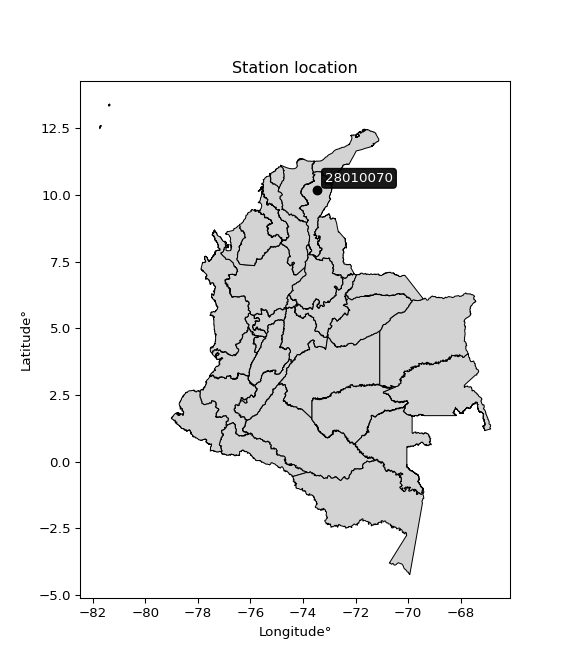</img>

</div>


## A. General information


### 1. General running parameters

• app_version: _v20251225_. • runtime: _2025-12-26 15:25:57.471855_. • Python version: _3.14.0_. • SciPy version: _1.16.3_. • Pandas version: _2.3.3_. • NumPy version: _2.3.5_. • Stations dataset (station_dataset_file): _dataset/pmax24h_in/conventional_cesarcolombia_1970_2021.csv_. • Stations catalog (station_catalog_file): _dataset/CNE_IDEAM.xls_. • Minimum year to eval til year_max (date_min): _1970_. • Maximum year to eval since year_min (date_max): _2021_. • Creates, save and include plots into reports (create_plot): _True_. • Plot only fit distributions with Δo > Δ (plot_only_fit): _True_. • Eval low extreme values, if False, evaluates high extreme values (low_extreme): _False_. • Eval every SciPy distribution as logarithmic (pdist_logarithmic_on): _True_. • Standard deviation normalized (ddof): _1.0_. • Return periods to eval in years (Tr): _[2, 2.33, 5, 10, 15, 20, 25, 50, 75, 100, 200, 250, 500, 750, 1000]_. • Minimum data sample per station, 0 means any (minimum_sample): _5_. • Z-Score threshold to adjust a value, 0 means disable (zscore): _3.5_. • Avoid zeros, e.g. rain = 0 (avoid_zeros): _True_. • Avoid null values (avoid_nans): _True_. [:file_folder:Dataset file.](../../dataset/pmax24h_in/conventional_cesarcolombia_1970_2021.csv)


### 2. Station info and location

|   id |   CODIGO | NOMBRE                   | CATEGORIA     | TECNOLOGIA   | ESTADO   | FECHA_INSTALACION   |   FECHA_SUSPENSION |   ALTITUD |   LATITUD |   LONGITUD | DEPARTAMENTO   | MUNICIPIO   | AREA_OPERATIVA                                         | ENTIDAD                                                     | AREA_HIDROGRAFICA   | ZONA_HIDROGRAFICA   | SUBZONA_HIDROGRAFICA   |   CORRIENTE |   OBSERVACION |   SUBRED | Catalogo   |
|-----:|---------:|:-------------------------|:--------------|:-------------|:---------|:--------------------|-------------------:|----------:|----------:|-----------:|:---------------|:------------|:-------------------------------------------------------|:------------------------------------------------------------|:--------------------|:--------------------|:-----------------------|------------:|--------------:|---------:|:-----------|
|    0 | 28010070 | VILLA MARLENE [28010070] | Pluviométrica | Convencional | Activa   | 15/01/1987          |                nan |       120 |   10.1855 |   -73.4671 | Cesar          | Valledupar  | Area Operativa 05 - Magdalena-Cesar-Guajira-San Andrés | INSTITUTO DE HIDROLOGIA METEOROLOGIA Y ESTUDIOS AMBIENTALES | Magdalena Cauca     | Cesar               | Medio Cesar            |         nan |           nan |      nan | CNE_IDEAM  |

<div align="center">

Map location in: [:earth_americas:Google](http://maps.google.com/maps?q=10.1855,-73.46711111) [:earth_americas:OSM](https://www.openstreetmap.org/#map=18/10.1855/-73.46711111&layers=P) [:earth_americas:Bing](https://www.bing.com/maps?cp=10.1855~-73.46711111&lvl=18) [:earth_americas:Apple](https://maps.apple.com/frame?center=10.1855%2C-73.46711111&span=0.003%2C0.006)

</div>


<div align="center">

```geojson
{
  "type": "Feature",
  "geometry": {
    "type": "Point", 
    "coordinates": [-73.46711111, 10.1855]
  }, 
  "properties": {
    "Name": "28010070"
  }
}
```

</div>


### 3. Discrete values table and plot

|               |          0 |           1 |           2 |          3 |          4 |          5 |          6 |           7 |          8 |          9 |         10 |         11 |          12 |          13 |          14 |          15 |         16 |        17 |          18 |          19 |         20 |         21 |          22 |          23 |          24 |          25 |         26 |         27 |         28 |         29 |          30 |          31 |         32 |          33 |          34 |          35 |         36 |          37 |          38 |           39 |           40 |          41 |            42 |          43 |            44 |         45 |          46 |          47 |         48 |            49 |          50 |         51 |
|:--------------|-----------:|------------:|------------:|-----------:|-----------:|-----------:|-----------:|------------:|-----------:|-----------:|-----------:|-----------:|------------:|------------:|------------:|------------:|-----------:|----------:|------------:|------------:|-----------:|-----------:|------------:|------------:|------------:|------------:|-----------:|-----------:|-----------:|-----------:|------------:|------------:|-----------:|------------:|------------:|------------:|-----------:|------------:|------------:|-------------:|-------------:|------------:|--------------:|------------:|--------------:|-----------:|------------:|------------:|-----------:|--------------:|------------:|-----------:|
| Date          | 1970       | 1971        | 1972        | 1973       | 1974       | 1975       | 1976       | 1977        | 1978       | 1979       | 1980       | 1981       | 1982        | 1983        | 1984        | 1985        | 1986       | 1987      | 1988        | 1989        | 1990       | 1991       | 1992        | 1993        | 1994        | 1995        | 1996       | 1997       | 1998       | 1999       | 2000        | 2001        | 2002       | 2003        | 2004        | 2005        | 2006       | 2007        | 2008        | 2009         | 2010         | 2011        | 2012          | 2013        | 2014          | 2015       | 2016        | 2017        | 2018       | 2019          | 2020        | 2021       |
| Value         |  120.389   |  115.247    |   99        |  130.796   |   45       |  120.668   |  107.585   |  104.603    |  130.975   |  117.688   |  125.762   |  126.945   |  112.287    |  119.745    |  114.179    |  112.59     |   43       |  111      |  110        |   70.6      |   69.9     |   60.5     |   86.4      |   70.1      |   90.7      |  100.1      |  137.5     |   60.2     |  121.3     |  135       |   90        |   80        |   65       |   73        |   76        |  100        |  130       |   85        |   80        |   96         |   96         |   71        |   95          |   85        |   95          |   40       |   88        |  100        |   63       |   95          |  112.145    |   62       |
| Value_initial |  120.389   |  115.247    |   99        |  130.796   |   45       |  120.668   |  107.585   |  104.603    |  130.975   |  117.688   |  125.762   |  126.945   |  112.287    |  119.745    |  114.179    |  112.59     |   43       |  111      |  110        |   70.6      |   69.9     |   60.5     |   86.4      |   70.1      |   90.7      |  100.1      |  137.5     |   60.2     |  121.3     |  135       |   90        |   80        |   65       |   73        |   76        |  100        |  130       |   85        |   80        |   96         |   96         |   71        |   95          |   85        |   95          |   40       |   88        |  100        |   63       |   95          |  112.145    |   62       |
| count         |   52       |   52        |   52        |   52       |   52       |   52       |   52       |   52        |   52       |   52       |   52       |   52       |   52        |   52        |   52        |   52        |   52       |   52      |   52        |   52        |   52       |   52       |   52        |   52        |   52        |   52        |   52       |   52       |   52       |   52       |   52        |   52        |   52       |   52        |   52        |   52        |   52       |   52        |   52        |   52         |   52         |   52        |   52          |   52        |   52          |   52       |   52        |   52        |   52       |   52          |   52        |   52       |
| mean          |   95.1328  |   95.1328   |   95.1328   |   95.1328  |   95.1328  |   95.1328  |   95.1328  |   95.1328   |   95.1328  |   95.1328  |   95.1328  |   95.1328  |   95.1328   |   95.1328   |   95.1328   |   95.1328   |   95.1328  |   95.1328 |   95.1328   |   95.1328   |   95.1328  |   95.1328  |   95.1328   |   95.1328   |   95.1328   |   95.1328   |   95.1328  |   95.1328  |   95.1328  |   95.1328  |   95.1328   |   95.1328   |   95.1328  |   95.1328   |   95.1328   |   95.1328   |   95.1328  |   95.1328   |   95.1328   |   95.1328    |   95.1328    |   95.1328   |   95.1328     |   95.1328   |   95.1328     |   95.1328  |   95.1328   |   95.1328   |   95.1328  |   95.1328     |   95.1328   |   95.1328  |
| std           |   25.2542  |   25.2542   |   25.2542   |   25.2542  |   25.2542  |   25.2542  |   25.2542  |   25.2542   |   25.2542  |   25.2542  |   25.2542  |   25.2542  |   25.2542   |   25.2542   |   25.2542   |   25.2542   |   25.2542  |   25.2542 |   25.2542   |   25.2542   |   25.2542  |   25.2542  |   25.2542   |   25.2542   |   25.2542   |   25.2542   |   25.2542  |   25.2542  |   25.2542  |   25.2542  |   25.2542   |   25.2542   |   25.2542  |   25.2542   |   25.2542   |   25.2542   |   25.2542  |   25.2542   |   25.2542   |   25.2542    |   25.2542    |   25.2542   |   25.2542     |   25.2542   |   25.2542     |   25.2542  |   25.2542   |   25.2542   |   25.2542  |   25.2542     |   25.2542   |   25.2542  |
| zscore        |    1.00009 |    0.796473 |    0.153132 |    1.41219 |   -1.98512 |    1.01112 |    0.49308 |    0.375014 |    1.41925 |    0.89313 |    1.21285 |    1.25967 |    0.679245 |    0.974581 |    0.754169 |    0.691259 |   -2.06432 |    0.6283 |    0.588702 |   -0.971432 |   -0.99915 |   -1.37137 |   -0.345795 |   -0.991231 |   -0.175526 |    0.196689 |    1.67763 |   -1.38324 |    1.03615 |    1.57864 |   -0.203244 |   -0.599217 |   -1.19318 |   -0.876399 |   -0.757607 |    0.192729 |    1.38065 |   -0.401231 |   -0.599217 |    0.0343398 |    0.0343398 |   -0.955593 |   -0.00525754 |   -0.401231 |   -0.00525754 |   -2.18311 |   -0.282439 |    0.192729 |   -1.27237 |   -0.00525754 |    0.673631 |   -1.31197 |

<div align="center">

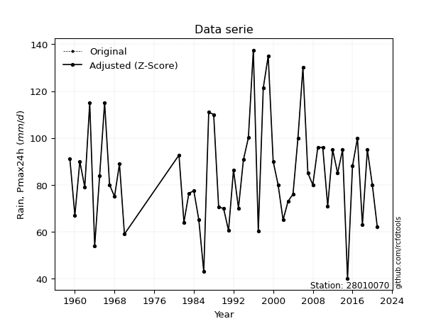</img>

</div>

> If Z-Score is active, values out of range or outliers are replaced with the station mean value.


### 4. Active continuous probability distributions from SciPy (45 of 104 available)

[scipy.stats](https://docs.scipy.org/doc/scipy/reference/stats.html) is a Python´s powerful submodule within the SciPy library for comprehensive statistical analysis, offering over 130 probability distributions (like Normal, Poisson), functions for descriptive stats (mean, variance), hypothesis testing (t-tests, chi-square), random variable generation, and statistical tests, making it essential for data science, modeling, and research. It provides tools to explore, model, and draw conclusions from data efficiently, working seamlessly with NumPy.

<div align="center">

|   id | p_dist             |   n_parameter | fit_method   | label                                                                       | active   | ref                                                                                                        |
|-----:|:-------------------|--------------:|:-------------|:----------------------------------------------------------------------------|:---------|:-----------------------------------------------------------------------------------------------------------|
|    0 | alpha              |             3 | MLE          | Alpha                                                                       | True     | [:mortar_board:](https://docs.scipy.org/doc/scipy/reference/generated/scipy.stats.alpha.html)              |
|    1 | betaprime          |             4 | MLE          | Beta prime                                                                  | True     | [:mortar_board:](https://docs.scipy.org/doc/scipy/reference/generated/scipy.stats.betaprime.html)          |
|    2 | chi2               |             3 | MLE          | Chi²                                                                        | True     | [:mortar_board:](https://docs.scipy.org/doc/scipy/reference/generated/scipy.stats.chi2.html)               |
|    3 | crystalball        |             4 | MLE          | Crystalball                                                                 | True     | [:mortar_board:](https://docs.scipy.org/doc/scipy/reference/generated/scipy.stats.crystalball.html)        |
|    4 | erlang             |             3 | MLE          | Erlang                                                                      | True     | [:mortar_board:](https://docs.scipy.org/doc/scipy/reference/generated/scipy.stats.erlang.html)             |
|    5 | expon              |             2 | MLE          | Exponential                                                                 | True     | [:mortar_board:](https://docs.scipy.org/doc/scipy/reference/generated/scipy.stats.expon.html)              |
|    6 | exponnorm          |             3 | MLE          | Exponentially modified Normal                                               | True     | [:mortar_board:](https://docs.scipy.org/doc/scipy/reference/generated/scipy.stats.exponnorm.html)          |
|    7 | f                  |             4 | MLE          | F                                                                           | True     | [:mortar_board:](https://docs.scipy.org/doc/scipy/reference/generated/scipy.stats.f.html)                  |
|    8 | fatiguelife        |             3 | MLE          | Fatigue-life (Birnbaum-Saunders)                                            | True     | [:mortar_board:](https://docs.scipy.org/doc/scipy/reference/generated/scipy.stats.fatiguelife.html)        |
|    9 | fisk               |             3 | MLE          | Fisk                                                                        | True     | [:mortar_board:](https://docs.scipy.org/doc/scipy/reference/generated/scipy.stats.fisk.html)               |
|   10 | gamma              |             3 | MLE          | Gamma                                                                       | True     | [:mortar_board:](https://docs.scipy.org/doc/scipy/reference/generated/scipy.stats.gamma.html)              |
|   11 | genexpon           |             5 | MLE          | Generalized exponential                                                     | True     | [:mortar_board:](https://docs.scipy.org/doc/scipy/reference/generated/scipy.stats.genexpon.html)           |
|   12 | genlogistic        |             3 | MLE          | Generalized logistic                                                        | True     | [:mortar_board:](https://docs.scipy.org/doc/scipy/reference/generated/scipy.stats.genlogistic.html)        |
|   13 | gibrat             |             2 | MM           | Gibrat                                                                      | True     | [:mortar_board:](https://docs.scipy.org/doc/scipy/reference/generated/scipy.stats.gibrat.html)             |
|   14 | gompertz           |             3 | MLE          | Gompertz (or truncated Gumbel)                                              | True     | [:mortar_board:](https://docs.scipy.org/doc/scipy/reference/generated/scipy.stats.gompertz.html)           |
|   15 | gumbel_l           |             2 | MM           | Gumbel Left Skew                                                            | True     | [:mortar_board:](https://docs.scipy.org/doc/scipy/reference/generated/scipy.stats.gumbel_l.html)           |
|   16 | gumbel_r           |             2 | MM           | Gumbel Right Skew                                                           | True     | [:mortar_board:](https://docs.scipy.org/doc/scipy/reference/generated/scipy.stats.gumbel_r.html)           |
|   17 | halflogistic       |             2 | MM           | Half-logistic                                                               | True     | [:mortar_board:](https://docs.scipy.org/doc/scipy/reference/generated/scipy.stats.halflogistic.html)       |
|   18 | halfnorm           |             2 | MM           | Half Normal                                                                 | True     | [:mortar_board:](https://docs.scipy.org/doc/scipy/reference/generated/scipy.stats.halfnorm.html)           |
|   19 | hypsecant          |             2 | MM           | hyperbolic secant                                                           | True     | [:mortar_board:](https://docs.scipy.org/doc/scipy/reference/generated/scipy.stats.hypsecant.html)          |
|   20 | invgamma           |             3 | MLE          | Inverted gamma                                                              | True     | [:mortar_board:](https://docs.scipy.org/doc/scipy/reference/generated/scipy.stats.invgamma.html)           |
|   21 | invgauss           |             3 | MLE          | Inverse Gaussian                                                            | True     | [:mortar_board:](https://docs.scipy.org/doc/scipy/reference/generated/scipy.stats.invgauss.html)           |
|   22 | invweibull         |             3 | MLE          | Inverted Weibull                                                            | True     | [:mortar_board:](https://docs.scipy.org/doc/scipy/reference/generated/scipy.stats.invweibull.html)         |
|   23 | johnsonsu          |             4 | MLE          | Johnson Su                                                                  | True     | [:mortar_board:](https://docs.scipy.org/doc/scipy/reference/generated/scipy.stats.johnsonsu.html)          |
|   24 | kstwobign          |             2 | MLE          | Limiting distribution of scaled Kolmogorov-Smirnov two-sided test statistic | True     | [:mortar_board:](https://docs.scipy.org/doc/scipy/reference/generated/scipy.stats.kstwobign.html)          |
|   25 | laplace            |             2 | MM           | Laplace                                                                     | True     | [:mortar_board:](https://docs.scipy.org/doc/scipy/reference/generated/scipy.stats.laplace.html)            |
|   26 | laplace_asymmetric |             3 | MLE          | Asymmetric Laplace                                                          | True     | [:mortar_board:](https://docs.scipy.org/doc/scipy/reference/generated/scipy.stats.laplace_asymmetric.html) |
|   27 | loggamma           |             3 | MLE          | Log gamma                                                                   | True     | [:mortar_board:](https://docs.scipy.org/doc/scipy/reference/generated/scipy.stats.loggamma.html)           |
|   28 | logistic           |             2 | MM           | Logistic (or Sech-squared)                                                  | True     | [:mortar_board:](https://docs.scipy.org/doc/scipy/reference/generated/scipy.stats.logistic.html)           |
|   29 | lognorm            |             3 | MLE          | Log Normal                                                                  | True     | [:mortar_board:](https://docs.scipy.org/doc/scipy/reference/generated/scipy.stats.lognorm.html)            |
|   30 | maxwell            |             2 | MM           | Maxwell                                                                     | True     | [:mortar_board:](https://docs.scipy.org/doc/scipy/reference/generated/scipy.stats.maxwell.html)            |
|   31 | mielke             |             4 | MLE          | Mielke Beta-Kappa / Dagum                                                   | True     | [:mortar_board:](https://docs.scipy.org/doc/scipy/reference/generated/scipy.stats.mielke.html)             |
|   32 | moyal              |             2 | MM           | Moyal                                                                       | True     | [:mortar_board:](https://docs.scipy.org/doc/scipy/reference/generated/scipy.stats.moyal.html)              |
|   33 | nakagami           |             3 | MLE          | Nakagami                                                                    | True     | [:mortar_board:](https://docs.scipy.org/doc/scipy/reference/generated/scipy.stats.nakagami.html)           |
|   34 | ncf                |             5 | MLE          | Non-central F distribution                                                  | True     | [:mortar_board:](https://docs.scipy.org/doc/scipy/reference/generated/scipy.stats.ncf.html)                |
|   35 | nct                |             4 | MLE          | Non-central Student’s t                                                     | True     | [:mortar_board:](https://docs.scipy.org/doc/scipy/reference/generated/scipy.stats.nct.html)                |
|   36 | norm               |             2 | MM           | Normal                                                                      | True     | [:mortar_board:](https://docs.scipy.org/doc/scipy/reference/generated/scipy.stats.norm.html)               |
|   37 | pareto             |             3 | MLE          | Pareto                                                                      | True     | [:mortar_board:](https://docs.scipy.org/doc/scipy/reference/generated/scipy.stats.pareto.html)             |
|   38 | pearson3           |             3 | MM           | Pearson type III                                                            | True     | [:mortar_board:](https://docs.scipy.org/doc/scipy/reference/generated/scipy.stats.pearson3.html)           |
|   39 | rayleigh           |             2 | MM           | Rayleigh                                                                    | True     | [:mortar_board:](https://docs.scipy.org/doc/scipy/reference/generated/scipy.stats.rayleigh.html)           |
|   40 | rice               |             3 | MLE          | Rice                                                                        | True     | [:mortar_board:](https://docs.scipy.org/doc/scipy/reference/generated/scipy.stats.rice.html)               |
|   41 | t                  |             3 | MLE          | Student’s t                                                                 | True     | [:mortar_board:](https://docs.scipy.org/doc/scipy/reference/generated/scipy.stats.t.html)                  |
|   42 | truncnorm          |             4 | MLE          | Truncated normal                                                            | True     | [:mortar_board:](https://docs.scipy.org/doc/scipy/reference/generated/scipy.stats.truncnorm.html)          |
|   43 | wald               |             2 | MM           | Wald                                                                        | True     | [:mortar_board:](https://docs.scipy.org/doc/scipy/reference/generated/scipy.stats.wald.html)               |
|   44 | weibull_min        |             3 | MLE          | Weibull minimum                                                             | True     | [:mortar_board:](https://docs.scipy.org/doc/scipy/reference/generated/scipy.stats.weibull_min.html)        |

</div>

> **n_parameter:** # arguments & localization & scale.
>
> **Fit methods:** (MLE) maximum likelihood, (MM) L-moments.
>
>**Inactive:** foldnorm, gennorm, norminvgauss, powernorm, powerlognorm, skewnorm, genextreme, anglit, arcsine, argus, beta, bradford, burr, burr12, cauchy, cosine, halfcauchy, foldcauchy, skewcauchy, wrapcauchy, dgamma, gengamma, exponweib, exponpow, truncexpon, gausshyper, genhalflogistic, genhyperbolic, geninvgauss, halfgennorm, johnsonsb, kappa4, kappa3, ksone, kstwo, loglaplace, levy, levy_l, levy_stable, ncx2, genpareto, truncpareto, lomax, powerlaw, rdist, rel_breitwigner, recipinvgauss, semicircular, studentized_range, trapezoid, triang, truncweibull_min, tukeylambda, uniform, loguniform, vonmises, vonmises_line, weibull_max, dweibull, 


## B. Probability distributions vs. Empirical distributions

A continuous probability distribution (CPD) describes probabilities for variables that can take any value within a range (like rain any time), unlike discrete variables with specific outcomes (like temperature). It uses a Probability Density Function (PDF), a curve where the total area under it equals 1, and the probability of the variable falling within an interval (a to b) is found by calculating the area under the curve between those points. A key feature is that the probability of hitting any single exact value is zero, so probabilities are always expressed for ranges, e.g., $P(a ≤ X ≤ b)$.

<div align="center">

Distributions parameters
|    |   station | p_dist                |   n |               loc |            scale | shape                 | shape1               | shape2                 | shape3   |
|---:|----------:|:----------------------|----:|------------------:|-----------------:|:----------------------|:---------------------|:-----------------------|:---------|
|  0 |  28010070 | alpha                 |  52 |    -374.076       |   8619.66        | 18.438809495911144    |                      |                        |          |
|  1 |  28010070 | betaprime             |  52 |       4.80574     |    940.876       | 12.108054735829134    | 127.28877333826983   |                        |          |
|  2 |  28010070 | chi2                  |  52 |    -174.452       |      1.22012     | 220.76530631337016    |                      |                        |          |
|  3 |  28010070 | crystalball           |  52 |      95.1328      |     25.0102      | 6521.927943176858     | 7228.26643073086     |                        |          |
|  4 |  28010070 | erlang                |  52 |    -354.364       |      1.4069      | 319.3548663305976     |                      |                        |          |
|  5 |  28010070 | expon                 |  52 |      40           |     55.1328      |                       |                      |                        |          |
|  6 |  28010070 | exponnorm             |  52 |      95.1107      |     25.0102      | 0.000879834376662207  |                      |                        |          |
|  7 |  28010070 | f                     |  52 |   -5531.37        |   5626.46        | 106472.25517627576    | 1908460.3106702892   |                        |          |
|  8 |  28010070 | fatiguelife           |  52 |    -856.511       |    951.769       | 0.02660902765033353   |                      |                        |          |
|  9 |  28010070 | fisk                  |  52 |      -9.88479e+08 |      9.88479e+08 | 66900485.08199604     |                      |                        |          |
| 10 |  28010070 | gamma                 |  52 |    -364.721       |      1.41191     | 325.6996515930957     |                      |                        |          |
| 11 |  28010070 | genexpon              |  52 |      39.9996      |      2.36006     | 0.019715312364833842  | 0.024381933688576725 | 0.756316241971972      |          |
| 12 |  28010070 | genlogistic           |  52 |     109.7         |     11.0397      | 0.5195939905655105    |                      |                        |          |
| 13 |  28010070 | gibrat                |  52 |      76.0532      |     11.5724      |                       |                      |                        |          |
| 14 |  28010070 | gompertz              |  52 |    -171.839       |     21.5377      | 2.359850104461722e-06 |                      |                        |          |
| 15 |  28010070 | gumbel_l              |  52 |     106.389       |     19.5004      |                       |                      |                        |          |
| 16 |  28010070 | gumbel_r              |  52 |      83.8768      |     19.5004      |                       |                      |                        |          |
| 17 |  28010070 | halflogistic          |  52 |      65.4898      |     21.3829      |                       |                      |                        |          |
| 18 |  28010070 | halfnorm              |  52 |      62.029       |     41.4894      |                       |                      |                        |          |
| 19 |  28010070 | hypsecant             |  52 |      95.1328      |     15.922       |                       |                      |                        |          |
| 20 |  28010070 | invgamma              |  52 |    -253.015       |  62323.9         | 180.11515337868718    |                      |                        |          |
| 21 |  28010070 | invgauss              |  52 |     -32.8423      |   2609.77        | 0.04876315781495917   |                      |                        |          |
| 22 |  28010070 | invweibull            |  52 |      -4.34113e+09 |      4.34113e+09 | 171285763.76513404    |                      |                        |          |
| 23 |  28010070 | johnsonsu             |  52 |     205.063       |     17.7982      | 11.024669310796746    | 4.418440317433257    |                        |          |
| 24 |  28010070 | kstwobign             |  52 |      -8.37726     |    118.604       |                       |                      |                        |          |
| 25 |  28010070 | laplace               |  52 |      95.1328      |     17.6849      |                       |                      |                        |          |
| 26 |  28010070 | laplace_asymmetric    |  52 |      96           |     20.6807      | 1.0211856262027839    |                      |                        |          |
| 27 |  28010070 | loggamma              |  52 |      54.5055      |     41.4881      | 3.147044173133877     |                      |                        |          |
| 28 |  28010070 | logistic              |  52 |      95.1328      |     13.7889      |                       |                      |                        |          |
| 29 |  28010070 | lognorm               |  52 |      -1.20747e+06 |      1.20756e+06 | 2.071138272044242e-05 |                      |                        |          |
| 30 |  28010070 | maxwell               |  52 |      35.869       |     37.138       |                       |                      |                        |          |
| 31 |  28010070 | mielke                |  52 |      -0.897239    |    129.733       | 2.8914823011193223    | 27.173050700697086   |                        |          |
| 32 |  28010070 | moyal                 |  52 |      80.8303      |     11.2586      |                       |                      |                        |          |
| 33 |  28010070 | nakagami              |  52 |   -6861.04        |   6956.2         | 19325.51144196707     |                      |                        |          |
| 34 |  28010070 | ncf                   |  52 |      -0.0833782   |      9.22916e-06 | 4.27228289170136e-07  | 14.890819586776797   | 3.274469489065992      |          |
| 35 |  28010070 | nct                   |  52 |   -1197.23        |     24.9595      | 255413.87402468116    | 51.7783728277449     |                        |          |
| 36 |  28010070 | norm                  |  52 |      95.1328      |     25.0102      |                       |                      |                        |          |
| 37 |  28010070 | pareto                |  52 |      -8.58993e+09 |      8.58993e+09 | 155804502.65533358    |                      |                        |          |
| 38 |  28010070 | pearson3              |  52 |      95.1328      |     25.0102      | -0.31102505636832845  |                      |                        |          |
| 39 |  28010070 | rayleigh              |  52 |      47.2868      |     38.1756      |                       |                      |                        |          |
| 40 |  28010070 | rice                  |  52 |      29.545       |     26.8707      | 2.196389453044046     |                      |                        |          |
| 41 |  28010070 | t                     |  52 |      95.1346      |     25.0152      | 172982.12179455778    |                      |                        |          |
| 42 |  28010070 | truncnorm             |  52 |      95.1328      |     25.0102      | -2078.871996411732    | 3040.965684696679    |                        |          |
| 43 |  28010070 | wald                  |  52 |      70.1225      |     25.0103      |                       |                      |                        |          |
| 44 |  28010070 | weibull_min           |  52 |     -29.2594      |    134.476       | 5.895077570644034     |                      |                        |          |
| 45 |  28010070 | logalpha              |  52 |      -6.90419     |    421.629       | 36.94997748468839     |                      |                        |          |
| 46 |  28010070 | logbetaprime          |  52 |     -18.7411      |     16.031       | 14172.048323834002    | 9769.619360462766    |                        |          |
| 47 |  28010070 | logchi2               |  52 |       0.951323    |      0.0139247   | 255.6833531741022     |                      |                        |          |
| 48 |  28010070 | logcrystalball        |  52 |       4.51502     |      0.296788    | 5.1673346635639605    | 232.349991291202     |                        |          |
| 49 |  28010070 | logerlang             |  52 |       1.40019     |      0.0326077   | 95.43048056939006     |                      |                        |          |
| 50 |  28010070 | logexpon              |  52 |       3.68888     |      0.826143    |                       |                      |                        |          |
| 51 |  28010070 | logexponnorm          |  52 |       4.5148      |      0.296789    | 0.0007438755031463011 |                      |                        |          |
| 52 |  28010070 | logf                  |  52 |    -337.519       |    342.034       | 7061199.686023738     | 4248913.874372696    |                        |          |
| 53 |  28010070 | logfatiguelife        |  52 |    -165.85        |    170.366       | 0.0017402444531041455 |                      |                        |          |
| 54 |  28010070 | logfisk               |  52 |      -1.70378e+07 |      1.70378e+07 | 102000895.49096386    |                      |                        |          |
| 55 |  28010070 | loggamma              |  52 |      -0.0519227   |      0.0213894   | 213.4628122842812     |                      |                        |          |
| 56 |  28010070 | loggenexpon           |  52 |       3.68443     |      0.00400903  | 0.0002765291306128563 | 2.9893419330640025   | 1.3012744457320141e-05 |          |
| 57 |  28010070 | loggenlogistic        |  52 |       4.85916     |      0.0368383   | 0.10534353362243182   |                      |                        |          |
| 58 |  28010070 | loggibrat             |  52 |       4.28862     |      0.137317    |                       |                      |                        |          |
| 59 |  28010070 | loggompertz           |  52 |       3.68888     |      0.236116    | 0.017754550776287972  |                      |                        |          |
| 60 |  28010070 | loggumbel_l           |  52 |       4.64859     |      0.231404    |                       |                      |                        |          |
| 61 |  28010070 | loggumbel_r           |  52 |       4.38145     |      0.231404    |                       |                      |                        |          |
| 62 |  28010070 | loghalflogistic       |  52 |       4.16326     |      0.253745    |                       |                      |                        |          |
| 63 |  28010070 | loghalfnorm           |  52 |       4.12223     |      0.492293    |                       |                      |                        |          |
| 64 |  28010070 | loghypsecant          |  52 |       4.51502     |      0.188941    |                       |                      |                        |          |
| 65 |  28010070 | loginvgamma           |  52 |      -2.09128     |   2973.29        | 451.4264839336321     |                      |                        |          |
| 66 |  28010070 | loginvgauss           |  52 |       1.08176     |    397.888       | 0.008605157423468679  |                      |                        |          |
| 67 |  28010070 | loginvweibull         |  52 |      -2.51499e+06 |      2.51499e+06 | 7343586.094802035     |                      |                        |          |
| 68 |  28010070 | logjohnsonsu          |  52 |       5.07222     |      0.0190969   | 7.198357105780445     | 1.8350589744714498   |                        |          |
| 69 |  28010070 | logkstwobign          |  52 |       3.07133     |      1.66062     |                       |                      |                        |          |
| 70 |  28010070 | loglaplace            |  52 |       4.51502     |      0.209861    |                       |                      |                        |          |
| 71 |  28010070 | loglaplace_asymmetric |  52 |       4.79304     |      0.153041    | 2.2591990989996       |                      |                        |          |
| 72 |  28010070 | logloggamma           |  52 |       4.85348     |      0.0871108   | 0.2714827547426447    |                      |                        |          |
| 73 |  28010070 | loglogistic           |  52 |       4.51502     |      0.163628    |                       |                      |                        |          |
| 74 |  28010070 | loglognorm            |  52 |  -32764.3         |  32768.8         | 9.057048137766158e-06 |                      |                        |          |
| 75 |  28010070 | logmaxwell            |  52 |       3.81179     |      0.440685    |                       |                      |                        |          |
| 76 |  28010070 | logmielke             |  52 |       3.21855     |      1.64039     | 3.590441866268616     | 42.25393749210464    |                        |          |
| 77 |  28010070 | logmoyal              |  52 |       4.3453      |      0.133601    |                       |                      |                        |          |
| 78 |  28010070 | lognakagami           |  52 |    -255.25        |    259.766       | 190987.0497459729     |                      |                        |          |
| 79 |  28010070 | logncf                |  52 |     -11.7652      |     16.2449      | 10382.984728703628    | 13914.33752027414    | 19.173693029369886     |          |
| 80 |  28010070 | lognct                |  52 |       3.79624     |      0.294224    | 3511.1386555825875    | 2.4463816525031117   |                        |          |
| 81 |  28010070 | lognorm               |  52 |       4.51502     |      0.296788    |                       |                      |                        |          |
| 82 |  28010070 | logpareto             |  52 |      -6.71089e+07 |      6.71089e+07 | 81231496.54588404     |                      |                        |          |
| 83 |  28010070 | logpearson3           |  52 |       4.51502     |      0.296788    | -0.9026601907191691   |                      |                        |          |
| 84 |  28010070 | lograyleigh           |  52 |       3.94725     |      0.45302     |                       |                      |                        |          |
| 85 |  28010070 | logrice               |  52 |     -44.1898      |      0.296829    | 164.08038419614718    |                      |                        |          |
| 86 |  28010070 | logt                  |  52 |       4.53251     |      0.273697    | 13.06860471912723     |                      |                        |          |
| 87 |  28010070 | logtruncnorm          |  52 |      -0.169068    |      1.89599     | 2.0347962073974313    | 3.0078058497699853   |                        |          |
| 88 |  28010070 | logwald               |  52 |       4.21827     |      0.296757    |                       |                      |                        |          |
| 89 |  28010070 | logweibull_min        |  52 | -399188           | 399193           | 1784573.6975552419    |                      |                        |          |

</div>

> **loc** (Location parameter): This shifts the distribution along the x-axis. For many common distributions, like the normal (Gaussian) distribution, loc represents the mean $μ$. For others, like the uniform distribution, it might represent the minimum value, or for the beta distribution, the left end of the support interval.
>
> **scale** (Scale parameter): This determines the width or spread of the distribution. For the normal distribution, scale represents the standard deviation $σ$. For a uniform distribution, it defines the length of the interval (from $loc$ to $loc + scale$).
>
> **shape** (Shape parameters): Refers to parameters that define the specific form of a probability distribution, distinct from its location (loc) and scale (scale). These parameters are required arguments for most distribution functions. For example, a normal (Gaussian) distribution is fully defined by its location (mean) and scale (standard deviation), so it has no specific shape parameters beyond loc and scale. However, other distributions have intrinsic properties that need specification, as Gamma distribution that takes a shape parameter, often named $a$ or $alpha$.


### 0. Cumulative distribution values - CDF (90 evaluated)

> Ordered by x ascending and calculating $log(f(x))$ separately. 

|   id |   Station |   date |       x |   count |    mean |     std |      zscore |   Value_initial |   station |   m |      alpha |   alpha_pdf |   betaprime |   betaprime_pdf |      chi2 |   chi2_pdf |   crystalball |   crystalball_pdf |    erlang |   erlang_pdf |     expon |   expon_pdf |   exponnorm |   exponnorm_pdf |         f |      f_pdf |   fatiguelife |   fatiguelife_pdf |      fisk |   fisk_pdf |     gamma |   gamma_pdf |   genexpon |   genexpon_pdf |   genlogistic |   genlogistic_pdf |   gibrat |   gibrat_pdf |   gompertz |   gompertz_pdf |   gumbel_l |   gumbel_l_pdf |    gumbel_r |   gumbel_r_pdf |   halflogistic |   halflogistic_pdf |   halfnorm |   halfnorm_pdf |   hypsecant |   hypsecant_pdf |   invgamma |   invgamma_pdf |   invgauss |   invgauss_pdf |   invweibull |   invweibull_pdf |   johnsonsu |   johnsonsu_pdf |   kstwobign |   kstwobign_pdf |   laplace |   laplace_pdf |   laplace_asymmetric |   laplace_asymmetric_pdf |   loggamma |   loggamma_pdf |   logistic |   logistic_pdf |    lognorm |   lognorm_pdf |     maxwell |   maxwell_pdf |    mielke |   mielke_pdf |       moyal |   moyal_pdf |   nakagami |   nakagami_pdf |      ncf |    ncf_pdf |       nct |    nct_pdf |      norm |   norm_pdf |      pareto |   pareto_pdf |   pearson3 |   pearson3_pdf |   rayleigh |   rayleigh_pdf |       rice |   rice_pdf |         t |      t_pdf |   truncnorm |   truncnorm_pdf |        wald |    wald_pdf |   weibull_min |   weibull_min_pdf |   logalpha |   logalpha_pdf |   logbetaprime |   logbetaprime_pdf |    logchi2 |   logchi2_pdf |   logcrystalball |   logcrystalball_pdf |   logerlang |   logerlang_pdf |   logexpon |   logexpon_pdf |   logexponnorm |   logexponnorm_pdf |       logf |   logf_pdf |   logfatiguelife |   logfatiguelife_pdf |    logfisk |   logfisk_pdf |   loggenexpon |   loggenexpon_pdf |   loggenlogistic |   loggenlogistic_pdf |   loggibrat |   loggibrat_pdf |   loggompertz |   loggompertz_pdf |   loggumbel_l |   loggumbel_l_pdf |   loggumbel_r |   loggumbel_r_pdf |   loghalflogistic |   loghalflogistic_pdf |   loghalfnorm |   loghalfnorm_pdf |   loghypsecant |   loghypsecant_pdf |   loginvgamma |   loginvgamma_pdf |   loginvgauss |   loginvgauss_pdf |   loginvweibull |   loginvweibull_pdf |   logjohnsonsu |   logjohnsonsu_pdf |   logkstwobign |   logkstwobign_pdf |   loglaplace |   loglaplace_pdf |   loglaplace_asymmetric |   loglaplace_asymmetric_pdf |   logloggamma |   logloggamma_pdf |   loglogistic |   loglogistic_pdf |   loglognorm |   loglognorm_pdf |   logmaxwell |   logmaxwell_pdf |   logmielke |   logmielke_pdf |    logmoyal |   logmoyal_pdf |   lognakagami |   lognakagami_pdf |     logncf |   logncf_pdf |     lognct |   lognct_pdf |   logpareto |   logpareto_pdf |   logpearson3 |   logpearson3_pdf |   lograyleigh |   lograyleigh_pdf |    logrice |   logrice_pdf |       logt |   logt_pdf |   logtruncnorm |   logtruncnorm_pdf |    logwald |   logwald_pdf |   logweibull_min |   logweibull_min_pdf |
|-----:|----------:|-------:|--------:|--------:|--------:|--------:|------------:|----------------:|----------:|----:|-----------:|------------:|------------:|----------------:|----------:|-----------:|--------------:|------------------:|----------:|-------------:|----------:|------------:|------------:|----------------:|----------:|-----------:|--------------:|------------------:|----------:|-----------:|----------:|------------:|-----------:|---------------:|--------------:|------------------:|---------:|-------------:|-----------:|---------------:|-----------:|---------------:|------------:|---------------:|---------------:|-------------------:|-----------:|---------------:|------------:|----------------:|-----------:|---------------:|-----------:|---------------:|-------------:|-----------------:|------------:|----------------:|------------:|----------------:|----------:|--------------:|---------------------:|-------------------------:|-----------:|---------------:|-----------:|---------------:|-----------:|--------------:|------------:|--------------:|----------:|-------------:|------------:|------------:|-----------:|---------------:|---------:|-----------:|----------:|-----------:|----------:|-----------:|------------:|-------------:|-----------:|---------------:|-----------:|---------------:|-----------:|-----------:|----------:|-----------:|------------:|----------------:|------------:|------------:|--------------:|------------------:|-----------:|---------------:|---------------:|-------------------:|-----------:|--------------:|-----------------:|---------------------:|------------:|----------------:|-----------:|---------------:|---------------:|-------------------:|-----------:|-----------:|-----------------:|---------------------:|-----------:|--------------:|--------------:|------------------:|-----------------:|---------------------:|------------:|----------------:|--------------:|------------------:|--------------:|------------------:|--------------:|------------------:|------------------:|----------------------:|--------------:|------------------:|---------------:|-------------------:|--------------:|------------------:|--------------:|------------------:|----------------:|--------------------:|---------------:|-------------------:|---------------:|-------------------:|-------------:|-----------------:|------------------------:|----------------------------:|--------------:|------------------:|--------------:|------------------:|-------------:|-----------------:|-------------:|-----------------:|------------:|----------------:|------------:|---------------:|--------------:|------------------:|-----------:|-------------:|-----------:|-------------:|------------:|----------------:|--------------:|------------------:|--------------:|------------------:|-----------:|--------------:|-----------:|-----------:|---------------:|-------------------:|-----------:|--------------:|-----------------:|---------------------:|
|    0 |  28010070 |   2015 |  40     |      52 | 95.1328 | 25.2542 | -2.18311    |          40     |  28010070 |   1 | 0.00870781 |  0.00118711 |  0.00405015 |     0.000877174 | 0.0114509 | 0.00136336 |     0.0137478 |        0.0014047  | 0.0118436 |   0.00134033 | 0         |  0.018138   |   0.0137478 |      0.0014047  | 0.0137325 | 0.00141046 |     0.0122847 |        0.00133678 | 0.0219556 | 0.00145334 | 0.0126014 |  0.001393   | 3.1552e-06 |     0.00835496 |     0.0375753 |        0.00176531 | 0        |   0          |  0.0431434 |     0.00195941 |  0.0326782 |     0.00164809 | 7.574e-05   |    3.68524e-05 |       0        |         0          |  0         |     0          |   0.0199488 |      0.00125209 |  0.0101797 |     0.0013113  | 0.00682519 |     0.00123897 |   0.00484341 |       0.00101861 |   0.0292704 |      0.00177424 |  0.00369936 |      0.00105761 | 0.0221337 |    0.00125156 |            0.0360061 |               0.00170493 | 0.00259411 |      0.0293554 |  0.0180153 |     0.00128297 | 0.00268781 |     0.0279185 | 0.000364672 |   0.000264179 | 0.0355086 |   0.0025105  | 8.75171e-10 | 1.49784e-09 |  0.0137276 |     0.00140614 | 0.454809 | 0.00553162 | 0.0137756 | 0.00140692 | 0.0137478 | 0.0014047  | 3.45955e-08 |   0.018138   |  0.0204836 |     0.0016259  |  0         |     0          | 0.00714104 | 0.00143313 | 0.0137612 | 0.00140557 |   0.0137478 |      0.0014047  | 0           | 0           |     0.0198108 |        0.0016694  | 0.00216985 |      0.025651  |     0.00297334 |          0.0308363 | 0.00242775 |     0.0286463 |       0.00268782 |            0.0279185 |  0.00240081 |       0.0288944 |  0         |       1.21044  |     0.00268792 |          0.0279194 | 0.00267128 |  0.0278173 |       0.00257144 |            0.0269833 | 0.00592295 |     0.0352491 |    0.00033069 |         0.0797154 |        0.0352048 |             0.100673 | 0           |       0         |   1.72687e-08 |         0.0751944 |     0.0156821 |         0.0672349 |   2.18053e-09 |       1.8793e-07  |         0         |              0        |     0         |          0        |     0.00803352 |          0.0425142 |    0.00217472 |         0.0262747 |    0.00184242 |         0.0245864 |     0.000913532 |           0.0186673 |      0.0266335 |          0.0817395 |    0.000900338 |          0.024554  |   0.00975693 |        0.0464924 |               0.0343054 |                   0.0992205 |     0.0294039 |         0.0916378 |    0.00637532 |         0.038714  |   0.00268766 |        0.0279176 |    0         |         0        |   0.0112728 |       0.0860544 | 1.91141e-31 |    9.80528e-29 |    0.00268877 |         0.0279183 | 0.00242178 |    0.0265346 | 0.00246778 |    0.026064  |   0         |        1.21044  |     0.0130686 |         0.0666926 |     0         |          0        | 0.00269103 |     0.027945  | 0.00434586 |  0.0306299 |    3.85359e-06 |           1.35301  | 0          |      0        |        0.0135452 |            0.0601413 |
|    1 |  28010070 |   1986 |  43     |      52 | 95.1328 | 25.2542 | -2.06432    |          43     |  28010070 |   2 | 0.0129375  |  0.00165187 |  0.0074498  |     0.00141882  | 0.0162045 | 0.00182235 |     0.0185592 |        0.00181675 | 0.0164917 |   0.0017739  | 0.0529601 |  0.0171774  |   0.0185592 |      0.00181675 | 0.018566  | 0.00182584 |     0.0168977 |        0.00175305 | 0.026766  | 0.00176304 | 0.0174141 |  0.00183059 | 0.0355031  |     0.014212   |     0.043261  |        0.00203128 | 0        |   0          |  0.04943   |     0.00223746 |  0.0380083 |     0.00191159 | 0.000293026 |    0.000122246 |       0        |         0          |  0         |     0          |   0.0240813 |      0.00151101 |  0.0148029 |     0.00178914 | 0.0114318  |     0.00186008 |   0.00878138 |       0.00164064 |   0.0350659 |      0.00209731 |  0.00807435 |      0.00190934 | 0.0262257 |    0.00148294 |            0.041502  |               0.00196517 | 0.00566653 |      0.0583617 |  0.0222962 |     0.00158092 | 0.00554358 |     0.0534052 | 0.00186212  |   0.00077763  | 0.0435739 |   0.00287018 | 8.05328e-08 | 1.06342e-07 |  0.0185452 |     0.00181949 | 0.471184 | 0.00538551 | 0.0185943 | 0.00181934 | 0.0185592 | 0.00181675 | 0.0529602   |   0.0171774  |  0.0259061 |     0.00199958 |  0         |     0          | 0.012204   | 0.00195383 | 0.0185754 | 0.0018177  |   0.0185592 |      0.00181675 | 0           | 0           |     0.025365  |        0.00204286 | 0.00490496 |      0.0526881 |     0.00611551 |          0.058554  | 0.00546735 |     0.0582982 |       0.00554357 |            0.0534051 |  0.00548404 |       0.0593526 |  0.0838179 |       1.10899  |     0.00554376 |          0.0534065 | 0.00551896 |  0.0532856 |       0.00534191 |            0.0519592 | 0.00910293 |     0.0540007 |    0.0123496  |         0.251609  |        0.0432931 |             0.123802 | 0           |       0         |   0.00634271  |         0.101495  |     0.0213736 |         0.0913706 |   4.6062e-07  |       2.90434e-05 |         0         |              0        |     0         |          0        |     0.0117791  |          0.0623288 |    0.00499511 |         0.0545732 |    0.00457798 |         0.0542422 |     0.00346173  |           0.0572718 |      0.0333103 |          0.103834  |    0.00474279  |          0.0914159 |   0.0137714  |        0.0656215 |               0.0422868 |                   0.122305  |     0.0368375 |         0.114805  |    0.00988364 |         0.0598063 |   0.00554335 |        0.0534043 |    0         |         0        |   0.0188391 |       0.124648  | 5.61554e-19 |    1.68497e-16 |    0.00554395 |         0.0533859 | 0.0051835  |    0.0523078 | 0.00515211 |    0.0504685 |   0.0838179 |        1.10899  |     0.0188318 |         0.0941285 |     0         |          0        | 0.00554922 |     0.0534464 | 0.00722761 |  0.050679  |    0.0941307   |           1.25105  | 0          |      0        |        0.0186667 |            0.0826651 |
|    2 |  28010070 |   1974 |  45     |      52 | 95.1328 | 25.2542 | -1.98512    |          45     |  28010070 |   3 | 0.0166085  |  0.00202837 |  0.0107365  |     0.00188195  | 0.0202047 | 0.00218578 |     0.0225087 |        0.00213943 | 0.0203749 |   0.00211685 | 0.0866994 |  0.0165655  |   0.0225087 |      0.00213943 | 0.0225363 | 0.00215114 |     0.0207247 |        0.00208099 | 0.0305273 | 0.00200302 | 0.0214122 |  0.00217488 | 0.0654462  |     0.0155174  |     0.0475194 |        0.00223018 | 0        |   0          |  0.0541077 |     0.00244311 |  0.042026  |     0.0021092  | 0.000647597 |    0.000243832 |       0        |         0          |  0         |     0          |   0.0273007 |      0.00171255 |  0.0187542 |     0.00217087 | 0.0156481  |     0.00236905 |   0.0125778  |       0.00217161 |   0.0394995 |      0.00234012 |  0.0126033  |      0.00264034 | 0.0293658 |    0.0016605  |            0.0456245 |               0.00216037 | 0.00892422 |      0.0864292 |  0.0256871 |     0.00181503 | 0.00849883 |     0.0778861 | 0.00388194  |   0.00126005  | 0.049565  |   0.00312255 | 9.11343e-07 | 1.01334e-06 |  0.0225012 |     0.00214322 | 0.481859 | 0.00528883 | 0.0225492 | 0.00214225 | 0.0225087 | 0.00213943 | 0.0866994   |   0.0165655  |  0.0301857 |     0.00228512 |  0         |     0          | 0.0164944  | 0.00234241 | 0.0225268 | 0.00214042 |   0.0225087 |      0.00213943 | 0           | 0           |     0.0297278 |        0.00232451 | 0.00787491 |      0.0794502 |     0.00934558 |          0.0848817 | 0.00874089 |     0.0872642 |       0.00849882 |            0.0778859 |  0.00882335 |       0.0891476 |  0.132873  |       1.04961  |     0.00849908 |          0.0778877 | 0.00846872 |  0.0777657 |       0.00822286 |            0.076057  | 0.0119165  |     0.0704908 |    0.0261604  |         0.35521   |        0.0493037 |             0.14099  | 0           |       0         |   0.011418    |         0.122416  |     0.0259529 |         0.110686  |   6.21728e-06 |       0.000322094 |         0         |              0        |     0         |          0        |     0.0149824  |          0.0792675 |    0.00807905 |         0.0826574 |    0.00768961 |         0.0843915 |     0.00700151  |           0.101435  |      0.0384079 |          0.120876  |    0.0104793   |          0.165083  |   0.0171025  |        0.0814944 |               0.0482291 |                   0.139492  |     0.0424446 |         0.132279  |    0.013008   |         0.0784632 |   0.00849856 |        0.0778853 |    0         |         0        |   0.0251484 |       0.153531  | 6.04813e-14 |    1.2975e-11  |    0.00849779 |         0.0778404 | 0.00810182 |    0.0774335 | 0.00795559 |    0.0741315 |   0.132873  |        1.04961  |     0.0235987 |         0.116288  |     0         |          0        | 0.00850659 |     0.0779383 | 0.00993121 |  0.0691647 |    0.149611    |           1.19005  | 0          |      0        |        0.0228252 |            0.100866  |
|    3 |  28010070 |   1997 |  60.2   |      52 | 95.1328 | 25.2542 | -1.38324    |          60.2   |  28010070 |   4 | 0.079337   |  0.00675206 |  0.0797993  |     0.00778408  | 0.0830857 | 0.00654313 |     0.0812459 |        0.00601401 | 0.0807413 |   0.00628313 | 0.306766  |  0.0125739  |   0.0812459 |      0.00601401 | 0.0816419 | 0.0060513  |     0.079199  |        0.00604951 | 0.0809588 | 0.00503571 | 0.0824373 |  0.00629139 | 0.291958   |     0.0132183  |     0.0967551 |        0.00450301 | 0        |   0          |  0.10655   |     0.00467379 |  0.0893634 |     0.0043715  | 0.0344755   |    0.00595354  |       0        |         0          |  0         |     0          |   0.0706727 |      0.0044023  |  0.0831682 |     0.00678165 | 0.0928202  |     0.00823822 |   0.090525   |       0.00857992 |   0.0936444 |      0.00506278 |  0.108236   |      0.0100703  | 0.0693607 |    0.00392203 |            0.0937078 |               0.00443717 | 0.0882296  |      0.545772  |  0.0735492 |     0.00494165 | 0.0798285  |     0.500106  | 0.0658578   |   0.00744042  | 0.113344  |   0.0053641  | 0.0124267   | 0.00389394  |  0.0813789 |     0.00602935 | 0.556803 | 0.00458126 | 0.0813363 | 0.00601717 | 0.0812459 | 0.00601401 | 0.306766    |   0.0125739  |  0.0872713 |     0.00556859 |  0.0556037 |     0.00836792 | 0.081322   | 0.00655923 | 0.0812774 | 0.00601451 |   0.0812459 |      0.00601401 | 0           | 0           |     0.0864901 |        0.00544551 | 0.0848094  |      0.54113   |     0.0845637  |          0.516692  | 0.0901932  |     0.561022  |       0.0798283  |            0.500105  |  0.0919709  |       0.569985  |  0.39032   |       0.737983 |     0.0798294  |          0.500108  | 0.079796   |  0.500274  |       0.078673   |            0.496351  | 0.0644259  |     0.360852  |    0.209481   |         0.844644  |        0.113316  |             0.32404  | 0           |       0         |   0.0792121   |         0.391066  |     0.0883319 |         0.364342  |   0.0330832   |       0.487336    |         0         |              0        |     0         |          0        |     0.0696358  |          0.365626  |    0.0881896  |         0.56066   |    0.0927831  |         0.595556  |     0.119881    |           0.742532  |      0.0985172 |          0.326809  |    0.160479    |          0.853638  |   0.0684363  |        0.326104  |               0.111904  |                   0.323657  |     0.10512   |         0.327565  |    0.0723854  |         0.410357  |   0.0798287  |        0.500111  |    0.0640948 |         0.617365 |   0.106502  |       0.434966  | 0.0115282   |    0.310269    |    0.0797248  |         0.499188  | 0.0812785  |    0.516492  | 0.0775371  |    0.493482  |   0.39032   |        0.737983 |     0.0916961 |         0.400221  |     0.0536366 |          0.693656 | 0.0798592  |     0.500185  | 0.0680022  |  0.412905  |    0.444656    |           0.852453 | 0          |      0        |        0.0813071 |            0.348286  |
|    4 |  28010070 |   1991 |  60.5   |      52 | 95.1328 | 25.2542 | -1.37137    |          60.5   |  28010070 |   5 | 0.0813808  |  0.00687359 |  0.0821557  |     0.00792567  | 0.0850653 | 0.00665409 |     0.0830653 |        0.00611517 | 0.0826424 |   0.00639124 | 0.310528  |  0.0125057  |   0.0830653 |      0.00611518 | 0.0834725 | 0.00615293 |     0.0810293 |        0.00615287 | 0.0824824 | 0.00512198 | 0.0843405 |  0.00639723 | 0.295913   |     0.0131455  |     0.0981152 |        0.00456491 | 0        |   0          |  0.107961  |     0.00473186 |  0.090684  |     0.00443283 | 0.0362942   |    0.00617194  |       0        |         0          |  0         |     0          |   0.0720056 |      0.00448392 |  0.0852201 |     0.00689801 | 0.0953117  |     0.00837171 |   0.0931203  |       0.00872205 |   0.095174  |      0.0051341  |  0.111278   |      0.0102045  | 0.0705473 |    0.00398913 |            0.0950485 |               0.00450065 | 0.0909728  |      0.557891  |  0.0750456 |     0.00503404 | 0.0823439  |     0.511953  | 0.0681115   |   0.00758454  | 0.114961  |   0.00541403 | 0.0136363   | 0.00417141  |  0.0832029 |     0.00613076 | 0.558176 | 0.00456788 | 0.0831566 | 0.0061183  | 0.0830653 | 0.00611517 | 0.310528    |   0.0125057  |  0.0889547 |     0.00565416 |  0.0581398 |     0.00853933 | 0.0833054  | 0.00666333 | 0.0830969 | 0.00611565 |   0.0830653 |      0.00611517 | 0           | 0           |     0.0881357 |        0.00552551 | 0.0875303  |      0.553564  |     0.0871613  |          0.528404  | 0.0930127  |     0.573356  |       0.0823438  |            0.511952  |  0.0948349  |       0.582321  |  0.393977  |       0.733556 |     0.0823449  |          0.511955  | 0.0823123  |  0.512127  |       0.0811698  |            0.508202  | 0.0662431  |     0.370309  |    0.213692   |         0.849592  |        0.114938  |             0.328679 | 0           |       0         |   0.0811746   |         0.398535  |     0.0901608 |         0.371507  |   0.0355689   |       0.512816    |         0         |              0        |     0         |          0        |     0.0714768  |          0.375131  |    0.0910081  |         0.573315  |    0.0957761  |         0.608632  |     0.123602    |           0.754548  |      0.100156  |          0.33247   |    0.164743    |          0.862177  |   0.0700768  |        0.333921  |               0.113525  |                   0.328344  |     0.106761  |         0.332676  |    0.074452   |         0.421132  |   0.0823441  |        0.511958  |    0.0672059 |         0.634323 |   0.10868   |       0.441366  | 0.0131492   |    0.342196    |    0.0822356  |         0.511006  | 0.0838763  |    0.528713  | 0.0800198  |    0.505408  |   0.393977  |        0.733556 |     0.0937047 |         0.407894  |     0.0571352 |          0.713929 | 0.082375   |     0.512031  | 0.0700816  |  0.423753  |    0.448881    |           0.847435 | 0          |      0        |        0.0830561 |            0.355434  |
|    5 |  28010070 |   2021 |  62     |      52 | 95.1328 | 25.2542 | -1.31197    |          62     |  28010070 |   6 | 0.0921523  |  0.00749099 |  0.0945754  |     0.00863361  | 0.0954678 | 0.00721849 |     0.0926239 |        0.00663279 | 0.0926408 |   0.006943   | 0.329034  |  0.01217    |   0.0926239 |      0.00663279 | 0.0930893 | 0.00667268 |     0.0906524 |        0.00668107 | 0.0904983 | 0.00557065 | 0.0943391 |  0.00693694 | 0.315361   |     0.0127862  |     0.105201  |        0.00488644 | 0        |   0          |  0.115282  |     0.00503153 |  0.0975695 |     0.00475102 | 0.0463942   |    0.00730535  |       0        |         0          |  0         |     0          |   0.0790493 |      0.00491391 |  0.0960082 |     0.00748827 | 0.108368   |     0.00903571 |   0.106731   |       0.00942239 |   0.103148  |      0.00550153 |  0.127073   |      0.0108475  | 0.0767921 |    0.00434224 |            0.102045  |               0.00483195 | 0.105379   |      0.618897  |  0.0829544 |     0.00551699 | 0.0956138  |     0.5722    | 0.0800284   |   0.00830404  | 0.123271  |   0.00566694 | 0.0210138   | 0.00570379  |  0.0927857 |     0.00664952 | 0.564977 | 0.00450133 | 0.0927197 | 0.00663569 | 0.0926239 | 0.00663279 | 0.329034    |   0.01217    |  0.097763  |     0.0060934  |  0.0715791 |     0.00937306 | 0.0936955  | 0.0071925  | 0.0926561 | 0.00663312 |   0.0926238 |      0.00663279 | 0           | 0           |     0.0967297 |        0.00593599 | 0.101851   |      0.616246  |     0.100823   |          0.587695  | 0.107809   |     0.635274  |       0.0956136  |            0.572198  |  0.10985    |       0.644106  |  0.411679  |       0.712129 |     0.0956148  |          0.572201  | 0.0955867  |  0.572396  |       0.0943483  |            0.5685    | 0.0759099  |     0.419955  |    0.234781   |         0.8721    |        0.123276  |             0.352523 | 0           |       0         |   0.091402    |         0.437172  |     0.0997079 |         0.408649  |   0.0497261   |       0.644928    |         0         |              0        |     0.0079464 |          1.62067  |     0.0812684  |          0.425469  |    0.105824   |         0.63692   |    0.111479   |         0.67391   |     0.142787    |           0.811509  |      0.108653  |          0.361816  |    0.186344    |          0.900826  |   0.0787511  |        0.375255  |               0.121858  |                   0.352445  |     0.115227  |         0.359041  |    0.0854456  |         0.477576  |   0.0956141  |        0.572206  |    0.0837632 |         0.717682 |   0.119883  |       0.47374   | 0.0236649   |    0.522529    |    0.0954804  |         0.571102  | 0.0975784  |    0.590702  | 0.093135   |    0.566141  |   0.411679  |        0.712129 |     0.104172  |         0.447343  |     0.0758105 |          0.810078 | 0.0956467  |     0.572269  | 0.0811396  |  0.480053  |    0.469336    |           0.823059 | 0          |      0        |        0.0922095 |            0.392601  |
|    6 |  28010070 |   2018 |  63     |      52 | 95.1328 | 25.2542 | -1.27237    |          63     |  28010070 |   7 | 0.0998524  |  0.00791008 |  0.103444   |     0.009103    | 0.102878  | 0.00760247 |     0.0994336 |        0.006988   | 0.0997719 |   0.00732022 | 0.341094  |  0.0119513  |   0.0994336 |      0.00698801 | 0.0999396 | 0.00702917 |     0.0975138 |        0.00704287 | 0.0962255 | 0.00588589 | 0.10146   |  0.0073055  | 0.328029   |     0.0125513  |     0.1102    |        0.00511225 | 0        |   0          |  0.120417  |     0.00524006 |  0.102431  |     0.00497407 | 0.054091    |    0.00809154  |       0        |         0          |  0.0186719 |     0.0192258  |   0.0841157 |      0.00522171 |  0.103696  |     0.00788819 | 0.117623   |     0.00947287 |   0.116382   |       0.00987686 |   0.108777  |      0.00575649 |  0.138123   |      0.0112483  | 0.0812594 |    0.00459485 |            0.106993  |               0.00506625 | 0.115607   |      0.659704  |  0.0886409 |     0.00585862 | 0.105095   |     0.61308   | 0.088571    |   0.00878058  | 0.129023  |   0.00583857 | 0.0272798   | 0.0068417   |  0.0996125 |     0.00700545 | 0.569457 | 0.00445732 | 0.0995322 | 0.00699073 | 0.0994336 | 0.006988   | 0.341094    |   0.0119513  |  0.104007  |     0.00639646 |  0.0812203 |     0.00990616 | 0.101068   | 0.00755242 | 0.0994661 | 0.00698823 |   0.0994336 |      0.006988   | 0           | 0           |     0.102807  |        0.00621913 | 0.112046   |      0.658246  |     0.110545   |          0.627681  | 0.118303   |     0.676527  |       0.105095   |            0.613078  |  0.120484   |       0.68514   |  0.422964  |       0.69847  |     0.105096   |          0.613081  | 0.105071   |  0.613286  |       0.103771   |            0.60944   | 0.0829082  |     0.455198  |    0.248841   |         0.885123  |        0.129048  |             0.369028 | 0           |       0         |   0.0986106   |         0.464112  |     0.106452  |         0.434624  |   0.0607663   |       0.735463    |         0         |              0        |     0.0338689 |          1.61929  |     0.0883622  |          0.461688  |    0.116354   |         0.67936   |    0.122607   |         0.717042  |     0.156054    |           0.846423  |      0.114605  |          0.382359  |    0.200938    |          0.922963  |   0.0849902  |        0.404984  |               0.12763   |                   0.369139  |     0.121118  |         0.377381  |    0.0934033  |         0.517511  |   0.105095   |        0.613086  |    0.0956781 |         0.77153  |   0.127638  |       0.495655  | 0.0330874   |    0.657002    |    0.104943   |         0.61188   | 0.107364   |    0.632609  | 0.102522   |    0.60743   |   0.422964  |        0.69847  |     0.111546  |         0.474606  |     0.0892498 |          0.869304 | 0.105129   |     0.613143  | 0.0891323  |  0.519348  |    0.48238     |           0.807441 | 0          |      0        |        0.0986981 |            0.418698  |
|    7 |  28010070 |   2002 |  65     |      52 | 95.1328 | 25.2542 | -1.19318    |          65     |  28010070 |   8 | 0.11652    |  0.00875978 |  0.122577   |     0.0100259   | 0.118862  | 0.00838399 |     0.114137  |        0.00771941 | 0.115181  |   0.00809284 | 0.364568  |  0.0115255  |   0.114137  |      0.00771942 | 0.114727  | 0.00776267 |     0.112339  |        0.00778591 | 0.108658  | 0.00655492 | 0.116821  |  0.00805944 | 0.352671   |     0.012093   |     0.120898  |        0.00559263 | 0        |   0          |  0.131331  |     0.00567861 |  0.112847  |     0.00544734 | 0.0718815   |    0.00970468  |       0        |         0          |  0.0570868 |     0.0191818  |   0.0952164 |      0.00589139 |  0.12028   |     0.00869754 | 0.137427   |     0.0103255  |   0.137014   |       0.0107455  |   0.120818  |      0.00629019 |  0.161365   |      0.0119773  | 0.0909889 |    0.00514501 |            0.117621  |               0.00556949 | 0.137487   |      0.740716  |  0.101078  |     0.00658949 | 0.125538   |     0.695687  | 0.107074    |   0.00971822  | 0.141049  |   0.00618905 | 0.0433964   | 0.0093071   |  0.114352  |     0.00773815 | 0.578284 | 0.00437016 | 0.11424   | 0.0077217  | 0.114137  | 0.00771941 | 0.364568    |   0.0115255  |  0.117424  |     0.00702558 |  0.102054  |     0.0109138  | 0.116903   | 0.00828558 | 0.114169  | 0.0077194  |   0.114137  |      0.00771941 | 0           | 0           |     0.115828  |        0.00680728 | 0.133919   |      0.741758  |     0.131409   |          0.707899  | 0.140718   |     0.758011  |       0.125537   |            0.695685  |  0.143157   |       0.765876  |  0.444385  |       0.672541 |     0.125539   |          0.695688  | 0.12552    |  0.6959    |       0.124102   |            0.692227  | 0.0982899  |     0.530598  |    0.276854   |         0.906728  |        0.141112  |             0.403527 | 0           |       0         |   0.113986    |         0.520756  |     0.120878  |         0.489439  |   0.0865618   |       0.915315    |         0.0219305 |              1.96953  |     0.0843738 |          1.61168  |     0.103996   |          0.540676  |    0.138895   |         0.763301  |    0.146334   |         0.801301  |     0.183499    |           0.908479  |      0.127222  |          0.425845  |    0.230372    |          0.959076  |   0.0986379  |        0.470017  |               0.139704  |                   0.40406   |     0.133505  |         0.415936  |    0.110881   |         0.602505  |   0.125538   |        0.695694  |    0.1214    |         0.87376  |   0.143819  |       0.540229  | 0.0579869   |    0.938542    |    0.125345   |         0.69428   | 0.128444   |    0.716871  | 0.122803   |    0.691038  |   0.444385  |        0.672541 |     0.127252  |         0.531279  |     0.118118  |          0.976045 | 0.125573   |     0.695733  | 0.106629   |  0.601513  |    0.507146    |           0.777624 | 0          |      0        |        0.112633  |            0.474035  |
|    8 |  28010070 |   1990 |  69.9   |      52 | 95.1328 | 25.2542 | -0.99915    |          69.9   |  28010070 |   9 | 0.164557   |  0.0108362  |  0.176936   |     0.0121076   | 0.164693  | 0.0103198  |     0.156512  |        0.00958878 | 0.159589  |   0.0100377  | 0.418606  |  0.0105453  |   0.156512  |      0.00958879 | 0.157321  | 0.00963388 |     0.155086  |        0.00967093 | 0.145183  | 0.00839945 | 0.160942  |  0.00995307 | 0.4093     |     0.0110367  |     0.151505  |        0.00694199 | 0        |   0          |  0.16202   |     0.00687744 |  0.142678  |     0.00676796 | 0.129024    |    0.0135489   |       0.10276  |         0.0231363  |  0.150465  |     0.0188881  |   0.12872   |      0.00786587 |  0.16776   |     0.0106707  | 0.192788   |     0.0122137  |   0.19432    |       0.0125608  |   0.155086  |      0.00772572 |  0.223615   |      0.0133254  | 0.120038  |    0.00678761 |            0.148337  |               0.00702393 | 0.198161   |      0.927356  |  0.138246  |     0.00863985 | 0.183301   |     0.894244  | 0.160044    |   0.0118549   | 0.173555  |   0.0070883  | 0.104192    | 0.0153793   |  0.156824  |     0.00960952 | 0.599184 | 0.00416167 | 0.156623  | 0.00958955 | 0.156512  | 0.00958878 | 0.418606    |   0.0105453  |  0.155837  |     0.0086755  |  0.16091   |     0.0130197  | 0.161977   | 0.010113   | 0.156543  | 0.00958808 |   0.156512  |      0.00958878 | 0           | 0           |     0.152925  |        0.00835787 | 0.194891   |      0.934516  |     0.189766   |          0.897632  | 0.202623   |     0.943354  |       0.1833     |            0.894242  |  0.205525   |       0.947841  |  0.491176  |       0.615903 |     0.183302   |          0.894243  | 0.183297   |  0.894387  |       0.181637   |            0.891502  | 0.144147   |     0.738575  |    0.34404    |         0.937675  |        0.17371   |             0.496744 | 0           |       0         |   0.157215    |         0.673892  |     0.161691  |         0.638932  |   0.1674      |       1.293       |         0.16366   |              1.9177   |     0.200178  |          1.56947  |     0.151245   |          0.770705  |    0.2014     |         0.954517  |    0.211465   |         0.987377  |     0.253766    |           1.01613   |      0.162372  |          0.546177  |    0.302138    |          1.00792   |   0.139459   |        0.664534  |               0.172385  |                   0.498583  |     0.167423  |         0.52139   |    0.162791   |         0.83293   |   0.183302   |        0.894251  |    0.192843  |         1.08451  |   0.187106  |       0.653166  | 0.148648    |    1.51977     |    0.182988   |         0.892359  | 0.187819   |    0.916755  | 0.18034    |    0.89286   |   0.491176  |        0.615903 |     0.171135  |         0.680178  |     0.196682  |          1.17358  | 0.183338   |     0.89424   | 0.157945   |  0.814899  |    0.561239    |           0.711726 | 0.00345878 |      0.666236 |        0.152421  |            0.626602  |
|    9 |  28010070 |   1993 |  70.1   |      52 | 95.1328 | 25.2542 | -0.991231   |          70.1   |  28010070 |  10 | 0.166733   |  0.0109187  |  0.179366   |     0.0121849   | 0.166765  | 0.0103978  |     0.158437  |        0.00966615 | 0.161604  |   0.0101171  | 0.420712  |  0.0105072  |   0.158437  |      0.00966616 | 0.159255  | 0.0097112  |     0.157028  |        0.00974845 | 0.146871  | 0.00848033 | 0.16294   |  0.0100303  | 0.411503   |     0.0109956  |     0.152899  |        0.00700249 | 0        |   0          |  0.163401  |     0.00693016 |  0.144038  |     0.00682689 | 0.131748    |    0.0136938   |       0.107385 |         0.0231136  |  0.15424   |     0.0188706  |   0.130302  |      0.00795713 |  0.169902  |     0.0107491  | 0.195238   |     0.0122829  |   0.196839   |       0.0126235  |   0.156637  |      0.00778791 |  0.226284   |      0.013367   | 0.121403  |    0.00686481 |            0.149749  |               0.00709077 | 0.200821   |      0.934413  |  0.139983  |     0.00873078 | 0.185867   |     0.902009  | 0.162423    |   0.0119355   | 0.174977  |   0.00712622 | 0.10729     | 0.0156018   |  0.158754  |     0.00968692 | 0.600016 | 0.00415332 | 0.158549  | 0.00966684 | 0.158437  | 0.00966615 | 0.420712    |   0.0105072  |  0.157579  |     0.0087454  |  0.163522  |     0.0130939  | 0.164007   | 0.0101872  | 0.158468  | 0.00966541 |   0.158437  |      0.00966615 | 0           | 0           |     0.154603  |        0.00842399 | 0.197572   |      0.941805  |     0.192341   |          0.904964  | 0.205329   |     0.950286  |       0.185866   |            0.902007  |  0.208242   |       0.954596  |  0.492933  |       0.613777 |     0.185868   |          0.902008  | 0.185863   |  0.902146  |       0.184196   |            0.899303  | 0.14627    |     0.747594  |    0.34672    |         0.938353  |        0.175135  |             0.500819 | 0           |       0         |   0.15915     |         0.68053   |     0.163526  |         0.645454  |   0.171112    |       1.30545     |         0.169134  |              1.91411  |     0.204659  |          1.56714  |     0.153462   |          0.78112   |    0.204137   |         0.961669  |    0.214296   |         0.994154  |     0.256674    |           1.01924   |      0.16394   |          0.551508  |    0.30502     |          1.0089    |   0.141371   |        0.673643  |               0.173815  |                   0.50272   |     0.16892   |         0.526037  |    0.165185   |         0.842762  |   0.185868   |        0.902016  |    0.195952  |         1.09176  |   0.188979  |       0.657877  | 0.153015    |    1.53716     |    0.185549   |         0.900106  | 0.19045    |    0.924483  | 0.182902   |    0.900775  |   0.492933  |        0.613777 |     0.173087  |         0.686495  |     0.200044  |          1.1798   | 0.185904   |     0.902002  | 0.160286   |  0.823726  |    0.563269    |           0.709232 | 0.00571411 |      0.915974 |        0.154221  |            0.633309  |
|   10 |  28010070 |   1989 |  70.6   |      52 | 95.1328 | 25.2542 | -0.971432   |          70.6   |  28010070 |  11 | 0.172244   |  0.0111239  |  0.185506   |     0.0123751   | 0.172012  | 0.0105921  |     0.163319  |        0.00985954 | 0.166713  |   0.0103153  | 0.425941  |  0.0104123  |   0.163319  |      0.00985955 | 0.164159  | 0.00990445 |     0.161951  |        0.00994203 | 0.151162  | 0.00868419 | 0.168004  |  0.010223   | 0.416975   |     0.0108934  |     0.156439  |        0.00715566 | 0        |   0          |  0.166899  |     0.00706327 |  0.147489  |     0.00697597 | 0.138684    |    0.0140499   |       0.118927 |         0.0230525  |  0.163664  |     0.018825   |   0.134339  |      0.00818905 |  0.175325  |     0.010944   | 0.201422   |     0.0124525  |   0.203189   |       0.0127762  |   0.16057   |      0.00794452 |  0.232993   |      0.0134663  | 0.124885  |    0.00706167 |            0.153336  |               0.00726065 | 0.207524   |      0.951812  |  0.144405  |     0.0089603  | 0.192346   |     0.921247  | 0.168441    |   0.0121341   | 0.178564  |   0.00722145 | 0.115227    | 0.0161434   |  0.163646  |     0.0098804  | 0.602087 | 0.00413248 | 0.16343   | 0.00986004 | 0.163319  | 0.00985954 | 0.425941    |   0.0104123  |  0.161996  |     0.00892081 |  0.170114  |     0.0132754  | 0.169147   | 0.0103723  | 0.163349  | 0.00985873 |   0.163319  |      0.00985954 | 1.23335e-12 | 6.88674e-11 |     0.158856  |        0.00859011 | 0.20433    |      0.959779  |     0.198838   |          0.9231    | 0.212144   |     0.967352  |       0.192346   |            0.921245  |  0.215086   |       0.971211  |  0.497276  |       0.608519 |     0.192347   |          0.921246  | 0.192344   |  0.921369  |       0.190656   |            0.918633  | 0.151664   |     0.770265  |    0.353394   |         0.939868  |        0.178731  |             0.511102 | 0           |       0         |   0.164046    |         0.697242  |     0.168172  |         0.66189   |   0.180498    |       1.33541     |         0.182705  |              1.9047   |     0.215776  |          1.56112  |     0.159107   |          0.807467  |    0.211035   |         0.979274  |    0.221421   |         1.01078   |     0.263944    |           1.02658   |      0.167908  |          0.564978  |    0.312198    |          1.01104   |   0.146241   |        0.696848  |               0.177425  |                   0.513161  |     0.1727    |         0.537774  |    0.171262   |         0.867406  |   0.192347   |        0.921254  |    0.203775  |         1.10939  |   0.193697  |       0.669685  | 0.164087    |    1.57812     |    0.192015   |         0.919301  | 0.197088   |    0.943601  | 0.189374   |    0.920394  |   0.497276  |        0.608519 |     0.178023  |         0.702349  |     0.208482  |          1.19477  | 0.192383   |     0.921235  | 0.166219   |  0.845763  |    0.568288    |           0.703057 | 0.0145704  |      1.57758  |        0.158782  |            0.650229  |
|   11 |  28010070 |   2011 |  71     |      52 | 95.1328 | 25.2542 | -0.955593   |          71     |  28010070 |  12 | 0.176726   |  0.0112866  |  0.190486   |     0.0125238   | 0.17628   | 0.0107466  |     0.167293  |        0.0100142  | 0.17087   |   0.0104733  | 0.430091  |  0.010337   |   0.167293  |      0.0100142  | 0.168152  | 0.0100589  |     0.165959  |        0.0100966  | 0.154669  | 0.00884894 | 0.172124  |  0.0103766  | 0.421317   |     0.0108123  |     0.159326  |        0.00728016 | 0        |   0          |  0.169746  |     0.00717108 |  0.150303  |     0.00709703 | 0.14436     |    0.014328    |       0.128137 |         0.0229993  |  0.171187  |     0.0187867  |   0.137652  |      0.00837844 |  0.179734  |     0.0110986  | 0.206429   |     0.0125849  |   0.208323   |       0.0128939  |   0.163773  |      0.00807095 |  0.238394   |      0.013541   | 0.127742  |    0.00722321 |            0.156268  |               0.00739948 | 0.21294    |      0.965476  |  0.148026  |     0.00914612 | 0.197594   |     0.936449  | 0.173325    |   0.01229     | 0.181467  |   0.00729805 | 0.121769    | 0.016561    |  0.167629  |     0.0100351  | 0.603737 | 0.00411587 | 0.167405  | 0.0100145  | 0.167293  | 0.0100142  | 0.430091    |   0.010337   |  0.165592  |     0.00906175 |  0.175453  |     0.0134164  | 0.173325   | 0.0105197  | 0.167323  | 0.0100133  |   0.167293  |      0.0100142  | 2.50309e-07 | 4.19469e-06 |     0.162319  |        0.0087238  | 0.209792   |      0.973891  |     0.204093   |          0.937401  | 0.217647   |     0.980725  |       0.197593   |            0.936447  |  0.22061    |       0.984213  |  0.500702  |       0.604372 |     0.197595   |          0.936448  | 0.197592   |  0.936559  |       0.195889   |            0.933909  | 0.156067   |     0.788514  |    0.358707   |         0.940898  |        0.181642  |             0.519427 | 0           |       0         |   0.168024    |         0.71073   |     0.171949  |         0.675169  |   0.188107    |       1.35814     |         0.193444  |              1.89674  |     0.224581  |          1.55612  |     0.163729   |          0.828852  |    0.216607   |         0.993068  |    0.227168   |         1.02373   |     0.26976     |           1.03203   |      0.17113   |          0.575902  |    0.317914    |          1.01245   |   0.150231   |        0.715863  |               0.180348  |                   0.521615  |     0.175765  |         0.547287  |    0.176219   |         0.887171  |   0.197595   |        0.936456  |    0.210081  |         1.12299  |   0.197507  |       0.679164  | 0.17309     |    1.60829     |    0.197251   |         0.93447   | 0.202462   |    0.958673  | 0.194618   |    0.935903  |   0.500702  |        0.604372 |     0.182027  |         0.715092  |     0.215265  |          1.20613  | 0.197631   |     0.936432  | 0.171047   |  0.863344  |    0.572246    |           0.698181 | 0.02491    |      2.07349  |        0.162494  |            0.663918  |
|   12 |  28010070 |   2003 |  73     |      52 | 95.1328 | 25.2542 | -0.876399   |          73     |  28010070 |  13 | 0.200096   |  0.0120768  |  0.216243   |     0.0132199   | 0.198535  | 0.0115036  |     0.188092  |        0.0107829  | 0.1926    |   0.0112527  | 0.450395  |  0.00996876 |   0.188092  |      0.0107829  | 0.189039  | 0.0108262  |     0.18692   |        0.0108623  | 0.173205  | 0.00969214 | 0.193638  |  0.0111342  | 0.442542   |     0.0104158  |     0.174528  |        0.00792887 | 0        |   0          |  0.18464   |     0.00772773 |  0.16512   |     0.00772643 | 0.174334    |    0.0156163   |       0.173829 |         0.0226767  |  0.208551  |     0.0185703  |   0.155393  |      0.00937657 |  0.202688  |     0.0118498  | 0.232227   |     0.0131996  |   0.234656   |       0.0134217  |   0.180558  |      0.00871739 |  0.265806   |      0.0138534  | 0.143037  |    0.00808807 |            0.171791  |               0.00813448 | 0.240669   |      1.03011   |  0.167267  |     0.0101016  | 0.224631   |     1.00959   | 0.198656    |   0.0130284   | 0.196451  |   0.00768681 | 0.156811    | 0.0184135   |  0.188469  |     0.0108038  | 0.611886 | 0.00403357 | 0.188204  | 0.0107824  | 0.188092  | 0.0107829  | 0.450395    |   0.00996876 |  0.184425  |     0.00977271 |  0.202948  |     0.0140628  | 0.195094   | 0.011246   | 0.18812   | 0.0107817  |   0.188092  |      0.0107829  | 0.00827714  | 0.0135952   |     0.180442  |        0.00940151 | 0.237784   |      1.04061   |     0.231092   |          1.00583   | 0.245776   |     1.04363   |       0.22463    |            1.00959   |  0.24881    |       1.04514   |  0.517212  |       0.584387 |     0.224632   |          1.00959   | 0.224631   |  1.00962   |       0.222861   |            1.00744   | 0.179244   |     0.880742  |    0.384893   |         0.943755  |        0.19666   |             0.562373 | 7.96179e-06 |       0.0196481 |   0.188714    |         0.779584  |     0.191639  |         0.743184  |   0.22724     |       1.45508     |         0.245531  |              1.85169  |     0.267441  |          1.52883  |     0.188269   |          0.939354  |    0.245106   |         1.0579    |    0.256456   |         1.08378   |     0.298752    |           1.0539    |      0.187903  |          0.632462  |    0.346099    |          1.01577   |   0.171494   |        0.81718   |               0.195436  |                   0.565254  |     0.191643  |         0.596527  |    0.202231   |         0.985982  |   0.224632   |        1.0096    |    0.24215   |         1.18422  |   0.217033  |       0.726967  | 0.219514    |    1.72534     |    0.224231   |         1.00746   | 0.230103   |    1.03074   | 0.221661   |    1.01061   |   0.517212  |        0.584387 |     0.202779  |         0.779454  |     0.249478  |          1.25514  | 0.224667   |     1.00955   | 0.196235   |  0.950098  |    0.591312    |           0.674602 | 0.105754   |      3.45324  |        0.181903  |            0.734286  |
|   13 |  28010070 |   2004 |  76     |      52 | 95.1328 | 25.2542 | -0.757607   |          76     |  28010070 |  14 | 0.237995   |  0.0131677  |  0.257274   |     0.0140993   | 0.234671  | 0.0125711  |     0.222136  |        0.0119046  | 0.228052  |   0.0123695  | 0.479502  |  0.00944081 |   0.222136  |      0.0119046  | 0.223207  | 0.0119436  |     0.221185  |        0.0119703  | 0.204233  | 0.0109995  | 0.228687  |  0.0122195  | 0.47293    |     0.00984814 |     0.199871  |        0.00898278 | 0        |   0          |  0.20914   |     0.00861579 |  0.189805  |     0.00874495 | 0.223643    |    0.0171766   |       0.24093  |         0.0220259  |  0.263685  |     0.018171   |   0.185953  |      0.011026   |  0.239827  |     0.0128893  | 0.273019   |     0.0139622  |   0.275874   |       0.0140179  |   0.208211  |      0.0097249  |  0.307847   |      0.0141384  | 0.16948   |    0.00958334 |            0.198012  |               0.00937612 | 0.283894   |      1.11428   |  0.199799  |     0.0115948  | 0.267317   |     1.1085    | 0.239232    |   0.0139922   | 0.220407  |   0.00828772 | 0.215248    | 0.0203752   |  0.222575  |     0.0119246  | 0.623804 | 0.00391246 | 0.222245  | 0.0119027  | 0.222136  | 0.0119046  | 0.479502    |   0.00944081 |  0.215354  |     0.0108462  |  0.24637   |     0.014848   | 0.230409   | 0.0122844  | 0.22216   | 0.0119029  |   0.222136  |      0.0119046  | 0.0973499   | 0.0403113   |     0.210197  |        0.0104378  | 0.281485   |      1.12731   |     0.27348    |          1.09731   | 0.28948    |     1.12443   |       0.267317   |            1.1085    |  0.292512   |       1.12276   |  0.540184  |       0.556582 |     0.267318   |          1.1085    | 0.267316   |  1.1084    |       0.265474   |            1.10699   | 0.217487   |     1.01886   |    0.422883   |         0.941608  |        0.220664  |             0.631017 | 0.118594    |       4.71125   |   0.222235    |         0.886368  |     0.22368   |         0.849409  |   0.287925    |       1.54916     |         0.31853   |              1.77055  |     0.328093  |          1.48171  |     0.229543   |          1.1123    |    0.289434   |         1.14098   |    0.301656   |         1.15817   |     0.341604    |           1.07137   |      0.215167  |          0.723213  |    0.386945    |          1.01081   |   0.207775   |        0.990062  |               0.21958   |                   0.635085  |     0.217229  |         0.675681  |    0.244849   |         1.12999   |   0.267319   |        1.10851   |    0.291344  |         1.25509  |   0.247764  |       0.799851  | 0.290954    |    1.80556     |    0.266828   |         1.1062    | 0.27359    |    1.12682   | 0.264436   |    1.11188   |   0.540184  |        0.556582 |     0.236122  |         0.877068  |     0.30113   |          1.3059   | 0.267351   |     1.10843   | 0.237004   |  1.07364   |    0.617812    |           0.641581 | 0.249239   |      3.46423  |        0.213672  |            0.844998  |
|   14 |  28010070 |   2008 |  80     |      52 | 95.1328 | 25.2542 | -0.599217   |          80     |  28010070 |  15 | 0.293201   |  0.0143836  |  0.31547    |     0.0149314   | 0.287515  | 0.0138097  |     0.272568  |        0.0132829  | 0.280264  |   0.0136996  | 0.515928  |  0.00878012 |   0.272569  |      0.013283   | 0.273778  | 0.0133126  |     0.271816  |        0.0133133  | 0.251746  | 0.0127489  | 0.280223  |  0.0135134  | 0.510887   |     0.00913897 |     0.238842  |        0.0105269  | 0.14103  |   0.0566748  |  0.246119  |     0.00988909 |  0.227715  |     0.0102336  | 0.295245    |    0.0184706   |       0.326847 |         0.0208852  |  0.335092  |     0.017509   |   0.234836  |      0.0134471  |  0.293812  |     0.014056   | 0.330383   |     0.0146568  |   0.332942   |       0.0144476  |   0.249875  |      0.011112   |  0.364652   |      0.0142097  | 0.212495  |    0.0120156  |            0.239304  |               0.0113313  | 0.343362   |      1.19997   |  0.250215  |     0.0136057  | 0.327034   |     1.21579   | 0.297286    |   0.0149744   | 0.255214  |   0.00912201 | 0.299473    | 0.0214622   |  0.273082  |     0.0133002  | 0.639138 | 0.00375542 | 0.272665  | 0.0132791  | 0.272568  | 0.0132829  | 0.515928    |   0.00878012 |  0.261562  |     0.0122468  |  0.307295  |     0.0155489  | 0.282088   | 0.0135217  | 0.272584  | 0.0132807  |   0.272568  |      0.0132829  | 0.265509    | 0.0404303   |     0.254724  |        0.0118221  | 0.341682   |      1.21512   |     0.332371   |          1.19483   | 0.349334   |     1.20469   |       0.327033   |            1.21579   |  0.35217    |       1.19874   |  0.567864  |       0.523076 |     0.327034   |          1.21579   | 0.327022   |  1.21546   |       0.325134   |            1.21513   | 0.274225   |     1.19151   |    0.470899   |         0.928808  |        0.255526  |             0.730705 | 0.349977    |       3.96556   |   0.271394    |         1.03182   |     0.270955  |         0.995628  |   0.368792    |       1.58976     |         0.406226  |              1.64531  |     0.40231   |          1.41008  |     0.292437   |          1.33905   |    0.350186   |         1.22294   |    0.362961   |         1.22699   |     0.39665     |           1.07098   |      0.255552  |          0.854398  |    0.438325    |          0.990134  |   0.265303   |        1.26419   |               0.254696  |                   0.73665   |     0.254776  |         0.791233  |    0.307295   |         1.30091   |   0.327036   |        1.21579   |    0.357353  |         1.31244  |   0.291302  |       0.898944  | 0.383437    |    1.78012     |    0.326423   |         1.21339   | 0.334109   |    1.22842   | 0.324402   |    1.22207   |   0.567864  |        0.523076 |     0.284403  |         1.00604   |     0.369061  |          1.33666  | 0.327063   |     1.21567   | 0.295856   |  1.21752   |    0.649682    |           0.601461 | 0.408763   |      2.73379  |        0.260908  |            0.998932  |
|   15 |  28010070 |   2001 |  80     |      52 | 95.1328 | 25.2542 | -0.599217   |          80     |  28010070 |  16 | 0.293201   |  0.0143836  |  0.31547    |     0.0149314   | 0.287515  | 0.0138097  |     0.272568  |        0.0132829  | 0.280264  |   0.0136996  | 0.515928  |  0.00878012 |   0.272569  |      0.013283   | 0.273778  | 0.0133126  |     0.271816  |        0.0133133  | 0.251746  | 0.0127489  | 0.280223  |  0.0135134  | 0.510887   |     0.00913897 |     0.238842  |        0.0105269  | 0.14103  |   0.0566748  |  0.246119  |     0.00988909 |  0.227715  |     0.0102336  | 0.295245    |    0.0184706   |       0.326847 |         0.0208852  |  0.335092  |     0.017509   |   0.234836  |      0.0134471  |  0.293812  |     0.014056   | 0.330383   |     0.0146568  |   0.332942   |       0.0144476  |   0.249875  |      0.011112   |  0.364652   |      0.0142097  | 0.212495  |    0.0120156  |            0.239304  |               0.0113313  | 0.343362   |      1.19997   |  0.250215  |     0.0136057  | 0.327034   |     1.21579   | 0.297286    |   0.0149744   | 0.255214  |   0.00912201 | 0.299473    | 0.0214622   |  0.273082  |     0.0133002  | 0.639138 | 0.00375542 | 0.272665  | 0.0132791  | 0.272568  | 0.0132829  | 0.515928    |   0.00878012 |  0.261562  |     0.0122468  |  0.307295  |     0.0155489  | 0.282088   | 0.0135217  | 0.272584  | 0.0132807  |   0.272568  |      0.0132829  | 0.265509    | 0.0404303   |     0.254724  |        0.0118221  | 0.341682   |      1.21512   |     0.332371   |          1.19483   | 0.349334   |     1.20469   |       0.327033   |            1.21579   |  0.35217    |       1.19874   |  0.567864  |       0.523076 |     0.327034   |          1.21579   | 0.327022   |  1.21546   |       0.325134   |            1.21513   | 0.274225   |     1.19151   |    0.470899   |         0.928808  |        0.255526  |             0.730705 | 0.349977    |       3.96556   |   0.271394    |         1.03182   |     0.270955  |         0.995628  |   0.368792    |       1.58976     |         0.406226  |              1.64531  |     0.40231   |          1.41008  |     0.292437   |          1.33905   |    0.350186   |         1.22294   |    0.362961   |         1.22699   |     0.39665     |           1.07098   |      0.255552  |          0.854398  |    0.438325    |          0.990134  |   0.265303   |        1.26419   |               0.254696  |                   0.73665   |     0.254776  |         0.791233  |    0.307295   |         1.30091   |   0.327036   |        1.21579   |    0.357353  |         1.31244  |   0.291302  |       0.898944  | 0.383437    |    1.78012     |    0.326423   |         1.21339   | 0.334109   |    1.22842   | 0.324402   |    1.22207   |   0.567864  |        0.523076 |     0.284403  |         1.00604   |     0.369061  |          1.33666  | 0.327063   |     1.21567   | 0.295856   |  1.21752   |    0.649682    |           0.601461 | 0.408763   |      2.73379  |        0.260908  |            0.998932  |
|   16 |  28010070 |   2013 |  85     |      52 | 95.1328 | 25.2542 | -0.401231   |          85     |  28010070 |  17 | 0.367943   |  0.0154143  |  0.39156    |     0.0153989   | 0.359633  | 0.0149531  |     0.342685  |        0.0146943  | 0.352179  |   0.0149861  | 0.557897  |  0.00801889 |   0.342686  |      0.0146943  | 0.344003  | 0.0147069  |     0.341925  |        0.0146573  | 0.320621  | 0.0147423  | 0.351125  |  0.0147701  | 0.554512   |     0.00832385 |     0.296649  |        0.0126154  | 0.398466 |   0.0431382  |  0.29977   |     0.0115855  |  0.283894  |     0.0122627  | 0.389057    |    0.0188346   |       0.426991 |         0.01912    |  0.420188  |     0.0164983  |   0.309861  |      0.0165299  |  0.36684   |     0.015064   | 0.404753   |     0.0149941  |   0.4054     |       0.0144422  |   0.309778  |      0.0128388  |  0.435064   |      0.0138877  | 0.281926  |    0.0159416  |            0.30323   |               0.0143583  | 0.418239   |      1.2627    |  0.324131  |     0.0158875  | 0.403674   |     1.30482   | 0.374155    |   0.0156731   | 0.303539  |   0.0102176  | 0.405998    | 0.0208482   |  0.343272  |     0.0147056  | 0.657439 | 0.00356633 | 0.342757  | 0.014688   | 0.342685  | 0.0146943  | 0.557897    |   0.00801889 |  0.326883  |     0.013841   |  0.386124  |     0.0158856  | 0.352891   | 0.0147268  | 0.342688  | 0.0146914  |   0.342685  |      0.0146943  | 0.442503    | 0.030287    |     0.318012  |        0.0134673  | 0.417505   |      1.27841   |     0.407412   |          1.27342   | 0.424279   |     1.26013   |       0.403673   |            1.30482   |  0.426607   |       1.24944   |  0.59844   |       0.486066 |     0.403674   |          1.30482   | 0.403633   |  1.30421   |       0.401764   |            1.30516   | 0.35198    |     1.36552   |    0.526421   |         0.900666  |        0.303896  |             0.869017 | 0.54571     |       2.57307   |   0.339333    |         1.20949   |     0.336794  |         1.17698   |   0.464118    |       1.53958     |         0.500927  |              1.47603  |     0.484871  |          1.31137  |     0.380952   |          1.56825   |    0.426248   |         1.27836   |    0.438767   |         1.26592   |     0.460851    |           1.04245   |      0.312605  |          1.03159   |    0.497191    |          0.949296  |   0.354161   |        1.6876    |               0.30351   |                   0.877832  |     0.307467  |         0.951504  |    0.391194   |         1.45551   |   0.403676   |        1.30482   |    0.437766  |         1.33173  |   0.349581  |       1.02536   | 0.487268    |    1.62962     |    0.402919   |         1.30251   | 0.411251   |    1.30846   | 0.401513   |    1.31394   |   0.59844   |        0.486066 |     0.350029  |         1.15803   |     0.450054  |          1.32753  | 0.403695   |     1.30467   | 0.373934   |  1.34972   |    0.684776    |           0.55674  | 0.550006   |      1.96582  |        0.327296  |            1.19224   |
|   17 |  28010070 |   2007 |  85     |      52 | 95.1328 | 25.2542 | -0.401231   |          85     |  28010070 |  18 | 0.367943   |  0.0154143  |  0.39156    |     0.0153989   | 0.359633  | 0.0149531  |     0.342685  |        0.0146943  | 0.352179  |   0.0149861  | 0.557897  |  0.00801889 |   0.342686  |      0.0146943  | 0.344003  | 0.0147069  |     0.341925  |        0.0146573  | 0.320621  | 0.0147423  | 0.351125  |  0.0147701  | 0.554512   |     0.00832385 |     0.296649  |        0.0126154  | 0.398466 |   0.0431382  |  0.29977   |     0.0115855  |  0.283894  |     0.0122627  | 0.389057    |    0.0188346   |       0.426991 |         0.01912    |  0.420188  |     0.0164983  |   0.309861  |      0.0165299  |  0.36684   |     0.015064   | 0.404753   |     0.0149941  |   0.4054     |       0.0144422  |   0.309778  |      0.0128388  |  0.435064   |      0.0138877  | 0.281926  |    0.0159416  |            0.30323   |               0.0143583  | 0.418239   |      1.2627    |  0.324131  |     0.0158875  | 0.403674   |     1.30482   | 0.374155    |   0.0156731   | 0.303539  |   0.0102176  | 0.405998    | 0.0208482   |  0.343272  |     0.0147056  | 0.657439 | 0.00356633 | 0.342757  | 0.014688   | 0.342685  | 0.0146943  | 0.557897    |   0.00801889 |  0.326883  |     0.013841   |  0.386124  |     0.0158856  | 0.352891   | 0.0147268  | 0.342688  | 0.0146914  |   0.342685  |      0.0146943  | 0.442503    | 0.030287    |     0.318012  |        0.0134673  | 0.417505   |      1.27841   |     0.407412   |          1.27342   | 0.424279   |     1.26013   |       0.403673   |            1.30482   |  0.426607   |       1.24944   |  0.59844   |       0.486066 |     0.403674   |          1.30482   | 0.403633   |  1.30421   |       0.401764   |            1.30516   | 0.35198    |     1.36552   |    0.526421   |         0.900666  |        0.303896  |             0.869017 | 0.54571     |       2.57307   |   0.339333    |         1.20949   |     0.336794  |         1.17698   |   0.464118    |       1.53958     |         0.500927  |              1.47603  |     0.484871  |          1.31137  |     0.380952   |          1.56825   |    0.426248   |         1.27836   |    0.438767   |         1.26592   |     0.460851    |           1.04245   |      0.312605  |          1.03159   |    0.497191    |          0.949296  |   0.354161   |        1.6876    |               0.30351   |                   0.877832  |     0.307467  |         0.951504  |    0.391194   |         1.45551   |   0.403676   |        1.30482   |    0.437766  |         1.33173  |   0.349581  |       1.02536   | 0.487268    |    1.62962     |    0.402919   |         1.30251   | 0.411251   |    1.30846   | 0.401513   |    1.31394   |   0.59844   |        0.486066 |     0.350029  |         1.15803   |     0.450054  |          1.32753  | 0.403695   |     1.30467   | 0.373934   |  1.34972   |    0.684776    |           0.55674  | 0.550006   |      1.96582  |        0.327296  |            1.19224   |
|   18 |  28010070 |   1992 |  86.4   |      52 | 95.1328 | 25.2542 | -0.345795   |          86.4   |  28010070 |  19 | 0.389654   |  0.0155932  |  0.413137   |     0.0154181   | 0.380729  | 0.015178   |     0.363482  |        0.0150078  | 0.373352  |   0.0152538  | 0.568982  |  0.00781782 |   0.363482  |      0.0150079  | 0.364813  | 0.0150148  |     0.362654  |        0.0149488  | 0.341601  | 0.0152219  | 0.371992  |  0.0150334  | 0.566014   |     0.00810893 |     0.314729  |        0.013212   | 0.455436 |   0.0383161  |  0.316329  |     0.0120712  |  0.301473  |     0.012852   | 0.415351    |    0.0187145   |       0.45338  |         0.0185767  |  0.443067  |     0.0161837  |   0.333563  |      0.0173206  |  0.388062  |     0.0152448  | 0.425744   |     0.0149864  |   0.425556   |       0.0143455  |   0.32808   |      0.0133042  |  0.4544     |      0.013731   | 0.305152  |    0.0172549  |            0.324012  |               0.0153424  | 0.438945   |      1.27167   |  0.346758  |     0.0164275  | 0.425123   |     1.32045   | 0.396165    |   0.0157613   | 0.318065  |   0.0105348  | 0.434882    | 0.0203985   |  0.364082  |     0.015017   | 0.662396 | 0.00351481 | 0.363543  | 0.0150009  | 0.363482  | 0.0150078  | 0.568982    |   0.00781782 |  0.34654   |     0.0142364  |  0.408363  |     0.0158784  | 0.373691   | 0.0149806  | 0.36348   | 0.0150048  |   0.363482  |      0.0150078  | 0.483044    | 0.0276637   |     0.337167  |        0.0138931  | 0.438466   |      1.28716   |     0.428329   |          1.28668   | 0.444926   |     1.26711   |       0.425122   |            1.32045   |  0.44707    |       1.25531   |  0.606303  |       0.476549 |     0.425123   |          1.32045   | 0.425071   |  1.31976   |       0.423221   |            1.32105   | 0.374597   |     1.40254   |    0.541056   |         0.890933  |        0.318429  |             0.91057  | 0.585364    |       2.28791   |   0.359478    |         1.25662   |     0.356421  |         1.2257    |   0.489049    |       1.5117      |         0.524649  |              1.42809  |     0.506061  |          1.28264  |     0.406951   |          1.61324   |    0.447191   |         1.28495   |    0.459471   |         1.26823   |     0.477785    |           1.03041   |      0.329875  |          1.08303   |    0.512591    |          0.935895  |   0.382832   |        1.82422   |               0.318195  |                   0.920305  |     0.323399  |         0.999355  |    0.415213   |         1.48393   |   0.425125   |        1.32045   |    0.459498  |         1.32824  |   0.366623  |       1.06118   | 0.513459    |    1.57614     |    0.424331   |         1.31821   | 0.432738   |    1.32141   | 0.423116   |    1.33016   |   0.606303  |        0.476549 |     0.369271  |         1.19746   |     0.471663  |          1.31743  | 0.425141   |     1.32029   | 0.396202   |  1.37568   |    0.693776    |           0.545173 | 0.580744   |      1.8001   |        0.347201  |            1.24462   |
|   19 |  28010070 |   2016 |  88     |      52 | 95.1328 | 25.2542 | -0.282439   |          88     |  28010070 |  20 | 0.414726   |  0.0157361  |  0.437786   |     0.0153835   | 0.405184  | 0.0153796  |     0.387748  |        0.0153155  | 0.397967  |   0.0155045  | 0.58131   |  0.0075942  |   0.387748  |      0.0153155  | 0.389085  | 0.0153158  |     0.386805  |        0.0152303  | 0.366356  | 0.0157113  | 0.396252  |  0.0152814  | 0.578797   |     0.0078701  |     0.33641   |        0.0138881  | 0.512702 |   0.0333762  |  0.336088  |     0.0126264  |  0.322578  |     0.0135294  | 0.445117    |    0.0184758   |       0.482594 |         0.0179373  |  0.468663  |     0.0158094  |   0.361946  |      0.0181408  |  0.412581  |     0.0153943  | 0.449682   |     0.0149264  |   0.448391   |       0.0141905  |   0.349781  |      0.0138184  |  0.476206   |      0.0135224  | 0.334047  |    0.0188888  |            0.349514  |               0.0165499  | 0.46234    |      1.27756   |  0.373487  |     0.0169698  | 0.449478   |     1.33341   | 0.421426    |   0.0158055   | 0.335214  |   0.0109028  | 0.467039    | 0.0197824   |  0.388361  |     0.0153221  | 0.667973 | 0.00345671 | 0.387798  | 0.0153079  | 0.387748  | 0.0153155  | 0.58131     |   0.0075942  |  0.369657  |     0.0146526  |  0.433729  |     0.0158193  | 0.397859   | 0.0152206  | 0.387741  | 0.0153123  |   0.387748  |      0.0153155  | 0.525084    | 0.0249345   |     0.359768  |        0.0143529  | 0.462142   |      1.29264   |     0.452043   |          1.2973    | 0.468218   |     1.27083   |       0.449477   |            1.33341   |  0.470134   |       1.25789   |  0.61495   |       0.466081 |     0.449478   |          1.3334    | 0.449411   |  1.33264   |       0.44759    |            1.33428   | 0.400665   |     1.43761   |    0.557296   |         0.879017  |        0.335583  |             0.959612 | 0.62473     |       2.00984   |   0.383012    |         1.30826   |     0.379406  |         1.27946   |   0.516456    |       1.47472     |         0.550354  |              1.37364  |     0.529293  |          1.24949  |     0.436927   |          1.65174   |    0.470804   |         1.28804   |    0.482735   |         1.26672   |     0.496554    |           1.01502   |      0.35029   |          1.14235   |    0.529618    |          0.919852  |   0.417812   |        1.9909    |               0.335538  |                   0.970465  |     0.342248  |         1.05549   |    0.442674   |         1.50778   |   0.44948    |        1.3334    |    0.483803  |         1.32016  |   0.386471  |       1.10231   | 0.5418      |    1.51241     |    0.448646   |         1.33126   | 0.457083   |    1.33132   | 0.447655   |    1.34368   |   0.61495   |        0.466081 |     0.391639  |         1.2403    |     0.495706  |          1.30256  | 0.449494   |     1.33324   | 0.421669   |  1.39912   |    0.703662    |           0.53242  | 0.612211   |      1.63296  |        0.370573  |            1.30265   |
|   20 |  28010070 |   2000 |  90     |      52 | 95.1328 | 25.2542 | -0.203244   |          90     |  28010070 |  21 | 0.446302   |  0.0158221  |  0.468444   |     0.0152594   | 0.436126  | 0.0155465  |     0.418697  |        0.0156188  | 0.429219  |   0.0157313  | 0.596227  |  0.00732365 |   0.418698  |      0.0156188  | 0.420027  | 0.0156106  |     0.417551  |        0.0155006  | 0.398308  | 0.0162202  | 0.427057  |  0.0155085  | 0.594246   |     0.00758142 |     0.365014  |        0.01471    | 0.574025 |   0.0281106  |  0.36203   |     0.0133137  |  0.350482  |     0.0143732  | 0.48166     |    0.0180438   |       0.517652 |         0.0171174  |  0.499798  |     0.0153217  |   0.399119  |      0.0189962  |  0.443486  |     0.0154947  | 0.4794     |     0.0147784  |   0.476529   |       0.0139367  |   0.378033  |      0.0144263  |  0.502958   |      0.0132229  | 0.374044  |    0.0211505  |            0.384232  |               0.0181938  | 0.491076   |      1.27874   |  0.408     |     0.0175167  | 0.479559   |     1.34244   | 0.453025    |   0.0157779   | 0.357487  |   0.0113711  | 0.505737    | 0.0188973   |  0.41932   |     0.015622   | 0.674815 | 0.00338523 | 0.418732  | 0.0156105  | 0.418697  | 0.0156188  | 0.596227    |   0.00732365 |  0.399433  |     0.0151118  |  0.465234  |     0.0156731  | 0.428537   | 0.0154422  | 0.418685  | 0.0156155  |   0.418697  |      0.0156188  | 0.57187     | 0.021924    |     0.38901   |        0.0148796  | 0.491209   |      1.29307   |     0.481285   |          1.30397   | 0.496773   |     1.26944   |       0.479559   |            1.34244   |  0.498385   |       1.25531   |  0.625283  |       0.453573 |     0.479559   |          1.34243   | 0.479435   |  1.34158   |       0.477694   |            1.34363   | 0.43336    |     1.4701    |    0.576874   |         0.863098  |        0.357856  |             1.02327  | 0.666562    |       1.72193   |   0.413099    |         1.36873   |     0.408879  |         1.34299   |   0.549025    |       1.42263     |         0.58047   |              1.30653  |     0.556906  |          1.20775  |     0.474398   |          1.67926   |    0.499736   |         1.28563   |    0.511128   |         1.25907   |     0.51913     |           0.993773  |      0.376795  |          1.21679   |    0.550058    |          0.898953  |   0.465037   |        2.21593   |               0.358071  |                   1.03564   |     0.366771  |         1.12764   |    0.476773   |         1.52456   |   0.479561   |        1.34243   |    0.513307  |         1.30455  |   0.411821  |       1.154     | 0.574879    |    1.43106     |    0.478681   |         1.34044   | 0.487075   |    1.33661   | 0.477973   |    1.35322   |   0.625283  |        0.453573 |     0.420077  |         1.29005   |     0.52473   |          1.27964  | 0.479571   |     1.34226   | 0.453354   |  1.41907   |    0.715455    |           0.517141 | 0.646836   |      1.45276  |        0.400627  |            1.37154   |
|   21 |  28010070 |   1994 |  90.7   |      52 | 95.1328 | 25.2542 | -0.175526   |          90.7   |  28010070 |  22 | 0.45738    |  0.015828   |  0.479104   |     0.0151959   | 0.447021  | 0.0155822  |     0.429661  |        0.0157026  | 0.440251  |   0.0157873  | 0.601321  |  0.00723126 |   0.429661  |      0.0157026  | 0.430983  | 0.0156914  |     0.428428  |        0.0155729  | 0.409715  | 0.0163684  | 0.437934  |  0.0155657  | 0.599519   |     0.00748291 |     0.375408  |        0.0149878  | 0.59313  |   0.0264919  |  0.371432  |     0.0135508  |  0.360646  |     0.0146654  | 0.494227    |    0.0178618   |       0.529532 |         0.0168265  |  0.510462  |     0.0151463  |   0.412504  |      0.0192413  |  0.454337  |     0.0155071  | 0.489721   |     0.0147086  |   0.486249   |       0.0138335  |   0.388202  |      0.0146279  |  0.512175   |      0.013109   | 0.389146  |    0.0220044  |            0.397181  |               0.018807   | 0.50098    |      1.2776    |  0.420316  |     0.0176701  | 0.489966   |     1.34378   | 0.464059    |   0.0157471   | 0.365505  |   0.0115371  | 0.518849    | 0.018565    |  0.430285  |     0.0157046  | 0.677176 | 0.00336052 | 0.429689  | 0.0156941  | 0.429661  | 0.0157026  | 0.601321    |   0.00723126 |  0.410062  |     0.0152549  |  0.476182  |     0.0156038  | 0.439367   | 0.0154985  | 0.429645  | 0.0156993  |   0.429661  |      0.0157026  | 0.58688     | 0.0209696   |     0.399485  |        0.0150495  | 0.501222   |      1.29162   |     0.491391   |          1.30464   | 0.506601   |     1.26747   |       0.489965   |            1.34378   |  0.508103   |       1.25297   |  0.628781  |       0.44934  |     0.489966   |          1.34377   | 0.489773   |  1.34289   |       0.488111   |            1.34507   | 0.444783   |     1.47843   |    0.583539   |         0.857292  |        0.365873  |             1.04618  | 0.67956     |       1.63437   |   0.423781    |         1.38865   |     0.419366  |         1.36407   |   0.559972    |       1.40322     |         0.590503  |              1.28338  |     0.566207  |          1.19311  |     0.487426   |          1.68339   |    0.509687   |         1.28324   |    0.520867   |         1.25499   |     0.526799    |           0.985896  |      0.386323  |          1.2428    |    0.556993    |          0.891466  |   0.482526   |        2.29927   |               0.366185  |                   1.05911   |     0.375607  |         1.15334   |    0.488596   |         1.52706   |   0.489968   |        1.34377   |    0.523388  |         1.29777  |   0.420832  |       1.17215   | 0.585856    |    1.40254     |    0.489072   |         1.34184   | 0.497432   |    1.33668   | 0.488463   |    1.3547    |   0.628781  |        0.44934  |     0.430136  |         1.30636   |     0.534609  |          1.27061  | 0.489976   |     1.3436    | 0.464367   |  1.42363   |    0.719441    |           0.511959 | 0.657871   |      1.39627  |        0.411343  |            1.3945    |
|   22 |  28010070 |   2014 |  95     |      52 | 95.1328 | 25.2542 | -0.00525754 |          95     |  28010070 |  23 | 0.525106   |  0.0155974  |  0.543287   |     0.0146009   | 0.5141    | 0.0155435  |     0.497882  |        0.0159509  | 0.508462  |   0.0158611  | 0.631234  |  0.0066887  |   0.497882  |      0.015951   | 0.499118  | 0.0159218  |     0.495947  |        0.015756   | 0.481479  | 0.0168968  | 0.505223  |  0.0156569  | 0.630437   |     0.00690522 |     0.443254  |        0.0165038  | 0.688999 |   0.0186463  |  0.432726  |     0.0149318  |  0.427447  |     0.0163732  | 0.568192    |    0.0164713   |       0.598009 |         0.015021   |  0.573203  |     0.0140239  |   0.497346  |      0.0199911  |  0.520794  |     0.015332   | 0.551758   |     0.0140964  |   0.544157   |       0.0130652  |   0.453523  |      0.0157026  |  0.566908   |      0.0123271  | 0.49626   |    0.0280612  |            0.486872  |               0.023054   | 0.559734   |      1.25478   |  0.497593  |     0.0181302  | 0.552079   |     1.33273   | 0.531016    |   0.015333    | 0.417343  |   0.0125803  | 0.594052    | 0.0163851   |  0.498499  |     0.0159453  | 0.691305 | 0.00321209 | 0.497872  | 0.0159416  | 0.497882  | 0.0159509  | 0.631234    |   0.0066887  |  0.477204  |     0.0159057  |  0.542073  |     0.0149921  | 0.506375   | 0.0155965  | 0.497853  | 0.0159477  |   0.497882  |      0.0159509  | 0.665976    | 0.0160788   |     0.466148  |        0.0158961  | 0.560573   |      1.26641   |     0.551626   |          1.29128   | 0.564778   |     1.24015   |       0.552078   |            1.33273   |  0.565568   |       1.22413   |  0.649022  |       0.42484  |     0.552079   |          1.33273   | 0.551946   |  1.33172   |       0.550297   |            1.3346    | 0.513879   |     1.49553   |    0.622393   |         0.819527  |        0.417683  |             1.19412  | 0.744855    |       1.21094   |   0.490637    |         1.49358   |     0.485268  |         1.47723   |   0.622086    |       1.27608     |         0.646761  |              1.14623  |     0.619408  |          1.10351  |     0.565001   |          1.6497    |    0.568528   |         1.2529    |    0.57819    |         1.21607   |     0.571291    |           0.933911  |      0.447513  |          1.39917   |    0.597207    |          0.844253  |   0.584507   |        1.97985   |               0.418681  |                   1.21094   |     0.432724  |         1.31494   |    0.559086   |         1.50652   |   0.55208    |        1.33272   |    0.582334  |         1.24369  |   0.477698  |       1.28422   | 0.646856    |    1.23173     |    0.551105   |         1.33124   | 0.559046   |    1.31847   | 0.551093   |    1.34399   |   0.649022  |        0.42484  |     0.492717  |         1.39212   |     0.592032  |          1.20591  | 0.552081   |     1.33256   | 0.530518   |  1.42533   |    0.742452    |           0.481875 | 0.715588   |      1.10935  |        0.478907  |            1.51844   |
|   23 |  28010070 |   2012 |  95     |      52 | 95.1328 | 25.2542 | -0.00525754 |          95     |  28010070 |  24 | 0.525106   |  0.0155974  |  0.543287   |     0.0146009   | 0.5141    | 0.0155435  |     0.497882  |        0.0159509  | 0.508462  |   0.0158611  | 0.631234  |  0.0066887  |   0.497882  |      0.015951   | 0.499118  | 0.0159218  |     0.495947  |        0.015756   | 0.481479  | 0.0168968  | 0.505223  |  0.0156569  | 0.630437   |     0.00690522 |     0.443254  |        0.0165038  | 0.688999 |   0.0186463  |  0.432726  |     0.0149318  |  0.427447  |     0.0163732  | 0.568192    |    0.0164713   |       0.598009 |         0.015021   |  0.573203  |     0.0140239  |   0.497346  |      0.0199911  |  0.520794  |     0.015332   | 0.551758   |     0.0140964  |   0.544157   |       0.0130652  |   0.453523  |      0.0157026  |  0.566908   |      0.0123271  | 0.49626   |    0.0280612  |            0.486872  |               0.023054   | 0.559734   |      1.25478   |  0.497593  |     0.0181302  | 0.552079   |     1.33273   | 0.531016    |   0.015333    | 0.417343  |   0.0125803  | 0.594052    | 0.0163851   |  0.498499  |     0.0159453  | 0.691305 | 0.00321209 | 0.497872  | 0.0159416  | 0.497882  | 0.0159509  | 0.631234    |   0.0066887  |  0.477204  |     0.0159057  |  0.542073  |     0.0149921  | 0.506375   | 0.0155965  | 0.497853  | 0.0159477  |   0.497882  |      0.0159509  | 0.665976    | 0.0160788   |     0.466148  |        0.0158961  | 0.560573   |      1.26641   |     0.551626   |          1.29128   | 0.564778   |     1.24015   |       0.552078   |            1.33273   |  0.565568   |       1.22413   |  0.649022  |       0.42484  |     0.552079   |          1.33273   | 0.551946   |  1.33172   |       0.550297   |            1.3346    | 0.513879   |     1.49553   |    0.622393   |         0.819527  |        0.417683  |             1.19412  | 0.744855    |       1.21094   |   0.490637    |         1.49358   |     0.485268  |         1.47723   |   0.622086    |       1.27608     |         0.646761  |              1.14623  |     0.619408  |          1.10351  |     0.565001   |          1.6497    |    0.568528   |         1.2529    |    0.57819    |         1.21607   |     0.571291    |           0.933911  |      0.447513  |          1.39917   |    0.597207    |          0.844253  |   0.584507   |        1.97985   |               0.418681  |                   1.21094   |     0.432724  |         1.31494   |    0.559086   |         1.50652   |   0.55208    |        1.33272   |    0.582334  |         1.24369  |   0.477698  |       1.28422   | 0.646856    |    1.23173     |    0.551105   |         1.33124   | 0.559046   |    1.31847   | 0.551093   |    1.34399   |   0.649022  |        0.42484  |     0.492717  |         1.39212   |     0.592032  |          1.20591  | 0.552081   |     1.33256   | 0.530518   |  1.42533   |    0.742452    |           0.481875 | 0.715588   |      1.10935  |        0.478907  |            1.51844   |
|   24 |  28010070 |   2019 |  95     |      52 | 95.1328 | 25.2542 | -0.00525754 |          95     |  28010070 |  25 | 0.525106   |  0.0155974  |  0.543287   |     0.0146009   | 0.5141    | 0.0155435  |     0.497882  |        0.0159509  | 0.508462  |   0.0158611  | 0.631234  |  0.0066887  |   0.497882  |      0.015951   | 0.499118  | 0.0159218  |     0.495947  |        0.015756   | 0.481479  | 0.0168968  | 0.505223  |  0.0156569  | 0.630437   |     0.00690522 |     0.443254  |        0.0165038  | 0.688999 |   0.0186463  |  0.432726  |     0.0149318  |  0.427447  |     0.0163732  | 0.568192    |    0.0164713   |       0.598009 |         0.015021   |  0.573203  |     0.0140239  |   0.497346  |      0.0199911  |  0.520794  |     0.015332   | 0.551758   |     0.0140964  |   0.544157   |       0.0130652  |   0.453523  |      0.0157026  |  0.566908   |      0.0123271  | 0.49626   |    0.0280612  |            0.486872  |               0.023054   | 0.559734   |      1.25478   |  0.497593  |     0.0181302  | 0.552079   |     1.33273   | 0.531016    |   0.015333    | 0.417343  |   0.0125803  | 0.594052    | 0.0163851   |  0.498499  |     0.0159453  | 0.691305 | 0.00321209 | 0.497872  | 0.0159416  | 0.497882  | 0.0159509  | 0.631234    |   0.0066887  |  0.477204  |     0.0159057  |  0.542073  |     0.0149921  | 0.506375   | 0.0155965  | 0.497853  | 0.0159477  |   0.497882  |      0.0159509  | 0.665976    | 0.0160788   |     0.466148  |        0.0158961  | 0.560573   |      1.26641   |     0.551626   |          1.29128   | 0.564778   |     1.24015   |       0.552078   |            1.33273   |  0.565568   |       1.22413   |  0.649022  |       0.42484  |     0.552079   |          1.33273   | 0.551946   |  1.33172   |       0.550297   |            1.3346    | 0.513879   |     1.49553   |    0.622393   |         0.819527  |        0.417683  |             1.19412  | 0.744855    |       1.21094   |   0.490637    |         1.49358   |     0.485268  |         1.47723   |   0.622086    |       1.27608     |         0.646761  |              1.14623  |     0.619408  |          1.10351  |     0.565001   |          1.6497    |    0.568528   |         1.2529    |    0.57819    |         1.21607   |     0.571291    |           0.933911  |      0.447513  |          1.39917   |    0.597207    |          0.844253  |   0.584507   |        1.97985   |               0.418681  |                   1.21094   |     0.432724  |         1.31494   |    0.559086   |         1.50652   |   0.55208    |        1.33272   |    0.582334  |         1.24369  |   0.477698  |       1.28422   | 0.646856    |    1.23173     |    0.551105   |         1.33124   | 0.559046   |    1.31847   | 0.551093   |    1.34399   |   0.649022  |        0.42484  |     0.492717  |         1.39212   |     0.592032  |          1.20591  | 0.552081   |     1.33256   | 0.530518   |  1.42533   |    0.742452    |           0.481875 | 0.715588   |      1.10935  |        0.478907  |            1.51844   |
|   25 |  28010070 |   2010 |  96     |      52 | 95.1328 | 25.2542 |  0.0343398  |          96     |  28010070 |  26 | 0.540647   |  0.0154811  |  0.557797   |     0.0144173   | 0.529609  | 0.0154721  |     0.51383   |        0.0159416  | 0.524301  |   0.0158118  | 0.637862  |  0.00656847 |   0.513831  |      0.0159416  | 0.515035  | 0.0159086  |     0.511694  |        0.0157335  | 0.498391  | 0.0169199  | 0.520861  |  0.0156142  | 0.637278   |     0.00677739 |     0.459904  |        0.0167912  | 0.706934 |   0.0172452  |  0.447806  |     0.0152256  |  0.444003  |     0.0167364  | 0.584477    |    0.0160964   |       0.612821 |         0.0146017  |  0.587092  |     0.0137539  |   0.517329  |      0.0199622  |  0.536078  |     0.0152317  | 0.565765   |     0.0139137  |   0.55712    |       0.0128589  |   0.469329  |      0.0159041  |  0.579137   |      0.0121288  | 0.523927  |    0.0269197  |            0.510481  |               0.0241718  | 0.572828   |      1.24594   |  0.515718  |     0.0181127  | 0.565999   |     1.32576   | 0.546276    |   0.0151851   | 0.430047  |   0.0128283  | 0.610177    | 0.0158637   |  0.514441  |     0.0159342  | 0.6945   | 0.00317841 | 0.513811  | 0.0159321  | 0.51383   | 0.0159416  | 0.637862    |   0.00656847 |  0.493157  |     0.0159957  |  0.556974  |     0.0148083  | 0.521954   | 0.0155579  | 0.513798  | 0.0159384  |   0.51383   |      0.0159416  | 0.681583    | 0.0151472   |     0.482117  |        0.0160376  | 0.573785   |      1.25693   |     0.565111   |          1.2842    | 0.577714   |     1.23045   |       0.565998   |            1.32576   |  0.578336   |       1.21425   |  0.653442  |       0.419489 |     0.565999   |          1.32576   | 0.565855   |  1.32474   |       0.564238   |            1.32774   | 0.529521   |     1.49147   |    0.630926   |         0.810333  |        0.430376  |             1.2303   | 0.757131    |       1.13478   |   0.506381    |         1.51305   |     0.500851  |         1.49882   |   0.635289    |       1.2455      |         0.658604  |              1.11577  |     0.630855  |          1.08287  |     0.582171   |          1.62888   |    0.581594   |         1.24241   |    0.590862   |         1.20405   |     0.581004    |           0.921189  |      0.462347  |          1.43404   |    0.605989    |          0.833104  |   0.60473    |        1.88349   |               0.431555  |                   1.24817   |     0.446692  |         1.353     |    0.574797   |         1.49367   |   0.566001   |        1.32576   |    0.595278  |         1.22852  |   0.491282  |       1.31038   | 0.659554    |    1.1938      |    0.56501    |         1.32439   | 0.572809   |    1.31003   | 0.565131   |    1.33698   |   0.653442  |        0.419489 |     0.507379  |         1.40815   |     0.604572  |          1.18902  | 0.565999   |     1.32559   | 0.545415   |  1.41964   |    0.747464    |           0.475284 | 0.726917   |      1.05487  |        0.494933  |            1.54228   |
|   26 |  28010070 |   2009 |  96     |      52 | 95.1328 | 25.2542 |  0.0343398  |          96     |  28010070 |  27 | 0.540647   |  0.0154811  |  0.557797   |     0.0144173   | 0.529609  | 0.0154721  |     0.51383   |        0.0159416  | 0.524301  |   0.0158118  | 0.637862  |  0.00656847 |   0.513831  |      0.0159416  | 0.515035  | 0.0159086  |     0.511694  |        0.0157335  | 0.498391  | 0.0169199  | 0.520861  |  0.0156142  | 0.637278   |     0.00677739 |     0.459904  |        0.0167912  | 0.706934 |   0.0172452  |  0.447806  |     0.0152256  |  0.444003  |     0.0167364  | 0.584477    |    0.0160964   |       0.612821 |         0.0146017  |  0.587092  |     0.0137539  |   0.517329  |      0.0199622  |  0.536078  |     0.0152317  | 0.565765   |     0.0139137  |   0.55712    |       0.0128589  |   0.469329  |      0.0159041  |  0.579137   |      0.0121288  | 0.523927  |    0.0269197  |            0.510481  |               0.0241718  | 0.572828   |      1.24594   |  0.515718  |     0.0181127  | 0.565999   |     1.32576   | 0.546276    |   0.0151851   | 0.430047  |   0.0128283  | 0.610177    | 0.0158637   |  0.514441  |     0.0159342  | 0.6945   | 0.00317841 | 0.513811  | 0.0159321  | 0.51383   | 0.0159416  | 0.637862    |   0.00656847 |  0.493157  |     0.0159957  |  0.556974  |     0.0148083  | 0.521954   | 0.0155579  | 0.513798  | 0.0159384  |   0.51383   |      0.0159416  | 0.681583    | 0.0151472   |     0.482117  |        0.0160376  | 0.573785   |      1.25693   |     0.565111   |          1.2842    | 0.577714   |     1.23045   |       0.565998   |            1.32576   |  0.578336   |       1.21425   |  0.653442  |       0.419489 |     0.565999   |          1.32576   | 0.565855   |  1.32474   |       0.564238   |            1.32774   | 0.529521   |     1.49147   |    0.630926   |         0.810333  |        0.430376  |             1.2303   | 0.757131    |       1.13478   |   0.506381    |         1.51305   |     0.500851  |         1.49882   |   0.635289    |       1.2455      |         0.658604  |              1.11577  |     0.630855  |          1.08287  |     0.582171   |          1.62888   |    0.581594   |         1.24241   |    0.590862   |         1.20405   |     0.581004    |           0.921189  |      0.462347  |          1.43404   |    0.605989    |          0.833104  |   0.60473    |        1.88349   |               0.431555  |                   1.24817   |     0.446692  |         1.353     |    0.574797   |         1.49367   |   0.566001   |        1.32576   |    0.595278  |         1.22852  |   0.491282  |       1.31038   | 0.659554    |    1.1938      |    0.56501    |         1.32439   | 0.572809   |    1.31003   | 0.565131   |    1.33698   |   0.653442  |        0.419489 |     0.507379  |         1.40815   |     0.604572  |          1.18902  | 0.565999   |     1.32559   | 0.545415   |  1.41964   |    0.747464    |           0.475284 | 0.726917   |      1.05487  |        0.494933  |            1.54228   |
|   27 |  28010070 |   1972 |  99     |      52 | 95.1328 | 25.2542 |  0.153132   |          99     |  28010070 |  28 | 0.58642    |  0.0150033  |  0.600126   |     0.013782    | 0.575553  | 0.0151242  |     0.561442  |        0.0157616  | 0.57135   |   0.0155184  | 0.657041  |  0.0062206  |   0.561442  |      0.0157616  | 0.562531  | 0.015718   |     0.558629  |        0.0155211  | 0.548993  | 0.0167576  | 0.567352  |  0.0153457  | 0.657051   |     0.00640794 |     0.511346  |        0.0174475  | 0.753189 |   0.0137539  |  0.494705  |     0.0160148  |  0.495715  |     0.0177043  | 0.630994    |    0.0148995   |       0.654754 |         0.0133588  |  0.627122  |     0.0129294  |   0.576564  |      0.0194163  |  0.58118   |     0.0148066  | 0.606598   |     0.013291   |   0.594715   |       0.0121943  |   0.517799  |      0.0163739  |  0.6146     |      0.0115075  | 0.598208  |    0.0227195  |            0.577881  |               0.0208437  | 0.610682   |      1.21265   |  0.569659  |     0.0177787  | 0.606374   |     1.29613   | 0.591048    |   0.0146381   | 0.46966   |   0.0135829  | 0.655433    | 0.0143135   |  0.562023  |     0.0157493  | 0.703886 | 0.00307923 | 0.561394  | 0.0157521  | 0.561442  | 0.0157616  | 0.657041    |   0.0062206  |  0.54138   |     0.0161143  |  0.60048   |     0.0141765  | 0.5683     | 0.0153061  | 0.561401  | 0.0157587  |   0.561442  |      0.0157616  | 0.72326     | 0.0127243   |     0.530706  |        0.0163181  | 0.611948   |      1.22161   |     0.604212   |          1.25515   | 0.615058   |     1.19503   |       0.606373   |            1.29613   |  0.615176   |       1.17861   |  0.666113  |       0.404151 |     0.606373   |          1.29612   | 0.606197   |  1.29508   |       0.604678   |            1.29841   | 0.57504    |     1.46297   |    0.655432   |         0.782117  |        0.469941  |             1.34282  | 0.788986    |       0.942976  |   0.553687    |         1.55847   |     0.54782   |         1.5509    |   0.672209    |       1.15379     |         0.69158   |              1.02803  |     0.663238  |          1.02176  |     0.631071   |          1.54389   |    0.619267   |         1.20447   |    0.627296   |         1.16255   |     0.608757    |           0.88225   |      0.508014  |          1.53292   |    0.631112    |          0.799605  |   0.658639   |        1.62661   |               0.471724  |                   1.36435   |     0.490068  |         1.46653   |    0.619991   |         1.43987   |   0.606375   |        1.29612   |    0.632333  |         1.17854  |   0.532806  |       1.38885   | 0.694609    |    1.08539     |    0.605348   |         1.29512   | 0.612638   |    1.27653   | 0.605846   |    1.30699   |   0.666113  |        0.404151 |     0.551335  |         1.44637   |     0.640349  |          1.13537  | 0.606369   |     1.29596   | 0.588697   |  1.39038   |    0.761796    |           0.456351 | 0.757127   |      0.912846 |        0.543332  |            1.60014   |
|   28 |  28010070 |   2017 | 100     |      52 | 95.1328 | 25.2542 |  0.192729   |         100     |  28010070 |  29 | 0.601325   |  0.0148043  |  0.613791   |     0.0135456   | 0.590599  | 0.014966   |     0.577151  |        0.015652   | 0.586798  |   0.0153739  | 0.663205  |  0.00610879 |   0.577151  |      0.015652   | 0.578194  | 0.0156053  |     0.574093  |        0.0154033  | 0.565689  | 0.016628   | 0.582633  |  0.0152111  | 0.663399   |     0.00628932 |     0.528867  |        0.0175867  | 0.766453 |   0.0127887  |  0.510834  |     0.0162404  |  0.513558  |     0.0179765  | 0.645686    |    0.0144843   |       0.667909 |         0.0129519  |  0.639912  |     0.0126509  |   0.595824  |      0.0190928  |  0.595898  |     0.0146264  | 0.619775   |     0.0130617  |   0.606793   |       0.0119606  |   0.534228  |      0.016481   |  0.626001   |      0.0112936  | 0.620297  |    0.0214705  |            0.598218  |               0.0198395  | 0.622805   |      1.19954   |  0.587341  |     0.0175774  | 0.619338   |     1.2836    | 0.605581    |   0.0144245   | 0.48337   |   0.0138373  | 0.669493    | 0.0138081   |  0.577719  |     0.0156381  | 0.706949 | 0.00304679 | 0.577093  | 0.0156426  | 0.577151  | 0.015652   | 0.663205    |   0.00610879 |  0.55749   |     0.0161016  |  0.61454   |     0.0139421  | 0.583544   | 0.0151782  | 0.577107  | 0.0156492  |   0.577151  |      0.015652   | 0.735631    | 0.0120245   |     0.547048  |        0.0163602  | 0.624157   |      1.20781   |     0.616768   |          1.2431    | 0.627001   |     1.18135   |       0.619338   |            1.2836    |  0.626954   |       1.16498   |  0.67015   |       0.399264 |     0.619338   |          1.2836    | 0.619152   |  1.28256   |       0.617666   |            1.28597   | 0.589672   |     1.44854   |    0.663244   |         0.772551  |        0.483631  |             1.3816   | 0.79819     |       0.889224  |   0.569405    |         1.56897   |     0.563473  |         1.56367   |   0.683653    |       1.12356     |         0.701772  |              1.00005  |     0.673407  |          1.00171  |     0.646417   |          1.5096    |    0.6313     |         1.18994   |    0.638904   |         1.14716   |     0.617558    |           0.869121  |      0.523574  |          1.56343   |    0.639093    |          0.788474  |   0.674602   |        1.55055   |               0.485638  |                   1.40459   |     0.504994  |         1.50368   |    0.634351   |         1.41755   |   0.619339   |        1.28359   |    0.644088  |         1.16065  |   0.546895  |       1.41493   | 0.705345    |    1.05118     |    0.618303   |         1.28272   | 0.625401   |    1.2629    | 0.618919   |    1.29428   |   0.67015   |        0.399264 |     0.565919  |         1.45566   |     0.651666  |          1.1167   | 0.619332   |     1.28344   | 0.602605   |  1.37692   |    0.766352    |           0.450306 | 0.766092   |      0.871644 |        0.559488  |            1.61446   |
|   29 |  28010070 |   2005 | 100     |      52 | 95.1328 | 25.2542 |  0.192729   |         100     |  28010070 |  30 | 0.601325   |  0.0148043  |  0.613791   |     0.0135456   | 0.590599  | 0.014966   |     0.577151  |        0.015652   | 0.586798  |   0.0153739  | 0.663205  |  0.00610879 |   0.577151  |      0.015652   | 0.578194  | 0.0156053  |     0.574093  |        0.0154033  | 0.565689  | 0.016628   | 0.582633  |  0.0152111  | 0.663399   |     0.00628932 |     0.528867  |        0.0175867  | 0.766453 |   0.0127887  |  0.510834  |     0.0162404  |  0.513558  |     0.0179765  | 0.645686    |    0.0144843   |       0.667909 |         0.0129519  |  0.639912  |     0.0126509  |   0.595824  |      0.0190928  |  0.595898  |     0.0146264  | 0.619775   |     0.0130617  |   0.606793   |       0.0119606  |   0.534228  |      0.016481   |  0.626001   |      0.0112936  | 0.620297  |    0.0214705  |            0.598218  |               0.0198395  | 0.622805   |      1.19954   |  0.587341  |     0.0175774  | 0.619338   |     1.2836    | 0.605581    |   0.0144245   | 0.48337   |   0.0138373  | 0.669493    | 0.0138081   |  0.577719  |     0.0156381  | 0.706949 | 0.00304679 | 0.577093  | 0.0156426  | 0.577151  | 0.015652   | 0.663205    |   0.00610879 |  0.55749   |     0.0161016  |  0.61454   |     0.0139421  | 0.583544   | 0.0151782  | 0.577107  | 0.0156492  |   0.577151  |      0.015652   | 0.735631    | 0.0120245   |     0.547048  |        0.0163602  | 0.624157   |      1.20781   |     0.616768   |          1.2431    | 0.627001   |     1.18135   |       0.619338   |            1.2836    |  0.626954   |       1.16498   |  0.67015   |       0.399264 |     0.619338   |          1.2836    | 0.619152   |  1.28256   |       0.617666   |            1.28597   | 0.589672   |     1.44854   |    0.663244   |         0.772551  |        0.483631  |             1.3816   | 0.79819     |       0.889224  |   0.569405    |         1.56897   |     0.563473  |         1.56367   |   0.683653    |       1.12356     |         0.701772  |              1.00005  |     0.673407  |          1.00171  |     0.646417   |          1.5096    |    0.6313     |         1.18994   |    0.638904   |         1.14716   |     0.617558    |           0.869121  |      0.523574  |          1.56343   |    0.639093    |          0.788474  |   0.674602   |        1.55055   |               0.485638  |                   1.40459   |     0.504994  |         1.50368   |    0.634351   |         1.41755   |   0.619339   |        1.28359   |    0.644088  |         1.16065  |   0.546895  |       1.41493   | 0.705345    |    1.05118     |    0.618303   |         1.28272   | 0.625401   |    1.2629    | 0.618919   |    1.29428   |   0.67015   |        0.399264 |     0.565919  |         1.45566   |     0.651666  |          1.1167   | 0.619332   |     1.28344   | 0.602605   |  1.37692   |    0.766352    |           0.450306 | 0.766092   |      0.871644 |        0.559488  |            1.61446   |
|   30 |  28010070 |   1995 | 100.1   |      52 | 95.1328 | 25.2542 |  0.196689   |         100.1   |  28010070 |  31 | 0.602805   |  0.0147833  |  0.615144   |     0.0135213   | 0.592095  | 0.014949   |     0.578715  |        0.0156397  | 0.588334  |   0.0153582  | 0.663816  |  0.00609772 |   0.578716  |      0.0156397  | 0.579754  | 0.0155927  |     0.575633  |        0.0153903  | 0.567351  | 0.0166131  | 0.584153  |  0.0151965  | 0.664027   |     0.00627758 |     0.530626  |        0.0175982  | 0.767727 |   0.0126968  |  0.512459  |     0.0162618  |  0.515357  |     0.0180021  | 0.647133    |    0.0144425   |       0.669202 |         0.0129115  |  0.641176  |     0.012623   |   0.597731  |      0.0190569  |  0.59736   |     0.0146074  | 0.62108    |     0.0130383  |   0.607988   |       0.011937   |   0.535877  |      0.0164902  |  0.627129   |      0.0112721  | 0.622438  |    0.0213494  |            0.600197  |               0.0197418  | 0.624003   |      1.19818   |  0.589097  |     0.0175549  | 0.620621   |     1.28228   | 0.607022    |   0.0144023   | 0.484755  |   0.0138628  | 0.670872    | 0.013758    |  0.579282  |     0.0156257  | 0.707253 | 0.00304356 | 0.578657  | 0.0156303  | 0.578715  | 0.0156397  | 0.663816    |   0.00609772 |  0.5591    |     0.0160989  |  0.615933  |     0.013918   | 0.585061   | 0.0151642  | 0.578671  | 0.0156369  |   0.578715  |      0.0156397  | 0.73683     | 0.0119572   |     0.548684  |        0.0163629  | 0.625363   |      1.20638   |     0.618009   |          1.24184   | 0.628181   |     1.17994   |       0.62062    |            1.28228   |  0.628118   |       1.16357   |  0.670549  |       0.398782 |     0.62062    |          1.28228   | 0.620433   |  1.28124   |       0.618951   |            1.28466   | 0.591119   |     1.44698   |    0.664016   |         0.771591  |        0.485014  |             1.38551  | 0.799076    |       0.88409   |   0.570973    |         1.56989   |     0.565037  |         1.56481   |   0.684774    |       1.12055     |         0.70277   |              0.997288 |     0.674407  |          0.999717 |     0.647924   |          1.50604   |    0.632489   |         1.18844   |    0.64005    |         1.14559   |     0.618426    |           0.867807  |      0.525138  |          1.5664    |    0.63988     |          0.787363  |   0.676148   |        1.54318   |               0.487043  |                   1.40866   |     0.506499  |         1.50737   |    0.635767   |         1.41521   |   0.620622   |        1.28227   |    0.645247  |         1.15883  |   0.548311  |       1.41754   | 0.706394    |    1.04782     |    0.619585   |         1.28142   | 0.626662   |    1.26148   | 0.620212   |    1.29294   |   0.670549  |        0.398782 |     0.567375  |         1.45649   |     0.652781  |          1.11481  | 0.620614   |     1.28212   | 0.60398    |  1.37549   |    0.766802    |           0.449709 | 0.766961   |      0.867673 |        0.561103  |            1.61574   |
|   31 |  28010070 |   1977 | 104.603 |      52 | 95.1328 | 25.2542 |  0.375014   |         104.603 |  28010070 |  32 | 0.666997   |  0.0136727  |  0.673433   |     0.0123376   | 0.657406  | 0.0139961  |     0.647535  |        0.0148476  | 0.655579  |   0.0144377  | 0.690185  |  0.00561944 |   0.647535  |      0.0148476  | 0.648337  | 0.0147904  |     0.643281  |        0.0145823  | 0.640111  | 0.0155914  | 0.650781  |  0.0143274  | 0.691142   |     0.00577096 |     0.610302  |        0.0176195  | 0.816749 |   0.00929431 |  0.587472  |     0.0169597  |  0.598487  |     0.0187887  | 0.707896    |    0.0125407   |       0.723334 |         0.0111488  |  0.69518   |     0.0113592  |   0.679068  |      0.016911   |  0.660956  |     0.013584   | 0.677292   |     0.0119016  |   0.65929    |       0.0108369  |   0.610632  |      0.0166087  |  0.675678   |      0.0102838  | 0.707319  |    0.0165498  |            0.679912  |               0.0158055  | 0.675271   |      1.12884   |  0.665263  |     0.0161499  | 0.675585   |     1.2118    | 0.669432    |   0.0132745   | 0.549779  |   0.0150134  | 0.7279      | 0.0116044   |  0.648025  |     0.014828   | 0.720638 | 0.0029014  | 0.647436  | 0.0148392  | 0.647535  | 0.0148476  | 0.690185    |   0.00561944 |  0.630903  |     0.0156986  |  0.676027  |     0.0127414  | 0.651619   | 0.0143287  | 0.647479  | 0.0148454  |   0.647535  |      0.0148476  | 0.784522    | 0.00935438  |     0.622212  |        0.0161949  | 0.676923   |      1.13391   |     0.671268   |          1.17511   | 0.678605   |     1.10897   |       0.675585   |            1.2118    |  0.677836   |       1.0934    |  0.687639  |       0.378095 |     0.675585   |          1.2118    | 0.675353   |  1.21082   |       0.674027   |            1.21449   | 0.652955   |     1.35662   |    0.697021   |         0.727967  |        0.549918  |             1.56717  | 0.833506    |       0.69059   |   0.640575    |         1.58466   |     0.634638  |         1.58973   |   0.731186    |       0.989285    |         0.744039  |              0.879633 |     0.716469  |          0.911965 |     0.710442   |          1.32974   |    0.683202   |         1.11358   |    0.688825   |         1.06889   |     0.655322    |           0.808695  |      0.596732  |          1.68167   |    0.673445    |          0.737918  |   0.737411   |        1.25126   |               0.553152  |                   1.59987   |     0.576331  |         1.66375   |    0.695505   |         1.29427   |   0.675586   |        1.21179   |    0.694391  |         1.07278  |   0.613232  |       1.53308   | 0.749346    |    0.90658     |    0.674524   |         1.21153   | 0.680624   |    1.18734   | 0.675621   |    1.22126   |   0.687639  |        0.378095 |     0.632006  |         1.47463   |     0.699952  |          1.0277   | 0.675572   |     1.21167   | 0.662866   |  1.2955    |    0.786023    |           0.424059 | 0.801604   |      0.712978 |        0.63305   |            1.64458   |
|   32 |  28010070 |   1976 | 107.585 |      52 | 95.1328 | 25.2542 |  0.49308    |         107.585 |  28010070 |  33 | 0.706472   |  0.0127899  |  0.708955   |     0.0114827   | 0.697965  | 0.0131898  |     0.690719  |        0.0140917  | 0.697452  |   0.0136264  | 0.706495  |  0.0053236  |   0.69072   |      0.0140917  | 0.691346  | 0.0140313  |     0.685683  |        0.0138349  | 0.685173  | 0.0145994  | 0.692383  |  0.0135543  | 0.707878   |     0.00545824 |     0.662129  |        0.0170695  | 0.84192  |   0.00765556 |  0.638294  |     0.0170783  |  0.654677  |     0.018829   | 0.743433    |    0.0113029   |       0.754931 |         0.0100566  |  0.727803  |     0.0105245  |   0.726869  |      0.0151254  |  0.700251  |     0.0127573  | 0.711573   |     0.0110875  |   0.69049    |       0.01009    |   0.659826  |      0.0163416  |  0.705353   |      0.00962139 | 0.752729  |    0.013982   |            0.723734  |               0.0136417  | 0.70627    |      1.07611   |  0.711581  |     0.014884   | 0.708871   |     1.15546   | 0.70775     |   0.0124156   | 0.595658  |   0.0157547  | 0.760541    | 0.0103093   |  0.691147  |     0.0140696  | 0.729153 | 0.00281064 | 0.690597  | 0.0140844  | 0.690719  | 0.0140917  | 0.706495    |   0.0053236  |  0.676935  |     0.0151404  |  0.712752  |     0.0118848  | 0.693257   | 0.0135772  | 0.690658  | 0.0140901  |   0.690719  |      0.0140917  | 0.810346    | 0.00801005  |     0.669917  |        0.0157611  | 0.708037   |      1.07922   |     0.70357    |          1.12237   | 0.709039   |     1.05589   |       0.70887    |            1.15546   |  0.707846   |       1.04131   |  0.698087  |       0.365449 |     0.70887    |          1.15546   | 0.708612   |  1.15456   |       0.70739    |            1.1583    | 0.690042   |     1.28047   |    0.717075   |         0.698967  |        0.595695  |             1.691    | 0.85152     |       0.594313  |   0.684892    |         1.56488   |     0.679186  |         1.57616   |   0.757843    |       0.908081    |         0.76776   |              0.808969 |     0.741318  |          0.856407 |     0.746083   |          1.20584   |    0.713732   |         1.05804   |    0.718101   |         1.01365   |     0.677511    |           0.770203  |      0.644765  |          1.73262   |    0.693737    |          0.706068  |   0.770325   |        1.09442   |               0.599996  |                   1.73535   |     0.624345  |         1.75026   |    0.730616   |         1.20283   |   0.708871   |        1.15545   |    0.723708  |         1.01292  |   0.657343  |       1.60524   | 0.773651    |    0.824006    |    0.707807   |         1.15558   | 0.713201   |    1.12966   | 0.709158   |    1.16389   |   0.698087  |        0.365449 |     0.673361  |         1.46529   |     0.728013  |          0.968838 | 0.708854   |     1.15534   | 0.698374   |  1.22953   |    0.797719    |           0.408333 | 0.820473   |      0.631766 |        0.679139  |            1.63054   |
|   33 |  28010070 |   1988 | 110     |      52 | 95.1328 | 25.2542 |  0.588702   |         110     |  28010070 |  34 | 0.736431   |  0.0120153  |  0.735824   |     0.0107687   | 0.728946  | 0.0124586  |     0.723893  |        0.0133678  | 0.729468  |   0.0128771  | 0.719073  |  0.00509545 |   0.723893  |      0.0133678  | 0.724373  | 0.013307   |     0.718257  |        0.0131288  | 0.719319  | 0.0136646  | 0.724262  |  0.0128364  | 0.720766   |     0.00521743 |     0.702483  |        0.0163066  | 0.859075 |   0.00658599 |  0.679407  |     0.0169332  |  0.699843  |     0.0185239  | 0.769554    |    0.0103373   |       0.7782   |         0.00922245 |  0.75241   |     0.00985619 |   0.761571  |      0.0136132  |  0.730183  |     0.012025   | 0.737532   |     0.01041    |   0.714127   |       0.00948703 |   0.69881   |      0.0159129  |  0.727942   |      0.00908789 | 0.78429   |    0.0121974  |            0.754788  |               0.0121082  | 0.729659   |      1.03073   |  0.746154  |     0.0137363  | 0.733976   |     1.10579   | 0.736845    |   0.0116757   | 0.634387  |   0.016311   | 0.784257    | 0.0093443   |  0.724266  |     0.0133445  | 0.735853 | 0.00273906 | 0.723754  | 0.0133616  | 0.723893  | 0.0133678  | 0.719074    |   0.00509545 |  0.712786  |     0.0145288  |  0.740585  |     0.0111631  | 0.725211   | 0.0128746  | 0.723829  | 0.0133666  |   0.723893  |      0.0133678  | 0.828553    | 0.00709174  |     0.707361  |        0.0152224  | 0.731479   |      1.03236   |     0.727978   |          1.0761    | 0.73198    |     1.0106    |       0.733975   |            1.10579   |  0.730474   |       0.997016  |  0.706091  |       0.35576  |     0.733975   |          1.10579   | 0.733698   |  1.10498   |       0.73256    |            1.10872   | 0.717726   |     1.21289   |    0.732332   |         0.675608  |        0.634331  |             1.78985  | 0.86398     |       0.529896  |   0.719289    |         1.53148   |     0.713883  |         1.54722   |   0.77731     |       0.846211    |         0.785123  |              0.755839 |     0.759847  |          0.813055 |     0.771753   |          1.10714   |    0.736699   |         1.01088   |    0.740093   |         0.967481  |     0.69427     |           0.73972   |      0.683506  |          1.75484   |    0.709131    |          0.68093   |   0.793378   |        0.984567  |               0.639781  |                   1.85042   |     0.663825  |         1.80418   |    0.756468   |         1.12587   |   0.733976   |        1.10578   |    0.74565   |         0.963785 |   0.69357   |       1.65773   | 0.79126     |    0.763134    |    0.732919   |         1.10621   | 0.737727   |    1.07951   | 0.734441   |    1.11331   |   0.706091  |        0.35576  |     0.705685  |         1.44508   |     0.748993  |          0.921257 | 0.733956   |     1.10569   | 0.725027   |  1.17096   |    0.806649    |           0.396265 | 0.833861   |      0.575521 |        0.715021  |            1.59928   |
|   34 |  28010070 |   1987 | 111     |      52 | 95.1328 | 25.2542 |  0.6283     |         111     |  28010070 |  35 | 0.748281   |  0.0116834  |  0.746444   |     0.0104704   | 0.741246  | 0.0121396  |     0.7371    |        0.0130434  | 0.742181  |   0.0125472  | 0.724123  |  0.00500387 |   0.7371    |      0.0130434  | 0.737519  | 0.0129829  |     0.731229  |        0.0128144  | 0.732779  | 0.0132527  | 0.736941  |  0.0125194  | 0.725935   |     0.00512085 |     0.718597  |        0.0159159  | 0.865465 |   0.00619813 |  0.696279  |     0.0168044  |  0.71826   |     0.0183022  | 0.779697    |    0.00994995  |       0.787256 |         0.00889095 |  0.762129  |     0.00958253 |   0.774872  |      0.0129897  |  0.742051  |     0.0117094  | 0.7478     |     0.0101273  |   0.72349    |       0.00923957 |   0.714609  |      0.0156796  |  0.73692    |      0.0088688  | 0.796149  |    0.0115268  |            0.766602  |               0.0115249  | 0.7389     |      1.01143   |  0.759644  |     0.0132415  | 0.743887   |     1.08442   | 0.748364    |   0.0113612   | 0.650804  |   0.0165202  | 0.793411    | 0.00896691  |  0.737449  |     0.0130199  | 0.738578 | 0.00270992 | 0.736955  | 0.0130377  | 0.7371    | 0.0130434  | 0.724123    |   0.00500387 |  0.727171  |     0.0142369  |  0.751596  |     0.0108597  | 0.73793    | 0.0125632  | 0.737034  | 0.0130424  |   0.7371    |      0.0130434  | 0.835472    | 0.00674943  |     0.722451  |        0.0149521  | 0.740732   |      1.01249   |     0.737627   |          1.05623   | 0.74104    |     0.991432  |       0.743886   |            1.08442   |  0.739412   |       0.9783    |  0.709293  |       0.351884 |     0.743886   |          1.08441   | 0.743602   |  1.08364   |       0.742497   |            1.08737   | 0.728572   |     1.18391   |    0.738403   |         0.665996  |        0.650708  |             1.82929  | 0.868667    |       0.506152  |   0.733068    |         1.51321   |     0.727812  |         1.5306    |   0.784857    |       0.821656    |         0.791868  |              0.734879 |     0.767125  |          0.795553 |     0.781592   |          1.06737   |    0.745758   |         0.990965  |    0.748761   |         0.948151  |     0.700908    |           0.727317  |      0.699405  |          1.75834   |    0.715247    |          0.670711  |   0.802099   |        0.943012  |               0.656748  |                   1.89949   |     0.680231  |         1.82104   |    0.766512   |         1.09377   |   0.743887   |        1.0844    |    0.75428   |         0.943417 |   0.70866   |       1.67688   | 0.798058    |    0.739414    |    0.742834   |         1.08495   | 0.7474     |    1.05809   | 0.744418   |    1.09154   |   0.709293  |        0.351884 |     0.718712  |         1.43342   |     0.757242  |          0.901687 | 0.743866   |     1.08432   | 0.73551    |  1.14574   |    0.810213    |           0.391432 | 0.838973   |      0.554356 |        0.729415  |            1.5812    |
|   35 |  28010070 |   2020 | 112.145 |      52 | 95.1328 | 25.2542 |  0.673631   |         112.145 |  28010070 |  36 | 0.761436   |  0.0112975  |  0.758235   |     0.0101283   | 0.75493   | 0.0117651  |     0.751812  |        0.0126568  | 0.756324  |   0.012158   | 0.729792  |  0.00490103 |   0.751812  |      0.0126568  | 0.752162  | 0.0125971  |     0.745687  |        0.0124411  | 0.747674  | 0.0127684  | 0.75106   |  0.0121448  | 0.731735   |     0.00501248 |     0.736539  |        0.0154212  | 0.872323 |   0.00578848 |  0.715408  |     0.0166056  |  0.739034  |     0.0179777  | 0.790838    |    0.00951671  |       0.797222 |         0.00852171 |  0.772921  |     0.00927194 |   0.789339  |      0.0122859  |  0.755246  |     0.0113414  | 0.759209   |     0.00980346 |   0.733906   |       0.00895866 |   0.732388  |      0.0153734  |  0.746931   |      0.00861977 | 0.808927  |    0.0108043  |            0.77943   |               0.0108915  | 0.749164   |      0.989074  |  0.774474  |     0.012667   | 0.754887   |     1.05949   | 0.761162    |   0.0109969   | 0.669843  |   0.0167371  | 0.803437    | 0.00855072  |  0.752134  |     0.0126331  | 0.741661 | 0.00267691 | 0.751661  | 0.0126517  | 0.751812  | 0.0126568  | 0.729792    |   0.00490103 |  0.743266  |     0.0138773  |  0.763829  |     0.0105104  | 0.752103   | 0.0121942  | 0.751745  | 0.012656   |   0.751812  |      0.0126568  | 0.842986    | 0.00638196  |     0.739375  |        0.0146103  | 0.751003   |      0.989498  |     0.748346   |          1.03307   | 0.751099   |     0.969274  |       0.754886   |            1.05949   |  0.74934    |       0.956688  |  0.712881  |       0.347541 |     0.754886   |          1.05949   | 0.754593   |  1.05877   |       0.753527   |            1.06248   | 0.740547   |     1.15027   |    0.74518    |         0.655049  |        0.669701  |             1.8725   | 0.87373     |       0.480815  |   0.748474    |         1.4892    |     0.743406  |         1.50833   |   0.793147    |       0.794322    |         0.799289  |              0.711613 |     0.775187  |          0.775847 |     0.792315   |          1.02286   |    0.755808   |         0.96799   |    0.758376   |         0.925947  |     0.708299    |           0.713293  |      0.717449  |          1.75789   |    0.72207     |          0.659154  |   0.811542   |        0.898015  |               0.67653   |                   1.95671   |     0.698996  |         1.83572   |    0.777547   |         1.05708   |   0.754886   |        1.05948   |    0.763841  |         0.920148 |   0.725967  |       1.69618   | 0.80551     |    0.713283    |    0.75384    |         1.06016   | 0.75813    |    1.0332    | 0.755488   |    1.06615   |   0.712881  |        0.347541 |     0.733342  |         1.41776   |     0.766379  |          0.879426 | 0.754865   |     1.0594    | 0.747116   |  1.11636   |    0.814202    |           0.386013 | 0.844543   |      0.531494 |        0.745518  |            1.5569    |
|   36 |  28010070 |   1982 | 112.287 |      52 | 95.1328 | 25.2542 |  0.679245   |         112.287 |  28010070 |  37 | 0.763034   |  0.0112494  |  0.759668   |     0.0100859   | 0.756595  | 0.0117181  |     0.753603  |        0.0126079  | 0.758044  |   0.012109   | 0.730486  |  0.00488845 |   0.753604  |      0.0126079  | 0.753945  | 0.0125483  |     0.747447  |        0.0123939  | 0.74948   | 0.0127076  | 0.752779  |  0.0120976  | 0.732445   |     0.00499921 |     0.738721  |        0.0153567  | 0.87314  |   0.00574013 |  0.717761  |     0.0165771  |  0.74158   |     0.0179323  | 0.792184    |    0.00946384  |       0.798427 |         0.00847674 |  0.774233  |     0.00923369 |   0.791075  |      0.0121997  |  0.756851  |     0.0112954  | 0.760596   |     0.00976338 |   0.735174   |       0.00892407 |   0.734564  |      0.0153326  |  0.748151   |      0.00858908 | 0.810453  |    0.010718   |            0.780969  |               0.0108155  | 0.750412   |      0.986287  |  0.776265  |     0.0125955  | 0.756223   |     1.05637   | 0.762718    |   0.0109515   | 0.672218  |   0.016762   | 0.804646    | 0.00850034  |  0.753922  |     0.0125842  | 0.74204  | 0.00267285 | 0.753452  | 0.0126028  | 0.753603  | 0.0126079  | 0.730486    |   0.00488845 |  0.74523   |     0.0138309  |  0.765316  |     0.010467   | 0.753828   | 0.0121476  | 0.753536  | 0.0126072  |   0.753603  |      0.0126079  | 0.843887    | 0.00633816  |     0.741444  |        0.0145656  | 0.752251   |      0.986635  |     0.74965    |          1.03018   | 0.752322   |     0.966517  |       0.756223   |            1.05637   |  0.750547   |       0.954     |  0.71332   |       0.34701  |     0.756222   |          1.05637   | 0.755929   |  1.05565   |       0.754868   |            1.05936   | 0.741998   |     1.14608   |    0.746007   |         0.653697  |        0.672071  |             1.87767  | 0.874335    |       0.477806  |   0.750354    |         1.48601   |     0.74531   |         1.50534   |   0.794148    |       0.790994    |         0.800186  |              0.708785 |     0.776166  |          0.773431 |     0.793604   |          1.01743   |    0.757029   |         0.965133  |    0.759544   |         0.923194  |     0.709199    |           0.711569  |      0.71967   |          1.7575    |    0.722902    |          0.657733  |   0.812673   |        0.892624  |               0.679007  |                   1.96387   |     0.701316  |         1.83717   |    0.77888    |         1.05255   |   0.756223   |        1.05636   |    0.765001  |         0.917272 |   0.728112  |       1.69835   | 0.80641     |    0.71012     |    0.755177   |         1.05706   | 0.759433   |    1.03009   | 0.756833   |    1.06298   |   0.71332   |        0.34701  |     0.735132  |         1.41564   |     0.767489  |          0.876681 | 0.756202   |     1.05628   | 0.748524   |  1.11269   |    0.814689    |           0.385351 | 0.845212   |      0.528758 |        0.747483  |            1.55363   |
|   37 |  28010070 |   1985 | 112.59  |      52 | 95.1328 | 25.2542 |  0.691259   |         112.59  |  28010070 |  38 | 0.766432   |  0.0111461  |  0.762714   |     0.00999529  | 0.760135  | 0.0116171  |     0.757412  |        0.0125025  | 0.761702  |   0.0120037  | 0.731966  |  0.00486162 |   0.757413  |      0.0125025  | 0.757736  | 0.0124432  |     0.751192  |        0.0122924  | 0.753316  | 0.0125771  | 0.756434  |  0.0119961  | 0.733957   |     0.00497095 |     0.743359  |        0.0152164  | 0.874866 |   0.00563835 |  0.722781  |     0.0165133  |  0.747006  |     0.017831   | 0.795038    |    0.0093513   |       0.800985 |         0.0083811  |  0.777022  |     0.00915201 |   0.794748  |      0.0120161  |  0.760263  |     0.0111966  | 0.763545   |     0.00967763 |   0.73787    |       0.00885021 |   0.739203  |      0.0152431  |  0.750747   |      0.00852351 | 0.813677  |    0.0105357  |            0.784226  |               0.0106546  | 0.753065   |      0.980314  |  0.780064  |     0.0124422  | 0.759065   |     1.04968   | 0.766026    |   0.0108543   | 0.677311  |   0.0168135  | 0.807208    | 0.00839339  |  0.757724  |     0.0124788  | 0.74285  | 0.00266418 | 0.757259  | 0.0124976  | 0.757412  | 0.0125025  | 0.731966    |   0.00486162 |  0.749411  |     0.0137304  |  0.768478  |     0.0103742  | 0.757499   | 0.0120474  | 0.757346  | 0.0125018  |   0.757413  |      0.0125025  | 0.845796    | 0.00624566  |     0.745848  |        0.0144684  | 0.754906   |      0.980501  |     0.752421   |          1.02397   | 0.754922   |     0.960609  |       0.759064   |            1.04968   |  0.753114   |       0.948241  |  0.714255  |       0.345878 |     0.759064   |          1.04968   | 0.758769   |  1.04898   |       0.757718   |            1.05268   | 0.745079   |     1.1371    |    0.747767   |         0.650809  |        0.677152  |             1.88857  | 0.875616    |       0.471457  |   0.754354    |         1.479     |     0.749364  |         1.49876   |   0.796273    |       0.783915    |         0.802091  |              0.702772 |     0.778246  |          0.768279 |     0.796334   |          1.00588   |    0.759626   |         0.959016  |    0.762028   |         0.917302  |     0.711114    |           0.707891  |      0.724411  |          1.75638   |    0.724673    |          0.654701  |   0.815067   |        0.88122   |               0.684327  |                   1.97926   |     0.706278  |         1.83998   |    0.781707   |         1.04286   |   0.759065   |        1.04967   |    0.767468  |         0.911123 |   0.732701  |       1.70278   | 0.808317    |    0.703407    |    0.758021   |         1.05041   | 0.762204   |    1.02343   | 0.759693   |    1.05617   |   0.714255  |        0.345878 |     0.738946  |         1.411     |     0.769847  |          0.870818 | 0.759043   |     1.04959   | 0.751516   |  1.10482   |    0.815727    |           0.383938 | 0.846631   |      0.522974 |        0.751666  |            1.54644   |
|   38 |  28010070 |   1984 | 114.179 |      52 | 95.1328 | 25.2542 |  0.754169   |         114.179 |  28010070 |  39 | 0.783708   |  0.0106016  |  0.778218   |     0.00952217  | 0.778166  | 0.0110803  |     0.776829  |        0.0119361  | 0.780329  |   0.0114419  | 0.739579  |  0.00472352 |   0.776829  |      0.0119361  | 0.77706   | 0.0118788  |     0.770292  |        0.0117482  | 0.77275   | 0.0118852  | 0.775064  |  0.0114537  | 0.741739   |     0.00482556 |     0.766924  |        0.0144361  | 0.883421 |   0.00514068 |  0.748713  |     0.0161144  |  0.774864  |     0.0172145  | 0.809435    |    0.00877573  |       0.813909 |         0.00789304 |  0.791225  |     0.00872834 |   0.813087  |      0.0110762  |  0.777637  |     0.0106743  | 0.778565   |     0.0092301  |   0.751626   |       0.00846743 |   0.763022  |      0.0147292  |  0.764017   |      0.00818303 | 0.829686  |    0.0096305  |            0.800507  |               0.00985073 | 0.766582   |      0.948843  |  0.799193  |     0.0116386  | 0.773526   |     1.01427   | 0.782864    |   0.0103425   | 0.704213  |   0.017039   | 0.820109    | 0.0078523   |  0.777103  |     0.0119126  | 0.747047 | 0.0026192  | 0.776669  | 0.0119321  | 0.776829  | 0.0119361  | 0.739579    |   0.00472352 |  0.770791  |     0.0131769  |  0.784573  |     0.00988786 | 0.776215   | 0.0115109  | 0.776761  | 0.0119358  |   0.776829  |      0.0119361  | 0.855349    | 0.00578722  |     0.768409  |        0.0139228  | 0.768419   |      0.948223  |     0.76654    |          0.991112  | 0.768165   |     0.929539  |       0.773526   |            1.01427   |  0.766189   |       0.917977  |  0.719061  |       0.340061 |     0.773525   |          1.01427   | 0.773221   |  1.01364   |       0.772221   |            1.0173    | 0.760682   |     1.08986   |    0.756781   |         0.635772  |        0.703993  |             1.94123  | 0.881999    |       0.440132  |   0.774804    |         1.43877   |     0.770105  |         1.46054   |   0.807003    |       0.747799    |         0.811722  |              0.672144 |     0.788825  |          0.741719 |     0.810013   |          0.946887  |    0.772839   |         0.926887  |    0.774665   |         0.886466  |     0.7209      |           0.688863  |      0.748951  |          1.7446    |    0.733736    |          0.639008  |   0.827011   |        0.824303  |               0.71263   |                   2.06112   |     0.732129  |         1.84793   |    0.795967   |         0.99252   |   0.773526   |        1.01426   |    0.780011  |         0.879074 |   0.756699  |       1.72111   | 0.817933    |    0.669429    |    0.772494   |         1.01517   | 0.776299   |    0.988285  | 0.77424    |    1.02012   |   0.719061  |        0.340061 |     0.758533  |         1.38393   |     0.781835  |          0.840353 | 0.773503   |     1.01419   | 0.766707   |  1.06322   |    0.821056    |           0.376675 | 0.853755   |      0.494143 |        0.773051  |            1.50463   |
|   39 |  28010070 |   1971 | 115.247 |      52 | 95.1328 | 25.2542 |  0.796473   |         115.247 |  28010070 |  40 | 0.794838   |  0.0102332  |  0.788222   |     0.00920615  | 0.789809  | 0.0107133  |     0.789372  |        0.0115436  | 0.792347  |   0.0110562  | 0.744577  |  0.00463287 |   0.789372  |      0.0115436  | 0.789543  | 0.0114879  |     0.782643  |        0.0113722  | 0.785197  | 0.0114151  | 0.787102  |  0.0110805  | 0.746843   |     0.00473018 |     0.782049  |        0.0138748  | 0.888749 |   0.00483662 |  0.765758  |     0.0157853  |  0.792996  |     0.0167194  | 0.81861     |    0.00840204  |       0.822172 |         0.00757693 |  0.8004    |     0.00844756 |   0.824594  |      0.0104675  |  0.788852  |     0.0103197  | 0.788266   |     0.00893128 |   0.760537   |       0.00821415 |   0.778554  |      0.014342   |  0.772639   |      0.00795701 | 0.83967   |    0.00906594 |            0.810758  |               0.00934453 | 0.77532    |      0.927551  |  0.811339  |     0.0111008  | 0.782861   |     0.990172  | 0.793729    |   0.00999703  | 0.722475  |   0.0171388  | 0.828312    | 0.00750599  |  0.789621  |     0.0115202  | 0.749829 | 0.00258936 | 0.789208  | 0.0115401  | 0.789372  | 0.0115436  | 0.744577    |   0.00463287 |  0.784659  |     0.0127808  |  0.794963  |     0.00956131 | 0.788316   | 0.0111407  | 0.789304  | 0.0115434  |   0.789372  |      0.0115436  | 0.861378    | 0.00550179  |     0.783073  |        0.0135237  | 0.777149   |      0.926424  |     0.775667   |          0.968767  | 0.776725   |     0.908572  |       0.78286    |            0.990173  |  0.774644   |       0.89757   |  0.72221   |       0.336249 |     0.78286    |          0.99017   | 0.78255    |  0.989592  |       0.781584   |            0.993216  | 0.770684   |     1.05804   |    0.762656   |         0.625748  |        0.722216  |             1.97122  | 0.886007    |       0.420742  |   0.788065    |         1.40852   |     0.783574  |         1.43144   |   0.813858    |       0.724401    |         0.81789   |              0.652339 |     0.795651  |          0.72425  |     0.818654   |          0.908719  |    0.781371   |         0.905246  |    0.782825   |         0.865789  |     0.727257    |           0.676294  |      0.765139  |          1.73084   |    0.739639    |          0.628631  |   0.834521   |        0.788521  |               0.732087  |                   2.11739   |     0.749337  |         1.84633   |    0.805055   |         0.959138  |   0.78286    |        0.990162  |    0.788099  |         0.8577   |   0.772764  |       1.7278    | 0.824066    |    0.647653    |    0.781837   |         0.991188  | 0.785393   |    0.964464  | 0.783627   |    0.995588  |   0.72221   |        0.336249 |     0.771327  |         1.36318   |     0.789568  |          0.820118 | 0.782837   |     0.990104  | 0.776478   |  1.03502   |    0.824542    |           0.371912 | 0.858272   |      0.476044 |        0.786918  |            1.47275   |
|   40 |  28010070 |   1979 | 117.688 |      52 | 95.1328 | 25.2542 |  0.89313    |         117.688 |  28010070 |  41 | 0.81879    |  0.00939216 |  0.809822   |     0.00849457  | 0.814926  | 0.00986476 |     0.81643   |        0.0106214  | 0.818245  |   0.01016    | 0.755639  |  0.00443223 |   0.816431  |      0.0106214  | 0.81647   | 0.0105705  |     0.809333  |        0.0104916  | 0.811749  | 0.0103424  | 0.813092  |  0.0102111  | 0.75813    |     0.00451929 |     0.814277  |        0.0125168  | 0.899783 |   0.00422183 |  0.803203  |     0.0148535  |  0.832211  |     0.0153593  | 0.838116    |    0.00759011  |       0.83982  |         0.00689108 |  0.82025   |     0.00781997 |   0.848523  |      0.00915866 |  0.813049  |     0.00950574 | 0.809243   |     0.00825853 |   0.779894   |       0.0076498  |   0.812374  |      0.0133427  |  0.791441   |      0.0074507  | 0.86034   |    0.00789711 |            0.832247  |               0.00828344 | 0.794252   |      0.878795  |  0.836958  |     0.00989636 | 0.803035   |     0.934645  | 0.81717     |   0.00920935  | 0.764391  |   0.017146   | 0.845717    | 0.00676578  |  0.816624  |     0.0105991  | 0.756068 | 0.00252237 | 0.816259  | 0.0106193  | 0.81643   | 0.0106214  | 0.755639    |   0.00443223 |  0.814695  |     0.0118158  |  0.817396  |     0.00882104 | 0.814459   | 0.0102751  | 0.816362  | 0.0106217  |   0.81643   |      0.0106214  | 0.87407     | 0.00491097  |     0.814889  |        0.0125263  | 0.796046   |      0.876619  |     0.795435   |          0.917289  | 0.795268   |     0.860697  |       0.803034   |            0.934646  |  0.79297    |       0.851015  |  0.729169  |       0.327826 |     0.803034   |          0.934644  | 0.802713   |  0.934187  |       0.801822   |            0.937712  | 0.792104   |     0.985866  |    0.775534   |         0.603141  |        0.76406   |             2.0151   | 0.894399    |       0.380857  |   0.816794    |         1.33062   |     0.812805  |         1.35548   |   0.828504    |       0.673579    |         0.831108  |              0.609388 |     0.810424  |          0.685529 |     0.836827   |          0.826288  |    0.799829   |         0.855955  |    0.800481   |         0.818938  |     0.741137    |           0.648287  |      0.800941  |          1.68087   |    0.752572    |          0.605458  |   0.850249   |        0.713574  |               0.777839  |                   2.24972   |     0.78781   |         1.81908   |    0.824377   |         0.884813  |   0.803034   |        0.934636  |    0.805571  |         0.809572 |   0.808958  |       1.71986   | 0.837145    |    0.600945    |    0.802035   |         0.935905  | 0.805037   |    0.909824  | 0.803905   |    0.93909   |   0.729169  |        0.327826 |     0.799344  |         1.30844   |     0.806281  |          0.774765 | 0.80301    |     0.934594  | 0.797497   |  0.970422  |    0.832226    |           0.361381 | 0.867846   |      0.438162 |        0.816941  |            1.38953   |
|   41 |  28010070 |   1983 | 119.745 |      52 | 95.1328 | 25.2542 |  0.974581   |         119.745 |  28010070 |  42 | 0.837387   |  0.00869168 |  0.826692   |     0.00791039  | 0.83448   | 0.00914765 |     0.837464  |        0.00982879 | 0.838361  |   0.00939916 | 0.764588  |  0.00426991 |   0.837465  |      0.00982878 | 0.837405  | 0.00978289 |     0.830139  |        0.00973704 | 0.832107  | 0.00945526 | 0.833334  |  0.00947037 | 0.76725    |     0.00434889 |     0.838807  |        0.011331   | 0.908    |   0.0037778  |  0.832787  |     0.0138853  |  0.862431  |     0.0139939  | 0.853065    |    0.00695209  |       0.853435 |         0.00635204 |  0.835806  |     0.00730779 |   0.866311  |      0.0081518  |  0.8319    |     0.00882366 | 0.82566    |     0.0077061  |   0.795156   |       0.00719148 |   0.838858  |      0.0123925  |  0.806338   |      0.0070362  | 0.875675  |    0.00702998 |            0.848449  |               0.0074834  | 0.809125   |      0.837882  |  0.856306  |     0.00892359 | 0.818825   |     0.887751  | 0.835436    |   0.00855333  | 0.799389  |   0.0168229  | 0.859038    | 0.00619466  |  0.837613  |     0.0098078  | 0.761199 | 0.00246721 | 0.83729   | 0.00982786 | 0.837464  | 0.00982879 | 0.764588    |   0.00426991 |  0.838118  |     0.0109521  |  0.834908  |     0.00820809 | 0.834833   | 0.00953426 | 0.837397  | 0.00982941 |   0.837464  |      0.00982879 | 0.883712    | 0.00447158  |     0.839723  |        0.0116095  | 0.810875   |      0.834941  |     0.810953   |          0.873805  | 0.809835   |     0.820654  |       0.818824   |            0.887752  |  0.807379   |       0.812109  |  0.73479   |       0.321022 |     0.818823   |          0.88775   | 0.818496   |  0.887398  |       0.817665   |            0.890823  | 0.80867    |     0.926285  |    0.785823   |         0.584445  |        0.799023  |             2.01333  | 0.900739    |       0.351391  |   0.83922     |         1.25665   |     0.835671  |         1.28243   |   0.839826    |       0.633525    |         0.841372  |              0.575563 |     0.82203   |          0.654191 |     0.850583   |          0.76209   |    0.814304   |         0.814852  |    0.814334   |         0.780095  |     0.752172    |           0.62548   |      0.82955   |          1.61801   |    0.762898    |          0.586522  |   0.862117   |        0.657024  |               0.817814  |                   2.36534   |     0.818927  |         1.76792   |    0.839185   |         0.824758  |   0.818824   |        0.887742  |    0.819255  |         0.769954 |   0.838463  |       1.67976   | 0.847241    |    0.564661    |    0.817848   |         0.889195  | 0.820405   |    0.863918  | 0.819765   |    0.891399  |   0.73479   |        0.321022 |     0.821563  |         1.25493   |     0.819383  |          0.737614 | 0.818799   |     0.887713  | 0.813844   |  0.916371  |    0.838414    |           0.352868 | 0.875187   |      0.409564 |        0.840338  |            1.30953   |
|   42 |  28010070 |   1970 | 120.389 |      52 | 95.1328 | 25.2542 |  1.00009    |         120.389 |  28010070 |  43 | 0.842915   |  0.00847509 |  0.831729   |     0.00773099  | 0.8403    | 0.00892414 |     0.843715  |        0.00957964 | 0.844339  |   0.0091615  | 0.767322  |  0.00422031 |   0.843715  |      0.00957963 | 0.843627  | 0.00953542 |     0.836334  |        0.00950015 | 0.83811   | 0.00918298 | 0.83936   |  0.00923849 | 0.770034   |     0.00429686 |     0.845986  |        0.0109586  | 0.910393 |   0.00365084 |  0.841624  |     0.0135508  |  0.871297  |     0.0135317  | 0.857482    |    0.00676102  |       0.857474 |         0.00619044 |  0.840462  |     0.00715079 |   0.871466  |      0.00785513 |  0.837515  |     0.00861199 | 0.830569   |     0.00753639 |   0.799743   |       0.00705146 |   0.846739  |      0.0120779  |  0.810829   |      0.00690887 | 0.880122  |    0.00677854 |            0.853193  |               0.00724913 | 0.813586   |      0.825148  |  0.861959  |     0.00862913 | 0.823548   |     0.87311   | 0.84088     |   0.00835032  | 0.810169  |   0.0166433  | 0.862974    | 0.00602525  |  0.843851  |     0.00955912 | 0.762783 | 0.00245017 | 0.843541  | 0.00957904 | 0.843715  | 0.00957964 | 0.767322    |   0.00422031 |  0.845083  |     0.0106748  |  0.840134  |     0.00801892 | 0.8409     | 0.00930176 | 0.843649  | 0.00958036 |   0.843715  |      0.00957964 | 0.886551    | 0.0043438   |     0.847105  |        0.0113111  | 0.815319   |      0.82199   |     0.815605   |          0.860225  | 0.814204   |     0.808212  |       0.823547   |            0.873112  |  0.811703   |       0.800025  |  0.736507  |       0.318944 |     0.823547   |          0.87311   | 0.823217   |  0.872791  |       0.822405   |            0.876182  | 0.81359    |     0.907956  |    0.788943   |         0.578662  |        0.809799  |             2.00316  | 0.902601    |       0.342848  |   0.845897    |         1.23215   |     0.842486  |         1.25807   |   0.843192    |       0.621488    |         0.844433  |              0.565397 |     0.825513  |          0.64462  |     0.85462    |          0.742974  |    0.818642   |         0.802104  |    0.818487   |         0.768084  |     0.755509    |           0.61849   |      0.838168  |          1.59436   |    0.766029    |          0.580704  |   0.865597   |        0.640441  |               0.830602  |                   2.40232   |     0.828354  |         1.74624   |    0.843561   |         0.806501  |   0.823547   |        0.873102  |    0.823353  |         0.757749 |   0.847422  |       1.65949   | 0.850241    |    0.553841    |    0.822579   |         0.874609  | 0.825001   |    0.849627  | 0.824507   |    0.876516  |   0.736507  |        0.318944 |     0.828247  |         1.23688   |     0.823309  |          0.726198 | 0.823522   |     0.873077  | 0.818715   |  0.899602  |    0.8403      |           0.350267 | 0.877362   |      0.40117  |        0.847293  |            1.2829    |
|   43 |  28010070 |   1975 | 120.668 |      52 | 95.1328 | 25.2542 |  1.01112    |         120.668 |  28010070 |  44 | 0.845263   |  0.00838193 |  0.833872   |     0.00765398  | 0.842772  | 0.00882777 |     0.846368  |        0.00947191 | 0.846876  |   0.00905896 | 0.768495  |  0.00419904 |   0.846369  |      0.0094719  | 0.846268  | 0.00942844 |     0.838966  |        0.00939777 | 0.840651  | 0.00906623 | 0.841919  |  0.00913837 | 0.771228   |     0.00427456 |     0.849016  |        0.0107978  | 0.911402 |   0.00359758 |  0.845378  |     0.0134018  |  0.875037  |     0.0133274  | 0.859353    |    0.00667969  |       0.859189 |         0.00612161 |  0.842445  |     0.00708343 |   0.873636  |      0.0077296  |  0.839901  |     0.00852083 | 0.832658   |     0.00746352 |   0.801698   |       0.00699144 |   0.850084  |      0.0119396  |  0.812746   |      0.00685419 | 0.881995  |    0.00667262 |            0.855199  |               0.0071501  | 0.815486   |      0.819657  |  0.864345  |     0.00850345 | 0.825558   |     0.866791  | 0.843194    |   0.00826296  | 0.814792  |   0.0165527  | 0.864642    | 0.00595334  |  0.846498  |     0.00945161 | 0.763464 | 0.00244284 | 0.846194  | 0.00947147 | 0.846368  | 0.00947191 | 0.768495    |   0.00419904 |  0.84804   |     0.0105541  |  0.842356  |     0.00793758 | 0.843476   | 0.00920128 | 0.846302  | 0.00947268 |   0.846368  |      0.00947191 | 0.887753    | 0.0042899   |     0.850238  |        0.0111807  | 0.817212   |      0.816407  |     0.817586   |          0.854362  | 0.816066   |     0.80285   |       0.825558   |            0.866793  |  0.813546   |       0.794818  |  0.737243  |       0.318053 |     0.825557   |          0.866791  | 0.825227   |  0.866486  |       0.824422   |            0.869862  | 0.815679   |     0.900086  |    0.790277   |         0.576173  |        0.814421  |             1.99714  | 0.903389    |       0.339248  |   0.848732    |         1.22138   |     0.845381  |         1.24735   |   0.844623    |       0.616356    |         0.845734  |              0.561062 |     0.826998  |          0.640517 |     0.856328   |          0.734852  |    0.820489   |         0.796613  |    0.820256   |         0.762915  |     0.756935    |           0.61549   |      0.84184   |          1.58355   |    0.767368    |          0.578205  |   0.867069   |        0.633427  |               0.836172  |                   2.41844   |     0.832378  |         1.736     |    0.845416   |         0.798691  |   0.825557   |        0.866783  |    0.825098  |         0.752504 |   0.851246  |       1.64948   | 0.851515    |    0.54924     |    0.824593   |         0.868313  | 0.826957   |    0.843463  | 0.826525   |    0.870092  |   0.737243  |        0.318053 |     0.831096  |         1.2289    |     0.824982  |          0.721294 | 0.825532   |     0.866759  | 0.820785   |  0.892381  |    0.841108    |           0.349152 | 0.878285   |      0.397617 |        0.850244  |            1.27117   |
|   44 |  28010070 |   1998 | 121.3   |      52 | 95.1328 | 25.2542 |  1.03615    |         121.3   |  28010070 |  45 | 0.850496   |  0.0081717  |  0.838656   |     0.0074805   | 0.848285  | 0.00860973 |     0.85228   |        0.00922762 | 0.85253   |   0.00882685 | 0.771135  |  0.00415116 |   0.85228   |      0.00922761 | 0.852152  | 0.00918587 |     0.844835  |        0.00916564 | 0.8463    | 0.00880359 | 0.847625  |  0.00891157 | 0.773915   |     0.00422436 |     0.855728  |        0.0104344  | 0.913639 |   0.00348024 |  0.853742  |     0.0130545  |  0.883315  |     0.0128547  | 0.863519    |    0.00649793  |       0.86301  |         0.00596771 |  0.846875  |     0.00693169 |   0.878435  |      0.00745079 |  0.845223  |     0.00831488 | 0.837324   |     0.00729936 |   0.806076   |       0.00685642 |   0.857533  |      0.0116212  |  0.817041   |      0.00673093 | 0.88614   |    0.00643827 |            0.85965   |               0.00693032 | 0.819737   |      0.80723   |  0.869632  |     0.00822202 | 0.830051   |     0.852479  | 0.848356    |   0.00806571  | 0.825186  |   0.0163167  | 0.868355    | 0.0057931   |  0.852397  |     0.00920782 | 0.765004 | 0.00242627 | 0.852105  | 0.0092275  | 0.85228   | 0.00922762 | 0.771135    |   0.00415116 |  0.854626  |     0.0102786  |  0.847317  |     0.00775405 | 0.849222   | 0.0089735  | 0.852214  | 0.00922848 |   0.85228   |      0.00922762 | 0.890427    | 0.00417048  |     0.857213  |        0.0108819  | 0.821446   |      0.80378   |     0.822016   |          0.84108   | 0.82023    |     0.79072   |       0.83005    |            0.85248   |  0.817669   |       0.783039  |  0.7389    |       0.316047 |     0.83005    |          0.852478  | 0.829718   |  0.852206  |       0.828931   |            0.855548  | 0.820337   |     0.882352  |    0.793274   |         0.570546  |        0.824815  |             1.97964  | 0.905141    |       0.331278  |   0.85505     |         1.19655   |     0.851836  |         1.22258   |   0.847814    |       0.604869    |         0.848641  |              0.551357 |     0.830322  |          0.631283 |     0.86012    |          0.716736  |    0.82462    |         0.784199  |    0.824213   |         0.751241  |     0.760134    |           0.608731  |      0.850049  |          1.5577    |    0.770375    |          0.572569  |   0.870338   |        0.617848  |               0.848336  |                   2.23888   |     0.841386  |         1.71083   |    0.849544   |         0.781158  |   0.83005    |        0.852471  |    0.828999  |         0.740669 |   0.859801  |       1.62387   | 0.854359    |    0.538964    |    0.829094   |         0.854051  | 0.831329   |    0.829516  | 0.831034   |    0.855546  |   0.7389    |        0.316047 |     0.83747   |         1.21038   |     0.828723  |          0.71024  | 0.830025   |     0.852451  | 0.825406   |  0.876061  |    0.842926    |           0.346641 | 0.880342   |      0.389722 |        0.856817  |            1.24411   |
|   45 |  28010070 |   1980 | 125.762 |      52 | 95.1328 | 25.2542 |  1.21285    |         125.762 |  28010070 |  46 | 0.883744   |  0.00674861 |  0.869396   |     0.00631416  | 0.883337  | 0.00711555 |     0.889654  |        0.00753532 | 0.888329  |   0.00723325 | 0.788929  |  0.0038284  |   0.889654  |      0.00753531 | 0.889368  | 0.00750662 |     0.882123  |        0.00755848 | 0.881624  | 0.00706335 | 0.883874  |  0.00734799 | 0.792002   |     0.00388641 |     0.896733  |        0.00798665 | 0.927521 |   0.00277421 |  0.906047  |     0.0103166  |  0.932841  |     0.00930114 | 0.88983     |    0.0053263   |       0.88736  |         0.00497109 |  0.875496  |     0.00591011 |   0.907668  |      0.00571804 |  0.87916   |     0.00691162 | 0.867395   |     0.00619417 |   0.834624   |       0.00595312 |   0.90416   |      0.00924848 |  0.845192   |      0.00589662 | 0.911532  |    0.00500244 |            0.887406  |               0.00555976 | 0.84735    |      0.721455  |  0.902149  |     0.00640197 | 0.859058   |     0.753375  | 0.881321    |   0.00672495  | 0.892283  |   0.0133901  | 0.891861    | 0.00477302  |  0.889691  |     0.00751971 | 0.775575 | 0.00231239 | 0.889483  | 0.00753732 | 0.889654  | 0.00753532 | 0.788929    |   0.0038284  |  0.896106  |     0.00831103 |  0.879107  |     0.00650974 | 0.885721   | 0.00739646 | 0.889593  | 0.00753673 |   0.889654  |      0.00753532 | 0.907326    | 0.00343155  |     0.90095   |        0.00870891 | 0.848912   |      0.716872  |     0.850739   |          0.74897   | 0.847286   |     0.707214  |       0.859058   |            0.753376  |  0.844491   |       0.701975  |  0.750072  |       0.302524 |     0.859057   |          0.753375  | 0.85872    |  0.753329  |       0.858048   |            0.756404  | 0.850041   |     0.763138  |    0.813186   |         0.531864  |        0.892011  |             1.68872  | 0.916192    |       0.282112  |   0.894983    |         1.01024   |     0.892695  |         1.03504   |   0.868289    |       0.529933    |         0.867396  |              0.487939 |     0.851998  |          0.569229 |     0.883875   |          0.601066  |    0.851408   |         0.699007  |    0.849907   |         0.671462  |     0.781295    |           0.563036  |      0.902416  |          1.32588   |    0.790366    |          0.534247  |   0.890844   |        0.520135  |               0.911027  |                   1.31343   |     0.899041  |         1.45774   |    0.875645   |         0.665478  |   0.859057   |        0.753368  |    0.854298  |         0.660246 |   0.913744  |       1.32803   | 0.872609    |    0.472686    |    0.858164   |         0.755251  | 0.859558   |    0.733344  | 0.860124   |    0.7549    |   0.750072  |        0.302524 |     0.878674  |         1.06598   |     0.853021  |          0.635356 | 0.859031   |     0.753372  | 0.855034   |  0.764575  |    0.855141    |           0.3297   | 0.893499   |      0.339992 |        0.898156  |            1.04002   |
|   46 |  28010070 |   1981 | 126.945 |      52 | 95.1328 | 25.2542 |  1.25967    |         126.945 |  28010070 |  47 | 0.89151    |  0.00639301 |  0.876688   |     0.00602383  | 0.891525  | 0.00673764 |     0.898305  |        0.00710357 | 0.896641  |   0.00682992 | 0.793407  |  0.00374719 |   0.898306  |      0.00710356 | 0.897989  | 0.00707841 |     0.890815  |        0.00714816 | 0.889722  | 0.00664057 | 0.892325  |  0.00695037 | 0.796546   |     0.00380151 |     0.905819  |        0.00739034 | 0.930707 |   0.00261779 |  0.917783  |     0.00953722 |  0.943271  |     0.00834759 | 0.895961    |    0.00504754  |       0.893094 |         0.00473235 |  0.882331  |     0.00565471 |   0.914192  |      0.00532422 |  0.887121  |     0.00655845 | 0.874554   |     0.00591854 |   0.841529   |       0.00572882 |   0.914712  |      0.00860326 |  0.852038   |      0.00568653 | 0.917253  |    0.00467898 |            0.89379   |               0.0052445  | 0.853997   |      0.699438  |  0.909461  |     0.00597161 | 0.865987   |     0.727885  | 0.889071    |   0.00638786  | 0.907469  |   0.0122835  | 0.89736     | 0.00453307  |  0.898326  |     0.00708917 | 0.778291 | 0.0022831  | 0.898138  | 0.00710604 | 0.898305  | 0.00710357 | 0.793407    |   0.00374719 |  0.905626  |     0.00779501 |  0.886618  |     0.00619731 | 0.894226   | 0.00699371 | 0.898247  | 0.00710509 |   0.898305  |      0.00710357 | 0.911282    | 0.00326258  |     0.910903  |        0.0081306  | 0.855515   |      0.694631  |     0.857635   |          0.725225  | 0.853802   |     0.685832  |       0.865987   |            0.727886  |  0.850962   |       0.681219  |  0.752886  |       0.299117 |     0.865986   |          0.727885  | 0.865649   |  0.727897  |       0.865006   |            0.730897  | 0.857042   |     0.733503  |    0.818116   |         0.521932  |        0.907244  |             1.56466  | 0.918778    |       0.270889  |   0.904195    |         0.958877  |     0.902136  |         0.982927  |   0.873162    |       0.51179     |         0.871889  |              0.472541 |     0.857251  |          0.553692 |     0.88937    |          0.573808  |    0.857846   |         0.677268  |    0.856094   |         0.651185  |     0.786509    |           0.551518  |      0.914476  |          1.25127   |    0.795319    |          0.52452   |   0.895604   |        0.497456  |               0.922504  |                   1.144     |     0.912276  |         1.37022   |    0.881739   |         0.637272  |   0.865986   |        0.727879  |    0.86038   |         0.639916 |   0.925676  |       1.22094   | 0.876957    |    0.456818    |    0.865111   |         0.729826  | 0.866303   |    0.708708  | 0.867066   |    0.729037  |   0.752886  |        0.299117 |     0.888454  |         1.02437   |     0.858877  |          0.616476 | 0.865961   |     0.727888  | 0.862055   |  0.736355  |    0.858206    |           0.325431 | 0.896626   |      0.328374 |        0.907624  |            0.983632  |
|   47 |  28010070 |   2006 | 130     |      52 | 95.1328 | 25.2542 |  1.38065    |         130     |  28010070 |  48 | 0.909695   |  0.00552269 |  0.893992   |     0.00531267  | 0.91067   | 0.00580604 |     0.918359  |        0.00603604 | 0.915972  |   0.00583662 | 0.804545  |  0.00354518 |   0.918359  |      0.00603603 | 0.917979  | 0.00601982 |     0.911085  |        0.00613171 | 0.908436  | 0.00562962 | 0.912041  |  0.00596758 | 0.807835   |     0.00359056 |     0.926195  |        0.00598031 | 0.938144 |   0.00226138 |  0.94382   |     0.00751025 |  0.965133  |     0.006001   | 0.91035     |    0.00438483  |       0.906664 |         0.00416126 |  0.898635  |     0.00502566 |   0.929038  |      0.00442002 |  0.905816  |     0.00568967 | 0.891591   |     0.00524212 |   0.858181   |       0.00517868 |   0.93847   |      0.00695844 |  0.868609   |      0.00516559 | 0.930382  |    0.00393659 |            0.908664  |               0.00451007 | 0.869972   |      0.644199  |  0.926126  |     0.00496172 | 0.882535   |     0.663927  | 0.907305    |   0.00555808  | 0.940233  |   0.00913077 | 0.910325    | 0.00396572  |  0.91834   |     0.00602486 | 0.785153 | 0.00220905 | 0.918201  | 0.00603957 | 0.918359  | 0.00603604 | 0.804545    |   0.00354518 |  0.927448  |     0.00650107 |  0.904363  |     0.00542789 | 0.914052   | 0.0059956  | 0.918305  | 0.00603778 |   0.918359  |      0.00603604 | 0.920634    | 0.00286941  |     0.933499  |        0.0066722  | 0.87137    |      0.638945  |     0.874171   |          0.665514  | 0.869474   |     0.632258  |       0.882535   |            0.663928  |  0.866542   |       0.629206  |  0.759899  |       0.290629 |     0.882534   |          0.663928  | 0.882199   |  0.664082  |       0.881625   |            0.666884  | 0.873616   |     0.661002  |    0.830231   |         0.496903  |        0.940138  |             1.19215  | 0.924904    |       0.24476   |   0.92542     |         0.82555   |     0.923904  |         0.847027  |   0.884807    |       0.467961    |         0.882678  |              0.435237 |     0.869959  |          0.515241 |     0.902237   |          0.509329  |    0.873305   |         0.622938  |    0.870977   |         0.600613  |     0.799283    |           0.522874  |      0.941767  |          1.03872   |    0.807503    |          0.500189  |   0.906789   |        0.444157  |               0.945449  |                   0.805284  |     0.941907  |         1.11443   |    0.896075   |         0.569126  |   0.882534   |        0.663922  |    0.874995  |         0.58938  |   0.951195  |       0.921703  | 0.887362    |    0.418733    |    0.881707   |         0.666009  | 0.882422   |    0.647042  | 0.883631   |    0.664196  |   0.759899  |        0.290629 |     0.9115    |         0.91226   |     0.872978  |          0.569598 | 0.882509   |     0.663945  | 0.878731   |  0.666425  |    0.865819    |           0.31479  | 0.904103   |      0.300904 |        0.929284  |            0.83746   |
|   48 |  28010070 |   1973 | 130.796 |      52 | 95.1328 | 25.2542 |  1.41219    |         130.796 |  28010070 |  49 | 0.914008   |  0.00530805 |  0.898153   |     0.0051368   | 0.915202  | 0.00557497 |     0.923061  |        0.00577099 | 0.920522  |   0.00559064 | 0.807348  |  0.00349433 |   0.923061  |      0.00577098 | 0.922669  | 0.00575699 |     0.915868  |        0.00587871 | 0.912823  | 0.00538582 | 0.916697  |  0.00572337 | 0.810674   |     0.00353752 |     0.930824  |        0.00564576 | 0.939912 |   0.00217853 |  0.949595  |     0.00699209 |  0.969685  |     0.00543494 | 0.913778    |    0.0042252   |       0.909923 |         0.00402283 |  0.902576  |     0.00486916 |   0.932474  |      0.0042093  |  0.910261  |     0.00547441 | 0.895699   |     0.00507454 |   0.862251   |       0.00504227 |   0.943846  |      0.00654234 |  0.872671   |      0.00503509 | 0.933448  |    0.00376323 |            0.912186  |               0.00433613 | 0.873864   |      0.630224  |  0.929982  |     0.00472232 | 0.886541   |     0.647756  | 0.911649    |   0.00535224  | 0.947177  |   0.00830823 | 0.913429    | 0.00382955  |  0.923033  |     0.00576063 | 0.786905 | 0.00219013 | 0.922905  | 0.00577475 | 0.923061  | 0.00577099 | 0.807348    |   0.00349433 |  0.932496  |     0.00617675 |  0.90861   |     0.00523681 | 0.918728   | 0.00574706 | 0.923008  | 0.00577277 |   0.923061  |      0.00577099 | 0.922882    | 0.00277625  |     0.938667  |        0.00630581 | 0.87523    |      0.624883  |     0.87819    |          0.650383  | 0.873294   |     0.618719  |       0.886541   |            0.647758  |  0.870346   |       0.616058  |  0.761668  |       0.288488 |     0.88654    |          0.647758  | 0.886206   |  0.647947  |       0.885649   |            0.650697  | 0.877599   |     0.64309   |    0.833247   |         0.490532  |        0.947112  |             1.09144  | 0.92638     |       0.238561  |   0.930357    |         0.7911    |     0.92897   |         0.811784  |   0.887632    |       0.457225    |         0.885309  |              0.426073 |     0.873077  |          0.505614 |     0.905301   |          0.49385   |    0.877068   |         0.609239  |    0.874607   |         0.587882  |     0.802455    |           0.51567   |      0.947933  |          0.979809  |    0.810539    |          0.494035  |   0.909463   |        0.431416  |               0.950153  |                   0.735849  |     0.948496  |         1.04292   |    0.8995     |         0.552472  |   0.88654    |        0.647752  |    0.878556  |         0.576692 |   0.956588  |       0.84428   | 0.889892    |    0.409453    |    0.885726   |         0.649869  | 0.886327   |    0.631482  | 0.887638   |    0.647814  |   0.761668  |        0.288488 |     0.916981  |         0.882237  |     0.876421  |          0.557836 | 0.886515   |     0.647778  | 0.882748   |  0.648949  |    0.867733    |           0.312106 | 0.905921   |      0.294296 |        0.934284  |            0.799788  |
|   49 |  28010070 |   1978 | 130.975 |      52 | 95.1328 | 25.2542 |  1.41925    |         130.975 |  28010070 |  50 | 0.91495    |  0.00526073 |  0.899065   |     0.00509799  | 0.916191  | 0.00552396 |     0.924084  |        0.00571248 | 0.921514  |   0.00553637 | 0.80797   |  0.00348305 |   0.924085  |      0.00571247 | 0.92369   | 0.00569898 |     0.916911  |        0.00582283 | 0.913778  | 0.00533237 | 0.917712  |  0.00566944 | 0.811303   |     0.00352576 |     0.931824  |        0.0055728  | 0.940299 |   0.0021605  |  0.950831  |     0.0068773  |  0.970643  |     0.00531155 | 0.914528    |    0.00419018  |       0.910638 |         0.00399242 |  0.90344   |     0.00483456 |   0.93322   |      0.00416347 |  0.911233  |     0.0054269  | 0.8966     |     0.00503753 |   0.863147   |       0.00501213 |   0.945005  |      0.00645025 |  0.873566   |      0.00500618 | 0.934115  |    0.00372549 |            0.912956  |               0.00429813 | 0.874721   |      0.627122  |  0.930819  |     0.00467005 | 0.887421   |     0.644168  | 0.912599    |   0.00530679  | 0.948642  |   0.0081271  | 0.914109    | 0.00379971  |  0.924055  |     0.00570232 | 0.787295 | 0.00218592 | 0.92393   | 0.0057163  | 0.924084  | 0.00571248 | 0.80797     |   0.00348305 |  0.933591  |     0.00610505 |  0.909539  |     0.0051946  | 0.919748   | 0.00569215 | 0.924032  | 0.00571427 |   0.924084  |      0.00571248 | 0.923375    | 0.00275589  |     0.939784  |        0.00622481 | 0.876079   |      0.621762  |     0.879073   |          0.647023  | 0.874135   |     0.615714  |       0.887421   |            0.644169  |  0.871183   |       0.61314   |  0.76206   |       0.288013 |     0.88742    |          0.644169  | 0.887086   |  0.644366  |       0.886533   |            0.647104  | 0.878472   |     0.639138  |    0.833914   |         0.489114  |        0.948583  |             1.0691   | 0.926704    |       0.237205  |   0.931429    |         0.783426  |     0.93007   |         0.803926  |   0.888253    |       0.45486     |         0.885888  |              0.424053 |     0.873764  |          0.503481 |     0.905971   |          0.490457  |    0.877895   |         0.6062    |    0.875405   |         0.585058  |     0.803156    |           0.514072  |      0.949258  |          0.966487  |    0.811211    |          0.492668  |   0.910049   |        0.428625  |               0.951145  |                   0.721202  |     0.949906  |         1.02676   |    0.90025    |         0.548806  |   0.88742    |        0.644164  |    0.879339  |         0.57388  |   0.957726  |       0.827235  | 0.890448    |    0.40741     |    0.886608   |         0.646286  | 0.887185   |    0.62803   | 0.888517   |    0.644179  |   0.76206   |        0.288013 |     0.918178  |         0.875486  |     0.877179  |          0.555229 | 0.887395   |     0.64419   | 0.883629   |  0.645081  |    0.868158    |           0.31151  | 0.906321   |      0.292846 |        0.935368  |            0.791404  |
|   50 |  28010070 |   1999 | 135     |      52 | 95.1328 | 25.2542 |  1.57864    |         135     |  28010070 |  51 | 0.934073   |  0.00426377 |  0.917895   |     0.00427522  | 0.936207  | 0.00444468 |     0.944536  |        0.00447746 | 0.941443  |   0.00439165 | 0.82149   |  0.00323781 |   0.944536  |      0.00447745 | 0.944108  | 0.00447411 |     0.937914  |        0.00463832 | 0.932961  | 0.00423303 | 0.938185  |  0.00452767 | 0.824975   |     0.00327031 |     0.951194  |        0.00411013 | 0.948239 |   0.00179852 |  0.973525  |     0.00446405 |  0.986926  |     0.00290779 | 0.929896    |    0.00346596  |       0.9254   |         0.00335866 |  0.921386  |     0.00409539 |   0.948062  |      0.00324755 |  0.93101   |     0.00442128 | 0.915263   |     0.00425125 |   0.882005   |       0.00436951 |   0.966958  |      0.00450458 |  0.892444   |      0.004383   | 0.947527  |    0.00296711 |            0.928646  |               0.00352337 | 0.892675   |      0.559636  |  0.947413  |     0.00361319 | 0.905732   |     0.566257  | 0.931979    |   0.00434253  | 0.973808  |   0.00457385 | 0.928127    | 0.00318327  |  0.944474  |     0.00447127 | 0.795905 | 0.0020929  | 0.944398  | 0.00448211 | 0.944536  | 0.00447746 | 0.82149     |   0.00323781 |  0.955041  |     0.00458662 |  0.928606  |     0.00429689 | 0.940267   | 0.00452777 | 0.944492  | 0.00447935 |   0.944536  |      0.00447746 | 0.933604    | 0.00233951  |     0.961317  |        0.00451521 | 0.893867   |      0.554015  |     0.897544   |          0.573865  | 0.891777   |     0.550403  |       0.905731   |            0.566259  |  0.888775   |       0.549676  |  0.770621  |       0.277651 |     0.905731   |          0.566259  | 0.905405   |  0.56662   |       0.904931   |            0.569094  | 0.896531   |     0.55535   |    0.848246   |         0.45798   |        0.973849  |             0.61936  | 0.933452    |       0.209402  |   0.952588    |         0.61578   |     0.951783  |         0.63178   |   0.901254    |       0.404928    |         0.898066  |              0.381243 |     0.888301  |          0.457435 |     0.919731   |          0.420348  |    0.89524    |         0.540309  |    0.892182   |         0.523903  |     0.818188    |           0.479393  |      0.973919  |          0.661302  |    0.82567     |          0.462821  |   0.922131   |        0.371052  |               0.96875   |                   0.461309  |     0.975466  |         0.662844  |    0.915676   |         0.471884  |   0.90573    |        0.566254  |    0.895782  |         0.513107 |   0.977429  |       0.490199  | 0.902119    |    0.364475    |    0.904985   |         0.568485  | 0.905053   |    0.553205  | 0.906813   |    0.565331  |   0.770621  |        0.277651 |     0.942365  |         0.721575  |     0.893125  |          0.498904 | 0.905706   |     0.566295  | 0.901886   |  0.562171  |    0.87739     |           0.298518 | 0.914719   |      0.262699 |        0.956541  |            0.609251  |
|   51 |  28010070 |   1996 | 137.5   |      52 | 95.1328 | 25.2542 |  1.67763    |         137.5   |  28010070 |  52 | 0.944035   |  0.00371453 |  0.928001   |     0.0038157   | 0.94656   | 0.0038472  |     0.954867  |        0.00379893 | 0.951621  |   0.0037621  | 0.829404  |  0.00309427 |   0.954867  |      0.00379892 | 0.954438  | 0.00380082 |     0.948677  |        0.00398223 | 0.9428    | 0.0036499  | 0.948702  |  0.00389584 | 0.832963   |     0.00312106 |     0.960521  |        0.00337211 | 0.952496 |   0.00161114 |  0.983068  |     0.00320643 |  0.992776  |     0.0018264  | 0.938064    |    0.0030757   |       0.933357 |         0.00301282 |  0.931095  |     0.0036769  |   0.955583  |      0.00278062 |  0.941355  |     0.00386326 | 0.925333   |     0.00381029 |   0.892469   |       0.00400604 |   0.976884  |      0.00346054 |  0.902949   |      0.00402438 | 0.954444  |    0.00257597 |            0.936932  |               0.0031142  | 0.902581   |      0.520301  |  0.955747  |     0.00306731 | 0.915705   |     0.521047  | 0.942154    |   0.00380501  | 0.983198  |   0.00302394 | 0.935663    | 0.00285106  |  0.954792  |     0.00379494 | 0.801067 | 0.0020371  | 0.954741  | 0.00380387 | 0.954867  | 0.00379893 | 0.829404    |   0.00309427 |  0.965449  |     0.00375548 |  0.938711  |     0.00379387 | 0.950767   | 0.00388239 | 0.954827  | 0.00380083 |   0.954867  |      0.00379893 | 0.93917     | 0.00211784  |     0.971426  |        0.00359124 | 0.903669   |      0.514638  |     0.90768    |          0.531198  | 0.901525   |     0.512373  |       0.915704   |            0.521049  |  0.89852    |       0.512684  |  0.775659  |       0.271552 |     0.915704   |          0.521049  | 0.915385   |  0.521499  |       0.914955   |            0.523812  | 0.906286   |     0.508463  |    0.85648    |         0.439481  |        0.98326   |             0.416339 | 0.937156    |       0.194506  |   0.962995    |         0.519456  |     0.962456  |         0.532521  |   0.908425    |       0.377036    |         0.904839  |              0.357183 |     0.896449  |          0.430804 |     0.927092   |          0.382513  |    0.904801   |         0.502079  |    0.901468   |         0.488452  |     0.826798    |           0.459165  |      0.984377  |          0.480382  |    0.834       |          0.445236  |   0.92865    |        0.339987  |               0.976165  |                   0.351847  |     0.985719  |         0.45889   |    0.923941   |         0.429475  |   0.915703   |        0.521046  |    0.904873  |         0.477987 |   0.984968  |       0.338632  | 0.908585    |    0.340617    |    0.914999   |         0.523313  | 0.914804   |    0.50987   | 0.916765   |    0.519641  |   0.775659  |        0.271552 |     0.954734  |         0.626689  |     0.901979  |          0.466338 | 0.91568    |     0.521093  | 0.911764   |  0.514996  |    0.882797    |           0.290871 | 0.919386   |      0.246207 |        0.966761  |            0.505817  |

An Empirical Distribution Function (EDF) is a step-function estimate of a true cumulative distribution function (CDF) based on observed sample data, representing the proportion of data points less than or equal to a given value. It is calculated by ordering your data and jumping up by $1/n$ (where $n$ is sample size) at each unique data point, allowing analysis without assuming an underlying population distribution, and it gets closer to the true CDF as the sample size grows.


### 1. Empirical - EDF California (1923)

California´s estimates the true probability distribution of water-related data (like rainfall, streamflow) using observed samples, crucial for risk assessment.

<div align="center">


$P=m/n$


</div>


**1.1. Empirical values**

<div align="center">

|                | 0                    | 1                    | 2                    | 3                   | 4                   | 5                   | 6                  | 7                   | 8                   | 9                   | 10                  | 11                  | 12                 | 13                 | 14                  | 15                 | 16                 | 17                  | 18                  | 19                  | 20                  | 21                 | 22                 | 23                  | 24                 | 25             | 26                 | 27                 | 28                 | 29                 | 30                 | 31                 | 32                 | 33                 | 34                 | 35                 | 36                 | 37                 | 38               | 39                 | 40                 | 41                 | 42                 | 43                 | 44                 | 45                 | 46                 | 47                 | 48                 | 49                 | 50                 | 51             |
|:---------------|:---------------------|:---------------------|:---------------------|:--------------------|:--------------------|:--------------------|:-------------------|:--------------------|:--------------------|:--------------------|:--------------------|:--------------------|:-------------------|:-------------------|:--------------------|:-------------------|:-------------------|:--------------------|:--------------------|:--------------------|:--------------------|:-------------------|:-------------------|:--------------------|:-------------------|:---------------|:-------------------|:-------------------|:-------------------|:-------------------|:-------------------|:-------------------|:-------------------|:-------------------|:-------------------|:-------------------|:-------------------|:-------------------|:-----------------|:-------------------|:-------------------|:-------------------|:-------------------|:-------------------|:-------------------|:-------------------|:-------------------|:-------------------|:-------------------|:-------------------|:-------------------|:---------------|
| date           | 2015                 | 1986                 | 1974                 | 1997                | 1991                | 2021                | 2018               | 2002                | 1990                | 1993                | 1989                | 2011                | 2003               | 2004               | 2008                | 2001               | 2013               | 2007                | 1992                | 2016                | 2000                | 1994               | 2014               | 2012                | 2019               | 2010           | 2009               | 1972               | 2017               | 2005               | 1995               | 1977               | 1976               | 1988               | 1987               | 2020               | 1982               | 1985               | 1984             | 1971               | 1979               | 1983               | 1970               | 1975               | 1998               | 1980               | 1981               | 2006               | 1973               | 1978               | 1999               | 1996           |
| x              | 40.0                 | 43.0                 | 45.0                 | 60.2                | 60.5                | 62.0                | 63.0               | 65.0                | 69.9                | 70.1                | 70.6                | 71.0                | 73.0               | 76.0               | 80.0                | 80.0               | 85.0               | 85.0                | 86.4                | 88.0                | 90.0                | 90.7               | 95.0               | 95.0                | 95.0               | 96.0           | 96.0               | 99.0               | 100.0              | 100.0              | 100.1              | 104.603463613376   | 107.585122244536   | 110.0              | 111.0              | 112.144796560754   | 112.286587817857   | 112.589999231464   | 114.178729338772 | 115.247097358231   | 117.68809685844    | 119.745071952376   | 120.389200409921   | 120.667737339199   | 121.3              | 125.76249436743    | 126.944657729944   | 130.0              | 130.796492713251   | 130.974757328269   | 135.0              | 137.5          |
| m              | 1                    | 2                    | 3                    | 4                   | 5                   | 6                   | 7                  | 8                   | 9                   | 10                  | 11                  | 12                  | 13                 | 14                 | 15                  | 16                 | 17                 | 18                  | 19                  | 20                  | 21                  | 22                 | 23                 | 24                  | 25                 | 26             | 27                 | 28                 | 29                 | 30                 | 31                 | 32                 | 33                 | 34                 | 35                 | 36                 | 37                 | 38                 | 39               | 40                 | 41                 | 42                 | 43                 | 44                 | 45                 | 46                 | 47                 | 48                 | 49                 | 50                 | 51                 | 52             |
| empirical_dist | edf_california       | edf_california       | edf_california       | edf_california      | edf_california      | edf_california      | edf_california     | edf_california      | edf_california      | edf_california      | edf_california      | edf_california      | edf_california     | edf_california     | edf_california      | edf_california     | edf_california     | edf_california      | edf_california      | edf_california      | edf_california      | edf_california     | edf_california     | edf_california      | edf_california     | edf_california | edf_california     | edf_california     | edf_california     | edf_california     | edf_california     | edf_california     | edf_california     | edf_california     | edf_california     | edf_california     | edf_california     | edf_california     | edf_california   | edf_california     | edf_california     | edf_california     | edf_california     | edf_california     | edf_california     | edf_california     | edf_california     | edf_california     | edf_california     | edf_california     | edf_california     | edf_california |
| empirical      | 0.019230769230769232 | 0.038461538461538464 | 0.057692307692307696 | 0.07692307692307693 | 0.09615384615384616 | 0.11538461538461539 | 0.1346153846153846 | 0.15384615384615385 | 0.17307692307692307 | 0.19230769230769232 | 0.21153846153846154 | 0.23076923076923078 | 0.25               | 0.2692307692307692 | 0.28846153846153844 | 0.3076923076923077 | 0.3269230769230769 | 0.34615384615384615 | 0.36538461538461536 | 0.38461538461538464 | 0.40384615384615385 | 0.4230769230769231 | 0.4423076923076923 | 0.46153846153846156 | 0.4807692307692308 | 0.5            | 0.5192307692307693 | 0.5384615384615384 | 0.5576923076923077 | 0.5769230769230769 | 0.5961538461538461 | 0.6153846153846154 | 0.6346153846153846 | 0.6538461538461539 | 0.6730769230769231 | 0.6923076923076923 | 0.7115384615384616 | 0.7307692307692307 | 0.75             | 0.7692307692307693 | 0.7884615384615384 | 0.8076923076923077 | 0.8269230769230769 | 0.8461538461538461 | 0.8653846153846154 | 0.8846153846153846 | 0.9038461538461539 | 0.9230769230769231 | 0.9423076923076923 | 0.9615384615384616 | 0.9807692307692307 | 1.0            |
| empirical_tr   | 1.019607843137255    | 1.04                 | 1.0612244897959184   | 1.0833333333333333  | 1.1063829787234043  | 1.1304347826086958  | 1.1555555555555554 | 1.1818181818181819  | 1.2093023255813955  | 1.2380952380952381  | 1.2682926829268293  | 1.3                 | 1.3333333333333333 | 1.3684210526315788 | 1.4054054054054053  | 1.4444444444444444 | 1.4857142857142855 | 1.5294117647058822  | 1.575757575757576   | 1.625               | 1.6774193548387097  | 1.7333333333333334 | 1.793103448275862  | 1.8571428571428572  | 1.9259259259259263 | 2.0            | 2.08               | 2.1666666666666665 | 2.2608695652173916 | 2.3636363636363633 | 2.4761904761904763 | 2.6                | 2.7368421052631575 | 2.888888888888889  | 3.0588235294117654 | 3.25               | 3.466666666666667  | 3.7142857142857135 | 4.0              | 4.333333333333334  | 4.727272727272727  | 5.2                | 5.777777777777776  | 6.5                | 7.428571428571431  | 8.666666666666664  | 10.4               | 13.000000000000009 | 17.33333333333333  | 26.000000000000018 | 51.999999999999886 | inf            |

</div>


**1.2. Kolmogorov-Smirnov fit test (sorted by Δ)**


<div align="center">

|                | 0                   | 1                    | 2                   | 3                   | 4                   | 5                   | 6                   | 7                   | 8                   | 9                   | 10                  | 11                  | 12                  | 13                  | 14                  | 15                  | 16                  | 17                  | 18                  | 19                  | 20                  | 21                  | 22                  | 23                  | 24                  | 25                  | 26                  | 27                  | 28                  | 29                  | 30                  | 31                  | 32                  | 33                  | 34                  | 35                  | 36                  | 37                  | 38                  | 39                  | 40                  | 41                    | 42                  | 43                  | 44                  | 45                  | 46                  | 47                  | 48                  | 49                  | 50                  | 51                  | 52                  | 53                  | 54                  | 55                  | 56                  | 57                  | 58                  | 59                  | 60                  | 61                  | 62                  | 63                  | 64                  | 65                  | 66                  | 67                  | 68                  | 69                  | 70                  | 71                  | 72                  | 73                  | 74                  | 75                  | 76                  | 77                  | 78                  | 79                  | 80                  | 81                  | 82                  | 83                  | 84                  | 85                  | 86                  | 87                  | 88                  | 89                  |
|:---------------|:--------------------|:---------------------|:--------------------|:--------------------|:--------------------|:--------------------|:--------------------|:--------------------|:--------------------|:--------------------|:--------------------|:--------------------|:--------------------|:--------------------|:--------------------|:--------------------|:--------------------|:--------------------|:--------------------|:--------------------|:--------------------|:--------------------|:--------------------|:--------------------|:--------------------|:--------------------|:--------------------|:--------------------|:--------------------|:--------------------|:--------------------|:--------------------|:--------------------|:--------------------|:--------------------|:--------------------|:--------------------|:--------------------|:--------------------|:--------------------|:--------------------|:----------------------|:--------------------|:--------------------|:--------------------|:--------------------|:--------------------|:--------------------|:--------------------|:--------------------|:--------------------|:--------------------|:--------------------|:--------------------|:--------------------|:--------------------|:--------------------|:--------------------|:--------------------|:--------------------|:--------------------|:--------------------|:--------------------|:--------------------|:--------------------|:--------------------|:--------------------|:--------------------|:--------------------|:--------------------|:--------------------|:--------------------|:--------------------|:--------------------|:--------------------|:--------------------|:--------------------|:--------------------|:--------------------|:--------------------|:--------------------|:--------------------|:--------------------|:--------------------|:--------------------|:--------------------|:--------------------|:--------------------|:--------------------|:--------------------|
| station        | 28010070            | 28010070             | 28010070            | 28010070            | 28010070            | 28010070            | 28010070            | 28010070            | 28010070            | 28010070            | 28010070            | 28010070            | 28010070            | 28010070            | 28010070            | 28010070            | 28010070            | 28010070            | 28010070            | 28010070            | 28010070            | 28010070            | 28010070            | 28010070            | 28010070            | 28010070            | 28010070            | 28010070            | 28010070            | 28010070            | 28010070            | 28010070            | 28010070            | 28010070            | 28010070            | 28010070            | 28010070            | 28010070            | 28010070            | 28010070            | 28010070            | 28010070              | 28010070            | 28010070            | 28010070            | 28010070            | 28010070            | 28010070            | 28010070            | 28010070            | 28010070            | 28010070            | 28010070            | 28010070            | 28010070            | 28010070            | 28010070            | 28010070            | 28010070            | 28010070            | 28010070            | 28010070            | 28010070            | 28010070            | 28010070            | 28010070            | 28010070            | 28010070            | 28010070            | 28010070            | 28010070            | 28010070            | 28010070            | 28010070            | 28010070            | 28010070            | 28010070            | 28010070            | 28010070            | 28010070            | 28010070            | 28010070            | 28010070            | 28010070            | 28010070            | 28010070            | 28010070            | 28010070            | 28010070            | 28010070            |
| empirical_dist | edf_california      | edf_california       | edf_california      | edf_california      | edf_california      | edf_california      | edf_california      | edf_california      | edf_california      | edf_california      | edf_california      | edf_california      | edf_california      | edf_california      | edf_california      | edf_california      | edf_california      | edf_california      | edf_california      | edf_california      | edf_california      | edf_california      | edf_california      | edf_california      | edf_california      | edf_california      | edf_california      | edf_california      | edf_california      | edf_california      | edf_california      | edf_california      | edf_california      | edf_california      | edf_california      | edf_california      | edf_california      | edf_california      | edf_california      | edf_california      | edf_california      | edf_california        | edf_california      | edf_california      | edf_california      | edf_california      | edf_california      | edf_california      | edf_california      | edf_california      | edf_california      | edf_california      | edf_california      | edf_california      | edf_california      | edf_california      | edf_california      | edf_california      | edf_california      | edf_california      | edf_california      | edf_california      | edf_california      | edf_california      | edf_california      | edf_california      | edf_california      | edf_california      | edf_california      | edf_california      | edf_california      | edf_california      | edf_california      | edf_california      | edf_california      | edf_california      | edf_california      | edf_california      | edf_california      | edf_california      | edf_california      | edf_california      | edf_california      | edf_california      | edf_california      | edf_california      | edf_california      | edf_california      | edf_california      | edf_california      |
| p_dist         | logmielke           | logpearson3          | loggumbel_l         | fatiguelife         | loggompertz         | pearson3            | logweibull_min      | johnsonsu           | weibull_min         | nct                 | t                   | crystalball         | norm                | truncnorm           | exponnorm           | gamma               | nakagami            | f                   | logjohnsonsu        | rice                | chi2                | genlogistic         | erlang              | fisk                | invgamma            | alpha               | gompertz            | gumbel_l            | logt                | maxwell             | logloggamma         | logistic            | logfisk             | rayleigh            | laplace_asymmetric  | betaprime           | invweibull          | hypsecant           | logfatiguelife      | lognct              | lognakagami         | loglaplace_asymmetric | logbetaprime        | invgauss            | logf                | logcrystalball      | logexponnorm        | lognorm             | lognorm             | loglognorm          | logrice             | loggenlogistic      | mielke              | logncf              | loglogistic         | loggamma            | loggamma            | logalpha            | logchi2             | loghypsecant        | logerlang           | kstwobign           | gumbel_r            | loginvgamma         | laplace             | halfnorm            | loginvgauss         | logmaxwell          | loglaplace          | lograyleigh         | moyal               | halflogistic        | logkstwobign        | loginvweibull       | loghalfnorm         | loggumbel_r         | loggenexpon         | loghalflogistic     | logmoyal            | genexpon            | wald                | expon               | pareto              | gibrat              | logwald             | loggibrat           | logexpon            | logpareto           | logtruncnorm        | ncf                 |
| delta          | 0.04784328515573977 | 0.051839240116691054 | 0.06003730705637944 | 0.06481042799047215 | 0.06544239750667968 | 0.06557472736253853 | 0.06827522160199323 | 0.06944226215567911 | 0.06955801864998196 | 0.0699081848087072  | 0.06998241668185468 | 0.07004687088923944 | 0.07004688227477984 | 0.07004688445428464 | 0.07004730500543377 | 0.07041612656068286 | 0.07041983181571121 | 0.07052663777238644 | 0.07101555822089689 | 0.07136444648261042 | 0.07509995749960308 | 0.07547228972778863 | 0.07562206371741265 | 0.07679535412587143 | 0.07848635661347325 | 0.08279799618970729 | 0.08369455444617413 | 0.08488017349796559 | 0.08823555488769796 | 0.08870789821540404 | 0.08965466867223582 | 0.09230809909196924 | 0.09371380396253648 | 0.09976509028080005 | 0.10094216727541638 | 0.10097920481390221 | 0.1075312549980888  | 0.10772521358436316 | 0.107989541944013   | 0.10878544471236606 | 0.10879730360482354 | 0.10911041186374687   | 0.10931816056555843 | 0.10945075775725777 | 0.10963805574351326 | 0.10977037786223531 | 0.10977092566060254 | 0.1097711547753345  | 0.1097711547753345  | 0.10977270362021452 | 0.10977308247293294 | 0.11113985893618855 | 0.11139860299312226 | 0.11673856920577086 | 0.11677846492384802 | 0.11742581675080155 | 0.11742581675080155 | 0.1182653490225446  | 0.1224702489665378  | 0.1226934301623902  | 0.12326041299968937 | 0.12460065658134001 | 0.1258845760194659  | 0.12622023152347484 | 0.1304438988842641  | 0.13089527994387007 | 0.135882055840717   | 0.14002610785434932 | 0.1421992540681909  | 0.14972438393396048 | 0.15174468151000386 | 0.15570165634460853 | 0.17026821871000802 | 0.1732016273693625  | 0.17710031665758585 | 0.17977837270399533 | 0.1994978805359024  | 0.20445326585352708 | 0.20454789093286463 | 0.23622312121668537 | 0.24172286335314513 | 0.2455293820838868  | 0.2455293980465631  | 0.2692307692307692  | 0.2732807371451501  | 0.3025474477087361  | 0.31809898503544903 | 0.318098990258947   | 0.38816228529381264 | 0.47988022619387344 |
| deltao         | 0.18859806671657792 | 0.18859806671657792  | 0.18859806671657792 | 0.18859806671657792 | 0.18859806671657792 | 0.18859806671657792 | 0.18859806671657792 | 0.18859806671657792 | 0.18859806671657792 | 0.18859806671657792 | 0.18859806671657792 | 0.18859806671657792 | 0.18859806671657792 | 0.18859806671657792 | 0.18859806671657792 | 0.18859806671657792 | 0.18859806671657792 | 0.18859806671657792 | 0.18859806671657792 | 0.18859806671657792 | 0.18859806671657792 | 0.18859806671657792 | 0.18859806671657792 | 0.18859806671657792 | 0.18859806671657792 | 0.18859806671657792 | 0.18859806671657792 | 0.18859806671657792 | 0.18859806671657792 | 0.18859806671657792 | 0.18859806671657792 | 0.18859806671657792 | 0.18859806671657792 | 0.18859806671657792 | 0.18859806671657792 | 0.18859806671657792 | 0.18859806671657792 | 0.18859806671657792 | 0.18859806671657792 | 0.18859806671657792 | 0.18859806671657792 | 0.18859806671657792   | 0.18859806671657792 | 0.18859806671657792 | 0.18859806671657792 | 0.18859806671657792 | 0.18859806671657792 | 0.18859806671657792 | 0.18859806671657792 | 0.18859806671657792 | 0.18859806671657792 | 0.18859806671657792 | 0.18859806671657792 | 0.18859806671657792 | 0.18859806671657792 | 0.18859806671657792 | 0.18859806671657792 | 0.18859806671657792 | 0.18859806671657792 | 0.18859806671657792 | 0.18859806671657792 | 0.18859806671657792 | 0.18859806671657792 | 0.18859806671657792 | 0.18859806671657792 | 0.18859806671657792 | 0.18859806671657792 | 0.18859806671657792 | 0.18859806671657792 | 0.18859806671657792 | 0.18859806671657792 | 0.18859806671657792 | 0.18859806671657792 | 0.18859806671657792 | 0.18859806671657792 | 0.18859806671657792 | 0.18859806671657792 | 0.18859806671657792 | 0.18859806671657792 | 0.18859806671657792 | 0.18859806671657792 | 0.18859806671657792 | 0.18859806671657792 | 0.18859806671657792 | 0.18859806671657792 | 0.18859806671657792 | 0.18859806671657792 | 0.18859806671657792 | 0.18859806671657792 | 0.18859806671657792 |
| eval           | Δo > Δ              | Δo > Δ               | Δo > Δ              | Δo > Δ              | Δo > Δ              | Δo > Δ              | Δo > Δ              | Δo > Δ              | Δo > Δ              | Δo > Δ              | Δo > Δ              | Δo > Δ              | Δo > Δ              | Δo > Δ              | Δo > Δ              | Δo > Δ              | Δo > Δ              | Δo > Δ              | Δo > Δ              | Δo > Δ              | Δo > Δ              | Δo > Δ              | Δo > Δ              | Δo > Δ              | Δo > Δ              | Δo > Δ              | Δo > Δ              | Δo > Δ              | Δo > Δ              | Δo > Δ              | Δo > Δ              | Δo > Δ              | Δo > Δ              | Δo > Δ              | Δo > Δ              | Δo > Δ              | Δo > Δ              | Δo > Δ              | Δo > Δ              | Δo > Δ              | Δo > Δ              | Δo > Δ                | Δo > Δ              | Δo > Δ              | Δo > Δ              | Δo > Δ              | Δo > Δ              | Δo > Δ              | Δo > Δ              | Δo > Δ              | Δo > Δ              | Δo > Δ              | Δo > Δ              | Δo > Δ              | Δo > Δ              | Δo > Δ              | Δo > Δ              | Δo > Δ              | Δo > Δ              | Δo > Δ              | Δo > Δ              | Δo > Δ              | Δo > Δ              | Δo > Δ              | Δo > Δ              | Δo > Δ              | Δo > Δ              | Δo > Δ              | Δo > Δ              | Δo > Δ              | Δo > Δ              | Δo > Δ              | Δo > Δ              | Δo > Δ              | Δo > Δ              | Δo > Δ              | Δo <= Δ             | Δo <= Δ             | Δo <= Δ             | Δo <= Δ             | Δo <= Δ             | Δo <= Δ             | Δo <= Δ             | Δo <= Δ             | Δo <= Δ             | Δo <= Δ             | Δo <= Δ             | Δo <= Δ             | Δo <= Δ             | Δo <= Δ             |
| fit            | 1                   | 1                    | 1                   | 1                   | 1                   | 1                   | 1                   | 1                   | 1                   | 1                   | 1                   | 1                   | 1                   | 1                   | 1                   | 1                   | 1                   | 1                   | 1                   | 1                   | 1                   | 1                   | 1                   | 1                   | 1                   | 1                   | 1                   | 1                   | 1                   | 1                   | 1                   | 1                   | 1                   | 1                   | 1                   | 1                   | 1                   | 1                   | 1                   | 1                   | 1                   | 1                     | 1                   | 1                   | 1                   | 1                   | 1                   | 1                   | 1                   | 1                   | 1                   | 1                   | 1                   | 1                   | 1                   | 1                   | 1                   | 1                   | 1                   | 1                   | 1                   | 1                   | 1                   | 1                   | 1                   | 1                   | 1                   | 1                   | 1                   | 1                   | 1                   | 1                   | 1                   | 1                   | 1                   | 1                   | 0                   | 0                   | 0                   | 0                   | 0                   | 0                   | 0                   | 0                   | 0                   | 0                   | 0                   | 0                   | 0                   | 0                   |
| n              | 52                  | 52                   | 52                  | 52                  | 52                  | 52                  | 52                  | 52                  | 52                  | 52                  | 52                  | 52                  | 52                  | 52                  | 52                  | 52                  | 52                  | 52                  | 52                  | 52                  | 52                  | 52                  | 52                  | 52                  | 52                  | 52                  | 52                  | 52                  | 52                  | 52                  | 52                  | 52                  | 52                  | 52                  | 52                  | 52                  | 52                  | 52                  | 52                  | 52                  | 52                  | 52                    | 52                  | 52                  | 52                  | 52                  | 52                  | 52                  | 52                  | 52                  | 52                  | 52                  | 52                  | 52                  | 52                  | 52                  | 52                  | 52                  | 52                  | 52                  | 52                  | 52                  | 52                  | 52                  | 52                  | 52                  | 52                  | 52                  | 52                  | 52                  | 52                  | 52                  | 52                  | 52                  | 52                  | 52                  | 52                  | 52                  | 52                  | 52                  | 52                  | 52                  | 52                  | 52                  | 52                  | 52                  | 52                  | 52                  | 52                  | 52                  |
| best_fit       | 1                   | 0                    | 0                   | 0                   | 0                   | 0                   | 0                   | 0                   | 0                   | 0                   | 0                   | 0                   | 0                   | 0                   | 0                   | 0                   | 0                   | 0                   | 0                   | 0                   | 0                   | 0                   | 0                   | 0                   | 0                   | 0                   | 0                   | 0                   | 0                   | 0                   | 0                   | 0                   | 0                   | 0                   | 0                   | 0                   | 0                   | 0                   | 0                   | 0                   | 0                   | 0                     | 0                   | 0                   | 0                   | 0                   | 0                   | 0                   | 0                   | 0                   | 0                   | 0                   | 0                   | 0                   | 0                   | 0                   | 0                   | 0                   | 0                   | 0                   | 0                   | 0                   | 0                   | 0                   | 0                   | 0                   | 0                   | 0                   | 0                   | 0                   | 0                   | 0                   | 0                   | 0                   | 0                   | 0                   | 0                   | 0                   | 0                   | 0                   | 0                   | 0                   | 0                   | 0                   | 0                   | 0                   | 0                   | 0                   | 0                   | 0                   |
| best_fit_sort  | 1                   | 2                    | 3                   | 4                   | 5                   | 6                   | 7                   | 8                   | 9                   | 10                  | 11                  | 12                  | 13                  | 14                  | 15                  | 16                  | 17                  | 18                  | 19                  | 20                  | 21                  | 22                  | 23                  | 24                  | 25                  | 26                  | 27                  | 28                  | 29                  | 30                  | 31                  | 32                  | 33                  | 34                  | 35                  | 36                  | 37                  | 38                  | 39                  | 40                  | 41                  | 42                    | 43                  | 44                  | 45                  | 46                  | 47                  | 48                  | 49                  | 50                  | 51                  | 52                  | 53                  | 54                  | 55                  | 56                  | 57                  | 58                  | 59                  | 60                  | 61                  | 62                  | 63                  | 64                  | 65                  | 66                  | 67                  | 68                  | 69                  | 70                  | 71                  | 72                  | 73                  | 74                  | 75                  | 76                  | 77                  | 78                  | 79                  | 80                  | 81                  | 82                  | 83                  | 84                  | 85                  | 86                  | 87                  | 88                  | 89                  | 90                  |

</div>


<div align="center">

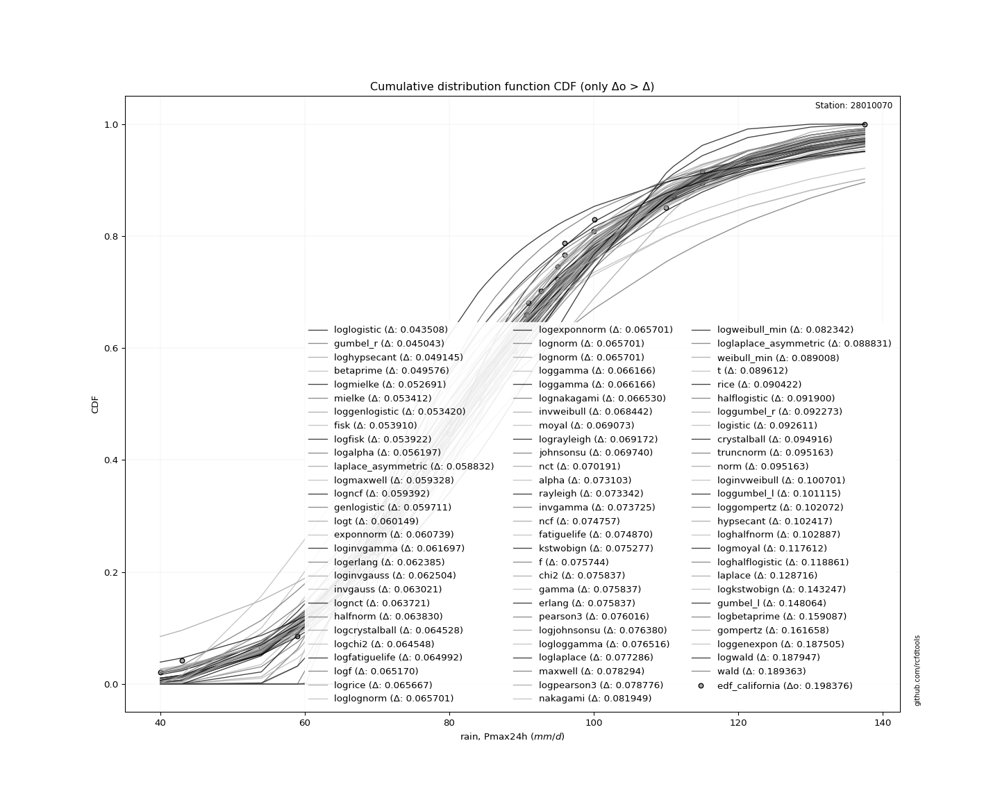</img>

</div>


**1.3. Best fit**

<div align="center">

|   id |   station | empirical_dist   | p_dist    |     delta |   deltao | eval   |   fit |   n |   best_fit |   best_fit_sort |
|-----:|----------:|:-----------------|:----------|----------:|---------:|:-------|------:|----:|-----------:|----------------:|
|    0 |  28010070 | edf_california   | logmielke | 0.0478433 | 0.188598 | Δo > Δ |     1 |  52 |          1 |               1 |

</div>


<div align="center">

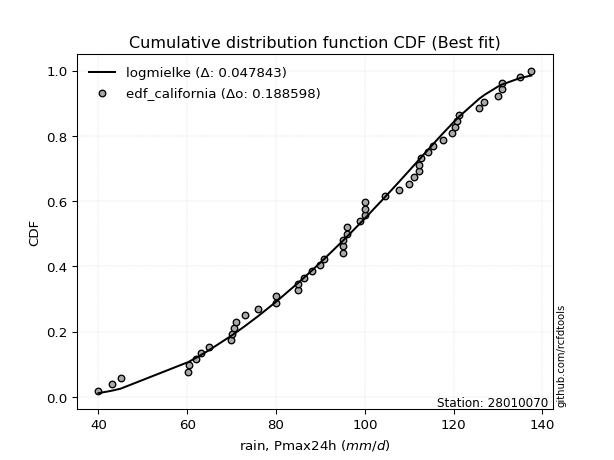</img>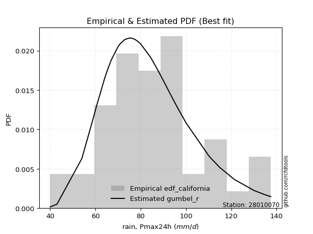</img>

</div>


### 2. Empirical - EDF Hazen (1930)

Hazen method for plotting positions is a formula used to estimate the empirical cumulative probability distribution of flood events or other hydrological data. This formula often results in biased estimations, particularly when extrapolating to extreme events (high return periods).

<div align="center">


$P=(m-0.5)/n$


</div>


**2.1. Empirical values**

<div align="center">

|                | 0                    | 1                    | 2                   | 3                  | 4                   | 5                   | 6                  | 7                   | 8                   | 9                   | 10                  | 11                  | 12                 | 13                  | 14                  | 15                 | 16                 | 17                  | 18                 | 19        | 20                 | 21                  | 22                 | 23                 | 24                  | 25                  | 26                 | 27                 | 28                 | 29                 | 30                 | 31                 | 32                 | 33                 | 34                 | 35                 | 36                 | 37                 | 38                 | 39                 | 40                 | 41                 | 42                 | 43                 | 44                 | 45              | 46                 | 47                 | 48                 | 49                 | 50                 | 51                 |
|:---------------|:---------------------|:---------------------|:--------------------|:-------------------|:--------------------|:--------------------|:-------------------|:--------------------|:--------------------|:--------------------|:--------------------|:--------------------|:-------------------|:--------------------|:--------------------|:-------------------|:-------------------|:--------------------|:-------------------|:----------|:-------------------|:--------------------|:-------------------|:-------------------|:--------------------|:--------------------|:-------------------|:-------------------|:-------------------|:-------------------|:-------------------|:-------------------|:-------------------|:-------------------|:-------------------|:-------------------|:-------------------|:-------------------|:-------------------|:-------------------|:-------------------|:-------------------|:-------------------|:-------------------|:-------------------|:----------------|:-------------------|:-------------------|:-------------------|:-------------------|:-------------------|:-------------------|
| date           | 2015                 | 1986                 | 1974                | 1997               | 1991                | 2021                | 2018               | 2002                | 1990                | 1993                | 1989                | 2011                | 2003               | 2004                | 2008                | 2001               | 2013               | 2007                | 1992               | 2016      | 2000               | 1994                | 2014               | 2012               | 2019                | 2010                | 2009               | 1972               | 2017               | 2005               | 1995               | 1977               | 1976               | 1988               | 1987               | 2020               | 1982               | 1985               | 1984               | 1971               | 1979               | 1983               | 1970               | 1975               | 1998               | 1980            | 1981               | 2006               | 1973               | 1978               | 1999               | 1996               |
| x              | 40.0                 | 43.0                 | 45.0                | 60.2               | 60.5                | 62.0                | 63.0               | 65.0                | 69.9                | 70.1                | 70.6                | 71.0                | 73.0               | 76.0                | 80.0                | 80.0               | 85.0               | 85.0                | 86.4               | 88.0      | 90.0               | 90.7                | 95.0               | 95.0               | 95.0                | 96.0                | 96.0               | 99.0               | 100.0              | 100.0              | 100.1              | 104.603463613376   | 107.585122244536   | 110.0              | 111.0              | 112.144796560754   | 112.286587817857   | 112.589999231464   | 114.178729338772   | 115.247097358231   | 117.68809685844    | 119.745071952376   | 120.389200409921   | 120.667737339199   | 121.3              | 125.76249436743 | 126.944657729944   | 130.0              | 130.796492713251   | 130.974757328269   | 135.0              | 137.5              |
| m              | 1                    | 2                    | 3                   | 4                  | 5                   | 6                   | 7                  | 8                   | 9                   | 10                  | 11                  | 12                  | 13                 | 14                  | 15                  | 16                 | 17                 | 18                  | 19                 | 20        | 21                 | 22                  | 23                 | 24                 | 25                  | 26                  | 27                 | 28                 | 29                 | 30                 | 31                 | 32                 | 33                 | 34                 | 35                 | 36                 | 37                 | 38                 | 39                 | 40                 | 41                 | 42                 | 43                 | 44                 | 45                 | 46              | 47                 | 48                 | 49                 | 50                 | 51                 | 52                 |
| empirical_dist | edf_hazen            | edf_hazen            | edf_hazen           | edf_hazen          | edf_hazen           | edf_hazen           | edf_hazen          | edf_hazen           | edf_hazen           | edf_hazen           | edf_hazen           | edf_hazen           | edf_hazen          | edf_hazen           | edf_hazen           | edf_hazen          | edf_hazen          | edf_hazen           | edf_hazen          | edf_hazen | edf_hazen          | edf_hazen           | edf_hazen          | edf_hazen          | edf_hazen           | edf_hazen           | edf_hazen          | edf_hazen          | edf_hazen          | edf_hazen          | edf_hazen          | edf_hazen          | edf_hazen          | edf_hazen          | edf_hazen          | edf_hazen          | edf_hazen          | edf_hazen          | edf_hazen          | edf_hazen          | edf_hazen          | edf_hazen          | edf_hazen          | edf_hazen          | edf_hazen          | edf_hazen       | edf_hazen          | edf_hazen          | edf_hazen          | edf_hazen          | edf_hazen          | edf_hazen          |
| empirical      | 0.009615384615384616 | 0.028846153846153848 | 0.04807692307692308 | 0.0673076923076923 | 0.08653846153846154 | 0.10576923076923077 | 0.125              | 0.14423076923076922 | 0.16346153846153846 | 0.18269230769230768 | 0.20192307692307693 | 0.22115384615384615 | 0.2403846153846154 | 0.25961538461538464 | 0.27884615384615385 | 0.2980769230769231 | 0.3173076923076923 | 0.33653846153846156 | 0.3557692307692308 | 0.375     | 0.3942307692307692 | 0.41346153846153844 | 0.4326923076923077 | 0.4519230769230769 | 0.47115384615384615 | 0.49038461538461536 | 0.5096153846153846 | 0.5288461538461539 | 0.5480769230769231 | 0.5673076923076923 | 0.5865384615384616 | 0.6057692307692307 | 0.625              | 0.6442307692307693 | 0.6634615384615384 | 0.6826923076923077 | 0.7019230769230769 | 0.7211538461538461 | 0.7403846153846154 | 0.7596153846153846 | 0.7788461538461539 | 0.7980769230769231 | 0.8173076923076923 | 0.8365384615384616 | 0.8557692307692307 | 0.875           | 0.8942307692307693 | 0.9134615384615384 | 0.9326923076923077 | 0.9519230769230769 | 0.9711538461538461 | 0.9903846153846154 |
| empirical_tr   | 1.0097087378640777   | 1.0297029702970297   | 1.0505050505050506  | 1.0721649484536082 | 1.0947368421052632  | 1.118279569892473   | 1.1428571428571428 | 1.1685393258426966  | 1.1954022988505746  | 1.223529411764706   | 1.253012048192771   | 1.2839506172839505  | 1.3164556962025318 | 1.3506493506493507  | 1.3866666666666667  | 1.4246575342465755 | 1.4647887323943662 | 1.5072463768115942  | 1.5522388059701495 | 1.6       | 1.6507936507936507 | 1.7049180327868851  | 1.7627118644067796 | 1.8245614035087718 | 1.8909090909090909  | 1.9622641509433965  | 2.0392156862745097 | 2.122448979591837  | 2.2127659574468086 | 2.311111111111111  | 2.418604651162791  | 2.536585365853658  | 2.6666666666666665 | 2.810810810810811  | 2.971428571428571  | 3.151515151515152  | 3.3548387096774186 | 3.586206896551724  | 3.8518518518518525 | 4.159999999999999  | 4.521739130434783  | 4.952380952380953  | 5.473684210526315  | 6.117647058823531  | 6.933333333333331  | 8.0             | 9.454545454545459  | 11.555555555555552 | 14.857142857142861 | 20.79999999999998  | 34.66666666666666  | 104.00000000000037 |

</div>


**2.2. Kolmogorov-Smirnov fit test (sorted by Δ)**


<div align="center">

|                | 0                   | 1                    | 2                   | 3                    | 4                   | 5                   | 6                   | 7                   | 8                   | 9                   | 10                  | 11                  | 12                  | 13                  | 14                  | 15                  | 16                  | 17                  | 18                  | 19                  | 20                  | 21                  | 22                  | 23                  | 24                  | 25                  | 26                  | 27                  | 28                  | 29                  | 30                  | 31                  | 32                    | 33                  | 34                  | 35                  | 36                  | 37                  | 38                  | 39                  | 40                  | 41                  | 42                  | 43                  | 44                  | 45                  | 46                  | 47                  | 48                  | 49                  | 50                  | 51                  | 52                  | 53                  | 54                  | 55                  | 56                  | 57                  | 58                  | 59                  | 60                  | 61                  | 62                  | 63                  | 64                  | 65                  | 66                  | 67                  | 68                  | 69                  | 70                  | 71                  | 72                  | 73                  | 74                  | 75                  | 76                  | 77                  | 78                  | 79                  | 80                  | 81                  | 82                  | 83                  | 84                  | 85                  | 86                  | 87                  | 88                  | 89                  |
|:---------------|:--------------------|:---------------------|:--------------------|:---------------------|:--------------------|:--------------------|:--------------------|:--------------------|:--------------------|:--------------------|:--------------------|:--------------------|:--------------------|:--------------------|:--------------------|:--------------------|:--------------------|:--------------------|:--------------------|:--------------------|:--------------------|:--------------------|:--------------------|:--------------------|:--------------------|:--------------------|:--------------------|:--------------------|:--------------------|:--------------------|:--------------------|:--------------------|:----------------------|:--------------------|:--------------------|:--------------------|:--------------------|:--------------------|:--------------------|:--------------------|:--------------------|:--------------------|:--------------------|:--------------------|:--------------------|:--------------------|:--------------------|:--------------------|:--------------------|:--------------------|:--------------------|:--------------------|:--------------------|:--------------------|:--------------------|:--------------------|:--------------------|:--------------------|:--------------------|:--------------------|:--------------------|:--------------------|:--------------------|:--------------------|:--------------------|:--------------------|:--------------------|:--------------------|:--------------------|:--------------------|:--------------------|:--------------------|:--------------------|:--------------------|:--------------------|:--------------------|:--------------------|:--------------------|:--------------------|:--------------------|:--------------------|:--------------------|:--------------------|:--------------------|:--------------------|:--------------------|:--------------------|:--------------------|:--------------------|:--------------------|
| station        | 28010070            | 28010070             | 28010070            | 28010070             | 28010070            | 28010070            | 28010070            | 28010070            | 28010070            | 28010070            | 28010070            | 28010070            | 28010070            | 28010070            | 28010070            | 28010070            | 28010070            | 28010070            | 28010070            | 28010070            | 28010070            | 28010070            | 28010070            | 28010070            | 28010070            | 28010070            | 28010070            | 28010070            | 28010070            | 28010070            | 28010070            | 28010070            | 28010070              | 28010070            | 28010070            | 28010070            | 28010070            | 28010070            | 28010070            | 28010070            | 28010070            | 28010070            | 28010070            | 28010070            | 28010070            | 28010070            | 28010070            | 28010070            | 28010070            | 28010070            | 28010070            | 28010070            | 28010070            | 28010070            | 28010070            | 28010070            | 28010070            | 28010070            | 28010070            | 28010070            | 28010070            | 28010070            | 28010070            | 28010070            | 28010070            | 28010070            | 28010070            | 28010070            | 28010070            | 28010070            | 28010070            | 28010070            | 28010070            | 28010070            | 28010070            | 28010070            | 28010070            | 28010070            | 28010070            | 28010070            | 28010070            | 28010070            | 28010070            | 28010070            | 28010070            | 28010070            | 28010070            | 28010070            | 28010070            | 28010070            |
| empirical_dist | edf_hazen           | edf_hazen            | edf_hazen           | edf_hazen            | edf_hazen           | edf_hazen           | edf_hazen           | edf_hazen           | edf_hazen           | edf_hazen           | edf_hazen           | edf_hazen           | edf_hazen           | edf_hazen           | edf_hazen           | edf_hazen           | edf_hazen           | edf_hazen           | edf_hazen           | edf_hazen           | edf_hazen           | edf_hazen           | edf_hazen           | edf_hazen           | edf_hazen           | edf_hazen           | edf_hazen           | edf_hazen           | edf_hazen           | edf_hazen           | edf_hazen           | edf_hazen           | edf_hazen             | edf_hazen           | edf_hazen           | edf_hazen           | edf_hazen           | edf_hazen           | edf_hazen           | edf_hazen           | edf_hazen           | edf_hazen           | edf_hazen           | edf_hazen           | edf_hazen           | edf_hazen           | edf_hazen           | edf_hazen           | edf_hazen           | edf_hazen           | edf_hazen           | edf_hazen           | edf_hazen           | edf_hazen           | edf_hazen           | edf_hazen           | edf_hazen           | edf_hazen           | edf_hazen           | edf_hazen           | edf_hazen           | edf_hazen           | edf_hazen           | edf_hazen           | edf_hazen           | edf_hazen           | edf_hazen           | edf_hazen           | edf_hazen           | edf_hazen           | edf_hazen           | edf_hazen           | edf_hazen           | edf_hazen           | edf_hazen           | edf_hazen           | edf_hazen           | edf_hazen           | edf_hazen           | edf_hazen           | edf_hazen           | edf_hazen           | edf_hazen           | edf_hazen           | edf_hazen           | edf_hazen           | edf_hazen           | edf_hazen           | edf_hazen           | edf_hazen           |
| p_dist         | logmielke           | johnsonsu            | logjohnsonsu        | logpearson3          | weibull_min         | genlogistic         | pearson3            | loggumbel_l         | logweibull_min      | fatiguelife         | gompertz            | loggompertz         | fisk                | gumbel_l            | nct                 | t                   | crystalball         | norm                | truncnorm           | exponnorm           | gamma               | nakagami            | logloggamma         | f                   | rice                | logfisk             | chi2                | erlang              | invgamma            | alpha               | logt                | maxwell             | loglaplace_asymmetric | loggenlogistic      | mielke              | logistic            | rayleigh            | laplace_asymmetric  | betaprime           | invweibull          | hypsecant           | logfatiguelife      | lognct              | lognakagami         | logbetaprime        | invgauss            | logf                | logcrystalball      | logexponnorm        | lognorm             | lognorm             | loglognorm          | logrice             | logncf              | loglogistic         | loggamma            | loggamma            | logalpha            | logchi2             | loghypsecant        | logerlang           | kstwobign           | gumbel_r            | loginvgamma         | laplace             | halfnorm            | loginvgauss         | logmaxwell          | loglaplace          | lograyleigh         | moyal               | loginvweibull       | halflogistic        | logkstwobign        | loghalfnorm         | loggumbel_r         | loggenexpon         | loghalflogistic     | logmoyal            | wald                | genexpon            | expon               | pareto              | gibrat              | logwald             | loggibrat           | logexpon            | logpareto           | logtruncnorm        | ncf                 |
| delta          | 0.04933895374897934 | 0.059826877540294504 | 0.06140017360551231 | 0.061454624732075636 | 0.06313032163775933 | 0.06585690511240402 | 0.06855517253108345 | 0.06965269167176402 | 0.07079048648717812 | 0.07402582497053145 | 0.07407916983078955 | 0.07505778212206426 | 0.07508817554744929 | 0.07526478888258098 | 0.07952356942409178 | 0.07959780129723926 | 0.07966225550462402 | 0.07966226689016442 | 0.07966226906966922 | 0.07966268962081835 | 0.08003151117606744 | 0.08003521643109579 | 0.08003928405685123 | 0.08014202238777102 | 0.080979831097995   | 0.0840984193471519  | 0.08471534211498766 | 0.08523744833279723 | 0.08810174122885783 | 0.09241338080509187 | 0.09782594203935169 | 0.09832328283078862 | 0.09949502724836229   | 0.10152447432080397 | 0.10178321837773768 | 0.10192348370735382 | 0.10938047489618463 | 0.11055755189080096 | 0.1105945894292868  | 0.11146486014046264 | 0.11734059819974774 | 0.11760492655939758 | 0.11840082932775065 | 0.11841268822020812 | 0.11893354518094301 | 0.11906614237264235 | 0.11925344035889784 | 0.1193857624776199  | 0.11938631027598712 | 0.11938653939071908 | 0.11938653939071908 | 0.1193880882355991  | 0.11938846708831752 | 0.12635395382115544 | 0.1263938495392326  | 0.12704120136618613 | 0.12704120136618613 | 0.12788073363792918 | 0.13208563358192238 | 0.13230881477777479 | 0.13287579761507395 | 0.1342160411967246  | 0.13549996063485048 | 0.13583561613885942 | 0.1400592834996487  | 0.14051066455925465 | 0.14549744045610158 | 0.1496414924697339  | 0.15181463868357548 | 0.15933976854934506 | 0.16136006612538845 | 0.16358624275397793 | 0.1653170409599931  | 0.17988360332539266 | 0.18671570127297044 | 0.1893937573193799  | 0.20911326515128703 | 0.21406865046891166 | 0.2141632755482492  | 0.2332834434740627  | 0.24583850583206998 | 0.25514476669927144 | 0.25514478266194773 | 0.25961538461538464 | 0.2828961217605347  | 0.3121628323241207  | 0.32771436965083367 | 0.32771437487433164 | 0.3977776699091973  | 0.4894956108092581  |
| deltao         | 0.18859806671657792 | 0.18859806671657792  | 0.18859806671657792 | 0.18859806671657792  | 0.18859806671657792 | 0.18859806671657792 | 0.18859806671657792 | 0.18859806671657792 | 0.18859806671657792 | 0.18859806671657792 | 0.18859806671657792 | 0.18859806671657792 | 0.18859806671657792 | 0.18859806671657792 | 0.18859806671657792 | 0.18859806671657792 | 0.18859806671657792 | 0.18859806671657792 | 0.18859806671657792 | 0.18859806671657792 | 0.18859806671657792 | 0.18859806671657792 | 0.18859806671657792 | 0.18859806671657792 | 0.18859806671657792 | 0.18859806671657792 | 0.18859806671657792 | 0.18859806671657792 | 0.18859806671657792 | 0.18859806671657792 | 0.18859806671657792 | 0.18859806671657792 | 0.18859806671657792   | 0.18859806671657792 | 0.18859806671657792 | 0.18859806671657792 | 0.18859806671657792 | 0.18859806671657792 | 0.18859806671657792 | 0.18859806671657792 | 0.18859806671657792 | 0.18859806671657792 | 0.18859806671657792 | 0.18859806671657792 | 0.18859806671657792 | 0.18859806671657792 | 0.18859806671657792 | 0.18859806671657792 | 0.18859806671657792 | 0.18859806671657792 | 0.18859806671657792 | 0.18859806671657792 | 0.18859806671657792 | 0.18859806671657792 | 0.18859806671657792 | 0.18859806671657792 | 0.18859806671657792 | 0.18859806671657792 | 0.18859806671657792 | 0.18859806671657792 | 0.18859806671657792 | 0.18859806671657792 | 0.18859806671657792 | 0.18859806671657792 | 0.18859806671657792 | 0.18859806671657792 | 0.18859806671657792 | 0.18859806671657792 | 0.18859806671657792 | 0.18859806671657792 | 0.18859806671657792 | 0.18859806671657792 | 0.18859806671657792 | 0.18859806671657792 | 0.18859806671657792 | 0.18859806671657792 | 0.18859806671657792 | 0.18859806671657792 | 0.18859806671657792 | 0.18859806671657792 | 0.18859806671657792 | 0.18859806671657792 | 0.18859806671657792 | 0.18859806671657792 | 0.18859806671657792 | 0.18859806671657792 | 0.18859806671657792 | 0.18859806671657792 | 0.18859806671657792 | 0.18859806671657792 |
| eval           | Δo > Δ              | Δo > Δ               | Δo > Δ              | Δo > Δ               | Δo > Δ              | Δo > Δ              | Δo > Δ              | Δo > Δ              | Δo > Δ              | Δo > Δ              | Δo > Δ              | Δo > Δ              | Δo > Δ              | Δo > Δ              | Δo > Δ              | Δo > Δ              | Δo > Δ              | Δo > Δ              | Δo > Δ              | Δo > Δ              | Δo > Δ              | Δo > Δ              | Δo > Δ              | Δo > Δ              | Δo > Δ              | Δo > Δ              | Δo > Δ              | Δo > Δ              | Δo > Δ              | Δo > Δ              | Δo > Δ              | Δo > Δ              | Δo > Δ                | Δo > Δ              | Δo > Δ              | Δo > Δ              | Δo > Δ              | Δo > Δ              | Δo > Δ              | Δo > Δ              | Δo > Δ              | Δo > Δ              | Δo > Δ              | Δo > Δ              | Δo > Δ              | Δo > Δ              | Δo > Δ              | Δo > Δ              | Δo > Δ              | Δo > Δ              | Δo > Δ              | Δo > Δ              | Δo > Δ              | Δo > Δ              | Δo > Δ              | Δo > Δ              | Δo > Δ              | Δo > Δ              | Δo > Δ              | Δo > Δ              | Δo > Δ              | Δo > Δ              | Δo > Δ              | Δo > Δ              | Δo > Δ              | Δo > Δ              | Δo > Δ              | Δo > Δ              | Δo > Δ              | Δo > Δ              | Δo > Δ              | Δo > Δ              | Δo > Δ              | Δo > Δ              | Δo > Δ              | Δo <= Δ             | Δo <= Δ             | Δo <= Δ             | Δo <= Δ             | Δo <= Δ             | Δo <= Δ             | Δo <= Δ             | Δo <= Δ             | Δo <= Δ             | Δo <= Δ             | Δo <= Δ             | Δo <= Δ             | Δo <= Δ             | Δo <= Δ             | Δo <= Δ             |
| fit            | 1                   | 1                    | 1                   | 1                    | 1                   | 1                   | 1                   | 1                   | 1                   | 1                   | 1                   | 1                   | 1                   | 1                   | 1                   | 1                   | 1                   | 1                   | 1                   | 1                   | 1                   | 1                   | 1                   | 1                   | 1                   | 1                   | 1                   | 1                   | 1                   | 1                   | 1                   | 1                   | 1                     | 1                   | 1                   | 1                   | 1                   | 1                   | 1                   | 1                   | 1                   | 1                   | 1                   | 1                   | 1                   | 1                   | 1                   | 1                   | 1                   | 1                   | 1                   | 1                   | 1                   | 1                   | 1                   | 1                   | 1                   | 1                   | 1                   | 1                   | 1                   | 1                   | 1                   | 1                   | 1                   | 1                   | 1                   | 1                   | 1                   | 1                   | 1                   | 1                   | 1                   | 1                   | 1                   | 0                   | 0                   | 0                   | 0                   | 0                   | 0                   | 0                   | 0                   | 0                   | 0                   | 0                   | 0                   | 0                   | 0                   | 0                   |
| n              | 52                  | 52                   | 52                  | 52                   | 52                  | 52                  | 52                  | 52                  | 52                  | 52                  | 52                  | 52                  | 52                  | 52                  | 52                  | 52                  | 52                  | 52                  | 52                  | 52                  | 52                  | 52                  | 52                  | 52                  | 52                  | 52                  | 52                  | 52                  | 52                  | 52                  | 52                  | 52                  | 52                    | 52                  | 52                  | 52                  | 52                  | 52                  | 52                  | 52                  | 52                  | 52                  | 52                  | 52                  | 52                  | 52                  | 52                  | 52                  | 52                  | 52                  | 52                  | 52                  | 52                  | 52                  | 52                  | 52                  | 52                  | 52                  | 52                  | 52                  | 52                  | 52                  | 52                  | 52                  | 52                  | 52                  | 52                  | 52                  | 52                  | 52                  | 52                  | 52                  | 52                  | 52                  | 52                  | 52                  | 52                  | 52                  | 52                  | 52                  | 52                  | 52                  | 52                  | 52                  | 52                  | 52                  | 52                  | 52                  | 52                  | 52                  |
| best_fit       | 1                   | 0                    | 0                   | 0                    | 0                   | 0                   | 0                   | 0                   | 0                   | 0                   | 0                   | 0                   | 0                   | 0                   | 0                   | 0                   | 0                   | 0                   | 0                   | 0                   | 0                   | 0                   | 0                   | 0                   | 0                   | 0                   | 0                   | 0                   | 0                   | 0                   | 0                   | 0                   | 0                     | 0                   | 0                   | 0                   | 0                   | 0                   | 0                   | 0                   | 0                   | 0                   | 0                   | 0                   | 0                   | 0                   | 0                   | 0                   | 0                   | 0                   | 0                   | 0                   | 0                   | 0                   | 0                   | 0                   | 0                   | 0                   | 0                   | 0                   | 0                   | 0                   | 0                   | 0                   | 0                   | 0                   | 0                   | 0                   | 0                   | 0                   | 0                   | 0                   | 0                   | 0                   | 0                   | 0                   | 0                   | 0                   | 0                   | 0                   | 0                   | 0                   | 0                   | 0                   | 0                   | 0                   | 0                   | 0                   | 0                   | 0                   |
| best_fit_sort  | 1                   | 2                    | 3                   | 4                    | 5                   | 6                   | 7                   | 8                   | 9                   | 10                  | 11                  | 12                  | 13                  | 14                  | 15                  | 16                  | 17                  | 18                  | 19                  | 20                  | 21                  | 22                  | 23                  | 24                  | 25                  | 26                  | 27                  | 28                  | 29                  | 30                  | 31                  | 32                  | 33                    | 34                  | 35                  | 36                  | 37                  | 38                  | 39                  | 40                  | 41                  | 42                  | 43                  | 44                  | 45                  | 46                  | 47                  | 48                  | 49                  | 50                  | 51                  | 52                  | 53                  | 54                  | 55                  | 56                  | 57                  | 58                  | 59                  | 60                  | 61                  | 62                  | 63                  | 64                  | 65                  | 66                  | 67                  | 68                  | 69                  | 70                  | 71                  | 72                  | 73                  | 74                  | 75                  | 76                  | 77                  | 78                  | 79                  | 80                  | 81                  | 82                  | 83                  | 84                  | 85                  | 86                  | 87                  | 88                  | 89                  | 90                  |

</div>


<div align="center">

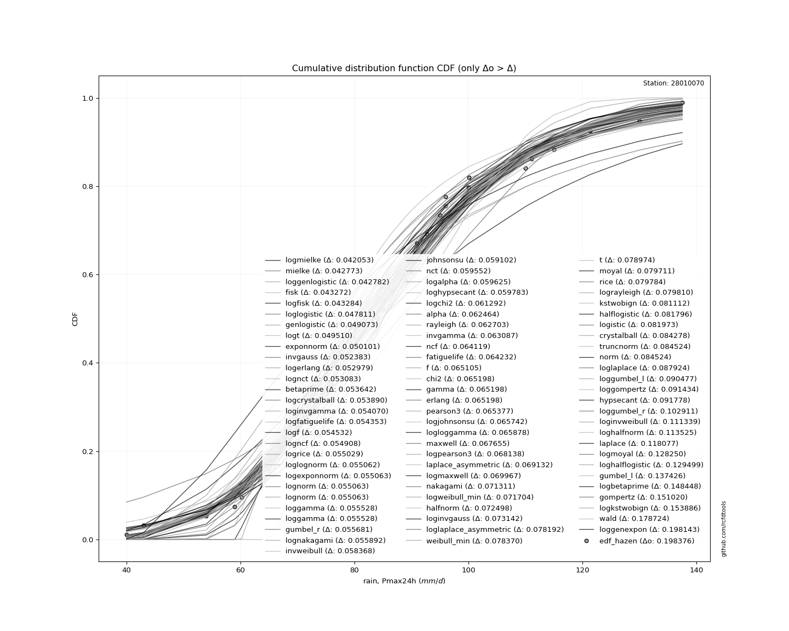</img>

</div>


**2.3. Best fit**

<div align="center">

|   id |   station | empirical_dist   | p_dist    |    delta |   deltao | eval   |   fit |   n |   best_fit |   best_fit_sort |
|-----:|----------:|:-----------------|:----------|---------:|---------:|:-------|------:|----:|-----------:|----------------:|
|    0 |  28010070 | edf_hazen        | logmielke | 0.049339 | 0.188598 | Δo > Δ |     1 |  52 |          1 |               1 |

</div>


<div align="center">

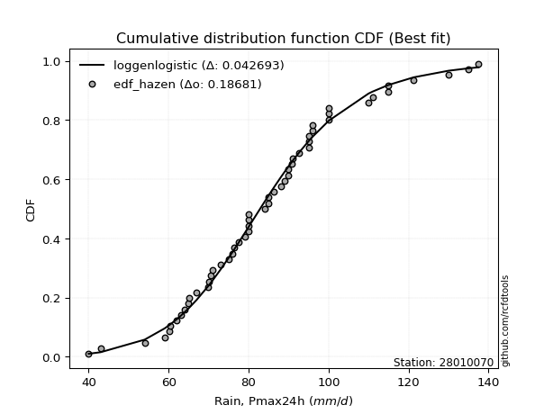</img>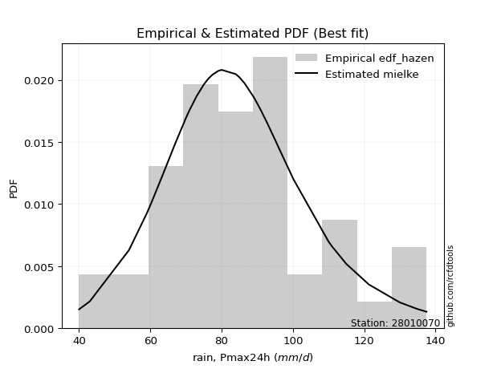</img>

</div>


### 3. Empirical - EDF Weibull (1939)

Weibull plotting position formula is an empirical method used to estimate the non-exceedance probability or plotting position for a set of observed data, is often recommended or widely used in practice, particularly in flood frequency analysis.

<div align="center">


$P=m/(n+1)$


</div>


**3.1. Empirical values**

<div align="center">

|                | 0                    | 1                   | 2                   | 3                   | 4                   | 5                   | 6                  | 7                  | 8                   | 9                   | 10                  | 11                  | 12                  | 13                 | 14                 | 15                 | 16                  | 17                  | 18                 | 19                  | 20                  | 21                  | 22                 | 23                 | 24                 | 25                  | 26                 | 27                 | 28                 | 29                 | 30                 | 31                 | 32                 | 33                 | 34                | 35                 | 36                 | 37                 | 38                 | 39                 | 40                 | 41                 | 42                 | 43                 | 44                 | 45                 | 46                 | 47                 | 48                 | 49                 | 50                 | 51                 |
|:---------------|:---------------------|:--------------------|:--------------------|:--------------------|:--------------------|:--------------------|:-------------------|:-------------------|:--------------------|:--------------------|:--------------------|:--------------------|:--------------------|:-------------------|:-------------------|:-------------------|:--------------------|:--------------------|:-------------------|:--------------------|:--------------------|:--------------------|:-------------------|:-------------------|:-------------------|:--------------------|:-------------------|:-------------------|:-------------------|:-------------------|:-------------------|:-------------------|:-------------------|:-------------------|:------------------|:-------------------|:-------------------|:-------------------|:-------------------|:-------------------|:-------------------|:-------------------|:-------------------|:-------------------|:-------------------|:-------------------|:-------------------|:-------------------|:-------------------|:-------------------|:-------------------|:-------------------|
| date           | 2015                 | 1986                | 1974                | 1997                | 1991                | 2021                | 2018               | 2002               | 1990                | 1993                | 1989                | 2011                | 2003                | 2004               | 2008               | 2001               | 2013                | 2007                | 1992               | 2016                | 2000                | 1994                | 2014               | 2012               | 2019               | 2010                | 2009               | 1972               | 2017               | 2005               | 1995               | 1977               | 1976               | 1988               | 1987              | 2020               | 1982               | 1985               | 1984               | 1971               | 1979               | 1983               | 1970               | 1975               | 1998               | 1980               | 1981               | 2006               | 1973               | 1978               | 1999               | 1996               |
| x              | 40.0                 | 43.0                | 45.0                | 60.2                | 60.5                | 62.0                | 63.0               | 65.0               | 69.9                | 70.1                | 70.6                | 71.0                | 73.0                | 76.0               | 80.0               | 80.0               | 85.0                | 85.0                | 86.4               | 88.0                | 90.0                | 90.7                | 95.0               | 95.0               | 95.0               | 96.0                | 96.0               | 99.0               | 100.0              | 100.0              | 100.1              | 104.603463613376   | 107.585122244536   | 110.0              | 111.0             | 112.144796560754   | 112.286587817857   | 112.589999231464   | 114.178729338772   | 115.247097358231   | 117.68809685844    | 119.745071952376   | 120.389200409921   | 120.667737339199   | 121.3              | 125.76249436743    | 126.944657729944   | 130.0              | 130.796492713251   | 130.974757328269   | 135.0              | 137.5              |
| m              | 1                    | 2                   | 3                   | 4                   | 5                   | 6                   | 7                  | 8                  | 9                   | 10                  | 11                  | 12                  | 13                  | 14                 | 15                 | 16                 | 17                  | 18                  | 19                 | 20                  | 21                  | 22                  | 23                 | 24                 | 25                 | 26                  | 27                 | 28                 | 29                 | 30                 | 31                 | 32                 | 33                 | 34                 | 35                | 36                 | 37                 | 38                 | 39                 | 40                 | 41                 | 42                 | 43                 | 44                 | 45                 | 46                 | 47                 | 48                 | 49                 | 50                 | 51                 | 52                 |
| empirical_dist | edf_weibull          | edf_weibull         | edf_weibull         | edf_weibull         | edf_weibull         | edf_weibull         | edf_weibull        | edf_weibull        | edf_weibull         | edf_weibull         | edf_weibull         | edf_weibull         | edf_weibull         | edf_weibull        | edf_weibull        | edf_weibull        | edf_weibull         | edf_weibull         | edf_weibull        | edf_weibull         | edf_weibull         | edf_weibull         | edf_weibull        | edf_weibull        | edf_weibull        | edf_weibull         | edf_weibull        | edf_weibull        | edf_weibull        | edf_weibull        | edf_weibull        | edf_weibull        | edf_weibull        | edf_weibull        | edf_weibull       | edf_weibull        | edf_weibull        | edf_weibull        | edf_weibull        | edf_weibull        | edf_weibull        | edf_weibull        | edf_weibull        | edf_weibull        | edf_weibull        | edf_weibull        | edf_weibull        | edf_weibull        | edf_weibull        | edf_weibull        | edf_weibull        | edf_weibull        |
| empirical      | 0.018867924528301886 | 0.03773584905660377 | 0.05660377358490566 | 0.07547169811320754 | 0.09433962264150944 | 0.11320754716981132 | 0.1320754716981132 | 0.1509433962264151 | 0.16981132075471697 | 0.18867924528301888 | 0.20754716981132076 | 0.22641509433962265 | 0.24528301886792453 | 0.2641509433962264 | 0.2830188679245283 | 0.3018867924528302 | 0.32075471698113206 | 0.33962264150943394 | 0.3584905660377358 | 0.37735849056603776 | 0.39622641509433965 | 0.41509433962264153 | 0.4339622641509434 | 0.4528301886792453 | 0.4716981132075472 | 0.49056603773584906 | 0.5094339622641509 | 0.5283018867924528 | 0.5471698113207547 | 0.5660377358490566 | 0.5849056603773585 | 0.6037735849056604 | 0.6226415094339622 | 0.6415094339622641 | 0.660377358490566 | 0.6792452830188679 | 0.6981132075471698 | 0.7169811320754716 | 0.7358490566037735 | 0.7547169811320755 | 0.7735849056603774 | 0.7924528301886793 | 0.8113207547169812 | 0.8301886792452831 | 0.8490566037735849 | 0.8679245283018868 | 0.8867924528301887 | 0.9056603773584906 | 0.9245283018867925 | 0.9433962264150944 | 0.9622641509433962 | 0.9811320754716981 |
| empirical_tr   | 1.0192307692307692   | 1.0392156862745099  | 1.06                | 1.0816326530612246  | 1.1041666666666667  | 1.127659574468085   | 1.1521739130434783 | 1.1777777777777778 | 1.2045454545454546  | 1.2325581395348837  | 1.2619047619047619  | 1.292682926829268   | 1.325               | 1.3589743589743588 | 1.394736842105263  | 1.4324324324324322 | 1.472222222222222   | 1.514285714285714   | 1.5588235294117645 | 1.6060606060606062  | 1.65625             | 1.7096774193548387  | 1.7666666666666666 | 1.8275862068965518 | 1.8928571428571428 | 1.962962962962963   | 2.0384615384615383 | 2.12               | 2.2083333333333335 | 2.3043478260869565 | 2.409090909090909  | 2.5238095238095237 | 2.65               | 2.789473684210526  | 2.944444444444444 | 3.117647058823529  | 3.3124999999999996 | 3.5333333333333328 | 3.785714285714285  | 4.0769230769230775 | 4.416666666666668  | 4.818181818181819  | 5.300000000000002  | 5.88888888888889   | 6.625000000000002  | 7.571428571428573  | 8.833333333333336  | 10.600000000000003 | 13.250000000000004 | 17.66666666666667  | 26.500000000000007 | 53.000000000000014 |

</div>


**3.2. Kolmogorov-Smirnov fit test (sorted by Δ)**


<div align="center">

|                | 0                    | 1                   | 2                   | 3                   | 4                   | 5                   | 6                   | 7                   | 8                   | 9                   | 10                  | 11                  | 12                  | 13                  | 14                  | 15                  | 16                  | 17                  | 18                  | 19                  | 20                  | 21                  | 22                  | 23                  | 24                  | 25                  | 26                  | 27                  | 28                  | 29                  | 30                  | 31                  | 32                    | 33                  | 34                  | 35                  | 36                  | 37                  | 38                  | 39                  | 40                  | 41                  | 42                  | 43                  | 44                  | 45                  | 46                  | 47                  | 48                  | 49                  | 50                  | 51                  | 52                  | 53                  | 54                  | 55                  | 56                  | 57                  | 58                  | 59                  | 60                  | 61                  | 62                  | 63                  | 64                  | 65                  | 66                  | 67                  | 68                  | 69                  | 70                  | 71                  | 72                  | 73                  | 74                  | 75                  | 76                  | 77                  | 78                  | 79                  | 80                  | 81                  | 82                  | 83                  | 84                  | 85                  | 86                  | 87                  | 88                  | 89                  |
|:---------------|:---------------------|:--------------------|:--------------------|:--------------------|:--------------------|:--------------------|:--------------------|:--------------------|:--------------------|:--------------------|:--------------------|:--------------------|:--------------------|:--------------------|:--------------------|:--------------------|:--------------------|:--------------------|:--------------------|:--------------------|:--------------------|:--------------------|:--------------------|:--------------------|:--------------------|:--------------------|:--------------------|:--------------------|:--------------------|:--------------------|:--------------------|:--------------------|:----------------------|:--------------------|:--------------------|:--------------------|:--------------------|:--------------------|:--------------------|:--------------------|:--------------------|:--------------------|:--------------------|:--------------------|:--------------------|:--------------------|:--------------------|:--------------------|:--------------------|:--------------------|:--------------------|:--------------------|:--------------------|:--------------------|:--------------------|:--------------------|:--------------------|:--------------------|:--------------------|:--------------------|:--------------------|:--------------------|:--------------------|:--------------------|:--------------------|:--------------------|:--------------------|:--------------------|:--------------------|:--------------------|:--------------------|:--------------------|:--------------------|:--------------------|:--------------------|:--------------------|:--------------------|:--------------------|:--------------------|:--------------------|:--------------------|:--------------------|:--------------------|:--------------------|:--------------------|:--------------------|:--------------------|:--------------------|:--------------------|:--------------------|
| station        | 28010070             | 28010070            | 28010070            | 28010070            | 28010070            | 28010070            | 28010070            | 28010070            | 28010070            | 28010070            | 28010070            | 28010070            | 28010070            | 28010070            | 28010070            | 28010070            | 28010070            | 28010070            | 28010070            | 28010070            | 28010070            | 28010070            | 28010070            | 28010070            | 28010070            | 28010070            | 28010070            | 28010070            | 28010070            | 28010070            | 28010070            | 28010070            | 28010070              | 28010070            | 28010070            | 28010070            | 28010070            | 28010070            | 28010070            | 28010070            | 28010070            | 28010070            | 28010070            | 28010070            | 28010070            | 28010070            | 28010070            | 28010070            | 28010070            | 28010070            | 28010070            | 28010070            | 28010070            | 28010070            | 28010070            | 28010070            | 28010070            | 28010070            | 28010070            | 28010070            | 28010070            | 28010070            | 28010070            | 28010070            | 28010070            | 28010070            | 28010070            | 28010070            | 28010070            | 28010070            | 28010070            | 28010070            | 28010070            | 28010070            | 28010070            | 28010070            | 28010070            | 28010070            | 28010070            | 28010070            | 28010070            | 28010070            | 28010070            | 28010070            | 28010070            | 28010070            | 28010070            | 28010070            | 28010070            | 28010070            |
| empirical_dist | edf_weibull          | edf_weibull         | edf_weibull         | edf_weibull         | edf_weibull         | edf_weibull         | edf_weibull         | edf_weibull         | edf_weibull         | edf_weibull         | edf_weibull         | edf_weibull         | edf_weibull         | edf_weibull         | edf_weibull         | edf_weibull         | edf_weibull         | edf_weibull         | edf_weibull         | edf_weibull         | edf_weibull         | edf_weibull         | edf_weibull         | edf_weibull         | edf_weibull         | edf_weibull         | edf_weibull         | edf_weibull         | edf_weibull         | edf_weibull         | edf_weibull         | edf_weibull         | edf_weibull           | edf_weibull         | edf_weibull         | edf_weibull         | edf_weibull         | edf_weibull         | edf_weibull         | edf_weibull         | edf_weibull         | edf_weibull         | edf_weibull         | edf_weibull         | edf_weibull         | edf_weibull         | edf_weibull         | edf_weibull         | edf_weibull         | edf_weibull         | edf_weibull         | edf_weibull         | edf_weibull         | edf_weibull         | edf_weibull         | edf_weibull         | edf_weibull         | edf_weibull         | edf_weibull         | edf_weibull         | edf_weibull         | edf_weibull         | edf_weibull         | edf_weibull         | edf_weibull         | edf_weibull         | edf_weibull         | edf_weibull         | edf_weibull         | edf_weibull         | edf_weibull         | edf_weibull         | edf_weibull         | edf_weibull         | edf_weibull         | edf_weibull         | edf_weibull         | edf_weibull         | edf_weibull         | edf_weibull         | edf_weibull         | edf_weibull         | edf_weibull         | edf_weibull         | edf_weibull         | edf_weibull         | edf_weibull         | edf_weibull         | edf_weibull         | edf_weibull         |
| p_dist         | logmielke            | logjohnsonsu        | logpearson3         | johnsonsu           | weibull_min         | genlogistic         | pearson3            | loggumbel_l         | gompertz            | logweibull_min      | fatiguelife         | loggompertz         | fisk                | logloggamma         | logfisk             | gumbel_l            | nct                 | t                   | crystalball         | norm                | truncnorm           | exponnorm           | gamma               | nakagami            | f                   | rice                | chi2                | erlang              | invgamma            | alpha               | logt                | maxwell             | loglaplace_asymmetric | loggenlogistic      | mielke              | logistic            | rayleigh            | betaprime           | invweibull          | laplace_asymmetric  | logfatiguelife      | lognct              | lognakagami         | logbetaprime        | invgauss            | logf                | logcrystalball      | logexponnorm        | lognorm             | lognorm             | loglognorm          | logrice             | hypsecant           | logncf              | loglogistic         | loggamma            | loggamma            | logalpha            | logchi2             | loghypsecant        | logerlang           | kstwobign           | gumbel_r            | loginvgamma         | halfnorm            | laplace             | loginvgauss         | logmaxwell          | loglaplace          | loginvweibull       | lograyleigh         | moyal               | halflogistic        | logkstwobign        | loghalfnorm         | loggumbel_r         | loggenexpon         | loghalflogistic     | logmoyal            | wald                | genexpon            | expon               | pareto              | gibrat              | logwald             | loggibrat           | logexpon            | logpareto           | logtruncnorm        | ncf                 |
| delta          | 0.052060289017484496 | 0.05976737244440922 | 0.06417596000058079 | 0.06472528102360364 | 0.06585165690626449 | 0.07075530859571316 | 0.0712765077995886  | 0.07237402694026918 | 0.07244636866968646 | 0.07351182175568327 | 0.0767471602390366  | 0.07777911739056942 | 0.07780951081595444 | 0.07840648289574814 | 0.07991713302800252 | 0.08016319236589012 | 0.08224490469259693 | 0.08231913656574441 | 0.08238359077312918 | 0.08238360215866958 | 0.08238360433817438 | 0.0823840248893235  | 0.08275284644457259 | 0.08275655169960094 | 0.08286335765627617 | 0.08370116636650016 | 0.08743667738349281 | 0.08795878360130238 | 0.08867384568384684 | 0.09492187559007881 | 0.09655598558071599 | 0.09705332637215291 | 0.0978622260872592    | 0.09989167315970088 | 0.10015041721663459 | 0.10464481897585898 | 0.10811051843754893 | 0.10932463297065109 | 0.11019490368182694 | 0.11327888715930612 | 0.11633497010076188 | 0.11713087286911494 | 0.11714273176157242 | 0.11766358872230731 | 0.11779618591400665 | 0.11798348390026214 | 0.11811580601898419 | 0.11811635381735142 | 0.11811658293208338 | 0.11811658293208338 | 0.1181181317769634  | 0.11811851062968182 | 0.12006193346825289 | 0.12508399736251974 | 0.1251238930805969  | 0.12577124490755043 | 0.12577124490755043 | 0.12661077717929348 | 0.13081567712328668 | 0.13103885831913908 | 0.13160584115643825 | 0.1329460847380889  | 0.13423000417621478 | 0.13456565968022371 | 0.13924070810061895 | 0.14278061876815384 | 0.14422748399746588 | 0.1483715360110982  | 0.15186873999241568 | 0.15433370284106063 | 0.15806981209070936 | 0.16009010966675274 | 0.1640470845013574  | 0.1764365786519529  | 0.18544574481433473 | 0.1881238008607442  | 0.20566624047784726 | 0.21279869401027596 | 0.2128933190896135  | 0.23700588222106966 | 0.23948872353889147 | 0.2487949844060929  | 0.2487950003687692  | 0.2641509433962264  | 0.281626165301899   | 0.310892875865485   | 0.32136458735765516 | 0.32136459258115313 | 0.39142788761601877 | 0.48133160500374284 |
| deltao         | 0.18859806671657792  | 0.18859806671657792 | 0.18859806671657792 | 0.18859806671657792 | 0.18859806671657792 | 0.18859806671657792 | 0.18859806671657792 | 0.18859806671657792 | 0.18859806671657792 | 0.18859806671657792 | 0.18859806671657792 | 0.18859806671657792 | 0.18859806671657792 | 0.18859806671657792 | 0.18859806671657792 | 0.18859806671657792 | 0.18859806671657792 | 0.18859806671657792 | 0.18859806671657792 | 0.18859806671657792 | 0.18859806671657792 | 0.18859806671657792 | 0.18859806671657792 | 0.18859806671657792 | 0.18859806671657792 | 0.18859806671657792 | 0.18859806671657792 | 0.18859806671657792 | 0.18859806671657792 | 0.18859806671657792 | 0.18859806671657792 | 0.18859806671657792 | 0.18859806671657792   | 0.18859806671657792 | 0.18859806671657792 | 0.18859806671657792 | 0.18859806671657792 | 0.18859806671657792 | 0.18859806671657792 | 0.18859806671657792 | 0.18859806671657792 | 0.18859806671657792 | 0.18859806671657792 | 0.18859806671657792 | 0.18859806671657792 | 0.18859806671657792 | 0.18859806671657792 | 0.18859806671657792 | 0.18859806671657792 | 0.18859806671657792 | 0.18859806671657792 | 0.18859806671657792 | 0.18859806671657792 | 0.18859806671657792 | 0.18859806671657792 | 0.18859806671657792 | 0.18859806671657792 | 0.18859806671657792 | 0.18859806671657792 | 0.18859806671657792 | 0.18859806671657792 | 0.18859806671657792 | 0.18859806671657792 | 0.18859806671657792 | 0.18859806671657792 | 0.18859806671657792 | 0.18859806671657792 | 0.18859806671657792 | 0.18859806671657792 | 0.18859806671657792 | 0.18859806671657792 | 0.18859806671657792 | 0.18859806671657792 | 0.18859806671657792 | 0.18859806671657792 | 0.18859806671657792 | 0.18859806671657792 | 0.18859806671657792 | 0.18859806671657792 | 0.18859806671657792 | 0.18859806671657792 | 0.18859806671657792 | 0.18859806671657792 | 0.18859806671657792 | 0.18859806671657792 | 0.18859806671657792 | 0.18859806671657792 | 0.18859806671657792 | 0.18859806671657792 | 0.18859806671657792 |
| eval           | Δo > Δ               | Δo > Δ              | Δo > Δ              | Δo > Δ              | Δo > Δ              | Δo > Δ              | Δo > Δ              | Δo > Δ              | Δo > Δ              | Δo > Δ              | Δo > Δ              | Δo > Δ              | Δo > Δ              | Δo > Δ              | Δo > Δ              | Δo > Δ              | Δo > Δ              | Δo > Δ              | Δo > Δ              | Δo > Δ              | Δo > Δ              | Δo > Δ              | Δo > Δ              | Δo > Δ              | Δo > Δ              | Δo > Δ              | Δo > Δ              | Δo > Δ              | Δo > Δ              | Δo > Δ              | Δo > Δ              | Δo > Δ              | Δo > Δ                | Δo > Δ              | Δo > Δ              | Δo > Δ              | Δo > Δ              | Δo > Δ              | Δo > Δ              | Δo > Δ              | Δo > Δ              | Δo > Δ              | Δo > Δ              | Δo > Δ              | Δo > Δ              | Δo > Δ              | Δo > Δ              | Δo > Δ              | Δo > Δ              | Δo > Δ              | Δo > Δ              | Δo > Δ              | Δo > Δ              | Δo > Δ              | Δo > Δ              | Δo > Δ              | Δo > Δ              | Δo > Δ              | Δo > Δ              | Δo > Δ              | Δo > Δ              | Δo > Δ              | Δo > Δ              | Δo > Δ              | Δo > Δ              | Δo > Δ              | Δo > Δ              | Δo > Δ              | Δo > Δ              | Δo > Δ              | Δo > Δ              | Δo > Δ              | Δo > Δ              | Δo > Δ              | Δo > Δ              | Δo > Δ              | Δo <= Δ             | Δo <= Δ             | Δo <= Δ             | Δo <= Δ             | Δo <= Δ             | Δo <= Δ             | Δo <= Δ             | Δo <= Δ             | Δo <= Δ             | Δo <= Δ             | Δo <= Δ             | Δo <= Δ             | Δo <= Δ             | Δo <= Δ             |
| fit            | 1                    | 1                   | 1                   | 1                   | 1                   | 1                   | 1                   | 1                   | 1                   | 1                   | 1                   | 1                   | 1                   | 1                   | 1                   | 1                   | 1                   | 1                   | 1                   | 1                   | 1                   | 1                   | 1                   | 1                   | 1                   | 1                   | 1                   | 1                   | 1                   | 1                   | 1                   | 1                   | 1                     | 1                   | 1                   | 1                   | 1                   | 1                   | 1                   | 1                   | 1                   | 1                   | 1                   | 1                   | 1                   | 1                   | 1                   | 1                   | 1                   | 1                   | 1                   | 1                   | 1                   | 1                   | 1                   | 1                   | 1                   | 1                   | 1                   | 1                   | 1                   | 1                   | 1                   | 1                   | 1                   | 1                   | 1                   | 1                   | 1                   | 1                   | 1                   | 1                   | 1                   | 1                   | 1                   | 1                   | 0                   | 0                   | 0                   | 0                   | 0                   | 0                   | 0                   | 0                   | 0                   | 0                   | 0                   | 0                   | 0                   | 0                   |
| n              | 52                   | 52                  | 52                  | 52                  | 52                  | 52                  | 52                  | 52                  | 52                  | 52                  | 52                  | 52                  | 52                  | 52                  | 52                  | 52                  | 52                  | 52                  | 52                  | 52                  | 52                  | 52                  | 52                  | 52                  | 52                  | 52                  | 52                  | 52                  | 52                  | 52                  | 52                  | 52                  | 52                    | 52                  | 52                  | 52                  | 52                  | 52                  | 52                  | 52                  | 52                  | 52                  | 52                  | 52                  | 52                  | 52                  | 52                  | 52                  | 52                  | 52                  | 52                  | 52                  | 52                  | 52                  | 52                  | 52                  | 52                  | 52                  | 52                  | 52                  | 52                  | 52                  | 52                  | 52                  | 52                  | 52                  | 52                  | 52                  | 52                  | 52                  | 52                  | 52                  | 52                  | 52                  | 52                  | 52                  | 52                  | 52                  | 52                  | 52                  | 52                  | 52                  | 52                  | 52                  | 52                  | 52                  | 52                  | 52                  | 52                  | 52                  |
| best_fit       | 1                    | 0                   | 0                   | 0                   | 0                   | 0                   | 0                   | 0                   | 0                   | 0                   | 0                   | 0                   | 0                   | 0                   | 0                   | 0                   | 0                   | 0                   | 0                   | 0                   | 0                   | 0                   | 0                   | 0                   | 0                   | 0                   | 0                   | 0                   | 0                   | 0                   | 0                   | 0                   | 0                     | 0                   | 0                   | 0                   | 0                   | 0                   | 0                   | 0                   | 0                   | 0                   | 0                   | 0                   | 0                   | 0                   | 0                   | 0                   | 0                   | 0                   | 0                   | 0                   | 0                   | 0                   | 0                   | 0                   | 0                   | 0                   | 0                   | 0                   | 0                   | 0                   | 0                   | 0                   | 0                   | 0                   | 0                   | 0                   | 0                   | 0                   | 0                   | 0                   | 0                   | 0                   | 0                   | 0                   | 0                   | 0                   | 0                   | 0                   | 0                   | 0                   | 0                   | 0                   | 0                   | 0                   | 0                   | 0                   | 0                   | 0                   |
| best_fit_sort  | 1                    | 2                   | 3                   | 4                   | 5                   | 6                   | 7                   | 8                   | 9                   | 10                  | 11                  | 12                  | 13                  | 14                  | 15                  | 16                  | 17                  | 18                  | 19                  | 20                  | 21                  | 22                  | 23                  | 24                  | 25                  | 26                  | 27                  | 28                  | 29                  | 30                  | 31                  | 32                  | 33                    | 34                  | 35                  | 36                  | 37                  | 38                  | 39                  | 40                  | 41                  | 42                  | 43                  | 44                  | 45                  | 46                  | 47                  | 48                  | 49                  | 50                  | 51                  | 52                  | 53                  | 54                  | 55                  | 56                  | 57                  | 58                  | 59                  | 60                  | 61                  | 62                  | 63                  | 64                  | 65                  | 66                  | 67                  | 68                  | 69                  | 70                  | 71                  | 72                  | 73                  | 74                  | 75                  | 76                  | 77                  | 78                  | 79                  | 80                  | 81                  | 82                  | 83                  | 84                  | 85                  | 86                  | 87                  | 88                  | 89                  | 90                  |

</div>


<div align="center">

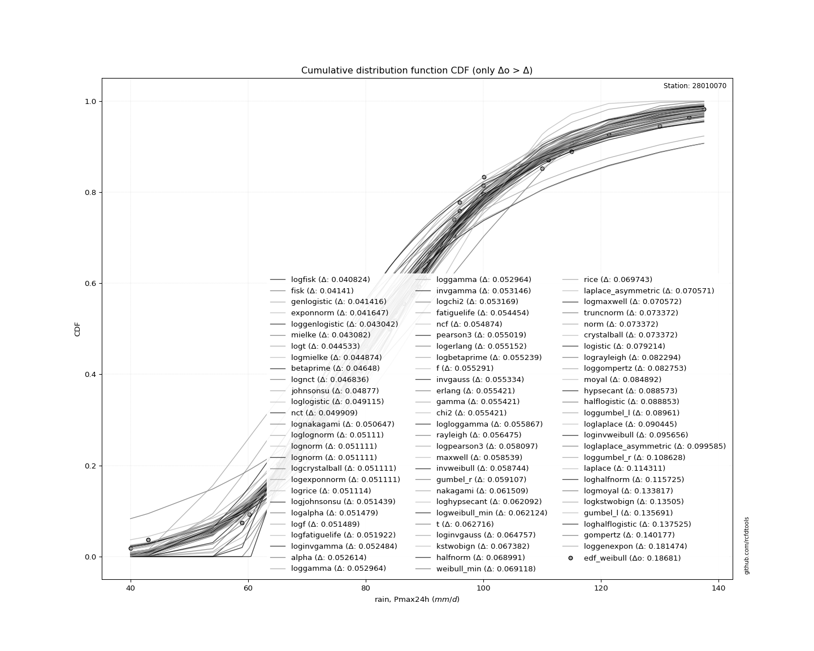</img>

</div>


**3.3. Best fit**

<div align="center">

|   id |   station | empirical_dist   | p_dist    |     delta |   deltao | eval   |   fit |   n |   best_fit |   best_fit_sort |
|-----:|----------:|:-----------------|:----------|----------:|---------:|:-------|------:|----:|-----------:|----------------:|
|    0 |  28010070 | edf_weibull      | logmielke | 0.0520603 | 0.188598 | Δo > Δ |     1 |  52 |          1 |               1 |

</div>


<div align="center">

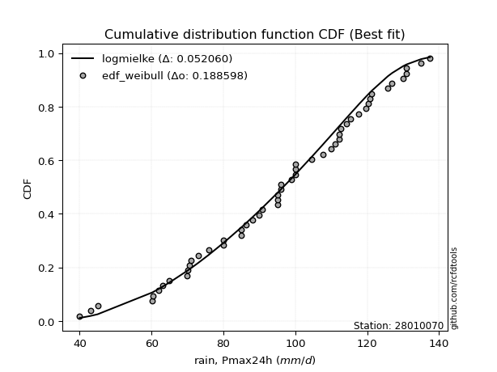</img>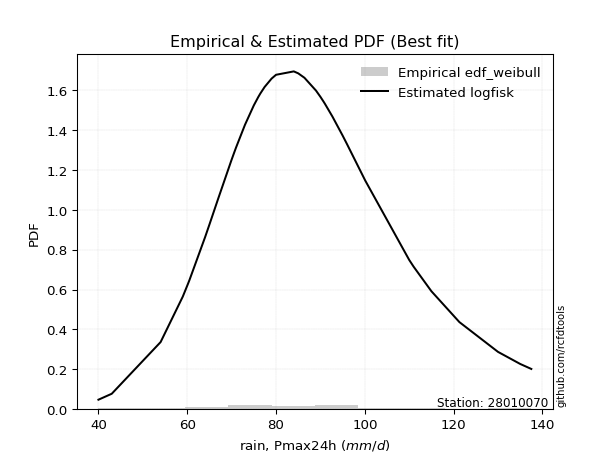</img>

</div>


### 4. Empirical - EDF Beard (1943)

The Beard formula (or Beard´s plotting position formula) in hydrology is used to estimate the empirical non-exceedance probability _(P)_ of a flood event (or other extreme hydrological data point) within a given dataset.

<div align="center">


$P=(m-0.31)/(n+0.38)$


</div>


**4.1. Empirical values**

<div align="center">

|                | 0                    | 1                   | 2                   | 3                  | 4                   | 5                   | 6                  | 7                   | 8                   | 9                   | 10                  | 11                 | 12                  | 13                  | 14                 | 15                 | 16                 | 17                 | 18                 | 19                 | 20                  | 21                  | 22                  | 23                  | 24                 | 25                 | 26                 | 27                 | 28                 | 29                 | 30                 | 31                 | 32                 | 33                 | 34                 | 35                 | 36                 | 37                 | 38                 | 39                 | 40                 | 41                | 42                 | 43                 | 44                 | 45                 | 46                 | 47                 | 48                 | 49                 | 50                 | 51                 |
|:---------------|:---------------------|:--------------------|:--------------------|:-------------------|:--------------------|:--------------------|:-------------------|:--------------------|:--------------------|:--------------------|:--------------------|:-------------------|:--------------------|:--------------------|:-------------------|:-------------------|:-------------------|:-------------------|:-------------------|:-------------------|:--------------------|:--------------------|:--------------------|:--------------------|:-------------------|:-------------------|:-------------------|:-------------------|:-------------------|:-------------------|:-------------------|:-------------------|:-------------------|:-------------------|:-------------------|:-------------------|:-------------------|:-------------------|:-------------------|:-------------------|:-------------------|:------------------|:-------------------|:-------------------|:-------------------|:-------------------|:-------------------|:-------------------|:-------------------|:-------------------|:-------------------|:-------------------|
| date           | 2015                 | 1986                | 1974                | 1997               | 1991                | 2021                | 2018               | 2002                | 1990                | 1993                | 1989                | 2011               | 2003                | 2004                | 2008               | 2001               | 2013               | 2007               | 1992               | 2016               | 2000                | 1994                | 2014                | 2012                | 2019               | 2010               | 2009               | 1972               | 2017               | 2005               | 1995               | 1977               | 1976               | 1988               | 1987               | 2020               | 1982               | 1985               | 1984               | 1971               | 1979               | 1983              | 1970               | 1975               | 1998               | 1980               | 1981               | 2006               | 1973               | 1978               | 1999               | 1996               |
| x              | 40.0                 | 43.0                | 45.0                | 60.2               | 60.5                | 62.0                | 63.0               | 65.0                | 69.9                | 70.1                | 70.6                | 71.0               | 73.0                | 76.0                | 80.0               | 80.0               | 85.0               | 85.0               | 86.4               | 88.0               | 90.0                | 90.7                | 95.0                | 95.0                | 95.0               | 96.0               | 96.0               | 99.0               | 100.0              | 100.0              | 100.1              | 104.603463613376   | 107.585122244536   | 110.0              | 111.0              | 112.144796560754   | 112.286587817857   | 112.589999231464   | 114.178729338772   | 115.247097358231   | 117.68809685844    | 119.745071952376  | 120.389200409921   | 120.667737339199   | 121.3              | 125.76249436743    | 126.944657729944   | 130.0              | 130.796492713251   | 130.974757328269   | 135.0              | 137.5              |
| m              | 1                    | 2                   | 3                   | 4                  | 5                   | 6                   | 7                  | 8                   | 9                   | 10                  | 11                  | 12                 | 13                  | 14                  | 15                 | 16                 | 17                 | 18                 | 19                 | 20                 | 21                  | 22                  | 23                  | 24                  | 25                 | 26                 | 27                 | 28                 | 29                 | 30                 | 31                 | 32                 | 33                 | 34                 | 35                 | 36                 | 37                 | 38                 | 39                 | 40                 | 41                 | 42                | 43                 | 44                 | 45                 | 46                 | 47                 | 48                 | 49                 | 50                 | 51                 | 52                 |
| empirical_dist | edf_beard            | edf_beard           | edf_beard           | edf_beard          | edf_beard           | edf_beard           | edf_beard          | edf_beard           | edf_beard           | edf_beard           | edf_beard           | edf_beard          | edf_beard           | edf_beard           | edf_beard          | edf_beard          | edf_beard          | edf_beard          | edf_beard          | edf_beard          | edf_beard           | edf_beard           | edf_beard           | edf_beard           | edf_beard          | edf_beard          | edf_beard          | edf_beard          | edf_beard          | edf_beard          | edf_beard          | edf_beard          | edf_beard          | edf_beard          | edf_beard          | edf_beard          | edf_beard          | edf_beard          | edf_beard          | edf_beard          | edf_beard          | edf_beard         | edf_beard          | edf_beard          | edf_beard          | edf_beard          | edf_beard          | edf_beard          | edf_beard          | edf_beard          | edf_beard          | edf_beard          |
| empirical      | 0.013172966781214202 | 0.03226422298587247 | 0.05135547919053073 | 0.070446735395189  | 0.08953799159984727 | 0.10862924780450554 | 0.1277205040091638 | 0.14681176021382206 | 0.16590301641848032 | 0.18499427262313858 | 0.20408552882779685 | 0.2231767850324551 | 0.24226804123711337 | 0.26135929744177167 | 0.2804505536464299 | 0.2995418098510882 | 0.3186330660557465 | 0.3377243222604047 | 0.356815578465063  | 0.3759068346697213 | 0.39499809087437954 | 0.41408934707903783 | 0.43318060328369606 | 0.45227185948835436 | 0.4713631156930126 | 0.4904543718976709 | 0.5095456281023292 | 0.5286368843069874 | 0.5477281405116456 | 0.5668193967163039 | 0.5859106529209622 | 0.6050019091256205 | 0.6240931653302787 | 0.6431844215349369 | 0.6622756777395952 | 0.6813669339442534 | 0.7004581901489118 | 0.71954944635357   | 0.7386407025582282 | 0.7577319587628866 | 0.7768232149675448 | 0.795914471172203 | 0.8150057273768613 | 0.8340969835815196 | 0.8531882397861779 | 0.8722794959908361 | 0.8913707521954943 | 0.9104620084001527 | 0.9295532646048109 | 0.9486445208094691 | 0.9677357770141274 | 0.9868270332187857 |
| empirical_tr   | 1.0133488102147417   | 1.0333399092523181  | 1.054135640974039   | 1.0757855822550833 | 1.0983434682323339  | 1.1218676376097665  | 1.1464215364412345 | 1.172074289550235   | 1.1989013504234378  | 1.2269852424455376  | 1.2564164068121852  | 1.287294175473089  | 1.3197278911564627  | 1.3538382010855519  | 1.3897585566463253 | 1.4276369582992643 | 1.4676379938358084 | 1.5099452291726723 | 1.5547640249332149 | 1.602324869990823  | 1.652887346165983   | 1.7067448680351909  | 1.7642303805995283  | 1.8257232485186476  | 1.8916576381365113 | 1.9625327838141624 | 2.0389256520046715 | 2.1215066828675577 | 2.211059518784297  | 2.308505949757602  | 2.4149377593361    | 2.5316578057032384 | 2.6602336211274755 | 2.8025682182985547 | 2.9609949123798747 | 3.138406231276212  | 3.3384321223709366 | 3.5656909462219186 | 3.826150474799122  | 4.127659574468085  | 4.480752780153977  | 4.899906454630494 | 5.405572755417953  | 6.027617951668583  | 6.811443433029906  | 7.8295964125560475 | 9.205623901581712  | 11.1684434968017   | 14.195121951219496 | 19.472118959107764 | 30.994082840236548 | 75.9130434782605   |

</div>


**4.2. Kolmogorov-Smirnov fit test (sorted by Δ)**


<div align="center">

|                | 0                   | 1                   | 2                   | 3                   | 4                   | 5                   | 6                   | 7                   | 8                   | 9                   | 10                  | 11                  | 12                  | 13                  | 14                  | 15                  | 16                  | 17                  | 18                  | 19                  | 20                  | 21                  | 22                  | 23                  | 24                  | 25                  | 26                  | 27                  | 28                  | 29                  | 30                  | 31                  | 32                    | 33                  | 34                  | 35                  | 36                  | 37                  | 38                  | 39                  | 40                  | 41                  | 42                  | 43                  | 44                  | 45                  | 46                  | 47                  | 48                  | 49                  | 50                  | 51                  | 52                  | 53                  | 54                  | 55                  | 56                  | 57                  | 58                  | 59                  | 60                  | 61                  | 62                  | 63                  | 64                  | 65                  | 66                  | 67                  | 68                  | 69                  | 70                  | 71                  | 72                  | 73                  | 74                  | 75                  | 76                  | 77                  | 78                  | 79                  | 80                  | 81                  | 82                  | 83                  | 84                  | 85                  | 86                  | 87                  | 88                  | 89                  |
|:---------------|:--------------------|:--------------------|:--------------------|:--------------------|:--------------------|:--------------------|:--------------------|:--------------------|:--------------------|:--------------------|:--------------------|:--------------------|:--------------------|:--------------------|:--------------------|:--------------------|:--------------------|:--------------------|:--------------------|:--------------------|:--------------------|:--------------------|:--------------------|:--------------------|:--------------------|:--------------------|:--------------------|:--------------------|:--------------------|:--------------------|:--------------------|:--------------------|:----------------------|:--------------------|:--------------------|:--------------------|:--------------------|:--------------------|:--------------------|:--------------------|:--------------------|:--------------------|:--------------------|:--------------------|:--------------------|:--------------------|:--------------------|:--------------------|:--------------------|:--------------------|:--------------------|:--------------------|:--------------------|:--------------------|:--------------------|:--------------------|:--------------------|:--------------------|:--------------------|:--------------------|:--------------------|:--------------------|:--------------------|:--------------------|:--------------------|:--------------------|:--------------------|:--------------------|:--------------------|:--------------------|:--------------------|:--------------------|:--------------------|:--------------------|:--------------------|:--------------------|:--------------------|:--------------------|:--------------------|:--------------------|:--------------------|:--------------------|:--------------------|:--------------------|:--------------------|:--------------------|:--------------------|:--------------------|:--------------------|:--------------------|
| station        | 28010070            | 28010070            | 28010070            | 28010070            | 28010070            | 28010070            | 28010070            | 28010070            | 28010070            | 28010070            | 28010070            | 28010070            | 28010070            | 28010070            | 28010070            | 28010070            | 28010070            | 28010070            | 28010070            | 28010070            | 28010070            | 28010070            | 28010070            | 28010070            | 28010070            | 28010070            | 28010070            | 28010070            | 28010070            | 28010070            | 28010070            | 28010070            | 28010070              | 28010070            | 28010070            | 28010070            | 28010070            | 28010070            | 28010070            | 28010070            | 28010070            | 28010070            | 28010070            | 28010070            | 28010070            | 28010070            | 28010070            | 28010070            | 28010070            | 28010070            | 28010070            | 28010070            | 28010070            | 28010070            | 28010070            | 28010070            | 28010070            | 28010070            | 28010070            | 28010070            | 28010070            | 28010070            | 28010070            | 28010070            | 28010070            | 28010070            | 28010070            | 28010070            | 28010070            | 28010070            | 28010070            | 28010070            | 28010070            | 28010070            | 28010070            | 28010070            | 28010070            | 28010070            | 28010070            | 28010070            | 28010070            | 28010070            | 28010070            | 28010070            | 28010070            | 28010070            | 28010070            | 28010070            | 28010070            | 28010070            |
| empirical_dist | edf_beard           | edf_beard           | edf_beard           | edf_beard           | edf_beard           | edf_beard           | edf_beard           | edf_beard           | edf_beard           | edf_beard           | edf_beard           | edf_beard           | edf_beard           | edf_beard           | edf_beard           | edf_beard           | edf_beard           | edf_beard           | edf_beard           | edf_beard           | edf_beard           | edf_beard           | edf_beard           | edf_beard           | edf_beard           | edf_beard           | edf_beard           | edf_beard           | edf_beard           | edf_beard           | edf_beard           | edf_beard           | edf_beard             | edf_beard           | edf_beard           | edf_beard           | edf_beard           | edf_beard           | edf_beard           | edf_beard           | edf_beard           | edf_beard           | edf_beard           | edf_beard           | edf_beard           | edf_beard           | edf_beard           | edf_beard           | edf_beard           | edf_beard           | edf_beard           | edf_beard           | edf_beard           | edf_beard           | edf_beard           | edf_beard           | edf_beard           | edf_beard           | edf_beard           | edf_beard           | edf_beard           | edf_beard           | edf_beard           | edf_beard           | edf_beard           | edf_beard           | edf_beard           | edf_beard           | edf_beard           | edf_beard           | edf_beard           | edf_beard           | edf_beard           | edf_beard           | edf_beard           | edf_beard           | edf_beard           | edf_beard           | edf_beard           | edf_beard           | edf_beard           | edf_beard           | edf_beard           | edf_beard           | edf_beard           | edf_beard           | edf_beard           | edf_beard           | edf_beard           | edf_beard           |
| p_dist         | logmielke           | logjohnsonsu        | johnsonsu           | logpearson3         | weibull_min         | genlogistic         | pearson3            | loggumbel_l         | logweibull_min      | gompertz            | fatiguelife         | loggompertz         | fisk                | gumbel_l            | logloggamma         | nct                 | t                   | logfisk             | crystalball         | norm                | truncnorm           | exponnorm           | gamma               | nakagami            | f                   | rice                | chi2                | erlang              | invgamma            | alpha               | logt                | maxwell             | loglaplace_asymmetric | loggenlogistic      | mielke              | logistic            | rayleigh            | betaprime           | invweibull          | laplace_asymmetric  | logfatiguelife      | lognct              | lognakagami         | hypsecant           | logbetaprime        | invgauss            | logf                | logcrystalball      | logexponnorm        | lognorm             | lognorm             | loglognorm          | logrice             | logncf              | loglogistic         | loggamma            | loggamma            | logalpha            | logchi2             | loghypsecant        | logerlang           | kstwobign           | gumbel_r            | loginvgamma         | halfnorm            | laplace             | loginvgauss         | logmaxwell          | loglaplace          | lograyleigh         | loginvweibull       | moyal               | halflogistic        | logkstwobign        | loghalfnorm         | loggumbel_r         | loggenexpon         | loghalflogistic     | logmoyal            | wald                | genexpon            | expon               | pareto              | gibrat              | logwald             | loggibrat           | logexpon            | logpareto           | logtruncnorm        | ncf                 |
| delta          | 0.05038530144481168 | 0.06077236498801297 | 0.06171030339279249 | 0.06250097242790797 | 0.06417666933359167 | 0.067740330964902   | 0.06960152022691579 | 0.07069903936759636 | 0.07183683418301046 | 0.07345136121329021 | 0.07507217266636379 | 0.0761041298178966  | 0.07613452324328163 | 0.07714821473507896 | 0.0794114754393519  | 0.08056991711992412 | 0.0806441489930716  | 0.08069879389524987 | 0.08070860320045636 | 0.08070861458599676 | 0.08070861676550156 | 0.08070903731665069 | 0.08107785887189978 | 0.08108156412692813 | 0.08118837008360336 | 0.08202617879382734 | 0.08576168981082    | 0.08628379602862957 | 0.08761344563746948 | 0.093246888017406   | 0.09733764644796333 | 0.09783498723940026 | 0.09886721863086295   | 0.10089666570330463 | 0.10115540976023835 | 0.10296983140318616 | 0.10889217930479628 | 0.11010629383789844 | 0.11097656454907429 | 0.1116038995866333  | 0.11711663096800923 | 0.11791253373636229 | 0.11792439262881976 | 0.11838694589558008 | 0.11844524958955466 | 0.11857784678125399 | 0.11876514476750949 | 0.11889746688623154 | 0.11889801468459876 | 0.11889824379933073 | 0.11889824379933073 | 0.11889979264421074 | 0.11890017149692916 | 0.12586565822976709 | 0.12590555394784425 | 0.12655290577479777 | 0.12655290577479777 | 0.12739243804654082 | 0.13159733799053402 | 0.13182051918638643 | 0.1323875020236856  | 0.13372774560533623 | 0.13501166504346213 | 0.13534732054747106 | 0.1400223689678663  | 0.14110563119548103 | 0.14500914486471322 | 0.14915319687834555 | 0.15132634309218712 | 0.1588514729579567  | 0.16002866058814824 | 0.1608717705340001  | 0.16482874536860476 | 0.17855822957733847 | 0.18622740568158208 | 0.18890546172799155 | 0.20778789140323284 | 0.2135803548775233  | 0.21367497995686086 | 0.2339909045902585  | 0.24339702787512812 | 0.25270328874232956 | 0.25270330470500585 | 0.26135929744177167 | 0.28240782616914634 | 0.3116745367327323  | 0.3252728916938918  | 0.32527289691738975 | 0.3953361919522554  | 0.4863565677217614  |
| deltao         | 0.18859806671657792 | 0.18859806671657792 | 0.18859806671657792 | 0.18859806671657792 | 0.18859806671657792 | 0.18859806671657792 | 0.18859806671657792 | 0.18859806671657792 | 0.18859806671657792 | 0.18859806671657792 | 0.18859806671657792 | 0.18859806671657792 | 0.18859806671657792 | 0.18859806671657792 | 0.18859806671657792 | 0.18859806671657792 | 0.18859806671657792 | 0.18859806671657792 | 0.18859806671657792 | 0.18859806671657792 | 0.18859806671657792 | 0.18859806671657792 | 0.18859806671657792 | 0.18859806671657792 | 0.18859806671657792 | 0.18859806671657792 | 0.18859806671657792 | 0.18859806671657792 | 0.18859806671657792 | 0.18859806671657792 | 0.18859806671657792 | 0.18859806671657792 | 0.18859806671657792   | 0.18859806671657792 | 0.18859806671657792 | 0.18859806671657792 | 0.18859806671657792 | 0.18859806671657792 | 0.18859806671657792 | 0.18859806671657792 | 0.18859806671657792 | 0.18859806671657792 | 0.18859806671657792 | 0.18859806671657792 | 0.18859806671657792 | 0.18859806671657792 | 0.18859806671657792 | 0.18859806671657792 | 0.18859806671657792 | 0.18859806671657792 | 0.18859806671657792 | 0.18859806671657792 | 0.18859806671657792 | 0.18859806671657792 | 0.18859806671657792 | 0.18859806671657792 | 0.18859806671657792 | 0.18859806671657792 | 0.18859806671657792 | 0.18859806671657792 | 0.18859806671657792 | 0.18859806671657792 | 0.18859806671657792 | 0.18859806671657792 | 0.18859806671657792 | 0.18859806671657792 | 0.18859806671657792 | 0.18859806671657792 | 0.18859806671657792 | 0.18859806671657792 | 0.18859806671657792 | 0.18859806671657792 | 0.18859806671657792 | 0.18859806671657792 | 0.18859806671657792 | 0.18859806671657792 | 0.18859806671657792 | 0.18859806671657792 | 0.18859806671657792 | 0.18859806671657792 | 0.18859806671657792 | 0.18859806671657792 | 0.18859806671657792 | 0.18859806671657792 | 0.18859806671657792 | 0.18859806671657792 | 0.18859806671657792 | 0.18859806671657792 | 0.18859806671657792 | 0.18859806671657792 |
| eval           | Δo > Δ              | Δo > Δ              | Δo > Δ              | Δo > Δ              | Δo > Δ              | Δo > Δ              | Δo > Δ              | Δo > Δ              | Δo > Δ              | Δo > Δ              | Δo > Δ              | Δo > Δ              | Δo > Δ              | Δo > Δ              | Δo > Δ              | Δo > Δ              | Δo > Δ              | Δo > Δ              | Δo > Δ              | Δo > Δ              | Δo > Δ              | Δo > Δ              | Δo > Δ              | Δo > Δ              | Δo > Δ              | Δo > Δ              | Δo > Δ              | Δo > Δ              | Δo > Δ              | Δo > Δ              | Δo > Δ              | Δo > Δ              | Δo > Δ                | Δo > Δ              | Δo > Δ              | Δo > Δ              | Δo > Δ              | Δo > Δ              | Δo > Δ              | Δo > Δ              | Δo > Δ              | Δo > Δ              | Δo > Δ              | Δo > Δ              | Δo > Δ              | Δo > Δ              | Δo > Δ              | Δo > Δ              | Δo > Δ              | Δo > Δ              | Δo > Δ              | Δo > Δ              | Δo > Δ              | Δo > Δ              | Δo > Δ              | Δo > Δ              | Δo > Δ              | Δo > Δ              | Δo > Δ              | Δo > Δ              | Δo > Δ              | Δo > Δ              | Δo > Δ              | Δo > Δ              | Δo > Δ              | Δo > Δ              | Δo > Δ              | Δo > Δ              | Δo > Δ              | Δo > Δ              | Δo > Δ              | Δo > Δ              | Δo > Δ              | Δo > Δ              | Δo > Δ              | Δo <= Δ             | Δo <= Δ             | Δo <= Δ             | Δo <= Δ             | Δo <= Δ             | Δo <= Δ             | Δo <= Δ             | Δo <= Δ             | Δo <= Δ             | Δo <= Δ             | Δo <= Δ             | Δo <= Δ             | Δo <= Δ             | Δo <= Δ             | Δo <= Δ             |
| fit            | 1                   | 1                   | 1                   | 1                   | 1                   | 1                   | 1                   | 1                   | 1                   | 1                   | 1                   | 1                   | 1                   | 1                   | 1                   | 1                   | 1                   | 1                   | 1                   | 1                   | 1                   | 1                   | 1                   | 1                   | 1                   | 1                   | 1                   | 1                   | 1                   | 1                   | 1                   | 1                   | 1                     | 1                   | 1                   | 1                   | 1                   | 1                   | 1                   | 1                   | 1                   | 1                   | 1                   | 1                   | 1                   | 1                   | 1                   | 1                   | 1                   | 1                   | 1                   | 1                   | 1                   | 1                   | 1                   | 1                   | 1                   | 1                   | 1                   | 1                   | 1                   | 1                   | 1                   | 1                   | 1                   | 1                   | 1                   | 1                   | 1                   | 1                   | 1                   | 1                   | 1                   | 1                   | 1                   | 0                   | 0                   | 0                   | 0                   | 0                   | 0                   | 0                   | 0                   | 0                   | 0                   | 0                   | 0                   | 0                   | 0                   | 0                   |
| n              | 52                  | 52                  | 52                  | 52                  | 52                  | 52                  | 52                  | 52                  | 52                  | 52                  | 52                  | 52                  | 52                  | 52                  | 52                  | 52                  | 52                  | 52                  | 52                  | 52                  | 52                  | 52                  | 52                  | 52                  | 52                  | 52                  | 52                  | 52                  | 52                  | 52                  | 52                  | 52                  | 52                    | 52                  | 52                  | 52                  | 52                  | 52                  | 52                  | 52                  | 52                  | 52                  | 52                  | 52                  | 52                  | 52                  | 52                  | 52                  | 52                  | 52                  | 52                  | 52                  | 52                  | 52                  | 52                  | 52                  | 52                  | 52                  | 52                  | 52                  | 52                  | 52                  | 52                  | 52                  | 52                  | 52                  | 52                  | 52                  | 52                  | 52                  | 52                  | 52                  | 52                  | 52                  | 52                  | 52                  | 52                  | 52                  | 52                  | 52                  | 52                  | 52                  | 52                  | 52                  | 52                  | 52                  | 52                  | 52                  | 52                  | 52                  |
| best_fit       | 1                   | 0                   | 0                   | 0                   | 0                   | 0                   | 0                   | 0                   | 0                   | 0                   | 0                   | 0                   | 0                   | 0                   | 0                   | 0                   | 0                   | 0                   | 0                   | 0                   | 0                   | 0                   | 0                   | 0                   | 0                   | 0                   | 0                   | 0                   | 0                   | 0                   | 0                   | 0                   | 0                     | 0                   | 0                   | 0                   | 0                   | 0                   | 0                   | 0                   | 0                   | 0                   | 0                   | 0                   | 0                   | 0                   | 0                   | 0                   | 0                   | 0                   | 0                   | 0                   | 0                   | 0                   | 0                   | 0                   | 0                   | 0                   | 0                   | 0                   | 0                   | 0                   | 0                   | 0                   | 0                   | 0                   | 0                   | 0                   | 0                   | 0                   | 0                   | 0                   | 0                   | 0                   | 0                   | 0                   | 0                   | 0                   | 0                   | 0                   | 0                   | 0                   | 0                   | 0                   | 0                   | 0                   | 0                   | 0                   | 0                   | 0                   |
| best_fit_sort  | 1                   | 2                   | 3                   | 4                   | 5                   | 6                   | 7                   | 8                   | 9                   | 10                  | 11                  | 12                  | 13                  | 14                  | 15                  | 16                  | 17                  | 18                  | 19                  | 20                  | 21                  | 22                  | 23                  | 24                  | 25                  | 26                  | 27                  | 28                  | 29                  | 30                  | 31                  | 32                  | 33                    | 34                  | 35                  | 36                  | 37                  | 38                  | 39                  | 40                  | 41                  | 42                  | 43                  | 44                  | 45                  | 46                  | 47                  | 48                  | 49                  | 50                  | 51                  | 52                  | 53                  | 54                  | 55                  | 56                  | 57                  | 58                  | 59                  | 60                  | 61                  | 62                  | 63                  | 64                  | 65                  | 66                  | 67                  | 68                  | 69                  | 70                  | 71                  | 72                  | 73                  | 74                  | 75                  | 76                  | 77                  | 78                  | 79                  | 80                  | 81                  | 82                  | 83                  | 84                  | 85                  | 86                  | 87                  | 88                  | 89                  | 90                  |

</div>


<div align="center">

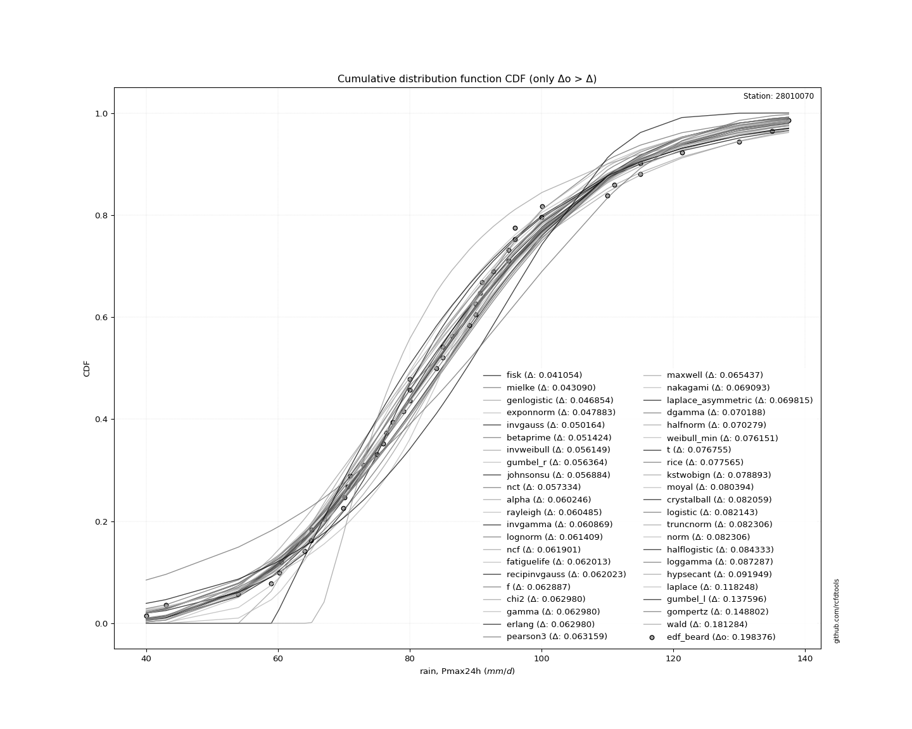</img>

</div>


**4.3. Best fit**

<div align="center">

|   id |   station | empirical_dist   | p_dist    |     delta |   deltao | eval   |   fit |   n |   best_fit |   best_fit_sort |
|-----:|----------:|:-----------------|:----------|----------:|---------:|:-------|------:|----:|-----------:|----------------:|
|    0 |  28010070 | edf_beard        | logmielke | 0.0503853 | 0.188598 | Δo > Δ |     1 |  52 |          1 |               1 |

</div>


<div align="center">

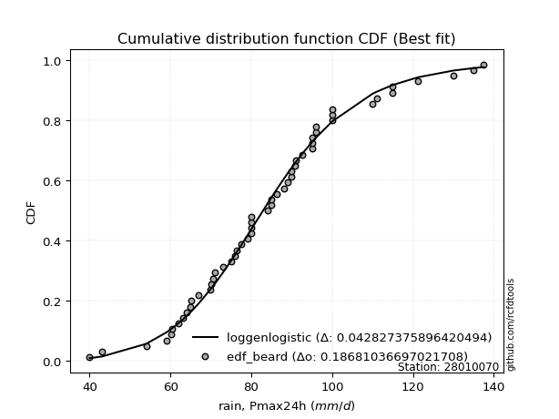</img></img>

</div>


### 5. Empirical - EDF Chegodayev (1955)

The Chegodayev formula is an empirical plotting position formula used in hydrological frequency analysis to estimate the exceedance probability or return period of a specific event from a set of observed data. It is primarily used for plotting observed data points on probability paper to fit a theoretical distribution, particularly for analyzing extreme events like maximum flood flows or rainfall intensities. The constant _b_ value in the generalized plotting position formula is 0.3.

<div align="center">


$P=(m-b)/(n+1-2b)$


</div>


**5.1. Empirical values**

<div align="center">

|                | 0                    | 1                   | 2                   | 3                   | 4                   | 5                   | 6                   | 7                   | 8                   | 9                  | 10                  | 11                 | 12                  | 13                  | 14                  | 15                 | 16                 | 17                 | 18                 | 19                  | 20                 | 21                  | 22                 | 23                  | 24                 | 25                 | 26                 | 27                 | 28                 | 29                 | 30                 | 31                 | 32                 | 33                 | 34                 | 35                 | 36                 | 37                 | 38                 | 39                 | 40                 | 41                 | 42                 | 43                 | 44                 | 45                 | 46                 | 47                 | 48                 | 49                 | 50                 | 51                 |
|:---------------|:---------------------|:--------------------|:--------------------|:--------------------|:--------------------|:--------------------|:--------------------|:--------------------|:--------------------|:-------------------|:--------------------|:-------------------|:--------------------|:--------------------|:--------------------|:-------------------|:-------------------|:-------------------|:-------------------|:--------------------|:-------------------|:--------------------|:-------------------|:--------------------|:-------------------|:-------------------|:-------------------|:-------------------|:-------------------|:-------------------|:-------------------|:-------------------|:-------------------|:-------------------|:-------------------|:-------------------|:-------------------|:-------------------|:-------------------|:-------------------|:-------------------|:-------------------|:-------------------|:-------------------|:-------------------|:-------------------|:-------------------|:-------------------|:-------------------|:-------------------|:-------------------|:-------------------|
| date           | 2015                 | 1986                | 1974                | 1997                | 1991                | 2021                | 2018                | 2002                | 1990                | 1993               | 1989                | 2011               | 2003                | 2004                | 2008                | 2001               | 2013               | 2007               | 1992               | 2016                | 2000               | 1994                | 2014               | 2012                | 2019               | 2010               | 2009               | 1972               | 2017               | 2005               | 1995               | 1977               | 1976               | 1988               | 1987               | 2020               | 1982               | 1985               | 1984               | 1971               | 1979               | 1983               | 1970               | 1975               | 1998               | 1980               | 1981               | 2006               | 1973               | 1978               | 1999               | 1996               |
| x              | 40.0                 | 43.0                | 45.0                | 60.2                | 60.5                | 62.0                | 63.0                | 65.0                | 69.9                | 70.1               | 70.6                | 71.0               | 73.0                | 76.0                | 80.0                | 80.0               | 85.0               | 85.0               | 86.4               | 88.0                | 90.0               | 90.7                | 95.0               | 95.0                | 95.0               | 96.0               | 96.0               | 99.0               | 100.0              | 100.0              | 100.1              | 104.603463613376   | 107.585122244536   | 110.0              | 111.0              | 112.144796560754   | 112.286587817857   | 112.589999231464   | 114.178729338772   | 115.247097358231   | 117.68809685844    | 119.745071952376   | 120.389200409921   | 120.667737339199   | 121.3              | 125.76249436743    | 126.944657729944   | 130.0              | 130.796492713251   | 130.974757328269   | 135.0              | 137.5              |
| m              | 1                    | 2                   | 3                   | 4                   | 5                   | 6                   | 7                   | 8                   | 9                   | 10                 | 11                  | 12                 | 13                  | 14                  | 15                  | 16                 | 17                 | 18                 | 19                 | 20                  | 21                 | 22                  | 23                 | 24                  | 25                 | 26                 | 27                 | 28                 | 29                 | 30                 | 31                 | 32                 | 33                 | 34                 | 35                 | 36                 | 37                 | 38                 | 39                 | 40                 | 41                 | 42                 | 43                 | 44                 | 45                 | 46                 | 47                 | 48                 | 49                 | 50                 | 51                 | 52                 |
| empirical_dist | edf_chegodayev       | edf_chegodayev      | edf_chegodayev      | edf_chegodayev      | edf_chegodayev      | edf_chegodayev      | edf_chegodayev      | edf_chegodayev      | edf_chegodayev      | edf_chegodayev     | edf_chegodayev      | edf_chegodayev     | edf_chegodayev      | edf_chegodayev      | edf_chegodayev      | edf_chegodayev     | edf_chegodayev     | edf_chegodayev     | edf_chegodayev     | edf_chegodayev      | edf_chegodayev     | edf_chegodayev      | edf_chegodayev     | edf_chegodayev      | edf_chegodayev     | edf_chegodayev     | edf_chegodayev     | edf_chegodayev     | edf_chegodayev     | edf_chegodayev     | edf_chegodayev     | edf_chegodayev     | edf_chegodayev     | edf_chegodayev     | edf_chegodayev     | edf_chegodayev     | edf_chegodayev     | edf_chegodayev     | edf_chegodayev     | edf_chegodayev     | edf_chegodayev     | edf_chegodayev     | edf_chegodayev     | edf_chegodayev     | edf_chegodayev     | edf_chegodayev     | edf_chegodayev     | edf_chegodayev     | edf_chegodayev     | edf_chegodayev     | edf_chegodayev     | edf_chegodayev     |
| empirical      | 0.013358778625954198 | 0.03244274809160305 | 0.05152671755725191 | 0.07061068702290077 | 0.08969465648854963 | 0.10877862595419847 | 0.12786259541984735 | 0.14694656488549618 | 0.16603053435114504 | 0.1851145038167939 | 0.20419847328244273 | 0.2232824427480916 | 0.24236641221374045 | 0.26145038167938933 | 0.28053435114503816 | 0.299618320610687  | 0.3187022900763359 | 0.3377862595419847 | 0.3568702290076336 | 0.37595419847328243 | 0.3950381679389313 | 0.41412213740458015 | 0.433206106870229  | 0.45229007633587787 | 0.4713740458015267 | 0.4904580152671756 | 0.5095419847328244 | 0.5286259541984732 | 0.5477099236641222 | 0.566793893129771  | 0.5858778625954199 | 0.6049618320610687 | 0.6240458015267176 | 0.6431297709923665 | 0.6622137404580153 | 0.6812977099236642 | 0.7003816793893131 | 0.7194656488549619 | 0.7385496183206107 | 0.7576335877862597 | 0.7767175572519085 | 0.7958015267175573 | 0.8148854961832062 | 0.833969465648855  | 0.8530534351145039 | 0.8721374045801528 | 0.8912213740458016 | 0.9103053435114504 | 0.9293893129770994 | 0.9484732824427482 | 0.967557251908397  | 0.9866412213740459 |
| empirical_tr   | 1.0135396518375241   | 1.0335305719921104  | 1.0543259557344065  | 1.0759753593429158  | 1.09853249475891    | 1.1220556745182013  | 1.1466083150984683  | 1.1722595078299776  | 1.1990846681922196  | 1.2271662763466042 | 1.2565947242206235  | 1.2874692874692875 | 1.3198992443324937  | 1.3540051679586564  | 1.389920424403183   | 1.4277929155313351 | 1.4677871148459385 | 1.510086455331412  | 1.5548961424332344 | 1.602446483180428   | 1.6529968454258677 | 1.706840390879479   | 1.7643097643097643 | 1.8257839721254356  | 1.8916967509025273 | 1.9625468164794009 | 2.0389105058365757 | 2.1214574898785425 | 2.210970464135021  | 2.3083700440528636 | 2.414746543778802  | 2.5314009661835746 | 2.659898477157361  | 2.8021390374331556 | 2.96045197740113   | 3.137724550898205  | 3.337579617834396  | 3.564625850340137  | 3.824817518248176  | 4.125984251968506  | 4.4786324786324805 | 4.897196261682245  | 5.402061855670104  | 6.0229885057471275 | 6.805194805194811  | 7.820895522388065  | 9.192982456140356  | 11.148936170212771 | 14.162162162162188 | 19.407407407407447 | 30.823529411764785 | 74.8571428571432   |

</div>


**5.2. Kolmogorov-Smirnov fit test (sorted by Δ)**


<div align="center">

|                | 0                   | 1                   | 2                   | 3                   | 4                   | 5                   | 6                   | 7                   | 8                   | 9                   | 10                  | 11                  | 12                  | 13                  | 14                  | 15                  | 16                  | 17                  | 18                  | 19                  | 20                  | 21                  | 22                  | 23                  | 24                  | 25                  | 26                  | 27                  | 28                  | 29                  | 30                  | 31                  | 32                    | 33                  | 34                  | 35                  | 36                  | 37                  | 38                  | 39                  | 40                  | 41                  | 42                  | 43                  | 44                  | 45                  | 46                  | 47                  | 48                  | 49                  | 50                  | 51                  | 52                  | 53                  | 54                  | 55                  | 56                  | 57                  | 58                  | 59                  | 60                  | 61                  | 62                  | 63                  | 64                  | 65                  | 66                  | 67                  | 68                  | 69                  | 70                  | 71                  | 72                  | 73                  | 74                  | 75                  | 76                  | 77                  | 78                  | 79                  | 80                  | 81                  | 82                  | 83                  | 84                  | 85                  | 86                  | 87                  | 88                  | 89                  |
|:---------------|:--------------------|:--------------------|:--------------------|:--------------------|:--------------------|:--------------------|:--------------------|:--------------------|:--------------------|:--------------------|:--------------------|:--------------------|:--------------------|:--------------------|:--------------------|:--------------------|:--------------------|:--------------------|:--------------------|:--------------------|:--------------------|:--------------------|:--------------------|:--------------------|:--------------------|:--------------------|:--------------------|:--------------------|:--------------------|:--------------------|:--------------------|:--------------------|:----------------------|:--------------------|:--------------------|:--------------------|:--------------------|:--------------------|:--------------------|:--------------------|:--------------------|:--------------------|:--------------------|:--------------------|:--------------------|:--------------------|:--------------------|:--------------------|:--------------------|:--------------------|:--------------------|:--------------------|:--------------------|:--------------------|:--------------------|:--------------------|:--------------------|:--------------------|:--------------------|:--------------------|:--------------------|:--------------------|:--------------------|:--------------------|:--------------------|:--------------------|:--------------------|:--------------------|:--------------------|:--------------------|:--------------------|:--------------------|:--------------------|:--------------------|:--------------------|:--------------------|:--------------------|:--------------------|:--------------------|:--------------------|:--------------------|:--------------------|:--------------------|:--------------------|:--------------------|:--------------------|:--------------------|:--------------------|:--------------------|:--------------------|
| station        | 28010070            | 28010070            | 28010070            | 28010070            | 28010070            | 28010070            | 28010070            | 28010070            | 28010070            | 28010070            | 28010070            | 28010070            | 28010070            | 28010070            | 28010070            | 28010070            | 28010070            | 28010070            | 28010070            | 28010070            | 28010070            | 28010070            | 28010070            | 28010070            | 28010070            | 28010070            | 28010070            | 28010070            | 28010070            | 28010070            | 28010070            | 28010070            | 28010070              | 28010070            | 28010070            | 28010070            | 28010070            | 28010070            | 28010070            | 28010070            | 28010070            | 28010070            | 28010070            | 28010070            | 28010070            | 28010070            | 28010070            | 28010070            | 28010070            | 28010070            | 28010070            | 28010070            | 28010070            | 28010070            | 28010070            | 28010070            | 28010070            | 28010070            | 28010070            | 28010070            | 28010070            | 28010070            | 28010070            | 28010070            | 28010070            | 28010070            | 28010070            | 28010070            | 28010070            | 28010070            | 28010070            | 28010070            | 28010070            | 28010070            | 28010070            | 28010070            | 28010070            | 28010070            | 28010070            | 28010070            | 28010070            | 28010070            | 28010070            | 28010070            | 28010070            | 28010070            | 28010070            | 28010070            | 28010070            | 28010070            |
| empirical_dist | edf_chegodayev      | edf_chegodayev      | edf_chegodayev      | edf_chegodayev      | edf_chegodayev      | edf_chegodayev      | edf_chegodayev      | edf_chegodayev      | edf_chegodayev      | edf_chegodayev      | edf_chegodayev      | edf_chegodayev      | edf_chegodayev      | edf_chegodayev      | edf_chegodayev      | edf_chegodayev      | edf_chegodayev      | edf_chegodayev      | edf_chegodayev      | edf_chegodayev      | edf_chegodayev      | edf_chegodayev      | edf_chegodayev      | edf_chegodayev      | edf_chegodayev      | edf_chegodayev      | edf_chegodayev      | edf_chegodayev      | edf_chegodayev      | edf_chegodayev      | edf_chegodayev      | edf_chegodayev      | edf_chegodayev        | edf_chegodayev      | edf_chegodayev      | edf_chegodayev      | edf_chegodayev      | edf_chegodayev      | edf_chegodayev      | edf_chegodayev      | edf_chegodayev      | edf_chegodayev      | edf_chegodayev      | edf_chegodayev      | edf_chegodayev      | edf_chegodayev      | edf_chegodayev      | edf_chegodayev      | edf_chegodayev      | edf_chegodayev      | edf_chegodayev      | edf_chegodayev      | edf_chegodayev      | edf_chegodayev      | edf_chegodayev      | edf_chegodayev      | edf_chegodayev      | edf_chegodayev      | edf_chegodayev      | edf_chegodayev      | edf_chegodayev      | edf_chegodayev      | edf_chegodayev      | edf_chegodayev      | edf_chegodayev      | edf_chegodayev      | edf_chegodayev      | edf_chegodayev      | edf_chegodayev      | edf_chegodayev      | edf_chegodayev      | edf_chegodayev      | edf_chegodayev      | edf_chegodayev      | edf_chegodayev      | edf_chegodayev      | edf_chegodayev      | edf_chegodayev      | edf_chegodayev      | edf_chegodayev      | edf_chegodayev      | edf_chegodayev      | edf_chegodayev      | edf_chegodayev      | edf_chegodayev      | edf_chegodayev      | edf_chegodayev      | edf_chegodayev      | edf_chegodayev      | edf_chegodayev      |
| p_dist         | logmielke           | logjohnsonsu        | johnsonsu           | logpearson3         | weibull_min         | genlogistic         | pearson3            | loggumbel_l         | logweibull_min      | gompertz            | fatiguelife         | loggompertz         | fisk                | gumbel_l            | logloggamma         | nct                 | logfisk             | t                   | crystalball         | norm                | truncnorm           | exponnorm           | gamma               | nakagami            | f                   | rice                | chi2                | erlang              | invgamma            | alpha               | logt                | maxwell             | loglaplace_asymmetric | loggenlogistic      | mielke              | logistic            | rayleigh            | betaprime           | invweibull          | laplace_asymmetric  | logfatiguelife      | lognct              | lognakagami         | logbetaprime        | hypsecant           | invgauss            | logf                | logcrystalball      | logexponnorm        | lognorm             | lognorm             | loglognorm          | logrice             | logncf              | loglogistic         | loggamma            | loggamma            | logalpha            | logchi2             | loghypsecant        | logerlang           | kstwobign           | gumbel_r            | loginvgamma         | halfnorm            | laplace             | loginvgauss         | logmaxwell          | loglaplace          | lograyleigh         | loginvweibull       | moyal               | halflogistic        | logkstwobign        | loghalfnorm         | loggumbel_r         | loggenexpon         | loghalflogistic     | logmoyal            | wald                | genexpon            | expon               | pareto              | gibrat              | logwald             | loggibrat           | logexpon            | logpareto           | logtruncnorm        | ncf                 |
| delta          | 0.05043995198738216 | 0.0607395746624706  | 0.06180867436941956 | 0.06255562297047845 | 0.06423131987616215 | 0.06783870194152908 | 0.06965617076948627 | 0.07075368991016684 | 0.07189148472558093 | 0.07341857088774784 | 0.07512682320893427 | 0.07615878036046708 | 0.0761891737858521  | 0.07724658571170603 | 0.07937868511380952 | 0.0806245676624946  | 0.08067329030871695 | 0.08069879953564207 | 0.08076325374302684 | 0.08076326512856724 | 0.08076326730807204 | 0.08076368785922117 | 0.08113250941447026 | 0.08113621466949861 | 0.08124302062617383 | 0.08208082933639782 | 0.08581634035339047 | 0.08633844657120004 | 0.08758794205093656 | 0.09330153855997647 | 0.09731214286143042 | 0.09780948365286735 | 0.09883442830532058   | 0.10086387537776226 | 0.10112261943469597 | 0.10302448194575664 | 0.10886667571826336 | 0.11008079025136552 | 0.11095106096254137 | 0.11165855012920378 | 0.11709112738147631 | 0.11788703014982937 | 0.11789888904228685 | 0.11841974600302174 | 0.11844159643815055 | 0.11855234319472108 | 0.11873964118097657 | 0.11887196329969862 | 0.11887251109806585 | 0.11887274021279781 | 0.11887274021279781 | 0.11887428905767783 | 0.11887466791039625 | 0.12584015464323417 | 0.12588005036131134 | 0.12652740218826486 | 0.12652740218826486 | 0.1273669344600079  | 0.1315718344040011  | 0.13179501559985352 | 0.13236199843715268 | 0.13370224201880332 | 0.1349861614569292  | 0.13532181696093815 | 0.13999686538133338 | 0.1411602817380515  | 0.1449836412781803  | 0.14912769329181264 | 0.1513008395056542  | 0.1588259693714238  | 0.15984284874340837 | 0.16084626694746718 | 0.16480324178207184 | 0.17848900555674907 | 0.18620190209504917 | 0.18887995814145864 | 0.20771866738264344 | 0.2135548512909904  | 0.21364947637032794 | 0.23408927556688558 | 0.2432695099424634  | 0.25257577080966487 | 0.25257578677234116 | 0.26145038167938933 | 0.2823823225826134  | 0.3116490331461994  | 0.3251453737612271  | 0.32514537898472506 | 0.3952086740195907  | 0.4861926160940496  |
| deltao         | 0.18859806671657792 | 0.18859806671657792 | 0.18859806671657792 | 0.18859806671657792 | 0.18859806671657792 | 0.18859806671657792 | 0.18859806671657792 | 0.18859806671657792 | 0.18859806671657792 | 0.18859806671657792 | 0.18859806671657792 | 0.18859806671657792 | 0.18859806671657792 | 0.18859806671657792 | 0.18859806671657792 | 0.18859806671657792 | 0.18859806671657792 | 0.18859806671657792 | 0.18859806671657792 | 0.18859806671657792 | 0.18859806671657792 | 0.18859806671657792 | 0.18859806671657792 | 0.18859806671657792 | 0.18859806671657792 | 0.18859806671657792 | 0.18859806671657792 | 0.18859806671657792 | 0.18859806671657792 | 0.18859806671657792 | 0.18859806671657792 | 0.18859806671657792 | 0.18859806671657792   | 0.18859806671657792 | 0.18859806671657792 | 0.18859806671657792 | 0.18859806671657792 | 0.18859806671657792 | 0.18859806671657792 | 0.18859806671657792 | 0.18859806671657792 | 0.18859806671657792 | 0.18859806671657792 | 0.18859806671657792 | 0.18859806671657792 | 0.18859806671657792 | 0.18859806671657792 | 0.18859806671657792 | 0.18859806671657792 | 0.18859806671657792 | 0.18859806671657792 | 0.18859806671657792 | 0.18859806671657792 | 0.18859806671657792 | 0.18859806671657792 | 0.18859806671657792 | 0.18859806671657792 | 0.18859806671657792 | 0.18859806671657792 | 0.18859806671657792 | 0.18859806671657792 | 0.18859806671657792 | 0.18859806671657792 | 0.18859806671657792 | 0.18859806671657792 | 0.18859806671657792 | 0.18859806671657792 | 0.18859806671657792 | 0.18859806671657792 | 0.18859806671657792 | 0.18859806671657792 | 0.18859806671657792 | 0.18859806671657792 | 0.18859806671657792 | 0.18859806671657792 | 0.18859806671657792 | 0.18859806671657792 | 0.18859806671657792 | 0.18859806671657792 | 0.18859806671657792 | 0.18859806671657792 | 0.18859806671657792 | 0.18859806671657792 | 0.18859806671657792 | 0.18859806671657792 | 0.18859806671657792 | 0.18859806671657792 | 0.18859806671657792 | 0.18859806671657792 | 0.18859806671657792 |
| eval           | Δo > Δ              | Δo > Δ              | Δo > Δ              | Δo > Δ              | Δo > Δ              | Δo > Δ              | Δo > Δ              | Δo > Δ              | Δo > Δ              | Δo > Δ              | Δo > Δ              | Δo > Δ              | Δo > Δ              | Δo > Δ              | Δo > Δ              | Δo > Δ              | Δo > Δ              | Δo > Δ              | Δo > Δ              | Δo > Δ              | Δo > Δ              | Δo > Δ              | Δo > Δ              | Δo > Δ              | Δo > Δ              | Δo > Δ              | Δo > Δ              | Δo > Δ              | Δo > Δ              | Δo > Δ              | Δo > Δ              | Δo > Δ              | Δo > Δ                | Δo > Δ              | Δo > Δ              | Δo > Δ              | Δo > Δ              | Δo > Δ              | Δo > Δ              | Δo > Δ              | Δo > Δ              | Δo > Δ              | Δo > Δ              | Δo > Δ              | Δo > Δ              | Δo > Δ              | Δo > Δ              | Δo > Δ              | Δo > Δ              | Δo > Δ              | Δo > Δ              | Δo > Δ              | Δo > Δ              | Δo > Δ              | Δo > Δ              | Δo > Δ              | Δo > Δ              | Δo > Δ              | Δo > Δ              | Δo > Δ              | Δo > Δ              | Δo > Δ              | Δo > Δ              | Δo > Δ              | Δo > Δ              | Δo > Δ              | Δo > Δ              | Δo > Δ              | Δo > Δ              | Δo > Δ              | Δo > Δ              | Δo > Δ              | Δo > Δ              | Δo > Δ              | Δo > Δ              | Δo <= Δ             | Δo <= Δ             | Δo <= Δ             | Δo <= Δ             | Δo <= Δ             | Δo <= Δ             | Δo <= Δ             | Δo <= Δ             | Δo <= Δ             | Δo <= Δ             | Δo <= Δ             | Δo <= Δ             | Δo <= Δ             | Δo <= Δ             | Δo <= Δ             |
| fit            | 1                   | 1                   | 1                   | 1                   | 1                   | 1                   | 1                   | 1                   | 1                   | 1                   | 1                   | 1                   | 1                   | 1                   | 1                   | 1                   | 1                   | 1                   | 1                   | 1                   | 1                   | 1                   | 1                   | 1                   | 1                   | 1                   | 1                   | 1                   | 1                   | 1                   | 1                   | 1                   | 1                     | 1                   | 1                   | 1                   | 1                   | 1                   | 1                   | 1                   | 1                   | 1                   | 1                   | 1                   | 1                   | 1                   | 1                   | 1                   | 1                   | 1                   | 1                   | 1                   | 1                   | 1                   | 1                   | 1                   | 1                   | 1                   | 1                   | 1                   | 1                   | 1                   | 1                   | 1                   | 1                   | 1                   | 1                   | 1                   | 1                   | 1                   | 1                   | 1                   | 1                   | 1                   | 1                   | 0                   | 0                   | 0                   | 0                   | 0                   | 0                   | 0                   | 0                   | 0                   | 0                   | 0                   | 0                   | 0                   | 0                   | 0                   |
| n              | 52                  | 52                  | 52                  | 52                  | 52                  | 52                  | 52                  | 52                  | 52                  | 52                  | 52                  | 52                  | 52                  | 52                  | 52                  | 52                  | 52                  | 52                  | 52                  | 52                  | 52                  | 52                  | 52                  | 52                  | 52                  | 52                  | 52                  | 52                  | 52                  | 52                  | 52                  | 52                  | 52                    | 52                  | 52                  | 52                  | 52                  | 52                  | 52                  | 52                  | 52                  | 52                  | 52                  | 52                  | 52                  | 52                  | 52                  | 52                  | 52                  | 52                  | 52                  | 52                  | 52                  | 52                  | 52                  | 52                  | 52                  | 52                  | 52                  | 52                  | 52                  | 52                  | 52                  | 52                  | 52                  | 52                  | 52                  | 52                  | 52                  | 52                  | 52                  | 52                  | 52                  | 52                  | 52                  | 52                  | 52                  | 52                  | 52                  | 52                  | 52                  | 52                  | 52                  | 52                  | 52                  | 52                  | 52                  | 52                  | 52                  | 52                  |
| best_fit       | 1                   | 0                   | 0                   | 0                   | 0                   | 0                   | 0                   | 0                   | 0                   | 0                   | 0                   | 0                   | 0                   | 0                   | 0                   | 0                   | 0                   | 0                   | 0                   | 0                   | 0                   | 0                   | 0                   | 0                   | 0                   | 0                   | 0                   | 0                   | 0                   | 0                   | 0                   | 0                   | 0                     | 0                   | 0                   | 0                   | 0                   | 0                   | 0                   | 0                   | 0                   | 0                   | 0                   | 0                   | 0                   | 0                   | 0                   | 0                   | 0                   | 0                   | 0                   | 0                   | 0                   | 0                   | 0                   | 0                   | 0                   | 0                   | 0                   | 0                   | 0                   | 0                   | 0                   | 0                   | 0                   | 0                   | 0                   | 0                   | 0                   | 0                   | 0                   | 0                   | 0                   | 0                   | 0                   | 0                   | 0                   | 0                   | 0                   | 0                   | 0                   | 0                   | 0                   | 0                   | 0                   | 0                   | 0                   | 0                   | 0                   | 0                   |
| best_fit_sort  | 1                   | 2                   | 3                   | 4                   | 5                   | 6                   | 7                   | 8                   | 9                   | 10                  | 11                  | 12                  | 13                  | 14                  | 15                  | 16                  | 17                  | 18                  | 19                  | 20                  | 21                  | 22                  | 23                  | 24                  | 25                  | 26                  | 27                  | 28                  | 29                  | 30                  | 31                  | 32                  | 33                    | 34                  | 35                  | 36                  | 37                  | 38                  | 39                  | 40                  | 41                  | 42                  | 43                  | 44                  | 45                  | 46                  | 47                  | 48                  | 49                  | 50                  | 51                  | 52                  | 53                  | 54                  | 55                  | 56                  | 57                  | 58                  | 59                  | 60                  | 61                  | 62                  | 63                  | 64                  | 65                  | 66                  | 67                  | 68                  | 69                  | 70                  | 71                  | 72                  | 73                  | 74                  | 75                  | 76                  | 77                  | 78                  | 79                  | 80                  | 81                  | 82                  | 83                  | 84                  | 85                  | 86                  | 87                  | 88                  | 89                  | 90                  |

</div>


<div align="center">

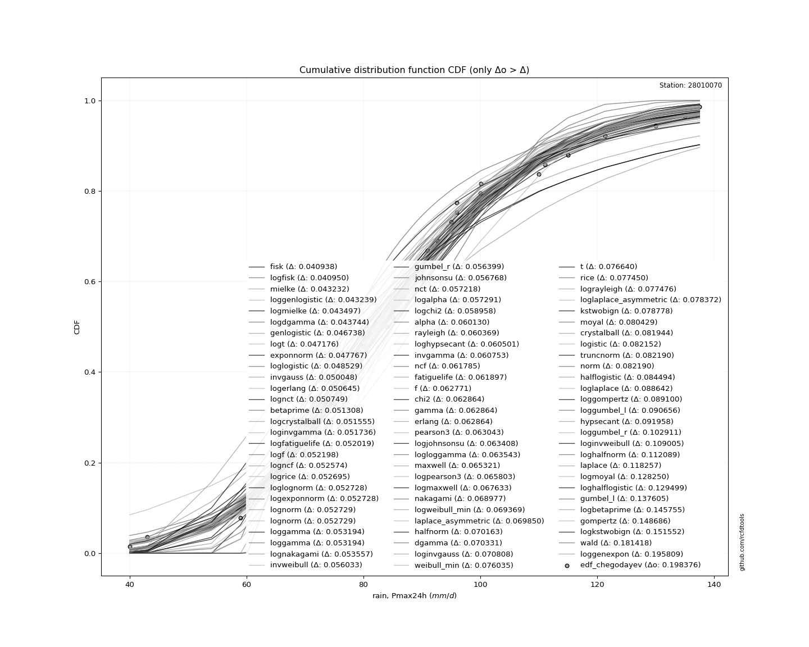</img>

</div>


**5.3. Best fit**

<div align="center">

|   id |   station | empirical_dist   | p_dist    |   delta |   deltao | eval   |   fit |   n |   best_fit |   best_fit_sort |
|-----:|----------:|:-----------------|:----------|--------:|---------:|:-------|------:|----:|-----------:|----------------:|
|    0 |  28010070 | edf_chegodayev   | logmielke | 0.05044 | 0.188598 | Δo > Δ |     1 |  52 |          1 |               1 |

</div>


<div align="center">

</img>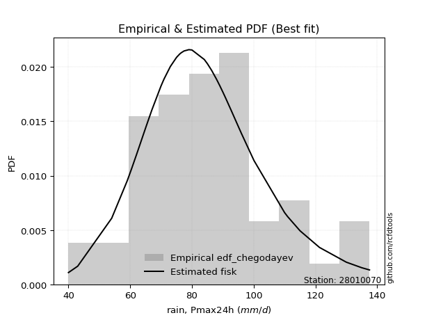</img>

</div>


### 6. Empirical - EDF Blom (1958)

The Blom formula is a specific "plotting position" formula used in hydrology and statistical analysis to estimate the empirical cumulative probability (or non-exceedance probability) of a data series. It is particularly recommended for data that are approximately normally distributed. The constant _a_ is set to 0.375 (or 3/8).

<div align="center">


$P=(m-a)/(n+1-2a)$


</div>


**6.1. Empirical values**

<div align="center">

|                | 0                    | 1                   | 2                    | 3                   | 4                   | 5                  | 6                   | 7                  | 8                   | 9                   | 10                  | 11                  | 12                  | 13                 | 14                 | 15                  | 16                 | 17                 | 18                  | 19                  | 20                  | 21                 | 22                  | 23                  | 24                  | 25                 | 26                 | 27                 | 28                 | 29                 | 30                 | 31                 | 32                 | 33                 | 34                 | 35                 | 36                 | 37                 | 38                 | 39                 | 40                | 41                 | 42                 | 43                 | 44                | 45                 | 46                 | 47                 | 48                 | 49                 | 50                 | 51                 |
|:---------------|:---------------------|:--------------------|:---------------------|:--------------------|:--------------------|:-------------------|:--------------------|:-------------------|:--------------------|:--------------------|:--------------------|:--------------------|:--------------------|:-------------------|:-------------------|:--------------------|:-------------------|:-------------------|:--------------------|:--------------------|:--------------------|:-------------------|:--------------------|:--------------------|:--------------------|:-------------------|:-------------------|:-------------------|:-------------------|:-------------------|:-------------------|:-------------------|:-------------------|:-------------------|:-------------------|:-------------------|:-------------------|:-------------------|:-------------------|:-------------------|:------------------|:-------------------|:-------------------|:-------------------|:------------------|:-------------------|:-------------------|:-------------------|:-------------------|:-------------------|:-------------------|:-------------------|
| date           | 2015                 | 1986                | 1974                 | 1997                | 1991                | 2021               | 2018                | 2002               | 1990                | 1993                | 1989                | 2011                | 2003                | 2004               | 2008               | 2001                | 2013               | 2007               | 1992                | 2016                | 2000                | 1994               | 2014                | 2012                | 2019                | 2010               | 2009               | 1972               | 2017               | 2005               | 1995               | 1977               | 1976               | 1988               | 1987               | 2020               | 1982               | 1985               | 1984               | 1971               | 1979              | 1983               | 1970               | 1975               | 1998              | 1980               | 1981               | 2006               | 1973               | 1978               | 1999               | 1996               |
| x              | 40.0                 | 43.0                | 45.0                 | 60.2                | 60.5                | 62.0               | 63.0                | 65.0               | 69.9                | 70.1                | 70.6                | 71.0                | 73.0                | 76.0               | 80.0               | 80.0                | 85.0               | 85.0               | 86.4                | 88.0                | 90.0                | 90.7               | 95.0                | 95.0                | 95.0                | 96.0               | 96.0               | 99.0               | 100.0              | 100.0              | 100.1              | 104.603463613376   | 107.585122244536   | 110.0              | 111.0              | 112.144796560754   | 112.286587817857   | 112.589999231464   | 114.178729338772   | 115.247097358231   | 117.68809685844   | 119.745071952376   | 120.389200409921   | 120.667737339199   | 121.3             | 125.76249436743    | 126.944657729944   | 130.0              | 130.796492713251   | 130.974757328269   | 135.0              | 137.5              |
| m              | 1                    | 2                   | 3                    | 4                   | 5                   | 6                  | 7                   | 8                  | 9                   | 10                  | 11                  | 12                  | 13                  | 14                 | 15                 | 16                  | 17                 | 18                 | 19                  | 20                  | 21                  | 22                 | 23                  | 24                  | 25                  | 26                 | 27                 | 28                 | 29                 | 30                 | 31                 | 32                 | 33                 | 34                 | 35                 | 36                 | 37                 | 38                 | 39                 | 40                 | 41                | 42                 | 43                 | 44                 | 45                | 46                 | 47                 | 48                 | 49                 | 50                 | 51                 | 52                 |
| empirical_dist | edf_blom             | edf_blom            | edf_blom             | edf_blom            | edf_blom            | edf_blom           | edf_blom            | edf_blom           | edf_blom            | edf_blom            | edf_blom            | edf_blom            | edf_blom            | edf_blom           | edf_blom           | edf_blom            | edf_blom           | edf_blom           | edf_blom            | edf_blom            | edf_blom            | edf_blom           | edf_blom            | edf_blom            | edf_blom            | edf_blom           | edf_blom           | edf_blom           | edf_blom           | edf_blom           | edf_blom           | edf_blom           | edf_blom           | edf_blom           | edf_blom           | edf_blom           | edf_blom           | edf_blom           | edf_blom           | edf_blom           | edf_blom          | edf_blom           | edf_blom           | edf_blom           | edf_blom          | edf_blom           | edf_blom           | edf_blom           | edf_blom           | edf_blom           | edf_blom           | edf_blom           |
| empirical      | 0.011961722488038277 | 0.03110047846889952 | 0.050239234449760764 | 0.06937799043062201 | 0.08851674641148326 | 0.1076555023923445 | 0.12679425837320574 | 0.145933014354067  | 0.16507177033492823 | 0.18421052631578946 | 0.20334928229665072 | 0.22248803827751196 | 0.24162679425837322 | 0.2607655502392344 | 0.2799043062200957 | 0.29904306220095694 | 0.3181818181818182 | 0.3373205741626794 | 0.35645933014354064 | 0.37559808612440193 | 0.39473684210526316 | 0.4138755980861244 | 0.43301435406698563 | 0.45215311004784686 | 0.47129186602870815 | 0.4904306220095694 | 0.5095693779904307 | 0.5287081339712919 | 0.5478468899521531 | 0.5669856459330144 | 0.5861244019138756 | 0.6052631578947368 | 0.6244019138755981 | 0.6435406698564593 | 0.6626794258373205 | 0.6818181818181818 | 0.7009569377990431 | 0.7200956937799043 | 0.7392344497607656 | 0.7583732057416268 | 0.777511961722488 | 0.7966507177033493 | 0.8157894736842105 | 0.8349282296650717 | 0.854066985645933 | 0.8732057416267942 | 0.8923444976076556 | 0.9114832535885168 | 0.930622009569378  | 0.9497607655502392 | 0.9688995215311005 | 0.9880382775119617 |
| empirical_tr   | 1.0121065375302662   | 1.0320987654320988  | 1.052896725440806    | 1.0745501285347043  | 1.0971128608923884  | 1.1206434316353886 | 1.1452054794520548  | 1.1708683473389356 | 1.1977077363896849  | 1.2258064516129032  | 1.2552552552552552  | 1.2861538461538462  | 1.3186119873817035  | 1.3527508090614886 | 1.388704318936877  | 1.4266211604095564  | 1.4666666666666666 | 1.5090252707581229 | 1.553903345724907   | 1.6015325670498084  | 1.6521739130434783  | 1.7061224489795919 | 1.7637130801687764  | 1.8253275109170304  | 1.8914027149321269  | 1.9624413145539905 | 2.0390243902439025 | 2.121827411167513  | 2.2116402116402116 | 2.3093922651933703 | 2.416184971098266  | 2.533333333333333  | 2.662420382165605  | 2.8053691275167782 | 2.964539007092198  | 3.1428571428571423 | 3.3440000000000007 | 3.5726495726495733 | 3.8348623853211015 | 4.138613861386139  | 4.494623655913979 | 4.917647058823529  | 5.428571428571428  | 6.057971014492753  | 6.852459016393441 | 7.886792452830186  | 9.288888888888893  | 11.297297297297302 | 14.413793103448281 | 19.904761904761912 | 32.15384615384616  | 83.59999999999995  |

</div>


**6.2. Kolmogorov-Smirnov fit test (sorted by Δ)**


<div align="center">

|                | 0                   | 1                   | 2                   | 3                   | 4                   | 5                   | 6                   | 7                   | 8                   | 9                   | 10                  | 11                  | 12                  | 13                  | 14                  | 15                  | 16                  | 17                  | 18                  | 19                  | 20                  | 21                  | 22                  | 23                  | 24                  | 25                  | 26                  | 27                  | 28                  | 29                  | 30                  | 31                  | 32                    | 33                  | 34                  | 35                  | 36                  | 37                  | 38                  | 39                  | 40                  | 41                  | 42                  | 43                  | 44                  | 45                  | 46                  | 47                  | 48                  | 49                  | 50                  | 51                  | 52                  | 53                  | 54                  | 55                  | 56                  | 57                  | 58                  | 59                  | 60                  | 61                  | 62                  | 63                  | 64                  | 65                  | 66                  | 67                  | 68                  | 69                  | 70                  | 71                  | 72                  | 73                  | 74                  | 75                  | 76                  | 77                  | 78                  | 79                  | 80                  | 81                  | 82                  | 83                  | 84                  | 85                  | 86                  | 87                  | 88                  | 89                  |
|:---------------|:--------------------|:--------------------|:--------------------|:--------------------|:--------------------|:--------------------|:--------------------|:--------------------|:--------------------|:--------------------|:--------------------|:--------------------|:--------------------|:--------------------|:--------------------|:--------------------|:--------------------|:--------------------|:--------------------|:--------------------|:--------------------|:--------------------|:--------------------|:--------------------|:--------------------|:--------------------|:--------------------|:--------------------|:--------------------|:--------------------|:--------------------|:--------------------|:----------------------|:--------------------|:--------------------|:--------------------|:--------------------|:--------------------|:--------------------|:--------------------|:--------------------|:--------------------|:--------------------|:--------------------|:--------------------|:--------------------|:--------------------|:--------------------|:--------------------|:--------------------|:--------------------|:--------------------|:--------------------|:--------------------|:--------------------|:--------------------|:--------------------|:--------------------|:--------------------|:--------------------|:--------------------|:--------------------|:--------------------|:--------------------|:--------------------|:--------------------|:--------------------|:--------------------|:--------------------|:--------------------|:--------------------|:--------------------|:--------------------|:--------------------|:--------------------|:--------------------|:--------------------|:--------------------|:--------------------|:--------------------|:--------------------|:--------------------|:--------------------|:--------------------|:--------------------|:--------------------|:--------------------|:--------------------|:--------------------|:--------------------|
| station        | 28010070            | 28010070            | 28010070            | 28010070            | 28010070            | 28010070            | 28010070            | 28010070            | 28010070            | 28010070            | 28010070            | 28010070            | 28010070            | 28010070            | 28010070            | 28010070            | 28010070            | 28010070            | 28010070            | 28010070            | 28010070            | 28010070            | 28010070            | 28010070            | 28010070            | 28010070            | 28010070            | 28010070            | 28010070            | 28010070            | 28010070            | 28010070            | 28010070              | 28010070            | 28010070            | 28010070            | 28010070            | 28010070            | 28010070            | 28010070            | 28010070            | 28010070            | 28010070            | 28010070            | 28010070            | 28010070            | 28010070            | 28010070            | 28010070            | 28010070            | 28010070            | 28010070            | 28010070            | 28010070            | 28010070            | 28010070            | 28010070            | 28010070            | 28010070            | 28010070            | 28010070            | 28010070            | 28010070            | 28010070            | 28010070            | 28010070            | 28010070            | 28010070            | 28010070            | 28010070            | 28010070            | 28010070            | 28010070            | 28010070            | 28010070            | 28010070            | 28010070            | 28010070            | 28010070            | 28010070            | 28010070            | 28010070            | 28010070            | 28010070            | 28010070            | 28010070            | 28010070            | 28010070            | 28010070            | 28010070            |
| empirical_dist | edf_blom            | edf_blom            | edf_blom            | edf_blom            | edf_blom            | edf_blom            | edf_blom            | edf_blom            | edf_blom            | edf_blom            | edf_blom            | edf_blom            | edf_blom            | edf_blom            | edf_blom            | edf_blom            | edf_blom            | edf_blom            | edf_blom            | edf_blom            | edf_blom            | edf_blom            | edf_blom            | edf_blom            | edf_blom            | edf_blom            | edf_blom            | edf_blom            | edf_blom            | edf_blom            | edf_blom            | edf_blom            | edf_blom              | edf_blom            | edf_blom            | edf_blom            | edf_blom            | edf_blom            | edf_blom            | edf_blom            | edf_blom            | edf_blom            | edf_blom            | edf_blom            | edf_blom            | edf_blom            | edf_blom            | edf_blom            | edf_blom            | edf_blom            | edf_blom            | edf_blom            | edf_blom            | edf_blom            | edf_blom            | edf_blom            | edf_blom            | edf_blom            | edf_blom            | edf_blom            | edf_blom            | edf_blom            | edf_blom            | edf_blom            | edf_blom            | edf_blom            | edf_blom            | edf_blom            | edf_blom            | edf_blom            | edf_blom            | edf_blom            | edf_blom            | edf_blom            | edf_blom            | edf_blom            | edf_blom            | edf_blom            | edf_blom            | edf_blom            | edf_blom            | edf_blom            | edf_blom            | edf_blom            | edf_blom            | edf_blom            | edf_blom            | edf_blom            | edf_blom            | edf_blom            |
| p_dist         | logmielke           | logjohnsonsu        | johnsonsu           | logpearson3         | weibull_min         | genlogistic         | pearson3            | loggumbel_l         | logweibull_min      | gompertz            | fatiguelife         | loggompertz         | fisk                | gumbel_l            | logloggamma         | nct                 | t                   | crystalball         | norm                | truncnorm           | exponnorm           | gamma               | nakagami            | f                   | rice                | logfisk             | chi2                | erlang              | invgamma            | alpha               | logt                | maxwell             | loglaplace_asymmetric | loggenlogistic      | mielke              | logistic            | rayleigh            | betaprime           | invweibull          | laplace_asymmetric  | logfatiguelife      | hypsecant           | lognct              | lognakagami         | logbetaprime        | invgauss            | logf                | logcrystalball      | logexponnorm        | lognorm             | lognorm             | loglognorm          | logrice             | logncf              | loglogistic         | loggamma            | loggamma            | logalpha            | logchi2             | loghypsecant        | logerlang           | kstwobign           | gumbel_r            | loginvgamma         | halfnorm            | laplace             | loginvgauss         | logmaxwell          | loglaplace          | lograyleigh         | moyal               | loginvweibull       | halflogistic        | logkstwobign        | loghalfnorm         | loggumbel_r         | loggenexpon         | loghalflogistic     | logmoyal            | wald                | genexpon            | expon               | pareto              | gibrat              | logwald             | loggibrat           | logexpon            | logpareto           | logtruncnorm        | ncf                 |
| delta          | 0.05002905312328931 | 0.06098611398092635 | 0.06106905641405233 | 0.06214472410638561 | 0.0638204210120693  | 0.06709908398616185 | 0.06924527190539342 | 0.070342791046074   | 0.07148058586148809 | 0.07366511020620359 | 0.07471592434484142 | 0.07574788149637424 | 0.07577827492175926 | 0.0765069677563388  | 0.07962522443226527 | 0.08021366879840175 | 0.08028790067154923 | 0.080352354878934   | 0.0803523662644744  | 0.0803523684439792  | 0.08035278899512832 | 0.08072161055037741 | 0.08072531580540576 | 0.08083212176208099 | 0.08166993047230497 | 0.0817520814744982  | 0.08540544148929763 | 0.0859275477071072  | 0.08777969485417991 | 0.09289063969588363 | 0.09750389566467377 | 0.0980012364561107  | 0.09908096762377633   | 0.10111041469621801 | 0.10136915875315172 | 0.1026135830816638  | 0.10905842852150671 | 0.11027254305460887 | 0.11114281376578472 | 0.11124765126511094 | 0.11728288018471966 | 0.11803069757405771 | 0.11807878295307273 | 0.1180906418455302  | 0.11861149880626509 | 0.11874409599796443 | 0.11893139398421992 | 0.11906371610294197 | 0.1190642639013092  | 0.11906449301604116 | 0.11906449301604116 | 0.11906604186092118 | 0.1190664207136396  | 0.12603190744647752 | 0.12607180316455469 | 0.1267191549915082  | 0.1267191549915082  | 0.12755868726325126 | 0.13176358720724446 | 0.13198676840309687 | 0.13255375124039603 | 0.13389399482204667 | 0.13517791426017256 | 0.1355135697641815  | 0.14018861818457673 | 0.14074938287395866 | 0.14517539408142366 | 0.14931944609505599 | 0.15149259230889756 | 0.15901772217466714 | 0.16103801975071053 | 0.16123990488132423 | 0.1649949945853152  | 0.17900947745126677 | 0.18639365489829252 | 0.189071710944702   | 0.20823913927716114 | 0.21374660409423374 | 0.2138412291735713  | 0.23334965761151835 | 0.24422827395868021 | 0.2535345348258816  | 0.2535345507885579  | 0.2607655502392344  | 0.28257407538585677 | 0.31184078594944276 | 0.32610413777744385 | 0.3261041430009418  | 0.39616743803580745 | 0.4874253126863284  |
| deltao         | 0.18859806671657792 | 0.18859806671657792 | 0.18859806671657792 | 0.18859806671657792 | 0.18859806671657792 | 0.18859806671657792 | 0.18859806671657792 | 0.18859806671657792 | 0.18859806671657792 | 0.18859806671657792 | 0.18859806671657792 | 0.18859806671657792 | 0.18859806671657792 | 0.18859806671657792 | 0.18859806671657792 | 0.18859806671657792 | 0.18859806671657792 | 0.18859806671657792 | 0.18859806671657792 | 0.18859806671657792 | 0.18859806671657792 | 0.18859806671657792 | 0.18859806671657792 | 0.18859806671657792 | 0.18859806671657792 | 0.18859806671657792 | 0.18859806671657792 | 0.18859806671657792 | 0.18859806671657792 | 0.18859806671657792 | 0.18859806671657792 | 0.18859806671657792 | 0.18859806671657792   | 0.18859806671657792 | 0.18859806671657792 | 0.18859806671657792 | 0.18859806671657792 | 0.18859806671657792 | 0.18859806671657792 | 0.18859806671657792 | 0.18859806671657792 | 0.18859806671657792 | 0.18859806671657792 | 0.18859806671657792 | 0.18859806671657792 | 0.18859806671657792 | 0.18859806671657792 | 0.18859806671657792 | 0.18859806671657792 | 0.18859806671657792 | 0.18859806671657792 | 0.18859806671657792 | 0.18859806671657792 | 0.18859806671657792 | 0.18859806671657792 | 0.18859806671657792 | 0.18859806671657792 | 0.18859806671657792 | 0.18859806671657792 | 0.18859806671657792 | 0.18859806671657792 | 0.18859806671657792 | 0.18859806671657792 | 0.18859806671657792 | 0.18859806671657792 | 0.18859806671657792 | 0.18859806671657792 | 0.18859806671657792 | 0.18859806671657792 | 0.18859806671657792 | 0.18859806671657792 | 0.18859806671657792 | 0.18859806671657792 | 0.18859806671657792 | 0.18859806671657792 | 0.18859806671657792 | 0.18859806671657792 | 0.18859806671657792 | 0.18859806671657792 | 0.18859806671657792 | 0.18859806671657792 | 0.18859806671657792 | 0.18859806671657792 | 0.18859806671657792 | 0.18859806671657792 | 0.18859806671657792 | 0.18859806671657792 | 0.18859806671657792 | 0.18859806671657792 | 0.18859806671657792 |
| eval           | Δo > Δ              | Δo > Δ              | Δo > Δ              | Δo > Δ              | Δo > Δ              | Δo > Δ              | Δo > Δ              | Δo > Δ              | Δo > Δ              | Δo > Δ              | Δo > Δ              | Δo > Δ              | Δo > Δ              | Δo > Δ              | Δo > Δ              | Δo > Δ              | Δo > Δ              | Δo > Δ              | Δo > Δ              | Δo > Δ              | Δo > Δ              | Δo > Δ              | Δo > Δ              | Δo > Δ              | Δo > Δ              | Δo > Δ              | Δo > Δ              | Δo > Δ              | Δo > Δ              | Δo > Δ              | Δo > Δ              | Δo > Δ              | Δo > Δ                | Δo > Δ              | Δo > Δ              | Δo > Δ              | Δo > Δ              | Δo > Δ              | Δo > Δ              | Δo > Δ              | Δo > Δ              | Δo > Δ              | Δo > Δ              | Δo > Δ              | Δo > Δ              | Δo > Δ              | Δo > Δ              | Δo > Δ              | Δo > Δ              | Δo > Δ              | Δo > Δ              | Δo > Δ              | Δo > Δ              | Δo > Δ              | Δo > Δ              | Δo > Δ              | Δo > Δ              | Δo > Δ              | Δo > Δ              | Δo > Δ              | Δo > Δ              | Δo > Δ              | Δo > Δ              | Δo > Δ              | Δo > Δ              | Δo > Δ              | Δo > Δ              | Δo > Δ              | Δo > Δ              | Δo > Δ              | Δo > Δ              | Δo > Δ              | Δo > Δ              | Δo > Δ              | Δo > Δ              | Δo <= Δ             | Δo <= Δ             | Δo <= Δ             | Δo <= Δ             | Δo <= Δ             | Δo <= Δ             | Δo <= Δ             | Δo <= Δ             | Δo <= Δ             | Δo <= Δ             | Δo <= Δ             | Δo <= Δ             | Δo <= Δ             | Δo <= Δ             | Δo <= Δ             |
| fit            | 1                   | 1                   | 1                   | 1                   | 1                   | 1                   | 1                   | 1                   | 1                   | 1                   | 1                   | 1                   | 1                   | 1                   | 1                   | 1                   | 1                   | 1                   | 1                   | 1                   | 1                   | 1                   | 1                   | 1                   | 1                   | 1                   | 1                   | 1                   | 1                   | 1                   | 1                   | 1                   | 1                     | 1                   | 1                   | 1                   | 1                   | 1                   | 1                   | 1                   | 1                   | 1                   | 1                   | 1                   | 1                   | 1                   | 1                   | 1                   | 1                   | 1                   | 1                   | 1                   | 1                   | 1                   | 1                   | 1                   | 1                   | 1                   | 1                   | 1                   | 1                   | 1                   | 1                   | 1                   | 1                   | 1                   | 1                   | 1                   | 1                   | 1                   | 1                   | 1                   | 1                   | 1                   | 1                   | 0                   | 0                   | 0                   | 0                   | 0                   | 0                   | 0                   | 0                   | 0                   | 0                   | 0                   | 0                   | 0                   | 0                   | 0                   |
| n              | 52                  | 52                  | 52                  | 52                  | 52                  | 52                  | 52                  | 52                  | 52                  | 52                  | 52                  | 52                  | 52                  | 52                  | 52                  | 52                  | 52                  | 52                  | 52                  | 52                  | 52                  | 52                  | 52                  | 52                  | 52                  | 52                  | 52                  | 52                  | 52                  | 52                  | 52                  | 52                  | 52                    | 52                  | 52                  | 52                  | 52                  | 52                  | 52                  | 52                  | 52                  | 52                  | 52                  | 52                  | 52                  | 52                  | 52                  | 52                  | 52                  | 52                  | 52                  | 52                  | 52                  | 52                  | 52                  | 52                  | 52                  | 52                  | 52                  | 52                  | 52                  | 52                  | 52                  | 52                  | 52                  | 52                  | 52                  | 52                  | 52                  | 52                  | 52                  | 52                  | 52                  | 52                  | 52                  | 52                  | 52                  | 52                  | 52                  | 52                  | 52                  | 52                  | 52                  | 52                  | 52                  | 52                  | 52                  | 52                  | 52                  | 52                  |
| best_fit       | 1                   | 0                   | 0                   | 0                   | 0                   | 0                   | 0                   | 0                   | 0                   | 0                   | 0                   | 0                   | 0                   | 0                   | 0                   | 0                   | 0                   | 0                   | 0                   | 0                   | 0                   | 0                   | 0                   | 0                   | 0                   | 0                   | 0                   | 0                   | 0                   | 0                   | 0                   | 0                   | 0                     | 0                   | 0                   | 0                   | 0                   | 0                   | 0                   | 0                   | 0                   | 0                   | 0                   | 0                   | 0                   | 0                   | 0                   | 0                   | 0                   | 0                   | 0                   | 0                   | 0                   | 0                   | 0                   | 0                   | 0                   | 0                   | 0                   | 0                   | 0                   | 0                   | 0                   | 0                   | 0                   | 0                   | 0                   | 0                   | 0                   | 0                   | 0                   | 0                   | 0                   | 0                   | 0                   | 0                   | 0                   | 0                   | 0                   | 0                   | 0                   | 0                   | 0                   | 0                   | 0                   | 0                   | 0                   | 0                   | 0                   | 0                   |
| best_fit_sort  | 1                   | 2                   | 3                   | 4                   | 5                   | 6                   | 7                   | 8                   | 9                   | 10                  | 11                  | 12                  | 13                  | 14                  | 15                  | 16                  | 17                  | 18                  | 19                  | 20                  | 21                  | 22                  | 23                  | 24                  | 25                  | 26                  | 27                  | 28                  | 29                  | 30                  | 31                  | 32                  | 33                    | 34                  | 35                  | 36                  | 37                  | 38                  | 39                  | 40                  | 41                  | 42                  | 43                  | 44                  | 45                  | 46                  | 47                  | 48                  | 49                  | 50                  | 51                  | 52                  | 53                  | 54                  | 55                  | 56                  | 57                  | 58                  | 59                  | 60                  | 61                  | 62                  | 63                  | 64                  | 65                  | 66                  | 67                  | 68                  | 69                  | 70                  | 71                  | 72                  | 73                  | 74                  | 75                  | 76                  | 77                  | 78                  | 79                  | 80                  | 81                  | 82                  | 83                  | 84                  | 85                  | 86                  | 87                  | 88                  | 89                  | 90                  |

</div>


<div align="center">

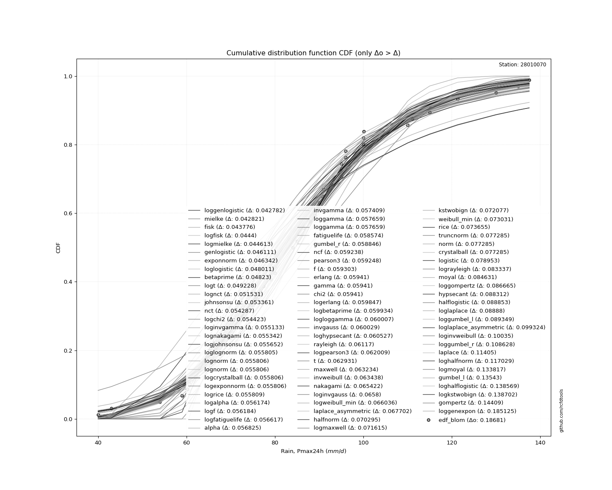</img>

</div>


**6.3. Best fit**

<div align="center">

|   id |   station | empirical_dist   | p_dist    |     delta |   deltao | eval   |   fit |   n |   best_fit |   best_fit_sort |
|-----:|----------:|:-----------------|:----------|----------:|---------:|:-------|------:|----:|-----------:|----------------:|
|    0 |  28010070 | edf_blom         | logmielke | 0.0500291 | 0.188598 | Δo > Δ |     1 |  52 |          1 |               1 |

</div>


<div align="center">

</img>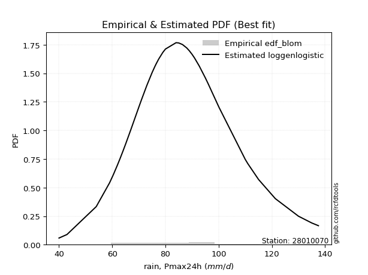</img>

</div>


### 7. Empirical - EDF Tukey (1962)

In hydrology, the Tukey formula is used as a plotting position formula to estimate the empirical probability or frequency of a flood event (or other hydrological data). The formula parameter is given as _c=0.333_ (or 1/3).

<div align="center">


$P=(m-c)/(n+1-2c)$


</div>


**7.1. Empirical values**

<div align="center">

|                | 0                    | 1                   | 2                    | 3                   | 4                   | 5                   | 6                   | 7                  | 8                   | 9                   | 10                  | 11                 | 12                  | 13                 | 14                 | 15                  | 16                 | 17                 | 18                  | 19                  | 20                  | 21                 | 22                  | 23                  | 24                 | 25                  | 26                 | 27                 | 28                 | 29                 | 30                 | 31                 | 32                 | 33                 | 34                 | 35                 | 36                 | 37                 | 38                 | 39                 | 40                 | 41                 | 42                 | 43                 | 44                 | 45                 | 46                | 47                 | 48                 | 49                 | 50                 | 51                 |
|:---------------|:---------------------|:--------------------|:---------------------|:--------------------|:--------------------|:--------------------|:--------------------|:-------------------|:--------------------|:--------------------|:--------------------|:-------------------|:--------------------|:-------------------|:-------------------|:--------------------|:-------------------|:-------------------|:--------------------|:--------------------|:--------------------|:-------------------|:--------------------|:--------------------|:-------------------|:--------------------|:-------------------|:-------------------|:-------------------|:-------------------|:-------------------|:-------------------|:-------------------|:-------------------|:-------------------|:-------------------|:-------------------|:-------------------|:-------------------|:-------------------|:-------------------|:-------------------|:-------------------|:-------------------|:-------------------|:-------------------|:------------------|:-------------------|:-------------------|:-------------------|:-------------------|:-------------------|
| date           | 2015                 | 1986                | 1974                 | 1997                | 1991                | 2021                | 2018                | 2002               | 1990                | 1993                | 1989                | 2011               | 2003                | 2004               | 2008               | 2001                | 2013               | 2007               | 1992                | 2016                | 2000                | 1994               | 2014                | 2012                | 2019               | 2010                | 2009               | 1972               | 2017               | 2005               | 1995               | 1977               | 1976               | 1988               | 1987               | 2020               | 1982               | 1985               | 1984               | 1971               | 1979               | 1983               | 1970               | 1975               | 1998               | 1980               | 1981              | 2006               | 1973               | 1978               | 1999               | 1996               |
| x              | 40.0                 | 43.0                | 45.0                 | 60.2                | 60.5                | 62.0                | 63.0                | 65.0               | 69.9                | 70.1                | 70.6                | 71.0               | 73.0                | 76.0               | 80.0               | 80.0                | 85.0               | 85.0               | 86.4                | 88.0                | 90.0                | 90.7               | 95.0                | 95.0                | 95.0               | 96.0                | 96.0               | 99.0               | 100.0              | 100.0              | 100.1              | 104.603463613376   | 107.585122244536   | 110.0              | 111.0              | 112.144796560754   | 112.286587817857   | 112.589999231464   | 114.178729338772   | 115.247097358231   | 117.68809685844    | 119.745071952376   | 120.389200409921   | 120.667737339199   | 121.3              | 125.76249436743    | 126.944657729944  | 130.0              | 130.796492713251   | 130.974757328269   | 135.0              | 137.5              |
| m              | 1                    | 2                   | 3                    | 4                   | 5                   | 6                   | 7                   | 8                  | 9                   | 10                  | 11                  | 12                 | 13                  | 14                 | 15                 | 16                  | 17                 | 18                 | 19                  | 20                  | 21                  | 22                 | 23                  | 24                  | 25                 | 26                  | 27                 | 28                 | 29                 | 30                 | 31                 | 32                 | 33                 | 34                 | 35                 | 36                 | 37                 | 38                 | 39                 | 40                 | 41                 | 42                 | 43                 | 44                 | 45                 | 46                 | 47                | 48                 | 49                 | 50                 | 51                 | 52                 |
| empirical_dist | edf_tukey            | edf_tukey           | edf_tukey            | edf_tukey           | edf_tukey           | edf_tukey           | edf_tukey           | edf_tukey          | edf_tukey           | edf_tukey           | edf_tukey           | edf_tukey          | edf_tukey           | edf_tukey          | edf_tukey          | edf_tukey           | edf_tukey          | edf_tukey          | edf_tukey           | edf_tukey           | edf_tukey           | edf_tukey          | edf_tukey           | edf_tukey           | edf_tukey          | edf_tukey           | edf_tukey          | edf_tukey          | edf_tukey          | edf_tukey          | edf_tukey          | edf_tukey          | edf_tukey          | edf_tukey          | edf_tukey          | edf_tukey          | edf_tukey          | edf_tukey          | edf_tukey          | edf_tukey          | edf_tukey          | edf_tukey          | edf_tukey          | edf_tukey          | edf_tukey          | edf_tukey          | edf_tukey         | edf_tukey          | edf_tukey          | edf_tukey          | edf_tukey          | edf_tukey          |
| empirical      | 0.012738853503184714 | 0.03184713375796178 | 0.050955414012738856 | 0.07006369426751592 | 0.08917197452229299 | 0.10828025477707007 | 0.12738853503184713 | 0.1464968152866242 | 0.16560509554140126 | 0.18471337579617833 | 0.20382165605095542 | 0.2229299363057325 | 0.24203821656050956 | 0.2611464968152866 | 0.2802547770700637 | 0.29936305732484075 | 0.3184713375796178 | 0.3375796178343949 | 0.35668789808917195 | 0.37579617834394907 | 0.39490445859872614 | 0.4140127388535032 | 0.43312101910828027 | 0.45222929936305734 | 0.4713375796178344 | 0.49044585987261147 | 0.5095541401273885 | 0.5286624203821656 | 0.5477707006369427 | 0.5668789808917197 | 0.5859872611464968 | 0.6050955414012739 | 0.6242038216560509 | 0.643312101910828  | 0.6624203821656051 | 0.6815286624203821 | 0.7006369426751592 | 0.7197452229299363 | 0.7388535031847133 | 0.7579617834394905 | 0.7770700636942676 | 0.7961783439490446 | 0.8152866242038217 | 0.8343949044585988 | 0.8535031847133758 | 0.8726114649681529 | 0.89171974522293  | 0.910828025477707  | 0.9299363057324841 | 0.9490445859872612 | 0.9681528662420382 | 0.9872611464968153 |
| empirical_tr   | 1.0129032258064516   | 1.0328947368421053  | 1.0536912751677852   | 1.0753424657534247  | 1.097902097902098   | 1.1214285714285714  | 1.145985401459854   | 1.171641791044776  | 1.198473282442748   | 1.2265625           | 1.256               | 1.2868852459016393 | 1.319327731092437   | 1.353448275862069  | 1.3893805309734513 | 1.427272727272727   | 1.467289719626168  | 1.5096153846153844 | 1.5544554455445543  | 1.6020408163265307  | 1.6526315789473685  | 1.7065217391304348 | 1.7640449438202248  | 1.8255813953488373  | 1.891566265060241  | 1.9625              | 2.038961038961039  | 2.1216216216216215 | 2.211267605633803  | 2.3088235294117645 | 2.4153846153846152 | 2.532258064516129  | 2.6610169491525424 | 2.8035714285714284 | 2.962264150943396  | 3.1399999999999997 | 3.340425531914893  | 3.5681818181818175 | 3.8292682926829262 | 4.131578947368422  | 4.485714285714287  | 4.906250000000001  | 5.413793103448277  | 6.03846153846154   | 6.826086956521741  | 7.850000000000001  | 9.235294117647062 | 11.214285714285717 | 14.272727272727275 | 19.625000000000004 | 31.400000000000006 | 78.50000000000001  |

</div>


**7.2. Kolmogorov-Smirnov fit test (sorted by Δ)**


<div align="center">

|                | 0                   | 1                   | 2                   | 3                    | 4                   | 5                   | 6                   | 7                   | 8                   | 9                   | 10                  | 11                  | 12                  | 13                  | 14                  | 15                  | 16                  | 17                  | 18                  | 19                  | 20                  | 21                  | 22                  | 23                  | 24                  | 25                  | 26                  | 27                  | 28                  | 29                  | 30                  | 31                  | 32                    | 33                  | 34                  | 35                  | 36                  | 37                  | 38                  | 39                  | 40                  | 41                  | 42                  | 43                  | 44                  | 45                  | 46                  | 47                  | 48                  | 49                  | 50                  | 51                  | 52                  | 53                  | 54                  | 55                  | 56                  | 57                  | 58                  | 59                  | 60                  | 61                  | 62                  | 63                  | 64                  | 65                  | 66                  | 67                  | 68                  | 69                  | 70                  | 71                  | 72                  | 73                  | 74                  | 75                  | 76                  | 77                  | 78                  | 79                  | 80                  | 81                  | 82                  | 83                  | 84                  | 85                  | 86                  | 87                  | 88                  | 89                  |
|:---------------|:--------------------|:--------------------|:--------------------|:---------------------|:--------------------|:--------------------|:--------------------|:--------------------|:--------------------|:--------------------|:--------------------|:--------------------|:--------------------|:--------------------|:--------------------|:--------------------|:--------------------|:--------------------|:--------------------|:--------------------|:--------------------|:--------------------|:--------------------|:--------------------|:--------------------|:--------------------|:--------------------|:--------------------|:--------------------|:--------------------|:--------------------|:--------------------|:----------------------|:--------------------|:--------------------|:--------------------|:--------------------|:--------------------|:--------------------|:--------------------|:--------------------|:--------------------|:--------------------|:--------------------|:--------------------|:--------------------|:--------------------|:--------------------|:--------------------|:--------------------|:--------------------|:--------------------|:--------------------|:--------------------|:--------------------|:--------------------|:--------------------|:--------------------|:--------------------|:--------------------|:--------------------|:--------------------|:--------------------|:--------------------|:--------------------|:--------------------|:--------------------|:--------------------|:--------------------|:--------------------|:--------------------|:--------------------|:--------------------|:--------------------|:--------------------|:--------------------|:--------------------|:--------------------|:--------------------|:--------------------|:--------------------|:--------------------|:--------------------|:--------------------|:--------------------|:--------------------|:--------------------|:--------------------|:--------------------|:--------------------|
| station        | 28010070            | 28010070            | 28010070            | 28010070             | 28010070            | 28010070            | 28010070            | 28010070            | 28010070            | 28010070            | 28010070            | 28010070            | 28010070            | 28010070            | 28010070            | 28010070            | 28010070            | 28010070            | 28010070            | 28010070            | 28010070            | 28010070            | 28010070            | 28010070            | 28010070            | 28010070            | 28010070            | 28010070            | 28010070            | 28010070            | 28010070            | 28010070            | 28010070              | 28010070            | 28010070            | 28010070            | 28010070            | 28010070            | 28010070            | 28010070            | 28010070            | 28010070            | 28010070            | 28010070            | 28010070            | 28010070            | 28010070            | 28010070            | 28010070            | 28010070            | 28010070            | 28010070            | 28010070            | 28010070            | 28010070            | 28010070            | 28010070            | 28010070            | 28010070            | 28010070            | 28010070            | 28010070            | 28010070            | 28010070            | 28010070            | 28010070            | 28010070            | 28010070            | 28010070            | 28010070            | 28010070            | 28010070            | 28010070            | 28010070            | 28010070            | 28010070            | 28010070            | 28010070            | 28010070            | 28010070            | 28010070            | 28010070            | 28010070            | 28010070            | 28010070            | 28010070            | 28010070            | 28010070            | 28010070            | 28010070            |
| empirical_dist | edf_tukey           | edf_tukey           | edf_tukey           | edf_tukey            | edf_tukey           | edf_tukey           | edf_tukey           | edf_tukey           | edf_tukey           | edf_tukey           | edf_tukey           | edf_tukey           | edf_tukey           | edf_tukey           | edf_tukey           | edf_tukey           | edf_tukey           | edf_tukey           | edf_tukey           | edf_tukey           | edf_tukey           | edf_tukey           | edf_tukey           | edf_tukey           | edf_tukey           | edf_tukey           | edf_tukey           | edf_tukey           | edf_tukey           | edf_tukey           | edf_tukey           | edf_tukey           | edf_tukey             | edf_tukey           | edf_tukey           | edf_tukey           | edf_tukey           | edf_tukey           | edf_tukey           | edf_tukey           | edf_tukey           | edf_tukey           | edf_tukey           | edf_tukey           | edf_tukey           | edf_tukey           | edf_tukey           | edf_tukey           | edf_tukey           | edf_tukey           | edf_tukey           | edf_tukey           | edf_tukey           | edf_tukey           | edf_tukey           | edf_tukey           | edf_tukey           | edf_tukey           | edf_tukey           | edf_tukey           | edf_tukey           | edf_tukey           | edf_tukey           | edf_tukey           | edf_tukey           | edf_tukey           | edf_tukey           | edf_tukey           | edf_tukey           | edf_tukey           | edf_tukey           | edf_tukey           | edf_tukey           | edf_tukey           | edf_tukey           | edf_tukey           | edf_tukey           | edf_tukey           | edf_tukey           | edf_tukey           | edf_tukey           | edf_tukey           | edf_tukey           | edf_tukey           | edf_tukey           | edf_tukey           | edf_tukey           | edf_tukey           | edf_tukey           | edf_tukey           |
| p_dist         | logmielke           | logjohnsonsu        | johnsonsu           | logpearson3          | weibull_min         | genlogistic         | pearson3            | loggumbel_l         | logweibull_min      | gompertz            | fatiguelife         | loggompertz         | fisk                | gumbel_l            | logloggamma         | nct                 | t                   | crystalball         | norm                | truncnorm           | exponnorm           | gamma               | nakagami            | logfisk             | f                   | rice                | chi2                | erlang              | invgamma            | alpha               | logt                | maxwell             | loglaplace_asymmetric | loggenlogistic      | mielke              | logistic            | rayleigh            | betaprime           | invweibull          | laplace_asymmetric  | logfatiguelife      | lognct              | lognakagami         | hypsecant           | logbetaprime        | invgauss            | logf                | logcrystalball      | logexponnorm        | lognorm             | lognorm             | loglognorm          | logrice             | logncf              | loglogistic         | loggamma            | loggamma            | logalpha            | logchi2             | loghypsecant        | logerlang           | kstwobign           | gumbel_r            | loginvgamma         | halfnorm            | laplace             | loginvgauss         | logmaxwell          | loglaplace          | lograyleigh         | loginvweibull       | moyal               | halflogistic        | logkstwobign        | loghalfnorm         | loggumbel_r         | loggenexpon         | loghalflogistic     | logmoyal            | wald                | genexpon            | expon               | pareto              | gibrat              | logwald             | loggibrat           | logexpon            | logpareto           | logtruncnorm        | ncf                 |
| delta          | 0.05025762106892062 | 0.06084897321354754 | 0.06148047871618867 | 0.062373292052016915 | 0.06404898895770061 | 0.06751050628829819 | 0.06947383985102473 | 0.0705713589917053  | 0.0717091538071194  | 0.07352796943882478 | 0.07494449229047273 | 0.07597644944200554 | 0.07600684286739057 | 0.07691839005847514 | 0.07948808366488647 | 0.08044223674403306 | 0.08051646861718054 | 0.0805809228245653  | 0.0805809342101057  | 0.0805809363896105  | 0.08058135694075963 | 0.08095017849600872 | 0.08095388375103707 | 0.08097495045935177 | 0.0810606897077123  | 0.08189849841793628 | 0.08563400943492894 | 0.08615611565273851 | 0.08767302981288527 | 0.09311920764151493 | 0.09739723062337913 | 0.09789457141481606 | 0.09894382685639752   | 0.1009732739288392  | 0.10123201798577292 | 0.1028421510272951  | 0.10895176348021207 | 0.11016587801331423 | 0.11103614872449008 | 0.11147621921074224 | 0.11717621514342502 | 0.11797211791177808 | 0.11798397680423556 | 0.11825926551968902 | 0.11850483376497045 | 0.11863743095666979 | 0.11882472894292528 | 0.11895705106164733 | 0.11895759886001456 | 0.11895782797474652 | 0.11895782797474652 | 0.11895937681962654 | 0.11895975567234496 | 0.12592524240518288 | 0.12596513812326005 | 0.12661248995021357 | 0.12661248995021357 | 0.12745202222195662 | 0.13165692216594982 | 0.13188010336180223 | 0.1324470861991014  | 0.13378732978075203 | 0.13507124921887792 | 0.13540690472288686 | 0.1400819531432821  | 0.14097795081958997 | 0.14506872904012902 | 0.14921278105376135 | 0.15138592726760292 | 0.1589110571333725  | 0.1604627738661778  | 0.16093135470941589 | 0.16488832954402055 | 0.17871995805346713 | 0.18628698985699788 | 0.18896504590340735 | 0.2079496198793615  | 0.2136399390529391  | 0.21373456413227665 | 0.2337610799136547  | 0.24369494875220718 | 0.25300120961940864 | 0.25300122558208493 | 0.2611464968152866  | 0.28246741034456213 | 0.3117341209081481  | 0.32557081257097087 | 0.32557081779446884 | 0.39563411282933447 | 0.48673960884943446 |
| deltao         | 0.18859806671657792 | 0.18859806671657792 | 0.18859806671657792 | 0.18859806671657792  | 0.18859806671657792 | 0.18859806671657792 | 0.18859806671657792 | 0.18859806671657792 | 0.18859806671657792 | 0.18859806671657792 | 0.18859806671657792 | 0.18859806671657792 | 0.18859806671657792 | 0.18859806671657792 | 0.18859806671657792 | 0.18859806671657792 | 0.18859806671657792 | 0.18859806671657792 | 0.18859806671657792 | 0.18859806671657792 | 0.18859806671657792 | 0.18859806671657792 | 0.18859806671657792 | 0.18859806671657792 | 0.18859806671657792 | 0.18859806671657792 | 0.18859806671657792 | 0.18859806671657792 | 0.18859806671657792 | 0.18859806671657792 | 0.18859806671657792 | 0.18859806671657792 | 0.18859806671657792   | 0.18859806671657792 | 0.18859806671657792 | 0.18859806671657792 | 0.18859806671657792 | 0.18859806671657792 | 0.18859806671657792 | 0.18859806671657792 | 0.18859806671657792 | 0.18859806671657792 | 0.18859806671657792 | 0.18859806671657792 | 0.18859806671657792 | 0.18859806671657792 | 0.18859806671657792 | 0.18859806671657792 | 0.18859806671657792 | 0.18859806671657792 | 0.18859806671657792 | 0.18859806671657792 | 0.18859806671657792 | 0.18859806671657792 | 0.18859806671657792 | 0.18859806671657792 | 0.18859806671657792 | 0.18859806671657792 | 0.18859806671657792 | 0.18859806671657792 | 0.18859806671657792 | 0.18859806671657792 | 0.18859806671657792 | 0.18859806671657792 | 0.18859806671657792 | 0.18859806671657792 | 0.18859806671657792 | 0.18859806671657792 | 0.18859806671657792 | 0.18859806671657792 | 0.18859806671657792 | 0.18859806671657792 | 0.18859806671657792 | 0.18859806671657792 | 0.18859806671657792 | 0.18859806671657792 | 0.18859806671657792 | 0.18859806671657792 | 0.18859806671657792 | 0.18859806671657792 | 0.18859806671657792 | 0.18859806671657792 | 0.18859806671657792 | 0.18859806671657792 | 0.18859806671657792 | 0.18859806671657792 | 0.18859806671657792 | 0.18859806671657792 | 0.18859806671657792 | 0.18859806671657792 |
| eval           | Δo > Δ              | Δo > Δ              | Δo > Δ              | Δo > Δ               | Δo > Δ              | Δo > Δ              | Δo > Δ              | Δo > Δ              | Δo > Δ              | Δo > Δ              | Δo > Δ              | Δo > Δ              | Δo > Δ              | Δo > Δ              | Δo > Δ              | Δo > Δ              | Δo > Δ              | Δo > Δ              | Δo > Δ              | Δo > Δ              | Δo > Δ              | Δo > Δ              | Δo > Δ              | Δo > Δ              | Δo > Δ              | Δo > Δ              | Δo > Δ              | Δo > Δ              | Δo > Δ              | Δo > Δ              | Δo > Δ              | Δo > Δ              | Δo > Δ                | Δo > Δ              | Δo > Δ              | Δo > Δ              | Δo > Δ              | Δo > Δ              | Δo > Δ              | Δo > Δ              | Δo > Δ              | Δo > Δ              | Δo > Δ              | Δo > Δ              | Δo > Δ              | Δo > Δ              | Δo > Δ              | Δo > Δ              | Δo > Δ              | Δo > Δ              | Δo > Δ              | Δo > Δ              | Δo > Δ              | Δo > Δ              | Δo > Δ              | Δo > Δ              | Δo > Δ              | Δo > Δ              | Δo > Δ              | Δo > Δ              | Δo > Δ              | Δo > Δ              | Δo > Δ              | Δo > Δ              | Δo > Δ              | Δo > Δ              | Δo > Δ              | Δo > Δ              | Δo > Δ              | Δo > Δ              | Δo > Δ              | Δo > Δ              | Δo > Δ              | Δo > Δ              | Δo > Δ              | Δo <= Δ             | Δo <= Δ             | Δo <= Δ             | Δo <= Δ             | Δo <= Δ             | Δo <= Δ             | Δo <= Δ             | Δo <= Δ             | Δo <= Δ             | Δo <= Δ             | Δo <= Δ             | Δo <= Δ             | Δo <= Δ             | Δo <= Δ             | Δo <= Δ             |
| fit            | 1                   | 1                   | 1                   | 1                    | 1                   | 1                   | 1                   | 1                   | 1                   | 1                   | 1                   | 1                   | 1                   | 1                   | 1                   | 1                   | 1                   | 1                   | 1                   | 1                   | 1                   | 1                   | 1                   | 1                   | 1                   | 1                   | 1                   | 1                   | 1                   | 1                   | 1                   | 1                   | 1                     | 1                   | 1                   | 1                   | 1                   | 1                   | 1                   | 1                   | 1                   | 1                   | 1                   | 1                   | 1                   | 1                   | 1                   | 1                   | 1                   | 1                   | 1                   | 1                   | 1                   | 1                   | 1                   | 1                   | 1                   | 1                   | 1                   | 1                   | 1                   | 1                   | 1                   | 1                   | 1                   | 1                   | 1                   | 1                   | 1                   | 1                   | 1                   | 1                   | 1                   | 1                   | 1                   | 0                   | 0                   | 0                   | 0                   | 0                   | 0                   | 0                   | 0                   | 0                   | 0                   | 0                   | 0                   | 0                   | 0                   | 0                   |
| n              | 52                  | 52                  | 52                  | 52                   | 52                  | 52                  | 52                  | 52                  | 52                  | 52                  | 52                  | 52                  | 52                  | 52                  | 52                  | 52                  | 52                  | 52                  | 52                  | 52                  | 52                  | 52                  | 52                  | 52                  | 52                  | 52                  | 52                  | 52                  | 52                  | 52                  | 52                  | 52                  | 52                    | 52                  | 52                  | 52                  | 52                  | 52                  | 52                  | 52                  | 52                  | 52                  | 52                  | 52                  | 52                  | 52                  | 52                  | 52                  | 52                  | 52                  | 52                  | 52                  | 52                  | 52                  | 52                  | 52                  | 52                  | 52                  | 52                  | 52                  | 52                  | 52                  | 52                  | 52                  | 52                  | 52                  | 52                  | 52                  | 52                  | 52                  | 52                  | 52                  | 52                  | 52                  | 52                  | 52                  | 52                  | 52                  | 52                  | 52                  | 52                  | 52                  | 52                  | 52                  | 52                  | 52                  | 52                  | 52                  | 52                  | 52                  |
| best_fit       | 1                   | 0                   | 0                   | 0                    | 0                   | 0                   | 0                   | 0                   | 0                   | 0                   | 0                   | 0                   | 0                   | 0                   | 0                   | 0                   | 0                   | 0                   | 0                   | 0                   | 0                   | 0                   | 0                   | 0                   | 0                   | 0                   | 0                   | 0                   | 0                   | 0                   | 0                   | 0                   | 0                     | 0                   | 0                   | 0                   | 0                   | 0                   | 0                   | 0                   | 0                   | 0                   | 0                   | 0                   | 0                   | 0                   | 0                   | 0                   | 0                   | 0                   | 0                   | 0                   | 0                   | 0                   | 0                   | 0                   | 0                   | 0                   | 0                   | 0                   | 0                   | 0                   | 0                   | 0                   | 0                   | 0                   | 0                   | 0                   | 0                   | 0                   | 0                   | 0                   | 0                   | 0                   | 0                   | 0                   | 0                   | 0                   | 0                   | 0                   | 0                   | 0                   | 0                   | 0                   | 0                   | 0                   | 0                   | 0                   | 0                   | 0                   |
| best_fit_sort  | 1                   | 2                   | 3                   | 4                    | 5                   | 6                   | 7                   | 8                   | 9                   | 10                  | 11                  | 12                  | 13                  | 14                  | 15                  | 16                  | 17                  | 18                  | 19                  | 20                  | 21                  | 22                  | 23                  | 24                  | 25                  | 26                  | 27                  | 28                  | 29                  | 30                  | 31                  | 32                  | 33                    | 34                  | 35                  | 36                  | 37                  | 38                  | 39                  | 40                  | 41                  | 42                  | 43                  | 44                  | 45                  | 46                  | 47                  | 48                  | 49                  | 50                  | 51                  | 52                  | 53                  | 54                  | 55                  | 56                  | 57                  | 58                  | 59                  | 60                  | 61                  | 62                  | 63                  | 64                  | 65                  | 66                  | 67                  | 68                  | 69                  | 70                  | 71                  | 72                  | 73                  | 74                  | 75                  | 76                  | 77                  | 78                  | 79                  | 80                  | 81                  | 82                  | 83                  | 84                  | 85                  | 86                  | 87                  | 88                  | 89                  | 90                  |

</div>


<div align="center">

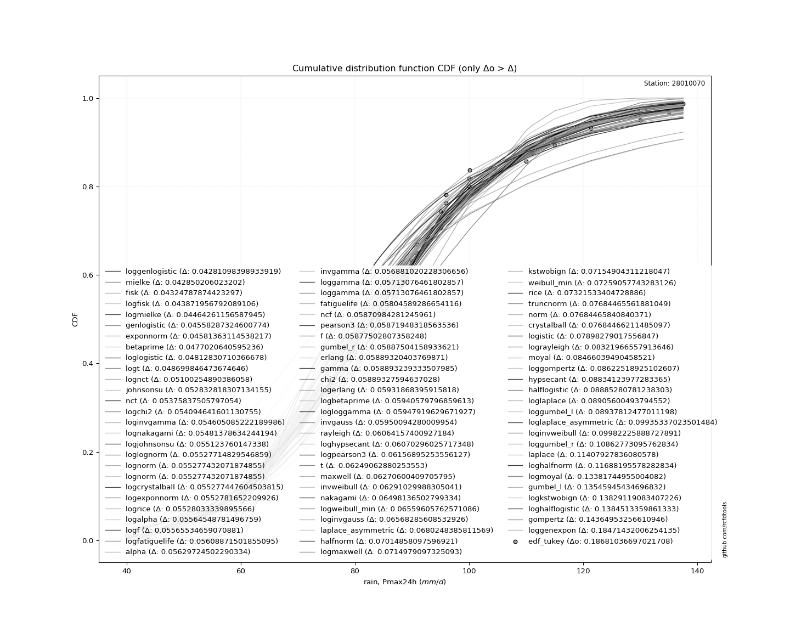</img>

</div>


**7.3. Best fit**

<div align="center">

|   id |   station | empirical_dist   | p_dist    |     delta |   deltao | eval   |   fit |   n |   best_fit |   best_fit_sort |
|-----:|----------:|:-----------------|:----------|----------:|---------:|:-------|------:|----:|-----------:|----------------:|
|    0 |  28010070 | edf_tukey        | logmielke | 0.0502576 | 0.188598 | Δo > Δ |     1 |  52 |          1 |               1 |

</div>


<div align="center">

</img></img>

</div>


### 8. Empirical - EDF Gringorten (1963)

Gringorten plotting position formula is essential for estimating the probability and return periods of extreme events like floods and heavy rainfall. The constant _a=0.44_.

<div align="center">


$P=(m-a)/(n+1-2a)$


</div>


**8.1. Empirical values**

<div align="center">

|                | 0                    | 1                    | 2                  | 3                   | 4                   | 5                  | 6                   | 7                   | 8                   | 9                   | 10                  | 11                  | 12                  | 13                 | 14                 | 15                  | 16                 | 17                  | 18                 | 19                 | 20                  | 21                 | 22                 | 23                  | 24                 | 25                 | 26                 | 27                 | 28                 | 29                 | 30                 | 31                 | 32                 | 33                 | 34                 | 35                 | 36                 | 37                | 38                 | 39                 | 40                 | 41                | 42                 | 43                 | 44                 | 45                 | 46                 | 47                 | 48                 | 49                 | 50                | 51                 |
|:---------------|:---------------------|:---------------------|:-------------------|:--------------------|:--------------------|:-------------------|:--------------------|:--------------------|:--------------------|:--------------------|:--------------------|:--------------------|:--------------------|:-------------------|:-------------------|:--------------------|:-------------------|:--------------------|:-------------------|:-------------------|:--------------------|:-------------------|:-------------------|:--------------------|:-------------------|:-------------------|:-------------------|:-------------------|:-------------------|:-------------------|:-------------------|:-------------------|:-------------------|:-------------------|:-------------------|:-------------------|:-------------------|:------------------|:-------------------|:-------------------|:-------------------|:------------------|:-------------------|:-------------------|:-------------------|:-------------------|:-------------------|:-------------------|:-------------------|:-------------------|:------------------|:-------------------|
| date           | 2015                 | 1986                 | 1974               | 1997                | 1991                | 2021               | 2018                | 2002                | 1990                | 1993                | 1989                | 2011                | 2003                | 2004               | 2008               | 2001                | 2013               | 2007                | 1992               | 2016               | 2000                | 1994               | 2014               | 2012                | 2019               | 2010               | 2009               | 1972               | 2017               | 2005               | 1995               | 1977               | 1976               | 1988               | 1987               | 2020               | 1982               | 1985              | 1984               | 1971               | 1979               | 1983              | 1970               | 1975               | 1998               | 1980               | 1981               | 2006               | 1973               | 1978               | 1999              | 1996               |
| x              | 40.0                 | 43.0                 | 45.0               | 60.2                | 60.5                | 62.0               | 63.0                | 65.0                | 69.9                | 70.1                | 70.6                | 71.0                | 73.0                | 76.0               | 80.0               | 80.0                | 85.0               | 85.0                | 86.4               | 88.0               | 90.0                | 90.7               | 95.0               | 95.0                | 95.0               | 96.0               | 96.0               | 99.0               | 100.0              | 100.0              | 100.1              | 104.603463613376   | 107.585122244536   | 110.0              | 111.0              | 112.144796560754   | 112.286587817857   | 112.589999231464  | 114.178729338772   | 115.247097358231   | 117.68809685844    | 119.745071952376  | 120.389200409921   | 120.667737339199   | 121.3              | 125.76249436743    | 126.944657729944   | 130.0              | 130.796492713251   | 130.974757328269   | 135.0             | 137.5              |
| m              | 1                    | 2                    | 3                  | 4                   | 5                   | 6                  | 7                   | 8                   | 9                   | 10                  | 11                  | 12                  | 13                  | 14                 | 15                 | 16                  | 17                 | 18                  | 19                 | 20                 | 21                  | 22                 | 23                 | 24                  | 25                 | 26                 | 27                 | 28                 | 29                 | 30                 | 31                 | 32                 | 33                 | 34                 | 35                 | 36                 | 37                 | 38                | 39                 | 40                 | 41                 | 42                | 43                 | 44                 | 45                 | 46                 | 47                 | 48                 | 49                 | 50                 | 51                | 52                 |
| empirical_dist | edf_gringorten       | edf_gringorten       | edf_gringorten     | edf_gringorten      | edf_gringorten      | edf_gringorten     | edf_gringorten      | edf_gringorten      | edf_gringorten      | edf_gringorten      | edf_gringorten      | edf_gringorten      | edf_gringorten      | edf_gringorten     | edf_gringorten     | edf_gringorten      | edf_gringorten     | edf_gringorten      | edf_gringorten     | edf_gringorten     | edf_gringorten      | edf_gringorten     | edf_gringorten     | edf_gringorten      | edf_gringorten     | edf_gringorten     | edf_gringorten     | edf_gringorten     | edf_gringorten     | edf_gringorten     | edf_gringorten     | edf_gringorten     | edf_gringorten     | edf_gringorten     | edf_gringorten     | edf_gringorten     | edf_gringorten     | edf_gringorten    | edf_gringorten     | edf_gringorten     | edf_gringorten     | edf_gringorten    | edf_gringorten     | edf_gringorten     | edf_gringorten     | edf_gringorten     | edf_gringorten     | edf_gringorten     | edf_gringorten     | edf_gringorten     | edf_gringorten    | edf_gringorten     |
| empirical      | 0.010744435917114353 | 0.029930928626247126 | 0.0491174213353799 | 0.06830391404451266 | 0.08749040675364543 | 0.1066768994627782 | 0.12586339217191098 | 0.14504988488104376 | 0.16423637759017654 | 0.18342287029930932 | 0.20260936300844207 | 0.22179585571757485 | 0.24098234842670763 | 0.2601688411358404 | 0.2793553338449732 | 0.29854182655410594 | 0.3177283192632387 | 0.33691481197237144 | 0.3561013046815042 | 0.375287797390637  | 0.39447429009976975 | 0.4136607828089025 | 0.4328472755180353 | 0.45203376822716806 | 0.4712202609363008 | 0.4904067536454336 | 0.5095932463545664 | 0.5287797390636991 | 0.5479662317728319 | 0.5671527244819647 | 0.5863392171910975 | 0.6055257099002302 | 0.6247122026093631 | 0.6438986953184959 | 0.6630851880276286 | 0.6822716807367614 | 0.7014581734458941 | 0.720644666155027 | 0.7398311588641597 | 0.7590176515732925 | 0.7782041442824252 | 0.797390636991558 | 0.8165771297006909 | 0.8357636224098236 | 0.8549501151189564 | 0.8741366078280891 | 0.8933231005372219 | 0.9125095932463546 | 0.9316960859554875 | 0.9508825786646202 | 0.970069071373753 | 0.9892555640828857 |
| empirical_tr   | 1.0108611326609775   | 1.0308544303797469   | 1.0516545601291365 | 1.07331136738056    | 1.0958788898233809  | 1.1194158075601375 | 1.1439859525899914  | 1.1696588868940754  | 1.1965105601469237  | 1.224624060150376   | 1.2540904716073147  | 1.2850098619329389  | 1.3174924165824065  | 1.3516597510373445 | 1.3876464323748672 | 1.4256017505470462  | 1.4656917885264344 | 1.5081018518518519  | 1.5530393325387366 | 1.6007371007371007 | 1.6514575411913814  | 1.7054973821989527 | 1.7631935047361298 | 1.8249299719887953  | 1.8911465892597965 | 1.9623493975903614 | 2.0391236306729263 | 2.1221498371335503 | 2.2122241086587433 | 2.3102836879432624 | 2.417439703153989  | 2.535019455252918  | 2.6646216768916164 | 2.8081896551724146 | 2.9681093394077456 | 3.147342995169083  | 3.34961439588689   | 3.579670329670331 | 3.843657817109146  | 4.149681528662422  | 4.508650519031143  | 4.935606060606061 | 5.451882845188289  | 6.088785046728977  | 6.894179894179899  | 7.945121951219518  | 9.374100719424465  | 11.429824561403514 | 14.640449438202277 | 20.35937500000005  | 33.41025641025652 | 93.07142857142928  |

</div>


**8.2. Kolmogorov-Smirnov fit test (sorted by Δ)**


<div align="center">

|                | 0                    | 1                   | 2                   | 3                   | 4                   | 5                   | 6                   | 7                   | 8                   | 9                   | 10                  | 11                  | 12                  | 13                  | 14                  | 15                  | 16                  | 17                  | 18                  | 19                  | 20                  | 21                  | 22                  | 23                  | 24                  | 25                  | 26                  | 27                  | 28                  | 29                  | 30                  | 31                  | 32                    | 33                  | 34                  | 35                  | 36                  | 37                  | 38                  | 39                  | 40                  | 41                  | 42                  | 43                  | 44                  | 45                  | 46                  | 47                  | 48                  | 49                  | 50                  | 51                  | 52                  | 53                  | 54                  | 55                  | 56                  | 57                  | 58                  | 59                  | 60                  | 61                  | 62                  | 63                  | 64                  | 65                  | 66                  | 67                  | 68                  | 69                  | 70                  | 71                  | 72                  | 73                  | 74                  | 75                  | 76                  | 77                  | 78                  | 79                  | 80                  | 81                  | 82                  | 83                  | 84                  | 85                  | 86                  | 87                  | 88                  | 89                  |
|:---------------|:---------------------|:--------------------|:--------------------|:--------------------|:--------------------|:--------------------|:--------------------|:--------------------|:--------------------|:--------------------|:--------------------|:--------------------|:--------------------|:--------------------|:--------------------|:--------------------|:--------------------|:--------------------|:--------------------|:--------------------|:--------------------|:--------------------|:--------------------|:--------------------|:--------------------|:--------------------|:--------------------|:--------------------|:--------------------|:--------------------|:--------------------|:--------------------|:----------------------|:--------------------|:--------------------|:--------------------|:--------------------|:--------------------|:--------------------|:--------------------|:--------------------|:--------------------|:--------------------|:--------------------|:--------------------|:--------------------|:--------------------|:--------------------|:--------------------|:--------------------|:--------------------|:--------------------|:--------------------|:--------------------|:--------------------|:--------------------|:--------------------|:--------------------|:--------------------|:--------------------|:--------------------|:--------------------|:--------------------|:--------------------|:--------------------|:--------------------|:--------------------|:--------------------|:--------------------|:--------------------|:--------------------|:--------------------|:--------------------|:--------------------|:--------------------|:--------------------|:--------------------|:--------------------|:--------------------|:--------------------|:--------------------|:--------------------|:--------------------|:--------------------|:--------------------|:--------------------|:--------------------|:--------------------|:--------------------|:--------------------|
| station        | 28010070             | 28010070            | 28010070            | 28010070            | 28010070            | 28010070            | 28010070            | 28010070            | 28010070            | 28010070            | 28010070            | 28010070            | 28010070            | 28010070            | 28010070            | 28010070            | 28010070            | 28010070            | 28010070            | 28010070            | 28010070            | 28010070            | 28010070            | 28010070            | 28010070            | 28010070            | 28010070            | 28010070            | 28010070            | 28010070            | 28010070            | 28010070            | 28010070              | 28010070            | 28010070            | 28010070            | 28010070            | 28010070            | 28010070            | 28010070            | 28010070            | 28010070            | 28010070            | 28010070            | 28010070            | 28010070            | 28010070            | 28010070            | 28010070            | 28010070            | 28010070            | 28010070            | 28010070            | 28010070            | 28010070            | 28010070            | 28010070            | 28010070            | 28010070            | 28010070            | 28010070            | 28010070            | 28010070            | 28010070            | 28010070            | 28010070            | 28010070            | 28010070            | 28010070            | 28010070            | 28010070            | 28010070            | 28010070            | 28010070            | 28010070            | 28010070            | 28010070            | 28010070            | 28010070            | 28010070            | 28010070            | 28010070            | 28010070            | 28010070            | 28010070            | 28010070            | 28010070            | 28010070            | 28010070            | 28010070            |
| empirical_dist | edf_gringorten       | edf_gringorten      | edf_gringorten      | edf_gringorten      | edf_gringorten      | edf_gringorten      | edf_gringorten      | edf_gringorten      | edf_gringorten      | edf_gringorten      | edf_gringorten      | edf_gringorten      | edf_gringorten      | edf_gringorten      | edf_gringorten      | edf_gringorten      | edf_gringorten      | edf_gringorten      | edf_gringorten      | edf_gringorten      | edf_gringorten      | edf_gringorten      | edf_gringorten      | edf_gringorten      | edf_gringorten      | edf_gringorten      | edf_gringorten      | edf_gringorten      | edf_gringorten      | edf_gringorten      | edf_gringorten      | edf_gringorten      | edf_gringorten        | edf_gringorten      | edf_gringorten      | edf_gringorten      | edf_gringorten      | edf_gringorten      | edf_gringorten      | edf_gringorten      | edf_gringorten      | edf_gringorten      | edf_gringorten      | edf_gringorten      | edf_gringorten      | edf_gringorten      | edf_gringorten      | edf_gringorten      | edf_gringorten      | edf_gringorten      | edf_gringorten      | edf_gringorten      | edf_gringorten      | edf_gringorten      | edf_gringorten      | edf_gringorten      | edf_gringorten      | edf_gringorten      | edf_gringorten      | edf_gringorten      | edf_gringorten      | edf_gringorten      | edf_gringorten      | edf_gringorten      | edf_gringorten      | edf_gringorten      | edf_gringorten      | edf_gringorten      | edf_gringorten      | edf_gringorten      | edf_gringorten      | edf_gringorten      | edf_gringorten      | edf_gringorten      | edf_gringorten      | edf_gringorten      | edf_gringorten      | edf_gringorten      | edf_gringorten      | edf_gringorten      | edf_gringorten      | edf_gringorten      | edf_gringorten      | edf_gringorten      | edf_gringorten      | edf_gringorten      | edf_gringorten      | edf_gringorten      | edf_gringorten      | edf_gringorten      |
| p_dist         | logmielke            | johnsonsu           | logjohnsonsu        | logpearson3         | weibull_min         | genlogistic         | pearson3            | loggumbel_l         | logweibull_min      | gompertz            | fatiguelife         | loggompertz         | fisk                | gumbel_l            | logloggamma         | nct                 | t                   | crystalball         | norm                | truncnorm           | exponnorm           | gamma               | nakagami            | f                   | rice                | logfisk             | chi2                | erlang              | invgamma            | alpha               | logt                | maxwell             | loglaplace_asymmetric | loggenlogistic      | mielke              | logistic            | rayleigh            | betaprime           | laplace_asymmetric  | invweibull          | logfatiguelife      | hypsecant           | lognct              | lognakagami         | logbetaprime        | invgauss            | logf                | logcrystalball      | logexponnorm        | lognorm             | lognorm             | loglognorm          | logrice             | logncf              | loglogistic         | loggamma            | loggamma            | logalpha            | logchi2             | loghypsecant        | logerlang           | kstwobign           | gumbel_r            | loginvgamma         | halfnorm            | laplace             | loginvgauss         | logmaxwell          | loglaplace          | lograyleigh         | moyal               | loginvweibull       | halflogistic        | logkstwobign        | loghalfnorm         | loggumbel_r         | loggenexpon         | loghalflogistic     | logmoyal            | wald                | genexpon            | expon               | pareto              | gibrat              | logwald             | loggibrat           | logexpon            | logpareto           | logtruncnorm        | ncf                 |
| delta          | 0.049671027661252753 | 0.06042461058238674 | 0.06120092925814824 | 0.06178669864434905 | 0.06346239555003275 | 0.06645463815449626 | 0.06888724644335686 | 0.06998476558403743 | 0.07112256039945153 | 0.07387992548342548 | 0.07435789888280486 | 0.07538985603433768 | 0.0754202494597227  | 0.07586252192467322 | 0.07984003970948716 | 0.07985564333636519 | 0.07992987520951267 | 0.07999432941689744 | 0.07999434080243784 | 0.07999434298194263 | 0.07999476353309176 | 0.08036358508834085 | 0.0803672903433692  | 0.08047409630004443 | 0.08131190501026841 | 0.08296936804542221 | 0.08504741602726107 | 0.08556952224507064 | 0.08794677340313023 | 0.09253261423384707 | 0.09767097421362408 | 0.09816831500506101 | 0.09929578290099822   | 0.1013252299734399  | 0.10158397403037361 | 0.10225555761962724 | 0.10922550707045703 | 0.11043962160355919 | 0.11088962580307438 | 0.11130989231473504 | 0.11744995873366998 | 0.11767267211202115 | 0.11824586150202304 | 0.11825772039448051 | 0.11877857735521541 | 0.11891117454691474 | 0.11909847253317024 | 0.11923079465189229 | 0.11923134245025951 | 0.11923157156499148 | 0.11923157156499148 | 0.1192331204098715  | 0.11923349926258991 | 0.12619898599542784 | 0.126238881713505   | 0.12688623354045853 | 0.12688623354045853 | 0.12772576581220157 | 0.13193066575619478 | 0.13215384695204718 | 0.13272082978934635 | 0.13406107337099699 | 0.13534499280912288 | 0.1356806483131318  | 0.14035569673352705 | 0.1403913574119221  | 0.14534247263037398 | 0.1494865246440063  | 0.15165967085784787 | 0.15918480072361746 | 0.16120509829966084 | 0.16245719145224824 | 0.1651620731342655  | 0.17946297636984626 | 0.18656073344724283 | 0.1892387894936523  | 0.20869263819574063 | 0.21391368264318406 | 0.2140083077225216  | 0.2331284756483351  | 0.2450636667034319  | 0.25436992757063337 | 0.25436994353330966 | 0.2601688411358404  | 0.2827411539348071  | 0.3120078644983931  | 0.3269395305221956  | 0.32693953574569357 | 0.3970028307805592  | 0.48849938907243773 |
| deltao         | 0.18859806671657792  | 0.18859806671657792 | 0.18859806671657792 | 0.18859806671657792 | 0.18859806671657792 | 0.18859806671657792 | 0.18859806671657792 | 0.18859806671657792 | 0.18859806671657792 | 0.18859806671657792 | 0.18859806671657792 | 0.18859806671657792 | 0.18859806671657792 | 0.18859806671657792 | 0.18859806671657792 | 0.18859806671657792 | 0.18859806671657792 | 0.18859806671657792 | 0.18859806671657792 | 0.18859806671657792 | 0.18859806671657792 | 0.18859806671657792 | 0.18859806671657792 | 0.18859806671657792 | 0.18859806671657792 | 0.18859806671657792 | 0.18859806671657792 | 0.18859806671657792 | 0.18859806671657792 | 0.18859806671657792 | 0.18859806671657792 | 0.18859806671657792 | 0.18859806671657792   | 0.18859806671657792 | 0.18859806671657792 | 0.18859806671657792 | 0.18859806671657792 | 0.18859806671657792 | 0.18859806671657792 | 0.18859806671657792 | 0.18859806671657792 | 0.18859806671657792 | 0.18859806671657792 | 0.18859806671657792 | 0.18859806671657792 | 0.18859806671657792 | 0.18859806671657792 | 0.18859806671657792 | 0.18859806671657792 | 0.18859806671657792 | 0.18859806671657792 | 0.18859806671657792 | 0.18859806671657792 | 0.18859806671657792 | 0.18859806671657792 | 0.18859806671657792 | 0.18859806671657792 | 0.18859806671657792 | 0.18859806671657792 | 0.18859806671657792 | 0.18859806671657792 | 0.18859806671657792 | 0.18859806671657792 | 0.18859806671657792 | 0.18859806671657792 | 0.18859806671657792 | 0.18859806671657792 | 0.18859806671657792 | 0.18859806671657792 | 0.18859806671657792 | 0.18859806671657792 | 0.18859806671657792 | 0.18859806671657792 | 0.18859806671657792 | 0.18859806671657792 | 0.18859806671657792 | 0.18859806671657792 | 0.18859806671657792 | 0.18859806671657792 | 0.18859806671657792 | 0.18859806671657792 | 0.18859806671657792 | 0.18859806671657792 | 0.18859806671657792 | 0.18859806671657792 | 0.18859806671657792 | 0.18859806671657792 | 0.18859806671657792 | 0.18859806671657792 | 0.18859806671657792 |
| eval           | Δo > Δ               | Δo > Δ              | Δo > Δ              | Δo > Δ              | Δo > Δ              | Δo > Δ              | Δo > Δ              | Δo > Δ              | Δo > Δ              | Δo > Δ              | Δo > Δ              | Δo > Δ              | Δo > Δ              | Δo > Δ              | Δo > Δ              | Δo > Δ              | Δo > Δ              | Δo > Δ              | Δo > Δ              | Δo > Δ              | Δo > Δ              | Δo > Δ              | Δo > Δ              | Δo > Δ              | Δo > Δ              | Δo > Δ              | Δo > Δ              | Δo > Δ              | Δo > Δ              | Δo > Δ              | Δo > Δ              | Δo > Δ              | Δo > Δ                | Δo > Δ              | Δo > Δ              | Δo > Δ              | Δo > Δ              | Δo > Δ              | Δo > Δ              | Δo > Δ              | Δo > Δ              | Δo > Δ              | Δo > Δ              | Δo > Δ              | Δo > Δ              | Δo > Δ              | Δo > Δ              | Δo > Δ              | Δo > Δ              | Δo > Δ              | Δo > Δ              | Δo > Δ              | Δo > Δ              | Δo > Δ              | Δo > Δ              | Δo > Δ              | Δo > Δ              | Δo > Δ              | Δo > Δ              | Δo > Δ              | Δo > Δ              | Δo > Δ              | Δo > Δ              | Δo > Δ              | Δo > Δ              | Δo > Δ              | Δo > Δ              | Δo > Δ              | Δo > Δ              | Δo > Δ              | Δo > Δ              | Δo > Δ              | Δo > Δ              | Δo > Δ              | Δo > Δ              | Δo <= Δ             | Δo <= Δ             | Δo <= Δ             | Δo <= Δ             | Δo <= Δ             | Δo <= Δ             | Δo <= Δ             | Δo <= Δ             | Δo <= Δ             | Δo <= Δ             | Δo <= Δ             | Δo <= Δ             | Δo <= Δ             | Δo <= Δ             | Δo <= Δ             |
| fit            | 1                    | 1                   | 1                   | 1                   | 1                   | 1                   | 1                   | 1                   | 1                   | 1                   | 1                   | 1                   | 1                   | 1                   | 1                   | 1                   | 1                   | 1                   | 1                   | 1                   | 1                   | 1                   | 1                   | 1                   | 1                   | 1                   | 1                   | 1                   | 1                   | 1                   | 1                   | 1                   | 1                     | 1                   | 1                   | 1                   | 1                   | 1                   | 1                   | 1                   | 1                   | 1                   | 1                   | 1                   | 1                   | 1                   | 1                   | 1                   | 1                   | 1                   | 1                   | 1                   | 1                   | 1                   | 1                   | 1                   | 1                   | 1                   | 1                   | 1                   | 1                   | 1                   | 1                   | 1                   | 1                   | 1                   | 1                   | 1                   | 1                   | 1                   | 1                   | 1                   | 1                   | 1                   | 1                   | 0                   | 0                   | 0                   | 0                   | 0                   | 0                   | 0                   | 0                   | 0                   | 0                   | 0                   | 0                   | 0                   | 0                   | 0                   |
| n              | 52                   | 52                  | 52                  | 52                  | 52                  | 52                  | 52                  | 52                  | 52                  | 52                  | 52                  | 52                  | 52                  | 52                  | 52                  | 52                  | 52                  | 52                  | 52                  | 52                  | 52                  | 52                  | 52                  | 52                  | 52                  | 52                  | 52                  | 52                  | 52                  | 52                  | 52                  | 52                  | 52                    | 52                  | 52                  | 52                  | 52                  | 52                  | 52                  | 52                  | 52                  | 52                  | 52                  | 52                  | 52                  | 52                  | 52                  | 52                  | 52                  | 52                  | 52                  | 52                  | 52                  | 52                  | 52                  | 52                  | 52                  | 52                  | 52                  | 52                  | 52                  | 52                  | 52                  | 52                  | 52                  | 52                  | 52                  | 52                  | 52                  | 52                  | 52                  | 52                  | 52                  | 52                  | 52                  | 52                  | 52                  | 52                  | 52                  | 52                  | 52                  | 52                  | 52                  | 52                  | 52                  | 52                  | 52                  | 52                  | 52                  | 52                  |
| best_fit       | 1                    | 0                   | 0                   | 0                   | 0                   | 0                   | 0                   | 0                   | 0                   | 0                   | 0                   | 0                   | 0                   | 0                   | 0                   | 0                   | 0                   | 0                   | 0                   | 0                   | 0                   | 0                   | 0                   | 0                   | 0                   | 0                   | 0                   | 0                   | 0                   | 0                   | 0                   | 0                   | 0                     | 0                   | 0                   | 0                   | 0                   | 0                   | 0                   | 0                   | 0                   | 0                   | 0                   | 0                   | 0                   | 0                   | 0                   | 0                   | 0                   | 0                   | 0                   | 0                   | 0                   | 0                   | 0                   | 0                   | 0                   | 0                   | 0                   | 0                   | 0                   | 0                   | 0                   | 0                   | 0                   | 0                   | 0                   | 0                   | 0                   | 0                   | 0                   | 0                   | 0                   | 0                   | 0                   | 0                   | 0                   | 0                   | 0                   | 0                   | 0                   | 0                   | 0                   | 0                   | 0                   | 0                   | 0                   | 0                   | 0                   | 0                   |
| best_fit_sort  | 1                    | 2                   | 3                   | 4                   | 5                   | 6                   | 7                   | 8                   | 9                   | 10                  | 11                  | 12                  | 13                  | 14                  | 15                  | 16                  | 17                  | 18                  | 19                  | 20                  | 21                  | 22                  | 23                  | 24                  | 25                  | 26                  | 27                  | 28                  | 29                  | 30                  | 31                  | 32                  | 33                    | 34                  | 35                  | 36                  | 37                  | 38                  | 39                  | 40                  | 41                  | 42                  | 43                  | 44                  | 45                  | 46                  | 47                  | 48                  | 49                  | 50                  | 51                  | 52                  | 53                  | 54                  | 55                  | 56                  | 57                  | 58                  | 59                  | 60                  | 61                  | 62                  | 63                  | 64                  | 65                  | 66                  | 67                  | 68                  | 69                  | 70                  | 71                  | 72                  | 73                  | 74                  | 75                  | 76                  | 77                  | 78                  | 79                  | 80                  | 81                  | 82                  | 83                  | 84                  | 85                  | 86                  | 87                  | 88                  | 89                  | 90                  |

</div>


<div align="center">

</img>

</div>


**8.3. Best fit**

<div align="center">

|   id |   station | empirical_dist   | p_dist    |    delta |   deltao | eval   |   fit |   n |   best_fit |   best_fit_sort |
|-----:|----------:|:-----------------|:----------|---------:|---------:|:-------|------:|----:|-----------:|----------------:|
|    0 |  28010070 | edf_gringorten   | logmielke | 0.049671 | 0.188598 | Δo > Δ |     1 |  52 |          1 |               1 |

</div>


<div align="center">

</img>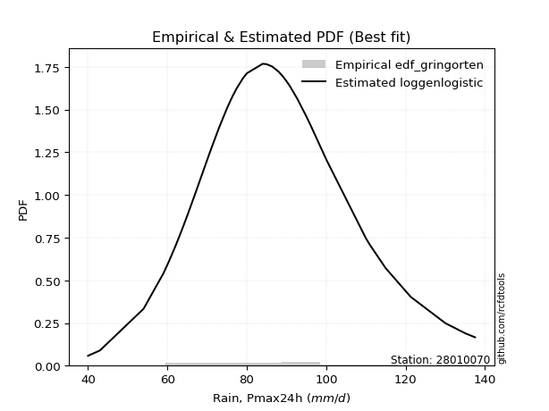</img>

</div>


### 9. Empirical - EDF Filliben (1975)

The specific values of the constants (0.3175) (often denoted as $alpha$) and (0.365) are derived from a method proposed by James J. Filliben in a 1975 paper. This particular formula is the mean value of the $i$-th order statistic of the normal distribution and is considered a robust and effective plotting position formula for the normal probability plot correlation coefficient test for normality.

<div align="center">


$P=(m-0.3175)/(n+0.365)$


</div>


**9.1. Empirical values**

<div align="center">

|                | 0                    | 1                   | 2                   | 3                   | 4                   | 5                   | 6                   | 7                  | 8                   | 9                  | 10                  | 11                 | 12                  | 13                 | 14                  | 15                 | 16                  | 17                 | 18                 | 19                 | 20                  | 21                 | 22                  | 23                 | 24                 | 25                  | 26                 | 27                 | 28                 | 29                 | 30                 | 31                 | 32                 | 33                 | 34                 | 35                 | 36                 | 37                 | 38                 | 39                 | 40                 | 41                 | 42                 | 43                 | 44                 | 45                 | 46                 | 47                 | 48                 | 49                 | 50                 | 51               |
|:---------------|:---------------------|:--------------------|:--------------------|:--------------------|:--------------------|:--------------------|:--------------------|:-------------------|:--------------------|:-------------------|:--------------------|:-------------------|:--------------------|:-------------------|:--------------------|:-------------------|:--------------------|:-------------------|:-------------------|:-------------------|:--------------------|:-------------------|:--------------------|:-------------------|:-------------------|:--------------------|:-------------------|:-------------------|:-------------------|:-------------------|:-------------------|:-------------------|:-------------------|:-------------------|:-------------------|:-------------------|:-------------------|:-------------------|:-------------------|:-------------------|:-------------------|:-------------------|:-------------------|:-------------------|:-------------------|:-------------------|:-------------------|:-------------------|:-------------------|:-------------------|:-------------------|:-----------------|
| date           | 2015                 | 1986                | 1974                | 1997                | 1991                | 2021                | 2018                | 2002               | 1990                | 1993               | 1989                | 2011               | 2003                | 2004               | 2008                | 2001               | 2013                | 2007               | 1992               | 2016               | 2000                | 1994               | 2014                | 2012               | 2019               | 2010                | 2009               | 1972               | 2017               | 2005               | 1995               | 1977               | 1976               | 1988               | 1987               | 2020               | 1982               | 1985               | 1984               | 1971               | 1979               | 1983               | 1970               | 1975               | 1998               | 1980               | 1981               | 2006               | 1973               | 1978               | 1999               | 1996             |
| x              | 40.0                 | 43.0                | 45.0                | 60.2                | 60.5                | 62.0                | 63.0                | 65.0               | 69.9                | 70.1               | 70.6                | 71.0               | 73.0                | 76.0               | 80.0                | 80.0               | 85.0                | 85.0               | 86.4               | 88.0               | 90.0                | 90.7               | 95.0                | 95.0               | 95.0               | 96.0                | 96.0               | 99.0               | 100.0              | 100.0              | 100.1              | 104.603463613376   | 107.585122244536   | 110.0              | 111.0              | 112.144796560754   | 112.286587817857   | 112.589999231464   | 114.178729338772   | 115.247097358231   | 117.68809685844    | 119.745071952376   | 120.389200409921   | 120.667737339199   | 121.3              | 125.76249436743    | 126.944657729944   | 130.0              | 130.796492713251   | 130.974757328269   | 135.0              | 137.5            |
| m              | 1                    | 2                   | 3                   | 4                   | 5                   | 6                   | 7                   | 8                  | 9                   | 10                 | 11                  | 12                 | 13                  | 14                 | 15                  | 16                 | 17                  | 18                 | 19                 | 20                 | 21                  | 22                 | 23                  | 24                 | 25                 | 26                  | 27                 | 28                 | 29                 | 30                 | 31                 | 32                 | 33                 | 34                 | 35                 | 36                 | 37                 | 38                 | 39                 | 40                 | 41                 | 42                 | 43                 | 44                 | 45                 | 46                 | 47                 | 48                 | 49                 | 50                 | 51                 | 52               |
| empirical_dist | edf_filliben         | edf_filliben        | edf_filliben        | edf_filliben        | edf_filliben        | edf_filliben        | edf_filliben        | edf_filliben       | edf_filliben        | edf_filliben       | edf_filliben        | edf_filliben       | edf_filliben        | edf_filliben       | edf_filliben        | edf_filliben       | edf_filliben        | edf_filliben       | edf_filliben       | edf_filliben       | edf_filliben        | edf_filliben       | edf_filliben        | edf_filliben       | edf_filliben       | edf_filliben        | edf_filliben       | edf_filliben       | edf_filliben       | edf_filliben       | edf_filliben       | edf_filliben       | edf_filliben       | edf_filliben       | edf_filliben       | edf_filliben       | edf_filliben       | edf_filliben       | edf_filliben       | edf_filliben       | edf_filliben       | edf_filliben       | edf_filliben       | edf_filliben       | edf_filliben       | edf_filliben       | edf_filliben       | edf_filliben       | edf_filliben       | edf_filliben       | edf_filliben       | edf_filliben     |
| empirical      | 0.013033514752219994 | 0.03213023966389764 | 0.05122696457557529 | 0.07032368948725294 | 0.08942041439893059 | 0.10851713931060823 | 0.12761386422228588 | 0.1467105891339635 | 0.16580731404564114 | 0.1849040389573188 | 0.20400076386899643 | 0.2230974887806741 | 0.24219421369235175 | 0.2612909386040294 | 0.28038766351570704 | 0.2994843884273847 | 0.31858111333906236 | 0.33767783825074   | 0.3567745631624176 | 0.3758712880740953 | 0.39496801298577294 | 0.4140647378974506 | 0.43316146280912826 | 0.4522581877208059 | 0.4713549126324835 | 0.49045163754416116 | 0.5095483624558388 | 0.5286450873675165 | 0.5477418122791942 | 0.5668385371908717 | 0.5859352621025494 | 0.605031987014227  | 0.6241287119259047 | 0.6432254368375823 | 0.66232216174926   | 0.6814188866609375 | 0.7005156115726152 | 0.7196123364842929 | 0.7387090613959705 | 0.7578057863076482 | 0.7769025112193259 | 0.7959992361310034 | 0.8150959610426811 | 0.8341926859543587 | 0.8532894108660364 | 0.8723861357777141 | 0.8914828606893916 | 0.9105795856010693 | 0.929676310512747  | 0.9487730354244246 | 0.9678697603361023 | 0.98696648524778 |
| empirical_tr   | 1.0132056305325787   | 1.0331968628224732  | 1.0539928546268806  | 1.075643198274534   | 1.098201646306297   | 1.121726557060997   | 1.1462813987850928  | 1.171935321434566  | 1.1987638070165396  | 1.2268494113512562 | 1.2562826126072093  | 1.2871627849812572 | 1.3195993195993196  | 1.3537129192787436 | 1.3896370994493463  | 1.4275199345737069 | 1.4675260982274225  | 1.5098392561089886 | 1.554664885326208  | 1.6022336112598485 | 1.6528051763591887  | 1.7066731850403325 | 1.7641708077149836  | 1.8256776780266712 | 1.8916282850176105 | 1.9625222524126302  | 2.038937019371167  | 2.1215436037678517 | 2.211126359125937  | 2.3086079576766227 | 2.415081286751989  | 2.5318505983319226 | 2.660485202591134  | 2.802890405459654  | 2.9614025166124693 | 3.138918027873519  | 3.339072214251553  | 3.566490720245189  | 3.8271514708569323 | 4.128917800118272  | 4.482345388401455  | 4.901942429206644  | 5.40821068938807   | 6.03109703426432   | 6.816140579238525  | 7.836139169472499  | 9.215134183897922  | 11.183128670581944 | 14.219959266802434 | 19.520969245107132 | 31.123328380386255 | 76.7252747252745 |

</div>


**9.2. Kolmogorov-Smirnov fit test (sorted by Δ)**


<div align="center">

|                | 0                   | 1                   | 2                    | 3                    | 4                   | 5                   | 6                   | 7                   | 8                   | 9                   | 10                  | 11                  | 12                  | 13                  | 14                  | 15                  | 16                  | 17                  | 18                  | 19                  | 20                  | 21                  | 22                  | 23                  | 24                  | 25                  | 26                  | 27                  | 28                  | 29                  | 30                  | 31                  | 32                    | 33                  | 34                  | 35                  | 36                  | 37                  | 38                  | 39                  | 40                  | 41                  | 42                  | 43                  | 44                  | 45                  | 46                  | 47                  | 48                  | 49                  | 50                  | 51                  | 52                  | 53                  | 54                  | 55                  | 56                  | 57                  | 58                  | 59                  | 60                  | 61                  | 62                  | 63                  | 64                  | 65                  | 66                  | 67                  | 68                  | 69                  | 70                  | 71                  | 72                  | 73                  | 74                  | 75                  | 76                  | 77                  | 78                  | 79                  | 80                  | 81                  | 82                  | 83                  | 84                  | 85                  | 86                  | 87                  | 88                  | 89                  |
|:---------------|:--------------------|:--------------------|:---------------------|:---------------------|:--------------------|:--------------------|:--------------------|:--------------------|:--------------------|:--------------------|:--------------------|:--------------------|:--------------------|:--------------------|:--------------------|:--------------------|:--------------------|:--------------------|:--------------------|:--------------------|:--------------------|:--------------------|:--------------------|:--------------------|:--------------------|:--------------------|:--------------------|:--------------------|:--------------------|:--------------------|:--------------------|:--------------------|:----------------------|:--------------------|:--------------------|:--------------------|:--------------------|:--------------------|:--------------------|:--------------------|:--------------------|:--------------------|:--------------------|:--------------------|:--------------------|:--------------------|:--------------------|:--------------------|:--------------------|:--------------------|:--------------------|:--------------------|:--------------------|:--------------------|:--------------------|:--------------------|:--------------------|:--------------------|:--------------------|:--------------------|:--------------------|:--------------------|:--------------------|:--------------------|:--------------------|:--------------------|:--------------------|:--------------------|:--------------------|:--------------------|:--------------------|:--------------------|:--------------------|:--------------------|:--------------------|:--------------------|:--------------------|:--------------------|:--------------------|:--------------------|:--------------------|:--------------------|:--------------------|:--------------------|:--------------------|:--------------------|:--------------------|:--------------------|:--------------------|:--------------------|
| station        | 28010070            | 28010070            | 28010070             | 28010070             | 28010070            | 28010070            | 28010070            | 28010070            | 28010070            | 28010070            | 28010070            | 28010070            | 28010070            | 28010070            | 28010070            | 28010070            | 28010070            | 28010070            | 28010070            | 28010070            | 28010070            | 28010070            | 28010070            | 28010070            | 28010070            | 28010070            | 28010070            | 28010070            | 28010070            | 28010070            | 28010070            | 28010070            | 28010070              | 28010070            | 28010070            | 28010070            | 28010070            | 28010070            | 28010070            | 28010070            | 28010070            | 28010070            | 28010070            | 28010070            | 28010070            | 28010070            | 28010070            | 28010070            | 28010070            | 28010070            | 28010070            | 28010070            | 28010070            | 28010070            | 28010070            | 28010070            | 28010070            | 28010070            | 28010070            | 28010070            | 28010070            | 28010070            | 28010070            | 28010070            | 28010070            | 28010070            | 28010070            | 28010070            | 28010070            | 28010070            | 28010070            | 28010070            | 28010070            | 28010070            | 28010070            | 28010070            | 28010070            | 28010070            | 28010070            | 28010070            | 28010070            | 28010070            | 28010070            | 28010070            | 28010070            | 28010070            | 28010070            | 28010070            | 28010070            | 28010070            |
| empirical_dist | edf_filliben        | edf_filliben        | edf_filliben         | edf_filliben         | edf_filliben        | edf_filliben        | edf_filliben        | edf_filliben        | edf_filliben        | edf_filliben        | edf_filliben        | edf_filliben        | edf_filliben        | edf_filliben        | edf_filliben        | edf_filliben        | edf_filliben        | edf_filliben        | edf_filliben        | edf_filliben        | edf_filliben        | edf_filliben        | edf_filliben        | edf_filliben        | edf_filliben        | edf_filliben        | edf_filliben        | edf_filliben        | edf_filliben        | edf_filliben        | edf_filliben        | edf_filliben        | edf_filliben          | edf_filliben        | edf_filliben        | edf_filliben        | edf_filliben        | edf_filliben        | edf_filliben        | edf_filliben        | edf_filliben        | edf_filliben        | edf_filliben        | edf_filliben        | edf_filliben        | edf_filliben        | edf_filliben        | edf_filliben        | edf_filliben        | edf_filliben        | edf_filliben        | edf_filliben        | edf_filliben        | edf_filliben        | edf_filliben        | edf_filliben        | edf_filliben        | edf_filliben        | edf_filliben        | edf_filliben        | edf_filliben        | edf_filliben        | edf_filliben        | edf_filliben        | edf_filliben        | edf_filliben        | edf_filliben        | edf_filliben        | edf_filliben        | edf_filliben        | edf_filliben        | edf_filliben        | edf_filliben        | edf_filliben        | edf_filliben        | edf_filliben        | edf_filliben        | edf_filliben        | edf_filliben        | edf_filliben        | edf_filliben        | edf_filliben        | edf_filliben        | edf_filliben        | edf_filliben        | edf_filliben        | edf_filliben        | edf_filliben        | edf_filliben        | edf_filliben        |
| p_dist         | logmielke           | logjohnsonsu        | johnsonsu            | logpearson3          | weibull_min         | genlogistic         | pearson3            | loggumbel_l         | logweibull_min      | gompertz            | fatiguelife         | loggompertz         | fisk                | gumbel_l            | logloggamma         | nct                 | t                   | crystalball         | norm                | truncnorm           | exponnorm           | logfisk             | gamma               | nakagami            | f                   | rice                | chi2                | erlang              | invgamma            | alpha               | logt                | maxwell             | loglaplace_asymmetric | loggenlogistic      | mielke              | logistic            | rayleigh            | betaprime           | invweibull          | laplace_asymmetric  | logfatiguelife      | lognct              | lognakagami         | hypsecant           | logbetaprime        | invgauss            | logf                | logcrystalball      | logexponnorm        | lognorm             | lognorm             | loglognorm          | logrice             | logncf              | loglogistic         | loggamma            | loggamma            | logalpha            | logchi2             | loghypsecant        | logerlang           | kstwobign           | gumbel_r            | loginvgamma         | halfnorm            | laplace             | loginvgauss         | logmaxwell          | loglaplace          | lograyleigh         | loginvweibull       | moyal               | halflogistic        | logkstwobign        | loghalfnorm         | loggumbel_r         | loggenexpon         | loghalflogistic     | logmoyal            | wald                | genexpon            | expon               | pareto              | gibrat              | logwald             | loggibrat           | logexpon            | logpareto           | logtruncnorm        | ncf                 |
| delta          | 0.05034428614216635 | 0.06079697416960017 | 0.061636475848030864 | 0.062459957125262644 | 0.06413565403094634 | 0.06766650342014038 | 0.06956050492427046 | 0.07065802406495103 | 0.07179581888036513 | 0.07347597039487741 | 0.07503115736371846 | 0.07606311451525127 | 0.0760935079406363  | 0.07707438719031734 | 0.0794360846209391  | 0.08052890181727879 | 0.08060313369042627 | 0.08066758789781103 | 0.08066759928335143 | 0.08066760146285623 | 0.08066802201400536 | 0.08071793436981767 | 0.08103684356925445 | 0.0810405488242828  | 0.08114735478095803 | 0.08198516349118201 | 0.08572067450817467 | 0.08624278072598424 | 0.08763258611203728 | 0.09320587271476066 | 0.09735678692253114 | 0.09785412771396806 | 0.09889182781245015   | 0.10092127488489183 | 0.10118001894182554 | 0.10292881610054083 | 0.10891131977936408 | 0.11012543431246624 | 0.11099570502364209 | 0.11156288428398797 | 0.11713577144257703 | 0.11793167421093009 | 0.11794353310338757 | 0.11834593059293474 | 0.11846439006412246 | 0.1185969872558218  | 0.11878428524207729 | 0.11891660736079934 | 0.11891715515916657 | 0.11891738427389853 | 0.11891738427389853 | 0.11891893311877855 | 0.11891931197149697 | 0.1258847987043349  | 0.12592469442241205 | 0.12657204624936558 | 0.12657204624936558 | 0.12741157852110863 | 0.13161647846510183 | 0.13183965966095423 | 0.1324066424982534  | 0.13374688607990404 | 0.13503080551802993 | 0.13536646102203886 | 0.1400415094424341  | 0.1410646158928357  | 0.14502828533928103 | 0.14917233735291335 | 0.15134548356675492 | 0.1588706134325245  | 0.16016811261714248 | 0.1608909110085679  | 0.16484788584317256 | 0.1786101822940226  | 0.18624654615614988 | 0.18892460220255936 | 0.20783984411991696 | 0.2135994953520911  | 0.21369412043142866 | 0.23391707704549689 | 0.2434927302479673  | 0.25279899111516874 | 0.25279900707784503 | 0.2612909386040294  | 0.28242696664371414 | 0.3116936772073001  | 0.32536859406673097 | 0.32536859929022893 | 0.39543189432509457 | 0.48647961362969744 |
| deltao         | 0.18859806671657792 | 0.18859806671657792 | 0.18859806671657792  | 0.18859806671657792  | 0.18859806671657792 | 0.18859806671657792 | 0.18859806671657792 | 0.18859806671657792 | 0.18859806671657792 | 0.18859806671657792 | 0.18859806671657792 | 0.18859806671657792 | 0.18859806671657792 | 0.18859806671657792 | 0.18859806671657792 | 0.18859806671657792 | 0.18859806671657792 | 0.18859806671657792 | 0.18859806671657792 | 0.18859806671657792 | 0.18859806671657792 | 0.18859806671657792 | 0.18859806671657792 | 0.18859806671657792 | 0.18859806671657792 | 0.18859806671657792 | 0.18859806671657792 | 0.18859806671657792 | 0.18859806671657792 | 0.18859806671657792 | 0.18859806671657792 | 0.18859806671657792 | 0.18859806671657792   | 0.18859806671657792 | 0.18859806671657792 | 0.18859806671657792 | 0.18859806671657792 | 0.18859806671657792 | 0.18859806671657792 | 0.18859806671657792 | 0.18859806671657792 | 0.18859806671657792 | 0.18859806671657792 | 0.18859806671657792 | 0.18859806671657792 | 0.18859806671657792 | 0.18859806671657792 | 0.18859806671657792 | 0.18859806671657792 | 0.18859806671657792 | 0.18859806671657792 | 0.18859806671657792 | 0.18859806671657792 | 0.18859806671657792 | 0.18859806671657792 | 0.18859806671657792 | 0.18859806671657792 | 0.18859806671657792 | 0.18859806671657792 | 0.18859806671657792 | 0.18859806671657792 | 0.18859806671657792 | 0.18859806671657792 | 0.18859806671657792 | 0.18859806671657792 | 0.18859806671657792 | 0.18859806671657792 | 0.18859806671657792 | 0.18859806671657792 | 0.18859806671657792 | 0.18859806671657792 | 0.18859806671657792 | 0.18859806671657792 | 0.18859806671657792 | 0.18859806671657792 | 0.18859806671657792 | 0.18859806671657792 | 0.18859806671657792 | 0.18859806671657792 | 0.18859806671657792 | 0.18859806671657792 | 0.18859806671657792 | 0.18859806671657792 | 0.18859806671657792 | 0.18859806671657792 | 0.18859806671657792 | 0.18859806671657792 | 0.18859806671657792 | 0.18859806671657792 | 0.18859806671657792 |
| eval           | Δo > Δ              | Δo > Δ              | Δo > Δ               | Δo > Δ               | Δo > Δ              | Δo > Δ              | Δo > Δ              | Δo > Δ              | Δo > Δ              | Δo > Δ              | Δo > Δ              | Δo > Δ              | Δo > Δ              | Δo > Δ              | Δo > Δ              | Δo > Δ              | Δo > Δ              | Δo > Δ              | Δo > Δ              | Δo > Δ              | Δo > Δ              | Δo > Δ              | Δo > Δ              | Δo > Δ              | Δo > Δ              | Δo > Δ              | Δo > Δ              | Δo > Δ              | Δo > Δ              | Δo > Δ              | Δo > Δ              | Δo > Δ              | Δo > Δ                | Δo > Δ              | Δo > Δ              | Δo > Δ              | Δo > Δ              | Δo > Δ              | Δo > Δ              | Δo > Δ              | Δo > Δ              | Δo > Δ              | Δo > Δ              | Δo > Δ              | Δo > Δ              | Δo > Δ              | Δo > Δ              | Δo > Δ              | Δo > Δ              | Δo > Δ              | Δo > Δ              | Δo > Δ              | Δo > Δ              | Δo > Δ              | Δo > Δ              | Δo > Δ              | Δo > Δ              | Δo > Δ              | Δo > Δ              | Δo > Δ              | Δo > Δ              | Δo > Δ              | Δo > Δ              | Δo > Δ              | Δo > Δ              | Δo > Δ              | Δo > Δ              | Δo > Δ              | Δo > Δ              | Δo > Δ              | Δo > Δ              | Δo > Δ              | Δo > Δ              | Δo > Δ              | Δo > Δ              | Δo <= Δ             | Δo <= Δ             | Δo <= Δ             | Δo <= Δ             | Δo <= Δ             | Δo <= Δ             | Δo <= Δ             | Δo <= Δ             | Δo <= Δ             | Δo <= Δ             | Δo <= Δ             | Δo <= Δ             | Δo <= Δ             | Δo <= Δ             | Δo <= Δ             |
| fit            | 1                   | 1                   | 1                    | 1                    | 1                   | 1                   | 1                   | 1                   | 1                   | 1                   | 1                   | 1                   | 1                   | 1                   | 1                   | 1                   | 1                   | 1                   | 1                   | 1                   | 1                   | 1                   | 1                   | 1                   | 1                   | 1                   | 1                   | 1                   | 1                   | 1                   | 1                   | 1                   | 1                     | 1                   | 1                   | 1                   | 1                   | 1                   | 1                   | 1                   | 1                   | 1                   | 1                   | 1                   | 1                   | 1                   | 1                   | 1                   | 1                   | 1                   | 1                   | 1                   | 1                   | 1                   | 1                   | 1                   | 1                   | 1                   | 1                   | 1                   | 1                   | 1                   | 1                   | 1                   | 1                   | 1                   | 1                   | 1                   | 1                   | 1                   | 1                   | 1                   | 1                   | 1                   | 1                   | 0                   | 0                   | 0                   | 0                   | 0                   | 0                   | 0                   | 0                   | 0                   | 0                   | 0                   | 0                   | 0                   | 0                   | 0                   |
| n              | 52                  | 52                  | 52                   | 52                   | 52                  | 52                  | 52                  | 52                  | 52                  | 52                  | 52                  | 52                  | 52                  | 52                  | 52                  | 52                  | 52                  | 52                  | 52                  | 52                  | 52                  | 52                  | 52                  | 52                  | 52                  | 52                  | 52                  | 52                  | 52                  | 52                  | 52                  | 52                  | 52                    | 52                  | 52                  | 52                  | 52                  | 52                  | 52                  | 52                  | 52                  | 52                  | 52                  | 52                  | 52                  | 52                  | 52                  | 52                  | 52                  | 52                  | 52                  | 52                  | 52                  | 52                  | 52                  | 52                  | 52                  | 52                  | 52                  | 52                  | 52                  | 52                  | 52                  | 52                  | 52                  | 52                  | 52                  | 52                  | 52                  | 52                  | 52                  | 52                  | 52                  | 52                  | 52                  | 52                  | 52                  | 52                  | 52                  | 52                  | 52                  | 52                  | 52                  | 52                  | 52                  | 52                  | 52                  | 52                  | 52                  | 52                  |
| best_fit       | 1                   | 0                   | 0                    | 0                    | 0                   | 0                   | 0                   | 0                   | 0                   | 0                   | 0                   | 0                   | 0                   | 0                   | 0                   | 0                   | 0                   | 0                   | 0                   | 0                   | 0                   | 0                   | 0                   | 0                   | 0                   | 0                   | 0                   | 0                   | 0                   | 0                   | 0                   | 0                   | 0                     | 0                   | 0                   | 0                   | 0                   | 0                   | 0                   | 0                   | 0                   | 0                   | 0                   | 0                   | 0                   | 0                   | 0                   | 0                   | 0                   | 0                   | 0                   | 0                   | 0                   | 0                   | 0                   | 0                   | 0                   | 0                   | 0                   | 0                   | 0                   | 0                   | 0                   | 0                   | 0                   | 0                   | 0                   | 0                   | 0                   | 0                   | 0                   | 0                   | 0                   | 0                   | 0                   | 0                   | 0                   | 0                   | 0                   | 0                   | 0                   | 0                   | 0                   | 0                   | 0                   | 0                   | 0                   | 0                   | 0                   | 0                   |
| best_fit_sort  | 1                   | 2                   | 3                    | 4                    | 5                   | 6                   | 7                   | 8                   | 9                   | 10                  | 11                  | 12                  | 13                  | 14                  | 15                  | 16                  | 17                  | 18                  | 19                  | 20                  | 21                  | 22                  | 23                  | 24                  | 25                  | 26                  | 27                  | 28                  | 29                  | 30                  | 31                  | 32                  | 33                    | 34                  | 35                  | 36                  | 37                  | 38                  | 39                  | 40                  | 41                  | 42                  | 43                  | 44                  | 45                  | 46                  | 47                  | 48                  | 49                  | 50                  | 51                  | 52                  | 53                  | 54                  | 55                  | 56                  | 57                  | 58                  | 59                  | 60                  | 61                  | 62                  | 63                  | 64                  | 65                  | 66                  | 67                  | 68                  | 69                  | 70                  | 71                  | 72                  | 73                  | 74                  | 75                  | 76                  | 77                  | 78                  | 79                  | 80                  | 81                  | 82                  | 83                  | 84                  | 85                  | 86                  | 87                  | 88                  | 89                  | 90                  |

</div>


<div align="center">

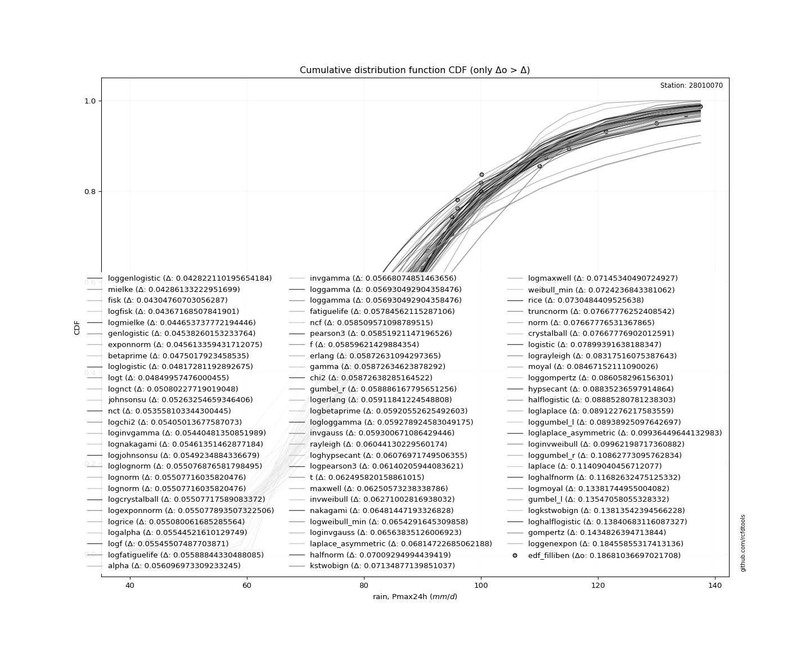</img>

</div>


**9.3. Best fit**

<div align="center">

|   id |   station | empirical_dist   | p_dist    |     delta |   deltao | eval   |   fit |   n |   best_fit |   best_fit_sort |
|-----:|----------:|:-----------------|:----------|----------:|---------:|:-------|------:|----:|-----------:|----------------:|
|    0 |  28010070 | edf_filliben     | logmielke | 0.0503443 | 0.188598 | Δo > Δ |     1 |  52 |          1 |               1 |

</div>


<div align="center">

</img>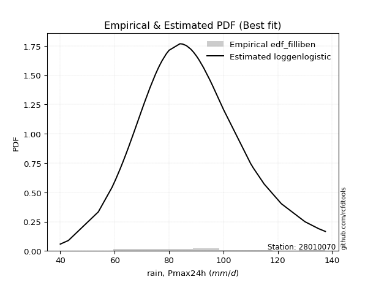</img>

</div>


### 10. Empirical - EDF Jenkinson (1977)

The Jenkinson formula in hydrology is an empirical plotting position formula used to estimate the non-exceedance probability _(P)_ or return period _(T)_ of a given ordered observation within a sample. It is a widely used method in the frequency analysis of extreme events such as floods and rainfall, as it provides a distribution-free way to plot data. _a≈0.31_ and _b≈0.38_ are constants derived to approximate the median of the probability distribution for the given rank.

<div align="center">


$P=(m-a)/(n+b)$


</div>


**10.1. Empirical values**

<div align="center">

|                | 0                    | 1                   | 2                   | 3                  | 4                   | 5                   | 6                  | 7                   | 8                   | 9                   | 10                  | 11                 | 12                  | 13                  | 14                 | 15                 | 16                 | 17                 | 18                 | 19                 | 20                  | 21                  | 22                  | 23                  | 24                 | 25                 | 26                 | 27                 | 28                 | 29                 | 30                 | 31                 | 32                 | 33                 | 34                 | 35                 | 36                 | 37                 | 38                 | 39                 | 40                 | 41                | 42                 | 43                 | 44                 | 45                 | 46                 | 47                 | 48                 | 49                 | 50                 | 51                 |
|:---------------|:---------------------|:--------------------|:--------------------|:-------------------|:--------------------|:--------------------|:-------------------|:--------------------|:--------------------|:--------------------|:--------------------|:-------------------|:--------------------|:--------------------|:-------------------|:-------------------|:-------------------|:-------------------|:-------------------|:-------------------|:--------------------|:--------------------|:--------------------|:--------------------|:-------------------|:-------------------|:-------------------|:-------------------|:-------------------|:-------------------|:-------------------|:-------------------|:-------------------|:-------------------|:-------------------|:-------------------|:-------------------|:-------------------|:-------------------|:-------------------|:-------------------|:------------------|:-------------------|:-------------------|:-------------------|:-------------------|:-------------------|:-------------------|:-------------------|:-------------------|:-------------------|:-------------------|
| date           | 2015                 | 1986                | 1974                | 1997               | 1991                | 2021                | 2018               | 2002                | 1990                | 1993                | 1989                | 2011               | 2003                | 2004                | 2008               | 2001               | 2013               | 2007               | 1992               | 2016               | 2000                | 1994                | 2014                | 2012                | 2019               | 2010               | 2009               | 1972               | 2017               | 2005               | 1995               | 1977               | 1976               | 1988               | 1987               | 2020               | 1982               | 1985               | 1984               | 1971               | 1979               | 1983              | 1970               | 1975               | 1998               | 1980               | 1981               | 2006               | 1973               | 1978               | 1999               | 1996               |
| x              | 40.0                 | 43.0                | 45.0                | 60.2               | 60.5                | 62.0                | 63.0               | 65.0                | 69.9                | 70.1                | 70.6                | 71.0               | 73.0                | 76.0                | 80.0               | 80.0               | 85.0               | 85.0               | 86.4               | 88.0               | 90.0                | 90.7                | 95.0                | 95.0                | 95.0               | 96.0               | 96.0               | 99.0               | 100.0              | 100.0              | 100.1              | 104.603463613376   | 107.585122244536   | 110.0              | 111.0              | 112.144796560754   | 112.286587817857   | 112.589999231464   | 114.178729338772   | 115.247097358231   | 117.68809685844    | 119.745071952376  | 120.389200409921   | 120.667737339199   | 121.3              | 125.76249436743    | 126.944657729944   | 130.0              | 130.796492713251   | 130.974757328269   | 135.0              | 137.5              |
| m              | 1                    | 2                   | 3                   | 4                  | 5                   | 6                   | 7                  | 8                   | 9                   | 10                  | 11                  | 12                 | 13                  | 14                  | 15                 | 16                 | 17                 | 18                 | 19                 | 20                 | 21                  | 22                  | 23                  | 24                  | 25                 | 26                 | 27                 | 28                 | 29                 | 30                 | 31                 | 32                 | 33                 | 34                 | 35                 | 36                 | 37                 | 38                 | 39                 | 40                 | 41                 | 42                | 43                 | 44                 | 45                 | 46                 | 47                 | 48                 | 49                 | 50                 | 51                 | 52                 |
| empirical_dist | edf_jenkinson        | edf_jenkinson       | edf_jenkinson       | edf_jenkinson      | edf_jenkinson       | edf_jenkinson       | edf_jenkinson      | edf_jenkinson       | edf_jenkinson       | edf_jenkinson       | edf_jenkinson       | edf_jenkinson      | edf_jenkinson       | edf_jenkinson       | edf_jenkinson      | edf_jenkinson      | edf_jenkinson      | edf_jenkinson      | edf_jenkinson      | edf_jenkinson      | edf_jenkinson       | edf_jenkinson       | edf_jenkinson       | edf_jenkinson       | edf_jenkinson      | edf_jenkinson      | edf_jenkinson      | edf_jenkinson      | edf_jenkinson      | edf_jenkinson      | edf_jenkinson      | edf_jenkinson      | edf_jenkinson      | edf_jenkinson      | edf_jenkinson      | edf_jenkinson      | edf_jenkinson      | edf_jenkinson      | edf_jenkinson      | edf_jenkinson      | edf_jenkinson      | edf_jenkinson     | edf_jenkinson      | edf_jenkinson      | edf_jenkinson      | edf_jenkinson      | edf_jenkinson      | edf_jenkinson      | edf_jenkinson      | edf_jenkinson      | edf_jenkinson      | edf_jenkinson      |
| empirical      | 0.013172966781214202 | 0.03226422298587247 | 0.05135547919053073 | 0.070446735395189  | 0.08953799159984727 | 0.10862924780450554 | 0.1277205040091638 | 0.14681176021382206 | 0.16590301641848032 | 0.18499427262313858 | 0.20408552882779685 | 0.2231767850324551 | 0.24226804123711337 | 0.26135929744177167 | 0.2804505536464299 | 0.2995418098510882 | 0.3186330660557465 | 0.3377243222604047 | 0.356815578465063  | 0.3759068346697213 | 0.39499809087437954 | 0.41408934707903783 | 0.43318060328369606 | 0.45227185948835436 | 0.4713631156930126 | 0.4904543718976709 | 0.5095456281023292 | 0.5286368843069874 | 0.5477281405116456 | 0.5668193967163039 | 0.5859106529209622 | 0.6050019091256205 | 0.6240931653302787 | 0.6431844215349369 | 0.6622756777395952 | 0.6813669339442534 | 0.7004581901489118 | 0.71954944635357   | 0.7386407025582282 | 0.7577319587628866 | 0.7768232149675448 | 0.795914471172203 | 0.8150057273768613 | 0.8340969835815196 | 0.8531882397861779 | 0.8722794959908361 | 0.8913707521954943 | 0.9104620084001527 | 0.9295532646048109 | 0.9486445208094691 | 0.9677357770141274 | 0.9868270332187857 |
| empirical_tr   | 1.0133488102147417   | 1.0333399092523181  | 1.054135640974039   | 1.0757855822550833 | 1.0983434682323339  | 1.1218676376097665  | 1.1464215364412345 | 1.172074289550235   | 1.1989013504234378  | 1.2269852424455376  | 1.2564164068121852  | 1.287294175473089  | 1.3197278911564627  | 1.3538382010855519  | 1.3897585566463253 | 1.4276369582992643 | 1.4676379938358084 | 1.5099452291726723 | 1.5547640249332149 | 1.602324869990823  | 1.652887346165983   | 1.7067448680351909  | 1.7642303805995283  | 1.8257232485186476  | 1.8916576381365113 | 1.9625327838141624 | 2.0389256520046715 | 2.1215066828675577 | 2.211059518784297  | 2.308505949757602  | 2.4149377593361    | 2.5316578057032384 | 2.6602336211274755 | 2.8025682182985547 | 2.9609949123798747 | 3.138406231276212  | 3.3384321223709366 | 3.5656909462219186 | 3.826150474799122  | 4.127659574468085  | 4.480752780153977  | 4.899906454630494 | 5.405572755417953  | 6.027617951668583  | 6.811443433029906  | 7.8295964125560475 | 9.205623901581712  | 11.1684434968017   | 14.195121951219496 | 19.472118959107764 | 30.994082840236548 | 75.9130434782605   |

</div>


**10.2. Kolmogorov-Smirnov fit test (sorted by Δ)**


<div align="center">

|                | 0                   | 1                   | 2                   | 3                   | 4                   | 5                   | 6                   | 7                   | 8                   | 9                   | 10                  | 11                  | 12                  | 13                  | 14                  | 15                  | 16                  | 17                  | 18                  | 19                  | 20                  | 21                  | 22                  | 23                  | 24                  | 25                  | 26                  | 27                  | 28                  | 29                  | 30                  | 31                  | 32                    | 33                  | 34                  | 35                  | 36                  | 37                  | 38                  | 39                  | 40                  | 41                  | 42                  | 43                  | 44                  | 45                  | 46                  | 47                  | 48                  | 49                  | 50                  | 51                  | 52                  | 53                  | 54                  | 55                  | 56                  | 57                  | 58                  | 59                  | 60                  | 61                  | 62                  | 63                  | 64                  | 65                  | 66                  | 67                  | 68                  | 69                  | 70                  | 71                  | 72                  | 73                  | 74                  | 75                  | 76                  | 77                  | 78                  | 79                  | 80                  | 81                  | 82                  | 83                  | 84                  | 85                  | 86                  | 87                  | 88                  | 89                  |
|:---------------|:--------------------|:--------------------|:--------------------|:--------------------|:--------------------|:--------------------|:--------------------|:--------------------|:--------------------|:--------------------|:--------------------|:--------------------|:--------------------|:--------------------|:--------------------|:--------------------|:--------------------|:--------------------|:--------------------|:--------------------|:--------------------|:--------------------|:--------------------|:--------------------|:--------------------|:--------------------|:--------------------|:--------------------|:--------------------|:--------------------|:--------------------|:--------------------|:----------------------|:--------------------|:--------------------|:--------------------|:--------------------|:--------------------|:--------------------|:--------------------|:--------------------|:--------------------|:--------------------|:--------------------|:--------------------|:--------------------|:--------------------|:--------------------|:--------------------|:--------------------|:--------------------|:--------------------|:--------------------|:--------------------|:--------------------|:--------------------|:--------------------|:--------------------|:--------------------|:--------------------|:--------------------|:--------------------|:--------------------|:--------------------|:--------------------|:--------------------|:--------------------|:--------------------|:--------------------|:--------------------|:--------------------|:--------------------|:--------------------|:--------------------|:--------------------|:--------------------|:--------------------|:--------------------|:--------------------|:--------------------|:--------------------|:--------------------|:--------------------|:--------------------|:--------------------|:--------------------|:--------------------|:--------------------|:--------------------|:--------------------|
| station        | 28010070            | 28010070            | 28010070            | 28010070            | 28010070            | 28010070            | 28010070            | 28010070            | 28010070            | 28010070            | 28010070            | 28010070            | 28010070            | 28010070            | 28010070            | 28010070            | 28010070            | 28010070            | 28010070            | 28010070            | 28010070            | 28010070            | 28010070            | 28010070            | 28010070            | 28010070            | 28010070            | 28010070            | 28010070            | 28010070            | 28010070            | 28010070            | 28010070              | 28010070            | 28010070            | 28010070            | 28010070            | 28010070            | 28010070            | 28010070            | 28010070            | 28010070            | 28010070            | 28010070            | 28010070            | 28010070            | 28010070            | 28010070            | 28010070            | 28010070            | 28010070            | 28010070            | 28010070            | 28010070            | 28010070            | 28010070            | 28010070            | 28010070            | 28010070            | 28010070            | 28010070            | 28010070            | 28010070            | 28010070            | 28010070            | 28010070            | 28010070            | 28010070            | 28010070            | 28010070            | 28010070            | 28010070            | 28010070            | 28010070            | 28010070            | 28010070            | 28010070            | 28010070            | 28010070            | 28010070            | 28010070            | 28010070            | 28010070            | 28010070            | 28010070            | 28010070            | 28010070            | 28010070            | 28010070            | 28010070            |
| empirical_dist | edf_jenkinson       | edf_jenkinson       | edf_jenkinson       | edf_jenkinson       | edf_jenkinson       | edf_jenkinson       | edf_jenkinson       | edf_jenkinson       | edf_jenkinson       | edf_jenkinson       | edf_jenkinson       | edf_jenkinson       | edf_jenkinson       | edf_jenkinson       | edf_jenkinson       | edf_jenkinson       | edf_jenkinson       | edf_jenkinson       | edf_jenkinson       | edf_jenkinson       | edf_jenkinson       | edf_jenkinson       | edf_jenkinson       | edf_jenkinson       | edf_jenkinson       | edf_jenkinson       | edf_jenkinson       | edf_jenkinson       | edf_jenkinson       | edf_jenkinson       | edf_jenkinson       | edf_jenkinson       | edf_jenkinson         | edf_jenkinson       | edf_jenkinson       | edf_jenkinson       | edf_jenkinson       | edf_jenkinson       | edf_jenkinson       | edf_jenkinson       | edf_jenkinson       | edf_jenkinson       | edf_jenkinson       | edf_jenkinson       | edf_jenkinson       | edf_jenkinson       | edf_jenkinson       | edf_jenkinson       | edf_jenkinson       | edf_jenkinson       | edf_jenkinson       | edf_jenkinson       | edf_jenkinson       | edf_jenkinson       | edf_jenkinson       | edf_jenkinson       | edf_jenkinson       | edf_jenkinson       | edf_jenkinson       | edf_jenkinson       | edf_jenkinson       | edf_jenkinson       | edf_jenkinson       | edf_jenkinson       | edf_jenkinson       | edf_jenkinson       | edf_jenkinson       | edf_jenkinson       | edf_jenkinson       | edf_jenkinson       | edf_jenkinson       | edf_jenkinson       | edf_jenkinson       | edf_jenkinson       | edf_jenkinson       | edf_jenkinson       | edf_jenkinson       | edf_jenkinson       | edf_jenkinson       | edf_jenkinson       | edf_jenkinson       | edf_jenkinson       | edf_jenkinson       | edf_jenkinson       | edf_jenkinson       | edf_jenkinson       | edf_jenkinson       | edf_jenkinson       | edf_jenkinson       | edf_jenkinson       |
| p_dist         | logmielke           | logjohnsonsu        | johnsonsu           | logpearson3         | weibull_min         | genlogistic         | pearson3            | loggumbel_l         | logweibull_min      | gompertz            | fatiguelife         | loggompertz         | fisk                | gumbel_l            | logloggamma         | nct                 | t                   | logfisk             | crystalball         | norm                | truncnorm           | exponnorm           | gamma               | nakagami            | f                   | rice                | chi2                | erlang              | invgamma            | alpha               | logt                | maxwell             | loglaplace_asymmetric | loggenlogistic      | mielke              | logistic            | rayleigh            | betaprime           | invweibull          | laplace_asymmetric  | logfatiguelife      | lognct              | lognakagami         | hypsecant           | logbetaprime        | invgauss            | logf                | logcrystalball      | logexponnorm        | lognorm             | lognorm             | loglognorm          | logrice             | logncf              | loglogistic         | loggamma            | loggamma            | logalpha            | logchi2             | loghypsecant        | logerlang           | kstwobign           | gumbel_r            | loginvgamma         | halfnorm            | laplace             | loginvgauss         | logmaxwell          | loglaplace          | lograyleigh         | loginvweibull       | moyal               | halflogistic        | logkstwobign        | loghalfnorm         | loggumbel_r         | loggenexpon         | loghalflogistic     | logmoyal            | wald                | genexpon            | expon               | pareto              | gibrat              | logwald             | loggibrat           | logexpon            | logpareto           | logtruncnorm        | ncf                 |
| delta          | 0.05038530144481168 | 0.06077236498801297 | 0.06171030339279249 | 0.06250097242790797 | 0.06417666933359167 | 0.067740330964902   | 0.06960152022691579 | 0.07069903936759636 | 0.07183683418301046 | 0.07345136121329021 | 0.07507217266636379 | 0.0761041298178966  | 0.07613452324328163 | 0.07714821473507896 | 0.0794114754393519  | 0.08056991711992412 | 0.0806441489930716  | 0.08069879389524987 | 0.08070860320045636 | 0.08070861458599676 | 0.08070861676550156 | 0.08070903731665069 | 0.08107785887189978 | 0.08108156412692813 | 0.08118837008360336 | 0.08202617879382734 | 0.08576168981082    | 0.08628379602862957 | 0.08761344563746948 | 0.093246888017406   | 0.09733764644796333 | 0.09783498723940026 | 0.09886721863086295   | 0.10089666570330463 | 0.10115540976023835 | 0.10296983140318616 | 0.10889217930479628 | 0.11010629383789844 | 0.11097656454907429 | 0.1116038995866333  | 0.11711663096800923 | 0.11791253373636229 | 0.11792439262881976 | 0.11838694589558008 | 0.11844524958955466 | 0.11857784678125399 | 0.11876514476750949 | 0.11889746688623154 | 0.11889801468459876 | 0.11889824379933073 | 0.11889824379933073 | 0.11889979264421074 | 0.11890017149692916 | 0.12586565822976709 | 0.12590555394784425 | 0.12655290577479777 | 0.12655290577479777 | 0.12739243804654082 | 0.13159733799053402 | 0.13182051918638643 | 0.1323875020236856  | 0.13372774560533623 | 0.13501166504346213 | 0.13534732054747106 | 0.1400223689678663  | 0.14110563119548103 | 0.14500914486471322 | 0.14915319687834555 | 0.15132634309218712 | 0.1588514729579567  | 0.16002866058814824 | 0.1608717705340001  | 0.16482874536860476 | 0.17855822957733847 | 0.18622740568158208 | 0.18890546172799155 | 0.20778789140323284 | 0.2135803548775233  | 0.21367497995686086 | 0.2339909045902585  | 0.24339702787512812 | 0.25270328874232956 | 0.25270330470500585 | 0.26135929744177167 | 0.28240782616914634 | 0.3116745367327323  | 0.3252728916938918  | 0.32527289691738975 | 0.3953361919522554  | 0.4863565677217614  |
| deltao         | 0.18859806671657792 | 0.18859806671657792 | 0.18859806671657792 | 0.18859806671657792 | 0.18859806671657792 | 0.18859806671657792 | 0.18859806671657792 | 0.18859806671657792 | 0.18859806671657792 | 0.18859806671657792 | 0.18859806671657792 | 0.18859806671657792 | 0.18859806671657792 | 0.18859806671657792 | 0.18859806671657792 | 0.18859806671657792 | 0.18859806671657792 | 0.18859806671657792 | 0.18859806671657792 | 0.18859806671657792 | 0.18859806671657792 | 0.18859806671657792 | 0.18859806671657792 | 0.18859806671657792 | 0.18859806671657792 | 0.18859806671657792 | 0.18859806671657792 | 0.18859806671657792 | 0.18859806671657792 | 0.18859806671657792 | 0.18859806671657792 | 0.18859806671657792 | 0.18859806671657792   | 0.18859806671657792 | 0.18859806671657792 | 0.18859806671657792 | 0.18859806671657792 | 0.18859806671657792 | 0.18859806671657792 | 0.18859806671657792 | 0.18859806671657792 | 0.18859806671657792 | 0.18859806671657792 | 0.18859806671657792 | 0.18859806671657792 | 0.18859806671657792 | 0.18859806671657792 | 0.18859806671657792 | 0.18859806671657792 | 0.18859806671657792 | 0.18859806671657792 | 0.18859806671657792 | 0.18859806671657792 | 0.18859806671657792 | 0.18859806671657792 | 0.18859806671657792 | 0.18859806671657792 | 0.18859806671657792 | 0.18859806671657792 | 0.18859806671657792 | 0.18859806671657792 | 0.18859806671657792 | 0.18859806671657792 | 0.18859806671657792 | 0.18859806671657792 | 0.18859806671657792 | 0.18859806671657792 | 0.18859806671657792 | 0.18859806671657792 | 0.18859806671657792 | 0.18859806671657792 | 0.18859806671657792 | 0.18859806671657792 | 0.18859806671657792 | 0.18859806671657792 | 0.18859806671657792 | 0.18859806671657792 | 0.18859806671657792 | 0.18859806671657792 | 0.18859806671657792 | 0.18859806671657792 | 0.18859806671657792 | 0.18859806671657792 | 0.18859806671657792 | 0.18859806671657792 | 0.18859806671657792 | 0.18859806671657792 | 0.18859806671657792 | 0.18859806671657792 | 0.18859806671657792 |
| eval           | Δo > Δ              | Δo > Δ              | Δo > Δ              | Δo > Δ              | Δo > Δ              | Δo > Δ              | Δo > Δ              | Δo > Δ              | Δo > Δ              | Δo > Δ              | Δo > Δ              | Δo > Δ              | Δo > Δ              | Δo > Δ              | Δo > Δ              | Δo > Δ              | Δo > Δ              | Δo > Δ              | Δo > Δ              | Δo > Δ              | Δo > Δ              | Δo > Δ              | Δo > Δ              | Δo > Δ              | Δo > Δ              | Δo > Δ              | Δo > Δ              | Δo > Δ              | Δo > Δ              | Δo > Δ              | Δo > Δ              | Δo > Δ              | Δo > Δ                | Δo > Δ              | Δo > Δ              | Δo > Δ              | Δo > Δ              | Δo > Δ              | Δo > Δ              | Δo > Δ              | Δo > Δ              | Δo > Δ              | Δo > Δ              | Δo > Δ              | Δo > Δ              | Δo > Δ              | Δo > Δ              | Δo > Δ              | Δo > Δ              | Δo > Δ              | Δo > Δ              | Δo > Δ              | Δo > Δ              | Δo > Δ              | Δo > Δ              | Δo > Δ              | Δo > Δ              | Δo > Δ              | Δo > Δ              | Δo > Δ              | Δo > Δ              | Δo > Δ              | Δo > Δ              | Δo > Δ              | Δo > Δ              | Δo > Δ              | Δo > Δ              | Δo > Δ              | Δo > Δ              | Δo > Δ              | Δo > Δ              | Δo > Δ              | Δo > Δ              | Δo > Δ              | Δo > Δ              | Δo <= Δ             | Δo <= Δ             | Δo <= Δ             | Δo <= Δ             | Δo <= Δ             | Δo <= Δ             | Δo <= Δ             | Δo <= Δ             | Δo <= Δ             | Δo <= Δ             | Δo <= Δ             | Δo <= Δ             | Δo <= Δ             | Δo <= Δ             | Δo <= Δ             |
| fit            | 1                   | 1                   | 1                   | 1                   | 1                   | 1                   | 1                   | 1                   | 1                   | 1                   | 1                   | 1                   | 1                   | 1                   | 1                   | 1                   | 1                   | 1                   | 1                   | 1                   | 1                   | 1                   | 1                   | 1                   | 1                   | 1                   | 1                   | 1                   | 1                   | 1                   | 1                   | 1                   | 1                     | 1                   | 1                   | 1                   | 1                   | 1                   | 1                   | 1                   | 1                   | 1                   | 1                   | 1                   | 1                   | 1                   | 1                   | 1                   | 1                   | 1                   | 1                   | 1                   | 1                   | 1                   | 1                   | 1                   | 1                   | 1                   | 1                   | 1                   | 1                   | 1                   | 1                   | 1                   | 1                   | 1                   | 1                   | 1                   | 1                   | 1                   | 1                   | 1                   | 1                   | 1                   | 1                   | 0                   | 0                   | 0                   | 0                   | 0                   | 0                   | 0                   | 0                   | 0                   | 0                   | 0                   | 0                   | 0                   | 0                   | 0                   |
| n              | 52                  | 52                  | 52                  | 52                  | 52                  | 52                  | 52                  | 52                  | 52                  | 52                  | 52                  | 52                  | 52                  | 52                  | 52                  | 52                  | 52                  | 52                  | 52                  | 52                  | 52                  | 52                  | 52                  | 52                  | 52                  | 52                  | 52                  | 52                  | 52                  | 52                  | 52                  | 52                  | 52                    | 52                  | 52                  | 52                  | 52                  | 52                  | 52                  | 52                  | 52                  | 52                  | 52                  | 52                  | 52                  | 52                  | 52                  | 52                  | 52                  | 52                  | 52                  | 52                  | 52                  | 52                  | 52                  | 52                  | 52                  | 52                  | 52                  | 52                  | 52                  | 52                  | 52                  | 52                  | 52                  | 52                  | 52                  | 52                  | 52                  | 52                  | 52                  | 52                  | 52                  | 52                  | 52                  | 52                  | 52                  | 52                  | 52                  | 52                  | 52                  | 52                  | 52                  | 52                  | 52                  | 52                  | 52                  | 52                  | 52                  | 52                  |
| best_fit       | 1                   | 0                   | 0                   | 0                   | 0                   | 0                   | 0                   | 0                   | 0                   | 0                   | 0                   | 0                   | 0                   | 0                   | 0                   | 0                   | 0                   | 0                   | 0                   | 0                   | 0                   | 0                   | 0                   | 0                   | 0                   | 0                   | 0                   | 0                   | 0                   | 0                   | 0                   | 0                   | 0                     | 0                   | 0                   | 0                   | 0                   | 0                   | 0                   | 0                   | 0                   | 0                   | 0                   | 0                   | 0                   | 0                   | 0                   | 0                   | 0                   | 0                   | 0                   | 0                   | 0                   | 0                   | 0                   | 0                   | 0                   | 0                   | 0                   | 0                   | 0                   | 0                   | 0                   | 0                   | 0                   | 0                   | 0                   | 0                   | 0                   | 0                   | 0                   | 0                   | 0                   | 0                   | 0                   | 0                   | 0                   | 0                   | 0                   | 0                   | 0                   | 0                   | 0                   | 0                   | 0                   | 0                   | 0                   | 0                   | 0                   | 0                   |
| best_fit_sort  | 1                   | 2                   | 3                   | 4                   | 5                   | 6                   | 7                   | 8                   | 9                   | 10                  | 11                  | 12                  | 13                  | 14                  | 15                  | 16                  | 17                  | 18                  | 19                  | 20                  | 21                  | 22                  | 23                  | 24                  | 25                  | 26                  | 27                  | 28                  | 29                  | 30                  | 31                  | 32                  | 33                    | 34                  | 35                  | 36                  | 37                  | 38                  | 39                  | 40                  | 41                  | 42                  | 43                  | 44                  | 45                  | 46                  | 47                  | 48                  | 49                  | 50                  | 51                  | 52                  | 53                  | 54                  | 55                  | 56                  | 57                  | 58                  | 59                  | 60                  | 61                  | 62                  | 63                  | 64                  | 65                  | 66                  | 67                  | 68                  | 69                  | 70                  | 71                  | 72                  | 73                  | 74                  | 75                  | 76                  | 77                  | 78                  | 79                  | 80                  | 81                  | 82                  | 83                  | 84                  | 85                  | 86                  | 87                  | 88                  | 89                  | 90                  |

</div>


<div align="center">

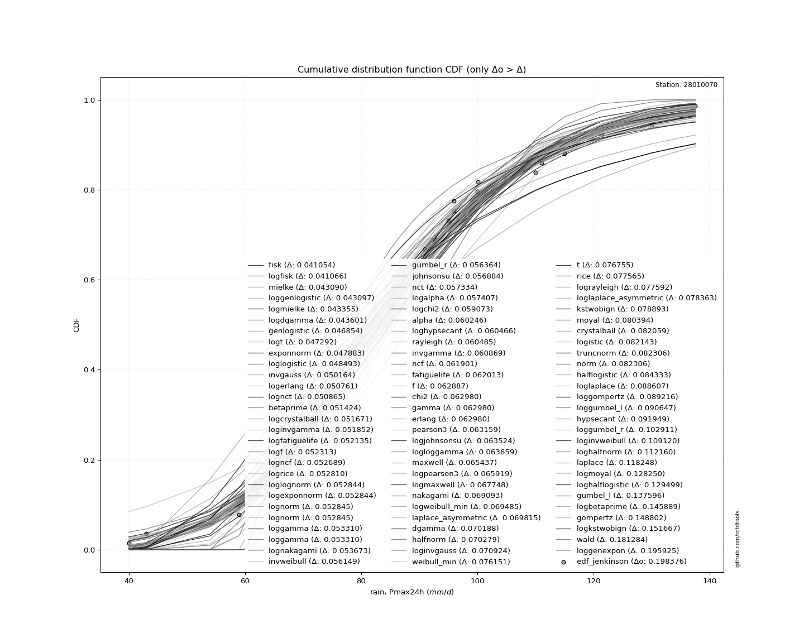</img>

</div>


**10.3. Best fit**

<div align="center">

|   id |   station | empirical_dist   | p_dist    |     delta |   deltao | eval   |   fit |   n |   best_fit |   best_fit_sort |
|-----:|----------:|:-----------------|:----------|----------:|---------:|:-------|------:|----:|-----------:|----------------:|
|    0 |  28010070 | edf_jenkinson    | logmielke | 0.0503853 | 0.188598 | Δo > Δ |     1 |  52 |          1 |               1 |

</div>


<div align="center">

</img></img>

</div>


### 11. Empirical - EDF Cunnane (1978)

Cunnane´s work in statistical hydrology has focused on the performance and evaluation of different probability distributions (such as GEV, Gumbel, Lognormal) for flood frequency estimation. _b_ is a constant, typically set to 0.4.

<div align="center">


$P=(m-b)/(n+1-2b)$


</div>


**11.1. Empirical values**

<div align="center">

|                | 0                    | 1                   | 2                   | 3                   | 4                   | 5                   | 6                  | 7                   | 8                  | 9                   | 10                  | 11                 | 12                  | 13                  | 14                 | 15                  | 16                  | 17                 | 18                 | 19                  | 20                 | 21                  | 22                 | 23                 | 24                  | 25                 | 26                 | 27                 | 28                 | 29                 | 30                 | 31                 | 32                 | 33                 | 34                 | 35                 | 36                 | 37                 | 38                 | 39                 | 40                 | 41                 | 42                 | 43                 | 44                 | 45                 | 46               | 47                 | 48                 | 49                 | 50                 | 51                 |
|:---------------|:---------------------|:--------------------|:--------------------|:--------------------|:--------------------|:--------------------|:-------------------|:--------------------|:-------------------|:--------------------|:--------------------|:-------------------|:--------------------|:--------------------|:-------------------|:--------------------|:--------------------|:-------------------|:-------------------|:--------------------|:-------------------|:--------------------|:-------------------|:-------------------|:--------------------|:-------------------|:-------------------|:-------------------|:-------------------|:-------------------|:-------------------|:-------------------|:-------------------|:-------------------|:-------------------|:-------------------|:-------------------|:-------------------|:-------------------|:-------------------|:-------------------|:-------------------|:-------------------|:-------------------|:-------------------|:-------------------|:-----------------|:-------------------|:-------------------|:-------------------|:-------------------|:-------------------|
| date           | 2015                 | 1986                | 1974                | 1997                | 1991                | 2021                | 2018               | 2002                | 1990               | 1993                | 1989                | 2011               | 2003                | 2004                | 2008               | 2001                | 2013                | 2007               | 1992               | 2016                | 2000               | 1994                | 2014               | 2012               | 2019                | 2010               | 2009               | 1972               | 2017               | 2005               | 1995               | 1977               | 1976               | 1988               | 1987               | 2020               | 1982               | 1985               | 1984               | 1971               | 1979               | 1983               | 1970               | 1975               | 1998               | 1980               | 1981             | 2006               | 1973               | 1978               | 1999               | 1996               |
| x              | 40.0                 | 43.0                | 45.0                | 60.2                | 60.5                | 62.0                | 63.0               | 65.0                | 69.9               | 70.1                | 70.6                | 71.0               | 73.0                | 76.0                | 80.0               | 80.0                | 85.0                | 85.0               | 86.4               | 88.0                | 90.0               | 90.7                | 95.0               | 95.0               | 95.0                | 96.0               | 96.0               | 99.0               | 100.0              | 100.0              | 100.1              | 104.603463613376   | 107.585122244536   | 110.0              | 111.0              | 112.144796560754   | 112.286587817857   | 112.589999231464   | 114.178729338772   | 115.247097358231   | 117.68809685844    | 119.745071952376   | 120.389200409921   | 120.667737339199   | 121.3              | 125.76249436743    | 126.944657729944 | 130.0              | 130.796492713251   | 130.974757328269   | 135.0              | 137.5              |
| m              | 1                    | 2                   | 3                   | 4                   | 5                   | 6                   | 7                  | 8                   | 9                  | 10                  | 11                  | 12                 | 13                  | 14                  | 15                 | 16                  | 17                  | 18                 | 19                 | 20                  | 21                 | 22                  | 23                 | 24                 | 25                  | 26                 | 27                 | 28                 | 29                 | 30                 | 31                 | 32                 | 33                 | 34                 | 35                 | 36                 | 37                 | 38                 | 39                 | 40                 | 41                 | 42                 | 43                 | 44                 | 45                 | 46                 | 47               | 48                 | 49                 | 50                 | 51                 | 52                 |
| empirical_dist | edf_cunnane          | edf_cunnane         | edf_cunnane         | edf_cunnane         | edf_cunnane         | edf_cunnane         | edf_cunnane        | edf_cunnane         | edf_cunnane        | edf_cunnane         | edf_cunnane         | edf_cunnane        | edf_cunnane         | edf_cunnane         | edf_cunnane        | edf_cunnane         | edf_cunnane         | edf_cunnane        | edf_cunnane        | edf_cunnane         | edf_cunnane        | edf_cunnane         | edf_cunnane        | edf_cunnane        | edf_cunnane         | edf_cunnane        | edf_cunnane        | edf_cunnane        | edf_cunnane        | edf_cunnane        | edf_cunnane        | edf_cunnane        | edf_cunnane        | edf_cunnane        | edf_cunnane        | edf_cunnane        | edf_cunnane        | edf_cunnane        | edf_cunnane        | edf_cunnane        | edf_cunnane        | edf_cunnane        | edf_cunnane        | edf_cunnane        | edf_cunnane        | edf_cunnane        | edf_cunnane      | edf_cunnane        | edf_cunnane        | edf_cunnane        | edf_cunnane        | edf_cunnane        |
| empirical      | 0.011494252873563216 | 0.03065134099616858 | 0.04980842911877394 | 0.06896551724137931 | 0.08812260536398467 | 0.10727969348659003 | 0.1264367816091954 | 0.14559386973180075 | 0.1647509578544061 | 0.18390804597701146 | 0.20306513409961685 | 0.2222222222222222 | 0.24137931034482757 | 0.26053639846743293 | 0.2796934865900383 | 0.29885057471264365 | 0.31800766283524906 | 0.3371647509578544 | 0.3563218390804598 | 0.37547892720306514 | 0.3946360153256705 | 0.41379310344827586 | 0.4329501915708812 | 0.4521072796934866 | 0.47126436781609193 | 0.4904214559386973 | 0.5095785440613027 | 0.5287356321839081 | 0.5478927203065134 | 0.5670498084291188 | 0.5862068965517241 | 0.6053639846743295 | 0.6245210727969348 | 0.6436781609195402 | 0.6628352490421456 | 0.6819923371647509 | 0.7011494252873564 | 0.7203065134099617 | 0.7394636015325671 | 0.7586206896551724 | 0.7777777777777778 | 0.7969348659003831 | 0.8160919540229885 | 0.8352490421455938 | 0.8544061302681992 | 0.8735632183908045 | 0.89272030651341 | 0.9118773946360152 | 0.9310344827586207 | 0.9501915708812261 | 0.9693486590038314 | 0.9885057471264368 |
| empirical_tr   | 1.0116279069767442   | 1.0316205533596838  | 1.0524193548387097  | 1.0740740740740742  | 1.0966386554621848  | 1.1201716738197425  | 1.144736842105263  | 1.1704035874439462  | 1.1972477064220182 | 1.2253521126760563  | 1.2548076923076923  | 1.2857142857142856 | 1.3181818181818183  | 1.3523316062176165  | 1.3882978723404253 | 1.4262295081967213  | 1.4662921348314608  | 1.5086705202312138 | 1.5535714285714286 | 1.6012269938650308  | 1.6518987341772151 | 1.7058823529411762  | 1.7635135135135134 | 1.8251748251748252 | 1.891304347826087   | 1.9624060150375937 | 2.0390625          | 2.1219512195121952 | 2.211864406779661  | 2.3097345132743365 | 2.4166666666666665 | 2.533980582524272  | 2.6632653061224487 | 2.8064516129032255 | 2.9659090909090913 | 3.144578313253012  | 3.3461538461538467 | 3.5753424657534243 | 3.838235294117647  | 4.142857142857142  | 4.5                | 4.924528301886792  | 5.4375             | 6.069767441860463  | 6.868421052631579  | 7.909090909090905  | 9.32142857142857 | 11.347826086956513 | 14.499999999999995 | 20.076923076923087 | 32.624999999999964 | 87.0000000000001   |

</div>


**11.2. Kolmogorov-Smirnov fit test (sorted by Δ)**


<div align="center">

|                | 0                    | 1                   | 2                   | 3                   | 4                   | 5                   | 6                   | 7                   | 8                   | 9                   | 10                  | 11                  | 12                  | 13                  | 14                  | 15                  | 16                  | 17                  | 18                  | 19                  | 20                  | 21                  | 22                  | 23                  | 24                  | 25                  | 26                  | 27                  | 28                  | 29                  | 30                  | 31                  | 32                    | 33                  | 34                  | 35                  | 36                  | 37                  | 38                  | 39                  | 40                  | 41                  | 42                  | 43                  | 44                  | 45                  | 46                  | 47                  | 48                  | 49                  | 50                  | 51                  | 52                  | 53                  | 54                  | 55                  | 56                  | 57                  | 58                  | 59                  | 60                  | 61                  | 62                  | 63                  | 64                  | 65                  | 66                  | 67                  | 68                  | 69                  | 70                  | 71                  | 72                  | 73                  | 74                  | 75                  | 76                  | 77                  | 78                  | 79                  | 80                  | 81                  | 82                  | 83                  | 84                  | 85                  | 86                  | 87                  | 88                  | 89                  |
|:---------------|:---------------------|:--------------------|:--------------------|:--------------------|:--------------------|:--------------------|:--------------------|:--------------------|:--------------------|:--------------------|:--------------------|:--------------------|:--------------------|:--------------------|:--------------------|:--------------------|:--------------------|:--------------------|:--------------------|:--------------------|:--------------------|:--------------------|:--------------------|:--------------------|:--------------------|:--------------------|:--------------------|:--------------------|:--------------------|:--------------------|:--------------------|:--------------------|:----------------------|:--------------------|:--------------------|:--------------------|:--------------------|:--------------------|:--------------------|:--------------------|:--------------------|:--------------------|:--------------------|:--------------------|:--------------------|:--------------------|:--------------------|:--------------------|:--------------------|:--------------------|:--------------------|:--------------------|:--------------------|:--------------------|:--------------------|:--------------------|:--------------------|:--------------------|:--------------------|:--------------------|:--------------------|:--------------------|:--------------------|:--------------------|:--------------------|:--------------------|:--------------------|:--------------------|:--------------------|:--------------------|:--------------------|:--------------------|:--------------------|:--------------------|:--------------------|:--------------------|:--------------------|:--------------------|:--------------------|:--------------------|:--------------------|:--------------------|:--------------------|:--------------------|:--------------------|:--------------------|:--------------------|:--------------------|:--------------------|:--------------------|
| station        | 28010070             | 28010070            | 28010070            | 28010070            | 28010070            | 28010070            | 28010070            | 28010070            | 28010070            | 28010070            | 28010070            | 28010070            | 28010070            | 28010070            | 28010070            | 28010070            | 28010070            | 28010070            | 28010070            | 28010070            | 28010070            | 28010070            | 28010070            | 28010070            | 28010070            | 28010070            | 28010070            | 28010070            | 28010070            | 28010070            | 28010070            | 28010070            | 28010070              | 28010070            | 28010070            | 28010070            | 28010070            | 28010070            | 28010070            | 28010070            | 28010070            | 28010070            | 28010070            | 28010070            | 28010070            | 28010070            | 28010070            | 28010070            | 28010070            | 28010070            | 28010070            | 28010070            | 28010070            | 28010070            | 28010070            | 28010070            | 28010070            | 28010070            | 28010070            | 28010070            | 28010070            | 28010070            | 28010070            | 28010070            | 28010070            | 28010070            | 28010070            | 28010070            | 28010070            | 28010070            | 28010070            | 28010070            | 28010070            | 28010070            | 28010070            | 28010070            | 28010070            | 28010070            | 28010070            | 28010070            | 28010070            | 28010070            | 28010070            | 28010070            | 28010070            | 28010070            | 28010070            | 28010070            | 28010070            | 28010070            |
| empirical_dist | edf_cunnane          | edf_cunnane         | edf_cunnane         | edf_cunnane         | edf_cunnane         | edf_cunnane         | edf_cunnane         | edf_cunnane         | edf_cunnane         | edf_cunnane         | edf_cunnane         | edf_cunnane         | edf_cunnane         | edf_cunnane         | edf_cunnane         | edf_cunnane         | edf_cunnane         | edf_cunnane         | edf_cunnane         | edf_cunnane         | edf_cunnane         | edf_cunnane         | edf_cunnane         | edf_cunnane         | edf_cunnane         | edf_cunnane         | edf_cunnane         | edf_cunnane         | edf_cunnane         | edf_cunnane         | edf_cunnane         | edf_cunnane         | edf_cunnane           | edf_cunnane         | edf_cunnane         | edf_cunnane         | edf_cunnane         | edf_cunnane         | edf_cunnane         | edf_cunnane         | edf_cunnane         | edf_cunnane         | edf_cunnane         | edf_cunnane         | edf_cunnane         | edf_cunnane         | edf_cunnane         | edf_cunnane         | edf_cunnane         | edf_cunnane         | edf_cunnane         | edf_cunnane         | edf_cunnane         | edf_cunnane         | edf_cunnane         | edf_cunnane         | edf_cunnane         | edf_cunnane         | edf_cunnane         | edf_cunnane         | edf_cunnane         | edf_cunnane         | edf_cunnane         | edf_cunnane         | edf_cunnane         | edf_cunnane         | edf_cunnane         | edf_cunnane         | edf_cunnane         | edf_cunnane         | edf_cunnane         | edf_cunnane         | edf_cunnane         | edf_cunnane         | edf_cunnane         | edf_cunnane         | edf_cunnane         | edf_cunnane         | edf_cunnane         | edf_cunnane         | edf_cunnane         | edf_cunnane         | edf_cunnane         | edf_cunnane         | edf_cunnane         | edf_cunnane         | edf_cunnane         | edf_cunnane         | edf_cunnane         | edf_cunnane         |
| p_dist         | logmielke            | johnsonsu           | logjohnsonsu        | logpearson3         | weibull_min         | genlogistic         | pearson3            | loggumbel_l         | logweibull_min      | gompertz            | fatiguelife         | loggompertz         | fisk                | gumbel_l            | logloggamma         | nct                 | t                   | crystalball         | norm                | truncnorm           | exponnorm           | gamma               | nakagami            | f                   | rice                | logfisk             | chi2                | erlang              | invgamma            | alpha               | logt                | maxwell             | loglaplace_asymmetric | loggenlogistic      | mielke              | logistic            | rayleigh            | betaprime           | laplace_asymmetric  | invweibull          | logfatiguelife      | hypsecant           | lognct              | lognakagami         | logbetaprime        | invgauss            | logf                | logcrystalball      | logexponnorm        | lognorm             | lognorm             | loglognorm          | logrice             | logncf              | loglogistic         | loggamma            | loggamma            | logalpha            | logchi2             | loghypsecant        | logerlang           | kstwobign           | gumbel_r            | loginvgamma         | halfnorm            | laplace             | loginvgauss         | logmaxwell          | loglaplace          | lograyleigh         | moyal               | loginvweibull       | halflogistic        | logkstwobign        | loghalfnorm         | loggumbel_r         | loggenexpon         | loghalflogistic     | logmoyal            | wald                | genexpon            | expon               | pareto              | gibrat              | logwald             | loggibrat           | logexpon            | logpareto           | logtruncnorm        | ncf                 |
| delta          | 0.049891562060208394 | 0.06082157250050668 | 0.06106860861877483 | 0.06200723304330469 | 0.06368292994898839 | 0.0668516000726162  | 0.0691077808423125  | 0.07020529998299307 | 0.07134309479840717 | 0.07374760484405207 | 0.0745784332817605  | 0.07561039043329332 | 0.07564078385867834 | 0.07625948384279316 | 0.07970771907011376 | 0.08007617773532083 | 0.08015040960846831 | 0.08021486381585308 | 0.08021487520139348 | 0.08021487738089828 | 0.0802152979320474  | 0.08058411948729649 | 0.08058782474232484 | 0.08069463069900007 | 0.08153243940922406 | 0.08221955108897328 | 0.08526795042621671 | 0.08579005664402628 | 0.08784385735028433 | 0.0927531486328027  | 0.09756805816077818 | 0.09806539895221511 | 0.09916346226162481   | 0.1011929093340665  | 0.10145165339100021 | 0.10247609201858288 | 0.10912259101761113 | 0.11033670555071329 | 0.11111016020203002 | 0.11120697626188913 | 0.11734704268082408 | 0.11789320651097679 | 0.11814294544917714 | 0.11815480434163461 | 0.1186756613023695  | 0.11880825849406884 | 0.11899555648032434 | 0.11912787859904639 | 0.11912842639741361 | 0.11912865551214558 | 0.11912865551214558 | 0.1191302043570256  | 0.11913058320974401 | 0.12609606994258193 | 0.1261359656606591  | 0.12678331748761262 | 0.12678331748761262 | 0.12762284975935567 | 0.13182774970334887 | 0.13205093089920128 | 0.13261791373650045 | 0.13395815731815108 | 0.13524207675627697 | 0.1355777322602859  | 0.14025278068068114 | 0.14061189181087774 | 0.14523955657752807 | 0.1493836085911604  | 0.15155675480500197 | 0.15908188467077156 | 0.16110218224681494 | 0.1617073744957993  | 0.1650591570814196  | 0.1791836327978359  | 0.18645781739439693 | 0.1891358734408064  | 0.20841329462373026 | 0.21381076659033815 | 0.2139053916696757  | 0.2331021736979727  | 0.24454908643920234 | 0.2538553473064038  | 0.2538553632690801  | 0.26053639846743293 | 0.2826382378819612  | 0.31190494844554717 | 0.32642495025796603 | 0.326424955481464   | 0.39648825051632963 | 0.48783778587557103 |
| deltao         | 0.18859806671657792  | 0.18859806671657792 | 0.18859806671657792 | 0.18859806671657792 | 0.18859806671657792 | 0.18859806671657792 | 0.18859806671657792 | 0.18859806671657792 | 0.18859806671657792 | 0.18859806671657792 | 0.18859806671657792 | 0.18859806671657792 | 0.18859806671657792 | 0.18859806671657792 | 0.18859806671657792 | 0.18859806671657792 | 0.18859806671657792 | 0.18859806671657792 | 0.18859806671657792 | 0.18859806671657792 | 0.18859806671657792 | 0.18859806671657792 | 0.18859806671657792 | 0.18859806671657792 | 0.18859806671657792 | 0.18859806671657792 | 0.18859806671657792 | 0.18859806671657792 | 0.18859806671657792 | 0.18859806671657792 | 0.18859806671657792 | 0.18859806671657792 | 0.18859806671657792   | 0.18859806671657792 | 0.18859806671657792 | 0.18859806671657792 | 0.18859806671657792 | 0.18859806671657792 | 0.18859806671657792 | 0.18859806671657792 | 0.18859806671657792 | 0.18859806671657792 | 0.18859806671657792 | 0.18859806671657792 | 0.18859806671657792 | 0.18859806671657792 | 0.18859806671657792 | 0.18859806671657792 | 0.18859806671657792 | 0.18859806671657792 | 0.18859806671657792 | 0.18859806671657792 | 0.18859806671657792 | 0.18859806671657792 | 0.18859806671657792 | 0.18859806671657792 | 0.18859806671657792 | 0.18859806671657792 | 0.18859806671657792 | 0.18859806671657792 | 0.18859806671657792 | 0.18859806671657792 | 0.18859806671657792 | 0.18859806671657792 | 0.18859806671657792 | 0.18859806671657792 | 0.18859806671657792 | 0.18859806671657792 | 0.18859806671657792 | 0.18859806671657792 | 0.18859806671657792 | 0.18859806671657792 | 0.18859806671657792 | 0.18859806671657792 | 0.18859806671657792 | 0.18859806671657792 | 0.18859806671657792 | 0.18859806671657792 | 0.18859806671657792 | 0.18859806671657792 | 0.18859806671657792 | 0.18859806671657792 | 0.18859806671657792 | 0.18859806671657792 | 0.18859806671657792 | 0.18859806671657792 | 0.18859806671657792 | 0.18859806671657792 | 0.18859806671657792 | 0.18859806671657792 |
| eval           | Δo > Δ               | Δo > Δ              | Δo > Δ              | Δo > Δ              | Δo > Δ              | Δo > Δ              | Δo > Δ              | Δo > Δ              | Δo > Δ              | Δo > Δ              | Δo > Δ              | Δo > Δ              | Δo > Δ              | Δo > Δ              | Δo > Δ              | Δo > Δ              | Δo > Δ              | Δo > Δ              | Δo > Δ              | Δo > Δ              | Δo > Δ              | Δo > Δ              | Δo > Δ              | Δo > Δ              | Δo > Δ              | Δo > Δ              | Δo > Δ              | Δo > Δ              | Δo > Δ              | Δo > Δ              | Δo > Δ              | Δo > Δ              | Δo > Δ                | Δo > Δ              | Δo > Δ              | Δo > Δ              | Δo > Δ              | Δo > Δ              | Δo > Δ              | Δo > Δ              | Δo > Δ              | Δo > Δ              | Δo > Δ              | Δo > Δ              | Δo > Δ              | Δo > Δ              | Δo > Δ              | Δo > Δ              | Δo > Δ              | Δo > Δ              | Δo > Δ              | Δo > Δ              | Δo > Δ              | Δo > Δ              | Δo > Δ              | Δo > Δ              | Δo > Δ              | Δo > Δ              | Δo > Δ              | Δo > Δ              | Δo > Δ              | Δo > Δ              | Δo > Δ              | Δo > Δ              | Δo > Δ              | Δo > Δ              | Δo > Δ              | Δo > Δ              | Δo > Δ              | Δo > Δ              | Δo > Δ              | Δo > Δ              | Δo > Δ              | Δo > Δ              | Δo > Δ              | Δo <= Δ             | Δo <= Δ             | Δo <= Δ             | Δo <= Δ             | Δo <= Δ             | Δo <= Δ             | Δo <= Δ             | Δo <= Δ             | Δo <= Δ             | Δo <= Δ             | Δo <= Δ             | Δo <= Δ             | Δo <= Δ             | Δo <= Δ             | Δo <= Δ             |
| fit            | 1                    | 1                   | 1                   | 1                   | 1                   | 1                   | 1                   | 1                   | 1                   | 1                   | 1                   | 1                   | 1                   | 1                   | 1                   | 1                   | 1                   | 1                   | 1                   | 1                   | 1                   | 1                   | 1                   | 1                   | 1                   | 1                   | 1                   | 1                   | 1                   | 1                   | 1                   | 1                   | 1                     | 1                   | 1                   | 1                   | 1                   | 1                   | 1                   | 1                   | 1                   | 1                   | 1                   | 1                   | 1                   | 1                   | 1                   | 1                   | 1                   | 1                   | 1                   | 1                   | 1                   | 1                   | 1                   | 1                   | 1                   | 1                   | 1                   | 1                   | 1                   | 1                   | 1                   | 1                   | 1                   | 1                   | 1                   | 1                   | 1                   | 1                   | 1                   | 1                   | 1                   | 1                   | 1                   | 0                   | 0                   | 0                   | 0                   | 0                   | 0                   | 0                   | 0                   | 0                   | 0                   | 0                   | 0                   | 0                   | 0                   | 0                   |
| n              | 52                   | 52                  | 52                  | 52                  | 52                  | 52                  | 52                  | 52                  | 52                  | 52                  | 52                  | 52                  | 52                  | 52                  | 52                  | 52                  | 52                  | 52                  | 52                  | 52                  | 52                  | 52                  | 52                  | 52                  | 52                  | 52                  | 52                  | 52                  | 52                  | 52                  | 52                  | 52                  | 52                    | 52                  | 52                  | 52                  | 52                  | 52                  | 52                  | 52                  | 52                  | 52                  | 52                  | 52                  | 52                  | 52                  | 52                  | 52                  | 52                  | 52                  | 52                  | 52                  | 52                  | 52                  | 52                  | 52                  | 52                  | 52                  | 52                  | 52                  | 52                  | 52                  | 52                  | 52                  | 52                  | 52                  | 52                  | 52                  | 52                  | 52                  | 52                  | 52                  | 52                  | 52                  | 52                  | 52                  | 52                  | 52                  | 52                  | 52                  | 52                  | 52                  | 52                  | 52                  | 52                  | 52                  | 52                  | 52                  | 52                  | 52                  |
| best_fit       | 1                    | 0                   | 0                   | 0                   | 0                   | 0                   | 0                   | 0                   | 0                   | 0                   | 0                   | 0                   | 0                   | 0                   | 0                   | 0                   | 0                   | 0                   | 0                   | 0                   | 0                   | 0                   | 0                   | 0                   | 0                   | 0                   | 0                   | 0                   | 0                   | 0                   | 0                   | 0                   | 0                     | 0                   | 0                   | 0                   | 0                   | 0                   | 0                   | 0                   | 0                   | 0                   | 0                   | 0                   | 0                   | 0                   | 0                   | 0                   | 0                   | 0                   | 0                   | 0                   | 0                   | 0                   | 0                   | 0                   | 0                   | 0                   | 0                   | 0                   | 0                   | 0                   | 0                   | 0                   | 0                   | 0                   | 0                   | 0                   | 0                   | 0                   | 0                   | 0                   | 0                   | 0                   | 0                   | 0                   | 0                   | 0                   | 0                   | 0                   | 0                   | 0                   | 0                   | 0                   | 0                   | 0                   | 0                   | 0                   | 0                   | 0                   |
| best_fit_sort  | 1                    | 2                   | 3                   | 4                   | 5                   | 6                   | 7                   | 8                   | 9                   | 10                  | 11                  | 12                  | 13                  | 14                  | 15                  | 16                  | 17                  | 18                  | 19                  | 20                  | 21                  | 22                  | 23                  | 24                  | 25                  | 26                  | 27                  | 28                  | 29                  | 30                  | 31                  | 32                  | 33                    | 34                  | 35                  | 36                  | 37                  | 38                  | 39                  | 40                  | 41                  | 42                  | 43                  | 44                  | 45                  | 46                  | 47                  | 48                  | 49                  | 50                  | 51                  | 52                  | 53                  | 54                  | 55                  | 56                  | 57                  | 58                  | 59                  | 60                  | 61                  | 62                  | 63                  | 64                  | 65                  | 66                  | 67                  | 68                  | 69                  | 70                  | 71                  | 72                  | 73                  | 74                  | 75                  | 76                  | 77                  | 78                  | 79                  | 80                  | 81                  | 82                  | 83                  | 84                  | 85                  | 86                  | 87                  | 88                  | 89                  | 90                  |

</div>


<div align="center">

</img>

</div>


**11.3. Best fit**

<div align="center">

|   id |   station | empirical_dist   | p_dist    |     delta |   deltao | eval   |   fit |   n |   best_fit |   best_fit_sort |
|-----:|----------:|:-----------------|:----------|----------:|---------:|:-------|------:|----:|-----------:|----------------:|
|    0 |  28010070 | edf_cunnane      | logmielke | 0.0498916 | 0.188598 | Δo > Δ |     1 |  52 |          1 |               1 |

</div>


<div align="center">

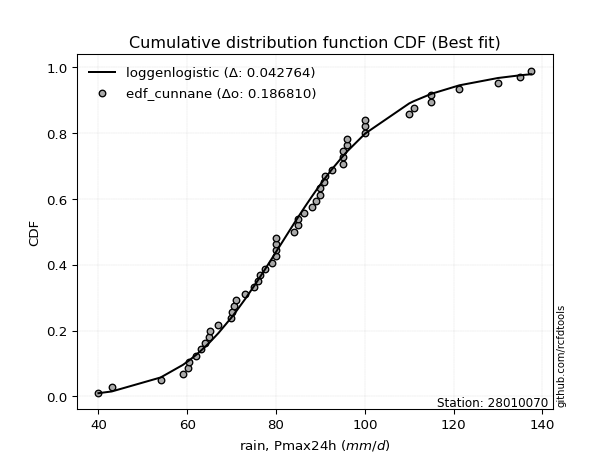</img>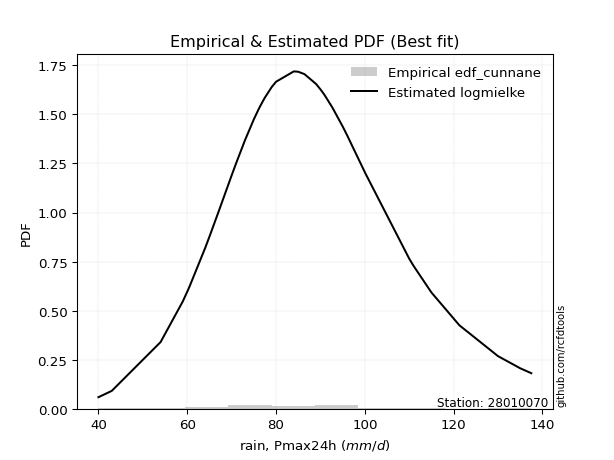</img>

</div>


### 12. Empirical - EDF Adamowski (1981)

The Adamowski formula in hydrology refers to a specific plotting position formula used for estimating the non-parametric empirical distribution of hydrological events (like flood peaks) to calculate their return periods. This formula provides an alternative to traditional parametric methods (like the Gumbel or Log Pearson Type III distributions). 

<div align="center">


$P=(m-0.25)/(n+0.5)$


</div>


**12.1. Empirical values**

<div align="center">

|                | 0                    | 1                   | 2                   | 3                   | 4                   | 5                   | 6                   | 7                   | 8                   | 9                   | 10                  | 11                  | 12                  | 13                 | 14                  | 15                 | 16                 | 17                 | 18                  | 19                 | 20                 | 21                 | 22                  | 23                 | 24                 | 25                  | 26                 | 27                 | 28                 | 29                 | 30                 | 31                 | 32                 | 33                 | 34                 | 35                 | 36                | 37                | 38                 | 39                 | 40                 | 41                 | 42                 | 43                 | 44                 | 45                 | 46                 | 47                 | 48                 | 49                 | 50                 | 51                 |
|:---------------|:---------------------|:--------------------|:--------------------|:--------------------|:--------------------|:--------------------|:--------------------|:--------------------|:--------------------|:--------------------|:--------------------|:--------------------|:--------------------|:-------------------|:--------------------|:-------------------|:-------------------|:-------------------|:--------------------|:-------------------|:-------------------|:-------------------|:--------------------|:-------------------|:-------------------|:--------------------|:-------------------|:-------------------|:-------------------|:-------------------|:-------------------|:-------------------|:-------------------|:-------------------|:-------------------|:-------------------|:------------------|:------------------|:-------------------|:-------------------|:-------------------|:-------------------|:-------------------|:-------------------|:-------------------|:-------------------|:-------------------|:-------------------|:-------------------|:-------------------|:-------------------|:-------------------|
| date           | 2015                 | 1986                | 1974                | 1997                | 1991                | 2021                | 2018                | 2002                | 1990                | 1993                | 1989                | 2011                | 2003                | 2004               | 2008                | 2001               | 2013               | 2007               | 1992                | 2016               | 2000               | 1994               | 2014                | 2012               | 2019               | 2010                | 2009               | 1972               | 2017               | 2005               | 1995               | 1977               | 1976               | 1988               | 1987               | 2020               | 1982              | 1985              | 1984               | 1971               | 1979               | 1983               | 1970               | 1975               | 1998               | 1980               | 1981               | 2006               | 1973               | 1978               | 1999               | 1996               |
| x              | 40.0                 | 43.0                | 45.0                | 60.2                | 60.5                | 62.0                | 63.0                | 65.0                | 69.9                | 70.1                | 70.6                | 71.0                | 73.0                | 76.0               | 80.0                | 80.0               | 85.0               | 85.0               | 86.4                | 88.0               | 90.0               | 90.7               | 95.0                | 95.0               | 95.0               | 96.0                | 96.0               | 99.0               | 100.0              | 100.0              | 100.1              | 104.603463613376   | 107.585122244536   | 110.0              | 111.0              | 112.144796560754   | 112.286587817857  | 112.589999231464  | 114.178729338772   | 115.247097358231   | 117.68809685844    | 119.745071952376   | 120.389200409921   | 120.667737339199   | 121.3              | 125.76249436743    | 126.944657729944   | 130.0              | 130.796492713251   | 130.974757328269   | 135.0              | 137.5              |
| m              | 1                    | 2                   | 3                   | 4                   | 5                   | 6                   | 7                   | 8                   | 9                   | 10                  | 11                  | 12                  | 13                  | 14                 | 15                  | 16                 | 17                 | 18                 | 19                  | 20                 | 21                 | 22                 | 23                  | 24                 | 25                 | 26                  | 27                 | 28                 | 29                 | 30                 | 31                 | 32                 | 33                 | 34                 | 35                 | 36                 | 37                | 38                | 39                 | 40                 | 41                 | 42                 | 43                 | 44                 | 45                 | 46                 | 47                 | 48                 | 49                 | 50                 | 51                 | 52                 |
| empirical_dist | edf_adamowski        | edf_adamowski       | edf_adamowski       | edf_adamowski       | edf_adamowski       | edf_adamowski       | edf_adamowski       | edf_adamowski       | edf_adamowski       | edf_adamowski       | edf_adamowski       | edf_adamowski       | edf_adamowski       | edf_adamowski      | edf_adamowski       | edf_adamowski      | edf_adamowski      | edf_adamowski      | edf_adamowski       | edf_adamowski      | edf_adamowski      | edf_adamowski      | edf_adamowski       | edf_adamowski      | edf_adamowski      | edf_adamowski       | edf_adamowski      | edf_adamowski      | edf_adamowski      | edf_adamowski      | edf_adamowski      | edf_adamowski      | edf_adamowski      | edf_adamowski      | edf_adamowski      | edf_adamowski      | edf_adamowski     | edf_adamowski     | edf_adamowski      | edf_adamowski      | edf_adamowski      | edf_adamowski      | edf_adamowski      | edf_adamowski      | edf_adamowski      | edf_adamowski      | edf_adamowski      | edf_adamowski      | edf_adamowski      | edf_adamowski      | edf_adamowski      | edf_adamowski      |
| empirical      | 0.014285714285714285 | 0.03333333333333333 | 0.05238095238095238 | 0.07142857142857142 | 0.09047619047619047 | 0.10952380952380952 | 0.12857142857142856 | 0.14761904761904762 | 0.16666666666666666 | 0.18571428571428572 | 0.20476190476190476 | 0.22380952380952382 | 0.24285714285714285 | 0.2619047619047619 | 0.28095238095238095 | 0.3                | 0.319047619047619  | 0.3380952380952381 | 0.35714285714285715 | 0.3761904761904762 | 0.3952380952380952 | 0.4142857142857143 | 0.43333333333333335 | 0.4523809523809524 | 0.4714285714285714 | 0.49047619047619045 | 0.5095238095238095 | 0.5285714285714286 | 0.5476190476190477 | 0.5666666666666667 | 0.5857142857142857 | 0.6047619047619047 | 0.6238095238095238 | 0.6428571428571429 | 0.6619047619047619 | 0.680952380952381  | 0.7               | 0.719047619047619 | 0.7380952380952381 | 0.7571428571428571 | 0.7761904761904762 | 0.7952380952380952 | 0.8142857142857143 | 0.8333333333333334 | 0.8523809523809524 | 0.8714285714285714 | 0.8904761904761904 | 0.9095238095238095 | 0.9285714285714286 | 0.9476190476190476 | 0.9666666666666667 | 0.9857142857142858 |
| empirical_tr   | 1.0144927536231882   | 1.0344827586206897  | 1.0552763819095479  | 1.0769230769230769  | 1.0994764397905759  | 1.1229946524064172  | 1.1475409836065573  | 1.1731843575418994  | 1.2                 | 1.2280701754385965  | 1.2574850299401197  | 1.2883435582822085  | 1.3207547169811322  | 1.3548387096774193 | 1.390728476821192   | 1.4285714285714286 | 1.4685314685314685 | 1.510791366906475  | 1.5555555555555558  | 1.6030534351145038 | 1.653543307086614  | 1.707317073170732  | 1.7647058823529411  | 1.826086956521739  | 1.8918918918918919 | 1.9626168224299068  | 2.0388349514563107 | 2.121212121212121  | 2.210526315789474  | 2.3076923076923075 | 2.4137931034482762 | 2.5301204819277108 | 2.6582278481012658 | 2.8000000000000003 | 2.957746478873239  | 3.1343283582089554 | 3.333333333333333 | 3.559322033898305 | 3.818181818181819  | 4.117647058823529  | 4.468085106382979  | 4.883720930232557  | 5.384615384615384  | 6.000000000000002  | 6.774193548387095  | 7.777777777777779  | 9.130434782608692  | 11.052631578947366 | 14.000000000000007 | 19.09090909090908  | 30.000000000000007 | 70.00000000000026  |

</div>


**12.2. Kolmogorov-Smirnov fit test (sorted by Δ)**


<div align="center">

|                | 0                   | 1                   | 2                   | 3                   | 4                   | 5                   | 6                   | 7                   | 8                   | 9                   | 10                  | 11                  | 12                  | 13                  | 14                  | 15                  | 16                  | 17                  | 18                  | 19                  | 20                  | 21                  | 22                  | 23                  | 24                  | 25                  | 26                  | 27                  | 28                  | 29                  | 30                  | 31                  | 32                    | 33                  | 34                  | 35                  | 36                  | 37                  | 38                  | 39                  | 40                  | 41                  | 42                  | 43                  | 44                  | 45                  | 46                  | 47                  | 48                  | 49                  | 50                  | 51                  | 52                  | 53                  | 54                  | 55                  | 56                  | 57                  | 58                  | 59                  | 60                  | 61                  | 62                  | 63                  | 64                  | 65                  | 66                  | 67                  | 68                  | 69                  | 70                  | 71                  | 72                  | 73                  | 74                  | 75                  | 76                  | 77                  | 78                  | 79                  | 80                  | 81                  | 82                  | 83                  | 84                  | 85                  | 86                  | 87                  | 88                  | 89                  |
|:---------------|:--------------------|:--------------------|:--------------------|:--------------------|:--------------------|:--------------------|:--------------------|:--------------------|:--------------------|:--------------------|:--------------------|:--------------------|:--------------------|:--------------------|:--------------------|:--------------------|:--------------------|:--------------------|:--------------------|:--------------------|:--------------------|:--------------------|:--------------------|:--------------------|:--------------------|:--------------------|:--------------------|:--------------------|:--------------------|:--------------------|:--------------------|:--------------------|:----------------------|:--------------------|:--------------------|:--------------------|:--------------------|:--------------------|:--------------------|:--------------------|:--------------------|:--------------------|:--------------------|:--------------------|:--------------------|:--------------------|:--------------------|:--------------------|:--------------------|:--------------------|:--------------------|:--------------------|:--------------------|:--------------------|:--------------------|:--------------------|:--------------------|:--------------------|:--------------------|:--------------------|:--------------------|:--------------------|:--------------------|:--------------------|:--------------------|:--------------------|:--------------------|:--------------------|:--------------------|:--------------------|:--------------------|:--------------------|:--------------------|:--------------------|:--------------------|:--------------------|:--------------------|:--------------------|:--------------------|:--------------------|:--------------------|:--------------------|:--------------------|:--------------------|:--------------------|:--------------------|:--------------------|:--------------------|:--------------------|:--------------------|
| station        | 28010070            | 28010070            | 28010070            | 28010070            | 28010070            | 28010070            | 28010070            | 28010070            | 28010070            | 28010070            | 28010070            | 28010070            | 28010070            | 28010070            | 28010070            | 28010070            | 28010070            | 28010070            | 28010070            | 28010070            | 28010070            | 28010070            | 28010070            | 28010070            | 28010070            | 28010070            | 28010070            | 28010070            | 28010070            | 28010070            | 28010070            | 28010070            | 28010070              | 28010070            | 28010070            | 28010070            | 28010070            | 28010070            | 28010070            | 28010070            | 28010070            | 28010070            | 28010070            | 28010070            | 28010070            | 28010070            | 28010070            | 28010070            | 28010070            | 28010070            | 28010070            | 28010070            | 28010070            | 28010070            | 28010070            | 28010070            | 28010070            | 28010070            | 28010070            | 28010070            | 28010070            | 28010070            | 28010070            | 28010070            | 28010070            | 28010070            | 28010070            | 28010070            | 28010070            | 28010070            | 28010070            | 28010070            | 28010070            | 28010070            | 28010070            | 28010070            | 28010070            | 28010070            | 28010070            | 28010070            | 28010070            | 28010070            | 28010070            | 28010070            | 28010070            | 28010070            | 28010070            | 28010070            | 28010070            | 28010070            |
| empirical_dist | edf_adamowski       | edf_adamowski       | edf_adamowski       | edf_adamowski       | edf_adamowski       | edf_adamowski       | edf_adamowski       | edf_adamowski       | edf_adamowski       | edf_adamowski       | edf_adamowski       | edf_adamowski       | edf_adamowski       | edf_adamowski       | edf_adamowski       | edf_adamowski       | edf_adamowski       | edf_adamowski       | edf_adamowski       | edf_adamowski       | edf_adamowski       | edf_adamowski       | edf_adamowski       | edf_adamowski       | edf_adamowski       | edf_adamowski       | edf_adamowski       | edf_adamowski       | edf_adamowski       | edf_adamowski       | edf_adamowski       | edf_adamowski       | edf_adamowski         | edf_adamowski       | edf_adamowski       | edf_adamowski       | edf_adamowski       | edf_adamowski       | edf_adamowski       | edf_adamowski       | edf_adamowski       | edf_adamowski       | edf_adamowski       | edf_adamowski       | edf_adamowski       | edf_adamowski       | edf_adamowski       | edf_adamowski       | edf_adamowski       | edf_adamowski       | edf_adamowski       | edf_adamowski       | edf_adamowski       | edf_adamowski       | edf_adamowski       | edf_adamowski       | edf_adamowski       | edf_adamowski       | edf_adamowski       | edf_adamowski       | edf_adamowski       | edf_adamowski       | edf_adamowski       | edf_adamowski       | edf_adamowski       | edf_adamowski       | edf_adamowski       | edf_adamowski       | edf_adamowski       | edf_adamowski       | edf_adamowski       | edf_adamowski       | edf_adamowski       | edf_adamowski       | edf_adamowski       | edf_adamowski       | edf_adamowski       | edf_adamowski       | edf_adamowski       | edf_adamowski       | edf_adamowski       | edf_adamowski       | edf_adamowski       | edf_adamowski       | edf_adamowski       | edf_adamowski       | edf_adamowski       | edf_adamowski       | edf_adamowski       | edf_adamowski       |
| p_dist         | logmielke           | logjohnsonsu        | johnsonsu           | logpearson3         | weibull_min         | genlogistic         | pearson3            | loggumbel_l         | logweibull_min      | gompertz            | fatiguelife         | loggompertz         | fisk                | gumbel_l            | logloggamma         | logfisk             | nct                 | t                   | crystalball         | norm                | truncnorm           | exponnorm           | gamma               | nakagami            | f                   | rice                | chi2                | erlang              | invgamma            | alpha               | logt                | maxwell             | loglaplace_asymmetric | loggenlogistic      | mielke              | logistic            | rayleigh            | betaprime           | invweibull          | laplace_asymmetric  | logfatiguelife      | lognct              | lognakagami         | logbetaprime        | invgauss            | logf                | hypsecant           | logcrystalball      | logexponnorm        | lognorm             | lognorm             | loglognorm          | logrice             | logncf              | loglogistic         | loggamma            | loggamma            | logalpha            | logchi2             | loghypsecant        | logerlang           | kstwobign           | gumbel_r            | loginvgamma         | halfnorm            | laplace             | loginvgauss         | logmaxwell          | loglaplace          | lograyleigh         | loginvweibull       | moyal               | halflogistic        | logkstwobign        | loghalfnorm         | loggumbel_r         | loggenexpon         | loghalflogistic     | logmoyal            | wald                | genexpon            | expon               | pareto              | gibrat              | logwald             | loggibrat           | logexpon            | logpareto           | logtruncnorm        | ncf                 |
| delta          | 0.05071258012260571 | 0.06057599778133649 | 0.06229940501282197 | 0.062828251105702   | 0.0645039480113857  | 0.06832943258493149 | 0.06992879890470982 | 0.07102631804539039 | 0.07216411286080449 | 0.07325499400661373 | 0.07539945134415782 | 0.07643140849569063 | 0.07646180192107566 | 0.07773731635510844 | 0.07921510823267541 | 0.08054606384561258 | 0.08089719579771815 | 0.08097142767086563 | 0.0810358818782504  | 0.08103589326379079 | 0.08103589544329559 | 0.08103631599444472 | 0.0814051375496938  | 0.08140884280472216 | 0.08151564876139739 | 0.08235345747162137 | 0.08608896848861403 | 0.0866110747064236  | 0.0874607155878322  | 0.09357416669520002 | 0.09718491639832605 | 0.09768225718976298 | 0.09867085142418647   | 0.10070029849662815 | 0.10095904255356186 | 0.10329711008098019 | 0.108739449255159   | 0.10995356378826115 | 0.110823834499437   | 0.11193117826442733 | 0.11696390091837194 | 0.117759803686725   | 0.11777166257918248 | 0.11829251953991737 | 0.11842511673161671 | 0.1186124147178722  | 0.1187142245733741  | 0.11874473683659426 | 0.11874528463496148 | 0.11874551374969344 | 0.11874551374969344 | 0.11874706259457346 | 0.11874744144729188 | 0.1257129281801298  | 0.12575282389820697 | 0.1264001757251605  | 0.1264001757251605  | 0.12723970799690354 | 0.13144460794089674 | 0.13166778913674915 | 0.13223477197404832 | 0.13357501555569895 | 0.13485893499382484 | 0.13519459049783378 | 0.139869638918229   | 0.14143290987327506 | 0.14485641481507594 | 0.14900046682870827 | 0.15117361304254984 | 0.15869874290831942 | 0.15891591308364827 | 0.1607190404843628  | 0.16467601531896747 | 0.17814367658546593 | 0.1860746756319448  | 0.18875273167835427 | 0.2073733384113603  | 0.21342762482788602 | 0.21352224990722357 | 0.234580006210288   | 0.2426333776269418  | 0.25193963849414325 | 0.25193965445681954 | 0.2619047619047619  | 0.28225509611950905 | 0.31152180668309504 | 0.3245092414457055  | 0.32450924666920344 | 0.3945725417040691  | 0.48537473168837897 |
| deltao         | 0.18859806671657792 | 0.18859806671657792 | 0.18859806671657792 | 0.18859806671657792 | 0.18859806671657792 | 0.18859806671657792 | 0.18859806671657792 | 0.18859806671657792 | 0.18859806671657792 | 0.18859806671657792 | 0.18859806671657792 | 0.18859806671657792 | 0.18859806671657792 | 0.18859806671657792 | 0.18859806671657792 | 0.18859806671657792 | 0.18859806671657792 | 0.18859806671657792 | 0.18859806671657792 | 0.18859806671657792 | 0.18859806671657792 | 0.18859806671657792 | 0.18859806671657792 | 0.18859806671657792 | 0.18859806671657792 | 0.18859806671657792 | 0.18859806671657792 | 0.18859806671657792 | 0.18859806671657792 | 0.18859806671657792 | 0.18859806671657792 | 0.18859806671657792 | 0.18859806671657792   | 0.18859806671657792 | 0.18859806671657792 | 0.18859806671657792 | 0.18859806671657792 | 0.18859806671657792 | 0.18859806671657792 | 0.18859806671657792 | 0.18859806671657792 | 0.18859806671657792 | 0.18859806671657792 | 0.18859806671657792 | 0.18859806671657792 | 0.18859806671657792 | 0.18859806671657792 | 0.18859806671657792 | 0.18859806671657792 | 0.18859806671657792 | 0.18859806671657792 | 0.18859806671657792 | 0.18859806671657792 | 0.18859806671657792 | 0.18859806671657792 | 0.18859806671657792 | 0.18859806671657792 | 0.18859806671657792 | 0.18859806671657792 | 0.18859806671657792 | 0.18859806671657792 | 0.18859806671657792 | 0.18859806671657792 | 0.18859806671657792 | 0.18859806671657792 | 0.18859806671657792 | 0.18859806671657792 | 0.18859806671657792 | 0.18859806671657792 | 0.18859806671657792 | 0.18859806671657792 | 0.18859806671657792 | 0.18859806671657792 | 0.18859806671657792 | 0.18859806671657792 | 0.18859806671657792 | 0.18859806671657792 | 0.18859806671657792 | 0.18859806671657792 | 0.18859806671657792 | 0.18859806671657792 | 0.18859806671657792 | 0.18859806671657792 | 0.18859806671657792 | 0.18859806671657792 | 0.18859806671657792 | 0.18859806671657792 | 0.18859806671657792 | 0.18859806671657792 | 0.18859806671657792 |
| eval           | Δo > Δ              | Δo > Δ              | Δo > Δ              | Δo > Δ              | Δo > Δ              | Δo > Δ              | Δo > Δ              | Δo > Δ              | Δo > Δ              | Δo > Δ              | Δo > Δ              | Δo > Δ              | Δo > Δ              | Δo > Δ              | Δo > Δ              | Δo > Δ              | Δo > Δ              | Δo > Δ              | Δo > Δ              | Δo > Δ              | Δo > Δ              | Δo > Δ              | Δo > Δ              | Δo > Δ              | Δo > Δ              | Δo > Δ              | Δo > Δ              | Δo > Δ              | Δo > Δ              | Δo > Δ              | Δo > Δ              | Δo > Δ              | Δo > Δ                | Δo > Δ              | Δo > Δ              | Δo > Δ              | Δo > Δ              | Δo > Δ              | Δo > Δ              | Δo > Δ              | Δo > Δ              | Δo > Δ              | Δo > Δ              | Δo > Δ              | Δo > Δ              | Δo > Δ              | Δo > Δ              | Δo > Δ              | Δo > Δ              | Δo > Δ              | Δo > Δ              | Δo > Δ              | Δo > Δ              | Δo > Δ              | Δo > Δ              | Δo > Δ              | Δo > Δ              | Δo > Δ              | Δo > Δ              | Δo > Δ              | Δo > Δ              | Δo > Δ              | Δo > Δ              | Δo > Δ              | Δo > Δ              | Δo > Δ              | Δo > Δ              | Δo > Δ              | Δo > Δ              | Δo > Δ              | Δo > Δ              | Δo > Δ              | Δo > Δ              | Δo > Δ              | Δo > Δ              | Δo <= Δ             | Δo <= Δ             | Δo <= Δ             | Δo <= Δ             | Δo <= Δ             | Δo <= Δ             | Δo <= Δ             | Δo <= Δ             | Δo <= Δ             | Δo <= Δ             | Δo <= Δ             | Δo <= Δ             | Δo <= Δ             | Δo <= Δ             | Δo <= Δ             |
| fit            | 1                   | 1                   | 1                   | 1                   | 1                   | 1                   | 1                   | 1                   | 1                   | 1                   | 1                   | 1                   | 1                   | 1                   | 1                   | 1                   | 1                   | 1                   | 1                   | 1                   | 1                   | 1                   | 1                   | 1                   | 1                   | 1                   | 1                   | 1                   | 1                   | 1                   | 1                   | 1                   | 1                     | 1                   | 1                   | 1                   | 1                   | 1                   | 1                   | 1                   | 1                   | 1                   | 1                   | 1                   | 1                   | 1                   | 1                   | 1                   | 1                   | 1                   | 1                   | 1                   | 1                   | 1                   | 1                   | 1                   | 1                   | 1                   | 1                   | 1                   | 1                   | 1                   | 1                   | 1                   | 1                   | 1                   | 1                   | 1                   | 1                   | 1                   | 1                   | 1                   | 1                   | 1                   | 1                   | 0                   | 0                   | 0                   | 0                   | 0                   | 0                   | 0                   | 0                   | 0                   | 0                   | 0                   | 0                   | 0                   | 0                   | 0                   |
| n              | 52                  | 52                  | 52                  | 52                  | 52                  | 52                  | 52                  | 52                  | 52                  | 52                  | 52                  | 52                  | 52                  | 52                  | 52                  | 52                  | 52                  | 52                  | 52                  | 52                  | 52                  | 52                  | 52                  | 52                  | 52                  | 52                  | 52                  | 52                  | 52                  | 52                  | 52                  | 52                  | 52                    | 52                  | 52                  | 52                  | 52                  | 52                  | 52                  | 52                  | 52                  | 52                  | 52                  | 52                  | 52                  | 52                  | 52                  | 52                  | 52                  | 52                  | 52                  | 52                  | 52                  | 52                  | 52                  | 52                  | 52                  | 52                  | 52                  | 52                  | 52                  | 52                  | 52                  | 52                  | 52                  | 52                  | 52                  | 52                  | 52                  | 52                  | 52                  | 52                  | 52                  | 52                  | 52                  | 52                  | 52                  | 52                  | 52                  | 52                  | 52                  | 52                  | 52                  | 52                  | 52                  | 52                  | 52                  | 52                  | 52                  | 52                  |
| best_fit       | 1                   | 0                   | 0                   | 0                   | 0                   | 0                   | 0                   | 0                   | 0                   | 0                   | 0                   | 0                   | 0                   | 0                   | 0                   | 0                   | 0                   | 0                   | 0                   | 0                   | 0                   | 0                   | 0                   | 0                   | 0                   | 0                   | 0                   | 0                   | 0                   | 0                   | 0                   | 0                   | 0                     | 0                   | 0                   | 0                   | 0                   | 0                   | 0                   | 0                   | 0                   | 0                   | 0                   | 0                   | 0                   | 0                   | 0                   | 0                   | 0                   | 0                   | 0                   | 0                   | 0                   | 0                   | 0                   | 0                   | 0                   | 0                   | 0                   | 0                   | 0                   | 0                   | 0                   | 0                   | 0                   | 0                   | 0                   | 0                   | 0                   | 0                   | 0                   | 0                   | 0                   | 0                   | 0                   | 0                   | 0                   | 0                   | 0                   | 0                   | 0                   | 0                   | 0                   | 0                   | 0                   | 0                   | 0                   | 0                   | 0                   | 0                   |
| best_fit_sort  | 1                   | 2                   | 3                   | 4                   | 5                   | 6                   | 7                   | 8                   | 9                   | 10                  | 11                  | 12                  | 13                  | 14                  | 15                  | 16                  | 17                  | 18                  | 19                  | 20                  | 21                  | 22                  | 23                  | 24                  | 25                  | 26                  | 27                  | 28                  | 29                  | 30                  | 31                  | 32                  | 33                    | 34                  | 35                  | 36                  | 37                  | 38                  | 39                  | 40                  | 41                  | 42                  | 43                  | 44                  | 45                  | 46                  | 47                  | 48                  | 49                  | 50                  | 51                  | 52                  | 53                  | 54                  | 55                  | 56                  | 57                  | 58                  | 59                  | 60                  | 61                  | 62                  | 63                  | 64                  | 65                  | 66                  | 67                  | 68                  | 69                  | 70                  | 71                  | 72                  | 73                  | 74                  | 75                  | 76                  | 77                  | 78                  | 79                  | 80                  | 81                  | 82                  | 83                  | 84                  | 85                  | 86                  | 87                  | 88                  | 89                  | 90                  |

</div>


<div align="center">

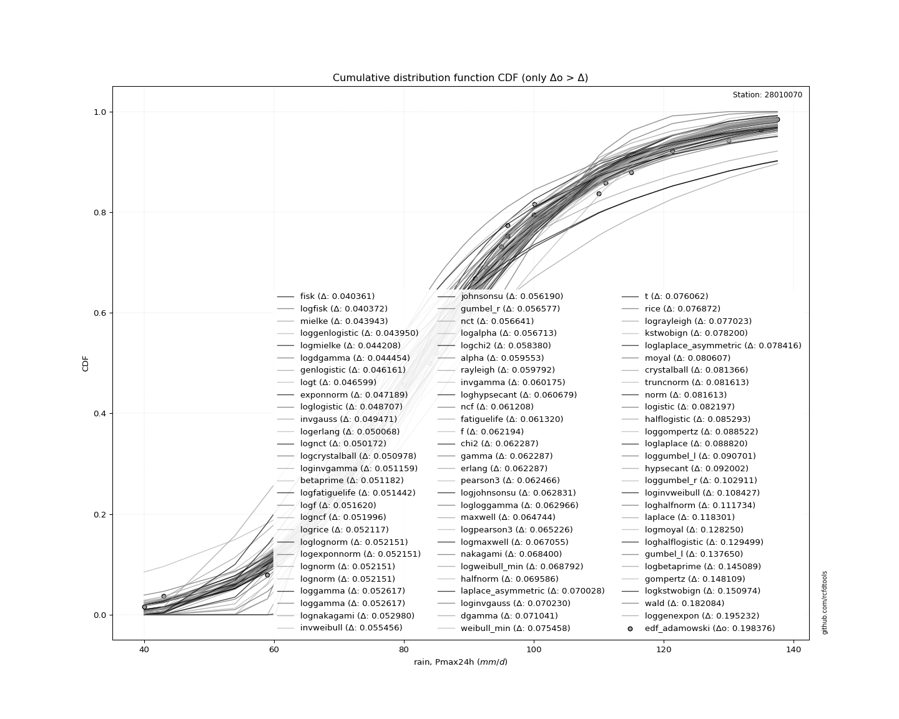</img>

</div>


**12.3. Best fit**

<div align="center">

|   id |   station | empirical_dist   | p_dist    |     delta |   deltao | eval   |   fit |   n |   best_fit |   best_fit_sort |
|-----:|----------:|:-----------------|:----------|----------:|---------:|:-------|------:|----:|-----------:|----------------:|
|    0 |  28010070 | edf_adamowski    | logmielke | 0.0507126 | 0.188598 | Δo > Δ |     1 |  52 |          1 |               1 |

</div>


<div align="center">

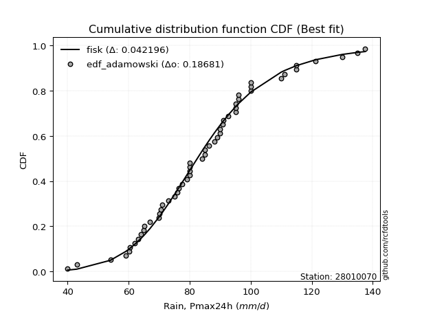</img></img>

</div>


## C. Best fit & Estimate extreme values for specific return periods - Tr


### 1. Best fit (ordered by delta Δ)

<div align="center">

|   id |   station | empirical_dist   | p_dist    |     delta |   deltao | eval   |   fit |   n |   best_fit |   best_fit_sort |
|-----:|----------:|:-----------------|:----------|----------:|---------:|:-------|------:|----:|-----------:|----------------:|
|    0 |  28010070 | edf_california   | logmielke | 0.0478433 | 0.188598 | Δo > Δ |     1 |  52 |          1 |               1 |
|    1 |  28010070 | edf_hazen        | logmielke | 0.049339  | 0.188598 | Δo > Δ |     1 |  52 |          1 |               2 |
|    2 |  28010070 | edf_gringorten   | logmielke | 0.049671  | 0.188598 | Δo > Δ |     1 |  52 |          1 |               3 |
|    3 |  28010070 | edf_cunnane      | logmielke | 0.0498916 | 0.188598 | Δo > Δ |     1 |  52 |          1 |               4 |
|    4 |  28010070 | edf_blom         | logmielke | 0.0500291 | 0.188598 | Δo > Δ |     1 |  52 |          1 |               5 |
|    5 |  28010070 | edf_tukey        | logmielke | 0.0502576 | 0.188598 | Δo > Δ |     1 |  52 |          1 |               6 |
|    6 |  28010070 | edf_filliben     | logmielke | 0.0503443 | 0.188598 | Δo > Δ |     1 |  52 |          1 |               7 |
|    7 |  28010070 | edf_jenkinson    | logmielke | 0.0503853 | 0.188598 | Δo > Δ |     1 |  52 |          1 |               8 |
|    8 |  28010070 | edf_beard        | logmielke | 0.0503853 | 0.188598 | Δo > Δ |     1 |  52 |          1 |               9 |
|    9 |  28010070 | edf_chegodayev   | logmielke | 0.05044   | 0.188598 | Δo > Δ |     1 |  52 |          1 |              10 |
|   10 |  28010070 | edf_adamowski    | logmielke | 0.0507126 | 0.188598 | Δo > Δ |     1 |  52 |          1 |              11 |
|   11 |  28010070 | edf_weibull      | logmielke | 0.0520603 | 0.188598 | Δo > Δ |     1 |  52 |          1 |              12 |

</div>

:file_folder:Tables: [bestfit_28010070.csv](table/bestfit_28010070.csv) | [extreme_28010070.csv](table/extreme_28010070.csv)


### 2. Extreme values

In hydrology, a return period (or recurrence interval $Tr$) is the statistical average time between extreme events like floods or droughts of a specific magnitude, indicating how rare an event is, with a 100-year flood, for example, having a 1% chance of occurring in any given year, not that it happens exactly every century. It is a key tool for infrastructure design (like bridges or dams) and risk assessment, calculated from historical data to determine the probability of future events, although it is important to remember it is statistical average, and events can cluster or be missed.

> risk_rate: assuming the return period as the project useful life.

|   id |      tr |   prob_l |     prob_g |    alpha |   betaprime |     chi2 |   crystalball |   erlang |    expon |   exponnorm |        f |   fatiguelife |     fisk |    gamma |   genexpon |   genlogistic |   gibrat |   gompertz |   gumbel_l |   gumbel_r |   halflogistic |   halfnorm |   hypsecant |   invgamma |   invgauss |   invweibull |   johnsonsu |   kstwobign |   laplace |   laplace_asymmetric |   loggamma |   logistic |   lognorm |   maxwell |   mielke |    moyal |   nakagami |      ncf |      nct |     norm |   pareto |   pearson3 |   rayleigh |     rice |        t |   truncnorm |     wald |   weibull_min |   logalpha |   logbetaprime |   logchi2 |   logcrystalball |   logerlang |   logexpon |   logexponnorm |     logf |   logfatiguelife |   logfisk |   loggenexpon |   loggenlogistic |   loggibrat |   loggompertz |   loggumbel_l |   loggumbel_r |   loghalflogistic |   loghalfnorm |   loghypsecant |   loginvgamma |   loginvgauss |   loginvweibull |   logjohnsonsu |   logkstwobign |   loglaplace |   loglaplace_asymmetric |   logloggamma |   loglogistic |   loglognorm |   logmaxwell |   logmielke |   logmoyal |   lognakagami |   logncf |   lognct |   logpareto |   logpearson3 |   lograyleigh |   logrice |     logt |   logtruncnorm |   logwald |   logweibull_min |   station |   n |   risk_rate |
|-----:|--------:|---------:|-----------:|---------:|------------:|---------:|--------------:|---------:|---------:|------------:|---------:|--------------:|---------:|---------:|-----------:|--------------:|---------:|-----------:|-----------:|-----------:|---------------:|-----------:|------------:|-----------:|-----------:|-------------:|------------:|------------:|----------:|---------------------:|-----------:|-----------:|----------:|----------:|---------:|---------:|-----------:|---------:|---------:|---------:|---------:|-----------:|-----------:|---------:|---------:|------------:|---------:|--------------:|-----------:|---------------:|----------:|-----------------:|------------:|-----------:|---------------:|---------:|-----------------:|----------:|--------------:|-----------------:|------------:|--------------:|--------------:|--------------:|------------------:|--------------:|---------------:|--------------:|--------------:|----------------:|---------------:|---------------:|-------------:|------------------------:|--------------:|--------------:|-------------:|-------------:|------------:|-----------:|--------------:|---------:|---------:|------------:|--------------:|--------------:|----------:|---------:|---------------:|----------:|-----------------:|----------:|----:|------------:|
|    0 |    2    | 0.5      | 0.5        |  93.398  |     92.0819 |  94.0943 |       95.1328 |  94.4668 |  78.2151 |     95.1328 |  95.0554 |       95.2573 |  96.0951 |  94.6665 |    78.8218 |       98.3476 |  87.6255 |    99.3298 |    99.2416 |    91.024  |        88.9813 |    90.0132 |     95.1328 |    93.6485 |    91.4007 |      91.6997 |     97.9083 |     89.7766 |   95.1328 |              95.5619 |    90.6305 |    95.1328 |   91.3797 |   92.9937 |  101.189 |  89.6975 |    95.0941 |  48.4852 |  95.1335 |  95.1328 |  78.2151 |    96.4274 |    92.2351 |  94.5914 |  95.1346 |     95.1328 |  87.0255 |       97.1104 |    90.6142 |        91.3005 |   90.2291 |          91.3797 |     90.1158 |    70.9176 |        91.3797 |  91.3843 |          91.5051 |   94.1229 |       82.5636 |          101.172 |     83.5915 |        95.595 |       95.9455 |       87.0311 |           84.9467 |       85.994  |        91.3797 |       90.0185 |       89.2093 |         88.2997 |        98.4811 |        85.2522 |      91.3797 |                 101.013 |        99.667 |       91.3797 |      91.3795 |      89.0894 |     96.6368 |    85.6719 |       91.4415 |  90.8744 |  91.4755 |     70.9176 |       95.4968 |       88.2909 |   91.3791 |  92.9919 |        64.4087 |   82.999  |          96.3152 |  28010070 |  52 |    0.75     |
|    1 |    2.33 | 0.570815 | 0.429185   |  97.9664 |     96.9085 |  98.6873 |       99.5959 |  98.9656 |  86.6351 |     99.5958 |  99.528  |       99.7874 | 100.309  |  99.2259 |    86.9954 |      102.372  |  89.8864 |   103.618  |   103.125  |    95.1595 |        93.2333 |    94.83   |     98.7046 |    98.3027 |    96.3639 |      97.0746 |    102.209  |     95.3178 |   97.8336 |              98.6638 |    95.8452 |    99.0651 |   96.3497 |   97.6306 |  105.989 |  93.6124 |    99.5593 |  63.3053 |  99.5993 |  99.5959 |  86.6351 |   100.828  |    96.9405 |  99.1644 |  99.5986 |     99.5959 |  89.952  |      101.452  |    95.7736 |        96.4279 |   95.4644 |          96.3498 |     95.4087 |    80.4542 |        96.3498 |  96.3605 |          96.4774 |   98.7149 |       89.3723 |          105.982 |     85.8644 |       100.09  |      100.47   |       91.4087 |           89.3429 |       91.0521 |        95.3361 |       95.1737 |       94.4272 |         94.9516 |       102.987  |        92.1297 |      94.3558 |                 105.746 |       104.256 |       95.7448 |      96.3496 |      94.1286 |    101.679  |    89.7457 |       96.4222 |  95.8541 |  96.4095 |     80.4542 |      100.337  |       93.3612 |   96.3498 |  97.7416 |        70.8548 |   85.9317 |         100.702  |  28010070 |  52 |    0.729209 |
|    2 |    5    | 0.8      | 0.2        | 115.756  |    116.554  | 116.213  |      116.182  | 115.947  | 128.733  |    116.182  | 116.171  |      116.812  | 116.578  | 116.434  |   127.861  |      116.576  | 102.903  |   117.473  |   115.669  |   113.126  |       112.473  |   115.2    |    113.032  |   116.347  |   116.589  |     120.426  |    116.774  |    118.855  |  111.337  |             114.127  |   118.467  |   114.248  |  117.308  |  115.881  |  119.781 | 111.746  |   116.162  | 136.977  | 116.197  | 116.182  | 128.733  |   116.47   |   115.778  | 116.314  | 116.188  |    116.182  | 106.335  |      116.522  |   118.223  |       118.279  |  118.342  |         117.308  |    118.675  |   151.185  |       117.308  | 117.348  |         117.46   |  118.648  |      122.755  |          119.803 |    100.205  |       116.238 |      116.596  |      113.131  |          112.257  |      115.947  |       113.004  |      117.712  |      117.619  |        130.179  |       117.622  |       128.093  |     110.755  |                 118.837 |       118.483 |      114.647  |     117.308  |     116.889  |    117.078  |   111.293  |      117.433  | 117.043  | 117.203  |    151.185  |      117.747  |      116.748  |  117.311  | 117.993  |       108.19   |  104.37   |         116.287  |  28010070 |  52 |    0.67232  |
|    3 |   10    | 0.9      | 0.1        | 128.316  |    131.159  | 128.242  |      127.185  | 127.443  | 166.948  |    127.185  | 127.231  |      128.271  | 128.56   | 128.08   |   164.958  |      126.177  | 117.739  |   125.187  |   122.653  |   127.76   |       128.45   |   130.273  |    124.473  |   129.002  |   131.659  |     139.445  |    125.319  |    136.776  |  123.596  |             128.165  |   136.826  |   125.43   |  133.67   |  128.724  |  126.35  | 127.535  |   127.182  | 206.289  | 127.208  | 127.185  | 166.948  |   126.237  |   129.21   | 127.787  | 127.193  |    127.185  | 123.72   |      125.654  |   136.537  |       135.584  |  137.094  |         133.67   |    137.9    |   268.042  |       133.67   | 133.744  |         133.857  |  135.859  |      153.945  |          126.37  |    119.495  |       126.397 |      126.671  |      134.585  |          135.693  |      138.654  |       129.436  |      136.216  |      137.09   |        168.327  |       125.535  |       164.626  |     128.096  |                 124.771 |       125.845 |      130.915  |     133.67   |     136.132  |    124.516  |   134.226  |      133.843  | 133.796  | 133.424  |    268.042  |      128.422  |      136.922  |  133.675  | 134.551  |       146.263  |  128.282  |         125.987  |  28010070 |  52 |    0.651322 |
|    4 |   15    | 0.933333 | 0.0666667  | 134.827  |    138.945  | 134.365  |      132.675  | 133.248  | 189.302  |    132.675  | 132.756  |      134.04   | 135.088  | 133.96   |   186.658  |      131.248  | 127.973  |   128.68   |   125.816  |   136.016  |       137.492  |   138.117  |    131.002  |   135.533  |   139.705  |     150.175  |    129.281  |    146.29   |  130.766  |             136.376  |   147.181  |   131.522  |  142.669  |  135.314  |  129.274 | 136.697  |   132.684  | 248.763  | 132.704  | 132.675  | 189.302  |   130.933  |   136.131  | 133.534  | 132.685  |    132.675  | 134.885  |      129.975  |   146.907  |       145.19   |  147.738  |         142.669  |    148.869  |   374.697  |       142.669  | 142.767  |         142.882  |  146.265  |      172.997  |          129.287 |    134.923  |       131.296 |      131.516  |      148.438  |          151.062  |      152.179  |       139.864  |      146.738  |      148.321  |        194.593  |       128.985  |       188.082  |     139.473  |                 128.246 |       129.04  |      140.73   |     142.669  |     147.204  |    127.77   |   149.643  |      142.872  | 143.087  | 142.344  |    374.697  |      133.389  |      148.642  |  142.676  | 144.115  |       167.916  |  146.452  |         130.642  |  28010070 |  52 |    0.644736 |
|    5 |   20    | 0.95     | 0.05       | 139.184  |    144.23   | 138.419  |      136.271  | 137.075  | 205.163  |    136.271  | 136.376  |      137.836  | 139.6    | 137.837  |   202.055  |      134.713  | 136.001  |   130.855  |   127.784  |   141.797  |       143.827  |   143.347  |    135.608  |   139.89   |   145.17   |     157.688  |    131.775  |    152.699  |  135.854  |             142.202  |   154.442  |   135.733  |  148.888  |  139.688  |  131.144 | 143.187  |   136.288  | 279.949  | 136.303  | 136.271  | 205.163  |   133.944  |   140.731  | 137.304  | 136.281  |    136.271  | 143.204  |      132.726  |   154.198  |       151.865  |  155.231  |         148.888  |    156.614  |   475.223  |       148.888  | 149.004  |         149.121  |  153.919  |      186.949  |          131.15  |    148.408  |       134.444 |      134.624  |      158.978  |          162.856  |      161.921  |       147.721  |      154.153  |      156.302  |        215.386  |       131.076  |       205.74   |     148.153  |                 130.769 |       130.987 |      147.941  |     148.889  |     155.046  |    129.833  |   161.622  |      149.113  | 149.54   | 148.508  |    475.223  |      136.495  |      156.981  |  148.897  | 150.96   |       182.112  |  161.647  |         133.626  |  28010070 |  52 |    0.641514 |
|    6 |   25    | 0.96     | 0.04       | 142.439  |    148.216  | 141.425  |      138.918  | 139.904  | 217.466  |    138.918  | 139.042  |      140.639  | 143.052  | 140.703  |   213.997  |      137.346  | 142.693  |   132.402  |   129.185  |   146.25   |       148.708  |   147.238  |    139.173  |   143.14   |   149.295  |     163.476  |    133.56   |    157.5    |  139.8    |             146.721  |   160.046  |   138.955  |  153.639  |  142.935  |  132.517 | 148.217  |   138.941  | 304.797  | 138.952  | 138.918  | 217.466  |   136.129  |   144.149  | 140.082  | 138.929  |    138.918  | 149.868  |      134.712  |   159.835  |       156.982  |  161.029  |         153.639  |    162.619  |   571.425  |       153.639  | 153.77   |         153.888  |  160.044  |      198.041  |          132.518 |    160.673  |       136.731 |      136.881  |      167.605  |          172.567  |      169.572  |       154.104  |      159.897  |      162.521  |        232.906  |       132.534  |       220.044  |     155.256  |                 132.761 |       132.353 |      153.706  |     153.64   |     161.136  |    131.343  |   171.563  |      153.881  | 154.486  | 153.216  |    571.425  |      138.703  |      163.479  |  153.648  | 156.335  |       192.192  |  174.947  |         135.791  |  28010070 |  52 |    0.639603 |
|    7 |   50    | 0.98     | 0.02       | 151.993  |    160.094  | 150.14   |      146.497  | 148.067  | 255.681  |    146.497  | 146.68   |      148.71   | 153.598  | 148.97   |   251.094  |      145.333  | 166.284  |   136.602  |   132.988  |   159.966  |       163.747  |   158.548  |    150.225  |   152.643  |   161.593  |     181.303  |    138.45   |    171.596  |  152.058  |             160.758  |   177.404  |   148.797  |  168.098  |  152.351  |  136.528 | 163.831  |   146.541  | 386.034  | 146.539  | 146.497  | 255.681  |   142.238  |   154.07   | 148.049  | 146.51   |    146.497  | 171.626  |      140.227  |   177.358  |       172.657  |  179.072  |         168.099  |    181.377  |  1013.1    |       168.099  | 168.279  |         168.406  |  180.31   |      234.111  |          136.512 |    212.576  |       143.141 |      143.2    |      197.232  |          206.283  |      193.926  |       175.7    |      177.802  |      182.102  |        296.347  |       136.349  |       268.056  |     179.565  |                 139.144 |       135.99  |      172.748  |     168.1    |     180.185  |    135.749  |   206.488  |      168.395  | 169.631  | 167.544  |   1013.1    |      144.641  |      183.904  |  168.111  | 173.577  |       217.362  |  226.477  |         141.845  |  28010070 |  52 |    0.63583  |
|    8 |   75    | 0.986667 | 0.0133333  | 157.266  |    166.757  | 154.88   |      150.565  | 152.484  | 278.035  |    150.564  | 150.782  |      153.068  | 159.689  | 153.443  |   272.794  |      149.919  | 182.217  |   138.726  |   134.911  |   167.939  |       172.489  |   164.705  |    156.683  |   157.867  |   168.496  |     191.665  |    140.943  |    179.352  |  159.229  |             168.97   |   187.587  |   154.481  |  176.41   |  157.471  |  138.779 | 172.962  |   150.62   | 436.676  | 150.611  | 150.565  | 278.035  |   145.426  |   159.467  | 152.332  | 150.578  |    150.565  | 185.014  |      143.086  |   187.68   |       181.734  |  189.712  |         176.41   |    192.485  |  1416.22   |       176.411  | 176.623  |         176.756  |  193.163  |      256.427  |          138.752 |    256.816  |       146.499 |      146.505  |      216.803  |          228.831  |      208.623  |       189.696  |      188.385  |      193.81   |        340.887  |       138.191  |       298.804  |     195.513  |                 143.018 |       137.791 |      184.802  |     176.412  |     191.471  |    138.231  |   230.12   |      176.74   | 178.396  | 175.78   |   1416.22   |      147.583  |      196.068  |  176.424  | 184.174  |       227.777  |  265.471  |         145.009  |  28010070 |  52 |    0.634587 |
|    9 |  100    | 0.99     | 0.01       | 160.893  |    171.381  | 158.112  |      153.315  | 155.485  | 293.896  |    153.315  | 153.558  |      156.025  | 163.99   | 156.482  |   288.191  |      153.149  | 194.56   |   140.116  |   136.169  |   173.582  |       178.676  |   168.899  |    161.265  |   161.451  |   173.288  |     198.999  |    142.58   |    184.666  |  164.317  |             174.796  |   194.846  |   158.494  |  182.264  |  160.958  |  140.358 | 179.441  |   153.379  | 474.132  | 153.364  | 153.315  | 293.896  |   147.547  |   163.144  | 155.23   | 153.329  |    153.315  | 194.776  |      144.983  |   195.058  |       188.155  |  197.322  |         182.264  |    200.449  |  1796.17   |       182.264  | 182.5    |         182.638  |  202.786  |      272.837  |          140.323 |    297.323  |       148.738 |      148.709  |      231.817  |          246.265  |      219.268  |       200.295  |      195.965  |      202.254  |        376.399  |       139.361  |       321.884  |     207.681  |                 145.833 |       138.957 |      193.816  |     182.265  |     199.56   |    139.981  |   248.508  |      182.618  | 184.595  | 181.58   |   1796.17   |      149.474  |      204.813  |  182.279  | 191.976  |       233.484  |  298.071  |         147.117  |  28010070 |  52 |    0.633968 |
|   10 |  200    | 0.995    | 0.005      | 169.306  |    182.231  | 165.519  |      159.555  | 162.337  | 332.111  |    159.555  | 159.857  |      162.766  | 174.306  | 163.421  |   325.288  |      160.883  | 228.14   |   143.135  |   138.903  |   187.147  |       193.551  |   178.491  |    172.302  |   169.735  |   184.532  |     216.63   |    146.15   |    196.905  |  176.575  |             188.833  |   212.513  |   168.121  |  196.271  |  168.936  |  144.149 | 195.049  |   159.639  | 570.008  | 159.611  | 159.555  | 332.111  |   152.254  |   171.558  | 161.812  | 159.57   |    159.555  | 219.091  |      149.177  |   213.083  |       203.613  |  215.923  |         196.271  |    219.985  |  3184.5    |       196.272  | 196.569  |         196.721  |  227.87   |      314.452  |          144.094 |    442.87   |       153.726 |      153.613  |      272.306  |          293.808  |      245.701  |       228.324  |      214.535  |      223.139  |        477.659  |       141.802  |       382.052  |     240.199  |                 152.844 |       141.458 |      217.273  |     196.273  |     219.375  |    144.223  |   299.074  |      196.687  | 199.516  | 195.46   |   3184.5    |      153.466  |      226.318  |  196.29   | 211.927  |       242.772  |  397.756  |         151.804  |  28010070 |  52 |    0.633042 |
|   11 |  250    | 0.996    | 0.004      | 171.931  |    185.649  | 167.804  |      161.462  | 164.443  | 344.413  |    161.462  | 161.783  |      164.834  | 177.617  | 165.553  |   337.23   |      163.363  | 240.188  |   144.024  |   139.708  |   191.508  |       198.333  |   181.442  |    175.855  |   172.31   |   188.074  |     222.298  |    147.204  |    200.693  |  180.521  |             193.352  |   218.265  |   171.212  |  200.763  |  171.392  |  145.373 | 200.073  |   161.552  | 602.68   | 161.52   | 161.462  | 344.413  |   153.664  |   174.148  | 163.825  | 161.477  |    161.462  | 227.135  |      150.43   |   218.973  |       208.597  |  222.004  |         200.763  |    226.391  |  3829.15   |       200.764  | 201.082  |         201.239  |  236.563  |      328.499  |          145.312 |    510.936  |       155.226 |      155.086  |      286.77   |          310.964  |      254.457  |       238.156  |      220.618  |      230.04   |        515.682  |       142.492  |       402.861  |     251.714  |                 155.172 |       142.186 |      225.39   |     200.765  |     225.862  |    145.607  |   317.449  |      201.199  | 204.325  | 199.911  |   3829.15   |      154.603  |      233.381  |  200.782  | 218.746  |       244.746  |  437.591  |         153.212  |  28010070 |  52 |    0.632858 |
|   12 |  500    | 0.998    | 0.002      | 179.864  |    196.07   | 174.639  |      167.116  | 170.721  | 382.629  |    167.116  | 167.497  |      170.993  | 187.889  | 171.91   |   374.327  |      171.047  | 281.828  |   146.571  |   142.014  |   205.045  |       213.176  |   190.241  |    186.892  |   180.07   |   198.873  |     239.891  |    150.227  |    212.044  |  192.779  |             207.39   |   236.374  |   180.798  |  214.697  |  178.72   |  149.21  | 215.681  |   167.228  | 710.269  | 167.181  | 167.116  | 382.629  |   157.767  |   181.875  | 169.8    | 167.133  |    167.116  | 252.713  |      154.071  |   237.584  |       224.141  |  241.224  |         214.697  |    246.702  |  6788.85   |       214.697  | 215.085  |         215.26   |  265.69   |      374.256  |          149.128 |    837.431  |       159.608 |      159.389  |      336.739  |          370.856  |      282.458  |       271.481  |      239.889  |      252.085  |        654.073  |       144.398  |       472.257  |     291.127  |                 162.631 |       144.256 |      252.542  |     214.699  |     246.382  |    149.995  |   382.041  |      215.198  | 219.322  | 213.72   |   6788.85   |      157.751  |      255.794  |  214.719  | 241.367  |       248.821  |  592.75   |         157.319  |  28010070 |  52 |    0.632489 |
|   13 |  750    | 0.998667 | 0.00133333 | 184.371  |    202.049  | 178.474  |      170.257  | 174.23   | 404.983  |    170.257  | 170.673  |      174.43   | 193.889  | 175.463  |   396.028  |      175.534  | 309.366  |   147.932  |   143.247  |   212.958  |       221.853  |   195.156  |    193.347  |   184.462  |   205.066  |     250.175  |    151.844  |    218.421  |  199.95   |             215.601  |   247.157  |   186.398  |  222.851  |  182.819  |  151.486 | 224.811  |   170.381  | 777.775  | 170.326  | 170.257  | 404.983  |   159.995  |   186.196  | 173.121  | 170.275  |    170.257  | 268.048  |      156.047  |   248.714  |       233.294  |  252.72   |         222.851  |    258.895  |  9490.15   |       222.851  | 223.283  |         223.47   |  284.339  |      402.571  |          151.392 |   1161.07   |       162.001 |      161.737  |      369.892  |          411.078  |      299.422  |       293.097  |      251.447  |      265.437  |        751.593  |       145.371  |       516.361  |     316.984  |                 167.16  |       145.351 |      269.895  |     222.854  |     258.662  |    152.637  |   425.758  |      223.392  | 228.151  | 221.801  |   9490.15   |      159.356  |      269.253  |  222.875  | 255.745  |       250.219  |  711.046  |         159.559  |  28010070 |  52 |    0.632366 |
|   14 | 1000    | 0.999    | 0.001      | 187.518  |    206.245  | 181.131  |      172.42   | 176.655  | 420.844  |    172.42   | 172.86   |      176.803  | 198.145  | 177.918  |   411.424  |      178.716  | 330.439  |   148.848  |   144.076  |   218.571  |       228.008  |   198.551  |    197.928  |   187.519  |   209.411  |     257.471  |    152.932  |    222.839  |  205.037  |             221.427  |   254.901  |   190.369  |  228.644  |  185.652  |  153.118 | 231.289  |   172.552  | 827.862  | 172.491  | 172.42   | 420.844  |   161.51   |   189.182  | 175.409  | 172.439  |    172.42   | 279.08   |      157.389  |   256.73   |       239.822  |  261      |         228.644  |    267.695  | 12036.2    |       228.645  | 229.108  |         229.304  |  298.353  |      423.381  |          153.015 |   1490.93   |       163.632 |      163.337  |      395.37   |          442.227  |      311.729  |       309.469  |      259.785  |      275.128  |        829.461  |       146.008  |       549.309  |     336.711  |                 170.45  |       146.085 |      282.918  |     228.647  |     267.505  |    154.55   |   459.776  |      229.215  | 234.448  | 227.544  |  12036.2    |      160.403  |      278.965  |  228.67   | 266.526  |       250.925  |  810.482  |         161.084  |  28010070 |  52 |    0.632305 |

<div align="center">

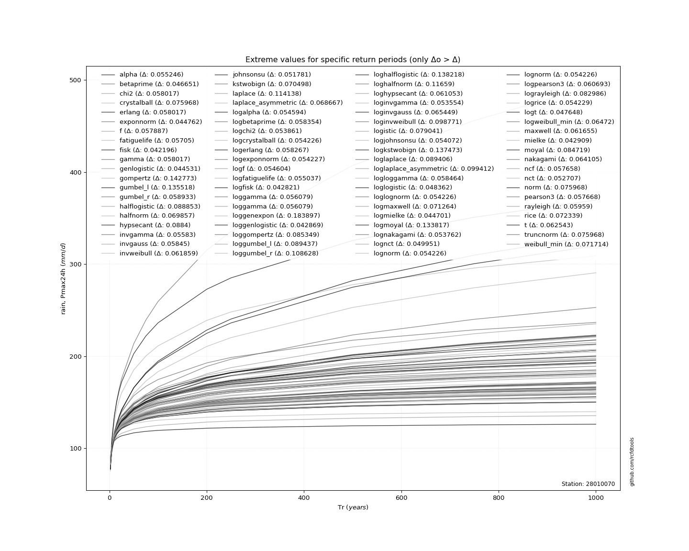</img>

</div>


<div align="center">

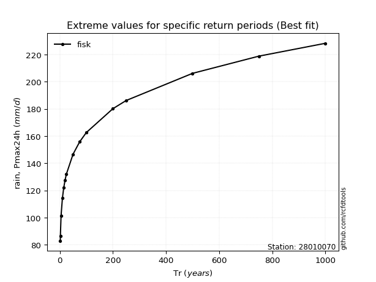</img>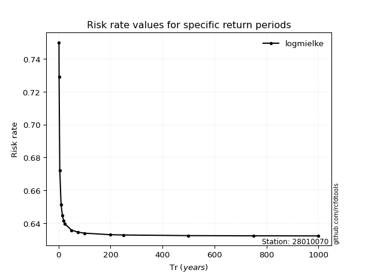</img>

</div>


<sub>**APP DISCLAIMER**: NO WARRANTY - This software is provided by [github.com/rcfdtools](https://github.com/rcfdtools) "as is", without any express or implied warranty, including warranties of merchantability, fitness for a particular purpose, or non-infringement. There is no guarantee that the software will be error-free or operate without interruption. LIMITATION OF LIABILITY - Neither the authors nor copyright holders will be liable for claims or damages arising from the software or its use. You are responsible for determining if the software is appropriate for your use and assume all associated risks, including errors, legal compliance, and data loss. NO PROFESSIONAL ADVICE - The software provides general information and does not offer professional advice. It should not replace consultation with professional advisors.</sub>