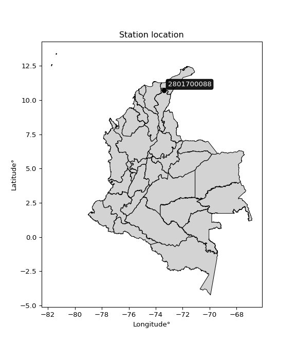

<div align="center">


</div>

# PMP Station (rain, Pmax24h): 2801700088

Probable Maximum Precipitation (PMP) is the greatest amount of rainfall for a specific duration that is meteorologically possible for a given location, acting as a "worst-case" scenario for extreme storms, crucial for designing safety-critical infrastructure like bridges, river deviations, dams, spillways, and nuclear plants to prevent catastrophic failure. PMP is calculated by hydrologists using meteorological data to determine the upper limit of extreme rainfall, often leading to the Probable Maximum Flood (PMF) for flood control design, and is increasingly being studied for climate change impacts.

<div align="center">

</img>

</div>


## A. General information


### 1. General running parameters

• app_version: _v20251228_. • runtime: _2025-12-28 08:43:48.795225_. • Python version: _3.14.0_. • SciPy version: _1.16.3_. • Pandas version: _2.3.3_. • NumPy version: _2.3.5_. • Stations dataset (station_dataset_file): _dataset/pmax24h_in/automatic_colombia_2003_2024.csv_. • Stations catalog (station_catalog_file): _dataset/CNE_IDEAM.xls_. • Minimum year to eval til year_max (date_min): _1900_. • Maximum year to eval since year_min (date_max): _2024_. • Creates, save and include plots into reports (create_plot): _False_. • Plot only fit distributions with Δo > Δ (plot_only_fit): _True_. • Eval low extreme values, if False, evaluates high extreme values (low_extreme): _False_. • Eval every SciPy distribution as logarithmic (pdist_logarithmic_on): _True_. • Standard deviation normalized (ddof): _1.0_. • Return periods to eval in years (Tr): _[2, 2.33, 5, 10, 15, 20, 25, 50, 75, 100, 200, 250, 500, 750, 1000]_. • Minimum data sample per station, 0 means any (minimum_sample): _5_. • Z-Score maximum threshold to adjust a value, 0 means disable (zscore_max): _3.5_. • Z-Score minimum threshold to adjust a value, 0 means disable (zscore_min): _-2.5_. • Avoid zeros, e.g. rain = 0 (avoid_zeros): _True_. • Avoid null values (avoid_nans): _True_. [:file_folder:Dataset file.](../../dataset/pmax24h_in/automatic_colombia_2003_2024.csv)

> Delta Degrees of Freedom (DDOF): is a parameter used in the formulas for calculating variance and standard deviation. When ddof=0, the divisor is $N$ (the total number of observations) and this is used when your data set is the entire population. When ddof=1, the divisor is $N-1$ and this is used when your data set is a sample drawn from a larger population. Using $N-1$ provides an unbiased estimate of the population variance (known as Bessel´s correction).


### 2. Station info and location

|   id |     CODIGO | NOMBRE                             | CATEGORIA    | TECNOLOGIA                              | ESTADO           | FECHA_INSTALACION   |   FECHA_SUSPENSION |   ALTITUD |   LATITUD |   LONGITUD | DEPARTAMENTO   | MUNICIPIO   | AREA_OPERATIVA                                         | ENTIDAD                                                     | AREA_HIDROGRAFICA   | ZONA_HIDROGRAFICA   | SUBZONA_HIDROGRAFICA   | CORRIENTE   | Catalogo   |
|-----:|-----------:|:-----------------------------------|:-------------|:----------------------------------------|:-----------------|:--------------------|-------------------:|----------:|----------:|-----------:|:---------------|:------------|:-------------------------------------------------------|:------------------------------------------------------------|:--------------------|:--------------------|:-----------------------|:------------|:-----------|
|    0 | 2801700088 | CHEMESQUEMENA - AUT   [2801700088] | Limnigráfica | Automática con Telemetría, Convencional | En Mantenimiento | 13/02/2017          |                nan |      1152 |   10.7122 |   -73.4021 | Cesar          | Valledupar  | Area Operativa 05 - Magdalena-Cesar-Guajira-San Andrés | INSTITUTO DE HIDROLOGIA METEOROLOGIA Y ESTUDIOS AMBIENTALES | Magdalena Cauca     | Cesar               | Alto Cesar             | Guatapuri   | CNE_IDEAM  |

<div align="center">

Map location in: [:earth_americas:Google](http://maps.google.com/maps?q=10.71216,-73.402146) [:earth_americas:OSM](https://www.openstreetmap.org/#map=18/10.71216/-73.402146&layers=P) [:earth_americas:Bing](https://www.bing.com/maps?cp=10.71216~-73.402146&lvl=18) [:earth_americas:Apple](https://maps.apple.com/frame?center=10.71216%2C-73.402146&span=0.003%2C0.006)

</div>


<div align="center">

```geojson
{
  "type": "Feature",
  "geometry": {
    "type": "Point", 
    "coordinates": [-73.402146, 10.71216]
  }, 
  "properties": {
    "Name": "2801700088"
  }
}
```

</div>


### 3. Discrete values table and plot

|               |          0 |           1 |          2 |            3 |         4 |
|:--------------|-----------:|------------:|-----------:|-------------:|----------:|
| Date          | 2019       | 2020        | 2021       | 2022         | 2023      |
| Value         |  123.6     |   39.4      |    6.8     |   53.6       |   54.8    |
| Value_initial |  123.6     |   39.4      |    6.8     |   53.6       |   54.8    |
| count         |    5       |    5        |    5       |    5         |    5      |
| mean          |   55.64    |   55.64     |   55.64    |   55.64      |   55.64   |
| std           |   42.6395  |   42.6395   |   42.6395  |   42.6395    |   42.6395 |
| zscore        |    1.59383 |   -0.380867 |   -1.14542 |   -0.0478429 |   -0.0197 |

> The initial value (value_initial) correspond to the initial obtained or null completed value, and value (value) is adjusted only when the initial value is outside the valid range definite through the Z-Score value. If Z-Score is active, values out of range or outliers are replaced with the station mean value


### 4. Active continuous probability distributions from SciPy (44 of 104 available)

[scipy.stats](https://docs.scipy.org/doc/scipy/reference/stats.html) is a Python´s powerful submodule within the SciPy library for comprehensive statistical analysis, offering over 130 probability distributions (like Normal, Poisson), functions for descriptive stats (mean, variance), hypothesis testing (t-tests, chi-square), random variable generation, and statistical tests, making it essential for data science, modeling, and research. It provides tools to explore, model, and draw conclusions from data efficiently, working seamlessly with NumPy.

<div align="center">

|   id | p_dist             |   n_parameter | fit_method   | label                                                                       | active   | ref                                                                                                        |
|-----:|:-------------------|--------------:|:-------------|:----------------------------------------------------------------------------|:---------|:-----------------------------------------------------------------------------------------------------------|
|    0 | alpha              |             3 | MLE          | Alpha                                                                       | True     | [:mortar_board:](https://docs.scipy.org/doc/scipy/reference/generated/scipy.stats.alpha.html)              |
|    1 | betaprime          |             4 | MLE          | Beta prime                                                                  | True     | [:mortar_board:](https://docs.scipy.org/doc/scipy/reference/generated/scipy.stats.betaprime.html)          |
|    2 | chi2               |             3 | MLE          | Chi²                                                                        | True     | [:mortar_board:](https://docs.scipy.org/doc/scipy/reference/generated/scipy.stats.chi2.html)               |
|    3 | crystalball        |             4 | MLE          | Crystalball                                                                 | True     | [:mortar_board:](https://docs.scipy.org/doc/scipy/reference/generated/scipy.stats.crystalball.html)        |
|    4 | erlang             |             3 | MLE          | Erlang                                                                      | True     | [:mortar_board:](https://docs.scipy.org/doc/scipy/reference/generated/scipy.stats.erlang.html)             |
|    5 | expon              |             2 | MLE          | Exponential                                                                 | True     | [:mortar_board:](https://docs.scipy.org/doc/scipy/reference/generated/scipy.stats.expon.html)              |
|    6 | exponnorm          |             3 | MLE          | Exponentially modified Normal                                               | True     | [:mortar_board:](https://docs.scipy.org/doc/scipy/reference/generated/scipy.stats.exponnorm.html)          |
|    7 | f                  |             4 | MLE          | F                                                                           | True     | [:mortar_board:](https://docs.scipy.org/doc/scipy/reference/generated/scipy.stats.f.html)                  |
|    8 | fatiguelife        |             3 | MLE          | Fatigue-life (Birnbaum-Saunders)                                            | True     | [:mortar_board:](https://docs.scipy.org/doc/scipy/reference/generated/scipy.stats.fatiguelife.html)        |
|    9 | fisk               |             3 | MLE          | Fisk                                                                        | True     | [:mortar_board:](https://docs.scipy.org/doc/scipy/reference/generated/scipy.stats.fisk.html)               |
|   10 | gamma              |             3 | MLE          | Gamma                                                                       | True     | [:mortar_board:](https://docs.scipy.org/doc/scipy/reference/generated/scipy.stats.gamma.html)              |
|   11 | genexpon           |             5 | MLE          | Generalized exponential                                                     | True     | [:mortar_board:](https://docs.scipy.org/doc/scipy/reference/generated/scipy.stats.genexpon.html)           |
|   12 | genlogistic        |             3 | MLE          | Generalized logistic                                                        | True     | [:mortar_board:](https://docs.scipy.org/doc/scipy/reference/generated/scipy.stats.genlogistic.html)        |
|   13 | gibrat             |             2 | MM           | Gibrat                                                                      | True     | [:mortar_board:](https://docs.scipy.org/doc/scipy/reference/generated/scipy.stats.gibrat.html)             |
|   14 | gompertz           |             3 | MLE          | Gompertz (or truncated Gumbel)                                              | True     | [:mortar_board:](https://docs.scipy.org/doc/scipy/reference/generated/scipy.stats.gompertz.html)           |
|   15 | gumbel_l           |             2 | MM           | Gumbel Left Skew                                                            | True     | [:mortar_board:](https://docs.scipy.org/doc/scipy/reference/generated/scipy.stats.gumbel_l.html)           |
|   16 | gumbel_r           |             2 | MM           | Gumbel Right Skew                                                           | True     | [:mortar_board:](https://docs.scipy.org/doc/scipy/reference/generated/scipy.stats.gumbel_r.html)           |
|   17 | halflogistic       |             2 | MM           | Half-logistic                                                               | True     | [:mortar_board:](https://docs.scipy.org/doc/scipy/reference/generated/scipy.stats.halflogistic.html)       |
|   18 | halfnorm           |             2 | MM           | Half Normal                                                                 | True     | [:mortar_board:](https://docs.scipy.org/doc/scipy/reference/generated/scipy.stats.halfnorm.html)           |
|   19 | hypsecant          |             2 | MM           | hyperbolic secant                                                           | True     | [:mortar_board:](https://docs.scipy.org/doc/scipy/reference/generated/scipy.stats.hypsecant.html)          |
|   20 | invgamma           |             3 | MLE          | Inverted gamma                                                              | True     | [:mortar_board:](https://docs.scipy.org/doc/scipy/reference/generated/scipy.stats.invgamma.html)           |
|   21 | invgauss           |             3 | MLE          | Inverse Gaussian                                                            | True     | [:mortar_board:](https://docs.scipy.org/doc/scipy/reference/generated/scipy.stats.invgauss.html)           |
|   22 | invweibull         |             3 | MLE          | Inverted Weibull                                                            | True     | [:mortar_board:](https://docs.scipy.org/doc/scipy/reference/generated/scipy.stats.invweibull.html)         |
|   23 | johnsonsu          |             4 | MLE          | Johnson Su                                                                  | True     | [:mortar_board:](https://docs.scipy.org/doc/scipy/reference/generated/scipy.stats.johnsonsu.html)          |
|   24 | kstwobign          |             2 | MLE          | Limiting distribution of scaled Kolmogorov-Smirnov two-sided test statistic | True     | [:mortar_board:](https://docs.scipy.org/doc/scipy/reference/generated/scipy.stats.kstwobign.html)          |
|   25 | laplace            |             2 | MM           | Laplace                                                                     | True     | [:mortar_board:](https://docs.scipy.org/doc/scipy/reference/generated/scipy.stats.laplace.html)            |
|   26 | laplace_asymmetric |             3 | MLE          | Asymmetric Laplace                                                          | True     | [:mortar_board:](https://docs.scipy.org/doc/scipy/reference/generated/scipy.stats.laplace_asymmetric.html) |
|   27 | loggamma           |             3 | MLE          | Log gamma                                                                   | True     | [:mortar_board:](https://docs.scipy.org/doc/scipy/reference/generated/scipy.stats.loggamma.html)           |
|   28 | logistic           |             2 | MM           | Logistic (or Sech-squared)                                                  | True     | [:mortar_board:](https://docs.scipy.org/doc/scipy/reference/generated/scipy.stats.logistic.html)           |
|   29 | lognorm            |             3 | MLE          | Log Normal                                                                  | True     | [:mortar_board:](https://docs.scipy.org/doc/scipy/reference/generated/scipy.stats.lognorm.html)            |
|   30 | maxwell            |             2 | MM           | Maxwell                                                                     | True     | [:mortar_board:](https://docs.scipy.org/doc/scipy/reference/generated/scipy.stats.maxwell.html)            |
|   31 | mielke             |             4 | MLE          | Mielke Beta-Kappa / Dagum                                                   | True     | [:mortar_board:](https://docs.scipy.org/doc/scipy/reference/generated/scipy.stats.mielke.html)             |
|   32 | moyal              |             2 | MM           | Moyal                                                                       | True     | [:mortar_board:](https://docs.scipy.org/doc/scipy/reference/generated/scipy.stats.moyal.html)              |
|   33 | nakagami           |             3 | MLE          | Nakagami                                                                    | True     | [:mortar_board:](https://docs.scipy.org/doc/scipy/reference/generated/scipy.stats.nakagami.html)           |
|   34 | ncf                |             5 | MLE          | Non-central F distribution                                                  | True     | [:mortar_board:](https://docs.scipy.org/doc/scipy/reference/generated/scipy.stats.ncf.html)                |
|   35 | nct                |             4 | MLE          | Non-central Student’s t                                                     | True     | [:mortar_board:](https://docs.scipy.org/doc/scipy/reference/generated/scipy.stats.nct.html)                |
|   36 | norm               |             2 | MM           | Normal                                                                      | True     | [:mortar_board:](https://docs.scipy.org/doc/scipy/reference/generated/scipy.stats.norm.html)               |
|   37 | pearson3           |             3 | MM           | Pearson type III                                                            | True     | [:mortar_board:](https://docs.scipy.org/doc/scipy/reference/generated/scipy.stats.pearson3.html)           |
|   38 | rayleigh           |             2 | MM           | Rayleigh                                                                    | True     | [:mortar_board:](https://docs.scipy.org/doc/scipy/reference/generated/scipy.stats.rayleigh.html)           |
|   39 | rice               |             3 | MLE          | Rice                                                                        | True     | [:mortar_board:](https://docs.scipy.org/doc/scipy/reference/generated/scipy.stats.rice.html)               |
|   40 | t                  |             3 | MLE          | Student’s t                                                                 | True     | [:mortar_board:](https://docs.scipy.org/doc/scipy/reference/generated/scipy.stats.t.html)                  |
|   41 | truncnorm          |             4 | MLE          | Truncated normal                                                            | True     | [:mortar_board:](https://docs.scipy.org/doc/scipy/reference/generated/scipy.stats.truncnorm.html)          |
|   42 | wald               |             2 | MM           | Wald                                                                        | True     | [:mortar_board:](https://docs.scipy.org/doc/scipy/reference/generated/scipy.stats.wald.html)               |
|   43 | weibull_min        |             3 | MLE          | Weibull minimum                                                             | True     | [:mortar_board:](https://docs.scipy.org/doc/scipy/reference/generated/scipy.stats.weibull_min.html)        |

</div>

> **n_parameter:** # arguments & localization & scale.
>
> **Fit methods:** (MLE) maximum likelihood, (MM) L-moments.
>
>**Inactive:** foldnorm, gennorm, norminvgauss, powernorm, powerlognorm, skewnorm, genextreme, anglit, arcsine, argus, beta, bradford, burr, burr12, cauchy, cosine, halfcauchy, foldcauchy, skewcauchy, wrapcauchy, dgamma, gengamma, exponweib, exponpow, truncexpon, gausshyper, genhalflogistic, genhyperbolic, geninvgauss, halfgennorm, johnsonsb, kappa4, kappa3, ksone, kstwo, loglaplace, levy, levy_l, levy_stable, ncx2, pareto, genpareto, truncpareto, lomax, powerlaw, rdist, rel_breitwigner, recipinvgauss, semicircular, studentized_range, trapezoid, triang, truncweibull_min, tukeylambda, uniform, loguniform, vonmises, vonmises_line, weibull_max, dweibull, 


## B. Probability distributions vs. Empirical distributions

A continuous probability distribution (CPD) describes probabilities for variables that can take any value within a range (like rain any time), unlike discrete variables with specific outcomes (like temperature). It uses a Probability Density Function (PDF), a curve where the total area under it equals 1, and the probability of the variable falling within an interval (a to b) is found by calculating the area under the curve between those points. A key feature is that the probability of hitting any single exact value is zero, so probabilities are always expressed for ranges, e.g., $P(a ≤ X ≤ b)$.

<div align="center">

Distributions parameters from station values
|    |    station | p_dist                |   n |              loc |          scale | shape                  | shape1                | shape2                | shape3   |
|---:|-----------:|:----------------------|----:|-----------------:|---------------:|:-----------------------|:----------------------|:----------------------|:---------|
|  0 | 2801700088 | alpha                 |   5 |     -0.0334637   |   14.8224      | 4.1142428573710413e-10 |                       |                       |          |
|  1 | 2801700088 | betaprime             |   5 |     -5.76813     |  932.864       | 2.3662498152649603     | 37.088288849883156    |                       |          |
|  2 | 2801700088 | chi2                  |   5 |      6.8         |    4.47218     | 1.5035007427839866     |                       |                       |          |
|  3 | 2801700088 | crystalball           |   5 |     55.6228      |   38.111       | 10518.418857440873     | 1438.6650704230067    |                       |          |
|  4 | 2801700088 | erlang                |   5 |      6.8         |   43.3719      | 0.783240574219366      |                       |                       |          |
|  5 | 2801700088 | expon                 |   5 |      6.8         |   48.84        |                        |                       |                       |          |
|  6 | 2801700088 | exponnorm             |   5 |     20.7197      |   18.9848      | 1.839385917157856      |                       |                       |          |
|  7 | 2801700088 | f                     |   5 |      6.8         |   48.846       | 1.4027345534796254     | 355.3598242516099     |                       |          |
|  8 | 2801700088 | fatiguelife           |   5 |      6.8         |    1.83604e-05 | 1963.8575048717134     |                       |                       |          |
|  9 | 2801700088 | fisk                  |   5 |    -35.8964      |   84.5873      | 4.158906427294292      |                       |                       |          |
| 10 | 2801700088 | gamma                 |   5 |      6.8         |   30.211       | 0.3888824774899738     |                       |                       |          |
| 11 | 2801700088 | genexpon              |   5 |      6.79998     |    2.28273     | 0.04674977582783352    | 6.031064803257377e-08 | 3.2142758059140544    |          |
| 12 | 2801700088 | genlogistic           |   5 |   -145.171       |   30.1075      | 439.8339389674827      |                       |                       |          |
| 13 | 2801700088 | gibrat                |   5 |     26.5455      |   17.6467      |                        |                       |                       |          |
| 14 | 2801700088 | gompertz              |   5 |      6.8         |  114.87        | 1.602245510436135      |                       |                       |          |
| 15 | 2801700088 | gumbel_l              |   5 |     72.8041      |   29.736       |                        |                       |                       |          |
| 16 | 2801700088 | gumbel_r              |   5 |     38.4759      |   29.736       |                        |                       |                       |          |
| 17 | 2801700088 | halflogistic          |   5 |     10.4377      |   32.6066      |                        |                       |                       |          |
| 18 | 2801700088 | halfnorm              |   5 |      5.16031     |   63.2669      |                        |                       |                       |          |
| 19 | 2801700088 | hypsecant             |   5 |     55.64        |   24.2794      |                        |                       |                       |          |
| 20 | 2801700088 | invgamma              |   5 |    -73.1988      | 1471.1         | 12.404777102797865     |                       |                       |          |
| 21 | 2801700088 | invgauss              |   5 |    -38.3302      |  520.523       | 0.18053050369536955    |                       |                       |          |
| 22 | 2801700088 | invweibull            |   5 |      6.8         |    6.37766     | 0.046254693402007      |                       |                       |          |
| 23 | 2801700088 | johnsonsu             |   5 |    -38.5206      |    7.28575     | -7.814508268194782     | 2.462444940925579     |                       |          |
| 24 | 2801700088 | kstwobign             |   5 |    -69.4759      |  143.889       |                        |                       |                       |          |
| 25 | 2801700088 | laplace               |   5 |     55.64        |   26.9676      |                        |                       |                       |          |
| 26 | 2801700088 | laplace_asymmetric    |   5 |     53.6         |   26.3809      | 0.9620929968915348     |                       |                       |          |
| 27 | 2801700088 | loggamma              |   5 | -12638.1         | 1679.6         | 1915.4542596524516     |                       |                       |          |
| 28 | 2801700088 | logistic              |   5 |     55.64        |   21.0265      |                        |                       |                       |          |
| 29 | 2801700088 | lognorm               |   5 |      6.8         |    0.0237755   | 15.46484820787462      |                       |                       |          |
| 30 | 2801700088 | maxwell               |   5 |    -34.7309      |   56.6316      |                        |                       |                       |          |
| 31 | 2801700088 | mielke                |   5 |      6.79998     |  102.889       | 0.5723297427598575     | 2.2775960070878987    |                       |          |
| 32 | 2801700088 | moyal                 |   5 |     33.8303      |   17.1681      |                        |                       |                       |          |
| 33 | 2801700088 | nakagami              |   5 |     39.4         |   20.3532      | 0.10127164466161467    |                       |                       |          |
| 34 | 2801700088 | ncf                   |   5 |      6.8         |   15.8972      | 0.9795455985431607     | 16340.292174742957    | 3.4162129400657992    |          |
| 35 | 2801700088 | nct                   |   5 |    -88.4071      |   12.1508      | 9.473218999987683      | 10.89755943229651     |                       |          |
| 36 | 2801700088 | norm                  |   5 |     55.64        |   38.1379      |                        |                       |                       |          |
| 37 | 2801700088 | pearson3              |   5 |     55.64        |   38.1379      | 0.696163878390216      |                       |                       |          |
| 38 | 2801700088 | rayleigh              |   5 |    -17.3201      |   58.2137      |                        |                       |                       |          |
| 39 | 2801700088 | rice                  |   5 |    -11.3461      |   54.5052      | 0.000452785295361255   |                       |                       |          |
| 40 | 2801700088 | t                     |   5 |     55.6396      |   38.1363      | 6592064.801663838      |                       |                       |          |
| 41 | 2801700088 | truncnorm             |   5 |     61.7285      |   41.8861      | -439.4253922323004     | 1.4771357102194609    |                       |          |
| 42 | 2801700088 | wald                  |   5 |     17.5021      |   38.1379      |                        |                       |                       |          |
| 43 | 2801700088 | weibull_min           |   5 |      6.8         |   45.2177      | 0.3101422879306738     |                       |                       |          |
| 44 | 2801700088 | logalpha              |   5 |    -23.996       |  753.847       | 27.308218996990277     |                       |                       |          |
| 45 | 2801700088 | logbetaprime          |   5 |    -16.8768      |  330.413       | 464.67941347904843     | 7474.104692442275     |                       |          |
| 46 | 2801700088 | logchi2               |   5 |      1.91692     |    0.974351    | 1.1844001342700685     |                       |                       |          |
| 47 | 2801700088 | logcrystalball        |   5 |      3.6786      |    0.95886     | 253.79383472598312     | 43.419241355234334    |                       |          |
| 48 | 2801700088 | logerlang             |   5 |    -12.4357      |    0.0618104   | 260.6540815451461      |                       |                       |          |
| 49 | 2801700088 | logexpon              |   5 |      1.91692     |    1.76167     |                        |                       |                       |          |
| 50 | 2801700088 | logexponnorm          |   5 |      3.6778      |    0.958859    | 0.0008237544828985483  |                       |                       |          |
| 51 | 2801700088 | logf                  |   5 |   -786.403       |  790.08        | 3298151.9362413865     | 2279578.774494891     |                       |          |
| 52 | 2801700088 | logfatiguelife        |   5 |   -519.374       |  523.053       | 0.0018318199819184824  |                       |                       |          |
| 53 | 2801700088 | logfisk               |   5 |  -3436.46        | 3440.27        | 6556.599028483422      |                       |                       |          |
| 54 | 2801700088 | loggamma              |   5 |    -13.8396      |    0.0555047   | 315.36728098069204     |                       |                       |          |
| 55 | 2801700088 | loggenexpon           |   5 |      1.90742     |    0.00565847  | 0.0013349205097538     | 2.0544107244718086    | 4.455319984256985e-06 |          |
| 56 | 2801700088 | loggenlogistic        |   5 |      4.44611     |    0.262804    | 0.30100043314720626    |                       |                       |          |
| 57 | 2801700088 | loggibrat             |   5 |      2.94715     |    0.443654    |                        |                       |                       |          |
| 58 | 2801700088 | loggompertz           |   5 |      1.91692     |    0.854016    | 0.08863860533053633    |                       |                       |          |
| 59 | 2801700088 | loggumbel_l           |   5 |      4.11013     |    0.74762     |                        |                       |                       |          |
| 60 | 2801700088 | loggumbel_r           |   5 |      3.24706     |    0.74762     |                        |                       |                       |          |
| 61 | 2801700088 | loghalflogistic       |   5 |      2.5421      |    0.819806    |                        |                       |                       |          |
| 62 | 2801700088 | loghalfnorm           |   5 |      2.40942     |    1.59067     |                        |                       |                       |          |
| 63 | 2801700088 | loghypsecant          |   5 |      3.6786      |    0.610429    |                        |                       |                       |          |
| 64 | 2801700088 | loginvgamma           |   5 |    -17.3772      | 9434.47        | 449.0390086598168      |                       |                       |          |
| 65 | 2801700088 | loginvgauss           |   5 |     -5.62496     |  742.414       | 0.012543645368548618   |                       |                       |          |
| 66 | 2801700088 | loginvweibull         |   5 |     -7.67035e+07 |    7.67035e+07 | 73152878.66888331      |                       |                       |          |
| 67 | 2801700088 | logjohnsonsu          |   5 |      4.00369     |    3.69311e-10 | 0.025734463924850355   | 0.10862138461495839   |                       |          |
| 68 | 2801700088 | logkstwobign          |   5 |     -0.517709    |    4.7862      |                        |                       |                       |          |
| 69 | 2801700088 | loglaplace            |   5 |      3.6786      |    0.678016    |                        |                       |                       |          |
| 70 | 2801700088 | loglaplace_asymmetric |   5 |      4.00369     |    0.584593    | 1.315979103428074      |                       |                       |          |
| 71 | 2801700088 | logloggamma           |   5 |      4.62759     |    0.393203    | 0.4212693954477242     |                       |                       |          |
| 72 | 2801700088 | loglogistic           |   5 |      3.6786      |    0.528647    |                        |                       |                       |          |
| 73 | 2801700088 | loglognorm            |   5 |      1.91692     |    0.00137272  | 14.727246382586705     |                       |                       |          |
| 74 | 2801700088 | logmaxwell            |   5 |      1.4065      |    1.42382     |                        |                       |                       |          |
| 75 | 2801700088 | logmielke             |   5 |      1.90477     |    2.92748     | 1.0607608059689664     | 832.198976027599      |                       |          |
| 76 | 2801700088 | logmoyal              |   5 |      3.13026     |    0.431639    |                        |                       |                       |          |
| 77 | 2801700088 | lognakagami           |   5 |      3.67377     |    0.575401    | 0.14048401591965554    |                       |                       |          |
| 78 | 2801700088 | logncf                |   5 |    -21.6019      |    2.00166     | 294.2159558548144      | 4047.5311113098596    | 3419.9273202019986    |          |
| 79 | 2801700088 | lognct                |   5 |    -58.2334      |    0.933864    | 36285.6886416644       | 66.29486763213913     |                       |          |
| 80 | 2801700088 | lognorm               |   5 |      3.6786      |    0.95886     |                        |                       |                       |          |
| 81 | 2801700088 | logpearson3           |   5 |      3.6786      |    0.95886     | -0.8915157150498718    |                       |                       |          |
| 82 | 2801700088 | lograyleigh           |   5 |      1.84424     |    1.4636      |                        |                       |                       |          |
| 83 | 2801700088 | logrice               |   5 |      1.22556     |    1.04108     | 2.097678079298669      |                       |                       |          |
| 84 | 2801700088 | logt                  |   5 |      3.67859     |    0.95886     | 1204814479.805845      |                       |                       |          |
| 85 | 2801700088 | logtruncnorm          |   5 |     -0.243363    |    1.58169     | 2.4765422963664894     | 3.199384120970831     |                       |          |
| 86 | 2801700088 | logwald               |   5 |      2.71968     |    0.958914    |                        |                       |                       |          |
| 87 | 2801700088 | logweibull_min        |   5 |     -3.78136e+07 |    3.78136e+07 | 53367304.987502925     |                       |                       |          |

</div>

> **loc** (Location parameter): This shifts the distribution along the x-axis. For many common distributions, like the normal (Gaussian) distribution, loc represents the mean $μ$. For others, like the uniform distribution, it might represent the minimum value, or for the beta distribution, the left end of the support interval.
>
> **scale** (Scale parameter): This determines the width or spread of the distribution. For the normal distribution, scale represents the standard deviation $σ$. For a uniform distribution, it defines the length of the interval (from $loc$ to $loc + scale$).
>
> **shape** (Shape parameters): Refers to parameters that define the specific form of a probability distribution, distinct from its location (loc) and scale (scale). These parameters are required arguments for most distribution functions. For example, a normal (Gaussian) distribution is fully defined by its location (mean) and scale (standard deviation), so it has no specific shape parameters beyond loc and scale. However, other distributions have intrinsic properties that need specification, as Gamma distribution that takes a shape parameter, often named $a$ or $alpha$.


### 0. Cumulative distribution values - CDF (88 evaluated)

Cumulative Distribution Function (CDF), denoted as $F$<sub>$X$</sub>$(x)$, is a function that gives the probability that a random variable $X$ will take a value less than or equal to a specific value, $x$ (i.e., $(P(X≥x)$. It essentially "accumulates" probabilities from a given point up to the far right (positive infinity), providing a complete picture of the distribution´s probabilities for both discrete (like rain) and continuous (like temperature) variables, helping to find probabilities over ranges or above certain values.

<div align="center">

CDF ordered by x ascending and calculating $log(f(x))$ separately
|   id |    Station |   date |     x |   count |   mean |     std |     zscore |   Value_initial |    station |   m |     alpha |   alpha_pdf |   betaprime |   betaprime_pdf |       chi2 |      chi2_pdf |   crystalball |   crystalball_pdf |      erlang |   erlang_pdf |    expon |   expon_pdf |   exponnorm |   exponnorm_pdf |           f |      f_pdf |   fatiguelife |   fatiguelife_pdf |      fisk |   fisk_pdf |       gamma |   gamma_pdf |    genexpon |   genexpon_pdf |   genlogistic |   genlogistic_pdf |   gibrat |   gibrat_pdf |    gompertz |   gompertz_pdf |   gumbel_l |   gumbel_l_pdf |   gumbel_r |   gumbel_r_pdf |   halflogistic |   halflogistic_pdf |   halfnorm |   halfnorm_pdf |   hypsecant |   hypsecant_pdf |   invgamma |   invgamma_pdf |   invgauss |   invgauss_pdf |   invweibull |   invweibull_pdf |   johnsonsu |   johnsonsu_pdf |   kstwobign |   kstwobign_pdf |   laplace |   laplace_pdf |   laplace_asymmetric |   laplace_asymmetric_pdf |   loggamma |   loggamma_pdf |   logistic |   logistic_pdf |   lognorm |   lognorm_pdf |   maxwell |   maxwell_pdf |      mielke |   mielke_pdf |     moyal |   moyal_pdf |    nakagami |   nakagami_pdf |         ncf |      ncf_pdf |       nct |    nct_pdf |     norm |   norm_pdf |   pearson3 |   pearson3_pdf |   rayleigh |   rayleigh_pdf |      rice |   rice_pdf |        t |      t_pdf |   truncnorm |   truncnorm_pdf |     wald |   wald_pdf |   weibull_min |   weibull_min_pdf |   logalpha |   logalpha_pdf |   logbetaprime |   logbetaprime_pdf |     logchi2 |    logchi2_pdf |   logcrystalball |   logcrystalball_pdf |   logerlang |   logerlang_pdf |   logexpon |   logexpon_pdf |   logexponnorm |   logexponnorm_pdf |      logf |   logf_pdf |   logfatiguelife |   logfatiguelife_pdf |   logfisk |   logfisk_pdf |   loggenexpon |   loggenexpon_pdf |   loggenlogistic |   loggenlogistic_pdf |   loggibrat |   loggibrat_pdf |   loggompertz |   loggompertz_pdf |   loggumbel_l |   loggumbel_l_pdf |   loggumbel_r |   loggumbel_r_pdf |   loghalflogistic |   loghalflogistic_pdf |   loghalfnorm |   loghalfnorm_pdf |   loghypsecant |   loghypsecant_pdf |   loginvgamma |   loginvgamma_pdf |   loginvgauss |   loginvgauss_pdf |   loginvweibull |   loginvweibull_pdf |   logjohnsonsu |   logjohnsonsu_pdf |   logkstwobign |   logkstwobign_pdf |   loglaplace |   loglaplace_pdf |   loglaplace_asymmetric |   loglaplace_asymmetric_pdf |   logloggamma |   logloggamma_pdf |   loglogistic |   loglogistic_pdf |   loglognorm |   loglognorm_pdf |   logmaxwell |   logmaxwell_pdf |   logmielke |   logmielke_pdf |    logmoyal |   logmoyal_pdf |   lognakagami |   lognakagami_pdf |   logncf |   logncf_pdf |    lognct |   lognct_pdf |   logpearson3 |   logpearson3_pdf |   lograyleigh |   lograyleigh_pdf |   logrice |   logrice_pdf |      logt |   logt_pdf |   logtruncnorm |   logtruncnorm_pdf |   logwald |   logwald_pdf |   logweibull_min |   logweibull_min_pdf |
|-----:|-----------:|-------:|------:|--------:|-------:|--------:|-----------:|----------------:|-----------:|----:|----------:|------------:|------------:|----------------:|-----------:|--------------:|--------------:|------------------:|------------:|-------------:|---------:|------------:|------------:|----------------:|------------:|-----------:|--------------:|------------------:|----------:|-----------:|------------:|------------:|------------:|---------------:|--------------:|------------------:|---------:|-------------:|------------:|---------------:|-----------:|---------------:|-----------:|---------------:|---------------:|-------------------:|-----------:|---------------:|------------:|----------------:|-----------:|---------------:|-----------:|---------------:|-------------:|-----------------:|------------:|----------------:|------------:|----------------:|----------:|--------------:|---------------------:|-------------------------:|-----------:|---------------:|-----------:|---------------:|----------:|--------------:|----------:|--------------:|------------:|-------------:|----------:|------------:|------------:|---------------:|------------:|-------------:|----------:|-----------:|---------:|-----------:|-----------:|---------------:|-----------:|---------------:|----------:|-----------:|---------:|-----------:|------------:|----------------:|---------:|-----------:|--------------:|------------------:|-----------:|---------------:|---------------:|-------------------:|------------:|---------------:|-----------------:|---------------------:|------------:|----------------:|-----------:|---------------:|---------------:|-------------------:|----------:|-----------:|-----------------:|---------------------:|----------:|--------------:|--------------:|------------------:|-----------------:|---------------------:|------------:|----------------:|--------------:|------------------:|--------------:|------------------:|--------------:|------------------:|------------------:|----------------------:|--------------:|------------------:|---------------:|-------------------:|--------------:|------------------:|--------------:|------------------:|----------------:|--------------------:|---------------:|-------------------:|---------------:|-------------------:|-------------:|-----------------:|------------------------:|----------------------------:|--------------:|------------------:|--------------:|------------------:|-------------:|-----------------:|-------------:|-----------------:|------------:|----------------:|------------:|---------------:|--------------:|------------------:|---------:|-------------:|----------:|-------------:|--------------:|------------------:|--------------:|------------------:|----------:|--------------:|----------:|-----------:|---------------:|-------------------:|----------:|--------------:|-----------------:|---------------------:|
|    0 | 2801700088 |   2021 |   6.8 |       5 |  55.64 | 42.6395 | -1.14542   |             6.8 | 2801700088 |   1 | 0.0300759 | 0.0240941   |    0.048794 |      0.00780407 | 1.0143e-12 | 858.503       |      0.100084 |        0.00460777 | 9.15434e-14 |  80.7276     | 0        |  0.020475   |   0.0575902 |      0.00498642 | 7.16571e-07 | 4.76643    |     0.0623586 |       4.66601e+10 | 0.0550279 | 0.00506512 | 4.19516e-07 | 1.83682e+08 | 3.60178e-07 |     0.0204798  |     0.0598021 |        0.00557693 | 0        |  0           | 5.73222e-14 |     0.0139483  |   0.102951 |    0.00327751  |  0.0549394 |     0.00536077 |       0        |         0          |  0.0206764 |     0.0126072  |   0.0846621 |      0.00344603 |  0.0575938 |     0.00580266 |  0.0548901 |     0.00632241 |   0.00445914 |      1.25698e+12 |   0.0558097 |      0.00603685 |   0.0586218 |      0.00597973 | 0.0817402 |    0.00303105 |            0.0760436 |               0.0029961  |  0.0346045 |       0.083325 |   0.089254 |     0.00386596 | 0.0330859 |     0.0769433 | 0.0894895 |    0.00579061 | 0.000135469 |   4.32255    | 0.0279999 |  0.00456743 | 0           |    0           | 5.52623e-06 | 177.241      | 0.0589569 | 0.00570998 | 0.100165 | 0.0046072  |  0.0774324 |     0.00567401 |  0.0822567 |     0.00653205 | 0.0539114 | 0.00577881 | 0.100157 | 0.00460714 |    0.101986 |      0.00433353 | 0        | 0          |   6.58432e-06 |       2.29916e+09 |  0.0372651 |      0.0913195 |      0.0341893 |           0.082175 | 6.10882e-10 | 814621         |        0.0330859 |            0.0769432 |   0.0351568 |       0.0839633 |   0        |       0.567642 |       0.033086 |          0.0769436 | 0.0335343 |  0.0776991 |        0.0326877 |            0.0764943 |  0.026328 |     0.0488828 |    0.00225201 |          0.238095 |        0.0551992 |            0.0632179 |    0        |       0         |   5.95958e-08 |          0.10379  |      0.051815 |         0.0674792 |    0.00267215 |         0.0211767 |          0        |              0        |      0        |          0        |      0.0354874 |          0.0580148 |     0.0323465 |         0.0818363 |     0.0333517 |         0.0885563 |       0.0377878 |            0.118054 |     0.00641147 |        0.000938593 |       0.041878 |           0.146823 |    0.0372009 |        0.0548673 |               0.0420746 |                   0.0546912 |     0.0618054 |         0.0661697 |     0.0344757 |         0.0629666 |    0.0227567 |      1.65145e+13 |    0.0117912 |        0.0675342 |  0.00297491 |        0.259659 | 4.55106e-05 |    0.000924252 |   0           |       0           | 0.034418 |    0.0817239 | 0.0333683 |    0.0774966 |     0.0513824 |         0.0740911 |    0.00123228 |         0.0338879 | 0.0274693 |     0.0877061 | 0.0330862 |  0.0769438 |     0          |           0        |  0        |     0         |        0.0443201 |            0.0611431 |
|    1 | 2801700088 |   2020 |  39.4 |       5 |  55.64 | 42.6395 | -0.380867  |            39.4 | 2801700088 |   2 | 0.707003  | 0.00708677  |    0.424358 |      0.0117619  | 0.985324   |   0.00173245  |      0.335173 |        0.00956122 | 0.635389    |   0.00977307 | 0.487003 |  0.0105036  |   0.382419  |      0.0130301  | 0.537238    | 0.0086879  |     0.751277  |       0.003298    | 0.381333  | 0.0130306  | 0.896545    | 0.00470371  | 0.487084    |     0.0105044  |     0.384465  |        0.0121934  | 0.375677 |  0.0295158   | 0.408919    |     0.0109502  |   0.277608 |    0.00789993  |  0.37931   |     0.0123656  |       0.417052 |         0.0126672  |  0.411626  |     0.0108934  |   0.301391  |      0.01064    |  0.390268  |     0.0121867  |  0.400666  |     0.0120175  |   0.395616   |      0.00052052  |   0.394781  |      0.0121135  |   0.384041  |      0.0116739  | 0.273802  |    0.010153   |            0.274717  |               0.0108238  |  0.511114  |       0.404406 |   0.315969 |     0.010279   | 0.497991  |     0.416054  | 0.366061  |    0.010249   | 0.508904    |   0.00832678 | 0.39518   |  0.0137643  | 0.000617244 |    1.75948e+10 | 0.335182    |   0.00794539 | 0.389297  | 0.0122299  | 0.335119 | 0.00955385 |  0.370297  |     0.0109923  |  0.377911  |     0.0104121  | 0.351705  | 0.0110739  | 0.335116 | 0.00955423 |    0.319282 |      0.00888313 | 0.426576 | 0.020531   |   0.594854    |       0.00348247  |  0.525425  |      0.392012  |      0.508939  |           0.405949 | 0.78013     |      0.144164  |        0.497991  |            0.416054  |   0.507567  |       0.399689  |   0.631111 |       0.209397 |       0.497992 |          0.416054  | 0.498577  |  0.414531  |        0.497616  |            0.416369  |  0.43507  |     0.468443  |    0.577876   |          0.312587 |        0.40652   |            0.442202  |    0.68912  |       0.486127  |   0.453839    |          0.443495 |      0.427558 |         0.427133  |    0.568304   |         0.42956   |          0.598111 |              0.391716 |      0.573299 |          0.365737 |      0.497481  |          0.521436  |     0.510044  |         0.401177  |     0.516971  |         0.383318  |       0.541582  |            0.316757 |     0.0110601  |        0.00957995  |       0.572919 |           0.303081 |    0.496451  |        0.732211  |               0.412856  |                   0.536657  |     0.395703  |         0.398246  |     0.497716  |         0.472895  |    0.686445  |      0.0137028   |    0.53112   |        0.39991   |  0.586058   |        0.351423 | 0.594164    |    0.427285    |   5.58874e-05 |       1.76795e+10 | 0.504122 |    0.403671  | 0.49849   |    0.414816  |     0.438713  |         0.408313  |    0.542175   |         0.391013  | 0.508125  |     0.404333  | 0.497992  |  0.416054  |     4.5366e-06 |           1.97629  |  0.666088 |     0.419189  |        0.417859  |            0.444516  |
|    2 | 2801700088 |   2022 |  53.6 |       5 |  55.64 | 42.6395 | -0.0478429 |            53.6 | 2801700088 |   3 | 0.782268  | 0.00395732  |    0.577277 |      0.00967581 | 0.997218   |   0.000323739 |      0.478835 |        0.0104532  | 0.749193    |   0.00651336 | 0.616429 |  0.00785362 |   0.559296  |      0.0114278  | 0.642868    | 0.00635924 |     0.791881  |       0.00248995  | 0.558388  | 0.0114591  | 0.944453    | 0.00235694  | 0.616516    |     0.0078537  |     0.550624  |        0.0109055  | 0.665421 |  0.0134593   | 0.553278    |     0.00936481 |   0.407991 |    0.0104369   |  0.548082  |     0.0110835  |       0.579603 |         0.0101829  |  0.55611   |     0.00940742 |   0.473286  |      0.0130642  |  0.554786  |     0.0107121  |  0.560644  |     0.0103125  |   0.401747   |      0.000362097 |   0.557183  |      0.0105214  |   0.542774  |      0.010463   | 0.463572  |    0.01719    |            0.480688  |               0.018939   |  0.632383  |       0.37767  |   0.475764 |     0.0118618  | 0.62398   |     0.395802  | 0.512444  |    0.0101557  | 0.612928    |   0.00642709 | 0.57393   |  0.0111554  | 0.771903    |    0.0105277   | 0.442556    |   0.00716114 | 0.554768  | 0.0107866  | 0.478671 | 0.0104456  |  0.524997  |     0.0105367  |  0.523883  |     0.00996396 | 0.508309  | 0.010749   | 0.478674 | 0.010446   |    0.454819 |      0.0100484  | 0.645877 | 0.0113425  |   0.636045    |       0.00243779  |  0.641882  |      0.359653  |      0.630823  |           0.380011 | 0.819852    |      0.115258  |        0.62398   |            0.395802  |   0.627576  |       0.374392  |   0.690244 |       0.175831 |       0.623982 |          0.395802  | 0.624072  |  0.394158  |        0.623681  |            0.39597   |  0.580637 |     0.464044  |    0.668422   |          0.274667 |        0.560165  |            0.548021  |    0.801373 |       0.269531  |   0.595757    |          0.470682 |      0.569146 |         0.485237  |    0.687704   |         0.344392  |          0.705375 |              0.306442 |      0.677015 |          0.307784 |      0.651864  |          0.463224  |     0.629981  |         0.372533  |     0.630721  |         0.351289  |       0.633015  |            0.276054 |     0.0230289  |        0.267604    |       0.660142 |           0.262995 |    0.680171  |        0.471712  |               0.615956  |                   0.800659  |     0.534082  |         0.498617  |     0.639472  |         0.436109  |    0.690321  |      0.0115974   |    0.648277  |        0.357182  |  0.694763   |        0.354865 | 0.709131    |    0.321596    |   0.676682    |       0.596311    | 0.625611 |    0.379756  | 0.624058  |    0.394374  |     0.571867  |         0.450758  |    0.655701   |         0.343523  | 0.629661  |     0.379555  | 0.623982  |  0.395802  |     0.479996   |           1.19767  |  0.769214 |     0.265341  |        0.566289  |            0.511341  |
|    3 | 2801700088 |   2023 |  54.8 |       5 |  55.64 | 42.6395 | -0.0197    |            54.8 | 2801700088 |   4 | 0.786917  | 0.00379227  |    0.588771 |      0.00948093 | 0.99758    |   0.000281319 |      0.491387 |        0.0104655  | 0.75688     |   0.00630095 | 0.625739 |  0.00766301 |   0.572869  |      0.0111917  | 0.650405    | 0.00620351 |     0.794838  |       0.00243789  | 0.572     | 0.0112261  | 0.947204    | 0.00223038  | 0.625825    |     0.00766304 |     0.563604  |        0.010727   | 0.681074 |  0.0126389   | 0.564433    |     0.00922685 |   0.420634 |    0.0106346   |  0.561274  |     0.0109013  |       0.591693 |         0.00996578 |  0.567316  |     0.00927013 |   0.48899   |      0.0131025  |  0.567529  |     0.0105263  |  0.572906  |     0.010125   |   0.402176   |      0.000353008 |   0.569697  |      0.0103344  |   0.555239  |      0.0103104  | 0.484666  |    0.0179722  |            0.502924  |               0.018128   |  0.640709  |       0.374446 |   0.490014 |     0.011885   | 0.632711  |     0.39282   | 0.524593  |    0.0100921  | 0.620558    |   0.00629119 | 0.587157  |  0.0108878  | 0.784079    |    0.00978282  | 0.451107    |   0.00709069 | 0.5676    | 0.0105994  | 0.491214 | 0.010458   |  0.537579  |     0.0104329  |  0.53579   |     0.00987916 | 0.521156  | 0.0106616  | 0.491218 | 0.0104584  |    0.466909 |      0.0101002  | 0.659168 | 0.0108132  |   0.638933    |       0.00237657  |  0.649807  |      0.356233  |      0.639202  |           0.376816 | 0.822384    |      0.113462  |        0.632711  |            0.39282   |   0.635832  |       0.371311  |   0.694112 |       0.173635 |       0.632712 |          0.39282   | 0.632766  |  0.391187  |        0.632415  |            0.392977  |  0.590875 |     0.460695  |    0.674471   |          0.271713 |        0.572353  |            0.552858  |    0.807224 |       0.259135  |   0.606178    |          0.470592 |      0.579914 |         0.487331  |    0.695259   |         0.338015  |          0.712095 |              0.300632 |      0.683783 |          0.303549 |      0.662033  |          0.455339  |     0.638193  |         0.369247  |     0.638463  |         0.348014  |       0.639092  |            0.272881 |     0.510399   |        1.17296e+08 |       0.665931 |           0.25999  |    0.690447  |        0.456557  |               0.633941  |                   0.824037  |     0.545192  |         0.504898  |     0.64907   |         0.43087   |    0.690576  |      0.0114702   |    0.656142  |        0.353232  |  0.702622   |        0.355094 | 0.716174    |    0.314545    |   0.689519    |       0.563869    | 0.633986 |    0.37671   | 0.632757  |    0.391396  |     0.581864  |         0.452201  |    0.663263   |         0.339459  | 0.638031  |     0.376478  | 0.632713  |  0.39282   |     0.506024   |           1.1536   |  0.774999 |     0.25722   |        0.577638  |            0.513766  |
|    4 | 2801700088 |   2019 | 123.6 |       5 |  55.64 | 42.6395 |  1.59383   |           123.6 | 2801700088 |   5 | 0.90457   | 0.000768184 |    0.930482 |      0.00190439 | 0.999999   |   1.02975e-07 |      0.962761 |        0.00213312 | 0.956588    |   0.00106361 | 0.908506 |  0.00187334 |   0.93909   |      0.00174425 | 0.889113    | 0.00177594 |     0.900484  |       0.000961463 | 0.933251  | 0.00162432 | 0.996455    | 0.000132843 | 0.908558    |     0.00187273 |     0.943289  |        0.00182906 | 0.955877 |  0.000961272 | 0.940804    |     0.00228246 |   0.995991 |    0.000744125 |  0.944484  |     0.00181416 |       0.939675 |         0.00179427 |  0.938802  |     0.00218647 |   0.961299  |      0.00159005 |  0.939048  |     0.00183232 |  0.936551  |     0.0019057  |   0.417213   |      0.000144431 |   0.937376  |      0.00186901 |   0.945411  |      0.00203615 | 0.959773  |    0.00149169 |            0.959567  |               0.00147457 |  0.877574  |       0.197264 |   0.962025 |     0.00173748 | 0.882445  |     0.205611  | 0.95004   |    0.00221084 | 0.868924    |   0.00182357 | 0.94164   |  0.00169664 | 0.991717    |    0.000472687 | 0.799268    |   0.00321842 | 0.939161  | 0.0018081  | 0.962622 | 0.00213813 |  0.947258  |     0.00205161 |  0.946602  |     0.00222048 | 0.953341  | 0.00211944 | 0.962629 | 0.00213789 |    1        |      0.00343932 | 0.943633 | 0.00127401 |   0.738732    |       0.00093116  |  0.873858  |      0.188114  |      0.877774  |           0.198528 | 0.893056    |      0.0653565 |        0.882446  |            0.205611  |   0.872558  |       0.199761  |   0.807226 |       0.109427 |       0.882446 |          0.20561   | 0.881695  |  0.205466  |        0.882183  |            0.205644  |  0.871853 |     0.212867  |    0.849769   |          0.160257 |        0.936444  |            0.21022   |    0.924868 |       0.0758038 |   0.922416    |          0.240291 |      0.923789 |         0.262415  |    0.884743   |         0.144918  |          0.882618 |              0.13478  |      0.869871 |          0.159545 |      0.902168  |          0.157756  |     0.871877  |         0.196336  |     0.859943  |         0.190969  |       0.813741  |            0.159959 |     0.992611   |        0.00272955  |       0.833399 |           0.154922 |    0.906729  |        0.137565  |               0.941336  |                   0.13206   |     0.94333   |         0.293341  |     0.895998  |         0.176272  |    0.69841   |      0.00816004  |    0.874906  |        0.182515  |  0.994476   |        0.357529 | 0.887306    |    0.129671    |   0.924829    |       0.138764    | 0.8742   |    0.201811  | 0.881743  |    0.205429  |     0.910716  |         0.281322  |    0.872903   |         0.176383  | 0.877756  |     0.200721  | 0.882446  |  0.20561   |     0.999993   |           0.254077 |  0.904046 |     0.0931854 |        0.933885  |            0.253463  |


</div>

An Empirical Distribution Function (EDF) is a step-function estimate of a true cumulative distribution function (CDF) based on observed sample data, representing the proportion of data points less than or equal to a given value. It is calculated by ordering your data and jumping up by $1/n$ (where $n$ is sample size) at each unique data point, allowing analysis without assuming an underlying population distribution, and it gets closer to the true CDF as the sample size grows.


### 1. Empirical - EDF California (1923)

California´s estimates the true probability distribution of water-related data (like rainfall, streamflow) using observed samples, crucial for risk assessment.

<div align="center">


$P=m/n$


</div>


**1.1. Empirical values**

<div align="center">

|                | 0              | 1                  | 2              | 3                 | 4              |
|:---------------|:---------------|:-------------------|:---------------|:------------------|:---------------|
| date           | 2021           | 2020               | 2022           | 2023              | 2019           |
| x              | 6.8            | 39.4               | 53.6           | 54.8              | 123.6          |
| m              | 1              | 2                  | 3              | 4                 | 5              |
| empirical_dist | edf_california | edf_california     | edf_california | edf_california    | edf_california |
| empirical      | 0.2            | 0.4                | 0.6            | 0.8               | 1.0            |
| empirical_tr   | 1.25           | 1.6666666666666667 | 2.5            | 5.000000000000001 | inf            |

</div>


**1.2. Kolmogorov-Smirnov fit test (sorted by Δ)**


<div align="center">

|                | 0                   | 1                   | 2                   | 3                   | 4                   | 5                   | 6                   | 7                  | 8                   | 9                     | 10                 | 11                  | 12                  | 13                  | 14                  | 15                 | 16                 | 17                 | 18                  | 19                  | 20                  | 21                  | 22                  | 23                  | 24                 | 25                  | 26                 | 27                 | 28                 | 29                  | 30                 | 31                  | 32                  | 33                 | 34                 | 35                 | 36                 | 37                 | 38                 | 39                 | 40                  | 41                  | 42                  | 43                 | 44                  | 45                  | 46                  | 47                  | 48                  | 49                  | 50                  | 51                  | 52                  | 53                  | 54                  | 55                  | 56                  | 57                  | 58                  | 59                 | 60                  | 61                 | 62                 | 63                 | 64                 | 65                  | 66                 | 67                  | 68                  | 69                 | 70                 | 71                 | 72                 | 73                  | 74                  | 75                 | 76                 | 77                 | 78                  | 79                 | 80                  | 81                  | 82                 | 83                  | 84                 | 85                 | 86                 | 87                 |
|:---------------|:--------------------|:--------------------|:--------------------|:--------------------|:--------------------|:--------------------|:--------------------|:-------------------|:--------------------|:----------------------|:-------------------|:--------------------|:--------------------|:--------------------|:--------------------|:-------------------|:-------------------|:-------------------|:--------------------|:--------------------|:--------------------|:--------------------|:--------------------|:--------------------|:-------------------|:--------------------|:-------------------|:-------------------|:-------------------|:--------------------|:-------------------|:--------------------|:--------------------|:-------------------|:-------------------|:-------------------|:-------------------|:-------------------|:-------------------|:-------------------|:--------------------|:--------------------|:--------------------|:-------------------|:--------------------|:--------------------|:--------------------|:--------------------|:--------------------|:--------------------|:--------------------|:--------------------|:--------------------|:--------------------|:--------------------|:--------------------|:--------------------|:--------------------|:--------------------|:-------------------|:--------------------|:-------------------|:-------------------|:-------------------|:-------------------|:--------------------|:-------------------|:--------------------|:--------------------|:-------------------|:-------------------|:-------------------|:-------------------|:--------------------|:--------------------|:-------------------|:-------------------|:-------------------|:--------------------|:-------------------|:--------------------|:--------------------|:-------------------|:--------------------|:-------------------|:-------------------|:-------------------|:-------------------|
| station        | 2801700088          | 2801700088          | 2801700088          | 2801700088          | 2801700088          | 2801700088          | 2801700088          | 2801700088         | 2801700088          | 2801700088            | 2801700088         | 2801700088          | 2801700088          | 2801700088          | 2801700088          | 2801700088         | 2801700088         | 2801700088         | 2801700088          | 2801700088          | 2801700088          | 2801700088          | 2801700088          | 2801700088          | 2801700088         | 2801700088          | 2801700088         | 2801700088         | 2801700088         | 2801700088          | 2801700088         | 2801700088          | 2801700088          | 2801700088         | 2801700088         | 2801700088         | 2801700088         | 2801700088         | 2801700088         | 2801700088         | 2801700088          | 2801700088          | 2801700088          | 2801700088         | 2801700088          | 2801700088          | 2801700088          | 2801700088          | 2801700088          | 2801700088          | 2801700088          | 2801700088          | 2801700088          | 2801700088          | 2801700088          | 2801700088          | 2801700088          | 2801700088          | 2801700088          | 2801700088         | 2801700088          | 2801700088         | 2801700088         | 2801700088         | 2801700088         | 2801700088          | 2801700088         | 2801700088          | 2801700088          | 2801700088         | 2801700088         | 2801700088         | 2801700088         | 2801700088          | 2801700088          | 2801700088         | 2801700088         | 2801700088         | 2801700088          | 2801700088         | 2801700088          | 2801700088          | 2801700088         | 2801700088          | 2801700088         | 2801700088         | 2801700088         | 2801700088         |
| empirical_dist | edf_california      | edf_california      | edf_california      | edf_california      | edf_california      | edf_california      | edf_california      | edf_california     | edf_california      | edf_california        | edf_california     | edf_california      | edf_california      | edf_california      | edf_california      | edf_california     | edf_california     | edf_california     | edf_california      | edf_california      | edf_california      | edf_california      | edf_california      | edf_california      | edf_california     | edf_california      | edf_california     | edf_california     | edf_california     | edf_california      | edf_california     | edf_california      | edf_california      | edf_california     | edf_california     | edf_california     | edf_california     | edf_california     | edf_california     | edf_california     | edf_california      | edf_california      | edf_california      | edf_california     | edf_california      | edf_california      | edf_california      | edf_california      | edf_california      | edf_california      | edf_california      | edf_california      | edf_california      | edf_california      | edf_california      | edf_california      | edf_california      | edf_california      | edf_california      | edf_california     | edf_california      | edf_california     | edf_california     | edf_california     | edf_california     | edf_california      | edf_california     | edf_california      | edf_california      | edf_california     | edf_california     | edf_california     | edf_california     | edf_california      | edf_california      | edf_california     | edf_california     | edf_california     | edf_california      | edf_california     | edf_california      | edf_california      | edf_california     | edf_california      | edf_california     | edf_california     | edf_california     | edf_california     |
| p_dist         | logalpha            | loglaplace          | loghypsecant        | logerlang           | loggamma            | loggamma            | loglogistic         | logbetaprime       | logncf              | loglaplace_asymmetric | loginvgauss        | logf                | lognct              | logt                | logexponnorm        | logcrystalball     | lognorm            | lognorm            | logfatiguelife      | loginvgamma         | logrice             | logkstwobign        | loginvweibull       | logmaxwell          | logmielke          | loggumbel_r         | loggenexpon        | lograyleigh        | mielke             | logmoyal            | f                  | genexpon            | loggompertz         | wald               | loghalfnorm        | loghalflogistic    | expon              | gibrat             | halflogistic       | logfisk            | betaprime           | moyal               | logpearson3         | loggumbel_l        | logweibull_min      | invgauss            | exponnorm           | loggenlogistic      | fisk                | johnsonsu           | logexpon            | nct                 | invgamma            | halfnorm            | erlang              | gompertz            | genlogistic         | gumbel_r            | kstwobign           | logloggamma        | weibull_min         | pearson3           | rayleigh           | logwald            | maxwell            | rice                | loggibrat          | laplace_asymmetric  | loglognorm          | alpha              | crystalball        | t                  | norm               | logistic            | hypsecant           | laplace            | truncnorm          | ncf                | fatiguelife         | gumbel_l           | logchi2             | nakagami            | lognakagami        | logtruncnorm        | gamma              | logjohnsonsu       | invweibull         | chi2               |
| delta          | 0.16273489328292762 | 0.16279909720613533 | 0.16451258771911959 | 0.16484319517238388 | 0.16539548599226175 | 0.16539548599226175 | 0.16552432351294344 | 0.1658107244099613 | 0.16601418452919148 | 0.16605880028203435   | 0.1666483021304807 | 0.16723357743989287 | 0.16724296483642065 | 0.16728718001470955 | 0.16728755811043217 | 0.167288721921675  | 0.1672887497798774 | 0.1672887497798774 | 0.16758461253481793 | 0.16765347466800146 | 0.17253067735924155 | 0.17291935301024708 | 0.18625941161704718 | 0.18820884340597224 | 0.1970250935316758 | 0.19732785165708194 | 0.1977479909204893 | 0.1987677200276045 | 0.1998645310302676 | 0.19995448943082084 | 0.1999992834294499 | 0.19999963982187735 | 0.19999994040417396 | 0.2                | 0.2                | 0.2                | 0.2                | 0.2                | 0.2083074480384649 | 0.2091249448583875 | 0.21122886673862318 | 0.21284346947223143 | 0.21813607035278537 | 0.2200864540318772 | 0.22236210954384972 | 0.22709350593886257 | 0.22713137381482396 | 0.22764681573322876 | 0.22799988888312828 | 0.23030267077304145 | 0.23111059086364716 | 0.23240014796457298 | 0.23247065407669854 | 0.23268374511214152 | 0.23538878793624873 | 0.23556668384936164 | 0.23639577606438966 | 0.23872598185676663 | 0.24476095393466024 | 0.2548082731855099 | 0.26126783506204965 | 0.2624207617921309 | 0.2642103590431404 | 0.2660876731083093 | 0.2754067723071083 | 0.27884414085764964 | 0.2891200710035694 | 0.29707580352110696 | 0.30158977387161534 | 0.3070034495539721 | 0.3086128193027127 | 0.3087821599721866 | 0.3087861177271084 | 0.30998604605240243 | 0.31101045957858475 | 0.3153341890843251 | 0.3330914732611416 | 0.3488929326446948 | 0.35127667871217383 | 0.3793659377649491 | 0.38012986673592386 | 0.39938275636803583 | 0.3999441125845967 | 0.39999546339979003 | 0.4965453164338518 | 0.5769711066497817 | 0.5827872563208993 | 0.5853236193443712 |
| deltao         | 0.5865427407550001  | 0.5865427407550001  | 0.5865427407550001  | 0.5865427407550001  | 0.5865427407550001  | 0.5865427407550001  | 0.5865427407550001  | 0.5865427407550001 | 0.5865427407550001  | 0.5865427407550001    | 0.5865427407550001 | 0.5865427407550001  | 0.5865427407550001  | 0.5865427407550001  | 0.5865427407550001  | 0.5865427407550001 | 0.5865427407550001 | 0.5865427407550001 | 0.5865427407550001  | 0.5865427407550001  | 0.5865427407550001  | 0.5865427407550001  | 0.5865427407550001  | 0.5865427407550001  | 0.5865427407550001 | 0.5865427407550001  | 0.5865427407550001 | 0.5865427407550001 | 0.5865427407550001 | 0.5865427407550001  | 0.5865427407550001 | 0.5865427407550001  | 0.5865427407550001  | 0.5865427407550001 | 0.5865427407550001 | 0.5865427407550001 | 0.5865427407550001 | 0.5865427407550001 | 0.5865427407550001 | 0.5865427407550001 | 0.5865427407550001  | 0.5865427407550001  | 0.5865427407550001  | 0.5865427407550001 | 0.5865427407550001  | 0.5865427407550001  | 0.5865427407550001  | 0.5865427407550001  | 0.5865427407550001  | 0.5865427407550001  | 0.5865427407550001  | 0.5865427407550001  | 0.5865427407550001  | 0.5865427407550001  | 0.5865427407550001  | 0.5865427407550001  | 0.5865427407550001  | 0.5865427407550001  | 0.5865427407550001  | 0.5865427407550001 | 0.5865427407550001  | 0.5865427407550001 | 0.5865427407550001 | 0.5865427407550001 | 0.5865427407550001 | 0.5865427407550001  | 0.5865427407550001 | 0.5865427407550001  | 0.5865427407550001  | 0.5865427407550001 | 0.5865427407550001 | 0.5865427407550001 | 0.5865427407550001 | 0.5865427407550001  | 0.5865427407550001  | 0.5865427407550001 | 0.5865427407550001 | 0.5865427407550001 | 0.5865427407550001  | 0.5865427407550001 | 0.5865427407550001  | 0.5865427407550001  | 0.5865427407550001 | 0.5865427407550001  | 0.5865427407550001 | 0.5865427407550001 | 0.5865427407550001 | 0.5865427407550001 |
| eval           | Δo > Δ              | Δo > Δ              | Δo > Δ              | Δo > Δ              | Δo > Δ              | Δo > Δ              | Δo > Δ              | Δo > Δ             | Δo > Δ              | Δo > Δ                | Δo > Δ             | Δo > Δ              | Δo > Δ              | Δo > Δ              | Δo > Δ              | Δo > Δ             | Δo > Δ             | Δo > Δ             | Δo > Δ              | Δo > Δ              | Δo > Δ              | Δo > Δ              | Δo > Δ              | Δo > Δ              | Δo > Δ             | Δo > Δ              | Δo > Δ             | Δo > Δ             | Δo > Δ             | Δo > Δ              | Δo > Δ             | Δo > Δ              | Δo > Δ              | Δo > Δ             | Δo > Δ             | Δo > Δ             | Δo > Δ             | Δo > Δ             | Δo > Δ             | Δo > Δ             | Δo > Δ              | Δo > Δ              | Δo > Δ              | Δo > Δ             | Δo > Δ              | Δo > Δ              | Δo > Δ              | Δo > Δ              | Δo > Δ              | Δo > Δ              | Δo > Δ              | Δo > Δ              | Δo > Δ              | Δo > Δ              | Δo > Δ              | Δo > Δ              | Δo > Δ              | Δo > Δ              | Δo > Δ              | Δo > Δ             | Δo > Δ              | Δo > Δ             | Δo > Δ             | Δo > Δ             | Δo > Δ             | Δo > Δ              | Δo > Δ             | Δo > Δ              | Δo > Δ              | Δo > Δ             | Δo > Δ             | Δo > Δ             | Δo > Δ             | Δo > Δ              | Δo > Δ              | Δo > Δ             | Δo > Δ             | Δo > Δ             | Δo > Δ              | Δo > Δ             | Δo > Δ              | Δo > Δ              | Δo > Δ             | Δo > Δ              | Δo > Δ             | Δo > Δ             | Δo > Δ             | Δo > Δ             |
| fit            | 1                   | 1                   | 1                   | 1                   | 1                   | 1                   | 1                   | 1                  | 1                   | 1                     | 1                  | 1                   | 1                   | 1                   | 1                   | 1                  | 1                  | 1                  | 1                   | 1                   | 1                   | 1                   | 1                   | 1                   | 1                  | 1                   | 1                  | 1                  | 1                  | 1                   | 1                  | 1                   | 1                   | 1                  | 1                  | 1                  | 1                  | 1                  | 1                  | 1                  | 1                   | 1                   | 1                   | 1                  | 1                   | 1                   | 1                   | 1                   | 1                   | 1                   | 1                   | 1                   | 1                   | 1                   | 1                   | 1                   | 1                   | 1                   | 1                   | 1                  | 1                   | 1                  | 1                  | 1                  | 1                  | 1                   | 1                  | 1                   | 1                   | 1                  | 1                  | 1                  | 1                  | 1                   | 1                   | 1                  | 1                  | 1                  | 1                   | 1                  | 1                   | 1                   | 1                  | 1                   | 1                  | 1                  | 1                  | 1                  |
| n              | 5                   | 5                   | 5                   | 5                   | 5                   | 5                   | 5                   | 5                  | 5                   | 5                     | 5                  | 5                   | 5                   | 5                   | 5                   | 5                  | 5                  | 5                  | 5                   | 5                   | 5                   | 5                   | 5                   | 5                   | 5                  | 5                   | 5                  | 5                  | 5                  | 5                   | 5                  | 5                   | 5                   | 5                  | 5                  | 5                  | 5                  | 5                  | 5                  | 5                  | 5                   | 5                   | 5                   | 5                  | 5                   | 5                   | 5                   | 5                   | 5                   | 5                   | 5                   | 5                   | 5                   | 5                   | 5                   | 5                   | 5                   | 5                   | 5                   | 5                  | 5                   | 5                  | 5                  | 5                  | 5                  | 5                   | 5                  | 5                   | 5                   | 5                  | 5                  | 5                  | 5                  | 5                   | 5                   | 5                  | 5                  | 5                  | 5                   | 5                  | 5                   | 5                   | 5                  | 5                   | 5                  | 5                  | 5                  | 5                  |
| best_fit       | 1                   | 0                   | 0                   | 0                   | 0                   | 0                   | 0                   | 0                  | 0                   | 0                     | 0                  | 0                   | 0                   | 0                   | 0                   | 0                  | 0                  | 0                  | 0                   | 0                   | 0                   | 0                   | 0                   | 0                   | 0                  | 0                   | 0                  | 0                  | 0                  | 0                   | 0                  | 0                   | 0                   | 0                  | 0                  | 0                  | 0                  | 0                  | 0                  | 0                  | 0                   | 0                   | 0                   | 0                  | 0                   | 0                   | 0                   | 0                   | 0                   | 0                   | 0                   | 0                   | 0                   | 0                   | 0                   | 0                   | 0                   | 0                   | 0                   | 0                  | 0                   | 0                  | 0                  | 0                  | 0                  | 0                   | 0                  | 0                   | 0                   | 0                  | 0                  | 0                  | 0                  | 0                   | 0                   | 0                  | 0                  | 0                  | 0                   | 0                  | 0                   | 0                   | 0                  | 0                   | 0                  | 0                  | 0                  | 0                  |
| best_fit_sort  | 1                   | 2                   | 3                   | 4                   | 5                   | 6                   | 7                   | 8                  | 9                   | 10                    | 11                 | 12                  | 13                  | 14                  | 15                  | 16                 | 17                 | 18                 | 19                  | 20                  | 21                  | 22                  | 23                  | 24                  | 25                 | 26                  | 27                 | 28                 | 29                 | 30                  | 31                 | 32                  | 33                  | 34                 | 35                 | 36                 | 37                 | 38                 | 39                 | 40                 | 41                  | 42                  | 43                  | 44                 | 45                  | 46                  | 47                  | 48                  | 49                  | 50                  | 51                  | 52                  | 53                  | 54                  | 55                  | 56                  | 57                  | 58                  | 59                  | 60                 | 61                  | 62                 | 63                 | 64                 | 65                 | 66                  | 67                 | 68                  | 69                  | 70                 | 71                 | 72                 | 73                 | 74                  | 75                  | 76                 | 77                 | 78                 | 79                  | 80                 | 81                  | 82                  | 83                 | 84                  | 85                 | 86                 | 87                 | 88                 |

</div>


**1.3. Best fit**

<div align="center">

|   id |    station | empirical_dist   | p_dist   |    delta |   deltao | eval   |   fit |   n |   best_fit |   best_fit_sort |
|-----:|-----------:|:-----------------|:---------|---------:|---------:|:-------|------:|----:|-----------:|----------------:|
|    0 | 2801700088 | edf_california   | logalpha | 0.162735 | 0.586543 | Δo > Δ |     1 |   5 |          1 |               1 |

</div>


### 2. Empirical - EDF Hazen (1930)

Hazen method for plotting positions is a formula used to estimate the empirical cumulative probability distribution of flood events or other hydrological data. This formula often results in biased estimations, particularly when extrapolating to extreme events (high return periods).

<div align="center">


$P=(m-0.5)/n$


</div>


**2.1. Empirical values**

<div align="center">

|                | 0                  | 1                  | 2         | 3                 | 4                  |
|:---------------|:-------------------|:-------------------|:----------|:------------------|:-------------------|
| date           | 2021               | 2020               | 2022      | 2023              | 2019               |
| x              | 6.8                | 39.4               | 53.6      | 54.8              | 123.6              |
| m              | 1                  | 2                  | 3         | 4                 | 5                  |
| empirical_dist | edf_hazen          | edf_hazen          | edf_hazen | edf_hazen         | edf_hazen          |
| empirical      | 0.1                | 0.3                | 0.5       | 0.7               | 0.9                |
| empirical_tr   | 1.1111111111111112 | 1.4285714285714286 | 2.0       | 3.333333333333333 | 10.000000000000002 |

</div>


**2.2. Kolmogorov-Smirnov fit test (sorted by Δ)**


<div align="center">

|                | 0                   | 1                     | 2                   | 3                   | 4                  | 5                   | 6                   | 7                  | 8                   | 9                  | 10                  | 11                 | 12                  | 13                  | 14                  | 15                  | 16                  | 17                 | 18                  | 19                  | 20                 | 21                  | 22                  | 23                  | 24                 | 25                  | 26                  | 27                  | 28                  | 29                 | 30                  | 31                  | 32                  | 33                 | 34                  | 35                  | 36                  | 37                  | 38                  | 39                 | 40                  | 41                 | 42                 | 43                 | 44                  | 45                  | 46                  | 47                 | 48                  | 49                 | 50                  | 51                  | 52                  | 53                  | 54                  | 55                 | 56                  | 57                 | 58                  | 59                 | 60                 | 61                 | 62                  | 63                 | 64                  | 65                 | 66                 | 67                  | 68                 | 69                  | 70                 | 71                 | 72                 | 73                 | 74                 | 75                 | 76                 | 77                  | 78                 | 79                  | 80                  | 81                 | 82                  | 83                  | 84                 | 85                 | 86                 | 87                 |
|:---------------|:--------------------|:----------------------|:--------------------|:--------------------|:-------------------|:--------------------|:--------------------|:-------------------|:--------------------|:-------------------|:--------------------|:-------------------|:--------------------|:--------------------|:--------------------|:--------------------|:--------------------|:-------------------|:--------------------|:--------------------|:-------------------|:--------------------|:--------------------|:--------------------|:-------------------|:--------------------|:--------------------|:--------------------|:--------------------|:-------------------|:--------------------|:--------------------|:--------------------|:-------------------|:--------------------|:--------------------|:--------------------|:--------------------|:--------------------|:-------------------|:--------------------|:-------------------|:-------------------|:-------------------|:--------------------|:--------------------|:--------------------|:-------------------|:--------------------|:-------------------|:--------------------|:--------------------|:--------------------|:--------------------|:--------------------|:-------------------|:--------------------|:-------------------|:--------------------|:-------------------|:-------------------|:-------------------|:--------------------|:-------------------|:--------------------|:-------------------|:-------------------|:--------------------|:-------------------|:--------------------|:-------------------|:-------------------|:-------------------|:-------------------|:-------------------|:-------------------|:-------------------|:--------------------|:-------------------|:--------------------|:--------------------|:-------------------|:--------------------|:--------------------|:-------------------|:-------------------|:-------------------|:-------------------|
| station        | 2801700088          | 2801700088            | 2801700088          | 2801700088          | 2801700088         | 2801700088          | 2801700088          | 2801700088         | 2801700088          | 2801700088         | 2801700088          | 2801700088         | 2801700088          | 2801700088          | 2801700088          | 2801700088          | 2801700088          | 2801700088         | 2801700088          | 2801700088          | 2801700088         | 2801700088          | 2801700088          | 2801700088          | 2801700088         | 2801700088          | 2801700088          | 2801700088          | 2801700088          | 2801700088         | 2801700088          | 2801700088          | 2801700088          | 2801700088         | 2801700088          | 2801700088          | 2801700088          | 2801700088          | 2801700088          | 2801700088         | 2801700088          | 2801700088         | 2801700088         | 2801700088         | 2801700088          | 2801700088          | 2801700088          | 2801700088         | 2801700088          | 2801700088         | 2801700088          | 2801700088          | 2801700088          | 2801700088          | 2801700088          | 2801700088         | 2801700088          | 2801700088         | 2801700088          | 2801700088         | 2801700088         | 2801700088         | 2801700088          | 2801700088         | 2801700088          | 2801700088         | 2801700088         | 2801700088          | 2801700088         | 2801700088          | 2801700088         | 2801700088         | 2801700088         | 2801700088         | 2801700088         | 2801700088         | 2801700088         | 2801700088          | 2801700088         | 2801700088          | 2801700088          | 2801700088         | 2801700088          | 2801700088          | 2801700088         | 2801700088         | 2801700088         | 2801700088         |
| empirical_dist | edf_hazen           | edf_hazen             | edf_hazen           | edf_hazen           | edf_hazen          | edf_hazen           | edf_hazen           | edf_hazen          | edf_hazen           | edf_hazen          | edf_hazen           | edf_hazen          | edf_hazen           | edf_hazen           | edf_hazen           | edf_hazen           | edf_hazen           | edf_hazen          | edf_hazen           | edf_hazen           | edf_hazen          | edf_hazen           | edf_hazen           | edf_hazen           | edf_hazen          | edf_hazen           | edf_hazen           | edf_hazen           | edf_hazen           | edf_hazen          | edf_hazen           | edf_hazen           | edf_hazen           | edf_hazen          | edf_hazen           | edf_hazen           | edf_hazen           | edf_hazen           | edf_hazen           | edf_hazen          | edf_hazen           | edf_hazen          | edf_hazen          | edf_hazen          | edf_hazen           | edf_hazen           | edf_hazen           | edf_hazen          | edf_hazen           | edf_hazen          | edf_hazen           | edf_hazen           | edf_hazen           | edf_hazen           | edf_hazen           | edf_hazen          | edf_hazen           | edf_hazen          | edf_hazen           | edf_hazen          | edf_hazen          | edf_hazen          | edf_hazen           | edf_hazen          | edf_hazen           | edf_hazen          | edf_hazen          | edf_hazen           | edf_hazen          | edf_hazen           | edf_hazen          | edf_hazen          | edf_hazen          | edf_hazen          | edf_hazen          | edf_hazen          | edf_hazen          | edf_hazen           | edf_hazen          | edf_hazen           | edf_hazen           | edf_hazen          | edf_hazen           | edf_hazen           | edf_hazen          | edf_hazen          | edf_hazen          | edf_hazen          |
| p_dist         | moyal               | loglaplace_asymmetric | halflogistic        | logweibull_min      | betaprime          | invgauss            | exponnorm           | loggumbel_l        | loggenlogistic      | fisk               | johnsonsu           | nct                | invgamma            | halfnorm            | logfisk             | gompertz            | genlogistic         | logpearson3        | gumbel_r            | kstwobign           | wald               | loggompertz         | logloggamma         | pearson3            | rayleigh           | gibrat              | maxwell             | rice                | expon               | genexpon           | loglaplace          | laplace_asymmetric  | loghypsecant        | logfatiguelife     | loglogistic         | logcrystalball      | lognorm             | lognorm             | logexponnorm        | logt               | lognct              | logf               | logncf             | logerlang          | logrice             | crystalball         | t                   | norm               | mielke              | logbetaprime       | logistic            | loginvgamma         | hypsecant           | loggamma            | loggamma            | laplace            | loginvgauss         | logalpha           | logmaxwell          | truncnorm          | f                  | loginvweibull      | lograyleigh         | ncf                | loggumbel_r         | logkstwobign       | loghalfnorm        | loggenexpon         | gumbel_l           | logmielke           | logmoyal           | weibull_min        | loghalflogistic    | nakagami           | lognakagami        | logtruncnorm       | logexpon           | erlang              | logwald            | loglognorm          | loggibrat           | alpha              | fatiguelife         | logjohnsonsu        | logchi2            | invweibull         | gamma              | chi2               |
| delta          | 0.11284346947223134 | 0.11595614479195193   | 0.11705185630490322 | 0.12236210954384963 | 0.1243582897283752 | 0.12709350593886248 | 0.12713137381482387 | 0.1275580763876622 | 0.12764681573322867 | 0.1279998888831282 | 0.13030267077304136 | 0.1324001479645729 | 0.13247065407669845 | 0.13268374511214143 | 0.13507040200911336 | 0.13556668384936155 | 0.13639577606438957 | 0.1387125990855676 | 0.13872598185676654 | 0.14476095393466015 | 0.1458774815485112 | 0.15383898718091432 | 0.15480827318550983 | 0.16242076179213083 | 0.1642103590431403 | 0.16542127328201683 | 0.17540677230710822 | 0.17884414085764955 | 0.18700319786494862 | 0.1870838834703203 | 0.19645091977373857 | 0.19707580352110687 | 0.19748149851318736 | 0.1976157751074082 | 0.19771596385866747 | 0.19799050263844287 | 0.19799051407842955 | 0.19799051407842955 | 0.19799167875738105 | 0.1979921391946936 | 0.19848955255205697 | 0.1985765185394801 | 0.2041222493384212 | 0.2075666229309175 | 0.20812490535754352 | 0.20861281930271264 | 0.20878215997218652 | 0.2087861177271083 | 0.20890390694578648 | 0.208938926695099  | 0.20998604605240234 | 0.21004418829978672 | 0.21101045957858466 | 0.21111363546235412 | 0.21111363546235412 | 0.215334189084325  | 0.21697081614370933 | 0.2254249772890557 | 0.23111980884747002 | 0.2330914732611415 | 0.237237543354132  | 0.2415822276752269 | 0.24217475272829786 | 0.2488929326446947 | 0.26830421852915615 | 0.2729193530102471 | 0.2732992807607622 | 0.27787580759470537 | 0.279365937764949  | 0.28605753495683744 | 0.2941637347848827 | 0.2948536895487371 | 0.2981111787418353 | 0.2993827563680358 | 0.2999441125845967 | 0.29999546339979   | 0.3311105908636472 | 0.33538878793624877 | 0.3660876731083093 | 0.38644515539639185 | 0.38912007100356943 | 0.4070034495539721 | 0.45127667871217386 | 0.47697110664978165 | 0.4801298667359239 | 0.4827872563208993 | 0.5965453164338519 | 0.6853236193443712 |
| deltao         | 0.5865427407550001  | 0.5865427407550001    | 0.5865427407550001  | 0.5865427407550001  | 0.5865427407550001 | 0.5865427407550001  | 0.5865427407550001  | 0.5865427407550001 | 0.5865427407550001  | 0.5865427407550001 | 0.5865427407550001  | 0.5865427407550001 | 0.5865427407550001  | 0.5865427407550001  | 0.5865427407550001  | 0.5865427407550001  | 0.5865427407550001  | 0.5865427407550001 | 0.5865427407550001  | 0.5865427407550001  | 0.5865427407550001 | 0.5865427407550001  | 0.5865427407550001  | 0.5865427407550001  | 0.5865427407550001 | 0.5865427407550001  | 0.5865427407550001  | 0.5865427407550001  | 0.5865427407550001  | 0.5865427407550001 | 0.5865427407550001  | 0.5865427407550001  | 0.5865427407550001  | 0.5865427407550001 | 0.5865427407550001  | 0.5865427407550001  | 0.5865427407550001  | 0.5865427407550001  | 0.5865427407550001  | 0.5865427407550001 | 0.5865427407550001  | 0.5865427407550001 | 0.5865427407550001 | 0.5865427407550001 | 0.5865427407550001  | 0.5865427407550001  | 0.5865427407550001  | 0.5865427407550001 | 0.5865427407550001  | 0.5865427407550001 | 0.5865427407550001  | 0.5865427407550001  | 0.5865427407550001  | 0.5865427407550001  | 0.5865427407550001  | 0.5865427407550001 | 0.5865427407550001  | 0.5865427407550001 | 0.5865427407550001  | 0.5865427407550001 | 0.5865427407550001 | 0.5865427407550001 | 0.5865427407550001  | 0.5865427407550001 | 0.5865427407550001  | 0.5865427407550001 | 0.5865427407550001 | 0.5865427407550001  | 0.5865427407550001 | 0.5865427407550001  | 0.5865427407550001 | 0.5865427407550001 | 0.5865427407550001 | 0.5865427407550001 | 0.5865427407550001 | 0.5865427407550001 | 0.5865427407550001 | 0.5865427407550001  | 0.5865427407550001 | 0.5865427407550001  | 0.5865427407550001  | 0.5865427407550001 | 0.5865427407550001  | 0.5865427407550001  | 0.5865427407550001 | 0.5865427407550001 | 0.5865427407550001 | 0.5865427407550001 |
| eval           | Δo > Δ              | Δo > Δ                | Δo > Δ              | Δo > Δ              | Δo > Δ             | Δo > Δ              | Δo > Δ              | Δo > Δ             | Δo > Δ              | Δo > Δ             | Δo > Δ              | Δo > Δ             | Δo > Δ              | Δo > Δ              | Δo > Δ              | Δo > Δ              | Δo > Δ              | Δo > Δ             | Δo > Δ              | Δo > Δ              | Δo > Δ             | Δo > Δ              | Δo > Δ              | Δo > Δ              | Δo > Δ             | Δo > Δ              | Δo > Δ              | Δo > Δ              | Δo > Δ              | Δo > Δ             | Δo > Δ              | Δo > Δ              | Δo > Δ              | Δo > Δ             | Δo > Δ              | Δo > Δ              | Δo > Δ              | Δo > Δ              | Δo > Δ              | Δo > Δ             | Δo > Δ              | Δo > Δ             | Δo > Δ             | Δo > Δ             | Δo > Δ              | Δo > Δ              | Δo > Δ              | Δo > Δ             | Δo > Δ              | Δo > Δ             | Δo > Δ              | Δo > Δ              | Δo > Δ              | Δo > Δ              | Δo > Δ              | Δo > Δ             | Δo > Δ              | Δo > Δ             | Δo > Δ              | Δo > Δ             | Δo > Δ             | Δo > Δ             | Δo > Δ              | Δo > Δ             | Δo > Δ              | Δo > Δ             | Δo > Δ             | Δo > Δ              | Δo > Δ             | Δo > Δ              | Δo > Δ             | Δo > Δ             | Δo > Δ             | Δo > Δ             | Δo > Δ             | Δo > Δ             | Δo > Δ             | Δo > Δ              | Δo > Δ             | Δo > Δ              | Δo > Δ              | Δo > Δ             | Δo > Δ              | Δo > Δ              | Δo > Δ             | Δo > Δ             | Δo <= Δ            | Δo <= Δ            |
| fit            | 1                   | 1                     | 1                   | 1                   | 1                  | 1                   | 1                   | 1                  | 1                   | 1                  | 1                   | 1                  | 1                   | 1                   | 1                   | 1                   | 1                   | 1                  | 1                   | 1                   | 1                  | 1                   | 1                   | 1                   | 1                  | 1                   | 1                   | 1                   | 1                   | 1                  | 1                   | 1                   | 1                   | 1                  | 1                   | 1                   | 1                   | 1                   | 1                   | 1                  | 1                   | 1                  | 1                  | 1                  | 1                   | 1                   | 1                   | 1                  | 1                   | 1                  | 1                   | 1                   | 1                   | 1                   | 1                   | 1                  | 1                   | 1                  | 1                   | 1                  | 1                  | 1                  | 1                   | 1                  | 1                   | 1                  | 1                  | 1                   | 1                  | 1                   | 1                  | 1                  | 1                  | 1                  | 1                  | 1                  | 1                  | 1                   | 1                  | 1                   | 1                   | 1                  | 1                   | 1                   | 1                  | 1                  | 0                  | 0                  |
| n              | 5                   | 5                     | 5                   | 5                   | 5                  | 5                   | 5                   | 5                  | 5                   | 5                  | 5                   | 5                  | 5                   | 5                   | 5                   | 5                   | 5                   | 5                  | 5                   | 5                   | 5                  | 5                   | 5                   | 5                   | 5                  | 5                   | 5                   | 5                   | 5                   | 5                  | 5                   | 5                   | 5                   | 5                  | 5                   | 5                   | 5                   | 5                   | 5                   | 5                  | 5                   | 5                  | 5                  | 5                  | 5                   | 5                   | 5                   | 5                  | 5                   | 5                  | 5                   | 5                   | 5                   | 5                   | 5                   | 5                  | 5                   | 5                  | 5                   | 5                  | 5                  | 5                  | 5                   | 5                  | 5                   | 5                  | 5                  | 5                   | 5                  | 5                   | 5                  | 5                  | 5                  | 5                  | 5                  | 5                  | 5                  | 5                   | 5                  | 5                   | 5                   | 5                  | 5                   | 5                   | 5                  | 5                  | 5                  | 5                  |
| best_fit       | 1                   | 0                     | 0                   | 0                   | 0                  | 0                   | 0                   | 0                  | 0                   | 0                  | 0                   | 0                  | 0                   | 0                   | 0                   | 0                   | 0                   | 0                  | 0                   | 0                   | 0                  | 0                   | 0                   | 0                   | 0                  | 0                   | 0                   | 0                   | 0                   | 0                  | 0                   | 0                   | 0                   | 0                  | 0                   | 0                   | 0                   | 0                   | 0                   | 0                  | 0                   | 0                  | 0                  | 0                  | 0                   | 0                   | 0                   | 0                  | 0                   | 0                  | 0                   | 0                   | 0                   | 0                   | 0                   | 0                  | 0                   | 0                  | 0                   | 0                  | 0                  | 0                  | 0                   | 0                  | 0                   | 0                  | 0                  | 0                   | 0                  | 0                   | 0                  | 0                  | 0                  | 0                  | 0                  | 0                  | 0                  | 0                   | 0                  | 0                   | 0                   | 0                  | 0                   | 0                   | 0                  | 0                  | 0                  | 0                  |
| best_fit_sort  | 1                   | 2                     | 3                   | 4                   | 5                  | 6                   | 7                   | 8                  | 9                   | 10                 | 11                  | 12                 | 13                  | 14                  | 15                  | 16                  | 17                  | 18                 | 19                  | 20                  | 21                 | 22                  | 23                  | 24                  | 25                 | 26                  | 27                  | 28                  | 29                  | 30                 | 31                  | 32                  | 33                  | 34                 | 35                  | 36                  | 37                  | 38                  | 39                  | 40                 | 41                  | 42                 | 43                 | 44                 | 45                  | 46                  | 47                  | 48                 | 49                  | 50                 | 51                  | 52                  | 53                  | 54                  | 55                  | 56                 | 57                  | 58                 | 59                  | 60                 | 61                 | 62                 | 63                  | 64                 | 65                  | 66                 | 67                 | 68                  | 69                 | 70                  | 71                 | 72                 | 73                 | 74                 | 75                 | 76                 | 77                 | 78                  | 79                 | 80                  | 81                  | 82                 | 83                  | 84                  | 85                 | 86                 | 87                 | 88                 |

</div>


**2.3. Best fit**

<div align="center">

|   id |    station | empirical_dist   | p_dist   |    delta |   deltao | eval   |   fit |   n |   best_fit |   best_fit_sort |
|-----:|-----------:|:-----------------|:---------|---------:|---------:|:-------|------:|----:|-----------:|----------------:|
|    0 | 2801700088 | edf_hazen        | moyal    | 0.112843 | 0.586543 | Δo > Δ |     1 |   5 |          1 |               1 |

</div>


### 3. Empirical - EDF Weibull (1939)

Weibull plotting position formula is an empirical method used to estimate the non-exceedance probability or plotting position for a set of observed data, is often recommended or widely used in practice, particularly in flood frequency analysis.

<div align="center">


$P=m/(n+1)$


</div>


**3.1. Empirical values**

<div align="center">

|                | 0                   | 1                  | 2           | 3                  | 4                  |
|:---------------|:--------------------|:-------------------|:------------|:-------------------|:-------------------|
| date           | 2021                | 2020               | 2022        | 2023               | 2019               |
| x              | 6.8                 | 39.4               | 53.6        | 54.8               | 123.6              |
| m              | 1                   | 2                  | 3           | 4                  | 5                  |
| empirical_dist | edf_weibull         | edf_weibull        | edf_weibull | edf_weibull        | edf_weibull        |
| empirical      | 0.16666666666666666 | 0.3333333333333333 | 0.5         | 0.6666666666666666 | 0.8333333333333334 |
| empirical_tr   | 1.2                 | 1.4999999999999998 | 2.0         | 2.9999999999999996 | 6.000000000000002  |

</div>


**3.2. Kolmogorov-Smirnov fit test (sorted by Δ)**


<div align="center">

|                | 0                   | 1                   | 2                   | 3                   | 4                   | 5                   | 6                   | 7                   | 8                   | 9                   | 10                  | 11                  | 12                  | 13                 | 14                 | 15                    | 16                 | 17                  | 18                  | 19                  | 20                 | 21                  | 22                 | 23                  | 24                  | 25                  | 26                  | 27                  | 28                  | 29                  | 30                  | 31                  | 32                  | 33                  | 34                 | 35                 | 36                  | 37                  | 38                  | 39                  | 40                  | 41                 | 42                  | 43                 | 44                 | 45                 | 46                  | 47                  | 48                  | 49                  | 50                 | 51                  | 52                 | 53                 | 54                  | 55                  | 56                 | 57                  | 58                 | 59                  | 60                  | 61                 | 62                  | 63                  | 64                  | 65                 | 66                  | 67                  | 68                  | 69                 | 70                 | 71                  | 72                  | 73                  | 74                  | 75                 | 76                 | 77                 | 78                 | 79                 | 80                 | 81                 | 82                  | 83                  | 84                  | 85                  | 86                 | 87                 |
|:---------------|:--------------------|:--------------------|:--------------------|:--------------------|:--------------------|:--------------------|:--------------------|:--------------------|:--------------------|:--------------------|:--------------------|:--------------------|:--------------------|:-------------------|:-------------------|:----------------------|:-------------------|:--------------------|:--------------------|:--------------------|:-------------------|:--------------------|:-------------------|:--------------------|:--------------------|:--------------------|:--------------------|:--------------------|:--------------------|:--------------------|:--------------------|:--------------------|:--------------------|:--------------------|:-------------------|:-------------------|:--------------------|:--------------------|:--------------------|:--------------------|:--------------------|:-------------------|:--------------------|:-------------------|:-------------------|:-------------------|:--------------------|:--------------------|:--------------------|:--------------------|:-------------------|:--------------------|:-------------------|:-------------------|:--------------------|:--------------------|:-------------------|:--------------------|:-------------------|:--------------------|:--------------------|:-------------------|:--------------------|:--------------------|:--------------------|:-------------------|:--------------------|:--------------------|:--------------------|:-------------------|:-------------------|:--------------------|:--------------------|:--------------------|:--------------------|:-------------------|:-------------------|:-------------------|:-------------------|:-------------------|:-------------------|:-------------------|:--------------------|:--------------------|:--------------------|:--------------------|:-------------------|:-------------------|
| station        | 2801700088          | 2801700088          | 2801700088          | 2801700088          | 2801700088          | 2801700088          | 2801700088          | 2801700088          | 2801700088          | 2801700088          | 2801700088          | 2801700088          | 2801700088          | 2801700088         | 2801700088         | 2801700088            | 2801700088         | 2801700088          | 2801700088          | 2801700088          | 2801700088         | 2801700088          | 2801700088         | 2801700088          | 2801700088          | 2801700088          | 2801700088          | 2801700088          | 2801700088          | 2801700088          | 2801700088          | 2801700088          | 2801700088          | 2801700088          | 2801700088         | 2801700088         | 2801700088          | 2801700088          | 2801700088          | 2801700088          | 2801700088          | 2801700088         | 2801700088          | 2801700088         | 2801700088         | 2801700088         | 2801700088          | 2801700088          | 2801700088          | 2801700088          | 2801700088         | 2801700088          | 2801700088         | 2801700088         | 2801700088          | 2801700088          | 2801700088         | 2801700088          | 2801700088         | 2801700088          | 2801700088          | 2801700088         | 2801700088          | 2801700088          | 2801700088          | 2801700088         | 2801700088          | 2801700088          | 2801700088          | 2801700088         | 2801700088         | 2801700088          | 2801700088          | 2801700088          | 2801700088          | 2801700088         | 2801700088         | 2801700088         | 2801700088         | 2801700088         | 2801700088         | 2801700088         | 2801700088          | 2801700088          | 2801700088          | 2801700088          | 2801700088         | 2801700088         |
| empirical_dist | edf_weibull         | edf_weibull         | edf_weibull         | edf_weibull         | edf_weibull         | edf_weibull         | edf_weibull         | edf_weibull         | edf_weibull         | edf_weibull         | edf_weibull         | edf_weibull         | edf_weibull         | edf_weibull        | edf_weibull        | edf_weibull           | edf_weibull        | edf_weibull         | edf_weibull         | edf_weibull         | edf_weibull        | edf_weibull         | edf_weibull        | edf_weibull         | edf_weibull         | edf_weibull         | edf_weibull         | edf_weibull         | edf_weibull         | edf_weibull         | edf_weibull         | edf_weibull         | edf_weibull         | edf_weibull         | edf_weibull        | edf_weibull        | edf_weibull         | edf_weibull         | edf_weibull         | edf_weibull         | edf_weibull         | edf_weibull        | edf_weibull         | edf_weibull        | edf_weibull        | edf_weibull        | edf_weibull         | edf_weibull         | edf_weibull         | edf_weibull         | edf_weibull        | edf_weibull         | edf_weibull        | edf_weibull        | edf_weibull         | edf_weibull         | edf_weibull        | edf_weibull         | edf_weibull        | edf_weibull         | edf_weibull         | edf_weibull        | edf_weibull         | edf_weibull         | edf_weibull         | edf_weibull        | edf_weibull         | edf_weibull         | edf_weibull         | edf_weibull        | edf_weibull        | edf_weibull         | edf_weibull         | edf_weibull         | edf_weibull         | edf_weibull        | edf_weibull        | edf_weibull        | edf_weibull        | edf_weibull        | edf_weibull        | edf_weibull        | edf_weibull         | edf_weibull         | edf_weibull         | edf_weibull         | edf_weibull        | edf_weibull        |
| p_dist         | nct                 | invgamma            | exponnorm           | genlogistic         | johnsonsu           | loggenlogistic      | fisk                | gumbel_r            | invgauss            | kstwobign           | loggumbel_l         | logpearson3         | betaprime           | logloggamma        | logweibull_min     | loglaplace_asymmetric | pearson3           | rayleigh            | moyal               | logfisk             | maxwell            | rice                | halfnorm           | laplace_asymmetric  | loghypsecant        | logfatiguelife      | loglogistic         | logcrystalball      | lognorm             | lognorm             | logexponnorm        | logt                | lognct              | logf                | genexpon           | loggompertz        | gompertz            | halflogistic        | gibrat              | expon               | wald                | logncf             | logerlang           | logrice            | crystalball        | t                  | norm                | mielke              | logbetaprime        | logistic            | loginvgamma        | hypsecant           | loggamma           | loggamma           | loglaplace          | laplace             | loginvgauss        | logalpha            | logmaxwell         | truncnorm           | f                   | loginvweibull      | lograyleigh         | ncf                 | loggumbel_r         | logkstwobign       | loghalfnorm         | loggenexpon         | gumbel_l            | logmielke          | logmoyal           | weibull_min         | loghalflogistic     | logexpon            | erlang              | nakagami           | logwald            | lognakagami        | logtruncnorm       | loglognorm         | loggibrat          | alpha              | invweibull          | fatiguelife         | logchi2             | logjohnsonsu        | gamma              | chi2               |
| delta          | 0.10770980495542809 | 0.10907285890772843 | 0.10907643503015824 | 0.10995519738604675 | 0.11085694095486612 | 0.11146746381914371 | 0.11163876341392592 | 0.11172727022001079 | 0.11177656274551964 | 0.11207778686974024 | 0.11485165544723783 | 0.11528421811844755 | 0.11787266240952074 | 0.1214749398521765 | 0.1223465436927453 | 0.1245920959939642    | 0.1290874284587975 | 0.13087702570980697 | 0.13866675835804929 | 0.14033863068047864 | 0.1420734389737749 | 0.14551080752431622 | 0.1459902489979012 | 0.16374247018777355 | 0.16414816517985403 | 0.16428244177407486 | 0.16438263052533414 | 0.16465716930510954 | 0.16465718074509622 | 0.16465718074509622 | 0.16465834542404773 | 0.16465880586136028 | 0.16515621921872364 | 0.16524318520614678 | 0.166666306488544  | 0.1666666070708406 | 0.16666666666660934 | 0.16666666666666666 | 0.16666666666666666 | 0.16666666666666666 | 0.16666666666666666 | 0.1707889160050879 | 0.17423328959758416 | 0.1747915720242102 | 0.1752794859693793 | 0.1754488266388532 | 0.17545278439377499 | 0.17557057361245315 | 0.17560559336176568 | 0.17665271271906902 | 0.1767108549664534 | 0.17767712624525134 | 0.1777803021290208 | 0.1777803021290208 | 0.18017149390653198 | 0.18200085575099167 | 0.183637482810376  | 0.19209164395572237 | 0.1977864755141367 | 0.19975813992780816 | 0.20390421002079867 | 0.2082488943418936 | 0.20884141939496453 | 0.21555959931136137 | 0.23497088519582282 | 0.2395860196769138 | 0.23996594742742888 | 0.24454247426137204 | 0.24603260443161568 | 0.2527242016235041 | 0.2608304014515494 | 0.26152035621540376 | 0.26477784540850197 | 0.29777725753031387 | 0.30205545460291544 | 0.3327160897013691 | 0.332754339774976  | 0.33327744591793   | 0.3333287967331233 | 0.3531118220630585 | 0.3557867376702361 | 0.3736701162206388 | 0.41612058965423265 | 0.41794334537884054 | 0.44679653340259057 | 0.47697110664978165 | 0.5632119831005185 | 0.6519902860110378 |
| deltao         | 0.5865427407550001  | 0.5865427407550001  | 0.5865427407550001  | 0.5865427407550001  | 0.5865427407550001  | 0.5865427407550001  | 0.5865427407550001  | 0.5865427407550001  | 0.5865427407550001  | 0.5865427407550001  | 0.5865427407550001  | 0.5865427407550001  | 0.5865427407550001  | 0.5865427407550001 | 0.5865427407550001 | 0.5865427407550001    | 0.5865427407550001 | 0.5865427407550001  | 0.5865427407550001  | 0.5865427407550001  | 0.5865427407550001 | 0.5865427407550001  | 0.5865427407550001 | 0.5865427407550001  | 0.5865427407550001  | 0.5865427407550001  | 0.5865427407550001  | 0.5865427407550001  | 0.5865427407550001  | 0.5865427407550001  | 0.5865427407550001  | 0.5865427407550001  | 0.5865427407550001  | 0.5865427407550001  | 0.5865427407550001 | 0.5865427407550001 | 0.5865427407550001  | 0.5865427407550001  | 0.5865427407550001  | 0.5865427407550001  | 0.5865427407550001  | 0.5865427407550001 | 0.5865427407550001  | 0.5865427407550001 | 0.5865427407550001 | 0.5865427407550001 | 0.5865427407550001  | 0.5865427407550001  | 0.5865427407550001  | 0.5865427407550001  | 0.5865427407550001 | 0.5865427407550001  | 0.5865427407550001 | 0.5865427407550001 | 0.5865427407550001  | 0.5865427407550001  | 0.5865427407550001 | 0.5865427407550001  | 0.5865427407550001 | 0.5865427407550001  | 0.5865427407550001  | 0.5865427407550001 | 0.5865427407550001  | 0.5865427407550001  | 0.5865427407550001  | 0.5865427407550001 | 0.5865427407550001  | 0.5865427407550001  | 0.5865427407550001  | 0.5865427407550001 | 0.5865427407550001 | 0.5865427407550001  | 0.5865427407550001  | 0.5865427407550001  | 0.5865427407550001  | 0.5865427407550001 | 0.5865427407550001 | 0.5865427407550001 | 0.5865427407550001 | 0.5865427407550001 | 0.5865427407550001 | 0.5865427407550001 | 0.5865427407550001  | 0.5865427407550001  | 0.5865427407550001  | 0.5865427407550001  | 0.5865427407550001 | 0.5865427407550001 |
| eval           | Δo > Δ              | Δo > Δ              | Δo > Δ              | Δo > Δ              | Δo > Δ              | Δo > Δ              | Δo > Δ              | Δo > Δ              | Δo > Δ              | Δo > Δ              | Δo > Δ              | Δo > Δ              | Δo > Δ              | Δo > Δ             | Δo > Δ             | Δo > Δ                | Δo > Δ             | Δo > Δ              | Δo > Δ              | Δo > Δ              | Δo > Δ             | Δo > Δ              | Δo > Δ             | Δo > Δ              | Δo > Δ              | Δo > Δ              | Δo > Δ              | Δo > Δ              | Δo > Δ              | Δo > Δ              | Δo > Δ              | Δo > Δ              | Δo > Δ              | Δo > Δ              | Δo > Δ             | Δo > Δ             | Δo > Δ              | Δo > Δ              | Δo > Δ              | Δo > Δ              | Δo > Δ              | Δo > Δ             | Δo > Δ              | Δo > Δ             | Δo > Δ             | Δo > Δ             | Δo > Δ              | Δo > Δ              | Δo > Δ              | Δo > Δ              | Δo > Δ             | Δo > Δ              | Δo > Δ             | Δo > Δ             | Δo > Δ              | Δo > Δ              | Δo > Δ             | Δo > Δ              | Δo > Δ             | Δo > Δ              | Δo > Δ              | Δo > Δ             | Δo > Δ              | Δo > Δ              | Δo > Δ              | Δo > Δ             | Δo > Δ              | Δo > Δ              | Δo > Δ              | Δo > Δ             | Δo > Δ             | Δo > Δ              | Δo > Δ              | Δo > Δ              | Δo > Δ              | Δo > Δ             | Δo > Δ             | Δo > Δ             | Δo > Δ             | Δo > Δ             | Δo > Δ             | Δo > Δ             | Δo > Δ              | Δo > Δ              | Δo > Δ              | Δo > Δ              | Δo > Δ             | Δo <= Δ            |
| fit            | 1                   | 1                   | 1                   | 1                   | 1                   | 1                   | 1                   | 1                   | 1                   | 1                   | 1                   | 1                   | 1                   | 1                  | 1                  | 1                     | 1                  | 1                   | 1                   | 1                   | 1                  | 1                   | 1                  | 1                   | 1                   | 1                   | 1                   | 1                   | 1                   | 1                   | 1                   | 1                   | 1                   | 1                   | 1                  | 1                  | 1                   | 1                   | 1                   | 1                   | 1                   | 1                  | 1                   | 1                  | 1                  | 1                  | 1                   | 1                   | 1                   | 1                   | 1                  | 1                   | 1                  | 1                  | 1                   | 1                   | 1                  | 1                   | 1                  | 1                   | 1                   | 1                  | 1                   | 1                   | 1                   | 1                  | 1                   | 1                   | 1                   | 1                  | 1                  | 1                   | 1                   | 1                   | 1                   | 1                  | 1                  | 1                  | 1                  | 1                  | 1                  | 1                  | 1                   | 1                   | 1                   | 1                   | 1                  | 0                  |
| n              | 5                   | 5                   | 5                   | 5                   | 5                   | 5                   | 5                   | 5                   | 5                   | 5                   | 5                   | 5                   | 5                   | 5                  | 5                  | 5                     | 5                  | 5                   | 5                   | 5                   | 5                  | 5                   | 5                  | 5                   | 5                   | 5                   | 5                   | 5                   | 5                   | 5                   | 5                   | 5                   | 5                   | 5                   | 5                  | 5                  | 5                   | 5                   | 5                   | 5                   | 5                   | 5                  | 5                   | 5                  | 5                  | 5                  | 5                   | 5                   | 5                   | 5                   | 5                  | 5                   | 5                  | 5                  | 5                   | 5                   | 5                  | 5                   | 5                  | 5                   | 5                   | 5                  | 5                   | 5                   | 5                   | 5                  | 5                   | 5                   | 5                   | 5                  | 5                  | 5                   | 5                   | 5                   | 5                   | 5                  | 5                  | 5                  | 5                  | 5                  | 5                  | 5                  | 5                   | 5                   | 5                   | 5                   | 5                  | 5                  |
| best_fit       | 1                   | 0                   | 0                   | 0                   | 0                   | 0                   | 0                   | 0                   | 0                   | 0                   | 0                   | 0                   | 0                   | 0                  | 0                  | 0                     | 0                  | 0                   | 0                   | 0                   | 0                  | 0                   | 0                  | 0                   | 0                   | 0                   | 0                   | 0                   | 0                   | 0                   | 0                   | 0                   | 0                   | 0                   | 0                  | 0                  | 0                   | 0                   | 0                   | 0                   | 0                   | 0                  | 0                   | 0                  | 0                  | 0                  | 0                   | 0                   | 0                   | 0                   | 0                  | 0                   | 0                  | 0                  | 0                   | 0                   | 0                  | 0                   | 0                  | 0                   | 0                   | 0                  | 0                   | 0                   | 0                   | 0                  | 0                   | 0                   | 0                   | 0                  | 0                  | 0                   | 0                   | 0                   | 0                   | 0                  | 0                  | 0                  | 0                  | 0                  | 0                  | 0                  | 0                   | 0                   | 0                   | 0                   | 0                  | 0                  |
| best_fit_sort  | 1                   | 2                   | 3                   | 4                   | 5                   | 6                   | 7                   | 8                   | 9                   | 10                  | 11                  | 12                  | 13                  | 14                 | 15                 | 16                    | 17                 | 18                  | 19                  | 20                  | 21                 | 22                  | 23                 | 24                  | 25                  | 26                  | 27                  | 28                  | 29                  | 30                  | 31                  | 32                  | 33                  | 34                  | 35                 | 36                 | 37                  | 38                  | 39                  | 40                  | 41                  | 42                 | 43                  | 44                 | 45                 | 46                 | 47                  | 48                  | 49                  | 50                  | 51                 | 52                  | 53                 | 54                 | 55                  | 56                  | 57                 | 58                  | 59                 | 60                  | 61                  | 62                 | 63                  | 64                  | 65                  | 66                 | 67                  | 68                  | 69                  | 70                 | 71                 | 72                  | 73                  | 74                  | 75                  | 76                 | 77                 | 78                 | 79                 | 80                 | 81                 | 82                 | 83                  | 84                  | 85                  | 86                  | 87                 | 88                 |

</div>


**3.3. Best fit**

<div align="center">

|   id |    station | empirical_dist   | p_dist   |   delta |   deltao | eval   |   fit |   n |   best_fit |   best_fit_sort |
|-----:|-----------:|:-----------------|:---------|--------:|---------:|:-------|------:|----:|-----------:|----------------:|
|    0 | 2801700088 | edf_weibull      | nct      | 0.10771 | 0.586543 | Δo > Δ |     1 |   5 |          1 |               1 |

</div>


### 4. Empirical - EDF Beard (1943)

The Beard formula (or Beard´s plotting position formula) in hydrology is used to estimate the empirical non-exceedance probability _(P)_ of a flood event (or other extreme hydrological data point) within a given dataset.

<div align="center">


$P=(m-0.31)/(n+0.38)$


</div>


**4.1. Empirical values**

<div align="center">

|                | 0                   | 1                  | 2         | 3                  | 4                  |
|:---------------|:--------------------|:-------------------|:----------|:-------------------|:-------------------|
| date           | 2021                | 2020               | 2022      | 2023               | 2019               |
| x              | 6.8                 | 39.4               | 53.6      | 54.8               | 123.6              |
| m              | 1                   | 2                  | 3         | 4                  | 5                  |
| empirical_dist | edf_beard           | edf_beard          | edf_beard | edf_beard          | edf_beard          |
| empirical      | 0.12825278810408922 | 0.3141263940520446 | 0.5       | 0.6858736059479554 | 0.8717472118959109 |
| empirical_tr   | 1.1471215351812367  | 1.4579945799457996 | 2.0       | 3.183431952662722  | 7.797101449275368  |

</div>


**4.2. Kolmogorov-Smirnov fit test (sorted by Δ)**


<div align="center">

|                | 0                   | 1                  | 2                   | 3                   | 4                   | 5                   | 6                   | 7                   | 8                     | 9                   | 10                  | 11                  | 12                 | 13                  | 14                  | 15                  | 16                  | 17                 | 18                  | 19                  | 20                 | 21                 | 22                 | 23                 | 24                  | 25                 | 26                  | 27                  | 28                 | 29                  | 30                  | 31                  | 32                  | 33                  | 34                  | 35                  | 36                  | 37                  | 38                  | 39                  | 40                  | 41                  | 42                  | 43                  | 44                 | 45                  | 46                 | 47                 | 48                  | 49                  | 50                  | 51                  | 52                  | 53                 | 54                 | 55                  | 56                 | 57                  | 58                 | 59                  | 60                  | 61                  | 62                  | 63                  | 64                 | 65                 | 66                 | 67                  | 68                 | 69                 | 70                 | 71                  | 72                  | 73                  | 74                 | 75                  | 76                  | 77                  | 78                 | 79                 | 80                 | 81                 | 82                  | 83                  | 84                  | 85                  | 86                 | 87                 |
|:---------------|:--------------------|:-------------------|:--------------------|:--------------------|:--------------------|:--------------------|:--------------------|:--------------------|:----------------------|:--------------------|:--------------------|:--------------------|:-------------------|:--------------------|:--------------------|:--------------------|:--------------------|:-------------------|:--------------------|:--------------------|:-------------------|:-------------------|:-------------------|:-------------------|:--------------------|:-------------------|:--------------------|:--------------------|:-------------------|:--------------------|:--------------------|:--------------------|:--------------------|:--------------------|:--------------------|:--------------------|:--------------------|:--------------------|:--------------------|:--------------------|:--------------------|:--------------------|:--------------------|:--------------------|:-------------------|:--------------------|:-------------------|:-------------------|:--------------------|:--------------------|:--------------------|:--------------------|:--------------------|:-------------------|:-------------------|:--------------------|:-------------------|:--------------------|:-------------------|:--------------------|:--------------------|:--------------------|:--------------------|:--------------------|:-------------------|:-------------------|:-------------------|:--------------------|:-------------------|:-------------------|:-------------------|:--------------------|:--------------------|:--------------------|:-------------------|:--------------------|:--------------------|:--------------------|:-------------------|:-------------------|:-------------------|:-------------------|:--------------------|:--------------------|:--------------------|:--------------------|:-------------------|:-------------------|
| station        | 2801700088          | 2801700088         | 2801700088          | 2801700088          | 2801700088          | 2801700088          | 2801700088          | 2801700088          | 2801700088            | 2801700088          | 2801700088          | 2801700088          | 2801700088         | 2801700088          | 2801700088          | 2801700088          | 2801700088          | 2801700088         | 2801700088          | 2801700088          | 2801700088         | 2801700088         | 2801700088         | 2801700088         | 2801700088          | 2801700088         | 2801700088          | 2801700088          | 2801700088         | 2801700088          | 2801700088          | 2801700088          | 2801700088          | 2801700088          | 2801700088          | 2801700088          | 2801700088          | 2801700088          | 2801700088          | 2801700088          | 2801700088          | 2801700088          | 2801700088          | 2801700088          | 2801700088         | 2801700088          | 2801700088         | 2801700088         | 2801700088          | 2801700088          | 2801700088          | 2801700088          | 2801700088          | 2801700088         | 2801700088         | 2801700088          | 2801700088         | 2801700088          | 2801700088         | 2801700088          | 2801700088          | 2801700088          | 2801700088          | 2801700088          | 2801700088         | 2801700088         | 2801700088         | 2801700088          | 2801700088         | 2801700088         | 2801700088         | 2801700088          | 2801700088          | 2801700088          | 2801700088         | 2801700088          | 2801700088          | 2801700088          | 2801700088         | 2801700088         | 2801700088         | 2801700088         | 2801700088          | 2801700088          | 2801700088          | 2801700088          | 2801700088         | 2801700088         |
| empirical_dist | edf_beard           | edf_beard          | edf_beard           | edf_beard           | edf_beard           | edf_beard           | edf_beard           | edf_beard           | edf_beard             | edf_beard           | edf_beard           | edf_beard           | edf_beard          | edf_beard           | edf_beard           | edf_beard           | edf_beard           | edf_beard          | edf_beard           | edf_beard           | edf_beard          | edf_beard          | edf_beard          | edf_beard          | edf_beard           | edf_beard          | edf_beard           | edf_beard           | edf_beard          | edf_beard           | edf_beard           | edf_beard           | edf_beard           | edf_beard           | edf_beard           | edf_beard           | edf_beard           | edf_beard           | edf_beard           | edf_beard           | edf_beard           | edf_beard           | edf_beard           | edf_beard           | edf_beard          | edf_beard           | edf_beard          | edf_beard          | edf_beard           | edf_beard           | edf_beard           | edf_beard           | edf_beard           | edf_beard          | edf_beard          | edf_beard           | edf_beard          | edf_beard           | edf_beard          | edf_beard           | edf_beard           | edf_beard           | edf_beard           | edf_beard           | edf_beard          | edf_beard          | edf_beard          | edf_beard           | edf_beard          | edf_beard          | edf_beard          | edf_beard           | edf_beard           | edf_beard           | edf_beard          | edf_beard           | edf_beard           | edf_beard           | edf_beard          | edf_beard          | edf_beard          | edf_beard          | edf_beard           | edf_beard           | edf_beard           | edf_beard           | edf_beard          | edf_beard          |
| p_dist         | moyal               | logweibull_min     | betaprime           | invgauss            | exponnorm           | loggumbel_l         | loggenlogistic      | fisk                | loglaplace_asymmetric | johnsonsu           | nct                 | invgamma            | halfnorm           | logfisk             | genlogistic         | logpearson3         | gumbel_r            | gompertz           | halflogistic        | kstwobign           | loggompertz        | logloggamma        | wald               | pearson3           | rayleigh            | maxwell            | rice                | gibrat              | expon              | genexpon            | loglaplace          | laplace_asymmetric  | loghypsecant        | logfatiguelife      | loglogistic         | logcrystalball      | lognorm             | lognorm             | logexponnorm        | logt                | lognct              | logf                | logncf              | logerlang           | logrice            | crystalball         | t                  | norm               | mielke              | logbetaprime        | logistic            | loginvgamma         | hypsecant           | loggamma           | loggamma           | laplace             | loginvgauss        | logalpha            | logmaxwell         | truncnorm           | f                   | loginvweibull       | lograyleigh         | ncf                 | loggumbel_r        | logkstwobign       | loghalfnorm        | loggenexpon         | gumbel_l           | logmielke          | logmoyal           | weibull_min         | loghalflogistic     | nakagami            | lognakagami        | logtruncnorm        | logexpon            | erlang              | logwald            | loglognorm         | loggibrat          | alpha              | fatiguelife         | invweibull          | logchi2             | logjohnsonsu        | gamma              | chi2               |
| delta          | 0.10025287979547184 | 0.1082357154918051 | 0.11023189567633057 | 0.11296711188681796 | 0.11300497976277935 | 0.11343168233561757 | 0.11352042168118415 | 0.11387349483108367 | 0.11595614479195193   | 0.11617627672099684 | 0.11827375391252837 | 0.11834426002465392 | 0.1185573510600969 | 0.12094400795706872 | 0.12226938201234505 | 0.12458620503352297 | 0.12459958780472202 | 0.1282527881040319 | 0.12825278810408922 | 0.13063455988261563 | 0.1397125931288697 | 0.1406818791334653 | 0.1458774815485112 | 0.1482943677400863 | 0.15008396499109578 | 0.1612803782550637 | 0.16471774680560503 | 0.16542127328201683 | 0.172876803812904  | 0.17295748941827566 | 0.18232452572169394 | 0.18294940946906235 | 0.18335510446114273 | 0.18348938105536355 | 0.18358956980662283 | 0.18386410858639823 | 0.18386412002638491 | 0.18386412002638491 | 0.18386528470533642 | 0.18386574514264897 | 0.18436315850001234 | 0.18445012448743547 | 0.18999585528637658 | 0.19344022887887286 | 0.1939985113054989 | 0.19448642525066812 | 0.194655765920142  | 0.1946597236750638 | 0.19477751289374184 | 0.19481253264305437 | 0.19585965200035782 | 0.19591779424774208 | 0.19688406552654014 | 0.1969872414103095 | 0.1969872414103095 | 0.20120779503228048 | 0.2028444220916647 | 0.21129858323701106 | 0.2169934147954254 | 0.21896507920909697 | 0.22311114930208736 | 0.22745583362318228 | 0.22804835867625323 | 0.23476653859265018 | 0.2541778244771115 | 0.2587929589582025 | 0.2591728867087176 | 0.26374941354266074 | 0.2652395437129045 | 0.2719311409047928 | 0.2800373407328381 | 0.28072729549669245 | 0.28398478468979066 | 0.31350915042008043 | 0.3140705066366413 | 0.31412185745183463 | 0.31698419681160256 | 0.32126239388420413 | 0.3519612790562647 | 0.3723187613443472 | 0.3749936769515248 | 0.3928770555019275 | 0.43715028466012923 | 0.45453446821681015 | 0.46600347268387926 | 0.47697110664978165 | 0.5824189223818073 | 0.6711972252923266 |
| deltao         | 0.5865427407550001  | 0.5865427407550001 | 0.5865427407550001  | 0.5865427407550001  | 0.5865427407550001  | 0.5865427407550001  | 0.5865427407550001  | 0.5865427407550001  | 0.5865427407550001    | 0.5865427407550001  | 0.5865427407550001  | 0.5865427407550001  | 0.5865427407550001 | 0.5865427407550001  | 0.5865427407550001  | 0.5865427407550001  | 0.5865427407550001  | 0.5865427407550001 | 0.5865427407550001  | 0.5865427407550001  | 0.5865427407550001 | 0.5865427407550001 | 0.5865427407550001 | 0.5865427407550001 | 0.5865427407550001  | 0.5865427407550001 | 0.5865427407550001  | 0.5865427407550001  | 0.5865427407550001 | 0.5865427407550001  | 0.5865427407550001  | 0.5865427407550001  | 0.5865427407550001  | 0.5865427407550001  | 0.5865427407550001  | 0.5865427407550001  | 0.5865427407550001  | 0.5865427407550001  | 0.5865427407550001  | 0.5865427407550001  | 0.5865427407550001  | 0.5865427407550001  | 0.5865427407550001  | 0.5865427407550001  | 0.5865427407550001 | 0.5865427407550001  | 0.5865427407550001 | 0.5865427407550001 | 0.5865427407550001  | 0.5865427407550001  | 0.5865427407550001  | 0.5865427407550001  | 0.5865427407550001  | 0.5865427407550001 | 0.5865427407550001 | 0.5865427407550001  | 0.5865427407550001 | 0.5865427407550001  | 0.5865427407550001 | 0.5865427407550001  | 0.5865427407550001  | 0.5865427407550001  | 0.5865427407550001  | 0.5865427407550001  | 0.5865427407550001 | 0.5865427407550001 | 0.5865427407550001 | 0.5865427407550001  | 0.5865427407550001 | 0.5865427407550001 | 0.5865427407550001 | 0.5865427407550001  | 0.5865427407550001  | 0.5865427407550001  | 0.5865427407550001 | 0.5865427407550001  | 0.5865427407550001  | 0.5865427407550001  | 0.5865427407550001 | 0.5865427407550001 | 0.5865427407550001 | 0.5865427407550001 | 0.5865427407550001  | 0.5865427407550001  | 0.5865427407550001  | 0.5865427407550001  | 0.5865427407550001 | 0.5865427407550001 |
| eval           | Δo > Δ              | Δo > Δ             | Δo > Δ              | Δo > Δ              | Δo > Δ              | Δo > Δ              | Δo > Δ              | Δo > Δ              | Δo > Δ                | Δo > Δ              | Δo > Δ              | Δo > Δ              | Δo > Δ             | Δo > Δ              | Δo > Δ              | Δo > Δ              | Δo > Δ              | Δo > Δ             | Δo > Δ              | Δo > Δ              | Δo > Δ             | Δo > Δ             | Δo > Δ             | Δo > Δ             | Δo > Δ              | Δo > Δ             | Δo > Δ              | Δo > Δ              | Δo > Δ             | Δo > Δ              | Δo > Δ              | Δo > Δ              | Δo > Δ              | Δo > Δ              | Δo > Δ              | Δo > Δ              | Δo > Δ              | Δo > Δ              | Δo > Δ              | Δo > Δ              | Δo > Δ              | Δo > Δ              | Δo > Δ              | Δo > Δ              | Δo > Δ             | Δo > Δ              | Δo > Δ             | Δo > Δ             | Δo > Δ              | Δo > Δ              | Δo > Δ              | Δo > Δ              | Δo > Δ              | Δo > Δ             | Δo > Δ             | Δo > Δ              | Δo > Δ             | Δo > Δ              | Δo > Δ             | Δo > Δ              | Δo > Δ              | Δo > Δ              | Δo > Δ              | Δo > Δ              | Δo > Δ             | Δo > Δ             | Δo > Δ             | Δo > Δ              | Δo > Δ             | Δo > Δ             | Δo > Δ             | Δo > Δ              | Δo > Δ              | Δo > Δ              | Δo > Δ             | Δo > Δ              | Δo > Δ              | Δo > Δ              | Δo > Δ             | Δo > Δ             | Δo > Δ             | Δo > Δ             | Δo > Δ              | Δo > Δ              | Δo > Δ              | Δo > Δ              | Δo > Δ             | Δo <= Δ            |
| fit            | 1                   | 1                  | 1                   | 1                   | 1                   | 1                   | 1                   | 1                   | 1                     | 1                   | 1                   | 1                   | 1                  | 1                   | 1                   | 1                   | 1                   | 1                  | 1                   | 1                   | 1                  | 1                  | 1                  | 1                  | 1                   | 1                  | 1                   | 1                   | 1                  | 1                   | 1                   | 1                   | 1                   | 1                   | 1                   | 1                   | 1                   | 1                   | 1                   | 1                   | 1                   | 1                   | 1                   | 1                   | 1                  | 1                   | 1                  | 1                  | 1                   | 1                   | 1                   | 1                   | 1                   | 1                  | 1                  | 1                   | 1                  | 1                   | 1                  | 1                   | 1                   | 1                   | 1                   | 1                   | 1                  | 1                  | 1                  | 1                   | 1                  | 1                  | 1                  | 1                   | 1                   | 1                   | 1                  | 1                   | 1                   | 1                   | 1                  | 1                  | 1                  | 1                  | 1                   | 1                   | 1                   | 1                   | 1                  | 0                  |
| n              | 5                   | 5                  | 5                   | 5                   | 5                   | 5                   | 5                   | 5                   | 5                     | 5                   | 5                   | 5                   | 5                  | 5                   | 5                   | 5                   | 5                   | 5                  | 5                   | 5                   | 5                  | 5                  | 5                  | 5                  | 5                   | 5                  | 5                   | 5                   | 5                  | 5                   | 5                   | 5                   | 5                   | 5                   | 5                   | 5                   | 5                   | 5                   | 5                   | 5                   | 5                   | 5                   | 5                   | 5                   | 5                  | 5                   | 5                  | 5                  | 5                   | 5                   | 5                   | 5                   | 5                   | 5                  | 5                  | 5                   | 5                  | 5                   | 5                  | 5                   | 5                   | 5                   | 5                   | 5                   | 5                  | 5                  | 5                  | 5                   | 5                  | 5                  | 5                  | 5                   | 5                   | 5                   | 5                  | 5                   | 5                   | 5                   | 5                  | 5                  | 5                  | 5                  | 5                   | 5                   | 5                   | 5                   | 5                  | 5                  |
| best_fit       | 1                   | 0                  | 0                   | 0                   | 0                   | 0                   | 0                   | 0                   | 0                     | 0                   | 0                   | 0                   | 0                  | 0                   | 0                   | 0                   | 0                   | 0                  | 0                   | 0                   | 0                  | 0                  | 0                  | 0                  | 0                   | 0                  | 0                   | 0                   | 0                  | 0                   | 0                   | 0                   | 0                   | 0                   | 0                   | 0                   | 0                   | 0                   | 0                   | 0                   | 0                   | 0                   | 0                   | 0                   | 0                  | 0                   | 0                  | 0                  | 0                   | 0                   | 0                   | 0                   | 0                   | 0                  | 0                  | 0                   | 0                  | 0                   | 0                  | 0                   | 0                   | 0                   | 0                   | 0                   | 0                  | 0                  | 0                  | 0                   | 0                  | 0                  | 0                  | 0                   | 0                   | 0                   | 0                  | 0                   | 0                   | 0                   | 0                  | 0                  | 0                  | 0                  | 0                   | 0                   | 0                   | 0                   | 0                  | 0                  |
| best_fit_sort  | 1                   | 2                  | 3                   | 4                   | 5                   | 6                   | 7                   | 8                   | 9                     | 10                  | 11                  | 12                  | 13                 | 14                  | 15                  | 16                  | 17                  | 18                 | 19                  | 20                  | 21                 | 22                 | 23                 | 24                 | 25                  | 26                 | 27                  | 28                  | 29                 | 30                  | 31                  | 32                  | 33                  | 34                  | 35                  | 36                  | 37                  | 38                  | 39                  | 40                  | 41                  | 42                  | 43                  | 44                  | 45                 | 46                  | 47                 | 48                 | 49                  | 50                  | 51                  | 52                  | 53                  | 54                 | 55                 | 56                  | 57                 | 58                  | 59                 | 60                  | 61                  | 62                  | 63                  | 64                  | 65                 | 66                 | 67                 | 68                  | 69                 | 70                 | 71                 | 72                  | 73                  | 74                  | 75                 | 76                  | 77                  | 78                  | 79                 | 80                 | 81                 | 82                 | 83                  | 84                  | 85                  | 86                  | 87                 | 88                 |

</div>


**4.3. Best fit**

<div align="center">

|   id |    station | empirical_dist   | p_dist   |    delta |   deltao | eval   |   fit |   n |   best_fit |   best_fit_sort |
|-----:|-----------:|:-----------------|:---------|---------:|---------:|:-------|------:|----:|-----------:|----------------:|
|    0 | 2801700088 | edf_beard        | moyal    | 0.100253 | 0.586543 | Δo > Δ |     1 |   5 |          1 |               1 |

</div>


### 5. Empirical - EDF Chegodayev (1955)

The Chegodayev formula is an empirical plotting position formula used in hydrological frequency analysis to estimate the exceedance probability or return period of a specific event from a set of observed data. It is primarily used for plotting observed data points on probability paper to fit a theoretical distribution, particularly for analyzing extreme events like maximum flood flows or rainfall intensities. The constant _b_ value in the generalized plotting position formula is 0.3.

<div align="center">


$P=(m-b)/(n+1-2b)$


</div>


**5.1. Empirical values**

<div align="center">

|                | 0                   | 1                   | 2              | 3                  | 4                  |
|:---------------|:--------------------|:--------------------|:---------------|:-------------------|:-------------------|
| date           | 2021                | 2020                | 2022           | 2023               | 2019               |
| x              | 6.8                 | 39.4                | 53.6           | 54.8               | 123.6              |
| m              | 1                   | 2                   | 3              | 4                  | 5                  |
| empirical_dist | edf_chegodayev      | edf_chegodayev      | edf_chegodayev | edf_chegodayev     | edf_chegodayev     |
| empirical      | 0.12962962962962962 | 0.31481481481481477 | 0.5            | 0.6851851851851851 | 0.8703703703703703 |
| empirical_tr   | 1.148936170212766   | 1.4594594594594594  | 2.0            | 3.1764705882352935 | 7.714285714285713  |

</div>


**5.2. Kolmogorov-Smirnov fit test (sorted by Δ)**


<div align="center">

|                | 0                   | 1                   | 2                   | 3                   | 4                   | 5                   | 6                   | 7                   | 8                   | 9                     | 10                  | 11                  | 12                  | 13                  | 14                  | 15                  | 16                  | 17                 | 18                  | 19                  | 20                  | 21                 | 22                 | 23                 | 24                  | 25                  | 26                 | 27                  | 28                  | 29                 | 30                 | 31                  | 32                  | 33                 | 34                  | 35                  | 36                  | 37                  | 38                  | 39                  | 40                 | 41                  | 42                  | 43                 | 44                  | 45                 | 46                  | 47                  | 48                 | 49                  | 50                 | 51                  | 52                  | 53                  | 54                  | 55                  | 56                  | 57                  | 58                  | 59                  | 60                  | 61                  | 62                  | 63                  | 64                  | 65                  | 66                  | 67                 | 68                  | 69                  | 70                  | 71                 | 72                 | 73                 | 74                  | 75                 | 76                 | 77                 | 78                 | 79                  | 80                  | 81                 | 82                 | 83                  | 84                 | 85                  | 86                 | 87                 |
|:---------------|:--------------------|:--------------------|:--------------------|:--------------------|:--------------------|:--------------------|:--------------------|:--------------------|:--------------------|:----------------------|:--------------------|:--------------------|:--------------------|:--------------------|:--------------------|:--------------------|:--------------------|:-------------------|:--------------------|:--------------------|:--------------------|:-------------------|:-------------------|:-------------------|:--------------------|:--------------------|:-------------------|:--------------------|:--------------------|:-------------------|:-------------------|:--------------------|:--------------------|:-------------------|:--------------------|:--------------------|:--------------------|:--------------------|:--------------------|:--------------------|:-------------------|:--------------------|:--------------------|:-------------------|:--------------------|:-------------------|:--------------------|:--------------------|:-------------------|:--------------------|:-------------------|:--------------------|:--------------------|:--------------------|:--------------------|:--------------------|:--------------------|:--------------------|:--------------------|:--------------------|:--------------------|:--------------------|:--------------------|:--------------------|:--------------------|:--------------------|:--------------------|:-------------------|:--------------------|:--------------------|:--------------------|:-------------------|:-------------------|:-------------------|:--------------------|:-------------------|:-------------------|:-------------------|:-------------------|:--------------------|:--------------------|:-------------------|:-------------------|:--------------------|:-------------------|:--------------------|:-------------------|:-------------------|
| station        | 2801700088          | 2801700088          | 2801700088          | 2801700088          | 2801700088          | 2801700088          | 2801700088          | 2801700088          | 2801700088          | 2801700088            | 2801700088          | 2801700088          | 2801700088          | 2801700088          | 2801700088          | 2801700088          | 2801700088          | 2801700088         | 2801700088          | 2801700088          | 2801700088          | 2801700088         | 2801700088         | 2801700088         | 2801700088          | 2801700088          | 2801700088         | 2801700088          | 2801700088          | 2801700088         | 2801700088         | 2801700088          | 2801700088          | 2801700088         | 2801700088          | 2801700088          | 2801700088          | 2801700088          | 2801700088          | 2801700088          | 2801700088         | 2801700088          | 2801700088          | 2801700088         | 2801700088          | 2801700088         | 2801700088          | 2801700088          | 2801700088         | 2801700088          | 2801700088         | 2801700088          | 2801700088          | 2801700088          | 2801700088          | 2801700088          | 2801700088          | 2801700088          | 2801700088          | 2801700088          | 2801700088          | 2801700088          | 2801700088          | 2801700088          | 2801700088          | 2801700088          | 2801700088          | 2801700088         | 2801700088          | 2801700088          | 2801700088          | 2801700088         | 2801700088         | 2801700088         | 2801700088          | 2801700088         | 2801700088         | 2801700088         | 2801700088         | 2801700088          | 2801700088          | 2801700088         | 2801700088         | 2801700088          | 2801700088         | 2801700088          | 2801700088         | 2801700088         |
| empirical_dist | edf_chegodayev      | edf_chegodayev      | edf_chegodayev      | edf_chegodayev      | edf_chegodayev      | edf_chegodayev      | edf_chegodayev      | edf_chegodayev      | edf_chegodayev      | edf_chegodayev        | edf_chegodayev      | edf_chegodayev      | edf_chegodayev      | edf_chegodayev      | edf_chegodayev      | edf_chegodayev      | edf_chegodayev      | edf_chegodayev     | edf_chegodayev      | edf_chegodayev      | edf_chegodayev      | edf_chegodayev     | edf_chegodayev     | edf_chegodayev     | edf_chegodayev      | edf_chegodayev      | edf_chegodayev     | edf_chegodayev      | edf_chegodayev      | edf_chegodayev     | edf_chegodayev     | edf_chegodayev      | edf_chegodayev      | edf_chegodayev     | edf_chegodayev      | edf_chegodayev      | edf_chegodayev      | edf_chegodayev      | edf_chegodayev      | edf_chegodayev      | edf_chegodayev     | edf_chegodayev      | edf_chegodayev      | edf_chegodayev     | edf_chegodayev      | edf_chegodayev     | edf_chegodayev      | edf_chegodayev      | edf_chegodayev     | edf_chegodayev      | edf_chegodayev     | edf_chegodayev      | edf_chegodayev      | edf_chegodayev      | edf_chegodayev      | edf_chegodayev      | edf_chegodayev      | edf_chegodayev      | edf_chegodayev      | edf_chegodayev      | edf_chegodayev      | edf_chegodayev      | edf_chegodayev      | edf_chegodayev      | edf_chegodayev      | edf_chegodayev      | edf_chegodayev      | edf_chegodayev     | edf_chegodayev      | edf_chegodayev      | edf_chegodayev      | edf_chegodayev     | edf_chegodayev     | edf_chegodayev     | edf_chegodayev      | edf_chegodayev     | edf_chegodayev     | edf_chegodayev     | edf_chegodayev     | edf_chegodayev      | edf_chegodayev      | edf_chegodayev     | edf_chegodayev     | edf_chegodayev      | edf_chegodayev     | edf_chegodayev      | edf_chegodayev     | edf_chegodayev     |
| p_dist         | moyal               | logweibull_min      | betaprime           | invgauss            | exponnorm           | loggumbel_l         | loggenlogistic      | fisk                | johnsonsu           | loglaplace_asymmetric | nct                 | invgamma            | halfnorm            | logfisk             | genlogistic         | logpearson3         | gumbel_r            | gompertz           | halflogistic        | kstwobign           | loggompertz         | logloggamma        | wald               | pearson3           | rayleigh            | maxwell             | rice               | gibrat              | expon               | genexpon           | loglaplace         | laplace_asymmetric  | loghypsecant        | logfatiguelife     | loglogistic         | logcrystalball      | lognorm             | lognorm             | logexponnorm        | logt                | lognct             | logf                | logncf              | logerlang          | logrice             | crystalball        | t                   | norm                | mielke             | logbetaprime        | logistic           | loginvgamma         | hypsecant           | loggamma            | loggamma            | laplace             | loginvgauss         | logalpha            | logmaxwell          | truncnorm           | f                   | loginvweibull       | lograyleigh         | ncf                 | loggumbel_r         | logkstwobign        | loghalfnorm         | loggenexpon        | gumbel_l            | logmielke           | logmoyal            | weibull_min        | loghalflogistic    | nakagami           | lognakagami         | logtruncnorm       | logexpon           | erlang             | logwald            | loglognorm          | loggibrat           | alpha              | fatiguelife        | invweibull          | logchi2            | logjohnsonsu        | gamma              | chi2               |
| delta          | 0.10162972132101225 | 0.10754729472903479 | 0.10954347491356042 | 0.11227869112404765 | 0.11231655900000903 | 0.11274326157284742 | 0.11283200091841383 | 0.11318507406831335 | 0.11548785595822653 | 0.11595614479195193   | 0.11758533314975805 | 0.11765583926188361 | 0.11786893029732659 | 0.12025558719429857 | 0.12158096124957474 | 0.12389778427075282 | 0.12391116704195171 | 0.1296296296295723 | 0.12962962962962962 | 0.12994613911984532 | 0.13902417236609954 | 0.139993458370695  | 0.1458774815485112 | 0.147605946977316  | 0.14939554422832546 | 0.16059195749229338 | 0.1640293260428347 | 0.16542127328201683 | 0.17218838305013384 | 0.1722690686555055 | 0.1816361049589238 | 0.18226098870629204 | 0.18266668369837258 | 0.1828009602925934 | 0.18290114904385268 | 0.18317568782362809 | 0.18317569926361477 | 0.18317569926361477 | 0.18317686394256627 | 0.18317732437987883 | 0.1836747377372422 | 0.18376170372466533 | 0.18930743452360643 | 0.1927518081161027 | 0.19331009054272874 | 0.1937980044878978 | 0.19396734515737168 | 0.19397130291229348 | 0.1940890921309717 | 0.19412411188028422 | 0.1951712312375875 | 0.19522937348497194 | 0.19619564476376983 | 0.19629882064753934 | 0.19629882064753934 | 0.20051937426951016 | 0.20215600132889455 | 0.21061016247424091 | 0.21630499403265524 | 0.21827665844632665 | 0.22242272853931722 | 0.22676741286041213 | 0.22735993791348308 | 0.23407811782987986 | 0.25348940371434137 | 0.25810453819543233 | 0.25848446594594743 | 0.2630609927798906 | 0.26455112295013417 | 0.27124272014202266 | 0.27934891997006794 | 0.2800388747339223 | 0.2832963639270205 | 0.3141975711828506 | 0.31475892739941147 | 0.3148102782146048 | 0.3162957760488324 | 0.320573973121434  | 0.3512728582934945 | 0.37163034058157707 | 0.37430525618875465 | 0.3921886347391573 | 0.4364618638973591 | 0.45315762669126963 | 0.4653150519211091 | 0.47697110664978165 | 0.581730501619037  | 0.6705088045295564 |
| deltao         | 0.5865427407550001  | 0.5865427407550001  | 0.5865427407550001  | 0.5865427407550001  | 0.5865427407550001  | 0.5865427407550001  | 0.5865427407550001  | 0.5865427407550001  | 0.5865427407550001  | 0.5865427407550001    | 0.5865427407550001  | 0.5865427407550001  | 0.5865427407550001  | 0.5865427407550001  | 0.5865427407550001  | 0.5865427407550001  | 0.5865427407550001  | 0.5865427407550001 | 0.5865427407550001  | 0.5865427407550001  | 0.5865427407550001  | 0.5865427407550001 | 0.5865427407550001 | 0.5865427407550001 | 0.5865427407550001  | 0.5865427407550001  | 0.5865427407550001 | 0.5865427407550001  | 0.5865427407550001  | 0.5865427407550001 | 0.5865427407550001 | 0.5865427407550001  | 0.5865427407550001  | 0.5865427407550001 | 0.5865427407550001  | 0.5865427407550001  | 0.5865427407550001  | 0.5865427407550001  | 0.5865427407550001  | 0.5865427407550001  | 0.5865427407550001 | 0.5865427407550001  | 0.5865427407550001  | 0.5865427407550001 | 0.5865427407550001  | 0.5865427407550001 | 0.5865427407550001  | 0.5865427407550001  | 0.5865427407550001 | 0.5865427407550001  | 0.5865427407550001 | 0.5865427407550001  | 0.5865427407550001  | 0.5865427407550001  | 0.5865427407550001  | 0.5865427407550001  | 0.5865427407550001  | 0.5865427407550001  | 0.5865427407550001  | 0.5865427407550001  | 0.5865427407550001  | 0.5865427407550001  | 0.5865427407550001  | 0.5865427407550001  | 0.5865427407550001  | 0.5865427407550001  | 0.5865427407550001  | 0.5865427407550001 | 0.5865427407550001  | 0.5865427407550001  | 0.5865427407550001  | 0.5865427407550001 | 0.5865427407550001 | 0.5865427407550001 | 0.5865427407550001  | 0.5865427407550001 | 0.5865427407550001 | 0.5865427407550001 | 0.5865427407550001 | 0.5865427407550001  | 0.5865427407550001  | 0.5865427407550001 | 0.5865427407550001 | 0.5865427407550001  | 0.5865427407550001 | 0.5865427407550001  | 0.5865427407550001 | 0.5865427407550001 |
| eval           | Δo > Δ              | Δo > Δ              | Δo > Δ              | Δo > Δ              | Δo > Δ              | Δo > Δ              | Δo > Δ              | Δo > Δ              | Δo > Δ              | Δo > Δ                | Δo > Δ              | Δo > Δ              | Δo > Δ              | Δo > Δ              | Δo > Δ              | Δo > Δ              | Δo > Δ              | Δo > Δ             | Δo > Δ              | Δo > Δ              | Δo > Δ              | Δo > Δ             | Δo > Δ             | Δo > Δ             | Δo > Δ              | Δo > Δ              | Δo > Δ             | Δo > Δ              | Δo > Δ              | Δo > Δ             | Δo > Δ             | Δo > Δ              | Δo > Δ              | Δo > Δ             | Δo > Δ              | Δo > Δ              | Δo > Δ              | Δo > Δ              | Δo > Δ              | Δo > Δ              | Δo > Δ             | Δo > Δ              | Δo > Δ              | Δo > Δ             | Δo > Δ              | Δo > Δ             | Δo > Δ              | Δo > Δ              | Δo > Δ             | Δo > Δ              | Δo > Δ             | Δo > Δ              | Δo > Δ              | Δo > Δ              | Δo > Δ              | Δo > Δ              | Δo > Δ              | Δo > Δ              | Δo > Δ              | Δo > Δ              | Δo > Δ              | Δo > Δ              | Δo > Δ              | Δo > Δ              | Δo > Δ              | Δo > Δ              | Δo > Δ              | Δo > Δ             | Δo > Δ              | Δo > Δ              | Δo > Δ              | Δo > Δ             | Δo > Δ             | Δo > Δ             | Δo > Δ              | Δo > Δ             | Δo > Δ             | Δo > Δ             | Δo > Δ             | Δo > Δ              | Δo > Δ              | Δo > Δ             | Δo > Δ             | Δo > Δ              | Δo > Δ             | Δo > Δ              | Δo > Δ             | Δo <= Δ            |
| fit            | 1                   | 1                   | 1                   | 1                   | 1                   | 1                   | 1                   | 1                   | 1                   | 1                     | 1                   | 1                   | 1                   | 1                   | 1                   | 1                   | 1                   | 1                  | 1                   | 1                   | 1                   | 1                  | 1                  | 1                  | 1                   | 1                   | 1                  | 1                   | 1                   | 1                  | 1                  | 1                   | 1                   | 1                  | 1                   | 1                   | 1                   | 1                   | 1                   | 1                   | 1                  | 1                   | 1                   | 1                  | 1                   | 1                  | 1                   | 1                   | 1                  | 1                   | 1                  | 1                   | 1                   | 1                   | 1                   | 1                   | 1                   | 1                   | 1                   | 1                   | 1                   | 1                   | 1                   | 1                   | 1                   | 1                   | 1                   | 1                  | 1                   | 1                   | 1                   | 1                  | 1                  | 1                  | 1                   | 1                  | 1                  | 1                  | 1                  | 1                   | 1                   | 1                  | 1                  | 1                   | 1                  | 1                   | 1                  | 0                  |
| n              | 5                   | 5                   | 5                   | 5                   | 5                   | 5                   | 5                   | 5                   | 5                   | 5                     | 5                   | 5                   | 5                   | 5                   | 5                   | 5                   | 5                   | 5                  | 5                   | 5                   | 5                   | 5                  | 5                  | 5                  | 5                   | 5                   | 5                  | 5                   | 5                   | 5                  | 5                  | 5                   | 5                   | 5                  | 5                   | 5                   | 5                   | 5                   | 5                   | 5                   | 5                  | 5                   | 5                   | 5                  | 5                   | 5                  | 5                   | 5                   | 5                  | 5                   | 5                  | 5                   | 5                   | 5                   | 5                   | 5                   | 5                   | 5                   | 5                   | 5                   | 5                   | 5                   | 5                   | 5                   | 5                   | 5                   | 5                   | 5                  | 5                   | 5                   | 5                   | 5                  | 5                  | 5                  | 5                   | 5                  | 5                  | 5                  | 5                  | 5                   | 5                   | 5                  | 5                  | 5                   | 5                  | 5                   | 5                  | 5                  |
| best_fit       | 1                   | 0                   | 0                   | 0                   | 0                   | 0                   | 0                   | 0                   | 0                   | 0                     | 0                   | 0                   | 0                   | 0                   | 0                   | 0                   | 0                   | 0                  | 0                   | 0                   | 0                   | 0                  | 0                  | 0                  | 0                   | 0                   | 0                  | 0                   | 0                   | 0                  | 0                  | 0                   | 0                   | 0                  | 0                   | 0                   | 0                   | 0                   | 0                   | 0                   | 0                  | 0                   | 0                   | 0                  | 0                   | 0                  | 0                   | 0                   | 0                  | 0                   | 0                  | 0                   | 0                   | 0                   | 0                   | 0                   | 0                   | 0                   | 0                   | 0                   | 0                   | 0                   | 0                   | 0                   | 0                   | 0                   | 0                   | 0                  | 0                   | 0                   | 0                   | 0                  | 0                  | 0                  | 0                   | 0                  | 0                  | 0                  | 0                  | 0                   | 0                   | 0                  | 0                  | 0                   | 0                  | 0                   | 0                  | 0                  |
| best_fit_sort  | 1                   | 2                   | 3                   | 4                   | 5                   | 6                   | 7                   | 8                   | 9                   | 10                    | 11                  | 12                  | 13                  | 14                  | 15                  | 16                  | 17                  | 18                 | 19                  | 20                  | 21                  | 22                 | 23                 | 24                 | 25                  | 26                  | 27                 | 28                  | 29                  | 30                 | 31                 | 32                  | 33                  | 34                 | 35                  | 36                  | 37                  | 38                  | 39                  | 40                  | 41                 | 42                  | 43                  | 44                 | 45                  | 46                 | 47                  | 48                  | 49                 | 50                  | 51                 | 52                  | 53                  | 54                  | 55                  | 56                  | 57                  | 58                  | 59                  | 60                  | 61                  | 62                  | 63                  | 64                  | 65                  | 66                  | 67                  | 68                 | 69                  | 70                  | 71                  | 72                 | 73                 | 74                 | 75                  | 76                 | 77                 | 78                 | 79                 | 80                  | 81                  | 82                 | 83                 | 84                  | 85                 | 86                  | 87                 | 88                 |

</div>


**5.3. Best fit**

<div align="center">

|   id |    station | empirical_dist   | p_dist   |   delta |   deltao | eval   |   fit |   n |   best_fit |   best_fit_sort |
|-----:|-----------:|:-----------------|:---------|--------:|---------:|:-------|------:|----:|-----------:|----------------:|
|    0 | 2801700088 | edf_chegodayev   | moyal    | 0.10163 | 0.586543 | Δo > Δ |     1 |   5 |          1 |               1 |

</div>


### 6. Empirical - EDF Blom (1958)

The Blom formula is a specific "plotting position" formula used in hydrology and statistical analysis to estimate the empirical cumulative probability (or non-exceedance probability) of a data series. It is particularly recommended for data that are approximately normally distributed. The constant _a_ is set to 0.375 (or 3/8).

<div align="center">


$P=(m-a)/(n+1-2a)$


</div>


**6.1. Empirical values**

<div align="center">

|                | 0                   | 1                   | 2        | 3                  | 4                  |
|:---------------|:--------------------|:--------------------|:---------|:-------------------|:-------------------|
| date           | 2021                | 2020                | 2022     | 2023               | 2019               |
| x              | 6.8                 | 39.4                | 53.6     | 54.8               | 123.6              |
| m              | 1                   | 2                   | 3        | 4                  | 5                  |
| empirical_dist | edf_blom            | edf_blom            | edf_blom | edf_blom           | edf_blom           |
| empirical      | 0.11904761904761904 | 0.30952380952380953 | 0.5      | 0.6904761904761905 | 0.8809523809523809 |
| empirical_tr   | 1.135135135135135   | 1.4482758620689655  | 2.0      | 3.230769230769231  | 8.399999999999999  |

</div>


**6.2. Kolmogorov-Smirnov fit test (sorted by Δ)**


<div align="center">

|                | 0                   | 1                   | 2                   | 3                     | 4                  | 5                   | 6                   | 7                   | 8                  | 9                   | 10                  | 11                 | 12                  | 13                  | 14                 | 15                  | 16                  | 17                  | 18                  | 19                  | 20                  | 21                  | 22                 | 23                  | 24                 | 25                  | 26                  | 27                  | 28                  | 29                  | 30                  | 31                  | 32                 | 33                  | 34                  | 35                  | 36                 | 37                 | 38                 | 39                  | 40                  | 41                  | 42                  | 43                  | 44                  | 45                  | 46                  | 47                  | 48                  | 49                  | 50                  | 51                  | 52                  | 53                  | 54                  | 55                 | 56                 | 57                  | 58                  | 59                 | 60                  | 61                  | 62                  | 63                 | 64                 | 65                  | 66                  | 67                 | 68                 | 69                 | 70                 | 71                  | 72                  | 73                  | 74                  | 75                  | 76                  | 77                 | 78                  | 79                 | 80                 | 81                  | 82                 | 83                 | 84                  | 85                  | 86                 | 87                 |
|:---------------|:--------------------|:--------------------|:--------------------|:----------------------|:-------------------|:--------------------|:--------------------|:--------------------|:-------------------|:--------------------|:--------------------|:-------------------|:--------------------|:--------------------|:-------------------|:--------------------|:--------------------|:--------------------|:--------------------|:--------------------|:--------------------|:--------------------|:-------------------|:--------------------|:-------------------|:--------------------|:--------------------|:--------------------|:--------------------|:--------------------|:--------------------|:--------------------|:-------------------|:--------------------|:--------------------|:--------------------|:-------------------|:-------------------|:-------------------|:--------------------|:--------------------|:--------------------|:--------------------|:--------------------|:--------------------|:--------------------|:--------------------|:--------------------|:--------------------|:--------------------|:--------------------|:--------------------|:--------------------|:--------------------|:--------------------|:-------------------|:-------------------|:--------------------|:--------------------|:-------------------|:--------------------|:--------------------|:--------------------|:-------------------|:-------------------|:--------------------|:--------------------|:-------------------|:-------------------|:-------------------|:-------------------|:--------------------|:--------------------|:--------------------|:--------------------|:--------------------|:--------------------|:-------------------|:--------------------|:-------------------|:-------------------|:--------------------|:-------------------|:-------------------|:--------------------|:--------------------|:-------------------|:-------------------|
| station        | 2801700088          | 2801700088          | 2801700088          | 2801700088            | 2801700088         | 2801700088          | 2801700088          | 2801700088          | 2801700088         | 2801700088          | 2801700088          | 2801700088         | 2801700088          | 2801700088          | 2801700088         | 2801700088          | 2801700088          | 2801700088          | 2801700088          | 2801700088          | 2801700088          | 2801700088          | 2801700088         | 2801700088          | 2801700088         | 2801700088          | 2801700088          | 2801700088          | 2801700088          | 2801700088          | 2801700088          | 2801700088          | 2801700088         | 2801700088          | 2801700088          | 2801700088          | 2801700088         | 2801700088         | 2801700088         | 2801700088          | 2801700088          | 2801700088          | 2801700088          | 2801700088          | 2801700088          | 2801700088          | 2801700088          | 2801700088          | 2801700088          | 2801700088          | 2801700088          | 2801700088          | 2801700088          | 2801700088          | 2801700088          | 2801700088         | 2801700088         | 2801700088          | 2801700088          | 2801700088         | 2801700088          | 2801700088          | 2801700088          | 2801700088         | 2801700088         | 2801700088          | 2801700088          | 2801700088         | 2801700088         | 2801700088         | 2801700088         | 2801700088          | 2801700088          | 2801700088          | 2801700088          | 2801700088          | 2801700088          | 2801700088         | 2801700088          | 2801700088         | 2801700088         | 2801700088          | 2801700088         | 2801700088         | 2801700088          | 2801700088          | 2801700088         | 2801700088         |
| empirical_dist | edf_blom            | edf_blom            | edf_blom            | edf_blom              | edf_blom           | edf_blom            | edf_blom            | edf_blom            | edf_blom           | edf_blom            | edf_blom            | edf_blom           | edf_blom            | edf_blom            | edf_blom           | edf_blom            | edf_blom            | edf_blom            | edf_blom            | edf_blom            | edf_blom            | edf_blom            | edf_blom           | edf_blom            | edf_blom           | edf_blom            | edf_blom            | edf_blom            | edf_blom            | edf_blom            | edf_blom            | edf_blom            | edf_blom           | edf_blom            | edf_blom            | edf_blom            | edf_blom           | edf_blom           | edf_blom           | edf_blom            | edf_blom            | edf_blom            | edf_blom            | edf_blom            | edf_blom            | edf_blom            | edf_blom            | edf_blom            | edf_blom            | edf_blom            | edf_blom            | edf_blom            | edf_blom            | edf_blom            | edf_blom            | edf_blom           | edf_blom           | edf_blom            | edf_blom            | edf_blom           | edf_blom            | edf_blom            | edf_blom            | edf_blom           | edf_blom           | edf_blom            | edf_blom            | edf_blom           | edf_blom           | edf_blom           | edf_blom           | edf_blom            | edf_blom            | edf_blom            | edf_blom            | edf_blom            | edf_blom            | edf_blom           | edf_blom            | edf_blom           | edf_blom           | edf_blom            | edf_blom           | edf_blom           | edf_blom            | edf_blom            | edf_blom           | edf_blom           |
| p_dist         | moyal               | logweibull_min      | betaprime           | loglaplace_asymmetric | invgauss           | exponnorm           | loggumbel_l         | loggenlogistic      | fisk               | halflogistic        | johnsonsu           | nct                | invgamma            | halfnorm            | logfisk            | gompertz            | genlogistic         | logpearson3         | gumbel_r            | kstwobign           | loggompertz         | logloggamma         | wald               | pearson3            | rayleigh           | gibrat              | maxwell             | rice                | expon               | genexpon            | loglaplace          | laplace_asymmetric  | loghypsecant       | logfatiguelife      | loglogistic         | logcrystalball      | lognorm            | lognorm            | logexponnorm       | logt                | lognct              | logf                | logncf              | logerlang           | logrice             | crystalball         | t                   | norm                | mielke              | logbetaprime        | logistic            | loginvgamma         | hypsecant           | loggamma            | loggamma            | laplace            | loginvgauss        | logalpha            | logmaxwell          | truncnorm          | f                   | loginvweibull       | lograyleigh         | ncf                | loggumbel_r        | logkstwobign        | loghalfnorm         | loggenexpon        | gumbel_l           | logmielke          | logmoyal           | weibull_min         | loghalflogistic     | nakagami            | lognakagami         | logtruncnorm        | logexpon            | erlang             | logwald             | loglognorm         | loggibrat          | alpha               | fatiguelife        | invweibull         | logchi2             | logjohnsonsu        | gamma              | chi2               |
| delta          | 0.10331965994842185 | 0.11283830002004014 | 0.11483448020456566 | 0.11595614479195193   | 0.117569696415053  | 0.11760756429101438 | 0.11803426686385265 | 0.11812300620941918 | 0.1184760793593187 | 0.11904761904761904 | 0.12077886124923187 | 0.1228763384407634 | 0.12294684455288896 | 0.12315993558833194 | 0.1255465924853038 | 0.12604287432555206 | 0.12687196654058008 | 0.12918878956175806 | 0.12920217233295705 | 0.13523714441085066 | 0.14431517765710478 | 0.14528446366170034 | 0.1458774815485112 | 0.15289695226832134 | 0.1546865495193308 | 0.16542127328201683 | 0.16588296278329873 | 0.16932033133384006 | 0.17747938834113908 | 0.17756007394651074 | 0.18692711024992903 | 0.18755199399729738 | 0.1879576889893778 | 0.18809196558359864 | 0.18819215433485792 | 0.18846669311463332 | 0.18846670455462   | 0.18846670455462   | 0.1884678692335715 | 0.18846832967088406 | 0.18896574302824742 | 0.18905270901567056 | 0.19459843981461167 | 0.19804281340710794 | 0.19860109583373398 | 0.19908900977890315 | 0.19925835044837703 | 0.19926230820329882 | 0.19938009742197693 | 0.19941511717128946 | 0.20046223652859285 | 0.20052037877597717 | 0.20148665005477517 | 0.20158982593854458 | 0.20158982593854458 | 0.2058103795605155 | 0.2074470066198998 | 0.21590116776524615 | 0.22159599932366048 | 0.223567663737332  | 0.22771373383032245 | 0.23205841815141737 | 0.23265094320448831 | 0.2393691231208852 | 0.2587804090053466 | 0.26339554348643757 | 0.26377547123695266 | 0.2683519980708958 | 0.2698421282411395 | 0.2765337254330279 | 0.2846399252610732 | 0.28532988002492754 | 0.28858736921802575 | 0.30890656589184534 | 0.30946792210840623 | 0.30951927292359954 | 0.32158678133983765 | 0.3258649784124392 | 0.35656386358449976 | 0.3769213458725823 | 0.3795962614797599 | 0.39747964003016256 | 0.4417528691883643 | 0.4637396372732802 | 0.47060605721211435 | 0.47697110664978165 | 0.5870215069100423 | 0.6757998098205616 |
| deltao         | 0.5865427407550001  | 0.5865427407550001  | 0.5865427407550001  | 0.5865427407550001    | 0.5865427407550001 | 0.5865427407550001  | 0.5865427407550001  | 0.5865427407550001  | 0.5865427407550001 | 0.5865427407550001  | 0.5865427407550001  | 0.5865427407550001 | 0.5865427407550001  | 0.5865427407550001  | 0.5865427407550001 | 0.5865427407550001  | 0.5865427407550001  | 0.5865427407550001  | 0.5865427407550001  | 0.5865427407550001  | 0.5865427407550001  | 0.5865427407550001  | 0.5865427407550001 | 0.5865427407550001  | 0.5865427407550001 | 0.5865427407550001  | 0.5865427407550001  | 0.5865427407550001  | 0.5865427407550001  | 0.5865427407550001  | 0.5865427407550001  | 0.5865427407550001  | 0.5865427407550001 | 0.5865427407550001  | 0.5865427407550001  | 0.5865427407550001  | 0.5865427407550001 | 0.5865427407550001 | 0.5865427407550001 | 0.5865427407550001  | 0.5865427407550001  | 0.5865427407550001  | 0.5865427407550001  | 0.5865427407550001  | 0.5865427407550001  | 0.5865427407550001  | 0.5865427407550001  | 0.5865427407550001  | 0.5865427407550001  | 0.5865427407550001  | 0.5865427407550001  | 0.5865427407550001  | 0.5865427407550001  | 0.5865427407550001  | 0.5865427407550001  | 0.5865427407550001 | 0.5865427407550001 | 0.5865427407550001  | 0.5865427407550001  | 0.5865427407550001 | 0.5865427407550001  | 0.5865427407550001  | 0.5865427407550001  | 0.5865427407550001 | 0.5865427407550001 | 0.5865427407550001  | 0.5865427407550001  | 0.5865427407550001 | 0.5865427407550001 | 0.5865427407550001 | 0.5865427407550001 | 0.5865427407550001  | 0.5865427407550001  | 0.5865427407550001  | 0.5865427407550001  | 0.5865427407550001  | 0.5865427407550001  | 0.5865427407550001 | 0.5865427407550001  | 0.5865427407550001 | 0.5865427407550001 | 0.5865427407550001  | 0.5865427407550001 | 0.5865427407550001 | 0.5865427407550001  | 0.5865427407550001  | 0.5865427407550001 | 0.5865427407550001 |
| eval           | Δo > Δ              | Δo > Δ              | Δo > Δ              | Δo > Δ                | Δo > Δ             | Δo > Δ              | Δo > Δ              | Δo > Δ              | Δo > Δ             | Δo > Δ              | Δo > Δ              | Δo > Δ             | Δo > Δ              | Δo > Δ              | Δo > Δ             | Δo > Δ              | Δo > Δ              | Δo > Δ              | Δo > Δ              | Δo > Δ              | Δo > Δ              | Δo > Δ              | Δo > Δ             | Δo > Δ              | Δo > Δ             | Δo > Δ              | Δo > Δ              | Δo > Δ              | Δo > Δ              | Δo > Δ              | Δo > Δ              | Δo > Δ              | Δo > Δ             | Δo > Δ              | Δo > Δ              | Δo > Δ              | Δo > Δ             | Δo > Δ             | Δo > Δ             | Δo > Δ              | Δo > Δ              | Δo > Δ              | Δo > Δ              | Δo > Δ              | Δo > Δ              | Δo > Δ              | Δo > Δ              | Δo > Δ              | Δo > Δ              | Δo > Δ              | Δo > Δ              | Δo > Δ              | Δo > Δ              | Δo > Δ              | Δo > Δ              | Δo > Δ             | Δo > Δ             | Δo > Δ              | Δo > Δ              | Δo > Δ             | Δo > Δ              | Δo > Δ              | Δo > Δ              | Δo > Δ             | Δo > Δ             | Δo > Δ              | Δo > Δ              | Δo > Δ             | Δo > Δ             | Δo > Δ             | Δo > Δ             | Δo > Δ              | Δo > Δ              | Δo > Δ              | Δo > Δ              | Δo > Δ              | Δo > Δ              | Δo > Δ             | Δo > Δ              | Δo > Δ             | Δo > Δ             | Δo > Δ              | Δo > Δ             | Δo > Δ             | Δo > Δ              | Δo > Δ              | Δo <= Δ            | Δo <= Δ            |
| fit            | 1                   | 1                   | 1                   | 1                     | 1                  | 1                   | 1                   | 1                   | 1                  | 1                   | 1                   | 1                  | 1                   | 1                   | 1                  | 1                   | 1                   | 1                   | 1                   | 1                   | 1                   | 1                   | 1                  | 1                   | 1                  | 1                   | 1                   | 1                   | 1                   | 1                   | 1                   | 1                   | 1                  | 1                   | 1                   | 1                   | 1                  | 1                  | 1                  | 1                   | 1                   | 1                   | 1                   | 1                   | 1                   | 1                   | 1                   | 1                   | 1                   | 1                   | 1                   | 1                   | 1                   | 1                   | 1                   | 1                  | 1                  | 1                   | 1                   | 1                  | 1                   | 1                   | 1                   | 1                  | 1                  | 1                   | 1                   | 1                  | 1                  | 1                  | 1                  | 1                   | 1                   | 1                   | 1                   | 1                   | 1                   | 1                  | 1                   | 1                  | 1                  | 1                   | 1                  | 1                  | 1                   | 1                   | 0                  | 0                  |
| n              | 5                   | 5                   | 5                   | 5                     | 5                  | 5                   | 5                   | 5                   | 5                  | 5                   | 5                   | 5                  | 5                   | 5                   | 5                  | 5                   | 5                   | 5                   | 5                   | 5                   | 5                   | 5                   | 5                  | 5                   | 5                  | 5                   | 5                   | 5                   | 5                   | 5                   | 5                   | 5                   | 5                  | 5                   | 5                   | 5                   | 5                  | 5                  | 5                  | 5                   | 5                   | 5                   | 5                   | 5                   | 5                   | 5                   | 5                   | 5                   | 5                   | 5                   | 5                   | 5                   | 5                   | 5                   | 5                   | 5                  | 5                  | 5                   | 5                   | 5                  | 5                   | 5                   | 5                   | 5                  | 5                  | 5                   | 5                   | 5                  | 5                  | 5                  | 5                  | 5                   | 5                   | 5                   | 5                   | 5                   | 5                   | 5                  | 5                   | 5                  | 5                  | 5                   | 5                  | 5                  | 5                   | 5                   | 5                  | 5                  |
| best_fit       | 1                   | 0                   | 0                   | 0                     | 0                  | 0                   | 0                   | 0                   | 0                  | 0                   | 0                   | 0                  | 0                   | 0                   | 0                  | 0                   | 0                   | 0                   | 0                   | 0                   | 0                   | 0                   | 0                  | 0                   | 0                  | 0                   | 0                   | 0                   | 0                   | 0                   | 0                   | 0                   | 0                  | 0                   | 0                   | 0                   | 0                  | 0                  | 0                  | 0                   | 0                   | 0                   | 0                   | 0                   | 0                   | 0                   | 0                   | 0                   | 0                   | 0                   | 0                   | 0                   | 0                   | 0                   | 0                   | 0                  | 0                  | 0                   | 0                   | 0                  | 0                   | 0                   | 0                   | 0                  | 0                  | 0                   | 0                   | 0                  | 0                  | 0                  | 0                  | 0                   | 0                   | 0                   | 0                   | 0                   | 0                   | 0                  | 0                   | 0                  | 0                  | 0                   | 0                  | 0                  | 0                   | 0                   | 0                  | 0                  |
| best_fit_sort  | 1                   | 2                   | 3                   | 4                     | 5                  | 6                   | 7                   | 8                   | 9                  | 10                  | 11                  | 12                 | 13                  | 14                  | 15                 | 16                  | 17                  | 18                  | 19                  | 20                  | 21                  | 22                  | 23                 | 24                  | 25                 | 26                  | 27                  | 28                  | 29                  | 30                  | 31                  | 32                  | 33                 | 34                  | 35                  | 36                  | 37                 | 38                 | 39                 | 40                  | 41                  | 42                  | 43                  | 44                  | 45                  | 46                  | 47                  | 48                  | 49                  | 50                  | 51                  | 52                  | 53                  | 54                  | 55                  | 56                 | 57                 | 58                  | 59                  | 60                 | 61                  | 62                  | 63                  | 64                 | 65                 | 66                  | 67                  | 68                 | 69                 | 70                 | 71                 | 72                  | 73                  | 74                  | 75                  | 76                  | 77                  | 78                 | 79                  | 80                 | 81                 | 82                  | 83                 | 84                 | 85                  | 86                  | 87                 | 88                 |

</div>


**6.3. Best fit**

<div align="center">

|   id |    station | empirical_dist   | p_dist   |   delta |   deltao | eval   |   fit |   n |   best_fit |   best_fit_sort |
|-----:|-----------:|:-----------------|:---------|--------:|---------:|:-------|------:|----:|-----------:|----------------:|
|    0 | 2801700088 | edf_blom         | moyal    | 0.10332 | 0.586543 | Δo > Δ |     1 |   5 |          1 |               1 |

</div>


### 7. Empirical - EDF Tukey (1962)

In hydrology, the Tukey formula is used as a plotting position formula to estimate the empirical probability or frequency of a flood event (or other hydrological data). The formula parameter is given as _c=0.333_ (or 1/3).

<div align="center">


$P=(m-c)/(n+1-2c)$


</div>


**7.1. Empirical values**

<div align="center">

|                | 0                  | 1                  | 2         | 3         | 4         |
|:---------------|:-------------------|:-------------------|:----------|:----------|:----------|
| date           | 2021               | 2020               | 2022      | 2023      | 2019      |
| x              | 6.8                | 39.4               | 53.6      | 54.8      | 123.6     |
| m              | 1                  | 2                  | 3         | 4         | 5         |
| empirical_dist | edf_tukey          | edf_tukey          | edf_tukey | edf_tukey | edf_tukey |
| empirical      | 0.125              | 0.3125             | 0.5       | 0.6875    | 0.875     |
| empirical_tr   | 1.1428571428571428 | 1.4545454545454546 | 2.0       | 3.2       | 8.0       |

</div>


**7.2. Kolmogorov-Smirnov fit test (sorted by Δ)**


<div align="center">

|                | 0                   | 1                   | 2                  | 3                   | 4                   | 5                   | 6                   | 7                   | 8                     | 9                  | 10                  | 11                  | 12                  | 13                  | 14                  | 15                  | 16                 | 17                 | 18                 | 19                 | 20                 | 21                  | 22                 | 23                  | 24                  | 25                  | 26                  | 27                 | 28                 | 29                  | 30                  | 31                  | 32                  | 33                  | 34                  | 35                  | 36                  | 37                  | 38                  | 39                 | 40                  | 41                 | 42                 | 43                  | 44                 | 45                  | 46                  | 47                  | 48                  | 49                 | 50                 | 51                 | 52                 | 53                 | 54                 | 55                  | 56                  | 57                  | 58                 | 59                  | 60                  | 61                 | 62                  | 63                  | 64                  | 65                 | 66                 | 67                  | 68                  | 69                  | 70                 | 71                 | 72                 | 73                 | 74                 | 75                 | 76                 | 77                  | 78                 | 79                  | 80                 | 81                 | 82                  | 83                 | 84                 | 85                  | 86                 | 87                 |
|:---------------|:--------------------|:--------------------|:-------------------|:--------------------|:--------------------|:--------------------|:--------------------|:--------------------|:----------------------|:-------------------|:--------------------|:--------------------|:--------------------|:--------------------|:--------------------|:--------------------|:-------------------|:-------------------|:-------------------|:-------------------|:-------------------|:--------------------|:-------------------|:--------------------|:--------------------|:--------------------|:--------------------|:-------------------|:-------------------|:--------------------|:--------------------|:--------------------|:--------------------|:--------------------|:--------------------|:--------------------|:--------------------|:--------------------|:--------------------|:-------------------|:--------------------|:-------------------|:-------------------|:--------------------|:-------------------|:--------------------|:--------------------|:--------------------|:--------------------|:-------------------|:-------------------|:-------------------|:-------------------|:-------------------|:-------------------|:--------------------|:--------------------|:--------------------|:-------------------|:--------------------|:--------------------|:-------------------|:--------------------|:--------------------|:--------------------|:-------------------|:-------------------|:--------------------|:--------------------|:--------------------|:-------------------|:-------------------|:-------------------|:-------------------|:-------------------|:-------------------|:-------------------|:--------------------|:-------------------|:--------------------|:-------------------|:-------------------|:--------------------|:-------------------|:-------------------|:--------------------|:-------------------|:-------------------|
| station        | 2801700088          | 2801700088          | 2801700088         | 2801700088          | 2801700088          | 2801700088          | 2801700088          | 2801700088          | 2801700088            | 2801700088         | 2801700088          | 2801700088          | 2801700088          | 2801700088          | 2801700088          | 2801700088          | 2801700088         | 2801700088         | 2801700088         | 2801700088         | 2801700088         | 2801700088          | 2801700088         | 2801700088          | 2801700088          | 2801700088          | 2801700088          | 2801700088         | 2801700088         | 2801700088          | 2801700088          | 2801700088          | 2801700088          | 2801700088          | 2801700088          | 2801700088          | 2801700088          | 2801700088          | 2801700088          | 2801700088         | 2801700088          | 2801700088         | 2801700088         | 2801700088          | 2801700088         | 2801700088          | 2801700088          | 2801700088          | 2801700088          | 2801700088         | 2801700088         | 2801700088         | 2801700088         | 2801700088         | 2801700088         | 2801700088          | 2801700088          | 2801700088          | 2801700088         | 2801700088          | 2801700088          | 2801700088         | 2801700088          | 2801700088          | 2801700088          | 2801700088         | 2801700088         | 2801700088          | 2801700088          | 2801700088          | 2801700088         | 2801700088         | 2801700088         | 2801700088         | 2801700088         | 2801700088         | 2801700088         | 2801700088          | 2801700088         | 2801700088          | 2801700088         | 2801700088         | 2801700088          | 2801700088         | 2801700088         | 2801700088          | 2801700088         | 2801700088         |
| empirical_dist | edf_tukey           | edf_tukey           | edf_tukey          | edf_tukey           | edf_tukey           | edf_tukey           | edf_tukey           | edf_tukey           | edf_tukey             | edf_tukey          | edf_tukey           | edf_tukey           | edf_tukey           | edf_tukey           | edf_tukey           | edf_tukey           | edf_tukey          | edf_tukey          | edf_tukey          | edf_tukey          | edf_tukey          | edf_tukey           | edf_tukey          | edf_tukey           | edf_tukey           | edf_tukey           | edf_tukey           | edf_tukey          | edf_tukey          | edf_tukey           | edf_tukey           | edf_tukey           | edf_tukey           | edf_tukey           | edf_tukey           | edf_tukey           | edf_tukey           | edf_tukey           | edf_tukey           | edf_tukey          | edf_tukey           | edf_tukey          | edf_tukey          | edf_tukey           | edf_tukey          | edf_tukey           | edf_tukey           | edf_tukey           | edf_tukey           | edf_tukey          | edf_tukey          | edf_tukey          | edf_tukey          | edf_tukey          | edf_tukey          | edf_tukey           | edf_tukey           | edf_tukey           | edf_tukey          | edf_tukey           | edf_tukey           | edf_tukey          | edf_tukey           | edf_tukey           | edf_tukey           | edf_tukey          | edf_tukey          | edf_tukey           | edf_tukey           | edf_tukey           | edf_tukey          | edf_tukey          | edf_tukey          | edf_tukey          | edf_tukey          | edf_tukey          | edf_tukey          | edf_tukey           | edf_tukey          | edf_tukey           | edf_tukey          | edf_tukey          | edf_tukey           | edf_tukey          | edf_tukey          | edf_tukey           | edf_tukey          | edf_tukey          |
| p_dist         | moyal               | logweibull_min      | betaprime          | invgauss            | exponnorm           | loggumbel_l         | loggenlogistic      | fisk                | loglaplace_asymmetric | johnsonsu          | nct                 | invgamma            | halfnorm            | logfisk             | genlogistic         | gompertz            | halflogistic       | logpearson3        | gumbel_r           | kstwobign          | loggompertz        | logloggamma         | wald               | pearson3            | rayleigh            | maxwell             | gibrat              | rice               | expon              | genexpon            | loglaplace          | laplace_asymmetric  | loghypsecant        | logfatiguelife      | loglogistic         | logcrystalball      | lognorm             | lognorm             | logexponnorm        | logt               | lognct              | logf               | logncf             | logerlang           | logrice            | crystalball         | t                   | norm                | mielke              | logbetaprime       | logistic           | loginvgamma        | hypsecant          | loggamma           | loggamma           | laplace             | loginvgauss         | logalpha            | logmaxwell         | truncnorm           | f                   | loginvweibull      | lograyleigh         | ncf                 | loggumbel_r         | logkstwobign       | loghalfnorm        | loggenexpon         | gumbel_l            | logmielke           | logmoyal           | weibull_min        | loghalflogistic    | nakagami           | lognakagami        | logtruncnorm       | logexpon           | erlang              | logwald            | loglognorm          | loggibrat          | alpha              | fatiguelife         | invweibull         | logchi2            | logjohnsonsu        | gamma              | chi2               |
| delta          | 0.10034346947223138 | 0.10986210954384967 | 0.1118582897283752 | 0.11459350593886253 | 0.11463137381482391 | 0.11505807638766219 | 0.11514681573322871 | 0.11549988888312823 | 0.11595614479195193   | 0.1178026707730414 | 0.11990014796457293 | 0.11997065407669849 | 0.12018374511214147 | 0.12257040200911334 | 0.12389577606438962 | 0.12499999999994268 | 0.125              | 0.1262125990855676 | 0.1262259818567666 | 0.1322609539346602 | 0.1413389871809143 | 0.14230827318550987 | 0.1458774815485112 | 0.14992076179213087 | 0.15171035904314034 | 0.16290677230710826 | 0.16542127328201683 | 0.1663441408576496 | 0.1745031978649486 | 0.17458388347032028 | 0.18395091977373856 | 0.18457580352110692 | 0.18498149851318735 | 0.18511577510740818 | 0.18521596385866745 | 0.18549050263844286 | 0.18549051407842954 | 0.18549051407842954 | 0.18549167875738104 | 0.1854921391946936 | 0.18598955255205696 | 0.1860765185394801 | 0.1916222493384212 | 0.19506662293091748 | 0.1956249053575435 | 0.19611281930271268 | 0.19628215997218657 | 0.19628611772710836 | 0.19640390694578647 | 0.196438926695099  | 0.1974860460524024 | 0.1975441882997867 | 0.1985104595785847 | 0.1986136354623541 | 0.1986136354623541 | 0.20283418908432505 | 0.20447081614370932 | 0.21292497728905568 | 0.21861980884747   | 0.22059147326114154 | 0.22473754335413199 | 0.2290822276752269 | 0.22967475272829785 | 0.23639293264469474 | 0.25580421852915614 | 0.2604193530102471 | 0.2607992807607622 | 0.26537580759470536 | 0.26686593776494905 | 0.27355753495683743 | 0.2816637347848827 | 0.2823536895487371 | 0.2856111787418353 | 0.3118827563680358 | 0.3124441125845967 | 0.31249546339979   | 0.3186105908636472 | 0.32288878793624876 | 0.3535876731083093 | 0.37394515539639184 | 0.3766200710035694 | 0.3945034495539721 | 0.43877667871217385 | 0.4577872563208993 | 0.4676298667359239 | 0.47697110664978165 | 0.5840453164338518 | 0.6728236193443712 |
| deltao         | 0.5865427407550001  | 0.5865427407550001  | 0.5865427407550001 | 0.5865427407550001  | 0.5865427407550001  | 0.5865427407550001  | 0.5865427407550001  | 0.5865427407550001  | 0.5865427407550001    | 0.5865427407550001 | 0.5865427407550001  | 0.5865427407550001  | 0.5865427407550001  | 0.5865427407550001  | 0.5865427407550001  | 0.5865427407550001  | 0.5865427407550001 | 0.5865427407550001 | 0.5865427407550001 | 0.5865427407550001 | 0.5865427407550001 | 0.5865427407550001  | 0.5865427407550001 | 0.5865427407550001  | 0.5865427407550001  | 0.5865427407550001  | 0.5865427407550001  | 0.5865427407550001 | 0.5865427407550001 | 0.5865427407550001  | 0.5865427407550001  | 0.5865427407550001  | 0.5865427407550001  | 0.5865427407550001  | 0.5865427407550001  | 0.5865427407550001  | 0.5865427407550001  | 0.5865427407550001  | 0.5865427407550001  | 0.5865427407550001 | 0.5865427407550001  | 0.5865427407550001 | 0.5865427407550001 | 0.5865427407550001  | 0.5865427407550001 | 0.5865427407550001  | 0.5865427407550001  | 0.5865427407550001  | 0.5865427407550001  | 0.5865427407550001 | 0.5865427407550001 | 0.5865427407550001 | 0.5865427407550001 | 0.5865427407550001 | 0.5865427407550001 | 0.5865427407550001  | 0.5865427407550001  | 0.5865427407550001  | 0.5865427407550001 | 0.5865427407550001  | 0.5865427407550001  | 0.5865427407550001 | 0.5865427407550001  | 0.5865427407550001  | 0.5865427407550001  | 0.5865427407550001 | 0.5865427407550001 | 0.5865427407550001  | 0.5865427407550001  | 0.5865427407550001  | 0.5865427407550001 | 0.5865427407550001 | 0.5865427407550001 | 0.5865427407550001 | 0.5865427407550001 | 0.5865427407550001 | 0.5865427407550001 | 0.5865427407550001  | 0.5865427407550001 | 0.5865427407550001  | 0.5865427407550001 | 0.5865427407550001 | 0.5865427407550001  | 0.5865427407550001 | 0.5865427407550001 | 0.5865427407550001  | 0.5865427407550001 | 0.5865427407550001 |
| eval           | Δo > Δ              | Δo > Δ              | Δo > Δ             | Δo > Δ              | Δo > Δ              | Δo > Δ              | Δo > Δ              | Δo > Δ              | Δo > Δ                | Δo > Δ             | Δo > Δ              | Δo > Δ              | Δo > Δ              | Δo > Δ              | Δo > Δ              | Δo > Δ              | Δo > Δ             | Δo > Δ             | Δo > Δ             | Δo > Δ             | Δo > Δ             | Δo > Δ              | Δo > Δ             | Δo > Δ              | Δo > Δ              | Δo > Δ              | Δo > Δ              | Δo > Δ             | Δo > Δ             | Δo > Δ              | Δo > Δ              | Δo > Δ              | Δo > Δ              | Δo > Δ              | Δo > Δ              | Δo > Δ              | Δo > Δ              | Δo > Δ              | Δo > Δ              | Δo > Δ             | Δo > Δ              | Δo > Δ             | Δo > Δ             | Δo > Δ              | Δo > Δ             | Δo > Δ              | Δo > Δ              | Δo > Δ              | Δo > Δ              | Δo > Δ             | Δo > Δ             | Δo > Δ             | Δo > Δ             | Δo > Δ             | Δo > Δ             | Δo > Δ              | Δo > Δ              | Δo > Δ              | Δo > Δ             | Δo > Δ              | Δo > Δ              | Δo > Δ             | Δo > Δ              | Δo > Δ              | Δo > Δ              | Δo > Δ             | Δo > Δ             | Δo > Δ              | Δo > Δ              | Δo > Δ              | Δo > Δ             | Δo > Δ             | Δo > Δ             | Δo > Δ             | Δo > Δ             | Δo > Δ             | Δo > Δ             | Δo > Δ              | Δo > Δ             | Δo > Δ              | Δo > Δ             | Δo > Δ             | Δo > Δ              | Δo > Δ             | Δo > Δ             | Δo > Δ              | Δo > Δ             | Δo <= Δ            |
| fit            | 1                   | 1                   | 1                  | 1                   | 1                   | 1                   | 1                   | 1                   | 1                     | 1                  | 1                   | 1                   | 1                   | 1                   | 1                   | 1                   | 1                  | 1                  | 1                  | 1                  | 1                  | 1                   | 1                  | 1                   | 1                   | 1                   | 1                   | 1                  | 1                  | 1                   | 1                   | 1                   | 1                   | 1                   | 1                   | 1                   | 1                   | 1                   | 1                   | 1                  | 1                   | 1                  | 1                  | 1                   | 1                  | 1                   | 1                   | 1                   | 1                   | 1                  | 1                  | 1                  | 1                  | 1                  | 1                  | 1                   | 1                   | 1                   | 1                  | 1                   | 1                   | 1                  | 1                   | 1                   | 1                   | 1                  | 1                  | 1                   | 1                   | 1                   | 1                  | 1                  | 1                  | 1                  | 1                  | 1                  | 1                  | 1                   | 1                  | 1                   | 1                  | 1                  | 1                   | 1                  | 1                  | 1                   | 1                  | 0                  |
| n              | 5                   | 5                   | 5                  | 5                   | 5                   | 5                   | 5                   | 5                   | 5                     | 5                  | 5                   | 5                   | 5                   | 5                   | 5                   | 5                   | 5                  | 5                  | 5                  | 5                  | 5                  | 5                   | 5                  | 5                   | 5                   | 5                   | 5                   | 5                  | 5                  | 5                   | 5                   | 5                   | 5                   | 5                   | 5                   | 5                   | 5                   | 5                   | 5                   | 5                  | 5                   | 5                  | 5                  | 5                   | 5                  | 5                   | 5                   | 5                   | 5                   | 5                  | 5                  | 5                  | 5                  | 5                  | 5                  | 5                   | 5                   | 5                   | 5                  | 5                   | 5                   | 5                  | 5                   | 5                   | 5                   | 5                  | 5                  | 5                   | 5                   | 5                   | 5                  | 5                  | 5                  | 5                  | 5                  | 5                  | 5                  | 5                   | 5                  | 5                   | 5                  | 5                  | 5                   | 5                  | 5                  | 5                   | 5                  | 5                  |
| best_fit       | 1                   | 0                   | 0                  | 0                   | 0                   | 0                   | 0                   | 0                   | 0                     | 0                  | 0                   | 0                   | 0                   | 0                   | 0                   | 0                   | 0                  | 0                  | 0                  | 0                  | 0                  | 0                   | 0                  | 0                   | 0                   | 0                   | 0                   | 0                  | 0                  | 0                   | 0                   | 0                   | 0                   | 0                   | 0                   | 0                   | 0                   | 0                   | 0                   | 0                  | 0                   | 0                  | 0                  | 0                   | 0                  | 0                   | 0                   | 0                   | 0                   | 0                  | 0                  | 0                  | 0                  | 0                  | 0                  | 0                   | 0                   | 0                   | 0                  | 0                   | 0                   | 0                  | 0                   | 0                   | 0                   | 0                  | 0                  | 0                   | 0                   | 0                   | 0                  | 0                  | 0                  | 0                  | 0                  | 0                  | 0                  | 0                   | 0                  | 0                   | 0                  | 0                  | 0                   | 0                  | 0                  | 0                   | 0                  | 0                  |
| best_fit_sort  | 1                   | 2                   | 3                  | 4                   | 5                   | 6                   | 7                   | 8                   | 9                     | 10                 | 11                  | 12                  | 13                  | 14                  | 15                  | 16                  | 17                 | 18                 | 19                 | 20                 | 21                 | 22                  | 23                 | 24                  | 25                  | 26                  | 27                  | 28                 | 29                 | 30                  | 31                  | 32                  | 33                  | 34                  | 35                  | 36                  | 37                  | 38                  | 39                  | 40                 | 41                  | 42                 | 43                 | 44                  | 45                 | 46                  | 47                  | 48                  | 49                  | 50                 | 51                 | 52                 | 53                 | 54                 | 55                 | 56                  | 57                  | 58                  | 59                 | 60                  | 61                  | 62                 | 63                  | 64                  | 65                  | 66                 | 67                 | 68                  | 69                  | 70                  | 71                 | 72                 | 73                 | 74                 | 75                 | 76                 | 77                 | 78                  | 79                 | 80                  | 81                 | 82                 | 83                  | 84                 | 85                 | 86                  | 87                 | 88                 |

</div>


**7.3. Best fit**

<div align="center">

|   id |    station | empirical_dist   | p_dist   |    delta |   deltao | eval   |   fit |   n |   best_fit |   best_fit_sort |
|-----:|-----------:|:-----------------|:---------|---------:|---------:|:-------|------:|----:|-----------:|----------------:|
|    0 | 2801700088 | edf_tukey        | moyal    | 0.100343 | 0.586543 | Δo > Δ |     1 |   5 |          1 |               1 |

</div>


### 8. Empirical - EDF Gringorten (1963)

Gringorten plotting position formula is essential for estimating the probability and return periods of extreme events like floods and heavy rainfall. The constant _a=0.44_.

<div align="center">


$P=(m-a)/(n+1-2a)$


</div>


**8.1. Empirical values**

<div align="center">

|                | 0                   | 1                  | 2              | 3                 | 4                  |
|:---------------|:--------------------|:-------------------|:---------------|:------------------|:-------------------|
| date           | 2021                | 2020               | 2022           | 2023              | 2019               |
| x              | 6.8                 | 39.4               | 53.6           | 54.8              | 123.6              |
| m              | 1                   | 2                  | 3              | 4                 | 5                  |
| empirical_dist | edf_gringorten      | edf_gringorten     | edf_gringorten | edf_gringorten    | edf_gringorten     |
| empirical      | 0.10937500000000001 | 0.3046875          | 0.5            | 0.6953125         | 0.8906249999999999 |
| empirical_tr   | 1.1228070175438596  | 1.4382022471910112 | 2.0            | 3.282051282051282 | 9.142857142857133  |

</div>


**8.2. Kolmogorov-Smirnov fit test (sorted by Δ)**


<div align="center">

|                | 0                   | 1                   | 2                     | 3                   | 4                  | 5                   | 6                   | 7                   | 8                   | 9                   | 10                 | 11                  | 12                 | 13                  | 14                  | 15                 | 16                  | 17                 | 18                 | 19                 | 20                 | 21                 | 22                  | 23                  | 24                  | 25                  | 26                  | 27                 | 28                 | 29                  | 30                  | 31                  | 32                  | 33                  | 34                  | 35                  | 36                  | 37                  | 38                  | 39                 | 40                  | 41                 | 42                 | 43                  | 44                 | 45                  | 46                  | 47                  | 48                  | 49                 | 50                 | 51                 | 52                 | 53                 | 54                 | 55                  | 56                  | 57                  | 58                 | 59                  | 60                  | 61                 | 62                  | 63                  | 64                  | 65                 | 66                 | 67                  | 68                  | 69                  | 70                 | 71                 | 72                 | 73                 | 74                 | 75                 | 76                 | 77                  | 78                 | 79                  | 80                 | 81                 | 82                  | 83                  | 84                 | 85                  | 86                 | 87                 |
|:---------------|:--------------------|:--------------------|:----------------------|:--------------------|:-------------------|:--------------------|:--------------------|:--------------------|:--------------------|:--------------------|:-------------------|:--------------------|:-------------------|:--------------------|:--------------------|:-------------------|:--------------------|:-------------------|:-------------------|:-------------------|:-------------------|:-------------------|:--------------------|:--------------------|:--------------------|:--------------------|:--------------------|:-------------------|:-------------------|:--------------------|:--------------------|:--------------------|:--------------------|:--------------------|:--------------------|:--------------------|:--------------------|:--------------------|:--------------------|:-------------------|:--------------------|:-------------------|:-------------------|:--------------------|:-------------------|:--------------------|:--------------------|:--------------------|:--------------------|:-------------------|:-------------------|:-------------------|:-------------------|:-------------------|:-------------------|:--------------------|:--------------------|:--------------------|:-------------------|:--------------------|:--------------------|:-------------------|:--------------------|:--------------------|:--------------------|:-------------------|:-------------------|:--------------------|:--------------------|:--------------------|:-------------------|:-------------------|:-------------------|:-------------------|:-------------------|:-------------------|:-------------------|:--------------------|:-------------------|:--------------------|:-------------------|:-------------------|:--------------------|:--------------------|:-------------------|:--------------------|:-------------------|:-------------------|
| station        | 2801700088          | 2801700088          | 2801700088            | 2801700088          | 2801700088         | 2801700088          | 2801700088          | 2801700088          | 2801700088          | 2801700088          | 2801700088         | 2801700088          | 2801700088         | 2801700088          | 2801700088          | 2801700088         | 2801700088          | 2801700088         | 2801700088         | 2801700088         | 2801700088         | 2801700088         | 2801700088          | 2801700088          | 2801700088          | 2801700088          | 2801700088          | 2801700088         | 2801700088         | 2801700088          | 2801700088          | 2801700088          | 2801700088          | 2801700088          | 2801700088          | 2801700088          | 2801700088          | 2801700088          | 2801700088          | 2801700088         | 2801700088          | 2801700088         | 2801700088         | 2801700088          | 2801700088         | 2801700088          | 2801700088          | 2801700088          | 2801700088          | 2801700088         | 2801700088         | 2801700088         | 2801700088         | 2801700088         | 2801700088         | 2801700088          | 2801700088          | 2801700088          | 2801700088         | 2801700088          | 2801700088          | 2801700088         | 2801700088          | 2801700088          | 2801700088          | 2801700088         | 2801700088         | 2801700088          | 2801700088          | 2801700088          | 2801700088         | 2801700088         | 2801700088         | 2801700088         | 2801700088         | 2801700088         | 2801700088         | 2801700088          | 2801700088         | 2801700088          | 2801700088         | 2801700088         | 2801700088          | 2801700088          | 2801700088         | 2801700088          | 2801700088         | 2801700088         |
| empirical_dist | edf_gringorten      | edf_gringorten      | edf_gringorten        | edf_gringorten      | edf_gringorten     | edf_gringorten      | edf_gringorten      | edf_gringorten      | edf_gringorten      | edf_gringorten      | edf_gringorten     | edf_gringorten      | edf_gringorten     | edf_gringorten      | edf_gringorten      | edf_gringorten     | edf_gringorten      | edf_gringorten     | edf_gringorten     | edf_gringorten     | edf_gringorten     | edf_gringorten     | edf_gringorten      | edf_gringorten      | edf_gringorten      | edf_gringorten      | edf_gringorten      | edf_gringorten     | edf_gringorten     | edf_gringorten      | edf_gringorten      | edf_gringorten      | edf_gringorten      | edf_gringorten      | edf_gringorten      | edf_gringorten      | edf_gringorten      | edf_gringorten      | edf_gringorten      | edf_gringorten     | edf_gringorten      | edf_gringorten     | edf_gringorten     | edf_gringorten      | edf_gringorten     | edf_gringorten      | edf_gringorten      | edf_gringorten      | edf_gringorten      | edf_gringorten     | edf_gringorten     | edf_gringorten     | edf_gringorten     | edf_gringorten     | edf_gringorten     | edf_gringorten      | edf_gringorten      | edf_gringorten      | edf_gringorten     | edf_gringorten      | edf_gringorten      | edf_gringorten     | edf_gringorten      | edf_gringorten      | edf_gringorten      | edf_gringorten     | edf_gringorten     | edf_gringorten      | edf_gringorten      | edf_gringorten      | edf_gringorten     | edf_gringorten     | edf_gringorten     | edf_gringorten     | edf_gringorten     | edf_gringorten     | edf_gringorten     | edf_gringorten      | edf_gringorten     | edf_gringorten      | edf_gringorten     | edf_gringorten     | edf_gringorten      | edf_gringorten      | edf_gringorten     | edf_gringorten      | edf_gringorten     | edf_gringorten     |
| p_dist         | moyal               | halflogistic        | loglaplace_asymmetric | logweibull_min      | betaprime          | invgauss            | exponnorm           | loggumbel_l         | loggenlogistic      | fisk                | johnsonsu          | nct                 | invgamma           | halfnorm            | logfisk             | gompertz           | genlogistic         | logpearson3        | gumbel_r           | kstwobign          | wald               | loggompertz        | logloggamma         | pearson3            | rayleigh            | gibrat              | maxwell             | rice               | expon              | genexpon            | loglaplace          | laplace_asymmetric  | loghypsecant        | logfatiguelife      | loglogistic         | logcrystalball      | lognorm             | lognorm             | logexponnorm        | logt               | lognct              | logf               | logncf             | logerlang           | logrice            | crystalball         | t                   | norm                | mielke              | logbetaprime       | logistic           | loginvgamma        | hypsecant          | loggamma           | loggamma           | laplace             | loginvgauss         | logalpha            | logmaxwell         | truncnorm           | f                   | loginvweibull      | lograyleigh         | ncf                 | loggumbel_r         | logkstwobign       | loghalfnorm        | loggenexpon         | gumbel_l            | logmielke           | logmoyal           | weibull_min        | loghalflogistic    | nakagami           | lognakagami        | logtruncnorm       | logexpon           | erlang              | logwald            | loglognorm          | loggibrat          | alpha              | fatiguelife         | invweibull          | logchi2            | logjohnsonsu        | gamma              | chi2               |
| delta          | 0.10815596947223138 | 0.11236435630490321 | 0.11595614479195193   | 0.11767460954384967 | 0.1196707897283752 | 0.12240600593886253 | 0.12244387381482391 | 0.12287057638766219 | 0.12295931573322871 | 0.12331238888312823 | 0.1256151707730414 | 0.12771264796457293 | 0.1277831540766985 | 0.12799624511214147 | 0.13038290200911334 | 0.1308791838493616 | 0.13170827606438962 | 0.1340250990855676 | 0.1340384818567666 | 0.1400734539346602 | 0.1458774815485112 | 0.1491514871809143 | 0.15012077318550987 | 0.15773326179213087 | 0.15952285904314034 | 0.16542127328201683 | 0.17071927230710826 | 0.1741566408576496 | 0.1823156978649486 | 0.18239638347032028 | 0.19176341977373856 | 0.19238830352110692 | 0.19279399851318735 | 0.19292827510740818 | 0.19302846385866745 | 0.19330300263844286 | 0.19330301407842954 | 0.19330301407842954 | 0.19330417875738104 | 0.1933046391946936 | 0.19380205255205696 | 0.1938890185394801 | 0.1994347493384212 | 0.20287912293091748 | 0.2034374053575435 | 0.20392531930271268 | 0.20409465997218657 | 0.20409861772710836 | 0.20421640694578647 | 0.204251426695099  | 0.2052985460524024 | 0.2053566882997867 | 0.2063229595785847 | 0.2064261354623541 | 0.2064261354623541 | 0.21064668908432505 | 0.21228331614370932 | 0.22073747728905568 | 0.22643230884747   | 0.22840397326114154 | 0.23255004335413199 | 0.2368947276752269 | 0.23748725272829785 | 0.24420543264469474 | 0.26361671852915614 | 0.2682318530102471 | 0.2686117807607622 | 0.27318830759470536 | 0.27467843776494905 | 0.28137003495683743 | 0.2894762347848827 | 0.2901661895487371 | 0.2934236787418353 | 0.3040702563680358 | 0.3046316125845967 | 0.30468296339979   | 0.3264230908636472 | 0.33070128793624876 | 0.3614001731083093 | 0.38175765539639184 | 0.3844325710035694 | 0.4023159495539721 | 0.44658917871217385 | 0.47341225632089917 | 0.4754423667359239 | 0.47697110664978165 | 0.5918578164338518 | 0.6806361193443712 |
| deltao         | 0.5865427407550001  | 0.5865427407550001  | 0.5865427407550001    | 0.5865427407550001  | 0.5865427407550001 | 0.5865427407550001  | 0.5865427407550001  | 0.5865427407550001  | 0.5865427407550001  | 0.5865427407550001  | 0.5865427407550001 | 0.5865427407550001  | 0.5865427407550001 | 0.5865427407550001  | 0.5865427407550001  | 0.5865427407550001 | 0.5865427407550001  | 0.5865427407550001 | 0.5865427407550001 | 0.5865427407550001 | 0.5865427407550001 | 0.5865427407550001 | 0.5865427407550001  | 0.5865427407550001  | 0.5865427407550001  | 0.5865427407550001  | 0.5865427407550001  | 0.5865427407550001 | 0.5865427407550001 | 0.5865427407550001  | 0.5865427407550001  | 0.5865427407550001  | 0.5865427407550001  | 0.5865427407550001  | 0.5865427407550001  | 0.5865427407550001  | 0.5865427407550001  | 0.5865427407550001  | 0.5865427407550001  | 0.5865427407550001 | 0.5865427407550001  | 0.5865427407550001 | 0.5865427407550001 | 0.5865427407550001  | 0.5865427407550001 | 0.5865427407550001  | 0.5865427407550001  | 0.5865427407550001  | 0.5865427407550001  | 0.5865427407550001 | 0.5865427407550001 | 0.5865427407550001 | 0.5865427407550001 | 0.5865427407550001 | 0.5865427407550001 | 0.5865427407550001  | 0.5865427407550001  | 0.5865427407550001  | 0.5865427407550001 | 0.5865427407550001  | 0.5865427407550001  | 0.5865427407550001 | 0.5865427407550001  | 0.5865427407550001  | 0.5865427407550001  | 0.5865427407550001 | 0.5865427407550001 | 0.5865427407550001  | 0.5865427407550001  | 0.5865427407550001  | 0.5865427407550001 | 0.5865427407550001 | 0.5865427407550001 | 0.5865427407550001 | 0.5865427407550001 | 0.5865427407550001 | 0.5865427407550001 | 0.5865427407550001  | 0.5865427407550001 | 0.5865427407550001  | 0.5865427407550001 | 0.5865427407550001 | 0.5865427407550001  | 0.5865427407550001  | 0.5865427407550001 | 0.5865427407550001  | 0.5865427407550001 | 0.5865427407550001 |
| eval           | Δo > Δ              | Δo > Δ              | Δo > Δ                | Δo > Δ              | Δo > Δ             | Δo > Δ              | Δo > Δ              | Δo > Δ              | Δo > Δ              | Δo > Δ              | Δo > Δ             | Δo > Δ              | Δo > Δ             | Δo > Δ              | Δo > Δ              | Δo > Δ             | Δo > Δ              | Δo > Δ             | Δo > Δ             | Δo > Δ             | Δo > Δ             | Δo > Δ             | Δo > Δ              | Δo > Δ              | Δo > Δ              | Δo > Δ              | Δo > Δ              | Δo > Δ             | Δo > Δ             | Δo > Δ              | Δo > Δ              | Δo > Δ              | Δo > Δ              | Δo > Δ              | Δo > Δ              | Δo > Δ              | Δo > Δ              | Δo > Δ              | Δo > Δ              | Δo > Δ             | Δo > Δ              | Δo > Δ             | Δo > Δ             | Δo > Δ              | Δo > Δ             | Δo > Δ              | Δo > Δ              | Δo > Δ              | Δo > Δ              | Δo > Δ             | Δo > Δ             | Δo > Δ             | Δo > Δ             | Δo > Δ             | Δo > Δ             | Δo > Δ              | Δo > Δ              | Δo > Δ              | Δo > Δ             | Δo > Δ              | Δo > Δ              | Δo > Δ             | Δo > Δ              | Δo > Δ              | Δo > Δ              | Δo > Δ             | Δo > Δ             | Δo > Δ              | Δo > Δ              | Δo > Δ              | Δo > Δ             | Δo > Δ             | Δo > Δ             | Δo > Δ             | Δo > Δ             | Δo > Δ             | Δo > Δ             | Δo > Δ              | Δo > Δ             | Δo > Δ              | Δo > Δ             | Δo > Δ             | Δo > Δ              | Δo > Δ              | Δo > Δ             | Δo > Δ              | Δo <= Δ            | Δo <= Δ            |
| fit            | 1                   | 1                   | 1                     | 1                   | 1                  | 1                   | 1                   | 1                   | 1                   | 1                   | 1                  | 1                   | 1                  | 1                   | 1                   | 1                  | 1                   | 1                  | 1                  | 1                  | 1                  | 1                  | 1                   | 1                   | 1                   | 1                   | 1                   | 1                  | 1                  | 1                   | 1                   | 1                   | 1                   | 1                   | 1                   | 1                   | 1                   | 1                   | 1                   | 1                  | 1                   | 1                  | 1                  | 1                   | 1                  | 1                   | 1                   | 1                   | 1                   | 1                  | 1                  | 1                  | 1                  | 1                  | 1                  | 1                   | 1                   | 1                   | 1                  | 1                   | 1                   | 1                  | 1                   | 1                   | 1                   | 1                  | 1                  | 1                   | 1                   | 1                   | 1                  | 1                  | 1                  | 1                  | 1                  | 1                  | 1                  | 1                   | 1                  | 1                   | 1                  | 1                  | 1                   | 1                   | 1                  | 1                   | 0                  | 0                  |
| n              | 5                   | 5                   | 5                     | 5                   | 5                  | 5                   | 5                   | 5                   | 5                   | 5                   | 5                  | 5                   | 5                  | 5                   | 5                   | 5                  | 5                   | 5                  | 5                  | 5                  | 5                  | 5                  | 5                   | 5                   | 5                   | 5                   | 5                   | 5                  | 5                  | 5                   | 5                   | 5                   | 5                   | 5                   | 5                   | 5                   | 5                   | 5                   | 5                   | 5                  | 5                   | 5                  | 5                  | 5                   | 5                  | 5                   | 5                   | 5                   | 5                   | 5                  | 5                  | 5                  | 5                  | 5                  | 5                  | 5                   | 5                   | 5                   | 5                  | 5                   | 5                   | 5                  | 5                   | 5                   | 5                   | 5                  | 5                  | 5                   | 5                   | 5                   | 5                  | 5                  | 5                  | 5                  | 5                  | 5                  | 5                  | 5                   | 5                  | 5                   | 5                  | 5                  | 5                   | 5                   | 5                  | 5                   | 5                  | 5                  |
| best_fit       | 1                   | 0                   | 0                     | 0                   | 0                  | 0                   | 0                   | 0                   | 0                   | 0                   | 0                  | 0                   | 0                  | 0                   | 0                   | 0                  | 0                   | 0                  | 0                  | 0                  | 0                  | 0                  | 0                   | 0                   | 0                   | 0                   | 0                   | 0                  | 0                  | 0                   | 0                   | 0                   | 0                   | 0                   | 0                   | 0                   | 0                   | 0                   | 0                   | 0                  | 0                   | 0                  | 0                  | 0                   | 0                  | 0                   | 0                   | 0                   | 0                   | 0                  | 0                  | 0                  | 0                  | 0                  | 0                  | 0                   | 0                   | 0                   | 0                  | 0                   | 0                   | 0                  | 0                   | 0                   | 0                   | 0                  | 0                  | 0                   | 0                   | 0                   | 0                  | 0                  | 0                  | 0                  | 0                  | 0                  | 0                  | 0                   | 0                  | 0                   | 0                  | 0                  | 0                   | 0                   | 0                  | 0                   | 0                  | 0                  |
| best_fit_sort  | 1                   | 2                   | 3                     | 4                   | 5                  | 6                   | 7                   | 8                   | 9                   | 10                  | 11                 | 12                  | 13                 | 14                  | 15                  | 16                 | 17                  | 18                 | 19                 | 20                 | 21                 | 22                 | 23                  | 24                  | 25                  | 26                  | 27                  | 28                 | 29                 | 30                  | 31                  | 32                  | 33                  | 34                  | 35                  | 36                  | 37                  | 38                  | 39                  | 40                 | 41                  | 42                 | 43                 | 44                  | 45                 | 46                  | 47                  | 48                  | 49                  | 50                 | 51                 | 52                 | 53                 | 54                 | 55                 | 56                  | 57                  | 58                  | 59                 | 60                  | 61                  | 62                 | 63                  | 64                  | 65                  | 66                 | 67                 | 68                  | 69                  | 70                  | 71                 | 72                 | 73                 | 74                 | 75                 | 76                 | 77                 | 78                  | 79                 | 80                  | 81                 | 82                 | 83                  | 84                  | 85                 | 86                  | 87                 | 88                 |

</div>


**8.3. Best fit**

<div align="center">

|   id |    station | empirical_dist   | p_dist   |    delta |   deltao | eval   |   fit |   n |   best_fit |   best_fit_sort |
|-----:|-----------:|:-----------------|:---------|---------:|---------:|:-------|------:|----:|-----------:|----------------:|
|    0 | 2801700088 | edf_gringorten   | moyal    | 0.108156 | 0.586543 | Δo > Δ |     1 |   5 |          1 |               1 |

</div>


### 9. Empirical - EDF Filliben (1975)

The specific values of the constants (0.3175) (often denoted as $alpha$) and (0.365) are derived from a method proposed by James J. Filliben in a 1975 paper. This particular formula is the mean value of the $i$-th order statistic of the normal distribution and is considered a robust and effective plotting position formula for the normal probability plot correlation coefficient test for normality.

<div align="center">


$P=(m-0.3175)/(n+0.365)$


</div>


**9.1. Empirical values**

<div align="center">

|                | 0                   | 1                  | 2            | 3                  | 4                  |
|:---------------|:--------------------|:-------------------|:-------------|:-------------------|:-------------------|
| date           | 2021                | 2020               | 2022         | 2023               | 2019               |
| x              | 6.8                 | 39.4               | 53.6         | 54.8               | 123.6              |
| m              | 1                   | 2                  | 3            | 4                  | 5                  |
| empirical_dist | edf_filliben        | edf_filliben       | edf_filliben | edf_filliben       | edf_filliben       |
| empirical      | 0.12721342031686858 | 0.3136067101584343 | 0.5          | 0.6863932898415657 | 0.8727865796831314 |
| empirical_tr   | 1.1457554725040042  | 1.456890699253225  | 2.0          | 3.188707280832095  | 7.860805860805863  |

</div>


**9.2. Kolmogorov-Smirnov fit test (sorted by Δ)**


<div align="center">

|                | 0                   | 1                   | 2                   | 3                  | 4                   | 5                   | 6                   | 7                  | 8                     | 9                   | 10                 | 11                  | 12                  | 13                  | 14                  | 15                 | 16                  | 17                  | 18                  | 19                  | 20                  | 21                  | 22                 | 23                  | 24                 | 25                  | 26                  | 27                  | 28                  | 29                 | 30                 | 31                 | 32                  | 33                 | 34                  | 35                  | 36                  | 37                  | 38                  | 39                  | 40                  | 41                  | 42                  | 43                 | 44                  | 45                  | 46                  | 47                  | 48                 | 49                  | 50                  | 51                  | 52                  | 53                  | 54                  | 55                 | 56                  | 57                 | 58                  | 59                 | 60                 | 61                  | 62                  | 63                 | 64                  | 65                 | 66                 | 67                 | 68                 | 69                  | 70                  | 71                 | 72                 | 73                 | 74                 | 75                 | 76                 | 77                 | 78                 | 79                  | 80                  | 81                 | 82                 | 83                  | 84                 | 85                  | 86                 | 87                 |
|:---------------|:--------------------|:--------------------|:--------------------|:-------------------|:--------------------|:--------------------|:--------------------|:-------------------|:----------------------|:--------------------|:-------------------|:--------------------|:--------------------|:--------------------|:--------------------|:-------------------|:--------------------|:--------------------|:--------------------|:--------------------|:--------------------|:--------------------|:-------------------|:--------------------|:-------------------|:--------------------|:--------------------|:--------------------|:--------------------|:-------------------|:-------------------|:-------------------|:--------------------|:-------------------|:--------------------|:--------------------|:--------------------|:--------------------|:--------------------|:--------------------|:--------------------|:--------------------|:--------------------|:-------------------|:--------------------|:--------------------|:--------------------|:--------------------|:-------------------|:--------------------|:--------------------|:--------------------|:--------------------|:--------------------|:--------------------|:-------------------|:--------------------|:-------------------|:--------------------|:-------------------|:-------------------|:--------------------|:--------------------|:-------------------|:--------------------|:-------------------|:-------------------|:-------------------|:-------------------|:--------------------|:--------------------|:-------------------|:-------------------|:-------------------|:-------------------|:-------------------|:-------------------|:-------------------|:-------------------|:--------------------|:--------------------|:-------------------|:-------------------|:--------------------|:-------------------|:--------------------|:-------------------|:-------------------|
| station        | 2801700088          | 2801700088          | 2801700088          | 2801700088         | 2801700088          | 2801700088          | 2801700088          | 2801700088         | 2801700088            | 2801700088          | 2801700088         | 2801700088          | 2801700088          | 2801700088          | 2801700088          | 2801700088         | 2801700088          | 2801700088          | 2801700088          | 2801700088          | 2801700088          | 2801700088          | 2801700088         | 2801700088          | 2801700088         | 2801700088          | 2801700088          | 2801700088          | 2801700088          | 2801700088         | 2801700088         | 2801700088         | 2801700088          | 2801700088         | 2801700088          | 2801700088          | 2801700088          | 2801700088          | 2801700088          | 2801700088          | 2801700088          | 2801700088          | 2801700088          | 2801700088         | 2801700088          | 2801700088          | 2801700088          | 2801700088          | 2801700088         | 2801700088          | 2801700088          | 2801700088          | 2801700088          | 2801700088          | 2801700088          | 2801700088         | 2801700088          | 2801700088         | 2801700088          | 2801700088         | 2801700088         | 2801700088          | 2801700088          | 2801700088         | 2801700088          | 2801700088         | 2801700088         | 2801700088         | 2801700088         | 2801700088          | 2801700088          | 2801700088         | 2801700088         | 2801700088         | 2801700088         | 2801700088         | 2801700088         | 2801700088         | 2801700088         | 2801700088          | 2801700088          | 2801700088         | 2801700088         | 2801700088          | 2801700088         | 2801700088          | 2801700088         | 2801700088         |
| empirical_dist | edf_filliben        | edf_filliben        | edf_filliben        | edf_filliben       | edf_filliben        | edf_filliben        | edf_filliben        | edf_filliben       | edf_filliben          | edf_filliben        | edf_filliben       | edf_filliben        | edf_filliben        | edf_filliben        | edf_filliben        | edf_filliben       | edf_filliben        | edf_filliben        | edf_filliben        | edf_filliben        | edf_filliben        | edf_filliben        | edf_filliben       | edf_filliben        | edf_filliben       | edf_filliben        | edf_filliben        | edf_filliben        | edf_filliben        | edf_filliben       | edf_filliben       | edf_filliben       | edf_filliben        | edf_filliben       | edf_filliben        | edf_filliben        | edf_filliben        | edf_filliben        | edf_filliben        | edf_filliben        | edf_filliben        | edf_filliben        | edf_filliben        | edf_filliben       | edf_filliben        | edf_filliben        | edf_filliben        | edf_filliben        | edf_filliben       | edf_filliben        | edf_filliben        | edf_filliben        | edf_filliben        | edf_filliben        | edf_filliben        | edf_filliben       | edf_filliben        | edf_filliben       | edf_filliben        | edf_filliben       | edf_filliben       | edf_filliben        | edf_filliben        | edf_filliben       | edf_filliben        | edf_filliben       | edf_filliben       | edf_filliben       | edf_filliben       | edf_filliben        | edf_filliben        | edf_filliben       | edf_filliben       | edf_filliben       | edf_filliben       | edf_filliben       | edf_filliben       | edf_filliben       | edf_filliben       | edf_filliben        | edf_filliben        | edf_filliben       | edf_filliben       | edf_filliben        | edf_filliben       | edf_filliben        | edf_filliben       | edf_filliben       |
| p_dist         | moyal               | logweibull_min      | betaprime           | invgauss           | exponnorm           | loggumbel_l         | loggenlogistic      | fisk               | loglaplace_asymmetric | johnsonsu           | nct                | invgamma            | halfnorm            | logfisk             | genlogistic         | logpearson3        | gumbel_r            | gompertz            | halflogistic        | kstwobign           | loggompertz         | logloggamma         | wald               | pearson3            | rayleigh           | maxwell             | rice                | gibrat              | expon               | genexpon           | loglaplace         | laplace_asymmetric | loghypsecant        | logfatiguelife     | loglogistic         | logcrystalball      | lognorm             | lognorm             | logexponnorm        | logt                | lognct              | logf                | logncf              | logerlang          | logrice             | crystalball         | t                   | norm                | mielke             | logbetaprime        | logistic            | loginvgamma         | hypsecant           | loggamma            | loggamma            | laplace            | loginvgauss         | logalpha           | logmaxwell          | truncnorm          | f                  | loginvweibull       | lograyleigh         | ncf                | loggumbel_r         | logkstwobign       | loghalfnorm        | loggenexpon        | gumbel_l           | logmielke           | logmoyal            | weibull_min        | loghalflogistic    | nakagami           | lognakagami        | logtruncnorm       | logexpon           | erlang             | logwald            | loglognorm          | loggibrat           | alpha              | fatiguelife        | invweibull          | logchi2            | logjohnsonsu        | gamma              | chi2               |
| delta          | 0.09923675931379705 | 0.10875539938541534 | 0.11075157956994092 | 0.1134867957804282 | 0.11352466365638958 | 0.11395136622922791 | 0.11404010557479438 | 0.1143931787246939 | 0.11595614479195193   | 0.11669596061460707 | 0.1187934378061386 | 0.11886394391826416 | 0.11907703495370714 | 0.12146369185067907 | 0.12278906590595529 | 0.1251058889271333 | 0.12511927169833226 | 0.12721342031681127 | 0.12721342031686858 | 0.13115424377622587 | 0.14023227702248003 | 0.14120156302707554 | 0.1458774815485112 | 0.14881405163369654 | 0.150603648884706  | 0.16180006214867393 | 0.16523743069921526 | 0.16542127328201683 | 0.17339648770651434 | 0.173477173311886  | 0.1828442096153043 | 0.1834690933626726 | 0.18387478835475307 | 0.1840090649489739 | 0.18410925370023318 | 0.18438379248000858 | 0.18438380391999526 | 0.18438380391999526 | 0.18438496859894676 | 0.18438542903625932 | 0.18488284239362268 | 0.18496980838104582 | 0.19051553917998693 | 0.1939599127724832 | 0.19451819519910923 | 0.19500610914427835 | 0.19517544981375223 | 0.19517940756867402 | 0.1952971967873522 | 0.19533221653666472 | 0.19637933589396805 | 0.19643747814135243 | 0.19740374942015038 | 0.19750692530391983 | 0.19750692530391983 | 0.2017274789258907 | 0.20336410598527505 | 0.2118182671306214 | 0.21751309868903573 | 0.2194847631027072 | 0.2236308331956977 | 0.22797551751679263 | 0.22856804256986357 | 0.2352862224862604 | 0.25469750837072186 | 0.2593126428518128 | 0.2596925706023279 | 0.2642690974362711 | 0.2657592276065147 | 0.27245082479840316 | 0.28055702462644844 | 0.2812469793903028 | 0.284504468583401  | 0.3129894665264701 | 0.313550822743031  | 0.3136021735582243 | 0.3175038807052129 | 0.3217820777778145 | 0.352480962949875  | 0.37283844523795756 | 0.37551336084513515 | 0.3933967393955378 | 0.4376699685537396 | 0.45557383600403073 | 0.4665231565774896 | 0.47697110664978165 | 0.5829386062754176 | 0.671716909185937  |
| deltao         | 0.5865427407550001  | 0.5865427407550001  | 0.5865427407550001  | 0.5865427407550001 | 0.5865427407550001  | 0.5865427407550001  | 0.5865427407550001  | 0.5865427407550001 | 0.5865427407550001    | 0.5865427407550001  | 0.5865427407550001 | 0.5865427407550001  | 0.5865427407550001  | 0.5865427407550001  | 0.5865427407550001  | 0.5865427407550001 | 0.5865427407550001  | 0.5865427407550001  | 0.5865427407550001  | 0.5865427407550001  | 0.5865427407550001  | 0.5865427407550001  | 0.5865427407550001 | 0.5865427407550001  | 0.5865427407550001 | 0.5865427407550001  | 0.5865427407550001  | 0.5865427407550001  | 0.5865427407550001  | 0.5865427407550001 | 0.5865427407550001 | 0.5865427407550001 | 0.5865427407550001  | 0.5865427407550001 | 0.5865427407550001  | 0.5865427407550001  | 0.5865427407550001  | 0.5865427407550001  | 0.5865427407550001  | 0.5865427407550001  | 0.5865427407550001  | 0.5865427407550001  | 0.5865427407550001  | 0.5865427407550001 | 0.5865427407550001  | 0.5865427407550001  | 0.5865427407550001  | 0.5865427407550001  | 0.5865427407550001 | 0.5865427407550001  | 0.5865427407550001  | 0.5865427407550001  | 0.5865427407550001  | 0.5865427407550001  | 0.5865427407550001  | 0.5865427407550001 | 0.5865427407550001  | 0.5865427407550001 | 0.5865427407550001  | 0.5865427407550001 | 0.5865427407550001 | 0.5865427407550001  | 0.5865427407550001  | 0.5865427407550001 | 0.5865427407550001  | 0.5865427407550001 | 0.5865427407550001 | 0.5865427407550001 | 0.5865427407550001 | 0.5865427407550001  | 0.5865427407550001  | 0.5865427407550001 | 0.5865427407550001 | 0.5865427407550001 | 0.5865427407550001 | 0.5865427407550001 | 0.5865427407550001 | 0.5865427407550001 | 0.5865427407550001 | 0.5865427407550001  | 0.5865427407550001  | 0.5865427407550001 | 0.5865427407550001 | 0.5865427407550001  | 0.5865427407550001 | 0.5865427407550001  | 0.5865427407550001 | 0.5865427407550001 |
| eval           | Δo > Δ              | Δo > Δ              | Δo > Δ              | Δo > Δ             | Δo > Δ              | Δo > Δ              | Δo > Δ              | Δo > Δ             | Δo > Δ                | Δo > Δ              | Δo > Δ             | Δo > Δ              | Δo > Δ              | Δo > Δ              | Δo > Δ              | Δo > Δ             | Δo > Δ              | Δo > Δ              | Δo > Δ              | Δo > Δ              | Δo > Δ              | Δo > Δ              | Δo > Δ             | Δo > Δ              | Δo > Δ             | Δo > Δ              | Δo > Δ              | Δo > Δ              | Δo > Δ              | Δo > Δ             | Δo > Δ             | Δo > Δ             | Δo > Δ              | Δo > Δ             | Δo > Δ              | Δo > Δ              | Δo > Δ              | Δo > Δ              | Δo > Δ              | Δo > Δ              | Δo > Δ              | Δo > Δ              | Δo > Δ              | Δo > Δ             | Δo > Δ              | Δo > Δ              | Δo > Δ              | Δo > Δ              | Δo > Δ             | Δo > Δ              | Δo > Δ              | Δo > Δ              | Δo > Δ              | Δo > Δ              | Δo > Δ              | Δo > Δ             | Δo > Δ              | Δo > Δ             | Δo > Δ              | Δo > Δ             | Δo > Δ             | Δo > Δ              | Δo > Δ              | Δo > Δ             | Δo > Δ              | Δo > Δ             | Δo > Δ             | Δo > Δ             | Δo > Δ             | Δo > Δ              | Δo > Δ              | Δo > Δ             | Δo > Δ             | Δo > Δ             | Δo > Δ             | Δo > Δ             | Δo > Δ             | Δo > Δ             | Δo > Δ             | Δo > Δ              | Δo > Δ              | Δo > Δ             | Δo > Δ             | Δo > Δ              | Δo > Δ             | Δo > Δ              | Δo > Δ             | Δo <= Δ            |
| fit            | 1                   | 1                   | 1                   | 1                  | 1                   | 1                   | 1                   | 1                  | 1                     | 1                   | 1                  | 1                   | 1                   | 1                   | 1                   | 1                  | 1                   | 1                   | 1                   | 1                   | 1                   | 1                   | 1                  | 1                   | 1                  | 1                   | 1                   | 1                   | 1                   | 1                  | 1                  | 1                  | 1                   | 1                  | 1                   | 1                   | 1                   | 1                   | 1                   | 1                   | 1                   | 1                   | 1                   | 1                  | 1                   | 1                   | 1                   | 1                   | 1                  | 1                   | 1                   | 1                   | 1                   | 1                   | 1                   | 1                  | 1                   | 1                  | 1                   | 1                  | 1                  | 1                   | 1                   | 1                  | 1                   | 1                  | 1                  | 1                  | 1                  | 1                   | 1                   | 1                  | 1                  | 1                  | 1                  | 1                  | 1                  | 1                  | 1                  | 1                   | 1                   | 1                  | 1                  | 1                   | 1                  | 1                   | 1                  | 0                  |
| n              | 5                   | 5                   | 5                   | 5                  | 5                   | 5                   | 5                   | 5                  | 5                     | 5                   | 5                  | 5                   | 5                   | 5                   | 5                   | 5                  | 5                   | 5                   | 5                   | 5                   | 5                   | 5                   | 5                  | 5                   | 5                  | 5                   | 5                   | 5                   | 5                   | 5                  | 5                  | 5                  | 5                   | 5                  | 5                   | 5                   | 5                   | 5                   | 5                   | 5                   | 5                   | 5                   | 5                   | 5                  | 5                   | 5                   | 5                   | 5                   | 5                  | 5                   | 5                   | 5                   | 5                   | 5                   | 5                   | 5                  | 5                   | 5                  | 5                   | 5                  | 5                  | 5                   | 5                   | 5                  | 5                   | 5                  | 5                  | 5                  | 5                  | 5                   | 5                   | 5                  | 5                  | 5                  | 5                  | 5                  | 5                  | 5                  | 5                  | 5                   | 5                   | 5                  | 5                  | 5                   | 5                  | 5                   | 5                  | 5                  |
| best_fit       | 1                   | 0                   | 0                   | 0                  | 0                   | 0                   | 0                   | 0                  | 0                     | 0                   | 0                  | 0                   | 0                   | 0                   | 0                   | 0                  | 0                   | 0                   | 0                   | 0                   | 0                   | 0                   | 0                  | 0                   | 0                  | 0                   | 0                   | 0                   | 0                   | 0                  | 0                  | 0                  | 0                   | 0                  | 0                   | 0                   | 0                   | 0                   | 0                   | 0                   | 0                   | 0                   | 0                   | 0                  | 0                   | 0                   | 0                   | 0                   | 0                  | 0                   | 0                   | 0                   | 0                   | 0                   | 0                   | 0                  | 0                   | 0                  | 0                   | 0                  | 0                  | 0                   | 0                   | 0                  | 0                   | 0                  | 0                  | 0                  | 0                  | 0                   | 0                   | 0                  | 0                  | 0                  | 0                  | 0                  | 0                  | 0                  | 0                  | 0                   | 0                   | 0                  | 0                  | 0                   | 0                  | 0                   | 0                  | 0                  |
| best_fit_sort  | 1                   | 2                   | 3                   | 4                  | 5                   | 6                   | 7                   | 8                  | 9                     | 10                  | 11                 | 12                  | 13                  | 14                  | 15                  | 16                 | 17                  | 18                  | 19                  | 20                  | 21                  | 22                  | 23                 | 24                  | 25                 | 26                  | 27                  | 28                  | 29                  | 30                 | 31                 | 32                 | 33                  | 34                 | 35                  | 36                  | 37                  | 38                  | 39                  | 40                  | 41                  | 42                  | 43                  | 44                 | 45                  | 46                  | 47                  | 48                  | 49                 | 50                  | 51                  | 52                  | 53                  | 54                  | 55                  | 56                 | 57                  | 58                 | 59                  | 60                 | 61                 | 62                  | 63                  | 64                 | 65                  | 66                 | 67                 | 68                 | 69                 | 70                  | 71                  | 72                 | 73                 | 74                 | 75                 | 76                 | 77                 | 78                 | 79                 | 80                  | 81                  | 82                 | 83                 | 84                  | 85                 | 86                  | 87                 | 88                 |

</div>


**9.3. Best fit**

<div align="center">

|   id |    station | empirical_dist   | p_dist   |     delta |   deltao | eval   |   fit |   n |   best_fit |   best_fit_sort |
|-----:|-----------:|:-----------------|:---------|----------:|---------:|:-------|------:|----:|-----------:|----------------:|
|    0 | 2801700088 | edf_filliben     | moyal    | 0.0992368 | 0.586543 | Δo > Δ |     1 |   5 |          1 |               1 |

</div>


### 10. Empirical - EDF Jenkinson (1977)

The Jenkinson formula in hydrology is an empirical plotting position formula used to estimate the non-exceedance probability _(P)_ or return period _(T)_ of a given ordered observation within a sample. It is a widely used method in the frequency analysis of extreme events such as floods and rainfall, as it provides a distribution-free way to plot data. _a≈0.31_ and _b≈0.38_ are constants derived to approximate the median of the probability distribution for the given rank.

<div align="center">


$P=(m-a)/(n+b)$


</div>


**10.1. Empirical values**

<div align="center">

|                | 0                   | 1                  | 2             | 3                  | 4                  |
|:---------------|:--------------------|:-------------------|:--------------|:-------------------|:-------------------|
| date           | 2021                | 2020               | 2022          | 2023               | 2019               |
| x              | 6.8                 | 39.4               | 53.6          | 54.8               | 123.6              |
| m              | 1                   | 2                  | 3             | 4                  | 5                  |
| empirical_dist | edf_jenkinson       | edf_jenkinson      | edf_jenkinson | edf_jenkinson      | edf_jenkinson      |
| empirical      | 0.12825278810408922 | 0.3141263940520446 | 0.5           | 0.6858736059479554 | 0.8717472118959109 |
| empirical_tr   | 1.1471215351812367  | 1.4579945799457996 | 2.0           | 3.183431952662722  | 7.797101449275368  |

</div>


**10.2. Kolmogorov-Smirnov fit test (sorted by Δ)**


<div align="center">

|                | 0                   | 1                  | 2                   | 3                   | 4                   | 5                   | 6                   | 7                   | 8                     | 9                   | 10                  | 11                  | 12                 | 13                  | 14                  | 15                  | 16                  | 17                 | 18                  | 19                  | 20                 | 21                 | 22                 | 23                 | 24                  | 25                 | 26                  | 27                  | 28                 | 29                  | 30                  | 31                  | 32                  | 33                  | 34                  | 35                  | 36                  | 37                  | 38                  | 39                  | 40                  | 41                  | 42                  | 43                  | 44                 | 45                  | 46                 | 47                 | 48                  | 49                  | 50                  | 51                  | 52                  | 53                 | 54                 | 55                  | 56                 | 57                  | 58                 | 59                  | 60                  | 61                  | 62                  | 63                  | 64                 | 65                 | 66                 | 67                  | 68                 | 69                 | 70                 | 71                  | 72                  | 73                  | 74                 | 75                  | 76                  | 77                  | 78                 | 79                 | 80                 | 81                 | 82                  | 83                  | 84                  | 85                  | 86                 | 87                 |
|:---------------|:--------------------|:-------------------|:--------------------|:--------------------|:--------------------|:--------------------|:--------------------|:--------------------|:----------------------|:--------------------|:--------------------|:--------------------|:-------------------|:--------------------|:--------------------|:--------------------|:--------------------|:-------------------|:--------------------|:--------------------|:-------------------|:-------------------|:-------------------|:-------------------|:--------------------|:-------------------|:--------------------|:--------------------|:-------------------|:--------------------|:--------------------|:--------------------|:--------------------|:--------------------|:--------------------|:--------------------|:--------------------|:--------------------|:--------------------|:--------------------|:--------------------|:--------------------|:--------------------|:--------------------|:-------------------|:--------------------|:-------------------|:-------------------|:--------------------|:--------------------|:--------------------|:--------------------|:--------------------|:-------------------|:-------------------|:--------------------|:-------------------|:--------------------|:-------------------|:--------------------|:--------------------|:--------------------|:--------------------|:--------------------|:-------------------|:-------------------|:-------------------|:--------------------|:-------------------|:-------------------|:-------------------|:--------------------|:--------------------|:--------------------|:-------------------|:--------------------|:--------------------|:--------------------|:-------------------|:-------------------|:-------------------|:-------------------|:--------------------|:--------------------|:--------------------|:--------------------|:-------------------|:-------------------|
| station        | 2801700088          | 2801700088         | 2801700088          | 2801700088          | 2801700088          | 2801700088          | 2801700088          | 2801700088          | 2801700088            | 2801700088          | 2801700088          | 2801700088          | 2801700088         | 2801700088          | 2801700088          | 2801700088          | 2801700088          | 2801700088         | 2801700088          | 2801700088          | 2801700088         | 2801700088         | 2801700088         | 2801700088         | 2801700088          | 2801700088         | 2801700088          | 2801700088          | 2801700088         | 2801700088          | 2801700088          | 2801700088          | 2801700088          | 2801700088          | 2801700088          | 2801700088          | 2801700088          | 2801700088          | 2801700088          | 2801700088          | 2801700088          | 2801700088          | 2801700088          | 2801700088          | 2801700088         | 2801700088          | 2801700088         | 2801700088         | 2801700088          | 2801700088          | 2801700088          | 2801700088          | 2801700088          | 2801700088         | 2801700088         | 2801700088          | 2801700088         | 2801700088          | 2801700088         | 2801700088          | 2801700088          | 2801700088          | 2801700088          | 2801700088          | 2801700088         | 2801700088         | 2801700088         | 2801700088          | 2801700088         | 2801700088         | 2801700088         | 2801700088          | 2801700088          | 2801700088          | 2801700088         | 2801700088          | 2801700088          | 2801700088          | 2801700088         | 2801700088         | 2801700088         | 2801700088         | 2801700088          | 2801700088          | 2801700088          | 2801700088          | 2801700088         | 2801700088         |
| empirical_dist | edf_jenkinson       | edf_jenkinson      | edf_jenkinson       | edf_jenkinson       | edf_jenkinson       | edf_jenkinson       | edf_jenkinson       | edf_jenkinson       | edf_jenkinson         | edf_jenkinson       | edf_jenkinson       | edf_jenkinson       | edf_jenkinson      | edf_jenkinson       | edf_jenkinson       | edf_jenkinson       | edf_jenkinson       | edf_jenkinson      | edf_jenkinson       | edf_jenkinson       | edf_jenkinson      | edf_jenkinson      | edf_jenkinson      | edf_jenkinson      | edf_jenkinson       | edf_jenkinson      | edf_jenkinson       | edf_jenkinson       | edf_jenkinson      | edf_jenkinson       | edf_jenkinson       | edf_jenkinson       | edf_jenkinson       | edf_jenkinson       | edf_jenkinson       | edf_jenkinson       | edf_jenkinson       | edf_jenkinson       | edf_jenkinson       | edf_jenkinson       | edf_jenkinson       | edf_jenkinson       | edf_jenkinson       | edf_jenkinson       | edf_jenkinson      | edf_jenkinson       | edf_jenkinson      | edf_jenkinson      | edf_jenkinson       | edf_jenkinson       | edf_jenkinson       | edf_jenkinson       | edf_jenkinson       | edf_jenkinson      | edf_jenkinson      | edf_jenkinson       | edf_jenkinson      | edf_jenkinson       | edf_jenkinson      | edf_jenkinson       | edf_jenkinson       | edf_jenkinson       | edf_jenkinson       | edf_jenkinson       | edf_jenkinson      | edf_jenkinson      | edf_jenkinson      | edf_jenkinson       | edf_jenkinson      | edf_jenkinson      | edf_jenkinson      | edf_jenkinson       | edf_jenkinson       | edf_jenkinson       | edf_jenkinson      | edf_jenkinson       | edf_jenkinson       | edf_jenkinson       | edf_jenkinson      | edf_jenkinson      | edf_jenkinson      | edf_jenkinson      | edf_jenkinson       | edf_jenkinson       | edf_jenkinson       | edf_jenkinson       | edf_jenkinson      | edf_jenkinson      |
| p_dist         | moyal               | logweibull_min     | betaprime           | invgauss            | exponnorm           | loggumbel_l         | loggenlogistic      | fisk                | loglaplace_asymmetric | johnsonsu           | nct                 | invgamma            | halfnorm           | logfisk             | genlogistic         | logpearson3         | gumbel_r            | gompertz           | halflogistic        | kstwobign           | loggompertz        | logloggamma        | wald               | pearson3           | rayleigh            | maxwell            | rice                | gibrat              | expon              | genexpon            | loglaplace          | laplace_asymmetric  | loghypsecant        | logfatiguelife      | loglogistic         | logcrystalball      | lognorm             | lognorm             | logexponnorm        | logt                | lognct              | logf                | logncf              | logerlang           | logrice            | crystalball         | t                  | norm               | mielke              | logbetaprime        | logistic            | loginvgamma         | hypsecant           | loggamma           | loggamma           | laplace             | loginvgauss        | logalpha            | logmaxwell         | truncnorm           | f                   | loginvweibull       | lograyleigh         | ncf                 | loggumbel_r        | logkstwobign       | loghalfnorm        | loggenexpon         | gumbel_l           | logmielke          | logmoyal           | weibull_min         | loghalflogistic     | nakagami            | lognakagami        | logtruncnorm        | logexpon            | erlang              | logwald            | loglognorm         | loggibrat          | alpha              | fatiguelife         | invweibull          | logchi2             | logjohnsonsu        | gamma              | chi2               |
| delta          | 0.10025287979547184 | 0.1082357154918051 | 0.11023189567633057 | 0.11296711188681796 | 0.11300497976277935 | 0.11343168233561757 | 0.11352042168118415 | 0.11387349483108367 | 0.11595614479195193   | 0.11617627672099684 | 0.11827375391252837 | 0.11834426002465392 | 0.1185573510600969 | 0.12094400795706872 | 0.12226938201234505 | 0.12458620503352297 | 0.12459958780472202 | 0.1282527881040319 | 0.12825278810408922 | 0.13063455988261563 | 0.1397125931288697 | 0.1406818791334653 | 0.1458774815485112 | 0.1482943677400863 | 0.15008396499109578 | 0.1612803782550637 | 0.16471774680560503 | 0.16542127328201683 | 0.172876803812904  | 0.17295748941827566 | 0.18232452572169394 | 0.18294940946906235 | 0.18335510446114273 | 0.18348938105536355 | 0.18358956980662283 | 0.18386410858639823 | 0.18386412002638491 | 0.18386412002638491 | 0.18386528470533642 | 0.18386574514264897 | 0.18436315850001234 | 0.18445012448743547 | 0.18999585528637658 | 0.19344022887887286 | 0.1939985113054989 | 0.19448642525066812 | 0.194655765920142  | 0.1946597236750638 | 0.19477751289374184 | 0.19481253264305437 | 0.19585965200035782 | 0.19591779424774208 | 0.19688406552654014 | 0.1969872414103095 | 0.1969872414103095 | 0.20120779503228048 | 0.2028444220916647 | 0.21129858323701106 | 0.2169934147954254 | 0.21896507920909697 | 0.22311114930208736 | 0.22745583362318228 | 0.22804835867625323 | 0.23476653859265018 | 0.2541778244771115 | 0.2587929589582025 | 0.2591728867087176 | 0.26374941354266074 | 0.2652395437129045 | 0.2719311409047928 | 0.2800373407328381 | 0.28072729549669245 | 0.28398478468979066 | 0.31350915042008043 | 0.3140705066366413 | 0.31412185745183463 | 0.31698419681160256 | 0.32126239388420413 | 0.3519612790562647 | 0.3723187613443472 | 0.3749936769515248 | 0.3928770555019275 | 0.43715028466012923 | 0.45453446821681015 | 0.46600347268387926 | 0.47697110664978165 | 0.5824189223818073 | 0.6711972252923266 |
| deltao         | 0.5865427407550001  | 0.5865427407550001 | 0.5865427407550001  | 0.5865427407550001  | 0.5865427407550001  | 0.5865427407550001  | 0.5865427407550001  | 0.5865427407550001  | 0.5865427407550001    | 0.5865427407550001  | 0.5865427407550001  | 0.5865427407550001  | 0.5865427407550001 | 0.5865427407550001  | 0.5865427407550001  | 0.5865427407550001  | 0.5865427407550001  | 0.5865427407550001 | 0.5865427407550001  | 0.5865427407550001  | 0.5865427407550001 | 0.5865427407550001 | 0.5865427407550001 | 0.5865427407550001 | 0.5865427407550001  | 0.5865427407550001 | 0.5865427407550001  | 0.5865427407550001  | 0.5865427407550001 | 0.5865427407550001  | 0.5865427407550001  | 0.5865427407550001  | 0.5865427407550001  | 0.5865427407550001  | 0.5865427407550001  | 0.5865427407550001  | 0.5865427407550001  | 0.5865427407550001  | 0.5865427407550001  | 0.5865427407550001  | 0.5865427407550001  | 0.5865427407550001  | 0.5865427407550001  | 0.5865427407550001  | 0.5865427407550001 | 0.5865427407550001  | 0.5865427407550001 | 0.5865427407550001 | 0.5865427407550001  | 0.5865427407550001  | 0.5865427407550001  | 0.5865427407550001  | 0.5865427407550001  | 0.5865427407550001 | 0.5865427407550001 | 0.5865427407550001  | 0.5865427407550001 | 0.5865427407550001  | 0.5865427407550001 | 0.5865427407550001  | 0.5865427407550001  | 0.5865427407550001  | 0.5865427407550001  | 0.5865427407550001  | 0.5865427407550001 | 0.5865427407550001 | 0.5865427407550001 | 0.5865427407550001  | 0.5865427407550001 | 0.5865427407550001 | 0.5865427407550001 | 0.5865427407550001  | 0.5865427407550001  | 0.5865427407550001  | 0.5865427407550001 | 0.5865427407550001  | 0.5865427407550001  | 0.5865427407550001  | 0.5865427407550001 | 0.5865427407550001 | 0.5865427407550001 | 0.5865427407550001 | 0.5865427407550001  | 0.5865427407550001  | 0.5865427407550001  | 0.5865427407550001  | 0.5865427407550001 | 0.5865427407550001 |
| eval           | Δo > Δ              | Δo > Δ             | Δo > Δ              | Δo > Δ              | Δo > Δ              | Δo > Δ              | Δo > Δ              | Δo > Δ              | Δo > Δ                | Δo > Δ              | Δo > Δ              | Δo > Δ              | Δo > Δ             | Δo > Δ              | Δo > Δ              | Δo > Δ              | Δo > Δ              | Δo > Δ             | Δo > Δ              | Δo > Δ              | Δo > Δ             | Δo > Δ             | Δo > Δ             | Δo > Δ             | Δo > Δ              | Δo > Δ             | Δo > Δ              | Δo > Δ              | Δo > Δ             | Δo > Δ              | Δo > Δ              | Δo > Δ              | Δo > Δ              | Δo > Δ              | Δo > Δ              | Δo > Δ              | Δo > Δ              | Δo > Δ              | Δo > Δ              | Δo > Δ              | Δo > Δ              | Δo > Δ              | Δo > Δ              | Δo > Δ              | Δo > Δ             | Δo > Δ              | Δo > Δ             | Δo > Δ             | Δo > Δ              | Δo > Δ              | Δo > Δ              | Δo > Δ              | Δo > Δ              | Δo > Δ             | Δo > Δ             | Δo > Δ              | Δo > Δ             | Δo > Δ              | Δo > Δ             | Δo > Δ              | Δo > Δ              | Δo > Δ              | Δo > Δ              | Δo > Δ              | Δo > Δ             | Δo > Δ             | Δo > Δ             | Δo > Δ              | Δo > Δ             | Δo > Δ             | Δo > Δ             | Δo > Δ              | Δo > Δ              | Δo > Δ              | Δo > Δ             | Δo > Δ              | Δo > Δ              | Δo > Δ              | Δo > Δ             | Δo > Δ             | Δo > Δ             | Δo > Δ             | Δo > Δ              | Δo > Δ              | Δo > Δ              | Δo > Δ              | Δo > Δ             | Δo <= Δ            |
| fit            | 1                   | 1                  | 1                   | 1                   | 1                   | 1                   | 1                   | 1                   | 1                     | 1                   | 1                   | 1                   | 1                  | 1                   | 1                   | 1                   | 1                   | 1                  | 1                   | 1                   | 1                  | 1                  | 1                  | 1                  | 1                   | 1                  | 1                   | 1                   | 1                  | 1                   | 1                   | 1                   | 1                   | 1                   | 1                   | 1                   | 1                   | 1                   | 1                   | 1                   | 1                   | 1                   | 1                   | 1                   | 1                  | 1                   | 1                  | 1                  | 1                   | 1                   | 1                   | 1                   | 1                   | 1                  | 1                  | 1                   | 1                  | 1                   | 1                  | 1                   | 1                   | 1                   | 1                   | 1                   | 1                  | 1                  | 1                  | 1                   | 1                  | 1                  | 1                  | 1                   | 1                   | 1                   | 1                  | 1                   | 1                   | 1                   | 1                  | 1                  | 1                  | 1                  | 1                   | 1                   | 1                   | 1                   | 1                  | 0                  |
| n              | 5                   | 5                  | 5                   | 5                   | 5                   | 5                   | 5                   | 5                   | 5                     | 5                   | 5                   | 5                   | 5                  | 5                   | 5                   | 5                   | 5                   | 5                  | 5                   | 5                   | 5                  | 5                  | 5                  | 5                  | 5                   | 5                  | 5                   | 5                   | 5                  | 5                   | 5                   | 5                   | 5                   | 5                   | 5                   | 5                   | 5                   | 5                   | 5                   | 5                   | 5                   | 5                   | 5                   | 5                   | 5                  | 5                   | 5                  | 5                  | 5                   | 5                   | 5                   | 5                   | 5                   | 5                  | 5                  | 5                   | 5                  | 5                   | 5                  | 5                   | 5                   | 5                   | 5                   | 5                   | 5                  | 5                  | 5                  | 5                   | 5                  | 5                  | 5                  | 5                   | 5                   | 5                   | 5                  | 5                   | 5                   | 5                   | 5                  | 5                  | 5                  | 5                  | 5                   | 5                   | 5                   | 5                   | 5                  | 5                  |
| best_fit       | 1                   | 0                  | 0                   | 0                   | 0                   | 0                   | 0                   | 0                   | 0                     | 0                   | 0                   | 0                   | 0                  | 0                   | 0                   | 0                   | 0                   | 0                  | 0                   | 0                   | 0                  | 0                  | 0                  | 0                  | 0                   | 0                  | 0                   | 0                   | 0                  | 0                   | 0                   | 0                   | 0                   | 0                   | 0                   | 0                   | 0                   | 0                   | 0                   | 0                   | 0                   | 0                   | 0                   | 0                   | 0                  | 0                   | 0                  | 0                  | 0                   | 0                   | 0                   | 0                   | 0                   | 0                  | 0                  | 0                   | 0                  | 0                   | 0                  | 0                   | 0                   | 0                   | 0                   | 0                   | 0                  | 0                  | 0                  | 0                   | 0                  | 0                  | 0                  | 0                   | 0                   | 0                   | 0                  | 0                   | 0                   | 0                   | 0                  | 0                  | 0                  | 0                  | 0                   | 0                   | 0                   | 0                   | 0                  | 0                  |
| best_fit_sort  | 1                   | 2                  | 3                   | 4                   | 5                   | 6                   | 7                   | 8                   | 9                     | 10                  | 11                  | 12                  | 13                 | 14                  | 15                  | 16                  | 17                  | 18                 | 19                  | 20                  | 21                 | 22                 | 23                 | 24                 | 25                  | 26                 | 27                  | 28                  | 29                 | 30                  | 31                  | 32                  | 33                  | 34                  | 35                  | 36                  | 37                  | 38                  | 39                  | 40                  | 41                  | 42                  | 43                  | 44                  | 45                 | 46                  | 47                 | 48                 | 49                  | 50                  | 51                  | 52                  | 53                  | 54                 | 55                 | 56                  | 57                 | 58                  | 59                 | 60                  | 61                  | 62                  | 63                  | 64                  | 65                 | 66                 | 67                 | 68                  | 69                 | 70                 | 71                 | 72                  | 73                  | 74                  | 75                 | 76                  | 77                  | 78                  | 79                 | 80                 | 81                 | 82                 | 83                  | 84                  | 85                  | 86                  | 87                 | 88                 |

</div>


**10.3. Best fit**

<div align="center">

|   id |    station | empirical_dist   | p_dist   |    delta |   deltao | eval   |   fit |   n |   best_fit |   best_fit_sort |
|-----:|-----------:|:-----------------|:---------|---------:|---------:|:-------|------:|----:|-----------:|----------------:|
|    0 | 2801700088 | edf_jenkinson    | moyal    | 0.100253 | 0.586543 | Δo > Δ |     1 |   5 |          1 |               1 |

</div>


### 11. Empirical - EDF Cunnane (1978)

Cunnane´s work in statistical hydrology has focused on the performance and evaluation of different probability distributions (such as GEV, Gumbel, Lognormal) for flood frequency estimation. _b_ is a constant, typically set to 0.4.

<div align="center">


$P=(m-b)/(n+1-2b)$


</div>


**11.1. Empirical values**

<div align="center">

|                | 0                   | 1                  | 2           | 3                  | 4                  |
|:---------------|:--------------------|:-------------------|:------------|:-------------------|:-------------------|
| date           | 2021                | 2020               | 2022        | 2023               | 2019               |
| x              | 6.8                 | 39.4               | 53.6        | 54.8               | 123.6              |
| m              | 1                   | 2                  | 3           | 4                  | 5                  |
| empirical_dist | edf_cunnane         | edf_cunnane        | edf_cunnane | edf_cunnane        | edf_cunnane        |
| empirical      | 0.11538461538461538 | 0.3076923076923077 | 0.5         | 0.6923076923076923 | 0.8846153846153845 |
| empirical_tr   | 1.1304347826086958  | 1.4444444444444444 | 2.0         | 3.25               | 8.666666666666655  |

</div>


**11.2. Kolmogorov-Smirnov fit test (sorted by Δ)**


<div align="center">

|                | 0                   | 1                   | 2                   | 3                     | 4                   | 5                   | 6                  | 7                   | 8                  | 9                   | 10                 | 11                  | 12                  | 13                  | 14                  | 15                  | 16                 | 17                  | 18                  | 19                 | 20                 | 21                 | 22                  | 23                  | 24                  | 25                  | 26                  | 27                  | 28                 | 29                  | 30                  | 31                 | 32                  | 33                  | 34                  | 35                  | 36                  | 37                  | 38                  | 39                  | 40                  | 41                 | 42                 | 43                  | 44                 | 45                  | 46                  | 47                  | 48                  | 49                  | 50                  | 51                 | 52                 | 53                 | 54                 | 55                  | 56                 | 57                  | 58                 | 59                  | 60                  | 61                 | 62                  | 63                  | 64                 | 65                 | 66                 | 67                  | 68                  | 69                 | 70                 | 71                  | 72                  | 73                 | 74                 | 75                 | 76                  | 77                  | 78                 | 79                  | 80                 | 81                 | 82                  | 83                  | 84                 | 85                  | 86                 | 87                 |
|:---------------|:--------------------|:--------------------|:--------------------|:----------------------|:--------------------|:--------------------|:-------------------|:--------------------|:-------------------|:--------------------|:-------------------|:--------------------|:--------------------|:--------------------|:--------------------|:--------------------|:-------------------|:--------------------|:--------------------|:-------------------|:-------------------|:-------------------|:--------------------|:--------------------|:--------------------|:--------------------|:--------------------|:--------------------|:-------------------|:--------------------|:--------------------|:-------------------|:--------------------|:--------------------|:--------------------|:--------------------|:--------------------|:--------------------|:--------------------|:--------------------|:--------------------|:-------------------|:-------------------|:--------------------|:-------------------|:--------------------|:--------------------|:--------------------|:--------------------|:--------------------|:--------------------|:-------------------|:-------------------|:-------------------|:-------------------|:--------------------|:-------------------|:--------------------|:-------------------|:--------------------|:--------------------|:-------------------|:--------------------|:--------------------|:-------------------|:-------------------|:-------------------|:--------------------|:--------------------|:-------------------|:-------------------|:--------------------|:--------------------|:-------------------|:-------------------|:-------------------|:--------------------|:--------------------|:-------------------|:--------------------|:-------------------|:-------------------|:--------------------|:--------------------|:-------------------|:--------------------|:-------------------|:-------------------|
| station        | 2801700088          | 2801700088          | 2801700088          | 2801700088            | 2801700088          | 2801700088          | 2801700088         | 2801700088          | 2801700088         | 2801700088          | 2801700088         | 2801700088          | 2801700088          | 2801700088          | 2801700088          | 2801700088          | 2801700088         | 2801700088          | 2801700088          | 2801700088         | 2801700088         | 2801700088         | 2801700088          | 2801700088          | 2801700088          | 2801700088          | 2801700088          | 2801700088          | 2801700088         | 2801700088          | 2801700088          | 2801700088         | 2801700088          | 2801700088          | 2801700088          | 2801700088          | 2801700088          | 2801700088          | 2801700088          | 2801700088          | 2801700088          | 2801700088         | 2801700088         | 2801700088          | 2801700088         | 2801700088          | 2801700088          | 2801700088          | 2801700088          | 2801700088          | 2801700088          | 2801700088         | 2801700088         | 2801700088         | 2801700088         | 2801700088          | 2801700088         | 2801700088          | 2801700088         | 2801700088          | 2801700088          | 2801700088         | 2801700088          | 2801700088          | 2801700088         | 2801700088         | 2801700088         | 2801700088          | 2801700088          | 2801700088         | 2801700088         | 2801700088          | 2801700088          | 2801700088         | 2801700088         | 2801700088         | 2801700088          | 2801700088          | 2801700088         | 2801700088          | 2801700088         | 2801700088         | 2801700088          | 2801700088          | 2801700088         | 2801700088          | 2801700088         | 2801700088         |
| empirical_dist | edf_cunnane         | edf_cunnane         | edf_cunnane         | edf_cunnane           | edf_cunnane         | edf_cunnane         | edf_cunnane        | edf_cunnane         | edf_cunnane        | edf_cunnane         | edf_cunnane        | edf_cunnane         | edf_cunnane         | edf_cunnane         | edf_cunnane         | edf_cunnane         | edf_cunnane        | edf_cunnane         | edf_cunnane         | edf_cunnane        | edf_cunnane        | edf_cunnane        | edf_cunnane         | edf_cunnane         | edf_cunnane         | edf_cunnane         | edf_cunnane         | edf_cunnane         | edf_cunnane        | edf_cunnane         | edf_cunnane         | edf_cunnane        | edf_cunnane         | edf_cunnane         | edf_cunnane         | edf_cunnane         | edf_cunnane         | edf_cunnane         | edf_cunnane         | edf_cunnane         | edf_cunnane         | edf_cunnane        | edf_cunnane        | edf_cunnane         | edf_cunnane        | edf_cunnane         | edf_cunnane         | edf_cunnane         | edf_cunnane         | edf_cunnane         | edf_cunnane         | edf_cunnane        | edf_cunnane        | edf_cunnane        | edf_cunnane        | edf_cunnane         | edf_cunnane        | edf_cunnane         | edf_cunnane        | edf_cunnane         | edf_cunnane         | edf_cunnane        | edf_cunnane         | edf_cunnane         | edf_cunnane        | edf_cunnane        | edf_cunnane        | edf_cunnane         | edf_cunnane         | edf_cunnane        | edf_cunnane        | edf_cunnane         | edf_cunnane         | edf_cunnane        | edf_cunnane        | edf_cunnane        | edf_cunnane         | edf_cunnane         | edf_cunnane        | edf_cunnane         | edf_cunnane        | edf_cunnane        | edf_cunnane         | edf_cunnane         | edf_cunnane        | edf_cunnane         | edf_cunnane        | edf_cunnane        |
| p_dist         | moyal               | logweibull_min      | halflogistic        | loglaplace_asymmetric | betaprime           | invgauss            | exponnorm          | loggumbel_l         | loggenlogistic     | fisk                | johnsonsu          | nct                 | invgamma            | halfnorm            | logfisk             | gompertz            | genlogistic        | logpearson3         | gumbel_r            | kstwobign          | wald               | loggompertz        | logloggamma         | pearson3            | rayleigh            | gibrat              | maxwell             | rice                | expon              | genexpon            | loglaplace          | laplace_asymmetric | loghypsecant        | logfatiguelife      | loglogistic         | logcrystalball      | lognorm             | lognorm             | logexponnorm        | logt                | lognct              | logf               | logncf             | logerlang           | logrice            | crystalball         | t                   | norm                | mielke              | logbetaprime        | logistic            | loginvgamma        | hypsecant          | loggamma           | loggamma           | laplace             | loginvgauss        | logalpha            | logmaxwell         | truncnorm           | f                   | loginvweibull      | lograyleigh         | ncf                 | loggumbel_r        | logkstwobign       | loghalfnorm        | loggenexpon         | gumbel_l            | logmielke          | logmoyal           | weibull_min         | loghalflogistic     | nakagami           | lognakagami        | logtruncnorm       | logexpon            | erlang              | logwald            | loglognorm          | loggibrat          | alpha              | fatiguelife         | invweibull          | logchi2            | logjohnsonsu        | gamma              | chi2               |
| delta          | 0.10515116177992367 | 0.11466980185154196 | 0.11538461538461538 | 0.11595614479195193   | 0.11666598203606748 | 0.11940119824655482 | 0.1194390661225162 | 0.11986576869535448 | 0.119954508040921  | 0.12030758119082052 | 0.1226103630807337 | 0.12470784027226522 | 0.12477834638439078 | 0.12499143741983376 | 0.12737809431680563 | 0.12787437615705388 | 0.1287034683720819 | 0.13102029139325988 | 0.13103367416445888 | 0.1370686462423525 | 0.1458774815485112 | 0.1461466794886066 | 0.14711596549320216 | 0.15472845409982317 | 0.15651805135083263 | 0.16542127328201683 | 0.16771446461480055 | 0.17115183316534188 | 0.1793108901726409 | 0.17939157577801257 | 0.18875861208143085 | 0.1893834958287992 | 0.18978919082087964 | 0.18992346741510047 | 0.19002365616635974 | 0.19029819494613515 | 0.19029820638612183 | 0.19029820638612183 | 0.19029937106507333 | 0.19029983150238589 | 0.19079724485974925 | 0.1908842108471724 | 0.1964299416461135 | 0.19987431523860977 | 0.2004325976652358 | 0.20092051161040497 | 0.20108985227987886 | 0.20109381003480065 | 0.20121159925347876 | 0.20124661900279128 | 0.20229373836009468 | 0.202351880607479  | 0.203318151886277  | 0.2034213277700464 | 0.2034213277700464 | 0.20764188139201734 | 0.2092785084514016 | 0.21773266959674797 | 0.2234275011551623 | 0.22539916556883383 | 0.22954523566182428 | 0.2338899199829192 | 0.23448244503599014 | 0.24120062495238703 | 0.2606119108368484 | 0.2652270453179394 | 0.2656069730684545 | 0.27018349990239765 | 0.27167363007264134 | 0.2783652272645297 | 0.286471427092575  | 0.28716138185642937 | 0.29041887104952757 | 0.3070750640603435 | 0.3076364202769044 | 0.3076877710920977 | 0.32341828317133947 | 0.32769648024394105 | 0.3583953654160016 | 0.37875284770408413 | 0.3814277633112617 | 0.3993111418616644 | 0.44358437101986614 | 0.46740264093628375 | 0.4724375590436162 | 0.47697110664978165 | 0.5888530087415441 | 0.6776313116520635 |
| deltao         | 0.5865427407550001  | 0.5865427407550001  | 0.5865427407550001  | 0.5865427407550001    | 0.5865427407550001  | 0.5865427407550001  | 0.5865427407550001 | 0.5865427407550001  | 0.5865427407550001 | 0.5865427407550001  | 0.5865427407550001 | 0.5865427407550001  | 0.5865427407550001  | 0.5865427407550001  | 0.5865427407550001  | 0.5865427407550001  | 0.5865427407550001 | 0.5865427407550001  | 0.5865427407550001  | 0.5865427407550001 | 0.5865427407550001 | 0.5865427407550001 | 0.5865427407550001  | 0.5865427407550001  | 0.5865427407550001  | 0.5865427407550001  | 0.5865427407550001  | 0.5865427407550001  | 0.5865427407550001 | 0.5865427407550001  | 0.5865427407550001  | 0.5865427407550001 | 0.5865427407550001  | 0.5865427407550001  | 0.5865427407550001  | 0.5865427407550001  | 0.5865427407550001  | 0.5865427407550001  | 0.5865427407550001  | 0.5865427407550001  | 0.5865427407550001  | 0.5865427407550001 | 0.5865427407550001 | 0.5865427407550001  | 0.5865427407550001 | 0.5865427407550001  | 0.5865427407550001  | 0.5865427407550001  | 0.5865427407550001  | 0.5865427407550001  | 0.5865427407550001  | 0.5865427407550001 | 0.5865427407550001 | 0.5865427407550001 | 0.5865427407550001 | 0.5865427407550001  | 0.5865427407550001 | 0.5865427407550001  | 0.5865427407550001 | 0.5865427407550001  | 0.5865427407550001  | 0.5865427407550001 | 0.5865427407550001  | 0.5865427407550001  | 0.5865427407550001 | 0.5865427407550001 | 0.5865427407550001 | 0.5865427407550001  | 0.5865427407550001  | 0.5865427407550001 | 0.5865427407550001 | 0.5865427407550001  | 0.5865427407550001  | 0.5865427407550001 | 0.5865427407550001 | 0.5865427407550001 | 0.5865427407550001  | 0.5865427407550001  | 0.5865427407550001 | 0.5865427407550001  | 0.5865427407550001 | 0.5865427407550001 | 0.5865427407550001  | 0.5865427407550001  | 0.5865427407550001 | 0.5865427407550001  | 0.5865427407550001 | 0.5865427407550001 |
| eval           | Δo > Δ              | Δo > Δ              | Δo > Δ              | Δo > Δ                | Δo > Δ              | Δo > Δ              | Δo > Δ             | Δo > Δ              | Δo > Δ             | Δo > Δ              | Δo > Δ             | Δo > Δ              | Δo > Δ              | Δo > Δ              | Δo > Δ              | Δo > Δ              | Δo > Δ             | Δo > Δ              | Δo > Δ              | Δo > Δ             | Δo > Δ             | Δo > Δ             | Δo > Δ              | Δo > Δ              | Δo > Δ              | Δo > Δ              | Δo > Δ              | Δo > Δ              | Δo > Δ             | Δo > Δ              | Δo > Δ              | Δo > Δ             | Δo > Δ              | Δo > Δ              | Δo > Δ              | Δo > Δ              | Δo > Δ              | Δo > Δ              | Δo > Δ              | Δo > Δ              | Δo > Δ              | Δo > Δ             | Δo > Δ             | Δo > Δ              | Δo > Δ             | Δo > Δ              | Δo > Δ              | Δo > Δ              | Δo > Δ              | Δo > Δ              | Δo > Δ              | Δo > Δ             | Δo > Δ             | Δo > Δ             | Δo > Δ             | Δo > Δ              | Δo > Δ             | Δo > Δ              | Δo > Δ             | Δo > Δ              | Δo > Δ              | Δo > Δ             | Δo > Δ              | Δo > Δ              | Δo > Δ             | Δo > Δ             | Δo > Δ             | Δo > Δ              | Δo > Δ              | Δo > Δ             | Δo > Δ             | Δo > Δ              | Δo > Δ              | Δo > Δ             | Δo > Δ             | Δo > Δ             | Δo > Δ              | Δo > Δ              | Δo > Δ             | Δo > Δ              | Δo > Δ             | Δo > Δ             | Δo > Δ              | Δo > Δ              | Δo > Δ             | Δo > Δ              | Δo <= Δ            | Δo <= Δ            |
| fit            | 1                   | 1                   | 1                   | 1                     | 1                   | 1                   | 1                  | 1                   | 1                  | 1                   | 1                  | 1                   | 1                   | 1                   | 1                   | 1                   | 1                  | 1                   | 1                   | 1                  | 1                  | 1                  | 1                   | 1                   | 1                   | 1                   | 1                   | 1                   | 1                  | 1                   | 1                   | 1                  | 1                   | 1                   | 1                   | 1                   | 1                   | 1                   | 1                   | 1                   | 1                   | 1                  | 1                  | 1                   | 1                  | 1                   | 1                   | 1                   | 1                   | 1                   | 1                   | 1                  | 1                  | 1                  | 1                  | 1                   | 1                  | 1                   | 1                  | 1                   | 1                   | 1                  | 1                   | 1                   | 1                  | 1                  | 1                  | 1                   | 1                   | 1                  | 1                  | 1                   | 1                   | 1                  | 1                  | 1                  | 1                   | 1                   | 1                  | 1                   | 1                  | 1                  | 1                   | 1                   | 1                  | 1                   | 0                  | 0                  |
| n              | 5                   | 5                   | 5                   | 5                     | 5                   | 5                   | 5                  | 5                   | 5                  | 5                   | 5                  | 5                   | 5                   | 5                   | 5                   | 5                   | 5                  | 5                   | 5                   | 5                  | 5                  | 5                  | 5                   | 5                   | 5                   | 5                   | 5                   | 5                   | 5                  | 5                   | 5                   | 5                  | 5                   | 5                   | 5                   | 5                   | 5                   | 5                   | 5                   | 5                   | 5                   | 5                  | 5                  | 5                   | 5                  | 5                   | 5                   | 5                   | 5                   | 5                   | 5                   | 5                  | 5                  | 5                  | 5                  | 5                   | 5                  | 5                   | 5                  | 5                   | 5                   | 5                  | 5                   | 5                   | 5                  | 5                  | 5                  | 5                   | 5                   | 5                  | 5                  | 5                   | 5                   | 5                  | 5                  | 5                  | 5                   | 5                   | 5                  | 5                   | 5                  | 5                  | 5                   | 5                   | 5                  | 5                   | 5                  | 5                  |
| best_fit       | 1                   | 0                   | 0                   | 0                     | 0                   | 0                   | 0                  | 0                   | 0                  | 0                   | 0                  | 0                   | 0                   | 0                   | 0                   | 0                   | 0                  | 0                   | 0                   | 0                  | 0                  | 0                  | 0                   | 0                   | 0                   | 0                   | 0                   | 0                   | 0                  | 0                   | 0                   | 0                  | 0                   | 0                   | 0                   | 0                   | 0                   | 0                   | 0                   | 0                   | 0                   | 0                  | 0                  | 0                   | 0                  | 0                   | 0                   | 0                   | 0                   | 0                   | 0                   | 0                  | 0                  | 0                  | 0                  | 0                   | 0                  | 0                   | 0                  | 0                   | 0                   | 0                  | 0                   | 0                   | 0                  | 0                  | 0                  | 0                   | 0                   | 0                  | 0                  | 0                   | 0                   | 0                  | 0                  | 0                  | 0                   | 0                   | 0                  | 0                   | 0                  | 0                  | 0                   | 0                   | 0                  | 0                   | 0                  | 0                  |
| best_fit_sort  | 1                   | 2                   | 3                   | 4                     | 5                   | 6                   | 7                  | 8                   | 9                  | 10                  | 11                 | 12                  | 13                  | 14                  | 15                  | 16                  | 17                 | 18                  | 19                  | 20                 | 21                 | 22                 | 23                  | 24                  | 25                  | 26                  | 27                  | 28                  | 29                 | 30                  | 31                  | 32                 | 33                  | 34                  | 35                  | 36                  | 37                  | 38                  | 39                  | 40                  | 41                  | 42                 | 43                 | 44                  | 45                 | 46                  | 47                  | 48                  | 49                  | 50                  | 51                  | 52                 | 53                 | 54                 | 55                 | 56                  | 57                 | 58                  | 59                 | 60                  | 61                  | 62                 | 63                  | 64                  | 65                 | 66                 | 67                 | 68                  | 69                  | 70                 | 71                 | 72                  | 73                  | 74                 | 75                 | 76                 | 77                  | 78                  | 79                 | 80                  | 81                 | 82                 | 83                  | 84                  | 85                 | 86                  | 87                 | 88                 |

</div>


**11.3. Best fit**

<div align="center">

|   id |    station | empirical_dist   | p_dist   |    delta |   deltao | eval   |   fit |   n |   best_fit |   best_fit_sort |
|-----:|-----------:|:-----------------|:---------|---------:|---------:|:-------|------:|----:|-----------:|----------------:|
|    0 | 2801700088 | edf_cunnane      | moyal    | 0.105151 | 0.586543 | Δo > Δ |     1 |   5 |          1 |               1 |

</div>


### 12. Empirical - EDF Adamowski (1981)

The Adamowski formula in hydrology refers to a specific plotting position formula used for estimating the non-parametric empirical distribution of hydrological events (like flood peaks) to calculate their return periods. This formula provides an alternative to traditional parametric methods (like the Gumbel or Log Pearson Type III distributions). 

<div align="center">


$P=(m-0.25)/(n+0.5)$


</div>


**12.1. Empirical values**

<div align="center">

|                | 0                   | 1                  | 2             | 3                  | 4                  |
|:---------------|:--------------------|:-------------------|:--------------|:-------------------|:-------------------|
| date           | 2021                | 2020               | 2022          | 2023               | 2019               |
| x              | 6.8                 | 39.4               | 53.6          | 54.8               | 123.6              |
| m              | 1                   | 2                  | 3             | 4                  | 5                  |
| empirical_dist | edf_adamowski       | edf_adamowski      | edf_adamowski | edf_adamowski      | edf_adamowski      |
| empirical      | 0.13636363636363635 | 0.3181818181818182 | 0.5           | 0.6818181818181818 | 0.8636363636363636 |
| empirical_tr   | 1.1578947368421053  | 1.4666666666666666 | 2.0           | 3.1428571428571423 | 7.333333333333334  |

</div>


**12.2. Kolmogorov-Smirnov fit test (sorted by Δ)**


<div align="center">

|                | 0                   | 1                   | 2                   | 3                  | 4                   | 5                   | 6                   | 7                  | 8                   | 9                  | 10                  | 11                  | 12                    | 13                  | 14                  | 15                  | 16                  | 17                  | 18                 | 19                  | 20                  | 21                  | 22                  | 23                 | 24                 | 25                  | 26                  | 27                  | 28                  | 29                 | 30                  | 31                  | 32                 | 33                  | 34                  | 35                  | 36                  | 37                  | 38                  | 39                  | 40                  | 41                  | 42                  | 43                 | 44                  | 45                  | 46                  | 47                  | 48                 | 49                  | 50                  | 51                  | 52                  | 53                  | 54                  | 55                 | 56                  | 57                 | 58                  | 59                 | 60                 | 61                  | 62                  | 63                 | 64                  | 65                 | 66                 | 67                 | 68                 | 69                  | 70                  | 71                 | 72                 | 73                 | 74                 | 75                 | 76                 | 77                 | 78                 | 79                  | 80                  | 81                 | 82                 | 83                  | 84                 | 85                  | 86                 | 87                 |
|:---------------|:--------------------|:--------------------|:--------------------|:-------------------|:--------------------|:--------------------|:--------------------|:-------------------|:--------------------|:-------------------|:--------------------|:--------------------|:----------------------|:--------------------|:--------------------|:--------------------|:--------------------|:--------------------|:-------------------|:--------------------|:--------------------|:--------------------|:--------------------|:-------------------|:-------------------|:--------------------|:--------------------|:--------------------|:--------------------|:-------------------|:--------------------|:--------------------|:-------------------|:--------------------|:--------------------|:--------------------|:--------------------|:--------------------|:--------------------|:--------------------|:--------------------|:--------------------|:--------------------|:-------------------|:--------------------|:--------------------|:--------------------|:--------------------|:-------------------|:--------------------|:--------------------|:--------------------|:--------------------|:--------------------|:--------------------|:-------------------|:--------------------|:-------------------|:--------------------|:-------------------|:-------------------|:--------------------|:--------------------|:-------------------|:--------------------|:-------------------|:-------------------|:-------------------|:-------------------|:--------------------|:--------------------|:-------------------|:-------------------|:-------------------|:-------------------|:-------------------|:-------------------|:-------------------|:-------------------|:--------------------|:--------------------|:-------------------|:-------------------|:--------------------|:-------------------|:--------------------|:-------------------|:-------------------|
| station        | 2801700088          | 2801700088          | 2801700088          | 2801700088         | 2801700088          | 2801700088          | 2801700088          | 2801700088         | 2801700088          | 2801700088         | 2801700088          | 2801700088          | 2801700088            | 2801700088          | 2801700088          | 2801700088          | 2801700088          | 2801700088          | 2801700088         | 2801700088          | 2801700088          | 2801700088          | 2801700088          | 2801700088         | 2801700088         | 2801700088          | 2801700088          | 2801700088          | 2801700088          | 2801700088         | 2801700088          | 2801700088          | 2801700088         | 2801700088          | 2801700088          | 2801700088          | 2801700088          | 2801700088          | 2801700088          | 2801700088          | 2801700088          | 2801700088          | 2801700088          | 2801700088         | 2801700088          | 2801700088          | 2801700088          | 2801700088          | 2801700088         | 2801700088          | 2801700088          | 2801700088          | 2801700088          | 2801700088          | 2801700088          | 2801700088         | 2801700088          | 2801700088         | 2801700088          | 2801700088         | 2801700088         | 2801700088          | 2801700088          | 2801700088         | 2801700088          | 2801700088         | 2801700088         | 2801700088         | 2801700088         | 2801700088          | 2801700088          | 2801700088         | 2801700088         | 2801700088         | 2801700088         | 2801700088         | 2801700088         | 2801700088         | 2801700088         | 2801700088          | 2801700088          | 2801700088         | 2801700088         | 2801700088          | 2801700088         | 2801700088          | 2801700088         | 2801700088         |
| empirical_dist | edf_adamowski       | edf_adamowski       | edf_adamowski       | edf_adamowski      | edf_adamowski       | edf_adamowski       | edf_adamowski       | edf_adamowski      | edf_adamowski       | edf_adamowski      | edf_adamowski       | edf_adamowski       | edf_adamowski         | edf_adamowski       | edf_adamowski       | edf_adamowski       | edf_adamowski       | edf_adamowski       | edf_adamowski      | edf_adamowski       | edf_adamowski       | edf_adamowski       | edf_adamowski       | edf_adamowski      | edf_adamowski      | edf_adamowski       | edf_adamowski       | edf_adamowski       | edf_adamowski       | edf_adamowski      | edf_adamowski       | edf_adamowski       | edf_adamowski      | edf_adamowski       | edf_adamowski       | edf_adamowski       | edf_adamowski       | edf_adamowski       | edf_adamowski       | edf_adamowski       | edf_adamowski       | edf_adamowski       | edf_adamowski       | edf_adamowski      | edf_adamowski       | edf_adamowski       | edf_adamowski       | edf_adamowski       | edf_adamowski      | edf_adamowski       | edf_adamowski       | edf_adamowski       | edf_adamowski       | edf_adamowski       | edf_adamowski       | edf_adamowski      | edf_adamowski       | edf_adamowski      | edf_adamowski       | edf_adamowski      | edf_adamowski      | edf_adamowski       | edf_adamowski       | edf_adamowski      | edf_adamowski       | edf_adamowski      | edf_adamowski      | edf_adamowski      | edf_adamowski      | edf_adamowski       | edf_adamowski       | edf_adamowski      | edf_adamowski      | edf_adamowski      | edf_adamowski      | edf_adamowski      | edf_adamowski      | edf_adamowski      | edf_adamowski      | edf_adamowski       | edf_adamowski       | edf_adamowski      | edf_adamowski      | edf_adamowski       | edf_adamowski      | edf_adamowski       | edf_adamowski      | edf_adamowski      |
| p_dist         | logweibull_min      | betaprime           | moyal               | invgauss           | exponnorm           | loggumbel_l         | loggenlogistic      | fisk               | johnsonsu           | nct                | invgamma            | halfnorm            | loglaplace_asymmetric | logfisk             | genlogistic         | logpearson3         | gumbel_r            | kstwobign           | loggompertz        | gompertz            | halflogistic        | logloggamma         | pearson3            | wald               | rayleigh           | maxwell             | rice                | gibrat              | expon               | genexpon           | laplace_asymmetric  | loghypsecant        | logfatiguelife     | loglogistic         | logcrystalball      | lognorm             | lognorm             | logexponnorm        | logt                | loglaplace          | lognct              | logf                | logncf              | logerlang          | logrice             | crystalball         | t                   | norm                | mielke             | logbetaprime        | logistic            | loginvgamma         | hypsecant           | loggamma            | loggamma            | laplace            | loginvgauss         | logalpha           | logmaxwell          | truncnorm          | f                  | loginvweibull       | lograyleigh         | ncf                | loggumbel_r         | logkstwobign       | loghalfnorm        | loggenexpon        | gumbel_l           | logmielke           | logmoyal            | weibull_min        | loghalflogistic    | logexpon           | erlang             | nakagami           | lognakagami        | logtruncnorm       | logwald            | loglognorm          | loggibrat           | alpha              | fatiguelife        | invweibull          | logchi2            | logjohnsonsu        | gamma              | chi2               |
| delta          | 0.10418029136203144 | 0.10617647154655702 | 0.10836372805501898 | 0.1089116877570443 | 0.10894955563300568 | 0.10937625820584401 | 0.10946499755141048 | 0.10981807070131   | 0.11212085259122317 | 0.1142183297827547 | 0.11428883589488026 | 0.11568721869487089 | 0.11595614479195193   | 0.11688858382729517 | 0.11821395788257139 | 0.12053078090374941 | 0.12054416367494836 | 0.12657913575284196 | 0.1363635767678103 | 0.13636363636357904 | 0.13636363636363635 | 0.13662645500369164 | 0.14423894361031264 | 0.1458774815485112 | 0.1460285408613221 | 0.15722495412529003 | 0.16066232267583136 | 0.16542127328201683 | 0.16882137968313043 | 0.1689020652885021 | 0.17889398533928869 | 0.17929968033136917 | 0.17943395692559   | 0.17953414567684928 | 0.17980868445662468 | 0.17980869589661136 | 0.17980869589661136 | 0.17980986057556286 | 0.17981032101287542 | 0.18017149390653198 | 0.18030773437023878 | 0.18039470035766192 | 0.18594043115660303 | 0.1893848047490993 | 0.18994308717572533 | 0.19043100112089445 | 0.19060034179036833 | 0.19060429954529012 | 0.1907220887639683 | 0.19075710851328082 | 0.19180422787058415 | 0.19186237011796853 | 0.19282864139676648 | 0.19293181728053593 | 0.19293181728053593 | 0.1971523709025068 | 0.19878899796189115 | 0.2072431591072375 | 0.21293799066565183 | 0.2149096550793233 | 0.2190557251723138 | 0.22340040949340872 | 0.22399293454647967 | 0.2307111144628765 | 0.25012240034733796 | 0.2547375348284289 | 0.255117462578944  | 0.2596939894128872 | 0.2611841195831308 | 0.26787571677501926 | 0.27598191660306454 | 0.2766718713669189 | 0.2799293605600171 | 0.312928772681829  | 0.3172069697544306 | 0.317564574549854  | 0.3181259307664149 | 0.3181772815816082 | 0.3479058549264911 | 0.36826333721457366 | 0.37093825282175125 | 0.3888216313721539 | 0.4330948605303557 | 0.44642361995726293 | 0.4619480485541057 | 0.47697110664978165 | 0.5783634982520336 | 0.667141801162553  |
| deltao         | 0.5865427407550001  | 0.5865427407550001  | 0.5865427407550001  | 0.5865427407550001 | 0.5865427407550001  | 0.5865427407550001  | 0.5865427407550001  | 0.5865427407550001 | 0.5865427407550001  | 0.5865427407550001 | 0.5865427407550001  | 0.5865427407550001  | 0.5865427407550001    | 0.5865427407550001  | 0.5865427407550001  | 0.5865427407550001  | 0.5865427407550001  | 0.5865427407550001  | 0.5865427407550001 | 0.5865427407550001  | 0.5865427407550001  | 0.5865427407550001  | 0.5865427407550001  | 0.5865427407550001 | 0.5865427407550001 | 0.5865427407550001  | 0.5865427407550001  | 0.5865427407550001  | 0.5865427407550001  | 0.5865427407550001 | 0.5865427407550001  | 0.5865427407550001  | 0.5865427407550001 | 0.5865427407550001  | 0.5865427407550001  | 0.5865427407550001  | 0.5865427407550001  | 0.5865427407550001  | 0.5865427407550001  | 0.5865427407550001  | 0.5865427407550001  | 0.5865427407550001  | 0.5865427407550001  | 0.5865427407550001 | 0.5865427407550001  | 0.5865427407550001  | 0.5865427407550001  | 0.5865427407550001  | 0.5865427407550001 | 0.5865427407550001  | 0.5865427407550001  | 0.5865427407550001  | 0.5865427407550001  | 0.5865427407550001  | 0.5865427407550001  | 0.5865427407550001 | 0.5865427407550001  | 0.5865427407550001 | 0.5865427407550001  | 0.5865427407550001 | 0.5865427407550001 | 0.5865427407550001  | 0.5865427407550001  | 0.5865427407550001 | 0.5865427407550001  | 0.5865427407550001 | 0.5865427407550001 | 0.5865427407550001 | 0.5865427407550001 | 0.5865427407550001  | 0.5865427407550001  | 0.5865427407550001 | 0.5865427407550001 | 0.5865427407550001 | 0.5865427407550001 | 0.5865427407550001 | 0.5865427407550001 | 0.5865427407550001 | 0.5865427407550001 | 0.5865427407550001  | 0.5865427407550001  | 0.5865427407550001 | 0.5865427407550001 | 0.5865427407550001  | 0.5865427407550001 | 0.5865427407550001  | 0.5865427407550001 | 0.5865427407550001 |
| eval           | Δo > Δ              | Δo > Δ              | Δo > Δ              | Δo > Δ             | Δo > Δ              | Δo > Δ              | Δo > Δ              | Δo > Δ             | Δo > Δ              | Δo > Δ             | Δo > Δ              | Δo > Δ              | Δo > Δ                | Δo > Δ              | Δo > Δ              | Δo > Δ              | Δo > Δ              | Δo > Δ              | Δo > Δ             | Δo > Δ              | Δo > Δ              | Δo > Δ              | Δo > Δ              | Δo > Δ             | Δo > Δ             | Δo > Δ              | Δo > Δ              | Δo > Δ              | Δo > Δ              | Δo > Δ             | Δo > Δ              | Δo > Δ              | Δo > Δ             | Δo > Δ              | Δo > Δ              | Δo > Δ              | Δo > Δ              | Δo > Δ              | Δo > Δ              | Δo > Δ              | Δo > Δ              | Δo > Δ              | Δo > Δ              | Δo > Δ             | Δo > Δ              | Δo > Δ              | Δo > Δ              | Δo > Δ              | Δo > Δ             | Δo > Δ              | Δo > Δ              | Δo > Δ              | Δo > Δ              | Δo > Δ              | Δo > Δ              | Δo > Δ             | Δo > Δ              | Δo > Δ             | Δo > Δ              | Δo > Δ             | Δo > Δ             | Δo > Δ              | Δo > Δ              | Δo > Δ             | Δo > Δ              | Δo > Δ             | Δo > Δ             | Δo > Δ             | Δo > Δ             | Δo > Δ              | Δo > Δ              | Δo > Δ             | Δo > Δ             | Δo > Δ             | Δo > Δ             | Δo > Δ             | Δo > Δ             | Δo > Δ             | Δo > Δ             | Δo > Δ              | Δo > Δ              | Δo > Δ             | Δo > Δ             | Δo > Δ              | Δo > Δ             | Δo > Δ              | Δo > Δ             | Δo <= Δ            |
| fit            | 1                   | 1                   | 1                   | 1                  | 1                   | 1                   | 1                   | 1                  | 1                   | 1                  | 1                   | 1                   | 1                     | 1                   | 1                   | 1                   | 1                   | 1                   | 1                  | 1                   | 1                   | 1                   | 1                   | 1                  | 1                  | 1                   | 1                   | 1                   | 1                   | 1                  | 1                   | 1                   | 1                  | 1                   | 1                   | 1                   | 1                   | 1                   | 1                   | 1                   | 1                   | 1                   | 1                   | 1                  | 1                   | 1                   | 1                   | 1                   | 1                  | 1                   | 1                   | 1                   | 1                   | 1                   | 1                   | 1                  | 1                   | 1                  | 1                   | 1                  | 1                  | 1                   | 1                   | 1                  | 1                   | 1                  | 1                  | 1                  | 1                  | 1                   | 1                   | 1                  | 1                  | 1                  | 1                  | 1                  | 1                  | 1                  | 1                  | 1                   | 1                   | 1                  | 1                  | 1                   | 1                  | 1                   | 1                  | 0                  |
| n              | 5                   | 5                   | 5                   | 5                  | 5                   | 5                   | 5                   | 5                  | 5                   | 5                  | 5                   | 5                   | 5                     | 5                   | 5                   | 5                   | 5                   | 5                   | 5                  | 5                   | 5                   | 5                   | 5                   | 5                  | 5                  | 5                   | 5                   | 5                   | 5                   | 5                  | 5                   | 5                   | 5                  | 5                   | 5                   | 5                   | 5                   | 5                   | 5                   | 5                   | 5                   | 5                   | 5                   | 5                  | 5                   | 5                   | 5                   | 5                   | 5                  | 5                   | 5                   | 5                   | 5                   | 5                   | 5                   | 5                  | 5                   | 5                  | 5                   | 5                  | 5                  | 5                   | 5                   | 5                  | 5                   | 5                  | 5                  | 5                  | 5                  | 5                   | 5                   | 5                  | 5                  | 5                  | 5                  | 5                  | 5                  | 5                  | 5                  | 5                   | 5                   | 5                  | 5                  | 5                   | 5                  | 5                   | 5                  | 5                  |
| best_fit       | 1                   | 0                   | 0                   | 0                  | 0                   | 0                   | 0                   | 0                  | 0                   | 0                  | 0                   | 0                   | 0                     | 0                   | 0                   | 0                   | 0                   | 0                   | 0                  | 0                   | 0                   | 0                   | 0                   | 0                  | 0                  | 0                   | 0                   | 0                   | 0                   | 0                  | 0                   | 0                   | 0                  | 0                   | 0                   | 0                   | 0                   | 0                   | 0                   | 0                   | 0                   | 0                   | 0                   | 0                  | 0                   | 0                   | 0                   | 0                   | 0                  | 0                   | 0                   | 0                   | 0                   | 0                   | 0                   | 0                  | 0                   | 0                  | 0                   | 0                  | 0                  | 0                   | 0                   | 0                  | 0                   | 0                  | 0                  | 0                  | 0                  | 0                   | 0                   | 0                  | 0                  | 0                  | 0                  | 0                  | 0                  | 0                  | 0                  | 0                   | 0                   | 0                  | 0                  | 0                   | 0                  | 0                   | 0                  | 0                  |
| best_fit_sort  | 1                   | 2                   | 3                   | 4                  | 5                   | 6                   | 7                   | 8                  | 9                   | 10                 | 11                  | 12                  | 13                    | 14                  | 15                  | 16                  | 17                  | 18                  | 19                 | 20                  | 21                  | 22                  | 23                  | 24                 | 25                 | 26                  | 27                  | 28                  | 29                  | 30                 | 31                  | 32                  | 33                 | 34                  | 35                  | 36                  | 37                  | 38                  | 39                  | 40                  | 41                  | 42                  | 43                  | 44                 | 45                  | 46                  | 47                  | 48                  | 49                 | 50                  | 51                  | 52                  | 53                  | 54                  | 55                  | 56                 | 57                  | 58                 | 59                  | 60                 | 61                 | 62                  | 63                  | 64                 | 65                  | 66                 | 67                 | 68                 | 69                 | 70                  | 71                  | 72                 | 73                 | 74                 | 75                 | 76                 | 77                 | 78                 | 79                 | 80                  | 81                  | 82                 | 83                 | 84                  | 85                 | 86                  | 87                 | 88                 |

</div>


**12.3. Best fit**

<div align="center">

|   id |    station | empirical_dist   | p_dist         |   delta |   deltao | eval   |   fit |   n |   best_fit |   best_fit_sort |
|-----:|-----------:|:-----------------|:---------------|--------:|---------:|:-------|------:|----:|-----------:|----------------:|
|    0 | 2801700088 | edf_adamowski    | logweibull_min | 0.10418 | 0.586543 | Δo > Δ |     1 |   5 |          1 |               1 |

</div>


## C. Best fit & Estimate extreme values for specific return periods - Tr


### 1. Best fit (ordered by delta Δ)

<div align="center">

|   id |    station | empirical_dist   | p_dist         |     delta |   deltao | eval   |   fit |   n |   best_fit |   best_fit_sort |
|-----:|-----------:|:-----------------|:---------------|----------:|---------:|:-------|------:|----:|-----------:|----------------:|
|    0 | 2801700088 | edf_filliben     | moyal          | 0.0992368 | 0.586543 | Δo > Δ |     1 |   5 |          1 |               1 |
|    1 | 2801700088 | edf_jenkinson    | moyal          | 0.100253  | 0.586543 | Δo > Δ |     1 |   5 |          1 |               2 |
|    2 | 2801700088 | edf_beard        | moyal          | 0.100253  | 0.586543 | Δo > Δ |     1 |   5 |          1 |               3 |
|    3 | 2801700088 | edf_tukey        | moyal          | 0.100343  | 0.586543 | Δo > Δ |     1 |   5 |          1 |               4 |
|    4 | 2801700088 | edf_chegodayev   | moyal          | 0.10163   | 0.586543 | Δo > Δ |     1 |   5 |          1 |               5 |
|    5 | 2801700088 | edf_blom         | moyal          | 0.10332   | 0.586543 | Δo > Δ |     1 |   5 |          1 |               6 |
|    6 | 2801700088 | edf_adamowski    | logweibull_min | 0.10418   | 0.586543 | Δo > Δ |     1 |   5 |          1 |               7 |
|    7 | 2801700088 | edf_cunnane      | moyal          | 0.105151  | 0.586543 | Δo > Δ |     1 |   5 |          1 |               8 |
|    8 | 2801700088 | edf_weibull      | nct            | 0.10771   | 0.586543 | Δo > Δ |     1 |   5 |          1 |               9 |
|    9 | 2801700088 | edf_gringorten   | moyal          | 0.108156  | 0.586543 | Δo > Δ |     1 |   5 |          1 |              10 |
|   10 | 2801700088 | edf_hazen        | moyal          | 0.112843  | 0.586543 | Δo > Δ |     1 |   5 |          1 |              11 |
|   11 | 2801700088 | edf_california   | logalpha       | 0.162735  | 0.586543 | Δo > Δ |     1 |   5 |          1 |              12 |

</div>

:file_folder:Tables: [bestfit_2801700088.csv](table/bestfit_2801700088.csv) | [extreme_2801700088.csv](table/extreme_2801700088.csv)


### 2. Extreme values

In hydrology, a return period (or recurrence interval $Tr$) is the statistical average time between extreme events like floods or droughts of a specific magnitude, indicating how rare an event is, with a 100-year flood, for example, having a 1% chance of occurring in any given year, not that it happens exactly every century. It is a key tool for infrastructure design (like bridges or dams) and risk assessment, calculated from historical data to determine the probability of future events, although it is important to remember it is statistical average, and events can cluster or be missed.

> risk_rate: assuming the return period as the project useful life.

|   id |      tr |   prob_l |     prob_g |      alpha |   betaprime |    chi2 |   crystalball |   erlang |    expon |   exponnorm |        f |   fatiguelife |     fisk |    gamma |   genexpon |   genlogistic |   gibrat |   gompertz |   gumbel_l |   gumbel_r |   halflogistic |   halfnorm |   hypsecant |   invgamma |   invgauss |      invweibull |   johnsonsu |   kstwobign |   laplace |   laplace_asymmetric |   loggamma |   logistic |   lognorm |   maxwell |    mielke |    moyal |   nakagami |      ncf |      nct |     norm |   pearson3 |   rayleigh |     rice |        t |   truncnorm |     wald |   weibull_min |   logalpha |   logbetaprime |     logchi2 |   logcrystalball |   logerlang |         logexpon |   logexponnorm |     logf |   logfatiguelife |   logfisk |   loggenexpon |   loggenlogistic |   loggibrat |   loggompertz |   loggumbel_l |   loggumbel_r |   loghalflogistic |   loghalfnorm |   loghypsecant |   loginvgamma |   loginvgauss |   loginvweibull |     logjohnsonsu |   logkstwobign |   loglaplace |   loglaplace_asymmetric |   logloggamma |   loglogistic |    loglognorm |   logmaxwell |   logmielke |   logmoyal |   lognakagami |   logncf |   lognct |   logpearson3 |   lograyleigh |   logrice |     logt |   logtruncnorm |    logwald |   logweibull_min |    station |   n |   risk_rate |
|-----:|--------:|---------:|-----------:|-----------:|------------:|--------:|--------------:|---------:|---------:|------------:|---------:|--------------:|---------:|---------:|-----------:|--------------:|---------:|-----------:|-----------:|-----------:|---------------:|-----------:|------------:|-----------:|-----------:|----------------:|------------:|------------:|----------:|---------------------:|-----------:|-----------:|----------:|----------:|----------:|---------:|-----------:|---------:|---------:|---------:|-----------:|-----------:|---------:|---------:|------------:|---------:|--------------:|-----------:|---------------:|------------:|-----------------:|------------:|-----------------:|---------------:|---------:|-----------------:|----------:|--------------:|-----------------:|------------:|--------------:|--------------:|--------------:|------------------:|--------------:|---------------:|--------------:|--------------:|----------------:|-----------------:|---------------:|-------------:|------------------------:|--------------:|--------------:|--------------:|-------------:|------------:|-----------:|--------------:|---------:|---------:|--------------:|--------------:|----------:|---------:|---------------:|-----------:|-----------------:|-----------:|----:|------------:|
|    0 |    2    | 0.5      | 0.5        |    21.9422 |     46.0786 | 10.8769 |       55.6228 |  27.8567 |  40.6533 |     48.6073 |  35.3199 |       6.80002 |  48.6909 |  10.9222 |    40.6453 |       49.0859 |  44.1922 |    48.0955 |    61.9055 |    49.3745 |        46.2597 |    47.8332 |     55.64   |    48.6504 |    47.9491 | 17623.5         |     48.3565 |     49.603  |   55.64   |              54.6392 |    38.3328 |    55.64   |   39.5908 |   52.3782 |   38.3415 |  47.3518 |    41.0281 |  61.9078 |  48.6845 |  55.64   |    51.2482 |    51.2213 |  52.8289 |  55.6396 |     58.0586 |  43.2773 |       20.6701 |    36.9345 |        38.5424 |     12.4091 |          39.5908 |     38.6615 |     23.0582      |        39.5906 |  39.5348 |          39.6263 |   45.1871 |       31.002  |          47.8755 |     29.6897 |       43.6467 |       46.3454 |       33.8206 |           31.2729 |       32.5349 |        39.5908 |       38.4268 |       37.6987 |         34.6525 |    54.8          |        31.2876 |      39.5908 |                 45.6542 |       49.9857 |       39.5908 |   6.80934     |      36.4736 |     30.8087 |    32.1437 |       43.6845 |  38.9998 |  39.5437 |       45.5709 |       35.428  |   38.6165 |  39.5906 |        54.5159 |    29.0131 |          46.9604 | 2801700088 |   5 |    0.75     |
|    1 |    2.33 | 0.570815 | 0.429185   |    26.1152 |     52.9359 | 11.9783 |       62.4238 |  33.375  |  48.1122 |     54.6168 |  43.4491 |       9.05499 |  54.6946 |  12.8542 |    48.1025 |       55.4755 |  47.6397 |    55.4947 |    67.8265 |    55.6808 |        52.7435 |    55.1784 |     61.0866 |    55.1129 |    54.5938 |     1.72641e+06 |     54.9083 |     56.3255 |   59.7585 |              58.8268 |    45.7267 |    61.6363 |   46.9792 |   59.4489 |   47.404  |  53.3215 |    42.5336 |  73.1098 |  55.1041 |  62.4457 |    58.0337 |    58.3966 |  59.5471 |  62.445  |     64.9825 |  47.7399 |       33.1578 |    44.2885 |        45.9466 |     15.0874 |          46.9792 |     46.2216 |     30.1766      |        46.9791 |  46.9435 |          47.0166 |   52.4809 |       38.5235 |          54.6477 |     32.3779 |       50.8315 |       53.7847 |       39.6314 |           36.8101 |       39.1338 |        45.401  |       45.9187 |       45.4292 |         43.2821 |    54.8          |        39.1278 |      43.91   |                 50.5517 |       57.6144 |       46.0328 |   6.93049     |      43.5696 |     37.7264 |    37.349  |       46.5108 |  46.5417 |  46.9487 |       53.4751 |       42.432  |   46.0666 |  46.979  |        58.1328 |    32.4582 |          54.0761 | 2801700088 |   5 |    0.729209 |
|    2 |    5    | 0.8      | 0.2        |    58.4728 |     84.0848 | 17.8222 |       87.6979 |  62.3771 |  85.4049 |     82.0642 |  87.4157 |      56.9574  |  82.1544 |  25.6963 |    85.3865 |       83.2266 |  67.488  |    86.6793 |    86.955  |    83.0782 |        82.0817 |    86.2401 |     82.9343 |    83.5312 |    84.055  |     7.72494e+14 |     83.8613 |     84.8812 |   80.3502 |              79.7641 |    88.9899 |    84.789  |   88.7295 |   87.2786 |   94.7284 |  80.9737 |    56.5092 | 123.828  |  83.3448 |  87.7377 |    85.7841 |    87.1225 |  86.443  |  87.7359 |     89.2132 |  72.7215 |      216.546  |    88.8521 |        89.105  |     45.5647 |          88.7295 |     90.8073 |    115.842       |        88.7292 |  88.9074 |          88.8105 |   93.53   |       93.5436 |          83.2094 |     53.3289 |       84.6531 |       87.0006 |       78.9206 |           76.9689 |       85.4514 |        78.6357 |       90.6229 |       93.9385 |        113.728  |    54.8          |       101.158  |      73.6892 |                 71.6802 |       88.0646 |       82.3894 |   6.6985e+144 |      87.7113 |     72.0155 |    74.8535 |       70.6265 |  90.5785 |  88.8922 |       89.8275 |       87.3676 |   89.3376 |  88.7291 |        76.7417 |    60.8295 |          85.3012 | 2801700088 |   5 |    0.67232  |
|    3 |   10    | 0.9      | 0.1        |   117.922  |    110.245  | 23.3956 |      104.464  |  89.8242 | 119.258  |    106.287  | 130.069  |     123.098   | 107.57   |  40.1488 |   119.232  |      105.824  |  90.1129 |   109.127  |    97.6049 |   105.393  |       106.446  |   109.225  |    100.38   |   107.105  |   108.292  |     8.5863e+21  |    107.839  |    106.623  |   99.0427 |              98.7704 |   139.672  |   101.84   |  135.29   |  106.864  |  143.806  | 105.049  |    72.6908 | 165.364  | 106.915  | 104.516  |   106.47   |   107.605  | 105.62   | 104.513  |    102.897  |  99.233  |      672.396  |   143.8    |       139.4    |    137.987  |         135.29   |    143.571  |    392.809       |       135.29   | 135.852  |         135.482  |  143.151  |      177.841  |         107.194  |     94.1875 |      113.398  |      113.712  |      138.307  |          142.021  |      152.298  |       121.931  |      144.572  |      156.731  |        249.8    |    54.8011       |       208.486  |     117.898  |                 97.527  |      109.102  |      126.489  | inf           |     143.518  |     95.1498 |   137.117  |      105.587  | 141.989  | 135.819  |      119.113  |      146.216  |  139.21   | 135.29   |        92.3998 |   118.47   |         109.942  | 2801700088 |   5 |    0.651322 |
|    4 |   15    | 0.933333 | 0.0666667  |   177.158  |    125.128  | 26.723  |      112.831  | 106.16   | 139.061  |    120.446  | 155.743  |     166.356   | 123.651  |  49.3353 |   139.03   |      118.572  | 105.718  |   120.475  |   102.428  |   117.983  |       120.234  |   121.186  |    110.337  |   120.619  |   121.951  |     8.11054e+25 |    121.503  |    118.165  |  109.977  |             109.888  |   175.382  |   111.13   |  166.989  |  116.913  |  177.434  | 119.022  |    82.0245 | 188.445  | 120.524  | 112.888  |   117.493  |   118.158  | 115.501  | 112.885  |    108.548  | 116.257  |     1129.68   |   183.978  |       174.71   |    270.927  |         166.989  |    180.993  |    802.412       |       166.988  | 167.875  |         167.289  |  180.515  |      248.092  |         121.821  |    139.439  |      129.627  |      128.372  |      189.807  |          200.865  |      205.732  |       156.612  |      183.427  |      204.226  |        389.395  |    54.808        |       306.065  |     155.203  |                116.775  |      119.65   |      159.769  | inf           |     184.769  |    104.366  |   194.83   |      131.837  | 178.118  | 167.834  |      134.792  |      190.645  |  173.857  | 166.988  |       100.085  |   181.764  |         123.332  | 2801700088 |   5 |    0.644736 |
|    5 |   20    | 0.95     | 0.05       |   236.343  |    135.578  | 29.1056 |      118.31   | 117.84   | 153.112  |    130.492  | 174.204  |     198.382   | 135.807  |  56.0907 |   153.077  |      127.498  | 117.96   |   127.897  |   105.43   |   126.798  |       129.894  |   129.161  |    117.36   |   130.192  |   131.495  |     4.92508e+28 |    131.134  |    125.94   |  117.735  |             117.777  |   203.781  |   117.551  |  191.671  |  123.582  |  204.303  | 128.917  |    88.4167 | 204.409  | 130.216  | 118.371  |   124.968  |   125.172  | 122.069  | 118.368  |    111.721  | 128.944  |     1561.73   |   216.687  |       202.73   |    441.031  |         191.671  |    210.872  |   1331.98        |       191.67   | 192.841  |         192.071  |  211.901  |      309.699  |         132.747  |    189.689  |      140.933  |      138.437  |      236.899  |          256.086  |      251.409  |       186.86   |      214.763  |      243.709  |        531.353  |    54.8301       |       396.399  |     188.63   |                132.694  |      126.55   |      187.76   | inf           |     218.498  |    109.296  |   249.865  |      153.225  | 206.802  | 192.796  |      145.306  |      227.414  |  201.15   | 191.67   |       104.703  |   250.058  |         132.478  | 2801700088 |   5 |    0.641514 |
|    6 |   25    | 0.96     | 0.04       |   295.507  |    143.642  | 30.9639 |      122.343  | 126.943  | 164.01   |    138.284  | 188.642  |     223.829   | 145.728  |  61.4433 |   163.973  |      134.373  | 128.165  |   133.341  |   107.566  |   133.588  |       137.337  |   135.095  |    122.796  |   137.636  |   138.833  |     6.86015e+30 |    138.591  |    131.764  |  123.753  |             123.895  |   227.699  |   122.464  |  212.143  |  128.533  |  227.198  | 136.587  |    93.2255 | 216.591  | 137.783  | 122.408  |   130.602  |   130.384  | 126.949  | 122.404  |    113.772  | 139.106  |     1967.06   |   244.715  |       226.291  |    646.218  |         212.142  |    236.106  |   1973.43        |       212.142  | 213.565  |         212.637  |  239.548  |      365.267  |         141.619  |    245.17   |      149.596  |      146.076  |      280.998  |          308.784  |      291.856  |       214.225  |      241.428  |      278.056  |        675.092  |    54.8798       |       481.132  |     219.44   |                146.521  |      131.62   |      212.441  | inf           |     247.462  |    112.363  |   303.008  |      171.482  | 230.931  | 213.519  |      153.125  |      259.252  |  223.971  | 212.142  |       107.796  |   322.851  |         139.396  | 2801700088 |   5 |    0.639603 |
|    7 |   50    | 0.98     | 0.02       |   591.232  |    168.55   | 36.7831 |      133.893  | 155.414  | 197.863  |    162.489  | 234.056  |     305.473   | 179.734  |  78.5762 |   197.818  |      155.552  | 164.138  |   148.772  |   113.366  |   154.504  |       160.269  |   152.341  |    139.649  |   161.006  |   161.363  |     2.75891e+37 |    161.805  |    148.866  |  142.445  |             142.902  |   313.619  |   137.472  |  283.682  |  142.892  |  312.514  | 160.398  |   107.327  | 253.49   | 161.729  | 133.966  |   147.358  |   145.512  | 141.113  | 133.962  |    118.297  | 172.284  |     3683.04   |   348.646  |       310.69   |   2156.29   |         283.682  |    327.204  |   6691.73        |       283.681  | 286.095  |         284.569  |  348.442  |      590.301  |         171.941  |    605.678  |      175.989  |      169.005  |      475.433  |          549.611  |      450.283  |       327.258  |      339.059  |      408.983  |       1411.48   |    56.1146       |       849.799  |     351.091  |                199.354  |      146.074  |      309.821  | inf           |     355.056  |    118.75   |   551.371  |      238.237  | 317.413  | 286.056  |      175.631  |      379.236  |  304.842  | 283.681  |       114.893  |   743.52   |         160.053  | 2801700088 |   5 |    0.63583  |
|    8 |   75    | 0.986667 | 0.0133333  |   886.917  |    183.081  | 40.2135 |      140.091  | 172.178  | 217.666  |    176.648  | 260.957  |     354.643   | 202.203  |  88.8841 |   217.617  |      167.861  | 188.435  |   156.922  |   116.298  |   166.662  |       173.599  |   161.729  |    149.498  |   174.938  |   174.41   |     1.90313e+41 |    175.49   |    158.275  |  153.38   |             154.02   |   372.934  |   146.14   |  331.55   |  150.699  |  374.823  | 174.322  |   115.025  | 274.52   | 176.147  | 140.168  |   156.732  |   153.743  | 148.819  | 140.164  |    119.962  | 192.7    |     5059.24   |   423.057  |       368.77   |   4409.08   |         331.549  |    390.44   |  13669.5         |       331.548  | 334.706  |         332.75   |  432.643  |      766.838  |         192.017  |   1115.64   |      191.113  |      181.937  |      645.41   |          768.446  |      570.161  |       419.208  |      407.956  |      505.646  |       2166.97   |    60.9236       |      1162.1    |     462.182  |                238.699  |      153.78   |      385.264  | inf           |     432.056  |    120.958  |   782.494  |      284.988  | 376.965  | 334.682  |      187.616  |      466.421  |  359.781  | 331.548  |       117.588  |  1242.31   |         171.637  | 2801700088 |   5 |    0.634587 |
|    9 |  100    | 0.99     | 0.01       |  1182.59   |    193.393  | 42.657  |      144.282  | 184.112  | 231.717  |    186.694  | 280.173  |     390.022   | 219.463  |  96.3009 |   231.664  |      176.573  | 207.256  |   162.373  |   118.216  |   175.266  |       183.034  |   168.125  |    156.484  |   184.972  |   183.625  |     9.91686e+43 |    185.271  |    164.722  |  161.138  |             161.908  |   419.529  |   152.26   |  368.425  |  156.016  |  425.923  | 184.201  |   120.263  | 289.233  | 186.601  | 144.362  |   163.226  |   159.35   | 154.069  | 144.358  |    120.83   | 207.585  |     6227.36   |   482.884  |       414.306  |   7351.78   |         368.425  |    440.283  |  22691.1         |       368.423  | 372.194  |         369.892  |  504.079  |      916.625  |         207.496  |   1790.72   |      201.72   |      190.926  |      801.289  |          974.172  |      669.625  |       499.704  |      462.843  |      584.872  |       2935.09   |    73.3526       |      1440.03   |     561.724  |                271.238  |      158.969  |      449.346  | inf           |     493.857  |    122.076  |  1003.1    |      321.946  | 423.672  | 372.185  |      195.623  |      537.035  |  402.491  | 368.423  |       119.009  |  1806.22   |         179.664  | 2801700088 |   5 |    0.633968 |
|   10 |  200    | 0.995    | 0.005      |  2365.26   |    218.299  | 48.5719 |      153.79   | 212.982  | 265.57   |    210.899  | 326.863  |     476.624   | 266.14   | 114.463  |   265.509  |      197.518  | 258.462  |   174.533  |   122.386  |   195.952  |       205.717  |   182.753  |    173.315  |   209.746  |   205.727  |     3.37358e+50 |    209.145  |    179.57   |  179.83   |             180.914  |   548.889  |   166.94   |  467.994  |  168.182  |  578.163  | 208.001  |   132.203  | 324.064  | 212.664  | 153.877  |   178.42   |   172.18   | 166.082  | 153.872  |    122.182  | 244.663  |     9782.91   |   654.693  |       540.373  |  25471.3    |         467.994  |    579.32   |  76943.4         |       467.992  | 473.558  |         470.279  |  727.308  |     1379.4    |         249.67   |   6488.18   |      226.9    |      212.026  |     1347.91   |         1723.12   |      967.281  |       762.934  |      618.366  |      818.761  |       6087.07   |   995.003        |      2359.8    |     898.724  |                369.043  |      170.667  |      649.944  | inf           |     670.563  |    123.782  |  1824.84   |      425.194  | 553.045  | 473.612  |      213.333  |      741.468  |  519.263  | 467.992  |       121.241  |  4588.23   |         198.429  | 2801700088 |   5 |    0.633042 |
|   11 |  250    | 0.996    | 0.004      |  2956.59   |    226.346  | 50.4832 |      156.696  | 222.305  | 276.468  |    218.691  | 342.001  |     504.848   | 282.865  | 120.385  |   276.405  |      204.252  | 276.835  |   178.188  |   123.612  |   202.603  |       213.01   |   187.253  |    178.733  |   217.922  |   212.82   |     4.24563e+52 |    216.936  |    184.166  |  185.848  |             187.033  |   596.158  |   171.653  |  503.488  |  171.927  |  637.669  | 215.663  |   135.862  | 335.112  | 221.345  | 156.784  |   183.192  |   176.129  | 169.78   | 156.78   |    122.46   | 256.929  |    11173.7    |   719.399  |       586.325  |  38105.8    |         503.487  |    630.336  | 113997           |       503.485  | 509.738  |         506.095  |  818.16   |     1564.51   |         264.901  |  10297.4    |      234.903  |      218.667  |     1593.22   |         2069.86   |     1083.15   |       874.27   |      676.244  |      908.992  |       7695.74   | 19010.1          |      2749.53   |    1045.52   |                407.499  |      174.221  |      731.708  | inf           |     736.767  |    124.134  |  2212.52   |      463.063  | 600.221  | 509.82   |      218.586  |      818.87   |  561.342  | 503.485  |       121.702  |  6245.81   |         204.315  | 2801700088 |   5 |    0.632858 |
|   12 |  500    | 0.998    | 0.002      |  5913.24   |    251.467  | 56.4388 |      165.312  | 251.344  | 310.321  |    242.896  | 389.322  |     593.386   | 340.857  | 138.975  |   310.25   |      225.151  | 340.331  |   188.855  |   127.129  |   223.244  |       235.643  |   200.67   |    195.563  |   244.018  |   234.806  |     1.39782e+59 |    241.511  |    197.937  |  204.541  |             206.039  |   762.646  |   186.27   |  625.374  |  183.102  |  863.963  | 239.464  |   146.723  | 368.99   | 249.321  | 165.407  |   197.702  |   187.913  | 180.813  | 165.402  |    123.024  | 295.932  |    16357.4    |   954.676  |       747.766  | 134131      |         625.373  |    810.783  | 386555           |       625.371  | 634.137  |         629.201  | 1178.66   |     2278.63   |         318.193  |  50817.7    |      259.476  |      238.88   |     2677.06   |         3656.66   |     1517.72   |      1334.77   |      884.058  |     1245.41   |      15934.9    |     1.26369e+22  |      4347.07   |    1672.77   |                554.437  |      184.699  |     1056.66   | inf           |     975.776  |    124.905  |  4024.94   |      596.714  | 766.039  | 634.343  |      233.62   |     1101.24   |  707.395  | 625.371  |       122.642  | 16652.8    |         222.173  | 2801700088 |   5 |    0.632489 |
|   13 |  750    | 0.998667 | 0.00133333 |  8869.88   |    266.266  | 59.9339 |      170.099  | 268.378  | 330.124  |    257.055  | 417.198  |     645.698   | 379.505  | 149.967  |   330.048  |      237.368  | 382.324  |   194.664  |   129.008  |   235.311  |       248.875  |   208.165  |    205.407  |   259.812  |   247.646  |     9.02771e+62 |    256.169  |    205.673  |  215.475  |             217.157  |   875.205  |   194.809  |  705.41   |  189.352  | 1031.73   | 253.386  |   152.759  | 388.529  | 266.452  | 170.197  |   205.995  |   194.502  | 186.982  | 170.192  |    123.215  | 319.318  |    20053.3    |  1119.72   |       856.6    | 281285      |         705.41   |    933.365  | 789636           |       705.407  | 715.942  |         710.125  | 1458.91   |     2812.28   |         354.106  | 146053      |      273.665  |      250.439  |     3625.9    |         5099.92   |     1832.47   |      1709.61   |     1027.73   |     1488.17   |      24385.9    |     2.84403e+66  |      5622.82   |    2202.06   |                663.86   |      190.481  |     1309.73   | inf           |    1141.82   |    125.222  |  5711.84   |      687.147  | 877.876  | 716.248  |      241.575  |     1299.66   |  804.457  | 705.407  |       122.96   | 29980.9    |         232.349  | 2801700088 |   5 |    0.632366 |
|   14 | 1000    | 0.999    | 0.001      | 11826.5    |    276.82   | 62.4182 |      173.395  | 280.483  | 344.175  |    267.101  | 437.056  |     683.013   | 409.292  | 157.812  |   344.095  |      246.035  | 414.458  |   198.614  |   130.273  |   243.87   |       258.261  |   213.342  |    212.392  |   271.272  |   256.75   |     4.55248e+65 |    266.705  |    211.033  |  223.233  |             225.045  |   962.557  |   200.865  |  766.393  |  193.672  | 1170.15   | 263.264  |   156.913  | 402.28   | 278.976  | 173.495  |   211.802  |   199.056  | 191.246  | 173.49   |    123.311  | 336.139  |    23000.3    |  1250.85   |       940.909  | 476521      |         766.393  |   1028.78   |      1.31077e+06 |       766.39   | 778.328  |         771.825  | 1697.18   |     3252.64   |         381.988  | 327625      |      283.656  |      258.532  |     4496.52   |         6457.26   |     2087.18   |      2037.81   |     1140.82   |     1684.53   |      32977.5    |     1.60126e+145 |      6720.15   |    2676.33   |                754.358  |      194.445  |     1525.13   | inf           |    1272.82   |    125.416  |  7322.05   |      757.303  | 964.538  | 778.721  |      246.871  |     1457.3    |  878.957  | 766.39   |       123.12   | 45764.8    |         239.459  | 2801700088 |   5 |    0.632305 |

<sub>**APP DISCLAIMER**: NO WARRANTY - This software is provided by [github.com/rcfdtools](https://github.com/rcfdtools) "as is", without any express or implied warranty, including warranties of merchantability, fitness for a particular purpose, or non-infringement. There is no guarantee that the software will be error-free or operate without interruption. LIMITATION OF LIABILITY - Neither the authors nor copyright holders will be liable for claims or damages arising from the software or its use. You are responsible for determining if the software is appropriate for your use and assume all associated risks, including errors, legal compliance, and data loss. NO PROFESSIONAL ADVICE - The software provides general information and does not offer professional advice. It should not replace consultation with professional advisors.</sub>