<div align="center">


</div>

# PMP Station (Rain, Pmax24h): 28020080

Probable Maximum Precipitation (PMP) is the greatest amount of rainfall for a specific duration that is meteorologically possible for a given location, acting as a "worst-case" scenario for extreme storms, crucial for designing safety-critical infrastructure like bridges, river deviations, dams, spillways, and nuclear plants to prevent catastrophic failure. PMP is calculated by hydrologists using meteorological data to determine the upper limit of extreme rainfall, often leading to the Probable Maximum Flood (PMF) for flood control design, and is increasingly being studied for climate change impacts. Probable Maximum Precipitation (PMP) is the theoretical upper limit of rainfall, a deterministic estimate for extreme events, while probability distributions (like GEV, Gumbel) describe the likelihood and frequency of various precipitation amounts, including rare ones, showing how often events occur, with PMP representing the extreme end of these distributions, used for critical infrastructure design to ensure safety against the worst conceivable weather, unlike standard statistical forecasts which cover typical probabilities.

The most common probability distributions in hydrology, used for analyzing floods, rainfall, and streamflow, include the Normal, Log-Normal, Gumbel, Gamma (including Log-Pearson Type III), and Generalized Extreme Value (GEV) distributions, often chosen based on the data´s skewness and whether modeling extremes or general conditions, with Gumbel and GEV popular for extreme events like floods, while the Normal distribution serves as a baseline, though often requiring transformations for skewed hydrological data. These distributions help in designing water infrastructure, managing water resources, and forecasting hydrologic events.

> Hydrological data often isn´t perfectly normal (it´s skewed), so different distributions are needed for different applications, such as: **Flood Frequency Analysis**: Using Gumbel, GEV, or Log-Pearson Type III for predicting extreme flood magnitudes and their return periods, **Rainfall Analysis**: Normal for annual totals, but Log-Normal, Weibull, or GEV for intensity or extreme daily rainfall, **Streamflow Modeling**: Gamma and Log-Normal for maximum flows, GEV for minimum flows, and Kappa for daily flows.

<div align="center">

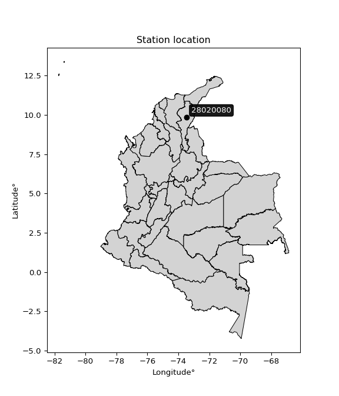</img>

</div>


## A. General information


### 1. General running parameters

• app_version: _v20260108_. • runtime: _2026-01-08 09:19:35.839451_. • Python version: _3.14.0_. • SciPy version: _1.16.3_. • Pandas version: _2.3.3_. • NumPy version: _2.3.5_. • Stations dataset (station_dataset_file): _dataset/pmax24h_in/conventional_cesarcolombia_1959_2022.csv_. • Stations catalog (station_catalog_file): _dataset/CNE.xls_. • Minimum year to eval til year_max (date_min): _1900_. • Maximum year to eval since year_min (date_max): _2024_. • Creates, save and include plots into reports (create_plot): _True_. • Plot only fit distributions with Δo > Δ (plot_only_fit): _True_. • Plot only simple graphs avoiding multiple CDFs and multiple Extreme values plots (plot_only_simple): _False_. • Eval low extreme values, if False, evaluates high extreme values (low_extreme): _False_. • Eval every SciPy distribution as logarithmic (pdist_logarithmic_on): _True_. • Standard deviation normalized (ddof): _1.0_. • Return periods to eval in years (Tr): _[2, 2.33, 5, 10, 15, 20, 25, 50, 75, 100, 200, 250, 500, 750, 1000]_. • Minimum data sample per station, 0 means any (minimum_sample): _5_. • Z-Score maximum threshold to adjust a value, 0 means disable (zscore_max): _3.5_. • Z-Score minimum threshold to adjust a value, 0 means disable (zscore_min): _-2.5_. • Avoid zeros, e.g. rain = 0 (avoid_zeros): _True_. • Avoid null values (avoid_nans): _True_. 

:file_folder:Table: [dataset.csv](../../dataset/pmax24h_in/conventional_cesarcolombia_1959_2022.csv)

> Delta Degrees of Freedom (DDOF): is a parameter used in the formulas for calculating variance and standard deviation. When ddof=0, the divisor is $N$ (the total number of observations) and this is used when your data set is the entire population. When ddof=1, the divisor is $N-1$ and this is used when your data set is a sample drawn from a larger population. Using $N-1$ provides an unbiased estimate of the population variance (known as Bessel´s correction).


### 2. Station info and location

|   id |   CODIGO | NOMBRE                         | CATEGORIA     | TECNOLOGIA   | ESTADO   | FECHA_INSTALACION   |   FECHA_SUSPENSION |   ALTITUD |   LATITUD |   LONGITUD | DEPARTAMENTO   | MUNICIPIO       | AREA_OPERATIVA                                         | ENTIDAD                                                     | AREA_HIDROGRAFICA   | ZONA_HIDROGRAFICA   | SUBZONA_HIDROGRAFICA   |   CORRIENTE | Catalogo   |   Version |
|-----:|---------:|:-------------------------------|:--------------|:-------------|:---------|:--------------------|-------------------:|----------:|----------:|-----------:|:---------------|:----------------|:-------------------------------------------------------|:------------------------------------------------------------|:--------------------|:--------------------|:-----------------------|------------:|:-----------|----------:|
|    0 | 28020080 | HACIENDA LAS PLAYAS [28020080] | Pluviométrica | Convencional | Activa   | 15/08/1959          |                nan |        60 |   9.84808 |   -73.4622 | Cesar          | Agustín Codazzi | Area Operativa 05 - Magdalena-Cesar-Guajira-San Andrés | INSTITUTO DE HIDROLOGIA METEOROLOGIA Y ESTUDIOS AMBIENTALES | Magdalena Cauca     | Cesar               | Medio Cesar            |         nan | CNE_IDEAM  |  20251226 |

<div align="center">

Dynamic map: [:earth_americas:Google](http://maps.google.com/maps?q=9.848083333,-73.46219444) [:earth_americas:OSM](https://www.openstreetmap.org/#map=18/9.848083333/-73.46219444&layers=P) [:earth_americas:Bing](https://www.bing.com/maps?cp=9.848083333~-73.46219444&lvl=18) [:earth_americas:Apple](https://maps.apple.com/frame?center=9.848083333%2C-73.46219444&span=0.003%2C0.006)

</div>


<div align="center">

```geojson
{
  "type": "Feature",
  "geometry": {
    "type": "Point", 
    "coordinates": [-73.46219444, 9.848083333]
  }, 
  "properties": {
    "Name": "28020080"
  }
}
```

</div>


### 3. Discrete values table and plot

<div align="center">

|               |           0 |          1 |           2 |           3 |           4 |            5 |           6 |           7 |             8 |           9 |            10 |          11 |         12 |          13 |         14 |          15 |          16 |          17 |         18 |          19 |         20 |         21 |          22 |          23 |          24 |          25 |          26 |          27 |          28 |          29 |          30 |          31 |          32 |        33 |         34 |          35 |        36 |          37 |          38 |          39 |          40 |         41 |           42 |            43 |         44 |          45 |          46 |          47 |          48 |          49 |          50 |          51 |         52 |           53 |          54 |          55 |
|:--------------|------------:|-----------:|------------:|------------:|------------:|-------------:|------------:|------------:|--------------:|------------:|--------------:|------------:|-----------:|------------:|-----------:|------------:|------------:|------------:|-----------:|------------:|-----------:|-----------:|------------:|------------:|------------:|------------:|------------:|------------:|------------:|------------:|------------:|------------:|------------:|----------:|-----------:|------------:|----------:|------------:|------------:|------------:|------------:|-----------:|-------------:|--------------:|-----------:|------------:|------------:|------------:|------------:|------------:|------------:|------------:|-----------:|-------------:|------------:|------------:|
| Date          | 1959        | 1960       | 1962        | 1963        | 1964        | 1965         | 1968        | 1969        | 1970          | 1971        | 1972          | 1973        | 1974       | 1975        | 1976       | 1979        | 1980        | 1981        | 1982       | 1983        | 1984       | 1985       | 1986        | 1987        | 1988        | 1989        | 1990        | 1991        | 1992        | 1993        | 1994        | 1995        | 1996        | 1997      | 1998       | 1999        | 2000      | 2001        | 2002        | 2003        | 2004        | 2005       | 2006         | 2007          | 2008       | 2009        | 2010        | 2011        | 2012        | 2013        | 2014        | 2015        | 2017       | 2019         | 2020        | 2021        |
| Value         |   73.8698   |   53       |  114        |   79        |   72        |   96.7916    |   72.7217   |   99        |  100          |   80        |  100          |   96        |   55       |  130        |   82       |   78.4436   |   90        |   90        |   60       |  106        |  100.059   |  162       |   80        |   79.2711   |   75        |   70        |   70        |   70        |   77        |  112        |   80        |  115        |  123        |   65      |  140       |   90        |  120      |  110        |   94        |  109        |   89        |  151       |   97         |  100          |  220       |   68        |  105        |  132        |   70        |   85        |  130        |   86        |  135       |   97         |  105        |  134        |
| Value_initial |   73.8698   |   53       |  114        |   79        |   72        |   96.7916    |   72.7217   |   99        |  100          |   80        |  100          |   96        |   55       |  130        |   82       |   78.4436   |   90        |   90        |   60       |  106        |  230.2     |  162       |   80        |   79.2711   |   75        |   70        |   70        |   70        |   77        |  112        |   80        |  115        |  123        |   65      |  140       |   90        |  120      |  110        |   94        |  109        |   89        |  151       |   97         |  100          |  220       |   68        |  105        |  132        |   70        |   85        |  130        |   86        |  135       |   97         |  105        |  134        |
| count         |   56        |   56       |   56        |   56        |   56        |   56         |   56        |   56        |   56          |   56        |   56          |   56        |   56       |   56        |   56       |   56        |   56        |   56        |   56       |   56        |   56       |   56       |   56        |   56        |   56        |   56        |   56        |   56        |   56        |   56        |   56        |   56        |   56        |   56      |   56       |   56        |   56      |   56        |   56        |   56        |   56        |   56       |   56         |   56          |   56       |   56        |   56        |   56        |   56        |   56        |   56        |   56        |   56       |   56         |   56        |   56        |
| mean          |  100.059    |  100.059   |  100.059    |  100.059    |  100.059    |  100.059     |  100.059    |  100.059    |  100.059      |  100.059    |  100.059      |  100.059    |  100.059   |  100.059    |  100.059   |  100.059    |  100.059    |  100.059    |  100.059   |  100.059    |  100.059   |  100.059   |  100.059    |  100.059    |  100.059    |  100.059    |  100.059    |  100.059    |  100.059    |  100.059    |  100.059    |  100.059    |  100.059    |  100.059  |  100.059   |  100.059    |  100.059  |  100.059    |  100.059    |  100.059    |  100.059    |  100.059   |  100.059     |  100.059      |  100.059   |  100.059    |  100.059    |  100.059    |  100.059    |  100.059    |  100.059    |  100.059    |  100.059   |  100.059     |  100.059    |  100.059    |
| std           |   34.4287   |   34.4287  |   34.4287   |   34.4287   |   34.4287   |   34.4287    |   34.4287   |   34.4287   |   34.4287     |   34.4287   |   34.4287     |   34.4287   |   34.4287  |   34.4287   |   34.4287  |   34.4287   |   34.4287   |   34.4287   |   34.4287  |   34.4287   |   34.4287  |   34.4287  |   34.4287   |   34.4287   |   34.4287   |   34.4287   |   34.4287   |   34.4287   |   34.4287   |   34.4287   |   34.4287   |   34.4287   |   34.4287   |   34.4287 |   34.4287  |   34.4287   |   34.4287 |   34.4287   |   34.4287   |   34.4287   |   34.4287   |   34.4287  |   34.4287    |   34.4287     |   34.4287  |   34.4287   |   34.4287   |   34.4287   |   34.4287   |   34.4287   |   34.4287   |   34.4287   |   34.4287  |   34.4287    |   34.4287   |   34.4287   |
| zscore        |   -0.760677 |   -1.36685 |    0.404927 |   -0.611667 |   -0.814986 |   -0.0949009 |   -0.794024 |   -0.030756 |   -0.00171045 |   -0.582621 |   -0.00171045 |   -0.117893 |   -1.30876 |    0.869656 |   -0.52453 |   -0.627827 |   -0.292166 |   -0.292166 |   -1.16353 |    0.172563 |    3.78002 |    1.79911 |   -0.582621 |   -0.603793 |   -0.727849 |   -0.873077 |   -0.873077 |   -0.873077 |   -0.669758 |    0.346836 |   -0.582621 |    0.433973 |    0.666337 |   -1.0183 |    1.16011 |   -0.292166 |    0.5792 |    0.288745 |   -0.175984 |    0.259699 |   -0.321211 |    1.47961 |   -0.0888471 |   -0.00171045 |    3.48375 |   -0.931168 |    0.143517 |    0.927747 |   -0.873077 |   -0.437394 |    0.869656 |   -0.408348 |    1.01488 |   -0.0888471 |    0.143517 |    0.985838 |


</div>


<div align="center">

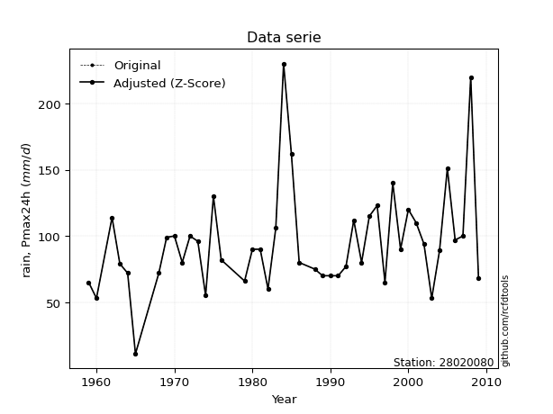</img>

</div>


> The initial value (value_initial) correspond to the initial obtained or null completed value, and value (value) is adjusted only when the initial value is outside the valid range (outlier) definite through the Z-Score value. If Z-Score is active, values out of range or outliers are replaced with the station mean value. A Z-Score (or standard score) measures how many standard deviations a data point is from the mean of a dataset, indicating its relative position; positive scores mean above the mean, negative mean below, and a score of zero is exactly at the mean, allowing for comparison of values from different distributions. It´s calculated using the formula $z=(x–μ)/σ$, where $x$ is the data point, $μ$ is the mean, and $σ$ is the standard deviation, helping identify outliers and understand probability.
>
> <sub>**Note**: In this study, "completing" (filling gaps in) and "extending" (forecasting or lengthening the historical record) rainfall data series are avoided for certain critical analyses because they introduce artificial bias and uncertainty, which can distort the statistics of rare events (extremes), alter day-to-day variability, and compromise the integrity and homogeneity of the original data. Some reasons against Completing/Extending rainfall data are: **Distortion of Extremes and Variability**: The primary issue is that most gap-filling or extension methods rely on averaging or regression with nearby stations, which inherently smooths the data. Rainfall is highly variable in space and time, with a large percentage of zero values and occasional large storms. Infilling methods often underestimate the highest values and overestimate the lowest (zero) values, which severely distorts analyses focused on flood frequency, drought severity, and intensity-duration-frequency (IDF) curves, **Loss of Data Homogeneity**: Infilled or extended data are synthetic estimates, not actual measurements. Combining these estimates with observed data can violate the assumption of data homogeneity, which requires that the data properties do not change over time. Inhomogeneity can lead to incorrect conclusions about long-term trends or changes in climate patterns, **Propagation of Errors**: Errors and biases from the original data (e.g., wind-induced undercatch, instrument errors, site changes) or the data used for imputation can propagate through the analysis, leading to unreliable hydrological models and inaccurate predictions, **Compromised Statistical Integrity**: For statistical analyses, especially those involving the frequency of events, using artificial data can introduce time bias or autocorrelation that doesn´t exist in reality, making it difficult to assess the true probability of events, **Difficulty in Validation**: It is difficult to accurately validate the quality of filled or extended data, especially for past periods where ground-truth measurements are unavailable. The reliability of imputation techniques heavily depends on the density of the surrounding station network and the complexity of the local topography.</sub>


### 4. Active continuous probability distributions from SciPy (44 of 104 available)

A Probability Density Function (PDF) describes the relative likelihood of a continuous random variable falling within a specific range, where the total area under its curve equals 1, and the area over any interval gives the actual probability for that range. Unlike discrete probabilities (like rolling a die), a PDF shows density, not direct probability for a single point (which is zero), with higher points indicating higher likelihood, often visualized as a bell curve for normal distributions.

A log of a probability density function (log-PDF) is simply the logarithm of the PDF´s value, denoted as $log(f(x))$, useful for converting multiplication of probabilities into addition, improving numerical stability with tiny numbers, and connecting to information theory concepts like entropy. Instead of dealing with very small probabilities (e.g., 0.000001), log-PDFs use negative numbers (e.g., $log(0.00001) ≈ -11.51$ that are easier for computers to handle, preventing underflow errors and simplifying complex calculations. In this study, each active probability distribution from SciPy is also evaluated in the $log$ form.

[scipy.stats](https://docs.scipy.org/doc/scipy/reference/stats.html) is a Python´s powerful submodule within the SciPy library for comprehensive statistical analysis, offering over 130 probability distributions (like Normal, Poisson), functions for descriptive stats (mean, variance), hypothesis testing (t-tests, chi-square), random variable generation, and statistical tests, making it essential for data science, modeling, and research. It provides tools to explore, model, and draw conclusions from data efficiently, working seamlessly with NumPy.

<div align="center">

|   id | p_dist             |   n_parameter | fit_method   | label                                                                       | active   | ref                                                                                                        |
|-----:|:-------------------|--------------:|:-------------|:----------------------------------------------------------------------------|:---------|:-----------------------------------------------------------------------------------------------------------|
|    0 | alpha              |             3 | MLE          | Alpha                                                                       | True     | [:mortar_board:](https://docs.scipy.org/doc/scipy/reference/generated/scipy.stats.alpha.html)              |
|    1 | betaprime          |             4 | MLE          | Beta prime                                                                  | True     | [:mortar_board:](https://docs.scipy.org/doc/scipy/reference/generated/scipy.stats.betaprime.html)          |
|    2 | chi2               |             3 | MLE          | Chi²                                                                        | True     | [:mortar_board:](https://docs.scipy.org/doc/scipy/reference/generated/scipy.stats.chi2.html)               |
|    3 | crystalball        |             4 | MLE          | Crystalball                                                                 | True     | [:mortar_board:](https://docs.scipy.org/doc/scipy/reference/generated/scipy.stats.crystalball.html)        |
|    4 | erlang             |             3 | MLE          | Erlang                                                                      | True     | [:mortar_board:](https://docs.scipy.org/doc/scipy/reference/generated/scipy.stats.erlang.html)             |
|    5 | expon              |             2 | MLE          | Exponential                                                                 | True     | [:mortar_board:](https://docs.scipy.org/doc/scipy/reference/generated/scipy.stats.expon.html)              |
|    6 | exponnorm          |             3 | MLE          | Exponentially modified Normal                                               | True     | [:mortar_board:](https://docs.scipy.org/doc/scipy/reference/generated/scipy.stats.exponnorm.html)          |
|    7 | f                  |             4 | MLE          | F                                                                           | True     | [:mortar_board:](https://docs.scipy.org/doc/scipy/reference/generated/scipy.stats.f.html)                  |
|    8 | fatiguelife        |             3 | MLE          | Fatigue-life (Birnbaum-Saunders)                                            | True     | [:mortar_board:](https://docs.scipy.org/doc/scipy/reference/generated/scipy.stats.fatiguelife.html)        |
|    9 | fisk               |             3 | MLE          | Fisk                                                                        | True     | [:mortar_board:](https://docs.scipy.org/doc/scipy/reference/generated/scipy.stats.fisk.html)               |
|   10 | gamma              |             3 | MLE          | Gamma                                                                       | True     | [:mortar_board:](https://docs.scipy.org/doc/scipy/reference/generated/scipy.stats.gamma.html)              |
|   11 | genexpon           |             5 | MLE          | Generalized exponential                                                     | True     | [:mortar_board:](https://docs.scipy.org/doc/scipy/reference/generated/scipy.stats.genexpon.html)           |
|   12 | genlogistic        |             3 | MLE          | Generalized logistic                                                        | True     | [:mortar_board:](https://docs.scipy.org/doc/scipy/reference/generated/scipy.stats.genlogistic.html)        |
|   13 | gibrat             |             2 | MM           | Gibrat                                                                      | True     | [:mortar_board:](https://docs.scipy.org/doc/scipy/reference/generated/scipy.stats.gibrat.html)             |
|   14 | gompertz           |             3 | MLE          | Gompertz (or truncated Gumbel)                                              | True     | [:mortar_board:](https://docs.scipy.org/doc/scipy/reference/generated/scipy.stats.gompertz.html)           |
|   15 | gumbel_l           |             2 | MM           | Gumbel Left Skew                                                            | True     | [:mortar_board:](https://docs.scipy.org/doc/scipy/reference/generated/scipy.stats.gumbel_l.html)           |
|   16 | gumbel_r           |             2 | MM           | Gumbel Right Skew                                                           | True     | [:mortar_board:](https://docs.scipy.org/doc/scipy/reference/generated/scipy.stats.gumbel_r.html)           |
|   17 | halflogistic       |             2 | MM           | Half-logistic                                                               | True     | [:mortar_board:](https://docs.scipy.org/doc/scipy/reference/generated/scipy.stats.halflogistic.html)       |
|   18 | halfnorm           |             2 | MM           | Half Normal                                                                 | True     | [:mortar_board:](https://docs.scipy.org/doc/scipy/reference/generated/scipy.stats.halfnorm.html)           |
|   19 | hypsecant          |             2 | MM           | hyperbolic secant                                                           | True     | [:mortar_board:](https://docs.scipy.org/doc/scipy/reference/generated/scipy.stats.hypsecant.html)          |
|   20 | invgamma           |             3 | MLE          | Inverted gamma                                                              | True     | [:mortar_board:](https://docs.scipy.org/doc/scipy/reference/generated/scipy.stats.invgamma.html)           |
|   21 | invgauss           |             3 | MLE          | Inverse Gaussian                                                            | True     | [:mortar_board:](https://docs.scipy.org/doc/scipy/reference/generated/scipy.stats.invgauss.html)           |
|   22 | invweibull         |             3 | MLE          | Inverted Weibull                                                            | True     | [:mortar_board:](https://docs.scipy.org/doc/scipy/reference/generated/scipy.stats.invweibull.html)         |
|   23 | johnsonsu          |             4 | MLE          | Johnson Su                                                                  | True     | [:mortar_board:](https://docs.scipy.org/doc/scipy/reference/generated/scipy.stats.johnsonsu.html)          |
|   24 | kstwobign          |             2 | MLE          | Limiting distribution of scaled Kolmogorov-Smirnov two-sided test statistic | True     | [:mortar_board:](https://docs.scipy.org/doc/scipy/reference/generated/scipy.stats.kstwobign.html)          |
|   25 | laplace            |             2 | MM           | Laplace                                                                     | True     | [:mortar_board:](https://docs.scipy.org/doc/scipy/reference/generated/scipy.stats.laplace.html)            |
|   26 | laplace_asymmetric |             3 | MLE          | Asymmetric Laplace                                                          | True     | [:mortar_board:](https://docs.scipy.org/doc/scipy/reference/generated/scipy.stats.laplace_asymmetric.html) |
|   27 | loggamma           |             3 | MLE          | Log gamma                                                                   | True     | [:mortar_board:](https://docs.scipy.org/doc/scipy/reference/generated/scipy.stats.loggamma.html)           |
|   28 | logistic           |             2 | MM           | Logistic (or Sech-squared)                                                  | True     | [:mortar_board:](https://docs.scipy.org/doc/scipy/reference/generated/scipy.stats.logistic.html)           |
|   29 | lognorm            |             3 | MLE          | Log Normal                                                                  | True     | [:mortar_board:](https://docs.scipy.org/doc/scipy/reference/generated/scipy.stats.lognorm.html)            |
|   30 | maxwell            |             2 | MM           | Maxwell                                                                     | True     | [:mortar_board:](https://docs.scipy.org/doc/scipy/reference/generated/scipy.stats.maxwell.html)            |
|   31 | mielke             |             4 | MLE          | Mielke Beta-Kappa / Dagum                                                   | True     | [:mortar_board:](https://docs.scipy.org/doc/scipy/reference/generated/scipy.stats.mielke.html)             |
|   32 | moyal              |             2 | MM           | Moyal                                                                       | True     | [:mortar_board:](https://docs.scipy.org/doc/scipy/reference/generated/scipy.stats.moyal.html)              |
|   33 | nakagami           |             3 | MLE          | Nakagami                                                                    | True     | [:mortar_board:](https://docs.scipy.org/doc/scipy/reference/generated/scipy.stats.nakagami.html)           |
|   34 | ncf                |             5 | MLE          | Non-central F distribution                                                  | True     | [:mortar_board:](https://docs.scipy.org/doc/scipy/reference/generated/scipy.stats.ncf.html)                |
|   35 | nct                |             4 | MLE          | Non-central Student’s t                                                     | True     | [:mortar_board:](https://docs.scipy.org/doc/scipy/reference/generated/scipy.stats.nct.html)                |
|   36 | norm               |             2 | MM           | Normal                                                                      | True     | [:mortar_board:](https://docs.scipy.org/doc/scipy/reference/generated/scipy.stats.norm.html)               |
|   37 | pearson3           |             3 | MM           | Pearson type III                                                            | True     | [:mortar_board:](https://docs.scipy.org/doc/scipy/reference/generated/scipy.stats.pearson3.html)           |
|   38 | rayleigh           |             2 | MM           | Rayleigh                                                                    | True     | [:mortar_board:](https://docs.scipy.org/doc/scipy/reference/generated/scipy.stats.rayleigh.html)           |
|   39 | rice               |             3 | MLE          | Rice                                                                        | True     | [:mortar_board:](https://docs.scipy.org/doc/scipy/reference/generated/scipy.stats.rice.html)               |
|   40 | t                  |             3 | MLE          | Student’s t                                                                 | True     | [:mortar_board:](https://docs.scipy.org/doc/scipy/reference/generated/scipy.stats.t.html)                  |
|   41 | truncnorm          |             4 | MLE          | Truncated normal                                                            | True     | [:mortar_board:](https://docs.scipy.org/doc/scipy/reference/generated/scipy.stats.truncnorm.html)          |
|   42 | wald               |             2 | MM           | Wald                                                                        | True     | [:mortar_board:](https://docs.scipy.org/doc/scipy/reference/generated/scipy.stats.wald.html)               |
|   43 | weibull_min        |             3 | MLE          | Weibull minimum                                                             | True     | [:mortar_board:](https://docs.scipy.org/doc/scipy/reference/generated/scipy.stats.weibull_min.html)        |

</div>

> **n_parameter:** # arguments & localization & scale.
>
> **Fit methods:** (MLE) maximum likelihood, (MM) L-moments.
>
>**Inactive** (With the only purpose of prevent loops, zero divisions, infinite values, over high estimated values or horizontal trending for recurrence intervals estimations, the follow distributions were disabled.)**:** foldnorm, gennorm, norminvgauss, powernorm, powerlognorm, skewnorm, genextreme, anglit, arcsine, argus, beta, bradford, burr, burr12, cauchy, cosine, halfcauchy, foldcauchy, skewcauchy, wrapcauchy, dgamma, gengamma, exponweib, exponpow, truncexpon, gausshyper, genhalflogistic, genhyperbolic, geninvgauss, halfgennorm, johnsonsb, kappa4, kappa3, ksone, kstwo, loglaplace, levy, levy_l, levy_stable, ncx2, pareto, genpareto, truncpareto, lomax, powerlaw, rdist, rel_breitwigner, recipinvgauss, semicircular, studentized_range, trapezoid, triang, truncweibull_min, tukeylambda, uniform, loguniform, vonmises, vonmises_line, weibull_max, dweibull, 


## B. Probability (PDF) vs. Empirical (EDF) distributions functions

A continuous probability distribution (CPD) describes probabilities for variables that can take any value within a range (like rain any time), unlike discrete variables with specific outcomes (like temperature). It uses a Probability Density Function (PDF), a curve where the total area under it equals 1, and the probability of the variable falling within an interval (a to b) is found by calculating the area under the curve between those points. A key feature is that the probability of hitting any single exact value is zero, so probabilities are always expressed for ranges, e.g., $P(a ≤ X ≤ b)$.

<div align="center">

Distributions parameters from station values
|    |   station | p_dist                |   n |             loc |         scale | shape                  | shape1             | shape2              | shape3   |
|---:|----------:|:----------------------|----:|----------------:|--------------:|:-----------------------|:-------------------|:--------------------|:---------|
|  0 |  28020080 | alpha                 |  56 |    -32.0873     |  632.021      | 5.0827219648967255     |                    |                     |          |
|  1 |  28020080 | betaprime             |  56 |     -1.15316    |    3.0596     | 441.24185708434993     | 14.667643579539558 |                     |          |
|  2 |  28020080 | chi2                  |  56 |     45.8559     |    7.82506    | 6.62985600536191       |                    |                     |          |
|  3 |  28020080 | crystalball           |  56 |     97.7349     |   29.263      | 8320.555264922348      | 346.38904236837834 |                     |          |
|  4 |  28020080 | erlang                |  56 |     45.8559     |   15.6501     | 3.3149249931377955     |                    |                     |          |
|  5 |  28020080 | expon                 |  56 |     53          |   44.7349     |                        |                    |                     |          |
|  6 |  28020080 | exponnorm             |  56 |     70.6797     |   12.067      | 2.242092034348829      |                    |                     |          |
|  7 |  28020080 | f                     |  56 |     11.0066     |   78.7385     | 4768.304633907365      | 21.709782842516827 |                     |          |
|  8 |  28020080 | fatiguelife           |  56 |     29.0516     |   63.3271     | 0.41134977615896906    |                    |                     |          |
|  9 |  28020080 | fisk                  |  56 |     -0.505577   |   93.5946     | 6.4465214600032565     |                    |                     |          |
| 10 |  28020080 | gamma                 |  56 |     45.856      |   15.6502     | 3.3149115882666065     |                    |                     |          |
| 11 |  28020080 | genexpon              |  56 |     53          |    3.05076    | 0.04950077521160064    | 0.0252780340066805 | 0.13078646607973113 |          |
| 12 |  28020080 | genlogistic           |  56 |    -45.59       |   21.4974     | 435.54452699026047     |                    |                     |          |
| 13 |  28020080 | gibrat                |  56 |     75.4109     |   13.5402     |                        |                    |                     |          |
| 14 |  28020080 | gompertz              |  56 |     41.6937     |    4.00768    | 2.6704283539938704e-18 |                    |                     |          |
| 15 |  28020080 | gumbel_l              |  56 |    110.905      |   22.8163     |                        |                    |                     |          |
| 16 |  28020080 | gumbel_r              |  56 |     84.565      |   22.8163     |                        |                    |                     |          |
| 17 |  28020080 | halflogistic          |  56 |     63.0514     |   25.0189     |                        |                    |                     |          |
| 18 |  28020080 | halfnorm              |  56 |     59.0022     |   48.5443     |                        |                    |                     |          |
| 19 |  28020080 | hypsecant             |  56 |     97.7349     |   18.6294     |                        |                    |                     |          |
| 20 |  28020080 | invgamma              |  56 |     10.8174     |  856.723      | 10.857390663346111     |                    |                     |          |
| 21 |  28020080 | invgauss              |  56 |     28.0027     |  410.813      | 0.1697420698146077     |                    |                     |          |
| 22 |  28020080 | invweibull            |  56 |   -287.672      |  372.011      | 17.656085788508733     |                    |                     |          |
| 23 |  28020080 | johnsonsu             |  56 |     31.0221     |    6.98071    | -6.941221825876934     | 2.4203881973005474 |                     |          |
| 24 |  28020080 | kstwobign             |  56 |      6.15197    |  105.91       |                        |                    |                     |          |
| 25 |  28020080 | laplace               |  56 |     97.7349     |   20.6921     |                        |                    |                     |          |
| 26 |  28020080 | laplace_asymmetric    |  56 |     72.7217     |   15.2727     | 0.47362076832374445    |                    |                     |          |
| 27 |  28020080 | loggamma              |  56 | -11802.7        | 1516.08       | 2564.708518768127      |                    |                     |          |
| 28 |  28020080 | logistic              |  56 |     97.7349     |   16.1336     |                        |                    |                     |          |
| 29 |  28020080 | lognorm               |  56 |     30.123      |   62.1359     | 0.41020599353948517    |                    |                     |          |
| 30 |  28020080 | maxwell               |  56 |     28.3938     |   43.4531     |                        |                    |                     |          |
| 31 |  28020080 | mielke                |  56 |     -3.7402     |   78.2335     | 12.807680579315688     | 5.39882477840121   |                     |          |
| 32 |  28020080 | moyal                 |  56 |     81.0005     |   13.173      |                        |                    |                     |          |
| 33 |  28020080 | nakagami              |  56 |     51.7579     |   54.4998     | 0.7346785353091234     |                    |                     |          |
| 34 |  28020080 | ncf                   |  56 |     -3.75009    |    3.21883    | 28.37939547525381      | 32.024133735134654 | 809.4316330175781   |          |
| 35 |  28020080 | nct                   |  56 |     -0.107986   |    7.33072    | 8.23034338213921       | 12.088036920151392 |                     |          |
| 36 |  28020080 | norm                  |  56 |     97.7349     |   29.263      |                        |                    |                     |          |
| 37 |  28020080 | pearson3              |  56 |     97.7349     |   29.263      | 1.4888882019995995     |                    |                     |          |
| 38 |  28020080 | rayleigh              |  56 |     41.753      |   44.6671     |                        |                    |                     |          |
| 39 |  28020080 | rice                  |  56 |     47.2929     |   41.2354     | 0.0008170292458655316  |                    |                     |          |
| 40 |  28020080 | t                     |  56 |     92.318      |   23.4146     | 5.0036672485765905     |                    |                     |          |
| 41 |  28020080 | truncnorm             |  56 |     97.7349     |   29.263      | -1154.1222120474       | 2449.4584796495383 |                     |          |
| 42 |  28020080 | wald                  |  56 |     68.4719     |   29.2631     |                        |                    |                     |          |
| 43 |  28020080 | weibull_min           |  56 |     59.3415     |   43.3575     | 1.4493638925546621     |                    |                     |          |
| 44 |  28020080 | logalpha              |  56 |      0.57089    |   57.8999     | 14.64603298451576      |                    |                     |          |
| 45 |  28020080 | logbetaprime          |  56 |     -2.78077    |   13.0372     | 291.4880462784138      | 520.729979190623   |                     |          |
| 46 |  28020080 | logchi2               |  56 |      3.19972    |    0.0281653  | 47.686884150950945     |                    |                     |          |
| 47 |  28020080 | logcrystalball        |  56 |      4.54284    |    0.275137   | 275.72786531109347     | 36.14119199529239  |                     |          |
| 48 |  28020080 | logerlang             |  56 |      3.19972    |    0.0563307  | 23.84343127202529      |                    |                     |          |
| 49 |  28020080 | logexpon              |  56 |      3.97029    |    0.572547   |                        |                    |                     |          |
| 50 |  28020080 | logexponnorm          |  56 |      4.37527    |    0.219094   | 0.7648322756026795     |                    |                     |          |
| 51 |  28020080 | logf                  |  56 |      2.35383    |    2.16671    | 373.0482037068658      | 196.68531560869746 |                     |          |
| 52 |  28020080 | logfatiguelife        |  56 |      2.55664    |    1.96742    | 0.1381751602675705     |                    |                     |          |
| 53 |  28020080 | logfisk               |  56 |      2.68352    |    1.84064    | 11.863706612414157     |                    |                     |          |
| 54 |  28020080 | loggamma              |  56 |      3.19972    |    0.0563307  | 23.843458565506694     |                    |                     |          |
| 55 |  28020080 | loggenexpon           |  56 |      3.97029    |    0.585971   | 0.10077503725182398    | 1.964214841906921  | 1.185137200543537   |          |
| 56 |  28020080 | loggenlogistic        |  56 |      4.32917    |    0.190516   | 2.216058529324779      |                    |                     |          |
| 57 |  28020080 | loggibrat             |  56 |      4.333      |    0.127278   |                        |                    |                     |          |
| 58 |  28020080 | loggompertz           |  56 |      3.97029    |    0.843191   | 1.003552777119995      |                    |                     |          |
| 59 |  28020080 | loggumbel_l           |  56 |      4.66666    |    0.214523   |                        |                    |                     |          |
| 60 |  28020080 | loggumbel_r           |  56 |      4.41901    |    0.214523   |                        |                    |                     |          |
| 61 |  28020080 | loghalflogistic       |  56 |      4.21677    |    0.23521    |                        |                    |                     |          |
| 62 |  28020080 | loghalfnorm           |  56 |      4.17867    |    0.456419   |                        |                    |                     |          |
| 63 |  28020080 | loghypsecant          |  56 |      4.54284    |    0.175158   |                        |                    |                     |          |
| 64 |  28020080 | loginvgamma           |  56 |      1.88996    |  249.116      | 94.90372164915198      |                    |                     |          |
| 65 |  28020080 | loginvgauss           |  56 |      2.61504    |   94.4699     | 0.020400762839874263   |                    |                     |          |
| 66 |  28020080 | loginvweibull         |  56 |     -1.6875e+07 |    1.6875e+07 | 67862395.88246803      |                    |                     |          |
| 67 |  28020080 | logjohnsonsu          |  56 |      2.854      |    0.713888   | -10.643913163381502    | 6.711605351338324  |                     |          |
| 68 |  28020080 | logkstwobign          |  56 |      3.49952    |    1.20019    |                        |                    |                     |          |
| 69 |  28020080 | loglaplace            |  56 |      4.54284    |    0.194551   |                        |                    |                     |          |
| 70 |  28020080 | loglaplace_asymmetric |  56 |      4.57256    |    0.217583   | 1.070663577664007      |                    |                     |          |
| 71 |  28020080 | logloggamma           |  56 |    -57.6307     |    8.9429     | 1045.9959970558825     |                    |                     |          |
| 72 |  28020080 | loglogistic           |  56 |      4.54284    |    0.151691   |                        |                    |                     |          |
| 73 |  28020080 | loglognorm            |  56 |      2.55844    |    1.9656     | 0.13797332485894687    |                    |                     |          |
| 74 |  28020080 | logmaxwell            |  56 |      3.89088    |    0.408555   |                        |                    |                     |          |
| 75 |  28020080 | logmielke             |  56 |   -153.387      |  157.78       | 1522.316928673892      | 872.3235524012455  |                     |          |
| 76 |  28020080 | logmoyal              |  56 |      4.3855     |    0.123855   |                        |                    |                     |          |
| 77 |  28020080 | lognakagami           |  56 |      3.71542    |    0.871967   | 2.368599732566474      |                    |                     |          |
| 78 |  28020080 | logncf                |  56 |      2.35693    |    2.01303    | 367.9670584622759      | 196.81767288631914 | 27.5401275715342    |          |
| 79 |  28020080 | lognct                |  56 |     -0.109465   |    0.113449   | 176.19127630415        | 40.822145482509114 |                     |          |
| 80 |  28020080 | lognorm               |  56 |      4.54284    |    0.275137   |                        |                    |                     |          |
| 81 |  28020080 | logpearson3           |  56 |      4.54284    |    0.275137   | 0.42572171859645735    |                    |                     |          |
| 82 |  28020080 | lograyleigh           |  56 |      4.01651    |    0.419946   |                        |                    |                     |          |
| 83 |  28020080 | logrice               |  56 |      3.90042    |    0.307487   | 1.7792126282078744     |                    |                     |          |
| 84 |  28020080 | logt                  |  56 |      4.54761    |    0.267438   | 28.91308470665487      |                    |                     |          |
| 85 |  28020080 | logtruncnorm          |  56 |     -0.179571   |    1.6903     | 2.4551088234793026     | 9.283064016322946  |                     |          |
| 86 |  28020080 | logwald               |  56 |      4.26767    |    0.275166   |                        |                    |                     |          |
| 87 |  28020080 | logweibull_min        |  56 |      3.8718     |    0.75454    | 2.5927270828784663     |                    |                     |          |

</div>

> **loc** (Location parameter): This shifts the distribution along the x-axis. For many common distributions, like the normal (Gaussian) distribution, loc represents the mean $μ$. For others, like the uniform distribution, it might represent the minimum value, or for the beta distribution, the left end of the support interval.
>
> **scale** (Scale parameter): This determines the width or spread of the distribution. For the normal distribution, scale represents the standard deviation $σ$. For a uniform distribution, it defines the length of the interval (from $loc$ to $loc + scale$).
>
> **shape** (Shape parameters): Refers to parameters that define the specific form of a probability distribution, distinct from its location (loc) and scale (scale). These parameters are required arguments for most distribution functions. For example, a normal (Gaussian) distribution is fully defined by its location (mean) and scale (standard deviation), so it has no specific shape parameters beyond loc and scale. However, other distributions have intrinsic properties that need specification, as Gamma distribution that takes a shape parameter, often named $a$ or $alpha$.


### 0. Cumulative distribution values - CDF (88 evaluated)

Cumulative Distribution Function (CDF), denoted as $F$<sub>$X$</sub>$(x)$, is a function that gives the probability that a random variable $X$ will take a value less than or equal to a specific value, $x$ (i.e., $(P(X≥x)$. It essentially "accumulates" probabilities from a given point up to the far right (positive infinity), providing a complete picture of the distribution´s probabilities for both discrete (like rain) and continuous (like temperature) variables, helping to find probabilities over ranges or above certain values. Each station is evaluated separately ordering the $x$ values ascending, calculating the CDF and PDF values for the activated distributions and their logarithmic forms.

<div align="center">

CDF ordered by x ascending and calculating $log(f(x))$ separately
|   id |   Station |   date |        x |   count |    mean |     std |      zscore |   Value_initial |   station |   m |      alpha |   alpha_pdf |   betaprime |   betaprime_pdf |       chi2 |    chi2_pdf |   crystalball |   crystalball_pdf |     erlang |   erlang_pdf |     expon |   expon_pdf |   exponnorm |   exponnorm_pdf |         f |       f_pdf |   fatiguelife |   fatiguelife_pdf |      fisk |    fisk_pdf |     gamma |   gamma_pdf |    genexpon |   genexpon_pdf |   genlogistic |   genlogistic_pdf |    gibrat |   gibrat_pdf |    gompertz |   gompertz_pdf |   gumbel_l |   gumbel_l_pdf |   gumbel_r |   gumbel_r_pdf |   halflogistic |   halflogistic_pdf |   halfnorm |   halfnorm_pdf |   hypsecant |   hypsecant_pdf |   invgamma |   invgamma_pdf |   invgauss |   invgauss_pdf |   invweibull |   invweibull_pdf |   johnsonsu |   johnsonsu_pdf |   kstwobign |   kstwobign_pdf |   laplace |   laplace_pdf |   laplace_asymmetric |   laplace_asymmetric_pdf |   loggamma |   loggamma_pdf |   logistic |   logistic_pdf |   lognorm |   lognorm_pdf |   maxwell |   maxwell_pdf |    mielke |   mielke_pdf |      moyal |   moyal_pdf |   nakagami |   nakagami_pdf |       ncf |     ncf_pdf |        nct |     nct_pdf |      norm |    norm_pdf |   pearson3 |   pearson3_pdf |   rayleigh |   rayleigh_pdf |       rice |    rice_pdf |        t |       t_pdf |   truncnorm |   truncnorm_pdf |        wald |    wald_pdf |   weibull_min |   weibull_min_pdf |   logalpha |   logalpha_pdf |   logbetaprime |   logbetaprime_pdf |    logchi2 |   logchi2_pdf |   logcrystalball |   logcrystalball_pdf |   logerlang |   logerlang_pdf |   logexpon |   logexpon_pdf |   logexponnorm |   logexponnorm_pdf |       logf |   logf_pdf |   logfatiguelife |   logfatiguelife_pdf |   logfisk |   logfisk_pdf |   loggenexpon |   loggenexpon_pdf |   loggenlogistic |   loggenlogistic_pdf |   loggibrat |   loggibrat_pdf |   loggompertz |   loggompertz_pdf |   loggumbel_l |   loggumbel_l_pdf |   loggumbel_r |   loggumbel_r_pdf |   loghalflogistic |   loghalflogistic_pdf |   loghalfnorm |   loghalfnorm_pdf |   loghypsecant |   loghypsecant_pdf |   loginvgamma |   loginvgamma_pdf |   loginvgauss |   loginvgauss_pdf |   loginvweibull |   loginvweibull_pdf |   logjohnsonsu |   logjohnsonsu_pdf |   logkstwobign |   logkstwobign_pdf |   loglaplace |   loglaplace_pdf |   loglaplace_asymmetric |   loglaplace_asymmetric_pdf |   logloggamma |   logloggamma_pdf |   loglogistic |   loglogistic_pdf |   loglognorm |   loglognorm_pdf |   logmaxwell |   logmaxwell_pdf |   logmielke |   logmielke_pdf |    logmoyal |   logmoyal_pdf |   lognakagami |   lognakagami_pdf |     logncf |   logncf_pdf |    lognct |   lognct_pdf |   logpearson3 |   logpearson3_pdf |   lograyleigh |   lograyleigh_pdf |    logrice |   logrice_pdf |      logt |   logt_pdf |   logtruncnorm |   logtruncnorm_pdf |     logwald |   logwald_pdf |   logweibull_min |   logweibull_min_pdf |
|-----:|----------:|-------:|---------:|--------:|--------:|--------:|------------:|----------------:|----------:|----:|-----------:|------------:|------------:|----------------:|-----------:|------------:|--------------:|------------------:|-----------:|-------------:|----------:|------------:|------------:|----------------:|----------:|------------:|--------------:|------------------:|----------:|------------:|----------:|------------:|------------:|---------------:|--------------:|------------------:|----------:|-------------:|------------:|---------------:|-----------:|---------------:|-----------:|---------------:|---------------:|-------------------:|-----------:|---------------:|------------:|----------------:|-----------:|---------------:|-----------:|---------------:|-------------:|-----------------:|------------:|----------------:|------------:|----------------:|----------:|--------------:|---------------------:|-------------------------:|-----------:|---------------:|-----------:|---------------:|----------:|--------------:|----------:|--------------:|----------:|-------------:|-----------:|------------:|-----------:|---------------:|----------:|------------:|-----------:|------------:|----------:|------------:|-----------:|---------------:|-----------:|---------------:|-----------:|------------:|---------:|------------:|------------:|----------------:|------------:|------------:|--------------:|------------------:|-----------:|---------------:|---------------:|-------------------:|-----------:|--------------:|-----------------:|---------------------:|------------:|----------------:|-----------:|---------------:|---------------:|-------------------:|-----------:|-----------:|-----------------:|---------------------:|----------:|--------------:|--------------:|------------------:|-----------------:|---------------------:|------------:|----------------:|--------------:|------------------:|--------------:|------------------:|--------------:|------------------:|------------------:|----------------------:|--------------:|------------------:|---------------:|-------------------:|--------------:|------------------:|--------------:|------------------:|----------------:|--------------------:|---------------:|-------------------:|---------------:|-------------------:|-------------:|-----------------:|------------------------:|----------------------------:|--------------:|------------------:|--------------:|------------------:|-------------:|-----------------:|-------------:|-----------------:|------------:|----------------:|------------:|---------------:|--------------:|------------------:|-----------:|-------------:|----------:|-------------:|--------------:|------------------:|--------------:|------------------:|-----------:|--------------:|----------:|-----------:|---------------:|-------------------:|------------:|--------------:|-----------------:|---------------------:|
|    0 |  28020080 |   1960 |  53      |      56 | 100.059 | 34.4287 | -1.36685    |         53      |  28020080 |   1 | 0.00950877 | 0.0022265   |   0.0120862 |     0.00258428  | 0.00581286 | 0.00241778  |     0.0631672 |       0.00423762  | 0.00581283 |  0.00241777  | 0         | 0.0223539   |   0.0120074 |     0.00219682  | 0.0082109 | 0.00217666  |    0.00698177 |       0.00221149  | 0.0264727 | 0.00310508  | 0.0058128 | 0.00241778  | 1.22819e-09 |    0.0162257   |     0.012074  |       0.0024681   | 0         |  0           | 4.21829e-17 |    1.11918e-17 |  0.0759918 |    0.00320071  |  0.0185256 |    0.00323852  |      0         |        0           |  0         |    0           |   0.0575205 |     0.00307084  |  0.0082206 |     0.0021785  | 0.00703963 |    0.00219887  |   0.00883175 |      0.00216477  |  0.00757521 |     0.00219285  |   0.0103516 |     0.00256547  | 0.0575512 |   0.00278131  |            0.0119919 |              0.00165784  | 0.00792566 |      0.115342  |  0.0588125 |    0.00343096  | 0.0187192 |     0.166355  | 0.0439031 |   0.00501575  | 0.0111122 |  0.00213192  | 0.00379816 | 0.00132911  | 0.00336356 |    0.00397799  | 0.0134704 | 0.0027118   | 0.00870148 | 0.00216802  | 0.0631672 | 0.00423762  | 0          |    0           |  0.0312033 |    0.00546126  | 0.00953194 | 0.00332441  | 0.076953 | 0.00423824  |   0.0631672 |     0.00423762  | 0           | 0           |    0          |       0           | 0.00850808 |      0.115929  |       0.146091 |           0.460173 | 0.00792565 |     0.115342  |        0.0187192 |            0.166355  |  0.00792566 |       0.115342  |  0         |       1.74658  |      0.0111895 |          0.125812  | 0.00833989 |  0.115662  |       0.00812758 |            0.115346  | 0.0141071 |      0.128229 |   3.56532e-09 |          0.17198  |        0.0112422 |            0.113512  |  0          |       0         |   3.94149e-09 |         1.19018   |     0.0381764 |       0.174518    |   0.000303925 |         0.0114738 |         0         |             0         |     0         |         0         |      0.0242142 |          0.138109  |    0.00842202 |         0.116182  |    0.00790228 |         0.114068  |      0.00283315 |           0.066838  |     0.00838968 |          0.115764  |     0.0021049  |          0.0672303 |    0.0263561 |        0.135471  |               0.0402558 |                    0.172803 |     0.0200532 |          0.171782 |     0.0224353 |         0.144583  |   0.00823674 |        0.115446  |   0.00193117 |        0.0724043 |   0.0143086 |       0.126282  | 9.03847e-08 |    1.07675e-05 |    0.00684372 |         0.119665  | 0.00833152 |    0.115568  | 0.0122394 |    0.13976   |    0.00753166 |         0.112537  |     0         |         0         | 0.00534215 |     0.154027  | 0.0196564 |  0.15824   |    5.58167e-11 |           1.6458   | 0           |   0           |       0.00508434 |            0.133496  |
|    1 |  28020080 |   1974 |  55      |      56 | 100.059 | 34.4287 | -1.30876    |         55      |  28020080 |   2 | 0.01483    | 0.00312511  |   0.0181373 |     0.00349186  | 0.0119702  | 0.00376758  |     0.0720939 |       0.00469336  | 0.0119702  |  0.00376757  | 0.0437231 | 0.0213765   |   0.0171263 |     0.00294875  | 0.0135057 | 0.00315195  |    0.0124928  |       0.00333657  | 0.033303  | 0.00373906  | 0.0119702 | 0.00376758  | 0.0325988   |    0.0163554   |     0.0178431 |       0.00332634  | 0         |  0           | 7.12093e-17 |    1.84345e-17 |  0.082658  |    0.00346873  |  0.025891  |    0.00414625  |      0         |        0           |  0         |    0           |   0.0639978 |     0.00341221  |  0.0135195 |     0.00315417 | 0.0125108  |    0.00330932  |   0.0140516  |      0.00308789  |  0.0129707  |     0.00323805  |   0.0164625 |     0.00357201  | 0.0633915 |   0.00306356  |            0.0158113 |              0.00218585  | 0.0132431  |      0.17466   |  0.0660616 |    0.00382417  | 0.025808  |     0.218158  | 0.0546241 |   0.00570733  | 0.0161129 |  0.00289668  | 0.0072995  | 0.00222255  | 0.01376    |    0.00622678  | 0.019761  | 0.0036016   | 0.0139366  | 0.00309995  | 0.0720939 | 0.00469336  | 0          |    0           |  0.0430243 |    0.00635392  | 0.017315   | 0.00445414  | 0.085911 | 0.00472743  |   0.0720939 |     0.00469336  | 0           | 0           |    0          |       0           | 0.0138056  |      0.172875  |       0.163761 |           0.493796 | 0.0132431  |     0.17466   |        0.0258081 |            0.218158  |  0.0132431  |       0.17466   |  0.0626473 |       1.63716  |      0.0167677 |          0.177688  | 0.0136386  |  0.173243  |       0.0134289  |            0.173748  | 0.0196433 |      0.17258  |   0.0108481   |          0.409438 |        0.016259  |            0.159645  |  0          |       0         |   0.0440681   |         1.18883   |     0.0452066 |       0.205894    |   0.00109784  |         0.0348733 |         0         |             0         |     0         |         0         |      0.029909  |          0.170504  |    0.0137394  |         0.17372   |    0.0131627  |         0.172872  |      0.00638068 |           0.129696  |     0.0136896  |          0.173202  |     0.00602313 |          0.15161   |    0.0318836 |        0.163883  |               0.0471936 |                    0.202584 |     0.0273382 |          0.223256 |     0.028464  |         0.182304  |   0.0135334  |        0.173372  |   0.00601131 |        0.152354  |   0.0197789 |       0.1711    | 4.17086e-06 |    0.000372231 |    0.0124596  |         0.186553  | 0.0136262  |    0.17312   | 0.0184163 |    0.196079  |    0.0127476  |         0.172053  |     0         |         0         | 0.0126275  |     0.240059  | 0.0263578 |  0.205246  |    0.0593469   |           1.55922  | 0           |   0           |       0.0115949  |            0.220512  |
|    2 |  28020080 |   1982 |  60      |      56 | 100.059 | 34.4287 | -1.16353    |         60      |  28020080 |   3 | 0.0374925  | 0.0060926   |   0.0423901 |     0.00632298  | 0.0401006  | 0.00751343  |     0.0986107 |       0.00593624  | 0.0401006  |  0.00751343  | 0.144849  | 0.019116    |   0.0379413 |     0.00554894  | 0.036879  | 0.00634925  |    0.037701   |       0.0068682   | 0.0566678 | 0.00569549  | 0.0401006 | 0.00751345  | 0.114386    |    0.0162721   |     0.04102   |       0.00607172  | 0         |  0           | 2.54578e-16 |    6.41889e-17 |  0.101845  |    0.00422827  |  0.0531408 |    0.00683538  |      0         |        0           |  0.0163996 |    0.0164327   |   0.0835011 |     0.00443098  |  0.0369057 |     0.00635211 | 0.0375125  |    0.00681804  |   0.0367904  |      0.00617027  |  0.0372103  |     0.00659718  |   0.0417058 |     0.00661815  | 0.0807185 |   0.00390093  |            0.0315621 |              0.00436333  | 0.0368902  |      0.385891  |  0.0879514 |    0.00497199  | 0.0515428 |     0.384034  | 0.0875372 |   0.00745656  | 0.0368059 |  0.00555711  | 0.0264799  | 0.00572902  | 0.0538775  |    0.00951224  | 0.0443556 | 0.0063404   | 0.0367754  | 0.00619442  | 0.0986107 | 0.00593624  | 0.00494981 |    0.00553051  |  0.0800541 |    0.00841352  | 0.0463716  | 0.00712663  | 0.112995 | 0.00615563  |   0.0986107 |     0.00593624  | 0           | 0           |    0.00231097 |       0.00508077  | 0.036994   |      0.377105  |       0.21007  |           0.569666 | 0.0368902  |     0.385891  |        0.0515429 |            0.384034  |  0.0368902  |       0.385891  |  0.194803  |       1.40634  |      0.039516  |          0.36027   | 0.0369463  |  0.37954   |       0.0368885  |            0.382554  | 0.0408961 |      0.329832 |   0.0670448   |          0.854399 |        0.0369408 |            0.332698  |  0          |       0         |   0.147054    |         1.17606   |     0.0670466 |       0.301818    |   0.0106487   |         0.225476  |         0         |             0         |     0         |         0         |      0.0490908 |          0.279157  |    0.0370747  |         0.379635  |    0.036633   |         0.383981  |      0.028378   |           0.406516  |     0.0369745  |          0.379041  |     0.0333176  |          0.506637  |    0.0498657 |        0.256312  |               0.0685638 |                    0.294318 |     0.0534255 |          0.386604 |     0.0494242 |         0.309718  |   0.0368989  |        0.380757  |   0.0305109  |        0.427872  |   0.0410738 |       0.333312  | 0.00119797  |    0.0549323   |    0.0378505  |         0.412331  | 0.0369201  |    0.379349  | 0.0431626 |    0.386712  |    0.0362454  |         0.385458  |     0.0170274 |         0.433809  | 0.0429785  |     0.462861  | 0.0504269 |  0.35867   |    0.186669    |           1.37074  | 0           |   0           |       0.0413102  |            0.47119   |
|    3 |  28020080 |   1997 |  65      |      56 | 100.059 | 34.4287 | -1.0183     |         65      |  28020080 |   4 | 0.076776   | 0.00966213  |   0.0820538 |     0.00956106  | 0.0866432  | 0.0110004   |     0.131646  |       0.00729222  | 0.0866431  |  0.0110004   | 0.235281  | 0.0170944   |   0.0741415 |     0.00904791  | 0.0778537 | 0.0100535   |    0.0815113  |       0.0106081   | 0.0910931 | 0.00814802  | 0.0866433 | 0.0110004   | 0.194594    |    0.0157521   |     0.0794309 |       0.00933154  | 0         |  0           | 8.93067e-16 |    2.23505e-16 |  0.125174  |    0.0051275   |  0.094679  |    0.00978174  |      0.0389233 |        0.0199546   |  0.0983316 |    0.0163112   |   0.108768  |     0.00572552  |  0.0778951 |     0.0100564  | 0.0810905  |    0.0105712   |   0.0767976  |      0.00986792  |  0.0795687  |     0.0103311   |   0.0829617 |     0.0098569   | 0.102782  |   0.00496719  |            0.0630032 |              0.00870994  | 0.0783413  |      0.659917  |  0.116192  |    0.00636508  | 0.0902601 |     0.591484  | 0.129077  |   0.0091386   | 0.0731984 |  0.00910816  | 0.0664308  | 0.0103132   | 0.106935   |    0.0115716   | 0.0838003 | 0.00945586  | 0.0768771  | 0.0098772   | 0.131646  | 0.00729222  | 0.0564877  |    0.0138851   |  0.126663  |    0.0101759   | 0.0880758  | 0.00949652  | 0.147953 | 0.0078735   |   0.131646  |     0.00729223  | 0           | 0           |    0.0509253  |       0.0127061   | 0.0775602  |      0.647515  |       0.258228 |           0.632141 | 0.0783413  |     0.659917  |        0.0902602 |            0.591485  |  0.0783413  |       0.659917  |  0.299856  |       1.22286  |      0.0777784 |          0.607678  | 0.0777717  |  0.651333  |       0.0780231  |            0.655718  | 0.0758383 |      0.55772  |   0.146768    |          1.11401  |        0.0732182 |            0.589891  |  0          |       0         |   0.240301    |         1.1518    |     0.0958741 |       0.424773    |   0.0438157   |         0.638836  |         0         |             0         |     0         |         0         |      0.0773005 |          0.436995  |    0.0778852  |         0.650852  |    0.078006   |         0.660284  |      0.0756405  |           0.785335  |     0.077745   |          0.650498  |     0.0900695  |          0.908027  |    0.0752455 |        0.386765  |               0.0966752 |                    0.414989 |     0.0921808 |          0.589575 |     0.0809909 |         0.490678  |   0.0778526  |        0.653188  |   0.0770715  |        0.739188  |   0.0766516 |       0.570616  | 0.0190318   |    0.483189    |    0.081476   |         0.684776  | 0.0777288  |    0.651114  | 0.0835147 |    0.631063  |    0.0777957  |         0.662919  |     0.0682245 |         0.834122  | 0.0891387  |     0.693958  | 0.0867405 |  0.557844  |    0.290035    |           1.2147   | 0           |   0           |       0.089326   |            0.730132  |
|    4 |  28020080 |   2009 |  68      |      56 | 100.059 | 34.4287 | -0.931168   |         68      |  28020080 |   5 | 0.10898    | 0.0117844   |   0.113603  |     0.0114498   | 0.122308   | 0.0127208   |     0.154785  |       0.00813548  | 0.122308   |  0.0127208   | 0.284882  | 0.0159857   |   0.104746  |     0.0113614   | 0.111233  | 0.0121647   |    0.11637    |       0.0125802   | 0.117981  | 0.00979244  | 0.122308  | 0.0127208   | 0.241186    |    0.0152945   |     0.110384  |       0.0112873   | 0         |  0           | 1.89088e-15 |    4.72481e-16 |  0.14146   |    0.00573915  |  0.126586  |    0.0114669   |      0.0985765 |        0.0197907   |  0.147048  |    0.0161563   |   0.127306  |     0.00665285  |  0.111283  |     0.0121674  | 0.115869   |    0.0125645   |   0.109694   |      0.0120346   |  0.113706   |     0.0123842   |   0.115228  |     0.011617    | 0.118818  |   0.00574217  |            0.0953852 |              0.0131866   | 0.111998   |      0.832865  |  0.136691  |    0.00731436  | 0.119965  |     0.726907  | 0.157908  |   0.0100694   | 0.103982  |  0.0114141   | 0.10143    | 0.0129701   | 0.143038   |    0.0124599   | 0.114934  | 0.0112802   | 0.109775   | 0.0120258   | 0.154785  | 0.00813548  | 0.102199   |    0.0163711   |  0.158563  |    0.0110694   | 0.118461   | 0.0107354   | 0.17328  | 0.00902329  |   0.154785  |     0.00813548  | 0           | 0           |    0.0922862  |       0.0147122   | 0.11067    |      0.821393  |       0.287457 |           0.66282  | 0.111998   |     0.832865  |        0.119965  |            0.726908  |  0.111998   |       0.832865  |  0.352914  |       1.13019  |      0.108893  |          0.773845  | 0.111056   |  0.825204  |       0.111502   |            0.829289  | 0.104653  |      0.723726 |   0.199137    |          1.20059  |        0.103892  |            0.773483  |  0          |       0         |   0.291853    |         1.13266   |     0.116955  |       0.511983    |   0.0793028   |         0.936921  |         0.0058212 |             2.12569   |     0.0712978 |         1.74116   |      0.0996846 |          0.559857  |    0.11114    |         0.824418  |    0.111727   |         0.835421  |      0.116095   |           1.00534   |     0.11099    |          0.824314  |     0.135582   |          1.10279   |    0.0948861 |        0.487718  |               0.117336  |                    0.503678 |     0.121731  |          0.721915 |     0.106072  |         0.62509   |   0.11122    |        0.826971  |   0.114408   |        0.914331  |   0.106172  |       0.741836  | 0.0506509   |    0.932311    |    0.116079   |         0.849088  | 0.111003   |    0.824997  | 0.115507  |    0.788479  |    0.111631   |         0.837711  |     0.110261  |         1.02413   | 0.12352    |     0.830199  | 0.114893  |  0.692324  |    0.342995    |           1.13358  | 0           |   0           |       0.125555   |            0.874808  |
|    5 |  28020080 |   1990 |  70      |      56 | 100.059 | 34.4287 | -0.873077   |         70      |  28020080 |   6 | 0.133874   | 0.0130915   |   0.137681  |     0.0126108   | 0.148731   | 0.0136756   |     0.171621  |       0.00870021  | 0.148731   |  0.0136756   | 0.31615   | 0.0152867   |   0.128999  |     0.0128826   | 0.136848  | 0.0134268   |    0.142683   |       0.0137044   | 0.138694  | 0.0109224   | 0.148731  | 0.0136756   | 0.271431    |    0.0149456   |     0.134195  |       0.0125087   | 0         |  0           | 3.11628e-15 |    7.78243e-16 |  0.153373  |    0.006178    |  0.150563  |    0.0124942   |      0.137982  |        0.0196044   |  0.179228  |    0.0160198   |   0.141287  |     0.00733748  |  0.136903  |     0.0134292  | 0.142167   |    0.0137051   |   0.135101   |      0.0133498   |  0.139701   |     0.013585    |   0.139516  |     0.0126501   | 0.130875  |   0.00632489  |            0.125765  |              0.0173865   | 0.137762   |      0.944395  |  0.151989  |    0.00798884  | 0.142353  |     0.818162  | 0.178628  |   0.0106442   | 0.128316  |  0.0129077   | 0.128959   | 0.0145224   | 0.168448   |    0.0129354   | 0.138637  | 0.012408    | 0.135152   | 0.0133287   | 0.171621  | 0.00870021  | 0.136038   |    0.0173974   |  0.181235  |    0.0115919   | 0.140684   | 0.0114755   | 0.192125 | 0.00982539  |   0.171621  |     0.00870021  | 3.20819e-05 | 0.000210158 |    0.122658   |       0.0156118   | 0.136126   |      0.934793  |       0.30693  |           0.680444 | 0.137762   |     0.944395  |        0.142354  |            0.818163  |  0.137762   |       0.944395  |  0.38486   |       1.07439  |      0.132946  |          0.886068  | 0.136618   |  0.938223  |       0.137173   |            0.941642  | 0.127332  |      0.842363 |   0.234487    |          1.23586  |        0.128146  |            0.900781  |  0          |       0         |   0.324482    |         1.11826   |     0.132704  |       0.575605    |   0.109247    |         1.12757   |         0.0673398 |             2.11612   |     0.121593  |         1.7278    |      0.117252  |          0.654374  |    0.136677   |         0.937283  |    0.137588   |         0.948502  |      0.147135   |           1.13393   |     0.136526   |          0.937362  |     0.169072   |          1.20448   |    0.110131  |        0.566079  |               0.132884  |                    0.570418 |     0.143945  |          0.811165 |     0.125602  |         0.724015  |   0.136829   |        0.93973   |   0.142463   |        1.02011   |   0.129409  |       0.862517  | 0.082107    |    1.23544     |    0.142203   |         0.95285   | 0.136559   |    0.938033  | 0.139868  |    0.892333  |    0.13755    |         0.95017   |     0.141506  |         1.12928   | 0.14885    |     0.917246  | 0.136295  |  0.78491   |    0.37513     |           1.08394  | 0           |   0           |       0.15221    |            0.963511  |
|    6 |  28020080 |   1989 |  70      |      56 | 100.059 | 34.4287 | -0.873077   |         70      |  28020080 |   7 | 0.133874   | 0.0130915   |   0.137681  |     0.0126108   | 0.148731   | 0.0136756   |     0.171621  |       0.00870021  | 0.148731   |  0.0136756   | 0.31615   | 0.0152867   |   0.128999  |     0.0128826   | 0.136848  | 0.0134268   |    0.142683   |       0.0137044   | 0.138694  | 0.0109224   | 0.148731  | 0.0136756   | 0.271431    |    0.0149456   |     0.134195  |       0.0125087   | 0         |  0           | 3.11628e-15 |    7.78243e-16 |  0.153373  |    0.006178    |  0.150563  |    0.0124942   |      0.137982  |        0.0196044   |  0.179228  |    0.0160198   |   0.141287  |     0.00733748  |  0.136903  |     0.0134292  | 0.142167   |    0.0137051   |   0.135101   |      0.0133498   |  0.139701   |     0.013585    |   0.139516  |     0.0126501   | 0.130875  |   0.00632489  |            0.125765  |              0.0173865   | 0.137762   |      0.944395  |  0.151989  |    0.00798884  | 0.142353  |     0.818162  | 0.178628  |   0.0106442   | 0.128316  |  0.0129077   | 0.128959   | 0.0145224   | 0.168448   |    0.0129354   | 0.138637  | 0.012408    | 0.135152   | 0.0133287   | 0.171621  | 0.00870021  | 0.136038   |    0.0173974   |  0.181235  |    0.0115919   | 0.140684   | 0.0114755   | 0.192125 | 0.00982539  |   0.171621  |     0.00870021  | 3.20819e-05 | 0.000210158 |    0.122658   |       0.0156118   | 0.136126   |      0.934793  |       0.30693  |           0.680444 | 0.137762   |     0.944395  |        0.142354  |            0.818163  |  0.137762   |       0.944395  |  0.38486   |       1.07439  |      0.132946  |          0.886068  | 0.136618   |  0.938223  |       0.137173   |            0.941642  | 0.127332  |      0.842363 |   0.234487    |          1.23586  |        0.128146  |            0.900781  |  0          |       0         |   0.324482    |         1.11826   |     0.132704  |       0.575605    |   0.109247    |         1.12757   |         0.0673398 |             2.11612   |     0.121593  |         1.7278    |      0.117252  |          0.654374  |    0.136677   |         0.937283  |    0.137588   |         0.948502  |      0.147135   |           1.13393   |     0.136526   |          0.937362  |     0.169072   |          1.20448   |    0.110131  |        0.566079  |               0.132884  |                    0.570418 |     0.143945  |          0.811165 |     0.125602  |         0.724015  |   0.136829   |        0.93973   |   0.142463   |        1.02011   |   0.129409  |       0.862517  | 0.082107    |    1.23544     |    0.142203   |         0.95285   | 0.136559   |    0.938033  | 0.139868  |    0.892333  |    0.13755    |         0.95017   |     0.141506  |         1.12928   | 0.14885    |     0.917246  | 0.136295  |  0.78491   |    0.37513     |           1.08394  | 0           |   0           |       0.15221    |            0.963511  |
|    7 |  28020080 |   1991 |  70      |      56 | 100.059 | 34.4287 | -0.873077   |         70      |  28020080 |   8 | 0.133874   | 0.0130915   |   0.137681  |     0.0126108   | 0.148731   | 0.0136756   |     0.171621  |       0.00870021  | 0.148731   |  0.0136756   | 0.31615   | 0.0152867   |   0.128999  |     0.0128826   | 0.136848  | 0.0134268   |    0.142683   |       0.0137044   | 0.138694  | 0.0109224   | 0.148731  | 0.0136756   | 0.271431    |    0.0149456   |     0.134195  |       0.0125087   | 0         |  0           | 3.11628e-15 |    7.78243e-16 |  0.153373  |    0.006178    |  0.150563  |    0.0124942   |      0.137982  |        0.0196044   |  0.179228  |    0.0160198   |   0.141287  |     0.00733748  |  0.136903  |     0.0134292  | 0.142167   |    0.0137051   |   0.135101   |      0.0133498   |  0.139701   |     0.013585    |   0.139516  |     0.0126501   | 0.130875  |   0.00632489  |            0.125765  |              0.0173865   | 0.137762   |      0.944395  |  0.151989  |    0.00798884  | 0.142353  |     0.818162  | 0.178628  |   0.0106442   | 0.128316  |  0.0129077   | 0.128959   | 0.0145224   | 0.168448   |    0.0129354   | 0.138637  | 0.012408    | 0.135152   | 0.0133287   | 0.171621  | 0.00870021  | 0.136038   |    0.0173974   |  0.181235  |    0.0115919   | 0.140684   | 0.0114755   | 0.192125 | 0.00982539  |   0.171621  |     0.00870021  | 3.20819e-05 | 0.000210158 |    0.122658   |       0.0156118   | 0.136126   |      0.934793  |       0.30693  |           0.680444 | 0.137762   |     0.944395  |        0.142354  |            0.818163  |  0.137762   |       0.944395  |  0.38486   |       1.07439  |      0.132946  |          0.886068  | 0.136618   |  0.938223  |       0.137173   |            0.941642  | 0.127332  |      0.842363 |   0.234487    |          1.23586  |        0.128146  |            0.900781  |  0          |       0         |   0.324482    |         1.11826   |     0.132704  |       0.575605    |   0.109247    |         1.12757   |         0.0673398 |             2.11612   |     0.121593  |         1.7278    |      0.117252  |          0.654374  |    0.136677   |         0.937283  |    0.137588   |         0.948502  |      0.147135   |           1.13393   |     0.136526   |          0.937362  |     0.169072   |          1.20448   |    0.110131  |        0.566079  |               0.132884  |                    0.570418 |     0.143945  |          0.811165 |     0.125602  |         0.724015  |   0.136829   |        0.93973   |   0.142463   |        1.02011   |   0.129409  |       0.862517  | 0.082107    |    1.23544     |    0.142203   |         0.95285   | 0.136559   |    0.938033  | 0.139868  |    0.892333  |    0.13755    |         0.95017   |     0.141506  |         1.12928   | 0.14885    |     0.917246  | 0.136295  |  0.78491   |    0.37513     |           1.08394  | 0           |   0           |       0.15221    |            0.963511  |
|    8 |  28020080 |   2012 |  70      |      56 | 100.059 | 34.4287 | -0.873077   |         70      |  28020080 |   9 | 0.133874   | 0.0130915   |   0.137681  |     0.0126108   | 0.148731   | 0.0136756   |     0.171621  |       0.00870021  | 0.148731   |  0.0136756   | 0.31615   | 0.0152867   |   0.128999  |     0.0128826   | 0.136848  | 0.0134268   |    0.142683   |       0.0137044   | 0.138694  | 0.0109224   | 0.148731  | 0.0136756   | 0.271431    |    0.0149456   |     0.134195  |       0.0125087   | 0         |  0           | 3.11628e-15 |    7.78243e-16 |  0.153373  |    0.006178    |  0.150563  |    0.0124942   |      0.137982  |        0.0196044   |  0.179228  |    0.0160198   |   0.141287  |     0.00733748  |  0.136903  |     0.0134292  | 0.142167   |    0.0137051   |   0.135101   |      0.0133498   |  0.139701   |     0.013585    |   0.139516  |     0.0126501   | 0.130875  |   0.00632489  |            0.125765  |              0.0173865   | 0.137762   |      0.944395  |  0.151989  |    0.00798884  | 0.142353  |     0.818162  | 0.178628  |   0.0106442   | 0.128316  |  0.0129077   | 0.128959   | 0.0145224   | 0.168448   |    0.0129354   | 0.138637  | 0.012408    | 0.135152   | 0.0133287   | 0.171621  | 0.00870021  | 0.136038   |    0.0173974   |  0.181235  |    0.0115919   | 0.140684   | 0.0114755   | 0.192125 | 0.00982539  |   0.171621  |     0.00870021  | 3.20819e-05 | 0.000210158 |    0.122658   |       0.0156118   | 0.136126   |      0.934793  |       0.30693  |           0.680444 | 0.137762   |     0.944395  |        0.142354  |            0.818163  |  0.137762   |       0.944395  |  0.38486   |       1.07439  |      0.132946  |          0.886068  | 0.136618   |  0.938223  |       0.137173   |            0.941642  | 0.127332  |      0.842363 |   0.234487    |          1.23586  |        0.128146  |            0.900781  |  0          |       0         |   0.324482    |         1.11826   |     0.132704  |       0.575605    |   0.109247    |         1.12757   |         0.0673398 |             2.11612   |     0.121593  |         1.7278    |      0.117252  |          0.654374  |    0.136677   |         0.937283  |    0.137588   |         0.948502  |      0.147135   |           1.13393   |     0.136526   |          0.937362  |     0.169072   |          1.20448   |    0.110131  |        0.566079  |               0.132884  |                    0.570418 |     0.143945  |          0.811165 |     0.125602  |         0.724015  |   0.136829   |        0.93973   |   0.142463   |        1.02011   |   0.129409  |       0.862517  | 0.082107    |    1.23544     |    0.142203   |         0.95285   | 0.136559   |    0.938033  | 0.139868  |    0.892333  |    0.13755    |         0.95017   |     0.141506  |         1.12928   | 0.14885    |     0.917246  | 0.136295  |  0.78491   |    0.37513     |           1.08394  | 0           |   0           |       0.15221    |            0.963511  |
|    9 |  28020080 |   1964 |  72      |      56 | 100.059 | 34.4287 | -0.814986   |         72      |  28020080 |  10 | 0.161257   | 0.0142666   |   0.163971  |     0.0136591   | 0.176903   | 0.0144696   |     0.189583  |       0.00926078  | 0.176903   |  0.0144696   | 0.34605   | 0.0146183   |   0.156218  |     0.0143169   | 0.164836  | 0.0145327   |    0.171071   |       0.0146533   | 0.16167   | 0.0120503   | 0.176903  | 0.0144696   | 0.300951    |    0.0145697   |     0.160348  |       0.0136243   | 0         |  0           | 5.13468e-15 |    1.28188e-15 |  0.166189  |    0.0066419   |  0.176493  |    0.0134168   |      0.176955  |        0.0193591   |  0.21111   |    0.0158575   |   0.156691  |     0.00807534  |  0.164895  |     0.0145349  | 0.170572   |    0.0146703   |   0.162993   |      0.0145146   |  0.167935   |     0.0146193   |   0.165738  |     0.013549    | 0.144157  |   0.00696674  |            0.165821  |              0.0229241   | 0.165857   |      1.04937   |  0.168665  |    0.00869102  | 0.166668  |     0.9081    | 0.200456  |   0.0111762   | 0.155544  |  0.0142981   | 0.159358   | 0.0158334   | 0.194723   |    0.0133265   | 0.164497  | 0.0134331   | 0.162991   | 0.014483    | 0.189583  | 0.00926078  | 0.171535   |    0.0180426   |  0.204891  |    0.0120541   | 0.164315   | 0.0121429   | 0.212592 | 0.010644    |   0.189583  |     0.00926078  | 0.0102775   | 0.0131767   |    0.154562   |       0.0162528   | 0.163985   |      1.04242   |       0.32632  |           0.695854 | 0.165857   |     1.04937   |        0.166668  |            0.908101  |  0.165857   |       1.04937   |  0.414394  |       1.02281  |      0.159456  |          0.995917  | 0.164565   |  1.04521   |       0.165204   |            1.04766   | 0.152762  |      0.963796 |   0.269622    |          1.25638  |        0.155298  |            1.02689   |  0          |       0         |   0.355768    |         1.1027    |     0.14986   |       0.643396    |   0.143465    |         1.29851   |         0.126643  |             2.09167   |     0.170007  |         1.70831   |      0.137129  |          0.758896  |    0.164597   |         1.04417   |    0.165819   |         1.05494   |      0.180659   |           1.24317   |     0.164451   |          1.04443   |     0.204161   |          1.28325   |    0.127291  |        0.654278  |               0.149965  |                    0.64374  |     0.168036  |          0.899256 |     0.147455  |         0.828739  |   0.164815   |        1.04633   |   0.172557   |        1.11497   |   0.155415  |       0.984225  | 0.120735    |    1.49956     |    0.170417   |         1.04929   | 0.164502   |    1.04505   | 0.166419  |    0.992319  |    0.165816   |         1.05576   |     0.174596  |         1.2176    | 0.175858   |     0.999717  | 0.159709  |  0.877709  |    0.405007    |           1.03749  | 8.5352e-08  |   0.000149456 |       0.18051    |            1.04471   |
|   10 |  28020080 |   1968 |  72.7217 |      56 | 100.059 | 34.4287 | -0.794024   |         72.7217 |  28020080 |  11 | 0.171693   | 0.0146522   |   0.173955  |     0.0140053   | 0.187435   | 0.0147165   |     0.196338  |       0.00946095  | 0.187435   |  0.0147165   | 0.356515  | 0.0143844   |   0.166726  |     0.0148017   | 0.175454  | 0.0148888   |    0.181754   |       0.0149508   | 0.170511  | 0.0124513   | 0.187436  | 0.0147165   | 0.311414    |    0.0144286   |     0.170315  |       0.0139954   | 0         |  0           | 6.1483e-15  |    1.5348e-15  |  0.171044  |    0.00681541  |  0.186286  |    0.0137204   |      0.190889  |        0.0192567   |  0.222531  |    0.0157927   |   0.162619  |     0.00835435  |  0.175515  |     0.0148909  | 0.18127    |    0.0149735   |   0.173605   |      0.0148922   |  0.178605   |     0.0149482   |   0.175622  |     0.0138382   | 0.149273  |   0.00721401  |            0.183218  |              0.0253291   | 0.176502   |      1.08514   |  0.17503   |    0.00894996  | 0.175883  |     0.939892  | 0.208587  |   0.0113567   | 0.166032  |  0.0147642   | 0.170934   | 0.0162406   | 0.204385   |    0.0134481   | 0.174315  | 0.0137733   | 0.173579   | 0.0148575   | 0.196338  | 0.00946095  | 0.184614   |    0.0181974   |  0.213645  |    0.0122058   | 0.173159   | 0.0123653   | 0.220381 | 0.0109411   |   0.196338  |     0.00946095  | 0.0222561   | 0.0199094   |    0.166356   |       0.0164304   | 0.174566   |      1.0793    |       0.333285 |           0.700882 | 0.176502   |     1.08514   |        0.175883  |            0.939893  |  0.176502   |       1.08514   |  0.424506  |       1.00515  |      0.169581  |          1.03441   | 0.175173   |  1.08181   |       0.175834   |            1.08386   | 0.162593  |      1.00761  |   0.282175    |          1.26065  |        0.165761  |            1.07123   |  0          |       0         |   0.366737    |         1.09682   |     0.156403  |       0.668827    |   0.156694    |         1.35382   |         0.147445  |             2.07955   |     0.187003  |         1.69991   |      0.144896  |          0.798958  |    0.175194   |         1.08074   |    0.176522   |         1.09121   |      0.19323    |           1.2774    |     0.17505    |          1.08106   |     0.217076   |          1.30628   |    0.133986  |        0.688693  |               0.156524  |                    0.671898 |     0.17716   |          0.930437 |     0.155914  |         0.867583  |   0.175432   |        1.08276   |   0.183835   |        1.14629   |   0.165448  |       1.02763   | 0.136102    |    1.58099     |    0.181046   |         1.08194   | 0.175108   |    1.08165   | 0.176489  |    1.027     |    0.176526   |         1.09168   |     0.18688   |         1.24546   | 0.185971   |     1.02811   | 0.168628  |  0.910882  |    0.415275    |           1.02145  | 0.000368217 |   0.148934    |       0.191066   |            1.07201   |
|   11 |  28020080 |   1959 |  73.8698 |      56 | 100.059 | 34.4287 | -0.760677   |         73.8698 |  28020080 |  12 | 0.188847   | 0.0152194   |   0.190333  |     0.0145176   | 0.204537   | 0.0150666   |     0.207382  |       0.00977608  | 0.204537   |  0.0150666   | 0.372819  | 0.0140199   |   0.184143  |     0.0155278   | 0.19285   | 0.0154056   |    0.199169   |       0.0153745   | 0.185168  | 0.0130776   | 0.204538  | 0.0150666   | 0.327849    |    0.0141991   |     0.186705  |       0.0145473   | 0         |  0           | 8.18873e-15 |    2.04393e-15 |  0.17903   |    0.00709809  |  0.2023    |    0.0141687   |      0.212898  |        0.0190791   |  0.2406    |    0.0156831   |   0.172472  |     0.00881162  |  0.192914  |     0.0154075  | 0.198715   |    0.0154056   |   0.191025   |      0.0154424   |  0.196045   |     0.0154216   |   0.191756  |     0.0142588   | 0.157789  |   0.00762559  |            0.211787  |              0.0244432   | 0.193928   |      1.13939   |  0.185545  |    0.00936667  | 0.190995  |     0.989459  | 0.221785  |   0.0116307   | 0.183387  |  0.0154586   | 0.189918   | 0.0168134   | 0.219926   |    0.0136213   | 0.190423  | 0.0142792   | 0.190957   | 0.0154037   | 0.207382  | 0.00977608  | 0.205614   |    0.01837     |  0.22779   |    0.0124306   | 0.187549   | 0.0126987   | 0.233213 | 0.0114129   |   0.207382  |     0.00977608  | 0.050289    | 0.0283646   |    0.185358   |       0.0166609   | 0.191915   |      1.13542   |       0.344323 |           0.708312 | 0.193928   |     1.13939   |        0.190995  |            0.98946   |  0.193928   |       1.13939   |  0.440038  |       0.97802  |      0.186252  |          1.09391   | 0.192557   |  1.13743   |       0.193246   |            1.1388    | 0.178917  |      1.07664  |   0.301956    |          1.26439  |        0.18308   |            1.13975   |  0          |       0         |   0.383843    |         1.08721   |     0.167202  |       0.710281    |   0.178539    |         1.43394   |         0.179848  |             2.057     |     0.213518  |         1.68517   |      0.157924  |          0.865075  |    0.192561   |         1.13634   |    0.194049   |         1.14617   |      0.213629   |           1.32604   |     0.192424   |          1.13676   |     0.237789   |          1.33734   |    0.14522   |        0.746437  |               0.167411  |                    0.718631 |     0.192117  |          0.979107 |     0.169991  |         0.930143  |   0.19283    |        1.1381    |   0.202159   |        1.19278   |   0.182077  |       1.09544   | 0.161774    |    1.69346     |    0.198384   |         1.13128   | 0.19249    |    1.1373    | 0.192996  |    1.08028   |    0.194056   |         1.14607   |     0.206709  |         1.28555   | 0.202418   |     1.07161   | 0.183305  |  0.962991  |    0.43108     |           0.996704 | 0.0124356   |   1.56014     |       0.208183   |            1.11314   |
|   12 |  28020080 |   1988 |  75      |      56 | 100.059 | 34.4287 | -0.727849   |         75      |  28020080 |  13 | 0.206336   | 0.0157196   |   0.207004  |     0.0149738   | 0.221737   | 0.0153609   |     0.218604  |       0.0100814   | 0.221737   |  0.0153609   | 0.388467  | 0.0136702   |   0.202068  |     0.0161807   | 0.21052   | 0.0158528   |    0.216753   |       0.0157322   | 0.200288  | 0.0136752   | 0.221737  | 0.0153609   | 0.343767    |    0.0139679   |     0.203431  |       0.0150417   | 0         |  0           | 1.08575e-14 |    2.70983e-15 |  0.187214  |    0.0073842   |  0.218543  |    0.0145665   |      0.234354  |        0.0188873   |  0.258261  |    0.0155675   |   0.182692  |     0.00927705  |  0.210586  |     0.0158546  | 0.216339   |    0.015771    |   0.208755   |      0.0159211   |  0.213709   |     0.0158267   |   0.208083  |     0.0146248   | 0.166648  |   0.00805369  |            0.238934  |              0.0236013   | 0.211612   |      1.18932   |  0.196365  |    0.00978121  | 0.20638   |     1.03679   | 0.235075  |   0.0118839   | 0.201216  |  0.0160795   | 0.209196   | 0.0172863   | 0.235407   |    0.0137681   | 0.206823  | 0.0147324   | 0.208641   | 0.0158798   | 0.218604  | 0.0100814   | 0.226434   |    0.0184609   |  0.241955  |    0.012632    | 0.202075   | 0.013002    | 0.246374 | 0.0118741   |   0.218604  |     0.0100814   | 0.0855022   | 0.0334467   |    0.20429    |       0.0168309   | 0.209553   |      1.18729   |       0.355129 |           0.714955 | 0.211611   |     1.18932   |        0.20638   |            1.03679   |  0.211612   |       1.18932   |  0.454693  |       0.952423 |      0.203291  |          1.15002   | 0.210222   |  1.18877   |       0.210925   |            1.18941   | 0.195771  |      1.14315  |   0.321161    |          1.26477  |        0.200878  |            1.20411   |  0          |       0         |   0.400278    |         1.07744   |     0.178303  |       0.752215    |   0.200848    |         1.50288   |         0.210892  |             2.03122   |     0.238986  |         1.66913   |      0.171569  |          0.932769  |    0.210209   |         1.18766   |    0.21184    |         1.19672   |      0.234083   |           1.36692   |     0.210079   |          1.18817   |     0.258287   |          1.3616    |    0.157008  |        0.807029  |               0.178687  |                    0.767032 |     0.207338  |          1.02565  |     0.184585  |         0.992236  |   0.210502   |        1.18914   |   0.220592   |        1.23449   |   0.199203  |       1.16006   | 0.188194    |    1.78319     |    0.215908   |         1.17653   | 0.210153   |    1.18865   | 0.20978   |    1.13017   |    0.211841   |         1.19604   |     0.226497  |         1.32009   | 0.219      |     1.11224   | 0.198309  |  1.0132    |    0.446036    |           0.973204 | 0.0474832   |   2.95263     |       0.225374   |            1.15078   |
|   13 |  28020080 |   1992 |  77      |      56 | 100.059 | 34.4287 | -0.669758   |         77      |  28020080 |  14 | 0.238544   | 0.0164559   |   0.237662  |     0.0156583   | 0.252886   | 0.0157632   |     0.239295  |       0.0106064   | 0.252886   |  0.0157632   | 0.415205  | 0.0130725   |   0.23545   |     0.0171623   | 0.242898  | 0.0164924   |    0.248739   |       0.0162239   | 0.228648  | 0.0146694   | 0.252886  | 0.0157632   | 0.371285    |    0.0135489   |     0.23429   |       0.0157896   | 0.0160756 |  0.0252916   | 1.78855e-14 |    4.46348e-15 |  0.202503  |    0.00790906  |  0.248294  |    0.0151606   |      0.271759  |        0.018509    |  0.289177  |    0.0153445   |   0.202097  |     0.010134    |  0.242967  |     0.0164938  | 0.248415   |    0.0162741   |   0.24132    |      0.0166101   |  0.245963   |     0.0163959   |   0.237889  |     0.0151564   | 0.183559  |   0.00887098  |            0.284703  |              0.022182    | 0.243975   |      1.26845   |  0.216665  |    0.0105198   | 0.234718  |     1.11616   | 0.259258  |   0.0122901   | 0.234341  |  0.017008    | 0.244433   | 0.0179048   | 0.263159   |    0.0139728   | 0.236999  | 0.0154195   | 0.241121   | 0.0165673   | 0.239295  | 0.0106064   | 0.263385   |    0.0184579   |  0.267537  |    0.0129399   | 0.228568   | 0.0134777   | 0.270925 | 0.0126726   |   0.239295  |     0.0106064   | 0.156537    | 0.0366177   |    0.238155   |       0.017009    | 0.241909   |      1.26993   |       0.374083 |           0.725127 | 0.243975   |     1.26845   |        0.234719  |            1.11616   |  0.243975   |       1.26845   |  0.479191  |       0.909636 |      0.234783  |          1.24202   | 0.242603   |  1.2704    |       0.243307   |            1.26974   | 0.227342  |      1.25517  |   0.354382    |          1.25846  |        0.233964  |            1.30849   |  0.00683164 |       1.7645    |   0.4284      |         1.05947   |     0.199097  |       0.828874    |   0.241742    |         1.60004   |         0.26367   |             1.97797   |     0.282506  |         1.63738   |      0.197742  |          1.05771   |    0.242562   |         1.26931   |    0.24441    |         1.27668   |      0.270833   |           1.4227    |     0.242446   |          1.26996   |     0.294538   |          1.39057   |    0.179751  |        0.923925  |               0.200057  |                    0.858767 |     0.235368  |          1.10391  |     0.212136  |         1.10181   |   0.242886   |        1.27023   |   0.253944   |        1.29828   |   0.231159  |       1.26716   | 0.236689    |    1.89252     |    0.247833   |         1.24804   | 0.242532   |    1.27032   | 0.240608  |    1.21132   |    0.244379   |         1.27499   |     0.26192   |         1.36977   | 0.249154   |     1.17836   | 0.226101  |  1.0984    |    0.471124    |           0.933601 | 0.140781    |   3.8702      |       0.25646    |            1.21029   |
|   14 |  28020080 |   1979 |  78.4436 |      56 | 100.059 | 34.4287 | -0.627827   |         78.4436 |  28020080 |  15 | 0.262609   | 0.0168665   |   0.260562  |     0.0160523   | 0.275796   | 0.0159638   |     0.254872  |       0.0109703   | 0.275796   |  0.0159638   | 0.433775  | 0.0126573   |   0.260643  |     0.0177184   | 0.266965  | 0.0168338   |    0.272349   |       0.0164708   | 0.250304  | 0.0153225   | 0.275796  | 0.0159638   | 0.390623    |    0.0132405   |     0.257409  |       0.0162244   | 0.0672992 |  0.0429502   | 2.56426e-14 |    6.39904e-15 |  0.214203  |    0.00830205  |  0.270434  |    0.0155001   |      0.298264  |        0.018207    |  0.311204  |    0.0151696   |   0.217187  |     0.0107745   |  0.267036  |     0.016835   | 0.272102   |    0.0165274   |   0.265579   |      0.0169809   |  0.269858   |     0.0166918   |   0.25999   |     0.0154496   | 0.196823  |   0.00951199  |            0.31602   |              0.0212108   | 0.268003   |      1.31778   |  0.232237  |    0.0110517   | 0.255949  |     1.16936   | 0.27719   |   0.0125487   | 0.259288  |  0.0175331   | 0.2705     | 0.0181849   | 0.283411   |    0.0140788   | 0.259559  | 0.015821    | 0.26532    | 0.0169397   | 0.254872  | 0.0109703   | 0.289961   |    0.0183464   |  0.286354  |    0.0131239   | 0.248243   | 0.0137722   | 0.289623 | 0.0132266   |   0.254872  |     0.0109703   | 0.209293    | 0.0362219   |    0.262748   |       0.0170515   | 0.265988   |      1.32174   |       0.38761  |           0.731256 | 0.268003   |     1.31778   |        0.25595   |            1.16936   |  0.268003   |       1.31778   |  0.495817  |       0.880598 |      0.258416  |          1.30174   | 0.266684   |  1.32148   |       0.267367   |            1.31989   | 0.251357  |      1.32975  |   0.377678    |          1.24918  |        0.258896  |            1.37483   |  0.0713341  |       4.6362    |   0.447955    |         1.04601   |     0.215019  |       0.885875    |   0.271956    |         1.65072   |         0.300014  |             1.93443   |     0.31269   |         1.61211   |      0.218247  |          1.15064   |    0.266623   |         1.32043   |    0.268595   |         1.32641   |      0.297532   |           1.45045   |     0.26652    |          1.32116   |     0.320481   |          1.40161   |    0.197759  |        1.01649   |               0.216662  |                    0.930045 |     0.256366  |          1.15654  |     0.233323  |         1.17926   |   0.26696    |        1.32091   |   0.278423   |        1.33641   |   0.255355  |       1.33714   | 0.272285    |    1.93562     |    0.271437   |         1.29259   | 0.266612   |    1.32143   | 0.263601  |    1.26364   |    0.268527   |         1.32402   |     0.287627  |         1.3971    | 0.271445   |     1.22113   | 0.247045  |  1.15625   |    0.488212    |           0.906491 | 0.212924    |   3.84396     |       0.279293   |            1.24751   |
|   15 |  28020080 |   1963 |  79      |      56 | 100.059 | 34.4287 | -0.611667   |         79      |  28020080 |  16 | 0.27203    | 0.0169976   |   0.269529  |     0.0161816   | 0.284694   | 0.016022    |     0.261013  |       0.0111067   | 0.284694   |  0.016022    | 0.440774  | 0.0125009   |   0.270552  |     0.0178966   | 0.276361  | 0.0169389   |    0.281533   |       0.0165428   | 0.258895  | 0.0155572   | 0.284694  | 0.016022    | 0.397956    |    0.0131206   |     0.266476  |       0.0163681   | 0.0921263 |  0.0460366   | 2.94618e-14 |    7.35199e-15 |  0.218865  |    0.00845651  |  0.279089  |    0.0156108   |      0.30836   |        0.0180846   |  0.319624  |    0.0150991   |   0.223251  |     0.0110252   |  0.276432  |     0.0169401  | 0.281318   |    0.0166014   |   0.27506    |      0.0170959   |  0.27917    |     0.0167808   |   0.268612  |     0.015543    | 0.202187  |   0.00977122  |            0.327719  |              0.020848    | 0.277378   |      1.33499   |  0.238442  |    0.0112553   | 0.264283  |     1.18883   | 0.284198  |   0.0126404   | 0.269091  |  0.0177018   | 0.280638   | 0.0182576   | 0.291253   |    0.0141107   | 0.268399  | 0.0159543   | 0.274778   | 0.0170558   | 0.261013  | 0.0111067   | 0.300151   |    0.0182826   |  0.293673  |    0.0131862   | 0.255934   | 0.0138748   | 0.297039 | 0.0134333   |   0.261013  |     0.0111067   | 0.229318    | 0.0357396   |    0.272235   |       0.0170507   | 0.275394   |      1.33988   |       0.392786 |           0.733356 | 0.277378   |     1.33499   |        0.264283  |            1.18884   |  0.277378   |       1.33499   |  0.502002  |       0.869795 |      0.267692  |          1.32311   | 0.276087   |  1.33933   |       0.276758   |            1.3374    | 0.260851  |      1.35677  |   0.386491    |          1.2447   |        0.268696  |            1.39815   |  0.105577   |       5.00827   |   0.455329    |         1.04073   |     0.221359  |       0.908152    |   0.283678    |         1.66607   |         0.313623  |             1.91667   |     0.324047  |         1.60191   |      0.226506  |          1.18675   |    0.276019   |         1.3383    |    0.278031   |         1.34372   |      0.307812   |           1.45852   |     0.275921   |          1.33906   |     0.330396   |          1.40389   |    0.205075  |        1.05409   |               0.223336  |                    0.958693 |     0.264608  |          1.17585  |     0.241761  |         1.20846   |   0.276359   |        1.33862   |   0.287914   |        1.34936   |   0.264894  |       1.3622    | 0.286       |    1.94511     |    0.280628   |         1.30814   | 0.276014   |    1.33929   | 0.272598  |    1.2823    |    0.277945   |         1.34108   |     0.297532  |         1.40582   | 0.28013    |     1.23645   | 0.255292  |  1.17758   |    0.494583    |           0.896355 | 0.239837    |   3.76814     |       0.288156   |            1.26056   |
|   16 |  28020080 |   1987 |  79.2711 |      56 | 100.059 | 34.4287 | -0.603793   |         79.2711 |  28020080 |  17 | 0.276646   | 0.0170561   |   0.273924  |     0.0162401   | 0.289041   | 0.0160466   |     0.264033  |       0.0111723   | 0.289041   |  0.0160466   | 0.444152  | 0.0124254   |   0.275414  |     0.0179761   | 0.280959  | 0.0169849   |    0.286022   |       0.0165733   | 0.263127  | 0.0156678   | 0.289041  | 0.0160466   | 0.401505    |    0.0130621   |     0.270922  |       0.0164333   | 0.104747  |  0.0470237   | 3.15237e-14 |    7.8665e-15  |  0.221168  |    0.00853235  |  0.283328  |    0.0156607   |      0.313254  |        0.0180238   |  0.323712  |    0.0150642   |   0.226257  |     0.0111479   |  0.281031  |     0.016986   | 0.285823   |    0.0166329   |   0.279701   |      0.0171463   |  0.283724   |     0.0168193   |   0.272831  |     0.0155845   | 0.204853  |   0.00990007  |            0.333347  |              0.0206735   | 0.281965   |      1.343     |  0.241507  |    0.011354    | 0.268371  |     1.19811   | 0.28763   |   0.0126835   | 0.2739    |  0.0177772   | 0.285591   | 0.0182862   | 0.295081   |    0.0141245   | 0.272732  | 0.016015    | 0.279408   | 0.0171069   | 0.264033  | 0.0111723   | 0.305102   |    0.0182476   |  0.297252  |    0.0132149   | 0.259702   | 0.0139226   | 0.300694 | 0.0135325   |   0.264033  |     0.0111723   | 0.238969    | 0.0354591   |    0.276857   |       0.017047    | 0.279999   |      1.34834   |       0.3953   |           0.734327 | 0.281965   |     1.343     |        0.268371  |            1.19811   |  0.281965   |       1.343     |  0.504973  |       0.864606 |      0.272242  |          1.33318   | 0.28069    |  1.34766   |       0.281353   |            1.34556   | 0.265521  |      1.36955  |   0.390751    |          1.24235  |        0.273504  |            1.40904   |  0.122907   |       5.10156   |   0.45889     |         1.03813   |     0.224488  |       0.919061    |   0.289397    |         1.67273   |         0.320173  |             1.90785   |     0.329526  |         1.59684   |      0.230602  |          1.20436   |    0.280617   |         1.34664   |    0.282648   |         1.35177   |      0.312814   |           1.46195   |     0.280523   |          1.34741   |     0.335206   |          1.40463   |    0.208718  |        1.07282   |               0.226644  |                    0.972895 |     0.268652  |          1.18505  |     0.245924  |         1.22252   |   0.280959   |        1.34687   |   0.292547   |        1.35532   |   0.269581  |       1.37399   | 0.292669    |    1.94841     |    0.285121   |         1.31539   | 0.280617   |    1.34762   | 0.277006  |    1.29108   |    0.282553   |         1.34902   |     0.302355  |         1.40972   | 0.284378   |     1.24368   | 0.259344  |  1.18777   |    0.497645    |           0.891478 | 0.25267     |   3.7237      |       0.292485   |            1.26666   |
|   17 |  28020080 |   1994 |  80      |      56 | 100.059 | 34.4287 | -0.582621   |         80      |  28020080 |  18 | 0.289131   | 0.0171956   |   0.285815  |     0.0163826   | 0.300758   | 0.0161009   |     0.27224   |       0.0113457   | 0.300758   |  0.0161009   | 0.453136  | 0.0122245   |   0.288588  |     0.0181654   | 0.29338   | 0.0170918   |    0.298129   |       0.0166411   | 0.274652  | 0.0159525   | 0.300759  | 0.0161009   | 0.410969    |    0.0129042   |     0.28296   |       0.0165929   | 0.139629  |  0.0484142   | 3.78123e-14 |    9.43562e-15 |  0.227462  |    0.00873814  |  0.294789  |    0.0157818   |      0.326331  |        0.0178567   |  0.334658  |    0.0149683   |   0.234503  |     0.0114796   |  0.293453  |     0.0170928  | 0.297974   |    0.0167028   |   0.292244   |      0.0172641   |  0.296017   |     0.016907    |   0.284228  |     0.0156839   | 0.212198  |   0.010255    |            0.348247  |              0.0202114   | 0.294352   |      1.36337   |  0.249879  |    0.011618    | 0.279449  |     1.22231   | 0.296916  |   0.0127939   | 0.286926  |  0.0179577   | 0.298943   | 0.0183415   | 0.305388   |    0.0141559   | 0.284461  | 0.0161641   | 0.291923   | 0.0172268   | 0.27224   | 0.0113457   | 0.318366   |    0.0181419   |  0.306911  |    0.0132865   | 0.269895   | 0.0140438   | 0.310654 | 0.0137936   |   0.27224   |     0.0113457   | 0.264508    | 0.0345918   |    0.289276   |       0.0170269   | 0.29244    |      1.36987   |       0.402033 |           0.736771 | 0.294352   |     1.36337   |        0.279449  |            1.22231   |  0.294352   |       1.36337   |  0.512824  |       0.850894 |      0.284564  |          1.35909   | 0.293123   |  1.36882   |       0.293765   |            1.36629   | 0.278209  |      1.4026   |   0.402091    |          1.23551  |        0.286529  |            1.43676   |  0.170057   |       5.16228   |   0.46836     |         1.0311    |     0.233035  |       0.948553    |   0.304781    |         1.68806   |         0.337526  |             1.88359   |     0.344079  |         1.58296   |      0.241842  |          1.25165   |    0.293042   |         1.36783   |    0.295116   |         1.37221   |      0.326232   |           1.46955   |     0.292954   |          1.36864   |     0.348068   |          1.40548   |    0.218772  |        1.1245    |               0.235726  |                    1.01188  |     0.27961   |          1.2091   |     0.257285  |         1.25973   |   0.293384   |        1.36785   |   0.305021   |        1.37024   |   0.282297  |       1.40433   | 0.31053     |    1.95327     |    0.297247   |         1.33383   | 0.29305    |    1.3688    | 0.288927  |    1.31367   |    0.294994   |         1.36915   |     0.315302  |         1.4191    | 0.295847   |     1.26232   | 0.270338  |  1.21445   |    0.505746    |           0.878558 | 0.286149    |   3.5881      |       0.304151   |            1.28221   |
|   18 |  28020080 |   1986 |  80      |      56 | 100.059 | 34.4287 | -0.582621   |         80      |  28020080 |  19 | 0.289131   | 0.0171956   |   0.285815  |     0.0163826   | 0.300758   | 0.0161009   |     0.27224   |       0.0113457   | 0.300758   |  0.0161009   | 0.453136  | 0.0122245   |   0.288588  |     0.0181654   | 0.29338   | 0.0170918   |    0.298129   |       0.0166411   | 0.274652  | 0.0159525   | 0.300759  | 0.0161009   | 0.410969    |    0.0129042   |     0.28296   |       0.0165929   | 0.139629  |  0.0484142   | 3.78123e-14 |    9.43562e-15 |  0.227462  |    0.00873814  |  0.294789  |    0.0157818   |      0.326331  |        0.0178567   |  0.334658  |    0.0149683   |   0.234503  |     0.0114796   |  0.293453  |     0.0170928  | 0.297974   |    0.0167028   |   0.292244   |      0.0172641   |  0.296017   |     0.016907    |   0.284228  |     0.0156839   | 0.212198  |   0.010255    |            0.348247  |              0.0202114   | 0.294352   |      1.36337   |  0.249879  |    0.011618    | 0.279449  |     1.22231   | 0.296916  |   0.0127939   | 0.286926  |  0.0179577   | 0.298943   | 0.0183415   | 0.305388   |    0.0141559   | 0.284461  | 0.0161641   | 0.291923   | 0.0172268   | 0.27224   | 0.0113457   | 0.318366   |    0.0181419   |  0.306911  |    0.0132865   | 0.269895   | 0.0140438   | 0.310654 | 0.0137936   |   0.27224   |     0.0113457   | 0.264508    | 0.0345918   |    0.289276   |       0.0170269   | 0.29244    |      1.36987   |       0.402033 |           0.736771 | 0.294352   |     1.36337   |        0.279449  |            1.22231   |  0.294352   |       1.36337   |  0.512824  |       0.850894 |      0.284564  |          1.35909   | 0.293123   |  1.36882   |       0.293765   |            1.36629   | 0.278209  |      1.4026   |   0.402091    |          1.23551  |        0.286529  |            1.43676   |  0.170057   |       5.16228   |   0.46836     |         1.0311    |     0.233035  |       0.948553    |   0.304781    |         1.68806   |         0.337526  |             1.88359   |     0.344079  |         1.58296   |      0.241842  |          1.25165   |    0.293042   |         1.36783   |    0.295116   |         1.37221   |      0.326232   |           1.46955   |     0.292954   |          1.36864   |     0.348068   |          1.40548   |    0.218772  |        1.1245    |               0.235726  |                    1.01188  |     0.27961   |          1.2091   |     0.257285  |         1.25973   |   0.293384   |        1.36785   |   0.305021   |        1.37024   |   0.282297  |       1.40433   | 0.31053     |    1.95327     |    0.297247   |         1.33383   | 0.29305    |    1.3688    | 0.288927  |    1.31367   |    0.294994   |         1.36915   |     0.315302  |         1.4191    | 0.295847   |     1.26232   | 0.270338  |  1.21445   |    0.505746    |           0.878558 | 0.286149    |   3.5881      |       0.304151   |            1.28221   |
|   19 |  28020080 |   1971 |  80      |      56 | 100.059 | 34.4287 | -0.582621   |         80      |  28020080 |  20 | 0.289131   | 0.0171956   |   0.285815  |     0.0163826   | 0.300758   | 0.0161009   |     0.27224   |       0.0113457   | 0.300758   |  0.0161009   | 0.453136  | 0.0122245   |   0.288588  |     0.0181654   | 0.29338   | 0.0170918   |    0.298129   |       0.0166411   | 0.274652  | 0.0159525   | 0.300759  | 0.0161009   | 0.410969    |    0.0129042   |     0.28296   |       0.0165929   | 0.139629  |  0.0484142   | 3.78123e-14 |    9.43562e-15 |  0.227462  |    0.00873814  |  0.294789  |    0.0157818   |      0.326331  |        0.0178567   |  0.334658  |    0.0149683   |   0.234503  |     0.0114796   |  0.293453  |     0.0170928  | 0.297974   |    0.0167028   |   0.292244   |      0.0172641   |  0.296017   |     0.016907    |   0.284228  |     0.0156839   | 0.212198  |   0.010255    |            0.348247  |              0.0202114   | 0.294352   |      1.36337   |  0.249879  |    0.011618    | 0.279449  |     1.22231   | 0.296916  |   0.0127939   | 0.286926  |  0.0179577   | 0.298943   | 0.0183415   | 0.305388   |    0.0141559   | 0.284461  | 0.0161641   | 0.291923   | 0.0172268   | 0.27224   | 0.0113457   | 0.318366   |    0.0181419   |  0.306911  |    0.0132865   | 0.269895   | 0.0140438   | 0.310654 | 0.0137936   |   0.27224   |     0.0113457   | 0.264508    | 0.0345918   |    0.289276   |       0.0170269   | 0.29244    |      1.36987   |       0.402033 |           0.736771 | 0.294352   |     1.36337   |        0.279449  |            1.22231   |  0.294352   |       1.36337   |  0.512824  |       0.850894 |      0.284564  |          1.35909   | 0.293123   |  1.36882   |       0.293765   |            1.36629   | 0.278209  |      1.4026   |   0.402091    |          1.23551  |        0.286529  |            1.43676   |  0.170057   |       5.16228   |   0.46836     |         1.0311    |     0.233035  |       0.948553    |   0.304781    |         1.68806   |         0.337526  |             1.88359   |     0.344079  |         1.58296   |      0.241842  |          1.25165   |    0.293042   |         1.36783   |    0.295116   |         1.37221   |      0.326232   |           1.46955   |     0.292954   |          1.36864   |     0.348068   |          1.40548   |    0.218772  |        1.1245    |               0.235726  |                    1.01188  |     0.27961   |          1.2091   |     0.257285  |         1.25973   |   0.293384   |        1.36785   |   0.305021   |        1.37024   |   0.282297  |       1.40433   | 0.31053     |    1.95327     |    0.297247   |         1.33383   | 0.29305    |    1.3688    | 0.288927  |    1.31367   |    0.294994   |         1.36915   |     0.315302  |         1.4191    | 0.295847   |     1.26232   | 0.270338  |  1.21445   |    0.505746    |           0.878558 | 0.286149    |   3.5881      |       0.304151   |            1.28221   |
|   20 |  28020080 |   1976 |  82      |      56 | 100.059 | 34.4287 | -0.52453    |         82      |  28020080 |  21 | 0.323808   | 0.0174502   |   0.318889  |     0.0166657   | 0.333044   | 0.0161651   |     0.29539   |       0.011798    | 0.333044   |  0.0161651   | 0.477047  | 0.01169     |   0.325301  |     0.0185032   | 0.327765  | 0.0172641   |    0.331519   |       0.0167246   | 0.307262  | 0.0166311   | 0.333045  | 0.0161651   | 0.436342    |    0.0124689   |     0.316496  |       0.0169151   | 0.235685  |  0.0467131   | 6.22839e-14 |    1.55418e-14 |  0.245513  |    0.00931579  |  0.326612  |    0.0160181   |      0.361566  |        0.0173723   |  0.364321  |    0.0146915   |   0.258378  |     0.0123957   |  0.327839  |     0.0172648  | 0.331492   |    0.0167902   |   0.326996   |      0.0174577   |  0.329987   |     0.0170352   |   0.3158    |     0.015867    | 0.233732  |   0.0112957   |            0.387442  |              0.018996    | 0.328621   |      1.41027   |  0.273827  |    0.012325    | 0.310395  |     1.28296   | 0.322777  |   0.0130566   | 0.323212  |  0.0182885   | 0.335662   | 0.0183429   | 0.333755   |    0.014201    | 0.31712   | 0.0164695   | 0.326609   | 0.0174285   | 0.29539   | 0.011798    | 0.354299   |    0.0177739   |  0.333649  |    0.0134419   | 0.298275   | 0.0143233   | 0.338922 | 0.0144619   |   0.29539   |     0.011798    | 0.330904    | 0.0317252   |    0.323221   |       0.0169011   | 0.326906   |      1.4197    |       0.420297 |           0.74227  | 0.328621   |     1.41027   |        0.310395  |            1.28296   |  0.328621   |       1.41027   |  0.533388  |       0.814977 |      0.318916  |          1.42125   | 0.327552   |  1.4177    |       0.328118   |            1.41407   | 0.31386   |      1.48263  |   0.432336    |          1.21332  |        0.322829  |            1.50063   |  0.292511   |       4.66184   |   0.493579    |         1.01137   |     0.257461  |       1.03037     |   0.34681     |         1.712     |         0.383186  |             1.81363   |     0.38268   |         1.543     |      0.274328  |          1.37937   |    0.327447   |         1.41682   |    0.329603   |         1.41907   |      0.362671   |           1.47927   |     0.327381   |          1.4177    |     0.382728   |          1.39999   |    0.248378  |        1.27667   |               0.262085  |                    1.12503  |     0.310227  |          1.2696   |     0.289596  |         1.35625   |   0.327783   |        1.41627   |   0.339283   |        1.40299   |   0.317896  |       1.47654   | 0.358674    |    1.94015     |    0.330731   |         1.37648   | 0.327478   |    1.41772   | 0.322055  |    1.36781   |    0.329396   |         1.41529   |     0.350586  |         1.4369    | 0.327591   |     1.30747   | 0.301175  |  1.28198   |    0.527017    |           0.844505 | 0.369638    |   3.16814     |       0.336278   |            1.31863   |
|   21 |  28020080 |   2013 |  85      |      56 | 100.059 | 34.4287 | -0.437394   |         85      |  28020080 |  22 | 0.376329   | 0.0175007   |   0.36918   |     0.0168072   | 0.381427   | 0.0160506   |     0.331713  |       0.0124012   | 0.381427   |  0.0160506   | 0.510967  | 0.0109318   |   0.38099   |     0.0185304   | 0.379573  | 0.0172169   |    0.381571   |       0.0165968   | 0.35831   | 0.0173346   | 0.381428  | 0.0160506   | 0.472768    |    0.0118152   |     0.367597  |       0.0170931   | 0.365032  |  0.0391997   | 1.31669e-13 |    3.28547e-14 |  0.274797  |    0.0102125   |  0.374893  |    0.0161206   |      0.412517  |        0.0165841   |  0.407729  |    0.0142404   |   0.297607  |     0.0137473   |  0.379649  |     0.0172173  | 0.381744   |    0.0166629   |   0.379406   |      0.0174206   |  0.381038   |     0.0169462   |   0.363537  |     0.0159147   | 0.270199  |   0.0130581   |            0.441859  |              0.0173084   | 0.380205   |      1.45648   |  0.312309  |    0.0133121   | 0.357878  |     1.35696   | 0.362403  |   0.0133384   | 0.378301  |  0.0183556   | 0.390256   | 0.0179891   | 0.376331   |    0.0141625   | 0.366884  | 0.0166535   | 0.378954   | 0.0174078   | 0.331713  | 0.0124012   | 0.406584   |    0.017054    |  0.374192  |    0.013565    | 0.3417     | 0.0145984   | 0.383619 | 0.0152988   |   0.331713  |     0.0124012   | 0.419189    | 0.0271595   |    0.373437   |       0.0165462   | 0.378894   |      1.46933   |       0.44707  |           0.747382 | 0.380205   |     1.45648   |        0.357879  |            1.35697   |  0.380205   |       1.45648   |  0.561771  |       0.765402 |      0.371286  |          1.48896   | 0.379446   |  1.46615   |       0.379857   |            1.46123   | 0.368817  |      1.56995  |   0.475229    |          1.17265  |        0.377974  |            1.56228   |  0.440761   |       3.59798   |   0.529377    |         0.980801  |     0.296692  |       1.15389     |   0.408338    |         1.70486   |         0.446381  |             1.70219   |     0.436992  |         1.47889   |      0.327118  |          1.55577   |    0.379312   |         1.46545   |    0.381493   |         1.46462   |      0.415698   |           1.46742   |     0.379279   |          1.4664    |     0.432626   |          1.37416   |    0.298761  |        1.53564   |               0.305793  |                    1.31265  |     0.357237  |          1.34411  |     0.340634  |         1.48066   |   0.379614   |        1.46415   |   0.390268   |        1.43099   |   0.372427  |       1.55254   | 0.427222    |    1.86599     |    0.381028   |         1.41922   | 0.379374   |    1.46622   | 0.372341  |    1.42711   |    0.381137   |         1.46012   |     0.402409  |         1.44399   | 0.375541   |     1.35841   | 0.348803  |  1.36592   |    0.556501    |           0.796993 | 0.472593    |   2.57606     |       0.384394   |            1.35646   |
|   22 |  28020080 |   2015 |  86      |      56 | 100.059 | 34.4287 | -0.408348   |         86      |  28020080 |  23 | 0.393801   | 0.017437    |   0.385978  |     0.0167842   | 0.397436   | 0.0159626   |     0.344204  |       0.0125797   | 0.397435   |  0.0159626   | 0.521777  | 0.0106901   |   0.39947   |     0.0184222   | 0.396748  | 0.0171284   |    0.398119   |       0.0164949   | 0.37572   | 0.0174793   | 0.397436  | 0.0159626   | 0.484475    |    0.0115984   |     0.384685  |       0.0170764   | 0.402902  |  0.0365535   | 1.68986e-13 |    4.21661e-14 |  0.285162  |    0.0105175   |  0.391002  |    0.0160923   |      0.428964  |        0.0163075   |  0.42189   |    0.0140811   |   0.311572  |     0.0141791   |  0.396824  |     0.0171286  | 0.398357   |    0.01656     |   0.396784   |      0.0173301   |  0.397938   |     0.0168501   |   0.379434  |     0.0158761   | 0.283578  |   0.0137046   |            0.458902  |              0.0167799   | 0.397296   |      1.46571   |  0.325774  |    0.0136142   | 0.373868  |     1.37689   | 0.375774  |   0.0134023   | 0.39662   |  0.0182735   | 0.40815    | 0.0177928   | 0.390475   |    0.0141232   | 0.383537  | 0.0166462   | 0.396323   | 0.0173236   | 0.344204  | 0.0125797   | 0.423502   |    0.0167801   |  0.387765  |    0.0135777   | 0.356327   | 0.0146526   | 0.399033 | 0.0155249   |   0.344204  |     0.0125797   | 0.445621    | 0.0257139   |    0.389907   |       0.0163905   | 0.396141   |      1.47942   |       0.455817 |           0.748303 | 0.397296   |     1.46571   |        0.373869  |            1.37689   |  0.397296   |       1.46571   |  0.570633  |       0.749925 |      0.388796  |          1.50464   | 0.396654   |  1.47592   |       0.397005   |            1.47068   | 0.387299  |      1.58978  |   0.488857    |          1.1576   |        0.396318  |            1.57386   |  0.480981   |       3.28377   |   0.540788    |         0.970388  |     0.310426  |       1.19475     |   0.428212    |         1.69297   |         0.466067  |             1.66401   |     0.454159  |         1.45665   |      0.345621  |          1.6077    |    0.396513   |         1.47529   |    0.398678   |         1.47349   |      0.432807   |           1.45762   |     0.39649    |          1.47625   |     0.448628   |          1.36182   |    0.317272  |        1.63079   |               0.321538  |                    1.38024  |     0.373078  |          1.36438  |     0.358159  |         1.51546   |   0.396798   |        1.47378   |   0.407032   |        1.43512   |   0.390686  |       1.56904   | 0.448847    |    1.83121     |    0.397682   |         1.42806   | 0.396583   |    1.47601   | 0.389117  |    1.44106   |    0.398268   |         1.46885   |     0.419287  |         1.44172   | 0.391504   |     1.37091   | 0.364916  |  1.3889    |    0.565735    |           0.782036 | 0.501707    |   2.4042      |       0.40031    |            1.36478   |
|   23 |  28020080 |   2004 |  89      |      56 | 100.059 | 34.4287 | -0.321211   |         89      |  28020080 |  24 | 0.445585   | 0.0170364   |   0.436013  |     0.0165275   | 0.444781   | 0.0155707   |     0.382662  |       0.0130389   | 0.44478    |  0.0155707   | 0.552796  | 0.00999675  |   0.453908  |     0.0178011   | 0.447522  | 0.0166776   |    0.446975   |       0.0160408   | 0.428499  | 0.0176377   | 0.444781  | 0.0155707   | 0.518301    |    0.0109544   |     0.435606  |       0.016823    | 0.501437  |  0.0293574   | 3.57232e-13 |    8.91374e-14 |  0.3181    |    0.0114427   |  0.43896   |    0.0158403   |      0.476604  |        0.0154453   |  0.46339   |    0.0135794   |   0.355937  |     0.0153661   |  0.447598  |     0.0166774  | 0.4474     |    0.0160997   |   0.44814    |      0.0168605   |  0.447863   |     0.0163937   |   0.426726  |     0.0156183   | 0.327821  |   0.0158428   |            0.506971  |              0.0152892   | 0.447806   |      1.47634   |  0.367859  |    0.0144133   | 0.421914  |     1.42211   | 0.416168  |   0.0135048   | 0.450763  |  0.0177599   | 0.460435   | 0.0170235   | 0.432584   |    0.0139321   | 0.43323   | 0.0164386   | 0.447688   | 0.0168732   | 0.382662  | 0.0130389   | 0.472527   |    0.015888    |  0.428463  |    0.0135345   | 0.400406   | 0.014707    | 0.446421 | 0.0160192   |   0.382662  |     0.0130389   | 0.516698    | 0.0217753   |    0.438272   |       0.0158319   | 0.447153   |      1.4917    |       0.481495 |           0.748903 | 0.447806   |     1.47634   |        0.421914  |            1.42211   |  0.447806   |       1.47634   |  0.595592  |       0.706332 |      0.440932  |          1.53157   | 0.447532   |  1.48748   |       0.447692   |            1.48162   | 0.442467  |      1.62131  |   0.52774     |          1.10939  |        0.450553  |            1.58358   |  0.579716   |       2.51189   |   0.573522    |         0.938619  |     0.353448  |       1.31437     |   0.485367    |         1.63547   |         0.521155  |             1.5484    |     0.502945  |         1.38811   |      0.403035  |          1.73361   |    0.447373   |         1.48706   |    0.449432   |         1.4827    |      0.482105   |           1.41451   |     0.447384   |          1.48802   |     0.494582   |          1.31647   |    0.378421  |        1.9451    |               0.372526  |                    1.59911  |     0.420718  |          1.41108  |     0.411609  |         1.59658   |   0.447598   |        1.48506   |   0.45627    |        1.4335    |   0.445001  |       1.59286   | 0.509615    |    1.709       |    0.446906   |         1.43952   | 0.447465   |    1.48762   | 0.439027  |    1.46613   |    0.448859   |         1.47794   |     0.468451  |         1.42301   | 0.438983   |     1.39533   | 0.413516  |  1.44218   |    0.591816    |           0.739579 | 0.576367    |   1.96666     |       0.447376   |            1.37761   |
|   24 |  28020080 |   1981 |  90      |      56 | 100.059 | 34.4287 | -0.292166   |         90      |  28020080 |  25 | 0.462526   | 0.0168414   |   0.452471  |     0.0163854   | 0.460269   | 0.0154026   |     0.395765  |       0.0131649   | 0.460269   |  0.0154026   | 0.562682  | 0.00977577  |   0.471567  |     0.0175106   | 0.4641    | 0.0164736   |    0.46292    |       0.0158466   | 0.446122  | 0.0176002   | 0.460269  | 0.0154026   | 0.529149    |    0.0107426   |     0.452359  |       0.0166774   | 0.529737  |  0.0272693   | 4.58476e-13 |    1.144e-13   |  0.329698  |    0.0117521   |  0.454735  |    0.0157059   |      0.491901  |        0.0151492   |  0.476882  |    0.0134048   |   0.371479  |     0.0157125   |  0.464176  |     0.0164734  | 0.463403   |    0.0159026   |   0.464895   |      0.0166468   |  0.464158   |     0.016193    |   0.442282  |     0.0154903   | 0.344053  |   0.0166273   |            0.522026  |              0.0148224   | 0.464294   |      1.4746    |  0.382386  |    0.0146382   | 0.437863  |     1.43235   | 0.429677  |   0.0135098   | 0.468402  |  0.0175119   | 0.477308   | 0.0167191   | 0.446474   |    0.0138455   | 0.449608  | 0.016313    | 0.464459   | 0.0166657   | 0.395765  | 0.0131649   | 0.488258   |    0.0155731   |  0.441978  |    0.0134942   | 0.415107   | 0.0146905   | 0.462492 | 0.016118    |   0.395765  |     0.0131649   | 0.537881    | 0.0206033   |    0.453999   |       0.0156197   | 0.463814   |      1.49022   |       0.48986  |           0.748426 | 0.464294   |     1.4746    |        0.437863  |            1.43235   |  0.464294   |       1.4746    |  0.603408  |       0.692681 |      0.458062  |          1.53411   | 0.464146   |  1.48584   |       0.464239   |            1.47989   | 0.460595  |      1.62281  |   0.540042    |          1.09257  |        0.468226  |            1.57914   |  0.606611   |       2.30564   |   0.58395     |         0.927884  |     0.368349  |       1.35273     |   0.503503    |         1.61048   |         0.538241  |             1.50992   |     0.518325  |         1.36481   |      0.42258   |          1.76379   |    0.463982   |         1.48549   |    0.465988   |         1.4804    |      0.497811   |           1.39642   |     0.464004   |          1.48645   |     0.509196   |          1.29914   |    0.40079   |        2.06008   |               0.390828  |                    1.67767  |     0.436548  |          1.42195  |     0.429557  |         1.61537   |   0.464184   |        1.48338   |   0.472262   |        1.42871   |   0.462801  |       1.59268   | 0.528464    |    1.66455     |    0.462988   |         1.43865   | 0.46408    |    1.48599   | 0.455428  |    1.46915   |    0.465362   |         1.47568   |     0.484298  |         1.41326   | 0.454597   |     1.39925   | 0.429702  |  1.45466   |    0.600005    |           0.726184 | 0.597648    |   1.84413     |       0.462773   |            1.37807   |
|   25 |  28020080 |   1999 |  90      |      56 | 100.059 | 34.4287 | -0.292166   |         90      |  28020080 |  26 | 0.462526   | 0.0168414   |   0.452471  |     0.0163854   | 0.460269   | 0.0154026   |     0.395765  |       0.0131649   | 0.460269   |  0.0154026   | 0.562682  | 0.00977577  |   0.471567  |     0.0175106   | 0.4641    | 0.0164736   |    0.46292    |       0.0158466   | 0.446122  | 0.0176002   | 0.460269  | 0.0154026   | 0.529149    |    0.0107426   |     0.452359  |       0.0166774   | 0.529737  |  0.0272693   | 4.58476e-13 |    1.144e-13   |  0.329698  |    0.0117521   |  0.454735  |    0.0157059   |      0.491901  |        0.0151492   |  0.476882  |    0.0134048   |   0.371479  |     0.0157125   |  0.464176  |     0.0164734  | 0.463403   |    0.0159026   |   0.464895   |      0.0166468   |  0.464158   |     0.016193    |   0.442282  |     0.0154903   | 0.344053  |   0.0166273   |            0.522026  |              0.0148224   | 0.464294   |      1.4746    |  0.382386  |    0.0146382   | 0.437863  |     1.43235   | 0.429677  |   0.0135098   | 0.468402  |  0.0175119   | 0.477308   | 0.0167191   | 0.446474   |    0.0138455   | 0.449608  | 0.016313    | 0.464459   | 0.0166657   | 0.395765  | 0.0131649   | 0.488258   |    0.0155731   |  0.441978  |    0.0134942   | 0.415107   | 0.0146905   | 0.462492 | 0.016118    |   0.395765  |     0.0131649   | 0.537881    | 0.0206033   |    0.453999   |       0.0156197   | 0.463814   |      1.49022   |       0.48986  |           0.748426 | 0.464294   |     1.4746    |        0.437863  |            1.43235   |  0.464294   |       1.4746    |  0.603408  |       0.692681 |      0.458062  |          1.53411   | 0.464146   |  1.48584   |       0.464239   |            1.47989   | 0.460595  |      1.62281  |   0.540042    |          1.09257  |        0.468226  |            1.57914   |  0.606611   |       2.30564   |   0.58395     |         0.927884  |     0.368349  |       1.35273     |   0.503503    |         1.61048   |         0.538241  |             1.50992   |     0.518325  |         1.36481   |      0.42258   |          1.76379   |    0.463982   |         1.48549   |    0.465988   |         1.4804    |      0.497811   |           1.39642   |     0.464004   |          1.48645   |     0.509196   |          1.29914   |    0.40079   |        2.06008   |               0.390828  |                    1.67767  |     0.436548  |          1.42195  |     0.429557  |         1.61537   |   0.464184   |        1.48338   |   0.472262   |        1.42871   |   0.462801  |       1.59268   | 0.528464    |    1.66455     |    0.462988   |         1.43865   | 0.46408    |    1.48599   | 0.455428  |    1.46915   |    0.465362   |         1.47568   |     0.484298  |         1.41326   | 0.454597   |     1.39925   | 0.429702  |  1.45466   |    0.600005    |           0.726184 | 0.597648    |   1.84413     |       0.462773   |            1.37807   |
|   26 |  28020080 |   1980 |  90      |      56 | 100.059 | 34.4287 | -0.292166   |         90      |  28020080 |  27 | 0.462526   | 0.0168414   |   0.452471  |     0.0163854   | 0.460269   | 0.0154026   |     0.395765  |       0.0131649   | 0.460269   |  0.0154026   | 0.562682  | 0.00977577  |   0.471567  |     0.0175106   | 0.4641    | 0.0164736   |    0.46292    |       0.0158466   | 0.446122  | 0.0176002   | 0.460269  | 0.0154026   | 0.529149    |    0.0107426   |     0.452359  |       0.0166774   | 0.529737  |  0.0272693   | 4.58476e-13 |    1.144e-13   |  0.329698  |    0.0117521   |  0.454735  |    0.0157059   |      0.491901  |        0.0151492   |  0.476882  |    0.0134048   |   0.371479  |     0.0157125   |  0.464176  |     0.0164734  | 0.463403   |    0.0159026   |   0.464895   |      0.0166468   |  0.464158   |     0.016193    |   0.442282  |     0.0154903   | 0.344053  |   0.0166273   |            0.522026  |              0.0148224   | 0.464294   |      1.4746    |  0.382386  |    0.0146382   | 0.437863  |     1.43235   | 0.429677  |   0.0135098   | 0.468402  |  0.0175119   | 0.477308   | 0.0167191   | 0.446474   |    0.0138455   | 0.449608  | 0.016313    | 0.464459   | 0.0166657   | 0.395765  | 0.0131649   | 0.488258   |    0.0155731   |  0.441978  |    0.0134942   | 0.415107   | 0.0146905   | 0.462492 | 0.016118    |   0.395765  |     0.0131649   | 0.537881    | 0.0206033   |    0.453999   |       0.0156197   | 0.463814   |      1.49022   |       0.48986  |           0.748426 | 0.464294   |     1.4746    |        0.437863  |            1.43235   |  0.464294   |       1.4746    |  0.603408  |       0.692681 |      0.458062  |          1.53411   | 0.464146   |  1.48584   |       0.464239   |            1.47989   | 0.460595  |      1.62281  |   0.540042    |          1.09257  |        0.468226  |            1.57914   |  0.606611   |       2.30564   |   0.58395     |         0.927884  |     0.368349  |       1.35273     |   0.503503    |         1.61048   |         0.538241  |             1.50992   |     0.518325  |         1.36481   |      0.42258   |          1.76379   |    0.463982   |         1.48549   |    0.465988   |         1.4804    |      0.497811   |           1.39642   |     0.464004   |          1.48645   |     0.509196   |          1.29914   |    0.40079   |        2.06008   |               0.390828  |                    1.67767  |     0.436548  |          1.42195  |     0.429557  |         1.61537   |   0.464184   |        1.48338   |   0.472262   |        1.42871   |   0.462801  |       1.59268   | 0.528464    |    1.66455     |    0.462988   |         1.43865   | 0.46408    |    1.48599   | 0.455428  |    1.46915   |    0.465362   |         1.47568   |     0.484298  |         1.41326   | 0.454597   |     1.39925   | 0.429702  |  1.45466   |    0.600005    |           0.726184 | 0.597648    |   1.84413     |       0.462773   |            1.37807   |
|   27 |  28020080 |   2002 |  94      |      56 | 100.059 | 34.4287 | -0.175984   |         94      |  28020080 |  28 | 0.527966   | 0.0158209   |   0.516527  |     0.0155856   | 0.520309   | 0.0145814   |     0.44922   |       0.0135224   | 0.520309   |  0.0145814   | 0.600088  | 0.0089396   |   0.538838  |     0.0160604   | 0.528048  | 0.0154516   |    0.524502   |       0.0149054   | 0.515605  | 0.0170367   | 0.520309  | 0.0145814   | 0.570453    |    0.00991508  |     0.517526  |       0.0158454   | 0.624344  |  0.0204101   | 1.24388e-12 |    3.10376e-13 |  0.379158  |    0.0129706   |  0.51617   |    0.0149609   |      0.550086  |        0.0139376   |  0.529057  |    0.0126747   |   0.436607  |     0.0167487   |  0.528122  |     0.015451   | 0.525182   |    0.0149474   |   0.529442   |      0.0155752   |  0.52704    |     0.0152039   |   0.502962  |     0.0148077   | 0.417426  |   0.0201732   |            0.577786  |              0.0130932   | 0.527899   |      1.44482   |  0.442382  |    0.0152899   | 0.500662  |     1.44997   | 0.483549  |   0.0133897   | 0.536029  |  0.0162356   | 0.541506   | 0.015346    | 0.501011   |    0.0133969   | 0.513501  | 0.0155754   | 0.529127   | 0.015616    | 0.44922   | 0.0135224   | 0.547955   |    0.0142661   |  0.495454  |    0.0132126   | 0.473496   | 0.0144625   | 0.527243 | 0.0161629   |   0.44922   |     0.0135224   | 0.611904    | 0.0165762   |    0.514629   |       0.0146719   | 0.528099   |      1.46017   |       0.522316 |           0.743474 | 0.527899   |     1.44482   |        0.500662  |            1.44998   |  0.527899   |       1.44482   |  0.632414  |       0.64202  |      0.524526  |          1.51524   | 0.528233   |  1.45556   |       0.528068   |            1.44973   | 0.530647  |      1.58878  |   0.586065    |          1.02328  |        0.53599   |            1.52926   |  0.692219   |       1.67232   |   0.623364    |         0.884438  |     0.430306  |       1.4942      |   0.571057    |         1.49142   |         0.600619  |             1.35891   |     0.575643  |         1.27054   |      0.500829  |          1.81727   |    0.52806    |         1.45546   |    0.529792   |         1.44813   |      0.556758   |           1.3112    |     0.528122   |          1.45636   |     0.564072   |          1.2226    |    0.501171  |        2.564     |               0.471035  |                    2.02197  |     0.498956  |          1.44253  |     0.500752  |         1.64808   |   0.528164   |        1.45312   |   0.533685   |        1.39156   |   0.531473  |       1.55668   | 0.5969      |    1.48117     |    0.525143   |         1.41473   | 0.528175   |    1.45575   | 0.519187  |    1.45706   |    0.528972   |         1.444     |     0.544681  |         1.36006   | 0.515468   |     1.39531   | 0.493624  |  1.47868   |    0.630482    |           0.67604  | 0.668766    |   1.44621     |       0.522463   |            1.36279   |
|   28 |  28020080 |   1973 |  96      |      56 | 100.059 | 34.4287 | -0.117893   |         96      |  28020080 |  29 | 0.558996   | 0.0152001   |   0.547196  |     0.0150732   | 0.548997   | 0.0141      |     0.476361  |       0.013609    | 0.548996   |  0.0141      | 0.617573  | 0.00854873  |   0.570131  |     0.0152255   | 0.558355  | 0.0148473   |    0.553774   |       0.0143601   | 0.549201  | 0.0165382   | 0.548997  | 0.0141      | 0.589882    |    0.00951478  |     0.548692  |       0.0153092   | 0.662427  |  0.0177473   | 2.04886e-12 |    5.11233e-13 |  0.405687  |    0.0135539   |  0.545628  |    0.0144875   |      0.577347  |        0.0133233   |  0.554027  |    0.0122933   |   0.470399  |     0.0170126   |  0.558428  |     0.0148466  | 0.55453    |    0.014394    |   0.559968   |      0.0149428   |  0.556877   |     0.0146249   |   0.532161  |     0.0143836   | 0.459787  |   0.0222204   |            0.603177  |              0.0123058   | 0.55805    |      1.41824   |  0.473142  |    0.0154509   | 0.531157  |     1.44555   | 0.510197  |   0.0132499   | 0.567751  |  0.0154765   | 0.571458   | 0.0146025   | 0.527531   |    0.0131175   | 0.544178  | 0.0150907   | 0.559744   | 0.014992    | 0.476361  | 0.013609    | 0.575822   |    0.0136001   |  0.521678  |    0.0130053   | 0.502227   | 0.0142588   | 0.559403 | 0.0159748   |   0.476361  |     0.013609    | 0.643359    | 0.014914    |    0.543457   |       0.0141528   | 0.558566   |      1.43277   |       0.537927 |           0.739345 | 0.55805    |     1.41824   |        0.531157  |            1.44555   |  0.55805    |       1.41824   |  0.645685  |       0.618841 |      0.556183  |          1.49043   | 0.558604   |  1.42826   |       0.558319   |            1.42275   | 0.563724  |      1.55131  |   0.60724     |          0.988155 |        0.567775  |            1.48868   |  0.724934   |       1.44244   |   0.641755    |         0.862522  |     0.462418  |       1.55537     |   0.601762    |         1.4247    |         0.628462  |             1.28616   |     0.601896  |         1.22327   |      0.538991  |          1.80366   |    0.55843    |         1.42827   |    0.56       |         1.42023   |      0.583866   |           1.26342   |     0.55851    |          1.42914   |     0.589384   |          1.18153   |    0.552334  |        2.30102   |               0.515588  |                    2.21322  |     0.529312  |          1.43977  |     0.535391  |         1.63983   |   0.558484   |        1.42595   |   0.562701   |        1.36387   |   0.563889  |       1.52086   | 0.627129    |    1.39055     |    0.554702   |         1.3921    | 0.55855    |    1.42847   | 0.549678  |    1.43814   |    0.559097   |         1.41658   |     0.57297   |         1.32654   | 0.544722   |     1.38257   | 0.524742  |  1.47588   |    0.644469    |           0.652867 | 0.697546    |   1.29137     |       0.550988   |            1.34597   |
|   29 |  28020080 |   1965 |  96.7916 |      56 | 100.059 | 34.4287 | -0.0949009  |         96.7916 |  28020080 |  30 | 0.570926   | 0.0149397   |   0.559041  |     0.0148543   | 0.560079   | 0.0138995   |     0.487141  |       0.0136259   | 0.560079   |  0.0138995   | 0.62428   | 0.0083988   |   0.582049  |     0.0148849   | 0.570009  | 0.0145959   |    0.565052   |       0.0141343   | 0.562202  | 0.0163076   | 0.560079  | 0.0138995   | 0.597352    |    0.00935909  |     0.56072   |       0.01508     | 0.676101  |  0.0168102   | 2.49627e-12 |    6.22871e-13 |  0.416505  |    0.013777    |  0.557017  |    0.0142856   |      0.587798  |        0.01308     |  0.563697  |    0.0121398   |   0.483888  |     0.0170645   |  0.570081  |     0.0145952  | 0.565834   |    0.014165    |   0.571693   |      0.0146802   |  0.568359   |     0.0143846   |   0.543476  |     0.0142037   | 0.477717  |   0.0230869   |            0.612799  |              0.0120074   | 0.569647   |      1.40591   |  0.485386  |    0.0154824   | 0.543012  |     1.44154   | 0.520658  |   0.0131809   | 0.579878  |  0.0151619   | 0.582899   | 0.0143033   | 0.537867   |    0.012998    | 0.556041  | 0.0148818   | 0.571508   | 0.0147321   | 0.487141  | 0.0136259   | 0.586483   |    0.0133366   |  0.531937  |    0.0129121   | 0.513476   | 0.014163    | 0.572006 | 0.015863    |   0.487141  |     0.0136259   | 0.654924    | 0.0143121   |    0.554577   |       0.0139412   | 0.57028    |      1.42002   |       0.54399  |           0.737437 | 0.569647   |     1.40591   |        0.543012  |            1.44154   |  0.569647   |       1.40591   |  0.65073   |       0.610028 |      0.568373  |          1.47818   | 0.570281   |  1.41559   |       0.569951   |            1.41024   | 0.576391  |      1.53342  |   0.615298    |          0.97427  |        0.579926  |            1.47037   |  0.736451   |       1.36343   |   0.648802    |         0.85383   |     0.475282  |       1.57739     |   0.61335     |         1.3976    |         0.638908  |             1.25802   |     0.611865  |         1.20462   |      0.553755  |          1.79142   |    0.570107   |         1.41564   |    0.57161    |         1.40739   |      0.594161   |           1.24393   |     0.570195   |          1.41649   |     0.599018   |          1.16498   |    0.570836  |        2.20592   |               0.534086  |                    2.29262  |     0.541122  |          1.43643  |     0.548828  |         1.63237   |   0.570143   |        1.41334   |   0.573851   |        1.35153   |   0.576309  |       1.50403   | 0.638403    |    1.35543     |    0.566091   |         1.38147   | 0.570229   |    1.4158    | 0.56145   |    1.42859   |    0.570679   |         1.40395   |     0.583805  |         1.31226   | 0.556048   |     1.37574   | 0.536848  |  1.47223   |    0.649794    |           0.644018 | 0.707923    |   1.23654     |       0.562008   |            1.33782   |
|   30 |  28020080 |   2006 |  97      |      56 | 100.059 | 34.4287 | -0.0888471  |         97      |  28020080 |  31 | 0.574032   | 0.0148699   |   0.562131  |     0.0147953   | 0.56297    | 0.0138459   |     0.489982  |       0.0136287   | 0.56297    |  0.0138459   | 0.626027  | 0.00835976  |   0.585142  |     0.0147947   | 0.573044  | 0.0145288   |    0.567992   |       0.0140741   | 0.565595  | 0.0162441   | 0.562971  | 0.0138459   | 0.599298    |    0.00931837  |     0.563856  |       0.0150182   | 0.67958   |  0.0165736   | 2.62952e-12 |    6.56121e-13 |  0.419382  |    0.0138348   |  0.559988  |    0.0142312   |      0.590517  |        0.013016    |  0.566223  |    0.0120992   |   0.487446  |     0.0170731   |  0.573116  |     0.0145281  | 0.56878    |    0.0141039   |   0.574745   |      0.0146101   |  0.57135    |     0.0143205   |   0.546431  |     0.0141553   | 0.482553  |   0.0233206   |            0.615294  |              0.0119301   | 0.572667   |      1.40251   |  0.488614  |    0.0154876   | 0.546111  |     1.44028   | 0.523404  |   0.0131614   | 0.583029  |  0.015078    | 0.585872   | 0.0142242   | 0.540573   |    0.0129657   | 0.559137  | 0.0148254   | 0.574572   | 0.0146627   | 0.489982  | 0.0136287   | 0.589255   |    0.0132673   |  0.534625  |    0.0128865   | 0.516425   | 0.0141365   | 0.575308 | 0.0158302   |   0.489982  |     0.0136287   | 0.657891    | 0.0141586   |    0.557477   |       0.0138851   | 0.573331   |      1.41651   |       0.545576 |           0.73691  | 0.572667   |     1.40251   |        0.546112  |            1.44028   |  0.572667   |       1.40251   |  0.65204   |       0.607741 |      0.571549  |          1.47474   | 0.573322   |  1.4121    |       0.572981   |            1.40679   | 0.579684  |      1.52845  |   0.617389    |          0.97062  |        0.583083  |            1.46536   |  0.739362   |       1.34363   |   0.650636    |         0.85154   |     0.478681  |       1.58297     |   0.616349    |         1.39042   |         0.641606  |             1.25067   |     0.614451  |         1.19972   |      0.557604  |          1.7876    |    0.573148   |         1.41215   |    0.574634   |         1.40385   |      0.596831   |           1.23876   |     0.573238   |          1.41299   |     0.60152    |          1.16061   |    0.575555  |        2.18166   |               0.538992  |                    2.26849  |     0.54421   |          1.43535  |     0.552336  |         1.63003   |   0.573179   |        1.40986   |   0.576755   |        1.34815   |   0.57954   |       1.49937   | 0.641309    |    1.34627     |    0.569059   |         1.37852   | 0.57327    |    1.4123    | 0.56452   |    1.42589   |    0.573695   |         1.40048   |     0.586623  |         1.30841   | 0.559006   |     1.37378   | 0.540013  |  1.47104   |    0.651177    |           0.641717 | 0.710568    |   1.22265     |       0.564883   |            1.33554   |
|   31 |  28020080 |   2019 |  97      |      56 | 100.059 | 34.4287 | -0.0888471  |         97      |  28020080 |  32 | 0.574032   | 0.0148699   |   0.562131  |     0.0147953   | 0.56297    | 0.0138459   |     0.489982  |       0.0136287   | 0.56297    |  0.0138459   | 0.626027  | 0.00835976  |   0.585142  |     0.0147947   | 0.573044  | 0.0145288   |    0.567992   |       0.0140741   | 0.565595  | 0.0162441   | 0.562971  | 0.0138459   | 0.599298    |    0.00931837  |     0.563856  |       0.0150182   | 0.67958   |  0.0165736   | 2.62952e-12 |    6.56121e-13 |  0.419382  |    0.0138348   |  0.559988  |    0.0142312   |      0.590517  |        0.013016    |  0.566223  |    0.0120992   |   0.487446  |     0.0170731   |  0.573116  |     0.0145281  | 0.56878    |    0.0141039   |   0.574745   |      0.0146101   |  0.57135    |     0.0143205   |   0.546431  |     0.0141553   | 0.482553  |   0.0233206   |            0.615294  |              0.0119301   | 0.572667   |      1.40251   |  0.488614  |    0.0154876   | 0.546111  |     1.44028   | 0.523404  |   0.0131614   | 0.583029  |  0.015078    | 0.585872   | 0.0142242   | 0.540573   |    0.0129657   | 0.559137  | 0.0148254   | 0.574572   | 0.0146627   | 0.489982  | 0.0136287   | 0.589255   |    0.0132673   |  0.534625  |    0.0128865   | 0.516425   | 0.0141365   | 0.575308 | 0.0158302   |   0.489982  |     0.0136287   | 0.657891    | 0.0141586   |    0.557477   |       0.0138851   | 0.573331   |      1.41651   |       0.545576 |           0.73691  | 0.572667   |     1.40251   |        0.546112  |            1.44028   |  0.572667   |       1.40251   |  0.65204   |       0.607741 |      0.571549  |          1.47474   | 0.573322   |  1.4121    |       0.572981   |            1.40679   | 0.579684  |      1.52845  |   0.617389    |          0.97062  |        0.583083  |            1.46536   |  0.739362   |       1.34363   |   0.650636    |         0.85154   |     0.478681  |       1.58297     |   0.616349    |         1.39042   |         0.641606  |             1.25067   |     0.614451  |         1.19972   |      0.557604  |          1.7876    |    0.573148   |         1.41215   |    0.574634   |         1.40385   |      0.596831   |           1.23876   |     0.573238   |          1.41299   |     0.60152    |          1.16061   |    0.575555  |        2.18166   |               0.538992  |                    2.26849  |     0.54421   |          1.43535  |     0.552336  |         1.63003   |   0.573179   |        1.40986   |   0.576755   |        1.34815   |   0.57954   |       1.49937   | 0.641309    |    1.34627     |    0.569059   |         1.37852   | 0.57327    |    1.4123    | 0.56452   |    1.42589   |    0.573695   |         1.40048   |     0.586623  |         1.30841   | 0.559006   |     1.37378   | 0.540013  |  1.47104   |    0.651177    |           0.641717 | 0.710568    |   1.22265     |       0.564883   |            1.33554   |
|   32 |  28020080 |   1969 |  99      |      56 | 100.059 | 34.4287 | -0.030756   |         99      |  28020080 |  33 | 0.603088   | 0.0141804   |   0.591138  |     0.0142047   | 0.590137   | 0.0133164   |     0.517241  |       0.0136202   | 0.590137   |  0.0133164   | 0.642378  | 0.00799424  |   0.61386   |     0.0139225   | 0.601445  | 0.0138679   |    0.595552   |       0.0134821   | 0.597435  | 0.0155813   | 0.590137  | 0.0133164   | 0.617548    |    0.00893345  |     0.593282  |       0.0143998   | 0.710594  |  0.0144972   | 4.3312e-12  |    1.08072e-12 |  0.447592  |    0.0143685   |  0.587913  |    0.0136869   |      0.615936  |        0.0124031   |  0.590029  |    0.0117053   |   0.521599  |     0.0170471   |  0.601516  |     0.0138671  | 0.596391   |    0.0135038   |   0.603281   |      0.0139214   |  0.599364   |     0.0136896   |   0.574264  |     0.0136721   | 0.529653  |   0.0227308   |            0.638429  |              0.0112126   | 0.600938   |      1.36688   |  0.519593  |    0.0154719   | 0.575353  |     1.42403   | 0.549522  |   0.0129492   | 0.612368  |  0.0142569   | 0.613559   | 0.0134629   | 0.566183   |    0.0126399   | 0.588228  | 0.0142576   | 0.603218   | 0.0139791   | 0.517241  | 0.0136202   | 0.615127   |    0.0126058   |  0.560139  |    0.012621    | 0.544424   | 0.0138538   | 0.606605 | 0.0154459   |   0.517241  |     0.0136202   | 0.684804    | 0.0127829   |    0.584702   |       0.0133374   | 0.601874   |      1.37958   |       0.560561 |           0.731352 | 0.600938   |     1.36688   |        0.575354  |            1.42403   |  0.600937   |       1.36688   |  0.664225  |       0.586459 |      0.601281  |          1.43761   | 0.601778   |  1.37543   |       0.601333   |            1.37064   | 0.610358  |      1.47595  |   0.636843    |          0.935765 |        0.612476  |            1.4139    |  0.764987   |       1.17239   |   0.667791    |         0.829563  |     0.511496  |       1.63137     |   0.644021    |         1.321     |         0.666424  |             1.18167   |     0.638459  |         1.15291   |      0.59363   |          1.73922   |    0.601606   |         1.37558   |    0.602918   |         1.36694   |      0.621604   |           1.18852   |     0.601712   |          1.37637   |     0.624777   |          1.11835   |    0.617825  |        1.96439   |               0.58304   |                    2.05174  |     0.573369  |          1.42082  |     0.585321  |         1.6001    |   0.601591   |        1.3734    |   0.603923   |        1.3135    |   0.609655  |       1.4505    | 0.667905    |    1.2604      |    0.596885   |         1.3474    | 0.60173    |    1.37565   | 0.593331  |    1.39641   |    0.601916   |         1.36416   |     0.61294   |         1.26991   | 0.586829   |     1.35178   | 0.569886  |  1.45494   |    0.664053    |           0.620245 | 0.734242    |   1.10003     |       0.591899   |            1.31104   |
|   33 |  28020080 |   1972 | 100      |      56 | 100.059 | 34.4287 | -0.00171045 |        100      |  28020080 |  34 | 0.617091   | 0.0138247   |   0.605189  |     0.0138951   | 0.603317   | 0.013043    |     0.530849  |       0.0135922   | 0.603317   |  0.013043    | 0.650284  | 0.00781752  |   0.627564  |     0.0134866   | 0.615144  | 0.0135287   |    0.608883   |       0.0131785   | 0.612837  | 0.0152186   | 0.603317  | 0.013043    | 0.626387    |    0.00874506  |     0.60752   |       0.0140759   | 0.724626  |  0.013579    | 5.55871e-12 |    1.38701e-12 |  0.462087  |    0.0146184   |  0.601458  |    0.0134018   |      0.628186  |        0.0120985   |  0.601635  |    0.0115059   |   0.538607  |     0.0169609   |  0.615214  |     0.0135278  | 0.609742   |    0.0131962   |   0.617027   |      0.0135687   |  0.612893   |     0.013366    |   0.58781   |     0.0134194   | 0.551843  |   0.0216584   |            0.649469  |              0.0108703   | 0.614578   |      1.34724   |  0.535041  |    0.0154195   | 0.589612  |     1.41324   | 0.562411  |   0.0128263   | 0.626416  |  0.0138391   | 0.626832   | 0.0130828   | 0.578737   |    0.0124668   | 0.602337  | 0.0139581   | 0.617022   | 0.0136283   | 0.530849  | 0.0135922   | 0.627569   |    0.0122784   |  0.572687  |    0.0124751   | 0.558199   | 0.0136948   | 0.621935 | 0.0152095   |   0.530849  |     0.0135922   | 0.69727     | 0.0121567   |    0.5979     |       0.0130588   | 0.615638   |      1.35919   |       0.567896 |           0.728252 | 0.614578   |     1.34724   |        0.589613  |            1.41324   |  0.614577   |       1.34724   |  0.670068  |       0.576254 |      0.615625  |          1.4165    | 0.615501   |  1.35521   |       0.61501    |            1.35071   | 0.625047  |      1.44689  |   0.646161    |          0.918499 |        0.626548  |            1.3862    |  0.776392   |       1.09804   |   0.676074    |         0.81858   |     0.527997  |       1.65187     |   0.657122    |         1.28618   |         0.678132  |             1.1482    |     0.64993   |         1.1297    |      0.610956  |          1.70798   |    0.615331   |         1.3554    |    0.616556   |         1.34668   |      0.633421   |           1.16314   |     0.615445   |          1.35617   |     0.635911   |          1.09713   |    0.637066  |        1.86549   |               0.603159  |                    1.95274  |     0.5876    |          1.41087  |     0.601307  |         1.58043   |   0.615294   |        1.3533    |   0.617031   |        1.29476   |   0.624099  |       1.42359   | 0.680364    |    1.219       |    0.610341   |         1.33007   | 0.615456   |    1.35543   | 0.607282  |    1.37944   |    0.615528   |         1.34422   |     0.625602  |         1.2497    | 0.60035    |     1.33874   | 0.584455  |  1.44388   |    0.670235    |           0.609904 | 0.74502     |   1.04523     |       0.605006   |            1.29713   |
|   34 |  28020080 |   2007 | 100      |      56 | 100.059 | 34.4287 | -0.00171045 |        100      |  28020080 |  35 | 0.617091   | 0.0138247   |   0.605189  |     0.0138951   | 0.603317   | 0.013043    |     0.530849  |       0.0135922   | 0.603317   |  0.013043    | 0.650284  | 0.00781752  |   0.627564  |     0.0134866   | 0.615144  | 0.0135287   |    0.608883   |       0.0131785   | 0.612837  | 0.0152186   | 0.603317  | 0.013043    | 0.626387    |    0.00874506  |     0.60752   |       0.0140759   | 0.724626  |  0.013579    | 5.55871e-12 |    1.38701e-12 |  0.462087  |    0.0146184   |  0.601458  |    0.0134018   |      0.628186  |        0.0120985   |  0.601635  |    0.0115059   |   0.538607  |     0.0169609   |  0.615214  |     0.0135278  | 0.609742   |    0.0131962   |   0.617027   |      0.0135687   |  0.612893   |     0.013366    |   0.58781   |     0.0134194   | 0.551843  |   0.0216584   |            0.649469  |              0.0108703   | 0.614578   |      1.34724   |  0.535041  |    0.0154195   | 0.589612  |     1.41324   | 0.562411  |   0.0128263   | 0.626416  |  0.0138391   | 0.626832   | 0.0130828   | 0.578737   |    0.0124668   | 0.602337  | 0.0139581   | 0.617022   | 0.0136283   | 0.530849  | 0.0135922   | 0.627569   |    0.0122784   |  0.572687  |    0.0124751   | 0.558199   | 0.0136948   | 0.621935 | 0.0152095   |   0.530849  |     0.0135922   | 0.69727     | 0.0121567   |    0.5979     |       0.0130588   | 0.615638   |      1.35919   |       0.567896 |           0.728252 | 0.614578   |     1.34724   |        0.589613  |            1.41324   |  0.614577   |       1.34724   |  0.670068  |       0.576254 |      0.615625  |          1.4165    | 0.615501   |  1.35521   |       0.61501    |            1.35071   | 0.625047  |      1.44689  |   0.646161    |          0.918499 |        0.626548  |            1.3862    |  0.776392   |       1.09804   |   0.676074    |         0.81858   |     0.527997  |       1.65187     |   0.657122    |         1.28618   |         0.678132  |             1.1482    |     0.64993   |         1.1297    |      0.610956  |          1.70798   |    0.615331   |         1.3554    |    0.616556   |         1.34668   |      0.633421   |           1.16314   |     0.615445   |          1.35617   |     0.635911   |          1.09713   |    0.637066  |        1.86549   |               0.603159  |                    1.95274  |     0.5876    |          1.41087  |     0.601307  |         1.58043   |   0.615294   |        1.3533    |   0.617031   |        1.29476   |   0.624099  |       1.42359   | 0.680364    |    1.219       |    0.610341   |         1.33007   | 0.615456   |    1.35543   | 0.607282  |    1.37944   |    0.615528   |         1.34422   |     0.625602  |         1.2497    | 0.60035    |     1.33874   | 0.584455  |  1.44388   |    0.670235    |           0.609904 | 0.74502     |   1.04523     |       0.605006   |            1.29713   |
|   35 |  28020080 |   1970 | 100      |      56 | 100.059 | 34.4287 | -0.00171045 |        100      |  28020080 |  36 | 0.617091   | 0.0138247   |   0.605189  |     0.0138951   | 0.603317   | 0.013043    |     0.530849  |       0.0135922   | 0.603317   |  0.013043    | 0.650284  | 0.00781752  |   0.627564  |     0.0134866   | 0.615144  | 0.0135287   |    0.608883   |       0.0131785   | 0.612837  | 0.0152186   | 0.603317  | 0.013043    | 0.626387    |    0.00874506  |     0.60752   |       0.0140759   | 0.724626  |  0.013579    | 5.55871e-12 |    1.38701e-12 |  0.462087  |    0.0146184   |  0.601458  |    0.0134018   |      0.628186  |        0.0120985   |  0.601635  |    0.0115059   |   0.538607  |     0.0169609   |  0.615214  |     0.0135278  | 0.609742   |    0.0131962   |   0.617027   |      0.0135687   |  0.612893   |     0.013366    |   0.58781   |     0.0134194   | 0.551843  |   0.0216584   |            0.649469  |              0.0108703   | 0.614578   |      1.34724   |  0.535041  |    0.0154195   | 0.589612  |     1.41324   | 0.562411  |   0.0128263   | 0.626416  |  0.0138391   | 0.626832   | 0.0130828   | 0.578737   |    0.0124668   | 0.602337  | 0.0139581   | 0.617022   | 0.0136283   | 0.530849  | 0.0135922   | 0.627569   |    0.0122784   |  0.572687  |    0.0124751   | 0.558199   | 0.0136948   | 0.621935 | 0.0152095   |   0.530849  |     0.0135922   | 0.69727     | 0.0121567   |    0.5979     |       0.0130588   | 0.615638   |      1.35919   |       0.567896 |           0.728252 | 0.614578   |     1.34724   |        0.589613  |            1.41324   |  0.614577   |       1.34724   |  0.670068  |       0.576254 |      0.615625  |          1.4165    | 0.615501   |  1.35521   |       0.61501    |            1.35071   | 0.625047  |      1.44689  |   0.646161    |          0.918499 |        0.626548  |            1.3862    |  0.776392   |       1.09804   |   0.676074    |         0.81858   |     0.527997  |       1.65187     |   0.657122    |         1.28618   |         0.678132  |             1.1482    |     0.64993   |         1.1297    |      0.610956  |          1.70798   |    0.615331   |         1.3554    |    0.616556   |         1.34668   |      0.633421   |           1.16314   |     0.615445   |          1.35617   |     0.635911   |          1.09713   |    0.637066  |        1.86549   |               0.603159  |                    1.95274  |     0.5876    |          1.41087  |     0.601307  |         1.58043   |   0.615294   |        1.3533    |   0.617031   |        1.29476   |   0.624099  |       1.42359   | 0.680364    |    1.219       |    0.610341   |         1.33007   | 0.615456   |    1.35543   | 0.607282  |    1.37944   |    0.615528   |         1.34422   |     0.625602  |         1.2497    | 0.60035    |     1.33874   | 0.584455  |  1.44388   |    0.670235    |           0.609904 | 0.74502     |   1.04523     |       0.605006   |            1.29713   |
|   36 |  28020080 |   1984 | 100.059  |      56 | 100.059 | 34.4287 |  3.78002    |        230.2    |  28020080 |  37 | 0.617905   | 0.0138036   |   0.606007  |     0.0138766   | 0.604084   | 0.0130267   |     0.531649  |       0.01359     | 0.604084   |  0.0130267   | 0.650744  | 0.00780724  |   0.628358  |     0.013461    | 0.61594   | 0.0135086   |    0.609658   |       0.0131605   | 0.613733  | 0.0151967   | 0.604085  | 0.0130267   | 0.626902    |    0.00873405  |     0.608349  |       0.0140566   | 0.725424  |  0.0135272   | 5.64099e-12 |    1.40754e-12 |  0.462948  |    0.0146327   |  0.602247  |    0.0133848   |      0.628898  |        0.0120806   |  0.602312  |    0.0114941   |   0.539605  |     0.0169543   |  0.61601   |     0.0135077  | 0.610518   |    0.013178    |   0.617825   |      0.0135479   |  0.613679   |     0.0133469   |   0.5886    |     0.0134043   | 0.553117  |   0.0215968   |            0.650109  |              0.0108504   | 0.61537    |      1.34605   |  0.535949  |    0.0154155   | 0.590444  |     1.41255   | 0.563166  |   0.0128188   | 0.627231  |  0.0138145   | 0.627602   | 0.0130605   | 0.579471   |    0.0124564   | 0.603158  | 0.0139402   | 0.617824   | 0.0136075   | 0.531649  | 0.01359     | 0.628292   |    0.0122592   |  0.573422  |    0.0124662   | 0.559005   | 0.013685    | 0.62283  | 0.0151947   |   0.531649  |     0.01359     | 0.697985    | 0.012121    |    0.598668   |       0.0130424   | 0.616438   |      1.35796   |       0.568324 |           0.728063 | 0.61537    |     1.34605   |        0.590445  |            1.41255   |  0.61537    |       1.34605   |  0.670407  |       0.575662 |      0.616459  |          1.41521   | 0.616298   |  1.35399   |       0.615804   |            1.3495    | 0.625899  |      1.44512  |   0.646702    |          0.917487 |        0.627364  |            1.38453   |  0.777037   |       1.09387   |   0.676555    |         0.817934  |     0.52897   |       1.653       |   0.657879    |         1.28413   |         0.678807  |             1.14625   |     0.650594  |         1.12834   |      0.611961  |          1.70602   |    0.616129   |         1.35418   |    0.617348   |         1.34545   |      0.634106   |           1.16164   |     0.616243   |          1.35494   |     0.636556   |          1.09589   |    0.638163  |        1.85986   |               0.604307  |                    1.94709  |     0.588431  |          1.41023  |     0.602237  |         1.57918   |   0.616091   |        1.35208   |   0.617793   |        1.29363   |   0.624937  |       1.42196   | 0.681081    |    1.2166      |    0.611124   |         1.32901   | 0.616253   |    1.3542    | 0.608094  |    1.3784    |    0.616319   |         1.34301   |     0.626337  |         1.2485    | 0.601138   |     1.33794   | 0.585305  |  1.44317   |    0.670594    |           0.609303 | 0.745634    |   1.04213     |       0.60577    |            1.29628   |
|   37 |  28020080 |   2020 | 105      |      56 | 100.059 | 34.4287 |  0.143517   |        105      |  28020080 |  38 | 0.681668   | 0.0120004   |   0.670625  |     0.0122622   | 0.665014   | 0.0116259   |     0.598036  |       0.0132192   | 0.665014   |  0.0116259   | 0.687266  | 0.00699082  |   0.689676  |     0.0113877   | 0.678471  | 0.0117989   |    0.670909   |       0.011627    | 0.684004  | 0.0132066   | 0.665014  | 0.0116259   | 0.667834    |    0.00784572  |     0.673683  |       0.0123727   | 0.782817  |  0.00993289  | 1.93554e-11 |    4.82957e-12 |  0.537901  |    0.0156349   |  0.664746  |    0.0118972   |      0.684928  |        0.0106094   |  0.656638  |    0.0104915   |   0.621102  |     0.0158647   |  0.678537  |     0.0117979  | 0.671809   |    0.0116263   |   0.680402   |      0.0117807   |  0.675604   |     0.0117146   |   0.651604  |     0.0120819   | 0.648044  |   0.0170092   |            0.699817  |              0.00930895  | 0.677684   |      1.2355    |  0.610712  |    0.0147359   | 0.656849  |     1.33641   | 0.624734  |   0.0120643   | 0.690383  |  0.0117578   | 0.687576   | 0.0112329   | 0.638751   |    0.0115173   | 0.66819   | 0.0123624   | 0.680704   | 0.0118417   | 0.598036  | 0.0132192   | 0.684958   |    0.0106939   |  0.63303   |    0.0116331   | 0.624402   | 0.0127471   | 0.694345 | 0.0136642   |   0.598036  |     0.0132192   | 0.751178    | 0.00953688  |    0.659666   |       0.0116442   | 0.679228   |      1.24323   |       0.603002 |           0.709955 | 0.677684   |     1.2355    |        0.656849  |            1.33641   |  0.677684   |       1.2355    |  0.697019  |       0.529182 |      0.681833  |          1.29191   | 0.678921   |  1.2403    |       0.678249   |            1.23745   | 0.691786  |      1.28375  |   0.688927    |          0.834621 |        0.690602  |            1.23582   |  0.822504   |       0.810357  |   0.714688    |         0.76395   |     0.610347  |       1.71192     |   0.715718    |         1.1159    |         0.730297  |             0.992021  |     0.702287  |         1.01648   |      0.689615  |          1.50427   |    0.678764   |         1.24064   |    0.679566   |         1.2322    |      0.687105   |           1.03693   |     0.678913   |          1.24127   |     0.686886   |          0.992041  |    0.717568  |        1.45171   |               0.68786   |                    1.53595  |     0.65482   |          1.33801  |     0.675366  |         1.44535   |   0.678637   |        1.23906   |   0.677745   |        1.19072   |   0.69      |       1.27307   | 0.735126    |    1.02911     |    0.67289    |         1.2298    | 0.678886   |    1.24052   | 0.672212  |    1.27705   |    0.678457   |         1.23138   |     0.684009  |         1.14217   | 0.663785   |     1.2566    | 0.653105  |  1.36301   |    0.698805    |           0.561817 | 0.790314    |   0.822452    |       0.666365   |            1.214     |
|   38 |  28020080 |   2010 | 105      |      56 | 100.059 | 34.4287 |  0.143517   |        105      |  28020080 |  39 | 0.681668   | 0.0120004   |   0.670625  |     0.0122622   | 0.665014   | 0.0116259   |     0.598036  |       0.0132192   | 0.665014   |  0.0116259   | 0.687266  | 0.00699082  |   0.689676  |     0.0113877   | 0.678471  | 0.0117989   |    0.670909   |       0.011627    | 0.684004  | 0.0132066   | 0.665014  | 0.0116259   | 0.667834    |    0.00784572  |     0.673683  |       0.0123727   | 0.782817  |  0.00993289  | 1.93554e-11 |    4.82957e-12 |  0.537901  |    0.0156349   |  0.664746  |    0.0118972   |      0.684928  |        0.0106094   |  0.656638  |    0.0104915   |   0.621102  |     0.0158647   |  0.678537  |     0.0117979  | 0.671809   |    0.0116263   |   0.680402   |      0.0117807   |  0.675604   |     0.0117146   |   0.651604  |     0.0120819   | 0.648044  |   0.0170092   |            0.699817  |              0.00930895  | 0.677684   |      1.2355    |  0.610712  |    0.0147359   | 0.656849  |     1.33641   | 0.624734  |   0.0120643   | 0.690383  |  0.0117578   | 0.687576   | 0.0112329   | 0.638751   |    0.0115173   | 0.66819   | 0.0123624   | 0.680704   | 0.0118417   | 0.598036  | 0.0132192   | 0.684958   |    0.0106939   |  0.63303   |    0.0116331   | 0.624402   | 0.0127471   | 0.694345 | 0.0136642   |   0.598036  |     0.0132192   | 0.751178    | 0.00953688  |    0.659666   |       0.0116442   | 0.679228   |      1.24323   |       0.603002 |           0.709955 | 0.677684   |     1.2355    |        0.656849  |            1.33641   |  0.677684   |       1.2355    |  0.697019  |       0.529182 |      0.681833  |          1.29191   | 0.678921   |  1.2403    |       0.678249   |            1.23745   | 0.691786  |      1.28375  |   0.688927    |          0.834621 |        0.690602  |            1.23582   |  0.822504   |       0.810357  |   0.714688    |         0.76395   |     0.610347  |       1.71192     |   0.715718    |         1.1159    |         0.730297  |             0.992021  |     0.702287  |         1.01648   |      0.689615  |          1.50427   |    0.678764   |         1.24064   |    0.679566   |         1.2322    |      0.687105   |           1.03693   |     0.678913   |          1.24127   |     0.686886   |          0.992041  |    0.717568  |        1.45171   |               0.68786   |                    1.53595  |     0.65482   |          1.33801  |     0.675366  |         1.44535   |   0.678637   |        1.23906   |   0.677745   |        1.19072   |   0.69      |       1.27307   | 0.735126    |    1.02911     |    0.67289    |         1.2298    | 0.678886   |    1.24052   | 0.672212  |    1.27705   |    0.678457   |         1.23138   |     0.684009  |         1.14217   | 0.663785   |     1.2566    | 0.653105  |  1.36301   |    0.698805    |           0.561817 | 0.790314    |   0.822452    |       0.666365   |            1.214     |
|   39 |  28020080 |   1983 | 106      |      56 | 100.059 | 34.4287 |  0.172563   |        106      |  28020080 |  40 | 0.693486   | 0.0116356   |   0.68272   |     0.0119273   | 0.676496   | 0.0113379   |     0.611197  |       0.0130999   | 0.676496   |  0.0113379   | 0.694179  | 0.00683628  |   0.700865  |     0.0109932   | 0.690098  | 0.0114541   |    0.68238    |       0.011316    | 0.696999  | 0.0127829   | 0.676496  | 0.0113379   | 0.675594    |    0.00767457  |     0.685882  |       0.0120247   | 0.792458  |  0.00935657  | 2.48409e-11 |    6.19832e-12 |  0.553611  |    0.01578     |  0.676489  |    0.0115881   |      0.695393  |        0.0103208   |  0.667027  |    0.0102865   |   0.636803  |     0.0155325   |  0.690162  |     0.011453   | 0.683278   |    0.0113121   |   0.692005   |      0.0114264   |  0.687154   |     0.0113846   |   0.663548  |     0.0118054   | 0.664649  |   0.0162067   |            0.708983  |              0.0090247   | 0.68928    |      1.2112    |  0.625343  |    0.0145218   | 0.669426  |     1.31716   | 0.63671   |   0.0118859   | 0.701938  |  0.0113536   | 0.698631   | 0.0108787   | 0.650166   |    0.0113135   | 0.680388  | 0.0120324   | 0.692368   | 0.0114863   | 0.611197  | 0.0130999   | 0.6955     |    0.0103902   |  0.64457   |    0.0114454   | 0.637042   | 0.0125316   | 0.707827 | 0.0132985   |   0.611197  |     0.0130999   | 0.760494    | 0.0090997   |    0.671168   |       0.0113608   | 0.690894   |      1.21805   |       0.609712 |           0.705804 | 0.68928    |     1.2112    |        0.669427  |            1.31716   |  0.68928    |       1.2112    |  0.701993  |       0.520494 |      0.693948  |          1.26422   | 0.69056    |  1.21535   |       0.689862   |            1.21285   | 0.703791  |      1.24915  |   0.696761    |          0.818443 |        0.702168  |            1.20452   |  0.829972   |       0.765881  |   0.721878    |         0.753117  |     0.626589  |       1.71468     |   0.72614     |         1.08321   |         0.739563  |             0.96307   |     0.711818  |         0.994521  |      0.703654  |          1.45785   |    0.690406   |         1.21571   |    0.691129   |         1.20744   |      0.696817   |           1.01226   |     0.690561   |          1.21632   |     0.696191   |          0.971468  |    0.730999  |        1.38268   |               0.702084  |                    1.46596  |     0.667415  |          1.31948  |     0.688913  |         1.41282   |   0.690265   |        1.21426   |   0.688927   |        1.16841   |   0.701916  |       1.24109   | 0.744717    |    0.994663    |    0.684442   |         1.20767   | 0.690527   |    1.21557   | 0.684208  |    1.25385   |    0.690014   |         1.20694   |     0.69473   |         1.11982   | 0.675606   |     1.23737   | 0.665929  |  1.34253   |    0.704088    |           0.552871 | 0.797937    |   0.786218    |       0.677784   |            1.19516   |
|   40 |  28020080 |   2003 | 109      |      56 | 100.059 | 34.4287 |  0.259699   |        109      |  28020080 |  41 | 0.726772   | 0.0105606   |   0.716996  |     0.0109247   | 0.709216   | 0.0104766   |     0.649866  |       0.0126593   | 0.709216   |  0.0104766   | 0.714016  | 0.00639286  |   0.73214   |     0.00987285  | 0.722927  | 0.0104377   |    0.71494    |       0.0103945   | 0.733435  | 0.0115094   | 0.709216  | 0.0104766   | 0.697867    |    0.00717879  |     0.720394  |       0.0109859   | 0.818203  |  0.00786086  | 5.25126e-11 |    1.3103e-11  |  0.601442  |    0.016069    |  0.709862  |    0.0106616   |      0.725082  |        0.00947796  |  0.696963  |    0.00967066  |   0.681719  |     0.0143769   |  0.722988  |     0.0104366  | 0.715813   |    0.010382    |   0.724714   |      0.0103862   |  0.719839   |     0.0104099   |   0.697712  |     0.0109703   | 0.709909  |   0.0140194   |            0.734836  |              0.00822298  | 0.722047   |      1.13613   |  0.667797  |    0.0137505   | 0.705321  |     1.25342   | 0.671516  |   0.0113082   | 0.734228  |  0.0101847   | 0.729719   | 0.00985717  | 0.683166   |    0.0106817   | 0.714995  | 0.0110399   | 0.72525    | 0.010441    | 0.649866  | 0.0126593   | 0.725338   |    0.00950996  |  0.678027  |    0.0108522   | 0.67362    | 0.0118445   | 0.745993 | 0.012131    |   0.649866  |     0.0126593   | 0.785987    | 0.00792866  |    0.703982   |       0.0105175   | 0.723814   |      1.14032   |       0.629229 |           0.69253  | 0.722047   |     1.13613   |        0.705321  |            1.25342   |  0.722047   |       1.13613   |  0.716171  |       0.495731 |      0.728043  |          1.17802   | 0.723416   |  1.13835   |       0.722662   |            1.13689   | 0.737202  |      1.14472  |   0.718943    |          0.7713   |        0.734478  |            1.11058   |  0.849698   |       0.651517  |   0.742448    |         0.720887  |     0.674353  |       1.70311     |   0.755048    |         0.988932  |         0.765282  |             0.880795  |     0.738675  |         0.930243  |      0.742368  |          1.31545   |    0.723273   |         1.13876   |    0.723773   |         1.13116   |      0.724059   |           0.940162  |     0.723443   |          1.13928   |     0.72246    |          0.911101  |    0.766947  |        1.1979    |               0.740312  |                    1.27785  |     0.703402  |          1.25764  |     0.726915  |         1.30864   |   0.723096   |        1.13769   |   0.720587   |        1.09978   |   0.735208  |       1.14417   | 0.771113    |    0.898235    |    0.717196   |         1.13866   | 0.723389   |    1.13856   | 0.718196  |    1.18067   |    0.722657   |         1.13158   |     0.725044  |         1.05214   | 0.709293   |     1.17552   | 0.702474  |  1.27455   |    0.719158    |           0.527253 | 0.818506    |   0.690356    |       0.71032    |            1.13544   |
|   41 |  28020080 |   2001 | 110      |      56 | 100.059 | 34.4287 |  0.288745   |        110      |  28020080 |  42 | 0.737157   | 0.0102113   |   0.727755  |     0.0105941   | 0.71955    | 0.0101922   |     0.66244   |       0.0124866   | 0.71955    |  0.0101922   | 0.720338  | 0.00625154  |   0.741836  |     0.0095214   | 0.733199  | 0.0101072   |    0.725184   |       0.010093    | 0.744734  | 0.0110901   | 0.71955   | 0.0101922   | 0.704966    |    0.00701942  |     0.731209  |       0.0106444   | 0.825846  |  0.00742962  | 6.73952e-11 |    1.68165e-11 |  0.617535  |    0.016111    |  0.72037   |    0.0103555   |      0.734423  |        0.00920549  |  0.706531  |    0.00946563  |   0.695885  |     0.0139519   |  0.733259  |     0.0101061  | 0.726043   |    0.010078    |   0.734932   |      0.0100493   |  0.730089   |     0.0100921   |   0.708543  |     0.0106919   | 0.723595  |   0.013358    |            0.742932  |              0.00797189  | 0.732307   |      1.11064   |  0.681402  |    0.013456    | 0.716663  |     1.23048   | 0.682722  |   0.0111032   | 0.744225  |  0.00981199  | 0.739412   | 0.00953154  | 0.69374    |    0.0104657   | 0.725871  | 0.0107112   | 0.73552    | 0.0101018   | 0.66244   | 0.0124866   | 0.734706   |    0.00922749  |  0.688776  |    0.0106459   | 0.685345   | 0.0116041   | 0.757922 | 0.0117261   |   0.66244   |     0.0124866   | 0.793739    | 0.00758012  |    0.714361   |       0.0102401   | 0.734108   |      1.11397   |       0.635532 |           0.687859 | 0.732307   |     1.11064   |        0.716664  |            1.23048   |  0.732307   |       1.11064   |  0.720663  |       0.487886 |      0.738667  |          1.14863   | 0.733693   |  1.11225   |       0.732928   |            1.11112   | 0.747499  |      1.11019  |   0.725918    |          0.756072 |        0.744479  |            1.07958   |  0.855496   |       0.618794  |   0.748983    |         0.710247  |     0.689861  |       1.69254     |   0.763942    |         0.958879  |         0.773207  |             0.854876  |     0.747075  |         0.909386  |      0.754165  |          1.26809   |    0.733553   |         1.11266   |    0.733986   |         1.10534   |      0.732538   |           0.916874  |     0.733728   |          1.11316   |     0.730691   |          0.89149   |    0.777634  |        1.14297   |               0.751724  |                    1.22169  |     0.714786  |          1.23527  |     0.738702  |         1.27247   |   0.733368   |        1.11173   |   0.730525   |        1.07654   |   0.74551   |       1.11196   | 0.779179    |    0.868331    |    0.727488   |         1.11502   | 0.733668   |    1.11245   | 0.728863  |    1.15539   |    0.732875   |         1.10604   |     0.734549  |         1.02951   | 0.71993    |     1.15376   | 0.714003  |  1.25008   |    0.723936    |           0.5191   | 0.824681    |   0.662139    |       0.720595   |            1.11466   |
|   42 |  28020080 |   1993 | 112      |      56 | 100.059 | 34.4287 |  0.346836   |        112      |  28020080 |  43 | 0.756895   | 0.00953005  |   0.748289  |     0.00994246  | 0.739371   | 0.00963018  |     0.68704   |       0.0121057   | 0.73937    |  0.00963018  | 0.732565  | 0.00597821  |   0.760202  |     0.00885188  | 0.752765  | 0.00946188  |    0.744775   |       0.00950117  | 0.766088  | 0.0102679   | 0.739371  | 0.00963017  | 0.718693    |    0.00670946  |     0.751823  |       0.00997284  | 0.83991   |  0.0066523   | 1.11009e-10 |    2.76992e-11 |  0.649771  |    0.0161047   |  0.740475  |    0.00975117  |      0.7523    |        0.00867434  |  0.725053  |    0.00905699  |   0.722909  |     0.0130652   |  0.752823  |     0.00946077 | 0.7456     |    0.00948177  |   0.75437    |      0.00939349  |  0.749648   |     0.00947014  |   0.729373  |     0.0101384   | 0.749061  |   0.0121273   |            0.758392  |              0.00749248  | 0.751859   |      1.05939   |  0.707689  |    0.0128221   | 0.738409  |     1.18263   | 0.704506  |   0.0106777   | 0.763126  |  0.00909493  | 0.757842   | 0.00890387  | 0.714234   |    0.0100275   | 0.746642  | 0.0100616   | 0.755059   | 0.00944074  | 0.68704   | 0.0121057   | 0.75261    |    0.00867968  |  0.709647  |    0.010223    | 0.708061   | 0.0111097   | 0.780556 | 0.0109058   |   0.68704   |     0.0121057   | 0.808246    | 0.00693784  |    0.734292   |       0.00969275  | 0.753705   |      1.06107   |       0.64784  |           0.678195 | 0.751859   |     1.05939   |        0.738409  |            1.18263   |  0.751859   |       1.05939   |  0.729317  |       0.472771 |      0.758833  |          1.08947   | 0.753263   |  1.05983   |       0.752484   |            1.05935   | 0.76689   |      1.04221  |   0.739273    |          0.726374 |        0.763381  |            1.01855   |  0.866106   |       0.560037  |   0.76159     |         0.689144  |     0.720098  |       1.66137     |   0.780694    |         0.900963  |         0.788161  |             0.805244  |     0.763093  |         0.868577  |      0.776174  |          1.17512   |    0.753131   |         1.06026   |    0.753437   |         1.05351   |      0.748649   |           0.871542  |     0.753314   |          1.0607    |     0.746408   |          0.853114  |    0.797304  |        1.04186   |               0.772789  |                    1.11804  |     0.736626  |          1.18841  |     0.760972  |         1.19911   |   0.752931   |        1.05958   |   0.749504   |        1.02985   |   0.764972  |       1.04825   | 0.79431     |    0.811719    |    0.74715    |         1.06718   | 0.753242   |    1.06002   | 0.749221  |    1.10399   |    0.752344   |         1.05475   |     0.752694  |         0.984405  | 0.740319   |     1.10896   | 0.736073  |  1.19906   |    0.733147    |           0.503339 | 0.836138    |   0.610487    |       0.740299   |            1.07216   |
|   43 |  28020080 |   1962 | 114      |      56 | 100.059 | 34.4287 |  0.404927   |        114      |  28020080 |  44 | 0.775295   | 0.0088752   |   0.767536  |     0.00930752  | 0.758078   | 0.00907993  |     0.710834  |       0.0116817   | 0.758078   |  0.00907993  | 0.744258  | 0.00571682  |   0.777273  |     0.0082262   | 0.771063  | 0.00884019  |    0.7632     |       0.00892671  | 0.785826  | 0.00947528  | 0.758079  | 0.00907992  | 0.731812    |    0.00641112  |     0.771113  |       0.00932057  | 0.852521  |  0.00597404  | 1.82848e-10 |    4.56245e-11 |  0.681867  |    0.015969    |  0.759384  |    0.00916092  |      0.769134  |        0.0081625   |  0.742761  |    0.0086513   |   0.748129  |     0.0121527   |  0.771118  |     0.00883908 | 0.763982   |    0.00890365  |   0.772523   |      0.00876417  |  0.767984   |     0.00886906  |   0.749102  |     0.00959171  | 0.77218   |   0.01101     |            0.772922  |              0.0070419   | 0.770157   |      1.0082    |  0.732658  |    0.0121405   | 0.758903  |     1.13269   | 0.725421  |   0.0102351   | 0.780632  |  0.00841765  | 0.775049   | 0.00830841  | 0.733846   |    0.00958376  | 0.766127  | 0.00942638  | 0.773301   | 0.00880548  | 0.710834  | 0.0116817   | 0.769441   |    0.00815523  |  0.729661  |    0.00978933  | 0.729774   | 0.0106013   | 0.801545 | 0.0100845   |   0.710834  |     0.0116817   | 0.821534    | 0.00636109  |    0.75314    |       0.00915731  | 0.77202    |      1.00834   |       0.659756 |           0.66815  | 0.770157   |     1.0082    |        0.758903  |            1.13269   |  0.770157   |       1.0082    |  0.737556  |       0.458379 |      0.777594  |          1.03041   | 0.77156    |  1.00755   |       0.770777   |            1.00767   | 0.784751  |      0.976274 |   0.751875    |          0.697705 |        0.780883  |            0.959228  |  0.875557   |       0.508955  |   0.773604    |         0.668301  |     0.749132  |       1.61711     |   0.796152    |         0.846038  |         0.801996  |             0.758476  |     0.778115  |         0.829015  |      0.796179  |          1.08574   |    0.771436   |         1.00798   |    0.771627   |         1.00185   |      0.763688   |           0.827968  |     0.771626   |          1.00837   |     0.761178   |          0.81593   |    0.814931  |        0.951263  |               0.791741  |                    1.02478  |     0.75723   |          1.13929  |     0.781546  |         1.12553   |   0.771225   |        1.00755   |   0.767319   |        0.983179  |   0.782974  |       0.986049  | 0.808208    |    0.759171    |    0.765613   |         1.01897   | 0.771542   |    1.00773   | 0.768303  |    1.05197   |    0.77056    |         1.00358   |     0.769723  |         0.939734  | 0.759542   |     1.06288   | 0.75683   |  1.14595   |    0.741922    |           0.488269 | 0.84653     |   0.564455    |       0.758894   |            1.02874   |
|   44 |  28020080 |   1995 | 115      |      56 | 100.059 | 34.4287 |  0.433973   |        115      |  28020080 |  45 | 0.784011   | 0.00855859  |   0.776688  |     0.00899755  | 0.767023   | 0.00881006  |     0.722403  |       0.0114552   | 0.767023   |  0.00881006  | 0.749912  | 0.00559045  |   0.78535   |     0.00792934  | 0.779752  | 0.00853902  |    0.771986   |       0.00864675  | 0.795109  | 0.00909227  | 0.767023  | 0.00881004  | 0.73815     |    0.00626626  |     0.780274  |       0.00900287  | 0.85834   |  0.00566732  | 2.3467e-10  |    5.85549e-11 |  0.697779  |    0.0158499   |  0.768401  |    0.00887219  |      0.777171  |        0.00791411  |  0.751311  |    0.00844994  |   0.760052  |     0.0116944   |  0.779806  |     0.00853791 | 0.772745   |    0.00862213  |   0.781135   |      0.00846017  |  0.776706   |     0.00857712  |   0.758558  |     0.00932191  | 0.782928  |   0.0104906   |            0.779855  |              0.00682688  | 0.778851   |      0.982749  |  0.744622  |    0.0117866   | 0.768684  |     1.10715   | 0.735543  |   0.0100086   | 0.788887  |  0.00809435  | 0.783214   | 0.00802288  | 0.743319   |    0.00936063  | 0.775397  | 0.00911553  | 0.781952   | 0.00849834  | 0.722403  | 0.0114552   | 0.777469   |    0.00790189  |  0.73934   |    0.00956947  | 0.740246   | 0.0103432   | 0.811426 | 0.00967781  |   0.722403  |     0.0114552   | 0.827761    | 0.00609476  |    0.762165   |       0.00889467  | 0.780712   |      0.982166  |       0.665569 |           0.663001 | 0.778851   |     0.982749  |        0.768685  |            1.10715   |  0.778851   |       0.982749  |  0.741529  |       0.45144  |      0.786465  |          1.00111   | 0.780246   |  0.981597  |       0.779466   |            0.982002  | 0.793137  |      0.944246 |   0.757907    |          0.683761 |        0.789134  |            0.930332  |  0.879901   |       0.485894  |   0.779395    |         0.657984  |     0.76314   |       1.59025     |   0.803426    |         0.819707  |         0.808523  |             0.736132  |     0.785271  |         0.809714  |      0.805473  |          1.04273   |    0.780126   |         0.982029  |    0.780265   |         0.97622   |      0.770827   |           0.806865  |     0.780319   |          0.98239   |     0.768225   |          0.797804  |    0.823055  |        0.909504  |               0.800501  |                    0.981675 |     0.767071  |          1.11409  |     0.791216  |         1.08901   |   0.779912   |        0.981715  |   0.775805   |        0.959959  |   0.791453  |       0.955671  | 0.814729    |    0.734343    |    0.774407   |         0.99486   | 0.780229   |    0.981774  | 0.777377  |    1.02589   |    0.779214   |         0.978171  |     0.777833  |         0.917637  | 0.768723   |     1.03952   | 0.76672   |  1.11883   |    0.746154    |           0.48098  | 0.851367    |   0.543299    |       0.767783   |            1.00681   |
|   45 |  28020080 |   2000 | 120      |      56 | 100.059 | 34.4287 |  0.5792     |        120      |  28020080 |  46 | 0.823057   | 0.0070929   |   0.817958  |     0.00753667  | 0.807811   | 0.00752349  |     0.776629  |       0.0102066   | 0.807811   |  0.0075235   | 0.776358  | 0.00499926  |   0.821559  |     0.00659461  | 0.81887   | 0.00713789  |    0.811865   |       0.00732797  | 0.836058  | 0.00733238  | 0.807811  | 0.00752348  | 0.767747    |    0.00558401  |     0.821491  |       0.00751238  | 0.883335  |  0.0043978   | 8.17117e-10 |    2.03888e-10 |  0.774576  |    0.0147189   |  0.809288  |    0.00750541  |      0.813777  |        0.00675022  |  0.791079  |    0.00746363  |   0.812902  |     0.00947474  |  0.818918  |     0.00713681 | 0.812486   |    0.00729815  |   0.819839   |      0.00705335  |  0.816111   |     0.00721173  |   0.801877  |     0.00801998  | 0.829525  |   0.00823867  |            0.811475  |              0.00584632  | 0.818034   |      0.858759  |  0.798998  |    0.0099544   | 0.813054  |     0.976485  | 0.782692  |   0.00884402  | 0.825596  |  0.00663192  | 0.819978   | 0.00671584  | 0.787329   |    0.00824507  | 0.817236  | 0.0076446   | 0.820806   | 0.00707514  | 0.776629  | 0.0102066   | 0.813972   |    0.00672418  |  0.784408  |    0.00845521  | 0.788698   | 0.0090352   | 0.854889 | 0.00773941  |   0.776629  |     0.0102066   | 0.855253    | 0.00495009  |    0.80346    |       0.00764003  | 0.819802   |      0.855101  |       0.693226 |           0.636252 | 0.818034   |     0.858759  |        0.813054  |            0.976484  |  0.818034   |       0.858759  |  0.760046  |       0.4191   |      0.826044  |          0.859365  | 0.819333   |  0.855494  |       0.818596   |            0.857108  | 0.830107  |      0.795225 |   0.785594    |          0.617935 |        0.825809  |            0.794789  |  0.898457   |       0.390474  |   0.806326    |         0.607564  |     0.827325  |       1.41372     |   0.835701    |         0.699203  |         0.837643  |             0.634231  |     0.817768  |         0.718126  |      0.845602  |          0.847318  |    0.819231   |         0.855911  |    0.819157   |         0.851708  |      0.803044   |           0.708359  |     0.819437   |          0.856148  |     0.800337   |          0.71197   |    0.857822  |        0.730801  |               0.838196  |                    0.796189 |     0.811763  |          0.984554 |     0.833805  |         0.913528  |   0.819015   |        0.856121  |   0.814242   |        0.846376  |   0.82905   |       0.812733  | 0.843564    |    0.623375    |    0.814223   |         0.875987  | 0.819323   |    0.855643  | 0.818301  |    0.897025  |    0.818209   |         0.854546  |     0.814602  |         0.810509  | 0.810473   |     0.921506  | 0.81143   |  0.980957  |    0.765889    |           0.446819 | 0.872496    |   0.452957    |       0.808303   |            0.89658   |
|   46 |  28020080 |   1996 | 123      |      56 | 100.059 | 34.4287 |  0.666337   |        123      |  28020080 |  47 | 0.843144   | 0.00631086  |   0.839357  |     0.00673947  | 0.829297   | 0.00680842  |     0.806035  |       0.00939127  | 0.829297   |  0.00680842  | 0.790864  | 0.00467499  |   0.840287  |     0.00590296  | 0.839136  | 0.00638441  |    0.832753   |       0.00660611  | 0.856646  | 0.00640988  | 0.829297  | 0.00680841  | 0.783928    |    0.0052072   |     0.842799  |       0.00670374  | 0.895612  |  0.0038048   | 1.72735e-09 |    4.3101e-10  |  0.817155  |    0.0136164   |  0.830664  |    0.00675451  |      0.833064  |        0.00611546  |  0.812609  |    0.00689281  |   0.839472  |     0.00825625  |  0.839182  |     0.00638336 | 0.833282   |    0.00657497  |   0.839854   |      0.00630182  |  0.836621   |     0.00647191  |   0.824824  |     0.00728455  | 0.852533  |   0.00712675  |            0.828223  |              0.00532696  | 0.838364   |      0.788126  |  0.827212  |    0.00885932  | 0.836198  |     0.897963  | 0.808161  |   0.00813567  | 0.844333  |  0.00587385  | 0.839072   | 0.00602474  | 0.811073   |    0.007586    | 0.838945  | 0.00683813  | 0.840872   | 0.00631403  | 0.806035  | 0.00939127  | 0.833177   |    0.00608767  |  0.80877   |    0.00778731  | 0.814629   | 0.00825349  | 0.876504 | 0.00668709  |   0.806035  |     0.00939127  | 0.869239    | 0.00438805  |    0.825318   |       0.00693924  | 0.840023   |      0.783075  |       0.708733 |           0.619599 | 0.838364   |     0.788126  |        0.836199  |            0.897962  |  0.838364   |       0.788127  |  0.770175  |       0.401409 |      0.846275  |          0.779733  | 0.83957    |  0.783932  |       0.83888    |            0.786093  | 0.848747  |      0.715476 |   0.8004      |          0.581506 |        0.844518  |            0.721245  |  0.907533   |       0.345751  |   0.820968    |         0.578324  |     0.860627  |       1.28027     |   0.85217     |         0.635461  |         0.852631  |             0.580377  |     0.834867  |         0.667151  |      0.86526   |          0.746483  |    0.839478   |         0.784329  |    0.839312   |         0.781044  |      0.819869   |           0.654836  |     0.839689   |          0.784496  |     0.817326   |          0.664347  |    0.874769  |        0.643692  |               0.856709  |                    0.705094 |     0.83511   |          0.906258 |     0.855155  |         0.816559  |   0.839271   |        0.784791  |   0.834335   |        0.781202  |   0.84815   |       0.735027  | 0.85824     |    0.566221    |    0.835003   |         0.807237  | 0.839564   |    0.784063  | 0.839529  |    0.822511  |    0.838439   |         0.78424   |     0.833861  |         0.749578  | 0.832363   |     0.851383  | 0.834639  |  0.898864  |    0.776689    |           0.427998 | 0.883125    |   0.408838    |       0.829636   |            0.831296  |
|   47 |  28020080 |   1975 | 130      |      56 | 100.059 | 34.4287 |  0.869656   |        130      |  28020080 |  48 | 0.881687   | 0.00476444  |   0.880683  |     0.0051255   | 0.871604   | 0.0053225   |     0.864897  |       0.00742344  | 0.871604   |  0.0053225   | 0.821157  | 0.00399783  |   0.876696  |     0.00455748  | 0.878354  | 0.0048779   |    0.873662   |       0.00513065  | 0.895022  | 0.00464116  | 0.871604  | 0.0053225   | 0.817541    |    0.00441663  |     0.88382   |       0.00507679  | 0.918367  |  0.00276524  | 9.90694e-09 |    2.47199e-09 |  0.900661  |    0.010054    |  0.872395  |    0.00521964  |      0.871182  |        0.00481721  |  0.856406  |    0.00564054  |   0.88851   |     0.005863    |  0.878392  |     0.00487694 | 0.873973   |    0.0051004   |   0.878537   |      0.00480929  |  0.876512   |     0.00497888  |   0.870229  |     0.00572661  | 0.894858  |   0.00508128  |            0.861742  |              0.0042875   | 0.877765   |      0.637811  |  0.880784  |    0.00650841  | 0.881025  |     0.722672  | 0.859412  |   0.00652287  | 0.880113  |  0.00441721  | 0.876272   | 0.00465843  | 0.858971   |    0.00611945  | 0.880874  | 0.00519845  | 0.87957    | 0.00480233  | 0.864897  | 0.00742344  | 0.871116   |    0.00479575  |  0.857955  |    0.00628274  | 0.866208   | 0.00650774  | 0.915793 | 0.00463496  |   0.864897  |     0.00742344  | 0.896123    | 0.00334894  |    0.868612   |       0.0054699   | 0.879083   |      0.630763  |       0.741941 |           0.579818 | 0.877765   |     0.637811  |        0.881025  |            0.722671  |  0.877765   |       0.637811  |  0.791352  |       0.36442  |      0.884756  |          0.61418   | 0.878699   |  0.632357  |       0.878154   |            0.635299  | 0.883844  |      0.557675 |   0.830435    |          0.504971 |        0.880222  |            0.572805  |  0.92436    |       0.266539  |   0.851175    |         0.513363  |     0.92197   |       0.927768    |   0.883742    |         0.509137  |         0.881704  |             0.473191  |     0.868774  |         0.559665  |      0.901077  |          0.555719  |    0.878627   |         0.632693  |    0.878332   |         0.631249  |      0.853016   |           0.545351  |     0.878844   |          0.632713  |     0.851283   |          0.564254  |    0.905777  |        0.484307  |               0.890872  |                    0.536985 |     0.880388  |          0.730478 |     0.894779  |         0.620669  |   0.878458   |        0.633554  |   0.873645   |        0.640875  |   0.88438   |       0.578365  | 0.88641     |    0.45545     |    0.87552    |         0.65842   | 0.878699   |    0.63245   | 0.880558  |    0.661985  |    0.877649   |         0.634841  |     0.871695  |         0.619151  | 0.875154   |     0.695688  | 0.879345  |  0.718021  |    0.799265    |           0.388339 | 0.903398    |   0.327289    |       0.871613   |            0.686213  |
|   48 |  28020080 |   2014 | 130      |      56 | 100.059 | 34.4287 |  0.869656   |        130      |  28020080 |  49 | 0.881687   | 0.00476444  |   0.880683  |     0.0051255   | 0.871604   | 0.0053225   |     0.864897  |       0.00742344  | 0.871604   |  0.0053225   | 0.821157  | 0.00399783  |   0.876696  |     0.00455748  | 0.878354  | 0.0048779   |    0.873662   |       0.00513065  | 0.895022  | 0.00464116  | 0.871604  | 0.0053225   | 0.817541    |    0.00441663  |     0.88382   |       0.00507679  | 0.918367  |  0.00276524  | 9.90694e-09 |    2.47199e-09 |  0.900661  |    0.010054    |  0.872395  |    0.00521964  |      0.871182  |        0.00481721  |  0.856406  |    0.00564054  |   0.88851   |     0.005863    |  0.878392  |     0.00487694 | 0.873973   |    0.0051004   |   0.878537   |      0.00480929  |  0.876512   |     0.00497888  |   0.870229  |     0.00572661  | 0.894858  |   0.00508128  |            0.861742  |              0.0042875   | 0.877765   |      0.637811  |  0.880784  |    0.00650841  | 0.881025  |     0.722672  | 0.859412  |   0.00652287  | 0.880113  |  0.00441721  | 0.876272   | 0.00465843  | 0.858971   |    0.00611945  | 0.880874  | 0.00519845  | 0.87957    | 0.00480233  | 0.864897  | 0.00742344  | 0.871116   |    0.00479575  |  0.857955  |    0.00628274  | 0.866208   | 0.00650774  | 0.915793 | 0.00463496  |   0.864897  |     0.00742344  | 0.896123    | 0.00334894  |    0.868612   |       0.0054699   | 0.879083   |      0.630763  |       0.741941 |           0.579818 | 0.877765   |     0.637811  |        0.881025  |            0.722671  |  0.877765   |       0.637811  |  0.791352  |       0.36442  |      0.884756  |          0.61418   | 0.878699   |  0.632357  |       0.878154   |            0.635299  | 0.883844  |      0.557675 |   0.830435    |          0.504971 |        0.880222  |            0.572805  |  0.92436    |       0.266539  |   0.851175    |         0.513363  |     0.92197   |       0.927768    |   0.883742    |         0.509137  |         0.881704  |             0.473191  |     0.868774  |         0.559665  |      0.901077  |          0.555719  |    0.878627   |         0.632693  |    0.878332   |         0.631249  |      0.853016   |           0.545351  |     0.878844   |          0.632713  |     0.851283   |          0.564254  |    0.905777  |        0.484307  |               0.890872  |                    0.536985 |     0.880388  |          0.730478 |     0.894779  |         0.620669  |   0.878458   |        0.633554  |   0.873645   |        0.640875  |   0.88438   |       0.578365  | 0.88641     |    0.45545     |    0.87552    |         0.65842   | 0.878699   |    0.63245   | 0.880558  |    0.661985  |    0.877649   |         0.634841  |     0.871695  |         0.619151  | 0.875154   |     0.695688  | 0.879345  |  0.718021  |    0.799265    |           0.388339 | 0.903398    |   0.327289    |       0.871613   |            0.686213  |
|   49 |  28020080 |   2011 | 132      |      56 | 100.059 | 34.4287 |  0.927747   |        132      |  28020080 |  50 | 0.890836   | 0.00438978  |   0.890531  |     0.00472679  | 0.881869   | 0.00494575  |     0.879187  |       0.00686853  | 0.881868   |  0.00494575  | 0.828977  | 0.00382303  |   0.885482  |     0.00423274  | 0.887736  | 0.0045088   |    0.88355    |       0.00476165  | 0.903884  | 0.00422668  | 0.881869  | 0.00494574  | 0.826169    |    0.00421216  |     0.893569  |       0.00467692  | 0.923664  |  0.00253535  | 1.63181e-08 |    4.07171e-09 |  0.919602  |    0.00888243  |  0.882448  |    0.00483668  |      0.880487  |        0.00449145  |  0.86735   |    0.0053062   |   0.899662  |     0.00529725  |  0.887773  |     0.00450788 | 0.883802   |    0.00473241  |   0.887787   |      0.00444555  |  0.886096   |     0.00460991  |   0.881277  |     0.0053247   | 0.904545  |   0.00461313  |            0.870056  |              0.00402966  | 0.887205   |      0.598946  |  0.893199  |    0.00591282  | 0.891699  |     0.675822  | 0.872017  |   0.00608372  | 0.888597  |  0.00407212  | 0.885252   | 0.00432527  | 0.870814   |    0.00572543  | 0.89086   | 0.00479217  | 0.888802   | 0.0044342   | 0.879187  | 0.00686853  | 0.880382   |    0.00447315  |  0.870111  |    0.00587527  | 0.878754   | 0.00604014  | 0.924575 | 0.00415405  |   0.879187  |     0.00686853  | 0.902576    | 0.00310798  |    0.879172   |       0.00509374  | 0.888412   |      0.591613  |       0.750706 |           0.568356 | 0.887205   |     0.598946  |        0.891699  |            0.675821  |  0.887205   |       0.598946  |  0.796843  |       0.354831 |      0.893812  |          0.572432  | 0.888054   |  0.593336  |       0.887554   |            0.596388  | 0.892063  |      0.519402 |   0.837992    |          0.485154 |        0.888685  |            0.536085  |  0.928292   |       0.248775  |   0.858878    |         0.495688  |     0.935353  |       0.825349    |   0.891277    |         0.478204  |         0.888725  |             0.446767  |     0.877105  |         0.531813  |      0.909218  |          0.51129   |    0.887987   |         0.593652  |    0.887673   |         0.592642  |      0.86113    |           0.517754  |     0.888204   |          0.593635  |     0.859699   |          0.53837   |    0.912889  |        0.447754  |               0.89877   |                    0.498121 |     0.891179  |          0.683294 |     0.903885  |         0.572722  |   0.887832   |        0.594583  |   0.883148   |        0.604153  |   0.892913  |       0.539725  | 0.893157    |    0.428733    |    0.885273   |         0.619382  | 0.888055   |    0.593419  | 0.890344  |    0.620163  |    0.887046   |         0.596252  |     0.880886  |         0.585107  | 0.885456   |     0.654084  | 0.889942  |  0.670302  |    0.805115    |           0.37799  | 0.908248    |   0.308306    |       0.881792   |            0.647307  |
|   50 |  28020080 |   2021 | 134      |      56 | 100.059 | 34.4287 |  0.985838   |        134      |  28020080 |  51 | 0.899264   | 0.00404255  |   0.899608  |     0.00435458  | 0.891401   | 0.00458993  |     0.892379  |       0.00632548  | 0.891401   |  0.00458993  | 0.836455  | 0.00365587  |   0.893642  |     0.00393114  | 0.896406  | 0.00416505  |    0.892723   |       0.004415    | 0.911953  | 0.00384832  | 0.891401  | 0.00458993  | 0.834396    |    0.00401661  |     0.902546  |       0.00430435  | 0.928524  |  0.00232873  | 2.68783e-08 |    6.70669e-09 |  0.936181  |    0.00769673  |  0.891758  |    0.00447751  |      0.88916   |        0.00418472  |  0.877638  |    0.00498321  |   0.909732  |     0.00478078  |  0.896441  |     0.00416416 | 0.892918   |    0.004387    |   0.896336   |      0.0041074   |  0.894967   |     0.00426503  |   0.891541  |     0.00494241  | 0.913339  |   0.00418812  |            0.877871  |              0.00378733  | 0.895932   |      0.561947  |  0.904461  |    0.00535601  | 0.901522  |     0.630746  | 0.883756  |   0.00565791  | 0.89642   |  0.00375479  | 0.893589   | 0.00401496  | 0.881882   |    0.00534463  | 0.90006   | 0.00441255  | 0.897324   | 0.0040922   | 0.892379  | 0.00632548  | 0.889022   |    0.00416976  |  0.881465  |    0.00548054  | 0.890381   | 0.00558986  | 0.932439 | 0.00371744  |   0.892379  |     0.00632548  | 0.908568    | 0.00288734  |    0.889      |       0.00473689  | 0.897028   |      0.554438  |       0.759167 |           0.556901 | 0.895932   |     0.561947  |        0.901522  |            0.630745  |  0.895932   |       0.561947  |  0.802109  |       0.345633 |      0.902123  |          0.533156  | 0.896696   |  0.556257  |       0.896243   |            0.559376  | 0.899604  |      0.483889 |   0.845145    |          0.466191 |        0.896485  |            0.501721  |  0.93191    |       0.232693  |   0.866202    |         0.478419  |     0.947012  |       0.725622    |   0.898249    |         0.449318  |         0.895256  |             0.422     |     0.884901  |         0.505182  |      0.916598  |          0.470726  |    0.896634   |         0.556555  |    0.896308   |         0.555934  |      0.868718   |           0.491666  |     0.89685    |          0.556501  |     0.867608   |          0.513629  |    0.919369  |        0.414448  |               0.905991  |                    0.462592 |     0.901111  |          0.637823 |     0.91216   |         0.528209  |   0.896493   |        0.557535  |   0.891968   |        0.568999  |   0.900755  |       0.50363   | 0.899416    |    0.403896    |    0.894305   |         0.582003  | 0.896699   |    0.556331  | 0.899368  |    0.580269  |    0.895734   |         0.559528  |     0.889439  |         0.552523  | 0.89499    |     0.613993  | 0.899676  |  0.624648  |    0.810724    |           0.368037 | 0.912752    |   0.29087     |       0.891243   |            0.609727  |
|   51 |  28020080 |   2017 | 135      |      56 | 100.059 | 34.4287 |  1.01488    |        135      |  28020080 |  52 | 0.903224   | 0.00387878  |   0.903874  |     0.00417812  | 0.895905   | 0.00441975  |     0.898571  |       0.00605965  | 0.895905   |  0.00441975  | 0.84007   | 0.00357506  |   0.897501  |     0.00378849  | 0.900489  | 0.00400229  |    0.897055   |       0.00424981  | 0.915713  | 0.00367189  | 0.895905  | 0.00441974  | 0.838365    |    0.00392209  |     0.906761  |       0.00412794  | 0.930805  |  0.00223327  | 3.44959e-08 |    8.60744e-09 |  0.943583  |    0.00710884  |  0.89615   |    0.00430661  |      0.893271  |        0.00403828  |  0.882542  |    0.00482609  |   0.914391  |     0.00454015  |  0.900523  |     0.00400142 | 0.897222   |    0.00422251  |   0.900363   |      0.0039475   |  0.89915    |     0.00410131  |   0.896391  |     0.00475862  | 0.917428  |   0.00399053  |            0.8816    |              0.00367168  | 0.900044   |      0.544146  |  0.909684  |    0.00509242  | 0.90613   |     0.60891   | 0.88931   |   0.00545051  | 0.900099  |  0.00360588  | 0.89753    | 0.00386795  | 0.887133   |    0.00515946  | 0.904382  | 0.00423246  | 0.901335   | 0.00393057  | 0.898571  | 0.00605965  | 0.893119   |    0.00402502  |  0.886849  |    0.00528831  | 0.895861   | 0.00537164  | 0.936054 | 0.003515    |   0.898571  |     0.00605965  | 0.911404    | 0.002784    |    0.893651   |       0.00456564  | 0.901083   |      0.536585  |       0.763286 |           0.551183 | 0.900044   |     0.544146  |        0.90613   |            0.608909  |  0.900044   |       0.544146  |  0.804662  |       0.341174 |      0.906017  |          0.514431  | 0.900765   |  0.538442  |       0.900335   |            0.54158   | 0.903139  |      0.467117 |   0.848577    |          0.457019 |        0.900155  |            0.485387  |  0.933612   |       0.225218  |   0.869727    |         0.469939  |     0.952226  |       0.677282    |   0.901538    |         0.435602  |         0.898349  |             0.410205  |     0.888609  |         0.492315  |      0.920027  |          0.45179   |    0.900705   |         0.53873   |    0.900375   |         0.538288  |      0.872327   |           0.479165  |     0.900921   |          0.53866   |     0.871383   |          0.501676  |    0.922392  |        0.398909  |               0.909368  |                    0.445974 |     0.905771  |          0.615772 |     0.916008  |         0.507196  |   0.900572   |        0.53973   |   0.896135   |        0.552014  |   0.904436  |       0.486499  | 0.902375    |    0.392136    |    0.898565   |         0.563944  | 0.900768   |    0.538511  | 0.903611  |    0.561053  |    0.899828   |         0.541862  |     0.893488  |         0.536777  | 0.899482   |     0.594542  | 0.904239  |  0.602626  |    0.813442    |           0.363202 | 0.914884    |   0.282681    |       0.895708   |            0.591456  |
|   52 |  28020080 |   1998 | 140      |      56 | 100.059 | 34.4287 |  1.16011    |        140      |  28020080 |  53 | 0.920737   | 0.00315069  |   0.922725  |     0.00338677  | 0.916012   | 0.00364344  |     0.925675  |       0.00480409  | 0.916012   |  0.00364344  | 0.856983  | 0.003197    |   0.914797  |     0.00314924  | 0.918621  | 0.00327348  |    0.91638    |       0.00350119  | 0.932078  | 0.00290465  | 0.916012  | 0.00364344  | 0.85685     |    0.00348035  |     0.925365  |       0.00333859  | 0.940901  |  0.00182258  | 1.20114e-07 |    2.9971e-08  |  0.972107  |    0.00437579  |  0.915697  |    0.00353456  |      0.911752  |        0.00337163  |  0.90479   |    0.00408567  |   0.934379  |     0.00349754  |  0.918651  |     0.00327269 | 0.91642    |    0.00347785  |   0.918257   |      0.00323285  |  0.917759   |     0.00336451  |   0.918018  |     0.00391226  | 0.935153  |   0.00313392  |            0.898606  |              0.00314431  | 0.918314   |      0.462007  |  0.932119  |    0.00392186  | 0.926397  |     0.507154  | 0.914079  |   0.00447478  | 0.916429  |  0.00294933  | 0.915169   | 0.00320773  | 0.910716   |    0.00428933  | 0.923461  | 0.00342418  | 0.919126   | 0.0032092   | 0.925675  | 0.00480409  | 0.911554   |    0.00336656  |  0.910988  |    0.00438321  | 0.920125   | 0.00435497  | 0.951365 | 0.00264781  |   0.925675  |     0.00480409  | 0.924144    | 0.00232828  |    0.914465   |       0.0037792   | 0.919078   |      0.454503  |       0.782817 |           0.522792 | 0.918314   |     0.462007  |        0.926398  |            0.507153  |  0.918314   |       0.462007  |  0.816684  |       0.320176 |      0.923149  |          0.429573  | 0.91883    |  0.456448  |       0.918514   |            0.459554  | 0.918731  |      0.392271 |   0.864407    |          0.414105 |        0.916435  |            0.411607  |  0.941192   |       0.192663  |   0.886072    |         0.429092  |     0.972762  |       0.457489    |   0.916229    |         0.373666  |         0.912273  |             0.356615  |     0.905407  |         0.43229   |      0.934905  |          0.369053  |    0.91878    |         0.456691  |    0.918448   |         0.45699   |      0.88869    |           0.421736  |     0.918991   |          0.456542  |     0.8886     |          0.445887  |    0.935624  |        0.330895  |               0.924219  |                    0.372898 |     0.926267  |          0.512819 |     0.932708  |         0.413759  |   0.918683   |        0.457732  |   0.914752   |        0.472976  |   0.920693  |       0.409376  | 0.915652    |    0.33924     |    0.917525   |         0.479979  | 0.918835   |    0.456496  | 0.922374  |    0.472288  |    0.918028   |         0.460372  |     0.911657  |         0.463432  | 0.919427   |     0.503487  | 0.924272  |  0.500818  |    0.826232    |           0.34036  | 0.924485    |   0.24633     |       0.915637   |            0.505528  |
|   53 |  28020080 |   2005 | 151      |      56 | 100.059 | 34.4287 |  1.47961    |        151      |  28020080 |  54 | 0.948524   | 0.00199016  |   0.952407  |     0.00210425  | 0.948406   | 0.00233     |     0.965637  |       0.00260101  | 0.948406   |  0.00233001  | 0.888159  | 0.00250007  |   0.943261  |     0.00209716  | 0.947652  | 0.00209035  |    0.947562   |       0.002251    | 0.957097  | 0.00174719  | 0.948406  | 0.00233     | 0.890491    |    0.00267065  |     0.954563  |       0.00206472  | 0.957252  |  0.00120311  | 1.86902e-06 |    4.6636e-07  |  0.996963  |    0.000771673 |  0.947071  |    0.00225729  |      0.942239  |        0.00224201  |  0.941925  |    0.00272843  |   0.963552  |     0.00195221  |  0.947674  |     0.00208973 | 0.947398   |    0.00223724  |   0.946993   |      0.00207591  |  0.947649   |     0.00215445  |   0.952537  |     0.00245151  | 0.961892  |   0.00184169  |            0.927912  |              0.00223552  | 0.947599   |      0.318561  |  0.96448   |    0.00212339  | 0.957681  |     0.32785   | 0.953181  |   0.0027298   | 0.942742  |  0.00191548  | 0.944064   | 0.00211965  | 0.948833   |    0.00272143  | 0.953388  | 0.00211353  | 0.947563   | 0.00204701  | 0.965637  | 0.00260101  | 0.942063   |    0.0022495   |  0.949762  |    0.00275086  | 0.957685   | 0.00258085  | 0.972979 | 0.00141124  |   0.965637  |     0.00260101  | 0.945458    | 0.00159979  |    0.948149   |       0.0024264   | 0.947838   |      0.312393  |       0.820084 |           0.462481 | 0.947599   |     0.318561  |        0.957681  |            0.327849  |  0.947599   |       0.318561  |  0.83937   |       0.280554 |      0.950005  |          0.288246  | 0.947732   |  0.31413   |       0.947633   |            0.316682  | 0.94354   |      0.270812 |   0.892653    |          0.335    |        0.942663  |            0.288301  |  0.953715   |       0.141691  |   0.915434    |         0.348393  |     0.994062  |       0.141904    |   0.940359    |         0.269556  |         0.935621  |             0.2649    |     0.933845  |         0.323222  |      0.957647  |          0.241087  |    0.947697   |         0.314294  |    0.947426   |         0.31546   |      0.916625   |           0.320908  |     0.947892   |          0.314016  |     0.918354   |          0.344041  |    0.95636   |        0.224309  |               0.94777   |                    0.25701  |     0.957875  |          0.330773 |     0.95802   |         0.265127  |   0.947676   |        0.315201  |   0.944987   |        0.331882  |   0.946569  |       0.28178   | 0.937793    |    0.250617    |    0.947965   |         0.330876  | 0.947739   |    0.314144  | 0.951987  |    0.317633  |    0.947235   |         0.318091  |     0.941547  |         0.331705  | 0.951093   |     0.340134  | 0.955178  |  0.324759  |    0.850299    |           0.296909 | 0.940747    |   0.186846    |       0.947751   |            0.349076  |
|   54 |  28020080 |   1985 | 162      |      56 | 100.059 | 34.4287 |  1.79911    |        162      |  28020080 |  55 | 0.966101   | 0.00126282  |   0.97074   |     0.0012926   | 0.96887    | 0.00145257  |     0.985958  |       0.00122266  | 0.96887    |  0.00145257  | 0.91254   | 0.00195507  |   0.962216  |     0.00139656  | 0.966159  | 0.00133151  |    0.96745    |       0.0014236   | 0.972261  | 0.00106985  | 0.96887   | 0.00145257  | 0.916281    |    0.00204561  |     0.972508  |       0.00126109  | 0.968238  |  0.000823808 | 2.90824e-05 |    7.25655e-06 |  0.999916  |    3.44541e-05 |  0.966978  |    0.00142313  |      0.962401  |        0.00147456  |  0.966139  |    0.00173087  |   0.97979   |     0.00108412  |  0.966175  |     0.00133105 | 0.967181   |    0.00141791  |   0.965439   |      0.00133329  |  0.966707   |     0.00136843  |   0.973684  |     0.00146255  | 0.977605  |   0.00108229  |            0.948747  |              0.0015894   | 0.966275   |      0.217591  |  0.981717  |    0.00111253  | 0.976146  |     0.20422   | 0.976173  |   0.00153688  | 0.959971  |  0.00126653  | 0.963139   | 0.00139812  | 0.972295   |    0.00161692  | 0.971727  | 0.00128617  | 0.965703   | 0.00130747  | 0.985958  | 0.00122266  | 0.962336   |    0.00148599  |  0.973314  |    0.00160835  | 0.979123   | 0.00140839  | 0.984543 | 0.000761378 |   0.985958  |     0.00122266  | 0.96025     | 0.00112197  |    0.96943    |       0.00150531  | 0.966148   |      0.213377  |       0.850632 |           0.406559 | 0.966275   |     0.217591  |        0.976146  |            0.20422   |  0.966275   |       0.217591  |  0.857934  |       0.24813  |      0.966794  |          0.194731  | 0.966148   |  0.214655  |       0.966202   |            0.216403  | 0.959623  |      0.191209 |   0.913969    |          0.273078 |        0.959839  |            0.204614  |  0.962447   |       0.108475  |   0.937485    |         0.279951  |     0.999187  |       0.0269641   |   0.95666     |         0.197588  |         0.951856  |             0.199758  |     0.953567  |         0.240664  |      0.971628  |          0.161767  |    0.966123   |         0.214766  |    0.965942   |         0.216098  |      0.936492   |           0.247107  |     0.966295   |          0.214414  |     0.939708   |          0.265864  |    0.969597  |        0.156271  |               0.963047  |                    0.181837 |     0.976466  |          0.20501  |     0.973175  |         0.172095  |   0.966156   |        0.215404  |   0.964569   |        0.229652  |   0.963221  |       0.196561  | 0.953146    |    0.18893     |    0.967304   |         0.224209  | 0.966156   |    0.21465   | 0.970347  |    0.210188  |    0.965907   |         0.217874  |     0.961325  |         0.234888  | 0.970704   |     0.223317  | 0.973584  |  0.205644  |    0.869891    |           0.261037 | 0.952382    |   0.146023    |       0.968088   |            0.234427  |
|   55 |  28020080 |   2008 | 220      |      56 | 100.059 | 34.4287 |  3.48375    |        220      |  28020080 |  56 | 0.994996   | 0.000143906 |   0.997552  |     9.99973e-05 | 0.99824    | 9.11691e-05 |     0.999985  |       2.20742e-06 | 0.99824    |  9.11693e-05 | 0.976081  | 0.000534673 |   0.995571  |     0.000163695 | 0.996059  | 0.000136358 |    0.997609   |       0.000109722 | 0.996027  | 0.000115679 | 0.99824   | 9.11696e-05 | 0.979764    |    0.000495882 |     0.998124  |       8.71639e-05 | 0.991063  |  0.00016707  | 1           |    6.1534e-24  |  1         |    8.25335e-52 |  0.997361  |    0.000115527 |      0.996235  |        0.000150213 |  0.999089  |    6.71964e-05 |   0.999101  |     4.82395e-05 |  0.996062  |     0.00013627 | 0.997465   |    0.000113349 |   0.995879   |      0.000143043 |  0.996745   |     0.000126036 |   0.999425  |     4.38648e-05 | 0.998642  |   6.56168e-05 |            0.991516  |              0.000263086 | 0.996257   |      0.0294197 |  0.999489  |    3.16672e-05 | 0.999007  |     0.0121622 | 0.999779  |   2.14075e-05 | 0.991892  |  0.000194509 | 0.99592    | 0.000154851 | 0.999578   |    3.62886e-05 | 0.997848  | 9.18724e-05 | 0.995539   | 0.000143449 | 0.999985  | 2.20742e-06 | 0.996427   |    0.000148283 |  0.999652  |    3.11216e-05 | 0.999845   | 1.57607e-05 | 0.998594 | 4.82725e-05 |   0.999985  |     2.20742e-06 | 0.991314    | 0.000214423 |    0.998738   |       7.59947e-05 | 0.99586    |      0.0304156 |       0.941206 |           0.197965 | 0.996257   |     0.0294197 |        0.999007  |            0.0121621 |  0.996257   |       0.0294197 |  0.916756  |       0.145393 |      0.994607  |          0.0321759 | 0.99597    |  0.0302014 |       0.996136   |            0.0297887 | 0.989947  |      0.043564 |   0.968308    |          0.105714 |        0.99175   |            0.0430456 |  0.983007   |       0.0397353 |   0.98802     |         0.0771224 |     1         |       1.87403e-11 |   0.989417    |         0.0490719 |         0.98666   |             0.0563373 |     0.992231  |         0.0505694 |      0.995053  |          0.0282447 |    0.995962   |         0.0302319 |    0.996009   |         0.0303552 |      0.981017   |           0.0756092 |     0.996027   |          0.0299575 |     0.98627    |          0.072219  |    0.993694  |        0.0324138 |               0.991803  |                    0.040335 |     0.999101  |          0.011403 |     0.996348  |         0.0239902 |   0.996034   |        0.0300557 |   0.996379   |        0.0304884 |   0.993     |       0.0382448 | 0.986372    |    0.0550102   |    0.997114   |         0.0259678 | 0.995973   |    0.0301871 | 0.997457  |    0.0226218 |    0.996117   |         0.0301034 |     0.995377  |         0.0360979 | 0.998198   |     0.0191403 | 0.998175  |  0.0173503 |    0.930657    |           0.146071 | 0.980509    |   0.054463    |       0.997899   |            0.0220669 |


</div>

An Empirical Distribution Function (EDF) is a step-function estimate of a true cumulative distribution function (CDF) based on observed sample data, representing the proportion of data points less than or equal to a given value. It is calculated by ordering your data and jumping up by $1/n$ (where $n$ is sample size) at each unique data point, allowing analysis without assuming an underlying population distribution, and it gets closer to the true CDF as the sample size grows. For the empirical probability calculations, the parameter $m$ correspond to the order number which means the position of the $x$ values in an ascending order list.

The Kolmogorov-Smirnov (K-S) test is a non-parametric statistical test used to determine if a sample data set comes from a specific theoretical distribution (one-sample) or if two different samples come from the same underlying distribution (two-sample), by comparing their cumulative distribution functions (CDFs). It calculates the maximum vertical difference (D statistic) between these functions, with a small p-value indicating a significant difference and rejection of the null hypothesis (that the data/samples match).


### 1. EDF California (1923)

California´s estimates the true probability distribution of water-related data (like rainfall, streamflow) using observed samples, crucial for risk assessment.

<div align="center">


$P=m/n$


</div>


**1.1. Empirical values**

<div align="center">

|                | 0                    | 1                   | 2                   | 3                   | 4                   | 5                   | 6                  | 7                   | 8                   | 9                   | 10                  | 11                  | 12                  | 13                 | 14                  | 15                 | 16                  | 17                  | 18                 | 19                  | 20             | 21                  | 22                 | 23                  | 24                  | 25                 | 26                  | 27             | 28                 | 29                 | 30                 | 31                 | 32                 | 33                 | 34                 | 35                 | 36                 | 37                 | 38                 | 39                 | 40                 | 41             | 42                 | 43                 | 44                 | 45                 | 46                 | 47                 | 48             | 49                 | 50                 | 51                 | 52                 | 53                 | 54                 | 55             |
|:---------------|:---------------------|:--------------------|:--------------------|:--------------------|:--------------------|:--------------------|:-------------------|:--------------------|:--------------------|:--------------------|:--------------------|:--------------------|:--------------------|:-------------------|:--------------------|:-------------------|:--------------------|:--------------------|:-------------------|:--------------------|:---------------|:--------------------|:-------------------|:--------------------|:--------------------|:-------------------|:--------------------|:---------------|:-------------------|:-------------------|:-------------------|:-------------------|:-------------------|:-------------------|:-------------------|:-------------------|:-------------------|:-------------------|:-------------------|:-------------------|:-------------------|:---------------|:-------------------|:-------------------|:-------------------|:-------------------|:-------------------|:-------------------|:---------------|:-------------------|:-------------------|:-------------------|:-------------------|:-------------------|:-------------------|:---------------|
| date           | 1960                 | 1974                | 1982                | 1997                | 2009                | 1990                | 1989               | 1991                | 2012                | 1964                | 1968                | 1959                | 1988                | 1992               | 1979                | 1963               | 1987                | 1994                | 1986               | 1971                | 1976           | 2013                | 2015               | 2004                | 1981                | 1999               | 1980                | 2002           | 1973               | 1965               | 2006               | 2019               | 1969               | 1972               | 2007               | 1970               | 1984               | 2020               | 2010               | 1983               | 2003               | 2001           | 1993               | 1962               | 1995               | 2000               | 1996               | 1975               | 2014           | 2011               | 2021               | 2017               | 1998               | 2005               | 1985               | 2008           |
| x              | 53.0                 | 55.0                | 60.0                | 65.0                | 68.0                | 70.0                | 70.0               | 70.0                | 70.0                | 72.0                | 72.72167244         | 73.86977315         | 75.0                | 77.0               | 78.44364045         | 79.0               | 79.27108814         | 80.0                | 80.0               | 80.0                | 82.0           | 85.0                | 86.0               | 89.0                | 90.0                | 90.0               | 90.0                | 94.0           | 96.0               | 96.79157548        | 97.0               | 97.0               | 99.0               | 100.0              | 100.0              | 100.0              | 100.05888838678571 | 105.0              | 105.0              | 106.0              | 109.0              | 110.0          | 112.0              | 114.0              | 115.0              | 120.0              | 123.0              | 130.0              | 130.0          | 132.0              | 134.0              | 135.0              | 140.0              | 151.0              | 162.0              | 220.0          |
| m              | 1                    | 2                   | 3                   | 4                   | 5                   | 6                   | 7                  | 8                   | 9                   | 10                  | 11                  | 12                  | 13                  | 14                 | 15                  | 16                 | 17                  | 18                  | 19                 | 20                  | 21             | 22                  | 23                 | 24                  | 25                  | 26                 | 27                  | 28             | 29                 | 30                 | 31                 | 32                 | 33                 | 34                 | 35                 | 36                 | 37                 | 38                 | 39                 | 40                 | 41                 | 42             | 43                 | 44                 | 45                 | 46                 | 47                 | 48                 | 49             | 50                 | 51                 | 52                 | 53                 | 54                 | 55                 | 56             |
| empirical_dist | edf_california       | edf_california      | edf_california      | edf_california      | edf_california      | edf_california      | edf_california     | edf_california      | edf_california      | edf_california      | edf_california      | edf_california      | edf_california      | edf_california     | edf_california      | edf_california     | edf_california      | edf_california      | edf_california     | edf_california      | edf_california | edf_california      | edf_california     | edf_california      | edf_california      | edf_california     | edf_california      | edf_california | edf_california     | edf_california     | edf_california     | edf_california     | edf_california     | edf_california     | edf_california     | edf_california     | edf_california     | edf_california     | edf_california     | edf_california     | edf_california     | edf_california | edf_california     | edf_california     | edf_california     | edf_california     | edf_california     | edf_california     | edf_california | edf_california     | edf_california     | edf_california     | edf_california     | edf_california     | edf_california     | edf_california |
| empirical      | 0.017857142857142856 | 0.03571428571428571 | 0.05357142857142857 | 0.07142857142857142 | 0.08928571428571429 | 0.10714285714285714 | 0.125              | 0.14285714285714285 | 0.16071428571428573 | 0.17857142857142858 | 0.19642857142857142 | 0.21428571428571427 | 0.23214285714285715 | 0.25               | 0.26785714285714285 | 0.2857142857142857 | 0.30357142857142855 | 0.32142857142857145 | 0.3392857142857143 | 0.35714285714285715 | 0.375          | 0.39285714285714285 | 0.4107142857142857 | 0.42857142857142855 | 0.44642857142857145 | 0.4642857142857143 | 0.48214285714285715 | 0.5            | 0.5178571428571429 | 0.5357142857142857 | 0.5535714285714286 | 0.5714285714285714 | 0.5892857142857143 | 0.6071428571428571 | 0.625              | 0.6428571428571429 | 0.6607142857142857 | 0.6785714285714286 | 0.6964285714285714 | 0.7142857142857143 | 0.7321428571428571 | 0.75           | 0.7678571428571429 | 0.7857142857142857 | 0.8035714285714286 | 0.8214285714285714 | 0.8392857142857143 | 0.8571428571428571 | 0.875          | 0.8928571428571429 | 0.9107142857142857 | 0.9285714285714286 | 0.9464285714285714 | 0.9642857142857143 | 0.9821428571428571 | 1.0            |
| empirical_tr   | 1.0181818181818183   | 1.037037037037037   | 1.0566037735849056  | 1.0769230769230769  | 1.0980392156862746  | 1.1199999999999999  | 1.1428571428571428 | 1.1666666666666665  | 1.1914893617021276  | 1.2173913043478262  | 1.2444444444444445  | 1.2727272727272727  | 1.302325581395349   | 1.3333333333333333 | 1.3658536585365852  | 1.4                | 1.435897435897436   | 1.4736842105263157  | 1.5135135135135136 | 1.5555555555555558  | 1.6            | 1.6470588235294117  | 1.696969696969697  | 1.75                | 1.8064516129032258  | 1.8666666666666667 | 1.931034482758621   | 2.0            | 2.0740740740740744 | 2.1538461538461537 | 2.24               | 2.333333333333333  | 2.4347826086956523 | 2.545454545454545  | 2.6666666666666665 | 2.8000000000000003 | 2.9473684210526314 | 3.1111111111111116 | 3.2941176470588234 | 3.5                | 3.7333333333333325 | 4.0            | 4.307692307692308  | 4.666666666666666  | 5.090909090909092  | 5.599999999999999  | 6.222222222222223  | 6.999999999999997  | 8.0            | 9.333333333333337  | 11.199999999999998 | 14.000000000000007 | 18.666666666666657 | 28.000000000000014 | 55.99999999999985  | inf            |

</div>


**1.2. Kolmogorov-Smirnov fit test (sorted by Δ)**


<div align="center">

|                | 0                   | 1                    | 2                   | 3                    | 4                   | 5                    | 6                    | 7                   | 8                   | 9                   | 10                  | 11                   | 12                  | 13                  | 14                  | 15                   | 16                   | 17                  | 18                  | 19                  | 20                  | 21                  | 22                  | 23                  | 24                  | 25                  | 26                 | 27                  | 28                  | 29                 | 30                  | 31                 | 32                  | 33                  | 34                  | 35                  | 36                  | 37                  | 38                 | 39                  | 40                  | 41                  | 42                  | 43                  | 44                  | 45                 | 46                 | 47                  | 48                  | 49                  | 50                  | 51                 | 52                  | 53                 | 54                  | 55                  | 56                  | 57                 | 58                  | 59                  | 60                  | 61                 | 62                  | 63                  | 64                  | 65                  | 66                    | 67                  | 68                  | 69                  | 70                  | 71                  | 72                 | 73                  | 74                  | 75                  | 76                 | 77                  | 78                  | 79                  | 80                  | 81                 | 82                  | 83                  | 84                 | 85                  | 86                 | 87                 |
|:---------------|:--------------------|:---------------------|:--------------------|:---------------------|:--------------------|:---------------------|:---------------------|:--------------------|:--------------------|:--------------------|:--------------------|:---------------------|:--------------------|:--------------------|:--------------------|:---------------------|:---------------------|:--------------------|:--------------------|:--------------------|:--------------------|:--------------------|:--------------------|:--------------------|:--------------------|:--------------------|:-------------------|:--------------------|:--------------------|:-------------------|:--------------------|:-------------------|:--------------------|:--------------------|:--------------------|:--------------------|:--------------------|:--------------------|:-------------------|:--------------------|:--------------------|:--------------------|:--------------------|:--------------------|:--------------------|:-------------------|:-------------------|:--------------------|:--------------------|:--------------------|:--------------------|:-------------------|:--------------------|:-------------------|:--------------------|:--------------------|:--------------------|:-------------------|:--------------------|:--------------------|:--------------------|:-------------------|:--------------------|:--------------------|:--------------------|:--------------------|:----------------------|:--------------------|:--------------------|:--------------------|:--------------------|:--------------------|:-------------------|:--------------------|:--------------------|:--------------------|:-------------------|:--------------------|:--------------------|:--------------------|:--------------------|:-------------------|:--------------------|:--------------------|:-------------------|:--------------------|:-------------------|:-------------------|
| station        | 28020080            | 28020080             | 28020080            | 28020080             | 28020080            | 28020080             | 28020080             | 28020080            | 28020080            | 28020080            | 28020080            | 28020080             | 28020080            | 28020080            | 28020080            | 28020080             | 28020080             | 28020080            | 28020080            | 28020080            | 28020080            | 28020080            | 28020080            | 28020080            | 28020080            | 28020080            | 28020080           | 28020080            | 28020080            | 28020080           | 28020080            | 28020080           | 28020080            | 28020080            | 28020080            | 28020080            | 28020080            | 28020080            | 28020080           | 28020080            | 28020080            | 28020080            | 28020080            | 28020080            | 28020080            | 28020080           | 28020080           | 28020080            | 28020080            | 28020080            | 28020080            | 28020080           | 28020080            | 28020080           | 28020080            | 28020080            | 28020080            | 28020080           | 28020080            | 28020080            | 28020080            | 28020080           | 28020080            | 28020080            | 28020080            | 28020080            | 28020080              | 28020080            | 28020080            | 28020080            | 28020080            | 28020080            | 28020080           | 28020080            | 28020080            | 28020080            | 28020080           | 28020080            | 28020080            | 28020080            | 28020080            | 28020080           | 28020080            | 28020080            | 28020080           | 28020080            | 28020080           | 28020080           |
| empirical_dist | edf_california      | edf_california       | edf_california      | edf_california       | edf_california      | edf_california       | edf_california       | edf_california      | edf_california      | edf_california      | edf_california      | edf_california       | edf_california      | edf_california      | edf_california      | edf_california       | edf_california       | edf_california      | edf_california      | edf_california      | edf_california      | edf_california      | edf_california      | edf_california      | edf_california      | edf_california      | edf_california     | edf_california      | edf_california      | edf_california     | edf_california      | edf_california     | edf_california      | edf_california      | edf_california      | edf_california      | edf_california      | edf_california      | edf_california     | edf_california      | edf_california      | edf_california      | edf_california      | edf_california      | edf_california      | edf_california     | edf_california     | edf_california      | edf_california      | edf_california      | edf_california      | edf_california     | edf_california      | edf_california     | edf_california      | edf_california      | edf_california      | edf_california     | edf_california      | edf_california      | edf_california      | edf_california     | edf_california      | edf_california      | edf_california      | edf_california      | edf_california        | edf_california      | edf_california      | edf_california      | edf_california      | edf_california      | edf_california     | edf_california      | edf_california      | edf_california      | edf_california     | edf_california      | edf_california      | edf_california      | edf_california      | edf_california     | edf_california      | edf_california      | edf_california     | edf_california      | edf_california     | edf_california     |
| p_dist         | logmaxwell          | logweibull_min       | lograyleigh         | gamma                | chi2                | erlang               | pearson3             | moyal               | fatiguelife         | invgauss            | halflogistic        | lognakagami          | johnsonsu           | logrice             | loginvgauss         | logpearson3          | gumbel_r             | loggamma            | loggamma            | logerlang           | logchi2             | logfatiguelife      | invgamma            | loglognorm          | f                   | logf                | logncf             | loginvgamma         | logjohnsonsu        | logalpha           | invweibull          | nct                | loginvweibull       | weibull_min         | alpha               | lognct              | exponnorm           | mielke              | loggenlogistic     | betaprime           | logkstwobign        | halfnorm            | logexponnorm        | ncf                 | kstwobign           | genlogistic        | logmielke          | logloggamma         | logcrystalball      | lognorm             | lognorm             | logfisk            | nakagami            | fisk               | loggumbel_r         | loghalfnorm         | t                   | laplace_asymmetric | logt                | rayleigh            | maxwell             | loglogistic        | rice                | logmoyal            | loghalflogistic     | loghypsecant        | loglaplace_asymmetric | hypsecant           | logistic            | loggenexpon         | truncnorm           | norm                | crystalball        | loggumbel_l         | loglaplace          | laplace             | genexpon           | wald                | gumbel_l            | logbetaprime        | logwald             | expon              | loggompertz         | gibrat              | loggibrat          | logtruncnorm        | logexpon           | gompertz           |
| delta          | 0.05212136660096356 | 0.054944486125422465 | 0.05511274269687527 | 0.056629564335496374 | 0.05662990771559395 | 0.056629997952570066 | 0.057964723221397674 | 0.05820032888914678 | 0.05901431629104975 | 0.05916889123394359 | 0.05949035119190227 | 0.059896046895413946 | 0.06112537601572515 | 0.06129541686458989 | 0.06202721339862305 | 0.062149227065135704 | 0.062354174726455824 | 0.06279096997335448 | 0.06279096997335448 | 0.06279097332201988 | 0.06279099272536565 | 0.06337746332264843 | 0.06369012467725921 | 0.06375886156858013 | 0.06376261966322444 | 0.06401962965030839 | 0.0640930871523468 | 0.06410128711651786 | 0.06418857788027715 | 0.0647028928400954 | 0.06489925279626474 | 0.0652200500320474 | 0.06600892072837561 | 0.06786643411263554 | 0.06801199498752458 | 0.06821538550223588 | 0.06855451335558238 | 0.07021698750873878 | 0.070613359569071  | 0.07132827029788574 | 0.07152648014746632 | 0.07208546008117493 | 0.07257851274487004 | 0.07268162316000654 | 0.07291500616412894 | 0.0741826616239355 | 0.0748454846482135 | 0.07753296935642406 | 0.07769349342294846 | 0.07769382196202385 | 0.07769382196202385 | 0.0789339271050119 | 0.08124333526768679 | 0.0824904582546262 | 0.08390464523302621 | 0.08403933444652867 | 0.08498175297579995 | 0.0853195003295234 | 0.08680447756648696 | 0.08729260895505042 | 0.09754868055307431 | 0.0998578036351192 | 0.10170906436763982 | 0.10927162404090451 | 0.11060461968528046 | 0.11530134616676913 | 0.12141642134431607   | 0.12263953731443553 | 0.12476533773193965 | 0.12734427343938742 | 0.12906521476708965 | 0.12906523426346417 | 0.1290652420645958 | 0.13174465538952562 | 0.13837089277657377 | 0.14494469690040548 | 0.1642884858993789 | 0.17417242477034703 | 0.19776613480548555 | 0.19978730805938555 | 0.20185013666772966 | 0.2090067831755888 | 0.21733875306770184 | 0.23392438198122187 | 0.2431683588929564 | 0.26798752555433836 | 0.2777170172295311 | 0.9821137747673405 |
| deltao         | 0.1817376445004486  | 0.1817376445004486   | 0.1817376445004486  | 0.1817376445004486   | 0.1817376445004486  | 0.1817376445004486   | 0.1817376445004486   | 0.1817376445004486  | 0.1817376445004486  | 0.1817376445004486  | 0.1817376445004486  | 0.1817376445004486   | 0.1817376445004486  | 0.1817376445004486  | 0.1817376445004486  | 0.1817376445004486   | 0.1817376445004486   | 0.1817376445004486  | 0.1817376445004486  | 0.1817376445004486  | 0.1817376445004486  | 0.1817376445004486  | 0.1817376445004486  | 0.1817376445004486  | 0.1817376445004486  | 0.1817376445004486  | 0.1817376445004486 | 0.1817376445004486  | 0.1817376445004486  | 0.1817376445004486 | 0.1817376445004486  | 0.1817376445004486 | 0.1817376445004486  | 0.1817376445004486  | 0.1817376445004486  | 0.1817376445004486  | 0.1817376445004486  | 0.1817376445004486  | 0.1817376445004486 | 0.1817376445004486  | 0.1817376445004486  | 0.1817376445004486  | 0.1817376445004486  | 0.1817376445004486  | 0.1817376445004486  | 0.1817376445004486 | 0.1817376445004486 | 0.1817376445004486  | 0.1817376445004486  | 0.1817376445004486  | 0.1817376445004486  | 0.1817376445004486 | 0.1817376445004486  | 0.1817376445004486 | 0.1817376445004486  | 0.1817376445004486  | 0.1817376445004486  | 0.1817376445004486 | 0.1817376445004486  | 0.1817376445004486  | 0.1817376445004486  | 0.1817376445004486 | 0.1817376445004486  | 0.1817376445004486  | 0.1817376445004486  | 0.1817376445004486  | 0.1817376445004486    | 0.1817376445004486  | 0.1817376445004486  | 0.1817376445004486  | 0.1817376445004486  | 0.1817376445004486  | 0.1817376445004486 | 0.1817376445004486  | 0.1817376445004486  | 0.1817376445004486  | 0.1817376445004486 | 0.1817376445004486  | 0.1817376445004486  | 0.1817376445004486  | 0.1817376445004486  | 0.1817376445004486 | 0.1817376445004486  | 0.1817376445004486  | 0.1817376445004486 | 0.1817376445004486  | 0.1817376445004486 | 0.1817376445004486 |
| eval           | Δo > Δ              | Δo > Δ               | Δo > Δ              | Δo > Δ               | Δo > Δ              | Δo > Δ               | Δo > Δ               | Δo > Δ              | Δo > Δ              | Δo > Δ              | Δo > Δ              | Δo > Δ               | Δo > Δ              | Δo > Δ              | Δo > Δ              | Δo > Δ               | Δo > Δ               | Δo > Δ              | Δo > Δ              | Δo > Δ              | Δo > Δ              | Δo > Δ              | Δo > Δ              | Δo > Δ              | Δo > Δ              | Δo > Δ              | Δo > Δ             | Δo > Δ              | Δo > Δ              | Δo > Δ             | Δo > Δ              | Δo > Δ             | Δo > Δ              | Δo > Δ              | Δo > Δ              | Δo > Δ              | Δo > Δ              | Δo > Δ              | Δo > Δ             | Δo > Δ              | Δo > Δ              | Δo > Δ              | Δo > Δ              | Δo > Δ              | Δo > Δ              | Δo > Δ             | Δo > Δ             | Δo > Δ              | Δo > Δ              | Δo > Δ              | Δo > Δ              | Δo > Δ             | Δo > Δ              | Δo > Δ             | Δo > Δ              | Δo > Δ              | Δo > Δ              | Δo > Δ             | Δo > Δ              | Δo > Δ              | Δo > Δ              | Δo > Δ             | Δo > Δ              | Δo > Δ              | Δo > Δ              | Δo > Δ              | Δo > Δ                | Δo > Δ              | Δo > Δ              | Δo > Δ              | Δo > Δ              | Δo > Δ              | Δo > Δ             | Δo > Δ              | Δo > Δ              | Δo > Δ              | Δo > Δ             | Δo > Δ              | Δo <= Δ             | Δo <= Δ             | Δo <= Δ             | Δo <= Δ            | Δo <= Δ             | Δo <= Δ             | Δo <= Δ            | Δo <= Δ             | Δo <= Δ            | Δo <= Δ            |
| fit            | 1                   | 1                    | 1                   | 1                    | 1                   | 1                    | 1                    | 1                   | 1                   | 1                   | 1                   | 1                    | 1                   | 1                   | 1                   | 1                    | 1                    | 1                   | 1                   | 1                   | 1                   | 1                   | 1                   | 1                   | 1                   | 1                   | 1                  | 1                   | 1                   | 1                  | 1                   | 1                  | 1                   | 1                   | 1                   | 1                   | 1                   | 1                   | 1                  | 1                   | 1                   | 1                   | 1                   | 1                   | 1                   | 1                  | 1                  | 1                   | 1                   | 1                   | 1                   | 1                  | 1                   | 1                  | 1                   | 1                   | 1                   | 1                  | 1                   | 1                   | 1                   | 1                  | 1                   | 1                   | 1                   | 1                   | 1                     | 1                   | 1                   | 1                   | 1                   | 1                   | 1                  | 1                   | 1                   | 1                   | 1                  | 1                   | 0                   | 0                   | 0                   | 0                  | 0                   | 0                   | 0                  | 0                   | 0                  | 0                  |
| n              | 56                  | 56                   | 56                  | 56                   | 56                  | 56                   | 56                   | 56                  | 56                  | 56                  | 56                  | 56                   | 56                  | 56                  | 56                  | 56                   | 56                   | 56                  | 56                  | 56                  | 56                  | 56                  | 56                  | 56                  | 56                  | 56                  | 56                 | 56                  | 56                  | 56                 | 56                  | 56                 | 56                  | 56                  | 56                  | 56                  | 56                  | 56                  | 56                 | 56                  | 56                  | 56                  | 56                  | 56                  | 56                  | 56                 | 56                 | 56                  | 56                  | 56                  | 56                  | 56                 | 56                  | 56                 | 56                  | 56                  | 56                  | 56                 | 56                  | 56                  | 56                  | 56                 | 56                  | 56                  | 56                  | 56                  | 56                    | 56                  | 56                  | 56                  | 56                  | 56                  | 56                 | 56                  | 56                  | 56                  | 56                 | 56                  | 56                  | 56                  | 56                  | 56                 | 56                  | 56                  | 56                 | 56                  | 56                 | 56                 |
| best_fit       | 1                   | 0                    | 0                   | 0                    | 0                   | 0                    | 0                    | 0                   | 0                   | 0                   | 0                   | 0                    | 0                   | 0                   | 0                   | 0                    | 0                    | 0                   | 0                   | 0                   | 0                   | 0                   | 0                   | 0                   | 0                   | 0                   | 0                  | 0                   | 0                   | 0                  | 0                   | 0                  | 0                   | 0                   | 0                   | 0                   | 0                   | 0                   | 0                  | 0                   | 0                   | 0                   | 0                   | 0                   | 0                   | 0                  | 0                  | 0                   | 0                   | 0                   | 0                   | 0                  | 0                   | 0                  | 0                   | 0                   | 0                   | 0                  | 0                   | 0                   | 0                   | 0                  | 0                   | 0                   | 0                   | 0                   | 0                     | 0                   | 0                   | 0                   | 0                   | 0                   | 0                  | 0                   | 0                   | 0                   | 0                  | 0                   | 0                   | 0                   | 0                   | 0                  | 0                   | 0                   | 0                  | 0                   | 0                  | 0                  |
| best_fit_sort  | 1                   | 2                    | 3                   | 4                    | 5                   | 6                    | 7                    | 8                   | 9                   | 10                  | 11                  | 12                   | 13                  | 14                  | 15                  | 16                   | 17                   | 18                  | 19                  | 20                  | 21                  | 22                  | 23                  | 24                  | 25                  | 26                  | 27                 | 28                  | 29                  | 30                 | 31                  | 32                 | 33                  | 34                  | 35                  | 36                  | 37                  | 38                  | 39                 | 40                  | 41                  | 42                  | 43                  | 44                  | 45                  | 46                 | 47                 | 48                  | 49                  | 50                  | 51                  | 52                 | 53                  | 54                 | 55                  | 56                  | 57                  | 58                 | 59                  | 60                  | 61                  | 62                 | 63                  | 64                  | 65                  | 66                  | 67                    | 68                  | 69                  | 70                  | 71                  | 72                  | 73                 | 74                  | 75                  | 76                  | 77                 | 78                  | 79                  | 80                  | 81                  | 82                 | 83                  | 84                  | 85                 | 86                  | 87                 | 88                 |

</div>


<div align="center">

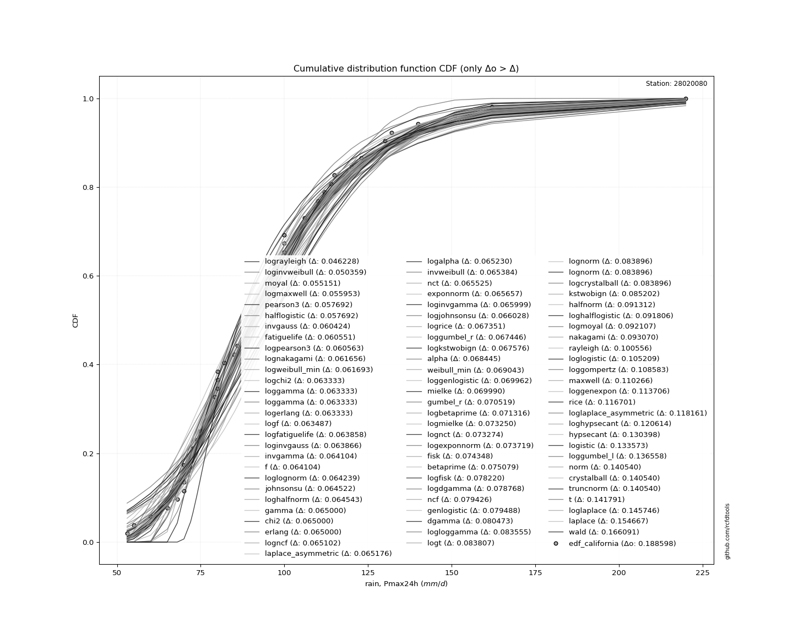</img>

</div>


**1.3. Best fit**

<div align="center">

|   id |   station | empirical_dist   | p_dist     |     delta |   deltao | eval   |   fit |   n |   best_fit |   best_fit_sort |
|-----:|----------:|:-----------------|:-----------|----------:|---------:|:-------|------:|----:|-----------:|----------------:|
|    0 |  28020080 | edf_california   | logmaxwell | 0.0521214 | 0.181738 | Δo > Δ |     1 |  56 |          1 |               1 |

</div>


<div align="center">

</img>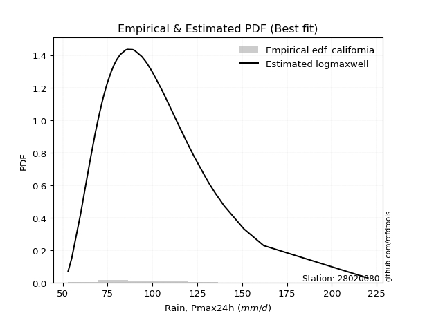</img>

</div>


### 2. EDF Hazen (1930)

Hazen method for plotting positions is a formula used to estimate the empirical cumulative probability distribution of flood events or other hydrological data. This formula often results in biased estimations, particularly when extrapolating to extreme events (high return periods).

<div align="center">


$P=(m-0.5)/n$


</div>


**2.1. Empirical values**

<div align="center">

|                | 0                    | 1                    | 2                    | 3                  | 4                   | 5                   | 6                   | 7                   | 8                   | 9                   | 10                 | 11                  | 12                  | 13                  | 14                  | 15                 | 16                  | 17                 | 18                  | 19                 | 20                  | 21                  | 22                 | 23                  | 24                 | 25                  | 26                 | 27                  | 28                 | 29                 | 30                 | 31                 | 32                 | 33                 | 34                 | 35                 | 36                 | 37                 | 38        | 39                 | 40                 | 41                 | 42                 | 43                 | 44                 | 45                | 46                 | 47                 | 48                 | 49                 | 50                 | 51                 | 52        | 53                 | 54                 | 55                 |
|:---------------|:---------------------|:---------------------|:---------------------|:-------------------|:--------------------|:--------------------|:--------------------|:--------------------|:--------------------|:--------------------|:-------------------|:--------------------|:--------------------|:--------------------|:--------------------|:-------------------|:--------------------|:-------------------|:--------------------|:-------------------|:--------------------|:--------------------|:-------------------|:--------------------|:-------------------|:--------------------|:-------------------|:--------------------|:-------------------|:-------------------|:-------------------|:-------------------|:-------------------|:-------------------|:-------------------|:-------------------|:-------------------|:-------------------|:----------|:-------------------|:-------------------|:-------------------|:-------------------|:-------------------|:-------------------|:------------------|:-------------------|:-------------------|:-------------------|:-------------------|:-------------------|:-------------------|:----------|:-------------------|:-------------------|:-------------------|
| date           | 1960                 | 1974                 | 1982                 | 1997               | 2009                | 1990                | 1989                | 1991                | 2012                | 1964                | 1968               | 1959                | 1988                | 1992                | 1979                | 1963               | 1987                | 1994               | 1986                | 1971               | 1976                | 2013                | 2015               | 2004                | 1981               | 1999                | 1980               | 2002                | 1973               | 1965               | 2006               | 2019               | 1969               | 1972               | 2007               | 1970               | 1984               | 2020               | 2010      | 1983               | 2003               | 2001               | 1993               | 1962               | 1995               | 2000              | 1996               | 1975               | 2014               | 2011               | 2021               | 2017               | 1998      | 2005               | 1985               | 2008               |
| x              | 53.0                 | 55.0                 | 60.0                 | 65.0               | 68.0                | 70.0                | 70.0                | 70.0                | 70.0                | 72.0                | 72.72167244        | 73.86977315         | 75.0                | 77.0                | 78.44364045         | 79.0               | 79.27108814         | 80.0               | 80.0                | 80.0               | 82.0                | 85.0                | 86.0               | 89.0                | 90.0               | 90.0                | 90.0               | 94.0                | 96.0               | 96.79157548        | 97.0               | 97.0               | 99.0               | 100.0              | 100.0              | 100.0              | 100.05888838678571 | 105.0              | 105.0     | 106.0              | 109.0              | 110.0              | 112.0              | 114.0              | 115.0              | 120.0             | 123.0              | 130.0              | 130.0              | 132.0              | 134.0              | 135.0              | 140.0     | 151.0              | 162.0              | 220.0              |
| m              | 1                    | 2                    | 3                    | 4                  | 5                   | 6                   | 7                   | 8                   | 9                   | 10                  | 11                 | 12                  | 13                  | 14                  | 15                  | 16                 | 17                  | 18                 | 19                  | 20                 | 21                  | 22                  | 23                 | 24                  | 25                 | 26                  | 27                 | 28                  | 29                 | 30                 | 31                 | 32                 | 33                 | 34                 | 35                 | 36                 | 37                 | 38                 | 39        | 40                 | 41                 | 42                 | 43                 | 44                 | 45                 | 46                | 47                 | 48                 | 49                 | 50                 | 51                 | 52                 | 53        | 54                 | 55                 | 56                 |
| empirical_dist | edf_hazen            | edf_hazen            | edf_hazen            | edf_hazen          | edf_hazen           | edf_hazen           | edf_hazen           | edf_hazen           | edf_hazen           | edf_hazen           | edf_hazen          | edf_hazen           | edf_hazen           | edf_hazen           | edf_hazen           | edf_hazen          | edf_hazen           | edf_hazen          | edf_hazen           | edf_hazen          | edf_hazen           | edf_hazen           | edf_hazen          | edf_hazen           | edf_hazen          | edf_hazen           | edf_hazen          | edf_hazen           | edf_hazen          | edf_hazen          | edf_hazen          | edf_hazen          | edf_hazen          | edf_hazen          | edf_hazen          | edf_hazen          | edf_hazen          | edf_hazen          | edf_hazen | edf_hazen          | edf_hazen          | edf_hazen          | edf_hazen          | edf_hazen          | edf_hazen          | edf_hazen         | edf_hazen          | edf_hazen          | edf_hazen          | edf_hazen          | edf_hazen          | edf_hazen          | edf_hazen | edf_hazen          | edf_hazen          | edf_hazen          |
| empirical      | 0.008928571428571428 | 0.026785714285714284 | 0.044642857142857144 | 0.0625             | 0.08035714285714286 | 0.09821428571428571 | 0.11607142857142858 | 0.13392857142857142 | 0.15178571428571427 | 0.16964285714285715 | 0.1875             | 0.20535714285714285 | 0.22321428571428573 | 0.24107142857142858 | 0.25892857142857145 | 0.2767857142857143 | 0.29464285714285715 | 0.3125             | 0.33035714285714285 | 0.3482142857142857 | 0.36607142857142855 | 0.38392857142857145 | 0.4017857142857143 | 0.41964285714285715 | 0.4375             | 0.45535714285714285 | 0.4732142857142857 | 0.49107142857142855 | 0.5089285714285714 | 0.5267857142857143 | 0.5446428571428571 | 0.5625             | 0.5803571428571429 | 0.5982142857142857 | 0.6160714285714286 | 0.6339285714285714 | 0.6517857142857143 | 0.6696428571428571 | 0.6875    | 0.7053571428571429 | 0.7232142857142857 | 0.7410714285714286 | 0.7589285714285714 | 0.7767857142857143 | 0.7946428571428571 | 0.8125            | 0.8303571428571429 | 0.8482142857142857 | 0.8660714285714286 | 0.8839285714285714 | 0.9017857142857143 | 0.9196428571428571 | 0.9375    | 0.9553571428571429 | 0.9732142857142857 | 0.9910714285714286 |
| empirical_tr   | 1.009009009009009    | 1.0275229357798166   | 1.0467289719626167   | 1.0666666666666667 | 1.087378640776699   | 1.1089108910891088  | 1.1313131313131313  | 1.1546391752577319  | 1.1789473684210527  | 1.2043010752688172  | 1.2307692307692308 | 1.2584269662921348  | 1.2873563218390804  | 1.3176470588235294  | 1.3493975903614457  | 1.382716049382716  | 1.417721518987342   | 1.4545454545454546 | 1.4933333333333332  | 1.5342465753424657 | 1.5774647887323945  | 1.6231884057971013  | 1.671641791044776  | 1.7230769230769232  | 1.7777777777777777 | 1.8360655737704916  | 1.8983050847457628 | 1.9649122807017545  | 2.036363636363636  | 2.1132075471698113 | 2.1960784313725488 | 2.2857142857142856 | 2.3829787234042556 | 2.488888888888889  | 2.604651162790698  | 2.7317073170731705 | 2.871794871794872  | 3.0270270270270268 | 3.2       | 3.3939393939393945 | 3.6129032258064515 | 3.862068965517242  | 4.148148148148148  | 4.48               | 4.869565217391303  | 5.333333333333333 | 5.894736842105265  | 6.588235294117647  | 7.466666666666669  | 8.615384615384613  | 10.181818181818183 | 12.444444444444438 | 16.0      | 22.400000000000023 | 37.333333333333314 | 112.0000000000004  |

</div>


**2.2. Kolmogorov-Smirnov fit test (sorted by Δ)**


<div align="center">

|                | 0                  | 1                    | 2                   | 3                    | 4                    | 5                   | 6                  | 7                   | 8                  | 9                   | 10                  | 11                   | 12                  | 13                  | 14                  | 15                   | 16                   | 17                  | 18                   | 19                   | 20                  | 21                  | 22                  | 23                   | 24                 | 25                  | 26                  | 27                  | 28                  | 29                  | 30                  | 31                  | 32                  | 33                  | 34                  | 35                  | 36                  | 37                  | 38                  | 39                  | 40                  | 41                  | 42                  | 43                  | 44                  | 45                 | 46                 | 47                 | 48                  | 49                  | 50                  | 51                  | 52                  | 53                  | 54                  | 55                  | 56                  | 57                  | 58                  | 59                  | 60                  | 61                  | 62                  | 63                  | 64                    | 65                  | 66                  | 67                  | 68                  | 69                  | 70                  | 71                 | 72                  | 73                  | 74                  | 75                  | 76                 | 77                  | 78                  | 79                  | 80                 | 81                  | 82                  | 83                 | 84                  | 85                 | 86                 | 87                 |
|:---------------|:-------------------|:---------------------|:--------------------|:---------------------|:---------------------|:--------------------|:-------------------|:--------------------|:-------------------|:--------------------|:--------------------|:---------------------|:--------------------|:--------------------|:--------------------|:---------------------|:---------------------|:--------------------|:---------------------|:---------------------|:--------------------|:--------------------|:--------------------|:---------------------|:-------------------|:--------------------|:--------------------|:--------------------|:--------------------|:--------------------|:--------------------|:--------------------|:--------------------|:--------------------|:--------------------|:--------------------|:--------------------|:--------------------|:--------------------|:--------------------|:--------------------|:--------------------|:--------------------|:--------------------|:--------------------|:-------------------|:-------------------|:-------------------|:--------------------|:--------------------|:--------------------|:--------------------|:--------------------|:--------------------|:--------------------|:--------------------|:--------------------|:--------------------|:--------------------|:--------------------|:--------------------|:--------------------|:--------------------|:--------------------|:----------------------|:--------------------|:--------------------|:--------------------|:--------------------|:--------------------|:--------------------|:-------------------|:--------------------|:--------------------|:--------------------|:--------------------|:-------------------|:--------------------|:--------------------|:--------------------|:-------------------|:--------------------|:--------------------|:-------------------|:--------------------|:-------------------|:-------------------|:-------------------|
| station        | 28020080           | 28020080             | 28020080            | 28020080             | 28020080             | 28020080            | 28020080           | 28020080            | 28020080           | 28020080            | 28020080            | 28020080             | 28020080            | 28020080            | 28020080            | 28020080             | 28020080             | 28020080            | 28020080             | 28020080             | 28020080            | 28020080            | 28020080            | 28020080             | 28020080           | 28020080            | 28020080            | 28020080            | 28020080            | 28020080            | 28020080            | 28020080            | 28020080            | 28020080            | 28020080            | 28020080            | 28020080            | 28020080            | 28020080            | 28020080            | 28020080            | 28020080            | 28020080            | 28020080            | 28020080            | 28020080           | 28020080           | 28020080           | 28020080            | 28020080            | 28020080            | 28020080            | 28020080            | 28020080            | 28020080            | 28020080            | 28020080            | 28020080            | 28020080            | 28020080            | 28020080            | 28020080            | 28020080            | 28020080            | 28020080              | 28020080            | 28020080            | 28020080            | 28020080            | 28020080            | 28020080            | 28020080           | 28020080            | 28020080            | 28020080            | 28020080            | 28020080           | 28020080            | 28020080            | 28020080            | 28020080           | 28020080            | 28020080            | 28020080           | 28020080            | 28020080           | 28020080           | 28020080           |
| empirical_dist | edf_hazen          | edf_hazen            | edf_hazen           | edf_hazen            | edf_hazen            | edf_hazen           | edf_hazen          | edf_hazen           | edf_hazen          | edf_hazen           | edf_hazen           | edf_hazen            | edf_hazen           | edf_hazen           | edf_hazen           | edf_hazen            | edf_hazen            | edf_hazen           | edf_hazen            | edf_hazen            | edf_hazen           | edf_hazen           | edf_hazen           | edf_hazen            | edf_hazen          | edf_hazen           | edf_hazen           | edf_hazen           | edf_hazen           | edf_hazen           | edf_hazen           | edf_hazen           | edf_hazen           | edf_hazen           | edf_hazen           | edf_hazen           | edf_hazen           | edf_hazen           | edf_hazen           | edf_hazen           | edf_hazen           | edf_hazen           | edf_hazen           | edf_hazen           | edf_hazen           | edf_hazen          | edf_hazen          | edf_hazen          | edf_hazen           | edf_hazen           | edf_hazen           | edf_hazen           | edf_hazen           | edf_hazen           | edf_hazen           | edf_hazen           | edf_hazen           | edf_hazen           | edf_hazen           | edf_hazen           | edf_hazen           | edf_hazen           | edf_hazen           | edf_hazen           | edf_hazen             | edf_hazen           | edf_hazen           | edf_hazen           | edf_hazen           | edf_hazen           | edf_hazen           | edf_hazen          | edf_hazen           | edf_hazen           | edf_hazen           | edf_hazen           | edf_hazen          | edf_hazen           | edf_hazen           | edf_hazen           | edf_hazen          | edf_hazen           | edf_hazen           | edf_hazen          | edf_hazen           | edf_hazen          | edf_hazen          | edf_hazen          |
| p_dist         | fatiguelife        | invgauss             | erlang              | chi2                 | gamma                | lognakagami         | johnsonsu          | logrice             | loginvgauss        | logpearson3         | gumbel_r            | logmaxwell           | loggamma            | loggamma            | logerlang           | logchi2              | logweibull_min       | logfatiguelife      | invgamma             | loglognorm           | f                   | logf                | logncf              | loginvgamma          | logjohnsonsu       | logalpha            | invweibull          | nct                 | weibull_min         | alpha               | lognct              | exponnorm           | mielke              | loggenlogistic      | betaprime           | moyal               | logexponnorm        | ncf                 | kstwobign           | lograyleigh         | genlogistic         | logmielke           | pearson3            | halflogistic        | logloggamma         | logcrystalball     | lognorm            | lognorm            | logfisk             | nakagami            | fisk                | loginvweibull       | logt                | logkstwobign        | halfnorm            | rayleigh            | maxwell             | loglogistic         | rice                | loggumbel_r         | loghalfnorm         | t                   | laplace_asymmetric  | loghypsecant        | loglaplace_asymmetric | hypsecant           | logistic            | logmoyal            | loghalflogistic     | truncnorm           | norm                | crystalball        | loggumbel_l         | loglaplace          | laplace             | loggenexpon         | wald               | genexpon            | gumbel_l            | logwald             | logbetaprime       | expon               | gibrat              | loggompertz        | loggibrat           | logtruncnorm       | logexpon           | gompertz           |
| delta          | 0.0500857448624783 | 0.050240319805372136 | 0.05051627620467604 | 0.050516381196637414 | 0.050516642738515236 | 0.05096747546684249 | 0.0521968045871537 | 0.05236684543601844 | 0.0530986419700516 | 0.05322065563656425 | 0.05342560329788437 | 0.053772754861903915 | 0.05386239854478303 | 0.05386239854478303 | 0.05386240189344843 | 0.053862421296794194 | 0.053995727010921576 | 0.05444889189407698 | 0.054761553248687755 | 0.054830290140008675 | 0.05483404823465299 | 0.05509105822173693 | 0.05516451572377534 | 0.055172715687946405 | 0.0552600064517057 | 0.05577432141152394 | 0.05597068136769329 | 0.05629147860347594 | 0.05893786268406409 | 0.05908342355895313 | 0.05928681407366443 | 0.06120263490294542 | 0.06128841608016733 | 0.06168478814049955 | 0.06239969886931429 | 0.06252988276932836 | 0.06364994131629859 | 0.06375305173143508 | 0.06398643473555748 | 0.06404131412544678 | 0.06525409019536405 | 0.06591691321964205 | 0.06689329464996918 | 0.06841892262047378 | 0.06860439792785261 | 0.068764921994377  | 0.0687652505334524 | 0.0687652505334524 | 0.07000535567644045 | 0.07231476383911539 | 0.07356188682605475 | 0.07493749215694712 | 0.07787590613791551 | 0.08045505157603783 | 0.08101403150974636 | 0.08302038890785525 | 0.08862010912450291 | 0.09092923220654775 | 0.09278049293906843 | 0.09283321666159772 | 0.09296790587510018 | 0.09391032440437137 | 0.09424807175809491 | 0.10637277473819767 | 0.11248784991574462   | 0.11371096588586407 | 0.11583676630336825 | 0.11820019546947602 | 0.11953319111385197 | 0.12013664333851826 | 0.12013666283489277 | 0.1201366706360244 | 0.12281608396095423 | 0.12944232134800232 | 0.13601612547183403 | 0.13627284486795882 | 0.1652438533417756 | 0.17321705732795034 | 0.18883756337691415 | 0.19292156523915824 | 0.208715879487957  | 0.21793535460416025 | 0.22499581055265044 | 0.2262673244962733 | 0.23423978746438498 | 0.2769160969829098 | 0.2866455886581026 | 0.9731852033387691 |
| deltao         | 0.1817376445004486 | 0.1817376445004486   | 0.1817376445004486  | 0.1817376445004486   | 0.1817376445004486   | 0.1817376445004486  | 0.1817376445004486 | 0.1817376445004486  | 0.1817376445004486 | 0.1817376445004486  | 0.1817376445004486  | 0.1817376445004486   | 0.1817376445004486  | 0.1817376445004486  | 0.1817376445004486  | 0.1817376445004486   | 0.1817376445004486   | 0.1817376445004486  | 0.1817376445004486   | 0.1817376445004486   | 0.1817376445004486  | 0.1817376445004486  | 0.1817376445004486  | 0.1817376445004486   | 0.1817376445004486 | 0.1817376445004486  | 0.1817376445004486  | 0.1817376445004486  | 0.1817376445004486  | 0.1817376445004486  | 0.1817376445004486  | 0.1817376445004486  | 0.1817376445004486  | 0.1817376445004486  | 0.1817376445004486  | 0.1817376445004486  | 0.1817376445004486  | 0.1817376445004486  | 0.1817376445004486  | 0.1817376445004486  | 0.1817376445004486  | 0.1817376445004486  | 0.1817376445004486  | 0.1817376445004486  | 0.1817376445004486  | 0.1817376445004486 | 0.1817376445004486 | 0.1817376445004486 | 0.1817376445004486  | 0.1817376445004486  | 0.1817376445004486  | 0.1817376445004486  | 0.1817376445004486  | 0.1817376445004486  | 0.1817376445004486  | 0.1817376445004486  | 0.1817376445004486  | 0.1817376445004486  | 0.1817376445004486  | 0.1817376445004486  | 0.1817376445004486  | 0.1817376445004486  | 0.1817376445004486  | 0.1817376445004486  | 0.1817376445004486    | 0.1817376445004486  | 0.1817376445004486  | 0.1817376445004486  | 0.1817376445004486  | 0.1817376445004486  | 0.1817376445004486  | 0.1817376445004486 | 0.1817376445004486  | 0.1817376445004486  | 0.1817376445004486  | 0.1817376445004486  | 0.1817376445004486 | 0.1817376445004486  | 0.1817376445004486  | 0.1817376445004486  | 0.1817376445004486 | 0.1817376445004486  | 0.1817376445004486  | 0.1817376445004486 | 0.1817376445004486  | 0.1817376445004486 | 0.1817376445004486 | 0.1817376445004486 |
| eval           | Δo > Δ             | Δo > Δ               | Δo > Δ              | Δo > Δ               | Δo > Δ               | Δo > Δ              | Δo > Δ             | Δo > Δ              | Δo > Δ             | Δo > Δ              | Δo > Δ              | Δo > Δ               | Δo > Δ              | Δo > Δ              | Δo > Δ              | Δo > Δ               | Δo > Δ               | Δo > Δ              | Δo > Δ               | Δo > Δ               | Δo > Δ              | Δo > Δ              | Δo > Δ              | Δo > Δ               | Δo > Δ             | Δo > Δ              | Δo > Δ              | Δo > Δ              | Δo > Δ              | Δo > Δ              | Δo > Δ              | Δo > Δ              | Δo > Δ              | Δo > Δ              | Δo > Δ              | Δo > Δ              | Δo > Δ              | Δo > Δ              | Δo > Δ              | Δo > Δ              | Δo > Δ              | Δo > Δ              | Δo > Δ              | Δo > Δ              | Δo > Δ              | Δo > Δ             | Δo > Δ             | Δo > Δ             | Δo > Δ              | Δo > Δ              | Δo > Δ              | Δo > Δ              | Δo > Δ              | Δo > Δ              | Δo > Δ              | Δo > Δ              | Δo > Δ              | Δo > Δ              | Δo > Δ              | Δo > Δ              | Δo > Δ              | Δo > Δ              | Δo > Δ              | Δo > Δ              | Δo > Δ                | Δo > Δ              | Δo > Δ              | Δo > Δ              | Δo > Δ              | Δo > Δ              | Δo > Δ              | Δo > Δ             | Δo > Δ              | Δo > Δ              | Δo > Δ              | Δo > Δ              | Δo > Δ             | Δo > Δ              | Δo <= Δ             | Δo <= Δ             | Δo <= Δ            | Δo <= Δ             | Δo <= Δ             | Δo <= Δ            | Δo <= Δ             | Δo <= Δ            | Δo <= Δ            | Δo <= Δ            |
| fit            | 1                  | 1                    | 1                   | 1                    | 1                    | 1                   | 1                  | 1                   | 1                  | 1                   | 1                   | 1                    | 1                   | 1                   | 1                   | 1                    | 1                    | 1                   | 1                    | 1                    | 1                   | 1                   | 1                   | 1                    | 1                  | 1                   | 1                   | 1                   | 1                   | 1                   | 1                   | 1                   | 1                   | 1                   | 1                   | 1                   | 1                   | 1                   | 1                   | 1                   | 1                   | 1                   | 1                   | 1                   | 1                   | 1                  | 1                  | 1                  | 1                   | 1                   | 1                   | 1                   | 1                   | 1                   | 1                   | 1                   | 1                   | 1                   | 1                   | 1                   | 1                   | 1                   | 1                   | 1                   | 1                     | 1                   | 1                   | 1                   | 1                   | 1                   | 1                   | 1                  | 1                   | 1                   | 1                   | 1                   | 1                  | 1                   | 0                   | 0                   | 0                  | 0                   | 0                   | 0                  | 0                   | 0                  | 0                  | 0                  |
| n              | 56                 | 56                   | 56                  | 56                   | 56                   | 56                  | 56                 | 56                  | 56                 | 56                  | 56                  | 56                   | 56                  | 56                  | 56                  | 56                   | 56                   | 56                  | 56                   | 56                   | 56                  | 56                  | 56                  | 56                   | 56                 | 56                  | 56                  | 56                  | 56                  | 56                  | 56                  | 56                  | 56                  | 56                  | 56                  | 56                  | 56                  | 56                  | 56                  | 56                  | 56                  | 56                  | 56                  | 56                  | 56                  | 56                 | 56                 | 56                 | 56                  | 56                  | 56                  | 56                  | 56                  | 56                  | 56                  | 56                  | 56                  | 56                  | 56                  | 56                  | 56                  | 56                  | 56                  | 56                  | 56                    | 56                  | 56                  | 56                  | 56                  | 56                  | 56                  | 56                 | 56                  | 56                  | 56                  | 56                  | 56                 | 56                  | 56                  | 56                  | 56                 | 56                  | 56                  | 56                 | 56                  | 56                 | 56                 | 56                 |
| best_fit       | 1                  | 0                    | 0                   | 0                    | 0                    | 0                   | 0                  | 0                   | 0                  | 0                   | 0                   | 0                    | 0                   | 0                   | 0                   | 0                    | 0                    | 0                   | 0                    | 0                    | 0                   | 0                   | 0                   | 0                    | 0                  | 0                   | 0                   | 0                   | 0                   | 0                   | 0                   | 0                   | 0                   | 0                   | 0                   | 0                   | 0                   | 0                   | 0                   | 0                   | 0                   | 0                   | 0                   | 0                   | 0                   | 0                  | 0                  | 0                  | 0                   | 0                   | 0                   | 0                   | 0                   | 0                   | 0                   | 0                   | 0                   | 0                   | 0                   | 0                   | 0                   | 0                   | 0                   | 0                   | 0                     | 0                   | 0                   | 0                   | 0                   | 0                   | 0                   | 0                  | 0                   | 0                   | 0                   | 0                   | 0                  | 0                   | 0                   | 0                   | 0                  | 0                   | 0                   | 0                  | 0                   | 0                  | 0                  | 0                  |
| best_fit_sort  | 1                  | 2                    | 3                   | 4                    | 5                    | 6                   | 7                  | 8                   | 9                  | 10                  | 11                  | 12                   | 13                  | 14                  | 15                  | 16                   | 17                   | 18                  | 19                   | 20                   | 21                  | 22                  | 23                  | 24                   | 25                 | 26                  | 27                  | 28                  | 29                  | 30                  | 31                  | 32                  | 33                  | 34                  | 35                  | 36                  | 37                  | 38                  | 39                  | 40                  | 41                  | 42                  | 43                  | 44                  | 45                  | 46                 | 47                 | 48                 | 49                  | 50                  | 51                  | 52                  | 53                  | 54                  | 55                  | 56                  | 57                  | 58                  | 59                  | 60                  | 61                  | 62                  | 63                  | 64                  | 65                    | 66                  | 67                  | 68                  | 69                  | 70                  | 71                  | 72                 | 73                  | 74                  | 75                  | 76                  | 77                 | 78                  | 79                  | 80                  | 81                 | 82                  | 83                  | 84                 | 85                  | 86                 | 87                 | 88                 |

</div>


<div align="center">

</img>

</div>


**2.3. Best fit**

<div align="center">

|   id |   station | empirical_dist   | p_dist      |     delta |   deltao | eval   |   fit |   n |   best_fit |   best_fit_sort |
|-----:|----------:|:-----------------|:------------|----------:|---------:|:-------|------:|----:|-----------:|----------------:|
|    0 |  28020080 | edf_hazen        | fatiguelife | 0.0500857 | 0.181738 | Δo > Δ |     1 |  56 |          1 |               1 |

</div>


<div align="center">

</img></img>

</div>


### 3. EDF Weibull (1939)

Weibull plotting position formula is an empirical method used to estimate the non-exceedance probability or plotting position for a set of observed data, is often recommended or widely used in practice, particularly in flood frequency analysis.

<div align="center">


$P=m/(n+1)$


</div>


**3.1. Empirical values**

<div align="center">

|                | 0                    | 1                   | 2                   | 3                   | 4                   | 5                   | 6                   | 7                   | 8                   | 9                   | 10                  | 11                  | 12                  | 13                  | 14                 | 15                 | 16                 | 17                 | 18                 | 19                 | 20                 | 21                  | 22                  | 23                  | 24                  | 25                  | 26                  | 27                  | 28                 | 29                 | 30                 | 31                 | 32                 | 33                 | 34                 | 35                | 36                 | 37                 | 38                 | 39                 | 40                 | 41                 | 42                 | 43                 | 44                 | 45                 | 46                 | 47                 | 48                 | 49                 | 50                 | 51                 | 52                 | 53                 | 54                 | 55                 |
|:---------------|:---------------------|:--------------------|:--------------------|:--------------------|:--------------------|:--------------------|:--------------------|:--------------------|:--------------------|:--------------------|:--------------------|:--------------------|:--------------------|:--------------------|:-------------------|:-------------------|:-------------------|:-------------------|:-------------------|:-------------------|:-------------------|:--------------------|:--------------------|:--------------------|:--------------------|:--------------------|:--------------------|:--------------------|:-------------------|:-------------------|:-------------------|:-------------------|:-------------------|:-------------------|:-------------------|:------------------|:-------------------|:-------------------|:-------------------|:-------------------|:-------------------|:-------------------|:-------------------|:-------------------|:-------------------|:-------------------|:-------------------|:-------------------|:-------------------|:-------------------|:-------------------|:-------------------|:-------------------|:-------------------|:-------------------|:-------------------|
| date           | 1960                 | 1974                | 1982                | 1997                | 2009                | 1990                | 1989                | 1991                | 2012                | 1964                | 1968                | 1959                | 1988                | 1992                | 1979               | 1963               | 1987               | 1994               | 1986               | 1971               | 1976               | 2013                | 2015                | 2004                | 1981                | 1999                | 1980                | 2002                | 1973               | 1965               | 2006               | 2019               | 1969               | 1972               | 2007               | 1970              | 1984               | 2020               | 2010               | 1983               | 2003               | 2001               | 1993               | 1962               | 1995               | 2000               | 1996               | 1975               | 2014               | 2011               | 2021               | 2017               | 1998               | 2005               | 1985               | 2008               |
| x              | 53.0                 | 55.0                | 60.0                | 65.0                | 68.0                | 70.0                | 70.0                | 70.0                | 70.0                | 72.0                | 72.72167244         | 73.86977315         | 75.0                | 77.0                | 78.44364045        | 79.0               | 79.27108814        | 80.0               | 80.0               | 80.0               | 82.0               | 85.0                | 86.0                | 89.0                | 90.0                | 90.0                | 90.0                | 94.0                | 96.0               | 96.79157548        | 97.0               | 97.0               | 99.0               | 100.0              | 100.0              | 100.0             | 100.05888838678571 | 105.0              | 105.0              | 106.0              | 109.0              | 110.0              | 112.0              | 114.0              | 115.0              | 120.0              | 123.0              | 130.0              | 130.0              | 132.0              | 134.0              | 135.0              | 140.0              | 151.0              | 162.0              | 220.0              |
| m              | 1                    | 2                   | 3                   | 4                   | 5                   | 6                   | 7                   | 8                   | 9                   | 10                  | 11                  | 12                  | 13                  | 14                  | 15                 | 16                 | 17                 | 18                 | 19                 | 20                 | 21                 | 22                  | 23                  | 24                  | 25                  | 26                  | 27                  | 28                  | 29                 | 30                 | 31                 | 32                 | 33                 | 34                 | 35                 | 36                | 37                 | 38                 | 39                 | 40                 | 41                 | 42                 | 43                 | 44                 | 45                 | 46                 | 47                 | 48                 | 49                 | 50                 | 51                 | 52                 | 53                 | 54                 | 55                 | 56                 |
| empirical_dist | edf_weibull          | edf_weibull         | edf_weibull         | edf_weibull         | edf_weibull         | edf_weibull         | edf_weibull         | edf_weibull         | edf_weibull         | edf_weibull         | edf_weibull         | edf_weibull         | edf_weibull         | edf_weibull         | edf_weibull        | edf_weibull        | edf_weibull        | edf_weibull        | edf_weibull        | edf_weibull        | edf_weibull        | edf_weibull         | edf_weibull         | edf_weibull         | edf_weibull         | edf_weibull         | edf_weibull         | edf_weibull         | edf_weibull        | edf_weibull        | edf_weibull        | edf_weibull        | edf_weibull        | edf_weibull        | edf_weibull        | edf_weibull       | edf_weibull        | edf_weibull        | edf_weibull        | edf_weibull        | edf_weibull        | edf_weibull        | edf_weibull        | edf_weibull        | edf_weibull        | edf_weibull        | edf_weibull        | edf_weibull        | edf_weibull        | edf_weibull        | edf_weibull        | edf_weibull        | edf_weibull        | edf_weibull        | edf_weibull        | edf_weibull        |
| empirical      | 0.017543859649122806 | 0.03508771929824561 | 0.05263157894736842 | 0.07017543859649122 | 0.08771929824561403 | 0.10526315789473684 | 0.12280701754385964 | 0.14035087719298245 | 0.15789473684210525 | 0.17543859649122806 | 0.19298245614035087 | 0.21052631578947367 | 0.22807017543859648 | 0.24561403508771928 | 0.2631578947368421 | 0.2807017543859649 | 0.2982456140350877 | 0.3157894736842105 | 0.3333333333333333 | 0.3508771929824561 | 0.3684210526315789 | 0.38596491228070173 | 0.40350877192982454 | 0.42105263157894735 | 0.43859649122807015 | 0.45614035087719296 | 0.47368421052631576 | 0.49122807017543857 | 0.5087719298245614 | 0.5263157894736842 | 0.543859649122807  | 0.5614035087719298 | 0.5789473684210527 | 0.5964912280701754 | 0.6140350877192983 | 0.631578947368421 | 0.6491228070175439 | 0.6666666666666666 | 0.6842105263157895 | 0.7017543859649122 | 0.7192982456140351 | 0.7368421052631579 | 0.7543859649122807 | 0.7719298245614035 | 0.7894736842105263 | 0.8070175438596491 | 0.8245614035087719 | 0.8421052631578947 | 0.8596491228070176 | 0.8771929824561403 | 0.8947368421052632 | 0.9122807017543859 | 0.9298245614035088 | 0.9473684210526315 | 0.9649122807017544 | 0.9824561403508771 |
| empirical_tr   | 1.017857142857143    | 1.0363636363636364  | 1.0555555555555556  | 1.0754716981132075  | 1.0961538461538463  | 1.1176470588235294  | 1.14                | 1.163265306122449   | 1.1875              | 1.2127659574468086  | 1.2391304347826086  | 1.2666666666666666  | 1.2954545454545456  | 1.3255813953488371  | 1.357142857142857  | 1.3902439024390243 | 1.425              | 1.4615384615384615 | 1.4999999999999998 | 1.5405405405405406 | 1.5833333333333335 | 1.6285714285714286  | 1.676470588235294   | 1.7272727272727273  | 1.78125             | 1.8387096774193548  | 1.8999999999999997  | 1.9655172413793103  | 2.035714285714286  | 2.111111111111111  | 2.1923076923076925 | 2.28               | 2.375              | 2.4782608695652173 | 2.5909090909090913 | 2.714285714285714 | 2.85               | 2.9999999999999996 | 3.166666666666667  | 3.352941176470588  | 3.5625             | 3.7999999999999994 | 4.071428571428572  | 4.384615384615384  | 4.75               | 5.181818181818181  | 5.7                | 6.333333333333331  | 7.125              | 8.142857142857139  | 9.5                | 11.399999999999993 | 14.25              | 18.999999999999982 | 28.5               | 56.99999999999982  |

</div>


**3.2. Kolmogorov-Smirnov fit test (sorted by Δ)**


<div align="center">

|                | 0                   | 1                   | 2                   | 3                   | 4                   | 5                   | 6                    | 7                   | 8                   | 9                   | 10                  | 11                   | 12                   | 13                  | 14                  | 15                  | 16                   | 17                 | 18                  | 19                 | 20                  | 21                   | 22                   | 23                  | 24                   | 25                   | 26                  | 27                   | 28                  | 29                  | 30                  | 31                  | 32                  | 33                  | 34                  | 35                  | 36                  | 37                  | 38                 | 39                  | 40                  | 41                  | 42                  | 43                  | 44                  | 45                  | 46                  | 47                  | 48                  | 49                  | 50                  | 51                  | 52                  | 53                  | 54                  | 55                 | 56                  | 57                  | 58                 | 59                  | 60                  | 61                  | 62                  | 63                 | 64                  | 65                    | 66                 | 67                  | 68                  | 69                  | 70                  | 71                  | 72                 | 73                 | 74                  | 75                  | 76                 | 77                  | 78                  | 79                  | 80                  | 81                 | 82                  | 83                  | 84                 | 85                  | 86                  | 87                 |
|:---------------|:--------------------|:--------------------|:--------------------|:--------------------|:--------------------|:--------------------|:---------------------|:--------------------|:--------------------|:--------------------|:--------------------|:---------------------|:---------------------|:--------------------|:--------------------|:--------------------|:---------------------|:-------------------|:--------------------|:-------------------|:--------------------|:---------------------|:---------------------|:--------------------|:---------------------|:---------------------|:--------------------|:---------------------|:--------------------|:--------------------|:--------------------|:--------------------|:--------------------|:--------------------|:--------------------|:--------------------|:--------------------|:--------------------|:-------------------|:--------------------|:--------------------|:--------------------|:--------------------|:--------------------|:--------------------|:--------------------|:--------------------|:--------------------|:--------------------|:--------------------|:--------------------|:--------------------|:--------------------|:--------------------|:--------------------|:-------------------|:--------------------|:--------------------|:-------------------|:--------------------|:--------------------|:--------------------|:--------------------|:-------------------|:--------------------|:----------------------|:-------------------|:--------------------|:--------------------|:--------------------|:--------------------|:--------------------|:-------------------|:-------------------|:--------------------|:--------------------|:-------------------|:--------------------|:--------------------|:--------------------|:--------------------|:-------------------|:--------------------|:--------------------|:-------------------|:--------------------|:--------------------|:-------------------|
| station        | 28020080            | 28020080            | 28020080            | 28020080            | 28020080            | 28020080            | 28020080             | 28020080            | 28020080            | 28020080            | 28020080            | 28020080             | 28020080             | 28020080            | 28020080            | 28020080            | 28020080             | 28020080           | 28020080            | 28020080           | 28020080            | 28020080             | 28020080             | 28020080            | 28020080             | 28020080             | 28020080            | 28020080             | 28020080            | 28020080            | 28020080            | 28020080            | 28020080            | 28020080            | 28020080            | 28020080            | 28020080            | 28020080            | 28020080           | 28020080            | 28020080            | 28020080            | 28020080            | 28020080            | 28020080            | 28020080            | 28020080            | 28020080            | 28020080            | 28020080            | 28020080            | 28020080            | 28020080            | 28020080            | 28020080            | 28020080           | 28020080            | 28020080            | 28020080           | 28020080            | 28020080            | 28020080            | 28020080            | 28020080           | 28020080            | 28020080              | 28020080           | 28020080            | 28020080            | 28020080            | 28020080            | 28020080            | 28020080           | 28020080           | 28020080            | 28020080            | 28020080           | 28020080            | 28020080            | 28020080            | 28020080            | 28020080           | 28020080            | 28020080            | 28020080           | 28020080            | 28020080            | 28020080           |
| empirical_dist | edf_weibull         | edf_weibull         | edf_weibull         | edf_weibull         | edf_weibull         | edf_weibull         | edf_weibull          | edf_weibull         | edf_weibull         | edf_weibull         | edf_weibull         | edf_weibull          | edf_weibull          | edf_weibull         | edf_weibull         | edf_weibull         | edf_weibull          | edf_weibull        | edf_weibull         | edf_weibull        | edf_weibull         | edf_weibull          | edf_weibull          | edf_weibull         | edf_weibull          | edf_weibull          | edf_weibull         | edf_weibull          | edf_weibull         | edf_weibull         | edf_weibull         | edf_weibull         | edf_weibull         | edf_weibull         | edf_weibull         | edf_weibull         | edf_weibull         | edf_weibull         | edf_weibull        | edf_weibull         | edf_weibull         | edf_weibull         | edf_weibull         | edf_weibull         | edf_weibull         | edf_weibull         | edf_weibull         | edf_weibull         | edf_weibull         | edf_weibull         | edf_weibull         | edf_weibull         | edf_weibull         | edf_weibull         | edf_weibull         | edf_weibull        | edf_weibull         | edf_weibull         | edf_weibull        | edf_weibull         | edf_weibull         | edf_weibull         | edf_weibull         | edf_weibull        | edf_weibull         | edf_weibull           | edf_weibull        | edf_weibull         | edf_weibull         | edf_weibull         | edf_weibull         | edf_weibull         | edf_weibull        | edf_weibull        | edf_weibull         | edf_weibull         | edf_weibull        | edf_weibull         | edf_weibull         | edf_weibull         | edf_weibull         | edf_weibull        | edf_weibull         | edf_weibull         | edf_weibull        | edf_weibull         | edf_weibull         | edf_weibull        |
| p_dist         | logweibull_min      | gamma               | chi2                | erlang              | fatiguelife         | invgauss            | lognakagami          | logmaxwell          | johnsonsu           | logrice             | loginvgauss         | logpearson3          | gumbel_r             | loggamma            | loggamma            | logerlang           | logchi2              | logfatiguelife     | invgamma            | loglognorm         | f                   | logf                 | logncf               | loginvgamma         | logjohnsonsu         | logalpha             | invweibull          | nct                  | weibull_min         | alpha               | lognct              | exponnorm           | moyal               | mielke              | lograyleigh         | loggenlogistic      | betaprime           | logexponnorm        | ncf                | kstwobign           | pearson3            | genlogistic         | halflogistic        | logmielke           | nakagami            | logloggamma         | logcrystalball      | lognorm             | lognorm             | logfisk             | halfnorm            | loginvweibull       | rayleigh            | fisk                | logt                | logkstwobign       | maxwell             | t                   | rice               | loggumbel_r         | loghalfnorm         | loglogistic         | laplace_asymmetric  | loghypsecant       | logistic            | loglaplace_asymmetric | hypsecant          | truncnorm           | norm                | crystalball         | logmoyal            | loghalflogistic     | loggumbel_l        | loggenexpon        | loglaplace          | laplace             | genexpon           | wald                | gumbel_l            | logwald             | logbetaprime        | expon              | loggompertz         | gibrat              | loggibrat          | logtruncnorm        | logexpon            | gompertz           |
| delta          | 0.04694685483047045 | 0.05011866410018462 | 0.05011910300667166 | 0.05011920569049094 | 0.05274865213064872 | 0.05290322707354256 | 0.053630382735012916 | 0.05392939646591388 | 0.05485971185532412 | 0.05502975270418886 | 0.05576154923822202 | 0.055883562904734674 | 0.056088510566054794 | 0.05652530581295345 | 0.05652530581295345 | 0.05652530916161885 | 0.056525328564964616 | 0.0571117991622474 | 0.05742446051685818 | 0.0574931974081791 | 0.05749695550282341 | 0.057753965489907355 | 0.057827422991945765 | 0.05783562295611683 | 0.057922913719876123 | 0.058437228679694364 | 0.05863358863586371 | 0.058954385871646364 | 0.06160076995223451 | 0.06174633082712355 | 0.06194972134183485 | 0.06228884919518135 | 0.06268652437333833 | 0.06395132334833775 | 0.06419795572945675 | 0.06434769540866997 | 0.06506260613748471 | 0.06631284858446901 | 0.0664159589996055 | 0.06664934200372791 | 0.06704993625397915 | 0.06791699746353447 | 0.06857556422448374 | 0.06857982048781247 | 0.06965185657094497 | 0.07126730519602303 | 0.07142782926254743 | 0.07142815780162282 | 0.07142815780162282 | 0.07266826294461087 | 0.07396515932929523 | 0.07509413376095708 | 0.07597151672740413 | 0.07622479409422517 | 0.08053881340608593 | 0.0806116931800478 | 0.08595720185633249 | 0.08686145222392025 | 0.090117585670898  | 0.09298985826560768 | 0.09312454747911014 | 0.09359213947471817 | 0.09440471336210488 | 0.1090356820063681 | 0.11317385903519783 | 0.11515075718391504   | 0.1163738731540345 | 0.11747373607034783 | 0.11747375556672235 | 0.11747376336785398 | 0.11835683707348599 | 0.11968983271786193 | 0.1201531766927838 | 0.1292239726875077 | 0.13210522861617274 | 0.13867903274000445 | 0.1661681851474992 | 0.17072630948212647 | 0.18617465610874373 | 0.19809073817148906 | 0.20166700730750586 | 0.2108864824237091 | 0.21921845231582215 | 0.22953841706894115 | 0.2387823939806757 | 0.26986722480245867 | 0.27959671647765144 | 0.9648831983262378 |
| deltao         | 0.1817376445004486  | 0.1817376445004486  | 0.1817376445004486  | 0.1817376445004486  | 0.1817376445004486  | 0.1817376445004486  | 0.1817376445004486   | 0.1817376445004486  | 0.1817376445004486  | 0.1817376445004486  | 0.1817376445004486  | 0.1817376445004486   | 0.1817376445004486   | 0.1817376445004486  | 0.1817376445004486  | 0.1817376445004486  | 0.1817376445004486   | 0.1817376445004486 | 0.1817376445004486  | 0.1817376445004486 | 0.1817376445004486  | 0.1817376445004486   | 0.1817376445004486   | 0.1817376445004486  | 0.1817376445004486   | 0.1817376445004486   | 0.1817376445004486  | 0.1817376445004486   | 0.1817376445004486  | 0.1817376445004486  | 0.1817376445004486  | 0.1817376445004486  | 0.1817376445004486  | 0.1817376445004486  | 0.1817376445004486  | 0.1817376445004486  | 0.1817376445004486  | 0.1817376445004486  | 0.1817376445004486 | 0.1817376445004486  | 0.1817376445004486  | 0.1817376445004486  | 0.1817376445004486  | 0.1817376445004486  | 0.1817376445004486  | 0.1817376445004486  | 0.1817376445004486  | 0.1817376445004486  | 0.1817376445004486  | 0.1817376445004486  | 0.1817376445004486  | 0.1817376445004486  | 0.1817376445004486  | 0.1817376445004486  | 0.1817376445004486  | 0.1817376445004486 | 0.1817376445004486  | 0.1817376445004486  | 0.1817376445004486 | 0.1817376445004486  | 0.1817376445004486  | 0.1817376445004486  | 0.1817376445004486  | 0.1817376445004486 | 0.1817376445004486  | 0.1817376445004486    | 0.1817376445004486 | 0.1817376445004486  | 0.1817376445004486  | 0.1817376445004486  | 0.1817376445004486  | 0.1817376445004486  | 0.1817376445004486 | 0.1817376445004486 | 0.1817376445004486  | 0.1817376445004486  | 0.1817376445004486 | 0.1817376445004486  | 0.1817376445004486  | 0.1817376445004486  | 0.1817376445004486  | 0.1817376445004486 | 0.1817376445004486  | 0.1817376445004486  | 0.1817376445004486 | 0.1817376445004486  | 0.1817376445004486  | 0.1817376445004486 |
| eval           | Δo > Δ              | Δo > Δ              | Δo > Δ              | Δo > Δ              | Δo > Δ              | Δo > Δ              | Δo > Δ               | Δo > Δ              | Δo > Δ              | Δo > Δ              | Δo > Δ              | Δo > Δ               | Δo > Δ               | Δo > Δ              | Δo > Δ              | Δo > Δ              | Δo > Δ               | Δo > Δ             | Δo > Δ              | Δo > Δ             | Δo > Δ              | Δo > Δ               | Δo > Δ               | Δo > Δ              | Δo > Δ               | Δo > Δ               | Δo > Δ              | Δo > Δ               | Δo > Δ              | Δo > Δ              | Δo > Δ              | Δo > Δ              | Δo > Δ              | Δo > Δ              | Δo > Δ              | Δo > Δ              | Δo > Δ              | Δo > Δ              | Δo > Δ             | Δo > Δ              | Δo > Δ              | Δo > Δ              | Δo > Δ              | Δo > Δ              | Δo > Δ              | Δo > Δ              | Δo > Δ              | Δo > Δ              | Δo > Δ              | Δo > Δ              | Δo > Δ              | Δo > Δ              | Δo > Δ              | Δo > Δ              | Δo > Δ              | Δo > Δ             | Δo > Δ              | Δo > Δ              | Δo > Δ             | Δo > Δ              | Δo > Δ              | Δo > Δ              | Δo > Δ              | Δo > Δ             | Δo > Δ              | Δo > Δ                | Δo > Δ             | Δo > Δ              | Δo > Δ              | Δo > Δ              | Δo > Δ              | Δo > Δ              | Δo > Δ             | Δo > Δ             | Δo > Δ              | Δo > Δ              | Δo > Δ             | Δo > Δ              | Δo <= Δ             | Δo <= Δ             | Δo <= Δ             | Δo <= Δ            | Δo <= Δ             | Δo <= Δ             | Δo <= Δ            | Δo <= Δ             | Δo <= Δ             | Δo <= Δ            |
| fit            | 1                   | 1                   | 1                   | 1                   | 1                   | 1                   | 1                    | 1                   | 1                   | 1                   | 1                   | 1                    | 1                    | 1                   | 1                   | 1                   | 1                    | 1                  | 1                   | 1                  | 1                   | 1                    | 1                    | 1                   | 1                    | 1                    | 1                   | 1                    | 1                   | 1                   | 1                   | 1                   | 1                   | 1                   | 1                   | 1                   | 1                   | 1                   | 1                  | 1                   | 1                   | 1                   | 1                   | 1                   | 1                   | 1                   | 1                   | 1                   | 1                   | 1                   | 1                   | 1                   | 1                   | 1                   | 1                   | 1                  | 1                   | 1                   | 1                  | 1                   | 1                   | 1                   | 1                   | 1                  | 1                   | 1                     | 1                  | 1                   | 1                   | 1                   | 1                   | 1                   | 1                  | 1                  | 1                   | 1                   | 1                  | 1                   | 0                   | 0                   | 0                   | 0                  | 0                   | 0                   | 0                  | 0                   | 0                   | 0                  |
| n              | 56                  | 56                  | 56                  | 56                  | 56                  | 56                  | 56                   | 56                  | 56                  | 56                  | 56                  | 56                   | 56                   | 56                  | 56                  | 56                  | 56                   | 56                 | 56                  | 56                 | 56                  | 56                   | 56                   | 56                  | 56                   | 56                   | 56                  | 56                   | 56                  | 56                  | 56                  | 56                  | 56                  | 56                  | 56                  | 56                  | 56                  | 56                  | 56                 | 56                  | 56                  | 56                  | 56                  | 56                  | 56                  | 56                  | 56                  | 56                  | 56                  | 56                  | 56                  | 56                  | 56                  | 56                  | 56                  | 56                 | 56                  | 56                  | 56                 | 56                  | 56                  | 56                  | 56                  | 56                 | 56                  | 56                    | 56                 | 56                  | 56                  | 56                  | 56                  | 56                  | 56                 | 56                 | 56                  | 56                  | 56                 | 56                  | 56                  | 56                  | 56                  | 56                 | 56                  | 56                  | 56                 | 56                  | 56                  | 56                 |
| best_fit       | 1                   | 0                   | 0                   | 0                   | 0                   | 0                   | 0                    | 0                   | 0                   | 0                   | 0                   | 0                    | 0                    | 0                   | 0                   | 0                   | 0                    | 0                  | 0                   | 0                  | 0                   | 0                    | 0                    | 0                   | 0                    | 0                    | 0                   | 0                    | 0                   | 0                   | 0                   | 0                   | 0                   | 0                   | 0                   | 0                   | 0                   | 0                   | 0                  | 0                   | 0                   | 0                   | 0                   | 0                   | 0                   | 0                   | 0                   | 0                   | 0                   | 0                   | 0                   | 0                   | 0                   | 0                   | 0                   | 0                  | 0                   | 0                   | 0                  | 0                   | 0                   | 0                   | 0                   | 0                  | 0                   | 0                     | 0                  | 0                   | 0                   | 0                   | 0                   | 0                   | 0                  | 0                  | 0                   | 0                   | 0                  | 0                   | 0                   | 0                   | 0                   | 0                  | 0                   | 0                   | 0                  | 0                   | 0                   | 0                  |
| best_fit_sort  | 1                   | 2                   | 3                   | 4                   | 5                   | 6                   | 7                    | 8                   | 9                   | 10                  | 11                  | 12                   | 13                   | 14                  | 15                  | 16                  | 17                   | 18                 | 19                  | 20                 | 21                  | 22                   | 23                   | 24                  | 25                   | 26                   | 27                  | 28                   | 29                  | 30                  | 31                  | 32                  | 33                  | 34                  | 35                  | 36                  | 37                  | 38                  | 39                 | 40                  | 41                  | 42                  | 43                  | 44                  | 45                  | 46                  | 47                  | 48                  | 49                  | 50                  | 51                  | 52                  | 53                  | 54                  | 55                  | 56                 | 57                  | 58                  | 59                 | 60                  | 61                  | 62                  | 63                  | 64                 | 65                  | 66                    | 67                 | 68                  | 69                  | 70                  | 71                  | 72                  | 73                 | 74                 | 75                  | 76                  | 77                 | 78                  | 79                  | 80                  | 81                  | 82                 | 83                  | 84                  | 85                 | 86                  | 87                  | 88                 |

</div>


<div align="center">

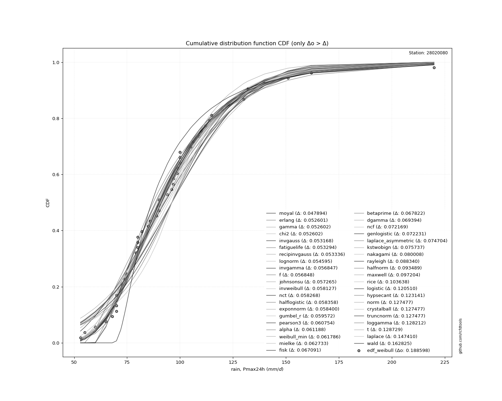</img>

</div>


**3.3. Best fit**

<div align="center">

|   id |   station | empirical_dist   | p_dist         |     delta |   deltao | eval   |   fit |   n |   best_fit |   best_fit_sort |
|-----:|----------:|:-----------------|:---------------|----------:|---------:|:-------|------:|----:|-----------:|----------------:|
|    0 |  28020080 | edf_weibull      | logweibull_min | 0.0469469 | 0.181738 | Δo > Δ |     1 |  56 |          1 |               1 |

</div>


<div align="center">

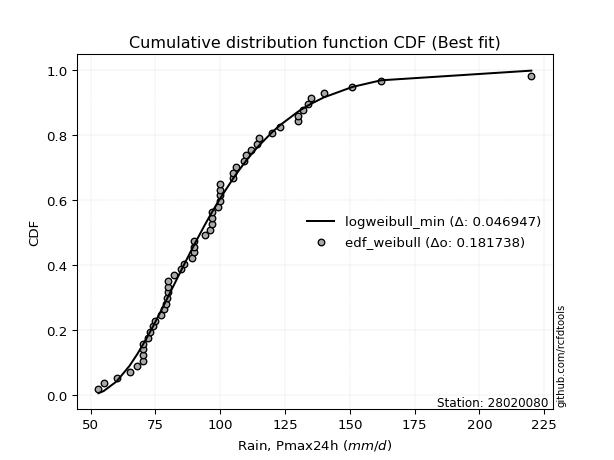</img></img>

</div>


### 4. EDF Beard (1943)

The Beard formula (or Beard´s plotting position formula) in hydrology is used to estimate the empirical non-exceedance probability _(P)_ of a flood event (or other extreme hydrological data point) within a given dataset.

<div align="center">


$P=(m-0.31)/(n+0.38)$


</div>


**4.1. Empirical values**

<div align="center">

|                | 0                    | 1                    | 2                   | 3                   | 4                   | 5                  | 6                  | 7                  | 8                  | 9                  | 10                  | 11                 | 12                 | 13                 | 14                 | 15                 | 16                  | 17                  | 18                 | 19                 | 20                  | 21                  | 22                  | 23                  | 24                 | 25                  | 26                  | 27                  | 28                 | 29                 | 30                 | 31                 | 32                 | 33                 | 34                | 35                 | 36                 | 37                 | 38                 | 39                 | 40                 | 41                 | 42                 | 43                 | 44                 | 45                 | 46                 | 47                 | 48                 | 49                 | 50                 | 51                 | 52                 | 53                 | 54                 | 55                 |
|:---------------|:---------------------|:---------------------|:--------------------|:--------------------|:--------------------|:-------------------|:-------------------|:-------------------|:-------------------|:-------------------|:--------------------|:-------------------|:-------------------|:-------------------|:-------------------|:-------------------|:--------------------|:--------------------|:-------------------|:-------------------|:--------------------|:--------------------|:--------------------|:--------------------|:-------------------|:--------------------|:--------------------|:--------------------|:-------------------|:-------------------|:-------------------|:-------------------|:-------------------|:-------------------|:------------------|:-------------------|:-------------------|:-------------------|:-------------------|:-------------------|:-------------------|:-------------------|:-------------------|:-------------------|:-------------------|:-------------------|:-------------------|:-------------------|:-------------------|:-------------------|:-------------------|:-------------------|:-------------------|:-------------------|:-------------------|:-------------------|
| date           | 1960                 | 1974                 | 1982                | 1997                | 2009                | 1990               | 1989               | 1991               | 2012               | 1964               | 1968                | 1959               | 1988               | 1992               | 1979               | 1963               | 1987                | 1994                | 1986               | 1971               | 1976                | 2013                | 2015                | 2004                | 1981               | 1999                | 1980                | 2002                | 1973               | 1965               | 2006               | 2019               | 1969               | 1972               | 2007              | 1970               | 1984               | 2020               | 2010               | 1983               | 2003               | 2001               | 1993               | 1962               | 1995               | 2000               | 1996               | 1975               | 2014               | 2011               | 2021               | 2017               | 1998               | 2005               | 1985               | 2008               |
| x              | 53.0                 | 55.0                 | 60.0                | 65.0                | 68.0                | 70.0               | 70.0               | 70.0               | 70.0               | 72.0               | 72.72167244         | 73.86977315        | 75.0               | 77.0               | 78.44364045        | 79.0               | 79.27108814         | 80.0                | 80.0               | 80.0               | 82.0                | 85.0                | 86.0                | 89.0                | 90.0               | 90.0                | 90.0                | 94.0                | 96.0               | 96.79157548        | 97.0               | 97.0               | 99.0               | 100.0              | 100.0             | 100.0              | 100.05888838678571 | 105.0              | 105.0              | 106.0              | 109.0              | 110.0              | 112.0              | 114.0              | 115.0              | 120.0              | 123.0              | 130.0              | 130.0              | 132.0              | 134.0              | 135.0              | 140.0              | 151.0              | 162.0              | 220.0              |
| m              | 1                    | 2                    | 3                   | 4                   | 5                   | 6                  | 7                  | 8                  | 9                  | 10                 | 11                  | 12                 | 13                 | 14                 | 15                 | 16                 | 17                  | 18                  | 19                 | 20                 | 21                  | 22                  | 23                  | 24                  | 25                 | 26                  | 27                  | 28                  | 29                 | 30                 | 31                 | 32                 | 33                 | 34                 | 35                | 36                 | 37                 | 38                 | 39                 | 40                 | 41                 | 42                 | 43                 | 44                 | 45                 | 46                 | 47                 | 48                 | 49                 | 50                 | 51                 | 52                 | 53                 | 54                 | 55                 | 56                 |
| empirical_dist | edf_beard            | edf_beard            | edf_beard           | edf_beard           | edf_beard           | edf_beard          | edf_beard          | edf_beard          | edf_beard          | edf_beard          | edf_beard           | edf_beard          | edf_beard          | edf_beard          | edf_beard          | edf_beard          | edf_beard           | edf_beard           | edf_beard          | edf_beard          | edf_beard           | edf_beard           | edf_beard           | edf_beard           | edf_beard          | edf_beard           | edf_beard           | edf_beard           | edf_beard          | edf_beard          | edf_beard          | edf_beard          | edf_beard          | edf_beard          | edf_beard         | edf_beard          | edf_beard          | edf_beard          | edf_beard          | edf_beard          | edf_beard          | edf_beard          | edf_beard          | edf_beard          | edf_beard          | edf_beard          | edf_beard          | edf_beard          | edf_beard          | edf_beard          | edf_beard          | edf_beard          | edf_beard          | edf_beard          | edf_beard          | edf_beard          |
| empirical      | 0.012238382405108193 | 0.029975168499467894 | 0.04771195459382759 | 0.06544874068818729 | 0.08318552678254701 | 0.1009223128769067 | 0.1186590989712664 | 0.1363958850656261 | 0.1541326711599858 | 0.1718694572543455 | 0.18960624334870518 | 0.2073430294430649 | 0.2250798155374246 | 0.2428166016317843 | 0.260553387726144  | 0.2782901738205037 | 0.29602695991486344 | 0.31376374600922313 | 0.3315005321035828 | 0.3492373181979425 | 0.36697410429230226 | 0.38471089038666195 | 0.40244767648102164 | 0.42018446257538133 | 0.437921248669741  | 0.45565803476410077 | 0.47339482085846046 | 0.49113160695282015 | 0.5088683930471799 | 0.5266051791415396 | 0.5443419652358993 | 0.562078751330259  | 0.5798155374246186 | 0.5975523235189782 | 0.615289109613338 | 0.6330258957076977 | 0.6507626818020574 | 0.6684994678964171 | 0.6862362539907768 | 0.7039730400851365 | 0.7217098261794962 | 0.7394466122738559 | 0.7571833983682156 | 0.7749201844625753 | 0.792656970556935  | 0.8103937566512948 | 0.8281305427456545 | 0.8458673288400141 | 0.8636041149343738 | 0.8813409010287335 | 0.8990776871230932 | 0.9168144732174529 | 0.9345512593118126 | 0.9522880454061723 | 0.970024831500532  | 0.9877616175948917 |
| empirical_tr   | 1.0123900161608907   | 1.0309014445053941   | 1.0501024399329484  | 1.0700322641867528  | 1.0907332172567228  | 1.1122509370684552 | 1.1346347353592272 | 1.1579379749435204 | 1.1822184944432794 | 1.2075390875990577 | 1.2339680455241846  | 1.2615797717610204 | 1.2904554818036165 | 1.3206840009369876 | 1.3523626769009354 | 1.3855984271319735 | 1.4205089443184682  | 1.4572240889118635  | 1.4958875033165298 | 1.536658490051785  | 1.5797142056598488  | 1.62525223407322    | 1.6734936182843574  | 1.7246864484551852  | 1.7791101293783527 | 1.8370804822417728  | 1.8989558773997979  | 1.9651446497037297  | 2.0361141206211633 | 2.1124016485575123 | 2.1946282600233555 | 2.2835155933576345 | 2.3799071338117344 | 2.4847950639048033 | 2.599354541263255 | 2.724987916868052  | 2.8633824276282374 | 3.0165864098448365 | 3.1871113623516103 | 3.378070701018573  | 3.5933715742511145 | 3.8379850238257305 | 4.118334550766981  | 4.442868400315207  | 4.8229255774165924 | 5.274087932647333  | 5.818369453044374  | 6.4879171461449925 | 7.33159947984395   | 8.427503736920773  | 9.908611599297005  | 12.021321961620457 | 15.27913279132789  | 20.9591078066914   | 33.360946745561996 | 81.71014492753534  |

</div>


**4.2. Kolmogorov-Smirnov fit test (sorted by Δ)**


<div align="center">

|                | 0                   | 1                    | 2                    | 3                    | 4                   | 5                   | 6                   | 7                    | 8                    | 9                   | 10                  | 11                  | 12                  | 13                   | 14                   | 15                  | 16                  | 17                   | 18                  | 19                  | 20                   | 21                  | 22                  | 23                  | 24                  | 25                  | 26                 | 27                  | 28                  | 29                   | 30                   | 31                   | 32                   | 33                  | 34                  | 35                 | 36                  | 37                 | 38                 | 39                 | 40                  | 41                  | 42                  | 43                  | 44                  | 45                  | 46                  | 47                  | 48                  | 49                  | 50                  | 51                  | 52                  | 53                  | 54                  | 55                  | 56                  | 57                  | 58                  | 59                  | 60                  | 61                  | 62                 | 63                  | 64                    | 65                  | 66                  | 67                  | 68                  | 69                 | 70                  | 71                  | 72                  | 73                  | 74                  | 75                  | 76                 | 77                  | 78                  | 79                 | 80                 | 81                  | 82                 | 83                  | 84                  | 85                 | 86                  | 87                 |
|:---------------|:--------------------|:---------------------|:---------------------|:---------------------|:--------------------|:--------------------|:--------------------|:---------------------|:---------------------|:--------------------|:--------------------|:--------------------|:--------------------|:---------------------|:---------------------|:--------------------|:--------------------|:---------------------|:--------------------|:--------------------|:---------------------|:--------------------|:--------------------|:--------------------|:--------------------|:--------------------|:-------------------|:--------------------|:--------------------|:---------------------|:---------------------|:---------------------|:---------------------|:--------------------|:--------------------|:-------------------|:--------------------|:-------------------|:-------------------|:-------------------|:--------------------|:--------------------|:--------------------|:--------------------|:--------------------|:--------------------|:--------------------|:--------------------|:--------------------|:--------------------|:--------------------|:--------------------|:--------------------|:--------------------|:--------------------|:--------------------|:--------------------|:--------------------|:--------------------|:--------------------|:--------------------|:--------------------|:-------------------|:--------------------|:----------------------|:--------------------|:--------------------|:--------------------|:--------------------|:-------------------|:--------------------|:--------------------|:--------------------|:--------------------|:--------------------|:--------------------|:-------------------|:--------------------|:--------------------|:-------------------|:-------------------|:--------------------|:-------------------|:--------------------|:--------------------|:-------------------|:--------------------|:-------------------|
| station        | 28020080            | 28020080             | 28020080             | 28020080             | 28020080            | 28020080            | 28020080            | 28020080             | 28020080             | 28020080            | 28020080            | 28020080            | 28020080            | 28020080             | 28020080             | 28020080            | 28020080            | 28020080             | 28020080            | 28020080            | 28020080             | 28020080            | 28020080            | 28020080            | 28020080            | 28020080            | 28020080           | 28020080            | 28020080            | 28020080             | 28020080             | 28020080             | 28020080             | 28020080            | 28020080            | 28020080           | 28020080            | 28020080           | 28020080           | 28020080           | 28020080            | 28020080            | 28020080            | 28020080            | 28020080            | 28020080            | 28020080            | 28020080            | 28020080            | 28020080            | 28020080            | 28020080            | 28020080            | 28020080            | 28020080            | 28020080            | 28020080            | 28020080            | 28020080            | 28020080            | 28020080            | 28020080            | 28020080           | 28020080            | 28020080              | 28020080            | 28020080            | 28020080            | 28020080            | 28020080           | 28020080            | 28020080            | 28020080            | 28020080            | 28020080            | 28020080            | 28020080           | 28020080            | 28020080            | 28020080           | 28020080           | 28020080            | 28020080           | 28020080            | 28020080            | 28020080           | 28020080            | 28020080           |
| empirical_dist | edf_beard           | edf_beard            | edf_beard            | edf_beard            | edf_beard           | edf_beard           | edf_beard           | edf_beard            | edf_beard            | edf_beard           | edf_beard           | edf_beard           | edf_beard           | edf_beard            | edf_beard            | edf_beard           | edf_beard           | edf_beard            | edf_beard           | edf_beard           | edf_beard            | edf_beard           | edf_beard           | edf_beard           | edf_beard           | edf_beard           | edf_beard          | edf_beard           | edf_beard           | edf_beard            | edf_beard            | edf_beard            | edf_beard            | edf_beard           | edf_beard           | edf_beard          | edf_beard           | edf_beard          | edf_beard          | edf_beard          | edf_beard           | edf_beard           | edf_beard           | edf_beard           | edf_beard           | edf_beard           | edf_beard           | edf_beard           | edf_beard           | edf_beard           | edf_beard           | edf_beard           | edf_beard           | edf_beard           | edf_beard           | edf_beard           | edf_beard           | edf_beard           | edf_beard           | edf_beard           | edf_beard           | edf_beard           | edf_beard          | edf_beard           | edf_beard             | edf_beard           | edf_beard           | edf_beard           | edf_beard           | edf_beard          | edf_beard           | edf_beard           | edf_beard           | edf_beard           | edf_beard           | edf_beard           | edf_beard          | edf_beard           | edf_beard           | edf_beard          | edf_beard          | edf_beard           | edf_beard          | edf_beard           | edf_beard           | edf_beard          | edf_beard           | edf_beard          |
| p_dist         | gamma               | chi2                 | erlang               | fatiguelife          | invgauss            | logweibull_min      | lognakagami         | johnsonsu            | logrice              | logmaxwell          | loginvgauss         | logpearson3         | gumbel_r            | loggamma             | loggamma             | logerlang           | logchi2             | logfatiguelife       | invgamma            | loglognorm          | f                    | logf                | logncf              | loginvgamma         | logjohnsonsu        | logalpha            | invweibull         | nct                 | weibull_min         | alpha                | lognct               | exponnorm            | mielke               | moyal               | loggenlogistic      | betaprime          | lograyleigh         | logexponnorm       | ncf                | kstwobign          | genlogistic         | logmielke           | pearson3            | halflogistic        | logloggamma         | logcrystalball      | lognorm             | lognorm             | logfisk             | nakagami            | fisk                | loginvweibull       | halfnorm            | logt                | rayleigh            | logkstwobign        | maxwell             | t                   | rice                | loglogistic         | loggumbel_r         | loghalfnorm         | laplace_asymmetric | loghypsecant        | loglaplace_asymmetric | hypsecant           | logistic            | logmoyal            | truncnorm           | norm               | crystalball         | loghalflogistic     | loggumbel_l         | loglaplace          | loggenexpon         | laplace             | wald               | genexpon            | gumbel_l            | logwald            | logbetaprime       | expon               | loggompertz        | gibrat              | loggibrat           | logtruncnorm       | logexpon            | gompertz           |
| delta          | 0.04847878931567101 | 0.048479228222158055 | 0.048479330905977336 | 0.051108777346135115 | 0.05126335228902895 | 0.05128769984830059 | 0.05199050795049931 | 0.053219837070810516 | 0.053389877919675255 | 0.05383293324329541 | 0.05412167445370841 | 0.05424368812022107 | 0.05444863578154119 | 0.054885431028439846 | 0.054885431028439846 | 0.05488543437710525 | 0.05488545378045101 | 0.055471924377733794 | 0.05578458573234457 | 0.05585332262366549 | 0.055857080718309804 | 0.05611409070539375 | 0.05618754820743216 | 0.05619574817160322 | 0.05628303893536252 | 0.05679735389518076 | 0.0569937138513501 | 0.05731451108713276 | 0.05996089516772091 | 0.060106456042609946 | 0.060309846557321245 | 0.061262813284336914 | 0.062311448563824146 | 0.06259006115071986 | 0.06270782062415636 | 0.0634227313529711 | 0.06410149250683828 | 0.0646729737999554 | 0.0647760842150919 | 0.0650094672192143 | 0.06627712267902086 | 0.06693994570329886 | 0.06695347303136068 | 0.06847910100186527 | 0.06962743041150943 | 0.06978795447803382 | 0.06978828301710921 | 0.06978828301710921 | 0.07102838816009727 | 0.07129173135545852 | 0.07458491930971156 | 0.07499767053833861 | 0.07830600434712537 | 0.07889893862157232 | 0.08031236174523426 | 0.08051522995742932 | 0.08759707664084604 | 0.09120229724175039 | 0.09175746045541155 | 0.09195226469020457 | 0.09289339504298921 | 0.09302808425649167 | 0.0943082501394864 | 0.10739580722185449 | 0.11351088239940144   | 0.11473399836952089 | 0.11481373381971138 | 0.11826037385086752 | 0.11911361085486138 | 0.1191136303512359 | 0.11911363815236753 | 0.11959336949524346 | 0.12179305147729735 | 0.13046535383165914 | 0.13356481770533785 | 0.13703915795549085 | 0.1673500966904808 | 0.17050903016532934 | 0.18781453089325728 | 0.1949074518250803 | 0.206007852325336  | 0.21522732744153925 | 0.2235592973336523 | 0.22674098361300618 | 0.23598496052474072 | 0.2742080698202888 | 0.28393756149548155 | 0.9699957491250154 |
| deltao         | 0.1817376445004486  | 0.1817376445004486   | 0.1817376445004486   | 0.1817376445004486   | 0.1817376445004486  | 0.1817376445004486  | 0.1817376445004486  | 0.1817376445004486   | 0.1817376445004486   | 0.1817376445004486  | 0.1817376445004486  | 0.1817376445004486  | 0.1817376445004486  | 0.1817376445004486   | 0.1817376445004486   | 0.1817376445004486  | 0.1817376445004486  | 0.1817376445004486   | 0.1817376445004486  | 0.1817376445004486  | 0.1817376445004486   | 0.1817376445004486  | 0.1817376445004486  | 0.1817376445004486  | 0.1817376445004486  | 0.1817376445004486  | 0.1817376445004486 | 0.1817376445004486  | 0.1817376445004486  | 0.1817376445004486   | 0.1817376445004486   | 0.1817376445004486   | 0.1817376445004486   | 0.1817376445004486  | 0.1817376445004486  | 0.1817376445004486 | 0.1817376445004486  | 0.1817376445004486 | 0.1817376445004486 | 0.1817376445004486 | 0.1817376445004486  | 0.1817376445004486  | 0.1817376445004486  | 0.1817376445004486  | 0.1817376445004486  | 0.1817376445004486  | 0.1817376445004486  | 0.1817376445004486  | 0.1817376445004486  | 0.1817376445004486  | 0.1817376445004486  | 0.1817376445004486  | 0.1817376445004486  | 0.1817376445004486  | 0.1817376445004486  | 0.1817376445004486  | 0.1817376445004486  | 0.1817376445004486  | 0.1817376445004486  | 0.1817376445004486  | 0.1817376445004486  | 0.1817376445004486  | 0.1817376445004486 | 0.1817376445004486  | 0.1817376445004486    | 0.1817376445004486  | 0.1817376445004486  | 0.1817376445004486  | 0.1817376445004486  | 0.1817376445004486 | 0.1817376445004486  | 0.1817376445004486  | 0.1817376445004486  | 0.1817376445004486  | 0.1817376445004486  | 0.1817376445004486  | 0.1817376445004486 | 0.1817376445004486  | 0.1817376445004486  | 0.1817376445004486 | 0.1817376445004486 | 0.1817376445004486  | 0.1817376445004486 | 0.1817376445004486  | 0.1817376445004486  | 0.1817376445004486 | 0.1817376445004486  | 0.1817376445004486 |
| eval           | Δo > Δ              | Δo > Δ               | Δo > Δ               | Δo > Δ               | Δo > Δ              | Δo > Δ              | Δo > Δ              | Δo > Δ               | Δo > Δ               | Δo > Δ              | Δo > Δ              | Δo > Δ              | Δo > Δ              | Δo > Δ               | Δo > Δ               | Δo > Δ              | Δo > Δ              | Δo > Δ               | Δo > Δ              | Δo > Δ              | Δo > Δ               | Δo > Δ              | Δo > Δ              | Δo > Δ              | Δo > Δ              | Δo > Δ              | Δo > Δ             | Δo > Δ              | Δo > Δ              | Δo > Δ               | Δo > Δ               | Δo > Δ               | Δo > Δ               | Δo > Δ              | Δo > Δ              | Δo > Δ             | Δo > Δ              | Δo > Δ             | Δo > Δ             | Δo > Δ             | Δo > Δ              | Δo > Δ              | Δo > Δ              | Δo > Δ              | Δo > Δ              | Δo > Δ              | Δo > Δ              | Δo > Δ              | Δo > Δ              | Δo > Δ              | Δo > Δ              | Δo > Δ              | Δo > Δ              | Δo > Δ              | Δo > Δ              | Δo > Δ              | Δo > Δ              | Δo > Δ              | Δo > Δ              | Δo > Δ              | Δo > Δ              | Δo > Δ              | Δo > Δ             | Δo > Δ              | Δo > Δ                | Δo > Δ              | Δo > Δ              | Δo > Δ              | Δo > Δ              | Δo > Δ             | Δo > Δ              | Δo > Δ              | Δo > Δ              | Δo > Δ              | Δo > Δ              | Δo > Δ              | Δo > Δ             | Δo > Δ              | Δo <= Δ             | Δo <= Δ            | Δo <= Δ            | Δo <= Δ             | Δo <= Δ            | Δo <= Δ             | Δo <= Δ             | Δo <= Δ            | Δo <= Δ             | Δo <= Δ            |
| fit            | 1                   | 1                    | 1                    | 1                    | 1                   | 1                   | 1                   | 1                    | 1                    | 1                   | 1                   | 1                   | 1                   | 1                    | 1                    | 1                   | 1                   | 1                    | 1                   | 1                   | 1                    | 1                   | 1                   | 1                   | 1                   | 1                   | 1                  | 1                   | 1                   | 1                    | 1                    | 1                    | 1                    | 1                   | 1                   | 1                  | 1                   | 1                  | 1                  | 1                  | 1                   | 1                   | 1                   | 1                   | 1                   | 1                   | 1                   | 1                   | 1                   | 1                   | 1                   | 1                   | 1                   | 1                   | 1                   | 1                   | 1                   | 1                   | 1                   | 1                   | 1                   | 1                   | 1                  | 1                   | 1                     | 1                   | 1                   | 1                   | 1                   | 1                  | 1                   | 1                   | 1                   | 1                   | 1                   | 1                   | 1                  | 1                   | 0                   | 0                  | 0                  | 0                   | 0                  | 0                   | 0                   | 0                  | 0                   | 0                  |
| n              | 56                  | 56                   | 56                   | 56                   | 56                  | 56                  | 56                  | 56                   | 56                   | 56                  | 56                  | 56                  | 56                  | 56                   | 56                   | 56                  | 56                  | 56                   | 56                  | 56                  | 56                   | 56                  | 56                  | 56                  | 56                  | 56                  | 56                 | 56                  | 56                  | 56                   | 56                   | 56                   | 56                   | 56                  | 56                  | 56                 | 56                  | 56                 | 56                 | 56                 | 56                  | 56                  | 56                  | 56                  | 56                  | 56                  | 56                  | 56                  | 56                  | 56                  | 56                  | 56                  | 56                  | 56                  | 56                  | 56                  | 56                  | 56                  | 56                  | 56                  | 56                  | 56                  | 56                 | 56                  | 56                    | 56                  | 56                  | 56                  | 56                  | 56                 | 56                  | 56                  | 56                  | 56                  | 56                  | 56                  | 56                 | 56                  | 56                  | 56                 | 56                 | 56                  | 56                 | 56                  | 56                  | 56                 | 56                  | 56                 |
| best_fit       | 1                   | 0                    | 0                    | 0                    | 0                   | 0                   | 0                   | 0                    | 0                    | 0                   | 0                   | 0                   | 0                   | 0                    | 0                    | 0                   | 0                   | 0                    | 0                   | 0                   | 0                    | 0                   | 0                   | 0                   | 0                   | 0                   | 0                  | 0                   | 0                   | 0                    | 0                    | 0                    | 0                    | 0                   | 0                   | 0                  | 0                   | 0                  | 0                  | 0                  | 0                   | 0                   | 0                   | 0                   | 0                   | 0                   | 0                   | 0                   | 0                   | 0                   | 0                   | 0                   | 0                   | 0                   | 0                   | 0                   | 0                   | 0                   | 0                   | 0                   | 0                   | 0                   | 0                  | 0                   | 0                     | 0                   | 0                   | 0                   | 0                   | 0                  | 0                   | 0                   | 0                   | 0                   | 0                   | 0                   | 0                  | 0                   | 0                   | 0                  | 0                  | 0                   | 0                  | 0                   | 0                   | 0                  | 0                   | 0                  |
| best_fit_sort  | 1                   | 2                    | 3                    | 4                    | 5                   | 6                   | 7                   | 8                    | 9                    | 10                  | 11                  | 12                  | 13                  | 14                   | 15                   | 16                  | 17                  | 18                   | 19                  | 20                  | 21                   | 22                  | 23                  | 24                  | 25                  | 26                  | 27                 | 28                  | 29                  | 30                   | 31                   | 32                   | 33                   | 34                  | 35                  | 36                 | 37                  | 38                 | 39                 | 40                 | 41                  | 42                  | 43                  | 44                  | 45                  | 46                  | 47                  | 48                  | 49                  | 50                  | 51                  | 52                  | 53                  | 54                  | 55                  | 56                  | 57                  | 58                  | 59                  | 60                  | 61                  | 62                  | 63                 | 64                  | 65                    | 66                  | 67                  | 68                  | 69                  | 70                 | 71                  | 72                  | 73                  | 74                  | 75                  | 76                  | 77                 | 78                  | 79                  | 80                 | 81                 | 82                  | 83                 | 84                  | 85                  | 86                 | 87                  | 88                 |

</div>


<div align="center">

</img>

</div>


**4.3. Best fit**

<div align="center">

|   id |   station | empirical_dist   | p_dist   |     delta |   deltao | eval   |   fit |   n |   best_fit |   best_fit_sort |
|-----:|----------:|:-----------------|:---------|----------:|---------:|:-------|------:|----:|-----------:|----------------:|
|    0 |  28020080 | edf_beard        | gamma    | 0.0484788 | 0.181738 | Δo > Δ |     1 |  56 |          1 |               1 |

</div>


<div align="center">

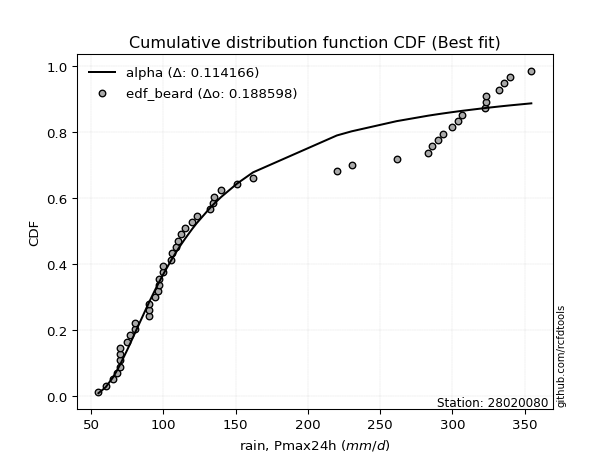</img></img>

</div>


### 5. EDF Chegodayev (1955)

The Chegodayev formula is an empirical plotting position formula used in hydrological frequency analysis to estimate the exceedance probability or return period of a specific event from a set of observed data. It is primarily used for plotting observed data points on probability paper to fit a theoretical distribution, particularly for analyzing extreme events like maximum flood flows or rainfall intensities. The constant _b_ value in the generalized plotting position formula is 0.3.

<div align="center">


$P=(m-b)/(n+1-2b)$


</div>


**5.1. Empirical values**

<div align="center">

|                | 0                    | 1                    | 2                   | 3                   | 4                   | 5                   | 6                   | 7                   | 8                   | 9                   | 10                  | 11                 | 12                 | 13                 | 14                  | 15                 | 16                  | 17                  | 18                  | 19                  | 20                 | 21                  | 22                 | 23                  | 24                 | 25                  | 26                 | 27                  | 28                 | 29                 | 30                 | 31                 | 32                 | 33                | 34                 | 35                 | 36                 | 37                 | 38                 | 39                 | 40                 | 41                 | 42                 | 43                 | 44                 | 45                 | 46                 | 47                 | 48                 | 49                 | 50                 | 51                 | 52                 | 53                 | 54                 | 55                 |
|:---------------|:---------------------|:---------------------|:--------------------|:--------------------|:--------------------|:--------------------|:--------------------|:--------------------|:--------------------|:--------------------|:--------------------|:-------------------|:-------------------|:-------------------|:--------------------|:-------------------|:--------------------|:--------------------|:--------------------|:--------------------|:-------------------|:--------------------|:-------------------|:--------------------|:-------------------|:--------------------|:-------------------|:--------------------|:-------------------|:-------------------|:-------------------|:-------------------|:-------------------|:------------------|:-------------------|:-------------------|:-------------------|:-------------------|:-------------------|:-------------------|:-------------------|:-------------------|:-------------------|:-------------------|:-------------------|:-------------------|:-------------------|:-------------------|:-------------------|:-------------------|:-------------------|:-------------------|:-------------------|:-------------------|:-------------------|:-------------------|
| date           | 1960                 | 1974                 | 1982                | 1997                | 2009                | 1990                | 1989                | 1991                | 2012                | 1964                | 1968                | 1959               | 1988               | 1992               | 1979                | 1963               | 1987                | 1994                | 1986                | 1971                | 1976               | 2013                | 2015               | 2004                | 1981               | 1999                | 1980               | 2002                | 1973               | 1965               | 2006               | 2019               | 1969               | 1972              | 2007               | 1970               | 1984               | 2020               | 2010               | 1983               | 2003               | 2001               | 1993               | 1962               | 1995               | 2000               | 1996               | 1975               | 2014               | 2011               | 2021               | 2017               | 1998               | 2005               | 1985               | 2008               |
| x              | 53.0                 | 55.0                 | 60.0                | 65.0                | 68.0                | 70.0                | 70.0                | 70.0                | 70.0                | 72.0                | 72.72167244         | 73.86977315        | 75.0               | 77.0               | 78.44364045         | 79.0               | 79.27108814         | 80.0                | 80.0                | 80.0                | 82.0               | 85.0                | 86.0               | 89.0                | 90.0               | 90.0                | 90.0               | 94.0                | 96.0               | 96.79157548        | 97.0               | 97.0               | 99.0               | 100.0             | 100.0              | 100.0              | 100.05888838678571 | 105.0              | 105.0              | 106.0              | 109.0              | 110.0              | 112.0              | 114.0              | 115.0              | 120.0              | 123.0              | 130.0              | 130.0              | 132.0              | 134.0              | 135.0              | 140.0              | 151.0              | 162.0              | 220.0              |
| m              | 1                    | 2                    | 3                   | 4                   | 5                   | 6                   | 7                   | 8                   | 9                   | 10                  | 11                  | 12                 | 13                 | 14                 | 15                  | 16                 | 17                  | 18                  | 19                  | 20                  | 21                 | 22                  | 23                 | 24                  | 25                 | 26                  | 27                 | 28                  | 29                 | 30                 | 31                 | 32                 | 33                 | 34                | 35                 | 36                 | 37                 | 38                 | 39                 | 40                 | 41                 | 42                 | 43                 | 44                 | 45                 | 46                 | 47                 | 48                 | 49                 | 50                 | 51                 | 52                 | 53                 | 54                 | 55                 | 56                 |
| empirical_dist | edf_chegodayev       | edf_chegodayev       | edf_chegodayev      | edf_chegodayev      | edf_chegodayev      | edf_chegodayev      | edf_chegodayev      | edf_chegodayev      | edf_chegodayev      | edf_chegodayev      | edf_chegodayev      | edf_chegodayev     | edf_chegodayev     | edf_chegodayev     | edf_chegodayev      | edf_chegodayev     | edf_chegodayev      | edf_chegodayev      | edf_chegodayev      | edf_chegodayev      | edf_chegodayev     | edf_chegodayev      | edf_chegodayev     | edf_chegodayev      | edf_chegodayev     | edf_chegodayev      | edf_chegodayev     | edf_chegodayev      | edf_chegodayev     | edf_chegodayev     | edf_chegodayev     | edf_chegodayev     | edf_chegodayev     | edf_chegodayev    | edf_chegodayev     | edf_chegodayev     | edf_chegodayev     | edf_chegodayev     | edf_chegodayev     | edf_chegodayev     | edf_chegodayev     | edf_chegodayev     | edf_chegodayev     | edf_chegodayev     | edf_chegodayev     | edf_chegodayev     | edf_chegodayev     | edf_chegodayev     | edf_chegodayev     | edf_chegodayev     | edf_chegodayev     | edf_chegodayev     | edf_chegodayev     | edf_chegodayev     | edf_chegodayev     | edf_chegodayev     |
| empirical      | 0.012411347517730495 | 0.030141843971631204 | 0.04787234042553192 | 0.06560283687943264 | 0.08333333333333334 | 0.10106382978723405 | 0.11879432624113476 | 0.13652482269503546 | 0.15425531914893617 | 0.17198581560283688 | 0.18971631205673758 | 0.2074468085106383 | 0.225177304964539  | 0.2429078014184397 | 0.26063829787234044 | 0.2783687943262411 | 0.29609929078014185 | 0.31382978723404253 | 0.33156028368794327 | 0.34929078014184395 | 0.3670212765957447 | 0.38475177304964536 | 0.4024822695035461 | 0.42021276595744683 | 0.4379432624113475 | 0.45567375886524825 | 0.4734042553191489 | 0.49113475177304966 | 0.5088652482269503 | 0.526595744680851  | 0.5443262411347518 | 0.5620567375886525 | 0.5797872340425533 | 0.597517730496454 | 0.6152482269503546 | 0.6329787234042554 | 0.6507092198581561 | 0.6684397163120568 | 0.6861702127659575 | 0.7039007092198583 | 0.7216312056737589 | 0.7393617021276596 | 0.7570921985815604 | 0.7748226950354611 | 0.7925531914893618 | 0.8102836879432624 | 0.8280141843971632 | 0.8457446808510639 | 0.8634751773049646 | 0.8812056737588653 | 0.8989361702127661 | 0.9166666666666667 | 0.9343971631205674 | 0.9521276595744682 | 0.9698581560283689 | 0.9875886524822696 |
| empirical_tr   | 1.0125673249551168   | 1.0310786106032908   | 1.0502793296089385  | 1.0702087286527513  | 1.090909090909091   | 1.1124260355029585  | 1.1348088531187122  | 1.158110882956879   | 1.1823899371069182  | 1.2077087794432548  | 1.2341356673960613  | 1.261744966442953  | 1.2906178489702518 | 1.3208430913348945 | 1.3525179856115108  | 1.3857493857493859 | 1.420654911838791   | 1.4573643410852712  | 1.4960212201591512  | 1.536784741144414   | 1.5798319327731092 | 1.6253602305475503  | 1.6735905044510386 | 1.724770642201835   | 1.779179810725552  | 1.8371335504885993  | 1.8989898989898988 | 1.9651567944250872  | 2.036101083032491  | 2.1123595505617976 | 2.1945525291828796 | 2.2834008097165994 | 2.3797468354430387 | 2.484581497797357 | 2.599078341013825  | 2.7246376811594213 | 2.862944162436549  | 3.0160427807486636 | 3.186440677966102  | 3.3772455089820372 | 3.59235668789809   | 3.8367346938775517 | 4.116788321167885  | 4.440944881889766  | 4.820512820512822  | 5.271028037383179  | 5.814432989690726  | 6.482758620689658  | 7.324675324675328  | 8.417910447761196  | 9.894736842105273  | 12.00000000000001  | 15.243243243243253 | 20.888888888888943 | 33.1764705882354   | 80.571428571429    |

</div>


**5.2. Kolmogorov-Smirnov fit test (sorted by Δ)**


<div align="center">

|                | 0                    | 1                   | 2                   | 3                   | 4                   | 5                    | 6                   | 7                   | 8                   | 9                   | 10                  | 11                 | 12                  | 13                  | 14                  | 15                  | 16                   | 17                  | 18                   | 19                   | 20                  | 21                  | 22                  | 23                   | 24                  | 25                  | 26                  | 27                  | 28                  | 29                  | 30                  | 31                   | 32                  | 33                  | 34                 | 35                  | 36                  | 37                  | 38                  | 39                  | 40                 | 41                  | 42                 | 43                  | 44                  | 45                  | 46                  | 47                  | 48                 | 49                 | 50                 | 51                  | 52                  | 53                  | 54                  | 55                  | 56                  | 57                  | 58                  | 59                 | 60                  | 61                  | 62                  | 63                  | 64                    | 65                  | 66                  | 67                  | 68                  | 69                  | 70                 | 71                  | 72                  | 73                  | 74                 | 75                  | 76                 | 77                 | 78                  | 79                  | 80                  | 81                 | 82                  | 83                  | 84                 | 85                  | 86                  | 87                 |
|:---------------|:---------------------|:--------------------|:--------------------|:--------------------|:--------------------|:---------------------|:--------------------|:--------------------|:--------------------|:--------------------|:--------------------|:-------------------|:--------------------|:--------------------|:--------------------|:--------------------|:---------------------|:--------------------|:---------------------|:---------------------|:--------------------|:--------------------|:--------------------|:---------------------|:--------------------|:--------------------|:--------------------|:--------------------|:--------------------|:--------------------|:--------------------|:---------------------|:--------------------|:--------------------|:-------------------|:--------------------|:--------------------|:--------------------|:--------------------|:--------------------|:-------------------|:--------------------|:-------------------|:--------------------|:--------------------|:--------------------|:--------------------|:--------------------|:-------------------|:-------------------|:-------------------|:--------------------|:--------------------|:--------------------|:--------------------|:--------------------|:--------------------|:--------------------|:--------------------|:-------------------|:--------------------|:--------------------|:--------------------|:--------------------|:----------------------|:--------------------|:--------------------|:--------------------|:--------------------|:--------------------|:-------------------|:--------------------|:--------------------|:--------------------|:-------------------|:--------------------|:-------------------|:-------------------|:--------------------|:--------------------|:--------------------|:-------------------|:--------------------|:--------------------|:-------------------|:--------------------|:--------------------|:-------------------|
| station        | 28020080             | 28020080            | 28020080            | 28020080            | 28020080            | 28020080             | 28020080            | 28020080            | 28020080            | 28020080            | 28020080            | 28020080           | 28020080            | 28020080            | 28020080            | 28020080            | 28020080             | 28020080            | 28020080             | 28020080             | 28020080            | 28020080            | 28020080            | 28020080             | 28020080            | 28020080            | 28020080            | 28020080            | 28020080            | 28020080            | 28020080            | 28020080             | 28020080            | 28020080            | 28020080           | 28020080            | 28020080            | 28020080            | 28020080            | 28020080            | 28020080           | 28020080            | 28020080           | 28020080            | 28020080            | 28020080            | 28020080            | 28020080            | 28020080           | 28020080           | 28020080           | 28020080            | 28020080            | 28020080            | 28020080            | 28020080            | 28020080            | 28020080            | 28020080            | 28020080           | 28020080            | 28020080            | 28020080            | 28020080            | 28020080              | 28020080            | 28020080            | 28020080            | 28020080            | 28020080            | 28020080           | 28020080            | 28020080            | 28020080            | 28020080           | 28020080            | 28020080           | 28020080           | 28020080            | 28020080            | 28020080            | 28020080           | 28020080            | 28020080            | 28020080           | 28020080            | 28020080            | 28020080           |
| empirical_dist | edf_chegodayev       | edf_chegodayev      | edf_chegodayev      | edf_chegodayev      | edf_chegodayev      | edf_chegodayev       | edf_chegodayev      | edf_chegodayev      | edf_chegodayev      | edf_chegodayev      | edf_chegodayev      | edf_chegodayev     | edf_chegodayev      | edf_chegodayev      | edf_chegodayev      | edf_chegodayev      | edf_chegodayev       | edf_chegodayev      | edf_chegodayev       | edf_chegodayev       | edf_chegodayev      | edf_chegodayev      | edf_chegodayev      | edf_chegodayev       | edf_chegodayev      | edf_chegodayev      | edf_chegodayev      | edf_chegodayev      | edf_chegodayev      | edf_chegodayev      | edf_chegodayev      | edf_chegodayev       | edf_chegodayev      | edf_chegodayev      | edf_chegodayev     | edf_chegodayev      | edf_chegodayev      | edf_chegodayev      | edf_chegodayev      | edf_chegodayev      | edf_chegodayev     | edf_chegodayev      | edf_chegodayev     | edf_chegodayev      | edf_chegodayev      | edf_chegodayev      | edf_chegodayev      | edf_chegodayev      | edf_chegodayev     | edf_chegodayev     | edf_chegodayev     | edf_chegodayev      | edf_chegodayev      | edf_chegodayev      | edf_chegodayev      | edf_chegodayev      | edf_chegodayev      | edf_chegodayev      | edf_chegodayev      | edf_chegodayev     | edf_chegodayev      | edf_chegodayev      | edf_chegodayev      | edf_chegodayev      | edf_chegodayev        | edf_chegodayev      | edf_chegodayev      | edf_chegodayev      | edf_chegodayev      | edf_chegodayev      | edf_chegodayev     | edf_chegodayev      | edf_chegodayev      | edf_chegodayev      | edf_chegodayev     | edf_chegodayev      | edf_chegodayev     | edf_chegodayev     | edf_chegodayev      | edf_chegodayev      | edf_chegodayev      | edf_chegodayev     | edf_chegodayev      | edf_chegodayev      | edf_chegodayev     | edf_chegodayev      | edf_chegodayev      | edf_chegodayev     |
| p_dist         | gamma                | chi2                | erlang              | logweibull_min      | fatiguelife         | invgauss             | lognakagami         | johnsonsu           | logrice             | logmaxwell          | loginvgauss         | logpearson3        | gumbel_r            | loggamma            | loggamma            | logerlang           | logchi2              | logfatiguelife      | invgamma             | loglognorm           | f                   | logf                | logncf              | loginvgamma          | logjohnsonsu        | logalpha            | invweibull          | nct                 | weibull_min         | alpha               | lognct              | exponnorm            | mielke              | moyal               | loggenlogistic     | betaprime           | lograyleigh         | logexponnorm        | ncf                 | kstwobign           | genlogistic        | pearson3            | logmielke          | halflogistic        | logloggamma         | logcrystalball      | lognorm             | lognorm             | logfisk            | nakagami           | fisk               | loginvweibull       | halfnorm            | logt                | rayleigh            | logkstwobign        | maxwell             | t                   | rice                | loglogistic        | loggumbel_r         | loghalfnorm         | laplace_asymmetric  | loghypsecant        | loglaplace_asymmetric | logistic            | hypsecant           | logmoyal            | truncnorm           | norm                | crystalball        | loghalflogistic     | loggumbel_l         | loglaplace          | loggenexpon        | laplace             | wald               | genexpon           | gumbel_l            | logwald             | logbetaprime        | expon              | loggompertz         | gibrat              | loggibrat          | logtruncnorm        | logexpon            | gompertz           |
| delta          | 0.048532251259572445 | 0.04853269016605949 | 0.04853279284987877 | 0.05114618293797324 | 0.05116223929003655 | 0.051316814232930386 | 0.05204396989440074 | 0.05327329901471195 | 0.05344333986357669 | 0.05383607806352497 | 0.05417513639760985 | 0.0542971500641225 | 0.05450209772544262 | 0.05493889297234128 | 0.05493889297234128 | 0.05493889632100668 | 0.054938915724352444 | 0.05552538632163523 | 0.055838047676246005 | 0.055906784567566925 | 0.05591054266221124 | 0.05616755264929518 | 0.05624101015133359 | 0.056249210115504655 | 0.05633650087926395 | 0.05685081583908219 | 0.05704717579525154 | 0.05736797303103419 | 0.06001435711162234 | 0.06015991798651138 | 0.06036330850122268 | 0.061265958104566476 | 0.06236491050772558 | 0.06259320597094942 | 0.0627612825680578 | 0.06347619329687254 | 0.06410463732706784 | 0.06472643574385684 | 0.06482954615899333 | 0.06506292916311573 | 0.0663305846229223 | 0.06695661785159024 | 0.0669934076472003 | 0.06848224582209483 | 0.06968089235541086 | 0.06984141642193525 | 0.06984174496101064 | 0.06984174496101064 | 0.0710818501039987 | 0.0712382694115572 | 0.074638381253613  | 0.07500081535856817 | 0.07816448743679802 | 0.07895240056547376 | 0.08017084483490691 | 0.08051837477765889 | 0.08754361469694472 | 0.09106078033142304 | 0.09170399851151023 | 0.092005726634106  | 0.09289653986321877 | 0.09303122907672123 | 0.09431139495971597 | 0.10744926916575592 | 0.11356434434330287   | 0.11476027187581006 | 0.11478746031342232 | 0.11826351867109708 | 0.11906014891096006 | 0.11906016840733458 | 0.1190601762084662 | 0.11959651431547302 | 0.12173958953339603 | 0.13051881577556057 | 0.1334233007950105 | 0.13709261989939228 | 0.1674601653985132 | 0.170367513255002  | 0.18776106894935596 | 0.19501123089265368 | 0.20586633541500865 | 0.2150858105312119 | 0.22341778042332494 | 0.22683218339966157 | 0.2360761603113961 | 0.27406655290996146 | 0.28379604458515423 | 0.9698290736528523 |
| deltao         | 0.1817376445004486   | 0.1817376445004486  | 0.1817376445004486  | 0.1817376445004486  | 0.1817376445004486  | 0.1817376445004486   | 0.1817376445004486  | 0.1817376445004486  | 0.1817376445004486  | 0.1817376445004486  | 0.1817376445004486  | 0.1817376445004486 | 0.1817376445004486  | 0.1817376445004486  | 0.1817376445004486  | 0.1817376445004486  | 0.1817376445004486   | 0.1817376445004486  | 0.1817376445004486   | 0.1817376445004486   | 0.1817376445004486  | 0.1817376445004486  | 0.1817376445004486  | 0.1817376445004486   | 0.1817376445004486  | 0.1817376445004486  | 0.1817376445004486  | 0.1817376445004486  | 0.1817376445004486  | 0.1817376445004486  | 0.1817376445004486  | 0.1817376445004486   | 0.1817376445004486  | 0.1817376445004486  | 0.1817376445004486 | 0.1817376445004486  | 0.1817376445004486  | 0.1817376445004486  | 0.1817376445004486  | 0.1817376445004486  | 0.1817376445004486 | 0.1817376445004486  | 0.1817376445004486 | 0.1817376445004486  | 0.1817376445004486  | 0.1817376445004486  | 0.1817376445004486  | 0.1817376445004486  | 0.1817376445004486 | 0.1817376445004486 | 0.1817376445004486 | 0.1817376445004486  | 0.1817376445004486  | 0.1817376445004486  | 0.1817376445004486  | 0.1817376445004486  | 0.1817376445004486  | 0.1817376445004486  | 0.1817376445004486  | 0.1817376445004486 | 0.1817376445004486  | 0.1817376445004486  | 0.1817376445004486  | 0.1817376445004486  | 0.1817376445004486    | 0.1817376445004486  | 0.1817376445004486  | 0.1817376445004486  | 0.1817376445004486  | 0.1817376445004486  | 0.1817376445004486 | 0.1817376445004486  | 0.1817376445004486  | 0.1817376445004486  | 0.1817376445004486 | 0.1817376445004486  | 0.1817376445004486 | 0.1817376445004486 | 0.1817376445004486  | 0.1817376445004486  | 0.1817376445004486  | 0.1817376445004486 | 0.1817376445004486  | 0.1817376445004486  | 0.1817376445004486 | 0.1817376445004486  | 0.1817376445004486  | 0.1817376445004486 |
| eval           | Δo > Δ               | Δo > Δ              | Δo > Δ              | Δo > Δ              | Δo > Δ              | Δo > Δ               | Δo > Δ              | Δo > Δ              | Δo > Δ              | Δo > Δ              | Δo > Δ              | Δo > Δ             | Δo > Δ              | Δo > Δ              | Δo > Δ              | Δo > Δ              | Δo > Δ               | Δo > Δ              | Δo > Δ               | Δo > Δ               | Δo > Δ              | Δo > Δ              | Δo > Δ              | Δo > Δ               | Δo > Δ              | Δo > Δ              | Δo > Δ              | Δo > Δ              | Δo > Δ              | Δo > Δ              | Δo > Δ              | Δo > Δ               | Δo > Δ              | Δo > Δ              | Δo > Δ             | Δo > Δ              | Δo > Δ              | Δo > Δ              | Δo > Δ              | Δo > Δ              | Δo > Δ             | Δo > Δ              | Δo > Δ             | Δo > Δ              | Δo > Δ              | Δo > Δ              | Δo > Δ              | Δo > Δ              | Δo > Δ             | Δo > Δ             | Δo > Δ             | Δo > Δ              | Δo > Δ              | Δo > Δ              | Δo > Δ              | Δo > Δ              | Δo > Δ              | Δo > Δ              | Δo > Δ              | Δo > Δ             | Δo > Δ              | Δo > Δ              | Δo > Δ              | Δo > Δ              | Δo > Δ                | Δo > Δ              | Δo > Δ              | Δo > Δ              | Δo > Δ              | Δo > Δ              | Δo > Δ             | Δo > Δ              | Δo > Δ              | Δo > Δ              | Δo > Δ             | Δo > Δ              | Δo > Δ             | Δo > Δ             | Δo <= Δ             | Δo <= Δ             | Δo <= Δ             | Δo <= Δ            | Δo <= Δ             | Δo <= Δ             | Δo <= Δ            | Δo <= Δ             | Δo <= Δ             | Δo <= Δ            |
| fit            | 1                    | 1                   | 1                   | 1                   | 1                   | 1                    | 1                   | 1                   | 1                   | 1                   | 1                   | 1                  | 1                   | 1                   | 1                   | 1                   | 1                    | 1                   | 1                    | 1                    | 1                   | 1                   | 1                   | 1                    | 1                   | 1                   | 1                   | 1                   | 1                   | 1                   | 1                   | 1                    | 1                   | 1                   | 1                  | 1                   | 1                   | 1                   | 1                   | 1                   | 1                  | 1                   | 1                  | 1                   | 1                   | 1                   | 1                   | 1                   | 1                  | 1                  | 1                  | 1                   | 1                   | 1                   | 1                   | 1                   | 1                   | 1                   | 1                   | 1                  | 1                   | 1                   | 1                   | 1                   | 1                     | 1                   | 1                   | 1                   | 1                   | 1                   | 1                  | 1                   | 1                   | 1                   | 1                  | 1                   | 1                  | 1                  | 0                   | 0                   | 0                   | 0                  | 0                   | 0                   | 0                  | 0                   | 0                   | 0                  |
| n              | 56                   | 56                  | 56                  | 56                  | 56                  | 56                   | 56                  | 56                  | 56                  | 56                  | 56                  | 56                 | 56                  | 56                  | 56                  | 56                  | 56                   | 56                  | 56                   | 56                   | 56                  | 56                  | 56                  | 56                   | 56                  | 56                  | 56                  | 56                  | 56                  | 56                  | 56                  | 56                   | 56                  | 56                  | 56                 | 56                  | 56                  | 56                  | 56                  | 56                  | 56                 | 56                  | 56                 | 56                  | 56                  | 56                  | 56                  | 56                  | 56                 | 56                 | 56                 | 56                  | 56                  | 56                  | 56                  | 56                  | 56                  | 56                  | 56                  | 56                 | 56                  | 56                  | 56                  | 56                  | 56                    | 56                  | 56                  | 56                  | 56                  | 56                  | 56                 | 56                  | 56                  | 56                  | 56                 | 56                  | 56                 | 56                 | 56                  | 56                  | 56                  | 56                 | 56                  | 56                  | 56                 | 56                  | 56                  | 56                 |
| best_fit       | 1                    | 0                   | 0                   | 0                   | 0                   | 0                    | 0                   | 0                   | 0                   | 0                   | 0                   | 0                  | 0                   | 0                   | 0                   | 0                   | 0                    | 0                   | 0                    | 0                    | 0                   | 0                   | 0                   | 0                    | 0                   | 0                   | 0                   | 0                   | 0                   | 0                   | 0                   | 0                    | 0                   | 0                   | 0                  | 0                   | 0                   | 0                   | 0                   | 0                   | 0                  | 0                   | 0                  | 0                   | 0                   | 0                   | 0                   | 0                   | 0                  | 0                  | 0                  | 0                   | 0                   | 0                   | 0                   | 0                   | 0                   | 0                   | 0                   | 0                  | 0                   | 0                   | 0                   | 0                   | 0                     | 0                   | 0                   | 0                   | 0                   | 0                   | 0                  | 0                   | 0                   | 0                   | 0                  | 0                   | 0                  | 0                  | 0                   | 0                   | 0                   | 0                  | 0                   | 0                   | 0                  | 0                   | 0                   | 0                  |
| best_fit_sort  | 1                    | 2                   | 3                   | 4                   | 5                   | 6                    | 7                   | 8                   | 9                   | 10                  | 11                  | 12                 | 13                  | 14                  | 15                  | 16                  | 17                   | 18                  | 19                   | 20                   | 21                  | 22                  | 23                  | 24                   | 25                  | 26                  | 27                  | 28                  | 29                  | 30                  | 31                  | 32                   | 33                  | 34                  | 35                 | 36                  | 37                  | 38                  | 39                  | 40                  | 41                 | 42                  | 43                 | 44                  | 45                  | 46                  | 47                  | 48                  | 49                 | 50                 | 51                 | 52                  | 53                  | 54                  | 55                  | 56                  | 57                  | 58                  | 59                  | 60                 | 61                  | 62                  | 63                  | 64                  | 65                    | 66                  | 67                  | 68                  | 69                  | 70                  | 71                 | 72                  | 73                  | 74                  | 75                 | 76                  | 77                 | 78                 | 79                  | 80                  | 81                  | 82                 | 83                  | 84                  | 85                 | 86                  | 87                  | 88                 |

</div>


<div align="center">

</img>

</div>


**5.3. Best fit**

<div align="center">

|   id |   station | empirical_dist   | p_dist   |     delta |   deltao | eval   |   fit |   n |   best_fit |   best_fit_sort |
|-----:|----------:|:-----------------|:---------|----------:|---------:|:-------|------:|----:|-----------:|----------------:|
|    0 |  28020080 | edf_chegodayev   | gamma    | 0.0485323 | 0.181738 | Δo > Δ |     1 |  56 |          1 |               1 |

</div>


<div align="center">

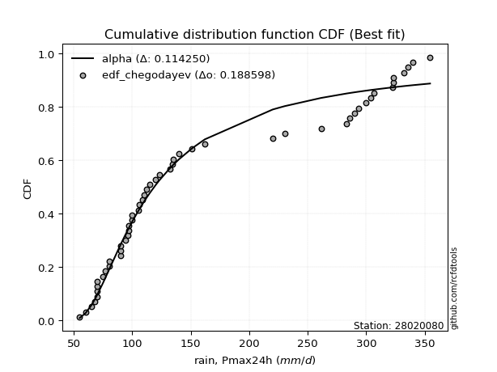</img>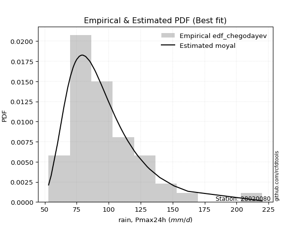</img>

</div>


### 6. EDF Blom (1958)

The Blom formula is a specific "plotting position" formula used in hydrology and statistical analysis to estimate the empirical cumulative probability (or non-exceedance probability) of a data series. It is particularly recommended for data that are approximately normally distributed. The constant _a_ is set to 0.375 (or 3/8).

<div align="center">


$P=(m-a)/(n+1-2a)$


</div>


**6.1. Empirical values**

<div align="center">

|                | 0                    | 1                    | 2                   | 3                   | 4                   | 5                  | 6                   | 7                   | 8                   | 9                  | 10                  | 11                  | 12                  | 13                  | 14                 | 15                 | 16                  | 17                  | 18                  | 19                 | 20                  | 21                 | 22                 | 23                 | 24                  | 25                  | 26                  | 27                 | 28                 | 29                 | 30                 | 31                 | 32                | 33                 | 34                 | 35                 | 36                 | 37                 | 38                 | 39                 | 40                 | 41                | 42                 | 43                 | 44                 | 45                 | 46                 | 47                 | 48                 | 49                 | 50                 | 51                 | 52                 | 53                 | 54                 | 55                 |
|:---------------|:---------------------|:---------------------|:--------------------|:--------------------|:--------------------|:-------------------|:--------------------|:--------------------|:--------------------|:-------------------|:--------------------|:--------------------|:--------------------|:--------------------|:-------------------|:-------------------|:--------------------|:--------------------|:--------------------|:-------------------|:--------------------|:-------------------|:-------------------|:-------------------|:--------------------|:--------------------|:--------------------|:-------------------|:-------------------|:-------------------|:-------------------|:-------------------|:------------------|:-------------------|:-------------------|:-------------------|:-------------------|:-------------------|:-------------------|:-------------------|:-------------------|:------------------|:-------------------|:-------------------|:-------------------|:-------------------|:-------------------|:-------------------|:-------------------|:-------------------|:-------------------|:-------------------|:-------------------|:-------------------|:-------------------|:-------------------|
| date           | 1960                 | 1974                 | 1982                | 1997                | 2009                | 1990               | 1989                | 1991                | 2012                | 1964               | 1968                | 1959                | 1988                | 1992                | 1979               | 1963               | 1987                | 1994                | 1986                | 1971               | 1976                | 2013               | 2015               | 2004               | 1981                | 1999                | 1980                | 2002               | 1973               | 1965               | 2006               | 2019               | 1969              | 1972               | 2007               | 1970               | 1984               | 2020               | 2010               | 1983               | 2003               | 2001              | 1993               | 1962               | 1995               | 2000               | 1996               | 1975               | 2014               | 2011               | 2021               | 2017               | 1998               | 2005               | 1985               | 2008               |
| x              | 53.0                 | 55.0                 | 60.0                | 65.0                | 68.0                | 70.0               | 70.0                | 70.0                | 70.0                | 72.0               | 72.72167244         | 73.86977315         | 75.0                | 77.0                | 78.44364045        | 79.0               | 79.27108814         | 80.0                | 80.0                | 80.0               | 82.0                | 85.0               | 86.0               | 89.0               | 90.0                | 90.0                | 90.0                | 94.0               | 96.0               | 96.79157548        | 97.0               | 97.0               | 99.0              | 100.0              | 100.0              | 100.0              | 100.05888838678571 | 105.0              | 105.0              | 106.0              | 109.0              | 110.0             | 112.0              | 114.0              | 115.0              | 120.0              | 123.0              | 130.0              | 130.0              | 132.0              | 134.0              | 135.0              | 140.0              | 151.0              | 162.0              | 220.0              |
| m              | 1                    | 2                    | 3                   | 4                   | 5                   | 6                  | 7                   | 8                   | 9                   | 10                 | 11                  | 12                  | 13                  | 14                  | 15                 | 16                 | 17                  | 18                  | 19                  | 20                 | 21                  | 22                 | 23                 | 24                 | 25                  | 26                  | 27                  | 28                 | 29                 | 30                 | 31                 | 32                 | 33                | 34                 | 35                 | 36                 | 37                 | 38                 | 39                 | 40                 | 41                 | 42                | 43                 | 44                 | 45                 | 46                 | 47                 | 48                 | 49                 | 50                 | 51                 | 52                 | 53                 | 54                 | 55                 | 56                 |
| empirical_dist | edf_blom             | edf_blom             | edf_blom            | edf_blom            | edf_blom            | edf_blom           | edf_blom            | edf_blom            | edf_blom            | edf_blom           | edf_blom            | edf_blom            | edf_blom            | edf_blom            | edf_blom           | edf_blom           | edf_blom            | edf_blom            | edf_blom            | edf_blom           | edf_blom            | edf_blom           | edf_blom           | edf_blom           | edf_blom            | edf_blom            | edf_blom            | edf_blom           | edf_blom           | edf_blom           | edf_blom           | edf_blom           | edf_blom          | edf_blom           | edf_blom           | edf_blom           | edf_blom           | edf_blom           | edf_blom           | edf_blom           | edf_blom           | edf_blom          | edf_blom           | edf_blom           | edf_blom           | edf_blom           | edf_blom           | edf_blom           | edf_blom           | edf_blom           | edf_blom           | edf_blom           | edf_blom           | edf_blom           | edf_blom           | edf_blom           |
| empirical      | 0.011111111111111112 | 0.028888888888888888 | 0.04666666666666667 | 0.06444444444444444 | 0.08222222222222222 | 0.1                | 0.11777777777777777 | 0.13555555555555557 | 0.15333333333333332 | 0.1711111111111111 | 0.18888888888888888 | 0.20666666666666667 | 0.22444444444444445 | 0.24222222222222223 | 0.26               | 0.2777777777777778 | 0.29555555555555557 | 0.31333333333333335 | 0.33111111111111113 | 0.3488888888888889 | 0.36666666666666664 | 0.3844444444444444 | 0.4022222222222222 | 0.42               | 0.43777777777777777 | 0.45555555555555555 | 0.47333333333333333 | 0.4911111111111111 | 0.5088888888888888 | 0.5266666666666666 | 0.5444444444444444 | 0.5622222222222222 | 0.58              | 0.5977777777777777 | 0.6155555555555555 | 0.6333333333333333 | 0.6511111111111111 | 0.6688888888888889 | 0.6866666666666666 | 0.7044444444444444 | 0.7222222222222222 | 0.74              | 0.7577777777777778 | 0.7755555555555556 | 0.7933333333333333 | 0.8111111111111111 | 0.8288888888888889 | 0.8466666666666667 | 0.8644444444444445 | 0.8822222222222222 | 0.9                | 0.9177777777777778 | 0.9355555555555556 | 0.9533333333333334 | 0.9711111111111111 | 0.9888888888888889 |
| empirical_tr   | 1.0112359550561798   | 1.0297482837528604   | 1.048951048951049   | 1.0688836104513064  | 1.089588377723971   | 1.1111111111111112 | 1.1335012594458438  | 1.1568123393316194  | 1.1811023622047243  | 1.2064343163538873 | 1.2328767123287672  | 1.2605042016806722  | 1.2893982808022924  | 1.3196480938416422  | 1.3513513513513513 | 1.3846153846153846 | 1.4195583596214512  | 1.4563106796116505  | 1.495016611295681   | 1.5358361774744027 | 1.5789473684210527  | 1.6245487364620936 | 1.6728624535315986 | 1.7241379310344827 | 1.7786561264822136  | 1.8367346938775508  | 1.89873417721519    | 1.9650655021834058 | 2.0361990950226243 | 2.112676056338028  | 2.195121951219512  | 2.284263959390863  | 2.380952380952381 | 2.486187845303867  | 2.6011560693641615 | 2.727272727272727  | 2.8662420382165603 | 3.0201342281879193 | 3.1914893617021276 | 3.3834586466165413 | 3.5999999999999996 | 3.846153846153846 | 4.128440366972477  | 4.455445544554456  | 4.838709677419355  | 5.294117647058823  | 5.8441558441558445 | 6.521739130434783  | 7.3770491803278695 | 8.490566037735851  | 10.000000000000002 | 12.162162162162167 | 15.517241379310352 | 21.428571428571445 | 34.615384615384656 | 90.00000000000033  |

</div>


**6.2. Kolmogorov-Smirnov fit test (sorted by Δ)**


<div align="center">

|                | 0                    | 1                   | 2                   | 3                    | 4                   | 5                   | 6                   | 7                   | 8                    | 9                   | 10                  | 11                  | 12                  | 13                  | 14                  | 15                  | 16                  | 17                   | 18                  | 19                  | 20                   | 21                  | 22                  | 23                  | 24                  | 25                  | 26                 | 27                  | 28                  | 29                   | 30                   | 31                  | 32                   | 33                  | 34                  | 35                  | 36                  | 37                 | 38                 | 39                 | 40                  | 41                  | 42                  | 43                  | 44                  | 45                  | 46                  | 47                  | 48                  | 49                  | 50                  | 51                  | 52                  | 53                  | 54                  | 55                  | 56                 | 57                  | 58                  | 59                  | 60                  | 61                  | 62                  | 63                  | 64                    | 65                  | 66                  | 67                  | 68                  | 69                  | 70                  | 71                  | 72                  | 73                  | 74                  | 75                  | 76                 | 77                  | 78                  | 79                  | 80                 | 81                  | 82                  | 83                 | 84                  | 85                 | 86                  | 87                 |
|:---------------|:---------------------|:--------------------|:--------------------|:---------------------|:--------------------|:--------------------|:--------------------|:--------------------|:---------------------|:--------------------|:--------------------|:--------------------|:--------------------|:--------------------|:--------------------|:--------------------|:--------------------|:---------------------|:--------------------|:--------------------|:---------------------|:--------------------|:--------------------|:--------------------|:--------------------|:--------------------|:-------------------|:--------------------|:--------------------|:---------------------|:---------------------|:--------------------|:---------------------|:--------------------|:--------------------|:--------------------|:--------------------|:-------------------|:-------------------|:-------------------|:--------------------|:--------------------|:--------------------|:--------------------|:--------------------|:--------------------|:--------------------|:--------------------|:--------------------|:--------------------|:--------------------|:--------------------|:--------------------|:--------------------|:--------------------|:--------------------|:-------------------|:--------------------|:--------------------|:--------------------|:--------------------|:--------------------|:--------------------|:--------------------|:----------------------|:--------------------|:--------------------|:--------------------|:--------------------|:--------------------|:--------------------|:--------------------|:--------------------|:--------------------|:--------------------|:--------------------|:-------------------|:--------------------|:--------------------|:--------------------|:-------------------|:--------------------|:--------------------|:-------------------|:--------------------|:-------------------|:--------------------|:-------------------|
| station        | 28020080             | 28020080            | 28020080            | 28020080             | 28020080            | 28020080            | 28020080            | 28020080            | 28020080             | 28020080            | 28020080            | 28020080            | 28020080            | 28020080            | 28020080            | 28020080            | 28020080            | 28020080             | 28020080            | 28020080            | 28020080             | 28020080            | 28020080            | 28020080            | 28020080            | 28020080            | 28020080           | 28020080            | 28020080            | 28020080             | 28020080             | 28020080            | 28020080             | 28020080            | 28020080            | 28020080            | 28020080            | 28020080           | 28020080           | 28020080           | 28020080            | 28020080            | 28020080            | 28020080            | 28020080            | 28020080            | 28020080            | 28020080            | 28020080            | 28020080            | 28020080            | 28020080            | 28020080            | 28020080            | 28020080            | 28020080            | 28020080           | 28020080            | 28020080            | 28020080            | 28020080            | 28020080            | 28020080            | 28020080            | 28020080              | 28020080            | 28020080            | 28020080            | 28020080            | 28020080            | 28020080            | 28020080            | 28020080            | 28020080            | 28020080            | 28020080            | 28020080           | 28020080            | 28020080            | 28020080            | 28020080           | 28020080            | 28020080            | 28020080           | 28020080            | 28020080           | 28020080            | 28020080           |
| empirical_dist | edf_blom             | edf_blom            | edf_blom            | edf_blom             | edf_blom            | edf_blom            | edf_blom            | edf_blom            | edf_blom             | edf_blom            | edf_blom            | edf_blom            | edf_blom            | edf_blom            | edf_blom            | edf_blom            | edf_blom            | edf_blom             | edf_blom            | edf_blom            | edf_blom             | edf_blom            | edf_blom            | edf_blom            | edf_blom            | edf_blom            | edf_blom           | edf_blom            | edf_blom            | edf_blom             | edf_blom             | edf_blom            | edf_blom             | edf_blom            | edf_blom            | edf_blom            | edf_blom            | edf_blom           | edf_blom           | edf_blom           | edf_blom            | edf_blom            | edf_blom            | edf_blom            | edf_blom            | edf_blom            | edf_blom            | edf_blom            | edf_blom            | edf_blom            | edf_blom            | edf_blom            | edf_blom            | edf_blom            | edf_blom            | edf_blom            | edf_blom           | edf_blom            | edf_blom            | edf_blom            | edf_blom            | edf_blom            | edf_blom            | edf_blom            | edf_blom              | edf_blom            | edf_blom            | edf_blom            | edf_blom            | edf_blom            | edf_blom            | edf_blom            | edf_blom            | edf_blom            | edf_blom            | edf_blom            | edf_blom           | edf_blom            | edf_blom            | edf_blom            | edf_blom           | edf_blom            | edf_blom            | edf_blom           | edf_blom            | edf_blom           | edf_blom            | edf_blom           |
| p_dist         | erlang               | chi2                | gamma               | fatiguelife          | invgauss            | lognakagami         | logweibull_min      | johnsonsu           | logrice              | loginvgauss         | logmaxwell          | logpearson3         | gumbel_r            | loggamma            | loggamma            | logerlang           | logchi2             | logfatiguelife       | invgamma            | loglognorm          | f                    | logf                | logncf              | loginvgamma         | logjohnsonsu        | logalpha            | invweibull         | nct                 | weibull_min         | alpha                | lognct               | exponnorm           | mielke               | loggenlogistic      | moyal               | betaprime           | lograyleigh         | logexponnorm       | ncf                | kstwobign          | genlogistic         | logmielke           | pearson3            | halflogistic        | logloggamma         | logcrystalball      | lognorm             | lognorm             | logfisk             | nakagami            | fisk                | loginvweibull       | logt                | halfnorm            | logkstwobign        | rayleigh            | maxwell            | loglogistic         | rice                | t                   | loggumbel_r         | loghalfnorm         | laplace_asymmetric  | loghypsecant        | loglaplace_asymmetric | hypsecant           | logistic            | logmoyal            | truncnorm           | norm                | crystalball         | loghalflogistic     | loggumbel_l         | loglaplace          | loggenexpon         | laplace             | wald               | genexpon            | gumbel_l            | logwald             | logbetaprime       | expon               | loggompertz         | gibrat             | loggibrat           | logtruncnorm       | logexpon            | gompertz           |
| delta          | 0.048730561918961746 | 0.04873066691092312 | 0.04873092845280094 | 0.050760348037081515 | 0.05091492297997535 | 0.05164207864144571 | 0.05221001272520728 | 0.05287140776175692 | 0.053041448610621655 | 0.05377324514465481 | 0.05381243740158648 | 0.05389525881116747 | 0.05410020647248759 | 0.05453700171938625 | 0.05453700171938625 | 0.05453700506805165 | 0.05453702447139741 | 0.055123495068680195 | 0.05543615642329097 | 0.05550489331461189 | 0.055508651409256204 | 0.05576566139634015 | 0.05583911889837856 | 0.05584731886254962 | 0.05593460962630892 | 0.05644892458612716 | 0.0566452845422965 | 0.05696608177807916 | 0.05961246585866731 | 0.059758026733556346 | 0.059961417248267646 | 0.06124231744262798 | 0.061963019254770546 | 0.06235939131510276 | 0.06256956530901092 | 0.06307430204391751 | 0.06408099666512934 | 0.0643245444909018 | 0.0644276549060383 | 0.0646610379101607 | 0.06592869336996726 | 0.06659151639424526 | 0.06693297718965174 | 0.06845860516015634 | 0.06927900110245583 | 0.06943952516898022 | 0.06943985370805561 | 0.06943985370805561 | 0.07067995885104367 | 0.07164016066451218 | 0.07423649000065796 | 0.07497717469662968 | 0.07855050931251872 | 0.07922831722403206 | 0.08049473411572039 | 0.08123467462214096 | 0.0879455059498997 | 0.09160383538115097 | 0.09210588976446521 | 0.09212461011865708 | 0.09287289920128028 | 0.09300758841478274 | 0.09428775429777747 | 0.10704737791280089 | 0.11316245309034784   | 0.11438556906046729 | 0.11516216312876504 | 0.11823987800915858 | 0.11946204016391504 | 0.11946205966028955 | 0.11946206746142118 | 0.11957287365353453 | 0.12214148078635101 | 0.13011692452260554 | 0.13448713058224454 | 0.13669072864643725 | 0.1666327422306645 | 0.17143134304223603 | 0.18816296020231094 | 0.19423108904868205 | 0.2069301652022427 | 0.21614964031844594 | 0.22448161021055899 | 0.2261466042034441 | 0.23539058111517863 | 0.2751303826971955 | 0.28485987437238824 | 0.9710820287355946 |
| deltao         | 0.1817376445004486   | 0.1817376445004486  | 0.1817376445004486  | 0.1817376445004486   | 0.1817376445004486  | 0.1817376445004486  | 0.1817376445004486  | 0.1817376445004486  | 0.1817376445004486   | 0.1817376445004486  | 0.1817376445004486  | 0.1817376445004486  | 0.1817376445004486  | 0.1817376445004486  | 0.1817376445004486  | 0.1817376445004486  | 0.1817376445004486  | 0.1817376445004486   | 0.1817376445004486  | 0.1817376445004486  | 0.1817376445004486   | 0.1817376445004486  | 0.1817376445004486  | 0.1817376445004486  | 0.1817376445004486  | 0.1817376445004486  | 0.1817376445004486 | 0.1817376445004486  | 0.1817376445004486  | 0.1817376445004486   | 0.1817376445004486   | 0.1817376445004486  | 0.1817376445004486   | 0.1817376445004486  | 0.1817376445004486  | 0.1817376445004486  | 0.1817376445004486  | 0.1817376445004486 | 0.1817376445004486 | 0.1817376445004486 | 0.1817376445004486  | 0.1817376445004486  | 0.1817376445004486  | 0.1817376445004486  | 0.1817376445004486  | 0.1817376445004486  | 0.1817376445004486  | 0.1817376445004486  | 0.1817376445004486  | 0.1817376445004486  | 0.1817376445004486  | 0.1817376445004486  | 0.1817376445004486  | 0.1817376445004486  | 0.1817376445004486  | 0.1817376445004486  | 0.1817376445004486 | 0.1817376445004486  | 0.1817376445004486  | 0.1817376445004486  | 0.1817376445004486  | 0.1817376445004486  | 0.1817376445004486  | 0.1817376445004486  | 0.1817376445004486    | 0.1817376445004486  | 0.1817376445004486  | 0.1817376445004486  | 0.1817376445004486  | 0.1817376445004486  | 0.1817376445004486  | 0.1817376445004486  | 0.1817376445004486  | 0.1817376445004486  | 0.1817376445004486  | 0.1817376445004486  | 0.1817376445004486 | 0.1817376445004486  | 0.1817376445004486  | 0.1817376445004486  | 0.1817376445004486 | 0.1817376445004486  | 0.1817376445004486  | 0.1817376445004486 | 0.1817376445004486  | 0.1817376445004486 | 0.1817376445004486  | 0.1817376445004486 |
| eval           | Δo > Δ               | Δo > Δ              | Δo > Δ              | Δo > Δ               | Δo > Δ              | Δo > Δ              | Δo > Δ              | Δo > Δ              | Δo > Δ               | Δo > Δ              | Δo > Δ              | Δo > Δ              | Δo > Δ              | Δo > Δ              | Δo > Δ              | Δo > Δ              | Δo > Δ              | Δo > Δ               | Δo > Δ              | Δo > Δ              | Δo > Δ               | Δo > Δ              | Δo > Δ              | Δo > Δ              | Δo > Δ              | Δo > Δ              | Δo > Δ             | Δo > Δ              | Δo > Δ              | Δo > Δ               | Δo > Δ               | Δo > Δ              | Δo > Δ               | Δo > Δ              | Δo > Δ              | Δo > Δ              | Δo > Δ              | Δo > Δ             | Δo > Δ             | Δo > Δ             | Δo > Δ              | Δo > Δ              | Δo > Δ              | Δo > Δ              | Δo > Δ              | Δo > Δ              | Δo > Δ              | Δo > Δ              | Δo > Δ              | Δo > Δ              | Δo > Δ              | Δo > Δ              | Δo > Δ              | Δo > Δ              | Δo > Δ              | Δo > Δ              | Δo > Δ             | Δo > Δ              | Δo > Δ              | Δo > Δ              | Δo > Δ              | Δo > Δ              | Δo > Δ              | Δo > Δ              | Δo > Δ                | Δo > Δ              | Δo > Δ              | Δo > Δ              | Δo > Δ              | Δo > Δ              | Δo > Δ              | Δo > Δ              | Δo > Δ              | Δo > Δ              | Δo > Δ              | Δo > Δ              | Δo > Δ             | Δo > Δ              | Δo <= Δ             | Δo <= Δ             | Δo <= Δ            | Δo <= Δ             | Δo <= Δ             | Δo <= Δ            | Δo <= Δ             | Δo <= Δ            | Δo <= Δ             | Δo <= Δ            |
| fit            | 1                    | 1                   | 1                   | 1                    | 1                   | 1                   | 1                   | 1                   | 1                    | 1                   | 1                   | 1                   | 1                   | 1                   | 1                   | 1                   | 1                   | 1                    | 1                   | 1                   | 1                    | 1                   | 1                   | 1                   | 1                   | 1                   | 1                  | 1                   | 1                   | 1                    | 1                    | 1                   | 1                    | 1                   | 1                   | 1                   | 1                   | 1                  | 1                  | 1                  | 1                   | 1                   | 1                   | 1                   | 1                   | 1                   | 1                   | 1                   | 1                   | 1                   | 1                   | 1                   | 1                   | 1                   | 1                   | 1                   | 1                  | 1                   | 1                   | 1                   | 1                   | 1                   | 1                   | 1                   | 1                     | 1                   | 1                   | 1                   | 1                   | 1                   | 1                   | 1                   | 1                   | 1                   | 1                   | 1                   | 1                  | 1                   | 0                   | 0                   | 0                  | 0                   | 0                   | 0                  | 0                   | 0                  | 0                   | 0                  |
| n              | 56                   | 56                  | 56                  | 56                   | 56                  | 56                  | 56                  | 56                  | 56                   | 56                  | 56                  | 56                  | 56                  | 56                  | 56                  | 56                  | 56                  | 56                   | 56                  | 56                  | 56                   | 56                  | 56                  | 56                  | 56                  | 56                  | 56                 | 56                  | 56                  | 56                   | 56                   | 56                  | 56                   | 56                  | 56                  | 56                  | 56                  | 56                 | 56                 | 56                 | 56                  | 56                  | 56                  | 56                  | 56                  | 56                  | 56                  | 56                  | 56                  | 56                  | 56                  | 56                  | 56                  | 56                  | 56                  | 56                  | 56                 | 56                  | 56                  | 56                  | 56                  | 56                  | 56                  | 56                  | 56                    | 56                  | 56                  | 56                  | 56                  | 56                  | 56                  | 56                  | 56                  | 56                  | 56                  | 56                  | 56                 | 56                  | 56                  | 56                  | 56                 | 56                  | 56                  | 56                 | 56                  | 56                 | 56                  | 56                 |
| best_fit       | 1                    | 0                   | 0                   | 0                    | 0                   | 0                   | 0                   | 0                   | 0                    | 0                   | 0                   | 0                   | 0                   | 0                   | 0                   | 0                   | 0                   | 0                    | 0                   | 0                   | 0                    | 0                   | 0                   | 0                   | 0                   | 0                   | 0                  | 0                   | 0                   | 0                    | 0                    | 0                   | 0                    | 0                   | 0                   | 0                   | 0                   | 0                  | 0                  | 0                  | 0                   | 0                   | 0                   | 0                   | 0                   | 0                   | 0                   | 0                   | 0                   | 0                   | 0                   | 0                   | 0                   | 0                   | 0                   | 0                   | 0                  | 0                   | 0                   | 0                   | 0                   | 0                   | 0                   | 0                   | 0                     | 0                   | 0                   | 0                   | 0                   | 0                   | 0                   | 0                   | 0                   | 0                   | 0                   | 0                   | 0                  | 0                   | 0                   | 0                   | 0                  | 0                   | 0                   | 0                  | 0                   | 0                  | 0                   | 0                  |
| best_fit_sort  | 1                    | 2                   | 3                   | 4                    | 5                   | 6                   | 7                   | 8                   | 9                    | 10                  | 11                  | 12                  | 13                  | 14                  | 15                  | 16                  | 17                  | 18                   | 19                  | 20                  | 21                   | 22                  | 23                  | 24                  | 25                  | 26                  | 27                 | 28                  | 29                  | 30                   | 31                   | 32                  | 33                   | 34                  | 35                  | 36                  | 37                  | 38                 | 39                 | 40                 | 41                  | 42                  | 43                  | 44                  | 45                  | 46                  | 47                  | 48                  | 49                  | 50                  | 51                  | 52                  | 53                  | 54                  | 55                  | 56                  | 57                 | 58                  | 59                  | 60                  | 61                  | 62                  | 63                  | 64                  | 65                    | 66                  | 67                  | 68                  | 69                  | 70                  | 71                  | 72                  | 73                  | 74                  | 75                  | 76                  | 77                 | 78                  | 79                  | 80                  | 81                 | 82                  | 83                  | 84                 | 85                  | 86                 | 87                  | 88                 |

</div>


<div align="center">

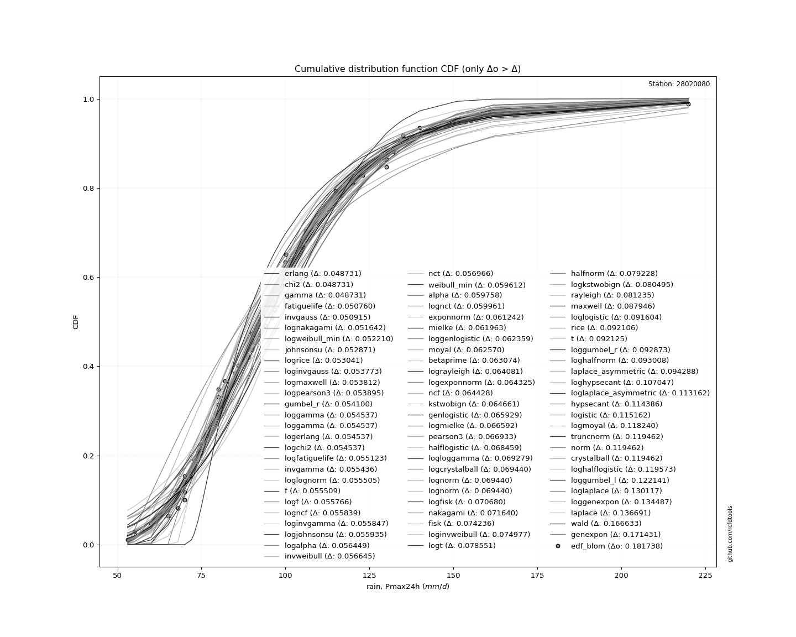</img>

</div>


**6.3. Best fit**

<div align="center">

|   id |   station | empirical_dist   | p_dist   |     delta |   deltao | eval   |   fit |   n |   best_fit |   best_fit_sort |
|-----:|----------:|:-----------------|:---------|----------:|---------:|:-------|------:|----:|-----------:|----------------:|
|    0 |  28020080 | edf_blom         | erlang   | 0.0487306 | 0.181738 | Δo > Δ |     1 |  56 |          1 |               1 |

</div>


<div align="center">

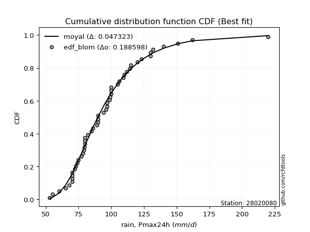</img>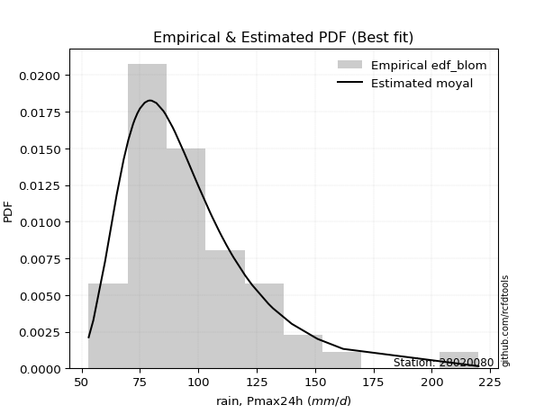</img>

</div>


### 7. EDF Tukey (1962)

In hydrology, the Tukey formula is used as a plotting position formula to estimate the empirical probability or frequency of a flood event (or other hydrological data). The formula parameter is given as _c=0.333_ (or 1/3).

<div align="center">


$P=(m-c)/(n+1-2c)$


</div>


**7.1. Empirical values**

<div align="center">

|                | 0                    | 1                    | 2                    | 3                  | 4                   | 5                   | 6                   | 7                   | 8                   | 9                   | 10                 | 11                  | 12                  | 13                  | 14                 | 15                 | 16                 | 17                 | 18                  | 19                  | 20                 | 21                  | 22                  | 23                  | 24                 | 25                 | 26                  | 27                 | 28                 | 29                 | 30                 | 31                 | 32                 | 33                 | 34                 | 35                 | 36                 | 37                 | 38                 | 39                 | 40                 | 41                 | 42                | 43                 | 44                 | 45                 | 46                 | 47                 | 48                | 49                 | 50                 | 51                 | 52                 | 53                 | 54                 | 55                 |
|:---------------|:---------------------|:---------------------|:---------------------|:-------------------|:--------------------|:--------------------|:--------------------|:--------------------|:--------------------|:--------------------|:-------------------|:--------------------|:--------------------|:--------------------|:-------------------|:-------------------|:-------------------|:-------------------|:--------------------|:--------------------|:-------------------|:--------------------|:--------------------|:--------------------|:-------------------|:-------------------|:--------------------|:-------------------|:-------------------|:-------------------|:-------------------|:-------------------|:-------------------|:-------------------|:-------------------|:-------------------|:-------------------|:-------------------|:-------------------|:-------------------|:-------------------|:-------------------|:------------------|:-------------------|:-------------------|:-------------------|:-------------------|:-------------------|:------------------|:-------------------|:-------------------|:-------------------|:-------------------|:-------------------|:-------------------|:-------------------|
| date           | 1960                 | 1974                 | 1982                 | 1997               | 2009                | 1990                | 1989                | 1991                | 2012                | 1964                | 1968               | 1959                | 1988                | 1992                | 1979               | 1963               | 1987               | 1994               | 1986                | 1971                | 1976               | 2013                | 2015                | 2004                | 1981               | 1999               | 1980                | 2002               | 1973               | 1965               | 2006               | 2019               | 1969               | 1972               | 2007               | 1970               | 1984               | 2020               | 2010               | 1983               | 2003               | 2001               | 1993              | 1962               | 1995               | 2000               | 1996               | 1975               | 2014              | 2011               | 2021               | 2017               | 1998               | 2005               | 1985               | 2008               |
| x              | 53.0                 | 55.0                 | 60.0                 | 65.0               | 68.0                | 70.0                | 70.0                | 70.0                | 70.0                | 72.0                | 72.72167244        | 73.86977315         | 75.0                | 77.0                | 78.44364045        | 79.0               | 79.27108814        | 80.0               | 80.0                | 80.0                | 82.0               | 85.0                | 86.0                | 89.0                | 90.0               | 90.0               | 90.0                | 94.0               | 96.0               | 96.79157548        | 97.0               | 97.0               | 99.0               | 100.0              | 100.0              | 100.0              | 100.05888838678571 | 105.0              | 105.0              | 106.0              | 109.0              | 110.0              | 112.0             | 114.0              | 115.0              | 120.0              | 123.0              | 130.0              | 130.0             | 132.0              | 134.0              | 135.0              | 140.0              | 151.0              | 162.0              | 220.0              |
| m              | 1                    | 2                    | 3                    | 4                  | 5                   | 6                   | 7                   | 8                   | 9                   | 10                  | 11                 | 12                  | 13                  | 14                  | 15                 | 16                 | 17                 | 18                 | 19                  | 20                  | 21                 | 22                  | 23                  | 24                  | 25                 | 26                 | 27                  | 28                 | 29                 | 30                 | 31                 | 32                 | 33                 | 34                 | 35                 | 36                 | 37                 | 38                 | 39                 | 40                 | 41                 | 42                 | 43                | 44                 | 45                 | 46                 | 47                 | 48                 | 49                | 50                 | 51                 | 52                 | 53                 | 54                 | 55                 | 56                 |
| empirical_dist | edf_tukey            | edf_tukey            | edf_tukey            | edf_tukey          | edf_tukey           | edf_tukey           | edf_tukey           | edf_tukey           | edf_tukey           | edf_tukey           | edf_tukey          | edf_tukey           | edf_tukey           | edf_tukey           | edf_tukey          | edf_tukey          | edf_tukey          | edf_tukey          | edf_tukey           | edf_tukey           | edf_tukey          | edf_tukey           | edf_tukey           | edf_tukey           | edf_tukey          | edf_tukey          | edf_tukey           | edf_tukey          | edf_tukey          | edf_tukey          | edf_tukey          | edf_tukey          | edf_tukey          | edf_tukey          | edf_tukey          | edf_tukey          | edf_tukey          | edf_tukey          | edf_tukey          | edf_tukey          | edf_tukey          | edf_tukey          | edf_tukey         | edf_tukey          | edf_tukey          | edf_tukey          | edf_tukey          | edf_tukey          | edf_tukey         | edf_tukey          | edf_tukey          | edf_tukey          | edf_tukey          | edf_tukey          | edf_tukey          | edf_tukey          |
| empirical      | 0.011834319526627219 | 0.029585798816568046 | 0.047337278106508875 | 0.0650887573964497 | 0.08284023668639054 | 0.10059171597633136 | 0.11834319526627218 | 0.13609467455621302 | 0.15384615384615385 | 0.17159763313609466 | 0.1893491124260355 | 0.20710059171597633 | 0.22485207100591717 | 0.24260355029585798 | 0.2603550295857988 | 0.2781065088757396 | 0.2958579881656805 | 0.3136094674556213 | 0.33136094674556216 | 0.34911242603550297 | 0.3668639053254438 | 0.38461538461538464 | 0.40236686390532544 | 0.42011834319526625 | 0.4378698224852071 | 0.4556213017751479 | 0.47337278106508873 | 0.4911242603550296 | 0.5088757396449705 | 0.5266272189349113 | 0.5443786982248521 | 0.5621301775147929 | 0.5798816568047337 | 0.5976331360946746 | 0.6153846153846154 | 0.6331360946745562 | 0.650887573964497  | 0.6686390532544378 | 0.6863905325443787 | 0.7041420118343196 | 0.7218934911242604 | 0.7396449704142012 | 0.757396449704142 | 0.7751479289940828 | 0.7928994082840237 | 0.8106508875739645 | 0.8284023668639053 | 0.8461538461538461 | 0.863905325443787 | 0.8816568047337278 | 0.8994082840236687 | 0.9171597633136095 | 0.9349112426035503 | 0.9526627218934911 | 0.9704142011834319 | 0.9881656804733728 |
| empirical_tr   | 1.0119760479041915   | 1.0304878048780488   | 1.049689440993789    | 1.0696202531645569 | 1.0903225806451613  | 1.1118421052631577  | 1.1342281879194631  | 1.1575342465753424  | 1.1818181818181819  | 1.207142857142857   | 1.2335766423357664 | 1.2611940298507462  | 1.2900763358778626  | 1.3203125           | 1.352              | 1.3852459016393441 | 1.4201680672268906 | 1.4568965517241381 | 1.4955752212389382  | 1.5363636363636364  | 1.5794392523364487 | 1.625               | 1.6732673267326734  | 1.7244897959183672  | 1.7789473684210526 | 1.8369565217391304 | 1.898876404494382   | 1.9651162790697676 | 2.036144578313253  | 2.1125000000000003 | 2.1948051948051948 | 2.2837837837837838 | 2.380281690140845  | 2.4852941176470593 | 2.6                | 2.7258064516129035 | 2.864406779661017  | 3.017857142857143  | 3.1886792452830184 | 3.3800000000000003 | 3.5957446808510642 | 3.840909090909091  | 4.121951219512195 | 4.447368421052631  | 4.82857142857143   | 5.281250000000001  | 5.8275862068965525 | 6.5                | 7.347826086956521 | 8.449999999999996  | 9.941176470588239  | 12.071428571428575 | 15.363636363636363 | 21.124999999999993 | 33.799999999999955 | 84.50000000000036  |

</div>


**7.2. Kolmogorov-Smirnov fit test (sorted by Δ)**


<div align="center">

|                | 0                   | 1                    | 2                    | 3                    | 4                  | 5                   | 6                   | 7                   | 8                    | 9                   | 10                  | 11                  | 12                  | 13                 | 14                 | 15                 | 16                  | 17                   | 18                  | 19                  | 20                   | 21                 | 22                  | 23                  | 24                  | 25                  | 26                   | 27                  | 28                  | 29                   | 30                   | 31                   | 32                   | 33                 | 34                  | 35                  | 36                  | 37                  | 38                  | 39                  | 40                  | 41                  | 42                  | 43                  | 44                  | 45                  | 46                  | 47                  | 48                  | 49                  | 50                  | 51                  | 52                  | 53                  | 54                  | 55                 | 56                  | 57                  | 58                  | 59                  | 60                  | 61                  | 62                  | 63                  | 64                    | 65                  | 66                  | 67                  | 68                  | 69                 | 70                  | 71                 | 72                  | 73                 | 74                 | 75                 | 76                 | 77                  | 78                  | 79                  | 80                  | 81                  | 82                  | 83                  | 84                  | 85                  | 86                 | 87                 |
|:---------------|:--------------------|:---------------------|:---------------------|:---------------------|:-------------------|:--------------------|:--------------------|:--------------------|:---------------------|:--------------------|:--------------------|:--------------------|:--------------------|:-------------------|:-------------------|:-------------------|:--------------------|:---------------------|:--------------------|:--------------------|:---------------------|:-------------------|:--------------------|:--------------------|:--------------------|:--------------------|:---------------------|:--------------------|:--------------------|:---------------------|:---------------------|:---------------------|:---------------------|:-------------------|:--------------------|:--------------------|:--------------------|:--------------------|:--------------------|:--------------------|:--------------------|:--------------------|:--------------------|:--------------------|:--------------------|:--------------------|:--------------------|:--------------------|:--------------------|:--------------------|:--------------------|:--------------------|:--------------------|:--------------------|:--------------------|:-------------------|:--------------------|:--------------------|:--------------------|:--------------------|:--------------------|:--------------------|:--------------------|:--------------------|:----------------------|:--------------------|:--------------------|:--------------------|:--------------------|:-------------------|:--------------------|:-------------------|:--------------------|:-------------------|:-------------------|:-------------------|:-------------------|:--------------------|:--------------------|:--------------------|:--------------------|:--------------------|:--------------------|:--------------------|:--------------------|:--------------------|:-------------------|:-------------------|
| station        | 28020080            | 28020080             | 28020080             | 28020080             | 28020080           | 28020080            | 28020080            | 28020080            | 28020080             | 28020080            | 28020080            | 28020080            | 28020080            | 28020080           | 28020080           | 28020080           | 28020080            | 28020080             | 28020080            | 28020080            | 28020080             | 28020080           | 28020080            | 28020080            | 28020080            | 28020080            | 28020080             | 28020080            | 28020080            | 28020080             | 28020080             | 28020080             | 28020080             | 28020080           | 28020080            | 28020080            | 28020080            | 28020080            | 28020080            | 28020080            | 28020080            | 28020080            | 28020080            | 28020080            | 28020080            | 28020080            | 28020080            | 28020080            | 28020080            | 28020080            | 28020080            | 28020080            | 28020080            | 28020080            | 28020080            | 28020080           | 28020080            | 28020080            | 28020080            | 28020080            | 28020080            | 28020080            | 28020080            | 28020080            | 28020080              | 28020080            | 28020080            | 28020080            | 28020080            | 28020080           | 28020080            | 28020080           | 28020080            | 28020080           | 28020080           | 28020080           | 28020080           | 28020080            | 28020080            | 28020080            | 28020080            | 28020080            | 28020080            | 28020080            | 28020080            | 28020080            | 28020080           | 28020080           |
| empirical_dist | edf_tukey           | edf_tukey            | edf_tukey            | edf_tukey            | edf_tukey          | edf_tukey           | edf_tukey           | edf_tukey           | edf_tukey            | edf_tukey           | edf_tukey           | edf_tukey           | edf_tukey           | edf_tukey          | edf_tukey          | edf_tukey          | edf_tukey           | edf_tukey            | edf_tukey           | edf_tukey           | edf_tukey            | edf_tukey          | edf_tukey           | edf_tukey           | edf_tukey           | edf_tukey           | edf_tukey            | edf_tukey           | edf_tukey           | edf_tukey            | edf_tukey            | edf_tukey            | edf_tukey            | edf_tukey          | edf_tukey           | edf_tukey           | edf_tukey           | edf_tukey           | edf_tukey           | edf_tukey           | edf_tukey           | edf_tukey           | edf_tukey           | edf_tukey           | edf_tukey           | edf_tukey           | edf_tukey           | edf_tukey           | edf_tukey           | edf_tukey           | edf_tukey           | edf_tukey           | edf_tukey           | edf_tukey           | edf_tukey           | edf_tukey          | edf_tukey           | edf_tukey           | edf_tukey           | edf_tukey           | edf_tukey           | edf_tukey           | edf_tukey           | edf_tukey           | edf_tukey             | edf_tukey           | edf_tukey           | edf_tukey           | edf_tukey           | edf_tukey          | edf_tukey           | edf_tukey          | edf_tukey           | edf_tukey          | edf_tukey          | edf_tukey          | edf_tukey          | edf_tukey           | edf_tukey           | edf_tukey           | edf_tukey           | edf_tukey           | edf_tukey           | edf_tukey           | edf_tukey           | edf_tukey           | edf_tukey          | edf_tukey          |
| p_dist         | gamma               | chi2                 | erlang               | fatiguelife          | invgauss           | logweibull_min      | lognakagami         | johnsonsu           | logrice              | logmaxwell          | loginvgauss         | logpearson3         | gumbel_r            | loggamma           | loggamma           | logerlang          | logchi2             | logfatiguelife       | invgamma            | loglognorm          | f                    | logf               | logncf              | loginvgamma         | logjohnsonsu        | logalpha            | invweibull           | nct                 | weibull_min         | alpha                | lognct               | exponnorm            | mielke               | moyal              | loggenlogistic      | betaprime           | lograyleigh         | logexponnorm        | ncf                 | kstwobign           | genlogistic         | logmielke           | pearson3            | halflogistic        | logloggamma         | logcrystalball      | lognorm             | lognorm             | logfisk             | nakagami            | fisk                | loginvweibull       | halfnorm            | logt                | logkstwobign        | rayleigh           | maxwell             | t                   | loglogistic         | rice                | loggumbel_r         | loghalfnorm         | laplace_asymmetric  | loghypsecant        | loglaplace_asymmetric | hypsecant           | logistic            | logmoyal            | truncnorm           | norm               | crystalball         | loghalflogistic    | loggumbel_l         | loglaplace         | loggenexpon        | laplace            | wald               | genexpon            | gumbel_l            | logwald             | logbetaprime        | expon               | loggompertz         | gibrat              | loggibrat           | logtruncnorm        | logexpon           | gompertz           |
| delta          | 0.04835389715323146 | 0.048354336059718506 | 0.048354438743537786 | 0.050983885183695565 | 0.0511384601265894 | 0.05161829674887593 | 0.05186561578805976 | 0.05309494490837097 | 0.053264985757235705 | 0.05382558664550485 | 0.05399678229126886 | 0.05411879595778152 | 0.05432374361910164 | 0.0547605388660003 | 0.0547605388660003 | 0.0547605422146657 | 0.05476056161801146 | 0.055347032215294245 | 0.05565969356990502 | 0.05572843046122594 | 0.055732188555870255 | 0.0559891985429542 | 0.05606265604499261 | 0.05607085600916367 | 0.05615814677292297 | 0.05667246173274121 | 0.056868821688910554 | 0.05718961892469321 | 0.05983600300528136 | 0.059981563880170397 | 0.060184954394881696 | 0.061255466686546356 | 0.062186556401384596 | 0.0625827145529293 | 0.06258292846171681 | 0.06329783919053156 | 0.06409414590904772 | 0.06454808163751585 | 0.06465119205265235 | 0.06488457505677475 | 0.06615223051658131 | 0.06681505354085931 | 0.06694612643357012 | 0.06847175440407471 | 0.06950253824906988 | 0.06966306231559427 | 0.06966339085466966 | 0.06966339085466966 | 0.07090349599765772 | 0.07141662351789813 | 0.07446002714727201 | 0.07499032394054805 | 0.07863660124770071 | 0.07877404645913277 | 0.08050788335963877 | 0.0806429586458096 | 0.08772196880328564 | 0.09153289414232572 | 0.09182737252776502 | 0.09188235261785116 | 0.09288604844519865 | 0.09302073765870111 | 0.09430090354169585 | 0.10727091505941494 | 0.11338599023696189   | 0.11460910620708134 | 0.11493862598215099 | 0.11825302725307696 | 0.11923850301730099 | 0.1192385225136755 | 0.11923853031480713 | 0.1195860228974529 | 0.12191794363973696 | 0.1303404616692196 | 0.1338954146059132 | 0.1369142657930513 | 0.1670929657678111 | 0.17083962706590466 | 0.18793942305569689 | 0.19466501409799172 | 0.20633844922591132 | 0.21555792434211457 | 0.22388989423422762 | 0.22652793227707985 | 0.23577190918881438 | 0.27453866672086413 | 0.2842681583960569 | 0.9703851188079153 |
| deltao         | 0.1817376445004486  | 0.1817376445004486   | 0.1817376445004486   | 0.1817376445004486   | 0.1817376445004486 | 0.1817376445004486  | 0.1817376445004486  | 0.1817376445004486  | 0.1817376445004486   | 0.1817376445004486  | 0.1817376445004486  | 0.1817376445004486  | 0.1817376445004486  | 0.1817376445004486 | 0.1817376445004486 | 0.1817376445004486 | 0.1817376445004486  | 0.1817376445004486   | 0.1817376445004486  | 0.1817376445004486  | 0.1817376445004486   | 0.1817376445004486 | 0.1817376445004486  | 0.1817376445004486  | 0.1817376445004486  | 0.1817376445004486  | 0.1817376445004486   | 0.1817376445004486  | 0.1817376445004486  | 0.1817376445004486   | 0.1817376445004486   | 0.1817376445004486   | 0.1817376445004486   | 0.1817376445004486 | 0.1817376445004486  | 0.1817376445004486  | 0.1817376445004486  | 0.1817376445004486  | 0.1817376445004486  | 0.1817376445004486  | 0.1817376445004486  | 0.1817376445004486  | 0.1817376445004486  | 0.1817376445004486  | 0.1817376445004486  | 0.1817376445004486  | 0.1817376445004486  | 0.1817376445004486  | 0.1817376445004486  | 0.1817376445004486  | 0.1817376445004486  | 0.1817376445004486  | 0.1817376445004486  | 0.1817376445004486  | 0.1817376445004486  | 0.1817376445004486 | 0.1817376445004486  | 0.1817376445004486  | 0.1817376445004486  | 0.1817376445004486  | 0.1817376445004486  | 0.1817376445004486  | 0.1817376445004486  | 0.1817376445004486  | 0.1817376445004486    | 0.1817376445004486  | 0.1817376445004486  | 0.1817376445004486  | 0.1817376445004486  | 0.1817376445004486 | 0.1817376445004486  | 0.1817376445004486 | 0.1817376445004486  | 0.1817376445004486 | 0.1817376445004486 | 0.1817376445004486 | 0.1817376445004486 | 0.1817376445004486  | 0.1817376445004486  | 0.1817376445004486  | 0.1817376445004486  | 0.1817376445004486  | 0.1817376445004486  | 0.1817376445004486  | 0.1817376445004486  | 0.1817376445004486  | 0.1817376445004486 | 0.1817376445004486 |
| eval           | Δo > Δ              | Δo > Δ               | Δo > Δ               | Δo > Δ               | Δo > Δ             | Δo > Δ              | Δo > Δ              | Δo > Δ              | Δo > Δ               | Δo > Δ              | Δo > Δ              | Δo > Δ              | Δo > Δ              | Δo > Δ             | Δo > Δ             | Δo > Δ             | Δo > Δ              | Δo > Δ               | Δo > Δ              | Δo > Δ              | Δo > Δ               | Δo > Δ             | Δo > Δ              | Δo > Δ              | Δo > Δ              | Δo > Δ              | Δo > Δ               | Δo > Δ              | Δo > Δ              | Δo > Δ               | Δo > Δ               | Δo > Δ               | Δo > Δ               | Δo > Δ             | Δo > Δ              | Δo > Δ              | Δo > Δ              | Δo > Δ              | Δo > Δ              | Δo > Δ              | Δo > Δ              | Δo > Δ              | Δo > Δ              | Δo > Δ              | Δo > Δ              | Δo > Δ              | Δo > Δ              | Δo > Δ              | Δo > Δ              | Δo > Δ              | Δo > Δ              | Δo > Δ              | Δo > Δ              | Δo > Δ              | Δo > Δ              | Δo > Δ             | Δo > Δ              | Δo > Δ              | Δo > Δ              | Δo > Δ              | Δo > Δ              | Δo > Δ              | Δo > Δ              | Δo > Δ              | Δo > Δ                | Δo > Δ              | Δo > Δ              | Δo > Δ              | Δo > Δ              | Δo > Δ             | Δo > Δ              | Δo > Δ             | Δo > Δ              | Δo > Δ             | Δo > Δ             | Δo > Δ             | Δo > Δ             | Δo > Δ              | Δo <= Δ             | Δo <= Δ             | Δo <= Δ             | Δo <= Δ             | Δo <= Δ             | Δo <= Δ             | Δo <= Δ             | Δo <= Δ             | Δo <= Δ            | Δo <= Δ            |
| fit            | 1                   | 1                    | 1                    | 1                    | 1                  | 1                   | 1                   | 1                   | 1                    | 1                   | 1                   | 1                   | 1                   | 1                  | 1                  | 1                  | 1                   | 1                    | 1                   | 1                   | 1                    | 1                  | 1                   | 1                   | 1                   | 1                   | 1                    | 1                   | 1                   | 1                    | 1                    | 1                    | 1                    | 1                  | 1                   | 1                   | 1                   | 1                   | 1                   | 1                   | 1                   | 1                   | 1                   | 1                   | 1                   | 1                   | 1                   | 1                   | 1                   | 1                   | 1                   | 1                   | 1                   | 1                   | 1                   | 1                  | 1                   | 1                   | 1                   | 1                   | 1                   | 1                   | 1                   | 1                   | 1                     | 1                   | 1                   | 1                   | 1                   | 1                  | 1                   | 1                  | 1                   | 1                  | 1                  | 1                  | 1                  | 1                   | 0                   | 0                   | 0                   | 0                   | 0                   | 0                   | 0                   | 0                   | 0                  | 0                  |
| n              | 56                  | 56                   | 56                   | 56                   | 56                 | 56                  | 56                  | 56                  | 56                   | 56                  | 56                  | 56                  | 56                  | 56                 | 56                 | 56                 | 56                  | 56                   | 56                  | 56                  | 56                   | 56                 | 56                  | 56                  | 56                  | 56                  | 56                   | 56                  | 56                  | 56                   | 56                   | 56                   | 56                   | 56                 | 56                  | 56                  | 56                  | 56                  | 56                  | 56                  | 56                  | 56                  | 56                  | 56                  | 56                  | 56                  | 56                  | 56                  | 56                  | 56                  | 56                  | 56                  | 56                  | 56                  | 56                  | 56                 | 56                  | 56                  | 56                  | 56                  | 56                  | 56                  | 56                  | 56                  | 56                    | 56                  | 56                  | 56                  | 56                  | 56                 | 56                  | 56                 | 56                  | 56                 | 56                 | 56                 | 56                 | 56                  | 56                  | 56                  | 56                  | 56                  | 56                  | 56                  | 56                  | 56                  | 56                 | 56                 |
| best_fit       | 1                   | 0                    | 0                    | 0                    | 0                  | 0                   | 0                   | 0                   | 0                    | 0                   | 0                   | 0                   | 0                   | 0                  | 0                  | 0                  | 0                   | 0                    | 0                   | 0                   | 0                    | 0                  | 0                   | 0                   | 0                   | 0                   | 0                    | 0                   | 0                   | 0                    | 0                    | 0                    | 0                    | 0                  | 0                   | 0                   | 0                   | 0                   | 0                   | 0                   | 0                   | 0                   | 0                   | 0                   | 0                   | 0                   | 0                   | 0                   | 0                   | 0                   | 0                   | 0                   | 0                   | 0                   | 0                   | 0                  | 0                   | 0                   | 0                   | 0                   | 0                   | 0                   | 0                   | 0                   | 0                     | 0                   | 0                   | 0                   | 0                   | 0                  | 0                   | 0                  | 0                   | 0                  | 0                  | 0                  | 0                  | 0                   | 0                   | 0                   | 0                   | 0                   | 0                   | 0                   | 0                   | 0                   | 0                  | 0                  |
| best_fit_sort  | 1                   | 2                    | 3                    | 4                    | 5                  | 6                   | 7                   | 8                   | 9                    | 10                  | 11                  | 12                  | 13                  | 14                 | 15                 | 16                 | 17                  | 18                   | 19                  | 20                  | 21                   | 22                 | 23                  | 24                  | 25                  | 26                  | 27                   | 28                  | 29                  | 30                   | 31                   | 32                   | 33                   | 34                 | 35                  | 36                  | 37                  | 38                  | 39                  | 40                  | 41                  | 42                  | 43                  | 44                  | 45                  | 46                  | 47                  | 48                  | 49                  | 50                  | 51                  | 52                  | 53                  | 54                  | 55                  | 56                 | 57                  | 58                  | 59                  | 60                  | 61                  | 62                  | 63                  | 64                  | 65                    | 66                  | 67                  | 68                  | 69                  | 70                 | 71                  | 72                 | 73                  | 74                 | 75                 | 76                 | 77                 | 78                  | 79                  | 80                  | 81                  | 82                  | 83                  | 84                  | 85                  | 86                  | 87                 | 88                 |

</div>


<div align="center">

</img>

</div>


**7.3. Best fit**

<div align="center">

|   id |   station | empirical_dist   | p_dist   |     delta |   deltao | eval   |   fit |   n |   best_fit |   best_fit_sort |
|-----:|----------:|:-----------------|:---------|----------:|---------:|:-------|------:|----:|-----------:|----------------:|
|    0 |  28020080 | edf_tukey        | gamma    | 0.0483539 | 0.181738 | Δo > Δ |     1 |  56 |          1 |               1 |

</div>


<div align="center">

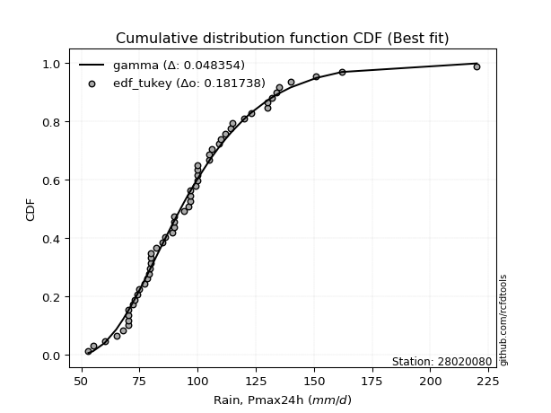</img>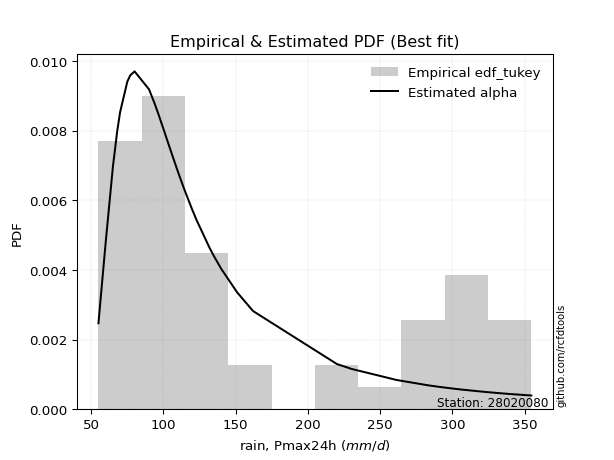</img>

</div>


### 8. EDF Gringorten (1963)

Gringorten plotting position formula is essential for estimating the probability and return periods of extreme events like floods and heavy rainfall. The constant _a=0.44_.

<div align="center">


$P=(m-a)/(n+1-2a)$


</div>


**8.1. Empirical values**

<div align="center">

|                | 0                    | 1                    | 2                    | 3                   | 4                   | 5                   | 6                   | 7                  | 8                   | 9                   | 10                  | 11                  | 12                  | 13                  | 14                 | 15                  | 16                  | 17                  | 18                  | 19                  | 20                  | 21                 | 22                  | 23                  | 24                  | 25                  | 26                  | 27                  | 28                 | 29                 | 30                 | 31                 | 32                 | 33                 | 34                 | 35                 | 36                 | 37                 | 38                 | 39                 | 40                 | 41                 | 42                 | 43                 | 44                 | 45                 | 46                 | 47                 | 48                | 49                 | 50                 | 51                 | 52                 | 53                 | 54                 | 55                 |
|:---------------|:---------------------|:---------------------|:---------------------|:--------------------|:--------------------|:--------------------|:--------------------|:-------------------|:--------------------|:--------------------|:--------------------|:--------------------|:--------------------|:--------------------|:-------------------|:--------------------|:--------------------|:--------------------|:--------------------|:--------------------|:--------------------|:-------------------|:--------------------|:--------------------|:--------------------|:--------------------|:--------------------|:--------------------|:-------------------|:-------------------|:-------------------|:-------------------|:-------------------|:-------------------|:-------------------|:-------------------|:-------------------|:-------------------|:-------------------|:-------------------|:-------------------|:-------------------|:-------------------|:-------------------|:-------------------|:-------------------|:-------------------|:-------------------|:------------------|:-------------------|:-------------------|:-------------------|:-------------------|:-------------------|:-------------------|:-------------------|
| date           | 1960                 | 1974                 | 1982                 | 1997                | 2009                | 1990                | 1989                | 1991               | 2012                | 1964                | 1968                | 1959                | 1988                | 1992                | 1979               | 1963                | 1987                | 1994                | 1986                | 1971                | 1976                | 2013               | 2015                | 2004                | 1981                | 1999                | 1980                | 2002                | 1973               | 1965               | 2006               | 2019               | 1969               | 1972               | 2007               | 1970               | 1984               | 2020               | 2010               | 1983               | 2003               | 2001               | 1993               | 1962               | 1995               | 2000               | 1996               | 1975               | 2014              | 2011               | 2021               | 2017               | 1998               | 2005               | 1985               | 2008               |
| x              | 53.0                 | 55.0                 | 60.0                 | 65.0                | 68.0                | 70.0                | 70.0                | 70.0               | 70.0                | 72.0                | 72.72167244         | 73.86977315         | 75.0                | 77.0                | 78.44364045        | 79.0                | 79.27108814         | 80.0                | 80.0                | 80.0                | 82.0                | 85.0               | 86.0                | 89.0                | 90.0                | 90.0                | 90.0                | 94.0                | 96.0               | 96.79157548        | 97.0               | 97.0               | 99.0               | 100.0              | 100.0              | 100.0              | 100.05888838678571 | 105.0              | 105.0              | 106.0              | 109.0              | 110.0              | 112.0              | 114.0              | 115.0              | 120.0              | 123.0              | 130.0              | 130.0             | 132.0              | 134.0              | 135.0              | 140.0              | 151.0              | 162.0              | 220.0              |
| m              | 1                    | 2                    | 3                    | 4                   | 5                   | 6                   | 7                   | 8                  | 9                   | 10                  | 11                  | 12                  | 13                  | 14                  | 15                 | 16                  | 17                  | 18                  | 19                  | 20                  | 21                  | 22                 | 23                  | 24                  | 25                  | 26                  | 27                  | 28                  | 29                 | 30                 | 31                 | 32                 | 33                 | 34                 | 35                 | 36                 | 37                 | 38                 | 39                 | 40                 | 41                 | 42                 | 43                 | 44                 | 45                 | 46                 | 47                 | 48                 | 49                | 50                 | 51                 | 52                 | 53                 | 54                 | 55                 | 56                 |
| empirical_dist | edf_gringorten       | edf_gringorten       | edf_gringorten       | edf_gringorten      | edf_gringorten      | edf_gringorten      | edf_gringorten      | edf_gringorten     | edf_gringorten      | edf_gringorten      | edf_gringorten      | edf_gringorten      | edf_gringorten      | edf_gringorten      | edf_gringorten     | edf_gringorten      | edf_gringorten      | edf_gringorten      | edf_gringorten      | edf_gringorten      | edf_gringorten      | edf_gringorten     | edf_gringorten      | edf_gringorten      | edf_gringorten      | edf_gringorten      | edf_gringorten      | edf_gringorten      | edf_gringorten     | edf_gringorten     | edf_gringorten     | edf_gringorten     | edf_gringorten     | edf_gringorten     | edf_gringorten     | edf_gringorten     | edf_gringorten     | edf_gringorten     | edf_gringorten     | edf_gringorten     | edf_gringorten     | edf_gringorten     | edf_gringorten     | edf_gringorten     | edf_gringorten     | edf_gringorten     | edf_gringorten     | edf_gringorten     | edf_gringorten    | edf_gringorten     | edf_gringorten     | edf_gringorten     | edf_gringorten     | edf_gringorten     | edf_gringorten     | edf_gringorten     |
| empirical      | 0.009978617248752675 | 0.027797576621525304 | 0.045616535994297935 | 0.06343549536707056 | 0.08125445473984319 | 0.09907341411261582 | 0.11689237348538845 | 0.1347113328581611 | 0.15253029223093373 | 0.17034925160370637 | 0.18816821097647898 | 0.20598717034925162 | 0.22380612972202427 | 0.24162508909479688 | 0.2594440484675695 | 0.27726300784034213 | 0.29508196721311475 | 0.31290092658588736 | 0.33071988595866003 | 0.34853884533143265 | 0.36635780470420526 | 0.3841767640769779 | 0.40199572344975054 | 0.41981468282252316 | 0.43763364219529577 | 0.45545260156806844 | 0.47327156094084105 | 0.49109052031361367 | 0.5089094796863863 | 0.5267284390591589 | 0.5445473984319316 | 0.5623663578047042 | 0.5801853171774769 | 0.5980042765502496 | 0.6158232359230221 | 0.6336421952957948 | 0.6514611546685675 | 0.66928011404134   | 0.6870990734141127 | 0.7049180327868854 | 0.7227369921596579 | 0.7405559515324306 | 0.7583749109052033 | 0.7761938702779758 | 0.7940128296507485 | 0.8118317890235212 | 0.8296507483962937 | 0.8474697077690664 | 0.865288667141839 | 0.8831076265146116 | 0.9009265858873843 | 0.9187455452601568 | 0.9365645046329295 | 0.9543834640057022 | 0.9722024233784747 | 0.9900213827512474 |
| empirical_tr   | 1.0100791936645068   | 1.028592375366569    | 1.0477968633308439   | 1.0677321156773212  | 1.0884406516679597  | 1.1099683544303798  | 1.1323648103309119  | 1.1556836902800658 | 1.1799831791421362  | 1.2053264604810998  | 1.231782265144864   | 1.2594254937163376  | 1.2883379247015612  | 1.318609022556391   | 1.3503368623676613 | 1.383629191321499   | 1.4186046511627908  | 1.4553941908713692  | 1.4941427050053246  | 1.5350109409190371  | 1.5781777277840272  | 1.6238425925925926 | 1.67222884386174    | 1.7235872235872234  | 1.7782002534854244  | 1.8363874345549738  | 1.89851150202977    | 1.964985994397759   | 2.0362844702467346 | 2.1129518072289155 | 2.195618153364632  | 2.2850162866449515 | 2.382003395585739  | 2.48758865248227   | 2.6029684601113177 | 2.729571984435798  | 2.869120654396729  | 3.0237068965517246 | 3.195899772209568  | 3.38888888888889   | 3.60668380462725   | 3.854395604395606  | 4.13864306784661   | 4.468152866242039  | 4.854671280276818  | 5.314393939393943  | 5.870292887029291  | 6.556074766355144  | 7.42328042328043  | 8.554878048780493  | 10.093525179856126 | 12.307017543859654 | 15.764044943820242 | 21.921875000000053 | 35.97435897435902  | 100.21428571428648 |

</div>


**8.2. Kolmogorov-Smirnov fit test (sorted by Δ)**


<div align="center">

|                | 0                   | 1                   | 2                   | 3                    | 4                   | 5                   | 6                   | 7                    | 8                   | 9                   | 10                 | 11                  | 12                  | 13                  | 14                  | 15                  | 16                  | 17                   | 18                 | 19                  | 20                   | 21                  | 22                  | 23                  | 24                  | 25                  | 26                   | 27                  | 28                  | 29                   | 30                   | 31                  | 32                   | 33                   | 34                  | 35                  | 36                  | 37                  | 38                  | 39                  | 40                  | 41                 | 42                  | 43                  | 44                  | 45                  | 46                  | 47                  | 48                 | 49                  | 50                  | 51                  | 52                  | 53                  | 54                  | 55                  | 56                  | 57                 | 58                  | 59                  | 60                  | 61                  | 62                  | 63                  | 64                    | 65                  | 66                  | 67                  | 68                  | 69                  | 70                  | 71                  | 72                  | 73                  | 74                  | 75                  | 76                 | 77                 | 78                  | 79                 | 80                  | 81                  | 82                  | 83                  | 84                  | 85                 | 86                  | 87                 |
|:---------------|:--------------------|:--------------------|:--------------------|:---------------------|:--------------------|:--------------------|:--------------------|:---------------------|:--------------------|:--------------------|:-------------------|:--------------------|:--------------------|:--------------------|:--------------------|:--------------------|:--------------------|:---------------------|:-------------------|:--------------------|:---------------------|:--------------------|:--------------------|:--------------------|:--------------------|:--------------------|:---------------------|:--------------------|:--------------------|:---------------------|:---------------------|:--------------------|:---------------------|:---------------------|:--------------------|:--------------------|:--------------------|:--------------------|:--------------------|:--------------------|:--------------------|:-------------------|:--------------------|:--------------------|:--------------------|:--------------------|:--------------------|:--------------------|:-------------------|:--------------------|:--------------------|:--------------------|:--------------------|:--------------------|:--------------------|:--------------------|:--------------------|:-------------------|:--------------------|:--------------------|:--------------------|:--------------------|:--------------------|:--------------------|:----------------------|:--------------------|:--------------------|:--------------------|:--------------------|:--------------------|:--------------------|:--------------------|:--------------------|:--------------------|:--------------------|:--------------------|:-------------------|:-------------------|:--------------------|:-------------------|:--------------------|:--------------------|:--------------------|:--------------------|:--------------------|:-------------------|:--------------------|:-------------------|
| station        | 28020080            | 28020080            | 28020080            | 28020080             | 28020080            | 28020080            | 28020080            | 28020080             | 28020080            | 28020080            | 28020080           | 28020080            | 28020080            | 28020080            | 28020080            | 28020080            | 28020080            | 28020080             | 28020080           | 28020080            | 28020080             | 28020080            | 28020080            | 28020080            | 28020080            | 28020080            | 28020080             | 28020080            | 28020080            | 28020080             | 28020080             | 28020080            | 28020080             | 28020080             | 28020080            | 28020080            | 28020080            | 28020080            | 28020080            | 28020080            | 28020080            | 28020080           | 28020080            | 28020080            | 28020080            | 28020080            | 28020080            | 28020080            | 28020080           | 28020080            | 28020080            | 28020080            | 28020080            | 28020080            | 28020080            | 28020080            | 28020080            | 28020080           | 28020080            | 28020080            | 28020080            | 28020080            | 28020080            | 28020080            | 28020080              | 28020080            | 28020080            | 28020080            | 28020080            | 28020080            | 28020080            | 28020080            | 28020080            | 28020080            | 28020080            | 28020080            | 28020080           | 28020080           | 28020080            | 28020080           | 28020080            | 28020080            | 28020080            | 28020080            | 28020080            | 28020080           | 28020080            | 28020080           |
| empirical_dist | edf_gringorten      | edf_gringorten      | edf_gringorten      | edf_gringorten       | edf_gringorten      | edf_gringorten      | edf_gringorten      | edf_gringorten       | edf_gringorten      | edf_gringorten      | edf_gringorten     | edf_gringorten      | edf_gringorten      | edf_gringorten      | edf_gringorten      | edf_gringorten      | edf_gringorten      | edf_gringorten       | edf_gringorten     | edf_gringorten      | edf_gringorten       | edf_gringorten      | edf_gringorten      | edf_gringorten      | edf_gringorten      | edf_gringorten      | edf_gringorten       | edf_gringorten      | edf_gringorten      | edf_gringorten       | edf_gringorten       | edf_gringorten      | edf_gringorten       | edf_gringorten       | edf_gringorten      | edf_gringorten      | edf_gringorten      | edf_gringorten      | edf_gringorten      | edf_gringorten      | edf_gringorten      | edf_gringorten     | edf_gringorten      | edf_gringorten      | edf_gringorten      | edf_gringorten      | edf_gringorten      | edf_gringorten      | edf_gringorten     | edf_gringorten      | edf_gringorten      | edf_gringorten      | edf_gringorten      | edf_gringorten      | edf_gringorten      | edf_gringorten      | edf_gringorten      | edf_gringorten     | edf_gringorten      | edf_gringorten      | edf_gringorten      | edf_gringorten      | edf_gringorten      | edf_gringorten      | edf_gringorten        | edf_gringorten      | edf_gringorten      | edf_gringorten      | edf_gringorten      | edf_gringorten      | edf_gringorten      | edf_gringorten      | edf_gringorten      | edf_gringorten      | edf_gringorten      | edf_gringorten      | edf_gringorten     | edf_gringorten     | edf_gringorten      | edf_gringorten     | edf_gringorten      | edf_gringorten      | edf_gringorten      | edf_gringorten      | edf_gringorten      | edf_gringorten     | edf_gringorten      | edf_gringorten     |
| p_dist         | erlang              | chi2                | gamma               | fatiguelife          | invgauss            | lognakagami         | johnsonsu           | logrice              | logweibull_min      | loginvgauss         | logpearson3        | gumbel_r            | logmaxwell          | loggamma            | loggamma            | logerlang           | logchi2             | logfatiguelife       | invgamma           | loglognorm          | f                    | logf                | logncf              | loginvgamma         | logjohnsonsu        | logalpha            | invweibull           | nct                 | weibull_min         | alpha                | lognct               | exponnorm           | mielke               | loggenlogistic       | moyal               | betaprime           | logexponnorm        | lograyleigh         | ncf                 | kstwobign           | genlogistic         | logmielke          | pearson3            | halflogistic        | logloggamma         | logcrystalball      | lognorm             | lognorm             | logfisk            | nakagami            | fisk                | loginvweibull       | logt                | halfnorm            | logkstwobign        | rayleigh            | maxwell             | loglogistic        | rice                | loggumbel_r         | loghalfnorm         | t                   | laplace_asymmetric  | loghypsecant        | loglaplace_asymmetric | hypsecant           | logistic            | logmoyal            | loghalflogistic     | truncnorm           | norm                | crystalball         | loggumbel_l         | loglaplace          | loggenexpon         | laplace             | wald               | genexpon           | gumbel_l            | logwald            | logbetaprime        | expon               | loggompertz         | gibrat              | loggibrat           | logtruncnorm       | logexpon            | gompertz           |
| delta          | 0.04965714780634593 | 0.04965725279830731 | 0.04965751434018513 | 0.050410304479625245 | 0.05056487942251908 | 0.05129203508398944 | 0.05252136420430065 | 0.052691405053165385 | 0.05313659861259147 | 0.05342320158719854 | 0.0535452152537112 | 0.05375016291503132 | 0.05379184660408898 | 0.05418695816192998 | 0.05418695816192998 | 0.05418696151059538 | 0.05418698091394114 | 0.054773451511223925 | 0.0550861128658347 | 0.05515484975715562 | 0.055158607851799935 | 0.05541561783888388 | 0.05548907534092229 | 0.05549727530509335 | 0.05558456606885265 | 0.05609888102867089 | 0.056295240984840234 | 0.05661603822062289 | 0.05926242230121104 | 0.059407983176100077 | 0.059611373690811376 | 0.06122172664513048 | 0.061612975697314276 | 0.062009347757646494 | 0.06254897451151342 | 0.06272425848646124 | 0.06397450093344553 | 0.06406040586763184 | 0.06407761134858203 | 0.06431099435270443 | 0.06557864981251099 | 0.066241472836789  | 0.06691238639215424 | 0.06843801436265884 | 0.06892895754499956 | 0.06908948161152395 | 0.06908981015059934 | 0.06908981015059934 | 0.0703299152935874 | 0.07199020422196856 | 0.07388644644320169 | 0.07495658389913218 | 0.07820046575506245 | 0.08015490311141625 | 0.08047414331822289 | 0.08216126050952514 | 0.08829554950735607 | 0.0912537918236947 | 0.09245593332192159 | 0.09285230840378278 | 0.09298699761728524 | 0.09305119600604127 | 0.09426716350027997 | 0.10669733435534462 | 0.11281240953289157   | 0.11403552550301102 | 0.11551220668622142 | 0.11821928721166108 | 0.11955228285603703 | 0.11981208372137142 | 0.11981210321774594 | 0.11981211101887757 | 0.12249152434380739 | 0.12976688096514927 | 0.13541371646962874 | 0.13634068508898098 | 0.1659120643182546 | 0.1723579289296202 | 0.18851300375976732 | 0.193551592731267  | 0.20785675108962687 | 0.21707622620583011 | 0.22540819609794316 | 0.22554947107601875 | 0.23479344798775328 | 0.2760569685845797 | 0.28578646025977245 | 0.9721733410029582 |
| deltao         | 0.1817376445004486  | 0.1817376445004486  | 0.1817376445004486  | 0.1817376445004486   | 0.1817376445004486  | 0.1817376445004486  | 0.1817376445004486  | 0.1817376445004486   | 0.1817376445004486  | 0.1817376445004486  | 0.1817376445004486 | 0.1817376445004486  | 0.1817376445004486  | 0.1817376445004486  | 0.1817376445004486  | 0.1817376445004486  | 0.1817376445004486  | 0.1817376445004486   | 0.1817376445004486 | 0.1817376445004486  | 0.1817376445004486   | 0.1817376445004486  | 0.1817376445004486  | 0.1817376445004486  | 0.1817376445004486  | 0.1817376445004486  | 0.1817376445004486   | 0.1817376445004486  | 0.1817376445004486  | 0.1817376445004486   | 0.1817376445004486   | 0.1817376445004486  | 0.1817376445004486   | 0.1817376445004486   | 0.1817376445004486  | 0.1817376445004486  | 0.1817376445004486  | 0.1817376445004486  | 0.1817376445004486  | 0.1817376445004486  | 0.1817376445004486  | 0.1817376445004486 | 0.1817376445004486  | 0.1817376445004486  | 0.1817376445004486  | 0.1817376445004486  | 0.1817376445004486  | 0.1817376445004486  | 0.1817376445004486 | 0.1817376445004486  | 0.1817376445004486  | 0.1817376445004486  | 0.1817376445004486  | 0.1817376445004486  | 0.1817376445004486  | 0.1817376445004486  | 0.1817376445004486  | 0.1817376445004486 | 0.1817376445004486  | 0.1817376445004486  | 0.1817376445004486  | 0.1817376445004486  | 0.1817376445004486  | 0.1817376445004486  | 0.1817376445004486    | 0.1817376445004486  | 0.1817376445004486  | 0.1817376445004486  | 0.1817376445004486  | 0.1817376445004486  | 0.1817376445004486  | 0.1817376445004486  | 0.1817376445004486  | 0.1817376445004486  | 0.1817376445004486  | 0.1817376445004486  | 0.1817376445004486 | 0.1817376445004486 | 0.1817376445004486  | 0.1817376445004486 | 0.1817376445004486  | 0.1817376445004486  | 0.1817376445004486  | 0.1817376445004486  | 0.1817376445004486  | 0.1817376445004486 | 0.1817376445004486  | 0.1817376445004486 |
| eval           | Δo > Δ              | Δo > Δ              | Δo > Δ              | Δo > Δ               | Δo > Δ              | Δo > Δ              | Δo > Δ              | Δo > Δ               | Δo > Δ              | Δo > Δ              | Δo > Δ             | Δo > Δ              | Δo > Δ              | Δo > Δ              | Δo > Δ              | Δo > Δ              | Δo > Δ              | Δo > Δ               | Δo > Δ             | Δo > Δ              | Δo > Δ               | Δo > Δ              | Δo > Δ              | Δo > Δ              | Δo > Δ              | Δo > Δ              | Δo > Δ               | Δo > Δ              | Δo > Δ              | Δo > Δ               | Δo > Δ               | Δo > Δ              | Δo > Δ               | Δo > Δ               | Δo > Δ              | Δo > Δ              | Δo > Δ              | Δo > Δ              | Δo > Δ              | Δo > Δ              | Δo > Δ              | Δo > Δ             | Δo > Δ              | Δo > Δ              | Δo > Δ              | Δo > Δ              | Δo > Δ              | Δo > Δ              | Δo > Δ             | Δo > Δ              | Δo > Δ              | Δo > Δ              | Δo > Δ              | Δo > Δ              | Δo > Δ              | Δo > Δ              | Δo > Δ              | Δo > Δ             | Δo > Δ              | Δo > Δ              | Δo > Δ              | Δo > Δ              | Δo > Δ              | Δo > Δ              | Δo > Δ                | Δo > Δ              | Δo > Δ              | Δo > Δ              | Δo > Δ              | Δo > Δ              | Δo > Δ              | Δo > Δ              | Δo > Δ              | Δo > Δ              | Δo > Δ              | Δo > Δ              | Δo > Δ             | Δo > Δ             | Δo <= Δ             | Δo <= Δ            | Δo <= Δ             | Δo <= Δ             | Δo <= Δ             | Δo <= Δ             | Δo <= Δ             | Δo <= Δ            | Δo <= Δ             | Δo <= Δ            |
| fit            | 1                   | 1                   | 1                   | 1                    | 1                   | 1                   | 1                   | 1                    | 1                   | 1                   | 1                  | 1                   | 1                   | 1                   | 1                   | 1                   | 1                   | 1                    | 1                  | 1                   | 1                    | 1                   | 1                   | 1                   | 1                   | 1                   | 1                    | 1                   | 1                   | 1                    | 1                    | 1                   | 1                    | 1                    | 1                   | 1                   | 1                   | 1                   | 1                   | 1                   | 1                   | 1                  | 1                   | 1                   | 1                   | 1                   | 1                   | 1                   | 1                  | 1                   | 1                   | 1                   | 1                   | 1                   | 1                   | 1                   | 1                   | 1                  | 1                   | 1                   | 1                   | 1                   | 1                   | 1                   | 1                     | 1                   | 1                   | 1                   | 1                   | 1                   | 1                   | 1                   | 1                   | 1                   | 1                   | 1                   | 1                  | 1                  | 0                   | 0                  | 0                   | 0                   | 0                   | 0                   | 0                   | 0                  | 0                   | 0                  |
| n              | 56                  | 56                  | 56                  | 56                   | 56                  | 56                  | 56                  | 56                   | 56                  | 56                  | 56                 | 56                  | 56                  | 56                  | 56                  | 56                  | 56                  | 56                   | 56                 | 56                  | 56                   | 56                  | 56                  | 56                  | 56                  | 56                  | 56                   | 56                  | 56                  | 56                   | 56                   | 56                  | 56                   | 56                   | 56                  | 56                  | 56                  | 56                  | 56                  | 56                  | 56                  | 56                 | 56                  | 56                  | 56                  | 56                  | 56                  | 56                  | 56                 | 56                  | 56                  | 56                  | 56                  | 56                  | 56                  | 56                  | 56                  | 56                 | 56                  | 56                  | 56                  | 56                  | 56                  | 56                  | 56                    | 56                  | 56                  | 56                  | 56                  | 56                  | 56                  | 56                  | 56                  | 56                  | 56                  | 56                  | 56                 | 56                 | 56                  | 56                 | 56                  | 56                  | 56                  | 56                  | 56                  | 56                 | 56                  | 56                 |
| best_fit       | 1                   | 0                   | 0                   | 0                    | 0                   | 0                   | 0                   | 0                    | 0                   | 0                   | 0                  | 0                   | 0                   | 0                   | 0                   | 0                   | 0                   | 0                    | 0                  | 0                   | 0                    | 0                   | 0                   | 0                   | 0                   | 0                   | 0                    | 0                   | 0                   | 0                    | 0                    | 0                   | 0                    | 0                    | 0                   | 0                   | 0                   | 0                   | 0                   | 0                   | 0                   | 0                  | 0                   | 0                   | 0                   | 0                   | 0                   | 0                   | 0                  | 0                   | 0                   | 0                   | 0                   | 0                   | 0                   | 0                   | 0                   | 0                  | 0                   | 0                   | 0                   | 0                   | 0                   | 0                   | 0                     | 0                   | 0                   | 0                   | 0                   | 0                   | 0                   | 0                   | 0                   | 0                   | 0                   | 0                   | 0                  | 0                  | 0                   | 0                  | 0                   | 0                   | 0                   | 0                   | 0                   | 0                  | 0                   | 0                  |
| best_fit_sort  | 1                   | 2                   | 3                   | 4                    | 5                   | 6                   | 7                   | 8                    | 9                   | 10                  | 11                 | 12                  | 13                  | 14                  | 15                  | 16                  | 17                  | 18                   | 19                 | 20                  | 21                   | 22                  | 23                  | 24                  | 25                  | 26                  | 27                   | 28                  | 29                  | 30                   | 31                   | 32                  | 33                   | 34                   | 35                  | 36                  | 37                  | 38                  | 39                  | 40                  | 41                  | 42                 | 43                  | 44                  | 45                  | 46                  | 47                  | 48                  | 49                 | 50                  | 51                  | 52                  | 53                  | 54                  | 55                  | 56                  | 57                  | 58                 | 59                  | 60                  | 61                  | 62                  | 63                  | 64                  | 65                    | 66                  | 67                  | 68                  | 69                  | 70                  | 71                  | 72                  | 73                  | 74                  | 75                  | 76                  | 77                 | 78                 | 79                  | 80                 | 81                  | 82                  | 83                  | 84                  | 85                  | 86                 | 87                  | 88                 |

</div>


<div align="center">

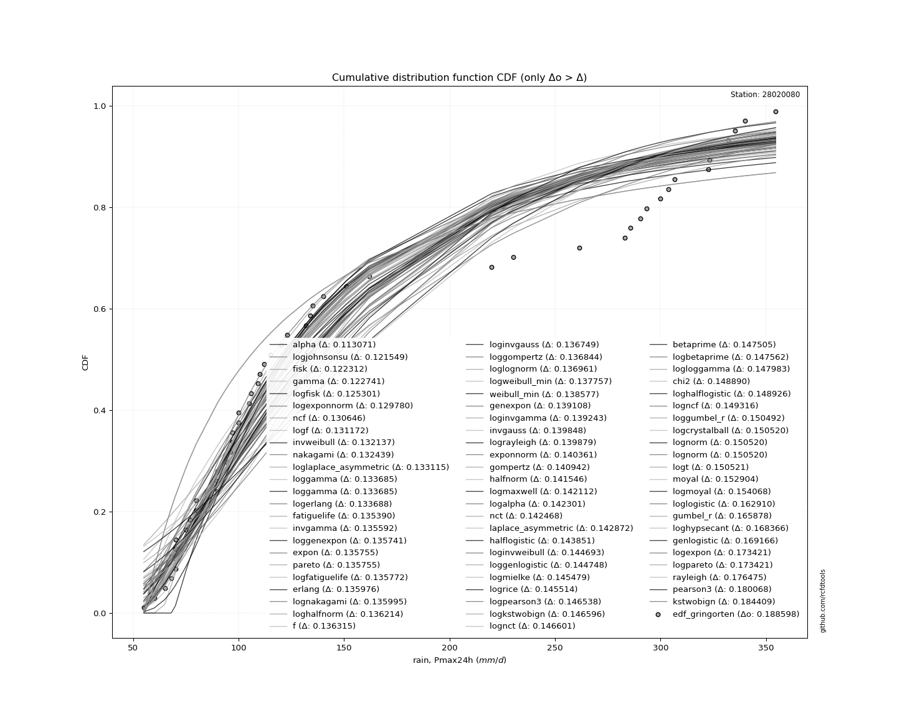</img>

</div>


**8.3. Best fit**

<div align="center">

|   id |   station | empirical_dist   | p_dist   |     delta |   deltao | eval   |   fit |   n |   best_fit |   best_fit_sort |
|-----:|----------:|:-----------------|:---------|----------:|---------:|:-------|------:|----:|-----------:|----------------:|
|    0 |  28020080 | edf_gringorten   | erlang   | 0.0496571 | 0.181738 | Δo > Δ |     1 |  56 |          1 |               1 |

</div>


<div align="center">

</img>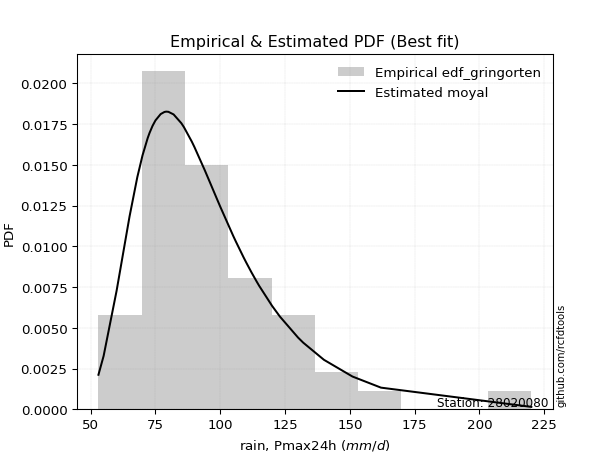</img>

</div>


### 9. EDF Filliben (1975)

The specific values of the constants (0.3175) (often denoted as $alpha$) and (0.365) are derived from a method proposed by James J. Filliben in a 1975 paper. This particular formula is the mean value of the $i$-th order statistic of the normal distribution and is considered a robust and effective plotting position formula for the normal probability plot correlation coefficient test for normality.

<div align="center">


$P=(m-0.3175)/(n+0.365)$


</div>


**9.1. Empirical values**

<div align="center">

|                | 0                   | 1                    | 2                   | 3                   | 4                   | 5                   | 6                   | 7                   | 8                   | 9                   | 10                 | 11                  | 12                  | 13                  | 14                 | 15                  | 16                  | 17                  | 18                  | 19                 | 20                 | 21                 | 22                  | 23                 | 24                 | 25                 | 26                  | 27                  | 28                 | 29                 | 30                 | 31                 | 32                 | 33                 | 34                 | 35                 | 36                 | 37                | 38                 | 39                 | 40                 | 41                 | 42                 | 43                 | 44                 | 45                 | 46                 | 47                 | 48                 | 49                 | 50                 | 51                 | 52                 | 53                 | 54                 | 55                 |
|:---------------|:--------------------|:---------------------|:--------------------|:--------------------|:--------------------|:--------------------|:--------------------|:--------------------|:--------------------|:--------------------|:-------------------|:--------------------|:--------------------|:--------------------|:-------------------|:--------------------|:--------------------|:--------------------|:--------------------|:-------------------|:-------------------|:-------------------|:--------------------|:-------------------|:-------------------|:-------------------|:--------------------|:--------------------|:-------------------|:-------------------|:-------------------|:-------------------|:-------------------|:-------------------|:-------------------|:-------------------|:-------------------|:------------------|:-------------------|:-------------------|:-------------------|:-------------------|:-------------------|:-------------------|:-------------------|:-------------------|:-------------------|:-------------------|:-------------------|:-------------------|:-------------------|:-------------------|:-------------------|:-------------------|:-------------------|:-------------------|
| date           | 1960                | 1974                 | 1982                | 1997                | 2009                | 1990                | 1989                | 1991                | 2012                | 1964                | 1968               | 1959                | 1988                | 1992                | 1979               | 1963                | 1987                | 1994                | 1986                | 1971               | 1976               | 2013               | 2015                | 2004               | 1981               | 1999               | 1980                | 2002                | 1973               | 1965               | 2006               | 2019               | 1969               | 1972               | 2007               | 1970               | 1984               | 2020              | 2010               | 1983               | 2003               | 2001               | 1993               | 1962               | 1995               | 2000               | 1996               | 1975               | 2014               | 2011               | 2021               | 2017               | 1998               | 2005               | 1985               | 2008               |
| x              | 53.0                | 55.0                 | 60.0                | 65.0                | 68.0                | 70.0                | 70.0                | 70.0                | 70.0                | 72.0                | 72.72167244        | 73.86977315         | 75.0                | 77.0                | 78.44364045        | 79.0                | 79.27108814         | 80.0                | 80.0                | 80.0               | 82.0               | 85.0               | 86.0                | 89.0               | 90.0               | 90.0               | 90.0                | 94.0                | 96.0               | 96.79157548        | 97.0               | 97.0               | 99.0               | 100.0              | 100.0              | 100.0              | 100.05888838678571 | 105.0             | 105.0              | 106.0              | 109.0              | 110.0              | 112.0              | 114.0              | 115.0              | 120.0              | 123.0              | 130.0              | 130.0              | 132.0              | 134.0              | 135.0              | 140.0              | 151.0              | 162.0              | 220.0              |
| m              | 1                   | 2                    | 3                   | 4                   | 5                   | 6                   | 7                   | 8                   | 9                   | 10                  | 11                 | 12                  | 13                  | 14                  | 15                 | 16                  | 17                  | 18                  | 19                  | 20                 | 21                 | 22                 | 23                  | 24                 | 25                 | 26                 | 27                  | 28                  | 29                 | 30                 | 31                 | 32                 | 33                 | 34                 | 35                 | 36                 | 37                 | 38                | 39                 | 40                 | 41                 | 42                 | 43                 | 44                 | 45                 | 46                 | 47                 | 48                 | 49                 | 50                 | 51                 | 52                 | 53                 | 54                 | 55                 | 56                 |
| empirical_dist | edf_filliben        | edf_filliben         | edf_filliben        | edf_filliben        | edf_filliben        | edf_filliben        | edf_filliben        | edf_filliben        | edf_filliben        | edf_filliben        | edf_filliben       | edf_filliben        | edf_filliben        | edf_filliben        | edf_filliben       | edf_filliben        | edf_filliben        | edf_filliben        | edf_filliben        | edf_filliben       | edf_filliben       | edf_filliben       | edf_filliben        | edf_filliben       | edf_filliben       | edf_filliben       | edf_filliben        | edf_filliben        | edf_filliben       | edf_filliben       | edf_filliben       | edf_filliben       | edf_filliben       | edf_filliben       | edf_filliben       | edf_filliben       | edf_filliben       | edf_filliben      | edf_filliben       | edf_filliben       | edf_filliben       | edf_filliben       | edf_filliben       | edf_filliben       | edf_filliben       | edf_filliben       | edf_filliben       | edf_filliben       | edf_filliben       | edf_filliben       | edf_filliben       | edf_filliben       | edf_filliben       | edf_filliben       | edf_filliben       | edf_filliben       |
| empirical      | 0.01210857801827375 | 0.029850084272154707 | 0.04759159052603566 | 0.06533309677991661 | 0.08307460303379757 | 0.10081610928767852 | 0.11855761554155948 | 0.13629912179544043 | 0.15404062804932137 | 0.17178213430320233 | 0.1895236405570833 | 0.20726514681096422 | 0.22500665306484519 | 0.24274815931872615 | 0.2604896655726071 | 0.27823117182648804 | 0.29597267808036903 | 0.31371418433424997 | 0.33145569058813096 | 0.3491971968420119 | 0.3669387030958928 | 0.3846802093497738 | 0.40242171560365475 | 0.4201632218575357 | 0.4379047281114167 | 0.4556462343652976 | 0.47338774061917854 | 0.49112924687305953 | 0.5088707531269405 | 0.5266122593808215 | 0.5443537656347024 | 0.5620952718885833 | 0.5798367781424643 | 0.5975782843963452 | 0.6153197906502261 | 0.6330612969041071 | 0.650802803157988  | 0.668544309411869 | 0.68628581566575   | 0.7040273219196309 | 0.7217688281735118 | 0.7395103344273928 | 0.7572518406812737 | 0.7749933469351548 | 0.7927348531890357 | 0.8104763594429166 | 0.8282178656967976 | 0.8459593719506785 | 0.8637008782045595 | 0.8814423844584405 | 0.8991838907123214 | 0.9169253969662023 | 0.9346669032200833 | 0.9524084094739642 | 0.9701499157278453 | 0.9878914219817262 |
| empirical_tr   | 1.012256992771517   | 1.0307685274082201   | 1.0499697294276533  | 1.0698998718739618  | 1.090601267353553   | 1.1121195678981897  | 1.1345041010416144  | 1.1578082473167977  | 1.1820898652545484  | 1.2074117710062657  | 1.2338422809609806 | 1.2614558272254237  | 1.290333657643221   | 1.3205646342177708  | 1.3522461464643436 | 1.3854851594666011  | 1.4203994203994206  | 1.4571188521941445  | 1.4957871691103297  | 1.5365637565596675 | 1.5796258670216492 | 1.6251711958480504 | 1.6734209159058857  | 1.7246232693337413 | 1.779057839501302  | 1.8370406583557402 | 1.8989303461635643  | 1.9651355356053342  | 2.03612390499413   | 2.11243324276211   | 2.1946850968558356 | 2.2836017421249872 | 2.380027446426686  | 2.4849553620632645 | 2.5995618586417613 | 2.725250815907167  | 2.8637114187730206 | 3.016994513582229 | 3.1876148734624623 | 3.3786902442679447 | 3.5941335883947065 | 3.8389238889834822 | 4.119495706194042  | 4.444313029765424  | 4.824737855767172  | 5.276386613620405  | 5.821327136586622  | 6.491793838180243  | 7.336804425642693  | 8.434717545828654  | 9.91904971403431   | 12.037373198077937 | 15.30617786829597  | 21.012115563839647 | 33.50074294205048  | 82.5860805860802   |

</div>


**9.2. Kolmogorov-Smirnov fit test (sorted by Δ)**


<div align="center">

|                | 0                   | 1                   | 2                    | 3                   | 4                   | 5                   | 6                   | 7                    | 8                   | 9                   | 10                  | 11                   | 12                   | 13                   | 14                   | 15                   | 16                  | 17                  | 18                  | 19                  | 20                  | 21                   | 22                   | 23                 | 24                   | 25                   | 26                  | 27                   | 28                   | 29                   | 30                  | 31                  | 32                  | 33                  | 34                  | 35                  | 36                  | 37                  | 38                  | 39                  | 40                  | 41                  | 42                  | 43                  | 44                 | 45                 | 46                  | 47                  | 48                  | 49                  | 50                  | 51                  | 52                  | 53                 | 54                  | 55                 | 56                 | 57                  | 58                  | 59                  | 60                  | 61                  | 62                  | 63                  | 64                    | 65                  | 66                  | 67                 | 68                  | 69                  | 70                 | 71                  | 72                  | 73                  | 74                  | 75                  | 76                 | 77                 | 78                  | 79                 | 80                  | 81                 | 82                  | 83                  | 84                  | 85                 | 86                  | 87                 |
|:---------------|:--------------------|:--------------------|:---------------------|:--------------------|:--------------------|:--------------------|:--------------------|:---------------------|:--------------------|:--------------------|:--------------------|:---------------------|:---------------------|:---------------------|:---------------------|:---------------------|:--------------------|:--------------------|:--------------------|:--------------------|:--------------------|:---------------------|:---------------------|:-------------------|:---------------------|:---------------------|:--------------------|:---------------------|:---------------------|:---------------------|:--------------------|:--------------------|:--------------------|:--------------------|:--------------------|:--------------------|:--------------------|:--------------------|:--------------------|:--------------------|:--------------------|:--------------------|:--------------------|:--------------------|:-------------------|:-------------------|:--------------------|:--------------------|:--------------------|:--------------------|:--------------------|:--------------------|:--------------------|:-------------------|:--------------------|:-------------------|:-------------------|:--------------------|:--------------------|:--------------------|:--------------------|:--------------------|:--------------------|:--------------------|:----------------------|:--------------------|:--------------------|:-------------------|:--------------------|:--------------------|:-------------------|:--------------------|:--------------------|:--------------------|:--------------------|:--------------------|:-------------------|:-------------------|:--------------------|:-------------------|:--------------------|:-------------------|:--------------------|:--------------------|:--------------------|:-------------------|:--------------------|:-------------------|
| station        | 28020080            | 28020080            | 28020080             | 28020080            | 28020080            | 28020080            | 28020080            | 28020080             | 28020080            | 28020080            | 28020080            | 28020080             | 28020080             | 28020080             | 28020080             | 28020080             | 28020080            | 28020080            | 28020080            | 28020080            | 28020080            | 28020080             | 28020080             | 28020080           | 28020080             | 28020080             | 28020080            | 28020080             | 28020080             | 28020080             | 28020080            | 28020080            | 28020080            | 28020080            | 28020080            | 28020080            | 28020080            | 28020080            | 28020080            | 28020080            | 28020080            | 28020080            | 28020080            | 28020080            | 28020080           | 28020080           | 28020080            | 28020080            | 28020080            | 28020080            | 28020080            | 28020080            | 28020080            | 28020080           | 28020080            | 28020080           | 28020080           | 28020080            | 28020080            | 28020080            | 28020080            | 28020080            | 28020080            | 28020080            | 28020080              | 28020080            | 28020080            | 28020080           | 28020080            | 28020080            | 28020080           | 28020080            | 28020080            | 28020080            | 28020080            | 28020080            | 28020080           | 28020080           | 28020080            | 28020080           | 28020080            | 28020080           | 28020080            | 28020080            | 28020080            | 28020080           | 28020080            | 28020080           |
| empirical_dist | edf_filliben        | edf_filliben        | edf_filliben         | edf_filliben        | edf_filliben        | edf_filliben        | edf_filliben        | edf_filliben         | edf_filliben        | edf_filliben        | edf_filliben        | edf_filliben         | edf_filliben         | edf_filliben         | edf_filliben         | edf_filliben         | edf_filliben        | edf_filliben        | edf_filliben        | edf_filliben        | edf_filliben        | edf_filliben         | edf_filliben         | edf_filliben       | edf_filliben         | edf_filliben         | edf_filliben        | edf_filliben         | edf_filliben         | edf_filliben         | edf_filliben        | edf_filliben        | edf_filliben        | edf_filliben        | edf_filliben        | edf_filliben        | edf_filliben        | edf_filliben        | edf_filliben        | edf_filliben        | edf_filliben        | edf_filliben        | edf_filliben        | edf_filliben        | edf_filliben       | edf_filliben       | edf_filliben        | edf_filliben        | edf_filliben        | edf_filliben        | edf_filliben        | edf_filliben        | edf_filliben        | edf_filliben       | edf_filliben        | edf_filliben       | edf_filliben       | edf_filliben        | edf_filliben        | edf_filliben        | edf_filliben        | edf_filliben        | edf_filliben        | edf_filliben        | edf_filliben          | edf_filliben        | edf_filliben        | edf_filliben       | edf_filliben        | edf_filliben        | edf_filliben       | edf_filliben        | edf_filliben        | edf_filliben        | edf_filliben        | edf_filliben        | edf_filliben       | edf_filliben       | edf_filliben        | edf_filliben       | edf_filliben        | edf_filliben       | edf_filliben        | edf_filliben        | edf_filliben        | edf_filliben       | edf_filliben        | edf_filliben       |
| p_dist         | gamma               | chi2                | erlang               | fatiguelife         | invgauss            | logweibull_min      | lognakagami         | johnsonsu            | logrice             | logmaxwell          | loginvgauss         | logpearson3          | gumbel_r             | loggamma             | loggamma             | logerlang            | logchi2             | logfatiguelife      | invgamma            | loglognorm          | f                   | logf                 | logncf               | loginvgamma        | logjohnsonsu         | logalpha             | invweibull          | nct                  | weibull_min          | alpha                | lognct              | exponnorm           | mielke              | moyal               | loggenlogistic      | betaprime           | lograyleigh         | logexponnorm        | ncf                 | kstwobign           | genlogistic         | logmielke           | pearson3            | halflogistic        | logloggamma        | logcrystalball     | lognorm             | lognorm             | logfisk             | nakagami            | fisk                | loginvweibull       | halfnorm            | logt               | rayleigh            | logkstwobign       | maxwell            | t                   | rice                | loglogistic         | loggumbel_r         | loghalfnorm         | laplace_asymmetric  | loghypsecant        | loglaplace_asymmetric | hypsecant           | logistic            | logmoyal           | truncnorm           | norm                | crystalball        | loghalflogistic     | loggumbel_l         | loglaplace          | loggenexpon         | laplace             | wald               | genexpon           | gumbel_l            | logwald            | logbetaprime        | expon              | loggompertz         | gibrat              | loggibrat           | logtruncnorm       | logexpon            | gompertz           |
| delta          | 0.04843866795974039 | 0.04843910686622743 | 0.048439209550046713 | 0.05106865599020449 | 0.05122323093309833 | 0.05139390343752877 | 0.05195038659456869 | 0.053179715714879894 | 0.05334975656374463 | 0.05383057316353479 | 0.05408155309777779 | 0.054203566764290445 | 0.054408514425610566 | 0.054845309672509224 | 0.054845309672509224 | 0.054845313021174624 | 0.05484533242452039 | 0.05543180302180317 | 0.05574446437641395 | 0.05581320126773487 | 0.05581695936237918 | 0.056073969349463126 | 0.056147426851501536 | 0.0561556268156726 | 0.056242917579431895 | 0.056757232539250135 | 0.05695359249541948 | 0.057274389731202136 | 0.059920773811790284 | 0.060066334686679324 | 0.06026972520139062 | 0.06126045320457629 | 0.06227132720789352 | 0.06258770107095923 | 0.06266769926822574 | 0.06338260999704048 | 0.06409913242707765 | 0.06463285244402478 | 0.06473596285916128 | 0.06496934586328368 | 0.06623700132309024 | 0.06689982434736824 | 0.06695111295160006 | 0.06847674092210465 | 0.0695873090555788 | 0.0697478331221032 | 0.06974816166117859 | 0.06974816166117859 | 0.07098826680416664 | 0.07133185271138909 | 0.07454479795378094 | 0.07499531045857799 | 0.07841220793635355 | 0.0788588172656417 | 0.08041856533446244 | 0.0805128698776687 | 0.0876371979967766 | 0.09130850083097856 | 0.09179758181134212 | 0.09191214333427394 | 0.09289103496322859 | 0.09302572417673105 | 0.09430589005972578 | 0.10735568586592387 | 0.11347076104347081   | 0.11469387701359027 | 0.11485385517564195 | 0.1182580137711069 | 0.11915373221079195 | 0.11915375170716647 | 0.1191537595082981 | 0.11959100941548284 | 0.12183317283322792 | 0.13042523247572851 | 0.13367102129456604 | 0.13699903659956023 | 0.1672674938988589 | 0.1706152337545575 | 0.18785465224918785 | 0.1948295691929796 | 0.20611405591456416 | 0.2153335310307674 | 0.22366550092288046 | 0.22667254129994802 | 0.23591651821168255 | 0.274314273409517  | 0.28404376508470974 | 0.9701208333523287 |
| deltao         | 0.1817376445004486  | 0.1817376445004486  | 0.1817376445004486   | 0.1817376445004486  | 0.1817376445004486  | 0.1817376445004486  | 0.1817376445004486  | 0.1817376445004486   | 0.1817376445004486  | 0.1817376445004486  | 0.1817376445004486  | 0.1817376445004486   | 0.1817376445004486   | 0.1817376445004486   | 0.1817376445004486   | 0.1817376445004486   | 0.1817376445004486  | 0.1817376445004486  | 0.1817376445004486  | 0.1817376445004486  | 0.1817376445004486  | 0.1817376445004486   | 0.1817376445004486   | 0.1817376445004486 | 0.1817376445004486   | 0.1817376445004486   | 0.1817376445004486  | 0.1817376445004486   | 0.1817376445004486   | 0.1817376445004486   | 0.1817376445004486  | 0.1817376445004486  | 0.1817376445004486  | 0.1817376445004486  | 0.1817376445004486  | 0.1817376445004486  | 0.1817376445004486  | 0.1817376445004486  | 0.1817376445004486  | 0.1817376445004486  | 0.1817376445004486  | 0.1817376445004486  | 0.1817376445004486  | 0.1817376445004486  | 0.1817376445004486 | 0.1817376445004486 | 0.1817376445004486  | 0.1817376445004486  | 0.1817376445004486  | 0.1817376445004486  | 0.1817376445004486  | 0.1817376445004486  | 0.1817376445004486  | 0.1817376445004486 | 0.1817376445004486  | 0.1817376445004486 | 0.1817376445004486 | 0.1817376445004486  | 0.1817376445004486  | 0.1817376445004486  | 0.1817376445004486  | 0.1817376445004486  | 0.1817376445004486  | 0.1817376445004486  | 0.1817376445004486    | 0.1817376445004486  | 0.1817376445004486  | 0.1817376445004486 | 0.1817376445004486  | 0.1817376445004486  | 0.1817376445004486 | 0.1817376445004486  | 0.1817376445004486  | 0.1817376445004486  | 0.1817376445004486  | 0.1817376445004486  | 0.1817376445004486 | 0.1817376445004486 | 0.1817376445004486  | 0.1817376445004486 | 0.1817376445004486  | 0.1817376445004486 | 0.1817376445004486  | 0.1817376445004486  | 0.1817376445004486  | 0.1817376445004486 | 0.1817376445004486  | 0.1817376445004486 |
| eval           | Δo > Δ              | Δo > Δ              | Δo > Δ               | Δo > Δ              | Δo > Δ              | Δo > Δ              | Δo > Δ              | Δo > Δ               | Δo > Δ              | Δo > Δ              | Δo > Δ              | Δo > Δ               | Δo > Δ               | Δo > Δ               | Δo > Δ               | Δo > Δ               | Δo > Δ              | Δo > Δ              | Δo > Δ              | Δo > Δ              | Δo > Δ              | Δo > Δ               | Δo > Δ               | Δo > Δ             | Δo > Δ               | Δo > Δ               | Δo > Δ              | Δo > Δ               | Δo > Δ               | Δo > Δ               | Δo > Δ              | Δo > Δ              | Δo > Δ              | Δo > Δ              | Δo > Δ              | Δo > Δ              | Δo > Δ              | Δo > Δ              | Δo > Δ              | Δo > Δ              | Δo > Δ              | Δo > Δ              | Δo > Δ              | Δo > Δ              | Δo > Δ             | Δo > Δ             | Δo > Δ              | Δo > Δ              | Δo > Δ              | Δo > Δ              | Δo > Δ              | Δo > Δ              | Δo > Δ              | Δo > Δ             | Δo > Δ              | Δo > Δ             | Δo > Δ             | Δo > Δ              | Δo > Δ              | Δo > Δ              | Δo > Δ              | Δo > Δ              | Δo > Δ              | Δo > Δ              | Δo > Δ                | Δo > Δ              | Δo > Δ              | Δo > Δ             | Δo > Δ              | Δo > Δ              | Δo > Δ             | Δo > Δ              | Δo > Δ              | Δo > Δ              | Δo > Δ              | Δo > Δ              | Δo > Δ             | Δo > Δ             | Δo <= Δ             | Δo <= Δ            | Δo <= Δ             | Δo <= Δ            | Δo <= Δ             | Δo <= Δ             | Δo <= Δ             | Δo <= Δ            | Δo <= Δ             | Δo <= Δ            |
| fit            | 1                   | 1                   | 1                    | 1                   | 1                   | 1                   | 1                   | 1                    | 1                   | 1                   | 1                   | 1                    | 1                    | 1                    | 1                    | 1                    | 1                   | 1                   | 1                   | 1                   | 1                   | 1                    | 1                    | 1                  | 1                    | 1                    | 1                   | 1                    | 1                    | 1                    | 1                   | 1                   | 1                   | 1                   | 1                   | 1                   | 1                   | 1                   | 1                   | 1                   | 1                   | 1                   | 1                   | 1                   | 1                  | 1                  | 1                   | 1                   | 1                   | 1                   | 1                   | 1                   | 1                   | 1                  | 1                   | 1                  | 1                  | 1                   | 1                   | 1                   | 1                   | 1                   | 1                   | 1                   | 1                     | 1                   | 1                   | 1                  | 1                   | 1                   | 1                  | 1                   | 1                   | 1                   | 1                   | 1                   | 1                  | 1                  | 0                   | 0                  | 0                   | 0                  | 0                   | 0                   | 0                   | 0                  | 0                   | 0                  |
| n              | 56                  | 56                  | 56                   | 56                  | 56                  | 56                  | 56                  | 56                   | 56                  | 56                  | 56                  | 56                   | 56                   | 56                   | 56                   | 56                   | 56                  | 56                  | 56                  | 56                  | 56                  | 56                   | 56                   | 56                 | 56                   | 56                   | 56                  | 56                   | 56                   | 56                   | 56                  | 56                  | 56                  | 56                  | 56                  | 56                  | 56                  | 56                  | 56                  | 56                  | 56                  | 56                  | 56                  | 56                  | 56                 | 56                 | 56                  | 56                  | 56                  | 56                  | 56                  | 56                  | 56                  | 56                 | 56                  | 56                 | 56                 | 56                  | 56                  | 56                  | 56                  | 56                  | 56                  | 56                  | 56                    | 56                  | 56                  | 56                 | 56                  | 56                  | 56                 | 56                  | 56                  | 56                  | 56                  | 56                  | 56                 | 56                 | 56                  | 56                 | 56                  | 56                 | 56                  | 56                  | 56                  | 56                 | 56                  | 56                 |
| best_fit       | 1                   | 0                   | 0                    | 0                   | 0                   | 0                   | 0                   | 0                    | 0                   | 0                   | 0                   | 0                    | 0                    | 0                    | 0                    | 0                    | 0                   | 0                   | 0                   | 0                   | 0                   | 0                    | 0                    | 0                  | 0                    | 0                    | 0                   | 0                    | 0                    | 0                    | 0                   | 0                   | 0                   | 0                   | 0                   | 0                   | 0                   | 0                   | 0                   | 0                   | 0                   | 0                   | 0                   | 0                   | 0                  | 0                  | 0                   | 0                   | 0                   | 0                   | 0                   | 0                   | 0                   | 0                  | 0                   | 0                  | 0                  | 0                   | 0                   | 0                   | 0                   | 0                   | 0                   | 0                   | 0                     | 0                   | 0                   | 0                  | 0                   | 0                   | 0                  | 0                   | 0                   | 0                   | 0                   | 0                   | 0                  | 0                  | 0                   | 0                  | 0                   | 0                  | 0                   | 0                   | 0                   | 0                  | 0                   | 0                  |
| best_fit_sort  | 1                   | 2                   | 3                    | 4                   | 5                   | 6                   | 7                   | 8                    | 9                   | 10                  | 11                  | 12                   | 13                   | 14                   | 15                   | 16                   | 17                  | 18                  | 19                  | 20                  | 21                  | 22                   | 23                   | 24                 | 25                   | 26                   | 27                  | 28                   | 29                   | 30                   | 31                  | 32                  | 33                  | 34                  | 35                  | 36                  | 37                  | 38                  | 39                  | 40                  | 41                  | 42                  | 43                  | 44                  | 45                 | 46                 | 47                  | 48                  | 49                  | 50                  | 51                  | 52                  | 53                  | 54                 | 55                  | 56                 | 57                 | 58                  | 59                  | 60                  | 61                  | 62                  | 63                  | 64                  | 65                    | 66                  | 67                  | 68                 | 69                  | 70                  | 71                 | 72                  | 73                  | 74                  | 75                  | 76                  | 77                 | 78                 | 79                  | 80                 | 81                  | 82                 | 83                  | 84                  | 85                  | 86                 | 87                  | 88                 |

</div>


<div align="center">

</img>

</div>


**9.3. Best fit**

<div align="center">

|   id |   station | empirical_dist   | p_dist   |     delta |   deltao | eval   |   fit |   n |   best_fit |   best_fit_sort |
|-----:|----------:|:-----------------|:---------|----------:|---------:|:-------|------:|----:|-----------:|----------------:|
|    0 |  28020080 | edf_filliben     | gamma    | 0.0484387 | 0.181738 | Δo > Δ |     1 |  56 |          1 |               1 |

</div>


<div align="center">

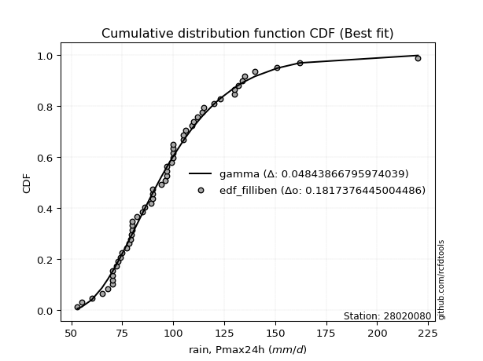</img>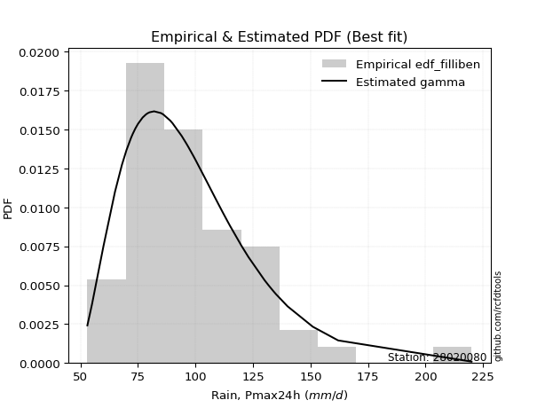</img>

</div>


### 10. EDF Jenkinson (1977)

The Jenkinson formula in hydrology is an empirical plotting position formula used to estimate the non-exceedance probability _(P)_ or return period _(T)_ of a given ordered observation within a sample. It is a widely used method in the frequency analysis of extreme events such as floods and rainfall, as it provides a distribution-free way to plot data. _a≈0.31_ and _b≈0.38_ are constants derived to approximate the median of the probability distribution for the given rank.

<div align="center">


$P=(m-a)/(n+b)$


</div>


**10.1. Empirical values**

<div align="center">

|                | 0                    | 1                    | 2                   | 3                   | 4                   | 5                  | 6                  | 7                  | 8                  | 9                  | 10                  | 11                 | 12                 | 13                 | 14                 | 15                 | 16                  | 17                  | 18                 | 19                 | 20                  | 21                  | 22                  | 23                  | 24                 | 25                  | 26                  | 27                  | 28                 | 29                 | 30                 | 31                 | 32                 | 33                 | 34                | 35                 | 36                 | 37                 | 38                 | 39                 | 40                 | 41                 | 42                 | 43                 | 44                 | 45                 | 46                 | 47                 | 48                 | 49                 | 50                 | 51                 | 52                 | 53                 | 54                 | 55                 |
|:---------------|:---------------------|:---------------------|:--------------------|:--------------------|:--------------------|:-------------------|:-------------------|:-------------------|:-------------------|:-------------------|:--------------------|:-------------------|:-------------------|:-------------------|:-------------------|:-------------------|:--------------------|:--------------------|:-------------------|:-------------------|:--------------------|:--------------------|:--------------------|:--------------------|:-------------------|:--------------------|:--------------------|:--------------------|:-------------------|:-------------------|:-------------------|:-------------------|:-------------------|:-------------------|:------------------|:-------------------|:-------------------|:-------------------|:-------------------|:-------------------|:-------------------|:-------------------|:-------------------|:-------------------|:-------------------|:-------------------|:-------------------|:-------------------|:-------------------|:-------------------|:-------------------|:-------------------|:-------------------|:-------------------|:-------------------|:-------------------|
| date           | 1960                 | 1974                 | 1982                | 1997                | 2009                | 1990               | 1989               | 1991               | 2012               | 1964               | 1968                | 1959               | 1988               | 1992               | 1979               | 1963               | 1987                | 1994                | 1986               | 1971               | 1976                | 2013                | 2015                | 2004                | 1981               | 1999                | 1980                | 2002                | 1973               | 1965               | 2006               | 2019               | 1969               | 1972               | 2007              | 1970               | 1984               | 2020               | 2010               | 1983               | 2003               | 2001               | 1993               | 1962               | 1995               | 2000               | 1996               | 1975               | 2014               | 2011               | 2021               | 2017               | 1998               | 2005               | 1985               | 2008               |
| x              | 53.0                 | 55.0                 | 60.0                | 65.0                | 68.0                | 70.0               | 70.0               | 70.0               | 70.0               | 72.0               | 72.72167244         | 73.86977315        | 75.0               | 77.0               | 78.44364045        | 79.0               | 79.27108814         | 80.0                | 80.0               | 80.0               | 82.0                | 85.0                | 86.0                | 89.0                | 90.0               | 90.0                | 90.0                | 94.0                | 96.0               | 96.79157548        | 97.0               | 97.0               | 99.0               | 100.0              | 100.0             | 100.0              | 100.05888838678571 | 105.0              | 105.0              | 106.0              | 109.0              | 110.0              | 112.0              | 114.0              | 115.0              | 120.0              | 123.0              | 130.0              | 130.0              | 132.0              | 134.0              | 135.0              | 140.0              | 151.0              | 162.0              | 220.0              |
| m              | 1                    | 2                    | 3                   | 4                   | 5                   | 6                  | 7                  | 8                  | 9                  | 10                 | 11                  | 12                 | 13                 | 14                 | 15                 | 16                 | 17                  | 18                  | 19                 | 20                 | 21                  | 22                  | 23                  | 24                  | 25                 | 26                  | 27                  | 28                  | 29                 | 30                 | 31                 | 32                 | 33                 | 34                 | 35                | 36                 | 37                 | 38                 | 39                 | 40                 | 41                 | 42                 | 43                 | 44                 | 45                 | 46                 | 47                 | 48                 | 49                 | 50                 | 51                 | 52                 | 53                 | 54                 | 55                 | 56                 |
| empirical_dist | edf_jenkinson        | edf_jenkinson        | edf_jenkinson       | edf_jenkinson       | edf_jenkinson       | edf_jenkinson      | edf_jenkinson      | edf_jenkinson      | edf_jenkinson      | edf_jenkinson      | edf_jenkinson       | edf_jenkinson      | edf_jenkinson      | edf_jenkinson      | edf_jenkinson      | edf_jenkinson      | edf_jenkinson       | edf_jenkinson       | edf_jenkinson      | edf_jenkinson      | edf_jenkinson       | edf_jenkinson       | edf_jenkinson       | edf_jenkinson       | edf_jenkinson      | edf_jenkinson       | edf_jenkinson       | edf_jenkinson       | edf_jenkinson      | edf_jenkinson      | edf_jenkinson      | edf_jenkinson      | edf_jenkinson      | edf_jenkinson      | edf_jenkinson     | edf_jenkinson      | edf_jenkinson      | edf_jenkinson      | edf_jenkinson      | edf_jenkinson      | edf_jenkinson      | edf_jenkinson      | edf_jenkinson      | edf_jenkinson      | edf_jenkinson      | edf_jenkinson      | edf_jenkinson      | edf_jenkinson      | edf_jenkinson      | edf_jenkinson      | edf_jenkinson      | edf_jenkinson      | edf_jenkinson      | edf_jenkinson      | edf_jenkinson      | edf_jenkinson      |
| empirical      | 0.012238382405108193 | 0.029975168499467894 | 0.04771195459382759 | 0.06544874068818729 | 0.08318552678254701 | 0.1009223128769067 | 0.1186590989712664 | 0.1363958850656261 | 0.1541326711599858 | 0.1718694572543455 | 0.18960624334870518 | 0.2073430294430649 | 0.2250798155374246 | 0.2428166016317843 | 0.260553387726144  | 0.2782901738205037 | 0.29602695991486344 | 0.31376374600922313 | 0.3315005321035828 | 0.3492373181979425 | 0.36697410429230226 | 0.38471089038666195 | 0.40244767648102164 | 0.42018446257538133 | 0.437921248669741  | 0.45565803476410077 | 0.47339482085846046 | 0.49113160695282015 | 0.5088683930471799 | 0.5266051791415396 | 0.5443419652358993 | 0.562078751330259  | 0.5798155374246186 | 0.5975523235189782 | 0.615289109613338 | 0.6330258957076977 | 0.6507626818020574 | 0.6684994678964171 | 0.6862362539907768 | 0.7039730400851365 | 0.7217098261794962 | 0.7394466122738559 | 0.7571833983682156 | 0.7749201844625753 | 0.792656970556935  | 0.8103937566512948 | 0.8281305427456545 | 0.8458673288400141 | 0.8636041149343738 | 0.8813409010287335 | 0.8990776871230932 | 0.9168144732174529 | 0.9345512593118126 | 0.9522880454061723 | 0.970024831500532  | 0.9877616175948917 |
| empirical_tr   | 1.0123900161608907   | 1.0309014445053941   | 1.0501024399329484  | 1.0700322641867528  | 1.0907332172567228  | 1.1122509370684552 | 1.1346347353592272 | 1.1579379749435204 | 1.1822184944432794 | 1.2075390875990577 | 1.2339680455241846  | 1.2615797717610204 | 1.2904554818036165 | 1.3206840009369876 | 1.3523626769009354 | 1.3855984271319735 | 1.4205089443184682  | 1.4572240889118635  | 1.4958875033165298 | 1.536658490051785  | 1.5797142056598488  | 1.62525223407322    | 1.6734936182843574  | 1.7246864484551852  | 1.7791101293783527 | 1.8370804822417728  | 1.8989558773997979  | 1.9651446497037297  | 2.0361141206211633 | 2.1124016485575123 | 2.1946282600233555 | 2.2835155933576345 | 2.3799071338117344 | 2.4847950639048033 | 2.599354541263255 | 2.724987916868052  | 2.8633824276282374 | 3.0165864098448365 | 3.1871113623516103 | 3.378070701018573  | 3.5933715742511145 | 3.8379850238257305 | 4.118334550766981  | 4.442868400315207  | 4.8229255774165924 | 5.274087932647333  | 5.818369453044374  | 6.4879171461449925 | 7.33159947984395   | 8.427503736920773  | 9.908611599297005  | 12.021321961620457 | 15.27913279132789  | 20.9591078066914   | 33.360946745561996 | 81.71014492753534  |

</div>


**10.2. Kolmogorov-Smirnov fit test (sorted by Δ)**


<div align="center">

|                | 0                   | 1                    | 2                    | 3                    | 4                   | 5                   | 6                   | 7                    | 8                    | 9                   | 10                  | 11                  | 12                  | 13                   | 14                   | 15                  | 16                  | 17                   | 18                  | 19                  | 20                   | 21                  | 22                  | 23                  | 24                  | 25                  | 26                 | 27                  | 28                  | 29                   | 30                   | 31                   | 32                   | 33                  | 34                  | 35                 | 36                  | 37                 | 38                 | 39                 | 40                  | 41                  | 42                  | 43                  | 44                  | 45                  | 46                  | 47                  | 48                  | 49                  | 50                  | 51                  | 52                  | 53                  | 54                  | 55                  | 56                  | 57                  | 58                  | 59                  | 60                  | 61                  | 62                 | 63                  | 64                    | 65                  | 66                  | 67                  | 68                  | 69                 | 70                  | 71                  | 72                  | 73                  | 74                  | 75                  | 76                 | 77                  | 78                  | 79                 | 80                 | 81                  | 82                 | 83                  | 84                  | 85                 | 86                  | 87                 |
|:---------------|:--------------------|:---------------------|:---------------------|:---------------------|:--------------------|:--------------------|:--------------------|:---------------------|:---------------------|:--------------------|:--------------------|:--------------------|:--------------------|:---------------------|:---------------------|:--------------------|:--------------------|:---------------------|:--------------------|:--------------------|:---------------------|:--------------------|:--------------------|:--------------------|:--------------------|:--------------------|:-------------------|:--------------------|:--------------------|:---------------------|:---------------------|:---------------------|:---------------------|:--------------------|:--------------------|:-------------------|:--------------------|:-------------------|:-------------------|:-------------------|:--------------------|:--------------------|:--------------------|:--------------------|:--------------------|:--------------------|:--------------------|:--------------------|:--------------------|:--------------------|:--------------------|:--------------------|:--------------------|:--------------------|:--------------------|:--------------------|:--------------------|:--------------------|:--------------------|:--------------------|:--------------------|:--------------------|:-------------------|:--------------------|:----------------------|:--------------------|:--------------------|:--------------------|:--------------------|:-------------------|:--------------------|:--------------------|:--------------------|:--------------------|:--------------------|:--------------------|:-------------------|:--------------------|:--------------------|:-------------------|:-------------------|:--------------------|:-------------------|:--------------------|:--------------------|:-------------------|:--------------------|:-------------------|
| station        | 28020080            | 28020080             | 28020080             | 28020080             | 28020080            | 28020080            | 28020080            | 28020080             | 28020080             | 28020080            | 28020080            | 28020080            | 28020080            | 28020080             | 28020080             | 28020080            | 28020080            | 28020080             | 28020080            | 28020080            | 28020080             | 28020080            | 28020080            | 28020080            | 28020080            | 28020080            | 28020080           | 28020080            | 28020080            | 28020080             | 28020080             | 28020080             | 28020080             | 28020080            | 28020080            | 28020080           | 28020080            | 28020080           | 28020080           | 28020080           | 28020080            | 28020080            | 28020080            | 28020080            | 28020080            | 28020080            | 28020080            | 28020080            | 28020080            | 28020080            | 28020080            | 28020080            | 28020080            | 28020080            | 28020080            | 28020080            | 28020080            | 28020080            | 28020080            | 28020080            | 28020080            | 28020080            | 28020080           | 28020080            | 28020080              | 28020080            | 28020080            | 28020080            | 28020080            | 28020080           | 28020080            | 28020080            | 28020080            | 28020080            | 28020080            | 28020080            | 28020080           | 28020080            | 28020080            | 28020080           | 28020080           | 28020080            | 28020080           | 28020080            | 28020080            | 28020080           | 28020080            | 28020080           |
| empirical_dist | edf_jenkinson       | edf_jenkinson        | edf_jenkinson        | edf_jenkinson        | edf_jenkinson       | edf_jenkinson       | edf_jenkinson       | edf_jenkinson        | edf_jenkinson        | edf_jenkinson       | edf_jenkinson       | edf_jenkinson       | edf_jenkinson       | edf_jenkinson        | edf_jenkinson        | edf_jenkinson       | edf_jenkinson       | edf_jenkinson        | edf_jenkinson       | edf_jenkinson       | edf_jenkinson        | edf_jenkinson       | edf_jenkinson       | edf_jenkinson       | edf_jenkinson       | edf_jenkinson       | edf_jenkinson      | edf_jenkinson       | edf_jenkinson       | edf_jenkinson        | edf_jenkinson        | edf_jenkinson        | edf_jenkinson        | edf_jenkinson       | edf_jenkinson       | edf_jenkinson      | edf_jenkinson       | edf_jenkinson      | edf_jenkinson      | edf_jenkinson      | edf_jenkinson       | edf_jenkinson       | edf_jenkinson       | edf_jenkinson       | edf_jenkinson       | edf_jenkinson       | edf_jenkinson       | edf_jenkinson       | edf_jenkinson       | edf_jenkinson       | edf_jenkinson       | edf_jenkinson       | edf_jenkinson       | edf_jenkinson       | edf_jenkinson       | edf_jenkinson       | edf_jenkinson       | edf_jenkinson       | edf_jenkinson       | edf_jenkinson       | edf_jenkinson       | edf_jenkinson       | edf_jenkinson      | edf_jenkinson       | edf_jenkinson         | edf_jenkinson       | edf_jenkinson       | edf_jenkinson       | edf_jenkinson       | edf_jenkinson      | edf_jenkinson       | edf_jenkinson       | edf_jenkinson       | edf_jenkinson       | edf_jenkinson       | edf_jenkinson       | edf_jenkinson      | edf_jenkinson       | edf_jenkinson       | edf_jenkinson      | edf_jenkinson      | edf_jenkinson       | edf_jenkinson      | edf_jenkinson       | edf_jenkinson       | edf_jenkinson      | edf_jenkinson       | edf_jenkinson      |
| p_dist         | gamma               | chi2                 | erlang               | fatiguelife          | invgauss            | logweibull_min      | lognakagami         | johnsonsu            | logrice              | logmaxwell          | loginvgauss         | logpearson3         | gumbel_r            | loggamma             | loggamma             | logerlang           | logchi2             | logfatiguelife       | invgamma            | loglognorm          | f                    | logf                | logncf              | loginvgamma         | logjohnsonsu        | logalpha            | invweibull         | nct                 | weibull_min         | alpha                | lognct               | exponnorm            | mielke               | moyal               | loggenlogistic      | betaprime          | lograyleigh         | logexponnorm       | ncf                | kstwobign          | genlogistic         | logmielke           | pearson3            | halflogistic        | logloggamma         | logcrystalball      | lognorm             | lognorm             | logfisk             | nakagami            | fisk                | loginvweibull       | halfnorm            | logt                | rayleigh            | logkstwobign        | maxwell             | t                   | rice                | loglogistic         | loggumbel_r         | loghalfnorm         | laplace_asymmetric | loghypsecant        | loglaplace_asymmetric | hypsecant           | logistic            | logmoyal            | truncnorm           | norm               | crystalball         | loghalflogistic     | loggumbel_l         | loglaplace          | loggenexpon         | laplace             | wald               | genexpon            | gumbel_l            | logwald            | logbetaprime       | expon               | loggompertz        | gibrat              | loggibrat           | logtruncnorm       | logexpon            | gompertz           |
| delta          | 0.04847878931567101 | 0.048479228222158055 | 0.048479330905977336 | 0.051108777346135115 | 0.05126335228902895 | 0.05128769984830059 | 0.05199050795049931 | 0.053219837070810516 | 0.053389877919675255 | 0.05383293324329541 | 0.05412167445370841 | 0.05424368812022107 | 0.05444863578154119 | 0.054885431028439846 | 0.054885431028439846 | 0.05488543437710525 | 0.05488545378045101 | 0.055471924377733794 | 0.05578458573234457 | 0.05585332262366549 | 0.055857080718309804 | 0.05611409070539375 | 0.05618754820743216 | 0.05619574817160322 | 0.05628303893536252 | 0.05679735389518076 | 0.0569937138513501 | 0.05731451108713276 | 0.05996089516772091 | 0.060106456042609946 | 0.060309846557321245 | 0.061262813284336914 | 0.062311448563824146 | 0.06259006115071986 | 0.06270782062415636 | 0.0634227313529711 | 0.06410149250683828 | 0.0646729737999554 | 0.0647760842150919 | 0.0650094672192143 | 0.06627712267902086 | 0.06693994570329886 | 0.06695347303136068 | 0.06847910100186527 | 0.06962743041150943 | 0.06978795447803382 | 0.06978828301710921 | 0.06978828301710921 | 0.07102838816009727 | 0.07129173135545852 | 0.07458491930971156 | 0.07499767053833861 | 0.07830600434712537 | 0.07889893862157232 | 0.08031236174523426 | 0.08051522995742932 | 0.08759707664084604 | 0.09120229724175039 | 0.09175746045541155 | 0.09195226469020457 | 0.09289339504298921 | 0.09302808425649167 | 0.0943082501394864 | 0.10739580722185449 | 0.11351088239940144   | 0.11473399836952089 | 0.11481373381971138 | 0.11826037385086752 | 0.11911361085486138 | 0.1191136303512359 | 0.11911363815236753 | 0.11959336949524346 | 0.12179305147729735 | 0.13046535383165914 | 0.13356481770533785 | 0.13703915795549085 | 0.1673500966904808 | 0.17050903016532934 | 0.18781453089325728 | 0.1949074518250803 | 0.206007852325336  | 0.21522732744153925 | 0.2235592973336523 | 0.22674098361300618 | 0.23598496052474072 | 0.2742080698202888 | 0.28393756149548155 | 0.9699957491250154 |
| deltao         | 0.1817376445004486  | 0.1817376445004486   | 0.1817376445004486   | 0.1817376445004486   | 0.1817376445004486  | 0.1817376445004486  | 0.1817376445004486  | 0.1817376445004486   | 0.1817376445004486   | 0.1817376445004486  | 0.1817376445004486  | 0.1817376445004486  | 0.1817376445004486  | 0.1817376445004486   | 0.1817376445004486   | 0.1817376445004486  | 0.1817376445004486  | 0.1817376445004486   | 0.1817376445004486  | 0.1817376445004486  | 0.1817376445004486   | 0.1817376445004486  | 0.1817376445004486  | 0.1817376445004486  | 0.1817376445004486  | 0.1817376445004486  | 0.1817376445004486 | 0.1817376445004486  | 0.1817376445004486  | 0.1817376445004486   | 0.1817376445004486   | 0.1817376445004486   | 0.1817376445004486   | 0.1817376445004486  | 0.1817376445004486  | 0.1817376445004486 | 0.1817376445004486  | 0.1817376445004486 | 0.1817376445004486 | 0.1817376445004486 | 0.1817376445004486  | 0.1817376445004486  | 0.1817376445004486  | 0.1817376445004486  | 0.1817376445004486  | 0.1817376445004486  | 0.1817376445004486  | 0.1817376445004486  | 0.1817376445004486  | 0.1817376445004486  | 0.1817376445004486  | 0.1817376445004486  | 0.1817376445004486  | 0.1817376445004486  | 0.1817376445004486  | 0.1817376445004486  | 0.1817376445004486  | 0.1817376445004486  | 0.1817376445004486  | 0.1817376445004486  | 0.1817376445004486  | 0.1817376445004486  | 0.1817376445004486 | 0.1817376445004486  | 0.1817376445004486    | 0.1817376445004486  | 0.1817376445004486  | 0.1817376445004486  | 0.1817376445004486  | 0.1817376445004486 | 0.1817376445004486  | 0.1817376445004486  | 0.1817376445004486  | 0.1817376445004486  | 0.1817376445004486  | 0.1817376445004486  | 0.1817376445004486 | 0.1817376445004486  | 0.1817376445004486  | 0.1817376445004486 | 0.1817376445004486 | 0.1817376445004486  | 0.1817376445004486 | 0.1817376445004486  | 0.1817376445004486  | 0.1817376445004486 | 0.1817376445004486  | 0.1817376445004486 |
| eval           | Δo > Δ              | Δo > Δ               | Δo > Δ               | Δo > Δ               | Δo > Δ              | Δo > Δ              | Δo > Δ              | Δo > Δ               | Δo > Δ               | Δo > Δ              | Δo > Δ              | Δo > Δ              | Δo > Δ              | Δo > Δ               | Δo > Δ               | Δo > Δ              | Δo > Δ              | Δo > Δ               | Δo > Δ              | Δo > Δ              | Δo > Δ               | Δo > Δ              | Δo > Δ              | Δo > Δ              | Δo > Δ              | Δo > Δ              | Δo > Δ             | Δo > Δ              | Δo > Δ              | Δo > Δ               | Δo > Δ               | Δo > Δ               | Δo > Δ               | Δo > Δ              | Δo > Δ              | Δo > Δ             | Δo > Δ              | Δo > Δ             | Δo > Δ             | Δo > Δ             | Δo > Δ              | Δo > Δ              | Δo > Δ              | Δo > Δ              | Δo > Δ              | Δo > Δ              | Δo > Δ              | Δo > Δ              | Δo > Δ              | Δo > Δ              | Δo > Δ              | Δo > Δ              | Δo > Δ              | Δo > Δ              | Δo > Δ              | Δo > Δ              | Δo > Δ              | Δo > Δ              | Δo > Δ              | Δo > Δ              | Δo > Δ              | Δo > Δ              | Δo > Δ             | Δo > Δ              | Δo > Δ                | Δo > Δ              | Δo > Δ              | Δo > Δ              | Δo > Δ              | Δo > Δ             | Δo > Δ              | Δo > Δ              | Δo > Δ              | Δo > Δ              | Δo > Δ              | Δo > Δ              | Δo > Δ             | Δo > Δ              | Δo <= Δ             | Δo <= Δ            | Δo <= Δ            | Δo <= Δ             | Δo <= Δ            | Δo <= Δ             | Δo <= Δ             | Δo <= Δ            | Δo <= Δ             | Δo <= Δ            |
| fit            | 1                   | 1                    | 1                    | 1                    | 1                   | 1                   | 1                   | 1                    | 1                    | 1                   | 1                   | 1                   | 1                   | 1                    | 1                    | 1                   | 1                   | 1                    | 1                   | 1                   | 1                    | 1                   | 1                   | 1                   | 1                   | 1                   | 1                  | 1                   | 1                   | 1                    | 1                    | 1                    | 1                    | 1                   | 1                   | 1                  | 1                   | 1                  | 1                  | 1                  | 1                   | 1                   | 1                   | 1                   | 1                   | 1                   | 1                   | 1                   | 1                   | 1                   | 1                   | 1                   | 1                   | 1                   | 1                   | 1                   | 1                   | 1                   | 1                   | 1                   | 1                   | 1                   | 1                  | 1                   | 1                     | 1                   | 1                   | 1                   | 1                   | 1                  | 1                   | 1                   | 1                   | 1                   | 1                   | 1                   | 1                  | 1                   | 0                   | 0                  | 0                  | 0                   | 0                  | 0                   | 0                   | 0                  | 0                   | 0                  |
| n              | 56                  | 56                   | 56                   | 56                   | 56                  | 56                  | 56                  | 56                   | 56                   | 56                  | 56                  | 56                  | 56                  | 56                   | 56                   | 56                  | 56                  | 56                   | 56                  | 56                  | 56                   | 56                  | 56                  | 56                  | 56                  | 56                  | 56                 | 56                  | 56                  | 56                   | 56                   | 56                   | 56                   | 56                  | 56                  | 56                 | 56                  | 56                 | 56                 | 56                 | 56                  | 56                  | 56                  | 56                  | 56                  | 56                  | 56                  | 56                  | 56                  | 56                  | 56                  | 56                  | 56                  | 56                  | 56                  | 56                  | 56                  | 56                  | 56                  | 56                  | 56                  | 56                  | 56                 | 56                  | 56                    | 56                  | 56                  | 56                  | 56                  | 56                 | 56                  | 56                  | 56                  | 56                  | 56                  | 56                  | 56                 | 56                  | 56                  | 56                 | 56                 | 56                  | 56                 | 56                  | 56                  | 56                 | 56                  | 56                 |
| best_fit       | 1                   | 0                    | 0                    | 0                    | 0                   | 0                   | 0                   | 0                    | 0                    | 0                   | 0                   | 0                   | 0                   | 0                    | 0                    | 0                   | 0                   | 0                    | 0                   | 0                   | 0                    | 0                   | 0                   | 0                   | 0                   | 0                   | 0                  | 0                   | 0                   | 0                    | 0                    | 0                    | 0                    | 0                   | 0                   | 0                  | 0                   | 0                  | 0                  | 0                  | 0                   | 0                   | 0                   | 0                   | 0                   | 0                   | 0                   | 0                   | 0                   | 0                   | 0                   | 0                   | 0                   | 0                   | 0                   | 0                   | 0                   | 0                   | 0                   | 0                   | 0                   | 0                   | 0                  | 0                   | 0                     | 0                   | 0                   | 0                   | 0                   | 0                  | 0                   | 0                   | 0                   | 0                   | 0                   | 0                   | 0                  | 0                   | 0                   | 0                  | 0                  | 0                   | 0                  | 0                   | 0                   | 0                  | 0                   | 0                  |
| best_fit_sort  | 1                   | 2                    | 3                    | 4                    | 5                   | 6                   | 7                   | 8                    | 9                    | 10                  | 11                  | 12                  | 13                  | 14                   | 15                   | 16                  | 17                  | 18                   | 19                  | 20                  | 21                   | 22                  | 23                  | 24                  | 25                  | 26                  | 27                 | 28                  | 29                  | 30                   | 31                   | 32                   | 33                   | 34                  | 35                  | 36                 | 37                  | 38                 | 39                 | 40                 | 41                  | 42                  | 43                  | 44                  | 45                  | 46                  | 47                  | 48                  | 49                  | 50                  | 51                  | 52                  | 53                  | 54                  | 55                  | 56                  | 57                  | 58                  | 59                  | 60                  | 61                  | 62                  | 63                 | 64                  | 65                    | 66                  | 67                  | 68                  | 69                  | 70                 | 71                  | 72                  | 73                  | 74                  | 75                  | 76                  | 77                 | 78                  | 79                  | 80                 | 81                 | 82                  | 83                 | 84                  | 85                  | 86                 | 87                  | 88                 |

</div>


<div align="center">

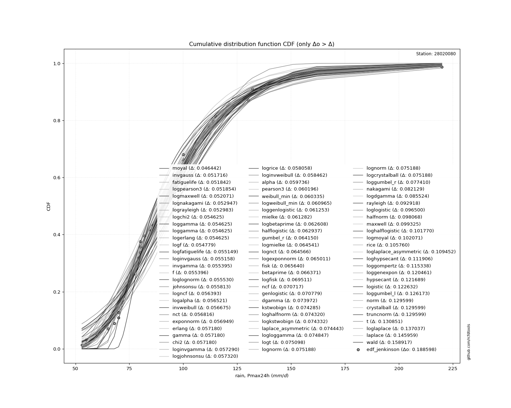</img>

</div>


**10.3. Best fit**

<div align="center">

|   id |   station | empirical_dist   | p_dist   |     delta |   deltao | eval   |   fit |   n |   best_fit |   best_fit_sort |
|-----:|----------:|:-----------------|:---------|----------:|---------:|:-------|------:|----:|-----------:|----------------:|
|    0 |  28020080 | edf_jenkinson    | gamma    | 0.0484788 | 0.181738 | Δo > Δ |     1 |  56 |          1 |               1 |

</div>


<div align="center">

</img></img>

</div>


### 11. EDF Cunnane (1978)

Cunnane´s work in statistical hydrology has focused on the performance and evaluation of different probability distributions (such as GEV, Gumbel, Lognormal) for flood frequency estimation. _b_ is a constant, typically set to 0.4.

<div align="center">


$P=(m-b)/(n+1-2b)$


</div>


**11.1. Empirical values**

<div align="center">

|                | 0                    | 1                    | 2                    | 3                   | 4                   | 5                   | 6                   | 7                   | 8                   | 9                   | 10                 | 11                 | 12                  | 13                  | 14                 | 15                 | 16                  | 17                  | 18                 | 19                 | 20                 | 21                  | 22                  | 23                 | 24                 | 25                 | 26                  | 27                  | 28                 | 29                 | 30                 | 31                 | 32                 | 33                | 34                 | 35                 | 36                 | 37                 | 38                 | 39                 | 40                 | 41                 | 42                 | 43                 | 44                 | 45                 | 46                 | 47                 | 48                 | 49                 | 50                 | 51                 | 52                 | 53                 | 54                 | 55                |
|:---------------|:---------------------|:---------------------|:---------------------|:--------------------|:--------------------|:--------------------|:--------------------|:--------------------|:--------------------|:--------------------|:-------------------|:-------------------|:--------------------|:--------------------|:-------------------|:-------------------|:--------------------|:--------------------|:-------------------|:-------------------|:-------------------|:--------------------|:--------------------|:-------------------|:-------------------|:-------------------|:--------------------|:--------------------|:-------------------|:-------------------|:-------------------|:-------------------|:-------------------|:------------------|:-------------------|:-------------------|:-------------------|:-------------------|:-------------------|:-------------------|:-------------------|:-------------------|:-------------------|:-------------------|:-------------------|:-------------------|:-------------------|:-------------------|:-------------------|:-------------------|:-------------------|:-------------------|:-------------------|:-------------------|:-------------------|:------------------|
| date           | 1960                 | 1974                 | 1982                 | 1997                | 2009                | 1990                | 1989                | 1991                | 2012                | 1964                | 1968               | 1959               | 1988                | 1992                | 1979               | 1963               | 1987                | 1994                | 1986               | 1971               | 1976               | 2013                | 2015                | 2004               | 1981               | 1999               | 1980                | 2002                | 1973               | 1965               | 2006               | 2019               | 1969               | 1972              | 2007               | 1970               | 1984               | 2020               | 2010               | 1983               | 2003               | 2001               | 1993               | 1962               | 1995               | 2000               | 1996               | 1975               | 2014               | 2011               | 2021               | 2017               | 1998               | 2005               | 1985               | 2008              |
| x              | 53.0                 | 55.0                 | 60.0                 | 65.0                | 68.0                | 70.0                | 70.0                | 70.0                | 70.0                | 72.0                | 72.72167244        | 73.86977315        | 75.0                | 77.0                | 78.44364045        | 79.0               | 79.27108814         | 80.0                | 80.0               | 80.0               | 82.0               | 85.0                | 86.0                | 89.0               | 90.0               | 90.0               | 90.0                | 94.0                | 96.0               | 96.79157548        | 97.0               | 97.0               | 99.0               | 100.0             | 100.0              | 100.0              | 100.05888838678571 | 105.0              | 105.0              | 106.0              | 109.0              | 110.0              | 112.0              | 114.0              | 115.0              | 120.0              | 123.0              | 130.0              | 130.0              | 132.0              | 134.0              | 135.0              | 140.0              | 151.0              | 162.0              | 220.0             |
| m              | 1                    | 2                    | 3                    | 4                   | 5                   | 6                   | 7                   | 8                   | 9                   | 10                  | 11                 | 12                 | 13                  | 14                  | 15                 | 16                 | 17                  | 18                  | 19                 | 20                 | 21                 | 22                  | 23                  | 24                 | 25                 | 26                 | 27                  | 28                  | 29                 | 30                 | 31                 | 32                 | 33                 | 34                | 35                 | 36                 | 37                 | 38                 | 39                 | 40                 | 41                 | 42                 | 43                 | 44                 | 45                 | 46                 | 47                 | 48                 | 49                 | 50                 | 51                 | 52                 | 53                 | 54                 | 55                 | 56                |
| empirical_dist | edf_cunnane          | edf_cunnane          | edf_cunnane          | edf_cunnane         | edf_cunnane         | edf_cunnane         | edf_cunnane         | edf_cunnane         | edf_cunnane         | edf_cunnane         | edf_cunnane        | edf_cunnane        | edf_cunnane         | edf_cunnane         | edf_cunnane        | edf_cunnane        | edf_cunnane         | edf_cunnane         | edf_cunnane        | edf_cunnane        | edf_cunnane        | edf_cunnane         | edf_cunnane         | edf_cunnane        | edf_cunnane        | edf_cunnane        | edf_cunnane         | edf_cunnane         | edf_cunnane        | edf_cunnane        | edf_cunnane        | edf_cunnane        | edf_cunnane        | edf_cunnane       | edf_cunnane        | edf_cunnane        | edf_cunnane        | edf_cunnane        | edf_cunnane        | edf_cunnane        | edf_cunnane        | edf_cunnane        | edf_cunnane        | edf_cunnane        | edf_cunnane        | edf_cunnane        | edf_cunnane        | edf_cunnane        | edf_cunnane        | edf_cunnane        | edf_cunnane        | edf_cunnane        | edf_cunnane        | edf_cunnane        | edf_cunnane        | edf_cunnane       |
| empirical      | 0.010676156583629892 | 0.028469750889679714 | 0.046263345195729534 | 0.06405693950177936 | 0.08185053380782917 | 0.09964412811387899 | 0.11743772241992881 | 0.13523131672597863 | 0.15302491103202845 | 0.17081850533807827 | 0.1886120996441281 | 0.2064056939501779 | 0.22419928825622773 | 0.24199288256227755 | 0.2597864768683274 | 0.2775800711743772 | 0.29537366548042704 | 0.31316725978647686 | 0.3309608540925267 | 0.3487544483985765 | 0.3665480427046263 | 0.38434163701067614 | 0.40213523131672596 | 0.4199288256227758 | 0.4377224199288256 | 0.4555160142348754 | 0.47330960854092524 | 0.49110320284697506 | 0.5088967971530249 | 0.5266903914590747 | 0.5444839857651246 | 0.5622775800711743 | 0.5800711743772242 | 0.597864768683274 | 0.6156583629893239 | 0.6334519572953736 | 0.6512455516014235 | 0.6690391459074733 | 0.6868327402135231 | 0.7046263345195729 | 0.7224199288256228 | 0.7402135231316725 | 0.7580071174377224 | 0.7758007117437722 | 0.7935943060498221 | 0.8113879003558718 | 0.8291814946619217 | 0.8469750889679715 | 0.8647686832740213 | 0.8825622775800711 | 0.900355871886121  | 0.9181494661921707 | 0.9359430604982206 | 0.9537366548042704 | 0.9715302491103203 | 0.98932384341637  |
| empirical_tr   | 1.0107913669064748   | 1.0293040293040294   | 1.0485074626865671   | 1.0684410646387832  | 1.0891472868217054  | 1.1106719367588933  | 1.1330645161290323  | 1.1563786008230452  | 1.180672268907563   | 1.206008583690987   | 1.2324561403508771 | 1.2600896860986548 | 1.2889908256880733  | 1.3192488262910798  | 1.3509615384615383 | 1.3842364532019704 | 1.4191919191919193  | 1.455958549222798   | 1.4946808510638296 | 1.53551912568306   | 1.5786516853932586 | 1.6242774566473988  | 1.6726190476190474  | 1.7239263803680982 | 1.778481012658228  | 1.8366013071895424 | 1.8986486486486485  | 1.965034965034965   | 2.036231884057971  | 2.1127819548872178 | 2.1953125          | 2.284552845528455  | 2.38135593220339   | 2.486725663716814 | 2.601851851851852  | 2.728155339805825  | 2.86734693877551   | 3.0215053763440856 | 3.1931818181818183 | 3.3855421686746983 | 3.6025641025641026 | 3.84931506849315   | 4.132352941176471  | 4.46031746031746   | 4.844827586206897  | 5.301886792452828  | 5.854166666666666  | 6.53488372093023   | 7.394736842105263  | 8.51515151515151   | 10.035714285714285 | 12.217391304347816 | 15.611111111111107 | 21.61538461538458  | 35.12499999999998  | 93.66666666666599 |

</div>


**11.2. Kolmogorov-Smirnov fit test (sorted by Δ)**


<div align="center">

|                | 0                   | 1                   | 2                   | 3                  | 4                   | 5                    | 6                  | 7                  | 8                   | 9                  | 10                  | 11                   | 12                  | 13                  | 14                  | 15                  | 16                   | 17                  | 18                  | 19                   | 20                  | 21                   | 22                   | 23                  | 24                 | 25                  | 26                  | 27                  | 28                  | 29                  | 30                  | 31                  | 32                  | 33                  | 34                  | 35                  | 36                  | 37                  | 38                  | 39                  | 40                  | 41                  | 42                  | 43                  | 44                  | 45                 | 46                 | 47                 | 48                  | 49                  | 50                  | 51                  | 52                  | 53                  | 54                  | 55                  | 56                  | 57                  | 58                  | 59                 | 60                  | 61                  | 62                  | 63                  | 64                    | 65                  | 66                  | 67                  | 68                  | 69                  | 70                  | 71                 | 72                  | 73                  | 74                  | 75                  | 76                 | 77                  | 78                  | 79                 | 80                 | 81                  | 82                 | 83                  | 84                  | 85                  | 86                 | 87                 |
|:---------------|:--------------------|:--------------------|:--------------------|:-------------------|:--------------------|:---------------------|:-------------------|:-------------------|:--------------------|:-------------------|:--------------------|:---------------------|:--------------------|:--------------------|:--------------------|:--------------------|:---------------------|:--------------------|:--------------------|:---------------------|:--------------------|:---------------------|:---------------------|:--------------------|:-------------------|:--------------------|:--------------------|:--------------------|:--------------------|:--------------------|:--------------------|:--------------------|:--------------------|:--------------------|:--------------------|:--------------------|:--------------------|:--------------------|:--------------------|:--------------------|:--------------------|:--------------------|:--------------------|:--------------------|:--------------------|:-------------------|:-------------------|:-------------------|:--------------------|:--------------------|:--------------------|:--------------------|:--------------------|:--------------------|:--------------------|:--------------------|:--------------------|:--------------------|:--------------------|:-------------------|:--------------------|:--------------------|:--------------------|:--------------------|:----------------------|:--------------------|:--------------------|:--------------------|:--------------------|:--------------------|:--------------------|:-------------------|:--------------------|:--------------------|:--------------------|:--------------------|:-------------------|:--------------------|:--------------------|:-------------------|:-------------------|:--------------------|:-------------------|:--------------------|:--------------------|:--------------------|:-------------------|:-------------------|
| station        | 28020080            | 28020080            | 28020080            | 28020080           | 28020080            | 28020080             | 28020080           | 28020080           | 28020080            | 28020080           | 28020080            | 28020080             | 28020080            | 28020080            | 28020080            | 28020080            | 28020080             | 28020080            | 28020080            | 28020080             | 28020080            | 28020080             | 28020080             | 28020080            | 28020080           | 28020080            | 28020080            | 28020080            | 28020080            | 28020080            | 28020080            | 28020080            | 28020080            | 28020080            | 28020080            | 28020080            | 28020080            | 28020080            | 28020080            | 28020080            | 28020080            | 28020080            | 28020080            | 28020080            | 28020080            | 28020080           | 28020080           | 28020080           | 28020080            | 28020080            | 28020080            | 28020080            | 28020080            | 28020080            | 28020080            | 28020080            | 28020080            | 28020080            | 28020080            | 28020080           | 28020080            | 28020080            | 28020080            | 28020080            | 28020080              | 28020080            | 28020080            | 28020080            | 28020080            | 28020080            | 28020080            | 28020080           | 28020080            | 28020080            | 28020080            | 28020080            | 28020080           | 28020080            | 28020080            | 28020080           | 28020080           | 28020080            | 28020080           | 28020080            | 28020080            | 28020080            | 28020080           | 28020080           |
| empirical_dist | edf_cunnane         | edf_cunnane         | edf_cunnane         | edf_cunnane        | edf_cunnane         | edf_cunnane          | edf_cunnane        | edf_cunnane        | edf_cunnane         | edf_cunnane        | edf_cunnane         | edf_cunnane          | edf_cunnane         | edf_cunnane         | edf_cunnane         | edf_cunnane         | edf_cunnane          | edf_cunnane         | edf_cunnane         | edf_cunnane          | edf_cunnane         | edf_cunnane          | edf_cunnane          | edf_cunnane         | edf_cunnane        | edf_cunnane         | edf_cunnane         | edf_cunnane         | edf_cunnane         | edf_cunnane         | edf_cunnane         | edf_cunnane         | edf_cunnane         | edf_cunnane         | edf_cunnane         | edf_cunnane         | edf_cunnane         | edf_cunnane         | edf_cunnane         | edf_cunnane         | edf_cunnane         | edf_cunnane         | edf_cunnane         | edf_cunnane         | edf_cunnane         | edf_cunnane        | edf_cunnane        | edf_cunnane        | edf_cunnane         | edf_cunnane         | edf_cunnane         | edf_cunnane         | edf_cunnane         | edf_cunnane         | edf_cunnane         | edf_cunnane         | edf_cunnane         | edf_cunnane         | edf_cunnane         | edf_cunnane        | edf_cunnane         | edf_cunnane         | edf_cunnane         | edf_cunnane         | edf_cunnane           | edf_cunnane         | edf_cunnane         | edf_cunnane         | edf_cunnane         | edf_cunnane         | edf_cunnane         | edf_cunnane        | edf_cunnane         | edf_cunnane         | edf_cunnane         | edf_cunnane         | edf_cunnane        | edf_cunnane         | edf_cunnane         | edf_cunnane        | edf_cunnane        | edf_cunnane         | edf_cunnane        | edf_cunnane         | edf_cunnane         | edf_cunnane         | edf_cunnane        | edf_cunnane        |
| p_dist         | erlang              | chi2                | gamma               | fatiguelife        | invgauss            | lognakagami          | logweibull_min     | johnsonsu          | logrice             | loginvgauss        | logpearson3         | logmaxwell           | gumbel_r            | loggamma            | loggamma            | logerlang           | logchi2              | logfatiguelife      | invgamma            | loglognorm           | f                   | logf                 | logncf               | loginvgamma         | logjohnsonsu       | logalpha            | invweibull          | nct                 | weibull_min         | alpha               | lognct              | exponnorm           | mielke              | loggenlogistic      | moyal               | betaprime           | lograyleigh         | logexponnorm        | ncf                 | kstwobign           | genlogistic         | logmielke           | pearson3            | halflogistic        | logloggamma         | logcrystalball     | lognorm            | lognorm            | logfisk             | nakagami            | fisk                | loginvweibull       | logt                | halfnorm            | logkstwobign        | rayleigh            | maxwell             | loglogistic         | rice                | t                  | loggumbel_r         | loghalfnorm         | laplace_asymmetric  | loghypsecant        | loglaplace_asymmetric | hypsecant           | logistic            | logmoyal            | loghalflogistic     | truncnorm           | norm                | crystalball        | loggumbel_l         | loglaplace          | loggenexpon         | laplace             | wald               | genexpon            | gumbel_l            | logwald            | logbetaprime       | expon               | loggompertz        | gibrat              | loggibrat           | logtruncnorm        | logexpon           | gompertz           |
| delta          | 0.04908643380508276 | 0.04908653879704414 | 0.04908680033892196 | 0.0506259075467691 | 0.05078048248966294 | 0.051507638151133295 | 0.0525658846113283 | 0.0527369672714445 | 0.05290700812030924 | 0.0536388046543424 | 0.05376081832085505 | 0.053804529137450374 | 0.05396576598217517 | 0.05440256122907383 | 0.05440256122907383 | 0.05440256457773923 | 0.054402583981084995 | 0.05498905457836778 | 0.05530171593297856 | 0.055370452824299476 | 0.05537421091894379 | 0.055631220906027734 | 0.055704678408066144 | 0.05571287837223721 | 0.0558001691359965 | 0.05631448409581474 | 0.05651084405198409 | 0.05683164128776674 | 0.05947802536835489 | 0.05962358624324393 | 0.05982697675795523 | 0.06123440917849188 | 0.06182857876445813 | 0.06222495082479035 | 0.06256165704487482 | 0.06293986155360509 | 0.06407308840099324 | 0.06419010400058939 | 0.06429321441572589 | 0.06452659741984829 | 0.06579425287965485 | 0.06645707590393285 | 0.06692506892551564 | 0.06845069689602024 | 0.06914456061214341 | 0.0693050846786678 | 0.0693054132177432 | 0.0693054132177432 | 0.07054551836073125 | 0.07177460115482459 | 0.07410204951034555 | 0.07496926643249358 | 0.07841606882220631 | 0.07958418911015308 | 0.08048682585158429 | 0.08159054650826197 | 0.08807994644021211 | 0.09146939489083855 | 0.09224033025477762 | 0.0924804820047781 | 0.09286499093714418 | 0.09299968015064664 | 0.09427984603364137 | 0.10691293742248847 | 0.11302801260003542   | 0.11425112857015488 | 0.11529660361907745 | 0.11823196974502248 | 0.11956496538939843 | 0.11959648065422745 | 0.11959650015060197 | 0.1195965079517336 | 0.12227592127666342 | 0.12998248403229312 | 0.13484300246836556 | 0.13655628815612483 | 0.1663559529859037 | 0.17178721492835705 | 0.18829740069262335 | 0.1939701163321933 | 0.2072860370883637 | 0.21650551220456696 | 0.22483748209668   | 0.22591726454349942 | 0.23516124145523395 | 0.27548625458331655 | 0.2852157462585093 | 0.9715011667348037 |
| deltao         | 0.1817376445004486  | 0.1817376445004486  | 0.1817376445004486  | 0.1817376445004486 | 0.1817376445004486  | 0.1817376445004486   | 0.1817376445004486 | 0.1817376445004486 | 0.1817376445004486  | 0.1817376445004486 | 0.1817376445004486  | 0.1817376445004486   | 0.1817376445004486  | 0.1817376445004486  | 0.1817376445004486  | 0.1817376445004486  | 0.1817376445004486   | 0.1817376445004486  | 0.1817376445004486  | 0.1817376445004486   | 0.1817376445004486  | 0.1817376445004486   | 0.1817376445004486   | 0.1817376445004486  | 0.1817376445004486 | 0.1817376445004486  | 0.1817376445004486  | 0.1817376445004486  | 0.1817376445004486  | 0.1817376445004486  | 0.1817376445004486  | 0.1817376445004486  | 0.1817376445004486  | 0.1817376445004486  | 0.1817376445004486  | 0.1817376445004486  | 0.1817376445004486  | 0.1817376445004486  | 0.1817376445004486  | 0.1817376445004486  | 0.1817376445004486  | 0.1817376445004486  | 0.1817376445004486  | 0.1817376445004486  | 0.1817376445004486  | 0.1817376445004486 | 0.1817376445004486 | 0.1817376445004486 | 0.1817376445004486  | 0.1817376445004486  | 0.1817376445004486  | 0.1817376445004486  | 0.1817376445004486  | 0.1817376445004486  | 0.1817376445004486  | 0.1817376445004486  | 0.1817376445004486  | 0.1817376445004486  | 0.1817376445004486  | 0.1817376445004486 | 0.1817376445004486  | 0.1817376445004486  | 0.1817376445004486  | 0.1817376445004486  | 0.1817376445004486    | 0.1817376445004486  | 0.1817376445004486  | 0.1817376445004486  | 0.1817376445004486  | 0.1817376445004486  | 0.1817376445004486  | 0.1817376445004486 | 0.1817376445004486  | 0.1817376445004486  | 0.1817376445004486  | 0.1817376445004486  | 0.1817376445004486 | 0.1817376445004486  | 0.1817376445004486  | 0.1817376445004486 | 0.1817376445004486 | 0.1817376445004486  | 0.1817376445004486 | 0.1817376445004486  | 0.1817376445004486  | 0.1817376445004486  | 0.1817376445004486 | 0.1817376445004486 |
| eval           | Δo > Δ              | Δo > Δ              | Δo > Δ              | Δo > Δ             | Δo > Δ              | Δo > Δ               | Δo > Δ             | Δo > Δ             | Δo > Δ              | Δo > Δ             | Δo > Δ              | Δo > Δ               | Δo > Δ              | Δo > Δ              | Δo > Δ              | Δo > Δ              | Δo > Δ               | Δo > Δ              | Δo > Δ              | Δo > Δ               | Δo > Δ              | Δo > Δ               | Δo > Δ               | Δo > Δ              | Δo > Δ             | Δo > Δ              | Δo > Δ              | Δo > Δ              | Δo > Δ              | Δo > Δ              | Δo > Δ              | Δo > Δ              | Δo > Δ              | Δo > Δ              | Δo > Δ              | Δo > Δ              | Δo > Δ              | Δo > Δ              | Δo > Δ              | Δo > Δ              | Δo > Δ              | Δo > Δ              | Δo > Δ              | Δo > Δ              | Δo > Δ              | Δo > Δ             | Δo > Δ             | Δo > Δ             | Δo > Δ              | Δo > Δ              | Δo > Δ              | Δo > Δ              | Δo > Δ              | Δo > Δ              | Δo > Δ              | Δo > Δ              | Δo > Δ              | Δo > Δ              | Δo > Δ              | Δo > Δ             | Δo > Δ              | Δo > Δ              | Δo > Δ              | Δo > Δ              | Δo > Δ                | Δo > Δ              | Δo > Δ              | Δo > Δ              | Δo > Δ              | Δo > Δ              | Δo > Δ              | Δo > Δ             | Δo > Δ              | Δo > Δ              | Δo > Δ              | Δo > Δ              | Δo > Δ             | Δo > Δ              | Δo <= Δ             | Δo <= Δ            | Δo <= Δ            | Δo <= Δ             | Δo <= Δ            | Δo <= Δ             | Δo <= Δ             | Δo <= Δ             | Δo <= Δ            | Δo <= Δ            |
| fit            | 1                   | 1                   | 1                   | 1                  | 1                   | 1                    | 1                  | 1                  | 1                   | 1                  | 1                   | 1                    | 1                   | 1                   | 1                   | 1                   | 1                    | 1                   | 1                   | 1                    | 1                   | 1                    | 1                    | 1                   | 1                  | 1                   | 1                   | 1                   | 1                   | 1                   | 1                   | 1                   | 1                   | 1                   | 1                   | 1                   | 1                   | 1                   | 1                   | 1                   | 1                   | 1                   | 1                   | 1                   | 1                   | 1                  | 1                  | 1                  | 1                   | 1                   | 1                   | 1                   | 1                   | 1                   | 1                   | 1                   | 1                   | 1                   | 1                   | 1                  | 1                   | 1                   | 1                   | 1                   | 1                     | 1                   | 1                   | 1                   | 1                   | 1                   | 1                   | 1                  | 1                   | 1                   | 1                   | 1                   | 1                  | 1                   | 0                   | 0                  | 0                  | 0                   | 0                  | 0                   | 0                   | 0                   | 0                  | 0                  |
| n              | 56                  | 56                  | 56                  | 56                 | 56                  | 56                   | 56                 | 56                 | 56                  | 56                 | 56                  | 56                   | 56                  | 56                  | 56                  | 56                  | 56                   | 56                  | 56                  | 56                   | 56                  | 56                   | 56                   | 56                  | 56                 | 56                  | 56                  | 56                  | 56                  | 56                  | 56                  | 56                  | 56                  | 56                  | 56                  | 56                  | 56                  | 56                  | 56                  | 56                  | 56                  | 56                  | 56                  | 56                  | 56                  | 56                 | 56                 | 56                 | 56                  | 56                  | 56                  | 56                  | 56                  | 56                  | 56                  | 56                  | 56                  | 56                  | 56                  | 56                 | 56                  | 56                  | 56                  | 56                  | 56                    | 56                  | 56                  | 56                  | 56                  | 56                  | 56                  | 56                 | 56                  | 56                  | 56                  | 56                  | 56                 | 56                  | 56                  | 56                 | 56                 | 56                  | 56                 | 56                  | 56                  | 56                  | 56                 | 56                 |
| best_fit       | 1                   | 0                   | 0                   | 0                  | 0                   | 0                    | 0                  | 0                  | 0                   | 0                  | 0                   | 0                    | 0                   | 0                   | 0                   | 0                   | 0                    | 0                   | 0                   | 0                    | 0                   | 0                    | 0                    | 0                   | 0                  | 0                   | 0                   | 0                   | 0                   | 0                   | 0                   | 0                   | 0                   | 0                   | 0                   | 0                   | 0                   | 0                   | 0                   | 0                   | 0                   | 0                   | 0                   | 0                   | 0                   | 0                  | 0                  | 0                  | 0                   | 0                   | 0                   | 0                   | 0                   | 0                   | 0                   | 0                   | 0                   | 0                   | 0                   | 0                  | 0                   | 0                   | 0                   | 0                   | 0                     | 0                   | 0                   | 0                   | 0                   | 0                   | 0                   | 0                  | 0                   | 0                   | 0                   | 0                   | 0                  | 0                   | 0                   | 0                  | 0                  | 0                   | 0                  | 0                   | 0                   | 0                   | 0                  | 0                  |
| best_fit_sort  | 1                   | 2                   | 3                   | 4                  | 5                   | 6                    | 7                  | 8                  | 9                   | 10                 | 11                  | 12                   | 13                  | 14                  | 15                  | 16                  | 17                   | 18                  | 19                  | 20                   | 21                  | 22                   | 23                   | 24                  | 25                 | 26                  | 27                  | 28                  | 29                  | 30                  | 31                  | 32                  | 33                  | 34                  | 35                  | 36                  | 37                  | 38                  | 39                  | 40                  | 41                  | 42                  | 43                  | 44                  | 45                  | 46                 | 47                 | 48                 | 49                  | 50                  | 51                  | 52                  | 53                  | 54                  | 55                  | 56                  | 57                  | 58                  | 59                  | 60                 | 61                  | 62                  | 63                  | 64                  | 65                    | 66                  | 67                  | 68                  | 69                  | 70                  | 71                  | 72                 | 73                  | 74                  | 75                  | 76                  | 77                 | 78                  | 79                  | 80                 | 81                 | 82                  | 83                 | 84                  | 85                  | 86                  | 87                 | 88                 |

</div>


<div align="center">

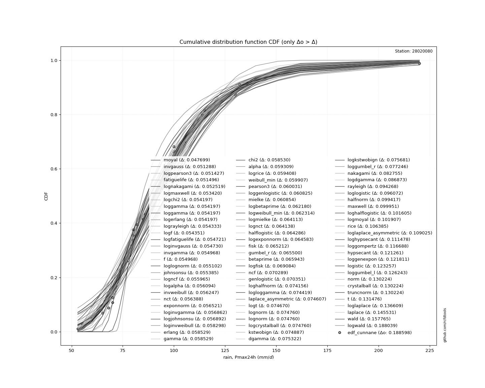</img>

</div>


**11.3. Best fit**

<div align="center">

|   id |   station | empirical_dist   | p_dist   |     delta |   deltao | eval   |   fit |   n |   best_fit |   best_fit_sort |
|-----:|----------:|:-----------------|:---------|----------:|---------:|:-------|------:|----:|-----------:|----------------:|
|    0 |  28020080 | edf_cunnane      | erlang   | 0.0490864 | 0.181738 | Δo > Δ |     1 |  56 |          1 |               1 |

</div>


<div align="center">

</img>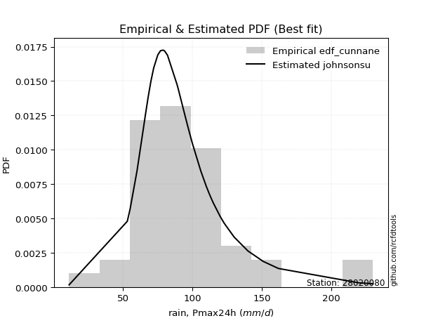</img>

</div>


### 12. EDF Adamowski (1981)

The Adamowski formula in hydrology refers to a specific plotting position formula used for estimating the non-parametric empirical distribution of hydrological events (like flood peaks) to calculate their return periods. This formula provides an alternative to traditional parametric methods (like the Gumbel or Log Pearson Type III distributions). 

<div align="center">


$P=(m-0.25)/(n+0.5)$


</div>


**12.1. Empirical values**

<div align="center">

|                | 0                   | 1                    | 2                    | 3                   | 4                  | 5                   | 6                   | 7                   | 8                   | 9                   | 10                 | 11                 | 12                  | 13                  | 14                 | 15                  | 16                  | 17                 | 18                  | 19                 | 20                 | 21                  | 22                 | 23                  | 24                  | 25                 | 26                  | 27                 | 28                 | 29                 | 30                 | 31                 | 32                 | 33                 | 34                 | 35                 | 36                 | 37                 | 38                 | 39                 | 40                 | 41                 | 42                 | 43                 | 44                 | 45                 | 46                | 47                 | 48                 | 49                 | 50                 | 51                | 52                 | 53                 | 54                 | 55                 |
|:---------------|:--------------------|:---------------------|:---------------------|:--------------------|:-------------------|:--------------------|:--------------------|:--------------------|:--------------------|:--------------------|:-------------------|:-------------------|:--------------------|:--------------------|:-------------------|:--------------------|:--------------------|:-------------------|:--------------------|:-------------------|:-------------------|:--------------------|:-------------------|:--------------------|:--------------------|:-------------------|:--------------------|:-------------------|:-------------------|:-------------------|:-------------------|:-------------------|:-------------------|:-------------------|:-------------------|:-------------------|:-------------------|:-------------------|:-------------------|:-------------------|:-------------------|:-------------------|:-------------------|:-------------------|:-------------------|:-------------------|:------------------|:-------------------|:-------------------|:-------------------|:-------------------|:------------------|:-------------------|:-------------------|:-------------------|:-------------------|
| date           | 1960                | 1974                 | 1982                 | 1997                | 2009               | 1990                | 1989                | 1991                | 2012                | 1964                | 1968               | 1959               | 1988                | 1992                | 1979               | 1963                | 1987                | 1994               | 1986                | 1971               | 1976               | 2013                | 2015               | 2004                | 1981                | 1999               | 1980                | 2002               | 1973               | 1965               | 2006               | 2019               | 1969               | 1972               | 2007               | 1970               | 1984               | 2020               | 2010               | 1983               | 2003               | 2001               | 1993               | 1962               | 1995               | 2000               | 1996              | 1975               | 2014               | 2011               | 2021               | 2017              | 1998               | 2005               | 1985               | 2008               |
| x              | 53.0                | 55.0                 | 60.0                 | 65.0                | 68.0               | 70.0                | 70.0                | 70.0                | 70.0                | 72.0                | 72.72167244        | 73.86977315        | 75.0                | 77.0                | 78.44364045        | 79.0                | 79.27108814         | 80.0               | 80.0                | 80.0               | 82.0               | 85.0                | 86.0               | 89.0                | 90.0                | 90.0               | 90.0                | 94.0               | 96.0               | 96.79157548        | 97.0               | 97.0               | 99.0               | 100.0              | 100.0              | 100.0              | 100.05888838678571 | 105.0              | 105.0              | 106.0              | 109.0              | 110.0              | 112.0              | 114.0              | 115.0              | 120.0              | 123.0             | 130.0              | 130.0              | 132.0              | 134.0              | 135.0             | 140.0              | 151.0              | 162.0              | 220.0              |
| m              | 1                   | 2                    | 3                    | 4                   | 5                  | 6                   | 7                   | 8                   | 9                   | 10                  | 11                 | 12                 | 13                  | 14                  | 15                 | 16                  | 17                  | 18                 | 19                  | 20                 | 21                 | 22                  | 23                 | 24                  | 25                  | 26                 | 27                  | 28                 | 29                 | 30                 | 31                 | 32                 | 33                 | 34                 | 35                 | 36                 | 37                 | 38                 | 39                 | 40                 | 41                 | 42                 | 43                 | 44                 | 45                 | 46                 | 47                | 48                 | 49                 | 50                 | 51                 | 52                | 53                 | 54                 | 55                 | 56                 |
| empirical_dist | edf_adamowski       | edf_adamowski        | edf_adamowski        | edf_adamowski       | edf_adamowski      | edf_adamowski       | edf_adamowski       | edf_adamowski       | edf_adamowski       | edf_adamowski       | edf_adamowski      | edf_adamowski      | edf_adamowski       | edf_adamowski       | edf_adamowski      | edf_adamowski       | edf_adamowski       | edf_adamowski      | edf_adamowski       | edf_adamowski      | edf_adamowski      | edf_adamowski       | edf_adamowski      | edf_adamowski       | edf_adamowski       | edf_adamowski      | edf_adamowski       | edf_adamowski      | edf_adamowski      | edf_adamowski      | edf_adamowski      | edf_adamowski      | edf_adamowski      | edf_adamowski      | edf_adamowski      | edf_adamowski      | edf_adamowski      | edf_adamowski      | edf_adamowski      | edf_adamowski      | edf_adamowski      | edf_adamowski      | edf_adamowski      | edf_adamowski      | edf_adamowski      | edf_adamowski      | edf_adamowski     | edf_adamowski      | edf_adamowski      | edf_adamowski      | edf_adamowski      | edf_adamowski     | edf_adamowski      | edf_adamowski      | edf_adamowski      | edf_adamowski      |
| empirical      | 0.01327433628318584 | 0.030973451327433628 | 0.048672566371681415 | 0.06637168141592921 | 0.084070796460177  | 0.10176991150442478 | 0.11946902654867257 | 0.13716814159292035 | 0.15486725663716813 | 0.17256637168141592 | 0.1902654867256637 | 0.2079646017699115 | 0.22566371681415928 | 0.24336283185840707 | 0.2610619469026549 | 0.27876106194690264 | 0.29646017699115046 | 0.3141592920353982 | 0.33185840707964603 | 0.3495575221238938 | 0.3672566371681416 | 0.38495575221238937 | 0.4026548672566372 | 0.42035398230088494 | 0.43805309734513276 | 0.4557522123893805 | 0.47345132743362833 | 0.4911504424778761 | 0.5088495575221239 | 0.5265486725663717 | 0.5442477876106194 | 0.5619469026548672 | 0.5796460176991151 | 0.5973451327433629 | 0.6150442477876106 | 0.6327433628318584 | 0.6504424778761062 | 0.668141592920354  | 0.6858407079646017 | 0.7035398230088495 | 0.7212389380530974 | 0.7389380530973452 | 0.7566371681415929 | 0.7743362831858407 | 0.7920353982300885 | 0.8097345132743363 | 0.827433628318584 | 0.8451327433628318 | 0.8628318584070797 | 0.8805309734513275 | 0.8982300884955752 | 0.915929203539823 | 0.9336283185840708 | 0.9513274336283186 | 0.9690265486725663 | 0.9867256637168141 |
| empirical_tr   | 1.0134529147982063  | 1.0319634703196348   | 1.0511627906976744   | 1.0710900473933649  | 1.0917874396135265 | 1.1133004926108374  | 1.135678391959799   | 1.1589743589743589  | 1.1832460732984293  | 1.2085561497326203  | 1.2349726775956285 | 1.2625698324022345 | 1.2914285714285714  | 1.3216374269005848  | 1.353293413173653  | 1.3865030674846626  | 1.4213836477987423  | 1.4580645161290322 | 1.4966887417218542  | 1.5374149659863945 | 1.5804195804195804 | 1.6258992805755397  | 1.6740740740740743 | 1.7251908396946565  | 1.779527559055118   | 1.8373983739837396 | 1.8991596638655461  | 1.9652173913043478 | 2.036036036036036  | 2.1121495327102804 | 2.1941747572815533 | 2.282828282828283  | 2.378947368421053  | 2.4835164835164836 | 2.597701149425287  | 2.72289156626506   | 2.8607594936708862 | 3.0133333333333336 | 3.1830985915492955 | 3.373134328358209  | 3.5873015873015874 | 3.8305084745762716 | 4.1090909090909085 | 4.431372549019607  | 4.808510638297872  | 5.255813953488373  | 5.794871794871793 | 6.457142857142856  | 7.290322580645162  | 8.370370370370374  | 9.826086956521735  | 11.89473684210526 | 15.066666666666668 | 20.54545454545456  | 32.285714285714235 | 75.33333333333321  |

</div>


**12.2. Kolmogorov-Smirnov fit test (sorted by Δ)**


<div align="center">

|                | 0                   | 1                    | 2                    | 3                    | 4                    | 5                   | 6                   | 7                    | 8                    | 9                    | 10                  | 11                   | 12                  | 13                   | 14                   | 15                   | 16                  | 17                   | 18                  | 19                  | 20                  | 21                  | 22                  | 23                 | 24                   | 25                  | 26                  | 27                  | 28                   | 29                   | 30                   | 31                  | 32                  | 33                  | 34                  | 35                  | 36                  | 37                  | 38                  | 39                  | 40                  | 41                  | 42                  | 43                  | 44                 | 45                 | 46                  | 47                  | 48                 | 49                  | 50                  | 51                 | 52                  | 53                 | 54                  | 55                  | 56                  | 57                 | 58                  | 59                  | 60                 | 61                  | 62                 | 63                  | 64                    | 65                  | 66                  | 67                  | 68                  | 69                  | 70                 | 71                  | 72                  | 73                  | 74                  | 75                  | 76                 | 77                  | 78                  | 79                  | 80                  | 81                  | 82                  | 83                  | 84                  | 85                  | 86                 | 87                 |
|:---------------|:--------------------|:---------------------|:---------------------|:---------------------|:---------------------|:--------------------|:--------------------|:---------------------|:---------------------|:---------------------|:--------------------|:---------------------|:--------------------|:---------------------|:---------------------|:---------------------|:--------------------|:---------------------|:--------------------|:--------------------|:--------------------|:--------------------|:--------------------|:-------------------|:---------------------|:--------------------|:--------------------|:--------------------|:---------------------|:---------------------|:---------------------|:--------------------|:--------------------|:--------------------|:--------------------|:--------------------|:--------------------|:--------------------|:--------------------|:--------------------|:--------------------|:--------------------|:--------------------|:--------------------|:-------------------|:-------------------|:--------------------|:--------------------|:-------------------|:--------------------|:--------------------|:-------------------|:--------------------|:-------------------|:--------------------|:--------------------|:--------------------|:-------------------|:--------------------|:--------------------|:-------------------|:--------------------|:-------------------|:--------------------|:----------------------|:--------------------|:--------------------|:--------------------|:--------------------|:--------------------|:-------------------|:--------------------|:--------------------|:--------------------|:--------------------|:--------------------|:-------------------|:--------------------|:--------------------|:--------------------|:--------------------|:--------------------|:--------------------|:--------------------|:--------------------|:--------------------|:-------------------|:-------------------|
| station        | 28020080            | 28020080             | 28020080             | 28020080             | 28020080             | 28020080            | 28020080            | 28020080             | 28020080             | 28020080             | 28020080            | 28020080             | 28020080            | 28020080             | 28020080             | 28020080             | 28020080            | 28020080             | 28020080            | 28020080            | 28020080            | 28020080            | 28020080            | 28020080           | 28020080             | 28020080            | 28020080            | 28020080            | 28020080             | 28020080             | 28020080             | 28020080            | 28020080            | 28020080            | 28020080            | 28020080            | 28020080            | 28020080            | 28020080            | 28020080            | 28020080            | 28020080            | 28020080            | 28020080            | 28020080           | 28020080           | 28020080            | 28020080            | 28020080           | 28020080            | 28020080            | 28020080           | 28020080            | 28020080           | 28020080            | 28020080            | 28020080            | 28020080           | 28020080            | 28020080            | 28020080           | 28020080            | 28020080           | 28020080            | 28020080              | 28020080            | 28020080            | 28020080            | 28020080            | 28020080            | 28020080           | 28020080            | 28020080            | 28020080            | 28020080            | 28020080            | 28020080           | 28020080            | 28020080            | 28020080            | 28020080            | 28020080            | 28020080            | 28020080            | 28020080            | 28020080            | 28020080           | 28020080           |
| empirical_dist | edf_adamowski       | edf_adamowski        | edf_adamowski        | edf_adamowski        | edf_adamowski        | edf_adamowski       | edf_adamowski       | edf_adamowski        | edf_adamowski        | edf_adamowski        | edf_adamowski       | edf_adamowski        | edf_adamowski       | edf_adamowski        | edf_adamowski        | edf_adamowski        | edf_adamowski       | edf_adamowski        | edf_adamowski       | edf_adamowski       | edf_adamowski       | edf_adamowski       | edf_adamowski       | edf_adamowski      | edf_adamowski        | edf_adamowski       | edf_adamowski       | edf_adamowski       | edf_adamowski        | edf_adamowski        | edf_adamowski        | edf_adamowski       | edf_adamowski       | edf_adamowski       | edf_adamowski       | edf_adamowski       | edf_adamowski       | edf_adamowski       | edf_adamowski       | edf_adamowski       | edf_adamowski       | edf_adamowski       | edf_adamowski       | edf_adamowski       | edf_adamowski      | edf_adamowski      | edf_adamowski       | edf_adamowski       | edf_adamowski      | edf_adamowski       | edf_adamowski       | edf_adamowski      | edf_adamowski       | edf_adamowski      | edf_adamowski       | edf_adamowski       | edf_adamowski       | edf_adamowski      | edf_adamowski       | edf_adamowski       | edf_adamowski      | edf_adamowski       | edf_adamowski      | edf_adamowski       | edf_adamowski         | edf_adamowski       | edf_adamowski       | edf_adamowski       | edf_adamowski       | edf_adamowski       | edf_adamowski      | edf_adamowski       | edf_adamowski       | edf_adamowski       | edf_adamowski       | edf_adamowski       | edf_adamowski      | edf_adamowski       | edf_adamowski       | edf_adamowski       | edf_adamowski       | edf_adamowski       | edf_adamowski       | edf_adamowski       | edf_adamowski       | edf_adamowski       | edf_adamowski      | edf_adamowski      |
| p_dist         | gamma               | chi2                 | erlang               | logweibull_min       | fatiguelife          | invgauss            | lognakagami         | johnsonsu            | logrice              | logmaxwell           | loginvgauss         | logpearson3          | gumbel_r            | loggamma             | loggamma             | logerlang            | logchi2             | logfatiguelife       | invgamma            | loglognorm          | f                   | logf                | logncf              | loginvgamma        | logjohnsonsu         | logalpha            | invweibull          | nct                 | weibull_min          | alpha                | lognct               | exponnorm           | moyal               | mielke              | loggenlogistic      | betaprime           | lograyleigh         | logexponnorm        | ncf                 | kstwobign           | genlogistic         | pearson3            | logmielke           | halflogistic        | logloggamma        | logcrystalball     | lognorm             | lognorm             | nakagami           | logfisk             | fisk                | loginvweibull      | halfnorm            | logt               | rayleigh            | logkstwobign        | maxwell             | t                  | rice                | loglogistic         | loggumbel_r        | loghalfnorm         | laplace_asymmetric | loghypsecant        | loglaplace_asymmetric | logistic            | hypsecant           | logmoyal            | truncnorm           | norm                | crystalball        | loghalflogistic     | loggumbel_l         | loglaplace          | loggenexpon         | laplace             | wald               | genexpon            | gumbel_l            | logwald             | logbetaprime        | expon               | loggompertz         | gibrat              | loggibrat           | logtruncnorm        | logexpon           | gompertz           |
| delta          | 0.04879899324162229 | 0.048799432148109334 | 0.048799534831928615 | 0.050440101220782504 | 0.051428981272086394 | 0.05158355621498023 | 0.05231071187645059 | 0.053540040996761795 | 0.053710081845626534 | 0.053851768768351405 | 0.05444187837965969 | 0.054563892046172346 | 0.05476883970749247 | 0.055205634954391125 | 0.055205634954391125 | 0.055205638303056526 | 0.05520565770640229 | 0.055792128303685073 | 0.05610478965829585 | 0.05617352654961677 | 0.05617728464426108 | 0.05643429463134503 | 0.05650775213338344 | 0.0565159520975545 | 0.056603242861313796 | 0.05711755782113204 | 0.05731391777730138 | 0.05763471501308404 | 0.060281099093672186 | 0.060426659968561225 | 0.060630050483272524 | 0.06128164880939291 | 0.06260889667577585 | 0.06263165248977542 | 0.06302802455010764 | 0.06374293527892239 | 0.06412032803189427 | 0.06499317772590668 | 0.06509628814104318 | 0.06532967114516558 | 0.06659732660497214 | 0.06697230855641667 | 0.06726014962925014 | 0.06849793652692127 | 0.0699476343374607 | 0.0701081584039851 | 0.07010848694306049 | 0.07010848694306049 | 0.0709715274295073 | 0.07134859208604855 | 0.07490512323566284 | 0.0750165060633946 | 0.07745840571960728 | 0.0792191425475236 | 0.07946476311771618 | 0.08053406548248532 | 0.08727687271489482 | 0.0903546986142323 | 0.09143725652946033 | 0.09227246861615584 | 0.0929122305680452 | 0.09304691978154767 | 0.0943270856645424 | 0.10771601114780577 | 0.11383108632535271   | 0.11449352989376016 | 0.11505420229547217 | 0.11827920937592351 | 0.11879340692891016 | 0.11879342642528468 | 0.1187934342264163 | 0.11961220502029946 | 0.12147284755134613 | 0.13078555775761042 | 0.13271721907781975 | 0.13735936188144213 | 0.1680093400674393 | 0.16966143153781127 | 0.18749432696730606 | 0.19552902415192688 | 0.20516025369781793 | 0.21437972881402118 | 0.22271169870613422 | 0.22728721383962894 | 0.23653119075136347 | 0.27336047119277074 | 0.2830899628679635 | 0.9689974662970497 |
| deltao         | 0.1817376445004486  | 0.1817376445004486   | 0.1817376445004486   | 0.1817376445004486   | 0.1817376445004486   | 0.1817376445004486  | 0.1817376445004486  | 0.1817376445004486   | 0.1817376445004486   | 0.1817376445004486   | 0.1817376445004486  | 0.1817376445004486   | 0.1817376445004486  | 0.1817376445004486   | 0.1817376445004486   | 0.1817376445004486   | 0.1817376445004486  | 0.1817376445004486   | 0.1817376445004486  | 0.1817376445004486  | 0.1817376445004486  | 0.1817376445004486  | 0.1817376445004486  | 0.1817376445004486 | 0.1817376445004486   | 0.1817376445004486  | 0.1817376445004486  | 0.1817376445004486  | 0.1817376445004486   | 0.1817376445004486   | 0.1817376445004486   | 0.1817376445004486  | 0.1817376445004486  | 0.1817376445004486  | 0.1817376445004486  | 0.1817376445004486  | 0.1817376445004486  | 0.1817376445004486  | 0.1817376445004486  | 0.1817376445004486  | 0.1817376445004486  | 0.1817376445004486  | 0.1817376445004486  | 0.1817376445004486  | 0.1817376445004486 | 0.1817376445004486 | 0.1817376445004486  | 0.1817376445004486  | 0.1817376445004486 | 0.1817376445004486  | 0.1817376445004486  | 0.1817376445004486 | 0.1817376445004486  | 0.1817376445004486 | 0.1817376445004486  | 0.1817376445004486  | 0.1817376445004486  | 0.1817376445004486 | 0.1817376445004486  | 0.1817376445004486  | 0.1817376445004486 | 0.1817376445004486  | 0.1817376445004486 | 0.1817376445004486  | 0.1817376445004486    | 0.1817376445004486  | 0.1817376445004486  | 0.1817376445004486  | 0.1817376445004486  | 0.1817376445004486  | 0.1817376445004486 | 0.1817376445004486  | 0.1817376445004486  | 0.1817376445004486  | 0.1817376445004486  | 0.1817376445004486  | 0.1817376445004486 | 0.1817376445004486  | 0.1817376445004486  | 0.1817376445004486  | 0.1817376445004486  | 0.1817376445004486  | 0.1817376445004486  | 0.1817376445004486  | 0.1817376445004486  | 0.1817376445004486  | 0.1817376445004486 | 0.1817376445004486 |
| eval           | Δo > Δ              | Δo > Δ               | Δo > Δ               | Δo > Δ               | Δo > Δ               | Δo > Δ              | Δo > Δ              | Δo > Δ               | Δo > Δ               | Δo > Δ               | Δo > Δ              | Δo > Δ               | Δo > Δ              | Δo > Δ               | Δo > Δ               | Δo > Δ               | Δo > Δ              | Δo > Δ               | Δo > Δ              | Δo > Δ              | Δo > Δ              | Δo > Δ              | Δo > Δ              | Δo > Δ             | Δo > Δ               | Δo > Δ              | Δo > Δ              | Δo > Δ              | Δo > Δ               | Δo > Δ               | Δo > Δ               | Δo > Δ              | Δo > Δ              | Δo > Δ              | Δo > Δ              | Δo > Δ              | Δo > Δ              | Δo > Δ              | Δo > Δ              | Δo > Δ              | Δo > Δ              | Δo > Δ              | Δo > Δ              | Δo > Δ              | Δo > Δ             | Δo > Δ             | Δo > Δ              | Δo > Δ              | Δo > Δ             | Δo > Δ              | Δo > Δ              | Δo > Δ             | Δo > Δ              | Δo > Δ             | Δo > Δ              | Δo > Δ              | Δo > Δ              | Δo > Δ             | Δo > Δ              | Δo > Δ              | Δo > Δ             | Δo > Δ              | Δo > Δ             | Δo > Δ              | Δo > Δ                | Δo > Δ              | Δo > Δ              | Δo > Δ              | Δo > Δ              | Δo > Δ              | Δo > Δ             | Δo > Δ              | Δo > Δ              | Δo > Δ              | Δo > Δ              | Δo > Δ              | Δo > Δ             | Δo > Δ              | Δo <= Δ             | Δo <= Δ             | Δo <= Δ             | Δo <= Δ             | Δo <= Δ             | Δo <= Δ             | Δo <= Δ             | Δo <= Δ             | Δo <= Δ            | Δo <= Δ            |
| fit            | 1                   | 1                    | 1                    | 1                    | 1                    | 1                   | 1                   | 1                    | 1                    | 1                    | 1                   | 1                    | 1                   | 1                    | 1                    | 1                    | 1                   | 1                    | 1                   | 1                   | 1                   | 1                   | 1                   | 1                  | 1                    | 1                   | 1                   | 1                   | 1                    | 1                    | 1                    | 1                   | 1                   | 1                   | 1                   | 1                   | 1                   | 1                   | 1                   | 1                   | 1                   | 1                   | 1                   | 1                   | 1                  | 1                  | 1                   | 1                   | 1                  | 1                   | 1                   | 1                  | 1                   | 1                  | 1                   | 1                   | 1                   | 1                  | 1                   | 1                   | 1                  | 1                   | 1                  | 1                   | 1                     | 1                   | 1                   | 1                   | 1                   | 1                   | 1                  | 1                   | 1                   | 1                   | 1                   | 1                   | 1                  | 1                   | 0                   | 0                   | 0                   | 0                   | 0                   | 0                   | 0                   | 0                   | 0                  | 0                  |
| n              | 56                  | 56                   | 56                   | 56                   | 56                   | 56                  | 56                  | 56                   | 56                   | 56                   | 56                  | 56                   | 56                  | 56                   | 56                   | 56                   | 56                  | 56                   | 56                  | 56                  | 56                  | 56                  | 56                  | 56                 | 56                   | 56                  | 56                  | 56                  | 56                   | 56                   | 56                   | 56                  | 56                  | 56                  | 56                  | 56                  | 56                  | 56                  | 56                  | 56                  | 56                  | 56                  | 56                  | 56                  | 56                 | 56                 | 56                  | 56                  | 56                 | 56                  | 56                  | 56                 | 56                  | 56                 | 56                  | 56                  | 56                  | 56                 | 56                  | 56                  | 56                 | 56                  | 56                 | 56                  | 56                    | 56                  | 56                  | 56                  | 56                  | 56                  | 56                 | 56                  | 56                  | 56                  | 56                  | 56                  | 56                 | 56                  | 56                  | 56                  | 56                  | 56                  | 56                  | 56                  | 56                  | 56                  | 56                 | 56                 |
| best_fit       | 1                   | 0                    | 0                    | 0                    | 0                    | 0                   | 0                   | 0                    | 0                    | 0                    | 0                   | 0                    | 0                   | 0                    | 0                    | 0                    | 0                   | 0                    | 0                   | 0                   | 0                   | 0                   | 0                   | 0                  | 0                    | 0                   | 0                   | 0                   | 0                    | 0                    | 0                    | 0                   | 0                   | 0                   | 0                   | 0                   | 0                   | 0                   | 0                   | 0                   | 0                   | 0                   | 0                   | 0                   | 0                  | 0                  | 0                   | 0                   | 0                  | 0                   | 0                   | 0                  | 0                   | 0                  | 0                   | 0                   | 0                   | 0                  | 0                   | 0                   | 0                  | 0                   | 0                  | 0                   | 0                     | 0                   | 0                   | 0                   | 0                   | 0                   | 0                  | 0                   | 0                   | 0                   | 0                   | 0                   | 0                  | 0                   | 0                   | 0                   | 0                   | 0                   | 0                   | 0                   | 0                   | 0                   | 0                  | 0                  |
| best_fit_sort  | 1                   | 2                    | 3                    | 4                    | 5                    | 6                   | 7                   | 8                    | 9                    | 10                   | 11                  | 12                   | 13                  | 14                   | 15                   | 16                   | 17                  | 18                   | 19                  | 20                  | 21                  | 22                  | 23                  | 24                 | 25                   | 26                  | 27                  | 28                  | 29                   | 30                   | 31                   | 32                  | 33                  | 34                  | 35                  | 36                  | 37                  | 38                  | 39                  | 40                  | 41                  | 42                  | 43                  | 44                  | 45                 | 46                 | 47                  | 48                  | 49                 | 50                  | 51                  | 52                 | 53                  | 54                 | 55                  | 56                  | 57                  | 58                 | 59                  | 60                  | 61                 | 62                  | 63                 | 64                  | 65                    | 66                  | 67                  | 68                  | 69                  | 70                  | 71                 | 72                  | 73                  | 74                  | 75                  | 76                  | 77                 | 78                  | 79                  | 80                  | 81                  | 82                  | 83                  | 84                  | 85                  | 86                  | 87                 | 88                 |

</div>


<div align="center">

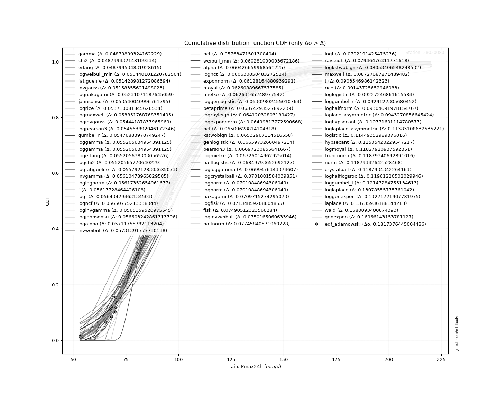</img>

</div>


**12.3. Best fit**

<div align="center">

|   id |   station | empirical_dist   | p_dist   |    delta |   deltao | eval   |   fit |   n |   best_fit |   best_fit_sort |
|-----:|----------:|:-----------------|:---------|---------:|---------:|:-------|------:|----:|-----------:|----------------:|
|    0 |  28020080 | edf_adamowski    | gamma    | 0.048799 | 0.181738 | Δo > Δ |     1 |  56 |          1 |               1 |

</div>


<div align="center">

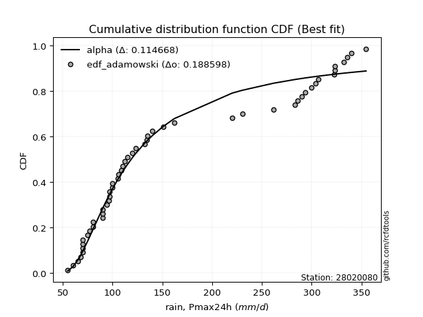</img>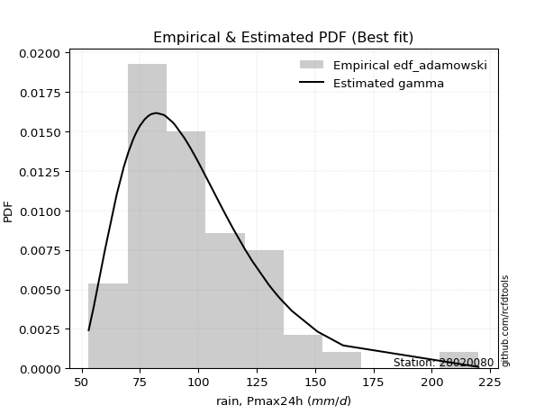</img>

</div>


## C. Best fit & Estimate extreme values for specific return periods - Tr

Best fit in probability distribution analysis means finding the theoretical distribution (like Normal, Poisson, Exponential) that most accurately mirrors your real-world data´s patterns (shape, center, spread) for better predictions, using methods like visual checks (Q-Q plots), goodness-of-fit tests (Kolmogorov-Smirnov, Chi-Squared), and information criteria (AIC) to score and select the simplest, most representative model.


### 1. Best fit (ordered by delta Δ)

:file_folder:Table: [bestfit_28020080.csv](table/bestfit_28020080.csv)

<div align="center">

|   id |   station | empirical_dist   | p_dist         |     delta |   deltao | eval   |   fit |   n |   best_fit |   best_fit_sort |
|-----:|----------:|:-----------------|:---------------|----------:|---------:|:-------|------:|----:|-----------:|----------------:|
|    0 |  28020080 | edf_weibull      | logweibull_min | 0.0469469 | 0.181738 | Δo > Δ |     1 |  56 |          1 |               1 |
|    1 |  28020080 | edf_tukey        | gamma          | 0.0483539 | 0.181738 | Δo > Δ |     1 |  56 |          1 |               2 |
|    2 |  28020080 | edf_filliben     | gamma          | 0.0484387 | 0.181738 | Δo > Δ |     1 |  56 |          1 |               3 |
|    3 |  28020080 | edf_jenkinson    | gamma          | 0.0484788 | 0.181738 | Δo > Δ |     1 |  56 |          1 |               4 |
|    4 |  28020080 | edf_beard        | gamma          | 0.0484788 | 0.181738 | Δo > Δ |     1 |  56 |          1 |               5 |
|    5 |  28020080 | edf_chegodayev   | gamma          | 0.0485323 | 0.181738 | Δo > Δ |     1 |  56 |          1 |               6 |
|    6 |  28020080 | edf_blom         | erlang         | 0.0487306 | 0.181738 | Δo > Δ |     1 |  56 |          1 |               7 |
|    7 |  28020080 | edf_adamowski    | gamma          | 0.048799  | 0.181738 | Δo > Δ |     1 |  56 |          1 |               8 |
|    8 |  28020080 | edf_cunnane      | erlang         | 0.0490864 | 0.181738 | Δo > Δ |     1 |  56 |          1 |               9 |
|    9 |  28020080 | edf_gringorten   | erlang         | 0.0496571 | 0.181738 | Δo > Δ |     1 |  56 |          1 |              10 |
|   10 |  28020080 | edf_hazen        | fatiguelife    | 0.0500857 | 0.181738 | Δo > Δ |     1 |  56 |          1 |              11 |
|   11 |  28020080 | edf_california   | logmaxwell     | 0.0521214 | 0.181738 | Δo > Δ |     1 |  56 |          1 |              12 |

</div>


### 2. Extreme values and % difference analysis

In hydrology, a return period (or recurrence interval $Tr$) is the statistical average time between extreme events like floods or droughts of a specific magnitude, indicating how rare an event is, with a 100-year flood, for example, having a 1% chance of occurring in any given year, not that it happens exactly every century. It is a key tool for infrastructure design (like bridges or dams) and risk assessment, calculated from historical data to determine the probability of future events, although it is important to remember it is statistical average, and events can cluster or be missed.

> risk_rate: assuming the return period as the project useful life.

:file_folder:Table: [extreme_28020080.csv](table/extreme_28020080.csv), all PDFs.  
:file_folder:Table: [extremepdiff_28020080.csv](table/extremepdiff_28020080.csv), % difference between bestfit and most used PDFs in Hydrology.

<div align="center">

Extreme values table for only best fit PDFs
|   id |      tr |   prob_l |     prob_g |    alpha |   betaprime |     chi2 |   crystalball |   erlang |    expon |   exponnorm |        f |   fatiguelife |     fisk |    gamma |   genexpon |   genlogistic |   gibrat |   gompertz |   gumbel_l |   gumbel_r |   halflogistic |   halfnorm |   hypsecant |   invgamma |   invgauss |   invweibull |   johnsonsu |   kstwobign |   laplace |   laplace_asymmetric |   loggamma |   logistic |   lognorm |   maxwell |   mielke |    moyal |   nakagami |      ncf |      nct |     norm |   pearson3 |   rayleigh |     rice |        t |   truncnorm |     wald |   weibull_min |   logalpha |   logbetaprime |   logchi2 |   logcrystalball |   logerlang |   logexpon |   logexponnorm |     logf |   logfatiguelife |   logfisk |   loggenexpon |   loggenlogistic |   loggibrat |   loggompertz |   loggumbel_l |   loggumbel_r |   loghalflogistic |   loghalfnorm |   loghypsecant |   loginvgamma |   loginvgauss |   loginvweibull |   logjohnsonsu |   logkstwobign |   loglaplace |   loglaplace_asymmetric |   logloggamma |   loglogistic |   loglognorm |   logmaxwell |   logmielke |   logmoyal |   lognakagami |   logncf |   lognct |   logpearson3 |   lograyleigh |   logrice |     logt |   logtruncnorm |   logwald |   logweibull_min |   station |   n |   risk_rate |
|-----:|--------:|---------:|-----------:|---------:|------------:|---------:|--------------:|---------:|---------:|------------:|---------:|--------------:|---------:|---------:|-----------:|--------------:|---------:|-----------:|-----------:|-----------:|---------------:|-----------:|------------:|-----------:|-----------:|-------------:|------------:|------------:|----------:|---------------------:|-----------:|-----------:|----------:|----------:|---------:|---------:|-----------:|---------:|---------:|---------:|-----------:|-----------:|---------:|---------:|------------:|---------:|--------------:|-----------:|---------------:|----------:|-----------------:|------------:|-----------:|---------------:|---------:|-----------------:|----------:|--------------:|-----------------:|------------:|--------------:|--------------:|--------------:|------------------:|--------------:|---------------:|--------------:|--------------:|----------------:|---------------:|---------------:|-------------:|------------------------:|--------------:|--------------:|-------------:|-------------:|------------:|-----------:|--------------:|---------:|---------:|--------------:|--------------:|----------:|---------:|---------------:|----------:|-----------------:|----------:|----:|------------:|
|    0 |    2    | 0.5      | 0.5        |  92.2596 |     92.9479 |  92.6219 |       97.7349 |  92.6219 |  84.0079 |      91.649 |  92.2137 |       92.3787 |  93.089  |  92.6219 |    87.3557 |       92.9032 |  88.9511 |    202.393 |    102.542 |    92.9275 |        90.5374 |    91.7448 |     97.7349 |    92.209  |    92.3392 |      92.1422 |     92.2487 |     93.8003 |   97.7349 |              88.5472 |    92.2137 |    97.7349 |   93.9571 |   95.2322 |  91.8315 |  91.3755 |    93.9246 |  93.1384 |  92.1659 |  97.7349 |    90.7599 |    94.3445 |  95.8439 |  92.318  |     97.7349 |  88.249  |       93.0113 |    92.2198 |        91.2284 |   92.2137 |          93.9571 |     92.2137 |    78.8188 |        92.4972 |  92.206  |          92.2092 |   92.2177 |       86.8365 |          91.8382 |     86.5113 |       82.5236 |       98.3015 |       89.8047 |           87.8099 |       88.8117 |        93.9571 |       92.2166 |       92.0995 |         90.1414 |        92.2138 |        89.3679 |      93.9571 |                 95.3159 |       94.0681 |       93.9571 |      92.2073 |      91.772  |     92.1335 |    88.5038 |       92.3525 |  92.2098 |  92.7737 |       92.1456 |       91.0095 |   92.9652 |  94.4062 |        79.4812 |   85.9391 |          92.4686 |  28020080 |  56 |    0.75     |
|    1 |    2.33 | 0.570815 | 0.429185   |  96.7842 |     97.5903 |  97.5697 |      102.957  |  97.5697 |  90.8399 |      96.045 |  96.8469 |       97.201  |  97.3224 |  97.5696 |    94.0365 |       97.4655 |  91.5964 |    203.191 |    107.086 |    97.7663 |        95.5125 |    97.3807 |    101.914  |    96.8419 |    97.1446 |      96.7318 |     96.9627 |     98.7484 |  100.895  |              93.472  |    96.8721 |   102.336  |   98.6854 |  100.657  |  96.1985 |  95.956  |    99.3674 |  97.7936 |  96.7446 | 102.957  |    95.6335 |    99.8501 | 100.927  |  96.7166 |    102.957  |  91.6732 |       97.9698 |    96.8281 |       100.402  |   96.8721 |          98.6853 |     96.8721 |    86.0209 |        96.9518 |  96.8281 |          96.8509 |   96.4412 |       92.6256 |          96.1965 |     88.6894 |       88.7441 |      102.592  |       93.9848 |           92.0144 |       93.6447 |        97.7225 |       96.84   |       96.7369 |         95.0226 |        96.834  |        94.5221 |      96.7907 |                 98.4203 |       98.8223 |       98.1108 |      96.8377 |      96.5747 |     96.4396 |    92.3987 |       97.1237 |  96.8317 |  97.4301 |       96.801  |       95.8444 |   97.84   |  99.0633 |        86.5635 |   88.7512 |          97.4326 |  28020080 |  56 |    0.729209 |
|    2 |    5    | 0.8      | 0.2        | 116.936  |    117.715  | 118.979  |      122.363  | 118.979  | 124.998  |     116.913 | 117.476  |      118.424  | 115.544  | 118.979  |   126.204  |      117.281  | 106.826  |    205.769 |    121.763 |   118.788  |       118.024  |   121.214  |    118.678  |   117.47   |   118.337  |     117.324  |    117.85   |    119.767  |  116.695  |             118.095  |   117.588  |   120.101  |  118.439  |  122.011  | 116.411  | 117.173  |   121.57   | 117.832  | 117.209  | 122.363  |   117.99   |   121.891  | 121.274  | 113.847  |    122.363  | 110.842  |      119.55   |   117.354  |       144.803  |  117.588  |         118.439  |    117.588  |   133.189  |       116.603  | 117.415  |         117.512  |  115.851  |      122.916  |         116.38   |    102.34   |      118.769  |      117.772  |      114.524  |          113.702  |      117.166  |       114.405  |      117.429  |      117.425  |        119.489  |       117.403  |       119.943  |     112.292  |                114.941  |      118.601  |      115.946  |     117.456  |     118.048  |    116.05   |   112.798  |      118.115  | 117.416  | 117.654  |      117.554  |      117.913  |  118.667  | 118.636  |       130.247  |  106.28   |         118.908  |  28020080 |  56 |    0.67232  |
|    3 |   10    | 0.9      | 0.1        | 134.183  |    134.09   | 135.943  |      135.237  | 135.943  | 156.006  |     135.668 | 134.878  |      135.702  | 131.1    | 135.943  |   154.723  |      133.416  | 124.186  |    207.204 |    129.934 |   135.91   |       136.718  |   138.85   |    132.064  |   134.87   |   135.666  |     134.908  |    135.208  |    135.77   |  131.038  |             140.446  |   134.989  |   133.184  |  133.679  |  137.039  | 134.972  | 135.646  |   137.613  | 133.986  | 134.663  | 135.237  |   136.764  |   137.607  | 135.783  | 126.871  |    135.237  | 131.184  |      136.428  |   134.729  |       186.298  |  134.989  |         133.679  |    134.989  |   198.072  |       133.472  | 134.809  |         134.917  |  134.11   |      154.46   |         134.957  |    120.48   |      144.832  |      127.178  |      134.528  |          135.549  |      138.298  |       129.75   |      134.824  |      134.906  |        144.002  |       134.77   |       143.792  |     128.504  |                132.328  |      133.768  |      131.123  |     134.857  |     135.963  |    133.8    |   134.194  |      135.346  | 134.808  | 134.146  |      135.043  |      136.689  |  135.118  | 134.07   |       184.456  |  128.684  |         135.998  |  28020080 |  56 |    0.651322 |
|    4 |   15    | 0.933333 | 0.0666667  | 144.374  |    143.362  | 145.269  |      141.661  | 145.269  | 174.144  |     146.638 | 144.962  |      145.375  | 140.437  | 145.269  |   171.316  |      142.518  | 136.16   |    207.854 |    133.635 |   145.57   |       147.297  |   148.028  |    139.703  |   144.952  |   145.401  |     145.164  |    145.121  |    144.265  |  139.428  |             153.521  |   145.029  |   140.312  |  142.002  |  144.749  | 146.503  | 146.367  |   145.911  | 143.079  | 144.882  | 141.661  |   147.374  |   145.705  | 143.258  | 134.242  |    141.661  | 144.246  |      145.556  |   144.839  |       211.848  |  145.029  |         142.002  |    145.03   |   249.829  |       143.584  | 144.907  |         144.986  |  145.869  |      175.434  |         146.524  |    134.833  |      159.671  |      131.681  |      147.318  |          149.724  |      150.762  |       139.412  |      144.923  |      145.04   |        159.99   |       144.846  |       158.323  |     139.051  |                143.694  |      142.018  |      140.213  |     144.946  |     146.185  |    144.762  |   148.426  |      145.1    | 144.904  | 143.495  |      145.154  |      147.501  |  144.216  | 142.69   |       224.143  |  145.502  |         145.451  |  28020080 |  56 |    0.644736 |
|    5 |   20    | 0.95     | 0.05       | 151.754  |    149.884  | 151.694  |      145.868  | 151.694  | 187.014  |     154.421 | 152.15   |      152.108  | 147.274  | 151.694  |   183.073  |      148.891  | 145.553  |    208.259 |    135.939 |   152.334  |       154.71   |   154.147  |    145.093  |   152.139  |   152.191  |     152.493  |    152.116  |    149.988  |  145.38   |             162.798  |   152.165  |   145.239  |  147.732  |  149.866  | 155.093  | 153.96   |   151.433  | 149.452  | 152.22   | 145.868  |   154.783  |   151.087  | 148.227  | 139.492  |    145.868  | 153.981  |      151.775  |   152.068  |       230.686  |  152.165  |         147.732  |    152.165  |   294.562  |       150.997  | 152.115  |         152.155  |  154.882  |      191.664  |         155.156  |    147.279  |      170.045  |      134.564  |      156.991  |          160.529  |      159.69   |       146.658  |      152.132  |      152.264  |        172.229  |       152.036  |       168.931  |     147.055  |                152.345  |      147.684  |      146.861  |     152.14   |     153.391  |    152.909  |   159.41   |      151.947  | 152.112  | 150.074  |      152.349  |      155.157  |  150.52   | 148.72   |       256.478  |  159.449  |         151.993  |  28020080 |  56 |    0.641514 |
|    6 |   25    | 0.96     | 0.04       | 157.593  |    154.93   | 156.586  |      148.965  | 156.586  | 196.996  |     160.458 | 157.764  |      157.271  | 152.728  | 156.586  |   192.186  |      153.8    | 153.383  |    208.547 |    137.578 |   157.544  |       160.42   |   158.7    |    149.264  |   157.753  |   157.407  |     158.222  |    157.538  |    154.275  |  149.998  |             169.994  |   157.726  |   149.008  |  152.097  |  153.665  | 162.023  | 159.845  |   155.538  | 154.37   | 157.984  | 148.965  |   160.473  |   155.086  | 151.918  | 143.609  |    148.965  | 161.778  |      156.473  |   157.729  |       245.745  |  157.726  |         152.097  |    157.726  |   334.705  |       156.923  | 157.752  |         157.75   |  162.322  |      205.109  |         162.128  |    158.529  |      178.011  |      136.654  |      164.873  |          169.383  |      166.674  |       152.524  |      157.77   |      157.907  |        182.291  |       157.655  |       177.34   |     153.58   |                159.413  |      151.994  |      152.158  |     157.76   |     158.969  |    159.472  |   168.479  |      157.233  | 157.747  | 155.166  |      157.96   |      161.101  |  155.344  | 153.37   |       284.205  |  171.579  |         156.993  |  28020080 |  56 |    0.639603 |
|    7 |   50    | 0.98     | 0.02       | 176.571  |    170.634  | 171.368  |      157.834  | 171.368  | 228.004  |     179.211 | 175.527  |      173.053  | 170.669  | 171.368  |   220.478  |      168.922  | 180.985  |    209.328 |    142.028 |   173.593  |       178.016  |   171.933  |    162.195  |   175.512  |   173.393  |     176.345  |    174.437  |    166.863  |  164.34   |             192.346  |   175.24   |   160.524  |  165.323  |  164.683  | 185.243  | 178.115  |   167.463  | 169.616  | 176.409  | 157.834  |   177.89   |   166.694  | 162.635  | 156.845  |    157.834  | 187.235  |      170.462  |   175.728  |       295.26   |  175.24   |         165.323  |    175.24   |   497.755  |       176.536  | 175.623  |         175.419  |  188.44   |      252.309  |         185.543  |    205.49   |      202.352  |      142.492  |      191.726  |          199.854  |      188.756  |       172.243  |      175.647  |      175.752  |        217.135  |       175.46   |       204.53   |     175.752  |                183.527  |      165.014  |      169.558  |     175.553  |     176.319  |    181.412  |   200.054  |      173.609  | 175.614  | 171.025  |      175.659  |      179.678  |  170.066  | 167.799  |       387.18   |  217.984  |         172.212  |  28020080 |  56 |    0.63583  |
|    8 |   75    | 0.986667 | 0.0133333  | 188.408  |    179.903  | 179.778  |      162.592  | 179.778  | 246.143  |     190.181 | 186.208  |      182.148  | 181.972  | 179.778  |   237.023  |      177.712  | 199.627  |    209.724 |    144.278 |   182.921  |       188.245  |   179.137  |    169.752  |   186.192  |   182.634  |     187.215  |    184.415  |    173.788  |  172.73   |             205.42   |   185.715  |   167.175  |  172.888  |  170.673  | 200.164  | 188.799  |   173.952  | 178.572  | 187.634  | 162.592  |   187.931  |   173.009  | 168.465  | 165.027  |    162.592  | 202.9    |      178.287  |   186.624  |       326.324  |  185.715  |         172.888  |    185.715  |   627.821  |       189.006  | 186.4    |         186.02   |  206.259  |      284.294  |         200.631  |    244.848  |      216.337  |      145.539  |      209.302  |          220.026  |      201.983  |       184.926  |      186.429  |      186.477  |        240.371  |       186.187  |       221.229  |     190.178  |                199.29   |      172.436  |      180.499  |     186.262  |     186.535  |    195.482  |   221.194  |      183.207  | 186.388  | 180.39   |      186.261  |      190.669  |  178.553  | 176.302  |       461.056  |  252.579  |         180.953  |  28020080 |  56 |    0.634587 |
|    9 |  100    | 0.99     | 0.01       | 197.206  |    186.539  | 185.657  |      165.811  | 185.657  | 259.012  |     197.965 | 193.942  |      188.554  | 190.4    | 185.658  |   248.761  |      183.932  | 214.069  |    209.982 |    145.749 |   189.523  |       195.484  |   184.044  |    175.112  |   193.925  |   189.155  |     195.062  |    191.554  |    178.534  |  178.683  |             214.697  |   193.271  |   171.871  |  178.199  |  174.753  | 211.419  | 196.379  |   178.374  | 184.965  | 195.83   | 165.811  |   195.001  |   177.311  | 172.436  | 171.082  |    165.811  | 214.322  |      183.7    |   194.548  |       349.383  |  193.271  |         178.199  |    193.271  |   740.234  |       198.361  | 194.219  |         193.685  |  220.267  |      309.236  |         212.033  |    280.448  |      226.158  |      147.567  |      222.706  |          235.523  |      211.521  |       194.485  |      194.252  |      194.24   |        258.304  |       193.965  |       233.451  |     201.125  |                211.288  |      177.638  |      188.647  |     194.02   |     193.83   |    206.084  |   237.533  |      190.044  | 194.205  | 187.097  |      193.917  |      198.54   |  184.54   | 182.392  |       520.535  |  281.216  |         187.101  |  28020080 |  56 |    0.633968 |
|   10 |  200    | 0.995    | 0.005      | 220.025  |    202.789  | 199.573  |      173.112  | 199.573  | 290.02   |     216.718 | 213.181  |      203.861  | 212.237  | 199.573  |   277.041  |      198.887  | 253.359  |    210.544 |    148.949 |   205.396  |       212.889  |   195.268  |    188.026  |   213.159  |   204.778  |     214.462  |    208.999  |    189.463  |  193.026  |             237.049  |   211.966  |   183.135  |  190.861  |  184.088  | 241.057  | 214.641  |   188.489  | 200.557  | 216.471  | 173.112  |   211.881  |   187.156  | 181.524  | 186.693  |    173.112  | 242.771  |      196.331  |   214.395  |       408.672  |  211.966  |         190.861  |    211.966  |  1100.84   |       222.811  | 213.723  |         212.705  |  259.613  |      378.128  |         242.134  |    405.742  |      249.507  |      152.073  |      258.55   |          277.392  |      235.062  |       219.593  |      213.772  |      213.532  |        307.086  |       213.349  |       264.232  |     230.161  |                243.249  |      190.001  |      209.722  |     213.332  |     211.61   |    233.965  |   282.03   |      206.654  | 213.703  | 203.527  |      212.884  |      217.793  |  198.896  | 197.339  |       691.678  |  367.469  |         201.787  |  28020080 |  56 |    0.633042 |
|   11 |  250    | 0.996    | 0.004      | 227.932  |    208.111  | 203.987  |      175.343  | 203.987  | 300.002  |     222.755 | 219.572  |      208.757  | 219.764  | 203.987  |   286.145  |      203.695  | 267.456  |    210.709 |    149.89  |   210.499  |       218.484  |   198.721  |    192.184  |   219.549  |   209.786  |     220.863  |    214.699  |    192.845  |  197.643  |             244.245  |   218.146  |   186.751  |  194.907  |  186.961  | 251.421  | 220.52   |   191.603  | 205.646  | 223.409  | 175.343  |   217.275  |   190.186  | 184.322  | 192.07   |    175.343  | 252.183  |      200.287  |   221.033  |       428.949  |  218.146  |         194.907  |    218.146  |  1250.86   |       231.301  | 220.221  |         219.011  |  274.25   |      403.28   |         252.685  |    463.234  |      256.936  |      153.424  |      271.257  |          292.375  |      242.819  |       228.346  |      220.276  |      219.935  |        324.647  |       219.801  |       274.556  |     240.373  |                254.534  |      193.941  |      216.976  |     219.753  |     217.405  |    243.703  |   298.058  |      212.053  | 220.199  | 208.91   |      219.16   |      224.087  |  203.508  | 202.251  |       756.238  |  401.473  |         206.486  |  28020080 |  56 |    0.632858 |
|   12 |  500    | 0.998    | 0.002      | 254.597  |    224.974  | 217.525  |      181.959  | 217.525  | 331.01   |     241.508 | 240.106  |      223.888  | 244.845  | 217.525  |   314.423  |      218.618  | 316.177  |    211.183 |    152.588 |   226.337  |       235.851  |   209.015  |    205.097  |   240.078  |   225.298  |     241.254  |    232.695  |    202.982  |  211.986  |             266.596  |   237.891  |   197.966  |  207.416  |  195.536  | 286.453  | 238.782  |   200.89   | 221.713  | 245.967  | 181.959  |   233.924  |   199.227  | 192.669  | 210.043  |    181.959  | 282.11   |      212.269  |   242.515  |       495.912  |  237.891  |         207.416  |    237.891  |  1860.21   |       259.791  | 241.161  |         239.22   |  327.303  |      492.206  |         288.437  |    732.311  |      279.766  |      157.367  |      314.812  |          344.229  |      267.497  |       257.824  |      241.24   |      240.487  |        385.812  |       240.572  |       307.976  |     275.075  |                293.037  |      206.095  |      241.106  |     240.401  |     235.658  |    276.59   |   353.891  |      229.012  | 241.132  | 225.972  |      239.242  |      243.969  |  217.838  | 217.889  |       991.32   |  531.949  |         221.03   |  28020080 |  56 |    0.632489 |
|   13 |  750    | 0.998667 | 0.00133333 | 271.914  |    235.093  | 225.338  |      185.634  | 225.338  | 349.149  |     252.478 | 252.629  |      232.694  | 260.799  | 225.338  |   330.965  |      227.341  | 348.397  |    211.437 |    154.03  |   235.595  |       246.003  |   214.767  |    212.65   |   252.598  |   234.348  |     253.551  |    243.443  |    208.676  |  220.375  |             279.671  |   249.855  |   204.519  |  214.709  |  200.332  | 309.114  | 249.464  |   206.081  | 231.315  | 259.925  | 185.634  |   243.597  |   204.283  | 197.336  | 221.559  |    185.634  | 300.054  |      219.086  |   255.735  |       538.042  |  249.855  |         214.709  |    249.855  |  2346.29   |       278.056  | 253.98   |         251.509  |  364.71   |      552.824  |         311.63   |    991.362  |      292.96   |      159.515  |      343.446  |          378.704  |      282.36   |       276.8    |      254.077  |      253.004  |        426.776  |       253.272  |       328.505  |     297.653  |                318.206  |      213.16   |      256.426  |     253.007  |     246.528  |    297.841  |   391.281  |      239.082  | 253.946  | 236.213  |      251.427  |      255.846  |  226.24   | 227.339  |      1156.44   |  629.719  |         229.515  |  28020080 |  56 |    0.632366 |
|   14 | 1000    | 0.999    | 0.001      | 285.106  |    242.397  | 230.839  |      188.165  | 230.839  | 362.018  |     260.262 | 261.759  |      238.926  | 272.738  | 230.839  |   342.702  |      233.529  | 373.054  |    211.607 |    155.001 |   242.163  |       253.205  |   218.739  |    218.01   |   261.726  |   240.762  |     262.447  |    251.174  |    212.621  |  226.328  |             288.948  |   258.541  |   209.166  |  219.879  |  203.646  | 326.252  | 257.043  |   209.668  | 238.228  | 270.197  | 188.165  |   250.435  |   207.777  | 200.562  | 230.233  |    188.165  | 312.961  |      223.843  |   265.431  |       569.337  |  258.541  |         219.878  |    258.541  |  2766.4    |       291.789  | 263.349  |         260.452  |  394.699  |      600.223  |         329.202  |   1249.94   |      302.254  |      160.977  |      365.322  |          405.232  |      293.104  |       291.106  |      263.461  |      262.122  |        458.443  |       262.546  |       343.524  |     314.788  |                337.364  |      218.158  |      267.878  |     262.204  |     254.332  |    313.901  |   420.182  |      246.3    | 263.312  | 243.606  |      260.281  |      264.389  |  232.217  | 234.196  |      1287.71   |  710.978  |         235.531  |  28020080 |  56 |    0.632305 |


</div>


<div align="center">

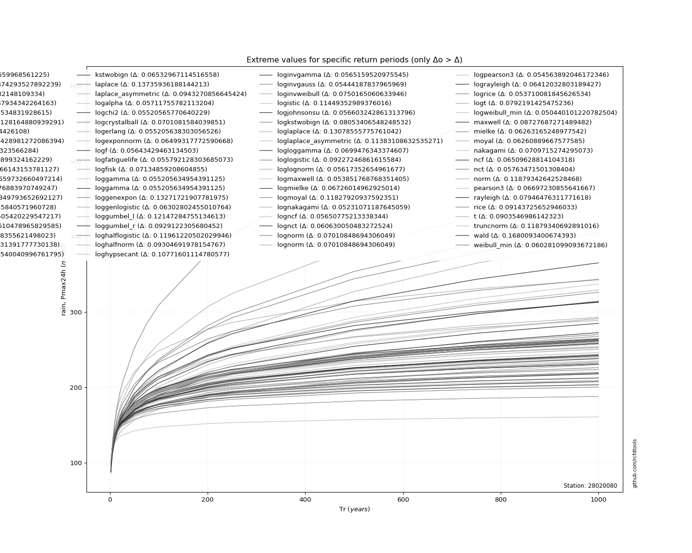</img>

</div>


<div align="center">

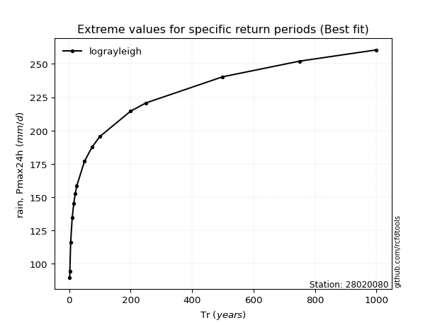</img>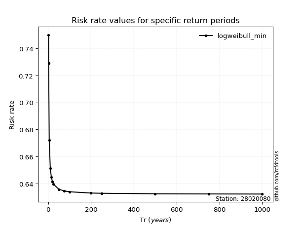</img>

</div>


<sub>**APP DISCLAIMER**: NO WARRANTY - This software is provided by [github.com/rcfdtools](https://github.com/rcfdtools) "as is", without any express or implied warranty, including warranties of merchantability, fitness for a particular purpose, or non-infringement. There is no guarantee that the software will be error-free or operate without interruption. LIMITATION OF LIABILITY - Neither the authors nor copyright holders will be liable for claims or damages arising from the software or its use. You are responsible for determining if the software is appropriate for your use and assume all associated risks, including errors, legal compliance, and data loss. NO PROFESSIONAL ADVICE - The software provides general information and does not offer professional advice. It should not replace consultation with professional advisors.</sub>