<div align="center">


</div>

# PMP Station (rain, Pmax24h): 28020150

Probable Maximum Precipitation (PMP) is the greatest amount of rainfall for a specific duration that is meteorologically possible for a given location, acting as a "worst-case" scenario for extreme storms, crucial for designing safety-critical infrastructure like bridges, river deviations, dams, spillways, and nuclear plants to prevent catastrophic failure. PMP is calculated by hydrologists using meteorological data to determine the upper limit of extreme rainfall, often leading to the Probable Maximum Flood (PMF) for flood control design, and is increasingly being studied for climate change impacts.

<div align="center">

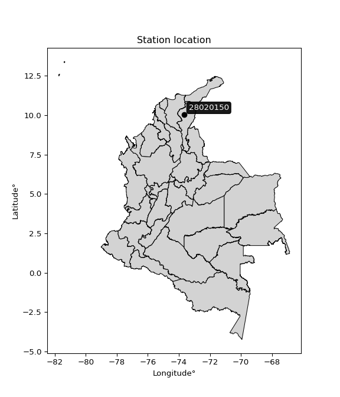</img>

</div>


## A. General information


### 1. General running parameters

• app_version: _v20251226_. • runtime: _2025-12-27 08:40:08.814432_. • Python version: _3.14.0_. • SciPy version: _1.16.3_. • Pandas version: _2.3.3_. • NumPy version: _2.3.5_. • Stations dataset (station_dataset_file): _dataset/pmax24h_in/conventional_cesarcolombia_1959_2022.csv_. • Stations catalog (station_catalog_file): _dataset/CNE_IDEAM.xls_. • Minimum year to eval til year_max (date_min): _1959_. • Maximum year to eval since year_min (date_max): _2022_. • Creates, save and include plots into reports (create_plot): _True_. • Plot only fit distributions with Δo > Δ (plot_only_fit): _True_. • Eval low extreme values, if False, evaluates high extreme values (low_extreme): _False_. • Eval every SciPy distribution as logarithmic (pdist_logarithmic_on): _True_. • Standard deviation normalized (ddof): _1.0_. • Return periods to eval in years (Tr): _[2, 2.33, 5, 10, 15, 20, 25, 50, 75, 100, 200, 250, 500, 750, 1000]_. • Minimum data sample per station, 0 means any (minimum_sample): _5_. • Z-Score threshold to adjust a value, 0 means disable (zscore): _3.5_. • Avoid zeros, e.g. rain = 0 (avoid_zeros): _True_. • Avoid null values (avoid_nans): _True_. [:file_folder:Dataset file.](../../dataset/pmax24h_in/conventional_cesarcolombia_1959_2022.csv)

> Delta Degrees of Freedom (DDOF): is a parameter used in the formulas for calculating variance and standard deviation. When ddof=0, the divisor is $N$ (the total number of observations) and this is used when your data set is the entire population. When ddof=1, the divisor is $N-1$ and this is used when your data set is a sample drawn from a larger population. Using $N-1$ provides an unbiased estimate of the population variance (known as Bessel´s correction).


### 2. Station info and location

|   id |   CODIGO | NOMBRE                            | CATEGORIA     | TECNOLOGIA   | ESTADO   | FECHA_INSTALACION   |   FECHA_SUSPENSION |   ALTITUD |   LATITUD |   LONGITUD | DEPARTAMENTO   | MUNICIPIO   | AREA_OPERATIVA                                         | ENTIDAD                                                     | AREA_HIDROGRAFICA   | ZONA_HIDROGRAFICA   | SUBZONA_HIDROGRAFICA   |   CORRIENTE | Catalogo   |
|-----:|---------:|:----------------------------------|:--------------|:-------------|:---------|:--------------------|-------------------:|----------:|----------:|-----------:|:---------------|:------------|:-------------------------------------------------------|:------------------------------------------------------------|:--------------------|:--------------------|:-----------------------|------------:|:-----------|
|    0 | 28020150 | HACIENDA LA  ESPERANZA [28020150] | Pluviométrica | Convencional | Activa   | 15/05/1961          |                nan |        60 |     10.03 |   -73.6688 | Cesar          | Valledupar  | Area Operativa 05 - Magdalena-Cesar-Guajira-San Andrés | INSTITUTO DE HIDROLOGIA METEOROLOGIA Y ESTUDIOS AMBIENTALES | Magdalena Cauca     | Cesar               | Medio Cesar            |         nan | CNE_IDEAM  |

<div align="center">

Map location in: [:earth_americas:Google](http://maps.google.com/maps?q=10.02997222,-73.66883333) [:earth_americas:OSM](https://www.openstreetmap.org/#map=18/10.02997222/-73.66883333&layers=P) [:earth_americas:Bing](https://www.bing.com/maps?cp=10.02997222~-73.66883333&lvl=18) [:earth_americas:Apple](https://maps.apple.com/frame?center=10.02997222%2C-73.66883333&span=0.003%2C0.006)

</div>


<div align="center">

```geojson
{
  "type": "Feature",
  "geometry": {
    "type": "Point", 
    "coordinates": [-73.66883333, 10.02997222]
  }, 
  "properties": {
    "Name": "28020150"
  }
}
```

</div>


### 3. Discrete values table and plot

|               |           0 |          1 |           2 |           3 |           4 |           5 |          6 |          7 |          8 |           9 |          10 |         11 |         12 |          13 |          14 |          15 |          16 |          17 |         18 |         19 |          20 |          21 |         22 |         23 |           24 |         25 |          26 |          27 |          28 |          29 |         30 |         31 |          32 |          33 |          34 |         35 |          36 |         37 |          38 |          39 |          40 |          41 |          42 |          43 |          44 |          45 |           46 |          47 |           48 |
|:--------------|------------:|-----------:|------------:|------------:|------------:|------------:|-----------:|-----------:|-----------:|------------:|------------:|-----------:|-----------:|------------:|------------:|------------:|------------:|------------:|-----------:|-----------:|------------:|------------:|-----------:|-----------:|-------------:|-----------:|------------:|------------:|------------:|------------:|-----------:|-----------:|------------:|------------:|------------:|-----------:|------------:|-----------:|------------:|------------:|------------:|------------:|------------:|------------:|------------:|------------:|-------------:|------------:|-------------:|
| Date          | 1960        | 1961       | 1962        | 1963        | 1964        | 1965        | 1967       | 1981       | 1982       | 1983        | 1984        | 1985       | 1986       | 1987        | 1988        | 1989        | 1990        | 1991        | 1992       | 1993       | 1994        | 1995        | 1996       | 1997       | 1998         | 1999       | 2000        | 2001        | 2002        | 2003        | 2004       | 2005       | 2006        | 2007        | 2008        | 2009       | 2010        | 2011       | 2012        | 2013        | 2014        | 2015        | 2016        | 2017        | 2018        | 2019        | 2020         | 2021        | 2022         |
| Value         |   94        |   57       |   94        |   75        |   99        |   92        |   57.7014  |   77.2612  |   60.5096  |   69.7409   |   76.0993   |   58.8929  |   56       |   70        |   90        |   87        |   65        |   65        |  135       |  108       |   89        |   96        |  137       |   58       |   84         |  110       |   87        |   74        |   65        |   70        |  105       |  110       |   76        |   73        |  100        |  110       |   92        |  108       |   71        |   70        |   73        |   66        |   92        |  100        |   75        |   70        |   85         |   91        |   83         |
| Value_initial |   94        |   57       |   94        |   75        |   99        |   92        |   57.7014  |   77.2612  |   60.5096  |   69.7409   |   76.0993   |   58.8929  |   56       |   70        |   90        |   87        |   65        |   65        |  135       |  108       |   89        |   96        |  137       |   58       |   84         |  110       |   87        |   74        |   65        |   70        |  105       |  110       |   76        |   73        |  100        |  110       |   92        |  108       |   71        |   70        |   73        |   66        |   92        |  100        |   75        |   70        |   85         |   91        |   83         |
| count         |   49        |   49       |   49        |   49        |   49        |   49        |   49       |   49       |   49       |   49        |   49        |   49       |   49       |   49        |   49        |   49        |   49        |   49        |   49       |   49       |   49        |   49        |   49       |   49       |   49         |   49       |   49        |   49        |   49        |   49        |   49       |   49       |   49        |   49        |   49        |   49       |   49        |   49       |   49        |   49        |   49        |   49        |   49        |   49        |   49        |   49        |   49         |   49        |   49         |
| mean          |   83.8205   |   83.8205  |   83.8205   |   83.8205   |   83.8205   |   83.8205   |   83.8205  |   83.8205  |   83.8205  |   83.8205   |   83.8205   |   83.8205  |   83.8205  |   83.8205   |   83.8205   |   83.8205   |   83.8205   |   83.8205   |   83.8205  |   83.8205  |   83.8205   |   83.8205   |   83.8205  |   83.8205  |   83.8205    |   83.8205  |   83.8205   |   83.8205   |   83.8205   |   83.8205   |   83.8205  |   83.8205  |   83.8205   |   83.8205   |   83.8205   |   83.8205  |   83.8205   |   83.8205  |   83.8205   |   83.8205   |   83.8205   |   83.8205   |   83.8205   |   83.8205   |   83.8205   |   83.8205   |   83.8205    |   83.8205   |   83.8205    |
| std           |   19.2215   |   19.2215  |   19.2215   |   19.2215   |   19.2215   |   19.2215   |   19.2215  |   19.2215  |   19.2215  |   19.2215   |   19.2215   |   19.2215  |   19.2215  |   19.2215   |   19.2215   |   19.2215   |   19.2215   |   19.2215   |   19.2215  |   19.2215  |   19.2215   |   19.2215   |   19.2215  |   19.2215  |   19.2215    |   19.2215  |   19.2215   |   19.2215   |   19.2215   |   19.2215   |   19.2215  |   19.2215  |   19.2215   |   19.2215   |   19.2215   |   19.2215  |   19.2215   |   19.2215  |   19.2215   |   19.2215   |   19.2215   |   19.2215   |   19.2215   |   19.2215   |   19.2215   |   19.2215   |   19.2215    |   19.2215   |   19.2215    |
| zscore        |    0.529589 |   -1.39534 |    0.529589 |   -0.458888 |    0.789714 |    0.425538 |   -1.35885 |   -0.34125 |   -1.21275 |   -0.732492 |   -0.401698 |   -1.29686 |   -1.44736 |   -0.719014 |    0.321488 |    0.165413 |   -0.979139 |   -0.979139 |    2.66262 |    1.25794 |    0.269463 |    0.633639 |    2.76667 |   -1.34331 |    0.0093377 |    1.36199 |    0.165413 |   -0.510913 |   -0.979139 |   -0.719014 |    1.10186 |    1.36199 |   -0.406863 |   -0.562938 |    0.841739 |    1.36199 |    0.425538 |    1.25794 |   -0.666989 |   -0.719014 |   -0.562938 |   -0.927114 |    0.425538 |    0.841739 |   -0.458888 |   -0.719014 |    0.0613628 |    0.373513 |   -0.0426874 |

<div align="center">

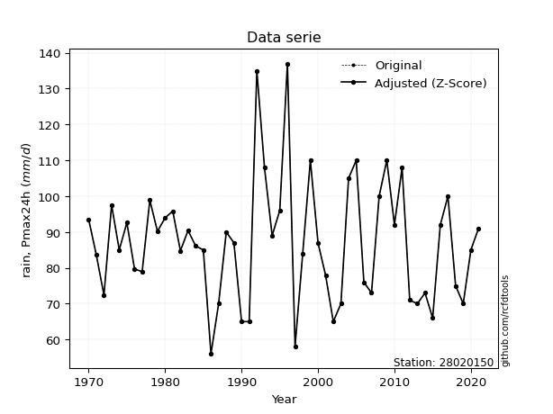</img>

</div>


> The initial value (value_initial) correspond to the initial obtained or null completed value, and value (value) is adjusted only when the initial value is outside the valid range definite through the Z-Score value. If Z-Score is active, values out of range or outliers are replaced with the station mean value


### 4. Active continuous probability distributions from SciPy (45 of 104 available)

[scipy.stats](https://docs.scipy.org/doc/scipy/reference/stats.html) is a Python´s powerful submodule within the SciPy library for comprehensive statistical analysis, offering over 130 probability distributions (like Normal, Poisson), functions for descriptive stats (mean, variance), hypothesis testing (t-tests, chi-square), random variable generation, and statistical tests, making it essential for data science, modeling, and research. It provides tools to explore, model, and draw conclusions from data efficiently, working seamlessly with NumPy.

<div align="center">

|   id | p_dist             |   n_parameter | fit_method   | label                                                                       | active   | ref                                                                                                        |
|-----:|:-------------------|--------------:|:-------------|:----------------------------------------------------------------------------|:---------|:-----------------------------------------------------------------------------------------------------------|
|    0 | alpha              |             3 | MLE          | Alpha                                                                       | True     | [:mortar_board:](https://docs.scipy.org/doc/scipy/reference/generated/scipy.stats.alpha.html)              |
|    1 | betaprime          |             4 | MLE          | Beta prime                                                                  | True     | [:mortar_board:](https://docs.scipy.org/doc/scipy/reference/generated/scipy.stats.betaprime.html)          |
|    2 | chi2               |             3 | MLE          | Chi²                                                                        | True     | [:mortar_board:](https://docs.scipy.org/doc/scipy/reference/generated/scipy.stats.chi2.html)               |
|    3 | crystalball        |             4 | MLE          | Crystalball                                                                 | True     | [:mortar_board:](https://docs.scipy.org/doc/scipy/reference/generated/scipy.stats.crystalball.html)        |
|    4 | erlang             |             3 | MLE          | Erlang                                                                      | True     | [:mortar_board:](https://docs.scipy.org/doc/scipy/reference/generated/scipy.stats.erlang.html)             |
|    5 | expon              |             2 | MLE          | Exponential                                                                 | True     | [:mortar_board:](https://docs.scipy.org/doc/scipy/reference/generated/scipy.stats.expon.html)              |
|    6 | exponnorm          |             3 | MLE          | Exponentially modified Normal                                               | True     | [:mortar_board:](https://docs.scipy.org/doc/scipy/reference/generated/scipy.stats.exponnorm.html)          |
|    7 | f                  |             4 | MLE          | F                                                                           | True     | [:mortar_board:](https://docs.scipy.org/doc/scipy/reference/generated/scipy.stats.f.html)                  |
|    8 | fatiguelife        |             3 | MLE          | Fatigue-life (Birnbaum-Saunders)                                            | True     | [:mortar_board:](https://docs.scipy.org/doc/scipy/reference/generated/scipy.stats.fatiguelife.html)        |
|    9 | fisk               |             3 | MLE          | Fisk                                                                        | True     | [:mortar_board:](https://docs.scipy.org/doc/scipy/reference/generated/scipy.stats.fisk.html)               |
|   10 | gamma              |             3 | MLE          | Gamma                                                                       | True     | [:mortar_board:](https://docs.scipy.org/doc/scipy/reference/generated/scipy.stats.gamma.html)              |
|   11 | genexpon           |             5 | MLE          | Generalized exponential                                                     | True     | [:mortar_board:](https://docs.scipy.org/doc/scipy/reference/generated/scipy.stats.genexpon.html)           |
|   12 | genlogistic        |             3 | MLE          | Generalized logistic                                                        | True     | [:mortar_board:](https://docs.scipy.org/doc/scipy/reference/generated/scipy.stats.genlogistic.html)        |
|   13 | gibrat             |             2 | MM           | Gibrat                                                                      | True     | [:mortar_board:](https://docs.scipy.org/doc/scipy/reference/generated/scipy.stats.gibrat.html)             |
|   14 | gompertz           |             3 | MLE          | Gompertz (or truncated Gumbel)                                              | True     | [:mortar_board:](https://docs.scipy.org/doc/scipy/reference/generated/scipy.stats.gompertz.html)           |
|   15 | gumbel_l           |             2 | MM           | Gumbel Left Skew                                                            | True     | [:mortar_board:](https://docs.scipy.org/doc/scipy/reference/generated/scipy.stats.gumbel_l.html)           |
|   16 | gumbel_r           |             2 | MM           | Gumbel Right Skew                                                           | True     | [:mortar_board:](https://docs.scipy.org/doc/scipy/reference/generated/scipy.stats.gumbel_r.html)           |
|   17 | halflogistic       |             2 | MM           | Half-logistic                                                               | True     | [:mortar_board:](https://docs.scipy.org/doc/scipy/reference/generated/scipy.stats.halflogistic.html)       |
|   18 | halfnorm           |             2 | MM           | Half Normal                                                                 | True     | [:mortar_board:](https://docs.scipy.org/doc/scipy/reference/generated/scipy.stats.halfnorm.html)           |
|   19 | hypsecant          |             2 | MM           | hyperbolic secant                                                           | True     | [:mortar_board:](https://docs.scipy.org/doc/scipy/reference/generated/scipy.stats.hypsecant.html)          |
|   20 | invgamma           |             3 | MLE          | Inverted gamma                                                              | True     | [:mortar_board:](https://docs.scipy.org/doc/scipy/reference/generated/scipy.stats.invgamma.html)           |
|   21 | invgauss           |             3 | MLE          | Inverse Gaussian                                                            | True     | [:mortar_board:](https://docs.scipy.org/doc/scipy/reference/generated/scipy.stats.invgauss.html)           |
|   22 | invweibull         |             3 | MLE          | Inverted Weibull                                                            | True     | [:mortar_board:](https://docs.scipy.org/doc/scipy/reference/generated/scipy.stats.invweibull.html)         |
|   23 | johnsonsu          |             4 | MLE          | Johnson Su                                                                  | True     | [:mortar_board:](https://docs.scipy.org/doc/scipy/reference/generated/scipy.stats.johnsonsu.html)          |
|   24 | kstwobign          |             2 | MLE          | Limiting distribution of scaled Kolmogorov-Smirnov two-sided test statistic | True     | [:mortar_board:](https://docs.scipy.org/doc/scipy/reference/generated/scipy.stats.kstwobign.html)          |
|   25 | laplace            |             2 | MM           | Laplace                                                                     | True     | [:mortar_board:](https://docs.scipy.org/doc/scipy/reference/generated/scipy.stats.laplace.html)            |
|   26 | laplace_asymmetric |             3 | MLE          | Asymmetric Laplace                                                          | True     | [:mortar_board:](https://docs.scipy.org/doc/scipy/reference/generated/scipy.stats.laplace_asymmetric.html) |
|   27 | loggamma           |             3 | MLE          | Log gamma                                                                   | True     | [:mortar_board:](https://docs.scipy.org/doc/scipy/reference/generated/scipy.stats.loggamma.html)           |
|   28 | logistic           |             2 | MM           | Logistic (or Sech-squared)                                                  | True     | [:mortar_board:](https://docs.scipy.org/doc/scipy/reference/generated/scipy.stats.logistic.html)           |
|   29 | lognorm            |             3 | MLE          | Log Normal                                                                  | True     | [:mortar_board:](https://docs.scipy.org/doc/scipy/reference/generated/scipy.stats.lognorm.html)            |
|   30 | maxwell            |             2 | MM           | Maxwell                                                                     | True     | [:mortar_board:](https://docs.scipy.org/doc/scipy/reference/generated/scipy.stats.maxwell.html)            |
|   31 | mielke             |             4 | MLE          | Mielke Beta-Kappa / Dagum                                                   | True     | [:mortar_board:](https://docs.scipy.org/doc/scipy/reference/generated/scipy.stats.mielke.html)             |
|   32 | moyal              |             2 | MM           | Moyal                                                                       | True     | [:mortar_board:](https://docs.scipy.org/doc/scipy/reference/generated/scipy.stats.moyal.html)              |
|   33 | nakagami           |             3 | MLE          | Nakagami                                                                    | True     | [:mortar_board:](https://docs.scipy.org/doc/scipy/reference/generated/scipy.stats.nakagami.html)           |
|   34 | ncf                |             5 | MLE          | Non-central F distribution                                                  | True     | [:mortar_board:](https://docs.scipy.org/doc/scipy/reference/generated/scipy.stats.ncf.html)                |
|   35 | nct                |             4 | MLE          | Non-central Student’s t                                                     | True     | [:mortar_board:](https://docs.scipy.org/doc/scipy/reference/generated/scipy.stats.nct.html)                |
|   36 | norm               |             2 | MM           | Normal                                                                      | True     | [:mortar_board:](https://docs.scipy.org/doc/scipy/reference/generated/scipy.stats.norm.html)               |
|   37 | pareto             |             3 | MLE          | Pareto                                                                      | True     | [:mortar_board:](https://docs.scipy.org/doc/scipy/reference/generated/scipy.stats.pareto.html)             |
|   38 | pearson3           |             3 | MM           | Pearson type III                                                            | True     | [:mortar_board:](https://docs.scipy.org/doc/scipy/reference/generated/scipy.stats.pearson3.html)           |
|   39 | rayleigh           |             2 | MM           | Rayleigh                                                                    | True     | [:mortar_board:](https://docs.scipy.org/doc/scipy/reference/generated/scipy.stats.rayleigh.html)           |
|   40 | rice               |             3 | MLE          | Rice                                                                        | True     | [:mortar_board:](https://docs.scipy.org/doc/scipy/reference/generated/scipy.stats.rice.html)               |
|   41 | t                  |             3 | MLE          | Student’s t                                                                 | True     | [:mortar_board:](https://docs.scipy.org/doc/scipy/reference/generated/scipy.stats.t.html)                  |
|   42 | truncnorm          |             4 | MLE          | Truncated normal                                                            | True     | [:mortar_board:](https://docs.scipy.org/doc/scipy/reference/generated/scipy.stats.truncnorm.html)          |
|   43 | wald               |             2 | MM           | Wald                                                                        | True     | [:mortar_board:](https://docs.scipy.org/doc/scipy/reference/generated/scipy.stats.wald.html)               |
|   44 | weibull_min        |             3 | MLE          | Weibull minimum                                                             | True     | [:mortar_board:](https://docs.scipy.org/doc/scipy/reference/generated/scipy.stats.weibull_min.html)        |

</div>

> **n_parameter:** # arguments & localization & scale.
>
> **Fit methods:** (MLE) maximum likelihood, (MM) L-moments.
>
>**Inactive:** foldnorm, gennorm, norminvgauss, powernorm, powerlognorm, skewnorm, genextreme, anglit, arcsine, argus, beta, bradford, burr, burr12, cauchy, cosine, halfcauchy, foldcauchy, skewcauchy, wrapcauchy, dgamma, gengamma, exponweib, exponpow, truncexpon, gausshyper, genhalflogistic, genhyperbolic, geninvgauss, halfgennorm, johnsonsb, kappa4, kappa3, ksone, kstwo, loglaplace, levy, levy_l, levy_stable, ncx2, genpareto, truncpareto, lomax, powerlaw, rdist, rel_breitwigner, recipinvgauss, semicircular, studentized_range, trapezoid, triang, truncweibull_min, tukeylambda, uniform, loguniform, vonmises, vonmises_line, weibull_max, dweibull, 


## B. Probability distributions vs. Empirical distributions

A continuous probability distribution (CPD) describes probabilities for variables that can take any value within a range (like rain any time), unlike discrete variables with specific outcomes (like temperature). It uses a Probability Density Function (PDF), a curve where the total area under it equals 1, and the probability of the variable falling within an interval (a to b) is found by calculating the area under the curve between those points. A key feature is that the probability of hitting any single exact value is zero, so probabilities are always expressed for ranges, e.g., $P(a ≤ X ≤ b)$.

<div align="center">

Distributions parameters from station values
|    |   station | p_dist                |   n |             loc |          scale | shape                 | shape1             | shape2             | shape3   |
|---:|----------:|:----------------------|----:|----------------:|---------------:|:----------------------|:-------------------|:-------------------|:---------|
|  0 |  28020150 | alpha                 |  49 |   -26.0649      |  653.013       | 6.112372408629531     |                    |                    |          |
|  1 |  28020150 | betaprime             |  49 |    -1.18199     |    3.11165     | 587.6362034667575     | 22.512291696501592 |                    |          |
|  2 |  28020150 | chi2                  |  49 |    52.7494      |    6.89032     | 4.509388193874081     |                    |                    |          |
|  3 |  28020150 | crystalball           |  49 |    83.8205      |   19.0243      | 7660.307989206693     | 59.964146209873704 |                    |          |
|  4 |  28020150 | erlang                |  49 |    52.7494      |   13.7806      | 2.2547058778018485    |                    |                    |          |
|  5 |  28020150 | expon                 |  49 |    56           |   27.8205      |                       |                    |                    |          |
|  6 |  28020150 | exponnorm             |  49 |    65.4514      |    9.47271     | 1.9391620585425957    |                    |                    |          |
|  7 |  28020150 | f                     |  49 |    32.3111      |   47.639       | 32.01482165800999     | 27.18126552735439  |                    |          |
|  8 |  28020150 | fatiguelife           |  49 |    37.0622      |   42.942       | 0.42134535823455965   |                    |                    |          |
|  9 |  28020150 | fisk                  |  49 |    -0.367884    |   81.7963      | 7.729750855734012     |                    |                    |          |
| 10 |  28020150 | gamma                 |  49 |    52.7494      |   13.7806      | 2.254701301629799     |                    |                    |          |
| 11 |  28020150 | genexpon              |  49 |    56           |    2.62316     | 0.0795366499698695    | 0.0156018387462376 | 1.6481130171085958 |          |
| 12 |  28020150 | genlogistic           |  49 |   -20.6656      |   15.2455      | 529.8858786795759     |                    |                    |          |
| 13 |  28020150 | gibrat                |  49 |    69.3074      |    8.80267     |                       |                    |                    |          |
| 14 |  28020150 | gompertz              |  49 |    40.9404      |    7.96913     | 4.724054920423898e-05 |                    |                    |          |
| 15 |  28020150 | gumbel_l              |  49 |    92.3825      |   14.8332      |                       |                    |                    |          |
| 16 |  28020150 | gumbel_r              |  49 |    75.2585      |   14.8332      |                       |                    |                    |          |
| 17 |  28020150 | halflogistic          |  49 |    61.2722      |   16.2652      |                       |                    |                    |          |
| 18 |  28020150 | halfnorm              |  49 |    58.6397      |   31.5594      |                       |                    |                    |          |
| 19 |  28020150 | hypsecant             |  49 |    83.8205      |   12.1113      |                       |                    |                    |          |
| 20 |  28020150 | invgamma              |  49 |    15.8487      |  864.981       | 13.712057414550925    |                    |                    |          |
| 21 |  28020150 | invgauss              |  49 |    35.1765      |  290.051       | 0.16770849035704638   |                    |                    |          |
| 22 |  28020150 | invweibull            |  49 |    -2.50989e+08 |    2.50989e+08 | 16462068.691365216    |                    |                    |          |
| 23 |  28020150 | johnsonsu             |  49 |    34.3791      |    2.47        | -9.329425550396945    | 2.579607443502381  |                    |          |
| 24 |  28020150 | kstwobign             |  49 |    20.9957      |   72.1445      |                       |                    |                    |          |
| 25 |  28020150 | laplace               |  49 |    83.8205      |   13.4522      |                       |                    |                    |          |
| 26 |  28020150 | laplace_asymmetric    |  49 |    70           |   12.3724      | 0.5868964458659811    |                    |                    |          |
| 27 |  28020150 | loggamma              |  49 | -5300.7         |  739.356       | 1455.500911230597     |                    |                    |          |
| 28 |  28020150 | logistic              |  49 |    83.8205      |   10.4887      |                       |                    |                    |          |
| 29 |  28020150 | lognorm               |  49 |    34.8075      |   45.4603      | 0.3920602702522807    |                    |                    |          |
| 30 |  28020150 | maxwell               |  49 |    38.7408      |   28.2495      |                       |                    |                    |          |
| 31 |  28020150 | mielke                |  49 |     0.208478    |   57.8936      | 25.85745019715901     | 5.697868679642797  |                    |          |
| 32 |  28020150 | moyal                 |  49 |    72.9412      |    8.56396     |                       |                    |                    |          |
| 33 |  28020150 | nakagami              |  49 |    56           |   33.8434      | 0.47051873307642533   |                    |                    |          |
| 34 |  28020150 | ncf                   |  49 |     0.00221185  |    1.78863e-07 | 7.497327941556715e-09 | 2.18471883392215   | 2.2584633419615727 |          |
| 35 |  28020150 | nct                   |  49 |    -0.26942     |    1.50202     | 11.208182872321572    | 52.189821053787256 |                    |          |
| 36 |  28020150 | norm                  |  49 |    83.8205      |   19.0243      |                       |                    |                    |          |
| 37 |  28020150 | pareto                |  49 |    -2.14748e+09 |    2.14748e+09 | 77190649.64621884     |                    |                    |          |
| 38 |  28020150 | pearson3              |  49 |    83.8205      |   19.0244      | 0.7207549069465573    |                    |                    |          |
| 39 |  28020150 | rayleigh              |  49 |    47.4258      |   29.0388      |                       |                    |                    |          |
| 40 |  28020150 | rice                  |  49 |    50.0317      |   27.4191      | 0.0009239355882456365 |                    |                    |          |
| 41 |  28020150 | t                     |  49 |    83.4912      |   18.2196      | 25.580505464847242    |                    |                    |          |
| 42 |  28020150 | truncnorm             |  49 |   -27.6268      |  178.952       | -6103.204073331726    | 0.919947813332568  |                    |          |
| 43 |  28020150 | wald                  |  49 |    64.7962      |   19.0244      |                       |                    |                    |          |
| 44 |  28020150 | weibull_min           |  49 |    54.8086      |   31.9742      | 1.4906012655802487    |                    |                    |          |
| 45 |  28020150 | logalpha              |  49 |     0.449097    |   71.1751      | 18.053925145859658    |                    |                    |          |
| 46 |  28020150 | logbetaprime          |  49 |    -4.39534     |   11.51        | 641.8616046492004     | 839.816965265175   |                    |          |
| 47 |  28020150 | logchi2               |  49 |     4.02535     |    0.962645    | 1.0816485015793684    |                    |                    |          |
| 48 |  28020150 | logcrystalball        |  49 |     4.40402     |    0.220496    | 142.93523215316657    | 98.51978159062425  |                    |          |
| 49 |  28020150 | logerlang             |  49 |     3.52185     |    0.0564931   | 15.615492855114264    |                    |                    |          |
| 50 |  28020150 | logexpon              |  49 |     4.02535     |    0.378668    |                       |                    |                    |          |
| 51 |  28020150 | logexponnorm          |  49 |     4.318       |    0.203303    | 0.42311021009547256   |                    |                    |          |
| 52 |  28020150 | logf                  |  49 |     3.51726     |    0.886557    | 31.704945706982972    | 5180.08427015254   |                    |          |
| 53 |  28020150 | logfatiguelife        |  49 |     2.88941     |    1.49857     | 0.14633834963666503   |                    |                    |          |
| 54 |  28020150 | logfisk               |  49 |     2.74675     |    1.6448      | 12.675067673500521    |                    |                    |          |
| 55 |  28020150 | loggamma              |  49 |     3.52186     |    0.0564934   | 15.615359602024043    |                    |                    |          |
| 56 |  28020150 | loggenexpon           |  49 |     4.02535     |    0.463926    | 0.39934148700957706   | 1.5902917118863789 | 1.5436727085789217 |          |
| 57 |  28020150 | loggenlogistic        |  49 |     4.05848     |    0.175315    | 4.610779347866601     |                    |                    |          |
| 58 |  28020150 | loggibrat             |  49 |     4.23579     |    0.102036    |                       |                    |                    |          |
| 59 |  28020150 | loggompertz           |  49 |     4.02535     |    0.334052    | 0.34576869946228844   |                    |                    |          |
| 60 |  28020150 | loggumbel_l           |  49 |     4.50325     |    0.171921    |                       |                    |                    |          |
| 61 |  28020150 | loggumbel_r           |  49 |     4.30478     |    0.171921    |                       |                    |                    |          |
| 62 |  28020150 | loghalflogistic       |  49 |     4.14265     |    0.18854     |                       |                    |                    |          |
| 63 |  28020150 | loghalfnorm           |  49 |     4.11219     |    0.365755    |                       |                    |                    |          |
| 64 |  28020150 | loghypsecant          |  49 |     4.40402     |    0.140373    |                       |                    |                    |          |
| 65 |  28020150 | loginvgamma           |  49 |    -2.84208     | 7897.43        | 1090.9939955900818    |                    |                    |          |
| 66 |  28020150 | loginvgauss           |  49 |     3.10774     |   43.1636      | 0.030012130540427617  |                    |                    |          |
| 67 |  28020150 | loginvweibull         |  49 |    -2.24752e+07 |    2.24752e+07 | 114545320.68331152    |                    |                    |          |
| 68 |  28020150 | logjohnsonsu          |  49 |     2.77862     |    0.258102    | -18.86348274628537    | 7.453691330331395  |                    |          |
| 69 |  28020150 | logkstwobign          |  49 |     3.6038      |    0.916307    |                       |                    |                    |          |
| 70 |  28020150 | loglaplace            |  49 |     4.40402     |    0.155915    |                       |                    |                    |          |
| 71 |  28020150 | loglaplace_asymmetric |  49 |     4.51086     |    0.176617    | 1.347115990306261     |                    |                    |          |
| 72 |  28020150 | logloggamma           |  49 |   -55.5764      |    8.28117     | 1398.7591826753837    |                    |                    |          |
| 73 |  28020150 | loglogistic           |  49 |     4.40402     |    0.121566    |                       |                    |                    |          |
| 74 |  28020150 | loglognorm            |  49 |     2.76299     |    1.62627     | 0.13457343863209437   |                    |                    |          |
| 75 |  28020150 | logmaxwell            |  49 |     3.88153     |    0.327419    |                       |                    |                    |          |
| 76 |  28020150 | logmielke             |  49 |    -4.40649e+07 |    4.40649e+07 | 790453442.9602852     | 267853277.98837304 |                    |          |
| 77 |  28020150 | logmoyal              |  49 |     4.27793     |    0.0992585   |                       |                    |                    |          |
| 78 |  28020150 | lognakagami           |  49 |     4.00446     |    0.456364    | 0.7946451178356295    |                    |                    |          |
| 79 |  28020150 | logncf                |  49 |    -4.41992     |    8.3561      | 1821.9297617587981    | 1040.3611175905235 | 101.22526870439236 |          |
| 80 |  28020150 | lognct                |  49 |     0.203244    |    0.0822031   | 213.4128508464811     | 50.91379997094279  |                    |          |
| 81 |  28020150 | lognorm               |  49 |     4.40402     |    0.220497    |                       |                    |                    |          |
| 82 |  28020150 | logpareto             |  49 |    -3.35544e+07 |    3.35544e+07 | 88611806.61085953     |                    |                    |          |
| 83 |  28020150 | logpearson3           |  49 |     4.40402     |    0.220497    | 0.22797059866793493   |                    |                    |          |
| 84 |  28020150 | lograyleigh           |  49 |     3.9822      |    0.336566    |                       |                    |                    |          |
| 85 |  28020150 | logrice               |  49 |     3.95931     |    0.268228    | 1.1935560832398178    |                    |                    |          |
| 86 |  28020150 | logt                  |  49 |     4.40402     |    0.220497    | 69613495385.91357     |                    |                    |          |
| 87 |  28020150 | logtruncnorm          |  49 |    -0.0834204   |    1.33426     | 3.0794491416975074    | 9.531257209714255  |                    |          |
| 88 |  28020150 | logwald               |  49 |     4.18355     |    0.220469    |                       |                    |                    |          |
| 89 |  28020150 | logweibull_min        |  49 |     3.95177     |    0.510435    | 2.164689535400509     |                    |                    |          |

</div>

> **loc** (Location parameter): This shifts the distribution along the x-axis. For many common distributions, like the normal (Gaussian) distribution, loc represents the mean $μ$. For others, like the uniform distribution, it might represent the minimum value, or for the beta distribution, the left end of the support interval.
>
> **scale** (Scale parameter): This determines the width or spread of the distribution. For the normal distribution, scale represents the standard deviation $σ$. For a uniform distribution, it defines the length of the interval (from $loc$ to $loc + scale$).
>
> **shape** (Shape parameters): Refers to parameters that define the specific form of a probability distribution, distinct from its location (loc) and scale (scale). These parameters are required arguments for most distribution functions. For example, a normal (Gaussian) distribution is fully defined by its location (mean) and scale (standard deviation), so it has no specific shape parameters beyond loc and scale. However, other distributions have intrinsic properties that need specification, as Gamma distribution that takes a shape parameter, often named $a$ or $alpha$.


### 0. Cumulative distribution values - CDF (90 evaluated)

Cumulative Distribution Function (CDF), denoted as $F$<sub>$X$</sub>$(x)$, is a function that gives the probability that a random variable $X$ will take a value less than or equal to a specific value, $x$ (i.e., $(P(X≥x)$. It essentially "accumulates" probabilities from a given point up to the far right (positive infinity), providing a complete picture of the distribution´s probabilities for both discrete (like rain) and continuous (like temperature) variables, helping to find probabilities over ranges or above certain values.

<div align="center">

CDF ordered by x ascending and calculating $log(f(x))$ separately
|   id |   Station |   date |        x |   count |    mean |     std |     zscore |   Value_initial |   station |   m |     alpha |   alpha_pdf |   betaprime |   betaprime_pdf |      chi2 |   chi2_pdf |   crystalball |   crystalball_pdf |    erlang |   erlang_pdf |     expon |   expon_pdf |   exponnorm |   exponnorm_pdf |         f |      f_pdf |   fatiguelife |   fatiguelife_pdf |      fisk |    fisk_pdf |     gamma |   gamma_pdf |    genexpon |   genexpon_pdf |   genlogistic |   genlogistic_pdf |     gibrat |   gibrat_pdf |    gompertz |   gompertz_pdf |   gumbel_l |   gumbel_l_pdf |   gumbel_r |   gumbel_r_pdf |   halflogistic |   halflogistic_pdf |   halfnorm |   halfnorm_pdf |   hypsecant |   hypsecant_pdf |   invgamma |   invgamma_pdf |   invgauss |   invgauss_pdf |   invweibull |   invweibull_pdf |   johnsonsu |   johnsonsu_pdf |   kstwobign |   kstwobign_pdf |   laplace |   laplace_pdf |   laplace_asymmetric |   laplace_asymmetric_pdf |   loggamma |   loggamma_pdf |   logistic |   logistic_pdf |   lognorm |   lognorm_pdf |   maxwell |   maxwell_pdf |    mielke |   mielke_pdf |      moyal |   moyal_pdf |    nakagami |   nakagami_pdf |      ncf |    ncf_pdf |       nct |    nct_pdf |      norm |    norm_pdf |      pareto |   pareto_pdf |   pearson3 |   pearson3_pdf |   rayleigh |   rayleigh_pdf |      rice |    rice_pdf |         t |       t_pdf |   truncnorm |   truncnorm_pdf |        wald |    wald_pdf |   weibull_min |   weibull_min_pdf |   logalpha |   logalpha_pdf |   logbetaprime |   logbetaprime_pdf |     logchi2 |   logchi2_pdf |   logcrystalball |   logcrystalball_pdf |   logerlang |   logerlang_pdf |   logexpon |   logexpon_pdf |   logexponnorm |   logexponnorm_pdf |      logf |   logf_pdf |   logfatiguelife |   logfatiguelife_pdf |   logfisk |   logfisk_pdf |   loggenexpon |   loggenexpon_pdf |   loggenlogistic |   loggenlogistic_pdf |   loggibrat |   loggibrat_pdf |   loggompertz |   loggompertz_pdf |   loggumbel_l |   loggumbel_l_pdf |   loggumbel_r |   loggumbel_r_pdf |   loghalflogistic |   loghalflogistic_pdf |   loghalfnorm |   loghalfnorm_pdf |   loghypsecant |   loghypsecant_pdf |   loginvgamma |   loginvgamma_pdf |   loginvgauss |   loginvgauss_pdf |   loginvweibull |   loginvweibull_pdf |   logjohnsonsu |   logjohnsonsu_pdf |   logkstwobign |   logkstwobign_pdf |   loglaplace |   loglaplace_pdf |   loglaplace_asymmetric |   loglaplace_asymmetric_pdf |   logloggamma |   logloggamma_pdf |   loglogistic |   loglogistic_pdf |   loglognorm |   loglognorm_pdf |   logmaxwell |   logmaxwell_pdf |   logmielke |   logmielke_pdf |    logmoyal |   logmoyal_pdf |   lognakagami |   lognakagami_pdf |   logncf |   logncf_pdf |    lognct |   lognct_pdf |   logpareto |   logpareto_pdf |   logpearson3 |   logpearson3_pdf |   lograyleigh |   lograyleigh_pdf |   logrice |   logrice_pdf |      logt |   logt_pdf |   logtruncnorm |   logtruncnorm_pdf |     logwald |   logwald_pdf |   logweibull_min |   logweibull_min_pdf |
|-----:|----------:|-------:|---------:|--------:|--------:|--------:|-----------:|----------------:|----------:|----:|----------:|------------:|------------:|----------------:|----------:|-----------:|--------------:|------------------:|----------:|-------------:|----------:|------------:|------------:|----------------:|----------:|-----------:|--------------:|------------------:|----------:|------------:|----------:|------------:|------------:|---------------:|--------------:|------------------:|-----------:|-------------:|------------:|---------------:|-----------:|---------------:|-----------:|---------------:|---------------:|-------------------:|-----------:|---------------:|------------:|----------------:|-----------:|---------------:|-----------:|---------------:|-------------:|-----------------:|------------:|----------------:|------------:|----------------:|----------:|--------------:|---------------------:|-------------------------:|-----------:|---------------:|-----------:|---------------:|----------:|--------------:|----------:|--------------:|----------:|-------------:|-----------:|------------:|------------:|---------------:|---------:|-----------:|----------:|-----------:|----------:|------------:|------------:|-------------:|-----------:|---------------:|-----------:|---------------:|----------:|------------:|----------:|------------:|------------:|----------------:|------------:|------------:|--------------:|------------------:|-----------:|---------------:|---------------:|-------------------:|------------:|--------------:|-----------------:|---------------------:|------------:|----------------:|-----------:|---------------:|---------------:|-------------------:|----------:|-----------:|-----------------:|---------------------:|----------:|--------------:|--------------:|------------------:|-----------------:|---------------------:|------------:|----------------:|--------------:|------------------:|--------------:|------------------:|--------------:|------------------:|------------------:|----------------------:|--------------:|------------------:|---------------:|-------------------:|--------------:|------------------:|--------------:|------------------:|----------------:|--------------------:|---------------:|-------------------:|---------------:|-------------------:|-------------:|-----------------:|------------------------:|----------------------------:|--------------:|------------------:|--------------:|------------------:|-------------:|-----------------:|-------------:|-----------------:|------------:|----------------:|------------:|---------------:|--------------:|------------------:|---------:|-------------:|----------:|-------------:|------------:|----------------:|--------------:|------------------:|--------------:|------------------:|----------:|--------------:|----------:|-----------:|---------------:|-------------------:|------------:|--------------:|-----------------:|---------------------:|
|    0 |  28020150 |   1986 |  56      |      49 | 83.8205 | 19.2215 | -1.44736   |         56      |  28020150 |   1 | 0.0325256 |  0.00705372 |   0.0366648 |     0.00728507  | 0.0127869 | 0.00823773 |     0.0718208 |       0.00719829  | 0.0127871 |   0.00823775 | 0         |  0.0359447  |   0.0348408 |      0.00677005 | 0.029566  | 0.00754547 |     0.0228713 |        0.00737414 | 0.0532501 | 0.00691336  | 0.0127871 |  0.00823777 | 1.27038e-09 |     0.0303209  |     0.0314956 |        0.00712041 | 0          |  0           | 0.000265348 |    3.92189e-05 |  0.0824561 |    0.00532313  |  0.0256501 |     0.00633455 |       0        |         0          | 0          |     0          |   0.0637992 |     0.00523256  |  0.029014  |     0.00712096 |  0.0238263 |     0.0073278  |    0.0311092 |       0.00708075 |   0.026392  |      0.00724952 |   0.0273687 |      0.00741287 | 0.0632132 |   0.00469908  |            0.0372605 |               0.00513137 |  0.0262523 |       0.399231 |  0.0658391 |    0.00586388  | 0.0429587 |      0.414082 | 0.0542921 |   0.00874771  | 0.0260204 |   0.00666277 | 0.00717085 |  0.00337203 | 2.68219e-15 |     0.177614   | 0.59867  | 0.0030572  | 0.0297493 | 0.00707516 | 0.0718208 | 0.00719829  | 1.71398e-08 |   0.0359447  |  0.0426428 |    0.0079579   |  0.0426547 |    0.0097343   | 0.0234117 | 0.00775278  | 0.0717917 | 0.00698244  |    0.827889 |      0.0024339  | 0           | 0           |    0.00739077 |        0.0092128  |  0.0322856 |       0.402373 |       0.203146 |           0.638674 | 5.71999e-09 |   3.48298e+06 |        0.0429572 |             0.414072 |   0.0262524 |        0.399231 |  0         |       2.64084  |      0.0399516 |           0.40757  | 0.0263391 |   0.399652 |        0.0287669 |             0.399098 | 0.0394585 |      0.375726 |   1.20014e-09 |          0.860787 |        0.0259353 |             0.373177 |  0          |        0        |   1.56827e-08 |          1.03507  |     0.0601657 |       0.339216    |    0.00621851 |          0.183756 |         0         |              0        |      0        |          0        |      0.042823  |           0.304147 |     0.0388034 |          0.411534 |     0.0273058 |          0.403293 |       0.0187314 |            0.379717 |      0.0300983 |           0.399429 |      0.0160243 |           0.405141 |    0.0440765 |         0.282696 |               0.0837819 |                    0.352138 |     0.0444549 |          0.417458 |     0.0424966 |          0.334719 |    0.029897  |         0.39939  |    0.0212786 |         0.426929 |   0.0294928 |        0.368748 | 0.000358269 |      0.0245832 |    0.00665594 |          0.505922 | 0.212557 |     0.628006 | 0.0356864 |     0.409949 | 1.96758e-08 |        2.64084  |     0.0354926 |          0.410282 |    0.00818696 |          0.377857 | 0.0148018 |      0.446288 | 0.0429588 |   0.414083 |    2.64712e-08 |           2.51604  | 0           |   0           |        0.0149939 |             0.43775  |
|    1 |  28020150 |   1961 |  57      |      49 | 83.8205 | 19.2215 | -1.39534   |         57      |  28020150 |   2 | 0.040136  |  0.00817824 |   0.0444671 |     0.00832821  | 0.0222851 | 0.0107263  |     0.0792994 |       0.0077627   | 0.0222854 |   0.0107263  | 0.0353064 |  0.0346756  |   0.0421383 |      0.00783975 | 0.0377721 | 0.00887758 |     0.0310274 |        0.00894905 | 0.0605339 | 0.00766261  | 0.0222854 |  0.0107263  | 0.0313506   |     0.0320579  |     0.0392015 |        0.00830329 | 0          |  0           | 0.000307133 |    4.44605e-05 |  0.0879463 |    0.00566029  |  0.0325692 |     0.00751891 |       0        |         0          | 0          |     0          |   0.069249  |     0.00567274  |  0.0367534 |     0.00836975 |  0.031904  |     0.00883886 |    0.0387763 |       0.00826555 |   0.0343208 |      0.00861967 |   0.0354561 |      0.00877123 | 0.0680914 |   0.00506171  |            0.042762  |               0.00588902 |  0.0340524 |       0.483567 |  0.0719514 |    0.00636633  | 0.0508083 |      0.473757 | 0.0634531 |   0.00957528  | 0.0333449 |   0.00800629 | 0.0112026  |  0.00473754 | 0.0287962   |     0.0270908  | 0.601705 | 0.00301444 | 0.0374274 | 0.00829305 | 0.0792994 | 0.0077627   | 0.0353064   |   0.0346756  |  0.0510932 |    0.00894768  |  0.0529014 |    0.0107533   | 0.031778  | 0.00897423  | 0.0790544 | 0.00754744  |    0.830319 |      0.00242752 | 0           | 0           |    0.0182316  |        0.0122877  |  0.0400419 |       0.475256 |       0.214626 |           0.658382 | 0.088852    |   2.69878     |        0.0508066 |             0.473747 |   0.0340524 |        0.483567 |  0.0456661 |       2.52024  |      0.0477082 |           0.469848 | 0.0341459 |   0.483904 |        0.0365169 |             0.477952 | 0.0466197 |      0.43459  |   0.0168441   |          1.03904  |        0.0332629 |             0.456641 |  0          |        0        |   0.0186385   |          1.07105  |     0.0664684 |       0.373479    |    0.0102218  |          0.272504 |         0         |              0        |      0        |          0        |      0.0485567 |           0.344573 |     0.046649  |          0.475967 |     0.035173  |          0.487094 |       0.0263982 |            0.488975 |      0.0378311 |           0.47563  |      0.0243681 |           0.540198 |    0.0493751 |         0.31668  |               0.0902522 |                    0.379334 |     0.0523559 |          0.47616  |     0.0488318 |          0.382073 |    0.0376327 |         0.475998 |    0.0296946 |         0.525076 |   0.0366637 |        0.443154 | 0.00109612  |      0.0636326 |    0.0176215  |          0.723448 | 0.223829 |     0.645517 | 0.0435416 |     0.478739 | 0.0456662   |        2.52024  |     0.0433545 |          0.47914  |    0.0162137  |          0.528516 | 0.023735  |      0.562807 | 0.0508084 |   0.473758 |    0.0436343   |           2.41512  | 0           |   0           |        0.0238012 |             0.557631 |
|    2 |  28020150 |   1967 |  57.7014 |      49 | 83.8205 | 19.2215 | -1.35885   |         57.7014 |  28020150 |   3 | 0.0461601 |  0.00900366 |   0.0505738 |     0.00908814  | 0.0303833 | 0.0123472  |     0.0848869 |       0.00817129  | 0.0303835 |   0.0123472  | 0.0593236 |  0.0338123  |   0.0479157 |      0.00864077 | 0.0443367 | 0.00984457 |     0.0377012 |        0.0100837  | 0.0661016 | 0.00821733  | 0.0303836 |  0.0123472  | 0.0539796   |     0.0323789  |     0.0453283 |        0.00917183 | 0          |  0           | 0.00033973  |    4.85494e-05 |  0.0920027 |    0.00590798  |  0.0381499 |     0.00840049 |       0        |         0          | 0          |     0          |   0.0733424 |     0.00600227  |  0.0429428 |     0.0092835  |  0.0384854 |     0.00993086 |    0.0448773 |       0.00913593 |   0.0407145 |      0.00961566 |   0.0419509 |      0.00975104 | 0.0717358 |   0.00533263  |            0.0470986 |               0.00648623 |  0.0403481 |       0.546589 |  0.0765465 |    0.00673938  | 0.0568704 |      0.517991 | 0.0703734 |   0.0101575   | 0.0393113 |   0.00901502 | 0.0149103  |  0.00585619 | 0.0474705   |     0.0262346  | 0.603809 | 0.00298496 | 0.0435557 | 0.00918616 | 0.0848868 | 0.00817129  | 0.0593237   |   0.0338123  |  0.0576171 |    0.00965661  |  0.0606878 |    0.0114462   | 0.0383667 | 0.00981031  | 0.0844918 | 0.00795918  |    0.83202  |      0.002423   | 0           | 0           |    0.0274503  |        0.0139488  |  0.046184  |       0.529723 |       0.22276  |           0.671705 | 0.117784    |   2.10695     |        0.0568685 |             0.517981 |   0.0403481 |        0.546589 |  0.0759965 |       2.44014  |      0.0537351 |           0.516185 | 0.0404453 |   0.546855 |        0.0427194 |             0.536945 | 0.0522046 |      0.47928  |   0.0302397   |          1.14986  |        0.0392338 |             0.52063  |  0          |        0        |   0.0318901   |          1.09599  |     0.0711905 |       0.398987    |    0.0140026  |          0.347661 |         0         |              0        |      0        |          0        |      0.0529575 |           0.375526 |     0.0527602 |          0.523853 |     0.0415097 |          0.549775 |       0.0328818 |            0.572266 |      0.0439932 |           0.532631 |      0.0315867 |           0.641106 |    0.0534041 |         0.342521 |               0.0950128 |                    0.399342 |     0.0584427 |          0.51962  |     0.0537224 |          0.418177 |    0.0438011 |         0.53331  |    0.0365483 |         0.596095 |   0.0424278 |        0.500232 | 0.00214373  |      0.110971  |    0.0272435  |          0.847331 | 0.231796 |     0.657317 | 0.0497069 |     0.529965 | 0.0759965   |        2.44014  |     0.0495247 |          0.530367 |    0.0233013  |          0.630159 | 0.0311039 |      0.64204  | 0.0568705 |   0.517992 |    0.0727562   |           2.34751  | 0           |   0           |        0.0311293 |             0.640724 |
|    3 |  28020150 |   1997 |  58      |      49 | 83.8205 | 19.2215 | -1.34331   |         58      |  28020150 |   4 | 0.0489021 |  0.00936278 |   0.0533367 |     0.00941755  | 0.0341688 | 0.0130036  |     0.0873532 |       0.00834826  | 0.034169  |   0.0130036  | 0.0693662 |  0.0334514  |   0.0505484 |      0.00899363 | 0.0473386 | 0.010262   |     0.0407849 |        0.0105703  | 0.0685915 | 0.00846062  | 0.034169  |  0.0130036  | 0.0636492   |     0.032375   |     0.0481234 |        0.0095496  | 0          |  0           | 0.000354502 |    5.04023e-05 |  0.093783  |    0.0060163   |  0.0407158 |     0.00878683 |       0        |         0          | 0          |     0          |   0.0751564 |     0.00614799  |  0.045774  |     0.00967993 |  0.0415208 |     0.0104002  |    0.0476618 |       0.00951459 |   0.04365   |      0.0100457  |   0.0449254 |      0.0101722  | 0.0733459 |   0.00545232  |            0.0490758 |               0.00675853 |  0.0432405 |       0.574255 |  0.0785833 |    0.00690345  | 0.059594  |      0.537381 | 0.0734435 |   0.0104053   | 0.0420693 |   0.00945877 | 0.0167352  |  0.0063701  | 0.0552644   |     0.0259739  | 0.604699 | 0.00297253 | 0.0463566 | 0.00957422 | 0.0873532 | 0.00834826  | 0.0693662   |   0.0334514  |  0.060546  |    0.00996105  |  0.0641489 |    0.0117354   | 0.0413485 | 0.0101607   | 0.0868951 | 0.00813821  |    0.832744 |      0.00242107 | 0           | 0           |    0.0317098  |        0.0145734  |  0.0489798 |       0.553673 |       0.226241 |           0.677249 | 0.128247    |   1.95326     |        0.059592  |             0.537371 |   0.0432406 |        0.574255 |  0.0885062 |       2.40711  |      0.0564518 |           0.536536 | 0.043339  |   0.574489 |        0.0455576 |             0.56288  | 0.0547295 |      0.499153 |   0.0362885   |          1.19361  |        0.0419943 |             0.549133 |  0          |        0        |   0.0375744   |          1.10652  |     0.0732788 |       0.410223    |    0.0158869  |          0.382778 |         0         |              0        |      0        |          0        |      0.0549314 |           0.389386 |     0.0555182 |          0.544865 |     0.0444182 |          0.57731  |       0.0359302 |            0.609086 |      0.0468069 |           0.557697 |      0.0350089 |           0.685018 |    0.0552017 |         0.35405  |               0.0970966 |                    0.408101 |     0.0611738 |          0.538659 |     0.0559222 |          0.434289 |    0.0466187 |         0.558512 |    0.039704  |         0.626695 |   0.0450752 |        0.525702 | 0.00278267  |      0.137277  |    0.0317415  |          0.895152 | 0.235201 |     0.662218 | 0.0525002 |     0.552455 | 0.0885062   |        2.40711  |     0.0523201 |          0.552846 |    0.026663   |          0.672341 | 0.0345034 |      0.675118 | 0.0595941 |   0.537382 |    0.0848008   |           2.3195   | 0           |   0           |        0.0345268 |             0.675707 |
|    4 |  28020150 |   1985 |  58.8929 |      49 | 83.8205 | 19.2215 | -1.29686   |         58.8929 |  28020150 |   5 | 0.0577491 |  0.0104588  |   0.0621909 |     0.0104191   | 0.0466143 | 0.0148423  |     0.0950469 |       0.00888755  | 0.0466145 |   0.0148423  | 0.09876   |  0.0323948  |   0.0590627 |      0.0100872  | 0.057063  | 0.0115223  |     0.0508728 |        0.0120248  | 0.0764789 | 0.0092127   | 0.0466146 |  0.0148424  | 0.0924366   |     0.0320393  |     0.0571621 |        0.0107015  | 0          |  0           | 0.000402122 |    5.63754e-05 |  0.0993029 |    0.00635065  |  0.0490884 |     0.00997484 |       0        |         0          | 0.00639999 |     0.0252812  |   0.080847  |     0.00660381  |  0.054953  |     0.0108845  |  0.0514354 |     0.0118079  |    0.0566705 |       0.0106695  |   0.0531983 |      0.011344   |   0.0545722 |      0.0114364  | 0.0783794 |   0.00582649  |            0.0554971 |               0.00764284 |  0.0526585 |       0.659477 |  0.0849726 |    0.00741298  | 0.0682561 |      0.597209 | 0.0830643 |   0.0111441   | 0.0511217 |   0.0108275  | 0.02315    |  0.00802728 | 0.0781708   |     0.0253691  | 0.607336 | 0.00293579 | 0.0554306 | 0.0107557  | 0.0950469 | 0.00888755  | 0.0987601   |   0.0323948  |  0.0698486 |    0.0108772   |  0.0750061 |    0.0125787   | 0.0508814 | 0.0111868   | 0.0944049 | 0.00868634  |    0.834903 |      0.00241527 | 0           | 0           |    0.0454779  |        0.0162145  |  0.0579981 |       0.627707 |       0.236711 |           0.693359 | 0.155501    |   1.64151     |        0.068254  |             0.597199 |   0.0526585 |        0.659478 |  0.124548  |       2.31193  |      0.0651241 |           0.599449 | 0.0527598 |   0.659606 |        0.0547624 |             0.642957 | 0.062825  |      0.561549 |   0.0554528   |          1.31267  |        0.0510563 |             0.638405 |  0          |        0        |   0.054717    |          1.13767  |     0.0798097 |       0.445185    |    0.0225944  |          0.498101 |         0         |              0        |      0        |          0        |      0.0612104 |           0.433373 |     0.0643327 |          0.609734 |     0.0538802 |          0.662201 |       0.0460963 |            0.722885 |      0.0559126 |           0.635149 |      0.0464842 |           0.817776 |    0.0608844 |         0.390498 |               0.103536  |                    0.435165 |     0.069847  |          0.597368 |     0.0629393 |          0.485151 |    0.05574   |         0.636382 |    0.0499799 |         0.718925 |   0.0537094 |        0.605777 | 0.00561852  |      0.240578  |    0.0464254  |          1.02431  | 0.245427 |     0.676429 | 0.0614653 |     0.6219   | 0.124548    |        2.31193  |     0.0612906 |          0.622206 |    0.0378722  |          0.794357 | 0.0455571 |      0.771598 | 0.0682562 |   0.59721  |    0.119613    |           2.23832  | 0           |   0           |        0.0456367 |             0.778507 |
|    5 |  28020150 |   1982 |  60.5096 |      49 | 83.8205 | 19.2215 | -1.21275   |         60.5096 |  28020150 |   6 | 0.0762986 |  0.0124953  |   0.0805283 |     0.0122704   | 0.0729983 | 0.017695   |     0.110227  |       0.00989859  | 0.0729984 |   0.017695   | 0.14964   |  0.0305659  |   0.0770514 |      0.0121885  | 0.0775402 | 0.0138036  |     0.0724062 |        0.0145912  | 0.0925301 | 0.0106616   | 0.0729986 |  0.017695   | 0.143282    |     0.0307723  |     0.0761832 |        0.0128344  | 0          |  0           | 0.000503163 |    6.90481e-05 |  0.110085  |    0.00699717  |  0.067012  |     0.0122108  |       0        |         0          | 0.047246   |     0.0252376  |   0.0922416 |     0.00751002  |  0.0743371 |     0.0130963  |  0.0725626 |     0.0143107  |    0.0756452 |       0.012809   |   0.0734413 |      0.013691   |   0.0748976 |      0.0136951  | 0.0883886 |   0.00657055  |            0.0693369 |               0.0095488  |  0.0726733 |       0.820388 |  0.0977493 |    0.00840854  | 0.0859562 |      0.711656 | 0.102152  |   0.0124633   | 0.0707005 |   0.0134067  | 0.0387908  |  0.0113823  | 0.118523    |     0.0245925  | 0.61203  | 0.00287089 | 0.0745787 | 0.0129355  | 0.110227  | 0.00989858  | 0.14964     |   0.0305659  |  0.0887781 |    0.0125379   |  0.0965216 |    0.0140183   | 0.0704133 | 0.0129556   | 0.10928   | 0.00972416  |    0.838799 |      0.00240464 | 0           | 0           |    0.0736632  |        0.0185329  |  0.0768858 |       0.769131 |       0.255862 |           0.720706 | 0.195284    |   1.32841     |        0.0859538 |             0.711645 |   0.0726734 |        0.820388 |  0.184972  |       2.15236  |      0.0829675 |           0.72015  | 0.0727752 |   0.820304 |        0.0742102 |             0.795191 | 0.0796712 |      0.68536  |   0.0934591   |          1.48631  |        0.0706604 |             0.812351 |  0          |        0        |   0.0862716   |          1.19256  |     0.0927753 |       0.513795    |    0.0392549  |          0.739264 |         0         |              0        |      0        |          0        |      0.0741283 |           0.523322 |     0.0825003 |          0.733755 |     0.0739635 |          0.822784 |       0.0685404 |            0.936285 |      0.0750858 |           0.782765 |      0.0718416 |           1.05386  |    0.0724337 |         0.464572 |               0.116018  |                    0.487627 |     0.0875218 |          0.709581 |     0.0774289 |          0.587611 |    0.0749569 |         0.784755 |    0.0717034 |         0.885714 |   0.07221   |        0.763707 | 0.0156875   |      0.52438   |    0.0768668  |          1.21691  | 0.264075 |     0.700447 | 0.0800775 |     0.754485 | 0.184972    |        2.15236  |     0.079907  |          0.754443 |    0.0621869  |          0.998489 | 0.0687055 |      0.936509 | 0.0859563 |   0.711657 |    0.178348    |           2.10065  | 0           |   0           |        0.069139  |             0.95584  |
|    6 |  28020150 |   1990 |  65      |      49 | 83.8205 | 19.2215 | -0.979139  |         65      |  28020150 |   7 | 0.144918  |  0.0179408  |   0.146983  |     0.0172231   | 0.165104  | 0.0226529  |     0.161262  |       0.0128553   | 0.165104  |   0.0226529  | 0.27639   |  0.02601    |   0.145493  |      0.0182646  | 0.152742  | 0.0194349  |     0.15195   |        0.0204414  | 0.150202  | 0.0150936   | 0.165104  |  0.0226529  | 0.271658    |     0.0264008  |     0.146761  |        0.0184394  | 0          |  0           | 0.00091949  |    0.000121251 |  0.146034  |    0.00908839  |  0.135756  |     0.0182759  |       0.114095 |         0.0303404  | 0.159718   |     0.0247737  |   0.132633  |     0.0106371   |  0.146331  |     0.0187699  |  0.150729  |     0.0201453  |    0.146156  |       0.018435   |   0.148448  |      0.0194429  |   0.149157  |      0.0190907  | 0.123414  |   0.00917425  |            0.128686  |               0.0177222  |  0.14731   |       1.26263  |  0.142538  |    0.0116527   | 0.148838  |      1.05195  | 0.165907  |   0.0158432   | 0.146654  |   0.020188   | 0.111869   |  0.0209279  | 0.225304    |     0.0230295  | 0.624534 | 0.00270098 | 0.145788  | 0.0186017  | 0.161262  | 0.0128553   | 0.27639     |   0.02601    |  0.154999  |    0.0168392   |  0.167342  |    0.0173534   | 0.138438  | 0.0171535   | 0.159827  | 0.0128313   |    0.849529 |      0.00237436 | 1.19664e-21 | 2.76794e-19 |    0.166309   |        0.0221794  |  0.146399  |       1.17652  |       0.309803 |           0.783919 | 0.274677    |   0.947664    |        0.148835  |             1.05194  |   0.14731   |        1.26263  |  0.325362  |       1.78161  |      0.147129  |           1.07936  | 0.147384  |   1.26194  |        0.146449  |             1.22382  | 0.142488  |      1.08481  |   0.21052     |          1.73767  |        0.146717  |             1.31382  |  0          |        0        |   0.176686    |          1.33136  |     0.137268  |       0.740943    |    0.118244   |          1.46842  |         0.0839772 |              2.63325  |      0.135031 |          2.15016  |      0.122469  |           0.851087 |     0.147873  |          1.09854  |     0.148787  |          1.26579  |       0.15552   |            1.47503  |      0.146083  |           1.20286  |      0.167126  |           1.57091  |    0.114641  |         0.735278 |               0.156745  |                    0.658804 |     0.150021  |          1.0433   |     0.131365  |          0.938649 |    0.146159  |         1.20644  |    0.150534  |         1.3068   |   0.143714  |        1.24204  | 0.0920565   |      1.63825   |    0.177565   |          1.56103  | 0.316264 |     0.755417 | 0.147709  |     1.13966  | 0.325362    |        1.78161  |     0.147468  |          1.13745  |    0.150443   |          1.4414   | 0.15002   |      1.32098  | 0.148838  |   1.05195  |    0.316685    |           1.77265  | 0           |   0           |        0.152889  |             1.3667   |
|    7 |  28020150 |   1991 |  65      |      49 | 83.8205 | 19.2215 | -0.979139  |         65      |  28020150 |   8 | 0.144918  |  0.0179408  |   0.146983  |     0.0172231   | 0.165104  | 0.0226529  |     0.161262  |       0.0128553   | 0.165104  |   0.0226529  | 0.27639   |  0.02601    |   0.145493  |      0.0182646  | 0.152742  | 0.0194349  |     0.15195   |        0.0204414  | 0.150202  | 0.0150936   | 0.165104  |  0.0226529  | 0.271658    |     0.0264008  |     0.146761  |        0.0184394  | 0          |  0           | 0.00091949  |    0.000121251 |  0.146034  |    0.00908839  |  0.135756  |     0.0182759  |       0.114095 |         0.0303404  | 0.159718   |     0.0247737  |   0.132633  |     0.0106371   |  0.146331  |     0.0187699  |  0.150729  |     0.0201453  |    0.146156  |       0.018435   |   0.148448  |      0.0194429  |   0.149157  |      0.0190907  | 0.123414  |   0.00917425  |            0.128686  |               0.0177222  |  0.14731   |       1.26263  |  0.142538  |    0.0116527   | 0.148838  |      1.05195  | 0.165907  |   0.0158432   | 0.146654  |   0.020188   | 0.111869   |  0.0209279  | 0.225304    |     0.0230295  | 0.624534 | 0.00270098 | 0.145788  | 0.0186017  | 0.161262  | 0.0128553   | 0.27639     |   0.02601    |  0.154999  |    0.0168392   |  0.167342  |    0.0173534   | 0.138438  | 0.0171535   | 0.159827  | 0.0128313   |    0.849529 |      0.00237436 | 1.19664e-21 | 2.76794e-19 |    0.166309   |        0.0221794  |  0.146399  |       1.17652  |       0.309803 |           0.783919 | 0.274677    |   0.947664    |        0.148835  |             1.05194  |   0.14731   |        1.26263  |  0.325362  |       1.78161  |      0.147129  |           1.07936  | 0.147384  |   1.26194  |        0.146449  |             1.22382  | 0.142488  |      1.08481  |   0.21052     |          1.73767  |        0.146717  |             1.31382  |  0          |        0        |   0.176686    |          1.33136  |     0.137268  |       0.740943    |    0.118244   |          1.46842  |         0.0839772 |              2.63325  |      0.135031 |          2.15016  |      0.122469  |           0.851087 |     0.147873  |          1.09854  |     0.148787  |          1.26579  |       0.15552   |            1.47503  |      0.146083  |           1.20286  |      0.167126  |           1.57091  |    0.114641  |         0.735278 |               0.156745  |                    0.658804 |     0.150021  |          1.0433   |     0.131365  |          0.938649 |    0.146159  |         1.20644  |    0.150534  |         1.3068   |   0.143714  |        1.24204  | 0.0920565   |      1.63825   |    0.177565   |          1.56103  | 0.316264 |     0.755417 | 0.147709  |     1.13966  | 0.325362    |        1.78161  |     0.147468  |          1.13745  |    0.150443   |          1.4414   | 0.15002   |      1.32098  | 0.148838  |   1.05195  |    0.316685    |           1.77265  | 0           |   0           |        0.152889  |             1.3667   |
|    8 |  28020150 |   2002 |  65      |      49 | 83.8205 | 19.2215 | -0.979139  |         65      |  28020150 |   9 | 0.144918  |  0.0179408  |   0.146983  |     0.0172231   | 0.165104  | 0.0226529  |     0.161262  |       0.0128553   | 0.165104  |   0.0226529  | 0.27639   |  0.02601    |   0.145493  |      0.0182646  | 0.152742  | 0.0194349  |     0.15195   |        0.0204414  | 0.150202  | 0.0150936   | 0.165104  |  0.0226529  | 0.271658    |     0.0264008  |     0.146761  |        0.0184394  | 0          |  0           | 0.00091949  |    0.000121251 |  0.146034  |    0.00908839  |  0.135756  |     0.0182759  |       0.114095 |         0.0303404  | 0.159718   |     0.0247737  |   0.132633  |     0.0106371   |  0.146331  |     0.0187699  |  0.150729  |     0.0201453  |    0.146156  |       0.018435   |   0.148448  |      0.0194429  |   0.149157  |      0.0190907  | 0.123414  |   0.00917425  |            0.128686  |               0.0177222  |  0.14731   |       1.26263  |  0.142538  |    0.0116527   | 0.148838  |      1.05195  | 0.165907  |   0.0158432   | 0.146654  |   0.020188   | 0.111869   |  0.0209279  | 0.225304    |     0.0230295  | 0.624534 | 0.00270098 | 0.145788  | 0.0186017  | 0.161262  | 0.0128553   | 0.27639     |   0.02601    |  0.154999  |    0.0168392   |  0.167342  |    0.0173534   | 0.138438  | 0.0171535   | 0.159827  | 0.0128313   |    0.849529 |      0.00237436 | 1.19664e-21 | 2.76794e-19 |    0.166309   |        0.0221794  |  0.146399  |       1.17652  |       0.309803 |           0.783919 | 0.274677    |   0.947664    |        0.148835  |             1.05194  |   0.14731   |        1.26263  |  0.325362  |       1.78161  |      0.147129  |           1.07936  | 0.147384  |   1.26194  |        0.146449  |             1.22382  | 0.142488  |      1.08481  |   0.21052     |          1.73767  |        0.146717  |             1.31382  |  0          |        0        |   0.176686    |          1.33136  |     0.137268  |       0.740943    |    0.118244   |          1.46842  |         0.0839772 |              2.63325  |      0.135031 |          2.15016  |      0.122469  |           0.851087 |     0.147873  |          1.09854  |     0.148787  |          1.26579  |       0.15552   |            1.47503  |      0.146083  |           1.20286  |      0.167126  |           1.57091  |    0.114641  |         0.735278 |               0.156745  |                    0.658804 |     0.150021  |          1.0433   |     0.131365  |          0.938649 |    0.146159  |         1.20644  |    0.150534  |         1.3068   |   0.143714  |        1.24204  | 0.0920565   |      1.63825   |    0.177565   |          1.56103  | 0.316264 |     0.755417 | 0.147709  |     1.13966  | 0.325362    |        1.78161  |     0.147468  |          1.13745  |    0.150443   |          1.4414   | 0.15002   |      1.32098  | 0.148838  |   1.05195  |    0.316685    |           1.77265  | 0           |   0           |        0.152889  |             1.3667   |
|    9 |  28020150 |   2015 |  66      |      49 | 83.8205 | 19.2215 | -0.927114  |         66      |  28020150 |  10 | 0.163397  |  0.0190039  |   0.164702  |     0.0182034   | 0.188067  | 0.023247   |     0.174451  |       0.0135228   | 0.188067  |   0.023247   | 0.301938  |  0.0250916  |   0.164394  |      0.0195272  | 0.172687  | 0.0204366  |     0.172877  |        0.021388   | 0.165804  | 0.0161091   | 0.188068  |  0.023247   | 0.297589    |     0.0254676  |     0.165741  |        0.0195065  | 0          |  0           | 0.00104867  |    0.000137444 |  0.155384  |    0.00961578  |  0.154632  |     0.0194599  |       0.14432  |         0.0301003  | 0.184409   |     0.0246037  |   0.14368   |     0.0114646   |  0.165635  |     0.0198229  |  0.17137   |     0.0211147  |    0.165134  |       0.0195065  |   0.168407  |      0.0204572  |   0.168723  |      0.0200225  | 0.132938  |   0.00988223  |            0.147687  |               0.0203388  |  0.167268  |       1.35117  |  0.154593  |    0.0124605   | 0.165478  |      1.1279   | 0.182087  |   0.0165099   | 0.167472  |   0.0214236  | 0.133696   |  0.0226913  | 0.248173    |     0.0227089  | 0.627217 | 0.00266509 | 0.164931  | 0.0196684  | 0.174451  | 0.0135228   | 0.301938    |   0.0250916  |  0.172262  |    0.0176765   |  0.184999  |    0.0179519   | 0.155983  | 0.0179269   | 0.173016  | 0.0135466   |    0.8519   |      0.00236747 | 0.000185691 | 0.00128432  |    0.188708   |        0.0225978  |  0.165024  |       1.26286  |       0.32186  |           0.795417 | 0.288766    |   0.899004    |        0.165475  |             1.12789  |   0.167268  |        1.35117  |  0.352021  |       1.71121  |      0.164217  |           1.15915  | 0.167331  |   1.35035  |        0.165811  |             1.31204  | 0.15977   |      1.17925  |   0.237216    |          1.75778  |        0.167559  |             1.41551  |  0          |        0        |   0.197224    |          1.35885  |     0.149017  |       0.798725    |    0.141765   |          1.61092  |         0.124022  |              2.61116  |      0.167732 |          2.13309  |      0.136136  |           0.940522 |     0.165257  |          1.17854  |     0.168796  |          1.35467  |       0.178768  |            1.5686   |      0.16512   |           1.29048  |      0.191715  |           1.64796  |    0.126435  |         0.810921 |               0.167133  |                    0.702465 |     0.166519  |          1.11793  |     0.146371  |          1.0278   |    0.165252  |         1.29422  |    0.171097  |         1.38601  |   0.163466  |        1.34497  | 0.118773    |      1.85712   |    0.201771   |          1.60859  | 0.327873 |     0.765322 | 0.165744  |     1.22258  | 0.352021    |        1.71121  |     0.165464  |          1.21973  |    0.173019   |          1.51456  | 0.170726  |      1.39069  | 0.165479  |   1.1279   |    0.34326     |           1.70898  | 4.98143e-09 |   1.51156e-05 |        0.174316  |             1.43913  |
|   10 |  28020150 |   1983 |  69.7409 |      49 | 83.8205 | 19.2215 | -0.732492  |         69.7409 |  28020150 |  11 | 0.24083   |  0.0221584  |   0.23876   |     0.0211959   | 0.277395  | 0.0242089  |     0.229625  |       0.0159464   | 0.277395  |   0.0242089  | 0.389766  |  0.0219347  |   0.245158  |      0.023382   | 0.254692  | 0.023116   |     0.257769  |        0.0236718  | 0.232937  | 0.0196998   | 0.277395  |  0.0242089  | 0.386699    |     0.0222429  |     0.244935  |        0.0225711  | 0.00130282 |  0.00989581  | 0.00170463  |    0.000219639 |  0.195323  |    0.0117889   |  0.23443   |     0.0229258  |       0.254607 |         0.0287478  | 0.274978   |     0.0237653  |   0.192937  |     0.0149727   |  0.245825  |     0.0227748  |  0.255464  |     0.0235258  |    0.244354  |       0.022584   |   0.250529  |      0.023151   |   0.248725  |      0.0224758  | 0.175559  |   0.0130505   |            0.24722   |               0.0340462  |  0.249662  |       1.62329  |  0.207122  |    0.0156571   | 0.235101  |      1.39401  | 0.248007  |   0.0186269   | 0.254353  |   0.0246327  | 0.228034   |  0.0271549  | 0.33086     |     0.0214889  | 0.636944 | 0.00253671 | 0.244681  | 0.0227     | 0.229625  | 0.0159464   | 0.389766    |   0.0219347  |  0.243479  |    0.0202371   |  0.255665  |    0.0196975   | 0.227673  | 0.0202472   | 0.228662  | 0.0161816   |    0.860708 |      0.0023412  | 0.123037    | 0.0551765   |    0.274895   |        0.0232666  |  0.242702  |       1.54515  |       0.366724 |           0.830258 | 0.334389    |   0.764935    |        0.235097  |             1.394    |   0.249662  |        1.62329  |  0.439818  |       1.47935  |      0.235882  |           1.43575  | 0.24967   |   1.62213  |        0.246183  |             1.59106  | 0.234215  |      1.51757  |   0.334541    |          1.75482  |        0.254512  |             1.7189   |  0.00758094 |        2.3238   |   0.274682    |          1.44805  |     0.199381  |       1.03556     |    0.24229    |          1.99787  |         0.264437  |              2.46651  |      0.283044 |          2.04273  |      0.198104  |           1.32191  |     0.237938  |          1.4523   |     0.251413  |          1.62772  |       0.272551  |            1.80568  |      0.244332  |           1.57165  |      0.287984  |           1.81612  |    0.180068  |         1.15491  |               0.210716  |                    0.885648 |     0.23548   |          1.38037  |     0.212514  |          1.37663  |    0.244674  |         1.57534  |    0.254389  |         1.62094  |   0.247063  |        1.67236  | 0.237338    |      2.3628    |    0.293843   |          1.715    | 0.370933 |     0.795098 | 0.241001  |     1.49965  | 0.439818    |        1.47935  |     0.240498  |          1.49443  |    0.262406   |          1.70984  | 0.253438  |      1.59738  | 0.235101  |   1.39401  |    0.431488    |           1.49587  | 0.141919    |   4.83343     |        0.259746  |             1.64475  |
|   11 |  28020150 |   1987 |  70      |      49 | 83.8205 | 19.2215 | -0.719014  |         70      |  28020150 |  12 | 0.246592  |  0.0223222  |   0.244272  |     0.0213579   | 0.283668  | 0.0242134  |     0.233777  |       0.0161065   | 0.283668  |   0.0242135  | 0.395423  |  0.0217313  |   0.251242  |      0.0235835  | 0.260696  | 0.0232368  |     0.263913  |        0.0237594  | 0.23807   | 0.0199256   | 0.283668  |  0.0242135  | 0.392435    |     0.022035   |     0.250803  |        0.0227234  | 0.00550603 |  0.0227461   | 0.00176246  |    0.000226884 |  0.198398  |    0.0119508   |  0.240392  |     0.0231019  |       0.262039 |         0.0286298  | 0.281126   |     0.023696   |   0.19685   |     0.0152371   |  0.251744  |     0.0229172  |  0.261572  |     0.0236233  |    0.250225  |       0.022737   |   0.256543  |      0.0232717  |   0.254562  |      0.0225856  | 0.178972  |   0.0133043   |            0.2562    |               0.0352828  |  0.255709  |       1.63818  |  0.211208  |    0.0158837   | 0.240301  |      1.41084  | 0.252849  |   0.0187491   | 0.260752  |   0.0247665  | 0.235092   |  0.0273326  | 0.336416    |     0.021402   | 0.6376   | 0.00252815 | 0.250582  | 0.0228487  | 0.233777  | 0.0161065   | 0.395423    |   0.0217313  |  0.248741  |    0.0203773   |  0.26078   |    0.0197892   | 0.232935  | 0.0203736   | 0.232877  | 0.0163575   |    0.861314 |      0.00233936 | 0.137428    | 0.0558628   |    0.280923   |        0.0232687  |  0.248462  |       1.56169  |       0.369806 |           0.832204 | 0.337211    |   0.757611    |        0.240297  |             1.41083  |   0.255709  |        1.63818  |  0.445277  |       1.46493  |      0.241238  |           1.45303  | 0.255712  |   1.63701  |        0.252112  |             1.60682  | 0.239882  |      1.53898  |   0.34104     |          1.75103  |        0.260915  |             1.73459  |  0.0186087  |        3.5846   |   0.280061    |          1.45336  |     0.203253  |       1.05302     |    0.249731   |          2.01529  |         0.273559  |              2.4535   |      0.290605 |          2.03513  |      0.203058  |           1.35043  |     0.243355  |          1.46917  |     0.257476  |          1.64264  |       0.279265  |            1.81552  |      0.250189  |           1.58779  |      0.294729  |           1.82153  |    0.184401  |         1.1827   |               0.214026  |                    0.899559 |     0.24063   |          1.39704  |     0.217663  |          1.40077  |    0.250545  |         1.59144  |    0.260422  |         1.63345  |   0.253298  |        1.69057  | 0.24613     |      2.37921   |    0.300209   |          1.71873  | 0.373884 |     0.796748 | 0.246593  |     1.51629  | 0.445277    |        1.46493  |     0.24607   |          1.51093  |    0.268763   |          1.71904  | 0.259382  |      1.60852  | 0.240301  |   1.41084  |    0.43701     |           1.48244  | 0.159907    |   4.86342     |        0.265865  |             1.65522  |
|   12 |  28020150 |   2013 |  70      |      49 | 83.8205 | 19.2215 | -0.719014  |         70      |  28020150 |  13 | 0.246592  |  0.0223222  |   0.244272  |     0.0213579   | 0.283668  | 0.0242134  |     0.233777  |       0.0161065   | 0.283668  |   0.0242135  | 0.395423  |  0.0217313  |   0.251242  |      0.0235835  | 0.260696  | 0.0232368  |     0.263913  |        0.0237594  | 0.23807   | 0.0199256   | 0.283668  |  0.0242135  | 0.392435    |     0.022035   |     0.250803  |        0.0227234  | 0.00550603 |  0.0227461   | 0.00176246  |    0.000226884 |  0.198398  |    0.0119508   |  0.240392  |     0.0231019  |       0.262039 |         0.0286298  | 0.281126   |     0.023696   |   0.19685   |     0.0152371   |  0.251744  |     0.0229172  |  0.261572  |     0.0236233  |    0.250225  |       0.022737   |   0.256543  |      0.0232717  |   0.254562  |      0.0225856  | 0.178972  |   0.0133043   |            0.2562    |               0.0352828  |  0.255709  |       1.63818  |  0.211208  |    0.0158837   | 0.240301  |      1.41084  | 0.252849  |   0.0187491   | 0.260752  |   0.0247665  | 0.235092   |  0.0273326  | 0.336416    |     0.021402   | 0.6376   | 0.00252815 | 0.250582  | 0.0228487  | 0.233777  | 0.0161065   | 0.395423    |   0.0217313  |  0.248741  |    0.0203773   |  0.26078   |    0.0197892   | 0.232935  | 0.0203736   | 0.232877  | 0.0163575   |    0.861314 |      0.00233936 | 0.137428    | 0.0558628   |    0.280923   |        0.0232687  |  0.248462  |       1.56169  |       0.369806 |           0.832204 | 0.337211    |   0.757611    |        0.240297  |             1.41083  |   0.255709  |        1.63818  |  0.445277  |       1.46493  |      0.241238  |           1.45303  | 0.255712  |   1.63701  |        0.252112  |             1.60682  | 0.239882  |      1.53898  |   0.34104     |          1.75103  |        0.260915  |             1.73459  |  0.0186087  |        3.5846   |   0.280061    |          1.45336  |     0.203253  |       1.05302     |    0.249731   |          2.01529  |         0.273559  |              2.4535   |      0.290605 |          2.03513  |      0.203058  |           1.35043  |     0.243355  |          1.46917  |     0.257476  |          1.64264  |       0.279265  |            1.81552  |      0.250189  |           1.58779  |      0.294729  |           1.82153  |    0.184401  |         1.1827   |               0.214026  |                    0.899559 |     0.24063   |          1.39704  |     0.217663  |          1.40077  |    0.250545  |         1.59144  |    0.260422  |         1.63345  |   0.253298  |        1.69057  | 0.24613     |      2.37921   |    0.300209   |          1.71873  | 0.373884 |     0.796748 | 0.246593  |     1.51629  | 0.445277    |        1.46493  |     0.24607   |          1.51093  |    0.268763   |          1.71904  | 0.259382  |      1.60852  | 0.240301  |   1.41084  |    0.43701     |           1.48244  | 0.159907    |   4.86342     |        0.265865  |             1.65522  |
|   13 |  28020150 |   2019 |  70      |      49 | 83.8205 | 19.2215 | -0.719014  |         70      |  28020150 |  14 | 0.246592  |  0.0223222  |   0.244272  |     0.0213579   | 0.283668  | 0.0242134  |     0.233777  |       0.0161065   | 0.283668  |   0.0242135  | 0.395423  |  0.0217313  |   0.251242  |      0.0235835  | 0.260696  | 0.0232368  |     0.263913  |        0.0237594  | 0.23807   | 0.0199256   | 0.283668  |  0.0242135  | 0.392435    |     0.022035   |     0.250803  |        0.0227234  | 0.00550603 |  0.0227461   | 0.00176246  |    0.000226884 |  0.198398  |    0.0119508   |  0.240392  |     0.0231019  |       0.262039 |         0.0286298  | 0.281126   |     0.023696   |   0.19685   |     0.0152371   |  0.251744  |     0.0229172  |  0.261572  |     0.0236233  |    0.250225  |       0.022737   |   0.256543  |      0.0232717  |   0.254562  |      0.0225856  | 0.178972  |   0.0133043   |            0.2562    |               0.0352828  |  0.255709  |       1.63818  |  0.211208  |    0.0158837   | 0.240301  |      1.41084  | 0.252849  |   0.0187491   | 0.260752  |   0.0247665  | 0.235092   |  0.0273326  | 0.336416    |     0.021402   | 0.6376   | 0.00252815 | 0.250582  | 0.0228487  | 0.233777  | 0.0161065   | 0.395423    |   0.0217313  |  0.248741  |    0.0203773   |  0.26078   |    0.0197892   | 0.232935  | 0.0203736   | 0.232877  | 0.0163575   |    0.861314 |      0.00233936 | 0.137428    | 0.0558628   |    0.280923   |        0.0232687  |  0.248462  |       1.56169  |       0.369806 |           0.832204 | 0.337211    |   0.757611    |        0.240297  |             1.41083  |   0.255709  |        1.63818  |  0.445277  |       1.46493  |      0.241238  |           1.45303  | 0.255712  |   1.63701  |        0.252112  |             1.60682  | 0.239882  |      1.53898  |   0.34104     |          1.75103  |        0.260915  |             1.73459  |  0.0186087  |        3.5846   |   0.280061    |          1.45336  |     0.203253  |       1.05302     |    0.249731   |          2.01529  |         0.273559  |              2.4535   |      0.290605 |          2.03513  |      0.203058  |           1.35043  |     0.243355  |          1.46917  |     0.257476  |          1.64264  |       0.279265  |            1.81552  |      0.250189  |           1.58779  |      0.294729  |           1.82153  |    0.184401  |         1.1827   |               0.214026  |                    0.899559 |     0.24063   |          1.39704  |     0.217663  |          1.40077  |    0.250545  |         1.59144  |    0.260422  |         1.63345  |   0.253298  |        1.69057  | 0.24613     |      2.37921   |    0.300209   |          1.71873  | 0.373884 |     0.796748 | 0.246593  |     1.51629  | 0.445277    |        1.46493  |     0.24607   |          1.51093  |    0.268763   |          1.71904  | 0.259382  |      1.60852  | 0.240301  |   1.41084  |    0.43701     |           1.48244  | 0.159907    |   4.86342     |        0.265865  |             1.65522  |
|   14 |  28020150 |   2003 |  70      |      49 | 83.8205 | 19.2215 | -0.719014  |         70      |  28020150 |  15 | 0.246592  |  0.0223222  |   0.244272  |     0.0213579   | 0.283668  | 0.0242134  |     0.233777  |       0.0161065   | 0.283668  |   0.0242135  | 0.395423  |  0.0217313  |   0.251242  |      0.0235835  | 0.260696  | 0.0232368  |     0.263913  |        0.0237594  | 0.23807   | 0.0199256   | 0.283668  |  0.0242135  | 0.392435    |     0.022035   |     0.250803  |        0.0227234  | 0.00550603 |  0.0227461   | 0.00176246  |    0.000226884 |  0.198398  |    0.0119508   |  0.240392  |     0.0231019  |       0.262039 |         0.0286298  | 0.281126   |     0.023696   |   0.19685   |     0.0152371   |  0.251744  |     0.0229172  |  0.261572  |     0.0236233  |    0.250225  |       0.022737   |   0.256543  |      0.0232717  |   0.254562  |      0.0225856  | 0.178972  |   0.0133043   |            0.2562    |               0.0352828  |  0.255709  |       1.63818  |  0.211208  |    0.0158837   | 0.240301  |      1.41084  | 0.252849  |   0.0187491   | 0.260752  |   0.0247665  | 0.235092   |  0.0273326  | 0.336416    |     0.021402   | 0.6376   | 0.00252815 | 0.250582  | 0.0228487  | 0.233777  | 0.0161065   | 0.395423    |   0.0217313  |  0.248741  |    0.0203773   |  0.26078   |    0.0197892   | 0.232935  | 0.0203736   | 0.232877  | 0.0163575   |    0.861314 |      0.00233936 | 0.137428    | 0.0558628   |    0.280923   |        0.0232687  |  0.248462  |       1.56169  |       0.369806 |           0.832204 | 0.337211    |   0.757611    |        0.240297  |             1.41083  |   0.255709  |        1.63818  |  0.445277  |       1.46493  |      0.241238  |           1.45303  | 0.255712  |   1.63701  |        0.252112  |             1.60682  | 0.239882  |      1.53898  |   0.34104     |          1.75103  |        0.260915  |             1.73459  |  0.0186087  |        3.5846   |   0.280061    |          1.45336  |     0.203253  |       1.05302     |    0.249731   |          2.01529  |         0.273559  |              2.4535   |      0.290605 |          2.03513  |      0.203058  |           1.35043  |     0.243355  |          1.46917  |     0.257476  |          1.64264  |       0.279265  |            1.81552  |      0.250189  |           1.58779  |      0.294729  |           1.82153  |    0.184401  |         1.1827   |               0.214026  |                    0.899559 |     0.24063   |          1.39704  |     0.217663  |          1.40077  |    0.250545  |         1.59144  |    0.260422  |         1.63345  |   0.253298  |        1.69057  | 0.24613     |      2.37921   |    0.300209   |          1.71873  | 0.373884 |     0.796748 | 0.246593  |     1.51629  | 0.445277    |        1.46493  |     0.24607   |          1.51093  |    0.268763   |          1.71904  | 0.259382  |      1.60852  | 0.240301  |   1.41084  |    0.43701     |           1.48244  | 0.159907    |   4.86342     |        0.265865  |             1.65522  |
|   15 |  28020150 |   2012 |  71      |      49 | 83.8205 | 19.2215 | -0.666989  |         71      |  28020150 |  16 | 0.269204  |  0.0228833  |   0.265921  |     0.0219232   | 0.307867  | 0.0241684  |     0.250187  |       0.0167103   | 0.307867  |   0.0241684  | 0.416768  |  0.0209641  |   0.275181  |      0.0242688  | 0.284138  | 0.0236258  |     0.287812  |        0.0240183  | 0.258417  | 0.020756    | 0.307867  |  0.0241684  | 0.414075    |     0.0212504  |     0.273792  |        0.0232353  | 0.0495972  |  0.0605403   | 0.00200417  |    0.000257155 |  0.210666  |    0.0125886   |  0.263803  |     0.0236989  |       0.290431 |         0.0281476  | 0.304684   |     0.0234155  |   0.212605  |     0.0162779   |  0.274907  |     0.0233901  |  0.285354  |     0.0239204  |    0.273229  |       0.0232512  |   0.280018  |      0.023659   |   0.277334  |      0.0229394  | 0.192784  |   0.014331    |            0.290659  |               0.0336482  |  0.279326  |       1.69056  |  0.227528  |    0.0167571   | 0.26076   |      1.47328  | 0.271822  |   0.0191889   | 0.285737  |   0.0251754  | 0.262711   |  0.0278653  | 0.357649    |     0.0210626  | 0.640112 | 0.00249549 | 0.27369   | 0.0233463  | 0.250187  | 0.0167103   | 0.416768    |   0.0209641  |  0.269371  |    0.0208702   |  0.280734  |    0.0201081   | 0.253537  | 0.0208193   | 0.249569  | 0.0170229   |    0.86365  |      0.0023322  | 0.193689    | 0.0561261   |    0.304179   |        0.0232316  |  0.271044  |       1.62129  |       0.381661 |           0.839169 | 0.347767    |   0.731067    |        0.260756  |             1.47327  |   0.279326  |        1.69056  |  0.465672  |       1.41107  |      0.262305  |           1.51675  | 0.279313  |   1.68933  |        0.27531   |             1.66287  | 0.262277  |      1.6178   |   0.365757    |          1.73305  |        0.285912  |             1.78817  |  0.0911671  |        6.09732  |   0.300815    |          1.47268  |     0.218672  |       1.12145     |    0.278733   |          2.0712   |         0.30799   |              2.4004   |      0.319258 |          2.00442  |      0.223     |           1.46183  |     0.264639  |          1.53118  |     0.281157  |          1.69504  |       0.305247  |            1.84604  |      0.273129  |           1.64552  |      0.32068   |           1.83592  |    0.201964  |         1.29535  |               0.227174  |                    0.95482  |     0.260889  |          1.45899  |     0.238185  |          1.49263  |    0.273535  |         1.64898  |    0.28391   |         1.67707  |   0.277742  |        1.75451  | 0.280222    |      2.42269   |    0.32467    |          1.72927  | 0.385228 |     0.802633 | 0.268536  |     1.57684  | 0.465672    |        1.41107  |     0.267934  |          1.57096  |    0.293373   |          1.74967  | 0.282482  |      1.64768  | 0.26076   |   1.47328  |    0.457679    |           1.43206  | 0.228415    |   4.74703     |        0.289606  |             1.69121  |
|   16 |  28020150 |   2014 |  73      |      49 | 83.8205 | 19.2215 | -0.562938  |         73      |  28020150 |  17 | 0.315827  |  0.0236639  |   0.310672  |     0.0227631   | 0.355905  | 0.0238167  |     0.284755  |       0.0178383   | 0.355905  |   0.0238167  | 0.457225  |  0.0195099  |   0.324732  |      0.0251785  | 0.331888  | 0.0240471  |     0.33609   |        0.0241856  | 0.301413  | 0.0221841   | 0.355906  |  0.0238167  | 0.455071    |     0.0197637  |     0.321006  |        0.0238999  | 0.192501   |  0.0740799   | 0.0025886   |    0.00033032  |  0.237165  |    0.0139221   |  0.312089  |     0.0245002  |       0.345671 |         0.0270674  | 0.350907   |     0.0227956  |   0.247299  |     0.0184259   |  0.322353  |     0.0239769  |  0.33351   |     0.0241607  |    0.320479  |       0.0239192  |   0.32783   |      0.0240756  |   0.323672  |      0.0233312  | 0.223686  |   0.0166282   |            0.354862  |               0.0306027  |  0.327473  |       1.77066  |  0.262767  |    0.0184695   | 0.30327   |      1.58457  | 0.310957  |   0.0199112   | 0.336523  |   0.0255058  | 0.318973   |  0.0282542  | 0.399081    |     0.0203653  | 0.645039 | 0.00243195 | 0.321096  | 0.0239809  | 0.284755  | 0.0178383   | 0.457225    |   0.0195099  |  0.311916  |    0.0216225   |  0.321458  |    0.0205789   | 0.295911  | 0.0215105   | 0.284885  | 0.0182723   |    0.8683   |      0.00231773 | 0.30144     | 0.0508907   |    0.350414   |        0.0229632  |  0.317504  |       1.71925  |       0.405137 |           0.850544 | 0.367418    |   0.684883    |        0.303266  |             1.58457  |   0.327473  |        1.77066  |  0.503468  |       1.31126  |      0.306037  |           1.62859  | 0.327424  |   1.76935  |        0.322803  |             1.75154  | 0.309171  |      1.7537   |   0.413257    |          1.68388  |        0.336711  |             1.86218  |  0.266303   |        6.00636  |   0.3422      |          1.50566  |     0.251763  |       1.2623      |    0.337263   |          2.13219  |         0.373078  |              2.28284  |      0.374026 |          1.93716  |      0.266709  |           1.68536  |     0.308716  |          1.63882  |     0.329425  |          1.77482  |       0.357013  |            1.87408  |      0.320195  |           1.73839  |      0.37178   |           1.83753  |    0.241353  |         1.54798  |               0.255309  |                    1.07307  |     0.302996  |          1.56991  |     0.282086  |          1.66587  |    0.32069   |         1.74129  |    0.33147   |         1.74261  |   0.327913  |        1.85087  | 0.347827    |      2.42848   |    0.372817   |          1.73365  | 0.407664 |     0.81217  | 0.313814  |     1.67913  | 0.503468    |        1.31126  |     0.313037  |          1.67246  |    0.342587   |          1.78903  | 0.329144  |      1.70808  | 0.30327   |   1.58457  |    0.496139    |           1.33787  | 0.351568    |   4.0762      |        0.337363  |             1.74286  |
|   17 |  28020150 |   2007 |  73      |      49 | 83.8205 | 19.2215 | -0.562938  |         73      |  28020150 |  18 | 0.315827  |  0.0236639  |   0.310672  |     0.0227631   | 0.355905  | 0.0238167  |     0.284755  |       0.0178383   | 0.355905  |   0.0238167  | 0.457225  |  0.0195099  |   0.324732  |      0.0251785  | 0.331888  | 0.0240471  |     0.33609   |        0.0241856  | 0.301413  | 0.0221841   | 0.355906  |  0.0238167  | 0.455071    |     0.0197637  |     0.321006  |        0.0238999  | 0.192501   |  0.0740799   | 0.0025886   |    0.00033032  |  0.237165  |    0.0139221   |  0.312089  |     0.0245002  |       0.345671 |         0.0270674  | 0.350907   |     0.0227956  |   0.247299  |     0.0184259   |  0.322353  |     0.0239769  |  0.33351   |     0.0241607  |    0.320479  |       0.0239192  |   0.32783   |      0.0240756  |   0.323672  |      0.0233312  | 0.223686  |   0.0166282   |            0.354862  |               0.0306027  |  0.327473  |       1.77066  |  0.262767  |    0.0184695   | 0.30327   |      1.58457  | 0.310957  |   0.0199112   | 0.336523  |   0.0255058  | 0.318973   |  0.0282542  | 0.399081    |     0.0203653  | 0.645039 | 0.00243195 | 0.321096  | 0.0239809  | 0.284755  | 0.0178383   | 0.457225    |   0.0195099  |  0.311916  |    0.0216225   |  0.321458  |    0.0205789   | 0.295911  | 0.0215105   | 0.284885  | 0.0182723   |    0.8683   |      0.00231773 | 0.30144     | 0.0508907   |    0.350414   |        0.0229632  |  0.317504  |       1.71925  |       0.405137 |           0.850544 | 0.367418    |   0.684883    |        0.303266  |             1.58457  |   0.327473  |        1.77066  |  0.503468  |       1.31126  |      0.306037  |           1.62859  | 0.327424  |   1.76935  |        0.322803  |             1.75154  | 0.309171  |      1.7537   |   0.413257    |          1.68388  |        0.336711  |             1.86218  |  0.266303   |        6.00636  |   0.3422      |          1.50566  |     0.251763  |       1.2623      |    0.337263   |          2.13219  |         0.373078  |              2.28284  |      0.374026 |          1.93716  |      0.266709  |           1.68536  |     0.308716  |          1.63882  |     0.329425  |          1.77482  |       0.357013  |            1.87408  |      0.320195  |           1.73839  |      0.37178   |           1.83753  |    0.241353  |         1.54798  |               0.255309  |                    1.07307  |     0.302996  |          1.56991  |     0.282086  |          1.66587  |    0.32069   |         1.74129  |    0.33147   |         1.74261  |   0.327913  |        1.85087  | 0.347827    |      2.42848   |    0.372817   |          1.73365  | 0.407664 |     0.81217  | 0.313814  |     1.67913  | 0.503468    |        1.31126  |     0.313037  |          1.67246  |    0.342587   |          1.78903  | 0.329144  |      1.70808  | 0.30327   |   1.58457  |    0.496139    |           1.33787  | 0.351568    |   4.0762      |        0.337363  |             1.74286  |
|   18 |  28020150 |   2001 |  74      |      49 | 83.8205 | 19.2215 | -0.510913  |         74      |  28020150 |  19 | 0.339611  |  0.0238856  |   0.33358   |     0.0230371   | 0.379584  | 0.0235305  |     0.302855  |       0.0183543   | 0.379584  |   0.0235305  | 0.476388  |  0.0188211  |   0.350034  |      0.025399   | 0.355965  | 0.0240905  |     0.360247  |        0.0241119  | 0.323894  | 0.0227614   | 0.379585  |  0.0235305  | 0.474481    |     0.0190598  |     0.344995  |        0.0240585  | 0.264654   |  0.0697533   | 0.00294048  |    0.000374351 |  0.251432  |    0.0146145   |  0.336704  |     0.0247094  |       0.372445 |         0.0264764  | 0.373536   |     0.022458   |   0.266267  |     0.0195093   |  0.3464    |     0.0240988  |  0.357659  |     0.0241204  |    0.344487  |       0.0240789  |   0.351935  |      0.024117   |   0.347036  |      0.0233813  | 0.240948  |   0.0179113   |            0.38475   |               0.0291849  |  0.351762  |       1.79853  |  0.281649  |    0.0192896   | 0.325161  |      1.63262  | 0.331013  |   0.0201916   | 0.362011  |   0.0254474  | 0.34719    |  0.0281511  | 0.419268    |     0.020007   | 0.647456 | 0.00240105 | 0.345158  | 0.0241245  | 0.302855  | 0.0183543   | 0.476388    |   0.0188211  |  0.333674  |    0.0218815   |  0.342118  |    0.0207325   | 0.317551  | 0.0217572   | 0.303447  | 0.018846    |    0.870614 |      0.00231043 | 0.35056     | 0.047316    |    0.373272   |        0.0227445  |  0.341162  |       1.75719  |       0.416741 |           0.854999 | 0.376597    |   0.66461     |        0.325158  |             1.63262  |   0.351762  |        1.79853  |  0.520991  |       1.26498  |      0.328523  |           1.67589  | 0.351695  |   1.79721  |        0.346863  |             1.78404  | 0.333416  |      1.8089   |   0.435968    |          1.65412  |        0.362201  |             1.88314  |  0.34392    |        5.39011  |   0.362779    |          1.51919  |     0.269423  |       1.33401     |    0.366341   |          2.1398   |         0.403712  |              2.21973  |      0.400139 |          1.90103  |      0.290378  |           1.79341  |     0.331325  |          1.68375  |     0.353768  |          1.80235  |       0.382517  |            1.87344  |      0.344093  |           1.7733   |      0.396717  |           1.82689  |    0.263361  |         1.68913  |               0.270334  |                    1.13623  |     0.324688  |          1.61809  |     0.305293  |          1.74464  |    0.344625  |         1.77585  |    0.355338  |         1.76488  |   0.353326  |        1.88304  | 0.38069     |      2.3993    |    0.396374   |          1.72843  | 0.41874  |     0.815863 | 0.336947  |     1.7203   | 0.520991    |        1.26498  |     0.336077  |          1.71339  |    0.367      |          1.79863  | 0.352536  |      1.72956  | 0.325162  |   1.63262  |    0.51404     |           1.29382  | 0.404526    |   3.70998     |        0.361192  |             1.75905  |
|   19 |  28020150 |   2018 |  75      |      49 | 83.8205 | 19.2215 | -0.458888  |         75      |  28020150 |  20 | 0.363562  |  0.0239988  |   0.356714  |     0.0232155   | 0.402946  | 0.0231832  |     0.321452  |       0.0188331   | 0.402946  |   0.0231832  | 0.494875  |  0.0181566  |   0.375479  |      0.0254665  | 0.380035  | 0.0240317  |     0.384283  |        0.0239459  | 0.346902  | 0.0232362   | 0.402946  |  0.0231832  | 0.493199    |     0.0183809  |     0.369086  |        0.0241075  | 0.331461   |  0.0637295   | 0.00333925  |    0.000424231 |  0.266399  |    0.0153212   |  0.361468  |     0.0247973  |       0.398614 |         0.0258561  | 0.395818   |     0.0221032  |   0.286313  |     0.020579    |  0.370515  |     0.0241138  |  0.381719  |     0.0239848  |    0.3686    |       0.0241287  |   0.37603   |      0.0240569  |   0.370406  |      0.0233433  | 0.259542  |   0.0192936   |            0.413254  |               0.0278329  |  0.376046  |       1.81856  |  0.301333  |    0.0200723   | 0.347367  |      1.67519  | 0.351322  |   0.0204175   | 0.387373  |   0.0252567  | 0.375219   |  0.0278796  | 0.439093    |     0.0196425  | 0.649842 | 0.00237071 | 0.369308  | 0.0241592  | 0.321452  | 0.0188331   | 0.494875    |   0.0181566  |  0.355653  |    0.0220633   |  0.362905  |    0.0208329   | 0.339404  | 0.0219391   | 0.322563  | 0.0193787   |    0.872921 |      0.00230307 | 0.396058    | 0.0436908   |    0.395887   |        0.022477   |  0.364961  |       1.78771  |       0.428243 |           0.858663 | 0.385391    |   0.645891    |        0.347364  |             1.6752   |   0.376046  |        1.81856  |  0.537674  |       1.22093  |      0.351301  |           1.71705  | 0.375962  |   1.81723  |        0.370985  |             1.80878  | 0.358015  |      1.85469  |   0.457957    |          1.62174  |        0.387563  |             1.89408  |  0.41204    |        4.764    |   0.38325     |          1.53067  |     0.287812  |       1.40603     |    0.39504    |          2.13413  |         0.433073  |              2.15458  |      0.425407 |          1.86353  |      0.315144  |           1.89584  |     0.354192  |          1.72242  |     0.378101  |          1.82193  |       0.407612  |            1.86434  |      0.368087  |           1.80055  |      0.421132  |           1.80996  |    0.287039  |         1.841    |               0.286024  |                    1.20217  |     0.346701  |          1.661    |     0.329201  |          1.81652  |    0.368651  |         1.80273  |    0.37914   |         1.78049  |   0.378759  |        1.90476  | 0.41261     |      2.35411   |    0.419516   |          1.71887  | 0.429712 |     0.818869 | 0.360277  |     1.75464  | 0.537674    |        1.22093  |     0.359313  |          1.74758  |    0.391173   |          1.80209  | 0.375864  |      1.74546  | 0.347368  |   1.6752   |    0.531123    |           1.25166  | 0.451992    |   3.36642     |        0.384879  |             1.76922  |
|   20 |  28020150 |   1963 |  75      |      49 | 83.8205 | 19.2215 | -0.458888  |         75      |  28020150 |  21 | 0.363562  |  0.0239988  |   0.356714  |     0.0232155   | 0.402946  | 0.0231832  |     0.321452  |       0.0188331   | 0.402946  |   0.0231832  | 0.494875  |  0.0181566  |   0.375479  |      0.0254665  | 0.380035  | 0.0240317  |     0.384283  |        0.0239459  | 0.346902  | 0.0232362   | 0.402946  |  0.0231832  | 0.493199    |     0.0183809  |     0.369086  |        0.0241075  | 0.331461   |  0.0637295   | 0.00333925  |    0.000424231 |  0.266399  |    0.0153212   |  0.361468  |     0.0247973  |       0.398614 |         0.0258561  | 0.395818   |     0.0221032  |   0.286313  |     0.020579    |  0.370515  |     0.0241138  |  0.381719  |     0.0239848  |    0.3686    |       0.0241287  |   0.37603   |      0.0240569  |   0.370406  |      0.0233433  | 0.259542  |   0.0192936   |            0.413254  |               0.0278329  |  0.376046  |       1.81856  |  0.301333  |    0.0200723   | 0.347367  |      1.67519  | 0.351322  |   0.0204175   | 0.387373  |   0.0252567  | 0.375219   |  0.0278796  | 0.439093    |     0.0196425  | 0.649842 | 0.00237071 | 0.369308  | 0.0241592  | 0.321452  | 0.0188331   | 0.494875    |   0.0181566  |  0.355653  |    0.0220633   |  0.362905  |    0.0208329   | 0.339404  | 0.0219391   | 0.322563  | 0.0193787   |    0.872921 |      0.00230307 | 0.396058    | 0.0436908   |    0.395887   |        0.022477   |  0.364961  |       1.78771  |       0.428243 |           0.858663 | 0.385391    |   0.645891    |        0.347364  |             1.6752   |   0.376046  |        1.81856  |  0.537674  |       1.22093  |      0.351301  |           1.71705  | 0.375962  |   1.81723  |        0.370985  |             1.80878  | 0.358015  |      1.85469  |   0.457957    |          1.62174  |        0.387563  |             1.89408  |  0.41204    |        4.764    |   0.38325     |          1.53067  |     0.287812  |       1.40603     |    0.39504    |          2.13413  |         0.433073  |              2.15458  |      0.425407 |          1.86353  |      0.315144  |           1.89584  |     0.354192  |          1.72242  |     0.378101  |          1.82193  |       0.407612  |            1.86434  |      0.368087  |           1.80055  |      0.421132  |           1.80996  |    0.287039  |         1.841    |               0.286024  |                    1.20217  |     0.346701  |          1.661    |     0.329201  |          1.81652  |    0.368651  |         1.80273  |    0.37914   |         1.78049  |   0.378759  |        1.90476  | 0.41261     |      2.35411   |    0.419516   |          1.71887  | 0.429712 |     0.818869 | 0.360277  |     1.75464  | 0.537674    |        1.22093  |     0.359313  |          1.74758  |    0.391173   |          1.80209  | 0.375864  |      1.74546  | 0.347368  |   1.6752   |    0.531123    |           1.25166  | 0.451992    |   3.36642     |        0.384879  |             1.76922  |
|   21 |  28020150 |   2006 |  76      |      49 | 83.8205 | 19.2215 | -0.406863  |         76      |  28020150 |  22 | 0.387574  |  0.0240083  |   0.37998   |     0.023301    | 0.425933  | 0.0227831  |     0.340507  |       0.0192711   | 0.425933  |   0.0227832  | 0.512709  |  0.0175155  |   0.400918  |      0.0253878  | 0.403997  | 0.0238784  |     0.408111  |        0.0236969  | 0.37033   | 0.0236024   | 0.425934  |  0.0227832  | 0.511251    |     0.0177262  |     0.393175  |        0.0240534  | 0.392024   |  0.0574123   | 0.00379115  |    0.000480731 |  0.282078  |    0.0160394   |  0.386261  |     0.0247706  |       0.424149 |         0.0252103  | 0.417737   |     0.0217322  |   0.307414  |     0.0216167   |  0.394594  |     0.0240288  |  0.4056    |     0.0237632  |    0.39271   |       0.024075   |   0.400018  |      0.0239032  |   0.393696  |      0.0232244  | 0.27957   |   0.0207824   |            0.440437  |               0.0265434  |  0.400224  |       1.83105  |  0.321777  |    0.0208069   | 0.369806  |      1.71206  | 0.37183   |   0.0205887   | 0.412485  |   0.0249477  | 0.402901   |  0.027463   | 0.458551    |     0.0192719  | 0.652197 | 0.00234091 | 0.393442  | 0.0240914  | 0.340507  | 0.0192711   | 0.512709    |   0.0175155  |  0.377776  |    0.0221697   |  0.383766  |    0.0208816   | 0.361408  | 0.0220578   | 0.342189  | 0.0198659   |    0.87522  |      0.00229566 | 0.437986    | 0.0401982   |    0.418212   |        0.0221659  |  0.388801  |       1.81086  |       0.439636 |           0.861559 | 0.39383     |   0.628534    |        0.369802  |             1.71207  |   0.400224  |        1.83106  |  0.553566  |       1.17896  |      0.374281  |           1.75187  | 0.400122  |   1.82973  |        0.395064  |             1.82596  | 0.382829  |      1.89065  |   0.479212    |          1.58727  |        0.412671  |             1.89566  |  0.471281   |        4.19104  |   0.403589    |          1.54006  |     0.306911  |       1.47791     |    0.423204   |          2.11675  |         0.461172  |              2.08794  |      0.449835 |          1.82484  |      0.340889  |           1.99016  |     0.377226  |          1.7547   |     0.40232   |          1.83387  |       0.432204  |            1.84778  |      0.392074  |           1.82029  |      0.444964  |           1.78764  |    0.312489  |         2.00423  |               0.302399  |                    1.27099  |     0.368955  |          1.69838  |     0.353692  |          1.88041  |    0.392665  |         1.82208  |    0.402791  |         1.78973  |   0.404076  |        1.91644  | 0.443421    |      2.29646   |    0.442198   |          1.70537  | 0.440574 |     0.82121  | 0.383706  |     1.78209  | 0.553566    |        1.17896  |     0.382649  |          1.775    |    0.415033   |          1.79986  | 0.399059  |      1.75596  | 0.369806  |   1.71206  |    0.547433    |           1.21128  | 0.49448     |   3.05392     |        0.408348  |             1.77371  |
|   22 |  28020150 |   1984 |  76.0993 |      49 | 83.8205 | 19.2215 | -0.401698  |         76.0993 |  28020150 |  23 | 0.389958  |  0.0240038  |   0.382294  |     0.0233045   | 0.428193  | 0.0227408  |     0.342423  |       0.0193122   | 0.428193  |   0.0227409  | 0.514445  |  0.0174531  |   0.403438  |      0.0253724  | 0.406367  | 0.0238583  |     0.410462  |        0.023668   | 0.372675  | 0.0236327   | 0.428193  |  0.0227409  | 0.513008    |     0.0176625  |     0.395563  |        0.0240426  | 0.397693   |  0.0567957   | 0.00383917  |    0.000486734 |  0.283674  |    0.0161112   |  0.38872   |     0.024762   |       0.426649 |         0.0251449  | 0.419892   |     0.0216945  |   0.309566  |     0.0217172   |  0.396979  |     0.0240152  |  0.407958  |     0.0237368  |    0.3951    |       0.0240643  |   0.40239   |      0.0238831  |   0.396001  |      0.0232085  | 0.281641  |   0.0209364   |            0.443066  |               0.0264187  |  0.402615  |       1.8319   |  0.323847  |    0.0208768   | 0.372043  |      1.7154   | 0.373875  |   0.0206027   | 0.41496   |   0.0249111  | 0.405625   |  0.0274146  | 0.460462    |     0.0192348  | 0.65243  | 0.00233799 | 0.395833  | 0.0240793  | 0.342423  | 0.0193122   | 0.514445    |   0.0174531  |  0.379977  |    0.0221762   |  0.38584   |    0.0208836   | 0.363598  | 0.0220662   | 0.344164  | 0.0199116   |    0.875448 |      0.00229493 | 0.441961    | 0.0398625   |    0.420411   |        0.0221328  |  0.391166  |       1.81276  |       0.440761 |           0.861806 | 0.394649    |   0.626879    |        0.372039  |             1.71541  |   0.402615  |        1.8319   |  0.555102  |       1.1749   |      0.37657   |           1.75497  | 0.402511  |   1.83057  |        0.397449  |             1.82726  | 0.3853    |      1.89367  |   0.481282    |          1.58375  |        0.415145  |             1.89534  |  0.476718   |        4.13788  |   0.4056      |          1.54088  |     0.308845  |       1.48502     |    0.425966   |          2.11445  |         0.463893  |              2.08126  |      0.452215 |          1.82094  |      0.343493  |           1.99898  |     0.379519  |          1.75755  |     0.404715  |          1.83466  |       0.434615  |            1.84576  |      0.394452  |           1.82185  |      0.447296  |           1.78516  |    0.315116  |         2.02108  |               0.304063  |                    1.27799  |     0.371174  |          1.70179  |     0.356151  |          1.88627  |    0.395044  |         1.82359  |    0.405128  |         1.79031  |   0.406578  |        1.91708  | 0.446415    |      2.29018   |    0.444423   |          1.70383  | 0.441646 |     0.821407 | 0.386034  |     1.78444  | 0.555102    |        1.1749   |     0.384967  |          1.77736  |    0.417383   |          1.79935  | 0.401351  |      1.75672  | 0.372043  |   1.71541  |    0.549011    |           1.20736  | 0.498448    |   3.02467     |        0.410664  |             1.77386  |
|   23 |  28020150 |   1981 |  77.2612 |      49 | 83.8205 | 19.2215 | -0.34125   |         77.2612 |  28020150 |  24 | 0.417789  |  0.0238813  |   0.40937   |     0.023282    | 0.454315  | 0.0222153  |     0.365128  |       0.01976     | 0.454316  |   0.0222153  | 0.534306  |  0.0167392  |   0.432774  |      0.0250951  | 0.433927  | 0.0235631  |     0.437745  |        0.0232789  | 0.400307  | 0.0239036   | 0.454316  |  0.0222153  | 0.533103    |     0.0169337  |     0.423397  |        0.0238491  | 0.459615   |  0.0499001   | 0.00444783  |    0.000562791 |  0.302884  |    0.0169567   |  0.417401  |     0.0245858  |       0.455414 |         0.0243649  | 0.444839   |     0.0212427  |   0.335465  |     0.0228485   |  0.424763  |     0.0237906  |  0.435337  |     0.0233749  |    0.42296   |       0.0238709  |   0.429979  |      0.023589   |   0.422838  |      0.0229704  | 0.307049  |   0.0228251   |            0.472931  |               0.025002   |  0.430421  |       1.83667  |  0.34856   |    0.0216487   | 0.398309  |      1.75019  | 0.397892  |   0.020727    | 0.443626  |   0.0244118  | 0.437115   |  0.0267654  | 0.482557    |     0.0187964  | 0.655126 | 0.0023041  | 0.423702  | 0.0238713  | 0.365128  | 0.01976     | 0.534306    |   0.0167392  |  0.405767  |    0.0221999   |  0.410104  |    0.0208714   | 0.389276  | 0.0221197   | 0.367595  | 0.0204082   |    0.878109 |      0.00228626 | 0.486065    | 0.03611     |    0.445891   |        0.0217186  |  0.418776  |       1.82981  |       0.453839 |           0.864159 | 0.404006    |   0.608343    |        0.398306  |             1.75019  |   0.430422  |        1.83667  |  0.572554  |       1.12882  |      0.403412  |           1.78657  | 0.430298  |   1.83537  |        0.425225  |             1.8373   | 0.414223  |      1.92166  |   0.504963    |          1.54152  |        0.443804  |             1.88551  |  0.534988   |        3.56736  |   0.429013    |          1.54887  |     0.331973  |       1.56758     |    0.457765   |          2.08059  |         0.494837  |              2.00259  |      0.479459 |          1.77463  |      0.374519  |           2.09368  |     0.406379  |          1.78622  |     0.432557  |          1.83867  |       0.462382  |            1.81775  |      0.422168  |           1.83486  |      0.47411   |           1.75308  |    0.347279  |         2.22736  |               0.324058  |                    1.36203  |     0.39724   |          1.73741  |     0.385217  |          1.94811  |    0.422784  |         1.83613  |    0.432285  |         1.79285  |   0.435648  |        1.91775  | 0.480531    |      2.21077   |    0.470091   |          1.68332  | 0.454108 |     0.823251 | 0.413255  |     1.80698  | 0.572554    |        1.12882  |     0.412082  |          1.80001  |    0.444583   |          1.78964  | 0.428018  |      1.76185  | 0.39831   |   1.75019  |    0.566967    |           1.16275  | 0.541817    |   2.70588     |        0.437536  |             1.7718   |
|   24 |  28020150 |   2022 |  83      |      49 | 83.8205 | 19.2215 | -0.0426874 |         83      |  28020150 |  25 | 0.549734  |  0.0217305  |   0.539458  |     0.0216853   | 0.573108  | 0.0190731  |     0.482799  |       0.0209506   | 0.573108  |   0.0190731  | 0.621109  |  0.0136191  |   0.568459  |      0.0217521  | 0.562212  | 0.0208598  |     0.563593  |        0.0203603  | 0.536711  | 0.0230547   | 0.573109  |  0.0190731  | 0.620836    |     0.0137518  |     0.55433   |        0.0214404  | 0.670684   |  0.0264264   | 0.00916689  |    0.00115088  |  0.412127  |    0.0210544   |  0.55245   |     0.0221004  |       0.583613 |         0.0202702  | 0.559818   |     0.0187686  |   0.478452  |     0.0262219   |  0.55507   |     0.0212995  |  0.561985  |     0.0205263  |    0.554012  |       0.0214595  |   0.558472  |      0.0209114  |   0.548918  |      0.0207199  | 0.470414  |   0.0349692   |            0.598541  |               0.0190436  |  0.55977   |       1.74436  |  0.480453  |    0.0237988   | 0.526796  |      1.8052   | 0.516453  |   0.0203189   | 0.573687  |   0.0206492  | 0.578321   |  0.0221868  | 0.584015    |     0.0165403  | 0.66789  | 0.00214666 | 0.554601  | 0.0214118  | 0.482799  | 0.0209506   | 0.621109    |   0.0136191  |  0.530798  |    0.0210522   |  0.527815  |    0.0199201   | 0.514641  | 0.0212841   | 0.48935   | 0.0216752   |    0.891105 |      0.00224253 | 0.650324    | 0.022382    |    0.563459   |        0.0191319  |  0.54955   |       1.78791  |       0.515822 |           0.862554 | 0.444826    |   0.534446    |        0.526793  |             1.80521  |   0.55977   |        1.74436  |  0.646241  |       0.934219 |      0.533718  |           1.81754  | 0.55956   |   1.74331  |        0.555406  |             1.76534  | 0.551954  |      1.87463  |   0.607616    |          1.31964  |        0.573801  |             1.7128   |  0.720537   |        1.83726  |   0.540291    |          1.54533  |     0.45774   |       1.93036     |    0.59745    |          1.78999  |         0.624565  |              1.61748  |      0.598197 |          1.53501  |      0.533546  |           2.25502  |     0.536206  |          1.80544  |     0.561887  |          1.74168  |       0.585439  |            1.59745  |      0.552643  |           1.77527  |      0.592584  |           1.54045  |    0.545341  |         2.91607  |               0.437933  |                    1.84065  |     0.525026  |          1.79901  |     0.530442  |          2.04887  |    0.553268  |         1.77434  |    0.558582  |         1.70724  |   0.569232  |        1.77484  | 0.622916    |      1.75129   |    0.585723   |          1.53061  | 0.513119 |     0.82097  | 0.543427  |     1.79411  | 0.646241    |        0.934219 |     0.541824  |          1.78956  |    0.568962   |          1.66151  | 0.552825  |      1.69873  | 0.526796  |   1.8052   |    0.643236    |           0.971446 | 0.693622    |   1.6378      |        0.56184   |             1.67566  |
|   25 |  28020150 |   1998 |  84      |      49 | 83.8205 | 19.2215 |  0.0093377 |         84      |  28020150 |  26 | 0.571184  |  0.0211615  |   0.560908  |     0.0212075   | 0.591883  | 0.0184769  |     0.503764  |       0.0209692   | 0.591884  |   0.0184769  | 0.634486  |  0.0131383  |   0.58982   |      0.020963   | 0.582768  | 0.0202471  |     0.583648  |        0.0197465  | 0.559535  | 0.0225802   | 0.591884  |  0.0184769  | 0.634341    |     0.0132619  |     0.575477  |        0.0208466  | 0.695776   |  0.0238134   | 0.0103923   |    0.00130314  |  0.433509  |    0.0217036   |  0.574241  |     0.0214744  |       0.60352  |         0.0195437  | 0.578356   |     0.018306   |   0.504717  |     0.0262792   |  0.576074  |     0.0207017  |  0.582207  |     0.0199153  |    0.575177  |       0.0208649  |   0.579082  |      0.0203055  |   0.569381  |      0.0202007  | 0.506627  |   0.0366759   |            0.61714   |               0.0181613  |  0.580477  |       1.713    |  0.504278  |    0.0238335   | 0.548365  |      1.79597  | 0.53666   |   0.0200885   | 0.593951  |   0.0198782  | 0.600059   |  0.0212879  | 0.600354    |     0.0161362  | 0.670023 | 0.00212082 | 0.575716  | 0.0208122  | 0.503764  | 0.0209692   | 0.634486    |   0.0131383  |  0.551665  |    0.0206733   |  0.547589  |    0.0196224   | 0.535774  | 0.0209748   | 0.511031  | 0.0216746   |    0.893344 |      0.00223476 | 0.671839    | 0.0206759   |    0.582336   |        0.0186203  |  0.570816  |       1.76271  |       0.526139 |           0.860262 | 0.451163    |   0.52387     |        0.548362  |             1.79599  |   0.580477  |        1.713    |  0.657255  |       0.905135 |      0.555405  |           1.80336  | 0.580254  |   1.712    |        0.576378  |             1.73628  | 0.574205  |      1.84017  |   0.623188    |          1.28089  |        0.594053  |             1.66867  |  0.741446   |        1.6584   |   0.558753    |          1.53741  |     0.481162  |       1.98023     |    0.618521   |          1.72843  |         0.643553  |              1.55362  |      0.616327 |          1.49265  |      0.5604    |           2.2269   |     0.557741  |          1.78995  |     0.582557  |          1.70948  |       0.604296  |            1.55127  |      0.573744  |           1.74774  |      0.610783  |           1.49857  |    0.578956  |         2.70047  |               0.460541  |                    1.93567  |     0.546529  |          1.79115  |     0.554886  |          2.03171  |    0.574356  |         1.7465   |    0.578863  |         1.67913  |   0.590237  |        1.73226  | 0.643411    |      1.67157   |    0.603859   |          1.49786  | 0.522939 |     0.818845 | 0.564795  |     1.77353  | 0.657255    |        0.905135 |     0.563141  |          1.76964  |    0.588669   |          1.62903  | 0.573032  |      1.67517  | 0.548365  |   1.79597  |    0.654696    |           0.942426 | 0.71248     |   1.51348     |        0.581742  |             1.64741  |
|   26 |  28020150 |   2020 |  85      |      49 | 83.8205 | 19.2215 |  0.0613628 |         85      |  28020150 |  27 | 0.592045  |  0.0205546  |   0.581859  |     0.0206868   | 0.61006   | 0.0178763  |     0.524718  |       0.0209298   | 0.610061  |   0.0178763  | 0.647391  |  0.0126744  |   0.610377  |      0.0201479  | 0.602698  | 0.0196105  |     0.603081  |        0.0191171  | 0.581846  | 0.02203     | 0.610061  |  0.0178763  | 0.647365    |     0.0127896  |     0.596013  |        0.0202212  | 0.718414   |  0.0215097   | 0.0117798   |    0.0014753   |  0.455522  |    0.022315    |  0.595387  |     0.0208137  |       0.622701 |         0.0188207  | 0.596428   |     0.0178368  |   0.53095   |     0.026158    |  0.596464  |     0.0200746  |  0.60181   |     0.0192865  |    0.595731  |       0.0202386  |   0.599075  |      0.0196762  |   0.589312  |      0.0196579  | 0.541973  |   0.0340484   |            0.634877  |               0.0173199  |  0.600547  |       1.67837  |  0.528084  |    0.02376     | 0.56954   |      1.78173  | 0.556616  |   0.0198165   | 0.61344   |   0.0190975  | 0.620896   |  0.0203871  | 0.616287    |     0.0157301  | 0.672132 | 0.00209543 | 0.596215  | 0.0201817  | 0.524718  | 0.0209298   | 0.647391    |   0.0126744  |  0.572131  |    0.0202527   |  0.567049  |    0.0192918   | 0.556577  | 0.0206247   | 0.532677  | 0.0216063   |    0.895574 |      0.00222695 | 0.691728    | 0.0191262   |    0.600696   |        0.0180984  |  0.591508  |       1.73336  |       0.536304 |           0.857442 | 0.457303    |   0.513827    |        0.569537  |             1.78174  |   0.600548  |        1.67837  |  0.667801  |       0.877284 |      0.576638  |           1.78414  | 0.600314  |   1.67744  |        0.596736  |             1.70356  | 0.59575   |      1.79996  |   0.63812     |          1.24256  |        0.613528  |             1.62219  |  0.760131   |        1.50237  |   0.57689     |          1.52738  |     0.504864  |       2.02443     |    0.638607   |          1.66585  |         0.661569  |              1.49126  |      0.633742 |          1.4504   |      0.586516  |           2.18436  |     0.578809  |          1.76968  |     0.602582  |          1.67405  |       0.622377  |            1.50417  |      0.594245  |           1.71636  |      0.628268  |           1.4562   |    0.609732  |         2.50308  |               0.484028  |                    2.03439  |     0.567655  |          1.77828  |     0.578784  |          2.00543  |    0.594841  |         1.71483  |    0.598554  |         1.64809  |   0.61047   |        1.68643  | 0.662732    |      1.59392   |    0.621386   |          1.46394  | 0.532615 |     0.816267 | 0.585641  |     1.7485   | 0.667801    |        0.877284 |     0.583944  |          1.7453   |    0.607745   |          1.59446  | 0.592702  |      1.64862  | 0.569541  |   1.78173  |    0.665683    |           0.914529 | 0.72972     |   1.40187     |        0.601059  |             1.61663  |
|   27 |  28020150 |   1989 |  87      |      49 | 83.8205 | 19.2215 |  0.165413  |         87      |  28020150 |  28 | 0.631871  |  0.019255   |   0.622107  |     0.0195409   | 0.644609  | 0.0166737  |     0.566365  |       0.0206793   | 0.64461   |   0.0166737  | 0.67185   |  0.0117952  |   0.649011  |      0.0184837  | 0.640606  | 0.0182893  |     0.640033  |        0.0178305  | 0.624656  | 0.0207436   | 0.64461   |  0.0166737  | 0.672039    |     0.0118947  |     0.635148  |        0.0189018  | 0.75744    |  0.0176724   | 0.015128    |    0.00188973  |  0.501264  |    0.0233907   |  0.635632  |     0.0194177  |       0.658911 |         0.0173941  | 0.63115    |     0.0168833  |   0.58262   |     0.0254018   |  0.635307  |     0.0187574  |  0.639097  |     0.0179955  |    0.634899  |       0.0189176  |   0.637129  |      0.0183698  |   0.627499  |      0.0185195  | 0.605249  |   0.0293446   |            0.667925  |               0.0157523  |  0.638705  |       1.60112  |  0.575209  |    0.023296    | 0.610521  |      1.7394   | 0.595615  |   0.0191582   | 0.65007   |   0.0175348  | 0.659884   |  0.0186083  | 0.646932    |     0.0149148  | 0.676273 | 0.00204594 | 0.635263  | 0.018854   | 0.566365  | 0.0206793   | 0.67185     |   0.0117952  |  0.61171   |    0.019305    |  0.604901  |    0.0185422   | 0.597039  | 0.0198147   | 0.575597  | 0.0212699   |    0.900013 |      0.00221121 | 0.727204    | 0.0164334   |    0.635832   |        0.0170336  |  0.631042  |       1.66403  |       0.556166 |           0.850323 | 0.469033    |   0.495171    |        0.610519  |             1.73942  |   0.638705  |        1.60113  |  0.68759   |       0.825025 |      0.617562  |           1.73205  | 0.638451  |   1.60033  |        0.635513  |             1.62902  | 0.636552  |      1.70573  |   0.666145    |          1.16759  |        0.650133  |             1.52445  |  0.791968   |        1.24549  |   0.612124    |          1.50115  |     0.552797  |       2.09331     |    0.675891   |          1.54003  |         0.694851  |              1.37154  |      0.666502 |          1.36666  |      0.636002  |           2.06376  |     0.619379  |          1.71628  |     0.640621  |          1.59533  |       0.656255  |            1.40877  |      0.633345  |           1.64384  |      0.661148  |           1.37101  |    0.663812  |         2.15622  |               0.533731  |                    2.24329  |     0.608588  |          1.73866  |     0.624594  |          1.92879  |    0.6339    |         1.64184  |    0.636096  |         1.57868  |   0.648563  |        1.5877   | 0.69807     |      1.44616   |    0.654623   |          1.39345  | 0.551527 |     0.809844 | 0.625618  |     1.68676  | 0.68759     |        0.825025 |     0.623864  |          1.68504  |    0.64398    |          1.52027  | 0.630357  |      1.58773  | 0.610522  |   1.7394   |    0.686334    |           0.861891 | 0.760033    |   1.21067     |        0.637885  |             1.54869  |
|   28 |  28020150 |   2000 |  87      |      49 | 83.8205 | 19.2215 |  0.165413  |         87      |  28020150 |  29 | 0.631871  |  0.019255   |   0.622107  |     0.0195409   | 0.644609  | 0.0166737  |     0.566365  |       0.0206793   | 0.64461   |   0.0166737  | 0.67185   |  0.0117952  |   0.649011  |      0.0184837  | 0.640606  | 0.0182893  |     0.640033  |        0.0178305  | 0.624656  | 0.0207436   | 0.64461   |  0.0166737  | 0.672039    |     0.0118947  |     0.635148  |        0.0189018  | 0.75744    |  0.0176724   | 0.015128    |    0.00188973  |  0.501264  |    0.0233907   |  0.635632  |     0.0194177  |       0.658911 |         0.0173941  | 0.63115    |     0.0168833  |   0.58262   |     0.0254018   |  0.635307  |     0.0187574  |  0.639097  |     0.0179955  |    0.634899  |       0.0189176  |   0.637129  |      0.0183698  |   0.627499  |      0.0185195  | 0.605249  |   0.0293446   |            0.667925  |               0.0157523  |  0.638705  |       1.60112  |  0.575209  |    0.023296    | 0.610521  |      1.7394   | 0.595615  |   0.0191582   | 0.65007   |   0.0175348  | 0.659884   |  0.0186083  | 0.646932    |     0.0149148  | 0.676273 | 0.00204594 | 0.635263  | 0.018854   | 0.566365  | 0.0206793   | 0.67185     |   0.0117952  |  0.61171   |    0.019305    |  0.604901  |    0.0185422   | 0.597039  | 0.0198147   | 0.575597  | 0.0212699   |    0.900013 |      0.00221121 | 0.727204    | 0.0164334   |    0.635832   |        0.0170336  |  0.631042  |       1.66403  |       0.556166 |           0.850323 | 0.469033    |   0.495171    |        0.610519  |             1.73942  |   0.638705  |        1.60113  |  0.68759   |       0.825025 |      0.617562  |           1.73205  | 0.638451  |   1.60033  |        0.635513  |             1.62902  | 0.636552  |      1.70573  |   0.666145    |          1.16759  |        0.650133  |             1.52445  |  0.791968   |        1.24549  |   0.612124    |          1.50115  |     0.552797  |       2.09331     |    0.675891   |          1.54003  |         0.694851  |              1.37154  |      0.666502 |          1.36666  |      0.636002  |           2.06376  |     0.619379  |          1.71628  |     0.640621  |          1.59533  |       0.656255  |            1.40877  |      0.633345  |           1.64384  |      0.661148  |           1.37101  |    0.663812  |         2.15622  |               0.533731  |                    2.24329  |     0.608588  |          1.73866  |     0.624594  |          1.92879  |    0.6339    |         1.64184  |    0.636096  |         1.57868  |   0.648563  |        1.5877   | 0.69807     |      1.44616   |    0.654623   |          1.39345  | 0.551527 |     0.809844 | 0.625618  |     1.68676  | 0.68759     |        0.825025 |     0.623864  |          1.68504  |    0.64398    |          1.52027  | 0.630357  |      1.58773  | 0.610522  |   1.7394   |    0.686334    |           0.861891 | 0.760033    |   1.21067     |        0.637885  |             1.54869  |
|   29 |  28020150 |   1994 |  89      |      49 | 83.8205 | 19.2215 |  0.269463  |         89      |  28020150 |  30 | 0.669017  |  0.017883   |   0.659955  |     0.0182942   | 0.676765  | 0.0154856  |     0.607287  |       0.0202071   | 0.676765  |   0.0154856  | 0.694613  |  0.010977   |   0.684322  |      0.0168336  | 0.675836  | 0.0169381  |     0.674396  |        0.0165336  | 0.6647    | 0.0192772   | 0.676766  |  0.0154856  | 0.694986    |     0.0110624  |     0.671586  |        0.0175309  | 0.789645   |  0.0146495   | 0.0194146   |    0.00241824  |  0.548914  |    0.0242097   |  0.673022  |     0.0179665  |       0.692304 |         0.0160071  | 0.663952   |     0.0159167  |   0.632159  |     0.0240492   |  0.671463  |     0.0173941  |  0.673781  |     0.0166887  |    0.671367  |       0.0175449  |   0.672534  |      0.0170329  |   0.66336   |      0.0173371  | 0.659784  |   0.0252906   |            0.697981  |               0.0143265  |  0.674144  |       1.51602  |  0.621005  |    0.0224392   | 0.64942   |      1.68085  | 0.633159  |   0.0183659   | 0.683602  |   0.0160062  | 0.695373   |  0.0168948  | 0.675945    |     0.0140987  | 0.680316 | 0.00199812 | 0.671598  | 0.0174766  | 0.607287  | 0.0202071   | 0.694613    |   0.010977   |  0.649276  |    0.0182448   |  0.64115   |    0.0176921   | 0.635753  | 0.01888     | 0.617586  | 0.0206793   |    0.904419 |      0.0021953  | 0.757763    | 0.0141934   |    0.668822   |        0.0159554  |  0.667969  |       1.58349  |       0.575395 |           0.841401 | 0.480092    |   0.478186    |        0.649418  |             1.68086  |   0.674144  |        1.51602  |  0.705789  |       0.776962 |      0.656189  |           1.66439  | 0.673874  |   1.51537  |        0.671604  |             1.54524  | 0.674125  |      1.59853  |   0.691859    |          1.09542  |        0.683641  |             1.42355  |  0.817917   |        1.04529  |   0.645871    |          1.46703  |     0.600877  |       2.13231     |    0.709486   |          1.41638  |         0.724736  |              1.25904  |      0.696629 |          1.28446  |      0.681213  |           1.90996  |     0.657642  |          1.64831  |     0.675914  |          1.50898  |       0.687196  |            1.31384  |      0.669788  |           1.56127  |      0.69135   |           1.28653  |    0.709415  |         1.86374  |               0.587232  |                    2.46816  |     0.647499  |          1.68263  |     0.667313  |          1.82622  |    0.670293  |         1.55891  |    0.671117  |         1.5017   |   0.683474  |        1.48339  | 0.729371    |      1.30973   |    0.685472   |          1.32063  | 0.569846 |     0.801876 | 0.663132  |     1.61223  | 0.705789    |        0.776962 |     0.661357  |          1.61201  |    0.677645   |          1.44119  | 0.665672  |      1.51832  | 0.649421  |   1.68085  |    0.705365    |           0.813139 | 0.785718    |   1.05399     |        0.67225   |             1.47414  |
|   30 |  28020150 |   1988 |  90      |      49 | 83.8205 | 19.2215 |  0.321488  |         90      |  28020150 |  31 | 0.68655   |  0.0171839  |   0.677927  |     0.0176462   | 0.691958  | 0.0149019  |     0.627341  |       0.0198925   | 0.691958  |   0.0149019  | 0.705395  |  0.0105895  |   0.700752  |      0.0160307  | 0.692436  | 0.0162622  |     0.690607  |        0.0158898  | 0.683591  | 0.0185011   | 0.691959  |  0.0149019  | 0.70585     |     0.0106684  |     0.688771  |        0.0168388  | 0.803648   |  0.01338     | 0.0219878   |    0.00273436  |  0.573276  |    0.0244994   |  0.690622  |     0.0172344  |       0.707973 |         0.0153326  | 0.679626   |     0.0154311  |   0.65579   |     0.0231966   |  0.688514  |     0.0167072  |  0.690144  |     0.0160383  |    0.688565  |       0.016852   |   0.689232  |      0.0163635  |   0.680398  |      0.0167379  | 0.684158  |   0.0234788   |            0.711973  |               0.0136628  |  0.690835  |       1.47145  |  0.643172  |    0.0218809   | 0.668011  |      1.64636  | 0.651308  |   0.0179267   | 0.699236  |   0.0152649  | 0.711854   |  0.0160719  | 0.689841    |     0.0136918  | 0.682303 | 0.00197481 | 0.688727  | 0.0167819  | 0.627341  | 0.0198925   | 0.705395    |   0.0105895  |  0.667241  |    0.0176832   |  0.658616  |    0.0172359   | 0.654382  | 0.0183742   | 0.638079  | 0.0202956   |    0.90661  |      0.00218728 | 0.77146     | 0.0132151   |    0.684507   |        0.0154162  |  0.685421  |       1.54005  |       0.584768 |           0.836326 | 0.48539     |   0.470245    |        0.668009  |             1.64638  |   0.690836  |        1.47146  |  0.714344  |       0.754371 |      0.674573  |           1.62573  | 0.690558  |   1.47088  |        0.688623  |             1.50088  | 0.691672  |      1.54194  |   0.703904    |          1.06053  |        0.699264  |             1.37288  |  0.829121   |        0.961638 |   0.662154    |          1.44719  |     0.624749  |       2.13939     |    0.724975   |          1.35623  |         0.738504  |              1.20561  |      0.710756 |          1.24413  |      0.702087  |           1.82575  |     0.675847  |          1.60983  |     0.692523  |          1.46388  |       0.701615  |            1.26715  |      0.686988  |           1.51723  |      0.705492  |           1.24495  |    0.729511  |         1.73485  |               0.615467  |                    2.58683  |     0.666117  |          1.64931  |     0.687395  |          1.76762  |    0.687466  |         1.51475  |    0.687671  |         1.46113  |   0.699753  |        1.43036  | 0.743647    |      1.24596   |    0.700022   |          1.28376  | 0.578781 |     0.797366 | 0.68092   |     1.57119  | 0.714344    |        0.754371 |     0.679146  |          1.5717   |    0.693521   |          1.40044  | 0.68243   |      1.48108  | 0.668012  |   1.64636  |    0.714321    |           0.79011  | 0.79711     |   0.986152    |        0.688504  |             1.43505  |
|   31 |  28020150 |   2021 |  91      |      49 | 83.8205 | 19.2215 |  0.373513  |         91      |  28020150 |  32 | 0.703384  |  0.0164824  |   0.695245  |     0.0169883   | 0.706572  | 0.0143272  |     0.647056  |       0.0195288   | 0.706572  |   0.0143272  | 0.715796  |  0.0102156  |   0.71639   |      0.0152491  | 0.708361  | 0.0155908  |     0.706178  |        0.0152526  | 0.701697  | 0.0177084   | 0.706572  |  0.0143272  | 0.716327    |     0.0102884  |     0.705264  |        0.016148   | 0.81645    |  0.012245    | 0.0248968   |    0.00309071  |  0.597882  |    0.0246968   |  0.707491  |     0.0165044  |       0.722974 |         0.0146727  | 0.694814   |     0.0149453  |   0.678522  |     0.0222559   |  0.704878  |     0.0160223  |  0.70586   |     0.0153937  |    0.705071  |       0.0161605  |   0.705262  |      0.0156981  |   0.696836  |      0.0161373  | 0.706785  |   0.0217967   |            0.725317  |               0.0130298  |  0.706844  |       1.42599  |  0.664742  |    0.0212477   | 0.685999  |      1.60889  | 0.669004  |   0.0174628   | 0.714138  |   0.014543   | 0.727526   |  0.0152748  | 0.70333     |     0.0132864  | 0.684266 | 0.0019519  | 0.705162  | 0.0160889  | 0.647056  | 0.0195288   | 0.715796    |   0.0102156  |  0.684637  |    0.0171058   |  0.675616  |    0.0167622   | 0.672494  | 0.0178469   | 0.65816   | 0.0198577   |    0.908794 |      0.00217923 | 0.78422     | 0.0123187   |    0.699655   |        0.0148792  |  0.702192  |       1.49502  |       0.59398  |           0.830875 | 0.490544    |   0.462638    |        0.685998  |             1.6089   |   0.706845  |        1.42599  |  0.722559  |       0.732676 |      0.692311  |           1.58439  | 0.706562  |   1.42549  |        0.704958  |             1.45535  | 0.708392  |      1.48422  |   0.715434    |          1.0265   |        0.714156  |             1.32251  |  0.839328   |        0.886976 |   0.678027    |          1.42557  |     0.648388  |       2.1377      |    0.739636   |          1.29753  |         0.75154   |              1.1541   |      0.724283 |          1.20437  |      0.721785  |           1.73909  |     0.693411  |          1.56888  |     0.708446  |          1.41796  |       0.715363  |            1.22123  |      0.703504  |           1.47186  |      0.719022  |           1.20397  |    0.748017  |         1.61616  |               0.644725  |                    2.7098   |     0.684143  |          1.61292  |     0.706586  |          1.70542  |    0.703954  |         1.46927  |    0.703588  |         1.41956  |   0.715265  |        1.37728  | 0.757077    |      1.18516   |    0.714004   |          1.24678  | 0.587565 |     0.792532 | 0.698045  |     1.52814  | 0.722559    |        0.732676 |     0.696281  |          1.52936  |    0.708768   |          1.35918  | 0.698585  |      1.4425   | 0.686     |   1.60889  |    0.722929    |           0.767923 | 0.807661    |   0.92427     |        0.704141  |             1.39507  |
|   32 |  28020150 |   2010 |  92      |      49 | 83.8205 | 19.2215 |  0.425538  |         92      |  28020150 |  33 | 0.719516  |  0.0157829  |   0.711901  |     0.0163248   | 0.720616  | 0.0137629  |     0.666383  |       0.0191187   | 0.720616  |   0.0137629  | 0.725831  |  0.00985494 |   0.731258  |      0.0144921  | 0.72362   | 0.014927   |     0.721116  |        0.0146244  | 0.719005  | 0.0169073   | 0.720616  |  0.0137629  | 0.726432    |     0.00992195 |     0.721069  |        0.0154624  | 0.828177   |  0.0112277   | 0.0281842   |    0.00349212  |  0.622636  |    0.0247929   |  0.723633  |     0.0157804  |       0.737324 |         0.0140286  | 0.709517   |     0.0144602  |   0.70028   |     0.0212491   |  0.72056   |     0.0153429  |  0.720935  |     0.0147576  |    0.720888  |       0.0154741  |   0.720631  |      0.0150399  |   0.712673  |      0.0155378  | 0.727791  |   0.0202352   |            0.738043  |               0.0124262  |  0.722178  |       1.37993  |  0.685646  |    0.0205494   | 0.703367  |      1.56878  | 0.686226  |   0.0169772   | 0.728329  |   0.0138427  | 0.742413   |  0.0145053  | 0.716414    |     0.0128831  | 0.686207 | 0.00192936 | 0.720907  | 0.0154013  | 0.666383  | 0.0191187   | 0.725831    |   0.00985494 |  0.701449  |    0.0165165   |  0.692135  |    0.0162737   | 0.690069  | 0.0173014   | 0.677777  | 0.0193698   |    0.910969 |      0.00217114 | 0.796122    | 0.011496    |    0.714267   |        0.0143458  |  0.718279  |       1.44876  |       0.603029 |           0.825069 | 0.49556     |   0.455341    |        0.703365  |             1.56879  |   0.722179  |        1.37993  |  0.730452  |       0.711832 |      0.709391  |           1.54075  | 0.721891  |   1.3795   |        0.720611  |             1.40897  | 0.724296  |      1.42594  |   0.726471    |          0.993342 |        0.728338  |             1.27267  |  0.84865    |        0.820124 |   0.693482    |          1.40228  |     0.671701  |       2.12697     |    0.753504   |          1.24044  |         0.763881  |              1.1045   |      0.737232 |          1.16526  |      0.740314  |           1.65148  |     0.710325  |          1.52581  |     0.72369   |          1.3715   |       0.728464  |            1.17622  |      0.719338  |           1.42549  |      0.73196   |           1.16369  |    0.765075  |         1.50675  |               0.67314   |                    2.49307  |     0.70156   |          1.5738   |     0.724873  |          1.64052  |    0.719759  |         1.42282  |    0.718872  |         1.37722  |   0.730029  |        1.3245   | 0.769711    |      1.12728   |    0.727428   |          1.2098   | 0.596199 |     0.787395 | 0.714504  |     1.48345  | 0.730452    |        0.711832 |     0.712757  |          1.48535  |    0.723396   |          1.3176   | 0.714134  |      1.40281  | 0.703367  |   1.56878  |    0.731204    |           0.746542 | 0.817449    |   0.867688    |        0.719167  |             1.35442  |
|   33 |  28020150 |   2016 |  92      |      49 | 83.8205 | 19.2215 |  0.425538  |         92      |  28020150 |  34 | 0.719516  |  0.0157829  |   0.711901  |     0.0163248   | 0.720616  | 0.0137629  |     0.666383  |       0.0191187   | 0.720616  |   0.0137629  | 0.725831  |  0.00985494 |   0.731258  |      0.0144921  | 0.72362   | 0.014927   |     0.721116  |        0.0146244  | 0.719005  | 0.0169073   | 0.720616  |  0.0137629  | 0.726432    |     0.00992195 |     0.721069  |        0.0154624  | 0.828177   |  0.0112277   | 0.0281842   |    0.00349212  |  0.622636  |    0.0247929   |  0.723633  |     0.0157804  |       0.737324 |         0.0140286  | 0.709517   |     0.0144602  |   0.70028   |     0.0212491   |  0.72056   |     0.0153429  |  0.720935  |     0.0147576  |    0.720888  |       0.0154741  |   0.720631  |      0.0150399  |   0.712673  |      0.0155378  | 0.727791  |   0.0202352   |            0.738043  |               0.0124262  |  0.722178  |       1.37993  |  0.685646  |    0.0205494   | 0.703367  |      1.56878  | 0.686226  |   0.0169772   | 0.728329  |   0.0138427  | 0.742413   |  0.0145053  | 0.716414    |     0.0128831  | 0.686207 | 0.00192936 | 0.720907  | 0.0154013  | 0.666383  | 0.0191187   | 0.725831    |   0.00985494 |  0.701449  |    0.0165165   |  0.692135  |    0.0162737   | 0.690069  | 0.0173014   | 0.677777  | 0.0193698   |    0.910969 |      0.00217114 | 0.796122    | 0.011496    |    0.714267   |        0.0143458  |  0.718279  |       1.44876  |       0.603029 |           0.825069 | 0.49556     |   0.455341    |        0.703365  |             1.56879  |   0.722179  |        1.37993  |  0.730452  |       0.711832 |      0.709391  |           1.54075  | 0.721891  |   1.3795   |        0.720611  |             1.40897  | 0.724296  |      1.42594  |   0.726471    |          0.993342 |        0.728338  |             1.27267  |  0.84865    |        0.820124 |   0.693482    |          1.40228  |     0.671701  |       2.12697     |    0.753504   |          1.24044  |         0.763881  |              1.1045   |      0.737232 |          1.16526  |      0.740314  |           1.65148  |     0.710325  |          1.52581  |     0.72369   |          1.3715   |       0.728464  |            1.17622  |      0.719338  |           1.42549  |      0.73196   |           1.16369  |    0.765075  |         1.50675  |               0.67314   |                    2.49307  |     0.70156   |          1.5738   |     0.724873  |          1.64052  |    0.719759  |         1.42282  |    0.718872  |         1.37722  |   0.730029  |        1.3245   | 0.769711    |      1.12728   |    0.727428   |          1.2098   | 0.596199 |     0.787395 | 0.714504  |     1.48345  | 0.730452    |        0.711832 |     0.712757  |          1.48535  |    0.723396   |          1.3176   | 0.714134  |      1.40281  | 0.703367  |   1.56878  |    0.731204    |           0.746542 | 0.817449    |   0.867688    |        0.719167  |             1.35442  |
|   34 |  28020150 |   1965 |  92      |      49 | 83.8205 | 19.2215 |  0.425538  |         92      |  28020150 |  35 | 0.719516  |  0.0157829  |   0.711901  |     0.0163248   | 0.720616  | 0.0137629  |     0.666383  |       0.0191187   | 0.720616  |   0.0137629  | 0.725831  |  0.00985494 |   0.731258  |      0.0144921  | 0.72362   | 0.014927   |     0.721116  |        0.0146244  | 0.719005  | 0.0169073   | 0.720616  |  0.0137629  | 0.726432    |     0.00992195 |     0.721069  |        0.0154624  | 0.828177   |  0.0112277   | 0.0281842   |    0.00349212  |  0.622636  |    0.0247929   |  0.723633  |     0.0157804  |       0.737324 |         0.0140286  | 0.709517   |     0.0144602  |   0.70028   |     0.0212491   |  0.72056   |     0.0153429  |  0.720935  |     0.0147576  |    0.720888  |       0.0154741  |   0.720631  |      0.0150399  |   0.712673  |      0.0155378  | 0.727791  |   0.0202352   |            0.738043  |               0.0124262  |  0.722178  |       1.37993  |  0.685646  |    0.0205494   | 0.703367  |      1.56878  | 0.686226  |   0.0169772   | 0.728329  |   0.0138427  | 0.742413   |  0.0145053  | 0.716414    |     0.0128831  | 0.686207 | 0.00192936 | 0.720907  | 0.0154013  | 0.666383  | 0.0191187   | 0.725831    |   0.00985494 |  0.701449  |    0.0165165   |  0.692135  |    0.0162737   | 0.690069  | 0.0173014   | 0.677777  | 0.0193698   |    0.910969 |      0.00217114 | 0.796122    | 0.011496    |    0.714267   |        0.0143458  |  0.718279  |       1.44876  |       0.603029 |           0.825069 | 0.49556     |   0.455341    |        0.703365  |             1.56879  |   0.722179  |        1.37993  |  0.730452  |       0.711832 |      0.709391  |           1.54075  | 0.721891  |   1.3795   |        0.720611  |             1.40897  | 0.724296  |      1.42594  |   0.726471    |          0.993342 |        0.728338  |             1.27267  |  0.84865    |        0.820124 |   0.693482    |          1.40228  |     0.671701  |       2.12697     |    0.753504   |          1.24044  |         0.763881  |              1.1045   |      0.737232 |          1.16526  |      0.740314  |           1.65148  |     0.710325  |          1.52581  |     0.72369   |          1.3715   |       0.728464  |            1.17622  |      0.719338  |           1.42549  |      0.73196   |           1.16369  |    0.765075  |         1.50675  |               0.67314   |                    2.49307  |     0.70156   |          1.5738   |     0.724873  |          1.64052  |    0.719759  |         1.42282  |    0.718872  |         1.37722  |   0.730029  |        1.3245   | 0.769711    |      1.12728   |    0.727428   |          1.2098   | 0.596199 |     0.787395 | 0.714504  |     1.48345  | 0.730452    |        0.711832 |     0.712757  |          1.48535  |    0.723396   |          1.3176   | 0.714134  |      1.40281  | 0.703367  |   1.56878  |    0.731204    |           0.746542 | 0.817449    |   0.867688    |        0.719167  |             1.35442  |
|   35 |  28020150 |   1960 |  94      |      49 | 83.8205 | 19.2215 |  0.529589  |         94      |  28020150 |  36 | 0.749697  |  0.0144042  |   0.743221  |     0.0149963   | 0.74704   | 0.0126695  |     0.703702  |       0.0181731   | 0.747041  |   0.0126695  | 0.744849  |  0.00917134 |   0.758792  |      0.0130609  | 0.752171  | 0.0136324  |     0.749134  |        0.0134025  | 0.751217  | 0.0153083   | 0.747041  |  0.0126695  | 0.745573    |     0.00922772 |     0.750642  |        0.0141186  | 0.848835   |  0.00949123  | 0.0360907   |    0.0044518   |  0.672155  |    0.0246486   |  0.753769  |     0.0143642  |       0.764132 |         0.0127912  | 0.737471   |     0.0134962  |   0.740667  |     0.0191211   |  0.749908  |     0.0140123  |  0.749203  |     0.0135186  |    0.750484  |       0.0141289  |   0.749417  |      0.0137544  |   0.742558  |      0.0143506  | 0.765397  |   0.0174397   |            0.761752  |               0.0113015  |  0.750861  |       1.28705  |  0.725224  |    0.018999    | 0.73619   |      1.48208  | 0.719166  |   0.0159526   | 0.754668  |   0.0125126  | 0.769952   |  0.0130527  | 0.74138     |     0.0120846  | 0.690021 | 0.00188541 | 0.750355  | 0.0140545  | 0.703702  | 0.0181731   | 0.744849    |   0.00917134 |  0.733285  |    0.0153159   |  0.723678  |    0.0152618   | 0.723547  | 0.016168    | 0.715436  | 0.0182619   |    0.915295 |      0.00215484 | 0.817622    | 0.010044    |    0.741904   |        0.0132956  |  0.748424  |       1.35381  |       0.620641 |           0.812485 | 0.505204    |   0.441599    |        0.736188  |             1.48209  |   0.750861  |        1.28705  |  0.745334  |       0.672531 |      0.741545  |           1.44809  | 0.750566  |   1.28677  |        0.749906  |             1.31484  | 0.753714  |      1.30966  |   0.747146    |          0.929734 |        0.75466   |             1.17545  |  0.865022   |        0.705987 |   0.723101    |          1.35102  |     0.716984  |       2.07792     |    0.779002   |          1.13162  |         0.786619  |              1.011    |      0.761471 |          1.08912  |      0.773966  |           1.47829  |     0.742174  |          1.43475  |     0.752185  |          1.27804  |       0.752821  |            1.08936  |      0.748985  |           1.33096  |      0.756142  |           1.08548  |    0.795344  |         1.31261  |               0.72259   |                    2.1159   |     0.73451   |          1.48879  |     0.75872   |          1.50588  |    0.749348  |         1.32822  |    0.747571  |         1.29116  |   0.757398  |        1.22089  | 0.792785    |      1.02002   |    0.752657   |          1.13632  | 0.613016 |     0.776283 | 0.745418  |     1.39048  | 0.745334    |        0.672531 |     0.743726  |          1.39365  |    0.750839   |          1.23418  | 0.743431  |      1.32097  | 0.73619   |   1.48208  |    0.74682     |           0.706052 | 0.835013    |   0.768221    |        0.747413  |             1.27189  |
|   36 |  28020150 |   1962 |  94      |      49 | 83.8205 | 19.2215 |  0.529589  |         94      |  28020150 |  37 | 0.749697  |  0.0144042  |   0.743221  |     0.0149963   | 0.74704   | 0.0126695  |     0.703702  |       0.0181731   | 0.747041  |   0.0126695  | 0.744849  |  0.00917134 |   0.758792  |      0.0130609  | 0.752171  | 0.0136324  |     0.749134  |        0.0134025  | 0.751217  | 0.0153083   | 0.747041  |  0.0126695  | 0.745573    |     0.00922772 |     0.750642  |        0.0141186  | 0.848835   |  0.00949123  | 0.0360907   |    0.0044518   |  0.672155  |    0.0246486   |  0.753769  |     0.0143642  |       0.764132 |         0.0127912  | 0.737471   |     0.0134962  |   0.740667  |     0.0191211   |  0.749908  |     0.0140123  |  0.749203  |     0.0135186  |    0.750484  |       0.0141289  |   0.749417  |      0.0137544  |   0.742558  |      0.0143506  | 0.765397  |   0.0174397   |            0.761752  |               0.0113015  |  0.750861  |       1.28705  |  0.725224  |    0.018999    | 0.73619   |      1.48208  | 0.719166  |   0.0159526   | 0.754668  |   0.0125126  | 0.769952   |  0.0130527  | 0.74138     |     0.0120846  | 0.690021 | 0.00188541 | 0.750355  | 0.0140545  | 0.703702  | 0.0181731   | 0.744849    |   0.00917134 |  0.733285  |    0.0153159   |  0.723678  |    0.0152618   | 0.723547  | 0.016168    | 0.715436  | 0.0182619   |    0.915295 |      0.00215484 | 0.817622    | 0.010044    |    0.741904   |        0.0132956  |  0.748424  |       1.35381  |       0.620641 |           0.812485 | 0.505204    |   0.441599    |        0.736188  |             1.48209  |   0.750861  |        1.28705  |  0.745334  |       0.672531 |      0.741545  |           1.44809  | 0.750566  |   1.28677  |        0.749906  |             1.31484  | 0.753714  |      1.30966  |   0.747146    |          0.929734 |        0.75466   |             1.17545  |  0.865022   |        0.705987 |   0.723101    |          1.35102  |     0.716984  |       2.07792     |    0.779002   |          1.13162  |         0.786619  |              1.011    |      0.761471 |          1.08912  |      0.773966  |           1.47829  |     0.742174  |          1.43475  |     0.752185  |          1.27804  |       0.752821  |            1.08936  |      0.748985  |           1.33096  |      0.756142  |           1.08548  |    0.795344  |         1.31261  |               0.72259   |                    2.1159   |     0.73451   |          1.48879  |     0.75872   |          1.50588  |    0.749348  |         1.32822  |    0.747571  |         1.29116  |   0.757398  |        1.22089  | 0.792785    |      1.02002   |    0.752657   |          1.13632  | 0.613016 |     0.776283 | 0.745418  |     1.39048  | 0.745334    |        0.672531 |     0.743726  |          1.39365  |    0.750839   |          1.23418  | 0.743431  |      1.32097  | 0.73619   |   1.48208  |    0.74682     |           0.706052 | 0.835013    |   0.768221    |        0.747413  |             1.27189  |
|   37 |  28020150 |   1995 |  96      |      49 | 83.8205 | 19.2215 |  0.633639  |         96      |  28020150 |  38 | 0.777164  |  0.0130722  |   0.7719    |     0.0136878   | 0.771329  | 0.0116287  |     0.73898   |       0.0170844   | 0.77133   |   0.0116287  | 0.762548  |  0.00853516 |   0.783581  |      0.0117474  | 0.778187  | 0.012395   |     0.774763  |        0.0122361  | 0.780267  | 0.0137522   | 0.77133   |  0.0116287  | 0.763375    |     0.00858207 |     0.777579  |        0.012828   | 0.866357   |  0.00807781  | 0.0461582   |    0.005662    |  0.720901  |    0.0240125   |  0.78113   |     0.013008   |       0.788537 |         0.0116264  | 0.76351    |     0.0125459  |   0.776742  |     0.0169592   |  0.776645  |     0.0127349  |  0.775046  |     0.0123346  |    0.777439  |       0.012837   |   0.775685  |      0.0125234  |   0.770094  |      0.0131915  | 0.797807  |   0.0150304   |            0.783316  |               0.0102786  |  0.776987  |       1.19467  |  0.761551  |    0.017313    | 0.766425  |      1.38899  | 0.750001  |   0.0148757   | 0.778447  |   0.0112827  | 0.794703   |  0.011718   | 0.764762    |     0.0113002  | 0.693749 | 0.0018429  | 0.777161  | 0.0127619  | 0.73898   | 0.0170844   | 0.762548    |   0.00853516 |  0.762707  |    0.0141069   |  0.753162  |    0.0142188   | 0.754717  | 0.0149976   | 0.75073   | 0.0170114   |    0.919588 |      0.0021384  | 0.836443    | 0.00881031  |    0.767469   |        0.0122747  |  0.775917  |       1.25755  |       0.637604 |           0.798748 | 0.514366    |   0.428878    |        0.766424  |             1.389    |   0.776987  |        1.19467  |  0.759107  |       0.636159 |      0.771016  |           1.35061  | 0.776687  |   1.19452  |        0.776597  |             1.22054  | 0.78009   |      1.1963   |   0.766085    |          0.869778 |        0.778423  |             1.08251  |  0.878877   |        0.612853 |   0.750957    |          1.29415  |     0.759898  |       1.9925      |    0.801752   |          1.03043  |         0.806989  |              0.92492  |      0.783628 |          1.01599  |      0.803341  |           1.31354  |     0.771384  |          1.33932  |     0.778117  |          1.18534  |       0.774885  |            1.00721  |      0.776008  |           1.23582  |      0.778205  |           1.01078  |    0.821195  |         1.14681  |               0.763744  |                    1.802    |     0.764901  |          1.39699  |     0.788992  |          1.36949  |    0.776313  |         1.23309  |    0.773846  |         1.2046   |   0.782049  |        1.1213   | 0.813229    |      0.923454  |    0.77582    |          1.06409  | 0.629234 |     0.764176 | 0.773692  |     1.29479  | 0.759107    |        0.636159 |     0.772077  |          1.29904  |    0.775952   |          1.15142  | 0.770366  |      1.23724  | 0.766426  |   1.38899  |    0.761285    |           0.668374 | 0.85028     |   0.684001    |        0.77332   |             1.18889  |
|   38 |  28020150 |   1964 |  99      |      49 | 83.8205 | 19.2215 |  0.789714  |         99      |  28020150 |  39 | 0.813529  |  0.011199   |   0.810114  |     0.0118082   | 0.804001  | 0.0101749  |     0.787535  |       0.015253    | 0.804002  |   0.0101749  | 0.786821  |  0.00766266 |   0.816135  |      0.00999866 | 0.812743  | 0.01067    |     0.80899   |        0.0106076  | 0.818198  | 0.0115711   | 0.804002  |  0.0101749  | 0.78777     |     0.00769729 |     0.813311  |        0.0110217  | 0.887978   |  0.00641591  | 0.066562    |    0.00807365  |  0.790337  |    0.022082    |  0.817272  |     0.0111177  |       0.820966 |         0.0100219  | 0.799056   |     0.0111601  |   0.822925  |     0.0138781   |  0.812126  |     0.0109473  |  0.80953   |     0.0106802  |    0.813196  |       0.0110291  |   0.810633  |      0.0108025  |   0.80715   |      0.0115297  | 0.838224  |   0.0120259   |            0.812059  |               0.00891518 |  0.811672  |       1.06007  |  0.809571  |    0.0146983   | 0.806941  |      1.2428   | 0.792139  |   0.01321     | 0.809758  |   0.00962971 | 0.827117   |  0.00993418 | 0.796938    |     0.0101581  | 0.699185 | 0.00178168 | 0.812693  | 0.0109546  | 0.787535  | 0.015253    | 0.786821    |   0.00766266 |  0.802338  |    0.0123238   |  0.793441  |    0.0126334   | 0.797042  | 0.0132195   | 0.798725  | 0.0149593   |    0.925966 |      0.00211348 | 0.860502    | 0.00728719  |    0.802079   |        0.0108144  |  0.812418  |       1.11479  |       0.661845 |           0.776333 | 0.527292    |   0.411453    |        0.806941  |             1.24281  |   0.811673  |        1.06007  |  0.777908  |       0.586508 |      0.810286  |           1.20076  | 0.811371  |   1.06011  |        0.812024  |             1.08227  | 0.814419  |      1.03644  |   0.791556    |          0.786638 |        0.809718  |             0.952875 |  0.89597    |        0.502652 |   0.789366    |          1.20018  |     0.818469  |       1.80171     |    0.831316   |          0.893329 |         0.833636  |              0.808981 |      0.813287 |          0.912396 |      0.840268  |           1.09075  |     0.81036   |          1.19298  |     0.812513  |          1.0507   |       0.804108  |            0.893483 |      0.811878  |           1.0957   |      0.80768   |           0.905838 |    0.85322   |         0.941413 |               0.813168  |                    1.42503  |     0.805683  |          1.25196  |     0.828066  |          1.17115  |    0.812101  |         1.09311  |    0.808946  |         1.0767   |   0.814386  |        0.981854 | 0.839653    |      0.796759  |    0.806949   |          0.959413 | 0.652451 |     0.744446 | 0.811324  |     1.15067  | 0.777908    |        0.586508 |     0.809861  |          1.15617  |    0.809522   |          1.03065  | 0.806505  |      1.11113  | 0.806942  |   1.2428   |    0.781046    |           0.616615 | 0.869676    |   0.58013     |        0.808015  |             1.06607  |
|   39 |  28020150 |   2008 | 100      |      49 | 83.8205 | 19.2215 |  0.841739  |        100      |  28020150 |  40 | 0.824434  |  0.0106136  |   0.821622  |     0.0112116   | 0.813947  | 0.00972008 |     0.802466  |       0.0146063   | 0.813948  |   0.00972008 | 0.794347  |  0.00739212 |   0.825868  |      0.0094724  | 0.823143  | 0.0101332  |     0.819342  |        0.0100994  | 0.829429  | 0.0108957   | 0.813948  |  0.00972007 | 0.795329    |     0.00742313 |     0.824049  |        0.0104585  | 0.894161   |  0.00595859  | 0.0751246   |    0.00906911  |  0.811979  |    0.0211836   |  0.828094  |     0.0105306  |       0.830738 |         0.00952571 | 0.809991   |     0.0107115  |   0.836324  |     0.0129266   |  0.822793  |     0.0103899  |  0.81995   |     0.0101639  |    0.823942  |       0.0104654  |   0.821166  |      0.0102658  |   0.818414  |      0.0110004  | 0.849814  |   0.0111644   |            0.820766  |               0.00850215 |  0.822108  |       1.0168   |  0.823838  |    0.0138368   | 0.819184  |      1.19342  | 0.805069  |   0.0126513   | 0.819135  |   0.00912891 | 0.836779   |  0.00939545 | 0.80691     |     0.00978816 | 0.700957 | 0.00176193 | 0.823364  | 0.0103915  | 0.802466  | 0.0146063   | 0.794347    |   0.00739212 |  0.814372  |    0.0117461   |  0.805811  |    0.0121071   | 0.809967  | 0.0126304   | 0.81333   | 0.0142491   |    0.928075 |      0.00210511 | 0.867569    | 0.00685179  |    0.81266    |        0.0103492  |  0.823388  |       1.06838  |       0.669608 |           0.768453 | 0.5314      |   0.406038    |        0.819184  |             1.19343  |   0.822109  |        1.0168   |  0.783725  |       0.571146 |      0.822104  |           1.1509   | 0.821807  |   1.01689  |        0.822677  |             1.03764  | 0.824584  |      0.986532 |   0.799331    |          0.760693 |        0.819091  |             0.912476 |  0.900866   |        0.472106 |   0.801262    |          1.16698  |     0.836191  |       1.7237      |    0.840083   |          0.851489 |         0.841588  |              0.773654 |      0.822291 |          0.879554 |      0.850892  |           1.02381  |     0.822106  |          1.14433  |     0.822856  |          1.00752  |       0.81291   |            0.858161 |      0.822662  |           1.05035  |      0.816618  |           0.872812 |    0.862383  |         0.882643 |               0.826955  |                    1.31987  |     0.818019  |          1.20278  |     0.83952   |          1.10825  |    0.822859  |         1.04784  |    0.819558  |         1.0351   |   0.824034  |        0.938346 | 0.84747     |      0.75892   |    0.816422   |          0.925726 | 0.659899 |     0.737514 | 0.822651  |     1.10333  | 0.783725    |        0.571146 |     0.821244  |          1.10914  |    0.819684   |          0.99166  | 0.817463  |      1.06956  | 0.819185  |   1.19342  |    0.787162    |           0.600524 | 0.875356    |   0.550405    |        0.818528  |             1.02605  |
|   40 |  28020150 |   2017 | 100      |      49 | 83.8205 | 19.2215 |  0.841739  |        100      |  28020150 |  41 | 0.824434  |  0.0106136  |   0.821622  |     0.0112116   | 0.813947  | 0.00972008 |     0.802466  |       0.0146063   | 0.813948  |   0.00972008 | 0.794347  |  0.00739212 |   0.825868  |      0.0094724  | 0.823143  | 0.0101332  |     0.819342  |        0.0100994  | 0.829429  | 0.0108957   | 0.813948  |  0.00972007 | 0.795329    |     0.00742313 |     0.824049  |        0.0104585  | 0.894161   |  0.00595859  | 0.0751246   |    0.00906911  |  0.811979  |    0.0211836   |  0.828094  |     0.0105306  |       0.830738 |         0.00952571 | 0.809991   |     0.0107115  |   0.836324  |     0.0129266   |  0.822793  |     0.0103899  |  0.81995   |     0.0101639  |    0.823942  |       0.0104654  |   0.821166  |      0.0102658  |   0.818414  |      0.0110004  | 0.849814  |   0.0111644   |            0.820766  |               0.00850215 |  0.822108  |       1.0168   |  0.823838  |    0.0138368   | 0.819184  |      1.19342  | 0.805069  |   0.0126513   | 0.819135  |   0.00912891 | 0.836779   |  0.00939545 | 0.80691     |     0.00978816 | 0.700957 | 0.00176193 | 0.823364  | 0.0103915  | 0.802466  | 0.0146063   | 0.794347    |   0.00739212 |  0.814372  |    0.0117461   |  0.805811  |    0.0121071   | 0.809967  | 0.0126304   | 0.81333   | 0.0142491   |    0.928075 |      0.00210511 | 0.867569    | 0.00685179  |    0.81266    |        0.0103492  |  0.823388  |       1.06838  |       0.669608 |           0.768453 | 0.5314      |   0.406038    |        0.819184  |             1.19343  |   0.822109  |        1.0168   |  0.783725  |       0.571146 |      0.822104  |           1.1509   | 0.821807  |   1.01689  |        0.822677  |             1.03764  | 0.824584  |      0.986532 |   0.799331    |          0.760693 |        0.819091  |             0.912476 |  0.900866   |        0.472106 |   0.801262    |          1.16698  |     0.836191  |       1.7237      |    0.840083   |          0.851489 |         0.841588  |              0.773654 |      0.822291 |          0.879554 |      0.850892  |           1.02381  |     0.822106  |          1.14433  |     0.822856  |          1.00752  |       0.81291   |            0.858161 |      0.822662  |           1.05035  |      0.816618  |           0.872812 |    0.862383  |         0.882643 |               0.826955  |                    1.31987  |     0.818019  |          1.20278  |     0.83952   |          1.10825  |    0.822859  |         1.04784  |    0.819558  |         1.0351   |   0.824034  |        0.938346 | 0.84747     |      0.75892   |    0.816422   |          0.925726 | 0.659899 |     0.737514 | 0.822651  |     1.10333  | 0.783725    |        0.571146 |     0.821244  |          1.10914  |    0.819684   |          0.99166  | 0.817463  |      1.06956  | 0.819185  |   1.19342  |    0.787162    |           0.600524 | 0.875356    |   0.550405    |        0.818528  |             1.02605  |
|   41 |  28020150 |   2004 | 105      |      49 | 83.8205 | 19.2215 |  1.10186   |        105      |  28020150 |  42 | 0.870763  |  0.00800904 |   0.870713  |     0.00850517  | 0.857271  | 0.00767195 |     0.867207  |       0.0112841   | 0.857272  |   0.00767194 | 0.828177  |  0.00617613 |   0.86735   |      0.00722054 | 0.867639  | 0.00774829 |     0.86397   |        0.00782592 | 0.876248  | 0.00795491  | 0.857272  |  0.00767194 | 0.829274    |     0.00619199 |     0.869863  |        0.00795384 | 0.919227   |  0.00419557  | 0.1361      |    0.0158647   |  0.903779  |    0.0151864   |  0.874019  |     0.00793415 |       0.872681 |         0.00732939 | 0.858163   |     0.00859462 |   0.890331  |     0.00887706  |  0.868329  |     0.00791028 |  0.864807  |     0.00785495 |    0.869784  |       0.00795877 |   0.86631   |      0.00787305 |   0.86718   |      0.00856719 | 0.896436  |   0.00769863  |            0.858611  |               0.00670692 |  0.86675   |       0.816169 |  0.882806  |    0.00986395  | 0.871505  |      0.951689 | 0.861443  |   0.00992644  | 0.85916   |   0.00697413 | 0.877722   |  0.00708294 | 0.851398    |     0.008035   | 0.709528 | 0.0016678  | 0.868851  | 0.00789135 | 0.867207  | 0.0112841   | 0.828177    |   0.00617613 |  0.866221  |    0.00905345  |  0.859912  |    0.00956474  | 0.865945  | 0.00980143  | 0.875674  | 0.0107137   |    0.938495 |      0.00206277 | 0.897165    | 0.00509109  |    0.858917   |        0.0082056  |  0.870143  |       0.850935 |       0.706105 |           0.726746 | 0.5506      |   0.38146     |        0.871505  |             0.951696 |   0.86675   |        0.816168 |  0.809871  |       0.502099 |      0.872378  |           0.911519 | 0.86646   |   0.816507 |        0.868165  |             0.829973 | 0.867173  |      0.765499 |   0.833527    |          0.643485 |        0.8591    |             0.732085 |  0.920814   |        0.352778 |   0.854013    |          0.992034 |     0.909528  |       1.26441     |    0.877042   |          0.669309 |         0.875458  |              0.619427 |      0.861457 |          0.728306 |      0.8937    |           0.743273 |     0.872198  |          0.910525 |     0.867066  |          0.807922 |       0.850838  |            0.700458 |      0.868678  |           0.838798 |      0.855462  |           0.722306 |    0.89936   |         0.645479 |               0.880727  |                    0.909734 |     0.870799  |          0.960835 |     0.886553  |          0.827341 |    0.868763  |         0.836764 |    0.865228  |         0.839081 |   0.864962  |        0.744298 | 0.880421    |      0.59783   |    0.857697   |          0.768055 | 0.695006 |     0.700811 | 0.870953  |     0.878827 | 0.809871    |        0.502099 |     0.869855  |          0.885469 |    0.863561   |          0.809123 | 0.864757  |      0.870306 | 0.871505  |   0.951687 |    0.814651    |           0.527757 | 0.899118    |   0.429607    |        0.863927  |             0.836677 |
|   42 |  28020150 |   1993 | 108      |      49 | 83.8205 | 19.2215 |  1.25794   |        108      |  28020150 |  43 | 0.892789  |  0.0067067  |   0.894106  |     0.00712124  | 0.878676  | 0.00661884 |     0.898131  |       0.00935029  | 0.878676  |   0.00661883 | 0.845741  |  0.00554478 |   0.887336  |      0.00613312 | 0.889047  | 0.00655213 |     0.885678  |        0.00667153 | 0.897925  | 0.00653769  | 0.878676  |  0.00661883 | 0.846875    |     0.00555363 |     0.891796  |        0.0066981  | 0.930643   |  0.00344557  | 0.192       |    0.0216207   |  0.943067  |    0.0109999   |  0.895837  |     0.00664313 |       0.892978 |         0.00622771 | 0.882192   |     0.0074408  |   0.914062  |     0.00700983  |  0.89015   |     0.00666656 |  0.886577  |     0.00668414 |    0.891731  |       0.00670214 |   0.888079  |      0.00666707 |   0.89093   |      0.00728938 | 0.917138  |   0.00615972  |            0.877366  |               0.00581727 |  0.888227  |       0.70995  |  0.909315  |    0.00786196  | 0.896399  |      0.816686 | 0.888914  |   0.00840682  | 0.878475  |   0.00593155 | 0.897249   |  0.00596575 | 0.874038    |     0.00706979 | 0.714452 | 0.00161478 | 0.890604  | 0.00664093 | 0.898131  | 0.00935029  | 0.845741    |   0.00554478 |  0.891205  |    0.00762882  |  0.886466  |    0.00815566  | 0.89299   | 0.00825102  | 0.904815  | 0.00874235  |    0.944645 |      0.00203701 | 0.911202    | 0.0042936   |    0.881806   |        0.00707297 |  0.89246   |       0.734855 |       0.726211 |           0.700409 | 0.56116     |   0.368427    |        0.896399  |             0.816692 |   0.888227  |        0.709949 |  0.823502  |       0.466101 |      0.896196  |           0.780806 | 0.887948  |   0.710399 |        0.889974  |             0.719752 | 0.887158  |      0.655623 |   0.850783    |          0.582434 |        0.878412  |             0.640508 |  0.929996   |        0.300833 |   0.880444    |          0.883908 |     0.941018  |       0.971091    |    0.894607   |          0.579529 |         0.891808  |              0.542799 |      0.880829 |          0.647856 |      0.912761  |           0.613727 |     0.896027  |          0.782427 |     0.888324  |          0.702636 |       0.86942   |            0.620028 |      0.890703  |           0.726274 |      0.874683  |           0.643304 |    0.915996  |         0.538782 |               0.903789  |                    0.733834 |     0.89594   |          0.824987 |     0.907856  |          0.688128 |    0.890736  |         0.724574 |    0.887358  |         0.733092 |   0.884524  |        0.646222 | 0.896145    |      0.520191  |    0.878122   |          0.68282  | 0.714425 |     0.677603 | 0.893982  |     0.757469 | 0.823502    |        0.466101 |     0.893072  |          0.764106 |    0.884956   |          0.710854 | 0.887715  |      0.760495 | 0.896399  |   0.816685 |    0.828974    |           0.489531 | 0.91042     |   0.374272    |        0.886031  |             0.733612 |
|   43 |  28020150 |   2011 | 108      |      49 | 83.8205 | 19.2215 |  1.25794   |        108      |  28020150 |  44 | 0.892789  |  0.0067067  |   0.894106  |     0.00712124  | 0.878676  | 0.00661884 |     0.898131  |       0.00935029  | 0.878676  |   0.00661883 | 0.845741  |  0.00554478 |   0.887336  |      0.00613312 | 0.889047  | 0.00655213 |     0.885678  |        0.00667153 | 0.897925  | 0.00653769  | 0.878676  |  0.00661883 | 0.846875    |     0.00555363 |     0.891796  |        0.0066981  | 0.930643   |  0.00344557  | 0.192       |    0.0216207   |  0.943067  |    0.0109999   |  0.895837  |     0.00664313 |       0.892978 |         0.00622771 | 0.882192   |     0.0074408  |   0.914062  |     0.00700983  |  0.89015   |     0.00666656 |  0.886577  |     0.00668414 |    0.891731  |       0.00670214 |   0.888079  |      0.00666707 |   0.89093   |      0.00728938 | 0.917138  |   0.00615972  |            0.877366  |               0.00581727 |  0.888227  |       0.70995  |  0.909315  |    0.00786196  | 0.896399  |      0.816686 | 0.888914  |   0.00840682  | 0.878475  |   0.00593155 | 0.897249   |  0.00596575 | 0.874038    |     0.00706979 | 0.714452 | 0.00161478 | 0.890604  | 0.00664093 | 0.898131  | 0.00935029  | 0.845741    |   0.00554478 |  0.891205  |    0.00762882  |  0.886466  |    0.00815566  | 0.89299   | 0.00825102  | 0.904815  | 0.00874235  |    0.944645 |      0.00203701 | 0.911202    | 0.0042936   |    0.881806   |        0.00707297 |  0.89246   |       0.734855 |       0.726211 |           0.700409 | 0.56116     |   0.368427    |        0.896399  |             0.816692 |   0.888227  |        0.709949 |  0.823502  |       0.466101 |      0.896196  |           0.780806 | 0.887948  |   0.710399 |        0.889974  |             0.719752 | 0.887158  |      0.655623 |   0.850783    |          0.582434 |        0.878412  |             0.640508 |  0.929996   |        0.300833 |   0.880444    |          0.883908 |     0.941018  |       0.971091    |    0.894607   |          0.579529 |         0.891808  |              0.542799 |      0.880829 |          0.647856 |      0.912761  |           0.613727 |     0.896027  |          0.782427 |     0.888324  |          0.702636 |       0.86942   |            0.620028 |      0.890703  |           0.726274 |      0.874683  |           0.643304 |    0.915996  |         0.538782 |               0.903789  |                    0.733834 |     0.89594   |          0.824987 |     0.907856  |          0.688128 |    0.890736  |         0.724574 |    0.887358  |         0.733092 |   0.884524  |        0.646222 | 0.896145    |      0.520191  |    0.878122   |          0.68282  | 0.714425 |     0.677603 | 0.893982  |     0.757469 | 0.823502    |        0.466101 |     0.893072  |          0.764106 |    0.884956   |          0.710854 | 0.887715  |      0.760495 | 0.896399  |   0.816685 |    0.828974    |           0.489531 | 0.91042     |   0.374272    |        0.886031  |             0.733612 |
|   44 |  28020150 |   2009 | 110      |      49 | 83.8205 | 19.2215 |  1.36199   |        110      |  28020150 |  45 | 0.905425  |  0.00594197 |   0.907514  |     0.00629962  | 0.891271  | 0.00598589 |     0.915605  |       0.00813573  | 0.891272  |   0.00598588 | 0.856442  |  0.00516016 |   0.898959  |      0.00550054 | 0.901434  | 0.00584637 |     0.898323  |        0.00598425 | 0.910172  | 0.0057261   | 0.891272  |  0.00598588 | 0.857589    |     0.00516505 |     0.904439  |        0.00595804 | 0.937114   |  0.00303679  | 0.239686    |    0.0261484   |  0.962355  |    0.00832315  |  0.908353  |     0.00588629 |       0.904772 |         0.00557598 | 0.896351   |     0.00672514 |   0.927019  |     0.00597321  |  0.902738  |     0.00593347 |  0.899238  |     0.00598796 |    0.904382  |       0.00596159 |   0.900687  |      0.00595339 |   0.904724  |      0.00651493 | 0.928585  |   0.00530875  |            0.888465  |               0.00529075 |  0.900655  |       0.645302 |  0.923859  |    0.00670659  | 0.910609  |      0.732769 | 0.904774  |   0.00746256  | 0.889722  |   0.00532639 | 0.90852    |  0.0053175  | 0.887568    |     0.00646573 | 0.717647 | 0.00158079 | 0.903138  | 0.00590532 | 0.915605  | 0.00813573  | 0.856442    |   0.00516016 |  0.90559   |    0.00676718  |  0.901892  |    0.00728018  | 0.908527  | 0.00729643  | 0.921078  | 0.0075373   |    0.948702 |      0.00201971 | 0.919329    | 0.00384365  |    0.895253   |        0.00638281 |  0.905288  |       0.664093 |       0.738899 |           0.68252  | 0.567846    |   0.360345    |        0.910609  |             0.732774 |   0.900655  |        0.645301 |  0.831851  |       0.444054 |      0.90978   |           0.70051  | 0.900385  |   0.645811 |        0.902559  |             0.652653 | 0.898589  |      0.591197 |   0.861126    |          0.545234 |        0.889657  |             0.585858 |  0.935246   |        0.272054 |   0.896007    |          0.812265 |     0.957119  |       0.785514    |    0.90475    |          0.526768 |         0.901346  |              0.49744  |      0.892259 |          0.598385 |      0.923341  |           0.540847 |     0.909654  |          0.703478 |     0.900624  |          0.638678 |       0.880349  |            0.571772 |      0.903395  |           0.657742 |      0.886041  |           0.595064 |    0.925322  |         0.478964 |               0.916354  |                    0.637994 |     0.910295  |          0.74032  |     0.919729  |          0.6073   |    0.903398  |         0.656263 |    0.900206  |         0.667801 |   0.89584   |        0.587941 | 0.905269    |      0.474947  |    0.890163   |          0.630051 | 0.726714 |     0.661817 | 0.907193  |     0.683085 | 0.831851    |        0.444054 |     0.906403  |          0.689556 |    0.89744    |          0.65033  | 0.901038  |      0.692218 | 0.910609  |   0.732768 |    0.837739    |           0.466023 | 0.916993    |   0.342751    |        0.898903  |             0.669838 |
|   45 |  28020150 |   1999 | 110      |      49 | 83.8205 | 19.2215 |  1.36199   |        110      |  28020150 |  46 | 0.905425  |  0.00594197 |   0.907514  |     0.00629962  | 0.891271  | 0.00598589 |     0.915605  |       0.00813573  | 0.891272  |   0.00598588 | 0.856442  |  0.00516016 |   0.898959  |      0.00550054 | 0.901434  | 0.00584637 |     0.898323  |        0.00598425 | 0.910172  | 0.0057261   | 0.891272  |  0.00598588 | 0.857589    |     0.00516505 |     0.904439  |        0.00595804 | 0.937114   |  0.00303679  | 0.239686    |    0.0261484   |  0.962355  |    0.00832315  |  0.908353  |     0.00588629 |       0.904772 |         0.00557598 | 0.896351   |     0.00672514 |   0.927019  |     0.00597321  |  0.902738  |     0.00593347 |  0.899238  |     0.00598796 |    0.904382  |       0.00596159 |   0.900687  |      0.00595339 |   0.904724  |      0.00651493 | 0.928585  |   0.00530875  |            0.888465  |               0.00529075 |  0.900655  |       0.645302 |  0.923859  |    0.00670659  | 0.910609  |      0.732769 | 0.904774  |   0.00746256  | 0.889722  |   0.00532639 | 0.90852    |  0.0053175  | 0.887568    |     0.00646573 | 0.717647 | 0.00158079 | 0.903138  | 0.00590532 | 0.915605  | 0.00813573  | 0.856442    |   0.00516016 |  0.90559   |    0.00676718  |  0.901892  |    0.00728018  | 0.908527  | 0.00729643  | 0.921078  | 0.0075373   |    0.948702 |      0.00201971 | 0.919329    | 0.00384365  |    0.895253   |        0.00638281 |  0.905288  |       0.664093 |       0.738899 |           0.68252  | 0.567846    |   0.360345    |        0.910609  |             0.732774 |   0.900655  |        0.645301 |  0.831851  |       0.444054 |      0.90978   |           0.70051  | 0.900385  |   0.645811 |        0.902559  |             0.652653 | 0.898589  |      0.591197 |   0.861126    |          0.545234 |        0.889657  |             0.585858 |  0.935246   |        0.272054 |   0.896007    |          0.812265 |     0.957119  |       0.785514    |    0.90475    |          0.526768 |         0.901346  |              0.49744  |      0.892259 |          0.598385 |      0.923341  |           0.540847 |     0.909654  |          0.703478 |     0.900624  |          0.638678 |       0.880349  |            0.571772 |      0.903395  |           0.657742 |      0.886041  |           0.595064 |    0.925322  |         0.478964 |               0.916354  |                    0.637994 |     0.910295  |          0.74032  |     0.919729  |          0.6073   |    0.903398  |         0.656263 |    0.900206  |         0.667801 |   0.89584   |        0.587941 | 0.905269    |      0.474947  |    0.890163   |          0.630051 | 0.726714 |     0.661817 | 0.907193  |     0.683085 | 0.831851    |        0.444054 |     0.906403  |          0.689556 |    0.89744    |          0.65033  | 0.901038  |      0.692218 | 0.910609  |   0.732768 |    0.837739    |           0.466023 | 0.916993    |   0.342751    |        0.898903  |             0.669838 |
|   46 |  28020150 |   2005 | 110      |      49 | 83.8205 | 19.2215 |  1.36199   |        110      |  28020150 |  47 | 0.905425  |  0.00594197 |   0.907514  |     0.00629962  | 0.891271  | 0.00598589 |     0.915605  |       0.00813573  | 0.891272  |   0.00598588 | 0.856442  |  0.00516016 |   0.898959  |      0.00550054 | 0.901434  | 0.00584637 |     0.898323  |        0.00598425 | 0.910172  | 0.0057261   | 0.891272  |  0.00598588 | 0.857589    |     0.00516505 |     0.904439  |        0.00595804 | 0.937114   |  0.00303679  | 0.239686    |    0.0261484   |  0.962355  |    0.00832315  |  0.908353  |     0.00588629 |       0.904772 |         0.00557598 | 0.896351   |     0.00672514 |   0.927019  |     0.00597321  |  0.902738  |     0.00593347 |  0.899238  |     0.00598796 |    0.904382  |       0.00596159 |   0.900687  |      0.00595339 |   0.904724  |      0.00651493 | 0.928585  |   0.00530875  |            0.888465  |               0.00529075 |  0.900655  |       0.645302 |  0.923859  |    0.00670659  | 0.910609  |      0.732769 | 0.904774  |   0.00746256  | 0.889722  |   0.00532639 | 0.90852    |  0.0053175  | 0.887568    |     0.00646573 | 0.717647 | 0.00158079 | 0.903138  | 0.00590532 | 0.915605  | 0.00813573  | 0.856442    |   0.00516016 |  0.90559   |    0.00676718  |  0.901892  |    0.00728018  | 0.908527  | 0.00729643  | 0.921078  | 0.0075373   |    0.948702 |      0.00201971 | 0.919329    | 0.00384365  |    0.895253   |        0.00638281 |  0.905288  |       0.664093 |       0.738899 |           0.68252  | 0.567846    |   0.360345    |        0.910609  |             0.732774 |   0.900655  |        0.645301 |  0.831851  |       0.444054 |      0.90978   |           0.70051  | 0.900385  |   0.645811 |        0.902559  |             0.652653 | 0.898589  |      0.591197 |   0.861126    |          0.545234 |        0.889657  |             0.585858 |  0.935246   |        0.272054 |   0.896007    |          0.812265 |     0.957119  |       0.785514    |    0.90475    |          0.526768 |         0.901346  |              0.49744  |      0.892259 |          0.598385 |      0.923341  |           0.540847 |     0.909654  |          0.703478 |     0.900624  |          0.638678 |       0.880349  |            0.571772 |      0.903395  |           0.657742 |      0.886041  |           0.595064 |    0.925322  |         0.478964 |               0.916354  |                    0.637994 |     0.910295  |          0.74032  |     0.919729  |          0.6073   |    0.903398  |         0.656263 |    0.900206  |         0.667801 |   0.89584   |        0.587941 | 0.905269    |      0.474947  |    0.890163   |          0.630051 | 0.726714 |     0.661817 | 0.907193  |     0.683085 | 0.831851    |        0.444054 |     0.906403  |          0.689556 |    0.89744    |          0.65033  | 0.901038  |      0.692218 | 0.910609  |   0.732768 |    0.837739    |           0.466023 | 0.916993    |   0.342751    |        0.898903  |             0.669838 |
|   47 |  28020150 |   1992 | 135      |      49 | 83.8205 | 19.2215 |  2.66262   |        135      |  28020150 |  48 | 0.980206  |  0.00120812 |   0.984526  |     0.00113741  | 0.974194  | 0.00153708 |     0.99643   |       0.000562413 | 0.974194  |   0.00153707 | 0.941553  |  0.00210087 |   0.974092  |      0.00141041 | 0.977789  | 0.00131145 |     0.977926  |        0.00138543 | 0.980042  | 0.00111689  | 0.974194  |  0.00153707 | 0.942488    |     0.0020859  |     0.9807    |        0.0012536  | 0.977781   |  0.000805669 | 0.998189    |    0.00143501  |  1         |    2.47173e-08 |  0.98234   |     0.00118001 |       0.978729 |         0.00129385 | 0.984461   |     0.00135382 |   0.990697  |     0.000768012 |  0.979094  |     0.00127592 |  0.97839   |     0.00136414 |    0.980688  |       0.00125436 |   0.978411  |      0.0013239  |   0.986446  |      0.00118754 | 0.988865  |   0.000827729 |            0.965929  |               0.00161617 |  0.977412  |       0.178776 |  0.992457  |    0.000713776 | 0.988496  |      0.136557 | 0.991157  |   0.0009875   | 0.964034  |   0.00148665 | 0.978702   |  0.00124314 | 0.978603    |     0.00161314 | 0.752534 | 0.00123132 | 0.978944  | 0.00126642 | 0.99643   | 0.000562414 | 0.941553    |   0.00210087 |  0.987207  |    0.00111441  |  0.989406  |    0.00110026  | 0.991783  | 0.000928707 | 0.995502  | 0.00058452  |    0.996426 |      0.00179634 | 0.973336    | 0.00110957  |    0.980506   |        0.00142682 |  0.981315  |       0.163803 |       0.856644 |           0.46483  | 0.633657    |   0.286873    |        0.988496  |             0.136557 |   0.977412  |        0.178776 |  0.902093  |       0.258557 |      0.985672  |           0.14408  | 0.977271  |   0.179389 |        0.979016  |             0.172828 | 0.969086  |      0.175917 |   0.939107    |          0.24998  |        0.963991  |             0.200854 |  0.970027   |        0.101559 |   0.988564    |          0.164896 |     0.999968  |       0.00190068  |    0.970043   |          0.171611 |         0.96558   |              0.179417 |      0.969868 |          0.207863 |      0.982096  |           0.127478 |     0.986365  |          0.145412 |     0.976815  |          0.179104 |       0.956117  |            0.21867  |      0.979807  |           0.169839 |      0.96462   |           0.21936  |    0.979921  |         0.128782 |               0.982459  |                    0.133793 |     0.988767  |          0.135911 |     0.984067  |          0.128975 |    0.979711  |         0.170004 |    0.979433  |         0.179525 |   0.968411  |        0.187927 | 0.966165    |      0.170334  |    0.970899   |          0.210618 | 0.842654 |     0.467293 | 0.983754  |     0.15608  | 0.902093    |        0.258557 |     0.983798  |          0.157539 |    0.97674    |          0.189542 | 0.981781  |      0.174067 | 0.988496  |   0.136557 |    0.910889    |           0.265636 | 0.962705    |   0.13872     |        0.979096  |             0.183557 |
|   48 |  28020150 |   1996 | 137      |      49 | 83.8205 | 19.2215 |  2.76667   |        137      |  28020150 |  49 | 0.982474  |  0.0010627  |   0.986643  |     0.000983404 | 0.977098  | 0.00137011 |     0.997408  |       0.000421531 | 0.977099  |   0.00137011 | 0.945607  |  0.00195514 |   0.976765  |      0.00126491 | 0.980259  | 0.00116173 |     0.980534  |        0.00122547 | 0.982143  | 0.000986879 | 0.977099  |  0.00137011 | 0.946512    |     0.00193995 |     0.983053  |        0.00110212 | 0.979321   |  0.000735797 | 0.999701    |    0.000304529 |  1         |    2.20028e-09 |  0.98455   |     0.00103349 |       0.981167 |         0.00114697 | 0.98697    |     0.00115904 |   0.992113  |     0.000651144 |  0.981492  |     0.00112594 |  0.980956  |     0.00120529 |    0.983042  |       0.00110279 |   0.980902  |      0.00116999 |   0.988642  |      0.00101259 | 0.990403  |   0.000713378 |            0.969013  |               0.00146989 |  0.979907  |       0.160833 |  0.993758  |    0.000591409 | 0.990358  |      0.117085 | 0.992946  |   0.000806383 | 0.96687   |   0.00135183 | 0.981049   |  0.00110622 | 0.981625    |     0.00141234 | 0.754973 | 0.00120839 | 0.981325  | 0.00111826 | 0.997408  | 0.000421531 | 0.945607    |   0.00195514 |  0.989263  |    0.000945791 |  0.991413  |    0.000912152 | 0.993463  | 0.000756241 | 0.996538  | 0.000456073 |    1        |      0.00177808 | 0.975458    | 0.00101311  |    0.983176   |        0.00124639 |  0.983588  |       0.145667 |       0.863365 |           0.449224 | 0.637843    |   0.282532    |        0.990358  |             0.117085 |   0.979907  |        0.160832 |  0.905822  |       0.248708 |      0.987653  |           0.125712 | 0.979775  |   0.161426 |        0.981423  |             0.154802 | 0.971563  |      0.161139 |   0.942679    |          0.235821 |        0.966829  |             0.185355 |  0.971474   |        0.095373 |   0.990793    |          0.138733 |     0.999988  |       0.000820477 |    0.972465   |          0.157935 |         0.968122  |              0.166384 |      0.972795 |          0.190355 |      0.983876  |           0.114816 |     0.988361  |          0.126471 |     0.979317  |          0.161426 |       0.95922   |            0.203539 |      0.98217   |           0.15175  |      0.96772   |           0.202403 |    0.981728  |         0.117191 |               0.98432   |                    0.119596 |     0.990618  |          0.116231 |     0.985857  |          0.114696 |    0.982076  |         0.151955 |    0.98193   |         0.160355 |   0.97106   |        0.172486 | 0.96858     |      0.158192  |    0.973858   |          0.192034 | 0.849421 |     0.45311  | 0.985911  |     0.137467 | 0.905822    |        0.248708 |     0.985974  |          0.138635 |    0.979387   |          0.170652 | 0.984191  |      0.15402  | 0.990358  |   0.117085 |    0.914716    |           0.254896 | 0.964685    |   0.130569    |        0.981649  |             0.164032 |


</div>

An Empirical Distribution Function (EDF) is a step-function estimate of a true cumulative distribution function (CDF) based on observed sample data, representing the proportion of data points less than or equal to a given value. It is calculated by ordering your data and jumping up by $1/n$ (where $n$ is sample size) at each unique data point, allowing analysis without assuming an underlying population distribution, and it gets closer to the true CDF as the sample size grows.


### 1. Empirical - EDF California (1923)

California´s estimates the true probability distribution of water-related data (like rainfall, streamflow) using observed samples, crucial for risk assessment.

<div align="center">


$P=m/n$


</div>


**1.1. Empirical values**

<div align="center">

|                | 0                   | 1                   | 2                    | 3                   | 4                   | 5                   | 6                   | 7                   | 8                  | 9                   | 10                  | 11                  | 12                 | 13                 | 14                  | 15                  | 16                 | 17                 | 18                 | 19                  | 20                  | 21                 | 22                  | 23                 | 24                 | 25                 | 26                 | 27                 | 28                 | 29                 | 30                 | 31                 | 32                 | 33                 | 34                 | 35                 | 36                 | 37                 | 38                 | 39                 | 40                 | 41                 | 42                 | 43                 | 44                 | 45                 | 46                 | 47                 | 48             |
|:---------------|:--------------------|:--------------------|:---------------------|:--------------------|:--------------------|:--------------------|:--------------------|:--------------------|:-------------------|:--------------------|:--------------------|:--------------------|:-------------------|:-------------------|:--------------------|:--------------------|:-------------------|:-------------------|:-------------------|:--------------------|:--------------------|:-------------------|:--------------------|:-------------------|:-------------------|:-------------------|:-------------------|:-------------------|:-------------------|:-------------------|:-------------------|:-------------------|:-------------------|:-------------------|:-------------------|:-------------------|:-------------------|:-------------------|:-------------------|:-------------------|:-------------------|:-------------------|:-------------------|:-------------------|:-------------------|:-------------------|:-------------------|:-------------------|:---------------|
| date           | 1986                | 1961                | 1967                 | 1997                | 1985                | 1982                | 1990                | 1991                | 2002               | 2015                | 1983                | 1987                | 2013               | 2019               | 2003                | 2012                | 2014               | 2007               | 2001               | 2018                | 1963                | 2006               | 1984                | 1981               | 2022               | 1998               | 2020               | 1989               | 2000               | 1994               | 1988               | 2021               | 2010               | 2016               | 1965               | 1960               | 1962               | 1995               | 1964               | 2008               | 2017               | 2004               | 1993               | 2011               | 2009               | 1999               | 2005               | 1992               | 1996           |
| x              | 56.0                | 57.0                | 57.70139503          | 58.0                | 58.89288117         | 60.50959058         | 65.0                | 65.0                | 65.0               | 66.0                | 69.74092411         | 70.0                | 70.0               | 70.0               | 70.0                | 71.0                | 73.0               | 73.0               | 74.0               | 75.0                | 75.0                | 76.0               | 76.09928433         | 77.26118637        | 83.0               | 84.0               | 85.0               | 87.0               | 87.0               | 89.0               | 90.0               | 91.0               | 92.0               | 92.0               | 92.0               | 94.0               | 94.0               | 96.0               | 99.0               | 100.0              | 100.0              | 105.0              | 108.0              | 108.0              | 110.0              | 110.0              | 110.0              | 135.0              | 137.0          |
| m              | 1                   | 2                   | 3                    | 4                   | 5                   | 6                   | 7                   | 8                   | 9                  | 10                  | 11                  | 12                  | 13                 | 14                 | 15                  | 16                  | 17                 | 18                 | 19                 | 20                  | 21                  | 22                 | 23                  | 24                 | 25                 | 26                 | 27                 | 28                 | 29                 | 30                 | 31                 | 32                 | 33                 | 34                 | 35                 | 36                 | 37                 | 38                 | 39                 | 40                 | 41                 | 42                 | 43                 | 44                 | 45                 | 46                 | 47                 | 48                 | 49             |
| empirical_dist | edf_california      | edf_california      | edf_california       | edf_california      | edf_california      | edf_california      | edf_california      | edf_california      | edf_california     | edf_california      | edf_california      | edf_california      | edf_california     | edf_california     | edf_california      | edf_california      | edf_california     | edf_california     | edf_california     | edf_california      | edf_california      | edf_california     | edf_california      | edf_california     | edf_california     | edf_california     | edf_california     | edf_california     | edf_california     | edf_california     | edf_california     | edf_california     | edf_california     | edf_california     | edf_california     | edf_california     | edf_california     | edf_california     | edf_california     | edf_california     | edf_california     | edf_california     | edf_california     | edf_california     | edf_california     | edf_california     | edf_california     | edf_california     | edf_california |
| empirical      | 0.02040816326530612 | 0.04081632653061224 | 0.061224489795918366 | 0.08163265306122448 | 0.10204081632653061 | 0.12244897959183673 | 0.14285714285714285 | 0.16326530612244897 | 0.1836734693877551 | 0.20408163265306123 | 0.22448979591836735 | 0.24489795918367346 | 0.2653061224489796 | 0.2857142857142857 | 0.30612244897959184 | 0.32653061224489793 | 0.3469387755102041 | 0.3673469387755102 | 0.3877551020408163 | 0.40816326530612246 | 0.42857142857142855 | 0.4489795918367347 | 0.46938775510204084 | 0.4897959183673469 | 0.5102040816326531 | 0.5306122448979592 | 0.5510204081632653 | 0.5714285714285714 | 0.5918367346938775 | 0.6122448979591837 | 0.6326530612244898 | 0.6530612244897959 | 0.673469387755102  | 0.6938775510204082 | 0.7142857142857143 | 0.7346938775510204 | 0.7551020408163265 | 0.7755102040816326 | 0.7959183673469388 | 0.8163265306122449 | 0.8367346938775511 | 0.8571428571428571 | 0.8775510204081632 | 0.8979591836734694 | 0.9183673469387755 | 0.9387755102040817 | 0.9591836734693877 | 0.9795918367346939 | 1.0            |
| empirical_tr   | 1.0208333333333333  | 1.0425531914893618  | 1.0652173913043477   | 1.0888888888888888  | 1.1136363636363635  | 1.1395348837209303  | 1.1666666666666665  | 1.1951219512195121  | 1.2249999999999999 | 1.2564102564102564  | 1.2894736842105263  | 1.3243243243243243  | 1.3611111111111112 | 1.4                | 1.4411764705882353  | 1.4848484848484846  | 1.5312499999999998 | 1.5806451612903225 | 1.6333333333333333 | 1.6896551724137931  | 1.75                | 1.814814814814815  | 1.8846153846153848  | 1.96               | 2.0416666666666665 | 2.130434782608696  | 2.227272727272727  | 2.333333333333333  | 2.4499999999999997 | 2.5789473684210527 | 2.7222222222222223 | 2.88235294117647   | 3.0624999999999996 | 3.2666666666666666 | 3.5                | 3.7692307692307696 | 4.083333333333332  | 4.454545454545454  | 4.8999999999999995 | 5.444444444444445  | 6.125000000000002  | 6.999999999999997  | 8.166666666666664  | 9.799999999999999  | 12.250000000000004 | 16.333333333333346 | 24.49999999999997  | 48.99999999999994  | inf            |

</div>


**1.2. Kolmogorov-Smirnov fit test (sorted by Δ)**


<div align="center">

|                | 0                   | 1                   | 2                   | 3                   | 4                  | 5                   | 6                  | 7                  | 8                   | 9                   | 10                  | 11                  | 12                  | 13                  | 14                  | 15                  | 16                  | 17                  | 18                  | 19                  | 20                  | 21                  | 22                  | 23                  | 24                  | 25                  | 26                  | 27                  | 28                  | 29                 | 30                 | 31                  | 32                  | 33                  | 34                  | 35                  | 36                  | 37                  | 38                  | 39                 | 40                  | 41                  | 42                 | 43                  | 44                 | 45                  | 46                  | 47                  | 48                  | 49                  | 50                  | 51                  | 52                  | 53                  | 54                  | 55                  | 56                  | 57                  | 58                  | 59                  | 60                  | 61                  | 62                 | 63                  | 64                  | 65                 | 66                  | 67                  | 68                  | 69                 | 70                  | 71                  | 72                 | 73                 | 74                    | 75                  | 76                  | 77                  | 78                 | 79                 | 80                  | 81                  | 82                 | 83                 | 84                  | 85                  | 86                 | 87                 | 88                 | 89                 |
|:---------------|:--------------------|:--------------------|:--------------------|:--------------------|:-------------------|:--------------------|:-------------------|:-------------------|:--------------------|:--------------------|:--------------------|:--------------------|:--------------------|:--------------------|:--------------------|:--------------------|:--------------------|:--------------------|:--------------------|:--------------------|:--------------------|:--------------------|:--------------------|:--------------------|:--------------------|:--------------------|:--------------------|:--------------------|:--------------------|:-------------------|:-------------------|:--------------------|:--------------------|:--------------------|:--------------------|:--------------------|:--------------------|:--------------------|:--------------------|:-------------------|:--------------------|:--------------------|:-------------------|:--------------------|:-------------------|:--------------------|:--------------------|:--------------------|:--------------------|:--------------------|:--------------------|:--------------------|:--------------------|:--------------------|:--------------------|:--------------------|:--------------------|:--------------------|:--------------------|:--------------------|:--------------------|:--------------------|:-------------------|:--------------------|:--------------------|:-------------------|:--------------------|:--------------------|:--------------------|:-------------------|:--------------------|:--------------------|:-------------------|:-------------------|:----------------------|:--------------------|:--------------------|:--------------------|:-------------------|:-------------------|:--------------------|:--------------------|:-------------------|:-------------------|:--------------------|:--------------------|:-------------------|:-------------------|:-------------------|:-------------------|
| station        | 28020150            | 28020150            | 28020150            | 28020150            | 28020150           | 28020150            | 28020150           | 28020150           | 28020150            | 28020150            | 28020150            | 28020150            | 28020150            | 28020150            | 28020150            | 28020150            | 28020150            | 28020150            | 28020150            | 28020150            | 28020150            | 28020150            | 28020150            | 28020150            | 28020150            | 28020150            | 28020150            | 28020150            | 28020150            | 28020150           | 28020150           | 28020150            | 28020150            | 28020150            | 28020150            | 28020150            | 28020150            | 28020150            | 28020150            | 28020150           | 28020150            | 28020150            | 28020150           | 28020150            | 28020150           | 28020150            | 28020150            | 28020150            | 28020150            | 28020150            | 28020150            | 28020150            | 28020150            | 28020150            | 28020150            | 28020150            | 28020150            | 28020150            | 28020150            | 28020150            | 28020150            | 28020150            | 28020150           | 28020150            | 28020150            | 28020150           | 28020150            | 28020150            | 28020150            | 28020150           | 28020150            | 28020150            | 28020150           | 28020150           | 28020150              | 28020150            | 28020150            | 28020150            | 28020150           | 28020150           | 28020150            | 28020150            | 28020150           | 28020150           | 28020150            | 28020150            | 28020150           | 28020150           | 28020150           | 28020150           |
| empirical_dist | edf_california      | edf_california      | edf_california      | edf_california      | edf_california     | edf_california      | edf_california     | edf_california     | edf_california      | edf_california      | edf_california      | edf_california      | edf_california      | edf_california      | edf_california      | edf_california      | edf_california      | edf_california      | edf_california      | edf_california      | edf_california      | edf_california      | edf_california      | edf_california      | edf_california      | edf_california      | edf_california      | edf_california      | edf_california      | edf_california     | edf_california     | edf_california      | edf_california      | edf_california      | edf_california      | edf_california      | edf_california      | edf_california      | edf_california      | edf_california     | edf_california      | edf_california      | edf_california     | edf_california      | edf_california     | edf_california      | edf_california      | edf_california      | edf_california      | edf_california      | edf_california      | edf_california      | edf_california      | edf_california      | edf_california      | edf_california      | edf_california      | edf_california      | edf_california      | edf_california      | edf_california      | edf_california      | edf_california     | edf_california      | edf_california      | edf_california     | edf_california      | edf_california      | edf_california      | edf_california     | edf_california      | edf_california      | edf_california     | edf_california     | edf_california        | edf_california      | edf_california      | edf_california      | edf_california     | edf_california     | edf_california      | edf_california      | edf_california     | edf_california     | edf_california      | edf_california      | edf_california     | edf_california     | edf_california     | edf_california     |
| p_dist         | loggompertz         | weibull_min         | logmaxwell          | logweibull_min      | johnsonsu          | logf                | loggamma           | loggamma           | logerlang           | invgauss            | logrice             | fatiguelife         | f                   | loginvgauss         | logfatiguelife      | invgamma            | lograyleigh         | chi2                | erlang              | gamma               | kstwobign           | nct                 | genlogistic         | invweibull          | loglognorm          | logjohnsonsu        | logmielke           | exponnorm           | logalpha            | mielke             | loggenlogistic     | alpha               | gumbel_r            | lognakagami         | lognct              | rayleigh            | logfisk             | logpearson3         | loginvweibull       | betaprime          | moyal               | pearson3            | logkstwobign       | loginvgamma         | logexponnorm       | maxwell             | halfnorm            | laplace_asymmetric  | fisk                | logt                | lognorm             | lognorm             | logcrystalball      | logloggamma         | loggumbel_r         | rice                | nakagami            | loggenexpon         | loglogistic         | halflogistic        | loghalfnorm         | loghalflogistic     | t                  | loghypsecant        | logmoyal            | crystalball        | norm                | logistic            | loglaplace          | hypsecant          | loggumbel_l         | genexpon            | expon              | pareto             | loglaplace_asymmetric | gumbel_l            | laplace             | wald                | logwald            | logtruncnorm       | logexpon            | logpareto           | logbetaprime       | logncf             | loggibrat           | gibrat              | logchi2            | ncf                | gompertz           | truncnorm          |
| delta          | 0.06378771231290886 | 0.06440329327046457 | 0.06466786922384526 | 0.06645601974284976 | 0.0669978349810344 | 0.06702229983419028 | 0.0672759680486078 | 0.0672759680486078 | 0.06727639477352643 | 0.06766837018309935 | 0.06803628750877866 | 0.06860400091458585 | 0.06917761050714588 | 0.06919221750070847 | 0.07193900260112024 | 0.07240864655072232 | 0.07255097846687586 | 0.07318079042199221 | 0.07318133292222284 | 0.07318150211672747 | 0.07338689751268584 | 0.07355448300531964 | 0.07382493358278974 | 0.07428804368158187 | 0.07434345225747457 | 0.07493606395261265 | 0.07713406290558467 | 0.07758291517353677 | 0.07822134146272358 | 0.0786411119217012 | 0.078704132505095  | 0.07943010321264965 | 0.08066817704238516 | 0.08319392931639069 | 0.08335354933915212 | 0.08354809356788934 | 0.08408824351205829 | 0.08442036604265252 | 0.08482652297636772 | 0.0870938193866514 | 0.08845514009674749 | 0.08941076971761663 | 0.0897194267469219 | 0.08986873767448073 | 0.0928180047575437 | 0.09551296853606422 | 0.09564082207142267 | 0.09649618181859099 | 0.09671240633199346 | 0.09734426445956962 | 0.09734466595778818 | 0.09734466595778818 | 0.09734829210478418 | 0.09821356340124154 | 0.10446251286082997 | 0.10578950206023069 | 0.10637053799892379 | 0.11005080913586471 | 0.11323674201822481 | 0.12244897959183673 | 0.12244897959183673 | 0.12342281918686915 | 0.1252239688664059 | 0.12589516572264198 | 0.12664103762454992 | 0.1269651909957507 | 0.12696522563108786 | 0.14554106707612835 | 0.15427128537357243 | 0.1598221265714549 | 0.16054303476256943 | 0.16220917264627036 | 0.1652765482813698 | 0.1652765556042846 | 0.16573803932565384   | 0.18691168472769581 | 0.18774636623982555 | 0.20389594120004467 | 0.2040816276716302 | 0.2069984000039051 | 0.21532833795858833 | 0.21532835282775067 | 0.2202842516867265 | 0.2324694522441565 | 0.28751377248611004 | 0.30061641711420656 | 0.3913375994195458 | 0.5782613922960258 | 0.7616101123425745 | 0.8074803850123861 |
| deltao         | 0.1942857142857143  | 0.1942857142857143  | 0.1942857142857143  | 0.1942857142857143  | 0.1942857142857143 | 0.1942857142857143  | 0.1942857142857143 | 0.1942857142857143 | 0.1942857142857143  | 0.1942857142857143  | 0.1942857142857143  | 0.1942857142857143  | 0.1942857142857143  | 0.1942857142857143  | 0.1942857142857143  | 0.1942857142857143  | 0.1942857142857143  | 0.1942857142857143  | 0.1942857142857143  | 0.1942857142857143  | 0.1942857142857143  | 0.1942857142857143  | 0.1942857142857143  | 0.1942857142857143  | 0.1942857142857143  | 0.1942857142857143  | 0.1942857142857143  | 0.1942857142857143  | 0.1942857142857143  | 0.1942857142857143 | 0.1942857142857143 | 0.1942857142857143  | 0.1942857142857143  | 0.1942857142857143  | 0.1942857142857143  | 0.1942857142857143  | 0.1942857142857143  | 0.1942857142857143  | 0.1942857142857143  | 0.1942857142857143 | 0.1942857142857143  | 0.1942857142857143  | 0.1942857142857143 | 0.1942857142857143  | 0.1942857142857143 | 0.1942857142857143  | 0.1942857142857143  | 0.1942857142857143  | 0.1942857142857143  | 0.1942857142857143  | 0.1942857142857143  | 0.1942857142857143  | 0.1942857142857143  | 0.1942857142857143  | 0.1942857142857143  | 0.1942857142857143  | 0.1942857142857143  | 0.1942857142857143  | 0.1942857142857143  | 0.1942857142857143  | 0.1942857142857143  | 0.1942857142857143  | 0.1942857142857143 | 0.1942857142857143  | 0.1942857142857143  | 0.1942857142857143 | 0.1942857142857143  | 0.1942857142857143  | 0.1942857142857143  | 0.1942857142857143 | 0.1942857142857143  | 0.1942857142857143  | 0.1942857142857143 | 0.1942857142857143 | 0.1942857142857143    | 0.1942857142857143  | 0.1942857142857143  | 0.1942857142857143  | 0.1942857142857143 | 0.1942857142857143 | 0.1942857142857143  | 0.1942857142857143  | 0.1942857142857143 | 0.1942857142857143 | 0.1942857142857143  | 0.1942857142857143  | 0.1942857142857143 | 0.1942857142857143 | 0.1942857142857143 | 0.1942857142857143 |
| eval           | Δo > Δ              | Δo > Δ              | Δo > Δ              | Δo > Δ              | Δo > Δ             | Δo > Δ              | Δo > Δ             | Δo > Δ             | Δo > Δ              | Δo > Δ              | Δo > Δ              | Δo > Δ              | Δo > Δ              | Δo > Δ              | Δo > Δ              | Δo > Δ              | Δo > Δ              | Δo > Δ              | Δo > Δ              | Δo > Δ              | Δo > Δ              | Δo > Δ              | Δo > Δ              | Δo > Δ              | Δo > Δ              | Δo > Δ              | Δo > Δ              | Δo > Δ              | Δo > Δ              | Δo > Δ             | Δo > Δ             | Δo > Δ              | Δo > Δ              | Δo > Δ              | Δo > Δ              | Δo > Δ              | Δo > Δ              | Δo > Δ              | Δo > Δ              | Δo > Δ             | Δo > Δ              | Δo > Δ              | Δo > Δ             | Δo > Δ              | Δo > Δ             | Δo > Δ              | Δo > Δ              | Δo > Δ              | Δo > Δ              | Δo > Δ              | Δo > Δ              | Δo > Δ              | Δo > Δ              | Δo > Δ              | Δo > Δ              | Δo > Δ              | Δo > Δ              | Δo > Δ              | Δo > Δ              | Δo > Δ              | Δo > Δ              | Δo > Δ              | Δo > Δ             | Δo > Δ              | Δo > Δ              | Δo > Δ             | Δo > Δ              | Δo > Δ              | Δo > Δ              | Δo > Δ             | Δo > Δ              | Δo > Δ              | Δo > Δ             | Δo > Δ             | Δo > Δ                | Δo > Δ              | Δo > Δ              | Δo <= Δ             | Δo <= Δ            | Δo <= Δ            | Δo <= Δ             | Δo <= Δ             | Δo <= Δ            | Δo <= Δ            | Δo <= Δ             | Δo <= Δ             | Δo <= Δ            | Δo <= Δ            | Δo <= Δ            | Δo <= Δ            |
| fit            | 1                   | 1                   | 1                   | 1                   | 1                  | 1                   | 1                  | 1                  | 1                   | 1                   | 1                   | 1                   | 1                   | 1                   | 1                   | 1                   | 1                   | 1                   | 1                   | 1                   | 1                   | 1                   | 1                   | 1                   | 1                   | 1                   | 1                   | 1                   | 1                   | 1                  | 1                  | 1                   | 1                   | 1                   | 1                   | 1                   | 1                   | 1                   | 1                   | 1                  | 1                   | 1                   | 1                  | 1                   | 1                  | 1                   | 1                   | 1                   | 1                   | 1                   | 1                   | 1                   | 1                   | 1                   | 1                   | 1                   | 1                   | 1                   | 1                   | 1                   | 1                   | 1                   | 1                  | 1                   | 1                   | 1                  | 1                   | 1                   | 1                   | 1                  | 1                   | 1                   | 1                  | 1                  | 1                     | 1                   | 1                   | 0                   | 0                  | 0                  | 0                   | 0                   | 0                  | 0                  | 0                   | 0                   | 0                  | 0                  | 0                  | 0                  |
| n              | 49                  | 49                  | 49                  | 49                  | 49                 | 49                  | 49                 | 49                 | 49                  | 49                  | 49                  | 49                  | 49                  | 49                  | 49                  | 49                  | 49                  | 49                  | 49                  | 49                  | 49                  | 49                  | 49                  | 49                  | 49                  | 49                  | 49                  | 49                  | 49                  | 49                 | 49                 | 49                  | 49                  | 49                  | 49                  | 49                  | 49                  | 49                  | 49                  | 49                 | 49                  | 49                  | 49                 | 49                  | 49                 | 49                  | 49                  | 49                  | 49                  | 49                  | 49                  | 49                  | 49                  | 49                  | 49                  | 49                  | 49                  | 49                  | 49                  | 49                  | 49                  | 49                  | 49                 | 49                  | 49                  | 49                 | 49                  | 49                  | 49                  | 49                 | 49                  | 49                  | 49                 | 49                 | 49                    | 49                  | 49                  | 49                  | 49                 | 49                 | 49                  | 49                  | 49                 | 49                 | 49                  | 49                  | 49                 | 49                 | 49                 | 49                 |
| best_fit       | 1                   | 0                   | 0                   | 0                   | 0                  | 0                   | 0                  | 0                  | 0                   | 0                   | 0                   | 0                   | 0                   | 0                   | 0                   | 0                   | 0                   | 0                   | 0                   | 0                   | 0                   | 0                   | 0                   | 0                   | 0                   | 0                   | 0                   | 0                   | 0                   | 0                  | 0                  | 0                   | 0                   | 0                   | 0                   | 0                   | 0                   | 0                   | 0                   | 0                  | 0                   | 0                   | 0                  | 0                   | 0                  | 0                   | 0                   | 0                   | 0                   | 0                   | 0                   | 0                   | 0                   | 0                   | 0                   | 0                   | 0                   | 0                   | 0                   | 0                   | 0                   | 0                   | 0                  | 0                   | 0                   | 0                  | 0                   | 0                   | 0                   | 0                  | 0                   | 0                   | 0                  | 0                  | 0                     | 0                   | 0                   | 0                   | 0                  | 0                  | 0                   | 0                   | 0                  | 0                  | 0                   | 0                   | 0                  | 0                  | 0                  | 0                  |
| best_fit_sort  | 1                   | 2                   | 3                   | 4                   | 5                  | 6                   | 7                  | 8                  | 9                   | 10                  | 11                  | 12                  | 13                  | 14                  | 15                  | 16                  | 17                  | 18                  | 19                  | 20                  | 21                  | 22                  | 23                  | 24                  | 25                  | 26                  | 27                  | 28                  | 29                  | 30                 | 31                 | 32                  | 33                  | 34                  | 35                  | 36                  | 37                  | 38                  | 39                  | 40                 | 41                  | 42                  | 43                 | 44                  | 45                 | 46                  | 47                  | 48                  | 49                  | 50                  | 51                  | 52                  | 53                  | 54                  | 55                  | 56                  | 57                  | 58                  | 59                  | 60                  | 61                  | 62                  | 63                 | 64                  | 65                  | 66                 | 67                  | 68                  | 69                  | 70                 | 71                  | 72                  | 73                 | 74                 | 75                    | 76                  | 77                  | 78                  | 79                 | 80                 | 81                  | 82                  | 83                 | 84                 | 85                  | 86                  | 87                 | 88                 | 89                 | 90                 |

</div>


<div align="center">

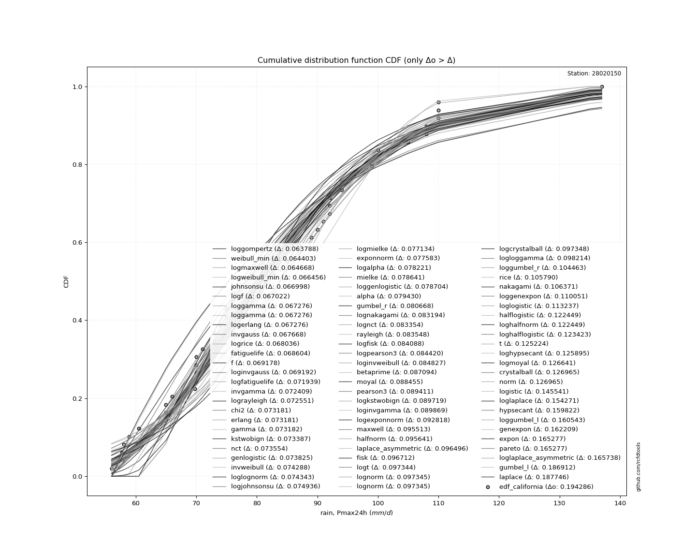</img>

</div>


**1.3. Best fit**

<div align="center">

|   id |   station | empirical_dist   | p_dist      |     delta |   deltao | eval   |   fit |   n |   best_fit |   best_fit_sort |
|-----:|----------:|:-----------------|:------------|----------:|---------:|:-------|------:|----:|-----------:|----------------:|
|    0 |  28020150 | edf_california   | loggompertz | 0.0637877 | 0.194286 | Δo > Δ |     1 |  49 |          1 |               1 |

</div>


<div align="center">

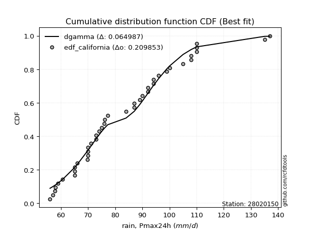</img>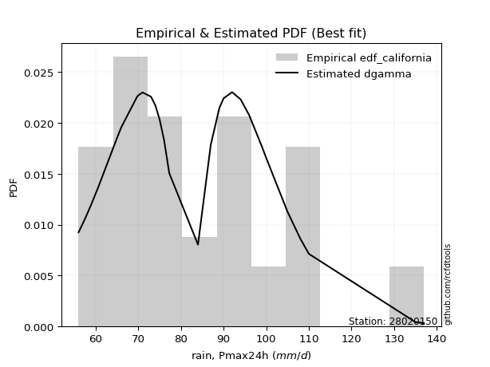</img>

</div>


### 2. Empirical - EDF Hazen (1930)

Hazen method for plotting positions is a formula used to estimate the empirical cumulative probability distribution of flood events or other hydrological data. This formula often results in biased estimations, particularly when extrapolating to extreme events (high return periods).

<div align="center">


$P=(m-0.5)/n$


</div>


**2.1. Empirical values**

<div align="center">

|                | 0                   | 1                    | 2                   | 3                   | 4                   | 5                   | 6                  | 7                   | 8                   | 9                   | 10                  | 11                  | 12                  | 13                 | 14                  | 15                 | 16                 | 17                  | 18                  | 19                 | 20                  | 21                 | 22                  | 23                  | 24        | 25                 | 26                 | 27                 | 28                 | 29                 | 30                 | 31                 | 32                 | 33                 | 34                 | 35                 | 36                 | 37                 | 38                 | 39                 | 40                | 41                 | 42                 | 43                 | 44                 | 45                 | 46                 | 47                 | 48                 |
|:---------------|:--------------------|:---------------------|:--------------------|:--------------------|:--------------------|:--------------------|:-------------------|:--------------------|:--------------------|:--------------------|:--------------------|:--------------------|:--------------------|:-------------------|:--------------------|:-------------------|:-------------------|:--------------------|:--------------------|:-------------------|:--------------------|:-------------------|:--------------------|:--------------------|:----------|:-------------------|:-------------------|:-------------------|:-------------------|:-------------------|:-------------------|:-------------------|:-------------------|:-------------------|:-------------------|:-------------------|:-------------------|:-------------------|:-------------------|:-------------------|:------------------|:-------------------|:-------------------|:-------------------|:-------------------|:-------------------|:-------------------|:-------------------|:-------------------|
| date           | 1986                | 1961                 | 1967                | 1997                | 1985                | 1982                | 1990               | 1991                | 2002                | 2015                | 1983                | 1987                | 2013                | 2019               | 2003                | 2012               | 2014               | 2007                | 2001                | 2018               | 1963                | 2006               | 1984                | 1981                | 2022      | 1998               | 2020               | 1989               | 2000               | 1994               | 1988               | 2021               | 2010               | 2016               | 1965               | 1960               | 1962               | 1995               | 1964               | 2008               | 2017              | 2004               | 1993               | 2011               | 2009               | 1999               | 2005               | 1992               | 1996               |
| x              | 56.0                | 57.0                 | 57.70139503         | 58.0                | 58.89288117         | 60.50959058         | 65.0               | 65.0                | 65.0                | 66.0                | 69.74092411         | 70.0                | 70.0                | 70.0               | 70.0                | 71.0               | 73.0               | 73.0                | 74.0                | 75.0               | 75.0                | 76.0               | 76.09928433         | 77.26118637         | 83.0      | 84.0               | 85.0               | 87.0               | 87.0               | 89.0               | 90.0               | 91.0               | 92.0               | 92.0               | 92.0               | 94.0               | 94.0               | 96.0               | 99.0               | 100.0              | 100.0             | 105.0              | 108.0              | 108.0              | 110.0              | 110.0              | 110.0              | 135.0              | 137.0              |
| m              | 1                   | 2                    | 3                   | 4                   | 5                   | 6                   | 7                  | 8                   | 9                   | 10                  | 11                  | 12                  | 13                  | 14                 | 15                  | 16                 | 17                 | 18                  | 19                  | 20                 | 21                  | 22                 | 23                  | 24                  | 25        | 26                 | 27                 | 28                 | 29                 | 30                 | 31                 | 32                 | 33                 | 34                 | 35                 | 36                 | 37                 | 38                 | 39                 | 40                 | 41                | 42                 | 43                 | 44                 | 45                 | 46                 | 47                 | 48                 | 49                 |
| empirical_dist | edf_hazen           | edf_hazen            | edf_hazen           | edf_hazen           | edf_hazen           | edf_hazen           | edf_hazen          | edf_hazen           | edf_hazen           | edf_hazen           | edf_hazen           | edf_hazen           | edf_hazen           | edf_hazen          | edf_hazen           | edf_hazen          | edf_hazen          | edf_hazen           | edf_hazen           | edf_hazen          | edf_hazen           | edf_hazen          | edf_hazen           | edf_hazen           | edf_hazen | edf_hazen          | edf_hazen          | edf_hazen          | edf_hazen          | edf_hazen          | edf_hazen          | edf_hazen          | edf_hazen          | edf_hazen          | edf_hazen          | edf_hazen          | edf_hazen          | edf_hazen          | edf_hazen          | edf_hazen          | edf_hazen         | edf_hazen          | edf_hazen          | edf_hazen          | edf_hazen          | edf_hazen          | edf_hazen          | edf_hazen          | edf_hazen          |
| empirical      | 0.01020408163265306 | 0.030612244897959183 | 0.05102040816326531 | 0.07142857142857142 | 0.09183673469387756 | 0.11224489795918367 | 0.1326530612244898 | 0.15306122448979592 | 0.17346938775510204 | 0.19387755102040816 | 0.21428571428571427 | 0.23469387755102042 | 0.25510204081632654 | 0.2755102040816326 | 0.29591836734693877 | 0.3163265306122449 | 0.336734693877551  | 0.35714285714285715 | 0.37755102040816324 | 0.3979591836734694 | 0.41836734693877553 | 0.4387755102040816 | 0.45918367346938777 | 0.47959183673469385 | 0.5       | 0.5204081632653061 | 0.5408163265306123 | 0.5612244897959183 | 0.5816326530612245 | 0.6020408163265306 | 0.6224489795918368 | 0.6428571428571429 | 0.6632653061224489 | 0.6836734693877551 | 0.7040816326530612 | 0.7244897959183674 | 0.7448979591836735 | 0.7653061224489796 | 0.7857142857142857 | 0.8061224489795918 | 0.826530612244898 | 0.8469387755102041 | 0.8673469387755102 | 0.8877551020408163 | 0.9081632653061225 | 0.9285714285714286 | 0.9489795918367347 | 0.9693877551020408 | 0.9897959183673469 |
| empirical_tr   | 1.0103092783505154  | 1.0315789473684212   | 1.053763440860215   | 1.0769230769230769  | 1.101123595505618   | 1.1264367816091954  | 1.1529411764705884 | 1.180722891566265   | 1.2098765432098766  | 1.240506329113924   | 1.2727272727272727  | 1.3066666666666666  | 1.3424657534246573  | 1.380281690140845  | 1.4202898550724639  | 1.462686567164179  | 1.5076923076923079 | 1.5555555555555558  | 1.6065573770491803  | 1.6610169491525424 | 1.719298245614035   | 1.7818181818181815 | 1.8490566037735847  | 1.9215686274509802  | 2.0       | 2.0851063829787235 | 2.177777777777778  | 2.27906976744186   | 2.3902439024390243 | 2.5128205128205128 | 2.6486486486486487 | 2.8000000000000003 | 2.9696969696969693 | 3.161290322580645  | 3.3793103448275863 | 3.62962962962963   | 3.920000000000001  | 4.260869565217391  | 4.666666666666666  | 5.157894736842105  | 5.764705882352942 | 6.533333333333336  | 7.5384615384615365 | 8.909090909090908  | 10.88888888888889  | 14.000000000000007 | 19.60000000000002  | 32.66666666666663  | 97.99999999999989  |

</div>


**2.2. Kolmogorov-Smirnov fit test (sorted by Δ)**


<div align="center">

|                | 0                   | 1                   | 2                   | 3                   | 4                   | 5                   | 6                   | 7                   | 8                   | 9                   | 10                  | 11                  | 12                  | 13                  | 14                  | 15                  | 16                  | 17                  | 18                  | 19                  | 20                  | 21                  | 22                  | 23                  | 24                  | 25                 | 26                  | 27                  | 28                  | 29                  | 30                  | 31                  | 32                  | 33                  | 34                  | 35                  | 36                  | 37                  | 38                  | 39                  | 40                  | 41                 | 42                 | 43                  | 44                  | 45                  | 46                  | 47                  | 48                  | 49                  | 50                 | 51                  | 52                  | 53                  | 54                  | 55                  | 56                  | 57                  | 58                  | 59                  | 60                 | 61                  | 62                  | 63                  | 64                  | 65                  | 66                  | 67                 | 68                  | 69                  | 70                  | 71                    | 72                  | 73                  | 74                  | 75                  | 76                  | 77                 | 78                  | 79                  | 80                  | 81                  | 82                 | 83                  | 84                  | 85                 | 86                  | 87                 | 88                 | 89                 |
|:---------------|:--------------------|:--------------------|:--------------------|:--------------------|:--------------------|:--------------------|:--------------------|:--------------------|:--------------------|:--------------------|:--------------------|:--------------------|:--------------------|:--------------------|:--------------------|:--------------------|:--------------------|:--------------------|:--------------------|:--------------------|:--------------------|:--------------------|:--------------------|:--------------------|:--------------------|:-------------------|:--------------------|:--------------------|:--------------------|:--------------------|:--------------------|:--------------------|:--------------------|:--------------------|:--------------------|:--------------------|:--------------------|:--------------------|:--------------------|:--------------------|:--------------------|:-------------------|:-------------------|:--------------------|:--------------------|:--------------------|:--------------------|:--------------------|:--------------------|:--------------------|:-------------------|:--------------------|:--------------------|:--------------------|:--------------------|:--------------------|:--------------------|:--------------------|:--------------------|:--------------------|:-------------------|:--------------------|:--------------------|:--------------------|:--------------------|:--------------------|:--------------------|:-------------------|:--------------------|:--------------------|:--------------------|:----------------------|:--------------------|:--------------------|:--------------------|:--------------------|:--------------------|:-------------------|:--------------------|:--------------------|:--------------------|:--------------------|:-------------------|:--------------------|:--------------------|:-------------------|:--------------------|:-------------------|:-------------------|:-------------------|
| station        | 28020150            | 28020150            | 28020150            | 28020150            | 28020150            | 28020150            | 28020150            | 28020150            | 28020150            | 28020150            | 28020150            | 28020150            | 28020150            | 28020150            | 28020150            | 28020150            | 28020150            | 28020150            | 28020150            | 28020150            | 28020150            | 28020150            | 28020150            | 28020150            | 28020150            | 28020150           | 28020150            | 28020150            | 28020150            | 28020150            | 28020150            | 28020150            | 28020150            | 28020150            | 28020150            | 28020150            | 28020150            | 28020150            | 28020150            | 28020150            | 28020150            | 28020150           | 28020150           | 28020150            | 28020150            | 28020150            | 28020150            | 28020150            | 28020150            | 28020150            | 28020150           | 28020150            | 28020150            | 28020150            | 28020150            | 28020150            | 28020150            | 28020150            | 28020150            | 28020150            | 28020150           | 28020150            | 28020150            | 28020150            | 28020150            | 28020150            | 28020150            | 28020150           | 28020150            | 28020150            | 28020150            | 28020150              | 28020150            | 28020150            | 28020150            | 28020150            | 28020150            | 28020150           | 28020150            | 28020150            | 28020150            | 28020150            | 28020150           | 28020150            | 28020150            | 28020150           | 28020150            | 28020150           | 28020150           | 28020150           |
| empirical_dist | edf_hazen           | edf_hazen           | edf_hazen           | edf_hazen           | edf_hazen           | edf_hazen           | edf_hazen           | edf_hazen           | edf_hazen           | edf_hazen           | edf_hazen           | edf_hazen           | edf_hazen           | edf_hazen           | edf_hazen           | edf_hazen           | edf_hazen           | edf_hazen           | edf_hazen           | edf_hazen           | edf_hazen           | edf_hazen           | edf_hazen           | edf_hazen           | edf_hazen           | edf_hazen          | edf_hazen           | edf_hazen           | edf_hazen           | edf_hazen           | edf_hazen           | edf_hazen           | edf_hazen           | edf_hazen           | edf_hazen           | edf_hazen           | edf_hazen           | edf_hazen           | edf_hazen           | edf_hazen           | edf_hazen           | edf_hazen          | edf_hazen          | edf_hazen           | edf_hazen           | edf_hazen           | edf_hazen           | edf_hazen           | edf_hazen           | edf_hazen           | edf_hazen          | edf_hazen           | edf_hazen           | edf_hazen           | edf_hazen           | edf_hazen           | edf_hazen           | edf_hazen           | edf_hazen           | edf_hazen           | edf_hazen          | edf_hazen           | edf_hazen           | edf_hazen           | edf_hazen           | edf_hazen           | edf_hazen           | edf_hazen          | edf_hazen           | edf_hazen           | edf_hazen           | edf_hazen             | edf_hazen           | edf_hazen           | edf_hazen           | edf_hazen           | edf_hazen           | edf_hazen          | edf_hazen           | edf_hazen           | edf_hazen           | edf_hazen           | edf_hazen          | edf_hazen           | edf_hazen           | edf_hazen          | edf_hazen           | edf_hazen          | edf_hazen          | edf_hazen          |
| p_dist         | loggompertz         | kstwobign           | logrice             | logalpha            | alpha               | logjohnsonsu        | loglognorm          | lognct              | rayleigh            | invweibull          | genlogistic         | nct                 | invgamma            | logpearson3         | logfatiguelife      | gumbel_r            | weibull_min         | logmaxwell          | logfisk             | johnsonsu           | logweibull_min      | betaprime           | logf                | loggamma            | loggamma            | logerlang          | invgauss            | fatiguelife         | pearson3            | f                   | loginvgauss         | loginvgamma         | logexponnorm        | lograyleigh         | chi2                | erlang              | gamma               | maxwell             | halfnorm            | fisk                | logt                | lognorm            | lognorm            | logcrystalball      | logmielke           | exponnorm           | logloggamma         | mielke              | loggenlogistic      | lognakagami         | loginvweibull      | rice                | moyal               | logkstwobign        | loglogistic         | laplace_asymmetric  | loghalfnorm         | halflogistic        | loggumbel_r         | t                   | loghypsecant       | nakagami            | crystalball         | norm                | loggenexpon         | loghalflogistic     | logistic            | logmoyal           | loglaplace          | hypsecant           | loggumbel_l         | loglaplace_asymmetric | genexpon            | expon               | pareto              | gumbel_l            | laplace             | wald               | logwald             | logbetaprime        | logtruncnorm        | logncf              | logexpon           | logpareto           | loggibrat           | gibrat             | logchi2             | ncf                | gompertz           | truncnorm          |
| delta          | 0.06039615591486172 | 0.06627445384800701 | 0.06913299443390208 | 0.06981776228180325 | 0.07064601800634807 | 0.07212083342064679 | 0.07267540956313867 | 0.07314946770649905 | 0.07334401193523626 | 0.07367492636137052 | 0.07392383396068136 | 0.07403810667394828 | 0.07408278089387854 | 0.07421628440999944 | 0.07428874392701079 | 0.07440764726811011 | 0.07460737490311764 | 0.07487195085649834 | 0.07532727047423327 | 0.07590470435366148 | 0.07666010137550283 | 0.07688973775399832 | 0.07722638146684335 | 0.07748004968126088 | 0.07748004968126088 | 0.0774804764061795 | 0.07787245181575242 | 0.07880808254723892 | 0.07920668808496356 | 0.07938169213979895 | 0.07939629913336155 | 0.07966465604182765 | 0.08261392312489063 | 0.08275506009952893 | 0.08338487205464529 | 0.08338541455487591 | 0.08338558374938054 | 0.08530888690341115 | 0.08543674043876961 | 0.08650832469934039 | 0.08714018282691655 | 0.0871405843251351 | 0.0871405843251351 | 0.08714421047213111 | 0.08733814453823774 | 0.08778699680618984 | 0.08800948176858847 | 0.08884519355435427 | 0.08890821413774808 | 0.09339801094904376 | 0.0950306046090208 | 0.09558542042757762 | 0.09865922172940056 | 0.09992350837957498 | 0.10303266038557174 | 0.10670026345124406 | 0.11224489795918367 | 0.11224489795918367 | 0.11466659449348304 | 0.11501988723375284 | 0.1156910840899889 | 0.11657461963157686 | 0.11676110936309764 | 0.11676114399843479 | 0.12025489076851778 | 0.13362690081952222 | 0.13533698544347528 | 0.136845119257203  | 0.14406720374091936 | 0.14961804493880182 | 0.15033895312991635 | 0.15553395769300077   | 0.17241325427892343 | 0.17548062991402288 | 0.17548063723693766 | 0.17670760309504274 | 0.17754228460717247 | 0.1936918595673916 | 0.19880822602599613 | 0.21008017005407353 | 0.21720248163655817 | 0.22226537061150353 | 0.2255324195912414 | 0.22553243446040375 | 0.27730969085345697 | 0.2904123354815535 | 0.38113351778689286 | 0.5884654739286789 | 0.7514060307099214 | 0.8176844666450391 |
| deltao         | 0.1942857142857143  | 0.1942857142857143  | 0.1942857142857143  | 0.1942857142857143  | 0.1942857142857143  | 0.1942857142857143  | 0.1942857142857143  | 0.1942857142857143  | 0.1942857142857143  | 0.1942857142857143  | 0.1942857142857143  | 0.1942857142857143  | 0.1942857142857143  | 0.1942857142857143  | 0.1942857142857143  | 0.1942857142857143  | 0.1942857142857143  | 0.1942857142857143  | 0.1942857142857143  | 0.1942857142857143  | 0.1942857142857143  | 0.1942857142857143  | 0.1942857142857143  | 0.1942857142857143  | 0.1942857142857143  | 0.1942857142857143 | 0.1942857142857143  | 0.1942857142857143  | 0.1942857142857143  | 0.1942857142857143  | 0.1942857142857143  | 0.1942857142857143  | 0.1942857142857143  | 0.1942857142857143  | 0.1942857142857143  | 0.1942857142857143  | 0.1942857142857143  | 0.1942857142857143  | 0.1942857142857143  | 0.1942857142857143  | 0.1942857142857143  | 0.1942857142857143 | 0.1942857142857143 | 0.1942857142857143  | 0.1942857142857143  | 0.1942857142857143  | 0.1942857142857143  | 0.1942857142857143  | 0.1942857142857143  | 0.1942857142857143  | 0.1942857142857143 | 0.1942857142857143  | 0.1942857142857143  | 0.1942857142857143  | 0.1942857142857143  | 0.1942857142857143  | 0.1942857142857143  | 0.1942857142857143  | 0.1942857142857143  | 0.1942857142857143  | 0.1942857142857143 | 0.1942857142857143  | 0.1942857142857143  | 0.1942857142857143  | 0.1942857142857143  | 0.1942857142857143  | 0.1942857142857143  | 0.1942857142857143 | 0.1942857142857143  | 0.1942857142857143  | 0.1942857142857143  | 0.1942857142857143    | 0.1942857142857143  | 0.1942857142857143  | 0.1942857142857143  | 0.1942857142857143  | 0.1942857142857143  | 0.1942857142857143 | 0.1942857142857143  | 0.1942857142857143  | 0.1942857142857143  | 0.1942857142857143  | 0.1942857142857143 | 0.1942857142857143  | 0.1942857142857143  | 0.1942857142857143 | 0.1942857142857143  | 0.1942857142857143 | 0.1942857142857143 | 0.1942857142857143 |
| eval           | Δo > Δ              | Δo > Δ              | Δo > Δ              | Δo > Δ              | Δo > Δ              | Δo > Δ              | Δo > Δ              | Δo > Δ              | Δo > Δ              | Δo > Δ              | Δo > Δ              | Δo > Δ              | Δo > Δ              | Δo > Δ              | Δo > Δ              | Δo > Δ              | Δo > Δ              | Δo > Δ              | Δo > Δ              | Δo > Δ              | Δo > Δ              | Δo > Δ              | Δo > Δ              | Δo > Δ              | Δo > Δ              | Δo > Δ             | Δo > Δ              | Δo > Δ              | Δo > Δ              | Δo > Δ              | Δo > Δ              | Δo > Δ              | Δo > Δ              | Δo > Δ              | Δo > Δ              | Δo > Δ              | Δo > Δ              | Δo > Δ              | Δo > Δ              | Δo > Δ              | Δo > Δ              | Δo > Δ             | Δo > Δ             | Δo > Δ              | Δo > Δ              | Δo > Δ              | Δo > Δ              | Δo > Δ              | Δo > Δ              | Δo > Δ              | Δo > Δ             | Δo > Δ              | Δo > Δ              | Δo > Δ              | Δo > Δ              | Δo > Δ              | Δo > Δ              | Δo > Δ              | Δo > Δ              | Δo > Δ              | Δo > Δ             | Δo > Δ              | Δo > Δ              | Δo > Δ              | Δo > Δ              | Δo > Δ              | Δo > Δ              | Δo > Δ             | Δo > Δ              | Δo > Δ              | Δo > Δ              | Δo > Δ                | Δo > Δ              | Δo > Δ              | Δo > Δ              | Δo > Δ              | Δo > Δ              | Δo > Δ             | Δo <= Δ             | Δo <= Δ             | Δo <= Δ             | Δo <= Δ             | Δo <= Δ            | Δo <= Δ             | Δo <= Δ             | Δo <= Δ            | Δo <= Δ             | Δo <= Δ            | Δo <= Δ            | Δo <= Δ            |
| fit            | 1                   | 1                   | 1                   | 1                   | 1                   | 1                   | 1                   | 1                   | 1                   | 1                   | 1                   | 1                   | 1                   | 1                   | 1                   | 1                   | 1                   | 1                   | 1                   | 1                   | 1                   | 1                   | 1                   | 1                   | 1                   | 1                  | 1                   | 1                   | 1                   | 1                   | 1                   | 1                   | 1                   | 1                   | 1                   | 1                   | 1                   | 1                   | 1                   | 1                   | 1                   | 1                  | 1                  | 1                   | 1                   | 1                   | 1                   | 1                   | 1                   | 1                   | 1                  | 1                   | 1                   | 1                   | 1                   | 1                   | 1                   | 1                   | 1                   | 1                   | 1                  | 1                   | 1                   | 1                   | 1                   | 1                   | 1                   | 1                  | 1                   | 1                   | 1                   | 1                     | 1                   | 1                   | 1                   | 1                   | 1                   | 1                  | 0                   | 0                   | 0                   | 0                   | 0                  | 0                   | 0                   | 0                  | 0                   | 0                  | 0                  | 0                  |
| n              | 49                  | 49                  | 49                  | 49                  | 49                  | 49                  | 49                  | 49                  | 49                  | 49                  | 49                  | 49                  | 49                  | 49                  | 49                  | 49                  | 49                  | 49                  | 49                  | 49                  | 49                  | 49                  | 49                  | 49                  | 49                  | 49                 | 49                  | 49                  | 49                  | 49                  | 49                  | 49                  | 49                  | 49                  | 49                  | 49                  | 49                  | 49                  | 49                  | 49                  | 49                  | 49                 | 49                 | 49                  | 49                  | 49                  | 49                  | 49                  | 49                  | 49                  | 49                 | 49                  | 49                  | 49                  | 49                  | 49                  | 49                  | 49                  | 49                  | 49                  | 49                 | 49                  | 49                  | 49                  | 49                  | 49                  | 49                  | 49                 | 49                  | 49                  | 49                  | 49                    | 49                  | 49                  | 49                  | 49                  | 49                  | 49                 | 49                  | 49                  | 49                  | 49                  | 49                 | 49                  | 49                  | 49                 | 49                  | 49                 | 49                 | 49                 |
| best_fit       | 1                   | 0                   | 0                   | 0                   | 0                   | 0                   | 0                   | 0                   | 0                   | 0                   | 0                   | 0                   | 0                   | 0                   | 0                   | 0                   | 0                   | 0                   | 0                   | 0                   | 0                   | 0                   | 0                   | 0                   | 0                   | 0                  | 0                   | 0                   | 0                   | 0                   | 0                   | 0                   | 0                   | 0                   | 0                   | 0                   | 0                   | 0                   | 0                   | 0                   | 0                   | 0                  | 0                  | 0                   | 0                   | 0                   | 0                   | 0                   | 0                   | 0                   | 0                  | 0                   | 0                   | 0                   | 0                   | 0                   | 0                   | 0                   | 0                   | 0                   | 0                  | 0                   | 0                   | 0                   | 0                   | 0                   | 0                   | 0                  | 0                   | 0                   | 0                   | 0                     | 0                   | 0                   | 0                   | 0                   | 0                   | 0                  | 0                   | 0                   | 0                   | 0                   | 0                  | 0                   | 0                   | 0                  | 0                   | 0                  | 0                  | 0                  |
| best_fit_sort  | 1                   | 2                   | 3                   | 4                   | 5                   | 6                   | 7                   | 8                   | 9                   | 10                  | 11                  | 12                  | 13                  | 14                  | 15                  | 16                  | 17                  | 18                  | 19                  | 20                  | 21                  | 22                  | 23                  | 24                  | 25                  | 26                 | 27                  | 28                  | 29                  | 30                  | 31                  | 32                  | 33                  | 34                  | 35                  | 36                  | 37                  | 38                  | 39                  | 40                  | 41                  | 42                 | 43                 | 44                  | 45                  | 46                  | 47                  | 48                  | 49                  | 50                  | 51                 | 52                  | 53                  | 54                  | 55                  | 56                  | 57                  | 58                  | 59                  | 60                  | 61                 | 62                  | 63                  | 64                  | 65                  | 66                  | 67                  | 68                 | 69                  | 70                  | 71                  | 72                    | 73                  | 74                  | 75                  | 76                  | 77                  | 78                 | 79                  | 80                  | 81                  | 82                  | 83                 | 84                  | 85                  | 86                 | 87                  | 88                 | 89                 | 90                 |

</div>


<div align="center">

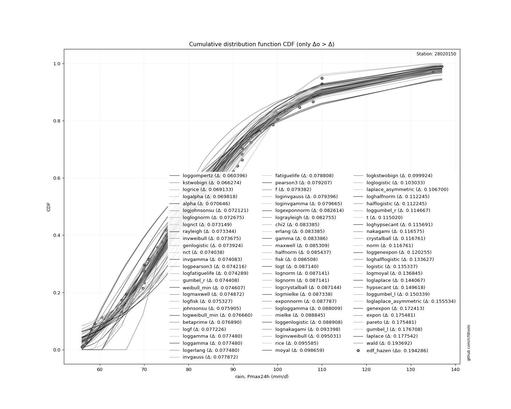</img>

</div>


**2.3. Best fit**

<div align="center">

|   id |   station | empirical_dist   | p_dist      |     delta |   deltao | eval   |   fit |   n |   best_fit |   best_fit_sort |
|-----:|----------:|:-----------------|:------------|----------:|---------:|:-------|------:|----:|-----------:|----------------:|
|    0 |  28020150 | edf_hazen        | loggompertz | 0.0603962 | 0.194286 | Δo > Δ |     1 |  49 |          1 |               1 |

</div>


<div align="center">

</img>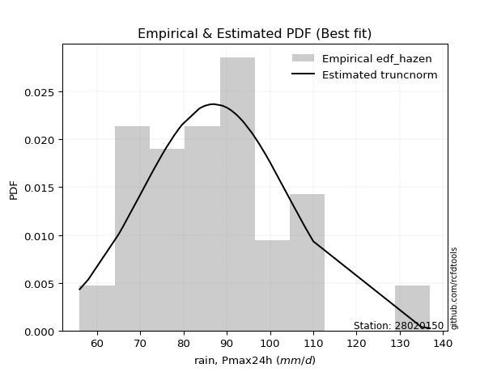</img>

</div>


### 3. Empirical - EDF Weibull (1939)

Weibull plotting position formula is an empirical method used to estimate the non-exceedance probability or plotting position for a set of observed data, is often recommended or widely used in practice, particularly in flood frequency analysis.

<div align="center">


$P=m/(n+1)$


</div>


**3.1. Empirical values**

<div align="center">

|                | 0                  | 1                  | 2                  | 3                  | 4                  | 5                  | 6                  | 7                  | 8                  | 9           | 10                | 11                 | 12                 | 13                 | 14                 | 15                 | 16                 | 17          | 18                 | 19                 | 20                 | 21                 | 22                 | 23                | 24          | 25                 | 26                | 27                | 28                | 29          | 30                 | 31                 | 32                 | 33                 | 34                | 35                | 36                | 37                | 38                | 39                | 40                 | 41                | 42                | 43                | 44                 | 45                 | 46                 | 47                | 48                |
|:---------------|:-------------------|:-------------------|:-------------------|:-------------------|:-------------------|:-------------------|:-------------------|:-------------------|:-------------------|:------------|:------------------|:-------------------|:-------------------|:-------------------|:-------------------|:-------------------|:-------------------|:------------|:-------------------|:-------------------|:-------------------|:-------------------|:-------------------|:------------------|:------------|:-------------------|:------------------|:------------------|:------------------|:------------|:-------------------|:-------------------|:-------------------|:-------------------|:------------------|:------------------|:------------------|:------------------|:------------------|:------------------|:-------------------|:------------------|:------------------|:------------------|:-------------------|:-------------------|:-------------------|:------------------|:------------------|
| date           | 1986               | 1961               | 1967               | 1997               | 1985               | 1982               | 1990               | 1991               | 2002               | 2015        | 1983              | 1987               | 2013               | 2019               | 2003               | 2012               | 2014               | 2007        | 2001               | 2018               | 1963               | 2006               | 1984               | 1981              | 2022        | 1998               | 2020              | 1989              | 2000              | 1994        | 1988               | 2021               | 2010               | 2016               | 1965              | 1960              | 1962              | 1995              | 1964              | 2008              | 2017               | 2004              | 1993              | 2011              | 2009               | 1999               | 2005               | 1992              | 1996              |
| x              | 56.0               | 57.0               | 57.70139503        | 58.0               | 58.89288117        | 60.50959058        | 65.0               | 65.0               | 65.0               | 66.0        | 69.74092411       | 70.0               | 70.0               | 70.0               | 70.0               | 71.0               | 73.0               | 73.0        | 74.0               | 75.0               | 75.0               | 76.0               | 76.09928433        | 77.26118637       | 83.0        | 84.0               | 85.0              | 87.0              | 87.0              | 89.0        | 90.0               | 91.0               | 92.0               | 92.0               | 92.0              | 94.0              | 94.0              | 96.0              | 99.0              | 100.0             | 100.0              | 105.0             | 108.0             | 108.0             | 110.0              | 110.0              | 110.0              | 135.0             | 137.0             |
| m              | 1                  | 2                  | 3                  | 4                  | 5                  | 6                  | 7                  | 8                  | 9                  | 10          | 11                | 12                 | 13                 | 14                 | 15                 | 16                 | 17                 | 18          | 19                 | 20                 | 21                 | 22                 | 23                 | 24                | 25          | 26                 | 27                | 28                | 29                | 30          | 31                 | 32                 | 33                 | 34                 | 35                | 36                | 37                | 38                | 39                | 40                | 41                 | 42                | 43                | 44                | 45                 | 46                 | 47                 | 48                | 49                |
| empirical_dist | edf_weibull        | edf_weibull        | edf_weibull        | edf_weibull        | edf_weibull        | edf_weibull        | edf_weibull        | edf_weibull        | edf_weibull        | edf_weibull | edf_weibull       | edf_weibull        | edf_weibull        | edf_weibull        | edf_weibull        | edf_weibull        | edf_weibull        | edf_weibull | edf_weibull        | edf_weibull        | edf_weibull        | edf_weibull        | edf_weibull        | edf_weibull       | edf_weibull | edf_weibull        | edf_weibull       | edf_weibull       | edf_weibull       | edf_weibull | edf_weibull        | edf_weibull        | edf_weibull        | edf_weibull        | edf_weibull       | edf_weibull       | edf_weibull       | edf_weibull       | edf_weibull       | edf_weibull       | edf_weibull        | edf_weibull       | edf_weibull       | edf_weibull       | edf_weibull        | edf_weibull        | edf_weibull        | edf_weibull       | edf_weibull       |
| empirical      | 0.02               | 0.04               | 0.06               | 0.08               | 0.1                | 0.12               | 0.14               | 0.16               | 0.18               | 0.2         | 0.22              | 0.24               | 0.26               | 0.28               | 0.3                | 0.32               | 0.34               | 0.36        | 0.38               | 0.4                | 0.42               | 0.44               | 0.46               | 0.48              | 0.5         | 0.52               | 0.54              | 0.56              | 0.58              | 0.6         | 0.62               | 0.64               | 0.66               | 0.68               | 0.7               | 0.72              | 0.74              | 0.76              | 0.78              | 0.8               | 0.82               | 0.84              | 0.86              | 0.88              | 0.9                | 0.92               | 0.94               | 0.96              | 0.98              |
| empirical_tr   | 1.0204081632653061 | 1.0416666666666667 | 1.0638297872340425 | 1.0869565217391304 | 1.1111111111111112 | 1.1363636363636365 | 1.1627906976744187 | 1.1904761904761905 | 1.2195121951219512 | 1.25        | 1.282051282051282 | 1.3157894736842106 | 1.3513513513513513 | 1.3888888888888888 | 1.4285714285714286 | 1.4705882352941178 | 1.5151515151515154 | 1.5625      | 1.6129032258064517 | 1.6666666666666667 | 1.7241379310344827 | 1.7857142857142856 | 1.8518518518518516 | 1.923076923076923 | 2.0         | 2.0833333333333335 | 2.173913043478261 | 2.272727272727273 | 2.380952380952381 | 2.5         | 2.6315789473684212 | 2.7777777777777777 | 2.9411764705882355 | 3.1250000000000004 | 3.333333333333333 | 3.571428571428571 | 3.846153846153846 | 4.166666666666667 | 4.545454545454546 | 5.000000000000001 | 5.5555555555555545 | 6.249999999999999 | 7.142857142857142 | 8.333333333333334 | 10.000000000000002 | 12.500000000000007 | 16.666666666666654 | 24.99999999999998 | 49.99999999999996 |

</div>


**3.2. Kolmogorov-Smirnov fit test (sorted by Δ)**


<div align="center">

|                | 0                    | 1                   | 2                   | 3                   | 4                   | 5                   | 6                   | 7                  | 8                   | 9                   | 10                 | 11                  | 12                  | 13                  | 14                  | 15                  | 16                  | 17                  | 18                  | 19                  | 20                  | 21                 | 22                  | 23                  | 24                  | 25                  | 26                  | 27                  | 28                 | 29                  | 30                  | 31                  | 32                  | 33                 | 34                  | 35                  | 36                  | 37                 | 38                  | 39                 | 40                  | 41                  | 42                  | 43                  | 44                  | 45                  | 46                  | 47                  | 48                  | 49                  | 50                  | 51                  | 52                  | 53                  | 54                 | 55                  | 56                  | 57                  | 58                  | 59                  | 60                  | 61                  | 62                  | 63                 | 64                 | 65                 | 66                  | 67                  | 68                 | 69                  | 70                 | 71                    | 72                 | 73                  | 74                  | 75                  | 76                  | 77                  | 78                 | 79                  | 80                  | 81                  | 82                  | 83                  | 84                 | 85                 | 86                  | 87                 | 88                 | 89                 |
|:---------------|:---------------------|:--------------------|:--------------------|:--------------------|:--------------------|:--------------------|:--------------------|:-------------------|:--------------------|:--------------------|:-------------------|:--------------------|:--------------------|:--------------------|:--------------------|:--------------------|:--------------------|:--------------------|:--------------------|:--------------------|:--------------------|:-------------------|:--------------------|:--------------------|:--------------------|:--------------------|:--------------------|:--------------------|:-------------------|:--------------------|:--------------------|:--------------------|:--------------------|:-------------------|:--------------------|:--------------------|:--------------------|:-------------------|:--------------------|:-------------------|:--------------------|:--------------------|:--------------------|:--------------------|:--------------------|:--------------------|:--------------------|:--------------------|:--------------------|:--------------------|:--------------------|:--------------------|:--------------------|:--------------------|:-------------------|:--------------------|:--------------------|:--------------------|:--------------------|:--------------------|:--------------------|:--------------------|:--------------------|:-------------------|:-------------------|:-------------------|:--------------------|:--------------------|:-------------------|:--------------------|:-------------------|:----------------------|:-------------------|:--------------------|:--------------------|:--------------------|:--------------------|:--------------------|:-------------------|:--------------------|:--------------------|:--------------------|:--------------------|:--------------------|:-------------------|:-------------------|:--------------------|:-------------------|:-------------------|:-------------------|
| station        | 28020150             | 28020150            | 28020150            | 28020150            | 28020150            | 28020150            | 28020150            | 28020150           | 28020150            | 28020150            | 28020150           | 28020150            | 28020150            | 28020150            | 28020150            | 28020150            | 28020150            | 28020150            | 28020150            | 28020150            | 28020150            | 28020150           | 28020150            | 28020150            | 28020150            | 28020150            | 28020150            | 28020150            | 28020150           | 28020150            | 28020150            | 28020150            | 28020150            | 28020150           | 28020150            | 28020150            | 28020150            | 28020150           | 28020150            | 28020150           | 28020150            | 28020150            | 28020150            | 28020150            | 28020150            | 28020150            | 28020150            | 28020150            | 28020150            | 28020150            | 28020150            | 28020150            | 28020150            | 28020150            | 28020150           | 28020150            | 28020150            | 28020150            | 28020150            | 28020150            | 28020150            | 28020150            | 28020150            | 28020150           | 28020150           | 28020150           | 28020150            | 28020150            | 28020150           | 28020150            | 28020150           | 28020150              | 28020150           | 28020150            | 28020150            | 28020150            | 28020150            | 28020150            | 28020150           | 28020150            | 28020150            | 28020150            | 28020150            | 28020150            | 28020150           | 28020150           | 28020150            | 28020150           | 28020150           | 28020150           |
| empirical_dist | edf_weibull          | edf_weibull         | edf_weibull         | edf_weibull         | edf_weibull         | edf_weibull         | edf_weibull         | edf_weibull        | edf_weibull         | edf_weibull         | edf_weibull        | edf_weibull         | edf_weibull         | edf_weibull         | edf_weibull         | edf_weibull         | edf_weibull         | edf_weibull         | edf_weibull         | edf_weibull         | edf_weibull         | edf_weibull        | edf_weibull         | edf_weibull         | edf_weibull         | edf_weibull         | edf_weibull         | edf_weibull         | edf_weibull        | edf_weibull         | edf_weibull         | edf_weibull         | edf_weibull         | edf_weibull        | edf_weibull         | edf_weibull         | edf_weibull         | edf_weibull        | edf_weibull         | edf_weibull        | edf_weibull         | edf_weibull         | edf_weibull         | edf_weibull         | edf_weibull         | edf_weibull         | edf_weibull         | edf_weibull         | edf_weibull         | edf_weibull         | edf_weibull         | edf_weibull         | edf_weibull         | edf_weibull         | edf_weibull        | edf_weibull         | edf_weibull         | edf_weibull         | edf_weibull         | edf_weibull         | edf_weibull         | edf_weibull         | edf_weibull         | edf_weibull        | edf_weibull        | edf_weibull        | edf_weibull         | edf_weibull         | edf_weibull        | edf_weibull         | edf_weibull        | edf_weibull           | edf_weibull        | edf_weibull         | edf_weibull         | edf_weibull         | edf_weibull         | edf_weibull         | edf_weibull        | edf_weibull         | edf_weibull         | edf_weibull         | edf_weibull         | edf_weibull         | edf_weibull        | edf_weibull        | edf_weibull         | edf_weibull        | edf_weibull        | edf_weibull        |
| p_dist         | loggompertz          | kstwobign           | logrice             | logalpha            | alpha               | logjohnsonsu        | loglognorm          | lognct             | rayleigh            | invweibull          | logpearson3        | genlogistic         | nct                 | invgamma            | logfatiguelife      | gumbel_r            | weibull_min         | logmaxwell          | logfisk             | johnsonsu           | betaprime           | logweibull_min     | logf                | loggamma            | loggamma            | logerlang           | invgauss            | pearson3            | fatiguelife        | loginvgamma         | f                   | loginvgauss         | logexponnorm        | lograyleigh        | chi2                | erlang              | gamma               | maxwell            | fisk                | logt               | lognorm             | lognorm             | logcrystalball      | logmielke           | logloggamma         | exponnorm           | mielke              | loggenlogistic      | halfnorm            | lognakagami         | loginvweibull       | rice                | moyal               | logkstwobign        | loglogistic        | laplace_asymmetric  | nakagami            | loggenexpon         | t                   | loggumbel_r         | loghypsecant        | crystalball         | norm                | halflogistic       | loghalfnorm        | loghalflogistic    | logistic            | logmoyal            | loglaplace         | hypsecant           | loggumbel_l        | loglaplace_asymmetric | genexpon           | expon               | pareto              | gumbel_l            | laplace             | wald                | logwald            | logbetaprime        | logtruncnorm        | logncf              | logexpon            | logpareto           | loggibrat          | gibrat             | logchi2             | ncf                | gompertz           | truncnorm          |
| delta          | 0.054681870200575994 | 0.06749894364392528 | 0.07035748422982036 | 0.07104225207772152 | 0.07187050780226634 | 0.07334532321656506 | 0.07389989935905694 | 0.0739657942371113 | 0.07416033846584852 | 0.07489941615728879 | 0.0750326109406117 | 0.07514832375659963 | 0.07526259646986655 | 0.07530727068979681 | 0.07551323372292906 | 0.07563213706402838 | 0.07583186469903591 | 0.07609644065241661 | 0.07655176027015154 | 0.07712919414957975 | 0.07770606428461058 | 0.0778845911714211 | 0.07845087126276162 | 0.07870453947717915 | 0.07870453947717915 | 0.07870496620209777 | 0.07909694161167069 | 0.08002301461557582 | 0.0800325723431572 | 0.08048098257243991 | 0.08060618193571722 | 0.08062078892927982 | 0.08343024965550289 | 0.0839795498954472 | 0.08460936185056356 | 0.08460990435079419 | 0.08461007354529881 | 0.0861252134340234 | 0.08732465122995264 | 0.0879565093575288 | 0.08795691085574736 | 0.08795691085574736 | 0.08796053700274337 | 0.08856263433415601 | 0.08882580829920073 | 0.08901148660210811 | 0.09006968335027254 | 0.09013270393366635 | 0.09360000574489206 | 0.09462250074496203 | 0.09625509440493907 | 0.09640174695818987 | 0.09988371152531883 | 0.10114799817549325 | 0.103848986916184  | 0.10792475324716233 | 0.11086033391729114 | 0.11454060505423205 | 0.11583621376436509 | 0.11589108428940131 | 0.11650741062060116 | 0.11757743589370989 | 0.11757747052904705 | 0.12               | 0.12               | 0.1348513906154405 | 0.13615331197408753 | 0.13806960905312127 | 0.1448835302715316 | 0.15043437146941407 | 0.1511552796605286 | 0.1559421209583069    | 0.1666989685646377 | 0.16976634419973716 | 0.16976635152265193 | 0.17711576636034887 | 0.17835861113778473 | 0.19981430854698345 | 0.2000327158219144 | 0.20110057821733873 | 0.21148819592227244 | 0.21328577877476873 | 0.21981813387695567 | 0.21981814874611802 | 0.2813913235065182 | 0.2944939681346147 | 0.37215392595015806 | 0.5786695555613319 | 0.7448754184650234 | 0.8078885482776922 |
| deltao         | 0.1942857142857143   | 0.1942857142857143  | 0.1942857142857143  | 0.1942857142857143  | 0.1942857142857143  | 0.1942857142857143  | 0.1942857142857143  | 0.1942857142857143 | 0.1942857142857143  | 0.1942857142857143  | 0.1942857142857143 | 0.1942857142857143  | 0.1942857142857143  | 0.1942857142857143  | 0.1942857142857143  | 0.1942857142857143  | 0.1942857142857143  | 0.1942857142857143  | 0.1942857142857143  | 0.1942857142857143  | 0.1942857142857143  | 0.1942857142857143 | 0.1942857142857143  | 0.1942857142857143  | 0.1942857142857143  | 0.1942857142857143  | 0.1942857142857143  | 0.1942857142857143  | 0.1942857142857143 | 0.1942857142857143  | 0.1942857142857143  | 0.1942857142857143  | 0.1942857142857143  | 0.1942857142857143 | 0.1942857142857143  | 0.1942857142857143  | 0.1942857142857143  | 0.1942857142857143 | 0.1942857142857143  | 0.1942857142857143 | 0.1942857142857143  | 0.1942857142857143  | 0.1942857142857143  | 0.1942857142857143  | 0.1942857142857143  | 0.1942857142857143  | 0.1942857142857143  | 0.1942857142857143  | 0.1942857142857143  | 0.1942857142857143  | 0.1942857142857143  | 0.1942857142857143  | 0.1942857142857143  | 0.1942857142857143  | 0.1942857142857143 | 0.1942857142857143  | 0.1942857142857143  | 0.1942857142857143  | 0.1942857142857143  | 0.1942857142857143  | 0.1942857142857143  | 0.1942857142857143  | 0.1942857142857143  | 0.1942857142857143 | 0.1942857142857143 | 0.1942857142857143 | 0.1942857142857143  | 0.1942857142857143  | 0.1942857142857143 | 0.1942857142857143  | 0.1942857142857143 | 0.1942857142857143    | 0.1942857142857143 | 0.1942857142857143  | 0.1942857142857143  | 0.1942857142857143  | 0.1942857142857143  | 0.1942857142857143  | 0.1942857142857143 | 0.1942857142857143  | 0.1942857142857143  | 0.1942857142857143  | 0.1942857142857143  | 0.1942857142857143  | 0.1942857142857143 | 0.1942857142857143 | 0.1942857142857143  | 0.1942857142857143 | 0.1942857142857143 | 0.1942857142857143 |
| eval           | Δo > Δ               | Δo > Δ              | Δo > Δ              | Δo > Δ              | Δo > Δ              | Δo > Δ              | Δo > Δ              | Δo > Δ             | Δo > Δ              | Δo > Δ              | Δo > Δ             | Δo > Δ              | Δo > Δ              | Δo > Δ              | Δo > Δ              | Δo > Δ              | Δo > Δ              | Δo > Δ              | Δo > Δ              | Δo > Δ              | Δo > Δ              | Δo > Δ             | Δo > Δ              | Δo > Δ              | Δo > Δ              | Δo > Δ              | Δo > Δ              | Δo > Δ              | Δo > Δ             | Δo > Δ              | Δo > Δ              | Δo > Δ              | Δo > Δ              | Δo > Δ             | Δo > Δ              | Δo > Δ              | Δo > Δ              | Δo > Δ             | Δo > Δ              | Δo > Δ             | Δo > Δ              | Δo > Δ              | Δo > Δ              | Δo > Δ              | Δo > Δ              | Δo > Δ              | Δo > Δ              | Δo > Δ              | Δo > Δ              | Δo > Δ              | Δo > Δ              | Δo > Δ              | Δo > Δ              | Δo > Δ              | Δo > Δ             | Δo > Δ              | Δo > Δ              | Δo > Δ              | Δo > Δ              | Δo > Δ              | Δo > Δ              | Δo > Δ              | Δo > Δ              | Δo > Δ             | Δo > Δ             | Δo > Δ             | Δo > Δ              | Δo > Δ              | Δo > Δ             | Δo > Δ              | Δo > Δ             | Δo > Δ                | Δo > Δ             | Δo > Δ              | Δo > Δ              | Δo > Δ              | Δo > Δ              | Δo <= Δ             | Δo <= Δ            | Δo <= Δ             | Δo <= Δ             | Δo <= Δ             | Δo <= Δ             | Δo <= Δ             | Δo <= Δ            | Δo <= Δ            | Δo <= Δ             | Δo <= Δ            | Δo <= Δ            | Δo <= Δ            |
| fit            | 1                    | 1                   | 1                   | 1                   | 1                   | 1                   | 1                   | 1                  | 1                   | 1                   | 1                  | 1                   | 1                   | 1                   | 1                   | 1                   | 1                   | 1                   | 1                   | 1                   | 1                   | 1                  | 1                   | 1                   | 1                   | 1                   | 1                   | 1                   | 1                  | 1                   | 1                   | 1                   | 1                   | 1                  | 1                   | 1                   | 1                   | 1                  | 1                   | 1                  | 1                   | 1                   | 1                   | 1                   | 1                   | 1                   | 1                   | 1                   | 1                   | 1                   | 1                   | 1                   | 1                   | 1                   | 1                  | 1                   | 1                   | 1                   | 1                   | 1                   | 1                   | 1                   | 1                   | 1                  | 1                  | 1                  | 1                   | 1                   | 1                  | 1                   | 1                  | 1                     | 1                  | 1                   | 1                   | 1                   | 1                   | 0                   | 0                  | 0                   | 0                   | 0                   | 0                   | 0                   | 0                  | 0                  | 0                   | 0                  | 0                  | 0                  |
| n              | 49                   | 49                  | 49                  | 49                  | 49                  | 49                  | 49                  | 49                 | 49                  | 49                  | 49                 | 49                  | 49                  | 49                  | 49                  | 49                  | 49                  | 49                  | 49                  | 49                  | 49                  | 49                 | 49                  | 49                  | 49                  | 49                  | 49                  | 49                  | 49                 | 49                  | 49                  | 49                  | 49                  | 49                 | 49                  | 49                  | 49                  | 49                 | 49                  | 49                 | 49                  | 49                  | 49                  | 49                  | 49                  | 49                  | 49                  | 49                  | 49                  | 49                  | 49                  | 49                  | 49                  | 49                  | 49                 | 49                  | 49                  | 49                  | 49                  | 49                  | 49                  | 49                  | 49                  | 49                 | 49                 | 49                 | 49                  | 49                  | 49                 | 49                  | 49                 | 49                    | 49                 | 49                  | 49                  | 49                  | 49                  | 49                  | 49                 | 49                  | 49                  | 49                  | 49                  | 49                  | 49                 | 49                 | 49                  | 49                 | 49                 | 49                 |
| best_fit       | 1                    | 0                   | 0                   | 0                   | 0                   | 0                   | 0                   | 0                  | 0                   | 0                   | 0                  | 0                   | 0                   | 0                   | 0                   | 0                   | 0                   | 0                   | 0                   | 0                   | 0                   | 0                  | 0                   | 0                   | 0                   | 0                   | 0                   | 0                   | 0                  | 0                   | 0                   | 0                   | 0                   | 0                  | 0                   | 0                   | 0                   | 0                  | 0                   | 0                  | 0                   | 0                   | 0                   | 0                   | 0                   | 0                   | 0                   | 0                   | 0                   | 0                   | 0                   | 0                   | 0                   | 0                   | 0                  | 0                   | 0                   | 0                   | 0                   | 0                   | 0                   | 0                   | 0                   | 0                  | 0                  | 0                  | 0                   | 0                   | 0                  | 0                   | 0                  | 0                     | 0                  | 0                   | 0                   | 0                   | 0                   | 0                   | 0                  | 0                   | 0                   | 0                   | 0                   | 0                   | 0                  | 0                  | 0                   | 0                  | 0                  | 0                  |
| best_fit_sort  | 1                    | 2                   | 3                   | 4                   | 5                   | 6                   | 7                   | 8                  | 9                   | 10                  | 11                 | 12                  | 13                  | 14                  | 15                  | 16                  | 17                  | 18                  | 19                  | 20                  | 21                  | 22                 | 23                  | 24                  | 25                  | 26                  | 27                  | 28                  | 29                 | 30                  | 31                  | 32                  | 33                  | 34                 | 35                  | 36                  | 37                  | 38                 | 39                  | 40                 | 41                  | 42                  | 43                  | 44                  | 45                  | 46                  | 47                  | 48                  | 49                  | 50                  | 51                  | 52                  | 53                  | 54                  | 55                 | 56                  | 57                  | 58                  | 59                  | 60                  | 61                  | 62                  | 63                  | 64                 | 65                 | 66                 | 67                  | 68                  | 69                 | 70                  | 71                 | 72                    | 73                 | 74                  | 75                  | 76                  | 77                  | 78                  | 79                 | 80                  | 81                  | 82                  | 83                  | 84                  | 85                 | 86                 | 87                  | 88                 | 89                 | 90                 |

</div>


<div align="center">

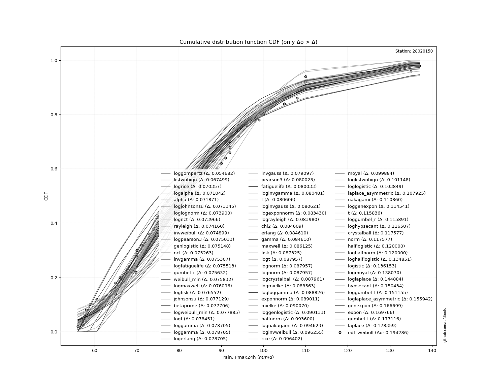</img>

</div>


**3.3. Best fit**

<div align="center">

|   id |   station | empirical_dist   | p_dist      |     delta |   deltao | eval   |   fit |   n |   best_fit |   best_fit_sort |
|-----:|----------:|:-----------------|:------------|----------:|---------:|:-------|------:|----:|-----------:|----------------:|
|    0 |  28020150 | edf_weibull      | loggompertz | 0.0546819 | 0.194286 | Δo > Δ |     1 |  49 |          1 |               1 |

</div>


<div align="center">

</img>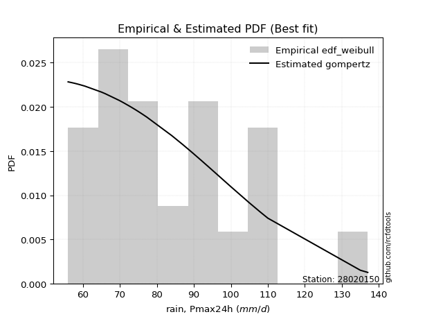</img>

</div>


### 4. Empirical - EDF Beard (1943)

The Beard formula (or Beard´s plotting position formula) in hydrology is used to estimate the empirical non-exceedance probability _(P)_ of a flood event (or other extreme hydrological data point) within a given dataset.

<div align="center">


$P=(m-0.31)/(n+0.38)$


</div>


**4.1. Empirical values**

<div align="center">

|                | 0                    | 1                   | 2                    | 3                   | 4                   | 5                   | 6                   | 7                   | 8                   | 9                  | 10                  | 11                  | 12                  | 13                  | 14                  | 15                 | 16                  | 17                 | 18                 | 19                  | 20                  | 21                  | 22                  | 23                 | 24        | 25                 | 26                 | 27                 | 28                 | 29                 | 30                 | 31                 | 32                 | 33                 | 34                 | 35                 | 36                 | 37                 | 38                 | 39                 | 40                 | 41                 | 42                 | 43                 | 44                 | 45                 | 46                 | 47                 | 48                 |
|:---------------|:---------------------|:--------------------|:---------------------|:--------------------|:--------------------|:--------------------|:--------------------|:--------------------|:--------------------|:-------------------|:--------------------|:--------------------|:--------------------|:--------------------|:--------------------|:-------------------|:--------------------|:-------------------|:-------------------|:--------------------|:--------------------|:--------------------|:--------------------|:-------------------|:----------|:-------------------|:-------------------|:-------------------|:-------------------|:-------------------|:-------------------|:-------------------|:-------------------|:-------------------|:-------------------|:-------------------|:-------------------|:-------------------|:-------------------|:-------------------|:-------------------|:-------------------|:-------------------|:-------------------|:-------------------|:-------------------|:-------------------|:-------------------|:-------------------|
| date           | 1986                 | 1961                | 1967                 | 1997                | 1985                | 1982                | 1990                | 1991                | 2002                | 2015               | 1983                | 1987                | 2013                | 2019                | 2003                | 2012               | 2014                | 2007               | 2001               | 2018                | 1963                | 2006                | 1984                | 1981               | 2022      | 1998               | 2020               | 1989               | 2000               | 1994               | 1988               | 2021               | 2010               | 2016               | 1965               | 1960               | 1962               | 1995               | 1964               | 2008               | 2017               | 2004               | 1993               | 2011               | 2009               | 1999               | 2005               | 1992               | 1996               |
| x              | 56.0                 | 57.0                | 57.70139503          | 58.0                | 58.89288117         | 60.50959058         | 65.0                | 65.0                | 65.0                | 66.0               | 69.74092411         | 70.0                | 70.0                | 70.0                | 70.0                | 71.0               | 73.0                | 73.0               | 74.0               | 75.0                | 75.0                | 76.0                | 76.09928433         | 77.26118637        | 83.0      | 84.0               | 85.0               | 87.0               | 87.0               | 89.0               | 90.0               | 91.0               | 92.0               | 92.0               | 92.0               | 94.0               | 94.0               | 96.0               | 99.0               | 100.0              | 100.0              | 105.0              | 108.0              | 108.0              | 110.0              | 110.0              | 110.0              | 135.0              | 137.0              |
| m              | 1                    | 2                   | 3                    | 4                   | 5                   | 6                   | 7                   | 8                   | 9                   | 10                 | 11                  | 12                  | 13                  | 14                  | 15                  | 16                 | 17                  | 18                 | 19                 | 20                  | 21                  | 22                  | 23                  | 24                 | 25        | 26                 | 27                 | 28                 | 29                 | 30                 | 31                 | 32                 | 33                 | 34                 | 35                 | 36                 | 37                 | 38                 | 39                 | 40                 | 41                 | 42                 | 43                 | 44                 | 45                 | 46                 | 47                 | 48                 | 49                 |
| empirical_dist | edf_beard            | edf_beard           | edf_beard            | edf_beard           | edf_beard           | edf_beard           | edf_beard           | edf_beard           | edf_beard           | edf_beard          | edf_beard           | edf_beard           | edf_beard           | edf_beard           | edf_beard           | edf_beard          | edf_beard           | edf_beard          | edf_beard          | edf_beard           | edf_beard           | edf_beard           | edf_beard           | edf_beard          | edf_beard | edf_beard          | edf_beard          | edf_beard          | edf_beard          | edf_beard          | edf_beard          | edf_beard          | edf_beard          | edf_beard          | edf_beard          | edf_beard          | edf_beard          | edf_beard          | edf_beard          | edf_beard          | edf_beard          | edf_beard          | edf_beard          | edf_beard          | edf_beard          | edf_beard          | edf_beard          | edf_beard          | edf_beard          |
| empirical      | 0.013973268529769135 | 0.03422438234102875 | 0.054475496152288375 | 0.07472660996354799 | 0.09497772377480762 | 0.11522883758606724 | 0.13547995139732685 | 0.15573106520858648 | 0.17598217901984609 | 0.1962332928311057 | 0.21648440664236532 | 0.23673552045362492 | 0.25698663426488455 | 0.27723774807614415 | 0.29748886188740375 | 0.3177399756986634 | 0.33799108950992307 | 0.3582422033211827 | 0.3784933171324423 | 0.39874443094370193 | 0.41899554475496154 | 0.43924665856622114 | 0.45949777237748074 | 0.4797488861887404 | 0.5       | 0.5202511138112597 | 0.5405022276225192 | 0.5607533414337789 | 0.5810044552450385 | 0.6012555690562981 | 0.6215066828675577 | 0.6417577966788174 | 0.6620089104900768 | 0.6822600243013365 | 0.7025111381125961 | 0.7227622519238557 | 0.7430133657351153 | 0.763264479546375  | 0.7835155933576345 | 0.8037667071688942 | 0.8240178209801539 | 0.8442689347914134 | 0.8645200486026731 | 0.8847711624139327 | 0.9050222762251923 | 0.9252733900364519 | 0.9455245038477116 | 0.9657756176589711 | 0.9860267314702308 |
| empirical_tr   | 1.0141712877387554   | 1.0354371985741246  | 1.0576140501177982   | 1.0807616546290217  | 1.104945177892146   | 1.130235751888304   | 1.15671117357695    | 1.1844567042456224  | 1.2135659867289261  | 1.2441421012849585 | 1.276298785215818   | 1.310161846643672   | 1.3458708094848733  | 1.3835808349677778  | 1.4234649754972613  | 1.4657168299198575 | 1.5105536861425513  | 1.5582202587567058 | 1.608993157380254  | 1.6631862579993264  | 1.7211571976298363  | 1.7833152762730227  | 1.85013113525665    | 1.9221486959906582 | 2.0       | 2.084423807513719  | 2.176289114147201  | 2.276625172890733  | 2.386660222329628  | 2.507872016251904  | 2.6420545746388444 | 2.7914075749010743 | 2.9586578789694418 | 3.147227533460802  | 3.3614703880190597 | 3.607012417823227  | 3.891252955082741  | 4.2241231822070135 | 4.619270346117864  | 5.09597523219814   | 5.6823935558112755 | 6.421326397919371  | 7.381165919282506  | 8.678383128295252  | 10.52878464818762  | 13.382113821138198 | 18.35687732342006  | 29.218934911242506 | 71.56521739130396  |

</div>


**4.2. Kolmogorov-Smirnov fit test (sorted by Δ)**


<div align="center">

|                | 0                   | 1                   | 2                   | 3                   | 4                   | 5                   | 6                   | 7                   | 8                   | 9                   | 10                  | 11                  | 12                  | 13                 | 14                  | 15                  | 16                 | 17                 | 18                  | 19                  | 20                 | 21                 | 22                  | 23                  | 24                  | 25                  | 26                  | 27                  | 28                  | 29                  | 30                  | 31                  | 32                 | 33                 | 34                  | 35                  | 36                 | 37                  | 38                  | 39                  | 40                  | 41                  | 42                  | 43                 | 44                 | 45                  | 46                  | 47                  | 48                  | 49                  | 50                  | 51                  | 52                  | 53                  | 54                  | 55                  | 56                  | 57                 | 58                  | 59                  | 60                  | 61                  | 62                  | 63                  | 64                  | 65                  | 66                  | 67                  | 68                  | 69                 | 70                  | 71                    | 72                  | 73                  | 74                  | 75                  | 76                  | 77                  | 78                 | 79                  | 80                  | 81                  | 82                  | 83                 | 84                  | 85                  | 86                 | 87                 | 88                 | 89                 |
|:---------------|:--------------------|:--------------------|:--------------------|:--------------------|:--------------------|:--------------------|:--------------------|:--------------------|:--------------------|:--------------------|:--------------------|:--------------------|:--------------------|:-------------------|:--------------------|:--------------------|:-------------------|:-------------------|:--------------------|:--------------------|:-------------------|:-------------------|:--------------------|:--------------------|:--------------------|:--------------------|:--------------------|:--------------------|:--------------------|:--------------------|:--------------------|:--------------------|:-------------------|:-------------------|:--------------------|:--------------------|:-------------------|:--------------------|:--------------------|:--------------------|:--------------------|:--------------------|:--------------------|:-------------------|:-------------------|:--------------------|:--------------------|:--------------------|:--------------------|:--------------------|:--------------------|:--------------------|:--------------------|:--------------------|:--------------------|:--------------------|:--------------------|:-------------------|:--------------------|:--------------------|:--------------------|:--------------------|:--------------------|:--------------------|:--------------------|:--------------------|:--------------------|:--------------------|:--------------------|:-------------------|:--------------------|:----------------------|:--------------------|:--------------------|:--------------------|:--------------------|:--------------------|:--------------------|:-------------------|:--------------------|:--------------------|:--------------------|:--------------------|:-------------------|:--------------------|:--------------------|:-------------------|:-------------------|:-------------------|:-------------------|
| station        | 28020150            | 28020150            | 28020150            | 28020150            | 28020150            | 28020150            | 28020150            | 28020150            | 28020150            | 28020150            | 28020150            | 28020150            | 28020150            | 28020150           | 28020150            | 28020150            | 28020150           | 28020150           | 28020150            | 28020150            | 28020150           | 28020150           | 28020150            | 28020150            | 28020150            | 28020150            | 28020150            | 28020150            | 28020150            | 28020150            | 28020150            | 28020150            | 28020150           | 28020150           | 28020150            | 28020150            | 28020150           | 28020150            | 28020150            | 28020150            | 28020150            | 28020150            | 28020150            | 28020150           | 28020150           | 28020150            | 28020150            | 28020150            | 28020150            | 28020150            | 28020150            | 28020150            | 28020150            | 28020150            | 28020150            | 28020150            | 28020150            | 28020150           | 28020150            | 28020150            | 28020150            | 28020150            | 28020150            | 28020150            | 28020150            | 28020150            | 28020150            | 28020150            | 28020150            | 28020150           | 28020150            | 28020150              | 28020150            | 28020150            | 28020150            | 28020150            | 28020150            | 28020150            | 28020150           | 28020150            | 28020150            | 28020150            | 28020150            | 28020150           | 28020150            | 28020150            | 28020150           | 28020150           | 28020150           | 28020150           |
| empirical_dist | edf_beard           | edf_beard           | edf_beard           | edf_beard           | edf_beard           | edf_beard           | edf_beard           | edf_beard           | edf_beard           | edf_beard           | edf_beard           | edf_beard           | edf_beard           | edf_beard          | edf_beard           | edf_beard           | edf_beard          | edf_beard          | edf_beard           | edf_beard           | edf_beard          | edf_beard          | edf_beard           | edf_beard           | edf_beard           | edf_beard           | edf_beard           | edf_beard           | edf_beard           | edf_beard           | edf_beard           | edf_beard           | edf_beard          | edf_beard          | edf_beard           | edf_beard           | edf_beard          | edf_beard           | edf_beard           | edf_beard           | edf_beard           | edf_beard           | edf_beard           | edf_beard          | edf_beard          | edf_beard           | edf_beard           | edf_beard           | edf_beard           | edf_beard           | edf_beard           | edf_beard           | edf_beard           | edf_beard           | edf_beard           | edf_beard           | edf_beard           | edf_beard          | edf_beard           | edf_beard           | edf_beard           | edf_beard           | edf_beard           | edf_beard           | edf_beard           | edf_beard           | edf_beard           | edf_beard           | edf_beard           | edf_beard          | edf_beard           | edf_beard             | edf_beard           | edf_beard           | edf_beard           | edf_beard           | edf_beard           | edf_beard           | edf_beard          | edf_beard           | edf_beard           | edf_beard           | edf_beard           | edf_beard          | edf_beard           | edf_beard           | edf_beard          | edf_beard          | edf_beard          | edf_beard          |
| p_dist         | loggompertz         | kstwobign           | logrice             | logalpha            | alpha               | logjohnsonsu        | loglognorm          | lognct              | rayleigh            | invweibull          | genlogistic         | nct                 | logpearson3         | invgamma           | logfatiguelife      | gumbel_r            | weibull_min        | logmaxwell         | logfisk             | johnsonsu           | logweibull_min     | betaprime          | logf                | loggamma            | loggamma            | logerlang           | invgauss            | fatiguelife         | pearson3            | f                   | loginvgauss         | loginvgamma         | logexponnorm       | lograyleigh        | chi2                | erlang              | gamma              | maxwell             | fisk                | logt                | lognorm             | lognorm             | logcrystalball      | logmielke          | exponnorm          | logloggamma         | halfnorm            | mielke              | loggenlogistic      | lognakagami         | loginvweibull       | rice                | moyal               | logkstwobign        | loglogistic         | laplace_asymmetric  | nakagami            | loggumbel_r        | loghalfnorm         | halflogistic        | t                   | loghypsecant        | crystalball         | norm                | loggenexpon         | loghalflogistic     | logistic            | logmoyal            | loglaplace          | hypsecant          | loggumbel_l         | loglaplace_asymmetric | genexpon            | expon               | pareto              | gumbel_l            | laplace             | wald                | logwald            | logbetaprime        | logtruncnorm        | logncf              | logexpon            | logpareto          | loggibrat           | gibrat              | logchi2            | ncf                | gompertz           | truncnorm          |
| delta          | 0.05819746355821068 | 0.06674560221014647 | 0.06960414279604155 | 0.07028891064394271 | 0.07111716636848753 | 0.07259198178278625 | 0.07314655792527813 | 0.07346356661459202 | 0.07365811084332924 | 0.07414607472350998 | 0.07439498232282082 | 0.07450925503608774 | 0.07453038331809242 | 0.074553929256018  | 0.07475989228915025 | 0.07487879563024957 | 0.0750785232652571 | 0.0753430992186378 | 0.07579841883637273 | 0.07637585271580094 | 0.0771312497376423 | 0.0772038366620913 | 0.07769752982898281 | 0.07795119804340034 | 0.07795119804340034 | 0.07795162476831896 | 0.07834360017789188 | 0.07927923090937838 | 0.07952078699305654 | 0.07985284050193842 | 0.07986744749550101 | 0.07997875494992063 | 0.0829280220329836 | 0.0832262084616684 | 0.08385602041678475 | 0.08385656291701538 | 0.08385673211152   | 0.08562298581150413 | 0.08682242360743336 | 0.08745428173500952 | 0.08745468323322808 | 0.08745468323322808 | 0.08745830938022409 | 0.0878092929003772 | 0.0882581451683293 | 0.08832358067668145 | 0.08857772951969968 | 0.08931634191649374 | 0.08937936249988754 | 0.09386915931118323 | 0.09550175297116026 | 0.09589951933567059 | 0.09913037009154002 | 0.10039465674171444 | 0.10334675929366471 | 0.10717141181338352 | 0.11437592727492582 | 0.1151377428556225 | 0.11522883758606724 | 0.11522883758606724 | 0.11533398614184581 | 0.11600518299808188 | 0.11707520827119061 | 0.11707524290652777 | 0.11805619841186674 | 0.13409804918166168 | 0.13565108435156825 | 0.13731626761934246 | 0.14438130264901233 | 0.1499321438468948 | 0.15065305203800933 | 0.1556910071470473    | 0.17021456192227238 | 0.17328193755737184 | 0.17328194488028661 | 0.17686465254908929 | 0.17785638351526545 | 0.19604760137808913 | 0.1992793743881356 | 0.20662508206505037 | 0.21500378927990713 | 0.21881028262248037 | 0.22333372723459036 | 0.2233337421037527 | 0.27888018539392195 | 0.29198283002201847 | 0.3776784297978697 | 0.5846962870315628 | 0.7488932394451773 | 0.8139152797479231 |
| deltao         | 0.1942857142857143  | 0.1942857142857143  | 0.1942857142857143  | 0.1942857142857143  | 0.1942857142857143  | 0.1942857142857143  | 0.1942857142857143  | 0.1942857142857143  | 0.1942857142857143  | 0.1942857142857143  | 0.1942857142857143  | 0.1942857142857143  | 0.1942857142857143  | 0.1942857142857143 | 0.1942857142857143  | 0.1942857142857143  | 0.1942857142857143 | 0.1942857142857143 | 0.1942857142857143  | 0.1942857142857143  | 0.1942857142857143 | 0.1942857142857143 | 0.1942857142857143  | 0.1942857142857143  | 0.1942857142857143  | 0.1942857142857143  | 0.1942857142857143  | 0.1942857142857143  | 0.1942857142857143  | 0.1942857142857143  | 0.1942857142857143  | 0.1942857142857143  | 0.1942857142857143 | 0.1942857142857143 | 0.1942857142857143  | 0.1942857142857143  | 0.1942857142857143 | 0.1942857142857143  | 0.1942857142857143  | 0.1942857142857143  | 0.1942857142857143  | 0.1942857142857143  | 0.1942857142857143  | 0.1942857142857143 | 0.1942857142857143 | 0.1942857142857143  | 0.1942857142857143  | 0.1942857142857143  | 0.1942857142857143  | 0.1942857142857143  | 0.1942857142857143  | 0.1942857142857143  | 0.1942857142857143  | 0.1942857142857143  | 0.1942857142857143  | 0.1942857142857143  | 0.1942857142857143  | 0.1942857142857143 | 0.1942857142857143  | 0.1942857142857143  | 0.1942857142857143  | 0.1942857142857143  | 0.1942857142857143  | 0.1942857142857143  | 0.1942857142857143  | 0.1942857142857143  | 0.1942857142857143  | 0.1942857142857143  | 0.1942857142857143  | 0.1942857142857143 | 0.1942857142857143  | 0.1942857142857143    | 0.1942857142857143  | 0.1942857142857143  | 0.1942857142857143  | 0.1942857142857143  | 0.1942857142857143  | 0.1942857142857143  | 0.1942857142857143 | 0.1942857142857143  | 0.1942857142857143  | 0.1942857142857143  | 0.1942857142857143  | 0.1942857142857143 | 0.1942857142857143  | 0.1942857142857143  | 0.1942857142857143 | 0.1942857142857143 | 0.1942857142857143 | 0.1942857142857143 |
| eval           | Δo > Δ              | Δo > Δ              | Δo > Δ              | Δo > Δ              | Δo > Δ              | Δo > Δ              | Δo > Δ              | Δo > Δ              | Δo > Δ              | Δo > Δ              | Δo > Δ              | Δo > Δ              | Δo > Δ              | Δo > Δ             | Δo > Δ              | Δo > Δ              | Δo > Δ             | Δo > Δ             | Δo > Δ              | Δo > Δ              | Δo > Δ             | Δo > Δ             | Δo > Δ              | Δo > Δ              | Δo > Δ              | Δo > Δ              | Δo > Δ              | Δo > Δ              | Δo > Δ              | Δo > Δ              | Δo > Δ              | Δo > Δ              | Δo > Δ             | Δo > Δ             | Δo > Δ              | Δo > Δ              | Δo > Δ             | Δo > Δ              | Δo > Δ              | Δo > Δ              | Δo > Δ              | Δo > Δ              | Δo > Δ              | Δo > Δ             | Δo > Δ             | Δo > Δ              | Δo > Δ              | Δo > Δ              | Δo > Δ              | Δo > Δ              | Δo > Δ              | Δo > Δ              | Δo > Δ              | Δo > Δ              | Δo > Δ              | Δo > Δ              | Δo > Δ              | Δo > Δ             | Δo > Δ              | Δo > Δ              | Δo > Δ              | Δo > Δ              | Δo > Δ              | Δo > Δ              | Δo > Δ              | Δo > Δ              | Δo > Δ              | Δo > Δ              | Δo > Δ              | Δo > Δ             | Δo > Δ              | Δo > Δ                | Δo > Δ              | Δo > Δ              | Δo > Δ              | Δo > Δ              | Δo > Δ              | Δo <= Δ             | Δo <= Δ            | Δo <= Δ             | Δo <= Δ             | Δo <= Δ             | Δo <= Δ             | Δo <= Δ            | Δo <= Δ             | Δo <= Δ             | Δo <= Δ            | Δo <= Δ            | Δo <= Δ            | Δo <= Δ            |
| fit            | 1                   | 1                   | 1                   | 1                   | 1                   | 1                   | 1                   | 1                   | 1                   | 1                   | 1                   | 1                   | 1                   | 1                  | 1                   | 1                   | 1                  | 1                  | 1                   | 1                   | 1                  | 1                  | 1                   | 1                   | 1                   | 1                   | 1                   | 1                   | 1                   | 1                   | 1                   | 1                   | 1                  | 1                  | 1                   | 1                   | 1                  | 1                   | 1                   | 1                   | 1                   | 1                   | 1                   | 1                  | 1                  | 1                   | 1                   | 1                   | 1                   | 1                   | 1                   | 1                   | 1                   | 1                   | 1                   | 1                   | 1                   | 1                  | 1                   | 1                   | 1                   | 1                   | 1                   | 1                   | 1                   | 1                   | 1                   | 1                   | 1                   | 1                  | 1                   | 1                     | 1                   | 1                   | 1                   | 1                   | 1                   | 0                   | 0                  | 0                   | 0                   | 0                   | 0                   | 0                  | 0                   | 0                   | 0                  | 0                  | 0                  | 0                  |
| n              | 49                  | 49                  | 49                  | 49                  | 49                  | 49                  | 49                  | 49                  | 49                  | 49                  | 49                  | 49                  | 49                  | 49                 | 49                  | 49                  | 49                 | 49                 | 49                  | 49                  | 49                 | 49                 | 49                  | 49                  | 49                  | 49                  | 49                  | 49                  | 49                  | 49                  | 49                  | 49                  | 49                 | 49                 | 49                  | 49                  | 49                 | 49                  | 49                  | 49                  | 49                  | 49                  | 49                  | 49                 | 49                 | 49                  | 49                  | 49                  | 49                  | 49                  | 49                  | 49                  | 49                  | 49                  | 49                  | 49                  | 49                  | 49                 | 49                  | 49                  | 49                  | 49                  | 49                  | 49                  | 49                  | 49                  | 49                  | 49                  | 49                  | 49                 | 49                  | 49                    | 49                  | 49                  | 49                  | 49                  | 49                  | 49                  | 49                 | 49                  | 49                  | 49                  | 49                  | 49                 | 49                  | 49                  | 49                 | 49                 | 49                 | 49                 |
| best_fit       | 1                   | 0                   | 0                   | 0                   | 0                   | 0                   | 0                   | 0                   | 0                   | 0                   | 0                   | 0                   | 0                   | 0                  | 0                   | 0                   | 0                  | 0                  | 0                   | 0                   | 0                  | 0                  | 0                   | 0                   | 0                   | 0                   | 0                   | 0                   | 0                   | 0                   | 0                   | 0                   | 0                  | 0                  | 0                   | 0                   | 0                  | 0                   | 0                   | 0                   | 0                   | 0                   | 0                   | 0                  | 0                  | 0                   | 0                   | 0                   | 0                   | 0                   | 0                   | 0                   | 0                   | 0                   | 0                   | 0                   | 0                   | 0                  | 0                   | 0                   | 0                   | 0                   | 0                   | 0                   | 0                   | 0                   | 0                   | 0                   | 0                   | 0                  | 0                   | 0                     | 0                   | 0                   | 0                   | 0                   | 0                   | 0                   | 0                  | 0                   | 0                   | 0                   | 0                   | 0                  | 0                   | 0                   | 0                  | 0                  | 0                  | 0                  |
| best_fit_sort  | 1                   | 2                   | 3                   | 4                   | 5                   | 6                   | 7                   | 8                   | 9                   | 10                  | 11                  | 12                  | 13                  | 14                 | 15                  | 16                  | 17                 | 18                 | 19                  | 20                  | 21                 | 22                 | 23                  | 24                  | 25                  | 26                  | 27                  | 28                  | 29                  | 30                  | 31                  | 32                  | 33                 | 34                 | 35                  | 36                  | 37                 | 38                  | 39                  | 40                  | 41                  | 42                  | 43                  | 44                 | 45                 | 46                  | 47                  | 48                  | 49                  | 50                  | 51                  | 52                  | 53                  | 54                  | 55                  | 56                  | 57                  | 58                 | 59                  | 60                  | 61                  | 62                  | 63                  | 64                  | 65                  | 66                  | 67                  | 68                  | 69                  | 70                 | 71                  | 72                    | 73                  | 74                  | 75                  | 76                  | 77                  | 78                  | 79                 | 80                  | 81                  | 82                  | 83                  | 84                 | 85                  | 86                  | 87                 | 88                 | 89                 | 90                 |

</div>


<div align="center">

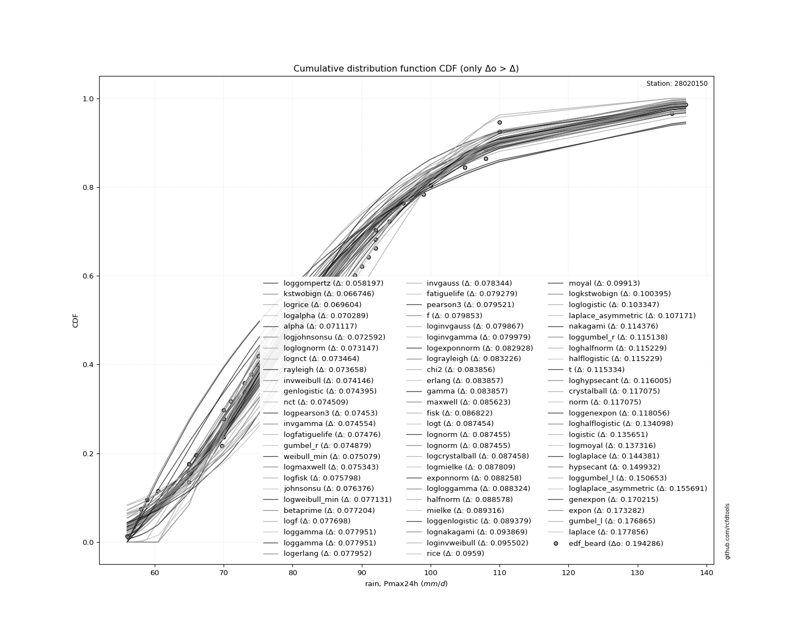</img>

</div>


**4.3. Best fit**

<div align="center">

|   id |   station | empirical_dist   | p_dist      |     delta |   deltao | eval   |   fit |   n |   best_fit |   best_fit_sort |
|-----:|----------:|:-----------------|:------------|----------:|---------:|:-------|------:|----:|-----------:|----------------:|
|    0 |  28020150 | edf_beard        | loggompertz | 0.0581975 | 0.194286 | Δo > Δ |     1 |  49 |          1 |               1 |

</div>


<div align="center">

</img></img>

</div>


### 5. Empirical - EDF Chegodayev (1955)

The Chegodayev formula is an empirical plotting position formula used in hydrological frequency analysis to estimate the exceedance probability or return period of a specific event from a set of observed data. It is primarily used for plotting observed data points on probability paper to fit a theoretical distribution, particularly for analyzing extreme events like maximum flood flows or rainfall intensities. The constant _b_ value in the generalized plotting position formula is 0.3.

<div align="center">


$P=(m-b)/(n+1-2b)$


</div>


**5.1. Empirical values**

<div align="center">

|                | 0                   | 1                   | 2                   | 3                   | 4                   | 5                   | 6                   | 7                   | 8                   | 9                   | 10                 | 11                  | 12                  | 13                 | 14                 | 15                  | 16                 | 17                 | 18                 | 19                  | 20                 | 21                 | 22                  | 23                 | 24             | 25                 | 26                 | 27                 | 28                 | 29                 | 30                 | 31                 | 32                 | 33                 | 34                 | 35                 | 36                 | 37                 | 38                 | 39                 | 40                 | 41                 | 42                 | 43                 | 44                 | 45                 | 46                | 47                 | 48                 |
|:---------------|:--------------------|:--------------------|:--------------------|:--------------------|:--------------------|:--------------------|:--------------------|:--------------------|:--------------------|:--------------------|:-------------------|:--------------------|:--------------------|:-------------------|:-------------------|:--------------------|:-------------------|:-------------------|:-------------------|:--------------------|:-------------------|:-------------------|:--------------------|:-------------------|:---------------|:-------------------|:-------------------|:-------------------|:-------------------|:-------------------|:-------------------|:-------------------|:-------------------|:-------------------|:-------------------|:-------------------|:-------------------|:-------------------|:-------------------|:-------------------|:-------------------|:-------------------|:-------------------|:-------------------|:-------------------|:-------------------|:------------------|:-------------------|:-------------------|
| date           | 1986                | 1961                | 1967                | 1997                | 1985                | 1982                | 1990                | 1991                | 2002                | 2015                | 1983               | 1987                | 2013                | 2019               | 2003               | 2012                | 2014               | 2007               | 2001               | 2018                | 1963               | 2006               | 1984                | 1981               | 2022           | 1998               | 2020               | 1989               | 2000               | 1994               | 1988               | 2021               | 2010               | 2016               | 1965               | 1960               | 1962               | 1995               | 1964               | 2008               | 2017               | 2004               | 1993               | 2011               | 2009               | 1999               | 2005              | 1992               | 1996               |
| x              | 56.0                | 57.0                | 57.70139503         | 58.0                | 58.89288117         | 60.50959058         | 65.0                | 65.0                | 65.0                | 66.0                | 69.74092411        | 70.0                | 70.0                | 70.0               | 70.0               | 71.0                | 73.0               | 73.0               | 74.0               | 75.0                | 75.0               | 76.0               | 76.09928433         | 77.26118637        | 83.0           | 84.0               | 85.0               | 87.0               | 87.0               | 89.0               | 90.0               | 91.0               | 92.0               | 92.0               | 92.0               | 94.0               | 94.0               | 96.0               | 99.0               | 100.0              | 100.0              | 105.0              | 108.0              | 108.0              | 110.0              | 110.0              | 110.0             | 135.0              | 137.0              |
| m              | 1                   | 2                   | 3                   | 4                   | 5                   | 6                   | 7                   | 8                   | 9                   | 10                  | 11                 | 12                  | 13                  | 14                 | 15                 | 16                  | 17                 | 18                 | 19                 | 20                  | 21                 | 22                 | 23                  | 24                 | 25             | 26                 | 27                 | 28                 | 29                 | 30                 | 31                 | 32                 | 33                 | 34                 | 35                 | 36                 | 37                 | 38                 | 39                 | 40                 | 41                 | 42                 | 43                 | 44                 | 45                 | 46                 | 47                | 48                 | 49                 |
| empirical_dist | edf_chegodayev      | edf_chegodayev      | edf_chegodayev      | edf_chegodayev      | edf_chegodayev      | edf_chegodayev      | edf_chegodayev      | edf_chegodayev      | edf_chegodayev      | edf_chegodayev      | edf_chegodayev     | edf_chegodayev      | edf_chegodayev      | edf_chegodayev     | edf_chegodayev     | edf_chegodayev      | edf_chegodayev     | edf_chegodayev     | edf_chegodayev     | edf_chegodayev      | edf_chegodayev     | edf_chegodayev     | edf_chegodayev      | edf_chegodayev     | edf_chegodayev | edf_chegodayev     | edf_chegodayev     | edf_chegodayev     | edf_chegodayev     | edf_chegodayev     | edf_chegodayev     | edf_chegodayev     | edf_chegodayev     | edf_chegodayev     | edf_chegodayev     | edf_chegodayev     | edf_chegodayev     | edf_chegodayev     | edf_chegodayev     | edf_chegodayev     | edf_chegodayev     | edf_chegodayev     | edf_chegodayev     | edf_chegodayev     | edf_chegodayev     | edf_chegodayev     | edf_chegodayev    | edf_chegodayev     | edf_chegodayev     |
| empirical      | 0.01417004048582996 | 0.03441295546558704 | 0.05465587044534413 | 0.07489878542510121 | 0.09514170040485831 | 0.11538461538461539 | 0.13562753036437247 | 0.15587044534412955 | 0.17611336032388664 | 0.19635627530364372 | 0.2165991902834008 | 0.23684210526315788 | 0.25708502024291496 | 0.2773279352226721 | 0.2975708502024291 | 0.31781376518218624 | 0.3380566801619433 | 0.3582995951417004 | 0.3785425101214575 | 0.39878542510121456 | 0.4190283400809717 | 0.4392712550607287 | 0.45951417004048584 | 0.4797570850202429 | 0.5            | 0.520242914979757  | 0.5404858299595142 | 0.5607287449392713 | 0.5809716599190283 | 0.6012145748987854 | 0.6214574898785425 | 0.6417004048582996 | 0.6619433198380568 | 0.6821862348178138 | 0.7024291497975709 | 0.722672064777328  | 0.7429149797570851 | 0.7631578947368421 | 0.7834008097165993 | 0.8036437246963564 | 0.8238866396761134 | 0.8441295546558705 | 0.8643724696356276 | 0.8846153846153847 | 0.9048582995951417 | 0.9251012145748989 | 0.945344129554656 | 0.965587044534413  | 0.9858299595141701 |
| empirical_tr   | 1.0143737166324436  | 1.0356394129979036  | 1.0578158458244111  | 1.0809628008752734  | 1.1051454138702461  | 1.1304347826086958  | 1.1569086651053864  | 1.184652278177458   | 1.213759213759214   | 1.2443324937027709  | 1.276485788113695  | 1.3103448275862069  | 1.3460490463215258  | 1.3837535014005602 | 1.4236311239193082 | 1.4658753709198813  | 1.5107033639143732 | 1.5583596214511042 | 1.6091205211726383 | 1.6632996632996635  | 1.721254355400697  | 1.7833935018050542 | 1.8501872659176033  | 1.9221789883268479 | 2.0            | 2.0843881856540083 | 2.1762114537444934 | 2.2764976958525347 | 2.3864734299516908 | 2.5076142131979693 | 2.6417112299465244 | 2.790960451977401  | 2.9580838323353302 | 3.146496815286625  | 3.360544217687075  | 3.6058394160583953 | 3.88976377952756   | 4.222222222222223  | 4.616822429906545  | 5.0927835051546415 | 5.678160919540232  | 6.415584415584417  | 7.373134328358215  | 8.666666666666673  | 10.510638297872346 | 13.351351351351374 | 18.29629629629633 | 29.058823529411818 | 70.57142857142874  |

</div>


**5.2. Kolmogorov-Smirnov fit test (sorted by Δ)**


<div align="center">

|                | 0                    | 1                   | 2                   | 3                  | 4                   | 5                   | 6                   | 7                   | 8                   | 9                   | 10                  | 11                  | 12                  | 13                  | 14                  | 15                  | 16                  | 17                  | 18                  | 19                  | 20                  | 21                  | 22                 | 23                  | 24                  | 25                  | 26                  | 27                  | 28                  | 29                 | 30                 | 31                  | 32                 | 33                  | 34                  | 35                  | 36                 | 37                  | 38                  | 39                  | 40                  | 41                  | 42                  | 43                  | 44                 | 45                  | 46                  | 47                  | 48                  | 49                  | 50                  | 51                  | 52                  | 53                  | 54                  | 55                  | 56                  | 57                 | 58                  | 59                  | 60                  | 61                  | 62                  | 63                  | 64                  | 65                  | 66                  | 67                  | 68                  | 69                 | 70                  | 71                    | 72                 | 73                  | 74                  | 75                  | 76                  | 77                  | 78                  | 79                  | 80                  | 81                  | 82                  | 83                  | 84                 | 85                  | 86                 | 87                 | 88                 | 89                 |
|:---------------|:---------------------|:--------------------|:--------------------|:-------------------|:--------------------|:--------------------|:--------------------|:--------------------|:--------------------|:--------------------|:--------------------|:--------------------|:--------------------|:--------------------|:--------------------|:--------------------|:--------------------|:--------------------|:--------------------|:--------------------|:--------------------|:--------------------|:-------------------|:--------------------|:--------------------|:--------------------|:--------------------|:--------------------|:--------------------|:-------------------|:-------------------|:--------------------|:-------------------|:--------------------|:--------------------|:--------------------|:-------------------|:--------------------|:--------------------|:--------------------|:--------------------|:--------------------|:--------------------|:--------------------|:-------------------|:--------------------|:--------------------|:--------------------|:--------------------|:--------------------|:--------------------|:--------------------|:--------------------|:--------------------|:--------------------|:--------------------|:--------------------|:-------------------|:--------------------|:--------------------|:--------------------|:--------------------|:--------------------|:--------------------|:--------------------|:--------------------|:--------------------|:--------------------|:--------------------|:-------------------|:--------------------|:----------------------|:-------------------|:--------------------|:--------------------|:--------------------|:--------------------|:--------------------|:--------------------|:--------------------|:--------------------|:--------------------|:--------------------|:--------------------|:-------------------|:--------------------|:-------------------|:-------------------|:-------------------|:-------------------|
| station        | 28020150             | 28020150            | 28020150            | 28020150           | 28020150            | 28020150            | 28020150            | 28020150            | 28020150            | 28020150            | 28020150            | 28020150            | 28020150            | 28020150            | 28020150            | 28020150            | 28020150            | 28020150            | 28020150            | 28020150            | 28020150            | 28020150            | 28020150           | 28020150            | 28020150            | 28020150            | 28020150            | 28020150            | 28020150            | 28020150           | 28020150           | 28020150            | 28020150           | 28020150            | 28020150            | 28020150            | 28020150           | 28020150            | 28020150            | 28020150            | 28020150            | 28020150            | 28020150            | 28020150            | 28020150           | 28020150            | 28020150            | 28020150            | 28020150            | 28020150            | 28020150            | 28020150            | 28020150            | 28020150            | 28020150            | 28020150            | 28020150            | 28020150           | 28020150            | 28020150            | 28020150            | 28020150            | 28020150            | 28020150            | 28020150            | 28020150            | 28020150            | 28020150            | 28020150            | 28020150           | 28020150            | 28020150              | 28020150           | 28020150            | 28020150            | 28020150            | 28020150            | 28020150            | 28020150            | 28020150            | 28020150            | 28020150            | 28020150            | 28020150            | 28020150           | 28020150            | 28020150           | 28020150           | 28020150           | 28020150           |
| empirical_dist | edf_chegodayev       | edf_chegodayev      | edf_chegodayev      | edf_chegodayev     | edf_chegodayev      | edf_chegodayev      | edf_chegodayev      | edf_chegodayev      | edf_chegodayev      | edf_chegodayev      | edf_chegodayev      | edf_chegodayev      | edf_chegodayev      | edf_chegodayev      | edf_chegodayev      | edf_chegodayev      | edf_chegodayev      | edf_chegodayev      | edf_chegodayev      | edf_chegodayev      | edf_chegodayev      | edf_chegodayev      | edf_chegodayev     | edf_chegodayev      | edf_chegodayev      | edf_chegodayev      | edf_chegodayev      | edf_chegodayev      | edf_chegodayev      | edf_chegodayev     | edf_chegodayev     | edf_chegodayev      | edf_chegodayev     | edf_chegodayev      | edf_chegodayev      | edf_chegodayev      | edf_chegodayev     | edf_chegodayev      | edf_chegodayev      | edf_chegodayev      | edf_chegodayev      | edf_chegodayev      | edf_chegodayev      | edf_chegodayev      | edf_chegodayev     | edf_chegodayev      | edf_chegodayev      | edf_chegodayev      | edf_chegodayev      | edf_chegodayev      | edf_chegodayev      | edf_chegodayev      | edf_chegodayev      | edf_chegodayev      | edf_chegodayev      | edf_chegodayev      | edf_chegodayev      | edf_chegodayev     | edf_chegodayev      | edf_chegodayev      | edf_chegodayev      | edf_chegodayev      | edf_chegodayev      | edf_chegodayev      | edf_chegodayev      | edf_chegodayev      | edf_chegodayev      | edf_chegodayev      | edf_chegodayev      | edf_chegodayev     | edf_chegodayev      | edf_chegodayev        | edf_chegodayev     | edf_chegodayev      | edf_chegodayev      | edf_chegodayev      | edf_chegodayev      | edf_chegodayev      | edf_chegodayev      | edf_chegodayev      | edf_chegodayev      | edf_chegodayev      | edf_chegodayev      | edf_chegodayev      | edf_chegodayev     | edf_chegodayev      | edf_chegodayev     | edf_chegodayev     | edf_chegodayev     | edf_chegodayev     |
| p_dist         | loggompertz          | kstwobign           | logrice             | logalpha           | alpha               | logjohnsonsu        | loglognorm          | lognct              | rayleigh            | invweibull          | genlogistic         | nct                 | logpearson3         | invgamma            | logfatiguelife      | gumbel_r            | weibull_min         | logmaxwell          | logfisk             | johnsonsu           | logweibull_min      | betaprime           | logf               | loggamma            | loggamma            | logerlang           | invgauss            | fatiguelife         | pearson3            | f                  | loginvgauss        | loginvgamma         | logexponnorm       | lograyleigh         | chi2                | erlang              | gamma              | maxwell             | fisk                | logt                | lognorm             | lognorm             | logcrystalball      | logmielke           | exponnorm          | logloggamma         | halfnorm            | mielke              | loggenlogistic      | lognakagami         | loginvweibull       | rice                | moyal               | logkstwobign        | loglogistic         | laplace_asymmetric  | nakagami            | loggumbel_r        | t                   | halflogistic        | loghalfnorm         | loghypsecant        | crystalball         | norm                | loggenexpon         | loghalflogistic     | logistic            | logmoyal            | loglaplace          | hypsecant          | loggumbel_l         | loglaplace_asymmetric | genexpon           | expon               | pareto              | gumbel_l            | laplace             | wald                | logwald             | logbetaprime        | logtruncnorm        | logncf              | logexpon            | logpareto           | loggibrat          | gibrat              | logchi2            | ncf                | gompertz           | truncnorm          |
| delta          | 0.058082679917175195 | 0.06677019870465406 | 0.06962873929054914 | 0.0703135071384503 | 0.07114176286299512 | 0.07261657827729384 | 0.07317115441978572 | 0.07347996427759712 | 0.07367450850633434 | 0.07417067121801757 | 0.07441957881732841 | 0.07453385153059533 | 0.07454678098109752 | 0.07457852575052559 | 0.07478448878365784 | 0.07490339212475716 | 0.07510311975976469 | 0.07536769571314539 | 0.07582301533088032 | 0.07640044921030853 | 0.07715584623214988 | 0.07722023432509639 | 0.0777221263234904 | 0.07797579453790793 | 0.07797579453790793 | 0.07797622126282655 | 0.07836819667239947 | 0.07930382740388597 | 0.07953718465606163 | 0.079877436996446  | 0.0798920439900086 | 0.07999515261292572 | 0.0829444196959887 | 0.08325080495617598 | 0.08388061691129234 | 0.08388115941152297 | 0.0838813286060276 | 0.08563938347450922 | 0.08683882127043846 | 0.08747067939801462 | 0.08747108089623318 | 0.08747108089623318 | 0.08747470704322918 | 0.08783388939488479 | 0.0882827416628369 | 0.08833997833968654 | 0.08874170614975037 | 0.08934093841100132 | 0.08940395899439513 | 0.09389375580569082 | 0.09552634946566785 | 0.09591591699867569 | 0.09915496658604761 | 0.10041925323622203 | 0.10336315695666981 | 0.10719600830789111 | 0.11426114363389034 | 0.1151623393501301 | 0.11535038380485091 | 0.11538461538461539 | 0.11538461538461539 | 0.11602158066108698 | 0.11709160593419571 | 0.11709164056953286 | 0.11794141477083125 | 0.13412264567616927 | 0.13566748201457335 | 0.13734086411385005 | 0.14439770031201743 | 0.1499485415098999 | 0.15066944970101442 | 0.1556992059785498    | 0.1700997782812369 | 0.17316715391633636 | 0.17316716123925113 | 0.17687285138059178 | 0.17787278117827054 | 0.19617058385062716 | 0.19930397088264318 | 0.20644470777199475 | 0.21488900563887164 | 0.21862990832942475 | 0.22321894359355487 | 0.22321895846271722 | 0.2789621737089473 | 0.29206481833704384 | 0.3774980555048141 | 0.584499515075502  | 0.7487620581411368 | 0.8137185077918623 |
| deltao         | 0.1942857142857143   | 0.1942857142857143  | 0.1942857142857143  | 0.1942857142857143 | 0.1942857142857143  | 0.1942857142857143  | 0.1942857142857143  | 0.1942857142857143  | 0.1942857142857143  | 0.1942857142857143  | 0.1942857142857143  | 0.1942857142857143  | 0.1942857142857143  | 0.1942857142857143  | 0.1942857142857143  | 0.1942857142857143  | 0.1942857142857143  | 0.1942857142857143  | 0.1942857142857143  | 0.1942857142857143  | 0.1942857142857143  | 0.1942857142857143  | 0.1942857142857143 | 0.1942857142857143  | 0.1942857142857143  | 0.1942857142857143  | 0.1942857142857143  | 0.1942857142857143  | 0.1942857142857143  | 0.1942857142857143 | 0.1942857142857143 | 0.1942857142857143  | 0.1942857142857143 | 0.1942857142857143  | 0.1942857142857143  | 0.1942857142857143  | 0.1942857142857143 | 0.1942857142857143  | 0.1942857142857143  | 0.1942857142857143  | 0.1942857142857143  | 0.1942857142857143  | 0.1942857142857143  | 0.1942857142857143  | 0.1942857142857143 | 0.1942857142857143  | 0.1942857142857143  | 0.1942857142857143  | 0.1942857142857143  | 0.1942857142857143  | 0.1942857142857143  | 0.1942857142857143  | 0.1942857142857143  | 0.1942857142857143  | 0.1942857142857143  | 0.1942857142857143  | 0.1942857142857143  | 0.1942857142857143 | 0.1942857142857143  | 0.1942857142857143  | 0.1942857142857143  | 0.1942857142857143  | 0.1942857142857143  | 0.1942857142857143  | 0.1942857142857143  | 0.1942857142857143  | 0.1942857142857143  | 0.1942857142857143  | 0.1942857142857143  | 0.1942857142857143 | 0.1942857142857143  | 0.1942857142857143    | 0.1942857142857143 | 0.1942857142857143  | 0.1942857142857143  | 0.1942857142857143  | 0.1942857142857143  | 0.1942857142857143  | 0.1942857142857143  | 0.1942857142857143  | 0.1942857142857143  | 0.1942857142857143  | 0.1942857142857143  | 0.1942857142857143  | 0.1942857142857143 | 0.1942857142857143  | 0.1942857142857143 | 0.1942857142857143 | 0.1942857142857143 | 0.1942857142857143 |
| eval           | Δo > Δ               | Δo > Δ              | Δo > Δ              | Δo > Δ             | Δo > Δ              | Δo > Δ              | Δo > Δ              | Δo > Δ              | Δo > Δ              | Δo > Δ              | Δo > Δ              | Δo > Δ              | Δo > Δ              | Δo > Δ              | Δo > Δ              | Δo > Δ              | Δo > Δ              | Δo > Δ              | Δo > Δ              | Δo > Δ              | Δo > Δ              | Δo > Δ              | Δo > Δ             | Δo > Δ              | Δo > Δ              | Δo > Δ              | Δo > Δ              | Δo > Δ              | Δo > Δ              | Δo > Δ             | Δo > Δ             | Δo > Δ              | Δo > Δ             | Δo > Δ              | Δo > Δ              | Δo > Δ              | Δo > Δ             | Δo > Δ              | Δo > Δ              | Δo > Δ              | Δo > Δ              | Δo > Δ              | Δo > Δ              | Δo > Δ              | Δo > Δ             | Δo > Δ              | Δo > Δ              | Δo > Δ              | Δo > Δ              | Δo > Δ              | Δo > Δ              | Δo > Δ              | Δo > Δ              | Δo > Δ              | Δo > Δ              | Δo > Δ              | Δo > Δ              | Δo > Δ             | Δo > Δ              | Δo > Δ              | Δo > Δ              | Δo > Δ              | Δo > Δ              | Δo > Δ              | Δo > Δ              | Δo > Δ              | Δo > Δ              | Δo > Δ              | Δo > Δ              | Δo > Δ             | Δo > Δ              | Δo > Δ                | Δo > Δ             | Δo > Δ              | Δo > Δ              | Δo > Δ              | Δo > Δ              | Δo <= Δ             | Δo <= Δ             | Δo <= Δ             | Δo <= Δ             | Δo <= Δ             | Δo <= Δ             | Δo <= Δ             | Δo <= Δ            | Δo <= Δ             | Δo <= Δ            | Δo <= Δ            | Δo <= Δ            | Δo <= Δ            |
| fit            | 1                    | 1                   | 1                   | 1                  | 1                   | 1                   | 1                   | 1                   | 1                   | 1                   | 1                   | 1                   | 1                   | 1                   | 1                   | 1                   | 1                   | 1                   | 1                   | 1                   | 1                   | 1                   | 1                  | 1                   | 1                   | 1                   | 1                   | 1                   | 1                   | 1                  | 1                  | 1                   | 1                  | 1                   | 1                   | 1                   | 1                  | 1                   | 1                   | 1                   | 1                   | 1                   | 1                   | 1                   | 1                  | 1                   | 1                   | 1                   | 1                   | 1                   | 1                   | 1                   | 1                   | 1                   | 1                   | 1                   | 1                   | 1                  | 1                   | 1                   | 1                   | 1                   | 1                   | 1                   | 1                   | 1                   | 1                   | 1                   | 1                   | 1                  | 1                   | 1                     | 1                  | 1                   | 1                   | 1                   | 1                   | 0                   | 0                   | 0                   | 0                   | 0                   | 0                   | 0                   | 0                  | 0                   | 0                  | 0                  | 0                  | 0                  |
| n              | 49                   | 49                  | 49                  | 49                 | 49                  | 49                  | 49                  | 49                  | 49                  | 49                  | 49                  | 49                  | 49                  | 49                  | 49                  | 49                  | 49                  | 49                  | 49                  | 49                  | 49                  | 49                  | 49                 | 49                  | 49                  | 49                  | 49                  | 49                  | 49                  | 49                 | 49                 | 49                  | 49                 | 49                  | 49                  | 49                  | 49                 | 49                  | 49                  | 49                  | 49                  | 49                  | 49                  | 49                  | 49                 | 49                  | 49                  | 49                  | 49                  | 49                  | 49                  | 49                  | 49                  | 49                  | 49                  | 49                  | 49                  | 49                 | 49                  | 49                  | 49                  | 49                  | 49                  | 49                  | 49                  | 49                  | 49                  | 49                  | 49                  | 49                 | 49                  | 49                    | 49                 | 49                  | 49                  | 49                  | 49                  | 49                  | 49                  | 49                  | 49                  | 49                  | 49                  | 49                  | 49                 | 49                  | 49                 | 49                 | 49                 | 49                 |
| best_fit       | 1                    | 0                   | 0                   | 0                  | 0                   | 0                   | 0                   | 0                   | 0                   | 0                   | 0                   | 0                   | 0                   | 0                   | 0                   | 0                   | 0                   | 0                   | 0                   | 0                   | 0                   | 0                   | 0                  | 0                   | 0                   | 0                   | 0                   | 0                   | 0                   | 0                  | 0                  | 0                   | 0                  | 0                   | 0                   | 0                   | 0                  | 0                   | 0                   | 0                   | 0                   | 0                   | 0                   | 0                   | 0                  | 0                   | 0                   | 0                   | 0                   | 0                   | 0                   | 0                   | 0                   | 0                   | 0                   | 0                   | 0                   | 0                  | 0                   | 0                   | 0                   | 0                   | 0                   | 0                   | 0                   | 0                   | 0                   | 0                   | 0                   | 0                  | 0                   | 0                     | 0                  | 0                   | 0                   | 0                   | 0                   | 0                   | 0                   | 0                   | 0                   | 0                   | 0                   | 0                   | 0                  | 0                   | 0                  | 0                  | 0                  | 0                  |
| best_fit_sort  | 1                    | 2                   | 3                   | 4                  | 5                   | 6                   | 7                   | 8                   | 9                   | 10                  | 11                  | 12                  | 13                  | 14                  | 15                  | 16                  | 17                  | 18                  | 19                  | 20                  | 21                  | 22                  | 23                 | 24                  | 25                  | 26                  | 27                  | 28                  | 29                  | 30                 | 31                 | 32                  | 33                 | 34                  | 35                  | 36                  | 37                 | 38                  | 39                  | 40                  | 41                  | 42                  | 43                  | 44                  | 45                 | 46                  | 47                  | 48                  | 49                  | 50                  | 51                  | 52                  | 53                  | 54                  | 55                  | 56                  | 57                  | 58                 | 59                  | 60                  | 61                  | 62                  | 63                  | 64                  | 65                  | 66                  | 67                  | 68                  | 69                  | 70                 | 71                  | 72                    | 73                 | 74                  | 75                  | 76                  | 77                  | 78                  | 79                  | 80                  | 81                  | 82                  | 83                  | 84                  | 85                 | 86                  | 87                 | 88                 | 89                 | 90                 |

</div>


<div align="center">

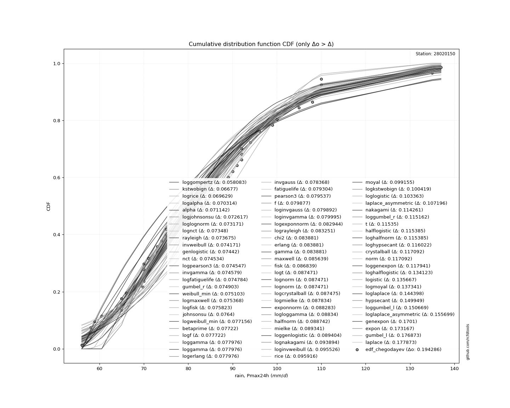</img>

</div>


**5.3. Best fit**

<div align="center">

|   id |   station | empirical_dist   | p_dist      |     delta |   deltao | eval   |   fit |   n |   best_fit |   best_fit_sort |
|-----:|----------:|:-----------------|:------------|----------:|---------:|:-------|------:|----:|-----------:|----------------:|
|    0 |  28020150 | edf_chegodayev   | loggompertz | 0.0580827 | 0.194286 | Δo > Δ |     1 |  49 |          1 |               1 |

</div>


<div align="center">

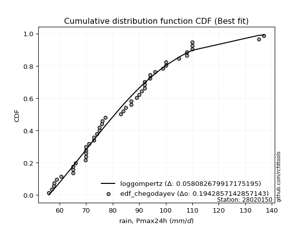</img>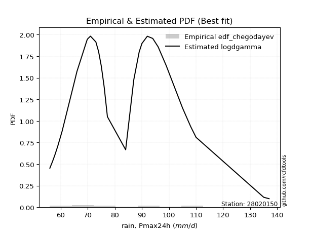</img>

</div>


### 6. Empirical - EDF Blom (1958)

The Blom formula is a specific "plotting position" formula used in hydrology and statistical analysis to estimate the empirical cumulative probability (or non-exceedance probability) of a data series. It is particularly recommended for data that are approximately normally distributed. The constant _a_ is set to 0.375 (or 3/8).

<div align="center">


$P=(m-a)/(n+1-2a)$


</div>


**6.1. Empirical values**

<div align="center">

|                | 0                    | 1                   | 2                  | 3                   | 4                   | 5                   | 6                   | 7                  | 8                  | 9                   | 10                  | 11                  | 12                 | 13                 | 14                 | 15                  | 16                  | 17                  | 18                  | 19                  | 20                  | 21                  | 22                 | 23                 | 24       | 25                 | 26                 | 27                 | 28                 | 29                 | 30                 | 31                 | 32                 | 33                | 34                 | 35                 | 36                 | 37                 | 38                 | 39                 | 40                 | 41                 | 42                 | 43                 | 44                 | 45                 | 46                 | 47                 | 48                 |
|:---------------|:---------------------|:--------------------|:-------------------|:--------------------|:--------------------|:--------------------|:--------------------|:-------------------|:-------------------|:--------------------|:--------------------|:--------------------|:-------------------|:-------------------|:-------------------|:--------------------|:--------------------|:--------------------|:--------------------|:--------------------|:--------------------|:--------------------|:-------------------|:-------------------|:---------|:-------------------|:-------------------|:-------------------|:-------------------|:-------------------|:-------------------|:-------------------|:-------------------|:------------------|:-------------------|:-------------------|:-------------------|:-------------------|:-------------------|:-------------------|:-------------------|:-------------------|:-------------------|:-------------------|:-------------------|:-------------------|:-------------------|:-------------------|:-------------------|
| date           | 1986                 | 1961                | 1967               | 1997                | 1985                | 1982                | 1990                | 1991               | 2002               | 2015                | 1983                | 1987                | 2013               | 2019               | 2003               | 2012                | 2014                | 2007                | 2001                | 2018                | 1963                | 2006                | 1984               | 1981               | 2022     | 1998               | 2020               | 1989               | 2000               | 1994               | 1988               | 2021               | 2010               | 2016              | 1965               | 1960               | 1962               | 1995               | 1964               | 2008               | 2017               | 2004               | 1993               | 2011               | 2009               | 1999               | 2005               | 1992               | 1996               |
| x              | 56.0                 | 57.0                | 57.70139503        | 58.0                | 58.89288117         | 60.50959058         | 65.0                | 65.0               | 65.0               | 66.0                | 69.74092411         | 70.0                | 70.0               | 70.0               | 70.0               | 71.0                | 73.0                | 73.0                | 74.0                | 75.0                | 75.0                | 76.0                | 76.09928433        | 77.26118637        | 83.0     | 84.0               | 85.0               | 87.0               | 87.0               | 89.0               | 90.0               | 91.0               | 92.0               | 92.0              | 92.0               | 94.0               | 94.0               | 96.0               | 99.0               | 100.0              | 100.0              | 105.0              | 108.0              | 108.0              | 110.0              | 110.0              | 110.0              | 135.0              | 137.0              |
| m              | 1                    | 2                   | 3                  | 4                   | 5                   | 6                   | 7                   | 8                  | 9                  | 10                  | 11                  | 12                  | 13                 | 14                 | 15                 | 16                  | 17                  | 18                  | 19                  | 20                  | 21                  | 22                  | 23                 | 24                 | 25       | 26                 | 27                 | 28                 | 29                 | 30                 | 31                 | 32                 | 33                 | 34                | 35                 | 36                 | 37                 | 38                 | 39                 | 40                 | 41                 | 42                 | 43                 | 44                 | 45                 | 46                 | 47                 | 48                 | 49                 |
| empirical_dist | edf_blom             | edf_blom            | edf_blom           | edf_blom            | edf_blom            | edf_blom            | edf_blom            | edf_blom           | edf_blom           | edf_blom            | edf_blom            | edf_blom            | edf_blom           | edf_blom           | edf_blom           | edf_blom            | edf_blom            | edf_blom            | edf_blom            | edf_blom            | edf_blom            | edf_blom            | edf_blom           | edf_blom           | edf_blom | edf_blom           | edf_blom           | edf_blom           | edf_blom           | edf_blom           | edf_blom           | edf_blom           | edf_blom           | edf_blom          | edf_blom           | edf_blom           | edf_blom           | edf_blom           | edf_blom           | edf_blom           | edf_blom           | edf_blom           | edf_blom           | edf_blom           | edf_blom           | edf_blom           | edf_blom           | edf_blom           | edf_blom           |
| empirical      | 0.012690355329949238 | 0.03299492385786802 | 0.0532994923857868 | 0.07360406091370558 | 0.09390862944162437 | 0.11421319796954314 | 0.13451776649746192 | 0.1548223350253807 | 0.1751269035532995 | 0.19543147208121828 | 0.21573604060913706 | 0.23604060913705585 | 0.2563451776649746 | 0.2766497461928934 | 0.2969543147208122 | 0.31725888324873097 | 0.33756345177664976 | 0.35786802030456855 | 0.37817258883248733 | 0.39847715736040606 | 0.41878172588832485 | 0.43908629441624364 | 0.4593908629441624 | 0.4796954314720812 | 0.5      | 0.5203045685279187 | 0.5406091370558376 | 0.5609137055837563 | 0.5812182741116751 | 0.6015228426395939 | 0.6218274111675127 | 0.6421319796954315 | 0.6624365482233503 | 0.682741116751269 | 0.7030456852791879 | 0.7233502538071066 | 0.7436548223350253 | 0.7639593908629442 | 0.7842639593908629 | 0.8045685279187818 | 0.8248730964467005 | 0.8451776649746193 | 0.8654822335025381 | 0.8857868020304569 | 0.9060913705583756 | 0.9263959390862944 | 0.9467005076142132 | 0.9670050761421319 | 0.9873096446700508 |
| empirical_tr   | 1.012853470437018    | 1.0341207349081365  | 1.0563002680965148 | 1.0794520547945206  | 1.1036414565826331  | 1.1289398280802292  | 1.155425219941349   | 1.1831831831831832 | 1.2123076923076923 | 1.2429022082018928  | 1.2750809061488673  | 1.308970099667774   | 1.3447098976109213 | 1.3824561403508773 | 1.4223826714801444 | 1.4646840148698885  | 1.5095785440613025  | 1.557312252964427   | 1.6081632653061226  | 1.662447257383966   | 1.720524017467249   | 1.7828054298642535  | 1.8497652582159625 | 1.9219512195121948 | 2.0      | 2.0846560846560847 | 2.1767955801104972 | 2.277456647398844  | 2.387878787878788  | 2.5095541401273884 | 2.644295302013423  | 2.7943262411347516 | 2.9624060150375944 | 3.152             | 3.367521367521368  | 3.614678899082569  | 3.9009900990099005 | 4.236559139784947  | 4.635294117647058  | 5.116883116883118  | 5.7101449275362315 | 6.459016393442624  | 7.433962264150942  | 8.75555555555556   | 10.648648648648647 | 13.586206896551714 | 18.761904761904763 | 30.307692307692268 | 78.80000000000011  |

</div>


**6.2. Kolmogorov-Smirnov fit test (sorted by Δ)**


<div align="center">

|                | 0                   | 1                   | 2                  | 3                   | 4                   | 5                   | 6                   | 7                   | 8                   | 9                   | 10                  | 11                 | 12                  | 13                 | 14                  | 15                  | 16                  | 17                  | 18                  | 19                 | 20                  | 21                  | 22                  | 23                 | 24                 | 25                  | 26                  | 27                  | 28                  | 29                  | 30                  | 31                  | 32                  | 33                  | 34                 | 35                  | 36                  | 37                  | 38                  | 39                 | 40                  | 41                  | 42                  | 43                  | 44                  | 45                  | 46                  | 47                  | 48                 | 49                  | 50                  | 51                  | 52                  | 53                 | 54                 | 55                  | 56                  | 57                  | 58                  | 59                  | 60                 | 61                  | 62                 | 63                  | 64                  | 65                  | 66                  | 67                  | 68                  | 69                  | 70                 | 71                    | 72                  | 73                 | 74                  | 75                 | 76                  | 77                  | 78                  | 79                 | 80                  | 81                 | 82                 | 83                  | 84                 | 85                 | 86                 | 87                 | 88                 | 89                 |
|:---------------|:--------------------|:--------------------|:-------------------|:--------------------|:--------------------|:--------------------|:--------------------|:--------------------|:--------------------|:--------------------|:--------------------|:-------------------|:--------------------|:-------------------|:--------------------|:--------------------|:--------------------|:--------------------|:--------------------|:-------------------|:--------------------|:--------------------|:--------------------|:-------------------|:-------------------|:--------------------|:--------------------|:--------------------|:--------------------|:--------------------|:--------------------|:--------------------|:--------------------|:--------------------|:-------------------|:--------------------|:--------------------|:--------------------|:--------------------|:-------------------|:--------------------|:--------------------|:--------------------|:--------------------|:--------------------|:--------------------|:--------------------|:--------------------|:-------------------|:--------------------|:--------------------|:--------------------|:--------------------|:-------------------|:-------------------|:--------------------|:--------------------|:--------------------|:--------------------|:--------------------|:-------------------|:--------------------|:-------------------|:--------------------|:--------------------|:--------------------|:--------------------|:--------------------|:--------------------|:--------------------|:-------------------|:----------------------|:--------------------|:-------------------|:--------------------|:-------------------|:--------------------|:--------------------|:--------------------|:-------------------|:--------------------|:-------------------|:-------------------|:--------------------|:-------------------|:-------------------|:-------------------|:-------------------|:-------------------|:-------------------|
| station        | 28020150            | 28020150            | 28020150           | 28020150            | 28020150            | 28020150            | 28020150            | 28020150            | 28020150            | 28020150            | 28020150            | 28020150           | 28020150            | 28020150           | 28020150            | 28020150            | 28020150            | 28020150            | 28020150            | 28020150           | 28020150            | 28020150            | 28020150            | 28020150           | 28020150           | 28020150            | 28020150            | 28020150            | 28020150            | 28020150            | 28020150            | 28020150            | 28020150            | 28020150            | 28020150           | 28020150            | 28020150            | 28020150            | 28020150            | 28020150           | 28020150            | 28020150            | 28020150            | 28020150            | 28020150            | 28020150            | 28020150            | 28020150            | 28020150           | 28020150            | 28020150            | 28020150            | 28020150            | 28020150           | 28020150           | 28020150            | 28020150            | 28020150            | 28020150            | 28020150            | 28020150           | 28020150            | 28020150           | 28020150            | 28020150            | 28020150            | 28020150            | 28020150            | 28020150            | 28020150            | 28020150           | 28020150              | 28020150            | 28020150           | 28020150            | 28020150           | 28020150            | 28020150            | 28020150            | 28020150           | 28020150            | 28020150           | 28020150           | 28020150            | 28020150           | 28020150           | 28020150           | 28020150           | 28020150           | 28020150           |
| empirical_dist | edf_blom            | edf_blom            | edf_blom           | edf_blom            | edf_blom            | edf_blom            | edf_blom            | edf_blom            | edf_blom            | edf_blom            | edf_blom            | edf_blom           | edf_blom            | edf_blom           | edf_blom            | edf_blom            | edf_blom            | edf_blom            | edf_blom            | edf_blom           | edf_blom            | edf_blom            | edf_blom            | edf_blom           | edf_blom           | edf_blom            | edf_blom            | edf_blom            | edf_blom            | edf_blom            | edf_blom            | edf_blom            | edf_blom            | edf_blom            | edf_blom           | edf_blom            | edf_blom            | edf_blom            | edf_blom            | edf_blom           | edf_blom            | edf_blom            | edf_blom            | edf_blom            | edf_blom            | edf_blom            | edf_blom            | edf_blom            | edf_blom           | edf_blom            | edf_blom            | edf_blom            | edf_blom            | edf_blom           | edf_blom           | edf_blom            | edf_blom            | edf_blom            | edf_blom            | edf_blom            | edf_blom           | edf_blom            | edf_blom           | edf_blom            | edf_blom            | edf_blom            | edf_blom            | edf_blom            | edf_blom            | edf_blom            | edf_blom           | edf_blom              | edf_blom            | edf_blom           | edf_blom            | edf_blom           | edf_blom            | edf_blom            | edf_blom            | edf_blom           | edf_blom            | edf_blom           | edf_blom           | edf_blom            | edf_blom           | edf_blom           | edf_blom           | edf_blom           | edf_blom           | edf_blom           |
| p_dist         | loggompertz         | kstwobign           | logrice            | logalpha            | alpha               | logjohnsonsu        | loglognorm          | lognct              | rayleigh            | invweibull          | genlogistic         | nct                | invgamma            | logpearson3        | logfatiguelife      | gumbel_r            | weibull_min         | logmaxwell          | logfisk             | johnsonsu          | logweibull_min      | betaprime           | logf                | loggamma           | loggamma           | logerlang           | invgauss            | fatiguelife         | pearson3            | f                   | loginvgauss         | loginvgamma         | logexponnorm        | lograyleigh         | chi2               | erlang              | gamma               | maxwell             | fisk                | logt               | lognorm             | lognorm             | logcrystalball      | halfnorm            | logmielke           | exponnorm           | logloggamma         | mielke              | loggenlogistic     | lognakagami         | loginvweibull       | rice                | moyal               | logkstwobign       | loglogistic        | laplace_asymmetric  | loghalfnorm         | halflogistic        | loggumbel_r         | nakagami            | t                  | loghypsecant        | crystalball        | norm                | loggenexpon         | loghalflogistic     | logistic            | logmoyal            | loglaplace          | hypsecant           | loggumbel_l        | loglaplace_asymmetric | genexpon            | expon              | pareto              | gumbel_l           | laplace             | wald                | logwald             | logbetaprime       | logtruncnorm        | logncf             | logexpon           | logpareto           | loggibrat          | gibrat             | logchi2            | ncf                | gompertz           | truncnorm          |
| delta          | 0.05894582959143893 | 0.06658523806016903 | 0.0694437786460641 | 0.07012854649396527 | 0.07095680221851008 | 0.07243161763280881 | 0.07298619377530069 | 0.07335665718127371 | 0.07355120141001092 | 0.07398571057353254 | 0.07423461817284338 | 0.0743488908861103 | 0.07439356510604056 | 0.0744234738847741 | 0.07459952813917281 | 0.07471843148027213 | 0.07491815911527966 | 0.07518273506866036 | 0.07563805468639528 | 0.0762154885658235 | 0.07697088558766485 | 0.07709692722877298 | 0.07753716567900537 | 0.0777908338934229 | 0.0777908338934229 | 0.07779126061834152 | 0.07818323602791444 | 0.07911886675940094 | 0.07941387755973822 | 0.07969247635196097 | 0.07970708334552357 | 0.07987184551660231 | 0.08282111259966529 | 0.08306584431169095 | 0.0836956562668073 | 0.08369619876703793 | 0.08369636796154256 | 0.08551607637818581 | 0.08671551417411505 | 0.0873473723016912 | 0.08734777379990977 | 0.08734777379990977 | 0.08735139994690577 | 0.08750863518651643 | 0.08764892875039976 | 0.08809778101835186 | 0.08821667124336313 | 0.08915597776651629 | 0.0892189983499101 | 0.09370879516120578 | 0.09534138882118282 | 0.09579260990235228 | 0.09897000594156258 | 0.100234292591737  | 0.1032398498603464 | 0.10701104766340608 | 0.11421319796954314 | 0.11421319796954314 | 0.11497737870564506 | 0.11512429330815407 | 0.1152270767085275 | 0.11589827356476357 | 0.1169682988378723 | 0.11696833347320945 | 0.11880456444509499 | 0.13393768503168424 | 0.13554417491824994 | 0.13715590346936501 | 0.14427439321569402 | 0.14982523441357648 | 0.150546142604691  | 0.15563755243038813   | 0.17096292795550064 | 0.1740303035906001 | 0.17403031091351487 | 0.1768111978324301 | 0.17774947408194713 | 0.19524578062820172 | 0.19911901023815815 | 0.207801085831552  | 0.21575215531313538 | 0.219986286388982  | 0.2240820932678186 | 0.22408210813698096 | 0.2783456382273304 | 0.2914482828554269 | 0.3788544335643713 | 0.5859792002313827 | 0.7497485149117239 | 0.815198192947743  |
| deltao         | 0.1942857142857143  | 0.1942857142857143  | 0.1942857142857143 | 0.1942857142857143  | 0.1942857142857143  | 0.1942857142857143  | 0.1942857142857143  | 0.1942857142857143  | 0.1942857142857143  | 0.1942857142857143  | 0.1942857142857143  | 0.1942857142857143 | 0.1942857142857143  | 0.1942857142857143 | 0.1942857142857143  | 0.1942857142857143  | 0.1942857142857143  | 0.1942857142857143  | 0.1942857142857143  | 0.1942857142857143 | 0.1942857142857143  | 0.1942857142857143  | 0.1942857142857143  | 0.1942857142857143 | 0.1942857142857143 | 0.1942857142857143  | 0.1942857142857143  | 0.1942857142857143  | 0.1942857142857143  | 0.1942857142857143  | 0.1942857142857143  | 0.1942857142857143  | 0.1942857142857143  | 0.1942857142857143  | 0.1942857142857143 | 0.1942857142857143  | 0.1942857142857143  | 0.1942857142857143  | 0.1942857142857143  | 0.1942857142857143 | 0.1942857142857143  | 0.1942857142857143  | 0.1942857142857143  | 0.1942857142857143  | 0.1942857142857143  | 0.1942857142857143  | 0.1942857142857143  | 0.1942857142857143  | 0.1942857142857143 | 0.1942857142857143  | 0.1942857142857143  | 0.1942857142857143  | 0.1942857142857143  | 0.1942857142857143 | 0.1942857142857143 | 0.1942857142857143  | 0.1942857142857143  | 0.1942857142857143  | 0.1942857142857143  | 0.1942857142857143  | 0.1942857142857143 | 0.1942857142857143  | 0.1942857142857143 | 0.1942857142857143  | 0.1942857142857143  | 0.1942857142857143  | 0.1942857142857143  | 0.1942857142857143  | 0.1942857142857143  | 0.1942857142857143  | 0.1942857142857143 | 0.1942857142857143    | 0.1942857142857143  | 0.1942857142857143 | 0.1942857142857143  | 0.1942857142857143 | 0.1942857142857143  | 0.1942857142857143  | 0.1942857142857143  | 0.1942857142857143 | 0.1942857142857143  | 0.1942857142857143 | 0.1942857142857143 | 0.1942857142857143  | 0.1942857142857143 | 0.1942857142857143 | 0.1942857142857143 | 0.1942857142857143 | 0.1942857142857143 | 0.1942857142857143 |
| eval           | Δo > Δ              | Δo > Δ              | Δo > Δ             | Δo > Δ              | Δo > Δ              | Δo > Δ              | Δo > Δ              | Δo > Δ              | Δo > Δ              | Δo > Δ              | Δo > Δ              | Δo > Δ             | Δo > Δ              | Δo > Δ             | Δo > Δ              | Δo > Δ              | Δo > Δ              | Δo > Δ              | Δo > Δ              | Δo > Δ             | Δo > Δ              | Δo > Δ              | Δo > Δ              | Δo > Δ             | Δo > Δ             | Δo > Δ              | Δo > Δ              | Δo > Δ              | Δo > Δ              | Δo > Δ              | Δo > Δ              | Δo > Δ              | Δo > Δ              | Δo > Δ              | Δo > Δ             | Δo > Δ              | Δo > Δ              | Δo > Δ              | Δo > Δ              | Δo > Δ             | Δo > Δ              | Δo > Δ              | Δo > Δ              | Δo > Δ              | Δo > Δ              | Δo > Δ              | Δo > Δ              | Δo > Δ              | Δo > Δ             | Δo > Δ              | Δo > Δ              | Δo > Δ              | Δo > Δ              | Δo > Δ             | Δo > Δ             | Δo > Δ              | Δo > Δ              | Δo > Δ              | Δo > Δ              | Δo > Δ              | Δo > Δ             | Δo > Δ              | Δo > Δ             | Δo > Δ              | Δo > Δ              | Δo > Δ              | Δo > Δ              | Δo > Δ              | Δo > Δ              | Δo > Δ              | Δo > Δ             | Δo > Δ                | Δo > Δ              | Δo > Δ             | Δo > Δ              | Δo > Δ             | Δo > Δ              | Δo <= Δ             | Δo <= Δ             | Δo <= Δ            | Δo <= Δ             | Δo <= Δ            | Δo <= Δ            | Δo <= Δ             | Δo <= Δ            | Δo <= Δ            | Δo <= Δ            | Δo <= Δ            | Δo <= Δ            | Δo <= Δ            |
| fit            | 1                   | 1                   | 1                  | 1                   | 1                   | 1                   | 1                   | 1                   | 1                   | 1                   | 1                   | 1                  | 1                   | 1                  | 1                   | 1                   | 1                   | 1                   | 1                   | 1                  | 1                   | 1                   | 1                   | 1                  | 1                  | 1                   | 1                   | 1                   | 1                   | 1                   | 1                   | 1                   | 1                   | 1                   | 1                  | 1                   | 1                   | 1                   | 1                   | 1                  | 1                   | 1                   | 1                   | 1                   | 1                   | 1                   | 1                   | 1                   | 1                  | 1                   | 1                   | 1                   | 1                   | 1                  | 1                  | 1                   | 1                   | 1                   | 1                   | 1                   | 1                  | 1                   | 1                  | 1                   | 1                   | 1                   | 1                   | 1                   | 1                   | 1                   | 1                  | 1                     | 1                   | 1                  | 1                   | 1                  | 1                   | 0                   | 0                   | 0                  | 0                   | 0                  | 0                  | 0                   | 0                  | 0                  | 0                  | 0                  | 0                  | 0                  |
| n              | 49                  | 49                  | 49                 | 49                  | 49                  | 49                  | 49                  | 49                  | 49                  | 49                  | 49                  | 49                 | 49                  | 49                 | 49                  | 49                  | 49                  | 49                  | 49                  | 49                 | 49                  | 49                  | 49                  | 49                 | 49                 | 49                  | 49                  | 49                  | 49                  | 49                  | 49                  | 49                  | 49                  | 49                  | 49                 | 49                  | 49                  | 49                  | 49                  | 49                 | 49                  | 49                  | 49                  | 49                  | 49                  | 49                  | 49                  | 49                  | 49                 | 49                  | 49                  | 49                  | 49                  | 49                 | 49                 | 49                  | 49                  | 49                  | 49                  | 49                  | 49                 | 49                  | 49                 | 49                  | 49                  | 49                  | 49                  | 49                  | 49                  | 49                  | 49                 | 49                    | 49                  | 49                 | 49                  | 49                 | 49                  | 49                  | 49                  | 49                 | 49                  | 49                 | 49                 | 49                  | 49                 | 49                 | 49                 | 49                 | 49                 | 49                 |
| best_fit       | 1                   | 0                   | 0                  | 0                   | 0                   | 0                   | 0                   | 0                   | 0                   | 0                   | 0                   | 0                  | 0                   | 0                  | 0                   | 0                   | 0                   | 0                   | 0                   | 0                  | 0                   | 0                   | 0                   | 0                  | 0                  | 0                   | 0                   | 0                   | 0                   | 0                   | 0                   | 0                   | 0                   | 0                   | 0                  | 0                   | 0                   | 0                   | 0                   | 0                  | 0                   | 0                   | 0                   | 0                   | 0                   | 0                   | 0                   | 0                   | 0                  | 0                   | 0                   | 0                   | 0                   | 0                  | 0                  | 0                   | 0                   | 0                   | 0                   | 0                   | 0                  | 0                   | 0                  | 0                   | 0                   | 0                   | 0                   | 0                   | 0                   | 0                   | 0                  | 0                     | 0                   | 0                  | 0                   | 0                  | 0                   | 0                   | 0                   | 0                  | 0                   | 0                  | 0                  | 0                   | 0                  | 0                  | 0                  | 0                  | 0                  | 0                  |
| best_fit_sort  | 1                   | 2                   | 3                  | 4                   | 5                   | 6                   | 7                   | 8                   | 9                   | 10                  | 11                  | 12                 | 13                  | 14                 | 15                  | 16                  | 17                  | 18                  | 19                  | 20                 | 21                  | 22                  | 23                  | 24                 | 25                 | 26                  | 27                  | 28                  | 29                  | 30                  | 31                  | 32                  | 33                  | 34                  | 35                 | 36                  | 37                  | 38                  | 39                  | 40                 | 41                  | 42                  | 43                  | 44                  | 45                  | 46                  | 47                  | 48                  | 49                 | 50                  | 51                  | 52                  | 53                  | 54                 | 55                 | 56                  | 57                  | 58                  | 59                  | 60                  | 61                 | 62                  | 63                 | 64                  | 65                  | 66                  | 67                  | 68                  | 69                  | 70                  | 71                 | 72                    | 73                  | 74                 | 75                  | 76                 | 77                  | 78                  | 79                  | 80                 | 81                  | 82                 | 83                 | 84                  | 85                 | 86                 | 87                 | 88                 | 89                 | 90                 |

</div>


<div align="center">

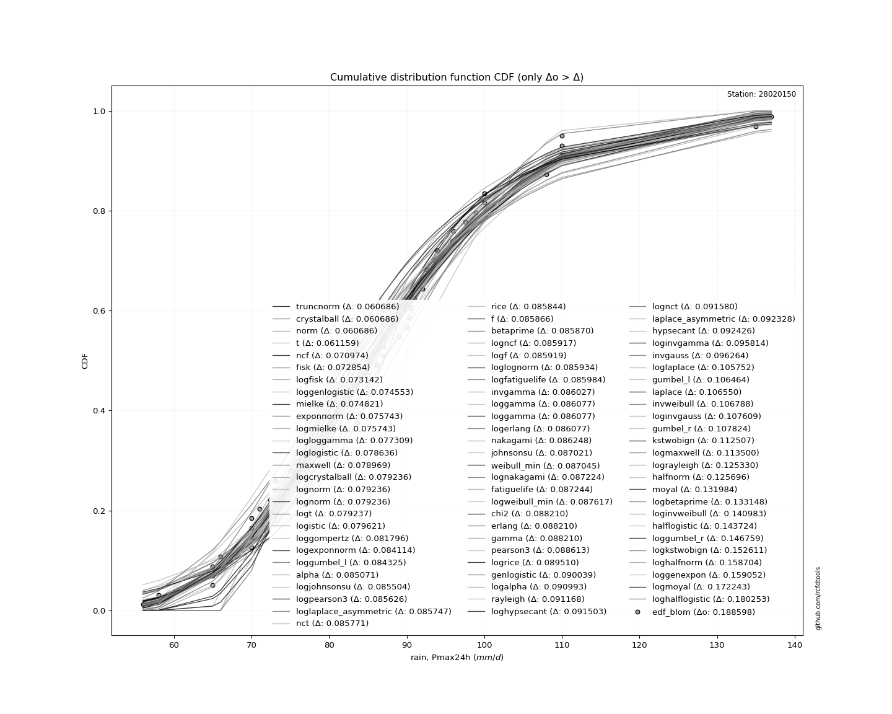</img>

</div>


**6.3. Best fit**

<div align="center">

|   id |   station | empirical_dist   | p_dist      |     delta |   deltao | eval   |   fit |   n |   best_fit |   best_fit_sort |
|-----:|----------:|:-----------------|:------------|----------:|---------:|:-------|------:|----:|-----------:|----------------:|
|    0 |  28020150 | edf_blom         | loggompertz | 0.0589458 | 0.194286 | Δo > Δ |     1 |  49 |          1 |               1 |

</div>


<div align="center">

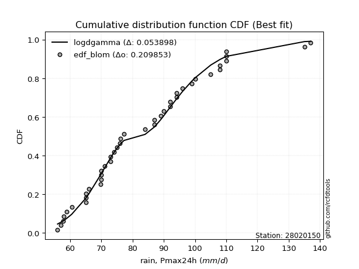</img></img>

</div>


### 7. Empirical - EDF Tukey (1962)

In hydrology, the Tukey formula is used as a plotting position formula to estimate the empirical probability or frequency of a flood event (or other hydrological data). The formula parameter is given as _c=0.333_ (or 1/3).

<div align="center">


$P=(m-c)/(n+1-2c)$


</div>


**7.1. Empirical values**

<div align="center">

|                | 0                    | 1                    | 2                   | 3                   | 4                  | 5                   | 6                   | 7                  | 8                   | 9                   | 10                  | 11                  | 12                  | 13                  | 14                 | 15                  | 16                  | 17                 | 18                 | 19                  | 20                 | 21                 | 22                 | 23                 | 24        | 25                 | 26                 | 27                 | 28                | 29                 | 30                 | 31                 | 32                 | 33                 | 34                 | 35                | 36                 | 37                 | 38                 | 39                 | 40                 | 41                 | 42                 | 43                 | 44                 | 45                 | 46                 | 47                 | 48                 |
|:---------------|:---------------------|:---------------------|:--------------------|:--------------------|:-------------------|:--------------------|:--------------------|:-------------------|:--------------------|:--------------------|:--------------------|:--------------------|:--------------------|:--------------------|:-------------------|:--------------------|:--------------------|:-------------------|:-------------------|:--------------------|:-------------------|:-------------------|:-------------------|:-------------------|:----------|:-------------------|:-------------------|:-------------------|:------------------|:-------------------|:-------------------|:-------------------|:-------------------|:-------------------|:-------------------|:------------------|:-------------------|:-------------------|:-------------------|:-------------------|:-------------------|:-------------------|:-------------------|:-------------------|:-------------------|:-------------------|:-------------------|:-------------------|:-------------------|
| date           | 1986                 | 1961                 | 1967                | 1997                | 1985               | 1982                | 1990                | 1991               | 2002                | 2015                | 1983                | 1987                | 2013                | 2019                | 2003               | 2012                | 2014                | 2007               | 2001               | 2018                | 1963               | 2006               | 1984               | 1981               | 2022      | 1998               | 2020               | 1989               | 2000              | 1994               | 1988               | 2021               | 2010               | 2016               | 1965               | 1960              | 1962               | 1995               | 1964               | 2008               | 2017               | 2004               | 1993               | 2011               | 2009               | 1999               | 2005               | 1992               | 1996               |
| x              | 56.0                 | 57.0                 | 57.70139503         | 58.0                | 58.89288117        | 60.50959058         | 65.0                | 65.0               | 65.0                | 66.0                | 69.74092411         | 70.0                | 70.0                | 70.0                | 70.0               | 71.0                | 73.0                | 73.0               | 74.0               | 75.0                | 75.0               | 76.0               | 76.09928433        | 77.26118637        | 83.0      | 84.0               | 85.0               | 87.0               | 87.0              | 89.0               | 90.0               | 91.0               | 92.0               | 92.0               | 92.0               | 94.0              | 94.0               | 96.0               | 99.0               | 100.0              | 100.0              | 105.0              | 108.0              | 108.0              | 110.0              | 110.0              | 110.0              | 135.0              | 137.0              |
| m              | 1                    | 2                    | 3                   | 4                   | 5                  | 6                   | 7                   | 8                  | 9                   | 10                  | 11                  | 12                  | 13                  | 14                  | 15                 | 16                  | 17                  | 18                 | 19                 | 20                  | 21                 | 22                 | 23                 | 24                 | 25        | 26                 | 27                 | 28                 | 29                | 30                 | 31                 | 32                 | 33                 | 34                 | 35                 | 36                | 37                 | 38                 | 39                 | 40                 | 41                 | 42                 | 43                 | 44                 | 45                 | 46                 | 47                 | 48                 | 49                 |
| empirical_dist | edf_tukey            | edf_tukey            | edf_tukey           | edf_tukey           | edf_tukey          | edf_tukey           | edf_tukey           | edf_tukey          | edf_tukey           | edf_tukey           | edf_tukey           | edf_tukey           | edf_tukey           | edf_tukey           | edf_tukey          | edf_tukey           | edf_tukey           | edf_tukey          | edf_tukey          | edf_tukey           | edf_tukey          | edf_tukey          | edf_tukey          | edf_tukey          | edf_tukey | edf_tukey          | edf_tukey          | edf_tukey          | edf_tukey         | edf_tukey          | edf_tukey          | edf_tukey          | edf_tukey          | edf_tukey          | edf_tukey          | edf_tukey         | edf_tukey          | edf_tukey          | edf_tukey          | edf_tukey          | edf_tukey          | edf_tukey          | edf_tukey          | edf_tukey          | edf_tukey          | edf_tukey          | edf_tukey          | edf_tukey          | edf_tukey          |
| empirical      | 0.013513513513513514 | 0.033783783783783786 | 0.05405405405405406 | 0.07432432432432433 | 0.0945945945945946 | 0.11486486486486487 | 0.13513513513513514 | 0.1554054054054054 | 0.17567567567567569 | 0.19594594594594594 | 0.21621621621621623 | 0.23648648648648649 | 0.25675675675675674 | 0.27702702702702703 | 0.2972972972972973 | 0.31756756756756754 | 0.33783783783783783 | 0.3581081081081081 | 0.3783783783783784 | 0.39864864864864863 | 0.4189189189189189 | 0.4391891891891892 | 0.4594594594594595 | 0.4797297297297297 | 0.5       | 0.5202702702702703 | 0.5405405405405406 | 0.5608108108108109 | 0.581081081081081 | 0.6013513513513513 | 0.6216216216216216 | 0.6418918918918919 | 0.6621621621621622 | 0.6824324324324325 | 0.7027027027027027 | 0.722972972972973 | 0.7432432432432432 | 0.7635135135135135 | 0.7837837837837838 | 0.8040540540540541 | 0.8243243243243243 | 0.8445945945945946 | 0.8648648648648649 | 0.8851351351351351 | 0.9054054054054054 | 0.9256756756756757 | 0.9459459459459459 | 0.9662162162162162 | 0.9864864864864865 |
| empirical_tr   | 1.0136986301369864   | 1.034965034965035    | 1.0571428571428572  | 1.0802919708029197  | 1.1044776119402986 | 1.1297709923664123  | 1.15625             | 1.184              | 1.2131147540983607  | 1.2436974789915967  | 1.2758620689655173  | 1.3097345132743363  | 1.3454545454545455  | 1.3831775700934579  | 1.4230769230769231 | 1.4653465346534653  | 1.510204081632653   | 1.5578947368421052 | 1.608695652173913  | 1.6629213483146068  | 1.7209302325581393 | 1.7831325301204821 | 1.8499999999999999 | 1.922077922077922  | 2.0       | 2.084507042253521  | 2.1764705882352944 | 2.2769230769230773 | 2.387096774193548 | 2.5084745762711864 | 2.642857142857143  | 2.792452830188679  | 2.96               | 3.148936170212766  | 3.363636363636364  | 3.609756097560976 | 3.8947368421052624 | 4.228571428571428  | 4.625              | 5.103448275862069  | 5.6923076923076925 | 6.434782608695653  | 7.400000000000003  | 8.705882352941172  | 10.571428571428568 | 13.454545454545451 | 18.5               | 29.600000000000012 | 74.00000000000014  |

</div>


**7.2. Kolmogorov-Smirnov fit test (sorted by Δ)**


<div align="center">

|                | 0                   | 1                   | 2                   | 3                   | 4                   | 5                   | 6                   | 7                   | 8                   | 9                   | 10                  | 11                  | 12                  | 13                  | 14                  | 15                  | 16                  | 17                 | 18                  | 19                  | 20                 | 21                  | 22                  | 23                  | 24                  | 25                  | 26                  | 27                  | 28                  | 29                  | 30                  | 31                  | 32                  | 33                 | 34                  | 35                  | 36                  | 37                  | 38                  | 39                  | 40                  | 41                  | 42                  | 43                  | 44                  | 45                  | 46                  | 47                  | 48                  | 49                  | 50                  | 51                  | 52                  | 53                  | 54                  | 55                  | 56                  | 57                  | 58                  | 59                  | 60                  | 61                  | 62                  | 63                  | 64                  | 65                 | 66                 | 67                  | 68                  | 69                  | 70                  | 71                    | 72                  | 73                  | 74                 | 75                 | 76                 | 77                 | 78                 | 79                  | 80                  | 81                  | 82                  | 83                 | 84                 | 85                  | 86                  | 87                 | 88                 | 89                 |
|:---------------|:--------------------|:--------------------|:--------------------|:--------------------|:--------------------|:--------------------|:--------------------|:--------------------|:--------------------|:--------------------|:--------------------|:--------------------|:--------------------|:--------------------|:--------------------|:--------------------|:--------------------|:-------------------|:--------------------|:--------------------|:-------------------|:--------------------|:--------------------|:--------------------|:--------------------|:--------------------|:--------------------|:--------------------|:--------------------|:--------------------|:--------------------|:--------------------|:--------------------|:-------------------|:--------------------|:--------------------|:--------------------|:--------------------|:--------------------|:--------------------|:--------------------|:--------------------|:--------------------|:--------------------|:--------------------|:--------------------|:--------------------|:--------------------|:--------------------|:--------------------|:--------------------|:--------------------|:--------------------|:--------------------|:--------------------|:--------------------|:--------------------|:--------------------|:--------------------|:--------------------|:--------------------|:--------------------|:--------------------|:--------------------|:--------------------|:-------------------|:-------------------|:--------------------|:--------------------|:--------------------|:--------------------|:----------------------|:--------------------|:--------------------|:-------------------|:-------------------|:-------------------|:-------------------|:-------------------|:--------------------|:--------------------|:--------------------|:--------------------|:-------------------|:-------------------|:--------------------|:--------------------|:-------------------|:-------------------|:-------------------|
| station        | 28020150            | 28020150            | 28020150            | 28020150            | 28020150            | 28020150            | 28020150            | 28020150            | 28020150            | 28020150            | 28020150            | 28020150            | 28020150            | 28020150            | 28020150            | 28020150            | 28020150            | 28020150           | 28020150            | 28020150            | 28020150           | 28020150            | 28020150            | 28020150            | 28020150            | 28020150            | 28020150            | 28020150            | 28020150            | 28020150            | 28020150            | 28020150            | 28020150            | 28020150           | 28020150            | 28020150            | 28020150            | 28020150            | 28020150            | 28020150            | 28020150            | 28020150            | 28020150            | 28020150            | 28020150            | 28020150            | 28020150            | 28020150            | 28020150            | 28020150            | 28020150            | 28020150            | 28020150            | 28020150            | 28020150            | 28020150            | 28020150            | 28020150            | 28020150            | 28020150            | 28020150            | 28020150            | 28020150            | 28020150            | 28020150            | 28020150           | 28020150           | 28020150            | 28020150            | 28020150            | 28020150            | 28020150              | 28020150            | 28020150            | 28020150           | 28020150           | 28020150           | 28020150           | 28020150           | 28020150            | 28020150            | 28020150            | 28020150            | 28020150           | 28020150           | 28020150            | 28020150            | 28020150           | 28020150           | 28020150           |
| empirical_dist | edf_tukey           | edf_tukey           | edf_tukey           | edf_tukey           | edf_tukey           | edf_tukey           | edf_tukey           | edf_tukey           | edf_tukey           | edf_tukey           | edf_tukey           | edf_tukey           | edf_tukey           | edf_tukey           | edf_tukey           | edf_tukey           | edf_tukey           | edf_tukey          | edf_tukey           | edf_tukey           | edf_tukey          | edf_tukey           | edf_tukey           | edf_tukey           | edf_tukey           | edf_tukey           | edf_tukey           | edf_tukey           | edf_tukey           | edf_tukey           | edf_tukey           | edf_tukey           | edf_tukey           | edf_tukey          | edf_tukey           | edf_tukey           | edf_tukey           | edf_tukey           | edf_tukey           | edf_tukey           | edf_tukey           | edf_tukey           | edf_tukey           | edf_tukey           | edf_tukey           | edf_tukey           | edf_tukey           | edf_tukey           | edf_tukey           | edf_tukey           | edf_tukey           | edf_tukey           | edf_tukey           | edf_tukey           | edf_tukey           | edf_tukey           | edf_tukey           | edf_tukey           | edf_tukey           | edf_tukey           | edf_tukey           | edf_tukey           | edf_tukey           | edf_tukey           | edf_tukey           | edf_tukey          | edf_tukey          | edf_tukey           | edf_tukey           | edf_tukey           | edf_tukey           | edf_tukey             | edf_tukey           | edf_tukey           | edf_tukey          | edf_tukey          | edf_tukey          | edf_tukey          | edf_tukey          | edf_tukey           | edf_tukey           | edf_tukey           | edf_tukey           | edf_tukey          | edf_tukey          | edf_tukey           | edf_tukey           | edf_tukey          | edf_tukey          | edf_tukey          |
| p_dist         | loggompertz         | kstwobign           | logrice             | logalpha            | alpha               | logjohnsonsu        | loglognorm          | lognct              | rayleigh            | invweibull          | genlogistic         | nct                 | logpearson3         | invgamma            | logfatiguelife      | gumbel_r            | weibull_min         | logmaxwell         | logfisk             | johnsonsu           | logweibull_min     | betaprime           | logf                | loggamma            | loggamma            | logerlang           | invgauss            | fatiguelife         | pearson3            | f                   | loginvgauss         | loginvgamma         | logexponnorm        | lograyleigh        | chi2                | erlang              | gamma               | maxwell             | fisk                | logt                | lognorm             | lognorm             | logcrystalball      | logmielke           | halfnorm            | exponnorm           | logloggamma         | mielke              | loggenlogistic      | lognakagami         | loginvweibull       | rice                | moyal               | logkstwobign        | loglogistic         | laplace_asymmetric  | nakagami            | loghalfnorm         | halflogistic        | loggumbel_r         | t                   | loghypsecant        | crystalball         | norm                | loggenexpon         | loghalflogistic    | logistic           | logmoyal            | loglaplace          | hypsecant           | loggumbel_l         | loglaplace_asymmetric | genexpon            | expon               | pareto             | gumbel_l           | laplace            | wald               | logwald            | logbetaprime        | logtruncnorm        | logncf              | logexpon            | logpareto          | loggibrat          | gibrat              | logchi2             | ncf                | gompertz           | truncnorm          |
| delta          | 0.05846565398435977 | 0.06668813283311448 | 0.06954667341900955 | 0.07023144126691072 | 0.07105969699145553 | 0.07253451240575426 | 0.07308908854824614 | 0.07342525369657077 | 0.07361979792530798 | 0.07408860534647799 | 0.07433751294578883 | 0.07445178565905575 | 0.07449207040007116 | 0.07449645987898601 | 0.07470242291211826 | 0.07482132625321758 | 0.07502105388822511 | 0.0752856298416058 | 0.07574094945934073 | 0.07631838333876895 | 0.0770737803606103 | 0.07716552374407004 | 0.07764006045195082 | 0.07789372866636834 | 0.07789372866636834 | 0.07789415539128697 | 0.07828613080085989 | 0.07922176153234639 | 0.07948247407503528 | 0.07979537112490642 | 0.07980997811846902 | 0.07994044203189937 | 0.08288970911496235 | 0.0831687390846364 | 0.08379855103975276 | 0.08379909353998338 | 0.08379926273448801 | 0.08558467289348287 | 0.08678411068941211 | 0.08741596881698827 | 0.08741637031520683 | 0.08741637031520683 | 0.08741999646220283 | 0.08775182352334521 | 0.08819460033948666 | 0.08820067579129731 | 0.08828526775866019 | 0.08925887253946174 | 0.08932189312285554 | 0.09381168993415123 | 0.09544428359412827 | 0.09586120641764934 | 0.09907290071450803 | 0.10033718736468245 | 0.10330844637564346 | 0.10711394243635153 | 0.11464411770107491 | 0.11486486486486487 | 0.11486486486486487 | 0.11508027347859051 | 0.11529567322382456 | 0.11596687008006062 | 0.11703689535316936 | 0.11703692998850651 | 0.11832438883801583 | 0.1340405798046297 | 0.135612771433547  | 0.13725879824231046 | 0.14434298973099108 | 0.14989383092887354 | 0.15061473911998807 | 0.15567185068803663   | 0.17048275234842147 | 0.17355012798352093 | 0.1735501353064357 | 0.1768454960900786 | 0.1778180705972442 | 0.1957602544929294 | 0.1992219050111036 | 0.20704652416328473 | 0.21527197970605622 | 0.21923172472071473 | 0.22360191766073945 | 0.2236019325299018 | 0.2786886208038155 | 0.29179126543191203 | 0.37809987189610406 | 0.5851560420478185 | 0.7491997427893478 | 0.8143750347641787 |
| deltao         | 0.1942857142857143  | 0.1942857142857143  | 0.1942857142857143  | 0.1942857142857143  | 0.1942857142857143  | 0.1942857142857143  | 0.1942857142857143  | 0.1942857142857143  | 0.1942857142857143  | 0.1942857142857143  | 0.1942857142857143  | 0.1942857142857143  | 0.1942857142857143  | 0.1942857142857143  | 0.1942857142857143  | 0.1942857142857143  | 0.1942857142857143  | 0.1942857142857143 | 0.1942857142857143  | 0.1942857142857143  | 0.1942857142857143 | 0.1942857142857143  | 0.1942857142857143  | 0.1942857142857143  | 0.1942857142857143  | 0.1942857142857143  | 0.1942857142857143  | 0.1942857142857143  | 0.1942857142857143  | 0.1942857142857143  | 0.1942857142857143  | 0.1942857142857143  | 0.1942857142857143  | 0.1942857142857143 | 0.1942857142857143  | 0.1942857142857143  | 0.1942857142857143  | 0.1942857142857143  | 0.1942857142857143  | 0.1942857142857143  | 0.1942857142857143  | 0.1942857142857143  | 0.1942857142857143  | 0.1942857142857143  | 0.1942857142857143  | 0.1942857142857143  | 0.1942857142857143  | 0.1942857142857143  | 0.1942857142857143  | 0.1942857142857143  | 0.1942857142857143  | 0.1942857142857143  | 0.1942857142857143  | 0.1942857142857143  | 0.1942857142857143  | 0.1942857142857143  | 0.1942857142857143  | 0.1942857142857143  | 0.1942857142857143  | 0.1942857142857143  | 0.1942857142857143  | 0.1942857142857143  | 0.1942857142857143  | 0.1942857142857143  | 0.1942857142857143  | 0.1942857142857143 | 0.1942857142857143 | 0.1942857142857143  | 0.1942857142857143  | 0.1942857142857143  | 0.1942857142857143  | 0.1942857142857143    | 0.1942857142857143  | 0.1942857142857143  | 0.1942857142857143 | 0.1942857142857143 | 0.1942857142857143 | 0.1942857142857143 | 0.1942857142857143 | 0.1942857142857143  | 0.1942857142857143  | 0.1942857142857143  | 0.1942857142857143  | 0.1942857142857143 | 0.1942857142857143 | 0.1942857142857143  | 0.1942857142857143  | 0.1942857142857143 | 0.1942857142857143 | 0.1942857142857143 |
| eval           | Δo > Δ              | Δo > Δ              | Δo > Δ              | Δo > Δ              | Δo > Δ              | Δo > Δ              | Δo > Δ              | Δo > Δ              | Δo > Δ              | Δo > Δ              | Δo > Δ              | Δo > Δ              | Δo > Δ              | Δo > Δ              | Δo > Δ              | Δo > Δ              | Δo > Δ              | Δo > Δ             | Δo > Δ              | Δo > Δ              | Δo > Δ             | Δo > Δ              | Δo > Δ              | Δo > Δ              | Δo > Δ              | Δo > Δ              | Δo > Δ              | Δo > Δ              | Δo > Δ              | Δo > Δ              | Δo > Δ              | Δo > Δ              | Δo > Δ              | Δo > Δ             | Δo > Δ              | Δo > Δ              | Δo > Δ              | Δo > Δ              | Δo > Δ              | Δo > Δ              | Δo > Δ              | Δo > Δ              | Δo > Δ              | Δo > Δ              | Δo > Δ              | Δo > Δ              | Δo > Δ              | Δo > Δ              | Δo > Δ              | Δo > Δ              | Δo > Δ              | Δo > Δ              | Δo > Δ              | Δo > Δ              | Δo > Δ              | Δo > Δ              | Δo > Δ              | Δo > Δ              | Δo > Δ              | Δo > Δ              | Δo > Δ              | Δo > Δ              | Δo > Δ              | Δo > Δ              | Δo > Δ              | Δo > Δ             | Δo > Δ             | Δo > Δ              | Δo > Δ              | Δo > Δ              | Δo > Δ              | Δo > Δ                | Δo > Δ              | Δo > Δ              | Δo > Δ             | Δo > Δ             | Δo > Δ             | Δo <= Δ            | Δo <= Δ            | Δo <= Δ             | Δo <= Δ             | Δo <= Δ             | Δo <= Δ             | Δo <= Δ            | Δo <= Δ            | Δo <= Δ             | Δo <= Δ             | Δo <= Δ            | Δo <= Δ            | Δo <= Δ            |
| fit            | 1                   | 1                   | 1                   | 1                   | 1                   | 1                   | 1                   | 1                   | 1                   | 1                   | 1                   | 1                   | 1                   | 1                   | 1                   | 1                   | 1                   | 1                  | 1                   | 1                   | 1                  | 1                   | 1                   | 1                   | 1                   | 1                   | 1                   | 1                   | 1                   | 1                   | 1                   | 1                   | 1                   | 1                  | 1                   | 1                   | 1                   | 1                   | 1                   | 1                   | 1                   | 1                   | 1                   | 1                   | 1                   | 1                   | 1                   | 1                   | 1                   | 1                   | 1                   | 1                   | 1                   | 1                   | 1                   | 1                   | 1                   | 1                   | 1                   | 1                   | 1                   | 1                   | 1                   | 1                   | 1                   | 1                  | 1                  | 1                   | 1                   | 1                   | 1                   | 1                     | 1                   | 1                   | 1                  | 1                  | 1                  | 0                  | 0                  | 0                   | 0                   | 0                   | 0                   | 0                  | 0                  | 0                   | 0                   | 0                  | 0                  | 0                  |
| n              | 49                  | 49                  | 49                  | 49                  | 49                  | 49                  | 49                  | 49                  | 49                  | 49                  | 49                  | 49                  | 49                  | 49                  | 49                  | 49                  | 49                  | 49                 | 49                  | 49                  | 49                 | 49                  | 49                  | 49                  | 49                  | 49                  | 49                  | 49                  | 49                  | 49                  | 49                  | 49                  | 49                  | 49                 | 49                  | 49                  | 49                  | 49                  | 49                  | 49                  | 49                  | 49                  | 49                  | 49                  | 49                  | 49                  | 49                  | 49                  | 49                  | 49                  | 49                  | 49                  | 49                  | 49                  | 49                  | 49                  | 49                  | 49                  | 49                  | 49                  | 49                  | 49                  | 49                  | 49                  | 49                  | 49                 | 49                 | 49                  | 49                  | 49                  | 49                  | 49                    | 49                  | 49                  | 49                 | 49                 | 49                 | 49                 | 49                 | 49                  | 49                  | 49                  | 49                  | 49                 | 49                 | 49                  | 49                  | 49                 | 49                 | 49                 |
| best_fit       | 1                   | 0                   | 0                   | 0                   | 0                   | 0                   | 0                   | 0                   | 0                   | 0                   | 0                   | 0                   | 0                   | 0                   | 0                   | 0                   | 0                   | 0                  | 0                   | 0                   | 0                  | 0                   | 0                   | 0                   | 0                   | 0                   | 0                   | 0                   | 0                   | 0                   | 0                   | 0                   | 0                   | 0                  | 0                   | 0                   | 0                   | 0                   | 0                   | 0                   | 0                   | 0                   | 0                   | 0                   | 0                   | 0                   | 0                   | 0                   | 0                   | 0                   | 0                   | 0                   | 0                   | 0                   | 0                   | 0                   | 0                   | 0                   | 0                   | 0                   | 0                   | 0                   | 0                   | 0                   | 0                   | 0                  | 0                  | 0                   | 0                   | 0                   | 0                   | 0                     | 0                   | 0                   | 0                  | 0                  | 0                  | 0                  | 0                  | 0                   | 0                   | 0                   | 0                   | 0                  | 0                  | 0                   | 0                   | 0                  | 0                  | 0                  |
| best_fit_sort  | 1                   | 2                   | 3                   | 4                   | 5                   | 6                   | 7                   | 8                   | 9                   | 10                  | 11                  | 12                  | 13                  | 14                  | 15                  | 16                  | 17                  | 18                 | 19                  | 20                  | 21                 | 22                  | 23                  | 24                  | 25                  | 26                  | 27                  | 28                  | 29                  | 30                  | 31                  | 32                  | 33                  | 34                 | 35                  | 36                  | 37                  | 38                  | 39                  | 40                  | 41                  | 42                  | 43                  | 44                  | 45                  | 46                  | 47                  | 48                  | 49                  | 50                  | 51                  | 52                  | 53                  | 54                  | 55                  | 56                  | 57                  | 58                  | 59                  | 60                  | 61                  | 62                  | 63                  | 64                  | 65                  | 66                 | 67                 | 68                  | 69                  | 70                  | 71                  | 72                    | 73                  | 74                  | 75                 | 76                 | 77                 | 78                 | 79                 | 80                  | 81                  | 82                  | 83                  | 84                 | 85                 | 86                  | 87                  | 88                 | 89                 | 90                 |

</div>


<div align="center">

</img>

</div>


**7.3. Best fit**

<div align="center">

|   id |   station | empirical_dist   | p_dist      |     delta |   deltao | eval   |   fit |   n |   best_fit |   best_fit_sort |
|-----:|----------:|:-----------------|:------------|----------:|---------:|:-------|------:|----:|-----------:|----------------:|
|    0 |  28020150 | edf_tukey        | loggompertz | 0.0584657 | 0.194286 | Δo > Δ |     1 |  49 |          1 |               1 |

</div>


<div align="center">

</img>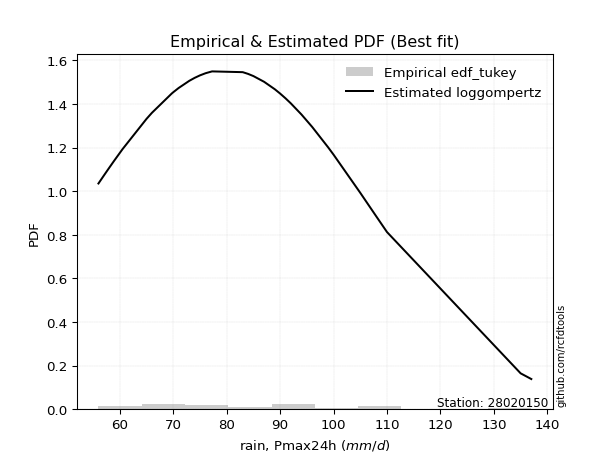</img>

</div>


### 8. Empirical - EDF Gringorten (1963)

Gringorten plotting position formula is essential for estimating the probability and return periods of extreme events like floods and heavy rainfall. The constant _a=0.44_.

<div align="center">


$P=(m-a)/(n+1-2a)$


</div>


**8.1. Empirical values**

<div align="center">

|                | 0                    | 1                   | 2                   | 3                  | 4                   | 5                   | 6                   | 7                   | 8                   | 9                  | 10                  | 11                  | 12                 | 13                 | 14                 | 15                 | 16                  | 17                 | 18                 | 19                 | 20                 | 21                  | 22                 | 23                 | 24             | 25                 | 26                 | 27                 | 28                 | 29                 | 30                 | 31                 | 32                 | 33                 | 34                 | 35                 | 36                 | 37                 | 38                 | 39                 | 40                 | 41                 | 42                 | 43                 | 44                 | 45                 | 46                 | 47                 | 48                 |
|:---------------|:---------------------|:--------------------|:--------------------|:-------------------|:--------------------|:--------------------|:--------------------|:--------------------|:--------------------|:-------------------|:--------------------|:--------------------|:-------------------|:-------------------|:-------------------|:-------------------|:--------------------|:-------------------|:-------------------|:-------------------|:-------------------|:--------------------|:-------------------|:-------------------|:---------------|:-------------------|:-------------------|:-------------------|:-------------------|:-------------------|:-------------------|:-------------------|:-------------------|:-------------------|:-------------------|:-------------------|:-------------------|:-------------------|:-------------------|:-------------------|:-------------------|:-------------------|:-------------------|:-------------------|:-------------------|:-------------------|:-------------------|:-------------------|:-------------------|
| date           | 1986                 | 1961                | 1967                | 1997               | 1985                | 1982                | 1990                | 1991                | 2002                | 2015               | 1983                | 1987                | 2013               | 2019               | 2003               | 2012               | 2014                | 2007               | 2001               | 2018               | 1963               | 2006                | 1984               | 1981               | 2022           | 1998               | 2020               | 1989               | 2000               | 1994               | 1988               | 2021               | 2010               | 2016               | 1965               | 1960               | 1962               | 1995               | 1964               | 2008               | 2017               | 2004               | 1993               | 2011               | 2009               | 1999               | 2005               | 1992               | 1996               |
| x              | 56.0                 | 57.0                | 57.70139503         | 58.0               | 58.89288117         | 60.50959058         | 65.0                | 65.0                | 65.0                | 66.0               | 69.74092411         | 70.0                | 70.0               | 70.0               | 70.0               | 71.0               | 73.0                | 73.0               | 74.0               | 75.0               | 75.0               | 76.0                | 76.09928433        | 77.26118637        | 83.0           | 84.0               | 85.0               | 87.0               | 87.0               | 89.0               | 90.0               | 91.0               | 92.0               | 92.0               | 92.0               | 94.0               | 94.0               | 96.0               | 99.0               | 100.0              | 100.0              | 105.0              | 108.0              | 108.0              | 110.0              | 110.0              | 110.0              | 135.0              | 137.0              |
| m              | 1                    | 2                   | 3                   | 4                  | 5                   | 6                   | 7                   | 8                   | 9                   | 10                 | 11                  | 12                  | 13                 | 14                 | 15                 | 16                 | 17                  | 18                 | 19                 | 20                 | 21                 | 22                  | 23                 | 24                 | 25             | 26                 | 27                 | 28                 | 29                 | 30                 | 31                 | 32                 | 33                 | 34                 | 35                 | 36                 | 37                 | 38                 | 39                 | 40                 | 41                 | 42                 | 43                 | 44                 | 45                 | 46                 | 47                 | 48                 | 49                 |
| empirical_dist | edf_gringorten       | edf_gringorten      | edf_gringorten      | edf_gringorten     | edf_gringorten      | edf_gringorten      | edf_gringorten      | edf_gringorten      | edf_gringorten      | edf_gringorten     | edf_gringorten      | edf_gringorten      | edf_gringorten     | edf_gringorten     | edf_gringorten     | edf_gringorten     | edf_gringorten      | edf_gringorten     | edf_gringorten     | edf_gringorten     | edf_gringorten     | edf_gringorten      | edf_gringorten     | edf_gringorten     | edf_gringorten | edf_gringorten     | edf_gringorten     | edf_gringorten     | edf_gringorten     | edf_gringorten     | edf_gringorten     | edf_gringorten     | edf_gringorten     | edf_gringorten     | edf_gringorten     | edf_gringorten     | edf_gringorten     | edf_gringorten     | edf_gringorten     | edf_gringorten     | edf_gringorten     | edf_gringorten     | edf_gringorten     | edf_gringorten     | edf_gringorten     | edf_gringorten     | edf_gringorten     | edf_gringorten     | edf_gringorten     |
| empirical      | 0.011400651465798047 | 0.03175895765472313 | 0.05211726384364821 | 0.0724755700325733 | 0.09283387622149837 | 0.11319218241042345 | 0.13355048859934854 | 0.15390879478827363 | 0.17426710097719872 | 0.1946254071661238 | 0.21498371335504887 | 0.23534201954397396 | 0.255700325732899  | 0.2760586319218241 | 0.2964169381107492 | 0.3167752442996743 | 0.33713355048859933 | 0.3574918566775244 | 0.3778501628664495 | 0.3982084690553746 | 0.4185667752442997 | 0.43892508143322473 | 0.4592833876221498 | 0.4796416938110749 | 0.5            | 0.5203583061889251 | 0.5407166123778502 | 0.5610749185667753 | 0.5814332247557004 | 0.6017915309446255 | 0.6221498371335505 | 0.6425081433224755 | 0.6628664495114007 | 0.6832247557003258 | 0.7035830618892509 | 0.723941368078176  | 0.7442996742671011 | 0.7646579804560262 | 0.7850162866449513 | 0.8053745928338764 | 0.8257328990228014 | 0.8460912052117264 | 0.8664495114006515 | 0.8868078175895766 | 0.9071661237785017 | 0.9275244299674268 | 0.9478827361563519 | 0.968241042345277  | 0.9885993485342021 |
| empirical_tr   | 1.0115321252059308   | 1.0328006728343146  | 1.0549828178694158  | 1.0781387181738367 | 1.1023339317773788  | 1.1276400367309458  | 1.1541353383458648  | 1.1819056785370547  | 1.211045364891519   | 1.2416582406471182 | 1.2738589211618256  | 1.3077742279020235  | 1.3435448577680524 | 1.3813273340832397 | 1.4212962962962963 | 1.4636471990464839 | 1.5085995085995085  | 1.5564005069708493 | 1.607329842931937  | 1.6617050067659    | 1.7198879551820727 | 1.7822931785195935  | 1.8493975903614457 | 1.921752738654147  | 2.0            | 2.0848896434634976 | 2.1773049645390072 | 2.2782931354359928 | 2.389105058365759  | 2.5112474437627816 | 2.6465517241379315 | 2.7972665148063776 | 2.966183574879228  | 3.1568123393316205 | 3.3736263736263745 | 3.6224188790560485 | 3.910828025477709  | 4.249134948096888  | 4.651515151515154  | 5.138075313807535  | 5.738317757009351  | 6.497354497354499  | 7.487804878048784  | 8.834532374100725  | 10.771929824561411 | 13.797752808988779 | 19.187500000000032 | 31.487179487179585 | 87.71428571428653  |

</div>


**8.2. Kolmogorov-Smirnov fit test (sorted by Δ)**


<div align="center">

|                | 0                   | 1                   | 2                   | 3                  | 4                   | 5                   | 6                   | 7                  | 8                   | 9                   | 10                  | 11                  | 12                 | 13                 | 14                  | 15                  | 16                 | 17                  | 18                  | 19                  | 20                  | 21                  | 22                 | 23                  | 24                  | 25                  | 26                  | 27                  | 28                  | 29                 | 30                 | 31                 | 32                  | 33                  | 34                  | 35                  | 36                 | 37                 | 38                  | 39                  | 40                 | 41                  | 42                  | 43                  | 44                  | 45                 | 46                  | 47                  | 48                  | 49                  | 50                  | 51                  | 52                  | 53                  | 54                 | 55                  | 56                  | 57                  | 58                 | 59                  | 60                  | 61                  | 62                  | 63                  | 64                  | 65                  | 66                  | 67                  | 68                 | 69                  | 70                 | 71                    | 72                  | 73                  | 74                  | 75                 | 76                  | 77                  | 78                  | 79                  | 80                  | 81                  | 82                 | 83                  | 84                 | 85                 | 86                 | 87                 | 88                 | 89                 |
|:---------------|:--------------------|:--------------------|:--------------------|:-------------------|:--------------------|:--------------------|:--------------------|:-------------------|:--------------------|:--------------------|:--------------------|:--------------------|:-------------------|:-------------------|:--------------------|:--------------------|:-------------------|:--------------------|:--------------------|:--------------------|:--------------------|:--------------------|:-------------------|:--------------------|:--------------------|:--------------------|:--------------------|:--------------------|:--------------------|:-------------------|:-------------------|:-------------------|:--------------------|:--------------------|:--------------------|:--------------------|:-------------------|:-------------------|:--------------------|:--------------------|:-------------------|:--------------------|:--------------------|:--------------------|:--------------------|:-------------------|:--------------------|:--------------------|:--------------------|:--------------------|:--------------------|:--------------------|:--------------------|:--------------------|:-------------------|:--------------------|:--------------------|:--------------------|:-------------------|:--------------------|:--------------------|:--------------------|:--------------------|:--------------------|:--------------------|:--------------------|:--------------------|:--------------------|:-------------------|:--------------------|:-------------------|:----------------------|:--------------------|:--------------------|:--------------------|:-------------------|:--------------------|:--------------------|:--------------------|:--------------------|:--------------------|:--------------------|:-------------------|:--------------------|:-------------------|:-------------------|:-------------------|:-------------------|:-------------------|:-------------------|
| station        | 28020150            | 28020150            | 28020150            | 28020150           | 28020150            | 28020150            | 28020150            | 28020150           | 28020150            | 28020150            | 28020150            | 28020150            | 28020150           | 28020150           | 28020150            | 28020150            | 28020150           | 28020150            | 28020150            | 28020150            | 28020150            | 28020150            | 28020150           | 28020150            | 28020150            | 28020150            | 28020150            | 28020150            | 28020150            | 28020150           | 28020150           | 28020150           | 28020150            | 28020150            | 28020150            | 28020150            | 28020150           | 28020150           | 28020150            | 28020150            | 28020150           | 28020150            | 28020150            | 28020150            | 28020150            | 28020150           | 28020150            | 28020150            | 28020150            | 28020150            | 28020150            | 28020150            | 28020150            | 28020150            | 28020150           | 28020150            | 28020150            | 28020150            | 28020150           | 28020150            | 28020150            | 28020150            | 28020150            | 28020150            | 28020150            | 28020150            | 28020150            | 28020150            | 28020150           | 28020150            | 28020150           | 28020150              | 28020150            | 28020150            | 28020150            | 28020150           | 28020150            | 28020150            | 28020150            | 28020150            | 28020150            | 28020150            | 28020150           | 28020150            | 28020150           | 28020150           | 28020150           | 28020150           | 28020150           | 28020150           |
| empirical_dist | edf_gringorten      | edf_gringorten      | edf_gringorten      | edf_gringorten     | edf_gringorten      | edf_gringorten      | edf_gringorten      | edf_gringorten     | edf_gringorten      | edf_gringorten      | edf_gringorten      | edf_gringorten      | edf_gringorten     | edf_gringorten     | edf_gringorten      | edf_gringorten      | edf_gringorten     | edf_gringorten      | edf_gringorten      | edf_gringorten      | edf_gringorten      | edf_gringorten      | edf_gringorten     | edf_gringorten      | edf_gringorten      | edf_gringorten      | edf_gringorten      | edf_gringorten      | edf_gringorten      | edf_gringorten     | edf_gringorten     | edf_gringorten     | edf_gringorten      | edf_gringorten      | edf_gringorten      | edf_gringorten      | edf_gringorten     | edf_gringorten     | edf_gringorten      | edf_gringorten      | edf_gringorten     | edf_gringorten      | edf_gringorten      | edf_gringorten      | edf_gringorten      | edf_gringorten     | edf_gringorten      | edf_gringorten      | edf_gringorten      | edf_gringorten      | edf_gringorten      | edf_gringorten      | edf_gringorten      | edf_gringorten      | edf_gringorten     | edf_gringorten      | edf_gringorten      | edf_gringorten      | edf_gringorten     | edf_gringorten      | edf_gringorten      | edf_gringorten      | edf_gringorten      | edf_gringorten      | edf_gringorten      | edf_gringorten      | edf_gringorten      | edf_gringorten      | edf_gringorten     | edf_gringorten      | edf_gringorten     | edf_gringorten        | edf_gringorten      | edf_gringorten      | edf_gringorten      | edf_gringorten     | edf_gringorten      | edf_gringorten      | edf_gringorten      | edf_gringorten      | edf_gringorten      | edf_gringorten      | edf_gringorten     | edf_gringorten      | edf_gringorten     | edf_gringorten     | edf_gringorten     | edf_gringorten     | edf_gringorten     | edf_gringorten     |
| p_dist         | loggompertz         | kstwobign           | logrice             | logalpha           | alpha               | logjohnsonsu        | loglognorm          | lognct             | rayleigh            | invweibull          | genlogistic         | nct                 | invgamma           | logpearson3        | logfatiguelife      | gumbel_r            | weibull_min        | logmaxwell          | logfisk             | johnsonsu           | logweibull_min      | betaprime           | logf               | loggamma            | loggamma            | logerlang           | invgauss            | fatiguelife         | pearson3            | f                  | loginvgauss        | loginvgamma        | logexponnorm        | lograyleigh         | chi2                | erlang              | gamma              | maxwell            | halfnorm            | fisk                | logt               | lognorm             | lognorm             | logcrystalball      | logmielke           | exponnorm          | logloggamma         | mielke              | loggenlogistic      | lognakagami         | loginvweibull       | rice                | moyal               | logkstwobign        | loglogistic        | laplace_asymmetric  | loghalfnorm         | halflogistic        | loggumbel_r        | t                   | loghypsecant        | nakagami            | crystalball         | norm                | loggenexpon         | loghalflogistic     | logistic            | logmoyal            | loglaplace         | hypsecant           | loggumbel_l        | loglaplace_asymmetric | genexpon            | expon               | pareto              | gumbel_l           | laplace             | wald                | logwald             | logbetaprime        | logtruncnorm        | logncf              | logexpon           | logpareto           | loggibrat          | gibrat             | logchi2            | ncf                | gompertz           | truncnorm          |
| delta          | 0.05969815684552712 | 0.06642402507715006 | 0.06928256566304514 | 0.0699673335109463 | 0.07079558923549112 | 0.07227040464978984 | 0.07282498079228172 | 0.0732491818592611 | 0.07344372608799832 | 0.07382449759051357 | 0.07407340518982442 | 0.07418767790309133 | 0.0742323521230216 | 0.0743159985627615 | 0.07443831515615384 | 0.07455721849725316 | 0.0747569461322607 | 0.07502152208564139 | 0.07547684170337632 | 0.07605427558280453 | 0.07680967260464588 | 0.07698945190676038 | 0.0773759526959864 | 0.07762962091040393 | 0.07762962091040393 | 0.07763004763532255 | 0.07802202304489547 | 0.07895765377638198 | 0.07930640223772562 | 0.079531263368942  | 0.0795458703625046 | 0.0797643701945897 | 0.08271363727765269 | 0.08290463132867198 | 0.08353444328378834 | 0.08353498578401897 | 0.0835351549785236 | 0.0854086010561732 | 0.08643388196639043 | 0.08660803885210244 | 0.0872398969796786 | 0.08724029847789716 | 0.08724029847789716 | 0.08724392462489317 | 0.08748771576738079 | 0.0879365680353329 | 0.08810919592135052 | 0.08899476478349733 | 0.08905778536689113 | 0.09354758217818682 | 0.09518017583816385 | 0.09568513458033967 | 0.09880879295854361 | 0.10007307960871803 | 0.1031323745383338 | 0.10684983468038711 | 0.11319218241042345 | 0.11319218241042345 | 0.1148161657226261 | 0.11511960138651489 | 0.11579079824275096 | 0.11587662056224227 | 0.11686082351585969 | 0.11686085815119684 | 0.11955689169918318 | 0.13377647204866527 | 0.13543669959623733 | 0.13699469048634605 | 0.1441669178936814 | 0.14971775909156387 | 0.1504386672826784 | 0.15558381476938182   | 0.17171525520958883 | 0.17478263084468829 | 0.17478263816760306 | 0.1767574601714238 | 0.17764199875993453 | 0.19443971571310725 | 0.19895779725513918 | 0.20898331437369067 | 0.21650448256722357 | 0.22116851493112066 | 0.2248344205219068 | 0.22483443539106915 | 0.2778082616172674 | 0.2909109062453639 | 0.38003666210651   | 0.5872689040955339 | 0.7506083174878249 | 0.8164878968118942 |
| deltao         | 0.1942857142857143  | 0.1942857142857143  | 0.1942857142857143  | 0.1942857142857143 | 0.1942857142857143  | 0.1942857142857143  | 0.1942857142857143  | 0.1942857142857143 | 0.1942857142857143  | 0.1942857142857143  | 0.1942857142857143  | 0.1942857142857143  | 0.1942857142857143 | 0.1942857142857143 | 0.1942857142857143  | 0.1942857142857143  | 0.1942857142857143 | 0.1942857142857143  | 0.1942857142857143  | 0.1942857142857143  | 0.1942857142857143  | 0.1942857142857143  | 0.1942857142857143 | 0.1942857142857143  | 0.1942857142857143  | 0.1942857142857143  | 0.1942857142857143  | 0.1942857142857143  | 0.1942857142857143  | 0.1942857142857143 | 0.1942857142857143 | 0.1942857142857143 | 0.1942857142857143  | 0.1942857142857143  | 0.1942857142857143  | 0.1942857142857143  | 0.1942857142857143 | 0.1942857142857143 | 0.1942857142857143  | 0.1942857142857143  | 0.1942857142857143 | 0.1942857142857143  | 0.1942857142857143  | 0.1942857142857143  | 0.1942857142857143  | 0.1942857142857143 | 0.1942857142857143  | 0.1942857142857143  | 0.1942857142857143  | 0.1942857142857143  | 0.1942857142857143  | 0.1942857142857143  | 0.1942857142857143  | 0.1942857142857143  | 0.1942857142857143 | 0.1942857142857143  | 0.1942857142857143  | 0.1942857142857143  | 0.1942857142857143 | 0.1942857142857143  | 0.1942857142857143  | 0.1942857142857143  | 0.1942857142857143  | 0.1942857142857143  | 0.1942857142857143  | 0.1942857142857143  | 0.1942857142857143  | 0.1942857142857143  | 0.1942857142857143 | 0.1942857142857143  | 0.1942857142857143 | 0.1942857142857143    | 0.1942857142857143  | 0.1942857142857143  | 0.1942857142857143  | 0.1942857142857143 | 0.1942857142857143  | 0.1942857142857143  | 0.1942857142857143  | 0.1942857142857143  | 0.1942857142857143  | 0.1942857142857143  | 0.1942857142857143 | 0.1942857142857143  | 0.1942857142857143 | 0.1942857142857143 | 0.1942857142857143 | 0.1942857142857143 | 0.1942857142857143 | 0.1942857142857143 |
| eval           | Δo > Δ              | Δo > Δ              | Δo > Δ              | Δo > Δ             | Δo > Δ              | Δo > Δ              | Δo > Δ              | Δo > Δ             | Δo > Δ              | Δo > Δ              | Δo > Δ              | Δo > Δ              | Δo > Δ             | Δo > Δ             | Δo > Δ              | Δo > Δ              | Δo > Δ             | Δo > Δ              | Δo > Δ              | Δo > Δ              | Δo > Δ              | Δo > Δ              | Δo > Δ             | Δo > Δ              | Δo > Δ              | Δo > Δ              | Δo > Δ              | Δo > Δ              | Δo > Δ              | Δo > Δ             | Δo > Δ             | Δo > Δ             | Δo > Δ              | Δo > Δ              | Δo > Δ              | Δo > Δ              | Δo > Δ             | Δo > Δ             | Δo > Δ              | Δo > Δ              | Δo > Δ             | Δo > Δ              | Δo > Δ              | Δo > Δ              | Δo > Δ              | Δo > Δ             | Δo > Δ              | Δo > Δ              | Δo > Δ              | Δo > Δ              | Δo > Δ              | Δo > Δ              | Δo > Δ              | Δo > Δ              | Δo > Δ             | Δo > Δ              | Δo > Δ              | Δo > Δ              | Δo > Δ             | Δo > Δ              | Δo > Δ              | Δo > Δ              | Δo > Δ              | Δo > Δ              | Δo > Δ              | Δo > Δ              | Δo > Δ              | Δo > Δ              | Δo > Δ             | Δo > Δ              | Δo > Δ             | Δo > Δ                | Δo > Δ              | Δo > Δ              | Δo > Δ              | Δo > Δ             | Δo > Δ              | Δo <= Δ             | Δo <= Δ             | Δo <= Δ             | Δo <= Δ             | Δo <= Δ             | Δo <= Δ            | Δo <= Δ             | Δo <= Δ            | Δo <= Δ            | Δo <= Δ            | Δo <= Δ            | Δo <= Δ            | Δo <= Δ            |
| fit            | 1                   | 1                   | 1                   | 1                  | 1                   | 1                   | 1                   | 1                  | 1                   | 1                   | 1                   | 1                   | 1                  | 1                  | 1                   | 1                   | 1                  | 1                   | 1                   | 1                   | 1                   | 1                   | 1                  | 1                   | 1                   | 1                   | 1                   | 1                   | 1                   | 1                  | 1                  | 1                  | 1                   | 1                   | 1                   | 1                   | 1                  | 1                  | 1                   | 1                   | 1                  | 1                   | 1                   | 1                   | 1                   | 1                  | 1                   | 1                   | 1                   | 1                   | 1                   | 1                   | 1                   | 1                   | 1                  | 1                   | 1                   | 1                   | 1                  | 1                   | 1                   | 1                   | 1                   | 1                   | 1                   | 1                   | 1                   | 1                   | 1                  | 1                   | 1                  | 1                     | 1                   | 1                   | 1                   | 1                  | 1                   | 0                   | 0                   | 0                   | 0                   | 0                   | 0                  | 0                   | 0                  | 0                  | 0                  | 0                  | 0                  | 0                  |
| n              | 49                  | 49                  | 49                  | 49                 | 49                  | 49                  | 49                  | 49                 | 49                  | 49                  | 49                  | 49                  | 49                 | 49                 | 49                  | 49                  | 49                 | 49                  | 49                  | 49                  | 49                  | 49                  | 49                 | 49                  | 49                  | 49                  | 49                  | 49                  | 49                  | 49                 | 49                 | 49                 | 49                  | 49                  | 49                  | 49                  | 49                 | 49                 | 49                  | 49                  | 49                 | 49                  | 49                  | 49                  | 49                  | 49                 | 49                  | 49                  | 49                  | 49                  | 49                  | 49                  | 49                  | 49                  | 49                 | 49                  | 49                  | 49                  | 49                 | 49                  | 49                  | 49                  | 49                  | 49                  | 49                  | 49                  | 49                  | 49                  | 49                 | 49                  | 49                 | 49                    | 49                  | 49                  | 49                  | 49                 | 49                  | 49                  | 49                  | 49                  | 49                  | 49                  | 49                 | 49                  | 49                 | 49                 | 49                 | 49                 | 49                 | 49                 |
| best_fit       | 1                   | 0                   | 0                   | 0                  | 0                   | 0                   | 0                   | 0                  | 0                   | 0                   | 0                   | 0                   | 0                  | 0                  | 0                   | 0                   | 0                  | 0                   | 0                   | 0                   | 0                   | 0                   | 0                  | 0                   | 0                   | 0                   | 0                   | 0                   | 0                   | 0                  | 0                  | 0                  | 0                   | 0                   | 0                   | 0                   | 0                  | 0                  | 0                   | 0                   | 0                  | 0                   | 0                   | 0                   | 0                   | 0                  | 0                   | 0                   | 0                   | 0                   | 0                   | 0                   | 0                   | 0                   | 0                  | 0                   | 0                   | 0                   | 0                  | 0                   | 0                   | 0                   | 0                   | 0                   | 0                   | 0                   | 0                   | 0                   | 0                  | 0                   | 0                  | 0                     | 0                   | 0                   | 0                   | 0                  | 0                   | 0                   | 0                   | 0                   | 0                   | 0                   | 0                  | 0                   | 0                  | 0                  | 0                  | 0                  | 0                  | 0                  |
| best_fit_sort  | 1                   | 2                   | 3                   | 4                  | 5                   | 6                   | 7                   | 8                  | 9                   | 10                  | 11                  | 12                  | 13                 | 14                 | 15                  | 16                  | 17                 | 18                  | 19                  | 20                  | 21                  | 22                  | 23                 | 24                  | 25                  | 26                  | 27                  | 28                  | 29                  | 30                 | 31                 | 32                 | 33                  | 34                  | 35                  | 36                  | 37                 | 38                 | 39                  | 40                  | 41                 | 42                  | 43                  | 44                  | 45                  | 46                 | 47                  | 48                  | 49                  | 50                  | 51                  | 52                  | 53                  | 54                  | 55                 | 56                  | 57                  | 58                  | 59                 | 60                  | 61                  | 62                  | 63                  | 64                  | 65                  | 66                  | 67                  | 68                  | 69                 | 70                  | 71                 | 72                    | 73                  | 74                  | 75                  | 76                 | 77                  | 78                  | 79                  | 80                  | 81                  | 82                  | 83                 | 84                  | 85                 | 86                 | 87                 | 88                 | 89                 | 90                 |

</div>


<div align="center">

</img>

</div>


**8.3. Best fit**

<div align="center">

|   id |   station | empirical_dist   | p_dist      |     delta |   deltao | eval   |   fit |   n |   best_fit |   best_fit_sort |
|-----:|----------:|:-----------------|:------------|----------:|---------:|:-------|------:|----:|-----------:|----------------:|
|    0 |  28020150 | edf_gringorten   | loggompertz | 0.0596982 | 0.194286 | Δo > Δ |     1 |  49 |          1 |               1 |

</div>


<div align="center">

</img></img>

</div>


### 9. Empirical - EDF Filliben (1975)

The specific values of the constants (0.3175) (often denoted as $alpha$) and (0.365) are derived from a method proposed by James J. Filliben in a 1975 paper. This particular formula is the mean value of the $i$-th order statistic of the normal distribution and is considered a robust and effective plotting position formula for the normal probability plot correlation coefficient test for normality.

<div align="center">


$P=(m-0.3175)/(n+0.365)$


</div>


**9.1. Empirical values**

<div align="center">

|                | 0                    | 1                   | 2                   | 3                   | 4                   | 5                   | 6                   | 7                  | 8                   | 9                   | 10                  | 11                 | 12                  | 13                 | 14                  | 15                 | 16                 | 17                  | 18                 | 19                 | 20                 | 21                  | 22                 | 23                  | 24           | 25                | 26                 | 27                 | 28                 | 29                 | 30                 | 31                 | 32                 | 33                 | 34                 | 35                 | 36                 | 37                 | 38                 | 39                 | 40                 | 41                 | 42                | 43                 | 44                 | 45                 | 46                 | 47                 | 48                 |
|:---------------|:---------------------|:--------------------|:--------------------|:--------------------|:--------------------|:--------------------|:--------------------|:-------------------|:--------------------|:--------------------|:--------------------|:-------------------|:--------------------|:-------------------|:--------------------|:-------------------|:-------------------|:--------------------|:-------------------|:-------------------|:-------------------|:--------------------|:-------------------|:--------------------|:-------------|:------------------|:-------------------|:-------------------|:-------------------|:-------------------|:-------------------|:-------------------|:-------------------|:-------------------|:-------------------|:-------------------|:-------------------|:-------------------|:-------------------|:-------------------|:-------------------|:-------------------|:------------------|:-------------------|:-------------------|:-------------------|:-------------------|:-------------------|:-------------------|
| date           | 1986                 | 1961                | 1967                | 1997                | 1985                | 1982                | 1990                | 1991               | 2002                | 2015                | 1983                | 1987               | 2013                | 2019               | 2003                | 2012               | 2014               | 2007                | 2001               | 2018               | 1963               | 2006                | 1984               | 1981                | 2022         | 1998              | 2020               | 1989               | 2000               | 1994               | 1988               | 2021               | 2010               | 2016               | 1965               | 1960               | 1962               | 1995               | 1964               | 2008               | 2017               | 2004               | 1993              | 2011               | 2009               | 1999               | 2005               | 1992               | 1996               |
| x              | 56.0                 | 57.0                | 57.70139503         | 58.0                | 58.89288117         | 60.50959058         | 65.0                | 65.0               | 65.0                | 66.0                | 69.74092411         | 70.0               | 70.0                | 70.0               | 70.0                | 71.0               | 73.0               | 73.0                | 74.0               | 75.0               | 75.0               | 76.0                | 76.09928433        | 77.26118637         | 83.0         | 84.0              | 85.0               | 87.0               | 87.0               | 89.0               | 90.0               | 91.0               | 92.0               | 92.0               | 92.0               | 94.0               | 94.0               | 96.0               | 99.0               | 100.0              | 100.0              | 105.0              | 108.0             | 108.0              | 110.0              | 110.0              | 110.0              | 135.0              | 137.0              |
| m              | 1                    | 2                   | 3                   | 4                   | 5                   | 6                   | 7                   | 8                  | 9                   | 10                  | 11                  | 12                 | 13                  | 14                 | 15                  | 16                 | 17                 | 18                  | 19                 | 20                 | 21                 | 22                  | 23                 | 24                  | 25           | 26                | 27                 | 28                 | 29                 | 30                 | 31                 | 32                 | 33                 | 34                 | 35                 | 36                 | 37                 | 38                 | 39                 | 40                 | 41                 | 42                 | 43                | 44                 | 45                 | 46                 | 47                 | 48                 | 49                 |
| empirical_dist | edf_filliben         | edf_filliben        | edf_filliben        | edf_filliben        | edf_filliben        | edf_filliben        | edf_filliben        | edf_filliben       | edf_filliben        | edf_filliben        | edf_filliben        | edf_filliben       | edf_filliben        | edf_filliben       | edf_filliben        | edf_filliben       | edf_filliben       | edf_filliben        | edf_filliben       | edf_filliben       | edf_filliben       | edf_filliben        | edf_filliben       | edf_filliben        | edf_filliben | edf_filliben      | edf_filliben       | edf_filliben       | edf_filliben       | edf_filliben       | edf_filliben       | edf_filliben       | edf_filliben       | edf_filliben       | edf_filliben       | edf_filliben       | edf_filliben       | edf_filliben       | edf_filliben       | edf_filliben       | edf_filliben       | edf_filliben       | edf_filliben      | edf_filliben       | edf_filliben       | edf_filliben       | edf_filliben       | edf_filliben       | edf_filliben       |
| empirical      | 0.013825584928593131 | 0.03408285222323509 | 0.05434011951787704 | 0.07459738681251898 | 0.09485465410716094 | 0.11511192140180289 | 0.13536918869644485 | 0.1556264559910868 | 0.17588372328572874 | 0.19614099058037068 | 0.21639825787501263 | 0.2366555251696546 | 0.25691279246429655 | 0.2771700597589385 | 0.29742732705358044 | 0.3176845943482224 | 0.3379418616428644 | 0.35819912893750633 | 0.3784563962321483 | 0.3987136635267902 | 0.4189709308214322 | 0.43922819811607416 | 0.4594854654107161 | 0.47974273270535805 | 0.5          | 0.520257267294642 | 0.5405145345892839 | 0.5607718018839258 | 0.5810290691785678 | 0.6012863364732097 | 0.6215436037678517 | 0.6418008710624936 | 0.6620581383571356 | 0.6823154056517775 | 0.7025726729464195 | 0.7228299402410614 | 0.7430872075357033 | 0.7633444748303453 | 0.7836017421249872 | 0.8038590094196292 | 0.8241162767142711 | 0.8443735440089131 | 0.864630811303555 | 0.8848880785981971 | 0.905145345892839  | 0.925402613187481  | 0.9456598804821229 | 0.9659171477767649 | 0.9861744150714068 |
| empirical_tr   | 1.0140194114928363   | 1.0352854820951083  | 1.0574626466020456  | 1.0806107371531768  | 1.104794942091423   | 1.130086419046529   | 1.1565629942013707  | 1.1843099622143585 | 1.2134210041172495  | 1.243999243999244   | 1.2761584695921928  | 1.3100245472036092 | 1.3457370680842362  | 1.3834512716317522 | 1.4233403013046926  | 1.4655978623914494 | 1.510441367704429  | 1.558115679002604   | 1.6088975800537768 | 1.663101153878548  | 1.7210842848426742 | 1.783256570035221   | 1.85008900965052   | 1.9221259612576658  | 2.0          | 2.084450543650375 | 2.1763474043866418 | 2.2767208578346594 | 2.3868004351504895 | 2.5080655404547185 | 2.6423123243677233 | 2.7917432489749747 | 2.9590888655777006 | 3.1477761836441887 | 3.3621658436914688 | 3.607893294354101  | 3.8923713778829083 | 4.225551037877165  | 4.621109290896324  | 5.098373353989153  | 5.685574431327379  | 6.4256426944354    | 7.38720538720538  | 8.687197536295642  | 10.542445274959952 | 13.405295315682272 | 18.402609506057765 | 29.340267459138133 | 72.32967032966995  |

</div>


**9.2. Kolmogorov-Smirnov fit test (sorted by Δ)**


<div align="center">

|                | 0                    | 1                  | 2                   | 3                   | 4                   | 5                   | 6                   | 7                  | 8                   | 9                   | 10                  | 11                  | 12                  | 13                  | 14                  | 15                 | 16                  | 17                  | 18                  | 19                  | 20                  | 21                  | 22                  | 23                  | 24                  | 25                  | 26                  | 27                  | 28                 | 29                  | 30                  | 31                 | 32                  | 33                  | 34                  | 35                 | 36                  | 37                 | 38                  | 39                  | 40                  | 41                  | 42                  | 43                  | 44                  | 45                  | 46                 | 47                  | 48                  | 49                  | 50                  | 51                  | 52                  | 53                  | 54                  | 55                  | 56                  | 57                  | 58                  | 59                  | 60                  | 61                  | 62                  | 63                  | 64                  | 65                 | 66                  | 67                  | 68                 | 69                  | 70                 | 71                    | 72                  | 73                  | 74                 | 75                  | 76                  | 77                  | 78                  | 79                 | 80                  | 81                 | 82                  | 83                 | 84                  | 85                  | 86                 | 87                 | 88                 | 89                 |
|:---------------|:---------------------|:-------------------|:--------------------|:--------------------|:--------------------|:--------------------|:--------------------|:-------------------|:--------------------|:--------------------|:--------------------|:--------------------|:--------------------|:--------------------|:--------------------|:-------------------|:--------------------|:--------------------|:--------------------|:--------------------|:--------------------|:--------------------|:--------------------|:--------------------|:--------------------|:--------------------|:--------------------|:--------------------|:-------------------|:--------------------|:--------------------|:-------------------|:--------------------|:--------------------|:--------------------|:-------------------|:--------------------|:-------------------|:--------------------|:--------------------|:--------------------|:--------------------|:--------------------|:--------------------|:--------------------|:--------------------|:-------------------|:--------------------|:--------------------|:--------------------|:--------------------|:--------------------|:--------------------|:--------------------|:--------------------|:--------------------|:--------------------|:--------------------|:--------------------|:--------------------|:--------------------|:--------------------|:--------------------|:--------------------|:--------------------|:-------------------|:--------------------|:--------------------|:-------------------|:--------------------|:-------------------|:----------------------|:--------------------|:--------------------|:-------------------|:--------------------|:--------------------|:--------------------|:--------------------|:-------------------|:--------------------|:-------------------|:--------------------|:-------------------|:--------------------|:--------------------|:-------------------|:-------------------|:-------------------|:-------------------|
| station        | 28020150             | 28020150           | 28020150            | 28020150            | 28020150            | 28020150            | 28020150            | 28020150           | 28020150            | 28020150            | 28020150            | 28020150            | 28020150            | 28020150            | 28020150            | 28020150           | 28020150            | 28020150            | 28020150            | 28020150            | 28020150            | 28020150            | 28020150            | 28020150            | 28020150            | 28020150            | 28020150            | 28020150            | 28020150           | 28020150            | 28020150            | 28020150           | 28020150            | 28020150            | 28020150            | 28020150           | 28020150            | 28020150           | 28020150            | 28020150            | 28020150            | 28020150            | 28020150            | 28020150            | 28020150            | 28020150            | 28020150           | 28020150            | 28020150            | 28020150            | 28020150            | 28020150            | 28020150            | 28020150            | 28020150            | 28020150            | 28020150            | 28020150            | 28020150            | 28020150            | 28020150            | 28020150            | 28020150            | 28020150            | 28020150            | 28020150           | 28020150            | 28020150            | 28020150           | 28020150            | 28020150           | 28020150              | 28020150            | 28020150            | 28020150           | 28020150            | 28020150            | 28020150            | 28020150            | 28020150           | 28020150            | 28020150           | 28020150            | 28020150           | 28020150            | 28020150            | 28020150           | 28020150           | 28020150           | 28020150           |
| empirical_dist | edf_filliben         | edf_filliben       | edf_filliben        | edf_filliben        | edf_filliben        | edf_filliben        | edf_filliben        | edf_filliben       | edf_filliben        | edf_filliben        | edf_filliben        | edf_filliben        | edf_filliben        | edf_filliben        | edf_filliben        | edf_filliben       | edf_filliben        | edf_filliben        | edf_filliben        | edf_filliben        | edf_filliben        | edf_filliben        | edf_filliben        | edf_filliben        | edf_filliben        | edf_filliben        | edf_filliben        | edf_filliben        | edf_filliben       | edf_filliben        | edf_filliben        | edf_filliben       | edf_filliben        | edf_filliben        | edf_filliben        | edf_filliben       | edf_filliben        | edf_filliben       | edf_filliben        | edf_filliben        | edf_filliben        | edf_filliben        | edf_filliben        | edf_filliben        | edf_filliben        | edf_filliben        | edf_filliben       | edf_filliben        | edf_filliben        | edf_filliben        | edf_filliben        | edf_filliben        | edf_filliben        | edf_filliben        | edf_filliben        | edf_filliben        | edf_filliben        | edf_filliben        | edf_filliben        | edf_filliben        | edf_filliben        | edf_filliben        | edf_filliben        | edf_filliben        | edf_filliben        | edf_filliben       | edf_filliben        | edf_filliben        | edf_filliben       | edf_filliben        | edf_filliben       | edf_filliben          | edf_filliben        | edf_filliben        | edf_filliben       | edf_filliben        | edf_filliben        | edf_filliben        | edf_filliben        | edf_filliben       | edf_filliben        | edf_filliben       | edf_filliben        | edf_filliben       | edf_filliben        | edf_filliben        | edf_filliben       | edf_filliben       | edf_filliben       | edf_filliben       |
| p_dist         | loggompertz          | kstwobign          | logrice             | logalpha            | alpha               | logjohnsonsu        | loglognorm          | lognct             | rayleigh            | invweibull          | genlogistic         | nct                 | logpearson3         | invgamma            | logfatiguelife      | gumbel_r           | weibull_min         | logmaxwell          | logfisk             | johnsonsu           | logweibull_min      | betaprime           | logf                | loggamma            | loggamma            | logerlang           | invgauss            | fatiguelife         | pearson3           | f                   | loginvgauss         | loginvgamma        | logexponnorm        | lograyleigh         | chi2                | erlang             | gamma               | maxwell            | fisk                | logt                | lognorm             | lognorm             | logcrystalball      | logmielke           | exponnorm           | logloggamma         | halfnorm           | mielke              | loggenlogistic      | lognakagami         | loginvweibull       | rice                | moyal               | logkstwobign        | loglogistic         | laplace_asymmetric  | nakagami            | loghalfnorm         | halflogistic        | loggumbel_r         | t                   | loghypsecant        | crystalball         | norm                | loggenexpon         | loghalflogistic    | logistic            | logmoyal            | loglaplace         | hypsecant           | loggumbel_l        | loglaplace_asymmetric | genexpon            | expon               | pareto             | gumbel_l            | laplace             | wald                | logwald             | logbetaprime       | logtruncnorm        | logncf             | logexpon            | logpareto          | loggibrat           | gibrat              | logchi2            | ncf                | gompertz           | truncnorm          |
| delta          | 0.058283612325563366 | 0.0667271417599995 | 0.06958568234589457 | 0.07027045019379574 | 0.07109870591834055 | 0.07257352133263928 | 0.07312809747513116 | 0.0734512596478274 | 0.07364580387656461 | 0.07412761427336301 | 0.07437652187267385 | 0.07449079458594077 | 0.07451807635132779 | 0.07453546880587103 | 0.07474143183900328 | 0.0748603351801026 | 0.07506006281511013 | 0.07532463876849083 | 0.07577995838622575 | 0.07635739226565397 | 0.07711278928749532 | 0.07719152969532667 | 0.07767906937883584 | 0.07793273759325337 | 0.07793273759325337 | 0.07793316431817199 | 0.07832513972774491 | 0.07926077045923141 | 0.0795084800262919 | 0.07983438005179144 | 0.07984898704535404 | 0.079966447983156  | 0.08291571506621898 | 0.08320774801152142 | 0.08383755996663778 | 0.0838381024668684 | 0.08383827166137303 | 0.0856106788447395 | 0.08681011664066873 | 0.08744197476824489 | 0.08744237626646345 | 0.08744237626646345 | 0.08744600241345946 | 0.08779083245023023 | 0.08823968471818233 | 0.08831127370991682 | 0.088454659852053  | 0.08929788146634676 | 0.08936090204974056 | 0.09385069886103625 | 0.09548329252101329 | 0.09588721236890596 | 0.09911190964139305 | 0.10037619629156747 | 0.10333445232690008 | 0.10715295136323655 | 0.11446207604227851 | 0.11511192140180289 | 0.11511192140180289 | 0.11511928240547553 | 0.11532167917508118 | 0.11599287603131725 | 0.11706290130442598 | 0.11706293593976314 | 0.11814234717921943 | 0.1340795887315147 | 0.13563877738480362 | 0.13729780716919548 | 0.1443689956822477 | 0.14991983688013016 | 0.1506407450712447 | 0.15568485366366497   | 0.17030071068962507 | 0.17336808632472453 | 0.1733680936476393 | 0.17685849906570694 | 0.17784407654850082 | 0.19595529912735413 | 0.19926091393798862 | 0.2067604586994617 | 0.21508993804725982 | 0.2189456592568917 | 0.22341987600194305 | 0.2234198908711054 | 0.27881865056009864 | 0.29192129518819515 | 0.377813806432281  | 0.5848439706327389 | 0.7489916951792945 | 0.8140629633490991 |
| deltao         | 0.1942857142857143   | 0.1942857142857143 | 0.1942857142857143  | 0.1942857142857143  | 0.1942857142857143  | 0.1942857142857143  | 0.1942857142857143  | 0.1942857142857143 | 0.1942857142857143  | 0.1942857142857143  | 0.1942857142857143  | 0.1942857142857143  | 0.1942857142857143  | 0.1942857142857143  | 0.1942857142857143  | 0.1942857142857143 | 0.1942857142857143  | 0.1942857142857143  | 0.1942857142857143  | 0.1942857142857143  | 0.1942857142857143  | 0.1942857142857143  | 0.1942857142857143  | 0.1942857142857143  | 0.1942857142857143  | 0.1942857142857143  | 0.1942857142857143  | 0.1942857142857143  | 0.1942857142857143 | 0.1942857142857143  | 0.1942857142857143  | 0.1942857142857143 | 0.1942857142857143  | 0.1942857142857143  | 0.1942857142857143  | 0.1942857142857143 | 0.1942857142857143  | 0.1942857142857143 | 0.1942857142857143  | 0.1942857142857143  | 0.1942857142857143  | 0.1942857142857143  | 0.1942857142857143  | 0.1942857142857143  | 0.1942857142857143  | 0.1942857142857143  | 0.1942857142857143 | 0.1942857142857143  | 0.1942857142857143  | 0.1942857142857143  | 0.1942857142857143  | 0.1942857142857143  | 0.1942857142857143  | 0.1942857142857143  | 0.1942857142857143  | 0.1942857142857143  | 0.1942857142857143  | 0.1942857142857143  | 0.1942857142857143  | 0.1942857142857143  | 0.1942857142857143  | 0.1942857142857143  | 0.1942857142857143  | 0.1942857142857143  | 0.1942857142857143  | 0.1942857142857143 | 0.1942857142857143  | 0.1942857142857143  | 0.1942857142857143 | 0.1942857142857143  | 0.1942857142857143 | 0.1942857142857143    | 0.1942857142857143  | 0.1942857142857143  | 0.1942857142857143 | 0.1942857142857143  | 0.1942857142857143  | 0.1942857142857143  | 0.1942857142857143  | 0.1942857142857143 | 0.1942857142857143  | 0.1942857142857143 | 0.1942857142857143  | 0.1942857142857143 | 0.1942857142857143  | 0.1942857142857143  | 0.1942857142857143 | 0.1942857142857143 | 0.1942857142857143 | 0.1942857142857143 |
| eval           | Δo > Δ               | Δo > Δ             | Δo > Δ              | Δo > Δ              | Δo > Δ              | Δo > Δ              | Δo > Δ              | Δo > Δ             | Δo > Δ              | Δo > Δ              | Δo > Δ              | Δo > Δ              | Δo > Δ              | Δo > Δ              | Δo > Δ              | Δo > Δ             | Δo > Δ              | Δo > Δ              | Δo > Δ              | Δo > Δ              | Δo > Δ              | Δo > Δ              | Δo > Δ              | Δo > Δ              | Δo > Δ              | Δo > Δ              | Δo > Δ              | Δo > Δ              | Δo > Δ             | Δo > Δ              | Δo > Δ              | Δo > Δ             | Δo > Δ              | Δo > Δ              | Δo > Δ              | Δo > Δ             | Δo > Δ              | Δo > Δ             | Δo > Δ              | Δo > Δ              | Δo > Δ              | Δo > Δ              | Δo > Δ              | Δo > Δ              | Δo > Δ              | Δo > Δ              | Δo > Δ             | Δo > Δ              | Δo > Δ              | Δo > Δ              | Δo > Δ              | Δo > Δ              | Δo > Δ              | Δo > Δ              | Δo > Δ              | Δo > Δ              | Δo > Δ              | Δo > Δ              | Δo > Δ              | Δo > Δ              | Δo > Δ              | Δo > Δ              | Δo > Δ              | Δo > Δ              | Δo > Δ              | Δo > Δ             | Δo > Δ              | Δo > Δ              | Δo > Δ             | Δo > Δ              | Δo > Δ             | Δo > Δ                | Δo > Δ              | Δo > Δ              | Δo > Δ             | Δo > Δ              | Δo > Δ              | Δo <= Δ             | Δo <= Δ             | Δo <= Δ            | Δo <= Δ             | Δo <= Δ            | Δo <= Δ             | Δo <= Δ            | Δo <= Δ             | Δo <= Δ             | Δo <= Δ            | Δo <= Δ            | Δo <= Δ            | Δo <= Δ            |
| fit            | 1                    | 1                  | 1                   | 1                   | 1                   | 1                   | 1                   | 1                  | 1                   | 1                   | 1                   | 1                   | 1                   | 1                   | 1                   | 1                  | 1                   | 1                   | 1                   | 1                   | 1                   | 1                   | 1                   | 1                   | 1                   | 1                   | 1                   | 1                   | 1                  | 1                   | 1                   | 1                  | 1                   | 1                   | 1                   | 1                  | 1                   | 1                  | 1                   | 1                   | 1                   | 1                   | 1                   | 1                   | 1                   | 1                   | 1                  | 1                   | 1                   | 1                   | 1                   | 1                   | 1                   | 1                   | 1                   | 1                   | 1                   | 1                   | 1                   | 1                   | 1                   | 1                   | 1                   | 1                   | 1                   | 1                  | 1                   | 1                   | 1                  | 1                   | 1                  | 1                     | 1                   | 1                   | 1                  | 1                   | 1                   | 0                   | 0                   | 0                  | 0                   | 0                  | 0                   | 0                  | 0                   | 0                   | 0                  | 0                  | 0                  | 0                  |
| n              | 49                   | 49                 | 49                  | 49                  | 49                  | 49                  | 49                  | 49                 | 49                  | 49                  | 49                  | 49                  | 49                  | 49                  | 49                  | 49                 | 49                  | 49                  | 49                  | 49                  | 49                  | 49                  | 49                  | 49                  | 49                  | 49                  | 49                  | 49                  | 49                 | 49                  | 49                  | 49                 | 49                  | 49                  | 49                  | 49                 | 49                  | 49                 | 49                  | 49                  | 49                  | 49                  | 49                  | 49                  | 49                  | 49                  | 49                 | 49                  | 49                  | 49                  | 49                  | 49                  | 49                  | 49                  | 49                  | 49                  | 49                  | 49                  | 49                  | 49                  | 49                  | 49                  | 49                  | 49                  | 49                  | 49                 | 49                  | 49                  | 49                 | 49                  | 49                 | 49                    | 49                  | 49                  | 49                 | 49                  | 49                  | 49                  | 49                  | 49                 | 49                  | 49                 | 49                  | 49                 | 49                  | 49                  | 49                 | 49                 | 49                 | 49                 |
| best_fit       | 1                    | 0                  | 0                   | 0                   | 0                   | 0                   | 0                   | 0                  | 0                   | 0                   | 0                   | 0                   | 0                   | 0                   | 0                   | 0                  | 0                   | 0                   | 0                   | 0                   | 0                   | 0                   | 0                   | 0                   | 0                   | 0                   | 0                   | 0                   | 0                  | 0                   | 0                   | 0                  | 0                   | 0                   | 0                   | 0                  | 0                   | 0                  | 0                   | 0                   | 0                   | 0                   | 0                   | 0                   | 0                   | 0                   | 0                  | 0                   | 0                   | 0                   | 0                   | 0                   | 0                   | 0                   | 0                   | 0                   | 0                   | 0                   | 0                   | 0                   | 0                   | 0                   | 0                   | 0                   | 0                   | 0                  | 0                   | 0                   | 0                  | 0                   | 0                  | 0                     | 0                   | 0                   | 0                  | 0                   | 0                   | 0                   | 0                   | 0                  | 0                   | 0                  | 0                   | 0                  | 0                   | 0                   | 0                  | 0                  | 0                  | 0                  |
| best_fit_sort  | 1                    | 2                  | 3                   | 4                   | 5                   | 6                   | 7                   | 8                  | 9                   | 10                  | 11                  | 12                  | 13                  | 14                  | 15                  | 16                 | 17                  | 18                  | 19                  | 20                  | 21                  | 22                  | 23                  | 24                  | 25                  | 26                  | 27                  | 28                  | 29                 | 30                  | 31                  | 32                 | 33                  | 34                  | 35                  | 36                 | 37                  | 38                 | 39                  | 40                  | 41                  | 42                  | 43                  | 44                  | 45                  | 46                  | 47                 | 48                  | 49                  | 50                  | 51                  | 52                  | 53                  | 54                  | 55                  | 56                  | 57                  | 58                  | 59                  | 60                  | 61                  | 62                  | 63                  | 64                  | 65                  | 66                 | 67                  | 68                  | 69                 | 70                  | 71                 | 72                    | 73                  | 74                  | 75                 | 76                  | 77                  | 78                  | 79                  | 80                 | 81                  | 82                 | 83                  | 84                 | 85                  | 86                  | 87                 | 88                 | 89                 | 90                 |

</div>


<div align="center">

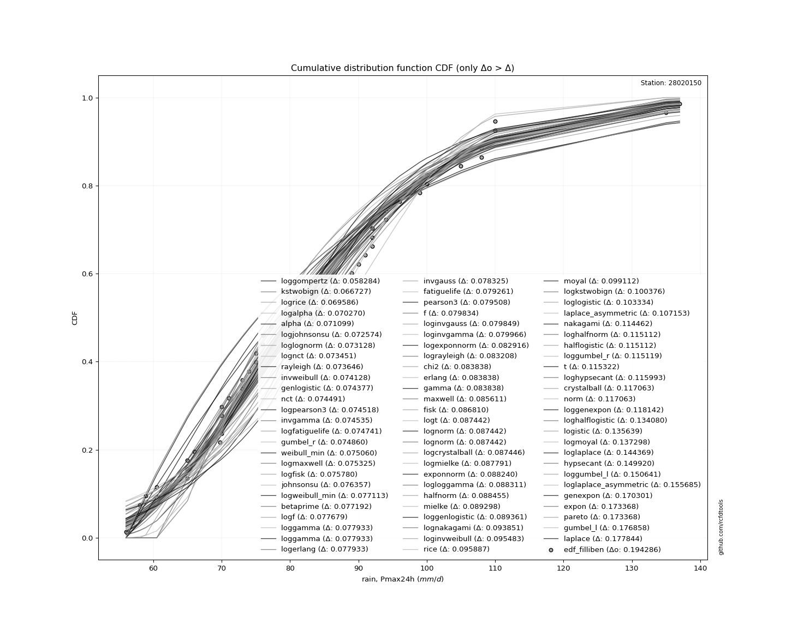</img>

</div>


**9.3. Best fit**

<div align="center">

|   id |   station | empirical_dist   | p_dist      |     delta |   deltao | eval   |   fit |   n |   best_fit |   best_fit_sort |
|-----:|----------:|:-----------------|:------------|----------:|---------:|:-------|------:|----:|-----------:|----------------:|
|    0 |  28020150 | edf_filliben     | loggompertz | 0.0582836 | 0.194286 | Δo > Δ |     1 |  49 |          1 |               1 |

</div>


<div align="center">

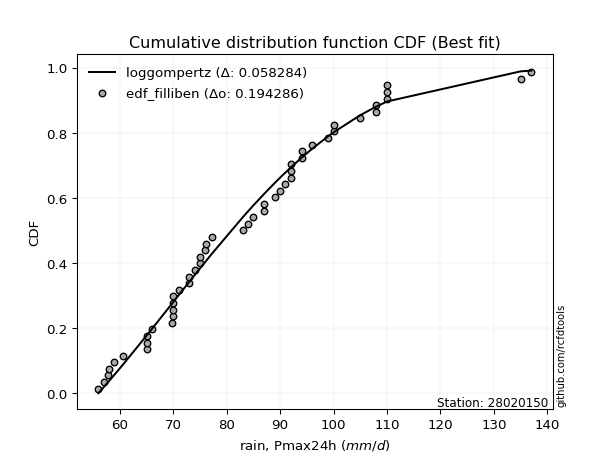</img>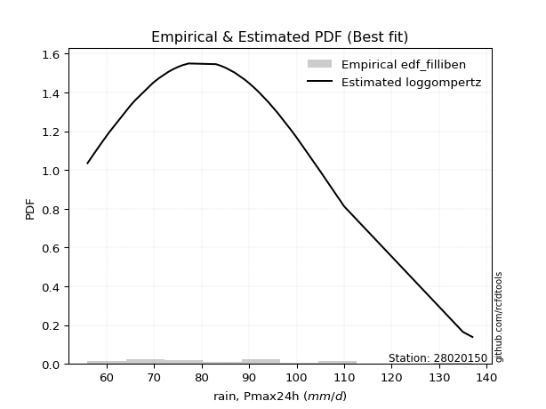</img>

</div>


### 10. Empirical - EDF Jenkinson (1977)

The Jenkinson formula in hydrology is an empirical plotting position formula used to estimate the non-exceedance probability _(P)_ or return period _(T)_ of a given ordered observation within a sample. It is a widely used method in the frequency analysis of extreme events such as floods and rainfall, as it provides a distribution-free way to plot data. _a≈0.31_ and _b≈0.38_ are constants derived to approximate the median of the probability distribution for the given rank.

<div align="center">


$P=(m-a)/(n+b)$


</div>


**10.1. Empirical values**

<div align="center">

|                | 0                    | 1                   | 2                    | 3                   | 4                   | 5                   | 6                   | 7                   | 8                   | 9                  | 10                  | 11                  | 12                  | 13                  | 14                  | 15                 | 16                  | 17                 | 18                 | 19                  | 20                  | 21                  | 22                  | 23                 | 24            | 25                 | 26                 | 27                 | 28                 | 29                 | 30                 | 31                 | 32                 | 33                 | 34                 | 35                 | 36                 | 37                 | 38                 | 39                 | 40                 | 41                 | 42                 | 43                 | 44                 | 45                 | 46                 | 47                 | 48                 |
|:---------------|:---------------------|:--------------------|:---------------------|:--------------------|:--------------------|:--------------------|:--------------------|:--------------------|:--------------------|:-------------------|:--------------------|:--------------------|:--------------------|:--------------------|:--------------------|:-------------------|:--------------------|:-------------------|:-------------------|:--------------------|:--------------------|:--------------------|:--------------------|:-------------------|:--------------|:-------------------|:-------------------|:-------------------|:-------------------|:-------------------|:-------------------|:-------------------|:-------------------|:-------------------|:-------------------|:-------------------|:-------------------|:-------------------|:-------------------|:-------------------|:-------------------|:-------------------|:-------------------|:-------------------|:-------------------|:-------------------|:-------------------|:-------------------|:-------------------|
| date           | 1986                 | 1961                | 1967                 | 1997                | 1985                | 1982                | 1990                | 1991                | 2002                | 2015               | 1983                | 1987                | 2013                | 2019                | 2003                | 2012               | 2014                | 2007               | 2001               | 2018                | 1963                | 2006                | 1984                | 1981               | 2022          | 1998               | 2020               | 1989               | 2000               | 1994               | 1988               | 2021               | 2010               | 2016               | 1965               | 1960               | 1962               | 1995               | 1964               | 2008               | 2017               | 2004               | 1993               | 2011               | 2009               | 1999               | 2005               | 1992               | 1996               |
| x              | 56.0                 | 57.0                | 57.70139503          | 58.0                | 58.89288117         | 60.50959058         | 65.0                | 65.0                | 65.0                | 66.0               | 69.74092411         | 70.0                | 70.0                | 70.0                | 70.0                | 71.0               | 73.0                | 73.0               | 74.0               | 75.0                | 75.0                | 76.0                | 76.09928433         | 77.26118637        | 83.0          | 84.0               | 85.0               | 87.0               | 87.0               | 89.0               | 90.0               | 91.0               | 92.0               | 92.0               | 92.0               | 94.0               | 94.0               | 96.0               | 99.0               | 100.0              | 100.0              | 105.0              | 108.0              | 108.0              | 110.0              | 110.0              | 110.0              | 135.0              | 137.0              |
| m              | 1                    | 2                   | 3                    | 4                   | 5                   | 6                   | 7                   | 8                   | 9                   | 10                 | 11                  | 12                  | 13                  | 14                  | 15                  | 16                 | 17                  | 18                 | 19                 | 20                  | 21                  | 22                  | 23                  | 24                 | 25            | 26                 | 27                 | 28                 | 29                 | 30                 | 31                 | 32                 | 33                 | 34                 | 35                 | 36                 | 37                 | 38                 | 39                 | 40                 | 41                 | 42                 | 43                 | 44                 | 45                 | 46                 | 47                 | 48                 | 49                 |
| empirical_dist | edf_jenkinson        | edf_jenkinson       | edf_jenkinson        | edf_jenkinson       | edf_jenkinson       | edf_jenkinson       | edf_jenkinson       | edf_jenkinson       | edf_jenkinson       | edf_jenkinson      | edf_jenkinson       | edf_jenkinson       | edf_jenkinson       | edf_jenkinson       | edf_jenkinson       | edf_jenkinson      | edf_jenkinson       | edf_jenkinson      | edf_jenkinson      | edf_jenkinson       | edf_jenkinson       | edf_jenkinson       | edf_jenkinson       | edf_jenkinson      | edf_jenkinson | edf_jenkinson      | edf_jenkinson      | edf_jenkinson      | edf_jenkinson      | edf_jenkinson      | edf_jenkinson      | edf_jenkinson      | edf_jenkinson      | edf_jenkinson      | edf_jenkinson      | edf_jenkinson      | edf_jenkinson      | edf_jenkinson      | edf_jenkinson      | edf_jenkinson      | edf_jenkinson      | edf_jenkinson      | edf_jenkinson      | edf_jenkinson      | edf_jenkinson      | edf_jenkinson      | edf_jenkinson      | edf_jenkinson      | edf_jenkinson      |
| empirical      | 0.013973268529769135 | 0.03422438234102875 | 0.054475496152288375 | 0.07472660996354799 | 0.09497772377480762 | 0.11522883758606724 | 0.13547995139732685 | 0.15573106520858648 | 0.17598217901984609 | 0.1962332928311057 | 0.21648440664236532 | 0.23673552045362492 | 0.25698663426488455 | 0.27723774807614415 | 0.29748886188740375 | 0.3177399756986634 | 0.33799108950992307 | 0.3582422033211827 | 0.3784933171324423 | 0.39874443094370193 | 0.41899554475496154 | 0.43924665856622114 | 0.45949777237748074 | 0.4797488861887404 | 0.5           | 0.5202511138112597 | 0.5405022276225192 | 0.5607533414337789 | 0.5810044552450385 | 0.6012555690562981 | 0.6215066828675577 | 0.6417577966788174 | 0.6620089104900768 | 0.6822600243013365 | 0.7025111381125961 | 0.7227622519238557 | 0.7430133657351153 | 0.763264479546375  | 0.7835155933576345 | 0.8037667071688942 | 0.8240178209801539 | 0.8442689347914134 | 0.8645200486026731 | 0.8847711624139327 | 0.9050222762251923 | 0.9252733900364519 | 0.9455245038477116 | 0.9657756176589711 | 0.9860267314702308 |
| empirical_tr   | 1.0141712877387554   | 1.0354371985741246  | 1.0576140501177982   | 1.0807616546290217  | 1.104945177892146   | 1.130235751888304   | 1.15671117357695    | 1.1844567042456224  | 1.2135659867289261  | 1.2441421012849585 | 1.276298785215818   | 1.310161846643672   | 1.3458708094848733  | 1.3835808349677778  | 1.4234649754972613  | 1.4657168299198575 | 1.5105536861425513  | 1.5582202587567058 | 1.608993157380254  | 1.6631862579993264  | 1.7211571976298363  | 1.7833152762730227  | 1.85013113525665    | 1.9221486959906582 | 2.0           | 2.084423807513719  | 2.176289114147201  | 2.276625172890733  | 2.386660222329628  | 2.507872016251904  | 2.6420545746388444 | 2.7914075749010743 | 2.9586578789694418 | 3.147227533460802  | 3.3614703880190597 | 3.607012417823227  | 3.891252955082741  | 4.2241231822070135 | 4.619270346117864  | 5.09597523219814   | 5.6823935558112755 | 6.421326397919371  | 7.381165919282506  | 8.678383128295252  | 10.52878464818762  | 13.382113821138198 | 18.35687732342006  | 29.218934911242506 | 71.56521739130396  |

</div>


**10.2. Kolmogorov-Smirnov fit test (sorted by Δ)**


<div align="center">

|                | 0                   | 1                   | 2                   | 3                   | 4                   | 5                   | 6                   | 7                   | 8                   | 9                   | 10                  | 11                  | 12                  | 13                 | 14                  | 15                  | 16                 | 17                 | 18                  | 19                  | 20                 | 21                 | 22                  | 23                  | 24                  | 25                  | 26                  | 27                  | 28                  | 29                  | 30                  | 31                  | 32                 | 33                 | 34                  | 35                  | 36                 | 37                  | 38                  | 39                  | 40                  | 41                  | 42                  | 43                 | 44                 | 45                  | 46                  | 47                  | 48                  | 49                  | 50                  | 51                  | 52                  | 53                  | 54                  | 55                  | 56                  | 57                 | 58                  | 59                  | 60                  | 61                  | 62                  | 63                  | 64                  | 65                  | 66                  | 67                  | 68                  | 69                 | 70                  | 71                    | 72                  | 73                  | 74                  | 75                  | 76                  | 77                  | 78                 | 79                  | 80                  | 81                  | 82                  | 83                 | 84                  | 85                  | 86                 | 87                 | 88                 | 89                 |
|:---------------|:--------------------|:--------------------|:--------------------|:--------------------|:--------------------|:--------------------|:--------------------|:--------------------|:--------------------|:--------------------|:--------------------|:--------------------|:--------------------|:-------------------|:--------------------|:--------------------|:-------------------|:-------------------|:--------------------|:--------------------|:-------------------|:-------------------|:--------------------|:--------------------|:--------------------|:--------------------|:--------------------|:--------------------|:--------------------|:--------------------|:--------------------|:--------------------|:-------------------|:-------------------|:--------------------|:--------------------|:-------------------|:--------------------|:--------------------|:--------------------|:--------------------|:--------------------|:--------------------|:-------------------|:-------------------|:--------------------|:--------------------|:--------------------|:--------------------|:--------------------|:--------------------|:--------------------|:--------------------|:--------------------|:--------------------|:--------------------|:--------------------|:-------------------|:--------------------|:--------------------|:--------------------|:--------------------|:--------------------|:--------------------|:--------------------|:--------------------|:--------------------|:--------------------|:--------------------|:-------------------|:--------------------|:----------------------|:--------------------|:--------------------|:--------------------|:--------------------|:--------------------|:--------------------|:-------------------|:--------------------|:--------------------|:--------------------|:--------------------|:-------------------|:--------------------|:--------------------|:-------------------|:-------------------|:-------------------|:-------------------|
| station        | 28020150            | 28020150            | 28020150            | 28020150            | 28020150            | 28020150            | 28020150            | 28020150            | 28020150            | 28020150            | 28020150            | 28020150            | 28020150            | 28020150           | 28020150            | 28020150            | 28020150           | 28020150           | 28020150            | 28020150            | 28020150           | 28020150           | 28020150            | 28020150            | 28020150            | 28020150            | 28020150            | 28020150            | 28020150            | 28020150            | 28020150            | 28020150            | 28020150           | 28020150           | 28020150            | 28020150            | 28020150           | 28020150            | 28020150            | 28020150            | 28020150            | 28020150            | 28020150            | 28020150           | 28020150           | 28020150            | 28020150            | 28020150            | 28020150            | 28020150            | 28020150            | 28020150            | 28020150            | 28020150            | 28020150            | 28020150            | 28020150            | 28020150           | 28020150            | 28020150            | 28020150            | 28020150            | 28020150            | 28020150            | 28020150            | 28020150            | 28020150            | 28020150            | 28020150            | 28020150           | 28020150            | 28020150              | 28020150            | 28020150            | 28020150            | 28020150            | 28020150            | 28020150            | 28020150           | 28020150            | 28020150            | 28020150            | 28020150            | 28020150           | 28020150            | 28020150            | 28020150           | 28020150           | 28020150           | 28020150           |
| empirical_dist | edf_jenkinson       | edf_jenkinson       | edf_jenkinson       | edf_jenkinson       | edf_jenkinson       | edf_jenkinson       | edf_jenkinson       | edf_jenkinson       | edf_jenkinson       | edf_jenkinson       | edf_jenkinson       | edf_jenkinson       | edf_jenkinson       | edf_jenkinson      | edf_jenkinson       | edf_jenkinson       | edf_jenkinson      | edf_jenkinson      | edf_jenkinson       | edf_jenkinson       | edf_jenkinson      | edf_jenkinson      | edf_jenkinson       | edf_jenkinson       | edf_jenkinson       | edf_jenkinson       | edf_jenkinson       | edf_jenkinson       | edf_jenkinson       | edf_jenkinson       | edf_jenkinson       | edf_jenkinson       | edf_jenkinson      | edf_jenkinson      | edf_jenkinson       | edf_jenkinson       | edf_jenkinson      | edf_jenkinson       | edf_jenkinson       | edf_jenkinson       | edf_jenkinson       | edf_jenkinson       | edf_jenkinson       | edf_jenkinson      | edf_jenkinson      | edf_jenkinson       | edf_jenkinson       | edf_jenkinson       | edf_jenkinson       | edf_jenkinson       | edf_jenkinson       | edf_jenkinson       | edf_jenkinson       | edf_jenkinson       | edf_jenkinson       | edf_jenkinson       | edf_jenkinson       | edf_jenkinson      | edf_jenkinson       | edf_jenkinson       | edf_jenkinson       | edf_jenkinson       | edf_jenkinson       | edf_jenkinson       | edf_jenkinson       | edf_jenkinson       | edf_jenkinson       | edf_jenkinson       | edf_jenkinson       | edf_jenkinson      | edf_jenkinson       | edf_jenkinson         | edf_jenkinson       | edf_jenkinson       | edf_jenkinson       | edf_jenkinson       | edf_jenkinson       | edf_jenkinson       | edf_jenkinson      | edf_jenkinson       | edf_jenkinson       | edf_jenkinson       | edf_jenkinson       | edf_jenkinson      | edf_jenkinson       | edf_jenkinson       | edf_jenkinson      | edf_jenkinson      | edf_jenkinson      | edf_jenkinson      |
| p_dist         | loggompertz         | kstwobign           | logrice             | logalpha            | alpha               | logjohnsonsu        | loglognorm          | lognct              | rayleigh            | invweibull          | genlogistic         | nct                 | logpearson3         | invgamma           | logfatiguelife      | gumbel_r            | weibull_min        | logmaxwell         | logfisk             | johnsonsu           | logweibull_min     | betaprime          | logf                | loggamma            | loggamma            | logerlang           | invgauss            | fatiguelife         | pearson3            | f                   | loginvgauss         | loginvgamma         | logexponnorm       | lograyleigh        | chi2                | erlang              | gamma              | maxwell             | fisk                | logt                | lognorm             | lognorm             | logcrystalball      | logmielke          | exponnorm          | logloggamma         | halfnorm            | mielke              | loggenlogistic      | lognakagami         | loginvweibull       | rice                | moyal               | logkstwobign        | loglogistic         | laplace_asymmetric  | nakagami            | loggumbel_r        | loghalfnorm         | halflogistic        | t                   | loghypsecant        | crystalball         | norm                | loggenexpon         | loghalflogistic     | logistic            | logmoyal            | loglaplace          | hypsecant          | loggumbel_l         | loglaplace_asymmetric | genexpon            | expon               | pareto              | gumbel_l            | laplace             | wald                | logwald            | logbetaprime        | logtruncnorm        | logncf              | logexpon            | logpareto          | loggibrat           | gibrat              | logchi2            | ncf                | gompertz           | truncnorm          |
| delta          | 0.05819746355821068 | 0.06674560221014647 | 0.06960414279604155 | 0.07028891064394271 | 0.07111716636848753 | 0.07259198178278625 | 0.07314655792527813 | 0.07346356661459202 | 0.07365811084332924 | 0.07414607472350998 | 0.07439498232282082 | 0.07450925503608774 | 0.07453038331809242 | 0.074553929256018  | 0.07475989228915025 | 0.07487879563024957 | 0.0750785232652571 | 0.0753430992186378 | 0.07579841883637273 | 0.07637585271580094 | 0.0771312497376423 | 0.0772038366620913 | 0.07769752982898281 | 0.07795119804340034 | 0.07795119804340034 | 0.07795162476831896 | 0.07834360017789188 | 0.07927923090937838 | 0.07952078699305654 | 0.07985284050193842 | 0.07986744749550101 | 0.07997875494992063 | 0.0829280220329836 | 0.0832262084616684 | 0.08385602041678475 | 0.08385656291701538 | 0.08385673211152   | 0.08562298581150413 | 0.08682242360743336 | 0.08745428173500952 | 0.08745468323322808 | 0.08745468323322808 | 0.08745830938022409 | 0.0878092929003772 | 0.0882581451683293 | 0.08832358067668145 | 0.08857772951969968 | 0.08931634191649374 | 0.08937936249988754 | 0.09386915931118323 | 0.09550175297116026 | 0.09589951933567059 | 0.09913037009154002 | 0.10039465674171444 | 0.10334675929366471 | 0.10717141181338352 | 0.11437592727492582 | 0.1151377428556225 | 0.11522883758606724 | 0.11522883758606724 | 0.11533398614184581 | 0.11600518299808188 | 0.11707520827119061 | 0.11707524290652777 | 0.11805619841186674 | 0.13409804918166168 | 0.13565108435156825 | 0.13731626761934246 | 0.14438130264901233 | 0.1499321438468948 | 0.15065305203800933 | 0.1556910071470473    | 0.17021456192227238 | 0.17328193755737184 | 0.17328194488028661 | 0.17686465254908929 | 0.17785638351526545 | 0.19604760137808913 | 0.1992793743881356 | 0.20662508206505037 | 0.21500378927990713 | 0.21881028262248037 | 0.22333372723459036 | 0.2233337421037527 | 0.27888018539392195 | 0.29198283002201847 | 0.3776784297978697 | 0.5846962870315628 | 0.7488932394451773 | 0.8139152797479231 |
| deltao         | 0.1942857142857143  | 0.1942857142857143  | 0.1942857142857143  | 0.1942857142857143  | 0.1942857142857143  | 0.1942857142857143  | 0.1942857142857143  | 0.1942857142857143  | 0.1942857142857143  | 0.1942857142857143  | 0.1942857142857143  | 0.1942857142857143  | 0.1942857142857143  | 0.1942857142857143 | 0.1942857142857143  | 0.1942857142857143  | 0.1942857142857143 | 0.1942857142857143 | 0.1942857142857143  | 0.1942857142857143  | 0.1942857142857143 | 0.1942857142857143 | 0.1942857142857143  | 0.1942857142857143  | 0.1942857142857143  | 0.1942857142857143  | 0.1942857142857143  | 0.1942857142857143  | 0.1942857142857143  | 0.1942857142857143  | 0.1942857142857143  | 0.1942857142857143  | 0.1942857142857143 | 0.1942857142857143 | 0.1942857142857143  | 0.1942857142857143  | 0.1942857142857143 | 0.1942857142857143  | 0.1942857142857143  | 0.1942857142857143  | 0.1942857142857143  | 0.1942857142857143  | 0.1942857142857143  | 0.1942857142857143 | 0.1942857142857143 | 0.1942857142857143  | 0.1942857142857143  | 0.1942857142857143  | 0.1942857142857143  | 0.1942857142857143  | 0.1942857142857143  | 0.1942857142857143  | 0.1942857142857143  | 0.1942857142857143  | 0.1942857142857143  | 0.1942857142857143  | 0.1942857142857143  | 0.1942857142857143 | 0.1942857142857143  | 0.1942857142857143  | 0.1942857142857143  | 0.1942857142857143  | 0.1942857142857143  | 0.1942857142857143  | 0.1942857142857143  | 0.1942857142857143  | 0.1942857142857143  | 0.1942857142857143  | 0.1942857142857143  | 0.1942857142857143 | 0.1942857142857143  | 0.1942857142857143    | 0.1942857142857143  | 0.1942857142857143  | 0.1942857142857143  | 0.1942857142857143  | 0.1942857142857143  | 0.1942857142857143  | 0.1942857142857143 | 0.1942857142857143  | 0.1942857142857143  | 0.1942857142857143  | 0.1942857142857143  | 0.1942857142857143 | 0.1942857142857143  | 0.1942857142857143  | 0.1942857142857143 | 0.1942857142857143 | 0.1942857142857143 | 0.1942857142857143 |
| eval           | Δo > Δ              | Δo > Δ              | Δo > Δ              | Δo > Δ              | Δo > Δ              | Δo > Δ              | Δo > Δ              | Δo > Δ              | Δo > Δ              | Δo > Δ              | Δo > Δ              | Δo > Δ              | Δo > Δ              | Δo > Δ             | Δo > Δ              | Δo > Δ              | Δo > Δ             | Δo > Δ             | Δo > Δ              | Δo > Δ              | Δo > Δ             | Δo > Δ             | Δo > Δ              | Δo > Δ              | Δo > Δ              | Δo > Δ              | Δo > Δ              | Δo > Δ              | Δo > Δ              | Δo > Δ              | Δo > Δ              | Δo > Δ              | Δo > Δ             | Δo > Δ             | Δo > Δ              | Δo > Δ              | Δo > Δ             | Δo > Δ              | Δo > Δ              | Δo > Δ              | Δo > Δ              | Δo > Δ              | Δo > Δ              | Δo > Δ             | Δo > Δ             | Δo > Δ              | Δo > Δ              | Δo > Δ              | Δo > Δ              | Δo > Δ              | Δo > Δ              | Δo > Δ              | Δo > Δ              | Δo > Δ              | Δo > Δ              | Δo > Δ              | Δo > Δ              | Δo > Δ             | Δo > Δ              | Δo > Δ              | Δo > Δ              | Δo > Δ              | Δo > Δ              | Δo > Δ              | Δo > Δ              | Δo > Δ              | Δo > Δ              | Δo > Δ              | Δo > Δ              | Δo > Δ             | Δo > Δ              | Δo > Δ                | Δo > Δ              | Δo > Δ              | Δo > Δ              | Δo > Δ              | Δo > Δ              | Δo <= Δ             | Δo <= Δ            | Δo <= Δ             | Δo <= Δ             | Δo <= Δ             | Δo <= Δ             | Δo <= Δ            | Δo <= Δ             | Δo <= Δ             | Δo <= Δ            | Δo <= Δ            | Δo <= Δ            | Δo <= Δ            |
| fit            | 1                   | 1                   | 1                   | 1                   | 1                   | 1                   | 1                   | 1                   | 1                   | 1                   | 1                   | 1                   | 1                   | 1                  | 1                   | 1                   | 1                  | 1                  | 1                   | 1                   | 1                  | 1                  | 1                   | 1                   | 1                   | 1                   | 1                   | 1                   | 1                   | 1                   | 1                   | 1                   | 1                  | 1                  | 1                   | 1                   | 1                  | 1                   | 1                   | 1                   | 1                   | 1                   | 1                   | 1                  | 1                  | 1                   | 1                   | 1                   | 1                   | 1                   | 1                   | 1                   | 1                   | 1                   | 1                   | 1                   | 1                   | 1                  | 1                   | 1                   | 1                   | 1                   | 1                   | 1                   | 1                   | 1                   | 1                   | 1                   | 1                   | 1                  | 1                   | 1                     | 1                   | 1                   | 1                   | 1                   | 1                   | 0                   | 0                  | 0                   | 0                   | 0                   | 0                   | 0                  | 0                   | 0                   | 0                  | 0                  | 0                  | 0                  |
| n              | 49                  | 49                  | 49                  | 49                  | 49                  | 49                  | 49                  | 49                  | 49                  | 49                  | 49                  | 49                  | 49                  | 49                 | 49                  | 49                  | 49                 | 49                 | 49                  | 49                  | 49                 | 49                 | 49                  | 49                  | 49                  | 49                  | 49                  | 49                  | 49                  | 49                  | 49                  | 49                  | 49                 | 49                 | 49                  | 49                  | 49                 | 49                  | 49                  | 49                  | 49                  | 49                  | 49                  | 49                 | 49                 | 49                  | 49                  | 49                  | 49                  | 49                  | 49                  | 49                  | 49                  | 49                  | 49                  | 49                  | 49                  | 49                 | 49                  | 49                  | 49                  | 49                  | 49                  | 49                  | 49                  | 49                  | 49                  | 49                  | 49                  | 49                 | 49                  | 49                    | 49                  | 49                  | 49                  | 49                  | 49                  | 49                  | 49                 | 49                  | 49                  | 49                  | 49                  | 49                 | 49                  | 49                  | 49                 | 49                 | 49                 | 49                 |
| best_fit       | 1                   | 0                   | 0                   | 0                   | 0                   | 0                   | 0                   | 0                   | 0                   | 0                   | 0                   | 0                   | 0                   | 0                  | 0                   | 0                   | 0                  | 0                  | 0                   | 0                   | 0                  | 0                  | 0                   | 0                   | 0                   | 0                   | 0                   | 0                   | 0                   | 0                   | 0                   | 0                   | 0                  | 0                  | 0                   | 0                   | 0                  | 0                   | 0                   | 0                   | 0                   | 0                   | 0                   | 0                  | 0                  | 0                   | 0                   | 0                   | 0                   | 0                   | 0                   | 0                   | 0                   | 0                   | 0                   | 0                   | 0                   | 0                  | 0                   | 0                   | 0                   | 0                   | 0                   | 0                   | 0                   | 0                   | 0                   | 0                   | 0                   | 0                  | 0                   | 0                     | 0                   | 0                   | 0                   | 0                   | 0                   | 0                   | 0                  | 0                   | 0                   | 0                   | 0                   | 0                  | 0                   | 0                   | 0                  | 0                  | 0                  | 0                  |
| best_fit_sort  | 1                   | 2                   | 3                   | 4                   | 5                   | 6                   | 7                   | 8                   | 9                   | 10                  | 11                  | 12                  | 13                  | 14                 | 15                  | 16                  | 17                 | 18                 | 19                  | 20                  | 21                 | 22                 | 23                  | 24                  | 25                  | 26                  | 27                  | 28                  | 29                  | 30                  | 31                  | 32                  | 33                 | 34                 | 35                  | 36                  | 37                 | 38                  | 39                  | 40                  | 41                  | 42                  | 43                  | 44                 | 45                 | 46                  | 47                  | 48                  | 49                  | 50                  | 51                  | 52                  | 53                  | 54                  | 55                  | 56                  | 57                  | 58                 | 59                  | 60                  | 61                  | 62                  | 63                  | 64                  | 65                  | 66                  | 67                  | 68                  | 69                  | 70                 | 71                  | 72                    | 73                  | 74                  | 75                  | 76                  | 77                  | 78                  | 79                 | 80                  | 81                  | 82                  | 83                  | 84                 | 85                  | 86                  | 87                 | 88                 | 89                 | 90                 |

</div>


<div align="center">

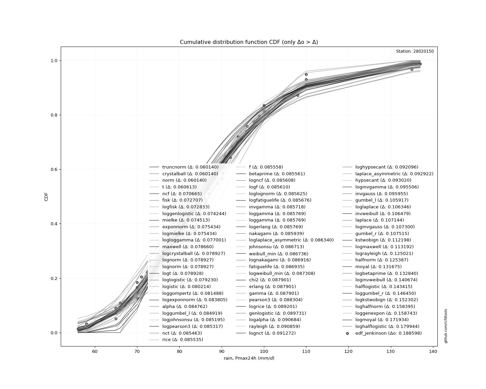</img>

</div>


**10.3. Best fit**

<div align="center">

|   id |   station | empirical_dist   | p_dist      |     delta |   deltao | eval   |   fit |   n |   best_fit |   best_fit_sort |
|-----:|----------:|:-----------------|:------------|----------:|---------:|:-------|------:|----:|-----------:|----------------:|
|    0 |  28020150 | edf_jenkinson    | loggompertz | 0.0581975 | 0.194286 | Δo > Δ |     1 |  49 |          1 |               1 |

</div>


<div align="center">

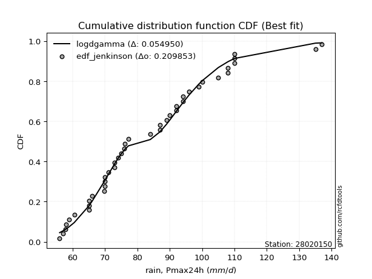</img>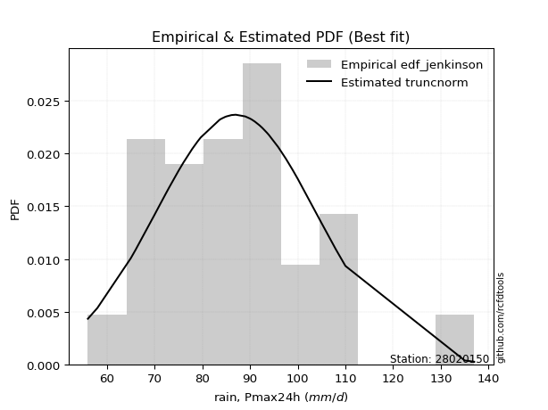</img>

</div>


### 11. Empirical - EDF Cunnane (1978)

Cunnane´s work in statistical hydrology has focused on the performance and evaluation of different probability distributions (such as GEV, Gumbel, Lognormal) for flood frequency estimation. _b_ is a constant, typically set to 0.4.

<div align="center">


$P=(m-b)/(n+1-2b)$


</div>


**11.1. Empirical values**

<div align="center">

|                | 0                    | 1                   | 2                   | 3                   | 4                   | 5                  | 6                   | 7                   | 8                   | 9                   | 10                 | 11                  | 12                  | 13                 | 14                  | 15                  | 16                  | 17                  | 18                 | 19                 | 20                 | 21                  | 22                  | 23                 | 24          | 25                 | 26                 | 27                 | 28                 | 29                 | 30                 | 31                 | 32                 | 33                 | 34                 | 35                 | 36                 | 37                 | 38                 | 39                 | 40                 | 41                 | 42                 | 43                 | 44                 | 45                 | 46                 | 47                 | 48                 |
|:---------------|:---------------------|:--------------------|:--------------------|:--------------------|:--------------------|:-------------------|:--------------------|:--------------------|:--------------------|:--------------------|:-------------------|:--------------------|:--------------------|:-------------------|:--------------------|:--------------------|:--------------------|:--------------------|:-------------------|:-------------------|:-------------------|:--------------------|:--------------------|:-------------------|:------------|:-------------------|:-------------------|:-------------------|:-------------------|:-------------------|:-------------------|:-------------------|:-------------------|:-------------------|:-------------------|:-------------------|:-------------------|:-------------------|:-------------------|:-------------------|:-------------------|:-------------------|:-------------------|:-------------------|:-------------------|:-------------------|:-------------------|:-------------------|:-------------------|
| date           | 1986                 | 1961                | 1967                | 1997                | 1985                | 1982               | 1990                | 1991                | 2002                | 2015                | 1983               | 1987                | 2013                | 2019               | 2003                | 2012                | 2014                | 2007                | 2001               | 2018               | 1963               | 2006                | 1984                | 1981               | 2022        | 1998               | 2020               | 1989               | 2000               | 1994               | 1988               | 2021               | 2010               | 2016               | 1965               | 1960               | 1962               | 1995               | 1964               | 2008               | 2017               | 2004               | 1993               | 2011               | 2009               | 1999               | 2005               | 1992               | 1996               |
| x              | 56.0                 | 57.0                | 57.70139503         | 58.0                | 58.89288117         | 60.50959058        | 65.0                | 65.0                | 65.0                | 66.0                | 69.74092411        | 70.0                | 70.0                | 70.0               | 70.0                | 71.0                | 73.0                | 73.0                | 74.0               | 75.0               | 75.0               | 76.0                | 76.09928433         | 77.26118637        | 83.0        | 84.0               | 85.0               | 87.0               | 87.0               | 89.0               | 90.0               | 91.0               | 92.0               | 92.0               | 92.0               | 94.0               | 94.0               | 96.0               | 99.0               | 100.0              | 100.0              | 105.0              | 108.0              | 108.0              | 110.0              | 110.0              | 110.0              | 135.0              | 137.0              |
| m              | 1                    | 2                   | 3                   | 4                   | 5                   | 6                  | 7                   | 8                   | 9                   | 10                  | 11                 | 12                  | 13                  | 14                 | 15                  | 16                  | 17                  | 18                  | 19                 | 20                 | 21                 | 22                  | 23                  | 24                 | 25          | 26                 | 27                 | 28                 | 29                 | 30                 | 31                 | 32                 | 33                 | 34                 | 35                 | 36                 | 37                 | 38                 | 39                 | 40                 | 41                 | 42                 | 43                 | 44                 | 45                 | 46                 | 47                 | 48                 | 49                 |
| empirical_dist | edf_cunnane          | edf_cunnane         | edf_cunnane         | edf_cunnane         | edf_cunnane         | edf_cunnane        | edf_cunnane         | edf_cunnane         | edf_cunnane         | edf_cunnane         | edf_cunnane        | edf_cunnane         | edf_cunnane         | edf_cunnane        | edf_cunnane         | edf_cunnane         | edf_cunnane         | edf_cunnane         | edf_cunnane        | edf_cunnane        | edf_cunnane        | edf_cunnane         | edf_cunnane         | edf_cunnane        | edf_cunnane | edf_cunnane        | edf_cunnane        | edf_cunnane        | edf_cunnane        | edf_cunnane        | edf_cunnane        | edf_cunnane        | edf_cunnane        | edf_cunnane        | edf_cunnane        | edf_cunnane        | edf_cunnane        | edf_cunnane        | edf_cunnane        | edf_cunnane        | edf_cunnane        | edf_cunnane        | edf_cunnane        | edf_cunnane        | edf_cunnane        | edf_cunnane        | edf_cunnane        | edf_cunnane        | edf_cunnane        |
| empirical      | 0.012195121951219511 | 0.03252032520325203 | 0.05284552845528455 | 0.07317073170731707 | 0.09349593495934957 | 0.1138211382113821 | 0.13414634146341461 | 0.15447154471544713 | 0.17479674796747965 | 0.19512195121951217 | 0.2154471544715447 | 0.23577235772357721 | 0.25609756097560976 | 0.2764227642276422 | 0.29674796747967475 | 0.31707317073170727 | 0.33739837398373984 | 0.35772357723577236 | 0.3780487804878049 | 0.3983739837398374 | 0.4186991869918699 | 0.43902439024390244 | 0.45934959349593496 | 0.4796747967479675 | 0.5         | 0.5203252032520325 | 0.540650406504065  | 0.5609756097560975 | 0.5813008130081301 | 0.6016260162601625 | 0.6219512195121951 | 0.6422764227642276 | 0.6626016260162602 | 0.6829268292682926 | 0.7032520325203252 | 0.7235772357723577 | 0.7439024390243902 | 0.7642276422764227 | 0.7845528455284553 | 0.8048780487804877 | 0.8252032520325203 | 0.8455284552845528 | 0.8658536585365854 | 0.8861788617886178 | 0.9065040650406504 | 0.9268292682926829 | 0.9471544715447154 | 0.9674796747967479 | 0.9878048780487805 |
| empirical_tr   | 1.0123456790123457   | 1.0336134453781511  | 1.055793991416309   | 1.0789473684210527  | 1.1031390134529149  | 1.128440366972477  | 1.1549295774647887  | 1.1826923076923077  | 1.2118226600985222  | 1.2424242424242424  | 1.2746113989637307 | 1.3085106382978722  | 1.3442622950819672  | 1.3820224719101122 | 1.421965317919075   | 1.4642857142857142  | 1.50920245398773    | 1.5569620253164556  | 1.607843137254902  | 1.6621621621621623 | 1.7202797202797202 | 1.7826086956521738  | 1.849624060150376   | 1.9218750000000002 | 2.0         | 2.084745762711864  | 2.1769911504424777 | 2.2777777777777777 | 2.3883495145631066 | 2.5102040816326525 | 2.6451612903225805 | 2.795454545454545  | 2.963855421686747  | 3.1538461538461533 | 3.3698630136986303 | 3.6176470588235285 | 3.9047619047619047 | 4.2413793103448265 | 4.6415094339622645 | 5.124999999999998  | 5.720930232558139  | 6.473684210526313  | 7.454545454545454  | 8.785714285714281  | 10.695652173913043 | 13.666666666666655 | 18.92307692307692  | 30.749999999999936 | 81.99999999999993  |

</div>


**11.2. Kolmogorov-Smirnov fit test (sorted by Δ)**


<div align="center">

|                | 0                  | 1                   | 2                  | 3                   | 4                   | 5                   | 6                   | 7                   | 8                   | 9                   | 10                  | 11                 | 12                  | 13                  | 14                  | 15                  | 16                  | 17                  | 18                  | 19                 | 20                  | 21                  | 22                  | 23                 | 24                 | 25                  | 26                  | 27                  | 28                  | 29                  | 30                  | 31                  | 32                  | 33                  | 34                  | 35                  | 36                  | 37                  | 38                  | 39                  | 40                  | 41                 | 42                 | 43                 | 44                  | 45                  | 46                  | 47                 | 48                 | 49                  | 50                  | 51                  | 52                  | 53                 | 54                  | 55                  | 56                 | 57                 | 58                  | 59                  | 60                  | 61                 | 62                  | 63                  | 64                  | 65                  | 66                  | 67                  | 68                  | 69                  | 70                  | 71                    | 72                 | 73                  | 74                  | 75                  | 76                  | 77                  | 78                  | 79                  | 80                  | 81                  | 82                  | 83                  | 84                  | 85                  | 86                  | 87                 | 88                 | 89                 |
|:---------------|:-------------------|:--------------------|:-------------------|:--------------------|:--------------------|:--------------------|:--------------------|:--------------------|:--------------------|:--------------------|:--------------------|:-------------------|:--------------------|:--------------------|:--------------------|:--------------------|:--------------------|:--------------------|:--------------------|:-------------------|:--------------------|:--------------------|:--------------------|:-------------------|:-------------------|:--------------------|:--------------------|:--------------------|:--------------------|:--------------------|:--------------------|:--------------------|:--------------------|:--------------------|:--------------------|:--------------------|:--------------------|:--------------------|:--------------------|:--------------------|:--------------------|:-------------------|:-------------------|:-------------------|:--------------------|:--------------------|:--------------------|:-------------------|:-------------------|:--------------------|:--------------------|:--------------------|:--------------------|:-------------------|:--------------------|:--------------------|:-------------------|:-------------------|:--------------------|:--------------------|:--------------------|:-------------------|:--------------------|:--------------------|:--------------------|:--------------------|:--------------------|:--------------------|:--------------------|:--------------------|:--------------------|:----------------------|:-------------------|:--------------------|:--------------------|:--------------------|:--------------------|:--------------------|:--------------------|:--------------------|:--------------------|:--------------------|:--------------------|:--------------------|:--------------------|:--------------------|:--------------------|:-------------------|:-------------------|:-------------------|
| station        | 28020150           | 28020150            | 28020150           | 28020150            | 28020150            | 28020150            | 28020150            | 28020150            | 28020150            | 28020150            | 28020150            | 28020150           | 28020150            | 28020150            | 28020150            | 28020150            | 28020150            | 28020150            | 28020150            | 28020150           | 28020150            | 28020150            | 28020150            | 28020150           | 28020150           | 28020150            | 28020150            | 28020150            | 28020150            | 28020150            | 28020150            | 28020150            | 28020150            | 28020150            | 28020150            | 28020150            | 28020150            | 28020150            | 28020150            | 28020150            | 28020150            | 28020150           | 28020150           | 28020150           | 28020150            | 28020150            | 28020150            | 28020150           | 28020150           | 28020150            | 28020150            | 28020150            | 28020150            | 28020150           | 28020150            | 28020150            | 28020150           | 28020150           | 28020150            | 28020150            | 28020150            | 28020150           | 28020150            | 28020150            | 28020150            | 28020150            | 28020150            | 28020150            | 28020150            | 28020150            | 28020150            | 28020150              | 28020150           | 28020150            | 28020150            | 28020150            | 28020150            | 28020150            | 28020150            | 28020150            | 28020150            | 28020150            | 28020150            | 28020150            | 28020150            | 28020150            | 28020150            | 28020150           | 28020150           | 28020150           |
| empirical_dist | edf_cunnane        | edf_cunnane         | edf_cunnane        | edf_cunnane         | edf_cunnane         | edf_cunnane         | edf_cunnane         | edf_cunnane         | edf_cunnane         | edf_cunnane         | edf_cunnane         | edf_cunnane        | edf_cunnane         | edf_cunnane         | edf_cunnane         | edf_cunnane         | edf_cunnane         | edf_cunnane         | edf_cunnane         | edf_cunnane        | edf_cunnane         | edf_cunnane         | edf_cunnane         | edf_cunnane        | edf_cunnane        | edf_cunnane         | edf_cunnane         | edf_cunnane         | edf_cunnane         | edf_cunnane         | edf_cunnane         | edf_cunnane         | edf_cunnane         | edf_cunnane         | edf_cunnane         | edf_cunnane         | edf_cunnane         | edf_cunnane         | edf_cunnane         | edf_cunnane         | edf_cunnane         | edf_cunnane        | edf_cunnane        | edf_cunnane        | edf_cunnane         | edf_cunnane         | edf_cunnane         | edf_cunnane        | edf_cunnane        | edf_cunnane         | edf_cunnane         | edf_cunnane         | edf_cunnane         | edf_cunnane        | edf_cunnane         | edf_cunnane         | edf_cunnane        | edf_cunnane        | edf_cunnane         | edf_cunnane         | edf_cunnane         | edf_cunnane        | edf_cunnane         | edf_cunnane         | edf_cunnane         | edf_cunnane         | edf_cunnane         | edf_cunnane         | edf_cunnane         | edf_cunnane         | edf_cunnane         | edf_cunnane           | edf_cunnane        | edf_cunnane         | edf_cunnane         | edf_cunnane         | edf_cunnane         | edf_cunnane         | edf_cunnane         | edf_cunnane         | edf_cunnane         | edf_cunnane         | edf_cunnane         | edf_cunnane         | edf_cunnane         | edf_cunnane         | edf_cunnane         | edf_cunnane        | edf_cunnane        | edf_cunnane        |
| p_dist         | loggompertz        | kstwobign           | logrice            | logalpha            | alpha               | logjohnsonsu        | loglognorm          | lognct              | rayleigh            | invweibull          | genlogistic         | nct                | invgamma            | logpearson3         | logfatiguelife      | gumbel_r            | weibull_min         | logmaxwell          | logfisk             | johnsonsu          | logweibull_min      | betaprime           | logf                | loggamma           | loggamma           | logerlang           | invgauss            | fatiguelife         | pearson3            | f                   | loginvgauss         | loginvgamma         | logexponnorm        | lograyleigh         | chi2                | erlang              | gamma               | maxwell             | fisk                | halfnorm            | logt                | lognorm            | lognorm            | logcrystalball     | logmielke           | exponnorm           | logloggamma         | mielke             | loggenlogistic     | lognakagami         | loginvweibull       | rice                | moyal               | logkstwobign       | loglogistic         | laplace_asymmetric  | loghalfnorm        | halflogistic       | loggumbel_r         | t                   | nakagami            | loghypsecant       | crystalball         | norm                | loggenexpon         | loghalflogistic     | logistic            | logmoyal            | loglaplace          | hypsecant           | loggumbel_l         | loglaplace_asymmetric | genexpon           | expon               | pareto              | gumbel_l            | laplace             | wald                | logwald             | logbetaprime        | logtruncnorm        | logncf              | logexpon            | logpareto           | loggibrat           | gibrat              | logchi2             | ncf                | gompertz           | truncnorm          |
| delta          | 0.0592347157290313 | 0.06652333388782783 | 0.0693818744737229 | 0.07006664232162407 | 0.07089489804616889 | 0.07236971346046761 | 0.07292428960295949 | 0.07331538773304624 | 0.07350993196178346 | 0.07392380640119134 | 0.07417271400050218 | 0.0742869867137691 | 0.07433166093369936 | 0.07438220443654664 | 0.07453762396683161 | 0.07465652730793093 | 0.07485625494293846 | 0.07512083089631916 | 0.07557615051405409 | 0.0761535843934823 | 0.07690898141532365 | 0.07705565778054552 | 0.07747526150666417 | 0.0777289297210817 | 0.0777289297210817 | 0.07772935644600032 | 0.07812133185557324 | 0.07905696258705974 | 0.07937260811151076 | 0.07963057217961977 | 0.07964517917318237 | 0.07983057606837485 | 0.08277984315143783 | 0.08300394013934975 | 0.08363375209446611 | 0.08363429459469673 | 0.08363446378920136 | 0.08547480692995835 | 0.08667424472588758 | 0.08709594070424163 | 0.08730610285346374 | 0.0873065043516823 | 0.0873065043516823 | 0.0873101304986783 | 0.08758702457805856 | 0.08803587684601066 | 0.08817540179513567 | 0.0890940735941751 | 0.0891570941775689 | 0.09364689098886458 | 0.09527948464884162 | 0.09575134045412481 | 0.09890810176922138 | 0.1001723884193958 | 0.10319858041211893 | 0.10694914349106488 | 0.1138211382113821 | 0.1138211382113821 | 0.11491547453330386 | 0.11518580726030003 | 0.11541317944574644 | 0.1158570041165361 | 0.11692702938964483 | 0.11692706402498199 | 0.11909345058268736 | 0.13387578085934304 | 0.13550290547002247 | 0.13709399929702382 | 0.14423312376746655 | 0.14978396496534901 | 0.15050487315646355 | 0.1556169177062744    | 0.171251814093093  | 0.17431918972819246 | 0.17431919705110724 | 0.17679056310831637 | 0.17770820463371967 | 0.19493625976649562 | 0.19905710606581695 | 0.20825504976205422 | 0.21604104145072775 | 0.22044025031948422 | 0.22437097940541098 | 0.22437099427457333 | 0.27813929098619294 | 0.29124193561428946 | 0.37930839749487355 | 0.5864744336101124 | 0.7500786704975437 | 0.8156934263264727 |
| deltao         | 0.1942857142857143 | 0.1942857142857143  | 0.1942857142857143 | 0.1942857142857143  | 0.1942857142857143  | 0.1942857142857143  | 0.1942857142857143  | 0.1942857142857143  | 0.1942857142857143  | 0.1942857142857143  | 0.1942857142857143  | 0.1942857142857143 | 0.1942857142857143  | 0.1942857142857143  | 0.1942857142857143  | 0.1942857142857143  | 0.1942857142857143  | 0.1942857142857143  | 0.1942857142857143  | 0.1942857142857143 | 0.1942857142857143  | 0.1942857142857143  | 0.1942857142857143  | 0.1942857142857143 | 0.1942857142857143 | 0.1942857142857143  | 0.1942857142857143  | 0.1942857142857143  | 0.1942857142857143  | 0.1942857142857143  | 0.1942857142857143  | 0.1942857142857143  | 0.1942857142857143  | 0.1942857142857143  | 0.1942857142857143  | 0.1942857142857143  | 0.1942857142857143  | 0.1942857142857143  | 0.1942857142857143  | 0.1942857142857143  | 0.1942857142857143  | 0.1942857142857143 | 0.1942857142857143 | 0.1942857142857143 | 0.1942857142857143  | 0.1942857142857143  | 0.1942857142857143  | 0.1942857142857143 | 0.1942857142857143 | 0.1942857142857143  | 0.1942857142857143  | 0.1942857142857143  | 0.1942857142857143  | 0.1942857142857143 | 0.1942857142857143  | 0.1942857142857143  | 0.1942857142857143 | 0.1942857142857143 | 0.1942857142857143  | 0.1942857142857143  | 0.1942857142857143  | 0.1942857142857143 | 0.1942857142857143  | 0.1942857142857143  | 0.1942857142857143  | 0.1942857142857143  | 0.1942857142857143  | 0.1942857142857143  | 0.1942857142857143  | 0.1942857142857143  | 0.1942857142857143  | 0.1942857142857143    | 0.1942857142857143 | 0.1942857142857143  | 0.1942857142857143  | 0.1942857142857143  | 0.1942857142857143  | 0.1942857142857143  | 0.1942857142857143  | 0.1942857142857143  | 0.1942857142857143  | 0.1942857142857143  | 0.1942857142857143  | 0.1942857142857143  | 0.1942857142857143  | 0.1942857142857143  | 0.1942857142857143  | 0.1942857142857143 | 0.1942857142857143 | 0.1942857142857143 |
| eval           | Δo > Δ             | Δo > Δ              | Δo > Δ             | Δo > Δ              | Δo > Δ              | Δo > Δ              | Δo > Δ              | Δo > Δ              | Δo > Δ              | Δo > Δ              | Δo > Δ              | Δo > Δ             | Δo > Δ              | Δo > Δ              | Δo > Δ              | Δo > Δ              | Δo > Δ              | Δo > Δ              | Δo > Δ              | Δo > Δ             | Δo > Δ              | Δo > Δ              | Δo > Δ              | Δo > Δ             | Δo > Δ             | Δo > Δ              | Δo > Δ              | Δo > Δ              | Δo > Δ              | Δo > Δ              | Δo > Δ              | Δo > Δ              | Δo > Δ              | Δo > Δ              | Δo > Δ              | Δo > Δ              | Δo > Δ              | Δo > Δ              | Δo > Δ              | Δo > Δ              | Δo > Δ              | Δo > Δ             | Δo > Δ             | Δo > Δ             | Δo > Δ              | Δo > Δ              | Δo > Δ              | Δo > Δ             | Δo > Δ             | Δo > Δ              | Δo > Δ              | Δo > Δ              | Δo > Δ              | Δo > Δ             | Δo > Δ              | Δo > Δ              | Δo > Δ             | Δo > Δ             | Δo > Δ              | Δo > Δ              | Δo > Δ              | Δo > Δ             | Δo > Δ              | Δo > Δ              | Δo > Δ              | Δo > Δ              | Δo > Δ              | Δo > Δ              | Δo > Δ              | Δo > Δ              | Δo > Δ              | Δo > Δ                | Δo > Δ             | Δo > Δ              | Δo > Δ              | Δo > Δ              | Δo > Δ              | Δo <= Δ             | Δo <= Δ             | Δo <= Δ             | Δo <= Δ             | Δo <= Δ             | Δo <= Δ             | Δo <= Δ             | Δo <= Δ             | Δo <= Δ             | Δo <= Δ             | Δo <= Δ            | Δo <= Δ            | Δo <= Δ            |
| fit            | 1                  | 1                   | 1                  | 1                   | 1                   | 1                   | 1                   | 1                   | 1                   | 1                   | 1                   | 1                  | 1                   | 1                   | 1                   | 1                   | 1                   | 1                   | 1                   | 1                  | 1                   | 1                   | 1                   | 1                  | 1                  | 1                   | 1                   | 1                   | 1                   | 1                   | 1                   | 1                   | 1                   | 1                   | 1                   | 1                   | 1                   | 1                   | 1                   | 1                   | 1                   | 1                  | 1                  | 1                  | 1                   | 1                   | 1                   | 1                  | 1                  | 1                   | 1                   | 1                   | 1                   | 1                  | 1                   | 1                   | 1                  | 1                  | 1                   | 1                   | 1                   | 1                  | 1                   | 1                   | 1                   | 1                   | 1                   | 1                   | 1                   | 1                   | 1                   | 1                     | 1                  | 1                   | 1                   | 1                   | 1                   | 0                   | 0                   | 0                   | 0                   | 0                   | 0                   | 0                   | 0                   | 0                   | 0                   | 0                  | 0                  | 0                  |
| n              | 49                 | 49                  | 49                 | 49                  | 49                  | 49                  | 49                  | 49                  | 49                  | 49                  | 49                  | 49                 | 49                  | 49                  | 49                  | 49                  | 49                  | 49                  | 49                  | 49                 | 49                  | 49                  | 49                  | 49                 | 49                 | 49                  | 49                  | 49                  | 49                  | 49                  | 49                  | 49                  | 49                  | 49                  | 49                  | 49                  | 49                  | 49                  | 49                  | 49                  | 49                  | 49                 | 49                 | 49                 | 49                  | 49                  | 49                  | 49                 | 49                 | 49                  | 49                  | 49                  | 49                  | 49                 | 49                  | 49                  | 49                 | 49                 | 49                  | 49                  | 49                  | 49                 | 49                  | 49                  | 49                  | 49                  | 49                  | 49                  | 49                  | 49                  | 49                  | 49                    | 49                 | 49                  | 49                  | 49                  | 49                  | 49                  | 49                  | 49                  | 49                  | 49                  | 49                  | 49                  | 49                  | 49                  | 49                  | 49                 | 49                 | 49                 |
| best_fit       | 1                  | 0                   | 0                  | 0                   | 0                   | 0                   | 0                   | 0                   | 0                   | 0                   | 0                   | 0                  | 0                   | 0                   | 0                   | 0                   | 0                   | 0                   | 0                   | 0                  | 0                   | 0                   | 0                   | 0                  | 0                  | 0                   | 0                   | 0                   | 0                   | 0                   | 0                   | 0                   | 0                   | 0                   | 0                   | 0                   | 0                   | 0                   | 0                   | 0                   | 0                   | 0                  | 0                  | 0                  | 0                   | 0                   | 0                   | 0                  | 0                  | 0                   | 0                   | 0                   | 0                   | 0                  | 0                   | 0                   | 0                  | 0                  | 0                   | 0                   | 0                   | 0                  | 0                   | 0                   | 0                   | 0                   | 0                   | 0                   | 0                   | 0                   | 0                   | 0                     | 0                  | 0                   | 0                   | 0                   | 0                   | 0                   | 0                   | 0                   | 0                   | 0                   | 0                   | 0                   | 0                   | 0                   | 0                   | 0                  | 0                  | 0                  |
| best_fit_sort  | 1                  | 2                   | 3                  | 4                   | 5                   | 6                   | 7                   | 8                   | 9                   | 10                  | 11                  | 12                 | 13                  | 14                  | 15                  | 16                  | 17                  | 18                  | 19                  | 20                 | 21                  | 22                  | 23                  | 24                 | 25                 | 26                  | 27                  | 28                  | 29                  | 30                  | 31                  | 32                  | 33                  | 34                  | 35                  | 36                  | 37                  | 38                  | 39                  | 40                  | 41                  | 42                 | 43                 | 44                 | 45                  | 46                  | 47                  | 48                 | 49                 | 50                  | 51                  | 52                  | 53                  | 54                 | 55                  | 56                  | 57                 | 58                 | 59                  | 60                  | 61                  | 62                 | 63                  | 64                  | 65                  | 66                  | 67                  | 68                  | 69                  | 70                  | 71                  | 72                    | 73                 | 74                  | 75                  | 76                  | 77                  | 78                  | 79                  | 80                  | 81                  | 82                  | 83                  | 84                  | 85                  | 86                  | 87                  | 88                 | 89                 | 90                 |

</div>


<div align="center">

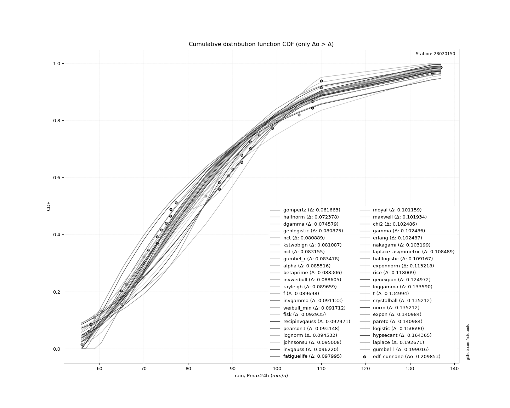</img>

</div>


**11.3. Best fit**

<div align="center">

|   id |   station | empirical_dist   | p_dist      |     delta |   deltao | eval   |   fit |   n |   best_fit |   best_fit_sort |
|-----:|----------:|:-----------------|:------------|----------:|---------:|:-------|------:|----:|-----------:|----------------:|
|    0 |  28020150 | edf_cunnane      | loggompertz | 0.0592347 | 0.194286 | Δo > Δ |     1 |  49 |          1 |               1 |

</div>


<div align="center">

</img></img>

</div>


### 12. Empirical - EDF Adamowski (1981)

The Adamowski formula in hydrology refers to a specific plotting position formula used for estimating the non-parametric empirical distribution of hydrological events (like flood peaks) to calculate their return periods. This formula provides an alternative to traditional parametric methods (like the Gumbel or Log Pearson Type III distributions). 

<div align="center">


$P=(m-0.25)/(n+0.5)$


</div>


**12.1. Empirical values**

<div align="center">

|                | 0                    | 1                   | 2                   | 3                   | 4                   | 5                   | 6                   | 7                   | 8                   | 9                   | 10                  | 11                  | 12                  | 13                 | 14                  | 15                 | 16                 | 17                  | 18                 | 19                 | 20                  | 21                 | 22                 | 23                 | 24            | 25                 | 26                 | 27                 | 28                 | 29                 | 30                 | 31                 | 32                 | 33                 | 34                | 35                 | 36                 | 37                 | 38                 | 39                | 40                 | 41                 | 42                 | 43                 | 44                 | 45                 | 46                 | 47                 | 48                 |
|:---------------|:---------------------|:--------------------|:--------------------|:--------------------|:--------------------|:--------------------|:--------------------|:--------------------|:--------------------|:--------------------|:--------------------|:--------------------|:--------------------|:-------------------|:--------------------|:-------------------|:-------------------|:--------------------|:-------------------|:-------------------|:--------------------|:-------------------|:-------------------|:-------------------|:--------------|:-------------------|:-------------------|:-------------------|:-------------------|:-------------------|:-------------------|:-------------------|:-------------------|:-------------------|:------------------|:-------------------|:-------------------|:-------------------|:-------------------|:------------------|:-------------------|:-------------------|:-------------------|:-------------------|:-------------------|:-------------------|:-------------------|:-------------------|:-------------------|
| date           | 1986                 | 1961                | 1967                | 1997                | 1985                | 1982                | 1990                | 1991                | 2002                | 2015                | 1983                | 1987                | 2013                | 2019               | 2003                | 2012               | 2014               | 2007                | 2001               | 2018               | 1963                | 2006               | 1984               | 1981               | 2022          | 1998               | 2020               | 1989               | 2000               | 1994               | 1988               | 2021               | 2010               | 2016               | 1965              | 1960               | 1962               | 1995               | 1964               | 2008              | 2017               | 2004               | 1993               | 2011               | 2009               | 1999               | 2005               | 1992               | 1996               |
| x              | 56.0                 | 57.0                | 57.70139503         | 58.0                | 58.89288117         | 60.50959058         | 65.0                | 65.0                | 65.0                | 66.0                | 69.74092411         | 70.0                | 70.0                | 70.0               | 70.0                | 71.0               | 73.0               | 73.0                | 74.0               | 75.0               | 75.0                | 76.0               | 76.09928433        | 77.26118637        | 83.0          | 84.0               | 85.0               | 87.0               | 87.0               | 89.0               | 90.0               | 91.0               | 92.0               | 92.0               | 92.0              | 94.0               | 94.0               | 96.0               | 99.0               | 100.0             | 100.0              | 105.0              | 108.0              | 108.0              | 110.0              | 110.0              | 110.0              | 135.0              | 137.0              |
| m              | 1                    | 2                   | 3                   | 4                   | 5                   | 6                   | 7                   | 8                   | 9                   | 10                  | 11                  | 12                  | 13                  | 14                 | 15                  | 16                 | 17                 | 18                  | 19                 | 20                 | 21                  | 22                 | 23                 | 24                 | 25            | 26                 | 27                 | 28                 | 29                 | 30                 | 31                 | 32                 | 33                 | 34                 | 35                | 36                 | 37                 | 38                 | 39                 | 40                | 41                 | 42                 | 43                 | 44                 | 45                 | 46                 | 47                 | 48                 | 49                 |
| empirical_dist | edf_adamowski        | edf_adamowski       | edf_adamowski       | edf_adamowski       | edf_adamowski       | edf_adamowski       | edf_adamowski       | edf_adamowski       | edf_adamowski       | edf_adamowski       | edf_adamowski       | edf_adamowski       | edf_adamowski       | edf_adamowski      | edf_adamowski       | edf_adamowski      | edf_adamowski      | edf_adamowski       | edf_adamowski      | edf_adamowski      | edf_adamowski       | edf_adamowski      | edf_adamowski      | edf_adamowski      | edf_adamowski | edf_adamowski      | edf_adamowski      | edf_adamowski      | edf_adamowski      | edf_adamowski      | edf_adamowski      | edf_adamowski      | edf_adamowski      | edf_adamowski      | edf_adamowski     | edf_adamowski      | edf_adamowski      | edf_adamowski      | edf_adamowski      | edf_adamowski     | edf_adamowski      | edf_adamowski      | edf_adamowski      | edf_adamowski      | edf_adamowski      | edf_adamowski      | edf_adamowski      | edf_adamowski      | edf_adamowski      |
| empirical      | 0.015151515151515152 | 0.03535353535353535 | 0.05555555555555555 | 0.07575757575757576 | 0.09595959595959595 | 0.11616161616161616 | 0.13636363636363635 | 0.15656565656565657 | 0.17676767676767677 | 0.19696969696969696 | 0.21717171717171718 | 0.23737373737373738 | 0.25757575757575757 | 0.2777777777777778 | 0.29797979797979796 | 0.3181818181818182 | 0.3383838383838384 | 0.35858585858585856 | 0.3787878787878788 | 0.398989898989899  | 0.41919191919191917 | 0.4393939393939394 | 0.4595959595959596 | 0.4797979797979798 | 0.5           | 0.5202020202020202 | 0.5404040404040404 | 0.5606060606060606 | 0.5808080808080808 | 0.601010101010101  | 0.6212121212121212 | 0.6414141414141414 | 0.6616161616161617 | 0.6818181818181818 | 0.702020202020202 | 0.7222222222222222 | 0.7424242424242424 | 0.7626262626262627 | 0.7828282828282829 | 0.803030303030303 | 0.8232323232323232 | 0.8434343434343434 | 0.8636363636363636 | 0.8838383838383839 | 0.9040404040404041 | 0.9242424242424242 | 0.9444444444444444 | 0.9646464646464646 | 0.9848484848484849 |
| empirical_tr   | 1.0153846153846153   | 1.036649214659686   | 1.0588235294117647  | 1.0819672131147542  | 1.1061452513966479  | 1.1314285714285715  | 1.1578947368421053  | 1.18562874251497    | 1.2147239263803682  | 1.2452830188679247  | 1.2774193548387096  | 1.3112582781456954  | 1.346938775510204   | 1.3846153846153846 | 1.4244604316546763  | 1.4666666666666666 | 1.5114503816793894 | 1.5590551181102361  | 1.6097560975609757 | 1.6638655462184875 | 1.7217391304347824  | 1.783783783783784  | 1.850467289719626  | 1.9223300970873787 | 2.0           | 2.0842105263157897 | 2.175824175824176  | 2.275862068965517  | 2.3855421686746987 | 2.5063291139240507 | 2.64               | 2.7887323943661975 | 2.9552238805970155 | 3.1428571428571423 | 3.35593220338983  | 3.5999999999999996 | 3.8823529411764706 | 4.212765957446809  | 4.604651162790699  | 5.076923076923076 | 5.657142857142857  | 6.387096774193548  | 7.333333333333334  | 8.608695652173916  | 10.421052631578952 | 13.199999999999992 | 17.999999999999993 | 28.28571428571428  | 66.00000000000006  |

</div>


**12.2. Kolmogorov-Smirnov fit test (sorted by Δ)**


<div align="center">

|                | 0                   | 1                   | 2                   | 3                   | 4                   | 5                   | 6                   | 7                  | 8                   | 9                   | 10                  | 11                  | 12                  | 13                  | 14                  | 15                  | 16                  | 17                  | 18                  | 19                  | 20                 | 21                  | 22                  | 23                  | 24                  | 25                  | 26                  | 27                 | 28                  | 29                  | 30                  | 31                 | 32                  | 33                 | 34                  | 35                  | 36                  | 37                 | 38                  | 39                 | 40                  | 41                  | 42                  | 43                  | 44                  | 45                  | 46                  | 47                  | 48                  | 49                  | 50                  | 51                  | 52                  | 53                  | 54                  | 55                  | 56                  | 57                  | 58                  | 59                  | 60                  | 61                  | 62                  | 63                  | 64                  | 65                 | 66                  | 67                  | 68                 | 69                  | 70                 | 71                    | 72                  | 73                  | 74                  | 75                  | 76                  | 77                 | 78                 | 79                 | 80                  | 81                 | 82                 | 83                  | 84                  | 85                  | 86                  | 87                 | 88                 | 89                 |
|:---------------|:--------------------|:--------------------|:--------------------|:--------------------|:--------------------|:--------------------|:--------------------|:-------------------|:--------------------|:--------------------|:--------------------|:--------------------|:--------------------|:--------------------|:--------------------|:--------------------|:--------------------|:--------------------|:--------------------|:--------------------|:-------------------|:--------------------|:--------------------|:--------------------|:--------------------|:--------------------|:--------------------|:-------------------|:--------------------|:--------------------|:--------------------|:-------------------|:--------------------|:-------------------|:--------------------|:--------------------|:--------------------|:-------------------|:--------------------|:-------------------|:--------------------|:--------------------|:--------------------|:--------------------|:--------------------|:--------------------|:--------------------|:--------------------|:--------------------|:--------------------|:--------------------|:--------------------|:--------------------|:--------------------|:--------------------|:--------------------|:--------------------|:--------------------|:--------------------|:--------------------|:--------------------|:--------------------|:--------------------|:--------------------|:--------------------|:-------------------|:--------------------|:--------------------|:-------------------|:--------------------|:-------------------|:----------------------|:--------------------|:--------------------|:--------------------|:--------------------|:--------------------|:-------------------|:-------------------|:-------------------|:--------------------|:-------------------|:-------------------|:--------------------|:--------------------|:--------------------|:--------------------|:-------------------|:-------------------|:-------------------|
| station        | 28020150            | 28020150            | 28020150            | 28020150            | 28020150            | 28020150            | 28020150            | 28020150           | 28020150            | 28020150            | 28020150            | 28020150            | 28020150            | 28020150            | 28020150            | 28020150            | 28020150            | 28020150            | 28020150            | 28020150            | 28020150           | 28020150            | 28020150            | 28020150            | 28020150            | 28020150            | 28020150            | 28020150           | 28020150            | 28020150            | 28020150            | 28020150           | 28020150            | 28020150           | 28020150            | 28020150            | 28020150            | 28020150           | 28020150            | 28020150           | 28020150            | 28020150            | 28020150            | 28020150            | 28020150            | 28020150            | 28020150            | 28020150            | 28020150            | 28020150            | 28020150            | 28020150            | 28020150            | 28020150            | 28020150            | 28020150            | 28020150            | 28020150            | 28020150            | 28020150            | 28020150            | 28020150            | 28020150            | 28020150            | 28020150            | 28020150           | 28020150            | 28020150            | 28020150           | 28020150            | 28020150           | 28020150              | 28020150            | 28020150            | 28020150            | 28020150            | 28020150            | 28020150           | 28020150           | 28020150           | 28020150            | 28020150           | 28020150           | 28020150            | 28020150            | 28020150            | 28020150            | 28020150           | 28020150           | 28020150           |
| empirical_dist | edf_adamowski       | edf_adamowski       | edf_adamowski       | edf_adamowski       | edf_adamowski       | edf_adamowski       | edf_adamowski       | edf_adamowski      | edf_adamowski       | edf_adamowski       | edf_adamowski       | edf_adamowski       | edf_adamowski       | edf_adamowski       | edf_adamowski       | edf_adamowski       | edf_adamowski       | edf_adamowski       | edf_adamowski       | edf_adamowski       | edf_adamowski      | edf_adamowski       | edf_adamowski       | edf_adamowski       | edf_adamowski       | edf_adamowski       | edf_adamowski       | edf_adamowski      | edf_adamowski       | edf_adamowski       | edf_adamowski       | edf_adamowski      | edf_adamowski       | edf_adamowski      | edf_adamowski       | edf_adamowski       | edf_adamowski       | edf_adamowski      | edf_adamowski       | edf_adamowski      | edf_adamowski       | edf_adamowski       | edf_adamowski       | edf_adamowski       | edf_adamowski       | edf_adamowski       | edf_adamowski       | edf_adamowski       | edf_adamowski       | edf_adamowski       | edf_adamowski       | edf_adamowski       | edf_adamowski       | edf_adamowski       | edf_adamowski       | edf_adamowski       | edf_adamowski       | edf_adamowski       | edf_adamowski       | edf_adamowski       | edf_adamowski       | edf_adamowski       | edf_adamowski       | edf_adamowski       | edf_adamowski       | edf_adamowski      | edf_adamowski       | edf_adamowski       | edf_adamowski      | edf_adamowski       | edf_adamowski      | edf_adamowski         | edf_adamowski       | edf_adamowski       | edf_adamowski       | edf_adamowski       | edf_adamowski       | edf_adamowski      | edf_adamowski      | edf_adamowski      | edf_adamowski       | edf_adamowski      | edf_adamowski      | edf_adamowski       | edf_adamowski       | edf_adamowski       | edf_adamowski       | edf_adamowski      | edf_adamowski      | edf_adamowski      |
| p_dist         | loggompertz         | kstwobign           | logrice             | logalpha            | alpha               | logjohnsonsu        | loglognorm          | lognct             | rayleigh            | invweibull          | genlogistic         | logpearson3         | nct                 | invgamma            | logfatiguelife      | gumbel_r            | weibull_min         | logmaxwell          | logfisk             | johnsonsu           | logweibull_min     | betaprime           | logf                | loggamma            | loggamma            | logerlang           | invgauss            | fatiguelife        | pearson3            | f                   | loginvgauss         | loginvgamma        | logexponnorm        | lograyleigh        | chi2                | erlang              | gamma               | maxwell            | fisk                | logt               | lognorm             | lognorm             | logcrystalball      | logmielke           | exponnorm           | logloggamma         | mielke              | loggenlogistic      | halfnorm            | lognakagami         | loginvweibull       | rice                | moyal               | logkstwobign        | loglogistic         | laplace_asymmetric  | nakagami            | loggumbel_r         | t                   | loghypsecant        | loghalfnorm         | halflogistic        | crystalball         | norm                | loggenexpon         | loghalflogistic    | logistic            | logmoyal            | loglaplace         | hypsecant           | loggumbel_l        | loglaplace_asymmetric | genexpon            | expon               | pareto              | gumbel_l            | laplace             | wald               | logwald            | logbetaprime       | logtruncnorm        | logncf             | logexpon           | logpareto           | loggibrat           | gibrat              | logchi2             | ncf                | gompertz           | truncnorm          |
| delta          | 0.05751015302885881 | 0.06689288303786478 | 0.06975142362375986 | 0.07043619147166102 | 0.07126444719620584 | 0.07273926261050456 | 0.07329383875299644 | 0.0735617538330709 | 0.07375629806180811 | 0.07429335555122829 | 0.07454226315053913 | 0.07462857053657129 | 0.07465653586380605 | 0.07470121008373631 | 0.07490717311686856 | 0.07502607645796788 | 0.07522580409297541 | 0.07549038004635611 | 0.07594569966409104 | 0.07652313354351925 | 0.0772785305653606 | 0.07730202388057017 | 0.07784481065670112 | 0.07809847887111865 | 0.07809847887111865 | 0.07809890559603727 | 0.07849088100561019 | 0.0794265117370967 | 0.07961897421153541 | 0.08000012132965673 | 0.08001472832321932 | 0.0800769421683995 | 0.08302620925146248 | 0.0833734892893867 | 0.08400330124450306 | 0.08400384374473369 | 0.08400401293923832 | 0.085721173029983  | 0.08692061082591224 | 0.0875524689534884 | 0.08755287045170695 | 0.08755287045170695 | 0.08755649659870296 | 0.08795657372809551 | 0.08840542599604762 | 0.08842176789516032 | 0.08946362274421205 | 0.08952664332760585 | 0.08955960170448801 | 0.09401644013890154 | 0.09564903379887857 | 0.09599770655414946 | 0.09927765091925833 | 0.10054193756943275 | 0.10344494651214359 | 0.10731869264110183 | 0.11368861674557396 | 0.11528502368334081 | 0.11543217336032469 | 0.11610337021656075 | 0.11616161616161616 | 0.11616161616161616 | 0.11717339548966949 | 0.11717343012500664 | 0.11736888788251487 | 0.13424533000938   | 0.13574927157004713 | 0.13746354844706077 | 0.1444794898674912 | 0.15003033106537367 | 0.1507512392564882 | 0.1557401007562867    | 0.16952725139292052 | 0.17259462702801998 | 0.17259463435093475 | 0.17691374615832867 | 0.17795457073374432 | 0.1967840055166804 | 0.1994266552158539 | 0.2055450226617832 | 0.21431647875055526 | 0.2177302232192132 | 0.2226464167052385 | 0.22264643157440084 | 0.27937112148631615 | 0.29247376611441267 | 0.37659837039460253 | 0.5835180404098168 | 0.7481077416973466 | 0.8127370331261771 |
| deltao         | 0.1942857142857143  | 0.1942857142857143  | 0.1942857142857143  | 0.1942857142857143  | 0.1942857142857143  | 0.1942857142857143  | 0.1942857142857143  | 0.1942857142857143 | 0.1942857142857143  | 0.1942857142857143  | 0.1942857142857143  | 0.1942857142857143  | 0.1942857142857143  | 0.1942857142857143  | 0.1942857142857143  | 0.1942857142857143  | 0.1942857142857143  | 0.1942857142857143  | 0.1942857142857143  | 0.1942857142857143  | 0.1942857142857143 | 0.1942857142857143  | 0.1942857142857143  | 0.1942857142857143  | 0.1942857142857143  | 0.1942857142857143  | 0.1942857142857143  | 0.1942857142857143 | 0.1942857142857143  | 0.1942857142857143  | 0.1942857142857143  | 0.1942857142857143 | 0.1942857142857143  | 0.1942857142857143 | 0.1942857142857143  | 0.1942857142857143  | 0.1942857142857143  | 0.1942857142857143 | 0.1942857142857143  | 0.1942857142857143 | 0.1942857142857143  | 0.1942857142857143  | 0.1942857142857143  | 0.1942857142857143  | 0.1942857142857143  | 0.1942857142857143  | 0.1942857142857143  | 0.1942857142857143  | 0.1942857142857143  | 0.1942857142857143  | 0.1942857142857143  | 0.1942857142857143  | 0.1942857142857143  | 0.1942857142857143  | 0.1942857142857143  | 0.1942857142857143  | 0.1942857142857143  | 0.1942857142857143  | 0.1942857142857143  | 0.1942857142857143  | 0.1942857142857143  | 0.1942857142857143  | 0.1942857142857143  | 0.1942857142857143  | 0.1942857142857143  | 0.1942857142857143 | 0.1942857142857143  | 0.1942857142857143  | 0.1942857142857143 | 0.1942857142857143  | 0.1942857142857143 | 0.1942857142857143    | 0.1942857142857143  | 0.1942857142857143  | 0.1942857142857143  | 0.1942857142857143  | 0.1942857142857143  | 0.1942857142857143 | 0.1942857142857143 | 0.1942857142857143 | 0.1942857142857143  | 0.1942857142857143 | 0.1942857142857143 | 0.1942857142857143  | 0.1942857142857143  | 0.1942857142857143  | 0.1942857142857143  | 0.1942857142857143 | 0.1942857142857143 | 0.1942857142857143 |
| eval           | Δo > Δ              | Δo > Δ              | Δo > Δ              | Δo > Δ              | Δo > Δ              | Δo > Δ              | Δo > Δ              | Δo > Δ             | Δo > Δ              | Δo > Δ              | Δo > Δ              | Δo > Δ              | Δo > Δ              | Δo > Δ              | Δo > Δ              | Δo > Δ              | Δo > Δ              | Δo > Δ              | Δo > Δ              | Δo > Δ              | Δo > Δ             | Δo > Δ              | Δo > Δ              | Δo > Δ              | Δo > Δ              | Δo > Δ              | Δo > Δ              | Δo > Δ             | Δo > Δ              | Δo > Δ              | Δo > Δ              | Δo > Δ             | Δo > Δ              | Δo > Δ             | Δo > Δ              | Δo > Δ              | Δo > Δ              | Δo > Δ             | Δo > Δ              | Δo > Δ             | Δo > Δ              | Δo > Δ              | Δo > Δ              | Δo > Δ              | Δo > Δ              | Δo > Δ              | Δo > Δ              | Δo > Δ              | Δo > Δ              | Δo > Δ              | Δo > Δ              | Δo > Δ              | Δo > Δ              | Δo > Δ              | Δo > Δ              | Δo > Δ              | Δo > Δ              | Δo > Δ              | Δo > Δ              | Δo > Δ              | Δo > Δ              | Δo > Δ              | Δo > Δ              | Δo > Δ              | Δo > Δ              | Δo > Δ             | Δo > Δ              | Δo > Δ              | Δo > Δ             | Δo > Δ              | Δo > Δ             | Δo > Δ                | Δo > Δ              | Δo > Δ              | Δo > Δ              | Δo > Δ              | Δo > Δ              | Δo <= Δ            | Δo <= Δ            | Δo <= Δ            | Δo <= Δ             | Δo <= Δ            | Δo <= Δ            | Δo <= Δ             | Δo <= Δ             | Δo <= Δ             | Δo <= Δ             | Δo <= Δ            | Δo <= Δ            | Δo <= Δ            |
| fit            | 1                   | 1                   | 1                   | 1                   | 1                   | 1                   | 1                   | 1                  | 1                   | 1                   | 1                   | 1                   | 1                   | 1                   | 1                   | 1                   | 1                   | 1                   | 1                   | 1                   | 1                  | 1                   | 1                   | 1                   | 1                   | 1                   | 1                   | 1                  | 1                   | 1                   | 1                   | 1                  | 1                   | 1                  | 1                   | 1                   | 1                   | 1                  | 1                   | 1                  | 1                   | 1                   | 1                   | 1                   | 1                   | 1                   | 1                   | 1                   | 1                   | 1                   | 1                   | 1                   | 1                   | 1                   | 1                   | 1                   | 1                   | 1                   | 1                   | 1                   | 1                   | 1                   | 1                   | 1                   | 1                   | 1                  | 1                   | 1                   | 1                  | 1                   | 1                  | 1                     | 1                   | 1                   | 1                   | 1                   | 1                   | 0                  | 0                  | 0                  | 0                   | 0                  | 0                  | 0                   | 0                   | 0                   | 0                   | 0                  | 0                  | 0                  |
| n              | 49                  | 49                  | 49                  | 49                  | 49                  | 49                  | 49                  | 49                 | 49                  | 49                  | 49                  | 49                  | 49                  | 49                  | 49                  | 49                  | 49                  | 49                  | 49                  | 49                  | 49                 | 49                  | 49                  | 49                  | 49                  | 49                  | 49                  | 49                 | 49                  | 49                  | 49                  | 49                 | 49                  | 49                 | 49                  | 49                  | 49                  | 49                 | 49                  | 49                 | 49                  | 49                  | 49                  | 49                  | 49                  | 49                  | 49                  | 49                  | 49                  | 49                  | 49                  | 49                  | 49                  | 49                  | 49                  | 49                  | 49                  | 49                  | 49                  | 49                  | 49                  | 49                  | 49                  | 49                  | 49                  | 49                 | 49                  | 49                  | 49                 | 49                  | 49                 | 49                    | 49                  | 49                  | 49                  | 49                  | 49                  | 49                 | 49                 | 49                 | 49                  | 49                 | 49                 | 49                  | 49                  | 49                  | 49                  | 49                 | 49                 | 49                 |
| best_fit       | 1                   | 0                   | 0                   | 0                   | 0                   | 0                   | 0                   | 0                  | 0                   | 0                   | 0                   | 0                   | 0                   | 0                   | 0                   | 0                   | 0                   | 0                   | 0                   | 0                   | 0                  | 0                   | 0                   | 0                   | 0                   | 0                   | 0                   | 0                  | 0                   | 0                   | 0                   | 0                  | 0                   | 0                  | 0                   | 0                   | 0                   | 0                  | 0                   | 0                  | 0                   | 0                   | 0                   | 0                   | 0                   | 0                   | 0                   | 0                   | 0                   | 0                   | 0                   | 0                   | 0                   | 0                   | 0                   | 0                   | 0                   | 0                   | 0                   | 0                   | 0                   | 0                   | 0                   | 0                   | 0                   | 0                  | 0                   | 0                   | 0                  | 0                   | 0                  | 0                     | 0                   | 0                   | 0                   | 0                   | 0                   | 0                  | 0                  | 0                  | 0                   | 0                  | 0                  | 0                   | 0                   | 0                   | 0                   | 0                  | 0                  | 0                  |
| best_fit_sort  | 1                   | 2                   | 3                   | 4                   | 5                   | 6                   | 7                   | 8                  | 9                   | 10                  | 11                  | 12                  | 13                  | 14                  | 15                  | 16                  | 17                  | 18                  | 19                  | 20                  | 21                 | 22                  | 23                  | 24                  | 25                  | 26                  | 27                  | 28                 | 29                  | 30                  | 31                  | 32                 | 33                  | 34                 | 35                  | 36                  | 37                  | 38                 | 39                  | 40                 | 41                  | 42                  | 43                  | 44                  | 45                  | 46                  | 47                  | 48                  | 49                  | 50                  | 51                  | 52                  | 53                  | 54                  | 55                  | 56                  | 57                  | 58                  | 59                  | 60                  | 61                  | 62                  | 63                  | 64                  | 65                  | 66                 | 67                  | 68                  | 69                 | 70                  | 71                 | 72                    | 73                  | 74                  | 75                  | 76                  | 77                  | 78                 | 79                 | 80                 | 81                  | 82                 | 83                 | 84                  | 85                  | 86                  | 87                  | 88                 | 89                 | 90                 |

</div>


<div align="center">

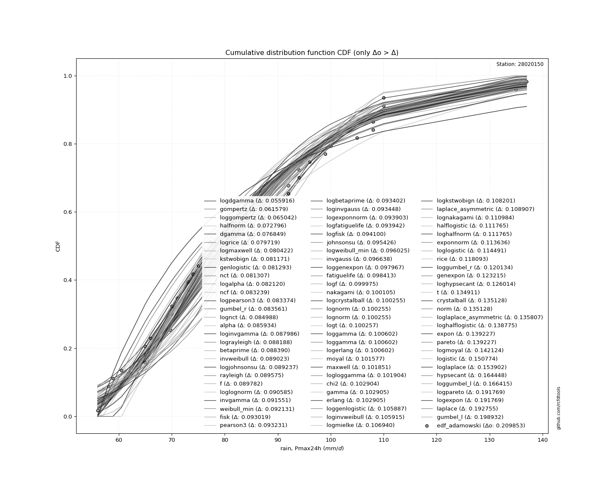</img>

</div>


**12.3. Best fit**

<div align="center">

|   id |   station | empirical_dist   | p_dist      |     delta |   deltao | eval   |   fit |   n |   best_fit |   best_fit_sort |
|-----:|----------:|:-----------------|:------------|----------:|---------:|:-------|------:|----:|-----------:|----------------:|
|    0 |  28020150 | edf_adamowski    | loggompertz | 0.0575102 | 0.194286 | Δo > Δ |     1 |  49 |          1 |               1 |

</div>


<div align="center">

</img>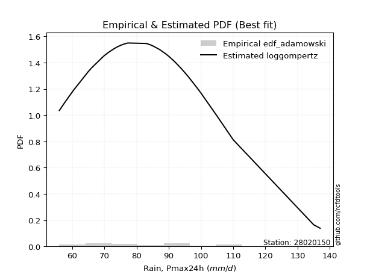</img>

</div>


## C. Best fit & Estimate extreme values for specific return periods - Tr


### 1. Best fit (ordered by delta Δ)

<div align="center">

|   id |   station | empirical_dist   | p_dist      |     delta |   deltao | eval   |   fit |   n |   best_fit |   best_fit_sort |
|-----:|----------:|:-----------------|:------------|----------:|---------:|:-------|------:|----:|-----------:|----------------:|
|    0 |  28020150 | edf_weibull      | loggompertz | 0.0546819 | 0.194286 | Δo > Δ |     1 |  49 |          1 |               1 |
|    1 |  28020150 | edf_adamowski    | loggompertz | 0.0575102 | 0.194286 | Δo > Δ |     1 |  49 |          1 |               2 |
|    2 |  28020150 | edf_chegodayev   | loggompertz | 0.0580827 | 0.194286 | Δo > Δ |     1 |  49 |          1 |               3 |
|    3 |  28020150 | edf_jenkinson    | loggompertz | 0.0581975 | 0.194286 | Δo > Δ |     1 |  49 |          1 |               4 |
|    4 |  28020150 | edf_beard        | loggompertz | 0.0581975 | 0.194286 | Δo > Δ |     1 |  49 |          1 |               5 |
|    5 |  28020150 | edf_filliben     | loggompertz | 0.0582836 | 0.194286 | Δo > Δ |     1 |  49 |          1 |               6 |
|    6 |  28020150 | edf_tukey        | loggompertz | 0.0584657 | 0.194286 | Δo > Δ |     1 |  49 |          1 |               7 |
|    7 |  28020150 | edf_blom         | loggompertz | 0.0589458 | 0.194286 | Δo > Δ |     1 |  49 |          1 |               8 |
|    8 |  28020150 | edf_cunnane      | loggompertz | 0.0592347 | 0.194286 | Δo > Δ |     1 |  49 |          1 |               9 |
|    9 |  28020150 | edf_gringorten   | loggompertz | 0.0596982 | 0.194286 | Δo > Δ |     1 |  49 |          1 |              10 |
|   10 |  28020150 | edf_hazen        | loggompertz | 0.0603962 | 0.194286 | Δo > Δ |     1 |  49 |          1 |              11 |
|   11 |  28020150 | edf_california   | loggompertz | 0.0637877 | 0.194286 | Δo > Δ |     1 |  49 |          1 |              12 |

</div>

:file_folder:Tables: [bestfit_28020150.csv](table/bestfit_28020150.csv) | [extreme_28020150.csv](table/extreme_28020150.csv)


### 2. Extreme values

In hydrology, a return period (or recurrence interval $Tr$) is the statistical average time between extreme events like floods or droughts of a specific magnitude, indicating how rare an event is, with a 100-year flood, for example, having a 1% chance of occurring in any given year, not that it happens exactly every century. It is a key tool for infrastructure design (like bridges or dams) and risk assessment, calculated from historical data to determine the probability of future events, although it is important to remember it is statistical average, and events can cluster or be missed.

> risk_rate: assuming the return period as the project useful life.

|   id |      tr |   prob_l |     prob_g |    alpha |   betaprime |     chi2 |   crystalball |   erlang |    expon |   exponnorm |        f |   fatiguelife |     fisk |    gamma |   genexpon |   genlogistic |   gibrat |   gompertz |   gumbel_l |   gumbel_r |   halflogistic |   halfnorm |   hypsecant |   invgamma |   invgauss |   invweibull |   johnsonsu |   kstwobign |   laplace |   laplace_asymmetric |   loggamma |   logistic |   lognorm |   maxwell |   mielke |    moyal |   nakagami |        ncf |      nct |     norm |   pareto |   pearson3 |   rayleigh |     rice |        t |   truncnorm |     wald |   weibull_min |   logalpha |   logbetaprime |          logchi2 |   logcrystalball |   logerlang |   logexpon |   logexponnorm |     logf |   logfatiguelife |   logfisk |   loggenexpon |   loggenlogistic |   loggibrat |   loggompertz |   loggumbel_l |   loggumbel_r |   loghalflogistic |   loghalfnorm |   loghypsecant |   loginvgamma |   loginvgauss |   loginvweibull |   logjohnsonsu |   logkstwobign |   loglaplace |   loglaplace_asymmetric |   logloggamma |   loglogistic |   loglognorm |   logmaxwell |   logmielke |   logmoyal |   lognakagami |   logncf |   lognct |   logpareto |   logpearson3 |   lograyleigh |   logrice |     logt |   logtruncnorm |   logwald |   logweibull_min |   station |   n |   risk_rate |
|-----:|--------:|---------:|-----------:|---------:|------------:|---------:|--------------:|---------:|---------:|------------:|---------:|--------------:|---------:|---------:|-----------:|--------------:|---------:|-----------:|-----------:|-----------:|---------------:|-----------:|------------:|-----------:|-----------:|-------------:|------------:|------------:|----------:|---------------------:|-----------:|-----------:|----------:|----------:|---------:|---------:|-----------:|-----------:|---------:|---------:|---------:|-----------:|-----------:|---------:|---------:|------------:|---------:|--------------:|-----------:|---------------:|-----------------:|-----------------:|------------:|-----------:|---------------:|---------:|-----------------:|----------:|--------------:|-----------------:|------------:|--------------:|--------------:|--------------:|------------------:|--------------:|---------------:|--------------:|--------------:|----------------:|---------------:|---------------:|-------------:|------------------------:|--------------:|--------------:|-------------:|-------------:|------------:|-----------:|--------------:|---------:|---------:|------------:|--------------:|--------------:|----------:|---------:|---------------:|----------:|-----------------:|----------:|----:|------------:|
|    0 |    2    | 0.5      | 0.5        |  80.7698 |     81.2116 |  79.3674 |       83.8205 |  79.3673 |  75.2837 |     80.0021 |  80.1292 |       80.0042 |  81.4284 |  79.3673 |    75.3725 |       80.542  |  78.11   |    117.395 |    86.9459 |    80.6951 |        79.1413 |    79.9262 |     83.8205 |    80.495  |    80.0978 |      80.5582 |     80.3015 |     80.7005 |   83.8205 |              78.3726 |    80.2592 |    83.8205 |   81.7789 |   82.1934 |  79.6331 |  79.6861 |    78.1981 |    29.6486 |  80.5279 |  83.8205 |  75.2837 |    81.5536 |    81.6164 |  82.3152 |  83.4912 |    -68.0703 |  77.6536 |       79.8129 |    80.7582 |        81.4936 |     92.9078      |          81.7791 |     80.2592 |    72.8079 |        81.48   |  80.2668 |          80.4771 |   80.7656 |       77.0136 |          79.6264 |     76.541  |       80.8717 |       84.7956 |       78.8696 |           77.4613 |       78.1701 |        81.7789 |       81.3596 |       80.1631 |         78.8992 |        80.6095 |        78.4227 |      81.7789 |                 85.6591 |       81.8546 |       81.7789 |      80.5812 |      80.2512 |     79.9197 |    77.9526 |       78.6584 |  81.686  |  81.031  |     72.8079 |       81.0972 |       79.7162 |   80.4936 |  81.7789 |        73.2117 |   76.1384 |          80.0536 |  28020150 |  49 |    0.75     |
|    1 |    2.33 | 0.570815 | 0.429185   |  83.9826 |     84.4698 |  82.88   |       87.2154 |  82.88   |  79.5325 |     83.1085 |  83.4149 |       83.3566 |  84.5025 |  82.88   |    79.5833 |       83.7771 |  79.8298 |    118.981 |    89.8995 |    83.8409 |        82.3757 |    83.5902 |     86.5375 |    83.7469 |    83.433  |      83.7916 |     83.5954 |     84.0711 |   85.875  |              81.5922 |    83.5297 |    86.8117 |   85.0609 |   85.7205 |  82.8613 |  82.664  |    82.2096 |    47.4379 |  83.7654 |  87.2154 |  79.5325 |    84.9351 |    85.1956 |  85.6948 |  86.7755 |    -41.6572 |  79.8797 |       83.3865 |    84      |        88.5176 |    110.915       |          85.061  |     83.5297 |    77.1425 |        84.7235 |  83.5402 |          83.732  |   83.8456 |       80.789  |          82.8557 |     78.0821 |       84.663  |       87.7487 |       81.7982 |           80.4206 |       81.561  |        84.3951 |       84.6178 |       83.4282 |         82.2516 |        83.8596 |        81.8529 |      83.7496 |                 88.4016 |       85.1513 |       84.6638 |      83.8301 |      83.5998 |     83.0741 |    80.69   |       82.2021 |  89.1077 |  84.2862 |     77.1425 |       84.3659 |       83.0927 |   83.889  |  85.0609 |        77.5184 |   78.1282 |          83.4474 |  28020150 |  49 |    0.729209 |
|    2 |    5    | 0.8      | 0.2        |  97.8289 |     98.1616 |  98.6102 |       99.8318 |  98.6102 | 100.775  |     97.4527 |  97.8406 |       98.1695 |  97.496  |  98.6102 |   100.637  |       97.8285 |  89.7307 |    124.108 |    99.4414 |    97.5075 |        97.0104 |    99.0848 |     97.4357 |    97.9227 |    98.1267 |      97.839  |     98.0393 |     98.3886 |   96.1467 |              97.689  |    97.9392 |    98.3609 |   98.4545 |   99.6028 |  98.013  |  96.4577 |    99.3031 |   182.177  |  97.8749 |  99.8318 | 100.775  |    98.8111 |    99.5249 |  99.2249 |  99.0854 |     44.7023 |  92.3413 |       98.8085 |    97.9275 |       121.149  |    311.028       |          98.4546 |     97.9392 |   103.007  |        98.1699 |  97.9659 |          97.93   |   97.6757 |      100.088  |          98.0165 |     87.5777 |       99.8921 |       98.01   |       95.8376 |           95.2887 |       97.6045 |        95.7579 |       98.1584 |       97.8553 |         98.5499 |        97.9554 |        98.1768 |      94.3379 |                 98.1199 |       98.5555 |       96.7902 |      97.9339 |      98.1935 |     97.6044 |    94.6786 |       98.2944 | 124.13   |  98.0492 |    103.007  |       98.1732 |       98.1049 |   98.4283 |  98.4545 |       102.225  |   90.2664 |          98.2686 |  28020150 |  49 |    0.67232  |
|    3 |   10    | 0.9      | 0.1        | 109.112  |    108.849  | 111.515  |      108.201  | 111.515  | 120.059  |    110.19   | 109.756  |      110.282  | 108.321  | 111.515  |   119.748  |      109.271  | 101.017  |    126.962 |   104.754  |   108.639  |       109.164  |   110.55   |    106.138  |   109.545  |   110.128  |     109.28   |    109.885  |    109.29   |  105.471  |             112.301  |   109.889  |   106.866  |  108.483  |  109.372  | 112.037  | 108.467  |   112.013  |   417.256  | 109.477  | 108.201  | 120.059  |   109.194  |   109.742  | 108.872  | 107.46   |     86.9943 | 105.566  |      110.759  |   109.146  |       150.061  |    894.359       |         108.483  |    109.889  |   133.923  |       108.535  | 109.935  |         109.574  |  110.265  |      119.482  |         112.051  |     99.8177 |      110.549  |      104.234  |      109.035  |          109.705  |      111.475  |       105.92   |      108.558  |      109.893  |        114.183  |       109.442  |       112.756  |     105.104  |                107.454  |      108.541  |      106.818  |     109.44   |     109.966  |    110.796  |   108.819  |      111.795  | 155.817  | 108.881  |    133.923  |      109.009  |      110.438  |  109.836  | 108.483  |       129.861  |  105.217  |         110.181  |  28020150 |  49 |    0.651322 |
|    4 |   15    | 0.933333 | 0.0666667  | 115.547  |    114.743  | 118.729  |      112.378  | 118.729  | 131.339  |    117.638  | 116.561  |      117.079  | 114.714  | 118.729  |   130.928  |      115.726  | 108.801  |    128.254 |   107.16   |   114.919  |       116.042  |   116.517  |    111.105  |   116.157  |   116.865  |     115.736  |    116.596  |    115.077  |  110.925  |             120.849  |   116.726  |   111.501  |  113.864  |  114.385  | 120.748  | 115.437  |   118.635  |   641.746  | 116.103  | 112.378  | 131.339  |   114.738  |   115.006  | 113.843  | 111.739  |    102.51   | 114.058  |      117.19   |   115.465  |       167.274  |   1710.59        |         113.864  |    116.726  |   156.148  |       114.235  | 116.786  |         116.198  |  118.188  |      132.049  |         120.768  |    109.244  |      115.937  |      107.182  |      117.267  |          118.809  |      119.457  |       112.196  |      114.23   |      116.816  |        124.074  |       115.954  |       121.356  |     111.963  |                113.321  |      113.88   |      112.712  |     115.968  |     116.544  |    118.909  |   117.974  |      119.482  | 174.937  | 114.886  |    156.148  |      115      |      117.386  |  116.096  | 113.864  |       148.678  |  116.099  |         116.805  |  28020150 |  49 |    0.644736 |
|    5 |   20    | 0.95     | 0.05       | 120.104  |    118.826  | 123.741  |      115.113  | 123.741  | 139.343  |    122.923  | 121.37   |      121.814  | 119.352  | 123.741  |   138.86   |      120.246  | 114.907  |    129.059 |   108.657  |   119.316  |       120.861  |   120.495  |    114.608  |   120.821  |   121.563  |     120.255  |    121.31   |    118.975  |  114.795  |             126.914  |   121.563  |   114.704  |  117.531  |  117.712  | 127.229  | 120.373  |   123.052  |   859.779  | 120.79   | 115.113  | 139.343  |   118.502  |   118.505  | 117.147  | 114.586  |    110.644  | 120.387  |      121.562  |   119.898  |       179.72   |   2736.95        |         117.531  |    121.562  |   174.119  |       118.187  | 121.633  |         120.868  |  124.172  |      141.616  |         127.253  |    117.256  |      119.476  |      109.058  |      123.399  |          125.634  |      125.093  |       116.846  |      118.134  |      121.73   |        131.505  |       120.539  |       127.515  |     117.1    |                117.677  |      117.511  |      116.975  |     120.566  |     121.126  |    124.914  |   124.92   |      124.887  | 188.871  | 119.058  |    174.119  |      119.155  |      122.245  |  120.412  | 117.531  |       163.347  |  124.933  |         121.404  |  28020150 |  49 |    0.641514 |
|    6 |   25    | 0.96     | 0.04       | 123.651  |    121.951  | 127.576  |      117.126  | 127.576  | 145.551  |    127.022  | 125.102  |      125.449  | 123.026  | 127.576  |   145.012  |      123.727  | 119.998  |    129.631 |   109.723  |   122.703  |       124.573  |   123.455  |    117.32   |   124.436  |   125.171  |     123.737  |    124.952  |    121.895  |  117.797  |             131.618  |   125.318  |   117.154  |  120.306  |  120.182  | 132.449  | 124.199  |   126.338  |  1073.16   | 124.432  | 117.126  | 145.551  |   121.34   |   121.105  | 119.601  | 116.707  |    115.663  | 125.456  |      124.858  |   123.322  |       189.534  |   3959.47        |         120.306  |    125.318  |   189.471  |       121.217  | 125.398  |         124.488  |  129.058  |      149.448  |         132.477  |    124.383  |      122.084  |      110.414  |      128.339  |          131.159  |      129.458  |       120.577  |      121.108  |      125.556  |        137.531  |       124.089  |       132.333  |     121.246  |                121.171  |      120.256  |      120.345  |     124.127  |     124.643  |    129.733  |   130.584  |      129.062  | 199.919  | 122.259  |    189.471  |      122.337  |      125.984  |  123.702  | 120.306  |       175.531  |  132.492  |         124.925  |  28020150 |  49 |    0.639603 |
|    7 |   50    | 0.98     | 0.02       | 134.83   |    131.503  | 139.259  |      122.892  | 139.259  | 164.834  |    139.754  | 136.779  |      136.57   | 134.962  | 139.259  |   164.124  |      134.451  | 137.942  |    131.185 |   112.616  |   133.137  |       136.013  |   132.058  |    125.727  |   135.727  |   136.225  |     134.461  |    136.247  |    130.47   |  127.122  |             146.23   |   137.08   |   124.641  |  128.62   |  127.344  | 149.885  | 136.077  |   135.892  |  2096.43   | 135.857  | 122.892  | 164.834  |   129.791  |   128.652  | 126.727  | 122.917  |    126.058  | 142.006  |      134.649  |   133.954  |       221.051  |  12734.6         |         128.62   |    137.079  |   246.339  |       130.529  | 137.192  |         135.787  |  145.867  |      176.347  |         149.922  |    153.143  |      129.55   |      114.179  |      144.837  |          149.757  |      143.031  |       132.917  |      130.123  |      137.59   |        157.885  |       135.154  |       147.559  |     135.083  |                132.698  |      128.459  |      131.254  |     135.231  |     135.432  |    145.733  |   149.857  |      141.995  | 235.746  | 132.076  |    246.339  |      132.072  |      137.5    |  133.68   | 128.62   |       218.289  |  160.504  |         135.68   |  28020150 |  49 |    0.63583  |
|    8 |   75    | 0.986667 | 0.0133333  | 141.546  |    137.024  | 145.96   |      125.985  | 145.96   | 176.115  |    147.202  | 143.711  |      142.986  | 142.376  | 145.96   |   175.303  |      140.684  | 150.062  |    131.971 |   114.079  |   139.201  |       142.662  |   136.741  |    130.64   |   142.416  |   142.614  |     140.695  |    142.877  |    135.187  |  132.576  |             154.778  |   144.067  |   128.964  |  133.316  |  131.239  | 161.04   | 143.023  |   141.092  |  3075.24   | 142.665  | 125.985  | 176.115  |   134.524  |   132.757  | 130.604  | 126.342  |    129.64   | 152.19   |      140.11   |   140.214  |       240.304  |  25525.3         |         133.316  |    144.067  |   287.219  |       135.966  | 144.201  |         142.478  |  157.058  |      194.113  |         161.084  |    176.242  |      133.547  |      116.131  |      155.384  |          161.756  |      151.009  |       140.705  |      135.284  |      144.78   |        171.072  |       141.696  |       156.671  |     143.898  |                139.943  |      133.079  |      137.999  |     141.801  |     141.685  |    155.901  |   162.42   |      149.57   | 257.875  | 137.774  |    287.219  |      137.702  |      144.201  |  139.389  | 133.316  |       247.095  |  180.61   |         141.879  |  28020150 |  49 |    0.634587 |
|    9 |  100    | 0.99     | 0.01       | 146.415  |    140.927  | 150.666  |      128.078  | 150.666  | 184.118  |    152.487  | 148.69   |      147.508  | 147.853  | 150.666  |   183.235  |      145.096  | 159.451  |    132.485 |   115.035  |   143.494  |       147.369  |   139.931  |    134.125  |   147.216  |   147.121  |     145.106  |    147.604  |    138.42   |  136.446  |             160.842  |   149.088  |   132.017  |  136.588  |  133.891  | 169.43   | 147.95   |   144.635  |  4026.29   | 147.569  | 128.078  | 184.118  |   137.805  |   135.554  | 133.245  | 128.699  |    131.455  | 159.615  |      143.883  |   144.69   |       254.368  |  41987.8         |         136.588  |    149.088  |   320.275  |       139.843  | 149.24   |         147.276  |  165.715  |      207.742  |         169.477  |    196.504  |      136.245  |      117.426  |      163.309  |          170.826  |      156.697  |       146.505  |      138.91   |      149.965  |        181.066  |       146.385  |       163.237  |     150.5    |                145.322  |      136.294  |      142.969  |     146.511  |     146.109  |    163.518  |   171.967  |      154.961  | 274.148  | 141.813  |    320.275  |      141.684  |      148.952  |  143.397  | 136.588  |       269.407  |  196.84   |         146.25   |  28020150 |  49 |    0.633968 |
|   10 |  200    | 0.995    | 0.005      | 158.582  |    150.321  | 161.865  |      132.824  | 161.865  | 203.402  |    165.219  | 160.939  |      158.32   | 161.864  | 161.865  |   202.347  |      155.702  | 184.994  |    133.603 |   117.115  |   153.812  |       158.684  |   147.228  |    142.52   |   159.009  |   157.916  |     155.713  |    159.104  |    145.865  |  145.77   |             175.455  |   161.443  |   139.34   |  144.313  |  139.96   | 191.423  | 159.823  |   152.738  |  7666.24   | 159.685  | 132.824  | 203.402  |   145.488  |   141.954  | 139.288  | 134.183  |    134.208  | 178.111  |      152.668  |   155.639  |       289.739  | 141023           |         144.312  |    161.442  |   416.403  |       149.31   | 161.643  |         159.055  |  189.448  |      244.496  |         191.478  |    264.215  |      142.341  |      120.291  |      184.057  |          194.767  |      170.524  |       161.478  |      147.567  |      162.788  |        207.548  |       157.888  |       179.426  |     167.676  |                159.147  |      143.864  |      155.634  |     158.07   |     156.756  |    183.37   |   197.336  |      168.037  | 315.455  | 151.567  |    416.403  |      151.268  |      160.421  |  152.949  | 144.313  |       330.217  |  243.894  |         156.723  |  28020150 |  49 |    0.633042 |
|   11 |  250    | 0.996    | 0.004      | 162.651  |    153.351  | 165.433  |      134.274  | 165.433  | 209.61   |    169.318  | 164.968  |      161.781  | 166.638  | 165.433  |   208.499  |      159.111  | 194.159  |    133.931 |   117.727  |   157.13   |       162.321  |   149.473  |    145.223  |   162.883  |   161.376  |     159.123  |    162.846  |    148.169  |  148.772  |             180.159  |   165.506  |   141.691  |  146.759  |  141.828  | 199.082  | 163.645  |   155.23   |  9422.11   | 163.687  | 134.274  | 209.61   |   147.902  |   143.924  | 141.148  | 135.9    |    134.763  | 184.23   |      155.414  |   159.222  |       301.598  | 208962           |         146.759  |    165.506  |   453.117  |       152.411  | 165.724  |         162.922  |  198.08   |      257.628  |         199.139  |    293.829  |      144.196  |      121.147  |      191.271  |          203.156  |      175.018  |       166.616  |      150.337  |      167.026  |        216.858  |       161.663  |       184.754  |     173.612  |                163.872  |      146.257  |      159.933  |     161.864  |     160.187  |    190.248  |   206.274  |      172.279  | 329.422  | 154.722  |    453.117  |      154.359  |      164.126  |  156      | 146.759  |       352.099  |  261.816  |         160.084  |  28020150 |  49 |    0.632858 |
|   12 |  500    | 0.998    | 0.002      | 175.843  |    162.804  | 176.422  |      138.576  | 176.422  | 228.894  |    182.051  | 177.78   |      172.481  | 182.353  | 176.422  |   227.611  |      169.694  | 225.833  |    134.874 |   119.481  |   167.426  |       173.612  |   156.166  |    153.618  |   175.191  |   172.091  |     169.706  |    174.616  |    155.073  |  158.097  |             194.771  |   178.431  |   148.982  |  154.261  |  147.402  | 224.856  | 175.517  |   162.66   | 17843.5    | 176.475  | 138.576  | 228.894  |   155.249  |   149.802  | 146.698  | 141.115  |    135.878  | 203.686  |      163.721  |   170.571  |       340.012  | 714726           |         154.261  |    178.431  |   589.116  |       162.268  | 178.709  |         175.197  |  228.6    |      303.009  |         224.918  |    424.174  |      149.677  |      123.635  |      215.515  |          231.562  |      189.134  |       183.642  |      158.917  |      180.57   |        248.5    |       173.642  |       201.688  |     193.426  |                179.462  |      153.58   |      174.036  |     173.912  |     170.878  |    213.274  |   236.703  |      185.583  | 375.034  | 164.599  |    589.116  |      164      |      175.698  |  165.43   | 154.261  |       428.068  |  328.032  |         170.512  |  28020150 |  49 |    0.632489 |
|   13 |  750    | 0.998667 | 0.00133333 | 184.001  |    168.376  | 182.791  |      140.965  | 182.791  | 240.174  |    189.499  | 185.502  |      178.712  | 192.21   | 182.791  |   238.79   |      175.881  | 246.78   |    135.378 |   120.419  |   173.446  |       180.212  |   159.905  |    158.529  |   182.602  |   178.341  |     175.893  |    181.614  |    158.952  |  163.551  |             203.319  |   186.22   |   153.242  |  158.593  |  150.52   | 241.442  | 182.462  |   166.811  | 25899.8    | 184.229  | 140.965  | 240.174  |   159.451  |   153.089  | 149.801  | 144.097  |    136.252  | 215.351  |      168.439  |   177.379  |       363.644  |      1.47484e+06 |         158.592  |    186.22   |   686.88   |       168.219  | 186.538  |         182.58   |  249.487  |      333.133  |         241.505  |    540.746  |      152.706  |      124.986  |      231.088  |          249.974  |      197.51   |       194.398  |      163.93   |      188.78   |        269.096  |       180.846  |       211.873  |     206.049  |                189.26   |      157.799  |      182.844  |     181.16   |     177.166  |    228.002  |   256.544  |      193.464  | 403.365  | 170.442  |    686.88   |      169.682  |      182.52   |  170.923  | 158.593  |       478.642  |  375.515  |         176.616  |  28020150 |  49 |    0.632366 |
|   14 | 1000    | 0.999    | 0.001      | 190.012  |    172.354  | 187.287  |      142.61   | 187.286  | 248.177  |    194.783  | 191.091  |      183.123  | 199.521  | 187.287  |   246.722  |      180.269  | 262.809  |    135.717 |   121.05   |   177.715  |       184.894  |   162.487  |    162.013  |   187.962  |   182.77   |     180.282  |    186.634  |    161.639  |  167.421  |             209.383  |   191.856  |   156.263  |  161.646  |  152.675  | 253.944  | 187.389  |   169.677  | 33727.6    | 189.862  | 142.61   | 248.177  |   162.394  |   155.361  | 151.946  | 146.189  |    136.438  | 223.742  |      171.728  |   182.294  |       380.958  |      2.47067e+06 |         161.645  |    191.856  |   765.934  |       172.539  | 192.204  |         187.915  |  265.902  |      356.291  |         254.007  |    651.161  |      154.784  |      125.904  |      242.811  |          263.915  |      203.51   |       202.409  |      167.489  |      194.742  |        284.732  |       186.053  |       219.23   |     215.502  |                196.535  |      160.768  |      189.36   |     186.401  |     181.646  |    239.061  |   271.621  |      199.103  | 424.246  | 174.623  |    765.934  |      173.736  |      187.389  |  174.816  | 161.646  |       517.536  |  413.866  |         180.952  |  28020150 |  49 |    0.632305 |

<div align="center">

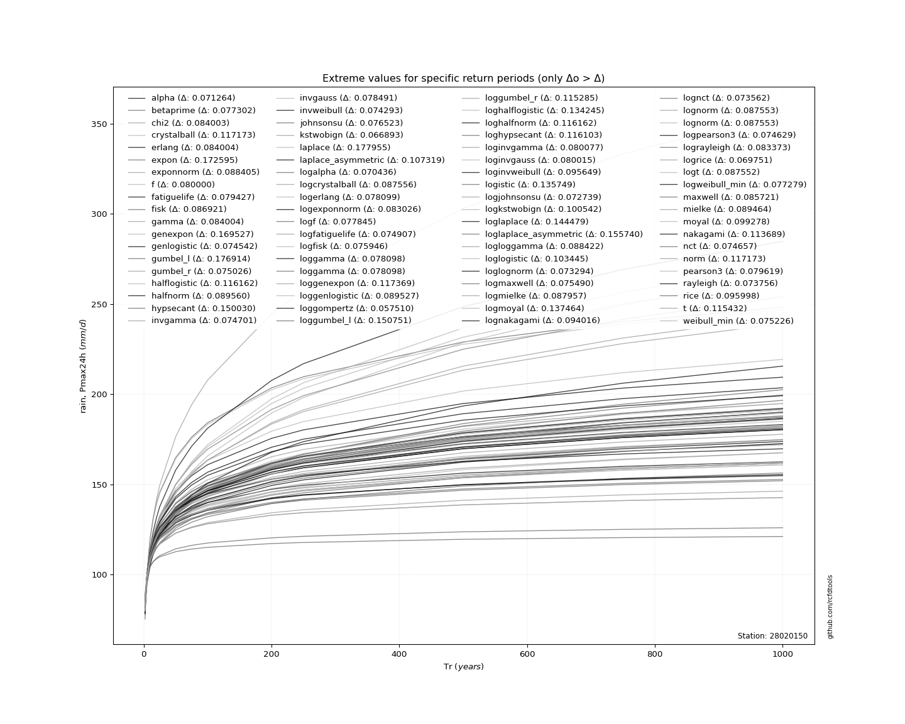</img>

</div>


<div align="center">

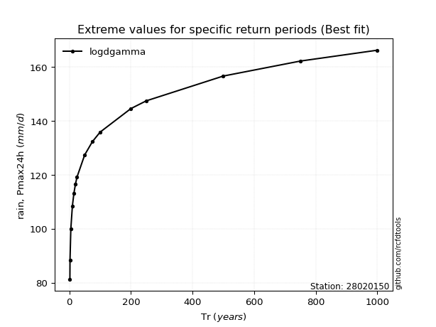</img>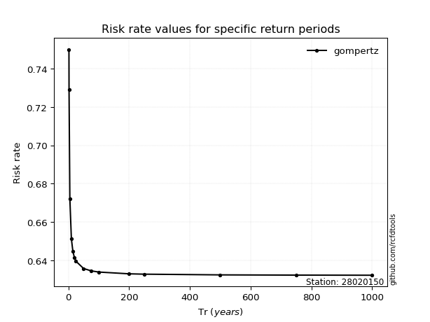</img>

</div>


<sub>**APP DISCLAIMER**: NO WARRANTY - This software is provided by [github.com/rcfdtools](https://github.com/rcfdtools) "as is", without any express or implied warranty, including warranties of merchantability, fitness for a particular purpose, or non-infringement. There is no guarantee that the software will be error-free or operate without interruption. LIMITATION OF LIABILITY - Neither the authors nor copyright holders will be liable for claims or damages arising from the software or its use. You are responsible for determining if the software is appropriate for your use and assume all associated risks, including errors, legal compliance, and data loss. NO PROFESSIONAL ADVICE - The software provides general information and does not offer professional advice. It should not replace consultation with professional advisors.</sub>