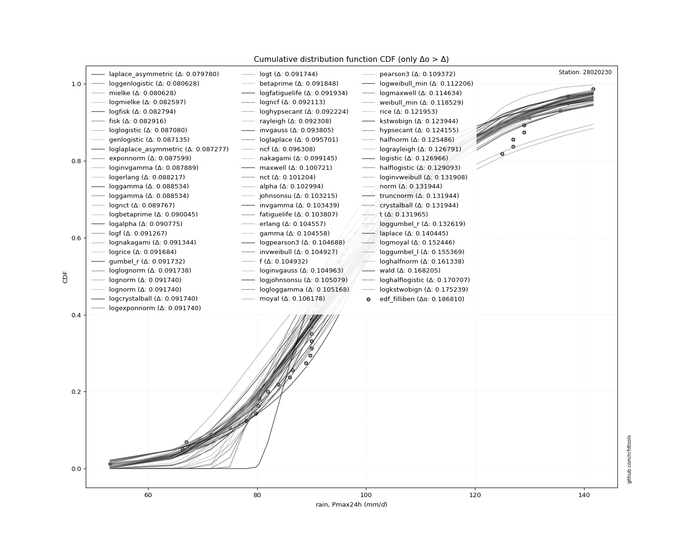
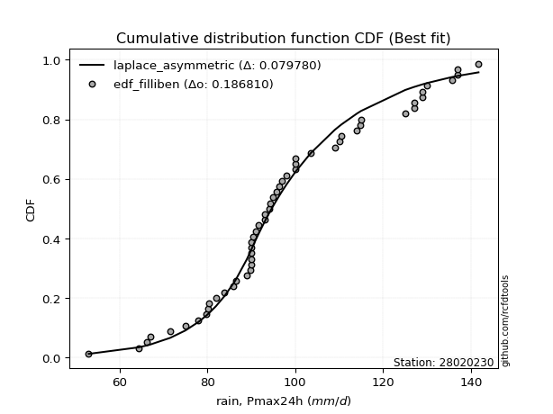
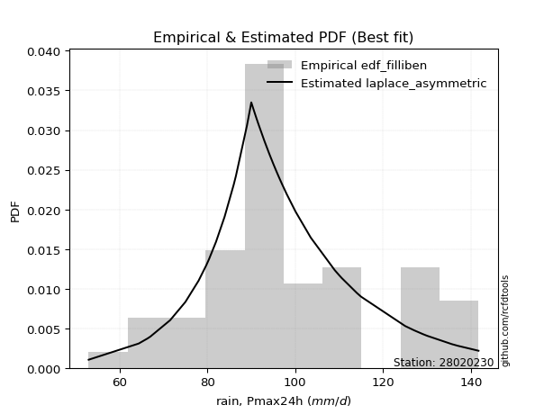

<div align="center">


</div>

# PMP Station (rain, Pmax24h): 28020230

Probable Maximum Precipitation (PMP) is the greatest amount of rainfall for a specific duration that is meteorologically possible for a given location, acting as a "worst-case" scenario for extreme storms, crucial for designing safety-critical infrastructure like bridges, river deviations, dams, spillways, and nuclear plants to prevent catastrophic failure. PMP is calculated by hydrologists using meteorological data to determine the upper limit of extreme rainfall, often leading to the Probable Maximum Flood (PMF) for flood control design, and is increasingly being studied for climate change impacts.

<div align="center">

</img>

</div>


## A. General information


### 1. General running parameters

• app_version: _v20251226_. • runtime: _2025-12-27 08:40:08.814432_. • Python version: _3.14.0_. • SciPy version: _1.16.3_. • Pandas version: _2.3.3_. • NumPy version: _2.3.5_. • Stations dataset (station_dataset_file): _dataset/pmax24h_in/conventional_cesarcolombia_1959_2022.csv_. • Stations catalog (station_catalog_file): _dataset/CNE_IDEAM.xls_. • Minimum year to eval til year_max (date_min): _1959_. • Maximum year to eval since year_min (date_max): _2022_. • Creates, save and include plots into reports (create_plot): _True_. • Plot only fit distributions with Δo > Δ (plot_only_fit): _True_. • Eval low extreme values, if False, evaluates high extreme values (low_extreme): _False_. • Eval every SciPy distribution as logarithmic (pdist_logarithmic_on): _True_. • Standard deviation normalized (ddof): _1.0_. • Return periods to eval in years (Tr): _[2, 2.33, 5, 10, 15, 20, 25, 50, 75, 100, 200, 250, 500, 750, 1000]_. • Minimum data sample per station, 0 means any (minimum_sample): _5_. • Z-Score threshold to adjust a value, 0 means disable (zscore): _3.5_. • Avoid zeros, e.g. rain = 0 (avoid_zeros): _True_. • Avoid null values (avoid_nans): _True_. [:file_folder:Dataset file.](../../dataset/pmax24h_in/conventional_cesarcolombia_1959_2022.csv)

> Delta Degrees of Freedom (DDOF): is a parameter used in the formulas for calculating variance and standard deviation. When ddof=0, the divisor is $N$ (the total number of observations) and this is used when your data set is the entire population. When ddof=1, the divisor is $N-1$ and this is used when your data set is a sample drawn from a larger population. Using $N-1$ provides an unbiased estimate of the population variance (known as Bessel´s correction).


### 2. Station info and location

|   id |   CODIGO | NOMBRE                | CATEGORIA     | TECNOLOGIA   | ESTADO     | FECHA_INSTALACION   | FECHA_SUSPENSION   |   ALTITUD |   LATITUD |   LONGITUD | DEPARTAMENTO   | MUNICIPIO   | AREA_OPERATIVA                                         | ENTIDAD                                                     | AREA_HIDROGRAFICA   | ZONA_HIDROGRAFICA   | SUBZONA_HIDROGRAFICA   |   CORRIENTE | Catalogo   |
|-----:|---------:|:----------------------|:--------------|:-------------|:-----------|:--------------------|:-------------------|----------:|----------:|-----------:|:---------------|:------------|:-------------------------------------------------------|:------------------------------------------------------------|:--------------------|:--------------------|:-----------------------|------------:|:-----------|
|    0 | 28020230 | LLANOS LOS [28020230] | Pluviométrica | Convencional | Suspendida | 15/09/1962          | 15/10/2010         |       100 |   9.73333 |      -73.3 | Cesar          | Becerrill   | Area Operativa 05 - Magdalena-Cesar-Guajira-San Andrés | INSTITUTO DE HIDROLOGIA METEOROLOGIA Y ESTUDIOS AMBIENTALES | Magdalena Cauca     | Cesar               | Medio Cesar            |         nan | CNE_IDEAM  |

<div align="center">

Map location in: [:earth_americas:Google](http://maps.google.com/maps?q=9.733333333,-73.3) [:earth_americas:OSM](https://www.openstreetmap.org/#map=18/9.733333333/-73.3&layers=P) [:earth_americas:Bing](https://www.bing.com/maps?cp=9.733333333~-73.3&lvl=18) [:earth_americas:Apple](https://maps.apple.com/frame?center=9.733333333%2C-73.3&span=0.003%2C0.006)

</div>


<div align="center">

```geojson
{
  "type": "Feature",
  "geometry": {
    "type": "Point", 
    "coordinates": [-73.3, 9.733333333]
  }, 
  "properties": {
    "Name": "28020230"
  }
}
```

</div>


### 3. Discrete values table and plot

|               |           0 |          1 |          2 |          3 |           4 |          5 |           6 |           7 |           8 |         9 |         10 |          11 |          12 |           13 |          14 |           15 |          16 |         17 |         18 |          19 |          20 |          21 |         22 |         23 |         24 |          25 |         26 |           27 |          28 |          29 |          30 |          31 |         32 |          33 |         34 |          35 |         36 |          37 |          38 |         39 |         40 |          41 |          42 |          43 |          44 |          45 |         46 |          47 |         48 |          49 |          50 |          51 |         52 |
|:--------------|------------:|-----------:|-----------:|-----------:|------------:|-----------:|------------:|------------:|------------:|----------:|-----------:|------------:|------------:|-------------:|------------:|-------------:|------------:|-----------:|-----------:|------------:|------------:|------------:|-----------:|-----------:|-----------:|------------:|-----------:|-------------:|------------:|------------:|------------:|------------:|-----------:|------------:|-----------:|------------:|-----------:|------------:|------------:|-----------:|-----------:|------------:|------------:|------------:|------------:|------------:|-----------:|------------:|-----------:|------------:|------------:|------------:|-----------:|
| Date          | 1962        | 1963       | 1965       | 1966       | 1967        | 1968       | 1969        | 1970        | 1971        | 1972      | 1973       | 1974        | 1975        | 1976         | 1977        | 1978         | 1979        | 1980       | 1981       | 1982        | 1983        | 1984        | 1985       | 1986       | 1987       | 1988        | 1989       | 1990         | 1991        | 1992        | 1993        | 1994        | 1995       | 1996        | 1997       | 1998        | 1999       | 2000        | 2001        | 2002       | 2003       | 2004        | 2005        | 2006        | 2007        | 2008        | 2009       | 2010        | 2011       | 2012        | 2013        | 2014        | 2015       |
| Value         |   93        |   95       |   71.5385  |  129       |   97        |  129       |   90        |   86        |  114        |   53      |  130       |  109        |  115        |  100         |   90        |  100         |   93        |  127       |  137       |  110        |  114.7      |   80.2      |  127       |  135.6     |  141.7     |   86.5      |   67       |   98.0579    |   94        |   91        |   90        |   90        |  100.132   |   89        |   75       |   90        |  137       |  125        |   78        |   83.9295  |   90.3391  |   79.7712   |   95.6489   |   81.9676   |   96.3113   |   80.4085   |   66.3151  |  103.535    |  110.573   |   94.2142   |   91.5887   |   89.7295   |   64.3732  |
| Value_initial |   93        |   95       |   71.5385  |  129       |   97        |  129       |   90        |   86        |  114        |   53      |  130       |  109        |  115        |  100         |   90        |  100         |   93        |  127       |  137       |  110        |  114.7      |   80.2      |  127       |  135.6     |  141.7     |   86.5      |   67       |   98.0579    |   94        |   91        |   90        |   90        |  200       |   89        |   75       |   90        |  137       |  125        |   78        |   83.9295  |   90.3391  |   79.7712   |   95.6489   |   81.9676   |   96.3113   |   80.4085   |   66.3151  |  103.535    |  110.573   |   94.2142   |   91.5887   |   89.7295   |   64.3732  |
| count         |   53        |   53       |   53       |   53       |   53        |   53       |   53        |   53        |   53        |   53      |   53       |   53        |   53        |   53         |   53        |   53         |   53        |   53       |   53       |   53        |   53        |   53        |   53       |   53       |   53       |   53        |   53       |   53         |   53        |   53        |   53        |   53        |   53       |   53        |   53       |   53        |   53       |   53        |   53        |   53       |   53       |   53        |   53        |   53        |   53        |   53        |   53       |   53        |   53       |   53        |   53        |   53        |   53       |
| mean          |  100.132    |  100.132   |  100.132   |  100.132   |  100.132    |  100.132   |  100.132    |  100.132    |  100.132    |  100.132  |  100.132   |  100.132    |  100.132    |  100.132     |  100.132    |  100.132     |  100.132    |  100.132   |  100.132   |  100.132    |  100.132    |  100.132    |  100.132   |  100.132   |  100.132   |  100.132    |  100.132   |  100.132     |  100.132    |  100.132    |  100.132    |  100.132    |  100.132   |  100.132    |  100.132   |  100.132    |  100.132   |  100.132    |  100.132    |  100.132   |  100.132   |  100.132    |  100.132    |  100.132    |  100.132    |  100.132    |  100.132   |  100.132    |  100.132   |  100.132    |  100.132    |  100.132    |  100.132   |
| std           |   24.9337   |   24.9337  |   24.9337  |   24.9337  |   24.9337   |   24.9337  |   24.9337   |   24.9337   |   24.9337   |   24.9337 |   24.9337  |   24.9337   |   24.9337   |   24.9337    |   24.9337   |   24.9337    |   24.9337   |   24.9337  |   24.9337  |   24.9337   |   24.9337   |   24.9337   |   24.9337  |   24.9337  |   24.9337  |   24.9337   |   24.9337  |   24.9337    |   24.9337   |   24.9337   |   24.9337   |   24.9337   |   24.9337  |   24.9337   |   24.9337  |   24.9337   |   24.9337  |   24.9337   |   24.9337   |   24.9337  |   24.9337  |   24.9337   |   24.9337   |   24.9337   |   24.9337   |   24.9337   |   24.9337  |   24.9337   |   24.9337  |   24.9337   |   24.9337   |   24.9337   |   24.9337  |
| zscore        |   -0.286043 |   -0.20583 |   -1.14679 |    1.15779 |   -0.125617 |    1.15779 |   -0.406362 |   -0.566788 |    0.556191 |   -1.8903 |    1.19789 |    0.355659 |    0.596298 |   -0.0052981 |   -0.406362 |   -0.0052981 |   -0.286043 |    1.07757 |    1.47864 |    0.395766 |    0.584266 |   -0.799405 |    1.07757 |    1.42249 |    1.66714 |   -0.546734 |   -1.32881 |   -0.0831872 |   -0.245936 |   -0.366256 |   -0.406362 |   -0.406362 |    4.00534 |   -0.446468 |   -1.00796 |   -0.406362 |    1.47864 |    0.997362 |   -0.887639 |   -0.64983 |   -0.39276 |   -0.816602 |   -0.179805 |   -0.728511 |   -0.153237 |   -0.791042 |   -1.35628 |    0.136478 |    0.41875 |   -0.237347 |   -0.342645 |   -0.417212 |   -1.43416 |

<div align="center">

</img>

</div>


> The initial value (value_initial) correspond to the initial obtained or null completed value, and value (value) is adjusted only when the initial value is outside the valid range definite through the Z-Score value. If Z-Score is active, values out of range or outliers are replaced with the station mean value


### 4. Active continuous probability distributions from SciPy (45 of 104 available)

[scipy.stats](https://docs.scipy.org/doc/scipy/reference/stats.html) is a Python´s powerful submodule within the SciPy library for comprehensive statistical analysis, offering over 130 probability distributions (like Normal, Poisson), functions for descriptive stats (mean, variance), hypothesis testing (t-tests, chi-square), random variable generation, and statistical tests, making it essential for data science, modeling, and research. It provides tools to explore, model, and draw conclusions from data efficiently, working seamlessly with NumPy.

<div align="center">

|   id | p_dist             |   n_parameter | fit_method   | label                                                                       | active   | ref                                                                                                        |
|-----:|:-------------------|--------------:|:-------------|:----------------------------------------------------------------------------|:---------|:-----------------------------------------------------------------------------------------------------------|
|    0 | alpha              |             3 | MLE          | Alpha                                                                       | True     | [:mortar_board:](https://docs.scipy.org/doc/scipy/reference/generated/scipy.stats.alpha.html)              |
|    1 | betaprime          |             4 | MLE          | Beta prime                                                                  | True     | [:mortar_board:](https://docs.scipy.org/doc/scipy/reference/generated/scipy.stats.betaprime.html)          |
|    2 | chi2               |             3 | MLE          | Chi²                                                                        | True     | [:mortar_board:](https://docs.scipy.org/doc/scipy/reference/generated/scipy.stats.chi2.html)               |
|    3 | crystalball        |             4 | MLE          | Crystalball                                                                 | True     | [:mortar_board:](https://docs.scipy.org/doc/scipy/reference/generated/scipy.stats.crystalball.html)        |
|    4 | erlang             |             3 | MLE          | Erlang                                                                      | True     | [:mortar_board:](https://docs.scipy.org/doc/scipy/reference/generated/scipy.stats.erlang.html)             |
|    5 | expon              |             2 | MLE          | Exponential                                                                 | True     | [:mortar_board:](https://docs.scipy.org/doc/scipy/reference/generated/scipy.stats.expon.html)              |
|    6 | exponnorm          |             3 | MLE          | Exponentially modified Normal                                               | True     | [:mortar_board:](https://docs.scipy.org/doc/scipy/reference/generated/scipy.stats.exponnorm.html)          |
|    7 | f                  |             4 | MLE          | F                                                                           | True     | [:mortar_board:](https://docs.scipy.org/doc/scipy/reference/generated/scipy.stats.f.html)                  |
|    8 | fatiguelife        |             3 | MLE          | Fatigue-life (Birnbaum-Saunders)                                            | True     | [:mortar_board:](https://docs.scipy.org/doc/scipy/reference/generated/scipy.stats.fatiguelife.html)        |
|    9 | fisk               |             3 | MLE          | Fisk                                                                        | True     | [:mortar_board:](https://docs.scipy.org/doc/scipy/reference/generated/scipy.stats.fisk.html)               |
|   10 | gamma              |             3 | MLE          | Gamma                                                                       | True     | [:mortar_board:](https://docs.scipy.org/doc/scipy/reference/generated/scipy.stats.gamma.html)              |
|   11 | genexpon           |             5 | MLE          | Generalized exponential                                                     | True     | [:mortar_board:](https://docs.scipy.org/doc/scipy/reference/generated/scipy.stats.genexpon.html)           |
|   12 | genlogistic        |             3 | MLE          | Generalized logistic                                                        | True     | [:mortar_board:](https://docs.scipy.org/doc/scipy/reference/generated/scipy.stats.genlogistic.html)        |
|   13 | gibrat             |             2 | MM           | Gibrat                                                                      | True     | [:mortar_board:](https://docs.scipy.org/doc/scipy/reference/generated/scipy.stats.gibrat.html)             |
|   14 | gompertz           |             3 | MLE          | Gompertz (or truncated Gumbel)                                              | True     | [:mortar_board:](https://docs.scipy.org/doc/scipy/reference/generated/scipy.stats.gompertz.html)           |
|   15 | gumbel_l           |             2 | MM           | Gumbel Left Skew                                                            | True     | [:mortar_board:](https://docs.scipy.org/doc/scipy/reference/generated/scipy.stats.gumbel_l.html)           |
|   16 | gumbel_r           |             2 | MM           | Gumbel Right Skew                                                           | True     | [:mortar_board:](https://docs.scipy.org/doc/scipy/reference/generated/scipy.stats.gumbel_r.html)           |
|   17 | halflogistic       |             2 | MM           | Half-logistic                                                               | True     | [:mortar_board:](https://docs.scipy.org/doc/scipy/reference/generated/scipy.stats.halflogistic.html)       |
|   18 | halfnorm           |             2 | MM           | Half Normal                                                                 | True     | [:mortar_board:](https://docs.scipy.org/doc/scipy/reference/generated/scipy.stats.halfnorm.html)           |
|   19 | hypsecant          |             2 | MM           | hyperbolic secant                                                           | True     | [:mortar_board:](https://docs.scipy.org/doc/scipy/reference/generated/scipy.stats.hypsecant.html)          |
|   20 | invgamma           |             3 | MLE          | Inverted gamma                                                              | True     | [:mortar_board:](https://docs.scipy.org/doc/scipy/reference/generated/scipy.stats.invgamma.html)           |
|   21 | invgauss           |             3 | MLE          | Inverse Gaussian                                                            | True     | [:mortar_board:](https://docs.scipy.org/doc/scipy/reference/generated/scipy.stats.invgauss.html)           |
|   22 | invweibull         |             3 | MLE          | Inverted Weibull                                                            | True     | [:mortar_board:](https://docs.scipy.org/doc/scipy/reference/generated/scipy.stats.invweibull.html)         |
|   23 | johnsonsu          |             4 | MLE          | Johnson Su                                                                  | True     | [:mortar_board:](https://docs.scipy.org/doc/scipy/reference/generated/scipy.stats.johnsonsu.html)          |
|   24 | kstwobign          |             2 | MLE          | Limiting distribution of scaled Kolmogorov-Smirnov two-sided test statistic | True     | [:mortar_board:](https://docs.scipy.org/doc/scipy/reference/generated/scipy.stats.kstwobign.html)          |
|   25 | laplace            |             2 | MM           | Laplace                                                                     | True     | [:mortar_board:](https://docs.scipy.org/doc/scipy/reference/generated/scipy.stats.laplace.html)            |
|   26 | laplace_asymmetric |             3 | MLE          | Asymmetric Laplace                                                          | True     | [:mortar_board:](https://docs.scipy.org/doc/scipy/reference/generated/scipy.stats.laplace_asymmetric.html) |
|   27 | loggamma           |             3 | MLE          | Log gamma                                                                   | True     | [:mortar_board:](https://docs.scipy.org/doc/scipy/reference/generated/scipy.stats.loggamma.html)           |
|   28 | logistic           |             2 | MM           | Logistic (or Sech-squared)                                                  | True     | [:mortar_board:](https://docs.scipy.org/doc/scipy/reference/generated/scipy.stats.logistic.html)           |
|   29 | lognorm            |             3 | MLE          | Log Normal                                                                  | True     | [:mortar_board:](https://docs.scipy.org/doc/scipy/reference/generated/scipy.stats.lognorm.html)            |
|   30 | maxwell            |             2 | MM           | Maxwell                                                                     | True     | [:mortar_board:](https://docs.scipy.org/doc/scipy/reference/generated/scipy.stats.maxwell.html)            |
|   31 | mielke             |             4 | MLE          | Mielke Beta-Kappa / Dagum                                                   | True     | [:mortar_board:](https://docs.scipy.org/doc/scipy/reference/generated/scipy.stats.mielke.html)             |
|   32 | moyal              |             2 | MM           | Moyal                                                                       | True     | [:mortar_board:](https://docs.scipy.org/doc/scipy/reference/generated/scipy.stats.moyal.html)              |
|   33 | nakagami           |             3 | MLE          | Nakagami                                                                    | True     | [:mortar_board:](https://docs.scipy.org/doc/scipy/reference/generated/scipy.stats.nakagami.html)           |
|   34 | ncf                |             5 | MLE          | Non-central F distribution                                                  | True     | [:mortar_board:](https://docs.scipy.org/doc/scipy/reference/generated/scipy.stats.ncf.html)                |
|   35 | nct                |             4 | MLE          | Non-central Student’s t                                                     | True     | [:mortar_board:](https://docs.scipy.org/doc/scipy/reference/generated/scipy.stats.nct.html)                |
|   36 | norm               |             2 | MM           | Normal                                                                      | True     | [:mortar_board:](https://docs.scipy.org/doc/scipy/reference/generated/scipy.stats.norm.html)               |
|   37 | pareto             |             3 | MLE          | Pareto                                                                      | True     | [:mortar_board:](https://docs.scipy.org/doc/scipy/reference/generated/scipy.stats.pareto.html)             |
|   38 | pearson3           |             3 | MM           | Pearson type III                                                            | True     | [:mortar_board:](https://docs.scipy.org/doc/scipy/reference/generated/scipy.stats.pearson3.html)           |
|   39 | rayleigh           |             2 | MM           | Rayleigh                                                                    | True     | [:mortar_board:](https://docs.scipy.org/doc/scipy/reference/generated/scipy.stats.rayleigh.html)           |
|   40 | rice               |             3 | MLE          | Rice                                                                        | True     | [:mortar_board:](https://docs.scipy.org/doc/scipy/reference/generated/scipy.stats.rice.html)               |
|   41 | t                  |             3 | MLE          | Student’s t                                                                 | True     | [:mortar_board:](https://docs.scipy.org/doc/scipy/reference/generated/scipy.stats.t.html)                  |
|   42 | truncnorm          |             4 | MLE          | Truncated normal                                                            | True     | [:mortar_board:](https://docs.scipy.org/doc/scipy/reference/generated/scipy.stats.truncnorm.html)          |
|   43 | wald               |             2 | MM           | Wald                                                                        | True     | [:mortar_board:](https://docs.scipy.org/doc/scipy/reference/generated/scipy.stats.wald.html)               |
|   44 | weibull_min        |             3 | MLE          | Weibull minimum                                                             | True     | [:mortar_board:](https://docs.scipy.org/doc/scipy/reference/generated/scipy.stats.weibull_min.html)        |

</div>

> **n_parameter:** # arguments & localization & scale.
>
> **Fit methods:** (MLE) maximum likelihood, (MM) L-moments.
>
>**Inactive:** foldnorm, gennorm, norminvgauss, powernorm, powerlognorm, skewnorm, genextreme, anglit, arcsine, argus, beta, bradford, burr, burr12, cauchy, cosine, halfcauchy, foldcauchy, skewcauchy, wrapcauchy, dgamma, gengamma, exponweib, exponpow, truncexpon, gausshyper, genhalflogistic, genhyperbolic, geninvgauss, halfgennorm, johnsonsb, kappa4, kappa3, ksone, kstwo, loglaplace, levy, levy_l, levy_stable, ncx2, genpareto, truncpareto, lomax, powerlaw, rdist, rel_breitwigner, recipinvgauss, semicircular, studentized_range, trapezoid, triang, truncweibull_min, tukeylambda, uniform, loguniform, vonmises, vonmises_line, weibull_max, dweibull, 


## B. Probability distributions vs. Empirical distributions

A continuous probability distribution (CPD) describes probabilities for variables that can take any value within a range (like rain any time), unlike discrete variables with specific outcomes (like temperature). It uses a Probability Density Function (PDF), a curve where the total area under it equals 1, and the probability of the variable falling within an interval (a to b) is found by calculating the area under the curve between those points. A key feature is that the probability of hitting any single exact value is zero, so probabilities are always expressed for ranges, e.g., $P(a ≤ X ≤ b)$.

<div align="center">

Distributions parameters from station values
|    |   station | p_dist                |   n |              loc |           scale | shape                  | shape1                | shape2                | shape3   |
|---:|----------:|:----------------------|----:|-----------------:|----------------:|:-----------------------|:----------------------|:----------------------|:---------|
|  0 |  28020230 | alpha                 |  53 |   -180.982       |  3843.59        | 13.838019632700458     |                       |                       |          |
|  1 |  28020230 | betaprime             |  53 |     -0.425455    |    95.6827      | 45.87867154357582      | 45.46873036234604     |                       |          |
|  2 |  28020230 | chi2                  |  53 |     53           |     1.71868     | 0.2582139970544125     |                       |                       |          |
|  3 |  28020230 | crystalball           |  53 |     98.2478      |    20.4506      | 8322.706826389243      | 300.05454472356223    |                       |          |
|  4 |  28020230 | erlang                |  53 |      0.68368     |     4.29914     | 22.693849563351314     |                       |                       |          |
|  5 |  28020230 | expon                 |  53 |     53           |    45.2478      |                        |                       |                       |          |
|  6 |  28020230 | exponnorm             |  53 |     82.6534      |    14.371       | 1.0851302462308337     |                       |                       |          |
|  7 |  28020230 | f                     |  53 |     -3.81751     |   101.937       | 51.386032691394064     | 1589.8782038746203    |                       |          |
|  8 |  28020230 | fatiguelife           |  53 |    -43.5986      |   140.388       | 0.14411546001444264    |                       |                       |          |
|  9 |  28020230 | fisk                  |  53 |     -0.583243    |    96.6178      | 8.442780014428848      |                       |                       |          |
| 10 |  28020230 | gamma                 |  53 |      0.68362     |     4.29914     | 22.693878121305207     |                       |                       |          |
| 11 |  28020230 | genexpon              |  53 |     53           |     1.65787     | 0.03440799392433615    | 0.0022898226641383593 | 1.7183983505281175    |          |
| 12 |  28020230 | genlogistic           |  53 |     78.2316      |    14.527       | 2.7100950633346708     |                       |                       |          |
| 13 |  28020230 | gibrat                |  53 |     82.6466      |     9.46263     |                        |                       |                       |          |
| 14 |  28020230 | gompertz              |  53 |    109           |     4.13708     | 0.0028162758893493425  |                       |                       |          |
| 15 |  28020230 | gumbel_l              |  53 |    107.452       |    15.9453      |                        |                       |                       |          |
| 16 |  28020230 | gumbel_r              |  53 |     89.0439      |    15.9453      |                        |                       |                       |          |
| 17 |  28020230 | halflogistic          |  53 |     74.0091      |    17.4845      |                        |                       |                       |          |
| 18 |  28020230 | halfnorm              |  53 |     71.1793      |    33.9254      |                        |                       |                       |          |
| 19 |  28020230 | hypsecant             |  53 |     98.2478      |    13.0193      |                        |                       |                       |          |
| 20 |  28020230 | invgamma              |  53 |    -89.7247      | 15977.5         | 85.9986509508098       |                       |                       |          |
| 21 |  28020230 | invgauss              |  53 |      7.99195     |  1622.55        | 0.055836964113755966   |                       |                       |          |
| 22 |  28020230 | invweibull            |  53 |     -2.80333e+09 |     2.80333e+09 | 152126119.67074564     |                       |                       |          |
| 23 |  28020230 | johnsonsu             |  53 |    -25.8363      |    44.6228      | -11.229876955676517    | 6.470828959886653     |                       |          |
| 24 |  28020230 | kstwobign             |  53 |     20.0154      |    90.1012      |                        |                       |                       |          |
| 25 |  28020230 | laplace               |  53 |     98.2478      |    14.4608      |                        |                       |                       |          |
| 26 |  28020230 | laplace_asymmetric    |  53 |     90           |    14.3493      | 0.7530841973460372     |                       |                       |          |
| 27 |  28020230 | loggamma              |  53 |  -5562.93        |   778.565       | 1438.9117972538697     |                       |                       |          |
| 28 |  28020230 | logistic              |  53 |     98.2478      |    11.275       |                        |                       |                       |          |
| 29 |  28020230 | lognorm               |  53 |    -43.5352      |   140.325       | 0.14383578463941335    |                       |                       |          |
| 30 |  28020230 | maxwell               |  53 |     49.7885      |    30.3674      |                        |                       |                       |          |
| 31 |  28020230 | mielke                |  53 |     -0.322653    |    94.8863      | 8.92475320440209       | 8.190135802995105     |                       |          |
| 32 |  28020230 | moyal                 |  53 |     86.5528      |     9.206       |                        |                       |                       |          |
| 33 |  28020230 | nakagami              |  53 |     61.2326      |    42.4712      | 0.9832748769650985     |                       |                       |          |
| 34 |  28020230 | ncf                   |  53 |      7.67425     |    89.7722      | 45.138858483593154     | 256.83042108623454    | 0.0037797098588473604 |          |
| 35 |  28020230 | nct                   |  53 |     -0.254089    |    15.3312      | 30.510073499592906     | 6.265843444975653     |                       |          |
| 36 |  28020230 | norm                  |  53 |     98.2478      |    20.4506      |                        |                       |                       |          |
| 37 |  28020230 | pareto                |  53 |     -8.58993e+09 |     8.58993e+09 | 189842033.72153577     |                       |                       |          |
| 38 |  28020230 | pearson3              |  53 |     98.2478      |    20.4506      | 0.3451063790979032     |                       |                       |          |
| 39 |  28020230 | rayleigh              |  53 |     59.1246      |    31.2158      |                        |                       |                       |          |
| 40 |  28020230 | rice                  |  53 |     47.7636      |    22.3476      | 1.985115404494072      |                       |                       |          |
| 41 |  28020230 | t                     |  53 |     98.2489      |    20.4504      | 5327697.146775819      |                       |                       |          |
| 42 |  28020230 | truncnorm             |  53 |     98.2478      |    20.4506      | -1198.6207718229193    | 3629.2186845993365    |                       |          |
| 43 |  28020230 | wald                  |  53 |     77.7972      |    20.4506      |                        |                       |                       |          |
| 44 |  28020230 | weibull_min           |  53 |     45.4452      |    59.3         | 2.774277792505689      |                       |                       |          |
| 45 |  28020230 | logalpha              |  53 |     -3.98713     |   343.925       | 40.234764632460724     |                       |                       |          |
| 46 |  28020230 | logbetaprime          |  53 |     -0.424596    |     8.77777     | 862.6143522010141      | 1518.3586736347888    |                       |          |
| 47 |  28020230 | logchi2               |  53 |      3.97029     |     0.980005    | 1.0286085454782192     |                       |                       |          |
| 48 |  28020230 | logcrystalball        |  53 |      4.56562     |     0.210687    | 772.0250910734533      | 483.12478399925357    |                       |          |
| 49 |  28020230 | logerlang             |  53 |      0.143442    |     0.0102657   | 430.8621829864413      |                       |                       |          |
| 50 |  28020230 | logexpon              |  53 |      3.97029     |     0.595326    |                        |                       |                       |          |
| 51 |  28020230 | logexponnorm          |  53 |      4.56543     |     0.210688    | 0.0009011091197867404  |                       |                       |          |
| 52 |  28020230 | logf                  |  53 |    -47.8508      |    52.4161      | 255594.72977789375     | 239591.3987734943     |                       |          |
| 53 |  28020230 | logfatiguelife        |  53 |    -44.4919      |    49.0577      | 0.004290741211766317   |                       |                       |          |
| 54 |  28020230 | logfisk               |  53 |     -2.95053e+06 |     2.95054e+06 | 24758365.30219479      |                       |                       |          |
| 55 |  28020230 | loggamma              |  53 |      0.00214453  |     0.00982221  | 464.57499336645196     |                       |                       |          |
| 56 |  28020230 | loggenexpon           |  53 |      3.9686      |     0.00934933  | 0.0007234035743802398  | 1.9361893943985855    | 0.0002138618053579537 |          |
| 57 |  28020230 | loggenlogistic        |  53 |      4.54973     |     0.122412    | 1.0868251970521887     |                       |                       |          |
| 58 |  28020230 | loggibrat             |  53 |      4.40489     |     0.0974848   |                        |                       |                       |          |
| 59 |  28020230 | loggompertz           |  53 |      3.97029     |     0.848123    | 1.054490285870722      |                       |                       |          |
| 60 |  28020230 | loggumbel_l           |  53 |      4.66044     |     0.164272    |                        |                       |                       |          |
| 61 |  28020230 | loggumbel_r           |  53 |      4.4708      |     0.164272    |                        |                       |                       |          |
| 62 |  28020230 | loghalflogistic       |  53 |      4.31587     |     0.180155    |                        |                       |                       |          |
| 63 |  28020230 | loghalfnorm           |  53 |      4.28677     |     0.349482    |                        |                       |                       |          |
| 64 |  28020230 | loghypsecant          |  53 |      4.56562     |     0.134128    |                        |                       |                       |          |
| 65 |  28020230 | loginvgamma           |  53 |     -4.19822     | 15037.3         | 1716.8153322312064     |                       |                       |          |
| 66 |  28020230 | loginvgauss           |  53 |      2.34141     |   228.965       | 0.00971083439771181    |                       |                       |          |
| 67 |  28020230 | loginvweibull         |  53 |     -6.57127e+07 |     6.57127e+07 | 281819914.1007076      |                       |                       |          |
| 68 |  28020230 | logjohnsonsu          |  53 |      6.67999     |     1.31088     | 14.822490518199736     | 11.83145630578555     |                       |          |
| 69 |  28020230 | logkstwobign          |  53 |      3.59935     |     1.11631     |                        |                       |                       |          |
| 70 |  28020230 | loglaplace            |  53 |      4.56562     |     0.148979    |                        |                       |                       |          |
| 71 |  28020230 | loglaplace_asymmetric |  53 |      4.50357     |     0.155147    | 0.8198830683328631     |                       |                       |          |
| 72 |  28020230 | logloggamma           |  53 |      1.60746     |     0.969314    | 21.65155904633952      |                       |                       |          |
| 73 |  28020230 | loglogistic           |  53 |      4.56562     |     0.116158    |                        |                       |                       |          |
| 74 |  28020230 | loglognorm            |  53 | -16380           | 16384.6         | 1.2858893264799718e-05 |                       |                       |          |
| 75 |  28020230 | logmaxwell            |  53 |      4.06641     |     0.312834    |                        |                       |                       |          |
| 76 |  28020230 | logmielke             |  53 |   -370.867       |   375.424       | 3251.848633721178      | 3121.441833733679     |                       |          |
| 77 |  28020230 | logmoyal              |  53 |      4.44513     |     0.0948427   |                        |                       |                       |          |
| 78 |  28020230 | lognakagami           |  53 |    -44.158       |    48.724       | 13362.09122332881      |                       |                       |          |
| 79 |  28020230 | logncf                |  53 |    -30.5051      |    29.1838      | 90560.95819933567      | 135199.53403475793    | 18268.31243391133     |          |
| 80 |  28020230 | lognct                |  53 |     -1.80976     |     0.099171    | 563.5769385986623      | 64.21479990730236     |                       |          |
| 81 |  28020230 | lognorm               |  53 |      4.56562     |     0.210687    |                        |                       |                       |          |
| 82 |  28020230 | logpareto             |  53 |     -3.35544e+07 |     3.35544e+07 | 56363101.72631849      |                       |                       |          |
| 83 |  28020230 | logpearson3           |  53 |      4.56562     |     0.210688    | -0.20525869802338031   |                       |                       |          |
| 84 |  28020230 | lograyleigh           |  53 |      4.16256     |     0.321595    |                        |                       |                       |          |
| 85 |  28020230 | logrice               |  53 |    -40.1553      |     0.21051     | 212.43804083993598     |                       |                       |          |
| 86 |  28020230 | logt                  |  53 |      4.56563     |     0.21065     | 5733.592669473582      |                       |                       |          |
| 87 |  28020230 | logtruncnorm          |  53 |     -0.121932    |     1.94081     | 2.082120110865156      | 2.6152177585964576    |                       |          |
| 88 |  28020230 | logwald               |  53 |      4.35492     |     0.210701    |                        |                       |                       |          |
| 89 |  28020230 | logweibull_min        |  53 |      3.65225     |     0.995304    | 4.915652453824578      |                       |                       |          |

</div>

> **loc** (Location parameter): This shifts the distribution along the x-axis. For many common distributions, like the normal (Gaussian) distribution, loc represents the mean $μ$. For others, like the uniform distribution, it might represent the minimum value, or for the beta distribution, the left end of the support interval.
>
> **scale** (Scale parameter): This determines the width or spread of the distribution. For the normal distribution, scale represents the standard deviation $σ$. For a uniform distribution, it defines the length of the interval (from $loc$ to $loc + scale$).
>
> **shape** (Shape parameters): Refers to parameters that define the specific form of a probability distribution, distinct from its location (loc) and scale (scale). These parameters are required arguments for most distribution functions. For example, a normal (Gaussian) distribution is fully defined by its location (mean) and scale (standard deviation), so it has no specific shape parameters beyond loc and scale. However, other distributions have intrinsic properties that need specification, as Gamma distribution that takes a shape parameter, often named $a$ or $alpha$.


### 0. Cumulative distribution values - CDF (90 evaluated)

Cumulative Distribution Function (CDF), denoted as $F$<sub>$X$</sub>$(x)$, is a function that gives the probability that a random variable $X$ will take a value less than or equal to a specific value, $x$ (i.e., $(P(X≥x)$. It essentially "accumulates" probabilities from a given point up to the far right (positive infinity), providing a complete picture of the distribution´s probabilities for both discrete (like rain) and continuous (like temperature) variables, helping to find probabilities over ranges or above certain values.

<div align="center">

CDF ordered by x ascending and calculating $log(f(x))$ separately
|   id |   Station |   date |        x |   count |    mean |     std |     zscore |   Value_initial |   station |   m |      alpha |   alpha_pdf |   betaprime |   betaprime_pdf |      chi2 |    chi2_pdf |   crystalball |   crystalball_pdf |     erlang |   erlang_pdf |    expon |   expon_pdf |   exponnorm |   exponnorm_pdf |          f |       f_pdf |   fatiguelife |   fatiguelife_pdf |       fisk |   fisk_pdf |      gamma |   gamma_pdf |    genexpon |   genexpon_pdf |   genlogistic |   genlogistic_pdf |    gibrat |   gibrat_pdf |    gompertz |   gompertz_pdf |   gumbel_l |   gumbel_l_pdf |    gumbel_r |   gumbel_r_pdf |   halflogistic |   halflogistic_pdf |   halfnorm |   halfnorm_pdf |   hypsecant |   hypsecant_pdf |   invgamma |   invgamma_pdf |   invgauss |   invgauss_pdf |   invweibull |   invweibull_pdf |   johnsonsu |   johnsonsu_pdf |   kstwobign |   kstwobign_pdf |   laplace |   laplace_pdf |   laplace_asymmetric |   laplace_asymmetric_pdf |   loggamma |   loggamma_pdf |   logistic |   logistic_pdf |    lognorm |   lognorm_pdf |     maxwell |   maxwell_pdf |     mielke |   mielke_pdf |       moyal |   moyal_pdf |   nakagami |   nakagami_pdf |        ncf |     ncf_pdf |        nct |    nct_pdf |      norm |   norm_pdf |      pareto |   pareto_pdf |   pearson3 |   pearson3_pdf |   rayleigh |   rayleigh_pdf |      rice |   rice_pdf |         t |      t_pdf |   truncnorm |   truncnorm_pdf |        wald |    wald_pdf |   weibull_min |   weibull_min_pdf |   logalpha |   logalpha_pdf |   logbetaprime |   logbetaprime_pdf |     logchi2 |   logchi2_pdf |   logcrystalball |   logcrystalball_pdf |   logerlang |   logerlang_pdf |   logexpon |   logexpon_pdf |   logexponnorm |   logexponnorm_pdf |       logf |   logf_pdf |   logfatiguelife |   logfatiguelife_pdf |    logfisk |   logfisk_pdf |   loggenexpon |   loggenexpon_pdf |   loggenlogistic |   loggenlogistic_pdf |   loggibrat |   loggibrat_pdf |   loggompertz |   loggompertz_pdf |   loggumbel_l |   loggumbel_l_pdf |   loggumbel_r |   loggumbel_r_pdf |   loghalflogistic |   loghalflogistic_pdf |   loghalfnorm |   loghalfnorm_pdf |   loghypsecant |   loghypsecant_pdf |   loginvgamma |   loginvgamma_pdf |   loginvgauss |   loginvgauss_pdf |   loginvweibull |   loginvweibull_pdf |   logjohnsonsu |   logjohnsonsu_pdf |   logkstwobign |   logkstwobign_pdf |   loglaplace |   loglaplace_pdf |   loglaplace_asymmetric |   loglaplace_asymmetric_pdf |   logloggamma |   logloggamma_pdf |   loglogistic |   loglogistic_pdf |   loglognorm |   loglognorm_pdf |   logmaxwell |   logmaxwell_pdf |   logmielke |   logmielke_pdf |    logmoyal |   logmoyal_pdf |   lognakagami |   lognakagami_pdf |     logncf |   logncf_pdf |     lognct |   lognct_pdf |   logpareto |   logpareto_pdf |   logpearson3 |   logpearson3_pdf |   lograyleigh |   lograyleigh_pdf |   logrice |   logrice_pdf |       logt |   logt_pdf |   logtruncnorm |   logtruncnorm_pdf |     logwald |   logwald_pdf |   logweibull_min |   logweibull_min_pdf |
|-----:|----------:|-------:|---------:|--------:|--------:|--------:|-----------:|----------------:|----------:|----:|-----------:|------------:|------------:|----------------:|----------:|------------:|--------------:|------------------:|-----------:|-------------:|---------:|------------:|------------:|----------------:|-----------:|------------:|--------------:|------------------:|-----------:|-----------:|-----------:|------------:|------------:|---------------:|--------------:|------------------:|----------:|-------------:|------------:|---------------:|-----------:|---------------:|------------:|---------------:|---------------:|-------------------:|-----------:|---------------:|------------:|----------------:|-----------:|---------------:|-----------:|---------------:|-------------:|-----------------:|------------:|----------------:|------------:|----------------:|----------:|--------------:|---------------------:|-------------------------:|-----------:|---------------:|-----------:|---------------:|-----------:|--------------:|------------:|--------------:|-----------:|-------------:|------------:|------------:|-----------:|---------------:|-----------:|------------:|-----------:|-----------:|----------:|-----------:|------------:|-------------:|-----------:|---------------:|-----------:|---------------:|----------:|-----------:|----------:|-----------:|------------:|----------------:|------------:|------------:|--------------:|------------------:|-----------:|---------------:|---------------:|-------------------:|------------:|--------------:|-----------------:|---------------------:|------------:|----------------:|-----------:|---------------:|---------------:|-------------------:|-----------:|-----------:|-----------------:|---------------------:|-----------:|--------------:|--------------:|------------------:|-----------------:|---------------------:|------------:|----------------:|--------------:|------------------:|--------------:|------------------:|--------------:|------------------:|------------------:|----------------------:|--------------:|------------------:|---------------:|-------------------:|--------------:|------------------:|--------------:|------------------:|----------------:|--------------------:|---------------:|-------------------:|---------------:|-------------------:|-------------:|-----------------:|------------------------:|----------------------------:|--------------:|------------------:|--------------:|------------------:|-------------:|-----------------:|-------------:|-----------------:|------------:|----------------:|------------:|---------------:|--------------:|------------------:|-----------:|-------------:|-----------:|-------------:|------------:|----------------:|--------------:|------------------:|--------------:|------------------:|----------:|--------------:|-----------:|-----------:|---------------:|-------------------:|------------:|--------------:|-----------------:|---------------------:|
|    0 |  28020230 |   1972 |  53      |      53 | 100.132 | 24.9337 | -1.8903    |         53      |  28020230 |   1 | 0.00481518 | 0.000981648 |  0.00254417 |     0.000689067 | 0.0147819 | 1.34295e+11 |     0.0134646 |        0.00168731 | 0.00443852 |  0.000971304 | 0        |  0.0221005  |   0.0050176 |     0.000931021 | 0.00459938 | 0.000986978 |    0.00453731 |       0.000969206 | 0.00684583 | 0.00107127 | 0.00443853 | 0.000971304 | 2.67921e-09 |     0.0207544  |    0.00581915 |       0.000923067 | 0         |   0          | 0           |    0           |  0.0323447 |    0.00199532  | 6.85678e-05 |    4.12289e-05 |      0         |         0          | 0          |     0          |   0.0196957 |      0.00151185 | 0.00476023 |    0.000983447 | 0.00171492 |    0.000554338 |   0.00108723 |      0.000402621 |  0.00470611 |     0.000978579 |   0.000688  |     0.000363165 | 0.0218806 |    0.0015131  |            0.0117916 |               0.00109119 | 0.00170987 |      0.0285197 |  0.0177562 |     0.00154686 | 0.00235934 |     0.0349558 | 0.000313526 |   0.000292221 | 0.00578104 |  0.000959039 | 6.15982e-10 | 1.31224e-09 | 0          |     0          | 0.00343864 | 0.000846173 | 0.00507049 | 0.00098065 | 0.0134646 | 0.00168731 | 4.21534e-08 |   0.0221005  | 0.00585398 |     0.0011273  |  0         |     0          | 0.0038775 | 0.00150009 | 0.0134622 | 0.00168706 |   0.0134646 |      0.00168731 | 0           | 0           |    0.00328677 |        0.00120499 | 0.00141364 |      0.0251078 |     0.00163302 |          0.0277869 | 1.01392e-08 |   1.17424e+07 |       0.00235931 |            0.0349555 |  0.00175851 |       0.0291675 |   0        |       1.67975  |     0.00235935 |          0.0349559 | 0.00226151 |  0.0340141 |       0.00221252 |            0.0334163 | 0.00677708 |      0.056482 |   0.000137484 |         0.0853669 |       0.00577638 |             0.050838 | 0           |       0         |   1.90401e-08 |          1.24332  |     0.0148655 |         0.0898169 |   7.22746e-10 |       9.26043e-08 |        0          |              0        |     0         |          0        |     0.00752046 |          0.0560641 |    0.00167786 |          0.028062 |   0.000888467 |         0.0190703 |     0.000248309 |          0.00883969 |     0.00455241 |          0.0522752 |    0.000105999 |         0.00609959 |   0.00919403 |        0.0617138 |              0.00607429 |                   0.0477529 |    0.00457019 |         0.0523348 |    0.00591026 |         0.0505805 |   0.00235904 |         0.034953 |   0          |         0        |  0.00612325 |       0.0527225 | 2.34556e-34 |    1.85961e-31 |    0.00233145 |         0.0347132 | 0.00224041 |    0.0338158 | 0.00159223 |    0.0274233 |    0        |        1.67975  |    0.00433865 |         0.0511059 |   0           |         0         | 0.0023416 |     0.0347472 | 0.00236352 |  0.0349801 |      0.0825203 |           1.56682  | 0           |   0           |       0.00366133 |            0.0564857 |
|    1 |  28020230 |   2015 |  64.3732 |      53 | 100.132 | 24.9337 | -1.43416   |         64.3732 |  28020230 |   2 | 0.0338214  | 0.00479659  |  0.0290549  |     0.00482825  | 0.998545  | 0.00051519  |     0.048819  |        0.00494784 | 0.0340239  |  0.00491777  | 0.222252 |  0.0171886  |   0.0319003 |     0.0044748   | 0.0342588  | 0.00490735  |    0.03385    |       0.00487304  | 0.0338238  | 0.00424759 | 0.0340239  | 0.00491777  | 0.221525    |     0.017232   |    0.0311655  |       0.00419727  | 0         |   0          | 0           |    0           |  0.0648935 |    0.00393476  | 0.00911004  |    0.00268433  |      0         |         0          | 0          |     0          |   0.0471086 |      0.00360519 | 0.0339668  |    0.00483194  | 0.0271897  |    0.00487434  |   0.0251883  |      0.00503197  |  0.0339165  |     0.00484137  |   0.0313484 |     0.00648792  | 0.0480425 |    0.00332227 |            0.0337796 |               0.00312594 | 0.026492   |      0.30815   |  0.0472274 |     0.00399086 | 0.0285255  |     0.309712  | 0.0275064   |   0.00540038  | 0.0312932  |  0.00413721  | 0.00085137  | 0.000554723 | 0.00589305 |     0.00368007 | 0.0321854  | 0.00498026  | 0.0335485  | 0.00470302 | 0.048819  | 0.00494784 | 0.222252    |   0.0171886  | 0.0368732  |     0.00494702 |  0.0140358 |     0.00531072 | 0.0431878 | 0.00570847 | 0.0488124 | 0.00494734 |   0.048819  |      0.00494784 | 0           | 0           |    0.0412085  |        0.00591377 | 0.0252803  |      0.305324  |     0.0263867  |          0.309971  | 0.332366    |   0.823178    |       0.0285253  |            0.309711  |  0.026807   |       0.309891  |   0.278593 |       1.21178  |     0.0285255  |          0.309712  | 0.028197   |  0.308976  |       0.0278676  |            0.306542  | 0.033695   |      0.273212 |   0.10068     |         0.903124  |       0.0312961  |             0.266391 | 0           |       0         |   0.237882    |          1.19166  |     0.0477317 |         0.283517  |   0.00158774  |       0.062297    |        0          |              0        |     0         |          0        |     0.0320158  |          0.238294  |    0.0262231  |          0.30608  |   0.0244121   |         0.320834  |     0.0271584   |          0.420011   |     0.0343052  |          0.317053  |    0.040328    |         0.614888   |   0.033902   |        0.227563  |              0.0280047  |                   0.220159  |    0.0343079  |         0.316746  |    0.0307237  |         0.256373  |   0.0285246  |         0.309711 |   0.00800885 |         0.239648 |  0.0320406  |       0.267602  | 1.15423e-05 |    0.00122633  |    0.0284654  |         0.309926  | 0.0281192  |    0.308631  | 0.0263576  |    0.311106  |    0.278593 |        1.21178  |    0.0339871  |         0.318052  |   2.21023e-05 |         0.0206737 | 0.028419  |     0.309012  | 0.028526   |  0.309612  |      0.356667  |           1.26217  | 0           |   0           |       0.0375406  |            0.353263  |
|    2 |  28020230 |   2009 |  66.3151 |      53 | 100.132 | 24.9337 | -1.35628   |         66.3151 |  28020230 |   3 | 0.0441566  | 0.00586714  |  0.0396005  |     0.00605542  | 0.999262  | 0.000255262 |     0.0592082 |        0.00576459 | 0.0446126  |  0.00600583  | 0.254925 |  0.0164665  |   0.0415897 |     0.00552772  | 0.0448196  | 0.00598753  |    0.0443486  |       0.00595839  | 0.0429642  | 0.00518926 | 0.0446126  | 0.00600583  | 0.25428     |     0.0165069  |    0.0402815  |       0.00521746  | 0         |   0          | 0           |    0           |  0.0729842 |    0.00440592  | 0.0156132   |    0.00407301  |      0         |         0          | 0          |     0          |   0.0546519 |      0.00417718 | 0.0443752  |    0.00590681  | 0.0378951  |    0.00617406  |   0.0364008  |      0.00654459  |  0.0443472  |     0.00592041  |   0.0456205 |     0.00822187  | 0.0549474 |    0.00379976 |            0.0404297 |               0.00374134 | 0.0370395  |      0.404599  |  0.0556105 |     0.00465791 | 0.0390471  |     0.401069  | 0.0392545   |   0.00671077  | 0.0402452  |  0.00510742  | 0.00268528  | 0.00143792  | 0.0151222  |     0.00580968 | 0.0429712  | 0.00614794  | 0.0436926  | 0.0057649  | 0.0592082 | 0.00576459 | 0.254925    |   0.0164665  | 0.0474619  |     0.00597531 |  0.0261815 |     0.00718604 | 0.0551458 | 0.00661621 | 0.0592006 | 0.00576405 |   0.0592082 |      0.00576459 | 0           | 0           |    0.0536838  |        0.00694122 | 0.0357785  |      0.40424   |     0.0370057  |          0.407625  | 0.35581     |   0.756658    |       0.0390469  |            0.401068  |  0.0374024  |       0.406042  |   0.313724 |       1.15277  |     0.0390471  |          0.401069  | 0.0387042  |  0.400868  |       0.0382985  |            0.398173  | 0.0428302  |      0.344001 |   0.128941    |         0.996793  |       0.0402501  |             0.338765 | 0           |       0         |   0.273088    |          1.17715  |     0.0569239 |         0.336466  |   0.00461378  |       0.151067    |        0          |              0        |     0         |          0        |     0.0399388  |          0.296986  |    0.0367063  |          0.402355 |   0.0355306   |         0.430742  |     0.0418144   |          0.56928    |     0.044903   |          0.398397  |    0.0612085   |         0.79027    |   0.0413872  |        0.277807  |              0.0353757  |                   0.278105  |    0.0448952  |         0.397995  |    0.0393299  |         0.325272  |   0.0390461  |         0.40107  |   0.0173341  |         0.392761 |  0.0410177  |       0.339051  | 0.000176864 |    0.0139433   |    0.0389972  |         0.40155   | 0.038616   |    0.400509  | 0.0370177  |    0.409255  |    0.313724 |        1.15277  |    0.0446263  |         0.400199  |   0.00489507  |         0.30654   | 0.0389192 |     0.400338  | 0.0390442  |  0.400936  |      0.393552  |           1.22005  | 0           |   0           |       0.0492296  |            0.435177  |
|    3 |  28020230 |   1989 |  67      |      53 | 100.132 | 24.9337 | -1.32881   |         67      |  28020230 |   4 | 0.0483127  | 0.00627188  |  0.0439058  |     0.00651936  | 0.999417  | 0.000200208 |     0.0632606 |        0.00607065 | 0.0488653  |  0.00641496  | 0.266118 |  0.0162192  |   0.0455131 |     0.00593236  | 0.0490588  | 0.00639389  |    0.0485688  |       0.00636734  | 0.0466425  | 0.005555   | 0.0488653  | 0.00641496  | 0.2655      |     0.0162586  |    0.0439899  |       0.00561493  | 0         |   0          | 0           |    0           |  0.0760623 |    0.00458402  | 0.018597    |    0.00464743  |      0         |         0          | 0          |     0          |   0.0575882 |      0.00439922 | 0.0485589  |    0.0063126   | 0.0422904  |    0.00666321  |   0.0410778  |      0.00711603  |  0.0485407  |     0.00632767  |   0.0514644 |     0.00884365  | 0.0576125 |    0.00398406 |            0.043075  |               0.00398614 | 0.0413876  |      0.442128  |  0.0588881 |     0.00491533 | 0.0433485  |     0.436534  | 0.0440137   |   0.00718789  | 0.0438717  |  0.00548589  | 0.00382752  | 0.00191359  | 0.0193514  |     0.0065382  | 0.0473315  | 0.00658699  | 0.0477782  | 0.00616816 | 0.0632606 | 0.00607065 | 0.266118    |   0.0162192  | 0.051686   |     0.00636167 |  0.0313239 |     0.00782894 | 0.0597908 | 0.00694923 | 0.0632526 | 0.00607009 |   0.0632606 |      0.00607065 | 0           | 0           |    0.0585646  |        0.00731259 | 0.0401282  |      0.442799  |     0.0413873  |          0.445605  | 0.363479    |   0.736492    |       0.0433482  |            0.436533  |  0.0417646  |       0.443403  |   0.325467 |       1.13305  |     0.0433485  |          0.436534  | 0.0430047  |  0.436557  |       0.0425708  |            0.433787  | 0.0465074  |      0.3721   |   0.139337    |         1.02657   |       0.0438772  |             0.367618 | 0           |       0         |   0.285155    |          1.17172  |     0.0604847 |         0.356831  |   0.00639276  |       0.196625    |        0          |              0        |     0         |          0        |     0.0431091  |          0.320422  |    0.0410311  |          0.439845 |   0.0401736   |         0.473412  |     0.0479467   |          0.624627   |     0.0491562  |          0.429772  |    0.069637    |         0.850211   |   0.0443424  |        0.297643  |              0.0383518  |                   0.301502  |    0.0491441  |         0.429338  |    0.0428116  |         0.352784  |   0.0433475  |         0.436536 |   0.0216714  |         0.451979 |  0.0446458  |       0.3675    | 0.000381972 |    0.027187    |    0.043304   |         0.437119  | 0.0429127  |    0.436188  | 0.0414168  |    0.447394  |    0.325467 |        1.13305  |    0.0488995  |         0.431867  |   0.00854588  |         0.403914  | 0.0432131 |     0.435802  | 0.0433441  |  0.43639   |      0.406014  |           1.20575  | 0           |   0           |       0.0538587  |            0.466092  |
|    4 |  28020230 |   1965 |  71.5385 |      53 | 100.132 | 24.9337 | -1.14679   |         71.5385 |  28020230 |   5 | 0.0833526  | 0.00924266  |  0.0809809  |     0.00988747  | 0.999874  | 4.18655e-05 |     0.0957697 |        0.00831396 | 0.0845726  |  0.0093842   | 0.336158 |  0.0146713  |   0.0791743 |     0.00900714  | 0.084632   | 0.00934709  |    0.0840762  |       0.00934715  | 0.0780795  | 0.00842655 | 0.0845726  | 0.0093842   | 0.335704    |     0.0147046  |    0.0762232  |       0.00871943  | 0         |   0          | 0           |    0           |  0.0998192 |    0.00593673  | 0.0499019   |    0.00938151  |      0         |         0          | 0.00844956 |     0.0235175  |   0.0813844 |      0.00618319 | 0.0837868  |    0.00928226  | 0.0803487  |    0.0101635   |   0.0824634  |      0.0111668   |  0.0838571  |     0.00930558  |   0.100762  |     0.0128012   | 0.0788534 |    0.00545292 |            0.065558  |               0.0060667  | 0.0793585  |      0.729814  |  0.0855758 |     0.00694036 | 0.080459   |     0.708682  | 0.0839708   |   0.0104291   | 0.0752407  |  0.00847453  | 0.0238075   | 0.00761502  | 0.059427   |     0.0110119  | 0.0842804  | 0.00975731  | 0.0823658  | 0.00915483 | 0.0957697 | 0.00831396 | 0.336158    |   0.0146713  | 0.0867925  |     0.00917244 |  0.0760296 |     0.0117711  | 0.0965759 | 0.00929769 | 0.095759  | 0.00831334 |   0.0957697 |      0.00831396 | 0           | 0           |    0.0974593  |        0.00983982 | 0.0783952  |      0.738465  |     0.0796817  |          0.736141  | 0.408126    |   0.631882    |       0.0804586  |            0.70868   |  0.0797627  |       0.729097  |   0.395789 |       1.01492  |     0.0804589  |          0.708681  | 0.0801719  |  0.710463  |       0.0795474  |            0.707514  | 0.0779497  |      0.603101 |   0.21207     |         1.18296   |       0.0752494  |             0.606281 | 0           |       0         |   0.360702    |          1.13208  |     0.088791  |         0.515771  |   0.0336998   |       0.695498    |        0          |              0        |     0         |          0        |     0.0700968  |          0.518398  |    0.0788518  |          0.727621 |   0.0813147   |         0.794839  |     0.100932    |          0.992691   |     0.0848241  |          0.670095  |    0.13703     |         1.19106    |   0.0688475  |        0.46213   |              0.0642043  |                   0.504741  |    0.0847775  |         0.66949   |    0.0729029  |         0.581862  |   0.0804583  |         0.708689 |   0.064869   |         0.875677 |  0.0759016  |       0.602568  | 0.0119231   |    0.448208    |    0.080477   |         0.710019  | 0.0800518  |    0.709941  | 0.0798516  |    0.738442  |    0.395789 |        1.01492  |    0.084766   |         0.674009  |   0.0545115   |         0.984383  | 0.0802784 |     0.708079  | 0.0804434  |  0.708491  |      0.482127  |           1.11767  | 0           |   0           |       0.0915966  |            0.694151  |
|    5 |  28020230 |   1997 |  75      |      53 | 100.132 | 24.9337 | -1.00796   |         75      |  28020230 |   6 | 0.119588   | 0.0117053   |  0.119889   |     0.012588    | 0.99996   | 1.31755e-05 |     0.127815  |        0.0102233  | 0.121237   |  0.011806    | 0.385048 |  0.0135908  |   0.114935  |     0.0116858   | 0.121155   | 0.0117622   |    0.120646   |       0.01179     | 0.111754   | 0.0110881  | 0.121237   | 0.011806    | 0.384703    |     0.0136199  |    0.111174   |       0.0115187   | 0         |   0          | 0           |    0           |  0.12248   |    0.0071904   | 0.0895703   |    0.0135532   |      0.0283292 |         0.0285738  | 0.0896698  |     0.0233701  |   0.10577   |      0.00797542 | 0.120142   |    0.0117333   | 0.120283   |    0.012892    |   0.126431   |      0.0141888   |  0.120299   |     0.0117595   |   0.149578  |     0.0153034   | 0.100179  |    0.00692766 |            0.0903109 |               0.00835732 | 0.119622   |      0.978571  |  0.112857  |     0.00887982 | 0.119455   |     0.946422  | 0.124273    |   0.0128305   | 0.109277   |  0.0112501   | 0.0610889   | 0.0140502   | 0.102721   |     0.0139217  | 0.122464   | 0.0123028   | 0.118365   | 0.0116606  | 0.127815  | 0.0102233  | 0.385048    |   0.0135908  | 0.122532   |     0.0114877  |  0.121309  |     0.0143157  | 0.132028  | 0.0111938  | 0.127803  | 0.0102227  |   0.127815  |      0.0102233  | 0           | 0           |    0.134867   |        0.0117649  | 0.119206   |      0.992911  |     0.120279   |          0.986195  | 0.436582    |   0.574523    |       0.119455   |            0.946421  |  0.119938   |       0.975425  |   0.441892 |       0.937482 |     0.119455   |          0.946421  | 0.119284   |  0.949538  |       0.118526   |            0.946878  | 0.111646   |      0.832242 |   0.269874    |         1.2584    |       0.109285   |             0.84373  | 0           |       0         |   0.413413    |          1.09826  |     0.116596  |         0.666685  |   0.0786463   |       1.21738     |        0.00449341 |              2.77534  |     0.0700342 |          2.27425  |     0.0992921  |          0.728332  |    0.119021   |          0.976848 |   0.125103    |         1.0609    |     0.153718    |          1.23453    |     0.121407   |          0.88321   |    0.197717    |         1.36611    |   0.0945441  |        0.634615  |              0.0930875  |                   0.731806  |    0.12133    |         0.882563  |    0.105633   |         0.813331  |   0.119455   |         0.946434 |   0.113749   |         1.19054  |  0.109685   |       0.836738  | 0.0499986   |    1.20777     |    0.119549   |         0.948262  | 0.119133   |    0.948735  | 0.120546   |    0.987837  |    0.441892 |        0.937482 |    0.121557   |         0.887997  |   0.109564    |         1.33389   | 0.119252  |     0.946086  | 0.11943    |  0.94624   |      0.533506  |           1.05744  | 0           |   0           |       0.128898   |            0.888258  |
|    6 |  28020230 |   2001 |  78      |      53 | 100.132 | 24.9337 | -0.887639  |         78      |  28020230 |   7 | 0.157903   | 0.0138231   |  0.161039   |     0.0148127   | 0.999985  | 4.9247e-06  |     0.161067  |        0.0119493  | 0.159769   |  0.0138643   | 0.424498 |  0.0127189  |   0.15358   |     0.0140731   | 0.159553   | 0.0138201   |    0.159165   |       0.0138726   | 0.148765   | 0.0136052  | 0.159769   | 0.0138643   | 0.424235    |     0.0127449  |    0.149541   |       0.01406     | 0         |   0          | 0           |    0           |  0.145896  |    0.00844728  | 0.135479    |    0.016984    |      0.113634  |         0.0282274  | 0.159342   |     0.0230482  |   0.132472  |      0.0098839  | 0.158517   |    0.0138342   | 0.1623     |    0.0150777   |   0.1725     |      0.0164505   |  0.158752   |     0.0138595   |   0.198069  |     0.0169349   | 0.123275  |    0.0085248  |            0.119209  |               0.0110315  | 0.16227    |      1.19664   |  0.142361  |     0.0108288  | 0.160706   |     1.15817   | 0.165667    |   0.0147286   | 0.146918   |  0.0138609   | 0.111551    | 0.019442    | 0.147742   |     0.0160234  | 0.16259    | 0.0144216   | 0.156623   | 0.0138323  | 0.161067  | 0.0119493  | 0.424498    |   0.0127189  | 0.160006   |     0.0134828  |  0.167079  |     0.0161343  | 0.168086  | 0.0128395  | 0.161052  | 0.0119487  |   0.161067  |      0.0119493  | 2.72161e-23 | 6.82919e-21 |    0.172576   |        0.0133577  | 0.162485   |      1.21412   |     0.16323    |          1.20427   | 0.458313    |   0.534615    |       0.160706   |            1.15817   |  0.162415   |       1.19103   |   0.477476 |       0.87771  |     0.160706   |          1.15817   | 0.160675   |  1.16213   |       0.159822   |            1.16001   | 0.148688   |      1.06215  |   0.320059    |         1.29717   |       0.146925   |             1.08107  | 0           |       0         |   0.455883    |          1.06696  |     0.145641  |         0.818636  |   0.134967    |       1.64545     |        0.112863   |              2.74004  |     0.158608  |          2.23779  |     0.132174   |          0.957358  |    0.161613   |          1.19554  |   0.171089    |         1.28258   |     0.205416    |          1.39431    |     0.159835   |          1.07843   |    0.253259    |         1.45812    |   0.123018   |        0.825743  |              0.126706   |                   0.9961    |    0.159734   |         1.07782   |    0.142035   |         1.0491    |   0.160706   |         1.15819  |   0.165204   |         1.42792  |  0.147001   |       1.07173   | 0.110965    |    1.88241     |    0.160878   |         1.16028   | 0.160486   |    1.16095   | 0.163536   |    1.20443   |    0.477476 |        0.87771  |    0.160178   |         1.08334   |   0.166593    |         1.56451   | 0.160496  |     1.15816   | 0.160675   |  1.15804   |      0.574032  |           1.00947  | 5.70195e-27 |   1.88726e-22 |       0.16713    |            1.06283   |
|    7 |  28020230 |   2004 |  79.7712 |      53 | 100.132 | 24.9337 | -0.816602  |         79.7712 |  28020230 |   8 | 0.183448   | 0.0150105   |  0.188351   |     0.0160097   | 0.999991  | 2.77143e-06 |     0.183137  |        0.0129704  | 0.18535    |  0.0150097   | 0.446591 |  0.0122306  |   0.179727  |     0.0154412   | 0.185058   | 0.0149678   |    0.184775   |       0.0150333   | 0.174202   | 0.0151148  | 0.18535    | 0.0150097   | 0.446372    |     0.0122549  |    0.175751   |       0.0155257   | 0         |   0          | 0           |    0           |  0.161575  |    0.00926642  | 0.167164    |    0.0187529   |      0.163303  |         0.0278341  | 0.199933   |     0.0227765  |   0.151104  |      0.0111752  | 0.184071   |    0.0150096   | 0.190042   |    0.0162262   |   0.202643   |      0.0175541   |  0.184349   |     0.0150327   |   0.22872   |     0.0176441   | 0.139338  |    0.0096356  |            0.14044   |               0.0129963  | 0.190532   |      1.32013   |  0.162639  |     0.0120787  | 0.188082   |     1.27998   | 0.192658    |   0.0157318   | 0.172848   |  0.0154136   | 0.14837     | 0.0220392   | 0.177068   |     0.0170649  | 0.18917    | 0.0155767   | 0.182216   | 0.0150553  | 0.183137  | 0.0129704  | 0.446591    |   0.0122306  | 0.184892   |     0.0146082  |  0.196466  |     0.0170257  | 0.191669  | 0.013784   | 0.183121  | 0.0129698  |   0.183137  |      0.0129704  | 0.00335811  | 0.00948367  |    0.197025   |        0.0142406  | 0.191149   |      1.33832   |     0.191658   |          1.32719   | 0.470086    |   0.514223    |       0.188082   |            1.27998   |  0.190534   |       1.31303   |   0.496817 |       0.845222 |     0.188082   |          1.27997   | 0.188144   |  1.28421   |       0.187248   |            1.28252   | 0.174147   |      1.20681  |   0.349341    |         1.30989   |       0.172852   |             1.22945  | 0           |       0         |   0.479626    |          1.04777  |     0.165113  |         0.917151  |   0.17432     |       1.85371     |        0.17388    |              2.69148  |     0.208499  |          2.20465  |     0.155384   |          1.11301   |    0.189855   |          1.31943  |   0.201248    |         1.40247   |     0.237542    |          1.46435    |     0.185346   |          1.19402   |    0.28638     |         1.4896     |   0.143029   |        0.960066  |              0.151168   |                   1.18841   |    0.185231   |         1.19348   |    0.167258   |         1.19908   |   0.188083   |         1.27999  |   0.198626   |         1.54657  |  0.172709   |       1.21933   | 0.156794    |    2.18573     |    0.188302   |         1.28213   | 0.187925   |    1.28276   | 0.191953   |    1.32609   |    0.496817 |        0.845222 |    0.185796   |         1.1987    |   0.202938    |         1.66933   | 0.187874  |     1.28018   | 0.188049   |  1.27988   |      0.596399  |           0.982807 | 0.00828305  |   1.61444     |       0.192147   |            1.16567   |
|    8 |  28020230 |   1984 |  80.2    |      53 | 100.132 | 24.9337 | -0.799405  |         80.2    |  28020230 |   9 | 0.189943   | 0.0152871   |  0.195275   |     0.0162823   | 0.999992  | 2.41279e-06 |     0.188751  |        0.0132156  | 0.191844   |  0.0152756   | 0.45181  |  0.0121153  |   0.186416  |     0.0157624   | 0.191534   | 0.0152346   |    0.191279   |       0.0153029   | 0.18076    | 0.0154767  | 0.191844   | 0.0152756   | 0.451602    |     0.0121391  |    0.182483   |       0.0158701   | 0         |   0          | 0           |    0           |  0.165592  |    0.00947337  | 0.175289    |    0.0191426   |      0.175213  |         0.0277188  | 0.209683   |     0.0227019  |   0.155966  |      0.011506   | 0.190565   |    0.0152831   | 0.197055   |    0.0164846   |   0.210222   |      0.0177917   |  0.190853   |     0.0153056   |   0.236317  |     0.0177875   | 0.143531  |    0.00992559 |            0.146125  |               0.0135223  | 0.197686   |      1.349     |  0.167885  |     0.0123902  | 0.195021   |     1.3087    | 0.199452    |   0.0159594   | 0.179536   |  0.0157839   | 0.157937    | 0.02258     | 0.184434   |     0.0172939  | 0.195906   | 0.0158419   | 0.188733   | 0.0153405  | 0.188751  | 0.0132156  | 0.45181     |   0.0121153  | 0.191212   |     0.0148714  |  0.203808  |     0.0172205  | 0.197627  | 0.0140075  | 0.188735  | 0.013215   |   0.188751  |      0.0132156  | 0.009132    | 0.0176121   |    0.203175   |        0.0144462  | 0.198401   |      1.36723   |     0.198849   |          1.35587   | 0.47283     |   0.509585    |       0.19502    |            1.3087    |  0.197649   |       1.34155   |   0.501328 |       0.837645 |     0.195021   |          1.3087    | 0.195105   |  1.31298   |       0.194201   |            1.3114    | 0.180711   |      1.24235  |   0.356369    |         1.31193   |       0.17954    |             1.26575  | 0           |       0         |   0.485231    |          1.04306  |     0.170096  |         0.941919  |   0.184376    |       1.8977      |        0.18827    |              2.67702  |     0.220294  |          2.19547  |     0.161457   |          1.1528    |    0.197006   |          1.3484   |   0.20884     |         1.42984   |     0.24543     |          1.47859    |     0.191821   |          1.22172   |    0.29438     |         1.49496    |   0.14827    |        0.995242  |              0.157675   |                   1.23956   |    0.191704   |         1.2212    |    0.173785   |         1.23611   |   0.195022   |         1.30872  |   0.206987   |         1.57263  |  0.179343   |       1.25554   | 0.168673    |    2.24516     |    0.195252   |         1.31086   | 0.194879   |    1.31146   | 0.199138   |    1.35442   |    0.501328 |        0.837645 |    0.192296   |         1.2263    |   0.211946    |         1.69131   | 0.194814  |     1.30896   | 0.194987   |  1.30861   |      0.60165   |           0.976528 | 0.0195932   |   2.59454     |       0.198462   |            1.19031   |
|    9 |  28020230 |   2008 |  80.4085 |      53 | 100.132 | 24.9337 | -0.791042  |         80.4085 |  28020230 |  10 | 0.193145   | 0.0154198   |  0.198683   |     0.0164121   | 0.999993  | 2.25573e-06 |     0.191519  |        0.0133343  | 0.195042   |  0.0154031   | 0.454331 |  0.0120596  |   0.189719  |     0.0159169   | 0.194723   | 0.0153625   |    0.194483   |       0.0154322   | 0.184006   | 0.0156517  | 0.195042   | 0.0154031   | 0.454128    |     0.0120832  |    0.185809   |       0.0160356   | 0         |   0          | 0           |    0           |  0.167578  |    0.00957522  | 0.179299    |    0.0193262   |      0.180987  |         0.02766    | 0.214413   |     0.0226644  |   0.158383  |      0.0116695  | 0.193766   |    0.0154143   | 0.200505   |    0.0166073   |   0.213943   |      0.0179029   |  0.194058   |     0.0154364   |   0.240033  |     0.0178533   | 0.145616  |    0.0100697  |            0.148972  |               0.0137858  | 0.201207   |      1.36287   |  0.170484  |     0.0125427  | 0.198437   |     1.32254   | 0.202791    |   0.0160677   | 0.182846   |  0.0159627   | 0.162672    | 0.0228298   | 0.188051   |     0.0174021  | 0.199222   | 0.0159686   | 0.191946   | 0.0154775  | 0.191519  | 0.0133343  | 0.454331    |   0.0120596  | 0.194326   |     0.0149979  |  0.207409  |     0.0173122  | 0.200559  | 0.0141153  | 0.191503  | 0.0133337  |   0.191519  |      0.0133343  | 0.0132339   | 0.0217249   |    0.206198   |        0.014545   | 0.201969   |      1.3811    |     0.202388   |          1.36963   | 0.47415     |   0.507368    |       0.198437   |            1.32254   |  0.201151   |       1.35525   |   0.503498 |       0.834    |     0.198437   |          1.32254   | 0.198533   |  1.32683   |       0.197624   |            1.3253    | 0.18396    |      1.25967  |   0.359776    |         1.31279   |       0.182849   |             1.28342  | 0           |       0         |   0.487936    |          1.04076  |     0.172557  |         0.954088  |   0.18933     |       1.91813     |        0.195211   |              2.66963  |     0.225988  |          2.19085  |     0.164476   |          1.17242   |    0.200525   |          1.36233  |   0.21257     |         1.44289   |     0.249278    |          1.48514    |     0.19501    |          1.23513   |    0.298265    |         1.49727    |   0.150877   |        1.01274   |              0.160927   |                   1.26512   |    0.194892   |         1.23462   |    0.177018   |         1.25418   |   0.198438   |         1.32255  |   0.211087   |         1.58492  |  0.182626   |       1.27317   | 0.174538    |    2.27203     |    0.198674   |         1.32469   | 0.198302   |    1.32528   | 0.202673   |    1.36802   |    0.503498 |        0.834    |    0.195498   |         1.23966   |   0.216351    |         1.70153   | 0.198231  |     1.32283   | 0.198403   |  1.32245   |      0.604182  |           0.973498 | 0.0269018   |   3.02849     |       0.201568   |            1.20225   |
|   10 |  28020230 |   2006 |  81.9676 |      53 | 100.132 | 24.9337 | -0.728511  |         81.9676 |  28020230 |  11 | 0.217937   | 0.0163707   |  0.224997   |     0.017324    | 0.999996  | 1.36576e-06 |     0.212995  |        0.0142099  | 0.219778   |  0.0163147   | 0.472813 |  0.0116511  |   0.215413  |     0.017029    | 0.219399   | 0.0162781   |    0.219275   |       0.0163568   | 0.209414   | 0.0169324  | 0.219778   | 0.0163147   | 0.472645    |     0.0116733  |    0.21175    |       0.0172256   | 0         |   0          | 0           |    0           |  0.183115  |    0.0103617   | 0.21043     |    0.0205689   |      0.223738  |         0.0271652  | 0.249517   |     0.0223592  |   0.177557  |      0.0129417  | 0.218541   |    0.0163538   | 0.227077   |    0.0174598   |   0.242454   |      0.0186428   |  0.218866   |     0.0163728   |   0.268207  |     0.0182652   | 0.162194  |    0.0112161  |            0.172094  |               0.0159254  | 0.228346   |      1.46262   |  0.19094   |     0.0137012  | 0.224805   |     1.42279   | 0.228447    |   0.0168282   | 0.208757   |  0.0172638   | 0.199567    | 0.0244157   | 0.215776   |     0.0181419  | 0.22483    | 0.0168651   | 0.216853   | 0.0164594  | 0.212995  | 0.0142099  | 0.472813    |   0.0116511  | 0.218428   |     0.0159083  |  0.234901  |     0.0179359  | 0.223184  | 0.0149009  | 0.212978  | 0.0142093  |   0.212995  |      0.0142099  | 0.067322    | 0.0447897   |    0.229436   |        0.0152555  | 0.229456   |      1.48039   |     0.229649   |          1.46842   | 0.48374     |   0.491549    |       0.224804   |            1.42279   |  0.228132   |       1.45378   |   0.519259 |       0.807526 |     0.224805   |          1.42279   | 0.224983   |  1.42711   |       0.224049   |            1.42602   | 0.209391   |      1.38912  |   0.38503     |         1.3164    |       0.208758   |             1.41494  | 1.21984e-05 |       0.0377763 |   0.507757    |          1.02339  |     0.191767  |         1.04751   |   0.227491    |       2.05046     |        0.245904   |              2.60757  |     0.267711  |          2.1533   |     0.188431   |          1.32424   |    0.227658   |          1.46244  |   0.241175    |         1.53477   |     0.278216    |          1.5265     |     0.219679   |          1.3337    |    0.327145    |         1.5087     |   0.171635   |        1.15208   |              0.187153   |                   1.4713    |    0.219552   |         1.33328   |    0.202401   |         1.38979   |   0.224806   |         1.42281  |   0.242349   |         1.66867  |  0.208337   |       1.40477   | 0.219811    |    2.43122     |    0.225082   |         1.4249    | 0.22472    |    1.42529   | 0.22989    |    1.46544   |    0.519259 |        0.807526 |    0.220249   |         1.33775   |   0.249695    |         1.76845   | 0.224606  |     1.42329   | 0.224769   |  1.42275   |      0.622664  |           0.951327 | 0.106484    |   4.86976     |       0.225502   |            1.29017   |
|   11 |  28020230 |   2002 |  83.9295 |      53 | 100.132 | 24.9337 | -0.64983   |         83.9295 |  28020230 |  12 | 0.251133   | 0.017446    |  0.259979   |     0.0183074   | 0.999998  | 7.28989e-07 |     0.241919  |        0.0152672  | 0.252815   |  0.0173416   | 0.495182 |  0.0111567  |   0.250089  |     0.0182942   | 0.252371   | 0.0173116   |    0.25241    |       0.0173984   | 0.244131   | 0.0184346  | 0.252815   | 0.0173416   | 0.495056    |     0.0111772  |    0.246894   |       0.0185703   | 0.0228457 |   0.0422343  | 0           |    0           |  0.204462  |    0.0114121   | 0.252041    |    0.0217841   |      0.276317  |         0.0264133  | 0.292957   |     0.0219151  |   0.204609  |      0.0146558  | 0.251689   |    0.0174149   | 0.262244   |    0.0183579   |   0.279753   |      0.0193384   |  0.252047   |     0.0174292   |   0.304394  |     0.0185908   | 0.18576   |    0.0128458  |            0.206352  |               0.0190957  | 0.264309   |      1.57636   |  0.219271  |     0.0151833  | 0.259851   |     1.5391    | 0.262294    |   0.0176523   | 0.244132   |  0.0187703   | 0.248856    | 0.0257024   | 0.252142   |     0.0188998  | 0.258911   | 0.0178507   | 0.250258   | 0.0175707  | 0.241919  | 0.0152672  | 0.495182    |   0.0111567  | 0.25068    |     0.0169498  |  0.270732  |     0.0185641  | 0.253338  | 0.0158262  | 0.241901  | 0.0152667  |   0.241919  |      0.0152672  | 0.165574    | 0.0524619   |    0.26018    |        0.0160717  | 0.265822   |      1.59254   |     0.26573    |          1.58054   | 0.495149    |   0.473351    |       0.259851   |            1.5391    |  0.263868   |       1.56614   |   0.537984 |       0.776072 |     0.259851   |          1.5391    | 0.26013    |  1.54322   |       0.259177   |            1.54272   | 0.244137   |      1.54845  |   0.416157    |         1.31452   |       0.24413    |             1.57525  | 0.0873203   |       6.3296    |   0.531701    |          1.00114  |     0.217981  |         1.17049   |   0.277455    |       2.16545     |        0.306514   |              2.51464  |     0.318018  |          2.09921  |     0.222099   |          1.52475   |    0.263621   |          1.57662  |   0.278689    |         1.63465   |     0.314759    |          1.56041    |     0.252631   |          1.45184   |    0.362871    |         1.51001    |   0.201166   |        1.3503    |              0.225398   |                   1.77196   |    0.252495   |         1.45154   |    0.237265   |         1.55797   |   0.259853   |         1.53912  |   0.28286    |         1.75339  |  0.243478   |       1.56608   | 0.278726    |    2.53415     |    0.260177   |         1.54104   | 0.25982    |    1.54106   | 0.265879   |    1.57571   |    0.537984 |        0.776072 |    0.253287   |         1.45505   |   0.292295    |         1.82989   | 0.259667  |     1.53984   | 0.259815   |  1.53912   |      0.644847  |           0.92459  | 0.22561     |   4.97755     |       0.257279   |            1.39628   |
|   12 |  28020230 |   1970 |  86      |      53 | 100.132 | 24.9337 | -0.566788  |         86      |  28020230 |  13 | 0.288283   | 0.0184065   |  0.298773   |     0.0191255   | 0.999999  | 3.77231e-07 |     0.274621  |        0.0163049  | 0.289701   |  0.0182556   | 0.517762 |  0.0106577  |   0.289178  |     0.0194231   | 0.289202   | 0.018234    |    0.289426   |       0.018325    | 0.283775   | 0.0198187  | 0.2897     | 0.0182556   | 0.517677    |     0.0106765  |    0.286615   |       0.0197521   | 0.149783  |   0.0694612  | 0           |    0           |  0.229298  |    0.0125888   | 0.298097    |    0.0226273   |      0.330064  |         0.0254813  | 0.337789   |     0.0213783  |   0.236917  |      0.0165632  | 0.288761   |    0.0183615   | 0.301044   |    0.0190797   |   0.32031    |      0.0197888   |  0.289141   |     0.0183698   |   0.343057  |     0.0187198   | 0.214356  |    0.0148233  |            0.249933  |               0.0231286  | 0.304015   |      1.67942   |  0.25232   |     0.0167321  | 0.298704   |     1.64704   | 0.299598    |   0.0183503   | 0.284453   |  0.0201316   | 0.302784    | 0.0262599   | 0.291924   |     0.0194912  | 0.296784   | 0.0186966   | 0.287701   | 0.0185627  | 0.274621  | 0.0163049  | 0.517762    |   0.0106577  | 0.286785   |     0.0178976  |  0.309695  |     0.0190391  | 0.287037  | 0.0167063  | 0.274602  | 0.0163045  |   0.274621  |      0.0163049  | 0.271723    | 0.0491066   |    0.294258   |        0.0168253  | 0.30589    |      1.69279   |     0.305513   |          1.68151   | 0.50647     |   0.455918    |       0.298703   |            1.64704   |  0.30331    |       1.66802   |   0.556516 |       0.744943 |     0.298704   |          1.64704   | 0.299078   |  1.6507    |       0.298121   |            1.65084   | 0.283811   |      1.7056   |   0.448098    |         1.30563   |       0.284448   |             1.73119  | 0.248687    |       6.40757   |   0.555811    |          0.977281 |     0.248135  |         1.30534   |   0.331103    |       2.22787     |        0.366463   |              2.40267  |     0.368413  |          2.03512  |     0.261869   |          1.73949   |    0.303338   |          1.6801   |   0.319598    |         1.71926   |     0.35302     |          1.57641    |     0.289429   |          1.56648   |    0.399552    |         1.49823    |   0.236919   |        1.59029   |              0.272996   |                   2.14615   |    0.289287   |         1.56633   |    0.277294   |         1.72525   |   0.298706   |         1.64705  |   0.326427   |         1.81801  |  0.283597   |       1.72418   | 0.340799    |    2.54546     |    0.299074   |         1.6487    | 0.298711   |    1.64818   | 0.305519   |    1.67463   |    0.556516 |        0.744943 |    0.29015    |         1.56856   |   0.33742     |         1.86935   | 0.298541  |     1.64803   | 0.298669   |  1.64711   |      0.667051  |           0.897686 | 0.339762    |   4.34646     |       0.292592   |            1.50067   |
|   13 |  28020230 |   1988 |  86.5    |      53 | 100.132 | 24.9337 | -0.546734  |         86.5    |  28020230 |  14 | 0.297537   | 0.0186087   |  0.308377   |     0.0192873   | 0.999999  | 3.2192e-07  |     0.282832  |        0.0165405  | 0.298877   |  0.0184477   | 0.523061 |  0.0105406  |   0.298949  |     0.0196591   | 0.298368   | 0.0184283   |    0.298638   |       0.0185195   | 0.293759   | 0.0201139  | 0.298877   | 0.0184477   | 0.522986    |     0.010559   |    0.296552   |       0.0199954   | 0.184491  |   0.0691517  | 0           |    0           |  0.235666  |    0.0128825   | 0.309445    |    0.0227636   |      0.342744  |         0.0252373  | 0.348444   |     0.0212388  |   0.245316  |      0.0170319  | 0.297992   |    0.0185606   | 0.310619   |    0.0192182   |   0.330222   |      0.019855    |  0.298376   |     0.0185674   |   0.352417  |     0.0187205   | 0.221898  |    0.0153448  |            0.261769  |               0.0242239  | 0.313815   |      1.70142   |  0.260777  |     0.0170973  | 0.30832    |     1.67052   | 0.308809    |   0.0184913   | 0.294591   |  0.020417    | 0.315922    | 0.0262838   | 0.301698   |     0.0196022  | 0.306176   | 0.0188689   | 0.297035   | 0.0187712  | 0.282832  | 0.0165405  | 0.523061    |   0.0105406  | 0.295785   |     0.0181004  |  0.319237  |     0.0191253  | 0.295439  | 0.0169017  | 0.282813  | 0.01654    |   0.282832  |      0.0165405  | 0.295926    | 0.0476858   |    0.302712   |        0.0169892  | 0.315765   |      1.71395   |     0.315323   |          1.70296   | 0.509101    |   0.451951    |       0.30832    |            1.67052   |  0.313043   |       1.68978   |   0.560813 |       0.737725 |     0.30832    |          1.67051   | 0.308715   |  1.67402   |       0.307759   |            1.67432   | 0.293802   |      1.74101  |   0.455658    |         1.30253   |       0.294585   |             1.76595  | 0.285091    |       6.14547   |   0.56146     |          0.971471 |     0.255798  |         1.33844   |   0.344039    |       2.23464     |        0.380309   |              2.37397  |     0.380163  |          2.01872  |     0.272101   |          1.79047   |    0.313143   |          1.70219  |   0.329615    |         1.73635   |     0.362162    |          1.57752    |     0.298585   |          1.59228   |    0.408225    |         1.49367    |   0.246319   |        1.65339   |              0.285725   |                   2.24622   |    0.298443   |         1.59217   |    0.287405   |         1.76314   |   0.308322   |         1.67053  |   0.337001   |         1.82989  |  0.293695   |       1.75962   | 0.355531    |    2.53616     |    0.3087     |         1.6721    | 0.308333   |    1.67143   | 0.315288   |    1.69559   |    0.560813 |        0.737725 |    0.299317   |         1.59406   |   0.348274    |         1.87525   | 0.308163  |     1.67156   | 0.308286   |  1.6706    |      0.672237  |           0.891382 | 0.364461    |   4.17442     |       0.301361   |            1.52446   |
|   14 |  28020230 |   1996 |  89      |      53 | 100.132 | 24.9337 | -0.446468  |         89      |  28020230 |  15 | 0.345154   | 0.0194314   |  0.357414   |     0.0198827   | 1         | 1.46104e-07 |     0.325562  |        0.0176117  | 0.346035   |  0.0192283   | 0.548698 |  0.00997401 |   0.349359  |     0.020601    | 0.345492   | 0.0192204   |    0.345988   |       0.0193088   | 0.345646   | 0.0213159  | 0.346035   | 0.0192283   | 0.548666    |     0.00999053 |    0.347819   |       0.0209409   | 0.345185  |   0.058002   | 0           |    0           |  0.269751  |    0.0143972   | 0.366866    |    0.0230713   |      0.404226  |         0.023924   | 0.40062    |     0.0204879  |   0.290817  |      0.0193571  | 0.345471   |    0.0193703   | 0.35934    |    0.0197006   |   0.38006    |      0.0199526   |  0.345863   |     0.0193693   |   0.399077  |     0.0185652   | 0.263775  |    0.0182408  |            0.329907  |               0.0305294  | 0.363667   |      1.79331   |  0.30572   |     0.0188253  | 0.357413   |     1.77125   | 0.355771    |   0.0190325   | 0.347156   |  0.0215491   | 0.381279    | 0.0258617   | 0.351234   |     0.0199766  | 0.354248   | 0.0195346   | 0.345089   | 0.0196168  | 0.325562  | 0.0176117  | 0.548698    |   0.00997401 | 0.342154   |     0.0189475  |  0.367441  |     0.0193939  | 0.338812  | 0.0177636  | 0.325541  | 0.0176113  |   0.325562  |      0.0176117  | 0.405484    | 0.0399221   |    0.346106   |        0.0176936  | 0.365908   |      1.80099   |     0.365179   |          1.79193   | 0.52171     |   0.433364    |       0.357412   |            1.77126   |  0.362551   |       1.78083   |   0.581337 |       0.703249 |     0.357412   |          1.77125   | 0.357895   |  1.77384   |       0.356958   |            1.77488   | 0.345719   |      1.89805  |   0.492499    |         1.28209   |       0.347147   |             1.9178   | 0.439622    |       4.70915   |   0.588725    |          0.942199 |     0.296296  |         1.5053    |   0.407752    |       2.22675     |        0.445841   |              2.22372  |     0.436471  |          1.93227  |     0.326584   |          2.02962   |    0.363023   |          1.79447  |   0.380097    |         1.80207   |     0.407042    |          1.56907    |     0.345651   |          1.70833   |    0.450372    |         1.46258    |   0.298234   |        2.00186   |              0.357458   |                   2.81015   |    0.345509   |         1.70842   |    0.340126   |         1.9322    |   0.357415   |         1.77126  |   0.389767   |         1.86864  |  0.346133   |       1.91563   | 0.426581    |    2.43805     |    0.35783    |         1.77235   | 0.357434   |    1.77088   | 0.3649     |    1.78221   |    0.581337 |        0.703249 |    0.346412   |         1.70851   |   0.401924    |         1.88565   | 0.357289  |     1.77254   | 0.357382   |  1.77141   |      0.697198  |           0.860924 | 0.471691    |   3.37116     |       0.346383   |            1.63352   |
|   15 |  28020230 |   2014 |  89.7295 |      53 | 100.132 | 24.9337 | -0.417212  |         89.7295 |  28020230 |  16 | 0.359396   | 0.0196101   |  0.371959   |     0.019989    | 1         | 1.1612e-07  |     0.338511  |        0.0178867  | 0.360125   |  0.0193977   | 0.555916 |  0.0098145  |   0.364461  |     0.0207969   | 0.359578   | 0.0193932   |    0.360137   |       0.0194795   | 0.361292   | 0.0215723  | 0.360125   | 0.0193977   | 0.555895    |     0.0098305  |    0.363166   |       0.021128    | 0.386037  |   0.0540104  | 0           |    0           |  0.280418  |    0.014851    | 0.383691    |    0.0230504   |      0.42153   |         0.0235154  | 0.41548    |     0.0202531  |   0.305178  |      0.0200109  | 0.359667   |    0.0195459   | 0.373741   |    0.0197762   |   0.394602   |      0.019912    |  0.360057   |     0.0195427   |   0.412588  |     0.0184743   | 0.277423  |    0.0191845  |            0.352946  |               0.0326614  | 0.378393   |      1.81427   |  0.319623  |     0.0192873  | 0.37197    |     1.79516   | 0.369695    |   0.0191386   | 0.362962   |  0.0217796   | 0.40005     | 0.0255936   | 0.365827   |     0.0200304  | 0.368548   | 0.0196665   | 0.359468   | 0.0197991  | 0.338511  | 0.0178867  | 0.555916    |   0.0098145  | 0.356048   |     0.0191398  |  0.381601  |     0.0194227  | 0.351849  | 0.0179762  | 0.33849   | 0.0178864  |   0.338511  |      0.0178867  | 0.433799    | 0.037723    |    0.359076   |        0.0178614  | 0.380691   |      1.82036   |     0.37989    |          1.81201   | 0.525227    |   0.4283      |       0.37197    |            1.79516   |  0.377174   |       1.80164   |   0.587039 |       0.693672 |     0.37197    |          1.79516   | 0.372473   |  1.79743   |       0.371545   |            1.79868   | 0.361372   |      1.93653  |   0.502935    |         1.27472   |       0.362953   |             1.95421  | 0.47651     |       4.33317   |   0.596381    |          0.933602 |     0.308782  |         1.55392   |   0.425876    |       2.21298     |        0.463808   |              2.17835  |     0.452137  |          1.90586  |     0.343408   |          2.09176   |    0.377759   |          1.81552  |   0.394862    |         1.81509   |     0.419825    |          1.56268    |     0.359717   |          1.73773   |    0.462266    |         1.45129    |   0.315031   |        2.11461   |              0.38115    |                   2.9964    |    0.359576   |         1.73788   |    0.356071   |         1.9739    |   0.371973   |         1.79517  |   0.405044   |         1.87376  |  0.361927   |       1.95344   | 0.446318    |    2.39702     |    0.372397   |         1.7961    | 0.371987   |    1.79438   | 0.379529   |    1.80165   |    0.587039 |        0.693672 |    0.360478   |         1.73743   |   0.417308    |         1.88313   | 0.371857  |     1.79651   | 0.371941   |  1.79533   |      0.704191  |           0.852357 | 0.498362    |   3.16556     |       0.359835   |            1.66192   |
|   16 |  28020230 |   1993 |  90      |      53 | 100.132 | 24.9337 | -0.406362  |         90      |  28020230 |  17 | 0.364709   | 0.0196691   |  0.37737    |     0.0200207   | 1         | 1.06648e-07 |     0.343362  |        0.0179839  | 0.36538    |  0.0194537   | 0.558563 |  0.00975599 |   0.370095  |     0.0208602   | 0.364832   | 0.0194504   |    0.365415   |       0.0195358   | 0.367139   | 0.0216559  | 0.36538    | 0.0194537   | 0.558547    |     0.00977181 |    0.36889    |       0.021187    | 0.40045   |   0.0525545  | 0           |    0           |  0.284459  |    0.0150203   | 0.389924    |    0.0230308   |      0.427871  |         0.0233614  | 0.420947   |     0.0201643  |   0.310623  |      0.0202483  | 0.364963   |    0.019604    | 0.379093   |    0.0197969   |   0.399986   |      0.0198895   |  0.365352   |     0.0195999   |   0.417581  |     0.0184358   | 0.282662  |    0.0195468  |            0.361893  |               0.0334894  | 0.383865   |      1.82135   |  0.324863  |     0.0194525  | 0.377387   |     1.80337   | 0.374877    |   0.019172    | 0.368864   |  0.021853    | 0.406958    | 0.0254802   | 0.371248   |     0.0200442  | 0.373874   | 0.0197081   | 0.364832   | 0.0198592  | 0.343362  | 0.0179839  | 0.558563    |   0.00975599 | 0.361234   |     0.0192046  |  0.386856  |     0.0194279  | 0.356722  | 0.0180502  | 0.343342  | 0.0179836  |   0.343362  |      0.0179839  | 0.443896    | 0.0369301   |    0.363915   |        0.0179191  | 0.38618    |      1.82684   |     0.385355   |          1.81876   | 0.526513    |   0.42646     |       0.377387   |            1.80338   |  0.382609   |       1.80869   |   0.589122 |       0.690173 |     0.377387   |          1.80337   | 0.377896   |  1.80552   |       0.376972   |            1.80685   | 0.367222   |      1.94985  |   0.506768    |         1.27184   |       0.368854   |             1.96672  | 0.489355    |       4.20154   |   0.599186    |          0.930409 |     0.313487  |         1.57189   |   0.432529    |       2.20673     |        0.47034    |              2.16142  |     0.457859  |          1.89595  |     0.349738   |          2.11363   |    0.383235   |          1.82263  |   0.400332    |         1.81922   |     0.424525    |          1.5599     |     0.364964   |          1.74809   |    0.466628    |         1.44688    |   0.321461   |        2.15777   |              0.390277   |                   3.06816   |    0.364823   |         1.74826   |    0.362035   |         1.98837   |   0.377389   |         1.80338  |   0.410686   |         1.87499  |  0.367827   |       1.96647   | 0.45351     |    2.38076     |    0.377816   |         1.80425   | 0.377401   |    1.80244   | 0.384963   |    1.80818   |    0.589122 |        0.690173 |    0.365723   |         1.7476    |   0.422975    |         1.88161   | 0.377278  |     1.80474   | 0.377358   |  1.80355   |      0.706752  |           0.849216 | 0.507782    |   3.09294     |       0.364853   |            1.67203   |
|   17 |  28020230 |   1994 |  90      |      53 | 100.132 | 24.9337 | -0.406362  |         90      |  28020230 |  18 | 0.364709   | 0.0196691   |  0.37737    |     0.0200207   | 1         | 1.06648e-07 |     0.343362  |        0.0179839  | 0.36538    |  0.0194537   | 0.558563 |  0.00975599 |   0.370095  |     0.0208602   | 0.364832   | 0.0194504   |    0.365415   |       0.0195358   | 0.367139   | 0.0216559  | 0.36538    | 0.0194537   | 0.558547    |     0.00977181 |    0.36889    |       0.021187    | 0.40045   |   0.0525545  | 0           |    0           |  0.284459  |    0.0150203   | 0.389924    |    0.0230308   |      0.427871  |         0.0233614  | 0.420947   |     0.0201643  |   0.310623  |      0.0202483  | 0.364963   |    0.019604    | 0.379093   |    0.0197969   |   0.399986   |      0.0198895   |  0.365352   |     0.0195999   |   0.417581  |     0.0184358   | 0.282662  |    0.0195468  |            0.361893  |               0.0334894  | 0.383865   |      1.82135   |  0.324863  |     0.0194525  | 0.377387   |     1.80337   | 0.374877    |   0.019172    | 0.368864   |  0.021853    | 0.406958    | 0.0254802   | 0.371248   |     0.0200442  | 0.373874   | 0.0197081   | 0.364832   | 0.0198592  | 0.343362  | 0.0179839  | 0.558563    |   0.00975599 | 0.361234   |     0.0192046  |  0.386856  |     0.0194279  | 0.356722  | 0.0180502  | 0.343342  | 0.0179836  |   0.343362  |      0.0179839  | 0.443896    | 0.0369301   |    0.363915   |        0.0179191  | 0.38618    |      1.82684   |     0.385355   |          1.81876   | 0.526513    |   0.42646     |       0.377387   |            1.80338   |  0.382609   |       1.80869   |   0.589122 |       0.690173 |     0.377387   |          1.80337   | 0.377896   |  1.80552   |       0.376972   |            1.80685   | 0.367222   |      1.94985  |   0.506768    |         1.27184   |       0.368854   |             1.96672  | 0.489355    |       4.20154   |   0.599186    |          0.930409 |     0.313487  |         1.57189   |   0.432529    |       2.20673     |        0.47034    |              2.16142  |     0.457859  |          1.89595  |     0.349738   |          2.11363   |    0.383235   |          1.82263  |   0.400332    |         1.81922   |     0.424525    |          1.5599     |     0.364964   |          1.74809   |    0.466628    |         1.44688    |   0.321461   |        2.15777   |              0.390277   |                   3.06816   |    0.364823   |         1.74826   |    0.362035   |         1.98837   |   0.377389   |         1.80338  |   0.410686   |         1.87499  |  0.367827   |       1.96647   | 0.45351     |    2.38076     |    0.377816   |         1.80425   | 0.377401   |    1.80244   | 0.384963   |    1.80818   |    0.589122 |        0.690173 |    0.365723   |         1.7476    |   0.422975    |         1.88161   | 0.377278  |     1.80474   | 0.377358   |  1.80355   |      0.706752  |           0.849216 | 0.507782    |   3.09294     |       0.364853   |            1.67203   |
|   18 |  28020230 |   1977 |  90      |      53 | 100.132 | 24.9337 | -0.406362  |         90      |  28020230 |  19 | 0.364709   | 0.0196691   |  0.37737    |     0.0200207   | 1         | 1.06648e-07 |     0.343362  |        0.0179839  | 0.36538    |  0.0194537   | 0.558563 |  0.00975599 |   0.370095  |     0.0208602   | 0.364832   | 0.0194504   |    0.365415   |       0.0195358   | 0.367139   | 0.0216559  | 0.36538    | 0.0194537   | 0.558547    |     0.00977181 |    0.36889    |       0.021187    | 0.40045   |   0.0525545  | 0           |    0           |  0.284459  |    0.0150203   | 0.389924    |    0.0230308   |      0.427871  |         0.0233614  | 0.420947   |     0.0201643  |   0.310623  |      0.0202483  | 0.364963   |    0.019604    | 0.379093   |    0.0197969   |   0.399986   |      0.0198895   |  0.365352   |     0.0195999   |   0.417581  |     0.0184358   | 0.282662  |    0.0195468  |            0.361893  |               0.0334894  | 0.383865   |      1.82135   |  0.324863  |     0.0194525  | 0.377387   |     1.80337   | 0.374877    |   0.019172    | 0.368864   |  0.021853    | 0.406958    | 0.0254802   | 0.371248   |     0.0200442  | 0.373874   | 0.0197081   | 0.364832   | 0.0198592  | 0.343362  | 0.0179839  | 0.558563    |   0.00975599 | 0.361234   |     0.0192046  |  0.386856  |     0.0194279  | 0.356722  | 0.0180502  | 0.343342  | 0.0179836  |   0.343362  |      0.0179839  | 0.443896    | 0.0369301   |    0.363915   |        0.0179191  | 0.38618    |      1.82684   |     0.385355   |          1.81876   | 0.526513    |   0.42646     |       0.377387   |            1.80338   |  0.382609   |       1.80869   |   0.589122 |       0.690173 |     0.377387   |          1.80337   | 0.377896   |  1.80552   |       0.376972   |            1.80685   | 0.367222   |      1.94985  |   0.506768    |         1.27184   |       0.368854   |             1.96672  | 0.489355    |       4.20154   |   0.599186    |          0.930409 |     0.313487  |         1.57189   |   0.432529    |       2.20673     |        0.47034    |              2.16142  |     0.457859  |          1.89595  |     0.349738   |          2.11363   |    0.383235   |          1.82263  |   0.400332    |         1.81922   |     0.424525    |          1.5599     |     0.364964   |          1.74809   |    0.466628    |         1.44688    |   0.321461   |        2.15777   |              0.390277   |                   3.06816   |    0.364823   |         1.74826   |    0.362035   |         1.98837   |   0.377389   |         1.80338  |   0.410686   |         1.87499  |  0.367827   |       1.96647   | 0.45351     |    2.38076     |    0.377816   |         1.80425   | 0.377401   |    1.80244   | 0.384963   |    1.80818   |    0.589122 |        0.690173 |    0.365723   |         1.7476    |   0.422975    |         1.88161   | 0.377278  |     1.80474   | 0.377358   |  1.80355   |      0.706752  |           0.849216 | 0.507782    |   3.09294     |       0.364853   |            1.67203   |
|   19 |  28020230 |   1969 |  90      |      53 | 100.132 | 24.9337 | -0.406362  |         90      |  28020230 |  20 | 0.364709   | 0.0196691   |  0.37737    |     0.0200207   | 1         | 1.06648e-07 |     0.343362  |        0.0179839  | 0.36538    |  0.0194537   | 0.558563 |  0.00975599 |   0.370095  |     0.0208602   | 0.364832   | 0.0194504   |    0.365415   |       0.0195358   | 0.367139   | 0.0216559  | 0.36538    | 0.0194537   | 0.558547    |     0.00977181 |    0.36889    |       0.021187    | 0.40045   |   0.0525545  | 0           |    0           |  0.284459  |    0.0150203   | 0.389924    |    0.0230308   |      0.427871  |         0.0233614  | 0.420947   |     0.0201643  |   0.310623  |      0.0202483  | 0.364963   |    0.019604    | 0.379093   |    0.0197969   |   0.399986   |      0.0198895   |  0.365352   |     0.0195999   |   0.417581  |     0.0184358   | 0.282662  |    0.0195468  |            0.361893  |               0.0334894  | 0.383865   |      1.82135   |  0.324863  |     0.0194525  | 0.377387   |     1.80337   | 0.374877    |   0.019172    | 0.368864   |  0.021853    | 0.406958    | 0.0254802   | 0.371248   |     0.0200442  | 0.373874   | 0.0197081   | 0.364832   | 0.0198592  | 0.343362  | 0.0179839  | 0.558563    |   0.00975599 | 0.361234   |     0.0192046  |  0.386856  |     0.0194279  | 0.356722  | 0.0180502  | 0.343342  | 0.0179836  |   0.343362  |      0.0179839  | 0.443896    | 0.0369301   |    0.363915   |        0.0179191  | 0.38618    |      1.82684   |     0.385355   |          1.81876   | 0.526513    |   0.42646     |       0.377387   |            1.80338   |  0.382609   |       1.80869   |   0.589122 |       0.690173 |     0.377387   |          1.80337   | 0.377896   |  1.80552   |       0.376972   |            1.80685   | 0.367222   |      1.94985  |   0.506768    |         1.27184   |       0.368854   |             1.96672  | 0.489355    |       4.20154   |   0.599186    |          0.930409 |     0.313487  |         1.57189   |   0.432529    |       2.20673     |        0.47034    |              2.16142  |     0.457859  |          1.89595  |     0.349738   |          2.11363   |    0.383235   |          1.82263  |   0.400332    |         1.81922   |     0.424525    |          1.5599     |     0.364964   |          1.74809   |    0.466628    |         1.44688    |   0.321461   |        2.15777   |              0.390277   |                   3.06816   |    0.364823   |         1.74826   |    0.362035   |         1.98837   |   0.377389   |         1.80338  |   0.410686   |         1.87499  |  0.367827   |       1.96647   | 0.45351     |    2.38076     |    0.377816   |         1.80425   | 0.377401   |    1.80244   | 0.384963   |    1.80818   |    0.589122 |        0.690173 |    0.365723   |         1.7476    |   0.422975    |         1.88161   | 0.377278  |     1.80474   | 0.377358   |  1.80355   |      0.706752  |           0.849216 | 0.507782    |   3.09294     |       0.364853   |            1.67203   |
|   20 |  28020230 |   1998 |  90      |      53 | 100.132 | 24.9337 | -0.406362  |         90      |  28020230 |  21 | 0.364709   | 0.0196691   |  0.37737    |     0.0200207   | 1         | 1.06648e-07 |     0.343362  |        0.0179839  | 0.36538    |  0.0194537   | 0.558563 |  0.00975599 |   0.370095  |     0.0208602   | 0.364832   | 0.0194504   |    0.365415   |       0.0195358   | 0.367139   | 0.0216559  | 0.36538    | 0.0194537   | 0.558547    |     0.00977181 |    0.36889    |       0.021187    | 0.40045   |   0.0525545  | 0           |    0           |  0.284459  |    0.0150203   | 0.389924    |    0.0230308   |      0.427871  |         0.0233614  | 0.420947   |     0.0201643  |   0.310623  |      0.0202483  | 0.364963   |    0.019604    | 0.379093   |    0.0197969   |   0.399986   |      0.0198895   |  0.365352   |     0.0195999   |   0.417581  |     0.0184358   | 0.282662  |    0.0195468  |            0.361893  |               0.0334894  | 0.383865   |      1.82135   |  0.324863  |     0.0194525  | 0.377387   |     1.80337   | 0.374877    |   0.019172    | 0.368864   |  0.021853    | 0.406958    | 0.0254802   | 0.371248   |     0.0200442  | 0.373874   | 0.0197081   | 0.364832   | 0.0198592  | 0.343362  | 0.0179839  | 0.558563    |   0.00975599 | 0.361234   |     0.0192046  |  0.386856  |     0.0194279  | 0.356722  | 0.0180502  | 0.343342  | 0.0179836  |   0.343362  |      0.0179839  | 0.443896    | 0.0369301   |    0.363915   |        0.0179191  | 0.38618    |      1.82684   |     0.385355   |          1.81876   | 0.526513    |   0.42646     |       0.377387   |            1.80338   |  0.382609   |       1.80869   |   0.589122 |       0.690173 |     0.377387   |          1.80337   | 0.377896   |  1.80552   |       0.376972   |            1.80685   | 0.367222   |      1.94985  |   0.506768    |         1.27184   |       0.368854   |             1.96672  | 0.489355    |       4.20154   |   0.599186    |          0.930409 |     0.313487  |         1.57189   |   0.432529    |       2.20673     |        0.47034    |              2.16142  |     0.457859  |          1.89595  |     0.349738   |          2.11363   |    0.383235   |          1.82263  |   0.400332    |         1.81922   |     0.424525    |          1.5599     |     0.364964   |          1.74809   |    0.466628    |         1.44688    |   0.321461   |        2.15777   |              0.390277   |                   3.06816   |    0.364823   |         1.74826   |    0.362035   |         1.98837   |   0.377389   |         1.80338  |   0.410686   |         1.87499  |  0.367827   |       1.96647   | 0.45351     |    2.38076     |    0.377816   |         1.80425   | 0.377401   |    1.80244   | 0.384963   |    1.80818   |    0.589122 |        0.690173 |    0.365723   |         1.7476    |   0.422975    |         1.88161   | 0.377278  |     1.80474   | 0.377358   |  1.80355   |      0.706752  |           0.849216 | 0.507782    |   3.09294     |       0.364853   |            1.67203   |
|   21 |  28020230 |   2003 |  90.3391 |      53 | 100.132 | 24.9337 | -0.39276   |         90.3391 |  28020230 |  22 | 0.371391   | 0.0197375   |  0.384166   |     0.0200547   | 1         | 9.58633e-08 |     0.349482  |        0.0181021  | 0.371989   |  0.0195186   | 0.561859 |  0.00968314 |   0.377182  |     0.0209323   | 0.37144    | 0.0195169   |    0.372051   |       0.019601    | 0.3745     | 0.0217517  | 0.371989   | 0.0195186   | 0.561848    |     0.00969873 |    0.376086   |       0.0212529   | 0.417969  |   0.0507603  | 0           |    0           |  0.289589  |    0.0152332   | 0.397729    |    0.0229974   |      0.435761  |         0.0231665  | 0.427767   |     0.0200518  |   0.31754   |      0.0205413  | 0.371623   |    0.0196713   | 0.385811   |    0.0198174   |   0.406726   |      0.0198558   |  0.372011   |     0.0196662   |   0.423824  |     0.0183841   | 0.289369  |    0.0200107  |            0.373151  |               0.0328986  | 0.390732   |      1.82971   |  0.331495  |     0.0196546  | 0.384188   |     1.81317   | 0.381386    |   0.0192094   | 0.37629    |  0.0219357   | 0.415574    | 0.0253282   | 0.378048   |     0.0200568  | 0.380566   | 0.0197549   | 0.371579   | 0.0199286  | 0.349482  | 0.0181021  | 0.561859    |   0.00968314 | 0.367761   |     0.0192807  |  0.393445  |     0.0194302  | 0.362859  | 0.0181393  | 0.349461  | 0.0181019  |   0.349482  |      0.0181021  | 0.456255    | 0.0359552   |    0.370004   |        0.017988   | 0.393066   |      1.83443   |     0.392211   |          1.82671   | 0.528113    |   0.424182    |       0.384188   |            1.81317   |  0.389427   |       1.817     |   0.591709 |       0.685827 |     0.384188   |          1.81317   | 0.384705   |  1.81516   |       0.383786   |            1.81658   | 0.374586   |      1.9658   |   0.511544    |         1.26812   |       0.37628    |             1.98161  | 0.504857    |       4.04253   |   0.602678    |          0.926403 |     0.319441  |         1.59435   |   0.440813    |       2.19809     |        0.47843    |              2.14012  |     0.464967  |          1.88344  |     0.357738   |          2.14008   |    0.390106   |          1.83102  |   0.407184    |         1.82388   |     0.430385    |          1.55613    |     0.371563   |          1.76065   |    0.472059    |         1.4412     |   0.32968    |        2.21294   |              0.401989   |                   3.16022   |    0.371423   |         1.76084   |    0.369547   |         2.00573   |   0.384191   |         1.81318  |   0.417741   |         1.87602  |  0.375253   |       1.98204   | 0.462425    |    2.35965     |    0.38462    |         1.81397   | 0.384198   |    1.81204   | 0.391778   |    1.81584   |    0.591709 |        0.685827 |    0.372319   |         1.75993   |   0.430047    |         1.87928   | 0.384084  |     1.81456   | 0.38416    |  1.81335   |      0.709939  |           0.845304 | 0.519248    |   3.00462     |       0.371165   |            1.68436   |
|   22 |  28020230 |   1992 |  91      |      53 | 100.132 | 24.9337 | -0.366256  |         91      |  28020230 |  23 | 0.384474   | 0.0198531   |  0.397437   |     0.0201023   | 1         | 7.7897e-08  |     0.361518  |        0.0183202  | 0.384926   |  0.0196282   | 0.568212 |  0.00954275 |   0.391056  |     0.0210495   | 0.384376   | 0.0196296   |    0.385042   |       0.0197109   | 0.388929   | 0.0219095  | 0.384926   | 0.0196282   | 0.568211    |     0.00955789 |    0.390167   |       0.0213557   | 0.45039   |   0.0473881  | 0           |    0           |  0.299793  |    0.0156498   | 0.412899    |    0.0229053   |      0.450944  |         0.0227816  | 0.440945   |     0.0198287  |   0.331299  |      0.021095   | 0.384661   |    0.0197848   | 0.398916   |    0.0198397   |   0.419822   |      0.0197732   |  0.385045   |     0.0197778   |   0.435937  |     0.0182724   | 0.3029    |    0.0209464  |            0.394519  |               0.0317771  | 0.404122   |      1.84431   |  0.344609  |     0.0200314  | 0.397469   |     1.83064   | 0.394101    |   0.0192678   | 0.390832   |  0.022067    | 0.432207    | 0.0250027   | 0.391307   |     0.0200667  | 0.393647   | 0.0198286   | 0.384789   | 0.0200452  | 0.361518  | 0.0183202  | 0.568212    |   0.00954275 | 0.380547   |     0.019413   |  0.406284  |     0.0194216  | 0.3749    | 0.0183009  | 0.361497  | 0.01832    |   0.361518  |      0.0183202  | 0.479405    | 0.0341205   |    0.381933   |        0.0181109  | 0.406485   |      1.84751   |     0.405577   |          1.84052   | 0.531189    |   0.41983     |       0.397468   |            1.83064   |  0.402725   |       1.83156   |   0.596678 |       0.677481 |     0.397468   |          1.83064   | 0.397999   |  1.83231   |       0.397091   |            1.83391   | 0.38902    |      1.99444  |   0.52076     |         1.26054   |       0.390822   |             2.00807  | 0.533248    |       3.75168   |   0.609402    |          0.918586 |     0.33122   |         1.63783   |   0.456765    |       2.17879     |        0.493877   |              2.09843  |     0.478605  |          1.85883  |     0.373514   |          2.18827   |    0.403507   |          1.84569  |   0.420506    |         1.83129   |     0.441698    |          1.54788    |     0.38448    |          1.78372   |    0.482522    |         1.42965    |   0.346211   |        2.3239    |              0.424585   |                   3.04081   |    0.384342   |         1.78397   |    0.384281   |         2.03696   |   0.397471   |         1.83065  |   0.431417   |         1.87648  |  0.389802   |       2.00984   | 0.479468    |    2.31651     |    0.397906   |         1.83129   | 0.397469   |    1.82913   | 0.405063   |    1.82913   |    0.596678 |        0.677481 |    0.38523    |         1.78256   |   0.443724    |         1.87339   | 0.397375  |     1.83208   | 0.397442   |  1.83084   |      0.716072  |           0.837766 | 0.540546    |   2.84107     |       0.383526   |            1.70731   |
|   23 |  28020230 |   2013 |  91.5887 |      53 | 100.132 | 24.9337 | -0.342645  |         91.5887 |  28020230 |  24 | 0.396187   | 0.0199362   |  0.409278   |     0.0201243   | 1         | 6.47628e-08 |     0.372356  |        0.0185004  | 0.396505   |  0.0197071   | 0.573793 |  0.00941939 |   0.403472  |     0.0211279   | 0.395957   | 0.0197112   |    0.39667    |       0.0197896   | 0.401861   | 0.0220173  | 0.396505   | 0.0197071   | 0.573801    |     0.00943414 |    0.40276    |       0.021419    | 0.477442  |   0.0445424  | 0           |    0           |  0.309116  |    0.0160222   | 0.426352    |    0.0227943   |      0.464253  |         0.0224332  | 0.452558   |     0.0196257  |   0.343858  |      0.0215661  | 0.396334   |    0.0198664   | 0.410597   |    0.0198405   |   0.431436   |      0.0196813   |  0.396713   |     0.0198577   |   0.446662  |     0.0181616   | 0.315486  |    0.0218167  |            0.41294   |               0.0308103  | 0.416052   |      1.85545   |  0.356496  |     0.0203465  | 0.409319   |     1.8444    | 0.405455    |   0.0193039   | 0.403849   |  0.0221505   | 0.446833    | 0.024683    | 0.403119   |     0.0200593  | 0.405335   | 0.0198748   | 0.396615   | 0.0201282  | 0.372356  | 0.0185004  | 0.573793    |   0.00941939 | 0.392006   |     0.0195127  |  0.417712  |     0.0193996  | 0.385713  | 0.0184311  | 0.372335  | 0.0185002  |   0.372356  |      0.0185004  | 0.49903     | 0.0325615   |    0.392624   |        0.0182077  | 0.418431   |      1.85728   |     0.41748    |          1.85096   | 0.533884    |   0.416048    |       0.409318   |            1.8444    |  0.414573   |       1.8427    |   0.601023 |       0.670183 |     0.409318   |          1.84439   | 0.409858   |  1.84578   |       0.408962   |            1.84753   | 0.401956   |      2.01712  |   0.528866    |         1.25343   |       0.403839   |             2.02873  | 0.556661    |       3.51295   |   0.615303    |          0.911613 |     0.341905  |         1.67619   |   0.470753    |       2.15907     |        0.507288   |              2.06117  |     0.490521  |          1.83665  |     0.387753   |          2.22715   |    0.415445   |          1.85689  |   0.432331    |         1.83607   |     0.451653    |          1.5396     |     0.396045   |          1.80269   |    0.491707    |         1.41888    |   0.361525   |        2.42669   |              0.443863   |                   2.93893   |    0.395908   |         1.80297   |    0.397498   |         2.06179   |   0.409321   |         1.8444   |   0.443514   |         1.87518  |  0.402834   |       2.03169   | 0.494277    |    2.27618     |    0.40976    |         1.8449    | 0.409308   |    1.84255   | 0.416891   |    1.83914   |    0.601023 |        0.670183 |    0.396786   |         1.80114   |   0.455784    |         1.8667    | 0.409235  |     1.84587   | 0.409293   |  1.8446    |      0.721453  |           0.831144 | 0.558422    |   2.70452     |       0.394598   |            1.72649   |
|   24 |  28020230 |   1962 |  93      |      53 | 100.132 | 24.9337 | -0.286043  |         93      |  28020230 |  25 | 0.424423   | 0.0200592   |  0.437676   |     0.0201011   | 1         | 4.16322e-08 |     0.39874   |        0.0188758  | 0.424412   |  0.0198244   | 0.586882 |  0.00913013 |   0.433369  |     0.0212164   | 0.423875   | 0.0198347   |    0.424693   |       0.019905    | 0.433048   | 0.0221498  | 0.424412   | 0.0198244   | 0.58691     |     0.00914398 |    0.433037   |       0.0214636   | 0.535844  |   0.0383767  | 0           |    0           |  0.332359  |    0.016916    | 0.458278    |    0.0224258   |      0.495314  |         0.0215809  | 0.479904   |     0.0191241  |   0.375035  |      0.0225891  | 0.424469   |    0.0199871   | 0.43856    |    0.0197714   |   0.459021   |      0.0193959   |  0.424833   |     0.0199745   |   0.472084  |     0.0178554   | 0.347828  |    0.0240533  |            0.454851  |               0.0286107  | 0.444587   |      1.87505   |  0.385697  |     0.0210142  | 0.437733   |     1.87042   | 0.432727    |   0.0193301   | 0.435182   |  0.0222228   | 0.481075    | 0.0238215   | 0.431384   |     0.0199818  | 0.433422   | 0.0199123   | 0.425119   | 0.0202474  | 0.39874   | 0.0188758  | 0.586882    |   0.00913013 | 0.419675   |     0.0196816  |  0.445024  |     0.0192934  | 0.411916  | 0.018689   | 0.398719  | 0.0188757  |   0.39874   |      0.0188758  | 0.542504    | 0.0291167   |    0.418458   |        0.0183905  | 0.446969   |      1.87354   |     0.445933   |          1.86893   | 0.540179    |   0.407323    |       0.437733   |            1.87042   |  0.442913   |       1.86243   |   0.61114  |       0.653187 |     0.437733   |          1.87041   | 0.438289   |  1.87109   |       0.437422   |            1.87317   | 0.43315    |      2.06029  |   0.547895    |         1.23514   |       0.435172   |             2.06674  | 0.606438    |       3.01202   |   0.629115    |          0.894872 |     0.368227  |         1.76613   |   0.503358    |       2.10341     |        0.538124   |              1.9717   |     0.518196  |          1.78269  |     0.42242    |          2.30305   |    0.444003   |          1.87658  |   0.460455    |         1.84078   |     0.475026    |          1.51648    |     0.423921   |          1.84189   |    0.513197    |         1.39142    |   0.400604   |        2.68901   |              0.487036   |                   2.71078   |    0.423789   |         1.84228   |    0.429411   |         2.10934   |   0.437736   |         1.87042  |   0.472129   |         1.86593  |  0.434235   |       2.07256   | 0.528313    |    2.17422     |    0.438179   |         1.87058   | 0.437688   |    1.86775   | 0.445157   |    1.85617   |    0.61114  |        0.653187 |    0.424631   |         1.83943   |   0.484177    |         1.84558   | 0.437672  |     1.87195   | 0.437711   |  1.87064   |      0.734043  |           0.815611 | 0.597473    |   2.40965     |       0.42132    |            1.76749   |
|   25 |  28020230 |   1979 |  93      |      53 | 100.132 | 24.9337 | -0.286043  |         93      |  28020230 |  26 | 0.424423   | 0.0200592   |  0.437676   |     0.0201011   | 1         | 4.16322e-08 |     0.39874   |        0.0188758  | 0.424412   |  0.0198244   | 0.586882 |  0.00913013 |   0.433369  |     0.0212164   | 0.423875   | 0.0198347   |    0.424693   |       0.019905    | 0.433048   | 0.0221498  | 0.424412   | 0.0198244   | 0.58691     |     0.00914398 |    0.433037   |       0.0214636   | 0.535844  |   0.0383767  | 0           |    0           |  0.332359  |    0.016916    | 0.458278    |    0.0224258   |      0.495314  |         0.0215809  | 0.479904   |     0.0191241  |   0.375035  |      0.0225891  | 0.424469   |    0.0199871   | 0.43856    |    0.0197714   |   0.459021   |      0.0193959   |  0.424833   |     0.0199745   |   0.472084  |     0.0178554   | 0.347828  |    0.0240533  |            0.454851  |               0.0286107  | 0.444587   |      1.87505   |  0.385697  |     0.0210142  | 0.437733   |     1.87042   | 0.432727    |   0.0193301   | 0.435182   |  0.0222228   | 0.481075    | 0.0238215   | 0.431384   |     0.0199818  | 0.433422   | 0.0199123   | 0.425119   | 0.0202474  | 0.39874   | 0.0188758  | 0.586882    |   0.00913013 | 0.419675   |     0.0196816  |  0.445024  |     0.0192934  | 0.411916  | 0.018689   | 0.398719  | 0.0188757  |   0.39874   |      0.0188758  | 0.542504    | 0.0291167   |    0.418458   |        0.0183905  | 0.446969   |      1.87354   |     0.445933   |          1.86893   | 0.540179    |   0.407323    |       0.437733   |            1.87042   |  0.442913   |       1.86243   |   0.61114  |       0.653187 |     0.437733   |          1.87041   | 0.438289   |  1.87109   |       0.437422   |            1.87317   | 0.43315    |      2.06029  |   0.547895    |         1.23514   |       0.435172   |             2.06674  | 0.606438    |       3.01202   |   0.629115    |          0.894872 |     0.368227  |         1.76613   |   0.503358    |       2.10341     |        0.538124   |              1.9717   |     0.518196  |          1.78269  |     0.42242    |          2.30305   |    0.444003   |          1.87658  |   0.460455    |         1.84078   |     0.475026    |          1.51648    |     0.423921   |          1.84189   |    0.513197    |         1.39142    |   0.400604   |        2.68901   |              0.487036   |                   2.71078   |    0.423789   |         1.84228   |    0.429411   |         2.10934   |   0.437736   |         1.87042  |   0.472129   |         1.86593  |  0.434235   |       2.07256   | 0.528313    |    2.17422     |    0.438179   |         1.87058   | 0.437688   |    1.86775   | 0.445157   |    1.85617   |    0.61114  |        0.653187 |    0.424631   |         1.83943   |   0.484177    |         1.84558   | 0.437672  |     1.87195   | 0.437711   |  1.87064   |      0.734043  |           0.815611 | 0.597473    |   2.40965     |       0.42132    |            1.76749   |
|   26 |  28020230 |   1991 |  94      |      53 | 100.132 | 24.9337 | -0.245936  |         94      |  28020230 |  27 | 0.444498   | 0.020082    |  0.457741   |     0.0200217   | 1         | 3.0461e-08  |     0.417728  |        0.0190913  | 0.444252   |  0.0198468   | 0.595912 |  0.00893057 |   0.45458   |     0.021195    | 0.443727   | 0.0198611   |    0.444612   |       0.0199248   | 0.455198   | 0.0221366  | 0.444252   | 0.0198468   | 0.595953    |     0.00894379 |    0.454478   |       0.0214062   | 0.572276  |   0.0345602  | 0           |    0           |  0.34959   |    0.017546    | 0.480538    |    0.0220857   |      0.516588  |         0.0209653  | 0.498846   |     0.0187568  |   0.39794   |      0.0232032  | 0.444471   |    0.0200093   | 0.458282   |    0.0196646   |   0.478294   |      0.0191427   |  0.444821   |     0.0199942   |   0.489817  |     0.0176073   | 0.372733  |    0.0257755  |            0.482724  |               0.0271479  | 0.464688   |      1.88296   |  0.406912  |     0.0214044  | 0.457809   |     1.88293   | 0.452045    |   0.0192984   | 0.457384   |  0.0221666   | 0.504562    | 0.0231461   | 0.451317   |     0.0198778  | 0.453322   | 0.0198779   | 0.44538    | 0.0202644  | 0.417728  | 0.0190913  | 0.595912    |   0.00893057 | 0.439391   |     0.0197415  |  0.464261  |     0.0191745  | 0.430676  | 0.018824   | 0.417706  | 0.0190912  |   0.417728  |      0.0190913  | 0.570506    | 0.0269186   |    0.436895   |        0.0184773  | 0.467041   |      1.87909   |     0.465963   |          1.87574   | 0.544503    |   0.401416    |       0.457809   |            1.88293   |  0.46288    |       1.87053   |   0.618064 |       0.641557 |     0.457809   |          1.88293   | 0.458369   |  1.88308   |       0.457525   |            1.88538   | 0.455304   |      2.08102  |   0.561032    |         1.2212    |       0.457374   |             2.0837   | 0.637008    |       2.71077   |   0.638623    |          0.882997 |     0.387446  |         1.8276    |   0.525616    |       2.05797     |        0.558875   |              1.90852  |     0.537055  |          1.74391  |     0.447265   |          2.34069   |    0.46412    |          1.88453  |   0.480135    |         1.83857   |     0.491146    |          1.49765    |     0.443743   |          1.86418   |    0.527969    |         1.37076    |   0.430422   |        2.88915   |              0.515225   |                   2.56182   |    0.443616   |         1.86463   |    0.452102   |         2.13249   |   0.457812   |         1.88293  |   0.492028   |         1.85446  |  0.45651    |       2.09148   | 0.551168    |    2.09905     |    0.458256   |         1.88284   | 0.457733   |    1.87971   | 0.465047   |    1.86242   |    0.618064 |        0.641557 |    0.444425   |         1.86111   |   0.503817    |         1.82662   | 0.457765  |     1.8845    | 0.457789   |  1.88317   |      0.742709  |           0.804891 | 0.622246    |   2.22574     |       0.440359   |            1.7921    |
|   27 |  28020230 |   2012 |  94.2142 |      53 | 100.132 | 24.9337 | -0.237347  |         94.2142 |  28020230 |  28 | 0.448798   | 0.0200801   |  0.462027   |     0.0199982   | 1         | 2.84916e-08 |     0.42182   |        0.0191318  | 0.448502   |  0.0198451   | 0.59782  |  0.0088884  |   0.459118  |     0.0211815   | 0.44798    | 0.0198603   |    0.448879   |       0.0199225   | 0.459938   | 0.0221224  | 0.448502   | 0.0198451   | 0.597864    |     0.0089015  |    0.45906    |       0.0213846   | 0.579595  |   0.0337992  | 0           |    0           |  0.353362  |    0.0176801   | 0.48526     |    0.0220051   |      0.521063  |         0.0208325  | 0.502854   |     0.0186769  |   0.402922  |      0.0233209  | 0.448756   |    0.0200073   | 0.462491   |    0.0196357   |   0.482387   |      0.0190835   |  0.449103   |     0.0199917   |   0.493582  |     0.0175511   | 0.378294  |    0.02616    |            0.488506  |               0.0268445  | 0.468974   |      1.88402   |  0.411504  |     0.0214783  | 0.462096   |     1.88497   | 0.456176    |   0.0192863   | 0.462128   |  0.0221433   | 0.509503    | 0.0229958   | 0.455571   |     0.0198504  | 0.457577   | 0.0198641   | 0.449719   | 0.0202609  | 0.42182   | 0.0191318  | 0.59782     |   0.0088884  | 0.443619   |     0.0197479  |  0.468364  |     0.0191445  | 0.43471   | 0.0188477  | 0.421799  | 0.0191318  |   0.42182   |      0.0191318  | 0.576223    | 0.0264728   |    0.440853   |        0.0184912  | 0.471318   |      1.87965   |     0.470232   |          1.87657   | 0.545415    |   0.400179    |       0.462096   |            1.88498   |  0.467138   |       1.87165   |   0.619521 |       0.63911  |     0.462096   |          1.88497   | 0.462657   |  1.88501   |       0.461818   |            1.88736   | 0.460044   |      2.08439  |   0.563807    |         1.21812   |       0.462119   |             2.08626  | 0.643109    |       2.65137   |   0.640629    |          0.880454 |     0.39162   |         1.84047   |   0.530287    |       2.0477      |        0.563203   |              1.89505  |     0.541014  |          1.73556  |     0.452599   |          2.34692   |    0.46841    |          1.8856   |   0.484318    |         1.83753   |     0.494549    |          1.49338    |     0.447991   |          1.86836   |    0.531083    |         1.36623    |   0.437047   |        2.93362   |              0.52102    |                   2.5312    |    0.447864   |         1.86882   |    0.456959   |         2.13629   |   0.462099   |         1.88497  |   0.496245   |         1.8515   |  0.461273   |       2.09444   | 0.555926    |    2.08277     |    0.462543   |         1.88484   | 0.462012   |    1.88164   | 0.469286   |    1.86315   |    0.619521 |        0.63911  |    0.448664   |         1.86516   |   0.507969    |         1.82216   | 0.462056  |     1.88655   | 0.462077   |  1.88522   |      0.744538  |           0.802625 | 0.627269    |   2.18879     |       0.444443   |            1.79688   |
|   28 |  28020230 |   1963 |  95      |      53 | 100.132 | 24.9337 | -0.20583   |         95      |  28020230 |  29 | 0.464569   | 0.0200525   |  0.477703   |     0.0198928   | 1         | 2.2299e-08  |     0.436908  |        0.0192632  | 0.464089   |  0.0198197   | 0.604744 |  0.00873536 |   0.475736  |     0.0211056   | 0.46358    | 0.0198379   |    0.464526   |       0.0198943   | 0.477292   | 0.0220367  | 0.464089   | 0.0198197   | 0.604799    |     0.00874799 |    0.475826   |       0.0212782   | 0.605105  |   0.0311666  | 0           |    0           |  0.367448  |    0.0181687   | 0.50243     |    0.0216881   |      0.537242  |         0.0203429  | 0.517415   |     0.0183805  |   0.421405  |      0.0237077  | 0.46447    |    0.01998     | 0.477874   |    0.0195124   |   0.497294   |      0.0188519   |  0.464804   |     0.0199627   |   0.507291  |     0.0173363   | 0.39942   |    0.027621   |            0.509172  |               0.0257598  | 0.484634   |      1.88604   |  0.428481  |     0.0217193  | 0.477779   |     1.89059   | 0.47131     |   0.0192261   | 0.479486   |  0.0220247   | 0.527354    | 0.0224307   | 0.471126   |     0.0197349  | 0.473162   | 0.0197945   | 0.46563    | 0.0202267  | 0.436908  | 0.0192632  | 0.604744    |   0.00873536 | 0.459142   |     0.0197522  |  0.483361  |     0.0190211  | 0.449551  | 0.0189187  | 0.436887  | 0.0192631  |   0.436908  |      0.0192632  | 0.596404    | 0.0249088   |    0.455401   |        0.0185282  | 0.486934   |      1.87985   |     0.485827   |          1.87778   | 0.548721    |   0.395722    |       0.477779   |            1.89059   |  0.482696   |       1.8739    |   0.624793 |       0.630254 |     0.477779   |          1.89059   | 0.478338   |  1.89022   |       0.47752    |            1.89272   | 0.477399   |      2.0935   |   0.573878    |         1.20654   |       0.479477   |             2.09242  | 0.664271    |       2.44739   |   0.647904    |          0.871121 |     0.4071    |         1.88666   |   0.547136    |       2.00858     |        0.578739   |              1.8458   |     0.555303  |          1.7048   |     0.472171   |          2.36412   |    0.484083   |          1.88763  |   0.49956     |         1.83203   |     0.506887    |          1.47707    |     0.463568   |          1.88184   |    0.542362    |         1.34929    |   0.462107   |        3.10184   |              0.54159    |                   2.42249   |    0.463446   |         1.88235   |    0.474752   |         2.14675   |   0.477782   |         1.89059  |   0.511575   |         1.83924  |  0.478705   |       2.10203   | 0.572977    |    2.02274     |    0.478224   |         1.89026   | 0.477666   |    1.88683   | 0.484767   |    1.864     |    0.624793 |        0.630254 |    0.464213   |         1.8782    |   0.523033    |         1.80468   | 0.477751  |     1.89218   | 0.477762   |  1.89084   |      0.751171  |           0.794399 | 0.644909    |   2.06007     |       0.459437   |            1.81291   |
|   29 |  28020230 |   2005 |  95.6489 |      53 | 100.132 | 24.9337 | -0.179805  |         95.6489 |  28020230 |  30 | 0.477567   | 0.0200059   |  0.490577   |     0.0197838   | 1         | 1.8218e-08  |     0.449438  |        0.0193507  | 0.476937   |  0.0197763   | 0.610372 |  0.00861098 |   0.489403  |     0.0210123   | 0.476441   | 0.0197968   |    0.477421   |       0.0198481   | 0.491558   | 0.0219271  | 0.476937   | 0.0197763   | 0.610435    |     0.00862324 |    0.489596   |       0.0211591   | 0.624674  |   0.0291716  | 0           |    0           |  0.379368  |    0.0185668   | 0.516412    |    0.0214027   |      0.550311  |         0.0199364  | 0.529262   |     0.018132   |   0.436877  |      0.02397    | 0.477421   |    0.019934    | 0.490498   |    0.0193907   |   0.50946    |      0.0186449   |  0.477744   |     0.0199154   |   0.51848   |     0.0171494   | 0.417752  |    0.0288886  |            0.525606  |               0.0248973  | 0.497472   |      1.88552   |  0.442628  |     0.021881   | 0.490658   |     1.89301   | 0.483765    |   0.0191582   | 0.493736   |  0.0218889   | 0.541754    | 0.0219503   | 0.483896   |     0.0196223  | 0.485982   | 0.019715    | 0.478739   | 0.0201736  | 0.449438  | 0.0193507  | 0.610372    |   0.00861098 | 0.471954   |     0.0197332  |  0.495667  |     0.0189039  | 0.461841  | 0.0189583  | 0.449416  | 0.0193507  |   0.449438  |      0.0193507  | 0.612171    | 0.0236987   |    0.467429   |        0.0185421  | 0.499725   |      1.87786   |     0.498607   |          1.87662   | 0.551402    |   0.392135    |       0.490658   |            1.89301   |  0.495452   |       1.87361   |   0.629059 |       0.623089 |     0.490658   |          1.89301   | 0.491213   |  1.8923    |       0.490412   |            1.89492   | 0.491664   |      2.0972   |   0.582058    |         1.19668   |       0.493727   |             2.09372  | 0.680403    |       2.29422   |   0.653808    |          0.863417 |     0.420069  |         1.92347   |   0.560695    |       1.97481     |        0.591167   |              1.80545  |     0.566822  |          1.67929  |     0.488293   |          2.37158   |    0.496932   |          1.88713  |   0.51201     |         1.82558   |     0.516894    |          1.4629     |     0.47641    |          1.89081   |    0.551498    |         1.33499    |   0.483712   |        3.24686   |              0.557788   |                   2.33689   |    0.476291   |         1.89135   |    0.489383   |         2.15127   |   0.490661   |         1.89301  |   0.524056   |         1.82749  |  0.493025   |       2.10444   | 0.586578    |    1.97302     |    0.4911     |         1.89252   | 0.490518   |    1.88892   | 0.497453   |    1.86261   |    0.629059 |        0.623089 |    0.477029   |         1.88681   |   0.535266    |         1.78899   | 0.490641  |     1.89461   | 0.490643   |  1.89326   |      0.756556  |           0.787709 | 0.658593    |   1.96136     |       0.471817   |            1.82434   |
|   30 |  28020230 |   2007 |  96.3113 |      53 | 100.132 | 24.9337 | -0.153237  |         96.3113 |  28020230 |  31 | 0.490798   | 0.0199366   |  0.50364    |     0.0196528   | 1         | 1.48243e-08 |     0.462281  |        0.0194204  | 0.490018   |  0.0197114   | 0.616035 |  0.00848583 |   0.503283  |     0.0208894   | 0.489536   | 0.0197342   |    0.490548   |       0.0197802   | 0.506037   | 0.0217802  | 0.490018   | 0.0197114   | 0.616106    |     0.00849771 |    0.503565   |       0.0210097   | 0.643366  |   0.0272888  | 0           |    0           |  0.3918    |    0.0189667   | 0.530488    |    0.0210914   |      0.56338   |         0.0195202  | 0.541188   |     0.017875   |   0.452829  |      0.0241812  | 0.490605   |    0.0198657   | 0.503297   |    0.0192487   |   0.521738   |      0.01842     |  0.490915   |     0.0198458   |   0.529776  |     0.0169505   | 0.437334  |    0.0302428  |            0.541816  |               0.0240466  | 0.510478   |      1.88301   |  0.457168  |     0.0220102  | 0.503726   |     1.89344   | 0.496429    |   0.0190722   | 0.508181   |  0.0217162   | 0.556129    | 0.0214501   | 0.496853   |     0.0194919  | 0.49901    | 0.0196141   | 0.492079   | 0.0200969  | 0.462281  | 0.0194204  | 0.616035    |   0.00848583 | 0.485014   |     0.0196931  |  0.508146  |     0.0187705  | 0.474408  | 0.0189808  | 0.462259  | 0.0194204  |   0.462281  |      0.0194204  | 0.627481    | 0.0225349   |    0.479712   |        0.0185407  | 0.512673   |      1.87389   |     0.511549   |          1.87349   | 0.554097    |   0.388557    |       0.503726   |            1.89345   |  0.508377   |       1.87137   |   0.633335 |       0.615907 |     0.503726   |          1.89344   | 0.504276   |  1.8924    |       0.503493   |            1.89512   | 0.506142   |      2.09747  |   0.590282    |         1.18635   |       0.508173   |             2.09161  | 0.695736    |       2.15068   |   0.65974     |          0.855556 |     0.433471  |         1.95965   |   0.574202    |       1.93917     |        0.603487   |              1.7646   |     0.578322  |          1.65317  |     0.50467    |          2.37293   |    0.50995    |          1.88461  |   0.524583    |         1.81728   |     0.526939    |          1.44783    |     0.489486   |          1.89793   |    0.560661    |         1.32013    |   0.506562   |        3.31214   |              0.573626   |                   2.25319   |    0.489371   |         1.89851   |    0.504236   |         2.15208   |   0.503729   |         1.89344  |   0.536624   |         1.81407  |  0.507548   |       2.10338   | 0.600021    |    1.92237     |    0.504164   |         1.8928    | 0.503557   |    1.88903   | 0.510298   |    1.85927   |    0.633335 |        0.615907 |    0.490076   |         1.8936    |   0.547555    |         1.77187   | 0.503721  |     1.89505   | 0.503713   |  1.8937    |      0.761969  |           0.780975 | 0.671802    |   1.86711     |       0.484444   |            1.83429   |
|   31 |  28020230 |   1967 |  97      |      53 | 100.132 | 24.9337 | -0.125617  |         97      |  28020230 |  32 | 0.504497   | 0.019842    |  0.517121   |     0.0194964   | 1         | 1.19674e-08 |     0.475673  |        0.0194713  | 0.503563   |  0.0196226   | 0.621834 |  0.00835766 |   0.517616  |     0.0207329   | 0.503097   | 0.0196475   |    0.504139   |       0.0196877   | 0.520973   | 0.0215916  | 0.503563   | 0.0196226   | 0.621913    |     0.00836916 |    0.517972   |       0.0208258   | 0.661529  |   0.0254835  | 0           |    0           |  0.405002  |    0.0193739   | 0.544895    |    0.0207484   |      0.576673  |         0.0190868  | 0.553405   |     0.0176046  |   0.469539  |      0.0243373  | 0.504255   |    0.0197725   | 0.516496   |    0.019083    |   0.534339   |      0.0181728   |  0.50455    |     0.0197514   |   0.541375  |     0.0167358   | 0.458665  |    0.0317179  |            0.55808   |               0.023193   | 0.523879   |      1.87833   |  0.472361  |     0.0221052  | 0.517212   |     1.89176   | 0.509527    |   0.0189655   | 0.523064   |  0.0215022   | 0.57072     | 0.0209222   | 0.510225   |     0.0193404  | 0.512475   | 0.0194887   | 0.505884   | 0.0199936  | 0.475673  | 0.0194713  | 0.621834    |   0.00835766 | 0.498555   |     0.0196295  |  0.521021  |     0.0186177  | 0.487482  | 0.0189851  | 0.475652  | 0.0194714  |   0.475673  |      0.0194713  | 0.642604    | 0.0213971   |    0.492475   |        0.0185226  | 0.526004   |      1.86774   |     0.52488    |          1.86821   | 0.556852    |   0.384924    |       0.517212   |            1.89177   |  0.521696   |       1.86701   |   0.637697 |       0.608579 |     0.517212   |          1.89176   | 0.517753   |  1.89038   |       0.51699    |            1.8932    | 0.521076   |      2.09406  |   0.598695    |         1.17535   |       0.523057   |             2.08581  | 0.710565    |       2.01386   |   0.665807    |          0.84739  |     0.447562  |         1.99562   |   0.587884    |       1.90111     |        0.61591    |              1.72256  |     0.590004  |          1.62597  |     0.521562   |          2.36774   |    0.523362   |          1.87993  |   0.537495    |         1.80691   |     0.537197    |          1.4316     |     0.503028   |          1.90317   |    0.570011    |         1.30445    |   0.529605   |        3.15747   |              0.589381   |                   2.16994   |    0.502918   |         1.90378   |    0.51956    |         2.14895   |   0.517215   |         1.89176  |   0.549495   |         1.79869  |  0.522519   |       2.09859   | 0.613531    |    1.87002     |    0.517645   |         1.89096   | 0.51701    |    1.88703   | 0.523527   |    1.85383   |    0.637697 |        0.608579 |    0.503587   |         1.89851   |   0.560113    |         1.753     | 0.517218  |     1.89337   | 0.5172     |  1.89202   |      0.767509  |           0.774073 | 0.684775    |   1.77555     |       0.497545   |            1.84279   |
|   32 |  28020230 |   1990 |  98.0579 |      53 | 100.132 | 24.9337 | -0.0831872 |         98.0579 |  28020230 |  33 | 0.525393   | 0.0196532   |  0.537604   |     0.0192182   | 1         | 8.6168e-09  |     0.496296  |        0.0195068  | 0.524233   |  0.0194449   | 0.630574 |  0.00816451 |   0.5394    |     0.0204382   | 0.523795   | 0.0194728   |    0.524875   |       0.0195039   | 0.543634   | 0.0212347  | 0.524233   | 0.0194449   | 0.630665    |     0.00817545 |    0.539832   |       0.0204904   | 0.687139  |   0.0229831  | 0           |    0           |  0.425821  |    0.0199785   | 0.566553    |    0.0201882   |      0.596514  |         0.0184212  | 0.571807   |     0.0171833  |   0.495358  |      0.0244466  | 0.525079   |    0.0195865   | 0.536536   |    0.0187946   |   0.553353   |      0.0177695   |  0.525351   |     0.0195639   |   0.5589    |     0.0163916   | 0.493478  |    0.0341253  |            0.581948  |               0.0219404  | 0.544198   |      1.86719   |  0.49579   |     0.0221714  | 0.537701   |     1.88506   | 0.529491    |   0.0187684   | 0.545611   |  0.0211095   | 0.592421    | 0.0201016   | 0.53055    |     0.0190775  | 0.532974   | 0.019257    | 0.526933   | 0.0197899  | 0.496296  | 0.0195068  | 0.630574    |   0.00816451 | 0.519252   |     0.0194897  |  0.540582  |     0.0183561  | 0.507554  | 0.0189537  | 0.496275  | 0.0195069  |   0.496296  |      0.0195068  | 0.664372    | 0.0197816   |    0.512043   |        0.018462   | 0.546196   |      1.85445   |     0.545085   |          1.85622   | 0.560998    |   0.379506    |       0.537701   |            1.88507   |  0.541896   |       1.85643   |   0.644239 |       0.597591 |     0.537701   |          1.88506   | 0.538224   |  1.88317   |       0.537493   |            1.88613   | 0.543732   |      2.08174  |   0.611351    |         1.15797   |       0.545605   |             2.07007  | 0.731368    |       1.82549   |   0.674931    |          0.834865 |     0.469493  |         2.04721   |   0.608183    |       1.84107     |        0.634249   |              1.65893  |     0.607415  |          1.58416  |     0.547149   |          2.3472    |    0.543698   |          1.86877  |   0.556995    |         1.78771   |     0.552587    |          1.40567    |     0.523698   |          1.90694   |    0.584029    |         1.27997    |   0.562638   |        2.93574   |              0.612258   |                   2.04904   |    0.523594   |         1.90759   |    0.542811   |         2.13646   |   0.537704   |         1.88506  |   0.568867   |         1.77243  |  0.545213   |       2.08419   | 0.633385    |    1.79059     |    0.538124   |         1.88402   | 0.537445   |    1.87988   | 0.543574   |    1.84169   |    0.644239 |        0.597591 |    0.524203   |         1.90183   |   0.578963    |         1.72204   | 0.537724  |     1.88665   | 0.537692   |  1.88532   |      0.775849  |           0.763662 | 0.703325    |   1.6465      |       0.517589   |            1.85215   |
|   33 |  28020230 |   1976 | 100      |      53 | 100.132 | 24.9337 | -0.0052981 |        100      |  28020230 |  34 | 0.563125   | 0.0191781   |  0.574348   |     0.0185992   | 1         | 4.72079e-09 |     0.534139  |        0.0194361  | 0.561585   |  0.0189967   | 0.646094 |  0.0078215  |   0.578446  |     0.0197409   | 0.561206   | 0.0190289   |    0.56233    |       0.0190429   | 0.58409    | 0.020391   | 0.561585   | 0.0189967   | 0.646205    |     0.00783144 |    0.578913   |       0.0197264   | 0.727889  |   0.0191278  | 0           |    0           |  0.465634  |    0.0210014   | 0.604695    |    0.0190765   |      0.631107  |         0.0172067  | 0.604415   |     0.0163945  |   0.542711  |      0.0242294  | 0.562688   |    0.0191186   | 0.572448   |    0.0181695   |   0.587095   |      0.0169673   |  0.562915   |     0.019094    |   0.590091  |     0.0157226   | 0.557058  |    0.0306306  |            0.622458  |               0.0198143  | 0.580527   |      1.8351    |  0.538773  |     0.0220396  | 0.574455   |     1.86045   | 0.565513    |   0.0183085   | 0.585769   |  0.0202119   | 0.62999     | 0.0185891   | 0.567063   |     0.0185071  | 0.569872   | 0.0187181   | 0.564901   | 0.0192836  | 0.534139  | 0.0194361  | 0.646094    |   0.0078215  | 0.556756   |     0.0191062  |  0.575704  |     0.0177984  | 0.544217  | 0.0187776  | 0.534119  | 0.0194364  |   0.534139  |      0.0194361  | 0.700197    | 0.0171863   |    0.547711   |        0.0182492  | 0.58224    |      1.81884   |     0.581185   |          1.82286   | 0.568347    |   0.370045    |       0.574455   |            1.86046   |  0.578025   |       1.82555   |   0.655767 |       0.578225 |     0.574455   |          1.86045   | 0.574932   |  1.85768   |       0.574261   |            1.86084   | 0.584176   |      2.03833  |   0.633739    |         1.12481   |       0.585765   |             2.02131  | 0.764241    |       1.53711   |   0.69108     |          0.81195  |     0.510468  |         2.12863   |   0.643187    |       1.72793     |        0.665668   |              1.54558  |     0.637734  |          1.50757  |     0.592533   |          2.27361   |    0.580057   |          1.83661  |   0.591637    |         1.74312   |     0.57967     |          1.35561    |     0.561062   |          1.90066   |    0.608685    |         1.23414    |   0.616584   |        2.57363   |              0.650431   |                   1.84732   |    0.560972   |         1.90136   |    0.584312   |         2.09104   |   0.574458   |         1.86044  |   0.603098   |         1.71688  |  0.58567    |       2.03719   | 0.66711     |    1.64938     |    0.574853   |         1.85901   | 0.574091   |    1.85458   | 0.57939    |    1.80836   |    0.655767 |        0.578225 |    0.561461   |         1.8949    |   0.612138    |         1.6599    | 0.574509  |     1.86198   | 0.574451   |  1.8607    |      0.790644  |           0.745134 | 0.733547    |   1.44123     |       0.553991   |            1.85766   |
|   34 |  28020230 |   1978 | 100      |      53 | 100.132 | 24.9337 | -0.0052981 |        100      |  28020230 |  35 | 0.563125   | 0.0191781   |  0.574348   |     0.0185992   | 1         | 4.72079e-09 |     0.534139  |        0.0194361  | 0.561585   |  0.0189967   | 0.646094 |  0.0078215  |   0.578446  |     0.0197409   | 0.561206   | 0.0190289   |    0.56233    |       0.0190429   | 0.58409    | 0.020391   | 0.561585   | 0.0189967   | 0.646205    |     0.00783144 |    0.578913   |       0.0197264   | 0.727889  |   0.0191278  | 0           |    0           |  0.465634  |    0.0210014   | 0.604695    |    0.0190765   |      0.631107  |         0.0172067  | 0.604415   |     0.0163945  |   0.542711  |      0.0242294  | 0.562688   |    0.0191186   | 0.572448   |    0.0181695   |   0.587095   |      0.0169673   |  0.562915   |     0.019094    |   0.590091  |     0.0157226   | 0.557058  |    0.0306306  |            0.622458  |               0.0198143  | 0.580527   |      1.8351    |  0.538773  |     0.0220396  | 0.574455   |     1.86045   | 0.565513    |   0.0183085   | 0.585769   |  0.0202119   | 0.62999     | 0.0185891   | 0.567063   |     0.0185071  | 0.569872   | 0.0187181   | 0.564901   | 0.0192836  | 0.534139  | 0.0194361  | 0.646094    |   0.0078215  | 0.556756   |     0.0191062  |  0.575704  |     0.0177984  | 0.544217  | 0.0187776  | 0.534119  | 0.0194364  |   0.534139  |      0.0194361  | 0.700197    | 0.0171863   |    0.547711   |        0.0182492  | 0.58224    |      1.81884   |     0.581185   |          1.82286   | 0.568347    |   0.370045    |       0.574455   |            1.86046   |  0.578025   |       1.82555   |   0.655767 |       0.578225 |     0.574455   |          1.86045   | 0.574932   |  1.85768   |       0.574261   |            1.86084   | 0.584176   |      2.03833  |   0.633739    |         1.12481   |       0.585765   |             2.02131  | 0.764241    |       1.53711   |   0.69108     |          0.81195  |     0.510468  |         2.12863   |   0.643187    |       1.72793     |        0.665668   |              1.54558  |     0.637734  |          1.50757  |     0.592533   |          2.27361   |    0.580057   |          1.83661  |   0.591637    |         1.74312   |     0.57967     |          1.35561    |     0.561062   |          1.90066   |    0.608685    |         1.23414    |   0.616584   |        2.57363   |              0.650431   |                   1.84732   |    0.560972   |         1.90136   |    0.584312   |         2.09104   |   0.574458   |         1.86044  |   0.603098   |         1.71688  |  0.58567    |       2.03719   | 0.66711     |    1.64938     |    0.574853   |         1.85901   | 0.574091   |    1.85458   | 0.57939    |    1.80836   |    0.655767 |        0.578225 |    0.561461   |         1.8949    |   0.612138    |         1.6599    | 0.574509  |     1.86198   | 0.574451   |  1.8607    |      0.790644  |           0.745134 | 0.733547    |   1.44123     |       0.553991   |            1.85766   |
|   35 |  28020230 |   1995 | 100.132  |      53 | 100.132 | 24.9337 |  4.00534   |        200      |  28020230 |  36 | 0.565656   | 0.0191402   |  0.576801   |     0.0185524   | 1         | 4.53172e-09 |     0.536706  |        0.019425   | 0.564092   |  0.0189608   | 0.647126 |  0.0077987  |   0.581051  |     0.0196868   | 0.563718   | 0.0189932   |    0.564843   |       0.0190061   | 0.58678    | 0.0203257  | 0.564092   | 0.0189608   | 0.647238    |     0.00780857 |    0.581515   |       0.0196682   | 0.7304    |   0.0188956  | 0           |    0           |  0.468413  |    0.021066    | 0.60721     |    0.0189978   |      0.633375  |         0.0171247  | 0.606577   |     0.0163402  |   0.54591   |      0.0241953  | 0.565211   |    0.0190811   | 0.574845   |    0.018123    |   0.589333   |      0.0169103   |  0.565435   |     0.0190565   |   0.592165  |     0.0156756   | 0.561086  |    0.0303521  |            0.625067  |               0.0196774  | 0.582948   |      1.8324    |  0.541684  |     0.0220188  | 0.57691    |     1.85823   | 0.567929    |   0.0182729   | 0.588435   |  0.0201436   | 0.632438    | 0.0184868   | 0.569505   |     0.0184645  | 0.572342   | 0.0186766   | 0.567446   | 0.0192434  | 0.536706  | 0.019425   | 0.647126    |   0.0077987  | 0.559278   |     0.0190745  |  0.578053  |     0.0177571  | 0.546696  | 0.0187602  | 0.536685  | 0.0194252  |   0.536706  |      0.019425   | 0.702457    | 0.0170254   |    0.550121   |        0.0182301  | 0.584639   |      1.81593   |     0.58359    |          1.82009   | 0.568835    |   0.369423    |       0.57691    |            1.85823   |  0.580433   |       1.82295   |   0.65653  |       0.576944 |     0.576909   |          1.85823   | 0.577383   |  1.8554    |       0.576716   |            1.85857   | 0.586865   |      2.03447  |   0.635223    |         1.1225    |       0.588431   |             2.01714  | 0.766259    |       1.5198    |   0.692151    |          0.810396 |     0.513281  |         2.13348   |   0.645463    |       1.72016     |        0.667704   |              1.53804  |     0.639721  |          1.50238  |     0.59553    |          2.26711   |    0.58248    |          1.83391  |   0.593936    |         1.73969   |     0.581457    |          1.35212    |     0.563571   |          1.89963   |    0.610312    |         1.231      |   0.619967   |        2.55093   |              0.652861   |                   1.83447   |    0.563481   |         1.90033   |    0.58707    |         2.08697   |   0.576912   |         1.85822  |   0.605362   |         1.7128   |  0.588356   |       2.0331    | 0.669281    |    1.64004     |    0.577306   |         1.85676   | 0.576537   |    1.85231   | 0.581775   |    1.80561   |    0.65653  |        0.576944 |    0.563962   |         1.89383   |   0.614326    |         1.65546   | 0.576965  |     1.85975   | 0.576906   |  1.85847   |      0.791627  |           0.7439   | 0.735442    |   1.42858     |       0.556444   |            1.85749   |
|   36 |  28020230 |   2010 | 103.535  |      53 | 100.132 | 24.9337 |  0.136478  |        103.535  |  28020230 |  37 | 0.628867   | 0.0179451   |  0.637683   |     0.01718     | 1         | 1.58473e-09 |     0.602003  |        0.0188664  | 0.626794   |  0.0178275   | 0.672691 |  0.00723371 |   0.645382  |     0.018052    | 0.626537   | 0.0178637   |    0.627656   |       0.0178476   | 0.652765   | 0.0183797  | 0.626794   | 0.0178275   | 0.672834    |     0.007242   |    0.645637   |       0.0179565   | 0.785775  |   0.0139588  | 0           |    0           |  0.542606  |    0.0224379   | 0.668307    |    0.0168911   |      0.688103  |         0.0150566  | 0.659781   |     0.0149244  |   0.625854  |      0.0225629  | 0.628249   |    0.0179034   | 0.6343     |    0.0167775   |   0.64429    |      0.01537     |  0.628387   |     0.0178781   |   0.643392  |     0.0144197   | 0.653118  |    0.0239878  |            0.686388  |               0.0164591  | 0.642805   |      1.7433    |  0.615131  |     0.0209973  | 0.637811   |     1.77939   | 0.628351    |   0.0171875   | 0.653697   |  0.0181455   | 0.690935    | 0.0159201   | 0.6303     |     0.0172236  | 0.633853   | 0.0174199   | 0.630904   | 0.0179866  | 0.602003  | 0.0188664  | 0.672691    |   0.00723371 | 0.622531   |     0.0180333  |  0.636517  |     0.0165661  | 0.609503  | 0.018081   | 0.601983  | 0.0188668  |   0.602003  |      0.0188664  | 0.754023    | 0.0134547   |    0.611088   |        0.0175412  | 0.643865   |      1.72232   |     0.643012   |          1.72975   | 0.580925    |   0.354258    |       0.637811   |            1.7794    |  0.640016   |       1.73643   |   0.67528  |       0.545449 |     0.637811   |          1.77939   | 0.638169   |  1.77536   |       0.637611   |            1.77868   | 0.652817   |      1.90183  |   0.671728    |         1.06136   |       0.653697   |             1.87881  | 0.810561    |       1.15256   |   0.718571    |          0.77062  |     0.586263  |         2.22273   |   0.699633    |       1.52131     |        0.715976   |              1.35267  |     0.687724  |          1.37026  |     0.667928   |          2.05052   |    0.642384   |          1.7446   |   0.650438    |         1.63673   |     0.625117    |          1.25954    |     0.626329   |          1.84805   |    0.650099    |         1.14953    |   0.696332   |        2.03833   |              0.709059   |                   1.53749   |    0.626263   |         1.84878   |    0.654657   |         1.94632   |   0.637813   |         1.77938  |   0.66073    |         1.59691  |  0.654176   |       1.89552   | 0.72024     |    1.41288     |    0.638149   |         1.77736   | 0.637228   |    1.7728    | 0.640727   |    1.71627   |    0.67528  |        0.545449 |    0.626515   |         1.84174   |   0.667665    |         1.5339    | 0.637915  |     1.78073   | 0.637815   |  1.7796    |      0.815972  |           0.713232 | 0.778313    |   1.14957     |       0.618181   |            1.82966   |
|   37 |  28020230 |   1974 | 109      |      53 | 100.132 | 24.9337 |  0.355659  |        109      |  28020230 |  38 | 0.720204   | 0.015381    |  0.724494   |     0.0145283   | 1         | 2.95555e-10 |     0.700474  |        0.0169894  | 0.717792   |  0.015374    | 0.709929 |  0.00641072 |   0.735421  |     0.0148259   | 0.71773    | 0.0154077   |    0.718655   |       0.0153556   | 0.743287   | 0.014701   | 0.717792   | 0.015374    | 0.710111    |     0.00641685 |    0.735072   |       0.0147223   | 0.847141  |   0.00895915 | 6.15567e-09 |    0.000680742 |  0.667786  |    0.0229593   | 0.751214    |    0.0134771   |      0.761856  |         0.0119985  | 0.735073   |     0.0126339  |   0.737262  |      0.017966   | 0.719447   |    0.0153718   | 0.719186   |    0.0142373   |   0.721236   |      0.0127901   |  0.719456   |     0.015351    |   0.716477  |     0.0123234   | 0.762287  |    0.0164385  |            0.764587  |               0.012355   | 0.727552   |      1.54054   |  0.721845  |     0.017808   | 0.724666   |     1.58468   | 0.716332    |   0.0149267   | 0.742922   |  0.014476    | 0.767628    | 0.0122576   | 0.718012   |     0.0148114  | 0.722309   | 0.0148729   | 0.722202   | 0.0153288  | 0.700474  | 0.0169894  | 0.709929    |   0.00641072 | 0.714913   |     0.0156598  |  0.720966  |     0.0142822  | 0.703528  | 0.0161824  | 0.700457  | 0.01699    |   0.700474  |      0.0169894  | 0.815832    | 0.00945434  |    0.702387   |        0.015745   | 0.727443   |      1.51698   |     0.727061   |          1.5274    | 0.598588    |   0.332898    |       0.724666   |            1.58468   |  0.724528   |       1.53834   |   0.702159 |       0.500299 |     0.724666   |          1.58468   | 0.724787   |  1.57971   |       0.724397   |            1.58285   | 0.743277   |      1.60117  |   0.723734    |         0.959473  |       0.742926   |             1.57794  | 0.859458    |       0.779043  |   0.756609    |          0.708136 |     0.700914  |         2.19759   |   0.770151    |       1.22443     |        0.778716   |              1.0924   |     0.75299   |          1.16818  |     0.762358   |          1.6117    |    0.727189   |          1.54147  |   0.729539    |         1.4313    |     0.686046    |          1.10866    |     0.717482   |          1.67939   |    0.705924    |         1.02084    |   0.784995   |        1.4432    |              0.778308   |                   1.17155   |    0.717452   |         1.68001   |    0.746948   |         1.62724   |   0.724667   |         1.58466  |   0.73753    |         1.3839   |  0.744195   |       1.59119   | 0.784797    |    1.10661     |    0.724885   |         1.5822    | 0.723744   |    1.57837   | 0.724164   |    1.51747   |    0.702159 |        0.500299 |    0.717355   |         1.67377   |   0.74123     |         1.32306   | 0.724827  |     1.58556   | 0.724678   |  1.58478   |      0.851488  |           0.668094 | 0.828956    |   0.839413    |       0.709379   |            1.69894   |
|   38 |  28020230 |   1982 | 110      |      53 | 100.132 | 24.9337 |  0.395766  |        110      |  28020230 |  39 | 0.735325   | 0.0148594   |  0.738765   |     0.0140144   | 1         | 2.1757e-10  |     0.71724   |        0.0165384  | 0.732915   |  0.0148714   | 0.716269 |  0.0062706  |   0.749937  |     0.0142061   | 0.732887   | 0.0149037   |    0.733758   |       0.0148471   | 0.757646   | 0.0140188  | 0.732915   | 0.0148714   | 0.716458    |     0.00627637 |    0.74949    |       0.0141133   | 0.855767  |   0.00830279 | 0.000769774 |    0.000866212 |  0.690655  |    0.0227625   | 0.764391    |    0.0128799   |      0.773596  |         0.011483   | 0.7475     |     0.0122202  |   0.754759  |      0.0170278  | 0.734561   |    0.0148559   | 0.73318    |    0.0137493   |   0.733793   |      0.0123254   |  0.73455    |     0.0148366   |   0.72861   |     0.0119415   | 0.77817   |    0.0153402  |            0.776624  |               0.0117233  | 0.741429   |      1.49827   |  0.739298  |     0.0170941  | 0.738948   |     1.54276   | 0.73103     |   0.0144674   | 0.757061   |  0.0138041   | 0.779586    | 0.0116619   | 0.732586   |     0.0143364  | 0.736929   | 0.0143669   | 0.737264   | 0.014793   | 0.71724   | 0.0165384  | 0.716269    |   0.0062706  | 0.730325   |     0.0151625  |  0.735025  |     0.0138345  | 0.719495  | 0.0157488  | 0.717224  | 0.016539   |   0.71724   |      0.0165384  | 0.825       | 0.0088896   |    0.717932   |        0.0153417  | 0.741105   |      1.47483   |     0.74082    |          1.48549   | 0.601612    |   0.329331    |       0.738948   |            1.54276   |  0.738389   |       1.49693   |   0.706693 |       0.492683 |     0.738948   |          1.54276   | 0.739023   |  1.53776   |       0.738661   |            1.54082   | 0.757625   |      1.54086  |   0.732411    |         0.940723  |       0.757066   |             1.51849  | 0.866343    |       0.729503  |   0.763025    |          0.696933 |     0.720856  |         2.16832   |   0.781105    |       1.17469     |        0.788497   |              1.04985  |     0.763498  |          1.13298  |     0.77671    |          1.53154   |    0.741075   |          1.49914  |   0.742426    |         1.39079   |     0.696048    |          1.08162    |     0.732639   |          1.63961   |    0.715143    |         0.998009   |   0.797779   |        1.35738   |              0.788753   |                   1.11635   |    0.732615   |         1.6402    |    0.761519   |         1.56346   |   0.738949   |         1.54274  |   0.749984   |         1.34337  |  0.758451   |       1.53073   | 0.79468     |    1.05821     |    0.739144   |         1.54026   | 0.737969   |    1.53668   | 0.737836   |    1.47638   |    0.706693 |        0.492683 |    0.732462   |         1.63429   |   0.753135    |         1.28399   | 0.739117  |     1.54355   | 0.738961   |  1.54285   |      0.857554  |           0.660336 | 0.83642     |   0.795628    |       0.724743   |            1.66521   |
|   39 |  28020230 |   2011 | 110.573  |      53 | 100.132 | 24.9337 |  0.41875   |        110.573  |  28020230 |  40 | 0.743754   | 0.0145564   |  0.746712   |     0.0137186   | 1         | 1.82561e-10 |     0.726641  |        0.0162678  | 0.741354   |  0.0145788   | 0.71984  |  0.00619168 |   0.757977  |     0.0138512   | 0.741344   | 0.0146102   |    0.742181   |       0.0145513   | 0.765569   | 0.0136317  | 0.741354   | 0.0145788   | 0.720032    |     0.00619725 |    0.757478   |       0.0137657   | 0.860424  |   0.00795367 | 0.00130207  |    0.000994381 |  0.703656  |    0.0226038   | 0.771676    |    0.0125436   |      0.780094  |         0.0111943  | 0.754435   |     0.0119846  |   0.764363  |      0.0164907  | 0.742989   |    0.0145561   | 0.740979   |    0.0134687   |   0.740781   |      0.0120618   |  0.742967   |     0.0145376   |   0.735391  |     0.0117239   | 0.786789  |    0.0147441  |            0.783242  |               0.011376   | 0.749151   |      1.47359   |  0.748975  |     0.0166751  | 0.746901   |     1.51813   | 0.739244    |   0.0142001   | 0.764863   |  0.0134236   | 0.786174    | 0.0113313   | 0.740724   |     0.0140615  | 0.745079   | 0.0140741   | 0.745653   | 0.0144824  | 0.726641  | 0.0162678  | 0.71984     |   0.00619168 | 0.738931   |     0.0148717  |  0.742879  |     0.0135757  | 0.728447  | 0.0154907  | 0.726625  | 0.0162684  |   0.726641  |      0.0162678  | 0.830007    | 0.00858455  |    0.726656   |        0.0151022  | 0.748705   |      1.45029   |     0.748475   |          1.46104   | 0.603318    |   0.32733     |       0.746901   |            1.51814   |  0.746105   |       1.47273   |   0.709242 |       0.488401 |     0.7469     |          1.51813   | 0.74695    |  1.51313   |       0.746604   |            1.51614   | 0.765542   |      1.50611  |   0.737272    |         0.929996  |       0.764868   |             1.48431  | 0.870065    |       0.703068  |   0.76663     |          0.690549 |     0.732072  |         2.14809   |   0.787137    |       1.1469      |        0.793891   |              1.02616  |     0.769333  |          1.11309  |     0.784551   |          1.48643   |    0.748801   |          1.47442  |   0.749593    |         1.36739   |     0.701628    |          1.06626    |     0.741098   |          1.61584   |    0.720295    |         0.985052   |   0.804711   |        1.31086   |              0.794475   |                   1.08611   |    0.741076   |         1.61641   |    0.769547   |         1.52675   |   0.746902   |         1.51812  |   0.756904   |         1.32009  |  0.766315   |       1.49595   | 0.80011     |    1.03147     |    0.747084   |         1.51563   | 0.745891   |    1.5122    | 0.745446   |    1.45243   |    0.709242 |        0.488401 |    0.740893   |         1.61071   |   0.759749    |         1.26166   | 0.747074  |     1.51887   | 0.746914   |  1.51821   |      0.860974  |           0.655955 | 0.840492    |   0.771957    |       0.733343   |            1.64472   |
|   40 |  28020230 |   1971 | 114      |      53 | 100.132 | 24.9337 |  0.556191  |        114      |  28020230 |  41 | 0.790488   | 0.012713    |  0.790696   |     0.0119553   | 1         | 6.40566e-11 |     0.779426  |        0.0145001  | 0.788262   |  0.0127897   | 0.740275 |  0.00574006 |   0.801852  |     0.0117712   | 0.788349   | 0.0128149   |    0.788967   |       0.012747    | 0.808426   | 0.0114114  | 0.788262   | 0.0127897   | 0.740484    |     0.00574453 |    0.801149   |       0.0117402   | 0.884536  |   0.00620852 | 0.00659288  |    0.00226459  |  0.778612  |    0.0209352   | 0.811342    |    0.0106379   |      0.815626  |         0.00957289 | 0.793124   |     0.0106039  |   0.815492  |      0.0133916  | 0.789752   |    0.0127297   | 0.784266   |    0.0117992   |   0.779477   |      0.0105381   |  0.789676   |     0.0127166   |   0.773368  |     0.0104488   | 0.831775  |    0.0116332  |            0.818922  |               0.00950341 | 0.791833   |      1.32148   |  0.801722  |     0.0140988  | 0.790925   |     1.36436   | 0.785115    |   0.0125621   | 0.807083   |  0.0112498   | 0.821816    | 0.0095151   | 0.786067   |     0.0123988  | 0.790286   | 0.0123081   | 0.792067   | 0.0126032  | 0.779426  | 0.0145001  | 0.740275    |   0.00574006 | 0.78684    |     0.0130763  |  0.786725  |     0.0120107  | 0.778741  | 0.0138323  | 0.779412  | 0.0145008  |   0.779426  |      0.0145001  | 0.856606    | 0.00700444  |    0.775822   |        0.0135656  | 0.7907     |      1.3       |     0.7908     |          1.31073   | 0.613134    |   0.315969    |       0.790926   |            1.36436   |  0.788803   |       1.32336   |   0.723773 |       0.463993 |     0.790925   |          1.36436   | 0.790825   |  1.35959   |       0.790565   |            1.36227   | 0.808365   |      1.29988  |   0.764688    |         0.86639   |       0.807089   |             1.28246  | 0.889401    |       0.569774  |   0.787133    |          0.65296  |     0.795247  |         1.97677   |   0.81974     |       0.991879    |        0.823172   |              0.894751 |     0.801549  |          0.998645 |     0.826      |          1.23362   |    0.791505   |          1.32214  |   0.789187    |         1.2263    |     0.732805    |          0.977006   |     0.788125   |          1.46199   |    0.749207    |         0.909733   |   0.840888   |        1.06802   |              0.825089   |                   0.924325  |    0.788119   |         1.46243   |    0.812832   |         1.30973   |   0.790926   |         1.36434  |   0.795086   |         1.18157  |  0.808834   |       1.29027   | 0.829322    |    0.885945    |    0.791033   |         1.36193   | 0.789751   |    1.35956   | 0.787555   |    1.30525   |    0.723773 |        0.463993 |    0.787783   |         1.45818   |   0.796249    |         1.13011   | 0.791116  |     1.36478   | 0.79094    |  1.36437   |      0.880607  |           0.630713 | 0.862111    |   0.648971    |       0.781514   |            1.50707   |
|   41 |  28020230 |   1983 | 114.7    |      53 | 100.132 | 24.9337 |  0.584266  |        114.7    |  28020230 |  42 | 0.799255   | 0.0123355   |  0.79894    |     0.0116006   | 1         | 5.17376e-11 |     0.789442  |        0.0141146  | 0.797086   |  0.0124214   | 0.744262 |  0.00565194 |   0.809948  |     0.0113616   | 0.79719    | 0.0124451   |    0.79776    |       0.0123764   | 0.816264   | 0.0109836  | 0.797086   | 0.0124214   | 0.744474    |     0.00565621 |    0.809228   |       0.0113426   | 0.888778  |   0.00591296 | 0.0083186   |    0.00267743  |  0.793097  |    0.0204435   | 0.81866     |    0.0102728   |      0.822218  |         0.00926412 | 0.800451   |     0.0103291  |   0.824657  |      0.0127971  | 0.798532   |    0.0123552   | 0.792408   |    0.0114635   |   0.786749   |      0.01024     |  0.798447   |     0.0123432   |   0.780593  |     0.0101952   | 0.839724  |    0.0110835  |            0.825454  |               0.00916061 | 0.799826   |      1.28991   |  0.811406  |     0.0135722  | 0.799179   |     1.33208   | 0.79379     |   0.0122236   | 0.814812   |  0.0108323   | 0.828357    | 0.00917717  | 0.794628   |     0.0120589  | 0.798775   | 0.0119489   | 0.800755   | 0.0122205  | 0.789442  | 0.0141146  | 0.744262    |   0.00565194 | 0.795863   |     0.0127035  |  0.79502   |     0.0116908  | 0.788299  | 0.013475   | 0.789428  | 0.0141152  |   0.789442  |      0.0141146  | 0.861411    | 0.00672654  |    0.785203   |        0.0132343  | 0.798563   |      1.26898   |     0.798729   |          1.2796    | 0.615061    |   0.313769    |       0.799179   |            1.33208   |  0.796809   |       1.29231   |   0.726599 |       0.459246 |     0.799178   |          1.33208   | 0.799049   |  1.3274    |       0.798806   |            1.33      | 0.816196   |      1.25884  |   0.769952    |         0.853562  |       0.814817   |             1.24244  | 0.892818    |       0.546954  |   0.791107    |          0.645411 |     0.807212  |         1.93192   |   0.825722    |       0.962571    |        0.828573   |              0.869991 |     0.807594  |          0.976252 |     0.833406   |          1.18612   |    0.799502   |          1.29054  |   0.796606    |         1.19758   |     0.738732    |          0.959388   |     0.796973   |          1.42868   |    0.754731    |         0.894837   |   0.847293   |        1.02502   |              0.830657   |                   0.894902  |    0.79697    |         1.42909   |    0.820718   |         1.26672   |   0.799179   |         1.33206  |   0.802234   |         1.15368  |  0.816607   |       1.24946   | 0.834662    |    0.859057    |    0.799271   |         1.32968   | 0.797975   |    1.32756   | 0.795452   |    1.27478   |    0.726599 |        0.459246 |    0.796609   |         1.42516   |   0.803087    |         1.10384   | 0.799372  |     1.33244   | 0.799193   |  1.33208   |      0.884453  |           0.62575  | 0.866017    |   0.627244    |       0.790646   |            1.47628   |
|   42 |  28020230 |   1975 | 115      |      53 | 100.132 | 24.9337 |  0.596298  |        115      |  28020230 |  43 | 0.802931   | 0.0121741   |  0.802397   |     0.0114495   | 1         | 4.72137e-11 |     0.793651  |        0.0139475  | 0.800789   |  0.0122637   | 0.745952 |  0.00561459 |   0.81333   |     0.0111881   | 0.8009     | 0.0122868   |    0.801449   |       0.0122178   | 0.819532   | 0.0108033  | 0.800789   | 0.0122637   | 0.746165    |     0.00561877 |    0.812605   |       0.0111743   | 0.890533  |   0.00579167 | 0.00915132  |    0.00287638  |  0.799197  |    0.0202176   | 0.821719    |    0.010119    |      0.824978  |         0.00913412 | 0.803532   |     0.0102122  |   0.828458  |      0.0125474  | 0.802214   |    0.012195    | 0.795825   |    0.0113206   |   0.789802   |      0.0101137   |  0.802126   |     0.0121836   |   0.783636  |     0.0100873   | 0.843015  |    0.0108559  |            0.82818   |               0.00901751 | 0.803178   |      1.27637   |  0.815444  |     0.0133477  | 0.80264    |     1.3182    | 0.797435    |   0.0120784   | 0.818035   |  0.0106564   | 0.831089    | 0.00903565  | 0.798223   |     0.0119135  | 0.802337   | 0.0117955   | 0.804396   | 0.0120571  | 0.793651  | 0.0139475  | 0.745952    |   0.00561459 | 0.79965    |     0.0125436  |  0.798507  |     0.011554   | 0.792318  | 0.0133206  | 0.793637  | 0.0139481  |   0.793651  |      0.0139475  | 0.863412    | 0.00661154  |    0.789152   |        0.0130911  | 0.80186    |      1.25569   |     0.802054   |          1.26625   | 0.61588     |   0.312837    |       0.802641   |            1.3182    |  0.800168   |       1.27899   |   0.727796 |       0.457235 |     0.80264    |          1.3182    | 0.802499   |  1.31357   |       0.802262   |            1.31613   | 0.819462   |      1.24142  |   0.772175    |         0.848086  |       0.81804    |             1.22546  | 0.894235    |       0.537565  |   0.792789    |          0.64219  |     0.812232  |         1.91177   |   0.82822     |       0.950252    |        0.830832   |              0.859588 |     0.810131  |          0.96676  |     0.836478   |          1.16623   |    0.802856   |          1.27699  |   0.799718    |         1.18531   |     0.741228    |          0.951906   |     0.800686   |          1.41426   |    0.75706     |         0.888507   |   0.849948   |        1.00721   |              0.832979   |                   0.882634  |    0.800684   |         1.41466   |    0.824003   |         1.24849   |   0.80264    |         1.31818  |   0.805232   |         1.14179  |  0.819848   |       1.23215   | 0.836892    |    0.84781     |    0.802727   |         1.31582   | 0.801425   |    1.3138    | 0.798764   |    1.26171   |    0.727796 |        0.457235 |    0.800313   |         1.41087   |   0.805955    |         1.09266   | 0.802834  |     1.31853   | 0.802655   |  1.31819   |      0.886085  |           0.623642 | 0.867643    |   0.618241    |       0.794485   |            1.46286   |
|   43 |  28020230 |   2000 | 125      |      53 | 100.132 | 24.9337 |  0.997362  |        125      |  28020230 |  44 | 0.899117   | 0.00725108  |  0.893406   |     0.00695239  | 1         | 2.25973e-12 |     0.904587  |        0.00829118 | 0.898225   |  0.0073879   | 0.796327 |  0.00450129 |   0.899384  |     0.00634908  | 0.898463   | 0.00739099  |    0.898373   |       0.00733902  | 0.901477   | 0.00597099 | 0.898225   | 0.0073879   | 0.796569    |     0.00450306 |    0.899212   |       0.00644875  | 0.933024  |   0.00306399 | 0.123537    |    0.0285321   |  0.9505    |    0.00933109  | 0.900435    |    0.00592244  |      0.897297  |         0.0055723  | 0.887361   |     0.00668187 |   0.918881  |      0.0061635  | 0.898738   |    0.00729071  | 0.886746   |    0.00704397  |   0.871842   |      0.00648865  |  0.898608   |     0.00729268  |   0.867669  |     0.00683921  | 0.92138   |    0.00543676 |            0.898341  |               0.00533529 | 0.891518   |      0.847134  |  0.914722  |     0.00691848 | 0.893774   |     0.870336  | 0.894737    |   0.00750367  | 0.899189   |  0.00594959  | 0.901382    | 0.0053288   | 0.89411    |     0.0074027  | 0.896126   | 0.00714407  | 0.899308   | 0.00713227 | 0.904587  | 0.00829118 | 0.796327    |   0.00450129 | 0.899284   |     0.0075342  |  0.892119  |     0.00729319 | 0.899366  | 0.00814341 | 0.904579  | 0.00829171 |   0.904587  |      0.00829118 | 0.914178    | 0.00383991  |    0.895607   |        0.00822592 | 0.888924   |      0.838004  |     0.889844   |          0.844227  | 0.640788    |   0.285285    |       0.893774   |            0.870336  |  0.888969   |       0.85497   |   0.763371 |       0.397477 |     0.893773   |          0.870337  | 0.893335   |  0.868093  |       0.893265   |            0.869498  | 0.901355   |      0.746092 |   0.835646    |         0.675526  |       0.899189   |             0.743614 | 0.929039    |       0.320443  |   0.842064    |          0.540044 |     0.937872  |         1.05086   |   0.892746    |       0.616568    |        0.890064   |              0.576687 |     0.878751  |          0.687257 |     0.910785   |          0.656475  |    0.891238   |          0.847606 |   0.882482    |         0.806496  |     0.811055    |          0.728434   |     0.8984     |          0.925884  |    0.822999    |         0.696788   |   0.914262   |        0.575506  |              0.8925     |                   0.568088  |    0.898415   |         0.925923  |    0.905641   |         0.735682  |   0.893773   |         0.870326 |   0.885016   |         0.779402 |  0.901158   |       0.741572  | 0.894475    |    0.553063    |    0.893699   |         0.868949  | 0.892377   |    0.87048   | 0.886546   |    0.848284  |    0.763371 |        0.397477 |    0.897921   |         0.926598  |   0.882674    |         0.75525   | 0.893963  |     0.86995   | 0.893782   |  0.870224  |      0.935367  |           0.55943  | 0.909199    |   0.397807    |       0.896815   |            0.979552  |
|   44 |  28020230 |   1985 | 127      |      53 | 100.132 | 24.9337 |  1.07757   |        127      |  28020230 |  45 | 0.912786   | 0.006428    |  0.906561   |     0.00621216  | 1         | 1.23311e-12 |     0.920128  |        0.00726072 | 0.912162   |  0.00655919  | 0.805133 |  0.00430666 |   0.91134   |     0.00562028  | 0.912403   | 0.00655928  |    0.912216   |       0.00651438  | 0.912707   | 0.00527235 | 0.912162   | 0.00655919  | 0.805378    |     0.00430806 |    0.911372   |       0.00572362  | 0.938807  |   0.00272743 | 0.193927    |    0.0425527   |  0.966875  |    0.0070788   | 0.911637    |    0.00528928  |      0.907887  |         0.00502564 | 0.900112   |     0.00607471 |   0.930333  |      0.00530849 | 0.912485   |    0.00646687  | 0.900113   |    0.00633186  |   0.884227   |      0.00590399  |  0.912361   |     0.00647046  |   0.880784  |     0.00628028  | 0.931535  |    0.00473451 |            0.908471  |               0.00480367 | 0.904359   |      0.771238  |  0.927579  |     0.00595797 | 0.906948   |     0.790055  | 0.908936    |   0.00670327  | 0.910393   |  0.00526754  | 0.911489    | 0.00478746  | 0.908127   |     0.00662249 | 0.909626   | 0.00636559  | 0.912749   | 0.00631987 | 0.920128  | 0.00726072 | 0.805133    |   0.00430666 | 0.913483   |     0.00667422 |  0.905956  |     0.00655081 | 0.914699  | 0.0071979  | 0.920122  | 0.00726121 |   0.920128  |      0.00726072 | 0.921477    | 0.00346638  |    0.911143   |        0.00731707 | 0.901639   |      0.764604  |     0.902649   |          0.769694  | 0.645278    |   0.280475    |       0.906948   |            0.790055  |  0.901939   |       0.779627  |   0.769597 |       0.387019 |     0.906947   |          0.790056  | 0.906478   |  0.788366  |       0.906428   |            0.789564  | 0.912581   |      0.669418 |   0.846117    |         0.643834  |       0.910392   |             0.668894 | 0.933899    |       0.292415  |   0.850484    |          0.520911 |     0.953133  |         0.873146  |   0.902124    |       0.565658    |        0.898867   |              0.53298  |     0.889282  |          0.639891 |     0.920633   |          0.585614  |    0.904086   |          0.771727 |   0.894758    |         0.740654  |     0.82231     |          0.689939   |     0.912372   |          0.834959  |    0.83379     |         0.662998   |   0.922927   |        0.517341  |              0.90115    |                   0.522378  |    0.912387   |         0.834951  |    0.916689   |         0.657468  |   0.906947   |         0.790047 |   0.896888   |         0.716874 |  0.91232    |       0.665791  | 0.902902    |    0.509355    |    0.906852   |         0.788905  | 0.90556    |    0.791043  | 0.899427   |    0.775089  |    0.769597 |        0.387019 |    0.911909   |         0.836267  |   0.894199    |         0.697299  | 0.90713   |     0.789577  | 0.906955   |  0.789937  |      0.944155  |           0.547863 | 0.915267    |   0.367251    |       0.911607   |            0.884363  |
|   45 |  28020230 |   1980 | 127      |      53 | 100.132 | 24.9337 |  1.07757   |        127      |  28020230 |  46 | 0.912786   | 0.006428    |  0.906561   |     0.00621216  | 1         | 1.23311e-12 |     0.920128  |        0.00726072 | 0.912162   |  0.00655919  | 0.805133 |  0.00430666 |   0.91134   |     0.00562028  | 0.912403   | 0.00655928  |    0.912216   |       0.00651438  | 0.912707   | 0.00527235 | 0.912162   | 0.00655919  | 0.805378    |     0.00430806 |    0.911372   |       0.00572362  | 0.938807  |   0.00272743 | 0.193927    |    0.0425527   |  0.966875  |    0.0070788   | 0.911637    |    0.00528928  |      0.907887  |         0.00502564 | 0.900112   |     0.00607471 |   0.930333  |      0.00530849 | 0.912485   |    0.00646687  | 0.900113   |    0.00633186  |   0.884227   |      0.00590399  |  0.912361   |     0.00647046  |   0.880784  |     0.00628028  | 0.931535  |    0.00473451 |            0.908471  |               0.00480367 | 0.904359   |      0.771238  |  0.927579  |     0.00595797 | 0.906948   |     0.790055  | 0.908936    |   0.00670327  | 0.910393   |  0.00526754  | 0.911489    | 0.00478746  | 0.908127   |     0.00662249 | 0.909626   | 0.00636559  | 0.912749   | 0.00631987 | 0.920128  | 0.00726072 | 0.805133    |   0.00430666 | 0.913483   |     0.00667422 |  0.905956  |     0.00655081 | 0.914699  | 0.0071979  | 0.920122  | 0.00726121 |   0.920128  |      0.00726072 | 0.921477    | 0.00346638  |    0.911143   |        0.00731707 | 0.901639   |      0.764604  |     0.902649   |          0.769694  | 0.645278    |   0.280475    |       0.906948   |            0.790055  |  0.901939   |       0.779627  |   0.769597 |       0.387019 |     0.906947   |          0.790056  | 0.906478   |  0.788366  |       0.906428   |            0.789564  | 0.912581   |      0.669418 |   0.846117    |         0.643834  |       0.910392   |             0.668894 | 0.933899    |       0.292415  |   0.850484    |          0.520911 |     0.953133  |         0.873146  |   0.902124    |       0.565658    |        0.898867   |              0.53298  |     0.889282  |          0.639891 |     0.920633   |          0.585614  |    0.904086   |          0.771727 |   0.894758    |         0.740654  |     0.82231     |          0.689939   |     0.912372   |          0.834959  |    0.83379     |         0.662998   |   0.922927   |        0.517341  |              0.90115    |                   0.522378  |    0.912387   |         0.834951  |    0.916689   |         0.657468  |   0.906947   |         0.790047 |   0.896888   |         0.716874 |  0.91232    |       0.665791  | 0.902902    |    0.509355    |    0.906852   |         0.788905  | 0.90556    |    0.791043  | 0.899427   |    0.775089  |    0.769597 |        0.387019 |    0.911909   |         0.836267  |   0.894199    |         0.697299  | 0.90713   |     0.789577  | 0.906955   |  0.789937  |      0.944155  |           0.547863 | 0.915267    |   0.367251    |       0.911607   |            0.884363  |
|   46 |  28020230 |   1968 | 129      |      53 | 100.132 | 24.9337 |  1.15779   |        129      |  28020230 |  47 | 0.924872   | 0.00566961  |  0.918293   |     0.00553015  | 1         | 6.73324e-13 |     0.933675  |        0.0062978  | 0.924503   |  0.00579185  | 0.813559 |  0.00412045 |   0.921915  |     0.00496685  | 0.924741   | 0.00578941  |    0.924472   |       0.00575194  | 0.922618   | 0.00465155 | 0.924503   | 0.00579185  | 0.813807    |     0.00412149 |    0.922153   |       0.0050684   | 0.943964  |   0.00243549 | 0.296258    |    0.0602447   |  0.978991  |    0.0050895   | 0.921633    |    0.00471694  |      0.917432  |         0.0045274  | 0.911684   |     0.00550356 |   0.94019   |      0.00456696 | 0.924648   |    0.00570667  | 0.912108   |    0.00567226  |   0.895488   |      0.00536422  |  0.924532   |     0.00571147  |   0.892812  |     0.0057532   | 0.940379  |    0.00412297 |            0.917591  |               0.00432501 | 0.915847   |      0.699758  |  0.938628  |     0.00510913 | 0.918696   |     0.714294  | 0.921584    |   0.00595432  | 0.920309   |  0.0046604   | 0.920568    | 0.00429986  | 0.920634   |     0.00589346 | 0.921628   | 0.00564625  | 0.924632   | 0.005574   | 0.933675  | 0.0062978  | 0.813559    |   0.00412045 | 0.926023   |     0.00587697 |  0.918354  |     0.00585481 | 0.928196  | 0.0063096  | 0.933669  | 0.00629825 |   0.933675  |      0.0062978  | 0.928071    | 0.0031348   |    0.924907   |        0.00645527 | 0.913042   |      0.695522  |     0.914123   |          0.699482  | 0.649624    |   0.275864    |       0.918696   |            0.714293  |  0.913561   |       0.708548  |   0.775566 |       0.376993 |     0.918696   |          0.714295  | 0.918204   |  0.713143  |       0.918171   |            0.714149  | 0.922491   |      0.59998  |   0.855937    |         0.613198  |       0.920306   |             0.60111  | 0.938272    |       0.267734  |   0.858477    |          0.502231 |     0.965467  |         0.70756   |   0.910594    |       0.519163    |        0.906878   |              0.492833 |     0.898929  |          0.595253 |     0.929285   |          0.522896  |    0.915582   |          0.700273 |   0.905843    |         0.67869   |     0.832804    |          0.653454   |     0.924739   |          0.748632  |    0.843896    |         0.63069    |   0.930601   |        0.465829  |              0.908984   |                   0.480977  |    0.924754   |         0.748587  |    0.926403   |         0.586963  |   0.918695   |         0.714288 |   0.907626   |         0.658031 |  0.922179   |       0.597161  | 0.910546    |    0.469609    |    0.918585   |         0.713376  | 0.91733    |    0.716056  | 0.910994   |    0.706048  |    0.775566 |        0.376993 |    0.924301   |         0.750423  |   0.904665    |         0.642725  | 0.918871  |     0.71374   | 0.918701   |  0.714174  |      0.952628  |           0.536675 | 0.920788    |   0.33984     |       0.924706   |            0.792722  |
|   47 |  28020230 |   1966 | 129      |      53 | 100.132 | 24.9337 |  1.15779   |        129      |  28020230 |  48 | 0.924872   | 0.00566961  |  0.918293   |     0.00553015  | 1         | 6.73324e-13 |     0.933675  |        0.0062978  | 0.924503   |  0.00579185  | 0.813559 |  0.00412045 |   0.921915  |     0.00496685  | 0.924741   | 0.00578941  |    0.924472   |       0.00575194  | 0.922618   | 0.00465155 | 0.924503   | 0.00579185  | 0.813807    |     0.00412149 |    0.922153   |       0.0050684   | 0.943964  |   0.00243549 | 0.296258    |    0.0602447   |  0.978991  |    0.0050895   | 0.921633    |    0.00471694  |      0.917432  |         0.0045274  | 0.911684   |     0.00550356 |   0.94019   |      0.00456696 | 0.924648   |    0.00570667  | 0.912108   |    0.00567226  |   0.895488   |      0.00536422  |  0.924532   |     0.00571147  |   0.892812  |     0.0057532   | 0.940379  |    0.00412297 |            0.917591  |               0.00432501 | 0.915847   |      0.699758  |  0.938628  |     0.00510913 | 0.918696   |     0.714294  | 0.921584    |   0.00595432  | 0.920309   |  0.0046604   | 0.920568    | 0.00429986  | 0.920634   |     0.00589346 | 0.921628   | 0.00564625  | 0.924632   | 0.005574   | 0.933675  | 0.0062978  | 0.813559    |   0.00412045 | 0.926023   |     0.00587697 |  0.918354  |     0.00585481 | 0.928196  | 0.0063096  | 0.933669  | 0.00629825 |   0.933675  |      0.0062978  | 0.928071    | 0.0031348   |    0.924907   |        0.00645527 | 0.913042   |      0.695522  |     0.914123   |          0.699482  | 0.649624    |   0.275864    |       0.918696   |            0.714293  |  0.913561   |       0.708548  |   0.775566 |       0.376993 |     0.918696   |          0.714295  | 0.918204   |  0.713143  |       0.918171   |            0.714149  | 0.922491   |      0.59998  |   0.855937    |         0.613198  |       0.920306   |             0.60111  | 0.938272    |       0.267734  |   0.858477    |          0.502231 |     0.965467  |         0.70756   |   0.910594    |       0.519163    |        0.906878   |              0.492833 |     0.898929  |          0.595253 |     0.929285   |          0.522896  |    0.915582   |          0.700273 |   0.905843    |         0.67869   |     0.832804    |          0.653454   |     0.924739   |          0.748632  |    0.843896    |         0.63069    |   0.930601   |        0.465829  |              0.908984   |                   0.480977  |    0.924754   |         0.748587  |    0.926403   |         0.586963  |   0.918695   |         0.714288 |   0.907626   |         0.658031 |  0.922179   |       0.597161  | 0.910546    |    0.469609    |    0.918585   |         0.713376  | 0.91733    |    0.716056  | 0.910994   |    0.706048  |    0.775566 |        0.376993 |    0.924301   |         0.750423  |   0.904665    |         0.642725  | 0.918871  |     0.71374   | 0.918701   |  0.714174  |      0.952628  |           0.536675 | 0.920788    |   0.33984     |       0.924706   |            0.792722  |
|   48 |  28020230 |   1973 | 130      |      53 | 100.132 | 24.9337 |  1.19789   |        130      |  28020230 |  49 | 0.930363   | 0.00531495  |  0.923663   |     0.00521084  | 1         | 4.97662e-13 |     0.939744  |        0.00584435 | 0.930113   |  0.00543173  | 0.817634 |  0.00403038 |   0.926731  |     0.00466684  | 0.930349   | 0.00542821  |    0.930044   |       0.00539448  | 0.927127   | 0.00436824 | 0.930113   | 0.00543173  | 0.817883    |     0.00403126 |    0.927068   |       0.00476581  | 0.946333  |   0.00230404 | 0.361212    |    0.0696367   |  0.983638  |    0.0042202   | 0.926216    |    0.00445223  |      0.921842  |         0.00429542 | 0.917051   |     0.00523163 |   0.944589  |      0.00423462 | 0.930175   |    0.00535078  | 0.917624   |    0.00536209  |   0.900724   |      0.00511059  |  0.930064   |     0.00535603  |   0.898439  |     0.00550159  | 0.944362  |    0.00384749 |            0.921805  |               0.00410388 | 0.921118   |      0.665737  |  0.943543  |     0.00472459 | 0.924072   |     0.678201  | 0.92736     |   0.00560002  | 0.924829   |  0.00438288  | 0.924754    | 0.00407464  | 0.926354   |     0.00554877 | 0.927105   | 0.00530893  | 0.930031   | 0.00522605 | 0.939744  | 0.00584435 | 0.817634    |   0.00403038 | 0.931711   |     0.00550266 |  0.924042  |     0.00552482 | 0.934294  | 0.00588912 | 0.939739  | 0.00584477 |   0.939744  |      0.00584435 | 0.93113     | 0.002983    |    0.931156   |        0.00604437 | 0.918286   |      0.662649  |     0.919395   |          0.666054  | 0.651746    |   0.273628    |       0.924072   |            0.6782    |  0.918901   |       0.674674  |   0.778458 |       0.372135 |     0.924072   |          0.678203  | 0.923572   |  0.67731   |       0.923547   |            0.678226  | 0.926999   |      0.567845 |   0.860614    |         0.598284  |       0.924826   |             0.569695 | 0.940295    |       0.25649   |   0.86232     |          0.493062 |     0.970632  |         0.630701  |   0.914519    |       0.497458    |        0.91061    |              0.474005 |     0.903443  |          0.573933 |     0.933211   |          0.494303  |    0.920858   |          0.666267 |   0.910969    |         0.64918   |     0.837782    |          0.635947   |     0.93036    |          0.707382  |    0.848706    |         0.615081   |   0.934107   |        0.442299  |              0.912624   |                   0.461745  |    0.930375   |         0.707322  |    0.930809   |         0.554447  |   0.924071   |         0.678196 |   0.912599   |         0.629998 |  0.926667   |       0.565398  | 0.914101    |    0.451098    |    0.923954   |         0.677396  | 0.922721   |    0.68032   | 0.916319   |    0.67314   |    0.778458 |        0.372135 |    0.929937   |         0.709372  |   0.909527    |         0.6167    | 0.924242  |     0.677617  | 0.924076   |  0.678082  |      0.956751  |           0.531217 | 0.923363    |   0.327185    |       0.930656   |            0.748527  |
|   49 |  28020230 |   1986 | 135.6    |      53 | 100.132 | 24.9337 |  1.42249   |        135.6    |  28020230 |  50 | 0.955164   | 0.00362441  |  0.948356   |     0.00367892  | 1         | 9.18007e-14 |     0.96611   |        0.00367968 | 0.955467   |  0.00370375  | 0.838863 |  0.0035612  |   0.94876   |     0.00327845  | 0.95567    | 0.00369631  |    0.955233   |       0.00368228  | 0.947742   | 0.00307049 | 0.955467   | 0.00370375  | 0.839115    |     0.00356128 |    0.949582   |       0.00334955  | 0.957471  |   0.00171027 | 0.825035    |    0.073841    |  0.997101  |    0.00106239  | 0.947482    |    0.00320561  |      0.942648  |         0.00318611 | 0.942422   |     0.00387637 |   0.963907  |      0.00276635 | 0.955151   |    0.0036508   | 0.943262   |    0.00385876  |   0.925745   |      0.00387608  |  0.955074   |     0.00365714  |   0.925593  |     0.00423685  | 0.962227  |    0.00261213 |            0.941717  |               0.00305882 | 0.94553    |      0.496796  |  0.964866  |     0.00300658 | 0.948785   |     0.498973  | 0.953678    |   0.00387152  | 0.945595   |  0.00310693  | 0.94445     | 0.00301218  | 0.95252    |     0.00386633 | 0.95209    | 0.00368902  | 0.954443   | 0.00357433 | 0.96611   | 0.00367968 | 0.838863    |   0.0035612  | 0.957265   |     0.00370826 |  0.950262  |     0.00390355 | 0.961313  | 0.00385237 | 0.966107  | 0.00367998 |   0.96611   |      0.00367968 | 0.945749    | 0.00227536  |    0.959113   |        0.00402233 | 0.942689   |      0.499291  |     0.94388    |          0.499855  | 0.663036    |   0.261894    |       0.948785   |            0.498973  |  0.943698   |       0.505984  |   0.79361  |       0.346684 |     0.948785   |          0.498975  | 0.948275   |  0.49935   |       0.948279   |            0.499847  | 0.947617   |      0.416526 |   0.884174    |         0.519819  |       0.945589   |             0.421239 | 0.949964    |       0.204422  |   0.882072    |          0.443859 |     0.989543  |         0.29031   |   0.933211    |       0.392684    |        0.928602   |              0.382168 |     0.925325  |          0.466235 |     0.951147   |          0.362797  |    0.945294   |          0.497423 |   0.935158    |         0.501911  |     0.86268     |          0.546496   |     0.955742   |          0.502341  |    0.872914    |         0.534129   |   0.950353   |        0.333249  |              0.93008    |                   0.369495  |    0.955753   |         0.502236  |    0.95084    |         0.402411  |   0.948783   |         0.498973 |   0.936134   |         0.489799 |  0.947219   |       0.415739  | 0.931178    |    0.361923    |    0.948645   |         0.49873   | 0.947559   |    0.502675  | 0.941152   |    0.509075  |    0.79361  |        0.346684 |    0.955418   |         0.504947  |   0.932713    |         0.486095  | 0.948928  |     0.498286  | 0.948784   |  0.498871  |      0.978539  |           0.502236 | 0.935844    |   0.267059    |       0.957401   |            0.52555   |
|   50 |  28020230 |   1999 | 137      |      53 | 100.132 | 24.9337 |  1.47864   |        137      |  28020230 |  51 | 0.959991   | 0.00327632  |  0.953281   |     0.00335983  | 1         | 6.02012e-14 |     0.970948  |        0.00323959 | 0.960398   |  0.00334562  | 0.843773 |  0.0034527  |   0.953151  |     0.0029992   | 0.96059    | 0.00333771  |    0.960136   |       0.00332796  | 0.951857   | 0.00281207 | 0.960398   | 0.00334562  | 0.844024    |     0.00345261 |    0.954067   |       0.0030615   | 0.959782  |   0.00159246 | 0.913386    |    0.0512747   |  0.998304  |    0.000678459 | 0.951788    |    0.00294951  |      0.946944  |         0.00295397 | 0.94764    |     0.00358116 |   0.96758   |      0.00248586 | 0.960014   |    0.00330002  | 0.948439   |    0.00354167  |   0.930985   |      0.00361285  |  0.959945   |     0.00330629  |   0.931328  |     0.00395781  | 0.965712  |    0.00237109 |            0.945846  |               0.00284213 | 0.950443   |      0.460209  |  0.968841  |     0.00267743 | 0.953709   |     0.460237  | 0.95884     |   0.00350671  | 0.949764   |  0.00285165  | 0.948511    | 0.00279259  | 0.957681   |     0.00351049 | 0.957015   | 0.00335204  | 0.959206   | 0.00323545 | 0.970948  | 0.00323959 | 0.843773    |   0.0034527  | 0.962193   |     0.00333744 |  0.955482  |     0.00355781 | 0.966406  | 0.0034297  | 0.970946  | 0.00323986 |   0.970948  |      0.00323959 | 0.948832    | 0.00213016  |    0.964442   |        0.00359509 | 0.947634   |      0.463847  |     0.948828   |          0.463796  | 0.665712    |   0.259153    |       0.95371    |            0.460237  |  0.948705   |       0.469332  |   0.79714  |       0.340754 |     0.953709   |          0.460239  | 0.953205   |  0.460873  |       0.953214   |            0.461287  | 0.951734   |      0.385457 |   0.889419    |         0.501545  |       0.949757   |             0.39062  | 0.952008    |       0.193778  |   0.88657     |          0.432129 |     0.992208  |         0.230262  |   0.937129    |       0.370432    |        0.932425   |              0.36242  |     0.92999   |          0.442248 |     0.954736   |          0.336331  |    0.950214   |          0.460861 |   0.940147    |         0.46972   |     0.868189    |          0.526284   |     0.960673   |          0.458223  |    0.878305    |         0.515531   |   0.953661   |        0.311047  |              0.933774   |                   0.349973  |    0.960683   |         0.458115  |    0.954812   |         0.371439  |   0.953708   |         0.460238 |   0.941006   |         0.45905  |  0.95133    |       0.384982  | 0.934797    |    0.342977    |    0.953568   |         0.460112  | 0.952523   |    0.464221  | 0.946196   |    0.473351  |    0.79714  |        0.340754 |    0.960376   |         0.460865  |   0.937557    |         0.457302  | 0.953845  |     0.459541  | 0.953708   |  0.460142  |      0.983662  |           0.495385 | 0.938522    |   0.254431    |       0.962548   |            0.477009  |
|   51 |  28020230 |   1981 | 137      |      53 | 100.132 | 24.9337 |  1.47864   |        137      |  28020230 |  52 | 0.959991   | 0.00327632  |  0.953281   |     0.00335983  | 1         | 6.02012e-14 |     0.970948  |        0.00323959 | 0.960398   |  0.00334562  | 0.843773 |  0.0034527  |   0.953151  |     0.0029992   | 0.96059    | 0.00333771  |    0.960136   |       0.00332796  | 0.951857   | 0.00281207 | 0.960398   | 0.00334562  | 0.844024    |     0.00345261 |    0.954067   |       0.0030615   | 0.959782  |   0.00159246 | 0.913386    |    0.0512747   |  0.998304  |    0.000678459 | 0.951788    |    0.00294951  |      0.946944  |         0.00295397 | 0.94764    |     0.00358116 |   0.96758   |      0.00248586 | 0.960014   |    0.00330002  | 0.948439   |    0.00354167  |   0.930985   |      0.00361285  |  0.959945   |     0.00330629  |   0.931328  |     0.00395781  | 0.965712  |    0.00237109 |            0.945846  |               0.00284213 | 0.950443   |      0.460209  |  0.968841  |     0.00267743 | 0.953709   |     0.460237  | 0.95884     |   0.00350671  | 0.949764   |  0.00285165  | 0.948511    | 0.00279259  | 0.957681   |     0.00351049 | 0.957015   | 0.00335204  | 0.959206   | 0.00323545 | 0.970948  | 0.00323959 | 0.843773    |   0.0034527  | 0.962193   |     0.00333744 |  0.955482  |     0.00355781 | 0.966406  | 0.0034297  | 0.970946  | 0.00323986 |   0.970948  |      0.00323959 | 0.948832    | 0.00213016  |    0.964442   |        0.00359509 | 0.947634   |      0.463847  |     0.948828   |          0.463796  | 0.665712    |   0.259153    |       0.95371    |            0.460237  |  0.948705   |       0.469332  |   0.79714  |       0.340754 |     0.953709   |          0.460239  | 0.953205   |  0.460873  |       0.953214   |            0.461287  | 0.951734   |      0.385457 |   0.889419    |         0.501545  |       0.949757   |             0.39062  | 0.952008    |       0.193778  |   0.88657     |          0.432129 |     0.992208  |         0.230262  |   0.937129    |       0.370432    |        0.932425   |              0.36242  |     0.92999   |          0.442248 |     0.954736   |          0.336331  |    0.950214   |          0.460861 |   0.940147    |         0.46972   |     0.868189    |          0.526284   |     0.960673   |          0.458223  |    0.878305    |         0.515531   |   0.953661   |        0.311047  |              0.933774   |                   0.349973  |    0.960683   |         0.458115  |    0.954812   |         0.371439  |   0.953708   |         0.460238 |   0.941006   |         0.45905  |  0.95133    |       0.384982  | 0.934797    |    0.342977    |    0.953568   |         0.460112  | 0.952523   |    0.464221  | 0.946196   |    0.473351  |    0.79714  |        0.340754 |    0.960376   |         0.460865  |   0.937557    |         0.457302  | 0.953845  |     0.459541  | 0.953708   |  0.460142  |      0.983662  |           0.495385 | 0.938522    |   0.254431    |       0.962548   |            0.477009  |
|   52 |  28020230 |   1987 | 141.7    |      53 | 100.132 | 24.9337 |  1.66714   |        141.7    |  28020230 |  53 | 0.972988   | 0.00230175  |  0.966848   |     0.00245381  | 1         | 1.46282e-14 |     0.983196  |        0.00204121 | 0.973644   |  0.00233913  | 0.859186 |  0.00311206 |   0.965331  |     0.00222188  | 0.973797   | 0.00233074  |    0.973327   |       0.00233279  | 0.963309   | 0.0020973  | 0.973644   | 0.00233913  | 0.859436    |     0.00311147 |    0.96647    |       0.00225478  | 0.966457  |   0.00126355 | 0.999512    |    0.000899996 |  0.99981   |    0.000102272 | 0.96387     |    0.00222442  |      0.959195  |         0.00228619 | 0.962355   |     0.00271096 |   0.977394  |      0.0017349  | 0.973101   |    0.00231654  | 0.962857   |    0.00263118  |   0.946094   |      0.00284495  |  0.97306    |     0.00232202  |   0.947908  |     0.00312308  | 0.975227  |    0.00171315 |            0.957684  |               0.00222085 | 0.964102   |      0.352937  |  0.979242  |     0.00180284 | 0.967265   |     0.347112  | 0.97277     |   0.00246747  | 0.961417   |  0.00214257  | 0.9601      | 0.00216525  | 0.971686   |     0.00249341 | 0.970427   | 0.00239903  | 0.972077   | 0.00228801 | 0.983196  | 0.00204121 | 0.859186    |   0.00311206 | 0.975321   |     0.00229989 |  0.969767  |     0.00256201 | 0.979621  | 0.00225422 | 0.983194  | 0.00204139 |   0.983196  |      0.00204121 | 0.957828    | 0.00171497  |    0.978371   |        0.00238995 | 0.96147    |      0.359622  |     0.962632   |          0.357842  | 0.674305    |   0.250449    |       0.967265   |            0.347111  |  0.962665   |       0.361564  |   0.808315 |       0.321983 |     0.967265   |          0.347113  | 0.966795   |  0.348433  |       0.966813   |            0.348625  | 0.963194   |      0.297474 |   0.905356    |         0.444054  |       0.961409   |             0.303564 | 0.958013    |       0.163315  |   0.900507    |          0.394414 |     0.997423  |         0.0935015 |   0.948493    |       0.305328    |        0.943638   |              0.304035 |     0.943656  |          0.369568 |     0.964777   |          0.262069  |    0.963896   |          0.353656 |   0.954337    |         0.374204  |     0.884875    |          0.464154   |     0.973903   |          0.330693  |    0.894703    |         0.457566   |   0.96305    |        0.248025  |              0.944587   |                   0.292833  |    0.973909   |         0.330592  |    0.965812   |         0.284263  |   0.967264   |         0.347115 |   0.954906   |         0.367476 |  0.962788   |       0.297793  | 0.945401    |    0.287389    |    0.967125   |         0.347309  | 0.966225   |    0.351723  | 0.960335   |    0.36802   |    0.808315 |        0.321983 |    0.973694   |         0.333197  |   0.951492    |         0.371067  | 0.967377  |     0.346422  | 0.967261   |  0.347043  |      1         |           0.473444 | 0.946464    |   0.217569    |       0.976181   |            0.336224  |


</div>

An Empirical Distribution Function (EDF) is a step-function estimate of a true cumulative distribution function (CDF) based on observed sample data, representing the proportion of data points less than or equal to a given value. It is calculated by ordering your data and jumping up by $1/n$ (where $n$ is sample size) at each unique data point, allowing analysis without assuming an underlying population distribution, and it gets closer to the true CDF as the sample size grows.


### 1. Empirical - EDF California (1923)

California´s estimates the true probability distribution of water-related data (like rainfall, streamflow) using observed samples, crucial for risk assessment.

<div align="center">


$P=m/n$


</div>


**1.1. Empirical values**

<div align="center">

|                | 0                    | 1                   | 2                   | 3                   | 4                   | 5                   | 6                  | 7                  | 8                   | 9                   | 10                  | 11                  | 12                  | 13                 | 14                 | 15                 | 16                  | 17                  | 18                 | 19                  | 20                  | 21                  | 22                 | 23                 | 24                 | 25                  | 26                 | 27                 | 28                 | 29                 | 30                 | 31                 | 32                 | 33                 | 34                | 35                 | 36                 | 37                 | 38                 | 39                 | 40                 | 41                 | 42                 | 43                 | 44                 | 45                 | 46                 | 47                 | 48                 | 49                 | 50                 | 51                 | 52             |
|:---------------|:---------------------|:--------------------|:--------------------|:--------------------|:--------------------|:--------------------|:-------------------|:-------------------|:--------------------|:--------------------|:--------------------|:--------------------|:--------------------|:-------------------|:-------------------|:-------------------|:--------------------|:--------------------|:-------------------|:--------------------|:--------------------|:--------------------|:-------------------|:-------------------|:-------------------|:--------------------|:-------------------|:-------------------|:-------------------|:-------------------|:-------------------|:-------------------|:-------------------|:-------------------|:------------------|:-------------------|:-------------------|:-------------------|:-------------------|:-------------------|:-------------------|:-------------------|:-------------------|:-------------------|:-------------------|:-------------------|:-------------------|:-------------------|:-------------------|:-------------------|:-------------------|:-------------------|:---------------|
| date           | 1972                 | 2015                | 2009                | 1989                | 1965                | 1997                | 2001               | 2004               | 1984                | 2008                | 2006                | 2002                | 1970                | 1988               | 1996               | 2014               | 1993                | 1994                | 1977               | 1969                | 1998                | 2003                | 1992               | 2013               | 1962               | 1979                | 1991               | 2012               | 1963               | 2005               | 2007               | 1967               | 1990               | 1976               | 1978              | 1995               | 2010               | 1974               | 1982               | 2011               | 1971               | 1983               | 1975               | 2000               | 1985               | 1980               | 1968               | 1966               | 1973               | 1986               | 1999               | 1981               | 1987           |
| x              | 53.0                 | 64.37315757         | 66.31511323         | 67.0                | 71.53852879         | 75.0                | 78.0               | 79.77121712        | 80.2                | 80.40851428         | 81.96763068         | 83.92945052         | 86.0                | 86.5               | 89.0               | 89.72948251        | 90.0                | 90.0                | 90.0               | 90.0                | 90.0                | 90.33914649         | 91.0               | 91.58870624        | 93.0               | 93.0                | 94.0               | 94.21415683        | 95.0               | 95.64889831        | 96.31134722        | 97.0               | 98.0579384         | 100.0              | 100.0             | 100.13210122245282 | 103.5349947        | 109.0              | 110.0              | 110.5730819        | 114.0              | 114.7              | 115.0              | 125.0              | 127.0              | 127.0              | 129.0              | 129.0              | 130.0              | 135.6              | 137.0              | 137.0              | 141.7          |
| m              | 1                    | 2                   | 3                   | 4                   | 5                   | 6                   | 7                  | 8                  | 9                   | 10                  | 11                  | 12                  | 13                  | 14                 | 15                 | 16                 | 17                  | 18                  | 19                 | 20                  | 21                  | 22                  | 23                 | 24                 | 25                 | 26                  | 27                 | 28                 | 29                 | 30                 | 31                 | 32                 | 33                 | 34                 | 35                | 36                 | 37                 | 38                 | 39                 | 40                 | 41                 | 42                 | 43                 | 44                 | 45                 | 46                 | 47                 | 48                 | 49                 | 50                 | 51                 | 52                 | 53             |
| empirical_dist | edf_california       | edf_california      | edf_california      | edf_california      | edf_california      | edf_california      | edf_california     | edf_california     | edf_california      | edf_california      | edf_california      | edf_california      | edf_california      | edf_california     | edf_california     | edf_california     | edf_california      | edf_california      | edf_california     | edf_california      | edf_california      | edf_california      | edf_california     | edf_california     | edf_california     | edf_california      | edf_california     | edf_california     | edf_california     | edf_california     | edf_california     | edf_california     | edf_california     | edf_california     | edf_california    | edf_california     | edf_california     | edf_california     | edf_california     | edf_california     | edf_california     | edf_california     | edf_california     | edf_california     | edf_california     | edf_california     | edf_california     | edf_california     | edf_california     | edf_california     | edf_california     | edf_california     | edf_california |
| empirical      | 0.018867924528301886 | 0.03773584905660377 | 0.05660377358490566 | 0.07547169811320754 | 0.09433962264150944 | 0.11320754716981132 | 0.1320754716981132 | 0.1509433962264151 | 0.16981132075471697 | 0.18867924528301888 | 0.20754716981132076 | 0.22641509433962265 | 0.24528301886792453 | 0.2641509433962264 | 0.2830188679245283 | 0.3018867924528302 | 0.32075471698113206 | 0.33962264150943394 | 0.3584905660377358 | 0.37735849056603776 | 0.39622641509433965 | 0.41509433962264153 | 0.4339622641509434 | 0.4528301886792453 | 0.4716981132075472 | 0.49056603773584906 | 0.5094339622641509 | 0.5283018867924528 | 0.5471698113207547 | 0.5660377358490566 | 0.5849056603773585 | 0.6037735849056604 | 0.6226415094339622 | 0.6415094339622641 | 0.660377358490566 | 0.6792452830188679 | 0.6981132075471698 | 0.7169811320754716 | 0.7358490566037735 | 0.7547169811320755 | 0.7735849056603774 | 0.7924528301886793 | 0.8113207547169812 | 0.8301886792452831 | 0.8490566037735849 | 0.8679245283018868 | 0.8867924528301887 | 0.9056603773584906 | 0.9245283018867925 | 0.9433962264150944 | 0.9622641509433962 | 0.9811320754716981 | 1.0            |
| empirical_tr   | 1.0192307692307692   | 1.0392156862745099  | 1.06                | 1.0816326530612246  | 1.1041666666666667  | 1.127659574468085   | 1.1521739130434783 | 1.1777777777777778 | 1.2045454545454546  | 1.2325581395348837  | 1.2619047619047619  | 1.292682926829268   | 1.325               | 1.3589743589743588 | 1.394736842105263  | 1.4324324324324322 | 1.472222222222222   | 1.514285714285714   | 1.5588235294117645 | 1.6060606060606062  | 1.65625             | 1.7096774193548387  | 1.7666666666666666 | 1.8275862068965518 | 1.8928571428571428 | 1.962962962962963   | 2.0384615384615383 | 2.12               | 2.2083333333333335 | 2.3043478260869565 | 2.409090909090909  | 2.5238095238095237 | 2.65               | 2.789473684210526  | 2.944444444444444 | 3.117647058823529  | 3.3124999999999996 | 3.5333333333333328 | 3.785714285714285  | 4.0769230769230775 | 4.416666666666668  | 4.818181818181819  | 5.300000000000002  | 5.88888888888889   | 6.625000000000002  | 7.571428571428573  | 8.833333333333336  | 10.600000000000003 | 13.250000000000004 | 17.66666666666667  | 26.500000000000007 | 53.000000000000014 | inf            |

</div>


**1.2. Kolmogorov-Smirnov fit test (sorted by Δ)**


<div align="center">

|                | 0                   | 1                     | 2                   | 3                   | 4                   | 5                   | 6                   | 7                   | 8                   | 9                   | 10                  | 11                  | 12                  | 13                  | 14                  | 15                  | 16                  | 17                  | 18                  | 19                  | 20                  | 21                  | 22                  | 23                  | 24                  | 25                  | 26                  | 27                  | 28                  | 29                  | 30                  | 31                  | 32                  | 33                  | 34                  | 35                  | 36                  | 37                  | 38                  | 39                  | 40                  | 41                  | 42                  | 43                  | 44                  | 45                  | 46                  | 47                  | 48                  | 49                  | 50                  | 51                  | 52                  | 53                  | 54                  | 55                  | 56                  | 57                  | 58                  | 59                  | 60                  | 61                  | 62                  | 63                  | 64                  | 65                  | 66                  | 67                  | 68                  | 69                  | 70                  | 71                  | 72                  | 73                  | 74                  | 75                  | 76                  | 77                  | 78                  | 79                  | 80                  | 81                  | 82                  | 83                  | 84                  | 85                  | 86                  | 87                  | 88                  | 89                  |
|:---------------|:--------------------|:----------------------|:--------------------|:--------------------|:--------------------|:--------------------|:--------------------|:--------------------|:--------------------|:--------------------|:--------------------|:--------------------|:--------------------|:--------------------|:--------------------|:--------------------|:--------------------|:--------------------|:--------------------|:--------------------|:--------------------|:--------------------|:--------------------|:--------------------|:--------------------|:--------------------|:--------------------|:--------------------|:--------------------|:--------------------|:--------------------|:--------------------|:--------------------|:--------------------|:--------------------|:--------------------|:--------------------|:--------------------|:--------------------|:--------------------|:--------------------|:--------------------|:--------------------|:--------------------|:--------------------|:--------------------|:--------------------|:--------------------|:--------------------|:--------------------|:--------------------|:--------------------|:--------------------|:--------------------|:--------------------|:--------------------|:--------------------|:--------------------|:--------------------|:--------------------|:--------------------|:--------------------|:--------------------|:--------------------|:--------------------|:--------------------|:--------------------|:--------------------|:--------------------|:--------------------|:--------------------|:--------------------|:--------------------|:--------------------|:--------------------|:--------------------|:--------------------|:--------------------|:--------------------|:--------------------|:--------------------|:--------------------|:--------------------|:--------------------|:--------------------|:--------------------|:--------------------|:--------------------|:--------------------|:--------------------|
| station        | 28020230            | 28020230              | 28020230            | 28020230            | 28020230            | 28020230            | 28020230            | 28020230            | 28020230            | 28020230            | 28020230            | 28020230            | 28020230            | 28020230            | 28020230            | 28020230            | 28020230            | 28020230            | 28020230            | 28020230            | 28020230            | 28020230            | 28020230            | 28020230            | 28020230            | 28020230            | 28020230            | 28020230            | 28020230            | 28020230            | 28020230            | 28020230            | 28020230            | 28020230            | 28020230            | 28020230            | 28020230            | 28020230            | 28020230            | 28020230            | 28020230            | 28020230            | 28020230            | 28020230            | 28020230            | 28020230            | 28020230            | 28020230            | 28020230            | 28020230            | 28020230            | 28020230            | 28020230            | 28020230            | 28020230            | 28020230            | 28020230            | 28020230            | 28020230            | 28020230            | 28020230            | 28020230            | 28020230            | 28020230            | 28020230            | 28020230            | 28020230            | 28020230            | 28020230            | 28020230            | 28020230            | 28020230            | 28020230            | 28020230            | 28020230            | 28020230            | 28020230            | 28020230            | 28020230            | 28020230            | 28020230            | 28020230            | 28020230            | 28020230            | 28020230            | 28020230            | 28020230            | 28020230            | 28020230            | 28020230            |
| empirical_dist | edf_california      | edf_california        | edf_california      | edf_california      | edf_california      | edf_california      | edf_california      | edf_california      | edf_california      | edf_california      | edf_california      | edf_california      | edf_california      | edf_california      | edf_california      | edf_california      | edf_california      | edf_california      | edf_california      | edf_california      | edf_california      | edf_california      | edf_california      | edf_california      | edf_california      | edf_california      | edf_california      | edf_california      | edf_california      | edf_california      | edf_california      | edf_california      | edf_california      | edf_california      | edf_california      | edf_california      | edf_california      | edf_california      | edf_california      | edf_california      | edf_california      | edf_california      | edf_california      | edf_california      | edf_california      | edf_california      | edf_california      | edf_california      | edf_california      | edf_california      | edf_california      | edf_california      | edf_california      | edf_california      | edf_california      | edf_california      | edf_california      | edf_california      | edf_california      | edf_california      | edf_california      | edf_california      | edf_california      | edf_california      | edf_california      | edf_california      | edf_california      | edf_california      | edf_california      | edf_california      | edf_california      | edf_california      | edf_california      | edf_california      | edf_california      | edf_california      | edf_california      | edf_california      | edf_california      | edf_california      | edf_california      | edf_california      | edf_california      | edf_california      | edf_california      | edf_california      | edf_california      | edf_california      | edf_california      | edf_california      |
| p_dist         | laplace_asymmetric  | loglaplace_asymmetric | loghypsecant        | gumbel_r            | mielke              | loggenlogistic      | logmielke           | loglaplace          | loglogistic         | logfisk             | fisk                | logalpha            | logbetaprime        | loggamma            | loggamma            | loginvgamma         | invweibull          | loginvgauss         | lognct              | genlogistic         | exponnorm           | moyal               | logerlang           | rayleigh            | logf                | lognakagami         | logrice             | loglognorm          | lognorm             | lognorm             | logcrystalball      | logexponnorm        | logt                | betaprime           | logfatiguelife      | logncf              | invgauss            | logmaxwell          | ncf                 | nakagami            | maxwell             | nct                 | alpha               | johnsonsu           | invgamma            | fatiguelife         | erlang              | gamma               | logpearson3         | f                   | logjohnsonsu        | logloggamma         | kstwobign           | halfnorm            | lograyleigh         | pearson3            | halflogistic        | logweibull_min      | loginvweibull       | loggumbel_r         | weibull_min         | rice                | hypsecant           | logistic            | norm                | truncnorm           | crystalball         | t                   | logmoyal            | laplace             | loghalfnorm         | loghalflogistic     | loggumbel_l         | logkstwobign        | wald                | logwald             | loggibrat           | gibrat              | loggenexpon         | gumbel_l            | genexpon            | expon               | pareto              | logchi2             | loggompertz         | logexpon            | logpareto           | logtruncnorm        | gompertz            | chi2                |
| delta          | 0.06815258442258076 | 0.07926282403875856   | 0.08371530304709418 | 0.08384669268223016 | 0.09081037827252059 | 0.09081414783257413 | 0.09088901222560752 | 0.09130485231768787 | 0.09217505284250727 | 0.09238049403065496 | 0.09246543181556033 | 0.09460647602888583 | 0.09565526793000434 | 0.09629757996266641 | 0.09629757996266641 | 0.09676519565469532 | 0.09704149935721612 | 0.09707812470470345 | 0.09747008546635949 | 0.09773034051079121 | 0.09819474201709166 | 0.09825975119050007 | 0.09881216307871343 | 0.10119259395910918 | 0.10186242157273007 | 0.10193929239982269 | 0.10227979195952863 | 0.10233309285883119 | 0.10233541506503097 | 0.10233541506503097 | 0.10233547999971182 | 0.102335889129336   | 0.10233933872537382 | 0.10244387497038121 | 0.1025294387076664  | 0.10270792514079996 | 0.10440003836803269 | 0.10674857700733953 | 0.10690335823125185 | 0.10974025071783067 | 0.11131597395364978 | 0.11179932331151277 | 0.11358924948846438 | 0.11381067575247616 | 0.11403397167569518 | 0.11440216642241474 | 0.11515290314265458 | 0.11515295671869963 | 0.11528350726358405 | 0.11552775866535192 | 0.11567444708378827 | 0.11576387109902475 | 0.11605834385268526 | 0.11760106165291129 | 0.11890525097061339 | 0.11996764157829154 | 0.1212076275384939  | 0.12280170889119446 | 0.12402307094625387 | 0.1247333750242578  | 0.12912448973708823 | 0.13254879106879502 | 0.13423468583828724 | 0.13756178244942796 | 0.14253903362147435 | 0.14253903991739414 | 0.14253904409639695 | 0.1425599362874046  | 0.1444315194893912  | 0.15000823376886674 | 0.15345240745843924 | 0.16282170072667396 | 0.16596393233561202 | 0.16735327572502234 | 0.1754453448339678  | 0.19647552360361714 | 0.20753497140300367 | 0.20754716981132076 | 0.20947985797987984 | 0.2108323402873966  | 0.29542910147700596 | 0.2956475530613495  | 0.2956475793270852  | 0.32623801816244    | 0.3286829874951749  | 0.34587358836479853 | 0.3458735897476771  | 0.4454551150582413  | 0.8021694389650162  | 0.9608086617543982  |
| deltao         | 0.18681036697021708 | 0.18681036697021708   | 0.18681036697021708 | 0.18681036697021708 | 0.18681036697021708 | 0.18681036697021708 | 0.18681036697021708 | 0.18681036697021708 | 0.18681036697021708 | 0.18681036697021708 | 0.18681036697021708 | 0.18681036697021708 | 0.18681036697021708 | 0.18681036697021708 | 0.18681036697021708 | 0.18681036697021708 | 0.18681036697021708 | 0.18681036697021708 | 0.18681036697021708 | 0.18681036697021708 | 0.18681036697021708 | 0.18681036697021708 | 0.18681036697021708 | 0.18681036697021708 | 0.18681036697021708 | 0.18681036697021708 | 0.18681036697021708 | 0.18681036697021708 | 0.18681036697021708 | 0.18681036697021708 | 0.18681036697021708 | 0.18681036697021708 | 0.18681036697021708 | 0.18681036697021708 | 0.18681036697021708 | 0.18681036697021708 | 0.18681036697021708 | 0.18681036697021708 | 0.18681036697021708 | 0.18681036697021708 | 0.18681036697021708 | 0.18681036697021708 | 0.18681036697021708 | 0.18681036697021708 | 0.18681036697021708 | 0.18681036697021708 | 0.18681036697021708 | 0.18681036697021708 | 0.18681036697021708 | 0.18681036697021708 | 0.18681036697021708 | 0.18681036697021708 | 0.18681036697021708 | 0.18681036697021708 | 0.18681036697021708 | 0.18681036697021708 | 0.18681036697021708 | 0.18681036697021708 | 0.18681036697021708 | 0.18681036697021708 | 0.18681036697021708 | 0.18681036697021708 | 0.18681036697021708 | 0.18681036697021708 | 0.18681036697021708 | 0.18681036697021708 | 0.18681036697021708 | 0.18681036697021708 | 0.18681036697021708 | 0.18681036697021708 | 0.18681036697021708 | 0.18681036697021708 | 0.18681036697021708 | 0.18681036697021708 | 0.18681036697021708 | 0.18681036697021708 | 0.18681036697021708 | 0.18681036697021708 | 0.18681036697021708 | 0.18681036697021708 | 0.18681036697021708 | 0.18681036697021708 | 0.18681036697021708 | 0.18681036697021708 | 0.18681036697021708 | 0.18681036697021708 | 0.18681036697021708 | 0.18681036697021708 | 0.18681036697021708 | 0.18681036697021708 |
| eval           | Δo > Δ              | Δo > Δ                | Δo > Δ              | Δo > Δ              | Δo > Δ              | Δo > Δ              | Δo > Δ              | Δo > Δ              | Δo > Δ              | Δo > Δ              | Δo > Δ              | Δo > Δ              | Δo > Δ              | Δo > Δ              | Δo > Δ              | Δo > Δ              | Δo > Δ              | Δo > Δ              | Δo > Δ              | Δo > Δ              | Δo > Δ              | Δo > Δ              | Δo > Δ              | Δo > Δ              | Δo > Δ              | Δo > Δ              | Δo > Δ              | Δo > Δ              | Δo > Δ              | Δo > Δ              | Δo > Δ              | Δo > Δ              | Δo > Δ              | Δo > Δ              | Δo > Δ              | Δo > Δ              | Δo > Δ              | Δo > Δ              | Δo > Δ              | Δo > Δ              | Δo > Δ              | Δo > Δ              | Δo > Δ              | Δo > Δ              | Δo > Δ              | Δo > Δ              | Δo > Δ              | Δo > Δ              | Δo > Δ              | Δo > Δ              | Δo > Δ              | Δo > Δ              | Δo > Δ              | Δo > Δ              | Δo > Δ              | Δo > Δ              | Δo > Δ              | Δo > Δ              | Δo > Δ              | Δo > Δ              | Δo > Δ              | Δo > Δ              | Δo > Δ              | Δo > Δ              | Δo > Δ              | Δo > Δ              | Δo > Δ              | Δo > Δ              | Δo > Δ              | Δo > Δ              | Δo > Δ              | Δo > Δ              | Δo > Δ              | Δo > Δ              | Δo > Δ              | Δo <= Δ             | Δo <= Δ             | Δo <= Δ             | Δo <= Δ             | Δo <= Δ             | Δo <= Δ             | Δo <= Δ             | Δo <= Δ             | Δo <= Δ             | Δo <= Δ             | Δo <= Δ             | Δo <= Δ             | Δo <= Δ             | Δo <= Δ             | Δo <= Δ             |
| fit            | 1                   | 1                     | 1                   | 1                   | 1                   | 1                   | 1                   | 1                   | 1                   | 1                   | 1                   | 1                   | 1                   | 1                   | 1                   | 1                   | 1                   | 1                   | 1                   | 1                   | 1                   | 1                   | 1                   | 1                   | 1                   | 1                   | 1                   | 1                   | 1                   | 1                   | 1                   | 1                   | 1                   | 1                   | 1                   | 1                   | 1                   | 1                   | 1                   | 1                   | 1                   | 1                   | 1                   | 1                   | 1                   | 1                   | 1                   | 1                   | 1                   | 1                   | 1                   | 1                   | 1                   | 1                   | 1                   | 1                   | 1                   | 1                   | 1                   | 1                   | 1                   | 1                   | 1                   | 1                   | 1                   | 1                   | 1                   | 1                   | 1                   | 1                   | 1                   | 1                   | 1                   | 1                   | 1                   | 0                   | 0                   | 0                   | 0                   | 0                   | 0                   | 0                   | 0                   | 0                   | 0                   | 0                   | 0                   | 0                   | 0                   | 0                   |
| n              | 53                  | 53                    | 53                  | 53                  | 53                  | 53                  | 53                  | 53                  | 53                  | 53                  | 53                  | 53                  | 53                  | 53                  | 53                  | 53                  | 53                  | 53                  | 53                  | 53                  | 53                  | 53                  | 53                  | 53                  | 53                  | 53                  | 53                  | 53                  | 53                  | 53                  | 53                  | 53                  | 53                  | 53                  | 53                  | 53                  | 53                  | 53                  | 53                  | 53                  | 53                  | 53                  | 53                  | 53                  | 53                  | 53                  | 53                  | 53                  | 53                  | 53                  | 53                  | 53                  | 53                  | 53                  | 53                  | 53                  | 53                  | 53                  | 53                  | 53                  | 53                  | 53                  | 53                  | 53                  | 53                  | 53                  | 53                  | 53                  | 53                  | 53                  | 53                  | 53                  | 53                  | 53                  | 53                  | 53                  | 53                  | 53                  | 53                  | 53                  | 53                  | 53                  | 53                  | 53                  | 53                  | 53                  | 53                  | 53                  | 53                  | 53                  |
| best_fit       | 1                   | 0                     | 0                   | 0                   | 0                   | 0                   | 0                   | 0                   | 0                   | 0                   | 0                   | 0                   | 0                   | 0                   | 0                   | 0                   | 0                   | 0                   | 0                   | 0                   | 0                   | 0                   | 0                   | 0                   | 0                   | 0                   | 0                   | 0                   | 0                   | 0                   | 0                   | 0                   | 0                   | 0                   | 0                   | 0                   | 0                   | 0                   | 0                   | 0                   | 0                   | 0                   | 0                   | 0                   | 0                   | 0                   | 0                   | 0                   | 0                   | 0                   | 0                   | 0                   | 0                   | 0                   | 0                   | 0                   | 0                   | 0                   | 0                   | 0                   | 0                   | 0                   | 0                   | 0                   | 0                   | 0                   | 0                   | 0                   | 0                   | 0                   | 0                   | 0                   | 0                   | 0                   | 0                   | 0                   | 0                   | 0                   | 0                   | 0                   | 0                   | 0                   | 0                   | 0                   | 0                   | 0                   | 0                   | 0                   | 0                   | 0                   |
| best_fit_sort  | 1                   | 2                     | 3                   | 4                   | 5                   | 6                   | 7                   | 8                   | 9                   | 10                  | 11                  | 12                  | 13                  | 14                  | 15                  | 16                  | 17                  | 18                  | 19                  | 20                  | 21                  | 22                  | 23                  | 24                  | 25                  | 26                  | 27                  | 28                  | 29                  | 30                  | 31                  | 32                  | 33                  | 34                  | 35                  | 36                  | 37                  | 38                  | 39                  | 40                  | 41                  | 42                  | 43                  | 44                  | 45                  | 46                  | 47                  | 48                  | 49                  | 50                  | 51                  | 52                  | 53                  | 54                  | 55                  | 56                  | 57                  | 58                  | 59                  | 60                  | 61                  | 62                  | 63                  | 64                  | 65                  | 66                  | 67                  | 68                  | 69                  | 70                  | 71                  | 72                  | 73                  | 74                  | 75                  | 76                  | 77                  | 78                  | 79                  | 80                  | 81                  | 82                  | 83                  | 84                  | 85                  | 86                  | 87                  | 88                  | 89                  | 90                  |

</div>


<div align="center">

</img>

</div>


**1.3. Best fit**

<div align="center">

|   id |   station | empirical_dist   | p_dist             |     delta |   deltao | eval   |   fit |   n |   best_fit |   best_fit_sort |
|-----:|----------:|:-----------------|:-------------------|----------:|---------:|:-------|------:|----:|-----------:|----------------:|
|    0 |  28020230 | edf_california   | laplace_asymmetric | 0.0681526 |  0.18681 | Δo > Δ |     1 |  53 |          1 |               1 |

</div>


<div align="center">

</img></img>

</div>


### 2. Empirical - EDF Hazen (1930)

Hazen method for plotting positions is a formula used to estimate the empirical cumulative probability distribution of flood events or other hydrological data. This formula often results in biased estimations, particularly when extrapolating to extreme events (high return periods).

<div align="center">


$P=(m-0.5)/n$


</div>


**2.1. Empirical values**

<div align="center">

|                | 0                    | 1                   | 2                   | 3                  | 4                   | 5                   | 6                   | 7                   | 8                   | 9                  | 10                  | 11                 | 12                 | 13                  | 14                  | 15                  | 16                 | 17                 | 18                 | 19                  | 20                 | 21                 | 22                  | 23                  | 24                  | 25                 | 26        | 27                 | 28                 | 29                 | 30                 | 31                 | 32                 | 33                 | 34                 | 35                 | 36                 | 37                 | 38                 | 39                 | 40                 | 41                 | 42                 | 43                 | 44                | 45                 | 46                 | 47                 | 48                 | 49                 | 50                 | 51                 | 52                 |
|:---------------|:---------------------|:--------------------|:--------------------|:-------------------|:--------------------|:--------------------|:--------------------|:--------------------|:--------------------|:-------------------|:--------------------|:-------------------|:-------------------|:--------------------|:--------------------|:--------------------|:-------------------|:-------------------|:-------------------|:--------------------|:-------------------|:-------------------|:--------------------|:--------------------|:--------------------|:-------------------|:----------|:-------------------|:-------------------|:-------------------|:-------------------|:-------------------|:-------------------|:-------------------|:-------------------|:-------------------|:-------------------|:-------------------|:-------------------|:-------------------|:-------------------|:-------------------|:-------------------|:-------------------|:------------------|:-------------------|:-------------------|:-------------------|:-------------------|:-------------------|:-------------------|:-------------------|:-------------------|
| date           | 1972                 | 2015                | 2009                | 1989               | 1965                | 1997                | 2001                | 2004                | 1984                | 2008               | 2006                | 2002               | 1970               | 1988                | 1996                | 2014                | 1993               | 1994               | 1977               | 1969                | 1998               | 2003               | 1992                | 2013                | 1962                | 1979               | 1991      | 2012               | 1963               | 2005               | 2007               | 1967               | 1990               | 1976               | 1978               | 1995               | 2010               | 1974               | 1982               | 2011               | 1971               | 1983               | 1975               | 2000               | 1985              | 1980               | 1968               | 1966               | 1973               | 1986               | 1999               | 1981               | 1987               |
| x              | 53.0                 | 64.37315757         | 66.31511323         | 67.0               | 71.53852879         | 75.0                | 78.0                | 79.77121712         | 80.2                | 80.40851428        | 81.96763068         | 83.92945052        | 86.0               | 86.5                | 89.0                | 89.72948251         | 90.0               | 90.0               | 90.0               | 90.0                | 90.0               | 90.33914649        | 91.0                | 91.58870624         | 93.0                | 93.0               | 94.0      | 94.21415683        | 95.0               | 95.64889831        | 96.31134722        | 97.0               | 98.0579384         | 100.0              | 100.0              | 100.13210122245282 | 103.5349947        | 109.0              | 110.0              | 110.5730819        | 114.0              | 114.7              | 115.0              | 125.0              | 127.0             | 127.0              | 129.0              | 129.0              | 130.0              | 135.6              | 137.0              | 137.0              | 141.7              |
| m              | 1                    | 2                   | 3                   | 4                  | 5                   | 6                   | 7                   | 8                   | 9                   | 10                 | 11                  | 12                 | 13                 | 14                  | 15                  | 16                  | 17                 | 18                 | 19                 | 20                  | 21                 | 22                 | 23                  | 24                  | 25                  | 26                 | 27        | 28                 | 29                 | 30                 | 31                 | 32                 | 33                 | 34                 | 35                 | 36                 | 37                 | 38                 | 39                 | 40                 | 41                 | 42                 | 43                 | 44                 | 45                | 46                 | 47                 | 48                 | 49                 | 50                 | 51                 | 52                 | 53                 |
| empirical_dist | edf_hazen            | edf_hazen           | edf_hazen           | edf_hazen          | edf_hazen           | edf_hazen           | edf_hazen           | edf_hazen           | edf_hazen           | edf_hazen          | edf_hazen           | edf_hazen          | edf_hazen          | edf_hazen           | edf_hazen           | edf_hazen           | edf_hazen          | edf_hazen          | edf_hazen          | edf_hazen           | edf_hazen          | edf_hazen          | edf_hazen           | edf_hazen           | edf_hazen           | edf_hazen          | edf_hazen | edf_hazen          | edf_hazen          | edf_hazen          | edf_hazen          | edf_hazen          | edf_hazen          | edf_hazen          | edf_hazen          | edf_hazen          | edf_hazen          | edf_hazen          | edf_hazen          | edf_hazen          | edf_hazen          | edf_hazen          | edf_hazen          | edf_hazen          | edf_hazen         | edf_hazen          | edf_hazen          | edf_hazen          | edf_hazen          | edf_hazen          | edf_hazen          | edf_hazen          | edf_hazen          |
| empirical      | 0.009433962264150943 | 0.02830188679245283 | 0.04716981132075472 | 0.0660377358490566 | 0.08490566037735849 | 0.10377358490566038 | 0.12264150943396226 | 0.14150943396226415 | 0.16037735849056603 | 0.1792452830188679 | 0.19811320754716982 | 0.2169811320754717 | 0.2358490566037736 | 0.25471698113207547 | 0.27358490566037735 | 0.29245283018867924 | 0.3113207547169811 | 0.330188679245283  | 0.3490566037735849 | 0.36792452830188677 | 0.3867924528301887 | 0.4056603773584906 | 0.42452830188679247 | 0.44339622641509435 | 0.46226415094339623 | 0.4811320754716981 | 0.5       | 0.5188679245283019 | 0.5377358490566038 | 0.5566037735849056 | 0.5754716981132075 | 0.5943396226415094 | 0.6132075471698113 | 0.6320754716981132 | 0.6509433962264151 | 0.6698113207547169 | 0.6886792452830188 | 0.7075471698113207 | 0.7264150943396226 | 0.7452830188679245 | 0.7641509433962265 | 0.7830188679245284 | 0.8018867924528302 | 0.8207547169811321 | 0.839622641509434 | 0.8584905660377359 | 0.8773584905660378 | 0.8962264150943396 | 0.9150943396226415 | 0.9339622641509434 | 0.9528301886792453 | 0.9716981132075472 | 0.9905660377358491 |
| empirical_tr   | 1.0095238095238095   | 1.029126213592233   | 1.0495049504950495  | 1.0707070707070707 | 1.092783505154639   | 1.1157894736842104  | 1.139784946236559   | 1.1648351648351647  | 1.1910112359550562  | 1.218390804597701  | 1.2470588235294118  | 1.2771084337349399 | 1.308641975308642  | 1.3417721518987342  | 1.3766233766233766  | 1.4133333333333333  | 1.452054794520548  | 1.4929577464788732 | 1.5362318840579712 | 1.582089552238806   | 1.6307692307692307 | 1.6825396825396826 | 1.737704918032787   | 1.7966101694915255  | 1.8596491228070176  | 1.9272727272727272 | 2.0       | 2.0784313725490198 | 2.163265306122449  | 2.25531914893617   | 2.3555555555555556 | 2.4651162790697674 | 2.585365853658536  | 2.7179487179487176 | 2.8648648648648645 | 3.028571428571428  | 3.2121212121212115 | 3.419354838709677  | 3.6551724137931028 | 3.925925925925925  | 4.240000000000001  | 4.608695652173914  | 5.047619047619048  | 5.578947368421054  | 6.235294117647061 | 7.066666666666668  | 8.153846153846155  | 9.636363636363638  | 11.77777777777778  | 15.142857142857146 | 21.200000000000006 | 35.33333333333334  | 106.00000000000003 |

</div>


**2.2. Kolmogorov-Smirnov fit test (sorted by Δ)**


<div align="center">

|                | 0                   | 1                   | 2                   | 3                   | 4                   | 5                   | 6                   | 7                   | 8                     | 9                   | 10                  | 11                  | 12                  | 13                  | 14                  | 15                  | 16                  | 17                  | 18                  | 19                  | 20                  | 21                  | 22                  | 23                  | 24                  | 25                  | 26                  | 27                  | 28                  | 29                  | 30                  | 31                  | 32                  | 33                  | 34                  | 35                  | 36                  | 37                  | 38                  | 39                  | 40                  | 41                  | 42                  | 43                  | 44                  | 45                  | 46                  | 47                  | 48                  | 49                  | 50                  | 51                  | 52                  | 53                  | 54                  | 55                  | 56                  | 57                  | 58                  | 59                  | 60                  | 61                  | 62                  | 63                  | 64                  | 65                  | 66                  | 67                  | 68                  | 69                  | 70                  | 71                  | 72                  | 73                  | 74                  | 75                  | 76                  | 77                  | 78                  | 79                  | 80                  | 81                  | 82                  | 83                  | 84                  | 85                  | 86                  | 87                  | 88                  | 89                  |
|:---------------|:--------------------|:--------------------|:--------------------|:--------------------|:--------------------|:--------------------|:--------------------|:--------------------|:----------------------|:--------------------|:--------------------|:--------------------|:--------------------|:--------------------|:--------------------|:--------------------|:--------------------|:--------------------|:--------------------|:--------------------|:--------------------|:--------------------|:--------------------|:--------------------|:--------------------|:--------------------|:--------------------|:--------------------|:--------------------|:--------------------|:--------------------|:--------------------|:--------------------|:--------------------|:--------------------|:--------------------|:--------------------|:--------------------|:--------------------|:--------------------|:--------------------|:--------------------|:--------------------|:--------------------|:--------------------|:--------------------|:--------------------|:--------------------|:--------------------|:--------------------|:--------------------|:--------------------|:--------------------|:--------------------|:--------------------|:--------------------|:--------------------|:--------------------|:--------------------|:--------------------|:--------------------|:--------------------|:--------------------|:--------------------|:--------------------|:--------------------|:--------------------|:--------------------|:--------------------|:--------------------|:--------------------|:--------------------|:--------------------|:--------------------|:--------------------|:--------------------|:--------------------|:--------------------|:--------------------|:--------------------|:--------------------|:--------------------|:--------------------|:--------------------|:--------------------|:--------------------|:--------------------|:--------------------|:--------------------|:--------------------|
| station        | 28020230            | 28020230            | 28020230            | 28020230            | 28020230            | 28020230            | 28020230            | 28020230            | 28020230              | 28020230            | 28020230            | 28020230            | 28020230            | 28020230            | 28020230            | 28020230            | 28020230            | 28020230            | 28020230            | 28020230            | 28020230            | 28020230            | 28020230            | 28020230            | 28020230            | 28020230            | 28020230            | 28020230            | 28020230            | 28020230            | 28020230            | 28020230            | 28020230            | 28020230            | 28020230            | 28020230            | 28020230            | 28020230            | 28020230            | 28020230            | 28020230            | 28020230            | 28020230            | 28020230            | 28020230            | 28020230            | 28020230            | 28020230            | 28020230            | 28020230            | 28020230            | 28020230            | 28020230            | 28020230            | 28020230            | 28020230            | 28020230            | 28020230            | 28020230            | 28020230            | 28020230            | 28020230            | 28020230            | 28020230            | 28020230            | 28020230            | 28020230            | 28020230            | 28020230            | 28020230            | 28020230            | 28020230            | 28020230            | 28020230            | 28020230            | 28020230            | 28020230            | 28020230            | 28020230            | 28020230            | 28020230            | 28020230            | 28020230            | 28020230            | 28020230            | 28020230            | 28020230            | 28020230            | 28020230            | 28020230            |
| empirical_dist | edf_hazen           | edf_hazen           | edf_hazen           | edf_hazen           | edf_hazen           | edf_hazen           | edf_hazen           | edf_hazen           | edf_hazen             | edf_hazen           | edf_hazen           | edf_hazen           | edf_hazen           | edf_hazen           | edf_hazen           | edf_hazen           | edf_hazen           | edf_hazen           | edf_hazen           | edf_hazen           | edf_hazen           | edf_hazen           | edf_hazen           | edf_hazen           | edf_hazen           | edf_hazen           | edf_hazen           | edf_hazen           | edf_hazen           | edf_hazen           | edf_hazen           | edf_hazen           | edf_hazen           | edf_hazen           | edf_hazen           | edf_hazen           | edf_hazen           | edf_hazen           | edf_hazen           | edf_hazen           | edf_hazen           | edf_hazen           | edf_hazen           | edf_hazen           | edf_hazen           | edf_hazen           | edf_hazen           | edf_hazen           | edf_hazen           | edf_hazen           | edf_hazen           | edf_hazen           | edf_hazen           | edf_hazen           | edf_hazen           | edf_hazen           | edf_hazen           | edf_hazen           | edf_hazen           | edf_hazen           | edf_hazen           | edf_hazen           | edf_hazen           | edf_hazen           | edf_hazen           | edf_hazen           | edf_hazen           | edf_hazen           | edf_hazen           | edf_hazen           | edf_hazen           | edf_hazen           | edf_hazen           | edf_hazen           | edf_hazen           | edf_hazen           | edf_hazen           | edf_hazen           | edf_hazen           | edf_hazen           | edf_hazen           | edf_hazen           | edf_hazen           | edf_hazen           | edf_hazen           | edf_hazen           | edf_hazen           | edf_hazen           | edf_hazen           | edf_hazen           |
| p_dist         | laplace_asymmetric  | mielke              | loggenlogistic      | logmielke           | logfisk             | fisk                | loglogistic         | genlogistic         | loglaplace_asymmetric | exponnorm           | logerlang           | loginvgamma         | loghypsecant        | loggamma            | loggamma            | lognct              | logbetaprime        | logalpha            | logf                | lognakagami         | logrice             | loglognorm          | lognorm             | lognorm             | logcrystalball      | logexponnorm        | logt                | betaprime           | logfatiguelife      | logncf              | gumbel_r            | loglaplace          | rayleigh            | invgauss            | ncf                 | nakagami            | maxwell             | nct                 | alpha               | johnsonsu           | invgamma            | fatiguelife         | erlang              | gamma               | logpearson3         | f                   | logjohnsonsu        | logloggamma         | invweibull          | loginvgauss         | moyal               | pearson3            | logweibull_min      | logmaxwell          | weibull_min         | rice                | hypsecant           | kstwobign           | halfnorm            | logistic            | lograyleigh         | halflogistic        | norm                | truncnorm           | crystalball         | t                   | loginvweibull       | loggumbel_r         | laplace             | logmoyal            | loggumbel_l         | loghalfnorm         | wald                | loghalflogistic     | logkstwobign        | loggibrat           | gibrat              | gumbel_l            | logwald             | loggenexpon         | genexpon            | expon               | pareto              | logchi2             | loggompertz         | logexpon            | logpareto           | logtruncnorm        | gompertz            | chi2                |
| delta          | 0.0775865466867317  | 0.08137641600836965 | 0.08138018556842319 | 0.08145504996145658 | 0.08294653176650402 | 0.08303146955140939 | 0.08488616948088679 | 0.08829637824664027 | 0.0886967863029095    | 0.08876077975294072 | 0.08937820081456249 | 0.08943801878240448 | 0.09003026626844779 | 0.09008223972252849 | 0.09008223972252849 | 0.09131518384934179 | 0.09159381717904369 | 0.09232357723583268 | 0.09242845930857913 | 0.09250533013567175 | 0.09284582969537769 | 0.09289913059468025 | 0.09290145280088002 | 0.09290145280088002 | 0.09290151773556088 | 0.09290192686518506 | 0.09290537646122288 | 0.09300991270623027 | 0.09309547644351546 | 0.09327396287664902 | 0.0932806549463811  | 0.09350725194114051 | 0.09385649732441859 | 0.09496607610388175 | 0.09746939596710091 | 0.10030628845367973 | 0.10188201168949884 | 0.10236536104736182 | 0.10415528722431344 | 0.10437671348832522 | 0.10460000941154424 | 0.1049682041582638  | 0.10571894087850364 | 0.10571899445454869 | 0.10584954499943311 | 0.10609379640120098 | 0.10624048481963733 | 0.10632990883487381 | 0.10647546162136706 | 0.10651208696885439 | 0.10769371345465101 | 0.1105336793141406  | 0.11336774662704352 | 0.11618253927149047 | 0.11969052747293729 | 0.12311482880464408 | 0.1248007235741363  | 0.1254923061168362  | 0.12703502391706223 | 0.12812782018527702 | 0.12833921323476433 | 0.13064158980264484 | 0.1331050713573234  | 0.1331050776532432  | 0.133105081832246   | 0.13312597402325366 | 0.1334570332104048  | 0.13416733728840874 | 0.1405742715047158  | 0.15386548175354214 | 0.15652997007146108 | 0.16288636972259019 | 0.16601138256981682 | 0.1722556629908249  | 0.17678723798917328 | 0.19810100913885273 | 0.19811320754716982 | 0.20139837802324567 | 0.20590948586776808 | 0.21891382024403078 | 0.3048630637411569  | 0.30508151532550043 | 0.3050815415912361  | 0.33567198042659097 | 0.3381169497593258  | 0.3553075506289495  | 0.35530755201182807 | 0.45488907732239225 | 0.7927354767008653  | 0.9702426240185491  |
| deltao         | 0.18681036697021708 | 0.18681036697021708 | 0.18681036697021708 | 0.18681036697021708 | 0.18681036697021708 | 0.18681036697021708 | 0.18681036697021708 | 0.18681036697021708 | 0.18681036697021708   | 0.18681036697021708 | 0.18681036697021708 | 0.18681036697021708 | 0.18681036697021708 | 0.18681036697021708 | 0.18681036697021708 | 0.18681036697021708 | 0.18681036697021708 | 0.18681036697021708 | 0.18681036697021708 | 0.18681036697021708 | 0.18681036697021708 | 0.18681036697021708 | 0.18681036697021708 | 0.18681036697021708 | 0.18681036697021708 | 0.18681036697021708 | 0.18681036697021708 | 0.18681036697021708 | 0.18681036697021708 | 0.18681036697021708 | 0.18681036697021708 | 0.18681036697021708 | 0.18681036697021708 | 0.18681036697021708 | 0.18681036697021708 | 0.18681036697021708 | 0.18681036697021708 | 0.18681036697021708 | 0.18681036697021708 | 0.18681036697021708 | 0.18681036697021708 | 0.18681036697021708 | 0.18681036697021708 | 0.18681036697021708 | 0.18681036697021708 | 0.18681036697021708 | 0.18681036697021708 | 0.18681036697021708 | 0.18681036697021708 | 0.18681036697021708 | 0.18681036697021708 | 0.18681036697021708 | 0.18681036697021708 | 0.18681036697021708 | 0.18681036697021708 | 0.18681036697021708 | 0.18681036697021708 | 0.18681036697021708 | 0.18681036697021708 | 0.18681036697021708 | 0.18681036697021708 | 0.18681036697021708 | 0.18681036697021708 | 0.18681036697021708 | 0.18681036697021708 | 0.18681036697021708 | 0.18681036697021708 | 0.18681036697021708 | 0.18681036697021708 | 0.18681036697021708 | 0.18681036697021708 | 0.18681036697021708 | 0.18681036697021708 | 0.18681036697021708 | 0.18681036697021708 | 0.18681036697021708 | 0.18681036697021708 | 0.18681036697021708 | 0.18681036697021708 | 0.18681036697021708 | 0.18681036697021708 | 0.18681036697021708 | 0.18681036697021708 | 0.18681036697021708 | 0.18681036697021708 | 0.18681036697021708 | 0.18681036697021708 | 0.18681036697021708 | 0.18681036697021708 | 0.18681036697021708 |
| eval           | Δo > Δ              | Δo > Δ              | Δo > Δ              | Δo > Δ              | Δo > Δ              | Δo > Δ              | Δo > Δ              | Δo > Δ              | Δo > Δ                | Δo > Δ              | Δo > Δ              | Δo > Δ              | Δo > Δ              | Δo > Δ              | Δo > Δ              | Δo > Δ              | Δo > Δ              | Δo > Δ              | Δo > Δ              | Δo > Δ              | Δo > Δ              | Δo > Δ              | Δo > Δ              | Δo > Δ              | Δo > Δ              | Δo > Δ              | Δo > Δ              | Δo > Δ              | Δo > Δ              | Δo > Δ              | Δo > Δ              | Δo > Δ              | Δo > Δ              | Δo > Δ              | Δo > Δ              | Δo > Δ              | Δo > Δ              | Δo > Δ              | Δo > Δ              | Δo > Δ              | Δo > Δ              | Δo > Δ              | Δo > Δ              | Δo > Δ              | Δo > Δ              | Δo > Δ              | Δo > Δ              | Δo > Δ              | Δo > Δ              | Δo > Δ              | Δo > Δ              | Δo > Δ              | Δo > Δ              | Δo > Δ              | Δo > Δ              | Δo > Δ              | Δo > Δ              | Δo > Δ              | Δo > Δ              | Δo > Δ              | Δo > Δ              | Δo > Δ              | Δo > Δ              | Δo > Δ              | Δo > Δ              | Δo > Δ              | Δo > Δ              | Δo > Δ              | Δo > Δ              | Δo > Δ              | Δo > Δ              | Δo > Δ              | Δo > Δ              | Δo > Δ              | Δo > Δ              | Δo <= Δ             | Δo <= Δ             | Δo <= Δ             | Δo <= Δ             | Δo <= Δ             | Δo <= Δ             | Δo <= Δ             | Δo <= Δ             | Δo <= Δ             | Δo <= Δ             | Δo <= Δ             | Δo <= Δ             | Δo <= Δ             | Δo <= Δ             | Δo <= Δ             |
| fit            | 1                   | 1                   | 1                   | 1                   | 1                   | 1                   | 1                   | 1                   | 1                     | 1                   | 1                   | 1                   | 1                   | 1                   | 1                   | 1                   | 1                   | 1                   | 1                   | 1                   | 1                   | 1                   | 1                   | 1                   | 1                   | 1                   | 1                   | 1                   | 1                   | 1                   | 1                   | 1                   | 1                   | 1                   | 1                   | 1                   | 1                   | 1                   | 1                   | 1                   | 1                   | 1                   | 1                   | 1                   | 1                   | 1                   | 1                   | 1                   | 1                   | 1                   | 1                   | 1                   | 1                   | 1                   | 1                   | 1                   | 1                   | 1                   | 1                   | 1                   | 1                   | 1                   | 1                   | 1                   | 1                   | 1                   | 1                   | 1                   | 1                   | 1                   | 1                   | 1                   | 1                   | 1                   | 1                   | 0                   | 0                   | 0                   | 0                   | 0                   | 0                   | 0                   | 0                   | 0                   | 0                   | 0                   | 0                   | 0                   | 0                   | 0                   |
| n              | 53                  | 53                  | 53                  | 53                  | 53                  | 53                  | 53                  | 53                  | 53                    | 53                  | 53                  | 53                  | 53                  | 53                  | 53                  | 53                  | 53                  | 53                  | 53                  | 53                  | 53                  | 53                  | 53                  | 53                  | 53                  | 53                  | 53                  | 53                  | 53                  | 53                  | 53                  | 53                  | 53                  | 53                  | 53                  | 53                  | 53                  | 53                  | 53                  | 53                  | 53                  | 53                  | 53                  | 53                  | 53                  | 53                  | 53                  | 53                  | 53                  | 53                  | 53                  | 53                  | 53                  | 53                  | 53                  | 53                  | 53                  | 53                  | 53                  | 53                  | 53                  | 53                  | 53                  | 53                  | 53                  | 53                  | 53                  | 53                  | 53                  | 53                  | 53                  | 53                  | 53                  | 53                  | 53                  | 53                  | 53                  | 53                  | 53                  | 53                  | 53                  | 53                  | 53                  | 53                  | 53                  | 53                  | 53                  | 53                  | 53                  | 53                  |
| best_fit       | 1                   | 0                   | 0                   | 0                   | 0                   | 0                   | 0                   | 0                   | 0                     | 0                   | 0                   | 0                   | 0                   | 0                   | 0                   | 0                   | 0                   | 0                   | 0                   | 0                   | 0                   | 0                   | 0                   | 0                   | 0                   | 0                   | 0                   | 0                   | 0                   | 0                   | 0                   | 0                   | 0                   | 0                   | 0                   | 0                   | 0                   | 0                   | 0                   | 0                   | 0                   | 0                   | 0                   | 0                   | 0                   | 0                   | 0                   | 0                   | 0                   | 0                   | 0                   | 0                   | 0                   | 0                   | 0                   | 0                   | 0                   | 0                   | 0                   | 0                   | 0                   | 0                   | 0                   | 0                   | 0                   | 0                   | 0                   | 0                   | 0                   | 0                   | 0                   | 0                   | 0                   | 0                   | 0                   | 0                   | 0                   | 0                   | 0                   | 0                   | 0                   | 0                   | 0                   | 0                   | 0                   | 0                   | 0                   | 0                   | 0                   | 0                   |
| best_fit_sort  | 1                   | 2                   | 3                   | 4                   | 5                   | 6                   | 7                   | 8                   | 9                     | 10                  | 11                  | 12                  | 13                  | 14                  | 15                  | 16                  | 17                  | 18                  | 19                  | 20                  | 21                  | 22                  | 23                  | 24                  | 25                  | 26                  | 27                  | 28                  | 29                  | 30                  | 31                  | 32                  | 33                  | 34                  | 35                  | 36                  | 37                  | 38                  | 39                  | 40                  | 41                  | 42                  | 43                  | 44                  | 45                  | 46                  | 47                  | 48                  | 49                  | 50                  | 51                  | 52                  | 53                  | 54                  | 55                  | 56                  | 57                  | 58                  | 59                  | 60                  | 61                  | 62                  | 63                  | 64                  | 65                  | 66                  | 67                  | 68                  | 69                  | 70                  | 71                  | 72                  | 73                  | 74                  | 75                  | 76                  | 77                  | 78                  | 79                  | 80                  | 81                  | 82                  | 83                  | 84                  | 85                  | 86                  | 87                  | 88                  | 89                  | 90                  |

</div>


<div align="center">

</img>

</div>


**2.3. Best fit**

<div align="center">

|   id |   station | empirical_dist   | p_dist             |     delta |   deltao | eval   |   fit |   n |   best_fit |   best_fit_sort |
|-----:|----------:|:-----------------|:-------------------|----------:|---------:|:-------|------:|----:|-----------:|----------------:|
|    0 |  28020230 | edf_hazen        | laplace_asymmetric | 0.0775865 |  0.18681 | Δo > Δ |     1 |  53 |          1 |               1 |

</div>


<div align="center">

</img></img>

</div>


### 3. Empirical - EDF Weibull (1939)

Weibull plotting position formula is an empirical method used to estimate the non-exceedance probability or plotting position for a set of observed data, is often recommended or widely used in practice, particularly in flood frequency analysis.

<div align="center">


$P=m/(n+1)$


</div>


**3.1. Empirical values**

<div align="center">

|                | 0                    | 1                    | 2                   | 3                   | 4                   | 5                  | 6                   | 7                   | 8                   | 9                   | 10                 | 11                 | 12                  | 13                  | 14                 | 15                 | 16                 | 17                 | 18                  | 19                  | 20                 | 21                 | 22                  | 23                 | 24                  | 25                  | 26          | 27                 | 28                 | 29                 | 30                 | 31                 | 32                 | 33                 | 34                 | 35                 | 36                 | 37                 | 38                 | 39                 | 40                 | 41                 | 42                 | 43                 | 44                 | 45                 | 46                 | 47                 | 48                 | 49                 | 50                 | 51                 | 52                 |
|:---------------|:---------------------|:---------------------|:--------------------|:--------------------|:--------------------|:-------------------|:--------------------|:--------------------|:--------------------|:--------------------|:-------------------|:-------------------|:--------------------|:--------------------|:-------------------|:-------------------|:-------------------|:-------------------|:--------------------|:--------------------|:-------------------|:-------------------|:--------------------|:-------------------|:--------------------|:--------------------|:------------|:-------------------|:-------------------|:-------------------|:-------------------|:-------------------|:-------------------|:-------------------|:-------------------|:-------------------|:-------------------|:-------------------|:-------------------|:-------------------|:-------------------|:-------------------|:-------------------|:-------------------|:-------------------|:-------------------|:-------------------|:-------------------|:-------------------|:-------------------|:-------------------|:-------------------|:-------------------|
| date           | 1972                 | 2015                 | 2009                | 1989                | 1965                | 1997               | 2001                | 2004                | 1984                | 2008                | 2006               | 2002               | 1970                | 1988                | 1996               | 2014               | 1993               | 1994               | 1977                | 1969                | 1998               | 2003               | 1992                | 2013               | 1962                | 1979                | 1991        | 2012               | 1963               | 2005               | 2007               | 1967               | 1990               | 1976               | 1978               | 1995               | 2010               | 1974               | 1982               | 2011               | 1971               | 1983               | 1975               | 2000               | 1985               | 1980               | 1968               | 1966               | 1973               | 1986               | 1999               | 1981               | 1987               |
| x              | 53.0                 | 64.37315757          | 66.31511323         | 67.0                | 71.53852879         | 75.0               | 78.0                | 79.77121712         | 80.2                | 80.40851428         | 81.96763068        | 83.92945052        | 86.0                | 86.5                | 89.0               | 89.72948251        | 90.0               | 90.0               | 90.0                | 90.0                | 90.0               | 90.33914649        | 91.0                | 91.58870624        | 93.0                | 93.0                | 94.0        | 94.21415683        | 95.0               | 95.64889831        | 96.31134722        | 97.0               | 98.0579384         | 100.0              | 100.0              | 100.13210122245282 | 103.5349947        | 109.0              | 110.0              | 110.5730819        | 114.0              | 114.7              | 115.0              | 125.0              | 127.0              | 127.0              | 129.0              | 129.0              | 130.0              | 135.6              | 137.0              | 137.0              | 141.7              |
| m              | 1                    | 2                    | 3                   | 4                   | 5                   | 6                  | 7                   | 8                   | 9                   | 10                  | 11                 | 12                 | 13                  | 14                  | 15                 | 16                 | 17                 | 18                 | 19                  | 20                  | 21                 | 22                 | 23                  | 24                 | 25                  | 26                  | 27          | 28                 | 29                 | 30                 | 31                 | 32                 | 33                 | 34                 | 35                 | 36                 | 37                 | 38                 | 39                 | 40                 | 41                 | 42                 | 43                 | 44                 | 45                 | 46                 | 47                 | 48                 | 49                 | 50                 | 51                 | 52                 | 53                 |
| empirical_dist | edf_weibull          | edf_weibull          | edf_weibull         | edf_weibull         | edf_weibull         | edf_weibull        | edf_weibull         | edf_weibull         | edf_weibull         | edf_weibull         | edf_weibull        | edf_weibull        | edf_weibull         | edf_weibull         | edf_weibull        | edf_weibull        | edf_weibull        | edf_weibull        | edf_weibull         | edf_weibull         | edf_weibull        | edf_weibull        | edf_weibull         | edf_weibull        | edf_weibull         | edf_weibull         | edf_weibull | edf_weibull        | edf_weibull        | edf_weibull        | edf_weibull        | edf_weibull        | edf_weibull        | edf_weibull        | edf_weibull        | edf_weibull        | edf_weibull        | edf_weibull        | edf_weibull        | edf_weibull        | edf_weibull        | edf_weibull        | edf_weibull        | edf_weibull        | edf_weibull        | edf_weibull        | edf_weibull        | edf_weibull        | edf_weibull        | edf_weibull        | edf_weibull        | edf_weibull        | edf_weibull        |
| empirical      | 0.018518518518518517 | 0.037037037037037035 | 0.05555555555555555 | 0.07407407407407407 | 0.09259259259259259 | 0.1111111111111111 | 0.12962962962962962 | 0.14814814814814814 | 0.16666666666666666 | 0.18518518518518517 | 0.2037037037037037 | 0.2222222222222222 | 0.24074074074074073 | 0.25925925925925924 | 0.2777777777777778 | 0.2962962962962963 | 0.3148148148148148 | 0.3333333333333333 | 0.35185185185185186 | 0.37037037037037035 | 0.3888888888888889 | 0.4074074074074074 | 0.42592592592592593 | 0.4444444444444444 | 0.46296296296296297 | 0.48148148148148145 | 0.5         | 0.5185185185185185 | 0.5370370370370371 | 0.5555555555555556 | 0.5740740740740741 | 0.5925925925925926 | 0.6111111111111112 | 0.6296296296296297 | 0.6481481481481481 | 0.6666666666666666 | 0.6851851851851852 | 0.7037037037037037 | 0.7222222222222222 | 0.7407407407407407 | 0.7592592592592593 | 0.7777777777777778 | 0.7962962962962963 | 0.8148148148148148 | 0.8333333333333334 | 0.8518518518518519 | 0.8703703703703703 | 0.8888888888888888 | 0.9074074074074074 | 0.9259259259259259 | 0.9444444444444444 | 0.9629629629629629 | 0.9814814814814815 |
| empirical_tr   | 1.0188679245283019   | 1.0384615384615383   | 1.0588235294117647  | 1.08                | 1.1020408163265305  | 1.125              | 1.148936170212766   | 1.1739130434782608  | 1.2                 | 1.227272727272727   | 1.255813953488372  | 1.2857142857142856 | 1.3170731707317072  | 1.35                | 1.3846153846153846 | 1.4210526315789473 | 1.4594594594594597 | 1.4999999999999998 | 1.542857142857143   | 1.588235294117647   | 1.6363636363636362 | 1.6875             | 1.7419354838709677  | 1.7999999999999998 | 1.8620689655172415  | 1.9285714285714282  | 2.0         | 2.0769230769230766 | 2.16               | 2.25               | 2.3478260869565215 | 2.454545454545454  | 2.5714285714285716 | 2.7                | 2.8421052631578947 | 2.9999999999999996 | 3.1764705882352944 | 3.375              | 3.5999999999999996 | 3.8571428571428563 | 4.153846153846154  | 4.5                | 4.909090909090908  | 5.399999999999999  | 6.000000000000002  | 6.75               | 7.714285714285713  | 8.999999999999996  | 10.800000000000004 | 13.5               | 17.999999999999993 | 26.99999999999996  | 54.000000000000085 |

</div>


**3.2. Kolmogorov-Smirnov fit test (sorted by Δ)**


<div align="center">

|                | 0                   | 1                   | 2                   | 3                     | 4                   | 5                   | 6                   | 7                   | 8                   | 9                   | 10                  | 11                  | 12                  | 13                  | 14                  | 15                  | 16                  | 17                  | 18                  | 19                  | 20                  | 21                  | 22                  | 23                  | 24                  | 25                  | 26                  | 27                  | 28                  | 29                  | 30                  | 31                  | 32                  | 33                  | 34                  | 35                  | 36                  | 37                  | 38                  | 39                  | 40                  | 41                  | 42                  | 43                  | 44                  | 45                  | 46                  | 47                  | 48                  | 49                  | 50                  | 51                  | 52                  | 53                  | 54                  | 55                  | 56                  | 57                  | 58                  | 59                  | 60                  | 61                  | 62                  | 63                  | 64                  | 65                  | 66                  | 67                  | 68                  | 69                  | 70                  | 71                  | 72                  | 73                  | 74                  | 75                  | 76                  | 77                  | 78                  | 79                  | 80                  | 81                  | 82                  | 83                  | 84                  | 85                  | 86                  | 87                  | 88                  | 89                  |
|:---------------|:--------------------|:--------------------|:--------------------|:----------------------|:--------------------|:--------------------|:--------------------|:--------------------|:--------------------|:--------------------|:--------------------|:--------------------|:--------------------|:--------------------|:--------------------|:--------------------|:--------------------|:--------------------|:--------------------|:--------------------|:--------------------|:--------------------|:--------------------|:--------------------|:--------------------|:--------------------|:--------------------|:--------------------|:--------------------|:--------------------|:--------------------|:--------------------|:--------------------|:--------------------|:--------------------|:--------------------|:--------------------|:--------------------|:--------------------|:--------------------|:--------------------|:--------------------|:--------------------|:--------------------|:--------------------|:--------------------|:--------------------|:--------------------|:--------------------|:--------------------|:--------------------|:--------------------|:--------------------|:--------------------|:--------------------|:--------------------|:--------------------|:--------------------|:--------------------|:--------------------|:--------------------|:--------------------|:--------------------|:--------------------|:--------------------|:--------------------|:--------------------|:--------------------|:--------------------|:--------------------|:--------------------|:--------------------|:--------------------|:--------------------|:--------------------|:--------------------|:--------------------|:--------------------|:--------------------|:--------------------|:--------------------|:--------------------|:--------------------|:--------------------|:--------------------|:--------------------|:--------------------|:--------------------|:--------------------|:--------------------|
| station        | 28020230            | 28020230            | 28020230            | 28020230              | 28020230            | 28020230            | 28020230            | 28020230            | 28020230            | 28020230            | 28020230            | 28020230            | 28020230            | 28020230            | 28020230            | 28020230            | 28020230            | 28020230            | 28020230            | 28020230            | 28020230            | 28020230            | 28020230            | 28020230            | 28020230            | 28020230            | 28020230            | 28020230            | 28020230            | 28020230            | 28020230            | 28020230            | 28020230            | 28020230            | 28020230            | 28020230            | 28020230            | 28020230            | 28020230            | 28020230            | 28020230            | 28020230            | 28020230            | 28020230            | 28020230            | 28020230            | 28020230            | 28020230            | 28020230            | 28020230            | 28020230            | 28020230            | 28020230            | 28020230            | 28020230            | 28020230            | 28020230            | 28020230            | 28020230            | 28020230            | 28020230            | 28020230            | 28020230            | 28020230            | 28020230            | 28020230            | 28020230            | 28020230            | 28020230            | 28020230            | 28020230            | 28020230            | 28020230            | 28020230            | 28020230            | 28020230            | 28020230            | 28020230            | 28020230            | 28020230            | 28020230            | 28020230            | 28020230            | 28020230            | 28020230            | 28020230            | 28020230            | 28020230            | 28020230            | 28020230            |
| empirical_dist | edf_weibull         | edf_weibull         | edf_weibull         | edf_weibull           | edf_weibull         | edf_weibull         | edf_weibull         | edf_weibull         | edf_weibull         | edf_weibull         | edf_weibull         | edf_weibull         | edf_weibull         | edf_weibull         | edf_weibull         | edf_weibull         | edf_weibull         | edf_weibull         | edf_weibull         | edf_weibull         | edf_weibull         | edf_weibull         | edf_weibull         | edf_weibull         | edf_weibull         | edf_weibull         | edf_weibull         | edf_weibull         | edf_weibull         | edf_weibull         | edf_weibull         | edf_weibull         | edf_weibull         | edf_weibull         | edf_weibull         | edf_weibull         | edf_weibull         | edf_weibull         | edf_weibull         | edf_weibull         | edf_weibull         | edf_weibull         | edf_weibull         | edf_weibull         | edf_weibull         | edf_weibull         | edf_weibull         | edf_weibull         | edf_weibull         | edf_weibull         | edf_weibull         | edf_weibull         | edf_weibull         | edf_weibull         | edf_weibull         | edf_weibull         | edf_weibull         | edf_weibull         | edf_weibull         | edf_weibull         | edf_weibull         | edf_weibull         | edf_weibull         | edf_weibull         | edf_weibull         | edf_weibull         | edf_weibull         | edf_weibull         | edf_weibull         | edf_weibull         | edf_weibull         | edf_weibull         | edf_weibull         | edf_weibull         | edf_weibull         | edf_weibull         | edf_weibull         | edf_weibull         | edf_weibull         | edf_weibull         | edf_weibull         | edf_weibull         | edf_weibull         | edf_weibull         | edf_weibull         | edf_weibull         | edf_weibull         | edf_weibull         | edf_weibull         | edf_weibull         |
| p_dist         | laplace_asymmetric  | loggenlogistic      | mielke              | loglaplace_asymmetric | genlogistic         | loginvgamma         | exponnorm           | loggamma            | loggamma            | logerlang           | logmielke           | logfisk             | fisk                | lognct              | logbetaprime        | logalpha            | gumbel_r            | logf                | lognakagami         | rayleigh            | logrice             | loglognorm          | lognorm             | lognorm             | logcrystalball      | logexponnorm        | logt                | betaprime           | logfatiguelife      | logncf              | loglogistic         | invgauss            | ncf                 | loghypsecant        | nakagami            | maxwell             | nct                 | loglaplace          | alpha               | johnsonsu           | invgamma            | fatiguelife         | invweibull          | loginvgauss         | erlang              | gamma               | logpearson3         | f                   | logjohnsonsu        | logloggamma         | moyal               | pearson3            | logweibull_min      | logmaxwell          | weibull_min         | rice                | kstwobign           | halfnorm            | hypsecant           | lograyleigh         | logistic            | halflogistic        | loginvweibull       | norm                | truncnorm           | crystalball         | loggumbel_r         | t                   | laplace             | logmoyal            | loggumbel_l         | loghalfnorm         | loghalflogistic     | wald                | logkstwobign        | gumbel_l            | logwald             | loggibrat           | gibrat              | loggenexpon         | genexpon            | expon               | pareto              | logchi2             | loggompertz         | logexpon            | logpareto           | logtruncnorm        | gompertz            | chi2                |
| delta          | 0.08352644885304905 | 0.08437406211654175 | 0.08437425424656186 | 0.08485332019529246   | 0.08515172415858996 | 0.08524514666500405 | 0.08561612566489041 | 0.08588936760512805 | 0.08588936760512805 | 0.08623354672651218 | 0.08634313764732648 | 0.08654005351965599 | 0.08666205957527318 | 0.08712231173194135 | 0.08740094506164325 | 0.08813070511843224 | 0.08908778282898067 | 0.08928380522052881 | 0.08936067604762143 | 0.08966362520701815 | 0.08970117560732738 | 0.08975447650662993 | 0.08975679871282971 | 0.08975679871282971 | 0.08975686364751057 | 0.08975727277713474 | 0.08976072237317256 | 0.08986525861817996 | 0.08995082235546514 | 0.0901293087885987  | 0.09082607164720413 | 0.09182142201583143 | 0.0943247418790506  | 0.09597016843476514 | 0.09716163436562941 | 0.09873735760144853 | 0.09922070695931151 | 0.09944715410745786 | 0.10101063313626313 | 0.10123205940027491 | 0.10145535532349392 | 0.10182355007021349 | 0.10228258950396663 | 0.10231921485145395 | 0.10257428679045333 | 0.10257434036649837 | 0.1027048909113828  | 0.10294914231315067 | 0.10309583073158701 | 0.1031852547468235  | 0.10375362935389298 | 0.10738902522609028 | 0.1102230925389932  | 0.11198966715409003 | 0.11654587338488698 | 0.11997017471659377 | 0.12129943399943577 | 0.12284215179966179 | 0.12305369352521944 | 0.12414634111736389 | 0.1249831660972267  | 0.1264487176852444  | 0.12926416109300437 | 0.1299604172692731  | 0.12996042356519288 | 0.1299604277441957  | 0.1299744651710083  | 0.12998131993520334 | 0.1402248654949324  | 0.1500220156459251  | 0.15338531598341076 | 0.15869349760518975 | 0.16806279087342446 | 0.17195128473613408 | 0.17259436587177285 | 0.19825372393519536 | 0.20206601976015104 | 0.2036915052953866  | 0.2037037037037037  | 0.21472094812663034 | 0.2982243495552729  | 0.2984428011396164  | 0.2984428274053521  | 0.32868386023092355 | 0.3314782355734418  | 0.34866883644306546 | 0.34866883782594404 | 0.44825036313650823 | 0.7871449805443314  | 0.9615074737739648  |
| deltao         | 0.18681036697021708 | 0.18681036697021708 | 0.18681036697021708 | 0.18681036697021708   | 0.18681036697021708 | 0.18681036697021708 | 0.18681036697021708 | 0.18681036697021708 | 0.18681036697021708 | 0.18681036697021708 | 0.18681036697021708 | 0.18681036697021708 | 0.18681036697021708 | 0.18681036697021708 | 0.18681036697021708 | 0.18681036697021708 | 0.18681036697021708 | 0.18681036697021708 | 0.18681036697021708 | 0.18681036697021708 | 0.18681036697021708 | 0.18681036697021708 | 0.18681036697021708 | 0.18681036697021708 | 0.18681036697021708 | 0.18681036697021708 | 0.18681036697021708 | 0.18681036697021708 | 0.18681036697021708 | 0.18681036697021708 | 0.18681036697021708 | 0.18681036697021708 | 0.18681036697021708 | 0.18681036697021708 | 0.18681036697021708 | 0.18681036697021708 | 0.18681036697021708 | 0.18681036697021708 | 0.18681036697021708 | 0.18681036697021708 | 0.18681036697021708 | 0.18681036697021708 | 0.18681036697021708 | 0.18681036697021708 | 0.18681036697021708 | 0.18681036697021708 | 0.18681036697021708 | 0.18681036697021708 | 0.18681036697021708 | 0.18681036697021708 | 0.18681036697021708 | 0.18681036697021708 | 0.18681036697021708 | 0.18681036697021708 | 0.18681036697021708 | 0.18681036697021708 | 0.18681036697021708 | 0.18681036697021708 | 0.18681036697021708 | 0.18681036697021708 | 0.18681036697021708 | 0.18681036697021708 | 0.18681036697021708 | 0.18681036697021708 | 0.18681036697021708 | 0.18681036697021708 | 0.18681036697021708 | 0.18681036697021708 | 0.18681036697021708 | 0.18681036697021708 | 0.18681036697021708 | 0.18681036697021708 | 0.18681036697021708 | 0.18681036697021708 | 0.18681036697021708 | 0.18681036697021708 | 0.18681036697021708 | 0.18681036697021708 | 0.18681036697021708 | 0.18681036697021708 | 0.18681036697021708 | 0.18681036697021708 | 0.18681036697021708 | 0.18681036697021708 | 0.18681036697021708 | 0.18681036697021708 | 0.18681036697021708 | 0.18681036697021708 | 0.18681036697021708 | 0.18681036697021708 |
| eval           | Δo > Δ              | Δo > Δ              | Δo > Δ              | Δo > Δ                | Δo > Δ              | Δo > Δ              | Δo > Δ              | Δo > Δ              | Δo > Δ              | Δo > Δ              | Δo > Δ              | Δo > Δ              | Δo > Δ              | Δo > Δ              | Δo > Δ              | Δo > Δ              | Δo > Δ              | Δo > Δ              | Δo > Δ              | Δo > Δ              | Δo > Δ              | Δo > Δ              | Δo > Δ              | Δo > Δ              | Δo > Δ              | Δo > Δ              | Δo > Δ              | Δo > Δ              | Δo > Δ              | Δo > Δ              | Δo > Δ              | Δo > Δ              | Δo > Δ              | Δo > Δ              | Δo > Δ              | Δo > Δ              | Δo > Δ              | Δo > Δ              | Δo > Δ              | Δo > Δ              | Δo > Δ              | Δo > Δ              | Δo > Δ              | Δo > Δ              | Δo > Δ              | Δo > Δ              | Δo > Δ              | Δo > Δ              | Δo > Δ              | Δo > Δ              | Δo > Δ              | Δo > Δ              | Δo > Δ              | Δo > Δ              | Δo > Δ              | Δo > Δ              | Δo > Δ              | Δo > Δ              | Δo > Δ              | Δo > Δ              | Δo > Δ              | Δo > Δ              | Δo > Δ              | Δo > Δ              | Δo > Δ              | Δo > Δ              | Δo > Δ              | Δo > Δ              | Δo > Δ              | Δo > Δ              | Δo > Δ              | Δo > Δ              | Δo > Δ              | Δo > Δ              | Δo > Δ              | Δo <= Δ             | Δo <= Δ             | Δo <= Δ             | Δo <= Δ             | Δo <= Δ             | Δo <= Δ             | Δo <= Δ             | Δo <= Δ             | Δo <= Δ             | Δo <= Δ             | Δo <= Δ             | Δo <= Δ             | Δo <= Δ             | Δo <= Δ             | Δo <= Δ             |
| fit            | 1                   | 1                   | 1                   | 1                     | 1                   | 1                   | 1                   | 1                   | 1                   | 1                   | 1                   | 1                   | 1                   | 1                   | 1                   | 1                   | 1                   | 1                   | 1                   | 1                   | 1                   | 1                   | 1                   | 1                   | 1                   | 1                   | 1                   | 1                   | 1                   | 1                   | 1                   | 1                   | 1                   | 1                   | 1                   | 1                   | 1                   | 1                   | 1                   | 1                   | 1                   | 1                   | 1                   | 1                   | 1                   | 1                   | 1                   | 1                   | 1                   | 1                   | 1                   | 1                   | 1                   | 1                   | 1                   | 1                   | 1                   | 1                   | 1                   | 1                   | 1                   | 1                   | 1                   | 1                   | 1                   | 1                   | 1                   | 1                   | 1                   | 1                   | 1                   | 1                   | 1                   | 1                   | 1                   | 0                   | 0                   | 0                   | 0                   | 0                   | 0                   | 0                   | 0                   | 0                   | 0                   | 0                   | 0                   | 0                   | 0                   | 0                   |
| n              | 53                  | 53                  | 53                  | 53                    | 53                  | 53                  | 53                  | 53                  | 53                  | 53                  | 53                  | 53                  | 53                  | 53                  | 53                  | 53                  | 53                  | 53                  | 53                  | 53                  | 53                  | 53                  | 53                  | 53                  | 53                  | 53                  | 53                  | 53                  | 53                  | 53                  | 53                  | 53                  | 53                  | 53                  | 53                  | 53                  | 53                  | 53                  | 53                  | 53                  | 53                  | 53                  | 53                  | 53                  | 53                  | 53                  | 53                  | 53                  | 53                  | 53                  | 53                  | 53                  | 53                  | 53                  | 53                  | 53                  | 53                  | 53                  | 53                  | 53                  | 53                  | 53                  | 53                  | 53                  | 53                  | 53                  | 53                  | 53                  | 53                  | 53                  | 53                  | 53                  | 53                  | 53                  | 53                  | 53                  | 53                  | 53                  | 53                  | 53                  | 53                  | 53                  | 53                  | 53                  | 53                  | 53                  | 53                  | 53                  | 53                  | 53                  |
| best_fit       | 1                   | 0                   | 0                   | 0                     | 0                   | 0                   | 0                   | 0                   | 0                   | 0                   | 0                   | 0                   | 0                   | 0                   | 0                   | 0                   | 0                   | 0                   | 0                   | 0                   | 0                   | 0                   | 0                   | 0                   | 0                   | 0                   | 0                   | 0                   | 0                   | 0                   | 0                   | 0                   | 0                   | 0                   | 0                   | 0                   | 0                   | 0                   | 0                   | 0                   | 0                   | 0                   | 0                   | 0                   | 0                   | 0                   | 0                   | 0                   | 0                   | 0                   | 0                   | 0                   | 0                   | 0                   | 0                   | 0                   | 0                   | 0                   | 0                   | 0                   | 0                   | 0                   | 0                   | 0                   | 0                   | 0                   | 0                   | 0                   | 0                   | 0                   | 0                   | 0                   | 0                   | 0                   | 0                   | 0                   | 0                   | 0                   | 0                   | 0                   | 0                   | 0                   | 0                   | 0                   | 0                   | 0                   | 0                   | 0                   | 0                   | 0                   |
| best_fit_sort  | 1                   | 2                   | 3                   | 4                     | 5                   | 6                   | 7                   | 8                   | 9                   | 10                  | 11                  | 12                  | 13                  | 14                  | 15                  | 16                  | 17                  | 18                  | 19                  | 20                  | 21                  | 22                  | 23                  | 24                  | 25                  | 26                  | 27                  | 28                  | 29                  | 30                  | 31                  | 32                  | 33                  | 34                  | 35                  | 36                  | 37                  | 38                  | 39                  | 40                  | 41                  | 42                  | 43                  | 44                  | 45                  | 46                  | 47                  | 48                  | 49                  | 50                  | 51                  | 52                  | 53                  | 54                  | 55                  | 56                  | 57                  | 58                  | 59                  | 60                  | 61                  | 62                  | 63                  | 64                  | 65                  | 66                  | 67                  | 68                  | 69                  | 70                  | 71                  | 72                  | 73                  | 74                  | 75                  | 76                  | 77                  | 78                  | 79                  | 80                  | 81                  | 82                  | 83                  | 84                  | 85                  | 86                  | 87                  | 88                  | 89                  | 90                  |

</div>


<div align="center">

</img>

</div>


**3.3. Best fit**

<div align="center">

|   id |   station | empirical_dist   | p_dist             |     delta |   deltao | eval   |   fit |   n |   best_fit |   best_fit_sort |
|-----:|----------:|:-----------------|:-------------------|----------:|---------:|:-------|------:|----:|-----------:|----------------:|
|    0 |  28020230 | edf_weibull      | laplace_asymmetric | 0.0835264 |  0.18681 | Δo > Δ |     1 |  53 |          1 |               1 |

</div>


<div align="center">

</img></img>

</div>


### 4. Empirical - EDF Beard (1943)

The Beard formula (or Beard´s plotting position formula) in hydrology is used to estimate the empirical non-exceedance probability _(P)_ of a flood event (or other extreme hydrological data point) within a given dataset.

<div align="center">


$P=(m-0.31)/(n+0.38)$


</div>


**4.1. Empirical values**

<div align="center">

|                | 0                    | 1                   | 2                   | 3                   | 4                   | 5                   | 6                   | 7                   | 8                   | 9                   | 10                  | 11                  | 12                  | 13                 | 14                 | 15                 | 16                  | 17                 | 18                  | 19                  | 20                  | 21                 | 22                 | 23                 | 24                  | 25                 | 26        | 27                 | 28                 | 29                 | 30                 | 31                 | 32                 | 33                 | 34                 | 35                 | 36                 | 37                 | 38                 | 39                | 40                 | 41                 | 42                 | 43                 | 44                 | 45                 | 46                 | 47                 | 48                 | 49                 | 50                 | 51                 | 52                |
|:---------------|:---------------------|:--------------------|:--------------------|:--------------------|:--------------------|:--------------------|:--------------------|:--------------------|:--------------------|:--------------------|:--------------------|:--------------------|:--------------------|:-------------------|:-------------------|:-------------------|:--------------------|:-------------------|:--------------------|:--------------------|:--------------------|:-------------------|:-------------------|:-------------------|:--------------------|:-------------------|:----------|:-------------------|:-------------------|:-------------------|:-------------------|:-------------------|:-------------------|:-------------------|:-------------------|:-------------------|:-------------------|:-------------------|:-------------------|:------------------|:-------------------|:-------------------|:-------------------|:-------------------|:-------------------|:-------------------|:-------------------|:-------------------|:-------------------|:-------------------|:-------------------|:-------------------|:------------------|
| date           | 1972                 | 2015                | 2009                | 1989                | 1965                | 1997                | 2001                | 2004                | 1984                | 2008                | 2006                | 2002                | 1970                | 1988               | 1996               | 2014               | 1993                | 1994               | 1977                | 1969                | 1998                | 2003               | 1992               | 2013               | 1962                | 1979               | 1991      | 2012               | 1963               | 2005               | 2007               | 1967               | 1990               | 1976               | 1978               | 1995               | 2010               | 1974               | 1982               | 2011              | 1971               | 1983               | 1975               | 2000               | 1985               | 1980               | 1968               | 1966               | 1973               | 1986               | 1999               | 1981               | 1987              |
| x              | 53.0                 | 64.37315757         | 66.31511323         | 67.0                | 71.53852879         | 75.0                | 78.0                | 79.77121712         | 80.2                | 80.40851428         | 81.96763068         | 83.92945052         | 86.0                | 86.5               | 89.0               | 89.72948251        | 90.0                | 90.0               | 90.0                | 90.0                | 90.0                | 90.33914649        | 91.0               | 91.58870624        | 93.0                | 93.0               | 94.0      | 94.21415683        | 95.0               | 95.64889831        | 96.31134722        | 97.0               | 98.0579384         | 100.0              | 100.0              | 100.13210122245282 | 103.5349947        | 109.0              | 110.0              | 110.5730819       | 114.0              | 114.7              | 115.0              | 125.0              | 127.0              | 127.0              | 129.0              | 129.0              | 130.0              | 135.6              | 137.0              | 137.0              | 141.7             |
| m              | 1                    | 2                   | 3                   | 4                   | 5                   | 6                   | 7                   | 8                   | 9                   | 10                  | 11                  | 12                  | 13                  | 14                 | 15                 | 16                 | 17                  | 18                 | 19                  | 20                  | 21                  | 22                 | 23                 | 24                 | 25                  | 26                 | 27        | 28                 | 29                 | 30                 | 31                 | 32                 | 33                 | 34                 | 35                 | 36                 | 37                 | 38                 | 39                 | 40                | 41                 | 42                 | 43                 | 44                 | 45                 | 46                 | 47                 | 48                 | 49                 | 50                 | 51                 | 52                 | 53                |
| empirical_dist | edf_beard            | edf_beard           | edf_beard           | edf_beard           | edf_beard           | edf_beard           | edf_beard           | edf_beard           | edf_beard           | edf_beard           | edf_beard           | edf_beard           | edf_beard           | edf_beard          | edf_beard          | edf_beard          | edf_beard           | edf_beard          | edf_beard           | edf_beard           | edf_beard           | edf_beard          | edf_beard          | edf_beard          | edf_beard           | edf_beard          | edf_beard | edf_beard          | edf_beard          | edf_beard          | edf_beard          | edf_beard          | edf_beard          | edf_beard          | edf_beard          | edf_beard          | edf_beard          | edf_beard          | edf_beard          | edf_beard         | edf_beard          | edf_beard          | edf_beard          | edf_beard          | edf_beard          | edf_beard          | edf_beard          | edf_beard          | edf_beard          | edf_beard          | edf_beard          | edf_beard          | edf_beard         |
| empirical      | 0.012926189584113899 | 0.03165979767703259 | 0.05039340576995129 | 0.06912701386286998 | 0.08786062195578868 | 0.10659423004870738 | 0.12532783814162607 | 0.14406144623454478 | 0.16279505432746344 | 0.18152866242038215 | 0.20026227051330084 | 0.21899587860621955 | 0.23772948669913824 | 0.2564630947920569 | 0.2751967028849756 | 0.2939303109778943 | 0.31266391907081303 | 0.3313975271637317 | 0.35013113525665046 | 0.36886474334956915 | 0.38759835144248783 | 0.4063319595354065 | 0.4250655676283252 | 0.4437991757212439 | 0.46253278381416263 | 0.4812663919070813 | 0.5       | 0.5187336080929187 | 0.5374672161858374 | 0.5562008242787561 | 0.5749344323716747 | 0.5936680404645934 | 0.6124016485575121 | 0.6311352566504308 | 0.6498688647433495 | 0.6686024728362682 | 0.6873360809291869 | 0.7060696890221055 | 0.7248032971150242 | 0.743536905207943 | 0.7622705133008617 | 0.7810041213937804 | 0.7997377294866991 | 0.8184713375796178 | 0.8372049456725364 | 0.8559385537654551 | 0.8746721618583738 | 0.8934057699512925 | 0.9121393780442112 | 0.9308729861371299 | 0.9496065942300487 | 0.9683402023229674 | 0.987073810415886 |
| empirical_tr   | 1.0130954640349212   | 1.032694911975237   | 1.0530676662063523  | 1.074260414570336   | 1.0963236804271925  | 1.1193122247850702  | 1.1432855001070894  | 1.1683081637119719  | 1.1944506601029312  | 1.2217898832684824  | 1.2504099320684001  | 1.2804029743343728  | 1.3118702383878103  | 1.344923154446964  | 1.3796846730421295 | 1.4162907933138764 | 1.4548923412373944  | 1.4956570467918184 | 1.5387719803978093  | 1.5844464232710003  | 1.6329152646069136  | 1.6844430419690752 | 1.7393287715868362 | 1.7979117547995955 | 1.8605785988149182  | 1.9277717587576744 | 2.0       | 2.077851304009342  | 2.162008910490077  | 2.2532714225411565 | 2.3525782282944028 | 2.461041954817888  | 2.5799903334944414 | 2.711020822752666  | 2.856072766185125  | 3.0175240248728086 | 3.198322348711802  | 3.40216698534098   | 3.633764465622871  | 3.899196493791088 | 4.206461780929866  | 4.566295979469631  | 4.993451824134704  | 5.508771929824559  | 6.142692750287684  | 6.941482444733416  | 7.979073243647228  | 9.381370826010535  | 11.38166311300638  | 14.466124661246583 | 19.843866171003704 | 31.585798816568    | 77.36231884057938 |

</div>


**4.2. Kolmogorov-Smirnov fit test (sorted by Δ)**


<div align="center">

|                | 0                   | 1                   | 2                   | 3                   | 4                   | 5                   | 6                   | 7                   | 8                     | 9                   | 10                  | 11                  | 12                  | 13                  | 14                  | 15                  | 16                  | 17                  | 18                  | 19                  | 20                  | 21                  | 22                  | 23                  | 24                  | 25                  | 26                  | 27                  | 28                  | 29                  | 30                  | 31                  | 32                  | 33                  | 34                  | 35                  | 36                  | 37                  | 38                  | 39                  | 40                  | 41                  | 42                  | 43                  | 44                  | 45                  | 46                  | 47                  | 48                  | 49                  | 50                  | 51                  | 52                  | 53                  | 54                  | 55                  | 56                  | 57                  | 58                  | 59                  | 60                  | 61                  | 62                  | 63                  | 64                  | 65                  | 66                  | 67                  | 68                  | 69                  | 70                  | 71                  | 72                  | 73                  | 74                  | 75                  | 76                  | 77                  | 78                  | 79                  | 80                  | 81                  | 82                  | 83                  | 84                  | 85                  | 86                  | 87                  | 88                  | 89                  |
|:---------------|:--------------------|:--------------------|:--------------------|:--------------------|:--------------------|:--------------------|:--------------------|:--------------------|:----------------------|:--------------------|:--------------------|:--------------------|:--------------------|:--------------------|:--------------------|:--------------------|:--------------------|:--------------------|:--------------------|:--------------------|:--------------------|:--------------------|:--------------------|:--------------------|:--------------------|:--------------------|:--------------------|:--------------------|:--------------------|:--------------------|:--------------------|:--------------------|:--------------------|:--------------------|:--------------------|:--------------------|:--------------------|:--------------------|:--------------------|:--------------------|:--------------------|:--------------------|:--------------------|:--------------------|:--------------------|:--------------------|:--------------------|:--------------------|:--------------------|:--------------------|:--------------------|:--------------------|:--------------------|:--------------------|:--------------------|:--------------------|:--------------------|:--------------------|:--------------------|:--------------------|:--------------------|:--------------------|:--------------------|:--------------------|:--------------------|:--------------------|:--------------------|:--------------------|:--------------------|:--------------------|:--------------------|:--------------------|:--------------------|:--------------------|:--------------------|:--------------------|:--------------------|:--------------------|:--------------------|:--------------------|:--------------------|:--------------------|:--------------------|:--------------------|:--------------------|:--------------------|:--------------------|:--------------------|:--------------------|:--------------------|
| station        | 28020230            | 28020230            | 28020230            | 28020230            | 28020230            | 28020230            | 28020230            | 28020230            | 28020230              | 28020230            | 28020230            | 28020230            | 28020230            | 28020230            | 28020230            | 28020230            | 28020230            | 28020230            | 28020230            | 28020230            | 28020230            | 28020230            | 28020230            | 28020230            | 28020230            | 28020230            | 28020230            | 28020230            | 28020230            | 28020230            | 28020230            | 28020230            | 28020230            | 28020230            | 28020230            | 28020230            | 28020230            | 28020230            | 28020230            | 28020230            | 28020230            | 28020230            | 28020230            | 28020230            | 28020230            | 28020230            | 28020230            | 28020230            | 28020230            | 28020230            | 28020230            | 28020230            | 28020230            | 28020230            | 28020230            | 28020230            | 28020230            | 28020230            | 28020230            | 28020230            | 28020230            | 28020230            | 28020230            | 28020230            | 28020230            | 28020230            | 28020230            | 28020230            | 28020230            | 28020230            | 28020230            | 28020230            | 28020230            | 28020230            | 28020230            | 28020230            | 28020230            | 28020230            | 28020230            | 28020230            | 28020230            | 28020230            | 28020230            | 28020230            | 28020230            | 28020230            | 28020230            | 28020230            | 28020230            | 28020230            |
| empirical_dist | edf_beard           | edf_beard           | edf_beard           | edf_beard           | edf_beard           | edf_beard           | edf_beard           | edf_beard           | edf_beard             | edf_beard           | edf_beard           | edf_beard           | edf_beard           | edf_beard           | edf_beard           | edf_beard           | edf_beard           | edf_beard           | edf_beard           | edf_beard           | edf_beard           | edf_beard           | edf_beard           | edf_beard           | edf_beard           | edf_beard           | edf_beard           | edf_beard           | edf_beard           | edf_beard           | edf_beard           | edf_beard           | edf_beard           | edf_beard           | edf_beard           | edf_beard           | edf_beard           | edf_beard           | edf_beard           | edf_beard           | edf_beard           | edf_beard           | edf_beard           | edf_beard           | edf_beard           | edf_beard           | edf_beard           | edf_beard           | edf_beard           | edf_beard           | edf_beard           | edf_beard           | edf_beard           | edf_beard           | edf_beard           | edf_beard           | edf_beard           | edf_beard           | edf_beard           | edf_beard           | edf_beard           | edf_beard           | edf_beard           | edf_beard           | edf_beard           | edf_beard           | edf_beard           | edf_beard           | edf_beard           | edf_beard           | edf_beard           | edf_beard           | edf_beard           | edf_beard           | edf_beard           | edf_beard           | edf_beard           | edf_beard           | edf_beard           | edf_beard           | edf_beard           | edf_beard           | edf_beard           | edf_beard           | edf_beard           | edf_beard           | edf_beard           | edf_beard           | edf_beard           | edf_beard           |
| p_dist         | laplace_asymmetric  | loggenlogistic      | mielke              | logmielke           | logfisk             | fisk                | genlogistic         | loglogistic         | loglaplace_asymmetric | exponnorm           | loginvgamma         | logerlang           | loggamma            | loggamma            | lognct              | logbetaprime        | logalpha            | logf                | lognakagami         | logrice             | gumbel_r            | loglognorm          | lognorm             | lognorm             | logcrystalball      | logexponnorm        | logt                | betaprime           | logfatiguelife      | logncf              | rayleigh            | loghypsecant        | invgauss            | loglaplace          | ncf                 | nakagami            | maxwell             | nct                 | alpha               | johnsonsu           | invgamma            | fatiguelife         | erlang              | gamma               | logpearson3         | invweibull          | f                   | loginvgauss         | logjohnsonsu        | logloggamma         | moyal               | pearson3            | logweibull_min      | logmaxwell          | weibull_min         | rice                | kstwobign           | hypsecant           | halfnorm            | lograyleigh         | logistic            | halflogistic        | loginvweibull       | norm                | truncnorm           | crystalball         | t                   | loggumbel_r         | laplace             | logmoyal            | loggumbel_l         | loghalfnorm         | wald                | loghalflogistic     | logkstwobign        | gumbel_l            | loggibrat           | gibrat              | logwald             | loggenexpon         | genexpon            | expon               | pareto              | logchi2             | loggompertz         | logexpon            | logpareto           | logtruncnorm        | gompertz            | chi2                |
| delta          | 0.07986992608824606 | 0.08071753935173875 | 0.08071773148175887 | 0.08268661488252349 | 0.082883530754853   | 0.08300553681047018 | 0.0870875303281915  | 0.08716954888240114 | 0.08721930551369445   | 0.08755193183449195 | 0.08782622155780623 | 0.08816935289611372 | 0.08847044249793024 | 0.08847044249793024 | 0.08970338662474353 | 0.08998201995444544 | 0.09071178001123442 | 0.09121961139013035 | 0.09129648221722297 | 0.09163698177692892 | 0.09166885772178285 | 0.09169028267623147 | 0.09169260488243125 | 0.09169260488243125 | 0.0916926698171121  | 0.09169307894673628 | 0.0916965285427741  | 0.0918010647877815  | 0.09188662852506668 | 0.09206511495820024 | 0.09224470009982033 | 0.09231364566996214 | 0.09375722818543297 | 0.09579063134265486 | 0.09626054804865214 | 0.09909744053523095 | 0.10067316377105007 | 0.10115651312891305 | 0.10294643930586467 | 0.10316786556987645 | 0.10339116149309546 | 0.10375935623981503 | 0.10451009296005487 | 0.10451014653609991 | 0.10464069708098434 | 0.10486366439676881 | 0.1048849484827522  | 0.10490028974425614 | 0.10503163690118855 | 0.10512106091642504 | 0.10611961467229497 | 0.10932483139569182 | 0.11215889870859475 | 0.11457074204689222 | 0.11848167955448852 | 0.12190598088619531 | 0.12388050889223795 | 0.12412914139722031 | 0.12542322669246397 | 0.12672741601016607 | 0.12691897226682824 | 0.1290297925780466  | 0.13184523598580655 | 0.13189622343887464 | 0.13189622973479442 | 0.13189623391379723 | 0.13191712610480488 | 0.13255554006381048 | 0.1404399550693326  | 0.15238800096432709 | 0.1553211221530123  | 0.16127457249799193 | 0.16829476197133106 | 0.17064386576622664 | 0.17517544076457503 | 0.2001895301047969  | 0.20025007210498375 | 0.20026227051330084 | 0.20443200507855303 | 0.21730202301943252 | 0.30231105146887627 | 0.3025295030532198  | 0.3025295293189555  | 0.33298565171892713 | 0.3355649374870452  | 0.35275553835666884 | 0.35275553973954743 | 0.4523370650501116  | 0.7905864137347342  | 0.9668847131339693  |
| deltao         | 0.18681036697021708 | 0.18681036697021708 | 0.18681036697021708 | 0.18681036697021708 | 0.18681036697021708 | 0.18681036697021708 | 0.18681036697021708 | 0.18681036697021708 | 0.18681036697021708   | 0.18681036697021708 | 0.18681036697021708 | 0.18681036697021708 | 0.18681036697021708 | 0.18681036697021708 | 0.18681036697021708 | 0.18681036697021708 | 0.18681036697021708 | 0.18681036697021708 | 0.18681036697021708 | 0.18681036697021708 | 0.18681036697021708 | 0.18681036697021708 | 0.18681036697021708 | 0.18681036697021708 | 0.18681036697021708 | 0.18681036697021708 | 0.18681036697021708 | 0.18681036697021708 | 0.18681036697021708 | 0.18681036697021708 | 0.18681036697021708 | 0.18681036697021708 | 0.18681036697021708 | 0.18681036697021708 | 0.18681036697021708 | 0.18681036697021708 | 0.18681036697021708 | 0.18681036697021708 | 0.18681036697021708 | 0.18681036697021708 | 0.18681036697021708 | 0.18681036697021708 | 0.18681036697021708 | 0.18681036697021708 | 0.18681036697021708 | 0.18681036697021708 | 0.18681036697021708 | 0.18681036697021708 | 0.18681036697021708 | 0.18681036697021708 | 0.18681036697021708 | 0.18681036697021708 | 0.18681036697021708 | 0.18681036697021708 | 0.18681036697021708 | 0.18681036697021708 | 0.18681036697021708 | 0.18681036697021708 | 0.18681036697021708 | 0.18681036697021708 | 0.18681036697021708 | 0.18681036697021708 | 0.18681036697021708 | 0.18681036697021708 | 0.18681036697021708 | 0.18681036697021708 | 0.18681036697021708 | 0.18681036697021708 | 0.18681036697021708 | 0.18681036697021708 | 0.18681036697021708 | 0.18681036697021708 | 0.18681036697021708 | 0.18681036697021708 | 0.18681036697021708 | 0.18681036697021708 | 0.18681036697021708 | 0.18681036697021708 | 0.18681036697021708 | 0.18681036697021708 | 0.18681036697021708 | 0.18681036697021708 | 0.18681036697021708 | 0.18681036697021708 | 0.18681036697021708 | 0.18681036697021708 | 0.18681036697021708 | 0.18681036697021708 | 0.18681036697021708 | 0.18681036697021708 |
| eval           | Δo > Δ              | Δo > Δ              | Δo > Δ              | Δo > Δ              | Δo > Δ              | Δo > Δ              | Δo > Δ              | Δo > Δ              | Δo > Δ                | Δo > Δ              | Δo > Δ              | Δo > Δ              | Δo > Δ              | Δo > Δ              | Δo > Δ              | Δo > Δ              | Δo > Δ              | Δo > Δ              | Δo > Δ              | Δo > Δ              | Δo > Δ              | Δo > Δ              | Δo > Δ              | Δo > Δ              | Δo > Δ              | Δo > Δ              | Δo > Δ              | Δo > Δ              | Δo > Δ              | Δo > Δ              | Δo > Δ              | Δo > Δ              | Δo > Δ              | Δo > Δ              | Δo > Δ              | Δo > Δ              | Δo > Δ              | Δo > Δ              | Δo > Δ              | Δo > Δ              | Δo > Δ              | Δo > Δ              | Δo > Δ              | Δo > Δ              | Δo > Δ              | Δo > Δ              | Δo > Δ              | Δo > Δ              | Δo > Δ              | Δo > Δ              | Δo > Δ              | Δo > Δ              | Δo > Δ              | Δo > Δ              | Δo > Δ              | Δo > Δ              | Δo > Δ              | Δo > Δ              | Δo > Δ              | Δo > Δ              | Δo > Δ              | Δo > Δ              | Δo > Δ              | Δo > Δ              | Δo > Δ              | Δo > Δ              | Δo > Δ              | Δo > Δ              | Δo > Δ              | Δo > Δ              | Δo > Δ              | Δo > Δ              | Δo > Δ              | Δo > Δ              | Δo > Δ              | Δo <= Δ             | Δo <= Δ             | Δo <= Δ             | Δo <= Δ             | Δo <= Δ             | Δo <= Δ             | Δo <= Δ             | Δo <= Δ             | Δo <= Δ             | Δo <= Δ             | Δo <= Δ             | Δo <= Δ             | Δo <= Δ             | Δo <= Δ             | Δo <= Δ             |
| fit            | 1                   | 1                   | 1                   | 1                   | 1                   | 1                   | 1                   | 1                   | 1                     | 1                   | 1                   | 1                   | 1                   | 1                   | 1                   | 1                   | 1                   | 1                   | 1                   | 1                   | 1                   | 1                   | 1                   | 1                   | 1                   | 1                   | 1                   | 1                   | 1                   | 1                   | 1                   | 1                   | 1                   | 1                   | 1                   | 1                   | 1                   | 1                   | 1                   | 1                   | 1                   | 1                   | 1                   | 1                   | 1                   | 1                   | 1                   | 1                   | 1                   | 1                   | 1                   | 1                   | 1                   | 1                   | 1                   | 1                   | 1                   | 1                   | 1                   | 1                   | 1                   | 1                   | 1                   | 1                   | 1                   | 1                   | 1                   | 1                   | 1                   | 1                   | 1                   | 1                   | 1                   | 1                   | 1                   | 0                   | 0                   | 0                   | 0                   | 0                   | 0                   | 0                   | 0                   | 0                   | 0                   | 0                   | 0                   | 0                   | 0                   | 0                   |
| n              | 53                  | 53                  | 53                  | 53                  | 53                  | 53                  | 53                  | 53                  | 53                    | 53                  | 53                  | 53                  | 53                  | 53                  | 53                  | 53                  | 53                  | 53                  | 53                  | 53                  | 53                  | 53                  | 53                  | 53                  | 53                  | 53                  | 53                  | 53                  | 53                  | 53                  | 53                  | 53                  | 53                  | 53                  | 53                  | 53                  | 53                  | 53                  | 53                  | 53                  | 53                  | 53                  | 53                  | 53                  | 53                  | 53                  | 53                  | 53                  | 53                  | 53                  | 53                  | 53                  | 53                  | 53                  | 53                  | 53                  | 53                  | 53                  | 53                  | 53                  | 53                  | 53                  | 53                  | 53                  | 53                  | 53                  | 53                  | 53                  | 53                  | 53                  | 53                  | 53                  | 53                  | 53                  | 53                  | 53                  | 53                  | 53                  | 53                  | 53                  | 53                  | 53                  | 53                  | 53                  | 53                  | 53                  | 53                  | 53                  | 53                  | 53                  |
| best_fit       | 1                   | 0                   | 0                   | 0                   | 0                   | 0                   | 0                   | 0                   | 0                     | 0                   | 0                   | 0                   | 0                   | 0                   | 0                   | 0                   | 0                   | 0                   | 0                   | 0                   | 0                   | 0                   | 0                   | 0                   | 0                   | 0                   | 0                   | 0                   | 0                   | 0                   | 0                   | 0                   | 0                   | 0                   | 0                   | 0                   | 0                   | 0                   | 0                   | 0                   | 0                   | 0                   | 0                   | 0                   | 0                   | 0                   | 0                   | 0                   | 0                   | 0                   | 0                   | 0                   | 0                   | 0                   | 0                   | 0                   | 0                   | 0                   | 0                   | 0                   | 0                   | 0                   | 0                   | 0                   | 0                   | 0                   | 0                   | 0                   | 0                   | 0                   | 0                   | 0                   | 0                   | 0                   | 0                   | 0                   | 0                   | 0                   | 0                   | 0                   | 0                   | 0                   | 0                   | 0                   | 0                   | 0                   | 0                   | 0                   | 0                   | 0                   |
| best_fit_sort  | 1                   | 2                   | 3                   | 4                   | 5                   | 6                   | 7                   | 8                   | 9                     | 10                  | 11                  | 12                  | 13                  | 14                  | 15                  | 16                  | 17                  | 18                  | 19                  | 20                  | 21                  | 22                  | 23                  | 24                  | 25                  | 26                  | 27                  | 28                  | 29                  | 30                  | 31                  | 32                  | 33                  | 34                  | 35                  | 36                  | 37                  | 38                  | 39                  | 40                  | 41                  | 42                  | 43                  | 44                  | 45                  | 46                  | 47                  | 48                  | 49                  | 50                  | 51                  | 52                  | 53                  | 54                  | 55                  | 56                  | 57                  | 58                  | 59                  | 60                  | 61                  | 62                  | 63                  | 64                  | 65                  | 66                  | 67                  | 68                  | 69                  | 70                  | 71                  | 72                  | 73                  | 74                  | 75                  | 76                  | 77                  | 78                  | 79                  | 80                  | 81                  | 82                  | 83                  | 84                  | 85                  | 86                  | 87                  | 88                  | 89                  | 90                  |

</div>


<div align="center">

</img>

</div>


**4.3. Best fit**

<div align="center">

|   id |   station | empirical_dist   | p_dist             |     delta |   deltao | eval   |   fit |   n |   best_fit |   best_fit_sort |
|-----:|----------:|:-----------------|:-------------------|----------:|---------:|:-------|------:|----:|-----------:|----------------:|
|    0 |  28020230 | edf_beard        | laplace_asymmetric | 0.0798699 |  0.18681 | Δo > Δ |     1 |  53 |          1 |               1 |

</div>


<div align="center">

</img></img>

</div>


### 5. Empirical - EDF Chegodayev (1955)

The Chegodayev formula is an empirical plotting position formula used in hydrological frequency analysis to estimate the exceedance probability or return period of a specific event from a set of observed data. It is primarily used for plotting observed data points on probability paper to fit a theoretical distribution, particularly for analyzing extreme events like maximum flood flows or rainfall intensities. The constant _b_ value in the generalized plotting position formula is 0.3.

<div align="center">


$P=(m-b)/(n+1-2b)$


</div>


**5.1. Empirical values**

<div align="center">

|                | 0                    | 1                    | 2                    | 3                   | 4                   | 5                   | 6                  | 7                   | 8                   | 9                   | 10                  | 11                 | 12                  | 13                 | 14                 | 15                 | 16                  | 17                  | 18                 | 19                  | 20                  | 21                  | 22                 | 23                 | 24                  | 25                 | 26             | 27                 | 28                 | 29                 | 30                 | 31                 | 32                 | 33                 | 34                 | 35                 | 36                 | 37                 | 38                 | 39                 | 40                 | 41                 | 42                 | 43                 | 44                 | 45                | 46                 | 47                 | 48                 | 49                 | 50                 | 51                 | 52                 |
|:---------------|:---------------------|:---------------------|:---------------------|:--------------------|:--------------------|:--------------------|:-------------------|:--------------------|:--------------------|:--------------------|:--------------------|:-------------------|:--------------------|:-------------------|:-------------------|:-------------------|:--------------------|:--------------------|:-------------------|:--------------------|:--------------------|:--------------------|:-------------------|:-------------------|:--------------------|:-------------------|:---------------|:-------------------|:-------------------|:-------------------|:-------------------|:-------------------|:-------------------|:-------------------|:-------------------|:-------------------|:-------------------|:-------------------|:-------------------|:-------------------|:-------------------|:-------------------|:-------------------|:-------------------|:-------------------|:------------------|:-------------------|:-------------------|:-------------------|:-------------------|:-------------------|:-------------------|:-------------------|
| date           | 1972                 | 2015                 | 2009                 | 1989                | 1965                | 1997                | 2001               | 2004                | 1984                | 2008                | 2006                | 2002               | 1970                | 1988               | 1996               | 2014               | 1993                | 1994                | 1977               | 1969                | 1998                | 2003                | 1992               | 2013               | 1962                | 1979               | 1991           | 2012               | 1963               | 2005               | 2007               | 1967               | 1990               | 1976               | 1978               | 1995               | 2010               | 1974               | 1982               | 2011               | 1971               | 1983               | 1975               | 2000               | 1985               | 1980              | 1968               | 1966               | 1973               | 1986               | 1999               | 1981               | 1987               |
| x              | 53.0                 | 64.37315757          | 66.31511323          | 67.0                | 71.53852879         | 75.0                | 78.0               | 79.77121712         | 80.2                | 80.40851428         | 81.96763068         | 83.92945052        | 86.0                | 86.5               | 89.0               | 89.72948251        | 90.0                | 90.0                | 90.0               | 90.0                | 90.0                | 90.33914649         | 91.0               | 91.58870624        | 93.0                | 93.0               | 94.0           | 94.21415683        | 95.0               | 95.64889831        | 96.31134722        | 97.0               | 98.0579384         | 100.0              | 100.0              | 100.13210122245282 | 103.5349947        | 109.0              | 110.0              | 110.5730819        | 114.0              | 114.7              | 115.0              | 125.0              | 127.0              | 127.0             | 129.0              | 129.0              | 130.0              | 135.6              | 137.0              | 137.0              | 141.7              |
| m              | 1                    | 2                    | 3                    | 4                   | 5                   | 6                   | 7                  | 8                   | 9                   | 10                  | 11                  | 12                 | 13                  | 14                 | 15                 | 16                 | 17                  | 18                  | 19                 | 20                  | 21                  | 22                  | 23                 | 24                 | 25                  | 26                 | 27             | 28                 | 29                 | 30                 | 31                 | 32                 | 33                 | 34                 | 35                 | 36                 | 37                 | 38                 | 39                 | 40                 | 41                 | 42                 | 43                 | 44                 | 45                 | 46                | 47                 | 48                 | 49                 | 50                 | 51                 | 52                 | 53                 |
| empirical_dist | edf_chegodayev       | edf_chegodayev       | edf_chegodayev       | edf_chegodayev      | edf_chegodayev      | edf_chegodayev      | edf_chegodayev     | edf_chegodayev      | edf_chegodayev      | edf_chegodayev      | edf_chegodayev      | edf_chegodayev     | edf_chegodayev      | edf_chegodayev     | edf_chegodayev     | edf_chegodayev     | edf_chegodayev      | edf_chegodayev      | edf_chegodayev     | edf_chegodayev      | edf_chegodayev      | edf_chegodayev      | edf_chegodayev     | edf_chegodayev     | edf_chegodayev      | edf_chegodayev     | edf_chegodayev | edf_chegodayev     | edf_chegodayev     | edf_chegodayev     | edf_chegodayev     | edf_chegodayev     | edf_chegodayev     | edf_chegodayev     | edf_chegodayev     | edf_chegodayev     | edf_chegodayev     | edf_chegodayev     | edf_chegodayev     | edf_chegodayev     | edf_chegodayev     | edf_chegodayev     | edf_chegodayev     | edf_chegodayev     | edf_chegodayev     | edf_chegodayev    | edf_chegodayev     | edf_chegodayev     | edf_chegodayev     | edf_chegodayev     | edf_chegodayev     | edf_chegodayev     | edf_chegodayev     |
| empirical      | 0.013108614232209737 | 0.031835205992509365 | 0.050561797752808994 | 0.06928838951310862 | 0.08801498127340825 | 0.10674157303370788 | 0.1254681647940075 | 0.14419475655430714 | 0.16292134831460672 | 0.18164794007490637 | 0.20037453183520598 | 0.2191011235955056 | 0.23782771535580524 | 0.2565543071161049 | 0.2752808988764045 | 0.2940074906367041 | 0.31273408239700373 | 0.33146067415730335 | 0.350187265917603  | 0.36891385767790263 | 0.38764044943820225 | 0.40636704119850187 | 0.4250936329588015 | 0.4438202247191011 | 0.46254681647940077 | 0.4812734082397004 | 0.5            | 0.5187265917602997 | 0.5374531835205992 | 0.5561797752808989 | 0.5749063670411985 | 0.5936329588014981 | 0.6123595505617978 | 0.6310861423220975 | 0.649812734082397  | 0.6685393258426967 | 0.6872659176029964 | 0.7059925093632959 | 0.7247191011235956 | 0.7434456928838952 | 0.7621722846441948 | 0.7808988764044944 | 0.7996254681647941 | 0.8183520599250937 | 0.8370786516853933 | 0.855805243445693 | 0.8745318352059925 | 0.8932584269662922 | 0.9119850187265919 | 0.9307116104868914 | 0.9494382022471911 | 0.9681647940074907 | 0.9868913857677903 |
| empirical_tr   | 1.013282732447818    | 1.0328820116054158   | 1.0532544378698225   | 1.074446680080483   | 1.0965092402464065  | 1.119496855345912   | 1.1434689507494646 | 1.1684901531728666  | 1.1946308724832213  | 1.2219679633867278  | 1.2505854800936766  | 1.2805755395683454 | 1.3120393120393121  | 1.3450881612090682 | 1.37984496124031   | 1.416445623342175  | 1.4550408719346049  | 1.495798319327731   | 1.5389048991354468 | 1.5845697329376855  | 1.6330275229357796  | 1.6845425867507886  | 1.739413680781759  | 1.7979797979797978 | 1.8606271777003485  | 1.927797833935018  | 2.0            | 2.077821011673152  | 2.1619433198380564 | 2.2531645569620253 | 2.3524229074889864 | 2.460829493087558  | 2.5797101449275366 | 2.710659898477158  | 2.8556149732620324 | 3.0169491525423737 | 3.197604790419163  | 3.401273885350319  | 3.632653061224491  | 3.897810218978103  | 4.20472440944882   | 4.564102564102565  | 4.990654205607478  | 5.505154639175261  | 6.137931034482761  | 6.93506493506494  | 7.970149253731345  | 9.368421052631586  | 11.361702127659589 | 14.432432432432444 | 19.777777777777818 | 31.411764705882387 | 76.28571428571475  |

</div>


**5.2. Kolmogorov-Smirnov fit test (sorted by Δ)**


<div align="center">

|                | 0                   | 1                   | 2                   | 3                   | 4                   | 5                   | 6                   | 7                     | 8                   | 9                   | 10                  | 11                  | 12                  | 13                  | 14                  | 15                  | 16                  | 17                  | 18                  | 19                  | 20                  | 21                  | 22                  | 23                  | 24                  | 25                  | 26                  | 27                  | 28                  | 29                  | 30                  | 31                  | 32                  | 33                  | 34                  | 35                  | 36                  | 37                  | 38                  | 39                  | 40                  | 41                  | 42                  | 43                  | 44                  | 45                  | 46                  | 47                  | 48                  | 49                  | 50                  | 51                  | 52                  | 53                  | 54                  | 55                  | 56                  | 57                  | 58                  | 59                  | 60                  | 61                  | 62                  | 63                  | 64                  | 65                  | 66                  | 67                  | 68                  | 69                  | 70                  | 71                  | 72                  | 73                  | 74                  | 75                  | 76                  | 77                  | 78                  | 79                  | 80                  | 81                  | 82                  | 83                  | 84                  | 85                  | 86                  | 87                  | 88                  | 89                  |
|:---------------|:--------------------|:--------------------|:--------------------|:--------------------|:--------------------|:--------------------|:--------------------|:----------------------|:--------------------|:--------------------|:--------------------|:--------------------|:--------------------|:--------------------|:--------------------|:--------------------|:--------------------|:--------------------|:--------------------|:--------------------|:--------------------|:--------------------|:--------------------|:--------------------|:--------------------|:--------------------|:--------------------|:--------------------|:--------------------|:--------------------|:--------------------|:--------------------|:--------------------|:--------------------|:--------------------|:--------------------|:--------------------|:--------------------|:--------------------|:--------------------|:--------------------|:--------------------|:--------------------|:--------------------|:--------------------|:--------------------|:--------------------|:--------------------|:--------------------|:--------------------|:--------------------|:--------------------|:--------------------|:--------------------|:--------------------|:--------------------|:--------------------|:--------------------|:--------------------|:--------------------|:--------------------|:--------------------|:--------------------|:--------------------|:--------------------|:--------------------|:--------------------|:--------------------|:--------------------|:--------------------|:--------------------|:--------------------|:--------------------|:--------------------|:--------------------|:--------------------|:--------------------|:--------------------|:--------------------|:--------------------|:--------------------|:--------------------|:--------------------|:--------------------|:--------------------|:--------------------|:--------------------|:--------------------|:--------------------|:--------------------|
| station        | 28020230            | 28020230            | 28020230            | 28020230            | 28020230            | 28020230            | 28020230            | 28020230              | 28020230            | 28020230            | 28020230            | 28020230            | 28020230            | 28020230            | 28020230            | 28020230            | 28020230            | 28020230            | 28020230            | 28020230            | 28020230            | 28020230            | 28020230            | 28020230            | 28020230            | 28020230            | 28020230            | 28020230            | 28020230            | 28020230            | 28020230            | 28020230            | 28020230            | 28020230            | 28020230            | 28020230            | 28020230            | 28020230            | 28020230            | 28020230            | 28020230            | 28020230            | 28020230            | 28020230            | 28020230            | 28020230            | 28020230            | 28020230            | 28020230            | 28020230            | 28020230            | 28020230            | 28020230            | 28020230            | 28020230            | 28020230            | 28020230            | 28020230            | 28020230            | 28020230            | 28020230            | 28020230            | 28020230            | 28020230            | 28020230            | 28020230            | 28020230            | 28020230            | 28020230            | 28020230            | 28020230            | 28020230            | 28020230            | 28020230            | 28020230            | 28020230            | 28020230            | 28020230            | 28020230            | 28020230            | 28020230            | 28020230            | 28020230            | 28020230            | 28020230            | 28020230            | 28020230            | 28020230            | 28020230            | 28020230            |
| empirical_dist | edf_chegodayev      | edf_chegodayev      | edf_chegodayev      | edf_chegodayev      | edf_chegodayev      | edf_chegodayev      | edf_chegodayev      | edf_chegodayev        | edf_chegodayev      | edf_chegodayev      | edf_chegodayev      | edf_chegodayev      | edf_chegodayev      | edf_chegodayev      | edf_chegodayev      | edf_chegodayev      | edf_chegodayev      | edf_chegodayev      | edf_chegodayev      | edf_chegodayev      | edf_chegodayev      | edf_chegodayev      | edf_chegodayev      | edf_chegodayev      | edf_chegodayev      | edf_chegodayev      | edf_chegodayev      | edf_chegodayev      | edf_chegodayev      | edf_chegodayev      | edf_chegodayev      | edf_chegodayev      | edf_chegodayev      | edf_chegodayev      | edf_chegodayev      | edf_chegodayev      | edf_chegodayev      | edf_chegodayev      | edf_chegodayev      | edf_chegodayev      | edf_chegodayev      | edf_chegodayev      | edf_chegodayev      | edf_chegodayev      | edf_chegodayev      | edf_chegodayev      | edf_chegodayev      | edf_chegodayev      | edf_chegodayev      | edf_chegodayev      | edf_chegodayev      | edf_chegodayev      | edf_chegodayev      | edf_chegodayev      | edf_chegodayev      | edf_chegodayev      | edf_chegodayev      | edf_chegodayev      | edf_chegodayev      | edf_chegodayev      | edf_chegodayev      | edf_chegodayev      | edf_chegodayev      | edf_chegodayev      | edf_chegodayev      | edf_chegodayev      | edf_chegodayev      | edf_chegodayev      | edf_chegodayev      | edf_chegodayev      | edf_chegodayev      | edf_chegodayev      | edf_chegodayev      | edf_chegodayev      | edf_chegodayev      | edf_chegodayev      | edf_chegodayev      | edf_chegodayev      | edf_chegodayev      | edf_chegodayev      | edf_chegodayev      | edf_chegodayev      | edf_chegodayev      | edf_chegodayev      | edf_chegodayev      | edf_chegodayev      | edf_chegodayev      | edf_chegodayev      | edf_chegodayev      | edf_chegodayev      |
| p_dist         | laplace_asymmetric  | loggenlogistic      | mielke              | logmielke           | logfisk             | fisk                | genlogistic         | loglaplace_asymmetric | loglogistic         | exponnorm           | loginvgamma         | logerlang           | loggamma            | loggamma            | lognct              | logbetaprime        | logalpha            | logf                | lognakagami         | logrice             | gumbel_r            | loglognorm          | lognorm             | lognorm             | logcrystalball      | logexponnorm        | logt                | betaprime           | logfatiguelife      | logncf              | rayleigh            | loghypsecant        | invgauss            | loglaplace          | ncf                 | nakagami            | maxwell             | nct                 | alpha               | johnsonsu           | invgamma            | fatiguelife         | erlang              | gamma               | logpearson3         | invweibull          | loginvgauss         | f                   | logjohnsonsu        | logloggamma         | moyal               | pearson3            | logweibull_min      | logmaxwell          | weibull_min         | rice                | kstwobign           | hypsecant           | halfnorm            | lograyleigh         | logistic            | halflogistic        | loginvweibull       | norm                | truncnorm           | crystalball         | t                   | loggumbel_r         | laplace             | logmoyal            | loggumbel_l         | loghalfnorm         | wald                | loghalflogistic     | logkstwobign        | gumbel_l            | loggibrat           | gibrat              | logwald             | loggenexpon         | genexpon            | expon               | pareto              | logchi2             | loggompertz         | logexpon            | logpareto           | logtruncnorm        | gompertz            | chi2                |
| delta          | 0.07998920374277008 | 0.08083681700626277 | 0.08083700913628289 | 0.08280589253704751 | 0.08300280840937702 | 0.0831248144649942  | 0.08702438333462004 | 0.08714212585488462   | 0.08728882653692516 | 0.08748878484092049 | 0.08774202556637734 | 0.08810620590254226 | 0.08838624650650134 | 0.08838624650650134 | 0.08961919063331464 | 0.08989782396301654 | 0.09062758401980553 | 0.09115646439655889 | 0.09123333522365151 | 0.09157383478335746 | 0.09158466173035396 | 0.09162713568266001 | 0.09162945788885979 | 0.09162945788885979 | 0.09162952282354064 | 0.09162993195316482 | 0.09163338154920264 | 0.09173791779421003 | 0.09182348153149522 | 0.09200196796462878 | 0.09216050410839144 | 0.09243292332448616 | 0.09369408119186151 | 0.09590990899717888 | 0.09619740105508068 | 0.09903429354165949 | 0.1006100167774786  | 0.10109336613534159 | 0.1028832923122932  | 0.10310471857630499 | 0.103328014499524   | 0.10369620924624356 | 0.1044469459664834  | 0.10444699954252845 | 0.10457755008741287 | 0.10477946840533992 | 0.10481609375282724 | 0.10482180148918074 | 0.10496848990761709 | 0.10505791392285357 | 0.10604243501348515 | 0.10926168440212036 | 0.11209575171502328 | 0.11448654605546332 | 0.11841853256091706 | 0.12184283389262385 | 0.12379631290080906 | 0.12409405973412502 | 0.12533903070103508 | 0.12664322001873718 | 0.12685582527325678 | 0.1289455965866177  | 0.13176103999437766 | 0.13183307644530318 | 0.13183308274122296 | 0.13183308692022577 | 0.13185397911123342 | 0.1324713440723816  | 0.1404329387367136  | 0.15231082130551726 | 0.15525797515944084 | 0.16119037650656304 | 0.16841403962585527 | 0.17055966977479775 | 0.17509124477314614 | 0.20012638311122544 | 0.2003623334268889  | 0.20037453183520598 | 0.2043548254197432  | 0.21721782702800363 | 0.3021777411491139  | 0.3023961927334574  | 0.3023962189991931  | 0.33284532506654574 | 0.3354316271672828  | 0.35262222803690646 | 0.35262222941978505 | 0.45220375473034924 | 0.7904741524128291  | 0.9667093048184926  |
| deltao         | 0.18681036697021708 | 0.18681036697021708 | 0.18681036697021708 | 0.18681036697021708 | 0.18681036697021708 | 0.18681036697021708 | 0.18681036697021708 | 0.18681036697021708   | 0.18681036697021708 | 0.18681036697021708 | 0.18681036697021708 | 0.18681036697021708 | 0.18681036697021708 | 0.18681036697021708 | 0.18681036697021708 | 0.18681036697021708 | 0.18681036697021708 | 0.18681036697021708 | 0.18681036697021708 | 0.18681036697021708 | 0.18681036697021708 | 0.18681036697021708 | 0.18681036697021708 | 0.18681036697021708 | 0.18681036697021708 | 0.18681036697021708 | 0.18681036697021708 | 0.18681036697021708 | 0.18681036697021708 | 0.18681036697021708 | 0.18681036697021708 | 0.18681036697021708 | 0.18681036697021708 | 0.18681036697021708 | 0.18681036697021708 | 0.18681036697021708 | 0.18681036697021708 | 0.18681036697021708 | 0.18681036697021708 | 0.18681036697021708 | 0.18681036697021708 | 0.18681036697021708 | 0.18681036697021708 | 0.18681036697021708 | 0.18681036697021708 | 0.18681036697021708 | 0.18681036697021708 | 0.18681036697021708 | 0.18681036697021708 | 0.18681036697021708 | 0.18681036697021708 | 0.18681036697021708 | 0.18681036697021708 | 0.18681036697021708 | 0.18681036697021708 | 0.18681036697021708 | 0.18681036697021708 | 0.18681036697021708 | 0.18681036697021708 | 0.18681036697021708 | 0.18681036697021708 | 0.18681036697021708 | 0.18681036697021708 | 0.18681036697021708 | 0.18681036697021708 | 0.18681036697021708 | 0.18681036697021708 | 0.18681036697021708 | 0.18681036697021708 | 0.18681036697021708 | 0.18681036697021708 | 0.18681036697021708 | 0.18681036697021708 | 0.18681036697021708 | 0.18681036697021708 | 0.18681036697021708 | 0.18681036697021708 | 0.18681036697021708 | 0.18681036697021708 | 0.18681036697021708 | 0.18681036697021708 | 0.18681036697021708 | 0.18681036697021708 | 0.18681036697021708 | 0.18681036697021708 | 0.18681036697021708 | 0.18681036697021708 | 0.18681036697021708 | 0.18681036697021708 | 0.18681036697021708 |
| eval           | Δo > Δ              | Δo > Δ              | Δo > Δ              | Δo > Δ              | Δo > Δ              | Δo > Δ              | Δo > Δ              | Δo > Δ                | Δo > Δ              | Δo > Δ              | Δo > Δ              | Δo > Δ              | Δo > Δ              | Δo > Δ              | Δo > Δ              | Δo > Δ              | Δo > Δ              | Δo > Δ              | Δo > Δ              | Δo > Δ              | Δo > Δ              | Δo > Δ              | Δo > Δ              | Δo > Δ              | Δo > Δ              | Δo > Δ              | Δo > Δ              | Δo > Δ              | Δo > Δ              | Δo > Δ              | Δo > Δ              | Δo > Δ              | Δo > Δ              | Δo > Δ              | Δo > Δ              | Δo > Δ              | Δo > Δ              | Δo > Δ              | Δo > Δ              | Δo > Δ              | Δo > Δ              | Δo > Δ              | Δo > Δ              | Δo > Δ              | Δo > Δ              | Δo > Δ              | Δo > Δ              | Δo > Δ              | Δo > Δ              | Δo > Δ              | Δo > Δ              | Δo > Δ              | Δo > Δ              | Δo > Δ              | Δo > Δ              | Δo > Δ              | Δo > Δ              | Δo > Δ              | Δo > Δ              | Δo > Δ              | Δo > Δ              | Δo > Δ              | Δo > Δ              | Δo > Δ              | Δo > Δ              | Δo > Δ              | Δo > Δ              | Δo > Δ              | Δo > Δ              | Δo > Δ              | Δo > Δ              | Δo > Δ              | Δo > Δ              | Δo > Δ              | Δo > Δ              | Δo <= Δ             | Δo <= Δ             | Δo <= Δ             | Δo <= Δ             | Δo <= Δ             | Δo <= Δ             | Δo <= Δ             | Δo <= Δ             | Δo <= Δ             | Δo <= Δ             | Δo <= Δ             | Δo <= Δ             | Δo <= Δ             | Δo <= Δ             | Δo <= Δ             |
| fit            | 1                   | 1                   | 1                   | 1                   | 1                   | 1                   | 1                   | 1                     | 1                   | 1                   | 1                   | 1                   | 1                   | 1                   | 1                   | 1                   | 1                   | 1                   | 1                   | 1                   | 1                   | 1                   | 1                   | 1                   | 1                   | 1                   | 1                   | 1                   | 1                   | 1                   | 1                   | 1                   | 1                   | 1                   | 1                   | 1                   | 1                   | 1                   | 1                   | 1                   | 1                   | 1                   | 1                   | 1                   | 1                   | 1                   | 1                   | 1                   | 1                   | 1                   | 1                   | 1                   | 1                   | 1                   | 1                   | 1                   | 1                   | 1                   | 1                   | 1                   | 1                   | 1                   | 1                   | 1                   | 1                   | 1                   | 1                   | 1                   | 1                   | 1                   | 1                   | 1                   | 1                   | 1                   | 1                   | 0                   | 0                   | 0                   | 0                   | 0                   | 0                   | 0                   | 0                   | 0                   | 0                   | 0                   | 0                   | 0                   | 0                   | 0                   |
| n              | 53                  | 53                  | 53                  | 53                  | 53                  | 53                  | 53                  | 53                    | 53                  | 53                  | 53                  | 53                  | 53                  | 53                  | 53                  | 53                  | 53                  | 53                  | 53                  | 53                  | 53                  | 53                  | 53                  | 53                  | 53                  | 53                  | 53                  | 53                  | 53                  | 53                  | 53                  | 53                  | 53                  | 53                  | 53                  | 53                  | 53                  | 53                  | 53                  | 53                  | 53                  | 53                  | 53                  | 53                  | 53                  | 53                  | 53                  | 53                  | 53                  | 53                  | 53                  | 53                  | 53                  | 53                  | 53                  | 53                  | 53                  | 53                  | 53                  | 53                  | 53                  | 53                  | 53                  | 53                  | 53                  | 53                  | 53                  | 53                  | 53                  | 53                  | 53                  | 53                  | 53                  | 53                  | 53                  | 53                  | 53                  | 53                  | 53                  | 53                  | 53                  | 53                  | 53                  | 53                  | 53                  | 53                  | 53                  | 53                  | 53                  | 53                  |
| best_fit       | 1                   | 0                   | 0                   | 0                   | 0                   | 0                   | 0                   | 0                     | 0                   | 0                   | 0                   | 0                   | 0                   | 0                   | 0                   | 0                   | 0                   | 0                   | 0                   | 0                   | 0                   | 0                   | 0                   | 0                   | 0                   | 0                   | 0                   | 0                   | 0                   | 0                   | 0                   | 0                   | 0                   | 0                   | 0                   | 0                   | 0                   | 0                   | 0                   | 0                   | 0                   | 0                   | 0                   | 0                   | 0                   | 0                   | 0                   | 0                   | 0                   | 0                   | 0                   | 0                   | 0                   | 0                   | 0                   | 0                   | 0                   | 0                   | 0                   | 0                   | 0                   | 0                   | 0                   | 0                   | 0                   | 0                   | 0                   | 0                   | 0                   | 0                   | 0                   | 0                   | 0                   | 0                   | 0                   | 0                   | 0                   | 0                   | 0                   | 0                   | 0                   | 0                   | 0                   | 0                   | 0                   | 0                   | 0                   | 0                   | 0                   | 0                   |
| best_fit_sort  | 1                   | 2                   | 3                   | 4                   | 5                   | 6                   | 7                   | 8                     | 9                   | 10                  | 11                  | 12                  | 13                  | 14                  | 15                  | 16                  | 17                  | 18                  | 19                  | 20                  | 21                  | 22                  | 23                  | 24                  | 25                  | 26                  | 27                  | 28                  | 29                  | 30                  | 31                  | 32                  | 33                  | 34                  | 35                  | 36                  | 37                  | 38                  | 39                  | 40                  | 41                  | 42                  | 43                  | 44                  | 45                  | 46                  | 47                  | 48                  | 49                  | 50                  | 51                  | 52                  | 53                  | 54                  | 55                  | 56                  | 57                  | 58                  | 59                  | 60                  | 61                  | 62                  | 63                  | 64                  | 65                  | 66                  | 67                  | 68                  | 69                  | 70                  | 71                  | 72                  | 73                  | 74                  | 75                  | 76                  | 77                  | 78                  | 79                  | 80                  | 81                  | 82                  | 83                  | 84                  | 85                  | 86                  | 87                  | 88                  | 89                  | 90                  |

</div>


<div align="center">

</img>

</div>


**5.3. Best fit**

<div align="center">

|   id |   station | empirical_dist   | p_dist             |     delta |   deltao | eval   |   fit |   n |   best_fit |   best_fit_sort |
|-----:|----------:|:-----------------|:-------------------|----------:|---------:|:-------|------:|----:|-----------:|----------------:|
|    0 |  28020230 | edf_chegodayev   | laplace_asymmetric | 0.0799892 |  0.18681 | Δo > Δ |     1 |  53 |          1 |               1 |

</div>


<div align="center">

</img></img>

</div>


### 6. Empirical - EDF Blom (1958)

The Blom formula is a specific "plotting position" formula used in hydrology and statistical analysis to estimate the empirical cumulative probability (or non-exceedance probability) of a data series. It is particularly recommended for data that are approximately normally distributed. The constant _a_ is set to 0.375 (or 3/8).

<div align="center">


$P=(m-a)/(n+1-2a)$


</div>


**6.1. Empirical values**

<div align="center">

|                | 0                    | 1                   | 2                   | 3                   | 4                   | 5                  | 6                   | 7                  | 8                  | 9                  | 10                  | 11                  | 12                  | 13                  | 14                 | 15                 | 16                  | 17                  | 18                  | 19                 | 20                 | 21                 | 22                  | 23                  | 24                 | 25                 | 26       | 27                 | 28                 | 29                 | 30                 | 31                 | 32                 | 33                 | 34                 | 35                 | 36                | 37                 | 38                 | 39                 | 40                 | 41                 | 42                 | 43                 | 44                 | 45                 | 46                 | 47                 | 48                 | 49                 | 50                 | 51                 | 52                 |
|:---------------|:---------------------|:--------------------|:--------------------|:--------------------|:--------------------|:-------------------|:--------------------|:-------------------|:-------------------|:-------------------|:--------------------|:--------------------|:--------------------|:--------------------|:-------------------|:-------------------|:--------------------|:--------------------|:--------------------|:-------------------|:-------------------|:-------------------|:--------------------|:--------------------|:-------------------|:-------------------|:---------|:-------------------|:-------------------|:-------------------|:-------------------|:-------------------|:-------------------|:-------------------|:-------------------|:-------------------|:------------------|:-------------------|:-------------------|:-------------------|:-------------------|:-------------------|:-------------------|:-------------------|:-------------------|:-------------------|:-------------------|:-------------------|:-------------------|:-------------------|:-------------------|:-------------------|:-------------------|
| date           | 1972                 | 2015                | 2009                | 1989                | 1965                | 1997               | 2001                | 2004               | 1984               | 2008               | 2006                | 2002                | 1970                | 1988                | 1996               | 2014               | 1993                | 1994                | 1977                | 1969               | 1998               | 2003               | 1992                | 2013                | 1962               | 1979               | 1991     | 2012               | 1963               | 2005               | 2007               | 1967               | 1990               | 1976               | 1978               | 1995               | 2010              | 1974               | 1982               | 2011               | 1971               | 1983               | 1975               | 2000               | 1985               | 1980               | 1968               | 1966               | 1973               | 1986               | 1999               | 1981               | 1987               |
| x              | 53.0                 | 64.37315757         | 66.31511323         | 67.0                | 71.53852879         | 75.0               | 78.0                | 79.77121712        | 80.2               | 80.40851428        | 81.96763068         | 83.92945052         | 86.0                | 86.5                | 89.0               | 89.72948251        | 90.0                | 90.0                | 90.0                | 90.0               | 90.0               | 90.33914649        | 91.0                | 91.58870624         | 93.0               | 93.0               | 94.0     | 94.21415683        | 95.0               | 95.64889831        | 96.31134722        | 97.0               | 98.0579384         | 100.0              | 100.0              | 100.13210122245282 | 103.5349947       | 109.0              | 110.0              | 110.5730819        | 114.0              | 114.7              | 115.0              | 125.0              | 127.0              | 127.0              | 129.0              | 129.0              | 130.0              | 135.6              | 137.0              | 137.0              | 141.7              |
| m              | 1                    | 2                   | 3                   | 4                   | 5                   | 6                  | 7                   | 8                  | 9                  | 10                 | 11                  | 12                  | 13                  | 14                  | 15                 | 16                 | 17                  | 18                  | 19                  | 20                 | 21                 | 22                 | 23                  | 24                  | 25                 | 26                 | 27       | 28                 | 29                 | 30                 | 31                 | 32                 | 33                 | 34                 | 35                 | 36                 | 37                | 38                 | 39                 | 40                 | 41                 | 42                 | 43                 | 44                 | 45                 | 46                 | 47                 | 48                 | 49                 | 50                 | 51                 | 52                 | 53                 |
| empirical_dist | edf_blom             | edf_blom            | edf_blom            | edf_blom            | edf_blom            | edf_blom           | edf_blom            | edf_blom           | edf_blom           | edf_blom           | edf_blom            | edf_blom            | edf_blom            | edf_blom            | edf_blom           | edf_blom           | edf_blom            | edf_blom            | edf_blom            | edf_blom           | edf_blom           | edf_blom           | edf_blom            | edf_blom            | edf_blom           | edf_blom           | edf_blom | edf_blom           | edf_blom           | edf_blom           | edf_blom           | edf_blom           | edf_blom           | edf_blom           | edf_blom           | edf_blom           | edf_blom          | edf_blom           | edf_blom           | edf_blom           | edf_blom           | edf_blom           | edf_blom           | edf_blom           | edf_blom           | edf_blom           | edf_blom           | edf_blom           | edf_blom           | edf_blom           | edf_blom           | edf_blom           | edf_blom           |
| empirical      | 0.011737089201877934 | 0.03051643192488263 | 0.04929577464788732 | 0.06807511737089202 | 0.08685446009389672 | 0.1056338028169014 | 0.12441314553990611 | 0.1431924882629108 | 0.1619718309859155 | 0.1807511737089202 | 0.19953051643192488 | 0.21830985915492956 | 0.23708920187793428 | 0.25586854460093894 | 0.2746478873239437 | 0.2934272300469484 | 0.31220657276995306 | 0.33098591549295775 | 0.34976525821596244 | 0.3685446009389671 | 0.3873239436619718 | 0.4061032863849765 | 0.42488262910798125 | 0.44366197183098594 | 0.4624413145539906 | 0.4812206572769953 | 0.5      | 0.5187793427230047 | 0.5375586854460094 | 0.5563380281690141 | 0.5751173708920188 | 0.5938967136150235 | 0.6126760563380281 | 0.6314553990610329 | 0.6502347417840375 | 0.6690140845070423 | 0.687793427230047 | 0.7065727699530516 | 0.7253521126760564 | 0.744131455399061  | 0.7629107981220657 | 0.7816901408450704 | 0.8004694835680751 | 0.8192488262910798 | 0.8380281690140845 | 0.8568075117370892 | 0.8755868544600939 | 0.8943661971830986 | 0.9131455399061033 | 0.931924882629108  | 0.9507042253521126 | 0.9694835680751174 | 0.9882629107981221 |
| empirical_tr   | 1.01187648456057     | 1.0314769975786926  | 1.0518518518518518  | 1.0730478589420656  | 1.095115681233933   | 1.1181102362204725 | 1.1420911528150135  | 1.1671232876712327 | 1.1932773109243697 | 1.2206303724928367 | 1.249266862170088   | 1.279279279279279   | 1.3107692307692307  | 1.3438485804416405  | 1.3786407766990292 | 1.415282392026578  | 1.4539249146757678  | 1.4947368421052631  | 1.5379061371841156  | 1.58364312267658   | 1.6321839080459768 | 1.6837944664031619 | 1.7387755102040816  | 1.79746835443038    | 1.8602620087336246 | 1.927601809954751  | 2.0      | 2.078048780487805  | 2.1624365482233503 | 2.253968253968254  | 2.3535911602209945 | 2.46242774566474   | 2.5818181818181816 | 2.7133757961783442 | 2.8590604026845634 | 3.021276595744681  | 3.203007518796993 | 3.408              | 3.6410256410256414 | 3.9082568807339446 | 4.217821782178218  | 4.580645161290322  | 5.011764705882353  | 5.532467532467531  | 6.173913043478261  | 6.983606557377051  | 8.037735849056602  | 9.466666666666669  | 11.513513513513509 | 14.689655172413797 | 20.285714285714267 | 32.769230769230774 | 85.20000000000039  |

</div>


**6.2. Kolmogorov-Smirnov fit test (sorted by Δ)**


<div align="center">

|                | 0                   | 1                   | 2                   | 3                   | 4                   | 5                   | 6                   | 7                   | 8                     | 9                   | 10                  | 11                  | 12                  | 13                  | 14                  | 15                  | 16                  | 17                  | 18                  | 19                  | 20                  | 21                  | 22                  | 23                  | 24                  | 25                  | 26                  | 27                  | 28                  | 29                  | 30                  | 31                  | 32                  | 33                  | 34                  | 35                  | 36                  | 37                  | 38                  | 39                  | 40                  | 41                  | 42                  | 43                  | 44                  | 45                  | 46                  | 47                  | 48                  | 49                  | 50                  | 51                  | 52                  | 53                  | 54                  | 55                  | 56                  | 57                  | 58                  | 59                  | 60                  | 61                  | 62                  | 63                  | 64                  | 65                  | 66                  | 67                  | 68                  | 69                  | 70                  | 71                  | 72                  | 73                  | 74                  | 75                  | 76                  | 77                  | 78                  | 79                  | 80                  | 81                  | 82                  | 83                  | 84                  | 85                  | 86                  | 87                  | 88                  | 89                  |
|:---------------|:--------------------|:--------------------|:--------------------|:--------------------|:--------------------|:--------------------|:--------------------|:--------------------|:----------------------|:--------------------|:--------------------|:--------------------|:--------------------|:--------------------|:--------------------|:--------------------|:--------------------|:--------------------|:--------------------|:--------------------|:--------------------|:--------------------|:--------------------|:--------------------|:--------------------|:--------------------|:--------------------|:--------------------|:--------------------|:--------------------|:--------------------|:--------------------|:--------------------|:--------------------|:--------------------|:--------------------|:--------------------|:--------------------|:--------------------|:--------------------|:--------------------|:--------------------|:--------------------|:--------------------|:--------------------|:--------------------|:--------------------|:--------------------|:--------------------|:--------------------|:--------------------|:--------------------|:--------------------|:--------------------|:--------------------|:--------------------|:--------------------|:--------------------|:--------------------|:--------------------|:--------------------|:--------------------|:--------------------|:--------------------|:--------------------|:--------------------|:--------------------|:--------------------|:--------------------|:--------------------|:--------------------|:--------------------|:--------------------|:--------------------|:--------------------|:--------------------|:--------------------|:--------------------|:--------------------|:--------------------|:--------------------|:--------------------|:--------------------|:--------------------|:--------------------|:--------------------|:--------------------|:--------------------|:--------------------|:--------------------|
| station        | 28020230            | 28020230            | 28020230            | 28020230            | 28020230            | 28020230            | 28020230            | 28020230            | 28020230              | 28020230            | 28020230            | 28020230            | 28020230            | 28020230            | 28020230            | 28020230            | 28020230            | 28020230            | 28020230            | 28020230            | 28020230            | 28020230            | 28020230            | 28020230            | 28020230            | 28020230            | 28020230            | 28020230            | 28020230            | 28020230            | 28020230            | 28020230            | 28020230            | 28020230            | 28020230            | 28020230            | 28020230            | 28020230            | 28020230            | 28020230            | 28020230            | 28020230            | 28020230            | 28020230            | 28020230            | 28020230            | 28020230            | 28020230            | 28020230            | 28020230            | 28020230            | 28020230            | 28020230            | 28020230            | 28020230            | 28020230            | 28020230            | 28020230            | 28020230            | 28020230            | 28020230            | 28020230            | 28020230            | 28020230            | 28020230            | 28020230            | 28020230            | 28020230            | 28020230            | 28020230            | 28020230            | 28020230            | 28020230            | 28020230            | 28020230            | 28020230            | 28020230            | 28020230            | 28020230            | 28020230            | 28020230            | 28020230            | 28020230            | 28020230            | 28020230            | 28020230            | 28020230            | 28020230            | 28020230            | 28020230            |
| empirical_dist | edf_blom            | edf_blom            | edf_blom            | edf_blom            | edf_blom            | edf_blom            | edf_blom            | edf_blom            | edf_blom              | edf_blom            | edf_blom            | edf_blom            | edf_blom            | edf_blom            | edf_blom            | edf_blom            | edf_blom            | edf_blom            | edf_blom            | edf_blom            | edf_blom            | edf_blom            | edf_blom            | edf_blom            | edf_blom            | edf_blom            | edf_blom            | edf_blom            | edf_blom            | edf_blom            | edf_blom            | edf_blom            | edf_blom            | edf_blom            | edf_blom            | edf_blom            | edf_blom            | edf_blom            | edf_blom            | edf_blom            | edf_blom            | edf_blom            | edf_blom            | edf_blom            | edf_blom            | edf_blom            | edf_blom            | edf_blom            | edf_blom            | edf_blom            | edf_blom            | edf_blom            | edf_blom            | edf_blom            | edf_blom            | edf_blom            | edf_blom            | edf_blom            | edf_blom            | edf_blom            | edf_blom            | edf_blom            | edf_blom            | edf_blom            | edf_blom            | edf_blom            | edf_blom            | edf_blom            | edf_blom            | edf_blom            | edf_blom            | edf_blom            | edf_blom            | edf_blom            | edf_blom            | edf_blom            | edf_blom            | edf_blom            | edf_blom            | edf_blom            | edf_blom            | edf_blom            | edf_blom            | edf_blom            | edf_blom            | edf_blom            | edf_blom            | edf_blom            | edf_blom            | edf_blom            |
| p_dist         | laplace_asymmetric  | mielke              | loggenlogistic      | logmielke           | logfisk             | fisk                | loglogistic         | genlogistic         | loglaplace_asymmetric | exponnorm           | loginvgamma         | logerlang           | loggamma            | loggamma            | lognct              | logbetaprime        | logalpha            | loghypsecant        | logf                | lognakagami         | logrice             | loglognorm          | lognorm             | lognorm             | logcrystalball      | logexponnorm        | logt                | betaprime           | gumbel_r            | logfatiguelife      | logncf              | rayleigh            | invgauss            | loglaplace          | ncf                 | nakagami            | maxwell             | nct                 | alpha               | johnsonsu           | invgamma            | fatiguelife         | erlang              | gamma               | logpearson3         | f                   | invweibull          | logjohnsonsu        | loginvgauss         | logloggamma         | moyal               | pearson3            | logweibull_min      | logmaxwell          | weibull_min         | rice                | hypsecant           | kstwobign           | halfnorm            | lograyleigh         | logistic            | halflogistic        | norm                | truncnorm           | crystalball         | t                   | loginvweibull       | loggumbel_r         | laplace             | logmoyal            | loggumbel_l         | loghalfnorm         | wald                | loghalflogistic     | logkstwobign        | loggibrat           | gibrat              | gumbel_l            | logwald             | loggenexpon         | genexpon            | expon               | pareto              | logchi2             | loggompertz         | logexpon            | logpareto           | logtruncnorm        | gompertz            | chi2                |
| delta          | 0.07909243737678406 | 0.08057917976069495 | 0.0805829493207485  | 0.0819091261710615  | 0.08214929551882932 | 0.0822342333037347  | 0.08639206017093914 | 0.08749914199896558 | 0.08772238644464037   | 0.08796354350526603 | 0.08837503711883815 | 0.0885809645668878  | 0.08901925805896216 | 0.08901925805896216 | 0.09025220218577545 | 0.09053083551547736 | 0.09126059557226635 | 0.09153615695850015 | 0.09163122306090443 | 0.09170809388799706 | 0.092048593447703   | 0.09210189434700555 | 0.09210421655320533 | 0.09210421655320533 | 0.09210428148788619 | 0.09210469061751037 | 0.09210814021354818 | 0.09221267645855558 | 0.09221767328281477 | 0.09229824019584076 | 0.09247672662897433 | 0.09279351566085225 | 0.09416883985620705 | 0.09501314263119287 | 0.09667215971942622 | 0.09950905220600503 | 0.10108477544182415 | 0.10156812479968713 | 0.10335805097663875 | 0.10357947724065053 | 0.10380277316386954 | 0.10417096791058911 | 0.10492170463082895 | 0.104921758206874   | 0.10505230875175842 | 0.10529656015352629 | 0.10541247995780073 | 0.10544324857196263 | 0.10544910530528806 | 0.10553267258719912 | 0.10663073179108468 | 0.1097364430664659  | 0.11257051037936883 | 0.11511955760792414 | 0.1188932912252626  | 0.12231759255696939 | 0.12435781454765038 | 0.12442932445326987 | 0.1259720422534959  | 0.127276231571198   | 0.12733058393760233 | 0.1295786081390785  | 0.13230783510964872 | 0.1323078414055685  | 0.13230784558457132 | 0.13232873777557896 | 0.13239405154683848 | 0.1331043556248424  | 0.14048568969941866 | 0.152891081895273   | 0.15573273382378638 | 0.16182338805902385 | 0.1675172732598691  | 0.17119268132725857 | 0.17572425632560695 | 0.19951831802360778 | 0.19953051643192488 | 0.20060114177557098 | 0.20493508600949895 | 0.21785083858046445 | 0.3031800094405102  | 0.30339846102485374 | 0.30339848729058944 | 0.3339003443206471  | 0.33643389545867913 | 0.3536244963283028  | 0.3536244977111814  | 0.45320602302174556 | 0.7913181678161102  | 0.9680280788861193  |
| deltao         | 0.18681036697021708 | 0.18681036697021708 | 0.18681036697021708 | 0.18681036697021708 | 0.18681036697021708 | 0.18681036697021708 | 0.18681036697021708 | 0.18681036697021708 | 0.18681036697021708   | 0.18681036697021708 | 0.18681036697021708 | 0.18681036697021708 | 0.18681036697021708 | 0.18681036697021708 | 0.18681036697021708 | 0.18681036697021708 | 0.18681036697021708 | 0.18681036697021708 | 0.18681036697021708 | 0.18681036697021708 | 0.18681036697021708 | 0.18681036697021708 | 0.18681036697021708 | 0.18681036697021708 | 0.18681036697021708 | 0.18681036697021708 | 0.18681036697021708 | 0.18681036697021708 | 0.18681036697021708 | 0.18681036697021708 | 0.18681036697021708 | 0.18681036697021708 | 0.18681036697021708 | 0.18681036697021708 | 0.18681036697021708 | 0.18681036697021708 | 0.18681036697021708 | 0.18681036697021708 | 0.18681036697021708 | 0.18681036697021708 | 0.18681036697021708 | 0.18681036697021708 | 0.18681036697021708 | 0.18681036697021708 | 0.18681036697021708 | 0.18681036697021708 | 0.18681036697021708 | 0.18681036697021708 | 0.18681036697021708 | 0.18681036697021708 | 0.18681036697021708 | 0.18681036697021708 | 0.18681036697021708 | 0.18681036697021708 | 0.18681036697021708 | 0.18681036697021708 | 0.18681036697021708 | 0.18681036697021708 | 0.18681036697021708 | 0.18681036697021708 | 0.18681036697021708 | 0.18681036697021708 | 0.18681036697021708 | 0.18681036697021708 | 0.18681036697021708 | 0.18681036697021708 | 0.18681036697021708 | 0.18681036697021708 | 0.18681036697021708 | 0.18681036697021708 | 0.18681036697021708 | 0.18681036697021708 | 0.18681036697021708 | 0.18681036697021708 | 0.18681036697021708 | 0.18681036697021708 | 0.18681036697021708 | 0.18681036697021708 | 0.18681036697021708 | 0.18681036697021708 | 0.18681036697021708 | 0.18681036697021708 | 0.18681036697021708 | 0.18681036697021708 | 0.18681036697021708 | 0.18681036697021708 | 0.18681036697021708 | 0.18681036697021708 | 0.18681036697021708 | 0.18681036697021708 |
| eval           | Δo > Δ              | Δo > Δ              | Δo > Δ              | Δo > Δ              | Δo > Δ              | Δo > Δ              | Δo > Δ              | Δo > Δ              | Δo > Δ                | Δo > Δ              | Δo > Δ              | Δo > Δ              | Δo > Δ              | Δo > Δ              | Δo > Δ              | Δo > Δ              | Δo > Δ              | Δo > Δ              | Δo > Δ              | Δo > Δ              | Δo > Δ              | Δo > Δ              | Δo > Δ              | Δo > Δ              | Δo > Δ              | Δo > Δ              | Δo > Δ              | Δo > Δ              | Δo > Δ              | Δo > Δ              | Δo > Δ              | Δo > Δ              | Δo > Δ              | Δo > Δ              | Δo > Δ              | Δo > Δ              | Δo > Δ              | Δo > Δ              | Δo > Δ              | Δo > Δ              | Δo > Δ              | Δo > Δ              | Δo > Δ              | Δo > Δ              | Δo > Δ              | Δo > Δ              | Δo > Δ              | Δo > Δ              | Δo > Δ              | Δo > Δ              | Δo > Δ              | Δo > Δ              | Δo > Δ              | Δo > Δ              | Δo > Δ              | Δo > Δ              | Δo > Δ              | Δo > Δ              | Δo > Δ              | Δo > Δ              | Δo > Δ              | Δo > Δ              | Δo > Δ              | Δo > Δ              | Δo > Δ              | Δo > Δ              | Δo > Δ              | Δo > Δ              | Δo > Δ              | Δo > Δ              | Δo > Δ              | Δo > Δ              | Δo > Δ              | Δo > Δ              | Δo > Δ              | Δo <= Δ             | Δo <= Δ             | Δo <= Δ             | Δo <= Δ             | Δo <= Δ             | Δo <= Δ             | Δo <= Δ             | Δo <= Δ             | Δo <= Δ             | Δo <= Δ             | Δo <= Δ             | Δo <= Δ             | Δo <= Δ             | Δo <= Δ             | Δo <= Δ             |
| fit            | 1                   | 1                   | 1                   | 1                   | 1                   | 1                   | 1                   | 1                   | 1                     | 1                   | 1                   | 1                   | 1                   | 1                   | 1                   | 1                   | 1                   | 1                   | 1                   | 1                   | 1                   | 1                   | 1                   | 1                   | 1                   | 1                   | 1                   | 1                   | 1                   | 1                   | 1                   | 1                   | 1                   | 1                   | 1                   | 1                   | 1                   | 1                   | 1                   | 1                   | 1                   | 1                   | 1                   | 1                   | 1                   | 1                   | 1                   | 1                   | 1                   | 1                   | 1                   | 1                   | 1                   | 1                   | 1                   | 1                   | 1                   | 1                   | 1                   | 1                   | 1                   | 1                   | 1                   | 1                   | 1                   | 1                   | 1                   | 1                   | 1                   | 1                   | 1                   | 1                   | 1                   | 1                   | 1                   | 0                   | 0                   | 0                   | 0                   | 0                   | 0                   | 0                   | 0                   | 0                   | 0                   | 0                   | 0                   | 0                   | 0                   | 0                   |
| n              | 53                  | 53                  | 53                  | 53                  | 53                  | 53                  | 53                  | 53                  | 53                    | 53                  | 53                  | 53                  | 53                  | 53                  | 53                  | 53                  | 53                  | 53                  | 53                  | 53                  | 53                  | 53                  | 53                  | 53                  | 53                  | 53                  | 53                  | 53                  | 53                  | 53                  | 53                  | 53                  | 53                  | 53                  | 53                  | 53                  | 53                  | 53                  | 53                  | 53                  | 53                  | 53                  | 53                  | 53                  | 53                  | 53                  | 53                  | 53                  | 53                  | 53                  | 53                  | 53                  | 53                  | 53                  | 53                  | 53                  | 53                  | 53                  | 53                  | 53                  | 53                  | 53                  | 53                  | 53                  | 53                  | 53                  | 53                  | 53                  | 53                  | 53                  | 53                  | 53                  | 53                  | 53                  | 53                  | 53                  | 53                  | 53                  | 53                  | 53                  | 53                  | 53                  | 53                  | 53                  | 53                  | 53                  | 53                  | 53                  | 53                  | 53                  |
| best_fit       | 1                   | 0                   | 0                   | 0                   | 0                   | 0                   | 0                   | 0                   | 0                     | 0                   | 0                   | 0                   | 0                   | 0                   | 0                   | 0                   | 0                   | 0                   | 0                   | 0                   | 0                   | 0                   | 0                   | 0                   | 0                   | 0                   | 0                   | 0                   | 0                   | 0                   | 0                   | 0                   | 0                   | 0                   | 0                   | 0                   | 0                   | 0                   | 0                   | 0                   | 0                   | 0                   | 0                   | 0                   | 0                   | 0                   | 0                   | 0                   | 0                   | 0                   | 0                   | 0                   | 0                   | 0                   | 0                   | 0                   | 0                   | 0                   | 0                   | 0                   | 0                   | 0                   | 0                   | 0                   | 0                   | 0                   | 0                   | 0                   | 0                   | 0                   | 0                   | 0                   | 0                   | 0                   | 0                   | 0                   | 0                   | 0                   | 0                   | 0                   | 0                   | 0                   | 0                   | 0                   | 0                   | 0                   | 0                   | 0                   | 0                   | 0                   |
| best_fit_sort  | 1                   | 2                   | 3                   | 4                   | 5                   | 6                   | 7                   | 8                   | 9                     | 10                  | 11                  | 12                  | 13                  | 14                  | 15                  | 16                  | 17                  | 18                  | 19                  | 20                  | 21                  | 22                  | 23                  | 24                  | 25                  | 26                  | 27                  | 28                  | 29                  | 30                  | 31                  | 32                  | 33                  | 34                  | 35                  | 36                  | 37                  | 38                  | 39                  | 40                  | 41                  | 42                  | 43                  | 44                  | 45                  | 46                  | 47                  | 48                  | 49                  | 50                  | 51                  | 52                  | 53                  | 54                  | 55                  | 56                  | 57                  | 58                  | 59                  | 60                  | 61                  | 62                  | 63                  | 64                  | 65                  | 66                  | 67                  | 68                  | 69                  | 70                  | 71                  | 72                  | 73                  | 74                  | 75                  | 76                  | 77                  | 78                  | 79                  | 80                  | 81                  | 82                  | 83                  | 84                  | 85                  | 86                  | 87                  | 88                  | 89                  | 90                  |

</div>


<div align="center">

</img>

</div>


**6.3. Best fit**

<div align="center">

|   id |   station | empirical_dist   | p_dist             |     delta |   deltao | eval   |   fit |   n |   best_fit |   best_fit_sort |
|-----:|----------:|:-----------------|:-------------------|----------:|---------:|:-------|------:|----:|-----------:|----------------:|
|    0 |  28020230 | edf_blom         | laplace_asymmetric | 0.0790924 |  0.18681 | Δo > Δ |     1 |  53 |          1 |               1 |

</div>


<div align="center">

</img></img>

</div>


### 7. Empirical - EDF Tukey (1962)

In hydrology, the Tukey formula is used as a plotting position formula to estimate the empirical probability or frequency of a flood event (or other hydrological data). The formula parameter is given as _c=0.333_ (or 1/3).

<div align="center">


$P=(m-c)/(n+1-2c)$


</div>


**7.1. Empirical values**

<div align="center">

|                | 0                  | 1                 | 2                  | 3                  | 4                 | 5                  | 6                  | 7                  | 8                  | 9                  | 10          | 11          | 12                 | 13                 | 14                 | 15                | 16                 | 17                 | 18                 | 19                 | 20                 | 21                 | 22                 | 23                | 24                 | 25                 | 26        | 27                | 28                | 29                 | 30                | 31                 | 32                | 33                | 34                | 35                 | 36          | 37                 | 38                 | 39                 | 40                | 41                | 42                | 43                | 44                | 45                | 46        | 47                | 48                 | 49                | 50                 | 51        | 52                |
|:---------------|:-------------------|:------------------|:-------------------|:-------------------|:------------------|:-------------------|:-------------------|:-------------------|:-------------------|:-------------------|:------------|:------------|:-------------------|:-------------------|:-------------------|:------------------|:-------------------|:-------------------|:-------------------|:-------------------|:-------------------|:-------------------|:-------------------|:------------------|:-------------------|:-------------------|:----------|:------------------|:------------------|:-------------------|:------------------|:-------------------|:------------------|:------------------|:------------------|:-------------------|:------------|:-------------------|:-------------------|:-------------------|:------------------|:------------------|:------------------|:------------------|:------------------|:------------------|:----------|:------------------|:-------------------|:------------------|:-------------------|:----------|:------------------|
| date           | 1972               | 2015              | 2009               | 1989               | 1965              | 1997               | 2001               | 2004               | 1984               | 2008               | 2006        | 2002        | 1970               | 1988               | 1996               | 2014              | 1993               | 1994               | 1977               | 1969               | 1998               | 2003               | 1992               | 2013              | 1962               | 1979               | 1991      | 2012              | 1963              | 2005               | 2007              | 1967               | 1990              | 1976              | 1978              | 1995               | 2010        | 1974               | 1982               | 2011               | 1971              | 1983              | 1975              | 2000              | 1985              | 1980              | 1968      | 1966              | 1973               | 1986              | 1999               | 1981      | 1987              |
| x              | 53.0               | 64.37315757       | 66.31511323        | 67.0               | 71.53852879       | 75.0               | 78.0               | 79.77121712        | 80.2               | 80.40851428        | 81.96763068 | 83.92945052 | 86.0               | 86.5               | 89.0               | 89.72948251       | 90.0               | 90.0               | 90.0               | 90.0               | 90.0               | 90.33914649        | 91.0               | 91.58870624       | 93.0               | 93.0               | 94.0      | 94.21415683       | 95.0              | 95.64889831        | 96.31134722       | 97.0               | 98.0579384        | 100.0             | 100.0             | 100.13210122245282 | 103.5349947 | 109.0              | 110.0              | 110.5730819        | 114.0             | 114.7             | 115.0             | 125.0             | 127.0             | 127.0             | 129.0     | 129.0             | 130.0              | 135.6             | 137.0              | 137.0     | 141.7             |
| m              | 1                  | 2                 | 3                  | 4                  | 5                 | 6                  | 7                  | 8                  | 9                  | 10                 | 11          | 12          | 13                 | 14                 | 15                 | 16                | 17                 | 18                 | 19                 | 20                 | 21                 | 22                 | 23                 | 24                | 25                 | 26                 | 27        | 28                | 29                | 30                 | 31                | 32                 | 33                | 34                | 35                | 36                 | 37          | 38                 | 39                 | 40                 | 41                | 42                | 43                | 44                | 45                | 46                | 47        | 48                | 49                 | 50                | 51                 | 52        | 53                |
| empirical_dist | edf_tukey          | edf_tukey         | edf_tukey          | edf_tukey          | edf_tukey         | edf_tukey          | edf_tukey          | edf_tukey          | edf_tukey          | edf_tukey          | edf_tukey   | edf_tukey   | edf_tukey          | edf_tukey          | edf_tukey          | edf_tukey         | edf_tukey          | edf_tukey          | edf_tukey          | edf_tukey          | edf_tukey          | edf_tukey          | edf_tukey          | edf_tukey         | edf_tukey          | edf_tukey          | edf_tukey | edf_tukey         | edf_tukey         | edf_tukey          | edf_tukey         | edf_tukey          | edf_tukey         | edf_tukey         | edf_tukey         | edf_tukey          | edf_tukey   | edf_tukey          | edf_tukey          | edf_tukey          | edf_tukey         | edf_tukey         | edf_tukey         | edf_tukey         | edf_tukey         | edf_tukey         | edf_tukey | edf_tukey         | edf_tukey          | edf_tukey         | edf_tukey          | edf_tukey | edf_tukey         |
| empirical      | 0.0125             | 0.03125           | 0.05               | 0.06875            | 0.0875            | 0.10625            | 0.125              | 0.14375            | 0.1625             | 0.18125            | 0.2         | 0.21875     | 0.2375             | 0.25625            | 0.275              | 0.29375           | 0.3125             | 0.33125            | 0.35               | 0.36875            | 0.3875             | 0.40625            | 0.425              | 0.44375           | 0.4625             | 0.48125            | 0.5       | 0.51875           | 0.5375            | 0.55625            | 0.575             | 0.59375            | 0.6125            | 0.63125           | 0.65              | 0.66875            | 0.6875      | 0.70625            | 0.725              | 0.74375            | 0.7625            | 0.78125           | 0.8               | 0.81875           | 0.8375            | 0.85625           | 0.875     | 0.89375           | 0.9125             | 0.93125           | 0.95               | 0.96875   | 0.9875            |
| empirical_tr   | 1.0126582278481011 | 1.032258064516129 | 1.0526315789473684 | 1.0738255033557047 | 1.095890410958904 | 1.1188811188811187 | 1.1428571428571428 | 1.1678832116788322 | 1.1940298507462686 | 1.2213740458015268 | 1.25        | 1.28        | 1.3114754098360657 | 1.3445378151260503 | 1.3793103448275863 | 1.415929203539823 | 1.4545454545454546 | 1.4953271028037385 | 1.5384615384615383 | 1.5841584158415842 | 1.6326530612244896 | 1.6842105263157894 | 1.7391304347826089 | 1.797752808988764 | 1.8604651162790697 | 1.9277108433734937 | 2.0       | 2.077922077922078 | 2.162162162162162 | 2.2535211267605635 | 2.352941176470588 | 2.4615384615384617 | 2.580645161290323 | 2.711864406779661 | 2.857142857142857 | 3.0188679245283017 | 3.2         | 3.4042553191489366 | 3.6363636363636362 | 3.9024390243902443 | 4.210526315789473 | 4.571428571428571 | 5.000000000000001 | 5.517241379310344 | 6.153846153846155 | 6.956521739130433 | 8.0       | 9.411764705882357 | 11.428571428571425 | 14.54545454545455 | 19.999999999999982 | 32.0      | 80.00000000000028 |

</div>


**7.2. Kolmogorov-Smirnov fit test (sorted by Δ)**


<div align="center">

|                | 0                   | 1                   | 2                   | 3                   | 4                   | 5                   | 6                   | 7                   | 8                     | 9                   | 10                  | 11                  | 12                  | 13                  | 14                  | 15                  | 16                  | 17                  | 18                  | 19                  | 20                  | 21                  | 22                  | 23                  | 24                  | 25                  | 26                  | 27                  | 28                  | 29                  | 30                  | 31                  | 32                  | 33                  | 34                  | 35                  | 36                  | 37                  | 38                  | 39                  | 40                  | 41                  | 42                  | 43                  | 44                  | 45                  | 46                  | 47                  | 48                  | 49                  | 50                  | 51                  | 52                  | 53                  | 54                  | 55                  | 56                  | 57                  | 58                  | 59                  | 60                  | 61                  | 62                  | 63                  | 64                  | 65                  | 66                  | 67                  | 68                  | 69                  | 70                  | 71                  | 72                  | 73                  | 74                  | 75                  | 76                  | 77                  | 78                  | 79                  | 80                  | 81                  | 82                  | 83                  | 84                  | 85                  | 86                  | 87                  | 88                  | 89                  |
|:---------------|:--------------------|:--------------------|:--------------------|:--------------------|:--------------------|:--------------------|:--------------------|:--------------------|:----------------------|:--------------------|:--------------------|:--------------------|:--------------------|:--------------------|:--------------------|:--------------------|:--------------------|:--------------------|:--------------------|:--------------------|:--------------------|:--------------------|:--------------------|:--------------------|:--------------------|:--------------------|:--------------------|:--------------------|:--------------------|:--------------------|:--------------------|:--------------------|:--------------------|:--------------------|:--------------------|:--------------------|:--------------------|:--------------------|:--------------------|:--------------------|:--------------------|:--------------------|:--------------------|:--------------------|:--------------------|:--------------------|:--------------------|:--------------------|:--------------------|:--------------------|:--------------------|:--------------------|:--------------------|:--------------------|:--------------------|:--------------------|:--------------------|:--------------------|:--------------------|:--------------------|:--------------------|:--------------------|:--------------------|:--------------------|:--------------------|:--------------------|:--------------------|:--------------------|:--------------------|:--------------------|:--------------------|:--------------------|:--------------------|:--------------------|:--------------------|:--------------------|:--------------------|:--------------------|:--------------------|:--------------------|:--------------------|:--------------------|:--------------------|:--------------------|:--------------------|:--------------------|:--------------------|:--------------------|:--------------------|:--------------------|
| station        | 28020230            | 28020230            | 28020230            | 28020230            | 28020230            | 28020230            | 28020230            | 28020230            | 28020230              | 28020230            | 28020230            | 28020230            | 28020230            | 28020230            | 28020230            | 28020230            | 28020230            | 28020230            | 28020230            | 28020230            | 28020230            | 28020230            | 28020230            | 28020230            | 28020230            | 28020230            | 28020230            | 28020230            | 28020230            | 28020230            | 28020230            | 28020230            | 28020230            | 28020230            | 28020230            | 28020230            | 28020230            | 28020230            | 28020230            | 28020230            | 28020230            | 28020230            | 28020230            | 28020230            | 28020230            | 28020230            | 28020230            | 28020230            | 28020230            | 28020230            | 28020230            | 28020230            | 28020230            | 28020230            | 28020230            | 28020230            | 28020230            | 28020230            | 28020230            | 28020230            | 28020230            | 28020230            | 28020230            | 28020230            | 28020230            | 28020230            | 28020230            | 28020230            | 28020230            | 28020230            | 28020230            | 28020230            | 28020230            | 28020230            | 28020230            | 28020230            | 28020230            | 28020230            | 28020230            | 28020230            | 28020230            | 28020230            | 28020230            | 28020230            | 28020230            | 28020230            | 28020230            | 28020230            | 28020230            | 28020230            |
| empirical_dist | edf_tukey           | edf_tukey           | edf_tukey           | edf_tukey           | edf_tukey           | edf_tukey           | edf_tukey           | edf_tukey           | edf_tukey             | edf_tukey           | edf_tukey           | edf_tukey           | edf_tukey           | edf_tukey           | edf_tukey           | edf_tukey           | edf_tukey           | edf_tukey           | edf_tukey           | edf_tukey           | edf_tukey           | edf_tukey           | edf_tukey           | edf_tukey           | edf_tukey           | edf_tukey           | edf_tukey           | edf_tukey           | edf_tukey           | edf_tukey           | edf_tukey           | edf_tukey           | edf_tukey           | edf_tukey           | edf_tukey           | edf_tukey           | edf_tukey           | edf_tukey           | edf_tukey           | edf_tukey           | edf_tukey           | edf_tukey           | edf_tukey           | edf_tukey           | edf_tukey           | edf_tukey           | edf_tukey           | edf_tukey           | edf_tukey           | edf_tukey           | edf_tukey           | edf_tukey           | edf_tukey           | edf_tukey           | edf_tukey           | edf_tukey           | edf_tukey           | edf_tukey           | edf_tukey           | edf_tukey           | edf_tukey           | edf_tukey           | edf_tukey           | edf_tukey           | edf_tukey           | edf_tukey           | edf_tukey           | edf_tukey           | edf_tukey           | edf_tukey           | edf_tukey           | edf_tukey           | edf_tukey           | edf_tukey           | edf_tukey           | edf_tukey           | edf_tukey           | edf_tukey           | edf_tukey           | edf_tukey           | edf_tukey           | edf_tukey           | edf_tukey           | edf_tukey           | edf_tukey           | edf_tukey           | edf_tukey           | edf_tukey           | edf_tukey           | edf_tukey           |
| p_dist         | laplace_asymmetric  | loggenlogistic      | mielke              | logmielke           | logfisk             | fisk                | loglogistic         | genlogistic         | loglaplace_asymmetric | exponnorm           | loginvgamma         | logerlang           | loggamma            | loggamma            | lognct              | logbetaprime        | logalpha            | logf                | lognakagami         | logrice             | loglognorm          | lognorm             | lognorm             | logcrystalball      | logexponnorm        | logt                | gumbel_r            | betaprime           | logfatiguelife      | loghypsecant        | logncf              | rayleigh            | invgauss            | loglaplace          | ncf                 | nakagami            | maxwell             | nct                 | alpha               | johnsonsu           | invgamma            | fatiguelife         | erlang              | gamma               | logpearson3         | f                   | invweibull          | loginvgauss         | logjohnsonsu        | logloggamma         | moyal               | pearson3            | logweibull_min      | logmaxwell          | weibull_min         | rice                | kstwobign           | hypsecant           | halfnorm            | lograyleigh         | logistic            | halflogistic        | loginvweibull       | norm                | truncnorm           | crystalball         | t                   | loggumbel_r         | laplace             | logmoyal            | loggumbel_l         | loghalfnorm         | wald                | loghalflogistic     | logkstwobign        | loggibrat           | gibrat              | gumbel_l            | logwald             | loggenexpon         | genexpon            | expon               | pareto              | logchi2             | loggompertz         | logexpon            | logpareto           | logtruncnorm        | gompertz            | chi2                |
| delta          | 0.07959126366786384 | 0.08043887693135654 | 0.08043906906137666 | 0.08240795246214128 | 0.08260486833447078 | 0.08272687439008797 | 0.08689088646201892 | 0.08723505749192328 | 0.08739961649158873   | 0.08769945899822373 | 0.08802292444278181 | 0.0883168800598455  | 0.08866714538290582 | 0.08866714538290582 | 0.08990008950971912 | 0.09017872283942102 | 0.09090848289621001 | 0.09136713855386214 | 0.09144400938095476 | 0.0917845089406607  | 0.09183780983996326 | 0.09184013204616304 | 0.09184013204616304 | 0.09184019698084389 | 0.09184060611046807 | 0.09184405570650589 | 0.09186556060675843 | 0.09194859195151328 | 0.09203415568879847 | 0.09203498324957993 | 0.09221264212193203 | 0.09244140298479592 | 0.09390475534916476 | 0.09551196892227265 | 0.09640807521238393 | 0.09924496769896274 | 0.10082069093478185 | 0.10130404029264484 | 0.10309396646959645 | 0.10331539273360824 | 0.10353868865682725 | 0.10390688340354681 | 0.10465762012378665 | 0.1046576736998317  | 0.10478822424471612 | 0.10503247564648399 | 0.1050603672817444  | 0.10509699262923172 | 0.10517916406492034 | 0.10526858808015682 | 0.10629992565018925 | 0.10947235855942361 | 0.11230642587232653 | 0.1147674449318678  | 0.1186292067182203  | 0.1220535080499271  | 0.12407721177721354 | 0.12421110093262688 | 0.12561992957743956 | 0.12692411889514166 | 0.12706649943056003 | 0.12922649546302217 | 0.13204193887078214 | 0.13204375060260642 | 0.1320437568985262  | 0.13204376107752902 | 0.13206465326853667 | 0.13275224294878607 | 0.14045634697641396 | 0.15256831194222137 | 0.1554686493167441  | 0.16147127538296752 | 0.1680160995509489  | 0.17084056865120223 | 0.17537214364955062 | 0.19998780159168292 | 0.2                 | 0.20033705726852868 | 0.2046123160564473  | 0.2174987259044081  | 0.30262249770342103 | 0.30284094928776456 | 0.30284097555350026 | 0.3333134898605532  | 0.33587638372158996 | 0.3530669845912136  | 0.3530669859740922  | 0.4526485112846564  | 0.7908486842480351  | 0.9672945108110019  |
| deltao         | 0.18681036697021708 | 0.18681036697021708 | 0.18681036697021708 | 0.18681036697021708 | 0.18681036697021708 | 0.18681036697021708 | 0.18681036697021708 | 0.18681036697021708 | 0.18681036697021708   | 0.18681036697021708 | 0.18681036697021708 | 0.18681036697021708 | 0.18681036697021708 | 0.18681036697021708 | 0.18681036697021708 | 0.18681036697021708 | 0.18681036697021708 | 0.18681036697021708 | 0.18681036697021708 | 0.18681036697021708 | 0.18681036697021708 | 0.18681036697021708 | 0.18681036697021708 | 0.18681036697021708 | 0.18681036697021708 | 0.18681036697021708 | 0.18681036697021708 | 0.18681036697021708 | 0.18681036697021708 | 0.18681036697021708 | 0.18681036697021708 | 0.18681036697021708 | 0.18681036697021708 | 0.18681036697021708 | 0.18681036697021708 | 0.18681036697021708 | 0.18681036697021708 | 0.18681036697021708 | 0.18681036697021708 | 0.18681036697021708 | 0.18681036697021708 | 0.18681036697021708 | 0.18681036697021708 | 0.18681036697021708 | 0.18681036697021708 | 0.18681036697021708 | 0.18681036697021708 | 0.18681036697021708 | 0.18681036697021708 | 0.18681036697021708 | 0.18681036697021708 | 0.18681036697021708 | 0.18681036697021708 | 0.18681036697021708 | 0.18681036697021708 | 0.18681036697021708 | 0.18681036697021708 | 0.18681036697021708 | 0.18681036697021708 | 0.18681036697021708 | 0.18681036697021708 | 0.18681036697021708 | 0.18681036697021708 | 0.18681036697021708 | 0.18681036697021708 | 0.18681036697021708 | 0.18681036697021708 | 0.18681036697021708 | 0.18681036697021708 | 0.18681036697021708 | 0.18681036697021708 | 0.18681036697021708 | 0.18681036697021708 | 0.18681036697021708 | 0.18681036697021708 | 0.18681036697021708 | 0.18681036697021708 | 0.18681036697021708 | 0.18681036697021708 | 0.18681036697021708 | 0.18681036697021708 | 0.18681036697021708 | 0.18681036697021708 | 0.18681036697021708 | 0.18681036697021708 | 0.18681036697021708 | 0.18681036697021708 | 0.18681036697021708 | 0.18681036697021708 | 0.18681036697021708 |
| eval           | Δo > Δ              | Δo > Δ              | Δo > Δ              | Δo > Δ              | Δo > Δ              | Δo > Δ              | Δo > Δ              | Δo > Δ              | Δo > Δ                | Δo > Δ              | Δo > Δ              | Δo > Δ              | Δo > Δ              | Δo > Δ              | Δo > Δ              | Δo > Δ              | Δo > Δ              | Δo > Δ              | Δo > Δ              | Δo > Δ              | Δo > Δ              | Δo > Δ              | Δo > Δ              | Δo > Δ              | Δo > Δ              | Δo > Δ              | Δo > Δ              | Δo > Δ              | Δo > Δ              | Δo > Δ              | Δo > Δ              | Δo > Δ              | Δo > Δ              | Δo > Δ              | Δo > Δ              | Δo > Δ              | Δo > Δ              | Δo > Δ              | Δo > Δ              | Δo > Δ              | Δo > Δ              | Δo > Δ              | Δo > Δ              | Δo > Δ              | Δo > Δ              | Δo > Δ              | Δo > Δ              | Δo > Δ              | Δo > Δ              | Δo > Δ              | Δo > Δ              | Δo > Δ              | Δo > Δ              | Δo > Δ              | Δo > Δ              | Δo > Δ              | Δo > Δ              | Δo > Δ              | Δo > Δ              | Δo > Δ              | Δo > Δ              | Δo > Δ              | Δo > Δ              | Δo > Δ              | Δo > Δ              | Δo > Δ              | Δo > Δ              | Δo > Δ              | Δo > Δ              | Δo > Δ              | Δo > Δ              | Δo > Δ              | Δo > Δ              | Δo > Δ              | Δo > Δ              | Δo <= Δ             | Δo <= Δ             | Δo <= Δ             | Δo <= Δ             | Δo <= Δ             | Δo <= Δ             | Δo <= Δ             | Δo <= Δ             | Δo <= Δ             | Δo <= Δ             | Δo <= Δ             | Δo <= Δ             | Δo <= Δ             | Δo <= Δ             | Δo <= Δ             |
| fit            | 1                   | 1                   | 1                   | 1                   | 1                   | 1                   | 1                   | 1                   | 1                     | 1                   | 1                   | 1                   | 1                   | 1                   | 1                   | 1                   | 1                   | 1                   | 1                   | 1                   | 1                   | 1                   | 1                   | 1                   | 1                   | 1                   | 1                   | 1                   | 1                   | 1                   | 1                   | 1                   | 1                   | 1                   | 1                   | 1                   | 1                   | 1                   | 1                   | 1                   | 1                   | 1                   | 1                   | 1                   | 1                   | 1                   | 1                   | 1                   | 1                   | 1                   | 1                   | 1                   | 1                   | 1                   | 1                   | 1                   | 1                   | 1                   | 1                   | 1                   | 1                   | 1                   | 1                   | 1                   | 1                   | 1                   | 1                   | 1                   | 1                   | 1                   | 1                   | 1                   | 1                   | 1                   | 1                   | 0                   | 0                   | 0                   | 0                   | 0                   | 0                   | 0                   | 0                   | 0                   | 0                   | 0                   | 0                   | 0                   | 0                   | 0                   |
| n              | 53                  | 53                  | 53                  | 53                  | 53                  | 53                  | 53                  | 53                  | 53                    | 53                  | 53                  | 53                  | 53                  | 53                  | 53                  | 53                  | 53                  | 53                  | 53                  | 53                  | 53                  | 53                  | 53                  | 53                  | 53                  | 53                  | 53                  | 53                  | 53                  | 53                  | 53                  | 53                  | 53                  | 53                  | 53                  | 53                  | 53                  | 53                  | 53                  | 53                  | 53                  | 53                  | 53                  | 53                  | 53                  | 53                  | 53                  | 53                  | 53                  | 53                  | 53                  | 53                  | 53                  | 53                  | 53                  | 53                  | 53                  | 53                  | 53                  | 53                  | 53                  | 53                  | 53                  | 53                  | 53                  | 53                  | 53                  | 53                  | 53                  | 53                  | 53                  | 53                  | 53                  | 53                  | 53                  | 53                  | 53                  | 53                  | 53                  | 53                  | 53                  | 53                  | 53                  | 53                  | 53                  | 53                  | 53                  | 53                  | 53                  | 53                  |
| best_fit       | 1                   | 0                   | 0                   | 0                   | 0                   | 0                   | 0                   | 0                   | 0                     | 0                   | 0                   | 0                   | 0                   | 0                   | 0                   | 0                   | 0                   | 0                   | 0                   | 0                   | 0                   | 0                   | 0                   | 0                   | 0                   | 0                   | 0                   | 0                   | 0                   | 0                   | 0                   | 0                   | 0                   | 0                   | 0                   | 0                   | 0                   | 0                   | 0                   | 0                   | 0                   | 0                   | 0                   | 0                   | 0                   | 0                   | 0                   | 0                   | 0                   | 0                   | 0                   | 0                   | 0                   | 0                   | 0                   | 0                   | 0                   | 0                   | 0                   | 0                   | 0                   | 0                   | 0                   | 0                   | 0                   | 0                   | 0                   | 0                   | 0                   | 0                   | 0                   | 0                   | 0                   | 0                   | 0                   | 0                   | 0                   | 0                   | 0                   | 0                   | 0                   | 0                   | 0                   | 0                   | 0                   | 0                   | 0                   | 0                   | 0                   | 0                   |
| best_fit_sort  | 1                   | 2                   | 3                   | 4                   | 5                   | 6                   | 7                   | 8                   | 9                     | 10                  | 11                  | 12                  | 13                  | 14                  | 15                  | 16                  | 17                  | 18                  | 19                  | 20                  | 21                  | 22                  | 23                  | 24                  | 25                  | 26                  | 27                  | 28                  | 29                  | 30                  | 31                  | 32                  | 33                  | 34                  | 35                  | 36                  | 37                  | 38                  | 39                  | 40                  | 41                  | 42                  | 43                  | 44                  | 45                  | 46                  | 47                  | 48                  | 49                  | 50                  | 51                  | 52                  | 53                  | 54                  | 55                  | 56                  | 57                  | 58                  | 59                  | 60                  | 61                  | 62                  | 63                  | 64                  | 65                  | 66                  | 67                  | 68                  | 69                  | 70                  | 71                  | 72                  | 73                  | 74                  | 75                  | 76                  | 77                  | 78                  | 79                  | 80                  | 81                  | 82                  | 83                  | 84                  | 85                  | 86                  | 87                  | 88                  | 89                  | 90                  |

</div>


<div align="center">

</img>

</div>


**7.3. Best fit**

<div align="center">

|   id |   station | empirical_dist   | p_dist             |     delta |   deltao | eval   |   fit |   n |   best_fit |   best_fit_sort |
|-----:|----------:|:-----------------|:-------------------|----------:|---------:|:-------|------:|----:|-----------:|----------------:|
|    0 |  28020230 | edf_tukey        | laplace_asymmetric | 0.0795913 |  0.18681 | Δo > Δ |     1 |  53 |          1 |               1 |

</div>


<div align="center">

</img></img>

</div>


### 8. Empirical - EDF Gringorten (1963)

Gringorten plotting position formula is essential for estimating the probability and return periods of extreme events like floods and heavy rainfall. The constant _a=0.44_.

<div align="center">


$P=(m-a)/(n+1-2a)$


</div>


**8.1. Empirical values**

<div align="center">

|                | 0                    | 1                    | 2                   | 3                   | 4                  | 5                   | 6                   | 7                   | 8                   | 9                  | 10                 | 11                  | 12                  | 13                 | 14                 | 15                 | 16                 | 17                 | 18                 | 19                  | 20                 | 21                 | 22                 | 23                 | 24                 | 25                 | 26             | 27                 | 28                 | 29                 | 30                 | 31                 | 32                 | 33                | 34                 | 35                 | 36                 | 37                 | 38                 | 39                 | 40                 | 41                 | 42                 | 43                 | 44                 | 45                 | 46                 | 47                 | 48                 | 49                 | 50                 | 51                | 52                 |
|:---------------|:---------------------|:---------------------|:--------------------|:--------------------|:-------------------|:--------------------|:--------------------|:--------------------|:--------------------|:-------------------|:-------------------|:--------------------|:--------------------|:-------------------|:-------------------|:-------------------|:-------------------|:-------------------|:-------------------|:--------------------|:-------------------|:-------------------|:-------------------|:-------------------|:-------------------|:-------------------|:---------------|:-------------------|:-------------------|:-------------------|:-------------------|:-------------------|:-------------------|:------------------|:-------------------|:-------------------|:-------------------|:-------------------|:-------------------|:-------------------|:-------------------|:-------------------|:-------------------|:-------------------|:-------------------|:-------------------|:-------------------|:-------------------|:-------------------|:-------------------|:-------------------|:------------------|:-------------------|
| date           | 1972                 | 2015                 | 2009                | 1989                | 1965               | 1997                | 2001                | 2004                | 1984                | 2008               | 2006               | 2002                | 1970                | 1988               | 1996               | 2014               | 1993               | 1994               | 1977               | 1969                | 1998               | 2003               | 1992               | 2013               | 1962               | 1979               | 1991           | 2012               | 1963               | 2005               | 2007               | 1967               | 1990               | 1976              | 1978               | 1995               | 2010               | 1974               | 1982               | 2011               | 1971               | 1983               | 1975               | 2000               | 1985               | 1980               | 1968               | 1966               | 1973               | 1986               | 1999               | 1981              | 1987               |
| x              | 53.0                 | 64.37315757          | 66.31511323         | 67.0                | 71.53852879        | 75.0                | 78.0                | 79.77121712         | 80.2                | 80.40851428        | 81.96763068        | 83.92945052         | 86.0                | 86.5               | 89.0               | 89.72948251        | 90.0               | 90.0               | 90.0               | 90.0                | 90.0               | 90.33914649        | 91.0               | 91.58870624        | 93.0               | 93.0               | 94.0           | 94.21415683        | 95.0               | 95.64889831        | 96.31134722        | 97.0               | 98.0579384         | 100.0             | 100.0              | 100.13210122245282 | 103.5349947        | 109.0              | 110.0              | 110.5730819        | 114.0              | 114.7              | 115.0              | 125.0              | 127.0              | 127.0              | 129.0              | 129.0              | 130.0              | 135.6              | 137.0              | 137.0             | 141.7              |
| m              | 1                    | 2                    | 3                   | 4                   | 5                  | 6                   | 7                   | 8                   | 9                   | 10                 | 11                 | 12                  | 13                  | 14                 | 15                 | 16                 | 17                 | 18                 | 19                 | 20                  | 21                 | 22                 | 23                 | 24                 | 25                 | 26                 | 27             | 28                 | 29                 | 30                 | 31                 | 32                 | 33                 | 34                | 35                 | 36                 | 37                 | 38                 | 39                 | 40                 | 41                 | 42                 | 43                 | 44                 | 45                 | 46                 | 47                 | 48                 | 49                 | 50                 | 51                 | 52                | 53                 |
| empirical_dist | edf_gringorten       | edf_gringorten       | edf_gringorten      | edf_gringorten      | edf_gringorten     | edf_gringorten      | edf_gringorten      | edf_gringorten      | edf_gringorten      | edf_gringorten     | edf_gringorten     | edf_gringorten      | edf_gringorten      | edf_gringorten     | edf_gringorten     | edf_gringorten     | edf_gringorten     | edf_gringorten     | edf_gringorten     | edf_gringorten      | edf_gringorten     | edf_gringorten     | edf_gringorten     | edf_gringorten     | edf_gringorten     | edf_gringorten     | edf_gringorten | edf_gringorten     | edf_gringorten     | edf_gringorten     | edf_gringorten     | edf_gringorten     | edf_gringorten     | edf_gringorten    | edf_gringorten     | edf_gringorten     | edf_gringorten     | edf_gringorten     | edf_gringorten     | edf_gringorten     | edf_gringorten     | edf_gringorten     | edf_gringorten     | edf_gringorten     | edf_gringorten     | edf_gringorten     | edf_gringorten     | edf_gringorten     | edf_gringorten     | edf_gringorten     | edf_gringorten     | edf_gringorten    | edf_gringorten     |
| empirical      | 0.010542168674698796 | 0.029367469879518073 | 0.04819277108433735 | 0.06701807228915663 | 0.0858433734939759 | 0.10466867469879518 | 0.12349397590361445 | 0.14231927710843373 | 0.16114457831325302 | 0.1799698795180723 | 0.1987951807228916 | 0.21762048192771086 | 0.23644578313253015 | 0.2552710843373494 | 0.2740963855421687 | 0.292921686746988  | 0.3117469879518072 | 0.3305722891566265 | 0.3493975903614458 | 0.36822289156626503 | 0.3870481927710843 | 0.4058734939759036 | 0.4246987951807229 | 0.4435240963855422 | 0.4623493975903614 | 0.4811746987951807 | 0.5            | 0.5188253012048193 | 0.5376506024096386 | 0.5564759036144579 | 0.5753012048192772 | 0.5941265060240963 | 0.6129518072289157 | 0.631777108433735 | 0.6506024096385543 | 0.6694277108433736 | 0.6882530120481929 | 0.7070783132530121 | 0.7259036144578314 | 0.7447289156626506 | 0.7635542168674699 | 0.7823795180722892 | 0.8012048192771085 | 0.8200301204819278 | 0.8388554216867471 | 0.8576807228915664 | 0.8765060240963857 | 0.8953313253012049 | 0.9141566265060241 | 0.9329819277108434 | 0.9518072289156627 | 0.970632530120482 | 0.9894578313253013 |
| empirical_tr   | 1.0106544901065448   | 1.0302560124127231   | 1.0506329113924051  | 1.0718321226795804  | 1.0939044481054365 | 1.1169049621530698  | 1.140893470790378   | 1.1659350307287093  | 1.192100538599641   | 1.219467401285583  | 1.2481203007518797 | 1.2781520692974013  | 1.309664694280079   | 1.3427704752275025 | 1.3775933609958508 | 1.4142705005324814 | 1.4529540481400438 | 1.4938132733408325 | 1.537037037037037  | 1.5828367103694876  | 1.6314496314496312 | 1.6831432192648925 | 1.738219895287958  | 1.79702300405954   | 1.8599439775910362 | 1.9274310595065312 | 2.0            | 2.078247261345853  | 2.1628664495114007 | 2.2546689303904928 | 2.3546099290780145 | 2.463821892393321  | 2.5836575875486387 | 2.715746421267894 | 2.862068965517242  | 3.0250569476082014 | 3.207729468599035  | 3.41388174807198   | 3.6483516483516487 | 3.917404129793511  | 4.229299363057326  | 4.595155709342562  | 5.030303030303032  | 5.5564853556485385 | 6.205607476635518  | 7.026455026455032  | 8.097560975609765  | 9.553956834532377  | 11.64912280701755  | 14.921348314606753 | 20.75000000000003  | 34.05128205128214 | 94.85714285714367  |

</div>


**8.2. Kolmogorov-Smirnov fit test (sorted by Δ)**


<div align="center">

|                | 0                   | 1                   | 2                   | 3                   | 4                   | 5                   | 6                   | 7                   | 8                     | 9                   | 10                  | 11                  | 12                  | 13                  | 14                  | 15                  | 16                  | 17                  | 18                  | 19                  | 20                  | 21                  | 22                  | 23                  | 24                  | 25                  | 26                  | 27                  | 28                  | 29                  | 30                  | 31                  | 32                  | 33                  | 34                  | 35                  | 36                  | 37                  | 38                  | 39                  | 40                  | 41                  | 42                  | 43                  | 44                  | 45                  | 46                  | 47                  | 48                  | 49                  | 50                  | 51                  | 52                  | 53                  | 54                  | 55                  | 56                  | 57                  | 58                  | 59                  | 60                  | 61                  | 62                  | 63                  | 64                  | 65                  | 66                  | 67                  | 68                  | 69                  | 70                  | 71                  | 72                  | 73                  | 74                  | 75                  | 76                  | 77                  | 78                  | 79                  | 80                  | 81                  | 82                  | 83                  | 84                  | 85                  | 86                  | 87                  | 88                  | 89                  |
|:---------------|:--------------------|:--------------------|:--------------------|:--------------------|:--------------------|:--------------------|:--------------------|:--------------------|:----------------------|:--------------------|:--------------------|:--------------------|:--------------------|:--------------------|:--------------------|:--------------------|:--------------------|:--------------------|:--------------------|:--------------------|:--------------------|:--------------------|:--------------------|:--------------------|:--------------------|:--------------------|:--------------------|:--------------------|:--------------------|:--------------------|:--------------------|:--------------------|:--------------------|:--------------------|:--------------------|:--------------------|:--------------------|:--------------------|:--------------------|:--------------------|:--------------------|:--------------------|:--------------------|:--------------------|:--------------------|:--------------------|:--------------------|:--------------------|:--------------------|:--------------------|:--------------------|:--------------------|:--------------------|:--------------------|:--------------------|:--------------------|:--------------------|:--------------------|:--------------------|:--------------------|:--------------------|:--------------------|:--------------------|:--------------------|:--------------------|:--------------------|:--------------------|:--------------------|:--------------------|:--------------------|:--------------------|:--------------------|:--------------------|:--------------------|:--------------------|:--------------------|:--------------------|:--------------------|:--------------------|:--------------------|:--------------------|:--------------------|:--------------------|:--------------------|:--------------------|:--------------------|:--------------------|:--------------------|:--------------------|:--------------------|
| station        | 28020230            | 28020230            | 28020230            | 28020230            | 28020230            | 28020230            | 28020230            | 28020230            | 28020230              | 28020230            | 28020230            | 28020230            | 28020230            | 28020230            | 28020230            | 28020230            | 28020230            | 28020230            | 28020230            | 28020230            | 28020230            | 28020230            | 28020230            | 28020230            | 28020230            | 28020230            | 28020230            | 28020230            | 28020230            | 28020230            | 28020230            | 28020230            | 28020230            | 28020230            | 28020230            | 28020230            | 28020230            | 28020230            | 28020230            | 28020230            | 28020230            | 28020230            | 28020230            | 28020230            | 28020230            | 28020230            | 28020230            | 28020230            | 28020230            | 28020230            | 28020230            | 28020230            | 28020230            | 28020230            | 28020230            | 28020230            | 28020230            | 28020230            | 28020230            | 28020230            | 28020230            | 28020230            | 28020230            | 28020230            | 28020230            | 28020230            | 28020230            | 28020230            | 28020230            | 28020230            | 28020230            | 28020230            | 28020230            | 28020230            | 28020230            | 28020230            | 28020230            | 28020230            | 28020230            | 28020230            | 28020230            | 28020230            | 28020230            | 28020230            | 28020230            | 28020230            | 28020230            | 28020230            | 28020230            | 28020230            |
| empirical_dist | edf_gringorten      | edf_gringorten      | edf_gringorten      | edf_gringorten      | edf_gringorten      | edf_gringorten      | edf_gringorten      | edf_gringorten      | edf_gringorten        | edf_gringorten      | edf_gringorten      | edf_gringorten      | edf_gringorten      | edf_gringorten      | edf_gringorten      | edf_gringorten      | edf_gringorten      | edf_gringorten      | edf_gringorten      | edf_gringorten      | edf_gringorten      | edf_gringorten      | edf_gringorten      | edf_gringorten      | edf_gringorten      | edf_gringorten      | edf_gringorten      | edf_gringorten      | edf_gringorten      | edf_gringorten      | edf_gringorten      | edf_gringorten      | edf_gringorten      | edf_gringorten      | edf_gringorten      | edf_gringorten      | edf_gringorten      | edf_gringorten      | edf_gringorten      | edf_gringorten      | edf_gringorten      | edf_gringorten      | edf_gringorten      | edf_gringorten      | edf_gringorten      | edf_gringorten      | edf_gringorten      | edf_gringorten      | edf_gringorten      | edf_gringorten      | edf_gringorten      | edf_gringorten      | edf_gringorten      | edf_gringorten      | edf_gringorten      | edf_gringorten      | edf_gringorten      | edf_gringorten      | edf_gringorten      | edf_gringorten      | edf_gringorten      | edf_gringorten      | edf_gringorten      | edf_gringorten      | edf_gringorten      | edf_gringorten      | edf_gringorten      | edf_gringorten      | edf_gringorten      | edf_gringorten      | edf_gringorten      | edf_gringorten      | edf_gringorten      | edf_gringorten      | edf_gringorten      | edf_gringorten      | edf_gringorten      | edf_gringorten      | edf_gringorten      | edf_gringorten      | edf_gringorten      | edf_gringorten      | edf_gringorten      | edf_gringorten      | edf_gringorten      | edf_gringorten      | edf_gringorten      | edf_gringorten      | edf_gringorten      | edf_gringorten      |
| p_dist         | laplace_asymmetric  | mielke              | loggenlogistic      | logmielke           | logfisk             | fisk                | loglogistic         | genlogistic         | loglaplace_asymmetric | exponnorm           | loginvgamma         | logerlang           | loggamma            | loggamma            | loghypsecant        | lognct              | logbetaprime        | logalpha            | logf                | lognakagami         | logrice             | loglognorm          | lognorm             | lognorm             | logcrystalball      | logexponnorm        | logt                | betaprime           | logfatiguelife      | gumbel_r            | logncf              | rayleigh            | loglaplace          | invgauss            | ncf                 | nakagami            | maxwell             | nct                 | alpha               | johnsonsu           | invgamma            | fatiguelife         | erlang              | gamma               | logpearson3         | f                   | logjohnsonsu        | logloggamma         | invweibull          | loginvgauss         | moyal               | pearson3            | logweibull_min      | logmaxwell          | weibull_min         | rice                | hypsecant           | kstwobign           | halfnorm            | logistic            | lograyleigh         | halflogistic        | norm                | truncnorm           | crystalball         | t                   | loginvweibull       | loggumbel_r         | laplace             | logmoyal            | loggumbel_l         | loghalfnorm         | wald                | loghalflogistic     | logkstwobign        | loggibrat           | gibrat              | gumbel_l            | logwald             | loggenexpon         | genexpon            | expon               | pareto              | logchi2             | loggompertz         | logexpon            | logpareto           | logtruncnorm        | gompertz            | chi2                |
| delta          | 0.07831114318593602 | 0.0809928060970263  | 0.08099657565707985 | 0.08112783198021345 | 0.08256292185516068 | 0.08264785964006605 | 0.0856107659800911  | 0.08791276833529693 | 0.08822792974460075   | 0.08837716984159738 | 0.08892653890061314 | 0.08899459090321915 | 0.08957075984073715 | 0.08957075984073715 | 0.0907548627676521  | 0.09080370396755044 | 0.09108233729725235 | 0.09181209735404133 | 0.09204484939723578 | 0.09212172022432841 | 0.09246221978403435 | 0.0925155206833369  | 0.09251784288953668 | 0.09251784288953668 | 0.09251790782421754 | 0.09251831695384172 | 0.09252176654987954 | 0.09262630279488693 | 0.09271186653217212 | 0.09276917506458976 | 0.09289035296530568 | 0.09334501744262724 | 0.09423184844034482 | 0.0945824661925384  | 0.09708578605575757 | 0.09992267854233639 | 0.1014984017781555  | 0.10198175113601848 | 0.1037716773129701  | 0.10399310357698188 | 0.1042163995002009  | 0.10458459424692046 | 0.1053353309671603  | 0.10533538454320535 | 0.10546593508808977 | 0.10571018648985764 | 0.10585687490829399 | 0.10594629892353047 | 0.10596398173957572 | 0.10600060708706305 | 0.10718223357285966 | 0.11015006940279726 | 0.11298413671570018 | 0.11567105938969913 | 0.11930691756159395 | 0.12273121889330074 | 0.12458760695672322 | 0.12498082623504486 | 0.12652354403527089 | 0.12774421027393368 | 0.12782773335297298 | 0.1301301099208535  | 0.13272146144598007 | 0.13272146774189986 | 0.13272147192090267 | 0.13274236411191032 | 0.13294555332861346 | 0.1336558574066174  | 0.1405316481812332  | 0.1533966251952334  | 0.15614636016011774 | 0.16237488984079884 | 0.1667359790690212  | 0.17174418310903355 | 0.17627575810738194 | 0.1987829823145745  | 0.1987951807228916  | 0.20101476811190233 | 0.20544062930945933 | 0.21840234036223943 | 0.3040532205949873  | 0.3042716721793308  | 0.3042716984450665  | 0.33481951395693876 | 0.3373071066131562  | 0.35449770748277987 | 0.35449770886565846 | 0.45407923417622265 | 0.7920535035251436  | 0.9691770409314838  |
| deltao         | 0.18681036697021708 | 0.18681036697021708 | 0.18681036697021708 | 0.18681036697021708 | 0.18681036697021708 | 0.18681036697021708 | 0.18681036697021708 | 0.18681036697021708 | 0.18681036697021708   | 0.18681036697021708 | 0.18681036697021708 | 0.18681036697021708 | 0.18681036697021708 | 0.18681036697021708 | 0.18681036697021708 | 0.18681036697021708 | 0.18681036697021708 | 0.18681036697021708 | 0.18681036697021708 | 0.18681036697021708 | 0.18681036697021708 | 0.18681036697021708 | 0.18681036697021708 | 0.18681036697021708 | 0.18681036697021708 | 0.18681036697021708 | 0.18681036697021708 | 0.18681036697021708 | 0.18681036697021708 | 0.18681036697021708 | 0.18681036697021708 | 0.18681036697021708 | 0.18681036697021708 | 0.18681036697021708 | 0.18681036697021708 | 0.18681036697021708 | 0.18681036697021708 | 0.18681036697021708 | 0.18681036697021708 | 0.18681036697021708 | 0.18681036697021708 | 0.18681036697021708 | 0.18681036697021708 | 0.18681036697021708 | 0.18681036697021708 | 0.18681036697021708 | 0.18681036697021708 | 0.18681036697021708 | 0.18681036697021708 | 0.18681036697021708 | 0.18681036697021708 | 0.18681036697021708 | 0.18681036697021708 | 0.18681036697021708 | 0.18681036697021708 | 0.18681036697021708 | 0.18681036697021708 | 0.18681036697021708 | 0.18681036697021708 | 0.18681036697021708 | 0.18681036697021708 | 0.18681036697021708 | 0.18681036697021708 | 0.18681036697021708 | 0.18681036697021708 | 0.18681036697021708 | 0.18681036697021708 | 0.18681036697021708 | 0.18681036697021708 | 0.18681036697021708 | 0.18681036697021708 | 0.18681036697021708 | 0.18681036697021708 | 0.18681036697021708 | 0.18681036697021708 | 0.18681036697021708 | 0.18681036697021708 | 0.18681036697021708 | 0.18681036697021708 | 0.18681036697021708 | 0.18681036697021708 | 0.18681036697021708 | 0.18681036697021708 | 0.18681036697021708 | 0.18681036697021708 | 0.18681036697021708 | 0.18681036697021708 | 0.18681036697021708 | 0.18681036697021708 | 0.18681036697021708 |
| eval           | Δo > Δ              | Δo > Δ              | Δo > Δ              | Δo > Δ              | Δo > Δ              | Δo > Δ              | Δo > Δ              | Δo > Δ              | Δo > Δ                | Δo > Δ              | Δo > Δ              | Δo > Δ              | Δo > Δ              | Δo > Δ              | Δo > Δ              | Δo > Δ              | Δo > Δ              | Δo > Δ              | Δo > Δ              | Δo > Δ              | Δo > Δ              | Δo > Δ              | Δo > Δ              | Δo > Δ              | Δo > Δ              | Δo > Δ              | Δo > Δ              | Δo > Δ              | Δo > Δ              | Δo > Δ              | Δo > Δ              | Δo > Δ              | Δo > Δ              | Δo > Δ              | Δo > Δ              | Δo > Δ              | Δo > Δ              | Δo > Δ              | Δo > Δ              | Δo > Δ              | Δo > Δ              | Δo > Δ              | Δo > Δ              | Δo > Δ              | Δo > Δ              | Δo > Δ              | Δo > Δ              | Δo > Δ              | Δo > Δ              | Δo > Δ              | Δo > Δ              | Δo > Δ              | Δo > Δ              | Δo > Δ              | Δo > Δ              | Δo > Δ              | Δo > Δ              | Δo > Δ              | Δo > Δ              | Δo > Δ              | Δo > Δ              | Δo > Δ              | Δo > Δ              | Δo > Δ              | Δo > Δ              | Δo > Δ              | Δo > Δ              | Δo > Δ              | Δo > Δ              | Δo > Δ              | Δo > Δ              | Δo > Δ              | Δo > Δ              | Δo > Δ              | Δo > Δ              | Δo <= Δ             | Δo <= Δ             | Δo <= Δ             | Δo <= Δ             | Δo <= Δ             | Δo <= Δ             | Δo <= Δ             | Δo <= Δ             | Δo <= Δ             | Δo <= Δ             | Δo <= Δ             | Δo <= Δ             | Δo <= Δ             | Δo <= Δ             | Δo <= Δ             |
| fit            | 1                   | 1                   | 1                   | 1                   | 1                   | 1                   | 1                   | 1                   | 1                     | 1                   | 1                   | 1                   | 1                   | 1                   | 1                   | 1                   | 1                   | 1                   | 1                   | 1                   | 1                   | 1                   | 1                   | 1                   | 1                   | 1                   | 1                   | 1                   | 1                   | 1                   | 1                   | 1                   | 1                   | 1                   | 1                   | 1                   | 1                   | 1                   | 1                   | 1                   | 1                   | 1                   | 1                   | 1                   | 1                   | 1                   | 1                   | 1                   | 1                   | 1                   | 1                   | 1                   | 1                   | 1                   | 1                   | 1                   | 1                   | 1                   | 1                   | 1                   | 1                   | 1                   | 1                   | 1                   | 1                   | 1                   | 1                   | 1                   | 1                   | 1                   | 1                   | 1                   | 1                   | 1                   | 1                   | 0                   | 0                   | 0                   | 0                   | 0                   | 0                   | 0                   | 0                   | 0                   | 0                   | 0                   | 0                   | 0                   | 0                   | 0                   |
| n              | 53                  | 53                  | 53                  | 53                  | 53                  | 53                  | 53                  | 53                  | 53                    | 53                  | 53                  | 53                  | 53                  | 53                  | 53                  | 53                  | 53                  | 53                  | 53                  | 53                  | 53                  | 53                  | 53                  | 53                  | 53                  | 53                  | 53                  | 53                  | 53                  | 53                  | 53                  | 53                  | 53                  | 53                  | 53                  | 53                  | 53                  | 53                  | 53                  | 53                  | 53                  | 53                  | 53                  | 53                  | 53                  | 53                  | 53                  | 53                  | 53                  | 53                  | 53                  | 53                  | 53                  | 53                  | 53                  | 53                  | 53                  | 53                  | 53                  | 53                  | 53                  | 53                  | 53                  | 53                  | 53                  | 53                  | 53                  | 53                  | 53                  | 53                  | 53                  | 53                  | 53                  | 53                  | 53                  | 53                  | 53                  | 53                  | 53                  | 53                  | 53                  | 53                  | 53                  | 53                  | 53                  | 53                  | 53                  | 53                  | 53                  | 53                  |
| best_fit       | 1                   | 0                   | 0                   | 0                   | 0                   | 0                   | 0                   | 0                   | 0                     | 0                   | 0                   | 0                   | 0                   | 0                   | 0                   | 0                   | 0                   | 0                   | 0                   | 0                   | 0                   | 0                   | 0                   | 0                   | 0                   | 0                   | 0                   | 0                   | 0                   | 0                   | 0                   | 0                   | 0                   | 0                   | 0                   | 0                   | 0                   | 0                   | 0                   | 0                   | 0                   | 0                   | 0                   | 0                   | 0                   | 0                   | 0                   | 0                   | 0                   | 0                   | 0                   | 0                   | 0                   | 0                   | 0                   | 0                   | 0                   | 0                   | 0                   | 0                   | 0                   | 0                   | 0                   | 0                   | 0                   | 0                   | 0                   | 0                   | 0                   | 0                   | 0                   | 0                   | 0                   | 0                   | 0                   | 0                   | 0                   | 0                   | 0                   | 0                   | 0                   | 0                   | 0                   | 0                   | 0                   | 0                   | 0                   | 0                   | 0                   | 0                   |
| best_fit_sort  | 1                   | 2                   | 3                   | 4                   | 5                   | 6                   | 7                   | 8                   | 9                     | 10                  | 11                  | 12                  | 13                  | 14                  | 15                  | 16                  | 17                  | 18                  | 19                  | 20                  | 21                  | 22                  | 23                  | 24                  | 25                  | 26                  | 27                  | 28                  | 29                  | 30                  | 31                  | 32                  | 33                  | 34                  | 35                  | 36                  | 37                  | 38                  | 39                  | 40                  | 41                  | 42                  | 43                  | 44                  | 45                  | 46                  | 47                  | 48                  | 49                  | 50                  | 51                  | 52                  | 53                  | 54                  | 55                  | 56                  | 57                  | 58                  | 59                  | 60                  | 61                  | 62                  | 63                  | 64                  | 65                  | 66                  | 67                  | 68                  | 69                  | 70                  | 71                  | 72                  | 73                  | 74                  | 75                  | 76                  | 77                  | 78                  | 79                  | 80                  | 81                  | 82                  | 83                  | 84                  | 85                  | 86                  | 87                  | 88                  | 89                  | 90                  |

</div>


<div align="center">

</img>

</div>


**8.3. Best fit**

<div align="center">

|   id |   station | empirical_dist   | p_dist             |     delta |   deltao | eval   |   fit |   n |   best_fit |   best_fit_sort |
|-----:|----------:|:-----------------|:-------------------|----------:|---------:|:-------|------:|----:|-----------:|----------------:|
|    0 |  28020230 | edf_gringorten   | laplace_asymmetric | 0.0783111 |  0.18681 | Δo > Δ |     1 |  53 |          1 |               1 |

</div>


<div align="center">

</img></img>

</div>


### 9. Empirical - EDF Filliben (1975)

The specific values of the constants (0.3175) (often denoted as $alpha$) and (0.365) are derived from a method proposed by James J. Filliben in a 1975 paper. This particular formula is the mean value of the $i$-th order statistic of the normal distribution and is considered a robust and effective plotting position formula for the normal probability plot correlation coefficient test for normality.

<div align="center">


$P=(m-0.3175)/(n+0.365)$


</div>


**9.1. Empirical values**

<div align="center">

|                | 0                    | 1                    | 2                   | 3                   | 4                   | 5                  | 6                  | 7                  | 8                  | 9                 | 10                  | 11                  | 12                  | 13                 | 14                | 15                 | 16                | 17                  | 18                  | 19                  | 20                 | 21                | 22                 | 23                 | 24                | 25                 | 26           | 27                 | 28                 | 29                | 30                | 31                | 32                | 33                | 34                | 35                 | 36                | 37                | 38                 | 39                 | 40                 | 41                 | 42                 | 43                 | 44                 | 45                 | 46                 | 47                 | 48                 | 49                 | 50                 | 51                 | 52                 |
|:---------------|:---------------------|:---------------------|:--------------------|:--------------------|:--------------------|:-------------------|:-------------------|:-------------------|:-------------------|:------------------|:--------------------|:--------------------|:--------------------|:-------------------|:------------------|:-------------------|:------------------|:--------------------|:--------------------|:--------------------|:-------------------|:------------------|:-------------------|:-------------------|:------------------|:-------------------|:-------------|:-------------------|:-------------------|:------------------|:------------------|:------------------|:------------------|:------------------|:------------------|:-------------------|:------------------|:------------------|:-------------------|:-------------------|:-------------------|:-------------------|:-------------------|:-------------------|:-------------------|:-------------------|:-------------------|:-------------------|:-------------------|:-------------------|:-------------------|:-------------------|:-------------------|
| date           | 1972                 | 2015                 | 2009                | 1989                | 1965                | 1997               | 2001               | 2004               | 1984               | 2008              | 2006                | 2002                | 1970                | 1988               | 1996              | 2014               | 1993              | 1994                | 1977                | 1969                | 1998               | 2003              | 1992               | 2013               | 1962              | 1979               | 1991         | 2012               | 1963               | 2005              | 2007              | 1967              | 1990              | 1976              | 1978              | 1995               | 2010              | 1974              | 1982               | 2011               | 1971               | 1983               | 1975               | 2000               | 1985               | 1980               | 1968               | 1966               | 1973               | 1986               | 1999               | 1981               | 1987               |
| x              | 53.0                 | 64.37315757          | 66.31511323         | 67.0                | 71.53852879         | 75.0               | 78.0               | 79.77121712        | 80.2               | 80.40851428       | 81.96763068         | 83.92945052         | 86.0                | 86.5               | 89.0              | 89.72948251        | 90.0              | 90.0                | 90.0                | 90.0                | 90.0               | 90.33914649       | 91.0               | 91.58870624        | 93.0              | 93.0               | 94.0         | 94.21415683        | 95.0               | 95.64889831       | 96.31134722       | 97.0              | 98.0579384        | 100.0             | 100.0             | 100.13210122245282 | 103.5349947       | 109.0             | 110.0              | 110.5730819        | 114.0              | 114.7              | 115.0              | 125.0              | 127.0              | 127.0              | 129.0              | 129.0              | 130.0              | 135.6              | 137.0              | 137.0              | 141.7              |
| m              | 1                    | 2                    | 3                   | 4                   | 5                   | 6                  | 7                  | 8                  | 9                  | 10                | 11                  | 12                  | 13                  | 14                 | 15                | 16                 | 17                | 18                  | 19                  | 20                  | 21                 | 22                | 23                 | 24                 | 25                | 26                 | 27           | 28                 | 29                 | 30                | 31                | 32                | 33                | 34                | 35                | 36                 | 37                | 38                | 39                 | 40                 | 41                 | 42                 | 43                 | 44                 | 45                 | 46                 | 47                 | 48                 | 49                 | 50                 | 51                 | 52                 | 53                 |
| empirical_dist | edf_filliben         | edf_filliben         | edf_filliben        | edf_filliben        | edf_filliben        | edf_filliben       | edf_filliben       | edf_filliben       | edf_filliben       | edf_filliben      | edf_filliben        | edf_filliben        | edf_filliben        | edf_filliben       | edf_filliben      | edf_filliben       | edf_filliben      | edf_filliben        | edf_filliben        | edf_filliben        | edf_filliben       | edf_filliben      | edf_filliben       | edf_filliben       | edf_filliben      | edf_filliben       | edf_filliben | edf_filliben       | edf_filliben       | edf_filliben      | edf_filliben      | edf_filliben      | edf_filliben      | edf_filliben      | edf_filliben      | edf_filliben       | edf_filliben      | edf_filliben      | edf_filliben       | edf_filliben       | edf_filliben       | edf_filliben       | edf_filliben       | edf_filliben       | edf_filliben       | edf_filliben       | edf_filliben       | edf_filliben       | edf_filliben       | edf_filliben       | edf_filliben       | edf_filliben       | edf_filliben       |
| empirical      | 0.012789281364190011 | 0.031528155157875014 | 0.05026702895156001 | 0.06900590274524501 | 0.08774477653893001 | 0.106483650332615  | 0.1252225241263    | 0.143961397919985  | 0.16270027171367   | 0.181439145507355 | 0.20017801930103998 | 0.21891689309472498 | 0.23765576688840997 | 0.256394640682095  | 0.27513351447578  | 0.293872388269465  | 0.31261126206315  | 0.33135013585683504 | 0.35008900965052003 | 0.36882788344420503 | 0.38756675723789   | 0.406305631031575 | 0.42504450482526   | 0.443783378618945  | 0.46252225241263  | 0.481261126206315  | 0.5          | 0.518738873793685  | 0.53747774758737   | 0.556216621381055 | 0.57495549517474  | 0.593694368968425 | 0.61243324276211  | 0.631172116555795 | 0.64991099034948  | 0.668649864143165  | 0.68738873793685  | 0.706127611730535 | 0.72486648552422   | 0.743605359317905  | 0.7623442331115899 | 0.7810831069052749 | 0.7998219806989599 | 0.8185608544926449 | 0.8372997282863299 | 0.8560386020800149 | 0.8747774758736999 | 0.8935163496673849 | 0.9122552234610699 | 0.9309940972547549 | 0.9497329710484399 | 0.9684718448421249 | 0.9872107186358099 |
| empirical_tr   | 1.012954966070327    | 1.0325545397378222   | 1.0529275390914024  | 1.074120666230564   | 1.0961844605350999  | 1.1191737010433598 | 1.1431478605473142 | 1.1681716193290648 | 1.1943154478822804 | 1.22165626967321  | 1.2502782170678848  | 1.2802734960714928  | 1.3117433786025932  | 1.3447993447993447 | 1.379564402507594 | 1.4161746168645921 | 1.454780890070197 | 1.4955510404259793  | 1.538672241043754   | 1.5843538929711276  | 1.6328310257783218 | 1.684368342144717 | 1.7392650533691845 | 1.7978606923271288 | 1.860542142421337 | 1.9277521900117403 | 2.0          | 2.0778740387423342 | 2.1620581383571356 | 2.253351630951124 | 2.352694808773283 | 2.461201429724432 | 2.580200652725734 | 2.711291756636606 | 2.856416432490298 | 3.0179556058249677 | 3.198861081972126 | 3.402837557787342 | 3.6345990124297627 | 3.9002375296912106 | 4.20776660753006   | 4.567943505242884  | 4.995553475310085  | 5.511489801187708  | 6.146271235243303  | 6.946306540839567  | 7.985783763561536  | 9.391113066432021  | 11.396689802455942 | 14.491513917175814 | 19.893755824790272 | 31.717682020802286 | 78.19047619047561  |

</div>


**9.2. Kolmogorov-Smirnov fit test (sorted by Δ)**


<div align="center">

|                | 0                   | 1                   | 2                   | 3                   | 4                   | 5                   | 6                   | 7                   | 8                     | 9                   | 10                  | 11                  | 12                  | 13                  | 14                  | 15                  | 16                  | 17                  | 18                  | 19                  | 20                  | 21                  | 22                  | 23                  | 24                  | 25                  | 26                  | 27                  | 28                  | 29                  | 30                  | 31                  | 32                  | 33                  | 34                  | 35                  | 36                  | 37                  | 38                  | 39                  | 40                  | 41                  | 42                  | 43                  | 44                  | 45                  | 46                  | 47                  | 48                  | 49                  | 50                  | 51                  | 52                  | 53                  | 54                  | 55                  | 56                  | 57                  | 58                  | 59                  | 60                  | 61                  | 62                  | 63                  | 64                  | 65                  | 66                  | 67                  | 68                  | 69                  | 70                  | 71                  | 72                  | 73                  | 74                  | 75                  | 76                  | 77                  | 78                  | 79                  | 80                  | 81                  | 82                  | 83                  | 84                  | 85                  | 86                  | 87                  | 88                  | 89                  |
|:---------------|:--------------------|:--------------------|:--------------------|:--------------------|:--------------------|:--------------------|:--------------------|:--------------------|:----------------------|:--------------------|:--------------------|:--------------------|:--------------------|:--------------------|:--------------------|:--------------------|:--------------------|:--------------------|:--------------------|:--------------------|:--------------------|:--------------------|:--------------------|:--------------------|:--------------------|:--------------------|:--------------------|:--------------------|:--------------------|:--------------------|:--------------------|:--------------------|:--------------------|:--------------------|:--------------------|:--------------------|:--------------------|:--------------------|:--------------------|:--------------------|:--------------------|:--------------------|:--------------------|:--------------------|:--------------------|:--------------------|:--------------------|:--------------------|:--------------------|:--------------------|:--------------------|:--------------------|:--------------------|:--------------------|:--------------------|:--------------------|:--------------------|:--------------------|:--------------------|:--------------------|:--------------------|:--------------------|:--------------------|:--------------------|:--------------------|:--------------------|:--------------------|:--------------------|:--------------------|:--------------------|:--------------------|:--------------------|:--------------------|:--------------------|:--------------------|:--------------------|:--------------------|:--------------------|:--------------------|:--------------------|:--------------------|:--------------------|:--------------------|:--------------------|:--------------------|:--------------------|:--------------------|:--------------------|:--------------------|:--------------------|
| station        | 28020230            | 28020230            | 28020230            | 28020230            | 28020230            | 28020230            | 28020230            | 28020230            | 28020230              | 28020230            | 28020230            | 28020230            | 28020230            | 28020230            | 28020230            | 28020230            | 28020230            | 28020230            | 28020230            | 28020230            | 28020230            | 28020230            | 28020230            | 28020230            | 28020230            | 28020230            | 28020230            | 28020230            | 28020230            | 28020230            | 28020230            | 28020230            | 28020230            | 28020230            | 28020230            | 28020230            | 28020230            | 28020230            | 28020230            | 28020230            | 28020230            | 28020230            | 28020230            | 28020230            | 28020230            | 28020230            | 28020230            | 28020230            | 28020230            | 28020230            | 28020230            | 28020230            | 28020230            | 28020230            | 28020230            | 28020230            | 28020230            | 28020230            | 28020230            | 28020230            | 28020230            | 28020230            | 28020230            | 28020230            | 28020230            | 28020230            | 28020230            | 28020230            | 28020230            | 28020230            | 28020230            | 28020230            | 28020230            | 28020230            | 28020230            | 28020230            | 28020230            | 28020230            | 28020230            | 28020230            | 28020230            | 28020230            | 28020230            | 28020230            | 28020230            | 28020230            | 28020230            | 28020230            | 28020230            | 28020230            |
| empirical_dist | edf_filliben        | edf_filliben        | edf_filliben        | edf_filliben        | edf_filliben        | edf_filliben        | edf_filliben        | edf_filliben        | edf_filliben          | edf_filliben        | edf_filliben        | edf_filliben        | edf_filliben        | edf_filliben        | edf_filliben        | edf_filliben        | edf_filliben        | edf_filliben        | edf_filliben        | edf_filliben        | edf_filliben        | edf_filliben        | edf_filliben        | edf_filliben        | edf_filliben        | edf_filliben        | edf_filliben        | edf_filliben        | edf_filliben        | edf_filliben        | edf_filliben        | edf_filliben        | edf_filliben        | edf_filliben        | edf_filliben        | edf_filliben        | edf_filliben        | edf_filliben        | edf_filliben        | edf_filliben        | edf_filliben        | edf_filliben        | edf_filliben        | edf_filliben        | edf_filliben        | edf_filliben        | edf_filliben        | edf_filliben        | edf_filliben        | edf_filliben        | edf_filliben        | edf_filliben        | edf_filliben        | edf_filliben        | edf_filliben        | edf_filliben        | edf_filliben        | edf_filliben        | edf_filliben        | edf_filliben        | edf_filliben        | edf_filliben        | edf_filliben        | edf_filliben        | edf_filliben        | edf_filliben        | edf_filliben        | edf_filliben        | edf_filliben        | edf_filliben        | edf_filliben        | edf_filliben        | edf_filliben        | edf_filliben        | edf_filliben        | edf_filliben        | edf_filliben        | edf_filliben        | edf_filliben        | edf_filliben        | edf_filliben        | edf_filliben        | edf_filliben        | edf_filliben        | edf_filliben        | edf_filliben        | edf_filliben        | edf_filliben        | edf_filliben        | edf_filliben        |
| p_dist         | laplace_asymmetric  | loggenlogistic      | mielke              | logmielke           | logfisk             | fisk                | loglogistic         | genlogistic         | loglaplace_asymmetric | exponnorm           | loginvgamma         | logerlang           | loggamma            | loggamma            | lognct              | logbetaprime        | logalpha            | logf                | lognakagami         | logrice             | gumbel_r            | loglognorm          | lognorm             | lognorm             | logcrystalball      | logexponnorm        | logt                | betaprime           | logfatiguelife      | logncf              | loghypsecant        | rayleigh            | invgauss            | loglaplace          | ncf                 | nakagami            | maxwell             | nct                 | alpha               | johnsonsu           | invgamma            | fatiguelife         | erlang              | gamma               | logpearson3         | invweibull          | f                   | loginvgauss         | logjohnsonsu        | logloggamma         | moyal               | pearson3            | logweibull_min      | logmaxwell          | weibull_min         | rice                | kstwobign           | hypsecant           | halfnorm            | lograyleigh         | logistic            | halflogistic        | loginvweibull       | norm                | truncnorm           | crystalball         | t                   | loggumbel_r         | laplace             | logmoyal            | loggumbel_l         | loghalfnorm         | wald                | loghalflogistic     | logkstwobign        | loggibrat           | gibrat              | gumbel_l            | logwald             | loggenexpon         | genexpon            | expon               | pareto              | logchi2             | loggompertz         | logexpon            | logpareto           | logtruncnorm        | gompertz            | chi2                |
| delta          | 0.07978040917521889 | 0.08062802243871159 | 0.0806282145687317  | 0.08259709796949632 | 0.08279401384182583 | 0.08291601989744302 | 0.08708003196937397 | 0.08713492163508829 | 0.08727722822212375   | 0.08759932314138874 | 0.08788940996700184 | 0.08821674420301051 | 0.08853363090712585 | 0.08853363090712585 | 0.08976657503393914 | 0.09004520836364105 | 0.09077496842043004 | 0.09126700269702714 | 0.09134387352411977 | 0.09168437308382571 | 0.09173204613097846 | 0.09173767398312827 | 0.09173999618932804 | 0.09173999618932804 | 0.0917400611240089  | 0.09174047025363308 | 0.0917439198496709  | 0.09184845609467829 | 0.09193401983196348 | 0.09211250626509704 | 0.09222412875693498 | 0.09230788850901595 | 0.09380461949232977 | 0.0957011144296277  | 0.09630793935554893 | 0.09914483184212775 | 0.10072055507794686 | 0.10120390443580984 | 0.10299383061276146 | 0.10321525687677324 | 0.10343855279999226 | 0.10380674754671182 | 0.10455748426695166 | 0.1045575378429967  | 0.10468808838788113 | 0.10492685280596442 | 0.104932339789649   | 0.10496347815345175 | 0.10507902820808535 | 0.10516845222332183 | 0.10617753738072427 | 0.10937222270258862 | 0.11220629001549154 | 0.11463393045608783 | 0.11852907086138531 | 0.1219533721930921  | 0.12394369730143356 | 0.12415546990105186 | 0.1254864151016596  | 0.12679060441936169 | 0.12696636357372504 | 0.1290929809872422  | 0.13190842439500217 | 0.13194361474577143 | 0.13194362104169122 | 0.13194362522069403 | 0.13196451741170168 | 0.1326187284730061  | 0.1404452207700989  | 0.1524459236727564  | 0.1553685134599091  | 0.16133776090718754 | 0.1682052450583039  | 0.17070705417542226 | 0.17523862917377064 | 0.2001658208927229  | 0.20017801930103998 | 0.2002369214116937  | 0.20448992778698233 | 0.21736521142862814 | 0.30241109978343605 | 0.3026295513677796  | 0.3026295776335153  | 0.33309096573425323 | 0.335664985801605   | 0.3528555866712286  | 0.3528555880541072  | 0.4524371133646714  | 0.790670664946995   | 0.9670163556531269  |
| deltao         | 0.18681036697021708 | 0.18681036697021708 | 0.18681036697021708 | 0.18681036697021708 | 0.18681036697021708 | 0.18681036697021708 | 0.18681036697021708 | 0.18681036697021708 | 0.18681036697021708   | 0.18681036697021708 | 0.18681036697021708 | 0.18681036697021708 | 0.18681036697021708 | 0.18681036697021708 | 0.18681036697021708 | 0.18681036697021708 | 0.18681036697021708 | 0.18681036697021708 | 0.18681036697021708 | 0.18681036697021708 | 0.18681036697021708 | 0.18681036697021708 | 0.18681036697021708 | 0.18681036697021708 | 0.18681036697021708 | 0.18681036697021708 | 0.18681036697021708 | 0.18681036697021708 | 0.18681036697021708 | 0.18681036697021708 | 0.18681036697021708 | 0.18681036697021708 | 0.18681036697021708 | 0.18681036697021708 | 0.18681036697021708 | 0.18681036697021708 | 0.18681036697021708 | 0.18681036697021708 | 0.18681036697021708 | 0.18681036697021708 | 0.18681036697021708 | 0.18681036697021708 | 0.18681036697021708 | 0.18681036697021708 | 0.18681036697021708 | 0.18681036697021708 | 0.18681036697021708 | 0.18681036697021708 | 0.18681036697021708 | 0.18681036697021708 | 0.18681036697021708 | 0.18681036697021708 | 0.18681036697021708 | 0.18681036697021708 | 0.18681036697021708 | 0.18681036697021708 | 0.18681036697021708 | 0.18681036697021708 | 0.18681036697021708 | 0.18681036697021708 | 0.18681036697021708 | 0.18681036697021708 | 0.18681036697021708 | 0.18681036697021708 | 0.18681036697021708 | 0.18681036697021708 | 0.18681036697021708 | 0.18681036697021708 | 0.18681036697021708 | 0.18681036697021708 | 0.18681036697021708 | 0.18681036697021708 | 0.18681036697021708 | 0.18681036697021708 | 0.18681036697021708 | 0.18681036697021708 | 0.18681036697021708 | 0.18681036697021708 | 0.18681036697021708 | 0.18681036697021708 | 0.18681036697021708 | 0.18681036697021708 | 0.18681036697021708 | 0.18681036697021708 | 0.18681036697021708 | 0.18681036697021708 | 0.18681036697021708 | 0.18681036697021708 | 0.18681036697021708 | 0.18681036697021708 |
| eval           | Δo > Δ              | Δo > Δ              | Δo > Δ              | Δo > Δ              | Δo > Δ              | Δo > Δ              | Δo > Δ              | Δo > Δ              | Δo > Δ                | Δo > Δ              | Δo > Δ              | Δo > Δ              | Δo > Δ              | Δo > Δ              | Δo > Δ              | Δo > Δ              | Δo > Δ              | Δo > Δ              | Δo > Δ              | Δo > Δ              | Δo > Δ              | Δo > Δ              | Δo > Δ              | Δo > Δ              | Δo > Δ              | Δo > Δ              | Δo > Δ              | Δo > Δ              | Δo > Δ              | Δo > Δ              | Δo > Δ              | Δo > Δ              | Δo > Δ              | Δo > Δ              | Δo > Δ              | Δo > Δ              | Δo > Δ              | Δo > Δ              | Δo > Δ              | Δo > Δ              | Δo > Δ              | Δo > Δ              | Δo > Δ              | Δo > Δ              | Δo > Δ              | Δo > Δ              | Δo > Δ              | Δo > Δ              | Δo > Δ              | Δo > Δ              | Δo > Δ              | Δo > Δ              | Δo > Δ              | Δo > Δ              | Δo > Δ              | Δo > Δ              | Δo > Δ              | Δo > Δ              | Δo > Δ              | Δo > Δ              | Δo > Δ              | Δo > Δ              | Δo > Δ              | Δo > Δ              | Δo > Δ              | Δo > Δ              | Δo > Δ              | Δo > Δ              | Δo > Δ              | Δo > Δ              | Δo > Δ              | Δo > Δ              | Δo > Δ              | Δo > Δ              | Δo > Δ              | Δo <= Δ             | Δo <= Δ             | Δo <= Δ             | Δo <= Δ             | Δo <= Δ             | Δo <= Δ             | Δo <= Δ             | Δo <= Δ             | Δo <= Δ             | Δo <= Δ             | Δo <= Δ             | Δo <= Δ             | Δo <= Δ             | Δo <= Δ             | Δo <= Δ             |
| fit            | 1                   | 1                   | 1                   | 1                   | 1                   | 1                   | 1                   | 1                   | 1                     | 1                   | 1                   | 1                   | 1                   | 1                   | 1                   | 1                   | 1                   | 1                   | 1                   | 1                   | 1                   | 1                   | 1                   | 1                   | 1                   | 1                   | 1                   | 1                   | 1                   | 1                   | 1                   | 1                   | 1                   | 1                   | 1                   | 1                   | 1                   | 1                   | 1                   | 1                   | 1                   | 1                   | 1                   | 1                   | 1                   | 1                   | 1                   | 1                   | 1                   | 1                   | 1                   | 1                   | 1                   | 1                   | 1                   | 1                   | 1                   | 1                   | 1                   | 1                   | 1                   | 1                   | 1                   | 1                   | 1                   | 1                   | 1                   | 1                   | 1                   | 1                   | 1                   | 1                   | 1                   | 1                   | 1                   | 0                   | 0                   | 0                   | 0                   | 0                   | 0                   | 0                   | 0                   | 0                   | 0                   | 0                   | 0                   | 0                   | 0                   | 0                   |
| n              | 53                  | 53                  | 53                  | 53                  | 53                  | 53                  | 53                  | 53                  | 53                    | 53                  | 53                  | 53                  | 53                  | 53                  | 53                  | 53                  | 53                  | 53                  | 53                  | 53                  | 53                  | 53                  | 53                  | 53                  | 53                  | 53                  | 53                  | 53                  | 53                  | 53                  | 53                  | 53                  | 53                  | 53                  | 53                  | 53                  | 53                  | 53                  | 53                  | 53                  | 53                  | 53                  | 53                  | 53                  | 53                  | 53                  | 53                  | 53                  | 53                  | 53                  | 53                  | 53                  | 53                  | 53                  | 53                  | 53                  | 53                  | 53                  | 53                  | 53                  | 53                  | 53                  | 53                  | 53                  | 53                  | 53                  | 53                  | 53                  | 53                  | 53                  | 53                  | 53                  | 53                  | 53                  | 53                  | 53                  | 53                  | 53                  | 53                  | 53                  | 53                  | 53                  | 53                  | 53                  | 53                  | 53                  | 53                  | 53                  | 53                  | 53                  |
| best_fit       | 1                   | 0                   | 0                   | 0                   | 0                   | 0                   | 0                   | 0                   | 0                     | 0                   | 0                   | 0                   | 0                   | 0                   | 0                   | 0                   | 0                   | 0                   | 0                   | 0                   | 0                   | 0                   | 0                   | 0                   | 0                   | 0                   | 0                   | 0                   | 0                   | 0                   | 0                   | 0                   | 0                   | 0                   | 0                   | 0                   | 0                   | 0                   | 0                   | 0                   | 0                   | 0                   | 0                   | 0                   | 0                   | 0                   | 0                   | 0                   | 0                   | 0                   | 0                   | 0                   | 0                   | 0                   | 0                   | 0                   | 0                   | 0                   | 0                   | 0                   | 0                   | 0                   | 0                   | 0                   | 0                   | 0                   | 0                   | 0                   | 0                   | 0                   | 0                   | 0                   | 0                   | 0                   | 0                   | 0                   | 0                   | 0                   | 0                   | 0                   | 0                   | 0                   | 0                   | 0                   | 0                   | 0                   | 0                   | 0                   | 0                   | 0                   |
| best_fit_sort  | 1                   | 2                   | 3                   | 4                   | 5                   | 6                   | 7                   | 8                   | 9                     | 10                  | 11                  | 12                  | 13                  | 14                  | 15                  | 16                  | 17                  | 18                  | 19                  | 20                  | 21                  | 22                  | 23                  | 24                  | 25                  | 26                  | 27                  | 28                  | 29                  | 30                  | 31                  | 32                  | 33                  | 34                  | 35                  | 36                  | 37                  | 38                  | 39                  | 40                  | 41                  | 42                  | 43                  | 44                  | 45                  | 46                  | 47                  | 48                  | 49                  | 50                  | 51                  | 52                  | 53                  | 54                  | 55                  | 56                  | 57                  | 58                  | 59                  | 60                  | 61                  | 62                  | 63                  | 64                  | 65                  | 66                  | 67                  | 68                  | 69                  | 70                  | 71                  | 72                  | 73                  | 74                  | 75                  | 76                  | 77                  | 78                  | 79                  | 80                  | 81                  | 82                  | 83                  | 84                  | 85                  | 86                  | 87                  | 88                  | 89                  | 90                  |

</div>


<div align="center">

</img>

</div>


**9.3. Best fit**

<div align="center">

|   id |   station | empirical_dist   | p_dist             |     delta |   deltao | eval   |   fit |   n |   best_fit |   best_fit_sort |
|-----:|----------:|:-----------------|:-------------------|----------:|---------:|:-------|------:|----:|-----------:|----------------:|
|    0 |  28020230 | edf_filliben     | laplace_asymmetric | 0.0797804 |  0.18681 | Δo > Δ |     1 |  53 |          1 |               1 |

</div>


<div align="center">

</img></img>

</div>


### 10. Empirical - EDF Jenkinson (1977)

The Jenkinson formula in hydrology is an empirical plotting position formula used to estimate the non-exceedance probability _(P)_ or return period _(T)_ of a given ordered observation within a sample. It is a widely used method in the frequency analysis of extreme events such as floods and rainfall, as it provides a distribution-free way to plot data. _a≈0.31_ and _b≈0.38_ are constants derived to approximate the median of the probability distribution for the given rank.

<div align="center">


$P=(m-a)/(n+b)$


</div>


**10.1. Empirical values**

<div align="center">

|                | 0                    | 1                   | 2                   | 3                   | 4                   | 5                   | 6                   | 7                   | 8                   | 9                   | 10                  | 11                  | 12                  | 13                 | 14                 | 15                 | 16                  | 17                 | 18                  | 19                  | 20                  | 21                 | 22                 | 23                 | 24                  | 25                 | 26            | 27                 | 28                 | 29                 | 30                 | 31                 | 32                 | 33                 | 34                 | 35                 | 36                 | 37                 | 38                 | 39                | 40                 | 41                 | 42                 | 43                 | 44                 | 45                 | 46                 | 47                 | 48                 | 49                 | 50                 | 51                 | 52                |
|:---------------|:---------------------|:--------------------|:--------------------|:--------------------|:--------------------|:--------------------|:--------------------|:--------------------|:--------------------|:--------------------|:--------------------|:--------------------|:--------------------|:-------------------|:-------------------|:-------------------|:--------------------|:-------------------|:--------------------|:--------------------|:--------------------|:-------------------|:-------------------|:-------------------|:--------------------|:-------------------|:--------------|:-------------------|:-------------------|:-------------------|:-------------------|:-------------------|:-------------------|:-------------------|:-------------------|:-------------------|:-------------------|:-------------------|:-------------------|:------------------|:-------------------|:-------------------|:-------------------|:-------------------|:-------------------|:-------------------|:-------------------|:-------------------|:-------------------|:-------------------|:-------------------|:-------------------|:------------------|
| date           | 1972                 | 2015                | 2009                | 1989                | 1965                | 1997                | 2001                | 2004                | 1984                | 2008                | 2006                | 2002                | 1970                | 1988               | 1996               | 2014               | 1993                | 1994               | 1977                | 1969                | 1998                | 2003               | 1992               | 2013               | 1962                | 1979               | 1991          | 2012               | 1963               | 2005               | 2007               | 1967               | 1990               | 1976               | 1978               | 1995               | 2010               | 1974               | 1982               | 2011              | 1971               | 1983               | 1975               | 2000               | 1985               | 1980               | 1968               | 1966               | 1973               | 1986               | 1999               | 1981               | 1987              |
| x              | 53.0                 | 64.37315757         | 66.31511323         | 67.0                | 71.53852879         | 75.0                | 78.0                | 79.77121712         | 80.2                | 80.40851428         | 81.96763068         | 83.92945052         | 86.0                | 86.5               | 89.0               | 89.72948251        | 90.0                | 90.0               | 90.0                | 90.0                | 90.0                | 90.33914649        | 91.0               | 91.58870624        | 93.0                | 93.0               | 94.0          | 94.21415683        | 95.0               | 95.64889831        | 96.31134722        | 97.0               | 98.0579384         | 100.0              | 100.0              | 100.13210122245282 | 103.5349947        | 109.0              | 110.0              | 110.5730819       | 114.0              | 114.7              | 115.0              | 125.0              | 127.0              | 127.0              | 129.0              | 129.0              | 130.0              | 135.6              | 137.0              | 137.0              | 141.7             |
| m              | 1                    | 2                   | 3                   | 4                   | 5                   | 6                   | 7                   | 8                   | 9                   | 10                  | 11                  | 12                  | 13                  | 14                 | 15                 | 16                 | 17                  | 18                 | 19                  | 20                  | 21                  | 22                 | 23                 | 24                 | 25                  | 26                 | 27            | 28                 | 29                 | 30                 | 31                 | 32                 | 33                 | 34                 | 35                 | 36                 | 37                 | 38                 | 39                 | 40                | 41                 | 42                 | 43                 | 44                 | 45                 | 46                 | 47                 | 48                 | 49                 | 50                 | 51                 | 52                 | 53                |
| empirical_dist | edf_jenkinson        | edf_jenkinson       | edf_jenkinson       | edf_jenkinson       | edf_jenkinson       | edf_jenkinson       | edf_jenkinson       | edf_jenkinson       | edf_jenkinson       | edf_jenkinson       | edf_jenkinson       | edf_jenkinson       | edf_jenkinson       | edf_jenkinson      | edf_jenkinson      | edf_jenkinson      | edf_jenkinson       | edf_jenkinson      | edf_jenkinson       | edf_jenkinson       | edf_jenkinson       | edf_jenkinson      | edf_jenkinson      | edf_jenkinson      | edf_jenkinson       | edf_jenkinson      | edf_jenkinson | edf_jenkinson      | edf_jenkinson      | edf_jenkinson      | edf_jenkinson      | edf_jenkinson      | edf_jenkinson      | edf_jenkinson      | edf_jenkinson      | edf_jenkinson      | edf_jenkinson      | edf_jenkinson      | edf_jenkinson      | edf_jenkinson     | edf_jenkinson      | edf_jenkinson      | edf_jenkinson      | edf_jenkinson      | edf_jenkinson      | edf_jenkinson      | edf_jenkinson      | edf_jenkinson      | edf_jenkinson      | edf_jenkinson      | edf_jenkinson      | edf_jenkinson      | edf_jenkinson     |
| empirical      | 0.012926189584113899 | 0.03165979767703259 | 0.05039340576995129 | 0.06912701386286998 | 0.08786062195578868 | 0.10659423004870738 | 0.12532783814162607 | 0.14406144623454478 | 0.16279505432746344 | 0.18152866242038215 | 0.20026227051330084 | 0.21899587860621955 | 0.23772948669913824 | 0.2564630947920569 | 0.2751967028849756 | 0.2939303109778943 | 0.31266391907081303 | 0.3313975271637317 | 0.35013113525665046 | 0.36886474334956915 | 0.38759835144248783 | 0.4063319595354065 | 0.4250655676283252 | 0.4437991757212439 | 0.46253278381416263 | 0.4812663919070813 | 0.5           | 0.5187336080929187 | 0.5374672161858374 | 0.5562008242787561 | 0.5749344323716747 | 0.5936680404645934 | 0.6124016485575121 | 0.6311352566504308 | 0.6498688647433495 | 0.6686024728362682 | 0.6873360809291869 | 0.7060696890221055 | 0.7248032971150242 | 0.743536905207943 | 0.7622705133008617 | 0.7810041213937804 | 0.7997377294866991 | 0.8184713375796178 | 0.8372049456725364 | 0.8559385537654551 | 0.8746721618583738 | 0.8934057699512925 | 0.9121393780442112 | 0.9308729861371299 | 0.9496065942300487 | 0.9683402023229674 | 0.987073810415886 |
| empirical_tr   | 1.0130954640349212   | 1.032694911975237   | 1.0530676662063523  | 1.074260414570336   | 1.0963236804271925  | 1.1193122247850702  | 1.1432855001070894  | 1.1683081637119719  | 1.1944506601029312  | 1.2217898832684824  | 1.2504099320684001  | 1.2804029743343728  | 1.3118702383878103  | 1.344923154446964  | 1.3796846730421295 | 1.4162907933138764 | 1.4548923412373944  | 1.4956570467918184 | 1.5387719803978093  | 1.5844464232710003  | 1.6329152646069136  | 1.6844430419690752 | 1.7393287715868362 | 1.7979117547995955 | 1.8605785988149182  | 1.9277717587576744 | 2.0           | 2.077851304009342  | 2.162008910490077  | 2.2532714225411565 | 2.3525782282944028 | 2.461041954817888  | 2.5799903334944414 | 2.711020822752666  | 2.856072766185125  | 3.0175240248728086 | 3.198322348711802  | 3.40216698534098   | 3.633764465622871  | 3.899196493791088 | 4.206461780929866  | 4.566295979469631  | 4.993451824134704  | 5.508771929824559  | 6.142692750287684  | 6.941482444733416  | 7.979073243647228  | 9.381370826010535  | 11.38166311300638  | 14.466124661246583 | 19.843866171003704 | 31.585798816568    | 77.36231884057938 |

</div>


**10.2. Kolmogorov-Smirnov fit test (sorted by Δ)**


<div align="center">

|                | 0                   | 1                   | 2                   | 3                   | 4                   | 5                   | 6                   | 7                   | 8                     | 9                   | 10                  | 11                  | 12                  | 13                  | 14                  | 15                  | 16                  | 17                  | 18                  | 19                  | 20                  | 21                  | 22                  | 23                  | 24                  | 25                  | 26                  | 27                  | 28                  | 29                  | 30                  | 31                  | 32                  | 33                  | 34                  | 35                  | 36                  | 37                  | 38                  | 39                  | 40                  | 41                  | 42                  | 43                  | 44                  | 45                  | 46                  | 47                  | 48                  | 49                  | 50                  | 51                  | 52                  | 53                  | 54                  | 55                  | 56                  | 57                  | 58                  | 59                  | 60                  | 61                  | 62                  | 63                  | 64                  | 65                  | 66                  | 67                  | 68                  | 69                  | 70                  | 71                  | 72                  | 73                  | 74                  | 75                  | 76                  | 77                  | 78                  | 79                  | 80                  | 81                  | 82                  | 83                  | 84                  | 85                  | 86                  | 87                  | 88                  | 89                  |
|:---------------|:--------------------|:--------------------|:--------------------|:--------------------|:--------------------|:--------------------|:--------------------|:--------------------|:----------------------|:--------------------|:--------------------|:--------------------|:--------------------|:--------------------|:--------------------|:--------------------|:--------------------|:--------------------|:--------------------|:--------------------|:--------------------|:--------------------|:--------------------|:--------------------|:--------------------|:--------------------|:--------------------|:--------------------|:--------------------|:--------------------|:--------------------|:--------------------|:--------------------|:--------------------|:--------------------|:--------------------|:--------------------|:--------------------|:--------------------|:--------------------|:--------------------|:--------------------|:--------------------|:--------------------|:--------------------|:--------------------|:--------------------|:--------------------|:--------------------|:--------------------|:--------------------|:--------------------|:--------------------|:--------------------|:--------------------|:--------------------|:--------------------|:--------------------|:--------------------|:--------------------|:--------------------|:--------------------|:--------------------|:--------------------|:--------------------|:--------------------|:--------------------|:--------------------|:--------------------|:--------------------|:--------------------|:--------------------|:--------------------|:--------------------|:--------------------|:--------------------|:--------------------|:--------------------|:--------------------|:--------------------|:--------------------|:--------------------|:--------------------|:--------------------|:--------------------|:--------------------|:--------------------|:--------------------|:--------------------|:--------------------|
| station        | 28020230            | 28020230            | 28020230            | 28020230            | 28020230            | 28020230            | 28020230            | 28020230            | 28020230              | 28020230            | 28020230            | 28020230            | 28020230            | 28020230            | 28020230            | 28020230            | 28020230            | 28020230            | 28020230            | 28020230            | 28020230            | 28020230            | 28020230            | 28020230            | 28020230            | 28020230            | 28020230            | 28020230            | 28020230            | 28020230            | 28020230            | 28020230            | 28020230            | 28020230            | 28020230            | 28020230            | 28020230            | 28020230            | 28020230            | 28020230            | 28020230            | 28020230            | 28020230            | 28020230            | 28020230            | 28020230            | 28020230            | 28020230            | 28020230            | 28020230            | 28020230            | 28020230            | 28020230            | 28020230            | 28020230            | 28020230            | 28020230            | 28020230            | 28020230            | 28020230            | 28020230            | 28020230            | 28020230            | 28020230            | 28020230            | 28020230            | 28020230            | 28020230            | 28020230            | 28020230            | 28020230            | 28020230            | 28020230            | 28020230            | 28020230            | 28020230            | 28020230            | 28020230            | 28020230            | 28020230            | 28020230            | 28020230            | 28020230            | 28020230            | 28020230            | 28020230            | 28020230            | 28020230            | 28020230            | 28020230            |
| empirical_dist | edf_jenkinson       | edf_jenkinson       | edf_jenkinson       | edf_jenkinson       | edf_jenkinson       | edf_jenkinson       | edf_jenkinson       | edf_jenkinson       | edf_jenkinson         | edf_jenkinson       | edf_jenkinson       | edf_jenkinson       | edf_jenkinson       | edf_jenkinson       | edf_jenkinson       | edf_jenkinson       | edf_jenkinson       | edf_jenkinson       | edf_jenkinson       | edf_jenkinson       | edf_jenkinson       | edf_jenkinson       | edf_jenkinson       | edf_jenkinson       | edf_jenkinson       | edf_jenkinson       | edf_jenkinson       | edf_jenkinson       | edf_jenkinson       | edf_jenkinson       | edf_jenkinson       | edf_jenkinson       | edf_jenkinson       | edf_jenkinson       | edf_jenkinson       | edf_jenkinson       | edf_jenkinson       | edf_jenkinson       | edf_jenkinson       | edf_jenkinson       | edf_jenkinson       | edf_jenkinson       | edf_jenkinson       | edf_jenkinson       | edf_jenkinson       | edf_jenkinson       | edf_jenkinson       | edf_jenkinson       | edf_jenkinson       | edf_jenkinson       | edf_jenkinson       | edf_jenkinson       | edf_jenkinson       | edf_jenkinson       | edf_jenkinson       | edf_jenkinson       | edf_jenkinson       | edf_jenkinson       | edf_jenkinson       | edf_jenkinson       | edf_jenkinson       | edf_jenkinson       | edf_jenkinson       | edf_jenkinson       | edf_jenkinson       | edf_jenkinson       | edf_jenkinson       | edf_jenkinson       | edf_jenkinson       | edf_jenkinson       | edf_jenkinson       | edf_jenkinson       | edf_jenkinson       | edf_jenkinson       | edf_jenkinson       | edf_jenkinson       | edf_jenkinson       | edf_jenkinson       | edf_jenkinson       | edf_jenkinson       | edf_jenkinson       | edf_jenkinson       | edf_jenkinson       | edf_jenkinson       | edf_jenkinson       | edf_jenkinson       | edf_jenkinson       | edf_jenkinson       | edf_jenkinson       | edf_jenkinson       |
| p_dist         | laplace_asymmetric  | loggenlogistic      | mielke              | logmielke           | logfisk             | fisk                | genlogistic         | loglogistic         | loglaplace_asymmetric | exponnorm           | loginvgamma         | logerlang           | loggamma            | loggamma            | lognct              | logbetaprime        | logalpha            | logf                | lognakagami         | logrice             | gumbel_r            | loglognorm          | lognorm             | lognorm             | logcrystalball      | logexponnorm        | logt                | betaprime           | logfatiguelife      | logncf              | rayleigh            | loghypsecant        | invgauss            | loglaplace          | ncf                 | nakagami            | maxwell             | nct                 | alpha               | johnsonsu           | invgamma            | fatiguelife         | erlang              | gamma               | logpearson3         | invweibull          | f                   | loginvgauss         | logjohnsonsu        | logloggamma         | moyal               | pearson3            | logweibull_min      | logmaxwell          | weibull_min         | rice                | kstwobign           | hypsecant           | halfnorm            | lograyleigh         | logistic            | halflogistic        | loginvweibull       | norm                | truncnorm           | crystalball         | t                   | loggumbel_r         | laplace             | logmoyal            | loggumbel_l         | loghalfnorm         | wald                | loghalflogistic     | logkstwobign        | gumbel_l            | loggibrat           | gibrat              | logwald             | loggenexpon         | genexpon            | expon               | pareto              | logchi2             | loggompertz         | logexpon            | logpareto           | logtruncnorm        | gompertz            | chi2                |
| delta          | 0.07986992608824606 | 0.08071753935173875 | 0.08071773148175887 | 0.08268661488252349 | 0.082883530754853   | 0.08300553681047018 | 0.0870875303281915  | 0.08716954888240114 | 0.08721930551369445   | 0.08755193183449195 | 0.08782622155780623 | 0.08816935289611372 | 0.08847044249793024 | 0.08847044249793024 | 0.08970338662474353 | 0.08998201995444544 | 0.09071178001123442 | 0.09121961139013035 | 0.09129648221722297 | 0.09163698177692892 | 0.09166885772178285 | 0.09169028267623147 | 0.09169260488243125 | 0.09169260488243125 | 0.0916926698171121  | 0.09169307894673628 | 0.0916965285427741  | 0.0918010647877815  | 0.09188662852506668 | 0.09206511495820024 | 0.09224470009982033 | 0.09231364566996214 | 0.09375722818543297 | 0.09579063134265486 | 0.09626054804865214 | 0.09909744053523095 | 0.10067316377105007 | 0.10115651312891305 | 0.10294643930586467 | 0.10316786556987645 | 0.10339116149309546 | 0.10375935623981503 | 0.10451009296005487 | 0.10451014653609991 | 0.10464069708098434 | 0.10486366439676881 | 0.1048849484827522  | 0.10490028974425614 | 0.10503163690118855 | 0.10512106091642504 | 0.10611961467229497 | 0.10932483139569182 | 0.11215889870859475 | 0.11457074204689222 | 0.11848167955448852 | 0.12190598088619531 | 0.12388050889223795 | 0.12412914139722031 | 0.12542322669246397 | 0.12672741601016607 | 0.12691897226682824 | 0.1290297925780466  | 0.13184523598580655 | 0.13189622343887464 | 0.13189622973479442 | 0.13189623391379723 | 0.13191712610480488 | 0.13255554006381048 | 0.1404399550693326  | 0.15238800096432709 | 0.1553211221530123  | 0.16127457249799193 | 0.16829476197133106 | 0.17064386576622664 | 0.17517544076457503 | 0.2001895301047969  | 0.20025007210498375 | 0.20026227051330084 | 0.20443200507855303 | 0.21730202301943252 | 0.30231105146887627 | 0.3025295030532198  | 0.3025295293189555  | 0.33298565171892713 | 0.3355649374870452  | 0.35275553835666884 | 0.35275553973954743 | 0.4523370650501116  | 0.7905864137347342  | 0.9668847131339693  |
| deltao         | 0.18681036697021708 | 0.18681036697021708 | 0.18681036697021708 | 0.18681036697021708 | 0.18681036697021708 | 0.18681036697021708 | 0.18681036697021708 | 0.18681036697021708 | 0.18681036697021708   | 0.18681036697021708 | 0.18681036697021708 | 0.18681036697021708 | 0.18681036697021708 | 0.18681036697021708 | 0.18681036697021708 | 0.18681036697021708 | 0.18681036697021708 | 0.18681036697021708 | 0.18681036697021708 | 0.18681036697021708 | 0.18681036697021708 | 0.18681036697021708 | 0.18681036697021708 | 0.18681036697021708 | 0.18681036697021708 | 0.18681036697021708 | 0.18681036697021708 | 0.18681036697021708 | 0.18681036697021708 | 0.18681036697021708 | 0.18681036697021708 | 0.18681036697021708 | 0.18681036697021708 | 0.18681036697021708 | 0.18681036697021708 | 0.18681036697021708 | 0.18681036697021708 | 0.18681036697021708 | 0.18681036697021708 | 0.18681036697021708 | 0.18681036697021708 | 0.18681036697021708 | 0.18681036697021708 | 0.18681036697021708 | 0.18681036697021708 | 0.18681036697021708 | 0.18681036697021708 | 0.18681036697021708 | 0.18681036697021708 | 0.18681036697021708 | 0.18681036697021708 | 0.18681036697021708 | 0.18681036697021708 | 0.18681036697021708 | 0.18681036697021708 | 0.18681036697021708 | 0.18681036697021708 | 0.18681036697021708 | 0.18681036697021708 | 0.18681036697021708 | 0.18681036697021708 | 0.18681036697021708 | 0.18681036697021708 | 0.18681036697021708 | 0.18681036697021708 | 0.18681036697021708 | 0.18681036697021708 | 0.18681036697021708 | 0.18681036697021708 | 0.18681036697021708 | 0.18681036697021708 | 0.18681036697021708 | 0.18681036697021708 | 0.18681036697021708 | 0.18681036697021708 | 0.18681036697021708 | 0.18681036697021708 | 0.18681036697021708 | 0.18681036697021708 | 0.18681036697021708 | 0.18681036697021708 | 0.18681036697021708 | 0.18681036697021708 | 0.18681036697021708 | 0.18681036697021708 | 0.18681036697021708 | 0.18681036697021708 | 0.18681036697021708 | 0.18681036697021708 | 0.18681036697021708 |
| eval           | Δo > Δ              | Δo > Δ              | Δo > Δ              | Δo > Δ              | Δo > Δ              | Δo > Δ              | Δo > Δ              | Δo > Δ              | Δo > Δ                | Δo > Δ              | Δo > Δ              | Δo > Δ              | Δo > Δ              | Δo > Δ              | Δo > Δ              | Δo > Δ              | Δo > Δ              | Δo > Δ              | Δo > Δ              | Δo > Δ              | Δo > Δ              | Δo > Δ              | Δo > Δ              | Δo > Δ              | Δo > Δ              | Δo > Δ              | Δo > Δ              | Δo > Δ              | Δo > Δ              | Δo > Δ              | Δo > Δ              | Δo > Δ              | Δo > Δ              | Δo > Δ              | Δo > Δ              | Δo > Δ              | Δo > Δ              | Δo > Δ              | Δo > Δ              | Δo > Δ              | Δo > Δ              | Δo > Δ              | Δo > Δ              | Δo > Δ              | Δo > Δ              | Δo > Δ              | Δo > Δ              | Δo > Δ              | Δo > Δ              | Δo > Δ              | Δo > Δ              | Δo > Δ              | Δo > Δ              | Δo > Δ              | Δo > Δ              | Δo > Δ              | Δo > Δ              | Δo > Δ              | Δo > Δ              | Δo > Δ              | Δo > Δ              | Δo > Δ              | Δo > Δ              | Δo > Δ              | Δo > Δ              | Δo > Δ              | Δo > Δ              | Δo > Δ              | Δo > Δ              | Δo > Δ              | Δo > Δ              | Δo > Δ              | Δo > Δ              | Δo > Δ              | Δo > Δ              | Δo <= Δ             | Δo <= Δ             | Δo <= Δ             | Δo <= Δ             | Δo <= Δ             | Δo <= Δ             | Δo <= Δ             | Δo <= Δ             | Δo <= Δ             | Δo <= Δ             | Δo <= Δ             | Δo <= Δ             | Δo <= Δ             | Δo <= Δ             | Δo <= Δ             |
| fit            | 1                   | 1                   | 1                   | 1                   | 1                   | 1                   | 1                   | 1                   | 1                     | 1                   | 1                   | 1                   | 1                   | 1                   | 1                   | 1                   | 1                   | 1                   | 1                   | 1                   | 1                   | 1                   | 1                   | 1                   | 1                   | 1                   | 1                   | 1                   | 1                   | 1                   | 1                   | 1                   | 1                   | 1                   | 1                   | 1                   | 1                   | 1                   | 1                   | 1                   | 1                   | 1                   | 1                   | 1                   | 1                   | 1                   | 1                   | 1                   | 1                   | 1                   | 1                   | 1                   | 1                   | 1                   | 1                   | 1                   | 1                   | 1                   | 1                   | 1                   | 1                   | 1                   | 1                   | 1                   | 1                   | 1                   | 1                   | 1                   | 1                   | 1                   | 1                   | 1                   | 1                   | 1                   | 1                   | 0                   | 0                   | 0                   | 0                   | 0                   | 0                   | 0                   | 0                   | 0                   | 0                   | 0                   | 0                   | 0                   | 0                   | 0                   |
| n              | 53                  | 53                  | 53                  | 53                  | 53                  | 53                  | 53                  | 53                  | 53                    | 53                  | 53                  | 53                  | 53                  | 53                  | 53                  | 53                  | 53                  | 53                  | 53                  | 53                  | 53                  | 53                  | 53                  | 53                  | 53                  | 53                  | 53                  | 53                  | 53                  | 53                  | 53                  | 53                  | 53                  | 53                  | 53                  | 53                  | 53                  | 53                  | 53                  | 53                  | 53                  | 53                  | 53                  | 53                  | 53                  | 53                  | 53                  | 53                  | 53                  | 53                  | 53                  | 53                  | 53                  | 53                  | 53                  | 53                  | 53                  | 53                  | 53                  | 53                  | 53                  | 53                  | 53                  | 53                  | 53                  | 53                  | 53                  | 53                  | 53                  | 53                  | 53                  | 53                  | 53                  | 53                  | 53                  | 53                  | 53                  | 53                  | 53                  | 53                  | 53                  | 53                  | 53                  | 53                  | 53                  | 53                  | 53                  | 53                  | 53                  | 53                  |
| best_fit       | 1                   | 0                   | 0                   | 0                   | 0                   | 0                   | 0                   | 0                   | 0                     | 0                   | 0                   | 0                   | 0                   | 0                   | 0                   | 0                   | 0                   | 0                   | 0                   | 0                   | 0                   | 0                   | 0                   | 0                   | 0                   | 0                   | 0                   | 0                   | 0                   | 0                   | 0                   | 0                   | 0                   | 0                   | 0                   | 0                   | 0                   | 0                   | 0                   | 0                   | 0                   | 0                   | 0                   | 0                   | 0                   | 0                   | 0                   | 0                   | 0                   | 0                   | 0                   | 0                   | 0                   | 0                   | 0                   | 0                   | 0                   | 0                   | 0                   | 0                   | 0                   | 0                   | 0                   | 0                   | 0                   | 0                   | 0                   | 0                   | 0                   | 0                   | 0                   | 0                   | 0                   | 0                   | 0                   | 0                   | 0                   | 0                   | 0                   | 0                   | 0                   | 0                   | 0                   | 0                   | 0                   | 0                   | 0                   | 0                   | 0                   | 0                   |
| best_fit_sort  | 1                   | 2                   | 3                   | 4                   | 5                   | 6                   | 7                   | 8                   | 9                     | 10                  | 11                  | 12                  | 13                  | 14                  | 15                  | 16                  | 17                  | 18                  | 19                  | 20                  | 21                  | 22                  | 23                  | 24                  | 25                  | 26                  | 27                  | 28                  | 29                  | 30                  | 31                  | 32                  | 33                  | 34                  | 35                  | 36                  | 37                  | 38                  | 39                  | 40                  | 41                  | 42                  | 43                  | 44                  | 45                  | 46                  | 47                  | 48                  | 49                  | 50                  | 51                  | 52                  | 53                  | 54                  | 55                  | 56                  | 57                  | 58                  | 59                  | 60                  | 61                  | 62                  | 63                  | 64                  | 65                  | 66                  | 67                  | 68                  | 69                  | 70                  | 71                  | 72                  | 73                  | 74                  | 75                  | 76                  | 77                  | 78                  | 79                  | 80                  | 81                  | 82                  | 83                  | 84                  | 85                  | 86                  | 87                  | 88                  | 89                  | 90                  |

</div>


<div align="center">

</img>

</div>


**10.3. Best fit**

<div align="center">

|   id |   station | empirical_dist   | p_dist             |     delta |   deltao | eval   |   fit |   n |   best_fit |   best_fit_sort |
|-----:|----------:|:-----------------|:-------------------|----------:|---------:|:-------|------:|----:|-----------:|----------------:|
|    0 |  28020230 | edf_jenkinson    | laplace_asymmetric | 0.0798699 |  0.18681 | Δo > Δ |     1 |  53 |          1 |               1 |

</div>


<div align="center">

</img></img>

</div>


### 11. Empirical - EDF Cunnane (1978)

Cunnane´s work in statistical hydrology has focused on the performance and evaluation of different probability distributions (such as GEV, Gumbel, Lognormal) for flood frequency estimation. _b_ is a constant, typically set to 0.4.

<div align="center">


$P=(m-b)/(n+1-2b)$


</div>


**11.1. Empirical values**

<div align="center">

|                | 0                    | 1                   | 2                   | 3                   | 4                   | 5                   | 6                   | 7                   | 8                   | 9                   | 10                  | 11                  | 12                  | 13                 | 14                  | 15                 | 16                  | 17                 | 18                  | 19                 | 20                  | 21                  | 22                | 23                  | 24                | 25                  | 26          | 27                | 28                 | 29                | 30                | 31                 | 32                 | 33                | 34                | 35                 | 36                 | 37                 | 38                 | 39                 | 40                 | 41                 | 42                 | 43                 | 44                 | 45                 | 46                 | 47                 | 48                 | 49                 | 50                 | 51                 | 52                 |
|:---------------|:---------------------|:--------------------|:--------------------|:--------------------|:--------------------|:--------------------|:--------------------|:--------------------|:--------------------|:--------------------|:--------------------|:--------------------|:--------------------|:-------------------|:--------------------|:-------------------|:--------------------|:-------------------|:--------------------|:-------------------|:--------------------|:--------------------|:------------------|:--------------------|:------------------|:--------------------|:------------|:------------------|:-------------------|:------------------|:------------------|:-------------------|:-------------------|:------------------|:------------------|:-------------------|:-------------------|:-------------------|:-------------------|:-------------------|:-------------------|:-------------------|:-------------------|:-------------------|:-------------------|:-------------------|:-------------------|:-------------------|:-------------------|:-------------------|:-------------------|:-------------------|:-------------------|
| date           | 1972                 | 2015                | 2009                | 1989                | 1965                | 1997                | 2001                | 2004                | 1984                | 2008                | 2006                | 2002                | 1970                | 1988               | 1996                | 2014               | 1993                | 1994               | 1977                | 1969               | 1998                | 2003                | 1992              | 2013                | 1962              | 1979                | 1991        | 2012              | 1963               | 2005              | 2007              | 1967               | 1990               | 1976              | 1978              | 1995               | 2010               | 1974               | 1982               | 2011               | 1971               | 1983               | 1975               | 2000               | 1985               | 1980               | 1968               | 1966               | 1973               | 1986               | 1999               | 1981               | 1987               |
| x              | 53.0                 | 64.37315757         | 66.31511323         | 67.0                | 71.53852879         | 75.0                | 78.0                | 79.77121712         | 80.2                | 80.40851428         | 81.96763068         | 83.92945052         | 86.0                | 86.5               | 89.0                | 89.72948251        | 90.0                | 90.0               | 90.0                | 90.0               | 90.0                | 90.33914649         | 91.0              | 91.58870624         | 93.0              | 93.0                | 94.0        | 94.21415683       | 95.0               | 95.64889831       | 96.31134722       | 97.0               | 98.0579384         | 100.0             | 100.0             | 100.13210122245282 | 103.5349947        | 109.0              | 110.0              | 110.5730819        | 114.0              | 114.7              | 115.0              | 125.0              | 127.0              | 127.0              | 129.0              | 129.0              | 130.0              | 135.6              | 137.0              | 137.0              | 141.7              |
| m              | 1                    | 2                   | 3                   | 4                   | 5                   | 6                   | 7                   | 8                   | 9                   | 10                  | 11                  | 12                  | 13                  | 14                 | 15                  | 16                 | 17                  | 18                 | 19                  | 20                 | 21                  | 22                  | 23                | 24                  | 25                | 26                  | 27          | 28                | 29                 | 30                | 31                | 32                 | 33                 | 34                | 35                | 36                 | 37                 | 38                 | 39                 | 40                 | 41                 | 42                 | 43                 | 44                 | 45                 | 46                 | 47                 | 48                 | 49                 | 50                 | 51                 | 52                 | 53                 |
| empirical_dist | edf_cunnane          | edf_cunnane         | edf_cunnane         | edf_cunnane         | edf_cunnane         | edf_cunnane         | edf_cunnane         | edf_cunnane         | edf_cunnane         | edf_cunnane         | edf_cunnane         | edf_cunnane         | edf_cunnane         | edf_cunnane        | edf_cunnane         | edf_cunnane        | edf_cunnane         | edf_cunnane        | edf_cunnane         | edf_cunnane        | edf_cunnane         | edf_cunnane         | edf_cunnane       | edf_cunnane         | edf_cunnane       | edf_cunnane         | edf_cunnane | edf_cunnane       | edf_cunnane        | edf_cunnane       | edf_cunnane       | edf_cunnane        | edf_cunnane        | edf_cunnane       | edf_cunnane       | edf_cunnane        | edf_cunnane        | edf_cunnane        | edf_cunnane        | edf_cunnane        | edf_cunnane        | edf_cunnane        | edf_cunnane        | edf_cunnane        | edf_cunnane        | edf_cunnane        | edf_cunnane        | edf_cunnane        | edf_cunnane        | edf_cunnane        | edf_cunnane        | edf_cunnane        | edf_cunnane        |
| empirical      | 0.011278195488721804 | 0.03007518796992481 | 0.04887218045112782 | 0.06766917293233082 | 0.08646616541353383 | 0.10526315789473684 | 0.12406015037593984 | 0.14285714285714285 | 0.16165413533834586 | 0.18045112781954886 | 0.19924812030075187 | 0.21804511278195488 | 0.23684210526315788 | 0.2556390977443609 | 0.27443609022556387 | 0.2932330827067669 | 0.31203007518796994 | 0.3308270676691729 | 0.34962406015037595 | 0.3684210526315789 | 0.38721804511278196 | 0.40601503759398494 | 0.424812030075188 | 0.44360902255639095 | 0.462406015037594 | 0.48120300751879697 | 0.5         | 0.518796992481203 | 0.5375939849624061 | 0.556390977443609 | 0.575187969924812 | 0.5939849624060151 | 0.6127819548872181 | 0.631578947368421 | 0.650375939849624 | 0.6691729323308271 | 0.6879699248120301 | 0.706766917293233  | 0.7255639097744361 | 0.7443609022556391 | 0.7631578947368421 | 0.7819548872180451 | 0.8007518796992481 | 0.8195488721804511 | 0.8383458646616542 | 0.8571428571428571 | 0.8759398496240601 | 0.8947368421052632 | 0.9135338345864662 | 0.9323308270676691 | 0.9511278195488722 | 0.9699248120300752 | 0.9887218045112782 |
| empirical_tr   | 1.0114068441064639   | 1.0310077519379846  | 1.051383399209486   | 1.0725806451612905  | 1.0946502057613168  | 1.1176470588235294  | 1.1416309012875536  | 1.1666666666666665  | 1.1928251121076232  | 1.2201834862385321  | 1.2488262910798122  | 1.278846153846154   | 1.3103448275862069  | 1.3434343434343434 | 1.3782383419689117  | 1.4148936170212765 | 1.4535519125683058  | 1.49438202247191   | 1.5375722543352601  | 1.5833333333333335 | 1.6319018404907977  | 1.6835443037974682  | 1.738562091503268 | 1.7972972972972971  | 1.86013986013986  | 1.9275362318840579  | 2.0         | 2.078125          | 2.1626016260162606 | 2.254237288135593 | 2.353982300884956 | 2.4629629629629632 | 2.5825242718446604 | 2.714285714285714 | 2.860215053763441 | 3.022727272727273  | 3.204819277108434  | 3.4102564102564097 | 3.643835616438356  | 3.9117647058823533 | 4.222222222222223  | 4.586206896551723  | 5.018867924528301  | 5.541666666666667  | 6.186046511627908  | 6.999999999999997  | 8.060606060606059  | 9.5                | 11.565217391304353 | 14.777777777777766 | 20.461538461538453 | 33.25              | 88.66666666666688  |

</div>


**11.2. Kolmogorov-Smirnov fit test (sorted by Δ)**


<div align="center">

|                | 0                   | 1                   | 2                   | 3                   | 4                   | 5                   | 6                   | 7                   | 8                     | 9                   | 10                  | 11                  | 12                  | 13                  | 14                  | 15                  | 16                  | 17                  | 18                  | 19                  | 20                  | 21                  | 22                  | 23                  | 24                  | 25                  | 26                  | 27                  | 28                  | 29                  | 30                  | 31                  | 32                  | 33                  | 34                  | 35                  | 36                  | 37                  | 38                  | 39                  | 40                  | 41                  | 42                  | 43                  | 44                  | 45                  | 46                  | 47                  | 48                  | 49                  | 50                  | 51                  | 52                  | 53                  | 54                  | 55                  | 56                  | 57                  | 58                  | 59                  | 60                  | 61                  | 62                  | 63                  | 64                  | 65                  | 66                  | 67                  | 68                  | 69                  | 70                  | 71                  | 72                  | 73                  | 74                  | 75                  | 76                  | 77                  | 78                  | 79                  | 80                  | 81                  | 82                  | 83                  | 84                  | 85                  | 86                  | 87                  | 88                  | 89                  |
|:---------------|:--------------------|:--------------------|:--------------------|:--------------------|:--------------------|:--------------------|:--------------------|:--------------------|:----------------------|:--------------------|:--------------------|:--------------------|:--------------------|:--------------------|:--------------------|:--------------------|:--------------------|:--------------------|:--------------------|:--------------------|:--------------------|:--------------------|:--------------------|:--------------------|:--------------------|:--------------------|:--------------------|:--------------------|:--------------------|:--------------------|:--------------------|:--------------------|:--------------------|:--------------------|:--------------------|:--------------------|:--------------------|:--------------------|:--------------------|:--------------------|:--------------------|:--------------------|:--------------------|:--------------------|:--------------------|:--------------------|:--------------------|:--------------------|:--------------------|:--------------------|:--------------------|:--------------------|:--------------------|:--------------------|:--------------------|:--------------------|:--------------------|:--------------------|:--------------------|:--------------------|:--------------------|:--------------------|:--------------------|:--------------------|:--------------------|:--------------------|:--------------------|:--------------------|:--------------------|:--------------------|:--------------------|:--------------------|:--------------------|:--------------------|:--------------------|:--------------------|:--------------------|:--------------------|:--------------------|:--------------------|:--------------------|:--------------------|:--------------------|:--------------------|:--------------------|:--------------------|:--------------------|:--------------------|:--------------------|:--------------------|
| station        | 28020230            | 28020230            | 28020230            | 28020230            | 28020230            | 28020230            | 28020230            | 28020230            | 28020230              | 28020230            | 28020230            | 28020230            | 28020230            | 28020230            | 28020230            | 28020230            | 28020230            | 28020230            | 28020230            | 28020230            | 28020230            | 28020230            | 28020230            | 28020230            | 28020230            | 28020230            | 28020230            | 28020230            | 28020230            | 28020230            | 28020230            | 28020230            | 28020230            | 28020230            | 28020230            | 28020230            | 28020230            | 28020230            | 28020230            | 28020230            | 28020230            | 28020230            | 28020230            | 28020230            | 28020230            | 28020230            | 28020230            | 28020230            | 28020230            | 28020230            | 28020230            | 28020230            | 28020230            | 28020230            | 28020230            | 28020230            | 28020230            | 28020230            | 28020230            | 28020230            | 28020230            | 28020230            | 28020230            | 28020230            | 28020230            | 28020230            | 28020230            | 28020230            | 28020230            | 28020230            | 28020230            | 28020230            | 28020230            | 28020230            | 28020230            | 28020230            | 28020230            | 28020230            | 28020230            | 28020230            | 28020230            | 28020230            | 28020230            | 28020230            | 28020230            | 28020230            | 28020230            | 28020230            | 28020230            | 28020230            |
| empirical_dist | edf_cunnane         | edf_cunnane         | edf_cunnane         | edf_cunnane         | edf_cunnane         | edf_cunnane         | edf_cunnane         | edf_cunnane         | edf_cunnane           | edf_cunnane         | edf_cunnane         | edf_cunnane         | edf_cunnane         | edf_cunnane         | edf_cunnane         | edf_cunnane         | edf_cunnane         | edf_cunnane         | edf_cunnane         | edf_cunnane         | edf_cunnane         | edf_cunnane         | edf_cunnane         | edf_cunnane         | edf_cunnane         | edf_cunnane         | edf_cunnane         | edf_cunnane         | edf_cunnane         | edf_cunnane         | edf_cunnane         | edf_cunnane         | edf_cunnane         | edf_cunnane         | edf_cunnane         | edf_cunnane         | edf_cunnane         | edf_cunnane         | edf_cunnane         | edf_cunnane         | edf_cunnane         | edf_cunnane         | edf_cunnane         | edf_cunnane         | edf_cunnane         | edf_cunnane         | edf_cunnane         | edf_cunnane         | edf_cunnane         | edf_cunnane         | edf_cunnane         | edf_cunnane         | edf_cunnane         | edf_cunnane         | edf_cunnane         | edf_cunnane         | edf_cunnane         | edf_cunnane         | edf_cunnane         | edf_cunnane         | edf_cunnane         | edf_cunnane         | edf_cunnane         | edf_cunnane         | edf_cunnane         | edf_cunnane         | edf_cunnane         | edf_cunnane         | edf_cunnane         | edf_cunnane         | edf_cunnane         | edf_cunnane         | edf_cunnane         | edf_cunnane         | edf_cunnane         | edf_cunnane         | edf_cunnane         | edf_cunnane         | edf_cunnane         | edf_cunnane         | edf_cunnane         | edf_cunnane         | edf_cunnane         | edf_cunnane         | edf_cunnane         | edf_cunnane         | edf_cunnane         | edf_cunnane         | edf_cunnane         | edf_cunnane         |
| p_dist         | laplace_asymmetric  | mielke              | loggenlogistic      | logmielke           | logfisk             | fisk                | loglogistic         | genlogistic         | loglaplace_asymmetric | exponnorm           | loginvgamma         | logerlang           | loggamma            | loggamma            | lognct              | logbetaprime        | loghypsecant        | logalpha            | logf                | lognakagami         | logrice             | loglognorm          | lognorm             | lognorm             | logcrystalball      | logexponnorm        | logt                | betaprime           | gumbel_r            | logfatiguelife      | logncf              | rayleigh            | invgauss            | loglaplace          | ncf                 | nakagami            | maxwell             | nct                 | alpha               | johnsonsu           | invgamma            | fatiguelife         | erlang              | gamma               | logpearson3         | f                   | logjohnsonsu        | invweibull          | loginvgauss         | logloggamma         | moyal               | pearson3            | logweibull_min      | logmaxwell          | weibull_min         | rice                | hypsecant           | kstwobign           | halfnorm            | lograyleigh         | logistic            | halflogistic        | norm                | truncnorm           | crystalball         | t                   | loginvweibull       | loggumbel_r         | laplace             | logmoyal            | loggumbel_l         | loghalfnorm         | wald                | loghalflogistic     | logkstwobign        | loggibrat           | gibrat              | gumbel_l            | logwald             | loggenexpon         | genexpon            | expon               | pareto              | logchi2             | loggompertz         | logexpon            | logpareto           | logtruncnorm        | gompertz            | chi2                |
| delta          | 0.07879239148741268 | 0.08073802758447979 | 0.08074179714453333 | 0.08160908028169012 | 0.08230814334261416 | 0.08239308112751953 | 0.08609201428156776 | 0.08765798982275042 | 0.08791653378482184   | 0.08812239132905086 | 0.08858683421721797 | 0.08873981239067263 | 0.08923105515734198 | 0.08923105515734198 | 0.09046399928415527 | 0.09074263261385718 | 0.09123611106912877 | 0.09147239267064616 | 0.09179007088468927 | 0.09186694171178189 | 0.09220744127148783 | 0.09226074217079039 | 0.09226306437699017 | 0.09226306437699017 | 0.09226312931167102 | 0.0922635384412952  | 0.09226698803733302 | 0.09237152428234041 | 0.09242947038119459 | 0.0924570880196256  | 0.09263557445275916 | 0.09300531275923207 | 0.09432768767999189 | 0.09471309674182149 | 0.09683100754321106 | 0.09966790002978987 | 0.10124362326560898 | 0.10172697262347197 | 0.10351689880042358 | 0.10373832506443537 | 0.10396162098765438 | 0.10432981573437394 | 0.10508055245461378 | 0.10508060603065883 | 0.10521115657554325 | 0.10545540797731112 | 0.10560209639574747 | 0.10562427705618055 | 0.10566090240366788 | 0.10569152041098395 | 0.1068425288894645  | 0.10989529089025074 | 0.11272935820315366 | 0.11533135470630396 | 0.11905213904904743 | 0.12247644038075423 | 0.12444606333864194 | 0.12464112155164969 | 0.12618383935187572 | 0.1274880286695778  | 0.12748943176138716 | 0.12979040523745833 | 0.13246668293343355 | 0.13246668922935334 | 0.13246669340835615 | 0.1324875855993638  | 0.1326058486452183  | 0.13331615272322223 | 0.14050333945761695 | 0.15308522923545448 | 0.15589158164757122 | 0.16203518515740367 | 0.16721722737049777 | 0.17140447842563838 | 0.17593605342398677 | 0.19923592189243478 | 0.19924812030075187 | 0.20075998959935581 | 0.20512923334968042 | 0.21806263567884426 | 0.3035153548462782  | 0.3037338064306217  | 0.3037338326963574  | 0.33425333948461333 | 0.3367692408644471  | 0.35395984173407075 | 0.35395984311694934 | 0.4535413684275135  | 0.7916005639472832  | 0.9684693228410771  |
| deltao         | 0.18681036697021708 | 0.18681036697021708 | 0.18681036697021708 | 0.18681036697021708 | 0.18681036697021708 | 0.18681036697021708 | 0.18681036697021708 | 0.18681036697021708 | 0.18681036697021708   | 0.18681036697021708 | 0.18681036697021708 | 0.18681036697021708 | 0.18681036697021708 | 0.18681036697021708 | 0.18681036697021708 | 0.18681036697021708 | 0.18681036697021708 | 0.18681036697021708 | 0.18681036697021708 | 0.18681036697021708 | 0.18681036697021708 | 0.18681036697021708 | 0.18681036697021708 | 0.18681036697021708 | 0.18681036697021708 | 0.18681036697021708 | 0.18681036697021708 | 0.18681036697021708 | 0.18681036697021708 | 0.18681036697021708 | 0.18681036697021708 | 0.18681036697021708 | 0.18681036697021708 | 0.18681036697021708 | 0.18681036697021708 | 0.18681036697021708 | 0.18681036697021708 | 0.18681036697021708 | 0.18681036697021708 | 0.18681036697021708 | 0.18681036697021708 | 0.18681036697021708 | 0.18681036697021708 | 0.18681036697021708 | 0.18681036697021708 | 0.18681036697021708 | 0.18681036697021708 | 0.18681036697021708 | 0.18681036697021708 | 0.18681036697021708 | 0.18681036697021708 | 0.18681036697021708 | 0.18681036697021708 | 0.18681036697021708 | 0.18681036697021708 | 0.18681036697021708 | 0.18681036697021708 | 0.18681036697021708 | 0.18681036697021708 | 0.18681036697021708 | 0.18681036697021708 | 0.18681036697021708 | 0.18681036697021708 | 0.18681036697021708 | 0.18681036697021708 | 0.18681036697021708 | 0.18681036697021708 | 0.18681036697021708 | 0.18681036697021708 | 0.18681036697021708 | 0.18681036697021708 | 0.18681036697021708 | 0.18681036697021708 | 0.18681036697021708 | 0.18681036697021708 | 0.18681036697021708 | 0.18681036697021708 | 0.18681036697021708 | 0.18681036697021708 | 0.18681036697021708 | 0.18681036697021708 | 0.18681036697021708 | 0.18681036697021708 | 0.18681036697021708 | 0.18681036697021708 | 0.18681036697021708 | 0.18681036697021708 | 0.18681036697021708 | 0.18681036697021708 | 0.18681036697021708 |
| eval           | Δo > Δ              | Δo > Δ              | Δo > Δ              | Δo > Δ              | Δo > Δ              | Δo > Δ              | Δo > Δ              | Δo > Δ              | Δo > Δ                | Δo > Δ              | Δo > Δ              | Δo > Δ              | Δo > Δ              | Δo > Δ              | Δo > Δ              | Δo > Δ              | Δo > Δ              | Δo > Δ              | Δo > Δ              | Δo > Δ              | Δo > Δ              | Δo > Δ              | Δo > Δ              | Δo > Δ              | Δo > Δ              | Δo > Δ              | Δo > Δ              | Δo > Δ              | Δo > Δ              | Δo > Δ              | Δo > Δ              | Δo > Δ              | Δo > Δ              | Δo > Δ              | Δo > Δ              | Δo > Δ              | Δo > Δ              | Δo > Δ              | Δo > Δ              | Δo > Δ              | Δo > Δ              | Δo > Δ              | Δo > Δ              | Δo > Δ              | Δo > Δ              | Δo > Δ              | Δo > Δ              | Δo > Δ              | Δo > Δ              | Δo > Δ              | Δo > Δ              | Δo > Δ              | Δo > Δ              | Δo > Δ              | Δo > Δ              | Δo > Δ              | Δo > Δ              | Δo > Δ              | Δo > Δ              | Δo > Δ              | Δo > Δ              | Δo > Δ              | Δo > Δ              | Δo > Δ              | Δo > Δ              | Δo > Δ              | Δo > Δ              | Δo > Δ              | Δo > Δ              | Δo > Δ              | Δo > Δ              | Δo > Δ              | Δo > Δ              | Δo > Δ              | Δo > Δ              | Δo <= Δ             | Δo <= Δ             | Δo <= Δ             | Δo <= Δ             | Δo <= Δ             | Δo <= Δ             | Δo <= Δ             | Δo <= Δ             | Δo <= Δ             | Δo <= Δ             | Δo <= Δ             | Δo <= Δ             | Δo <= Δ             | Δo <= Δ             | Δo <= Δ             |
| fit            | 1                   | 1                   | 1                   | 1                   | 1                   | 1                   | 1                   | 1                   | 1                     | 1                   | 1                   | 1                   | 1                   | 1                   | 1                   | 1                   | 1                   | 1                   | 1                   | 1                   | 1                   | 1                   | 1                   | 1                   | 1                   | 1                   | 1                   | 1                   | 1                   | 1                   | 1                   | 1                   | 1                   | 1                   | 1                   | 1                   | 1                   | 1                   | 1                   | 1                   | 1                   | 1                   | 1                   | 1                   | 1                   | 1                   | 1                   | 1                   | 1                   | 1                   | 1                   | 1                   | 1                   | 1                   | 1                   | 1                   | 1                   | 1                   | 1                   | 1                   | 1                   | 1                   | 1                   | 1                   | 1                   | 1                   | 1                   | 1                   | 1                   | 1                   | 1                   | 1                   | 1                   | 1                   | 1                   | 0                   | 0                   | 0                   | 0                   | 0                   | 0                   | 0                   | 0                   | 0                   | 0                   | 0                   | 0                   | 0                   | 0                   | 0                   |
| n              | 53                  | 53                  | 53                  | 53                  | 53                  | 53                  | 53                  | 53                  | 53                    | 53                  | 53                  | 53                  | 53                  | 53                  | 53                  | 53                  | 53                  | 53                  | 53                  | 53                  | 53                  | 53                  | 53                  | 53                  | 53                  | 53                  | 53                  | 53                  | 53                  | 53                  | 53                  | 53                  | 53                  | 53                  | 53                  | 53                  | 53                  | 53                  | 53                  | 53                  | 53                  | 53                  | 53                  | 53                  | 53                  | 53                  | 53                  | 53                  | 53                  | 53                  | 53                  | 53                  | 53                  | 53                  | 53                  | 53                  | 53                  | 53                  | 53                  | 53                  | 53                  | 53                  | 53                  | 53                  | 53                  | 53                  | 53                  | 53                  | 53                  | 53                  | 53                  | 53                  | 53                  | 53                  | 53                  | 53                  | 53                  | 53                  | 53                  | 53                  | 53                  | 53                  | 53                  | 53                  | 53                  | 53                  | 53                  | 53                  | 53                  | 53                  |
| best_fit       | 1                   | 0                   | 0                   | 0                   | 0                   | 0                   | 0                   | 0                   | 0                     | 0                   | 0                   | 0                   | 0                   | 0                   | 0                   | 0                   | 0                   | 0                   | 0                   | 0                   | 0                   | 0                   | 0                   | 0                   | 0                   | 0                   | 0                   | 0                   | 0                   | 0                   | 0                   | 0                   | 0                   | 0                   | 0                   | 0                   | 0                   | 0                   | 0                   | 0                   | 0                   | 0                   | 0                   | 0                   | 0                   | 0                   | 0                   | 0                   | 0                   | 0                   | 0                   | 0                   | 0                   | 0                   | 0                   | 0                   | 0                   | 0                   | 0                   | 0                   | 0                   | 0                   | 0                   | 0                   | 0                   | 0                   | 0                   | 0                   | 0                   | 0                   | 0                   | 0                   | 0                   | 0                   | 0                   | 0                   | 0                   | 0                   | 0                   | 0                   | 0                   | 0                   | 0                   | 0                   | 0                   | 0                   | 0                   | 0                   | 0                   | 0                   |
| best_fit_sort  | 1                   | 2                   | 3                   | 4                   | 5                   | 6                   | 7                   | 8                   | 9                     | 10                  | 11                  | 12                  | 13                  | 14                  | 15                  | 16                  | 17                  | 18                  | 19                  | 20                  | 21                  | 22                  | 23                  | 24                  | 25                  | 26                  | 27                  | 28                  | 29                  | 30                  | 31                  | 32                  | 33                  | 34                  | 35                  | 36                  | 37                  | 38                  | 39                  | 40                  | 41                  | 42                  | 43                  | 44                  | 45                  | 46                  | 47                  | 48                  | 49                  | 50                  | 51                  | 52                  | 53                  | 54                  | 55                  | 56                  | 57                  | 58                  | 59                  | 60                  | 61                  | 62                  | 63                  | 64                  | 65                  | 66                  | 67                  | 68                  | 69                  | 70                  | 71                  | 72                  | 73                  | 74                  | 75                  | 76                  | 77                  | 78                  | 79                  | 80                  | 81                  | 82                  | 83                  | 84                  | 85                  | 86                  | 87                  | 88                  | 89                  | 90                  |

</div>


<div align="center">

</img>

</div>


**11.3. Best fit**

<div align="center">

|   id |   station | empirical_dist   | p_dist             |     delta |   deltao | eval   |   fit |   n |   best_fit |   best_fit_sort |
|-----:|----------:|:-----------------|:-------------------|----------:|---------:|:-------|------:|----:|-----------:|----------------:|
|    0 |  28020230 | edf_cunnane      | laplace_asymmetric | 0.0787924 |  0.18681 | Δo > Δ |     1 |  53 |          1 |               1 |

</div>


<div align="center">

</img></img>

</div>


### 12. Empirical - EDF Adamowski (1981)

The Adamowski formula in hydrology refers to a specific plotting position formula used for estimating the non-parametric empirical distribution of hydrological events (like flood peaks) to calculate their return periods. This formula provides an alternative to traditional parametric methods (like the Gumbel or Log Pearson Type III distributions). 

<div align="center">


$P=(m-0.25)/(n+0.5)$


</div>


**12.1. Empirical values**

<div align="center">

|                | 0                    | 1                   | 2                  | 3                   | 4                   | 5                   | 6                  | 7                   | 8                   | 9                  | 10                  | 11                  | 12                 | 13                 | 14                 | 15                  | 16                 | 17                 | 18                  | 19                 | 20                 | 21                  | 22                 | 23                 | 24                  | 25                  | 26            | 27                 | 28                 | 29                 | 30                 | 31                 | 32                 | 33                 | 34                 | 35                 | 36                 | 37                | 38                 | 39                 | 40                 | 41                | 42                 | 43                 | 44                 | 45                 | 46                 | 47                 | 48                 | 49                 | 50                 | 51                 | 52                |
|:---------------|:---------------------|:--------------------|:-------------------|:--------------------|:--------------------|:--------------------|:-------------------|:--------------------|:--------------------|:-------------------|:--------------------|:--------------------|:-------------------|:-------------------|:-------------------|:--------------------|:-------------------|:-------------------|:--------------------|:-------------------|:-------------------|:--------------------|:-------------------|:-------------------|:--------------------|:--------------------|:--------------|:-------------------|:-------------------|:-------------------|:-------------------|:-------------------|:-------------------|:-------------------|:-------------------|:-------------------|:-------------------|:------------------|:-------------------|:-------------------|:-------------------|:------------------|:-------------------|:-------------------|:-------------------|:-------------------|:-------------------|:-------------------|:-------------------|:-------------------|:-------------------|:-------------------|:------------------|
| date           | 1972                 | 2015                | 2009               | 1989                | 1965                | 1997                | 2001               | 2004                | 1984                | 2008               | 2006                | 2002                | 1970               | 1988               | 1996               | 2014                | 1993               | 1994               | 1977                | 1969               | 1998               | 2003                | 1992               | 2013               | 1962                | 1979                | 1991          | 2012               | 1963               | 2005               | 2007               | 1967               | 1990               | 1976               | 1978               | 1995               | 2010               | 1974              | 1982               | 2011               | 1971               | 1983              | 1975               | 2000               | 1985               | 1980               | 1968               | 1966               | 1973               | 1986               | 1999               | 1981               | 1987              |
| x              | 53.0                 | 64.37315757         | 66.31511323        | 67.0                | 71.53852879         | 75.0                | 78.0               | 79.77121712         | 80.2                | 80.40851428        | 81.96763068         | 83.92945052         | 86.0               | 86.5               | 89.0               | 89.72948251         | 90.0               | 90.0               | 90.0                | 90.0               | 90.0               | 90.33914649         | 91.0               | 91.58870624        | 93.0                | 93.0                | 94.0          | 94.21415683        | 95.0               | 95.64889831        | 96.31134722        | 97.0               | 98.0579384         | 100.0              | 100.0              | 100.13210122245282 | 103.5349947        | 109.0             | 110.0              | 110.5730819        | 114.0              | 114.7             | 115.0              | 125.0              | 127.0              | 127.0              | 129.0              | 129.0              | 130.0              | 135.6              | 137.0              | 137.0              | 141.7             |
| m              | 1                    | 2                   | 3                  | 4                   | 5                   | 6                   | 7                  | 8                   | 9                   | 10                 | 11                  | 12                  | 13                 | 14                 | 15                 | 16                  | 17                 | 18                 | 19                  | 20                 | 21                 | 22                  | 23                 | 24                 | 25                  | 26                  | 27            | 28                 | 29                 | 30                 | 31                 | 32                 | 33                 | 34                 | 35                 | 36                 | 37                 | 38                | 39                 | 40                 | 41                 | 42                | 43                 | 44                 | 45                 | 46                 | 47                 | 48                 | 49                 | 50                 | 51                 | 52                 | 53                |
| empirical_dist | edf_adamowski        | edf_adamowski       | edf_adamowski      | edf_adamowski       | edf_adamowski       | edf_adamowski       | edf_adamowski      | edf_adamowski       | edf_adamowski       | edf_adamowski      | edf_adamowski       | edf_adamowski       | edf_adamowski      | edf_adamowski      | edf_adamowski      | edf_adamowski       | edf_adamowski      | edf_adamowski      | edf_adamowski       | edf_adamowski      | edf_adamowski      | edf_adamowski       | edf_adamowski      | edf_adamowski      | edf_adamowski       | edf_adamowski       | edf_adamowski | edf_adamowski      | edf_adamowski      | edf_adamowski      | edf_adamowski      | edf_adamowski      | edf_adamowski      | edf_adamowski      | edf_adamowski      | edf_adamowski      | edf_adamowski      | edf_adamowski     | edf_adamowski      | edf_adamowski      | edf_adamowski      | edf_adamowski     | edf_adamowski      | edf_adamowski      | edf_adamowski      | edf_adamowski      | edf_adamowski      | edf_adamowski      | edf_adamowski      | edf_adamowski      | edf_adamowski      | edf_adamowski      | edf_adamowski     |
| empirical      | 0.014018691588785047 | 0.03271028037383177 | 0.0514018691588785 | 0.07009345794392523 | 0.08878504672897196 | 0.10747663551401869 | 0.1261682242990654 | 0.14485981308411214 | 0.16355140186915887 | 0.1822429906542056 | 0.20093457943925233 | 0.21962616822429906 | 0.2383177570093458 | 0.2570093457943925 | 0.2757009345794392 | 0.29439252336448596 | 0.3130841121495327 | 0.3317757009345794 | 0.35046728971962615 | 0.3691588785046729 | 0.3878504672897196 | 0.40654205607476634 | 0.4252336448598131 | 0.4439252336448598 | 0.46261682242990654 | 0.48130841121495327 | 0.5           | 0.5186915887850467 | 0.5373831775700935 | 0.5560747663551402 | 0.5747663551401869 | 0.5934579439252337 | 0.6121495327102804 | 0.6308411214953271 | 0.6495327102803738 | 0.6682242990654206 | 0.6869158878504673 | 0.705607476635514 | 0.7242990654205608 | 0.7429906542056075 | 0.7616822429906542 | 0.780373831775701 | 0.7990654205607477 | 0.8177570093457944 | 0.8364485981308412 | 0.8551401869158879 | 0.8738317757009346 | 0.8925233644859814 | 0.9112149532710281 | 0.9299065420560748 | 0.9485981308411215 | 0.9672897196261683 | 0.985981308411215 |
| empirical_tr   | 1.014218009478673    | 1.0338164251207729  | 1.0541871921182266 | 1.0753768844221105  | 1.0974358974358973  | 1.1204188481675392  | 1.1443850267379678 | 1.169398907103825   | 1.1955307262569832  | 1.2228571428571429 | 1.2514619883040936  | 1.2814371257485029  | 1.312883435582822  | 1.3459119496855345 | 1.3806451612903226 | 1.4172185430463575  | 1.4557823129251701 | 1.4965034965034965 | 1.539568345323741   | 1.5851851851851853 | 1.633587786259542  | 1.68503937007874    | 1.7398373983739837 | 1.7983193277310925 | 1.8608695652173912  | 1.927927927927928   | 2.0           | 2.0776699029126213 | 2.1616161616161618 | 2.2526315789473683 | 2.3516483516483517 | 2.4597701149425286 | 2.5783132530120483 | 2.708860759493671  | 2.8533333333333335 | 3.0140845070422535 | 3.194029850746269  | 3.396825396825397 | 3.627118644067797  | 3.8909090909090915 | 4.196078431372549  | 4.553191489361703 | 4.9767441860465125 | 5.487179487179488  | 6.114285714285716  | 6.903225806451615  | 7.925925925925928  | 9.30434782608696   | 11.263157894736848 | 14.266666666666676 | 19.454545454545475 | 30.57142857142862  | 71.33333333333361 |

</div>


**12.2. Kolmogorov-Smirnov fit test (sorted by Δ)**


<div align="center">

|                | 0                   | 1                   | 2                   | 3                   | 4                   | 5                   | 6                   | 7                     | 8                   | 9                   | 10                  | 11                  | 12                  | 13                  | 14                  | 15                  | 16                  | 17                  | 18                  | 19                  | 20                  | 21                  | 22                  | 23                  | 24                  | 25                  | 26                  | 27                  | 28                  | 29                  | 30                  | 31                  | 32                  | 33                  | 34                  | 35                  | 36                  | 37                  | 38                  | 39                  | 40                  | 41                  | 42                  | 43                  | 44                  | 45                  | 46                  | 47                  | 48                  | 49                  | 50                  | 51                  | 52                  | 53                  | 54                  | 55                  | 56                  | 57                  | 58                  | 59                  | 60                  | 61                  | 62                  | 63                  | 64                  | 65                  | 66                  | 67                  | 68                  | 69                  | 70                  | 71                  | 72                  | 73                  | 74                  | 75                  | 76                  | 77                  | 78                  | 79                  | 80                  | 81                  | 82                  | 83                  | 84                  | 85                  | 86                  | 87                  | 88                  | 89                  |
|:---------------|:--------------------|:--------------------|:--------------------|:--------------------|:--------------------|:--------------------|:--------------------|:----------------------|:--------------------|:--------------------|:--------------------|:--------------------|:--------------------|:--------------------|:--------------------|:--------------------|:--------------------|:--------------------|:--------------------|:--------------------|:--------------------|:--------------------|:--------------------|:--------------------|:--------------------|:--------------------|:--------------------|:--------------------|:--------------------|:--------------------|:--------------------|:--------------------|:--------------------|:--------------------|:--------------------|:--------------------|:--------------------|:--------------------|:--------------------|:--------------------|:--------------------|:--------------------|:--------------------|:--------------------|:--------------------|:--------------------|:--------------------|:--------------------|:--------------------|:--------------------|:--------------------|:--------------------|:--------------------|:--------------------|:--------------------|:--------------------|:--------------------|:--------------------|:--------------------|:--------------------|:--------------------|:--------------------|:--------------------|:--------------------|:--------------------|:--------------------|:--------------------|:--------------------|:--------------------|:--------------------|:--------------------|:--------------------|:--------------------|:--------------------|:--------------------|:--------------------|:--------------------|:--------------------|:--------------------|:--------------------|:--------------------|:--------------------|:--------------------|:--------------------|:--------------------|:--------------------|:--------------------|:--------------------|:--------------------|:--------------------|
| station        | 28020230            | 28020230            | 28020230            | 28020230            | 28020230            | 28020230            | 28020230            | 28020230              | 28020230            | 28020230            | 28020230            | 28020230            | 28020230            | 28020230            | 28020230            | 28020230            | 28020230            | 28020230            | 28020230            | 28020230            | 28020230            | 28020230            | 28020230            | 28020230            | 28020230            | 28020230            | 28020230            | 28020230            | 28020230            | 28020230            | 28020230            | 28020230            | 28020230            | 28020230            | 28020230            | 28020230            | 28020230            | 28020230            | 28020230            | 28020230            | 28020230            | 28020230            | 28020230            | 28020230            | 28020230            | 28020230            | 28020230            | 28020230            | 28020230            | 28020230            | 28020230            | 28020230            | 28020230            | 28020230            | 28020230            | 28020230            | 28020230            | 28020230            | 28020230            | 28020230            | 28020230            | 28020230            | 28020230            | 28020230            | 28020230            | 28020230            | 28020230            | 28020230            | 28020230            | 28020230            | 28020230            | 28020230            | 28020230            | 28020230            | 28020230            | 28020230            | 28020230            | 28020230            | 28020230            | 28020230            | 28020230            | 28020230            | 28020230            | 28020230            | 28020230            | 28020230            | 28020230            | 28020230            | 28020230            | 28020230            |
| empirical_dist | edf_adamowski       | edf_adamowski       | edf_adamowski       | edf_adamowski       | edf_adamowski       | edf_adamowski       | edf_adamowski       | edf_adamowski         | edf_adamowski       | edf_adamowski       | edf_adamowski       | edf_adamowski       | edf_adamowski       | edf_adamowski       | edf_adamowski       | edf_adamowski       | edf_adamowski       | edf_adamowski       | edf_adamowski       | edf_adamowski       | edf_adamowski       | edf_adamowski       | edf_adamowski       | edf_adamowski       | edf_adamowski       | edf_adamowski       | edf_adamowski       | edf_adamowski       | edf_adamowski       | edf_adamowski       | edf_adamowski       | edf_adamowski       | edf_adamowski       | edf_adamowski       | edf_adamowski       | edf_adamowski       | edf_adamowski       | edf_adamowski       | edf_adamowski       | edf_adamowski       | edf_adamowski       | edf_adamowski       | edf_adamowski       | edf_adamowski       | edf_adamowski       | edf_adamowski       | edf_adamowski       | edf_adamowski       | edf_adamowski       | edf_adamowski       | edf_adamowski       | edf_adamowski       | edf_adamowski       | edf_adamowski       | edf_adamowski       | edf_adamowski       | edf_adamowski       | edf_adamowski       | edf_adamowski       | edf_adamowski       | edf_adamowski       | edf_adamowski       | edf_adamowski       | edf_adamowski       | edf_adamowski       | edf_adamowski       | edf_adamowski       | edf_adamowski       | edf_adamowski       | edf_adamowski       | edf_adamowski       | edf_adamowski       | edf_adamowski       | edf_adamowski       | edf_adamowski       | edf_adamowski       | edf_adamowski       | edf_adamowski       | edf_adamowski       | edf_adamowski       | edf_adamowski       | edf_adamowski       | edf_adamowski       | edf_adamowski       | edf_adamowski       | edf_adamowski       | edf_adamowski       | edf_adamowski       | edf_adamowski       | edf_adamowski       |
| p_dist         | laplace_asymmetric  | loggenlogistic      | mielke              | logmielke           | logfisk             | fisk                | genlogistic         | loglaplace_asymmetric | exponnorm           | loginvgamma         | logerlang           | loglogistic         | loggamma            | loggamma            | lognct              | logbetaprime        | logalpha            | logf                | lognakagami         | gumbel_r            | logrice             | loglognorm          | lognorm             | lognorm             | logcrystalball      | logexponnorm        | logt                | betaprime           | logfatiguelife      | logncf              | rayleigh            | loghypsecant        | invgauss            | ncf                 | loglaplace          | nakagami            | maxwell             | nct                 | alpha               | johnsonsu           | invgamma            | fatiguelife         | erlang              | gamma               | logpearson3         | invweibull          | loginvgauss         | f                   | logjohnsonsu        | logloggamma         | moyal               | pearson3            | logweibull_min      | logmaxwell          | weibull_min         | rice                | kstwobign           | hypsecant           | halfnorm            | lograyleigh         | logistic            | halflogistic        | loginvweibull       | norm                | truncnorm           | crystalball         | t                   | loggumbel_r         | laplace             | logmoyal            | loggumbel_l         | loghalfnorm         | wald                | loghalflogistic     | logkstwobign        | gumbel_l            | loggibrat           | gibrat              | logwald             | loggenexpon         | genexpon            | expon               | pareto              | logchi2             | loggompertz         | logexpon            | logpareto           | logtruncnorm        | gompertz            | chi2                |
| delta          | 0.08058425432206939 | 0.08143186758556209 | 0.0814320597155822  | 0.08340094311634683 | 0.08359785898867633 | 0.08371986504429352 | 0.08670935655734391 | 0.08675709312710278   | 0.08717375806364436 | 0.08732198986334261 | 0.08779117912526613 | 0.08788387711622447 | 0.08796621080346662 | 0.08796621080346662 | 0.08919915493027991 | 0.08947778825998182 | 0.0902075483167708  | 0.09084143761928276 | 0.09091830844637538 | 0.09116462602731923 | 0.09125880800608133 | 0.09131210890538388 | 0.09131443111158366 | 0.09131443111158366 | 0.09131449604626451 | 0.0913149051758887  | 0.09131835477192651 | 0.0914228910169339  | 0.09150845475421909 | 0.09168694118735266 | 0.09174046840535671 | 0.09302797390378548 | 0.09337905441458538 | 0.09588237427780455 | 0.0965049595764782  | 0.09871926676438336 | 0.10029499000020248 | 0.10077833935806546 | 0.10256826553501708 | 0.10278969179902886 | 0.10301298772224787 | 0.10338118246896744 | 0.10413191918920728 | 0.10413197276525232 | 0.10426252331013675 | 0.10435943270230519 | 0.10439605804979252 | 0.10450677471190462 | 0.10465346313034096 | 0.10474288714557745 | 0.1056574022857033  | 0.10894665762484423 | 0.11178072493774716 | 0.1140665103524286  | 0.11810350578364093 | 0.12152780711534772 | 0.12337627719777433 | 0.12391904485786054 | 0.12491899499800035 | 0.12622318431570245 | 0.12654079849598066 | 0.12852556088358297 | 0.13134100429134293 | 0.13151804966802705 | 0.13151805596394683 | 0.13151806014294964 | 0.1315389523339573  | 0.13205130836934686 | 0.14039793576146065 | 0.15192578857773542 | 0.1549429483821647  | 0.1607703408035283  | 0.1690090902051545  | 0.17013963407176302 | 0.1746712090701114  | 0.1998113563339493  | 0.20092238103093524 | 0.20093457943925233 | 0.20396979269196136 | 0.2167977913249689  | 0.3015126846193089  | 0.30173113620365244 | 0.30173116246938814 | 0.3321452655614878  | 0.33476657063747783 | 0.3519571715071015  | 0.3519571728899801  | 0.45153869820054426 | 0.7899141048087828  | 0.9658342304371702  |
| deltao         | 0.18681036697021708 | 0.18681036697021708 | 0.18681036697021708 | 0.18681036697021708 | 0.18681036697021708 | 0.18681036697021708 | 0.18681036697021708 | 0.18681036697021708   | 0.18681036697021708 | 0.18681036697021708 | 0.18681036697021708 | 0.18681036697021708 | 0.18681036697021708 | 0.18681036697021708 | 0.18681036697021708 | 0.18681036697021708 | 0.18681036697021708 | 0.18681036697021708 | 0.18681036697021708 | 0.18681036697021708 | 0.18681036697021708 | 0.18681036697021708 | 0.18681036697021708 | 0.18681036697021708 | 0.18681036697021708 | 0.18681036697021708 | 0.18681036697021708 | 0.18681036697021708 | 0.18681036697021708 | 0.18681036697021708 | 0.18681036697021708 | 0.18681036697021708 | 0.18681036697021708 | 0.18681036697021708 | 0.18681036697021708 | 0.18681036697021708 | 0.18681036697021708 | 0.18681036697021708 | 0.18681036697021708 | 0.18681036697021708 | 0.18681036697021708 | 0.18681036697021708 | 0.18681036697021708 | 0.18681036697021708 | 0.18681036697021708 | 0.18681036697021708 | 0.18681036697021708 | 0.18681036697021708 | 0.18681036697021708 | 0.18681036697021708 | 0.18681036697021708 | 0.18681036697021708 | 0.18681036697021708 | 0.18681036697021708 | 0.18681036697021708 | 0.18681036697021708 | 0.18681036697021708 | 0.18681036697021708 | 0.18681036697021708 | 0.18681036697021708 | 0.18681036697021708 | 0.18681036697021708 | 0.18681036697021708 | 0.18681036697021708 | 0.18681036697021708 | 0.18681036697021708 | 0.18681036697021708 | 0.18681036697021708 | 0.18681036697021708 | 0.18681036697021708 | 0.18681036697021708 | 0.18681036697021708 | 0.18681036697021708 | 0.18681036697021708 | 0.18681036697021708 | 0.18681036697021708 | 0.18681036697021708 | 0.18681036697021708 | 0.18681036697021708 | 0.18681036697021708 | 0.18681036697021708 | 0.18681036697021708 | 0.18681036697021708 | 0.18681036697021708 | 0.18681036697021708 | 0.18681036697021708 | 0.18681036697021708 | 0.18681036697021708 | 0.18681036697021708 | 0.18681036697021708 |
| eval           | Δo > Δ              | Δo > Δ              | Δo > Δ              | Δo > Δ              | Δo > Δ              | Δo > Δ              | Δo > Δ              | Δo > Δ                | Δo > Δ              | Δo > Δ              | Δo > Δ              | Δo > Δ              | Δo > Δ              | Δo > Δ              | Δo > Δ              | Δo > Δ              | Δo > Δ              | Δo > Δ              | Δo > Δ              | Δo > Δ              | Δo > Δ              | Δo > Δ              | Δo > Δ              | Δo > Δ              | Δo > Δ              | Δo > Δ              | Δo > Δ              | Δo > Δ              | Δo > Δ              | Δo > Δ              | Δo > Δ              | Δo > Δ              | Δo > Δ              | Δo > Δ              | Δo > Δ              | Δo > Δ              | Δo > Δ              | Δo > Δ              | Δo > Δ              | Δo > Δ              | Δo > Δ              | Δo > Δ              | Δo > Δ              | Δo > Δ              | Δo > Δ              | Δo > Δ              | Δo > Δ              | Δo > Δ              | Δo > Δ              | Δo > Δ              | Δo > Δ              | Δo > Δ              | Δo > Δ              | Δo > Δ              | Δo > Δ              | Δo > Δ              | Δo > Δ              | Δo > Δ              | Δo > Δ              | Δo > Δ              | Δo > Δ              | Δo > Δ              | Δo > Δ              | Δo > Δ              | Δo > Δ              | Δo > Δ              | Δo > Δ              | Δo > Δ              | Δo > Δ              | Δo > Δ              | Δo > Δ              | Δo > Δ              | Δo > Δ              | Δo > Δ              | Δo > Δ              | Δo <= Δ             | Δo <= Δ             | Δo <= Δ             | Δo <= Δ             | Δo <= Δ             | Δo <= Δ             | Δo <= Δ             | Δo <= Δ             | Δo <= Δ             | Δo <= Δ             | Δo <= Δ             | Δo <= Δ             | Δo <= Δ             | Δo <= Δ             | Δo <= Δ             |
| fit            | 1                   | 1                   | 1                   | 1                   | 1                   | 1                   | 1                   | 1                     | 1                   | 1                   | 1                   | 1                   | 1                   | 1                   | 1                   | 1                   | 1                   | 1                   | 1                   | 1                   | 1                   | 1                   | 1                   | 1                   | 1                   | 1                   | 1                   | 1                   | 1                   | 1                   | 1                   | 1                   | 1                   | 1                   | 1                   | 1                   | 1                   | 1                   | 1                   | 1                   | 1                   | 1                   | 1                   | 1                   | 1                   | 1                   | 1                   | 1                   | 1                   | 1                   | 1                   | 1                   | 1                   | 1                   | 1                   | 1                   | 1                   | 1                   | 1                   | 1                   | 1                   | 1                   | 1                   | 1                   | 1                   | 1                   | 1                   | 1                   | 1                   | 1                   | 1                   | 1                   | 1                   | 1                   | 1                   | 0                   | 0                   | 0                   | 0                   | 0                   | 0                   | 0                   | 0                   | 0                   | 0                   | 0                   | 0                   | 0                   | 0                   | 0                   |
| n              | 53                  | 53                  | 53                  | 53                  | 53                  | 53                  | 53                  | 53                    | 53                  | 53                  | 53                  | 53                  | 53                  | 53                  | 53                  | 53                  | 53                  | 53                  | 53                  | 53                  | 53                  | 53                  | 53                  | 53                  | 53                  | 53                  | 53                  | 53                  | 53                  | 53                  | 53                  | 53                  | 53                  | 53                  | 53                  | 53                  | 53                  | 53                  | 53                  | 53                  | 53                  | 53                  | 53                  | 53                  | 53                  | 53                  | 53                  | 53                  | 53                  | 53                  | 53                  | 53                  | 53                  | 53                  | 53                  | 53                  | 53                  | 53                  | 53                  | 53                  | 53                  | 53                  | 53                  | 53                  | 53                  | 53                  | 53                  | 53                  | 53                  | 53                  | 53                  | 53                  | 53                  | 53                  | 53                  | 53                  | 53                  | 53                  | 53                  | 53                  | 53                  | 53                  | 53                  | 53                  | 53                  | 53                  | 53                  | 53                  | 53                  | 53                  |
| best_fit       | 1                   | 0                   | 0                   | 0                   | 0                   | 0                   | 0                   | 0                     | 0                   | 0                   | 0                   | 0                   | 0                   | 0                   | 0                   | 0                   | 0                   | 0                   | 0                   | 0                   | 0                   | 0                   | 0                   | 0                   | 0                   | 0                   | 0                   | 0                   | 0                   | 0                   | 0                   | 0                   | 0                   | 0                   | 0                   | 0                   | 0                   | 0                   | 0                   | 0                   | 0                   | 0                   | 0                   | 0                   | 0                   | 0                   | 0                   | 0                   | 0                   | 0                   | 0                   | 0                   | 0                   | 0                   | 0                   | 0                   | 0                   | 0                   | 0                   | 0                   | 0                   | 0                   | 0                   | 0                   | 0                   | 0                   | 0                   | 0                   | 0                   | 0                   | 0                   | 0                   | 0                   | 0                   | 0                   | 0                   | 0                   | 0                   | 0                   | 0                   | 0                   | 0                   | 0                   | 0                   | 0                   | 0                   | 0                   | 0                   | 0                   | 0                   |
| best_fit_sort  | 1                   | 2                   | 3                   | 4                   | 5                   | 6                   | 7                   | 8                     | 9                   | 10                  | 11                  | 12                  | 13                  | 14                  | 15                  | 16                  | 17                  | 18                  | 19                  | 20                  | 21                  | 22                  | 23                  | 24                  | 25                  | 26                  | 27                  | 28                  | 29                  | 30                  | 31                  | 32                  | 33                  | 34                  | 35                  | 36                  | 37                  | 38                  | 39                  | 40                  | 41                  | 42                  | 43                  | 44                  | 45                  | 46                  | 47                  | 48                  | 49                  | 50                  | 51                  | 52                  | 53                  | 54                  | 55                  | 56                  | 57                  | 58                  | 59                  | 60                  | 61                  | 62                  | 63                  | 64                  | 65                  | 66                  | 67                  | 68                  | 69                  | 70                  | 71                  | 72                  | 73                  | 74                  | 75                  | 76                  | 77                  | 78                  | 79                  | 80                  | 81                  | 82                  | 83                  | 84                  | 85                  | 86                  | 87                  | 88                  | 89                  | 90                  |

</div>


<div align="center">

</img>

</div>


**12.3. Best fit**

<div align="center">

|   id |   station | empirical_dist   | p_dist             |     delta |   deltao | eval   |   fit |   n |   best_fit |   best_fit_sort |
|-----:|----------:|:-----------------|:-------------------|----------:|---------:|:-------|------:|----:|-----------:|----------------:|
|    0 |  28020230 | edf_adamowski    | laplace_asymmetric | 0.0805843 |  0.18681 | Δo > Δ |     1 |  53 |          1 |               1 |

</div>


<div align="center">

</img></img>

</div>


## C. Best fit & Estimate extreme values for specific return periods - Tr


### 1. Best fit (ordered by delta Δ)

<div align="center">

|   id |   station | empirical_dist   | p_dist             |     delta |   deltao | eval   |   fit |   n |   best_fit |   best_fit_sort |
|-----:|----------:|:-----------------|:-------------------|----------:|---------:|:-------|------:|----:|-----------:|----------------:|
|    0 |  28020230 | edf_california   | laplace_asymmetric | 0.0681526 |  0.18681 | Δo > Δ |     1 |  53 |          1 |               1 |
|    1 |  28020230 | edf_hazen        | laplace_asymmetric | 0.0775865 |  0.18681 | Δo > Δ |     1 |  53 |          1 |               2 |
|    2 |  28020230 | edf_gringorten   | laplace_asymmetric | 0.0783111 |  0.18681 | Δo > Δ |     1 |  53 |          1 |               3 |
|    3 |  28020230 | edf_cunnane      | laplace_asymmetric | 0.0787924 |  0.18681 | Δo > Δ |     1 |  53 |          1 |               4 |
|    4 |  28020230 | edf_blom         | laplace_asymmetric | 0.0790924 |  0.18681 | Δo > Δ |     1 |  53 |          1 |               5 |
|    5 |  28020230 | edf_tukey        | laplace_asymmetric | 0.0795913 |  0.18681 | Δo > Δ |     1 |  53 |          1 |               6 |
|    6 |  28020230 | edf_filliben     | laplace_asymmetric | 0.0797804 |  0.18681 | Δo > Δ |     1 |  53 |          1 |               7 |
|    7 |  28020230 | edf_jenkinson    | laplace_asymmetric | 0.0798699 |  0.18681 | Δo > Δ |     1 |  53 |          1 |               8 |
|    8 |  28020230 | edf_beard        | laplace_asymmetric | 0.0798699 |  0.18681 | Δo > Δ |     1 |  53 |          1 |               9 |
|    9 |  28020230 | edf_chegodayev   | laplace_asymmetric | 0.0799892 |  0.18681 | Δo > Δ |     1 |  53 |          1 |              10 |
|   10 |  28020230 | edf_adamowski    | laplace_asymmetric | 0.0805843 |  0.18681 | Δo > Δ |     1 |  53 |          1 |              11 |
|   11 |  28020230 | edf_weibull      | laplace_asymmetric | 0.0835264 |  0.18681 | Δo > Δ |     1 |  53 |          1 |              12 |

</div>

:file_folder:Tables: [bestfit_28020230.csv](table/bestfit_28020230.csv) | [extreme_28020230.csv](table/extreme_28020230.csv)


### 2. Extreme values

In hydrology, a return period (or recurrence interval $Tr$) is the statistical average time between extreme events like floods or droughts of a specific magnitude, indicating how rare an event is, with a 100-year flood, for example, having a 1% chance of occurring in any given year, not that it happens exactly every century. It is a key tool for infrastructure design (like bridges or dams) and risk assessment, calculated from historical data to determine the probability of future events, although it is important to remember it is statistical average, and events can cluster or be missed.

> risk_rate: assuming the return period as the project useful life.

|   id |      tr |   prob_l |     prob_g |    alpha |   betaprime |    chi2 |   crystalball |   erlang |    expon |   exponnorm |        f |   fatiguelife |     fisk |    gamma |   genexpon |   genlogistic |   gibrat |   gompertz |   gumbel_l |   gumbel_r |   halflogistic |   halfnorm |   hypsecant |   invgamma |   invgauss |   invweibull |   johnsonsu |   kstwobign |   laplace |   laplace_asymmetric |   loggamma |   logistic |   lognorm |   maxwell |   mielke |    moyal |   nakagami |      ncf |     nct |     norm |   pareto |   pearson3 |   rayleigh |     rice |        t |   truncnorm |     wald |   weibull_min |   logalpha |   logbetaprime |          logchi2 |   logcrystalball |   logerlang |   logexpon |   logexponnorm |     logf |   logfatiguelife |   logfisk |   loggenexpon |   loggenlogistic |   loggibrat |   loggompertz |   loggumbel_l |   loggumbel_r |   loghalflogistic |   loghalfnorm |   loghypsecant |   loginvgamma |   loginvgauss |   loginvweibull |   logjohnsonsu |   logkstwobign |   loglaplace |   loglaplace_asymmetric |   logloggamma |   loglogistic |   loglognorm |   logmaxwell |   logmielke |   logmoyal |   lognakagami |   logncf |   lognct |   logpareto |   logpearson3 |   lograyleigh |   logrice |     logt |   logtruncnorm |   logwald |   logweibull_min |   station |   n |   risk_rate |
|-----:|--------:|---------:|-----------:|---------:|------------:|--------:|--------------:|---------:|---------:|------------:|---------:|--------------:|---------:|---------:|-----------:|--------------:|---------:|-----------:|-----------:|-----------:|---------------:|-----------:|------------:|-----------:|-----------:|-------------:|------------:|------------:|----------:|---------------------:|-----------:|-----------:|----------:|----------:|---------:|---------:|-----------:|---------:|--------:|---------:|---------:|-----------:|-----------:|---------:|---------:|------------:|---------:|--------------:|-----------:|---------------:|-----------------:|-----------------:|------------:|-----------:|---------------:|---------:|-----------------:|----------:|--------------:|-----------------:|------------:|--------------:|--------------:|--------------:|------------------:|--------------:|---------------:|--------------:|--------------:|----------------:|---------------:|---------------:|-------------:|------------------------:|--------------:|--------------:|-------------:|-------------:|------------:|-----------:|--------------:|---------:|---------:|------------:|--------------:|--------------:|----------:|---------:|---------------:|----------:|-----------------:|----------:|----:|------------:|
|    0 |    2    | 0.5      | 0.5        |  96.7736 |     96.1263 | 53.01   |       98.2478 |  96.8186 |  84.3634 |     96.1543 |  96.8425 |       96.7899 |  96.0346 |  96.8186 |    84.3739 |       96.1418 |  92.1092 |    131.795 |    101.608 |    94.8881 |        93.2178 |    94.0616 |     98.2478 |     96.785 |    96.1402 |      95.1437 |     96.7698 |     94.5808 |   98.2478 |              94.6472 |    95.7772 |    98.2478 |   96.122  |   96.4987 |  95.9355 |  93.8035 |    96.4729 |  96.3619 |  96.706 |  98.2478 |  84.3634 |    97.0736 |    95.8784 |  97.6596 |  98.2489 |     98.2478 |  91.6185 |       97.4064 |    95.6629 |        95.7199 |     84.8011      |          96.122  |     95.8814 |    80.0732 |        96.122  |  96.094  |          96.134  |   96.0298 |       89.5233 |          95.9359 |     90.2313 |       81.3507 |       99.5073 |       92.8519 |           91.267  |       92.065  |        96.122  |       95.8045 |       95.0228 |         94.5595 |        96.8457 |        92.1275 |       96.122 |                 93.4516 |       96.8514 |       96.122  |      96.1219 |      94.4056 |     95.9665 |    91.8201 |       96.0997 |  96.1302 |  95.7798 |     80.0732 |       96.8169 |        93.804 |   96.1224 |  96.1227 |        72.7027 |   89.776  |          97.1293 |  28020230 |  53 |    0.75     |
|    1 |    2.33 | 0.570815 | 0.429185   | 100.402  |     99.8104 | 53.0279 |      101.897  | 100.488  |  91.2737 |     99.615  | 100.507  |      100.447  |  99.3539 | 100.488  |    91.2733 |       99.5913 |  93.9578 |    132.616 |    104.783 |    98.2697 |        96.6946 |    98.0003 |    101.168  |    100.426 |    99.9102 |      99.0518 |    100.415  |     98.7904 |  100.456  |              97.5572 |    99.4737 |   101.463  |   99.8047 |  100.29   |  99.2668 |  97.0046 |   100.203  | 100.05   | 100.307 | 101.897  |  91.2737 |   100.739  |    99.726  | 101.424  | 101.898  |    101.897  |  94.0115 |      101.273  |    99.3761 |        99.4345 |    100.672       |          99.8047 |     99.6067 |    87.6945 |        99.8047 |  99.7789 |          99.8152 |   99.3495 |       94.7595 |          99.2671 |     91.9663 |       87.3413 |      102.816  |       96.1437 |           94.5958 |       95.8773 |        99.0582 |       99.4994 |       98.8224 |         99.353  |       100.515  |        97.0598 |       98.334 |                 96.1917 |      100.52   |       99.3594 |      99.8046 |      98.1659 |     99.2772 |    94.8987 |       99.7832 |  99.8237 |  99.5282 |     87.6945 |      100.495  |        97.597 |   99.802  |  99.805  |        77.7523 |   92.0169 |         100.91   |  28020230 |  53 |    0.729209 |
|    2 |    5    | 0.8      | 0.2        | 114.761  |    114.792  | 53.421  |      115.459  | 114.936  | 125.824  |    113.843  | 114.927  |      114.882  | 113.276  | 114.936  |   125.768  |      113.902  | 104.601  |    135.27  |    115.04  |   112.961  |       112.427  |   114.656  |    112.884  |    114.819 |   115.372  |     116.03   |    114.826  |    116.671  |  111.498  |             112.106  |   114.715  |   113.878  |  114.771  |  115.213  | 113.381  | 111.832  |   115.15   | 114.803  | 114.638 | 115.459  | 125.824  |   115.028  |   115.13   | 115.583  | 115.46   |    115.459  | 107.407  |      115.842  |   114.83   |       114.814  |    278.029       |         114.771  |    114.985  |   138.163  |       114.771  | 114.782  |         114.803  |  113.281  |      119.008  |         113.38   |    102.624  |      116.313  |      114.276  |      111.854  |          111.242  |      113.824  |       111.765  |      114.744  |      115.027  |        123.164  |       114.944  |       121.13   |      110.181 |                111.145  |      114.944  |      112.916  |     114.771  |     114.479  |    113.236  |   110.561  |      114.763  | 114.876  | 115.113  |    138.163  |      114.974  |       114.381 |  114.754  | 114.77   |       101.274  |  105.635  |         115.437  |  28020230 |  53 |    0.67232  |
|    3 |   10    | 0.9      | 0.1        | 125.122  |    125.974  | 54.2806 |      124.456  | 125.242  | 157.187  |    125.097  | 125.209  |      125.223  | 124.755  | 125.242  |   157.082  |      125.123  | 116.733  |    136.75  |    120.751 |   124.927  |       125.491  |   126.982  |    122.239  |    125.174 |   126.982  |     129.859  |    125.192  |    130.286  |  121.521  |             125.313  |   126.296  |   123.022  |  125.917  |  125.715  | 125.137  | 124.742  |   125.814  | 125.551  | 125.097 | 124.456  | 157.187  |   125.095  |   126.113  | 125.078  | 124.457  |    124.456  | 121.624  |      125.542  |   126.73   |       126.568  |    797.573       |         125.917  |    126.687  |   208.738  |       125.917  | 125.986  |         125.995  |  124.775  |      140.038  |         125.137  |    116.286  |      141.518  |      121.201  |      126.529  |          127.272  |      129.233  |       123.073  |      126.34   |      127.92   |        146.715  |       125.217  |       143.386  |      122.167 |                126.722  |      125.215  |      124.07   |     125.917  |     127.559  |    124.806  |   126.289  |      125.93   | 126.129  | 127.094  |    208.738  |      125.283  |       128.084 |  125.889  | 125.916  |       117.633  |  122.298  |         125.411  |  28020230 |  53 |    0.651322 |
|    4 |   15    | 0.933333 | 0.0666667  | 130.569  |    131.968  | 54.9619 |      128.946  | 130.605  | 175.533  |    131.481  | 130.56   |      130.622  | 131.488  | 130.605  |   175.4    |      131.371  | 125.101  |    137.42  |    123.337 |   131.678  |       132.885  |   133.396  |    127.578  |    130.602 |   133.208  |     137.661  |    130.623  |    137.513  |  127.385  |             133.039  |   132.569  |   128.003  |  131.878  |  131.104  | 132.066  | 132.235  |   131.309  | 131.219  | 130.645 | 128.946  | 175.533  |   130.298  |   131.772  | 129.838  | 128.947  |    128.946  | 130.753  |      130.365  |   133.233  |       132.959  |   1527.99        |         131.878  |    133.031  |   265.726  |       131.878  | 131.988  |         131.991  |  131.521  |      152.297  |         132.067  |    126.756  |      155.888  |      124.473  |      135.642  |          137.346  |      138.061  |       130.032  |      132.626  |      135.113  |        161.938  |       130.556  |       156.817  |      129.774 |                136.828  |      130.554  |      130.603  |     131.878  |     134.84   |    131.611  |   136.423  |      131.906  | 132.162  | 133.635  |    265.726  |      130.635  |       135.774 |  131.843  | 131.878  |       124.548  |  134.359  |         130.472  |  28020230 |  53 |    0.644736 |
|    5 |   20    | 0.95     | 0.05       | 134.243  |    136.053  | 55.5068 |      131.886  | 134.197  | 188.55   |    135.983  | 134.144  |      134.246  | 136.353  | 134.197  |   188.396  |      135.725  | 131.665  |    137.837 |    124.947 |   136.404  |       138.065  |   137.672  |    131.344  |    134.255 |   137.447  |     143.124  |    134.276  |    142.382  |  131.545  |             138.521  |   136.869  |   131.446  |  135.934  |  134.68   | 137.083  | 137.541  |   134.962  | 135.044  | 134.408 | 131.886  | 188.55   |   133.77   |   135.533  | 132.961  | 131.887  |    131.886  | 137.555  |      133.512  |   137.714  |       137.35   |   2450.07        |         135.934  |    137.382  |   315.365  |       135.934  | 136.075  |         136.074  |  136.395  |      161.039  |         137.086  |    135.624  |      165.939  |      126.555  |      142.411  |          144.876  |      144.278  |       135.177  |      136.937  |      140.129  |        173.528  |       134.13   |       166.568  |      135.457 |                144.483  |      134.127  |      135.319  |     135.934  |     139.9    |    136.534  |   144.088  |      135.973  | 136.273  | 138.139  |    315.365  |      134.216  |       141.138 |  135.895  | 135.934  |       128.372  |  144.114  |         133.814  |  28020230 |  53 |    0.641514 |
|    6 |   25    | 0.96     | 0.04       | 137.003  |    139.144  | 55.9589 |      134.05   | 136.882  | 198.647  |    139.468  | 136.824  |      136.959  | 140.195  | 136.882  |   198.477  |      139.071  | 137.138  |    138.134 |    126.092 |   140.045  |       142.056  |   140.853  |    134.259  |    136.996 |   140.651  |     147.331  |    137.017  |    146.029  |  134.772  |             142.772  |   140.135  |   134.08   |  138.999  |  137.335  | 141.051  | 141.654  |   137.676  | 137.919  | 137.248 | 134.05   | 198.647  |   136.359  |   138.328  | 135.264  | 134.051  |    134.05   | 143.004  |      135.822  |   141.131  |       140.691  |   3552.05        |         138.999  |    140.689  |   360.169  |       138.999  | 139.167  |         139.162  |  140.246  |      167.859  |         141.055  |    143.49   |      173.662  |      128.057  |      147.854  |          150.958  |      149.086  |       139.298  |      140.213  |      143.985  |        183.017  |       136.8    |       174.266  |      140.036 |                150.715  |      136.797  |      139.042  |     138.999  |     143.779  |    140.425  |   150.325  |      139.047  | 139.382  | 141.571  |    360.169  |      136.889  |       145.261 |  138.956  | 139      |       130.801  |  152.436  |         136.288  |  28020230 |  53 |    0.639603 |
|    7 |   50    | 0.98     | 0.02       | 145.181  |    148.408  | 57.4954 |      140.248  | 144.763  | 230.01   |    150.281  | 144.693  |      144.943  | 152.614  | 144.763  |   229.79   |      149.344  | 156.427  |    138.94  |    129.202 |   151.261  |       154.353  |   150.102  |    143.296  |    145.093 |   150.227  |     160.293  |    145.106  |    156.737  |  144.795  |             155.98   |   149.988  |   142.128  |  148.164  |  145.035  | 153.909  | 154.422  |   145.555  | 146.435  | 145.723 | 140.248  | 230.01   |   143.929  |   146.44   | 141.87   | 140.249  |    140.248  | 160.795  |      142.404  |   151.506  |       150.797  |  11524.7         |         148.164  |    150.67   |   544.148  |       148.164  | 148.421  |         148.406  |  152.698  |      189.354  |         153.918  |    175.035  |      197.274  |      132.226  |      165.965  |          171.349  |      163.987  |       152.889  |      150.102  |      155.861  |        215.636  |       144.632  |       198.992  |      155.269 |                171.838  |      144.63   |      151.061  |     148.164  |     155.649  |    153.02   |   171.458  |      148.244  | 148.697  | 151.985  |    544.148  |      144.719  |       157.923 |  148.11   | 148.168  |       135.996  |  183.101  |         143.433  |  28020230 |  53 |    0.63583  |
|    8 |   75    | 0.986667 | 0.0133333  | 149.744  |    153.644  | 58.4678 |      143.574  | 149.111  | 248.357  |    156.604  | 149.035  |      149.361  | 160.28   | 149.111  |   248.108  |      155.302  | 169.456  |    139.348 |    130.774 |   157.781  |       161.501  |   155.136  |    148.577  |    149.596 |   155.616  |     167.828  |    149.601  |    162.629  |  150.659  |             163.705  |   155.597  |   146.776  |  153.328  |  149.221  | 161.865  | 161.888  |   149.842  | 151.181  | 150.496 | 143.574  | 248.357  |   148.086  |   150.853  | 145.421  | 143.575  |    143.574  | 171.743  |      145.913  |   157.457  |       156.568  |  23246.1         |         153.328  |    156.355  |   692.706  |       153.328  | 153.643  |         153.622  |  160.387  |      202.192  |         161.88   |    200.178  |      210.851  |      134.386  |      177.495  |          184.445  |      172.716  |       161.438  |      155.737  |      162.784  |        237.205  |       148.949  |       214.061  |      164.938 |                185.542  |      148.947  |      158.471  |     153.329  |     162.508  |    160.806  |   185.167  |      153.429  | 153.955  | 157.953  |    692.706  |      149.026  |       165.269 |  153.268  | 153.335  |       137.837  |  204.964  |         147.302  |  28020230 |  53 |    0.634587 |
|    9 |  100    | 0.99     | 0.01       | 152.904  |    157.295  | 59.1839 |      145.823  | 152.099  | 261.374  |    161.09   | 152.021  |      152.404  | 165.922  | 152.099  |   261.104  |      159.514  | 179.548  |    139.615 |    131.803 |   162.395  |       166.56   |   158.565  |    152.323  |    152.706 |   159.363  |     173.16   |    152.703  |    166.666  |  154.819  |             169.187  |   159.525  |   150.058  |  156.922  |  152.072  | 167.729  | 167.185  |   152.762  | 154.464  | 153.819 | 145.823  | 261.374  |   150.937  |   153.86   | 147.825  | 145.824  |    145.823  | 179.725  |      148.276  |   161.644  |       160.618  |  38426.4         |         156.922  |    160.339  |   822.107  |       156.922  | 157.28   |         157.256  |  166.048  |      211.437  |         167.748  |    222.112  |      220.39   |      135.818  |      186.136  |          194.316  |      178.927  |       167.791  |      159.685  |      167.702  |        253.762  |       151.914  |       225.039  |      172.16  |                195.922  |      151.913  |      163.92   |     156.923  |     167.352  |    166.542  |   195.553  |      157.039  | 157.62   | 162.149  |    822.107  |      151.981  |       170.469 |  156.858  | 156.931  |       138.779  |  222.532  |         149.933  |  28020230 |  53 |    0.633968 |
|   10 |  200    | 0.995    | 0.005      | 160.3    |    165.923  | 60.9819 |      150.925  | 159.019  | 292.737  |    171.899  | 158.937  |      159.467  | 180.277  | 159.019  |   292.418  |      169.634  | 207.006  |    140.195 |    134.039 |   173.487  |       178.723  |   166.409  |    161.348  |    159.961 |   168.173  |     185.979  |    159.933  |    175.964  |  164.842  |             182.394  |   168.858  |   157.93   |  165.391  |  158.596  | 182.679  | 179.948  |   159.445  | 162.131  | 161.66  | 150.925  | 292.737  |   157.518  |   160.74   | 153.286  | 150.926  |    150.925  | 199.607  |      153.607  |   171.658  |       170.267  | 130750           |         165.391  |    169.809  |  1242.05   |       165.391  | 165.86   |         165.827  |  180.455  |      234.226  |         182.711  |    294.73   |      243.079  |      138.982  |      208.67   |          220.26   |      193.985  |       184.14   |      169.072  |      179.62   |        298.451  |       158.776  |       252.515  |      190.889 |                223.382  |      158.777  |      177.768  |     165.393  |     178.985  |    181.153  |   223.032  |      165.547  | 166.268  | 172.174  |   1242.05   |      158.807  |       182.989 |  165.316  | 165.406  |       140.222  |  273.121  |         155.942  |  28020230 |  53 |    0.633042 |
|   11 |  250    | 0.996    | 0.004      | 162.627  |    168.658  | 61.5792 |      152.484  | 161.173  | 302.834  |    175.379  | 161.092  |      161.672  | 185.143  | 161.173  |   302.499  |      172.885  | 216.859  |    140.365 |    134.696 |   177.053  |       182.634  |   168.822  |    164.254  |    162.235 |   170.953  |     190.101  |    162.197  |    178.842  |  168.069  |             186.646  |   171.831  |   160.457  |  168.069  |  160.604  | 187.756  | 184.057  |   161.502  | 164.537  | 164.143 | 152.484  | 302.834  |   159.561  |   162.858  | 154.957  | 152.485  |    152.484  | 206.185  |      155.227  |   174.867  |       173.349  | 194613           |         168.069  |    172.828  |  1418.51   |       168.069  | 168.576  |         168.54   |  185.34   |      241.727  |         187.793  |    326.214  |      250.301  |      139.927  |      216.479  |          229.316  |      198.867  |       189.735  |      172.065  |      183.486  |        314.428  |       160.911  |       261.68   |      197.341 |                233.016  |      160.913  |      182.457  |     168.071  |     182.727  |    186.111  |   232.675  |      168.239  | 169.007  | 175.385  |   1418.51   |      160.927  |       187.026 |  167.991  | 168.087  |       140.515  |  292.271  |         157.789  |  28020230 |  53 |    0.632858 |
|   12 |  500    | 0.998    | 0.002      | 169.715  |    177.058  | 63.481  |      157.108  | 167.672  | 334.197  |    186.188  | 167.594  |      168.337  | 201.083  | 167.672  |   333.813  |      182.975  | 250.907  |    140.854 |    136.582 |   188.122  |       194.77   |   176.017  |    173.278  |    169.141 |   179.441  |     202.892  |    169.065  |    187.465  |  178.092  |             199.853  |   181.004  |   168.295  |  176.269  |  166.596  | 204.414  | 196.819  |   167.639  | 171.847  | 171.767 | 157.108  | 334.197  |   165.709  |   169.176  | 159.915  | 157.109  |    157.108  | 227.099  |      160.008  |   184.826  |       182.878  | 675542           |         176.269  |    182.144  |  2143.11   |       176.269  | 176.9    |         176.855  |  201.348  |      265.58   |         204.471  |    463.276  |      272.505  |      142.672  |      242.626  |          259.863  |      214.166  |       208.221  |      181.304  |      195.619  |        369.67   |       167.348  |       291.186  |      218.809 |                265.675  |      167.353  |      197.801  |     176.271  |     194.362  |    202.371  |   265.37   |      176.483  | 177.404  | 185.338  |   2143.11   |      167.304  |       199.606 |  176.179  | 176.294  |       141.104  |  362.55   |         163.296  |  28020230 |  53 |    0.632489 |
|   13 |  750    | 0.998667 | 0.00133333 | 173.78   |    181.917  | 64.6212 |      159.676  | 171.354  | 352.544  |    192.511  | 171.279  |      172.124  | 211.021  | 171.354  |   352.13   |      188.872  | 273.424  |    141.116 |    137.59  |   194.592  |       201.866  |   180.036  |    178.557  |    173.085 |   184.317  |     210.37   |    172.983  |    192.309  |  183.956  |             207.579  |   186.337  |   172.874  |  180.996  |  169.948  | 214.822  | 204.284  |   171.071  | 176.024  | 176.177 | 159.676  | 352.544  |   169.181  |   172.71   | 162.672  | 159.677  |    159.676  | 239.639  |      162.648  |   190.656  |       188.435  |      1.40674e+06 |         180.995  |    187.564  |  2728.19   |       180.996  | 181.704  |         181.654  |  211.333  |      279.938  |         214.892  |    584.234  |      285.343  |      144.161  |      259.351  |          279.572  |      223.22   |       219.858  |      186.68   |      202.818  |        406.357  |       170.992  |       309.197  |      232.433 |                286.862  |      170.998  |      207.356  |     180.998  |     201.19   |    212.523  |   286.585  |      181.237  | 182.253  | 191.16   |   2728.19   |      170.905  |       207.005 |  180.899  | 181.027  |       141.302  |  412.551  |         166.375  |  28020230 |  53 |    0.632366 |
|   14 | 1000    | 0.999    | 0.001      | 176.635  |    185.345  | 65.4409 |      161.445  | 173.918  | 365.561  |    196.998  | 173.847  |      174.765  | 218.364  | 173.918  |   365.126  |      193.054  | 290.656  |    141.292 |    138.268 |   199.182  |       206.899  |   182.812  |    182.302  |    175.847 |   187.741  |     215.675  |    175.724  |    195.666  |  188.116  |             213.06   |   190.111  |   176.121  |  184.323  |  172.264  | 222.522  | 209.581  |   173.442  | 178.95   | 179.29  | 161.445  | 365.561  |   171.596  |   175.151  | 164.571  | 161.446  |    161.445  | 248.659  |      164.459  |   194.801  |       192.375  |      2.37233e+06 |         184.323  |    191.402  |  3237.83   |       184.323  | 185.088  |         185.035  |  218.713  |      290.315  |         222.604  |    697.723  |      294.389  |      145.172  |      271.909  |          294.453  |      229.695  |       228.508  |      190.487  |      207.979  |        434.567  |       173.53   |       322.325  |      242.612 |                302.911  |      173.537  |      214.411  |     184.326  |     206.049  |    220.03   |   302.658  |      184.585  | 185.67   | 195.295  |   3237.83   |      173.409  |       212.279 |  184.223  | 184.359  |       141.401  |  452.73   |         168.502  |  28020230 |  53 |    0.632305 |

<div align="center">

</img>

</div>


<div align="center">

</img></img>

</div>


<sub>**APP DISCLAIMER**: NO WARRANTY - This software is provided by [github.com/rcfdtools](https://github.com/rcfdtools) "as is", without any express or implied warranty, including warranties of merchantability, fitness for a particular purpose, or non-infringement. There is no guarantee that the software will be error-free or operate without interruption. LIMITATION OF LIABILITY - Neither the authors nor copyright holders will be liable for claims or damages arising from the software or its use. You are responsible for determining if the software is appropriate for your use and assume all associated risks, including errors, legal compliance, and data loss. NO PROFESSIONAL ADVICE - The software provides general information and does not offer professional advice. It should not replace consultation with professional advisors.</sub>