<div align="center">


</div>

# Station (rain, Pmax24h): 28020230

Probable Maximum Precipitation (PMP) is the greatest amount of rainfall for a specific duration that is meteorologically possible for a given location, acting as a "worst-case" scenario for extreme storms, crucial for designing safety-critical infrastructure like bridges, river deviations, dams, spillways, and nuclear plants to prevent catastrophic failure. PMP is calculated by hydrologists using meteorological data to determine the upper limit of extreme rainfall, often leading to the Probable Maximum Flood (PMF) for flood control design, and is increasingly being studied for climate change impacts.

<div align="center">

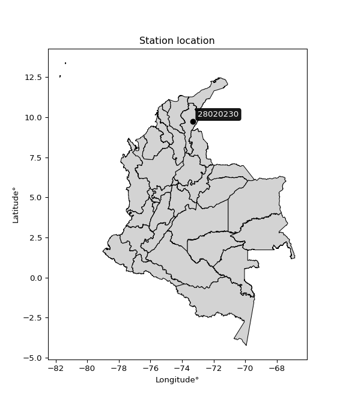</img>


</div>


## A. General information


### 1. General running parameters

• app_version: _v20251220_. • runtime: _2025-12-23 06:55:49.914859_. • Stations dataset (station_dataset_file): _dataset/pmax24h_in/conventional_1959_2009.csv_. • Stations catalog (station_catalog_file): _dataset/CNE_IDEAM.xls_. • Plot only fit distributions with Δo > Δ (plot_only_fit): _True_. • Eval low extreme values, if False, evaluates high extreme values (low_extreme): _False_. • Eval Gumbel distribution, non include in SciPy (pdist_loggumbel_on): _True_. • Eval Log-Gumbel distribution, non include in SciPy (pdist_loggumbel_on): _True_. • Standard deviation normalized (ddof): _1.0_. • Return periods to eval in years (Tr): _[2, 2.33, 5, 10, 15, 20, 25, 50, 75, 100, 200, 250, 500, 750, 1000]_. • Minimum data sample per station, 0 means any (minimum_sample): _5_. • Z-Score threshold to adjust a value, 0 means disable (zscore): _3.5_. • Avoid zeros, e.g. rain = 0 (avoid_zeros): _True_. • Avoid null values (avoid_nans): _True_. [:file_folder:Dataset file.](../../dataset/pmax24h_in/conventional_1959_2009.csv)


### 2. Station info and location

|   id |   CODIGO | NOMBRE                | CATEGORIA     | TECNOLOGIA   | ESTADO     | FECHA_INSTALACION   | FECHA_SUSPENSION   |   ALTITUD |   LATITUD |   LONGITUD | DEPARTAMENTO   | MUNICIPIO   | AREA_OPERATIVA                                         | ENTIDAD                                                     | AREA_HIDROGRAFICA   | ZONA_HIDROGRAFICA   | SUBZONA_HIDROGRAFICA   |   CORRIENTE |   OBSERVACION |   SUBRED |
|-----:|---------:|:----------------------|:--------------|:-------------|:-----------|:--------------------|:-------------------|----------:|----------:|-----------:|:---------------|:------------|:-------------------------------------------------------|:------------------------------------------------------------|:--------------------|:--------------------|:-----------------------|------------:|--------------:|---------:|
|    0 | 28020230 | LLANOS LOS [28020230] | Pluviométrica | Convencional | Suspendida | 15/09/1962          | 15/10/2010         |       100 |   9.73333 |      -73.3 | Cesar          | Becerrill   | Area Operativa 05 - Magdalena-Cesar-Guajira-San Andrés | INSTITUTO DE HIDROLOGIA METEOROLOGIA Y ESTUDIOS AMBIENTALES | Magdalena Cauca     | Cesar               | Medio Cesar            |         nan |           nan |      nan |

<div align="center">

Map location in: [:earth_americas:Google](http://maps.google.com/maps?q=9.733333333,-73.3) [:earth_americas:OSM](https://www.openstreetmap.org/#map=18/9.733333333/-73.3&layers=P) [:earth_americas:Bing](https://www.bing.com/maps?cp=9.733333333~-73.3&lvl=18) [:earth_americas:Apple](https://maps.apple.com/frame?center=9.733333333%2C-73.3&span=0.003%2C0.006)

</div>


<div align="center">

```geojson
{
  "type": "Feature",
  "geometry": {
    "type": "Point", 
    "coordinates": [-73.3, 9.733333333]
  }, 
  "properties": {
    "Name": "28020230"
  }
}
```

</div>


### 3. Discrete values table and plot

|               |           0 |           1 |           2 |          3 |           4 |           5 |           6 |            7 |           8 |            9 |          10 |          11 |         12 |          13 |          14 |          15 |          16 |         17 |         18 |          19 |         20 |         21 |          22 |          23 |          24 |          25 |         26 |          27 |         28 |          29 |         30 |          31 |          32 |
|:--------------|------------:|------------:|------------:|-----------:|------------:|------------:|------------:|-------------:|------------:|-------------:|------------:|------------:|-----------:|------------:|------------:|------------:|------------:|-----------:|-----------:|------------:|-----------:|-----------:|------------:|------------:|------------:|------------:|-----------:|------------:|-----------:|------------:|-----------:|------------:|------------:|
| Date          | 1969        | 1970        | 1971        | 1972       | 1973        | 1974        | 1975        | 1976         | 1977        | 1978         | 1979        | 1980        | 1981       | 1982        | 1983        | 1984        | 1985        | 1986       | 1987       | 1988        | 1989       | 1990       | 1991        | 1992        | 1993        | 1994        | 1995       | 1996        | 1997       | 1998        | 1999       | 2000        | 2001        |
| Value         |   90        |   86        |  114        |   53       |  130        |  109        |  115        |  100         |   90        |  100         |   93        |  127        |  137       |  110        |  114.7      |   80.2      |  127        |  135.6     |  141.7     |   86.5      |   67       |   34.3     |   94        |   91        |   90        |   90        |  200       |   89        |   75       |   90        |  137       |  125        |   78        |
| Value_initial |   90        |   86        |  114        |   53       |  130        |  109        |  115        |  100         |   90        |  100         |   93        |  127        |  137       |  110        |  114.7      |   80.2      |  127        |  135.6     |  141.7     |   86.5      |   67       |   34.3     |   94        |   91        |   90        |   90        |  200       |   89        |   75       |   90        |  137       |  125        |   78        |
| count         |   33        |   33        |   33        |   33       |   33        |   33        |   33        |   33         |   33        |   33         |   33        |   33        |   33       |   33        |   33        |   33        |   33        |   33       |   33       |   33        |   33       |   33       |   33        |   33        |   33        |   33        |   33       |   33        |   33       |   33        |   33       |   33        |   33        |
| mean          |  103.03     |  103.03     |  103.03     |  103.03    |  103.03     |  103.03     |  103.03     |  103.03      |  103.03     |  103.03      |  103.03     |  103.03     |  103.03    |  103.03     |  103.03     |  103.03     |  103.03     |  103.03    |  103.03    |  103.03     |  103.03    |  103.03    |  103.03     |  103.03     |  103.03     |  103.03     |  103.03    |  103.03     |  103.03    |  103.03     |  103.03    |  103.03     |  103.03     |
| std           |   30.3743   |   30.3743   |   30.3743   |   30.3743  |   30.3743   |   30.3743   |   30.3743   |   30.3743    |   30.3743   |   30.3743    |   30.3743   |   30.3743   |   30.3743  |   30.3743   |   30.3743   |   30.3743   |   30.3743   |   30.3743  |   30.3743  |   30.3743   |   30.3743  |   30.3743  |   30.3743   |   30.3743   |   30.3743   |   30.3743   |   30.3743  |   30.3743   |   30.3743  |   30.3743   |   30.3743  |   30.3743   |   30.3743   |
| zscore        |   -0.428991 |   -0.560682 |    0.361151 |   -1.64713 |    0.887912 |    0.196538 |    0.394074 |   -0.0997654 |   -0.428991 |   -0.0997654 |   -0.330224 |    0.789145 |    1.11837 |    0.229461 |    0.384197 |   -0.751633 |    0.789145 |    1.07228 |    1.27311 |   -0.544221 |   -1.18621 |   -2.26278 |   -0.297301 |   -0.396069 |   -0.428991 |   -0.428991 |    3.19249 |   -0.461914 |   -0.92283 |   -0.428991 |    1.11837 |    0.723299 |   -0.824063 |

<div align="center">

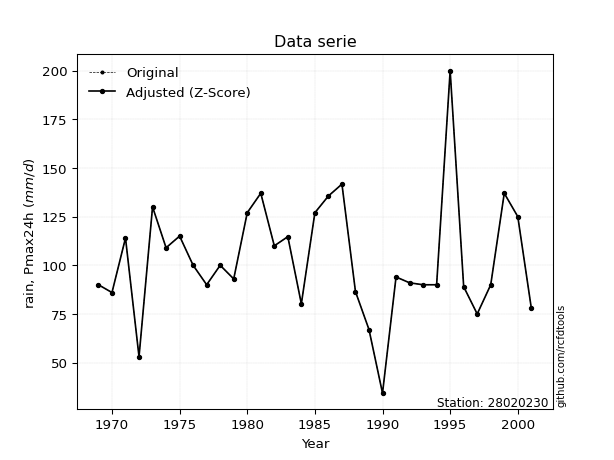</img>

</div>

> If Z-Score is active, values out of range or outliers are replaced with the station mean value.

### 4. Active continuous probability distributions from SciPy (47 of 104 available)

[scipy.stats](https://docs.scipy.org/doc/scipy/reference/stats.html) is a Python´s powerful submodule within the SciPy library for comprehensive statistical analysis, offering over 130 probability distributions (like Normal, Poisson), functions for descriptive stats (mean, variance), hypothesis testing (t-tests, chi-square), random variable generation, and statistical tests, making it essential for data science, modeling, and research. It provides tools to explore, model, and draw conclusions from data efficiently, working seamlessly with NumPy.

|   id | p_dist             |   n_parameter | fit_method   | label                                                                       | active   | ref                                                                                                        |
|-----:|:-------------------|--------------:|:-------------|:----------------------------------------------------------------------------|:---------|:-----------------------------------------------------------------------------------------------------------|
|    0 | alpha              |             3 | MLE          | Alpha                                                                       | True     | [:mortar_board:](https://docs.scipy.org/doc/scipy/reference/generated/scipy.stats.alpha.html)              |
|    1 | betaprime          |             4 | MLE          | Beta prime                                                                  | True     | [:mortar_board:](https://docs.scipy.org/doc/scipy/reference/generated/scipy.stats.betaprime.html)          |
|    2 | chi2               |             3 | MLE          | Chi²                                                                        | True     | [:mortar_board:](https://docs.scipy.org/doc/scipy/reference/generated/scipy.stats.chi2.html)               |
|    3 | crystalball        |             4 | MLE          | Crystalball                                                                 | True     | [:mortar_board:](https://docs.scipy.org/doc/scipy/reference/generated/scipy.stats.crystalball.html)        |
|    4 | dgamma             |             3 | MLE          | Double gamma                                                                | True     | [:mortar_board:](https://docs.scipy.org/doc/scipy/reference/generated/scipy.stats.dgamma.html)             |
|    5 | erlang             |             3 | MLE          | Erlang                                                                      | True     | [:mortar_board:](https://docs.scipy.org/doc/scipy/reference/generated/scipy.stats.erlang.html)             |
|    6 | expon              |             2 | MLE          | Exponential                                                                 | True     | [:mortar_board:](https://docs.scipy.org/doc/scipy/reference/generated/scipy.stats.expon.html)              |
|    7 | exponnorm          |             3 | MLE          | Exponentially modified Normal                                               | True     | [:mortar_board:](https://docs.scipy.org/doc/scipy/reference/generated/scipy.stats.exponnorm.html)          |
|    8 | f                  |             4 | MLE          | F                                                                           | True     | [:mortar_board:](https://docs.scipy.org/doc/scipy/reference/generated/scipy.stats.f.html)                  |
|    9 | fatiguelife        |             3 | MLE          | Fatigue-life (Birnbaum-Saunders)                                            | True     | [:mortar_board:](https://docs.scipy.org/doc/scipy/reference/generated/scipy.stats.fatiguelife.html)        |
|   10 | fisk               |             3 | MLE          | Fisk                                                                        | True     | [:mortar_board:](https://docs.scipy.org/doc/scipy/reference/generated/scipy.stats.fisk.html)               |
|   11 | gamma              |             3 | MLE          | Gamma                                                                       | True     | [:mortar_board:](https://docs.scipy.org/doc/scipy/reference/generated/scipy.stats.gamma.html)              |
|   12 | genexpon           |             5 | MLE          | Generalized exponential                                                     | True     | [:mortar_board:](https://docs.scipy.org/doc/scipy/reference/generated/scipy.stats.genexpon.html)           |
|   13 | genlogistic        |             3 | MLE          | Generalized logistic                                                        | True     | [:mortar_board:](https://docs.scipy.org/doc/scipy/reference/generated/scipy.stats.genlogistic.html)        |
|   14 | gibrat             |             2 | MM           | Gibrat                                                                      | True     | [:mortar_board:](https://docs.scipy.org/doc/scipy/reference/generated/scipy.stats.gibrat.html)             |
|   15 | gompertz           |             3 | MLE          | Gompertz (or truncated Gumbel)                                              | True     | [:mortar_board:](https://docs.scipy.org/doc/scipy/reference/generated/scipy.stats.gompertz.html)           |
|   16 | gumbel_l           |             2 | MM           | Gumbel Left Skew                                                            | True     | [:mortar_board:](https://docs.scipy.org/doc/scipy/reference/generated/scipy.stats.gumbel_l.html)           |
|   17 | gumbel_r           |             2 | MM           | Gumbel Right Skew                                                           | True     | [:mortar_board:](https://docs.scipy.org/doc/scipy/reference/generated/scipy.stats.gumbel_r.html)           |
|   18 | halflogistic       |             2 | MM           | Half-logistic                                                               | True     | [:mortar_board:](https://docs.scipy.org/doc/scipy/reference/generated/scipy.stats.halflogistic.html)       |
|   19 | halfnorm           |             2 | MM           | Half Normal                                                                 | True     | [:mortar_board:](https://docs.scipy.org/doc/scipy/reference/generated/scipy.stats.halfnorm.html)           |
|   20 | hypsecant          |             2 | MM           | hyperbolic secant                                                           | True     | [:mortar_board:](https://docs.scipy.org/doc/scipy/reference/generated/scipy.stats.hypsecant.html)          |
|   21 | invgamma           |             3 | MLE          | Inverted gamma                                                              | True     | [:mortar_board:](https://docs.scipy.org/doc/scipy/reference/generated/scipy.stats.invgamma.html)           |
|   22 | invgauss           |             3 | MLE          | Inverse Gaussian                                                            | True     | [:mortar_board:](https://docs.scipy.org/doc/scipy/reference/generated/scipy.stats.invgauss.html)           |
|   23 | invweibull         |             3 | MLE          | Inverted Weibull                                                            | True     | [:mortar_board:](https://docs.scipy.org/doc/scipy/reference/generated/scipy.stats.invweibull.html)         |
|   24 | johnsonsu          |             4 | MLE          | Johnson Su                                                                  | True     | [:mortar_board:](https://docs.scipy.org/doc/scipy/reference/generated/scipy.stats.johnsonsu.html)          |
|   25 | kstwobign          |             2 | MLE          | Limiting distribution of scaled Kolmogorov-Smirnov two-sided test statistic | True     | [:mortar_board:](https://docs.scipy.org/doc/scipy/reference/generated/scipy.stats.kstwobign.html)          |
|   26 | laplace            |             2 | MM           | Laplace                                                                     | True     | [:mortar_board:](https://docs.scipy.org/doc/scipy/reference/generated/scipy.stats.laplace.html)            |
|   27 | laplace_asymmetric |             3 | MLE          | Asymmetric Laplace                                                          | True     | [:mortar_board:](https://docs.scipy.org/doc/scipy/reference/generated/scipy.stats.laplace_asymmetric.html) |
|   28 | loggamma           |             3 | MLE          | Log gamma                                                                   | True     | [:mortar_board:](https://docs.scipy.org/doc/scipy/reference/generated/scipy.stats.loggamma.html)           |
|   29 | logistic           |             2 | MM           | Logistic (or Sech-squared)                                                  | True     | [:mortar_board:](https://docs.scipy.org/doc/scipy/reference/generated/scipy.stats.logistic.html)           |
|   30 | lognorm            |             3 | MLE          | Log Normal                                                                  | True     | [:mortar_board:](https://docs.scipy.org/doc/scipy/reference/generated/scipy.stats.lognorm.html)            |
|   31 | maxwell            |             2 | MM           | Maxwell                                                                     | True     | [:mortar_board:](https://docs.scipy.org/doc/scipy/reference/generated/scipy.stats.maxwell.html)            |
|   32 | mielke             |             4 | MLE          | Mielke Beta-Kappa / Dagum                                                   | True     | [:mortar_board:](https://docs.scipy.org/doc/scipy/reference/generated/scipy.stats.mielke.html)             |
|   33 | moyal              |             2 | MM           | Moyal                                                                       | True     | [:mortar_board:](https://docs.scipy.org/doc/scipy/reference/generated/scipy.stats.moyal.html)              |
|   34 | nakagami           |             3 | MLE          | Nakagami                                                                    | True     | [:mortar_board:](https://docs.scipy.org/doc/scipy/reference/generated/scipy.stats.nakagami.html)           |
|   35 | ncf                |             5 | MLE          | Non-central F distribution                                                  | True     | [:mortar_board:](https://docs.scipy.org/doc/scipy/reference/generated/scipy.stats.ncf.html)                |
|   36 | nct                |             4 | MLE          | Non-central Student’s t                                                     | True     | [:mortar_board:](https://docs.scipy.org/doc/scipy/reference/generated/scipy.stats.nct.html)                |
|   37 | norm               |             2 | MM           | Normal                                                                      | True     | [:mortar_board:](https://docs.scipy.org/doc/scipy/reference/generated/scipy.stats.norm.html)               |
|   38 | pareto             |             3 | MLE          | Pareto                                                                      | True     | [:mortar_board:](https://docs.scipy.org/doc/scipy/reference/generated/scipy.stats.pareto.html)             |
|   39 | pearson3           |             3 | MM           | Pearson type III                                                            | True     | [:mortar_board:](https://docs.scipy.org/doc/scipy/reference/generated/scipy.stats.pearson3.html)           |
|   40 | rayleigh           |             2 | MM           | Rayleigh                                                                    | True     | [:mortar_board:](https://docs.scipy.org/doc/scipy/reference/generated/scipy.stats.rayleigh.html)           |
|   41 | recipinvgauss      |             3 | MLE          | Reciprocal inverse Gaussian                                                 | True     | [:mortar_board:](https://docs.scipy.org/doc/scipy/reference/generated/scipy.stats.recipinvgauss.html)      |
|   42 | rice               |             3 | MLE          | Rice                                                                        | True     | [:mortar_board:](https://docs.scipy.org/doc/scipy/reference/generated/scipy.stats.rice.html)               |
|   43 | t                  |             3 | MLE          | Student’s t                                                                 | True     | [:mortar_board:](https://docs.scipy.org/doc/scipy/reference/generated/scipy.stats.t.html)                  |
|   44 | truncnorm          |             4 | MLE          | Truncated normal                                                            | True     | [:mortar_board:](https://docs.scipy.org/doc/scipy/reference/generated/scipy.stats.truncnorm.html)          |
|   45 | wald               |             2 | MM           | Wald                                                                        | True     | [:mortar_board:](https://docs.scipy.org/doc/scipy/reference/generated/scipy.stats.wald.html)               |
|   46 | weibull_min        |             3 | MLE          | Weibull minimum                                                             | True     | [:mortar_board:](https://docs.scipy.org/doc/scipy/reference/generated/scipy.stats.weibull_min.html)        |

>Gumbel and Lob-Gumbel probability distributions are not shown in the above table.
>
>**n_parameter:** # arguments & localization & scale.
>
>**Fit methods:** (MLE) maximum likelihood, (MM) L-moments.
>
>**Inactive:** foldnorm, gennorm, norminvgauss, powernorm, powerlognorm, skewnorm, genextreme, anglit, arcsine, argus, beta, bradford, burr, burr12, cauchy, cosine, halfcauchy, foldcauchy, skewcauchy, wrapcauchy, gengamma, exponweib, exponpow, truncexpon, gausshyper, genhalflogistic, genhyperbolic, geninvgauss, halfgennorm, johnsonsb, kappa4, kappa3, ksone, kstwo, loglaplace, levy, levy_l, levy_stable, ncx2, genpareto, truncpareto, lomax, powerlaw, rdist, rel_breitwigner, semicircular, studentized_range, trapezoid, triang, truncweibull_min, tukeylambda, uniform, loguniform, vonmises, vonmises_line, weibull_max, dweibull, 


## B. Probability distributions vs. Empirical distributions

A continuous probability distribution describes probabilities for variables that can take any value within a range (like rain any time), unlike discrete variables with specific outcomes (like temperature). It uses a Probability Density Function (PDF), a curve where the total area under it equals 1, and the probability of the variable falling within an interval (a to b) is found by calculating the area under the curve between those points. A key feature is that the probability of hitting any single exact value is zero, so probabilities are always expressed for ranges, e.g., $P(a ≤ X ≤ b)$.


### 0. Cumulative distribution values - CDF (49 evalated, ordered by x ascending) 

|   id |   Station |   date |     x |   count |   mean |     std |     zscore |   Value_initial |   station |   m |      alpha |   alpha_pdf |   betaprime |   betaprime_pdf |       chi2 |    chi2_pdf |   crystalball |   crystalball_pdf |    dgamma |   dgamma_pdf |     erlang |   erlang_pdf |    expon |   expon_pdf |   exponnorm |   exponnorm_pdf |          f |       f_pdf |   fatiguelife |   fatiguelife_pdf |       fisk |    fisk_pdf |      gamma |   gamma_pdf |    genexpon |   genexpon_pdf |   genlogistic |   genlogistic_pdf |   gibrat |   gibrat_pdf |    gompertz |   gompertz_pdf |   gumbel_l |   gumbel_l_pdf |    gumbel_r |   gumbel_r_pdf |   halflogistic |   halflogistic_pdf |   halfnorm |   halfnorm_pdf |   hypsecant |   hypsecant_pdf |   invgamma |   invgamma_pdf |   invgauss |   invgauss_pdf |   invweibull |   invweibull_pdf |   johnsonsu |   johnsonsu_pdf |   kstwobign |   kstwobign_pdf |   laplace |   laplace_pdf |   laplace_asymmetric |   laplace_asymmetric_pdf |   loggamma |   loggamma_pdf |   logistic |   logistic_pdf |    lognorm |   lognorm_pdf |     maxwell |   maxwell_pdf |     mielke |   mielke_pdf |       moyal |   moyal_pdf |   nakagami |   nakagami_pdf |      ncf |    ncf_pdf |        nct |     nct_pdf |      norm |    norm_pdf |      pareto |   pareto_pdf |    pearson3 |   pearson3_pdf |   rayleigh |   rayleigh_pdf |   recipinvgauss |   recipinvgauss_pdf |       rice |    rice_pdf |         t |       t_pdf |   truncnorm |   truncnorm_pdf |        wald |    wald_pdf |   weibull_min |   weibull_min_pdf |    zzgumbel |   gumbel_pdf |   zzloggumbel |   loggumbel_pdf |
|-----:|----------:|-------:|------:|--------:|-------:|--------:|-----------:|----------------:|----------:|----:|-----------:|------------:|------------:|----------------:|-----------:|------------:|--------------:|------------------:|----------:|-------------:|-----------:|-------------:|---------:|------------:|------------:|----------------:|-----------:|------------:|--------------:|------------------:|-----------:|------------:|-----------:|------------:|------------:|---------------:|--------------:|------------------:|---------:|-------------:|------------:|---------------:|-----------:|---------------:|------------:|---------------:|---------------:|-------------------:|-----------:|---------------:|------------:|----------------:|-----------:|---------------:|-----------:|---------------:|-------------:|-----------------:|------------:|----------------:|------------:|----------------:|----------:|--------------:|---------------------:|-------------------------:|-----------:|---------------:|-----------:|---------------:|-----------:|--------------:|------------:|--------------:|-----------:|-------------:|------------:|------------:|-----------:|---------------:|---------:|-----------:|-----------:|------------:|----------:|------------:|------------:|-------------:|------------:|---------------:|-----------:|---------------:|----------------:|--------------------:|-----------:|------------:|----------:|------------:|------------:|----------------:|------------:|------------:|--------------:|------------------:|------------:|-------------:|--------------:|----------------:|
|    0 |  28020230 |   1990 |  34.3 |      33 | 103.03 | 30.3743 | -2.26278   |            34.3 |  28020230 |   1 | 0.00341166 | 0.000491666 | 0.000952651 |     0.000244004 | 0.00404368 | 0.000560257 |     0.0107848 |       0.000951721 | 0.0190364 |   0.00112895 | 0.00404368 |  0.000560257 | 0        |  0.0145496  |  0.00387694 |     0.000485341 | 0.00403733 | 0.000559623 |    0.00387552 |       0.00054129  | 0.00656595 | 0.000595704 | 0.00404368 | 0.000560257 | 3.96224e-08 |     0.0114029  |    0.00693842 |       0.000585603 | 0        |  0           | 2.21815e-17 |    5.78579e-18 |  0.0290412 |    0.00122701  | 2.26257e-05 |    1.03775e-05 |       0        |         0          |   0        |   0            |   0.0172266 |     0.000904237 | 0.00365261 |    0.000516832 | 0.00213896 |    0.000424962 |  0.000324221 |      0.000102204 |  0.00868056 |     0.000542466 | 0.000971173 |     0.000310191 | 0.0193935 |   0.000916953 |           0.00683651 |              0.000480555 |  0.0128183 |    0.0010615   |  0.0152492 |    0.000910621 | 0.00375536 |   0.000528506 | 2.99406e-05 |   4.18542e-05 | 0.00461427 |  0.000605233 | 1.03728e-11 | 1.81878e-11 | 0          |    0           | 0.146686 | 0.00614615 | 0.00385765 | 0.000493733 | 0.0107848 | 0.000951721 | 1.38756e-08 |   0.0145496  | 0.000448879 |    0.000140514 |  0         |    0           |      0.00387776 |         0.000541497 | 0          | 0           | 0.0219337 | 0.00107643  |   0.0107848 |     0.000951721 | 0           | 0           |    0          |       0           | 1.2527e-08  |            0 |   5.91055e-20 |               0 |
|    1 |  28020230 |   1972 |  53   |      33 | 103.03 | 30.3743 | -1.64713   |            53   |  28020230 |   2 | 0.0319074  | 0.00310428  | 0.0271086   |     0.00334459  | 0.0344203  | 0.00320451  |     0.0471965 |       0.00329268  | 0.0567449 |   0.00325269 | 0.0344203  |  0.00320451  | 0.238205 |  0.0110838  |  0.0298907  |     0.00279874  | 0.034398   | 0.00320372  |    0.0337305  |       0.00317691  | 0.0319426  | 0.00250632  | 0.0344204  | 0.00320451  | 0.228359    |     0.010911   |    0.031927   |       0.00248823  | 0        |  0           | 2.56715e-15 |    6.47933e-16 |  0.0635983 |    0.00263845  | 0.00825166  |    0.00169743  |       0        |         0          |   0        |   0            |   0.0459254 |     0.00240348  | 0.0328263  |    0.0031401   | 0.0345038  |    0.00375688  |  0.0211243   |      0.00319708  |  0.0296809  |     0.00203751  | 0.0409292   |     0.00495518  | 0.0469509 |   0.00221991  |           0.0254508  |              0.001789    |  0.0515704 |    0.00341137  |  0.0459185 |    0.00265668  | 0.0332648  |   0.00315882  | 0.0257475   |   0.00354438  | 0.0330348  |  0.00282787  | 0.000683063 | 0.000314761 | 0.00466791 |    0.00154563  | 0.268109 | 0.00662471 | 0.030987   | 0.00293807  | 0.0471965 | 0.00329268  | 0.238205    |   0.0110838  | 0.0217357   |    0.00296681  |  0.0123248 |    0.003407    |      0.0337371  |         0.00317705  | 0.00479342 | 0.00200259  | 0.0569902 | 0.00299649  |   0.0471965 |     0.00329268  | 0           | 0           |    0.00390691 |       0.0017919   | 0.000258365 |            0 |   0.000597727 |               0 |
|    2 |  28020230 |   1989 |  67   |      33 | 103.03 | 30.3743 | -1.18621   |            67   |  28020230 |   3 | 0.102452   | 0.00721288  | 0.106958    |     0.00822343  | 0.105393   | 0.00714599  |     0.114178  |       0.0064564   | 0.12451   |   0.00680891 | 0.105393   |  0.00714599  | 0.378595 |  0.0090412  |  0.0949364  |     0.00681317  | 0.105368   | 0.00714662  |    0.104591   |       0.00716508  | 0.0893274  | 0.0060813   | 0.105393   | 0.00714599  | 0.366945    |     0.00895152 |    0.0894965  |       0.00613284  | 0        |  0           | 8.78437e-14 |    2.21649e-14 |  0.112876  |    0.004556    | 0.0719337   |    0.0081184   |       0        |         0          |   0        |   0            |   0.0952482 |     0.00492779  | 0.103529   |    0.00719014  | 0.118972   |    0.00841944  |  0.107847    |      0.00942354  |  0.0786517  |     0.00547136  | 0.14574     |     0.0097587   | 0.0910166 |   0.0043034   |           0.0680908  |              0.00478627  |  0.11958   |    0.00646592  |  0.101114  |    0.00551164  | 0.104058   |   0.00717888  | 0.107126    |   0.00812815  | 0.0952844  |  0.00636972  | 0.0434465   | 0.00778803  | 0.0631453  |    0.00707524  | 0.359252 | 0.00633201 | 0.0988236  | 0.00704063  | 0.114178  | 0.0064564   | 0.378595    |   0.0090412  | 0.0970211   |    0.00801586  |  0.102112  |    0.00912796  |      0.104596   |         0.00716468  | 0.0724689  | 0.00754135  | 0.119155  | 0.00621127  |   0.114178  |     0.0064564   | 0           | 0           |    0.0721724  |       0.00789131  | 0.0103154   |            0 |   0.0586462   |               0 |
|    3 |  28020230 |   1997 |  75   |      33 | 103.03 | 30.3743 | -0.92283   |            75   |  28020230 |   4 | 0.170808   | 0.00985248  | 0.183775    |     0.0108859   | 0.17268    | 0.00965507  |     0.174344  |       0.00859768  | 0.191062  |   0.00997109 | 0.17268    |  0.00965507  | 0.446874 |  0.00804777 |  0.160858   |     0.00968204  | 0.172665   | 0.00965673  |    0.172177   |       0.00970992  | 0.149731   | 0.00911288  | 0.17268    | 0.00965507  | 0.434655    |     0.00799408 |    0.150394   |       0.00917154  | 0        |  0           | 6.61246e-13 |    1.66846e-13 |  0.155308  |    0.00611332  | 0.154478    |    0.0123716   |       0.144081 |         0.0191464  |   0        |   0            |   0.143589  |     0.00728765  | 0.171519   |    0.00978499  | 0.196547   |    0.0108786   |  0.1965      |      0.0125444   |  0.135752   |     0.00899451  | 0.231059    |     0.0114003   | 0.13286   |   0.0062818   |           0.119484   |              0.00839883  |  0.179424  |    0.00850516  |  0.154494  |    0.00792124  | 0.171857   |   0.00974886  | 0.181956    |   0.0104977   | 0.157049   |  0.00914026  | 0.133516    | 0.0144243   | 0.132981   |    0.0103056   | 0.408747 | 0.00603048 | 0.166286   | 0.00981613  | 0.174344  | 0.00859768  | 0.446874    |   0.00804777 | 0.17305     |    0.0109025   |  0.184856  |    0.0114153   |      0.172178   |         0.00970923  | 0.143806   | 0.0102075   | 0.179308  | 0.00891801  |   0.174344  |     0.00859768  | 0.000175689 | 0.000782968 |    0.147389   |       0.0107924   | 0.0382774   |            0 |   0.16776     |               0 |
|    4 |  28020230 |   2001 |  78   |      33 | 103.03 | 30.3743 | -0.824063  |            78   |  28020230 |   5 | 0.201753   | 0.0107657   | 0.217684    |     0.0116988   | 0.202971   | 0.0105286   |     0.201341  |       0.00939762  | 0.223029  |   0.0113531  | 0.202971   |  0.0105286   | 0.470498 |  0.00770405 |  0.191495   |     0.0107343   | 0.202961   | 0.0105305   |    0.20265    |       0.0105942   | 0.178922   | 0.0103507   | 0.202971   | 0.0105286   | 0.458136    |     0.00766206 |    0.17973    |       0.0103858   | 0        |  0           | 1.40963e-12 |    3.55679e-13 |  0.174654  |    0.00679331  | 0.193542    |    0.0136291   |       0.200974 |         0.0187626  |   0        |   0            |   0.167058  |     0.00837604  | 0.202241   |    0.0106848   | 0.230323   |    0.0116191   |  0.235413    |      0.0133597   |  0.165062   |     0.0105589   | 0.265823    |     0.0117525   | 0.153107  |   0.00723913  |           0.147534   |              0.0103705   |  0.206083  |    0.00926491  |  0.179777  |    0.00894193  | 0.202459   |   0.0106409   | 0.21458     |   0.0112354   | 0.186138   |  0.0102548   | 0.17953     | 0.0161565   | 0.165501   |    0.011355    | 0.426648 | 0.00590237 | 0.197223   | 0.0107976   | 0.201341  | 0.00939762  | 0.470498    |   0.00770405 | 0.20714     |    0.0118023   |  0.220078  |    0.0120446   |      0.202648   |         0.0105934   | 0.17573    | 0.0110596   | 0.207742  | 0.010043    |   0.201341  |     0.00939762  | 0.0338555   | 0.0236671   |    0.181119   |       0.0116725   | 0.0564343   |            0 |   0.218757    |               0 |
|    5 |  28020230 |   1984 |  80.2 |      33 | 103.03 | 30.3743 | -0.751633  |            80.2 |  28020230 |   6 | 0.226126   | 0.0113832   | 0.243997    |     0.0122093   | 0.226796   | 0.0111231   |     0.222646  |       0.00996724  | 0.249158  |   0.0124037  | 0.226796   |  0.0111231   | 0.487179 |  0.00746136 |  0.215923   |     0.0114659   | 0.226791   | 0.0111253   |    0.226626   |       0.0111949   | 0.202693   | 0.0112569   | 0.226796   | 0.0111231   | 0.474733    |     0.00742738 |    0.203548   |       0.0112633   | 0        |  0           | 2.45576e-12 |    6.19636e-13 |  0.190179  |    0.00732493  | 0.224379    |    0.0143782   |       0.241873 |         0.0184085  |   0        |   0            |   0.186426  |     0.00924025  | 0.226427   |    0.0112948   | 0.256406   |    0.0120807   |  0.265325    |      0.013812    |  0.189586   |     0.0117355   | 0.29188     |     0.011924    | 0.169891  |   0.0080327   |           0.172208   |              0.0121049   |  0.227064  |    0.00980587  |  0.200295  |    0.00971328  | 0.226543   |   0.0112461   | 0.239831    |   0.0117102   | 0.2096     |  0.0110725   | 0.21612     | 0.0170544   | 0.191254   |    0.0120449   | 0.439526 | 0.00580469 | 0.221724   | 0.011467    | 0.222646  | 0.00996723  | 0.487179    |   0.00746136 | 0.233748    |    0.0123738   |  0.247006  |    0.0124235   |      0.226623   |         0.0111941   | 0.200691   | 0.0116233   | 0.230756  | 0.0108788   |   0.222646  |     0.00996723  | 0.0990763   | 0.03383     |    0.20743    |       0.0122345   | 0.0728274   |            0 |   0.257732    |               0 |
|    6 |  28020230 |   1970 |  86   |      33 | 103.03 | 30.3743 | -0.560682  |            86   |  28020230 |   7 | 0.296263   | 0.0127257   | 0.317872    |     0.0131684   | 0.295317   | 0.0124367   |     0.284551  |       0.011342    | 0.328955  |   0.0150268  | 0.295317   |  0.0124367   | 0.528679 |  0.00685755 |  0.287456   |     0.013124    | 0.295325   | 0.012439    |    0.295591   |       0.0125159   | 0.274584   | 0.0134706   | 0.295317   | 0.0124367   | 0.516093    |     0.00684254 |    0.275165   |       0.0133613   | 0.191654 |  0.0471367   | 1.0611e-11  |    2.67737e-12 |  0.237005  |    0.00885005  | 0.311808    |    0.0155812   |       0.34536  |         0.0172202  |   0        |   0            |   0.247088  |     0.0117117   | 0.296017   |    0.0126283   | 0.32921    |    0.0129336   |  0.34758     |      0.0144113   |  0.266331   |     0.0146408   | 0.361639    |     0.0120582   | 0.223495  |   0.0105672   |           0.258889   |              0.018198    |  0.287831  |    0.0111137   |  0.262555  |    0.0117413   | 0.295828   |   0.0125732   | 0.310729    |   0.0126621   | 0.279843   |  0.0131036   | 0.318648    | 0.0179709   | 0.265572   |    0.0134858   | 0.472421 | 0.00553615 | 0.292728   | 0.012937    | 0.284551  | 0.011342    | 0.528679    |   0.00685755 | 0.308998    |    0.0134716   |  0.321221  |    0.0130877   |      0.295584   |         0.0125151   | 0.271814   | 0.0128316   | 0.300083  | 0.0129865   |   0.284551  |     0.011342    | 0.300856    | 0.0323939   |    0.281894   |       0.0133536   | 0.128655    |            0 |   0.361314    |               0 |
|    7 |  28020230 |   1988 |  86.5 |      33 | 103.03 | 30.3743 | -0.544221  |            86.5 |  28020230 |   8 | 0.302649   | 0.0128188   | 0.32447     |     0.0132237   | 0.301559   | 0.0125296   |     0.290249  |       0.0114489   | 0.336516  |   0.0152151  | 0.301559   |  0.0125296   | 0.532095 |  0.00680784 |  0.294048   |     0.0132433   | 0.301568   | 0.012532    |    0.301873   |       0.0126089   | 0.281362   | 0.0136399   | 0.301559   | 0.0125296   | 0.519502    |     0.00679434 |    0.281885   |       0.0135188   | 0.215069 |  0.0464789   | 1.20378e-11 |    3.03737e-12 |  0.241465  |    0.008989    | 0.319612    |    0.0156324   |       0.353941 |         0.0171029  |   0        |   0            |   0.252998  |     0.0119312   | 0.302355   |    0.0127215   | 0.335689   |    0.0129815   |  0.354789    |      0.0144244   |  0.273706   |     0.014859    | 0.367666    |     0.0120503   | 0.228842  |   0.01082     |           0.26815    |              0.0188489   |  0.293414  |    0.0112157   |  0.268468  |    0.0119094   | 0.302138   |   0.0126662   | 0.317075    |   0.0127227   | 0.286435   |  0.0132627   | 0.327632    | 0.017963    | 0.272339   |    0.0135823   | 0.475183 | 0.00551245 | 0.299223   | 0.0130396   | 0.290249  | 0.0114489   | 0.532095    |   0.00680784 | 0.31575     |    0.013537    |  0.327774  |    0.0131227   |      0.301865   |         0.0126081   | 0.27825    | 0.0129156   | 0.306618  | 0.0131532   |   0.290249  |     0.0114489   | 0.316877    | 0.0316859   |    0.288589   |       0.0134247   | 0.134287    |            0 |   0.370066    |               0 |
|    8 |  28020230 |   1996 |  89   |      33 | 103.03 | 30.3743 | -0.461914  |            89   |  28020230 |   9 | 0.335225   | 0.0132244   | 0.357816    |     0.0134347   | 0.333416   | 0.0129403   |     0.319508  |       0.0119483   | 0.375552  |   0.0159446  | 0.333416   |  0.0129403   | 0.548809 |  0.00656466 |  0.327843   |     0.013773    | 0.33343    | 0.0129426   |    0.333926   |       0.0130179   | 0.316454   | 0.0144115   | 0.333416   | 0.0129403   | 0.536191    |     0.00655835 |    0.3166     |       0.0142307   | 0.324843 |  0.0409486   | 2.26204e-11 |    5.70757e-12 |  0.264819  |    0.00969808  | 0.358905    |    0.0157698   |       0.395938 |         0.0164872  |   0        |   0            |   0.284192  |     0.0130195   | 0.334689   |    0.0131293   | 0.368387   |    0.0131598   |  0.390856    |      0.0144061   |  0.312109   |     0.015827    | 0.397705    |     0.0119698   | 0.257555  |   0.0121776   |           0.319666   |              0.0224701   |  0.322062  |    0.0116932   |  0.299263  |    0.0127167   | 0.334334   |   0.0130745   | 0.349213    |   0.0129731   | 0.320535   |  0.0140001   | 0.372336    | 0.017755    | 0.306836   |    0.0139957   | 0.488815 | 0.00539303 | 0.332405   | 0.0134878   | 0.319508  | 0.0119483   | 0.548809    |   0.00656466 | 0.349937    |    0.013793    |  0.360752  |    0.0132456   |      0.333916   |         0.0130172   | 0.311018   | 0.0132844   | 0.340493  | 0.0139289   |   0.319508  |     0.0119483   | 0.391523    | 0.028025    |    0.322541   |       0.0137196   | 0.164205    |            0 |   0.412974    |               0 |
|    9 |  28020230 |   1998 |  90   |      33 | 103.03 | 30.3743 | -0.428991  |            90   |  28020230 |  10 | 0.348517   | 0.0133577   | 0.371279    |     0.0134887   | 0.346426   | 0.0130782   |     0.331548  |       0.0121304   | 0.391579  |   0.0160937  | 0.346426   |  0.0130782   | 0.555326 |  0.00646984 |  0.341706   |     0.0139516   | 0.346443   | 0.0130806   |    0.347013   |       0.0131545   | 0.331002   | 0.0146807   | 0.346426   | 0.0130782   | 0.542703    |     0.00646627 |    0.330955   |       0.0144763   | 0.364512 |  0.0383858   | 2.91126e-11 |    7.34568e-12 |  0.274662  |    0.00998744  | 0.374678    |    0.0157718   |       0.412296 |         0.0162286  |   0        |   0            |   0.297425  |     0.013444    | 0.347887   |    0.0132644   | 0.381569   |    0.0132029   |  0.405241    |      0.0143616   |  0.3281     |     0.0161486   | 0.409651    |     0.0119198   | 0.270025  |   0.0127672   |           0.342945   |              0.0241065   |  0.333843  |    0.0118678   |  0.312132  |    0.0130199   | 0.347477   |   0.0132103   | 0.362225    |   0.0130487   | 0.334669   |  0.0142636   | 0.390017    | 0.017602    | 0.3209     |    0.0141284   | 0.494184 | 0.00534493 | 0.345968   | 0.0136355   | 0.331548  | 0.0121304   | 0.555326    |   0.00646984 | 0.363767    |    0.0138624   |  0.374011  |    0.0132712   |      0.347003   |         0.0131539   | 0.324366   | 0.0134077   | 0.354562  | 0.0142074   |   0.331548  |     0.0121304   | 0.418827    | 0.0265909   |    0.336306   |       0.0138092   | 0.176941    |            0 |   0.429673    |               0 |
|   10 |  28020230 |   1994 |  90   |      33 | 103.03 | 30.3743 | -0.428991  |            90   |  28020230 |  11 | 0.348517   | 0.0133577   | 0.371279    |     0.0134887   | 0.346426   | 0.0130782   |     0.331548  |       0.0121304   | 0.391579  |   0.0160937  | 0.346426   |  0.0130782   | 0.555326 |  0.00646984 |  0.341706   |     0.0139516   | 0.346443   | 0.0130806   |    0.347013   |       0.0131545   | 0.331002   | 0.0146807   | 0.346426   | 0.0130782   | 0.542703    |     0.00646627 |    0.330955   |       0.0144763   | 0.364512 |  0.0383858   | 2.91126e-11 |    7.34568e-12 |  0.274662  |    0.00998744  | 0.374678    |    0.0157718   |       0.412296 |         0.0162286  |   0        |   0            |   0.297425  |     0.013444    | 0.347887   |    0.0132644   | 0.381569   |    0.0132029   |  0.405241    |      0.0143616   |  0.3281     |     0.0161486   | 0.409651    |     0.0119198   | 0.270025  |   0.0127672   |           0.342945   |              0.0241065   |  0.333843  |    0.0118678   |  0.312132  |    0.0130199   | 0.347477   |   0.0132103   | 0.362225    |   0.0130487   | 0.334669   |  0.0142636   | 0.390017    | 0.017602    | 0.3209     |    0.0141284   | 0.494184 | 0.00534493 | 0.345968   | 0.0136355   | 0.331548  | 0.0121304   | 0.555326    |   0.00646984 | 0.363767    |    0.0138624   |  0.374011  |    0.0132712   |      0.347003   |         0.0131539   | 0.324366   | 0.0134077   | 0.354562  | 0.0142074   |   0.331548  |     0.0121304   | 0.418827    | 0.0265909   |    0.336306   |       0.0138092   | 0.176941    |            0 |   0.429673    |               0 |
|   11 |  28020230 |   1993 |  90   |      33 | 103.03 | 30.3743 | -0.428991  |            90   |  28020230 |  12 | 0.348517   | 0.0133577   | 0.371279    |     0.0134887   | 0.346426   | 0.0130782   |     0.331548  |       0.0121304   | 0.391579  |   0.0160937  | 0.346426   |  0.0130782   | 0.555326 |  0.00646984 |  0.341706   |     0.0139516   | 0.346443   | 0.0130806   |    0.347013   |       0.0131545   | 0.331002   | 0.0146807   | 0.346426   | 0.0130782   | 0.542703    |     0.00646627 |    0.330955   |       0.0144763   | 0.364512 |  0.0383858   | 2.91126e-11 |    7.34568e-12 |  0.274662  |    0.00998744  | 0.374678    |    0.0157718   |       0.412296 |         0.0162286  |   0        |   0            |   0.297425  |     0.013444    | 0.347887   |    0.0132644   | 0.381569   |    0.0132029   |  0.405241    |      0.0143616   |  0.3281     |     0.0161486   | 0.409651    |     0.0119198   | 0.270025  |   0.0127672   |           0.342945   |              0.0241065   |  0.333843  |    0.0118678   |  0.312132  |    0.0130199   | 0.347477   |   0.0132103   | 0.362225    |   0.0130487   | 0.334669   |  0.0142636   | 0.390017    | 0.017602    | 0.3209     |    0.0141284   | 0.494184 | 0.00534493 | 0.345968   | 0.0136355   | 0.331548  | 0.0121304   | 0.555326    |   0.00646984 | 0.363767    |    0.0138624   |  0.374011  |    0.0132712   |      0.347003   |         0.0131539   | 0.324366   | 0.0134077   | 0.354562  | 0.0142074   |   0.331548  |     0.0121304   | 0.418827    | 0.0265909   |    0.336306   |       0.0138092   | 0.176941    |            0 |   0.429673    |               0 |
|   12 |  28020230 |   1977 |  90   |      33 | 103.03 | 30.3743 | -0.428991  |            90   |  28020230 |  13 | 0.348517   | 0.0133577   | 0.371279    |     0.0134887   | 0.346426   | 0.0130782   |     0.331548  |       0.0121304   | 0.391579  |   0.0160937  | 0.346426   |  0.0130782   | 0.555326 |  0.00646984 |  0.341706   |     0.0139516   | 0.346443   | 0.0130806   |    0.347013   |       0.0131545   | 0.331002   | 0.0146807   | 0.346426   | 0.0130782   | 0.542703    |     0.00646627 |    0.330955   |       0.0144763   | 0.364512 |  0.0383858   | 2.91126e-11 |    7.34568e-12 |  0.274662  |    0.00998744  | 0.374678    |    0.0157718   |       0.412296 |         0.0162286  |   0        |   0            |   0.297425  |     0.013444    | 0.347887   |    0.0132644   | 0.381569   |    0.0132029   |  0.405241    |      0.0143616   |  0.3281     |     0.0161486   | 0.409651    |     0.0119198   | 0.270025  |   0.0127672   |           0.342945   |              0.0241065   |  0.333843  |    0.0118678   |  0.312132  |    0.0130199   | 0.347477   |   0.0132103   | 0.362225    |   0.0130487   | 0.334669   |  0.0142636   | 0.390017    | 0.017602    | 0.3209     |    0.0141284   | 0.494184 | 0.00534493 | 0.345968   | 0.0136355   | 0.331548  | 0.0121304   | 0.555326    |   0.00646984 | 0.363767    |    0.0138624   |  0.374011  |    0.0132712   |      0.347003   |         0.0131539   | 0.324366   | 0.0134077   | 0.354562  | 0.0142074   |   0.331548  |     0.0121304   | 0.418827    | 0.0265909   |    0.336306   |       0.0138092   | 0.176941    |            0 |   0.429673    |               0 |
|   13 |  28020230 |   1969 |  90   |      33 | 103.03 | 30.3743 | -0.428991  |            90   |  28020230 |  14 | 0.348517   | 0.0133577   | 0.371279    |     0.0134887   | 0.346426   | 0.0130782   |     0.331548  |       0.0121304   | 0.391579  |   0.0160937  | 0.346426   |  0.0130782   | 0.555326 |  0.00646984 |  0.341706   |     0.0139516   | 0.346443   | 0.0130806   |    0.347013   |       0.0131545   | 0.331002   | 0.0146807   | 0.346426   | 0.0130782   | 0.542703    |     0.00646627 |    0.330955   |       0.0144763   | 0.364512 |  0.0383858   | 2.91126e-11 |    7.34568e-12 |  0.274662  |    0.00998744  | 0.374678    |    0.0157718   |       0.412296 |         0.0162286  |   0        |   0            |   0.297425  |     0.013444    | 0.347887   |    0.0132644   | 0.381569   |    0.0132029   |  0.405241    |      0.0143616   |  0.3281     |     0.0161486   | 0.409651    |     0.0119198   | 0.270025  |   0.0127672   |           0.342945   |              0.0241065   |  0.333843  |    0.0118678   |  0.312132  |    0.0130199   | 0.347477   |   0.0132103   | 0.362225    |   0.0130487   | 0.334669   |  0.0142636   | 0.390017    | 0.017602    | 0.3209     |    0.0141284   | 0.494184 | 0.00534493 | 0.345968   | 0.0136355   | 0.331548  | 0.0121304   | 0.555326    |   0.00646984 | 0.363767    |    0.0138624   |  0.374011  |    0.0132712   |      0.347003   |         0.0131539   | 0.324366   | 0.0134077   | 0.354562  | 0.0142074   |   0.331548  |     0.0121304   | 0.418827    | 0.0265909   |    0.336306   |       0.0138092   | 0.176941    |            0 |   0.429673    |               0 |
|   14 |  28020230 |   1992 |  91   |      33 | 103.03 | 30.3743 | -0.396069  |            91   |  28020230 |  15 | 0.361934   | 0.013474    | 0.384788    |     0.0135257   | 0.359567   | 0.0132007   |     0.343765  |       0.0123015   | 0.407699  |   0.0161222  | 0.359567   |  0.0132007   | 0.561749 |  0.00637639 |  0.355739   |     0.0141102   | 0.359586   | 0.013203    |    0.36023    |       0.0132752   | 0.345806   | 0.0149244   | 0.359567   | 0.0132007   | 0.549124    |     0.00637548 |    0.345544   |       0.0146975   | 0.401625 |  0.0358511   | 3.74681e-11 |    9.45395e-12 |  0.284795  |    0.0102794   | 0.390439    |    0.0157454   |       0.428393 |         0.0159641  |   0        |   0            |   0.311076  |     0.0138576   | 0.361212   |    0.013383    | 0.394787   |    0.0132302   |  0.419572    |      0.0142974   |  0.344392   |     0.0164281   | 0.421541    |     0.0118604   | 0.283099  |   0.0133854   |           0.366615   |              0.0232381   |  0.345794  |    0.0120323   |  0.325298  |    0.0133094   | 0.360749   |   0.0133299   | 0.375306    |   0.0131102   | 0.349056   |  0.0145066   | 0.407528    | 0.0174149   | 0.335087   |    0.0142425   | 0.499505 | 0.00529668 | 0.35967    | 0.0137644   | 0.343765  | 0.0123015   | 0.561749    |   0.00637639 | 0.377656    |    0.0139134   |  0.38729   |    0.0132836   |      0.360218   |         0.0132746   | 0.337829   | 0.013517    | 0.3689    | 0.0144647   |   0.343765  |     0.0123015   | 0.444721    | 0.0252057   |    0.350154   |       0.0138828   | 0.190076    |            0 |   0.446071    |               0 |
|   15 |  28020230 |   1979 |  93   |      33 | 103.03 | 30.3743 | -0.330224  |            93   |  28020230 |  16 | 0.389075   | 0.0136548   | 0.411874    |     0.0135498   | 0.386176   | 0.0133981   |     0.368683  |       0.0126086   | 0.439613  |   0.0156504  | 0.386176   |  0.0133981   | 0.574318 |  0.00619351 |  0.384229   |     0.0143652   | 0.3862     | 0.0134002   |    0.386984   |       0.0134679   | 0.37608    | 0.0153298   | 0.386176   | 0.0133981   | 0.561696    |     0.0061977  |    0.375321   |       0.0150619   | 0.46849  |  0.0311      | 6.20618e-11 |    1.56594e-11 |  0.305942  |    0.0108687   | 0.421814    |    0.0156127   |       0.45978  |         0.015419   |   0        |   0            |   0.339584  |     0.0146383   | 0.388176   |    0.0135698   | 0.421266   |    0.0132382   |  0.447995    |      0.0141138   |  0.377703   |     0.0168521   | 0.445123    |     0.0117152   | 0.311177  |   0.0147129   |           0.411427   |              0.021594    |  0.370162  |    0.0123289   |  0.352459  |    0.0138402   | 0.38761    |   0.0135196   | 0.401617    |   0.0131914   | 0.378502   |  0.0149243   | 0.441913    | 0.0169522   | 0.363756   |    0.0144146   | 0.510002 | 0.00519988 | 0.387412   | 0.0139653   | 0.368683  | 0.0126086   | 0.574318    |   0.00619351 | 0.405542    |    0.0139608   |  0.413852  |    0.0132701   |      0.386971   |         0.0134674   | 0.365048   | 0.0136929   | 0.39829   | 0.0149089   |   0.368683  |     0.0126086   | 0.492501    | 0.0226178   |    0.378029   |       0.0139823   | 0.217431    |            0 |   0.477893    |               0 |
|   16 |  28020230 |   1991 |  94   |      33 | 103.03 | 30.3743 | -0.297301  |            94   |  28020230 |  17 | 0.402763   | 0.0137192   | 0.425419    |     0.0135375   | 0.399613   | 0.0134727   |     0.38136   |       0.0127436   | 0.454976  |   0.0150185  | 0.399613   |  0.0134727   | 0.580467 |  0.00610405 |  0.398643   |     0.0144607   | 0.399639   | 0.0134747   |    0.400489   |       0.0135396   | 0.391491   | 0.0154887   | 0.399613   | 0.0134727   | 0.56785     |     0.00611068 |    0.390456   |       0.0152033   | 0.498495 |  0.0289345   | 7.9874e-11  |    2.01538e-11 |  0.316959  |    0.0111648   | 0.437377    |    0.0155092   |       0.475059 |         0.0151397  |   0        |   0            |   0.354404  |     0.0149981   | 0.401782   |    0.0136379   | 0.434496   |    0.0132198   |  0.462052    |      0.0139965   |  0.39463    |     0.0169936   | 0.456796    |     0.0116304   | 0.326243  |   0.0154252   |           0.432629   |              0.0208161   |  0.382558  |    0.01246     |  0.36642   |    0.0140782   | 0.401165   |   0.0135894   | 0.414819    |   0.0132112   | 0.393515   |  0.0150959   | 0.458733    | 0.0166836   | 0.378201   |    0.014473    | 0.515177 | 0.00515139 | 0.401415   | 0.0140368   | 0.38136   | 0.0127436   | 0.580467    |   0.00610405 | 0.419503    |    0.013958    |  0.427111  |    0.0132448   |      0.400476   |         0.0135391   | 0.378776   | 0.0137593   | 0.413293  | 0.0150924   |   0.38136   |     0.0127436   | 0.514516    | 0.0214223   |    0.392026   |       0.0140086   | 0.23159     |            0 |   0.49329     |               0 |
|   17 |  28020230 |   1976 | 100   |      33 | 103.03 | 30.3743 | -0.0997654 |           100   |  28020230 |  18 | 0.485458   | 0.013744    | 0.505746    |     0.0131534   | 0.481064   | 0.0135815   |     0.459651  |       0.0132696   | 0.518004  |   0.012397   | 0.481064   |  0.0135815   | 0.615538 |  0.00559378 |  0.486148   |     0.0145772   | 0.481101   | 0.0135829   |    0.482276   |       0.013625    | 0.485882   | 0.0157843   | 0.481064   | 0.0135815   | 0.603002    |     0.00561363 |    0.482939   |       0.0154522   | 0.639645 |  0.018913    | 3.62988e-10 |    9.15891e-11 |  0.389237  |    0.0129125   | 0.527627    |    0.0144653   |       0.56073  |         0.0134047  |   0        |   0            |   0.449556  |     0.0165071   | 0.484072   |    0.0136921   | 0.512852   |    0.0128203   |  0.543278    |      0.0130051   |  0.497004   |     0.0168571   | 0.524742    |     0.0109819   | 0.433257  |   0.020485    |           0.544734   |              0.0167031   |  0.459121  |    0.0129829   |  0.454189  |    0.0150329   | 0.483207   |   0.0136588   | 0.493844    |   0.0130531   | 0.485935   |  0.0155358   | 0.553217    | 0.0147364   | 0.46528    |    0.0144488   | 0.545213 | 0.00486069 | 0.48606    | 0.0140651   | 0.459651  | 0.0132696   | 0.615538    |   0.00559378 | 0.502454    |    0.013599    |  0.505602  |    0.0128533   |      0.482261   |         0.0136249   | 0.461883   | 0.0138578   | 0.505853  | 0.0155782   |   0.459651  |     0.0132696   | 0.624413    | 0.0155666   |    0.475876   |       0.0138549   | 0.32129     |            0 |   0.578002    |               0 |
|   18 |  28020230 |   1978 | 100   |      33 | 103.03 | 30.3743 | -0.0997654 |           100   |  28020230 |  19 | 0.485458   | 0.013744    | 0.505746    |     0.0131534   | 0.481064   | 0.0135815   |     0.459651  |       0.0132696   | 0.518004  |   0.012397   | 0.481064   |  0.0135815   | 0.615538 |  0.00559378 |  0.486148   |     0.0145772   | 0.481101   | 0.0135829   |    0.482276   |       0.013625    | 0.485882   | 0.0157843   | 0.481064   | 0.0135815   | 0.603002    |     0.00561363 |    0.482939   |       0.0154522   | 0.639645 |  0.018913    | 3.62988e-10 |    9.15891e-11 |  0.389237  |    0.0129125   | 0.527627    |    0.0144653   |       0.56073  |         0.0134047  |   0        |   0            |   0.449556  |     0.0165071   | 0.484072   |    0.0136921   | 0.512852   |    0.0128203   |  0.543278    |      0.0130051   |  0.497004   |     0.0168571   | 0.524742    |     0.0109819   | 0.433257  |   0.020485    |           0.544734   |              0.0167031   |  0.459121  |    0.0129829   |  0.454189  |    0.0150329   | 0.483207   |   0.0136588   | 0.493844    |   0.0130531   | 0.485935   |  0.0155358   | 0.553217    | 0.0147364   | 0.46528    |    0.0144488   | 0.545213 | 0.00486069 | 0.48606    | 0.0140651   | 0.459651  | 0.0132696   | 0.615538    |   0.00559378 | 0.502454    |    0.013599    |  0.505602  |    0.0128533   |      0.482261   |         0.0136249   | 0.461883   | 0.0138578   | 0.505853  | 0.0155782   |   0.459651  |     0.0132696   | 0.624413    | 0.0155666   |    0.475876   |       0.0138549   | 0.32129     |            0 |   0.578002    |               0 |
|   19 |  28020230 |   1974 | 109   |      33 | 103.03 | 30.3743 |  0.196538  |           109   |  28020230 |  20 | 0.60546    | 0.0127361   | 0.61855     |     0.0117852   | 0.60032    | 0.0127347   |     0.579098  |       0.0130748   | 0.656715  |   0.0153722  | 0.60032    |  0.0127347   | 0.662725 |  0.00490722 |  0.613123   |     0.0133957   | 0.600364   | 0.0127349   |    0.601726   |       0.0127339   | 0.622583   | 0.0142461   | 0.60032    | 0.0127347   | 0.650442    |     0.00494282 |    0.61712    |       0.0140557   | 0.768037 |  0.010598    | 3.5166e-09  |    8.87307e-10 |  0.515797  |    0.015058    | 0.647485    |    0.0120678   |       0.669518 |         0.0107879  |   0.922014 |   0.0618078    |   0.598197  |     0.0159274   | 0.603851   |    0.0127389   | 0.622771   |    0.0114862   |  0.651407    |      0.0109544   |  0.638443   |     0.0142253   | 0.618039    |     0.00970812  | 0.62296   |   0.017827    |           0.672763   |              0.0120059   |  0.576197  |    0.0128464   |  0.589526  |    0.0146742   | 0.602821   |   0.0127362   | 0.607374    |   0.0120382   | 0.621601   |  0.0142486   | 0.671208    | 0.0114937   | 0.591263   |    0.013362    | 0.587023 | 0.0044329  | 0.608571   | 0.0129556   | 0.579098  | 0.0130748   | 0.662725    |   0.00490722 | 0.619121    |    0.0121834   |  0.616273  |    0.0116329   |      0.601711   |         0.0127342   | 0.583934   | 0.0130936   | 0.641897  | 0.0142734   |   0.579097  |     0.0130748   | 0.737122    | 0.00998456  |    0.596322   |       0.0127584   | 0.460039    |            0 |   0.680538    |               0 |
|   20 |  28020230 |   1982 | 110   |      33 | 103.03 | 30.3743 |  0.229461  |           110   |  28020230 |  21 | 0.618109   | 0.0125605   | 0.630239    |     0.0115913   | 0.612976   | 0.0125766   |     0.592126  |       0.0129806   | 0.671907  |   0.0150045  | 0.612976   |  0.0125766   | 0.667597 |  0.00483634 |  0.626413   |     0.0131818   | 0.61302    | 0.0125767   |    0.614379   |       0.0125711   | 0.636688   | 0.0139615   | 0.612976   | 0.0125766   | 0.65535     |     0.00487342 |    0.631048   |       0.0137983   | 0.778324 |  0.00998341  | 4.52589e-09 |    1.14197e-09 |  0.530941  |    0.0152261   | 0.659407    |    0.0117742   |       0.680165 |         0.0105069  |   0.966715 |   0.0303163    |   0.613991  |     0.015656    | 0.616505   |    0.0125692   | 0.634164   |    0.0112991   |  0.662238    |      0.0107081   |  0.652473   |     0.0138331   | 0.62767     |     0.00955374  | 0.640372  |   0.0170038   |           0.684552   |              0.0115734   |  0.589003  |    0.0127625   |  0.604117  |    0.0145028   | 0.615475   |   0.0125698   | 0.619333    |   0.0118786   | 0.635718   |  0.0139829   | 0.682528    | 0.0111464   | 0.604534   |    0.0131782   | 0.591432 | 0.00438641 | 0.621431   | 0.0127635   | 0.592126  | 0.0129806   | 0.667597    |   0.00483634 | 0.631203    |    0.0119794   |  0.627821  |    0.0114614   |      0.614365   |         0.0125714   | 0.596956   | 0.0129485   | 0.656035  | 0.014       |   0.592126  |     0.0129806   | 0.746877    | 0.00952949  |    0.608994   |       0.0125847   | 0.475047    |            0 |   0.690242    |               0 |
|   21 |  28020230 |   1971 | 114   |      33 | 103.03 | 30.3743 |  0.361151  |           114   |  28020230 |  22 | 0.666801   | 0.0117618   | 0.67497     |     0.0107613   | 0.661867   | 0.0118432   |     0.643097  |       0.0124703   | 0.7285    |   0.0132367  | 0.661867   |  0.0118432   | 0.68639  |  0.00456291 |  0.677248   |     0.0122064   | 0.66191    | 0.0118427   |    0.663211   |       0.0118199   | 0.69004    | 0.0126822   | 0.661867   | 0.0118432   | 0.674303    |     0.00460542 |    0.683978   |       0.0126356   | 0.81395  |  0.00792799  | 1.24173e-08 |    3.13314e-09 |  0.592889  |    0.0156878   | 0.704138    |    0.0105912   |       0.719993 |         0.00941659 |   0.999673 |   0.000459207  |   0.674     |     0.0142805   | 0.665277   |    0.0117921   | 0.677785   |    0.0104997   |  0.703089    |      0.00971738  |  0.704562   |     0.0122012   | 0.664631    |     0.00892376  | 0.702342  |   0.0140737   |           0.727609   |              0.00999367  |  0.639192  |    0.0122989   |  0.66043   |    0.0135994   | 0.664275   |   0.0118054   | 0.665462    |   0.011168    | 0.689268   |  0.0127527   | 0.724419    | 0.0098166   | 0.655632   |    0.0123471   | 0.60861  | 0.00420315 | 0.670796   | 0.0118944   | 0.643097  | 0.0124703   | 0.68639     |   0.00456291 | 0.677396    |    0.0111026   |  0.672216  |    0.0107233   |      0.663198   |         0.0118203   | 0.647439   | 0.012267    | 0.709578  | 0.0127299   |   0.643097  |     0.0124703   | 0.781711    | 0.00794662  |    0.657824   |       0.0118106   | 0.533303    |            0 |   0.726029    |               0 |
|   22 |  28020230 |   1983 | 114.7 |      33 | 103.03 | 30.3743 |  0.384197  |           114.7 |  28020230 |  23 | 0.674981   | 0.0116084   | 0.68245     |     0.010609    | 0.670107   | 0.0117002   |     0.651789  |       0.0123604   | 0.737649  |   0.0129034  | 0.670107   |  0.0117002   | 0.689568 |  0.00451667 |  0.685727   |     0.0120193   | 0.67015    | 0.0116996   |    0.671434   |       0.011674    | 0.698834   | 0.0124411   | 0.670107   | 0.0117002   | 0.677511    |     0.00456006 |    0.692746   |       0.0124152   | 0.819393 |  0.00762461  | 1.48161e-08 |    3.73841e-09 |  0.603886  |    0.0157292   | 0.711479    |    0.0103852   |       0.72652  |         0.00923199 |   0.999882 |   0.000176927  |   0.6839    |     0.0140034   | 0.673479   |    0.0116421   | 0.685084   |    0.0103532   |  0.709831    |      0.00954478  |  0.713002   |     0.0119125   | 0.670838    |     0.0088122   | 0.712033  |   0.0136155   |           0.734515   |              0.00974028  |  0.647766  |    0.0121978   |  0.669884  |    0.0134101   | 0.672487   |   0.0116574   | 0.673232    |   0.0110333   | 0.698113   |  0.0125161   | 0.731213    | 0.00959488  | 0.66422    |    0.0121881   | 0.611541 | 0.00417155 | 0.679065   | 0.0117284   | 0.651789  | 0.0123604   | 0.689568    |   0.00451667 | 0.685111    |    0.0109412   |  0.679674  |    0.0105868   |      0.671422   |         0.0116745   | 0.655979   | 0.0121327   | 0.718404  | 0.012485    |   0.651789  |     0.0123604   | 0.787188    | 0.00770397  |    0.66604    |       0.0116638   | 0.543157    |            0 |   0.73182     |               0 |
|   23 |  28020230 |   1975 | 115   |      33 | 103.03 | 30.3743 |  0.394074  |           115   |  28020230 |  24 | 0.678453   | 0.0115416   | 0.685623    |     0.0105432   | 0.673608   | 0.0116377   |     0.655489  |       0.0123115   | 0.741498  |   0.0127599  | 0.673608   |  0.0116377   | 0.69092  |  0.004497   |  0.689321   |     0.0119379   | 0.67365    | 0.0116371   |    0.674927   |       0.0116104   | 0.70255    | 0.0123367   | 0.673608   | 0.0116377   | 0.678876    |     0.00454076 |    0.696457   |       0.0123195   | 0.821661 |  0.00749904  | 1.59812e-08 |    4.03237e-09 |  0.608607  |    0.015743    | 0.714582    |    0.0102971   |       0.729278 |         0.0091535  |   0.999925 |   0.000115224  |   0.688083  |     0.0138823   | 0.676962   |    0.0115767   | 0.688181   |    0.0102899   |  0.712683    |      0.009471    |  0.716557   |     0.011789    | 0.673475    |     0.00876432  | 0.716088  |   0.0134238   |           0.737421   |              0.00963366  |  0.651419  |    0.0121528   |  0.673895  |    0.0133265   | 0.675974   |   0.0115929   | 0.676534    |   0.0109747   | 0.701852   |  0.0124132   | 0.734078    | 0.00950092  | 0.667866   |    0.0121188   | 0.61279  | 0.00415805 | 0.682572   | 0.0116561   | 0.655489  | 0.0123115   | 0.69092     |   0.004497   | 0.688383    |    0.0108714   |  0.682841  |    0.0105278   |      0.674915   |         0.0116109   | 0.65961    | 0.0120738   | 0.722133  | 0.0123784   |   0.655489  |     0.0123115   | 0.789484    | 0.00760278  |    0.66953    |       0.0115999   | 0.547346    |            0 |   0.73426     |               0 |
|   24 |  28020230 |   2000 | 125   |      33 | 103.03 | 30.3743 |  0.723299  |           125   |  28020230 |  25 | 0.78185    | 0.00908184  | 0.779751    |     0.00827047  | 0.778532   | 0.00927549  |     0.768682  |       0.0101843   | 0.845854  |   0.00826058 | 0.778532   |  0.00927549  | 0.732771 |  0.00388808 |  0.794225   |     0.00899887  | 0.778564   | 0.00927407  |    0.779425   |       0.00922213  | 0.808029   | 0.00877297  | 0.778532   | 0.00927549  | 0.721219    |     0.00394201 |    0.803046   |       0.00898751  | 0.879879 |  0.00446958  | 1.9926e-07  |    5.02773e-08 |  0.763138  |    0.0146282   | 0.803424    |    0.00754026  |       0.808508 |         0.00677126 |   1        |   7.15755e-14  |   0.805471  |     0.00959184  | 0.780891   |    0.00914784  | 0.780218   |    0.00810596  |  0.795491    |      0.0071407   |  0.814779   |     0.00798625  | 0.753151    |     0.00717904  | 0.823053  |   0.0083663   |           0.818062   |              0.00667505  |  0.763689  |    0.0101582   |  0.791214  |    0.0100175   | 0.78018    |   0.00918396  | 0.775803    |   0.00883039  | 0.808034   |  0.00881601  | 0.814728    | 0.00675502  | 0.776596   |    0.00956706  | 0.652177 | 0.00372476 | 0.786258   | 0.00903351  | 0.768682  | 0.0101843   | 0.732771    |   0.00388808 | 0.785092    |    0.00845646  |  0.777823  |    0.00844085  |      0.77942    |         0.00922279  | 0.769356   | 0.00978611  | 0.827288  | 0.00864258  |   0.768682  |     0.0101843   | 0.851376    | 0.00499778  |    0.774107   |       0.00926273  | 0.673616    |            0 |   0.803021    |               0 |
|   25 |  28020230 |   1980 | 127   |      33 | 103.03 | 30.3743 |  0.789145  |           127   |  28020230 |  26 | 0.799499   | 0.00856703  | 0.795839    |     0.00781865  | 0.796577   | 0.00876862  |     0.788544  |       0.00967458  | 0.861603  |   0.00749739 | 0.796577   |  0.00876862  | 0.740436 |  0.00377657 |  0.811627   |     0.00840399  | 0.796605   | 0.00876712  |    0.797361   |       0.00871325  | 0.824898   | 0.0081011   | 0.796577   | 0.00876862  | 0.728993    |     0.00383209 |    0.820372   |       0.00834142  | 0.888402 |  0.00406067  | 3.30052e-07 |    8.32788e-08 |  0.791798  |    0.0140096   | 0.818007    |    0.00704618  |       0.821629 |         0.00635305 |   1        |   2.06427e-16  |   0.823842  |     0.00878614  | 0.798674   |    0.00863528  | 0.795994   |    0.00767147  |  0.809345    |      0.00671678  |  0.830095   |     0.00733672  | 0.767201    |     0.00687154  | 0.839019  |   0.00761141  |           0.830934   |              0.00620279  |  0.783524  |    0.00967299  |  0.810543  |    0.00931219  | 0.798037   |   0.0086732   | 0.793012    |   0.00837858  | 0.824974   |  0.00812789  | 0.827774    | 0.00629532  | 0.795194   |    0.00903013  | 0.659543 | 0.00364224 | 0.803785   | 0.00849392  | 0.788544  | 0.00967458  | 0.740436    |   0.00377657 | 0.801523    |    0.00797622  |  0.794277  |    0.00801314  |      0.797357   |         0.00871391  | 0.788423   | 0.00927979  | 0.843854  | 0.00792733  |   0.788544  |     0.00967458  | 0.860984    | 0.00461597  |    0.792141   |       0.0087709   | 0.695517    |            0 |   0.814209    |               0 |
|   26 |  28020230 |   1985 | 127   |      33 | 103.03 | 30.3743 |  0.789145  |           127   |  28020230 |  27 | 0.799499   | 0.00856703  | 0.795839    |     0.00781865  | 0.796577   | 0.00876862  |     0.788544  |       0.00967458  | 0.861603  |   0.00749739 | 0.796577   |  0.00876862  | 0.740436 |  0.00377657 |  0.811627   |     0.00840399  | 0.796605   | 0.00876712  |    0.797361   |       0.00871325  | 0.824898   | 0.0081011   | 0.796577   | 0.00876862  | 0.728993    |     0.00383209 |    0.820372   |       0.00834142  | 0.888402 |  0.00406067  | 3.30052e-07 |    8.32788e-08 |  0.791798  |    0.0140096   | 0.818007    |    0.00704618  |       0.821629 |         0.00635305 |   1        |   2.06427e-16  |   0.823842  |     0.00878614  | 0.798674   |    0.00863528  | 0.795994   |    0.00767147  |  0.809345    |      0.00671678  |  0.830095   |     0.00733672  | 0.767201    |     0.00687154  | 0.839019  |   0.00761141  |           0.830934   |              0.00620279  |  0.783524  |    0.00967299  |  0.810543  |    0.00931219  | 0.798037   |   0.0086732   | 0.793012    |   0.00837858  | 0.824974   |  0.00812789  | 0.827774    | 0.00629532  | 0.795194   |    0.00903013  | 0.659543 | 0.00364224 | 0.803785   | 0.00849392  | 0.788544  | 0.00967458  | 0.740436    |   0.00377657 | 0.801523    |    0.00797622  |  0.794277  |    0.00801314  |      0.797357   |         0.00871391  | 0.788423   | 0.00927979  | 0.843854  | 0.00792733  |   0.788544  |     0.00967458  | 0.860984    | 0.00461597  |    0.792141   |       0.0087709   | 0.695517    |            0 |   0.814209    |               0 |
|   27 |  28020230 |   1973 | 130   |      33 | 103.03 | 30.3743 |  0.887912  |           130   |  28020230 |  28 | 0.824048   | 0.00780152  | 0.818296    |     0.00715574  | 0.82174    | 0.00800809  |     0.816386  |       0.00888259  | 0.882502  |   0.00645594 | 0.82174    |  0.00800809  | 0.751521 |  0.00361527 |  0.835528   |     0.00753577  | 0.821765   | 0.00800653  |    0.822357   |       0.00795163  | 0.847756   | 0.00714948  | 0.82174    | 0.00800809  | 0.740249    |     0.00367293 |    0.843992   |       0.00741465  | 0.899766 |  0.00353096  | 7.03601e-07 |    1.77532e-07 |  0.832147  |    0.0128451   | 0.838085    |    0.00634771  |       0.839792 |         0.00576303 |   1        |   1.16983e-20  |   0.848485  |     0.00765994  | 0.823431   |    0.00787084  | 0.818047   |    0.00703344  |  0.82858     |      0.00611286  |  0.85074    |     0.00644325  | 0.787136    |     0.00642045  | 0.860308  |   0.00660485  |           0.848555   |              0.00555631  |  0.811413  |    0.00891481  |  0.836917  |    0.00827669  | 0.82291    |   0.00791013  | 0.817132    |   0.00770168  | 0.847876   |  0.00715238  | 0.845689    | 0.00565833  | 0.821079   |    0.0082287   | 0.670288 | 0.00352117 | 0.828067   | 0.00769772  | 0.816386  | 0.00888259  | 0.751521    |   0.00361527 | 0.82439     |    0.00727225  |  0.81736   |    0.00737691  |      0.822354   |         0.00795226  | 0.81511    | 0.00851014  | 0.866097  | 0.00691472  |   0.816386  |     0.00888259  | 0.87405     | 0.00410717  |    0.817348   |       0.00803483  | 0.726223    |            0 |   0.829645    |               0 |
|   28 |  28020230 |   1986 | 135.6 |      33 | 103.03 | 30.3743 |  1.07228   |           135.6 |  28020230 |  29 | 0.863852   | 0.00643046  | 0.855047    |     0.00598646  | 0.862683   | 0.00662691  |     0.861902  |       0.00737245  | 0.91392   |   0.00483158 | 0.862683   |  0.00662691  | 0.770964 |  0.00333239 |  0.873442   |     0.00603543  | 0.862699   | 0.00662539  |    0.86299    |       0.00657373  | 0.883273   | 0.00558269  | 0.862683   | 0.00662691  | 0.760024    |     0.00339331 |    0.881037   |       0.00585563  | 0.91725  |  0.00275341  | 2.89055e-06 |    7.29342e-07 |  0.896589  |    0.0100614   | 0.87029     |    0.00518451  |       0.86924  |         0.00477903 |   1        |   5.48414e-30  |   0.886139  |     0.0058529   | 0.863614   |    0.00649541  | 0.854233   |    0.00590585  |  0.859889    |      0.00509252  |  0.882711   |     0.00502802  | 0.820816    |     0.00561745  | 0.892803  |   0.00506841  |           0.876682   |              0.00452437  |  0.857258  |    0.0074551   |  0.878153  |    0.00648859  | 0.863312   |   0.00653349  | 0.856782    |   0.00646909  | 0.883303   |  0.00555012  | 0.874393    | 0.00462565  | 0.86307    |    0.00678268  | 0.689393 | 0.00330406 | 0.867176   | 0.00629059  | 0.861902  | 0.00737245  | 0.770964    |   0.00333238 | 0.861595    |    0.00603369  |  0.855423  |    0.00622792  |      0.86299    |         0.00657427  | 0.858751   | 0.00708227  | 0.900034  | 0.00525956  |   0.861902  |     0.00737245  | 0.894772    | 0.00332621  |    0.858567   |       0.00669783  | 0.77683     |            0 |   0.854641    |               0 |
|   29 |  28020230 |   1981 | 137   |      33 | 103.03 | 30.3743 |  1.11837   |           137   |  28020230 |  30 | 0.872626   | 0.00610512  | 0.863234    |     0.00571103  | 0.871728   | 0.00629577  |     0.871961  |       0.00699844  | 0.920439  |   0.00448588 | 0.871728   |  0.00629577  | 0.775582 |  0.00326519 |  0.881649   |     0.00569064  | 0.871742   | 0.00629428  |    0.871962   |       0.0062443   | 0.890844   | 0.00523589  | 0.871728   | 0.00629577  | 0.764728    |     0.0033268  |    0.888987   |       0.00550443  | 0.920991 |  0.00259335  | 4.11523e-06 |    1.03835e-06 |  0.910133  |    0.00928459  | 0.877363    |    0.00492212  |       0.875773 |         0.00455611 |   1        |   1.32305e-32  |   0.894056  |     0.00546165  | 0.872477   |    0.00616792  | 0.862314   |    0.00563973  |  0.866855    |      0.00485939  |  0.889534   |     0.00472242  | 0.828546    |     0.00542559  | 0.899669  |   0.00474378  |           0.882856   |              0.00429784  |  0.86744   |    0.00709078  |  0.886949  |    0.00608047  | 0.872228   |   0.00620505  | 0.86563     |   0.00617192  | 0.890823   |  0.00519703  | 0.880708    | 0.00439674  | 0.872323   |    0.00643734  | 0.693982 | 0.00325161 | 0.87575    | 0.00596035  | 0.871961  | 0.00699844  | 0.775582    |   0.00326519 | 0.869837    |    0.00574277  |  0.863949  |    0.00595206  |      0.871963   |         0.00624481  | 0.868421   | 0.00673426  | 0.907141  | 0.00489709  |   0.871961  |     0.00699844  | 0.899311    | 0.00315958  |    0.867719   |       0.00637632  | 0.788173    |            0 |   0.860201    |               0 |
|   30 |  28020230 |   1999 | 137   |      33 | 103.03 | 30.3743 |  1.11837   |           137   |  28020230 |  31 | 0.872626   | 0.00610512  | 0.863234    |     0.00571103  | 0.871728   | 0.00629577  |     0.871961  |       0.00699844  | 0.920439  |   0.00448588 | 0.871728   |  0.00629577  | 0.775582 |  0.00326519 |  0.881649   |     0.00569064  | 0.871742   | 0.00629428  |    0.871962   |       0.0062443   | 0.890844   | 0.00523589  | 0.871728   | 0.00629577  | 0.764728    |     0.0033268  |    0.888987   |       0.00550443  | 0.920991 |  0.00259335  | 4.11523e-06 |    1.03835e-06 |  0.910133  |    0.00928459  | 0.877363    |    0.00492212  |       0.875773 |         0.00455611 |   1        |   1.32305e-32  |   0.894056  |     0.00546165  | 0.872477   |    0.00616792  | 0.862314   |    0.00563973  |  0.866855    |      0.00485939  |  0.889534   |     0.00472242  | 0.828546    |     0.00542559  | 0.899669  |   0.00474378  |           0.882856   |              0.00429784  |  0.86744   |    0.00709078  |  0.886949  |    0.00608047  | 0.872228   |   0.00620505  | 0.86563     |   0.00617192  | 0.890823   |  0.00519703  | 0.880708    | 0.00439674  | 0.872323   |    0.00643734  | 0.693982 | 0.00325161 | 0.87575    | 0.00596035  | 0.871961  | 0.00699844  | 0.775582    |   0.00326519 | 0.869837    |    0.00574277  |  0.863949  |    0.00595206  |      0.871963   |         0.00624481  | 0.868421   | 0.00673426  | 0.907141  | 0.00489709  |   0.871961  |     0.00699844  | 0.899311    | 0.00315958  |    0.867719   |       0.00637632  | 0.788173    |            0 |   0.860201    |               0 |
|   31 |  28020230 |   1987 | 141.7 |      33 | 103.03 | 30.3743 |  1.27311   |           141.7 |  28020230 |  32 | 0.898865   | 0.00507771  | 0.888       |     0.00484261  | 0.898805   | 0.00524197  |     0.901968  |       0.00578276  | 0.939073  |   0.00348151 | 0.898805   |  0.00524197  | 0.790416 |  0.00304937 |  0.905847   |     0.00463249  | 0.898811   | 0.00524065  |    0.898813   |       0.00519809  | 0.912943   | 0.00420055  | 0.898805   | 0.00524197  | 0.779855    |     0.00311289 |    0.91229    |       0.00444148  | 0.932057 |  0.00213402  | 1.34717e-05 |    3.39916e-06 |  0.947524  |    0.00663208  | 0.898567    |    0.00412096  |       0.89554  |         0.0038715  |   1        |   3.15911e-42  |   0.916931  |     0.00431317  | 0.89899    |    0.00513112  | 0.886812   |    0.00479907  |  0.887965    |      0.0041395   |  0.909542   |     0.00382254  | 0.852582    |     0.00480984  | 0.919662  |   0.00379852  |           0.901411   |              0.00361711  |  0.897942  |    0.00589879  |  0.912533  |    0.00484014  | 0.898905   |   0.00516366  | 0.89237     |   0.00521904  | 0.912704   |  0.00414835  | 0.899702    | 0.00370487  | 0.899961   |    0.00534082  | 0.70886  | 0.00308084 | 0.901289   | 0.00492702  | 0.901968  | 0.00578276  | 0.790416    |   0.00304937 | 0.894641    |    0.00482838  |  0.88982   |    0.00506866  |      0.898816   |         0.00519848  | 0.897405   | 0.00561259  | 0.927558  | 0.00382848  |   0.901968  |     0.00578276  | 0.912968    | 0.00266825  |    0.895238   |       0.00534833  | 0.822679    |            0 |   0.877112    |               0 |
|   32 |  28020230 |   1995 | 200   |      33 | 103.03 | 30.3743 |  3.19249   |           200   |  28020230 |  33 | 0.997158   | 0.000198447 | 0.994017    |     0.000333195 | 0.997944   | 0.000165015 |     0.999407  |       6.96235e-05 | 0.998127  |   0.00011486 | 0.997944   |  0.000165015 | 0.910263 |  0.00130564 |  0.995264   |     0.00024496  | 0.99794    | 0.000165217 |    0.997763   |       0.000173569 | 0.994089   | 0.000252769 | 0.997944   | 0.000165015 | 0.903464    |     0.00136503 |    0.996086   |       0.000212839 | 0.984543 |  0.000324407 | 1           |    4.02689e-14 |  1         |    3.93721e-16 | 0.991258    |    0.000373208 |       0.988788 |         0.000436   |   1        |   1.68788e-268 |   0.99609   |     0.000205357 | 0.997467   |    0.000186006 | 0.993605   |    0.000349954 |  0.988006    |      0.000467695 |  0.990083   |     0.000333099 | 0.984491    |     0.00069167  | 0.994897  |   0.000241255 |           0.988388   |              0.000426019 |  0.999353  |    7.60005e-05 |  0.997214  |    0.00016848  | 0.997613   |   0.000179952 | 0.997454    |   0.000203257 | 0.992893   |  0.000267958 | 0.98846     | 0.000428497 | 0.998467   |    0.000137715 | 0.839458 | 0.00157084 | 0.996598   | 0.000212652 | 0.999407  | 6.96235e-05 | 0.910263    |   0.00130564 | 0.995568    |    0.000271972 |  0.996664  |    0.000246781 |      0.997765   |         0.000173466 | 0.998889   | 0.000112449 | 0.995387  | 0.000184194 |   0.999407  |     6.96235e-05 | 0.982623    | 0.000442281 |    0.99814    |       0.000162887 | 0.98349     |            0 |   0.968628    |               0 |

An Empirical Distribution Function (EDF) is a step-function estimate of a true cumulative distribution function (CDF) based on observed sample data, representing the proportion of data points less than or equal to a given value. It is calculated by ordering your data and jumping up by $1/n$ (where $n$ is sample size) at each unique data point, allowing analysis without assuming an underlying population distribution, and it gets closer to the true CDF as the sample size grows.


### 1. Empirical - EDF California (1923)

California´s estimates the true probability distribution of water-related data (like rainfall, streamflow) using observed samples, crucial for risk assessment.

<div align="center">


$P=m/n$


</div>


**1.1. Empirical values**

<div align="center">

|                | 0                    | 1                   | 2                   | 3                   | 4                   | 5                   | 6                   | 7                   | 8                  | 9                   | 10                 | 11                  | 12                 | 13                  | 14                  | 15                  | 16                 | 17                 | 18                 | 19                 | 20                 | 21                 | 22                 | 23                 | 24                 | 25                 | 26                 | 27                 | 28                 | 29                 | 30                 | 31                 | 32             |
|:---------------|:---------------------|:--------------------|:--------------------|:--------------------|:--------------------|:--------------------|:--------------------|:--------------------|:-------------------|:--------------------|:-------------------|:--------------------|:-------------------|:--------------------|:--------------------|:--------------------|:-------------------|:-------------------|:-------------------|:-------------------|:-------------------|:-------------------|:-------------------|:-------------------|:-------------------|:-------------------|:-------------------|:-------------------|:-------------------|:-------------------|:-------------------|:-------------------|:---------------|
| date           | 1990                 | 1972                | 1989                | 1997                | 2001                | 1984                | 1970                | 1988                | 1996               | 1998                | 1994               | 1993                | 1977               | 1969                | 1992                | 1979                | 1991               | 1976               | 1978               | 1974               | 1982               | 1971               | 1983               | 1975               | 2000               | 1980               | 1985               | 1973               | 1986               | 1981               | 1999               | 1987               | 1995           |
| x              | 34.3                 | 53.0                | 67.0                | 75.0                | 78.0                | 80.2                | 86.0                | 86.5                | 89.0               | 90.0                | 90.0               | 90.0                | 90.0               | 90.0                | 91.0                | 93.0                | 94.0               | 100.0              | 100.0              | 109.0              | 110.0              | 114.0              | 114.7              | 115.0              | 125.0              | 127.0              | 127.0              | 130.0              | 135.6              | 137.0              | 137.0              | 141.7              | 200.0          |
| m              | 1                    | 2                   | 3                   | 4                   | 5                   | 6                   | 7                   | 8                   | 9                  | 10                  | 11                 | 12                  | 13                 | 14                  | 15                  | 16                  | 17                 | 18                 | 19                 | 20                 | 21                 | 22                 | 23                 | 24                 | 25                 | 26                 | 27                 | 28                 | 29                 | 30                 | 31                 | 32                 | 33             |
| empirical_dist | edf_california       | edf_california      | edf_california      | edf_california      | edf_california      | edf_california      | edf_california      | edf_california      | edf_california     | edf_california      | edf_california     | edf_california      | edf_california     | edf_california      | edf_california      | edf_california      | edf_california     | edf_california     | edf_california     | edf_california     | edf_california     | edf_california     | edf_california     | edf_california     | edf_california     | edf_california     | edf_california     | edf_california     | edf_california     | edf_california     | edf_california     | edf_california     | edf_california |
| empirical      | 0.030303030303030304 | 0.06060606060606061 | 0.09090909090909091 | 0.12121212121212122 | 0.15151515151515152 | 0.18181818181818182 | 0.21212121212121213 | 0.24242424242424243 | 0.2727272727272727 | 0.30303030303030304 | 0.3333333333333333 | 0.36363636363636365 | 0.3939393939393939 | 0.42424242424242425 | 0.45454545454545453 | 0.48484848484848486 | 0.5151515151515151 | 0.5454545454545454 | 0.5757575757575758 | 0.6060606060606061 | 0.6363636363636364 | 0.6666666666666666 | 0.696969696969697  | 0.7272727272727273 | 0.7575757575757576 | 0.7878787878787878 | 0.8181818181818182 | 0.8484848484848485 | 0.8787878787878788 | 0.9090909090909091 | 0.9393939393939394 | 0.9696969696969697 | 1.0            |
| empirical_tr   | 1.03125              | 1.064516129032258   | 1.1                 | 1.1379310344827587  | 1.1785714285714286  | 1.2222222222222223  | 1.2692307692307694  | 1.32                | 1.375              | 1.434782608695652   | 1.4999999999999998 | 1.5714285714285714  | 1.65               | 1.7368421052631582  | 1.8333333333333335  | 1.9411764705882353  | 2.0625             | 2.1999999999999997 | 2.357142857142857  | 2.5384615384615388 | 2.75               | 2.9999999999999996 | 3.3000000000000007 | 3.666666666666667  | 4.125              | 4.7142857142857135 | 5.500000000000002  | 6.600000000000001  | 8.25               | 10.999999999999996 | 16.500000000000014 | 33.00000000000003  | inf            |

</div>


**1.2. Parameters & Kolmogorov-Smirnov fit test (sorted by Δ)**

|   id | empirical_dist   | p_dist             |     delta |   deltao | eval    |   fit |   n |             loc |           scale | shape                 | shape1               | shape2             | shape3   |   best_fit |   best_fit_sort |
|-----:|:-----------------|:-------------------|----------:|---------:|:--------|------:|----:|----------------:|----------------:|:----------------------|:---------------------|:-------------------|:---------|-----------:|----------------:|
|    0 | edf_california   | laplace_asymmetric | 0.0879308 | 0.216241 | Δo > Δ  |     1 |  33 |    90           |    19.6915      | 0.7224559990360757    |                      |                    |          |          1 |               1 |
|    1 | edf_california   | pearson3           | 0.0968768 | 0.216241 | Δo > Δ  |     1 |  33 |   103.03        |    29.9105      | 0.6482425583303908    |                      |                    |          |          0 |               2 |
|    2 | edf_california   | gumbel_r           | 0.0996869 | 0.216241 | Δo > Δ  |     1 |  33 |    89.569       |    23.3211      |                       |                      |                    |          |          0 |               3 |
|    3 | edf_california   | maxwell            | 0.100332  | 0.216241 | Δo > Δ  |     1 |  33 |    32.1549      |    44.4146      |                       |                      |                    |          |          0 |               4 |
|    4 | edf_california   | t                  | 0.101858  | 0.216241 | Δo > Δ  |     1 |  33 |    99.6243      |    24.3609      | 4.985756644155526     |                      |                    |          |          0 |               5 |
|    5 | edf_california   | betaprime          | 0.105751  | 0.216241 | Δo > Δ  |     1 |  33 |     3.11782     |  1034.23        | 11.404419699076985    | 119.0723391645974    |                    |          |          0 |               6 |
|    6 | edf_california   | moyal              | 0.106527  | 0.216241 | Δo > Δ  |     1 |  33 |    85.9255      |    13.4645      |                       |                      |                    |          |          0 |               7 |
|    7 | edf_california   | rayleigh           | 0.1091    | 0.216241 | Δo > Δ  |     1 |  33 |    45.8098      |    45.6554      |                       |                      |                    |          |          0 |               8 |
|    8 | edf_california   | alpha              | 0.112388  | 0.216241 | Δo > Δ  |     1 |  33 |  -334.079       |  6495.73        | 14.927947537874772    |                      |                    |          |          0 |               9 |
|    9 | edf_california   | invgamma           | 0.11337   | 0.216241 | Δo > Δ  |     1 |  33 |  -208.824       | 34775.5         | 112.5159827831635     |                      |                    |          |          0 |              10 |
|   10 | edf_california   | nct                | 0.113737  | 0.216241 | Δo > Δ  |     1 |  33 |    -0.142289    |    24.2577      | 24.908986848794754    | 4.123925993815067    |                    |          |          0 |              11 |
|   11 | edf_california   | lognorm            | 0.113986  | 0.216241 | Δo > Δ  |     1 |  33 |  -139.712       |   240.944       | 0.12173654465026063   |                      |                    |          |          0 |              12 |
|   12 | edf_california   | fatiguelife        | 0.114663  | 0.216241 | Δo > Δ  |     1 |  33 |  -149.032       |   250.336       | 0.11745988992854395   |                      |                    |          |          0 |              13 |
|   13 | edf_california   | recipinvgauss      | 0.114676  | 0.216241 | Δo > Δ  |     1 |  33 |  -148.625       |     3.44765     | 0.013890137074665933  |                      |                    |          |          0 |              14 |
|   14 | edf_california   | f                  | 0.115512  | 0.216241 | Δo > Δ  |     1 |  33 |   -76.3588      |   179.374       | 73.41909229149664     | 24424.72118193735    |                    |          |          0 |              15 |
|   15 | edf_california   | gamma              | 0.115538  | 0.216241 | Δo > Δ  |     1 |  33 |   -76.1276      |     4.90835     | 36.50060814064102     |                      |                    |          |          0 |              16 |
|   16 | edf_california   | chi2               | 0.115538  | 0.216241 | Δo > Δ  |     1 |  33 |   -76.1275      |     2.45418     | 73.00113016689681     |                      |                    |          |          0 |              17 |
|   17 | edf_california   | erlang             | 0.115538  | 0.216241 | Δo > Δ  |     1 |  33 |   -76.1276      |     4.90835     | 36.50061939918796     |                      |                    |          |          0 |              18 |
|   18 | edf_california   | exponnorm          | 0.116508  | 0.216241 | Δo > Δ  |     1 |  33 |    83.6977      |    22.2661      | 0.8682562710904624    |                      |                    |          |          0 |              19 |
|   19 | edf_california   | dgamma             | 0.116834  | 0.216241 | Δo > Δ  |     1 |  33 |    97.9713      |    15.2867      | 1.4747807335421348    |                      |                    |          |          0 |              20 |
|   20 | edf_california   | invgauss           | 0.117089  | 0.216241 | Δo > Δ  |     1 |  33 |   -41.6886      |  2954.85        | 0.048769774053339765  |                      |                    |          |          0 |              21 |
|   21 | edf_california   | johnsonsu          | 0.120522  | 0.216241 | Δo > Δ  |     1 |  33 |    88.6561      |    32.6545      | -0.5052658352215449   | 1.4607249054444937   |                    |          |          0 |              22 |
|   22 | edf_california   | mielke             | 0.121637  | 0.216241 | Δo > Δ  |     1 |  33 |    -1.19338     |   112.672       | 4.6561777597167255    | 7.657570508573743    |                    |          |          0 |              23 |
|   23 | edf_california   | weibull_min        | 0.123126  | 0.216241 | Δo > Δ  |     1 |  33 |    48.406       |    63.4569      | 2.111141384999197     |                      |                    |          |          0 |              24 |
|   24 | edf_california   | fisk               | 0.12366   | 0.216241 | Δo > Δ  |     1 |  33 |  -113.235       |   214.131       | 13.47377827978022     |                      |                    |          |          0 |              25 |
|   25 | edf_california   | genlogistic        | 0.124695  | 0.216241 | Δo > Δ  |     1 |  33 |    89.5612      |    18.3321      | 1.6231534198361361    |                      |                    |          |          0 |              26 |
|   26 | edf_california   | wald               | 0.131061  | 0.216241 | Δo > Δ  |     1 |  33 |    73.1198      |    29.9105      |                       |                      |                    |          |          0 |              27 |
|   27 | edf_california   | loggamma           | 0.132594  | 0.216241 | Δo > Δ  |     1 |  33 | -8185.69        |  1143.87        | 1403.242459542555     |                      |                    |          |          0 |              28 |
|   28 | edf_california   | halflogistic       | 0.133239  | 0.216241 | Δo > Δ  |     1 |  33 |    67.5794      |    25.5724      |                       |                      |                    |          |          0 |              29 |
|   29 | edf_california   | crystalball        | 0.133791  | 0.216241 | Δo > Δ  |     1 |  33 |   103.03        |    29.9105      | 6973.079108565442     | 10313.830100162435   |                    |          |          0 |              30 |
|   30 | edf_california   | norm               | 0.133791  | 0.216241 | Δo > Δ  |     1 |  33 |   103.03        |    29.9105      |                       |                      |                    |          |          0 |              31 |
|   31 | edf_california   | truncnorm          | 0.133791  | 0.216241 | Δo > Δ  |     1 |  33 |   103.03        |    29.9105      | -655.0177315281694    | 720.841649155948     |                    |          |          0 |              32 |
|   32 | edf_california   | invweibull         | 0.135459  | 0.216241 | Δo > Δ  |     1 |  33 |    -1.15572e+06 |     1.1558e+06  | 45347.65677079186     |                      |                    |          |          0 |              33 |
|   33 | edf_california   | rice               | 0.136376  | 0.216241 | Δo > Δ  |     1 |  33 |    48.2193      |    33.963       | 1.203835156455907     |                      |                    |          |          0 |              34 |
|   34 | edf_california   | nakagami           | 0.13695   | 0.216241 | Δo > Δ  |     1 |  33 |    45.2093      |    65.6869      | 1.3001365584985287    |                      |                    |          |          0 |              35 |
|   35 | edf_california   | logistic           | 0.148731  | 0.216241 | Δo > Δ  |     1 |  33 |   103.03        |    16.4905      |                       |                      |                    |          |          0 |              36 |
|   36 | edf_california   | zzloggumbel        | 0.149193  | 0.216241 | Δo > Δ  |     1 |  33 |     4.4587      |     0.243654    | 0.5388106529916182    | 1.1224931659715724   |                    |          |          0 |              37 |
|   37 | edf_california   | kstwobign          | 0.149518  | 0.216241 | Δo > Δ  |     1 |  33 |   -17.9271      |   139.808       |                       |                      |                    |          |          0 |              38 |
|   38 | edf_california   | hypsecant          | 0.160747  | 0.216241 | Δo > Δ  |     1 |  33 |   103.03        |    19.0416      |                       |                      |                    |          |          0 |              39 |
|   39 | edf_california   | gibrat             | 0.181818  | 0.216241 | Δo > Δ  |     1 |  33 |    80.2123      |    13.8398      |                       |                      |                    |          |          0 |              40 |
|   40 | edf_california   | laplace            | 0.188909  | 0.216241 | Δo > Δ  |     1 |  33 |   103.03        |    21.1499      |                       |                      |                    |          |          0 |              41 |
|   41 | edf_california   | gumbel_l           | 0.198193  | 0.216241 | Δo > Δ  |     1 |  33 |   116.492       |    23.3211      |                       |                      |                    |          |          0 |              42 |
|   42 | edf_california   | zzgumbel           | 0.283561  | 0.216241 | Δo <= Δ |     0 |  33 |   103.008       |    23.6827      | 0.5388106529916182    | 1.1224931659715724   |                    |          |          0 |              43 |
|   43 | edf_california   | ncf                | 0.287535  | 0.216241 | Δo <= Δ |     0 |  33 |    -0.0750199   |     5.42594e-07 | 6.177190705933478e-08 | 8.559472659866003    | 10.749129905783315 |          |          0 |              44 |
|   44 | edf_california   | genexpon           | 0.313443  | 0.216241 | Δo <= Δ |     0 |  33 |    34.3         |     1.89016     | 0.021553256129742675  | 0.005173981655219102 | 0.9976188434514551 |          |          0 |              45 |
|   45 | edf_california   | expon              | 0.325662  | 0.216241 | Δo <= Δ |     0 |  33 |    34.3         |    68.7303      |                       |                      |                    |          |          0 |              46 |
|   46 | edf_california   | pareto             | 0.325662  | 0.216241 | Δo <= Δ |     0 |  33 |    -4.29497e+09 |     4.29497e+09 | 62490155.861802205    |                      |                    |          |          0 |              47 |
|   47 | edf_california   | halfnorm           | 0.575758  | 0.216241 | Δo <= Δ |     0 |  33 |   104.186       |     2.73121     |                       |                      |                    |          |          0 |              48 |
|   48 | edf_california   | gompertz           | 0.969683  | 0.216241 | Δo <= Δ |     0 |  33 |    20.7391      |     3.96322     | 7.488483840098274e-19 |                      |                    |          |          0 |              49 |

<div align="center">

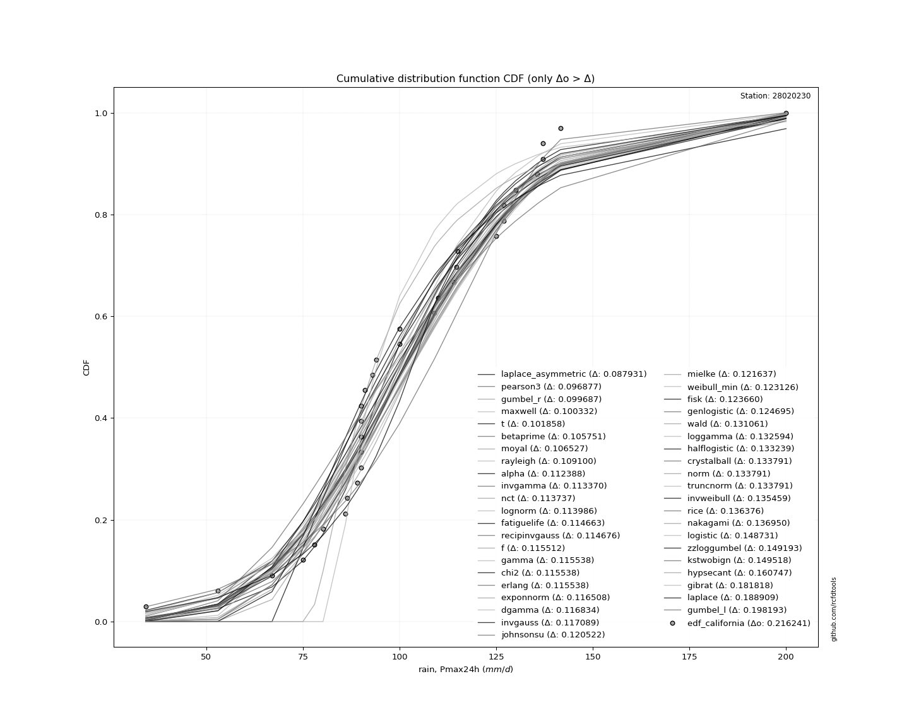</img>

</div>


**1.3. Best fit**

|   id |   station | empirical_dist   | p_dist             |     delta |   deltao | eval   |   fit |   n |   loc |   scale |    shape | shape1   | shape2   | shape3   |   best_fit |   best_fit_sort |
|-----:|----------:|:-----------------|:-------------------|----------:|---------:|:-------|------:|----:|------:|--------:|---------:|:---------|:---------|:---------|-----------:|----------------:|
|    0 |  28020230 | edf_california   | laplace_asymmetric | 0.0879308 | 0.216241 | Δo > Δ |     1 |  33 |    90 | 19.6915 | 0.722456 |          |          |          |          1 |               1 |

<div align="center">

</img></img>

</div>


### 2. Empirical - EDF Hazen (1930)

Hazen method for plotting positions is a formula used to estimate the empirical cumulative probability distribution of flood events or other hydrological data. This formula often results in biased estimations, particularly when extrapolating to extreme events (high return periods).

<div align="center">


$P=(m-0.5)/n$


</div>


**2.1. Empirical values**

<div align="center">

|                | 0                    | 1                    | 2                   | 3                   | 4                   | 5                   | 6                   | 7                   | 8                   | 9                  | 10                 | 11                 | 12                 | 13                 | 14                 | 15                 | 16        | 17                 | 18                 | 19                 | 20                 | 21                 | 22                 | 23                 | 24                 | 25                 | 26                | 27                 | 28                 | 29                 | 30                 | 31                 | 32                 |
|:---------------|:---------------------|:---------------------|:--------------------|:--------------------|:--------------------|:--------------------|:--------------------|:--------------------|:--------------------|:-------------------|:-------------------|:-------------------|:-------------------|:-------------------|:-------------------|:-------------------|:----------|:-------------------|:-------------------|:-------------------|:-------------------|:-------------------|:-------------------|:-------------------|:-------------------|:-------------------|:------------------|:-------------------|:-------------------|:-------------------|:-------------------|:-------------------|:-------------------|
| date           | 1990                 | 1972                 | 1989                | 1997                | 2001                | 1984                | 1970                | 1988                | 1996                | 1998               | 1994               | 1993               | 1977               | 1969               | 1992               | 1979               | 1991      | 1976               | 1978               | 1974               | 1982               | 1971               | 1983               | 1975               | 2000               | 1980               | 1985              | 1973               | 1986               | 1981               | 1999               | 1987               | 1995               |
| x              | 34.3                 | 53.0                 | 67.0                | 75.0                | 78.0                | 80.2                | 86.0                | 86.5                | 89.0                | 90.0               | 90.0               | 90.0               | 90.0               | 90.0               | 91.0               | 93.0               | 94.0      | 100.0              | 100.0              | 109.0              | 110.0              | 114.0              | 114.7              | 115.0              | 125.0              | 127.0              | 127.0             | 130.0              | 135.6              | 137.0              | 137.0              | 141.7              | 200.0              |
| m              | 1                    | 2                    | 3                   | 4                   | 5                   | 6                   | 7                   | 8                   | 9                   | 10                 | 11                 | 12                 | 13                 | 14                 | 15                 | 16                 | 17        | 18                 | 19                 | 20                 | 21                 | 22                 | 23                 | 24                 | 25                 | 26                 | 27                | 28                 | 29                 | 30                 | 31                 | 32                 | 33                 |
| empirical_dist | edf_hazen            | edf_hazen            | edf_hazen           | edf_hazen           | edf_hazen           | edf_hazen           | edf_hazen           | edf_hazen           | edf_hazen           | edf_hazen          | edf_hazen          | edf_hazen          | edf_hazen          | edf_hazen          | edf_hazen          | edf_hazen          | edf_hazen | edf_hazen          | edf_hazen          | edf_hazen          | edf_hazen          | edf_hazen          | edf_hazen          | edf_hazen          | edf_hazen          | edf_hazen          | edf_hazen         | edf_hazen          | edf_hazen          | edf_hazen          | edf_hazen          | edf_hazen          | edf_hazen          |
| empirical      | 0.015151515151515152 | 0.045454545454545456 | 0.07575757575757576 | 0.10606060606060606 | 0.13636363636363635 | 0.16666666666666666 | 0.19696969696969696 | 0.22727272727272727 | 0.25757575757575757 | 0.2878787878787879 | 0.3181818181818182 | 0.3484848484848485 | 0.3787878787878788 | 0.4090909090909091 | 0.4393939393939394 | 0.4696969696969697 | 0.5       | 0.5303030303030303 | 0.5606060606060606 | 0.5909090909090909 | 0.6212121212121212 | 0.6515151515151515 | 0.6818181818181818 | 0.7121212121212122 | 0.7424242424242424 | 0.7727272727272727 | 0.803030303030303 | 0.8333333333333334 | 0.8636363636363636 | 0.8939393939393939 | 0.9242424242424242 | 0.9545454545454546 | 0.9848484848484849 |
| empirical_tr   | 1.0153846153846153   | 1.0476190476190477   | 1.0819672131147542  | 1.1186440677966103  | 1.1578947368421053  | 1.2                 | 1.2452830188679247  | 1.2941176470588236  | 1.346938775510204   | 1.4042553191489362 | 1.4666666666666666 | 1.5348837209302326 | 1.6097560975609757 | 1.6923076923076925 | 1.783783783783784  | 1.885714285714286  | 2.0       | 2.129032258064516  | 2.275862068965517  | 2.4444444444444446 | 2.64               | 2.869565217391304  | 3.1428571428571423 | 3.4736842105263164 | 3.8823529411764706 | 4.3999999999999995 | 5.076923076923076 | 6.000000000000002  | 7.333333333333334  | 9.428571428571427  | 13.199999999999992 | 22.00000000000002  | 66.00000000000006  |

</div>


**2.2. Parameters & Kolmogorov-Smirnov fit test (sorted by Δ)**

|   id | empirical_dist   | p_dist             |     delta |   deltao | eval    |   fit |   n |             loc |           scale | shape                 | shape1               | shape2             | shape3   |   best_fit |   best_fit_sort |
|-----:|:-----------------|:-------------------|----------:|---------:|:--------|------:|----:|----------------:|----------------:|:----------------------|:---------------------|:-------------------|:---------|-----------:|----------------:|
|    0 | edf_hazen        | laplace_asymmetric | 0.0818544 | 0.216241 | Δo > Δ  |     1 |  33 |    90           |    19.6915      | 0.7224559990360757    |                      |                    |          |          1 |               1 |
|    1 | edf_hazen        | nct                | 0.0985852 | 0.216241 | Δo > Δ  |     1 |  33 |    -0.142289    |    24.2577      | 24.908986848794754    | 4.123925993815067    |                    |          |          0 |               2 |
|    2 | edf_hazen        | lognorm            | 0.098858  | 0.216241 | Δo > Δ  |     1 |  33 |  -139.712       |   240.944       | 0.12173654465026063   |                      |                    |          |          0 |               3 |
|    3 | edf_hazen        | invgamma           | 0.0990478 | 0.216241 | Δo > Δ  |     1 |  33 |  -208.824       | 34775.5         | 112.5159827831635     |                      |                    |          |          0 |               4 |
|    4 | edf_hazen        | alpha              | 0.0992935 | 0.216241 | Δo > Δ  |     1 |  33 |  -334.079       |  6495.73        | 14.927947537874772    |                      |                    |          |          0 |               5 |
|    5 | edf_hazen        | fatiguelife        | 0.0995114 | 0.216241 | Δo > Δ  |     1 |  33 |  -149.032       |   250.336       | 0.11745988992854395   |                      |                    |          |          0 |               6 |
|    6 | edf_hazen        | recipinvgauss      | 0.0995242 | 0.216241 | Δo > Δ  |     1 |  33 |  -148.625       |     3.44765     | 0.013890137074665933  |                      |                    |          |          0 |               7 |
|    7 | edf_hazen        | f                  | 0.100361  | 0.216241 | Δo > Δ  |     1 |  33 |   -76.3588      |   179.374       | 73.41909229149664     | 24424.72118193735    |                    |          |          0 |               8 |
|    8 | edf_hazen        | gamma              | 0.100387  | 0.216241 | Δo > Δ  |     1 |  33 |   -76.1276      |     4.90835     | 36.50060814064102     |                      |                    |          |          0 |               9 |
|    9 | edf_hazen        | chi2               | 0.100387  | 0.216241 | Δo > Δ  |     1 |  33 |   -76.1275      |     2.45418     | 73.00113016689681     |                      |                    |          |          0 |              10 |
|   10 | edf_hazen        | erlang             | 0.100387  | 0.216241 | Δo > Δ  |     1 |  33 |   -76.1276      |     4.90835     | 36.50061939918796     |                      |                    |          |          0 |              11 |
|   11 | edf_hazen        | exponnorm          | 0.101357  | 0.216241 | Δo > Δ  |     1 |  33 |    83.6977      |    22.2661      | 0.8682562710904624    |                      |                    |          |          0 |              12 |
|   12 | edf_hazen        | t                  | 0.103114  | 0.216241 | Δo > Δ  |     1 |  33 |    99.6243      |    24.3609      | 4.985756644155526     |                      |                    |          |          0 |              13 |
|   13 | edf_hazen        | johnsonsu          | 0.10537   | 0.216241 | Δo > Δ  |     1 |  33 |    88.6561      |    32.6545      | -0.5052658352215449   | 1.4607249054444937   |                    |          |          0 |              14 |
|   14 | edf_hazen        | mielke             | 0.106485  | 0.216241 | Δo > Δ  |     1 |  33 |    -1.19338     |   112.672       | 4.6561777597167255    | 7.657570508573743    |                    |          |          0 |              15 |
|   15 | edf_hazen        | weibull_min        | 0.107974  | 0.216241 | Δo > Δ  |     1 |  33 |    48.406       |    63.4569      | 2.111141384999197     |                      |                    |          |          0 |              16 |
|   16 | edf_hazen        | fisk               | 0.108509  | 0.216241 | Δo > Δ  |     1 |  33 |  -113.235       |   214.131       | 13.47377827978022     |                      |                    |          |          0 |              17 |
|   17 | edf_hazen        | genlogistic        | 0.109544  | 0.216241 | Δo > Δ  |     1 |  33 |    89.5612      |    18.3321      | 1.6231534198361361    |                      |                    |          |          0 |              18 |
|   18 | edf_hazen        | pearson3           | 0.112028  | 0.216241 | Δo > Δ  |     1 |  33 |   103.03        |    29.9105      | 0.6482425583303908    |                      |                    |          |          0 |              19 |
|   19 | edf_hazen        | maxwell            | 0.113759  | 0.216241 | Δo > Δ  |     1 |  33 |    32.1549      |    44.4146      |                       |                      |                    |          |          0 |              20 |
|   20 | edf_hazen        | gumbel_r           | 0.114838  | 0.216241 | Δo > Δ  |     1 |  33 |    89.569       |    23.3211      |                       |                      |                    |          |          0 |              21 |
|   21 | edf_hazen        | loggamma           | 0.117442  | 0.216241 | Δo > Δ  |     1 |  33 | -8185.69        |  1143.87        | 1403.242459542555     |                      |                    |          |          0 |              22 |
|   22 | edf_hazen        | crystalball        | 0.11864   | 0.216241 | Δo > Δ  |     1 |  33 |   103.03        |    29.9105      | 6973.079108565442     | 10313.830100162435   |                    |          |          0 |              23 |
|   23 | edf_hazen        | norm               | 0.11864   | 0.216241 | Δo > Δ  |     1 |  33 |   103.03        |    29.9105      |                       |                      |                    |          |          0 |              24 |
|   24 | edf_hazen        | truncnorm          | 0.11864   | 0.216241 | Δo > Δ  |     1 |  33 |   103.03        |    29.9105      | -655.0177315281694    | 720.841649155948     |                    |          |          0 |              25 |
|   25 | edf_hazen        | betaprime          | 0.120902  | 0.216241 | Δo > Δ  |     1 |  33 |     3.11782     |  1034.23        | 11.404419699076985    | 119.0723391645974    |                    |          |          0 |              26 |
|   26 | edf_hazen        | rice               | 0.121224  | 0.216241 | Δo > Δ  |     1 |  33 |    48.2193      |    33.963       | 1.203835156455907     |                      |                    |          |          0 |              27 |
|   27 | edf_hazen        | moyal              | 0.121679  | 0.216241 | Δo > Δ  |     1 |  33 |    85.9255      |    13.4645      |                       |                      |                    |          |          0 |              28 |
|   28 | edf_hazen        | nakagami           | 0.121799  | 0.216241 | Δo > Δ  |     1 |  33 |    45.2093      |    65.6869      | 1.3001365584985287    |                      |                    |          |          0 |              29 |
|   29 | edf_hazen        | rayleigh           | 0.124252  | 0.216241 | Δo > Δ  |     1 |  33 |    45.8098      |    45.6554      |                       |                      |                    |          |          0 |              30 |
|   30 | edf_hazen        | dgamma             | 0.131985  | 0.216241 | Δo > Δ  |     1 |  33 |    97.9713      |    15.2867      | 1.4747807335421348    |                      |                    |          |          0 |              31 |
|   31 | edf_hazen        | invgauss           | 0.13224   | 0.216241 | Δo > Δ  |     1 |  33 |   -41.6886      |  2954.85        | 0.048769774053339765  |                      |                    |          |          0 |              32 |
|   32 | edf_hazen        | logistic           | 0.13358   | 0.216241 | Δo > Δ  |     1 |  33 |   103.03        |    16.4905      |                       |                      |                    |          |          0 |              33 |
|   33 | edf_hazen        | hypsecant          | 0.145596  | 0.216241 | Δo > Δ  |     1 |  33 |   103.03        |    19.0416      |                       |                      |                    |          |          0 |              34 |
|   34 | edf_hazen        | wald               | 0.146213  | 0.216241 | Δo > Δ  |     1 |  33 |    73.1198      |    29.9105      |                       |                      |                    |          |          0 |              35 |
|   35 | edf_hazen        | halflogistic       | 0.14839   | 0.216241 | Δo > Δ  |     1 |  33 |    67.5794      |    25.5724      |                       |                      |                    |          |          0 |              36 |
|   36 | edf_hazen        | invweibull         | 0.15061   | 0.216241 | Δo > Δ  |     1 |  33 |    -1.15572e+06 |     1.1558e+06  | 45347.65677079186     |                      |                    |          |          0 |              37 |
|   37 | edf_hazen        | zzloggumbel        | 0.164344  | 0.216241 | Δo > Δ  |     1 |  33 |     4.4587      |     0.243654    | 0.5388106529916182    | 1.1224931659715724   |                    |          |          0 |              38 |
|   38 | edf_hazen        | kstwobign          | 0.164669  | 0.216241 | Δo > Δ  |     1 |  33 |   -17.9271      |   139.808       |                       |                      |                    |          |          0 |              39 |
|   39 | edf_hazen        | laplace            | 0.173757  | 0.216241 | Δo > Δ  |     1 |  33 |   103.03        |    21.1499      |                       |                      |                    |          |          0 |              40 |
|   40 | edf_hazen        | gibrat             | 0.177128  | 0.216241 | Δo > Δ  |     1 |  33 |    80.2123      |    13.8398      |                       |                      |                    |          |          0 |              41 |
|   41 | edf_hazen        | gumbel_l           | 0.183041  | 0.216241 | Δo > Δ  |     1 |  33 |   116.492       |    23.3211      |                       |                      |                    |          |          0 |              42 |
|   42 | edf_hazen        | zzgumbel           | 0.26841   | 0.216241 | Δo <= Δ |     0 |  33 |   103.008       |    23.6827      | 0.5388106529916182    | 1.1224931659715724   |                    |          |          0 |              43 |
|   43 | edf_hazen        | ncf                | 0.302686  | 0.216241 | Δo <= Δ |     0 |  33 |    -0.0750199   |     5.42594e-07 | 6.177190705933478e-08 | 8.559472659866003    | 10.749129905783315 |          |          0 |              44 |
|   44 | edf_hazen        | genexpon           | 0.328595  | 0.216241 | Δo <= Δ |     0 |  33 |    34.3         |     1.89016     | 0.021553256129742675  | 0.005173981655219102 | 0.9976188434514551 |          |          0 |              45 |
|   45 | edf_hazen        | expon              | 0.340814  | 0.216241 | Δo <= Δ |     0 |  33 |    34.3         |    68.7303      |                       |                      |                    |          |          0 |              46 |
|   46 | edf_hazen        | pareto             | 0.340814  | 0.216241 | Δo <= Δ |     0 |  33 |    -4.29497e+09 |     4.29497e+09 | 62490155.861802205    |                      |                    |          |          0 |              47 |
|   47 | edf_hazen        | halfnorm           | 0.560606  | 0.216241 | Δo <= Δ |     0 |  33 |   104.186       |     2.73121     |                       |                      |                    |          |          0 |              48 |
|   48 | edf_hazen        | gompertz           | 0.954532  | 0.216241 | Δo <= Δ |     0 |  33 |    20.7391      |     3.96322     | 7.488483840098274e-19 |                      |                    |          |          0 |              49 |

<div align="center">

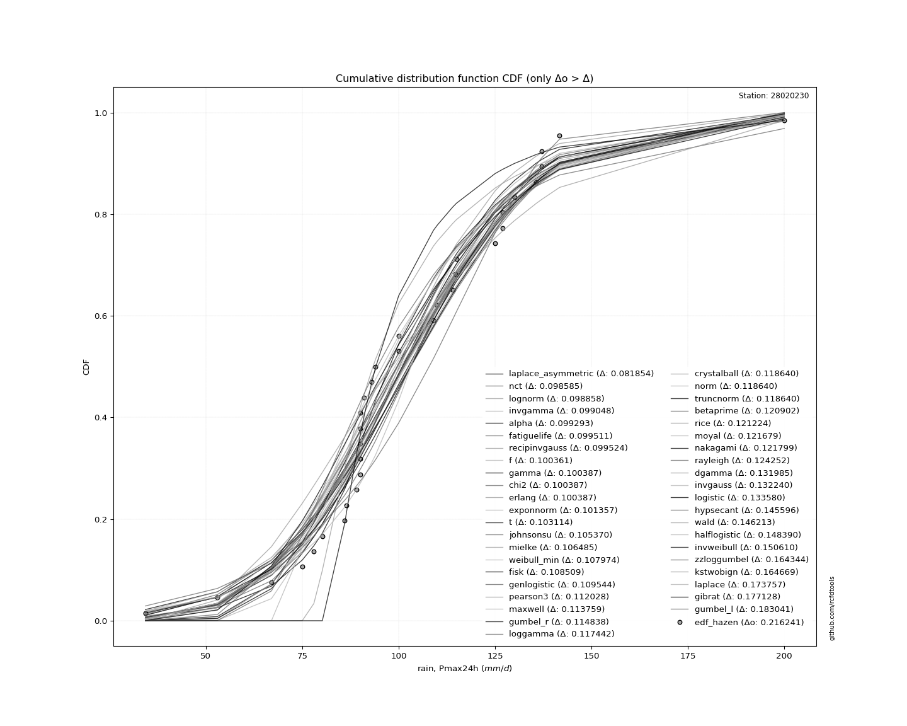</img>

</div>


**2.3. Best fit**

|   id |   station | empirical_dist   | p_dist             |     delta |   deltao | eval   |   fit |   n |   loc |   scale |    shape | shape1   | shape2   | shape3   |   best_fit |   best_fit_sort |
|-----:|----------:|:-----------------|:-------------------|----------:|---------:|:-------|------:|----:|------:|--------:|---------:|:---------|:---------|:---------|-----------:|----------------:|
|    0 |  28020230 | edf_hazen        | laplace_asymmetric | 0.0818544 | 0.216241 | Δo > Δ |     1 |  33 |    90 | 19.6915 | 0.722456 |          |          |          |          1 |               1 |

<div align="center">

</img></img>

</div>


### 3. Empirical - EDF Weibull (1939)

Weibull plotting position formula is an empirical method used to estimate the non-exceedance probability or plotting position for a set of observed data, is often recommended or widely used in practice, particularly in flood frequency analysis.

<div align="center">


$P=m/(n+1)$


</div>


**3.1. Empirical values**

<div align="center">

|                | 0                    | 1                    | 2                   | 3                   | 4                   | 5                   | 6                   | 7                   | 8                  | 9                   | 10                 | 11                  | 12                  | 13                 | 14                 | 15                  | 16          | 17                 | 18                 | 19                 | 20                 | 21                 | 22                 | 23                 | 24                 | 25                 | 26                 | 27                 | 28                 | 29                 | 30                 | 31                 | 32                 |
|:---------------|:---------------------|:---------------------|:--------------------|:--------------------|:--------------------|:--------------------|:--------------------|:--------------------|:-------------------|:--------------------|:-------------------|:--------------------|:--------------------|:-------------------|:-------------------|:--------------------|:------------|:-------------------|:-------------------|:-------------------|:-------------------|:-------------------|:-------------------|:-------------------|:-------------------|:-------------------|:-------------------|:-------------------|:-------------------|:-------------------|:-------------------|:-------------------|:-------------------|
| date           | 1990                 | 1972                 | 1989                | 1997                | 2001                | 1984                | 1970                | 1988                | 1996               | 1998                | 1994               | 1993                | 1977                | 1969               | 1992               | 1979                | 1991        | 1976               | 1978               | 1974               | 1982               | 1971               | 1983               | 1975               | 2000               | 1980               | 1985               | 1973               | 1986               | 1981               | 1999               | 1987               | 1995               |
| x              | 34.3                 | 53.0                 | 67.0                | 75.0                | 78.0                | 80.2                | 86.0                | 86.5                | 89.0               | 90.0                | 90.0               | 90.0                | 90.0                | 90.0               | 91.0               | 93.0                | 94.0        | 100.0              | 100.0              | 109.0              | 110.0              | 114.0              | 114.7              | 115.0              | 125.0              | 127.0              | 127.0              | 130.0              | 135.6              | 137.0              | 137.0              | 141.7              | 200.0              |
| m              | 1                    | 2                    | 3                   | 4                   | 5                   | 6                   | 7                   | 8                   | 9                  | 10                  | 11                 | 12                  | 13                  | 14                 | 15                 | 16                  | 17          | 18                 | 19                 | 20                 | 21                 | 22                 | 23                 | 24                 | 25                 | 26                 | 27                 | 28                 | 29                 | 30                 | 31                 | 32                 | 33                 |
| empirical_dist | edf_weibull          | edf_weibull          | edf_weibull         | edf_weibull         | edf_weibull         | edf_weibull         | edf_weibull         | edf_weibull         | edf_weibull        | edf_weibull         | edf_weibull        | edf_weibull         | edf_weibull         | edf_weibull        | edf_weibull        | edf_weibull         | edf_weibull | edf_weibull        | edf_weibull        | edf_weibull        | edf_weibull        | edf_weibull        | edf_weibull        | edf_weibull        | edf_weibull        | edf_weibull        | edf_weibull        | edf_weibull        | edf_weibull        | edf_weibull        | edf_weibull        | edf_weibull        | edf_weibull        |
| empirical      | 0.029411764705882353 | 0.058823529411764705 | 0.08823529411764706 | 0.11764705882352941 | 0.14705882352941177 | 0.17647058823529413 | 0.20588235294117646 | 0.23529411764705882 | 0.2647058823529412 | 0.29411764705882354 | 0.3235294117647059 | 0.35294117647058826 | 0.38235294117647056 | 0.4117647058823529 | 0.4411764705882353 | 0.47058823529411764 | 0.5         | 0.5294117647058824 | 0.5588235294117647 | 0.5882352941176471 | 0.6176470588235294 | 0.6470588235294118 | 0.6764705882352942 | 0.7058823529411765 | 0.7352941176470589 | 0.7647058823529411 | 0.7941176470588235 | 0.8235294117647058 | 0.8529411764705882 | 0.8823529411764706 | 0.9117647058823529 | 0.9411764705882353 | 0.9705882352941176 |
| empirical_tr   | 1.0303030303030303   | 1.0625               | 1.096774193548387   | 1.1333333333333333  | 1.1724137931034484  | 1.2142857142857144  | 1.259259259259259   | 1.3076923076923077  | 1.3599999999999999 | 1.4166666666666667  | 1.4782608695652173 | 1.5454545454545456  | 1.619047619047619   | 1.7                | 1.7894736842105263 | 1.8888888888888888  | 2.0         | 2.125              | 2.2666666666666666 | 2.428571428571429  | 2.6153846153846154 | 2.8333333333333335 | 3.0909090909090913 | 3.4000000000000004 | 3.7777777777777786 | 4.249999999999999  | 4.857142857142856  | 5.666666666666665  | 6.799999999999999  | 8.499999999999998  | 11.33333333333333  | 16.999999999999996 | 33.99999999999999  |

</div>


**3.2. Parameters & Kolmogorov-Smirnov fit test (sorted by Δ)**

|   id | empirical_dist   | p_dist             |     delta |   deltao | eval    |   fit |   n |             loc |           scale | shape                 | shape1               | shape2             | shape3   |   best_fit |   best_fit_sort |
|-----:|:-----------------|:-------------------|----------:|---------:|:--------|------:|----:|----------------:|----------------:|:----------------------|:---------------------|:-------------------|:---------|-----------:|----------------:|
|    0 | edf_weibull      | laplace_asymmetric | 0.0845282 | 0.216241 | Δo > Δ  |     1 |  33 |    90           |    19.6915      | 0.7224559990360757    |                      |                    |          |          1 |               1 |
|    1 | edf_weibull      | t                  | 0.0942009 | 0.216241 | Δo > Δ  |     1 |  33 |    99.6243      |    24.3609      | 4.985756644155526     |                      |                    |          |          0 |               2 |
|    2 | edf_weibull      | alpha              | 0.0972368 | 0.216241 | Δo > Δ  |     1 |  33 |  -334.079       |  6495.73        | 14.927947537874772    |                      |                    |          |          0 |               3 |
|    3 | edf_weibull      | invgamma           | 0.0982183 | 0.216241 | Δo > Δ  |     1 |  33 |  -208.824       | 34775.5         | 112.5159827831635     |                      |                    |          |          0 |               4 |
|    4 | edf_weibull      | nct                | 0.0985852 | 0.216241 | Δo > Δ  |     1 |  33 |    -0.142289    |    24.2577      | 24.908986848794754    | 4.123925993815067    |                    |          |          0 |               5 |
|    5 | edf_weibull      | lognorm            | 0.0988346 | 0.216241 | Δo > Δ  |     1 |  33 |  -139.712       |   240.944       | 0.12173654465026063   |                      |                    |          |          0 |               6 |
|    6 | edf_weibull      | fatiguelife        | 0.0995114 | 0.216241 | Δo > Δ  |     1 |  33 |  -149.032       |   250.336       | 0.11745988992854395   |                      |                    |          |          0 |               7 |
|    7 | edf_weibull      | recipinvgauss      | 0.0995242 | 0.216241 | Δo > Δ  |     1 |  33 |  -148.625       |     3.44765     | 0.013890137074665933  |                      |                    |          |          0 |               8 |
|    8 | edf_weibull      | f                  | 0.100361  | 0.216241 | Δo > Δ  |     1 |  33 |   -76.3588      |   179.374       | 73.41909229149664     | 24424.72118193735    |                    |          |          0 |               9 |
|    9 | edf_weibull      | gamma              | 0.100387  | 0.216241 | Δo > Δ  |     1 |  33 |   -76.1276      |     4.90835     | 36.50060814064102     |                      |                    |          |          0 |              10 |
|   10 | edf_weibull      | chi2               | 0.100387  | 0.216241 | Δo > Δ  |     1 |  33 |   -76.1275      |     2.45418     | 73.00113016689681     |                      |                    |          |          0 |              11 |
|   11 | edf_weibull      | erlang             | 0.100387  | 0.216241 | Δo > Δ  |     1 |  33 |   -76.1276      |     4.90835     | 36.50061939918796     |                      |                    |          |          0 |              12 |
|   12 | edf_weibull      | exponnorm          | 0.101357  | 0.216241 | Δo > Δ  |     1 |  33 |    83.6977      |    22.2661      | 0.8682562710904624    |                      |                    |          |          0 |              13 |
|   13 | edf_weibull      | pearson3           | 0.103116  | 0.216241 | Δo > Δ  |     1 |  33 |   103.03        |    29.9105      | 0.6482425583303908    |                      |                    |          |          0 |              14 |
|   14 | edf_weibull      | maxwell            | 0.104847  | 0.216241 | Δo > Δ  |     1 |  33 |    32.1549      |    44.4146      |                       |                      |                    |          |          0 |              15 |
|   15 | edf_weibull      | johnsonsu          | 0.10537   | 0.216241 | Δo > Δ  |     1 |  33 |    88.6561      |    32.6545      | -0.5052658352215449   | 1.4607249054444937   |                    |          |          0 |              16 |
|   16 | edf_weibull      | gumbel_r           | 0.105926  | 0.216241 | Δo > Δ  |     1 |  33 |    89.569       |    23.3211      |                       |                      |                    |          |          0 |              17 |
|   17 | edf_weibull      | mielke             | 0.106485  | 0.216241 | Δo > Δ  |     1 |  33 |    -1.19338     |   112.672       | 4.6561777597167255    | 7.657570508573743    |                    |          |          0 |              18 |
|   18 | edf_weibull      | weibull_min        | 0.107974  | 0.216241 | Δo > Δ  |     1 |  33 |    48.406       |    63.4569      | 2.111141384999197     |                      |                    |          |          0 |              19 |
|   19 | edf_weibull      | fisk               | 0.108509  | 0.216241 | Δo > Δ  |     1 |  33 |  -113.235       |   214.131       | 13.47377827978022     |                      |                    |          |          0 |              20 |
|   20 | edf_weibull      | genlogistic        | 0.109544  | 0.216241 | Δo > Δ  |     1 |  33 |    89.5612      |    18.3321      | 1.6231534198361361    |                      |                    |          |          0 |              21 |
|   21 | edf_weibull      | betaprime          | 0.11199   | 0.216241 | Δo > Δ  |     1 |  33 |     3.11782     |  1034.23        | 11.404419699076985    | 119.0723391645974    |                    |          |          0 |              22 |
|   22 | edf_weibull      | moyal              | 0.112766  | 0.216241 | Δo > Δ  |     1 |  33 |    85.9255      |    13.4645      |                       |                      |                    |          |          0 |              23 |
|   23 | edf_weibull      | rayleigh           | 0.115339  | 0.216241 | Δo > Δ  |     1 |  33 |    45.8098      |    45.6554      |                       |                      |                    |          |          0 |              24 |
|   24 | edf_weibull      | loggamma           | 0.117442  | 0.216241 | Δo > Δ  |     1 |  33 | -8185.69        |  1143.87        | 1403.242459542555     |                      |                    |          |          0 |              25 |
|   25 | edf_weibull      | crystalball        | 0.11864   | 0.216241 | Δo > Δ  |     1 |  33 |   103.03        |    29.9105      | 6973.079108565442     | 10313.830100162435   |                    |          |          0 |              26 |
|   26 | edf_weibull      | norm               | 0.11864   | 0.216241 | Δo > Δ  |     1 |  33 |   103.03        |    29.9105      |                       |                      |                    |          |          0 |              27 |
|   27 | edf_weibull      | truncnorm          | 0.11864   | 0.216241 | Δo > Δ  |     1 |  33 |   103.03        |    29.9105      | -655.0177315281694    | 720.841649155948     |                    |          |          0 |              28 |
|   28 | edf_weibull      | rice               | 0.121224  | 0.216241 | Δo > Δ  |     1 |  33 |    48.2193      |    33.963       | 1.203835156455907     |                      |                    |          |          0 |              29 |
|   29 | edf_weibull      | nakagami           | 0.121799  | 0.216241 | Δo > Δ  |     1 |  33 |    45.2093      |    65.6869      | 1.3001365584985287    |                      |                    |          |          0 |              30 |
|   30 | edf_weibull      | dgamma             | 0.123073  | 0.216241 | Δo > Δ  |     1 |  33 |    97.9713      |    15.2867      | 1.4747807335421348    |                      |                    |          |          0 |              31 |
|   31 | edf_weibull      | invgauss           | 0.123328  | 0.216241 | Δo > Δ  |     1 |  33 |   -41.6886      |  2954.85        | 0.048769774053339765  |                      |                    |          |          0 |              32 |
|   32 | edf_weibull      | logistic           | 0.13358   | 0.216241 | Δo > Δ  |     1 |  33 |   103.03        |    16.4905      |                       |                      |                    |          |          0 |              33 |
|   33 | edf_weibull      | halflogistic       | 0.139478  | 0.216241 | Δo > Δ  |     1 |  33 |    67.5794      |    25.5724      |                       |                      |                    |          |          0 |              34 |
|   34 | edf_weibull      | invweibull         | 0.141697  | 0.216241 | Δo > Δ  |     1 |  33 |    -1.15572e+06 |     1.1558e+06  | 45347.65677079186     |                      |                    |          |          0 |              35 |
|   35 | edf_weibull      | hypsecant          | 0.145596  | 0.216241 | Δo > Δ  |     1 |  33 |   103.03        |    19.0416      |                       |                      |                    |          |          0 |              36 |
|   36 | edf_weibull      | wald               | 0.148887  | 0.216241 | Δo > Δ  |     1 |  33 |    73.1198      |    29.9105      |                       |                      |                    |          |          0 |              37 |
|   37 | edf_weibull      | zzloggumbel        | 0.155431  | 0.216241 | Δo > Δ  |     1 |  33 |     4.4587      |     0.243654    | 0.5388106529916182    | 1.1224931659715724   |                    |          |          0 |              38 |
|   38 | edf_weibull      | kstwobign          | 0.155756  | 0.216241 | Δo > Δ  |     1 |  33 |   -17.9271      |   139.808       |                       |                      |                    |          |          0 |              39 |
|   39 | edf_weibull      | laplace            | 0.173757  | 0.216241 | Δo > Δ  |     1 |  33 |   103.03        |    21.1499      |                       |                      |                    |          |          0 |              40 |
|   40 | edf_weibull      | gibrat             | 0.179802  | 0.216241 | Δo > Δ  |     1 |  33 |    80.2123      |    13.8398      |                       |                      |                    |          |          0 |              41 |
|   41 | edf_weibull      | gumbel_l           | 0.183041  | 0.216241 | Δo > Δ  |     1 |  33 |   116.492       |    23.3211      |                       |                      |                    |          |          0 |              42 |
|   42 | edf_weibull      | zzgumbel           | 0.26841   | 0.216241 | Δo <= Δ |     0 |  33 |   103.008       |    23.6827      | 0.5388106529916182    | 1.1224931659715724   |                    |          |          0 |              43 |
|   43 | edf_weibull      | ncf                | 0.2911    | 0.216241 | Δo <= Δ |     0 |  33 |    -0.0750199   |     5.42594e-07 | 6.177190705933478e-08 | 8.559472659866003    | 10.749129905783315 |          |          0 |              44 |
|   44 | edf_weibull      | genexpon           | 0.317008  | 0.216241 | Δo <= Δ |     0 |  33 |    34.3         |     1.89016     | 0.021553256129742675  | 0.005173981655219102 | 0.9976188434514551 |          |          0 |              45 |
|   45 | edf_weibull      | expon              | 0.329227  | 0.216241 | Δo <= Δ |     0 |  33 |    34.3         |    68.7303      |                       |                      |                    |          |          0 |              46 |
|   46 | edf_weibull      | pareto             | 0.329227  | 0.216241 | Δo <= Δ |     0 |  33 |    -4.29497e+09 |     4.29497e+09 | 62490155.861802205    |                      |                    |          |          0 |              47 |
|   47 | edf_weibull      | halfnorm           | 0.558824  | 0.216241 | Δo <= Δ |     0 |  33 |   104.186       |     2.73121     |                       |                      |                    |          |          0 |              48 |
|   48 | edf_weibull      | gompertz           | 0.941163  | 0.216241 | Δo <= Δ |     0 |  33 |    20.7391      |     3.96322     | 7.488483840098274e-19 |                      |                    |          |          0 |              49 |

<div align="center">

</img>

</div>


**3.3. Best fit**

|   id |   station | empirical_dist   | p_dist             |     delta |   deltao | eval   |   fit |   n |   loc |   scale |    shape | shape1   | shape2   | shape3   |   best_fit |   best_fit_sort |
|-----:|----------:|:-----------------|:-------------------|----------:|---------:|:-------|------:|----:|------:|--------:|---------:|:---------|:---------|:---------|-----------:|----------------:|
|    0 |  28020230 | edf_weibull      | laplace_asymmetric | 0.0845282 | 0.216241 | Δo > Δ |     1 |  33 |    90 | 19.6915 | 0.722456 |          |          |          |          1 |               1 |

<div align="center">

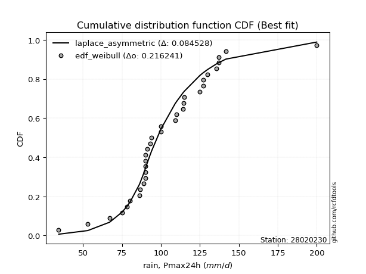</img>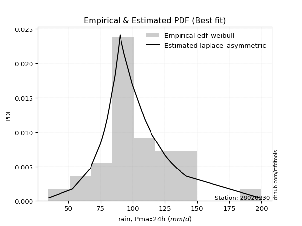</img>

</div>


### 4. Empirical - EDF Beard (1943)

The Beard formula (or Beard´s plotting position formula) in hydrology is used to estimate the empirical non-exceedance probability _(P)_ of a flood event (or other extreme hydrological data point) within a given dataset.

<div align="center">


$P=(m-0.31)/(n+0.38)$


</div>


**4.1. Empirical values**

<div align="center">

|                | 0                    | 1                   | 2                   | 3                   | 4                   | 5                   | 6                   | 7                   | 8                  | 9                   | 10                  | 11                 | 12                 | 13                  | 14                 | 15                 | 16        | 17                 | 18                 | 19                 | 20                 | 21                 | 22                 | 23                 | 24                 | 25                 | 26                 | 27                 | 28                 | 29                 | 30                 | 31                 | 32                 |
|:---------------|:---------------------|:--------------------|:--------------------|:--------------------|:--------------------|:--------------------|:--------------------|:--------------------|:-------------------|:--------------------|:--------------------|:-------------------|:-------------------|:--------------------|:-------------------|:-------------------|:----------|:-------------------|:-------------------|:-------------------|:-------------------|:-------------------|:-------------------|:-------------------|:-------------------|:-------------------|:-------------------|:-------------------|:-------------------|:-------------------|:-------------------|:-------------------|:-------------------|
| date           | 1990                 | 1972                | 1989                | 1997                | 2001                | 1984                | 1970                | 1988                | 1996               | 1998                | 1994                | 1993               | 1977               | 1969                | 1992               | 1979               | 1991      | 1976               | 1978               | 1974               | 1982               | 1971               | 1983               | 1975               | 2000               | 1980               | 1985               | 1973               | 1986               | 1981               | 1999               | 1987               | 1995               |
| x              | 34.3                 | 53.0                | 67.0                | 75.0                | 78.0                | 80.2                | 86.0                | 86.5                | 89.0               | 90.0                | 90.0                | 90.0               | 90.0               | 90.0                | 91.0               | 93.0               | 94.0      | 100.0              | 100.0              | 109.0              | 110.0              | 114.0              | 114.7              | 115.0              | 125.0              | 127.0              | 127.0              | 130.0              | 135.6              | 137.0              | 137.0              | 141.7              | 200.0              |
| m              | 1                    | 2                   | 3                   | 4                   | 5                   | 6                   | 7                   | 8                   | 9                  | 10                  | 11                  | 12                 | 13                 | 14                  | 15                 | 16                 | 17        | 18                 | 19                 | 20                 | 21                 | 22                 | 23                 | 24                 | 25                 | 26                 | 27                 | 28                 | 29                 | 30                 | 31                 | 32                 | 33                 |
| empirical_dist | edf_beard            | edf_beard           | edf_beard           | edf_beard           | edf_beard           | edf_beard           | edf_beard           | edf_beard           | edf_beard          | edf_beard           | edf_beard           | edf_beard          | edf_beard          | edf_beard           | edf_beard          | edf_beard          | edf_beard | edf_beard          | edf_beard          | edf_beard          | edf_beard          | edf_beard          | edf_beard          | edf_beard          | edf_beard          | edf_beard          | edf_beard          | edf_beard          | edf_beard          | edf_beard          | edf_beard          | edf_beard          | edf_beard          |
| empirical      | 0.020671060515278606 | 0.05062911923307369 | 0.08058717795086878 | 0.11054523666866387 | 0.14050329538645895 | 0.17046135410425403 | 0.20041941282204911 | 0.23037747153984423 | 0.2603355302576393 | 0.29029358897543434 | 0.32025164769322945 | 0.3502097064110245 | 0.3801677651288196 | 0.41012582384661467 | 0.4400838825644098 | 0.4700419412822049 | 0.5       | 0.5299580587177951 | 0.5599161174355902 | 0.5898741761533852 | 0.6198322348711803 | 0.6497902935889754 | 0.6797483523067706 | 0.7097064110245656 | 0.7396644697423607 | 0.7696225284601558 | 0.7995805871779509 | 0.8295386458957459 | 0.859496704613541  | 0.8894547633313361 | 0.9194128220491312 | 0.9493708807669262 | 0.9793289394847212 |
| empirical_tr   | 1.0211073722851025   | 1.0533291259072262  | 1.0876507005539264  | 1.1242842707982486  | 1.1634715928895085  | 1.2054893463344167  | 1.2506556762832521  | 1.2993382639159206  | 1.3519643580396923 | 1.4090333474039678  | 1.4711326575583956  | 1.5389580451821117 | 1.613339777670372  | 1.695276790248857   | 1.7859818084537185 | 1.8869417750141322 | 2.0       | 2.1274697259400894 | 2.2722940776038123 | 2.4382761139517894 | 2.6304176516942475 | 2.855431993156544  | 3.1225444340505146 | 3.4447884416924657 | 3.841196777905638  | 4.340702210663199  | 4.989536621823618  | 5.866432337434093  | 7.1172707889125775 | 9.046070460704605  | 12.408921933085502 | 19.751479289940796 | 48.37681159420249  |

</div>


**4.2. Parameters & Kolmogorov-Smirnov fit test (sorted by Δ)**

|   id | empirical_dist   | p_dist             |     delta |   deltao | eval    |   fit |   n |             loc |           scale | shape                 | shape1               | shape2             | shape3   |   best_fit |   best_fit_sort |
|-----:|:-----------------|:-------------------|----------:|---------:|:--------|------:|----:|----------------:|----------------:|:----------------------|:---------------------|:-------------------|:---------|-----------:|----------------:|
|    0 | edf_beard        | laplace_asymmetric | 0.0828893 | 0.216241 | Δo > Δ  |     1 |  33 |    90           |    19.6915      | 0.7224559990360757    |                      |                    |          |          1 |               1 |
|    1 | edf_beard        | alpha              | 0.0972368 | 0.216241 | Δo > Δ  |     1 |  33 |  -334.079       |  6495.73        | 14.927947537874772    |                      |                    |          |          0 |               2 |
|    2 | edf_beard        | invgamma           | 0.0982183 | 0.216241 | Δo > Δ  |     1 |  33 |  -208.824       | 34775.5         | 112.5159827831635     |                      |                    |          |          0 |               3 |
|    3 | edf_beard        | nct                | 0.0985852 | 0.216241 | Δo > Δ  |     1 |  33 |    -0.142289    |    24.2577      | 24.908986848794754    | 4.123925993815067    |                    |          |          0 |               4 |
|    4 | edf_beard        | lognorm            | 0.0988346 | 0.216241 | Δo > Δ  |     1 |  33 |  -139.712       |   240.944       | 0.12173654465026063   |                      |                    |          |          0 |               5 |
|    5 | edf_beard        | fatiguelife        | 0.0995114 | 0.216241 | Δo > Δ  |     1 |  33 |  -149.032       |   250.336       | 0.11745988992854395   |                      |                    |          |          0 |               6 |
|    6 | edf_beard        | recipinvgauss      | 0.0995242 | 0.216241 | Δo > Δ  |     1 |  33 |  -148.625       |     3.44765     | 0.013890137074665933  |                      |                    |          |          0 |               7 |
|    7 | edf_beard        | t                  | 0.0996638 | 0.216241 | Δo > Δ  |     1 |  33 |    99.6243      |    24.3609      | 4.985756644155526     |                      |                    |          |          0 |               8 |
|    8 | edf_beard        | f                  | 0.100361  | 0.216241 | Δo > Δ  |     1 |  33 |   -76.3588      |   179.374       | 73.41909229149664     | 24424.72118193735    |                    |          |          0 |               9 |
|    9 | edf_beard        | gamma              | 0.100387  | 0.216241 | Δo > Δ  |     1 |  33 |   -76.1276      |     4.90835     | 36.50060814064102     |                      |                    |          |          0 |              10 |
|   10 | edf_beard        | chi2               | 0.100387  | 0.216241 | Δo > Δ  |     1 |  33 |   -76.1275      |     2.45418     | 73.00113016689681     |                      |                    |          |          0 |              11 |
|   11 | edf_beard        | erlang             | 0.100387  | 0.216241 | Δo > Δ  |     1 |  33 |   -76.1276      |     4.90835     | 36.50061939918796     |                      |                    |          |          0 |              12 |
|   12 | edf_beard        | exponnorm          | 0.101357  | 0.216241 | Δo > Δ  |     1 |  33 |    83.6977      |    22.2661      | 0.8682562710904624    |                      |                    |          |          0 |              13 |
|   13 | edf_beard        | johnsonsu          | 0.10537   | 0.216241 | Δo > Δ  |     1 |  33 |    88.6561      |    32.6545      | -0.5052658352215449   | 1.4607249054444937   |                    |          |          0 |              14 |
|   14 | edf_beard        | mielke             | 0.106485  | 0.216241 | Δo > Δ  |     1 |  33 |    -1.19338     |   112.672       | 4.6561777597167255    | 7.657570508573743    |                    |          |          0 |              15 |
|   15 | edf_beard        | weibull_min        | 0.107974  | 0.216241 | Δo > Δ  |     1 |  33 |    48.406       |    63.4569      | 2.111141384999197     |                      |                    |          |          0 |              16 |
|   16 | edf_beard        | fisk               | 0.108509  | 0.216241 | Δo > Δ  |     1 |  33 |  -113.235       |   214.131       | 13.47377827978022     |                      |                    |          |          0 |              17 |
|   17 | edf_beard        | pearson3           | 0.108579  | 0.216241 | Δo > Δ  |     1 |  33 |   103.03        |    29.9105      | 0.6482425583303908    |                      |                    |          |          0 |              18 |
|   18 | edf_beard        | genlogistic        | 0.109544  | 0.216241 | Δo > Δ  |     1 |  33 |    89.5612      |    18.3321      | 1.6231534198361361    |                      |                    |          |          0 |              19 |
|   19 | edf_beard        | maxwell            | 0.110309  | 0.216241 | Δo > Δ  |     1 |  33 |    32.1549      |    44.4146      |                       |                      |                    |          |          0 |              20 |
|   20 | edf_beard        | gumbel_r           | 0.111389  | 0.216241 | Δo > Δ  |     1 |  33 |    89.569       |    23.3211      |                       |                      |                    |          |          0 |              21 |
|   21 | edf_beard        | loggamma           | 0.117442  | 0.216241 | Δo > Δ  |     1 |  33 | -8185.69        |  1143.87        | 1403.242459542555     |                      |                    |          |          0 |              22 |
|   22 | edf_beard        | betaprime          | 0.117453  | 0.216241 | Δo > Δ  |     1 |  33 |     3.11782     |  1034.23        | 11.404419699076985    | 119.0723391645974    |                    |          |          0 |              23 |
|   23 | edf_beard        | moyal              | 0.118229  | 0.216241 | Δo > Δ  |     1 |  33 |    85.9255      |    13.4645      |                       |                      |                    |          |          0 |              24 |
|   24 | edf_beard        | crystalball        | 0.11864   | 0.216241 | Δo > Δ  |     1 |  33 |   103.03        |    29.9105      | 6973.079108565442     | 10313.830100162435   |                    |          |          0 |              25 |
|   25 | edf_beard        | norm               | 0.11864   | 0.216241 | Δo > Δ  |     1 |  33 |   103.03        |    29.9105      |                       |                      |                    |          |          0 |              26 |
|   26 | edf_beard        | truncnorm          | 0.11864   | 0.216241 | Δo > Δ  |     1 |  33 |   103.03        |    29.9105      | -655.0177315281694    | 720.841649155948     |                    |          |          0 |              27 |
|   27 | edf_beard        | rayleigh           | 0.120802  | 0.216241 | Δo > Δ  |     1 |  33 |    45.8098      |    45.6554      |                       |                      |                    |          |          0 |              28 |
|   28 | edf_beard        | rice               | 0.121224  | 0.216241 | Δo > Δ  |     1 |  33 |    48.2193      |    33.963       | 1.203835156455907     |                      |                    |          |          0 |              29 |
|   29 | edf_beard        | nakagami           | 0.121799  | 0.216241 | Δo > Δ  |     1 |  33 |    45.2093      |    65.6869      | 1.3001365584985287    |                      |                    |          |          0 |              30 |
|   30 | edf_beard        | dgamma             | 0.128536  | 0.216241 | Δo > Δ  |     1 |  33 |    97.9713      |    15.2867      | 1.4747807335421348    |                      |                    |          |          0 |              31 |
|   31 | edf_beard        | invgauss           | 0.128791  | 0.216241 | Δo > Δ  |     1 |  33 |   -41.6886      |  2954.85        | 0.048769774053339765  |                      |                    |          |          0 |              32 |
|   32 | edf_beard        | logistic           | 0.13358   | 0.216241 | Δo > Δ  |     1 |  33 |   103.03        |    16.4905      |                       |                      |                    |          |          0 |              33 |
|   33 | edf_beard        | halflogistic       | 0.14494   | 0.216241 | Δo > Δ  |     1 |  33 |    67.5794      |    25.5724      |                       |                      |                    |          |          0 |              34 |
|   34 | edf_beard        | hypsecant          | 0.145596  | 0.216241 | Δo > Δ  |     1 |  33 |   103.03        |    19.0416      |                       |                      |                    |          |          0 |              35 |
|   35 | edf_beard        | invweibull         | 0.14716   | 0.216241 | Δo > Δ  |     1 |  33 |    -1.15572e+06 |     1.1558e+06  | 45347.65677079186     |                      |                    |          |          0 |              36 |
|   36 | edf_beard        | wald               | 0.147248  | 0.216241 | Δo > Δ  |     1 |  33 |    73.1198      |    29.9105      |                       |                      |                    |          |          0 |              37 |
|   37 | edf_beard        | zzloggumbel        | 0.160894  | 0.216241 | Δo > Δ  |     1 |  33 |     4.4587      |     0.243654    | 0.5388106529916182    | 1.1224931659715724   |                    |          |          0 |              38 |
|   38 | edf_beard        | kstwobign          | 0.161219  | 0.216241 | Δo > Δ  |     1 |  33 |   -17.9271      |   139.808       |                       |                      |                    |          |          0 |              39 |
|   39 | edf_beard        | laplace            | 0.173757  | 0.216241 | Δo > Δ  |     1 |  33 |   103.03        |    21.1499      |                       |                      |                    |          |          0 |              40 |
|   40 | edf_beard        | gibrat             | 0.178163  | 0.216241 | Δo > Δ  |     1 |  33 |    80.2123      |    13.8398      |                       |                      |                    |          |          0 |              41 |
|   41 | edf_beard        | gumbel_l           | 0.183041  | 0.216241 | Δo > Δ  |     1 |  33 |   116.492       |    23.3211      |                       |                      |                    |          |          0 |              42 |
|   42 | edf_beard        | zzgumbel           | 0.26841   | 0.216241 | Δo <= Δ |     0 |  33 |   103.008       |    23.6827      | 0.5388106529916182    | 1.1224931659715724   |                    |          |          0 |              43 |
|   43 | edf_beard        | ncf                | 0.298202  | 0.216241 | Δo <= Δ |     0 |  33 |    -0.0750199   |     5.42594e-07 | 6.177190705933478e-08 | 8.559472659866003    | 10.749129905783315 |          |          0 |              44 |
|   44 | edf_beard        | genexpon           | 0.32411   | 0.216241 | Δo <= Δ |     0 |  33 |    34.3         |     1.89016     | 0.021553256129742675  | 0.005173981655219102 | 0.9976188434514551 |          |          0 |              45 |
|   45 | edf_beard        | expon              | 0.336329  | 0.216241 | Δo <= Δ |     0 |  33 |    34.3         |    68.7303      |                       |                      |                    |          |          0 |              46 |
|   46 | edf_beard        | pareto             | 0.336329  | 0.216241 | Δo <= Δ |     0 |  33 |    -4.29497e+09 |     4.29497e+09 | 62490155.861802205    |                      |                    |          |          0 |              47 |
|   47 | edf_beard        | halfnorm           | 0.559916  | 0.216241 | Δo <= Δ |     0 |  33 |   104.186       |     2.73121     |                       |                      |                    |          |          0 |              48 |
|   48 | edf_beard        | gompertz           | 0.949357  | 0.216241 | Δo <= Δ |     0 |  33 |    20.7391      |     3.96322     | 7.488483840098274e-19 |                      |                    |          |          0 |              49 |

<div align="center">

</img>

</div>


**4.3. Best fit**

|   id |   station | empirical_dist   | p_dist             |     delta |   deltao | eval   |   fit |   n |   loc |   scale |    shape | shape1   | shape2   | shape3   |   best_fit |   best_fit_sort |
|-----:|----------:|:-----------------|:-------------------|----------:|---------:|:-------|------:|----:|------:|--------:|---------:|:---------|:---------|:---------|-----------:|----------------:|
|    0 |  28020230 | edf_beard        | laplace_asymmetric | 0.0828893 | 0.216241 | Δo > Δ |     1 |  33 |    90 | 19.6915 | 0.722456 |          |          |          |          1 |               1 |

<div align="center">

</img>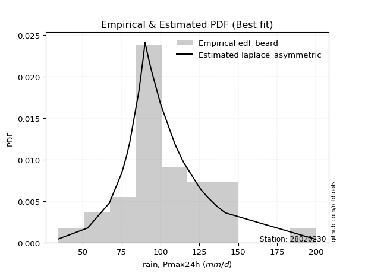</img>

</div>


### 5. Empirical - EDF Chegodayev (1955)

The Chegodayev formula is an empirical plotting position formula used in hydrological frequency analysis to estimate the exceedance probability or return period of a specific event from a set of observed data. It is primarily used for plotting observed data points on probability paper to fit a theoretical distribution, particularly for analyzing extreme events like maximum flood flows or rainfall intensities. The constant _b_ value in the generalized plotting position formula is 0.3.

<div align="center">


$P=(m-b)/(n+1-2b)$


</div>


**5.1. Empirical values**

<div align="center">

|                | 0                    | 1                   | 2                   | 3                   | 4                  | 5                   | 6                  | 7                   | 8                   | 9                  | 10                 | 11                 | 12                  | 13                 | 14                 | 15                  | 16             | 17                 | 18                 | 19                 | 20                 | 21                 | 22                 | 23                 | 24                 | 25                 | 26                 | 27                 | 28                 | 29                 | 30                 | 31                 | 32                 |
|:---------------|:---------------------|:--------------------|:--------------------|:--------------------|:-------------------|:--------------------|:-------------------|:--------------------|:--------------------|:-------------------|:-------------------|:-------------------|:--------------------|:-------------------|:-------------------|:--------------------|:---------------|:-------------------|:-------------------|:-------------------|:-------------------|:-------------------|:-------------------|:-------------------|:-------------------|:-------------------|:-------------------|:-------------------|:-------------------|:-------------------|:-------------------|:-------------------|:-------------------|
| date           | 1990                 | 1972                | 1989                | 1997                | 2001               | 1984                | 1970               | 1988                | 1996                | 1998               | 1994               | 1993               | 1977                | 1969               | 1992               | 1979                | 1991           | 1976               | 1978               | 1974               | 1982               | 1971               | 1983               | 1975               | 2000               | 1980               | 1985               | 1973               | 1986               | 1981               | 1999               | 1987               | 1995               |
| x              | 34.3                 | 53.0                | 67.0                | 75.0                | 78.0               | 80.2                | 86.0               | 86.5                | 89.0                | 90.0               | 90.0               | 90.0               | 90.0                | 90.0               | 91.0               | 93.0                | 94.0           | 100.0              | 100.0              | 109.0              | 110.0              | 114.0              | 114.7              | 115.0              | 125.0              | 127.0              | 127.0              | 130.0              | 135.6              | 137.0              | 137.0              | 141.7              | 200.0              |
| m              | 1                    | 2                   | 3                   | 4                   | 5                  | 6                   | 7                  | 8                   | 9                   | 10                 | 11                 | 12                 | 13                  | 14                 | 15                 | 16                  | 17             | 18                 | 19                 | 20                 | 21                 | 22                 | 23                 | 24                 | 25                 | 26                 | 27                 | 28                 | 29                 | 30                 | 31                 | 32                 | 33                 |
| empirical_dist | edf_chegodayev       | edf_chegodayev      | edf_chegodayev      | edf_chegodayev      | edf_chegodayev     | edf_chegodayev      | edf_chegodayev     | edf_chegodayev      | edf_chegodayev      | edf_chegodayev     | edf_chegodayev     | edf_chegodayev     | edf_chegodayev      | edf_chegodayev     | edf_chegodayev     | edf_chegodayev      | edf_chegodayev | edf_chegodayev     | edf_chegodayev     | edf_chegodayev     | edf_chegodayev     | edf_chegodayev     | edf_chegodayev     | edf_chegodayev     | edf_chegodayev     | edf_chegodayev     | edf_chegodayev     | edf_chegodayev     | edf_chegodayev     | edf_chegodayev     | edf_chegodayev     | edf_chegodayev     | edf_chegodayev     |
| empirical      | 0.020958083832335328 | 0.05089820359281437 | 0.08083832335329343 | 0.11077844311377247 | 0.1407185628742515 | 0.17065868263473055 | 0.2005988023952096 | 0.23053892215568864 | 0.26047904191616766 | 0.2904191616766467 | 0.3203592814371257 | 0.3502994011976048 | 0.38023952095808383 | 0.4101796407185629 | 0.4401197604790419 | 0.47005988023952094 | 0.5            | 0.5299401197604791 | 0.5598802395209581 | 0.5898203592814372 | 0.6197604790419162 | 0.6497005988023952 | 0.6796407185628742 | 0.7095808383233533 | 0.7395209580838323 | 0.7694610778443114 | 0.7994011976047904 | 0.8293413173652695 | 0.8592814371257486 | 0.8892215568862276 | 0.9191616766467066 | 0.9491017964071856 | 0.9790419161676648 |
| empirical_tr   | 1.0214067278287462   | 1.053627760252366   | 1.0879478827361564  | 1.1245791245791246  | 1.1637630662020906 | 1.2057761732851986  | 1.2509363295880152 | 1.2996108949416343  | 1.3522267206477734  | 1.409282700421941  | 1.4713656387665197 | 1.5391705069124424 | 1.613526570048309   | 1.6954314720812185 | 1.7860962566844918 | 1.887005649717514   | 2.0            | 2.127388535031847  | 2.2721088435374153 | 2.4379562043795624 | 2.62992125984252   | 2.8547008547008543 | 3.1214953271028034 | 3.4432989690721647 | 3.839080459770115  | 4.337662337662338  | 4.985074626865672  | 5.859649122807019  | 7.106382978723407  | 9.027027027027033  | 12.370370370370367 | 19.647058823529406 | 47.71428571428597  |

</div>


**5.2. Parameters & Kolmogorov-Smirnov fit test (sorted by Δ)**

|   id | empirical_dist   | p_dist             |     delta |   deltao | eval    |   fit |   n |             loc |           scale | shape                 | shape1               | shape2             | shape3   |   best_fit |   best_fit_sort |
|-----:|:-----------------|:-------------------|----------:|---------:|:--------|------:|----:|----------------:|----------------:|:----------------------|:---------------------|:-------------------|:---------|-----------:|----------------:|
|    0 | edf_chegodayev   | laplace_asymmetric | 0.0829431 | 0.216241 | Δo > Δ  |     1 |  33 |    90           |    19.6915      | 0.7224559990360757    |                      |                    |          |          1 |               1 |
|    1 | edf_chegodayev   | alpha              | 0.0972368 | 0.216241 | Δo > Δ  |     1 |  33 |  -334.079       |  6495.73        | 14.927947537874772    |                      |                    |          |          0 |               2 |
|    2 | edf_chegodayev   | invgamma           | 0.0982183 | 0.216241 | Δo > Δ  |     1 |  33 |  -208.824       | 34775.5         | 112.5159827831635     |                      |                    |          |          0 |               3 |
|    3 | edf_chegodayev   | nct                | 0.0985852 | 0.216241 | Δo > Δ  |     1 |  33 |    -0.142289    |    24.2577      | 24.908986848794754    | 4.123925993815067    |                    |          |          0 |               4 |
|    4 | edf_chegodayev   | lognorm            | 0.0988346 | 0.216241 | Δo > Δ  |     1 |  33 |  -139.712       |   240.944       | 0.12173654465026063   |                      |                    |          |          0 |               5 |
|    5 | edf_chegodayev   | t                  | 0.0994844 | 0.216241 | Δo > Δ  |     1 |  33 |    99.6243      |    24.3609      | 4.985756644155526     |                      |                    |          |          0 |               6 |
|    6 | edf_chegodayev   | fatiguelife        | 0.0995114 | 0.216241 | Δo > Δ  |     1 |  33 |  -149.032       |   250.336       | 0.11745988992854395   |                      |                    |          |          0 |               7 |
|    7 | edf_chegodayev   | recipinvgauss      | 0.0995242 | 0.216241 | Δo > Δ  |     1 |  33 |  -148.625       |     3.44765     | 0.013890137074665933  |                      |                    |          |          0 |               8 |
|    8 | edf_chegodayev   | f                  | 0.100361  | 0.216241 | Δo > Δ  |     1 |  33 |   -76.3588      |   179.374       | 73.41909229149664     | 24424.72118193735    |                    |          |          0 |               9 |
|    9 | edf_chegodayev   | gamma              | 0.100387  | 0.216241 | Δo > Δ  |     1 |  33 |   -76.1276      |     4.90835     | 36.50060814064102     |                      |                    |          |          0 |              10 |
|   10 | edf_chegodayev   | chi2               | 0.100387  | 0.216241 | Δo > Δ  |     1 |  33 |   -76.1275      |     2.45418     | 73.00113016689681     |                      |                    |          |          0 |              11 |
|   11 | edf_chegodayev   | erlang             | 0.100387  | 0.216241 | Δo > Δ  |     1 |  33 |   -76.1276      |     4.90835     | 36.50061939918796     |                      |                    |          |          0 |              12 |
|   12 | edf_chegodayev   | exponnorm          | 0.101357  | 0.216241 | Δo > Δ  |     1 |  33 |    83.6977      |    22.2661      | 0.8682562710904624    |                      |                    |          |          0 |              13 |
|   13 | edf_chegodayev   | johnsonsu          | 0.10537   | 0.216241 | Δo > Δ  |     1 |  33 |    88.6561      |    32.6545      | -0.5052658352215449   | 1.4607249054444937   |                    |          |          0 |              14 |
|   14 | edf_chegodayev   | mielke             | 0.106485  | 0.216241 | Δo > Δ  |     1 |  33 |    -1.19338     |   112.672       | 4.6561777597167255    | 7.657570508573743    |                    |          |          0 |              15 |
|   15 | edf_chegodayev   | weibull_min        | 0.107974  | 0.216241 | Δo > Δ  |     1 |  33 |    48.406       |    63.4569      | 2.111141384999197     |                      |                    |          |          0 |              16 |
|   16 | edf_chegodayev   | pearson3           | 0.108399  | 0.216241 | Δo > Δ  |     1 |  33 |   103.03        |    29.9105      | 0.6482425583303908    |                      |                    |          |          0 |              17 |
|   17 | edf_chegodayev   | fisk               | 0.108509  | 0.216241 | Δo > Δ  |     1 |  33 |  -113.235       |   214.131       | 13.47377827978022     |                      |                    |          |          0 |              18 |
|   18 | edf_chegodayev   | genlogistic        | 0.109544  | 0.216241 | Δo > Δ  |     1 |  33 |    89.5612      |    18.3321      | 1.6231534198361361    |                      |                    |          |          0 |              19 |
|   19 | edf_chegodayev   | maxwell            | 0.11013   | 0.216241 | Δo > Δ  |     1 |  33 |    32.1549      |    44.4146      |                       |                      |                    |          |          0 |              20 |
|   20 | edf_chegodayev   | gumbel_r           | 0.111209  | 0.216241 | Δo > Δ  |     1 |  33 |    89.569       |    23.3211      |                       |                      |                    |          |          0 |              21 |
|   21 | edf_chegodayev   | betaprime          | 0.117273  | 0.216241 | Δo > Δ  |     1 |  33 |     3.11782     |  1034.23        | 11.404419699076985    | 119.0723391645974    |                    |          |          0 |              22 |
|   22 | edf_chegodayev   | loggamma           | 0.117442  | 0.216241 | Δo > Δ  |     1 |  33 | -8185.69        |  1143.87        | 1403.242459542555     |                      |                    |          |          0 |              23 |
|   23 | edf_chegodayev   | moyal              | 0.11805   | 0.216241 | Δo > Δ  |     1 |  33 |    85.9255      |    13.4645      |                       |                      |                    |          |          0 |              24 |
|   24 | edf_chegodayev   | crystalball        | 0.11864   | 0.216241 | Δo > Δ  |     1 |  33 |   103.03        |    29.9105      | 6973.079108565442     | 10313.830100162435   |                    |          |          0 |              25 |
|   25 | edf_chegodayev   | norm               | 0.11864   | 0.216241 | Δo > Δ  |     1 |  33 |   103.03        |    29.9105      |                       |                      |                    |          |          0 |              26 |
|   26 | edf_chegodayev   | truncnorm          | 0.11864   | 0.216241 | Δo > Δ  |     1 |  33 |   103.03        |    29.9105      | -655.0177315281694    | 720.841649155948     |                    |          |          0 |              27 |
|   27 | edf_chegodayev   | rayleigh           | 0.120622  | 0.216241 | Δo > Δ  |     1 |  33 |    45.8098      |    45.6554      |                       |                      |                    |          |          0 |              28 |
|   28 | edf_chegodayev   | rice               | 0.121224  | 0.216241 | Δo > Δ  |     1 |  33 |    48.2193      |    33.963       | 1.203835156455907     |                      |                    |          |          0 |              29 |
|   29 | edf_chegodayev   | nakagami           | 0.121799  | 0.216241 | Δo > Δ  |     1 |  33 |    45.2093      |    65.6869      | 1.3001365584985287    |                      |                    |          |          0 |              30 |
|   30 | edf_chegodayev   | dgamma             | 0.128356  | 0.216241 | Δo > Δ  |     1 |  33 |    97.9713      |    15.2867      | 1.4747807335421348    |                      |                    |          |          0 |              31 |
|   31 | edf_chegodayev   | invgauss           | 0.128611  | 0.216241 | Δo > Δ  |     1 |  33 |   -41.6886      |  2954.85        | 0.048769774053339765  |                      |                    |          |          0 |              32 |
|   32 | edf_chegodayev   | logistic           | 0.13358   | 0.216241 | Δo > Δ  |     1 |  33 |   103.03        |    16.4905      |                       |                      |                    |          |          0 |              33 |
|   33 | edf_chegodayev   | halflogistic       | 0.144761  | 0.216241 | Δo > Δ  |     1 |  33 |    67.5794      |    25.5724      |                       |                      |                    |          |          0 |              34 |
|   34 | edf_chegodayev   | hypsecant          | 0.145596  | 0.216241 | Δo > Δ  |     1 |  33 |   103.03        |    19.0416      |                       |                      |                    |          |          0 |              35 |
|   35 | edf_chegodayev   | invweibull         | 0.146981  | 0.216241 | Δo > Δ  |     1 |  33 |    -1.15572e+06 |     1.1558e+06  | 45347.65677079186     |                      |                    |          |          0 |              36 |
|   36 | edf_chegodayev   | wald               | 0.147302  | 0.216241 | Δo > Δ  |     1 |  33 |    73.1198      |    29.9105      |                       |                      |                    |          |          0 |              37 |
|   37 | edf_chegodayev   | zzloggumbel        | 0.160715  | 0.216241 | Δo > Δ  |     1 |  33 |     4.4587      |     0.243654    | 0.5388106529916182    | 1.1224931659715724   |                    |          |          0 |              38 |
|   38 | edf_chegodayev   | kstwobign          | 0.16104   | 0.216241 | Δo > Δ  |     1 |  33 |   -17.9271      |   139.808       |                       |                      |                    |          |          0 |              39 |
|   39 | edf_chegodayev   | laplace            | 0.173757  | 0.216241 | Δo > Δ  |     1 |  33 |   103.03        |    21.1499      |                       |                      |                    |          |          0 |              40 |
|   40 | edf_chegodayev   | gibrat             | 0.178217  | 0.216241 | Δo > Δ  |     1 |  33 |    80.2123      |    13.8398      |                       |                      |                    |          |          0 |              41 |
|   41 | edf_chegodayev   | gumbel_l           | 0.183041  | 0.216241 | Δo > Δ  |     1 |  33 |   116.492       |    23.3211      |                       |                      |                    |          |          0 |              42 |
|   42 | edf_chegodayev   | zzgumbel           | 0.26841   | 0.216241 | Δo <= Δ |     0 |  33 |   103.008       |    23.6827      | 0.5388106529916182    | 1.1224931659715724   |                    |          |          0 |              43 |
|   43 | edf_chegodayev   | ncf                | 0.297968  | 0.216241 | Δo <= Δ |     0 |  33 |    -0.0750199   |     5.42594e-07 | 6.177190705933478e-08 | 8.559472659866003    | 10.749129905783315 |          |          0 |              44 |
|   44 | edf_chegodayev   | genexpon           | 0.323877  | 0.216241 | Δo <= Δ |     0 |  33 |    34.3         |     1.89016     | 0.021553256129742675  | 0.005173981655219102 | 0.9976188434514551 |          |          0 |              45 |
|   45 | edf_chegodayev   | expon              | 0.336096  | 0.216241 | Δo <= Δ |     0 |  33 |    34.3         |    68.7303      |                       |                      |                    |          |          0 |              46 |
|   46 | edf_chegodayev   | pareto             | 0.336096  | 0.216241 | Δo <= Δ |     0 |  33 |    -4.29497e+09 |     4.29497e+09 | 62490155.861802205    |                      |                    |          |          0 |              47 |
|   47 | edf_chegodayev   | halfnorm           | 0.55988   | 0.216241 | Δo <= Δ |     0 |  33 |   104.186       |     2.73121     |                       |                      |                    |          |          0 |              48 |
|   48 | edf_chegodayev   | gompertz           | 0.949088  | 0.216241 | Δo <= Δ |     0 |  33 |    20.7391      |     3.96322     | 7.488483840098274e-19 |                      |                    |          |          0 |              49 |

<div align="center">

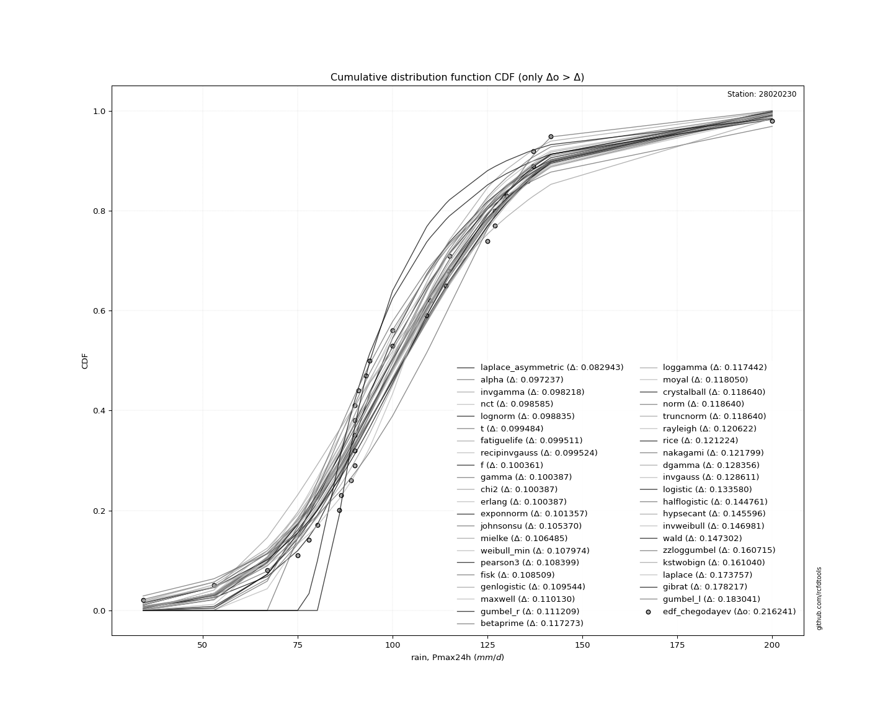</img>

</div>


**5.3. Best fit**

|   id |   station | empirical_dist   | p_dist             |     delta |   deltao | eval   |   fit |   n |   loc |   scale |    shape | shape1   | shape2   | shape3   |   best_fit |   best_fit_sort |
|-----:|----------:|:-----------------|:-------------------|----------:|---------:|:-------|------:|----:|------:|--------:|---------:|:---------|:---------|:---------|-----------:|----------------:|
|    0 |  28020230 | edf_chegodayev   | laplace_asymmetric | 0.0829431 | 0.216241 | Δo > Δ |     1 |  33 |    90 | 19.6915 | 0.722456 |          |          |          |          1 |               1 |

<div align="center">

</img>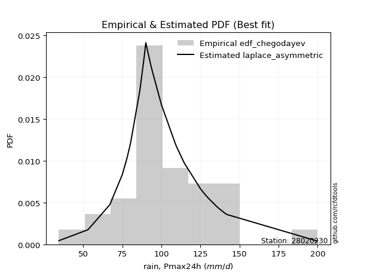</img>

</div>


### 6. Empirical - EDF Blom (1958)

The Blom formula is a specific "plotting position" formula used in hydrology and statistical analysis to estimate the empirical cumulative probability (or non-exceedance probability) of a data series. It is particularly recommended for data that are approximately normally distributed. The constant _a_ is set to 0.375 (or 3/8).

<div align="center">


$P=(m-a)/(n+1-2a)$


</div>


**6.1. Empirical values**

<div align="center">

|                | 0                    | 1                   | 2                   | 3                   | 4                   | 5                   | 6                   | 7                   | 8                  | 9                  | 10                  | 11                  | 12                  | 13                  | 14                 | 15                 | 16       | 17                 | 18                 | 19                 | 20                 | 21                | 22                 | 23                 | 24                 | 25                 | 26                 | 27                 | 28                 | 29                 | 30                 | 31                 | 32                 |
|:---------------|:---------------------|:--------------------|:--------------------|:--------------------|:--------------------|:--------------------|:--------------------|:--------------------|:-------------------|:-------------------|:--------------------|:--------------------|:--------------------|:--------------------|:-------------------|:-------------------|:---------|:-------------------|:-------------------|:-------------------|:-------------------|:------------------|:-------------------|:-------------------|:-------------------|:-------------------|:-------------------|:-------------------|:-------------------|:-------------------|:-------------------|:-------------------|:-------------------|
| date           | 1990                 | 1972                | 1989                | 1997                | 2001                | 1984                | 1970                | 1988                | 1996               | 1998               | 1994                | 1993                | 1977                | 1969                | 1992               | 1979               | 1991     | 1976               | 1978               | 1974               | 1982               | 1971              | 1983               | 1975               | 2000               | 1980               | 1985               | 1973               | 1986               | 1981               | 1999               | 1987               | 1995               |
| x              | 34.3                 | 53.0                | 67.0                | 75.0                | 78.0                | 80.2                | 86.0                | 86.5                | 89.0               | 90.0               | 90.0                | 90.0                | 90.0                | 90.0                | 91.0               | 93.0               | 94.0     | 100.0              | 100.0              | 109.0              | 110.0              | 114.0             | 114.7              | 115.0              | 125.0              | 127.0              | 127.0              | 130.0              | 135.6              | 137.0              | 137.0              | 141.7              | 200.0              |
| m              | 1                    | 2                   | 3                   | 4                   | 5                   | 6                   | 7                   | 8                   | 9                  | 10                 | 11                  | 12                  | 13                  | 14                  | 15                 | 16                 | 17       | 18                 | 19                 | 20                 | 21                 | 22                | 23                 | 24                 | 25                 | 26                 | 27                 | 28                 | 29                 | 30                 | 31                 | 32                 | 33                 |
| empirical_dist | edf_blom             | edf_blom            | edf_blom            | edf_blom            | edf_blom            | edf_blom            | edf_blom            | edf_blom            | edf_blom           | edf_blom           | edf_blom            | edf_blom            | edf_blom            | edf_blom            | edf_blom           | edf_blom           | edf_blom | edf_blom           | edf_blom           | edf_blom           | edf_blom           | edf_blom          | edf_blom           | edf_blom           | edf_blom           | edf_blom           | edf_blom           | edf_blom           | edf_blom           | edf_blom           | edf_blom           | edf_blom           | edf_blom           |
| empirical      | 0.018796992481203006 | 0.04887218045112782 | 0.07894736842105263 | 0.10902255639097744 | 0.13909774436090225 | 0.16917293233082706 | 0.19924812030075187 | 0.22932330827067668 | 0.2593984962406015 | 0.2894736842105263 | 0.31954887218045114 | 0.34962406015037595 | 0.37969924812030076 | 0.40977443609022557 | 0.4398496240601504 | 0.4699248120300752 | 0.5      | 0.5300751879699248 | 0.5601503759398496 | 0.5902255639097744 | 0.6203007518796992 | 0.650375939849624 | 0.6804511278195489 | 0.7105263157894737 | 0.7406015037593985 | 0.7706766917293233 | 0.8007518796992481 | 0.8308270676691729 | 0.8609022556390977 | 0.8909774436090225 | 0.9210526315789473 | 0.9511278195488722 | 0.981203007518797  |
| empirical_tr   | 1.0191570881226053   | 1.051383399209486   | 1.0857142857142856  | 1.1223628691983123  | 1.1615720524017468  | 1.2036199095022624  | 1.2488262910798122  | 1.2975609756097561  | 1.350253807106599  | 1.4074074074074074 | 1.4696132596685083  | 1.5375722543352601  | 1.612121212121212   | 1.694267515923567   | 1.7852348993288591 | 1.8865248226950355 | 2.0      | 2.128              | 2.2735042735042734 | 2.4403669724770642 | 2.633663366336634  | 2.860215053763441 | 3.1294117647058823 | 3.4545454545454546 | 3.8550724637681157 | 4.360655737704918  | 5.018867924528301  | 5.9111111111111105 | 7.189189189189189  | 9.172413793103447  | 12.666666666666663 | 20.461538461538453 | 53.199999999999925 |

</div>


**6.2. Parameters & Kolmogorov-Smirnov fit test (sorted by Δ)**

|   id | empirical_dist   | p_dist             |     delta |   deltao | eval    |   fit |   n |             loc |           scale | shape                 | shape1               | shape2             | shape3   |   best_fit |   best_fit_sort |
|-----:|:-----------------|:-------------------|----------:|---------:|:--------|------:|----:|----------------:|----------------:|:----------------------|:---------------------|:-------------------|:---------|-----------:|----------------:|
|    0 | edf_blom         | laplace_asymmetric | 0.0825379 | 0.216241 | Δo > Δ  |     1 |  33 |    90           |    19.6915      | 0.7224559990360757    |                      |                    |          |          1 |               1 |
|    1 | edf_blom         | alpha              | 0.0972368 | 0.216241 | Δo > Δ  |     1 |  33 |  -334.079       |  6495.73        | 14.927947537874772    |                      |                    |          |          0 |               2 |
|    2 | edf_blom         | invgamma           | 0.0982183 | 0.216241 | Δo > Δ  |     1 |  33 |  -208.824       | 34775.5         | 112.5159827831635     |                      |                    |          |          0 |               3 |
|    3 | edf_blom         | nct                | 0.0985852 | 0.216241 | Δo > Δ  |     1 |  33 |    -0.142289    |    24.2577      | 24.908986848794754    | 4.123925993815067    |                    |          |          0 |               4 |
|    4 | edf_blom         | lognorm            | 0.0988346 | 0.216241 | Δo > Δ  |     1 |  33 |  -139.712       |   240.944       | 0.12173654465026063   |                      |                    |          |          0 |               5 |
|    5 | edf_blom         | fatiguelife        | 0.0995114 | 0.216241 | Δo > Δ  |     1 |  33 |  -149.032       |   250.336       | 0.11745988992854395   |                      |                    |          |          0 |               6 |
|    6 | edf_blom         | recipinvgauss      | 0.0995242 | 0.216241 | Δo > Δ  |     1 |  33 |  -148.625       |     3.44765     | 0.013890137074665933  |                      |                    |          |          0 |               7 |
|    7 | edf_blom         | f                  | 0.100361  | 0.216241 | Δo > Δ  |     1 |  33 |   -76.3588      |   179.374       | 73.41909229149664     | 24424.72118193735    |                    |          |          0 |               8 |
|    8 | edf_blom         | gamma              | 0.100387  | 0.216241 | Δo > Δ  |     1 |  33 |   -76.1276      |     4.90835     | 36.50060814064102     |                      |                    |          |          0 |               9 |
|    9 | edf_blom         | chi2               | 0.100387  | 0.216241 | Δo > Δ  |     1 |  33 |   -76.1275      |     2.45418     | 73.00113016689681     |                      |                    |          |          0 |              10 |
|   10 | edf_blom         | erlang             | 0.100387  | 0.216241 | Δo > Δ  |     1 |  33 |   -76.1276      |     4.90835     | 36.50061939918796     |                      |                    |          |          0 |              11 |
|   11 | edf_blom         | t                  | 0.100835  | 0.216241 | Δo > Δ  |     1 |  33 |    99.6243      |    24.3609      | 4.985756644155526     |                      |                    |          |          0 |              12 |
|   12 | edf_blom         | exponnorm          | 0.101357  | 0.216241 | Δo > Δ  |     1 |  33 |    83.6977      |    22.2661      | 0.8682562710904624    |                      |                    |          |          0 |              13 |
|   13 | edf_blom         | johnsonsu          | 0.10537   | 0.216241 | Δo > Δ  |     1 |  33 |    88.6561      |    32.6545      | -0.5052658352215449   | 1.4607249054444937   |                    |          |          0 |              14 |
|   14 | edf_blom         | mielke             | 0.106485  | 0.216241 | Δo > Δ  |     1 |  33 |    -1.19338     |   112.672       | 4.6561777597167255    | 7.657570508573743    |                    |          |          0 |              15 |
|   15 | edf_blom         | weibull_min        | 0.107974  | 0.216241 | Δo > Δ  |     1 |  33 |    48.406       |    63.4569      | 2.111141384999197     |                      |                    |          |          0 |              16 |
|   16 | edf_blom         | fisk               | 0.108509  | 0.216241 | Δo > Δ  |     1 |  33 |  -113.235       |   214.131       | 13.47377827978022     |                      |                    |          |          0 |              17 |
|   17 | edf_blom         | genlogistic        | 0.109544  | 0.216241 | Δo > Δ  |     1 |  33 |    89.5612      |    18.3321      | 1.6231534198361361    |                      |                    |          |          0 |              18 |
|   18 | edf_blom         | pearson3           | 0.10975   | 0.216241 | Δo > Δ  |     1 |  33 |   103.03        |    29.9105      | 0.6482425583303908    |                      |                    |          |          0 |              19 |
|   19 | edf_blom         | maxwell            | 0.111481  | 0.216241 | Δo > Δ  |     1 |  33 |    32.1549      |    44.4146      |                       |                      |                    |          |          0 |              20 |
|   20 | edf_blom         | gumbel_r           | 0.11256   | 0.216241 | Δo > Δ  |     1 |  33 |    89.569       |    23.3211      |                       |                      |                    |          |          0 |              21 |
|   21 | edf_blom         | loggamma           | 0.117442  | 0.216241 | Δo > Δ  |     1 |  33 | -8185.69        |  1143.87        | 1403.242459542555     |                      |                    |          |          0 |              22 |
|   22 | edf_blom         | betaprime          | 0.118624  | 0.216241 | Δo > Δ  |     1 |  33 |     3.11782     |  1034.23        | 11.404419699076985    | 119.0723391645974    |                    |          |          0 |              23 |
|   23 | edf_blom         | crystalball        | 0.11864   | 0.216241 | Δo > Δ  |     1 |  33 |   103.03        |    29.9105      | 6973.079108565442     | 10313.830100162435   |                    |          |          0 |              24 |
|   24 | edf_blom         | norm               | 0.11864   | 0.216241 | Δo > Δ  |     1 |  33 |   103.03        |    29.9105      |                       |                      |                    |          |          0 |              25 |
|   25 | edf_blom         | truncnorm          | 0.11864   | 0.216241 | Δo > Δ  |     1 |  33 |   103.03        |    29.9105      | -655.0177315281694    | 720.841649155948     |                    |          |          0 |              26 |
|   26 | edf_blom         | moyal              | 0.1194    | 0.216241 | Δo > Δ  |     1 |  33 |    85.9255      |    13.4645      |                       |                      |                    |          |          0 |              27 |
|   27 | edf_blom         | rice               | 0.121224  | 0.216241 | Δo > Δ  |     1 |  33 |    48.2193      |    33.963       | 1.203835156455907     |                      |                    |          |          0 |              28 |
|   28 | edf_blom         | nakagami           | 0.121799  | 0.216241 | Δo > Δ  |     1 |  33 |    45.2093      |    65.6869      | 1.3001365584985287    |                      |                    |          |          0 |              29 |
|   29 | edf_blom         | rayleigh           | 0.121973  | 0.216241 | Δo > Δ  |     1 |  33 |    45.8098      |    45.6554      |                       |                      |                    |          |          0 |              30 |
|   30 | edf_blom         | dgamma             | 0.129707  | 0.216241 | Δo > Δ  |     1 |  33 |    97.9713      |    15.2867      | 1.4747807335421348    |                      |                    |          |          0 |              31 |
|   31 | edf_blom         | invgauss           | 0.129962  | 0.216241 | Δo > Δ  |     1 |  33 |   -41.6886      |  2954.85        | 0.048769774053339765  |                      |                    |          |          0 |              32 |
|   32 | edf_blom         | logistic           | 0.13358   | 0.216241 | Δo > Δ  |     1 |  33 |   103.03        |    16.4905      |                       |                      |                    |          |          0 |              33 |
|   33 | edf_blom         | hypsecant          | 0.145596  | 0.216241 | Δo > Δ  |     1 |  33 |   103.03        |    19.0416      |                       |                      |                    |          |          0 |              34 |
|   34 | edf_blom         | halflogistic       | 0.146112  | 0.216241 | Δo > Δ  |     1 |  33 |    67.5794      |    25.5724      |                       |                      |                    |          |          0 |              35 |
|   35 | edf_blom         | wald               | 0.146896  | 0.216241 | Δo > Δ  |     1 |  33 |    73.1198      |    29.9105      |                       |                      |                    |          |          0 |              36 |
|   36 | edf_blom         | invweibull         | 0.148332  | 0.216241 | Δo > Δ  |     1 |  33 |    -1.15572e+06 |     1.1558e+06  | 45347.65677079186     |                      |                    |          |          0 |              37 |
|   37 | edf_blom         | zzloggumbel        | 0.162066  | 0.216241 | Δo > Δ  |     1 |  33 |     4.4587      |     0.243654    | 0.5388106529916182    | 1.1224931659715724   |                    |          |          0 |              38 |
|   38 | edf_blom         | kstwobign          | 0.162391  | 0.216241 | Δo > Δ  |     1 |  33 |   -17.9271      |   139.808       |                       |                      |                    |          |          0 |              39 |
|   39 | edf_blom         | laplace            | 0.173757  | 0.216241 | Δo > Δ  |     1 |  33 |   103.03        |    21.1499      |                       |                      |                    |          |          0 |              40 |
|   40 | edf_blom         | gibrat             | 0.177812  | 0.216241 | Δo > Δ  |     1 |  33 |    80.2123      |    13.8398      |                       |                      |                    |          |          0 |              41 |
|   41 | edf_blom         | gumbel_l           | 0.183041  | 0.216241 | Δo > Δ  |     1 |  33 |   116.492       |    23.3211      |                       |                      |                    |          |          0 |              42 |
|   42 | edf_blom         | zzgumbel           | 0.26841   | 0.216241 | Δo <= Δ |     0 |  33 |   103.008       |    23.6827      | 0.5388106529916182    | 1.1224931659715724   |                    |          |          0 |              43 |
|   43 | edf_blom         | ncf                | 0.299724  | 0.216241 | Δo <= Δ |     0 |  33 |    -0.0750199   |     5.42594e-07 | 6.177190705933478e-08 | 8.559472659866003    | 10.749129905783315 |          |          0 |              44 |
|   44 | edf_blom         | genexpon           | 0.325633  | 0.216241 | Δo <= Δ |     0 |  33 |    34.3         |     1.89016     | 0.021553256129742675  | 0.005173981655219102 | 0.9976188434514551 |          |          0 |              45 |
|   45 | edf_blom         | expon              | 0.337852  | 0.216241 | Δo <= Δ |     0 |  33 |    34.3         |    68.7303      |                       |                      |                    |          |          0 |              46 |
|   46 | edf_blom         | pareto             | 0.337852  | 0.216241 | Δo <= Δ |     0 |  33 |    -4.29497e+09 |     4.29497e+09 | 62490155.861802205    |                      |                    |          |          0 |              47 |
|   47 | edf_blom         | halfnorm           | 0.56015   | 0.216241 | Δo <= Δ |     0 |  33 |   104.186       |     2.73121     |                       |                      |                    |          |          0 |              48 |
|   48 | edf_blom         | gompertz           | 0.951114  | 0.216241 | Δo <= Δ |     0 |  33 |    20.7391      |     3.96322     | 7.488483840098274e-19 |                      |                    |          |          0 |              49 |

<div align="center">

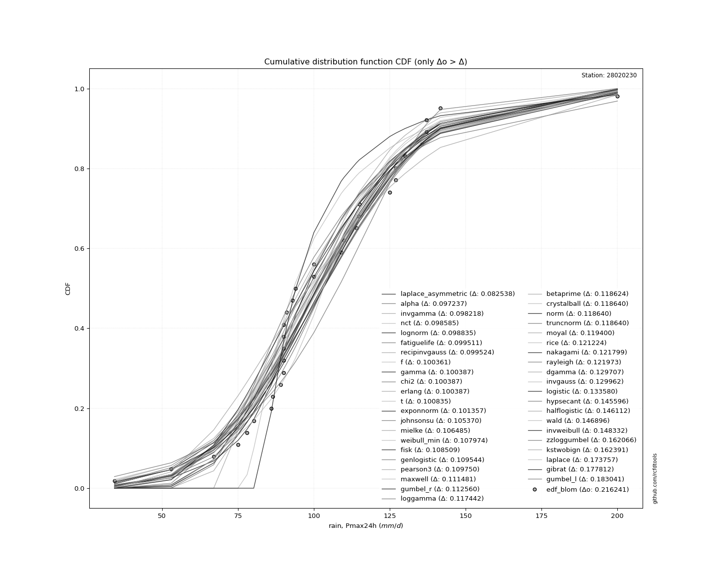</img>

</div>


**6.3. Best fit**

|   id |   station | empirical_dist   | p_dist             |     delta |   deltao | eval   |   fit |   n |   loc |   scale |    shape | shape1   | shape2   | shape3   |   best_fit |   best_fit_sort |
|-----:|----------:|:-----------------|:-------------------|----------:|---------:|:-------|------:|----:|------:|--------:|---------:|:---------|:---------|:---------|-----------:|----------------:|
|    0 |  28020230 | edf_blom         | laplace_asymmetric | 0.0825379 | 0.216241 | Δo > Δ |     1 |  33 |    90 | 19.6915 | 0.722456 |          |          |          |          1 |               1 |

<div align="center">

</img></img>

</div>


### 7. Empirical - EDF Tukey (1962)

In hydrology, the Tukey formula is used as a plotting position formula to estimate the empirical probability or frequency of a flood event (or other hydrological data). The formula parameter is given as _c=0.333_ (or 1/3).

<div align="center">


$P=(m-c)/(n+1-2c)$


</div>


**7.1. Empirical values**

<div align="center">

|                | 0                  | 1                  | 2                  | 3                  | 4                  | 5                  | 6         | 7                  | 8                  | 9                  | 10                 | 11                 | 12                 | 13                 | 14                 | 15                 | 16        | 17                | 18                | 19                 | 20                 | 21                | 22                 | 23                 | 24                | 25                | 26                | 27                | 28                | 29                | 30                 | 31                 | 32                |
|:---------------|:-------------------|:-------------------|:-------------------|:-------------------|:-------------------|:-------------------|:----------|:-------------------|:-------------------|:-------------------|:-------------------|:-------------------|:-------------------|:-------------------|:-------------------|:-------------------|:----------|:------------------|:------------------|:-------------------|:-------------------|:------------------|:-------------------|:-------------------|:------------------|:------------------|:------------------|:------------------|:------------------|:------------------|:-------------------|:-------------------|:------------------|
| date           | 1990               | 1972               | 1989               | 1997               | 2001               | 1984               | 1970      | 1988               | 1996               | 1998               | 1994               | 1993               | 1977               | 1969               | 1992               | 1979               | 1991      | 1976              | 1978              | 1974               | 1982               | 1971              | 1983               | 1975               | 2000              | 1980              | 1985              | 1973              | 1986              | 1981              | 1999               | 1987               | 1995              |
| x              | 34.3               | 53.0               | 67.0               | 75.0               | 78.0               | 80.2               | 86.0      | 86.5               | 89.0               | 90.0               | 90.0               | 90.0               | 90.0               | 90.0               | 91.0               | 93.0               | 94.0      | 100.0             | 100.0             | 109.0              | 110.0              | 114.0             | 114.7              | 115.0              | 125.0             | 127.0             | 127.0             | 130.0             | 135.6             | 137.0             | 137.0              | 141.7              | 200.0             |
| m              | 1                  | 2                  | 3                  | 4                  | 5                  | 6                  | 7         | 8                  | 9                  | 10                 | 11                 | 12                 | 13                 | 14                 | 15                 | 16                 | 17        | 18                | 19                | 20                 | 21                 | 22                | 23                 | 24                 | 25                | 26                | 27                | 28                | 29                | 30                | 31                 | 32                 | 33                |
| empirical_dist | edf_tukey          | edf_tukey          | edf_tukey          | edf_tukey          | edf_tukey          | edf_tukey          | edf_tukey | edf_tukey          | edf_tukey          | edf_tukey          | edf_tukey          | edf_tukey          | edf_tukey          | edf_tukey          | edf_tukey          | edf_tukey          | edf_tukey | edf_tukey         | edf_tukey         | edf_tukey          | edf_tukey          | edf_tukey         | edf_tukey          | edf_tukey          | edf_tukey         | edf_tukey         | edf_tukey         | edf_tukey         | edf_tukey         | edf_tukey         | edf_tukey          | edf_tukey          | edf_tukey         |
| empirical      | 0.02               | 0.05               | 0.08               | 0.11               | 0.14               | 0.17               | 0.2       | 0.23               | 0.26               | 0.29               | 0.32               | 0.35               | 0.38               | 0.41               | 0.44               | 0.47               | 0.5       | 0.53              | 0.56              | 0.59               | 0.62               | 0.65              | 0.68               | 0.71               | 0.74              | 0.77              | 0.8               | 0.83              | 0.86              | 0.89              | 0.92               | 0.95               | 0.98              |
| empirical_tr   | 1.0204081632653061 | 1.0526315789473684 | 1.0869565217391304 | 1.1235955056179776 | 1.1627906976744187 | 1.2048192771084338 | 1.25      | 1.2987012987012987 | 1.3513513513513513 | 1.4084507042253522 | 1.4705882352941178 | 1.5384615384615383 | 1.6129032258064517 | 1.6949152542372878 | 1.7857142857142856 | 1.8867924528301885 | 2.0       | 2.127659574468085 | 2.272727272727273 | 2.4390243902439024 | 2.6315789473684212 | 2.857142857142857 | 3.1250000000000004 | 3.4482758620689653 | 3.846153846153846 | 4.347826086956522 | 5.000000000000001 | 5.882352941176469 | 7.142857142857142 | 9.090909090909092 | 12.500000000000007 | 19.999999999999982 | 49.99999999999996 |

</div>


**7.2. Parameters & Kolmogorov-Smirnov fit test (sorted by Δ)**

|   id | empirical_dist   | p_dist             |     delta |   deltao | eval    |   fit |   n |             loc |           scale | shape                 | shape1               | shape2             | shape3   |   best_fit |   best_fit_sort |
|-----:|:-----------------|:-------------------|----------:|---------:|:--------|------:|----:|----------------:|----------------:|:----------------------|:---------------------|:-------------------|:---------|-----------:|----------------:|
|    0 | edf_tukey        | laplace_asymmetric | 0.0827635 | 0.216241 | Δo > Δ  |     1 |  33 |    90           |    19.6915      | 0.7224559990360757    |                      |                    |          |          1 |               1 |
|    1 | edf_tukey        | alpha              | 0.0972368 | 0.216241 | Δo > Δ  |     1 |  33 |  -334.079       |  6495.73        | 14.927947537874772    |                      |                    |          |          0 |               2 |
|    2 | edf_tukey        | invgamma           | 0.0982183 | 0.216241 | Δo > Δ  |     1 |  33 |  -208.824       | 34775.5         | 112.5159827831635     |                      |                    |          |          0 |               3 |
|    3 | edf_tukey        | nct                | 0.0985852 | 0.216241 | Δo > Δ  |     1 |  33 |    -0.142289    |    24.2577      | 24.908986848794754    | 4.123925993815067    |                    |          |          0 |               4 |
|    4 | edf_tukey        | lognorm            | 0.0988346 | 0.216241 | Δo > Δ  |     1 |  33 |  -139.712       |   240.944       | 0.12173654465026063   |                      |                    |          |          0 |               5 |
|    5 | edf_tukey        | fatiguelife        | 0.0995114 | 0.216241 | Δo > Δ  |     1 |  33 |  -149.032       |   250.336       | 0.11745988992854395   |                      |                    |          |          0 |               6 |
|    6 | edf_tukey        | recipinvgauss      | 0.0995242 | 0.216241 | Δo > Δ  |     1 |  33 |  -148.625       |     3.44765     | 0.013890137074665933  |                      |                    |          |          0 |               7 |
|    7 | edf_tukey        | t                  | 0.100083  | 0.216241 | Δo > Δ  |     1 |  33 |    99.6243      |    24.3609      | 4.985756644155526     |                      |                    |          |          0 |               8 |
|    8 | edf_tukey        | f                  | 0.100361  | 0.216241 | Δo > Δ  |     1 |  33 |   -76.3588      |   179.374       | 73.41909229149664     | 24424.72118193735    |                    |          |          0 |               9 |
|    9 | edf_tukey        | gamma              | 0.100387  | 0.216241 | Δo > Δ  |     1 |  33 |   -76.1276      |     4.90835     | 36.50060814064102     |                      |                    |          |          0 |              10 |
|   10 | edf_tukey        | chi2               | 0.100387  | 0.216241 | Δo > Δ  |     1 |  33 |   -76.1275      |     2.45418     | 73.00113016689681     |                      |                    |          |          0 |              11 |
|   11 | edf_tukey        | erlang             | 0.100387  | 0.216241 | Δo > Δ  |     1 |  33 |   -76.1276      |     4.90835     | 36.50061939918796     |                      |                    |          |          0 |              12 |
|   12 | edf_tukey        | exponnorm          | 0.101357  | 0.216241 | Δo > Δ  |     1 |  33 |    83.6977      |    22.2661      | 0.8682562710904624    |                      |                    |          |          0 |              13 |
|   13 | edf_tukey        | johnsonsu          | 0.10537   | 0.216241 | Δo > Δ  |     1 |  33 |    88.6561      |    32.6545      | -0.5052658352215449   | 1.4607249054444937   |                    |          |          0 |              14 |
|   14 | edf_tukey        | mielke             | 0.106485  | 0.216241 | Δo > Δ  |     1 |  33 |    -1.19338     |   112.672       | 4.6561777597167255    | 7.657570508573743    |                    |          |          0 |              15 |
|   15 | edf_tukey        | weibull_min        | 0.107974  | 0.216241 | Δo > Δ  |     1 |  33 |    48.406       |    63.4569      | 2.111141384999197     |                      |                    |          |          0 |              16 |
|   16 | edf_tukey        | fisk               | 0.108509  | 0.216241 | Δo > Δ  |     1 |  33 |  -113.235       |   214.131       | 13.47377827978022     |                      |                    |          |          0 |              17 |
|   17 | edf_tukey        | pearson3           | 0.108998  | 0.216241 | Δo > Δ  |     1 |  33 |   103.03        |    29.9105      | 0.6482425583303908    |                      |                    |          |          0 |              18 |
|   18 | edf_tukey        | genlogistic        | 0.109544  | 0.216241 | Δo > Δ  |     1 |  33 |    89.5612      |    18.3321      | 1.6231534198361361    |                      |                    |          |          0 |              19 |
|   19 | edf_tukey        | maxwell            | 0.110729  | 0.216241 | Δo > Δ  |     1 |  33 |    32.1549      |    44.4146      |                       |                      |                    |          |          0 |              20 |
|   20 | edf_tukey        | gumbel_r           | 0.111808  | 0.216241 | Δo > Δ  |     1 |  33 |    89.569       |    23.3211      |                       |                      |                    |          |          0 |              21 |
|   21 | edf_tukey        | loggamma           | 0.117442  | 0.216241 | Δo > Δ  |     1 |  33 | -8185.69        |  1143.87        | 1403.242459542555     |                      |                    |          |          0 |              22 |
|   22 | edf_tukey        | betaprime          | 0.117872  | 0.216241 | Δo > Δ  |     1 |  33 |     3.11782     |  1034.23        | 11.404419699076985    | 119.0723391645974    |                    |          |          0 |              23 |
|   23 | edf_tukey        | crystalball        | 0.11864   | 0.216241 | Δo > Δ  |     1 |  33 |   103.03        |    29.9105      | 6973.079108565442     | 10313.830100162435   |                    |          |          0 |              24 |
|   24 | edf_tukey        | norm               | 0.11864   | 0.216241 | Δo > Δ  |     1 |  33 |   103.03        |    29.9105      |                       |                      |                    |          |          0 |              25 |
|   25 | edf_tukey        | truncnorm          | 0.11864   | 0.216241 | Δo > Δ  |     1 |  33 |   103.03        |    29.9105      | -655.0177315281694    | 720.841649155948     |                    |          |          0 |              26 |
|   26 | edf_tukey        | moyal              | 0.118648  | 0.216241 | Δo > Δ  |     1 |  33 |    85.9255      |    13.4645      |                       |                      |                    |          |          0 |              27 |
|   27 | edf_tukey        | rayleigh           | 0.121221  | 0.216241 | Δo > Δ  |     1 |  33 |    45.8098      |    45.6554      |                       |                      |                    |          |          0 |              28 |
|   28 | edf_tukey        | rice               | 0.121224  | 0.216241 | Δo > Δ  |     1 |  33 |    48.2193      |    33.963       | 1.203835156455907     |                      |                    |          |          0 |              29 |
|   29 | edf_tukey        | nakagami           | 0.121799  | 0.216241 | Δo > Δ  |     1 |  33 |    45.2093      |    65.6869      | 1.3001365584985287    |                      |                    |          |          0 |              30 |
|   30 | edf_tukey        | dgamma             | 0.128955  | 0.216241 | Δo > Δ  |     1 |  33 |    97.9713      |    15.2867      | 1.4747807335421348    |                      |                    |          |          0 |              31 |
|   31 | edf_tukey        | invgauss           | 0.12921   | 0.216241 | Δo > Δ  |     1 |  33 |   -41.6886      |  2954.85        | 0.048769774053339765  |                      |                    |          |          0 |              32 |
|   32 | edf_tukey        | logistic           | 0.13358   | 0.216241 | Δo > Δ  |     1 |  33 |   103.03        |    16.4905      |                       |                      |                    |          |          0 |              33 |
|   33 | edf_tukey        | halflogistic       | 0.14536   | 0.216241 | Δo > Δ  |     1 |  33 |    67.5794      |    25.5724      |                       |                      |                    |          |          0 |              34 |
|   34 | edf_tukey        | hypsecant          | 0.145596  | 0.216241 | Δo > Δ  |     1 |  33 |   103.03        |    19.0416      |                       |                      |                    |          |          0 |              35 |
|   35 | edf_tukey        | wald               | 0.147122  | 0.216241 | Δo > Δ  |     1 |  33 |    73.1198      |    29.9105      |                       |                      |                    |          |          0 |              36 |
|   36 | edf_tukey        | invweibull         | 0.14758   | 0.216241 | Δo > Δ  |     1 |  33 |    -1.15572e+06 |     1.1558e+06  | 45347.65677079186     |                      |                    |          |          0 |              37 |
|   37 | edf_tukey        | zzloggumbel        | 0.161314  | 0.216241 | Δo > Δ  |     1 |  33 |     4.4587      |     0.243654    | 0.5388106529916182    | 1.1224931659715724   |                    |          |          0 |              38 |
|   38 | edf_tukey        | kstwobign          | 0.161639  | 0.216241 | Δo > Δ  |     1 |  33 |   -17.9271      |   139.808       |                       |                      |                    |          |          0 |              39 |
|   39 | edf_tukey        | laplace            | 0.173757  | 0.216241 | Δo > Δ  |     1 |  33 |   103.03        |    21.1499      |                       |                      |                    |          |          0 |              40 |
|   40 | edf_tukey        | gibrat             | 0.178037  | 0.216241 | Δo > Δ  |     1 |  33 |    80.2123      |    13.8398      |                       |                      |                    |          |          0 |              41 |
|   41 | edf_tukey        | gumbel_l           | 0.183041  | 0.216241 | Δo > Δ  |     1 |  33 |   116.492       |    23.3211      |                       |                      |                    |          |          0 |              42 |
|   42 | edf_tukey        | zzgumbel           | 0.26841   | 0.216241 | Δo <= Δ |     0 |  33 |   103.008       |    23.6827      | 0.5388106529916182    | 1.1224931659715724   |                    |          |          0 |              43 |
|   43 | edf_tukey        | ncf                | 0.298747  | 0.216241 | Δo <= Δ |     0 |  33 |    -0.0750199   |     5.42594e-07 | 6.177190705933478e-08 | 8.559472659866003    | 10.749129905783315 |          |          0 |              44 |
|   44 | edf_tukey        | genexpon           | 0.324655  | 0.216241 | Δo <= Δ |     0 |  33 |    34.3         |     1.89016     | 0.021553256129742675  | 0.005173981655219102 | 0.9976188434514551 |          |          0 |              45 |
|   45 | edf_tukey        | expon              | 0.336874  | 0.216241 | Δo <= Δ |     0 |  33 |    34.3         |    68.7303      |                       |                      |                    |          |          0 |              46 |
|   46 | edf_tukey        | pareto             | 0.336874  | 0.216241 | Δo <= Δ |     0 |  33 |    -4.29497e+09 |     4.29497e+09 | 62490155.861802205    |                      |                    |          |          0 |              47 |
|   47 | edf_tukey        | halfnorm           | 0.56      | 0.216241 | Δo <= Δ |     0 |  33 |   104.186       |     2.73121     |                       |                      |                    |          |          0 |              48 |
|   48 | edf_tukey        | gompertz           | 0.949987  | 0.216241 | Δo <= Δ |     0 |  33 |    20.7391      |     3.96322     | 7.488483840098274e-19 |                      |                    |          |          0 |              49 |

<div align="center">

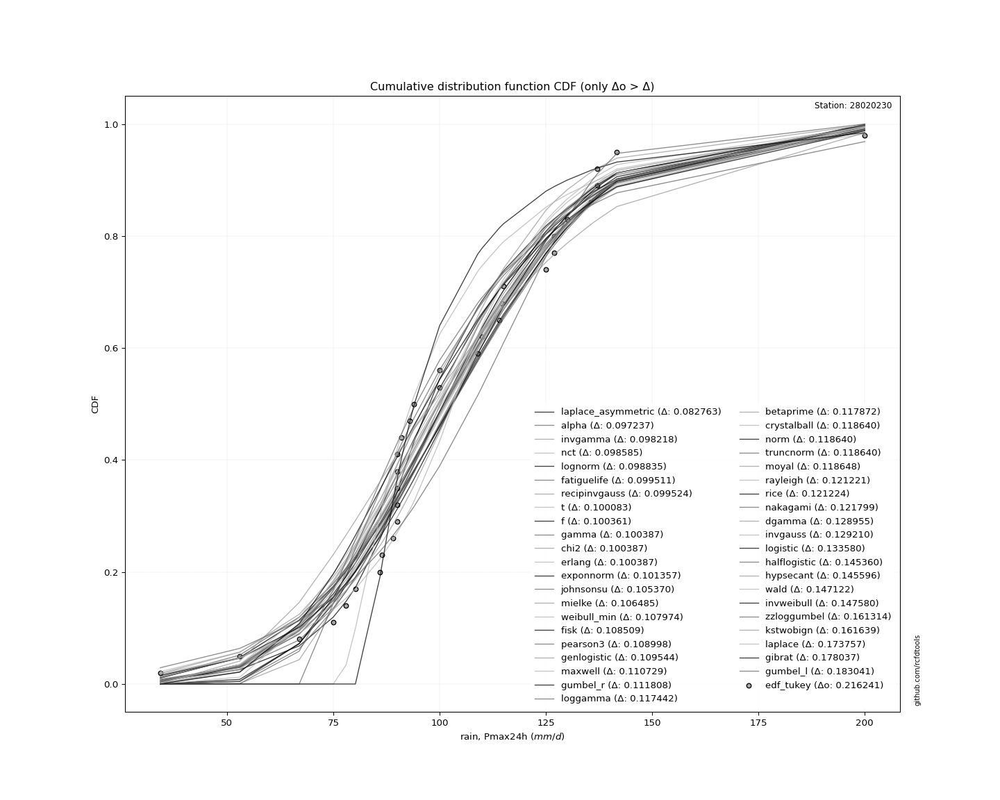</img>

</div>


**7.3. Best fit**

|   id |   station | empirical_dist   | p_dist             |     delta |   deltao | eval   |   fit |   n |   loc |   scale |    shape | shape1   | shape2   | shape3   |   best_fit |   best_fit_sort |
|-----:|----------:|:-----------------|:-------------------|----------:|---------:|:-------|------:|----:|------:|--------:|---------:|:---------|:---------|:---------|-----------:|----------------:|
|    0 |  28020230 | edf_tukey        | laplace_asymmetric | 0.0827635 | 0.216241 | Δo > Δ |     1 |  33 |    90 | 19.6915 | 0.722456 |          |          |          |          1 |               1 |

<div align="center">

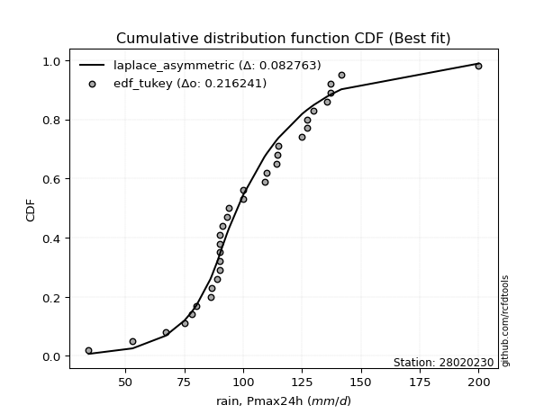</img></img>

</div>


### 8. Empirical - EDF Gringorten (1963)

Gringorten plotting position formula is essential for estimating the probability and return periods of extreme events like floods and heavy rainfall. The constant _a=0.44_.

<div align="center">


$P=(m-a)/(n+1-2a)$


</div>


**8.1. Empirical values**

<div align="center">

|                | 0                    | 1                   | 2                   | 3                   | 4                   | 5                  | 6                   | 7                  | 8                  | 9                   | 10                  | 11                 | 12                  | 13                 | 14                 | 15                 | 16             | 17                 | 18                 | 19                 | 20                 | 21                 | 22                 | 23                 | 24                 | 25                 | 26                 | 27                 | 28                 | 29                 | 30                 | 31                 | 32                 |
|:---------------|:---------------------|:--------------------|:--------------------|:--------------------|:--------------------|:-------------------|:--------------------|:-------------------|:-------------------|:--------------------|:--------------------|:-------------------|:--------------------|:-------------------|:-------------------|:-------------------|:---------------|:-------------------|:-------------------|:-------------------|:-------------------|:-------------------|:-------------------|:-------------------|:-------------------|:-------------------|:-------------------|:-------------------|:-------------------|:-------------------|:-------------------|:-------------------|:-------------------|
| date           | 1990                 | 1972                | 1989                | 1997                | 2001                | 1984               | 1970                | 1988               | 1996               | 1998                | 1994                | 1993               | 1977                | 1969               | 1992               | 1979               | 1991           | 1976               | 1978               | 1974               | 1982               | 1971               | 1983               | 1975               | 2000               | 1980               | 1985               | 1973               | 1986               | 1981               | 1999               | 1987               | 1995               |
| x              | 34.3                 | 53.0                | 67.0                | 75.0                | 78.0                | 80.2               | 86.0                | 86.5               | 89.0               | 90.0                | 90.0                | 90.0               | 90.0                | 90.0               | 91.0               | 93.0               | 94.0           | 100.0              | 100.0              | 109.0              | 110.0              | 114.0              | 114.7              | 115.0              | 125.0              | 127.0              | 127.0              | 130.0              | 135.6              | 137.0              | 137.0              | 141.7              | 200.0              |
| m              | 1                    | 2                   | 3                   | 4                   | 5                   | 6                  | 7                   | 8                  | 9                  | 10                  | 11                  | 12                 | 13                  | 14                 | 15                 | 16                 | 17             | 18                 | 19                 | 20                 | 21                 | 22                 | 23                 | 24                 | 25                 | 26                 | 27                 | 28                 | 29                 | 30                 | 31                 | 32                 | 33                 |
| empirical_dist | edf_gringorten       | edf_gringorten      | edf_gringorten      | edf_gringorten      | edf_gringorten      | edf_gringorten     | edf_gringorten      | edf_gringorten     | edf_gringorten     | edf_gringorten      | edf_gringorten      | edf_gringorten     | edf_gringorten      | edf_gringorten     | edf_gringorten     | edf_gringorten     | edf_gringorten | edf_gringorten     | edf_gringorten     | edf_gringorten     | edf_gringorten     | edf_gringorten     | edf_gringorten     | edf_gringorten     | edf_gringorten     | edf_gringorten     | edf_gringorten     | edf_gringorten     | edf_gringorten     | edf_gringorten     | edf_gringorten     | edf_gringorten     | edf_gringorten     |
| empirical      | 0.016908212560386476 | 0.04710144927536233 | 0.07729468599033817 | 0.10748792270531402 | 0.13768115942028986 | 0.1678743961352657 | 0.19806763285024154 | 0.2282608695652174 | 0.2584541062801933 | 0.28864734299516914 | 0.31884057971014496 | 0.3490338164251208 | 0.37922705314009664 | 0.4094202898550725 | 0.4396135265700484 | 0.4698067632850242 | 0.5            | 0.5301932367149759 | 0.5603864734299517 | 0.5905797101449275 | 0.6207729468599034 | 0.6509661835748792 | 0.6811594202898551 | 0.711352657004831  | 0.7415458937198068 | 0.7717391304347826 | 0.8019323671497585 | 0.8321256038647343 | 0.8623188405797102 | 0.8925120772946861 | 0.9227053140096618 | 0.9528985507246377 | 0.9830917874396137 |
| empirical_tr   | 1.017199017199017    | 1.049429657794677   | 1.0837696335078535  | 1.1204330175913397  | 1.1596638655462184  | 1.2017416545718431 | 1.2469879518072289  | 1.295774647887324  | 1.3485342019543975 | 1.405772495755518   | 1.468085106382979   | 1.536178107606679  | 1.6108949416342413  | 1.6932515337423315 | 1.78448275862069   | 1.8861047835990892 | 2.0            | 2.12853470437018   | 2.274725274725275  | 2.4424778761061945 | 2.6369426751592355 | 2.865051903114187  | 3.1363636363636367 | 3.4644351464435155 | 3.869158878504674  | 4.3809523809523805 | 5.048780487804878  | 5.956834532374102  | 7.263157894736845  | 9.30337078651686   | 12.937499999999998 | 21.230769230769237 | 59.14285714285766  |

</div>


**8.2. Parameters & Kolmogorov-Smirnov fit test (sorted by Δ)**

|   id | empirical_dist   | p_dist             |     delta |   deltao | eval    |   fit |   n |             loc |           scale | shape                 | shape1               | shape2             | shape3   |   best_fit |   best_fit_sort |
|-----:|:-----------------|:-------------------|----------:|---------:|:--------|------:|----:|----------------:|----------------:|:----------------------|:---------------------|:-------------------|:---------|-----------:|----------------:|
|    0 | edf_gringorten   | laplace_asymmetric | 0.0821838 | 0.216241 | Δo > Δ  |     1 |  33 |    90           |    19.6915      | 0.7224559990360757    |                      |                    |          |          1 |               1 |
|    1 | edf_gringorten   | alpha              | 0.0981955 | 0.216241 | Δo > Δ  |     1 |  33 |  -334.079       |  6495.73        | 14.927947537874772    |                      |                    |          |          0 |               2 |
|    2 | edf_gringorten   | invgamma           | 0.0982183 | 0.216241 | Δo > Δ  |     1 |  33 |  -208.824       | 34775.5         | 112.5159827831635     |                      |                    |          |          0 |               3 |
|    3 | edf_gringorten   | nct                | 0.0985852 | 0.216241 | Δo > Δ  |     1 |  33 |    -0.142289    |    24.2577      | 24.908986848794754    | 4.123925993815067    |                    |          |          0 |               4 |
|    4 | edf_gringorten   | lognorm            | 0.0988346 | 0.216241 | Δo > Δ  |     1 |  33 |  -139.712       |   240.944       | 0.12173654465026063   |                      |                    |          |          0 |               5 |
|    5 | edf_gringorten   | fatiguelife        | 0.0995114 | 0.216241 | Δo > Δ  |     1 |  33 |  -149.032       |   250.336       | 0.11745988992854395   |                      |                    |          |          0 |               6 |
|    6 | edf_gringorten   | recipinvgauss      | 0.0995242 | 0.216241 | Δo > Δ  |     1 |  33 |  -148.625       |     3.44765     | 0.013890137074665933  |                      |                    |          |          0 |               7 |
|    7 | edf_gringorten   | f                  | 0.100361  | 0.216241 | Δo > Δ  |     1 |  33 |   -76.3588      |   179.374       | 73.41909229149664     | 24424.72118193735    |                    |          |          0 |               8 |
|    8 | edf_gringorten   | gamma              | 0.100387  | 0.216241 | Δo > Δ  |     1 |  33 |   -76.1276      |     4.90835     | 36.50060814064102     |                      |                    |          |          0 |               9 |
|    9 | edf_gringorten   | chi2               | 0.100387  | 0.216241 | Δo > Δ  |     1 |  33 |   -76.1275      |     2.45418     | 73.00113016689681     |                      |                    |          |          0 |              10 |
|   10 | edf_gringorten   | erlang             | 0.100387  | 0.216241 | Δo > Δ  |     1 |  33 |   -76.1276      |     4.90835     | 36.50061939918796     |                      |                    |          |          0 |              11 |
|   11 | edf_gringorten   | exponnorm          | 0.101357  | 0.216241 | Δo > Δ  |     1 |  33 |    83.6977      |    22.2661      | 0.8682562710904624    |                      |                    |          |          0 |              12 |
|   12 | edf_gringorten   | t                  | 0.102016  | 0.216241 | Δo > Δ  |     1 |  33 |    99.6243      |    24.3609      | 4.985756644155526     |                      |                    |          |          0 |              13 |
|   13 | edf_gringorten   | johnsonsu          | 0.10537   | 0.216241 | Δo > Δ  |     1 |  33 |    88.6561      |    32.6545      | -0.5052658352215449   | 1.4607249054444937   |                    |          |          0 |              14 |
|   14 | edf_gringorten   | mielke             | 0.106485  | 0.216241 | Δo > Δ  |     1 |  33 |    -1.19338     |   112.672       | 4.6561777597167255    | 7.657570508573743    |                    |          |          0 |              15 |
|   15 | edf_gringorten   | weibull_min        | 0.107974  | 0.216241 | Δo > Δ  |     1 |  33 |    48.406       |    63.4569      | 2.111141384999197     |                      |                    |          |          0 |              16 |
|   16 | edf_gringorten   | fisk               | 0.108509  | 0.216241 | Δo > Δ  |     1 |  33 |  -113.235       |   214.131       | 13.47377827978022     |                      |                    |          |          0 |              17 |
|   17 | edf_gringorten   | genlogistic        | 0.109544  | 0.216241 | Δo > Δ  |     1 |  33 |    89.5612      |    18.3321      | 1.6231534198361361    |                      |                    |          |          0 |              18 |
|   18 | edf_gringorten   | pearson3           | 0.11093   | 0.216241 | Δo > Δ  |     1 |  33 |   103.03        |    29.9105      | 0.6482425583303908    |                      |                    |          |          0 |              19 |
|   19 | edf_gringorten   | maxwell            | 0.112661  | 0.216241 | Δo > Δ  |     1 |  33 |    32.1549      |    44.4146      |                       |                      |                    |          |          0 |              20 |
|   20 | edf_gringorten   | gumbel_r           | 0.113741  | 0.216241 | Δo > Δ  |     1 |  33 |    89.569       |    23.3211      |                       |                      |                    |          |          0 |              21 |
|   21 | edf_gringorten   | loggamma           | 0.117442  | 0.216241 | Δo > Δ  |     1 |  33 | -8185.69        |  1143.87        | 1403.242459542555     |                      |                    |          |          0 |              22 |
|   22 | edf_gringorten   | crystalball        | 0.11864   | 0.216241 | Δo > Δ  |     1 |  33 |   103.03        |    29.9105      | 6973.079108565442     | 10313.830100162435   |                    |          |          0 |              23 |
|   23 | edf_gringorten   | norm               | 0.11864   | 0.216241 | Δo > Δ  |     1 |  33 |   103.03        |    29.9105      |                       |                      |                    |          |          0 |              24 |
|   24 | edf_gringorten   | truncnorm          | 0.11864   | 0.216241 | Δo > Δ  |     1 |  33 |   103.03        |    29.9105      | -655.0177315281694    | 720.841649155948     |                    |          |          0 |              25 |
|   25 | edf_gringorten   | betaprime          | 0.119804  | 0.216241 | Δo > Δ  |     1 |  33 |     3.11782     |  1034.23        | 11.404419699076985    | 119.0723391645974    |                    |          |          0 |              26 |
|   26 | edf_gringorten   | moyal              | 0.120581  | 0.216241 | Δo > Δ  |     1 |  33 |    85.9255      |    13.4645      |                       |                      |                    |          |          0 |              27 |
|   27 | edf_gringorten   | rice               | 0.121224  | 0.216241 | Δo > Δ  |     1 |  33 |    48.2193      |    33.963       | 1.203835156455907     |                      |                    |          |          0 |              28 |
|   28 | edf_gringorten   | nakagami           | 0.121799  | 0.216241 | Δo > Δ  |     1 |  33 |    45.2093      |    65.6869      | 1.3001365584985287    |                      |                    |          |          0 |              29 |
|   29 | edf_gringorten   | rayleigh           | 0.123154  | 0.216241 | Δo > Δ  |     1 |  33 |    45.8098      |    45.6554      |                       |                      |                    |          |          0 |              30 |
|   30 | edf_gringorten   | dgamma             | 0.130887  | 0.216241 | Δo > Δ  |     1 |  33 |    97.9713      |    15.2867      | 1.4747807335421348    |                      |                    |          |          0 |              31 |
|   31 | edf_gringorten   | invgauss           | 0.131142  | 0.216241 | Δo > Δ  |     1 |  33 |   -41.6886      |  2954.85        | 0.048769774053339765  |                      |                    |          |          0 |              32 |
|   32 | edf_gringorten   | logistic           | 0.13358   | 0.216241 | Δo > Δ  |     1 |  33 |   103.03        |    16.4905      |                       |                      |                    |          |          0 |              33 |
|   33 | edf_gringorten   | hypsecant          | 0.145596  | 0.216241 | Δo > Δ  |     1 |  33 |   103.03        |    19.0416      |                       |                      |                    |          |          0 |              34 |
|   34 | edf_gringorten   | wald               | 0.146542  | 0.216241 | Δo > Δ  |     1 |  33 |    73.1198      |    29.9105      |                       |                      |                    |          |          0 |              35 |
|   35 | edf_gringorten   | halflogistic       | 0.147292  | 0.216241 | Δo > Δ  |     1 |  33 |    67.5794      |    25.5724      |                       |                      |                    |          |          0 |              36 |
|   36 | edf_gringorten   | invweibull         | 0.149512  | 0.216241 | Δo > Δ  |     1 |  33 |    -1.15572e+06 |     1.1558e+06  | 45347.65677079186     |                      |                    |          |          0 |              37 |
|   37 | edf_gringorten   | zzloggumbel        | 0.163246  | 0.216241 | Δo > Δ  |     1 |  33 |     4.4587      |     0.243654    | 0.5388106529916182    | 1.1224931659715724   |                    |          |          0 |              38 |
|   38 | edf_gringorten   | kstwobign          | 0.163571  | 0.216241 | Δo > Δ  |     1 |  33 |   -17.9271      |   139.808       |                       |                      |                    |          |          0 |              39 |
|   39 | edf_gringorten   | laplace            | 0.173757  | 0.216241 | Δo > Δ  |     1 |  33 |   103.03        |    21.1499      |                       |                      |                    |          |          0 |              40 |
|   40 | edf_gringorten   | gibrat             | 0.177458  | 0.216241 | Δo > Δ  |     1 |  33 |    80.2123      |    13.8398      |                       |                      |                    |          |          0 |              41 |
|   41 | edf_gringorten   | gumbel_l           | 0.183041  | 0.216241 | Δo > Δ  |     1 |  33 |   116.492       |    23.3211      |                       |                      |                    |          |          0 |              42 |
|   42 | edf_gringorten   | zzgumbel           | 0.26841   | 0.216241 | Δo <= Δ |     0 |  33 |   103.008       |    23.6827      | 0.5388106529916182    | 1.1224931659715724   |                    |          |          0 |              43 |
|   43 | edf_gringorten   | ncf                | 0.301259  | 0.216241 | Δo <= Δ |     0 |  33 |    -0.0750199   |     5.42594e-07 | 6.177190705933478e-08 | 8.559472659866003    | 10.749129905783315 |          |          0 |              44 |
|   44 | edf_gringorten   | genexpon           | 0.327167  | 0.216241 | Δo <= Δ |     0 |  33 |    34.3         |     1.89016     | 0.021553256129742675  | 0.005173981655219102 | 0.9976188434514551 |          |          0 |              45 |
|   45 | edf_gringorten   | expon              | 0.339386  | 0.216241 | Δo <= Δ |     0 |  33 |    34.3         |    68.7303      |                       |                      |                    |          |          0 |              46 |
|   46 | edf_gringorten   | pareto             | 0.339386  | 0.216241 | Δo <= Δ |     0 |  33 |    -4.29497e+09 |     4.29497e+09 | 62490155.861802205    |                      |                    |          |          0 |              47 |
|   47 | edf_gringorten   | halfnorm           | 0.560386  | 0.216241 | Δo <= Δ |     0 |  33 |   104.186       |     2.73121     |                       |                      |                    |          |          0 |              48 |
|   48 | edf_gringorten   | gompertz           | 0.952885  | 0.216241 | Δo <= Δ |     0 |  33 |    20.7391      |     3.96322     | 7.488483840098274e-19 |                      |                    |          |          0 |              49 |

<div align="center">

</img>

</div>


**8.3. Best fit**

|   id |   station | empirical_dist   | p_dist             |     delta |   deltao | eval   |   fit |   n |   loc |   scale |    shape | shape1   | shape2   | shape3   |   best_fit |   best_fit_sort |
|-----:|----------:|:-----------------|:-------------------|----------:|---------:|:-------|------:|----:|------:|--------:|---------:|:---------|:---------|:---------|-----------:|----------------:|
|    0 |  28020230 | edf_gringorten   | laplace_asymmetric | 0.0821838 | 0.216241 | Δo > Δ |     1 |  33 |    90 | 19.6915 | 0.722456 |          |          |          |          1 |               1 |

<div align="center">

</img></img>

</div>


### 9. Empirical - EDF Jenkinson (1977)

The Jenkinson formula in hydrology is an empirical plotting position formula used to estimate the non-exceedance probability _(P)_ or return period _(T)_ of a given ordered observation within a sample. It is a widely used method in the frequency analysis of extreme events such as floods and rainfall, as it provides a distribution-free way to plot data. _a≈0.31_ and _b≈0.38_ are constants derived to approximate the median of the probability distribution for the given rank.

<div align="center">


$P=(m-a)/(n+b)$


</div>


**9.1. Empirical values**

<div align="center">

|                | 0                    | 1                   | 2                   | 3                   | 4                   | 5                   | 6                   | 7                   | 8                  | 9                   | 10                  | 11                 | 12                 | 13                  | 14                 | 15                 | 16            | 17                 | 18                 | 19                 | 20                 | 21                 | 22                 | 23                 | 24                 | 25                 | 26                 | 27                 | 28                 | 29                 | 30                 | 31                 | 32                 |
|:---------------|:---------------------|:--------------------|:--------------------|:--------------------|:--------------------|:--------------------|:--------------------|:--------------------|:-------------------|:--------------------|:--------------------|:-------------------|:-------------------|:--------------------|:-------------------|:-------------------|:--------------|:-------------------|:-------------------|:-------------------|:-------------------|:-------------------|:-------------------|:-------------------|:-------------------|:-------------------|:-------------------|:-------------------|:-------------------|:-------------------|:-------------------|:-------------------|:-------------------|
| date           | 1990                 | 1972                | 1989                | 1997                | 2001                | 1984                | 1970                | 1988                | 1996               | 1998                | 1994                | 1993               | 1977               | 1969                | 1992               | 1979               | 1991          | 1976               | 1978               | 1974               | 1982               | 1971               | 1983               | 1975               | 2000               | 1980               | 1985               | 1973               | 1986               | 1981               | 1999               | 1987               | 1995               |
| x              | 34.3                 | 53.0                | 67.0                | 75.0                | 78.0                | 80.2                | 86.0                | 86.5                | 89.0               | 90.0                | 90.0                | 90.0               | 90.0               | 90.0                | 91.0               | 93.0               | 94.0          | 100.0              | 100.0              | 109.0              | 110.0              | 114.0              | 114.7              | 115.0              | 125.0              | 127.0              | 127.0              | 130.0              | 135.6              | 137.0              | 137.0              | 141.7              | 200.0              |
| m              | 1                    | 2                   | 3                   | 4                   | 5                   | 6                   | 7                   | 8                   | 9                  | 10                  | 11                  | 12                 | 13                 | 14                  | 15                 | 16                 | 17            | 18                 | 19                 | 20                 | 21                 | 22                 | 23                 | 24                 | 25                 | 26                 | 27                 | 28                 | 29                 | 30                 | 31                 | 32                 | 33                 |
| empirical_dist | edf_jenkinson        | edf_jenkinson       | edf_jenkinson       | edf_jenkinson       | edf_jenkinson       | edf_jenkinson       | edf_jenkinson       | edf_jenkinson       | edf_jenkinson      | edf_jenkinson       | edf_jenkinson       | edf_jenkinson      | edf_jenkinson      | edf_jenkinson       | edf_jenkinson      | edf_jenkinson      | edf_jenkinson | edf_jenkinson      | edf_jenkinson      | edf_jenkinson      | edf_jenkinson      | edf_jenkinson      | edf_jenkinson      | edf_jenkinson      | edf_jenkinson      | edf_jenkinson      | edf_jenkinson      | edf_jenkinson      | edf_jenkinson      | edf_jenkinson      | edf_jenkinson      | edf_jenkinson      | edf_jenkinson      |
| empirical      | 0.020671060515278606 | 0.05062911923307369 | 0.08058717795086878 | 0.11054523666866387 | 0.14050329538645895 | 0.17046135410425403 | 0.20041941282204911 | 0.23037747153984423 | 0.2603355302576393 | 0.29029358897543434 | 0.32025164769322945 | 0.3502097064110245 | 0.3801677651288196 | 0.41012582384661467 | 0.4400838825644098 | 0.4700419412822049 | 0.5           | 0.5299580587177951 | 0.5599161174355902 | 0.5898741761533852 | 0.6198322348711803 | 0.6497902935889754 | 0.6797483523067706 | 0.7097064110245656 | 0.7396644697423607 | 0.7696225284601558 | 0.7995805871779509 | 0.8295386458957459 | 0.859496704613541  | 0.8894547633313361 | 0.9194128220491312 | 0.9493708807669262 | 0.9793289394847212 |
| empirical_tr   | 1.0211073722851025   | 1.0533291259072262  | 1.0876507005539264  | 1.1242842707982486  | 1.1634715928895085  | 1.2054893463344167  | 1.2506556762832521  | 1.2993382639159206  | 1.3519643580396923 | 1.4090333474039678  | 1.4711326575583956  | 1.5389580451821117 | 1.613339777670372  | 1.695276790248857   | 1.7859818084537185 | 1.8869417750141322 | 2.0           | 2.1274697259400894 | 2.2722940776038123 | 2.4382761139517894 | 2.6304176516942475 | 2.855431993156544  | 3.1225444340505146 | 3.4447884416924657 | 3.841196777905638  | 4.340702210663199  | 4.989536621823618  | 5.866432337434093  | 7.1172707889125775 | 9.046070460704605  | 12.408921933085502 | 19.751479289940796 | 48.37681159420249  |

</div>


**9.2. Parameters & Kolmogorov-Smirnov fit test (sorted by Δ)**

|   id | empirical_dist   | p_dist             |     delta |   deltao | eval    |   fit |   n |             loc |           scale | shape                 | shape1               | shape2             | shape3   |   best_fit |   best_fit_sort |
|-----:|:-----------------|:-------------------|----------:|---------:|:--------|------:|----:|----------------:|----------------:|:----------------------|:---------------------|:-------------------|:---------|-----------:|----------------:|
|    0 | edf_jenkinson    | laplace_asymmetric | 0.0828893 | 0.216241 | Δo > Δ  |     1 |  33 |    90           |    19.6915      | 0.7224559990360757    |                      |                    |          |          1 |               1 |
|    1 | edf_jenkinson    | alpha              | 0.0972368 | 0.216241 | Δo > Δ  |     1 |  33 |  -334.079       |  6495.73        | 14.927947537874772    |                      |                    |          |          0 |               2 |
|    2 | edf_jenkinson    | invgamma           | 0.0982183 | 0.216241 | Δo > Δ  |     1 |  33 |  -208.824       | 34775.5         | 112.5159827831635     |                      |                    |          |          0 |               3 |
|    3 | edf_jenkinson    | nct                | 0.0985852 | 0.216241 | Δo > Δ  |     1 |  33 |    -0.142289    |    24.2577      | 24.908986848794754    | 4.123925993815067    |                    |          |          0 |               4 |
|    4 | edf_jenkinson    | lognorm            | 0.0988346 | 0.216241 | Δo > Δ  |     1 |  33 |  -139.712       |   240.944       | 0.12173654465026063   |                      |                    |          |          0 |               5 |
|    5 | edf_jenkinson    | fatiguelife        | 0.0995114 | 0.216241 | Δo > Δ  |     1 |  33 |  -149.032       |   250.336       | 0.11745988992854395   |                      |                    |          |          0 |               6 |
|    6 | edf_jenkinson    | recipinvgauss      | 0.0995242 | 0.216241 | Δo > Δ  |     1 |  33 |  -148.625       |     3.44765     | 0.013890137074665933  |                      |                    |          |          0 |               7 |
|    7 | edf_jenkinson    | t                  | 0.0996638 | 0.216241 | Δo > Δ  |     1 |  33 |    99.6243      |    24.3609      | 4.985756644155526     |                      |                    |          |          0 |               8 |
|    8 | edf_jenkinson    | f                  | 0.100361  | 0.216241 | Δo > Δ  |     1 |  33 |   -76.3588      |   179.374       | 73.41909229149664     | 24424.72118193735    |                    |          |          0 |               9 |
|    9 | edf_jenkinson    | gamma              | 0.100387  | 0.216241 | Δo > Δ  |     1 |  33 |   -76.1276      |     4.90835     | 36.50060814064102     |                      |                    |          |          0 |              10 |
|   10 | edf_jenkinson    | chi2               | 0.100387  | 0.216241 | Δo > Δ  |     1 |  33 |   -76.1275      |     2.45418     | 73.00113016689681     |                      |                    |          |          0 |              11 |
|   11 | edf_jenkinson    | erlang             | 0.100387  | 0.216241 | Δo > Δ  |     1 |  33 |   -76.1276      |     4.90835     | 36.50061939918796     |                      |                    |          |          0 |              12 |
|   12 | edf_jenkinson    | exponnorm          | 0.101357  | 0.216241 | Δo > Δ  |     1 |  33 |    83.6977      |    22.2661      | 0.8682562710904624    |                      |                    |          |          0 |              13 |
|   13 | edf_jenkinson    | johnsonsu          | 0.10537   | 0.216241 | Δo > Δ  |     1 |  33 |    88.6561      |    32.6545      | -0.5052658352215449   | 1.4607249054444937   |                    |          |          0 |              14 |
|   14 | edf_jenkinson    | mielke             | 0.106485  | 0.216241 | Δo > Δ  |     1 |  33 |    -1.19338     |   112.672       | 4.6561777597167255    | 7.657570508573743    |                    |          |          0 |              15 |
|   15 | edf_jenkinson    | weibull_min        | 0.107974  | 0.216241 | Δo > Δ  |     1 |  33 |    48.406       |    63.4569      | 2.111141384999197     |                      |                    |          |          0 |              16 |
|   16 | edf_jenkinson    | fisk               | 0.108509  | 0.216241 | Δo > Δ  |     1 |  33 |  -113.235       |   214.131       | 13.47377827978022     |                      |                    |          |          0 |              17 |
|   17 | edf_jenkinson    | pearson3           | 0.108579  | 0.216241 | Δo > Δ  |     1 |  33 |   103.03        |    29.9105      | 0.6482425583303908    |                      |                    |          |          0 |              18 |
|   18 | edf_jenkinson    | genlogistic        | 0.109544  | 0.216241 | Δo > Δ  |     1 |  33 |    89.5612      |    18.3321      | 1.6231534198361361    |                      |                    |          |          0 |              19 |
|   19 | edf_jenkinson    | maxwell            | 0.110309  | 0.216241 | Δo > Δ  |     1 |  33 |    32.1549      |    44.4146      |                       |                      |                    |          |          0 |              20 |
|   20 | edf_jenkinson    | gumbel_r           | 0.111389  | 0.216241 | Δo > Δ  |     1 |  33 |    89.569       |    23.3211      |                       |                      |                    |          |          0 |              21 |
|   21 | edf_jenkinson    | loggamma           | 0.117442  | 0.216241 | Δo > Δ  |     1 |  33 | -8185.69        |  1143.87        | 1403.242459542555     |                      |                    |          |          0 |              22 |
|   22 | edf_jenkinson    | betaprime          | 0.117453  | 0.216241 | Δo > Δ  |     1 |  33 |     3.11782     |  1034.23        | 11.404419699076985    | 119.0723391645974    |                    |          |          0 |              23 |
|   23 | edf_jenkinson    | moyal              | 0.118229  | 0.216241 | Δo > Δ  |     1 |  33 |    85.9255      |    13.4645      |                       |                      |                    |          |          0 |              24 |
|   24 | edf_jenkinson    | crystalball        | 0.11864   | 0.216241 | Δo > Δ  |     1 |  33 |   103.03        |    29.9105      | 6973.079108565442     | 10313.830100162435   |                    |          |          0 |              25 |
|   25 | edf_jenkinson    | norm               | 0.11864   | 0.216241 | Δo > Δ  |     1 |  33 |   103.03        |    29.9105      |                       |                      |                    |          |          0 |              26 |
|   26 | edf_jenkinson    | truncnorm          | 0.11864   | 0.216241 | Δo > Δ  |     1 |  33 |   103.03        |    29.9105      | -655.0177315281694    | 720.841649155948     |                    |          |          0 |              27 |
|   27 | edf_jenkinson    | rayleigh           | 0.120802  | 0.216241 | Δo > Δ  |     1 |  33 |    45.8098      |    45.6554      |                       |                      |                    |          |          0 |              28 |
|   28 | edf_jenkinson    | rice               | 0.121224  | 0.216241 | Δo > Δ  |     1 |  33 |    48.2193      |    33.963       | 1.203835156455907     |                      |                    |          |          0 |              29 |
|   29 | edf_jenkinson    | nakagami           | 0.121799  | 0.216241 | Δo > Δ  |     1 |  33 |    45.2093      |    65.6869      | 1.3001365584985287    |                      |                    |          |          0 |              30 |
|   30 | edf_jenkinson    | dgamma             | 0.128536  | 0.216241 | Δo > Δ  |     1 |  33 |    97.9713      |    15.2867      | 1.4747807335421348    |                      |                    |          |          0 |              31 |
|   31 | edf_jenkinson    | invgauss           | 0.128791  | 0.216241 | Δo > Δ  |     1 |  33 |   -41.6886      |  2954.85        | 0.048769774053339765  |                      |                    |          |          0 |              32 |
|   32 | edf_jenkinson    | logistic           | 0.13358   | 0.216241 | Δo > Δ  |     1 |  33 |   103.03        |    16.4905      |                       |                      |                    |          |          0 |              33 |
|   33 | edf_jenkinson    | halflogistic       | 0.14494   | 0.216241 | Δo > Δ  |     1 |  33 |    67.5794      |    25.5724      |                       |                      |                    |          |          0 |              34 |
|   34 | edf_jenkinson    | hypsecant          | 0.145596  | 0.216241 | Δo > Δ  |     1 |  33 |   103.03        |    19.0416      |                       |                      |                    |          |          0 |              35 |
|   35 | edf_jenkinson    | invweibull         | 0.14716   | 0.216241 | Δo > Δ  |     1 |  33 |    -1.15572e+06 |     1.1558e+06  | 45347.65677079186     |                      |                    |          |          0 |              36 |
|   36 | edf_jenkinson    | wald               | 0.147248  | 0.216241 | Δo > Δ  |     1 |  33 |    73.1198      |    29.9105      |                       |                      |                    |          |          0 |              37 |
|   37 | edf_jenkinson    | zzloggumbel        | 0.160894  | 0.216241 | Δo > Δ  |     1 |  33 |     4.4587      |     0.243654    | 0.5388106529916182    | 1.1224931659715724   |                    |          |          0 |              38 |
|   38 | edf_jenkinson    | kstwobign          | 0.161219  | 0.216241 | Δo > Δ  |     1 |  33 |   -17.9271      |   139.808       |                       |                      |                    |          |          0 |              39 |
|   39 | edf_jenkinson    | laplace            | 0.173757  | 0.216241 | Δo > Δ  |     1 |  33 |   103.03        |    21.1499      |                       |                      |                    |          |          0 |              40 |
|   40 | edf_jenkinson    | gibrat             | 0.178163  | 0.216241 | Δo > Δ  |     1 |  33 |    80.2123      |    13.8398      |                       |                      |                    |          |          0 |              41 |
|   41 | edf_jenkinson    | gumbel_l           | 0.183041  | 0.216241 | Δo > Δ  |     1 |  33 |   116.492       |    23.3211      |                       |                      |                    |          |          0 |              42 |
|   42 | edf_jenkinson    | zzgumbel           | 0.26841   | 0.216241 | Δo <= Δ |     0 |  33 |   103.008       |    23.6827      | 0.5388106529916182    | 1.1224931659715724   |                    |          |          0 |              43 |
|   43 | edf_jenkinson    | ncf                | 0.298202  | 0.216241 | Δo <= Δ |     0 |  33 |    -0.0750199   |     5.42594e-07 | 6.177190705933478e-08 | 8.559472659866003    | 10.749129905783315 |          |          0 |              44 |
|   44 | edf_jenkinson    | genexpon           | 0.32411   | 0.216241 | Δo <= Δ |     0 |  33 |    34.3         |     1.89016     | 0.021553256129742675  | 0.005173981655219102 | 0.9976188434514551 |          |          0 |              45 |
|   45 | edf_jenkinson    | expon              | 0.336329  | 0.216241 | Δo <= Δ |     0 |  33 |    34.3         |    68.7303      |                       |                      |                    |          |          0 |              46 |
|   46 | edf_jenkinson    | pareto             | 0.336329  | 0.216241 | Δo <= Δ |     0 |  33 |    -4.29497e+09 |     4.29497e+09 | 62490155.861802205    |                      |                    |          |          0 |              47 |
|   47 | edf_jenkinson    | halfnorm           | 0.559916  | 0.216241 | Δo <= Δ |     0 |  33 |   104.186       |     2.73121     |                       |                      |                    |          |          0 |              48 |
|   48 | edf_jenkinson    | gompertz           | 0.949357  | 0.216241 | Δo <= Δ |     0 |  33 |    20.7391      |     3.96322     | 7.488483840098274e-19 |                      |                    |          |          0 |              49 |

<div align="center">

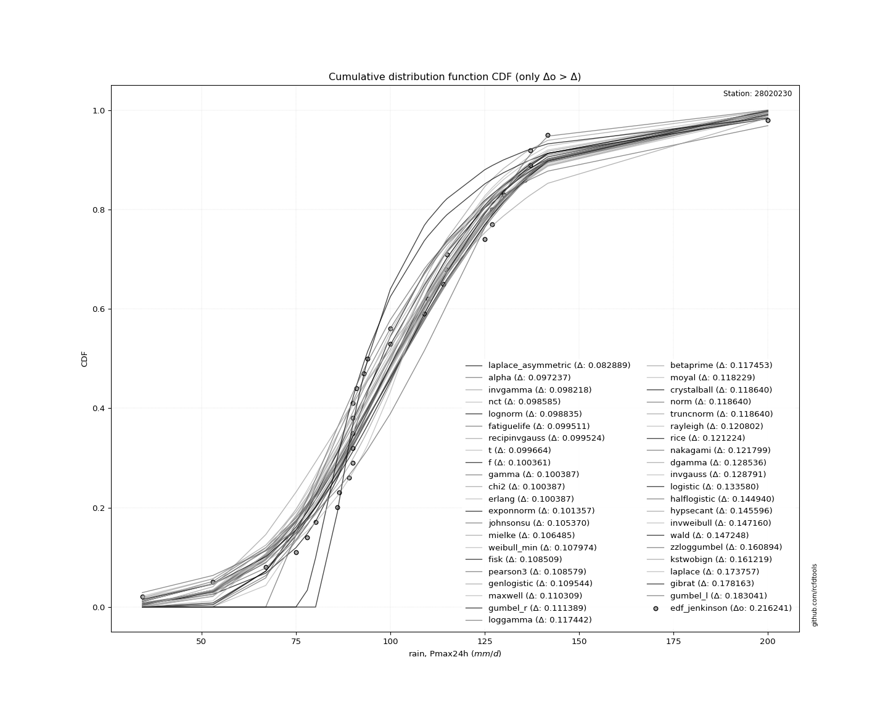</img>

</div>


**9.3. Best fit**

|   id |   station | empirical_dist   | p_dist             |     delta |   deltao | eval   |   fit |   n |   loc |   scale |    shape | shape1   | shape2   | shape3   |   best_fit |   best_fit_sort |
|-----:|----------:|:-----------------|:-------------------|----------:|---------:|:-------|------:|----:|------:|--------:|---------:|:---------|:---------|:---------|-----------:|----------------:|
|    0 |  28020230 | edf_jenkinson    | laplace_asymmetric | 0.0828893 | 0.216241 | Δo > Δ |     1 |  33 |    90 | 19.6915 | 0.722456 |          |          |          |          1 |               1 |

<div align="center">

</img></img>

</div>


### 10. Empirical - EDF Cunnane (1978)

Cunnane´s work in statistical hydrology has focused on the performance and evaluation of different probability distributions (such as GEV, Gumbel, Lognormal) for flood frequency estimation. _b_ is a constant, typically set to 0.4.

<div align="center">


$P=(m-b)/(n+1-2b)$


</div>


**10.1. Empirical values**

<div align="center">

|                | 0                    | 1                    | 2                  | 3                   | 4                   | 5                  | 6                   | 7                   | 8                  | 9                  | 10                 | 11                  | 12                  | 13                 | 14                 | 15                 | 16          | 17                 | 18                 | 19                 | 20                 | 21                 | 22                 | 23                 | 24                 | 25                 | 26                 | 27                 | 28                 | 29                | 30                 | 31                 | 32                 |
|:---------------|:---------------------|:---------------------|:-------------------|:--------------------|:--------------------|:-------------------|:--------------------|:--------------------|:-------------------|:-------------------|:-------------------|:--------------------|:--------------------|:-------------------|:-------------------|:-------------------|:------------|:-------------------|:-------------------|:-------------------|:-------------------|:-------------------|:-------------------|:-------------------|:-------------------|:-------------------|:-------------------|:-------------------|:-------------------|:------------------|:-------------------|:-------------------|:-------------------|
| date           | 1990                 | 1972                 | 1989               | 1997                | 2001                | 1984               | 1970                | 1988                | 1996               | 1998               | 1994               | 1993                | 1977                | 1969               | 1992               | 1979               | 1991        | 1976               | 1978               | 1974               | 1982               | 1971               | 1983               | 1975               | 2000               | 1980               | 1985               | 1973               | 1986               | 1981              | 1999               | 1987               | 1995               |
| x              | 34.3                 | 53.0                 | 67.0               | 75.0                | 78.0                | 80.2               | 86.0                | 86.5                | 89.0               | 90.0               | 90.0               | 90.0                | 90.0                | 90.0               | 91.0               | 93.0               | 94.0        | 100.0              | 100.0              | 109.0              | 110.0              | 114.0              | 114.7              | 115.0              | 125.0              | 127.0              | 127.0              | 130.0              | 135.6              | 137.0             | 137.0              | 141.7              | 200.0              |
| m              | 1                    | 2                    | 3                  | 4                   | 5                   | 6                  | 7                   | 8                   | 9                  | 10                 | 11                 | 12                  | 13                  | 14                 | 15                 | 16                 | 17          | 18                 | 19                 | 20                 | 21                 | 22                 | 23                 | 24                 | 25                 | 26                 | 27                 | 28                 | 29                 | 30                | 31                 | 32                 | 33                 |
| empirical_dist | edf_cunnane          | edf_cunnane          | edf_cunnane        | edf_cunnane         | edf_cunnane         | edf_cunnane        | edf_cunnane         | edf_cunnane         | edf_cunnane        | edf_cunnane        | edf_cunnane        | edf_cunnane         | edf_cunnane         | edf_cunnane        | edf_cunnane        | edf_cunnane        | edf_cunnane | edf_cunnane        | edf_cunnane        | edf_cunnane        | edf_cunnane        | edf_cunnane        | edf_cunnane        | edf_cunnane        | edf_cunnane        | edf_cunnane        | edf_cunnane        | edf_cunnane        | edf_cunnane        | edf_cunnane       | edf_cunnane        | edf_cunnane        | edf_cunnane        |
| empirical      | 0.018072289156626505 | 0.048192771084337345 | 0.0783132530120482 | 0.10843373493975902 | 0.13855421686746985 | 0.1686746987951807 | 0.19879518072289154 | 0.22891566265060237 | 0.2590361445783132 | 0.2891566265060241 | 0.3192771084337349 | 0.34939759036144574 | 0.37951807228915657 | 0.4096385542168674 | 0.4397590361445783 | 0.4698795180722891 | 0.5         | 0.5301204819277109 | 0.5602409638554217 | 0.5903614457831325 | 0.6204819277108433 | 0.6506024096385542 | 0.6807228915662651 | 0.7108433734939759 | 0.7409638554216867 | 0.7710843373493975 | 0.8012048192771084 | 0.8313253012048193 | 0.8614457831325301 | 0.891566265060241 | 0.9216867469879517 | 0.9518072289156626 | 0.9819277108433735 |
| empirical_tr   | 1.01840490797546     | 1.0506329113924051   | 1.0849673202614378 | 1.1216216216216217  | 1.1608391608391608  | 1.2028985507246377 | 1.2481203007518797  | 1.296875            | 1.3495934959349591 | 1.4067796610169492 | 1.4690265486725662 | 1.5370370370370368  | 1.6116504854368932  | 1.693877551020408  | 1.7849462365591395 | 1.8863636363636362 | 2.0         | 2.128205128205128  | 2.273972602739726  | 2.4411764705882355 | 2.6349206349206344 | 2.862068965517241  | 3.1320754716981134 | 3.458333333333333  | 3.86046511627907   | 4.368421052631578  | 5.030303030303029  | 5.928571428571429  | 7.2173913043478235 | 9.222222222222221 | 12.769230769230756 | 20.749999999999982 | 55.33333333333333  |

</div>


**10.2. Parameters & Kolmogorov-Smirnov fit test (sorted by Δ)**

|   id | empirical_dist   | p_dist             |     delta |   deltao | eval    |   fit |   n |             loc |           scale | shape                 | shape1               | shape2             | shape3   |   best_fit |   best_fit_sort |
|-----:|:-----------------|:-------------------|----------:|---------:|:--------|------:|----:|----------------:|----------------:|:----------------------|:---------------------|:-------------------|:---------|-----------:|----------------:|
|    0 | edf_cunnane      | laplace_asymmetric | 0.082402  | 0.216241 | Δo > Δ  |     1 |  33 |    90           |    19.6915      | 0.7224559990360757    |                      |                    |          |          1 |               1 |
|    1 | edf_cunnane      | alpha              | 0.097468  | 0.216241 | Δo > Δ  |     1 |  33 |  -334.079       |  6495.73        | 14.927947537874772    |                      |                    |          |          0 |               2 |
|    2 | edf_cunnane      | invgamma           | 0.0982183 | 0.216241 | Δo > Δ  |     1 |  33 |  -208.824       | 34775.5         | 112.5159827831635     |                      |                    |          |          0 |               3 |
|    3 | edf_cunnane      | nct                | 0.0985852 | 0.216241 | Δo > Δ  |     1 |  33 |    -0.142289    |    24.2577      | 24.908986848794754    | 4.123925993815067    |                    |          |          0 |               4 |
|    4 | edf_cunnane      | lognorm            | 0.0988346 | 0.216241 | Δo > Δ  |     1 |  33 |  -139.712       |   240.944       | 0.12173654465026063   |                      |                    |          |          0 |               5 |
|    5 | edf_cunnane      | fatiguelife        | 0.0995114 | 0.216241 | Δo > Δ  |     1 |  33 |  -149.032       |   250.336       | 0.11745988992854395   |                      |                    |          |          0 |               6 |
|    6 | edf_cunnane      | recipinvgauss      | 0.0995242 | 0.216241 | Δo > Δ  |     1 |  33 |  -148.625       |     3.44765     | 0.013890137074665933  |                      |                    |          |          0 |               7 |
|    7 | edf_cunnane      | f                  | 0.100361  | 0.216241 | Δo > Δ  |     1 |  33 |   -76.3588      |   179.374       | 73.41909229149664     | 24424.72118193735    |                    |          |          0 |               8 |
|    8 | edf_cunnane      | gamma              | 0.100387  | 0.216241 | Δo > Δ  |     1 |  33 |   -76.1276      |     4.90835     | 36.50060814064102     |                      |                    |          |          0 |               9 |
|    9 | edf_cunnane      | chi2               | 0.100387  | 0.216241 | Δo > Δ  |     1 |  33 |   -76.1275      |     2.45418     | 73.00113016689681     |                      |                    |          |          0 |              10 |
|   10 | edf_cunnane      | erlang             | 0.100387  | 0.216241 | Δo > Δ  |     1 |  33 |   -76.1276      |     4.90835     | 36.50061939918796     |                      |                    |          |          0 |              11 |
|   11 | edf_cunnane      | t                  | 0.101288  | 0.216241 | Δo > Δ  |     1 |  33 |    99.6243      |    24.3609      | 4.985756644155526     |                      |                    |          |          0 |              12 |
|   12 | edf_cunnane      | exponnorm          | 0.101357  | 0.216241 | Δo > Δ  |     1 |  33 |    83.6977      |    22.2661      | 0.8682562710904624    |                      |                    |          |          0 |              13 |
|   13 | edf_cunnane      | johnsonsu          | 0.10537   | 0.216241 | Δo > Δ  |     1 |  33 |    88.6561      |    32.6545      | -0.5052658352215449   | 1.4607249054444937   |                    |          |          0 |              14 |
|   14 | edf_cunnane      | mielke             | 0.106485  | 0.216241 | Δo > Δ  |     1 |  33 |    -1.19338     |   112.672       | 4.6561777597167255    | 7.657570508573743    |                    |          |          0 |              15 |
|   15 | edf_cunnane      | weibull_min        | 0.107974  | 0.216241 | Δo > Δ  |     1 |  33 |    48.406       |    63.4569      | 2.111141384999197     |                      |                    |          |          0 |              16 |
|   16 | edf_cunnane      | fisk               | 0.108509  | 0.216241 | Δo > Δ  |     1 |  33 |  -113.235       |   214.131       | 13.47377827978022     |                      |                    |          |          0 |              17 |
|   17 | edf_cunnane      | genlogistic        | 0.109544  | 0.216241 | Δo > Δ  |     1 |  33 |    89.5612      |    18.3321      | 1.6231534198361361    |                      |                    |          |          0 |              18 |
|   18 | edf_cunnane      | pearson3           | 0.110203  | 0.216241 | Δo > Δ  |     1 |  33 |   103.03        |    29.9105      | 0.6482425583303908    |                      |                    |          |          0 |              19 |
|   19 | edf_cunnane      | maxwell            | 0.111934  | 0.216241 | Δo > Δ  |     1 |  33 |    32.1549      |    44.4146      |                       |                      |                    |          |          0 |              20 |
|   20 | edf_cunnane      | gumbel_r           | 0.113013  | 0.216241 | Δo > Δ  |     1 |  33 |    89.569       |    23.3211      |                       |                      |                    |          |          0 |              21 |
|   21 | edf_cunnane      | loggamma           | 0.117442  | 0.216241 | Δo > Δ  |     1 |  33 | -8185.69        |  1143.87        | 1403.242459542555     |                      |                    |          |          0 |              22 |
|   22 | edf_cunnane      | crystalball        | 0.11864   | 0.216241 | Δo > Δ  |     1 |  33 |   103.03        |    29.9105      | 6973.079108565442     | 10313.830100162435   |                    |          |          0 |              23 |
|   23 | edf_cunnane      | norm               | 0.11864   | 0.216241 | Δo > Δ  |     1 |  33 |   103.03        |    29.9105      |                       |                      |                    |          |          0 |              24 |
|   24 | edf_cunnane      | truncnorm          | 0.11864   | 0.216241 | Δo > Δ  |     1 |  33 |   103.03        |    29.9105      | -655.0177315281694    | 720.841649155948     |                    |          |          0 |              25 |
|   25 | edf_cunnane      | betaprime          | 0.119077  | 0.216241 | Δo > Δ  |     1 |  33 |     3.11782     |  1034.23        | 11.404419699076985    | 119.0723391645974    |                    |          |          0 |              26 |
|   26 | edf_cunnane      | moyal              | 0.119853  | 0.216241 | Δo > Δ  |     1 |  33 |    85.9255      |    13.4645      |                       |                      |                    |          |          0 |              27 |
|   27 | edf_cunnane      | rice               | 0.121224  | 0.216241 | Δo > Δ  |     1 |  33 |    48.2193      |    33.963       | 1.203835156455907     |                      |                    |          |          0 |              28 |
|   28 | edf_cunnane      | nakagami           | 0.121799  | 0.216241 | Δo > Δ  |     1 |  33 |    45.2093      |    65.6869      | 1.3001365584985287    |                      |                    |          |          0 |              29 |
|   29 | edf_cunnane      | rayleigh           | 0.122426  | 0.216241 | Δo > Δ  |     1 |  33 |    45.8098      |    45.6554      |                       |                      |                    |          |          0 |              30 |
|   30 | edf_cunnane      | dgamma             | 0.13016   | 0.216241 | Δo > Δ  |     1 |  33 |    97.9713      |    15.2867      | 1.4747807335421348    |                      |                    |          |          0 |              31 |
|   31 | edf_cunnane      | invgauss           | 0.130415  | 0.216241 | Δo > Δ  |     1 |  33 |   -41.6886      |  2954.85        | 0.048769774053339765  |                      |                    |          |          0 |              32 |
|   32 | edf_cunnane      | logistic           | 0.13358   | 0.216241 | Δo > Δ  |     1 |  33 |   103.03        |    16.4905      |                       |                      |                    |          |          0 |              33 |
|   33 | edf_cunnane      | hypsecant          | 0.145596  | 0.216241 | Δo > Δ  |     1 |  33 |   103.03        |    19.0416      |                       |                      |                    |          |          0 |              34 |
|   34 | edf_cunnane      | halflogistic       | 0.146565  | 0.216241 | Δo > Δ  |     1 |  33 |    67.5794      |    25.5724      |                       |                      |                    |          |          0 |              35 |
|   35 | edf_cunnane      | wald               | 0.146761  | 0.216241 | Δo > Δ  |     1 |  33 |    73.1198      |    29.9105      |                       |                      |                    |          |          0 |              36 |
|   36 | edf_cunnane      | invweibull         | 0.148785  | 0.216241 | Δo > Δ  |     1 |  33 |    -1.15572e+06 |     1.1558e+06  | 45347.65677079186     |                      |                    |          |          0 |              37 |
|   37 | edf_cunnane      | zzloggumbel        | 0.162519  | 0.216241 | Δo > Δ  |     1 |  33 |     4.4587      |     0.243654    | 0.5388106529916182    | 1.1224931659715724   |                    |          |          0 |              38 |
|   38 | edf_cunnane      | kstwobign          | 0.162844  | 0.216241 | Δo > Δ  |     1 |  33 |   -17.9271      |   139.808       |                       |                      |                    |          |          0 |              39 |
|   39 | edf_cunnane      | laplace            | 0.173757  | 0.216241 | Δo > Δ  |     1 |  33 |   103.03        |    21.1499      |                       |                      |                    |          |          0 |              40 |
|   40 | edf_cunnane      | gibrat             | 0.177676  | 0.216241 | Δo > Δ  |     1 |  33 |    80.2123      |    13.8398      |                       |                      |                    |          |          0 |              41 |
|   41 | edf_cunnane      | gumbel_l           | 0.183041  | 0.216241 | Δo > Δ  |     1 |  33 |   116.492       |    23.3211      |                       |                      |                    |          |          0 |              42 |
|   42 | edf_cunnane      | zzgumbel           | 0.26841   | 0.216241 | Δo <= Δ |     0 |  33 |   103.008       |    23.6827      | 0.5388106529916182    | 1.1224931659715724   |                    |          |          0 |              43 |
|   43 | edf_cunnane      | ncf                | 0.300313  | 0.216241 | Δo <= Δ |     0 |  33 |    -0.0750199   |     5.42594e-07 | 6.177190705933478e-08 | 8.559472659866003    | 10.749129905783315 |          |          0 |              44 |
|   44 | edf_cunnane      | genexpon           | 0.326222  | 0.216241 | Δo <= Δ |     0 |  33 |    34.3         |     1.89016     | 0.021553256129742675  | 0.005173981655219102 | 0.9976188434514551 |          |          0 |              45 |
|   45 | edf_cunnane      | expon              | 0.33844   | 0.216241 | Δo <= Δ |     0 |  33 |    34.3         |    68.7303      |                       |                      |                    |          |          0 |              46 |
|   46 | edf_cunnane      | pareto             | 0.33844   | 0.216241 | Δo <= Δ |     0 |  33 |    -4.29497e+09 |     4.29497e+09 | 62490155.861802205    |                      |                    |          |          0 |              47 |
|   47 | edf_cunnane      | halfnorm           | 0.560241  | 0.216241 | Δo <= Δ |     0 |  33 |   104.186       |     2.73121     |                       |                      |                    |          |          0 |              48 |
|   48 | edf_cunnane      | gompertz           | 0.951794  | 0.216241 | Δo <= Δ |     0 |  33 |    20.7391      |     3.96322     | 7.488483840098274e-19 |                      |                    |          |          0 |              49 |

<div align="center">

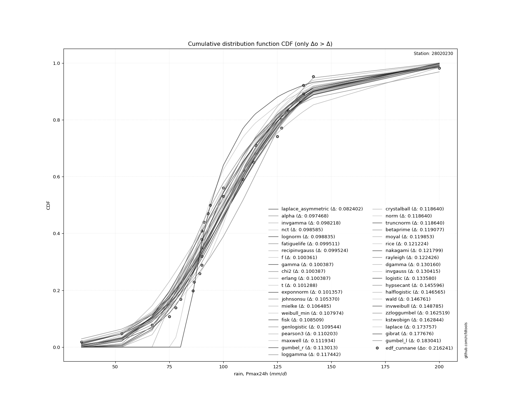</img>

</div>


**10.3. Best fit**

|   id |   station | empirical_dist   | p_dist             |    delta |   deltao | eval   |   fit |   n |   loc |   scale |    shape | shape1   | shape2   | shape3   |   best_fit |   best_fit_sort |
|-----:|----------:|:-----------------|:-------------------|---------:|---------:|:-------|------:|----:|------:|--------:|---------:|:---------|:---------|:---------|-----------:|----------------:|
|    0 |  28020230 | edf_cunnane      | laplace_asymmetric | 0.082402 | 0.216241 | Δo > Δ |     1 |  33 |    90 | 19.6915 | 0.722456 |          |          |          |          1 |               1 |

<div align="center">

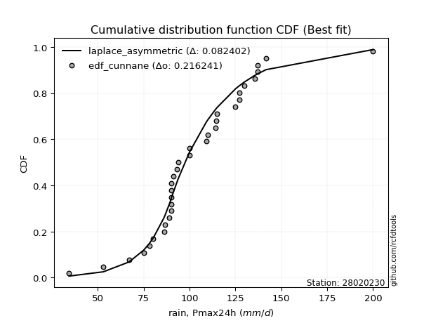</img></img>

</div>


### 11. Empirical - EDF Adamowski (1981)

The Adamowski formula in hydrology refers to a specific plotting position formula used for estimating the non-parametric empirical distribution of hydrological events (like flood peaks) to calculate their return periods. This formula provides an alternative to traditional parametric methods (like the Gumbel or Log Pearson Type III distributions). 

<div align="center">


$P=(m-0.25)/(n+0.5)$


</div>


**11.1. Empirical values**

<div align="center">

|                | 0                    | 1                   | 2                   | 3                   | 4                  | 5                   | 6                   | 7                   | 8                   | 9                  | 10                 | 11                  | 12                 | 13                  | 14                  | 15                 | 16            | 17                 | 18                 | 19                 | 20                 | 21                 | 22                 | 23                 | 24                 | 25                 | 26                 | 27                 | 28                 | 29                 | 30                | 31                 | 32                 |
|:---------------|:---------------------|:--------------------|:--------------------|:--------------------|:-------------------|:--------------------|:--------------------|:--------------------|:--------------------|:-------------------|:-------------------|:--------------------|:-------------------|:--------------------|:--------------------|:-------------------|:--------------|:-------------------|:-------------------|:-------------------|:-------------------|:-------------------|:-------------------|:-------------------|:-------------------|:-------------------|:-------------------|:-------------------|:-------------------|:-------------------|:------------------|:-------------------|:-------------------|
| date           | 1990                 | 1972                | 1989                | 1997                | 2001               | 1984                | 1970                | 1988                | 1996                | 1998               | 1994               | 1993                | 1977               | 1969                | 1992                | 1979               | 1991          | 1976               | 1978               | 1974               | 1982               | 1971               | 1983               | 1975               | 2000               | 1980               | 1985               | 1973               | 1986               | 1981               | 1999              | 1987               | 1995               |
| x              | 34.3                 | 53.0                | 67.0                | 75.0                | 78.0               | 80.2                | 86.0                | 86.5                | 89.0                | 90.0               | 90.0               | 90.0                | 90.0               | 90.0                | 91.0                | 93.0               | 94.0          | 100.0              | 100.0              | 109.0              | 110.0              | 114.0              | 114.7              | 115.0              | 125.0              | 127.0              | 127.0              | 130.0              | 135.6              | 137.0              | 137.0             | 141.7              | 200.0              |
| m              | 1                    | 2                   | 3                   | 4                   | 5                  | 6                   | 7                   | 8                   | 9                   | 10                 | 11                 | 12                  | 13                 | 14                  | 15                  | 16                 | 17            | 18                 | 19                 | 20                 | 21                 | 22                 | 23                 | 24                 | 25                 | 26                 | 27                 | 28                 | 29                 | 30                 | 31                | 32                 | 33                 |
| empirical_dist | edf_adamowski        | edf_adamowski       | edf_adamowski       | edf_adamowski       | edf_adamowski      | edf_adamowski       | edf_adamowski       | edf_adamowski       | edf_adamowski       | edf_adamowski      | edf_adamowski      | edf_adamowski       | edf_adamowski      | edf_adamowski       | edf_adamowski       | edf_adamowski      | edf_adamowski | edf_adamowski      | edf_adamowski      | edf_adamowski      | edf_adamowski      | edf_adamowski      | edf_adamowski      | edf_adamowski      | edf_adamowski      | edf_adamowski      | edf_adamowski      | edf_adamowski      | edf_adamowski      | edf_adamowski      | edf_adamowski     | edf_adamowski      | edf_adamowski      |
| empirical      | 0.022388059701492536 | 0.05223880597014925 | 0.08208955223880597 | 0.11194029850746269 | 0.1417910447761194 | 0.17164179104477612 | 0.20149253731343283 | 0.23134328358208955 | 0.26119402985074625 | 0.291044776119403  | 0.3208955223880597 | 0.35074626865671643 | 0.3805970149253731 | 0.41044776119402987 | 0.44029850746268656 | 0.4701492537313433 | 0.5           | 0.5298507462686567 | 0.5597014925373134 | 0.5895522388059702 | 0.6194029850746269 | 0.6492537313432836 | 0.6791044776119403 | 0.7089552238805971 | 0.7388059701492538 | 0.7686567164179104 | 0.7985074626865671 | 0.8283582089552238 | 0.8582089552238806 | 0.8880597014925373 | 0.917910447761194 | 0.9477611940298507 | 0.9776119402985075 |
| empirical_tr   | 1.0229007633587786   | 1.0551181102362206  | 1.089430894308943   | 1.1260504201680672  | 1.1652173913043478 | 1.207207207207207   | 1.252336448598131   | 1.3009708737864079  | 1.3535353535353536  | 1.4105263157894739 | 1.4725274725274724 | 1.5402298850574714  | 1.614457831325301  | 1.6962025316455696  | 1.7866666666666668  | 1.887323943661972  | 2.0           | 2.126984126984127  | 2.271186440677966  | 2.4363636363636365 | 2.627450980392157  | 2.851063829787234  | 3.1162790697674416 | 3.4358974358974366 | 3.8285714285714287 | 4.32258064516129   | 4.962962962962962  | 5.8260869565217375 | 7.05263157894737   | 8.933333333333334  | 12.18181818181818 | 19.142857142857128 | 44.66666666666676  |

</div>


**11.2. Parameters & Kolmogorov-Smirnov fit test (sorted by Δ)**

|   id | empirical_dist   | p_dist             |     delta |   deltao | eval    |   fit |   n |             loc |           scale | shape                 | shape1               | shape2             | shape3   |   best_fit |   best_fit_sort |
|-----:|:-----------------|:-------------------|----------:|---------:|:--------|------:|----:|----------------:|----------------:|:----------------------|:---------------------|:-------------------|:---------|-----------:|----------------:|
|    0 | edf_adamowski    | laplace_asymmetric | 0.0832113 | 0.216241 | Δo > Δ  |     1 |  33 |    90           |    19.6915      | 0.7224559990360757    |                      |                    |          |          1 |               1 |
|    1 | edf_adamowski    | alpha              | 0.0972368 | 0.216241 | Δo > Δ  |     1 |  33 |  -334.079       |  6495.73        | 14.927947537874772    |                      |                    |          |          0 |               2 |
|    2 | edf_adamowski    | invgamma           | 0.0982183 | 0.216241 | Δo > Δ  |     1 |  33 |  -208.824       | 34775.5         | 112.5159827831635     |                      |                    |          |          0 |               3 |
|    3 | edf_adamowski    | nct                | 0.0985852 | 0.216241 | Δo > Δ  |     1 |  33 |    -0.142289    |    24.2577      | 24.908986848794754    | 4.123925993815067    |                    |          |          0 |               4 |
|    4 | edf_adamowski    | t                  | 0.0985907 | 0.216241 | Δo > Δ  |     1 |  33 |    99.6243      |    24.3609      | 4.985756644155526     |                      |                    |          |          0 |               5 |
|    5 | edf_adamowski    | lognorm            | 0.0988346 | 0.216241 | Δo > Δ  |     1 |  33 |  -139.712       |   240.944       | 0.12173654465026063   |                      |                    |          |          0 |               6 |
|    6 | edf_adamowski    | fatiguelife        | 0.0995114 | 0.216241 | Δo > Δ  |     1 |  33 |  -149.032       |   250.336       | 0.11745988992854395   |                      |                    |          |          0 |               7 |
|    7 | edf_adamowski    | recipinvgauss      | 0.0995242 | 0.216241 | Δo > Δ  |     1 |  33 |  -148.625       |     3.44765     | 0.013890137074665933  |                      |                    |          |          0 |               8 |
|    8 | edf_adamowski    | f                  | 0.100361  | 0.216241 | Δo > Δ  |     1 |  33 |   -76.3588      |   179.374       | 73.41909229149664     | 24424.72118193735    |                    |          |          0 |               9 |
|    9 | edf_adamowski    | gamma              | 0.100387  | 0.216241 | Δo > Δ  |     1 |  33 |   -76.1276      |     4.90835     | 36.50060814064102     |                      |                    |          |          0 |              10 |
|   10 | edf_adamowski    | chi2               | 0.100387  | 0.216241 | Δo > Δ  |     1 |  33 |   -76.1275      |     2.45418     | 73.00113016689681     |                      |                    |          |          0 |              11 |
|   11 | edf_adamowski    | erlang             | 0.100387  | 0.216241 | Δo > Δ  |     1 |  33 |   -76.1276      |     4.90835     | 36.50061939918796     |                      |                    |          |          0 |              12 |
|   12 | edf_adamowski    | exponnorm          | 0.101357  | 0.216241 | Δo > Δ  |     1 |  33 |    83.6977      |    22.2661      | 0.8682562710904624    |                      |                    |          |          0 |              13 |
|   13 | edf_adamowski    | johnsonsu          | 0.10537   | 0.216241 | Δo > Δ  |     1 |  33 |    88.6561      |    32.6545      | -0.5052658352215449   | 1.4607249054444937   |                    |          |          0 |              14 |
|   14 | edf_adamowski    | mielke             | 0.106485  | 0.216241 | Δo > Δ  |     1 |  33 |    -1.19338     |   112.672       | 4.6561777597167255    | 7.657570508573743    |                    |          |          0 |              15 |
|   15 | edf_adamowski    | pearson3           | 0.107505  | 0.216241 | Δo > Δ  |     1 |  33 |   103.03        |    29.9105      | 0.6482425583303908    |                      |                    |          |          0 |              16 |
|   16 | edf_adamowski    | weibull_min        | 0.107974  | 0.216241 | Δo > Δ  |     1 |  33 |    48.406       |    63.4569      | 2.111141384999197     |                      |                    |          |          0 |              17 |
|   17 | edf_adamowski    | fisk               | 0.108509  | 0.216241 | Δo > Δ  |     1 |  33 |  -113.235       |   214.131       | 13.47377827978022     |                      |                    |          |          0 |              18 |
|   18 | edf_adamowski    | maxwell            | 0.109236  | 0.216241 | Δo > Δ  |     1 |  33 |    32.1549      |    44.4146      |                       |                      |                    |          |          0 |              19 |
|   19 | edf_adamowski    | genlogistic        | 0.109544  | 0.216241 | Δo > Δ  |     1 |  33 |    89.5612      |    18.3321      | 1.6231534198361361    |                      |                    |          |          0 |              20 |
|   20 | edf_adamowski    | gumbel_r           | 0.110316  | 0.216241 | Δo > Δ  |     1 |  33 |    89.569       |    23.3211      |                       |                      |                    |          |          0 |              21 |
|   21 | edf_adamowski    | betaprime          | 0.116379  | 0.216241 | Δo > Δ  |     1 |  33 |     3.11782     |  1034.23        | 11.404419699076985    | 119.0723391645974    |                    |          |          0 |              22 |
|   22 | edf_adamowski    | moyal              | 0.117156  | 0.216241 | Δo > Δ  |     1 |  33 |    85.9255      |    13.4645      |                       |                      |                    |          |          0 |              23 |
|   23 | edf_adamowski    | loggamma           | 0.117442  | 0.216241 | Δo > Δ  |     1 |  33 | -8185.69        |  1143.87        | 1403.242459542555     |                      |                    |          |          0 |              24 |
|   24 | edf_adamowski    | crystalball        | 0.11864   | 0.216241 | Δo > Δ  |     1 |  33 |   103.03        |    29.9105      | 6973.079108565442     | 10313.830100162435   |                    |          |          0 |              25 |
|   25 | edf_adamowski    | norm               | 0.11864   | 0.216241 | Δo > Δ  |     1 |  33 |   103.03        |    29.9105      |                       |                      |                    |          |          0 |              26 |
|   26 | edf_adamowski    | truncnorm          | 0.11864   | 0.216241 | Δo > Δ  |     1 |  33 |   103.03        |    29.9105      | -655.0177315281694    | 720.841649155948     |                    |          |          0 |              27 |
|   27 | edf_adamowski    | rayleigh           | 0.119729  | 0.216241 | Δo > Δ  |     1 |  33 |    45.8098      |    45.6554      |                       |                      |                    |          |          0 |              28 |
|   28 | edf_adamowski    | rice               | 0.121224  | 0.216241 | Δo > Δ  |     1 |  33 |    48.2193      |    33.963       | 1.203835156455907     |                      |                    |          |          0 |              29 |
|   29 | edf_adamowski    | nakagami           | 0.121799  | 0.216241 | Δo > Δ  |     1 |  33 |    45.2093      |    65.6869      | 1.3001365584985287    |                      |                    |          |          0 |              30 |
|   30 | edf_adamowski    | dgamma             | 0.127462  | 0.216241 | Δo > Δ  |     1 |  33 |    97.9713      |    15.2867      | 1.4747807335421348    |                      |                    |          |          0 |              31 |
|   31 | edf_adamowski    | invgauss           | 0.127718  | 0.216241 | Δo > Δ  |     1 |  33 |   -41.6886      |  2954.85        | 0.048769774053339765  |                      |                    |          |          0 |              32 |
|   32 | edf_adamowski    | logistic           | 0.13358   | 0.216241 | Δo > Δ  |     1 |  33 |   103.03        |    16.4905      |                       |                      |                    |          |          0 |              33 |
|   33 | edf_adamowski    | halflogistic       | 0.143867  | 0.216241 | Δo > Δ  |     1 |  33 |    67.5794      |    25.5724      |                       |                      |                    |          |          0 |              34 |
|   34 | edf_adamowski    | hypsecant          | 0.145596  | 0.216241 | Δo > Δ  |     1 |  33 |   103.03        |    19.0416      |                       |                      |                    |          |          0 |              35 |
|   35 | edf_adamowski    | invweibull         | 0.146087  | 0.216241 | Δo > Δ  |     1 |  33 |    -1.15572e+06 |     1.1558e+06  | 45347.65677079186     |                      |                    |          |          0 |              36 |
|   36 | edf_adamowski    | wald               | 0.14757   | 0.216241 | Δo > Δ  |     1 |  33 |    73.1198      |    29.9105      |                       |                      |                    |          |          0 |              37 |
|   37 | edf_adamowski    | zzloggumbel        | 0.159821  | 0.216241 | Δo > Δ  |     1 |  33 |     4.4587      |     0.243654    | 0.5388106529916182    | 1.1224931659715724   |                    |          |          0 |              38 |
|   38 | edf_adamowski    | kstwobign          | 0.160146  | 0.216241 | Δo > Δ  |     1 |  33 |   -17.9271      |   139.808       |                       |                      |                    |          |          0 |              39 |
|   39 | edf_adamowski    | laplace            | 0.173757  | 0.216241 | Δo > Δ  |     1 |  33 |   103.03        |    21.1499      |                       |                      |                    |          |          0 |              40 |
|   40 | edf_adamowski    | gibrat             | 0.178485  | 0.216241 | Δo > Δ  |     1 |  33 |    80.2123      |    13.8398      |                       |                      |                    |          |          0 |              41 |
|   41 | edf_adamowski    | gumbel_l           | 0.183041  | 0.216241 | Δo > Δ  |     1 |  33 |   116.492       |    23.3211      |                       |                      |                    |          |          0 |              42 |
|   42 | edf_adamowski    | zzgumbel           | 0.26841   | 0.216241 | Δo <= Δ |     0 |  33 |   103.008       |    23.6827      | 0.5388106529916182    | 1.1224931659715724   |                    |          |          0 |              43 |
|   43 | edf_adamowski    | ncf                | 0.296806  | 0.216241 | Δo <= Δ |     0 |  33 |    -0.0750199   |     5.42594e-07 | 6.177190705933478e-08 | 8.559472659866003    | 10.749129905783315 |          |          0 |              44 |
|   44 | edf_adamowski    | genexpon           | 0.322715  | 0.216241 | Δo <= Δ |     0 |  33 |    34.3         |     1.89016     | 0.021553256129742675  | 0.005173981655219102 | 0.9976188434514551 |          |          0 |              45 |
|   45 | edf_adamowski    | expon              | 0.334934  | 0.216241 | Δo <= Δ |     0 |  33 |    34.3         |    68.7303      |                       |                      |                    |          |          0 |              46 |
|   46 | edf_adamowski    | pareto             | 0.334934  | 0.216241 | Δo <= Δ |     0 |  33 |    -4.29497e+09 |     4.29497e+09 | 62490155.861802205    |                      |                    |          |          0 |              47 |
|   47 | edf_adamowski    | halfnorm           | 0.559701  | 0.216241 | Δo <= Δ |     0 |  33 |   104.186       |     2.73121     |                       |                      |                    |          |          0 |              48 |
|   48 | edf_adamowski    | gompertz           | 0.947748  | 0.216241 | Δo <= Δ |     0 |  33 |    20.7391      |     3.96322     | 7.488483840098274e-19 |                      |                    |          |          0 |              49 |

<div align="center">

</img>

</div>


**11.3. Best fit**

|   id |   station | empirical_dist   | p_dist             |     delta |   deltao | eval   |   fit |   n |   loc |   scale |    shape | shape1   | shape2   | shape3   |   best_fit |   best_fit_sort |
|-----:|----------:|:-----------------|:-------------------|----------:|---------:|:-------|------:|----:|------:|--------:|---------:|:---------|:---------|:---------|-----------:|----------------:|
|    0 |  28020230 | edf_adamowski    | laplace_asymmetric | 0.0832113 | 0.216241 | Δo > Δ |     1 |  33 |    90 | 19.6915 | 0.722456 |          |          |          |          1 |               1 |

<div align="center">

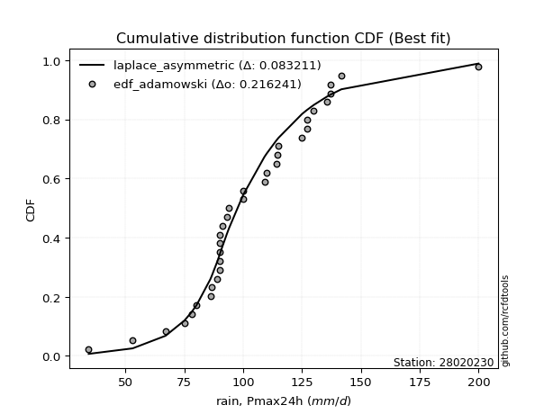</img></img>

</div>


## C. Best fit & Estimate extreme values for specific return periods - Tr


### 1. Best fit (ordered by delta Δ)

|   id |   station | empirical_dist   | p_dist             |     delta |   deltao | eval   |   fit |   n |   loc |   scale |    shape | shape1   | shape2   | shape3   |   best_fit |   best_fit_sort |
|-----:|----------:|:-----------------|:-------------------|----------:|---------:|:-------|------:|----:|------:|--------:|---------:|:---------|:---------|:---------|-----------:|----------------:|
|    0 |  28020230 | edf_hazen        | laplace_asymmetric | 0.0818544 | 0.216241 | Δo > Δ |     1 |  33 |    90 | 19.6915 | 0.722456 |          |          |          |          1 |               1 |
|    1 |  28020230 | edf_gringorten   | laplace_asymmetric | 0.0821838 | 0.216241 | Δo > Δ |     1 |  33 |    90 | 19.6915 | 0.722456 |          |          |          |          1 |               2 |
|    2 |  28020230 | edf_cunnane      | laplace_asymmetric | 0.082402  | 0.216241 | Δo > Δ |     1 |  33 |    90 | 19.6915 | 0.722456 |          |          |          |          1 |               3 |
|    3 |  28020230 | edf_blom         | laplace_asymmetric | 0.0825379 | 0.216241 | Δo > Δ |     1 |  33 |    90 | 19.6915 | 0.722456 |          |          |          |          1 |               4 |
|    4 |  28020230 | edf_tukey        | laplace_asymmetric | 0.0827635 | 0.216241 | Δo > Δ |     1 |  33 |    90 | 19.6915 | 0.722456 |          |          |          |          1 |               5 |
|    5 |  28020230 | edf_beard        | laplace_asymmetric | 0.0828893 | 0.216241 | Δo > Δ |     1 |  33 |    90 | 19.6915 | 0.722456 |          |          |          |          1 |               6 |
|    6 |  28020230 | edf_jenkinson    | laplace_asymmetric | 0.0828893 | 0.216241 | Δo > Δ |     1 |  33 |    90 | 19.6915 | 0.722456 |          |          |          |          1 |               7 |
|    7 |  28020230 | edf_chegodayev   | laplace_asymmetric | 0.0829431 | 0.216241 | Δo > Δ |     1 |  33 |    90 | 19.6915 | 0.722456 |          |          |          |          1 |               8 |
|    8 |  28020230 | edf_adamowski    | laplace_asymmetric | 0.0832113 | 0.216241 | Δo > Δ |     1 |  33 |    90 | 19.6915 | 0.722456 |          |          |          |          1 |               9 |
|    9 |  28020230 | edf_weibull      | laplace_asymmetric | 0.0845282 | 0.216241 | Δo > Δ |     1 |  33 |    90 | 19.6915 | 0.722456 |          |          |          |          1 |              10 |
|   10 |  28020230 | edf_california   | laplace_asymmetric | 0.0879308 | 0.216241 | Δo > Δ |     1 |  33 |    90 | 19.6915 | 0.722456 |          |          |          |          1 |              11 |

:file_folder:Tables: [bestfit_28020230.csv](table/bestfit_28020230.csv) | [extreme_28020230.csv](table/extreme_28020230.csv)


### 2. Extreme values

In hydrology, a return period (or recurrence interval) is the statistical average time between extreme events like floods or droughts of a specific magnitude, indicating how rare an event is, with a 100-year flood, for example, having a 1% chance of occurring in any given year, not that it happens exactly every century. It is a key tool for infrastructure design (like bridges or dams) and risk assessment, calculated from historical data to determine the probability of future events, although it is important to remember it is statistical average, and events can cluster or be missed.

> risk_rate: assuming the return period as the project useful life.

|   id |      tr |   prob_l |     prob_g |   alpha |   betaprime |    chi2 |   crystalball |   dgamma |   erlang |    expon |   exponnorm |       f |   fatiguelife |    fisk |   gamma |   genexpon |   genlogistic |   gibrat |   gompertz |   gumbel_l |   gumbel_r |   halflogistic |   halfnorm |   hypsecant |   invgamma |   invgauss |   invweibull |   johnsonsu |   kstwobign |   laplace |   laplace_asymmetric |   loggamma |   logistic |   lognorm |   maxwell |   mielke |    moyal |   nakagami |       ncf |     nct |    norm |   pareto |   pearson3 |   rayleigh |   recipinvgauss |    rice |        t |   truncnorm |     wald |   weibull_min |   zzgumbel |   zzloggumbel |   station |   n |   risk_rate |
|-----:|--------:|---------:|-----------:|--------:|------------:|--------:|--------------:|---------:|---------:|---------:|------------:|--------:|--------------:|--------:|--------:|-----------:|--------------:|---------:|-----------:|-----------:|-----------:|---------------:|-----------:|------------:|-----------:|-----------:|-------------:|------------:|------------:|----------:|---------------------:|-----------:|-----------:|----------:|----------:|---------:|---------:|-----------:|----------:|--------:|--------:|---------:|-----------:|-----------:|----------------:|--------:|---------:|------------:|---------:|--------------:|-----------:|--------------:|----------:|----:|------------:|
|    0 |    2    | 0.5      | 0.5        | 101.06  |     99.5639 | 101.397 |       103.03  |  97.9713 |  101.397 |  81.9402 |     100.952 | 101.394 |       101.303 | 100.896 | 101.397 |    83.6864 |       101.106 |  94.0521 |    184.695 |    107.944 |    98.1165 |        95.6736 |    106.028 |     103.03  |    101.166 |    99.0014 |      96.7487 |     100.178 |     97.7743 |   103.03  |              97.4453 |    103.136 |    103.03  |   101.232 |   100.472 |  100.906 |  96.5301 |    102.417 |   91.0935 | 100.993 | 103.03  |  81.9402 |    99.8197 |    99.5649 |         101.305 | 102.761 |  99.6243 |     103.03  |  93.3346 |       101.75  |    111.688 |       94.4432 |  28020230 |  33 |    0.75     |
|    1 |    2.33 | 0.570815 | 0.429185   | 106.325 |    105.068  | 106.713 |       108.368 | 103.603  |  106.713 |  92.4368 |     105.91  | 106.709 |       106.606 | 105.476 | 106.713 |    94.4869 |       105.79  |  96.7559 |    185.484 |    112.588 |   103.062  |       100.759  |    106.346 |     107.302 |    106.446 |   104.622  |     102.154  |     104.505 |    104.306  |   106.26  |             101.608  |    108.582 |    107.733 |   106.523 |   106.018 |  105.533 | 101.212  |    107.485 |  105.412  | 106.141 | 108.368 |  92.4368 |   105.151  |   105.192  |         106.607 | 108.003 | 104.202  |     108.368 |  96.8344 |       107.026 |    116.71  |       99.4516 |  28020230 |  33 |    0.729209 |
|    2 |    5    | 0.8      | 0.2        | 127.059 |    127.536  | 127.393 |       128.204 | 120.064  |  127.393 | 144.917  |     125.649 | 127.389 |       127.304 | 124.101 | 127.393 |   148.487  |       124.663 | 112.322  |    188.033 |    127.59  |   124.549  |       123.768  |    107.686 |     124.436 |    127.154 |   127.526  |     125.638  |     123.217 |    132.052  |   122.41  |             122.42   |    128.743 |    125.891 |   127.227 |   127.844 |  124.105 | 122.899  |    127.537 |  177.923  | 126.557 | 128.204 | 144.917  |   126.81   |   127.721  |         127.305 | 128.27  | 122.031  |     128.204 | 116.427  |       127.908 |    138.53  |      124.482  |  28020230 |  33 |    0.67232  |
|    3 |   10    | 0.9      | 0.1        | 141.925 |    144.297  | 141.929 |       141.362 | 132.917  |  141.929 | 192.557  |     140.472 | 141.928 |       141.929 | 138.824 | 141.929 |   197.506  |       139.096 | 130.066  |    189.453 |    135.942 |   142.05   |       142.876  |    108.679 |     138.119 |    141.898 |   144.593  |     144.765  |     139.334 |    153.177  |   137.07  |             141.313  |    142.051 |    139.264 |   141.913 |   143.204 |  138.844 | 141.781  |    141.707 |  250.422  | 141.44  | 141.362 | 192.557  |   142.834  |   143.785  |         141.929 | 142.167 | 135.594  |     141.362 | 137.219  |       142.606 |    156.302 |      149.457  |  28020230 |  33 |    0.651322 |
|    4 |   15    | 0.933333 | 0.0666667  | 149.707 |    153.25   | 149.431 |       147.929 | 140.121  |  149.431 | 220.425  |     148.629 | 149.432 |       149.504 | 147.226 | 149.431 |   226.181  |       147.065 | 142.305  |    190.095 |    139.725 |   151.924  |       153.689  |    109.195 |     145.927 |    149.577 |   153.704  |     155.557  |     149.003 |    164.391  |   145.645 |             152.364  |    148.674 |    146.55  |   149.541 |   151.085 |  147.398 | 152.739  |    148.988 |  297.324  | 149.343 | 147.929 | 220.425  |   151.34   |   152.061  |         149.503 | 149.19  | 143.273  |     147.929 | 150.571  |       150.129 |    166.329 |      165.698  |  28020230 |  33 |    0.644736 |
|    5 |   20    | 0.95     | 0.05       | 154.944 |    159.333  | 154.434 |       152.229 | 145.144  |  154.434 | 240.198  |     154.307 | 154.436 |       154.567 | 153.197 | 154.434 |   246.526  |       152.6   | 151.906  |    190.496 |    142.079 |   158.837  |       161.266  |    109.539 |     151.436 |    154.727 |   159.894  |     163.113  |     156.059 |    171.946  |   151.73  |             160.205  |    153.003 |    151.586 |   154.648 |   156.315 |  153.562 | 160.499  |    153.823 |  333.005  | 154.709 | 152.229 | 240.198  |   157.096  |   157.563  |         154.564 | 153.815 | 148.744  |     152.229 | 160.521  |       155.112 |    173.35  |      178.109  |  28020230 |  33 |    0.641514 |
|    6 |   25    | 0.96     | 0.04       | 158.871 |    163.925  | 158.163 |       155.394 | 149.001  |  158.163 | 255.534  |     158.674 | 158.166 |       158.345 | 157.857 | 158.163 |   262.307  |       156.845 | 159.91   |    190.78  |    143.755 |   164.162  |       167.103  |    109.795 |     155.699 |    158.581 |   164.565  |     168.933  |     161.667 |    177.605  |   156.449 |             166.288  |    156.187 |    155.438 |   158.465 |   160.198 |  158.427 | 166.515  |    157.413 |  362.196  | 158.762 | 155.394 | 255.534  |   161.429  |   161.65   |         158.343 | 157.23  | 153.035  |     155.394 | 168.49   |       158.805 |    178.758 |      188.299  |  28020230 |  33 |    0.639603 |
|    7 |   50    | 0.98     | 0.02       | 170.475 |    177.623  | 169.058 |       164.459 | 160.81   |  169.058 | 303.175  |     172.138 | 169.066 |       169.414 | 172.605 | 169.058 |   311.326  |       169.857 | 188.122  |    191.553 |    148.303 |   180.567  |       185.088  |    110.54  |     168.916 |    169.92  |   178.492  |     186.862  |     179.958 |    194.221  |   171.109 |             185.18   |    165.287 |    167.208 |   169.671 |   171.46  |  174.175 | 185.189  |    167.829 |  462.356  | 170.887 | 164.459 | 303.175  |   174.286  |   173.515  |         169.41  | 167.057 | 166.838  |     164.459 | 194.511  |       169.49  |    195.416 |      223.502  |  28020230 |  33 |    0.63583  |
|    8 |   75    | 0.986667 | 0.0133333  | 176.93  |    185.316  | 175.037 |       169.323 | 167.624  |  175.037 | 331.042  |     179.985 | 175.048 |       175.507 | 181.486 | 175.037 |   340.001  |       177.39  | 207.177  |    191.944 |    150.603 |   190.101  |       195.542  |    110.945 |     176.641 |    176.196 |   186.31   |     197.284  |     191.341 |    203.364  |   179.685 |             196.232  |    170.16  |    174.007 |   175.857 |   177.582 |  183.928 | 196.109  |    173.493 |  528.442  | 177.734 | 169.323 | 331.042  |   181.464  |   179.97   |         175.501 | 172.354 | 175.375  |     169.323 | 210.522  |       175.28  |    205.099 |      246.913  |  28020230 |  33 |    0.634587 |
|    9 |  100    | 0.99     | 0.01       | 181.39  |    190.66   | 179.134 |       172.613 | 172.426  |  179.134 | 350.815  |     185.549 | 179.147 |       179.69  | 187.921 | 179.134 |   360.346  |       182.714 | 221.938  |    192.2   |    152.107 |   196.85   |       202.942  |    111.221 |     182.12  |    180.518 |   191.736  |     204.66   |     199.753 |    209.628  |   185.769 |             204.073  |    173.452 |    178.806 |   180.11  |   181.753 |  191.127 | 203.857  |    177.352 |  579.107  | 182.512 | 172.613 | 350.815  |   186.429  |   184.367  |         179.683 | 175.945 | 181.695  |     172.613 | 222.197  |       179.217 |    211.952 |      264.95   |  28020230 |  33 |    0.633968 |
|   10 |  200    | 0.995    | 0.005      | 191.801 |    203.209  | 188.588 |       180.075 | 183.906  |  188.588 | 398.455  |     198.951 | 188.606 |       189.364 | 203.938 | 188.588 |   409.366  |       195.495 | 262.098  |    192.755 |    155.377 |   213.073  |       220.732  |    111.853 |     195.32  |    190.563 |   204.471  |     222.393  |     221.251 |    224.055  |   200.429 |             222.966  |    180.908 |    190.32  |   189.973 |   191.294 |  209.531 | 222.523  |    186.18  |  715.637  | 193.815 | 180.075 | 398.455  |   198.028  |   194.429  |         189.355 | 184.113 | 197.995  |     180.075 | 251.276  |       188.199 |    228.427 |      313.89   |  28020230 |  33 |    0.633042 |
|   11 |  250    | 0.996    | 0.004      | 195.067 |    207.165  | 191.521 |       182.355 | 187.578  |  191.521 | 413.792  |     203.265 | 191.542 |       192.372 | 209.259 | 191.521 |   425.147  |       199.601 | 276.507  |    192.919 |    156.339 |   218.289  |       226.451  |    112.047 |     199.569 |    193.701 |   208.482  |     228.093  |     228.562 |    228.52   |   205.149 |             229.048  |    183.183 |    194.016 |   193.047 |   194.231 |  215.8   | 228.532  |    188.898 |  764.386  | 197.407 | 182.355 | 413.792  |   201.667  |   197.527  |         192.362 | 186.615 | 203.611  |     182.355 | 260.896  |       190.958 |    233.723 |      331.469  |  28020230 |  33 |    0.632858 |
|   12 |  500    | 0.998    | 0.002      | 204.996 |    219.239  | 200.343 |       189.118 | 198.926  |  200.343 | 461.432  |     216.665 | 200.37  |       201.44  | 226.334 | 200.343 |   474.166  |       212.338 | 326.306  |    193.388 |    159.097 |   234.477  |       244.202  |    112.626 |     212.768 |    203.2   |   220.711  |     245.788  |     252.567 |    241.901  |   219.809 |             247.94   |    189.921 |    205.479 |   202.333 |   202.995 |  236.44  | 247.198  |    197.008 |  932.773  | 208.463 | 189.118 | 461.432  |   212.715  |   206.768  |         201.428 | 194.048 | 222.394  |     189.118 | 291.485  |       199.171 |    250.163 |      392.551  |  28020230 |  33 |    0.632489 |
|   13 |  750    | 0.998667 | 0.00133333 | 210.674 |    226.171  | 205.323 |       192.874 | 205.529  |  205.323 | 489.3    |     224.504 | 205.354 |       206.572 | 236.725 | 205.323 |   502.841  |       219.78  | 359.239  |    193.638 |    160.571 |   243.941  |       254.579  |    112.95  |     220.488 |    208.604 |   227.724  |     256.132  |     267.562 |    249.418  |   228.384 |             258.992  |    193.658 |    212.177 |   207.603 |   207.897 |  249.391 | 258.117  |    201.543 | 1044.49   | 214.883 | 192.874 | 489.3    |   219.021  |   211.936  |         206.558 | 198.186 | 234.434  |     192.874 | 309.825  |       203.753 |    259.773 |      433.348  |  28020230 |  33 |    0.632366 |
|   14 | 1000    | 0.999    | 0.001      | 214.653 |    231.04   | 208.785 |       195.461 | 210.199  |  208.785 | 509.072  |     230.065 | 208.819 |       210.145 | 244.286 | 208.785 |   523.186  |       225.059 | 384.441  |    193.807 |    161.563 |   250.654  |       261.94   |    113.173 |     225.966 |    212.38  |   232.645  |     263.47   |     278.648 |    254.625  |   234.469 |             266.833  |    196.228 |    216.926 |   211.278 |   211.285 |  258.999 | 265.864  |    204.678 | 1130.36   | 219.425 | 195.461 | 509.072  |   223.433  |   215.507  |         210.13  | 201.038 | 243.506  |     195.461 | 323.018  |       206.915 |    266.59  |      464.832  |  28020230 |  33 |    0.632305 |

<div align="center">

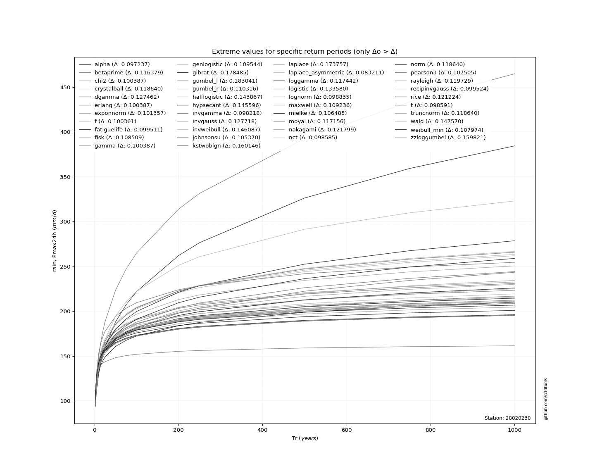</img>

</div>


<div align="center">

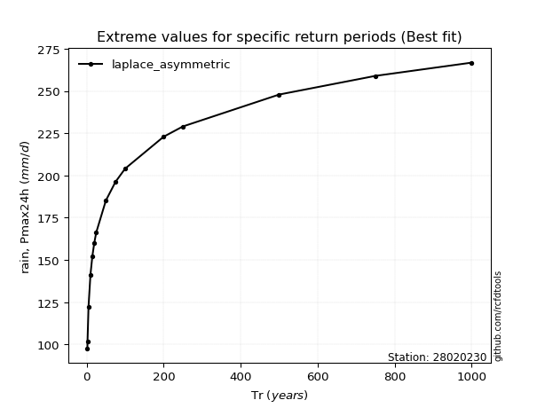</img>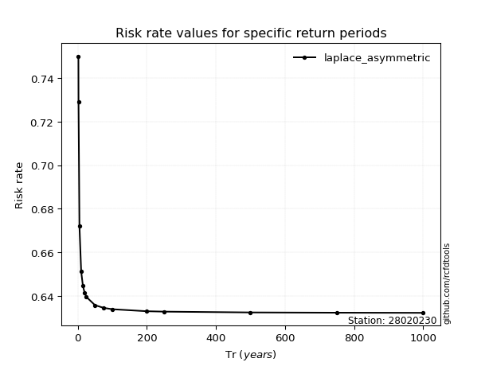</img>

</div>


<sub>**APP DISCLAIMER**: NO WARRANTY - This software is provided by [github.com/rcfdtools](https://github.com/rcfdtools) "as is", without any express or implied warranty, including warranties of merchantability, fitness for a particular purpose, or non-infringement. There is no guarantee that the software will be error-free or operate without interruption. LIMITATION OF LIABILITY - Neither the authors nor copyright holders will be liable for claims or damages arising from the software or its use. You are responsible for determining if the software is appropriate for your use and assume all associated risks, including errors, legal compliance, and data loss. NO PROFESSIONAL ADVICE - The software provides general information and does not offer professional advice. It should not replace consultation with professional advisors.</sub>